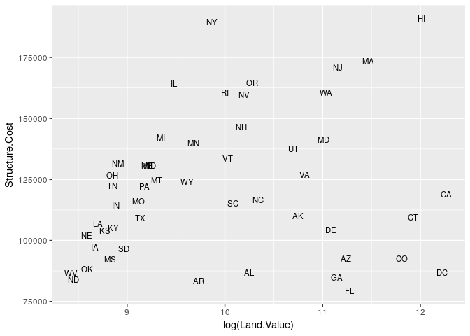
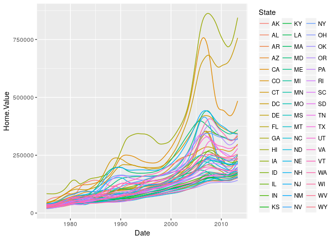
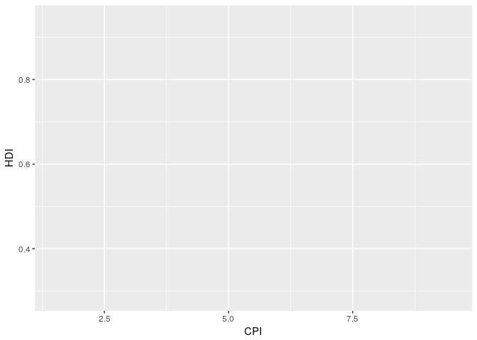

REading in data files
---------------------

    cocoli_data <- read.table("~/Desktop/eeb-177/class-assignments/classwork-tues-2-21-17/cocoli.txt", header = TRUE)

    cocoli_data

    ##         tag spcode     x     y dbh1 dbh2 dbh3 recr1 recr2 recr3 pom1 pom2
    ## 1    000001 PROTTE   3.0   0.9  171  267  277     A     A     A    1    2
    ## 2    000002 COCCPA   0.1   0.6   13   14   17     A     A     A    1    1
    ## 3    000003 EUGEPR   1.3   2.3   26   33   39     A     A     A    1    2
    ## 4    000004 PROTTE   2.2   3.4   10   17   19     A     A     A    1    1
    ## 5    000005 CLAVME   3.5   3.7   14   15   15     A     A     A    1    1
    ## 6    000006 PROTTE   4.3   4.7   12   26   25     A     A     A    1    2
    ## 7    000007 POUTCA   3.7   7.0   15   19   19     A     A     A    1    1
    ## 8    000008 SWARS1   4.1   6.3   78   78   78     A     A     A    1    1
    ## 9    000009 RINOLI   1.5  11.0   29   30   29     A     A     A    1    1
    ## 10   000010 COCCPA   0.9  14.0   28   29   33     A     A     A    1    1
    ## 11   000011 CAL2CA   4.0  13.2   69   69   65     A     A     A    1    1
    ## 12   000012 CLAVME   3.4  12.7   11   11   10     A     A     A    1    1
    ## 13   000013 BACTMA   2.0  16.2   33   38    0     A     A     B    1    1
    ## 14   000014 TRI2PL   3.8  19.7  316  323  330     A     A     A    1    2
    ## 15   000015 FARAOC   4.9  18.6   15   15   16     A     A     A    1    1
    ## 16   000016 FARAOC   4.0  18.7   54   57   57     A     A     A    1    1
    ## 17   000017 EUGEPR   3.6  18.4   14   14   13     A     A     A    1    1
    ## 18   000018 PROTTE   8.8  16.3   11   21   24     A     A     A    1    1
    ## 19   000019 ALIBED   8.8  15.6   21   28   29     A     A     A    1    1
    ## 20   000020 CUPASY   8.3  15.5   12   18   20     A     A     A    1    1
    ## 21   000021 POSOLA   7.1  15.6   26   25   25     A     A     A    1    2
    ## 22   000022 CLAVME   6.3  17.0   13   12   11     A     A     A    1    1
    ## 23   000023 CLAVME   7.2  16.9   10    0    0     A     B     B    1    2
    ## 24   000024 POSOLA   8.6  19.3   49   55   54     A     A     A    1    1
    ## 25   000025 SWARS1   6.0  10.1   68   29   35     A     A     A    1    1
    ## 26   000026 COCCPA   6.8  10.5   73   73   74     A     A     A    1    1
    ## 27   000027 THEVAH   9.3  14.8   14   27   27     A     A     A    1    1
    ## 28   000028 SWARS1   9.7  13.7   73   76   76     A     A     A    1    1
    ## 29   000029 MICOAR   9.0   5.1   15   -1   -1     A     D     D    1    0
    ## 30   000030 LACIAG   6.9   8.7   12   27   27     A     A     A    1    1
    ## 31   000031 SWARS1   9.6   8.3  201  205  205     A     A     A    1    1
    ## 32   000032 POSOLA   9.6   7.2   27   31   32     A     A     A    1    1
    ## 33   000033 FARAOC   9.1   6.3   41   49   49     A     A     A    1    1
    ## 34   000034 HEISCO   8.3   6.4   15   23   27     A     A     A    1    1
    ## 35   000035 AST2GR   6.7   0.3   58   61   60     A     A     A    1    1
    ## 36   000036 EUGEPR   6.2   0.7   10   11   11     A     A     A    1    1
    ## 37   000037 POUTCA  10.9  38.9   15   13   15     A     A     A    1    1
    ## 38   000038 COCCPA   6.9   3.5   19   22   23     A     A     A    1    1
    ## 39   000039 TRI2HI  14.5   0.9  485  490  491     A     A     A    1    1
    ## 40   000040 POSOLA  12.7   0.6   11   11   12     A     A     A    1    1
    ## 41   000041 EUGEPR  11.7   0.9   18   20   20     A     A     A    1    1
    ## 42   000042 ARDIRE  10.3   3.7  115  118  127     A     A     A    1    1
    ## 43   000043 GUARGL  12.2   4.6   31   36   36     A     A     A    1    1
    ## 44   000044 EUGEPR  12.7   4.5   14   15   16     A     A     A    1    1
    ## 45   000045 POSOLA  13.7   2.4   38   45   46     A     A     A    1    1
    ## 46   000046 AST2GR  13.3   3.3   95   99  102     A     A     A    1    1
    ## 47   000047 EUGEPR  13.8   3.6   12   16   17     A     A     A    1    1
    ## 48   000048 BACTMA  13.1   5.8   28   31   30     A     A     A    1    1
    ## 49   000049 SLOATE  11.1   8.5   24   31   32     A     A     A    1    1
    ## 50   000050 BURSSI  13.7   8.9  352  362  371     A     A     A    1    1
    ## 51   000051 POUTCA  13.8   8.4   34   36   37     A     A     A    1    1
    ## 52   000052 PROTTE  14.8   9.8   13   30   30     A     A     A    1    1
    ## 53   000053 EUGEPR  13.2   9.0   21   21    0     A     A     B    1    1
    ## 54   000054 EUGEPR  12.1   9.9   28   20   22     A     A     A    1    1
    ## 55   000055 FARAOC  13.1  11.6   12   14   17     A     A     A    1    1
    ## 56   000056 SWARS1  12.9  11.8   15   19   21     A     A     A    1    1
    ## 57   000057 BACTMA  11.6  10.8   31   40   40     A     A     A    1    1
    ## 58   000058 CUPASY  10.2  10.5   41   44   45     A     A     A    1    1
    ## 59   000059 PALIGU  11.0  13.7   18   23   -1     A     A     D    1    1
    ## 60   000060 CLAVME  10.5  13.9   17   17   19     A     A     A    1    1
    ## 61   000061 SOROAF  12.3  13.5   19   18   18     A     A     A    1    1
    ## 62   000062 EUGECO  11.4  14.9   18   23   23     A     A     A    1    1
    ## 63   000063 CHR2CA  11.5  14.5   13   17   17     A     A     A    1    1
    ## 64   000064 EUGECO  12.9  14.7   15   20   21     A     A     A    1    1
    ## 65   000065 COU2CU  14.0  14.1   13   16   21     A     A     A    1    1
    ## 66   000066 TRI2PL  14.3  13.4  241  258  260     A     A     A    1    1
    ## 67   000067 SWARS1  14.6  12.6   25   27   29     A     A     A    1    1
    ## 68   000068 EUGEPR  13.5  12.9   12   12   13     A     A     A    1    1
    ## 69   000069 COCCPA  13.2  15.5   21   26   27     A     A     A    1    1
    ## 70   000070 FARAOC  12.7  15.3   30   33   34     A     A     A    1    1
    ## 71   000071 POUTCA  12.4  16.0   16   19   20     A     A     A    1    1
    ## 72   000072 PICRLA  12.2  15.6   23   32   37     A     A     A    1    1
    ## 73   000073 FARAOC  10.1  16.2   20   22   -1     A     A     D    1    1
    ## 74   000074 CAVAPL  10.8  17.9 1332 1375 1361     A     A     A    1    1
    ## 75   000075 COU2CU  13.0  19.5   56   26   27     A     A     A    1    1
    ## 76   000076 SWARS1  14.4  18.4   62   67   69     A     A     A    1    1
    ## 77   000077 FARAOC  14.7  16.8   27   33   36     A     A     A    1    1
    ## 78   000078 EUGEPR  14.3  16.3   14   21   22     A     A     A    1    1
    ## 79   000079 SLOATE  13.7  17.0   15   14   14     A     A     A    1    1
    ## 80   000080 CUPARU  19.1  16.0   16   18   20     A     A     A    1    1
    ## 81   000081 PICRLA  17.7  13.5   19    0   -1     A     B     D    1    2
    ## 82   000082 ACALDI  17.1  17.5   49   23   44     A     A     A    1    1
    ## 83   000083 MYRCGA  15.6  18.0   21   23   26     A     A     A    1    1
    ## 84   000084 EUGEPR  15.7  19.6   15   27   16     A     A     A    1    1
    ## 85   000085 NECTMA  18.6  18.9   21   35   39     A     A     A    1    1
    ## 86   000086 BROSAL  18.8  19.0   22   23   24     A     A     A    1    1
    ## 87   000087 PICRLA  19.4  19.8   26   39   41     A     A     A    1    1
    ## 88   000088 CUPASY  19.0  18.2   28   31   34     A     A     A    1    1
    ## 89   000089 FARAOC  19.5  17.3   38   60   59     A     A     A    1    1
    ## 90   000090 PROTTE  18.0  11.8   28   34   35     A     A     A    1    1
    ## 91   000091 CAL2CA  16.7  11.6   74   88   88     A     A     A    1    1
    ## 92   000092 FARAOC  16.4  12.7   22   31   32     A     A     A    1    1
    ## 93   000093 FARAOC  15.2  13.8   12   18   20     A     A     A    1    1
    ## 94   000094 COCCPA  15.5  14.7   11   14   13     A     A     A    1    1
    ## 95   000095 CUPASY  17.0  14.5   32   34   34     A     A     A    1    1
    ## 96   000096 NECTMA  18.8  12.1   15    0   10     A     B     A    1    2
    ## 97   000097 TROPRA  19.8   5.8   20   25   24     A     A     A    1    1
    ## 98   000098 CAVAPL  16.1   7.4 1500 1515 1517     A     A     A    1    2
    ## 99   000099 SWARS1  15.4   5.2   62   63   64     A     A     A    1    1
    ## 100  000100 AST2GR  15.8   7.4   17   20   20     A     A     A    1    1
    ## 101  000101 GUARGL  16.1   8.1   68   69   69     A     A     A    1    1
    ## 102  000102 EUGEPR  15.8   9.4   24   38   28     A     A     A    1    1
    ## 103  000103 FARAOC  17.0   9.8   12   15   18     A     A     A    1    1
    ## 104  000104 CLAVME  17.6   9.4   27   26   26     A     A     A    1    1
    ## 105  000105 TRIPCU  18.7   8.9   13   17   17     A     A     A    1    1
    ## 106  000106 PROTTE  18.1   8.1   25   34   39     A     A     A    1    1
    ## 107  000107 TROPRA  18.1   7.6   16   18   18     A     A     A    1    1
    ## 108  000108 CLAVME  17.2   7.8   22   22   22     A     A     A    1    1
    ## 109  000109 BROSAL  16.6   7.5   13   15   16     A     A     A    1    1
    ## 110  000110 COU2CU  16.0   3.0   39   44   48     A     A     A    1    1
    ## 111  000111 BACTMA  15.3   4.8   28   31   31     A     A     A    1    1
    ## 112  000112 TRI2PL  17.6   4.4  139  139  139     A     A     A    1    1
    ## 113  000113 ALIBED  18.4   4.4   15   11   12     A     A     A    1    1
    ## 114  000114 MYRCGA  18.8   4.8   68   74   -1     A     A     D    1    1
    ## 115  000115 ANNOHA  19.8   2.5   36   37   41     A     A     A    1    1
    ## 116  000116 COU2CU  18.9   2.5   25   29   30     A     A     A    1    1
    ## 117  000117 EUGEPR  18.2   3.1   11   10   10     A     A     A    1    1
    ## 118  000118 PROTTE  17.5   3.2  128  157  160     A     A     A    1    1
    ## 119  000119 SWARS1   3.5  20.2   22   24   23     A     A     A    1    1
    ## 120  000120 COCCPA   3.1  20.5   66   69   65     A     A     A    1    1
    ## 121  000121 GUARGL   4.2 296.1   22   25   25     A     A     A    1    1
    ## 122  000122 COCCPA   2.0  20.4   12   16   17     A     A     A    1    1
    ## 123  000123 COU2CU   1.7  24.5   23   33   35     A     A     A    1    1
    ## 124  000124 TRI2PL   2.7  23.5  108  111  111     A     A     A    1    1
    ## 125  000125 FARAOC   4.2  22.1   20   21   23     A     A     A    1    1
    ## 126  000126 CUPASY   1.9  22.6   18   19   22     A     A     A    1    1
    ## 127  000127 CUPASY   1.9  22.8   23   24   26     A     A     A    1    1
    ## 128  000128 EUGEPR   3.9  25.9   12   14   14     A     A     A    1    1
    ## 129  000129 AST2GR   1.3  29.6   10    0   10     A     B     A    1    2
    ## 130  000130 POUTCA   4.7  29.7  105  112  114     A     A     A    1    1
    ## 131  000131 SLOATE   2.9  31.1   23   26   26     A     A     A    1    1
    ## 132  000132 CAVAPL   2.6  33.6 1363 1355 1361     A     A     A    1    1
    ## 133  000133 ALSEBL   4.8  32.6  181  188  190     A     A     A    1    1
    ## 134  000134 SWARS2   2.2  34.4   91   97   98     A     A     A    1    1
    ## 135  000135 DALBRE   2.5  34.3  301  316  322     A     A     A    1    2
    ## 136  000136 COU2CU   0.2  35.6   52   54   54     A     A     A    1    1
    ## 137  000137 COU2CU   0.2  37.9   51   57   59     A     A     A    1    1
    ## 138  000138 SWARS1   7.8  36.0  112  122  127     A     A     A    1    1
    ## 139  000139 CAL2CA   6.7  35.2  126  240  247     A     A     A    1    1
    ## 140  000140 COU2CU   6.6  35.6   34   37   40     A     A     A    1    1
    ## 141  000141 IXORFL   6.8  39.3   65   76   77     A     A     A    1    1
    ## 142  000142 HEISCO   8.5  38.9   11   18   18     A     A     A    1    1
    ## 143  000143 CASEGU   9.7  38.6  129   32   35     A     A     A    1    1
    ## 144  000144 EUGEPR   9.3  37.7   13   17   18     A     A     A    1    1
    ## 145  000145 SWARS1   7.9  31.7   44   54   55     A     A     A    1    1
    ## 146  000146 AST2GR   5.1  32.6   29   19   20     A     A     A    1    1
    ## 147  000147 ALBIAD   5.7  34.4   14   14   14     A     A     A    1    1
    ## 148  000148 AST2GR   5.8  34.8   22   23   23     A     A     A    1    1
    ## 149  000149 EUGEPR   9.6  31.4   12   19   20     A     A     A    1    1
    ## 150  000150 POUTCA   8.4  25.4   10   10   11     A     A     A    1    1
    ## 151  000151 NEEADE   6.7  26.5   34   34   35     A     A     A    1    1
    ## 152  000152 SWARS1   5.5  29.8   35   47   55     A     A     A    1    1
    ## 153  000153 PROTTE   8.4  20.0   57   78   85     A     A     A    1    1
    ## 154  000154 TRIPCU   6.4  24.5   21   23   23     A     A     A    1    1
    ## 155  000155 CUPASY   6.7  23.7   75   79   57     A     A     A    1    1
    ## 156  000156 HEISCO   9.6  25.9   15   22   24     A     A     A    1    1
    ## 157  000157 SWARS1  11.5  24.9  110  121  126     A     A     A    1    1
    ## 158  000158 NEEADE  14.8  22.3   13   16   16     A     A     A    1    1
    ## 159  000159 CAL2CA  14.7  22.4   50   51   51     A     A     A    1    1
    ## 160  000161 EUGECO  12.9  22.5   11   19    0     A     A     B    1    1
    ## 161  000162 POSOLA  12.4  25.3   25   25   28     A     A     A    1    1
    ## 162  000163 IXORFL  12.2  25.1   31   29   30     A     A     A    1    1
    ## 163  000164 BROSAL  10.0  28.8   10   14   15     A     A     A    1    1
    ## 164  000166 ANTITR  12.1  29.9  212  222  221     A     A     A    1    1
    ## 165  000167 SOROAF   1.5 228.9   11   11   11     A     A     A    1    1
    ## 166  000168 COU2CU  16.2 274.2   33   34   32     A     A     A    1    1
    ## 167  000169 AST2GR  11.7  28.4   45   48   50     A     A     A    1    1
    ## 168  000170 CUPASY  14.2  29.1   39   33   44     A     A     A    1    1
    ## 169  000171 ALBIAD  12.9  30.0   58   66   68     A     A     A    1    1
    ## 170  000172 COU2CU  10.1  31.8   20   31   32     A     A     A    1    1
    ## 171  000173 AST2GR  11.4  34.0   62   67   66     A     A     A    1    1
    ## 172  000174 MACLTI  19.2  38.9   -2   16   17     P     A     A    0    1
    ## 173  000175 COU2CU  12.7  33.9   19   20   22     A     A     A    1    1
    ## 174  000176 CASEGU  14.7  32.9   62   63   63     A     A     A    1    1
    ## 175  000177 CAL2CA  14.0  36.4   83   76   76     A     A     A    1    1
    ## 176  000178 EUGEPR  13.4  35.9   24   26   28     A     A     A    1    1
    ## 177  000179 CAL2CA  11.1  35.7  320  345  344     A     A     A    1    1
    ## 178  000180 AST2GR  10.4  37.3   37   45   45     A     A     A    1    1
    ## 179  000181 VITECO  10.1  38.0   17   17   17     A     A     A    1    1
    ## 180  000182 CAL2CA  11.0  37.7  143  171  174     A     A     A    1    2
    ## 181  000183 TRI2PL  14.1  39.1  129  133  133     A     A     A    1    1
    ## 182  000184 AST2GR  14.8  39.5   59   68   73     A     A     A    1    1
    ## 183  000185 EUGEPR  13.1  37.1   23   27   30     A     A     A    1    1
    ## 184  000186 EUGEPR  14.7  37.9   11   28   19     A     A     A    1    1
    ## 185  000187 EUGEPR  15.1  39.5   13   15   15     A     A     A    1    1
    ## 186  000188 AST2GR  16.3  39.3   25   34   38     A     A     A    1    1
    ## 187  000189 EUGEPR  18.2  39.1   31   33   37     A     A     A    1    1
    ## 188  000190 UN2_CO  18.7  39.7   11   -1   -1     A     D     D    1    0
    ## 189  000191 TRIPCU  19.7  38.1   68   63   65     A     A     A    1    1
    ## 190  000192 NECTMA  18.1  37.9   11   14   15     A     A     A    1    1
    ## 191  000193 EUGEPR  17.3  37.1   28   21   21     A     A     A    1    1
    ## 192  000194 AST2GR  18.9  31.1   16    0    0     A     B     B    1    2
    ## 193  000195 CAL2CA  15.8  31.4   65   -9   66     A     *     A    1    0
    ## 194  000196 SWARS1  16.4  33.9   91   95   95     A     A     A    1    1
    ## 195  000197 COU2CU  18.6  33.2   11   13   15     A     A     A    1    1
    ## 196  000198 COU2CU  18.0  33.0   19   23   24     A     A     A    1    1
    ## 197  000199 PROTTE  18.2  25.7   38   42   46     A     A     A    1    1
    ## 198  000200 SWARS1  18.3  26.2   99   99  101     A     A     A    1    1
    ## 199  000201 CAL2CA  15.8  25.4   71   64   64     A     A     A    1    1
    ## 200  000202 OURALU  15.5  29.0   13   13   14     A     A     A    1    1
    ## 201  000203 ALBIAD  15.1  29.5   26   27   28     A     A     A    1    1
    ## 202  000204 COU2CU  16.3  29.2   12   14   14     A     A     A    1    1
    ## 203  000205 COU2CU  19.2  27.7   34   38   38     A     A     A    1    1
    ## 204  000206 PIT1RU  18.6  28.9   14   -9    0     A     *     B    1    0
    ## 205  000207 BROSAL  19.5  26.8   13   17   17     A     A     A    1    1
    ## 206  000208 COU2CU  16.5  28.0   13   14    0     A     A     B    1    1
    ## 207  000209 CAVAPL  17.0  28.7  331  331  335     A     A     A    1    1
    ## 208  000210 PROTTE  15.2 276.2   13   15   16     A     A     A    1    1
    ## 209  000211 INGAVE  15.4  21.4   62   62   63     A     A     A    1    1
    ## 210  000212 BROSAL  16.1  22.4   15   18   20     A     A     A    1    1
    ## 211  000213 TAB1RO  16.4  23.4  344  344  343     A     A     A    1    1
    ## 212  000214 SWARS1   0.4  42.8   99   96   96     A     A     A    1    1
    ## 213  000215 CAL2CA   3.7  43.3   21   26   28     A     A     A    1    1
    ## 214  000216   ANN1   1.0  46.8   15   16   16     A     A     A    1    1
    ## 215  000217 GENIAM   0.5  47.1   14   16   17     A     A     A    1    1
    ## 216  000218 SWARS1   0.4  47.6   61   67   67     A     A     A    1    1
    ## 217  000219 CAVAPL   1.8  48.4  910  957  982     A     A     A    1    1
    ## 218  000220 AST2GR   3.3  48.1   14   15   17     A     A     A    1    1
    ## 219  000221 EUGEPR   4.2  52.3   -2   22   20     P     A     A    0    1
    ## 220  000222 TRIPCU   4.8  48.1   14   23   25     A     A     A    1    1
    ## 221  000223 PROTTE   4.3  45.6  168  198  194     A     A     A    1    1
    ## 222  000224 PROTTE   3.2  50.2   24   39   40     A     A     A    1    1
    ## 223  000225 PROTTE   3.8  52.9   20   24   23     A     A     A    1    1
    ## 224  000226 SWARS1   5.0 277.5   11   12   13     A     A     A    1    1
    ## 225  000227 COCCPA   6.8  56.9   63   72   74     A     A     A    1    2
    ## 226  000228 THEVAH   8.6  56.4   29   43   45     A     A     A    1    1
    ## 227  000229 SWARS1   9.8  58.4   40   45   46     A     A     A    1    1
    ## 228  000230 EUGEPR   9.6  51.7   37   43   47     A     A     A    1    1
    ## 229  000231 CLAVME   9.2  51.2   18   19   20     A     A     A    1    1
    ## 230  000232 EUGEPR   6.3  54.2   29   27   33     A     A     A    1    1
    ## 231  000233 CAL2CA   5.3  52.1   91  124  132     A     A     A    1    1
    ## 232  000234 AST2GR   6.5  49.4   32   14   14     A     A     A    1    2
    ## 233  000235 ANNOHA   8.4  47.9   30   34   33     A     A     A    1    1
    ## 234  000236 ANNOHA   7.0  46.4   41   37   42     A     A     A    1    1
    ## 235  000237 EUGEPR   6.7  44.7   17   16   12     A     A     A    1    1
    ## 236  000238 FARAOC  17.5 279.4   16   16   16     A     A     A    1    1
    ## 237  000239 AST2GR  12.1  40.5   14   13   14     A     A     A    1    1
    ## 238  000240 PROTTE  10.4  41.5   33   32   33     A     A     A    1    1
    ## 239  000241 AST2GR  13.4  43.3   65   75   81     A     A     A    1    1
    ## 240  000242 SPONRA  12.7  39.9   23   28   30     A     A     A    1    1
    ## 241  000243 SWARS1  10.9  45.1  182  190  190     A     A     A    1    1
    ## 242  000244 TRIPCU  11.1  48.4   37   46   55     A     A     A    1    1
    ## 243  000245 EUGEPR  10.6  47.6   25   -9    0     A     *     B    1    0
    ## 244  000246 EUGEPR  10.4  47.2   11   -9    0     A     *     B    1    0
    ## 245  000247 CUPASY  11.1  53.0   25   24   25     A     A     A    1    1
    ## 246  000248 ERY2PA  16.3 264.1   16   18   18     A     A     A    1    1
    ## 247  000249 BACTMA   4.0 231.6   28   28   28     A     A     A    1    1
    ## 248  000250 RANDFO  11.8  54.4   30   14   15     A     A     A    1    1
    ## 249  000251 ALIBED  14.4  54.8   13   12   12     A     A     A    1    1
    ## 250  000252 AST2GR  13.5  53.8   18   31   32     A     A     A    1    1
    ## 251  000253 TRIPCU  14.5  56.2   37   -9    0     A     *     B    1    0
    ## 252  000254 EUGEPR  13.5  55.9   39   28   30     A     A     A    1    1
    ## 253  000255 EUGEPR  11.4  56.1   14   19   19     A     A     A    1    1
    ## 254  000256 EUGEPR  10.7  59.2   42   46   46     A     A     A    1    1
    ## 255  000257 TRI2PL  12.3  58.2  125  140  141     A     A     A    1    1
    ## 256  000258 FARAOC  14.5  57.6   27   39   40     A     A     A    1    1
    ## 257  000259 SWARS1  14.7  57.1   11   15   15     A     A     A    1    2
    ## 258  000260 EUGEPR  12.9  56.7   34   36   40     A     A     A    1    1
    ## 259  000261 CAL2CA  18.6  55.2   11   11   -1     A     A     D    1    1
    ## 260  000262 ANTITR  17.5  55.9   37   40   43     A     A     A    1    1
    ## 261  000263 CLAVME  16.2  56.2   13   13   14     A     A     A    1    1
    ## 262  000264 POUTCA  15.3  56.4   24   25    0     A     A     B    1    1
    ## 263  000265 TRI2PL  15.4  56.6  205  225  225     A     A     A    1    1
    ## 264  000266 CLAVME  16.3  56.7   19   19   19     A     A     A    1    1
    ## 265  000267 CASECO  16.7  58.0   18   24   24     A     A     A    1    1
    ## 266  000268 SWARS1  15.9  58.6   23   25   25     A     A     A    1    1
    ## 267  000269 CHR2CA  15.8  59.3  360  400  297     A     A     A    1    2
    ## 268  000270 SWARS1  16.6  59.3   26   26   29     A     A     A    1    1
    ## 269  000271 HEISCO  17.3  59.8   20   24   25     A     A     A    1    1
    ## 270  000272 CLAVME  18.2  59.7   18   18   18     A     A     A    1    1
    ## 271  000273 SWARS1  18.6  59.7   19   19   21     A     A     A    1    1
    ## 272  000274 POCHSE  19.3  59.8   40   -1   -1     A     D     D    1    0
    ## 273  000275 EUGEPR  19.3  59.0   25   25   28     A     A     A    1    2
    ## 274  000276 COCCPA  17.2  52.0   28   36   38     A     A     A    1    1
    ## 275  000277 EUGEPR  17.3  52.4   17   19   22     A     A     A    1    1
    ## 276  000278 COU2CU  18.2  54.2   24   32   32     A     A     A    1    2
    ## 277  000279 SWARS1  17.7  54.3   55   62   65     A     A     A    1    1
    ## 278  000280 EUGEPR  17.5  54.2   16   -9    0     A     *     B    1    0
    ## 279  000281 CLAVME  16.3  54.8   10   10    0     A     A     B    1    1
    ## 280  000282 LUEHSE  18.5  54.9   24   25   27     A     A     A    1    1
    ## 281  000283 SWARS1  18.7  54.4   15   20   19     A     A     A    1    1
    ## 282  000284 EUGEPR  19.2  54.1   10   14   16     A     A     A    1    1
    ## 283  000285 COCCPA  19.0  53.9   32   30   28     A     A     A    1    1
    ## 284  000286 CLAVME  19.0  53.1   11   10    0     A     A     B    1    1
    ## 285  000287 BROSAL  18.6  52.8   10   11   12     A     A     A    1    1
    ## 286  000288 IXORFL  18.8  45.0   28   36   37     A     A     A    1    1
    ## 287  000289 BROSAL  18.6  45.8   11   19   21     A     A     A    1    1
    ## 288  000290 GENIAM  16.3  45.9   47   53   50     A     A     A    1    1
    ## 289  000291 POUTCA  17.2  48.8   16   32   34     A     A     A    1    1
    ## 290  000292 CUPARU  19.1  41.5   29   47   47     A     A     A    1    1
    ## 291  000293 CHR2CA  17.7  40.2   22   22   23     A     A     A    1    1
    ## 292  000294 COCCPA   6.5  60.4   14   -9   21     A     *     A    1    0
    ## 293  000295 EUGEPR  16.3  40.4   13   18   18     A     A     A    1    1
    ## 294  000296 BROSAL  15.9  40.6   12   14   14     A     A     A    1    1
    ## 295  000297 AST2GR  15.9  41.8   24   27   28     A     A     A    1    1
    ## 296  000298 POSOLA  15.9  43.1   25   23   23     A     A     A    1    1
    ## 297  000299 SWARS1  19.3  44.1   18   38   34     A     A     A    1    1
    ## 298  000300 EUGEPR   3.1  61.7   57   58   58     A     A     A    1    1
    ## 299  000301 FARAOC  10.9  62.4   14   22   25     A     A     A    1    1
    ## 300  000302 TRIPCU   0.7  60.5   59   95  100     A     A     A    1    1
    ## 301  000303 ANTITR   3.6  64.9   13   15   15     A     A     A    1    1
    ## 302  000304 COU2CU   4.0  63.6   14   11   17     A     A     A    1    1
    ## 303  000305 CAL2CA   2.0  62.9   25   28   30     A     A     A    1    2
    ## 304  000306 TRI2PL   4.4  66.2  267  299  303     A     A     A    1    1
    ## 305  000307 FISSFE   2.3  65.7   38   43   43     A     A     A    1    1
    ## 306  000308 EUGEPR   0.6  65.4   17   19   20     A     A     A    1    2
    ## 307  000309 EUGEPR   0.2  66.7   15   16   16     A     A     A    1    1
    ## 308  000310 CUPASY   1.5  68.8   33   36   37     A     A     A    1    1
    ## 309  000311 EUGEPR   4.8  69.5   11   17   18     A     A     A    1    1
    ## 310  000312 FARAOC   4.3  68.4   14   29   25     A     A     A    1    1
    ## 311  000313 TURNPA   2.7  66.7   14   18   19     A     A     A    1    1
    ## 312  000314 NEEADE   2.4  67.2   19   33   41     A     A     A    1    1
    ## 313  000315 COU2CU   0.4  70.5   25   24   25     A     A     A    1    1
    ## 314  000316 FARAOC   4.6  72.2   13   16   17     A     A     A    1    1
    ## 315  000317 PROTTE   0.5  79.6   11   26   34     A     A     A    1    1
    ## 316  000318 EUGEPR   4.5  77.1   27   28   28     A     A     A    1    1
    ## 317  000319 FARAOC   3.4  77.7   22   27   28     A     A     A    1    1
    ## 318  000320 PROTTE   6.5  75.0   12   14   16     A     A     A    1    1
    ## 319  000321 FARAOC   7.0  76.1   18   17    0     A     A     B    1    1
    ## 320  000322 EUGEPR   5.4  79.6   32   32   32     A     A     A    1    1
    ## 321  000323 TRI2PL   9.7  70.2  261  263  258     A     A     A    1    1
    ## 322  000324 FARAOC   5.9  70.4   14   19   21     A     A     A    1    1
    ## 323  000325 EUGEPR   5.6  72.2   13   15   18     A     A     A    1    1
    ## 324  000326 CUPASY   6.8  74.1  134  138  141     A     A     A    1    1
    ## 325  000327 COCCPA   7.9  73.2  114  128  129     A     A     A    1    1
    ## 326  000328 EUGEPR   8.1  71.8   21   24   25     A     A     A    1    1
    ## 327  000329 SWARS1   9.7  65.3   17   19   19     A     A     A    1    1
    ## 328  000330 HEISCO   6.2  65.4   23   28   32     A     A     A    1    1
    ## 329  000331 FARAOC   5.1  69.5   22   31   35     A     A     A    1    1
    ## 330  000332 FARAOC   8.1  69.6   29   38   40     A     A     A    1    1
    ## 331  000333 ANTITR   9.5  68.5   15   15   15     A     A     A    1    1
    ## 332  000334 EUGEPR   9.6  67.7   12   14   14     A     A     A    1    1
    ## 333  000335 CHOMSP   8.7  66.4   27   31   35     A     A     A    1    1
    ## 334  000336 EUGEPR   8.0  66.6   35   39   40     A     A     A    1    2
    ## 335  000337 EUGEPR   7.0  67.7   24   28   30     A     A     A    1    1
    ## 336  000338 SWARS1   7.9  60.3   22   31   32     A     A     A    1    1
    ## 337  000339 MACLTI   5.8  61.2   17   19   20     A     A     A    1    1
    ## 338  000340 STERAP   6.9  61.6   23   27   30     A     A     A    1    1
    ## 339  000341 EUGEPR   5.5  63.1   17   22   23     A     A     A    1    1
    ## 340  000342 GENIAM   5.2  64.6   12   13   13     A     A     A    1    1
    ## 341  000343 FARAOC   7.0  63.8   21   29   31     A     A     A    1    1
    ## 342  000344 ARDIRE   7.2  64.0  109  110  115     A     A     A    1    1
    ## 343  000345 EUGEPR   7.3  64.9   12   15   18     A     A     A    1    1
    ## 344  000346 EUGEPR   8.3  64.6   10   13   16     A     A     A    1    1
    ## 345  000347 FARAOC   8.2  63.8   12   13   17     A     A     A    1    1
    ## 346  000348 TRIPCU   8.0  63.4   32   44   46     A     A     A    1    1
    ## 347  000349 EUGEPR   7.7  63.3   15   15   18     A     A     A    1    1
    ## 348  000350 SWARS1   9.5  64.1   17   39   38     A     A     A    1    1
    ## 349  000351 TRI2PL   9.1  63.4  250  259  263     A     A     A    1    2
    ## 350  000352 SWARS1   9.1  62.5   23   32   35     A     A     A    1    1
    ## 351  000353 HEISCO  10.3  62.5   17   25   30     A     A     A    1    1
    ## 352  000354 CLAVME   9.9  61.6   23   29   31     A     A     A    1    1
    ## 353  000355 PICRLA  14.6  60.6   39   51   52     A     A     A    1    1
    ## 354  000356 EUGEPR  11.6  62.0   20   25   26     A     A     A    1    1
    ## 355  000357 SWARS1  12.2  64.8   29    0    0     A     B     B    1    2
    ## 356  000358 OURALU  12.2  64.5   16   16   18     A     A     A    1    1
    ## 357  000359 STEMGR  12.7  65.0   60   58   65     A     A     A    1    1
    ## 358  000360 FARAOC  14.9  64.9   16   21   22     A     A     A    1    1
    ## 359  000361 PROTTE  14.7  64.1   12   28   28     A     A     A    1    1
    ## 360  000362 ANTITR  14.0  62.3   50   68   75     A     A     A    1    1
    ## 361  000363 ANTITR  12.1  62.2   35   49   50     A     A     A    1    1
    ## 362  000364 CUPARU  11.5  62.7   11   19   20     A     A     A    1    1
    ## 363  000365 ANTITR  14.4  61.9   14   -1   -1     A     D     D    1    0
    ## 364  000366 THEVAH   4.7 296.2   15   27   28     A     A     A    1    1
    ## 365  000367 BROSAL  11.2  66.0   12   13   12     A     A     A    1    1
    ## 366  000368 COU2CU  10.3  66.4   14   53   56     A     A     A    1    1
    ## 367  000369 CASECO  10.9  69.0   43   57   59     A     A     A    1    1
    ## 368  000370 COU2CU  11.2  68.9   23   31   33     A     A     A    1    1
    ## 369  000371 LUEHSE  14.7  69.3   40   57   63     A     A     A    1    1
    ## 370  000372 SPONRA  13.2  67.8   20   29   30     A     A     A    1    1
    ## 371  000373 TRIPCU  11.6  70.3  204  221  224     A     A     A    1    1
    ## 372  000374 BURSSI  14.5  73.4   22    0   22     A     B     A    1    2
    ## 373  000375 TRI2PL  12.4  79.5  132  135  134     A     A     A    1    1
    ## 374  000376 CUPASY  12.4  79.2   40   43   45     A     A     A    1    1
    ## 375  000377 COU2CU  13.2  76.3   38   39   38     A     A     A    1    1
    ## 376  000378 HEISCO  14.3  75.7   18   20   19     A     A     A    1    1
    ## 377  000379 DALBRE  17.4  75.0   17   18   18     A     A     A    1    1
    ## 378  000380 INGAVE  15.8  75.5   57   61   59     A     A     A    1    1
    ## 379  000381 COU2CU  15.5  78.6   75   87   78     A     A     A    1    1
    ## 380  000382 EUGEPR  17.5  78.5   14   17   18     A     A     A    1    1
    ## 381  000383 PROTTE  19.5  79.2   14   20   20     A     A     A    1    1
    ## 382  000384 HEISCO  18.9  77.8   15   19   21     A     A     A    1    1
    ## 383  000385 AST2GR  19.0  70.7   29   38   38     A     A     A    1    1
    ## 384  000386 ANTITR  15.5  73.4   50   85   91     A     A     A    1    1
    ## 385  000387 CAVAPL  15.2  74.1   56   67   68     A     A     A    1    1
    ## 386  000388 IXORFL  17.5  73.9   16   15   17     A     A     A    1    1
    ## 387  000389 AST2GR  19.7  73.7   15   16   17     A     A     A    1    1
    ## 388  000390 ANTITR  17.6  72.9   70   88   92     A     A     A    1    2
    ## 389  000391 NEEADE  15.6  65.6   43   47   48     A     A     A    1    1
    ## 390  000392 EUGEPR  15.1  65.2   11   16   17     A     A     A    1    1
    ## 391  000393 CAVAPL  17.6  68.8   51   53   55     A     A     A    1    1
    ## 392  000394 TRIPCU  18.1  68.6   89   88   88     A     A     A    1    1
    ## 393  000395 LUEHSE  19.9  68.8   64   83   96     A     A     A    1    1
    ## 394  000396 SPONRA  19.5  68.7   22   33   31     A     A     A    1    1
    ## 395  000397 FARAOC   9.2 281.7   13    0    0     A     B     B    1    2
    ## 396  000398 EUGEPR  18.0  67.5   23   24   22     A     A     A    1    1
    ## 397  000399 AST2GR  19.2  60.8   29   29   31     A     A     A    1    1
    ## 398  000400 FARAOC  18.2  60.3   24   30   33     A     A     A    1    1
    ## 399  000401 TRI2PL  18.0  60.6  146  150  154     A     A     A    1    1
    ## 400  000402 EUGEPR  16.1  60.3   16   18   18     A     A     A    1    1
    ## 401  000403 EUGEPR  15.6  62.8   13   16   18     A     A     A    1    1
    ## 402  000404 SWARS1  15.7  63.3   53   66   68     A     A     A    1    1
    ## 403  000405 AST2GR  17.4  64.3   41   44   45     A     A     A    1    1
    ## 404  000406 BROSAL  19.0  64.6   33   34   34     A     A     A    1    1
    ## 405  000407 EUGEPR  19.6  62.5   21   21   21     A     A     A    1    1
    ## 406  000408 CLAVME  18.7  62.5   14   14   14     A     A     A    1    1
    ## 407  000409 ANNOHA  18.2  62.3   42   46   45     A     A     A    1    1
    ## 408  000410 CLAVME  17.4  62.7   18   18   19     A     A     A    1    1
    ## 409  000411 EUGEPR   4.5  81.2   21   22   22     A     A     A    1    1
    ## 410  000412 EUGECO   2.4  81.8   18   27   30     A     A     A    1    1
    ## 411  000413 FARAOC   1.8  81.6   20   32   32     A     A     A    1    1
    ## 412  000414 EUGEPR   0.5  80.8   11   12   12     A     A     A    1    1
    ## 413  000415 PROTTE   1.0  82.6   32   47   51     A     A     A    1    1
    ## 414  000416 COU2CU   0.1  83.9   40   42   42     A     A     A    1    1
    ## 415  000417 CUPASY   2.4  84.1   24   36   46     A     A     A    1    1
    ## 416  000418 SOROAF   2.9  84.3   13   20   17     A     A     A    1    1
    ## 417  000419 FARAOC   3.7 233.9   10   11   11     A     A     A    1    1
    ## 418  000420 ANNOHA   4.8  84.9   31   43   43     A     A     A    1    1
    ## 419  000421 HEISCO   4.7  84.0   27   29   41     A     A     A    1    1
    ## 420  000422 HEISCO   4.6  82.5   15   28   31     A     A     A    1    1
    ## 421  000423 SOROAF   1.4  83.2   15   16   17     A     A     A    1    1
    ## 422  000424 FARAOC   1.1  83.9   16   25   25     A     A     A    1    1
    ## 423  000425 OURALU   1.1  82.4   24   25   23     A     A     A    1    1
    ## 424  000426 FARAOC   2.9  82.3   15   -1   -1     A     D     D    1    0
    ## 425  000427 FARAOC   1.7  85.5   17   23   25     A     A     A    1    1
    ## 426  000428 HEISCO   0.9  85.5   25   29   31     A     A     A    1    1
    ## 427  000429 FARAOC   0.4  85.3   13   15   15     A     A     A    1    1
    ## 428  000430 FARAOC   0.2  85.3   13   16   16     A     A     A    1    2
    ## 429  000431 GUARGL   0.4  87.4   64   67   68     A     A     A    1    1
    ## 430  000432 OURALU   0.2  88.8   26   26   26     A     A     A    1    1
    ## 431  000433 PROTTE   0.6  89.8   18   29   20     A     A     A    1    2
    ## 432  000434 PROTTE   1.2  89.2   14   16   16     A     A     A    1    1
    ## 433  000435 TRI2PL   1.6  88.8   67   71   75     A     A     A    1    1
    ## 434  000436 COU2CU   1.8  89.1   33   37   38     A     A     A    1    1
    ## 435  000437 HEISCO   2.7  85.9   29   38   38     A     A     A    1    1
    ## 436  000438 HEISCO   2.7  87.1   51   64   66     A     A     A    1    1
    ## 437  000439 BROSAL   2.1  88.9   11   12   11     A     A     A    1    1
    ## 438  000440 BROSAL   3.4  90.4  277  314  325     A     A     A    1    1
    ## 439  000441 EUGEPR   0.8  91.4   30   32   32     A     A     A    1    1
    ## 440  000442 FARAOC   0.8  93.9   10   13   14     A     A     A    1    1
    ## 441  000443 COU2CU   0.7  94.9   13   14   16     A     A     A    1    1
    ## 442  000444 EUGEPR   1.6  93.9   13   15   15     A     A     A    1    1
    ## 443  000445 SOROAF   2.8  92.3   14   16   17     A     A     A    1    1
    ## 444  000446 FARAOC   1.8  93.3   19   19   -1     A     A     D    1    1
    ## 445  000447 EUGEPR   2.2  93.2   14   15   15     A     A     A    1    2
    ## 446  000448 POSOLA   2.5  96.7  144  144  143     A     A     A    1    1
    ## 447  000449 SWARS1   0.9  95.2   74   75   77     A     A     A    1    1
    ## 448  000450 EUGEPR   3.8  97.6   31   29   30     A     A     A    1    1
    ## 449  000451 EUGEPR   0.1  96.5   20   21   21     A     A     A    1    1
    ## 450  000452 SWARS1   9.7  95.5  213  248  235     A     A     A    1    2
    ## 451  000453 EUGEPR   5.3  97.2   10   11   14     A     A     A    1    1
    ## 452  000454 EUGEPR   5.1  98.7   17   18   18     A     A     A    1    1
    ## 453  000455 EUGEPR   5.9  98.1   15   15   15     A     A     A    1    1
    ## 454  000456 OURALU   6.0  98.8   11   12   11     A     A     A    1    1
    ## 455  000457 SPONMO   7.9  98.9  699  706  714     A     A     A    1    2
    ## 456  000458 EUGEPR   7.6  99.1   22   22   23     A     A     A    1    1
    ## 457  000459 AST2GR   9.2  99.8  111  112  112     A     A     A    1    1
    ## 458  000460 EUGEPR   9.4  98.2   11   10   11     A     A     A    1    1
    ## 459  000461 EUGEPR   9.0  97.1   13   14   15     A     A     A    1    1
    ## 460  000462 COU2CU   8.7  90.6   29   29   30     A     A     A    1    1
    ## 461  000463 SWARS1   8.4  90.8   38   38   41     A     A     A    1    1
    ## 462  000464 FARAOC   5.5  90.4   11   14   18     A     A     A    1    1
    ## 463  000465 HEISCO   6.3  91.8   10   11   13     A     A     A    1    2
    ## 464  000466 SOROAF   4.0 226.6   14   16   16     A     A     A    1    1
    ## 465  000467 PROTTE   5.5  92.6   17   18   22     A     A     A    1    1
    ## 466  000468 CAVAPL   5.3  93.5  264  255   -1     A     A     D    1    1
    ## 467  000469 GUARGL   5.8  93.5   45   46   46     A     A     A    1    1
    ## 468  000470 EUGEPR   9.8  92.1   10   11   11     A     A     A    1    1
    ## 469  000471 COU2CU   5.2 277.7   10   10   -1     A     A     D    1    1
    ## 470  000472 EUGEPR   9.1  91.5   13   15   18     A     A     A    1    1
    ## 471  000473 EUGEPR   8.9  92.4   11   13   13     A     A     A    1    1
    ## 472  000474 AST2GR   8.7  92.6   24   27   27     A     A     A    1    1
    ## 473  000475 EUGEPR   8.3  92.6   14   28   18     A     A     A    1    1
    ## 474  000476 CUPASY   9.7  85.5   11    0   -1     A     B     D    1    2
    ## 475  000477 SWARS1   7.1  85.6   28   33   31     A     A     A    1    2
    ## 476  000478 SOROAF   5.4  85.8   23   23   22     A     A     A    1    1
    ## 477  000479 PROTTE   5.1  87.3   18   26   26     A     A     A    1    1
    ## 478  000480 TRI2PL   9.5  87.2   95  106  106     A     A     A    1    1
    ## 479  000481 COU2CU   9.8  86.1   26   32   34     A     A     A    1    1
    ## 480  000482 ALIBED   7.4  86.7   25   26   27     A     A     A    1    1
    ## 481  000483 COU2CU   6.6  86.4   29   37   40     A     A     A    1    1
    ## 482  000484 COU2CU   6.9  87.3   26   31   33     A     A     A    1    2
    ## 483  000485 ANACEX   9.8  81.8  790  800  803     A     A     A    1    1
    ## 484  000486 EUGEPR   6.4  81.3   14   14   14     A     A     A    1    1
    ## 485  000487 CLAVME   6.7  81.9   18   19   19     A     A     A    1    1
    ## 486  000488 SOROAF   5.8  83.9   15   15   14     A     A     A    1    1
    ## 487  000489 SOROAF   7.2  83.7   27   29   32     A     A     A    1    2
    ## 488  000490 EUGECO   7.4  84.5   36   37   40     A     A     A    1    1
    ## 489  000491 SOROAF   6.2  84.8   12   15   13     A     A     A    1    1
    ## 490  000492 PROTTE   8.8  83.8   11   13   14     A     A     A    1    1
    ## 491  000493 SOROAF   9.8  84.2   13   15   17     A     A     A    1    1
    ## 492  000494 FARAOC  13.2  80.9   24   28   29     A     A     A    1    1
    ## 493  000495 HEISCO  11.4  82.7   13   16   19     A     A     A    1    1
    ## 494  000496 EUGEPR  13.7  81.8   18   19   19     A     A     A    1    1
    ## 495  000497 EUGEPR  14.4  85.2   11   12   12     A     A     A    1    1
    ## 496  000498 COU2CU  12.9  86.0   30   28   30     A     A     A    1    1
    ## 497  000499 BROSAL  12.0  85.2   24   25   26     A     A     A    1    1
    ## 498  000500 COU2CU  10.2  86.2   23   -1   -1     A     D     D    1    0
    ## 499  000501 FARAOC  10.3  87.5   25   26   27     A     A     A    1    1
    ## 500  000502 COU2CU  11.3  89.5   35   49   49     A     A     A    1    1
    ## 501  000503 COU2CU  13.6  89.9   17   17   17     A     A     A    1    1
    ## 502  000504 COU2CU  14.6  88.5   26   18   27     A     A     A    1    1
    ## 503  000505 COU2CU  14.8  87.9   16   17   17     A     A     A    1    1
    ## 504  000506 EUGEPR  14.2  87.4   14   15   16     A     A     A    1    2
    ## 505  000507 EUGEPR  14.7  86.4   35   39   40     A     A     A    1    1
    ## 506  000508 SOROAF  12.6  86.4   14   18   21     A     A     A    1    1
    ## 507  000509 SLOATE  12.4  86.2   66   67   66     A     A     A    1    1
    ## 508  000510 BROSAL  12.0  86.4   18   17   17     A     A     A    1    1
    ## 509  000511 COU2CU  14.3  90.1   38   43   43     A     A     A    1    1
    ## 510  000512 COU2CU  13.5  90.6   42   47   50     A     A     A    1    1
    ## 511  000513 EUGEPR  12.4  90.8   21   24   22     A     A     A    1    1
    ## 512  000514 EUGEPR  11.7  90.2   11   12   15     A     A     A    1    1
    ## 513  000515 EUGEPR  10.3  91.8   15   17   18     A     A     A    1    1
    ## 514  000516 COU2CU  10.1  93.4   58   66   66     A     A     A    1    1
    ## 515  000517 ALBIAD  11.0  93.5   18   18   18     A     A     A    1    1
    ## 516  000518 EUGEPR  12.7  94.1   24   25   25     A     A     A    1    1
    ## 517  000519 FARAOC  13.6  94.5   58   62   63     A     A     A    1    1
    ## 518  000520 EUGEPR  13.6  93.7   16   15   15     A     A     A    1    1
    ## 519  000521 EUGEPR  14.2  94.8   14   14   13     A     A     A    1    1
    ## 520  000522 COU2CU  14.7  93.2   31   -1   -1     A     D     D    1    0
    ## 521  000523 COU2CU  14.1  92.5   17   19   21     A     A     A    1    1
    ## 522  000524 COU2CU  14.4  91.5   16   17   19     A     A     A    1    1
    ## 523  000525 COU2CU  14.8  91.0   19   22   25     A     A     A    1    1
    ## 524  000526 ANACEX  14.6  95.1  193  194   -1     A     A     D    1    1
    ## 525  000527 COU2CU  13.3  95.6   18   18   18     A     A     A    1    1
    ## 526  000528 TAB1RO  10.1  98.2  105  105  105     A     A     A    1    1
    ## 527  000529 CUPASY  12.4  99.8   88   89   89     A     A     A    1    1
    ## 528  000530 COU2CU  14.8  98.5   27   29   29     A     A     A    1    1
    ## 529  000531 COU2CU  13.7  98.7   27   26   26     A     A     A    1    2
    ## 530  000532 EUGEPR  14.5  97.8   12   -1   -1     A     D     D    1    0
    ## 531  000533 BROSAL  19.0  95.3   36   36   35     A     A     A    1    1
    ## 532  000534 EUGECO  16.7  95.1   25   25   25     A     A     A    1    1
    ## 533  000535 COU2CU  14.8  97.4   35   39   40     A     A     A    1    1
    ## 534  000536 COU2CU  15.4  96.4   12   13   13     A     A     A    1    1
    ## 535  000537 COU2CU  16.8  97.3   21   22   23     A     A     A    1    1
    ## 536  000538 EUGEPR  19.3  98.9   24   25   26     A     A     A    1    1
    ## 537  000539 CAL1WA  19.8  98.7  118  121  121     A     A     A    1    1
    ## 538  000540 FARAOC  18.1  97.2   12   15   16     A     A     A    1    1
    ## 539  000541 COU2CU  18.5  96.2   27   -1   -1     A     D     D    1    0
    ## 540  000542 COU2CU  19.1  95.9   13   15   17     A     A     A    1    1
    ## 541  000543 EUGEPR  18.3  90.3   24   24   24     A     A     A    1    1
    ## 542  000544 FARAOC  17.6  90.7   23   27   27     A     A     A    1    1
    ## 543  000545 COU2CU  16.4  91.3   31   35   36     A     A     A    1    2
    ## 544  000546 COU2CU  15.5  91.1   13   12   13     A     A     A    1    1
    ## 545  000547 EUGEPR  16.2  91.4   13   11   12     A     A     A    1    1
    ## 546  000548 HIRTRA  15.7  92.9   16   -1   -1     A     D     D    1    0
    ## 547  000549 EUGEPR  16.0  94.8   36   38   38     A     A     A    1    1
    ## 548  000550 COU2CU  16.7  94.8   14   26   16     A     A     A    1    1
    ## 549  000551 HEISCO  18.3  94.7   32   45   49     A     A     A    1    1
    ## 550  000552 COU2CU  19.7  91.7   28   33   34     A     A     A    1    1
    ## 551  000553 EUGEPR  17.7  85.3   18   23   22     A     A     A    1    1
    ## 552  000554 COU2CU  15.8  86.6   35   34   34     A     A     A    1    1
    ## 553  000555 IXORFL  15.5  87.1   17   22   24     A     A     A    1    1
    ## 554  000556 COU2CU  15.2  88.1   32   35   36     A     A     A    1    1
    ## 555  000557 ANNOPU  15.7  88.1  216   -1   -1     A     D     D    1    0
    ## 556  000558 COU2CU  17.1  89.8   12   10   12     A     A     A    1    1
    ## 557  000559 COU2CU  18.7  89.3   26   33   36     A     A     A    1    1
    ## 558  000560 COCCPA  12.9  99.9   10   10   10     A     A     A    1    1
    ## 559  000561 EUGEPR  19.1  87.5   32   42   42     A     A     A    1    1
    ## 560  000562 TRI2PL  19.3  80.3  118  118   -1     A     A     D    1    1
    ## 561  000563 TRI2PL  18.7  80.8   82   83   82     A     A     A    1    1
    ## 562  000564 EUGEPR  17.0  80.7   13   15   16     A     A     A    1    1
    ## 563  000565 CASECO  15.0  82.4   51   55   50     A     A     A    1    1
    ## 564  000566 CAL2CA  16.4  82.5  236  504  510     A     A     A    1    2
    ## 565  000567 EUGEPR  17.4  84.8   14   13   15     A     A     A    1    1
    ## 566  000568 BROSAL  18.3  83.1   49   51   51     A     A     A    1    1
    ## 567  000569 EUGEPR  18.7  82.7   34   39   37     A     A     A    1    1
    ## 568  000570 AST2GR   0.9 100.2   54   53   52     A     A     A    1    1
    ## 569  000571 ANNOHA   0.6 101.1   43   42   42     A     A     A    1    1
    ## 570  000572 PROTTE   1.6 101.2   12   13   14     A     A     A    1    1
    ## 571  000573 ANTITR   0.8 102.8  425  432  431     A     A     A    1    1
    ## 572  000574 SOROAF   0.3 103.8   44   45   45     A     A     A    1    1
    ## 573  000575 TRI2PL   3.8 102.2  249  254  254     A     A     A    1    1
    ## 574  000576 PROTTE   2.6 106.3   50    0    0     A     B     B    1    2
    ## 575  000577 EUGEPR   1.4 105.4   28   29   31     A     A     A    1    1
    ## 576  000578 HEISCO   1.1 106.6   14   19   20     A     A     A    1    1
    ## 577  000579 SOROAF   2.1 106.8   13   17   17     A     A     A    1    2
    ## 578  000580 EUGEPR   0.3 108.1   10   13   13     A     A     A    1    1
    ## 579  000581 AST2GR   2.3 109.3   20   19   20     A     A     A    1    2
    ## 580  000582 FARAOC   3.5 108.5   10    0   -1     A     B     D    1    2
    ## 581  000583 CLAVME   4.7 106.7   10   12   13     A     A     A    1    1
    ## 582  000584 COU2CU   4.4 110.2   27   29   30     A     A     A    1    1
    ## 583  000585 EUGEPR   3.9 111.0   12   14   16     A     A     A    1    1
    ## 584  000586 COU2CU   2.5 111.2   20   19    0     A     A     B    1    1
    ## 585  000587 COU2CU   0.5 110.1   11   15   14     A     A     A    1    1
    ## 586  000588 FARAOC   0.8 110.3   24   35   36     A     A     A    1    1
    ## 587  000589 COU2CU   1.2 114.2   15   22   25     A     A     A    1    1
    ## 588  000590 OURALU   2.9 114.2   23   22   22     A     A     A    1    1
    ## 589  000591 AST2GR   2.4 113.5   69   67   66     A     A     A    1    1
    ## 590  000592 FARAOC   4.8 114.8   58   63   65     A     A     A    1    1
    ## 591  000593 COU2CU   4.2 115.4   18   23   26     A     A     A    1    1
    ## 592  000594 SOROAF   0.6 118.8   30   32   31     A     A     A    1    1
    ## 593  000595 SOROAF   2.2 118.5   22   29   33     A     A     A    1    1
    ## 594  000596 BROSAL   3.2 119.5   12   13   14     A     A     A    1    1
    ## 595  000597 EUGEPR   4.1 119.6   16   13   12     A     A     A    1    1
    ## 596  000598 COU2CU   4.4 116.7   12   13   15     A     A     A    1    1
    ## 597  000599 CUPASY   3.7 116.9   25   -9   14     A     *     A    1    0
    ## 598  000600 COU2CU   5.0 116.2   19   20   20     A     A     A    1    1
    ## 599  000601 COU2CU   6.1 116.2   10   10   10     A     A     A    1    1
    ## 600  000602 INGAFA   6.5 117.9  201  205  206     A     A     A    1    1
    ## 601  000603 ANTITR   6.9 118.7  360  362  377     A     A     A    1    2
    ## 602  000604 OURALU   5.5 119.9   36   36   38     A     A     A    1    1
    ## 603  000605 SWARS1   6.2 119.9  141  146  149     A     A     A    1    1
    ## 604  000606 SOROAF   6.7 119.4   15   15   15     A     A     A    1    1
    ## 605  000607 FARAOC   9.4 119.3   20   57   65     A     A     A    1    1
    ## 606  000608 INGAVE   9.4 118.9  122    0   -1     A     B     D    1    2
    ## 607  000609 SOROAF   8.3 116.7   25   27   28     A     A     A    1    1
    ## 608  000610 FARAOC   9.7 110.9   11   12   12     A     A     A    1    1
    ## 609  000611 CHR2CA   8.1 111.0   31   30   30     A     A     A    1    1
    ## 610  000612 FARAOC   5.2 111.2   67   73   76     A     A     A    1    1
    ## 611  000613 PROTTE   5.1 110.2   59   68   69     A     A     A    1    1
    ## 612  000614 SOROAF   5.1 112.1   14   19   19     A     A     A    1    1
    ## 613  000615 SOROAF   7.2 112.5   20   19   21     A     A     A    1    2
    ## 614  000616 FARAOC   5.4 114.8   12   12   13     A     A     A    1    2
    ## 615  000617 AST2GR   5.9 114.8   90   91   91     A     A     A    1    1
    ## 616  000618 COCCPA   9.8 114.5   48   55   54     A     A     A    1    1
    ## 617  000619 EUGEPR   9.5 112.2   23   25   26     A     A     A    1    1
    ## 618  000620 INGAFA   6.8 105.2  281  285  291     A     A     A    1    2
    ## 619  000621 TAB1RO   6.0 105.3   75   75   74     A     A     A    1    1
    ## 620  000622 ANNOHA   5.1 105.3   35   32   37     A     A     A    1    1
    ## 621  000623 EUGEPR   7.4 109.8   11   12   11     A     A     A    1    1
    ## 622  000624 NEEADE   9.8 108.8   53   55   57     A     A     A    1    1
    ## 623  000625 EUGEPR   9.4 108.9   30   31   31     A     A     A    1    1
    ## 624  000626 BROSAL   9.2 107.0   11   13   13     A     A     A    1    1
    ## 625  000627 EUGEPR   9.3 100.5   33   34   35     A     A     A    1    1
    ## 626  000628 EUGEPR   5.4 102.5   33   34   35     A     A     A    1    1
    ## 627  000629 COCCPA   5.2 103.9   24   24   25     A     A     A    1    1
    ## 628  000630 HEISCO   5.4 104.3   11   12   12     A     A     A    1    2
    ## 629  000631 SOROAF   6.8 104.7   14   17   17     A     A     A    1    1
    ## 630  000632 PROTTE   6.6 104.1   57   57   58     A     A     A    1    1
    ## 631  000633 COU2CU   6.6 102.8   19   24   25     A     A     A    1    1
    ## 632  000634 COU2CU   8.7 104.8   13   16   18     A     A     A    1    1
    ## 633  000635 FARAOC   9.7 101.5   17   19   20     A     A     A    1    1
    ## 634  000636 FARAOC  13.8 100.3   13   14   14     A     A     A    1    1
    ## 635  000637 COU2CU  13.5 101.2   19   26   22     A     A     A    1    2
    ## 636  000638 COU2CU  11.6 100.2   27   31   32     A     A     A    1    1
    ## 637  000639 EUGEPR  10.3 102.5   11   13   13     A     A     A    1    1
    ## 638  000640 HEISCO  11.3 102.4   15   18   20     A     A     A    1    1
    ## 639  000641 FARAOC   3.0 110.1   11   14   15     A     A     A    1    1
    ## 640  000642 EUGEPR  12.0 104.3   12   13   14     A     A     A    1    1
    ## 641  000643 ANDIIN  13.2 104.9  167  168  167     A     A     A    1    1
    ## 642  000644 FARAOC  13.4 103.3   22   23   24     A     A     A    1    1
    ## 643  000645 COU2CU  14.1 104.3   53   54   57     A     A     A    1    1
    ## 644  000646 COU2CU  14.9 104.5   16   16   16     A     A     A    1    1
    ## 645  000647 HEISCO  13.4 105.4   37   41   44     A     A     A    1    1
    ## 646  000648 SOROAF  10.7 108.8   19   20   19     A     A     A    1    1
    ## 647  000649 ANNOHA  11.0 109.1   28   34   36     A     A     A    1    1
    ## 648  000650 HIRTRA  12.2 109.9   24   24   -1     A     A     D    1    1
    ## 649  000651 COU2CU  14.4 107.9   25   30   34     A     A     A    1    2
    ## 650  000652 COU2CU  13.3 109.9   19   23   25     A     A     A    1    1
    ## 651  000653 ALIBED  11.6 111.1   23   23   23     A     A     A    1    1
    ## 652  000654 COU2CU  10.1 112.1   51   52   52     A     A     A    1    2
    ## 653  000655 COU2CU  11.3 113.4   11   10   10     A     A     A    1    1
    ## 654  000656 CHR2CA  13.4 112.0   11   11   11     A     A     A    1    1
    ## 655  000657 COU2CU  13.6 115.7   13   14   15     A     A     A    1    1
    ## 656  000658 ALBIAD  12.0 114.8   18   19   19     A     A     A    1    1
    ## 657  000659 PROTTE  10.4 118.6  173  188  203     A     A     A    1    2
    ## 658  000660 CUPASY  19.9 116.6   55   24   25     A     A     A    1    1
    ## 659  000661 COU2CU  18.0 115.3   61   64   64     A     A     A    1    1
    ## 660  000662 FARAOC  15.8 118.2   48   -1   -1     A     D     D    1    0
    ## 661  000663 POSOLA  18.4 118.0   22   24   25     A     A     A    1    1
    ## 662  000664 PIPERE  15.1 112.3   25   24   26     A     A     A    1    1
    ## 663  000665 LACIAG  16.2 112.5   40   39   40     A     A     A    1    1
    ## 664  000666 INGAFA  15.4 113.0   23   21   21     A     A     A    1    1
    ## 665  000667 EUGEPR  17.8 114.5   15   19   16     A     A     A    1    2
    ## 666  000668 ANNOHA  19.2 113.9   12   -1   -1     A     D     D    1    0
    ## 667  000669 PROTTE  19.0 113.3  188  191  194     A     A     A    1    2
    ## 668  000670 AST2GR  18.4 112.1  148  149  149     A     A     A    1    1
    ## 669  000671 PSE1SE  17.1 105.7  350  374  381     A     A     A    1    1
    ## 670  000672 COU2CU  15.5 105.2   13   18   19     A     A     A    1    1
    ## 671  000673 SOROAF  16.2 109.9   13   14   15     A     A     A    1    1
    ## 672  000674 COU2CU  16.6 109.8   34   31    0     A     A     B    1    1
    ## 673  000675 COU2CU  16.7 109.2   12   15   16     A     A     A    1    1
    ## 674  000676 SCH2MO  19.6 108.0   44   50   50     A     A     A    1    1
    ## 675  000677 PIPERE  17.7 106.9   31   34   34     A     A     A    1    2
    ## 676  000678 BROSAL  16.4 100.2   27   27   27     A     A     A    1    1
    ## 677  000679 COU2CU  15.2 100.3   30   31   31     A     A     A    1    1
    ## 678  000680 PROTTE  15.2 101.5   10   12   11     A     A     A    1    1
    ## 679  000681 POSOLA  16.8 102.6   33   32   33     A     A     A    1    1
    ## 680  000682 TRI2PL  15.7 104.9  231  231  233     A     A     A    1    1
    ## 681  000683 FARAOC  17.7 104.7   42   41   42     A     A     A    1    1
    ## 682  000684 COU2CU   3.8 120.5   53   60   66     A     A     A    1    1
    ## 683  000685 FARAOC   3.7 120.1   51   54   57     A     A     A    1    1
    ## 684  000686 ACALDI   0.4 122.5   23   -1   -1     A     D     D    1    0
    ## 685  000687 FARAOC   0.3 123.8   13   19   20     A     A     A    1    1
    ## 686  000688 SOROAF   4.9 124.9   17   20   20     A     A     A    1    1
    ## 687  000689 BROSAL   3.3 122.6   10   10   10     A     A     A    1    1
    ## 688  000690 PROTTE   3.4 122.2   12   14   14     A     A     A    1    1
    ## 689  000691 PROTTE   2.8 122.1   51   51   51     A     A     A    1    1
    ## 690  000692 FARAOC   3.2 121.5   36   38   39     A     A     A    1    1
    ## 691  000693 EUGEPR   4.9 120.7   14   12   13     A     A     A    1    1
    ## 692  000694 FARAOC   3.3 125.1   24   30   32     A     A     A    1    1
    ## 693  000695 ELAEOL   0.7 126.1  276  307  295     A     A     A    1    2
    ## 694  000696 COU2CU   4.0 127.2   11   12   12     A     A     A    1    1
    ## 695  000697 SOROAF   4.3 131.5   20   21   21     A     A     A    1    1
    ## 696  000698 FARAOC   4.2 131.2   15   15   -1     A     A     D    1    1
    ## 697  000699 SOROAF   0.2 131.5   15   16   16     A     A     A    1    1
    ## 698  000700 EUGEPR   0.7 131.6   14   14    0     A     A     B    1    1
    ## 699  000701 HEISCO   0.8 132.1  152  157  159     A     A     A    1    1
    ## 700  000702 BROSAL   1.1 132.1   17   17   17     A     A     A    1    1
    ## 701  000703 SOROAF   1.2 134.8   13   13   13     A     A     A    1    1
    ## 702  000704 COU2CU   1.6 134.5   15   18   20     A     A     A    1    1
    ## 703  000705 AMAICO   2.0 133.4   13   14   15     A     A     A    1    1
    ## 704  000706 FARAOC   4.3 133.0   11   12   13     A     A     A    1    1
    ## 705  000707 SOROAF   2.8 135.8   18   19   19     A     A     A    1    1
    ## 706  000708 PICRLA   0.5 137.8   63   62   64     A     A     A    1    1
    ## 707  000709 HEISCO   0.7 138.1   13   13   13     A     A     A    1    1
    ## 708  000710 SWARS1   8.7 135.1   12   13   13     A     A     A    1    1
    ## 709  000711 PIPERE   6.9 135.1   35   36   36     A     A     A    1    1
    ## 710  000712 SOROAF   5.7 138.1   10   11   11     A     A     A    1    1
    ## 711  000713 SOROAF   5.8 138.5   18   18   19     A     A     A    1    1
    ## 712  000714 SOROAF   6.1 138.9   32   34   34     A     A     A    1    1
    ## 713  000715 EUGEPR   5.3 139.0   10   12   12     A     A     A    1    1
    ## 714  000716 SOROAF   5.7 139.9   19   19   19     A     A     A    1    1
    ## 715  000717 SOROAF   6.8 139.6   11   11   11     A     A     A    1    1
    ## 716  000718 SOROAF   8.5 137.1   14   14   14     A     A     A    1    1
    ## 717  000719 SOROAF   7.7 136.5   14   16   16     A     A     A    1    1
    ## 718  000720 POSOLA   7.4 136.3   15   16   16     A     A     A    1    1
    ## 719  000721 PROTTE   9.1 130.4   16   13   13     A     A     A    1    1
    ## 720  000722 TET4JO   7.5 130.5   21   22   23     A     A     A    1    2
    ## 721  000723 PROTTE   5.1 133.1   79   83   85     A     A     A    1    1
    ## 722  000724 PICRLA   5.4 134.2   35   34   -1     A     A     D    1    1
    ## 723  000725 TET4JO   8.3 134.3   15   17   17     A     A     A    1    1
    ## 724  000726 TET4JO   6.4 128.2  585  590  660     A     A     A    1    1
    ## 725  000727 SOROAF   5.1 127.1   13   16   16     A     A     A    1    1
    ## 726  000728 COCCPA   5.3 128.9   75   79   80     A     A     A    1    1
    ## 727  000729 BACTMA   6.4 128.5   43   40   41     A     A     A    1    1
    ## 728  000730 COU2CU   8.7 129.6   15   18   19     A     A     A    1    1
    ## 729  000731 PROTTE   8.8 120.0   10   11   11     A     A     A    1    1
    ## 730  000732 SOROAF   7.0 120.4   12   13    0     A     A     B    1    2
    ## 731  000733 SOROAF   6.3 120.2   25   26   26     A     A     A    1    1
    ## 732  000734 PIPERE   5.9 123.0   27   27   31     A     A     A    1    1
    ## 733  000735 COU2CU   5.4 123.9   29   34   36     A     A     A    1    1
    ## 734  000736 SOROAF   7.8 123.9   15   16   16     A     A     A    1    1
    ## 735  000737 BACTMA  12.8 123.9   28   -9    0     A     *     B    1    0
    ## 736  000738 FARAOC  13.7 125.4   28   38   42     A     A     A    1    1
    ## 737  000739 POUTCA  10.2 127.0   19   21   21     A     A     A    1    1
    ## 738  000740 EUGEPR  14.3 129.0   31   15   10     A     A     A    1    1
    ## 739  000741 BROSAL  10.9 130.8   24   -1   -1     A     D     D    1    0
    ## 740  000742 BROSAL  14.8 132.5   66   68   67     A     A     A    1    1
    ## 741  000743 PROTTE  12.0 135.2   13   15   15     A     A     A    1    1
    ## 742  000744 EUGEPR  10.1 138.4   18   -9   16     A     *     A    1    0
    ## 743  000745 FARAOC  11.7 139.9   39   41   43     A     A     A    1    1
    ## 744  000746 FARAOC  11.6 139.2   19   22   21     A     A     A    1    1
    ## 745  000747 PROTTE  11.8 139.2   21   21   23     A     A     A    1    1
    ## 746  000748 TRI2PL  11.5 138.2   73   75   71     A     A     A    1    2
    ## 747  000749 TRI2PL  13.8 139.5   91   93   94     A     A     A    1    1
    ## 748  000750 ANACEX  13.7 137.5  816  849  831     A     A     A    1    1
    ## 749  000751 PICRLA  19.6 136.1   18   20   20     A     A     A    1    1
    ## 750  000752 SOROAF  15.2 135.2   10   10   10     A     A     A    1    1
    ## 751  000753 FARAOC  15.4 139.0   20   23   25     A     A     A    1    1
    ## 752  000754 POUTCA  18.6 139.9   11   11   11     A     A     A    1    1
    ## 753  000755 POUTCA  17.6 130.9  115  118  120     A     A     A    1    1
    ## 754  000756 FARAOC  15.1 130.1  101  111  115     A     A     A    1    1
    ## 755  000757 FARAOC  15.8 131.6   36   37   38     A     A     A    1    1
    ## 756  000758 SWARS1  15.4 133.1   30   29   29     A     A     A    1    1
    ## 757  000759 HEISCO  15.5 134.8  198  201  204     A     A     A    1    1
    ## 758  000760 FARAOC   1.7 228.8   10   11   12     A     A     A    1    1
    ## 759  000761 PROTTE  18.3 126.0   25   27   27     A     A     A    1    1
    ## 760  000762 FARAOC  15.2 126.3   19   23   25     A     A     A    1    2
    ## 761  000763 BACTMA  15.4 127.5   27   27   27     A     A     A    1    1
    ## 762  000764 ALBIAD  15.2 128.8   21    0    0     A     B     B    1    2
    ## 763  000765 OURALU  17.5 129.4   32   33   34     A     A     A    1    1
    ## 764  000766 EUGEPR  18.6 129.3   18   18   18     A     A     A    1    2
    ## 765  000767 FARAOC  17.9 128.0   44   53   53     A     A     A    1    1
    ## 766  000768 BACTMA  15.2 123.3   21   18   -1     A     A     D    1    1
    ## 767  000769 BACTMA  16.0 124.5   37   39   37     A     A     A    1    1
    ## 768  000770 FARAOC   4.2 140.7   25   27   27     A     A     A    1    1
    ## 769  000771 FARAOC   3.8 140.1  130  134  155     A     A     A    1    2
    ## 770  000772 SOROAF   2.4 141.7   12   16   17     A     A     A    1    1
    ## 771  000773 BACTMA   0.2 150.2   36   38   37     A     A     A    1    1
    ## 772  000774 IXORFL   0.3 153.1   22   22   23     A     A     A    1    1
    ## 773  000775 IXORFL   0.2 154.2   34   37   38     A     A     A    1    1
    ## 774  000776 ANACEX   1.3 154.6  682  697  709     A     A     A    1    1
    ## 775  000777 FARAOC   3.5 153.9   78   80   79     A     A     A    1    1
    ## 776  000778 FARAOC   2.7 152.0  108  114  116     A     A     A    1    1
    ## 777  000779 FARAOC   1.4 156.4   19   24   27     A     A     A    1    1
    ## 778  000780 COU2CU   0.4 159.8   47   49   53     A     A     A    1    2
    ## 779  000781 TRI2PL   1.0 156.6   16   18   18     A     A     A    1    1
    ## 780  000782 COU2CU   1.1 157.9   20   16   -1     A     A     D    1    1
    ## 781  000783 PIPERE   0.5 157.9   16   22   26     A     A     A    1    1
    ## 782  000784 EUGEPR   2.4 159.3   17   18   18     A     A     A    1    1
    ## 783  000785 COU2CU   6.6 159.8   53   59   60     A     A     A    1    1
    ## 784  000786 TRI2PL   7.8 158.8   64   64   64     A     A     A    1    1
    ## 785  000787 SOROAF   8.1 159.0   15   11   12     A     A     A    1    1
    ## 786  000788 TRI2HI   5.6 154.1  336  334  337     A     A     A    1    1
    ## 787  000789 HEISCO   6.8 154.6  159  162  165     A     A     A    1    1
    ## 788  000790 ANACEX   9.3 145.5  913  945  948     A     A     A    1    1
    ## 789  000791 BACTMA   6.3 146.1   41   40   41     A     A     A    1    1
    ## 790  000792 FARAOC   6.2 146.9   13   12   13     A     A     A    1    1
    ## 791  000793 FARAOC   6.8 149.0   24   29   32     A     A     A    1    1
    ## 792  000794 CLAVME   9.1 149.3   31   31   31     A     A     A    1    1
    ## 793  000795 SOROAF   8.8 140.8   25   27   27     A     A     A    1    1
    ## 794  000796 PROTTE   8.0 141.2   19   -1   -1     A     D     D    1    0
    ## 795  000797 FARAOC   5.7 140.2   11   -1   -1     A     D     D    1    0
    ## 796  000798 FARAOC   5.7 141.5   35   36   40     A     A     A    1    1
    ## 797  000799 HEISCO   5.3 142.1   36   -1   -1     A     D     D    1    0
    ## 798  000800 SOROAF   5.1 142.3   16   15   -1     A     A     D    1    1
    ## 799  000801 SOROAF   6.3 143.7   19   20   20     A     A     A    1    1
    ## 800  000802 PICRLA   8.7 144.7   15   17   21     A     A     A    1    2
    ## 801  000803 SOROAF   9.8 141.8   13   13   -1     A     A     D    1    1
    ## 802  000804 TRI2PL  12.4 140.7   90   -1   -1     A     D     D    1    0
    ## 803  000805 BROSAL  10.8 145.1   36   36   37     A     A     A    1    1
    ## 804  000806 HEISCO  11.6 149.8   27   29   32     A     A     A    1    1
    ## 805  000807 FARAOC  13.2 149.7   54   54   54     A     A     A    1    1
    ## 806  000808 FARAOC  14.5 149.1   30   32   32     A     A     A    1    1
    ## 807  000809 TRI2PL  12.5 154.8  132  133  133     A     A     A    1    1
    ## 808  000810 PICRLA  12.6 154.0   29   29   29     A     A     A    1    1
    ## 809  000811 ANACEX  14.0 156.1  324  338  336     A     A     A    1    1
    ## 810  000812 FARAOC  10.9 156.1   47   51   52     A     A     A    1    1
    ## 811  000813 TRI2PL  10.4 156.5   57   59   59     A     A     A    1    1
    ## 812  000814 FARAOC  11.2 159.9   24   28   29     A     A     A    1    1
    ## 813  000815 ANACEX  11.8 159.3  415  418  417     A     A     A    1    1
    ## 814  000816 INGAFA  13.0 156.2   32   -1   -1     A     D     D    1    0
    ## 815  000817 CAVAPL  18.0 155.6 1130 1187 1180     A     A     A    1    1
    ## 816  000818 SOROAF  16.7 155.2   20   19   19     A     A     A    1    1
    ## 817  000819 SWARS1  15.2 155.9   34   36   37     A     A     A    1    1
    ## 818  000820 ALIBED  15.2 158.0   12   13    0     A     A     B    1    1
    ## 819  000821 COU2CU  16.3 157.9   27   29   28     A     A     A    1    1
    ## 820  000822 FARAOC  19.9 158.6   24   33   35     A     A     A    1    1
    ## 821  000823 LACIAG  17.8 157.5   28   31   32     A     A     A    1    1
    ## 822  000824 EUGEPR  19.4 146.1   12   15   16     A     A     A    1    1
    ## 823  000825 CUPASY  16.0 147.1   62   62   62     A     A     A    1    1
    ## 824  000826 SOROAF  15.7 147.3   14   15   15     A     A     A    1    1
    ## 825  000827 FARAOC  17.5 149.4   79   83   84     A     A     A    1    1
    ## 826  000828 FARAOC  18.5 140.4   12   12   12     A     A     A    1    1
    ## 827  000829 ANACEX  16.5 140.7  301  313  311     A     A     A    1    1
    ## 828  000830 TRI2PL  16.1 141.1  133  139  130     A     A     A    1    1
    ## 829  000831 EUGEPR  16.1 140.7   24   23   25     A     A     A    1    1
    ## 830  000832 PROTTE  16.6 144.3   12   14   15     A     A     A    1    1
    ## 831  000833 COU2CU  19.7 144.6   67   -1   -1     A     D     D    1    0
    ## 832  000834 SOROAF   4.3 160.6   49   54   52     A     A     A    1    1
    ## 833  000835 CLAVME   1.0 162.0   19   18   17     A     A     A    1    1
    ## 834  000836 INGAFA   4.2 165.8  192  197  197     A     A     A    1    1
    ## 835  000837 SOROAF   3.3 165.9   12   12   12     A     A     A    1    1
    ## 836  000838 SWARS1   0.3 166.4   86   95   96     A     A     A    1    1
    ## 837  000839 POSOLA   1.7 169.8   81   86   85     A     A     A    1    1
    ## 838  000840 BROSAL   4.1 166.5   15   15   15     A     A     A    1    1
    ## 839  000841 COCCPA   0.2 171.5   36   38   40     A     A     A    1    1
    ## 840  000842 SOROAF   1.1 172.5   27   28   30     A     A     A    1    1
    ## 841  000843 SOROAF   0.8 174.0   31   36   33     A     A     A    1    2
    ## 842  000844 SOROAF   0.2 174.5   19   19   20     A     A     A    1    1
    ## 843  000845 CLAVME   3.7 175.3   30   29   29     A     A     A    1    1
    ## 844  000846 CLAVME   3.2 175.9   15   16    0     A     A     B    1    1
    ## 845  000847 SOROAF   0.2 175.3   25   27   27     A     A     A    1    1
    ## 846  000848 HEISCO   4.5 179.0   71   75   78     A     A     A    1    1
    ## 847  000849 SOROAF   8.6 175.9   10   12   14     A     A     A    1    1
    ## 848  000850 SOROAF   5.9 177.5   10   11   11     A     A     A    1    1
    ## 849  000851 EUGEPR   9.8 178.7   24   26   26     A     A     A    1    1
    ## 850  000852 HEISCO   9.4 176.5   13   20   23     A     A     A    1    1
    ## 851  000853 SOROAF   9.6 171.0   29   28   29     A     A     A    1    1
    ## 852  000854 HEISCO   7.4 170.3   15   23   25     A     A     A    1    2
    ## 853  000855 SOROAF   6.2 170.6   11   12   12     A     A     A    1    1
    ## 854  000856 CLAVME   5.3 172.2   14   15   15     A     A     A    1    1
    ## 855  000857 ANACEX   6.8 173.8  690  582  580     A     A     A    1    1
    ## 856  000858 PROTTE   9.2 165.1   11   14   14     A     A     A    1    1
    ## 857  000859 FARAOC   7.0 165.4   12   15   15     A     A     A    1    1
    ## 858  000860 PROTTE   6.7 165.2   13   15   15     A     A     A    1    1
    ## 859  000861 CLAVME   5.9 167.6   13   14   15     A     A     A    1    2
    ## 860  000862 CLAVME   6.5 167.5   10   11   10     A     A     A    1    1
    ## 861  000863 CLAVME   7.2 167.4   19   19   19     A     A     A    1    1
    ## 862  000864 CLAVME   7.2 168.1   13   11   12     A     A     A    1    1
    ## 863  000865 HEISCO   8.0 168.0   12   19   19     A     A     A    1    1
    ## 864  000866 SOROAF   8.3 169.8   43   46   46     A     A     A    1    1
    ## 865  000867 ANDIIN   9.8 168.8  118  137  138     A     A     A    1    1
    ## 866  000868 CAVAPL   9.6 168.0  858  879  880     A     A     A    1    1
    ## 867  000869 PROTTE   9.9 161.2   12   15   16     A     A     A    1    1
    ## 868  000870 TRI2PL   5.4 161.0  108  125  110     A     A     A    1    1
    ## 869  000871 CHR2CA   5.2 163.0  167  170  170     A     A     A    1    1
    ## 870  000872 FARAOC   6.2 162.8   29   28   28     A     A     A    1    1
    ## 871  000873 TRI2PL   7.4 162.8  127  140  144     A     A     A    1    1
    ## 872  000874 EUGEPR   9.3 163.6   11   11   12     A     A     A    1    1
    ## 873  000875 FARAOC  14.2 160.2   14   19   20     A     A     A    1    1
    ## 874  000876 POUTCA  10.7 161.0   54    0   -1     A     B     D    1    2
    ## 875  000877 SOROAF  10.4 161.6   22   22   22     A     A     A    1    1
    ## 876  000878 FARAOC  11.3 162.5   43   44   44     A     A     A    1    1
    ## 877  000879 FARAOC  10.8 163.1   56   58   58     A     A     A    1    1
    ## 878  000880 EUGEPR  14.8 162.8   17   17   18     A     A     A    1    1
    ## 879  000881 LACIAG  14.4 161.5   73   74   74     A     A     A    1    2
    ## 880  000882 SWARS1  14.5 166.1   28   27   27     A     A     A    1    1
    ## 881  000883 FARAOC  11.4 165.2   47   48   54     A     A     A    1    1
    ## 882  000884 TRI2PL  11.0 165.7  129  135  130     A     A     A    1    2
    ## 883  000885 FARAOC  11.6 166.4   45   47   49     A     A     A    1    1
    ## 884  000886 PROTTE  11.0 169.5   10   11    0     A     A     B    1    1
    ## 885  000887 HEISCO  13.7 171.6   40   42   45     A     A     A    1    1
    ## 886  000888 FARAOC  11.7 170.5   45   52   54     A     A     A    1    1
    ## 887  000889 HEISCO  12.0 174.5   18   24   25     A     A     A    1    1
    ## 888  000890 PROTTE  12.5 173.8   72   78   79     A     A     A    1    1
    ## 889  000891 OENOMA  11.8 173.4   63   64    0     A     A     B    1    1
    ## 890  000892 BROSAL  13.9 175.4   52   53   53     A     A     A    1    1
    ## 891  000893 PROTTE  12.3 176.1   13   15   15     A     A     A    1    1
    ## 892  000894 AST2GR  10.8 179.2   25   -1   -1     A     D     D    1    0
    ## 893  000895 JAC1CA  12.5 177.1  398  649  649     A     A     A    1    2
    ## 894  000896 POSOLA  13.2 177.0   11   12   12     A     A     A    1    1
    ## 895  000897 HEISCO  19.6 175.4   10    0   -1     A     B     D    1    2
    ## 896  000898 TRI2PL  17.4 175.5  118  119  120     A     A     A    1    1
    ## 897  000899 CLAVME  16.3 177.0   13   14   13     A     A     A    1    1
    ## 898  000900 HIRTRA  15.3 176.6   22   23   24     A     A     A    1    1
    ## 899  000901 SOROAF  17.5 179.1   40   41   44     A     A     A    1    1
    ## 900  000902 FARAOC  19.7 179.7   10   13   13     A     A     A    1    2
    ## 901  000903 BROSAL  19.7 177.8   30   32   32     A     A     A    1    1
    ## 902  000904 PROTTE  18.9 176.0   17   21   21     A     A     A    1    1
    ## 903  000905 SOROAF  18.5 176.4   24   25   26     A     A     A    1    1
    ## 904  000906 CLAVME  17.5 177.5   18   18   18     A     A     A    1    1
    ## 905  000907 SOROAF  18.7 171.1   26   28   28     A     A     A    1    1
    ## 906  000908 OURALU  17.5 171.1   10   12   13     A     A     A    1    2
    ## 907  000909 CLAVME  16.5 172.2   31   52   40     A     A     A    1    2
    ## 908  000910 INGAFA  17.8 174.1   43   43   -1     A     A     D    1    2
    ## 909  000911 FARAOC  19.9 173.9   40   -1   -1     A     D     D    1    0
    ## 910  000912 HEISCO  19.9 174.8   19   25   27     A     A     A    1    1
    ## 911  000913 HEISCO  17.0 166.5   70   77   80     A     A     A    1    1
    ## 912  000914 BROSAL  16.3 166.0   25   27   27     A     A     A    1    1
    ## 913  000915 PROTTE  15.4 165.9   12   12   13     A     A     A    1    1
    ## 914  000916 PIT1RU  16.9 168.3   23   22   -1     A     A     D    1    2
    ## 915  000917 SOROAF  15.8 169.2   20   20   20     A     A     A    1    1
    ## 916  000918 BROSAL  15.7 169.5   24   25   26     A     A     A    1    1
    ## 917  000919 AST2GR  17.3 169.7   12    0    0     A     B     B    1    2
    ## 918  000920 TRI2PL  18.7 169.9  109  109  109     A     A     A    1    1
    ## 919  000921 INGAFA  18.7 169.6   45   48   46     A     A     A    1    1
    ## 920  000922 INGAFA  19.3 168.7   49   50   -1     A     A     D    1    2
    ## 921  000923 CEDROD  19.3 167.7  582  570  585     A     A     A    1    2
    ## 922  000924 TRI2PL  17.5 160.3  123  131  131     A     A     A    1    1
    ## 923  000925 EUGEPR  17.5 163.3   18   14   14     A     A     A    1    2
    ## 924  000926 POSOLA  18.0 163.7   16   16   16     A     A     A    1    1
    ## 925  000927 ANTITR   0.2 182.0  329  335  330     A     A     A    1    1
    ## 926  000928 HEISCO   4.5 183.4   52   58   60     A     A     A    1    1
    ## 927  000929 SWARS1   3.6 186.1   89   89   90     A     A     A    1    1
    ## 928  000930 SOROAF   5.2 191.2   40   39   42     A     A     A    1    1
    ## 929  000931 PROTTE   4.0 191.2   20   22   22     A     A     A    1    1
    ## 930  000932 SOROAF   2.9 191.0   16   19   20     A     A     A    1    1
    ## 931  000933 SOROAF   2.7 191.9   15   17   18     A     A     A    1    1
    ## 932  000934 SWARS1   2.4 191.8   19   19   21     A     A     A    1    1
    ## 933  000935 SOROAF   2.9 192.8   17   18   18     A     A     A    1    1
    ## 934  000936 SWARS1   1.5 192.0   16   19   20     A     A     A    1    1
    ## 935  000937 SOROAF   2.2 193.4   25   28   29     A     A     A    1    1
    ## 936  000938 SOROAF   3.6 193.4   22   26   26     A     A     A    1    2
    ## 937  000939 SWARS1   4.0 193.2   19   23   23     A     A     A    1    1
    ## 938  000940 PROTTE   2.7 196.2   21    0    0     A     B     B    1    2
    ## 939  000941 HEISCO   9.7 195.5  175  185  192     A     A     A    1    1
    ## 940  000942 PROTTE   9.0 195.2   15   19   21     A     A     A    1    1
    ## 941  000943 ANACEX   5.3 195.7  977 1040 1039     A     A     A    1    1
    ## 942  000944 IXORFL   5.1 199.8   43   43   44     A     A     A    1    1
    ## 943  000945 POSOLA   5.3 199.9   33   37   40     A     A     A    1    1
    ## 944  000946 CHR2CA  13.5 110.0   10   10   10     A     A     A    1    1
    ## 945  000947 SOROAF   9.9 196.7   10   10    0     A     A     B    1    1
    ## 946  000948 PROTTE   8.3 195.8   24   24   24     A     A     A    1    1
    ## 947  000949 ANACEX   6.7 191.0  653  691  694     A     A     A    1    1
    ## 948  000950 SOROAF   7.1 192.2   66   67   69     A     A     A    1    1
    ## 949  000951 ACALDI  16.7  17.7   23   38   40     A     A     A    1    1
    ## 950  000952 EUGEPR   8.7 189.5   19   20   21     A     A     A    1    1
    ## 951  000953 TRI2PL  14.4 168.5   57   60   60     A     A     A    1    1
    ## 952  000954 HIRTRA   9.4 189.4   17   17   17     A     A     A    1    1
    ## 953  000955 EUGEPR   9.4 187.9   15   15   15     A     A     A    1    1
    ## 954  000956 EUGEPR   9.0 186.4   26   34   34     A     A     A    1    1
    ## 955  000957 SWARS1   9.7 180.9   75   76   77     A     A     A    1    1
    ## 956  000958 SWARS1   7.5 180.9  148  157  158     A     A     A    1    2
    ## 957  000959 COU2CU   7.4 181.0   25   26   27     A     A     A    1    1
    ## 958  000960 SOROAF   8.4 181.4   12   12   13     A     A     A    1    1
    ## 959  000961 INGAVE  14.2 180.7   20   19   20     A     A     A    1    1
    ## 960  000962 SWARS1  13.4 180.8   14   15   17     A     A     A    1    1
    ## 961  000963 HIRTAM  11.8 180.4   11   11   11     A     A     A    1    1
    ## 962  000964 PROTTE  11.3 180.2   11   12   14     A     A     A    1    1
    ## 963  000965 PROTTE  10.6 180.8   16   17   17     A     A     A    1    1
    ## 964  000966 ANACEX  13.4 183.3  453  455  443     A     A     A    1    1
    ## 965  000967 TRI2PL  12.8 183.4  134  137  137     A     A     A    1    1
    ## 966  000968 TRI2PL  13.5 184.2  225  233  234     A     A     A    1    1
    ## 967  000969 SOROAF  10.5 185.4   35   35   35     A     A     A    1    1
    ## 968  000970 COCCPA  10.2 188.9   15   19   21     A     A     A    1    1
    ## 969  000971 PROTTE  12.2 188.8   28   35   37     A     A     A    1    1
    ## 970  000972 SOROAF  13.3 189.5   21   22   22     A     A     A    1    1
    ## 971  000973 PIPERE  13.7 190.7   28   26   27     A     A     A    1    2
    ## 972  000974 FARAOC  12.5 190.3   34   42   43     A     A     A    1    1
    ## 973  000975 ANNOHA  11.7 191.2   15   20   23     A     A     A    1    1
    ## 974  000976 FARAOC  11.9 193.2   33   34   35     A     A     A    1    1
    ## 975  000977 IXORFL  13.1 192.4   14   14   14     A     A     A    1    1
    ## 976  000978 CLAVME  11.6 197.7   12   12   14     A     A     A    1    1
    ## 977  000979 TRI2PL  11.3 198.4  100  107  108     A     A     A    1    1
    ## 978  000980 AST2GR  16.0 197.5   23   23   23     A     A     A    1    1
    ## 979  000981 SOROAF  15.8 190.7   11   11   12     A     A     A    1    1
    ## 980  000982 SWARS1  16.5 192.1  140  131  131     A     A     A    1    1
    ## 981  000983 EUGEPR  19.4 186.2   29   27   28     A     A     A    1    1
    ## 982  000984 FARAOC  15.8 185.7   14   20   22     A     A     A    1    1
    ## 983  000985 FARAOC  16.0 186.3   50   52   53     A     A     A    1    1
    ## 984  000986 ANACEX  16.3 189.3  430  450  454     A     A     A    1    1
    ## 985  000987 TRIPCU  15.7 188.0   39   43   47     A     A     A    1    1
    ## 986  000988 CHR2CA  17.8 189.7   14   18   19     A     A     A    1    1
    ## 987  000989 ANNOHA  17.9 187.9   46   48   50     A     A     A    1    2
    ## 988  000990 FARAOC  19.5 180.4   31   35   37     A     A     A    1    1
    ## 989  000991 NEEADE  17.3 181.6   25   26   26     A     A     A    1    1
    ## 990  000992 TRI2PL  16.0 181.3  115  116  116     A     A     A    1    1
    ## 991  000993 ANACEX  18.5 183.5  863  865  886     A     A     A    1    1
    ## 992  000994 CUPASY  19.5 183.5   36   37   41     A     A     A    1    1
    ## 993  000995 HIRTRA  18.9 182.4   15    0   -1     A     B     D    1    2
    ## 994  000996 INGAFA  19.4 181.7   21   24   24     A     A     A    1    1
    ## 995  000997 ALIBED   3.0 203.9   14   14   14     A     A     A    1    1
    ## 996  000998 HEISCO   4.3 205.3  103  108  109     A     A     A    1    1
    ## 997  000999 IXORFL   2.4 209.9   21   22   22     A     A     A    1    1
    ## 998  001000 CASESY   3.4 212.1   42   43   43     A     A     A    1    1
    ## 999  001001 LACIAG   3.0 211.6   26   27   27     A     A     A    1    1
    ## 1000 001002 FARAOC   1.8 211.6   31   33   35     A     A     A    1    1
    ## 1001 001003 SWARS1   0.3 211.8  176  180  188     A     A     A    1    1
    ## 1002 001004 SOROAF   0.6 213.2   17   17   18     A     A     A    1    1
    ## 1003 001005 SOROAF   1.9 213.1   19   19   20     A     A     A    1    1
    ## 1004 001006 SOROAF   4.2 213.5   24   24   24     A     A     A    1    1
    ## 1005 001007 PROTTE   0.6 216.4  152  155  155     A     A     A    1    1
    ## 1006 001008 FARAOC   0.1 216.8   75   76   76     A     A     A    1    1
    ## 1007 001009 SOROAF   0.6 218.0   27   27   27     A     A     A    1    1
    ## 1008 001010 ANACEX   1.1 218.9  678  690  700     A     A     A    1    1
    ## 1009 001011 NEEADE   4.5 219.5   66   61   60     A     A     A    1    1
    ## 1010 001012 BROSAL   2.6 217.0   40   43   43     A     A     A    1    1
    ## 1011 001013 SOROAF   8.2 216.5   24   25   25     A     A     A    1    1
    ## 1012 001014 SOROAF   5.7 215.1   22   22   22     A     A     A    1    1
    ## 1013 001015 SOROAF  10.0 219.0   25   27   27     A     A     A    1    1
    ## 1014 001016 LACIAG   9.2 218.3   48   52   52     A     A     A    1    1
    ## 1015 001017 PROTTE   9.3 210.5  106  109  112     A     A     A    1    1
    ## 1016 001018 SOROAF   5.7 213.8   38   41   41     A     A     A    1    1
    ## 1017 001019 SOROAF   7.2 214.4   29   29   29     A     A     A    1    1
    ## 1018 001020 SOROAF   9.2 206.1   38   41   41     A     A     A    1    1
    ## 1019 001021 THEVAH   8.5 209.5   13   14   14     A     A     A    1    2
    ## 1020 001022 FARAOC   8.8 209.0   20   19   20     A     A     A    1    1
    ## 1021 001023 SOROAF   9.6 206.9   21   19   19     A     A     A    1    1
    ## 1022 001024 SOROAF   8.4 200.9   30   35   38     A     A     A    1    1
    ## 1023 001025 CUPASY   7.8 202.3   22    0    0     A     B     B    1    2
    ## 1024 001026 PROTTE   5.4 204.7  191  190  197     A     A     A    1    1
    ## 1025 001027 HEISCO   8.9 204.2   12   16   18     A     A     A    1    1
    ## 1026 001028 PROTTE   8.4 203.8  120   -9  165     A     *     A    1    0
    ## 1027 001029 BROSAL   9.0 202.3   15   16   16     A     A     A    1    1
    ## 1028 001030 PROTTE  14.1 200.4   24   25   29     A     A     A    1    1
    ## 1029 001031 SOROAF  10.6 200.8   24   29   31     A     A     A    1    1
    ## 1030 001032 SOROAF  10.1 202.0   19   23   23     A     A     A    1    1
    ## 1031 001033 PICRLA  11.9 204.1   22   21   22     A     A     A    1    1
    ## 1032 001034 SOROAF  14.8 204.3   17   21   21     A     A     A    1    1
    ## 1033 001035 SOROAF  13.9 203.7   16   19   19     A     A     A    1    1
    ## 1034 001036 GUARGL  14.8 201.7   22   26   26     A     A     A    1    1
    ## 1035 001037 ALIBED  14.7 201.0   18   17   18     A     A     A    1    1
    ## 1036 001038 STYLST  13.9 206.4   18   17   18     A     A     A    1    1
    ## 1037 001039 SOROAF  13.6 206.3   20   23   24     A     A     A    1    1
    ## 1038 001040 SOROAF  12.6 205.9   25   29   30     A     A     A    1    1
    ## 1039 001041 BROSAL  12.0 206.3   20   20   21     A     A     A    1    2
    ## 1040 001042 ALIBED  11.7 207.1   15   15   15     A     A     A    1    1
    ## 1041 001043 SOROAF  11.6 207.5   23   27   27     A     A     A    1    1
    ## 1042 001044 EUGEPR  11.1 207.2   15   16   15     A     A     A    1    1
    ## 1043 001045 COU2CU  11.2 207.5   39   42   42     A     A     A    1    1
    ## 1044 001046 LACIAG  11.3 207.9   72   71   75     A     A     A    1    1
    ## 1045 001047 SOROAF  14.1 208.5   29   34   35     A     A     A    1    1
    ## 1046 001048 BROSAL  14.6 207.4   27   28   30     A     A     A    1    1
    ## 1047 001049 SOROAF  13.7 207.3   33   35   36     A     A     A    1    1
    ## 1048 001050 PROTTE  13.8 211.0   63   64   64     A     A     A    1    1
    ## 1049 001051 SOROAF  13.0 210.9   19   21   21     A     A     A    1    1
    ## 1050 001052 HEISCO  11.0 210.8   40   40   44     A     A     A    1    1
    ## 1051 001053 PROTTE  12.6 212.7   33   33   34     A     A     A    1    1
    ## 1052 001054 PROTTE  13.3 214.0   59   60   63     A     A     A    1    1
    ## 1053 001055 SOROAF  15.6 216.9   16   17   16     A     A     A    1    1
    ## 1054 001056 SOROAF  19.3 215.6   30   38   38     A     A     A    1    1
    ## 1055 001057 SOROAF  19.4 219.2   66   67   68     A     A     A    1    1
    ## 1056 001058 BROSAL  16.6 210.7   36   37   39     A     A     A    1    2
    ## 1057 001059 LACIAG  16.6 212.0   18   19   19     A     A     A    1    1
    ## 1058 001060 SOROAF  17.6 211.7   25   25   26     A     A     A    1    1
    ## 1059 001061 HEISCO  16.4 212.6   11   11   11     A     A     A    1    1
    ## 1060 001062 SOROAF  16.2 213.1   50   64   64     A     A     A    1    1
    ## 1061 001063 SWARS1  16.1 213.6   95  102  105     A     A     A    1    1
    ## 1062 001064 PROTTE  16.6 214.3   13   12    0     A     A     B    1    1
    ## 1063 001065 BROSAL  17.7 214.3   15   16   17     A     A     A    1    1
    ## 1064 001066 SOROAF  18.7 212.8   31   -9   32     A     *     A    1    0
    ## 1065 001067 SOROAF  18.8 205.1   27   29   30     A     A     A    1    1
    ## 1066 001068 COCCPA  18.1 205.3   14   15   15     A     A     A    1    1
    ## 1067 001069 LACIAG  17.3 205.1   16   17   17     A     A     A    1    1
    ## 1068 001070 AST2GR  15.9 206.6   17   18   18     A     A     A    1    1
    ## 1069 001071 SWARS1  16.5 207.9   29   27   29     A     A     A    1    1
    ## 1070 001072 SOROAF  16.3 208.4   30   31   32     A     A     A    1    1
    ## 1071 001073 SOROAF  16.8 209.3   25   25   27     A     A     A    1    1
    ## 1072 001074 POUTCA  17.6 209.4   20   -9    0     A     *     B    1    0
    ## 1073 001075 PICRLA  15.4 202.2   18   19   21     A     A     A    1    2
    ## 1074 001076 SOROAF  15.6 204.6   22   25   25     A     A     A    1    1
    ## 1075 001077 CUPASY  16.9 204.1   19   22   23     A     A     A    1    1
    ## 1076 001078 SWARS1  19.1 204.8   11   12   12     A     A     A    1    1
    ## 1077 001079 HEISCO  18.9 203.6   83   90   94     A     A     A    1    1
    ## 1078 001080 IXORFL  18.3 203.7   26   27   27     A     A     A    1    1
    ## 1079 001081 FARAOC  19.0 202.7   27   29   31     A     A     A    1    1
    ## 1080 001082 FARAOC  17.3 202.4   33   36   38     A     A     A    1    1
    ## 1081 001083 FARAOC   1.2 220.9   23   29   32     A     A     A    1    1
    ## 1082 001084 GUARGL   1.4 224.1  160  158  160     A     A     A    1    1
    ## 1083 001085 SOROAF   1.5 223.6   70   68   69     A     A     A    1    1
    ## 1084 001086 BACTMA   0.2 224.7   33   33   34     A     A     A    1    1
    ## 1085 001087 ANACEX   4.4 224.0  871  917  923     A     A     A    1    1
    ## 1086 001088 AST2GR   4.5 225.7   81   83   83     A     A     A    1    2
    ## 1087 001089 SOROAF   2.7 225.8   14   15   15     A     A     A    1    2
    ## 1088 001090 SOROAF   1.8 225.8   15   18   20     A     A     A    1    2
    ## 1089 001091 SOROAF   0.4 226.9   14   17   18     A     A     A    1    1
    ## 1090 001092 BROSAL   7.9 208.9   11   -1   -1     A     D     D    1    0
    ## 1091 001093 PROTTE   2.7 212.2   10   -1   -1     A     D     D    1    0
    ## 1092 001094 FARAOC   2.4 212.7   18   -1   -1     A     D     D    1    0
    ## 1093 001095 SOROAF   0.6 212.7   11   -1   -1     A     D     D    1    0
    ## 1094 001096 BROSAL  16.2 214.6   13   -1   -1     A     D     D    1    0
    ## 1095 001097 FARAOC   3.0 230.7   16   20   22     A     A     A    1    1
    ## 1096 001098 ORMOMA   0.8 230.8  221  223  223     A     A     A    1    1
    ## 1097 001099 BACTMA   0.4 231.5   36   32   32     A     A     A    1    1
    ## 1098 001100 BACTMA   0.9 234.6   37   33   33     A     A     A    1    1
    ## 1099 001101 TRIPCU   2.1 234.3   55   54   56     A     A     A    1    1
    ## 1100 001102 PIPERE   2.2 266.4   39   -1   -1     A     D     D    1    0
    ## 1101 001103 COU2CU   4.2 233.3   29   29   30     A     A     A    1    1
    ## 1102 001104 COU2CU   4.6 231.8   19   22   24     A     A     A    1    1
    ## 1103 001105 FARAOC   4.8 231.3   10   14   15     A     A     A    1    1
    ## 1104 001106 FARAOC   4.7 236.1   20   25   25     A     A     A    1    1
    ## 1105 001107 SCH1ZO   5.8 237.9  424  422  417     A     A     A    1    1
    ## 1106 001108 INGAFA   6.0 239.7  352  379  383     A     A     A    1    1
    ## 1107 001109 BROSAL   8.6 239.7   64   62   64     A     A     A    1    1
    ## 1108 001110 SOROAF   8.7 238.8   15   18   18     A     A     A    1    1
    ## 1109 001111 SOROAF   9.3 239.1   13   13   14     A     A     A    1    1
    ## 1110 001112 BACTMA   8.2 230.9   25   32    0     A     A     B    1    1
    ## 1111 001113 SOROAF   7.8 236.7   17   19   19     A     A     A    1    1
    ## 1112 001114 SOROAF   9.2 231.5   27   30   30     A     A     A    1    1
    ## 1113 001115 SOROAF   7.5 232.6   13   13   13     A     A     A    1    1
    ## 1114 001116 FARAOC   7.6 225.7   17   19   19     A     A     A    1    1
    ## 1115 001117 SOROAF   6.7 225.4   14   16   16     A     A     A    1    1
    ## 1116 001118 COU2CU   9.9 226.8   62   65   67     A     A     A    1    1
    ## 1117 001119 CLAVME   9.8 221.2   41   -1   -1     A     D     D    1    0
    ## 1118 001120 IXORFL   6.9 219.8   52   49   51     A     A     A    1    1
    ## 1119 001121 SOROAF  12.2 221.1   17   17   17     A     A     A    1    1
    ## 1120 001122 PROTTE  11.5 220.1   28   29    0     A     A     B    1    1
    ## 1121 001123 BACTMA  10.6 223.2   39   38    0     A     A     B    1    1
    ## 1122 001124 PICRLA  10.8 224.9   29   27   28     A     A     A    1    1
    ## 1123 001125 SOROAF  12.6 224.7   19   19   20     A     A     A    1    1
    ## 1124 001126 BROSAL  12.6 224.4   19   17   17     A     A     A    1    1
    ## 1125 001127 BROSAL  13.6 224.3   18   19   19     A     A     A    1    1
    ## 1126 001128 SOROAF  13.4 222.9   34   39   -1     A     A     D    1    1
    ## 1127 001129 CAVAPL  13.9 222.4   18   18   18     A     A     A    1    1
    ## 1128 001130 SWARS1  12.0 221.7   83   97   87     A     A     A    1    1
    ## 1129 001131 BROSAL  13.6 226.2   14   14   14     A     A     A    1    1
    ## 1130 001132 SOROAF  13.8 227.0   11   12   12     A     A     A    1    1
    ## 1131 001133 HEISCO  13.5 226.9  164  187  188     A     A     A    1    2
    ## 1132 001134 PROTTE  10.8 229.0  160  176  180     A     A     A    1    1
    ## 1133 001135 EUGEPR  12.0 228.9   19   20   21     A     A     A    1    1
    ## 1134 001136 FARAOC  12.8 228.1   26   29   31     A     A     A    1    1
    ## 1135 001137 FARAOC  14.1 228.7   22   22   24     A     A     A    1    1
    ## 1136 001138 FARAOC  14.6 229.6   28   29   30     A     A     A    1    1
    ## 1137 001139 HYMECO  14.6 227.9   28   26   -1     A     A     D    1    2
    ## 1138 001140 SOROAF  13.5 227.9   16   -1   -1     A     D     D    1    0
    ## 1139 001141 SWARS1  14.5 230.5   52   54   54     A     A     A    1    1
    ## 1140 001142 PROTTE  11.7 230.5   16   15   15     A     A     A    1    1
    ## 1141 001143 SOROAF  12.7 232.5   63   -1   -1     A     D     D    1    0
    ## 1142 001144 CHR2CA  12.7 234.7   83   83   83     A     A     A    1    1
    ## 1143 001145 FARAOC  14.5 235.7   36   34   36     A     A     A    1    1
    ## 1144 001146 TERNTE  13.3 236.1   78   -1   -1     A     D     D    1    0
    ## 1145 001147 BROSAL  12.4 236.1   25   26   26     A     A     A    1    1
    ## 1146 001148 BROSAL  11.5 236.1   32   32   32     A     A     A    1    1
    ## 1147 001149 SOROAF  12.1 237.1   14   16   16     A     A     A    1    1
    ## 1148 001150 PIPERE  12.5 237.1   18   29   18     A     A     A    1    1
    ## 1149 001151 SOROAF  11.4 239.1   15   16   16     A     A     A    1    1
    ## 1150 001152 SOROAF  14.7 236.7   16   17   17     A     A     A    1    1
    ## 1151 001153 CASSEL  14.6 237.2  116  108  110     A     A     A    1    1
    ## 1152 001154 MACRGL  19.3 237.0   17   15   18     A     A     A    1    1
    ## 1153 001155 ANACEX  16.8 238.3  820  861  864     A     A     A    1    2
    ## 1154 001156 BACTMA   5.7 233.2   26   26   27     A     A     A    1    1
    ## 1155 001157 ACALMA  15.9 232.5   12   17   17     A     A     A    1    1
    ## 1156 001158 POUTCA  17.1 234.4   24   24   25     A     A     A    1    1
    ## 1157 001159 PIPECU  18.0 234.6   18    0    0     A     B     B    1    2
    ## 1158 001160 ZUELGU   3.7 244.2  254  261  262     A     A     A    1    1
    ## 1159 001161 MYRCGA   4.6 242.1   25   26   -1     A     A     D    1    1
    ## 1160 001162 SOROAF   2.3 241.7   11   11   11     A     A     A    1    1
    ## 1161 001163 STYLST   2.3 242.4   22   26   26     A     A     A    1    1
    ## 1162 001164 OCOTRU   0.3 244.0   16   15    0     A     A     B    1    1
    ## 1163 001165 CUPASY   0.1 246.2  108  115  115     A     A     A    1    1
    ## 1164 001166 AST2GR   2.5 250.5   33   32   34     A     A     A    1    1
    ## 1165 001167 MACLTI   0.3 251.7  335  355  355     A     A     A    1    1
    ## 1166 001168 SOROAF   1.1 251.3   21   -1   -1     A     D     D    1    0
    ## 1167 001169 CLAVME   0.9 254.6   34   36   43     A     A     A    1    1
    ## 1168 001170 PROTTE   3.0 253.5   78   85   85     A     A     A    1    1
    ## 1169 001171 AEGIPA   4.6 253.8   57   -1   -1     A     D     D    1    0
    ## 1170 001172 SOROAF   4.8 256.3   31   32   30     A     A     A    1    1
    ## 1171 001173 CAS1MO   2.5 255.7  274  308  309     A     A     A    1    1
    ## 1172 001174 CLAVME   1.2 255.3   27   28   28     A     A     A    1    1
    ## 1173 001175 SOROAF   1.7 256.3   17   19   20     A     A     A    1    1
    ## 1174 001176 CAVAPL   2.3 257.8  152  156  162     A     A     A    1    1
    ## 1175 001177 COU2CU   2.7 259.4   35   41   45     A     A     A    1    1
    ## 1176 001178 SOROAF   4.6 259.6   13   14   14     A     A     A    1    1
    ## 1177 001179 PIPERE   4.8 259.2   20   14   -1     A     A     D    1    1
    ## 1178 001180 POSOLA   3.8 256.5   13   13   14     A     A     A    1    1
    ## 1179 001181 SOROAF   5.4 256.7   22   24   24     A     A     A    1    1
    ## 1180 001182 AST2GR   6.4 257.2   77   76   77     A     A     A    1    1
    ## 1181 001183 FARAOC   6.4 253.8   71   -1   -1     A     D     D    1    0
    ## 1182 001184 PIPERE   9.6 254.5   32   33   27     A     A     A    1    1
    ## 1183 001185 SOROAF   7.6 246.3   13   14   15     A     A     A    1    1
    ## 1184 001186 AST2GR   6.7 249.2   31    0   -1     A     B     D    1    2
    ## 1185 001187 HEISCO   8.7 249.6   38   45   48     A     A     A    1    1
    ## 1186 001188 SOROAF  15.3 231.0  143  143  145     A     A     A    1    1
    ## 1187 001189 AST2GR   7.7 241.0   46   46   46     A     A     A    1    1
    ## 1188 001190 SOROAF   7.6 244.3   14   16   16     A     A     A    1    1
    ## 1189 001191 CLAVME  13.7 241.1   15   16   16     A     A     A    1    2
    ## 1190 001192 SOROAF  14.2 243.9   22   27   29     A     A     A    1    1
    ## 1191 001193 BROSAL  14.7 245.1   14   15   15     A     A     A    1    1
    ## 1192 001194 COU2CU  14.4 245.2   20   -1   -1     A     D     D    1    0
    ## 1193 001195 AST2GR  11.8 248.6   59   -1   -1     A     D     D    1    0
    ## 1194 001196 NEEADE  12.8 248.7   49   47   52     A     A     A    1    1
    ## 1195 001197 PROTTE  13.8 249.9   39   41   40     A     A     A    1    1
    ## 1196 001198 BROSAL  13.9 247.3   61   59   60     A     A     A    1    1
    ## 1197 001199 FICUMA  10.3 251.2  241  280  292     A     A     A    1    1
    ## 1198 001200 SOROAF  11.3 253.9   14   17   20     A     A     A    1    1
    ## 1199 001201 ALCHCO  14.0 254.3  109  120  121     A     A     A    1    1
    ## 1200 001202 HEISCO  13.7 256.2   41   44   49     A     A     A    1    1
    ## 1201 001203 SOROAF  12.7 255.9   19   13   24     A     A     A    1    1
    ## 1202 001204 HIRTRA  11.7 255.2   13   14   15     A     A     A    1    1
    ## 1203 001205 MACRGL  11.7 256.7   24   26   27     A     A     A    1    1
    ## 1204 001206 SOROAF  11.2 257.6   15   23   21     A     A     A    1    1
    ## 1205 001207 ANACEX  14.3 260.0  104  111  111     A     A     A    1    1
    ## 1206 001208 CEDROD  13.7 257.6  116  149  154     A     A     A    1    1
    ## 1207 001209 POSOLA  13.4 258.0   31   31   31     A     A     A    1    1
    ## 1208 001210 COU2CU  14.1 168.5   38   41   43     A     A     A    1    1
    ## 1209 001211 DALBRE  17.5 258.7  148  159  153     A     A     A    1    1
    ## 1210 001212 SWARS1  17.6 258.4   25   24   25     A     A     A    1    1
    ## 1211 001213 COU2CU  17.9 258.8   24   26   28     A     A     A    1    1
    ## 1212 001214 CECRLO  19.5 258.9  198   -1   -1     A     D     D    1    0
    ## 1213 001215 SOROAF  15.9 253.4   12   13   14     A     A     A    1    1
    ## 1214 001216 BROSAL  17.7 254.4   72   79   85     A     A     A    1    1
    ## 1215 001217 SOROAF  18.9 167.1   12   12    0     A     A     B    1    1
    ## 1216 001218 HIRTRA  18.6 253.2   12   11   11     A     A     A    1    1
    ## 1217 001219 TRIPCU  18.7 245.4   84   86   92     A     A     A    1    1
    ## 1218 001220 FARAOC  18.4 246.1   16   24   25     A     A     A    1    1
    ## 1219 001221 SOROAF  18.9 246.8   17   18   19     A     A     A    1    1
    ## 1220 001222 BROSAL  19.1 240.5   44   44   44     A     A     A    1    1
    ## 1221 001223 FARAOC  15.9 240.3   18   18   20     A     A     A    1    1
    ## 1222 001224 PROTTE  15.1 242.4   20   -1   -1     A     D     D    1    0
    ## 1223 001225 SOROAF  15.6 244.2   25   26    0     A     A     B    1    1
    ## 1224 001226 PICRLA  16.7 244.4   13   12   12     A     A     A    1    1
    ## 1225 001227 SOROAF  17.6 243.4   15   19   19     A     A     A    1    1
    ## 1226 001228 PROTTE  18.9 244.8   12   14   14     A     A     A    1    1
    ## 1227 001229 ALIBED   4.7  96.2   44   42   44     A     A     A    1    1
    ## 1228 001230 SWARS1  18.9 243.9   24   24   25     A     A     A    1    1
    ## 1229 001231 CASECO  19.6 242.5  131   -1   -1     A     D     D    1    0
    ## 1230 001232 MICOBO   0.5 260.5   50   50   -1     A     A     D    1    1
    ## 1231 001233 BROSAL   0.2 260.4   14   14   16     A     A     A    1    1
    ## 1232 001234 COU2CU   1.1 262.2   17   21   25     A     A     A    1    1
    ## 1233 001235 PIPERE   6.9 298.7   38   33   39     A     A     A    1    1
    ## 1234 001236 HIRTRA   2.2 264.1   15   15   14     A     A     A    1    1
    ## 1235 001237 SOROAF   3.7 263.2   28   33   34     A     A     A    1    1
    ## 1236 001238 LUEHSE   3.3 263.2   90  107  119     A     A     A    1    1
    ## 1237 001239 SOROAF   4.7 261.6   14   15   -1     A     A     D    1    1
    ## 1238 001240 SOROAF   2.8 261.6   21   23   26     A     A     A    1    1
    ## 1239 001241 PIPERE   4.1 265.7   13   14   12     A     A     A    1    1
    ## 1240 001242 FARAOC   7.6 224.1  113  113  113     A     A     A    1    1
    ## 1241 001243 GUARGL   0.4 266.2   11    0    0     A     B     B    1    2
    ## 1242 001244 COU2CU   1.0 266.3   23   27   31     A     A     A    1    1
    ## 1243 001245 SOROAF   0.3 267.5   13   15   14     A     A     A    1    2
    ## 1244 001246 TRI4GA   0.7 268.5   65  143  155     A     A     A    1    1
    ## 1245 001247 TRI2PL   1.9 268.9   15   21   21     A     A     A    1    1
    ## 1246 001248 PIPECU   3.8 268.7   16   27   31     A     A     A    1    1
    ## 1247 001249 HIRTRA   3.5 267.6   13   14   16     A     A     A    1    1
    ## 1248 001250 LUEHSE   4.3 266.2  179  223  223     A     A     A    1    1
    ## 1249 001251 AST2GR   0.8 271.3   57   59   62     A     A     A    1    1
    ## 1250 001252 GUARGL   2.2 277.3   55   57   61     A     A     A    1    2
    ## 1251 001253 TERMAM   1.4 279.4  730  787  778     A     A     A    1    1
    ## 1252 001254 BROSAL   2.7 279.0   48   49   54     A     A     A    1    1
    ## 1253 001255 CASESY   4.0 277.5   51   62   63     A     A     A    1    1
    ## 1254 001256 FARAOC   5.8 279.4   37   40   44     A     A     A    1    1
    ## 1255 001257 BACTMA   7.2 229.7   30   30    0     A     A     B    1    1
    ## 1256 001258 FARAOC   8.8 277.0   25   26   26     A     A     A    1    1
    ## 1257 001259 GUARGL   7.2 276.3  146  155  163     A     A     A    1    1
    ## 1258 001260 ORMOMA   7.3 273.3   36   36   36     A     A     A    1    1
    ## 1259 001261 COU2CU   9.6 263.9   18   23   25     A     A     A    1    1
    ## 1260 001262 HIRTRA   9.5 271.5   42   42   48     A     A     A    1    1
    ## 1261 001263 BACTMA   0.5 238.7   42   40   40     A     A     A    1    1
    ## 1262 001264 AST2GR   6.9 269.5  553  590  601     A     A     A    1    1
    ## 1263 001265 BROSAL   8.8 269.5  132  149  157     A     A     A    1    1
    ## 1264 001266 COU2CU   8.5 268.8   29   39   42     A     A     A    1    1
    ## 1265 001267 CLAVME   9.0 267.5   18   19   20     A     A     A    1    1
    ## 1266 001268 SOROAF   7.2 267.3   14   17   18     A     A     A    1    1
    ## 1267 001269 SCH1ZO   7.4 260.5  348  350  354     A     A     A    1    1
    ## 1268 001270 SOROAF   5.9 262.4   33   36   38     A     A     A    1    1
    ## 1269 001271 SOROAF   5.4 261.8   18   24   24     A     A     A    1    1
    ## 1270 001272 COU2CU   5.3 263.4   15   17   18     A     A     A    1    1
    ## 1271 001273 COU2CU   6.2 264.6   22   -1   -1     A     D     D    1    0
    ## 1272 001274 COU2CU   6.3 263.4   31   31   33     A     A     A    1    1
    ## 1273 001275 COU2CU   9.8 264.9   30   31   32     A     A     A    1    1
    ## 1274 001276 BROSAL  12.1 259.9   65   67   65     A     A     A    1    1
    ## 1275 001277 LUEHSE  10.4 264.0   75   75   73     A     A     A    1    1
    ## 1276 001278 AST2GR  12.3 264.4  115  116  116     A     A     A    1    1
    ## 1277 001279 MACRGL  14.0 263.8   48   -1   -1     A     D     D    1    0
    ## 1278 001280 COU2CU  13.8 266.6   19   21   24     A     A     A    1    1
    ## 1279 001281 COU2CU  10.1 266.2   20   -1   -1     A     D     D    1    0
    ## 1280 001282 FARAOC  13.0 268.5   24   26   27     A     A     A    1    1
    ## 1281 001283 COU2CU  11.2 270.1   20   22   26     A     A     A    1    1
    ## 1282 001284 THEVAH  10.4 271.3   22   22   23     A     A     A    1    1
    ## 1283 001285 FARAOC  12.0 271.3   37   45   46     A     A     A    1    1
    ## 1284 001286 COU2CU  12.5 273.3   13   13   13     A     A     A    1    2
    ## 1285 001287 SWARS1  12.5 274.0   26    0    0     A     B     B    1    2
    ## 1286 001288 HIRTAM  14.7 276.2  191  195  196     A     A     A    1    1
    ## 1287 001289 SOROAF  14.2 275.7   11   13   13     A     A     A    1    1
    ## 1288 001290 COU2CU  10.3 276.8   29   34   37     A     A     A    1    1
    ## 1289 001291 COU2CU  11.4 276.8   40   35   41     A     A     A    1    1
    ## 1290 001292 COU2CU  12.2 277.9   15   22   27     A     A     A    1    1
    ## 1291 001293 AMAICO  13.9 278.1   14   19   21     A     A     A    1    1
    ## 1292 001294 PROTTE  18.8 275.0   10   12   12     A     A     A    1    1
    ## 1293 001295 COU2CU  16.5 275.6   31   31   35     A     A     A    1    2
    ## 1294 001296 CLAVME  16.6 276.5   16   -1   -1     A     D     D    1    0
    ## 1295 001297 CLAVME  17.1 278.5   25   25   25     A     A     A    1    1
    ## 1296 001298 CLAVME  17.5 278.2   14   13   13     A     A     A    1    1
    ## 1297 001299 SWARS1  16.5 279.8   41   45   46     A     A     A    1    1
    ## 1298 001300 SPONMO  19.6 278.5  506  519  522     A     A     A    1    1
    ## 1299 001301 POSOLA  19.7 277.4   18   18   19     A     A     A    1    1
    ## 1300 001302 FARAOC  18.7 277.4   15   14   16     A     A     A    1    1
    ## 1301 001303 CASESY  15.9 271.7   11   15   16     A     A     A    1    1
    ## 1302 001304 COU2CU  15.2 267.9   35   36   36     A     A     A    1    1
    ## 1303 001305 PROTTE  16.1 267.5   32   32   33     A     A     A    1    1
    ## 1304 001306 MACRGL  18.6 269.6  334  336  338     A     A     A    1    1
    ## 1305 001307 COU2CU  19.2 262.2   40   45   47     A     A     A    1    1
    ## 1306 001308 CECRLO  19.8 261.1  195   -1   -1     A     D     D    1    0
    ## 1307 001309 COU2CU  19.2 261.3   24   26   26     A     A     A    1    1
    ## 1308 001310 ANACEX  18.7 261.5  196  213  213     A     A     A    1    1
    ## 1309 001311 COU2CU  18.0 262.0   15   18   18     A     A     A    1    1
    ## 1310 001312 COU2CU  17.6 260.8   18   19   22     A     A     A    1    1
    ## 1311 001313 SWARS1  15.2 262.4  179  184  185     A     A     A    1    1
    ## 1312 001314 XYL1FR   3.6 281.1  111  120  127     A     A     A    1    1
    ## 1313 001315 POSOLA   4.0 281.7   21   21   26     A     A     A    1    1
    ## 1314 001316 SWARS1   3.1 285.9  132  134  135     A     A     A    1    1
    ## 1315 001317 PIPECU   0.7 285.1   45   56   56     A     A     A    1    1
    ## 1316 001318 ZUELGU   0.6 287.8   42   52   54     A     A     A    1    1
    ## 1317 001319 PROTTE   0.3 288.3   41   45   49     A     A     A    1    1
    ## 1318 001320 BROSAL   1.6 289.9   11   22   25     A     A     A    1    1
    ## 1319 001321 BROSAL   0.2 286.6   21   27   29     A     A     A    1    1
    ## 1320 001322 POSOLA   2.2 288.8   23   26   26     A     A     A    1    1
    ## 1321 001323 CHR2CA   3.2 288.9   16   33   39     A     A     A    1    1
    ## 1322 001324 SOROAF   2.8 294.7   14   30   31     A     A     A    1    1
    ## 1323 001325 PIPERE   4.0 292.9   47   61   64     A     A     A    1    1
    ## 1324 001326 PIPEA1   4.3 291.0   15   27   27     A     A     A    1    1
    ## 1325 001327 SPONMO   2.4 290.9   10   29   34     A     A     A    1    1
    ## 1326 001328 COU2CU   0.4 292.4   45   49   49     A     A     A    1    1
    ## 1327 001329 ALIBED   1.2 295.4   38   48   50     A     A     A    1    1
    ## 1328 001330 PROTTE   1.0 295.5   11   14   15     A     A     A    1    1
    ## 1329 001331 SOROAF   4.6 299.5   12   15   15     A     A     A    1    1
    ## 1330 001332 SOROAF   1.4 297.5   21   29   32     A     A     A    1    1
    ## 1331 001333 MACRGL   1.4 299.1  220  235  237     A     A     A    1    1
    ## 1332 001334 HIRTAM   4.4 298.8   51   66   69     A     A     A    1    1
    ## 1333 001336 CAVAPL   5.6 295.6   48   -1   -1     A     D     D    1    0
    ## 1334 001337 CAVAPL   6.1 295.9   33   -1   -1     A     D     D    1    0
    ## 1335 001338 FARAOC   9.6 290.7   19   16   18     A     A     A    1    1
    ## 1336 001339 SOROAF   5.6 290.1   19   16   20     A     A     A    1    1
    ## 1337 001340 PIPERE   6.2 291.2   22   22   24     A     A     A    1    1
    ## 1338 001341 CECRPE   5.9 291.4  214   -1   -1     A     D     D    1    0
    ## 1339 001342 SOROAF   5.6 291.4   18   22   22     A     A     A    1    1
    ## 1340 001343 PIPERE   6.4 285.8   29   11   17     A     A     A    1    1
    ## 1341 001344 SWARS1   8.7 289.4   12   -1   -1     A     D     D    1    0
    ## 1342 001345 PIPERE   9.5 286.4   64   18   17     A     A     A    1    1
    ## 1343 001346 FARAOC   9.8 280.4   20   20   22     A     A     A    1    1
    ## 1344 001347 SWARS1   8.7 280.8  160  175  192     A     A     A    1    1
    ## 1345 001348 BROSAL   7.3 284.2   15   -1   -1     A     D     D    1    0
    ## 1346 001349 PIPERE   8.7 283.5   14   16   21     A     A     A    1    1
    ## 1347 001350 BROSAL   9.7 283.8   18   15   15     A     A     A    1    1
    ## 1348 001351 SOROAF  12.4 280.4   15   19   19     A     A     A    1    1
    ## 1349 001352 PROTTE  11.5 280.5   11   13   16     A     A     A    1    1
    ## 1350 001353 FARAOC  11.2 280.0   57   62   -1     A     A     D    1    1
    ## 1351 001354 HIRTRA  10.2 281.0   14    0    0     A     B     B    1    2
    ## 1352 001355 COU2CU  10.1 283.8   24   23   23     A     A     A    1    1
    ## 1353 001356 MACRGL  11.3 284.8   27   56   59     A     A     A    1    1
    ## 1354 001357 CLAVME  14.9 284.0   17   17   17     A     A     A    1    1
    ## 1355 001358 PIPEA1  14.1 282.6   55   57   59     A     A     A    1    1
    ## 1356 001359 OURALU  14.2 281.7   25   29   29     A     A     A    1    1
    ## 1357 001360 SOROAF  14.7 286.0   22   26   27     A     A     A    1    1
    ## 1358 001361 MACRGL  13.6 286.7   55   65   66     A     A     A    1    1
    ## 1359 001362 COU2CU  10.8 287.1   22   22   22     A     A     A    1    1
    ## 1360 001363 MACRGL  13.6 288.6   54   70   72     A     A     A    1    1
    ## 1361 001364 BROSAL  14.7 287.4   52   52   57     A     A     A    1    1
    ## 1362 001365 ANTITR  13.4 290.5  272  303  305     A     A     A    1    1
    ## 1363 001366 MACRGL  10.3 293.1   97  100  102     A     A     A    1    1
    ## 1364 001367 STERAP  10.1 294.2   21   17   26     A     A     A    1    1
    ## 1365 001368 CLAVME  14.2 296.6   18   18   -1     A     A     D    1    1
    ## 1366 001369 POUTCA  19.2 295.8   20   22   22     A     A     A    1    1
    ## 1367 001370 SOROAF  16.9 295.2   23   28   31     A     A     A    1    1
    ## 1368 001371 CLAVME  16.1 297.1   16   17   17     A     A     A    1    1
    ## 1369 001372 CLAVME  16.9 299.1   27   31   31     A     A     A    1    1
    ## 1370 001373 SWARS1  17.9 299.5  134  154  160     A     A     A    1    1
    ## 1371 001374 CLAVME  19.2 298.9   18   19   20     A     A     A    1    1
    ## 1372 001375 NECTMA  18.6 298.6   16   17   18     A     A     A    1    1
    ## 1373 001376 CLAVME  17.6 298.6   17   17   17     A     A     A    1    1
    ## 1374 001377 EUGEPR  17.9 297.1   38   44   44     A     A     A    1    1
    ## 1375 001378 EUGEPR  17.4 296.7   13   15   16     A     A     A    1    1
    ## 1376 001379 SWARS1  18.9 296.6  128  139  150     A     A     A    1    1
    ## 1377 001380 MACRGL  17.9 290.6  193  209  212     A     A     A    1    1
    ## 1378 001381 CAL2CA  17.3 294.2  357  375  386     A     A     A    1    1
    ## 1379 001382 EUGEPR  13.3 231.4   16   15   15     A     A     A    1    1
    ## 1380 001383 OURALU   4.8 293.4   10   11   11     A     A     A    1    1
    ## 1381 001384 EUGEPR  18.8 291.8   20   21   21     A     A     A    1    1
    ## 1382 001385 CAVAPL  19.8 291.2   42   53   56     A     A     A    1    1
    ## 1383 001386 COCCPA  19.2 290.6   20   27   30     A     A     A    1    1
    ## 1384 001387 SOROAF  15.2 236.5   25   23   24     A     A     A    1    1
    ## 1385 001388 PSYCG3  17.2 289.6   11    0    0     A     B     B    1    2
    ## 1386 001389 PROTTE  18.8 289.3   12   15    0     A     A     B    1    1
    ## 1387 001390 FARAOC  16.6 280.9   23   23   24     A     A     A    1    1
    ## 1388 001391 BROSAL  15.8 283.3   38   42   42     A     A     A    1    1
    ## 1389 001392 BROSAL 101.9   0.5   90   94   96     A     A     A    1    1
    ## 1390 001393 AST2GR 104.7   4.0  122  122  123     A     A     A    1    1
    ## 1391 001394 GUARGL 102.0  11.3   39   40   46     A     A     A    1    1
    ## 1392 001395 POSOLA 100.6  10.9   29   27   28     A     A     A    1    1
    ## 1393 001396 HEISCO 100.4  13.6   19   20   22     A     A     A    1    1
    ## 1394 001397 POSOLA 102.5  14.2   26   25   27     A     A     A    1    1
    ## 1395 001398 TRIPCU 104.8  13.5  100  102  102     A     A     A    1    2
    ## 1396 001399 PROTTE 104.5  12.2   30   31   30     A     A     A    1    1
    ## 1397 001400 EUGEPR 102.9  16.4   15   20   23     A     A     A    1    1
    ## 1398 001401 CUPASY 102.0  15.4   20   20   22     A     A     A    1    1
    ## 1399 001402 TRI2PL 101.8   5.2   97  105  108     A     A     A    1    1
    ## 1400 001403 COU2CU 100.6  17.6   12   14   15     A     A     A    1    1
    ## 1401 001404 TRI2PL 102.8  18.9  173  173  174     A     A     A    1    1
    ## 1402 001405 OURALU 103.4  18.7   11   12   14     A     A     A    1    1
    ## 1403 001406 MYRCGA 104.6  19.5   12   15   13     A     A     A    1    1
    ## 1404 001407 IXORFL 109.1  16.1   37   38   45     A     A     A    1    2
    ## 1405 001408 MYRCGA 108.6  16.8   12   10   12     A     A     A    1    1
    ## 1406 001409 NEEADE 107.1  16.3   29   30   30     A     A     A    1    1
    ## 1407 001410 PROTTE 107.4  19.2   65   67   68     A     A     A    1    1
    ## 1408 001411 ANNOHA 106.1  10.4   44   46   45     A     A     A    1    1
    ## 1409 001412 EUGEPR 107.5  12.6   13   14   15     A     A     A    1    1
    ## 1410 001413 TRI2PL 105.0  13.9  135  150  149     A     A     A    1    1
    ## 1411 001414 CUPASY 107.7  14.7   27   27   29     A     A     A    1    1
    ## 1412 001415 EUGEPR 109.4  14.0   15   16   15     A     A     A    1    1
    ## 1413 001416 COU2CU 109.9   5.1   11   17   20     A     A     A    1    1
    ## 1414 001417 AST2GR 108.0   5.1  129  143  150     A     A     A    1    1
    ## 1415 001418 ALBIAD 109.2   9.7   11   11   13     A     A     A    1    1
    ## 1416 001419 ALIBED 109.4   7.6   36   36   38     A     A     A    1    1
    ## 1417 001420 PROTTE 113.0   0.4   18   21   22     A     A     A    1    1
    ## 1418 001421 TRIPCU 112.6   2.5   70   72   70     A     A     A    1    2
    ## 1419 001422 STYLST 113.0   2.3   13   13    0     A     A     B    1    1
    ## 1420 001423 MYRCGA 114.4   3.8   18   18   18     A     A     A    1    1
    ## 1421 001424 PICRLA 114.8   3.8   13   15   18     A     A     A    1    1
    ## 1422 001425 PROTTE 110.3   2.8   24   26   28     A     A     A    1    1
    ## 1423 001426 ALIBED 114.4   5.2   32   32   32     A     A     A    1    1
    ## 1424 001427 STYLST 112.4   5.1   12   12    0     A     A     B    1    1
    ## 1425 001428 FARAOC 110.9   5.3   15   20   22     A     A     A    1    1
    ## 1426 001429 PROTTE 111.5   7.4   13   15   15     A     A     A    1    1
    ## 1427 001430 TRI2PL 110.8   7.9  165  171  171     A     A     A    1    1
    ## 1428 001431 MYRCGA 112.0   6.6   26   26   28     A     A     A    1    1
    ## 1429 001432 SCH1ZO 114.7   7.4  267  271  267     A     A     A    1    1
    ## 1430 001433 BROSAL 114.5   7.1   15   17   19     A     A     A    1    1
    ## 1431 001434 EUGEPR 104.5   7.3   10   14   14     A     A     A    1    1
    ## 1432 001435 OCOTRU 113.2  10.2   30   30   30     A     A     A    1    1
    ## 1433 001436 TRI2PL 112.4  11.2   89   94   97     A     A     A    1    1
    ## 1434 001437 TRI2PL 111.9  10.4   41   41   -1     A     A     D    1    1
    ## 1435 001438 EUGEPR 110.1  11.2   30   29    0     A     A     B    1    1
    ## 1436 001439 TRI2PL 111.7  12.7  112  116  116     A     A     A    1    1
    ## 1437 001440 TRI2TO 110.8  13.7   14   14   15     A     A     A    1    1
    ## 1438 001441 EUGEPR 110.1  14.3   24   26   25     A     A     A    1    1
    ## 1439 001442 POSOLA 102.6  12.9   12   13   13     A     A     A    1    1
    ## 1440 001443 POSOLA 112.9  13.8   21   21   20     A     A     A    1    1
    ## 1441 001444 BROSAL 113.4  14.1   20   21   21     A     A     A    1    1
    ## 1442 001445 INGAFA 113.6  13.7   20   21   -1     A     A     D    1    1
    ## 1443 001446 FARAOC 114.2  14.0   13   15   17     A     A     A    1    2
    ## 1444 001447 EUGEPR 113.7  12.4   18   18   20     A     A     A    1    1
    ## 1445 001448 MYRCGA 114.1  12.3   46   -1   -1     A     D     D    1    0
    ## 1446 001449 COU2CU 113.5  11.5   14   14   17     A     A     A    1    1
    ## 1447 001450 TRI2TO 114.5  10.6   21   -1   -1     A     D     D    1    0
    ## 1448 001451 TRIPCU 111.3  16.4   58   58   58     A     A     A    1    1
    ## 1449 001452 PROTTE 110.8  16.6   21   21   23     A     A     A    1    1
    ## 1450 001453 TRIPCU 111.9  17.6  132  148  157     A     A     A    1    1
    ## 1451 001454 POSOLA 109.7  16.4   11   12   12     A     A     A    1    1
    ## 1452 001455 PROTTE 111.4  18.1   28   29   30     A     A     A    1    1
    ## 1453 001456 ALBIAD 110.3  18.6  201  217   -1     A     A     D    1    1
    ## 1454 001457 BROSAL 114.6  18.7   93  100  103     A     A     A    1    1
    ## 1455 001458 EUGEPR 118.7  15.2   23   26   25     A     A     A    1    2
    ## 1456 001459 COU2CU 116.3  19.1   24   24   25     A     A     A    1    1
    ## 1457 001460 EUGECO 117.2  18.2   28   29   30     A     A     A    1    2
    ## 1458 001461 SCH1ZO 119.5  11.5  399  403  401     A     A     A    1    1
    ## 1459 001462 COLUGL 118.9  11.0  101  116  116     A     A     A    1    2
    ## 1460 001463 GUARGL 116.1  11.4  155  158  160     A     A     A    1    2
    ## 1461 001464 ANTITR 116.5  11.6  228  242  241     A     A     A    1    2
    ## 1462 001465 EUGEPR 115.1  11.4   13   17   19     A     A     A    1    1
    ## 1463 001466 EUGEPR 115.5  12.0   21   24   25     A     A     A    1    1
    ## 1464 001467 EUGEPR 116.0  14.3   33   37   38     A     A     A    1    1
    ## 1465 001468 POSOLA 116.4  13.4   10   13   13     A     A     A    1    1
    ## 1466 001469 TRIPCU 116.8   5.2   61   67   68     A     A     A    1    2
    ## 1467 001470 MYRCGA 116.2   5.9   32   33   39     A     A     A    1    1
    ## 1468 001471 MYRCGA 116.2   8.7   34   34   34     A     A     A    1    1
    ## 1469 001472 PIT1RU 115.6   9.4   21   22   20     A     A     A    1    1
    ## 1470 001473 DENDAR 115.6   8.9   34   34   31     A     A     A    1    1
    ## 1471 001474 GUARGL 116.9   7.7   72   72   72     A     A     A    1    1
    ## 1472 001475 BROSAL 118.9   9.7  100  111  114     A     A     A    1    1
    ## 1473 001476 GUARGL 118.0   1.9   33   -1   -1     A     D     D    1    0
    ## 1474 001477 GUARGL 116.8   0.8  113  116  117     A     A     A    1    1
    ## 1475 001478 ALIBED 116.8   3.0   43   44   44     A     A     A    1    1
    ## 1476 001479 DALBRE 117.1   4.6  364  396  377     A     A     A    1    2
    ## 1477 001480 GUARGL 100.7  21.6  158  167  169     A     A     A    1    1
    ## 1478 001481 FARAOC 101.6  23.9   14   18   20     A     A     A    1    1
    ## 1479 001482 ANTITR 102.8  25.8  244  278  275     A     A     A    1    2
    ## 1480 001483 ALBIAD 103.9  26.8  277  328  343     A     A     A    1    1
    ## 1481 001484 EUGEPR 100.3  33.2   24   24   20     A     A     A    1    1
    ## 1482 001485 OURALU 100.7  33.8   18   19   20     A     A     A    1    1
    ## 1483 001486 VITECO 100.5  34.2   95   95   97     A     A     A    1    1
    ## 1484 001487 TRI2PL 102.1  33.2  107  120  123     A     A     A    1    2
    ## 1485 001488 ANTITR 103.5  33.2  133  127  127     A     A     A    1    1
    ## 1486 001489 ALIBED 103.8  33.4   67   67   64     A     A     A    1    1
    ## 1487 001490 TRI2HI 102.0  37.3  230  238  235     A     A     A    1    1
    ## 1488 001491 ACACME 102.3  43.5   12   13   14     A     A     A    1    1
    ## 1489 001492 BROSAL 106.3  39.9   44   50   52     A     A     A    1    1
    ## 1490 001493 TRI2PL 107.8  39.1  221  235  238     A     A     A    1    1
    ## 1491 001494 HEISCO 109.3  39.3   15   20   20     A     A     A    1    1
    ## 1492 001495 BROSAL 108.4  31.7   25   26   28     A     A     A    1    1
    ## 1493 001496 CAL2CA 105.8  31.4   18   19   19     A     A     A    1    1
    ## 1494 001497 AST2GR 105.6  34.4   56   56   57     A     A     A    1    1
    ## 1495 001498 EUGEPR 107.5  29.1   22   23   22     A     A     A    1    1
    ## 1496 001499 RINOLI 108.0  20.8   22   22   23     A     A     A    1    1
    ## 1497 001500 POSOLA 106.5  20.9   12   14   15     A     A     A    1    1
    ## 1498 001501 RINOLI 106.2  20.7   11   15   17     A     A     A    1    1
    ## 1499 001502 BROSAL 107.1  11.8   13   14   14     A     A     A    1    1
    ## 1500 001503 TRIPCU 109.2  23.0   98  107  112     A     A     A    1    1
    ## 1501 001504 BROSAL 108.2  22.4   20   25   24     A     A     A    1    1
    ## 1502 001505 ALIBED 107.6  23.3   16   17   18     A     A     A    1    1
    ## 1503 001506 ANTITR 112.5  21.1  134  135  134     A     A     A    1    1
    ## 1504 001507 TRI2PL 110.1  20.8   93  100  100     A     A     A    1    2
    ## 1505 001508 SLOATE 111.7  23.6  137  142  145     A     A     A    1    1
    ## 1506 001509 CAL2CA 114.7  22.9  192  197  195     A     A     A    1    1
    ## 1507 001510 ANTITR 114.4  23.6  267  306  278     A     A     A    1    2
    ## 1508 001511 CAL2CA 110.4  27.3  221  237  242     A     A     A    1    2
    ## 1509 001512 COU2CU 113.2  31.3   19   11   12     A     A     A    1    2
    ## 1510 001513 EUGECO 112.7  32.7   13   13   13     A     A     A    1    1
    ## 1511 001514 GUARGL 114.1  33.9   20   21   21     A     A     A    1    1
    ## 1512 001515 TRI2PL 114.8  36.5  160   -1   -1     A     D     D    1    0
    ## 1513 001516 BROSAL 113.2  36.6  125  141  143     A     A     A    1    1
    ## 1514 001517 CUPASY 111.0  36.3   81   82   81     A     A     A    1    1
    ## 1515 001518 AST2GR 114.0  39.3  322  352  357     A     A     A    1    1
    ## 1516 001519 ANNOHA 114.1  38.9   40   40   36     A     A     A    1    1
    ## 1517 001520 TRI2PL 119.1  36.6  162  179  182     A     A     A    1    1
    ## 1518 001521 AST2GR 119.0  36.9   42   42   43     A     A     A    1    1
    ## 1519 001522 CUPASY 119.4  30.9   41   45   50     A     A     A    1    1
    ## 1520 001523 POSOLA 118.5  33.2   21   21   23     A     A     A    1    1
    ## 1521 001524 TRI2TO 117.6  21.5   17   19   19     A     A     A    1    1
    ## 1522 001525 ALIBED 116.0  20.2   20   21   21     A     A     A    1    1
    ## 1523 001526 ALIBED 116.0  20.6   25   -1   -1     A     D     D    1    0
    ## 1524 001527 GUARGL 116.0  21.3   21   22   22     A     A     A    1    1
    ## 1525 001528 GUARGL 116.1  22.8   17    0    0     A     B     B    1    2
    ## 1526 001529 BROSAL 116.4  23.6   20   20   20     A     A     A    1    1
    ## 1527 001530 BROSAL 102.0  42.9   21   24   25     A     A     A    1    1
    ## 1528 001531 TRIPCU 100.1  43.4  150  160  163     A     A     A    1    1
    ## 1529 001532 AST2GR 101.6  43.5   57   57   56     A     A     A    1    1
    ## 1530 001533 PROTTE 104.3  44.6   26   31   33     A     A     A    1    1
    ## 1531 001534 PICRLA 104.6  41.8   13   14   15     A     A     A    1    1
    ## 1532 001535 EUGEPR 101.5  43.9   15   15   -1     A     A     D    1    1
    ## 1533 001536 BROSAL 100.2  46.2   14   14   15     A     A     A    1    1
    ## 1534 001537 CAL2CA 101.6  45.6  210  226  231     A     A     A    1    1
    ## 1535 001538 AST2GR 102.4  45.5   15   15   16     A     A     A    1    1
    ## 1536 001539 PROTTE 102.3  45.8   26   29   31     A     A     A    1    1
    ## 1537 001540 CASECO 104.5  47.6   13   13   13     A     A     A    1    1
    ## 1538 001541 ANNOHA 103.5  49.4   12   12   -1     A     A     D    1    1
    ## 1539 001542 BROSAL 104.8  50.8   46   55   55     A     A     A    1    1
    ## 1540 001543 ACACME 101.5  50.5   17    0    0     A     B     B    1    2
    ## 1541 001544 TRI2HI 100.8  52.0   61   76   80     A     A     A    1    1
    ## 1542 001545 NECTMA 101.2  53.4   84    0   -1     A     B     D    1    2
    ## 1543 001546 SWARS1 103.8  54.9   12   15   15     A     A     A    1    1
    ## 1544 001547 CUPASY 103.7  53.6   34   38   41     A     A     A    1    1
    ## 1545 001548 CAL2CA 104.5  51.8  200  211  208     A     A     A    1    1
    ## 1546 001549 RAUVLI 103.1  55.1   50   59   59     A     A     A    1    2
    ## 1547 001550 IXORFL 103.7  59.8   22   10   11     A     A     A    1    1
    ## 1548 001551 NEEADE 104.1  59.9   52   52   51     A     A     A    1    1
    ## 1549 001552 MYRCGA 104.2  59.4   19   11   13     A     A     A    1    1
    ## 1550 001553 AST2GR 108.4  56.2   34   36   35     A     A     A    1    2
    ## 1551 001554 CUPASY 106.4  58.0   33   36   36     A     A     A    1    1
    ## 1552 001555 BROSAL 107.7  59.7  216  259  268     A     A     A    1    1
    ## 1553 001556 MACLTI 107.2  57.5   14   14   15     A     A     A    1    1
    ## 1554 001557 CASECO 106.8  51.1   13   13   13     A     A     A    1    1
    ## 1555 001558 TRIPCU 106.5  52.0   17   18   19     A     A     A    1    1
    ## 1556 001559 ALBIAD 106.5  53.4  205  220  217     A     A     A    1    1
    ## 1557 001560 CAL2CA 109.9  45.8   60   61   61     A     A     A    1    1
    ## 1558 001561 PICRLA 104.6  44.7   10   13   13     A     A     A    1    1
    ## 1559 001562 PROTTE 107.8  46.2   19   23   25     A     A     A    1    1
    ## 1560 001563 CAVAPL 105.3  46.4 1992 1640 1650     A     A     A    1    1
    ## 1561 001564 PSE1SE 106.9  47.7  743  822  839     A     A     A    1    1
    ## 1562 001565 ALBIAD 105.9  47.7   11    0    0     A     B     B    1    2
    ## 1563 001566 BROSAL 105.5  49.2   15   16   18     A     A     A    1    1
    ## 1564 001567 AST2GR 105.4  49.5  148  157  172     A     A     A    1    2
    ## 1565 001568 CAL2CA 108.4  48.7  132  135  135     A     A     A    1    1
    ## 1566 001569 AST2GR 108.9  48.4  140  144  145     A     A     A    1    1
    ## 1567 001570 BROSAL 108.1  47.4   14   14   15     A     A     A    1    1
    ## 1568 001571 ALIBED 109.4  41.8   15   14   14     A     A     A    1    1
    ## 1569 001572 EUGEPR 106.6  40.2   16   20   20     A     A     A    1    1
    ## 1570 001573 BROSAL 105.6  43.9   25   30   30     A     A     A    1    1
    ## 1571 001574 PHOECI 109.0  43.7   41   25   25     A     A     A    1    1
    ## 1572 001575 BROSAL 110.5  41.0   48   48   51     A     A     A    1    1
    ## 1573 001576 TRI2PL 111.3  42.0   29   32   34     A     A     A    1    2
    ## 1574 001577 CAL2CA 110.7  44.8  145  150  158     A     A     A    1    1
    ## 1575 001578 PICRLA 111.3  44.8   11   11   12     A     A     A    1    1
    ## 1576 001579 CAL2CA 113.3  44.2  136  155  153     A     A     A    1    2
    ## 1577 001580 ALIBED 114.3  43.4   19   21   21     A     A     A    1    1
    ## 1578 001581 ALIBED 113.7  46.3   11   14   15     A     A     A    1    1
    ## 1579 001582 OURALU 110.7  46.1   15   16   15     A     A     A    1    1
    ## 1580 001583 EUGEPR 111.3  47.8   17   22   23     A     A     A    1    1
    ## 1581 001584 TRI2PL 114.4  49.7  257  262   -1     A     A     D    1    1
    ## 1582 001585 CLAVME 113.6  47.7   11   11   12     A     A     A    1    1
    ## 1583 001586 BROSAL 113.4  51.1   39   39   41     A     A     A    1    1
    ## 1584 001587 AST2GR 112.3  51.5  107  110  112     A     A     A    1    1
    ## 1585 001588 AMAICO 111.9  52.0   13   18   18     A     A     A    1    1
    ## 1586 001589 TRIPCU 113.7  54.3   70   81   83     A     A     A    1    2
    ## 1587 001590 AST2GR 113.4  55.1   54   61   61     A     A     A    1    1
    ## 1588 001591 CECRLO 110.4  55.4  237   -1   -1     A     D     D    1    0
    ## 1589 001592 CASEGU 114.5  56.3   32   -1   -1     A     D     D    1    0
    ## 1590 001593 ALIBED 113.5  53.5   24   23   24     A     A     A    1    1
    ## 1591 001594 BURSSI 111.9  59.2   57   60   65     A     A     A    1    2
    ## 1592 001595 EUGEPR 119.9  55.1   15   18   20     A     A     A    1    1
    ## 1593 001596 BROSAL 117.4  55.3   24   28   30     A     A     A    1    1
    ## 1594 001597 INGAVE 116.4  55.7   18   11   12     A     A     A    1    2
    ## 1595 001598 ANTITR 115.9  56.4   14   -1   -1     A     D     D    1    0
    ## 1596 001599 GENIAM 115.5  58.4   58   64   62     A     A     A    1    1
    ## 1597 001600 ANTITR 115.5  58.7   61   61   60     A     A     A    1    1
    ## 1598 001601 CAL2CA 115.9  59.2   17   17   17     A     A     A    1    1
    ## 1599 001602 PSE1SE 116.9  58.6   84   94   94     A     A     A    1    1
    ## 1600 001603 CAL2CA 118.3  59.3   10   13   13     A     A     A    1    1
    ## 1601 001604 GENIAM 117.4  59.3   19   20   22     A     A     A    1    1
    ## 1602 001605 OURALU 108.0  43.1   14   14   15     A     A     A    1    1
    ## 1603 001606 CASEGU 119.1  57.5   27   28   28     A     A     A    1    2
    ## 1604 001607 CASEGU 118.6  57.0   21   22   22     A     A     A    1    1
    ## 1605 001608 TRIPCU 119.1  56.3   43   54   57     A     A     A    1    1
    ## 1606 001609 CASEGU 117.5  56.5   42   44   44     A     A     A    1    1
    ## 1607 001610 AST2GR 115.5  33.4  239  252  269     A     A     A    1    1
    ## 1608 001611 TRI2PL 119.1  51.2   37   37   41     A     A     A    1    2
    ## 1609 001612 PIT1RU 105.3  49.9   16   18   16     A     A     A    1    1
    ## 1610 001613 CORDAL 118.8  51.6   13   13   13     A     A     A    1    1
    ## 1611 001614 BROSAL 118.0  51.4   16   16   17     A     A     A    1    2
    ## 1612 001615 VITECO 115.7  53.0  101  109  106     A     A     A    1    2
    ## 1613 001616 GUARGL 115.0  54.6   20   -1   -1     A     D     D    1    0
    ## 1614 001617 BROSAL 109.4  50.3   14   17   17     A     A     A    1    1
    ## 1615 001618 ALBIAD 116.3  54.9   23   24    0     A     A     B    1    1
    ## 1616 001619 NEEADE 117.6  53.7   30   33   36     A     A     A    1    1
    ## 1617 001620 PICRLA 119.3  54.9   11   11   12     A     A     A    1    1
    ## 1618 001621 CAL2CA 118.7  54.2  250  256  257     A     A     A    1    1
    ## 1619 001622 CAL2CA 114.2  58.0   13   -1   -1     A     D     D    1    0
    ## 1620 001623 EUGEPR 117.1  45.1   32   33   33     A     A     A    1    1
    ## 1621 001624 ALIBED 116.2  46.8   15   17   19     A     A     A    1    1
    ## 1622 001625 CAL2CA 113.5  56.3   15   16   17     A     A     A    1    1
    ## 1623 001626 TRIPCU 117.4  46.8   57   66   65     A     A     A    1    1
    ## 1624 001627 FARAOC 118.0  46.3   14   22   24     A     A     A    1    1
    ## 1625 001628 TRI2PL 119.0  49.8   53   55   60     A     A     A    1    1
    ## 1626 001629 CAL2CA 117.3  48.2   30   31   35     A     A     A    1    1
    ## 1627 001630 BROSAL 118.5  48.1   51   54   58     A     A     A    1    1
    ## 1628 001631 OURALU 119.4  47.0   13   14   15     A     A     A    1    1
    ## 1629 001632 BROSAL 116.1  40.0   30   37   36     A     A     A    1    1
    ## 1630 001633 GUARGL 115.8  41.0  132  139  132     A     A     A    1    1
    ## 1631 001634 CAL2CA 116.2  44.7  150  155  155     A     A     A    1    1
    ## 1632 001635 TRI2PL 115.2  44.8   10   16   18     A     A     A    1    1
    ## 1633 001636 APHEDE 117.5  44.4   11   11   12     A     A     A    1    1
    ## 1634 001637 HIRTRA 100.6  63.9   10   12   15     A     A     A    1    1
    ## 1635 001638 AST2GR 103.7  66.3   14   14   14     A     A     A    1    1
    ## 1636 001639 CLAVME 101.0  66.6   16   16   17     A     A     A    1    1
    ## 1637 001640 AMAICO 100.2  67.4   17   24   25     A     A     A    1    1
    ## 1638 001641 XYL1FR 100.7  68.3   18   10   -1     A     A     D    1    1
    ## 1639 001642 SCH1ZO 100.1  68.8  338   -1   -1     A     D     D    1    0
    ## 1640 001643 SWARS1 103.9  69.3   77   71   71     A     A     A    1    1
    ## 1641 001644 SWARS1 101.8  70.6  196  215  217     A     A     A    1    2
    ## 1642 001645 TRIPCU 101.5  72.0   42   46   48     A     A     A    1    1
    ## 1643 001646 SOROAF 101.0  72.2   12   15   10     A     A     A    1    1
    ## 1644 001647 CUPASY 103.4  72.5   32   34   35     A     A     A    1    1
    ## 1645 001648 BROSAL 101.7  72.9   12   12   13     A     A     A    1    1
    ## 1646 001649 CUPASY 101.6  79.4   54   53   56     A     A     A    1    1
    ## 1647 001650 CAL2CA 108.1  75.9  187  203  207     A     A     A    1    2
    ## 1648 001651 AST2GR 105.2  77.7   37   38   38     A     A     A    1    1
    ## 1649 001652 AST2GR 107.6  79.1   14   14   15     A     A     A    1    1
    ## 1650 001653 IXORFL 109.7  79.4   24   26   28     A     A     A    1    1
    ## 1651 001654 TRIPCU 109.4  77.4   21   25   26     A     A     A    1    1
    ## 1652 001655 TRIPCU 108.3  70.0   72   93   94     A     A     A    1    2
    ## 1653 001656 EUGEPR 105.0  72.3   10   14   15     A     A     A    1    1
    ## 1654 001657 BROSAL 105.4  72.3   38   39   40     A     A     A    1    1
    ## 1655 001658 CUPASY 106.5  72.1   63   64   70     A     A     A    1    1
    ## 1656 001659 POCHQU 109.1  66.4  539  610  485     A     A     A    1    2
    ## 1657 001660 AST2GR 108.0  65.9   11   13   14     A     A     A    1    1
    ## 1658 001661 ALIBED 106.4  65.4   24   39   36     A     A     A    1    1
    ## 1659 001662 CAL2CA 106.1  67.3   17   18   18     A     A     A    1    1
    ## 1660 001663 EUGEPR 107.5  60.0   11   16   18     A     A     A    1    1
    ## 1661 001664 TRIPCU 102.7  64.1   17   18   19     A     A     A    1    1
    ## 1662 001665 ANTITR 105.1  64.1  157  188  187     A     A     A    1    2
    ## 1663 001666 ALBIAD 107.4  64.6   11   13   15     A     A     A    1    1
    ## 1664 001667 CLAVME 107.9  64.7   10   12   13     A     A     A    1    1
    ## 1665 001668 CAL2CA 114.3  60.6   26   28   28     A     A     A    1    1
    ## 1666 001669 APHEDE 113.9  60.3   29   -1   -1     A     D     D    1    0
    ## 1667 001670 ACACME 110.4  60.0   13    0    0     A     B     B    1    2
    ## 1668 001671 AST2GR 111.6  61.8   34   38   40     A     A     A    1    2
    ## 1669 001672 TRIPCU 112.8  63.0   31   38   38     A     A     A    1    1
    ## 1670 001673 MACLTI 111.0  64.7   17    0    0     A     B     B    1    2
    ## 1671 001674 BURSSI 114.8  64.8   30   -1   -1     A     D     D    1    0
    ## 1672 001675 CAL2CA 113.0  65.3   17   18   17     A     A     A    1    1
    ## 1673 001676 ANTITR 112.3  65.5   18   22   22     A     A     A    1    1
    ## 1674 001677 TRIPCU 111.4  66.3   28   14   15     A     A     A    1    1
    ## 1675 001678 RANDFO 111.2  68.5   27   32   28     A     A     A    1    1
    ## 1676 001679 AST2GR 114.9  69.9   34   39   47     A     A     A    1    1
    ## 1677 001680 RANDFO 114.9  66.7   25   24   23     A     A     A    1    1
    ## 1678 001681 STERAP 113.6  70.1   25   29   30     A     A     A    1    1
    ## 1679 001682 AST2GR 111.4  70.2   28   29   32     A     A     A    1    1
    ## 1680 001683 CAL2CA 110.0  70.7   20   21   22     A     A     A    1    1
    ## 1681 001684 AST2GR 111.4  72.1   28   28   26     A     A     A    1    2
    ## 1682 001685 ACACME 111.9  73.5   25   26    0     A     A     B    1    1
    ## 1683 001686 TRIPCU 114.6  72.4   24   42   46     A     A     A    1    1
    ## 1684 001687 AST2GR 114.7  71.1   15   16   17     A     A     A    1    1
    ## 1685 001688 INGAVE 113.5  76.2   61   66   61     A     A     A    1    1
    ## 1686 001689 BROSAL 113.1  75.9   30   33   33     A     A     A    1    1
    ## 1687 001690 BROSAL 112.8  75.5   12   12   13     A     A     A    1    1
    ## 1688 001691 NEEADE 112.3  75.8   23   30   30     A     A     A    1    1
    ## 1689 001692 ACACME 117.6  75.9   22   22   22     A     A     A    1    1
    ## 1690 001693 MACLTI 115.5  76.7   15   15   16     A     A     A    1    1
    ## 1691 001694 BURSSI 116.7  77.6   28   16   16     A     A     A    1    1
    ## 1692 001695 ALIBED 117.2  79.3   25   28   29     A     A     A    1    1
    ## 1693 001696 PIT1RU 117.6  78.2   11   13   17     A     A     A    1    1
    ## 1694 001697 VITECO 118.4  79.7   42   42   45     A     A     A    1    1
    ## 1695 001698 CAVAPL 118.6  78.1   60   62   62     A     A     A    1    1
    ## 1696 001699 CUPASY 119.8  78.6   19   25   29     A     A     A    1    1
    ## 1697 001700 ACACME 117.4  69.9   18    0    0     A     B     B    1    2
    ## 1698 001701 AST2GR 115.1  70.7   10   14   17     A     A     A    1    1
    ## 1699 001702 ACACME 116.1  71.9   13    0    0     A     B     B    1    2
    ## 1700 001703 TRIPCU 117.5  73.0   16   20   24     A     A     A    1    1
    ## 1701 001704 TRIPCU 119.5  66.4   20   32   35     A     A     A    1    1
    ## 1702 001705 TRIPCU 116.1  66.7  100  111  101     A     A     A    1    1
    ## 1703 001706 CAL2CA 118.2  67.9   17   -1   -1     A     D     D    1    0
    ## 1704 001707 ANTITR 119.3  67.7   77   89   87     A     A     A    1    1
    ## 1705 001708 CASEGU 119.7  61.8   62   68   67     A     A     A    1    1
    ## 1706 001709 PSE1SE 118.9  61.1   46   -1   -1     A     D     D    1    0
    ## 1707 001710 CAL2CA 116.2  60.9   16   16   17     A     A     A    1    1
    ## 1708 001711 ALIBED 116.0  61.6   29   29   31     A     A     A    1    1
    ## 1709 001712 CAL2CA 115.6  61.7   41   41   42     A     A     A    1    1
    ## 1710 001713 CAL2CA 117.2  64.3   26   33   36     A     A     A    1    2
    ## 1711 001714 AST2GR 117.5  64.7   26   33   35     A     A     A    1    2
    ## 1712 001715 TRIPCU 118.6  63.8  175  199  189     A     A     A    1    2
    ## 1713 001716 EUGEPR 119.0  63.9   12   15   18     A     A     A    1    2
    ## 1714 001717 CORDAL 116.5  63.1  116  116  117     A     A     A    1    1
    ## 1715 001718 AST2GR 116.7  63.5   37   46   51     A     A     A    1    1
    ## 1716 001719 BROSAL 103.5  80.9   51   55   57     A     A     A    1    2
    ## 1717 001720 FARAOC 102.1  80.5   28   36   50     A     A     A    1    1
    ## 1718 001721 FARAOC 100.1  81.2   40   48   48     A     A     A    1    1
    ## 1719 001722 ZUELGU 100.8  82.3   77   -1   -1     A     D     D    1    0
    ## 1720 001723 POUTCA 104.9  84.8   74   80   80     A     A     A    1    2
    ## 1721 001724 EUGEPR 102.9  82.1   11   13   11     A     A     A    1    1
    ## 1722 001725 FARAOC 102.9  85.5   54   55   56     A     A     A    1    1
    ## 1723 001726 COCCPA 100.2  87.1   18   22   24     A     A     A    1    1
    ## 1724 001727 EUGEPR 101.8  87.5   31   31   33     A     A     A    1    1
    ## 1725 001728 EUGEPR 104.7  88.8   16   16   15     A     A     A    1    1
    ## 1726 001729 TRIPCU 104.1  90.9   18   19   19     A     A     A    1    1
    ## 1727 001730 SOROAF 102.2  91.3   54   54   57     A     A     A    1    1
    ## 1728 001731 CAVAPL 100.7  90.5  648  653  654     A     A     A    1    1
    ## 1729 001732 SCH1ZO 100.2  93.1  279   -1   -1     A     D     D    1    0
    ## 1730 001733 COU2CU 103.0  92.9   44   46   45     A     A     A    1    1
    ## 1731 001734 FARAOC 103.6  94.9   11   20   24     A     A     A    1    1
    ## 1732 001735 SOROAF 104.8  93.2   13   16   18     A     A     A    1    1
    ## 1733 001736 HEISCO 104.5  93.0   12   17   19     A     A     A    1    1
    ## 1734 001737 IXORFL 100.3  97.4   33   38   39     A     A     A    1    1
    ## 1735 001738 STEMGR 101.3  98.5   75   -1   -1     A     D     D    1    0
    ## 1736 001739 PROTTE 102.9  99.7   44   46   45     A     A     A    1    2
    ## 1737 001740 EUGEPR 103.0  99.0   11   14   15     A     A     A    1    1
    ## 1738 001741 SWARS1 104.7  99.2   50   52   52     A     A     A    1    1
    ## 1739 001742 CLAVME 106.5  97.5   24   25   25     A     A     A    1    1
    ## 1740 001743 ACACME 108.5  97.1   13   14   16     A     A     A    1    1
    ## 1741 001744 AST2GR 105.0  91.0  104  105  108     A     A     A    1    1
    ## 1742 001745 FARAOC 105.0  92.6   14   18   23     A     A     A    1    1
    ## 1743 001746 TRIPCU 108.3  94.3   50   52   50     A     A     A    1    1
    ## 1744 001747 SOROAF 106.1  94.7   10   11   12     A     A     A    1    1
    ## 1745 001748 SPONMO 105.3  89.2  482  502  501     A     A     A    1    2
    ## 1746 001749 FARAOC 105.0  89.1   24   28   31     A     A     A    1    1
    ## 1747 001750 TRIPCU 109.4  88.0  107  118  118     A     A     A    1    2
    ## 1748 001751 STEMGR 105.9  83.0  132  137  135     A     A     A    1    1
    ## 1749 001752 CAL2CA 110.8  81.3  262  271  280     A     A     A    1    1
    ## 1750 001753 COU2CU 113.8  83.3   47   56   56     A     A     A    1    1
    ## 1751 001754 ALIBED 114.3  83.3   37   37   32     A     A     A    1    2
    ## 1752 001755 CUPASY 114.8  85.1   27   27   27     A     A     A    1    1
    ## 1753 001756 AST2GR 113.6  85.8  173  182  185     A     A     A    1    1
    ## 1754 001757 ALBIPR 113.1  85.7   22   27   29     A     A     A    1    1
    ## 1755 001758 BURSSI 110.1  88.8  147  147   -1     A     A     D    1    1
    ## 1756 001759 PROTTE 114.8  89.4   22   29   29     A     A     A    1    1
    ## 1757 001760 INGAVE 114.5  90.3   10   12   13     A     A     A    1    1
    ## 1758 001761 EUGEPR 112.7  90.1   10   19   20     A     A     A    1    1
    ## 1759 001762 POSOLA 114.5  91.8   11   14   16     A     A     A    1    1
    ## 1760 001763 ALBIPR 112.5  94.9   26   32   33     A     A     A    1    1
    ## 1761 001764 INGAVE 114.4  99.3   16   19   19     A     A     A    1    1
    ## 1762 001765 BROSAL 118.5  95.6   42   45   40     A     A     A    1    1
    ## 1763 001766 ANTITR 116.2  95.2  181  210  215     A     A     A    1    2
    ## 1764 001767 CLAVME 115.9  96.8   54   58   57     A     A     A    1    1
    ## 1765 001768 CLAVME 115.5  98.1   46   46   47     A     A     A    1    1
    ## 1766 001769 FARAOC 115.1  98.6   14   16   18     A     A     A    1    1
    ## 1767 001770 STEMGR 116.2  99.7  135  145  148     A     A     A    1    2
    ## 1768 001771 ALBIAD 116.4  99.3   41   43   42     A     A     A    1    1
    ## 1769 001772 INGAVE 119.2  97.9   16   19    0     A     A     B    1    1
    ## 1770 001773 AST2GR 119.8  90.9   89   91   92     A     A     A    1    1
    ## 1771 001774 CAL2CA 116.8  90.2  137  146  146     A     A     A    1    2
    ## 1772 001775 IXORFL 117.7  93.4   29   30   36     A     A     A    1    1
    ## 1773 001776 EUGESA 119.8  92.6  300  330  323     A     A     A    1    2
    ## 1774 001777 CAL2CA 119.2  91.9   54   55   55     A     A     A    1    1
    ## 1775 001778 ANTITR 116.0  88.8  317  320  320     A     A     A    1    1
    ## 1776 001779 CAL2CA 118.0  89.7  158  161  163     A     A     A    1    1
    ## 1777 001780 ZUELGU 119.9  81.4   11   13    0     A     A     B    1    1
    ## 1778 001781 SWARS1 116.5  80.1   66   68   72     A     A     A    1    1
    ## 1779 001814 SOROAF  12.8 191.9   -2   12   14     P     A     A    0    1
    ## 1780 001831 HEISCO  19.9 187.8   14   22   24     A     A     A    1    1
    ## 1781 001890 HEISCO  12.8 191.5   11   15   17     A     A     A    1    1
    ## 1782 001992 BROSAL   8.0 209.0   11   10   10     A     A     A    1    1
    ## 1783 001993 PROTTE   2.8 212.2   10   11   11     A     A     A    1    1
    ## 1784 001994 FARAOC   2.6 212.6   18   17   19     A     A     A    1    1
    ## 1785 001995 SOROAF   0.7 212.7   11    0    0     A     B     B    1    2
    ## 1786 001997 SOROAF   7.9 257.7   21   -1   -1     A     D     D    1    0
    ## 1787 002000 POSOLA 140.5   0.5   76   81   82     A     A     A    1    1
    ## 1788 002001 IXORFL 143.7   2.2   29   30   30     A     A     A    1    1
    ## 1789 002002 TRIPCU 144.8   1.5   57   57   86     A     A     A    1    1
    ## 1790 002003 PROTTE 142.6   5.7   10   13   15     A     A     A    1    1
    ## 1791 002004 GUARGL 141.1   5.1   46   50   50     A     A     A    1    1
    ## 1792 002005 GUARGL 143.9   7.2   64   64   64     A     A     A    1    1
    ## 1793 002006 PROTTE 140.8  12.4   40   45   47     A     A     A    1    1
    ## 1794 002007 THEVAH 144.5  13.6   13   13   12     A     A     A    1    1
    ## 1795 002008 GUARGL 144.4  11.8   12   12   13     A     A     A    1    1
    ## 1796 002009 PROTTE 143.6  11.9   92   99  100     A     A     A    1    1
    ## 1797 002010 TRI2PL 144.6  16.0  121  122  130     A     A     A    1    1
    ## 1798 002011 PROTTE 143.7  16.1   16   16   19     A     A     A    1    1
    ## 1799 002012 GUARGL 140.6  15.9   18   -1   -1     A     D     D    1    0
    ## 1800 002013 TRI2PL 141.6  16.8   27   -1   -1     A     D     D    1    0
    ## 1801 002014 EUGEPR 140.3  18.0   28   32   35     A     A     A    1    1
    ## 1802 002015 GUARGL 148.7  16.3  131  132  133     A     A     A    1    1
    ## 1803 002016 GUARGL 149.5  18.0   74   72   75     A     A     A    1    1
    ## 1804 002017 ZUELGU 149.7  11.1   16   -1   -1     A     D     D    1    0
    ## 1805 002018 AST2GR 148.5  10.7   14    0    0     A     B     B    1    2
    ## 1806 002019 INGAVE 145.7  13.2   22    0    0     A     B     B    1    2
    ## 1807 002020 BROSAL 145.9  13.4   89   97   97     A     A     A    1    1
    ## 1808 002021 MYRCGA 149.2  12.6   17   -1   -1     A     D     D    1    0
    ## 1809 002022 FARAOC 147.3  12.6   12   13   15     A     A     A    1    1
    ## 1810 002023 ANACEX 145.4   7.6  759  810  821     A     A     A    1    2
    ## 1811 002024 POSOLA 153.3   5.8   24   24   23     A     A     A    1    1
    ## 1812 002025 NECTMA 149.2   9.1   25   26   25     A     A     A    1    1
    ## 1813 002026 PROTTE 148.0   9.0   11   14   14     A     A     A    1    1
    ## 1814 002027 GUARGL 147.6   7.3  148  151  151     A     A     A    1    1
    ## 1815 002028 PROTTE 147.3   7.6   21   21   23     A     A     A    1    1
    ## 1816 002029 POSOLA 147.1   7.2   54   55   54     A     A     A    1    1
    ## 1817 002030 TRIPCU 154.8   2.4   69   60   63     A     A     A    1    1
    ## 1818 002031 ELAEOL 153.5   5.1  360  362  341     A     A     A    1    2
    ## 1819 002032 AST2GR 150.3   9.5   22   22   22     A     A     A    1    1
    ## 1820 002033 TROPRA 150.7   9.8   15   15   16     A     A     A    1    1
    ## 1821 002034 SENNDA 151.9  10.3   32   33   33     A     A     A    1    1
    ## 1822 002035 TRI2PL 151.2  14.8  260  266  272     A     A     A    1    1
    ## 1823 002036 SLOATE 156.4  21.0   10   11   14     A     A     A    1    1
    ## 1824 002037 CAL2CA 152.4  11.8   22   22   22     A     A     A    1    1
    ## 1825 002038 BROSAL 153.1  15.7   32   32   34     A     A     A    1    1
    ## 1826 002039 GUARGL 152.1  19.1   36   36   36     A     A     A    1    1
    ## 1827 002040 SCH1ZO 158.1  17.7  364  364  357     A     A     A    1    1
    ## 1828 002041 PIPERE 157.3  12.5   71   72   73     A     A     A    1    1
    ## 1829 002042 PIPERE 156.3  13.2   22   22   22     A     A     A    1    1
    ## 1830 002043 TRIPCU 156.0  14.8   29   36   38     A     A     A    1    1
    ## 1831 002044 PIPERE 157.6  13.4   28   28   29     A     A     A    1    1
    ## 1832 002045 PIPERE 158.5  13.0   44   45   47     A     A     A    1    1
    ## 1833 002046 LAFOPU 159.3  12.8   10   12   11     A     A     A    1    1
    ## 1834 002047 MYRILO 159.6  11.6   61   -1   -1     A     D     D    1    0
    ## 1835 002048 ORMOMA 159.6  10.6   12   16   16     A     A     A    1    1
    ## 1836 002049 ORMOMA 158.7  10.7   17   17   19     A     A     A    1    1
    ## 1837 002050 BROSAL 157.8   5.1   40   41   42     A     A     A    1    1
    ## 1838 002051 HIRTRA 156.9   5.3   38   43   44     A     A     A    1    1
    ## 1839 002052 RINOLI 154.6  29.1   21   20   19     A     A     A    1    1
    ## 1840 002053 PIPERE 157.9   6.3   24   25   25     A     A     A    1    1
    ## 1841 002054 ANACEX 156.8   0.3  654  655  656     A     A     A    1    1
    ## 1842 002055 STYLST 157.4   0.2   14    0    0     A     B     B    1    2
    ## 1843 002056 PROTTE 157.1   1.1   26   26   25     A     A     A    1    1
    ## 1844 002057 POSOLA 155.4   0.8   27   28   30     A     A     A    1    1
    ## 1845 002058 HIRTAM 156.8   2.6   11   11   12     A     A     A    1    1
    ## 1846 002059 TROPRA 159.3   7.8   15   15   16     A     A     A    1    1
    ## 1847 002060 FARAOC 159.4   9.1   47   54   56     A     A     A    1    1
    ## 1848 002061 EUGEPR 142.4  20.6   36   40   43     A     A     A    1    1
    ## 1849 002062 EUGEPR 141.1  23.7   14   17   22     A     A     A    1    1
    ## 1850 002063 SOROAF   1.5 182.3   10   12   12     A     A     A    1    1
    ## 1851 002064 ALIBED 141.3  24.7   28   28   29     A     A     A    1    1
    ## 1852 002065 STYLST 141.4  26.1   31   32   32     A     A     A    1    1
    ## 1853 002066 HIRTRA 140.2  27.2   35   40   40     A     A     A    1    1
    ## 1854 002067 SLOATE 141.8  27.3   39   42   50     A     A     A    1    1
    ## 1855 002068 CAVAPL 143.0  28.0   12    0   -1     A     B     D    1    2
    ## 1856 002069 GUARGL 142.9  29.6   11   15   15     A     A     A    1    1
    ## 1857 002070 PICRLA 143.9  29.0   33   33   35     A     A     A    1    1
    ## 1858 002071 OURALU 141.6  30.7   11   13   16     A     A     A    1    1
    ## 1859 002072 ALIBED 142.4  31.3   21   -9   21     A     *     A    1    0
    ## 1860 002073 TRIPCU 142.9  32.5   69   71   69     A     A     A    1    1
    ## 1861 002074 POSOLA 142.9  33.1   77    0   11     A     B     A    1    2
    ## 1862 002075 RANDFO 140.8  33.6   24   26   30     A     A     A    1    1
    ## 1863 002076 CAL2CA 144.7  32.8   43   46   47     A     A     A    1    1
    ## 1864 002077 TRI2PL 140.6  36.2  237  255  254     A     A     A    1    1
    ## 1865 002078 DENDAR 146.8  36.5   17   17   18     A     A     A    1    1
    ## 1866 002079 TRI2PL 145.0  39.3   37   37   37     A     A     A    1    1
    ## 1867 002080 TROPRA 149.6  36.4   30   32   39     A     A     A    1    1
    ## 1868 002081 PIPERE 149.3  30.7   14   14   14     A     A     A    1    1
    ## 1869 002082 RINOLI 149.7  31.5   12   13   15     A     A     A    1    1
    ## 1870 002083 ANTITR 148.1  32.6  213  217  218     A     A     A    1    1
    ## 1871 002084 TRIPCU 148.0  27.1   36   46   48     A     A     A    1    1
    ## 1872 002085 BROSAL 145.0  27.5   49   49   50     A     A     A    1    1
    ## 1873 002086 EUGEPR 145.3  27.7   19   23   24     A     A     A    1    1
    ## 1874 002087 ALIBED 145.3  31.5   13   13   13     A     A     A    1    1
    ## 1875 002088 COPAAR 149.1  21.2   26   27   29     A     A     A    1    1
    ## 1876 002089 TRI2PL 148.6  22.2  120  129  130     A     A     A    1    1
    ## 1877 002090 BROSAL 148.0  22.2   14   16   19     A     A     A    1    1
    ## 1878 002091 BROSAL 147.5  22.0   10    0    0     A     B     B    1    2
    ## 1879 002092 COPAAR 145.5  22.1   46   50   50     A     A     A    1    1
    ## 1880 002093 TRI2HI 145.4  22.9  309  309   -1     A     A     D    1    2
    ## 1881 002094 ANACEX 147.3  23.5  857  915  920     A     A     A    1    1
    ## 1882 002095 GUARGL 147.5  24.1   55   55   61     A     A     A    1    1
    ## 1883 002096 ANTITR 148.6  24.6  388  390   -1     A     A     D    1    2
    ## 1884 002097 FARAOC 149.2  24.4   10   16   -1     A     A     D    1    1
    ## 1885 002098 ANNOHA 150.9  23.2   26   27   28     A     A     A    1    1
    ## 1886 002099 TRIPCU 151.2  24.4   68   75   67     A     A     A    1    2
    ## 1887 002100 TRIPCU 153.1  25.1   35   38    0     A     A     B    1    1
    ## 1888 002101 OURALU 151.4  27.3   28   28   28     A     A     A    1    1
    ## 1889 002102 GUARGL 151.9  28.5   51   52   53     A     A     A    1    1
    ## 1890 002103 SAP1SA 153.8  26.7  375  405  415     A     A     A    1    1
    ## 1891 002104 SCH1ZO 151.5  31.4  448   -1   -1     A     D     D    1    0
    ## 1892 002105 LUEHSE 153.0  33.9   72   73   70     A     A     A    1    2
    ## 1893 002106 RINOLI 154.1  34.9   35   35   35     A     A     A    1    1
    ## 1894 002107 RINOLI 153.1  31.1   19   22   22     A     A     A    1    1
    ## 1895 002108 RINOLI 152.7  31.0   14   15   18     A     A     A    1    1
    ## 1896 002109 RINOLI 153.3  36.0   23    0    0     A     B     B    1    2
    ## 1897 002110 RINOLI 150.5  36.4   12   12   13     A     A     A    1    1
    ## 1898 002111 RINOLI 150.2  37.4   19   13   16     A     A     A    1    1
    ## 1899 002112 RINOLI 151.3  37.5   22   22   22     A     A     A    1    1
    ## 1900 002113 GUARGL 152.7  38.9   12   12   12     A     A     A    1    1
    ## 1901 002114 BROSAL 154.3  39.7   28   30   31     A     A     A    1    1
    ## 1902 002115 ANNOHA 154.6  38.9   28   27   29     A     A     A    1    1
    ## 1903 002116 PROTTE 153.5  37.4   79   72   73     A     A     A    1    1
    ## 1904 002117 ALIBED 150.7  34.4   31   29   24     A     A     A    1    1
    ## 1905 002118 ALIBED 151.0  33.1   44   45   46     A     A     A    1    1
    ## 1906 002119 RINOLI 152.7  34.7   33   33   34     A     A     A    1    1
    ## 1907 002120 RINOLI 158.2  35.4   15    0    0     A     B     B    1    2
    ## 1908 002121 RINOLI 155.8  35.4   28   28   28     A     A     A    1    1
    ## 1909 002122 ALIBED 155.1  35.2   31   30   30     A     A     A    1    1
    ## 1910 002123 COU2CU 156.4  36.1   16   17   17     A     A     A    1    1
    ## 1911 002124 RINOLI 157.2  39.4   25   27   27     A     A     A    1    1
    ## 1912 002125 RINOLI 158.9  39.8   19   20   21     A     A     A    1    1
    ## 1913 002126 RINOLI 159.8  38.8   28   14   16     A     A     A    1    1
    ## 1914 002127 RINOLI 159.1  37.7   30   31   31     A     A     A    1    1
    ## 1915 002128 RINOLI 157.5  37.0   27   27   22     A     A     A    1    1
    ## 1916 002129 RINOLI 159.3  30.9   33   -1   -1     A     D     D    1    0
    ## 1917 002130 CHR2CA 156.7  30.5   29   28   30     A     A     A    1    1
    ## 1918 002131 RINOLI 155.5  31.1   31   31   24     A     A     A    1    1
    ## 1919 002132 RINOLI 155.3  32.0   23   23   26     A     A     A    1    1
    ## 1920 002133 RINOLI 157.0  33.4   25   27   28     A     A     A    1    1
    ## 1921 002134 RINOLI 159.2  34.8   34   35   35     A     A     A    1    1
    ## 1922 002135 BROSAL 159.0  25.1   64   70   71     A     A     A    1    2
    ## 1923 002136 AST2GR 156.0  26.1   19   19   20     A     A     A    1    1
    ## 1924 002137 BROSAL 159.4  27.7   65   65   65     A     A     A    1    1
    ## 1925 002138 TRIPCU 156.6  24.8   43   44   45     A     A     A    1    1
    ## 1926 002139 RINOLI 157.0  36.9   14   16   -1     A     A     D    1    1
    ## 1927 002140 PHOECI 158.9  28.2  135   26   27     A     A     A    1    1
    ## 1928 002141 BROSAL 141.3  40.9   13   14   14     A     A     A    1    1
    ## 1929 002142 BROSAL 140.8  41.9  102  110  115     A     A     A    1    1
    ## 1930 002143 EUGEPR 141.5  43.2   26   28   29     A     A     A    1    1
    ## 1931 002144 CUPASY 142.3  43.5   28   31   26     A     A     A    1    1
    ## 1932 002145 HEISCO 142.8  44.5   10   16   18     A     A     A    1    1
    ## 1933 002146 TRI2PL 143.1  44.4  154  163  166     A     A     A    1    1
    ## 1934 002147 FICUBU 143.1  41.9  148  148  128     A     A     A    1    1
    ## 1935 002148 ANNOHA 140.9  46.4   18   29   20     A     A     A    1    1
    ## 1936 002149 EUGEPR 141.3  47.7   19   23   26     A     A     A    1    1
    ## 1937 002150 CAL2CA 143.6  47.5  365  371  372     A     A     A    1    1
    ## 1938 002151 POSOLA 144.6  48.2   11   12   15     A     A     A    1    1
    ## 1939 002152 HIRTRA 144.2  48.7   11   11   12     A     A     A    1    1
    ## 1940 002153 ALIBED 144.1  47.9   10   10   10     A     A     A    1    1
    ## 1941 002154 ANNOHA 142.5  50.3   48   48   52     A     A     A    1    1
    ## 1942 002155 PIT1RU 141.7  49.8   10    0    0     A     B     B    1    2
    ## 1943 002156 ALIBED 142.0  50.3   28   26   29     A     A     A    1    1
    ## 1944 002157 TRIPCU 140.1  53.6   80   80   80     A     A     A    1    1
    ## 1945 002158 NEEADE 141.2  54.1   40   40   41     A     A     A    1    1
    ## 1946 002159 TRIPCU 142.3  53.6   51   61   58     A     A     A    1    1
    ## 1947 002160 ALBIAD 142.6  53.7   13   16   16     A     A     A    1    1
    ## 1948 002161 ALIBED 143.3  52.2   39   37   38     A     A     A    1    1
    ## 1949 002162 BROSAL 143.0  57.1   35   43   47     A     A     A    1    1
    ## 1950 002163 TRIPCU 141.5  56.8  121  140  142     A     A     A    1    1
    ## 1951 002164 POSOLA 141.8  56.8   18   18   19     A     A     A    1    1
    ## 1952 002165 ALBIAD 140.7  59.8   18   22   24     A     A     A    1    1
    ## 1953 002166      * 141.1  59.9   45   48   50     A     A     A    1    1
    ## 1954 002167 BROSAL 143.0  59.6   49   62   63     A     A     A    1    1
    ## 1955 002168 CASECO 142.3  59.2   49   55   55     A     A     A    1    1
    ## 1956 002169 SAP1SA 149.1  55.7   74   75   75     A     A     A    1    1
    ## 1957 002170 SOROAF 147.7  56.2   11   15   18     A     A     A    1    1
    ## 1958 002171 PIT1RU 147.3  56.1   10   16   21     A     A     A    1    1
    ## 1959 002172 AST2GR 145.1  57.5   40   53   59     A     A     A    1    1
    ## 1960 002173 CUPASY 145.6  58.8   31   40   49     A     A     A    1    1
    ## 1961 002174 TRI2PL 147.2  58.4   19   20   21     A     A     A    1    1
    ## 1962 002175 BROSAL 147.6  59.7   18   24   27     A     A     A    1    1
    ## 1963 002176 ALIBED 147.8  59.3   17   10   11     A     A     A    1    1
    ## 1964 002177 COU2CU 149.5  57.7   38   39   41     A     A     A    1    1
    ## 1965 002178 PROTTE 149.1  57.0   35   44   46     A     A     A    1    1
    ## 1966 002179 PICRLA 148.5  56.4   25   27   30     A     A     A    1    1
    ## 1967 002180 CHR2CA 145.2  56.9   24   25   26     A     A     A    1    1
    ## 1968 002181 CAVAPL 147.0  52.2  132  139  145     A     A     A    1    1
    ## 1969 002182 CAL2CA 149.6  54.6  106  106  110     A     A     A    1    1
    ## 1970 002183 BROSAL 145.8  48.6   15   19   20     A     A     A    1    1
    ## 1971 002184 ALIBED 146.4  48.5   11   12   12     A     A     A    1    1
    ## 1972 002185 CUPASY 147.7  47.7   38   38   39     A     A     A    1    1
    ## 1973 002186 ANNOHA 149.7  47.5   29   28   28     A     A     A    1    1
    ## 1974 002187 CASEGU 148.9  40.9  119  124  120     A     A     A    1    1
    ## 1975 002188 ANNOHA 146.6  41.9   26   12   12     A     A     A    1    1
    ## 1976 002189 CASEGU 146.5  42.5   13   14   14     A     A     A    1    1
    ## 1977 002190 INGAFA 153.6  40.3   24   18   18     A     A     A    1    1
    ## 1978 002191 SOROAF 152.6  40.2   12   12   13     A     A     A    1    1
    ## 1979 002192 FARAOC   6.7  92.4   26   34   37     A     A     A    1    1
    ## 1980 002193 BROSAL 153.8  45.6   15   17   18     A     A     A    1    1
    ## 1981 002194 DENDAR 153.3  54.7   44   46   46     A     A     A    1    1
    ## 1982 002195 BROSAL 153.4  53.3   23   25   26     A     A     A    1    1
    ## 1983 002196 PSE1SE 151.2  58.4 1052 1070 1163     A     A     A    1    1
    ## 1984 002197 SWARS1 151.1  59.8   65   63   64     A     A     A    1    1
    ## 1985 002198 TRI2PL 148.2  55.4   64   70   66     A     A     A    1    1
    ## 1986 002199 GENIAM 154.6  58.9   12   14   16     A     A     A    1    1
    ## 1987 002200 CAL2CA 153.2  58.7  178  181  180     A     A     A    1    1
    ## 1988 002201 ALIBED 152.9  58.8   12    0    0     A     B     B    1    2
    ## 1989 002202 PROTTE   6.8 204.8   10   13    0     A     A     B    1    1
    ## 1990 002203 INGAFA 158.1  57.2  119  128  131     A     A     A    1    1
    ## 1991 002204 PROTTE 155.8  58.4  119  122  122     A     A     A    1    1
    ## 1992 002205 CAVAPL 155.9  59.1 1064 1065 1127     A     A     A    1    1
    ## 1993 002206 FARAOC 155.8  60.0   19   22   23     A     A     A    1    1
    ## 1994 002207 PROTTE 159.9  59.4   13   13   13     A     A     A    1    1
    ## 1995 002208 SLOATE 157.0  58.3   10   12   13     A     A     A    1    1
    ## 1996 002209 OCOTRU 159.7  57.6   14   16   17     A     A     A    1    1
    ## 1997 002210 GUARGL 157.3  51.4   21   21   21     A     A     A    1    1
    ## 1998 002211 HIRTAM 157.6  51.9   10   11   11     A     A     A    1    1
    ## 1999 002212 ANNOHA 156.2  52.8   28   29   29     A     A     A    1    1
    ## 2000 002213 TROPRA 155.6  54.8   68   68   65     A     A     A    1    1
    ## 2001 002214 BROSAL 155.8  54.7   28   32   36     A     A     A    1    1
    ## 2002 002215 COPAAR 159.1  53.7   32   32   32     A     A     A    1    1
    ## 2003 002216 BROSAL 155.8  47.2   69   69   73     A     A     A    1    1
    ## 2004 002217 NEEADE 155.2  47.4  106  116  107     A     A     A    1    1
    ## 2005 002218 DENDAR 155.9  47.7   61   61   59     A     A     A    1    1
    ## 2006 002219 GUARGL 159.5  48.7   63   66   66     A     A     A    1    1
    ## 2007 002220 PIT1RU 157.3  42.0   18    0    0     A     B     B    1    2
    ## 2008 002221 CHR2CA 156.6  41.4   25   27   27     A     A     A    1    1
    ## 2009 002222 RINOLI 155.4  41.1   23   22   22     A     A     A    1    1
    ## 2010 002223 AST2GR 156.6  44.6   77   77   78     A     A     A    1    1
    ## 2011 002224 NEEADE 159.9  43.3   56   56   51     A     A     A    1    1
    ## 2012 002225 SOROAF 144.0  61.1   17   16   17     A     A     A    1    1
    ## 2013 002226 ALIBED 142.5  60.2   16   -1   -1     A     D     D    1    0
    ## 2014 002227 CAL2CA 140.3  62.1   10   10   11     A     A     A    1    1
    ## 2015 002228 CAL2CA 140.1  62.3   12   12   13     A     A     A    1    1
    ## 2016 002229 ZUELGU 141.4  63.1   17   17   16     A     A     A    1    1
    ## 2017 002230 TROPRA 141.2  63.7   32   38   39     A     A     A    1    1
    ## 2018 002231 INGAVE 142.2  63.6   33   36   38     A     A     A    1    1
    ## 2019 002232 TURNPA 143.0  64.1   38   44   45     A     A     A    1    1
    ## 2020 002233 COU2CU 143.8  64.1   49   51   53     A     A     A    1    1
    ## 2021 002234 SOROAF 143.0  62.5   11   16   19     A     A     A    1    1
    ## 2022 002235 BROSAL 143.7  62.6   13   16   19     A     A     A    1    1
    ## 2023 002236 SOROAF 144.1  65.9   12   14   14     A     A     A    1    1
    ## 2024 002237 TRI2PL 142.3  65.4  252  256  261     A     A     A    1    1
    ## 2025 002238 ALBIAD 141.2  66.3   39   43   43     A     A     A    1    1
    ## 2026 002239 AST2GR 140.5  65.6   39   43   44     A     A     A    1    1
    ## 2027 002240 ALIBED 140.3  67.4   13   14   14     A     A     A    1    1
    ## 2028 002241 AST2GR 142.4  69.6   19   22   22     A     A     A    1    1
    ## 2029 002242 POSOLA 142.4  69.7   21   21   22     A     A     A    1    1
    ## 2030 002243 SWARS2 143.0  69.3  128  135  138     A     A     A    1    1
    ## 2031 002244 ALIBED 143.5  68.2   35   36   36     A     A     A    1    1
    ## 2032 002245 BROSAL 142.3  70.4   43   51   51     A     A     A    1    1
    ## 2033 002246 CLAVME 140.8  70.4   19   18   19     A     A     A    1    1
    ## 2034 002247 EUGEPR  19.0  56.8   19   26   16     A     A     A    1    1
    ## 2035 002248 ANNOHA 144.7  72.6   26   28   26     A     A     A    1    1
    ## 2036 002249 GENIAM 142.4  72.6   12   14   14     A     A     A    1    1
    ## 2037 002250 BROSAL 143.5  74.2   11   14   14     A     A     A    1    1
    ## 2038 002251 SCH1ZO 143.0  76.6  220  230  221     A     A     A    1    1
    ## 2039 002252 FARAOC 141.3  76.0   38   43   54     A     A     A    1    1
    ## 2040 002253 SOROAF   4.8  97.7   16   15   15     A     A     A    1    1
    ## 2041 002254 CASECO 142.2  78.4   30   33   33     A     A     A    1    1
    ## 2042 002255 ALIBED 142.0  77.6   10   -1   -1     A     D     D    1    0
    ## 2043 002256 CLAVME 143.7  78.4   17   18   18     A     A     A    1    1
    ## 2044 002257 ALIBED 145.4  77.5   30   33   34     A     A     A    1    1
    ## 2045 002258 ALIBED 148.1  79.8   74   79   81     A     A     A    1    1
    ## 2046 002259 IXORFL 148.7  70.4   13   15   18     A     A     A    1    1
    ## 2047 002260 ANACEX 147.3  71.4   93   95   95     A     A     A    1    1
    ## 2048 002261 COU2CU 145.1  70.2   36   42   45     A     A     A    1    1
    ## 2049 002262 SOROAF 145.7  70.7   37   38   41     A     A     A    1    1
    ## 2050 002263 POUTCA 145.1  72.3   14    0    0     A     B     B    1    2
    ## 2051 002264 CASECO 149.2  74.5   48   55   52     A     A     A    1    2
    ## 2052 002265 EUGEPR 151.2  74.1   27   27   22     A     A     A    1    1
    ## 2053 002266 SOROAF 149.5  72.4   11    0    0     A     B     B    1    2
    ## 2054 002267 ALIBED 141.7  66.1   24   25   25     A     A     A    1    1
    ## 2055 002268 SOROAF 141.4  67.8   10   11   11     A     A     A    1    1
    ## 2056 002269 MYRCGA 146.1  66.2   18   18   20     A     A     A    1    1
    ## 2057 002270 ALIBED 145.4  66.1   25   25   25     A     A     A    1    1
    ## 2058 002271 SOROAF 145.2  66.2   26   28   32     A     A     A    1    1
    ## 2059 002272 AST2GR 145.1  65.5   13   16   17     A     A     A    1    1
    ## 2060 002273 SOROAF 147.4  68.7   12   17   21     A     A     A    1    1
    ## 2061 002274 AST2GR 146.7  69.1   22   24   24     A     A     A    1    1
    ## 2062 002275 HEISCO 148.7  66.2   15   17   21     A     A     A    1    1
    ## 2063 002276 AST2GR 145.2  61.0   10   16   16     A     A     A    1    1
    ## 2064 002277 CAL2CA 153.3  60.1   93  100  111     A     A     A    1    1
    ## 2065 002278 CAL2CA 150.5  61.6  203  215  220     A     A     A    1    1
    ## 2066 002279 ALIBED 153.7  67.6   62   65   63     A     A     A    1    1
    ## 2067 002280 PROTTE 153.0  67.2   25   29   32     A     A     A    1    1
    ## 2068 002281 SOROAF 153.5  68.5   10   13   13     A     A     A    1    1
    ## 2069 002282 SCH1ZO 152.0  68.6  251   -1   -1     A     D     D    1    0
    ## 2070 002283 COU2CU   0.4  59.5   53   51   53     A     A     A    1    1
    ## 2071 002284 AST2GR 150.7  69.4   17   18   19     A     A     A    1    1
    ## 2072 002285 AST2GR 151.2  69.8   42   50   53     A     A     A    1    1
    ## 2073 002286 PICRLA 151.8  68.9   13   18   21     A     A     A    1    1
    ## 2074 002287 COU2CU 153.7  69.1   26   30   32     A     A     A    1    1
    ## 2075 002288 CAVAPL 151.6  70.9 1205 1302 1255     A     A     A    1    1
    ## 2076 002289 BROSAL 150.7  70.7   28   34   35     A     A     A    1    1
    ## 2077 002290 SOROAF 150.5  72.1   13    0    0     A     B     B    1    2
    ## 2078 002291 BROSAL 150.2  73.0   23   24   24     A     A     A    1    1
    ## 2079 002292 SLOATE 151.3  73.7   82   85   82     A     A     A    1    1
    ## 2080 002293 POSOLA 153.8  73.1  150  155  157     A     A     A    1    1
    ## 2081 002294 GUARGL 150.3  75.8  197   -1   -1     A     D     D    1    0
    ## 2082 002295 EUGEPR 153.4  79.0   17   17   18     A     A     A    1    1
    ## 2083 002296 ANACEX 154.4  79.1  433  439  439     A     A     A    1    2
    ## 2084 002297 TRI2PL 158.9  75.5  180  180  190     A     A     A    1    2
    ## 2085 002298 PROTTE 158.9  67.9   11   12   -1     A     A     D    1    1
    ## 2086 002299 IXORFL 156.4  72.4   18   18   18     A     A     A    1    1
    ## 2087 002300 PROTTE 158.3  66.0   21   19   21     A     A     A    1    1
    ## 2088 002301 PIPERE 156.6  66.0   40   45   48     A     A     A    1    1
    ## 2089 002302 SCH1ZO 155.9  66.3  280  283  283     A     A     A    1    1
    ## 2090 002303 ANNOHA 159.8  67.7   28   28   29     A     A     A    1    1
    ## 2091 002304 PROTTE 140.3  67.1   12   -1   -1     A     D     D    1    0
    ## 2092 002305 ALIBED 159.1  61.0   18   17   18     A     A     A    1    1
    ## 2093 002306 ANACEX 158.9  61.4  818  799  799     A     A     A    1    2
    ## 2094 002307 TRIPCU 155.9  61.4   41   42   45     A     A     A    1    1
    ## 2095 002308 PROTTE 156.7  62.4   43   47   48     A     A     A    1    1
    ## 2096 002309 TROPRA 157.7  63.4   13   14   14     A     A     A    1    1
    ## 2097 002310 FARAOC 159.2  62.9   10   15   17     A     A     A    1    1
    ## 2098 002311 EUGEPR 156.1  64.1   14   17   20     A     A     A    1    1
    ## 2099 002312 ELAEOL 144.4  83.0  320  321  280     A     A     A    1    1
    ## 2100 002313 COU2CU 141.0  82.7   14   15   16     A     A     A    1    1
    ## 2101 002314 BACTMA 143.9  92.4   31   23   25     A     A     A    1    1
    ## 2102 002315 OURALU 142.6  86.2   20   21   21     A     A     A    1    1
    ## 2103 002316 SWARS1 140.6  88.7   30   35   37     A     A     A    1    1
    ## 2104 002317 HIRTRA 141.1  88.7   12   12   11     A     A     A    1    1
    ## 2105 002318 HEISCO 143.5  89.3   34   48   55     A     A     A    1    1
    ## 2106 002319 BACTMA 144.2  91.5   30   25   28     A     A     A    1    1
    ## 2107 002320 PIPERE 142.4  90.3   11   11   12     A     A     A    1    1
    ## 2108 002321 BROSAL 140.1  90.2   44   51   58     A     A     A    1    1
    ## 2109 002323 HEISCO 142.2  93.1   30   36   37     A     A     A    1    1
    ## 2110 002324 BACTMA 149.1  95.2   22   29   23     A     A     A    1    1
    ## 2111 002325 BACTMA 151.3  96.7   23   23   23     A     A     A    1    1
    ## 2112 002326 ANACEX 144.3  96.1  479  481  479     A     A     A    1    1
    ## 2113 002327 PIPERE 143.6  96.0   54   54   56     A     A     A    1    1
    ## 2114 002328 HIRTRA 140.3  97.0   18   19   19     A     A     A    1    1
    ## 2115 002329 PROTTE 144.6  99.9   40   44   42     A     A     A    1    2
    ## 2116 002330 COU2CU 148.5  96.3   76   74   75     A     A     A    1    1
    ## 2117 002331 TRI2PL 147.3  99.8  170  180  175     A     A     A    1    1
    ## 2118 002332 IXORFL 147.7  99.3   35   40   40     A     A     A    1    1
    ## 2119 002333 ALIBED 147.3  98.5   24   24   24     A     A     A    1    1
    ## 2120 002334 SOROAF 149.1  98.3   30   35   36     A     A     A    1    1
    ## 2121 002335 TRIPCU 149.9  97.2   54   54   55     A     A     A    1    1
    ## 2122 002336 HIRTAM 145.3  98.4   20   20   20     A     A     A    1    1
    ## 2123 002337 PIPERE 149.2  90.9   47   52   54     A     A     A    1    1
    ## 2124 002338 ELAEOL 149.3  87.2  400  403  380     A     A     A    1    1
    ## 2125 002339 LONCLA 148.2  86.9   87   92   90     A     A     A    1    1
    ## 2126 002340 BROSAL 145.3  81.7   15   16   15     A     A     A    1    1
    ## 2127 002341 CLAVME 147.2  81.3   12   14   13     A     A     A    1    1
    ## 2128 002342 POSOLA 151.3  80.0   13   16   15     A     A     A    1    1
    ## 2129 002343 POSOLA 150.1  80.6   83   85   86     A     A     A    1    1
    ## 2130 002344 IXORFL 151.3  83.6   18   18   19     A     A     A    1    1
    ## 2131 002345 ELAEOL 154.2  84.4  360  363  320     A     A     A    1    1
    ## 2132 002346 GUARGL 152.4  84.6  238  241  275     A     A     A    1    2
    ## 2133 002347 HYMECO 151.2  85.2  170  176  178     A     A     A    1    1
    ## 2134 002348 PROTTE 150.4  85.9  106  139  145     A     A     A    1    1
    ## 2135 002349 MATAGL 154.7  90.4  143  148  149     A     A     A    1    1
    ## 2136 002350 EUGEPR   4.5  79.7   17   18   24     A     A     A    1    1
    ## 2137 002351 SWARS1 158.7  96.6   65   65   66     A     A     A    1    1
    ## 2138 002352 TRI2PL 157.7  96.6  201  203  203     A     A     A    1    1
    ## 2139 002353 TRI2PL 158.3  97.4  265  265  265     A     A     A    1    1
    ## 2140 002354 HEISCO 155.1  91.5   22   25   27     A     A     A    1    1
    ## 2141 002355 MATAGL 158.5  85.6   48   49   49     A     A     A    1    1
    ## 2142 002356 PROTTE 158.6  89.7   38   38   39     A     A     A    1    1
    ## 2143 002357 SWARS1 158.8  88.5   12   12   13     A     A     A    1    1
    ## 2144 002358 CASECO 158.7  87.8   24   24   23     A     A     A    1    1
    ## 2145 002359 HIRTRA 158.9  82.1   23   23   22     A     A     A    1    1
    ## 2146 002360 LACIAG 158.6  81.6   79   83   83     A     A     A    1    1
    ## 2147 002361 HEISCO 157.9  84.0   60   66   75     A     A     A    1    1
    ## 2148 002362 ANACEX 159.0  84.3  353  385  397     A     A     A    1    1
    ## 2149 002363 FARAOC 143.7  87.1   10   12   15     A     A     A    1    1
    ## 2150 002364 STYLST 143.8  87.8   10   11    0     A     A     B    1    1
    ## 2151 002365 HIRTRA 145.5  86.4   17   17   19     A     A     A    1    1
    ## 2152 002366 EUGEPR 146.3  96.0   13   14   14     A     A     A    1    1
    ## 2153 002367 BACTMA 141.6  93.3   23   25   -1     A     A     D    1    1
    ## 2154 002368 PICRLA 155.1  98.2   13   13   12     A     A     A    1    1
    ## 2155 002369 HIRTRA 157.7  97.5   13   13   17     A     A     A    1    1
    ## 2156 002371 BACTMA 154.4  92.9   30   32   30     A     A     A    1    1
    ## 2157 002372 BACTMA 151.5  92.9   29   31   29     A     A     A    1    1
    ## 2158 002373 BACTMA 149.3  92.7   19   -1   -1     A     D     D    1    0
    ## 2159 002374 BACTMA 152.0  90.2   27   27   27     A     A     A    1    1
    ## 2160 002375 BACTMA 154.0  88.2   30   27   28     A     A     A    1    1
    ## 2161 002376 BACTMA 153.8  90.5   24   21   22     A     A     A    1    1
    ## 2162 002377 PROTTE 154.7  90.9   15   14   14     A     A     A    1    1
    ## 2163 002378 BACTMA 150.7  86.6   32   26    0     A     A     B    1    1
    ## 2164 002379 BACTMA 148.1  88.0   32   32   31     A     A     A    1    1
    ## 2165 003001 POSOLA  22.4   1.6   18   18   20     A     A     A    1    1
    ## 2166 003002 AST2GR  20.8   2.4   33   33   33     A     A     A    1    1
    ## 2167 003003 FARAOC  22.0   3.9   22   24   25     A     A     A    1    1
    ## 2168 003004 ALIBED  22.5   3.4   15   15   15     A     A     A    1    1
    ## 2169 003005 AST2GR  24.7   2.4   26   35   36     A     A     A    1    1
    ## 2170 003006 BROSAL  24.5   2.1   51   52   -1     A     A     D    1    1
    ## 2171 003007 EUGEPR  20.3  15.9   26   27   25     A     A     A    1    1
    ## 2172 003008 CAL2CA  24.4   6.1  205  217  222     A     A     A    1    1
    ## 2173 003009 ALIBED  23.3   5.6   32   33   33     A     A     A    1    1
    ## 2174 003010 SWARS1  22.7   6.3   26   35   33     A     A     A    1    1
    ## 2175 003011 NECTMA  20.3   5.3   22   23   23     A     A     A    1    1
    ## 2176 003012 ORMOMA  20.1   6.6   17   22   22     A     A     A    1    1
    ## 2177 003013 FARAOC  21.6   8.8   39   44   45     A     A     A    1    1
    ## 2178 003014 BACTMA  23.5   7.4   24   25   25     A     A     A    1    1
    ## 2179 003015 POUTCA  31.9   1.0   18   18   -1     A     A     D    1    1
    ## 2180 003016 EUGEPR  22.0   7.4   26   25   25     A     A     A    1    1
    ## 2181 003017 ANTITR  23.6  10.5  123  124  123     A     A     A    1    1
    ## 2182 003018 ANACEX  23.2  10.5  565  590  590     A     A     A    1    1
    ## 2183 003019 CLAVME  22.6  10.3   24   25   25     A     A     A    1    1
    ## 2184 003020 CASEGU  22.2  10.1   74   72   79     A     A     A    1    2
    ## 2185 003021 PIT1RU  22.1  11.9   15   15    0     A     A     B    1    1
    ## 2186 003022 INGAVE  23.4  13.0   23   25   25     A     A     A    1    1
    ## 2187 003023 EUGEPR  22.3  12.6   30   36   36     A     A     A    1    1
    ## 2188 003024 EUGEPR  20.6  13.6   26   30   30     A     A     A    1    1
    ## 2189 003025 ACALDI  21.2  14.7   14   19   20     A     A     A    1    1
    ## 2190 003026 ANNOHA  21.7  14.8   17   22   22     A     A     A    1    1
    ## 2191 003027 SWARS1  24.3  11.4   13   17   18     A     A     A    1    1
    ## 2192 003028 POUTCA  24.2  15.7   17   21   21     A     A     A    1    1
    ## 2193 003029 ALIBED  20.7  35.0   27   -1   -1     A     D     D    1    0
    ## 2194 003030 SAP1SA  23.8  16.8   27   35   35     A     A     A    1    1
    ## 2195 003031 FARAOC  22.5  16.6   26   28   29     A     A     A    1    1
    ## 2196 003032 ACALDI  21.3  15.4   14   17   20     A     A     A    1    1
    ## 2197 003033 TRI2PL  20.3  15.2   74   88   90     A     A     A    1    1
    ## 2198 003034 NECTMA  21.1  16.5   13   16   17     A     A     A    1    1
    ## 2199 003035 PIT1RU  21.6  17.5   30   34   36     A     A     A    1    1
    ## 2200 003036 EUGEPR  20.1  19.9   11   11   12     A     A     A    1    1
    ## 2201 003037 BURSSI  22.7  19.6  226  257  265     A     A     A    1    1
    ## 2202 003038 FARAOC  22.9  19.3   15   19   20     A     A     A    1    1
    ## 2203 003040 TRI2PL  29.5  16.4  131  137  140     A     A     A    1    1
    ## 2204 003041 MARGNO  27.4  23.4   84   90   87     A     A     A    1    1
    ## 2205 003042 COU2CU  28.2  19.5   30   34   37     A     A     A    1    1
    ## 2206 003043 COU2CU  29.2  19.8   25   27   30     A     A     A    1    1
    ## 2207 003044 PIT1RU  29.6  19.3   17   18   18     A     A     A    1    1
    ## 2208 003045 FARAOC  29.2  17.6   26   37   35     A     A     A    1    1
    ## 2209 003046 COCCPA  27.9  18.3   13   17   18     A     A     A    1    1
    ## 2210 003047 COU2CU  27.3  17.7   32   36   38     A     A     A    1    1
    ## 2211 003048 ANNOHA  29.4  10.6   41   41   41     A     A     A    1    1
    ## 2212 003049 BROSAL  32.0  39.4   15   17   18     A     A     A    1    1
    ## 2213 003050 ANNOHA  26.3  14.7   11   19   21     A     A     A    1    1
    ## 2214 003051 BACTMA  28.6  12.4   18    0    0     A     B     B    1    2
    ## 2215 003052 CLAVME  25.8   6.3   18   19   18     A     A     A    1    1
    ## 2216 003053 CUPASY  29.6   1.1   18    0    0     A     B     B    1    2
    ## 2217 003054 PROTTE  27.8   2.0   40   48   48     A     A     A    1    1
    ## 2218 003055 CAL2CA  30.2   5.2  191  197  220     A     A     A    1    1
    ## 2219 003056 HEISCO  30.7   6.4   28   32   34     A     A     A    1    1
    ## 2220 003057 FARAOC  32.3   6.7  106  104  105     A     A     A    1    1
    ## 2221 003058 SOROAF  31.9   8.8   35   39   39     A     A     A    1    1
    ## 2222 003059 HEISCO  30.4  12.5   32   49   55     A     A     A    1    1
    ## 2223 003060 PSE1SE  31.8  14.8  928  959  958     A     A     A    1    1
    ## 2224 003061 CAL2CA  31.3  15.3   60   74   74     A     A     A    1    1
    ## 2225 003062 PIT1RU  31.2  15.6   37   42   43     A     A     A    1    1
    ## 2226 003063 FARAOC  38.7  39.3   17   24   28     A     A     A    1    1
    ## 2227 003064 CLAVME  31.6  17.0   20   20   20     A     A     A    1    1
    ## 2228 003065 CASEGU  32.4  16.8   32   36   37     A     A     A    1    1
    ## 2229 003066 TRI2PL  33.6  19.2   91   94   96     A     A     A    1    1
    ## 2230 003067 FARAOC  33.8  18.5   13   21   22     A     A     A    1    1
    ## 2231 003068 TRI2HI  34.9  18.3  342  343  341     A     A     A    1    1
    ## 2232 003069 FARAOC  34.0  17.4   23   31   34     A     A     A    1    1
    ## 2233 003070 FARAOC  33.1  16.0   11   16   16     A     A     A    1    1
    ## 2234 003071 BACTMA  38.8  15.9   34   32   31     A     A     A    1    1
    ## 2235 003072 GUARGL  38.5  36.6   16   17   -1     A     A     D    1    1
    ## 2236 003073 TRI4GA  20.9  46.9   10   -1   -1     A     D     D    1    0
    ## 2237 003074 EUGEPR  27.8  54.2   16   16   17     A     A     A    1    1
    ## 2238 003075 BACTMA  37.2  16.5   26   -1   -1     A     D     D    1    0
    ## 2239 003076 FARAOC  35.5  16.3   12   16   16     A     A     A    1    1
    ## 2240 003077 CLAVME  36.2  18.0   16   18   18     A     A     A    1    1
    ## 2241 003078 TRI2PL  35.6  19.4  108  114  115     A     A     A    1    1
    ## 2242 003079 CUPASY  37.3  19.4   19   49   46     A     A     A    1    1
    ## 2243 003080 CAL2CA  37.7  19.3   45   46   -1     A     A     D    1    1
    ## 2244 003081 EUGEPR  39.5  19.4   12   15   17     A     A     A    1    1
    ## 2245 003082 COU2CU  38.2  10.7   79   81   83     A     A     A    1    1
    ## 2246 003083 GUARGL  35.8   9.5   60   50   55     A     A     A    1    1
    ## 2247 003084 INGAFA  37.3   8.7   85  102  105     A     A     A    1    1
    ## 2248 003085 OURALU  39.5   1.2   38   41   43     A     A     A    1    1
    ## 2249 003086 PSE1SE  38.5   1.3  785  831  802     A     A     A    1    1
    ## 2250 003087 POSOLA  37.7   1.9   31   39   39     A     A     A    1    1
    ## 2251 003088 PIT1RU  36.9   1.8   27   31   31     A     A     A    1    1
    ## 2252 003089 SLOATE  36.2   4.6   53   53   58     A     A     A    1    1
    ## 2253 003090 COCCPA  22.8  20.3   25   32   35     A     A     A    1    1
    ## 2254 003091 NECTMA  21.3  21.2   13   17   21     A     A     A    1    1
    ## 2255 003092 CUPASY  21.8  21.8   65   56   62     A     A     A    1    1
    ## 2256 003093 EUGEPR  21.3  22.1   18   20   21     A     A     A    1    1
    ## 2257 003094 EUGEPR  20.4  22.7   13   14   16     A     A     A    1    1
    ## 2258 003095 ANTITR  23.2  24.4  193  200  205     A     A     A    1    1
    ## 2259 003096 CAL2CA  24.3  24.8   51   57   61     A     A     A    1    1
    ## 2260 003097 BROSAL  23.7  23.1   16   17   17     A     A     A    1    1
    ## 2261 003098 CAL2CA  21.4  25.2   47   57   56     A     A     A    1    1
    ## 2262 003099 EUGEPR  20.5  25.8   23    0    0     A     B     B    1    2
    ## 2263 003100 CASEGU  21.2  26.7   53   54   54     A     A     A    1    1
    ## 2264 003101 CUPASY  20.1  28.7   41   47   50     A     A     A    1    1
    ## 2265 003102 BROSAL  24.3  29.9   26   32   34     A     A     A    1    1
    ## 2266 003103 BROSAL  21.6  31.3   13   17   20     A     A     A    1    1
    ## 2267 003104 ANTITR  21.6  32.2  135  151  149     A     A     A    1    1
    ## 2268 003105 EUGEPR  23.8  33.3   15    0    0     A     B     B    1    2
    ## 2269 003106 ANTITR  24.7  33.3  120  123  123     A     A     A    1    1
    ## 2270 003107 EUGEPR  24.5  35.4   29   30   36     A     A     A    1    1
    ## 2271 003108 ALBIAD  24.4  36.2   72   73   74     A     A     A    1    1
    ## 2272 003109 AST2GR  23.8  36.5   39   43   45     A     A     A    1    1
    ## 2273 003110 NECTMA  22.2  38.9   20   36   41     A     A     A    1    1
    ## 2274 003111 CASECO  24.8  39.1   45   46   49     A     A     A    1    1
    ## 2275 003112 ANTITR  24.7  38.1  129  143  145     A     A     A    1    1
    ## 2276 003113 NECTMA  26.1  35.6   15   24   26     A     A     A    1    1
    ## 2277 003114 TRI2HI  25.2  39.9  520  531  529     A     A     A    1    1
    ## 2278 003115 PIT1RU  29.0  38.8   11    0    0     A     B     B    1    2
    ## 2279 003116 SWARS1  29.0  38.1   17   20   19     A     A     A    1    1
    ## 2280 003117 TRI2PL  28.7  36.8   30   38   38     A     A     A    1    1
    ## 2281 003118 EUGEPR  29.7  35.9   12   14   14     A     A     A    1    1
    ## 2282 003119 CUPASY  27.6  30.3   61   59   65     A     A     A    1    1
    ## 2283 003120 EUGEPR  25.1  31.2   14   17   20     A     A     A    1    1
    ## 2284 003121 PICRLA  26.1  32.8   26   28   30     A     A     A    1    1
    ## 2285 003122 SWARS2  28.4  34.0   28   34   35     A     A     A    1    1
    ## 2286 003123 FARAOC  29.1  34.9   12   18   18     A     A     A    1    1
    ## 2287 003124 BROSAL  28.8  32.9   12   16   16     A     A     A    1    1
    ## 2288 003125 EUGEPR  29.5  32.1   15   19   19     A     A     A    1    1
    ## 2289 003126 STEMGR  27.8  25.2   13   15   15     A     A     A    1    1
    ## 2290 003127 OURALU  27.1  25.5   12   13   -1     A     A     D    1    1
    ## 2291 003128 NECTMA  26.7  28.3   13   13   13     A     A     A    1    1
    ## 2292 003129 CHR2CA  26.6  29.9   43   49   49     A     A     A    1    1
    ## 2293 003130 COU2CU  28.8  27.0   38   49   51     A     A     A    1    1
    ## 2294 003131 COU2CU  28.5  28.7   21   27   29     A     A     A    1    1
    ## 2295 003132 CUPASY  29.6  28.1   45   48   50     A     A     A    1    1
    ## 2296 003133 CUPASY  28.9  28.5   12    0   -1     A     B     D    1    2
    ## 2297 003134 TRI2PL  29.8  28.7  207  220  223     A     A     A    1    1
    ## 2298 003135 CAL2CA  27.3  20.1   94  113  105     A     A     A    1    1
    ## 2299 003136 CUPASY  26.8  21.1   24   24   28     A     A     A    1    1
    ## 2300 003137 CASEGU  26.3  21.6  115  122  120     A     A     A    1    1
    ## 2301 003138 ALIBED  26.0  21.6   23   24   25     A     A     A    1    1
    ## 2302 003139 BUNCOD  26.3  22.0   64   70   75     A     A     A    1    1
    ## 2303 003140 FARAOC  26.0  23.6   19   20   24     A     A     A    1    1
    ## 2304 003141 CUPASY  27.1  23.2   50   45   52     A     A     A    1    1
    ## 2305 003142 COU2CU  27.3  24.2   41   48   49     A     A     A    1    1
    ## 2306 003143 FARAOC  27.6  23.7   11   17   17     A     A     A    1    1
    ## 2307 003144 EUGEPR  34.7  20.2   21   25   26     A     A     A    1    1
    ## 2308 003145 ANTITR  32.7  20.7  147  157  157     A     A     A    1    1
    ## 2309 003146 CASEGU  31.4  20.3   64   65   65     A     A     A    1    1
    ## 2310 003147 OURALU  31.1  20.6   30   32   32     A     A     A    1    1
    ## 2311 003148 CLAVME  30.7  20.1   23   24   25     A     A     A    1    1
    ## 2312 003149 TRIPCU  31.4  20.9   36   40   41     A     A     A    1    1
    ## 2313 003150 CUPASY  30.2  21.4   27   27   28     A     A     A    1    1
    ## 2314 003151 COLUHE  32.5  21.2   32   36   38     A     A     A    1    1
    ## 2315 003152 CAL2CA  32.2  21.7   18   20   19     A     A     A    1    1
    ## 2316 003153 CLAVME  32.0  22.1   13   13   14     A     A     A    1    1
    ## 2317 003154 COU2CU  33.3  22.4   29   33   41     A     A     A    1    1
    ## 2318 003155 TRI2PL  33.3  22.8   38   43   46     A     A     A    1    1
    ## 2319 003156 CHR2CA  33.1  23.6   23   23   24     A     A     A    1    1
    ## 2320 003157 EUGEPR  33.7  23.3   16   18   18     A     A     A    1    1
    ## 2321 003158 EUGEPR  34.6  25.9   14   18   19     A     A     A    1    1
    ## 2322 003159 EUGEPR  34.2  25.7   37   40   40     A     A     A    1    1
    ## 2323 003160 ALBIAD  30.4  26.9   14   17   17     A     A     A    1    1
    ## 2324 003161 EUGEPR  30.6  27.4   18   22   24     A     A     A    1    1
    ## 2325 003162 EUGEPR  30.7  28.2   22   25   24     A     A     A    1    1
    ## 2326 003163 ANNOHA  31.2  28.8   25   27   28     A     A     A    1    1
    ## 2327 003164 SWARS1  32.1  27.5   13   18   19     A     A     A    1    1
    ## 2328 003165 EUGEPR  33.7  28.5   12   13   16     A     A     A    1    1
    ## 2329 003166 EUGEPR  33.9  28.1   18   20   20     A     A     A    1    1
    ## 2330 003167 FARAOC  34.7  27.2   31   42   44     A     A     A    1    1
    ## 2331 003168 EUGEPR  33.2  31.1   13   15   19     A     A     A    1    1
    ## 2332 003169 EUGEPR  32.2  31.0   21   23   25     A     A     A    1    1
    ## 2333 003170 EUGEPR  30.2  31.2   22   27   27     A     A     A    1    1
    ## 2334 003171 SWARS1  30.2  30.6   14   15   16     A     A     A    1    1
    ## 2335 003172 EUGEPR  30.4  32.5   11   13   16     A     A     A    1    1
    ## 2336 003173 CLAVME  29.7  32.5   11   10   10     A     A     A    1    1
    ## 2337 003174 EUGEPR  30.7  32.7   20   25   26     A     A     A    1    1
    ## 2338 003175 CASEGU  32.8  32.3   35   37   40     A     A     A    1    1
    ## 2339 003176 CLAVME  30.1  34.3   24   27   27     A     A     A    1    1
    ## 2340 003177 BURSSI  33.6  33.2   17   20   20     A     A     A    1    1
    ## 2341 003178 EUGEPR  32.9  35.6   13   17   18     A     A     A    1    1
    ## 2342 003179 PIT1RU  32.7  35.7   14   19   19     A     A     A    1    1
    ## 2343 003180 ALIBED  32.0  35.2   12   17   17     A     A     A    1    1
    ## 2344 003181 BURSSI  31.0  35.8   11   12   12     A     A     A    1    1
    ## 2345 003182 INGAVE  30.6  36.8   15    0    0     A     B     B    1    2
    ## 2346 003183 BROSAL  30.2  38.4   18   18   18     A     A     A    1    1
    ## 2347 003184 EUGEPR  30.5  37.9   18   24   22     A     A     A    1    1
    ## 2348 003185 EUGEPR  34.1  40.0   16   19   23     A     A     A    1    1
    ## 2349 003186 STEMGR  32.9  38.9   23   25   25     A     A     A    1    1
    ## 2350 003187 CAL2CA  34.7  38.0  903   -9  910     A     *     A    1    0
    ## 2351 003188 EUGEPR  35.5  35.7   14   18   20     A     A     A    1    1
    ## 2352 003189 TRI2PL  35.3  39.2  120  122  121     A     A     A    1    1
    ## 2353 003190 COU2CU  39.1  36.7   15   31   34     A     A     A    1    1
    ## 2354 003191 TRI2PL  35.8  34.4   16   20   23     A     A     A    1    1
    ## 2355 003192 SWARS1  39.0  25.3  126  132  135     A     A     A    1    1
    ## 2356 003193 BURSSI  28.3  46.9   14   -9   23     A     *     A    1    0
    ## 2357 003194 CHR2CA  25.2  44.7   11   18   19     A     A     A    1    1
    ## 2358 003195 COU2CU  36.9  25.8   68   69   69     A     A     A    1    1
    ## 2359 003196 EUGEPR  35.7  25.9   12   11   13     A     A     A    1    1
    ## 2360 003197 TRI2PL  35.5  29.0   81   85   86     A     A     A    1    1
    ## 2361 003198 COU2CU  36.4  28.8   13   19   23     A     A     A    1    1
    ## 2362 003199 COU2CU  38.7  28.4   28   29   32     A     A     A    1    1
    ## 2363 003200 EUGEPR  38.8  27.1   39   45   48     A     A     A    1    1
    ## 2364 003201 ANACEX  36.9  21.0  629   -9  655     A     *     A    1    0
    ## 2365 003202 EUGEPR  35.3  23.3   31   35   37     A     A     A    1    1
    ## 2366 003203 ANTITR  36.1  24.5  140  141  141     A     A     A    1    1
    ## 2367 003204 COU2CU  39.5  22.6   72   82   81     A     A     A    1    1
    ## 2368 003205 EUGEPR  39.1  22.0   30   33   33     A     A     A    1    1
    ## 2369 003206 TRI2PL  24.5  40.3   19   31   32     A     A     A    1    1
    ## 2370 003207 TRI2PL  21.8  40.3   25   41   50     A     A     A    1    1
    ## 2371 003208 HEISCO  20.6  43.4   41   58   59     A     A     A    1    1
    ## 2372 003209 CASECO  22.8  43.5   42   57   60     A     A     A    1    1
    ## 2373 003210 PIT1RU  23.8  43.7   24    0    0     A     B     B    1    2
    ## 2374 003211 NECTMA  22.4  45.1   16   31   36     A     A     A    1    1
    ## 2375 003212 NECTMA  20.8  46.2   11   27   31     A     A     A    1    1
    ## 2376 003213 BURSSI  23.8  46.9   13   27   31     A     A     A    1    1
    ## 2377 003214 CAL2CA  20.8  52.5   44   56   61     A     A     A    1    1
    ## 2378 003215 EUGEPR  21.6  53.0   15   21   14     A     A     A    1    1
    ## 2379 003216 ANNOSP  21.1  53.3  123  136  138     A     A     A    1    1
    ## 2380 003217 BROSAL  34.7  46.2   10   10   10     A     A     A    1    1
    ## 2381 003218 COU2CU  21.5  55.8   10   17   18     A     A     A    1    1
    ## 2382 003219 COU2CU  20.8  56.7   30   39   43     A     A     A    1    1
    ## 2383 003220 COU2CU  20.1  58.9   33   38   39     A     A     A    1    1
    ## 2384 003221 GENIAM  23.1  59.2   68   72   72     A     A     A    1    1
    ## 2385 003222 RINOLI  23.7  59.8   23   27   29     A     A     A    1    1
    ## 2386 003223 ANNOHA  24.1  59.1   12   17   17     A     A     A    1    1
    ## 2387 003224 EUGEPR  24.1  58.7   17   21   22     A     A     A    1    1
    ## 2388 003225 RINOLI  22.7  57.5   13   16   16     A     A     A    1    1
    ## 2389 003226 EUGEPR  23.2  57.3   20   24   26     A     A     A    1    1
    ## 2390 003227 RINOLI  23.1  56.9   16   16   16     A     A     A    1    1
    ## 2391 003228 EUGEPR  22.6  56.5   16   19   24     A     A     A    1    1
    ## 2392 003229 COU2CU  27.5  55.6   11   12   12     A     A     A    1    1
    ## 2393 003230 COU2CU  27.6  55.3   32   35   36     A     A     A    1    1
    ## 2394 003231 RINOLI  27.4  57.3   12   19   19     A     A     A    1    1
    ## 2395 003232 ANTITR  26.7  57.8   10   13   12     A     A     A    1    1
    ## 2396 003233 NECTMA  26.3  57.9   11    0    0     A     B     B    1    2
    ## 2397 003234 THEVAH  27.1  58.3   24   25   26     A     A     A    1    1
    ## 2398 003235 RINOLI  27.1  59.0   20   20   21     A     A     A    1    1
    ## 2399 003236 TRI2HI  29.1  59.8  330   -9  333     A     *     A    1    0
    ## 2400 003237 AST2GR  29.4  59.4   14   17   15     A     A     A    1    1
    ## 2401 003238 ANTITR  29.7  57.6   28   30   29     A     A     A    1    1
    ## 2402 003239 GENIAM  28.4  57.2   20   20   20     A     A     A    1    1
    ## 2403 003240 CHR2CA  27.6  51.1   23   28   29     A     A     A    1    1
    ## 2404 003241 EUGEPR  28.1  51.6   30   36   41     A     A     A    1    1
    ## 2405 003242 SWARS1  27.5  54.4  181  184  185     A     A     A    1    1
    ## 2406 003243 COU2CU  28.8  52.9   34   45   46     A     A     A    1    1
    ## 2407 003244 AST2GR  28.5  46.9   14   20   14     A     A     A    1    1
    ## 2408 003245 TRI2TO  26.2  48.7   18   -1   -1     A     D     D    1    0
    ## 2409 003246 EUGEPR  20.0  64.4   28   33   35     A     A     A    1    1
    ## 2410 003247 GENIAM  27.5  41.4   65   80   84     A     A     A    1    1
    ## 2411 003248 BROSAL  25.9  41.5   12   11   12     A     A     A    1    1
    ## 2412 003249 EUGEPR  25.6  44.2   25   26   22     A     A     A    1    1
    ## 2413 003250 ANACEX  29.6  42.2  766   -9  776     A     *     A    1    0
    ## 2414 003251 EUGEPR  29.6  41.3   21   22   22     A     A     A    1    1
    ## 2415 003252 PROTTE  34.7  41.6   19   23   23     A     A     A    1    1
    ## 2416 003253 BROSAL  32.4  41.0   14   15   14     A     A     A    1    1
    ## 2417 003254 NEEADE  31.6  40.3   44   46   49     A     A     A    1    1
    ## 2418 003255 TRI2PL  30.1  40.2  150  160  162     A     A     A    1    1
    ## 2419 003256 TRI2PL  30.8  40.9   40   46   47     A     A     A    1    1
    ## 2420 003257 BURSSI  31.5  42.1   11   18   20     A     A     A    1    1
    ## 2421 003258 ACALDI  38.0  58.6   35   35    0     A     A     B    1    1
    ## 2422 003259 CASEGU  33.9  42.2   21   25   26     A     A     A    1    1
    ## 2423 003260 GUARGL  31.7  47.5   30   38   38     A     A     A    1    1
    ## 2424 003261 DALBRE  32.0  49.2  326  322  327     A     A     A    1    1
    ## 2425 003262 BROSAL  35.5  41.6   12   12   13     A     A     A    1    1
    ## 2426 003263 COPAAR  34.8  50.8   29   30   30     A     A     A    1    1
    ## 2427 003264 CAVAPL  33.2  51.7 1520 1574 1604     A     A     A    1    1
    ## 2428 003265 FARAOC  30.1  54.3   31   33   34     A     A     A    1    1
    ## 2429 003266 CLAVME  30.8  54.8   30   34   32     A     A     A    1    1
    ## 2430 003267 CUPASY  33.0  53.5   30   37   35     A     A     A    1    1
    ## 2431 003268 CASECO  34.7  52.9   28   31   -1     A     A     D    1    1
    ## 2432 003269 PIT1RU  30.4  58.4   10    0    0     A     B     B    1    2
    ## 2433 003270 CLAVME  30.4  58.8   15   17   18     A     A     A    1    1
    ## 2434 003271 EUGEPR  30.5  59.8   13   16   18     A     A     A    1    1
    ## 2435 003272 BURSSI  31.7  59.1   96  100  103     A     A     A    1    1
    ## 2436 003273 HEISCO  34.3  59.0   11   14   14     A     A     A    1    1
    ## 2437 003274 ANNOSP  36.4  55.6  135  141  150     A     A     A    1    1
    ## 2438 003275 EUGEPR  38.4  59.8   16   21   20     A     A     A    1    1
    ## 2439 003276 PICRLA  39.3  50.6   10   15   16     A     A     A    1    1
    ## 2440 003277 POUTCA  38.6  50.6  234  235  240     A     A     A    1    1
    ## 2441 003278 BROSAL  38.0  51.8   30   39   29     A     A     A    1    1
    ## 2442 003279 FARAOC  35.3  51.2   22   28   32     A     A     A    1    1
    ## 2443 003280 ANNOHA  39.5  54.6   40   43   47     A     A     A    1    1
    ## 2444 003281 PROTTE  38.4  45.2   86   91   89     A     A     A    1    1
    ## 2445 003282 RANDFO  36.2  46.2   20   19   22     A     A     A    1    1
    ## 2446 003283 FARAOC  37.4  45.2   35   49   -1     A     A     D    1    1
    ## 2447 003284 TRI2PL  37.6  49.1   87   97   86     A     A     A    1    1
    ## 2448 003285 ALIBED  37.6  48.0   15   16   16     A     A     A    1    1
    ## 2449 003286 COU2CU  38.3  47.0   23   30   36     A     A     A    1    1
    ## 2450 003287 CLAVME  39.5  40.8   14   12   12     A     A     A    1    1
    ## 2451 003288 FARAOC  38.5  41.1   18   23   26     A     A     A    1    1
    ## 2452 003289 ANTITR  36.0  42.7  270  333  289     A     A     A    1    1
    ## 2453 003290 ANNOHA  35.5  42.9   36   34   35     A     A     A    1    1
    ## 2454 003291 TRI2PL  37.6  44.3   15    0   13     A     B     A    1    2
    ## 2455 003292 EUGEPR  37.5  42.8   20   21   22     A     A     A    1    1
    ## 2456 003293 HEISCO  39.1  44.6   14   16   18     A     A     A    1    1
    ## 2457 003294 PICRLA  22.5  60.5   17   17   -1     A     A     D    1    1
    ## 2458 003295 EUGEPR  21.3  60.3   36   40   38     A     A     A    1    1
    ## 2459 003296 EUGEPR  22.4  61.4   12   15   16     A     A     A    1    1
    ## 2460 003297 BROSAL  20.6  62.4   12   12   12     A     A     A    1    1
    ## 2461 003298 RINOLI  21.3  62.2   29   37   38     A     A     A    1    1
    ## 2462 003299 RINOLI  20.1  62.7   20   22   23     A     A     A    1    1
    ## 2463 003300 RINOLI  21.9  63.3   14   15   17     A     A     A    1    1
    ## 2464 003301 CEDROD  23.6  64.8   17   -1   -1     A     D     D    1    0
    ## 2465 003302 RINOLI  24.3  63.3   25   29   29     A     A     A    1    1
    ## 2466 003303 CAL2CA  24.5  62.9  101   -9  265     A     *     A    1    0
    ## 2467 003304 RANDFO  24.8  67.5   42   46   36     A     A     A    1    1
    ## 2468 003305 SWARS1  24.1  66.1   23   32   33     A     A     A    1    1
    ## 2469 003306 SWARS1  21.0  73.4   17   24   25     A     A     A    1    1
    ## 2470 003307 ANTITR  20.9  73.6   16   21   23     A     A     A    1    1
    ## 2471 003308 TRI2TO  22.9  74.8   13   21   23     A     A     A    1    1
    ## 2472 003309 CECRLO  24.5  72.6  161   -9  181     A     *     A    1    0
    ## 2473 003310 COU2CU  24.1  75.6   24   27   28     A     A     A    1    1
    ## 2474 003311 COCCPA  22.4  76.6   24   24   28     A     A     A    1    1
    ## 2475 003312 COCCPA  22.3  76.5   11   19   19     A     A     A    1    1
    ## 2476 003313 FARAOC  21.1  79.5   14   19   21     A     A     A    1    1
    ## 2477 003314 ALIBED  26.9  78.5   19   22   22     A     A     A    1    1
    ## 2478 003315 FARAOC  29.3  77.5   52   61   63     A     A     A    1    1
    ## 2479 003316 BROSAL  27.6  72.4   67   74   73     A     A     A    1    1
    ## 2480 003317 CAL2CA  29.7  73.5  324  335  336     A     A     A    1    1
    ## 2481 003318 RINOLI  26.8  66.0   22   28   28     A     A     A    1    1
    ## 2482 003319 RINOLI  25.1  65.9   13   22   23     A     A     A    1    1
    ## 2483 003320 RINOLI  26.0  67.7   21   26   26     A     A     A    1    1
    ## 2484 003321 RINOLI  27.9  67.4   13   17   17     A     A     A    1    1
    ## 2485 003322 PSYCHO  28.5  67.2   14   19   20     A     A     A    1    1
    ## 2486 003323 RINOLI  26.2  60.7   38   39   41     A     A     A    1    1
    ## 2487 003324 COU2CU  25.9  60.2   17   24   18     A     A     A    1    1
    ## 2488 003325 EUGEPR  25.3  61.6   16   13   19     A     A     A    1    1
    ## 2489 003326 EUGEPR  25.2  62.7   10   19    0     A     A     B    1    1
    ## 2490 003327 RINOLI  25.2  63.8   14   20   20     A     A     A    1    1
    ## 2491 003328 TRIPCU  25.4  64.3   14   14   17     A     A     A    1    1
    ## 2492 003329 RINOLI  26.2  64.5   12   16   16     A     A     A    1    1
    ## 2493 003330 SWARS1  27.7  64.8   21   27   33     A     A     A    1    1
    ## 2494 003331 CAL2CA  28.0  63.8   20   26   27     A     A     A    1    1
    ## 2495 003332 RINOLI  28.8  64.8   11   17   18     A     A     A    1    1
    ## 2496 003333 RINOLI  29.7  64.2   17   20   21     A     A     A    1    1
    ## 2497 003334 EUGEPR  29.8  62.1   31   32   34     A     A     A    1    1
    ## 2498 003335 ANTITR  33.2  60.4   45   52   54     A     A     A    1    1
    ## 2499 003336 SWARS1  30.3  61.7   34   36   38     A     A     A    1    1
    ## 2500 003337 RINOLI  30.7  62.9   13   15   15     A     A     A    1    1
    ## 2501 003338 ALIBED  31.6  62.9   45   49   49     A     A     A    1    1
    ## 2502 003339 TRIPCU  33.1  64.6   12   16   17     A     A     A    1    1
    ## 2503 003340 AST2GR  31.2  65.5   20   24   25     A     A     A    1    1
    ## 2504 003341 RINOLI  30.6  65.4   18   28   29     A     A     A    1    1
    ## 2505 003342 AST2GR  30.9  66.9   22   25   25     A     A     A    1    1
    ## 2506 003343 ANDIIN  33.7  68.9  379  388  384     A     A     A    1    1
    ## 2507 003344 IXORFL  34.6  68.9   63   81   81     A     A     A    1    1
    ## 2508 003345 TROPRA  32.1  70.2   16   27   27     A     A     A    1    1
    ## 2509 003346 CUPASY  31.3  74.7   29   27   29     A     A     A    1    1
    ## 2510 003347 ANDIIN  31.5  74.9   17   -1   -1     A     D     D    1    0
    ## 2511 003348 FICUIN  32.0  76.9  885  901  893     A     A     A    1    1
    ## 2512 003349 EUGEPR  31.1  76.0   12   13   14     A     A     A    1    1
    ## 2513 003350 EUGEPR  30.8  79.5   21   25   25     A     A     A    1    1
    ## 2514 003351 FARAOC  33.4  79.5   33   35   36     A     A     A    1    1
    ## 2515 003352 BROSAL  39.3  75.6   26   27   29     A     A     A    1    1
    ## 2516 003353 CORDAL  35.2  75.2   19   -1   -1     A     D     D    1    0
    ## 2517 003354 PROTTE  35.6  75.7   23   24   25     A     A     A    1    1
    ## 2518 003355 SWARS1  37.1  77.4   15   16   17     A     A     A    1    1
    ## 2519 003356 ANTITR  37.6  77.7   16   -1   -1     A     D     D    1    0
    ## 2520 003357 ELAEOL  38.9  70.5  340   -9  260     A     *     A    1    0
    ## 2521 003358 CUPASY  36.8  72.7   77   83   81     A     A     A    1    1
    ## 2522 003359 CASESY  35.6  74.2   36   42   44     A     A     A    1    1
    ## 2523 003360 PROTTE  35.3  66.9   47   48   48     A     A     A    1    1
    ## 2524 003361 COU2CU  37.6  67.6   52   48   51     A     A     A    1    1
    ## 2525 003362 COU2CU  39.5  66.4   32   55   58     A     A     A    1    1
    ## 2526 003363 EUGEPR  39.8  65.9   14   19   20     A     A     A    1    1
    ## 2527 003364 COU2CU  39.5  60.0   15   16   17     A     A     A    1    1
    ## 2528 003365 COU2CU  36.5  61.2   78   78   81     A     A     A    1    1
    ## 2529 003366 EUGEPR  24.8  80.6   28   30   30     A     A     A    1    1
    ## 2530 003367 OURALU  21.1  84.1   32   32   34     A     A     A    1    1
    ## 2531 003368 FARAOC  22.7  83.4   32   33   -1     A     A     D    1    1
    ## 2532 003369 FARAOC  23.7  84.8   24   30   28     A     A     A    1    1
    ## 2533 003370 EUGEPR  24.7  83.9   33   35   39     A     A     A    1    1
    ## 2534 003371 BROSAL  24.8  82.7   42   47   47     A     A     A    1    1
    ## 2535 003372 EUGEPR  24.2  85.7   13   17   19     A     A     A    1    1
    ## 2536 003373 POSOLA  23.3  85.3   95   96   96     A     A     A    1    1
    ## 2537 003374 COU2CU  22.5  86.2   26   34   34     A     A     A    1    1
    ## 2538 003375 AST2GR  21.5  87.0   11   16   17     A     A     A    1    1
    ## 2539 003376 MATAGL  22.1  87.6   12   18    0     A     A     B    1    1
    ## 2540 003377 EUGEPR  21.2  88.8   24   37   39     A     A     A    1    1
    ## 2541 003378 COU2CU  22.2  89.4   77   -1   -1     A     D     D    1    0
    ## 2542 003379 COU2CU  24.5  87.9   46   60   61     A     A     A    1    1
    ## 2543 003380 COU2CU  20.7  91.0   33   44   49     A     A     A    1    1
    ## 2544 003381 OCOTRU  20.2  91.5   27   28   30     A     A     A    1    1
    ## 2545 003382 BROSAL  22.2  92.5   11   13   13     A     A     A    1    1
    ## 2546 003383 EUGEPR  21.4  94.3   18   19   19     A     A     A    1    1
    ## 2547 003384 COU2CU  23.8  92.7   85   88   90     A     A     A    1    1
    ## 2548 003385 COU2CU  21.1  95.4   15   25   26     A     A     A    1    1
    ## 2549 003386 COCCPA  20.5  97.0  140  148  150     A     A     A    1    1
    ## 2550 003387 COU2CU  21.1  98.8   47   49   55     A     A     A    1    1
    ## 2551 003388 IXORFL  29.6  95.4   19   30   33     A     A     A    1    1
    ## 2552 003389 PROTTE  26.1  95.9   22   26   27     A     A     A    1    1
    ## 2553 003390 COU2CU  25.9  97.2   77   75   72     A     A     A    1    1
    ## 2554 003391 COU2CU  28.8  90.2   37   39   43     A     A     A    1    1
    ## 2555 003392 TRI2PL  27.8  90.3   45   42   42     A     A     A    1    1
    ## 2556 003393 HEISCO  25.6  91.2  125  133  134     A     A     A    1    1
    ## 2557 003394 EUGEPR  26.9  85.9   11   15   16     A     A     A    1    1
    ## 2558 003395 AST2GR  25.8  85.3   61   59   59     A     A     A    1    1
    ## 2559 003396 ANACEX  25.2  89.3  247  252  252     A     A     A    1    1
    ## 2560 003397 COU2CU  26.2  89.9   35   39   40     A     A     A    1    1
    ## 2561 003398 COU2CU  27.4  88.1   30   33   35     A     A     A    1    1
    ## 2562 003399 COU2CU  27.8  88.6   30   35   38     A     A     A    1    1
    ## 2563 003400 CAL2CA  27.6  89.6  107  110  110     A     A     A    1    1
    ## 2564 003401 BROSAL  28.5  89.9   70   70   69     A     A     A    1    1
    ## 2565 003402 COU2CU  29.7  87.8   33   35   36     A     A     A    1    1
    ## 2566 003403 COU2CU  28.9  87.3   20   26   28     A     A     A    1    1
    ## 2567 003404 COU2CU  28.7  80.3   24   29   32     A     A     A    1    1
    ## 2568 003405 EUGEPR  27.0  81.5   18   20   20     A     A     A    1    1
    ## 2569 003406 COU2CU  26.7  81.4   70   70   -1     A     A     D    1    1
    ## 2570 003407 EUGEPR  25.7  80.7   39   43   43     A     A     A    1    1
    ## 2571 003408 ANNOPU  25.2  81.8  225   -1   -1     A     D     D    1    0
    ## 2572 003409 ALBIAD  26.9  83.3  110   -9  108     A     *     A    1    0
    ## 2573 003410 BROSAL  33.6  80.7   32   34   33     A     A     A    1    1
    ## 2574 003411 EUGEPR  30.9  80.9   29   17   16     A     A     A    1    1
    ## 2575 003412 EUGEPR  30.3  81.9   18   14   14     A     A     A    1    1
    ## 2576 003413 ELAEOL  32.0  84.6  262  270  269     A     A     A    1    1
    ## 2577 003414 FARAOC  33.3  84.4   14   -1   -1     A     D     D    1    0
    ## 2578 003416 AST2GR  34.5  81.7   14   15   12     A     A     A    1    1
    ## 2579 003417 CHR2CA  31.2  87.6   83   83   -1     A     A     D    1    1
    ## 2580 003418 EUGEPR  31.0  87.8   29   31   31     A     A     A    1    1
    ## 2581 003419 SPONRA  32.2  89.1  321  335  334     A     A     A    1    1
    ## 2582 003420 HEISCO  32.8  89.8  183  185  186     A     A     A    1    1
    ## 2583 003421 COU2CU  34.5  89.5   65   68   70     A     A     A    1    1
    ## 2584 003422 POSOLA  31.9  92.4   88   95   97     A     A     A    1    1
    ## 2585 003423 CAVAPL  31.5  92.0 1390 1437 1434     A     A     A    1    1
    ## 2586 003424 ANTITR  31.6  92.6  255  258  254     A     A     A    1    1
    ## 2587 003425 COU2CU  33.3  94.7   14   19   21     A     A     A    1    1
    ## 2588 003426 BROSAL  34.2  93.9   28   29   29     A     A     A    1    1
    ## 2589 003427 HEISCO  32.5  96.7   30   36   40     A     A     A    1    1
    ## 2590 003428 COU2CU  32.1  95.6   19   27   28     A     A     A    1    1
    ## 2591 003429 COU2CU  32.8  99.3   16   14   14     A     A     A    1    1
    ## 2592 003430 COU2CU  34.6  98.9   26   34   37     A     A     A    1    1
    ## 2593 003431 ALIBED  33.6  98.5   44   55   55     A     A     A    1    1
    ## 2594 003432 EUGEPR  34.7  98.0   10   12   13     A     A     A    1    1
    ## 2595 003433 COU2CU  37.5  96.3   53   59   63     A     A     A    1    1
    ## 2596 003434 TRI2PL  36.6  91.5  320  323  332     A     A     A    1    1
    ## 2597 003435 EUGEPR  36.2  91.5   12   13    0     A     A     B    1    1
    ## 2598 003436 COU2CU  35.1  92.3   32   35   38     A     A     A    1    1
    ## 2599 003437 EUGEPR  36.0  90.2   14   14   14     A     A     A    1    1
    ## 2600 003438 PROTTE  37.6  80.4   35   35   36     A     A     A    1    1
    ## 2601 003439 HEISCO  37.3  80.4   14   17   16     A     A     A    1    1
    ## 2602 003440 INGAVE  35.3  83.5  199  203  199     A     A     A    1    1
    ## 2603 003441 EUGEPR  38.5  82.8   15   17   19     A     A     A    1    1
    ## 2604 003442 HEISCO  39.4  82.3  233  233  242     A     A     A    1    1
    ## 2605 003443 COU2CU  39.9  82.2   15   15   16     A     A     A    1    1
    ## 2606 003444 PROTTE  39.9  81.0   13   15   14     A     A     A    1    1
    ## 2607 003445 COU2CU  24.1 100.5   41   -1   -1     A     D     D    1    0
    ## 2608 003446 SOROAF  20.3 102.7   56   56   56     A     A     A    1    1
    ## 2609 003447 AST2GR  22.0 103.4   44   44   44     A     A     A    1    1
    ## 2610 003448 EUGEPR  23.8 102.4   10   13   15     A     A     A    1    1
    ## 2611 003449 COU2CU  23.3 105.2   28   31   31     A     A     A    1    1
    ## 2612 003450 SWARS1  21.6 105.9   32   34   34     A     A     A    1    1
    ## 2613 003451 COU2CU  20.7 106.0   31   32   32     A     A     A    1    1
    ## 2614 003452 COU2CU  21.5 109.7   78   78   76     A     A     A    1    1
    ## 2615 003453 OCOTRU  24.1 109.7   29    0    0     A     B     B    1    2
    ## 2616 003454 ALBIAD  24.4 111.1  234  245  248     A     A     A    1    1
    ## 2617 003455 COU2CU  21.0 111.5   15   18   16     A     A     A    1    1
    ## 2618 003456      *  26.1  55.9   27   -1   -1     A     D     D    1    0
    ## 2619 003457 TRI2PL  21.2 112.6  139  140  140     A     A     A    1    1
    ## 2620 003458 BROSAL  39.6  53.3   15   18   14     A     A     A    1    1
    ## 2621 003459 FARAOC  23.9 115.2   26   -1   -1     A     D     D    1    0
    ## 2622 003460 CUPASY  21.9 115.7  105  110  119     A     A     A    1    1
    ## 2623 003461 COU2CU  23.7 119.4   15   16   15     A     A     A    1    1
    ## 2624 003462 EUGEPR  28.9 116.3   14   15   15     A     A     A    1    1
    ## 2625 003463 PROTTE  28.6 116.5   16   16   17     A     A     A    1    1
    ## 2626 003464 FARAOC  25.7 118.1   21   24   27     A     A     A    1    1
    ## 2627 003465 COU2CU  28.2 119.1   16   16   17     A     A     A    1    1
    ## 2628 003466 PIPEHI  20.0  68.3   10   13   13     A     A     A    1    1
    ## 2629 003467 AST2GR  29.5 119.7   65   69   64     A     A     A    1    1
    ## 2630 003468 SOROAF  29.6 119.7   17   19   21     A     A     A    1    1
    ## 2631 003469 EUGEPR  27.8 113.9   17   19   19     A     A     A    1    1
    ## 2632 003470 SOROAF  29.7 112.2   17   19   19     A     A     A    1    1
    ## 2633 003471 FARAOC  28.1 105.3   63   64   65     A     A     A    1    1
    ## 2634 003472 HEISCO  26.7 107.3   15   16   17     A     A     A    1    1
    ## 2635 003473 SCH1ZO  26.6 107.7  288  320  327     A     A     A    1    1
    ## 2636 003474 GUARGL  27.2 107.4   46   47   47     A     A     A    1    1
    ## 2637 003475 AMAICO  24.8 108.6   30   31   30     A     A     A    1    1
    ## 2638 003476 CHR2CA  31.5  62.6   53   53   52     A     A     A    1    1
    ## 2639 003477 AST2GR  27.5 100.8   90   94   95     A     A     A    1    1
    ## 2640 003478 COU2CU  25.1 102.0   44   44   -1     A     A     D    1    1
    ## 2641 003479 PROTTE  25.4 103.6   91  109  101     A     A     A    1    1
    ## 2642 003480 FARAOC  26.4 104.8   49   50   50     A     A     A    1    1
    ## 2643 003482 COU2CU  34.8 101.2   18   20   21     A     A     A    1    1
    ## 2644 003483 COU2CU  34.5 101.0   59   64   66     A     A     A    1    1
    ## 2645 003484 EUGEPR  30.1 101.2   10   14   13     A     A     A    1    1
    ## 2646 003485 COU2CU  30.4 295.5   17   17   17     A     A     A    1    1
    ## 2647 003486 EUGEPR  30.2 104.1   16   15   15     A     A     A    1    1
    ## 2648 003487 COU2CU  33.0 103.2   67   70   72     A     A     A    1    1
    ## 2649 003488 COU2CU  33.4 103.7   16   18   21     A     A     A    1    1
    ## 2650 003489 BROSAL  32.3 106.7   15   16   17     A     A     A    1    1
    ## 2651 003490 HEISCO  31.2 105.8   42   48   56     A     A     A    1    1
    ## 2652 003491 SOROAF  30.7 106.6   21   23   22     A     A     A    1    1
    ## 2653 003492 GUARGL  30.3 107.5   46   46   46     A     A     A    1    1
    ## 2654 003493 EUGEPR  30.2 107.9   34   37   38     A     A     A    1    1
    ## 2655 003494 COU2CU  30.9 109.0   42   44   45     A     A     A    1    1
    ## 2656 003495 FARAOC  32.3 109.8   16   20   22     A     A     A    1    1
    ## 2657 003496 BROSAL  32.1 108.6  101  102  102     A     A     A    1    1
    ## 2658 003497 PROTTE  33.2 109.8  187  190  189     A     A     A    1    1
    ## 2659 003498 COU2CU  34.1 109.6   25   30   32     A     A     A    1    1
    ## 2660 003499 SOROAF  34.3 109.3   70   75   73     A     A     A    1    1
    ## 2661 003500 EUGEPR  28.0  61.9   14   15   18     A     A     A    1    1
    ## 2662 003501 COU2CU  34.7 109.1   12   -1   -1     A     D     D    1    0
    ## 2663 003502 EUGEPR  34.5 110.4   12   14   15     A     A     A    1    1
    ## 2664 003503 BROSAL  32.8 111.1   30   -1   -1     A     D     D    1    0
    ## 2665 003504 COU2CU  31.1 111.1   34   37   40     A     A     A    1    1
    ## 2666 003505 HEISCO  31.0 111.7   12   19   21     A     A     A    1    1
    ## 2667 003506 EUGEPR  30.2 114.0   12   14   13     A     A     A    1    1
    ## 2668 003507 AST2GR  32.6 114.4   21   -1   -1     A     D     D    1    0
    ## 2669 003508 PROTTE  33.9 114.5   12   14   14     A     A     A    1    1
    ## 2670 003509 PROTTE  34.8 114.8   10    0    0     A     B     B    1    2
    ## 2671 003510 DIPHRO  31.7 115.2  156  158  162     A     A     A    1    1
    ## 2672 003511 FARAOC  31.4 115.4   37   40   42     A     A     A    1    1
    ## 2673 003512 SOROAF  31.4 117.0   17   20   20     A     A     A    1    1
    ## 2674 003513 COU2CU  30.2 117.8   19   25   26     A     A     A    1    1
    ## 2675 003514 GUARGL  31.5 119.2   47   49   52     A     A     A    1    1
    ## 2676 003515 GUARGL  36.2 115.1   88   91   91     A     A     A    1    1
    ## 2677 003516 GUARGL  36.2 110.5   93   97   96     A     A     A    1    1
    ## 2678 003517 SOROAF  35.1 111.3   12   16   19     A     A     A    1    1
    ## 2679 003518 SOROAF  36.2 112.2   16   20   20     A     A     A    1    1
    ## 2680 003519 PROTTE  25.3 149.3   13   13   14     A     A     A    1    1
    ## 2681 003520 EUGEPR  37.1 106.6   17   20   21     A     A     A    1    1
    ## 2682 003521 COU2CU  36.5 106.5   16   19   22     A     A     A    1    1
    ## 2683 003522 FARAOC  36.6 107.1   13   16   16     A     A     A    1    1
    ## 2684 003523 PIPERE  35.2 107.8   17   17   18     A     A     A    1    1
    ## 2685 003524 COU2CU  38.5 109.6   60   -1   -1     A     D     D    1    0
    ## 2686 003525 FARAOC  38.5 100.7   11   13   12     A     A     A    1    1
    ## 2687 003526 SWARS1  38.1 101.0   19   24   25     A     A     A    1    1
    ## 2688 003527 SOROAF  37.7 101.4   26   30   31     A     A     A    1    1
    ## 2689 003528 SOROAF  37.0 101.8   19   22   23     A     A     A    1    1
    ## 2690 003529 SOROAF  36.2 100.5   30   39   41     A     A     A    1    1
    ## 2691 003530 ANACEX  35.5 103.7  580  585  575     A     A     A    1    1
    ## 2692 003531 SOROAF  37.7 103.9   18   22   23     A     A     A    1    1
    ## 2693 003532 SOROAF  37.9 104.8   16   21   22     A     A     A    1    1
    ## 2694 003533 SOROAF  39.2 103.1   32   35   35     A     A     A    1    1
    ## 2695 003534 TRI2PL  39.1 103.1  152  152  152     A     A     A    1    1
    ## 2696 003535 COU2CU  23.8 120.4   75   75   76     A     A     A    1    1
    ## 2697 003536 CHR2CA  22.6 120.7   30   30   30     A     A     A    1    1
    ## 2698 003537 CUPASY  22.4 121.6  102  103   82     A     A     A    1    1
    ## 2699 003538 EUGEPR  20.7 120.2   12   15   18     A     A     A    1    1
    ## 2700 003539 OURALU  20.1 122.0   10   12   12     A     A     A    1    1
    ## 2701 003540 EUGEPR  21.9 124.0   11   14   11     A     A     A    1    1
    ## 2702 003541 EUGEPR  22.8 123.0   13   16   13     A     A     A    1    1
    ## 2703 003542 OURALU  23.0 123.0   10   11   14     A     A     A    1    1
    ## 2704 003543 COCCPA  24.8 124.8   42   49   51     A     A     A    1    1
    ## 2705 003544 FARAOC  24.1 125.6   14   19   22     A     A     A    1    1
    ## 2706 003545 COU2CU  23.2 126.4   25   28   32     A     A     A    1    1
    ## 2707 003546 COU2CU  22.3 125.8   15   19   23     A     A     A    1    1
    ## 2708 003547 EUGEPR  20.2 125.2   10   13   14     A     A     A    1    1
    ## 2709 003548 EUGEPR  20.2 126.1   17   19   20     A     A     A    1    1
    ## 2710 003549 COU2CU  23.8 126.8   67   -1   -1     A     D     D    1    0
    ## 2711 003550 PICRLA  23.8 130.1   43   48   50     A     A     A    1    1
    ## 2712 003551 COU2CU  21.7 130.4   25   31   34     A     A     A    1    1
    ## 2713 003552 COU2CU  20.1 132.1   -2   75   77     P     A     A    0    1
    ## 2714 003553 TRI2PL  21.0 134.2   80   82   84     A     A     A    1    1
    ## 2715 003554 COU2CU  22.2 134.6   35   37   38     A     A     A    1    1
    ## 2716 003555 COU2CU  23.3 135.1   27    0    0     A     B     B    1    2
    ## 2717 003556 EUGEPR  23.2 136.5   17   28   18     A     A     A    1    1
    ## 2718 003558 SWARS1  22.5 138.9   34   37   39     A     A     A    1    1
    ## 2719 003559 ALIBED  23.2 139.3   23   -1   -1     A     D     D    1    0
    ## 2720 003560 COU2CU  24.6 139.2   14   15   15     A     A     A    1    1
    ## 2721 003561 COU2CU  24.7 137.0   20   -1   -1     A     D     D    1    0
    ## 2722 003562 TRI2PL  29.5 135.3  220  228  218     A     A     A    1    1
    ## 2723 003563 SOROAF  27.8 135.2   12   16   16     A     A     A    1    1
    ## 2724 003564 EUGEPR  26.2 136.9   24   24   25     A     A     A    1    1
    ## 2725 003565 COU2CU  25.1 138.9   63   65   67     A     A     A    1    1
    ## 2726 003566 HEISCO  27.8 139.8   41   47   52     A     A     A    1    1
    ## 2727 003567 TRI2PL  27.8 139.6   55   60   60     A     A     A    1    1
    ## 2728 003568 COU2CU  28.4 138.7   58   61   63     A     A     A    1    1
    ## 2729 003569 INGAFA  25.4 133.9   47   48   46     A     A     A    1    1
    ## 2730 003570 COU2CU  27.4 134.3   39   42   43     A     A     A    1    1
    ## 2731 003571 PICRLA  28.5 131.7   54   58   58     A     A     A    1    1
    ## 2732 003572 TRI2PL  26.2 125.4  201  201  198     A     A     A    1    1
    ## 2733 003573 COU2CU  25.3 126.3   57   61   63     A     A     A    1    1
    ## 2734 003574 DALBRE  28.2 128.3  310  314  323     A     A     A    1    1
    ## 2735 003575 FICUIN  27.0 121.3  810  810  815     A     A     A    1    1
    ## 2736 003576 CLAVME  26.1 122.9   13   13   13     A     A     A    1    1
    ## 2737 003577 AST2GR  29.8 124.6   95  108   96     A     A     A    1    1
    ## 2738 003578 PROTTE  33.2 121.5   11   12   12     A     A     A    1    1
    ## 2739 003579 SOROAF  31.9 120.9   15   16   15     A     A     A    1    1
    ## 2740 003580 ANACEX  31.4 122.5  430  438  448     A     A     A    1    1
    ## 2741 003581 OURALU  30.6 121.9   30   33   32     A     A     A    1    1
    ## 2742 003582 SOROAF  31.2 123.5   13   -1   -1     A     D     D    1    0
    ## 2743 003583 FARAOC  32.2 124.8   49   50   51     A     A     A    1    1
    ## 2744 003584 PROTTE  34.7 124.7  140  152  150     A     A     A    1    1
    ## 2745 003585 CUPASY  33.6 121.8   80   82   84     A     A     A    1    1
    ## 2746 003586 POSOLA  33.8 125.8   60   67   66     A     A     A    1    1
    ## 2747 003587 COU2CU  31.1 125.9   32   36   39     A     A     A    1    1
    ## 2748 003588 CLAVME  30.7 125.4   10   10   10     A     A     A    1    1
    ## 2749 003589 OURALU  30.4 125.3   14   16   16     A     A     A    1    1
    ## 2750 003590 LINDLA  33.8 126.3   90   90   90     A     A     A    1    1
    ## 2751 003591 COU2CU  32.6 131.1   33   36   37     A     A     A    1    1
    ## 2752 003592 COU2CU  30.7 131.2   38   40   41     A     A     A    1    1
    ## 2753 003593 ALIBED  30.5 133.3   54   57   56     A     A     A    1    1
    ## 2754 003594 EUGEPR  30.3 133.5   13   15   16     A     A     A    1    1
    ## 2755 003595 CLAVME  32.4 134.6   15   15   14     A     A     A    1    1
    ## 2756 003596 COU2CU  33.9 132.2   23   25   27     A     A     A    1    1
    ## 2757 003597 BROSAL  34.1 131.8   69   60   62     A     A     A    1    1
    ## 2758 003598 SOROAF  33.7 135.4   10   13   14     A     A     A    1    1
    ## 2759 003599 FARAOC  33.5 138.3  111  111  113     A     A     A    1    1
    ## 2760 003600 PROTTE  39.4 135.2   11   -1   -1     A     D     D    1    0
    ## 2761 003601 HEISCO  36.1 135.8   20   25   28     A     A     A    1    1
    ## 2762 003602 ANDIIN  35.6 136.8  166  167  167     A     A     A    1    1
    ## 2763 003603 COU2CU  38.8 136.3   70   70   71     A     A     A    1    1
    ## 2764 003605 ANACEX  37.7 130.6 1262 1305 1262     A     A     A    1    1
    ## 2765 003606 MANGIN  35.6 132.3   87   92   88     A     A     A    1    1
    ## 2766 003607 SOROAF  35.9 133.0   11   12   15     A     A     A    1    1
    ## 2767 003608 TRI2PL  35.4 133.3  219  220  221     A     A     A    1    1
    ## 2768 003609 HIRTAM  35.8 133.7   13   14   14     A     A     A    1    1
    ## 2769 003610 SOROAF  36.2 134.9   10   14   14     A     A     A    1    1
    ## 2770 003611 TRI2PL  37.6 134.6  102   -1   -1     A     D     D    1    0
    ## 2771 003612 SOROAF  38.0 125.4   36   37   38     A     A     A    1    1
    ## 2772 003613 COU2CU  37.4 127.8   13   13   14     A     A     A    1    1
    ## 2773 003614 SOROAF  38.6 127.8   10   11   14     A     A     A    1    1
    ## 2774 003615 FARAOC  39.8 128.1   80   80   -1     A     A     D    1    1
    ## 2775 003616 HEISCO  39.1 134.1   16   20   21     A     A     A    1    1
    ## 2776 003617 TRI2PL  38.3 120.6  232  241  242     A     A     A    1    1
    ## 2777 003618 COU2CU  35.2 124.7   45   41   50     A     A     A    1    1
    ## 2778 003619 AST2GR  36.8 124.7   76   -1   -1     A     D     D    1    0
    ## 2779 003620 COU2CU  37.6 123.4   40   46   49     A     A     A    1    1
    ## 2780 003621 ALIBED  38.9 123.6   20   21   22     A     A     A    1    1
    ## 2781 003622 HEISCO  39.5 124.5   39   43   47     A     A     A    1    1
    ## 2782 003623 SOROAF  37.8 121.8   15   19   19     A     A     A    1    1
    ## 2783 003624 CUPASY  20.4 142.4   39   41   42     A     A     A    1    1
    ## 2784 003625 DALBRE  22.4 144.8  436  436  438     A     A     A    1    1
    ## 2785 003626 PROTTE  24.8 143.1   57   60   65     A     A     A    1    1
    ## 2786 003627 EUGEPR  24.5 142.9   11   13   13     A     A     A    1    1
    ## 2787 003628 OURALU  24.1 142.9   16   18   18     A     A     A    1    1
    ## 2788 003629 EUGEPR  20.2 145.1   14   17   16     A     A     A    1    1
    ## 2789 003630 EUGEPR  21.9 146.8   26   29   29     A     A     A    1    1
    ## 2790 003631 PROTTE  21.8 149.0   41   43   40     A     A     A    1    1
    ## 2791 003632 TRI2PL  23.0 148.7  172  173  172     A     A     A    1    1
    ## 2792 003633 ANNOHA  23.3 148.8   24   24   27     A     A     A    1    1
    ## 2793 003634 EUGEPR  24.0 149.5   15   17   18     A     A     A    1    1
    ## 2794 003635 PROTTE  24.6 149.3   19   21   23     A     A     A    1    1
    ## 2795 003636 EUGEPR  22.6 147.1   13   15   14     A     A     A    1    1
    ## 2796 003637 EUGEPR  24.2 147.9   20   21   22     A     A     A    1    1
    ## 2797 003638 COU2CU  24.7 148.0   39   42   46     A     A     A    1    1
    ## 2798 003639 COU2CU  24.6 147.6   50   50   55     A     A     A    1    1
    ## 2799 003640 SWARS1  21.3 152.4   30   31   31     A     A     A    1    1
    ## 2800 003641 ANDIIN  21.6 152.6  111  112  112     A     A     A    1    1
    ## 2801 003642 PROTTE  24.3 153.6   28   32   35     A     A     A    1    1
    ## 2802 003643 OURALU  24.0 153.5   10   11   10     A     A     A    1    1
    ## 2803 003644 TRI2PL  24.1 152.7   52   54   52     A     A     A    1    1
    ## 2804 003645 SOROAF  24.7 155.2   25   30   30     A     A     A    1    1
    ## 2805 003646 EUGEPR  23.3 156.3   10   11   10     A     A     A    1    1
    ## 2806 003647 SWARS1  20.7 155.2   37   40   47     A     A     A    1    1
    ## 2807 003648 FARAOC  21.8 158.2   55   58   63     A     A     A    1    1
    ## 2808 003649 PROTTE  27.2 156.1   12   14   15     A     A     A    1    1
    ## 2809 003650 ANACEX  25.5 157.2  668  680  674     A     A     A    1    1
    ## 2810 003651 COU2CU  28.8 157.3   91   94   96     A     A     A    1    1
    ## 2811 003652 PICRLA  28.5 150.9   28   28   30     A     A     A    1    1
    ## 2812 003653 PIPERE  25.7 151.9   21   -1   -1     A     D     D    1    0
    ## 2813 003654 PROTTE  25.4 152.6   17   18   18     A     A     A    1    1
    ## 2814 003655 BROSAL  27.8 153.1   10   11   11     A     A     A    1    1
    ## 2815 003656 IXORFL  28.6 154.2   53   58   61     A     A     A    1    1
    ## 2816 003657 BROSAL  28.0 151.9   10   13   13     A     A     A    1    1
    ## 2817 003658 CAL2CA  29.9 145.3   83   84   82     A     A     A    1    1
    ## 2818 003659 COU2CU  27.7 145.2   12   16   17     A     A     A    1    1
    ## 2819 003660 PROTTE  27.2 145.4   38   41   40     A     A     A    1    1
    ## 2820 003661 BROSAL  26.1 148.0   11   12   12     A     A     A    1    1
    ## 2821 003662 COU2CU  29.6 147.6   17   19   19     A     A     A    1    1
    ## 2822 003663 PIPEGR  29.2 147.4   16    0    0     A     B     B    1    2
    ## 2823 003664 PICRLA  29.7 146.4   55   58   58     A     A     A    1    1
    ## 2824 003665 COCCPA  28.3 140.3   14   16   16     A     A     A    1    1
    ## 2825 003666 SOROAF  27.6 141.1   10   11   11     A     A     A    1    1
    ## 2826 003667 CUPASY  26.2 142.1   57   42   41     A     A     A    1    1
    ## 2827 003668 IXORFL  25.2 144.8   53   56   62     A     A     A    1    1
    ## 2828 003669 COU2CU  29.7 142.8   17   18   21     A     A     A    1    1
    ## 2829 003670 COU2CU  28.8 141.8   20   24   24     A     A     A    1    1
    ## 2830 003671 POSOLA  31.9 140.8   77   78   77     A     A     A    1    1
    ## 2831 003672 ANTITR  30.3 140.3  415  420  414     A     A     A    1    1
    ## 2832 003673 FARAOC  34.6 143.7   21   21   21     A     A     A    1    1
    ## 2833 003674 COU2CU  33.8 143.4   43   46   44     A     A     A    1    1
    ## 2834 003675 BROSAL  34.2 145.7   15   15   16     A     A     A    1    1
    ## 2835 003676 CUPASY  32.5 145.9   43   45   45     A     A     A    1    1
    ## 2836 003677 PSYCG3  30.7 145.8   11   13   11     A     A     A    1    1
    ## 2837 003678 ELAEOL  23.4 235.5  355  355  350     A     A     A    1    1
    ## 2838 003679 COU2CU  31.2 147.3   21   25   26     A     A     A    1    1
    ## 2839 003680 FARAOC  31.3 149.0   25   28   29     A     A     A    1    1
    ## 2840 003681 LACIAG  32.5 149.2   15   18   18     A     A     A    1    1
    ## 2841 003682 ALIBED  33.6 149.8   12   -1   -1     A     D     D    1    0
    ## 2842 003683 SOROAF  32.3 140.7   12   14   15     A     A     A    1    1
    ## 2843 003684 IXORFL  33.5 146.7   30   37   37     A     A     A    1    1
    ## 2844 003685 COU2CU  32.5 150.5   34   40   37     A     A     A    1    1
    ## 2845 003686 LACIAG  32.3 149.9   11   15   15     A     A     A    1    1
    ## 2846 003687 PROTTE  31.0 153.7   18   21   21     A     A     A    1    1
    ## 2847 003688 TRI2PL  30.2 154.7   51   53   69     A     A     A    1    1
    ## 2848 003689 EUGEPR  34.0 156.1   15   17   16     A     A     A    1    1
    ## 2849 003690 CLAVME  28.5 248.9   19   20   20     A     A     A    1    1
    ## 2850 003691 BROSAL  32.2 155.2   26   27   26     A     A     A    1    1
    ## 2851 003692   ANN1  32.3 156.6   20   23   23     A     A     A    1    1
    ## 2852 003693 THEVAH  30.9 155.6   16   18   18     A     A     A    1    1
    ## 2853 003694 HEISCO  32.8 157.8   13   19   23     A     A     A    1    1
    ## 2854 003695 RINOLI  34.6 159.9   10   14   15     A     A     A    1    1
    ## 2855 003696 BROSAL  38.8 155.9   12   13   13     A     A     A    1    1
    ## 2856 003697 SOROAF  37.6 249.0   25   12   14     A     A     A    1    1
    ## 2857 003698 TAB1RO  35.4 158.7   12   15   15     A     A     A    1    1
    ## 2858 003699 PROTTE  35.9 159.3   11   15   15     A     A     A    1    1
    ## 2859 003700 FARAOC  38.7 158.5   18   21   23     A     A     A    1    1
    ## 2860 003701 PROTTE  39.5 158.3   14   16    0     A     A     B    1    1
    ## 2861 003702 COPAAR  39.6 150.8  181  183  184     A     A     A    1    1
    ## 2862 003703 COPAAR  37.5 145.3   70   70   71     A     A     A    1    1
    ## 2863 003704 HIRTRA  36.9 145.7   10   11   11     A     A     A    1    1
    ## 2864 003705 COU2CU  35.2 146.2   44   -1   -1     A     D     D    1    0
    ## 2865 003706 COCCPA  36.9 147.0   31   34   34     A     A     A    1    1
    ## 2866 003707 CUPASY  37.5 140.9   59   62   64     A     A     A    1    1
    ## 2867 003708 COU2CU  35.4 140.4   33   36   35     A     A     A    1    1
    ## 2868 003709 COU2CU  35.2 140.9   12   17   16     A     A     A    1    1
    ## 2869 003710 FARAOC  35.8 144.3   15   28   29     A     A     A    1    1
    ## 2870 003711 FARAOC  36.4 143.4   69   76   76     A     A     A    1    1
    ## 2871 003712 EUGEPR  36.8 143.4   10   11   11     A     A     A    1    1
    ## 2872 003713 POSOLA  37.2 144.8   12   14   15     A     A     A    1    1
    ## 2873 003714 TRI2PL  37.5 144.7  272  274  273     A     A     A    1    1
    ## 2874 003715 COU2CU  37.6 142.9   25   28   33     A     A     A    1    1
    ## 2875 003716 COU2CU  39.4 142.6   17   17   19     A     A     A    1    1
    ## 2876 003717 EUGEPR  20.9 163.5   14   16   16     A     A     A    1    1
    ## 2877 003718 ALIBED  24.0 164.2   30   30   -1     A     A     D    1    1
    ## 2878 003719 ANACEX  22.5 165.6  432  432  431     A     A     A    1    1
    ## 2879 003720 SWARS1  21.2 165.3   61   63   66     A     A     A    1    1
    ## 2880 003721 ALIBED  20.3 169.1   18   20   19     A     A     A    1    1
    ## 2881 003722 MYRCGA  21.2 169.2   39   -1   -1     A     D     D    1    0
    ## 2882 003723 CAVAPL  22.4 169.4  531  531  540     A     A     A    1    1
    ## 2883 003724 PROTTE  23.0 169.4   13   16   16     A     A     A    1    1
    ## 2884 003725 TRI2PL  23.9 168.6   40   43   45     A     A     A    1    1
    ## 2885 003726 TRI2PL  24.6 167.5  153  153  153     A     A     A    1    1
    ## 2886 003727 BROSAL  24.0 167.3   19   20   20     A     A     A    1    1
    ## 2887 003728 CUPASY  24.0 170.5   49   50   52     A     A     A    1    1
    ## 2888 003729 ANACEX  21.4 174.2  615  625  621     A     A     A    1    1
    ## 2889 003730 FARAOC  20.4 179.3   16   17   16     A     A     A    1    1
    ## 2890 003731 TRI2PL  21.9 179.8  153  153  150     A     A     A    1    1
    ## 2891 003732 SWARS1  23.6 179.0   80   81   84     A     A     A    1    1
    ## 2892 003733 PICRLA  26.8 177.5   54   65   68     A     A     A    1    1
    ## 2893 003734 IXORFL  25.4 178.7   11   12   14     A     A     A    1    1
    ## 2894 003735 COU2CU  25.5 179.8   61   62   63     A     A     A    1    1
    ## 2895 003736 FARAOC  29.0 179.8   11   16   19     A     A     A    1    1
    ## 2896 003737 ALIBED  28.6 179.2   24   27   27     A     A     A    1    1
    ## 2897 003738 TRI2PL  28.6 178.7  257  257   -1     A     A     D    1    1
    ## 2898 003739 ALIBED  27.7 171.0   35   36   36     A     A     A    1    1
    ## 2899 003740 ALIBED  20.6 261.1   14    0    0     A     B     B    1    2
    ## 2900 003741 PROTTE  27.8 174.6   13    0    0     A     B     B    1    2
    ## 2901 003742 EUGEPR  29.6 171.7   10   11   11     A     A     A    1    1
    ## 2902 003743 EUGEPR  26.6 165.2   11   13   13     A     A     A    1    1
    ## 2903 003744 CUPASY  26.4 167.4   46   12   13     A     A     A    1    1
    ## 2904 003745 SOROAF  25.9 167.8   29   31   32     A     A     A    1    1
    ## 2905 003746 CLAVME  25.6 168.9   24   -1   -1     A     D     D    1    0
    ## 2906 003747 INGAFA  27.5 161.3   22   -1   -1     A     D     D    1    0
    ## 2907 003748 OENOMA  25.1 161.3   91   92   89     A     A     A    1    1
    ## 2908 003749 PROTTE  26.0 164.2   18   19   19     A     A     A    1    1
    ## 2909 003750 COU2CU  26.3 164.3   61   62   67     A     A     A    1    1
    ## 2910 003751 HEISCO  27.6 162.1   99  105  109     A     A     A    1    1
    ## 2911 003752 PROTTE  30.8 161.1   15   15   15     A     A     A    1    1
    ## 2912 003753 HEISCO  30.1 162.5   26   34   35     A     A     A    1    1
    ## 2913 003754 HEISCO  31.1 163.4   10   12   14     A     A     A    1    1
    ## 2914 003755 RINOLI  32.4 163.7   10   12   11     A     A     A    1    1
    ## 2915 003756 PROTTE  32.3 165.5  199  200  212     A     A     A    1    1
    ## 2916 003757 COCCPA  30.1 165.8   13   18   24     A     A     A    1    1
    ## 2917 003758 EUGEPR  31.0 168.0   17   19   19     A     A     A    1    1
    ## 2918 003759 ANACEX  34.2 169.3  862  874  873     A     A     A    1    1
    ## 2919 003760 AST2GR  33.0 170.7   73   73   71     A     A     A    1    1
    ## 2920 003761 COU2CU  30.8 171.9  135  137  136     A     A     A    1    1
    ## 2921 003762 COU2CU  30.6 174.1   18   21   24     A     A     A    1    1
    ## 2922 003763 COU2CU  33.0 173.9   14   17   19     A     A     A    1    1
    ## 2923 003764 FARAOC  34.3 174.2   11   16   15     A     A     A    1    1
    ## 2924 003765 EUGEPR  34.6 174.2   10    0    0     A     B     B    1    2
    ## 2925 003766 HYMECO  33.6 173.2   61   61   59     A     A     A    1    1
    ## 2926 003767 COU2CU  34.0 175.5   25   25   28     A     A     A    1    1
    ## 2927 003768 FARAOC  32.9 176.5   19   22   24     A     A     A    1    1
    ## 2928 003769 HEISCO  31.6 175.4   18   23   29     A     A     A    1    1
    ## 2929 003770 COU2CU  30.8 175.7   12   14   15     A     A     A    1    1
    ## 2930 003771 PROTTE  31.2 176.6   11   16   19     A     A     A    1    1
    ## 2931 003772 COU2CU  30.3 177.2   45   -1   -1     A     D     D    1    0
    ## 2932 003773 COPAAR  31.4 178.8   45   49   50     A     A     A    1    1
    ## 2933 003774 COU2CU  33.3 178.5   18   25   29     A     A     A    1    1
    ## 2934 003775 BROSAL  34.8 179.2   33   37   41     A     A     A    1    1
    ## 2935 003776 IXORFL  37.5 176.4   20   22   27     A     A     A    1    1
    ## 2936 003777 PROTTE  37.3 178.2   38   -1   -1     A     D     D    1    0
    ## 2937 003778 BROSAL  37.6 178.5   13   14   -1     A     A     D    1    1
    ## 2938 003779 FARAOC  38.7 179.4   44   45   49     A     A     A    1    1
    ## 2939 003780 PROTTE  39.4 177.0   40   43   43     A     A     A    1    1
    ## 2940 003781 COU2CU  38.7 170.4   42   45   56     A     A     A    1    1
    ## 2941 003782 STYLST  35.1 173.8   20   13    0     A     A     B    1    1
    ## 2942 003783 COU2CU  34.5 299.7   32    0   10     A     B     A    1    2
    ## 2943 003784 CAL2CA  39.1 172.5  138  138  140     A     A     A    1    1
    ## 2944 003785 PROTTE  39.9 173.2   17    0   -1     A     B     D    1    2
    ## 2945 003786 FARAOC  38.9 166.5   22   25   26     A     A     A    1    1
    ## 2946 003787 PROTTE  38.5 166.1   17   18   19     A     A     A    1    1
    ## 2947 003788 CLAVME  37.7 166.1   29   30   29     A     A     A    1    1
    ## 2948 003789 CLAVME  35.1 167.4   10   11   11     A     A     A    1    1
    ## 2949 003790 FARAOC  36.1 167.6   29   32   38     A     A     A    1    1
    ## 2950 003791 INGAFA  39.6 168.7   13   16    0     A     A     B    1    1
    ## 2951 003792 CAVAPL  37.8 160.5 1150 1178 1194     A     A     A    1    1
    ## 2952 003793 PROTTE  36.9 160.9   11   13   14     A     A     A    1    1
    ## 2953 003794 PROTTE  37.5 164.8   11   13   13     A     A     A    1    1
    ## 2954 003795 THEVAH  39.3 164.3   26   28   28     A     A     A    1    1
    ## 2955 003796 EUGEPR  39.6 164.1   18   18   19     A     A     A    1    1
    ## 2956 003797 TRI2PL  39.4 161.5  124  125  127     A     A     A    1    1
    ## 2957 003798 CAL2CA  24.2 180.1  178  180  179     A     A     A    1    1
    ## 2958 003799 SOROAF  22.2 180.9   12   12   12     A     A     A    1    1
    ## 2959 003800 PROTTE  20.9 181.7   31   35   36     A     A     A    1    1
    ## 2960 003801 PROTTE  20.8 183.4   15   21   23     A     A     A    1    1
    ## 2961 003802 COU2CU  22.5 184.9   50   51   51     A     A     A    1    1
    ## 2962 003803 COCCPA  23.7 182.5   36   38   45     A     A     A    1    2
    ## 2963 003804 IXORFL  24.8 182.3   57   58   57     A     A     A    1    1
    ## 2964 003805 ANACEX  24.7 185.3  438  448  451     A     A     A    1    1
    ## 2965 003806 SWARS1  24.2 185.7   88   88   87     A     A     A    1    1
    ## 2966 003807 HEISCO  21.5 187.5   16   23   25     A     A     A    1    1
    ## 2967 003808 GUARGL  20.2 188.8   17   20   19     A     A     A    1    1
    ## 2968 003809 SOROAF  20.6 188.8   13   18   22     A     A     A    1    1
    ## 2969 003810 SOROAF  22.2 189.8   32   34   35     A     A     A    1    1
    ## 2970 003811 SOROAF  22.0 188.7   16   19   21     A     A     A    1    2
    ## 2971 003812 IXORFL  23.0 189.7   36   41   46     A     A     A    1    1
    ## 2972 003813 FARAOC  23.4 191.1   25   31   36     A     A     A    1    1
    ## 2973 003814 ALIBED  21.8 190.5   24   25   25     A     A     A    1    2
    ## 2974 003815 TRI2PL  21.3 193.3  108  111  112     A     A     A    1    1
    ## 2975 003816 COU2CU  21.0 194.1   18   25   29     A     A     A    1    1
    ## 2976 003817 PIPERE  20.5 194.8   11   13   12     A     A     A    1    1
    ## 2977 003818 EUGEPR  22.2 194.3   23   -1   -1     A     D     D    1    0
    ## 2978 003819 COU2CU  22.4 193.9   27   30   34     A     A     A    1    1
    ## 2979 003820 ALIBED  23.1 193.8   12   12   11     A     A     A    1    1
    ## 2980 003821 PROTTE  23.7 194.5   12   17   19     A     A     A    1    1
    ## 2981 003822 HIRTAM  23.2 193.3   20   21   20     A     A     A    1    1
    ## 2982 003823 COU2CU  24.7 192.8   22   23   26     A     A     A    1    1
    ## 2983 003824 EUGEPR  22.7 192.1   24   18   18     A     A     A    1    1
    ## 2984 003825 ALIBED  24.3 192.4   15   15   16     A     A     A    1    1
    ## 2985 003826 INGAFA  24.7 191.5   24   24   25     A     A     A    1    1
    ## 2986 003827 COU2CU  24.3 195.5   41   42   -1     A     A     D    1    1
    ## 2987 003828 SOROAF  20.9 198.7   17   20   20     A     A     A    1    1
    ## 2988 003830 COU2CU  24.6 197.7   61   64   64     A     A     A    1    1
    ## 2989 003831 COU2CU  28.9 195.5   32   35   39     A     A     A    1    1
    ## 2990 003832 COU2CU  26.7 195.8   15   18   20     A     A     A    1    1
    ## 2991 003833 AST2GR  25.2 196.5   47   48   52     A     A     A    1    1
    ## 2992 003834 COU2CU  25.3 198.7   38   -1   -1     A     D     D    1    0
    ## 2993 003835 CAL2CA  26.5 192.6   99  105  107     A     A     A    1    1
    ## 2994 003836 COU2CU  25.1 194.4   40   43   52     A     A     A    1    1
    ## 2995 003837 COU2CU  26.1 194.2   20   24   26     A     A     A    1    1
    ## 2996 003838 FARAOC  26.3 194.8   18   20   22     A     A     A    1    1
    ## 2997 003839 CHR2CA  29.7 191.5   79   82   82     A     A     A    1    1
    ## 2998 003840 COU2CU  29.2 185.8   11   11   12     A     A     A    1    1
    ## 2999 003841 TRI2PL  28.5 185.9   38   42   47     A     A     A    1    1
    ## 3000 003842 EUGEPR  28.1 186.2   16   17   18     A     A     A    1    1
    ## 3001 003843 POSOLA  25.3 185.6   92   95   95     A     A     A    1    1
    ## 3002 003844 COU2CU  26.5 189.0   29   30   28     A     A     A    1    1
    ## 3003 003845 DENDAR  29.2 188.5  230  243  244     A     A     A    1    1
    ## 3004 003846 CAL2CA  29.6 186.3  115  115  115     A     A     A    1    1
    ## 3005 003847 ANACEX  27.1 181.7  346  373  383     A     A     A    1    1
    ## 3006 003848 HEISCO  26.2 184.1   36   39   43     A     A     A    1    1
    ## 3007 003849 SOROAF  27.2 183.9   14   18   20     A     A     A    1    1
    ## 3008 003850 COU2CU  27.6 184.8   44   50   55     A     A     A    1    1
    ## 3009 003851 PROTTE  28.1 184.3   12   13   15     A     A     A    1    1
    ## 3010 003852 ALIBED  28.5 184.8   13   14   -1     A     A     D    1    1
    ## 3011 003853 COU2CU  29.8 184.7   24   26   24     A     A     A    1    1
    ## 3012 003854 ALIBED  29.6 182.7   22   25   24     A     A     A    1    1
    ## 3013 003855 COU2CU  29.7 182.6   11   12   12     A     A     A    1    1
    ## 3014 003856 EUGEPR  29.2 182.5   32   32   32     A     A     A    1    1
    ## 3015 003857 COU2CU  29.5 181.3   23   24   27     A     A     A    1    1
    ## 3016 003858 COU2CU  33.6 180.5   64   56   71     A     A     A    1    1
    ## 3017 003859 COU2CU  30.6 181.5   42   48   52     A     A     A    1    1
    ## 3018 003860 COU2CU  31.1 183.1   49   52   54     A     A     A    1    1
    ## 3019 003861 EUGEPR  30.1 184.9   13   15   14     A     A     A    1    1
    ## 3020 003862 COU2CU  31.5 184.2   19   19   19     A     A     A    1    1
    ## 3021 003863 COU2CU  32.3 184.3   11   12   12     A     A     A    1    1
    ## 3022 003864 HEISCO  34.3 184.9   25   28   36     A     A     A    1    1
    ## 3023 003865 COU2CU  32.8 183.7   14   14   14     A     A     A    1    1
    ## 3024 003866 EUGEPR  34.7 182.8   12   14   14     A     A     A    1    1
    ## 3025 003867 COU2CU  32.9 182.5   29   31   33     A     A     A    1    1
    ## 3026 003868 COU2CU  33.7 182.5   16   18   17     A     A     A    1    1
    ## 3027 003869 COU2CU  33.4 182.1   16   18   19     A     A     A    1    1
    ## 3028 003870 AST2GR  30.1 182.2   12   12   12     A     A     A    1    1
    ## 3029 003871 AST2GR  34.0 185.5   76   79   78     A     A     A    1    1
    ## 3030 003872 ARDIRE  31.9 184.8   77   79   79     A     A     A    1    1
    ## 3031 003873 COU2CU  31.0 185.3   13   15   17     A     A     A    1    1
    ## 3032 003874 BROSAL  30.6 185.1   10   11   12     A     A     A    1    1
    ## 3033 003875 OURALU  32.9 184.8   10   -9    0     A     *     B    1    0
    ## 3034 003876 PROTTE  30.2 187.5   10   13   14     A     A     A    1    1
    ## 3035 003877 PROTTE  32.5 189.9   16   22   23     A     A     A    1    1
    ## 3036 003878 CLAVME  34.2 186.5   22   -1   -1     A     D     D    1    0
    ## 3037 003879 COU2CU  32.9 186.9   21   23   23     A     A     A    1    1
    ## 3038 003880 COU2CU  34.7 190.6   31   31   30     A     A     A    1    1
    ## 3039 003881 PROTTE  33.2 190.8   11   15   14     A     A     A    1    1
    ## 3040 003882 JAC1CA  32.1 190.6   22   25   25     A     A     A    1    1
    ## 3041 003883 SOROAF  31.8 190.7   11   14   14     A     A     A    1    1
    ## 3042 003884 EUGEPR  30.7 191.7   12   14   13     A     A     A    1    1
    ## 3043 003885 EUGEPR  32.8 192.1   12   16   18     A     A     A    1    1
    ## 3044 003886 EUGEPR  31.9 194.7   16   20   19     A     A     A    1    1
    ## 3045 003887 MYRCGA  32.1 194.0   25   -1   -1     A     D     D    1    0
    ## 3046 003888 SOROAF  33.4 193.9   12   17   18     A     A     A    1    1
    ## 3047 003889 BROSAL  32.6 193.7   10   11   11     A     A     A    1    1
    ## 3048 003890 PROTTE  33.0 193.1   12   16   18     A     A     A    1    1
    ## 3049 003891 HIRTRA  33.2 193.2   14   15   15     A     A     A    1    1
    ## 3050 003892 PROTTE  33.3 191.8   34   39   42     A     A     A    1    1
    ## 3051 003893 EUGEPR  33.3 191.4   23   25   26     A     A     A    1    1
    ## 3052 003894 POSOLA  33.8 195.3   53   57   60     A     A     A    1    1
    ## 3053 003895 OCOTRU  32.8 195.3   20   22   24     A     A     A    1    1
    ## 3054 003896 HEISCO  32.9 196.1   12   16   17     A     A     A    1    1
    ## 3055 003897 PROTTE  33.1 196.3   38   40   42     A     A     A    1    1
    ## 3056 003898 TRI2PL  31.4 196.2  219  219  227     A     A     A    1    1
    ## 3057 003899 COU2CU  30.3 196.2   56   61   62     A     A     A    1    1
    ## 3058 003900 EUGEPR  30.6 195.1   15   17   16     A     A     A    1    1
    ## 3059 003901 COU2CU  31.6 198.1   15   16   17     A     A     A    1    1
    ## 3060 003902 COU2CU  31.1 198.5   29   31   36     A     A     A    1    1
    ## 3061 003903 STYLST  31.5 198.8   10    0    0     A     B     B    1    2
    ## 3062 003904 BROSAL  31.9 198.8   19   21   21     A     A     A    1    1
    ## 3063 003905 HEISCO  34.5 199.1   12   17   18     A     A     A    1    1
    ## 3064 003906 INGAVE  37.9 196.5   35   40   48     A     A     A    1    1
    ## 3065 003907 SWARS1  36.2 196.0   44   46   49     A     A     A    1    1
    ## 3066 003908 PROTTE  36.0 196.3   30   43   46     A     A     A    1    1
    ## 3067 003909 PROTTE  37.5 197.1   16   18    0     A     A     B    1    1
    ## 3068 003910 AMAICO  38.0 197.7   16   20   -1     A     A     D    1    1
    ## 3069 003911 EUGEPR  35.3 196.8   10   13   11     A     A     A    1    1
    ## 3070 003912 PROTTE  36.1 199.1   12   15   14     A     A     A    1    1
    ## 3071 003913 PROTTE  35.4 199.6   18   22   24     A     A     A    1    1
    ## 3072 003914 PROTTE  39.8 191.2   29   38   45     A     A     A    1    1
    ## 3073 003915 BROSAL  38.6 190.4   15   15   16     A     A     A    1    1
    ## 3074 003916 COU2CU  38.1 191.4   25   26   26     A     A     A    1    1
    ## 3075 003917 COU2CU  37.2 190.4   14   -1   -1     A     D     D    1    0
    ## 3076 003918 COU2CU  37.2 191.3   13   14   12     A     A     A    1    1
    ## 3077 003919 FARAOC  35.4 191.2   40   41   41     A     A     A    1    1
    ## 3078 003920 EUGEPR  35.3 191.9   12   20   19     A     A     A    1    1
    ## 3079 003921 SLOATE  36.9 191.8   12   15   14     A     A     A    1    1
    ## 3080 003922 FARAOC  37.0 192.0   69   73   75     A     A     A    1    1
    ## 3081 003923 CASECO  37.2 194.0   26   35   38     A     A     A    1    1
    ## 3082 003924 COU2CU  37.6 194.3   29   30   28     A     A     A    1    1
    ## 3083 003925 ALIBED  39.6 193.5   22   22   23     A     A     A    1    1
    ## 3084 003926 PROTTE  39.7 192.9   25   42   47     A     A     A    1    1
    ## 3085 003927 RANDFO  37.4 191.9   17   21   21     A     A     A    1    1
    ## 3086 003928 BACTMA  39.5 185.3   35   30    0     A     A     B    1    1
    ## 3087 003929 EUGEPR  38.9 185.6   10   11   11     A     A     A    1    1
    ## 3088 003930 HIRTAM  37.5 188.7  111  113  118     A     A     A    1    1
    ## 3089 003931 BROSAL  38.9 188.4   19   18   22     A     A     A    1    1
    ## 3090 003932 PROTTE  38.9 188.1   22   26   27     A     A     A    1    1
    ## 3091 003933 CASECO  39.9 181.4  109  112  112     A     A     A    1    1
    ## 3092 003934 ANNOPU  38.9 180.5  310   -1   -1     A     D     D    1    0
    ## 3093 003935 COU2CU  37.5 180.2   30   34   37     A     A     A    1    1
    ## 3094 003936 COU2CU  37.5 181.8   20   20   20     A     A     A    1    1
    ## 3095 003937 COU2CU  36.8 182.0   14   -1   -1     A     D     D    1    0
    ## 3096 003938 COU2CU  36.0 181.4   31   33   39     A     A     A    1    1
    ## 3097 003939 COU2CU  35.5 181.8   20   21   21     A     A     A    1    1
    ## 3098 003940 COU2CU  35.3 181.6   14   16   16     A     A     A    1    1
    ## 3099 003941 SOROAF  35.0 184.3   17   18   18     A     A     A    1    1
    ## 3100 003942 COU2CU  35.2 184.4  104  107  107     A     A     A    1    1
    ## 3101 003943 EUGEPR  36.5 184.7   16   17   16     A     A     A    1    1
    ## 3102 003944 TRI2PL  39.4 183.2  108  123  126     A     A     A    1    1
    ## 3103 003945 EUGEPR  39.2 183.4   14    0    0     A     B     B    1    2
    ## 3104 003946 COU2CU  37.7 182.6   12   13   13     A     A     A    1    1
    ## 3105 003947 COU2CU  37.5 182.6   30   33   35     A     A     A    1    1
    ## 3106 003948 HEISCO  23.9 201.2  109  120  124     A     A     A    1    1
    ## 3107 003949 FARAOC  22.6 200.8   56   58   59     A     A     A    1    1
    ## 3108 003950 PROTTE  21.5 201.2   34   34   37     A     A     A    1    1
    ## 3109 003951 SOROAF  22.1 202.5   24   26   24     A     A     A    1    1
    ## 3110 003952 SOROAF  22.1 203.6   50   51   50     A     A     A    1    1
    ## 3111 003953 ALIBED  21.3 204.5   18   19   19     A     A     A    1    1
    ## 3112 003954 FARAOC  24.2 204.7   13   20   21     A     A     A    1    1
    ## 3113 003955 SOROAF  23.8 205.1   32   33    0     A     A     B    1    1
    ## 3114 003956 GUARGL  20.9 205.3   17   19   21     A     A     A    1    1
    ## 3115 003957 SOROAF  20.2 206.5   13   16   16     A     A     A    1    1
    ## 3116 003958 COU2CU  20.4 206.4   24   27   31     A     A     A    1    2
    ## 3117 003959 ANACEX  20.4 207.5  688  702  695     A     A     A    1    1
    ## 3118 003960 SOROAF  20.6 209.9   22   25   25     A     A     A    1    1
    ## 3119 003961 PROTTE  22.4 209.6   15   18   20     A     A     A    1    1
    ## 3120 003962 EUGEPR  23.7 208.8   11   13   13     A     A     A    1    1
    ## 3121 003963 SWARS1  24.1 211.1   34   37   40     A     A     A    1    1
    ## 3122 003964 COU2CU  21.2 210.1   20   28   30     A     A     A    1    1
    ## 3123 003965 SOROAF  21.7 211.8   40   45   50     A     A     A    1    2
    ## 3124 003966 SOROAF  21.4 212.4   27   29   30     A     A     A    1    1
    ## 3125 003967 SOROAF  21.1 214.8   41   46   46     A     A     A    1    1
    ## 3126 003968 PROTTE  23.8 214.4   18   -1   -1     A     D     D    1    0
    ## 3127 003969 EUGEPR  24.2 214.4   12   15   16     A     A     A    1    1
    ## 3128 003970 EUGEPR  22.8 213.4   10   12   15     A     A     A    1    1
    ## 3129 003971 SOROAF  21.5 216.0   34   37   37     A     A     A    1    1
    ## 3130 003972 SOROAF  20.9 216.2   15   18   18     A     A     A    1    1
    ## 3131 003973 SOROAF  21.5 219.8   31   31   30     A     A     A    1    1
    ## 3132 003974 SOROAF  20.0 215.8   57   57   58     A     A     A    1    1
    ## 3133 003975 COU2CU  27.8 215.9   21   26   29     A     A     A    1    1
    ## 3134 003976 SOROAF  27.4 216.0   12   13   13     A     A     A    1    1
    ## 3135 003977 SWARS1  27.9 218.3   65   65   66     A     A     A    1    1
    ## 3136 003978 BROSAL  28.2 218.1   14   16   15     A     A     A    1    1
    ## 3137 003979 CHR2CA  28.4 219.8   16   18   17     A     A     A    1    1
    ## 3138 003980 SOROAF  27.5 210.7   33   35   37     A     A     A    1    1
    ## 3139 003981 EUGEPR  25.4 211.0   19   23   25     A     A     A    1    1
    ## 3140 003982 SWARS1  26.5 211.5   75   82   85     A     A     A    1    1
    ## 3141 003983 TRI2PL  25.9 214.3  177  182  182     A     A     A    1    1
    ## 3142 003984 SWARS1  25.7 214.4   39   41   42     A     A     A    1    1
    ## 3143 003985 AST2GR  27.1 214.2   13   15   15     A     A     A    1    1
    ## 3144 003986 SOROAF  29.0 214.1   28   35   39     A     A     A    1    1
    ## 3145 003987 POSOLA  29.7 213.2   27   30   30     A     A     A    1    1
    ## 3146 003988 HEISCO  25.7 206.5   14   18   22     A     A     A    1    1
    ## 3147 003989 SOROAF  25.9 206.8   17    0   -1     A     B     D    1    2
    ## 3148 003990 COU2CU  26.3 207.5   23   32   35     A     A     A    1    1
    ## 3149 003991 SOROAF  26.3 208.8   20   -1   -1     A     D     D    1    0
    ## 3150 003992 FARAOC  28.7 209.6   50   57   57     A     A     A    1    1
    ## 3151 003993 SOROAF  29.2 209.6   33   32   34     A     A     A    1    1
    ## 3152 003994 FARAOC  26.7 200.5   34   38   39     A     A     A    1    1
    ## 3153 003995 POSOLA  34.6 201.5   21   22   22     A     A     A    1    2
    ## 3154 003996 IXORFL  34.1 201.5  186  188  188     A     A     A    1    1
    ## 3155 003997 COU2CU  34.4 201.2   18   20   21     A     A     A    1    1
    ## 3156 003998 ANDIIN  34.2 200.4   58   59   60     A     A     A    1    1
    ## 3157 003999 SOROAF  33.3 201.1   10   12   12     A     A     A    1    1
    ## 3158 004000 EUGEPR  33.3 200.4   19   11   11     A     A     A    1    1
    ## 3159 004001 POSOLA  32.5 200.4   59   61   63     A     A     A    1    1
    ## 3160 004002 COU2CU  31.5 200.3   12   14   14     A     A     A    1    1
    ## 3161 004003 IXORFL  31.5 201.1   19   22   23     A     A     A    1    1
    ## 3162 004004 FARAOC  32.5 203.8   31   37   38     A     A     A    1    1
    ## 3163 004005 FARAOC  34.5 206.7   38   38   37     A     A     A    1    1
    ## 3164 004006 EUGEPR  32.9 205.2   11   12   11     A     A     A    1    1
    ## 3165 004007 ANACEX  34.7 211.2  537  555  536     A     A     A    1    1
    ## 3166 004008 EUGEPR  32.6 210.7   17   17   17     A     A     A    1    1
    ## 3167 004009 BROSAL  30.8 210.1   42   44   48     A     A     A    1    1
    ## 3168 004010 SOROAF  31.0 212.2   19   26   27     A     A     A    1    1
    ## 3169 004011 TRI2PL  30.9 211.6   10   14   13     A     A     A    1    1
    ## 3170 004012 COU2CU  30.3 214.9   38   43   47     A     A     A    1    1
    ## 3171 004013 TERMOB  32.8 213.7   62   63   69     A     A     A    1    1
    ## 3172 004014 PROTTE  34.0 214.5   18   19   19     A     A     A    1    1
    ## 3173 004015 OURALU  34.9 213.2   12   15   15     A     A     A    1    1
    ## 3174 004016 POSOLA  33.9 211.8   14   16   16     A     A     A    1    1
    ## 3175 004017 SOROAF  33.7 213.0   26   27   27     A     A     A    1    1
    ## 3176 004018 SOROAF  33.5 212.8   11   12   13     A     A     A    1    1
    ## 3177 004019 SLOATE  32.8 213.0   22   26   24     A     A     A    1    1
    ## 3178 004020 CUPASY  33.9 216.3   13   14   14     A     A     A    1    1
    ## 3179 004021 EUGEPR  33.1 215.9   12   14   15     A     A     A    1    1
    ## 3180 004022 COPAAR  30.8 216.7   69   72   71     A     A     A    1    1
    ## 3181 004023 TRIPCU  31.4 216.6   18   18   20     A     A     A    1    1
    ## 3182 004024 BROSAL  32.2 217.8   34   37   38     A     A     A    1    1
    ## 3183 004025 PROTTE  34.2 218.6   20   22   21     A     A     A    1    1
    ## 3184 004026 COU2CU  34.7 219.0   14   17   18     A     A     A    1    1
    ## 3185 004027 COU2CU  34.9 217.9   11   15   14     A     A     A    1    1
    ## 3186 004028 SOROAF  33.6 217.3   17   20   20     A     A     A    1    1
    ## 3187 004029 COCCPA  39.2 215.3   22   22   24     A     A     A    1    1
    ## 3188 004030 COU2CU  36.7 216.0   13   16   17     A     A     A    1    1
    ## 3189 004031 ANACEX  35.3 215.5  796  815  710     A     A     A    1    2
    ## 3190 004032 PROTTE  35.3 216.5   18   18   19     A     A     A    1    1
    ## 3191 004033 COU2CU  35.5 217.7   74   76   76     A     A     A    1    2
    ## 3192 004034 BROSAL  36.2 218.8   12   14   13     A     A     A    1    1
    ## 3193 004035 EUGEPR  37.8 219.3   12   13   14     A     A     A    1    1
    ## 3194 004036 TRI2PL  39.7 219.8   99  105  106     A     A     A    1    1
    ## 3195 004037 TRIPCU  38.8 218.5   13    0    0     A     B     B    1    2
    ## 3196 004038 COU2CU  38.7 218.0   20   23   23     A     A     A    1    1
    ## 3197 004039 COU2CU  38.1 218.0   28   28   33     A     A     A    1    1
    ## 3198 004040 COU2CU  38.7 217.6   27   29   33     A     A     A    1    1
    ## 3199 004041 COU2CU  38.6 216.2   20   -1   -1     A     D     D    1    0
    ## 3200 004042 ALIBED  37.6 216.8   10   12   11     A     A     A    1    1
    ## 3201 004043 TRI2PL  38.8 210.7   61   77   76     A     A     A    1    1
    ## 3202 004044 EUGEPR  38.6 210.6   16   16   16     A     A     A    1    1
    ## 3203 004045 FARAOC  37.1 211.2   11   12   12     A     A     A    1    1
    ## 3204 004046 ANNOHA  36.5 211.6   27   28   29     A     A     A    1    1
    ## 3205 004047 AST2GR  35.2 211.2   29   31   31     A     A     A    1    1
    ## 3206 004048 POSOLA  24.7 266.9   16   -1   -1     A     D     D    1    0
    ## 3207 004049 TRI2PL  36.3 212.1  162  170  169     A     A     A    1    1
    ## 3208 004050 SOROAF  37.2 213.3   17   19   20     A     A     A    1    1
    ## 3209 004051 EUGEPR  39.8 213.8   15   16   16     A     A     A    1    1
    ## 3210 004052 BROSAL  39.2 213.6   16   16   18     A     A     A    1    1
    ## 3211 004053 BROSAL  39.6 211.8   15   15   14     A     A     A    1    1
    ## 3212 004054 SOROAF  38.8 205.5   14   15    0     A     A     B    1    1
    ## 3213 004055 PROTTE  35.2 205.4   40   40   41     A     A     A    1    1
    ## 3214 004056 EUGEPR  35.1 209.3   13   17   16     A     A     A    1    1
    ## 3215 004057 CUPASY  36.9 208.8   71   75   75     A     A     A    1    1
    ## 3216 004058 OURALU  38.5 208.5   12   13   14     A     A     A    1    1
    ## 3217 004059 SOROAF  38.8 207.1   11   13   14     A     A     A    1    1
    ## 3218 004060 BROSAL  37.6 200.3   12   14   14     A     A     A    1    1
    ## 3219 004061 EUGEPR  35.2 200.4   14   21   22     A     A     A    1    1
    ## 3220 004062 PROTTE  35.6 202.6   17   21   21     A     A     A    1    1
    ## 3221 004063 HEISCO  36.2 203.6   15   20   23     A     A     A    1    1
    ## 3222 004064 PROTTE  36.0 204.7   18   18   18     A     A     A    1    1
    ## 3223 004066 SWARS1  24.8 220.1  130  131  131     A     A     A    1    1
    ## 3224 004067 PROTTE  22.4 221.0  102  106  106     A     A     A    1    1
    ## 3225 004068 SOROAF  22.6 221.1   11   11   11     A     A     A    1    1
    ## 3226 004069 FARAOC  20.2 224.7   62   67   63     A     A     A    1    1
    ## 3227 004071 POUTCA  24.8 221.1  199  199  197     A     A     A    1    1
    ## 3228 004072 SOROAF  22.4 225.2   71   72   75     A     A     A    1    1
    ## 3229 004073 ANACEX  22.4 225.7  705  735  750     A     A     A    1    1
    ## 3230 004074 AST2GR  21.1 229.2   10   10   12     A     A     A    1    1
    ## 3231 004075 SWARS1  22.2 227.9   13   24   25     A     A     A    1    1
    ## 3232 004076 FARAOC  22.9 228.5   43   43   45     A     A     A    1    1
    ## 3233 004078 MACRGL  29.1 238.4  291  295  289     A     A     A    1    1
    ## 3234 004079 SWARS2  28.3 230.4  156  160  160     A     A     A    1    1
    ## 3235 004080 FARAOC  26.4 230.2   25   25   27     A     A     A    1    1
    ## 3236 004081 MACRGL  30.4 233.4   11   11   11     A     A     A    1    1
    ## 3237 004082 SWARS1  25.5 228.2  101  103  102     A     A     A    1    1
    ## 3238 004083 FARAOC  25.4 228.9   60   60   59     A     A     A    1    1
    ## 3239 004084 FARAOC  26.3 229.6   14   15   16     A     A     A    1    1
    ## 3240 004085 PROTTE  27.3 229.6  145  153  143     A     A     A    1    1
    ## 3241 004086 PROTTE  25.3 221.4   92   94   93     A     A     A    1    1
    ## 3242 004087 HEISCO  26.2 222.3   43   44   46     A     A     A    1    1
    ## 3243 004088 FARAOC  27.6 223.8   51   -1   -1     A     D     D    1    0
    ## 3244 004089 TRI2HI  29.5 224.4  188  190  187     A     A     A    1    1
    ## 3245 004090 COCCPA  28.4 222.6   12   14   16     A     A     A    1    1
    ## 3246 004091 COU2CU  33.4 220.3   24   27   26     A     A     A    1    2
    ## 3247 004092 SLOATE  30.2 221.7   26   26   27     A     A     A    1    1
    ## 3248 004093 BACTMA  30.3 222.6   29   30   31     A     A     A    1    1
    ## 3249 004094 EUGEPR  31.6 224.7   10   10   12     A     A     A    1    1
    ## 3250 004095 FARAOC  32.4 223.7   18   22   28     A     A     A    1    1
    ## 3251 004096 SOROAF  33.0 222.5   14   17   18     A     A     A    1    1
    ## 3252 004097 SOROAF  33.3 229.6   11   12   12     A     A     A    1    1
    ## 3253 004098 TRI2PL  34.7 230.2  235   -1   -1     A     D     D    1    0
    ## 3254 004099 SWARS1  32.4 230.2   10   12   12     A     A     A    1    1
    ## 3255 004100 CASSEL  34.3 231.1   15   19   22     A     A     A    1    1
    ## 3256 004101 BROSAL  37.1 237.0   28   29   -1     A     A     D    1    1
    ## 3257 004102 TRI2PL  33.2 235.6  200   -1   -1     A     D     D    1    0
    ## 3258 004103 SOROAF  32.9 235.4   27   28   28     A     A     A    1    1
    ## 3259 004104 SOROAF  38.2 230.2   87   87   82     A     A     A    1    1
    ## 3260 004105 COPAAR  37.5 234.8  144  156  147     A     A     A    1    1
    ## 3261 004106 CAVAPL  37.5 234.3  325   -1   -1     A     D     D    1    0
    ## 3262 004107 PROTTE  38.1 225.2   17    0    0     A     B     B    1    2
    ## 3263 004109 SWARS1  37.1 226.9   77   69   69     A     A     A    1    1
    ## 3264 004110 EUGEPR  37.8 220.3   19   28   29     A     A     A    1    1
    ## 3265 004111 EUGEPR  37.4 221.3   26   26   30     A     A     A    1    1
    ## 3266 004112 EUGEPR  36.9 221.0   15   15   14     A     A     A    1    1
    ## 3267 004113 SOROAF  36.7 220.4   37   39   39     A     A     A    1    1
    ## 3268 004114 COU2CU  35.5 220.2   12   12   14     A     A     A    1    1
    ## 3269 004115 COU2CU  36.1 221.8   15   17   21     A     A     A    1    1
    ## 3270 004116 BROSAL  35.4 222.0   29   29   30     A     A     A    1    1
    ## 3271 004117 ANACEX  35.6 223.7  181  185  191     A     A     A    1    1
    ## 3272 004118 HEISCO  37.0 224.8   43   53   57     A     A     A    1    1
    ## 3273 004119 ANTITR  37.0 223.9  302  305  303     A     A     A    1    1
    ## 3274 004120 TRI2HI  38.6 223.9  323  325  325     A     A     A    1    1
    ## 3275 004121 COU2CU  39.6 221.9   38   38   39     A     A     A    1    1
    ## 3276 004122 PROTTE  23.7 240.3  144  145  142     A     A     A    1    1
    ## 3277 004123 COU2CU  20.5 240.4   12   12   11     A     A     A    1    1
    ## 3278 004124 SWARS1  20.2 240.8  186  187  194     A     A     A    1    1
    ## 3279 004125 COU2CU  21.2 244.2   20   21   23     A     A     A    1    1
    ## 3280 004126 FARAOC  21.8 244.3   28   29   30     A     A     A    1    1
    ## 3281 004127 OURALU  23.2 244.9   27    0   17     A     B     A    1    2
    ## 3282 004128 EUGEPR  22.0 245.4   15   17   18     A     A     A    1    2
    ## 3283 004129 COU2CU  20.6 245.7   53   55   57     A     A     A    1    1
    ## 3284 004130 FARAOC  23.6 249.6   32   33   35     A     A     A    1    1
    ## 3285 004131 OURALU  24.8 248.2   13   15   14     A     A     A    1    1
    ## 3286 004132 TRI2PL  23.6 248.5  145  150  148     A     A     A    1    1
    ## 3287 004133 COU2CU  23.4 247.8   24   27   27     A     A     A    1    1
    ## 3288 004134 FARAOC  21.5 253.5   48   50   51     A     A     A    1    1
    ## 3289 004135 LUEHSE  21.0 254.0   39   39   42     A     A     A    1    1
    ## 3290 004136 SLOATE  24.0 252.8   24   24   25     A     A     A    1    1
    ## 3291 004137 OURALU  22.8 255.4   27   22   23     A     A     A    1    1
    ## 3292 004138 BROSAL  21.6 255.4   11   12   11     A     A     A    1    1
    ## 3293 004139 MACRGL  21.1 255.7   15   18   19     A     A     A    1    1
    ## 3294 004140 COU2CU  20.8 255.8   46   48   50     A     A     A    1    1
    ## 3295 004141 HEISCO  20.4 255.5  117  117  117     A     A     A    1    1
    ## 3296 004142 BROSAL  20.3 257.0   18   18   18     A     A     A    1    1
    ## 3297 004143 LUEHSE  20.7 259.7   38   -9   14     A     *     A    1    0
    ## 3298 004144 COU2CU  21.3 259.5   41   45   45     A     A     A    1    1
    ## 3299 004145 MARGNO  28.7 250.8   32   32   33     A     A     A    1    1
    ## 3300 004146 FARAOC  28.2 250.1   19   22   24     A     A     A    1    1
    ## 3301 004147 ANTITR  26.7 250.4  292  310  305     A     A     A    1    1
    ## 3302 004148 SWARS1  25.5 253.9   14   17   18     A     A     A    1    1
    ## 3303 004149 PROTTE  31.7 275.0   14   16   16     A     A     A    1    1
    ## 3304 004150 BURSSI  28.7 245.4  523  525  555     A     A     A    1    1
    ## 3305 004151 OURALU  28.7 246.3   40   41   40     A     A     A    1    1
    ## 3306 004152 EUGEPR  28.3 246.1   16   16   18     A     A     A    1    1
    ## 3307 004153 SWARS1  26.4 246.6   81   81   88     A     A     A    1    1
    ## 3308 004154 COU2CU  26.3 248.6   64   54   51     A     A     A    1    1
    ## 3309 004155 COU2CU  26.4 249.7   26   28   28     A     A     A    1    1
    ## 3310 004156 OURALU  26.7 249.7   19   20   21     A     A     A    1    1
    ## 3311 004157 THEVAH  29.9 249.3   28   29   30     A     A     A    1    1
    ## 3312 004158 FICUIN  31.5 240.9 1360 1416 1414     A     A     A    1    1
    ## 3313 004159 RINOLI  31.5 240.1   11   14   -1     A     A     D    1    1
    ## 3314 004160 FARAOC  31.2 240.1   15   20   19     A     A     A    1    1
    ## 3315 004161 SWARS1  30.8 240.7  156  157  164     A     A     A    1    1
    ## 3316 004162 EUGEPR  25.5 242.1   16   20   18     A     A     A    1    1
    ## 3317 004163 CHR2CA  39.0 273.5   15   -1   -1     A     D     D    1    0
    ## 3318 004164 MACRGL  34.7 245.4   33   33   34     A     A     A    1    1
    ## 3319 004165 SWARS1  30.2 245.3  137  140  139     A     A     A    1    1
    ## 3320 004166 EUGEPR  30.2 246.5   18   24   20     A     A     A    1    1
    ## 3321 004167 MACRGL  33.2 251.0   33   35   36     A     A     A    1    1
    ## 3322 004168 MACRGL  32.8 250.6   81   81   86     A     A     A    1    1
    ## 3323 004169 MACRGL  31.1 251.8   73   77   83     A     A     A    1    1
    ## 3324 004170 CASESY  30.8 252.0   18   -1   -1     A     D     D    1    0
    ## 3325 004171 MACRGL  32.6 254.1   24   26   26     A     A     A    1    1
    ## 3326 004172 BROSAL  32.9 254.8   11   12   12     A     A     A    1    1
    ## 3327 004173 MACRGL  33.2 253.6   17   17   14     A     A     A    1    1
    ## 3328 004174 MACRGL  34.5 252.9   76   78   78     A     A     A    1    1
    ## 3329 004175 MACRGL  33.5 255.4   13   14   14     A     A     A    1    1
    ## 3330 004176 CECROB  32.6 256.8  206   -9   -1     A     *     D    1    0
    ## 3331 004177 BROSAL  33.8 258.6   37   46   45     A     A     A    1    1
    ## 3332 004178 CLAVME  33.6 257.2   19   19   20     A     A     A    1    1
    ## 3333 004179 SCH1ZO  39.5 255.5  420  420  422     A     A     A    1    1
    ## 3334 004180 COCCPA  36.8 267.4   18   15   14     A     A     A    1    1
    ## 3335 004181 BACTMA  36.3 269.3   22   -1   -1     A     D     D    1    0
    ## 3336 004182 OURALU  36.3 255.3   19   22   19     A     A     A    1    1
    ## 3337 004183 COU2CU  35.3 255.4   20   22   20     A     A     A    1    1
    ## 3338 004184 POSOLA  35.4 255.9   14   15   15     A     A     A    1    1
    ## 3339 004185 ALIBED  36.0 255.9   16   -1   -1     A     D     D    1    0
    ## 3340 004186 BACTMA  36.4 257.7   22   22   21     A     A     A    1    1
    ## 3341 004188 CLAVME  36.3 258.8   13   14   13     A     A     A    1    1
    ## 3342 004189 CHR2CA  36.5 259.1   39   43   45     A     A     A    1    1
    ## 3343 004190 FARAOC  39.2 258.2   54   55   56     A     A     A    1    1
    ## 3344 004191 FARAOC  38.3 250.4   22   22   22     A     A     A    1    1
    ## 3345 004192 BACTMA  35.7 253.7   30   33   32     A     A     A    1    1
    ## 3346 004193 BROSAL  37.5 254.6   31   31   31     A     A     A    1    1
    ## 3347 004196 MACRGL  37.8 240.3   -2   12   12     P     A     A    0    1
    ## 3348 004197 EUGEPR  36.0 244.2   22   25   24     A     A     A    1    1
    ## 3349 004198 MACRGL  37.0 243.3   51   57   57     A     A     A    1    1
    ## 3350 004199 EUGEPR  37.2 242.8   13   16   17     A     A     A    1    1
    ## 3351 004200 ANNOHA  20.6 260.6   22   23   21     A     A     A    1    1
    ## 3352 004201 EUGEPR  20.6 261.1   10   11   11     A     A     A    1    1
    ## 3353 004202 COU2CU  20.5 262.8   28   29   39     A     A     A    1    1
    ## 3354 004203 MACRGL  21.0 264.1   23   24   22     A     A     A    1    1
    ## 3355 004204 BROSAL  21.2 264.0   11   12   12     A     A     A    1    1
    ## 3356 004205 PIPERE  22.3 263.9   43   43   42     A     A     A    1    1
    ## 3357 004206 SWARS1  20.4 267.5  195  195  196     A     A     A    1    1
    ## 3358 004207 EUGEPR  21.5 269.7   25   28   33     A     A     A    1    1
    ## 3359 004208 MACRGL  24.3 269.7   48   49   49     A     A     A    1    1
    ## 3360 004209 SPONMO  24.7 266.6   22   -1   -1     A     D     D    1    0
    ## 3361 004210 BROSAL  24.5 266.5   31   31   30     A     A     A    1    1
    ## 3362 004211 ANACEX  24.4 272.9  732  736  736     A     A     A    1    1
    ## 3363 004212 MACRGL  24.5 275.4   36   37   40     A     A     A    1    1
    ## 3364 004213 PROTTE  21.3 275.1   14   17   18     A     A     A    1    1
    ## 3365 004214 ANACEX  23.8 279.4  231  215  218     A     A     A    1    1
    ## 3366 004215 BACTBA  23.5 279.7   31   32   32     A     A     A    1    1
    ## 3367 004216 BROSAL  28.8 275.8   17   20   18     A     A     A    1    1
    ## 3368 004217 FARAOC  29.6 278.6   14   16   16     A     A     A    1    1
    ## 3369 004218 SCH1ZO  29.6 276.1  277  277  277     A     A     A    1    1
    ## 3370 004219 ALIBED  28.9 270.3   72   72   70     A     A     A    1    2
    ## 3371 004220 TRI2TU  25.2 271.7   94   95   95     A     A     A    1    1
    ## 3372 004221 PIPERE  29.5 272.3   19   21   19     A     A     A    1    1
    ## 3373 004222 MACRGL  29.3 272.1   31   39   39     A     A     A    1    1
    ## 3374 004223 PIPERE  29.4 265.7   44   47   49     A     A     A    1    1
    ## 3375 004224 BROSAL  28.1 265.6   33   34   35     A     A     A    1    1
    ## 3376 004225 MACRGL  27.8 267.0   11   -1   -1     A     D     D    1    0
    ## 3377 004226 MACRGL  27.4 267.1   35   42   57     A     A     A    1    1
    ## 3378 004227 BROSAL  26.9 265.2   15   16   16     A     A     A    1    1
    ## 3379 004228 BACTMA  25.1 265.2   26    0   -1     A     B     D    1    2
    ## 3380 004229 BROSAL  25.5 267.8   16   15   16     A     A     A    1    1
    ## 3381 004230 PROTTE  25.3 269.6   11   12   13     A     A     A    1    1
    ## 3382 004231 SWARS1  26.5 268.5   41   43   44     A     A     A    1    1
    ## 3383 004232 PIPERE  29.6 269.9   70   71   73     A     A     A    1    2
    ## 3384 004233 BROSAL  29.7 267.6   24   25   21     A     A     A    1    1
    ## 3385 004234 CLAVME  25.2 261.1   16   17   16     A     A     A    1    1
    ## 3386 004235 MACRGL  25.0 261.3   39   41   38     A     A     A    1    1
    ## 3387 004236 SOROAF  25.2 263.7   52   54   57     A     A     A    1    1
    ## 3388 004237 THEVAH  26.5 264.2   47   51   51     A     A     A    1    1
    ## 3389 004238 SWARS1  27.6 262.8  103  107  107     A     A     A    1    1
    ## 3390 004239 HEISCO  28.8 262.3   21   22   23     A     A     A    1    1
    ## 3391 004240 CLAVME  33.5 260.7   14   16   15     A     A     A    1    1
    ## 3392 004241 MACRGL  31.0 261.1   20   22   22     A     A     A    1    1
    ## 3393 004242 MACRGL  30.4 265.5   18   -1   -1     A     D     D    1    0
    ## 3394 004243 PIPERE  31.7 267.9   39   51   49     A     A     A    1    1
    ## 3395 004244 NEEADE  30.2 269.0   17   17   15     A     A     A    1    1
    ## 3396 004245 BACTMA  34.6 270.2   37   38   38     A     A     A    1    1
    ## 3397 004246 BACTMA  33.5 271.5   34   33   31     A     A     A    1    1
    ## 3398 004247 BACTMA  32.8 274.0   30   32    0     A     A     B    1    1
    ## 3399 004248 PROTTE  33.8 273.3   32   36   36     A     A     A    1    1
    ## 3400 004249 BROSAL  34.8 272.5   27   26   29     A     A     A    1    1
    ## 3401 004250 CEDROD  31.7 275.6  468  482  485     A     A     A    1    1
    ## 3402 004251 IXORFL  32.8 279.7   56   60   64     A     A     A    1    1
    ## 3403 004252 INGAFA  35.5 275.5   33   34   35     A     A     A    1    1
    ## 3404 004253 PROTTE  39.5 279.5   53   56   59     A     A     A    1    1
    ## 3405 004254 PIPERE  36.5 270.4   42   50   54     A     A     A    1    1
    ## 3406 004255 TURNPA  36.5 271.9   27   28   30     A     A     A    1    2
    ## 3407 004256 CHR2CA  37.1 274.2  125  127  125     A     A     A    1    1
    ## 3408 004257 INGAVE  38.4 265.8   25   -1   -1     A     D     D    1    0
    ## 3409 004258 MACRGL  35.1 268.0   62   71   76     A     A     A    1    1
    ## 3410 004259 BACTMA  37.4 269.8   30   -1   -1     A     D     D    1    0
    ## 3411 004260 BACTMA  38.8 267.8   30   31   30     A     A     A    1    1
    ## 3412 004261 FARAOC  39.7 266.9   33   37   39     A     A     A    1    1
    ## 3413 004262 BROSAL  38.9 260.5   19   24   21     A     A     A    1    1
    ## 3414 004263 PIPERE  37.3 260.1   32   30   32     A     A     A    1    1
    ## 3415 004264 XYL1FR  38.6 264.4  110  116  107     A     A     A    1    1
    ## 3416 004265 GUARGL  39.7 263.8   41   45   46     A     A     A    1    1
    ## 3417 004266 PIT1RU  39.9 260.8   23   -1   -1     A     D     D    1    0
    ## 3418 004267 MACRGL  24.0 280.5   18   19   19     A     A     A    1    1
    ## 3419 004268 SWARS1  23.7 283.4  213  215  240     A     A     A    1    1
    ## 3420 004269 FARAOC  24.7 282.6   16   17   17     A     A     A    1    1
    ## 3421 004270 BURSSI  23.7 282.3  251  252  248     A     A     A    1    1
    ## 3422 004271 MACRGL  24.4 281.5   12   12   12     A     A     A    1    1
    ## 3423 004272 COU2CU  24.0 285.3   16   18   20     A     A     A    1    1
    ## 3424 004273 COU2CU  21.5 286.2   11   14   15     A     A     A    1    1
    ## 3425 004274 FARAOC  20.6 289.4   15   16   15     A     A     A    1    1
    ## 3426 004275 COU2CU  24.5 287.5   16   20   22     A     A     A    1    1
    ## 3427 004276 FARAOC  24.0 286.9   24   25   26     A     A     A    1    1
    ## 3428 004277 FARAOC  23.8 290.2   25   25   25     A     A     A    1    1
    ## 3429 004278 POSOLA  22.6 290.6   92   95   96     A     A     A    1    1
    ## 3430 004279 SWARS1  21.4 291.6   33   43   39     A     A     A    1    1
    ## 3431 004280 COU2CU  21.2 293.1   42   45   41     A     A     A    1    1
    ## 3432 004281 FARAOC  24.3 293.3   12   16   18     A     A     A    1    1
    ## 3433 004282 ANDIIN  24.4 291.9  209  213  218     A     A     A    1    1
    ## 3434 004283 COU2CU  23.8 295.3   39   45   50     A     A     A    1    1
    ## 3435 004284 EUGEPR  22.3 295.1   12   14   15     A     A     A    1    1
    ## 3436 004285 COU2CU  25.1 295.1   16   -1   -1     A     D     D    1    0
    ## 3437 004286 PROTTE  25.9 295.7   31   36   39     A     A     A    1    1
    ## 3438 004287 HEISCO  26.6 297.3   35   41   41     A     A     A    1    1
    ## 3439 004288 FARAOC  27.3 299.7   11   11   12     A     A     A    1    1
    ## 3440 004289 FARAOC  27.2 297.5   43   52   54     A     A     A    1    1
    ## 3441 004290 COU2CU  27.8 297.3   39   39   36     A     A     A    1    1
    ## 3442 004291 POSOLA  28.8 296.2   10   10   10     A     A     A    1    1
    ## 3443 004292 FARAOC  28.0 290.6   30   35   38     A     A     A    1    1
    ## 3444 004293 FARAOC  25.3 291.2   20   20   21     A     A     A    1    1
    ## 3445 004294 POSOLA  25.8 293.3   34   38   38     A     A     A    1    1
    ## 3446 004295 COU2CU  25.2 294.7   18   -1   -1     A     D     D    1    0
    ## 3447 004296 COU2CU  26.2 293.4   24   26   27     A     A     A    1    1
    ## 3448 004297 IXORFL  27.2 294.4   11   17   12     A     A     A    1    1
    ## 3449 004298 FARAOC  29.3 294.2   40   45   43     A     A     A    1    1
    ## 3450 004299 FARAOC  29.3 293.3   65   68   69     A     A     A    1    1
    ## 3451 004300 BROSAL  29.2 292.4   11   11   12     A     A     A    1    1
    ## 3452 004301 FARAOC  28.8 291.3   10   13   15     A     A     A    1    1
    ## 3453 004302 FARAOC  25.7 285.3   17   19   19     A     A     A    1    1
    ## 3454 004303 COU2CU  25.3 285.1   19   19   22     A     A     A    1    1
    ## 3455 004304 COU2CU  26.5 286.8   40   45   47     A     A     A    1    1
    ## 3456 004305 FARAOC  25.2 288.2   25   29   31     A     A     A    1    1
    ## 3457 004306 FARAOC  25.1 289.3   29   20   21     A     A     A    1    1
    ## 3458 004307 COU2CU  26.7 289.5   16   21   24     A     A     A    1    1
    ## 3459 004308 FARAOC  29.6 289.7   13   18   20     A     A     A    1    1
    ## 3460 004309 BACTMA  27.2 280.2   17   17   16     A     A     A    1    1
    ## 3461 004310 SOROAF  25.1 282.0   32   32   30     A     A     A    1    1
    ## 3462 004311 FARAOC  27.1 284.9   11   13   16     A     A     A    1    1
    ## 3463 004312 FARAOC  28.6 284.6   38   41   42     A     A     A    1    1
    ## 3464 004313 ANACEX  32.8 280.4  636  964  646     A     A     A    1    1
    ## 3465 004314 POUTCA  31.1 283.0   91   92   92     A     A     A    1    1
    ## 3466 004315 CHR2CA  30.0 283.6   21   22   22     A     A     A    1    1
    ## 3467 004316 COU2CU  34.6 284.8   69   -1   -1     A     D     D    1    0
    ## 3468 004317 COPAAR  34.1 286.6  175  180  189     A     A     A    1    1
    ## 3469 004318 FARAOC  30.1 286.7   32   -1   -1     A     D     D    1    0
    ## 3470 004319 SWARS1  30.8 288.2   15   16   16     A     A     A    1    1
    ## 3471 004320 SWARS1  30.7 288.5  111  119  118     A     A     A    1    1
    ## 3472 004321 NEEADE  34.6 290.2   48   54   53     A     A     A    1    1
    ## 3473 004322 CLAVME  30.2 291.5   15   15   15     A     A     A    1    1
    ## 3474 004323 POSOLA  33.1 294.0   81   90   90     A     A     A    1    1
    ## 3475 004324 MYRCGA  34.0 291.3   10   12   13     A     A     A    1    1
    ## 3476 004325 COU2CU  30.2 295.3   31   33   34     A     A     A    1    1
    ## 3477 004326 FARAOC  30.1 297.4  118  124  124     A     A     A    1    1
    ## 3478 004327 ANTITR  31.0 299.8  183  187  188     A     A     A    1    1
    ## 3479 004328 FARAOC  33.9 298.7   27   32   32     A     A     A    1    1
    ## 3480 004329 COU2CU  33.5 297.9   22   24   24     A     A     A    1    1
    ## 3481 004330 ALIBED  32.7 297.1   10   -1   -1     A     D     D    1    0
    ## 3482 004331 BROSAL  34.5 297.3   21   24   24     A     A     A    1    1
    ## 3483 004332 FARAOC  36.8 299.9   75   77   78     A     A     A    1    1
    ## 3484 004333 CAL2CA  38.8 298.7  178  180  185     A     A     A    1    1
    ## 3485 004334 HIRTRA  39.6 290.3   30   41   42     A     A     A    1    1
    ## 3486 004335 SPONMO  35.3 292.6  643  660  655     A     A     A    1    1
    ## 3487 004336 PROTTE  35.4 293.2   11   -9    0     A     *     B    1    0
    ## 3488 004337 SOROAF  36.1 294.7   32   34   35     A     A     A    1    1
    ## 3489 004338 MYRCGA  36.8 292.7   14   19   20     A     A     A    1    1
    ## 3490 004339 HIRTAM  39.8 292.3   11   19   14     A     A     A    1    1
    ## 3491 004340 CAL2CA  39.5 291.4  104  115  122     A     A     A    1    1
    ## 3492 004341 PROTTE  37.9 285.6   14   17   18     A     A     A    1    1
    ## 3493 004342 ANNOHA  37.1 285.2   41   33   35     A     A     A    1    1
    ## 3494 004343 ALIBED  35.2 287.5   19   19   20     A     A     A    1    1
    ## 3495 004344 FARAOC  32.5 289.1   60   62   62     A     A     A    1    1
    ## 3496 004345 FARAOC  36.7 288.0   64   68   66     A     A     A    1    1
    ## 3497 004346 ALIBED  37.3 289.8   10   12   11     A     A     A    1    1
    ## 3498 004347 FARAOC  39.5 287.5   17   23   22     A     A     A    1    1
    ## 3499 004348 ALIBED  37.2 282.4   29    0    0     A     B     B    1    2
    ## 3500 004349 EUGEPR  20.2  52.8   10   13   13     A     A     A    1    1
    ## 3501 004350 RINOLI  34.1  64.8   11   14   14     A     A     A    1    1
    ## 3502 004351 BURSSI  34.0  63.4   13   13    0     A     A     B    1    1
    ## 3503 004352 COU2CU  39.9  68.8   16   12   -1     A     A     D    1    1
    ## 3504 004353 PROTTE  38.4  79.2   14   17   17     A     A     A    1    1
    ## 3505 004354 TROPRA  33.4  72.8   30   30   30     A     A     A    1    1
    ## 3506 004355 PROTTE  21.4  81.5   10   12   11     A     A     A    1    1
    ## 3507 004356 EUGEPR  22.6  82.8   12   12   12     A     A     A    1    1
    ## 3508 004357 EUGEPR  23.2  98.9   11   15   15     A     A     A    1    1
    ## 3509 004358 AST2GR  30.2  95.3   13   13   -1     A     A     D    1    1
    ## 3510 004359 SOROAF  32.9  99.4   10   16   16     A     A     A    1    1
    ## 3511 004360 SOROAF  38.7  99.3   14   10   11     A     A     A    1    1
    ## 3512 004361 PROTTE  26.3  89.4   11   13   12     A     A     A    1    1
    ## 3513 004362 SOROAF  27.8 116.0   12   -9   12     A     *     A    1    0
    ## 3514 004363 SOROAF  33.0 109.2   13   16   17     A     A     A    1    1
    ## 3515 004364 SOROAF  37.4 111.3   11   12   12     A     A     A    1    1
    ## 3516 004365 PROTTE  32.6 115.1   19   19   18     A     A     A    1    1
    ## 3517 004366 HIRTAM  31.2 125.1   11   12   13     A     A     A    1    1
    ## 3518 004367 OURALU  35.1 274.8   11   11   12     A     A     A    1    1
    ## 3519 004535 PIPERE  77.9 251.5   -2   15   16     P     A     A    0    1
    ## 3520 004537 PROTTE  77.4 199.9   -2   11   12     P     A     A    0    1
    ## 3521 004538 SOROAF  75.7 192.3   -2   13   14     P     A     A    0    1
    ## 3522 004539 HEISCO  76.9 189.2   -2   13   14     P     A     A    0    1
    ## 3523 004540 PROTTE  76.3 185.3   -2   12   -1     P     A     D    0    1
    ## 3524 004541 PIPERE  76.4 183.7   -2   19   24     P     A     A    0    1
    ## 3525 004542 CLAVME  77.4 182.4   -2   12   13     P     A     A    0    1
    ## 3526 004543 CECROB  64.7 205.2   -2   18   39     P     A     A    0    1
    ## 3527 004544 PROTTE  60.7 208.4   -2   12   12     P     A     A    0    1
    ## 3528 004545 SOROAF  62.8 209.4   -2   11   13     P     A     A    0    1
    ## 3529 004546 SOROAF  70.7 201.9   -2   15   16     P     A     A    0    1
    ## 3530 004547 COU2CU  67.2 228.5   -2   17   13     P     A     A    0    1
    ## 3531 004548 BROSAL  79.7 221.5   -2   12   14     P     A     A    0    1
    ## 3532 004549 EUGEPR  61.6 249.6   -2   12   14     P     A     A    0    1
    ## 3533 004550 BROSAL  62.2 255.3   -2   11   13     P     A     A    0    1
    ## 3534 004601 PROTTE  63.4 283.7   -2   13   14     P     A     A    0    1
    ## 3535 004602 FARAOC  35.3  16.7   -2   12   14     P     A     A    0    1
    ## 3536 006001 AST2GR  40.5   0.6   25   25   26     A     A     A    1    1
    ## 3537 006002 LACIAG  40.3   2.5   32   39   41     A     A     A    1    1
    ## 3538 006003 CHR2CA  44.2   2.7   20   21   21     A     A     A    1    1
    ## 3539 006004 BROSAL  43.8   1.3   13   13   13     A     A     A    1    1
    ## 3540 006005 COU2CU  43.2   1.4   21   23   26     A     A     A    1    1
    ## 3541 006006 PROTTE  40.7   5.5   10   12   21     A     A     A    1    1
    ## 3542 006007 FARAOC  41.3   9.4   40   49   49     A     A     A    1    1
    ## 3543 006008 TRI2PL  42.3  18.3  138  152  156     A     A     A    1    1
    ## 3544 006009 PROTTE  43.7   9.2   21   29   30     A     A     A    1    1
    ## 3545 006010 TURNPA  42.5   5.6   34   37   36     A     A     A    1    1
    ## 3546 006011 CUPASY  40.1  10.5   31   33   37     A     A     A    1    1
    ## 3547 006012 CAL2CA  40.8  11.4  168  174  180     A     A     A    1    1
    ## 3548 006013 COU2CU  40.5  13.8   97  100   99     A     A     A    1    1
    ## 3549 006014 FARAOC  40.6  14.8   12   -9   12     A     *     A    1    0
    ## 3550 006015 FARAOC  40.2  19.3   19   22   24     A     A     A    1    1
    ## 3551 006016 ALBIAD  41.3  19.8   49   50   50     A     A     A    1    1
    ## 3552 006017 AST2GR  42.3  19.1   10   12   12     A     A     A    1    1
    ## 3553 006018 ANTITR  42.4  19.0  174  124  165     A     A     A    1    1
    ## 3554 006019 TRI2PL  43.8  18.5   91   96   92     A     A     A    1    1
    ## 3555 006020 CLAVME  43.9  17.5   14    0   10     A     B     A    1    2
    ## 3556 006021 EUGESA  44.0  16.2  312  325  315     A     A     A    1    1
    ## 3557 006022 CLAVME  45.8  15.4   10   -9   11     A     *     A    1    0
    ## 3558 006023 CUPASY  45.9  20.1   19   20   20     A     A     A    1    1
    ## 3559 006024 EUGEPR  47.0  20.5   24   27   29     A     A     A    1    1
    ## 3560 006025 COU2CU  47.9  21.0   23   36   38     A     A     A    1    1
    ## 3561 006026 POUTCA  49.4  16.1  180  325  280     A     A     A    1    1
    ## 3562 006027 EUGEPR  47.5  15.4   28   28   30     A     A     A    1    1
    ## 3563 006028 CUPASY  46.4  17.7   74   38   -1     A     A     D    1    1
    ## 3564 006029 ANNOHA  45.5  11.4   29   14   14     A     A     A    1    1
    ## 3565 006030 COU2CU  45.2  13.1   61   63   80     A     A     A    1    1
    ## 3566 006031 COU2CU  45.2  14.9   28   -9   41     A     *     A    1    0
    ## 3567 006032 TRI2PL  46.9  14.0   41   41   45     A     A     A    1    1
    ## 3568 006033 ALIBED  49.7  12.3   17   29   19     A     A     A    1    1
    ## 3569 006034 THEVAH  49.2  10.2   24   27   28     A     A     A    1    1
    ## 3570 006035 BROSAL  48.3  11.1   10   11   12     A     A     A    1    1
    ## 3571 006036 INGAFA  48.2  11.0  129  158  145     A     A     A    1    1
    ## 3572 006037 RINOLI  47.5  10.7   11   12   13     A     A     A    1    1
    ## 3573 006038 CUPASY  47.9  12.1   34   38   39     A     A     A    1    1
    ## 3574 006039 THEVAH  45.1   6.7   14   18   19     A     A     A    1    1
    ## 3575 006040 RINOLI  48.8   9.3   17   20   20     A     A     A    1    1
    ## 3576 006041 OURALU  48.9   7.7   11   11   11     A     A     A    1    1
    ## 3577 006043 OCOTRU  48.6   5.7   20   22   23     A     A     A    1    1
    ## 3578 006044 POSOLA  46.6   1.3   25   29   31     A     A     A    1    1
    ## 3579 006045 ANACEX  47.4   1.7  600  648  646     A     A     A    1    1
    ## 3580 006046 TRI2PL  48.9   3.7  160  160  165     A     A     A    1    1
    ## 3581 006047 RINOLI  49.7   2.5   19   19   16     A     A     A    1    1
    ## 3582 006048 RINOLI  50.6   1.9   15   16   18     A     A     A    1    1
    ## 3583 006049 BROSAL  50.1   2.1   34   40   38     A     A     A    1    1
    ## 3584 006050 DENDAR  50.4   3.6   15   16   15     A     A     A    1    1
    ## 3585 006051 POUTCA  51.9   3.4   64   70   68     A     A     A    1    1
    ## 3586 006052 COU2CU  52.5   4.6   17   22   27     A     A     A    1    1
    ## 3587 006053 MICOAR  53.4   4.6   10   11   13     A     A     A    1    1
    ## 3588 006054 FARAOC  53.2   0.7   22   27   26     A     A     A    1    1
    ## 3589 006055 ANNOHA  52.2   2.6   14   17   12     A     A     A    1    1
    ## 3590 006056 PIPERE  50.4   6.7   23   29   29     A     A     A    1    1
    ## 3591 006057 COU2CU  51.7   8.8   12   17   19     A     A     A    1    1
    ## 3592 006058 FARAOC  53.5   9.6   47   51   54     A     A     A    1    1
    ## 3593 006059 ALIBED  53.7   8.3   53   46   47     A     A     A    1    1
    ## 3594 006060 POSOLA  50.7  11.2   28   28   31     A     A     A    1    1
    ## 3595 006061 PROTTE  50.4  12.6   14   19   23     A     A     A    1    1
    ## 3596 006062 CUPASY  54.2  13.7   23   24   27     A     A     A    1    1
    ## 3597 006063 PROTTE  53.8  12.3   14   17   18     A     A     A    1    1
    ## 3598 006064 HIRTRA  54.9  12.4   18   16   18     A     A     A    1    1
    ## 3599 006065 PROTTE  46.1 244.9   26   25    0     A     A     B    1    1
    ## 3600 006066 LACIAG  54.5  10.6   36   38   38     A     A     A    1    1
    ## 3601 006067 EUGEPR  52.5  10.8   32   31   32     A     A     A    1    1
    ## 3602 006068 POUTCA  52.8  11.4  265  280  280     A     A     A    1    1
    ## 3603 006069 PROTTE  51.5  15.2   24   30   33     A     A     A    1    1
    ## 3604 006070 SWARS1  52.0  16.2   22   26   28     A     A     A    1    1
    ## 3605 006071 COU2CU  53.4  19.2   16   15   15     A     A     A    1    1
    ## 3606 006072 EUGEPR  53.9  18.1   16   29   17     A     A     A    1    1
    ## 3607 006073 TRI2PL  52.2  17.4  265   -1   -1     A     D     D    1    0
    ## 3608 006074 GUARGL  52.4  17.5   31   31   12     A     A     A    1    1
    ## 3609 006075 ALIBED  59.0  18.5   28   59   50     A     A     A    1    1
    ## 3610 006076 GUARGL  59.8  18.6   58   59   59     A     A     A    1    1
    ## 3611 006077 COU2CU  55.6  10.0   35   41   42     A     A     A    1    1
    ## 3612 006078 PIPERE  55.6  13.2   24    0    0     A     B     B    1    2
    ## 3613 006079 PROTTE  56.4  13.2   30   32   32     A     A     A    1    1
    ## 3614 006080 CLAVME  56.7  14.2   30   34   35     A     A     A    1    1
    ## 3615 006081 SOROAF  59.7  14.0   28   32   34     A     A     A    1    1
    ## 3616 006082 SCH1ZO  58.2  12.8  407  422  392     A     A     A    1    1
    ## 3617 006083 ALBIAD  54.7  18.3   13   15   14     A     A     A    1    1
    ## 3618 006084 PIT1RU  59.1  10.0  196  219  199     A     A     A    1    1
    ## 3619 006085 AST2GR  55.5   9.1   75   66   64     A     A     A    1    1
    ## 3620 006086 FARAOC  56.4   8.2   12   15   16     A     A     A    1    1
    ## 3621 006087 EUGEPR  58.3   9.8   16   16   17     A     A     A    1    1
    ## 3622 006088 CUPASY  58.5   9.1   74   74   79     A     A     A    1    1
    ## 3623 006089 EUGEPR  59.1   9.8   19   20   19     A     A     A    1    1
    ## 3624 006090 HIRTRA  59.5   8.7   10   10   11     A     A     A    1    1
    ## 3625 006091 FARAOC  59.6   8.1   17   21   21     A     A     A    1    1
    ## 3626 006092 ALIBED  59.8  63.6   35   36   37     A     A     A    1    1
    ## 3627 006093 CAVAPL  59.1   5.1  887  947  978     A     A     A    1    1
    ## 3628 006094 FARAOC  57.7   5.8   83   93   90     A     A     A    1    1
    ## 3629 006095 PIPERE  55.1   4.8   40   40   42     A     A     A    1    1
    ## 3630 006096 COU2CU  56.1   4.8   24   27   30     A     A     A    1    1
    ## 3631 006097 FARAOC  57.4   4.0   19   30   30     A     A     A    1    1
    ## 3632 006098 GUARGL  58.1   4.3  141  147  146     A     A     A    1    1
    ## 3633 006099 CUPASY  59.6   3.3   82   96   85     A     A     A    1    1
    ## 3634 006100 BROSAL  58.3   0.2   12   12   12     A     A     A    1    1
    ## 3635 006101 OURALU  58.2   3.6   10   -1   -1     A     D     D    1    0
    ## 3636 006102 FARAOC  57.4   2.7   19   20   20     A     A     A    1    1
    ## 3637 006103 BROSAL  40.3  21.6   10   11   12     A     A     A    1    1
    ## 3638 006104 TRI2PL  42.6  24.9   22   22   23     A     A     A    1    1
    ## 3639 006105 COU2CU  45.1  20.7   61   72   72     A     A     A    1    1
    ## 3640 006106 ANNOHA  41.7  20.6   44   44   47     A     A     A    1    1
    ## 3641 006107 COU2CU  40.3  27.1   52   57   62     A     A     A    1    1
    ## 3642 006108 ANTITR  43.2  27.7  189  199  190     A     A     A    1    1
    ## 3643 006109 MYRCGA  43.3  29.2   11   12   12     A     A     A    1    1
    ## 3644 006110 COU2CU  42.7  26.0   39   43   49     A     A     A    1    1
    ## 3645 006111 TRI2PL  41.2  31.3  192  200  201     A     A     A    1    1
    ## 3646 006112 EUGEPR  41.3  31.4   14   28   18     A     A     A    1    1
    ## 3647 006113 SOROAF  41.0  32.3   29   35   37     A     A     A    1    1
    ## 3648 006114 ALIBED  40.0  34.0   43   44   44     A     A     A    1    2
    ## 3649 006115 COU2CU  44.6  31.8   17   17   20     A     A     A    1    1
    ## 3650 006116 TRIPCU  43.7  30.7   47   48   50     A     A     A    1    1
    ## 3651 006117 BROSAL  42.2  37.2   45   48   49     A     A     A    1    1
    ## 3652 006118 SWARS1  40.8  36.4   19   36   39     A     A     A    1    1
    ## 3653 006119 TRI2PL  40.0  35.1   17   20   21     A     A     A    1    1
    ## 3654 006120 TRI2PL  44.7  39.7   16   20   20     A     A     A    1    1
    ## 3655 006121 EUGEPR  44.5  39.3   16   18   18     A     A     A    1    1
    ## 3656 006122 PIT1RU  43.7  37.7   37   42   43     A     A     A    1    1
    ## 3657 006123 COU2CU  45.2  39.4  104  112  107     A     A     A    1    1
    ## 3658 006124 ALIBED  45.7  39.2   60   60   60     A     A     A    1    1
    ## 3659 006125 SCH1ZO  46.8  38.9  399  399  398     A     A     A    1    1
    ## 3660 006126 COU2CU  47.8  32.1   13   16   19     A     A     A    1    1
    ## 3661 006127 INGAFA  45.4  31.1   53   54   54     A     A     A    1    1
    ## 3662 006128 HEISCO  48.6  25.2   17   21   26     A     A     A    1    1
    ## 3663 006129 IXORFL  49.3  25.6   15   17   17     A     A     A    1    1
    ## 3664 006130 TRI2PL  48.4  25.7  164  185  176     A     A     A    1    1
    ## 3665 006131 COU2CU  47.2  25.9   35   36   40     A     A     A    1    1
    ## 3666 006132 TRI2PL  46.7  27.3   74   76   74     A     A     A    1    1
    ## 3667 006133 EUGEPR  45.9  27.3   36   36   37     A     A     A    1    1
    ## 3668 006134 EUGEPR  45.1  29.2   20   20   21     A     A     A    1    1
    ## 3669 006135 EUGEPR  46.4  29.5   46   48   50     A     A     A    1    1
    ## 3670 006136 CLAVME  47.5  29.8   15   16   16     A     A     A    1    1
    ## 3671 006137 COU2CU  48.2  29.4   72   74   67     A     A     A    1    1
    ## 3672 006138 POUTCA  48.1  28.7  227  230  232     A     A     A    1    1
    ## 3673 006139 EUGEPR  49.1  29.1   11   11   12     A     A     A    1    1
    ## 3674 006140 SWARS1  44.6 200.6   50   53   58     A     A     A    1    1
    ## 3675 006141 FARAOC  46.8  21.5   17   24   25     A     A     A    1    1
    ## 3676 006142 EUGEPR  46.1  22.2   20   22   24     A     A     A    1    1
    ## 3677 006143 COU2CU  46.4  23.0   15   15   15     A     A     A    1    1
    ## 3678 006144 SWARS1  46.2  24.1  104  113  114     A     A     A    1    1
    ## 3679 006145 EUGEPR  45.6  24.9   14   14   14     A     A     A    1    1
    ## 3680 006146 EUGEPR  46.2  24.9   14   14   16     A     A     A    1    1
    ## 3681 006147 COU2CU  48.1  21.8   34   38   46     A     A     A    1    1
    ## 3682 006148 TAB1RO  54.3  20.1   24   29   31     A     A     A    1    1
    ## 3683 006149 COU2CU  53.4  20.1   20   21   21     A     A     A    1    1
    ## 3684 006150 PICRLA  53.2  20.2   50   67   68     A     A     A    1    1
    ## 3685 006151 FARAOC  50.5  21.8   39   43   48     A     A     A    1    1
    ## 3686 006152 BROSAL  50.3  27.5  114  123  116     A     A     A    1    1
    ## 3687 006153 COU2CU  50.8  27.7   22   22   23     A     A     A    1    1
    ## 3688 006154 ANNOHA  50.2  29.2   36   36   38     A     A     A    1    1
    ## 3689 006155 EUGEPR  51.9  29.4   15   16   18     A     A     A    1    1
    ## 3690 006156 SCH1ZO  54.4  27.1  401  401  401     A     A     A    1    1
    ## 3691 006157 EUGEPR  51.7  30.2   33   33   35     A     A     A    1    1
    ## 3692 006158 TRI2PL  51.3  30.1  118  135  126     A     A     A    1    1
    ## 3693 006159 COU2CU  50.6  32.1   22   27   30     A     A     A    1    1
    ## 3694 006160 GUARGL  50.3  32.7   35   33   -1     A     A     D    1    1
    ## 3695 006161 EUGEPR  50.9  33.8   27   28   30     A     A     A    1    1
    ## 3696 006162 AST2GR  51.1  34.0  116  131  131     A     A     A    1    1
    ## 3697 006163 POUTCA  52.9  34.2  223  232  230     A     A     A    1    1
    ## 3698 006164 COU2CU  54.9  34.6   35   39   42     A     A     A    1    1
    ## 3699 006165 TRI2PL  54.2  31.7   66   72   68     A     A     A    1    1
    ## 3700 006166 EUGEPR  50.5  36.5   29   29   30     A     A     A    1    1
    ## 3701 006167 GUARGL  52.1  39.6   84  115   84     A     A     A    1    1
    ## 3702 006168 EUGEPR  54.4  38.6   23   25   25     A     A     A    1    1
    ## 3703 006169 PROTTE  58.7  36.3   52   55   57     A     A     A    1    1
    ## 3704 006171 EUGEPR  56.5  36.4   43   47   44     A     A     A    1    1
    ## 3705 006172 NEEADE  55.6  36.2  121  121  124     A     A     A    1    1
    ## 3706 006173 GUARGL  56.6  30.4   39   -1   -1     A     D     D    1    0
    ## 3707 006174 CLAVME  57.3  34.8   20   21   21     A     A     A    1    1
    ## 3708 006175 AMAICO  58.1  25.0   10   11   11     A     A     A    1    1
    ## 3709 006176 COU2CU  56.2  26.4   35   -1   -1     A     D     D    1    0
    ## 3710 006177 COPAAR  59.8  28.7   30   32   34     A     A     A    1    1
    ## 3711 006178 EUGEPR  59.0  27.1   26   28   33     A     A     A    1    1
    ## 3712 006179 PICRLA  56.8  24.3   49   68   67     A     A     A    1    1
    ## 3713 006180 EUGEPR  58.3  23.8   27   29   31     A     A     A    1    1
    ## 3714 006181 CUPASY  56.9  65.3   13   12    0     A     A     B    1    1
    ## 3715 006182 TRIPCU  41.8  43.4  129  129  131     A     A     A    1    1
    ## 3716 006183 FARAOC  43.6  44.4   17   20   21     A     A     A    1    1
    ## 3717 006184 PICRLA  42.4  46.3   20   25   25     A     A     A    1    1
    ## 3718 006185 FARAOC  41.3  45.9   17   21   24     A     A     A    1    1
    ## 3719 006186 TAB1RO  40.5  45.6   22   23   24     A     A     A    1    1
    ## 3720 006187 ANDIIN  42.3  49.3  479  632  498     A     A     A    1    2
    ## 3721 006188 PROTTE  42.3  49.7   18   18   18     A     A     A    1    1
    ## 3722 006189 NECTMA  43.5  49.7   13   -9    0     A     *     B    1    0
    ## 3723 006190 SOROAF  44.7  48.5   48   53   54     A     A     A    1    2
    ## 3724 006191 SOROAF  44.0  48.6   21   22   19     A     A     A    1    1
    ## 3725 006192 SWARS1  44.5  51.3   21   22   24     A     A     A    1    1
    ## 3726 006193 FARAOC  44.0  50.8   17   20   21     A     A     A    1    1
    ## 3727 006194 GUARGL  42.7  50.4   17   17   18     A     A     A    1    1
    ## 3728 006195 FARAOC  41.1  50.7   21   23   26     A     A     A    1    1
    ## 3729 006196 FARAOC  40.1  51.3   10   14   15     A     A     A    1    1
    ## 3730 006197 OURALU  43.7  55.6   12   11   11     A     A     A    1    1
    ## 3731 006198 COU2CU  42.8  55.4   26   28   31     A     A     A    1    1
    ## 3732 006199 COCCPA  40.1  56.3   25   28   30     A     A     A    1    1
    ## 3733 006200 GUARGL  40.1  58.5   31   32   32     A     A     A    1    1
    ## 3734 006201 COU2CU  41.8  59.9   13   14   13     A     A     A    1    1
    ## 3735 006202 COU2CU  44.5  59.1   38   40   41     A     A     A    1    1
    ## 3736 006203 ANACEX  44.3  56.2  592  602  601     A     A     A    1    1
    ## 3737 006204 COU2CU  45.1  57.5   17   29   20     A     A     A    1    1
    ## 3738 006205 TRI2PL  46.1  57.6  152  142  142     A     A     A    1    1
    ## 3739 006206 COU2CU  46.5  59.6   68   -1   -1     A     D     D    1    0
    ## 3740 006207 COU2CU  49.3  58.4   43   48   51     A     A     A    1    2
    ## 3741 006208 COU2CU  49.0  56.6   42   45   42     A     A     A    1    1
    ## 3742 006209 EUGEPR  48.5  56.8   20   20   18     A     A     A    1    1
    ## 3743 006210 CAL2CA  47.7  53.7  281  394  382     A     A     A    1    1
    ## 3744 006211 COU2CU  48.4  54.6   74   76   73     A     A     A    1    2
    ## 3745 006212 CAL2CA  49.3  53.7  353  358  360     A     A     A    1    1
    ## 3746 006213 EUGEPR  49.7  52.5   14   15   16     A     A     A    1    1
    ## 3747 006214 EUGEPR  48.6  51.5   11   12   12     A     A     A    1    1
    ## 3748 006215 COU2CU  48.2  51.5   10   12   13     A     A     A    1    1
    ## 3749 006216 CUPASY  45.1  52.3   17   17   17     A     A     A    1    1
    ## 3750 006217 PROTTE  48.4  46.2   33   35   38     A     A     A    1    1
    ## 3751 006218 GUARGL  55.2  71.8  133  135  135     A     A     A    1    1
    ## 3752 006219 TAB1RO  45.2  45.8   13   15   14     A     A     A    1    1
    ## 3753 006220 HEISCO  46.9  49.6   18   24   26     A     A     A    1    1
    ## 3754 006221 CUPASY  48.6  49.7   24   24   24     A     A     A    1    1
    ## 3755 006222 COCCPA  49.6  47.4   21   26   28     A     A     A    1    1
    ## 3756 006223 COU2CU  45.0  40.1   14   29   19     A     A     A    1    1
    ## 3757 006224 PROTTE  48.7  44.1   13   16   16     A     A     A    1    1
    ## 3758 006225 CAL2CA  49.5  42.8  181  193  186     A     A     A    1    1
    ## 3759 006226 COU2CU  48.7  42.5   25   36   35     A     A     A    1    1
    ## 3760 006227 PROTTE  54.9  44.2   27   28   30     A     A     A    1    2
    ## 3761 006228 COU2CU  54.7  45.8   24   29   33     A     A     A    1    1
    ## 3762 006229 ANACEX  51.6  45.8  477  479  477     A     A     A    1    1
    ## 3763 006230 COU2CU  53.4  49.8   24   24   28     A     A     A    1    1
    ## 3764 006231 CLAVME  54.4  50.4   16   16   17     A     A     A    1    1
    ## 3765 006232 COU2CU  50.7  50.1   20   25   29     A     A     A    1    1
    ## 3766 006233 EUGEPR  50.4  54.0   32   32   31     A     A     A    1    1
    ## 3767 006234 CUPASY  53.5  53.8   33   33   36     A     A     A    1    1
    ## 3768 006235 GUARGL  54.0  54.5   19   19   18     A     A     A    1    1
    ## 3769 006236 COU2CU  54.2  54.4   16   19   27     A     A     A    1    1
    ## 3770 006237 COU2CU  54.1  54.9   15   15   15     A     A     A    1    1
    ## 3771 006238 SWARS1  51.3  55.7   11   14   14     A     A     A    1    1
    ## 3772 006239 EUGEPR  51.8  56.4   14   18   20     A     A     A    1    1
    ## 3773 006240 BROSAL  50.8  59.7   12   14   13     A     A     A    1    1
    ## 3774 006241 CLAVME  54.1  57.5   20   20   14     A     A     A    1    2
    ## 3775 006242 POSOLA  59.8  55.7   17   19   20     A     A     A    1    1
    ## 3776 006243 COU2CU  57.4  55.3   15   15   16     A     A     A    1    1
    ## 3777 006244 COU2CU  57.2  55.1   17   19   21     A     A     A    1    1
    ## 3778 006245 COU2CU  57.8  56.2   12   11   12     A     A     A    1    1
    ## 3779 006246 FARAOC  58.0  56.4   34   39   42     A     A     A    1    1
    ## 3780 006247 BROSAL  56.0  56.0   10   10   11     A     A     A    1    1
    ## 3781 006248 COU2CU  55.8  57.3   25   25   27     A     A     A    1    1
    ## 3782 006249 FARAOC  56.0  58.8   13   18   18     A     A     A    1    1
    ## 3783 006250 COU2CU  57.4  59.0   65   70   71     A     A     A    1    1
    ## 3784 006251 CLAVME  59.9  58.3   10    0    0     A     B     B    1    2
    ## 3785 006252 EUGEPR  42.1  57.8   10   11   12     A     A     A    1    1
    ## 3786 006253 FARAOC  58.5  57.8   34   36   38     A     A     A    1    1
    ## 3787 006254 ALIBED  58.7  57.2   14   14   14     A     A     A    1    1
    ## 3788 006255 COU2CU  57.3  57.1   14   13   15     A     A     A    1    1
    ## 3789 006256 COU2CU  57.6  56.5   35   39   42     A     A     A    1    1
    ## 3790 006257 EUGEPR  56.1  51.0   10   13   17     A     A     A    1    1
    ## 3791 006258 EUGEPR  58.8  54.1   12   14   17     A     A     A    1    1
    ## 3792 006259 TRI2PL  58.9  53.4  149  149  151     A     A     A    1    1
    ## 3793 006260 PROTTE  59.5  53.3   17   -1   -1     A     D     D    1    0
    ## 3794 006261 FARAOC  59.3  52.3   12   14   14     A     A     A    1    1
    ## 3795 006262 CUPASY  55.6  48.5   26   27   26     A     A     A    1    1
    ## 3796 006263 GUARGL  55.3  49.3   31   31   33     A     A     A    1    1
    ## 3797 006264 HEISCO  55.1  41.3   25   27   31     A     A     A    1    1
    ## 3798 006265 POSOLA  55.3  41.9   53   53   56     A     A     A    1    1
    ## 3799 006266 ANNOHA  55.6  41.9   24   29   34     A     A     A    1    1
    ## 3800 006267 COCCPA  55.6  42.2   14   15   20     A     A     A    1    1
    ## 3801 006268 GUARGL  56.3  41.5   93   96   98     A     A     A    1    1
    ## 3802 006269 EUGEPR  56.0  44.0   19   23   26     A     A     A    1    1
    ## 3803 006270 COU2CU  58.6  44.8   17   18   21     A     A     A    1    1
    ## 3804 006271 SOROAF  59.5  41.8   21   26   26     A     A     A    1    1
    ## 3805 006272 POSOLA  44.9  61.2   73   76   77     A     A     A    1    1
    ## 3806 006273 COU2CU  44.7  61.2   25   27   30     A     A     A    1    1
    ## 3807 006274 SPONMO  44.1  61.6  487  490  493     A     A     A    1    1
    ## 3808 006275 COU2CU  43.0  61.2   15   19   18     A     A     A    1    1
    ## 3809 006276 EUGEPR  42.4  61.1   21   21   20     A     A     A    1    1
    ## 3810 006277 COU2CU  40.1  63.5   72   81   78     A     A     A    1    2
    ## 3811 006278 EUGEPR  41.2  64.8   13   14   15     A     A     A    1    1
    ## 3812 006279 COU2CU  41.5  64.9   63   68   68     A     A     A    1    1
    ## 3813 006280 EUGEPR  43.1  63.7   12   12   12     A     A     A    1    2
    ## 3814 006281 COU2CU  44.4  64.4   63   75   74     A     A     A    1    1
    ## 3815 006282 FARAOC  44.6  63.2   39   46   48     A     A     A    1    1
    ## 3816 006283 ALIBED  44.9  63.1   47   50   49     A     A     A    1    1
    ## 3817 006284 COU2CU  43.8  62.8   29   32   36     A     A     A    1    1
    ## 3818 006285 TRI2PL  41.2  67.2  223  227  223     A     A     A    1    1
    ## 3819 006286 COU2CU  41.8  67.5   12   16   15     A     A     A    1    1
    ## 3820 006287 COCCPA  43.6  68.4   14   18   20     A     A     A    1    1
    ## 3821 006288 POSOLA  43.6  68.2   13   13   15     A     A     A    1    1
    ## 3822 006289 BROSAL  43.5  73.2   24   22   22     A     A     A    1    1
    ## 3823 006290 AST2GR  44.9  70.6   26   26   25     A     A     A    1    2
    ## 3824 006291 POSOLA  43.1  75.0   78   79   78     A     A     A    1    1
    ## 3825 006292 FARAOC  41.3  77.4   18   22   24     A     A     A    1    1
    ## 3826 006293 PROTTE  41.2  78.2   18   19    0     A     A     B    1    1
    ## 3827 006294 PROTTE  41.9  79.7   25   23   24     A     A     A    1    1
    ## 3828 006295 PIPERE  44.0  78.7   29   30   30     A     A     A    1    2
    ## 3829 006296 STYLST  44.7  79.6   14   14   17     A     A     A    1    1
    ## 3830 006297 PROTTE  43.9  77.6   13   13   13     A     A     A    1    1
    ## 3831 006298 HEISCO  43.5  77.2   22   26   29     A     A     A    1    1
    ## 3832 006299 PROTTE  43.4  76.5   29   31   31     A     A     A    1    1
    ## 3833 006300 HEISCO  43.1  76.2   14   17   20     A     A     A    1    1
    ## 3834 006301 COPAAR  46.3  75.1   17   19   18     A     A     A    1    1
    ## 3835 006302 PROTTE  46.7  77.3   22   23   24     A     A     A    1    1
    ## 3836 006303 PROTTE  45.9  79.2   24   27   26     A     A     A    1    1
    ## 3837 006304 BROSAL  45.7  79.8   16   16   17     A     A     A    1    1
    ## 3838 006305 HEISCO  47.5  79.8   17   26   29     A     A     A    1    1
    ## 3839 006306 EUGEPR  48.6  77.4   22   24   24     A     A     A    1    1
    ## 3840 006307 COU2CU  47.4  78.5   42   44   40     A     A     A    1    1
    ## 3841 006308 SCH1ZO  49.3  70.1  397  393  388     A     A     A    1    1
    ## 3842 006309 CLAVME  45.3  73.5   12   11   11     A     A     A    1    1
    ## 3843 006310 SLOATE  45.1  74.0   23   -1   -1     A     D     D    1    0
    ## 3844 006311 GUARGL  48.0  74.7   51   -1   -1     A     D     D    1    0
    ## 3845 006312 COU2CU  49.7  74.5   23   28   30     A     A     A    1    1
    ## 3846 006313 PROTTE  46.2  73.7   23   26   27     A     A     A    1    1
    ## 3847 006314 THEVAH  48.9  66.0   12   24   15     A     A     A    1    1
    ## 3848 006315 COU2CU  48.3  65.4   61   74   74     A     A     A    1    1
    ## 3849 006316 EUGEPR  45.1  66.2   12   18   15     A     A     A    1    1
    ## 3850 006317 EUGEPR  48.5  67.5   18   20   22     A     A     A    1    1
    ## 3851 006318 EUGEPR  47.6  60.5   37   38   39     A     A     A    1    1
    ## 3852 006319 EUGEPR  45.7  60.7   21   21   21     A     A     A    1    1
    ## 3853 006320 EUGEPR  46.3  62.6   20   20   21     A     A     A    1    1
    ## 3854 006321 TRI2TO  46.7  64.7   28   28   29     A     A     A    1    1
    ## 3855 006322 COU2CU  48.2  64.6   29   30   30     A     A     A    1    1
    ## 3856 006323 EUGEPR  48.7  64.7   29   28   30     A     A     A    1    1
    ## 3857 006324 CLAVME  49.4  63.0   12   12   12     A     A     A    1    2
    ## 3858 006325 PROTTE  51.6  61.2   90   93   92     A     A     A    1    1
    ## 3859 006326 CHR2CA  54.1  64.9   25   24   27     A     A     A    1    1
    ## 3860 006327 EUGEPR  53.9  61.2   11   15   15     A     A     A    1    1
    ## 3861 006328 SLOATE  51.0  68.1   29   27   28     A     A     A    1    1
    ## 3862 006329 AST2GR  52.5  69.8  212  217  217     A     A     A    1    1
    ## 3863 006330 CAVAPL  54.9  69.4   17   19   19     A     A     A    1    1
    ## 3864 006331 EUGEPR  53.7  67.2   27   27   27     A     A     A    1    1
    ## 3865 006332 COCCPA  50.3  72.3  111  117  117     A     A     A    1    2
    ## 3866 006333 PICRLA  50.9  73.8   10   15   18     A     A     A    1    1
    ## 3867 006334 HEISCO  54.4  73.2   14   16   16     A     A     A    1    1
    ## 3868 006335 HEISCO  54.0  72.9   18   24   25     A     A     A    1    1
    ## 3869 006336 GUARGL  54.2  75.9  111  114  114     A     A     A    1    1
    ## 3870 006337 ALIBED  56.0 268.7   18   -1   -1     A     D     D    1    0
    ## 3871 006338 FARAOC  50.9  78.7   14   16   17     A     A     A    1    1
    ## 3872 006339 PICRLA  53.6  79.9   89   91   91     A     A     A    1    2
    ## 3873 006340 HIRTAM  56.6  79.9   11   11   11     A     A     A    1    1
    ## 3874 006341 EUGEPR  57.6  79.9   25   26   26     A     A     A    1    1
    ## 3875 006342 HEISCO  55.6  73.6   15   15   15     A     A     A    1    1
    ## 3876 006343 ELAEOL  57.6  74.8  345  362  329     A     A     A    1    1
    ## 3877 006344 COU2CU  56.3  65.8   38   49   47     A     A     A    1    1
    ## 3878 006345 COU2CU  55.5  65.6   22   24   24     A     A     A    1    1
    ## 3879 006346 SOROAF  56.2  68.6   26   28   20     A     A     A    1    1
    ## 3880 006347 ANNOHA  57.4  68.6   13   15   13     A     A     A    1    1
    ## 3881 006348 COU2CU  59.4  60.1   11   13   13     A     A     A    1    1
    ## 3882 006349 COU2CU  57.4  60.1   52   60   61     A     A     A    1    1
    ## 3883 006350 EUGEPR  57.2  61.0   26   27   26     A     A     A    1    1
    ## 3884 006351 COU2CU  55.8  60.8   25   29   32     A     A     A    1    1
    ## 3885 006352 HEISCO  55.3  63.2   12   17   20     A     A     A    1    1
    ## 3886 006353 SOROAF  55.2  64.7   14   17   16     A     A     A    1    1
    ## 3887 006354 COU2CU  56.3  64.7   46   54   53     A     A     A    1    2
    ## 3888 006355 ANNOHA  57.1  64.9   25   31   33     A     A     A    1    1
    ## 3889 006356 PROTTE  42.6  80.4   10   10    0     A     A     B    1    1
    ## 3890 006357 BROSAL  44.5 201.0   24   24   26     A     A     A    1    1
    ## 3891 006358 POUTCA  40.2  82.5   14    0    0     A     B     B    1    2
    ## 3892 006359 OURALU  40.4  82.8   13   16   16     A     A     A    1    1
    ## 3893 006360 COU2CU  41.3  83.0   16   18   21     A     A     A    1    1
    ## 3894 006361 IXORFL  40.7  84.0   41   45   39     A     A     A    1    1
    ## 3895 006362 CLAVME  44.2  83.4   23   25   25     A     A     A    1    2
    ## 3896 006363 EUGEPR  44.9  83.5   25   28   29     A     A     A    1    1
    ## 3897 006364 PROTTE  44.5  83.1   18   12   13     A     A     A    1    1
    ## 3898 006365 CLAVME  43.7  81.3   23   20   24     A     A     A    1    1
    ## 3899 006366 PROTTE  42.9  81.9   12   12    0     A     A     B    1    1
    ## 3900 006367 SOROAF  44.9  85.4   28   19   19     A     A     A    1    1
    ## 3901 006368 PROTTE  42.9  85.4   11   -1   -1     A     D     D    1    0
    ## 3902 006369 AST2GR  42.6  85.2   11   11   12     A     A     A    1    1
    ## 3903 006370 PROTTE  42.4  86.0   25   26   27     A     A     A    1    1
    ## 3904 006371 CLAVME  41.2  89.8   26   27   27     A     A     A    1    1
    ## 3905 006372 SOROAF  44.3  86.8   11   11   12     A     A     A    1    1
    ## 3906 006373 EUGEPR  44.9  87.0   26   26   27     A     A     A    1    1
    ## 3907 006374 TRI2PL  44.1  91.2  216  217  221     A     A     A    1    1
    ## 3908 006375 TRI2PL  40.2  98.7  140  142  143     A     A     A    1    1
    ## 3909 006376 ANACEX  40.7  98.8  772  793  814     A     A     A    1    1
    ## 3910 006377 TRI2PL  47.3  95.4   93   94   94     A     A     A    1    1
    ## 3911 006378 GUARGL  49.0  99.5   76   77   78     A     A     A    1    1
    ## 3912 006379 SWARS1  46.5  90.4   12   -1   -1     A     D     D    1    0
    ## 3913 006380 COPAAR  49.5  85.1   18   21   21     A     A     A    1    1
    ## 3914 006381 ANACEX  49.4  85.7  288  313  304     A     A     A    1    1
    ## 3915 006382 PROTTE  45.6  85.0   40   40   40     A     A     A    1    1
    ## 3916 006383 SOROAF  45.0  85.8   15   17   17     A     A     A    1    1
    ## 3917 006384 FARAOC  45.3  86.2   43   46   48     A     A     A    1    1
    ## 3918 006385 PICRLA  48.7  80.0   10   15   16     A     A     A    1    1
    ## 3919 006386 PROTTE  46.3  80.7   32   36   39     A     A     A    1    2
    ## 3920 006387 BROSAL  45.1  83.5   19   21   21     A     A     A    1    1
    ## 3921 006388 INGAFA  46.4  83.6   23   34   34     A     A     A    1    1
    ## 3922 006389 CLAVME  48.1  84.9   20   20   20     A     A     A    1    1
    ## 3923 006390 ELAEOL  49.5  84.4  313  313  313     A     A     A    1    2
    ## 3924 006391 PICRLA  54.9  84.9   11   17   19     A     A     A    1    1
    ## 3925 006392 CLAVME  52.1  82.3   17   -1   -1     A     D     D    1    0
    ## 3926 006393 TRI2PL  54.8  85.1  100  101  101     A     A     A    1    1
    ## 3927 006394 HEISCO  51.1  88.5   18   15   16     A     A     A    1    1
    ## 3928 006395 BROSAL  50.1  89.1   11   11   12     A     A     A    1    1
    ## 3929 006396 TAB1RO  54.9  89.5   41   43   43     A     A     A    1    1
    ## 3930 006397 ANACEX  51.4  91.3  455  470  470     A     A     A    1    1
    ## 3931 006398 HEISCO  52.8  93.2   13   17   18     A     A     A    1    1
    ## 3932 006399 CLAVME  53.6  92.2   15   -1   -1     A     D     D    1    0
    ## 3933 006400 PIPERE  52.7  97.3   15    0    0     A     B     B    1    2
    ## 3934 006401 TROPRA  51.8  97.3   17   16   17     A     A     A    1    1
    ## 3935 006402 FICUIN  57.8  99.0 1103 1211 1114     A     A     A    1    1
    ## 3936 006403 CLAVME  59.7  95.3   13   13   13     A     A     A    1    1
    ## 3937 006404 EUGEPR  58.8  90.3   32   36   39     A     A     A    1    2
    ## 3938 006405 TRI2PL  56.3  91.8   69   68   70     A     A     A    1    1
    ## 3939 006406 ANACEX  55.5  93.6  758  761  758     A     A     A    1    1
    ## 3940 006407 ANACEX  55.5  94.9  351  354  349     A     A     A    1    1
    ## 3941 006408 CLAVME  56.2  88.5   16   17   18     A     A     A    1    1
    ## 3942 006409 TRI2PL  58.9  88.7   80   80   82     A     A     A    1    1
    ## 3943 006410 ERY2PA  59.2  87.3   17   16   16     A     A     A    1    1
    ## 3944 006411 CAL2CA  59.4  87.3  149  150  150     A     A     A    1    1
    ## 3945 006412 CLAVME  58.2  80.4   17   16   18     A     A     A    1    1
    ## 3946 006413 EUGEPR  57.3  80.4   11   11   12     A     A     A    1    1
    ## 3947 006414 CLAVME  57.4  84.9   12   11   12     A     A     A    1    1
    ## 3948 006415 EUGEPR  59.4  82.3   11   10   10     A     A     A    1    1
    ## 3949 006416 HEISCO  57.1  82.7   15   19   21     A     A     A    1    1
    ## 3950 006417 COU2CU  43.1 104.9   28   29   31     A     A     A    1    1
    ## 3951 006418 HEISCO  42.6 109.3   32   33   35     A     A     A    1    1
    ## 3952 006419 CUPASY  43.9 109.7   47   19   19     A     A     A    1    1
    ## 3953 006420 AST2GR  43.6 111.2  193  197  198     A     A     A    1    1
    ## 3954 006421 SOROAF  42.4 110.4   15   16   17     A     A     A    1    1
    ## 3955 006422 FARAOC  41.6 110.2   16   16   16     A     A     A    1    1
    ## 3956 006423 SOROAF  40.1 114.2   33   36   38     A     A     A    1    1
    ## 3957 006424 COU2CU  40.7 114.3   14   15   17     A     A     A    1    1
    ## 3958 006425 GUARGL  42.4 114.6  109  108  108     A     A     A    1    1
    ## 3959 006426 EUGEPR  43.3 114.9   14   15   16     A     A     A    1    1
    ## 3960 006427 PROTTE  40.4 115.1   10    0    0     A     B     B    1    2
    ## 3961 006428 PROTTE  41.2 117.1   36   35   37     A     A     A    1    1
    ## 3962 006429 ANNOHA  41.2 117.4   52   47   49     A     A     A    1    2
    ## 3963 006431 HEISCO  46.2 110.1   30   33   35     A     A     A    1    1
    ## 3964 006432 CLAVME  46.0 110.2   16   16   17     A     A     A    1    2
    ## 3965 006433 ALIBED  45.1 110.5   66   70   70     A     A     A    1    1
    ## 3966 006434 SOROAF  45.3 110.7   12   13   13     A     A     A    1    2
    ## 3967 006435 PICRLA  45.1 111.3   10   10   11     A     A     A    1    1
    ## 3968 006436 HEISCO  45.0 111.9   62   72   77     A     A     A    1    1
    ## 3969 006437 HEISCO  49.1 111.9   29   32   35     A     A     A    1    1
    ## 3970 006438 FARAOC  49.9 111.8   12   13   14     A     A     A    1    2
    ## 3971 006439 ALIBED  47.2 106.1   29   30   30     A     A     A    1    1
    ## 3972 006440 TRI2PL  45.4 106.4  154  160  160     A     A     A    1    1
    ## 3973 006441 SOROAF  45.2 108.4   14   14   14     A     A     A    1    1
    ## 3974 006442 ALIBED  45.5 109.2   29   28   29     A     A     A    1    1
    ## 3975 006443 EUGEPR  46.2 108.8   17   18   19     A     A     A    1    1
    ## 3976 006444 HEISCO  48.6 109.0   13   16   19     A     A     A    1    1
    ## 3977 006445 ANACEX  50.3 100.4  622  661  661     A     A     A    1    1
    ## 3978 006446 HEISCO  54.4 103.8   28   35   38     A     A     A    1    1
    ## 3979 006447 TRI2PL  52.1 105.7  155  152  154     A     A     A    1    1
    ## 3980 006448 CLAVME  50.6 107.5   20   21   22     A     A     A    1    1
    ## 3981 006449 EUGEPR  56.3 202.7   18   -9    0     A     *     B    1    0
    ## 3982 006450 FARAOC  54.5 108.1   31   37   40     A     A     A    1    1
    ## 3983 006451 SOROAF  52.3 107.4   15   17   17     A     A     A    1    1
    ## 3984 006452 CASSEL  50.6 111.3   12   15   17     A     A     A    1    1
    ## 3985 006453 EUGEPR  52.5 112.8   12   16   16     A     A     A    1    1
    ## 3986 006454 FARAOC  58.7 115.5   48   55   56     A     A     A    1    1
    ## 3987 006455 TRI2PL  58.7 115.9  195  209  210     A     A     A    1    1
    ## 3988 006456 INGAFA  57.5 115.2   52   53   53     A     A     A    1    1
    ## 3989 006457 TRI2PL  59.7 110.9  146  145  145     A     A     A    1    1
    ## 3990 006458 ALIBED  58.1 110.1   23   27   27     A     A     A    1    1
    ## 3991 006459 AST2GR  58.0 114.8   11   13   13     A     A     A    1    1
    ## 3992 006460 BROSAL  58.7 114.9   11   12   12     A     A     A    1    1
    ## 3993 006461 AST2GR  59.1 113.5   12   12   14     A     A     A    1    1
    ## 3994 006462 SOROAF  59.4 113.0   11   14   15     A     A     A    1    2
    ## 3995 006463 CLAVME  59.1 111.8   19   20   24     A     A     A    1    1
    ## 3996 006464 CLAVME  57.0 105.2   31   31   32     A     A     A    1    1
    ## 3997 006465 ANACEX  56.3 106.2  760  766  769     A     A     A    1    1
    ## 3998 006466 SOROAF  55.1 106.3   14   14   15     A     A     A    1    2
    ## 3999 006467 EUGEPR  56.2 108.0   29   31   33     A     A     A    1    1
    ## 4000 006468 FARAOC  55.3 108.7   18   22   24     A     A     A    1    1
    ## 4001 006469 PROTTE  55.1 109.7   10   13   14     A     A     A    1    1
    ## 4002 006470 CLAVME  56.1 109.7   12   12   13     A     A     A    1    1
    ## 4003 006471 TRI2TO  57.2 109.0   12   -1   -1     A     D     D    1    0
    ## 4004 006472 PROTTE  58.5 108.9   40   41   46     A     A     A    1    1
    ## 4005 006473 TRI2PL  57.1 108.1   75   77   78     A     A     A    1    1
    ## 4006 006474 ORMOMA  55.2 101.5   12   13   13     A     A     A    1    1
    ## 4007 006475 FARAOC  41.2 124.9   17   28   20     A     A     A    1    1
    ## 4008 006476 COU2CU  41.2 123.8   12   13   13     A     A     A    1    1
    ## 4009 006477 CUPASY  42.4 123.9   41   45   46     A     A     A    1    1
    ## 4010 006478 PROTTE  44.1 124.0   13   14   17     A     A     A    1    2
    ## 4011 006479 COU2CU  43.8 123.4   87   90   91     A     A     A    1    1
    ## 4012 006480 PIPERE  40.8 125.6   31   38   38     A     A     A    1    1
    ## 4013 006481 SOROAF  40.2 127.3   10   14   15     A     A     A    1    1
    ## 4014 006482 COU2CU  40.2 128.5   11   12   13     A     A     A    1    1
    ## 4015 006483 SOROAF  40.1 128.6   14   18   18     A     A     A    1    1
    ## 4016 006484 HEISCO  40.4 129.0   11   12   14     A     A     A    1    1
    ## 4017 006485 SOROAF  40.4 131.1   11   10   13     A     A     A    1    1
    ## 4018 006486 SOROAF  41.3 134.6   12   14   15     A     A     A    1    1
    ## 4019 006487 COU2CU  42.9 134.8   10    0    0     A     B     B    1    2
    ## 4020 006488 SOROAF  42.6 134.0   20   20   21     A     A     A    1    1
    ## 4021 006489 COU2CU  43.0 133.6   36   37   42     A     A     A    1    1
    ## 4022 006490 COU2CU  41.9 133.2   70   79   62     A     A     A    1    1
    ## 4023 006491 OURALU  42.5 135.6   20   22   22     A     A     A    1    1
    ## 4024 006492 SOROAF  41.1 135.1   15   21   21     A     A     A    1    1
    ## 4025 006493 IXORFL  40.7 139.2   21   20   23     A     A     A    1    1
    ## 4026 006494 FARAOC  41.7 138.9  101  105  105     A     A     A    1    1
    ## 4027 006495 EUGEPR  43.8 139.9   27   27   27     A     A     A    1    1
    ## 4028 006496 SOROAF  44.5 139.9   12   13   14     A     A     A    1    1
    ## 4029 006497 HEISCO  44.8 138.6   29   22   26     A     A     A    1    1
    ## 4030 006498 SOROAF  43.6 138.0   15   17   18     A     A     A    1    1
    ## 4031 006499 COU2CU  43.7 136.9   80   82   -1     A     A     D    1    1
    ## 4032 006500 SOROAF  44.8 137.2   11   16   16     A     A     A    1    1
    ## 4033 006501 COU2CU  44.9 136.5  117  117  117     A     A     A    1    1
    ## 4034 006502 COU2CU  42.7 138.2   15   -9   20     A     *     A    1    0
    ## 4035 006503 CLAVME  49.0 135.8   13   14   15     A     A     A    1    1
    ## 4036 006504 COU2CU  46.4 135.1   14   13   15     A     A     A    1    1
    ## 4037 006505 EUGEPR  45.4 135.1   17   21   16     A     A     A    1    2
    ## 4038 006506 HEISCO  45.0 137.1   31   36   38     A     A     A    1    1
    ## 4039 006507 TRIPCU  46.5 139.5   31   39   40     A     A     A    1    1
    ## 4040 006508 COU2CU  46.8 130.2   28   27   28     A     A     A    1    1
    ## 4041 006509 HEISCO  45.2 133.0   21   24   25     A     A     A    1    1
    ## 4042 006510 COU2CU  46.2 134.4   38   40   42     A     A     A    1    1
    ## 4043 006511 COU2CU  49.8 133.4   13   14   14     A     A     A    1    2
    ## 4044 006512 TRI2PL  49.4 132.9  220  213  208     A     A     A    1    1
    ## 4045 006513 IXORFL  49.9 131.9   11   12   12     A     A     A    1    1
    ## 4046 006514 ALIBED  48.7 131.2   71   -1   -1     A     D     D    1    0
    ## 4047 006515 COU2CU  46.2 132.3   28   13   14     A     A     A    1    1
    ## 4048 006516 FARAOC  49.2 125.1   24   39   42     A     A     A    1    1
    ## 4049 006517 COU2CU  48.6 125.2   23   21   22     A     A     A    1    1
    ## 4050 006518 COU2CU  47.3 127.5   28   30   35     A     A     A    1    1
    ## 4051 006519 ELAEOL  47.1 128.7  350  362  240     A     A     A    1    1
    ## 4052 006520 CLAVME  45.5 121.5   21   20   21     A     A     A    1    1
    ## 4053 006521 GUARGL  45.6 121.9   60   65   67     A     A     A    1    1
    ## 4054 006522 PROTTE  45.3 121.9   16   18   19     A     A     A    1    1
    ## 4055 006523 SOROAF  45.0 123.6   10   13   13     A     A     A    1    1
    ## 4056 006524 EUGEPR  46.3 123.9   16   18   18     A     A     A    1    1
    ## 4057 006525 SOROAF  49.3 124.9   22   24   24     A     A     A    1    1
    ## 4058 006526 FARAOC  49.1 124.5   10   14   13     A     A     A    1    1
    ## 4059 006527 COU2CU  48.6 123.7   33   36   38     A     A     A    1    1
    ## 4060 006528 ANACEX  52.5 121.6  907  931  935     A     A     A    1    1
    ## 4061 006529 COU2CU  50.7 124.8   27   27   29     A     A     A    1    1
    ## 4062 006530 COU2CU  52.4 124.7   15   16    0     A     A     B    1    1
    ## 4063 006531 SOROAF  52.7 124.9   19   22   24     A     A     A    1    1
    ## 4064 006532 FARAOC  54.5 124.6   32   32   32     A     A     A    1    1
    ## 4065 006533 PROTTE  54.7 122.6   10   14   14     A     A     A    1    1
    ## 4066 006534 PICRLA  52.8 123.8   18   19   20     A     A     A    1    1
    ## 4067 006535 COCCPA  54.1 125.5   54   56   56     A     A     A    1    1
    ## 4068 006536 BROSAL  54.0 125.6   13   13   13     A     A     A    1    1
    ## 4069 006537 CLAVME  53.1 125.2   16   16   17     A     A     A    1    1
    ## 4070 006538 ALIBED  52.1 125.3   15   15   15     A     A     A    1    1
    ## 4071 006539 COU2CU  51.3 125.1   12   12   12     A     A     A    1    1
    ## 4072 006540 HEISCO  51.1 126.0   49   56   60     A     A     A    1    1
    ## 4073 006541 CUPASY  50.6 126.6   23   24   25     A     A     A    1    1
    ## 4074 006542 COU2CU  50.4 128.1   15   15   16     A     A     A    1    1
    ## 4075 006543 COU2CU  50.3 129.6   22   28   28     A     A     A    1    1
    ## 4076 006544 ANNOHA  53.1 129.9   24   29   31     A     A     A    1    1
    ## 4077 006545 COU2CU  54.7 128.0  113   97   98     A     A     A    1    1
    ## 4078 006546 CLAVME  54.8 126.4   15   15   -1     A     A     D    1    1
    ## 4079 006547 TRI2PL  54.8 126.2  110  108  113     A     A     A    1    1
    ## 4080 006548 POUTCA  54.5 125.5   14   14   14     A     A     A    1    1
    ## 4081 006549 ALIBED  54.7 130.6   29   20   -1     A     A     D    1    1
    ## 4082 006550 CUPASY  53.1 130.1   79   -9   83     A     *     A    1    0
    ## 4083 006551 TRI2PL  50.5 130.1  115  122  124     A     A     A    1    1
    ## 4084 006552 COU2CU  50.0 130.5   17   17   19     A     A     A    1    1
    ## 4085 006553 PROTTE  50.2 130.9   12   13   14     A     A     A    1    1
    ## 4086 006554 COU2CU  50.6 131.4   63   65   66     A     A     A    1    1
    ## 4087 006555 COU2CU  50.5 132.8   24   23   23     A     A     A    1    2
    ## 4088 006556 COU2CU  50.2 133.7   25   27   27     A     A     A    1    1
    ## 4089 006557 COU2CU  54.0 132.6   38   -1   -1     A     D     D    1    0
    ## 4090 006558 FARAOC  53.5 131.9   65   67   61     A     A     A    1    1
    ## 4091 006559 COU2CU  53.0 130.8   48   53   53     A     A     A    1    1
    ## 4092 006560 SOROAF  54.5 136.4   15   -9   22     A     *     A    1    0
    ## 4093 006561 ELAEOL  51.7 135.2  355  373  250     A     A     A    1    1
    ## 4094 006562 COU2CU  50.0 136.5   22   24   25     A     A     A    1    1
    ## 4095 006563 PROTTE  51.2 137.4   20   27   29     A     A     A    1    1
    ## 4096 006564 COU2CU  50.0 139.2   74   80   75     A     A     A    1    1
    ## 4097 006565 TRIPCU  52.7 139.9   11   16   17     A     A     A    1    1
    ## 4098 006566 HEISCO  53.6 138.8   12   14   14     A     A     A    1    1
    ## 4099 006567 SOROAF  54.8 139.0   12    0   10     A     B     A    1    2
    ## 4100 006568 COU2CU  53.0 137.5   16   17   18     A     A     A    1    1
    ## 4101 006569 COU2CU  52.4 138.1   15   16   18     A     A     A    1    1
    ## 4102 006570 EUGEPR  55.0 135.8   12   13   13     A     A     A    1    1
    ## 4103 006571 COU2CU  56.1 137.2   20   22   24     A     A     A    1    1
    ## 4104 006572 HEISCO  55.0 137.2   22   -1   -1     A     D     D    1    0
    ## 4105 006573 SOROAF  55.7 138.2   18   19   20     A     A     A    1    1
    ## 4106 006574 COU2CU  59.6 139.4   25   26   27     A     A     A    1    1
    ## 4107 006575 HIRTRA  59.4 130.9   16   16   17     A     A     A    1    1
    ## 4108 006576 AMAICO  57.4 130.6   31   32   32     A     A     A    1    1
    ## 4109 006577 IXORFL  55.2 130.1   18   19   21     A     A     A    1    1
    ## 4110 006578 COU2CU  55.8 131.3   19   21   24     A     A     A    1    1
    ## 4111 006579 COU2CU  55.6 132.7   11   11   11     A     A     A    1    1
    ## 4112 006580 COU2CU  56.6 134.0  117  108  108     A     A     A    1    1
    ## 4113 006581 SCH1ZO  59.7 133.7  311  308  309     A     A     A    1    1
    ## 4114 006582 COU2CU  59.0 132.3   84   62   63     A     A     A    1    1
    ## 4115 006583 HIRTAM  58.5 132.2   59   70   71     A     A     A    1    1
    ## 4116 006584 COU2CU  56.9 132.7   27   27   24     A     A     A    1    1
    ## 4117 006585 EUGEPR  57.4 133.5   12   13   14     A     A     A    1    1
    ## 4118 006586 CLAVME  57.7 133.5   12   12   12     A     A     A    1    1
    ## 4119 006587 ALIBED  55.0 125.2   23   21   24     A     A     A    1    1
    ## 4120 006588 PROTTE  55.1 128.1   14   17   18     A     A     A    1    1
    ## 4121 006589 TRI2PL  56.6 128.3  283  293  290     A     A     A    1    1
    ## 4122 006590 POSOLA  56.8 129.1   13   14   15     A     A     A    1    1
    ## 4123 006591 SOROAF  58.0 129.7   10   10   11     A     A     A    1    1
    ## 4124 006592 CHR2CA  59.2 130.0   30   30   31     A     A     A    1    1
    ## 4125 006593 FARAOC  59.4 129.9   69   61   59     A     A     A    1    1
    ## 4126 006594 SOROAF  56.2 125.0   18   17   18     A     A     A    1    1
    ## 4127 006595 BROSAL  59.9 124.5   17   17   18     A     A     A    1    1
    ## 4128 006596 CAL2CA  59.8 122.4  211  228  235     A     A     A    1    1
    ## 4129 006597 CAL2CA  58.1 122.2   85   93   -1     A     A     D    1    1
    ## 4130 006598 AST2GR  44.6 140.1   16   17    0     A     A     B    1    1
    ## 4131 006599 SOROAF  44.6 140.8   22   23   25     A     A     A    1    1
    ## 4132 006600 EUGEPR  56.2 241.0   15   16    0     A     A     B    1    1
    ## 4133 006601 COU2CU  41.3 140.6  106  116  107     A     A     A    1    1
    ## 4134 006602 ANNOHA  40.1 142.4   30   31   34     A     A     A    1    1
    ## 4135 006603 PROTTE  43.2 143.1   12   13   13     A     A     A    1    1
    ## 4136 006604 POSOLA  44.0 149.4  100  104  104     A     A     A    1    1
    ## 4137 006605 PROTTE  40.8 152.8   55   55   55     A     A     A    1    1
    ## 4138 006606 BACTBA  42.0 153.5   36   39   39     A     A     A    1    1
    ## 4139 006607 ALIBED  42.2 153.5   35   39   39     A     A     A    1    1
    ## 4140 006608 PIPERE  40.0 157.0   19   19   16     A     A     A    1    1
    ## 4141 006609 POSOLA  45.5 157.4   17   22   24     A     A     A    1    1
    ## 4142 006610 GUARGL  47.3 150.1   93   95   95     A     A     A    1    1
    ## 4143 006611 FARAOC  49.7 145.2  112  104  112     A     A     A    1    1
    ## 4144 006612 PROTTE  47.4 146.1   46   59   52     A     A     A    1    1
    ## 4145 006613 PROTTE  46.4 145.6   11   12   12     A     A     A    1    1
    ## 4146 006614 PIPERE  46.1 146.4   44   59   59     A     A     A    1    1
    ## 4147 006615 POSOLA  46.2 140.6   14   15   15     A     A     A    1    1
    ## 4148 006616 POUTCA  46.1 141.1   22   24   23     A     A     A    1    1
    ## 4149 006617 PROTTE  45.2 142.3   28   30   32     A     A     A    1    1
    ## 4150 006618 COU2CU  47.2 142.5   53   55   54     A     A     A    1    1
    ## 4151 006619 EUGEPR  53.6 140.2   35   35   37     A     A     A    1    1
    ## 4152 006620 COU2CU  50.7 140.3   76   76   77     A     A     A    1    1
    ## 4153 006621 COU2CU  50.1 143.5   58   58   59     A     A     A    1    1
    ## 4154 006622 TRI2PL  52.2 143.6  164  167  166     A     A     A    1    1
    ## 4155 006623 HEISCO  54.7 143.7   32   34   37     A     A     A    1    1
    ## 4156 006624 FARAOC  52.3 142.7   11   13   13     A     A     A    1    1
    ## 4157 006625 CHR2CA  53.0 145.6   27   35   27     A     A     A    1    1
    ## 4158 006626 CHR2CA  51.5 147.2   51   52   52     A     A     A    1    1
    ## 4159 006627 POSOLA  50.5 147.7   96   99  100     A     A     A    1    1
    ## 4160 006628 ANACEX  50.5 154.4 1013 1058 1015     A     A     A    1    1
    ## 4161 006629 BROSAL  53.6 153.7  122  146  146     A     A     A    1    1
    ## 4162 006630 CAL2CA  50.2 155.8  169  173  172     A     A     A    1    1
    ## 4163 006631 EUGEPR  56.3 154.9   14   14   16     A     A     A    1    1
    ## 4164 006632 THEVAH  57.3 154.4   16   17   17     A     A     A    1    1
    ## 4165 006633 EUGEPR  57.5 154.5   14   14   15     A     A     A    1    1
    ## 4166 006634 TRI2PL  58.6 154.3   64   65   67     A     A     A    1    2
    ## 4167 006635 TRI2PL  59.6 153.4  338  344  335     A     A     A    1    1
    ## 4168 006636 PROTTE  58.4 152.2   10   10   11     A     A     A    1    1
    ## 4169 006637 GUARGL  55.3 147.5   56   58   57     A     A     A    1    1
    ## 4170 006638 COU2CU  58.5 146.1   40   40   42     A     A     A    1    1
    ## 4171 006639 MICOIM  56.2 145.2   13   13   14     A     A     A    1    1
    ## 4172 006640 EUGEPR  44.6 200.8   48   49   49     A     A     A    1    1
    ## 4173 006641 TRI2PL  58.3 149.1   63   65   67     A     A     A    1    1
    ## 4174 006642 EUGEPR  58.0 140.2   13   13   14     A     A     A    1    1
    ## 4175 006643 PIPERE  55.2 141.3   13   -1   -1     A     D     D    1    0
    ## 4176 006644 OURALU  55.6 144.5   12   12   12     A     A     A    1    1
    ## 4177 006645 PROTTE  56.4 143.3   15   16   16     A     A     A    1    1
    ## 4178 006646 ALIBED  56.4 143.9   24   27   28     A     A     A    1    1
    ## 4179 006647 COU2CU  56.9 144.6   28   32   33     A     A     A    1    1
    ## 4180 006648 GUARGL  57.5 144.9   42   42   43     A     A     A    1    1
    ## 4181 006649 SWARS1  58.4 144.9   14   14   14     A     A     A    1    1
    ## 4182 006650 ACALDI  56.8 143.1   19   18   20     A     A     A    1    1
    ## 4183 006651 PIPERE  44.5 160.1   32   36   40     A     A     A    1    1
    ## 4184 006652 HEISCO  44.8 161.2   15   18   22     A     A     A    1    1
    ## 4185 006653 FARAOC  40.1 160.9   83   84   82     A     A     A    1    1
    ## 4186 006654 ALIBED  41.8 161.3   16   17   18     A     A     A    1    1
    ## 4187 006655 SOROAF  40.1 163.6   27   21   22     A     A     A    1    1
    ## 4188 006656 HEISCO  41.2 163.0   28   20   21     A     A     A    1    1
    ## 4189 006657 CASESY  41.2 163.6   41   48   51     A     A     A    1    1
    ## 4190 006658 HEISCO  41.6 164.4   21   24   27     A     A     A    1    1
    ## 4191 006659 HEISCO  43.5 163.5   21   20   19     A     A     A    1    1
    ## 4192 006660 FARAOC  44.7 162.2   25   35   37     A     A     A    1    1
    ## 4193 006661 COCCPA  42.7 165.3   10   12   13     A     A     A    1    1
    ## 4194 006662 COCCPA  42.6 165.5   18   21   23     A     A     A    1    1
    ## 4195 006663 EUGEPR  40.8 166.8   11   11   12     A     A     A    1    1
    ## 4196 006664 PROTTE  40.4 166.9   23   23   24     A     A     A    1    1
    ## 4197 006665 HEISCO  40.9 167.3   14   16   18     A     A     A    1    1
    ## 4198 006666 TRI2PL  40.5 167.5  167  177  177     A     A     A    1    2
    ## 4199 006667 EUGEPR  40.0 168.0   12   12   13     A     A     A    1    1
    ## 4200 006668 RINOLI  40.6 169.7   20   20   20     A     A     A    1    1
    ## 4201 006669 PROTTE  41.6 169.2   11   11   12     A     A     A    1    1
    ## 4202 006670 CUPASY  42.0 166.0   16   17   19     A     A     A    1    1
    ## 4203 006671 HEISCO  43.1 166.7  168  170  171     A     A     A    1    1
    ## 4204 006672 CHR2CA  43.5 167.0   19   19   21     A     A     A    1    1
    ## 4205 006673 ANACEX  43.0 167.6  463  487  488     A     A     A    1    1
    ## 4206 006674 IXORFL  41.2 168.3   12   25   27     A     A     A    1    1
    ## 4207 006675 PROTTE  40.3 170.2   14   15   16     A     A     A    1    1
    ## 4208 006676 ALIBED  53.8 170.2   15   13   12     A     A     A    1    1
    ## 4209 006677 CAL2CA  40.3 174.8  122  125  127     A     A     A    1    1
    ## 4210 006678 FARAOC  42.2 174.2   21   26   29     A     A     A    1    1
    ## 4211 006679 HIRTAM  42.5 174.0   13   13   14     A     A     A    1    1
    ## 4212 006680 PIPERE  43.2 174.8   17   18   18     A     A     A    1    1
    ## 4213 006681 HEISCO  43.9 174.1   17   23   28     A     A     A    1    1
    ## 4214 006682 HEISCO  44.7 173.0   21   27   29     A     A     A    1    1
    ## 4215 006683 OURALU  44.1 175.1   11   10   11     A     A     A    1    1
    ## 4216 006684 SOROAF  42.8 176.1   16   19   23     A     A     A    1    1
    ## 4217 006685 FARAOC  42.2 176.1   18   20   23     A     A     A    1    1
    ## 4218 006686 IXORFL  41.5 177.3   48   54   57     A     A     A    1    1
    ## 4219 006687 AST2GR  47.7 175.7   56   56   59     A     A     A    1    1
    ## 4220 006688 HEISCO  47.1 175.3   -2   27   31     P     A     A    0    1
    ## 4221 006689 FARAOC  45.4 175.4   21   31   35     A     A     A    1    1
    ## 4222 006690 TRI2PL  48.4 179.9  227  232  232     A     A     A    1    1
    ## 4223 006691 FARAOC  49.6 179.1   42   43   43     A     A     A    1    1
    ## 4224 006692 FARAOC  48.1 178.0   37   42   43     A     A     A    1    1
    ## 4225 006693 FARAOC  48.0 178.3   36   36   37     A     A     A    1    1
    ## 4226 006694 HEISCO  47.8 170.7   13   15   17     A     A     A    1    1
    ## 4227 006695 HEISCO  47.3 170.5   21   27   30     A     A     A    1    1
    ## 4228 006696 FARAOC  46.4 172.0   18   21   22     A     A     A    1    1
    ## 4229 006698 SOROAF  46.6 174.8   17   22   23     A     A     A    1    1
    ## 4230 006699 PICRLA  46.7 174.0   12   12   -1     A     A     D    1    1
    ## 4231 006700 EUGEPR  46.7 173.9   11   11   12     A     A     A    1    1
    ## 4232 006701 SLOATE  49.1 173.8   73   85   85     A     A     A    1    1
    ## 4233 006702 EUGEPR  49.9 173.8   73   17   16     A     A     A    1    1
    ## 4234 006703 TRI2TO  47.2 173.0   11   11   12     A     A     A    1    1
    ## 4235 006704 HEISCO  46.6 172.6   16   21   24     A     A     A    1    1
    ## 4236 006705 TRI2PL  45.7 165.6  171  171  171     A     A     A    1    1
    ## 4237 006706 EUGEPR  46.3 167.6   14   15   16     A     A     A    1    1
    ## 4238 006707 TRI2PL  46.4 169.9  180  180  181     A     A     A    1    1
    ## 4239 006708 PROTTE  47.8 168.7   11   12   13     A     A     A    1    1
    ## 4240 006709 HEISCO  49.1 160.7   54   68   68     A     A     A    1    1
    ## 4241 006710 PROTTE  47.6 161.5   14   14   14     A     A     A    1    1
    ## 4242 006711 BROSAL  45.8 160.2   21   22   24     A     A     A    1    1
    ## 4243 006712 PROTTE  45.7 162.7   15   17   18     A     A     A    1    1
    ## 4244 006713 HIRTRA  45.0 164.1   12   13   14     A     A     A    1    1
    ## 4245 006714 EUGEPR  45.9 164.5   11   11   11     A     A     A    1    1
    ## 4246 006715 PROTTE  46.8 164.7   11   31   33     A     A     A    1    1
    ## 4247 006716 GUARGL  49.7 163.9   14   -1   -1     A     D     D    1    0
    ## 4248 006717 HEISCO  49.7 163.4   23   29   33     A     A     A    1    1
    ## 4249 006718 IXORFL  47.3 163.2   22   25   23     A     A     A    1    1
    ## 4250 006719 DENDAR  46.6 163.1   45   45   46     A     A     A    1    1
    ## 4251 006720 PROTTE  52.3 166.3  149  163  164     A     A     A    1    1
    ## 4252 006721 SOROAF  51.2 169.7   11   16   18     A     A     A    1    1
    ## 4253 006722 TRIPCU  52.3 171.7   14   22   23     A     A     A    1    1
    ## 4254 006723 PROTTE  52.3 171.9   17   20   20     A     A     A    1    1
    ## 4255 006724 TRIPCU  50.9 170.6   20   25   29     A     A     A    1    1
    ## 4256 006725 HEISCO  50.6 172.8   26   22   26     A     A     A    1    1
    ## 4257 006726 IXORFL  52.2 173.7   38   42   45     A     A     A    1    1
    ## 4258 006727 PROTTE  53.7 174.7   18   22   23     A     A     A    1    1
    ## 4259 006728 FARAOC  51.6 176.4   81   94   95     A     A     A    1    1
    ## 4260 006729 PROTTE  50.7 176.6   11   13    0     A     A     B    1    1
    ## 4261 006730 PROTTE  50.6 178.7   19   22   23     A     A     A    1    1
    ## 4262 006731 FARAOC  50.7 179.3   12   15   17     A     A     A    1    1
    ## 4263 006732 ALIBED  52.1 180.0   38   38   39     A     A     A    1    1
    ## 4264 006733 HIRTAM  53.9 179.9   55   62   64     A     A     A    1    1
    ## 4265 006734 FARAOC  58.6 175.4   48   48   48     A     A     A    1    1
    ## 4266 006735 FARAOC  58.5 176.2   77   77   77     A     A     A    1    1
    ## 4267 006736 CAL2CA  56.3 175.3  278  295  299     A     A     A    1    1
    ## 4268 006737 COU2CU  57.2 178.8   17   17   19     A     A     A    1    1
    ## 4269 006738 PROTTE  58.7 178.6   11    0    0     A     B     B    1    2
    ## 4270 006739 CASECO  59.6 177.8   62   68   68     A     A     A    1    1
    ## 4271 006740 TRI2PL  57.3 177.0   79   85   85     A     A     A    1    1
    ## 4272 006741 FARAOC  59.4 171.4   15   21   22     A     A     A    1    1
    ## 4273 006742 CEDROD  55.1 170.3   15   -1   -1     A     D     D    1    0
    ## 4274 006743 BACTMA  56.7 174.8   27   24    0     A     A     B    1    1
    ## 4275 006744 STYLST  56.7 172.6   13   13   13     A     A     A    1    1
    ## 4276 006745 ANACEX  57.5 166.2  942  971  975     A     A     A    1    1
    ## 4277 006746 FARAOC  56.4 165.2   10   19   22     A     A     A    1    1
    ## 4278 006747 HIRTAM  57.0 168.6   11   12   13     A     A     A    1    1
    ## 4279 006748 BROSAL  57.1 168.7   92  118  112     A     A     A    1    1
    ## 4280 006749 BROSAL  59.4 168.7   12   12   13     A     A     A    1    1
    ## 4281 006750 ELAEOL  55.3 161.3  280  280  230     A     A     A    1    1
    ## 4282 006751 BURSSI  40.6 180.4  423  439  439     A     A     A    1    1
    ## 4283 006752 PROTTE  40.3 182.6   13   16   17     A     A     A    1    1
    ## 4284 006753 HEISCO  40.3 183.7   80   94   97     A     A     A    1    1
    ## 4285 006754 SOROAF  42.6 184.8   16   14   15     A     A     A    1    1
    ## 4286 006755 COU2CU  40.2 187.3   47   49   50     A     A     A    1    1
    ## 4287 006756 PROTTE  40.4 187.7   14   19   20     A     A     A    1    1
    ## 4288 006757 SOROAF  41.1 187.6   17   21   22     A     A     A    1    1
    ## 4289 006758 PROTTE  40.1 188.4   14   16   17     A     A     A    1    1
    ## 4290 006759 ALBIAD  40.9 189.4   13   14   14     A     A     A    1    1
    ## 4291 006760 PROTTE  41.5 188.8   14   14   15     A     A     A    1    1
    ## 4292 006761 PROTTE  41.7 188.4   26   34   36     A     A     A    1    1
    ## 4293 006762 FARAOC  43.2 189.5   13   17   19     A     A     A    1    1
    ## 4294 006763 TRI2PL  44.8 188.3   32   39   43     A     A     A    1    1
    ## 4295 006764 PIPERE  42.8 189.3   11   11   12     A     A     A    1    1
    ## 4296 006765 ACALDI  43.5 187.4   26   37   39     A     A     A    1    1
    ## 4297 006766 COU2CU  42.1 187.3   36   28   26     A     A     A    1    1
    ## 4298 006767 PROTTE  41.9 188.0   37   58   64     A     A     A    1    1
    ## 4299 006768 ACALDI  44.0 191.2   36   35   35     A     A     A    1    1
    ## 4300 006769 PROTTE  43.0 190.5   25   41   44     A     A     A    1    1
    ## 4301 006770 CHR2CA  41.9 190.5   48   69   61     A     A     A    1    1
    ## 4302 006771 PROTTE  41.9 191.4   23   23   24     A     A     A    1    1
    ## 4303 006772 EUGEPR  40.1 194.2   28   31   33     A     A     A    1    1
    ## 4304 006773 FARAOC  40.0 194.7   70   70   70     A     A     A    1    1
    ## 4305 006774 INGAFA  42.1 194.2   29   -1   -1     A     D     D    1    0
    ## 4306 006775 EUGEPR  41.9 195.0   10   11   12     A     A     A    1    1
    ## 4307 006776 TRI2PL  41.3 195.8  181  202  204     A     A     A    1    1
    ## 4308 006777 CAL2CA  41.8 196.9  262  270  270     A     A     A    1    1
    ## 4309 006778 EUGEPR  40.0 195.4   21   28   33     A     A     A    1    2
    ## 4310 006779 PIPERE  49.5 194.9   35   38   37     A     A     A    1    1
    ## 4311 006780 BROSAL  46.8 196.8   45   47   47     A     A     A    1    1
    ## 4312 006781 BROSAL  46.9 197.6   11   14   15     A     A     A    1    1
    ## 4313 006782 COU2CU  47.4 197.7   29   35   38     A     A     A    1    1
    ## 4314 006783 PIPERE  48.1 196.2   14   20   22     A     A     A    1    1
    ## 4315 006784 OURALU  48.1 198.3   11   12   12     A     A     A    1    1
    ## 4316 006785 SOROAF  45.1 197.7   11   13   15     A     A     A    1    1
    ## 4317 006786 COPAAR  45.3 197.2   69   69   69     A     A     A    1    1
    ## 4318 006787 COU2CU  47.6 196.0   16   -1   -1     A     D     D    1    0
    ## 4319 006788 EUGEPR  47.6 199.3   21   24   24     A     A     A    1    1
    ## 4320 006789 PROTTE  47.4 199.8   14    0    0     A     B     B    1    2
    ## 4321 006790 SOROAF  49.6 196.6   25   43   46     A     A     A    1    1
    ## 4322 006791 HIRTRA  47.4 190.4   14   15   15     A     A     A    1    1
    ## 4323 006792 POSOLA  47.2 190.7   13   16   17     A     A     A    1    1
    ## 4324 006793 OCOTRU  46.7 190.8   15   25   25     A     A     A    1    1
    ## 4325 006795 PROTTE  45.9 190.9   26   39   40     A     A     A    1    1
    ## 4326 006796 ACALDI  45.4 190.7   51   71   72     A     A     A    1    1
    ## 4327 006797 STERAP  47.1 192.0   76   88   93     A     A     A    1    2
    ## 4328 006798 HEISCO  49.0 194.2   19   35   38     A     A     A    1    1
    ## 4329 006799 FICUIN  49.4 194.2   22   29   29     A     A     A    1    1
    ## 4330 006800 COU2CU  49.2 186.2   66   64   64     A     A     A    1    1
    ## 4331 006801 BROSAL  48.3 186.4   70   10   68     A     A     A    1    2
    ## 4332 006802 COU2CU  47.3 185.2   44   14   -1     A     A     D    1    2
    ## 4333 006803 COU2CU  46.9 185.6   16   15   17     A     A     A    1    1
    ## 4334 006804 PROTTE  45.9 185.7   12   13   15     A     A     A    1    1
    ## 4335 006805 PIPERE  46.5 187.4   19   21   23     A     A     A    1    1
    ## 4336 006806 ACALDI  45.7 189.1   48   52   53     A     A     A    1    1
    ## 4337 006807 EUGEPR  46.7 189.7   14   16   17     A     A     A    1    1
    ## 4338 006808 PROTTE  46.9 189.2   15   17   18     A     A     A    1    1
    ## 4339 006809 ACALDI  47.5 189.5   16   -1   -1     A     D     D    1    0
    ## 4340 006810 PROTTE  48.2 189.7   10    0    0     A     B     B    1    2
    ## 4341 006811 PIPERE  48.0 190.0   15    0    0     A     B     B    1    2
    ## 4342 006812 ACALDI  48.3 188.1   14   -1   -1     A     D     D    1    0
    ## 4343 006813 PROTTE  48.8 187.6   17    0    0     A     B     B    1    2
    ## 4344 006814 ACALDI  48.9 187.5   35   -1   -1     A     D     D    1    0
    ## 4345 006815 PROTTE  49.1 186.8   13   15   15     A     A     A    1    1
    ## 4346 006816 ANDIIN  48.4 180.1  110  118  121     A     A     A    1    1
    ## 4347 006817 COU2CU  47.1 181.4   45   45   45     A     A     A    1    1
    ## 4348 006818 COU2CU  49.6 184.6   54   -1   -1     A     D     D    1    0
    ## 4349 006819 HIRTRA  49.0 183.0   14   15   16     A     A     A    1    1
    ## 4350 006820 TRI2PL  49.5 182.5  107  113  115     A     A     A    1    1
    ## 4351 006821 CHR2CA  48.3 182.4   48   48   48     A     A     A    1    2
    ## 4352 006822 OURALU  54.4 180.7   14   15   15     A     A     A    1    1
    ## 4353 006823 BURSSI  53.2 180.1  383  372   -1     A     A     D    1    1
    ## 4354 006824 COU2CU  51.6 181.3   59   56   58     A     A     A    1    1
    ## 4355 006825 CLAVME  50.9 180.5   12   12   14     A     A     A    1    2
    ## 4356 006826 ALIBED  50.8 180.9   22   22   22     A     A     A    1    1
    ## 4357 006827 TRI2PL  51.0 183.8   69   73   75     A     A     A    1    1
    ## 4358 006828 AST2GR  54.9 185.4   59   -1   -1     A     D     D    1    0
    ## 4359 006829 FARAOC  54.0 185.1   24   26   28     A     A     A    1    1
    ## 4360 006830 HIRTRA  51.2 185.6   19   19   20     A     A     A    1    1
    ## 4361 006831 PROTTE  50.1 186.6   13   15   15     A     A     A    1    1
    ## 4362 006832 BACTMA  51.3 188.8   17   -9    0     A     *     B    1    0
    ## 4363 006833 COU2CU  52.3 188.9   33   32   33     A     A     A    1    1
    ## 4364 006834 FARAOC  54.2 188.6   10   11   11     A     A     A    1    1
    ## 4365 006835 TRI2PL  54.9 187.4  139  156  158     A     A     A    1    1
    ## 4366 006836 COU2CU  53.7 188.0   64   61   62     A     A     A    1    1
    ## 4367 006837 EUGEPR  50.2 193.5   10   10   10     A     A     A    1    1
    ## 4368 006838 HIRTRA  50.4 193.5   12   15   16     A     A     A    1    1
    ## 4369 006839 FARAOC  54.1 193.6   22   29   24     A     A     A    1    1
    ## 4370 006840 PROTTE  50.0 198.7   16   19   19     A     A     A    1    1
    ## 4371 006841 CUPASY  51.0 198.7   13   12   13     A     A     A    1    1
    ## 4372 006842 COU2CU  54.1 198.7   92  101  101     A     A     A    1    1
    ## 4373 006843 PROTTE  59.4 195.5   15   15   16     A     A     A    1    1
    ## 4374 006844 GUARGL  58.7 196.4   69   76   80     A     A     A    1    1
    ## 4375 006845 FARAOC  57.8 196.4   34   45   45     A     A     A    1    1
    ## 4376 006846 FARAOC  57.3 195.1   20   21   21     A     A     A    1    1
    ## 4377 006847 ALIBED  55.2 199.2   53   55   55     A     A     A    1    1
    ## 4378 006848 COU2CU  57.4 199.8   58   64   64     A     A     A    1    1
    ## 4379 006849 TRI2PL  58.3 199.8   28   29   31     A     A     A    1    1
    ## 4380 006850 PROTTE  59.1 199.1   22   31   32     A     A     A    1    1
    ## 4381 006851 FARAOC  59.7 198.0   17   22   24     A     A     A    1    1
    ## 4382 006852 FARAOC  57.5 197.5   55   63   63     A     A     A    1    1
    ## 4383 006853 FARAOC  57.6 191.6   49   55   56     A     A     A    1    1
    ## 4384 006854 FARAOC  57.1 190.7   16   17   18     A     A     A    1    1
    ## 4385 006855 FARAOC  55.9 193.5   48   48   48     A     A     A    1    1
    ## 4386 006856 SOROAF  45.3 255.4   16   16   -1     A     A     D    1    1
    ## 4387 006857 FARAOC  59.0 194.3   15   16   19     A     A     A    1    1
    ## 4388 006858 FARAOC  56.3 186.2   37   45   46     A     A     A    1    1
    ## 4389 006859 COU2CU  55.6 187.6   62   71   73     A     A     A    1    1
    ## 4390 006860 CAL2CA  55.9 188.4  436  445  445     A     A     A    1    1
    ## 4391 006861 COU2CU  55.6 188.9   29   33   32     A     A     A    1    1
    ## 4392 006862 FARAOC  57.7 189.3   20   23   25     A     A     A    1    1
    ## 4393 006863 BROSAL  56.0 180.2   91  100  104     A     A     A    1    1
    ## 4394 006864 COU2CU  55.1 183.6   15   17   18     A     A     A    1    1
    ## 4395 006865 ANACEX  41.6 203.7  761  693  690     A     A     A    1    1
    ## 4396 006866 PROTTE  42.6 205.4   17   17   21     A     A     A    1    1
    ## 4397 006867 BROSAL  42.3 206.7   11    0   -1     A     B     D    1    2
    ## 4398 006868 BROSAL  42.2 206.9   30   -1   -1     A     D     D    1    0
    ## 4399 006869 COU2CU  42.6 209.7   16   14    0     A     A     B    1    1
    ## 4400 006870 FARAOC  44.6 208.6   28   29   30     A     A     A    1    1
    ## 4401 006871 BROSAL  44.0 206.2   48   52   53     A     A     A    1    1
    ## 4402 006872 COU2CU  44.8 206.1  117  118  118     A     A     A    1    1
    ## 4403 006873 FARAOC  43.1 210.3   17   23   24     A     A     A    1    1
    ## 4404 006874 CUPASY  40.7 212.5   71   74   74     A     A     A    1    1
    ## 4405 006875 COU2CU  40.1 214.9   32   32   33     A     A     A    1    1
    ## 4406 006876 CHR2CA  44.2 212.6   14   16   18     A     A     A    1    1
    ## 4407 006877 BROSAL  42.2 215.3   39   43   45     A     A     A    1    1
    ## 4408 006878 BROSAL  42.2 215.5   31   34   36     A     A     A    1    1
    ## 4409 006879 COU2CU  40.2 216.6   16   17   17     A     A     A    1    1
    ## 4410 006880 EUGEPR  40.7 217.0   19   19   21     A     A     A    1    1
    ## 4411 006881 COU2CU  40.6 218.1   80   80   -1     A     A     D    1    1
    ## 4412 006882 PROTTE  42.2 219.5   25   27   27     A     A     A    1    1
    ## 4413 006883 PROTTE  43.8 219.0   15   18   18     A     A     A    1    1
    ## 4414 006884 TRI2PL  44.5 218.9   57   63   66     A     A     A    1    1
    ## 4415 006885 RINOLI  44.9 217.2   18   18   19     A     A     A    1    1
    ## 4416 006886 CUPASY  45.2 215.3   31   34   33     A     A     A    1    1
    ## 4417 006887 OURALU  45.2 218.2   10   16    0     A     A     B    1    1
    ## 4418 006888 EUGEPR  45.4 218.6   13   14   14     A     A     A    1    1
    ## 4419 006889 PROTTE  45.9 219.9   20   26   26     A     A     A    1    1
    ## 4420 006890 RINOLI  45.9 219.1   23   24   24     A     A     A    1    1
    ## 4421 006891 COU2CU  46.5 218.6   34   42   46     A     A     A    1    1
    ## 4422 006892 COU2CU  49.7 219.5   14   15    0     A     A     B    1    1
    ## 4423 006893 EUGEPR  48.7 218.1   18    0    0     A     B     B    1    2
    ## 4424 006894 ALIBED  47.2 217.5   15   18   16     A     A     A    1    1
    ## 4425 006895 COU2CU  46.8 218.1   30   33   30     A     A     A    1    1
    ## 4426 006896 LACIAG  49.2 210.3   17   23   25     A     A     A    1    1
    ## 4427 006897 POCHSE  49.0 210.1   22   24   24     A     A     A    1    1
    ## 4428 006898 COU2CU  45.7 211.9   42   48   51     A     A     A    1    1
    ## 4429 006899 EUGEPR  46.8 212.5   12   22   20     A     A     A    1    1
    ## 4430 006900 RINOLI  46.2 213.5   25   25   24     A     A     A    1    1
    ## 4431 006901 BROSAL  45.3 213.9   23   52   22     A     A     A    1    1
    ## 4432 006902 CUPASY  47.3 214.8   44   21   23     A     A     A    1    2
    ## 4433 006903 BROSAL  47.5 214.4   23   25   26     A     A     A    1    1
    ## 4434 006904 CUPASY  49.4 213.6   58   -9   58     A     *     A    1    0
    ## 4435 006905 HIRTRA  48.7 211.4   18    0   16     A     B     A    1    2
    ## 4436 006906 FARAOC  49.8 211.8   34   39   39     A     A     A    1    1
    ## 4437 006907 HEISCO  49.5 205.9   61   79   84     A     A     A    1    1
    ## 4438 006908 BROSAL  47.0 205.2   28   35   35     A     A     A    1    1
    ## 4439 006909 BROSAL  47.0 205.6  100  117  124     A     A     A    1    1
    ## 4440 006910 COU2CU  45.4 206.8   44   46   46     A     A     A    1    1
    ## 4441 006911 COU2CU  46.4 209.3   41   45   42     A     A     A    1    1
    ## 4442 006912 BROSAL  47.0 209.9   11   12    0     A     A     B    1    1
    ## 4443 006913 CUPASY  47.3 206.6   35   43   48     A     A     A    1    1
    ## 4444 006914 SLOATE  46.3 200.6   16   -9   12     A     *     A    1    0
    ## 4445 006915 EUGEPR  47.2 201.4   18    0    0     A     B     B    1    2
    ## 4446 006916 HEISCO  45.5 202.3   10    0   15     A     B     A    1    2
    ## 4447 006917 COU2CU  46.3 203.5   14   17   17     A     A     A    1    1
    ## 4448 006918 SOROAF  47.2 204.0   11    0    0     A     B     B    1    2
    ## 4449 006919 PROTTE  46.8 204.6   25   32   30     A     A     A    1    1
    ## 4450 006920 INGAFA  47.8 204.0   55   -1   -1     A     D     D    1    0
    ## 4451 006921 EUGEPR  49.7 202.6   14    0    0     A     B     B    1    2
    ## 4452 006922 FARAOC  48.5 202.6   22   38   43     A     A     A    1    1
    ## 4453 006923 PROTTE  49.6 201.0   30   48   41     A     A     A    1    1
    ## 4454 006924 FARAOC  49.3 200.1   17    0    0     A     B     B    1    2
    ## 4455 006925 HIRTRA  48.7 200.2   20   23   13     A     A     A    1    1
    ## 4456 006926 COU2CU  50.1 200.2   36    0    0     A     B     B    1    2
    ## 4457 006927 PROTTE  52.4 200.1   18   14   18     A     A     A    1    1
    ## 4458 006928 EUGEPR  50.9 200.2   23   26   27     A     A     A    1    1
    ## 4459 006929 PROTTE  52.2 203.3   15   18   22     A     A     A    1    1
    ## 4460 006930 FARAOC  53.1 204.9   17   32   34     A     A     A    1    1
    ## 4461 006931 PROTTE  54.2 204.9   13   20   22     A     A     A    1    1
    ## 4462 006932 HIRTRA  54.8 203.1   33    0   -1     A     B     D    1    2
    ## 4463 006933 COU2CU  54.8 201.9   88  104   93     A     A     A    1    2
    ## 4464 006934 FARAOC  52.4 205.7   72   73   74     A     A     A    1    1
    ## 4465 006935 COU2CU  50.3 206.2   69   73   73     A     A     A    1    1
    ## 4466 006936 TRI2PL  50.0 208.6   27   42   45     A     A     A    1    1
    ## 4467 006937 TRIPCU  51.4 211.7   48   60   60     A     A     A    1    1
    ## 4468 006938 PROTTE  51.3 214.3   29   38   39     A     A     A    1    1
    ## 4469 006939 AST2GR  54.4 212.8  130  133  131     A     A     A    1    1
    ## 4470 006940 IXORFL  54.9 212.7  110  131  135     A     A     A    1    1
    ## 4471 006941 PROTTE  54.8 215.7   11   16   17     A     A     A    1    1
    ## 4472 006942 ANACEX  52.6 215.5  421  422  421     A     A     A    1    1
    ## 4473 006943 CUPASY  51.3 215.7   50   48   48     A     A     A    1    2
    ## 4474 006944 SOROAF  51.3 219.5   15   -1   -1     A     D     D    1    0
    ## 4475 006945 EUGEPR  51.8 219.3   19   21   21     A     A     A    1    1
    ## 4476 006946 FARAOC  52.5 219.6   22   24   26     A     A     A    1    1
    ## 4477 006947 PROTTE  54.3 219.3   30   38   39     A     A     A    1    1
    ## 4478 006948 EUGECO  52.3 217.1   18   23   24     A     A     A    1    1
    ## 4479 006949 CAL2CA  58.2 215.4  448  451  455     A     A     A    1    1
    ## 4480 006950 FARAOC  56.5 215.9   17   19   21     A     A     A    1    1
    ## 4481 006951 BROSAL  56.2 216.2   18   20   20     A     A     A    1    1
    ## 4482 006952 PROTTE  59.1 218.6   18   23   24     A     A     A    1    1
    ## 4483 006953 POUTCA  59.3 217.2   18   17   19     A     A     A    1    1
    ## 4484 006954 ANNOHA  58.7 217.3   46   46   48     A     A     A    1    1
    ## 4485 006955 IXORFL  55.4 210.7   66   72   75     A     A     A    1    1
    ## 4486 006956 COPAAR  58.2 214.7   62   65   64     A     A     A    1    1
    ## 4487 006957 ANNOHA  59.9 212.2   48   52   52     A     A     A    1    1
    ## 4488 006958 POCHSE  56.3 206.9  369  365  367     A     A     A    1    1
    ## 4489 006959 PROTTE  55.8 208.2   19   31   32     A     A     A    1    1
    ## 4490 006960 COU2CU  57.5 209.8   25   27   27     A     A     A    1    1
    ## 4491 006961 SOROAF  59.1 207.3   15   22   24     A     A     A    1    1
    ## 4492 006962 COU2CU  57.9 208.3   21   32   34     A     A     A    1    1
    ## 4493 006963 EUGEPR  58.9 200.3   29   39   35     A     A     A    1    1
    ## 4494 006964 POSOLA  57.5 201.5   89  104  106     A     A     A    1    1
    ## 4495 006965 FARAOC  56.8 202.9   19   -9   17     A     *     A    1    0
    ## 4496 006966 EUGEPR  56.1 204.0   20   27   26     A     A     A    1    1
    ## 4497 006967 BROSAL  59.7 201.9   82  105  111     A     A     A    1    1
    ## 4498 006968 PROTTE  59.9 201.2   13   18   19     A     A     A    1    1
    ## 4499 006969 COU2CU  40.8 221.5   24   24   24     A     A     A    1    2
    ## 4500 006970 COU2CU  40.7 223.2   40   44   46     A     A     A    1    1
    ## 4501 006971 FARAOC  44.8 222.8   76   74   74     A     A     A    1    1
    ## 4502 006972 COU2CU  42.8 222.4   25   28   28     A     A     A    1    1
    ## 4503 006973 COU2CU  42.3 222.4   38   43   44     A     A     A    1    1
    ## 4504 006974 BROSAL  41.9 223.2   14   15   -1     A     A     D    1    1
    ## 4505 006975 BROSAL  45.0 226.0  193  199  206     A     A     A    1    1
    ## 4506 006976 FARAOC  44.8 226.3   67   76   78     A     A     A    1    1
    ## 4507 006977 IXORFL  43.8 225.5   37   39   39     A     A     A    1    1
    ## 4508 006978 SOROAF  43.5 225.6   27   26   26     A     A     A    1    1
    ## 4509 006979 STYLST  40.3 226.2   18   22    0     A     A     B    1    1
    ## 4510 006980 TRI2PL  40.9 228.7   79   79   80     A     A     A    1    1
    ## 4511 006981 SOROAF  41.0 229.8   32   33    0     A     A     B    1    1
    ## 4512 006982 FARAOC  44.9 229.0   62   61   61     A     A     A    1    1
    ## 4513 006983 CAVAPL  44.1 228.2 1041 1110 1131     A     A     A    1    1
    ## 4514 006984 FARAOC  44.3 230.6   69   58   62     A     A     A    1    1
    ## 4515 006985 OURALU  44.9 232.5   27   25   30     A     A     A    1    1
    ## 4516 006986 CHR2CA  40.3 236.7   21   22   22     A     A     A    1    1
    ## 4517 006987 SWARS1  41.6 238.3  172  175  175     A     A     A    1    1
    ## 4518 006988 FARAOC  49.0 235.3   42   44   45     A     A     A    1    2
    ## 4519 006989 ANACEX  46.3 239.6  437  479  459     A     A     A    1    1
    ## 4520 006990 SWARS1  48.6 238.5   20   20   20     A     A     A    1    1
    ## 4521 006991 FARAOC  49.6 230.3   54   60   60     A     A     A    1    1
    ## 4522 006992 SWARS1  47.4 231.3   13   13   14     A     A     A    1    1
    ## 4523 006993 ANACEX  46.1 232.9  541  560  560     A     A     A    1    1
    ## 4524 006994 BROSAL  45.5 233.2   13   14   14     A     A     A    1    1
    ## 4525 006995 POSOLA  45.9 233.1   19   21   21     A     A     A    1    1
    ## 4526 006996 COU2CU  47.0 233.3   22   26   26     A     A     A    1    1
    ## 4527 006997 COU2CU  49.2 225.5   54   54   54     A     A     A    1    1
    ## 4528 006998 COU2CU  47.9 225.4   56   -1   -1     A     D     D    1    0
    ## 4529 006999 SWARS1  47.3 226.6  119  120  120     A     A     A    1    1
    ## 4530 007000 EUGEPR  47.7 229.7   15   18   16     A     A     A    1    1
    ## 4531 007001 ELAEOL  46.2 246.4  240  236  225     A     A     A    1    2
    ## 4532 007002 COU2CU  49.4 226.6   13   14   15     A     A     A    1    1
    ## 4533 007003 HEISCO  49.2 220.1   31   31   44     A     A     A    1    1
    ## 4534 007004 COU2CU  48.9 221.3   36   39   40     A     A     A    1    1
    ## 4535 007005 BACTBA  48.1 220.7   40   40   40     A     A     A    1    1
    ## 4536 007006 COU2CU  45.2 221.1   57   63   61     A     A     A    1    1
    ## 4537 007007 COU2CU  45.6 222.4   14   16   16     A     A     A    1    1
    ## 4538 007008 COU2CU  48.3 224.3   13   15   16     A     A     A    1    1
    ## 4539 007009 TRI2PL  49.6 223.6   61   65   70     A     A     A    1    1
    ## 4540 007010 COU2CU  49.1 222.4   34   35   36     A     A     A    1    1
    ## 4541 007011 CAL2CA  48.9 222.7  334  342  343     A     A     A    1    1
    ## 4542 007012 COU2CU  48.5 222.1   24   24   24     A     A     A    1    1
    ## 4543 007013 FARAOC  47.3 222.7   40   45   48     A     A     A    1    1
    ## 4544 007014 FARAOC  54.6 220.1   58   -1   -1     A     D     D    1    0
    ## 4545 007015 EUGEPR  53.6 220.5   15   16   17     A     A     A    1    1
    ##      pom3 code1 code2 code3 mult1 mult2 mult3      date1      date2
    ## 1       2     *     *     *     1     1     1 11/02/1994 11/11/1997
    ## 2       1     *     *     *     1     1     1 11/02/1994 11/11/1997
    ## 3       2     M     M     M     2     2     2 11/02/1994 11/11/1997
    ## 4       1     *     *     *     1     1     1 11/02/1994 11/11/1997
    ## 5       1    ML    ML     M     2     2     2 11/02/1994 11/11/1997
    ## 6       2     *     *     M     1     1     2 11/02/1994 11/11/1997
    ## 7       1     M     M     M     2     2     2 11/02/1994 11/11/1997
    ## 8       1    ML    ML     M     2     2     2 11/02/1994 11/11/1997
    ## 9       1     M     M     M     2     2     2 11/02/1994 11/11/1997
    ## 10      1     *     *     *     1     1     1 11/02/1994 11/11/1997
    ## 11      1    ML    ML     M     7     4     4 11/02/1994 11/11/1997
    ## 12      1     *     *     *     1     1     1 11/02/1994 11/11/1997
    ## 13      2     *     M     R     1     2     1 11/02/1994 11/11/1997
    ## 14      2     *     *     *     1     1     1 11/02/1994 11/11/1997
    ## 15      1     L     L    ML     1     1     2 11/02/1994 11/11/1997
    ## 16      1     *     *     *     1     1     1 11/02/1994 11/11/1997
    ## 17      1     *     *     *     1     1     1 11/02/1994 11/11/1997
    ## 18      1     *     *     *     1     1     1 11/02/1994 11/11/1997
    ## 19      1     *     M     M     1     2     2 11/02/1994 11/11/1997
    ## 20      1     *     *     *     1     1     1 11/02/1994 11/11/1997
    ## 21      1     *     *     *     1     1     1 11/02/1994 11/11/1997
    ## 22      1     *     *     *     1     1     1 11/02/1994 11/11/1997
    ## 23      2     *     R     *     1    -1     1 11/02/1994 11/11/1997
    ## 24      1     *     *     *     1     1     1 11/02/1994 11/11/1997
    ## 25      1     L     *     *     1     1     1 11/02/1994 11/11/1997
    ## 26      1     M     M     M     6     5     5 11/02/1994 11/11/1997
    ## 27      1     *     *     *     1     1     1 11/02/1994 11/11/1997
    ## 28      1     *     *     *     1     1     1 11/02/1994 11/11/1997
    ## 29      0     *    DC    DT     1    -1    -1 11/02/1994 11/11/1997
    ## 30      1     *     *     *     1     1     1 11/02/1994 11/11/1997
    ## 31      1     M    MQ     M     2     2     3 11/02/1994 11/11/1997
    ## 32      1     *     *     *     1     1     1 11/02/1994 11/11/1997
    ## 33      1     *     *     *     1     1     1 11/02/1994 11/11/1997
    ## 34      1     *     *     *     1     1     1 11/02/1994 11/11/1997
    ## 35      1     *     *     *     1     1     1 11/02/1994 11/11/1997
    ## 36      1     *     *     *     1     1     1 11/02/1994 11/11/1997
    ## 37      1     L     M     M     1     2     2 11/07/1994 11/12/1997
    ## 38      1    ML     M     M     2     2     2 11/02/1994 11/11/1997
    ## 39      1     M     *     *     3     1     1 11/02/1994 11/11/1997
    ## 40      1     *     M     M     1     2     2 11/02/1994 11/11/1997
    ## 41      1     M     M     M     3     3     3 11/02/1994 11/11/1997
    ## 42      1     *     *     *     1     1     1 11/02/1994 11/11/1997
    ## 43      1     *     M     M     1     2     2 11/02/1994 11/11/1997
    ## 44      1     M     M     M     2     2     2 11/02/1994 11/11/1997
    ## 45      1     *     *     *     1     1     1 11/02/1994 11/11/1997
    ## 46      1     *     *     *     1     1     1 11/02/1994 11/11/1997
    ## 47      1     *     *     *     1     1     1 11/02/1994 11/11/1997
    ## 48      1     *     M    MR     1     3     2 11/02/1994 11/11/1997
    ## 49      1     *     *     *     1     1     1 11/02/1994 11/11/1997
    ## 50      1     *     *     *     1     1     1 11/02/1994 11/11/1997
    ## 51      1     M     M     M     4     4     4 11/02/1994 11/11/1997
    ## 52      1     *     *     *     1     1     1 11/02/1994 11/11/1997
    ## 53      2     L     L     R     1     1     1 11/02/1994 11/11/1997
    ## 54      1     *     *     *     1     1     1 11/02/1994 11/11/1997
    ## 55      1     *     *     *     1     1     1 11/02/1994 11/11/1997
    ## 56      1     *     *     *     1     1     1 11/02/1994 11/11/1997
    ## 57      1     *     M    MR     1     4     2 11/02/1994 11/11/1997
    ## 58      1     M     M     M     4     4     6 11/02/1994 11/11/1997
    ## 59      0     *     *    DS     1     1    -1 11/02/1994 11/11/1997
    ## 60      1     M     M     M     2     2     2 11/02/1994 11/11/1997
    ## 61      1     L    ML    ML     1     2     2 11/02/1994 11/11/1997
    ## 62      1     *     M     *     1     2     1 11/02/1994 11/11/1997
    ## 63      1     *     *     *     1     1     1 11/02/1994 11/11/1997
    ## 64      1     *     *     *     1     1     1 11/02/1994 11/11/1997
    ## 65      1     M     M     M     2     2     2 11/02/1994 11/11/1997
    ## 66      1     *     *     *     1     1     1 11/02/1994 11/11/1997
    ## 67      1     *     *     *     1     1     1 11/02/1994 11/11/1997
    ## 68      1     *     M     M     1     2     2 11/02/1994 11/11/1997
    ## 69      1     *     *     *     1     1     1 11/02/1994 11/11/1997
    ## 70      1     *     *     *     1     1     1 11/02/1994 11/11/1997
    ## 71      1     *     *     *     1     1     1 11/02/1994 11/11/1997
    ## 72      1     *     *     *     1     1     1 11/02/1994 11/11/1997
    ## 73      0     M     *    DS     2     1    -1 11/02/1994 11/11/1997
    ## 74      1     B     B     B     1     1     1 11/02/1994 11/11/1997
    ## 75      1     M    MR     M     4     2     2 11/02/1994 11/11/1997
    ## 76      1     *     *     *     1     1     1 11/02/1994 11/11/1997
    ## 77      1     M     M     M     5     4     4 11/02/1994 11/11/1997
    ## 78      1     *     *     *     1     1     1 11/02/1994 11/11/1997
    ## 79      1     *     M     *     1     2     1 11/02/1994 11/11/1997
    ## 80      1     *     *     *     1     1     1 11/02/1994 11/11/1997
    ## 81      0     L     R    DS     1    -1    -1 11/02/1994 11/11/1997
    ## 82      1    ML    ML    ML     2     2     3 11/02/1994 11/11/1997
    ## 83      1     *     *     *     1     1     1 11/02/1994 11/11/1997
    ## 84      1     L     M    MR     1     3     2 11/02/1994 11/11/1997
    ## 85      1     *     *     *     1     1     1 11/02/1994 11/11/1997
    ## 86      1     *     *     *     1     1     1 11/02/1994 11/11/1997
    ## 87      1     *     *     *     1     1     1 11/02/1994 11/11/1997
    ## 88      1     M     M     M     2     2     2 11/02/1994 11/11/1997
    ## 89      1     *     *     *     1     1     1 11/02/1994 11/11/1997
    ## 90      1     *     *     *     1     1     1 11/02/1994 11/11/1997
    ## 91      1     *     *     *     1     1     1 11/02/1994 11/11/1997
    ## 92      1     M     M     M     2     2     2 11/02/1994 11/11/1997
    ## 93      1     *     *     *     1     1     1 11/02/1994 11/11/1997
    ## 94      1     *     *     M     1     1     2 11/02/1994 11/11/1997
    ## 95      1     M     M     M     2     2     2 11/02/1994 11/11/1997
    ## 96      2     *    LR     *     1    -1     1 11/02/1994 11/11/1997
    ## 97      1     *     *     *     1     1     1 11/02/1994 11/11/1997
    ## 98      2     B     B     B     1     1     1 11/02/1994 11/11/1997
    ## 99      1     *     *     *     1     1     1 11/02/1994 11/11/1997
    ## 100     1     *     *     *     1     1     1 11/02/1994 11/11/1997
    ## 101     1     *     *     *     1     1     1 11/02/1994 11/11/1997
    ## 102     1     M     M     M     2     2     2 11/02/1994 11/11/1997
    ## 103     1     M     M     M     2     2     2 11/02/1994 11/11/1997
    ## 104     1     *     *     *     1     1     1 11/02/1994 11/11/1997
    ## 105     1     *     *     *     1     1     1 11/02/1994 11/11/1997
    ## 106     1     *     M     M     1     2     2 11/02/1994 11/11/1997
    ## 107     1     *     *     *     1     1     1 11/02/1994 11/11/1997
    ## 108     1     *     *     *     1     1     1 11/02/1994 11/11/1997
    ## 109     1     *     *     *     1     1     1 11/02/1994 11/11/1997
    ## 110     1     M     M     M     3     2     2 11/02/1994 11/11/1997
    ## 111     1     *     *     *     1     1     1 11/02/1994 11/11/1997
    ## 112     1     *     *     *     1     1     1 11/02/1994 11/11/1997
    ## 113     1     M     R     *     2     1     1 11/02/1994 11/11/1997
    ## 114     0     *     *    DS     1     1    -1 11/02/1994 11/11/1997
    ## 115     1     M    MR     M     3     4     4 11/02/1994 11/11/1997
    ## 116     1     *     *     *     1     1     1 11/02/1994 11/11/1997
    ## 117     1     L     L     L     1     1     1 11/02/1994 11/11/1997
    ## 118     1     *     *     *     1     1     1 11/02/1994 11/11/1997
    ## 119     1     *     *     *     1     1     1 11/07/1994 11/12/1997
    ## 120     1     M     M     M     2     2     2 11/07/1994 11/12/1997
    ## 121     1     L     *     *     1     1     1 11/21/1994 11/28/1997
    ## 122     1     *     *     *     1     1     1 11/07/1994 11/12/1997
    ## 123     1     M     M     M     3     3     3 11/07/1994 11/12/1997
    ## 124     1     *     *     *     1     1     1 11/07/1994 11/12/1997
    ## 125     1     *     *     *     1     1     1 11/07/1994 11/12/1997
    ## 126     1     M     M     M     2     2     2 11/07/1994 11/12/1997
    ## 127     1     *     *     *     1     1     1 11/07/1994 11/12/1997
    ## 128     1     *     *     *     1     1     1 11/07/1994 11/12/1997
    ## 129     2     *     R     *     1    -1     1 11/07/1994 11/12/1997
    ## 130     1     *     *     *     1     1     1 11/07/1994 11/12/1997
    ## 131     1     *     *     *     1     1     1 11/07/1994 11/12/1997
    ## 132     1     B     B     B     1     1     1 11/07/1994 11/12/1997
    ## 133     1     *     *     *     1     1     1 11/07/1994 11/12/1997
    ## 134     1     *     *     *     1     1     1 11/07/1994 11/12/1997
    ## 135     2     *     *     *     1     1     1 11/07/1994 11/12/1997
    ## 136     1     *     *     *     1     1     1 11/07/1994 11/12/1997
    ## 137     1     *     *     *     1     1     1 11/07/1994 11/12/1997
    ## 138     1     *     *     *     1     1     1 11/07/1994 11/12/1997
    ## 139     1     *     M     M     1     2     2 11/07/1994 11/12/1997
    ## 140     1     M     M     M     4     4     4 11/07/1994 11/12/1997
    ## 141     1     M     M     M     5     2     5 11/07/1994 11/12/1997
    ## 142     1     *     *     *     1     1     1 11/07/1994 11/12/1997
    ## 143     1     *     *     *     1     1     1 11/07/1994 11/12/1997
    ## 144     1     M     M     M     2     2     2 11/07/1994 11/12/1997
    ## 145     1     *     *     *     1     1     1 11/07/1994 11/12/1997
    ## 146     1     M     M     M     2     2     2 11/07/1994 11/12/1997
    ## 147     1     *     *     *     1     1     1 11/07/1994 11/12/1997
    ## 148     1     *     *     *     1     1     1 11/07/1994 11/12/1997
    ## 149     1     *     *     *     1     1     1 11/07/1994 11/12/1997
    ## 150     1     *     *     R     1     1     1 11/07/1994 11/12/1997
    ## 151     1     *     *     *     1     1     1 11/07/1994 11/12/1997
    ## 152     1     M     M     M     2     3     2 11/07/1994 11/12/1997
    ## 153     1     M     M     *     2     2     1 11/07/1994 11/12/1997
    ## 154     1     *     *     *     1     1     1 11/07/1994 11/12/1997
    ## 155     1     M    ML    MR     5     4     3 11/07/1994 11/12/1997
    ## 156     1     *     *     *     1     1     1 11/07/1994 11/12/1997
    ## 157     1     *     *     *     1     1     1 11/07/1994 11/12/1997
    ## 158     1     *     *     *     1     1     1 11/07/1994 11/12/1997
    ## 159     1     M     M     M     2     2     2 11/07/1994 11/12/1997
    ## 160     2     *     *     R     1     1     1 11/07/1994 11/12/1997
    ## 161     1     *     *     *     1     1     1 11/07/1994 11/12/1997
    ## 162     1     M     M     M     2     2     2 11/07/1994 11/12/1997
    ## 163     1     *     *     *     1     1     1 11/07/1994 11/12/1997
    ## 164     1     *     *     *     1     1     1 11/07/1994 11/12/1997
    ## 165     1     *     *     *     1     1     1 11/17/1994 11/25/1997
    ## 166     1     *     *     M     1     1     3 11/18/1994 11/27/1997
    ## 167     1     *     *     *     1     1     1 11/07/1994 11/12/1997
    ## 168     1     *    ML     M     1     2     2 11/07/1994 11/12/1997
    ## 169     1     *     *     *     1     1     1 11/07/1994 11/12/1997
    ## 170     1     M     M     M     2     2     2 11/07/1994 11/12/1997
    ## 171     1     *     *     *     1     1     1 11/07/1994 11/12/1997
    ## 172     1     *     *     *    -1     1     1 11/07/1994 11/12/1997
    ## 173     1     *     *     *     1     1     1 11/07/1994 11/12/1997
    ## 174     1     *     M     M     1     3     3 11/07/1994 11/12/1997
    ## 175     1     *     *     *     1     1     1 11/07/1994 11/12/1997
    ## 176     1     *     *     *     1     1     1 11/07/1994 11/12/1997
    ## 177     1     *     *     *     1     1     1 11/07/1994 11/12/1997
    ## 178     1     *     *     *     1     1     1 11/07/1994 11/12/1997
    ## 179     1     *     M     M     1     3     3 11/07/1994 11/12/1997
    ## 180     2     *     *     *     1     1     1 11/07/1994 11/12/1997
    ## 181     1     *     M     M     1     2     2 11/07/1994 11/12/1997
    ## 182     1     *     *     *     1     1     1 11/07/1994 11/12/1997
    ## 183     1     M     M     M     2     2     2 11/07/1994 11/12/1997
    ## 184     2     *     *     *     1     1     1 11/07/1994 11/12/1997
    ## 185     1     *     M     *     1     2     1 11/07/1994 11/12/1997
    ## 186     1     *     *     *     1     1     1 11/07/1994 11/12/1997
    ## 187     1     *     M     M     1     2     2 11/07/1994 11/12/1997
    ## 188     0     *    DC    DT     1    -1    -1 11/07/1994 11/12/1997
    ## 189     1     *     M     M     2     2     2 11/07/1994 11/12/1997
    ## 190     1     *     *     *     1     1     1 11/07/1994 11/12/1997
    ## 191     1     *     M     M     1     2     2 11/07/1994 11/12/1997
    ## 192     2     *     R     *     1    -1     1 11/07/1994 11/12/1997
    ## 193     1     M     M     *     2    -9     1 11/07/1994 11/12/1997
    ## 194     1     *     *     *     1     1     1 11/07/1994 11/12/1997
    ## 195     1     *     *     *     1     1     1 11/07/1994 11/12/1997
    ## 196     1     *     *     *     1     1     1 11/07/1994 11/12/1997
    ## 197     1    ML     M     M     3     3     3 11/07/1994 11/12/1997
    ## 198     1     L     L    ML     1     1     2 11/07/1994 11/12/1997
    ## 199     1     *     *     *     1     1     1 11/07/1994 11/12/1997
    ## 200     1     *     *     *     1     1     1 11/07/1994 11/12/1997
    ## 201     1     *     *     *     1     1     1 11/07/1994 11/12/1997
    ## 202     1     *     *     M     1     1     2 11/07/1994 11/12/1997
    ## 203     1     M     M     M     2     2     2 11/07/1994 11/12/1997
    ## 204     2     *     S     R     1    -9     1 11/07/1994 11/12/1997
    ## 205     1     *     *     *     1     1     1 11/07/1994 11/12/1997
    ## 206     2     L     *     R     1     1     1 11/07/1994 11/12/1997
    ## 207     1     *     *     *     1     1     1 11/07/1994 11/12/1997
    ## 208     1     *     *     *     1     1     1 11/18/1994 11/27/1997
    ## 209     1     M     *     *     2     1     1 11/07/1994 11/12/1997
    ## 210     1     *     *     *     1     1     1 11/07/1994 11/12/1997
    ## 211     1     *     *     Q     1     1     1 11/07/1994 11/12/1997
    ## 212     1     *     *     *     1     1     1 11/09/1994 11/13/1997
    ## 213     1     M     M     M     2     3     3 11/09/1994 11/13/1997
    ## 214     1     *     *     *     1     1     1 11/09/1994 11/13/1997
    ## 215     1     *     *     *     1     1     1 11/09/1994 11/13/1997
    ## 216     1     *     *     *     1     1     1 11/09/1994 11/13/1997
    ## 217     1     B     B     B     1     1     1 11/09/1994 11/13/1997
    ## 218     1     *     *     *     1     1     1 11/09/1994 11/13/1997
    ## 219     1     *     L     L    -1     1     1 11/09/1994 11/13/1997
    ## 220     1     *     *     *     1     1     1 11/09/1994 11/13/1997
    ## 221     1     B     B     B     1     1     1 11/09/1994 11/13/1997
    ## 222     1     *     *     *     1     1     1 11/09/1994 11/13/1997
    ## 223     1     *     *     *     1     1     1 11/09/1994 11/13/1997
    ## 224     1     *     *     *     1     1     1 11/18/1994 11/27/1997
    ## 225     2     *     M     M     1     2     2 11/09/1994 11/13/1997
    ## 226     1     *     *     *     1     1     1 11/09/1994 11/13/1997
    ## 227     1     *     *     *     1     1     1 11/09/1994 11/13/1997
    ## 228     1     *     *     *     1     1     1 11/09/1994 11/13/1997
    ## 229     1     *     *     *     1     1     1 11/09/1994 11/13/1997
    ## 230     1    ML     M     M     2     2     2 11/09/1994 11/13/1997
    ## 231     1     *     *     *     1     1     1 11/09/1994 11/13/1997
    ## 232     2    ML     *     *     3     1     1 11/09/1994 11/13/1997
    ## 233     1    ML     M     M     3     5     5 11/09/1994 11/13/1997
    ## 234     1     L    ML     M     1     7     8 11/09/1994 11/13/1997
    ## 235     1    ML     M    MR     2     2     3 11/09/1994 11/13/1997
    ## 236     1     *     M     *     1     2     1 11/18/1994 11/27/1997
    ## 237     1     *     *     *     1     1     1 11/09/1994 11/13/1997
    ## 238     1    ML    MR     M     2     4     3 11/09/1994 11/13/1997
    ## 239     1    QQ     *     *     1     1     1 11/09/1994 11/13/1997
    ## 240     1     L     *     *     1     1     1 11/09/1994 11/13/1997
    ## 241     1     L     L     L     2     1     1 11/09/1994 11/13/1997
    ## 242     1     L     *     *     1     1     1 11/09/1994 11/13/1997
    ## 243     2    ML     S     R     5    -9     1 11/09/1994 11/13/1997
    ## 244     2     L     N     R     1    -9     1 11/09/1994 11/13/1997
    ## 245     1    ML     *     M     3     1     2 11/09/1994 11/13/1997
    ## 246     1     *     *     *     1     1     1 11/18/1994 11/27/1997
    ## 247     1     *     *     *     1     1     1 11/17/1994 11/25/1997
    ## 248     1     L    MR     M     1     2     2 11/09/1994 11/13/1997
    ## 249     1     *     M     M     1     2     3 11/09/1994 11/13/1997
    ## 250     1     *     *     *     1     1     1 11/09/1994 11/13/1997
    ## 251     2     *     C     R     1    -9     1 11/09/1994 11/13/1997
    ## 252     1     M     M     L     2     2     1 11/09/1994 11/13/1997
    ## 253     1     *     *     *     1     1     1 11/09/1994 11/13/1997
    ## 254     1     *     M     M     1     3     2 11/09/1994 11/13/1997
    ## 255     1     *     *     L     1     1     1 11/09/1994 11/13/1997
    ## 256     1     *     *     *     1     1     1 11/09/1994 11/13/1997
    ## 257     2     *     *     *     1     1     1 11/09/1994 11/13/1997
    ## 258     1     *     *     *     1     1     1 11/09/1994 11/13/1997
    ## 259     0     *     *    DS     1     1    -1 11/09/1994 11/13/1997
    ## 260     1     *     *     *     1     1     1 11/09/1994 11/13/1997
    ## 261     1     *     *     L     1     1     1 11/09/1994 11/13/1997
    ## 262     2     *     *     R     1     1     1 11/09/1994 11/13/1997
    ## 263     1     *     *     *     1     1     1 11/09/1994 11/13/1997
    ## 264     1     *     *     *     1     1     1 11/09/1994 11/13/1997
    ## 265     1     *     *     L     1     1     1 11/09/1994 11/13/1997
    ## 266     1     *     *     L     1     1     1 11/09/1994 11/13/1997
    ## 267     3     *     *     B     1     1     1 11/09/1994 11/13/1997
    ## 268     1     *     *     *     1     1     1 11/09/1994 11/13/1997
    ## 269     1     *     *     *     1     1     1 11/09/1994 11/13/1997
    ## 270     1     *     *     M     1     1     2 11/09/1994 11/13/1997
    ## 271     1     *     *     *     1     1     1 11/09/1994 11/13/1997
    ## 272     0     *    DS    DC     1    -1    -1 11/09/1994 11/13/1997
    ## 273     2     *     *     *     1     1     1 11/09/1994 11/13/1997
    ## 274     1     M     M     M     2     2     4 11/09/1994 11/13/1997
    ## 275     1     *     *     *     1     1     1 11/09/1994 11/13/1997
    ## 276     2     *     *     *     1     1     1 11/09/1994 11/13/1997
    ## 277     1     *     *     *     1     1     1 11/09/1994 11/13/1997
    ## 278     2     L     C     R     1    -9     1 11/09/1994 11/13/1997
    ## 279     2     *     *     R     1     1     1 11/09/1994 11/13/1997
    ## 280     1     *     *     *     1     1     1 11/09/1994 11/13/1997
    ## 281     1     *     *     *     1     1     1 11/09/1994 11/13/1997
    ## 282     1     *     *     *     1     1     1 11/09/1994 11/13/1997
    ## 283     1     M    MR     M     4     4     4 11/09/1994 11/13/1997
    ## 284     2     *     *     R     1     1     1 11/09/1994 11/13/1997
    ## 285     1     *     *     *     1     1     1 11/09/1994 11/13/1997
    ## 286     1     M     *     M     4     1     4 11/09/1994 11/13/1997
    ## 287     1     *     *     *     1     1     1 11/09/1994 11/13/1997
    ## 288     1     L     M     M     1     2     2 11/09/1994 11/13/1997
    ## 289     1     *     M     M     1     2     2 11/09/1994 11/13/1997
    ## 290     1     *     R     *     1     1     1 11/09/1994 11/13/1997
    ## 291     1     M     *     *     2     1     1 11/09/1994 11/13/1997
    ## 292     2     *     N    MR     1    -9     2 11/10/1994 11/14/1997
    ## 293     1     *     *     *     1     1     1 11/09/1994 11/13/1997
    ## 294     1     *     *     *     1     1     1 11/09/1994 11/13/1997
    ## 295     1     *     *     *     1     1     1 11/09/1994 11/13/1997
    ## 296     1     L     M    ML     1     2     2 11/09/1994 11/13/1997
    ## 297     1     *     *     *     1     1     1 11/09/1994 11/13/1997
    ## 298     1     L     L     L     1     1     1 11/10/1994 11/14/1997
    ## 299     1     *     *     *     1     1     1 11/10/1994 11/14/1997
    ## 300     1     *     *     *     1     1     1 11/10/1994 11/14/1997
    ## 301     1     *     *     *     1     1     1 11/10/1994 11/14/1997
    ## 302     1     *     M     M     1     2     3 11/10/1994 11/14/1997
    ## 303     2     *     *     *     1     1     1 11/10/1994 11/14/1997
    ## 304     1     *     M     M     1     3     4 11/10/1994 11/14/1997
    ## 305     1     *     *     *     1     1     1 11/10/1994 11/14/1997
    ## 306     2     *    ML     M     2     2     2 11/10/1994 11/14/1997
    ## 307     1    ML    ML    ML     3     3     3 11/10/1994 11/14/1997
    ## 308     1     *     M     M     1     2     2 11/10/1994 11/14/1997
    ## 309     1     *     M     M     1     2     2 11/10/1994 11/14/1997
    ## 310     1     *     *     *     1     1     1 11/10/1994 11/14/1997
    ## 311     1     *     *     *     1     1     1 11/10/1994 11/14/1997
    ## 312     1     *     *     *     1     1     1 11/10/1994 11/14/1997
    ## 313     1     *     *     *     1     1     1 11/10/1994 11/14/1997
    ## 314     1     *     *     *     1     1     1 11/10/1994 11/14/1997
    ## 315     1     *     *     *     1     1     1 11/10/1994 11/14/1997
    ## 316     1     L     L     L     1     1     1 11/10/1994 11/14/1997
    ## 317     1     M     M     *     3     2     1 11/10/1994 11/14/1997
    ## 318     1     *     M     *     1     2     1 11/10/1994 11/14/1997
    ## 319     2     L     L     R     1     1     1 11/10/1994 11/14/1997
    ## 320     1     *     *     *     1     1     1 11/10/1994 11/14/1997
    ## 321     1     *     *     *     1     1     1 11/10/1994 11/14/1997
    ## 322     1     *     *     *     1     1     1 11/10/1994 11/14/1997
    ## 323     1     *     *     *     1     1     1 11/10/1994 11/14/1997
    ## 324     1     M     M     M     6     6     8 11/10/1994 11/14/1997
    ## 325     1     *     *     *     1     1     1 11/10/1994 11/14/1997
    ## 326     1     *     *     M     1     1     2 11/10/1994 11/14/1997
    ## 327     1     *     *     *     1     1     1 11/10/1994 11/14/1997
    ## 328     1     *     *     *     1     1     1 11/10/1994 11/14/1997
    ## 329     1     *     *     *     1     1     1 11/10/1994 11/14/1997
    ## 330     1     M     M     M     2     2     2 11/10/1994 11/14/1997
    ## 331     1     *     *     *     1     1     1 11/10/1994 11/14/1997
    ## 332     1     *     *     *     1     1     1 11/10/1994 11/14/1997
    ## 333     1     *     *     *     1     1     1 11/10/1994 11/14/1997
    ## 334     2     *     M     M     2     2     2 11/10/1994 11/14/1997
    ## 335     1     M     M     M     3     4     4 11/10/1994 11/14/1997
    ## 336     1     *     *     *     1     1     1 11/10/1994 11/14/1997
    ## 337     1     *     *     *     1     1     1 11/10/1994 11/14/1997
    ## 338     1     *     *     *     1     1     1 11/10/1994 11/14/1997
    ## 339     1     *     *     *     1     1     1 11/10/1994 11/14/1997
    ## 340     1     *     *     *     1     1     1 11/10/1994 11/14/1997
    ## 341     1     *     *     *     1     1     1 11/10/1994 11/14/1997
    ## 342     1     M     M     M     2     2     2 11/10/1994 11/14/1997
    ## 343     1     *     *     *     1     1     1 11/10/1994 11/14/1997
    ## 344     1     *     M     M     1     2     2 11/10/1994 11/14/1997
    ## 345     1     *     M     *     1     2     1 11/10/1994 11/14/1997
    ## 346     1     *     *     *     1     1     1 11/10/1994 11/14/1997
    ## 347     1     *     *     *     1     1     1 11/10/1994 11/14/1997
    ## 348     1     *     *     *     1     1     1 11/10/1994 11/14/1997
    ## 349     2     *     *     *     1     1     1 11/10/1994 11/14/1997
    ## 350     1     *     *     *     1     1     1 11/10/1994 11/14/1997
    ## 351     1     *     *     *     1     1     1 11/10/1994 11/14/1997
    ## 352     1     *     *     *     1     1     1 11/10/1994 11/14/1997
    ## 353     1     *     *     *     1     1     1 11/10/1994 11/14/1997
    ## 354     1     *     *     *     1     1     1 11/10/1994 11/14/1997
    ## 355     2     *     R     *     1    -1     1 11/10/1994 11/14/1997
    ## 356     1     *     *     *     1     1     1 11/10/1994 11/14/1997
    ## 357     1    ML    ML    ML     4     4     4 11/10/1994 11/14/1997
    ## 358     1     M     M     M     2     2     2 11/10/1994 11/14/1997
    ## 359     1     *     *     *     1     1     1 11/10/1994 11/14/1997
    ## 360     1     *     *     *     1     1     1 11/10/1994 11/14/1997
    ## 361     1     *     *     *     1     1     1 11/10/1994 11/14/1997
    ## 362     1     *     *     *     1     1     1 11/10/1994 11/14/1997
    ## 363     0     *    DS    DS     1    -1    -1 11/10/1994 11/14/1997
    ## 364     2     *     M     M     2     2     2 11/21/1994 11/28/1997
    ## 365     1     *     *     *     1     1     1 11/10/1994 11/14/1997
    ## 366     1     *     *     *     1     1     1 11/10/1994 11/14/1997
    ## 367     1     *     *     *     1     1     1 11/10/1994 11/14/1997
    ## 368     1     *     *     *     1     1     1 11/10/1994 11/14/1997
    ## 369     1     *     *     *     1     1     1 11/10/1994 11/14/1997
    ## 370     1     *     *     *     1     1     1 11/10/1994 11/14/1997
    ## 371     1     *     *     *     1     1     1 11/10/1994 11/14/1997
    ## 372     2     *     R     *     1    -1     1 11/10/1994 11/14/1997
    ## 373     1     *     *     *     1     1     1 11/10/1994 11/14/1997
    ## 374     1     M     M     M     2     2     2 11/10/1994 11/14/1997
    ## 375     1     *     *     *     1     1     1 11/10/1994 11/14/1997
    ## 376     1     *     L     L     1     1     1 11/10/1994 11/14/1997
    ## 377     1     *     *     L     1     1     1 11/10/1994 11/14/1997
    ## 378     1     M    ML    ML     2     2     3 11/10/1994 11/14/1997
    ## 379     2     M     *     *     2     1     1 11/10/1994 11/14/1997
    ## 380     1     *     L     L     1     1     1 11/10/1994 11/14/1997
    ## 381     1     *     *     *     1     1     1 11/10/1994 11/14/1997
    ## 382     1     *     *     *     1     1     1 11/10/1994 11/14/1997
    ## 383     1     *     *     *     1     1     1 11/10/1994 11/14/1997
    ## 384     1     *     *     *     1     1     1 11/10/1994 11/14/1997
    ## 385     1     *     *     *     1     1     1 11/10/1994 11/14/1997
    ## 386     1     *     M     M     1     2     2 11/10/1994 11/14/1997
    ## 387     1     *     *     *     1     1     1 11/10/1994 11/14/1997
    ## 388     3     *     *     *     1     1     1 11/10/1994 11/14/1997
    ## 389     1    ML     M     M     2     2     2 11/10/1994 11/14/1997
    ## 390     1     *     *     M     1     1     2 11/10/1994 11/14/1997
    ## 391     1     *     *     *     1     1     1 11/10/1994 11/14/1997
    ## 392     1     *     *     *     1     1     1 11/10/1994 11/14/1997
    ## 393     1     *     *     *     1     1     1 11/10/1994 11/14/1997
    ## 394     1     *     *     *     1     1     1 11/10/1994 11/14/1997
    ## 395     2     *     R     *     1    -1     1 11/21/1994 11/28/1997
    ## 396     1     L     L    ML     1     1     2 11/10/1994 11/14/1997
    ## 397     1     *     *     *     1     1     1 11/10/1994 11/14/1997
    ## 398     1     *     *     *     1     1     1 11/10/1994 11/14/1997
    ## 399     1     *     *     *     1     1     1 11/10/1994 11/14/1997
    ## 400     1     *     *     *     1     1     1 11/10/1994 11/14/1997
    ## 401     1     *     *     *     1     1     1 11/10/1994 11/14/1997
    ## 402     1     *     *     *     1     1     1 11/10/1994 11/14/1997
    ## 403     1     *     *     *     1     1     1 11/10/1994 11/14/1997
    ## 404     1     *     *     *     1     1     1 11/10/1994 11/14/1997
    ## 405     1     *     *     *     1     1     1 11/10/1994 11/14/1997
    ## 406     1     *     *     *     1     1     1 11/10/1994 11/14/1997
    ## 407     1     *     *     *     1     1     1 11/10/1994 11/14/1997
    ## 408     1     M     M     M     2     2     2 11/10/1994 11/14/1997
    ## 409     1     M     M     M     2     3     3 11/11/1994 11/18/1997
    ## 410     1     *     *     *     1     1     1 11/11/1994 11/18/1997
    ## 411     1     *     *     *     1     1     1 11/11/1994 11/18/1997
    ## 412     1     *     *     *     1     1     1 11/11/1994 11/18/1997
    ## 413     1     *     *     *     1     1     1 11/11/1994 11/18/1997
    ## 414     1     M     M     M     2     2     2 11/11/1994 11/18/1997
    ## 415     1     *     *     *     1     1     1 11/11/1994 11/18/1997
    ## 416     1     *     *     *     1     1     1 11/11/1994 11/18/1997
    ## 417     1     *     *     *     1     1     1 11/17/1994 11/25/1997
    ## 418     1     *     *     *     1     1     1 11/11/1994 11/18/1997
    ## 419     1     *     *     *     1     1     1 11/11/1994 11/18/1997
    ## 420     1     M     M     M     3     2     2 11/11/1994 11/18/1997
    ## 421     1     *     *     *     1     1     1 11/11/1994 11/18/1997
    ## 422     1     *     *     *     1     1     1 11/11/1994 11/18/1997
    ## 423     1     *     *     *     1     1     1 11/11/1994 11/18/1997
    ## 424     0     *    DC    DN     1    -1    -1 11/11/1994 11/18/1997
    ## 425     1     *     *     *     1     1     1 11/11/1994 11/18/1997
    ## 426     1     *     *     *     1     1     1 11/11/1994 11/18/1997
    ## 427     1     *     *     *     1     1     1 11/11/1994 11/18/1997
    ## 428     2     *     *     *     1     1     1 11/11/1994 11/18/1997
    ## 429     1     *     *     *     1     1     1 11/11/1994 11/18/1997
    ## 430     1     *     *     *     1     1     1 11/11/1994 11/18/1997
    ## 431     2     *     *     *     1     1     1 11/11/1994 11/18/1997
    ## 432     1     *     *     *     1     1     1 11/11/1994 11/18/1997
    ## 433     1     *     *     *     1     1     1 11/11/1994 11/18/1997
    ## 434     1     *     *     *     1     1     1 11/11/1994 11/18/1997
    ## 435     1     *     *     *     1     1     1 11/11/1994 11/18/1997
    ## 436     1     *     *     *     1     1     1 11/11/1994 11/18/1997
    ## 437     1     *     *     *     1     1     1 11/11/1994 11/18/1997
    ## 438     1     *     *     *     1     1     1 11/11/1994 11/18/1997
    ## 439     1     *     *     *     1     1     1 11/11/1994 11/18/1997
    ## 440     1     *     *     *     1     1     1 11/11/1994 11/18/1997
    ## 441     1     *     *     *     1     1     1 11/11/1994 11/18/1997
    ## 442     1     *     *     *     1     1     1 11/11/1994 11/18/1997
    ## 443     1     *     *     L     1     1     1 11/11/1994 11/18/1997
    ## 444     0     *     L    DC     1     1    -1 11/11/1994 11/18/1997
    ## 445     2     *     *     *     1     1     1 11/11/1994 11/18/1997
    ## 446     1     *     Q     *     1     1     1 11/11/1994 11/18/1997
    ## 447     1     *     *     *     1     1     1 11/11/1994 11/18/1997
    ## 448     1     *     M     M     1     2     2 11/11/1994 11/18/1997
    ## 449     1     *     *     *     1     1     1 11/11/1994 11/18/1997
    ## 450     2     *     *     *     1     1     1 11/11/1994 11/18/1997
    ## 451     1     *     *     *     1     1     1 11/11/1994 11/18/1997
    ## 452     1     *     *     *     1     1     1 11/11/1994 11/18/1997
    ## 453     1     *     *     *     1     1     1 11/11/1994 11/18/1997
    ## 454     1     *     *     *     1     1     1 11/11/1994 11/18/1997
    ## 455     2     *     *     *     1     1     1 11/11/1994 11/18/1997
    ## 456     1     *     *     *     1     1     1 11/11/1994 11/18/1997
    ## 457     1     *     *     *     1     1     1 11/11/1994 11/18/1997
    ## 458     1     *     *     *     1     1     1 11/11/1994 11/18/1997
    ## 459     1     *     *     *     1     1     1 11/11/1994 11/18/1997
    ## 460     1     M     M     M     3     3     3 11/11/1994 11/18/1997
    ## 461     1     *     *     *     1     1     1 11/11/1994 11/18/1997
    ## 462     1     *     M     M     1     3     3 11/11/1994 11/18/1997
    ## 463     2     *     M     M     1     2     2 11/11/1994 11/18/1997
    ## 464     1     *     *     *     1     1     1 11/17/1994 11/25/1997
    ## 465     1     *     *     *     1     1     1 11/11/1994 11/18/1997
    ## 466     0     *     *    DS     1     1    -1 11/11/1994 11/18/1997
    ## 467     1     *     *     *     1     1     1 11/11/1994 11/18/1997
    ## 468     1     *     *     *     1     1     1 11/11/1994 11/18/1997
    ## 469     0     *     *    DS     1     1    -1 11/18/1994 11/27/1997
    ## 470     1     *     *     *     1     1     1 11/11/1994 11/18/1997
    ## 471     1     *     *     *     1     1     1 11/11/1994 11/18/1997
    ## 472     1     *     *     *     1     1     1 11/11/1994 11/18/1997
    ## 473     1     *     *     *     1     1     1 11/11/1994 11/18/1997
    ## 474     0     *     R    DS     1    -1    -1 11/11/1994 11/18/1997
    ## 475     2     *     *     *     1     1     1 11/11/1994 11/18/1997
    ## 476     1     *     *     *     1     1     1 11/11/1994 11/18/1997
    ## 477     1     *     *     *     1     1     1 11/11/1994 11/18/1997
    ## 478     1     *     *     *     1     1     1 11/11/1994 11/18/1997
    ## 479     1     *     *     *     1     1     1 11/11/1994 11/18/1997
    ## 480     1     *     *     *     1     1     1 11/11/1994 11/18/1997
    ## 481     1     *     *     *     1     1     1 11/11/1994 11/18/1997
    ## 482     2     *     *     *     1     1     1 11/11/1994 11/18/1997
    ## 483     1     B     B     B     1     1     1 11/11/1994 11/18/1997
    ## 484     1     L     *     *     1     1     1 11/11/1994 11/18/1997
    ## 485     1     *     M     M     1     2     3 11/11/1994 11/18/1997
    ## 486     1     M     M     M     2     2     2 11/11/1994 11/18/1997
    ## 487     3     *     *     *     1     1     1 11/11/1994 11/18/1997
    ## 488     1     *     *     *     1     1     1 11/11/1994 11/18/1997
    ## 489     1     *     *     *     1     1     1 11/11/1994 11/18/1997
    ## 490     1     *     *     *     1     1     1 11/11/1994 11/18/1997
    ## 491     1     *     *     *     1     1     1 11/11/1994 11/18/1997
    ## 492     1     *     *     *     1     1     1 11/11/1994 11/18/1997
    ## 493     1     *     *     *     1     1     1 11/11/1994 11/18/1997
    ## 494     1     *     *     *     1     1     1 11/11/1994 11/18/1997
    ## 495     1     *     *     *     1     1     1 11/11/1994 11/18/1997
    ## 496     1     M     M     M     3     4     4 11/11/1994 11/18/1997
    ## 497     1     *     *     *     1     1     1 11/11/1994 11/18/1997
    ## 498     0     *    DS    DN     1    -1    -1 11/11/1994 11/18/1997
    ## 499     1     *     L     L     1     1     1 11/11/1994 11/18/1997
    ## 500     1     *     *     *     1     1     1 11/11/1994 11/18/1997
    ## 501     1     *     *     *     1     1     1 11/11/1994 11/18/1997
    ## 502     1     M     M     M     2     3     3 11/11/1994 11/18/1997
    ## 503     1     *     *     *     1     1     1 11/11/1994 11/18/1997
    ## 504     2    ML     M     M     2     2     2 11/11/1994 11/18/1997
    ## 505     1     *     *     M     1     1     2 11/11/1994 11/18/1997
    ## 506     1     *     *     *     1     1     1 11/11/1994 11/18/1997
    ## 507     1     *     *     *     1     1     1 11/11/1994 11/18/1997
    ## 508     1     *     *     *     1     1     1 11/11/1994 11/18/1997
    ## 509     1     *     *     *     1     1     1 11/11/1994 11/18/1997
    ## 510     1     *     *     *     1     1     1 11/11/1994 11/18/1997
    ## 511     1     *     *     *     1     1     1 11/11/1994 11/18/1997
    ## 512     1     *     *     *     1     1     1 11/11/1994 11/18/1997
    ## 513     1     M     M     M     2     2     2 11/11/1994 11/18/1997
    ## 514     1     *     *     *     1     1     1 11/11/1994 11/18/1997
    ## 515     1     *     *     *     1     1     1 11/11/1994 11/18/1997
    ## 516     1     *     *     *     1     1     1 11/11/1994 11/18/1997
    ## 517     1     *     *     *     1     1     1 11/11/1994 11/18/1997
    ## 518     1     *     *     *     1     1     1 11/11/1994 11/18/1997
    ## 519     1     *     *     *     1     1     1 11/11/1994 11/18/1997
    ## 520     0     *    DS    DS     1    -1    -1 11/11/1994 11/18/1997
    ## 521     1     *     *     *     1     1     1 11/11/1994 11/18/1997
    ## 522     1     *     M     *     1     2     1 11/11/1994 11/18/1997
    ## 523     1     *     *     *     1     1     1 11/11/1994 11/18/1997
    ## 524     0     *     *    DS     1     1    -1 11/11/1994 11/18/1997
    ## 525     1     *     *     *     1     1     1 11/11/1994 11/18/1997
    ## 526     1     *     *     *     1     1     1 11/11/1994 11/18/1997
    ## 527     1     *     L     *     1     1     1 11/11/1994 11/18/1997
    ## 528     1     *     *     *     1     1     1 11/11/1994 11/18/1997
    ## 529     2     *     *     *     1     1     1 11/11/1994 11/18/1997
    ## 530     0     *    DS    DC     1    -1    -1 11/11/1994 11/18/1997
    ## 531     1     *     *     *     1     1     1 11/11/1994 11/18/1997
    ## 532     1     *     *     *     1     1     1 11/11/1994 11/18/1997
    ## 533     1     *     *     *     1     1     1 11/11/1994 11/18/1997
    ## 534     1     *     *     *     1     1     1 11/11/1994 11/18/1997
    ## 535     1     *     *     *     1     1     1 11/11/1994 11/18/1997
    ## 536     1     *     *     *     1     1     1 11/11/1994 11/18/1997
    ## 537     1     M     M     M     2     2     2 11/11/1994 11/18/1997
    ## 538     1     *     *     *     1     1     1 11/11/1994 11/18/1997
    ## 539     0     *    DS    DC     1    -1    -1 11/11/1994 11/18/1997
    ## 540     1     *     *     *     1     1     1 11/11/1994 11/18/1997
    ## 541     1     *     *     *     1     1     1 11/11/1994 11/18/1997
    ## 542     1     *     *     *     1     1     1 11/11/1994 11/18/1997
    ## 543     2     *     M     M     2     2     2 11/11/1994 11/18/1997
    ## 544     1     M     M     M     2     2     2 11/11/1994 11/18/1997
    ## 545     1     M    ML    ML     2     2     2 11/11/1994 11/18/1997
    ## 546     0     M    DC    DC     2    -1    -1 11/11/1994 11/18/1997
    ## 547     1     *     *     *     1     1     1 11/11/1994 11/18/1997
    ## 548     1     *     *     *     1     1     1 11/11/1994 11/18/1997
    ## 549     1     *     *     *     1     1     1 11/11/1994 11/18/1997
    ## 550     1     *     *     *     1     1     1 11/11/1994 11/18/1997
    ## 551     1     *     *     *     1     1     1 11/11/1994 11/18/1997
    ## 552     1     *     M     M     1     2     3 11/11/1994 11/18/1997
    ## 553     1     M     M     M     3     3     3 11/11/1994 11/18/1997
    ## 554     1     *     *     *     1     1     1 11/11/1994 11/18/1997
    ## 555     0     *    DC    DC     1    -1    -1 11/11/1994 11/18/1997
    ## 556     1     *     *     *     1     1     1 11/11/1994 11/18/1997
    ## 557     1     *     *     *     1     1     1 11/11/1994 11/18/1997
    ## 558     1     *     *     *     1     1     1 11/11/1994 11/18/1997
    ## 559     1     *     *     *     1     1     1 11/11/1994 11/18/1997
    ## 560     0     *     *    DS     1     1    -1 11/11/1994 11/18/1997
    ## 561     1     *     *     *     1     1     1 11/11/1994 11/18/1997
    ## 562     1     M     M     M     2     2     2 11/11/1994 11/18/1997
    ## 563     1     *     *     *     1     1     1 11/11/1994 11/18/1997
    ## 564     3     M     *     *     2     1     1 11/11/1994 11/18/1997
    ## 565     1     *     *     *     1     1     1 11/11/1994 11/18/1997
    ## 566     1     *     *     *     1     1     1 11/11/1994 11/18/1997
    ## 567     1     *     *     *     1     1     1 11/11/1994 11/18/1997
    ## 568     1     *     *     *     1     1     1 11/14/1994 11/19/1997
    ## 569     1     M     *     *     2     1     1 11/14/1994 11/19/1997
    ## 570     1     *     *     *     1     1     1 11/14/1994 11/19/1997
    ## 571     1     B     B     B     1     1     1 11/14/1994 11/19/1997
    ## 572     1     *     *     *     1     1     1 11/14/1994 11/19/1997
    ## 573     1     *     *     *     1     1     1 11/14/1994 11/19/1997
    ## 574     2     *     R     *     1    -1     1 11/14/1994 11/19/1997
    ## 575     1     *     M     M     1     2     2 11/14/1994 11/19/1997
    ## 576     1     *     *     *     1     1     1 11/14/1994 11/19/1997
    ## 577     2     *     *     *     1     1     1 11/14/1994 11/19/1997
    ## 578     1     *     *     *     1     1     1 11/14/1994 11/19/1997
    ## 579     2     *     *     *     1     1     1 11/14/1994 11/19/1997
    ## 580     0     *     R    DS     1    -1    -1 11/14/1994 11/19/1997
    ## 581     1     *     *     *     1     1     1 11/14/1994 11/19/1997
    ## 582     1     *     *     *     1     1     1 11/14/1994 11/19/1997
    ## 583     1     *     *     *     1     1     1 11/14/1994 11/19/1997
    ## 584     2     *     *     R     1     1     1 11/14/1994 11/19/1997
    ## 585     1     *     *     L     1     1     1 11/14/1994 11/19/1997
    ## 586     1     M     *     *     2     1     1 11/14/1994 11/19/1997
    ## 587     1     M     M     M     2     3     2 11/14/1994 11/19/1997
    ## 588     1     M     M     M     2     2     2 11/14/1994 11/19/1997
    ## 589     1     *     *     *     1     1     1 11/14/1994 11/19/1997
    ## 590     1     *     *     *     1     1     1 11/14/1994 11/19/1997
    ## 591     1     *     *     *     1     1     1 11/14/1994 11/19/1997
    ## 592     1     L     M     M     1     2     2 11/14/1994 11/19/1997
    ## 593     1     *     *     *     1     1     1 11/14/1994 11/19/1997
    ## 594     1     *     *     *     1     1     1 11/14/1994 11/19/1997
    ## 595     1     *     M    ML     1     2     2 11/14/1994 11/19/1997
    ## 596     1     *     *     *     1     1     1 11/14/1994 11/19/1997
    ## 597     2    ML     C     R     2    -9     1 11/14/1994 11/19/1997
    ## 598     1     *     *     *     1     1     1 11/14/1994 11/19/1997
    ## 599     1     *     *     *     1     1     1 11/14/1994 11/19/1997
    ## 600     1     *     *     Q     1     1     1 11/14/1994 11/19/1997
    ## 601     2     *     *     *     1     1     1 11/14/1994 11/19/1997
    ## 602     1     M     M     M     2     3     2 11/14/1994 11/19/1997
    ## 603     1     *     *     *     1     1     1 11/14/1994 11/19/1997
    ## 604     1     *     *     *     1     1     1 11/14/1994 11/19/1997
    ## 605     1     *     M    ML     1     2     2 11/14/1994 11/19/1997
    ## 606     0     *     R    DC     1    -1    -1 11/14/1994 11/19/1997
    ## 607     1     *     *     *     1     1     1 11/14/1994 11/19/1997
    ## 608     1     *     *     *     1     1     1 11/14/1994 11/19/1997
    ## 609     1     *     *     *     1     1     1 11/14/1994 11/19/1997
    ## 610     1     *     *     *     1     1     1 11/14/1994 11/19/1997
    ## 611     1     *     *     *     1     1     1 11/14/1994 11/19/1997
    ## 612     1     M     M     M     2     2     2 11/14/1994 11/19/1997
    ## 613     2     *     *     *     1     1     1 11/14/1994 11/19/1997
    ## 614     2     *     *     *     1     1     1 11/14/1994 11/19/1997
    ## 615     1     *     *     *     1     1     1 11/14/1994 11/19/1997
    ## 616     1     M    MR     M     2     2     2 11/14/1994 11/19/1997
    ## 617     1     M     M     M     2     2     2 11/14/1994 11/19/1997
    ## 618     2     *     *     *     1     1     1 11/14/1994 11/19/1997
    ## 619     1     *     *     *     1     1     1 11/14/1994 11/19/1997
    ## 620     1     *     M     M     1     2     2 11/14/1994 11/19/1997
    ## 621     1     M     M     M     2     2     2 11/14/1994 11/19/1997
    ## 622     1     *     *     *     1     1     1 11/14/1994 11/19/1997
    ## 623     1     *     *     M     1     1     2 11/14/1994 11/19/1997
    ## 624     1     *     *     *     1     1     1 11/14/1994 11/19/1997
    ## 625     1     *     M     *     1     2     1 11/14/1994 11/19/1997
    ## 626     1     *     *     *     1     1     1 11/14/1994 11/19/1997
    ## 627     1     M     M     M     2     2     2 11/14/1994 11/19/1997
    ## 628     2     *     *     *     1     1     1 11/14/1994 11/19/1997
    ## 629     1     *     *     *     1     1     1 11/14/1994 11/19/1997
    ## 630     1     *     *     *     1     1     1 11/14/1994 11/19/1997
    ## 631     1     *     *     *     1     1     1 11/14/1994 11/19/1997
    ## 632     1     M     M     M     2     2     3 11/14/1994 11/19/1997
    ## 633     1     *     *     *     1     1     1 11/14/1994 11/19/1997
    ## 634     1     *     *     *     1     1     1 11/14/1994 11/19/1997
    ## 635     3     *     *     *     1     1     1 11/14/1994 11/19/1997
    ## 636     1     *     *     *     1     1     1 11/14/1994 11/19/1997
    ## 637     1     *     *     *     1     1     1 11/14/1994 11/19/1997
    ## 638     1     *     *     *     1     1     1 11/14/1994 11/19/1997
    ## 639     1     *     *     *     1     1     1 11/14/1994 11/19/1997
    ## 640     1     *     *     *     1     1     1 11/14/1994 11/19/1997
    ## 641     1     *     *     *     1     1     1 11/14/1994 11/19/1997
    ## 642     1     *     *     *     1     1     1 11/14/1994 11/19/1997
    ## 643     1     *     *     *     1     1     1 11/14/1994 11/19/1997
    ## 644     1     M     M     M     2     2     2 11/14/1994 11/19/1997
    ## 645     1     *     *     *     1     1     1 11/14/1994 11/19/1997
    ## 646     1     *     *     *     1     1     1 11/14/1994 11/19/1997
    ## 647     1     M     M     M     3     3     3 11/14/1994 11/19/1997
    ## 648     0     *     *    DS     1     1    -1 11/14/1994 11/19/1997
    ## 649     2     *     *     *     1     1     1 11/14/1994 11/19/1997
    ## 650     1     *     *     *     1     1     1 11/14/1994 11/19/1997
    ## 651     1     *     L     L     1     1     1 11/14/1994 11/19/1997
    ## 652     2     M     M     M     2     4     2 11/14/1994 11/19/1997
    ## 653     1     *     R     *     1     1     1 11/14/1994 11/19/1997
    ## 654     1     *     *     *     1     1     1 11/14/1994 11/19/1997
    ## 655     1     *     M     M     1     2     2 11/14/1994 11/19/1997
    ## 656     1     *     *     *     1     1     1 11/14/1994 11/19/1997
    ## 657     2     *     *     *     1     1     1 11/14/1994 11/19/1997
    ## 658     1    ML     M     M     5     4     5 11/14/1994 11/19/1997
    ## 659     1     *     *     M     1     1     2 11/14/1994 11/19/1997
    ## 660     0     *    DN    DT     1    -1    -1 11/14/1994 11/19/1997
    ## 661     1     *     *     *     1     1     1 11/14/1994 11/19/1997
    ## 662     1     *     M     M     1     2     2 11/14/1994 11/19/1997
    ## 663     1     M     M     *     2     2     1 11/14/1994 11/19/1997
    ## 664     1     *     *     *     1     1     1 11/14/1994 11/19/1997
    ## 665     2     *     *     *     1     1     1 11/14/1994 11/19/1997
    ## 666     0     *    DS    DT     1    -1    -1 11/14/1994 11/19/1997
    ## 667     2     M     M     M     2     2     2 11/14/1994 11/19/1997
    ## 668     1     *     *     *     1     1     1 11/14/1994 11/19/1997
    ## 669     1     *     *     *     1     1     1 11/14/1994 11/19/1997
    ## 670     1     *     *     *     1     1     1 11/14/1994 11/19/1997
    ## 671     1     *     *     *     1     1     1 11/14/1994 11/19/1997
    ## 672     2     *     *     R     1     1     1 11/14/1994 11/19/1997
    ## 673     1     *     *     *     1     1     1 11/14/1994 11/19/1997
    ## 674     1     *     *     *     1     1     1 11/14/1994 11/19/1997
    ## 675     2     *     M     M     1     2     2 11/14/1994 11/19/1997
    ## 676     1     *     *     *     1     1     1 11/14/1994 11/19/1997
    ## 677     1     *     *     *     1     1     1 11/14/1994 11/19/1997
    ## 678     1     *     *     *     1     1     1 11/14/1994 11/19/1997
    ## 679     1     *     *     *     1     1     1 11/14/1994 11/19/1997
    ## 680     1     *     *     *     1     1     1 11/14/1994 11/19/1997
    ## 681     1    ML    ML    ML     2     2     2 11/14/1994 11/19/1997
    ## 682     1     *     *     *     1     1     1 11/14/1994 11/20/1997
    ## 683     1     *     *     *     1     1     1 11/14/1994 11/20/1997
    ## 684     0     M    DS    DT     3    -1    -1 11/14/1994 11/20/1997
    ## 685     1     *     *     *     1     1     1 11/14/1994 11/20/1997
    ## 686     1     *     *     *     1     1     1 11/14/1994 11/20/1997
    ## 687     1     *     R     *     1     1     1 11/14/1994 11/20/1997
    ## 688     1     *     *     *     1     1     1 11/14/1994 11/20/1997
    ## 689     1     Q     *     *     1     1     1 11/14/1994 11/20/1997
    ## 690     1     *     *     *     1     1     1 11/14/1994 11/20/1997
    ## 691     1     L     L     M     1     1     2 11/14/1994 11/20/1997
    ## 692     1     *     *     *     1     1     1 11/14/1994 11/20/1997
    ## 693     2     *     L     L     1     1     1 11/14/1994 11/20/1997
    ## 694     1     *     *     *     1     1     1 11/14/1994 11/20/1997
    ## 695     1     *     *     *     1     1     1 11/14/1994 11/20/1997
    ## 696     0     *     *    DS     1     1    -1 11/14/1994 11/20/1997
    ## 697     1     *     *     *     1     1     1 11/14/1994 11/20/1997
    ## 698     2     *     *     R     1     1     1 11/14/1994 11/20/1997
    ## 699     1     *     *     *     1     1     1 11/14/1994 11/20/1997
    ## 700     1     *     *     *     1     1     1 11/14/1994 11/20/1997
    ## 701     1     *     *     *     1     1     1 11/14/1994 11/20/1997
    ## 702     1     *     *     *     1     1     1 11/14/1994 11/20/1997
    ## 703     1     *     *     *     1     1     1 11/14/1994 11/20/1997
    ## 704     1     *     *     *     1     1     1 11/14/1994 11/20/1997
    ## 705     1     *     *     *     1     1     1 11/14/1994 11/20/1997
    ## 706     1     *     *     *     1     1     1 11/14/1994 11/20/1997
    ## 707     1     *     *     *     1     1     1 11/14/1994 11/20/1997
    ## 708     1     *     *     *     1     1     1 11/14/1994 11/20/1997
    ## 709     1     *     *     *     1     1     1 11/14/1994 11/20/1997
    ## 710     1     *     *     *     1     1     1 11/14/1994 11/20/1997
    ## 711     1     *     *     *     1     1     1 11/14/1994 11/20/1997
    ## 712     1     *     *     *     1     1     1 11/14/1994 11/20/1997
    ## 713     1     *     *     *     1     1     1 11/14/1994 11/20/1997
    ## 714     1     *     *     *     1     1     1 11/14/1994 11/20/1997
    ## 715     1     *     *     *     1     1     1 11/14/1994 11/20/1997
    ## 716     1     *     *     *     1     1     1 11/14/1994 11/20/1997
    ## 717     1     *     *     *     1     1     1 11/14/1994 11/20/1997
    ## 718     1     *     *     *     1     1     1 11/14/1994 11/20/1997
    ## 719     1     M     *     *     2     1     1 11/14/1994 11/20/1997
    ## 720     2     *     *     M     1     1     2 11/14/1994 11/20/1997
    ## 721     1     *     *     *     1     1     1 11/14/1994 11/20/1997
    ## 722     0     *     *    DS     1     1    -1 11/14/1994 11/20/1997
    ## 723     1     *     M     M     1     2     2 11/14/1994 11/20/1997
    ## 724     1     B     B    BM     1     7     7 11/14/1994 11/20/1997
    ## 725     1     *     *     *     1     1     1 11/14/1994 11/20/1997
    ## 726     1     *     *     *     1     1     1 11/14/1994 11/20/1997
    ## 727     1     M     M     M     2     4     2 11/14/1994 11/20/1997
    ## 728     1     M     M     M     2     2     2 11/14/1994 11/20/1997
    ## 729     1     *     *     *     1     1     1 11/14/1994 11/20/1997
    ## 730     3     *     L     R     1     1     1 11/14/1994 11/20/1997
    ## 731     1     *     *     *     1     1     1 11/14/1994 11/20/1997
    ## 732     1     M     M     M     2     2     2 11/14/1994 11/20/1997
    ## 733     1     M     M     M     4     3     4 11/14/1994 11/20/1997
    ## 734     1     *     *     *     1     1     1 11/14/1994 11/20/1997
    ## 735     2     *     S     R     1    -9     1 11/14/1994 11/20/1997
    ## 736     1     *     *     *     1     1     1 11/14/1994 11/20/1997
    ## 737     1     *     *     *     1     1     1 11/14/1994 11/20/1997
    ## 738     1    ML     L    LR     6     1     1 11/14/1994 11/20/1997
    ## 739     0     *    DC    DT     1    -1    -1 11/14/1994 11/20/1997
    ## 740     1     *     *     *     1     1     1 11/14/1994 11/20/1997
    ## 741     1     *     *     *     1     1     1 11/14/1994 11/20/1997
    ## 742     1     *     *     *     1    -9     1 11/14/1994 11/20/1997
    ## 743     1     *     *     *     1     1     1 11/14/1994 11/20/1997
    ## 744     1     *     *     *     1     1     1 11/14/1994 11/20/1997
    ## 745     1     *     *     *     1     1     1 11/14/1994 11/20/1997
    ## 746     1     *     *     *     1     1     1 11/14/1994 11/20/1997
    ## 747     1     *     *     *     1     1     1 11/14/1994 11/20/1997
    ## 748     1     *     *     *     1     1     1 11/14/1994 11/20/1997
    ## 749     1     *     *     *     1     1     1 11/14/1994 11/20/1997
    ## 750     1     *     *     *     1     1     1 11/14/1994 11/20/1997
    ## 751     1     *     *     *     1     1     1 11/14/1994 11/20/1997
    ## 752     1     *     *     *     1     1     1 11/14/1994 11/20/1997
    ## 753     1     *     *     *     1     1     1 11/14/1994 11/20/1997
    ## 754     1     *     *     *     1     1     1 11/14/1994 11/20/1997
    ## 755     1     *     *     *     1     1     1 11/14/1994 11/20/1997
    ## 756     1     *     *     *     1     1     1 11/14/1994 11/20/1997
    ## 757     1     *     *     *     1     1     1 11/14/1994 11/20/1997
    ## 758     1     *     *     *     1     1     1 11/17/1994 11/25/1997
    ## 759     1     *     *     *     1     1     1 11/14/1994 11/20/1997
    ## 760     2     *     *     *     1     1     1 11/14/1994 11/20/1997
    ## 761     1     M     *     *     2     1     1 11/14/1994 11/20/1997
    ## 762     2     *     R     *     1    -1     1 11/14/1994 11/20/1997
    ## 763     1     *     *     *     1     1     1 11/14/1994 11/20/1997
    ## 764     2     *     *     *     1     1     1 11/14/1994 11/20/1997
    ## 765     1     *     *     *     1     1     1 11/14/1994 11/20/1997
    ## 766     0     *     *    DC     1     1    -1 11/14/1994 11/20/1997
    ## 767     1     M     M     M     9     6     8 11/14/1994 11/20/1997
    ## 768     1     *     *     *     1     1     1 11/15/1994 11/20/1997
    ## 769     2     *     *     *     1     1     1 11/15/1994 11/20/1997
    ## 770     1     *     *     *     1     1     1 11/15/1994 11/20/1997
    ## 771     1     M     M     M     2     3     2 11/15/1994 11/20/1997
    ## 772     1     M     M     M     3     2     3 11/15/1994 11/20/1997
    ## 773     1     M     M     M     2     2     2 11/15/1994 11/20/1997
    ## 774     1     *     *     *     1     1     1 11/15/1994 11/20/1997
    ## 775     1     *     *     *     1     1     1 11/15/1994 11/20/1997
    ## 776     1     *     *     *     1     1     1 11/15/1994 11/20/1997
    ## 777     1     M     M     M     2     2     2 11/15/1994 11/20/1997
    ## 778     2     *     M     M     2     2     2 11/15/1994 11/20/1997
    ## 779     1     *     *     *     1     1     1 11/15/1994 11/20/1997
    ## 780     0     M     *    DC     2     1    -1 11/15/1994 11/20/1997
    ## 781     1     *     M     M     1     2     2 11/15/1994 11/20/1997
    ## 782     1     M     M     M     2     2     2 11/15/1994 11/20/1997
    ## 783     1     *     *     *     1     1     1 11/15/1994 11/20/1997
    ## 784     1     *     *     *     1     1     1 11/15/1994 11/20/1997
    ## 785     1     M     *     *     2     1     1 11/15/1994 11/20/1997
    ## 786     1     *     *     *     1     1     1 11/15/1994 11/20/1997
    ## 787     1     *     *     *     1     1     1 11/15/1994 11/20/1997
    ## 788     1     *     *     *     1     1     1 11/15/1994 11/20/1997
    ## 789     1     *     *     *     1     1     1 11/15/1994 11/20/1997
    ## 790     1     *     R     *     1     1     1 11/15/1994 11/20/1997
    ## 791     1     M     M     M     2     2     2 11/15/1994 11/20/1997
    ## 792     1     *     *     *     1     1     1 11/15/1994 11/20/1997
    ## 793     1     *     *     *     1     1     1 11/15/1994 11/20/1997
    ## 794     0     *    DS    DT     1    -1    -1 11/15/1994 11/20/1997
    ## 795     0     *    DN    DC     1    -1    -1 11/15/1994 11/20/1997
    ## 796     1     *     *     *     1     1     1 11/15/1994 11/20/1997
    ## 797     0     *    DC    DC     1    -1    -1 11/15/1994 11/20/1997
    ## 798     0     *     *    DC     1     1    -1 11/15/1994 11/20/1997
    ## 799     1     *     *     *     1     1     1 11/15/1994 11/20/1997
    ## 800     2     *     *     *     1     1     1 11/15/1994 11/20/1997
    ## 801     0     *     *    DS     1     1    -1 11/15/1994 11/20/1997
    ## 802     0     L    DC    DT     1    -1    -1 11/15/1994 11/20/1997
    ## 803     1     *     *     *     1     1     1 11/15/1994 11/20/1997
    ## 804     1     *     *     *     1     1     1 11/15/1994 11/20/1997
    ## 805     1     *     *     *     1     1     1 11/15/1994 11/20/1997
    ## 806     1     *     *     *     1     1     1 11/15/1994 11/20/1997
    ## 807     1     *     *     *     1     1     1 11/15/1994 11/20/1997
    ## 808     1     *     *     *     1     1     1 11/15/1994 11/20/1997
    ## 809     1     *     *     *     1     1     1 11/15/1994 11/20/1997
    ## 810     1     *     *     *     1     1     1 11/15/1994 11/20/1997
    ## 811     1     *     *     *     1     1     1 11/15/1994 11/20/1997
    ## 812     1     *     *     *     1     1     1 11/15/1994 11/20/1997
    ## 813     1     *     *     *     1     1     1 11/15/1994 11/20/1997
    ## 814     0     *    DS    DC     1    -1    -1 11/15/1994 11/20/1997
    ## 815     2     B     B     B     1     1     1 11/15/1994 11/20/1997
    ## 816     1     M     M     M     2     2     2 11/15/1994 11/20/1997
    ## 817     1     *     *     *     1     1     1 11/15/1994 11/20/1997
    ## 818     2     *     *     R     1     1     1 11/15/1994 11/20/1997
    ## 819     1     *     *     *     1     1     1 11/15/1994 11/20/1997
    ## 820     1     *     *     *     1     1     1 11/15/1994 11/20/1997
    ## 821     1     *     *     *     1     1     1 11/15/1994 11/20/1997
    ## 822     1     *     *     *     1     1     1 11/15/1994 11/20/1997
    ## 823     1     M     M     M     5     5     6 11/15/1994 11/20/1997
    ## 824     1     *     *     *     1     1     1 11/15/1994 11/20/1997
    ## 825     1     *     *     *     1     1     1 11/15/1994 11/20/1997
    ## 826     1     *     *     L     1     1     1 11/15/1994 11/20/1997
    ## 827     1     *     *     *     1     1     1 11/15/1994 11/20/1997
    ## 828     1     *     *     *     1     1     1 11/15/1994 11/20/1997
    ## 829     1     *     *     *     1     1     1 11/15/1994 11/20/1997
    ## 830     1     *     *     *     1     1     1 11/15/1994 11/20/1997
    ## 831     0     *    DS    DS     1    -1    -1 11/15/1994 11/20/1997
    ## 832     1     *     *     *     1     1     1 11/15/1994 11/21/1997
    ## 833     1     M    MR     M     2     2     2 11/15/1994 11/21/1997
    ## 834     1     *     *     *     1     1     1 11/15/1994 11/21/1997
    ## 835     1     *     *     *     1     1     1 11/15/1994 11/21/1997
    ## 836     1     *     *     *     1     1     1 11/15/1994 11/21/1997
    ## 837     1     *     *     *     1     1     1 11/15/1994 11/21/1997
    ## 838     1     *     *     *     1     1     1 11/15/1994 11/21/1997
    ## 839     1     *     *     *     1     1     1 11/15/1994 11/21/1997
    ## 840     1     *     *     *     1     1     1 11/15/1994 11/21/1997
    ## 841     3     *     *     *     1     1     1 11/15/1994 11/21/1997
    ## 842     1     *     *     *     1     1     1 11/15/1994 11/21/1997
    ## 843     1     *     *     *     1     1     1 11/15/1994 11/21/1997
    ## 844     2     *     *     R     1     1     1 11/15/1994 11/21/1997
    ## 845     1     *     *     *     1     1     1 11/15/1994 11/21/1997
    ## 846     1     *     *     *     1     1     1 11/15/1994 11/21/1997
    ## 847     1     *     *     *     1     1     1 11/15/1994 11/21/1997
    ## 848     1     *     *     *     1     1     1 11/15/1994 11/21/1997
    ## 849     1     M     M     M     2     2     2 11/15/1994 11/21/1997
    ## 850     1     *     *     *     1     1     1 11/15/1994 11/21/1997
    ## 851     1     *     *     *     1     1     1 11/15/1994 11/21/1997
    ## 852     2     *     *     *     1     1     1 11/15/1994 11/21/1997
    ## 853     1     *     *     *     1     1     1 11/15/1994 11/21/1997
    ## 854     1     *     *     M     1     1     2 11/15/1994 11/21/1997
    ## 855     1     B     B     B     1     1     1 11/15/1994 11/21/1997
    ## 856     1     *     *     *     1     1     1 11/15/1994 11/21/1997
    ## 857     1     *     *     *     1     1     1 11/15/1994 11/21/1997
    ## 858     1     *     *     *     1     1     1 11/15/1994 11/21/1997
    ## 859     2     *     *     *     1     1     1 11/15/1994 11/21/1997
    ## 860     1     *     *     *     1     1     1 11/15/1994 11/21/1997
    ## 861     1     *     *     *     1     1     1 11/15/1994 11/21/1997
    ## 862     1     *     *     *     1     1     1 11/15/1994 11/21/1997
    ## 863     1     *     *     *     1     1     1 11/15/1994 11/21/1997
    ## 864     1     *     *     *     1     1     1 11/15/1994 11/21/1997
    ## 865     1     *     *     *     1     1     1 11/15/1994 11/21/1997
    ## 866     1     *     *     *     1     1     1 11/15/1994 11/21/1997
    ## 867     1     *     *     *     1     1     1 11/15/1994 11/21/1997
    ## 868     1     *     *     *     1     1     1 11/15/1994 11/21/1997
    ## 869     1     *     *     *     1     1     1 11/15/1994 11/21/1997
    ## 870     1     *     *     *     1     1     1 11/15/1994 11/21/1997
    ## 871     1     *     *     *     1     1     1 11/15/1994 11/21/1997
    ## 872     1     L     *     *     1     1     1 11/15/1994 11/21/1997
    ## 873     1     *     *     *     1     1     1 11/15/1994 11/21/1997
    ## 874     0     Q     R    DS     1    -1    -1 11/15/1994 11/21/1997
    ## 875     1     *     *     *     1     1     1 11/15/1994 11/21/1997
    ## 876     1     *     *     *     1     1     1 11/15/1994 11/21/1997
    ## 877     1     *     *     *     1     1     1 11/15/1994 11/21/1997
    ## 878     1     *     *     *     1     1     1 11/15/1994 11/21/1997
    ## 879     2     *     *     *     1     1     1 11/15/1994 11/21/1997
    ## 880     1     *     *     *     1     1     1 11/15/1994 11/21/1997
    ## 881     1     *     *     *     1     1     1 11/15/1994 11/21/1997
    ## 882     3     *     *     *     1     1     1 11/15/1994 11/21/1997
    ## 883     1     *     *     *     1     1     1 11/15/1994 11/21/1997
    ## 884     2     *     L     R     1     1     1 11/15/1994 11/21/1997
    ## 885     1     *     *     *     1     1     1 11/15/1994 11/21/1997
    ## 886     1     *     *     *     1     1     1 11/15/1994 11/21/1997
    ## 887     1     *     *     *     1     1     1 11/15/1994 11/21/1997
    ## 888     1     *     *     *     1     1     1 11/15/1994 11/21/1997
    ## 889     2     *     *     R     1     1     1 11/15/1994 11/21/1997
    ## 890     1     *     *     *     1     1     1 11/15/1994 11/21/1997
    ## 891     1     *     *     *     1     1     1 11/15/1994 11/21/1997
    ## 892     0     *    DS    DC     1    -1    -1 11/15/1994 11/21/1997
    ## 893     2     *     *     *     2     1     1 11/15/1994 11/21/1997
    ## 894     1     *     *     *     1     1     1 11/15/1994 11/21/1997
    ## 895     0     *     R    DC     1    -1    -1 11/15/1994 11/21/1997
    ## 896     1     *     *     *     1     1     1 11/15/1994 11/21/1997
    ## 897     1     *     *     L     1     1     1 11/15/1994 11/21/1997
    ## 898     1     *     *     *     1     1     1 11/15/1994 11/21/1997
    ## 899     1     M     M     M     3     3     3 11/15/1994 11/21/1997
    ## 900     2     *     *     *     1     1     1 11/15/1994 11/21/1997
    ## 901     1     *     *     *     1     1     1 11/15/1994 11/21/1997
    ## 902     1     *     *     *     1     1     1 11/15/1994 11/21/1997
    ## 903     1     *     *     *     1     1     1 11/15/1994 11/21/1997
    ## 904     1     *     *     *     1     1     1 11/15/1994 11/21/1997
    ## 905     1     *     *     *     1     1     1 11/15/1994 11/21/1997
    ## 906     2     *     *     *     1     1     1 11/15/1994 11/21/1997
    ## 907     2     M     *     *     2     1     1 11/15/1994 11/21/1997
    ## 908     0     *     *    DS     1     1    -1 11/15/1994 11/21/1997
    ## 909     0     *    DC    DC     1    -1    -1 11/15/1994 11/21/1997
    ## 910     1     *     *     *     1     1     1 11/15/1994 11/21/1997
    ## 911     1     *     *     *     1     1     1 11/15/1994 11/21/1997
    ## 912     1     *     *     *     1     1     1 11/15/1994 11/21/1997
    ## 913     1     *     *     *     1     1     1 11/15/1994 11/21/1997
    ## 914     0     *     *    DS     1     1    -1 11/15/1994 11/21/1997
    ## 915     1     M     M     M     2     2     2 11/15/1994 11/21/1997
    ## 916     1     *     *     *     1     1     1 11/15/1994 11/21/1997
    ## 917     2     *     R     *     1    -1     1 11/15/1994 11/21/1997
    ## 918     1     *     *     *     1     1     1 11/15/1994 11/21/1997
    ## 919     1     *     *     *     1     1     1 11/15/1994 11/21/1997
    ## 920     0     *     *    DS     1     1    -1 11/15/1994 11/21/1997
    ## 921     2     *     B     B     1     1     1 11/15/1994 11/21/1997
    ## 922     1     *     *     *     1     1     1 11/15/1994 11/21/1997
    ## 923     2     M     M     M     2     2     2 11/15/1994 11/21/1997
    ## 924     1     *     *     *     1     1     1 11/15/1994 11/21/1997
    ## 925     1     M     M     M     2     2     2 11/16/1994 11/21/1997
    ## 926     1     *     *     *     1     1     1 11/16/1994 11/21/1997
    ## 927     1     *     *     *     1     1     1 11/16/1994 11/21/1997
    ## 928     1     M     M     M     2     2     2 11/16/1994 11/21/1997
    ## 929     1     *     *     *     1     1     1 11/16/1994 11/21/1997
    ## 930     1     *     *     *     1     1     1 11/16/1994 11/21/1997
    ## 931     1     *     M     M     1     2     2 11/16/1994 11/21/1997
    ## 932     1     *     L     L     1     1     1 11/16/1994 11/21/1997
    ## 933     1     L     L     L     1     1     1 11/16/1994 11/21/1997
    ## 934     1     *     *     *     1     1     1 11/16/1994 11/21/1997
    ## 935     1     *     *     *     1     1     1 11/16/1994 11/21/1997
    ## 936     2     M     R     *     3     1     1 11/16/1994 11/21/1997
    ## 937     1     *     *     *     1     1     1 11/16/1994 11/21/1997
    ## 938     2     *     R     *     1    -1     1 11/16/1994 11/21/1997
    ## 939     1     *     *     *     1     1     1 11/16/1994 11/21/1997
    ## 940     1     *     *     *     1     1     1 11/16/1994 11/21/1997
    ## 941     1     *     *     *     1     1     1 11/16/1994 11/21/1997
    ## 942     1     M     M     M     3     3     3 11/16/1994 11/21/1997
    ## 943     1     *     M     M     1     2     2 11/16/1994 11/21/1997
    ## 944     1     *     R     *     1     1     1 11/14/1994 11/19/1997
    ## 945     2     *     *     R     1     1     1 11/16/1994 11/21/1997
    ## 946     1     *     *     *     1     1     1 11/16/1994 11/21/1997
    ## 947     1     *     *     *     1     1     1 11/16/1994 11/21/1997
    ## 948     1     *     M     M     2     2     2 11/16/1994 11/21/1997
    ## 949     1     *     *     *     1     1     1 11/02/1994 11/11/1997
    ## 950     1     L     L     *     1     1     1 11/16/1994 11/21/1997
    ## 951     1     *     *     *     1     1     1 11/15/1994 11/21/1997
    ## 952     1    ML     M     M     2     2     2 11/16/1994 11/21/1997
    ## 953     1     *     *     *     2     1     1 11/16/1994 11/21/1997
    ## 954     1     M     M     M     2     2     2 11/16/1994 11/21/1997
    ## 955     1     *     *     *     1     1     1 11/16/1994 11/21/1997
    ## 956     1     *     *     *     1     1     1 11/16/1994 11/21/1997
    ## 957     1     *     *     *     1     1     1 11/16/1994 11/21/1997
    ## 958     1     *     *     *     1     1     1 11/16/1994 11/21/1997
    ## 959     1     *     *     *     1     1     1 11/16/1994 11/21/1997
    ## 960     1     *     *     *     1     1     1 11/16/1994 11/21/1997
    ## 961     1     *     *     *     1     1     1 11/16/1994 11/21/1997
    ## 962     1     *     *     *     1     1     1 11/16/1994 11/21/1997
    ## 963     1     *     *     *     1     1     1 11/16/1994 11/21/1997
    ## 964     1     *     B     B     1     1     1 11/16/1994 11/21/1997
    ## 965     1     *     *     *     1     1     1 11/16/1994 11/21/1997
    ## 966     1     *     *     *     1     1     1 11/16/1994 11/21/1997
    ## 967     1     *     *     *     1     1     1 11/16/1994 11/21/1997
    ## 968     1    ML     M     M     2     2     2 11/16/1994 11/21/1997
    ## 969     2     *     *     *     1     1     1 11/16/1994 11/21/1997
    ## 970     1     *     *     *     1     1     1 11/16/1994 11/21/1997
    ## 971     2     *     R     *     2     1     1 11/16/1994 11/21/1997
    ## 972     1     *     *     *     1     1     1 11/16/1994 11/21/1997
    ## 973     1     M     M     M     3     3     3 11/16/1994 11/21/1997
    ## 974     1     *     *     *     1     1     1 11/16/1994 11/21/1997
    ## 975     1     *     M     M     1     2     2 11/16/1994 11/21/1997
    ## 976     1    ML     M     *     2     2     1 11/16/1994 11/21/1997
    ## 977     1     *     *     *     1     1     1 11/16/1994 11/21/1997
    ## 978     1     *     *     *     1     1     1 11/16/1994 11/21/1997
    ## 979     1     L     *     *     1     1     1 11/16/1994 11/21/1997
    ## 980     1     Q     *     Q     1     1     1 11/16/1994 11/21/1997
    ## 981     1     M     M     M     3     3     3 11/16/1994 11/21/1997
    ## 982     1     *     *     *     1     1     1 11/16/1994 11/21/1997
    ## 983     1     *     *     *     1     1     1 11/16/1994 11/21/1997
    ## 984     1     *     *     *     1     1     1 11/16/1994 11/21/1997
    ## 985     1     *     *     *     1     1     1 11/16/1994 11/21/1997
    ## 986     1     *     *     *     1     1     1 11/16/1994 11/21/1997
    ## 987     3     *     M     M     2     2     2 11/16/1994 11/21/1997
    ## 988     1     *     *     *     1     1     1 11/16/1994 11/21/1997
    ## 989     1     *     *     *     1     1     1 11/16/1994 11/21/1997
    ## 990     1     *     *     *     1     1     1 11/16/1994 11/21/1997
    ## 991     1     *     *     *     1     1     1 11/16/1994 11/21/1997
    ## 992     1     M     M     M     2     2     2 11/16/1994 11/21/1997
    ## 993     0     *     R    DC     1    -1    -1 11/16/1994 11/21/1997
    ## 994     1     *     *     *     1     1     1 11/16/1994 11/21/1997
    ## 995     1     *     *     *     1     1     1 11/16/1994 11/21/1997
    ## 996     1     *     *     *     1     1     1 11/16/1994 11/21/1997
    ## 997     1     *     *     *     1     1     1 11/16/1994 11/21/1997
    ## 998     1     *     *     *     1     1     1 11/16/1994 11/21/1997
    ## 999     1     *     *     *     1     1     1 11/16/1994 11/21/1997
    ## 1000    1     *     *     *     1     1     1 11/16/1994 11/21/1997
    ## 1001    1     *     *     *     1     1     1 11/16/1994 11/21/1997
    ## 1002    1     *     *     *     1     1     1 11/16/1994 11/21/1997
    ## 1003    1     *     *     *     1     1     1 11/16/1994 11/21/1997
    ## 1004    1     *     *     *     1     1     1 11/16/1994 11/21/1997
    ## 1005    1     *     *     *     1     1     1 11/16/1994 11/21/1997
    ## 1006    1     M     M     M     2     2     2 11/16/1994 11/21/1997
    ## 1007    1    ML     M     M     2     2     3 11/16/1994 11/21/1997
    ## 1008    1     *     *     *     1     1     1 11/16/1994 11/21/1997
    ## 1009    1     *     M     M     1     2     2 11/16/1994 11/21/1997
    ## 1010    1     *     *     *     1     1     1 11/16/1994 11/21/1997
    ## 1011    1     *     *     *     1     1     1 11/16/1994 11/21/1997
    ## 1012    1     *     *     *     1     1     1 11/16/1994 11/21/1997
    ## 1013    1     *     *     *     1     1     1 11/16/1994 11/21/1997
    ## 1014    1     *     *     *     1     1     1 11/16/1994 11/21/1997
    ## 1015    1     *     *     *     1     1     1 11/16/1994 11/21/1997
    ## 1016    1     *     *     *     1     1     1 11/16/1994 11/21/1997
    ## 1017    1     *     *     *     1     1     1 11/16/1994 11/21/1997
    ## 1018    1     *     *     *     1     1     1 11/16/1994 11/21/1997
    ## 1019    2     *    ML     M     1     2     2 11/16/1994 11/21/1997
    ## 1020    1     *     L    ML     1     1     2 11/16/1994 11/21/1997
    ## 1021    1     M     M     M     3     2     2 11/16/1994 11/21/1997
    ## 1022    1     *     *     *     1     1     1 11/16/1994 11/21/1997
    ## 1023    2     *     R     *     1    -1     1 11/16/1994 11/21/1997
    ## 1024    1     *     *     *     1     1     1 11/16/1994 11/21/1997
    ## 1025    1     *     *     *     1     1     1 11/16/1994 11/21/1997
    ## 1026    2     *     *     *     1    -9     1 11/16/1994 11/21/1997
    ## 1027    1     *     *     *     1     1     1 11/16/1994 11/21/1997
    ## 1028    1     *     *     *     1     1     1 11/16/1994 11/21/1997
    ## 1029    1     M     M     M     2     2     2 11/16/1994 11/21/1997
    ## 1030    1     *     *     *     1     1     1 11/16/1994 11/21/1997
    ## 1031    1     M     M     M     2     2     2 11/16/1994 11/21/1997
    ## 1032    1     M     M     M     2     2     2 11/16/1994 11/21/1997
    ## 1033    1     M     M     M     2     2     2 11/16/1994 11/21/1997
    ## 1034    1     *     *     L     1     1     1 11/16/1994 11/21/1997
    ## 1035    1     *     *     L     1     1     1 11/16/1994 11/21/1997
    ## 1036    1     *     *     *     1     1     1 11/16/1994 11/21/1997
    ## 1037    1     *     *     *     1     1     1 11/16/1994 11/21/1997
    ## 1038    1     *     *     *     1     1     1 11/16/1994 11/21/1997
    ## 1039    2     *     *     *     1     1     1 11/16/1994 11/21/1997
    ## 1040    1     *     *     *     1     1     1 11/16/1994 11/21/1997
    ## 1041    1     *     *     *     1     1     1 11/16/1994 11/21/1997
    ## 1042    1     *     *     *     1     1     1 11/16/1994 11/21/1997
    ## 1043    1     *     *     *     1     1     1 11/16/1994 11/21/1997
    ## 1044    1     *     *     *     1     1     1 11/16/1994 11/21/1997
    ## 1045    1     *     *     *     1     1     1 11/16/1994 11/21/1997
    ## 1046    1     *     *     *     1     1     1 11/16/1994 11/21/1997
    ## 1047    1     *     *     *     1     1     1 11/16/1994 11/21/1997
    ## 1048    1     *     *     *     1     1     1 11/16/1994 11/21/1997
    ## 1049    1     *     *     *     1     1     1 11/16/1994 11/21/1997
    ## 1050    1     *     *     *     1     1     1 11/16/1994 11/21/1997
    ## 1051    1     *     *     *     1     1     1 11/16/1994 11/21/1997
    ## 1052    1     M     M     M     2     2     2 11/16/1994 11/21/1997
    ## 1053    1     *     L     *     1     1     1 11/16/1994 11/21/1997
    ## 1054    1     *     *     *     1     1     1 11/16/1994 11/21/1997
    ## 1055    1     *     *     *     1     1     1 11/16/1994 11/21/1997
    ## 1056    2     *     *     *     1     1     1 11/16/1994 11/21/1997
    ## 1057    1     *     *     *     1     1     1 11/16/1994 11/21/1997
    ## 1058    1     *     *     *     1     1     1 11/16/1994 11/21/1997
    ## 1059    1     *     *     M     1     1     2 11/16/1994 11/21/1997
    ## 1060    1     *     *     *     1     1     1 11/16/1994 11/21/1997
    ## 1061    1     *     *     *     1     1     1 11/16/1994 11/21/1997
    ## 1062    2     *     *     R     1     1     1 11/16/1994 11/21/1997
    ## 1063    1     *     *     *     1     1     1 11/16/1994 11/21/1997
    ## 1064    1     *     S     *     1    -1     1 11/16/1994 11/21/1997
    ## 1065    1     *     *     *     1     1     1 11/16/1994 11/21/1997
    ## 1066    1     *     *     *     1     1     1 11/16/1994 11/21/1997
    ## 1067    1     *     *     *     1     1     1 11/16/1994 11/21/1997
    ## 1068    1     *     *     *     1     1     1 11/16/1994 11/21/1997
    ## 1069    1     *     *     *     1     1     1 11/16/1994 11/21/1997
    ## 1070    1     *     *     *     1     1     1 11/16/1994 11/21/1997
    ## 1071    1     *     *     *     1     1     1 11/16/1994 11/21/1997
    ## 1072    2     *     S     R     1    -9     1 11/16/1994 11/21/1997
    ## 1073    2     *     *     *     1     1     1 11/16/1994 11/21/1997
    ## 1074    1     *     *     *     1     1     1 11/16/1994 11/21/1997
    ## 1075    1     *     *     *     1     1     1 11/16/1994 11/21/1997
    ## 1076    1     *     *     *     1     1     1 11/16/1994 11/21/1997
    ## 1077    1     *     *     *     1     1     1 11/16/1994 11/21/1997
    ## 1078    1     *     *     *     1     1     1 11/16/1994 11/21/1997
    ## 1079    1     *     *     *     1     1     1 11/16/1994 11/21/1997
    ## 1080    1     *     *     *     1     1     1 11/16/1994 11/21/1997
    ## 1081    1     *     *     *     1     1     1 11/17/1994 11/25/1997
    ## 1082    1     *     *     *     1     1     1 11/17/1994 11/25/1997
    ## 1083    1     *     *     *     1     1     1 11/17/1994 11/25/1997
    ## 1084    1     M     M     M     2     2     2 11/17/1994 11/25/1997
    ## 1085    1     *     *     *     1     1     1 11/17/1994 11/25/1997
    ## 1086    3     *     *     *     1     1     1 11/17/1994 11/25/1997
    ## 1087    2     *     *     *     1     1     1 11/17/1994 11/25/1997
    ## 1088    2     *     *     *     1     1     1 11/17/1994 11/25/1997
    ## 1089    1     *     *     *     1     1     1 11/17/1994 11/25/1997
    ## 1090    0     *    DN    DN     1    -1    -1 11/16/1994 11/21/1997
    ## 1091    0     *    DN    DN     1    -1    -1 11/16/1994 11/21/1997
    ## 1092    0     *    DN    DN     1    -1    -1 11/16/1994 11/21/1997
    ## 1093    0     *    DN    DN     1    -1    -1 11/16/1994 11/21/1997
    ## 1094    0     *    DN    DN     1    -1    -1 11/16/1994 11/21/1997
    ## 1095    1     *     *     *     1     1     1 11/17/1994 11/25/1997
    ## 1096    1     *     *     *     1     1     1 11/17/1994 11/25/1997
    ## 1097    1     M     M     *     3     2     1 11/17/1994 11/25/1997
    ## 1098    1     M     M     *     7     5     1 11/17/1994 11/25/1997
    ## 1099    1     *     *     *     1     1     1 11/17/1994 11/25/1997
    ## 1100    0     M    DS    DC     2    -1    -1 11/18/1994 11/27/1997
    ## 1101    1     M     *     *     2     1     1 11/17/1994 11/25/1997
    ## 1102    1     *     *     *     1     1     1 11/17/1994 11/25/1997
    ## 1103    1     *     *     *     1     1     1 11/17/1994 11/25/1997
    ## 1104    1     M     M     M     2     2     2 11/17/1994 11/25/1997
    ## 1105    1     *     *     *     1     1     1 11/17/1994 11/25/1997
    ## 1106    1     *     *     *     1     1     1 11/17/1994 11/25/1997
    ## 1107    1     *     *     *     1     1     1 11/17/1994 11/25/1997
    ## 1108    1     *     *     *     1     1     1 11/17/1994 11/25/1997
    ## 1109    1     *     *     *     1     1     1 11/17/1994 11/25/1997
    ## 1110    2     *     *     R     1     1     1 11/17/1994 11/26/1997
    ## 1111    1     *     *     *     1     1     1 11/17/1994 11/25/1997
    ## 1112    1     *     *     *     1     1     1 11/17/1994 11/25/1997
    ## 1113    1     *     *     *     1     1     1 11/17/1994 11/25/1997
    ## 1114    1     *     *     *     1     1     1 11/17/1994 11/25/1997
    ## 1115    1     *     *     *     1     1     1 11/17/1994 11/25/1997
    ## 1116    1     *     *     *     1     1     1 11/17/1994 11/25/1997
    ## 1117    0    ML    DN    DN     5    -1    -1 11/17/1994 11/25/1997
    ## 1118    1     *     M     *     1     2     1 11/16/1994 11/21/1997
    ## 1119    1     *     *     *     1     1     1 11/17/1994 11/25/1997
    ## 1120    2     *     M     R     1     2     1 11/17/1994 11/25/1997
    ## 1121    2     M     M     R     2     2     1 11/17/1994 11/25/1997
    ## 1122    1     *     *     *     1     1     1 11/17/1994 11/25/1997
    ## 1123    1     *     *     *     1     1     1 11/17/1994 11/25/1997
    ## 1124    1     *     *     *     1     1     1 11/17/1994 11/25/1997
    ## 1125    1     *     *     *     1     1     1 11/17/1994 11/25/1997
    ## 1126    0     *     *    DC     1     1    -1 11/17/1994 11/25/1997
    ## 1127    1     *     *     *     1     1     1 11/17/1994 11/25/1997
    ## 1128    1     M     M     M     3     3     3 11/17/1994 11/25/1997
    ## 1129    1     *     L     *     1     1     1 11/17/1994 11/25/1997
    ## 1130    1     *     *     *     1     1     1 11/17/1994 11/25/1997
    ## 1131    2     *     *     *     1     1     1 11/17/1994 11/25/1997
    ## 1132    1     *     *     *     1     1     1 11/17/1994 11/25/1997
    ## 1133    1     M     *     M     2     1     2 11/17/1994 11/25/1997
    ## 1134    1     *     *     *     1     1     1 11/17/1994 11/25/1997
    ## 1135    1     M     M     M     2     2     2 11/17/1994 11/25/1997
    ## 1136    1     M     M     M     3     3     2 11/17/1994 11/25/1997
    ## 1137    0     *     *    DS     1     1    -1 11/17/1994 11/25/1997
    ## 1138    0     *    DS    DC     1    -1    -1 11/17/1994 11/25/1997
    ## 1139    1     *     *     *     1     1     1 11/17/1994 11/25/1997
    ## 1140    1     *     *     *     1     1     1 11/17/1994 11/25/1997
    ## 1141    0     *    DC    DC     1    -1    -1 11/17/1994 11/25/1997
    ## 1142    1     *     *     *     1     1     1 11/17/1994 11/25/1997
    ## 1143    1     L    ML     *     2     2     1 11/17/1994 11/25/1997
    ## 1144    0     *    DS    DC     1    -1    -1 11/17/1994 11/25/1997
    ## 1145    1     *     *     *     1     1     1 11/17/1994 11/25/1997
    ## 1146    1     *     *     *     1     1     1 11/17/1994 11/25/1997
    ## 1147    1     *     *     *     1     1     1 11/17/1994 11/25/1997
    ## 1148    1     *     M    MR     1     2     2 11/17/1994 11/25/1997
    ## 1149    1     M     M     M     2     2     2 11/17/1994 11/25/1997
    ## 1150    1     *     *     *     1     1     1 11/17/1994 11/25/1997
    ## 1151    1     *     *     *     1     1     1 11/17/1994 11/25/1997
    ## 1152    1     *     *     *     1     1     1 11/17/1994 11/25/1997
    ## 1153    2     *     *     *     1     1     1 11/17/1994 11/25/1997
    ## 1154    1     *     *     *     1     1     1 11/17/1994 11/25/1997
    ## 1155    1     *     *     *     1     1     1 11/17/1994 11/25/1997
    ## 1156    1     *     *     *     1     1     1 11/17/1994 11/25/1997
    ## 1157    2    ML     R     *     2    -1     1 11/17/1994 11/25/1997
    ## 1158    1     *     *     *     1     1     1 11/18/1994 11/26/1997
    ## 1159    0     *     *    DS     1     1    -1 11/18/1994 11/26/1997
    ## 1160    1     *     *     *     1     1     1 11/18/1994 11/26/1997
    ## 1161    1     *     *     *     1     1     1 11/18/1994 11/26/1997
    ## 1162    2     *     *     R     1     1     1 11/18/1994 11/26/1997
    ## 1163    1     M     M     M     4     6     7 11/18/1994 11/26/1997
    ## 1164    1     *     *     *     1     1     1 11/18/1994 11/26/1997
    ## 1165    2     *     *     *     1     1     1 11/18/1994 11/26/1997
    ## 1166    0     *    DC    DC     1    -1    -1 11/18/1994 11/26/1997
    ## 1167    1    ML    ML     M     4     3     5 11/18/1994 11/26/1997
    ## 1168    1     *     *     *     1     1     1 11/18/1994 11/26/1997
    ## 1169    0     *    DN    DN     1    -1    -1 11/18/1994 11/26/1997
    ## 1170    1     M     M     M     3     3     3 11/18/1994 11/26/1997
    ## 1171    2     *     *     *     1     1     1 11/18/1994 11/26/1997
    ## 1172    1     M     *     M     2     1     2 11/18/1994 11/26/1997
    ## 1173    1     *     *     *     1     1     1 11/18/1994 11/26/1997
    ## 1174    1     *     *     *     1     1     1 11/18/1994 11/26/1997
    ## 1175    2     *     *     *     1     1     1 11/18/1994 11/26/1997
    ## 1176    1     M     M     M     2     2     2 11/18/1994 11/26/1997
    ## 1177    0     *     R    DS     1     1    -1 11/18/1994 11/26/1997
    ## 1178    1     *     *     *     1     1     1 11/18/1994 11/26/1997
    ## 1179    1     *     *     *     1     1     1 11/18/1994 11/26/1997
    ## 1180    1     *     Q     *     1     1     1 11/18/1994 11/26/1997
    ## 1181    0     *    DC    DC     1    -1    -1 11/18/1994 11/26/1997
    ## 1182    1     M    ML     R     3     2     1 11/18/1994 11/26/1997
    ## 1183    1     *     *     *     1     1     1 11/18/1994 11/26/1997
    ## 1184    0     *     R    DC     1    -1    -1 11/18/1994 11/26/1997
    ## 1185    1     *     *     *     1     1     1 11/18/1994 11/26/1997
    ## 1186    1     M     M     M     2     2     2 11/17/1994 11/25/1997
    ## 1187    1     *     *     *     1     1     1 11/18/1994 11/26/1997
    ## 1188    1     *     *     *     1     1     1 11/18/1994 11/26/1997
    ## 1189    2     *     M     M     3     2     2 11/18/1994 11/26/1997
    ## 1190    1     *     *     *     1     1     1 11/18/1994 11/26/1997
    ## 1191    1     *     *     *     1     1     1 11/18/1994 11/26/1997
    ## 1192    0     L    DN    DN     1    -1    -1 11/18/1994 11/26/1997
    ## 1193    0     *    DC    DC     1    -1    -1 11/18/1994 11/26/1997
    ## 1194    1     M     M     M     2     2     2 11/18/1994 11/26/1997
    ## 1195    1     M     M     M     2     2     2 11/18/1994 11/26/1997
    ## 1196    1     *     *     *     1     1     1 11/18/1994 11/26/1997
    ## 1197    1     *     *     *     1     1     1 11/18/1994 11/26/1997
    ## 1198    1     M     M     M     2     2     2 11/18/1994 11/26/1997
    ## 1199    1     *     *     *     1     1     1 11/18/1994 11/26/1997
    ## 1200    1     M     *     *     2     1     1 11/18/1994 11/26/1997
    ## 1201    1     M     M     M     2     2     2 11/18/1994 11/26/1997
    ## 1202    1     M     M     M     3     3     3 11/18/1994 11/26/1997
    ## 1203    1     M     M     M     3     3     3 11/18/1994 11/26/1997
    ## 1204    1     *     *     *     1     1     1 11/18/1994 11/26/1997
    ## 1205    1     *     *     *     1     1     1 11/18/1994 11/26/1997
    ## 1206    1     *     *     *     1     1     1 11/18/1994 11/26/1997
    ## 1207    1     *     *     *     1     1     1 11/18/1994 11/26/1997
    ## 1208    1     M     M     M     2     2     2 11/15/1994 11/21/1997
    ## 1209    1     *     *     *     1     1     1 11/18/1994 11/26/1997
    ## 1210    1     *     *     *     1     1     1 11/18/1994 11/26/1997
    ## 1211    1     *     *     *     1     1     1 11/18/1994 11/26/1997
    ## 1212    0     *    DC    DC     1    -1    -1 11/18/1994 11/26/1997
    ## 1213    1     *     *     *     1     1     1 11/18/1994 11/26/1997
    ## 1214    2     *     *     *     1     1     1 11/18/1994 11/26/1997
    ## 1215    2     *     *     R     1     1     1 11/15/1994 11/21/1997
    ## 1216    1     *     *     M     1     1     2 11/18/1994 11/26/1997
    ## 1217    2     *     *     *     1     1     1 11/18/1994 11/26/1997
    ## 1218    1     *     *     *     1     1     1 11/18/1994 11/26/1997
    ## 1219    1     *     *     *     1     1     1 11/18/1994 11/26/1997
    ## 1220    1     *     *     *     1     1     1 11/18/1994 11/26/1997
    ## 1221    1     *     *     *     1     1     1 11/18/1994 11/26/1997
    ## 1222    0     *    DS    DC     1    -1    -1 11/18/1994 11/26/1997
    ## 1223    2     *     L     R     1     1     1 11/18/1994 11/26/1997
    ## 1224    1     *     L     *     1     1     1 11/18/1994 11/26/1997
    ## 1225    1     *     *     *     1     1     1 11/18/1994 11/26/1997
    ## 1226    1     *     *     *     1     1     1 11/18/1994 11/26/1997
    ## 1227    1     *     *     *     1     1     1 11/11/1994 11/18/1997
    ## 1228    1     *     *     *     1     1     1 11/18/1994 11/26/1997
    ## 1229    0     *    DC    DC     1    -1    -1 11/18/1994 11/26/1997
    ## 1230    0     *     *    DS     1     1    -1 11/18/1994 11/27/1997
    ## 1231    1     *     *     *     1     1     1 11/18/1994 11/27/1997
    ## 1232    1     M     M     M     2     2     2 11/18/1994 11/27/1997
    ## 1233    1     M    MR     M     2     4     4 11/21/1994 11/28/1997
    ## 1234    1     M     M     M     2     3     3 11/18/1994 11/27/1997
    ## 1235    1     M     M     M     2     2     2 11/18/1994 11/27/1997
    ## 1236    1     *     *     *     1     1     1 11/18/1994 11/27/1997
    ## 1237    0     *     L    DS     1     1    -1 11/18/1994 11/27/1997
    ## 1238    1     *     *     *     1     1     1 11/18/1994 11/27/1997
    ## 1239    1     *     *     M     1     1     2 11/18/1994 11/27/1997
    ## 1240    1     *     *     *     1     1     1 11/17/1994 11/25/1997
    ## 1241    2     *     R     *     1    -1     1 11/18/1994 11/27/1997
    ## 1242    1     *     *     *     1     1     1 11/18/1994 11/27/1997
    ## 1243    1     *     *     M     1     1     2 11/18/1994 11/27/1997
    ## 1244    1     *     *     *     3     1     1 11/18/1994 11/27/1997
    ## 1245    1     *     *     L     1     1     1 11/18/1994 11/27/1997
    ## 1246    1     M     M     M     4     4     3 11/18/1994 11/27/1997
    ## 1247    2     *     M     M     2     2     3 11/18/1994 11/27/1997
    ## 1248    1     *     Q     *     1     1     1 11/18/1994 11/27/1997
    ## 1249    1     *     *     *     1     1     1 11/18/1994 11/27/1997
    ## 1250    2     *     M     M     2     2     2 11/18/1994 11/27/1997
    ## 1251    1     B     B    BM     1     3     4 11/18/1994 11/27/1997
    ## 1252    1     *     *     M     1     1     2 11/18/1994 11/27/1997
    ## 1253    1     *     *     *     1     1     1 11/18/1994 11/27/1997
    ## 1254    1     M     M     M     3     3     2 11/18/1994 11/27/1997
    ## 1255    2     *     *     R     1     1     1 11/17/1994 11/25/1997
    ## 1256    1     M    ML     M     2     2     2 11/18/1994 11/27/1997
    ## 1257    2     *   MLQ     M     2     3     2 11/18/1994 11/27/1997
    ## 1258    1     *     *     *     1     1     1 11/18/1994 11/27/1997
    ## 1259    1     *     *     L     1     1     1 11/18/1994 11/27/1997
    ## 1260    1     *     *     *     1     1     1 11/18/1994 11/27/1997
    ## 1261    1     *     *     *    10     1     1 11/17/1994 11/25/1997
    ## 1262    2     *     *     *     1     1     1 11/18/1994 11/27/1997
    ## 1263    1     *     *     *     1     1     1 11/18/1994 11/27/1997
    ## 1264    1     *     *     *     1     1     1 11/18/1994 11/27/1997
    ## 1265    1     *     *     *     1     1     1 11/18/1994 11/27/1997
    ## 1266    1     M     M     M     2     2     2 11/18/1994 11/27/1997
    ## 1267    1     *     *     *     1     1     1 11/18/1994 11/27/1997
    ## 1268    1     M     M     M     2     2     2 11/18/1994 11/27/1997
    ## 1269    1     *     *     *     1     1     1 11/18/1994 11/27/1997
    ## 1270    1     M     M     M     2     2     2 11/18/1994 11/27/1997
    ## 1271    0     M    DS    DC     4    -1    -1 11/18/1994 11/27/1997
    ## 1272    1     *     M     M     4     4     3 11/18/1994 11/27/1997
    ## 1273    1     M     M     M     6     5     5 11/18/1994 11/27/1997
    ## 1274    1     L     L     *     1     1     1 11/18/1994 11/26/1997
    ## 1275    1     *     *     *     1     1     1 11/18/1994 11/27/1997
    ## 1276    1     *     *     Q     1     1     1 11/18/1994 11/27/1997
    ## 1277    0     M    DS    DC     2    -1    -1 11/18/1994 11/27/1997
    ## 1278    1     *     *     *     1     1     1 11/18/1994 11/27/1997
    ## 1279    0     M    DC    DN     2    -1    -1 11/18/1994 11/27/1997
    ## 1280    1     M     M     M     2     2     2 11/18/1994 11/27/1997
    ## 1281    2     *     *     M     2     1     2 11/18/1994 11/27/1997
    ## 1282    1     *     *     *     1     1     1 11/18/1994 11/27/1997
    ## 1283    1     *     *     *     1     1     1 11/18/1994 11/27/1997
    ## 1284    2     *     M     M     3     4     4 11/18/1994 11/27/1997
    ## 1285    2     *     R     *     1    -1     1 11/18/1994 11/27/1997
    ## 1286    1     M     M     M     2     2     2 11/18/1994 11/27/1997
    ## 1287    1     *     *     *     1     1     1 11/18/1994 11/27/1997
    ## 1288    1     M     M     M     5     2     3 11/18/1994 11/27/1997
    ## 1289    1     M     M     M     3     3     3 11/18/1994 11/27/1997
    ## 1290    2     *     *     M     1     1     2 11/18/1994 11/27/1997
    ## 1291    1     *     *     *     1     1     1 11/18/1994 11/27/1997
    ## 1292    1     *     *     *     1     1     1 11/18/1994 11/27/1997
    ## 1293    1     *     M     M     2     2     2 11/18/1994 11/27/1997
    ## 1294    0     *    DN    DN     1    -1    -1 11/18/1994 11/27/1997
    ## 1295    1     M     M     M     2     2     2 11/18/1994 11/27/1997
    ## 1296    1     *     R     M     1     1     2 11/18/1994 11/27/1997
    ## 1297    1     *     *     *     1     1     1 11/18/1994 11/27/1997
    ## 1298    1     *     *     *     1     1     1 11/18/1994 11/27/1997
    ## 1299    1     *     *     *     1     1     1 11/18/1994 11/27/1997
    ## 1300    1     *     *     *     1     1     1 11/18/1994 11/27/1997
    ## 1301    1     *     *     *     1     1     1 11/18/1994 11/27/1997
    ## 1302    1     M     M     M     2     3     2 11/18/1994 11/27/1997
    ## 1303    1     *     *     *     1     1     1 11/18/1994 11/27/1997
    ## 1304    1     M     M     M     2     2     2 11/18/1994 11/27/1997
    ## 1305    1     M     M     M     2     2     2 11/18/1994 11/27/1997
    ## 1306    0     *    DC    DN     1    -1    -1 11/18/1994 11/27/1997
    ## 1307    1     *    ML    ML     1     2     2 11/18/1994 11/27/1997
    ## 1308    1     *     *     *     1     1     1 11/18/1994 11/27/1997
    ## 1309    1     *     *     *     1     1     1 11/18/1994 11/27/1997
    ## 1310    1     *     L     *     1     1     1 11/18/1994 11/27/1997
    ## 1311    1     M     M     M     2     2     2 11/18/1994 11/27/1997
    ## 1312    1     *     *     *     1     1     1 11/21/1994 11/28/1997
    ## 1313    1     *     *     *     1     1     1 11/21/1994 11/28/1997
    ## 1314    1     M     M     M     2     2     2 11/21/1994 11/28/1997
    ## 1315    1     M     M     M     6    10    10 11/21/1994 11/28/1997
    ## 1316    1     *     *     *     1     1     1 11/21/1994 11/28/1997
    ## 1317    1     *     *     *     1     1     1 11/21/1994 11/28/1997
    ## 1318    1     *     *     *     1     1     1 11/21/1994 11/28/1997
    ## 1319    1     *     *     *     1     1     1 11/21/1994 11/28/1997
    ## 1320    1     *     *     *     1     1     1 11/21/1994 11/28/1997
    ## 1321    1     M     *     *     2     1     1 11/21/1994 11/28/1997
    ## 1322    1     *     *     *     1     1     1 11/21/1994 11/28/1997
    ## 1323    1     *     M     M     6     3     4 11/21/1994 11/28/1997
    ## 1324    2     *     M     M     2     4     3 11/21/1994 11/28/1997
    ## 1325    1     *     *     *     1     1     1 11/21/1994 11/28/1997
    ## 1326    1    ML    ML     M     2     4     3 11/21/1994 11/28/1997
    ## 1327    1     *     *     *     1     1     1 11/21/1994 11/28/1997
    ## 1328    1     *     *     *     1     1     1 11/21/1994 11/28/1997
    ## 1329    1     M     M     M     2     2     2 11/21/1994 11/28/1997
    ## 1330    1     *     *     *     1     1     1 11/21/1994 11/28/1997
    ## 1331    1     *     *     *     1     1     1 11/21/1994 11/28/1997
    ## 1332    1     M     M     M     4     4     4 11/21/1994 11/28/1997
    ## 1333    0     *    DN    DN     1    -1    -1 11/21/1994 11/28/1997
    ## 1334    0     *    DT    DN     1    -1    -1 11/21/1994 11/28/1997
    ## 1335    1     L    ML     *     5     2     1 11/21/1994 11/28/1997
    ## 1336    1     M     *     *     2     1     1 11/21/1994 11/28/1997
    ## 1337    1     M     M     M     2     2     3 11/21/1994 11/28/1997
    ## 1338    0     *    DC    DN     1    -1    -1 11/21/1994 11/28/1997
    ## 1339    1     M     M     M     2     2     2 11/21/1994 11/28/1997
    ## 1340    1     M     R     M     4     1     3 11/21/1994 11/28/1997
    ## 1341    0     *    DN    DN     1    -1    -1 11/21/1994 11/28/1997
    ## 1342    1     M    MR     M     3     5     2 11/21/1994 11/28/1997
    ## 1343    1     *     L    ML     1     1     2 11/21/1994 11/28/1997
    ## 1344    2     *     *     *     1     1     1 11/21/1994 11/28/1997
    ## 1345    0     *    DN    DN     1    -1    -1 11/21/1994 11/28/1997
    ## 1346    1     *     R     M     1     1     2 11/21/1994 11/28/1997
    ## 1347    1     *     *     *     1     1     1 11/21/1994 11/28/1997
    ## 1348    1     *     *     M     1     1     2 11/21/1994 11/28/1997
    ## 1349    1     *     *     *     1     1     1 11/21/1994 11/28/1997
    ## 1350    0     *     L    DC     1     1    -1 11/21/1994 11/28/1997
    ## 1351    2     *     R     *     1    -1     1 11/21/1994 11/28/1997
    ## 1352    1     M    ML     M     2     2     3 11/21/1994 11/28/1997
    ## 1353    1     *     *     *     1     1     1 11/21/1994 11/28/1997
    ## 1354    1     M     M     M     2     2     2 11/21/1994 11/28/1997
    ## 1355    1     *     *     *     1     1     1 11/21/1994 11/28/1997
    ## 1356    1     M     M     M     3     3     3 11/21/1994 11/28/1997
    ## 1357    1     *     *     *     1     1     1 11/21/1994 11/28/1997
    ## 1358    1     *     *     *     1     1     1 11/21/1994 11/28/1997
    ## 1359    1     *     L     M     1     1     2 11/21/1994 11/28/1997
    ## 1360    1     *     *     *     1     1     1 11/21/1994 11/28/1997
    ## 1361    1     *     *     *     1     1     1 11/21/1994 11/28/1997
    ## 1362    2     *     *     *     1     1     1 11/21/1994 11/28/1997
    ## 1363    1     *    ML    ML     1     4     3 11/21/1994 11/28/1997
    ## 1364    1     *     R     *     1     1     1 11/21/1994 11/28/1997
    ## 1365    0     *    ML    DN     1     2    -1 11/21/1994 11/28/1997
    ## 1366    1     *     *     *     1     1     1 11/21/1994 11/28/1997
    ## 1367    1     *     *     *     1     1     1 11/21/1994 11/28/1997
    ## 1368    1     M     M     M     2     2     2 11/21/1994 11/28/1997
    ## 1369    1     *     *     *     1     1     1 11/21/1994 11/28/1997
    ## 1370    1     *     *     *     1     1     1 11/21/1994 11/28/1997
    ## 1371    2     *     *     *     1     1     1 11/21/1994 11/28/1997
    ## 1372    1     *     M     M     1     3     3 11/21/1994 11/28/1997
    ## 1373    1     *     *     *     1     1     1 11/21/1994 11/28/1997
    ## 1374    1     *     *     *     1     1     1 11/21/1994 11/28/1997
    ## 1375    1     *     *     *     1     1     1 11/21/1994 11/28/1997
    ## 1376    1     M     *     *     2     1     1 11/21/1994 11/28/1997
    ## 1377    2     *     *     *     1     1     1 11/21/1994 11/28/1997
    ## 1378    2     *     *     *     1     1     1 11/21/1994 11/28/1997
    ## 1379    1    ML    ML     M     2     2     2 11/17/1994 11/25/1997
    ## 1380    1     *     L     *     1     1     1 11/21/1994 11/28/1997
    ## 1381    2     *     *     *     1     1     1 11/21/1994 11/28/1997
    ## 1382    1     *     *     *     1     1     1 11/21/1994 11/28/1997
    ## 1383    1     *     *     *     1     1     1 11/21/1994 11/28/1997
    ## 1384    1     M     *     *     1     1     1 11/17/1994 11/25/1997
    ## 1385    2     *     R     *     1    -1     1 11/21/1994 11/28/1997
    ## 1386    2     *     *     R     1     1     1 11/21/1994 11/28/1997
    ## 1387    1     M     M     M     2     2     2 11/21/1994 11/28/1997
    ## 1388    1     *     *     *     1     1     1 11/21/1994 11/28/1997
    ## 1389    1     *     *     *     1     1     1 11/22/1994 11/17/1997
    ## 1390    1     *     Q     *     1     1     1 11/22/1994 11/17/1997
    ## 1391    1     *     *     *     1     1     1 11/22/1994 11/17/1997
    ## 1392    1     *     *     *     1     1     1 11/22/1994 11/17/1997
    ## 1393    1     *     *     *     1     1     1 11/22/1994 11/17/1997
    ## 1394    1     *     *     *     1     1     1 11/22/1994 11/17/1997
    ## 1395    2     *    ML     M     1     2     2 11/22/1994 11/17/1997
    ## 1396    1     *     *     L     1     1     1 11/22/1994 11/17/1997
    ## 1397    1     M     *     M     2     1     2 11/22/1994 11/17/1997
    ## 1398    1     *     *     *     1     1     1 11/22/1994 11/17/1997
    ## 1399    1     *     *     *     1     1     1 11/22/1994 11/17/1997
    ## 1400    1     *     *     *     1     1     1 11/22/1994 11/17/1997
    ## 1401    1     *     *     *     1     1     1 11/22/1994 11/17/1997
    ## 1402    1     L     *     *     1     1     1 11/22/1994 11/17/1997
    ## 1403    1     *     *     *     1     1     1 11/22/1994 11/17/1997
    ## 1404    2     *     M     M     2     2     2 11/22/1994 11/17/1997
    ## 1405    1     *     R     *     1     1     1 11/22/1994 11/17/1997
    ## 1406    1     *     *     *     1     1     1 11/22/1994 11/17/1997
    ## 1407    1     *     *     *     1     1     1 11/22/1994 11/17/1997
    ## 1408    1     *     M     M     1     2     2 11/22/1994 11/17/1997
    ## 1409    1    ML    ML    ML     2     2     2 11/22/1994 11/17/1997
    ## 1410    1     *     L     *     1     1     1 11/22/1994 11/17/1997
    ## 1411    1     *     M     M     2     2     2 11/22/1994 11/17/1997
    ## 1412    1     *     M     M     1     2     2 11/22/1994 11/17/1997
    ## 1413    1     *     *     *     1     1     1 11/22/1994 11/17/1997
    ## 1414    1     *     *     *     1     1     1 11/22/1994 11/17/1997
    ## 1415    1     *     *     *     1     1     1 11/22/1994 11/17/1997
    ## 1416    1     *     *     *     1     1     1 11/22/1994 11/17/1997
    ## 1417    1     *     *     *     1     1     1 11/22/1994 11/17/1997
    ## 1418    2     *     *     *     1     1     1 11/22/1994 11/17/1997
    ## 1419    2     M     *     R     2     1     1 11/22/1994 11/17/1997
    ## 1420    1     *     *     *     1     1     1 11/22/1994 11/17/1997
    ## 1421    1     *     *     *     1     1     1 11/22/1994 11/17/1997
    ## 1422    1     *     *     *     1     1     1 11/22/1994 11/17/1997
    ## 1423    1     M     M     M     3     3     3 11/22/1994 11/17/1997
    ## 1424    2     L     L     R     1     1     1 11/22/1994 11/17/1997
    ## 1425    1     *     *     *     1     1     1 11/22/1994 11/17/1997
    ## 1426    1     *     *     *     1     1     1 11/22/1994 11/17/1997
    ## 1427    1     *     *     *     1     1     1 11/22/1994 11/17/1997
    ## 1428    1     *     *     *     1     1     1 11/22/1994 11/17/1997
    ## 1429    1     L     L     *     1     1     1 11/22/1994 11/17/1997
    ## 1430    1     M     M     M     2     2     2 11/22/1994 11/17/1997
    ## 1431    1     *     L     L     1     1     1 11/22/1994 11/17/1997
    ## 1432    1     *     M     M     1     2     2 11/22/1994 11/17/1997
    ## 1433    1     *     *     *     1     1     1 11/22/1994 11/17/1997
    ## 1434    0     *     *    DS     1     1    -1 11/22/1994 11/17/1997
    ## 1435    2     L     *     R     2     1     1 11/22/1994 11/17/1997
    ## 1436    1     *     *     *     1     1     1 11/22/1994 11/17/1997
    ## 1437    1     *     *     *     1     1     1 11/22/1994 11/17/1997
    ## 1438    1     L     L     *     1     1     1 11/22/1994 11/17/1997
    ## 1439    1     *     *     *     1     1     1 11/22/1994 11/17/1997
    ## 1440    1     *     M     M     2     2     2 11/22/1994 11/17/1997
    ## 1441    1     *     *     *     1     1     1 11/22/1994 11/17/1997
    ## 1442    0     *     *    DC     1     1    -1 11/22/1994 11/17/1997
    ## 1443    2     *     *     *     1     1     1 11/22/1994 11/17/1997
    ## 1444    1     M     M     M     2     2     2 11/22/1994 11/17/1997
    ## 1445    0     *    DS    DS     1    -1    -1 11/22/1994 11/17/1997
    ## 1446    1     M     M     M     3     2     2 11/22/1994 11/17/1997
    ## 1447    0     *    DC    DC     1    -1    -1 11/22/1994 11/17/1997
    ## 1448    1     *     *     *     1     1     1 11/22/1994 11/17/1997
    ## 1449    1     *     *     *     1     1     1 11/22/1994 11/17/1997
    ## 1450    1     *     *     *     1     1     1 11/22/1994 11/17/1997
    ## 1451    1     *     *     *     1     1     1 11/22/1994 11/17/1997
    ## 1452    1     *     *     *     1     1     1 11/22/1994 11/17/1997
    ## 1453    0     *     Q    DS     1     1    -1 11/22/1994 11/17/1997
    ## 1454    1     *     *     *     1     1     1 11/22/1994 11/17/1997
    ## 1455    2     *     M     *     1     2     1 11/22/1994 11/17/1997
    ## 1456    1     *     R     *     1     1     1 11/22/1994 11/17/1997
    ## 1457    2     *     *     *     1     1     1 11/22/1994 11/17/1997
    ## 1458    1     *     *     *     1     1     1 11/22/1994 11/17/1997
    ## 1459    2     *     *     *     1     1     1 11/22/1994 11/17/1997
    ## 1460    2     *     *     *     1     1     1 11/22/1994 11/17/1997
    ## 1461    2     *     *     *     1     1     1 11/22/1994 11/17/1997
    ## 1462    1     M     M     M     2     2     2 11/22/1994 11/17/1997
    ## 1463    1     *     *     *     1     1     1 11/22/1994 11/17/1997
    ## 1464    1     *     *     *     1     1     1 11/22/1994 11/17/1997
    ## 1465    1     *     *     *     1     1     1 11/22/1994 11/17/1997
    ## 1466    2     *     *     *     1     1     1 11/22/1994 11/17/1997
    ## 1467    1     *     *     *     1     1     1 11/22/1994 11/17/1997
    ## 1468    1     *     *     *     1     1     1 11/22/1994 11/17/1997
    ## 1469    1     M     *     *     2     1     1 11/22/1994 11/17/1997
    ## 1470    1     *     *     *     1     1     1 11/22/1994 11/17/1997
    ## 1471    1     *     *     *     1     1     1 11/22/1994 11/17/1997
    ## 1472    1     *     *     *     1     1     1 11/22/1994 11/17/1997
    ## 1473    0     *    DC    DC     1    -1    -1 11/22/1994 11/17/1997
    ## 1474    1     *     *     *     1     1     1 11/22/1994 11/17/1997
    ## 1475    1     *     *     *     1     1     1 11/22/1994 11/17/1997
    ## 1476    2     *     *     *     1     1     1 11/22/1994 11/17/1997
    ## 1477    1     *     *     *     1     1     1 11/22/1994 11/17/1997
    ## 1478    1     *     *     *     1     1     1 11/22/1994 11/17/1997
    ## 1479    2     *     *     *     1     1     1 11/22/1994 11/17/1997
    ## 1480    1     *     *     *     1     1     1 11/22/1994 11/17/1997
    ## 1481    1    ML     M     M     3     4     5 11/22/1994 11/17/1997
    ## 1482    1     *     *     M     1     1     2 11/22/1994 11/17/1997
    ## 1483    1     M     M     M     2     2     2 11/22/1994 11/17/1997
    ## 1484    2     *     *     *     1     1     1 11/22/1994 11/17/1997
    ## 1485    1     *     *     *     1     1     1 11/22/1994 11/17/1997
    ## 1486    1     *     *     *     1     1     1 11/22/1994 11/17/1997
    ## 1487    1     *     Q     *     2     1     1 11/22/1994 11/17/1997
    ## 1488    1     *     *     *     1     1     1 11/23/1994 11/18/1997
    ## 1489    1     *     *     *     1     1     1 11/22/1994 11/17/1997
    ## 1490    1     *     *     *     1     1     1 11/22/1994 11/17/1997
    ## 1491    1     *     *     *     1     1     1 11/22/1994 11/17/1997
    ## 1492    1     *     *     *     1     1     1 11/22/1994 11/17/1997
    ## 1493    1     M     M     M     2     2     2 11/22/1994 11/17/1997
    ## 1494    1     *     *     *     1     1     1 11/22/1994 11/17/1997
    ## 1495    1     M     M     M     2     2     2 11/22/1994 11/17/1997
    ## 1496    1     M     M     M     2     2     2 11/22/1994 11/17/1997
    ## 1497    1     *     *     *     1     1     1 11/22/1994 11/17/1997
    ## 1498    1     *     *     *     1     1     1 11/22/1994 11/17/1997
    ## 1499    1     *     *     *     1     1     1 11/22/1994 11/17/1997
    ## 1500    1     *     *     *     1     1     1 11/22/1994 11/17/1997
    ## 1501    1     *     *     *     1     1     1 11/22/1994 11/17/1997
    ## 1502    1     *     *     *     1     1     1 11/22/1994 11/17/1997
    ## 1503    1     *     *     *     1     1     1 11/22/1994 11/17/1997
    ## 1504    2     *     *     *     1     1     1 11/22/1994 11/17/1997
    ## 1505    1     *     *     *     1     1     1 11/22/1994 11/17/1997
    ## 1506    1     B     B     B     1     1     1 11/22/1994 11/17/1997
    ## 1507    3     *     *     *     1     1     1 11/22/1994 11/17/1997
    ## 1508    2     M     M     M     3     2     2 11/22/1994 11/17/1997
    ## 1509    2     *     *     M     1     1     3 11/22/1994 11/17/1997
    ## 1510    1     *     *     *     1     1     1 11/22/1994 11/17/1997
    ## 1511    1     *     *     *     1     1     1 11/22/1994 11/17/1997
    ## 1512    0     *    DS    DC     1    -1    -1 11/22/1994 11/17/1997
    ## 1513    1     *     *     *     1     1     1 11/22/1994 11/17/1997
    ## 1514    1     M     M     M     3     4     4 11/22/1994 11/17/1997
    ## 1515    1     *     *     *     1     1     1 11/22/1994 11/17/1997
    ## 1516    1     M     M     R     2     2     1 11/22/1994 11/17/1997
    ## 1517    1     *     *     *     1     1     1 11/22/1994 11/17/1997
    ## 1518    1     *     *     *     1     1     1 11/22/1994 11/17/1997
    ## 1519    1     M     M     M     2     3     3 11/22/1994 11/17/1997
    ## 1520    1     *     *     *     1     1     1 11/22/1994 11/17/1997
    ## 1521    1     *     L    ML     1     1     2 11/22/1994 11/17/1997
    ## 1522    1     L     L     L     1     1     1 11/22/1994 11/17/1997
    ## 1523    0     L    DC    DC     1    -1    -1 11/22/1994 11/17/1997
    ## 1524    1     *     *     *     1     1     1 11/22/1994 11/17/1997
    ## 1525    2     *     R     *     1    -1     1 11/22/1994 11/17/1997
    ## 1526    1     *     *     *     1     1     1 11/22/1994 11/17/1997
    ## 1527    1     *     *     *     1     1     1 11/23/1994 11/18/1997
    ## 1528    1     *     *     *     1     1     1 11/23/1994 11/18/1997
    ## 1529    1     *     *     *     1     1     1 11/23/1994 11/18/1997
    ## 1530    1     *     *     *     1     1     1 11/23/1994 11/18/1997
    ## 1531    1     *     M     M     1     2     2 11/23/1994 11/18/1997
    ## 1532    0     *     *    DS     1     1    -1 11/23/1994 11/18/1997
    ## 1533    1     *     *     *     1     1     1 11/23/1994 11/18/1997
    ## 1534    1     *     *     *     1     1     1 11/23/1994 11/18/1997
    ## 1535    1     *     *     *     1     1     1 11/23/1994 11/18/1997
    ## 1536    1     *     *     *     1     1     1 11/23/1994 11/18/1997
    ## 1537    1     *     L     *     1     1     1 11/23/1994 11/18/1997
    ## 1538    0     *     *    DC     1     1    -1 11/23/1994 11/18/1997
    ## 1539    1     *     *     *     1     1     1 11/23/1994 11/18/1997
    ## 1540    2     *     R     *     1    -1     1 11/23/1994 11/18/1997
    ## 1541    1     *     *     *     1     1     1 11/23/1994 11/18/1997
    ## 1542    0     *     R    DC     1    -1    -1 11/23/1994 11/18/1997
    ## 1543    1     *     *     *     1     1     1 11/23/1994 11/18/1997
    ## 1544    1     *     *     M     1     1     2 11/23/1994 11/18/1997
    ## 1545    1     *     *     *     2     1     1 11/23/1994 11/18/1997
    ## 1546    2     *     *     *     1     1     1 11/23/1994 11/18/1997
    ## 1547    1     M     R     *     2     1     1 11/23/1994 11/18/1997
    ## 1548    1     *     *     *     1     1     1 11/23/1994 11/18/1997
    ## 1549    1     M     R     *     2     1     1 11/23/1994 11/18/1997
    ## 1550    2     *     M     *     2     2     1 11/23/1994 11/18/1997
    ## 1551    1    ML     M     M     3     4     4 11/23/1994 11/18/1997
    ## 1552    1     *     *     *     1     1     1 11/23/1994 11/18/1997
    ## 1553    1     *     *     *     1     1     1 11/23/1994 11/18/1997
    ## 1554    1     *     *     *     1     1     1 11/23/1994 11/18/1997
    ## 1555    1     *     *     *     1     1     1 11/23/1994 11/18/1997
    ## 1556    1     *     *     *     1     1     1 11/23/1994 11/18/1997
    ## 1557    1     *     *     *     1     1     1 11/23/1994 11/18/1997
    ## 1558    1     *     *     *     1     1     1 11/23/1994 11/18/1997
    ## 1559    1     *     *     *     1     1     1 11/23/1994 11/18/1997
    ## 1560    1     B     B     B     1     1     1 11/23/1994 11/18/1997
    ## 1561    1     B     B     B     1     1     1 11/23/1994 11/18/1997
    ## 1562    2     *     R     *     1    -1     1 11/23/1994 11/18/1997
    ## 1563    1     *     *     *     1     1     1 11/23/1994 11/18/1997
    ## 1564    2     *     *     *     1     1     1 11/23/1994 11/18/1997
    ## 1565    1     *     *     *     1     1     1 11/23/1994 11/18/1997
    ## 1566    1     *     *     *     1     1     1 11/23/1994 11/18/1997
    ## 1567    1     *     L     L     1     1     1 11/23/1994 11/18/1997
    ## 1568    1     *     R     *     1     1     1 11/23/1994 11/18/1997
    ## 1569    1     *     M     *     1     2     1 11/23/1994 11/18/1997
    ## 1570    1     *     *     *     1     1     1 11/23/1994 11/18/1997
    ## 1571    1     M    MR     M     3     2     2 11/23/1994 11/18/1997
    ## 1572    1     *     *     *     1     1     1 11/23/1994 11/18/1997
    ## 1573    2     *     *     *     1     1     1 11/23/1994 11/18/1997
    ## 1574    1     *     *     *     1     1     1 11/23/1994 11/18/1997
    ## 1575    1     *     L     M     1     1     2 11/23/1994 11/18/1997
    ## 1576    2     *     *     *     1     1     1 11/23/1994 11/18/1997
    ## 1577    1     M     M     M     4     5     5 11/23/1994 11/18/1997
    ## 1578    1     *     *     *     1     1     1 11/23/1994 11/18/1997
    ## 1579    1     M     M     *     2     2     1 11/23/1994 11/18/1997
    ## 1580    1     *     *     *     1     1     1 11/23/1994 11/18/1997
    ## 1581    0     M     *    DS     2     1    -1 11/23/1994 11/18/1997
    ## 1582    1     *     *     *     1     1     1 11/23/1994 11/18/1997
    ## 1583    1     *     *     *     1     1     1 11/23/1994 11/18/1997
    ## 1584    1     *     *     *     1     1     1 11/23/1994 11/18/1997
    ## 1585    1     *     *     *     1     1     1 11/23/1994 11/18/1997
    ## 1586    2     *     *     *     1     1     1 11/23/1994 11/18/1997
    ## 1587    1     *     *     *     1     1     1 11/23/1994 11/18/1997
    ## 1588    0     *    DS    DC     1    -1    -1 11/23/1994 11/18/1997
    ## 1589    0     L    DC    DN     1    -1    -1 11/23/1994 11/18/1997
    ## 1590    1    ML    ML    ML     2     2     2 11/23/1994 11/18/1997
    ## 1591    2     *     *     *     1     1     1 11/23/1994 11/18/1997
    ## 1592    1     *     M     M     1     2     3 11/23/1994 11/18/1997
    ## 1593    1     *     *     L     1     1     1 11/23/1994 11/18/1997
    ## 1594    2     *     R     *     1     1     1 11/23/1994 11/18/1997
    ## 1595    0     *    DS    DN     1    -1    -1 11/23/1994 11/18/1997
    ## 1596    1     M     M     M     3     2     2 11/23/1994 11/18/1997
    ## 1597    1     *     *     *     1     1     1 11/23/1994 11/18/1997
    ## 1598    1     *     *     *     1     1     1 11/23/1994 11/18/1997
    ## 1599    1     *     *     *     1     1     1 11/23/1994 11/18/1997
    ## 1600    1     *     *     *     1     1     1 11/23/1994 11/18/1997
    ## 1601    1     *     *     *     1     1     1 11/23/1994 11/18/1997
    ## 1602    1     *     L     *     1     1     1 11/23/1994 11/18/1997
    ## 1603    2     M     *     *     1     1     1 11/23/1994 11/18/1997
    ## 1604    1     M     M     *     2     2     1 11/23/1994 11/18/1997
    ## 1605    1     *     *     *     1     1     1 11/23/1994 11/18/1997
    ## 1606    1     *     *     R     1     1     1 11/23/1994 11/18/1997
    ## 1607    1     *     *     *     1     1     1 11/22/1994 11/17/1997
    ## 1608    2     *     M     M     2     2     2 11/23/1994 11/18/1997
    ## 1609    1     *     L     L     1     1     1 11/23/1994 11/18/1997
    ## 1610    1     *     *     *     1     1     1 11/23/1994 11/18/1997
    ## 1611    2     *     *     *     1     1     1 11/23/1994 11/18/1997
    ## 1612    2     *     *     *     1     1     1 11/23/1994 11/18/1997
    ## 1613    0     *    DT    DC     1    -1    -1 11/23/1994 11/18/1997
    ## 1614    1     *     *     *     1     1     1 11/23/1994 11/18/1997
    ## 1615    2     *     *     R     1     1     1 11/23/1994 11/18/1997
    ## 1616    1     M     M     M     3     3     3 11/23/1994 11/18/1997
    ## 1617    1     *     *     *     1     1     1 11/23/1994 11/18/1997
    ## 1618    1     *     *     *     1     1     1 11/23/1994 11/18/1997
    ## 1619    0     *    DS    DS     1    -1    -1 11/23/1994 11/18/1997
    ## 1620    1     *     *     *     1     1     1 11/23/1994 11/18/1997
    ## 1621    1     *     *     *     1     1     1 11/23/1994 11/18/1997
    ## 1622    1     *     L     *     1     1     1 11/23/1994 11/18/1997
    ## 1623    1     *     *     *     1     1     1 11/23/1994 11/18/1997
    ## 1624    1     *     *     *     1     1     1 11/23/1994 11/18/1997
    ## 1625    1     *     *     *     1     1     1 11/23/1994 11/18/1997
    ## 1626    1     M     M     M     2     2     2 11/23/1994 11/18/1997
    ## 1627    1     *     *     *     1     1     1 11/23/1994 11/18/1997
    ## 1628    1     *     *     *     1     1     1 11/23/1994 11/18/1997
    ## 1629    1     *     *     *     1     1     1 11/23/1994 11/18/1997
    ## 1630    1     *     *     *     1     1     1 11/23/1994 11/18/1997
    ## 1631    1     M     M     M     2     2     2 11/23/1994 11/18/1997
    ## 1632    1     *     M     M     1     2     2 11/23/1994 11/18/1997
    ## 1633    1     *     M     M     1     2     2 11/23/1994 11/18/1997
    ## 1634    1     *     *     *     1     1     1 11/23/1994 11/18/1997
    ## 1635    1     *     M     M     1     2     2 11/23/1994 11/18/1997
    ## 1636    1     *     *     *     1     1     1 11/23/1994 11/18/1997
    ## 1637    1     *     *     *     1     1     1 11/23/1994 11/18/1997
    ## 1638    0     *     R    DC     1     1    -1 11/23/1994 11/18/1997
    ## 1639    0     *    DC    DC     1    -1    -1 11/23/1994 11/18/1997
    ## 1640    1     *     *     *     1     1     1 11/23/1994 11/18/1997
    ## 1641    2     *     *     *     1     1     1 11/23/1994 11/18/1997
    ## 1642    1     *     *     *     1     1     1 11/23/1994 11/18/1997
    ## 1643    1     *     *     R     1     1     1 11/23/1994 11/18/1997
    ## 1644    1     *     *     *     1     1     1 11/23/1994 11/18/1997
    ## 1645    1     *     *     *     1     1     1 11/23/1994 11/18/1997
    ## 1646    1     M     M     M     3     3     4 11/23/1994 11/18/1997
    ## 1647    2     *     *     *     1     1     1 11/23/1994 11/18/1997
    ## 1648    1     *     *     *     1     1     1 11/23/1994 11/18/1997
    ## 1649    1     *     *     *     1     1     1 11/23/1994 11/18/1997
    ## 1650    1     *     *     *     1     1     1 11/23/1994 11/18/1997
    ## 1651    1     *     *     *     1     1     1 11/23/1994 11/18/1997
    ## 1652    2     *     *     *     1     1     1 11/23/1994 11/18/1997
    ## 1653    1     *     *     *     1     1     1 11/23/1994 11/18/1997
    ## 1654    1     *     *     *     1     1     1 11/23/1994 11/18/1997
    ## 1655    1     M     M     M     4     4     4 11/23/1994 11/18/1997
    ## 1656    3     *     *     B     1     1     1 11/23/1994 11/18/1997
    ## 1657    1     *     *     *     1     1     1 11/23/1994 11/18/1997
    ## 1658    1     M     M     M     4     2     2 11/23/1994 11/18/1997
    ## 1659    1     M     M     M     2     2     2 11/23/1994 11/18/1997
    ## 1660    1     *     *     *     1     1     1 11/23/1994 11/18/1997
    ## 1661    1     *     *     *     1     1     1 11/23/1994 11/18/1997
    ## 1662    2     *     *     *     1     1     1 11/23/1994 11/18/1997
    ## 1663    1     *     *     *     1     1     1 11/23/1994 11/18/1997
    ## 1664    1     *     M     *     1     2     1 11/23/1994 11/18/1997
    ## 1665    1     *     *     *     1     1     1 11/23/1994 11/18/1997
    ## 1666    0     *    DC    DC     1    -1    -1 11/23/1994 11/18/1997
    ## 1667    2     *     R     *     1    -1     1 11/23/1994 11/18/1997
    ## 1668    2     *     *     *     1     1     1 11/23/1994 11/18/1997
    ## 1669    2     M     *     M     2     1     2 11/23/1994 11/18/1997
    ## 1670    3     L     R     R     1    -1     1 11/23/1994 11/18/1997
    ## 1671    0     *    DC    DC     1    -1    -1 11/23/1994 11/18/1997
    ## 1672    1     *     *     *     1     1     1 11/23/1994 11/18/1997
    ## 1673    1     M     *     *     3     1     1 11/23/1994 11/18/1997
    ## 1674    1     *     R     *     1     1     1 11/23/1994 11/18/1997
    ## 1675    1     M     M     M     2     2     3 11/23/1994 11/18/1997
    ## 1676    1     *     *     *     1     1     1 11/23/1994 11/18/1997
    ## 1677    1     M     M     M     4     3     5 11/23/1994 11/18/1997
    ## 1678    1     *     *     *     1     1     1 11/23/1994 11/18/1997
    ## 1679    1     *     *     *     1     1     1 11/23/1994 11/18/1997
    ## 1680    1     *     *     *     1     1     1 11/23/1994 11/18/1997
    ## 1681    2     *     *     *     1     1     1 11/23/1994 11/18/1997
    ## 1682    2     *     *     R     1     1     1 11/23/1994 11/18/1997
    ## 1683    1     M     *     *     2     1     1 11/23/1994 11/18/1997
    ## 1684    1     *     *     *     1     1     1 11/23/1994 11/18/1997
    ## 1685    1     *     *     M     1     1     2 11/23/1994 11/18/1997
    ## 1686    1     *     *     *     1     1     1 11/23/1994 11/18/1997
    ## 1687    1     *     *     *     1     1     1 11/23/1994 11/18/1997
    ## 1688    1     *     *     *     1     1     1 11/23/1994 11/18/1997
    ## 1689    1     *     *     *     1     1     1 11/23/1994 11/18/1997
    ## 1690    1     *     *     *     1     1     1 11/23/1994 11/18/1997
    ## 1691    1    ML    MR     M     2     2     2 11/23/1994 11/18/1997
    ## 1692    1     M     M     M     4     4     3 11/23/1994 11/18/1997
    ## 1693    1     *     *     *     1     1     1 11/23/1994 11/18/1997
    ## 1694    1     *     *     *     1     1     1 11/23/1994 11/18/1997
    ## 1695    1     *     *     *     1     1     1 11/23/1994 11/18/1997
    ## 1696    1     M     M     M     2     2     2 11/23/1994 11/18/1997
    ## 1697    2     *     R     *     1    -1     1 11/23/1994 11/18/1997
    ## 1698    1     *     *     *     1     1     1 11/23/1994 11/18/1997
    ## 1699    2     *     R     *     1    -1     1 11/23/1994 11/18/1997
    ## 1700    1     *    MR     M     1     2     2 11/23/1994 11/18/1997
    ## 1701    1     *     *     *     1     1     1 11/23/1994 11/18/1997
    ## 1702    1     Q     R     Q     1     1     1 11/23/1994 11/18/1997
    ## 1703    0    ML    DS    DS     3    -1    -1 11/23/1994 11/18/1997
    ## 1704    1     *     *     *     1     1     1 11/23/1994 11/18/1997
    ## 1705    1     *     *     *     1     1     1 11/23/1994 11/18/1997
    ## 1706    0     *    DC    DN     1    -1    -1 11/23/1994 11/18/1997
    ## 1707    1     *     *     *     1     1     1 11/23/1994 11/18/1997
    ## 1708    1     M     M     M     2     2     2 11/23/1994 11/18/1997
    ## 1709    1     *     *     *     1     1     1 11/23/1994 11/18/1997
    ## 1710    2     M     M     M     2     2     2 11/23/1994 11/18/1997
    ## 1711    2     *     *     *     1     1     1 11/23/1994 11/18/1997
    ## 1712    2     *     *     *     1     1     1 11/23/1994 11/18/1997
    ## 1713    2     *     *     *     1     1     1 11/23/1994 11/18/1997
    ## 1714    1     *     *     *     1     1     1 11/23/1994 11/18/1997
    ## 1715    1     *     *     *     1     1     1 11/23/1994 11/18/1997
    ## 1716    2     *     *     *     1     1     1 11/24/1994 11/19/1997
    ## 1717    1     *     M     M     2     2     2 11/24/1994 11/19/1997
    ## 1718    1     *     *     *     1     1     1 11/24/1994 11/19/1997
    ## 1719    0     *    DS    DC     1    -1    -1 11/24/1994 11/19/1997
    ## 1720    2     *     *     *     1     1     1 11/24/1994 11/19/1997
    ## 1721    1     *     *     M     1     1     2 11/24/1994 11/19/1997
    ## 1722    1     *     *     *     1     1     1 11/24/1994 11/19/1997
    ## 1723    1     *     *     M     1     1     2 11/24/1994 11/19/1997
    ## 1724    1     M     M     M     4     3     4 11/24/1994 11/19/1997
    ## 1725    1    ML     *     M     2     1     2 11/24/1994 11/19/1997
    ## 1726    1     *     *     *     1     1     1 11/24/1994 11/19/1997
    ## 1727    1     *     *     *     1     1     1 11/24/1994 11/19/1997
    ## 1728    1     *     *     *     1     1     1 11/24/1994 11/19/1997
    ## 1729    0     *    DC    DC     1    -1    -1 11/24/1994 11/19/1997
    ## 1730    1    ML    ML    ML     3     3     3 11/24/1994 11/19/1997
    ## 1731    1     *     *     *     1     1     1 11/24/1994 11/19/1997
    ## 1732    1     *     *     *     1     1     1 11/24/1994 11/19/1997
    ## 1733    1     *     *     *     1     1     1 11/24/1994 11/19/1997
    ## 1734    1     *     *     *     1     1     1 11/24/1994 11/19/1997
    ## 1735    0     *    DC    DC     1    -1    -1 11/24/1994 11/19/1997
    ## 1736    2     *     *     *     1     1     1 11/24/1994 11/19/1997
    ## 1737    1     *     *     *     1     1     1 11/24/1994 11/19/1997
    ## 1738    1     *     *     *     1     1     1 11/24/1994 11/19/1997
    ## 1739    1     *     *     *     1     1     1 11/24/1994 11/19/1997
    ## 1740    1     *     *     *     1     1     1 11/24/1994 11/19/1997
    ## 1741    1     *     *     *     1     1     1 11/24/1994 11/19/1997
    ## 1742    1     *     *     *     1     1     1 11/24/1994 11/19/1997
    ## 1743    1     *     *     *     1     1     1 11/24/1994 11/19/1997
    ## 1744    1     *     *     *     1     1     1 11/24/1994 11/19/1997
    ## 1745    2     *     *     *     1     1     1 11/24/1994 11/19/1997
    ## 1746    1     *     *     *     1     1     1 11/24/1994 11/19/1997
    ## 1747    2     *     *     *     1     1     1 11/24/1994 11/19/1997
    ## 1748    1     *     *     *     1     1     1 11/24/1994 11/19/1997
    ## 1749    1     *     *     *     1     1     1 11/24/1994 11/19/1997
    ## 1750    1     M     M     M     2     3     2 11/24/1994 11/19/1997
    ## 1751    2     *    ML     L     1     2     1 11/24/1994 11/19/1997
    ## 1752    1     M     M     M     4     4     5 11/24/1994 11/19/1997
    ## 1753    1     *     *     *     1     1     1 11/24/1994 11/19/1997
    ## 1754    1     *     M     M     1     2     2 11/24/1994 11/19/1997
    ## 1755    0     *     *    DS     1     1    -1 11/24/1994 11/19/1997
    ## 1756    1     *     *     *     1     1     1 11/24/1994 11/19/1997
    ## 1757    1     *     *     *     1     1     1 11/24/1994 11/19/1997
    ## 1758    1     L     L     M     1     1     4 11/24/1994 11/19/1997
    ## 1759    1     *     *     *     1     1     1 11/24/1994 11/19/1997
    ## 1760    1     *     *     *     1     1     1 11/24/1994 11/19/1997
    ## 1761    1     *     *     *     1     1     1 11/24/1994 11/19/1997
    ## 1762    1     M     M     M     2     2     2 11/24/1994 11/19/1997
    ## 1763    2     *     *     *     1     1     1 11/24/1994 11/19/1997
    ## 1764    1     M     M     M     3     3     3 11/24/1994 11/19/1997
    ## 1765    1     *     *     *     1     1     1 11/24/1994 11/19/1997
    ## 1766    1     *     *     *     1     1     1 11/24/1994 11/19/1997
    ## 1767    2     *     *     *     1     1     1 11/24/1994 11/19/1997
    ## 1768    1     *     *     *     1     1     1 11/24/1994 11/19/1997
    ## 1769    2     *     *     R     1     1     1 11/24/1994 11/19/1997
    ## 1770    1     *     *     *     1     1     1 11/24/1994 11/19/1997
    ## 1771    2     *     *     *     1     1     1 11/24/1994 11/19/1997
    ## 1772    1     M     M     M     4     3     3 11/24/1994 11/19/1997
    ## 1773    2     *     *     *     1     1     1 11/24/1994 11/19/1997
    ## 1774    1     *     *     *     1     1     1 11/24/1994 11/19/1997
    ## 1775    1     *     *     *     1     1     1 11/24/1994 11/19/1997
    ## 1776    1     *     *     *     1     1     1 11/24/1994 11/19/1997
    ## 1777    2     *     *     R     1     1     1 11/24/1994 11/19/1997
    ## 1778    1     *     *     *     1     1     1 11/24/1994 11/19/1997
    ## 1779    1     *     *     *    -1     1     1 11/16/1994 11/21/1997
    ## 1780    1     *     *     *     1     1     1 11/16/1994 11/21/1997
    ## 1781    1     *     M     M     1     2     2 11/16/1994 11/21/1997
    ## 1782    1     *     *     *     1     1     1 11/16/1994 11/21/1997
    ## 1783    1     *     *     L     1     1     1 11/16/1994 11/21/1997
    ## 1784    1     *     *     *     1     1     1 11/16/1994 11/21/1997
    ## 1785    2     *     R     *     1    -1     1 11/16/1994 11/21/1997
    ## 1786    0     L    DC     D     1    -1    -1 11/18/1994 11/26/1997
    ## 1787    1     *     *     *     1     1     1 11/30/1994 11/20/1997
    ## 1788    1     M     *     *     2     1     1 11/30/1994 11/20/1997
    ## 1789    1     M     *     *     2     1     1 11/30/1994 11/20/1997
    ## 1790    1     *     *     *     1     1     1 11/30/1994 11/20/1997
    ## 1791    1     *     *     *     1     1     1 11/30/1994 11/20/1997
    ## 1792    1     *     *     *     1     1     1 11/30/1994 11/20/1997
    ## 1793    1     *     *     *     1     1     1 11/30/1994 11/20/1997
    ## 1794    1     M     M     *     2     2     1 11/30/1994 11/20/1997
    ## 1795    1     *     *     *     1     1     1 11/30/1994 11/20/1997
    ## 1796    1     *     *     *     1     1     1 11/30/1994 11/20/1997
    ## 1797    1     L     *     *     1     1     1 11/30/1994 11/20/1997
    ## 1798    1     *     *     *     1     1     1 11/30/1994 11/20/1997
    ## 1799    0     *    DS    DS     1    -1    -1 11/30/1994 11/20/1997
    ## 1800    0     *    DS    DS     1    -1    -1 11/30/1994 11/20/1997
    ## 1801    1     *     *     *     1     1     1 11/30/1994 11/20/1997
    ## 1802    1     *     *     *     1     1     1 11/30/1994 11/20/1997
    ## 1803    1     *     *     *     1     1     1 11/30/1994 11/20/1997
    ## 1804    0     *    DC    DN     1    -1    -1 11/30/1994 11/20/1997
    ## 1805    2     M     R     *     2    -1     1 11/30/1994 11/20/1997
    ## 1806    2     M     R     *     2    -1     1 11/30/1994 11/20/1997
    ## 1807    1     *     *     *     1     1     1 11/30/1994 11/20/1997
    ## 1808    0     *    DC    DN     1    -1    -1 11/30/1994 11/20/1997
    ## 1809    1     *     *     L     1     1     1 11/30/1994 11/20/1997
    ## 1810    2     *     *     *     1     1     1 11/30/1994 11/20/1997
    ## 1811    1     *     *     *     1     1     1 11/30/1994 11/20/1997
    ## 1812    1     *     *     *     1     1     1 11/30/1994 11/20/1997
    ## 1813    1     *     *     *     1     1     1 11/30/1994 11/20/1997
    ## 1814    1     M     M     M     4     4     4 11/30/1994 11/20/1997
    ## 1815    1     *     *     *     1     1     1 11/30/1994 11/20/1997
    ## 1816    1     *     *     *     1     1     1 11/30/1994 11/20/1997
    ## 1817    1     *     *     *     1     1     1 11/30/1994 11/20/1997
    ## 1818    2     L     L     L     1     1     1 11/30/1994 11/20/1997
    ## 1819    1     *     *     *     1     1     1 11/30/1994 11/20/1997
    ## 1820    1     *     *     *     1     1     1 11/30/1994 11/20/1997
    ## 1821    1     *     *     *     1     1     1 11/30/1994 11/20/1997
    ## 1822    1     *     *     *     1     1     1 11/30/1994 11/20/1997
    ## 1823    1     L     *     *     1     1     1 12/01/1994 11/20/1997
    ## 1824    1     *     *     *     1     1     1 11/30/1994 11/20/1997
    ## 1825    1     *     *     *     1     1     1 11/30/1994 11/20/1997
    ## 1826    1     *     *     *     1     1     1 11/30/1994 11/20/1997
    ## 1827    1     *     *     *     1     1     1 11/30/1994 11/20/1997
    ## 1828    1     *     *     *     1     1     1 11/30/1994 11/20/1997
    ## 1829    1     *     *     *     1     1     1 11/30/1994 11/20/1997
    ## 1830    1     *     *     *     1     1     1 11/30/1994 11/20/1997
    ## 1831    1     *     *     *     1     1     1 11/30/1994 11/20/1997
    ## 1832    1     M     M     M     2     2     2 11/30/1994 11/20/1997
    ## 1833    1     L     L     L     1     1     1 11/30/1994 11/20/1997
    ## 1834    0     *    DC    DT     1    -1    -1 11/30/1994 11/20/1997
    ## 1835    1     *     *     *     1     1     1 11/30/1994 11/20/1997
    ## 1836    1     *     *     *     1     1     1 11/30/1994 11/20/1997
    ## 1837    1     *     *     *     1     1     1 11/30/1994 11/20/1997
    ## 1838    1     *     *     *     1     1     1 11/30/1994 11/20/1997
    ## 1839    1    ML     M    ML     3     2     3 12/01/1994 11/20/1997
    ## 1840    1     M     *     *     2     1     1 11/30/1994 11/20/1997
    ## 1841    1     *     *     *     1     1     1 11/30/1994 11/20/1997
    ## 1842    2     *     R     *     1    -1     1 11/30/1994 11/20/1997
    ## 1843    1     M     *     *     2     1     1 11/30/1994 11/20/1997
    ## 1844    1     *     *     *     1     1     1 11/30/1994 11/20/1997
    ## 1845    1     *     *     *     1     1     1 11/30/1994 11/20/1997
    ## 1846    1     *     *     *     1     1     1 11/30/1994 11/20/1997
    ## 1847    1     *     *     *     1     1     1 11/30/1994 11/20/1997
    ## 1848    1     *     *     *     1     1     1 12/01/1994 11/20/1997
    ## 1849    1     M     M     M     2     2     2 12/01/1994 11/20/1997
    ## 1850    1     *     *     *     1     1     1 11/16/1994 11/21/1997
    ## 1851    1     *     *     *     1     1     1 12/01/1994 11/20/1997
    ## 1852    1     M     *     *     2     1     1 12/01/1994 11/20/1997
    ## 1853    1     M     *     *     2     1     1 12/01/1994 11/20/1997
    ## 1854    1     M     *     *     2     1     1 12/01/1994 11/20/1997
    ## 1855    0     *     R    DN     1    -1    -1 12/01/1994 11/20/1997
    ## 1856    1     *     L    ML     1     1     2 12/01/1994 11/20/1997
    ## 1857    1     *     *     *     1     1     1 12/01/1994 11/20/1997
    ## 1858    1     M     *     *     2     1     1 12/01/1994 11/20/1997
    ## 1859    1    ML     N     L     2    -9     1 12/01/1994 11/20/1997
    ## 1860    1     M     M     M     3     2     3 12/01/1994 11/20/1997
    ## 1861    2     *     R     *     1    -1     1 12/01/1994 11/20/1997
    ## 1862    1     M     M     M     2     2     2 12/01/1994 11/20/1997
    ## 1863    1     *     *     *     1     1     1 12/01/1994 11/20/1997
    ## 1864    1     *     *     *     1     1     1 12/01/1994 11/20/1997
    ## 1865    1     *     *     *     1     1     1 12/01/1994 11/20/1997
    ## 1866    1     *     *     *     1     1     1 12/01/1994 11/20/1997
    ## 1867    1     *     *     *     1     1     1 12/01/1994 11/20/1997
    ## 1868    1     *     M     *     1     2     1 12/01/1994 11/20/1997
    ## 1869    1     M     *     M     2     1     2 12/01/1994 11/20/1997
    ## 1870    1     *     *     *     1     1     1 12/01/1994 11/20/1997
    ## 1871    1     *     M     M     1     2     2 12/01/1994 11/20/1997
    ## 1872    1     *     L     L     1     1     1 12/01/1994 11/20/1997
    ## 1873    1     L     *     *     2     1     1 12/01/1994 11/20/1997
    ## 1874    1     *     *     L     1     1     1 12/01/1994 11/20/1997
    ## 1875    1     M     M     M     2     2     2 12/01/1994 11/20/1997
    ## 1876    1     *     *     *     1     1     1 12/01/1994 11/20/1997
    ## 1877    1     *     *     *     1     1     1 12/01/1994 11/20/1997
    ## 1878    2     L    RL     *     1    -1     1 12/01/1994 11/20/1997
    ## 1879    1     *     *     *     1     1     1 12/01/1994 11/20/1997
    ## 1880    0     *     *    DC     1     1    -1 12/01/1994 11/20/1997
    ## 1881    1     *     *     *     1     1     1 12/01/1994 11/20/1997
    ## 1882    1     *     *     *     1     1     1 12/01/1994 11/20/1997
    ## 1883    0     *     L    DC     1     1    -1 12/01/1994 11/20/1997
    ## 1884    0     *     L    DC     1     1    -1 12/01/1994 11/20/1997
    ## 1885    1     M     M     M     3     3     2 12/01/1994 11/20/1997
    ## 1886    2     *     *     *     1     1     1 12/01/1994 11/20/1997
    ## 1887    2     *     *     R     1     1     1 12/01/1994 11/20/1997
    ## 1888    1     M     M     *     2     2     1 12/01/1994 11/20/1997
    ## 1889    1     M     M     M     2     2     2 12/01/1994 11/20/1997
    ## 1890    1     B     B     B     1     1     1 12/01/1994 11/20/1997
    ## 1891    0     *    DC    DC     1    -1    -1 12/01/1994 11/20/1997
    ## 1892    2     *     *     *     1     1     1 12/01/1994 11/20/1997
    ## 1893    1     *     *     *     1     1     1 12/01/1994 11/20/1997
    ## 1894    1     *     *     *     1     1     1 12/01/1994 11/20/1997
    ## 1895    1     *     *     *     1     1     1 12/01/1994 11/20/1997
    ## 1896    2     *     R     *     1    -1     1 12/01/1994 11/20/1997
    ## 1897    1     *     *     *     1     1     1 12/01/1994 11/20/1997
    ## 1898    1     M     M     M     2     2     2 12/01/1994 11/20/1997
    ## 1899    1     *     *     *     1     1     1 12/01/1994 11/20/1997
    ## 1900    1     *     *     *     1     1     1 12/01/1994 11/20/1997
    ## 1901    1     *     *     *     1     1     1 12/01/1994 11/20/1997
    ## 1902    1     M     M     M     2     2     2 12/01/1994 11/20/1997
    ## 1903    1     M     M     M     2     2     2 12/01/1994 11/20/1997
    ## 1904    1     M     M     M     2     2     3 12/01/1994 11/20/1997
    ## 1905    1     M     M     M     3     2     3 12/01/1994 11/20/1997
    ## 1906    1     *     L     *     1     1     1 12/01/1994 11/20/1997
    ## 1907    2     *     R     *     1    -1     1 12/01/1994 11/20/1997
    ## 1908    1    ML     L     M     3     1     4 12/01/1994 11/20/1997
    ## 1909    1     M     M     M     2     2     2 12/01/1994 11/20/1997
    ## 1910    1     *     *     M     1     1     2 12/01/1994 11/20/1997
    ## 1911    1     *     *     *     1     1     1 12/01/1994 11/20/1997
    ## 1912    1     L     *     *     1     1     1 12/01/1994 11/20/1997
    ## 1913    1    ML     R     *     2     1     1 12/01/1994 11/20/1997
    ## 1914    1     *     *     *     1     1     1 12/01/1994 11/20/1997
    ## 1915    1    ML    ML     R     2     2     1 12/01/1994 11/20/1997
    ## 1916    0     L    DS    DT     1    -1    -1 12/01/1994 11/20/1997
    ## 1917    1     M     M     M     2     2     2 12/01/1994 11/20/1997
    ## 1918    1     M     M     M     2     2     3 12/01/1994 11/20/1997
    ## 1919    1    ML     M     M     4     2     3 12/01/1994 11/20/1997
    ## 1920    1    ML     *     *     1     1     1 12/01/1994 11/20/1997
    ## 1921    1     *     *     *     1     1     1 12/01/1994 11/20/1997
    ## 1922    2     *     *     *     1     1     1 12/01/1994 11/20/1997
    ## 1923    1     *     *     *     1     1     1 12/01/1994 11/20/1997
    ## 1924    1     *     *     *     1     1     1 12/01/1994 11/20/1997
    ## 1925    1     *     *     *     1     1     1 12/01/1994 11/20/1997
    ## 1926    0     L     L    DS     1     1    -1 12/01/1994 11/20/1997
    ## 1927    1     M     R     *     3     1     1 12/01/1994 11/20/1997
    ## 1928    1     *     *     *     1     1     1 12/01/1994 11/21/1997
    ## 1929    1     *     *     *     1     1     1 12/01/1994 11/21/1997
    ## 1930    1     M     *     *     2     1     1 12/01/1994 11/21/1997
    ## 1931    1     M     M    MR     2     2     2 12/01/1994 11/21/1997
    ## 1932    1     *     *     *     1     1     1 12/01/1994 11/21/1997
    ## 1933    1     *     *     *     1     1     1 12/01/1994 11/21/1997
    ## 1934    2     *     *     *     2     1     1 12/01/1994 11/21/1997
    ## 1935    1     *     M     M     1     2     2 12/01/1994 11/21/1997
    ## 1936    1     M     M     M     2     3     3 12/01/1994 11/21/1997
    ## 1937    1     *     *     *     1     1     1 12/01/1994 11/21/1997
    ## 1938    1     *     *     *     1     1     1 12/01/1994 11/21/1997
    ## 1939    1    ML     L     L     2     1     1 12/01/1994 11/21/1997
    ## 1940    1     L     *     *     1     1     1 12/01/1994 11/21/1997
    ## 1941    1     M     M     M     3     2     2 12/01/1994 11/21/1997
    ## 1942    2     *     R     *     1    -1     1 12/01/1994 11/21/1997
    ## 1943    1     M     M     M     4     3     3 12/01/1994 11/21/1997
    ## 1944    1     *     *     *     1     1     1 12/01/1994 11/21/1997
    ## 1945    1    ML     M     M     3     2     2 12/01/1994 11/21/1997
    ## 1946    1     *     *     *     1     1     1 12/01/1994 11/21/1997
    ## 1947    1     *     *     *     1     1     1 12/01/1994 11/21/1997
    ## 1948    1    ML    ML     M     2     2     2 12/01/1994 11/21/1997
    ## 1949    1     *     *     *     1     1     1 12/01/1994 11/21/1997
    ## 1950    1     *     *     *     1     1     1 12/01/1994 11/21/1997
    ## 1951    1     *     *     *     1     1     1 12/01/1994 11/21/1997
    ## 1952    1     *     *     *     1     1     1 12/01/1994 11/21/1997
    ## 1953    1     *     *     *     1     1     1 12/01/1994 11/21/1997
    ## 1954    1     *     *     *     1     1     1 12/01/1994 11/21/1997
    ## 1955    1     *     *     *     1     1     1 12/01/1994 11/21/1997
    ## 1956    1     *     *     *     1     1     1 12/01/1994 11/21/1997
    ## 1957    1     *     *     *     1     1     1 12/01/1994 11/21/1997
    ## 1958    1     *     M     M     1     2     2 12/01/1994 11/21/1997
    ## 1959    1     *     *     *     1     1     1 12/01/1994 11/21/1997
    ## 1960    1     M     *     *     3     1     1 12/01/1994 11/21/1997
    ## 1961    1     *     *     *     1     1     1 12/01/1994 11/21/1997
    ## 1962    1     *     *     *     1     1     1 12/01/1994 11/21/1997
    ## 1963    1    ML    RL     *     2     1     1 12/01/1994 11/21/1997
    ## 1964    1     M     *     M     2     1     2 12/01/1994 11/21/1997
    ## 1965    1     M     *     *     3     1     1 12/01/1994 11/21/1997
    ## 1966    1     M     *     *     2     1     1 12/01/1994 11/21/1997
    ## 1967    1    ML     M     M     3     2     2 12/01/1994 11/21/1997
    ## 1968    1     *     *     *     1     1     1 12/01/1994 11/21/1997
    ## 1969    1     *     *     *     1     1     1 12/01/1994 11/21/1997
    ## 1970    1     *     *     *     1     1     1 12/01/1994 11/21/1997
    ## 1971    1     M     M     M     2     2     2 12/01/1994 11/21/1997
    ## 1972    1     M     M     M     3     2     2 12/01/1994 11/21/1997
    ## 1973    1     M     M     M     5     3     3 12/01/1994 11/21/1997
    ## 1974    1     *     M     M     8     2     3 12/01/1994 11/21/1997
    ## 1975    1     M     R     *     2     1     1 12/01/1994 11/21/1997
    ## 1976    1     *     *     *     1     1     1 12/01/1994 11/21/1997
    ## 1977    1     M     R     *     2     1     1 12/01/1994 11/21/1997
    ## 1978    1     *     *     *     1     1     1 12/01/1994 11/21/1997
    ## 1979    1     *     *     *     1     1     1 11/11/1994 11/18/1997
    ## 1980    1     *     *     *     1     1     1 12/01/1994 11/21/1997
    ## 1981    1     *     *     *     1     1     1 12/01/1994 11/21/1997
    ## 1982    1     *     *     *     1     1     1 12/01/1994 11/21/1997
    ## 1983    1     B     B     B     1     1     1 12/01/1994 11/21/1997
    ## 1984    1    ML     M     M     3     3     3 12/01/1994 11/21/1997
    ## 1985    1     L     *     L     1     1     1 12/01/1994 11/21/1997
    ## 1986    1     *     *     *     1     1     1 12/01/1994 11/21/1997
    ## 1987    1     *     *     *     1     1     1 12/01/1994 11/21/1997
    ## 1988    2     *     R     *     1    -1     1 12/01/1994 11/21/1997
    ## 1989    2     *     *     R     1     1     1 11/16/1994 11/21/1997
    ## 1990    1     *     *     *     1     1     1 12/01/1994 11/21/1997
    ## 1991    1     *     *     *     1     1     1 12/01/1994 11/21/1997
    ## 1992    1     B     B     B     1     1     1 12/01/1994 11/21/1997
    ## 1993    1     *     *     *     1     1     1 12/02/1994 11/21/1997
    ## 1994    1     *     *     *     1     1     1 12/01/1994 11/21/1997
    ## 1995    1     *     *     *     1     1     1 12/01/1994 11/21/1997
    ## 1996    1     *     *     *     1     1     1 12/01/1994 11/21/1997
    ## 1997    1     *     *     *     1     1     1 12/01/1994 11/21/1997
    ## 1998    1     *     *     *     1     1     1 12/01/1994 11/21/1997
    ## 1999    1     M     M     M     4     2     3 12/01/1994 11/21/1997
    ## 2000    1     *     *     *     1     1     1 12/01/1994 11/21/1997
    ## 2001    1     *     *     *     1     1     1 12/01/1994 11/21/1997
    ## 2002    1     *     *     *     1     1     1 12/01/1994 11/21/1997
    ## 2003    1     *     *     *     1     1     1 12/01/1994 11/21/1997
    ## 2004    1     *     *     *     1     1     1 12/01/1994 11/21/1997
    ## 2005    1     *     *     *     1     1     1 12/01/1994 11/21/1997
    ## 2006    1     *     *     *     1     1     1 12/01/1994 11/21/1997
    ## 2007    2     *     R     *     1    -1     1 12/01/1994 11/21/1997
    ## 2008    1     *     *     *     1     1     1 12/01/1994 11/21/1997
    ## 2009    1     *     L    ML     1     1     2 12/01/1994 11/21/1997
    ## 2010    1     *     *     *     1     1     1 12/01/1994 11/21/1997
    ## 2011    1     M     M     M     4     4     4 12/01/1994 11/21/1997
    ## 2012    1     *     *     *     1     1     1 12/02/1994 11/21/1997
    ## 2013    0     *    DS    DL     1    -1    -1 12/02/1994 11/21/1997
    ## 2014    1     *     *     *     1     1     1 12/02/1994 11/21/1997
    ## 2015    1     M     *     *     2     1     1 12/02/1994 11/21/1997
    ## 2016    1     *     *     *     1     1     1 12/02/1994 11/21/1997
    ## 2017    1     *     *     *     1     1     1 12/02/1994 11/21/1997
    ## 2018    1     *     *     *     1     1     1 12/02/1994 11/21/1997
    ## 2019    1     *     *     *     1     1     1 12/02/1994 11/21/1997
    ## 2020    1     *     *     *     1     1     1 12/02/1994 11/21/1997
    ## 2021    1     *     *     *     1     1     1 12/02/1994 11/21/1997
    ## 2022    1     L     *     *     1     1     1 12/02/1994 11/21/1997
    ## 2023    1     *     *     *     1     1     1 12/02/1994 11/21/1997
    ## 2024    1     *     *     *     1     1     1 12/02/1994 11/21/1997
    ## 2025    1     *     *     *     1     1     1 12/02/1994 11/21/1997
    ## 2026    1     M     M     M     2     2     2 12/02/1994 11/21/1997
    ## 2027    1     *     *     *     1     1     1 12/02/1994 11/21/1997
    ## 2028    1     *     *     *     1     1     1 12/02/1994 11/21/1997
    ## 2029    1     *     *     *     1     1     1 12/02/1994 11/21/1997
    ## 2030    1     M     M     M     2     2     2 12/02/1994 11/21/1997
    ## 2031    1     M     M     M     2     2     2 12/02/1994 11/21/1997
    ## 2032    1     *     *     *     1     1     1 12/02/1994 11/21/1997
    ## 2033    1     M     M     M     3     2     3 12/02/1994 11/21/1997
    ## 2034    1     *     M    ML     1     2     2 11/09/1994 11/13/1997
    ## 2035    1     L     L    ML     1     1     2 12/02/1994 11/21/1997
    ## 2036    1     *     *     *     1     1     1 12/02/1994 11/21/1997
    ## 2037    1     *     *     *     1     1     1 12/02/1994 11/21/1997
    ## 2038    1     *     *     *     1     1     1 12/02/1994 11/21/1997
    ## 2039    1     M     M     M     2     2     2 12/02/1994 11/21/1997
    ## 2040    1     *     *     *     1     1     1 11/11/1994 11/18/1997
    ## 2041    1     *     *     *     1     1     1 12/02/1994 11/21/1997
    ## 2042    0     *    DS    DN     1    -1    -1 12/02/1994 11/21/1997
    ## 2043    1     *     *     L     1     1     1 12/02/1994 11/21/1997
    ## 2044    1     *     *     *     1     1     1 12/02/1994 11/21/1997
    ## 2045    1     *     *     L     1     1     1 12/02/1994 11/21/1997
    ## 2046    1     *     *     *     1     1     1 12/02/1994 11/21/1997
    ## 2047    1     *     *     *     1     1     1 12/02/1994 11/21/1997
    ## 2048    1     M     M     M     3     4     3 12/02/1994 11/21/1997
    ## 2049    1     *     *     *     1     1     1 12/02/1994 11/21/1997
    ## 2050    2     *     R     *     1    -1     1 12/02/1994 11/21/1997
    ## 2051    3     *     *     *     1     1     1 12/02/1994 11/21/1997
    ## 2052    1     *     *     M     1     1     2 12/02/1994 11/21/1997
    ## 2053    2     *     R     *     1    -1     1 12/02/1994 11/21/1997
    ## 2054    1     *     *     *     1     1     1 12/02/1994 11/21/1997
    ## 2055    1     L     *     L     1     1     1 12/02/1994 11/21/1997
    ## 2056    1     *     *     *     1     1     1 12/02/1994 11/21/1997
    ## 2057    1     M     M     M     3     3     3 12/02/1994 11/21/1997
    ## 2058    1     *     *     *     1     1     1 12/02/1994 11/21/1997
    ## 2059    1     *     *     *     1     1     1 12/02/1994 11/21/1997
    ## 2060    1     *     *     *     1     1     1 12/02/1994 11/21/1997
    ## 2061    1     *     *     *     1     1     1 12/02/1994 11/21/1997
    ## 2062    1     *     M     *     1     2     1 12/02/1994 11/21/1997
    ## 2063    1     *     *     *     1     1     1 12/02/1994 11/21/1997
    ## 2064    1     *     *     *     1     1     1 12/02/1994 11/21/1997
    ## 2065    1     *     *     *     1     1     1 12/02/1994 11/21/1997
    ## 2066    1     *     *     *     1     1     1 12/02/1994 11/21/1997
    ## 2067    1     *     *     *     1     1     1 12/02/1994 11/21/1997
    ## 2068    1     *     *     *     1     1     1 12/02/1994 11/21/1997
    ## 2069    0     L    DC    DC     1    -1    -1 12/02/1994 11/21/1997
    ## 2070    1    ML    ML    ML     3     3     3 11/09/1994 11/13/1997
    ## 2071    1     *     *     *     1     1     1 12/02/1994 11/21/1997
    ## 2072    1     *     *     *     1     1     1 12/02/1994 11/21/1997
    ## 2073    1     *     *     *     1     1     1 12/02/1994 11/21/1997
    ## 2074    1     M     M     M     4     4     4 12/02/1994 11/21/1997
    ## 2075    1     B     B     B     1     1     1 12/02/1994 11/21/1997
    ## 2076    1     *     *     *     1     1     1 12/02/1994 11/21/1997
    ## 2077    2     *     R     *     1    -1     1 12/02/1994 11/21/1997
    ## 2078    1     *     *     L     1     1     1 12/02/1994 11/21/1997
    ## 2079    1     *     *     *     1     1     1 12/02/1994 11/21/1997
    ## 2080    1     *     *     *     1     1     1 12/02/1994 11/21/1997
    ## 2081    0     *    DS    DC     1    -1    -1 12/02/1994 11/21/1997
    ## 2082    1     *     *     *     1     1     1 12/02/1994 11/21/1997
    ## 2083    2     *     *     *     1     1     1 12/02/1994 11/21/1997
    ## 2084    2     *     *     *     1     1     1 12/02/1994 11/21/1997
    ## 2085    0     *     *    DS     1     1    -1 12/02/1994 11/21/1997
    ## 2086    1     M     R     *     2     1     1 12/02/1994 11/21/1997
    ## 2087    1     *     *     M     1     1     2 12/02/1994 11/21/1997
    ## 2088    1     *     *     *     1     1     1 12/02/1994 11/21/1997
    ## 2089    1     *     *     *     1     1     1 12/02/1994 11/21/1997
    ## 2090    1    ML     *     *     3     1     1 12/02/1994 11/21/1997
    ## 2091    0     *    DC    DN     1    -1    -1 12/02/1994 11/21/1997
    ## 2092    1     M     M     M     2     2     2 12/02/1994 11/21/1997
    ## 2093    2     B     B     B     2     2     1 12/02/1994 11/21/1997
    ## 2094    1     *     *     *     1     1     1 12/02/1994 11/21/1997
    ## 2095    1     M     M     M     3     3     3 12/02/1994 11/21/1997
    ## 2096    1     *     *     *     1     1     1 12/02/1994 11/21/1997
    ## 2097    1     L     *     *     1     1     1 12/02/1994 11/21/1997
    ## 2098    1     M     M     M     2     2     2 12/02/1994 11/21/1997
    ## 2099    1     M     L     L     1     1     1 12/02/1994 11/24/1997
    ## 2100    1     *     *     *     1     1     1 12/02/1994 11/24/1997
    ## 2101    1     *     *     M    42     1     4 12/02/1994 11/24/1997
    ## 2102    1     M     L     *     2     1     1 12/02/1994 11/24/1997
    ## 2103    1     *     *     *     1     1     1 12/02/1994 11/24/1997
    ## 2104    1     *     *     *     1     1     1 12/02/1994 11/24/1997
    ## 2105    1     *     *     *     1     1     1 12/02/1994 11/24/1997
    ## 2106    1     *     M     M     6     2     7 12/02/1994 11/24/1997
    ## 2107    1     L     *     *     1     1     1 12/02/1994 11/24/1997
    ## 2108    1     *     *     *     1     1     1 12/02/1994 11/24/1997
    ## 2109    1     *     *     *     1     1     1 12/02/1994 11/24/1997
    ## 2110    1     M     M     M     2    15     2 12/02/1994 11/24/1997
    ## 2111    1     *     M     M     6     5     4 12/02/1994 11/24/1997
    ## 2112    1     *     *     *     1     1     1 12/02/1994 11/24/1997
    ## 2113    1     *     *     *     1     1     1 12/02/1994 11/24/1997
    ## 2114    1     L     *     L     1     1     1 12/02/1994 11/24/1997
    ## 2115    2     *     *     *     1     1     1 12/02/1994 11/24/1997
    ## 2116    1     M     M     *     2     2     1 12/02/1994 11/24/1997
    ## 2117    1     *     *     *     1     1     1 12/02/1994 11/24/1997
    ## 2118    1     *     *     *     1     1     1 12/02/1994 11/24/1997
    ## 2119    1     *     *     *     1     1     1 12/02/1994 11/24/1997
    ## 2120    1     *     *     *     1     1     1 12/02/1994 11/24/1997
    ## 2121    1     *     *     *     1     1     1 12/02/1994 11/24/1997
    ## 2122    1     *     *     *     1     1     1 12/02/1994 11/24/1997
    ## 2123    1     *     *     *     1     1     1 12/02/1994 11/24/1997
    ## 2124    1     L     L     L     1     1     1 12/02/1994 11/24/1997
    ## 2125    1     *     *     *     1     1     1 12/02/1994 11/24/1997
    ## 2126    1     *     *     *     1     1     1 12/02/1994 11/24/1997
    ## 2127    1     *     M     M     1     2     2 12/02/1994 11/24/1997
    ## 2128    1     *     *     *     1     1     1 12/02/1994 11/24/1997
    ## 2129    1     *     *     *     1     1     1 12/02/1994 11/24/1997
    ## 2130    1     L     *     *     1     1     1 12/02/1994 11/24/1997
    ## 2131    1     L     L     L     1     1     1 12/02/1994 11/24/1997
    ## 2132    2     L     *     *     1     1     1 12/02/1994 11/24/1997
    ## 2133    1     *     *     *     1     1     1 12/02/1994 11/24/1997
    ## 2134    1     *     *     *     1     1     1 12/02/1994 11/24/1997
    ## 2135    1     *     *     *     1     1     1 12/02/1994 11/24/1997
    ## 2136    1     L     L     L     1     1     1 11/10/1994 11/14/1997
    ## 2137    1     *     *     M     1     1     2 12/02/1994 11/24/1997
    ## 2138    1     Q     *     Q     1     1     1 12/02/1994 11/24/1997
    ## 2139    1     *     *     *     1     1     1 12/02/1994 11/24/1997
    ## 2140    1     *     *     *     1     1     1 12/02/1994 11/24/1997
    ## 2141    1     M     M     M     2     2     2 12/02/1994 11/24/1997
    ## 2142    1     *     *     *     1     1     1 12/02/1994 11/24/1997
    ## 2143    1     *     *     *     1     1     1 12/02/1994 11/24/1997
    ## 2144    1     *     *     *     1     1     1 12/02/1994 11/24/1997
    ## 2145    1     *     *     *     1     1     1 12/02/1994 11/24/1997
    ## 2146    1     *     *     *     1     1     1 12/02/1994 11/24/1997
    ## 2147    1     *     *     *     1     1     1 12/02/1994 11/24/1997
    ## 2148    1     *     *     *     1     1     1 12/02/1994 11/24/1997
    ## 2149    1     *     *     *     1     1     1 12/02/1994 11/24/1997
    ## 2150    2    ML     L     R     2     1     1 12/02/1994 11/24/1997
    ## 2151    1     *     *     *     1     1     1 12/02/1994 11/24/1997
    ## 2152    1     *     *     *     1     1     1 12/02/1994 11/24/1997
    ## 2153    0     *     M    DS     1     9    -1 12/02/1994 11/24/1997
    ## 2154    1     *     *     *     1     1     1 12/02/1994 11/24/1997
    ## 2155    1     *     *     *     1     1     1 12/02/1994 11/24/1997
    ## 2156    1     M     M     M     3    11     3 12/02/1994 11/24/1997
    ## 2157    1    ML     M     M     2    21     2 12/02/1994 11/24/1997
    ## 2158    0     *    DC    DT     1    -1    -1 12/02/1994 11/24/1997
    ## 2159    1     *     *     M     4     1     5 12/02/1994 11/24/1997
    ## 2160    1     *     M     M    10     9     9 12/02/1994 11/24/1997
    ## 2161    1     M     *     *     2     1     1 12/02/1994 11/24/1997
    ## 2162    1     *     *     *     1     1     1 12/02/1994 11/24/1997
    ## 2163    2     *     M     R     1     5     1 12/02/1994 11/24/1997
    ## 2164    1     *     M     M     5     5     4 12/02/1994 11/24/1997
    ## 2165    1     *     *     *     1     1     1 11/02/1994 11/26/1997
    ## 2166    1     *     *     *     1     1     1 11/02/1994 11/26/1997
    ## 2167    1     *     *     *     1     1     1 11/02/1994 11/26/1997
    ## 2168    1     *     *     *     1     1     1 11/02/1994 11/26/1997
    ## 2169    1     *     *     *     1     1     1 11/02/1994 11/26/1997
    ## 2170    0     *     *    DS     1     1    -1 11/02/1994 11/26/1997
    ## 2171    1     L     L     L     1     1     1 11/02/1994 11/26/1997
    ## 2172    1     *     *     *     1     1     1 11/02/1994 11/26/1997
    ## 2173    1     M     M     M     2     2     2 11/02/1994 11/26/1997
    ## 2174    1     *     *     *     1     1     1 11/02/1994 11/26/1997
    ## 2175    1     M     M     M     2     2     2 11/02/1994 11/26/1997
    ## 2176    1     *     *     *     1     1     1 11/02/1994 11/26/1997
    ## 2177    1     *     *     *     1     1     1 11/02/1994 11/26/1997
    ## 2178    1     M     *     *     2     1     1 11/02/1994 11/26/1997
    ## 2179    0     *     *    DS     1     1    -1 11/02/1994 11/26/1997
    ## 2180    1     M     M     M     2     2     2 11/02/1994 11/26/1997
    ## 2181    1     *     *     *     1     1     1 11/02/1994 11/26/1997
    ## 2182    1     *     *     *     1     1     1 11/02/1994 11/26/1997
    ## 2183    1     M     M     M     2     2     2 11/02/1994 11/26/1997
    ## 2184    1     M     *     *     2     1     1 11/02/1994 11/26/1997
    ## 2185    2     *     *     R     1     1     1 11/02/1994 11/26/1997
    ## 2186    1     L     M     L     2     2     1 11/02/1994 11/26/1997
    ## 2187    1     *     *     *     1     1     1 11/02/1994 11/26/1997
    ## 2188    1     M     *     M     2     1     2 11/02/1994 11/26/1997
    ## 2189    1     *     *     *     1     1     1 11/02/1994 11/26/1997
    ## 2190    1     M     M     M     2     3     4 11/02/1994 11/26/1997
    ## 2191    1     *     *     *     1     1     1 11/02/1994 11/26/1997
    ## 2192    1     *     *     *     1     1     1 11/02/1994 11/26/1997
    ## 2193    0     L    DN    DN     1    -1    -1 11/07/1994 11/13/1997
    ## 2194    1     *     *     *     1     1     1 11/02/1994 11/26/1997
    ## 2195    1     M     M     M     3     3     3 11/02/1994 11/26/1997
    ## 2196    1     M     M     M     2     2     2 11/02/1994 11/26/1997
    ## 2197    1     *     *     *     1     1     1 11/02/1994 11/26/1997
    ## 2198    1     *     *     *     1     1     1 11/02/1994 11/26/1997
    ## 2199    1     *     *     *     1     1     1 11/02/1994 11/26/1997
    ## 2200    1     *     *     *     1     1     1 11/02/1994 11/26/1997
    ## 2201    1     *     *     *     1     1     1 11/02/1994 11/26/1997
    ## 2202    1     *     *     *     1     1     1 11/02/1994 11/26/1997
    ## 2203    1     *     *     *     1     1     1 11/02/1994 11/26/1997
    ## 2204    1     *     *     *     1     1     1 11/07/1994 11/13/1997
    ## 2205    1     *     *     *     1     1     1 11/02/1994 11/26/1997
    ## 2206    1     *     *     *     1     1     1 11/02/1994 11/26/1997
    ## 2207    1     L     M     *     1     2     1 11/02/1994 11/26/1997
    ## 2208    1     *     *     *     1     1     1 11/02/1994 11/26/1997
    ## 2209    1     *     *     *     1     1     1 11/02/1994 11/26/1997
    ## 2210    1     *     *     *     1     1     1 11/02/1994 11/26/1997
    ## 2211    1     M     M     M     2     3     3 11/02/1994 11/26/1997
    ## 2212    1     *     *     *     1     1     1 11/07/1994 11/13/1997
    ## 2213    1     *     M     M     1     2     2 11/02/1994 11/26/1997
    ## 2214    2     *     R     *     1    -1     1 11/02/1994 11/26/1997
    ## 2215    1     M     M     M     3     5     4 11/02/1994 11/26/1997
    ## 2216    2     *     R     *     1    -1     1 11/02/1994 11/26/1997
    ## 2217    1     *     *     *     1     1     1 11/02/1994 11/26/1997
    ## 2218    1     *     *     *     1     1     1 11/02/1994 11/26/1997
    ## 2219    1     *     *     *     1     1     1 11/02/1994 11/26/1997
    ## 2220    2     M     M     M     3     2     3 11/02/1994 11/26/1997
    ## 2221    1     M     *     *     2     1     1 11/02/1994 11/26/1997
    ## 2222    1     *     *     *     1     1     1 11/02/1994 11/26/1997
    ## 2223    1     B     B     B     1     1     1 11/02/1994 11/26/1997
    ## 2224    1     *     *     *     1     1     1 11/02/1994 11/26/1997
    ## 2225    1     *     *     *     1     1     1 11/02/1994 11/26/1997
    ## 2226    1     *     *     *     1     1     1 11/07/1994 11/13/1997
    ## 2227    1     *     *     *     1     1     1 11/02/1994 11/26/1997
    ## 2228    1     *     *     *     1     1     1 11/02/1994 11/26/1997
    ## 2229    1     *     *     *     1     1     1 11/02/1994 11/26/1997
    ## 2230    1     *     *     *     1     1     1 11/02/1994 11/26/1997
    ## 2231    1     *     M     M     2     2     2 11/02/1994 11/26/1997
    ## 2232    1     *     *     *     1     1     1 11/02/1994 11/26/1997
    ## 2233    1     *     *     *     1     1     1 11/02/1994 11/26/1997
    ## 2234    1     M     *     *     4     1     1 11/02/1994 11/26/1997
    ## 2235    0     *     *    DS     1     1    -1 11/07/1994 11/13/1997
    ## 2236    0     *    DC    DC     1    -1    -1 11/07/1994 11/14/1997
    ## 2237    1     *     M     M     1     2     2 11/07/1994 11/14/1997
    ## 2238    0     *    DN    DT     1    -1    -1 11/02/1994 11/26/1997
    ## 2239    1     *     *     *     1     1     1 11/02/1994 11/26/1997
    ## 2240    1     *     *     *     1     1     1 11/02/1994 11/26/1997
    ## 2241    1     *     *     *     1     1     1 11/02/1994 11/26/1997
    ## 2242    1     M     M     M     2     3     4 11/02/1994 11/26/1997
    ## 2243    0     L     L    DS     1     1    -1 11/02/1994 11/26/1997
    ## 2244    1     *     *     *     1     1     1 11/02/1994 11/26/1997
    ## 2245    1     *     *     *     1     1     1 11/02/1994 11/26/1997
    ## 2246    1     *     *     *     1     1     1 11/02/1994 11/26/1997
    ## 2247    1     *     *     *     1     1     1 11/02/1994 11/26/1997
    ## 2248    1     M     *     M     2     1     2 11/02/1994 11/26/1997
    ## 2249    1     B     B     B     1     1     1 11/02/1994 11/26/1997
    ## 2250    1     M     M     M     2     2     2 11/02/1994 11/26/1997
    ## 2251    1     *     *     *     1     1     1 11/02/1994 11/26/1997
    ## 2252    1     *     *     *     1     1     1 11/02/1994 11/26/1997
    ## 2253    1     M     M     *     2     2     1 11/07/1994 11/13/1997
    ## 2254    1     *     M     M     1     2     2 11/07/1994 11/13/1997
    ## 2255    1    ML    ML     M     5     4     4 11/07/1994 11/13/1997
    ## 2256    1     *     *     *     1     1     1 11/07/1994 11/13/1997
    ## 2257    1     *     *     M     1     1     2 11/07/1994 11/13/1997
    ## 2258    1     *     *     *     1     1     1 11/07/1994 11/13/1997
    ## 2259    1     *     *     *     1     1     1 11/07/1994 11/13/1997
    ## 2260    1     *     *     *     1     1     1 11/07/1994 11/13/1997
    ## 2261    1     *     *     *     1     1     1 11/07/1994 11/13/1997
    ## 2262    2     *     R     *     1    -1     1 11/07/1994 11/13/1997
    ## 2263    1     M     M     M     2     2     2 11/07/1994 11/13/1997
    ## 2264    1     M     M     M     3     3     3 11/07/1994 11/13/1997
    ## 2265    1     *     *     *     1     1     1 11/07/1994 11/13/1997
    ## 2266    1     *     *     *     1     1     1 11/07/1994 11/13/1997
    ## 2267    1     *     *     *     1     1     1 11/07/1994 11/13/1997
    ## 2268    2     M     R     *     2    -1     1 11/07/1994 11/13/1997
    ## 2269    1     *     *     *     1     1     1 11/07/1994 11/13/1997
    ## 2270    1     M     M     M     2     2     2 11/07/1994 11/13/1997
    ## 2271    2     *     *     *     1     1     1 11/07/1994 11/13/1997
    ## 2272    1     *     *     *     1     1     1 11/07/1994 11/13/1997
    ## 2273    1     *     *     *     1     1     1 11/07/1994 11/13/1997
    ## 2274    1     *     *     *     1     1     1 11/07/1994 11/13/1997
    ## 2275    1     *     *     *     1     1     1 11/07/1994 11/13/1997
    ## 2276    1     M     M     M     2     3     3 11/07/1994 11/13/1997
    ## 2277    1     B     B     B     1     1     1 11/07/1994 11/13/1997
    ## 2278    2     M     R     *     2    -1     1 11/07/1994 11/13/1997
    ## 2279    1     *     *     M     1     1     2 11/07/1994 11/13/1997
    ## 2280    1     *     *     *     1     1     1 11/07/1994 11/13/1997
    ## 2281    1     *     M     M     1     2     2 11/07/1994 11/13/1997
    ## 2282    1     M     M     M     3     3     4 11/07/1994 11/13/1997
    ## 2283    1     M     M     M     2     2     2 11/07/1994 11/13/1997
    ## 2284    1    ML     L     L     2     1     1 11/07/1994 11/13/1997
    ## 2285    1     *     *     *     1     1     1 11/07/1994 11/13/1997
    ## 2286    1     *     *     *     1     1     1 11/07/1994 11/13/1997
    ## 2287    1     *     *     *     1     1     1 11/07/1994 11/13/1997
    ## 2288    1     M     M     M     2     2     2 11/07/1994 11/13/1997
    ## 2289    1     M     M    MR     2     2     2 11/07/1994 11/13/1997
    ## 2290    0     L     *    DS     1     1    -1 11/07/1994 11/13/1997
    ## 2291    1     M     R     *     2     1     1 11/07/1994 11/13/1997
    ## 2292    1     *     *     *     1     1     1 11/07/1994 11/13/1997
    ## 2293    1     *     *     *     1     1     1 11/07/1994 11/13/1997
    ## 2294    1     *     *     *     1     1     1 11/07/1994 11/13/1997
    ## 2295    1     *     *     *     1     1     1 11/07/1994 11/13/1997
    ## 2296    0     *     R    DC     1    -1    -1 11/07/1994 11/13/1997
    ## 2297    1     *     *     *     1     1     1 11/07/1994 11/13/1997
    ## 2298    1     *     *     *     1     1     1 11/07/1994 11/13/1997
    ## 2299    1     *     *     M     1     1     2 11/07/1994 11/13/1997
    ## 2300    1     *     *     *     1     1     1 11/07/1994 11/13/1997
    ## 2301    1     *     *     *     1     1     1 11/07/1994 11/13/1997
    ## 2302    1     *     *     *     1     1     1 11/07/1994 11/13/1997
    ## 2303    1     *     *     *     1     1     1 11/07/1994 11/13/1997
    ## 2304    1     M     M     M     2     2     2 11/07/1994 11/13/1997
    ## 2305    1     *     *     *     1     1     1 11/07/1994 11/13/1997
    ## 2306    1     *     *     *     1     1     1 11/07/1994 11/13/1997
    ## 2307    1     *     *     *     1     1     1 11/07/1994 11/13/1997
    ## 2308    1     *     *     *     1     1     1 11/07/1994 11/13/1997
    ## 2309    1     *     M     *     1     2     1 11/07/1994 11/13/1997
    ## 2310    1     *     *     *     1     1     1 11/07/1994 11/13/1997
    ## 2311    1     M     M     M     2     3     3 11/07/1994 11/13/1997
    ## 2312    1     *     *     *     1     1     1 11/07/1994 11/13/1997
    ## 2313    1     M     M     M     2     2     2 11/07/1994 11/13/1997
    ## 2314    1     M     M     M     2     3     3 11/07/1994 11/13/1997
    ## 2315    1     *     *     *     1     1     1 11/07/1994 11/13/1997
    ## 2316    1     M     M     M     2     2     2 11/07/1994 11/13/1997
    ## 2317    1     *     *     *     1     1     1 11/07/1994 11/13/1997
    ## 2318    1     *     *     *     1     1     1 11/07/1994 11/13/1997
    ## 2319    1     *     *     *     1     1     1 11/07/1994 11/13/1997
    ## 2320    1     M     M     M     2     2     2 11/07/1994 11/13/1997
    ## 2321    1     *     *     *     1     1     1 11/07/1994 11/13/1997
    ## 2322    1     M     *     M     2     1     2 11/07/1994 11/13/1997
    ## 2323    1     *     *     *     1     1     1 11/07/1994 11/13/1997
    ## 2324    1     *     *     *     1     1     1 11/07/1994 11/13/1997
    ## 2325    1     *     *     *     1     1     1 11/07/1994 11/13/1997
    ## 2326    1     M     M     M     3     3     3 11/07/1994 11/13/1997
    ## 2327    1     *     *     *     1     1     1 11/07/1994 11/13/1997
    ## 2328    1     *     *     *     1     1     1 11/07/1994 11/13/1997
    ## 2329    1     M     M     M     2     2     2 11/07/1994 11/13/1997
    ## 2330    1     *     *     *     1     1     1 11/07/1994 11/13/1997
    ## 2331    1     *     *     *     1     1     1 11/07/1994 11/13/1997
    ## 2332    1     *     *     *     1     1     1 11/07/1994 11/13/1997
    ## 2333    1     M     *     M     2     1     2 11/07/1994 11/13/1997
    ## 2334    1     *     *     *     1     1     1 11/07/1994 11/13/1997
    ## 2335    1     *     *     *     1     1     1 11/07/1994 11/13/1997
    ## 2336    1     *     *     *     1     1     1 11/07/1994 11/13/1997
    ## 2337    1     *     *     *     1     1     1 11/07/1994 11/13/1997
    ## 2338    1     *     *     *     1     1     1 11/07/1994 11/13/1997
    ## 2339    1     *     *     *     1     1     1 11/07/1994 11/13/1997
    ## 2340    1     *     *     *     1     1     1 11/07/1994 11/13/1997
    ## 2341    1     *     *     *     1     1     1 11/07/1994 11/13/1997
    ## 2342    1     *     *     *     1     1     1 11/07/1994 11/13/1997
    ## 2343    1     *     *     M     1     1     2 11/07/1994 11/13/1997
    ## 2344    1     *     *     *     1     1     1 11/07/1994 11/13/1997
    ## 2345    2     *     R     *     1    -1     1 11/07/1994 11/13/1997
    ## 2346    1     Q     *     *     1     1     1 11/07/1994 11/13/1997
    ## 2347    1     *     *     *     1     1     1 11/07/1994 11/13/1997
    ## 2348    1     *     *     M     1     1     2 11/07/1994 11/13/1997
    ## 2349    1     *     *     *     1     1     1 11/07/1994 11/13/1997
    ## 2350    1     *     B     *     1    -9     1 11/07/1994 11/13/1997
    ## 2351    1     *     *     *     1     1     1 11/07/1994 11/13/1997
    ## 2352    1     *     *     *     1     1     1 11/07/1994 11/13/1997
    ## 2353    1     *     *     *     1     1     1 11/07/1994 11/13/1997
    ## 2354    1     *     *     *     1     1     1 11/07/1994 11/13/1997
    ## 2355    1     M     M     M     3     3     3 11/07/1994 11/13/1997
    ## 2356    2     L     N     R     1    -9     1 11/07/1994 11/14/1997
    ## 2357    1     *     *     *     1     1     1 11/07/1994 11/14/1997
    ## 2358    1     *     *     M     1     1     3 11/07/1994 11/13/1997
    ## 2359    1     *     *     *     1     1     1 11/07/1994 11/13/1997
    ## 2360    1     *     *     *     1     1     1 11/07/1994 11/13/1997
    ## 2361    1     *     *     *     1     1     1 11/07/1994 11/13/1997
    ## 2362    1     M     M     M     3     4     4 11/07/1994 11/13/1997
    ## 2363    1     *     *     *     1     1     1 11/07/1994 11/13/1997
    ## 2364    1     *     B     *     1    -9     1 11/07/1994 11/13/1997
    ## 2365    1     *     *     *     1     1     1 11/07/1994 11/13/1997
    ## 2366    1     *     *     *     1     1     1 11/07/1994 11/13/1997
    ## 2367    1     *     *     *     1     1     1 11/07/1994 11/13/1997
    ## 2368    1     M     M     M     2     2     2 11/07/1994 11/13/1997
    ## 2369    1     *     *     *     1     1     1 11/07/1994 11/14/1997
    ## 2370    1     *     *     *     1     1     1 11/07/1994 11/14/1997
    ## 2371    1     *     *     *     1     1     1 11/07/1994 11/14/1997
    ## 2372    1     *     *     *     1     1     1 11/07/1994 11/14/1997
    ## 2373    2     M     R     *     3    -1     1 11/07/1994 11/14/1997
    ## 2374    1    ML     *     *     2     1     1 11/07/1994 11/14/1997
    ## 2375    1     *     *     *     1     1     1 11/07/1994 11/14/1997
    ## 2376    1     Q     *     *     1     1     1 11/07/1994 11/14/1997
    ## 2377    1     M     M     M     2     2     2 11/07/1994 11/14/1997
    ## 2378    1     *     *     *     1     1     1 11/07/1994 11/14/1997
    ## 2379    1     *     *     *     1     1     1 11/07/1994 11/14/1997
    ## 2380    1     *     *     L     1     1     1 11/07/1994 11/14/1997
    ## 2381    1     *     *     *     1     1     1 11/07/1994 11/14/1997
    ## 2382    1     *     *     *     1     1     1 11/07/1994 11/14/1997
    ## 2383    1     *     *     L     1     1     1 11/07/1994 11/14/1997
    ## 2384    1     *     *     *     1     1     1 11/07/1994 11/14/1997
    ## 2385    1     *     *     *     1     1     1 11/07/1994 11/14/1997
    ## 2386    1     *     *     *     1     1     1 11/07/1994 11/14/1997
    ## 2387    1     M     M     M     2     2     2 11/07/1994 11/14/1997
    ## 2388    1     M     *     *     2     1     1 11/07/1994 11/14/1997
    ## 2389    1     *     *     *     1     1     1 11/07/1994 11/14/1997
    ## 2390    1     *     *     *     1     1     1 11/07/1994 11/14/1997
    ## 2391    1     *     *     *     1     1     1 11/07/1994 11/14/1997
    ## 2392    1     L     L     L     1     1     1 11/07/1994 11/14/1997
    ## 2393    1     *     *     *     1     1     1 11/07/1994 11/14/1997
    ## 2394    1     *     *     *     1     1     1 11/07/1994 11/14/1997
    ## 2395    1     *     *     *     1     1     1 11/07/1994 11/14/1997
    ## 2396    2     *     R     *     1    -1     1 11/07/1994 11/14/1997
    ## 2397    1     *     *     *     1     1     1 11/07/1994 11/14/1997
    ## 2398    1     *     *     L     1     1     1 11/07/1994 11/14/1997
    ## 2399    2     *     B     L     1    -9     1 11/07/1994 11/14/1997
    ## 2400    1     *     *     L     1     1     1 11/07/1994 11/14/1997
    ## 2401    1     *     *     *     1     1     1 11/07/1994 11/14/1997
    ## 2402    1     *     *     *     1     1     1 11/07/1994 11/14/1997
    ## 2403    1     *     *     *     1     1     1 11/07/1994 11/14/1997
    ## 2404    1     *     *     *     1     1     1 11/07/1994 11/14/1997
    ## 2405    1     *     *     *     1     1     1 11/07/1994 11/14/1997
    ## 2406    1     *     *     *     1     1     1 11/07/1994 11/14/1997
    ## 2407    1     *     *     R     1     1     1 11/07/1994 11/14/1997
    ## 2408    0     M    DT    DC     2    -1    -1 11/07/1994 11/14/1997
    ## 2409    1     M     M     M     3     2     2 11/08/1994 11/14/1997
    ## 2410    1     *     *     *     1     1     1 11/07/1994 11/14/1997
    ## 2411    1     *     R     *     1     1     1 11/07/1994 11/14/1997
    ## 2412    1     M     M     M     2     3     6 11/07/1994 11/14/1997
    ## 2413    2     *     B     B     1    -9     1 11/07/1994 11/14/1997
    ## 2414    1     M     M     M     2     3     2 11/07/1994 11/14/1997
    ## 2415    1     *     *     *     1     1     1 11/07/1994 11/14/1997
    ## 2416    1     *     *     *     1     1     1 11/07/1994 11/14/1997
    ## 2417    1     *     *     *     1     1     1 11/07/1994 11/14/1997
    ## 2418    1     *     *     *     1     1     1 11/07/1994 11/14/1997
    ## 2419    1     *     *     *     1     1     1 11/07/1994 11/14/1997
    ## 2420    1     *     *     *     1     1     1 11/07/1994 11/14/1997
    ## 2421    2    ML     *     R     2     1     1 11/07/1994 11/14/1997
    ## 2422    1     *     *     *     1     1     1 11/07/1994 11/14/1997
    ## 2423    1     *     *     *     1     1     1 11/07/1994 11/14/1997
    ## 2424    1     *     *     *     1     1     1 11/07/1994 11/14/1997
    ## 2425    1     *     *     *     1     1     1 11/07/1994 11/14/1997
    ## 2426    1     *     *     *     1     1     1 11/07/1994 11/14/1997
    ## 2427    1     B     B     B     1     1     1 11/07/1994 11/14/1997
    ## 2428    1     *     *     *     1     1     1 11/07/1994 11/14/1997
    ## 2429    1     M     M     M     2     2     2 11/07/1994 11/14/1997
    ## 2430    1    ML    ML    ML     2     2     2 11/07/1994 11/14/1997
    ## 2431    0     *     *    DS     1     1    -1 11/07/1994 11/14/1997
    ## 2432    2     *     R     *     1    -1     1 11/07/1994 11/14/1997
    ## 2433    1     *     *     *     1     1     1 11/07/1994 11/14/1997
    ## 2434    1     *     *     *     1     1     1 11/07/1994 11/14/1997
    ## 2435    1     *     *     *     1     1     1 11/07/1994 11/14/1997
    ## 2436    1     *     *     *     1     1     1 11/07/1994 11/14/1997
    ## 2437    1     *     *     *     1     1     1 11/07/1994 11/14/1997
    ## 2438    1     *     M     M     1     2     2 11/07/1994 11/14/1997
    ## 2439    1     M     *     *     2     1     1 11/07/1994 11/14/1997
    ## 2440    1     *     *     *     1     1     1 11/07/1994 11/14/1997
    ## 2441    1     *     *     *     1     1     1 11/07/1994 11/14/1997
    ## 2442    1     *     *     *     1     1     1 11/07/1994 11/14/1997
    ## 2443    1     *     *     M     1     1     2 11/07/1994 11/14/1997
    ## 2444    1     *     *     *     1     1     1 11/07/1994 11/14/1997
    ## 2445    1     *     *     *     1     1     1 11/07/1994 11/14/1997
    ## 2446    0     *     *    DS     1     1    -1 11/07/1994 11/14/1997
    ## 2447    1     *     *     *     1     1     1 11/07/1994 11/14/1997
    ## 2448    1     M     M     M     2     2     2 11/07/1994 11/14/1997
    ## 2449    1     *     *     *     1     1     1 11/07/1994 11/14/1997
    ## 2450    1     *     *     *     1     1     1 11/07/1994 11/14/1997
    ## 2451    1     *     *     M     1     1     2 11/07/1994 11/14/1997
    ## 2452    2     M     M     M     2     2     2 11/07/1994 11/14/1997
    ## 2453    1     *     *     M     1     1     2 11/07/1994 11/14/1997
    ## 2454    1     *     R     *     1    -1     1 11/07/1994 11/14/1997
    ## 2455    1     *     *     *     1     1     1 11/07/1994 11/14/1997
    ## 2456    1     *     *     *     1     1     1 11/07/1994 11/14/1997
    ## 2457    0     *     *    DS     1     1    -1 11/08/1994 11/14/1997
    ## 2458    1     *     M    ML     1     2     2 11/08/1994 11/14/1997
    ## 2459    1     *     *     *     1     1     1 11/08/1994 11/14/1997
    ## 2460    1     *     *     *     1     1     1 11/08/1994 11/14/1997
    ## 2461    1     M     M     M     3     2     4 11/08/1994 11/14/1997
    ## 2462    1     M     *     M     2     1     2 11/08/1994 11/14/1997
    ## 2463    1     *     *     *     1     1     1 11/08/1994 11/14/1997
    ## 2464    0     L    DN    DN     1    -1    -1 11/08/1994 11/14/1997
    ## 2465    1     M     *     *     2     1     1 11/08/1994 11/14/1997
    ## 2466    2     M     B     B     2    -9     1 11/08/1994 11/14/1997
    ## 2467    1     M     M     M     2     3     3 11/08/1994 11/14/1997
    ## 2468    1     M     M     M     3     3     3 11/08/1994 11/14/1997
    ## 2469    1     *     *     *     1     1     1 11/08/1994 11/14/1997
    ## 2470    1     M     M     *     2     2     1 11/08/1994 11/14/1997
    ## 2471    1     M     M     M     2     2     2 11/08/1994 11/14/1997
    ## 2472    2     *     *     B     1    -9     1 11/08/1994 11/14/1997
    ## 2473    1     *     M     M     1     4     5 11/08/1994 11/14/1997
    ## 2474    1     *     M     M     1     2     3 11/08/1994 11/14/1997
    ## 2475    1     *     *     *     1     1     1 11/08/1994 11/14/1997
    ## 2476    1     *     *     *     1     1     1 11/08/1994 11/14/1997
    ## 2477    1     *     *     *     1     1     1 11/08/1994 11/14/1997
    ## 2478    1     M     M     M     2     2     2 11/08/1994 11/14/1997
    ## 2479    1     *     *     *     1     1     1 11/08/1994 11/14/1997
    ## 2480    1     *     *     *     1     1     1 11/08/1994 11/14/1997
    ## 2481    1     *     *     *     1     1     1 11/08/1994 11/14/1997
    ## 2482    1     *     M     M     1     2     2 11/08/1994 11/14/1997
    ## 2483    1     *     *     *     1     1     1 11/08/1994 11/14/1997
    ## 2484    1     M     M     M     2     2     2 11/08/1994 11/14/1997
    ## 2485    1     M     M     M     2     2     3 11/08/1994 11/14/1997
    ## 2486    1     *     *     M     1     1     2 11/08/1994 11/14/1997
    ## 2487    1     M     M     M     2     2     2 11/08/1994 11/14/1997
    ## 2488    1     *     *     *     1     1     1 11/08/1994 11/14/1997
    ## 2489    2     *     *     R     1     1     1 11/08/1994 11/14/1997
    ## 2490    1     *     *     *     1     1     1 11/08/1994 11/14/1997
    ## 2491    1     *     *     *     1     1     1 11/08/1994 11/14/1997
    ## 2492    1     *     *     *     1     1     1 11/08/1994 11/14/1997
    ## 2493    1     *     *     *     1     1     1 11/08/1994 11/14/1997
    ## 2494    1     M     M     M     2     2     2 11/08/1994 11/14/1997
    ## 2495    1     *     *     *     1     1     1 11/08/1994 11/14/1997
    ## 2496    1     M     M     M     3     3     3 11/08/1994 11/14/1997
    ## 2497    1     *     *     *     1     1     1 11/08/1994 11/14/1997
    ## 2498    1     *     *     *     1     1     1 11/08/1994 11/14/1997
    ## 2499    1     M     M     M     2     2     2 11/08/1994 11/14/1997
    ## 2500    1     *     *     *     1     1     1 11/08/1994 11/14/1997
    ## 2501    1     *     *     *     1     1     1 11/08/1994 11/14/1997
    ## 2502    1     *     *     *     1     1     1 11/08/1994 11/14/1997
    ## 2503    1     *     *     *     1     1     1 11/08/1994 11/14/1997
    ## 2504    1     M     M     *     2     2     1 11/08/1994 11/14/1997
    ## 2505    1     *     *     *     1     1     1 11/08/1994 11/14/1997
    ## 2506    1     *     *     *     1     1     1 11/08/1994 11/14/1997
    ## 2507    1     *     *     *     1     1     1 11/08/1994 11/14/1997
    ## 2508    1     *     *     *     1     1     1 11/08/1994 11/14/1997
    ## 2509    1     M     M     M     3     2     3 11/08/1994 11/14/1997
    ## 2510    0     *    DT    DN     1    -1    -1 11/08/1994 11/14/1997
    ## 2511    1     B     B     B     1     1     1 11/08/1994 11/14/1997
    ## 2512    1     *     *     *     1     1     1 11/08/1994 11/14/1997
    ## 2513    1     M     *     *     2     1     1 11/08/1994 11/14/1997
    ## 2514    1     *     *     *     1     1     1 11/08/1994 11/14/1997
    ## 2515    1     *     *     *     1     1     1 11/08/1994 11/14/1997
    ## 2516    0     *    DS    DC     1    -1    -1 11/08/1994 11/14/1997
    ## 2517    1     *     *     *     1     1     1 11/08/1994 11/14/1997
    ## 2518    1     *     *     L     1     1     1 11/08/1994 11/14/1997
    ## 2519    0     *    DT    DC     1    -1    -1 11/08/1994 11/14/1997
    ## 2520    1     L     *     *     1    -9     1 11/08/1994 11/14/1997
    ## 2521    1     *     *     *     1     1     1 11/08/1994 11/14/1997
    ## 2522    1     M     M     M     2     2     2 11/08/1994 11/14/1997
    ## 2523    1     *     *     *     1     1     1 11/08/1994 11/14/1997
    ## 2524    1    ML     M     M     3     2     3 11/08/1994 11/14/1997
    ## 2525    1     *     *     *     1     1     1 11/08/1994 11/14/1997
    ## 2526    1     M     M     M     2     2     2 11/08/1994 11/14/1997
    ## 2527    1     M     M     M     2     2     2 11/08/1994 11/14/1997
    ## 2528    1     M     M     M     2     2     2 11/08/1994 11/14/1997
    ## 2529    1     M     M     M     2     2     2 11/08/1994 11/17/1997
    ## 2530    1     *     *     *     1     1     1 11/08/1994 11/17/1997
    ## 2531    0     *     *    DS     1     1    -1 11/08/1994 11/17/1997
    ## 2532    1     *     *     *     1     1     1 11/08/1994 11/17/1997
    ## 2533    1     *     *     *     1     1     1 11/08/1994 11/17/1997
    ## 2534    1     *     *     *     1     1     1 11/08/1994 11/17/1997
    ## 2535    1     *     *     *     1     1     1 11/08/1994 11/17/1997
    ## 2536    1     *     *     *     1     1     1 11/08/1994 11/17/1997
    ## 2537    1     *     *     *     1     1     1 11/08/1994 11/17/1997
    ## 2538    1     *     *     *     1     1     1 11/08/1994 11/17/1997
    ## 2539    2     *     *     R     1     1     1 11/08/1994 11/17/1997
    ## 2540    1     *     *     *     1     1     1 11/08/1994 11/17/1997
    ## 2541    0     *    DS    DS     1    -1    -1 11/08/1994 11/17/1997
    ## 2542    1     M     M     M     3     2     2 11/08/1994 11/17/1997
    ## 2543    1     *     *     *     1     1     1 11/08/1994 11/17/1997
    ## 2544    1     *     *     M     1     1     2 11/08/1994 11/17/1997
    ## 2545    1     *     *     *     1     1     1 11/08/1994 11/17/1997
    ## 2546    1     *     *     *     1     1     1 11/08/1994 11/17/1997
    ## 2547    1     *     *     *     1     1     1 11/08/1994 11/17/1997
    ## 2548    1     *     M     *     1     2     1 11/08/1994 11/17/1997
    ## 2549    1     M     M     M     2     2     2 11/08/1994 11/17/1997
    ## 2550    1     *     *     *     1     1     1 11/08/1994 11/17/1997
    ## 2551    1     M     M     M     2     3     3 11/08/1994 11/17/1997
    ## 2552    1     *     *     *     1     1     1 11/08/1994 11/17/1997
    ## 2553    1     L     L     L     1     1     1 11/08/1994 11/17/1997
    ## 2554    1     *     *     *     1     1     1 11/08/1994 11/17/1997
    ## 2555    1     *     *     *     1     1     1 11/08/1994 11/17/1997
    ## 2556    1     *     *     *     1     1     1 11/08/1994 11/17/1997
    ## 2557    1     *     *     *     1     1     1 11/08/1994 11/17/1997
    ## 2558    1     *     *     *     1     1     1 11/08/1994 11/17/1997
    ## 2559    1     *     *     *     1     1     1 11/08/1994 11/17/1997
    ## 2560    1     M     *     M     3     1     2 11/08/1994 11/17/1997
    ## 2561    1     *     *     *     1     1     1 11/08/1994 11/17/1997
    ## 2562    1     *     *     *     1     1     1 11/08/1994 11/17/1997
    ## 2563    1     *     *     *     1     1     1 11/08/1994 11/17/1997
    ## 2564    1     *     *     *     1     1     1 11/08/1994 11/17/1997
    ## 2565    1     *     *     *     1     1     1 11/08/1994 11/17/1997
    ## 2566    1     *     *     *     1     1     1 11/08/1994 11/17/1997
    ## 2567    1     *     *     *     1     1     1 11/08/1994 11/17/1997
    ## 2568    1     *     *     *     1     1     1 11/08/1994 11/17/1997
    ## 2569    0     *     *    DS     1     1    -1 11/08/1994 11/17/1997
    ## 2570    1     *     *     *     1     1     1 11/08/1994 11/17/1997
    ## 2571    0     *    DC    DC     1    -1    -1 11/08/1994 11/17/1997
    ## 2572    1     *     S     Q     1    -9     1 11/08/1994 11/17/1997
    ## 2573    1     *     *     *     1     1     1 11/08/1994 11/17/1997
    ## 2574    1     M     R     *     2     1     1 11/08/1994 11/17/1997
    ## 2575    1     *     M     M     1     2     2 11/08/1994 11/17/1997
    ## 2576    1     *     *     *     1     1     1 11/08/1994 11/17/1997
    ## 2577    0     *    DS    DS     1    -1    -1 11/08/1994 11/17/1997
    ## 2578    1     *     *     R     1     1     1 11/08/1994 11/17/1997
    ## 2579    0     *     *    DS     1     1    -1 11/08/1994 11/17/1997
    ## 2580    1     *     *     *     1     1     1 11/08/1994 11/17/1997
    ## 2581    1     *     *     *     1     1     1 11/08/1994 11/17/1997
    ## 2582    1     *     *     *     1     1     1 11/08/1994 11/17/1997
    ## 2583    1     *     *     *     1     1     1 11/08/1994 11/17/1997
    ## 2584    1     *     *     *     1     1     1 11/08/1994 11/17/1997
    ## 2585    1     B     B     B     1     1     1 11/08/1994 11/17/1997
    ## 2586    1     *     *     *     1     1     1 11/08/1994 11/17/1997
    ## 2587    1     *     *     *     1     1     1 11/08/1994 11/17/1997
    ## 2588    1     *     *     *     1     1     1 11/08/1994 11/17/1997
    ## 2589    1     *     *     *     1     1     1 11/08/1994 11/17/1997
    ## 2590    1     *     *     *     1     1     1 11/08/1994 11/17/1997
    ## 2591    1     *     *     *     1     1     1 11/08/1994 11/17/1997
    ## 2592    1     *     *     *     1     1     1 11/08/1994 11/17/1997
    ## 2593    1     *     *     *     1     1     1 11/08/1994 11/17/1997
    ## 2594    1     *     *     *     1     1     1 11/08/1994 11/17/1997
    ## 2595    1     *     *     *     1     1     1 11/08/1994 11/17/1997
    ## 2596    1     *     *     *     1     1     1 11/08/1994 11/17/1997
    ## 2597    2     *     *     R     1     1     1 11/08/1994 11/17/1997
    ## 2598    1     *     *     *     1     1     1 11/08/1994 11/17/1997
    ## 2599    1     *     *     *     1     1     1 11/08/1994 11/17/1997
    ## 2600    1     *     *     *     1     1     1 11/08/1994 11/17/1997
    ## 2601    1     *     *     L     1     1     1 11/08/1994 11/17/1997
    ## 2602    1     *     *     *     1     1     1 11/08/1994 11/17/1997
    ## 2603    1     *     *     *     1     1     1 11/08/1994 11/17/1997
    ## 2604    1     *     *     *     1     1     1 11/08/1994 11/17/1997
    ## 2605    1     *     *     *     1     1     1 11/08/1994 11/17/1997
    ## 2606    1     *     *     *     1     1     1 11/08/1994 11/17/1997
    ## 2607    0     *    DS    DS     1    -1    -1 11/09/1994 11/17/1997
    ## 2608    1     *     *     *     1     1     1 11/09/1994 11/17/1997
    ## 2609    1     *     *     *     1     1     1 11/09/1994 11/17/1997
    ## 2610    1     M     M     M     2     2     2 11/09/1994 11/17/1997
    ## 2611    1     *     *     *     1     1     1 11/09/1994 11/17/1997
    ## 2612    1     M     M     M     2     2     2 11/09/1994 11/17/1997
    ## 2613    1     *     *     *     1     1     1 11/09/1994 11/17/1997
    ## 2614    1     *     *     *     1     1     1 11/09/1994 11/17/1997
    ## 2615    2     *     R     *     1    -1     1 11/09/1994 11/17/1997
    ## 2616    1     *     *     *     1     1     1 11/09/1994 11/17/1997
    ## 2617    1     *     *     M     1     1     2 11/09/1994 11/17/1997
    ## 2618    0     M    DN    DC     2    -1    -1 11/07/1994 11/14/1997
    ## 2619    1     *     *     *     1     1     1 11/09/1994 11/17/1997
    ## 2620    1     *     *     R     1     1     1 11/07/1994 11/14/1997
    ## 2621    0     *    DC    DC     1    -1    -1 11/09/1994 11/17/1997
    ## 2622    1     M     M    MQ     6     4     5 11/09/1994 11/17/1997
    ## 2623    1     *     *     *     1     1     1 11/09/1994 11/17/1997
    ## 2624    1     *     *     *     1     1     1 11/09/1994 11/17/1997
    ## 2625    1     *     *     *     1     1     1 11/09/1994 11/17/1997
    ## 2626    1     *     *     *     1     1     1 11/09/1994 11/17/1997
    ## 2627    1     *     *     *     1     1     1 11/09/1994 11/17/1997
    ## 2628    1     M     M    ML     2     2     2 11/08/1994 11/14/1997
    ## 2629    2     *     *     *     1     1     1 11/09/1994 11/17/1997
    ## 2630    1     *     *     *     1     1     1 11/09/1994 11/17/1997
    ## 2631    1     *     *     *     1     1     1 11/09/1994 11/17/1997
    ## 2632    1     *     *     *     1     1     1 11/09/1994 11/17/1997
    ## 2633    1     *     *     *     1     1     1 11/09/1994 11/17/1997
    ## 2634    1     M     M     M     2     2     2 11/09/1994 11/17/1997
    ## 2635    1     *     *     *     1     1     1 11/09/1994 11/17/1997
    ## 2636    1     *     *     *     1     1     1 11/09/1994 11/17/1997
    ## 2637    1     *     *     *     1     1     1 11/09/1994 11/17/1997
    ## 2638    1     *     *     *     1     1     1 11/08/1994 11/14/1997
    ## 2639    1     *     *     *     1     1     1 11/09/1994 11/17/1997
    ## 2640    0     M     *    DS     2     1    -1 11/09/1994 11/17/1997
    ## 2641    1     *     *     *     1     1     1 11/09/1994 11/17/1997
    ## 2642    1     *     *     *     1     1     1 11/09/1994 11/17/1997
    ## 2643    1     M     M     M     2     2     2 11/09/1994 11/17/1997
    ## 2644    1     *     *     *     1     1     1 11/09/1994 11/17/1997
    ## 2645    1     *     *     *     1     1     1 11/09/1994 11/17/1997
    ## 2646    1     *     *     *     1     1     1 11/21/1994 11/27/1997
    ## 2647    1     *     M     M     1     2     2 11/09/1994 11/17/1997
    ## 2648    1     *     *     *     1     1     1 11/09/1994 11/17/1997
    ## 2649    1     *     *     *     1     1     1 11/09/1994 11/17/1997
    ## 2650    1     *     *     *     1     1     1 11/09/1994 11/17/1997
    ## 2651    1     *     *     *     1     1     1 11/09/1994 11/17/1997
    ## 2652    1     *     *     *     1     1     1 11/09/1994 11/17/1997
    ## 2653    1     *     *     *     1     1     1 11/09/1994 11/17/1997
    ## 2654    1     M     M     M     2     2     2 11/09/1994 11/17/1997
    ## 2655    1     M     M     M     3     2     2 11/09/1994 11/17/1997
    ## 2656    1     *     *     *     1     1     1 11/09/1994 11/17/1997
    ## 2657    1     *     *     *     1     1     1 11/09/1994 11/17/1997
    ## 2658    1     *     *     *     1     1     1 11/09/1994 11/17/1997
    ## 2659    1     M     M     M     2     2     2 11/09/1994 11/17/1997
    ## 2660    1     *     *     *     1     1     1 11/09/1994 11/17/1997
    ## 2661    1     *     *     *     1     1     1 11/08/1994 11/14/1997
    ## 2662    0     *    DT    DN     1    -1    -1 11/09/1994 11/17/1997
    ## 2663    1     *     *     *     1     1     1 11/09/1994 11/17/1997
    ## 2664    0     *    DS    DC     1    -1    -1 11/09/1994 11/17/1997
    ## 2665    1     M     M     M     3     2     2 11/09/1994 11/17/1997
    ## 2666    1     *     *     *     1     1     1 11/09/1994 11/17/1997
    ## 2667    1     *     M     M     1     2     2 11/09/1994 11/17/1997
    ## 2668    0     *    DT    DN     1    -1    -1 11/09/1994 11/17/1997
    ## 2669    1     *     *     *     1     1     1 11/09/1994 11/17/1997
    ## 2670    2     *     R     *     1    -1     1 11/09/1994 11/17/1997
    ## 2671    1     *     *     *     1     1     1 11/09/1994 11/17/1997
    ## 2672    1     *     *     *     1     1     1 11/09/1994 11/17/1997
    ## 2673    1     *     *     *     1     1     1 11/09/1994 11/17/1997
    ## 2674    1     *     *     *     1     1     1 11/09/1994 11/17/1997
    ## 2675    1     *     *     *     1     1     1 11/09/1994 11/17/1997
    ## 2676    1     *     *     *     1     1     1 11/09/1994 11/17/1997
    ## 2677    1     *     *     *     1     1     1 11/09/1994 11/17/1997
    ## 2678    1     *     *     *     1     1     1 11/09/1994 11/17/1997
    ## 2679    1     *     *     *     1     1     1 11/09/1994 11/17/1997
    ## 2680    1     *     *     *     1     1     1 11/14/1994 12/17/1997
    ## 2681    1     *     *     L     1     1     1 11/09/1994 11/17/1997
    ## 2682    1     M     M     M     2     2     2 11/09/1994 11/17/1997
    ## 2683    1     *     *     *     1     1     1 11/09/1994 11/17/1997
    ## 2684    1     *     M     M     1     2     2 11/09/1994 11/17/1997
    ## 2685    0    MQ    DS    DS     2    -1    -1 11/09/1994 11/17/1997
    ## 2686    1     *     *     *     1     1     1 11/09/1994 11/17/1997
    ## 2687    1     *     *     *     1     1     1 11/09/1994 11/17/1997
    ## 2688    1     *     *     *     1     1     1 11/09/1994 11/17/1997
    ## 2689    1     *     *     *     1     1     1 11/09/1994 11/17/1997
    ## 2690    1     *     *     *     1     1     1 11/09/1994 11/17/1997
    ## 2691    1     *     *     *     1     1     1 11/09/1994 11/17/1997
    ## 2692    1     *     *     *     1     1     1 11/09/1994 11/17/1997
    ## 2693    1     *     *     *     1     1     1 11/09/1994 11/17/1997
    ## 2694    1     M     M     M     2     2     2 11/09/1994 11/17/1997
    ## 2695    1     *     *     *     1     1     1 11/09/1994 11/17/1997
    ## 2696    1     *     *     *     1     1     1 11/09/1994 12/17/1997
    ## 2697    1     *     *     *     1     1     1 11/09/1994 12/17/1997
    ## 2698    2     M     M     M     5     4     5 11/09/1994 12/17/1997
    ## 2699    1     *     *     *     1     1     1 11/09/1994 12/17/1997
    ## 2700    1     *     *     *     1     1     1 11/09/1994 12/17/1997
    ## 2701    1     *     L     L     1     1     1 11/09/1994 12/17/1997
    ## 2702    1     M     M     R     2     2     1 11/09/1994 12/17/1997
    ## 2703    1     *     *     *     1     1     1 11/09/1994 12/17/1997
    ## 2704    1     M     M     M     2     2     3 11/09/1994 12/17/1997
    ## 2705    1     *     *     *     1     1     1 11/09/1994 12/17/1997
    ## 2706    1     *     *     *     1     1     1 11/09/1994 12/17/1997
    ## 2707    1     *     *     *     1     1     1 11/09/1994 12/17/1997
    ## 2708    1     *     *     *     1     1     1 11/09/1994 12/17/1997
    ## 2709    1     L     *     L     1     1     1 11/09/1994 12/17/1997
    ## 2710    0     M    DC    DC     2    -1    -1 11/09/1994 12/17/1997
    ## 2711    1     *     *     *     1     1     1 11/09/1994 12/17/1997
    ## 2712    1     M     M     M     2     2     2 11/09/1994 12/17/1997
    ## 2713    1     *     M     M    -1     3     3 11/09/1994 11/17/1997
    ## 2714    1     *     *     *     1     1     1 11/09/1994 12/17/1997
    ## 2715    1     *     *     *     1     1     1 11/09/1994 12/17/1997
    ## 2716    2     *     R     *     1    -1     1 11/09/1994 12/17/1997
    ## 2717    1     *     M     M     1     2     2 11/09/1994 12/17/1997
    ## 2718    1     *     *     *     1     1     1 11/09/1994 12/17/1997
    ## 2719    0     *    DS    DC     1    -1    -1 11/09/1994 12/17/1997
    ## 2720    1     *     *     *     1     1     1 11/09/1994 12/17/1997
    ## 2721    0     *    DS    DC     1    -1    -1 11/09/1994 12/17/1997
    ## 2722    1     *     *     *     1     1     1 11/09/1994 12/17/1997
    ## 2723    1     *     *     *     1     1     1 11/09/1994 12/17/1997
    ## 2724    1     *     *     *     1     1     1 11/09/1994 12/17/1997
    ## 2725    1     *     *     *     1     1     1 11/09/1994 12/17/1997
    ## 2726    1     *     *     *     1     1     1 11/09/1994 12/17/1997
    ## 2727    1     *     *     *     1     1     1 11/09/1994 12/17/1997
    ## 2728    1     *     *     *     1     1     1 11/09/1994 12/17/1997
    ## 2729    1     *     *     *     1     1     1 11/09/1994 12/17/1997
    ## 2730    1     M     M     M     2     2     2 11/09/1994 12/17/1997
    ## 2731    1     *     *     *     1     1     1 11/09/1994 12/17/1997
    ## 2732    1     *     *     *     1     1     1 11/09/1994 12/17/1997
    ## 2733    1     *     *     *     1     1     1 11/09/1994 12/17/1997
    ## 2734    1     *     *     *     1     1     1 11/09/1994 12/17/1997
    ## 2735    1     B     B     B     1     1     1 11/09/1994 12/17/1997
    ## 2736    1     *     *     *     1     1     1 11/09/1994 12/17/1997
    ## 2737    1     *     *     *     1     1     1 11/09/1994 12/17/1997
    ## 2738    1     *     *     *     1     1     1 11/09/1994 12/17/1997
    ## 2739    1     *     *     *     1     1     1 11/09/1994 12/17/1997
    ## 2740    1     *     *     *     1     1     1 11/09/1994 12/17/1997
    ## 2741    1     *     *     *     1     1     1 11/09/1994 12/17/1997
    ## 2742    0     *    DS    DC     1    -1    -1 11/09/1994 12/17/1997
    ## 2743    1     *     *     *     1     1     1 11/09/1994 12/17/1997
    ## 2744    1     *     *     *     1     1     1 11/09/1994 12/17/1997
    ## 2745    1     *     *     M     1     1     2 11/09/1994 12/17/1997
    ## 2746    1     *     *     *     1     1     1 11/09/1994 12/17/1997
    ## 2747    1     *     *     *     1     1     1 11/09/1994 12/17/1997
    ## 2748    1     *     *     *     1     1     1 11/09/1994 12/17/1997
    ## 2749    1     *     *     *     1     1     1 11/09/1994 12/17/1997
    ## 2750    1     *     *     *     1     1     1 11/09/1994 12/17/1997
    ## 2751    1     *     *     *     1     1     1 11/09/1994 12/17/1997
    ## 2752    1     *     *     *     1     1     1 11/09/1994 12/17/1997
    ## 2753    1     *     *     *     1     1     1 11/09/1994 12/17/1997
    ## 2754    1     *     *     *     1     1     1 11/09/1994 12/17/1997
    ## 2755    1     *     *     *     1     1     1 11/09/1994 12/17/1997
    ## 2756    1     *     *     *     1     1     1 11/09/1994 12/17/1997
    ## 2757    1     *     *     *     1     1     1 11/09/1994 12/17/1997
    ## 2758    1     *     *     *     1     1     1 11/09/1994 12/17/1997
    ## 2759    1     *     *     *     1     1     1 11/09/1994 12/17/1997
    ## 2760    0     *    DC    DT     1    -1    -1 11/09/1994 12/17/1997
    ## 2761    1     *     *     *     1     1     1 11/09/1994 12/17/1997
    ## 2762    1     *     *     *     1     1     1 11/09/1994 12/17/1997
    ## 2763    1     *     *     *     1     1     1 11/09/1994 12/17/1997
    ## 2764    1     B     B     B     1     1     1 11/09/1994 12/17/1997
    ## 2765    1     *     *     *     1     1     1 11/09/1994 12/17/1997
    ## 2766    1     *     *     *     1     1     1 11/09/1994 12/17/1997
    ## 2767    1     *     *     *     1     1     1 11/09/1994 12/17/1997
    ## 2768    1     *     *     *     1     1     1 11/09/1994 12/17/1997
    ## 2769    1     *     *     *     1     1     1 11/09/1994 12/17/1997
    ## 2770    0     *    DS    DS     1    -1    -1 11/09/1994 12/17/1997
    ## 2771    1     *     *     *     1     1     1 11/09/1994 12/17/1997
    ## 2772    1     *     *     *     1     1     1 11/09/1994 12/17/1997
    ## 2773    1     *     *     *     1     1     1 11/09/1994 12/17/1997
    ## 2774    0     *     *    DS     1     1    -1 11/09/1994 12/17/1997
    ## 2775    1     *     L     *     1     1     1 11/09/1994 12/17/1997
    ## 2776    1     *     *     *     1     1     1 11/09/1994 12/17/1997
    ## 2777    1     M     M     M     2     2     2 11/09/1994 12/17/1997
    ## 2778    0     *    DS    DS     1    -1    -1 11/09/1994 12/17/1997
    ## 2779    1     *     *     *     1     1     1 11/09/1994 12/17/1997
    ## 2780    1     *     *     *     1     1     1 11/09/1994 12/17/1997
    ## 2781    1     *     *     *     1     1     1 11/09/1994 12/17/1997
    ## 2782    1     *     *     *     1     1     1 11/09/1994 12/17/1997
    ## 2783    1     M     *     M     2     1     2 11/14/1994 12/17/1997
    ## 2784    1     *     *     *     1     1     1 11/14/1994 12/17/1997
    ## 2785    1     *     *     *     1     1     1 11/14/1994 12/17/1997
    ## 2786    1     *     *     *     1     1     1 11/14/1994 12/17/1997
    ## 2787    1     *     *     *     1     1     1 11/14/1994 12/17/1997
    ## 2788    1    ML     M     M     3     3     2 11/14/1994 12/17/1997
    ## 2789    1     *     *     *     1     1     1 11/14/1994 12/17/1997
    ## 2790    1     *     *     *     1     1     1 11/14/1994 12/17/1997
    ## 2791    1     *     *     *     1     1     1 11/14/1994 12/17/1997
    ## 2792    1     *     *     *     1     1     1 11/14/1994 12/17/1997
    ## 2793    1     *     *     *     1     1     1 11/14/1994 12/17/1997
    ## 2794    1     *     *     *     1     1     1 11/14/1994 12/17/1997
    ## 2795    1     *     *     *     1     1     1 11/14/1994 12/17/1997
    ## 2796    1     *     *     *     1     1     1 11/14/1994 12/17/1997
    ## 2797    1     *     *     *     1     1     1 11/14/1994 12/17/1997
    ## 2798    1     *     *     *     1     1     1 11/14/1994 12/17/1997
    ## 2799    1     *     *     *     1     1     1 11/14/1994 12/17/1997
    ## 2800    1     *     *     *     1     1     1 11/14/1994 12/17/1997
    ## 2801    1     *     *     *     1     1     1 11/14/1994 12/17/1997
    ## 2802    1     *     *     *     1     1     1 11/14/1994 12/17/1997
    ## 2803    1     *     *     *     1     1     1 11/14/1994 12/17/1997
    ## 2804    1     *     *     *     1     1     1 11/14/1994 12/17/1997
    ## 2805    1     L     *     *     1     1     1 11/14/1994 12/17/1997
    ## 2806    1     *     *     *     1     1     1 11/14/1994 12/17/1997
    ## 2807    1     *     *     *     1     1     1 11/14/1994 12/17/1997
    ## 2808    1     *     *     *     1     1     1 11/14/1994 12/17/1997
    ## 2809    1     B     B     B     1     1     1 11/14/1994 12/17/1997
    ## 2810    1     M     M     M     2     2     3 11/14/1994 12/17/1997
    ## 2811    1     *     *     *     1     1     1 11/14/1994 12/17/1997
    ## 2812    0     M    DS    DS     2    -1    -1 11/14/1994 12/17/1997
    ## 2813    1     *     *     *     1     1     1 11/14/1994 12/17/1997
    ## 2814    1     *     *     *     1     1     1 11/14/1994 12/17/1997
    ## 2815    1     *     *     *     1     1     1 11/14/1994 12/17/1997
    ## 2816    1     *     *     *     1     1     1 11/14/1994 12/17/1997
    ## 2817    1     *     *     *     1     1     1 11/14/1994 12/17/1997
    ## 2818    1     *     *     *     1     1     1 11/14/1994 12/17/1997
    ## 2819    1     *     *     *     1     1     1 11/14/1994 12/17/1997
    ## 2820    1     *     *     *     1     1     1 11/14/1994 12/17/1997
    ## 2821    1     *     *     *     1     1     1 11/14/1994 12/17/1997
    ## 2822    2     *     R     *     1    -1     1 11/14/1994 12/17/1997
    ## 2823    1     M     M     M     3     2     3 11/14/1994 12/17/1997
    ## 2824    1     *     M     *     1     2     1 11/14/1994 12/17/1997
    ## 2825    1     *     *     *     1     1     1 11/14/1994 12/17/1997
    ## 2826    1     *     *     *     1     1     1 11/14/1994 12/17/1997
    ## 2827    1     *     *     *     1     1     1 11/14/1994 12/17/1997
    ## 2828    1     M     M     M     2     2     2 11/14/1994 12/17/1997
    ## 2829    1     *     *     *     1     1     1 11/14/1994 12/17/1997
    ## 2830    1     *     *     *     1     1     1 11/14/1994 12/17/1997
    ## 2831    1     *     *     *     1     1     1 11/14/1994 12/17/1997
    ## 2832    1     *     *     *     1     1     1 11/14/1994 12/17/1997
    ## 2833    1     *     *     *     1     1     1 11/14/1994 12/17/1997
    ## 2834    1     *     *     *     1     1     1 11/14/1994 12/17/1997
    ## 2835    1     *     *     M     1     1     2 11/14/1994 12/17/1997
    ## 2836    1     *     *     *     1     1     1 11/14/1994 12/17/1997
    ## 2837    1     *     L     L     1     1     1 11/17/1994 11/26/1997
    ## 2838    1     *     *     *     1     1     1 11/14/1994 12/17/1997
    ## 2839    1     *     *     *     1     1     1 11/14/1994 12/17/1997
    ## 2840    1     *     *     *     1     1     1 11/14/1994 12/17/1997
    ## 2841    0     *    DS    DC     1    -1    -1 11/14/1994 12/17/1997
    ## 2842    1     *     *     *     1     1     1 11/14/1994 12/17/1997
    ## 2843    1     *     *     *     1     1     1 11/14/1994 12/17/1997
    ## 2844    1     M     M     M     2     2     2 11/14/1994 12/17/1997
    ## 2845    1     *     *     *     1     1     1 11/14/1994 12/17/1997
    ## 2846    1     *     *     *     1     1     1 11/14/1994 12/17/1997
    ## 2847    1     *     *     *     1     1     1 11/14/1994 12/17/1997
    ## 2848    1     L     *     L     1     1     1 11/14/1994 12/17/1997
    ## 2849    1     M     M     M     2     2     2 11/18/1994 11/27/1997
    ## 2850    1     *     *     *     1     1     1 11/14/1994 12/17/1997
    ## 2851    1     *     *     *     1     1     1 11/14/1994 12/17/1997
    ## 2852    1     *     *     *     1     1     1 11/14/1994 12/17/1997
    ## 2853    1     *     *     *     1     1     1 11/14/1994 12/17/1997
    ## 2854    1     *     *     *     1     1     1 11/14/1994 12/17/1997
    ## 2855    1     *     *     *     1     1     1 11/14/1994 12/17/1997
    ## 2856    1     *     R     M     1     1     2 11/18/1994 11/27/1997
    ## 2857    1     *     *     *     1     1     1 11/14/1994 12/17/1997
    ## 2858    1     *     *     *     1     1     1 11/14/1994 12/17/1997
    ## 2859    1     *     *     *     1     1     1 11/14/1994 12/17/1997
    ## 2860    2     *     *     R     1     1     1 11/14/1994 12/17/1997
    ## 2861    1     *     *     *     1     1     1 11/14/1994 12/17/1997
    ## 2862    1     *     *     *     1     1     1 11/14/1994 12/17/1997
    ## 2863    1     *     *     *     1     1     1 11/14/1994 12/17/1997
    ## 2864    0     *    DC    DN     1    -1    -1 11/14/1994 12/17/1997
    ## 2865    1     M     M     M     2     2     2 11/14/1994 12/17/1997
    ## 2866    1     M     M     M     2     2     2 11/14/1994 12/17/1997
    ## 2867    1     M     M     M     2     2     2 11/14/1994 12/17/1997
    ## 2868    1     M     M     M     2     2     2 11/14/1994 12/17/1997
    ## 2869    1     *     *     *     1     1     1 11/14/1994 12/17/1997
    ## 2870    1     *     *     *     1     1     1 11/14/1994 12/17/1997
    ## 2871    1     *     *     *     1     1     1 11/14/1994 12/17/1997
    ## 2872    1     *     *     *     1     1     1 11/14/1994 12/17/1997
    ## 2873    1     *     *     *     1     1     1 11/14/1994 12/17/1997
    ## 2874    1     *     *     *     1     1     1 11/14/1994 12/17/1997
    ## 2875    1     *     *     *     1     1     1 11/14/1994 12/17/1997
    ## 2876    1     *     *     *     1     1     1 11/14/1994 11/21/1997
    ## 2877    0     *     L    DC     1     1    -1 11/14/1994 11/21/1997
    ## 2878    1     *     *     *     1     1     1 11/14/1994 11/21/1997
    ## 2879    1     *     *     *     1     1     1 11/14/1994 11/21/1997
    ## 2880    1     *     *     L     1     1     1 11/14/1994 11/21/1997
    ## 2881    0     *    DS    DC     1    -1    -1 11/14/1994 11/21/1997
    ## 2882    1     *     *     *     1     1     1 11/14/1994 11/21/1997
    ## 2883    1     *     *     *     1     1     1 11/14/1994 11/21/1997
    ## 2884    1     *     *     *     1     1     1 11/14/1994 11/21/1997
    ## 2885    1     *     *     *     1     1     1 11/14/1994 11/21/1997
    ## 2886    1     *     *     *     1     1     1 11/14/1994 11/21/1997
    ## 2887    1     M     M     M     2     2     2 11/14/1994 11/21/1997
    ## 2888    1     B     B     B     1     1     1 11/14/1994 11/21/1997
    ## 2889    1     *     *     *     1     1     1 11/14/1994 11/21/1997
    ## 2890    1     *     *     *     1     1     1 11/14/1994 11/21/1997
    ## 2891    1     *     *     *     1     1     1 11/14/1994 11/21/1997
    ## 2892    1     *     *     *     1     1     1 11/14/1994 11/21/1997
    ## 2893    1     *     *     *     1     1     1 11/14/1994 11/21/1997
    ## 2894    1     *     *     *     1     1     1 11/14/1994 11/21/1997
    ## 2895    1     M     M     M     3     3     4 11/14/1994 11/21/1997
    ## 2896    1     *     *     *     1     1     1 11/14/1994 11/21/1997
    ## 2897    0     *     *    DC     1     1    -1 11/14/1994 11/21/1997
    ## 2898    1     L     *     *     1     1     1 11/14/1994 11/21/1997
    ## 2899    2     L     R     *     1    -1     1 11/18/1994 11/27/1997
    ## 2900    2     *     R     *     1    -1     1 11/14/1994 11/21/1997
    ## 2901    1     *     *     *     1     1     1 11/14/1994 11/21/1997
    ## 2902    1     *     *     *     1     1     1 11/14/1994 11/21/1997
    ## 2903    1     M     R     *     2     1     1 11/14/1994 11/21/1997
    ## 2904    1     *     *     *     1     1     1 11/14/1994 11/21/1997
    ## 2905    0     *    DS    DC     1    -1    -1 11/14/1994 11/21/1997
    ## 2906    0     *    DS    DC     1    -1    -1 11/14/1994 11/21/1997
    ## 2907    1     M     M     M     3     3     3 11/14/1994 11/21/1997
    ## 2908    1     *     *     *     1     1     1 11/14/1994 11/21/1997
    ## 2909    1     *     *     *     1     1     1 11/14/1994 11/21/1997
    ## 2910    1     *     *     *     1     1     1 11/14/1994 11/21/1997
    ## 2911    1     *     *     *     1     1     1 11/14/1994 11/21/1997
    ## 2912    1     *     *     *     1     1     1 11/14/1994 11/21/1997
    ## 2913    1     *     *     *     1     1     1 11/14/1994 11/21/1997
    ## 2914    1     *     *     *     1     1     1 11/14/1994 11/21/1997
    ## 2915    1     *     *     *     1     1     1 11/14/1994 11/21/1997
    ## 2916    1     *     *     *     1     1     1 11/14/1994 11/21/1997
    ## 2917    1     *     *     *     1     1     1 11/14/1994 11/21/1997
    ## 2918    1     B     B     B     1     1     1 11/14/1994 11/21/1997
    ## 2919    1     *     *     *     1     1     1 11/14/1994 11/21/1997
    ## 2920    1     *     Q     *     1     1     1 11/14/1994 11/21/1997
    ## 2921    1     M     M     M     2     2     2 11/14/1994 11/21/1997
    ## 2922    1     *     *     *     1     1     1 11/14/1994 11/21/1997
    ## 2923    1     *     *     *     1     1     1 11/14/1994 11/21/1997
    ## 2924    2     L     R     *     1    -1     1 11/14/1994 11/21/1997
    ## 2925    1     *     *     *     1     1     1 11/14/1994 11/21/1997
    ## 2926    1     *     *     *     1     1     1 11/14/1994 11/21/1997
    ## 2927    1     *     *     *     1     1     1 11/14/1994 11/21/1997
    ## 2928    2     *     *     *     1     1     1 11/14/1994 11/21/1997
    ## 2929    1     *     *     *     1     1     1 11/14/1994 11/21/1997
    ## 2930    1     *     *     *     1     1     1 11/14/1994 11/21/1997
    ## 2931    0     *    DS    DS     1    -1    -1 11/14/1994 11/21/1997
    ## 2932    1     *     *     *     1     1     1 11/14/1994 11/21/1997
    ## 2933    1     *     M     *     1     2     1 11/14/1994 11/21/1997
    ## 2934    1     *     *     *     1     1     1 11/14/1994 11/21/1997
    ## 2935    1     *     *     *     1     1     1 11/14/1994 11/21/1997
    ## 2936    0     *    DN    DN     1    -1    -1 11/14/1994 11/21/1997
    ## 2937    0     *     L    DN     1     1    -1 11/14/1994 11/21/1997
    ## 2938    1     *     *     *     1     1     1 11/14/1994 11/21/1997
    ## 2939    1     *     *     *     1     1     1 11/14/1994 11/21/1997
    ## 2940    1     *     *     *     1     1     1 11/14/1994 11/21/1997
    ## 2941    2    ML     R     R     2     1     1 11/14/1994 11/21/1997
    ## 2942    2     L     R     *     1    -1     1 11/21/1994 11/27/1997
    ## 2943    1     *     *     *     1     1     1 11/14/1994 11/21/1997
    ## 2944    0     *     R    DC     1    -1    -1 11/14/1994 11/21/1997
    ## 2945    1     *     *     *     1     1     1 11/14/1994 11/21/1997
    ## 2946    1     *     *     *     1     1     1 11/14/1994 11/21/1997
    ## 2947    1     *     *     *     1     1     1 11/14/1994 11/21/1997
    ## 2948    1     *     *     *     1     1     1 11/14/1994 11/21/1997
    ## 2949    1     *     *     *     1     1     1 11/14/1994 11/21/1997
    ## 2950    2     *     *     R     1     1     1 11/14/1994 11/21/1997
    ## 2951    1     B     B     B     1     1     1 11/14/1994 11/21/1997
    ## 2952    1     *     *     *     1     1     1 11/14/1994 11/21/1997
    ## 2953    1     *     *     *     1     1     1 11/14/1994 11/21/1997
    ## 2954    1     *     *     *     1     1     1 11/14/1994 11/21/1997
    ## 2955    1     *     M     *     1     2     1 11/14/1994 11/21/1997
    ## 2956    1     *     *     *     1     1     1 11/14/1994 11/21/1997
    ## 2957    1     *     *     *     1     1     1 11/15/1994 11/21/1997
    ## 2958    1     *     *     *     1     1     1 11/15/1994 11/21/1997
    ## 2959    1     *     *     *     1     1     1 11/15/1994 11/21/1997
    ## 2960    1     *     *     *     1     1     1 11/15/1994 11/21/1997
    ## 2961    1     M     M     M     2     2     2 11/15/1994 11/21/1997
    ## 2962    2     *     *     *     1     1     1 11/15/1994 11/21/1997
    ## 2963    1     *     *     *     1     1     1 11/15/1994 11/21/1997
    ## 2964    1     *     *     *     1     1     1 11/15/1994 11/21/1997
    ## 2965    1     *     *     *     1     1     1 11/15/1994 11/21/1997
    ## 2966    1     *     *     *     1     1     1 11/15/1994 11/21/1997
    ## 2967    1     M     *     *     2     1     1 11/15/1994 11/21/1997
    ## 2968    1     *     *     *     1     1     1 11/15/1994 11/21/1997
    ## 2969    1     M     M     M     2     2     2 11/15/1994 11/21/1997
    ## 2970    2     *     *     *     1     1     1 11/15/1994 11/21/1997
    ## 2971    1     *     *     *     1     1     1 11/15/1994 11/21/1997
    ## 2972    1     *     *     *     1     1     1 11/15/1994 11/21/1997
    ## 2973    2     *     *     *     1     1     1 11/15/1994 11/21/1997
    ## 2974    1     *     *     *     1     1     1 11/15/1994 11/21/1997
    ## 2975    1     *     *     *     1     1     1 11/15/1994 11/21/1997
    ## 2976    1     *     *     *     1     1     1 11/15/1994 11/21/1997
    ## 2977    0     L    DS    DT     1    -1    -1 11/15/1994 11/21/1997
    ## 2978    1     *     *     *     1     1     1 11/15/1994 11/21/1997
    ## 2979    1     *     L     *     1     1     1 11/15/1994 11/21/1997
    ## 2980    1     *     *     *     1     1     1 11/15/1994 11/21/1997
    ## 2981    1     *     *     *     1     1     1 11/15/1994 11/21/1997
    ## 2982    1     *     *     *     1     1     1 11/15/1994 11/21/1997
    ## 2983    1     *     *     *     1     1     1 11/15/1994 11/21/1997
    ## 2984    1     *     *     *     1     1     1 11/15/1994 11/21/1997
    ## 2985    1     *     *     *     1     1     1 11/15/1994 11/21/1997
    ## 2986    0     *     *    DS     1     1    -1 11/15/1994 11/21/1997
    ## 2987    1     *     *     *     1     1     1 11/15/1994 11/21/1997
    ## 2988    1     M     M     M     3     3     3 11/15/1994 11/21/1997
    ## 2989    1     *     *     *     1     1     1 11/15/1994 11/21/1997
    ## 2990    1     *     *     *     1     1     1 11/15/1994 11/21/1997
    ## 2991    1     *     *     *     1     1     1 11/15/1994 11/21/1997
    ## 2992    0     *    DS    DC     1    -1    -1 11/15/1994 11/21/1997
    ## 2993    1     *     *     *     1     1     1 11/15/1994 11/21/1997
    ## 2994    1     *     *     *     1     1     1 11/15/1994 11/21/1997
    ## 2995    1     *     *     *     1     1     1 11/15/1994 11/21/1997
    ## 2996    1     *     *     *     1     1     1 11/15/1994 11/21/1997
    ## 2997    1     *     *     *     1     1     1 11/15/1994 11/21/1997
    ## 2998    1     *     *     *     1     1     1 11/15/1994 11/21/1997
    ## 2999    1     M     *     *     2     1     1 11/15/1994 11/21/1997
    ## 3000    1    ML     M     M     2     2     2 11/15/1994 11/21/1997
    ## 3001    1     *     *     *     1     1     1 11/15/1994 11/21/1997
    ## 3002    1     M     M     M     2     2     2 11/15/1994 11/21/1997
    ## 3003    1     *     *     *     1     1     1 11/15/1994 11/21/1997
    ## 3004    1     *     *     *     1     1     1 11/15/1994 11/21/1997
    ## 3005    1     *     *     *     1     1     1 11/15/1994 11/21/1997
    ## 3006    1     *     *     *     1     1     1 11/15/1994 11/21/1997
    ## 3007    1     *     *     *     1     1     1 11/15/1994 11/21/1997
    ## 3008    1     *     *     *     1     1     1 11/15/1994 11/21/1997
    ## 3009    1     *     *     *     1     1     1 11/15/1994 11/21/1997
    ## 3010    0     *     *    DS     1     1    -1 11/15/1994 11/21/1997
    ## 3011    1     *     *     *     1     1     1 11/15/1994 11/21/1997
    ## 3012    1     *     *     *     1     1     1 11/15/1994 11/21/1997
    ## 3013    1     *     *     *     1     1     1 11/15/1994 11/21/1997
    ## 3014    1     *     *     *     1     1     1 11/15/1994 11/21/1997
    ## 3015    1     *     *     *     1     1     1 11/15/1994 11/21/1997
    ## 3016    1     M     M     M     2     2     2 11/15/1994 11/21/1997
    ## 3017    1     *     *     *     1     1     1 11/15/1994 11/21/1997
    ## 3018    1     M     M     M     2     2     2 11/15/1994 11/21/1997
    ## 3019    1     *     *     *     1     1     1 11/15/1994 11/21/1997
    ## 3020    1     *     *     *     1     1     1 11/15/1994 11/21/1997
    ## 3021    1     *     *     *     1     1     1 11/15/1994 11/21/1997
    ## 3022    1     *     *     *     1     1     1 11/15/1994 11/21/1997
    ## 3023    1     *     *     *     1     1     1 11/15/1994 11/21/1997
    ## 3024    1     *     *     *     1     1     1 11/15/1994 11/21/1997
    ## 3025    1     *     *     *     1     1     1 11/15/1994 11/21/1997
    ## 3026    1     M     M     M     2     2     2 11/15/1994 11/21/1997
    ## 3027    1     *     *     *     1     1     1 11/15/1994 11/21/1997
    ## 3028    1     *     *     *     1     1     1 11/15/1994 11/21/1997
    ## 3029    1     *     *     *     1     1     1 11/15/1994 11/21/1997
    ## 3030    1     *     *     *     1     1     1 11/15/1994 11/21/1997
    ## 3031    1     *     *     *     1     1     1 11/15/1994 11/21/1997
    ## 3032    1     *     *     *     1     1     1 11/15/1994 11/21/1997
    ## 3033    2     *     *     R     1    -9     1 11/15/1994 11/21/1997
    ## 3034    1     *     *     *     1     1     1 11/15/1994 11/21/1997
    ## 3035    1     *     *     *     1     1     1 11/15/1994 11/21/1997
    ## 3036    0     L    DC    DC     1    -1    -1 11/15/1994 11/21/1997
    ## 3037    1     M     M     M     2     2     3 11/15/1994 11/21/1997
    ## 3038    1     L     *     M     2     1     2 11/15/1994 11/21/1997
    ## 3039    1     *     *     *     1     1     1 11/15/1994 11/21/1997
    ## 3040    1     *     *     *     1     1     1 11/15/1994 11/21/1997
    ## 3041    1     *     *     *     1     1     1 11/15/1994 11/21/1997
    ## 3042    1     *     *     *     1     1     1 11/15/1994 11/21/1997
    ## 3043    1     *     *     *     1     1     1 11/15/1994 11/21/1997
    ## 3044    1     *     *     *     1     1     1 11/15/1994 11/21/1997
    ## 3045    0     L    DC    DT     1    -1    -1 11/15/1994 11/21/1997
    ## 3046    1     *     *     *     1     1     1 11/15/1994 11/21/1997
    ## 3047    1     *     *     *     1     1     1 11/15/1994 11/21/1997
    ## 3048    1     *     *     *     1     1     1 11/15/1994 11/21/1997
    ## 3049    1     *     M     M     1     3     2 11/15/1994 11/21/1997
    ## 3050    1     M     M     M     2     2     2 11/15/1994 11/21/1997
    ## 3051    1     *     *     *     1     1     1 11/15/1994 11/21/1997
    ## 3052    1     *     *     *     1     1     1 11/15/1994 11/21/1997
    ## 3053    1     *     *     *     1     1     1 11/15/1994 11/21/1997
    ## 3054    1     *     *     *     1     1     1 11/15/1994 11/21/1997
    ## 3055    1     *     *     *     1     1     1 11/15/1994 11/21/1997
    ## 3056    1     *     *     *     1     1     1 11/15/1994 11/21/1997
    ## 3057    1     *     *     *     1     1     1 11/15/1994 11/21/1997
    ## 3058    1     *     *     *     1     1     1 11/15/1994 11/21/1997
    ## 3059    1     *     *     *     1     1     1 11/15/1994 11/21/1997
    ## 3060    1     *     *     *     1     1     1 11/15/1994 11/21/1997
    ## 3061    2     *     R     *     1    -1     1 11/15/1994 11/21/1997
    ## 3062    1     *     *     *     1     1     1 11/15/1994 11/21/1997
    ## 3063    1     *     *     *     1     1     1 11/15/1994 11/21/1997
    ## 3064    1     *     *     *     1     1     1 11/15/1994 11/21/1997
    ## 3065    1     *     *     *     1     1     1 11/15/1994 11/21/1997
    ## 3066    1     *     *     *     1     1     1 11/15/1994 11/21/1997
    ## 3067    2     L     L     R     1     1     1 11/15/1994 11/21/1997
    ## 3068    0    ML    ML    DC     2     2    -1 11/15/1994 11/21/1997
    ## 3069    1     *     *     *     1     1     1 11/15/1994 11/21/1997
    ## 3070    1     L     M     *     1     2     1 11/15/1994 11/21/1997
    ## 3071    1     *     *     *     1     1     1 11/15/1994 11/21/1997
    ## 3072    1     *     *     *     1     1     1 11/15/1994 11/21/1997
    ## 3073    1     *     *     *     1     1     1 11/15/1994 11/21/1997
    ## 3074    1     *     *     *     1     1     1 11/15/1994 11/21/1997
    ## 3075    0     *    DS    DC     1    -1    -1 11/15/1994 11/21/1997
    ## 3076    1     *     *     *     1     1     1 11/15/1994 11/21/1997
    ## 3077    1     M     M     M     2     2     2 11/15/1994 11/21/1997
    ## 3078    1     M     M     M     2     2     2 11/15/1994 11/21/1997
    ## 3079    1     *     *     *     1     1     1 11/15/1994 11/21/1997
    ## 3080    1     *     *     *     1     1     1 11/15/1994 11/21/1997
    ## 3081    1     *     *     *     1     1     1 11/15/1994 11/21/1997
    ## 3082    1     M     M     M     2     2     2 11/15/1994 11/21/1997
    ## 3083    1     *     *     *     1     1     1 11/15/1994 11/21/1997
    ## 3084    1     *     *     *     1     1     1 11/15/1994 11/21/1997
    ## 3085    1     *     *     *     1     1     1 11/15/1994 11/21/1997
    ## 3086    2    ML     M     R     4     4     1 11/15/1994 11/21/1997
    ## 3087    1     *     *     *     1     1     1 11/15/1994 11/21/1997
    ## 3088    1     *     Q     *     1     1     1 11/15/1994 11/21/1997
    ## 3089    1     *     R     *     1     1     1 11/15/1994 11/21/1997
    ## 3090    1     *     *     *     1     1     1 11/15/1994 11/21/1997
    ## 3091    1     *     *     *     1     1     1 11/15/1994 11/21/1997
    ## 3092    0     M    DC    DC     2    -1    -1 11/15/1994 11/21/1997
    ## 3093    1     M     *     *     2     1     1 11/15/1994 11/21/1997
    ## 3094    1     *     *     *     1     1     1 11/15/1994 11/21/1997
    ## 3095    0     *    DS    DS     1    -1    -1 11/15/1994 11/21/1997
    ## 3096    1     *     *     *     1     1     1 11/15/1994 11/21/1997
    ## 3097    1     *     *     *     1     1     1 11/15/1994 11/21/1997
    ## 3098    1     *     *     *     1     1     1 11/15/1994 11/21/1997
    ## 3099    1     *     *     *     1     1     1 11/15/1994 11/21/1997
    ## 3100    1     *     *     *     1     1     1 11/15/1994 11/21/1997
    ## 3101    1     *     *     *     1     1     1 11/15/1994 11/21/1997
    ## 3102    1     *     *     *     1     1     1 11/15/1994 11/21/1997
    ## 3103    2     *     R     *     1    -1     1 11/15/1994 11/21/1997
    ## 3104    1     *     *     *     1     1     1 11/15/1994 11/21/1997
    ## 3105    1     *     *     *     1     1     1 11/15/1994 11/21/1997
    ## 3106    1     *     *     *     1     1     1 11/16/1994 11/24/1997
    ## 3107    1     *     *     *     1     1     1 11/16/1994 11/24/1997
    ## 3108    1     *     *     *     1     1     1 11/16/1994 11/24/1997
    ## 3109    1     *     *     *     1     1     1 11/16/1994 11/24/1997
    ## 3110    1     *     *     *     1     1     1 11/16/1994 11/24/1997
    ## 3111    1     *     *     *     1     1     1 11/16/1994 11/24/1997
    ## 3112    1     *     *     M     1     1     2 11/16/1994 11/24/1997
    ## 3113    2     L     L     R     1     1     1 11/16/1994 11/24/1997
    ## 3114    1     *     *     *     1     1     1 11/16/1994 11/24/1997
    ## 3115    1     *     *     *     1     1     1 11/16/1994 11/24/1997
    ## 3116    2     *     *     *     1     1     1 11/16/1994 11/24/1997
    ## 3117    1     *     *     *     1     1     1 11/16/1994 11/24/1997
    ## 3118    1     *     *     *     1     1     1 11/16/1994 11/24/1997
    ## 3119    1     *     *     *     1     1     1 11/16/1994 11/24/1997
    ## 3120    1     L     *     *     1     1     1 11/16/1994 11/24/1997
    ## 3121    1     *     *     *     1     1     1 11/16/1994 11/24/1997
    ## 3122    1     *     *     *     1     1     1 11/16/1994 11/24/1997
    ## 3123    3     *     *     *     1     1     1 11/16/1994 11/24/1997
    ## 3124    1     *     *     *     1     1     1 11/16/1994 11/24/1997
    ## 3125    1     M     M     M     2     2     2 11/16/1994 11/24/1997
    ## 3126    0     *    DS    DT     1    -1    -1 11/16/1994 11/24/1997
    ## 3127    1     *     *     *     1     1     1 11/16/1994 11/24/1997
    ## 3128    1     *     *     *     1     1     1 11/16/1994 11/24/1997
    ## 3129    1     *     *     *     1     1     1 11/16/1994 11/24/1997
    ## 3130    1     *     *     *     1     1     1 11/16/1994 11/24/1997
    ## 3131    1     *     *     *     1     1     1 11/16/1994 11/24/1997
    ## 3132    1     M     *     L     2     1     1 11/16/1994 11/24/1997
    ## 3133    1     *     *     *     1     1     1 11/16/1994 11/24/1997
    ## 3134    1     *     *     *     1     1     1 11/16/1994 11/24/1997
    ## 3135    1     *     *     *     1     1     1 11/16/1994 11/24/1997
    ## 3136    1     *     *     *     1     1     1 11/16/1994 11/24/1997
    ## 3137    1     *     *     *     1     1     1 11/16/1994 11/24/1997
    ## 3138    1     *     *     *     1     1     1 11/16/1994 11/24/1997
    ## 3139    1     M     *     *     2     1     1 11/16/1994 11/24/1997
    ## 3140    1     *     *     *     1     1     1 11/16/1994 11/24/1997
    ## 3141    1     *     *     *     1     1     1 11/16/1994 11/24/1997
    ## 3142    1     *     *     *     1     1     1 11/16/1994 11/24/1997
    ## 3143    1     *     *     *     1     1     1 11/16/1994 11/24/1997
    ## 3144    1     *     *     *     1     1     1 11/16/1994 11/24/1997
    ## 3145    1     *     *     *     1     1     1 11/16/1994 11/24/1997
    ## 3146    1     *     *     *     1     1     1 11/16/1994 11/24/1997
    ## 3147    0     *     R    DS     1    -1    -1 11/16/1994 11/24/1997
    ## 3148    1     M     M     M     6     4     5 11/16/1994 11/24/1997
    ## 3149    0     *    DC    DT     1    -1    -1 11/16/1994 11/24/1997
    ## 3150    1     *     *     *     1     1     1 11/16/1994 11/24/1997
    ## 3151    1     M     M     M     2     4     4 11/16/1994 11/24/1997
    ## 3152    1     *     *     *     1     1     1 11/16/1994 11/24/1997
    ## 3153    2     *     *     *     1     1     1 11/16/1994 11/24/1997
    ## 3154    1     *     *     *     1     1     1 11/16/1994 11/24/1997
    ## 3155    1     *     *     *     1     1     1 11/16/1994 11/24/1997
    ## 3156    1     *     *     *     1     1     1 11/16/1994 11/24/1997
    ## 3157    1     *     *     *     1     1     1 11/16/1994 11/24/1997
    ## 3158    1     *     *     *     1     1     1 11/16/1994 11/24/1997
    ## 3159    1     *     *     *     1     1     1 11/16/1994 11/24/1997
    ## 3160    1     M     *     *     2     1     1 11/16/1994 11/24/1997
    ## 3161    1     *     *     *     1     1     1 11/16/1994 11/24/1997
    ## 3162    1     *     *     *     1     1     1 11/16/1994 11/24/1997
    ## 3163    1     *     *     *     1     1     1 11/16/1994 11/24/1997
    ## 3164    1     *     *     *     1     1     1 11/16/1994 11/24/1997
    ## 3165    1     *     *     *     1     1     1 11/16/1994 11/24/1997
    ## 3166    1     *     L     L     1     1     1 11/16/1994 11/24/1997
    ## 3167    1     *     *     *     1     1     1 11/16/1994 11/24/1997
    ## 3168    1     *     *     *     1     1     1 11/16/1994 11/24/1997
    ## 3169    1     *     *     *     1     1     1 11/16/1994 11/24/1997
    ## 3170    1     M     M     M     2     2     2 11/16/1994 11/24/1997
    ## 3171    1     *     *     *     1     1     1 11/16/1994 11/24/1997
    ## 3172    1     *     *     *     1     1     1 11/16/1994 11/24/1997
    ## 3173    1     *     *     *     1     1     1 11/16/1994 11/24/1997
    ## 3174    1     *     *     *     1     1     1 11/16/1994 11/24/1997
    ## 3175    1     *     *     *     1     1     1 11/16/1994 11/24/1997
    ## 3176    1     *     *     *     1     1     1 11/16/1994 11/24/1997
    ## 3177    1     *     *     *     1     1     1 11/16/1994 11/24/1997
    ## 3178    1     M     M     M     2     3     2 11/16/1994 11/24/1997
    ## 3179    1     M     M     M     2     2     2 11/16/1994 11/24/1997
    ## 3180    1     *     *     *     1     1     1 11/16/1994 11/24/1997
    ## 3181    1     *     *     *     1     1     1 11/16/1994 11/24/1997
    ## 3182    1     *     *     *     1     1     1 11/16/1994 11/24/1997
    ## 3183    1     *     *     *     1     1     1 11/16/1994 11/24/1997
    ## 3184    1     *     *     *     1     1     1 11/16/1994 11/24/1997
    ## 3185    1     *     *     M     1     1     2 11/16/1994 11/24/1997
    ## 3186    1     *     *     *     1     1     1 11/16/1994 11/24/1997
    ## 3187    1     *     *     *     1     1     1 11/16/1994 11/24/1997
    ## 3188    1     *     *     *     1     1     1 11/16/1994 11/24/1997
    ## 3189    2     *     B     B     1     1     1 11/16/1994 11/24/1997
    ## 3190    1     *     *     *     1     1     1 11/16/1994 11/24/1997
    ## 3191    3     *     *     *     1     1     1 11/16/1994 11/24/1997
    ## 3192    1     *     *     R     1     1     1 11/16/1994 11/24/1997
    ## 3193    1     *     *     *     1     1     1 11/16/1994 11/24/1997
    ## 3194    1     *     *     *     1     1     1 11/16/1994 11/24/1997
    ## 3195    2     *     R     *     1    -1     1 11/16/1994 11/24/1997
    ## 3196    1     *     *     *     1     1     1 11/16/1994 11/24/1997
    ## 3197    1     *     *     *     1     1     1 11/16/1994 11/24/1997
    ## 3198    1     *     *     *     1     1     1 11/16/1994 11/24/1997
    ## 3199    0     *    DS    DT     1    -1    -1 11/16/1994 11/24/1997
    ## 3200    1     *     *     *     1     1     1 11/16/1994 11/24/1997
    ## 3201    1     *     *     *     1     1     1 11/16/1994 11/24/1997
    ## 3202    1     *     *     *     1     1     1 11/16/1994 11/24/1997
    ## 3203    1     *     *     *     1     1     1 11/16/1994 11/24/1997
    ## 3204    1     M     M     M     3     4     3 11/16/1994 11/24/1997
    ## 3205    1     *     *     *     1     1     1 11/16/1994 11/24/1997
    ## 3206    0     M    DS    DC     2    -1    -1 11/18/1994 11/27/1997
    ## 3207    1     *     *     *     1     1     1 11/16/1994 11/24/1997
    ## 3208    1     *     *     *     1     1     1 11/16/1994 11/24/1997
    ## 3209    1     *     *     *     1     1     1 11/16/1994 11/24/1997
    ## 3210    1     *     *     *     1     1     1 11/16/1994 11/24/1997
    ## 3211    1     *     *     *     1     1     1 11/16/1994 11/24/1997
    ## 3212    2     *     L     R     1     1     1 11/16/1994 11/24/1997
    ## 3213    1     *     *     *     1     1     1 11/16/1994 11/24/1997
    ## 3214    1     *     *     *     1     1     1 11/16/1994 11/24/1997
    ## 3215    1     *     *     *     1     1     1 11/16/1994 11/24/1997
    ## 3216    1     *     *     *     1     1     1 11/16/1994 11/24/1997
    ## 3217    1     *     M     *     1     2     1 11/16/1994 11/24/1997
    ## 3218    1     *     *     *     1     1     1 11/16/1994 11/24/1997
    ## 3219    1     M     M     M     2     2     2 11/16/1994 11/24/1997
    ## 3220    1     *     *     *     1     1     1 11/16/1994 11/24/1997
    ## 3221    1     *     *     *     1     1     1 11/16/1994 11/24/1997
    ## 3222    1     *     *     *     1     1     1 11/16/1994 11/24/1997
    ## 3223    1     *     *     *     1     1     1 11/17/1994 11/26/1997
    ## 3224    1     *     *     *     1     1     1 11/17/1994 11/26/1997
    ## 3225    1     *     *     *     1     1     1 11/17/1994 11/26/1997
    ## 3226    1     *     *     *     1     1     1 11/17/1994 11/26/1997
    ## 3227    1     *     *     *     1     1     1 11/17/1994 11/26/1997
    ## 3228    1     *     *     *     1     1     1 11/17/1994 11/26/1997
    ## 3229    1     *     *     *     1     1     1 11/17/1994 11/26/1997
    ## 3230    1     *     *     *     1     1     1 11/17/1994 11/26/1997
    ## 3231    1     *     *     *     1     1     1 11/17/1994 11/26/1997
    ## 3232    1     *     *     *     1     1     1 11/17/1994 11/26/1997
    ## 3233    1     *     *     *     1     1     1 11/17/1994 11/26/1997
    ## 3234    1     *     *     *     1     1     1 11/17/1994 11/26/1997
    ## 3235    1     *     *     *     1     1     1 11/17/1994 11/26/1997
    ## 3236    1     *     *     *     1     1     1 11/17/1994 11/26/1997
    ## 3237    1     *     Q     *     1     1     1 11/17/1994 11/26/1997
    ## 3238    1     M     M     M     4     2     4 11/17/1994 11/26/1997
    ## 3239    1     *     M     M     1     2     2 11/17/1994 11/26/1997
    ## 3240    1     *     *     *     1     1     1 11/17/1994 11/26/1997
    ## 3241    1     *     *     *     1     1     1 11/17/1994 11/26/1997
    ## 3242    1     *     *     *     1     1     1 11/17/1994 11/26/1997
    ## 3243    0     *    DS    DS     1    -1    -1 11/17/1994 11/26/1997
    ## 3244    1     *     *     *     1     1     1 11/17/1994 11/26/1997
    ## 3245    1     *     *     *     1     1     1 11/17/1994 11/26/1997
    ## 3246    2     *     *     *     1     1     1 11/17/1994 11/26/1997
    ## 3247    1     *     *     *     1     1     1 11/17/1994 11/26/1997
    ## 3248    1     M     M     M     2     2     2 11/17/1994 11/26/1997
    ## 3249    1     M     *     M     1     1     2 11/17/1994 11/26/1997
    ## 3250    1     *     *     *     1     1     1 11/17/1994 11/26/1997
    ## 3251    1     *     *     *     1     1     1 11/17/1994 11/26/1997
    ## 3252    1     *     *     *     1     1     1 11/17/1994 11/26/1997
    ## 3253    0     L    DC    DT     1    -1    -1 11/17/1994 11/26/1997
    ## 3254    1     *     *     *     1     1     1 11/17/1994 11/26/1997
    ## 3255    1     *     *     *     1     1     1 11/17/1994 11/26/1997
    ## 3256    0     L     L    DN     1     1    -1 11/17/1994 11/26/1997
    ## 3257    0     Q    DC    DN     1    -1    -1 11/17/1994 11/26/1997
    ## 3258    1     *     L     L     1     1     1 11/17/1994 11/26/1997
    ## 3259    2     *     *     *     1     1     1 11/17/1994 11/26/1997
    ## 3260    1     *     *     *     1     1     1 11/17/1994 11/26/1997
    ## 3261    0     *    DC    DC     1    -1    -1 11/17/1994 11/26/1997
    ## 3262    2     *     R     *     1    -1     1 11/17/1994 11/26/1997
    ## 3263    1     *     *     *     1     1     1 11/17/1994 11/26/1997
    ## 3264    1     *     *     *     1     1     1 11/17/1994 11/26/1997
    ## 3265    1     *     *     *     1     1     1 11/17/1994 11/26/1997
    ## 3266    1     *     *     *     1     1     1 11/17/1994 11/26/1997
    ## 3267    1     *     *     *     1     1     1 11/17/1994 11/26/1997
    ## 3268    1     *     *     *     1     1     1 11/17/1994 11/26/1997
    ## 3269    1     *     *     *     1     1     1 11/17/1994 11/26/1997
    ## 3270    1     *     *     *     1     1     1 11/17/1994 11/26/1997
    ## 3271    1     *     *     *     1     1     1 11/17/1994 11/26/1997
    ## 3272    1     *     *     *     1     1     1 11/17/1994 11/26/1997
    ## 3273    1     *     *     *     1     1     1 11/17/1994 11/26/1997
    ## 3274    1     *     *     *     1     1     1 11/17/1994 11/26/1997
    ## 3275    1     *     *     *     1     1     1 11/17/1994 11/26/1997
    ## 3276    1     *     *     *     1     1     1 11/18/1994 11/27/1997
    ## 3277    1     *     R     *     1     1     1 11/18/1994 11/27/1997
    ## 3278    1     *     *     *     1     1     1 11/18/1994 11/27/1997
    ## 3279    1     *     *     *     1     1     1 11/18/1994 11/27/1997
    ## 3280    1     *     *     *     1     1     1 11/18/1994 11/27/1997
    ## 3281    2     M     R     *     2    -1     1 11/18/1994 11/27/1997
    ## 3282    2     *     *     *     1     1     1 11/18/1994 11/27/1997
    ## 3283    1     *     *     *     1     1     1 11/18/1994 11/27/1997
    ## 3284    1     M     M     M     2     2     2 11/18/1994 11/27/1997
    ## 3285    1     M     M     M     2     2     2 11/18/1994 11/27/1997
    ## 3286    1     *     *     *     1     1     1 11/18/1994 11/27/1997
    ## 3287    1     *     *     *     1     1     1 11/18/1994 11/27/1997
    ## 3288    1     *     *     *     1     1     1 11/18/1994 11/27/1997
    ## 3289    1     *     *     *     1     1     1 11/18/1994 11/27/1997
    ## 3290    1     *     *     *     1     1     1 11/18/1994 11/27/1997
    ## 3291    1     *     R     *     1     1     1 11/18/1994 11/27/1997
    ## 3292    1     *     R     *     1     1     1 11/18/1994 11/27/1997
    ## 3293    1     *     *     *     1     1     1 11/18/1994 11/27/1997
    ## 3294    1     M     *     *     2     1     1 11/18/1994 11/27/1997
    ## 3295    1     M     M     M     2     2     2 11/18/1994 11/27/1997
    ## 3296    1     *     *     *     1     1     1 11/18/1994 11/27/1997
    ## 3297    1     M     S     M     4    -9     3 11/18/1994 11/27/1997
    ## 3298    1     M     *     L     4     1     1 11/18/1994 11/27/1997
    ## 3299    1     *     *     *     1     1     1 11/18/1994 11/27/1997
    ## 3300    1     *     *     *     1     1     1 11/18/1994 11/27/1997
    ## 3301    1     *     *     *     1     1     1 11/18/1994 11/27/1997
    ## 3302    1     *     *     *     1     1     1 11/18/1994 11/27/1997
    ## 3303    1     *     *     *     1     1     1 11/18/1994 11/27/1997
    ## 3304    1     *     *     *     1     1     1 11/18/1994 11/27/1997
    ## 3305    1     M     M     M     2     2     2 11/18/1994 11/27/1997
    ## 3306    1     *     *     *     1     1     1 11/18/1994 11/27/1997
    ## 3307    1     *     *     *     1     1     1 11/18/1994 11/27/1997
    ## 3308    1     M     M     M     2     2     2 11/18/1994 11/27/1997
    ## 3309    1     *     *     *     1     1     1 11/18/1994 11/27/1997
    ## 3310    1     *     *     *     1     1     1 11/18/1994 11/27/1997
    ## 3311    1     *     *     *     1     1     1 11/18/1994 11/27/1997
    ## 3312    1     B     B     B     1     1     1 11/18/1994 11/27/1997
    ## 3313    0     *     *    DS     1     1    -1 11/18/1994 11/27/1997
    ## 3314    1     *     *     *     1     1     1 11/18/1994 11/27/1997
    ## 3315    1     *     *     *     1     1     1 11/18/1994 11/27/1997
    ## 3316    1     M     *     M     3     1     2 11/18/1994 11/27/1997
    ## 3317    0     *    DS    DS     1    -1    -1 11/18/1994 11/27/1997
    ## 3318    1     M     M     M     2     2     2 11/18/1994 11/27/1997
    ## 3319    1     *     *     *     1     1     1 11/18/1994 11/27/1997
    ## 3320    1     M     *     M     2     1     2 11/18/1994 11/27/1997
    ## 3321    1     *     *     *     1     1     1 11/18/1994 11/27/1997
    ## 3322    1     M     *     M     2     1     2 11/18/1994 11/27/1997
    ## 3323    1     *     *     *     1     1     1 11/18/1994 11/27/1997
    ## 3324    0     *    DN    DN     1    -1    -1 11/18/1994 11/27/1997
    ## 3325    1     *     *     *     1     1     1 11/18/1994 11/27/1997
    ## 3326    1     *     *     *     1     1     1 11/18/1994 11/27/1997
    ## 3327    1     *     *     R     1     1     1 11/18/1994 11/27/1997
    ## 3328    1     *     *     *     1     1     1 11/18/1994 11/27/1997
    ## 3329    1     *     *     M     1     1     2 11/18/1994 11/27/1997
    ## 3330    0     *     B    DS     1    -9    -1 11/18/1994 11/27/1997
    ## 3331    1     *     *     *     1     1     1 11/18/1994 11/27/1997
    ## 3332    1     *     *     *     1     1     1 11/18/1994 11/27/1997
    ## 3333    1     *     *     *     1     1     1 11/18/1994 11/27/1997
    ## 3334    1     *     M     M     1     2     2 11/18/1994 11/27/1997
    ## 3335    0     *    DC    DT     1    -1    -1 11/18/1994 11/27/1997
    ## 3336    1     L     *     *     1     1     1 11/18/1994 11/27/1997
    ## 3337    1     M     M     M     2     2     3 11/18/1994 11/27/1997
    ## 3338    1     *     *     *     1     1     1 11/18/1994 11/27/1997
    ## 3339    0     *    DN    DN     1    -1    -1 11/18/1994 11/27/1997
    ## 3340    1     *     *     *     1     1     1 11/18/1994 11/27/1997
    ## 3341    1     *     *     *     1     1     1 11/18/1994 11/27/1997
    ## 3342    1     *     *     *     1     1     1 11/18/1994 11/27/1997
    ## 3343    1     *     *     *     1     1     1 11/18/1994 11/27/1997
    ## 3344    1     *     *     *     1     1     1 11/18/1994 11/27/1997
    ## 3345    1     M     *     *     2     1     1 11/18/1994 11/27/1997
    ## 3346    1     *     *     *     1     1     1 11/18/1994 11/27/1997
    ## 3347    1     *     M     M    -1     2     2 11/18/1994 11/27/1997
    ## 3348    1     M     M     M     4     3     6 11/18/1994 11/27/1997
    ## 3349    1     M     *     *     1     1     1 11/18/1994 11/27/1997
    ## 3350    1     *     *     *     1     1     1 11/18/1994 11/27/1997
    ## 3351    1    ML     M     M     5     5     3 11/18/1994 11/27/1997
    ## 3352    1     *     L     *     1     1     1 11/18/1994 11/27/1997
    ## 3353    1     M     *     M     2     1     2 11/18/1994 11/27/1997
    ## 3354    1     *     *     *     1     1     1 11/18/1994 11/27/1997
    ## 3355    1     *     *     *     1     1     1 11/18/1994 11/27/1997
    ## 3356    1     M     M     M     2     2     2 11/18/1994 11/27/1997
    ## 3357    1     *     *     *     1     1     1 11/18/1994 11/27/1997
    ## 3358    1     *     *     *     1     1     1 11/18/1994 11/27/1997
    ## 3359    1     *     *     *     1     1     1 11/18/1994 11/27/1997
    ## 3360    0     *    DC    DN     1    -1    -1 11/18/1994 11/27/1997
    ## 3361    1     *     *     *     1     1     1 11/18/1994 11/27/1997
    ## 3362    1     *     *     *     1     1     1 11/18/1994 11/27/1997
    ## 3363    1     *     *     *     1     1     1 11/18/1994 11/27/1997
    ## 3364    1     *     *     *     1     1     1 11/18/1994 11/27/1997
    ## 3365    1     *     *     *     1     1     1 11/18/1994 11/27/1997
    ## 3366    1     *     *     *     1     1     1 11/18/1994 11/27/1997
    ## 3367    1     *     *     *     1     1     1 11/18/1994 11/27/1997
    ## 3368    1     *     *     *     1     1     1 11/18/1994 11/27/1997
    ## 3369    1     *     *     *     1     1     1 11/18/1994 11/27/1997
    ## 3370    2     *     *     *     1     1     1 11/18/1994 11/27/1997
    ## 3371    1     *     *     *     1     1     1 11/18/1994 11/27/1997
    ## 3372    1     *     M    MR     1     2     2 11/18/1994 11/27/1997
    ## 3373    1     *     *     *     1     1     1 11/18/1994 11/27/1997
    ## 3374    1     *     *     *     1     1     1 11/18/1994 11/27/1997
    ## 3375    1     *     *     *     1     1     1 11/18/1994 11/27/1997
    ## 3376    0     *    DS    DC     1    -1    -1 11/18/1994 11/27/1997
    ## 3377    1     *     *     *     1     1     1 11/18/1994 11/27/1997
    ## 3378    1     *     *     *     1     1     1 11/18/1994 11/27/1997
    ## 3379    0     M     R    DC     2    -1    -1 11/18/1994 11/27/1997
    ## 3380    1     *     R     *     1     1     1 11/18/1994 11/27/1997
    ## 3381    1     *     *     *     1     1     1 11/18/1994 11/27/1997
    ## 3382    1     *     *     *     1     1     1 11/18/1994 11/27/1997
    ## 3383    2     *     *     *     1     1     1 11/18/1994 11/27/1997
    ## 3384    1     *     *     *     1     1     1 11/18/1994 11/27/1997
    ## 3385    1     *     L     *     1     1     1 11/18/1994 11/27/1997
    ## 3386    1     *     *     *     1     1     1 11/18/1994 11/27/1997
    ## 3387    1     M     M     M     2     2     2 11/18/1994 11/27/1997
    ## 3388    1     *     *     *     1     1     1 11/18/1994 11/27/1997
    ## 3389    1     *     *     *     1     1     1 11/18/1994 11/27/1997
    ## 3390    1     *     *     *     1     1     1 11/18/1994 11/27/1997
    ## 3391    1     *     *     *     1     1     1 11/18/1994 11/27/1997
    ## 3392    1     *     *     *     1     1     1 11/18/1994 11/27/1997
    ## 3393    0     *    DN    DT     1    -1    -1 11/18/1994 11/27/1997
    ## 3394    1     M     M     M     2     2     2 11/18/1994 11/27/1997
    ## 3395    1     *     *     *     1     1     1 11/18/1994 11/27/1997
    ## 3396    1     M     M     M     6     6     3 11/18/1994 11/27/1997
    ## 3397    1     M     M     *     4     2     1 11/18/1994 11/27/1997
    ## 3398    2     *     *     R     1     1     1 11/18/1994 11/27/1997
    ## 3399    1     *     *     *     1     1     1 11/18/1994 11/27/1997
    ## 3400    1     *     *     *     1     1     1 11/18/1994 11/27/1997
    ## 3401    1     *     *     *     1     1     1 11/18/1994 11/27/1997
    ## 3402    1     *     *     *     1     1     1 11/18/1994 11/27/1997
    ## 3403    1     *     *     *     1     1     1 11/18/1994 11/27/1997
    ## 3404    1     *     *     *     1     1     1 11/18/1994 11/27/1997
    ## 3405    1     *     *     *     1     1     1 11/18/1994 11/27/1997
    ## 3406    2     *     *     *     1     1     1 11/18/1994 11/27/1997
    ## 3407    1     *     *     *     1     1     1 11/18/1994 11/27/1997
    ## 3408    0     *    DS    DC     1    -1    -1 11/18/1994 11/27/1997
    ## 3409    1     *     *     *     1     1     1 11/18/1994 11/27/1997
    ## 3410    0     M    DC    DN     2    -1    -1 11/18/1994 11/27/1997
    ## 3411    1     M     *     *     2     1     1 11/18/1994 11/27/1997
    ## 3412    1     *     *     *     1     1     1 11/18/1994 11/27/1997
    ## 3413    1     *     *     R     1     1     1 11/18/1994 11/27/1997
    ## 3414    1     *     M     M     1     2     2 11/18/1994 11/27/1997
    ## 3415    1     *     *     *     1     1     1 11/18/1994 11/27/1997
    ## 3416    1     *     *     *     1     1     1 11/18/1994 11/27/1997
    ## 3417    0     *    DS    DC     1    -1    -1 11/18/1994 11/27/1997
    ## 3418    1     *     *     *     1     1     1 11/21/1994 11/27/1997
    ## 3419    1     M     M     M     5     4     5 11/21/1994 11/27/1997
    ## 3420    1     *     *     *     1     1     1 11/21/1994 11/27/1997
    ## 3421    1     *     *     *     1     1     1 11/21/1994 11/27/1997
    ## 3422    1     *     *     *     1     1     1 11/21/1994 11/27/1997
    ## 3423    1     *     *     *     1     1     1 11/21/1994 11/27/1997
    ## 3424    1     *     *     *     1     1     1 11/21/1994 11/27/1997
    ## 3425    1     *     *     *     1     1     1 11/21/1994 11/27/1997
    ## 3426    1     *     *     *     1     1     1 11/21/1994 11/27/1997
    ## 3427    1     *     *     *     1     1     1 11/21/1994 11/27/1997
    ## 3428    1     *     *     *     1     1     1 11/21/1994 11/27/1997
    ## 3429    1     *     *     *     1     1     1 11/21/1994 11/27/1997
    ## 3430    1     *     *     *     1     1     1 11/21/1994 11/27/1997
    ## 3431    1    ML    ML    ML     3     3     2 11/21/1994 11/27/1997
    ## 3432    1     *     *     *     1     1     1 11/21/1994 11/27/1997
    ## 3433    1     *     *     *     1     1     1 11/21/1994 11/27/1997
    ## 3434    1     M     M     M     2     2     2 11/21/1994 11/27/1997
    ## 3435    1     *     *     *     1     1     1 11/21/1994 11/27/1997
    ## 3436    0     *    DS    DC     1    -1    -1 11/21/1994 11/27/1997
    ## 3437    1     *     *     *     1     1     1 11/21/1994 11/27/1997
    ## 3438    1     *     *     *     1     1     1 11/21/1994 11/27/1997
    ## 3439    1     *     *     *     1     1     1 11/21/1994 11/27/1997
    ## 3440    1     *     *     *     1     1     1 11/21/1994 11/27/1997
    ## 3441    1     *     *     *     1     1     1 11/21/1994 11/27/1997
    ## 3442    1     *     *     *     1     1     1 11/21/1994 11/27/1997
    ## 3443    1     *     *     *     1     1     1 11/21/1994 11/27/1997
    ## 3444    1     *     *     *     1     1     1 11/21/1994 11/27/1997
    ## 3445    1     *     *     *     1     1     1 11/21/1994 11/27/1997
    ## 3446    0     *    DC    DC     1    -1    -1 11/21/1994 11/27/1997
    ## 3447    1     M     M     M     2     2     2 11/21/1994 11/27/1997
    ## 3448    1     M     *     M     2     1     2 11/21/1994 11/27/1997
    ## 3449    1     *     L     *     1     1     1 11/21/1994 11/27/1997
    ## 3450    1     *     *     *     1     1     1 11/21/1994 11/27/1997
    ## 3451    1     *     *     *     1     1     1 11/21/1994 11/27/1997
    ## 3452    1     *     *     *     1     1     1 11/21/1994 11/27/1997
    ## 3453    1     *     *     *     1     1     1 11/21/1994 11/27/1997
    ## 3454    1     *     *     *     1     1     1 11/21/1994 11/27/1997
    ## 3455    1     *     *     *     1     1     1 11/21/1994 11/27/1997
    ## 3456    1     *     *     *     1     1     1 11/21/1994 11/27/1997
    ## 3457    1     *     *     *     1     1     1 11/21/1994 11/27/1997
    ## 3458    1     M     *     *     2     1     1 11/21/1994 11/27/1997
    ## 3459    1     M     M     M     5     5     5 11/21/1994 11/27/1997
    ## 3460    1     *     *     *     1     1     1 11/21/1994 11/27/1997
    ## 3461    1     *     *     *     1     1     1 11/21/1994 11/27/1997
    ## 3462    1     *     *     *     1     1     1 11/21/1994 11/27/1997
    ## 3463    1     *     *     *     1     1     1 11/21/1994 11/27/1997
    ## 3464    1     B     B     B     1     1     1 11/21/1994 11/27/1997
    ## 3465    1     *     *     *     1     1     1 11/21/1994 11/27/1997
    ## 3466    1     *     *     *     1     1     1 11/21/1994 11/27/1997
    ## 3467    0     M    DS    DN     3    -1    -1 11/21/1994 11/27/1997
    ## 3468    1     *     *     *     1     1     1 11/21/1994 11/27/1997
    ## 3469    0     *    DT    DN     1    -1    -1 11/21/1994 11/27/1997
    ## 3470    1     *     *     *     1     1     1 11/21/1994 11/27/1997
    ## 3471    1     *     *     *     1     1     1 11/21/1994 11/27/1997
    ## 3472    1    ML     M     M     2     2     2 11/21/1994 11/27/1997
    ## 3473    1     *     M     M     1     2     2 11/21/1994 11/27/1997
    ## 3474    1     *     *     *     1     1     1 11/21/1994 11/27/1997
    ## 3475    1     *     *     *     1     1     1 11/21/1994 11/27/1997
    ## 3476    1     *     *     *     1     1     1 11/21/1994 11/27/1997
    ## 3477    1     *     *     *     1     1     1 11/21/1994 11/27/1997
    ## 3478    1     *     *     *     1     1     1 11/21/1994 11/27/1997
    ## 3479    1     *     *     *     1     1     1 11/21/1994 11/27/1997
    ## 3480    1     *     *     *     1     1     1 11/21/1994 11/27/1997
    ## 3481    0     *    DC    DC     1    -1    -1 11/21/1994 11/27/1997
    ## 3482    1     *     *     *     1     1     1 11/21/1994 11/27/1997
    ## 3483    1     *     *     *     1     1     1 11/21/1994 11/27/1997
    ## 3484    1     *     *     *     1     1     1 11/21/1994 11/27/1997
    ## 3485    1     *     *     *     1     1     1 11/21/1994 11/27/1997
    ## 3486    1     *     *     *     1     1     1 11/21/1994 11/27/1997
    ## 3487    2     *     C     R     1    -9     1 11/21/1994 11/27/1997
    ## 3488    1     *     *     *     1     1     1 11/21/1994 11/27/1997
    ## 3489    1     *     *     *     1     1     1 11/21/1994 11/27/1997
    ## 3490    1     *     *     *     1     1     1 11/21/1994 11/27/1997
    ## 3491    1     *     *     *     1     1     1 11/21/1994 11/27/1997
    ## 3492    1     *     *     *     1     1     1 11/21/1994 11/27/1997
    ## 3493    1     M     R     *     3     1     1 11/21/1994 11/27/1997
    ## 3494    1     *     *     *     1     1     1 11/21/1994 11/27/1997
    ## 3495    1     M     M     M     2     2     6 11/21/1994 11/27/1997
    ## 3496    1     *     *     *     1     1     1 11/21/1994 11/27/1997
    ## 3497    1     *     *     *     1     1     1 11/21/1994 11/27/1997
    ## 3498    1     *     *     *     1     1     1 11/21/1994 11/27/1997
    ## 3499    2     *     R     *     1    -1     1 11/21/1994 11/27/1997
    ## 3500    1     *     *     *     1     1     1 11/07/1994 11/14/1997
    ## 3501    1     M     M     M     2     2     2 11/08/1994 11/14/1997
    ## 3502    2     L     *     R     1     1     1 11/08/1994 11/14/1997
    ## 3503    0     *     R    DS     1     1    -1 11/08/1994 11/14/1997
    ## 3504    1     *     *     *     1     1     1 11/08/1994 11/14/1997
    ## 3505    1     *     *     *     1     1     1 11/08/1994 11/14/1997
    ## 3506    1     *     *     *     1     1     1 11/08/1994 11/17/1997
    ## 3507    1     M     M     M     2     2     2 11/08/1994 11/17/1997
    ## 3508    1     *     *     *     1     1     1 11/08/1994 11/17/1997
    ## 3509    0     *     *    DC     1     1    -1 11/08/1994 11/17/1997
    ## 3510    1     *     *     *     1     1     1 11/08/1994 11/17/1997
    ## 3511    1     M     R     *     2     1     1 11/08/1994 11/17/1997
    ## 3512    1     *     *     *     1     1     1 11/08/1994 11/17/1997
    ## 3513    1     *     N     *     1    -9     1 11/09/1994 11/17/1997
    ## 3514    1     *     *     *     1     1     1 11/09/1994 11/17/1997
    ## 3515    1     *     *     *     1     1     1 11/09/1994 11/17/1997
    ## 3516    1     *     *     *     1     1     1 11/09/1994 11/17/1997
    ## 3517    1     *     *     *     1     1     1 11/09/1994 12/17/1997
    ## 3518    1     *     *     M     1     1     2 11/18/1994 11/27/1997
    ## 3519    1     *     *     *    -1     1     1 11/16/1994 11/19/1997
    ## 3520    1     *     *     *    -1     1     1 11/14/1994 11/18/1997
    ## 3521    1     *     *     *    -1     1     1 11/14/1994 11/18/1997
    ## 3522    1     *     *     *    -1     1     1 11/14/1994 11/18/1997
    ## 3523    0     *     *    DS    -1     1    -1 11/14/1994 11/18/1997
    ## 3524    1     *     M     M    -1     2     2 11/14/1994 11/18/1997
    ## 3525    1     *     *     *    -1     1     1 11/14/1994 11/18/1997
    ## 3526    1     *     *     *    -1     1     1 11/16/1994 11/18/1997
    ## 3527    1     *     *     *    -1     1     1 11/16/1994 11/18/1997
    ## 3528    1     *     *     *    -1     1     1 11/16/1994 11/18/1997
    ## 3529    1     *     *     *    -1     1     1 11/16/1994 11/18/1997
    ## 3530    2     *     M    MR    -1     2     2 11/16/1994 11/19/1997
    ## 3531    1     *     *     *    -1     1     1 11/16/1994 11/19/1997
    ## 3532    1     *     M     M    -1     2     3 11/16/1994 11/19/1997
    ## 3533    1     *     *     *    -1     1     1 11/16/1994 11/19/1997
    ## 3534    1     *     *     *    -1     1     1 11/22/1994 11/19/1997
    ## 3535    1     *     *     *    -1     1     1 11/02/1994 11/10/1997
    ## 3536    1     *     *     *     1     1     1 11/04/1994 11/12/1997
    ## 3537    1     *     *     *     1     1     1 11/04/1994 11/12/1997
    ## 3538    1     *     *     *     1     1     1 11/04/1994 11/12/1997
    ## 3539    1     *     *     *     1     1     1 11/04/1994 11/12/1997
    ## 3540    1     *     *     *     1     1     1 11/04/1994 11/12/1997
    ## 3541    1     *     *     *     1     1     1 11/04/1994 11/12/1997
    ## 3542    1     *     *     *     1     1     1 11/04/1994 11/12/1997
    ## 3543    1     *     *     *     1     1     1 11/04/1994 11/12/1997
    ## 3544    1     *     *     *     1     1     1 11/04/1994 11/12/1997
    ## 3545    1     L     *     L     1     1     1 11/04/1994 11/12/1997
    ## 3546    1     M     M    MR     3     4     4 11/04/1994 11/12/1997
    ## 3547    1     *     *     *     2     1     1 11/04/1994 11/12/1997
    ## 3548    1     *     Q     *     1     1     1 11/04/1994 11/12/1997
    ## 3549    2     *     N     R     1    -9     1 11/04/1994 11/12/1997
    ## 3550    1     *     *     *     1     1     1 11/04/1994 11/12/1997
    ## 3551    1     *     *     *     1     1     1 11/04/1994 11/12/1997
    ## 3552    1     *     *     R     1     1     1 11/04/1994 11/12/1997
    ## 3553    1     *     *     *     1     1     1 11/04/1994 11/12/1997
    ## 3554    1     *     *     *     1     1     1 11/04/1994 11/12/1997
    ## 3555    2     *     R     *     1    -1     1 11/04/1994 11/12/1997
    ## 3556    1     *     *     *     1     1     1 11/04/1994 11/12/1997
    ## 3557    1     *     N     L     1    -9     1 11/04/1994 11/12/1997
    ## 3558    1     M     M     M     2     2     3 11/04/1994 11/12/1997
    ## 3559    1     *     *     *     1     1     1 11/04/1994 11/12/1997
    ## 3560    1     *     *     *     1     1     1 11/04/1994 11/12/1997
    ## 3561    2     M     Q     *     2     1     1 11/04/1994 11/12/1997
    ## 3562    1     *     *     *     1     1     1 11/04/1994 11/12/1997
    ## 3563    0     L     L    DT     1     1    -1 11/04/1994 11/12/1997
    ## 3564    1     L    LR     *     1     1     1 11/04/1994 11/12/1997
    ## 3565    1     *     *     *     1     1     1 11/04/1994 11/12/1997
    ## 3566    1     *     N     *     1    -9     1 11/04/1994 11/12/1997
    ## 3567    1     *     *     *     1     1     1 11/04/1994 11/12/1997
    ## 3568    1     *     *     *     1     1     1 11/04/1994 11/12/1997
    ## 3569    1     *     M     M     1     2     2 11/04/1994 11/12/1997
    ## 3570    1     *     *     *     1     1     1 11/04/1994 11/12/1997
    ## 3571    1     *     *     *     1     1     1 11/04/1994 11/12/1997
    ## 3572    1     *     *     *     1     1     1 11/04/1994 11/12/1997
    ## 3573    1     *     M     M     1     2     2 11/04/1994 11/12/1997
    ## 3574    1     *     R     *     1     1     1 11/04/1994 11/12/1997
    ## 3575    1     *     *     *     1     1     1 11/04/1994 11/12/1997
    ## 3576    1     L     *     *     1     1     1 11/04/1994 11/12/1997
    ## 3577    1     *     *     *     1     1     1 11/04/1994 11/12/1997
    ## 3578    1     *     *     *     1     1     1 11/04/1994 11/12/1997
    ## 3579    1     M     M     M     2     2     2 11/04/1994 11/12/1997
    ## 3580    1     M     *     M     2     1     2 11/04/1994 11/12/1997
    ## 3581    1     *     *     *     1     1     1 11/04/1994 11/12/1997
    ## 3582    1     *     *     *     1     1     1 11/04/1994 11/12/1997
    ## 3583    1     *     *     *     1     1     1 11/04/1994 11/12/1997
    ## 3584    1     *     *     *     1     1     1 11/04/1994 11/12/1997
    ## 3585    1     *     *     *     1     1     1 11/04/1994 11/12/1997
    ## 3586    1     M     *     M     2     1     2 11/04/1994 11/12/1997
    ## 3587    1     *     *     *     1     1     1 11/04/1994 11/12/1997
    ## 3588    1     *     *     M     1     1     2 11/04/1994 11/12/1997
    ## 3589    1     L     L    MR     1     1     2 11/04/1994 11/12/1997
    ## 3590    1     M     M     M     3     2     2 11/04/1994 11/12/1997
    ## 3591    1     *     *     *     1     1     1 11/04/1994 11/12/1997
    ## 3592    1     *     *     *     1     1     1 11/04/1994 11/12/1997
    ## 3593    1     *     *     *     1     1     1 11/04/1994 11/12/1997
    ## 3594    1     *     *     *     1     1     1 11/04/1994 11/12/1997
    ## 3595    1     *     *     *     1     1     1 11/04/1994 11/12/1997
    ## 3596    1    ML    ML     M     2     2     2 11/04/1994 11/12/1997
    ## 3597    1     *     *     *     1     1     1 11/04/1994 11/12/1997
    ## 3598    1    ML     R     *     2     1     1 11/04/1994 11/12/1997
    ## 3599    2     L     L     R     1     1     1 11/15/1994 11/27/1997
    ## 3600    1     *     *     *     1     1     1 11/04/1994 11/12/1997
    ## 3601    1     *     *     *     1     1     1 11/04/1994 11/12/1997
    ## 3602    1     M     M     M     2     2     2 11/04/1994 11/12/1997
    ## 3603    1     *     *     *     1     1     1 11/04/1994 11/12/1997
    ## 3604    1     *     *     *     1     1     1 11/04/1994 11/12/1997
    ## 3605    1     *     L     L     1     1     1 11/04/1994 11/12/1997
    ## 3606    1     *     L     *     1     1     1 11/04/1994 11/12/1997
    ## 3607    0     M    DC    DC     2    -1    -1 11/04/1994 11/12/1997
    ## 3608    1     *     L     R     1     1     1 11/04/1994 11/12/1997
    ## 3609    1     M     M     M     2     2     2 11/04/1994 11/12/1997
    ## 3610    1     *     *     *     1     1     1 11/04/1994 11/12/1997
    ## 3611    1     *     *     *     1     1     1 11/04/1994 11/12/1997
    ## 3612    2     *     R     *     1    -1     1 11/04/1994 11/12/1997
    ## 3613    1     *     *     *     1     1     1 11/04/1994 11/12/1997
    ## 3614    1     *     *     *     1     1     1 11/04/1994 11/12/1997
    ## 3615    1     *     *     *     1     1     1 11/04/1994 11/12/1997
    ## 3616    1     *     *     *     1     1     1 11/04/1994 11/12/1997
    ## 3617    1     *     L     *     1     1     1 11/04/1994 11/12/1997
    ## 3618    1     *     *     *     1     1     1 11/04/1994 11/12/1997
    ## 3619    1     Q     *     *     1     1     1 11/04/1994 11/12/1997
    ## 3620    1     *     *     *     1     1     1 11/04/1994 11/12/1997
    ## 3621    1     *     *     *     1     1     1 11/04/1994 11/12/1997
    ## 3622    1     M     M     M     3     3     3 11/04/1994 11/12/1997
    ## 3623    1     *     M     M     1     2     3 11/04/1994 11/12/1997
    ## 3624    1     *     *     *     1     1     1 11/04/1994 11/12/1997
    ## 3625    1     *     *     *     1     1     1 11/04/1994 11/12/1997
    ## 3626    1     *     *     *     1     1     1 11/07/1994 11/20/1997
    ## 3627    1     B     B     B     1     1     1 11/04/1994 11/12/1997
    ## 3628    1     *     *     *     1     1     1 11/04/1994 11/12/1997
    ## 3629    1     *     *     *     1     1     1 11/04/1994 11/12/1997
    ## 3630    1     *     *     *     1     1     1 11/04/1994 11/12/1997
    ## 3631    1     *     *     *     1     1     1 11/04/1994 11/12/1997
    ## 3632    1     *     *     *     1     1     1 11/04/1994 11/12/1997
    ## 3633    1     M     M     M     7     6     6 11/04/1994 11/12/1997
    ## 3634    1     *     *     *     1     1     1 11/04/1994 11/12/1997
    ## 3635    0     *    DC    DN     1    -1    -1 11/04/1994 11/12/1997
    ## 3636    1     M    ML     M     2     3     3 11/04/1994 11/12/1997
    ## 3637    1     *     *     *     1     1     1 11/04/1994 11/13/1997
    ## 3638    1     *     *     *     1     1     1 11/04/1994 11/13/1997
    ## 3639    1     M     M     M     2     2     2 11/04/1994 11/13/1997
    ## 3640    1     M     M     M     2     2     2 11/04/1994 11/13/1997
    ## 3641    1     M     M     M     3     2     3 11/04/1994 11/13/1997
    ## 3642    1     *     *     *     1     1     1 11/04/1994 11/13/1997
    ## 3643    1     *     *     *     1     1     1 11/04/1994 11/13/1997
    ## 3644    1     *     *     *     1     1     1 11/04/1994 11/13/1997
    ## 3645    1     *     *     *     1     1     1 11/04/1994 11/13/1997
    ## 3646    1     *     *     *     1     1     1 11/04/1994 11/13/1997
    ## 3647    1     *     M     M     1     2     2 11/04/1994 11/13/1997
    ## 3648    1     *     *     *     1     1     1 11/04/1994 11/13/1997
    ## 3649    1     *     M     M     1     2     2 11/04/1994 11/13/1997
    ## 3650    1     *     *     *     1     1     1 11/04/1994 11/13/1997
    ## 3651    1     *     *     *     1     1     1 11/04/1994 11/13/1997
    ## 3652    1     *     *     *     1     1     1 11/04/1994 11/13/1997
    ## 3653    1     M     *     M     3     1     2 11/04/1994 11/13/1997
    ## 3654    1     *     *     *     1     1     1 11/04/1994 11/13/1997
    ## 3655    1     *     *     *     1     1     1 11/04/1994 11/13/1997
    ## 3656    1     *     R     *     1     1     1 11/04/1994 11/13/1997
    ## 3657    1     *     *     *     1     1     1 11/04/1994 11/13/1997
    ## 3658    1     *     *     *     1     1     1 11/04/1994 11/13/1997
    ## 3659    1     *     *     *     1     1     1 11/04/1994 11/13/1997
    ## 3660    1     *     *     *     1     1     1 11/04/1994 11/13/1997
    ## 3661    1     *     *     *     1     1     1 11/04/1994 11/13/1997
    ## 3662    1     *     *     *     1     1     1 11/04/1994 11/13/1997
    ## 3663    1     *     *     *     1     1     1 11/04/1994 11/13/1997
    ## 3664    1     *     *     *     1     1     1 11/04/1994 11/13/1997
    ## 3665    1     *     *     *     1     1     1 11/04/1994 11/13/1997
    ## 3666    1     *     *     *     1     1     1 11/04/1994 11/13/1997
    ## 3667    1     *     *     *     1     1     1 11/04/1994 11/13/1997
    ## 3668    1     *     *     *     1     1     1 11/04/1994 11/13/1997
    ## 3669    1     *     *     *     1     1     1 11/04/1994 11/13/1997
    ## 3670    1     M     M     M     2     2     2 11/04/1994 11/13/1997
    ## 3671    1     M     M     M     3     3     2 11/04/1994 11/13/1997
    ## 3672    1     *     *     *     1     1     1 11/04/1994 11/13/1997
    ## 3673    1     *     *     *     1     1     1 11/04/1994 11/13/1997
    ## 3674    1     *     *     *     1     1     1 11/14/1994 11/26/1997
    ## 3675    1     *     *     *     1     1     1 11/04/1994 11/13/1997
    ## 3676    1     *     *     *     1     1     1 11/04/1994 11/13/1997
    ## 3677    1     *     *     *     1     1     1 11/04/1994 11/13/1997
    ## 3678    1     M     M     M     2     2     2 11/04/1994 11/13/1997
    ## 3679    1    ML    LM     L     2     2     1 11/04/1994 11/13/1997
    ## 3680    1     M     M     M     2     2     2 11/04/1994 11/13/1997
    ## 3681    1     M     M     M     3     3     3 11/04/1994 11/13/1997
    ## 3682    1     *     *     *     1     1     1 11/04/1994 11/13/1997
    ## 3683    1     *     M     M     1     2     3 11/04/1994 11/13/1997
    ## 3684    1     *     *     *     1     1     1 11/04/1994 11/13/1997
    ## 3685    1     M     M     M     4     3     4 11/04/1994 11/13/1997
    ## 3686    1     *     *     *     1     1     1 11/04/1994 11/13/1997
    ## 3687    1     M     M     M     3     3     2 11/04/1994 11/13/1997
    ## 3688    1     M    ML    ML     2     2     2 11/04/1994 11/13/1997
    ## 3689    1     *     *     *     1     1     1 11/04/1994 11/13/1997
    ## 3690    1     *     *     *     1     1     1 11/04/1994 11/13/1997
    ## 3691    1     *     *     *     1     1     1 11/04/1994 11/13/1997
    ## 3692    1     *     *     *     1     1     1 11/04/1994 11/13/1997
    ## 3693    1     *     *     *     1     1     1 11/04/1994 11/13/1997
    ## 3694    0     M     M    DS     2     2    -1 11/04/1994 11/13/1997
    ## 3695    1     *     *     *     1     1     1 11/04/1994 11/13/1997
    ## 3696    1     *     *     *     1     1     1 11/04/1994 11/13/1997
    ## 3697    1     *     *     *     1     1     1 11/04/1994 11/13/1997
    ## 3698    1     *     *     *     1     1     1 11/04/1994 11/13/1997
    ## 3699    1     *     *     *     1     1     1 11/04/1994 11/13/1997
    ## 3700    1     M     M     M     2     2     3 11/04/1994 11/13/1997
    ## 3701    1     *     *     *     1     1     1 11/04/1994 11/13/1997
    ## 3702    1     *     *     *     1     1     1 11/04/1994 11/13/1997
    ## 3703    1     *     *     *     1     1     1 11/04/1994 11/13/1997
    ## 3704    1    ML     M     M     4     4     4 11/04/1994 11/13/1997
    ## 3705    1     *     *     *     1     1     1 11/04/1994 11/13/1997
    ## 3706    0     *    DC    DC     1    -1    -1 11/04/1994 11/13/1997
    ## 3707    1     *     *     *     1     1     1 11/04/1994 11/13/1997
    ## 3708    1     *     *     *     1     1     1 11/04/1994 11/13/1997
    ## 3709    0     *    DS    DS     1    -1    -1 11/04/1994 11/13/1997
    ## 3710    1     *     *     *     1     1     1 11/04/1994 11/13/1997
    ## 3711    1     *     *     *     1     1     1 11/04/1994 11/13/1997
    ## 3712    1     *     *     *     1     1     1 11/04/1994 11/13/1997
    ## 3713    1     *     *     *     1     1     1 11/04/1994 11/13/1997
    ## 3714    2     *     *     R     1     1     1 11/07/1994 11/20/1997
    ## 3715    1     M     *     *     2     1     1 11/07/1994 11/19/1997
    ## 3716    1     *     *     M     1     1     2 11/07/1994 11/19/1997
    ## 3717    1     *     *     *     1     1     1 11/07/1994 11/19/1997
    ## 3718    1     *     *     *     1     1     1 11/07/1994 11/19/1997
    ## 3719    1     *     *     *     1     1     1 11/07/1994 11/19/1997
    ## 3720    1     M     *     M     2     1     2 11/07/1994 11/19/1997
    ## 3721    1     *     *     *     1     1     1 11/07/1994 11/19/1997
    ## 3722    2     *     T     R     1    -9     1 11/07/1994 11/19/1997
    ## 3723    3     *     *     *     1     1     1 11/07/1994 11/19/1997
    ## 3724    1     *     *     *     1     1     1 11/07/1994 11/19/1997
    ## 3725    1     *     *     *     1     1     1 11/07/1994 11/19/1997
    ## 3726    1     *     *     *     1     1     1 11/07/1994 11/19/1997
    ## 3727    1     *     *     *     1     1     1 11/07/1994 11/19/1997
    ## 3728    1     *     *     *     1     1     1 11/07/1994 11/19/1997
    ## 3729    1     *     *     *     1     1     1 11/07/1994 11/19/1997
    ## 3730    1     *     *     *     1     1     1 11/07/1994 11/19/1997
    ## 3731    1     M     M     M     4     3     3 11/07/1994 11/19/1997
    ## 3732    1     *     *     *     1     1     1 11/07/1994 11/19/1997
    ## 3733    1     *     *     *     1     1     1 11/07/1994 11/19/1997
    ## 3734    1     *     *     *     1     1     1 11/07/1994 11/19/1997
    ## 3735    1     M     M     M     2     2     2 11/07/1994 11/19/1997
    ## 3736    1     *     *     *     1     1     1 11/07/1994 11/19/1997
    ## 3737    1     *     *     *     1     1     1 11/07/1994 11/19/1997
    ## 3738    1     *     L     *     1     1     1 11/07/1994 11/19/1997
    ## 3739    0     M    DS    DT     2    -1    -1 11/07/1994 11/19/1997
    ## 3740    2     *     *     *     1     1     1 11/07/1994 11/19/1997
    ## 3741    1     *     *     *     1     1     1 11/07/1994 11/19/1997
    ## 3742    1     *     *     *     1     1     1 11/07/1994 11/19/1997
    ## 3743    1     M     *     *     2     1     1 11/07/1994 11/19/1997
    ## 3744    2     *     *     *     1     1     1 11/07/1994 11/19/1997
    ## 3745    1     M     M     M     3     3     3 11/07/1994 11/19/1997
    ## 3746    1     *     *     *     1     1     1 11/07/1994 11/19/1997
    ## 3747    1     *     *     *     1     1     1 11/07/1994 11/19/1997
    ## 3748    1     *     *     *     1     1     1 11/07/1994 11/19/1997
    ## 3749    1     M     M     M     2     2     2 11/07/1994 11/19/1997
    ## 3750    1     *     *     *     1     1     1 11/07/1994 11/19/1997
    ## 3751    1     *     *     *     1     1     1 11/07/1994 11/20/1997
    ## 3752    1     *     *     *     1     1     1 11/07/1994 11/19/1997
    ## 3753    1     *     *     *     1     1     1 11/07/1994 11/19/1997
    ## 3754    1     *     *     *     1     1     1 11/07/1994 11/19/1997
    ## 3755    1     *     *     *     1     1     1 11/07/1994 11/19/1997
    ## 3756    1     *     *     *     1     1     1 11/07/1994 11/19/1997
    ## 3757    1     *     *     *     1     1     1 11/07/1994 11/19/1997
    ## 3758    1     *     *     *     1     1     1 11/07/1994 11/19/1997
    ## 3759    1     *     *     *     1     1     1 11/07/1994 11/19/1997
    ## 3760    2     *     *     *     1     1     1 11/07/1994 11/19/1997
    ## 3761    1     M     M     M     3     3     3 11/07/1994 11/19/1997
    ## 3762    1     Q     Q     *     1     1     1 11/07/1994 11/19/1997
    ## 3763    1     M     M     M     2     2     3 11/07/1994 11/19/1997
    ## 3764    1     *     *     *     1     1     1 11/07/1994 11/19/1997
    ## 3765    1     M     M     M     3     3     4 11/07/1994 11/19/1997
    ## 3766    1     *     *     *     1     1     1 11/07/1994 11/19/1997
    ## 3767    1     *     *     *     1     1     1 11/07/1994 11/19/1997
    ## 3768    1     *     *     *     1     1     1 11/07/1994 11/19/1997
    ## 3769    1     *     *     M     1     1     2 11/07/1994 11/19/1997
    ## 3770    1     *     *     *     1     1     1 11/07/1994 11/19/1997
    ## 3771    1     *     *     *     1     1     1 11/07/1994 11/19/1997
    ## 3772    1     *     *     *     1     1     1 11/07/1994 11/19/1997
    ## 3773    1     *     *     *     1     1     1 11/07/1994 11/19/1997
    ## 3774    2     *     *     M     1     1     3 11/07/1994 11/19/1997
    ## 3775    1     *     *     *     1     1     1 11/07/1994 11/19/1997
    ## 3776    1     *     *     *     1     1     1 11/07/1994 11/19/1997
    ## 3777    1     *     M     M     1     2     2 11/07/1994 11/19/1997
    ## 3778    1     *     *     *     1     1     1 11/07/1994 11/19/1997
    ## 3779    1     *     *     *     1     1     1 11/07/1994 11/19/1997
    ## 3780    1     *     *     *     1     1     1 11/07/1994 11/19/1997
    ## 3781    1     M     *     *     2     1     1 11/07/1994 11/19/1997
    ## 3782    1     *     *     *     1     1     1 11/07/1994 11/19/1997
    ## 3783    1     M     M     M     2     2     2 11/07/1994 11/19/1997
    ## 3784    2     *     R     *     1    -1     1 11/07/1994 11/19/1997
    ## 3785    1     *     *     *     1     1     1 11/07/1994 11/19/1997
    ## 3786    1     *     *     *     1     1     1 11/07/1994 11/19/1997
    ## 3787    1     M     M     M     2     2     2 11/07/1994 11/19/1997
    ## 3788    1     *     *     *     1     1     1 11/07/1994 11/19/1997
    ## 3789    1     *     *     *     1     1     1 11/07/1994 11/19/1997
    ## 3790    1     *     *     *     1     1     1 11/07/1994 11/19/1997
    ## 3791    1     *     *     *     1     1     1 11/07/1994 11/19/1997
    ## 3792    1     *     *     *     1     1     1 11/07/1994 11/19/1997
    ## 3793    0     *    DS    DC     1    -1    -1 11/07/1994 11/19/1997
    ## 3794    1     *     *     *     1     1     1 11/07/1994 11/19/1997
    ## 3795    1     *     *     *     1     1     1 11/07/1994 11/19/1997
    ## 3796    1     *     *     *     1     1     1 11/07/1994 11/19/1997
    ## 3797    1     *     *     *     1     1     1 11/07/1994 11/19/1997
    ## 3798    1     *     *     *     1     1     1 11/07/1994 11/19/1997
    ## 3799    1     M     M     M     2     2     2 11/07/1994 11/19/1997
    ## 3800    1     M     M     M     2     2     2 11/07/1994 11/19/1997
    ## 3801    1     *     *     *     1     1     1 11/07/1994 11/19/1997
    ## 3802    1     *     M     M     1     2     2 11/07/1994 11/19/1997
    ## 3803    1     *     *     M     1     1     3 11/07/1994 11/19/1997
    ## 3804    1     *     *     *     1     1     1 11/07/1994 11/19/1997
    ## 3805    1     *     *     *     1     1     1 11/07/1994 11/20/1997
    ## 3806    1     *     *     *     1     1     1 11/07/1994 11/20/1997
    ## 3807    1     *     *     *     1     1     1 11/07/1994 11/20/1997
    ## 3808    1     *     *     *     1     1     1 11/07/1994 11/20/1997
    ## 3809    1     *     *    ML     1     1     2 11/07/1994 11/20/1997
    ## 3810    2     M     M     M     4     3     5 11/07/1994 11/20/1997
    ## 3811    1     *     *     *     1     1     1 11/07/1994 11/20/1997
    ## 3812    1     *     L     *     1     1     1 11/07/1994 11/20/1997
    ## 3813    2     *     *     *     1     1     1 11/07/1994 11/20/1997
    ## 3814    1     *     *     *     1     1     1 11/07/1994 11/20/1997
    ## 3815    1     *     *     *     1     1     1 11/07/1994 11/20/1997
    ## 3816    1     *     *     *     1     1     1 11/07/1994 11/20/1997
    ## 3817    1     *     *     *     1     1     1 11/07/1994 11/20/1997
    ## 3818    1     *     *     L     1     1     1 11/07/1994 11/20/1997
    ## 3819    1     M     M     M     2     2     2 11/07/1994 11/20/1997
    ## 3820    1     *     *     M     1     1     2 11/07/1994 11/20/1997
    ## 3821    1     *     *     *     1     1     1 11/07/1994 11/20/1997
    ## 3822    1     *     *     *     1     1     1 11/07/1994 11/20/1997
    ## 3823    2     *     *     *     1     1     1 11/07/1994 11/20/1997
    ## 3824    1     *     *     *     1     1     1 11/07/1994 11/20/1997
    ## 3825    1     *     *     *     1     1     1 11/07/1994 11/20/1997
    ## 3826    2     *     *     R     1     1     1 11/07/1994 11/20/1997
    ## 3827    1     *     *     *     1     1     1 11/07/1994 11/20/1997
    ## 3828    2     *     *     *     1     1     1 11/07/1994 11/20/1997
    ## 3829    1     *     *     *     1     1     1 11/07/1994 11/20/1997
    ## 3830    1     *     *     *     1     1     1 11/07/1994 11/20/1997
    ## 3831    1     M     *     *     2     1     1 11/07/1994 11/20/1997
    ## 3832    1     *     *     *     1     1     1 11/07/1994 11/20/1997
    ## 3833    1     *     *     *     1     1     1 11/07/1994 11/20/1997
    ## 3834    1     *     *     *     1     1     1 11/07/1994 11/20/1997
    ## 3835    1     *     *     *     1     1     1 11/07/1994 11/20/1997
    ## 3836    1     *     *     *     1     1     1 11/07/1994 11/20/1997
    ## 3837    1     *     *     *     1     1     1 11/07/1994 11/20/1997
    ## 3838    1     *     *     *     1     1     1 11/07/1994 11/20/1997
    ## 3839    1     *     *     *     1     1     1 11/07/1994 11/20/1997
    ## 3840    2     *     *     *     1     1     1 11/07/1994 11/20/1997
    ## 3841    1     *     *     *     1     1     1 11/07/1994 11/20/1997
    ## 3842    1     L     L     L     1     1     1 11/07/1994 11/20/1997
    ## 3843    0     M    DC    DC     3    -1    -1 11/07/1994 11/20/1997
    ## 3844    0     *    DS    DC     1    -1    -1 11/07/1994 11/20/1997
    ## 3845    1     M     M     M     2     2     2 11/07/1994 11/20/1997
    ## 3846    1     *     *     *     1     1     1 11/07/1994 11/20/1997
    ## 3847    1     *    ML     R     1     2     1 11/07/1994 11/20/1997
    ## 3848    1     *     *     *     1     1     1 11/07/1994 11/20/1997
    ## 3849    1    ML     M     M     3     2     4 11/07/1994 11/20/1997
    ## 3850    1     M     M     M     4     3     3 11/07/1994 11/20/1997
    ## 3851    1     *     *     *     1     1     1 11/07/1994 11/20/1997
    ## 3852    1     *     *     *     1     1     1 11/07/1994 11/20/1997
    ## 3853    1     *     *     *     1     1     1 11/07/1994 11/20/1997
    ## 3854    2     *     *     *     1     1     1 11/07/1994 11/20/1997
    ## 3855    1    ML     M    ML     3     2     2 11/07/1994 11/20/1997
    ## 3856    1     *     M     M     2     2     2 11/07/1994 11/20/1997
    ## 3857    2     *     *     *     1     1     1 11/07/1994 11/20/1997
    ## 3858    1     *     *     *     1     1     1 11/07/1994 11/20/1997
    ## 3859    1     *     *     *     1     1     1 11/07/1994 11/20/1997
    ## 3860    1     *     *     *     1     1     1 11/07/1994 11/20/1997
    ## 3861    1     *     *     *     1     1     1 11/07/1994 11/20/1997
    ## 3862    1     *     *     *     1     1     1 11/07/1994 11/20/1997
    ## 3863    1     *     *     *     1     1     1 11/07/1994 11/20/1997
    ## 3864    1     M     M     M     2     2     2 11/07/1994 11/20/1997
    ## 3865    3     *     *     *     1     1     1 11/07/1994 11/20/1997
    ## 3866    1     *     M     M     1     2     2 11/07/1994 11/20/1997
    ## 3867    1     L     M     M     1     2     2 11/07/1994 11/20/1997
    ## 3868    1     *     *     *     1     1     1 11/07/1994 11/20/1997
    ## 3869    1     *     *     *     1     1     1 11/07/1994 11/20/1997
    ## 3870    0     *    DC    DT     1    -1    -1 11/16/1994 11/27/1997
    ## 3871    1     *     *     *     1     1     1 11/07/1994 11/20/1997
    ## 3872    2     M     *     *     2     1     1 11/07/1994 11/20/1997
    ## 3873    1     *     *     *     1     1     1 11/07/1994 11/20/1997
    ## 3874    1     *     *     *     1     1     1 11/07/1994 11/20/1997
    ## 3875    1     *     *     *     1     1     1 11/07/1994 11/20/1997
    ## 3876    1     L     *     L     1     1     1 11/07/1994 11/20/1997
    ## 3877    2     *     *     *     1     1     1 11/07/1994 11/20/1997
    ## 3878    1     *     M     M     1     2     2 11/07/1994 11/20/1997
    ## 3879    1     M     M     M     2     2     2 11/07/1994 11/20/1997
    ## 3880    1     *     *     R     1     1     1 11/07/1994 11/20/1997
    ## 3881    1     *     *     *     1     1     1 11/07/1994 11/20/1997
    ## 3882    1     M     M     M     2     2     2 11/07/1994 11/20/1997
    ## 3883    1     L    ML    ML     2     4     4 11/07/1994 11/20/1997
    ## 3884    1     *     *     *     1     1     1 11/07/1994 11/20/1997
    ## 3885    1     *     *     *     1     1     1 11/07/1994 11/20/1997
    ## 3886    1     *     *     *     1     1     1 11/07/1994 11/20/1997
    ## 3887    2     *     *     *     1     1     1 11/07/1994 11/20/1997
    ## 3888    1     *     *     *     1     1     1 11/07/1994 11/20/1997
    ## 3889    2     *     *     R     1     1     1 11/08/1994 11/20/1997
    ## 3890    1     *     *     *     1     1     1 11/14/1994 11/26/1997
    ## 3891    2     *     R     *     1    -1     1 11/08/1994 11/20/1997
    ## 3892    1     *     *     *     1     1     1 11/08/1994 11/20/1997
    ## 3893    1     *     *     *     1     1     1 11/08/1994 11/20/1997
    ## 3894    1     M     *     *     2     1     1 11/08/1994 11/20/1997
    ## 3895    2     *     M     *     2     2     1 11/08/1994 11/20/1997
    ## 3896    1     *     *     *     1     1     1 11/08/1994 11/20/1997
    ## 3897    1     *     R     *     1     1     1 11/08/1994 11/20/1997
    ## 3898    1     M     M     M     3     3     3 11/08/1994 11/20/1997
    ## 3899    2     *     *     R     1     1     1 11/08/1994 11/20/1997
    ## 3900    1     *     *     *     1     1     1 11/08/1994 11/20/1997
    ## 3901    0     *    DC    DN     1    -1    -1 11/08/1994 11/20/1997
    ## 3902    1     *     *     *     1     1     1 11/08/1994 11/20/1997
    ## 3903    1     *     *     *     1     1     1 11/08/1994 11/20/1997
    ## 3904    1     *     *     *     1     1     1 11/08/1994 11/20/1997
    ## 3905    1     *     *     *     1     1     1 11/08/1994 11/20/1997
    ## 3906    1     *     *     *     1     1     1 11/08/1994 11/20/1997
    ## 3907    1     *     *     *     1     1     1 11/08/1994 11/20/1997
    ## 3908    1     *     *     *     1     1     1 11/08/1994 11/20/1997
    ## 3909    1     *     *     *     1     1     1 11/08/1994 11/20/1997
    ## 3910    1     *     *     *     1     1     1 11/08/1994 11/20/1997
    ## 3911    1     *     *     *     1     1     1 11/08/1994 11/20/1997
    ## 3912    0     *    DS    DC     1    -1    -1 11/08/1994 11/20/1997
    ## 3913    1     *     *     *     1     1     1 11/08/1994 11/20/1997
    ## 3914    1     *     *     *     1     1     1 11/08/1994 11/20/1997
    ## 3915    1     *     *     *     1     1     1 11/08/1994 11/20/1997
    ## 3916    1     *     *     *     1     1     1 11/08/1994 11/20/1997
    ## 3917    1     *     *     *     1     1     1 11/08/1994 11/20/1997
    ## 3918    1     *     *     *     1     1     1 11/08/1994 11/20/1997
    ## 3919    2     *     *     *     1     1     1 11/08/1994 11/20/1997
    ## 3920    1     *     *     *     1     1     1 11/08/1994 11/20/1997
    ## 3921    1     *     *     *     1     1     1 11/08/1994 11/20/1997
    ## 3922    1     *     *     *     1     1     1 11/08/1994 11/20/1997
    ## 3923    2     L     *     *     1     1     1 11/08/1994 11/20/1997
    ## 3924    1     *     *     *     1     1     1 11/08/1994 11/20/1997
    ## 3925    0     *    DC    DN     1    -1    -1 11/08/1994 11/20/1997
    ## 3926    1     *     *     *     1     1     1 11/08/1994 11/20/1997
    ## 3927    1     L     *     L     1     1     1 11/08/1994 11/20/1997
    ## 3928    1     *     *     *     1     1     1 11/08/1994 11/20/1997
    ## 3929    1     *     *     *     1     1     1 11/08/1994 11/20/1997
    ## 3930    1     *     *     *     1     1     1 11/08/1994 11/20/1997
    ## 3931    1     *     *     *     1     1     1 11/08/1994 11/20/1997
    ## 3932    0     M    DC    DN     3    -1    -1 11/08/1994 11/20/1997
    ## 3933    2     *     R     *     1    -1     1 11/08/1994 11/20/1997
    ## 3934    1     *     *     *     1     1     1 11/08/1994 11/20/1997
    ## 3935    1     B     B     B     1     1     1 11/08/1994 11/20/1997
    ## 3936    1     *     *     *     1     1     1 11/08/1994 11/20/1997
    ## 3937    2     *     *     *     1     1     1 11/08/1994 11/20/1997
    ## 3938    1     *     *     *     1     1     1 11/08/1994 11/20/1997
    ## 3939    1     *     *     *     1     1     1 11/08/1994 11/20/1997
    ## 3940    1     *     *     *     1     1     1 11/08/1994 11/20/1997
    ## 3941    1     M     M     M     3     3     3 11/08/1994 11/20/1997
    ## 3942    1     *     *     *     1     1     1 11/08/1994 11/20/1997
    ## 3943    1     *     *     *     1     1     1 11/08/1994 11/20/1997
    ## 3944    1     *     *     *     1     1     1 11/08/1994 11/20/1997
    ## 3945    1     *     *     *     1     1     1 11/08/1994 11/20/1997
    ## 3946    1     *     *     *     1     1     1 11/08/1994 11/20/1997
    ## 3947    1     *     *     *     1     1     1 11/08/1994 11/20/1997
    ## 3948    1     *     *     *     1     1     1 11/08/1994 11/20/1997
    ## 3949    1     *     *     *     1     1     1 11/08/1994 11/20/1997
    ## 3950    1     *     *     *     1     1     1 11/08/1994 11/20/1997
    ## 3951    1     *     *     *     1     1     1 11/08/1994 11/20/1997
    ## 3952    1    ML     R     *     2     1     1 11/08/1994 11/20/1997
    ## 3953    1     *     *     *     1     1     1 11/08/1994 11/20/1997
    ## 3954    1     *     *     *     1     1     1 11/08/1994 11/20/1997
    ## 3955    1     *     *     *     1     1     1 11/08/1994 11/20/1997
    ## 3956    1     M     *     *     2     1     1 11/08/1994 11/20/1997
    ## 3957    1     *     *     *     1     1     1 11/08/1994 11/20/1997
    ## 3958    1     *     *     *     1     1     1 11/08/1994 11/20/1997
    ## 3959    1     *     *     *     1     1     1 11/08/1994 11/20/1997
    ## 3960    2     *     R     *     1    -1     1 11/08/1994 11/20/1997
    ## 3961    1     *     *     *     1     1     1 11/08/1994 11/20/1997
    ## 3962    2     M     *     M     3     1     2 11/08/1994 11/20/1997
    ## 3963    1     *     *     *     1     1     1 11/08/1994 11/20/1997
    ## 3964    2     M     M     M     2     2     2 11/08/1994 11/20/1997
    ## 3965    1     *     *     *     1     1     1 11/08/1994 11/20/1997
    ## 3966    2     *     *     *     1     1     1 11/08/1994 11/20/1997
    ## 3967    1     *     *     *     1     1     1 11/08/1994 11/20/1997
    ## 3968    1     *     *     *     1     1     1 11/08/1994 11/20/1997
    ## 3969    1     *     *     *     1     1     1 11/08/1994 11/20/1997
    ## 3970    2     *     *     *     1     1     1 11/08/1994 11/20/1997
    ## 3971    1     *     *     *     1     1     1 11/08/1994 11/20/1997
    ## 3972    1     *     *     *     1     1     1 11/08/1994 11/20/1997
    ## 3973    1     *     *     *     1     1     1 11/08/1994 11/20/1997
    ## 3974    1    ML     M    ML     2     2     2 11/08/1994 11/20/1997
    ## 3975    1     *     *     *     1     1     1 11/08/1994 11/20/1997
    ## 3976    1     *     *     *     1     1     1 11/08/1994 11/20/1997
    ## 3977    1     *     *     *     1     1     1 11/08/1994 11/20/1997
    ## 3978    1     M     M     M     2     2     2 11/08/1994 11/20/1997
    ## 3979    1     *     *     *     1     1     1 11/08/1994 11/20/1997
    ## 3980    1     M     M     M     2     2     2 11/08/1994 11/20/1997
    ## 3981    2     L     C     R     1    -9     1 11/14/1994 11/26/1997
    ## 3982    1     *     *     *     1     1     1 11/08/1994 11/20/1997
    ## 3983    1     *     *     *     1     1     1 11/08/1994 11/20/1997
    ## 3984    1     *     *     *     1     1     1 11/08/1994 11/20/1997
    ## 3985    1     *     *     *     1     1     1 11/08/1994 11/20/1997
    ## 3986    1     *     *     *     1     1     1 11/08/1994 11/20/1997
    ## 3987    1     *     *     *     1     1     1 11/08/1994 11/20/1997
    ## 3988    1     *     *     *     1     1     1 11/08/1994 11/20/1997
    ## 3989    1     *     *     *     1     1     1 11/08/1994 11/20/1997
    ## 3990    1     *     *     *     1     1     1 11/08/1994 11/20/1997
    ## 3991    1     *     *     *     1     1     1 11/08/1994 11/20/1997
    ## 3992    1     *     *     *     1     1     1 11/08/1994 11/20/1997
    ## 3993    1     *     *     *     1     1     1 11/08/1994 11/20/1997
    ## 3994    2     *     *     *     1     1     1 11/08/1994 11/20/1997
    ## 3995    1     M     M     M     2     2     2 11/08/1994 11/20/1997
    ## 3996    1     *     *     *     1     1     1 11/08/1994 11/20/1997
    ## 3997    1     *     *     *     1     1     1 11/08/1994 11/20/1997
    ## 3998    2     *     *     *     1     1     1 11/08/1994 11/20/1997
    ## 3999    1     M     *     *     2     1     1 11/08/1994 11/20/1997
    ## 4000    1     *     *     *     1     1     1 11/08/1994 11/20/1997
    ## 4001    1     *     *     *     1     1     1 11/08/1994 11/20/1997
    ## 4002    1     *     *     M     1     1     2 11/08/1994 11/20/1997
    ## 4003    0     *    DC    DT     1    -1    -1 11/08/1994 11/20/1997
    ## 4004    1     *     *     *     1     1     1 11/08/1994 11/20/1997
    ## 4005    1     *     *     *     1     1     1 11/08/1994 11/20/1997
    ## 4006    1     *     *     *     1     1     1 11/08/1994 11/20/1997
    ## 4007    1     *     *     *     1     1     1 11/09/1994 11/21/1997
    ## 4008    1     *     *     *     1     1     1 11/09/1994 11/21/1997
    ## 4009    1    ML    MR     M     8     6     4 11/09/1994 11/21/1997
    ## 4010    2     *     *     *     1     1     1 11/09/1994 11/21/1997
    ## 4011    1     *     *     *     1     1     1 11/09/1994 11/21/1997
    ## 4012    1     *     *     *     1     1     1 11/09/1994 11/21/1997
    ## 4013    1     *     *     *     1     1     1 11/09/1994 11/21/1997
    ## 4014    1     *     *     *     1     1     1 11/09/1994 11/21/1997
    ## 4015    1     *     *     *     1     1     1 11/09/1994 11/21/1997
    ## 4016    1     *     *     *     1     1     1 11/09/1994 11/21/1997
    ## 4017    1     L     M     M     1     2     2 11/09/1994 11/21/1997
    ## 4018    1     *     *     *     1     1     1 11/09/1994 11/21/1997
    ## 4019    2     L     R     *     1    -1     1 11/09/1994 11/21/1997
    ## 4020    1     *     *     *     1     1     1 11/09/1994 11/21/1997
    ## 4021    1     M     M     M     2     2     2 11/09/1994 11/21/1997
    ## 4022    1     *     *     *     1     1     1 11/09/1994 11/21/1997
    ## 4023    1     *     R     *     1     1     1 11/09/1994 11/21/1997
    ## 4024    1     *     *     *     1     1     1 11/09/1994 11/21/1997
    ## 4025    1     M     M     M     2     2     2 11/09/1994 11/21/1997
    ## 4026    1     *     *     *     1     1     1 11/09/1994 11/21/1997
    ## 4027    1    ML    ML    ML     2     2     2 11/09/1994 11/21/1997
    ## 4028    1     *     *     *     1     1     1 11/09/1994 11/21/1997
    ## 4029    1     *     *     *     1     1     1 11/09/1994 11/21/1997
    ## 4030    1     *     *     *     1     1     1 11/09/1994 11/21/1997
    ## 4031    0     *     *    DC     1     1    -1 11/09/1994 11/21/1997
    ## 4032    1     *     *     L     1     1     1 11/09/1994 11/21/1997
    ## 4033    1     L     L     L     1     1     1 11/09/1994 11/21/1997
    ## 4034    1     *     N     *     1    -9     1 11/09/1994 11/21/1997
    ## 4035    1     *     *     *     1     1     1 11/09/1994 11/21/1997
    ## 4036    1     *     *     *     1     1     1 11/09/1994 11/21/1997
    ## 4037    2     *     *     *     1     1     1 11/09/1994 11/21/1997
    ## 4038    1     *     *     L     1     1     1 11/09/1994 11/21/1997
    ## 4039    1     *     *     *     1     1     1 11/09/1994 11/21/1997
    ## 4040    1     M     M     M     3     2     2 11/09/1994 11/21/1997
    ## 4041    1     *     *     *     1     1     1 11/09/1994 11/21/1997
    ## 4042    1     *     *     *     1     1     1 11/09/1994 11/21/1997
    ## 4043    2     *     *     *     1     1     1 11/09/1994 11/21/1997
    ## 4044    1     *     *     *     1     1     1 11/09/1994 11/21/1997
    ## 4045    1     *     *     *     1     1     1 11/09/1994 11/21/1997
    ## 4046    0     L    DC    DC     1    -1    -1 11/09/1994 11/21/1997
    ## 4047    1     M     R     *     3     1     1 11/09/1994 11/21/1997
    ## 4048    1     *     *     *     1     1     1 11/09/1994 11/21/1997
    ## 4049    1     M     M     M     2     3     3 11/09/1994 11/21/1997
    ## 4050    1     *     *     *     1     1     1 11/09/1994 11/21/1997
    ## 4051    1     L     *     L     1     1     1 11/09/1994 11/21/1997
    ## 4052    1     *     *     *     1     1     1 11/09/1994 11/21/1997
    ## 4053    1     *     *     *     1     1     1 11/09/1994 11/21/1997
    ## 4054    1     *     *     *     1     1     1 11/09/1994 11/21/1997
    ## 4055    1     *     *     *     1     1     1 11/09/1994 11/21/1997
    ## 4056    1     *     *     *     1     1     1 11/09/1994 11/21/1997
    ## 4057    1     *     *     *     1     1     1 11/09/1994 11/21/1997
    ## 4058    1     *     *     *     1     1     1 11/09/1994 11/21/1997
    ## 4059    1     *     *     *     1     1     1 11/09/1994 11/21/1997
    ## 4060    1     *     *     *     1     1     1 11/09/1994 11/21/1997
    ## 4061    1     *     *     L     1     1     1 11/09/1994 11/21/1997
    ## 4062    2     *     *     R     1     1     1 11/09/1994 11/21/1997
    ## 4063    1     *     *     *     1     1     1 11/09/1994 11/21/1997
    ## 4064    1     *     *     *     1     1     1 11/09/1994 11/21/1997
    ## 4065    1     *     *     *     1     1     1 11/09/1994 11/21/1997
    ## 4066    1     *     *     *     1     1     1 11/09/1994 11/21/1997
    ## 4067    1     *     *     M     2     1     2 11/09/1994 11/21/1997
    ## 4068    1     *     *     *     1     1     1 11/09/1994 11/21/1997
    ## 4069    1     *     *     *     1     1     1 11/09/1994 11/21/1997
    ## 4070    1     *     *     *     1     1     1 11/09/1994 11/21/1997
    ## 4071    1     *     *     L     1     1     1 11/09/1994 11/21/1997
    ## 4072    1     *     *     *     1     1     1 11/09/1994 11/21/1997
    ## 4073    1     M     M     M     2     2     2 11/09/1994 11/21/1997
    ## 4074    1     *     *     *     1     1     1 11/09/1994 11/21/1997
    ## 4075    1     *     *     *     1     1     1 11/09/1994 11/21/1997
    ## 4076    1     *     *     *     1     1     1 11/09/1994 11/21/1997
    ## 4077    1     M     R     *     2     1     1 11/09/1994 11/21/1997
    ## 4078    0     *     *    DS     1     1    -1 11/09/1994 11/21/1997
    ## 4079    1     *     *     *     1     1     1 11/09/1994 11/21/1997
    ## 4080    1     *     *     *     1     1     1 11/09/1994 11/21/1997
    ## 4081    0     *     *    DC     1     1    -1 11/09/1994 11/21/1997
    ## 4082    1     L     *     L     1    -9     1 11/09/1994 11/21/1997
    ## 4083    1     *     *     *     1     1     1 11/09/1994 11/21/1997
    ## 4084    1     *     *     *     1     1     1 11/09/1994 11/21/1997
    ## 4085    1     *     *     *     1     1     1 11/09/1994 11/21/1997
    ## 4086    1     *     *     *     1     1     1 11/09/1994 11/21/1997
    ## 4087    2     *     *     *     1     1     1 11/09/1994 11/21/1997
    ## 4088    1     *     *     *     1     1     1 11/09/1994 11/21/1997
    ## 4089    0     M    DC    DC     2    -1    -1 11/09/1994 11/21/1997
    ## 4090    1     *     *     *     1     1     1 11/09/1994 11/21/1997
    ## 4091    1     *     *     *     1     1     1 11/09/1994 11/21/1997
    ## 4092    1    ML     L     L     2    -9     1 11/09/1994 11/21/1997
    ## 4093    1     L     *     *     1     1     1 11/09/1994 11/21/1997
    ## 4094    1     *     *     *     1     1     1 11/09/1994 11/21/1997
    ## 4095    1     M     *     *     2     1     1 11/09/1994 11/21/1997
    ## 4096    1     *     *     *     1     1     1 11/09/1994 11/21/1997
    ## 4097    1     *     *     *     1     1     1 11/09/1994 11/21/1997
    ## 4098    1     *     *     *     1     1     1 11/09/1994 11/21/1997
    ## 4099    2     L     R     *     1    -1     1 11/09/1994 11/21/1997
    ## 4100    1     *     *     *     1     1     1 11/09/1994 11/21/1997
    ## 4101    1    ML     M     M     3     2     3 11/09/1994 11/21/1997
    ## 4102    1     L     *     L     1     1     1 11/09/1994 11/21/1997
    ## 4103    1     *     *     *     1     1     1 11/09/1994 11/21/1997
    ## 4104    0     L    DC    DT     1    -1    -1 11/09/1994 11/21/1997
    ## 4105    1     *     *     *     1     1     1 11/09/1994 11/21/1997
    ## 4106    1     *     *     *     1     1     1 11/09/1994 11/21/1997
    ## 4107    1     M     *     M     2     1     2 11/09/1994 11/21/1997
    ## 4108    1     *     *     *     1     1     1 11/09/1994 11/21/1997
    ## 4109    1     M     *     M     2     1     2 11/09/1994 11/21/1997
    ## 4110    1     *     *     *     1     1     1 11/09/1994 11/21/1997
    ## 4111    1     *     *     *     1     1     1 11/09/1994 11/21/1997
    ## 4112    1     *     *     *     1     1     1 11/09/1994 11/21/1997
    ## 4113    1     *     *     *     1     1     1 11/09/1994 11/21/1997
    ## 4114    1     *     *     *     1     1     1 11/09/1994 11/21/1997
    ## 4115    1     *     *     *     1     1     1 11/09/1994 11/21/1997
    ## 4116    1     *     *     *     1     1     1 11/09/1994 11/21/1997
    ## 4117    1     M     *     M     2     1     2 11/09/1994 11/21/1997
    ## 4118    1     *     *     *     1     1     1 11/09/1994 11/21/1997
    ## 4119    1     M     M     M     2     2     2 11/09/1994 11/21/1997
    ## 4120    1     *     *     *     1     1     1 11/09/1994 11/21/1997
    ## 4121    1     *     *     *     1     1     1 11/09/1994 11/21/1997
    ## 4122    1     *     *     *     1     1     1 11/09/1994 11/21/1997
    ## 4123    1     *     *     *     1     1     1 11/09/1994 11/21/1997
    ## 4124    1     *     *     *     1     1     1 11/09/1994 11/21/1997
    ## 4125    1     *     *     *     1     1     1 11/09/1994 11/21/1997
    ## 4126    1     *     *     *     1     1     1 11/09/1994 11/21/1997
    ## 4127    1     *     *     *     1     1     1 11/09/1994 11/21/1997
    ## 4128    1     *     *     *     1     1     1 11/09/1994 11/21/1997
    ## 4129    0     *     *    DC     1     1    -1 11/09/1994 11/21/1997
    ## 4130    2     *     *     R     1     1     1 11/09/1994 11/24/1997
    ## 4131    1     *     *     *     1     1     1 11/09/1994 11/24/1997
    ## 4132    2     *     L     R     1     1     1 11/15/1994 11/27/1997
    ## 4133    1     *     *     *     1     1     1 11/09/1994 11/24/1997
    ## 4134    1     M     *     *     2     1     1 11/09/1994 11/24/1997
    ## 4135    1     *     *     *     1     1     1 11/09/1994 11/24/1997
    ## 4136    1     *     *     *     1     1     1 11/09/1994 11/24/1997
    ## 4137    1     *     *     *     1     1     1 11/09/1994 11/24/1997
    ## 4138    1     *     *     *     1     1     1 11/09/1994 11/24/1997
    ## 4139    1     *     *     *     1     1     1 11/09/1994 11/24/1997
    ## 4140    1     M     M   MLR     2     3     2 11/09/1994 11/24/1997
    ## 4141    1     M     M     M     2     2     2 11/09/1994 11/24/1997
    ## 4142    1     *     *     *     1     1     1 11/09/1994 11/24/1997
    ## 4143    1     *     *     *     1     1     1 11/09/1994 11/24/1997
    ## 4144    1     *     *     *     1     1     1 11/09/1994 11/24/1997
    ## 4145    1     *     *     *     1     1     1 11/09/1994 11/24/1997
    ## 4146    1     M     *     *     2     1     1 11/09/1994 11/24/1997
    ## 4147    1     *     *     *     1     1     1 11/09/1994 11/24/1997
    ## 4148    1     *     *     *     1     1     1 11/09/1994 11/24/1997
    ## 4149    1     *     *     *     1     1     1 11/09/1994 11/24/1997
    ## 4150    1     M     M     M     2     2     2 11/09/1994 11/24/1997
    ## 4151    1     *     *     *     1     1     1 11/09/1994 11/24/1997
    ## 4152    1     M     *     *     2     1     1 11/09/1994 11/24/1997
    ## 4153    1     *     *     *     1     1     1 11/09/1994 11/24/1997
    ## 4154    1     *     *     *     1     1     1 11/09/1994 11/24/1997
    ## 4155    1     *     *     *     1     1     1 11/09/1994 11/24/1997
    ## 4156    1     *     *     *     1     1     1 11/09/1994 11/24/1997
    ## 4157    1     *     *     *     1     1     1 11/09/1994 11/24/1997
    ## 4158    1     *     *     *     1     1     1 11/09/1994 11/24/1997
    ## 4159    1     *     *     *     1     1     1 11/09/1994 11/24/1997
    ## 4160    1     *     *     *     1     1     1 11/09/1994 11/24/1997
    ## 4161    1     *     *     *     1     1     1 11/09/1994 11/24/1997
    ## 4162    1     *     *     *     1     1     1 11/09/1994 11/24/1997
    ## 4163    1     *     *     *     1     1     1 11/09/1994 11/24/1997
    ## 4164    1     *     *     *     1     1     1 11/09/1994 11/24/1997
    ## 4165    1     *     *     *     1     1     1 11/09/1994 11/24/1997
    ## 4166    2     *     *     *     1     1     1 11/09/1994 11/24/1997
    ## 4167    1     *     *     *     1     1     1 11/09/1994 11/24/1997
    ## 4168    1     *     *     *     1     1     1 11/09/1994 11/24/1997
    ## 4169    1     *     *     *     1     1     1 11/09/1994 11/24/1997
    ## 4170    1     M     M     M     2     3     2 11/09/1994 11/24/1997
    ## 4171    1     *     *     *     1     1     1 11/09/1994 11/24/1997
    ## 4172    1     L     *     *     1     1     1 11/14/1994 11/26/1997
    ## 4173    1     *     *     *     1     1     1 11/09/1994 11/24/1997
    ## 4174    1     *     *     *     1     1     1 11/09/1994 11/24/1997
    ## 4175    0     *    DC    DN     1    -1    -1 11/09/1994 11/24/1997
    ## 4176    1     *     *     *     1     1     1 11/09/1994 11/24/1997
    ## 4177    1     *     *     *     1     1     1 11/09/1994 11/24/1997
    ## 4178    1     *     *     *     1     1     1 11/09/1994 11/24/1997
    ## 4179    1     M     M     M     3     3     3 11/09/1994 11/24/1997
    ## 4180    1     *     *     *     1     1     1 11/09/1994 11/24/1997
    ## 4181    1     *     *     *     1     1     1 11/09/1994 11/24/1997
    ## 4182    1     L     L     L     1     1     1 11/09/1994 11/24/1997
    ## 4183    1     M     M     M     2     2     2 11/11/1994 11/24/1997
    ## 4184    1     *     *     *     1     1     1 11/11/1994 11/24/1997
    ## 4185    1     *     L     L     1     1     1 11/11/1994 11/24/1997
    ## 4186    1     M     *     *     2     1     1 11/11/1994 11/24/1997
    ## 4187    1     *     *     *     1     1     1 11/11/1994 11/24/1997
    ## 4188    1     *     *     *     1     1     1 11/11/1994 11/24/1997
    ## 4189    1     *     *     *     1     1     1 11/11/1994 11/24/1997
    ## 4190    1     *     *     *     1     1     1 11/11/1994 11/24/1997
    ## 4191    1     M     M     M     2     2     2 11/11/1994 11/24/1997
    ## 4192    1     *     *     *     1     1     1 11/11/1994 11/24/1997
    ## 4193    1     *     *     *     1     1     1 11/11/1994 11/24/1997
    ## 4194    1     *     M     M     2     2     2 11/11/1994 11/24/1997
    ## 4195    1     *     *     *     1     1     1 11/11/1994 11/24/1997
    ## 4196    1     *     *     *     1     1     1 11/11/1994 11/24/1997
    ## 4197    1     *     *     *     1     1     1 11/11/1994 11/24/1997
    ## 4198    2     *     *     *     1     1     1 11/11/1994 11/24/1997
    ## 4199    1     *     *     *     1     1     1 11/11/1994 11/24/1997
    ## 4200    1     *     *     *     1     1     1 11/11/1994 11/24/1997
    ## 4201    1     *     *     *     1     1     1 11/11/1994 11/24/1997
    ## 4202    1     *     *     *     1     1     1 11/11/1994 11/24/1997
    ## 4203    1     *     *     *     1     1     1 11/11/1994 11/24/1997
    ## 4204    1     *     *     *     1     1     1 11/11/1994 11/24/1997
    ## 4205    1     *     *     *     1     1     1 11/11/1994 11/24/1997
    ## 4206    1     M     *     *     2     1     1 11/11/1994 11/24/1997
    ## 4207    1     *     *     *     1     1     1 11/11/1994 11/24/1997
    ## 4208    1    ML    LR     L     2     1     1 11/11/1994 11/24/1997
    ## 4209    1     *     *     *     1     1     1 11/11/1994 11/24/1997
    ## 4210    1     *     *     *     1     1     1 11/11/1994 11/24/1997
    ## 4211    1     *     *     *     1     1     1 11/11/1994 11/24/1997
    ## 4212    1     *     *     *     1     1     1 11/11/1994 11/24/1997
    ## 4213    1     *     *     *     1     1     1 11/11/1994 11/24/1997
    ## 4214    1     *     *     *     1     1     1 11/11/1994 11/24/1997
    ## 4215    1     *     *     *     1     1     1 11/11/1994 11/24/1997
    ## 4216    1     *     *     *     1     1     1 11/11/1994 11/24/1997
    ## 4217    1     *     *     *     1     1     1 11/11/1994 11/24/1997
    ## 4218    1     M     M     *     3     3     1 11/11/1994 11/24/1997
    ## 4219    1     *     *     *     1     1     1 11/11/1994 11/24/1997
    ## 4220    1     *     *     *    -1     1     1 11/11/1994 11/21/1997
    ## 4221    1     *     *     *     1     1     1 11/11/1994 11/24/1997
    ## 4222    1     *     *     *     1     1     1 11/11/1994 11/24/1997
    ## 4223    1     L     L     L     1     1     1 11/11/1994 11/24/1997
    ## 4224    1     *     *     *     1     1     1 11/11/1994 11/24/1997
    ## 4225    1     *     *     *     1     1     1 11/11/1994 11/24/1997
    ## 4226    1     *     *     *     1     1     1 11/11/1994 11/24/1997
    ## 4227    1     *     *     *     1     1     1 11/11/1994 11/24/1997
    ## 4228    1     *     *     *     1     1     1 11/11/1994 11/24/1997
    ## 4229    1     *     *     *     1     1     1 11/11/1994 11/24/1997
    ## 4230    0     *     *    DS     1     1    -1 11/11/1994 11/24/1997
    ## 4231    1     *     *     *     1     1     1 11/11/1994 11/24/1997
    ## 4232    1     *     *     *     1     1     1 11/11/1994 11/24/1997
    ## 4233    1     *     *     *     1     1     1 11/11/1994 11/24/1997
    ## 4234    1     *     *     *     1     1     1 11/11/1994 11/24/1997
    ## 4235    1     *     *     *     1     1     1 11/11/1994 11/24/1997
    ## 4236    1     *     *     *     1     1     1 11/11/1994 11/24/1997
    ## 4237    1     *     *     *     1     1     1 11/11/1994 11/24/1997
    ## 4238    1     *     *     *     1     1     1 11/11/1994 11/24/1997
    ## 4239    1     *     *     *     1     1     1 11/11/1994 11/24/1997
    ## 4240    1     *     *     *     1     1     1 11/11/1994 11/24/1997
    ## 4241    1     *     *     *     1     1     1 11/11/1994 11/24/1997
    ## 4242    1     *     *     *     1     1     1 11/11/1994 11/24/1997
    ## 4243    1     *     *     *     1     1     1 11/11/1994 11/24/1997
    ## 4244    1     *     *     *     1     1     1 11/11/1994 11/24/1997
    ## 4245    1     *     M     M     1     2     2 11/11/1994 11/24/1997
    ## 4246    1     *     *     *     1     1     1 11/11/1994 11/24/1997
    ## 4247    0     *    DS    DC     1    -1    -1 11/11/1994 11/24/1997
    ## 4248    1     *     *     *     1     1     1 11/11/1994 11/24/1997
    ## 4249    1     *     *     M     1     1     2 11/11/1994 11/24/1997
    ## 4250    1     *     *     *     1     1     1 11/11/1994 11/24/1997
    ## 4251    1     *     *     *     1     1     1 11/11/1994 11/24/1997
    ## 4252    1     *     *     *     1     1     1 11/11/1994 11/24/1997
    ## 4253    1     *     *     *     1     1     1 11/11/1994 11/24/1997
    ## 4254    1     *     *     *     1     1     1 11/11/1994 11/24/1997
    ## 4255    1     *     *     *     1     1     1 11/11/1994 11/24/1997
    ## 4256    1     *     *     *     1     1     1 11/11/1994 11/24/1997
    ## 4257    1     M     M     M     2     2     3 11/11/1994 11/24/1997
    ## 4258    1     M     *     *     1     1     1 11/11/1994 11/24/1997
    ## 4259    1     *     *     *     1     1     1 11/11/1994 11/24/1997
    ## 4260    2     *     *     R     1     1     1 11/11/1994 11/24/1997
    ## 4261    1     *     *     *     1     1     1 11/11/1994 11/24/1997
    ## 4262    1     *     *     *     1     1     1 11/11/1994 11/24/1997
    ## 4263    1     *     *     *     1     1     1 11/11/1994 11/24/1997
    ## 4264    1     *     *     *     1     1     1 11/11/1994 11/24/1997
    ## 4265    1     *     *     M     1     1     2 11/11/1994 11/24/1997
    ## 4266    1     *     *     *     1     1     1 11/11/1994 11/24/1997
    ## 4267    1     *     *     *     1     1     1 11/11/1994 11/24/1997
    ## 4268    1     M    ML    ML     2     2     2 11/11/1994 11/24/1997
    ## 4269    2     *     R     *     1    -1     1 11/11/1994 11/24/1997
    ## 4270    1     *     *     *     1     1     1 11/11/1994 11/24/1997
    ## 4271    1     *     *     *     1     1     1 11/11/1994 11/24/1997
    ## 4272    1     *     *     *     1     1     1 11/11/1994 11/24/1997
    ## 4273    0     *    DS    DC     1    -1    -1 11/11/1994 11/24/1997
    ## 4274    2     M     R     R     2     1     1 11/11/1994 11/24/1997
    ## 4275    1     *     *     *     1     1     1 11/11/1994 11/24/1997
    ## 4276    1     *     *     *     1     1     1 11/11/1994 11/24/1997
    ## 4277    1     *     *     *     1     1     1 11/11/1994 11/24/1997
    ## 4278    1     *     *     *     1     1     1 11/11/1994 11/24/1997
    ## 4279    1     *     *     *     1     1     1 11/11/1994 11/24/1997
    ## 4280    1     *     L     *     1     1     1 11/11/1994 11/24/1997
    ## 4281    1     L     *     L     1     1     1 11/11/1994 11/24/1997
    ## 4282    1     *     *     *     1     1     1 11/11/1994 11/25/1997
    ## 4283    1     *     *     *     1     1     1 11/11/1994 11/25/1997
    ## 4284    1     *     *     *     1     1     1 11/11/1994 11/25/1997
    ## 4285    1     *     M     M     2     2     2 11/11/1994 11/25/1997
    ## 4286    1     L     M     M     2     2     2 11/11/1994 11/25/1997
    ## 4287    1     *     *     *     1     1     1 11/11/1994 11/25/1997
    ## 4288    1     *     *     *     1     1     1 11/11/1994 11/25/1997
    ## 4289    1     *     *     *     1     1     1 11/11/1994 11/25/1997
    ## 4290    1     *     *     *     1     1     1 11/11/1994 11/25/1997
    ## 4291    1     *     *     *     1     1     1 11/11/1994 11/25/1997
    ## 4292    1     *     *     *     1     1     1 11/11/1994 11/25/1997
    ## 4293    1     *     *     *     1     1     1 11/11/1994 11/25/1997
    ## 4294    1     *     M     M     2     2     2 11/11/1994 11/25/1997
    ## 4295    1     *     *     *     1     1     1 11/11/1994 11/25/1997
    ## 4296    1     M     M     M     2     2     2 11/11/1994 11/25/1997
    ## 4297    1    ML    MR     M     7     4     6 11/11/1994 11/25/1997
    ## 4298    1     *     *     *     1     1     1 11/11/1994 11/25/1997
    ## 4299    1     M     M     *     3     2     1 11/11/1994 11/25/1997
    ## 4300    1     *     *     *     1     1     1 11/11/1994 11/25/1997
    ## 4301    1     *     *     *     1     1     1 11/11/1994 11/25/1997
    ## 4302    1     *     *     *     1     1     1 11/11/1994 11/25/1997
    ## 4303    1     M     M     M     3     3     3 11/11/1994 11/25/1997
    ## 4304    1     *     *     *     1     1     1 11/11/1994 11/25/1997
    ## 4305    0     *    DS    DC     1    -1    -1 11/11/1994 11/25/1997
    ## 4306    1     *     *     *     1     1     1 11/11/1994 11/25/1997
    ## 4307    1     *     *     *     1     1     1 11/11/1994 11/25/1997
    ## 4308    1     *     *     *     1     1     1 11/11/1994 11/25/1997
    ## 4309    2     M     M     M     2     2     2 11/11/1994 11/25/1997
    ## 4310    1     *     *     M     1     1     3 11/11/1994 11/25/1997
    ## 4311    1     *     *     *     1     1     1 11/11/1994 11/25/1997
    ## 4312    1     L     *     *     1     1     1 11/11/1994 11/25/1997
    ## 4313    1     M     M     M     2     2     2 11/11/1994 11/25/1997
    ## 4314    1     M     M     *     2     2     1 11/11/1994 11/25/1997
    ## 4315    1     *     *     *     1     1     1 11/11/1994 11/25/1997
    ## 4316    1     L     *     *     1     1     1 11/11/1994 11/25/1997
    ## 4317    1     *     L     L     1     1     1 11/11/1994 11/25/1997
    ## 4318    0     L    DC    DT     2    -1    -1 11/11/1994 11/25/1997
    ## 4319    1     *     *     *     1     1     1 11/11/1994 11/25/1997
    ## 4320    2     L     R     *     1    -1     1 11/11/1994 11/25/1997
    ## 4321    1     *     *     *     1     1     1 11/11/1994 11/25/1997
    ## 4322    1     *     *     *     1     1     1 11/11/1994 11/25/1997
    ## 4323    1     *     *     *     1     1     1 11/11/1994 11/25/1997
    ## 4324    1    ML    ML    ML     2     3     3 11/11/1994 11/25/1997
    ## 4325    1     *     *     *     1     1     1 11/11/1994 11/25/1997
    ## 4326    1     *     *     *     1     1     1 11/11/1994 11/25/1997
    ## 4327    2     *     *     *     1     1     1 11/11/1994 11/25/1997
    ## 4328    1     *     *     *     1     1     1 11/11/1994 11/25/1997
    ## 4329    1     *     *     *     1     1     1 11/11/1994 11/25/1997
    ## 4330    1     M     M     M     3     3     3 11/11/1994 11/25/1997
    ## 4331    2     *     *     *     1     1     1 11/11/1994 11/25/1997
    ## 4332    0     M     R    DS     2     1    -1 11/11/1994 11/25/1997
    ## 4333    1     M     M     M     3     3     2 11/11/1994 11/25/1997
    ## 4334    1     *     *     *     1     1     1 11/11/1994 11/25/1997
    ## 4335    1     *     *     *     1     1     1 11/11/1994 11/25/1997
    ## 4336    1     M     M    ML     2     2     2 11/11/1994 11/25/1997
    ## 4337    1     *     *     *     1     1     1 11/11/1994 11/25/1997
    ## 4338    1     *     *     L     1     1     1 11/11/1994 11/25/1997
    ## 4339    0     *    DS    DT     1    -1    -1 11/11/1994 11/25/1997
    ## 4340    2     *     R     *     1    -1     1 11/11/1994 11/25/1997
    ## 4341    2     *     R     *     1    -1     1 11/11/1994 11/25/1997
    ## 4342    0     L    DS    DC     1    -1    -1 11/11/1994 11/25/1997
    ## 4343    2     *     R     *     1    -1     1 11/11/1994 11/25/1997
    ## 4344    0    ML    DS    DC     2    -1    -1 11/11/1994 11/25/1997
    ## 4345    1     *     *     *     1     1     1 11/11/1994 11/25/1997
    ## 4346    1     *     *     *     1     1     1 11/11/1994 11/25/1997
    ## 4347    1     *     *     M     1     1     2 11/11/1994 11/25/1997
    ## 4348    0     *    DS    DC     1    -1    -1 11/11/1994 11/25/1997
    ## 4349    1     *     *     *     1     1     1 11/11/1994 11/25/1997
    ## 4350    1     *     *     *     1     1     1 11/11/1994 11/25/1997
    ## 4351    2     *     *     *     1     1     1 11/11/1994 11/25/1997
    ## 4352    1     *     *     *     1     1     1 11/11/1994 11/25/1997
    ## 4353    0     *     *    DS     1     1    -1 11/11/1994 11/25/1997
    ## 4354    1     *     *     *     1     1     1 11/11/1994 11/25/1997
    ## 4355    2     *     *     *     1     1     1 11/11/1994 11/25/1997
    ## 4356    1     *     *     *     1     1     1 11/11/1994 11/25/1997
    ## 4357    1     *     *     *     1     1     1 11/11/1994 11/25/1997
    ## 4358    0     *    DS    DS     1    -1    -1 11/11/1994 11/25/1997
    ## 4359    1     *     *     *     1     1     1 11/11/1994 11/25/1997
    ## 4360    1     *     *     *     1     1     1 11/11/1994 11/25/1997
    ## 4361    1     *     *     *     1     1     1 11/11/1994 11/25/1997
    ## 4362    2     *     S     R     1    -9     1 11/11/1994 11/25/1997
    ## 4363    1     M     M     M     2     2     2 11/11/1994 11/25/1997
    ## 4364    1     *     *     *     1     1     1 11/11/1994 11/25/1997
    ## 4365    1     *     *     *     1     1     1 11/11/1994 11/25/1997
    ## 4366    1     *     *     *     1     1     1 11/11/1994 11/25/1997
    ## 4367    1     *     *     *     1     1     1 11/11/1994 11/25/1997
    ## 4368    1     *     *     *     1     1     1 11/11/1994 11/25/1997
    ## 4369    1     *     *     *     1     1     1 11/11/1994 11/25/1997
    ## 4370    1     *     *     *     1     1     1 11/11/1994 11/25/1997
    ## 4371    1     *     *     *     1     1     1 11/11/1994 11/25/1997
    ## 4372    1     *     *     M     1     1     2 11/11/1994 11/25/1997
    ## 4373    1     *     *     M     1     1     2 11/11/1994 11/25/1997
    ## 4374    1     *     *     M     1     1     2 11/11/1994 11/25/1997
    ## 4375    1     *     *     M     1     1     2 11/11/1994 11/25/1997
    ## 4376    1     *     *     *     1     1     1 11/11/1994 11/25/1997
    ## 4377    1     *     *     *     1     1     1 11/11/1994 11/25/1997
    ## 4378    1     *     *     *     1     1     1 11/11/1994 11/25/1997
    ## 4379    1     *     *     *     1     1     1 11/11/1994 11/25/1997
    ## 4380    1     *     *     *     1     1     1 11/11/1994 11/25/1997
    ## 4381    1     *     *     *     1     1     1 11/11/1994 11/25/1997
    ## 4382    1     *     *     *     1     1     1 11/11/1994 11/25/1997
    ## 4383    1     *     *     *     1     1     1 11/11/1994 11/25/1997
    ## 4384    1     *     *     *     1     1     1 11/11/1994 11/25/1997
    ## 4385    1     *     *     *     1     1     1 11/11/1994 11/25/1997
    ## 4386    0     L     L    DC     1     1    -1 11/15/1994 11/27/1997
    ## 4387    1     *     *     *     1     1     1 11/11/1994 11/25/1997
    ## 4388    1     *     *     *     1     1     1 11/11/1994 11/25/1997
    ## 4389    1     *     *     *     1     1     1 11/11/1994 11/25/1997
    ## 4390    1     *     *     *     1     1     1 11/11/1994 11/25/1997
    ## 4391    1     *     *     *     1     1     1 11/11/1994 11/25/1997
    ## 4392    2     *     *     *     1     1     1 11/11/1994 11/25/1997
    ## 4393    1     *     *     *     1     1     1 11/11/1994 11/25/1997
    ## 4394    1     *     *     *     1     1     1 11/11/1994 11/25/1997
    ## 4395    1     Q     *     *     1     1     1 11/14/1994 11/26/1997
    ## 4396    1     *     *     L     1     1     1 11/14/1994 11/26/1997
    ## 4397    0     *     R    DC     1    -1    -1 11/14/1994 11/26/1997
    ## 4398    0     *    DS    DN     1    -1    -1 11/14/1994 11/26/1997
    ## 4399    2     *     *     R     1     1     1 11/14/1994 11/26/1997
    ## 4400    1     M     *     *     2     1     1 11/14/1994 11/26/1997
    ## 4401    1     *     *     *     1     1     1 11/14/1994 11/26/1997
    ## 4402    1     L     *     L     1     1     1 11/14/1994 11/26/1997
    ## 4403    1     *     *     *     1     1     1 11/14/1994 11/26/1997
    ## 4404    1     M     M     M     2     3     3 11/14/1994 11/26/1997
    ## 4405    1     *     *     *     1     1     1 11/14/1994 11/26/1997
    ## 4406    1     *     *     *     1     1     1 11/14/1994 11/26/1997
    ## 4407    1     *     *     *     1     1     1 11/14/1994 11/26/1997
    ## 4408    1     *     *     *     1     1     1 11/14/1994 11/26/1997
    ## 4409    1     *     *     *     1     1     1 11/14/1994 11/26/1997
    ## 4410    1     *     *     *     1     1     1 11/14/1994 11/26/1997
    ## 4411    0     *     *    DS     1     1    -1 11/14/1994 11/26/1997
    ## 4412    1     M     *     *     3     1     1 11/14/1994 11/26/1997
    ## 4413    1     *     *     *     1     1     1 11/14/1994 11/26/1997
    ## 4414    1     *     *     *     1     1     1 11/14/1994 11/26/1997
    ## 4415    1     L     L     L     1     1     1 11/14/1994 11/26/1997
    ## 4416    1     L     *     M     1     1     3 11/14/1994 11/26/1997
    ## 4417    2     *     *     R     1     1     1 11/14/1994 11/26/1997
    ## 4418    1     *     *     M     1     1     2 11/14/1994 11/26/1997
    ## 4419    1     *     *     *     1     1     1 11/14/1994 11/26/1997
    ## 4420    1     *     *     *     1     1     1 11/14/1994 11/26/1997
    ## 4421    1     *     *     M     1     1     2 11/14/1994 11/26/1997
    ## 4422    2     *     *     R     1     1     1 11/14/1994 11/26/1997
    ## 4423    2     L     R     *     1    -1     1 11/14/1994 11/26/1997
    ## 4424    1     *     *     *     1     1     1 11/14/1994 11/26/1997
    ## 4425    1     L     *    ML     1     1     2 11/14/1994 11/26/1997
    ## 4426    1     *     *     *     1     1     1 11/14/1994 11/26/1997
    ## 4427    1     *     *     *     1     1     1 11/14/1994 11/26/1997
    ## 4428    1     *     *     *     1     1     1 11/14/1994 11/26/1997
    ## 4429    1     L     *     L     1     1     1 11/14/1994 11/26/1997
    ## 4430    1     *     *     *     2     1     1 11/14/1994 11/26/1997
    ## 4431    1     *     M     *     1     2     1 11/14/1994 11/26/1997
    ## 4432    2     M     *     *     2     1     1 11/14/1994 11/26/1997
    ## 4433    1     *     *     *     1     1     1 11/14/1994 11/26/1997
    ## 4434    1     M     N     M     3    -9     3 11/14/1994 11/26/1997
    ## 4435    2     *     R     L     1    -1     1 11/14/1994 11/26/1997
    ## 4436    1     *     *     *     1     1     1 11/14/1994 11/26/1997
    ## 4437    1     M     M     M     2     2     2 11/14/1994 11/26/1997
    ## 4438    1     *     *     *     1     1     1 11/14/1994 11/26/1997
    ## 4439    1     *     *     *     1     1     1 11/14/1994 11/26/1997
    ## 4440    1     *     *     M     1     1     2 11/14/1994 11/26/1997
    ## 4441    1     L     L    ML     1     1     2 11/14/1994 11/26/1997
    ## 4442    2     L     *     R     1     1     1 11/14/1994 11/26/1997
    ## 4443    1     *     *     *     1     1     1 11/14/1994 11/26/1997
    ## 4444    2     *     N     R     1    -9     1 11/14/1994 11/26/1997
    ## 4445    2     *     R     *     1    -1     1 11/14/1994 11/26/1997
    ## 4446    2     *     R     *     1    -1     1 11/14/1994 11/26/1997
    ## 4447    1     L     *     *     1     1     1 11/14/1994 11/26/1997
    ## 4448    2     L     R     *     1    -1     1 11/14/1994 11/26/1997
    ## 4449    1     L     *     M     1     1     2 11/14/1994 11/26/1997
    ## 4450    0     L    DS    DC     1    -1    -1 11/14/1994 11/26/1997
    ## 4451    2     *     R     *     1    -1     1 11/14/1994 11/26/1997
    ## 4452    1     *     *     *     1     1     1 11/14/1994 11/26/1997
    ## 4453    1     *     L    ML     1     1     2 11/14/1994 11/26/1997
    ## 4454    2     L     R     *     1    -1     1 11/14/1994 11/26/1997
    ## 4455    1     L     *     R     1     1     1 11/14/1994 11/26/1997
    ## 4456    2     L     R     *     1    -1     1 11/14/1994 11/26/1997
    ## 4457    1     L     R     *     1     1     1 11/14/1994 11/26/1997
    ## 4458    1     *     *     M     1     1     2 11/14/1994 11/26/1997
    ## 4459    1     *     *     M     1     1     2 11/14/1994 11/26/1997
    ## 4460    1     M     M     M     2     2     2 11/14/1994 11/26/1997
    ## 4461    1     *     M     M     1     2     2 11/14/1994 11/26/1997
    ## 4462    0     L     R    DC     1    -1    -1 11/14/1994 11/26/1997
    ## 4463    2     *     *     *     1     1     1 11/14/1994 11/26/1997
    ## 4464    1     M     M     M     2     2     2 11/14/1994 11/26/1997
    ## 4465    1     *     *     *     1     1     1 11/14/1994 11/26/1997
    ## 4466    1     *     *     *     1     1     1 11/14/1994 11/26/1997
    ## 4467    1     *     *     *     1     1     1 11/14/1994 11/26/1997
    ## 4468    1     *     *     *     1     1     1 11/14/1994 11/26/1997
    ## 4469    1     *     *     *     1     1     1 11/14/1994 11/26/1997
    ## 4470    1     *     *     *     1     1     1 11/14/1994 11/26/1997
    ## 4471    1     *     *     *     1     1     1 11/14/1994 11/26/1997
    ## 4472    1     *     *     *     1     1     1 11/14/1994 11/26/1997
    ## 4473    2     M     M     M     4     3     3 11/14/1994 11/26/1997
    ## 4474    0     *    DN    DN     1    -1    -1 11/14/1994 11/26/1997
    ## 4475    1     *     *     *     1     1     1 11/14/1994 11/26/1997
    ## 4476    1     *     *     *     1     1     1 11/14/1994 11/26/1997
    ## 4477    1     *     *     *     1     1     1 11/14/1994 11/26/1997
    ## 4478    1     *     *     *     1     1     1 11/14/1994 11/26/1997
    ## 4479    1     M     *     M     2     1     2 11/14/1994 11/26/1997
    ## 4480    1     *     *     *     1     1     1 11/14/1994 11/26/1997
    ## 4481    1     *     *     *     1     1     1 11/14/1994 11/26/1997
    ## 4482    1     *     *     *     1     1     1 11/14/1994 11/26/1997
    ## 4483    1     *     *     *     1     1     1 11/14/1994 11/26/1997
    ## 4484    1     M     M     M     4     3     4 11/14/1994 11/26/1997
    ## 4485    1     *     *     *     1     1     1 11/14/1994 11/26/1997
    ## 4486    1     *     *     *     1     1     1 11/14/1994 11/26/1997
    ## 4487    1     M     M     M     6     6     6 11/14/1994 11/26/1997
    ## 4488    1     Q     *     *     1     1     1 11/14/1994 11/26/1997
    ## 4489    1     *     *     *     1     1     1 11/14/1994 11/26/1997
    ## 4490    1     M     M     M     2     3     3 11/14/1994 11/26/1997
    ## 4491    1     *     *     *     1     1     1 11/14/1994 11/26/1997
    ## 4492    1     *     *     *     1     1     1 11/14/1994 11/26/1997
    ## 4493    1     M     M     M     2     2     2 11/14/1994 11/26/1997
    ## 4494    1     *     *     *     1     1     1 11/14/1994 11/26/1997
    ## 4495    1     L     C     L     1    -9     1 11/14/1994 11/26/1997
    ## 4496    1     *     *     *     1     1     1 11/14/1994 11/26/1997
    ## 4497    1     *     *     *     1     1     1 11/14/1994 11/26/1997
    ## 4498    1     *     *     *     1     1     1 11/14/1994 11/26/1997
    ## 4499    2     M     *     M     2     1     2 11/15/1994 11/26/1997
    ## 4500    1     *     *     *     1     1     1 11/15/1994 11/26/1997
    ## 4501    1     *     *     *     1     1     1 11/15/1994 11/26/1997
    ## 4502    1     *     *     *     1     1     1 11/15/1994 11/26/1997
    ## 4503    1     *     *     *     1     1     1 11/15/1994 11/26/1997
    ## 4504    0     *     *    DS     1     1    -1 11/15/1994 11/26/1997
    ## 4505    1     *     *     *     1     1     1 11/15/1994 11/26/1997
    ## 4506    1     *     *     *     1     1     1 11/15/1994 11/26/1997
    ## 4507    1     *     *     *     1     1     1 11/15/1994 11/26/1997
    ## 4508    1     *     *     *     1     1     1 11/15/1994 11/26/1997
    ## 4509    2     L     L     R     1     1     1 11/15/1994 11/26/1997
    ## 4510    1     *     *     *     1     1     1 11/15/1994 11/26/1997
    ## 4511    2     *     *     R     1     1     1 11/15/1994 11/26/1997
    ## 4512    1     *     *     *     1     1     1 11/15/1994 11/26/1997
    ## 4513    1     B     B     B     1     1     1 11/15/1994 11/26/1997
    ## 4514    1     *     *     *     1     1     1 11/15/1994 11/26/1997
    ## 4515    1     *     *     *     1     1     1 11/15/1994 11/26/1997
    ## 4516    1     *     L     *     1     1     1 11/15/1994 11/26/1997
    ## 4517    1     *     *     *     1     1     1 11/15/1994 11/26/1997
    ## 4518    2     *     *     *     1     1     1 11/15/1994 11/26/1997
    ## 4519    2     *     *     *     1     1     1 11/15/1994 11/26/1997
    ## 4520    1     *     *     *     1     1     1 11/15/1994 11/26/1997
    ## 4521    1     *     *     *     1     1     1 11/15/1994 11/26/1997
    ## 4522    1     *     *     *     1     1     1 11/15/1994 11/26/1997
    ## 4523    1     *     *     *     1     1     1 11/15/1994 11/26/1997
    ## 4524    1     *     *     *     1     1     1 11/15/1994 11/26/1997
    ## 4525    1     *     *     *     1     1     1 11/15/1994 11/26/1997
    ## 4526    1     M     M     M     2     2     2 11/15/1994 11/26/1997
    ## 4527    1     *     *     *     1     1     1 11/15/1994 11/26/1997
    ## 4528    0     *    DC    DT     1    -1    -1 11/15/1994 11/26/1997
    ## 4529    1     *     *     *     1     1     1 11/15/1994 11/26/1997
    ## 4530    1     M     M     M     2     2     2 11/15/1994 11/26/1997
    ## 4531    2     L     L     L     1     1     1 11/15/1994 11/27/1997
    ## 4532    1     M     M     M     2     2     2 11/15/1994 11/26/1997
    ## 4533    1     *     *     *     1     1     1 11/15/1994 11/26/1997
    ## 4534    1     *     *     *     1     1     1 11/15/1994 11/26/1997
    ## 4535    1     *     *     *     1     1     1 11/15/1994 11/26/1997
    ## 4536    1     M     *     M     3     1     3 11/15/1994 11/26/1997
    ## 4537    1     *     *     *     1     1     1 11/15/1994 11/26/1997
    ## 4538    1     L     L     *     2     1     1 11/15/1994 11/26/1997
    ## 4539    1     *     *     *     1     1     1 11/15/1994 11/26/1997
    ## 4540    1     *     *     *     1     1     1 11/15/1994 11/26/1997
    ## 4541    1     *     *     *     1     1     1 11/15/1994 11/26/1997
    ## 4542    1     M     M     M     2     2     2 11/15/1994 11/26/1997
    ## 4543    1     *     *     *     1     1     1 11/15/1994 11/26/1997
    ## 4544    0     *    DS    DC     1    -1    -1 11/15/1994 11/26/1997
    ## 4545    1     M     *     M     2     1     2 11/15/1994 11/26/1997
    ##           date3
    ## 1    11/23/1998
    ## 2    11/23/1998
    ## 3    11/23/1998
    ## 4    11/23/1998
    ## 5    11/23/1998
    ## 6    11/23/1998
    ## 7    11/23/1998
    ## 8    11/23/1998
    ## 9    11/23/1998
    ## 10   11/23/1998
    ## 11   11/23/1998
    ## 12   11/23/1998
    ## 13   11/23/1998
    ## 14   11/23/1998
    ## 15   11/23/1998
    ## 16   11/23/1998
    ## 17   11/23/1998
    ## 18   11/23/1998
    ## 19   11/23/1998
    ## 20   11/23/1998
    ## 21   11/23/1998
    ## 22   11/23/1998
    ## 23   11/23/1998
    ## 24   11/23/1998
    ## 25   11/23/1998
    ## 26   11/23/1998
    ## 27   11/23/1998
    ## 28   11/23/1998
    ## 29   11/23/1998
    ## 30   11/23/1998
    ## 31   11/23/1998
    ## 32   11/23/1998
    ## 33   11/23/1998
    ## 34   11/23/1998
    ## 35   11/23/1998
    ## 36   11/23/1998
    ## 37   11/24/1998
    ## 38   11/23/1998
    ## 39   11/23/1998
    ## 40   11/23/1998
    ## 41   11/23/1998
    ## 42   11/23/1998
    ## 43   11/23/1998
    ## 44   11/23/1998
    ## 45   11/23/1998
    ## 46   11/23/1998
    ## 47   11/23/1998
    ## 48   11/23/1998
    ## 49   11/23/1998
    ## 50   11/23/1998
    ## 51   11/23/1998
    ## 52   11/23/1998
    ## 53   11/23/1998
    ## 54   11/23/1998
    ## 55   11/23/1998
    ## 56   11/23/1998
    ## 57   11/23/1998
    ## 58   11/23/1998
    ## 59   11/23/1998
    ## 60   11/23/1998
    ## 61   11/23/1998
    ## 62   11/23/1998
    ## 63   11/23/1998
    ## 64   11/23/1998
    ## 65   11/23/1998
    ## 66   11/23/1998
    ## 67   11/23/1998
    ## 68   11/23/1998
    ## 69   11/23/1998
    ## 70   11/23/1998
    ## 71   11/23/1998
    ## 72   11/23/1998
    ## 73   11/23/1998
    ## 74   11/23/1998
    ## 75   11/23/1998
    ## 76   11/23/1998
    ## 77   11/23/1998
    ## 78   11/23/1998
    ## 79   11/23/1998
    ## 80   11/23/1998
    ## 81   11/23/1998
    ## 82   11/23/1998
    ## 83   11/23/1998
    ## 84   11/23/1998
    ## 85   11/23/1998
    ## 86   11/23/1998
    ## 87   11/23/1998
    ## 88   11/23/1998
    ## 89   11/23/1998
    ## 90   11/23/1998
    ## 91   11/23/1998
    ## 92   11/23/1998
    ## 93   11/23/1998
    ## 94   11/23/1998
    ## 95   11/23/1998
    ## 96   11/23/1998
    ## 97   11/23/1998
    ## 98   11/23/1998
    ## 99   11/23/1998
    ## 100  11/23/1998
    ## 101  11/23/1998
    ## 102  11/23/1998
    ## 103  11/23/1998
    ## 104  11/23/1998
    ## 105  11/23/1998
    ## 106  11/23/1998
    ## 107  11/23/1998
    ## 108  11/23/1998
    ## 109  11/23/1998
    ## 110  11/23/1998
    ## 111  11/23/1998
    ## 112  11/23/1998
    ## 113  11/23/1998
    ## 114  11/23/1998
    ## 115  11/23/1998
    ## 116  11/23/1998
    ## 117  11/23/1998
    ## 118  11/23/1998
    ## 119  11/24/1998
    ## 120  11/24/1998
    ## 121  12/11/1998
    ## 122  11/24/1998
    ## 123  11/24/1998
    ## 124  11/24/1998
    ## 125  11/24/1998
    ## 126  11/24/1998
    ## 127  11/24/1998
    ## 128  11/24/1998
    ## 129  11/24/1998
    ## 130  11/24/1998
    ## 131  11/24/1998
    ## 132  11/24/1998
    ## 133  11/24/1998
    ## 134  11/24/1998
    ## 135  11/24/1998
    ## 136  11/24/1998
    ## 137  11/24/1998
    ## 138  11/24/1998
    ## 139  11/24/1998
    ## 140  11/24/1998
    ## 141  11/24/1998
    ## 142  11/24/1998
    ## 143  11/24/1998
    ## 144  11/24/1998
    ## 145  11/24/1998
    ## 146  11/24/1998
    ## 147  11/24/1998
    ## 148  11/24/1998
    ## 149  11/24/1998
    ## 150  11/24/1998
    ## 151  11/24/1998
    ## 152  11/24/1998
    ## 153  11/24/1998
    ## 154  11/24/1998
    ## 155  11/24/1998
    ## 156  11/24/1998
    ## 157  11/24/1998
    ## 158  11/24/1998
    ## 159  11/24/1998
    ## 160  11/24/1998
    ## 161  11/24/1998
    ## 162  11/24/1998
    ## 163  11/24/1998
    ## 164  11/24/1998
    ## 165  12/08/1998
    ## 166  12/10/1998
    ## 167  11/24/1998
    ## 168  11/24/1998
    ## 169  11/24/1998
    ## 170  11/24/1998
    ## 171  11/24/1998
    ## 172  11/24/1998
    ## 173  11/24/1998
    ## 174  11/24/1998
    ## 175  11/24/1998
    ## 176  11/24/1998
    ## 177  11/24/1998
    ## 178  11/24/1998
    ## 179  11/24/1998
    ## 180  11/24/1998
    ## 181  11/24/1998
    ## 182  11/24/1998
    ## 183  11/24/1998
    ## 184  11/24/1998
    ## 185  11/24/1998
    ## 186  11/24/1998
    ## 187  11/24/1998
    ## 188  11/24/1998
    ## 189  11/24/1998
    ## 190  11/24/1998
    ## 191  11/24/1998
    ## 192  11/24/1998
    ## 193  11/24/1998
    ## 194  11/24/1998
    ## 195  11/24/1998
    ## 196  11/24/1998
    ## 197  11/24/1998
    ## 198  11/24/1998
    ## 199  11/24/1998
    ## 200  11/24/1998
    ## 201  11/24/1998
    ## 202  11/24/1998
    ## 203  11/24/1998
    ## 204  11/24/1998
    ## 205  11/24/1998
    ## 206  11/24/1998
    ## 207  11/24/1998
    ## 208  12/10/1998
    ## 209  11/24/1998
    ## 210  11/24/1998
    ## 211  11/24/1998
    ## 212  11/26/1998
    ## 213  11/26/1998
    ## 214  11/26/1998
    ## 215  11/26/1998
    ## 216  11/26/1998
    ## 217  11/26/1998
    ## 218  11/26/1998
    ## 219  11/26/1998
    ## 220  11/26/1998
    ## 221  11/26/1998
    ## 222  11/26/1998
    ## 223  11/26/1998
    ## 224  12/10/1998
    ## 225  11/26/1998
    ## 226  11/26/1998
    ## 227  11/26/1998
    ## 228  11/26/1998
    ## 229  11/26/1998
    ## 230  11/26/1998
    ## 231  11/26/1998
    ## 232  11/26/1998
    ## 233  11/26/1998
    ## 234  11/26/1998
    ## 235  11/26/1998
    ## 236  12/10/1998
    ## 237  11/26/1998
    ## 238  11/26/1998
    ## 239  11/26/1998
    ## 240  11/26/1998
    ## 241  11/26/1998
    ## 242  11/26/1998
    ## 243  11/26/1998
    ## 244  11/26/1998
    ## 245  11/26/1998
    ## 246  12/10/1998
    ## 247  12/08/1998
    ## 248  11/26/1998
    ## 249  11/26/1998
    ## 250  11/26/1998
    ## 251  11/26/1998
    ## 252  11/26/1998
    ## 253  11/26/1998
    ## 254  11/26/1998
    ## 255  11/26/1998
    ## 256  11/26/1998
    ## 257  11/26/1998
    ## 258  11/26/1998
    ## 259  11/26/1998
    ## 260  11/26/1998
    ## 261  11/26/1998
    ## 262  11/26/1998
    ## 263  11/26/1998
    ## 264  11/26/1998
    ## 265  11/26/1998
    ## 266  11/26/1998
    ## 267  11/26/1998
    ## 268  11/26/1998
    ## 269  11/26/1998
    ## 270  11/26/1998
    ## 271  11/26/1998
    ## 272  11/26/1998
    ## 273  11/26/1998
    ## 274  11/26/1998
    ## 275  11/26/1998
    ## 276  11/26/1998
    ## 277  11/26/1998
    ## 278  11/26/1998
    ## 279  11/26/1998
    ## 280  11/26/1998
    ## 281  11/26/1998
    ## 282  11/26/1998
    ## 283  11/26/1998
    ## 284  11/26/1998
    ## 285  11/26/1998
    ## 286  11/26/1998
    ## 287  11/26/1998
    ## 288  11/26/1998
    ## 289  11/26/1998
    ## 290  11/26/1998
    ## 291  11/26/1998
    ## 292  11/27/1998
    ## 293  11/26/1998
    ## 294  11/26/1998
    ## 295  11/26/1998
    ## 296  11/26/1998
    ## 297  11/26/1998
    ## 298  11/27/1998
    ## 299  11/27/1998
    ## 300  11/27/1998
    ## 301  11/27/1998
    ## 302  11/27/1998
    ## 303  11/27/1998
    ## 304  11/27/1998
    ## 305  11/27/1998
    ## 306  11/27/1998
    ## 307  11/27/1998
    ## 308  11/27/1998
    ## 309  11/27/1998
    ## 310  11/27/1998
    ## 311  11/27/1998
    ## 312  11/27/1998
    ## 313  11/27/1998
    ## 314  11/27/1998
    ## 315  11/27/1998
    ## 316  11/27/1998
    ## 317  11/27/1998
    ## 318  11/27/1998
    ## 319  11/27/1998
    ## 320  11/27/1998
    ## 321  11/27/1998
    ## 322  11/27/1998
    ## 323  11/27/1998
    ## 324  11/27/1998
    ## 325  11/27/1998
    ## 326  11/27/1998
    ## 327  11/27/1998
    ## 328  11/27/1998
    ## 329  11/27/1998
    ## 330  11/27/1998
    ## 331  11/27/1998
    ## 332  11/27/1998
    ## 333  11/27/1998
    ## 334  11/27/1998
    ## 335  11/27/1998
    ## 336  11/27/1998
    ## 337  11/27/1998
    ## 338  11/27/1998
    ## 339  11/27/1998
    ## 340  11/27/1998
    ## 341  11/27/1998
    ## 342  11/27/1998
    ## 343  11/27/1998
    ## 344  11/27/1998
    ## 345  11/27/1998
    ## 346  11/27/1998
    ## 347  11/27/1998
    ## 348  11/27/1998
    ## 349  11/27/1998
    ## 350  11/27/1998
    ## 351  11/27/1998
    ## 352  11/27/1998
    ## 353  11/27/1998
    ## 354  11/27/1998
    ## 355  11/27/1998
    ## 356  11/27/1998
    ## 357  11/27/1998
    ## 358  11/27/1998
    ## 359  11/27/1998
    ## 360  11/27/1998
    ## 361  11/27/1998
    ## 362  11/27/1998
    ## 363  11/27/1998
    ## 364  12/11/1998
    ## 365  11/27/1998
    ## 366  11/27/1998
    ## 367  11/27/1998
    ## 368  11/27/1998
    ## 369  11/27/1998
    ## 370  11/27/1998
    ## 371  11/27/1998
    ## 372  11/27/1998
    ## 373  11/27/1998
    ## 374  11/27/1998
    ## 375  11/27/1998
    ## 376  11/27/1998
    ## 377  11/27/1998
    ## 378  11/27/1998
    ## 379  11/27/1998
    ## 380  11/27/1998
    ## 381  11/27/1998
    ## 382  11/27/1998
    ## 383  11/27/1998
    ## 384  11/27/1998
    ## 385  11/27/1998
    ## 386  11/27/1998
    ## 387  11/27/1998
    ## 388  11/27/1998
    ## 389  11/27/1998
    ## 390  11/27/1998
    ## 391  11/27/1998
    ## 392  11/27/1998
    ## 393  11/27/1998
    ## 394  11/27/1998
    ## 395  12/11/1998
    ## 396  11/27/1998
    ## 397  11/27/1998
    ## 398  11/27/1998
    ## 399  11/27/1998
    ## 400  11/27/1998
    ## 401  11/27/1998
    ## 402  11/27/1998
    ## 403  11/27/1998
    ## 404  11/27/1998
    ## 405  11/27/1998
    ## 406  11/27/1998
    ## 407  11/27/1998
    ## 408  11/27/1998
    ## 409  11/27/1998
    ## 410  11/27/1998
    ## 411  11/27/1998
    ## 412  11/27/1998
    ## 413  11/27/1998
    ## 414  11/27/1998
    ## 415  11/27/1998
    ## 416  11/27/1998
    ## 417  12/08/1998
    ## 418  11/27/1998
    ## 419  11/27/1998
    ## 420  11/27/1998
    ## 421  11/27/1998
    ## 422  11/27/1998
    ## 423  11/27/1998
    ## 424  11/27/1998
    ## 425  11/27/1998
    ## 426  11/27/1998
    ## 427  11/27/1998
    ## 428  11/27/1998
    ## 429  11/27/1998
    ## 430  11/27/1998
    ## 431  11/27/1998
    ## 432  11/27/1998
    ## 433  11/27/1998
    ## 434  11/27/1998
    ## 435  11/27/1998
    ## 436  11/27/1998
    ## 437  11/27/1998
    ## 438  11/27/1998
    ## 439  11/27/1998
    ## 440  11/27/1998
    ## 441  11/27/1998
    ## 442  11/27/1998
    ## 443  11/27/1998
    ## 444  11/27/1998
    ## 445  11/27/1998
    ## 446  11/27/1998
    ## 447  11/27/1998
    ## 448  11/27/1998
    ## 449  11/27/1998
    ## 450  11/27/1998
    ## 451  11/27/1998
    ## 452  11/27/1998
    ## 453  11/27/1998
    ## 454  11/27/1998
    ## 455  11/27/1998
    ## 456  11/27/1998
    ## 457  11/27/1998
    ## 458  11/27/1998
    ## 459  11/27/1998
    ## 460  11/27/1998
    ## 461  11/27/1998
    ## 462  11/27/1998
    ## 463  11/27/1998
    ## 464  12/08/1998
    ## 465  11/27/1998
    ## 466  11/27/1998
    ## 467  11/27/1998
    ## 468  11/27/1998
    ## 469  12/10/1998
    ## 470  11/27/1998
    ## 471  11/27/1998
    ## 472  11/27/1998
    ## 473  11/27/1998
    ## 474  11/27/1998
    ## 475  11/27/1998
    ## 476  11/27/1998
    ## 477  11/27/1998
    ## 478  11/27/1998
    ## 479  11/27/1998
    ## 480  11/27/1998
    ## 481  11/27/1998
    ## 482  11/27/1998
    ## 483  11/27/1998
    ## 484  11/27/1998
    ## 485  11/27/1998
    ## 486  11/27/1998
    ## 487  11/27/1998
    ## 488  11/27/1998
    ## 489  11/27/1998
    ## 490  11/27/1998
    ## 491  11/27/1998
    ## 492  11/27/1998
    ## 493  11/27/1998
    ## 494  11/27/1998
    ## 495  11/27/1998
    ## 496  11/27/1998
    ## 497  11/27/1998
    ## 498  11/27/1998
    ## 499  11/27/1998
    ## 500  11/27/1998
    ## 501  11/27/1998
    ## 502  11/27/1998
    ## 503  11/27/1998
    ## 504  11/27/1998
    ## 505  11/27/1998
    ## 506  11/27/1998
    ## 507  11/27/1998
    ## 508  11/27/1998
    ## 509  11/27/1998
    ## 510  11/27/1998
    ## 511  11/27/1998
    ## 512  11/27/1998
    ## 513  11/27/1998
    ## 514  11/27/1998
    ## 515  11/27/1998
    ## 516  11/27/1998
    ## 517  11/27/1998
    ## 518  11/27/1998
    ## 519  11/27/1998
    ## 520  11/27/1998
    ## 521  11/27/1998
    ## 522  11/27/1998
    ## 523  11/27/1998
    ## 524  11/27/1998
    ## 525  11/27/1998
    ## 526  11/27/1998
    ## 527  11/27/1998
    ## 528  11/27/1998
    ## 529  11/27/1998
    ## 530  11/27/1998
    ## 531  11/27/1998
    ## 532  11/27/1998
    ## 533  11/27/1998
    ## 534  11/27/1998
    ## 535  11/27/1998
    ## 536  11/27/1998
    ## 537  11/27/1998
    ## 538  11/27/1998
    ## 539  11/27/1998
    ## 540  11/27/1998
    ## 541  11/27/1998
    ## 542  11/27/1998
    ## 543  11/27/1998
    ## 544  11/27/1998
    ## 545  11/27/1998
    ## 546  11/27/1998
    ## 547  11/27/1998
    ## 548  11/27/1998
    ## 549  11/27/1998
    ## 550  11/27/1998
    ## 551  11/27/1998
    ## 552  11/27/1998
    ## 553  11/27/1998
    ## 554  11/27/1998
    ## 555  11/27/1998
    ## 556  11/27/1998
    ## 557  11/27/1998
    ## 558  11/27/1998
    ## 559  11/27/1998
    ## 560  11/27/1998
    ## 561  11/27/1998
    ## 562  11/27/1998
    ## 563  11/27/1998
    ## 564  11/27/1998
    ## 565  11/27/1998
    ## 566  11/27/1998
    ## 567  11/27/1998
    ## 568  12/01/1998
    ## 569  12/01/1998
    ## 570  12/01/1998
    ## 571  12/01/1998
    ## 572  12/01/1998
    ## 573  12/01/1998
    ## 574  12/01/1998
    ## 575  12/01/1998
    ## 576  12/01/1998
    ## 577  12/01/1998
    ## 578  12/01/1998
    ## 579  12/01/1998
    ## 580  12/01/1998
    ## 581  12/01/1998
    ## 582  12/01/1998
    ## 583  12/01/1998
    ## 584  12/01/1998
    ## 585  12/01/1998
    ## 586  12/01/1998
    ## 587  12/01/1998
    ## 588  12/01/1998
    ## 589  12/01/1998
    ## 590  12/01/1998
    ## 591  12/01/1998
    ## 592  12/01/1998
    ## 593  12/01/1998
    ## 594  12/01/1998
    ## 595  12/01/1998
    ## 596  12/01/1998
    ## 597  12/01/1998
    ## 598  12/01/1998
    ## 599  12/01/1998
    ## 600  12/01/1998
    ## 601  12/01/1998
    ## 602  12/01/1998
    ## 603  12/01/1998
    ## 604  12/01/1998
    ## 605  12/01/1998
    ## 606  12/01/1998
    ## 607  12/01/1998
    ## 608  12/01/1998
    ## 609  12/01/1998
    ## 610  12/01/1998
    ## 611  12/01/1998
    ## 612  12/01/1998
    ## 613  12/01/1998
    ## 614  12/01/1998
    ## 615  12/01/1998
    ## 616  12/01/1998
    ## 617  12/01/1998
    ## 618  12/01/1998
    ## 619  12/01/1998
    ## 620  12/01/1998
    ## 621  12/01/1998
    ## 622  12/01/1998
    ## 623  12/01/1998
    ## 624  12/01/1998
    ## 625  12/01/1998
    ## 626  12/01/1998
    ## 627  12/01/1998
    ## 628  12/01/1998
    ## 629  12/01/1998
    ## 630  12/01/1998
    ## 631  12/01/1998
    ## 632  12/01/1998
    ## 633  12/01/1998
    ## 634  12/01/1998
    ## 635  12/01/1998
    ## 636  12/01/1998
    ## 637  12/01/1998
    ## 638  12/01/1998
    ## 639  12/01/1998
    ## 640  12/01/1998
    ## 641  12/01/1998
    ## 642  12/01/1998
    ## 643  12/01/1998
    ## 644  12/01/1998
    ## 645  12/01/1998
    ## 646  12/01/1998
    ## 647  12/01/1998
    ## 648  12/01/1998
    ## 649  12/01/1998
    ## 650  12/01/1998
    ## 651  12/01/1998
    ## 652  12/01/1998
    ## 653  12/01/1998
    ## 654  12/01/1998
    ## 655  12/01/1998
    ## 656  12/01/1998
    ## 657  12/01/1998
    ## 658  12/01/1998
    ## 659  12/01/1998
    ## 660  12/01/1998
    ## 661  12/01/1998
    ## 662  12/01/1998
    ## 663  12/01/1998
    ## 664  12/01/1998
    ## 665  12/01/1998
    ## 666  12/01/1998
    ## 667  12/01/1998
    ## 668  12/01/1998
    ## 669  12/01/1998
    ## 670  12/01/1998
    ## 671  12/01/1998
    ## 672  12/01/1998
    ## 673  12/01/1998
    ## 674  12/01/1998
    ## 675  12/01/1998
    ## 676  12/01/1998
    ## 677  12/01/1998
    ## 678  12/01/1998
    ## 679  12/01/1998
    ## 680  12/01/1998
    ## 681  12/01/1998
    ## 682  12/04/1998
    ## 683  12/04/1998
    ## 684  12/04/1998
    ## 685  12/04/1998
    ## 686  12/04/1998
    ## 687  12/04/1998
    ## 688  12/04/1998
    ## 689  12/04/1998
    ## 690  12/04/1998
    ## 691  12/04/1998
    ## 692  12/04/1998
    ## 693  12/04/1998
    ## 694  12/04/1998
    ## 695  12/04/1998
    ## 696  12/04/1998
    ## 697  12/04/1998
    ## 698  12/04/1998
    ## 699  12/04/1998
    ## 700  12/04/1998
    ## 701  12/04/1998
    ## 702  12/04/1998
    ## 703  12/04/1998
    ## 704  12/04/1998
    ## 705  12/04/1998
    ## 706  12/04/1998
    ## 707  12/04/1998
    ## 708  12/04/1998
    ## 709  12/04/1998
    ## 710  12/04/1998
    ## 711  12/04/1998
    ## 712  12/04/1998
    ## 713  12/04/1998
    ## 714  12/04/1998
    ## 715  12/04/1998
    ## 716  12/04/1998
    ## 717  12/04/1998
    ## 718  12/04/1998
    ## 719  12/04/1998
    ## 720  12/04/1998
    ## 721  12/04/1998
    ## 722  12/04/1998
    ## 723  12/04/1998
    ## 724  12/04/1998
    ## 725  12/04/1998
    ## 726  12/04/1998
    ## 727  12/04/1998
    ## 728  12/04/1998
    ## 729  12/04/1998
    ## 730  12/04/1998
    ## 731  12/04/1998
    ## 732  12/04/1998
    ## 733  12/04/1998
    ## 734  12/04/1998
    ## 735  12/04/1998
    ## 736  12/04/1998
    ## 737  12/04/1998
    ## 738  12/04/1998
    ## 739  12/04/1998
    ## 740  12/04/1998
    ## 741  12/04/1998
    ## 742  12/04/1998
    ## 743  12/04/1998
    ## 744  12/04/1998
    ## 745  12/04/1998
    ## 746  12/04/1998
    ## 747  12/04/1998
    ## 748  12/04/1998
    ## 749  12/04/1998
    ## 750  12/04/1998
    ## 751  12/04/1998
    ## 752  12/04/1998
    ## 753  12/04/1998
    ## 754  12/04/1998
    ## 755  12/04/1998
    ## 756  12/04/1998
    ## 757  12/04/1998
    ## 758  12/08/1998
    ## 759  12/04/1998
    ## 760  12/04/1998
    ## 761  12/04/1998
    ## 762  12/04/1998
    ## 763  12/04/1998
    ## 764  12/04/1998
    ## 765  12/04/1998
    ## 766  12/04/1998
    ## 767  12/04/1998
    ## 768  12/02/1998
    ## 769  12/02/1998
    ## 770  12/02/1998
    ## 771  12/02/1998
    ## 772  12/02/1998
    ## 773  12/02/1998
    ## 774  12/02/1998
    ## 775  12/02/1998
    ## 776  12/02/1998
    ## 777  12/02/1998
    ## 778  12/02/1998
    ## 779  12/02/1998
    ## 780  12/02/1998
    ## 781  12/02/1998
    ## 782  12/02/1998
    ## 783  12/02/1998
    ## 784  12/02/1998
    ## 785  12/02/1998
    ## 786  12/02/1998
    ## 787  12/02/1998
    ## 788  12/02/1998
    ## 789  12/02/1998
    ## 790  12/02/1998
    ## 791  12/02/1998
    ## 792  12/02/1998
    ## 793  12/02/1998
    ## 794  12/02/1998
    ## 795  12/02/1998
    ## 796  12/02/1998
    ## 797  12/02/1998
    ## 798  12/02/1998
    ## 799  12/02/1998
    ## 800  12/02/1998
    ## 801  12/02/1998
    ## 802  12/02/1998
    ## 803  12/02/1998
    ## 804  12/02/1998
    ## 805  12/02/1998
    ## 806  12/02/1998
    ## 807  12/02/1998
    ## 808  12/02/1998
    ## 809  12/02/1998
    ## 810  12/02/1998
    ## 811  12/02/1998
    ## 812  12/02/1998
    ## 813  12/02/1998
    ## 814  12/02/1998
    ## 815  12/02/1998
    ## 816  12/02/1998
    ## 817  12/02/1998
    ## 818  12/02/1998
    ## 819  12/02/1998
    ## 820  12/02/1998
    ## 821  12/02/1998
    ## 822  12/02/1998
    ## 823  12/02/1998
    ## 824  12/02/1998
    ## 825  12/02/1998
    ## 826  12/02/1998
    ## 827  12/02/1998
    ## 828  12/02/1998
    ## 829  12/02/1998
    ## 830  12/02/1998
    ## 831  12/02/1998
    ## 832  12/02/1998
    ## 833  12/02/1998
    ## 834  12/02/1998
    ## 835  12/02/1998
    ## 836  12/02/1998
    ## 837  12/02/1998
    ## 838  12/02/1998
    ## 839  12/02/1998
    ## 840  12/02/1998
    ## 841  12/02/1998
    ## 842  12/02/1998
    ## 843  12/02/1998
    ## 844  12/02/1998
    ## 845  12/02/1998
    ## 846  12/02/1998
    ## 847  12/02/1998
    ## 848  12/02/1998
    ## 849  12/02/1998
    ## 850  12/02/1998
    ## 851  12/02/1998
    ## 852  12/02/1998
    ## 853  12/02/1998
    ## 854  12/02/1998
    ## 855  12/02/1998
    ## 856  12/02/1998
    ## 857  12/02/1998
    ## 858  12/02/1998
    ## 859  12/02/1998
    ## 860  12/02/1998
    ## 861  12/02/1998
    ## 862  12/02/1998
    ## 863  12/02/1998
    ## 864  12/02/1998
    ## 865  12/02/1998
    ## 866  12/02/1998
    ## 867  12/02/1998
    ## 868  12/02/1998
    ## 869  12/02/1998
    ## 870  12/02/1998
    ## 871  12/02/1998
    ## 872  12/02/1998
    ## 873  12/02/1998
    ## 874  12/02/1998
    ## 875  12/02/1998
    ## 876  12/02/1998
    ## 877  12/02/1998
    ## 878  12/02/1998
    ## 879  12/02/1998
    ## 880  12/02/1998
    ## 881  12/02/1998
    ## 882  12/02/1998
    ## 883  12/02/1998
    ## 884  12/02/1998
    ## 885  12/02/1998
    ## 886  12/02/1998
    ## 887  12/02/1998
    ## 888  12/02/1998
    ## 889  12/02/1998
    ## 890  12/02/1998
    ## 891  12/02/1998
    ## 892  12/02/1998
    ## 893  12/02/1998
    ## 894  12/02/1998
    ## 895  12/02/1998
    ## 896  12/02/1998
    ## 897  12/02/1998
    ## 898  12/02/1998
    ## 899  12/02/1998
    ## 900  12/02/1998
    ## 901  12/02/1998
    ## 902  12/02/1998
    ## 903  12/02/1998
    ## 904  12/02/1998
    ## 905  12/02/1998
    ## 906  12/02/1998
    ## 907  12/02/1998
    ## 908  12/02/1998
    ## 909  12/02/1998
    ## 910  12/02/1998
    ## 911  12/02/1998
    ## 912  12/02/1998
    ## 913  12/02/1998
    ## 914  12/02/1998
    ## 915  12/02/1998
    ## 916  12/02/1998
    ## 917  12/02/1998
    ## 918  12/02/1998
    ## 919  12/02/1998
    ## 920  12/02/1998
    ## 921  12/02/1998
    ## 922  12/02/1998
    ## 923  12/02/1998
    ## 924  12/02/1998
    ## 925  12/03/1998
    ## 926  12/03/1998
    ## 927  12/03/1998
    ## 928  12/03/1998
    ## 929  12/03/1998
    ## 930  12/03/1998
    ## 931  12/03/1998
    ## 932  12/03/1998
    ## 933  12/03/1998
    ## 934  12/03/1998
    ## 935  12/03/1998
    ## 936  12/03/1998
    ## 937  12/03/1998
    ## 938  12/03/1998
    ## 939  12/03/1998
    ## 940  12/03/1998
    ## 941  12/03/1998
    ## 942  12/03/1998
    ## 943  12/03/1998
    ## 944  12/01/1998
    ## 945  12/03/1998
    ## 946  12/03/1998
    ## 947  12/03/1998
    ## 948  12/03/1998
    ## 949  11/23/1998
    ## 950  12/03/1998
    ## 951  12/02/1998
    ## 952  12/03/1998
    ## 953  12/03/1998
    ## 954  12/03/1998
    ## 955  12/03/1998
    ## 956  12/03/1998
    ## 957  12/03/1998
    ## 958  12/03/1998
    ## 959  12/03/1998
    ## 960  12/03/1998
    ## 961  12/03/1998
    ## 962  12/03/1998
    ## 963  12/03/1998
    ## 964  12/03/1998
    ## 965  12/03/1998
    ## 966  12/03/1998
    ## 967  12/03/1998
    ## 968  12/03/1998
    ## 969  12/03/1998
    ## 970  12/03/1998
    ## 971  12/03/1998
    ## 972  12/03/1998
    ## 973  12/03/1998
    ## 974  12/03/1998
    ## 975  12/03/1998
    ## 976  12/03/1998
    ## 977  12/03/1998
    ## 978  12/03/1998
    ## 979  12/03/1998
    ## 980  12/03/1998
    ## 981  12/03/1998
    ## 982  12/03/1998
    ## 983  12/03/1998
    ## 984  12/03/1998
    ## 985  12/03/1998
    ## 986  12/03/1998
    ## 987  12/03/1998
    ## 988  12/03/1998
    ## 989  12/03/1998
    ## 990  12/03/1998
    ## 991  12/03/1998
    ## 992  12/03/1998
    ## 993  12/03/1998
    ## 994  12/03/1998
    ## 995  12/04/1998
    ## 996  12/04/1998
    ## 997  12/04/1998
    ## 998  12/04/1998
    ## 999  12/04/1998
    ## 1000 12/04/1998
    ## 1001 12/04/1998
    ## 1002 12/04/1998
    ## 1003 12/04/1998
    ## 1004 12/04/1998
    ## 1005 12/04/1998
    ## 1006 12/04/1998
    ## 1007 12/04/1998
    ## 1008 12/04/1998
    ## 1009 12/04/1998
    ## 1010 12/04/1998
    ## 1011 12/04/1998
    ## 1012 12/04/1998
    ## 1013 12/04/1998
    ## 1014 12/04/1998
    ## 1015 12/04/1998
    ## 1016 12/04/1998
    ## 1017 12/04/1998
    ## 1018 12/04/1998
    ## 1019 12/04/1998
    ## 1020 12/04/1998
    ## 1021 12/04/1998
    ## 1022 12/04/1998
    ## 1023 12/04/1998
    ## 1024 12/04/1998
    ## 1025 12/04/1998
    ## 1026 12/04/1998
    ## 1027 12/04/1998
    ## 1028 12/04/1998
    ## 1029 12/04/1998
    ## 1030 12/04/1998
    ## 1031 12/04/1998
    ## 1032 12/04/1998
    ## 1033 12/04/1998
    ## 1034 12/04/1998
    ## 1035 12/04/1998
    ## 1036 12/04/1998
    ## 1037 12/04/1998
    ## 1038 12/04/1998
    ## 1039 12/04/1998
    ## 1040 12/04/1998
    ## 1041 12/04/1998
    ## 1042 12/04/1998
    ## 1043 12/04/1998
    ## 1044 12/04/1998
    ## 1045 12/04/1998
    ## 1046 12/04/1998
    ## 1047 12/04/1998
    ## 1048 12/04/1998
    ## 1049 12/04/1998
    ## 1050 12/04/1998
    ## 1051 12/04/1998
    ## 1052 12/04/1998
    ## 1053 12/04/1998
    ## 1054 12/04/1998
    ## 1055 12/04/1998
    ## 1056 12/04/1998
    ## 1057 12/04/1998
    ## 1058 12/04/1998
    ## 1059 12/04/1998
    ## 1060 12/04/1998
    ## 1061 12/04/1998
    ## 1062 12/04/1998
    ## 1063 12/04/1998
    ## 1064 12/04/1998
    ## 1065 12/04/1998
    ## 1066 12/04/1998
    ## 1067 12/04/1998
    ## 1068 12/04/1998
    ## 1069 12/04/1998
    ## 1070 12/04/1998
    ## 1071 12/04/1998
    ## 1072 12/04/1998
    ## 1073 12/04/1998
    ## 1074 12/04/1998
    ## 1075 12/04/1998
    ## 1076 12/04/1998
    ## 1077 12/04/1998
    ## 1078 12/04/1998
    ## 1079 12/04/1998
    ## 1080 12/04/1998
    ## 1081 12/08/1998
    ## 1082 12/08/1998
    ## 1083 12/08/1998
    ## 1084 12/08/1998
    ## 1085 12/08/1998
    ## 1086 12/08/1998
    ## 1087 12/08/1998
    ## 1088 12/08/1998
    ## 1089 12/08/1998
    ## 1090 12/04/1998
    ## 1091 12/04/1998
    ## 1092 12/04/1998
    ## 1093 12/04/1998
    ## 1094 12/04/1998
    ## 1095 12/08/1998
    ## 1096 12/08/1998
    ## 1097 12/08/1998
    ## 1098 12/08/1998
    ## 1099 12/08/1998
    ## 1100 12/10/1998
    ## 1101 12/08/1998
    ## 1102 12/08/1998
    ## 1103 12/08/1998
    ## 1104 12/08/1998
    ## 1105 12/08/1998
    ## 1106 12/08/1998
    ## 1107 12/08/1998
    ## 1108 12/08/1998
    ## 1109 12/08/1998
    ## 1110 12/08/1998
    ## 1111 12/08/1998
    ## 1112 12/08/1998
    ## 1113 12/08/1998
    ## 1114 12/08/1998
    ## 1115 12/08/1998
    ## 1116 12/08/1998
    ## 1117 12/08/1998
    ## 1118 12/04/1998
    ## 1119 12/08/1998
    ## 1120 12/08/1998
    ## 1121 12/08/1998
    ## 1122 12/08/1998
    ## 1123 12/08/1998
    ## 1124 12/08/1998
    ## 1125 12/08/1998
    ## 1126 12/08/1998
    ## 1127 12/08/1998
    ## 1128 12/08/1998
    ## 1129 12/08/1998
    ## 1130 12/08/1998
    ## 1131 12/08/1998
    ## 1132 12/08/1998
    ## 1133 12/08/1998
    ## 1134 12/08/1998
    ## 1135 12/08/1998
    ## 1136 12/08/1998
    ## 1137 12/08/1998
    ## 1138 12/08/1998
    ## 1139 12/08/1998
    ## 1140 12/08/1998
    ## 1141 12/08/1998
    ## 1142 12/08/1998
    ## 1143 12/08/1998
    ## 1144 12/08/1998
    ## 1145 12/08/1998
    ## 1146 12/08/1998
    ## 1147 12/08/1998
    ## 1148 12/08/1998
    ## 1149 12/08/1998
    ## 1150 12/08/1998
    ## 1151 12/08/1998
    ## 1152 12/08/1998
    ## 1153 12/08/1998
    ## 1154 12/08/1998
    ## 1155 12/08/1998
    ## 1156 12/08/1998
    ## 1157 12/08/1998
    ## 1158 12/10/1998
    ## 1159 12/10/1998
    ## 1160 12/10/1998
    ## 1161 12/10/1998
    ## 1162 12/10/1998
    ## 1163 12/10/1998
    ## 1164 12/10/1998
    ## 1165 12/10/1998
    ## 1166 12/10/1998
    ## 1167 12/10/1998
    ## 1168 12/10/1998
    ## 1169 12/10/1998
    ## 1170 12/10/1998
    ## 1171 12/10/1998
    ## 1172 12/10/1998
    ## 1173 12/10/1998
    ## 1174 12/10/1998
    ## 1175 12/10/1998
    ## 1176 12/10/1998
    ## 1177 12/10/1998
    ## 1178 12/10/1998
    ## 1179 12/10/1998
    ## 1180 12/10/1998
    ## 1181 12/10/1998
    ## 1182 12/10/1998
    ## 1183 12/10/1998
    ## 1184 12/10/1998
    ## 1185 12/10/1998
    ## 1186 12/08/1998
    ## 1187 12/10/1998
    ## 1188 12/10/1998
    ## 1189 12/10/1998
    ## 1190 12/10/1998
    ## 1191 12/10/1998
    ## 1192 12/10/1998
    ## 1193 12/10/1998
    ## 1194 12/10/1998
    ## 1195 12/10/1998
    ## 1196 12/10/1998
    ## 1197 12/10/1998
    ## 1198 12/10/1998
    ## 1199 12/10/1998
    ## 1200 12/10/1998
    ## 1201 12/10/1998
    ## 1202 12/10/1998
    ## 1203 12/10/1998
    ## 1204 12/10/1998
    ## 1205 12/10/1998
    ## 1206 12/10/1998
    ## 1207 12/10/1998
    ## 1208 12/02/1998
    ## 1209 12/10/1998
    ## 1210 12/10/1998
    ## 1211 12/10/1998
    ## 1212 12/10/1998
    ## 1213 12/10/1998
    ## 1214 12/10/1998
    ## 1215 12/02/1998
    ## 1216 12/10/1998
    ## 1217 12/10/1998
    ## 1218 12/10/1998
    ## 1219 12/10/1998
    ## 1220 12/10/1998
    ## 1221 12/10/1998
    ## 1222 12/10/1998
    ## 1223 12/10/1998
    ## 1224 12/10/1998
    ## 1225 12/10/1998
    ## 1226 12/10/1998
    ## 1227 11/27/1998
    ## 1228 12/10/1998
    ## 1229 12/10/1998
    ## 1230 12/10/1998
    ## 1231 12/10/1998
    ## 1232 12/10/1998
    ## 1233 12/11/1998
    ## 1234 12/10/1998
    ## 1235 12/10/1998
    ## 1236 12/10/1998
    ## 1237 12/10/1998
    ## 1238 12/10/1998
    ## 1239 12/10/1998
    ## 1240 12/08/1998
    ## 1241 12/10/1998
    ## 1242 12/10/1998
    ## 1243 12/10/1998
    ## 1244 12/10/1998
    ## 1245 12/10/1998
    ## 1246 12/10/1998
    ## 1247 12/10/1998
    ## 1248 12/10/1998
    ## 1249 12/10/1998
    ## 1250 12/10/1998
    ## 1251 12/10/1998
    ## 1252 12/10/1998
    ## 1253 12/10/1998
    ## 1254 12/10/1998
    ## 1255 12/08/1998
    ## 1256 12/10/1998
    ## 1257 12/10/1998
    ## 1258 12/10/1998
    ## 1259 12/10/1998
    ## 1260 12/10/1998
    ## 1261 12/08/1998
    ## 1262 12/10/1998
    ## 1263 12/10/1998
    ## 1264 12/10/1998
    ## 1265 12/10/1998
    ## 1266 12/10/1998
    ## 1267 12/10/1998
    ## 1268 12/10/1998
    ## 1269 12/10/1998
    ## 1270 12/10/1998
    ## 1271 12/10/1998
    ## 1272 12/10/1998
    ## 1273 12/10/1998
    ## 1274 12/10/1998
    ## 1275 12/10/1998
    ## 1276 12/10/1998
    ## 1277 12/10/1998
    ## 1278 12/10/1998
    ## 1279 12/10/1998
    ## 1280 12/10/1998
    ## 1281 12/10/1998
    ## 1282 12/10/1998
    ## 1283 12/10/1998
    ## 1284 12/10/1998
    ## 1285 12/10/1998
    ## 1286 12/10/1998
    ## 1287 12/10/1998
    ## 1288 12/10/1998
    ## 1289 12/10/1998
    ## 1290 12/10/1998
    ## 1291 12/10/1998
    ## 1292 12/10/1998
    ## 1293 12/10/1998
    ## 1294 12/10/1998
    ## 1295 12/10/1998
    ## 1296 12/10/1998
    ## 1297 12/10/1998
    ## 1298 12/10/1998
    ## 1299 12/10/1998
    ## 1300 12/10/1998
    ## 1301 12/10/1998
    ## 1302 12/10/1998
    ## 1303 12/10/1998
    ## 1304 12/10/1998
    ## 1305 12/10/1998
    ## 1306 12/10/1998
    ## 1307 12/10/1998
    ## 1308 12/10/1998
    ## 1309 12/10/1998
    ## 1310 12/10/1998
    ## 1311 12/10/1998
    ## 1312 12/11/1998
    ## 1313 12/11/1998
    ## 1314 12/11/1998
    ## 1315 12/11/1998
    ## 1316 12/11/1998
    ## 1317 12/11/1998
    ## 1318 12/11/1998
    ## 1319 12/11/1998
    ## 1320 12/11/1998
    ## 1321 12/11/1998
    ## 1322 12/11/1998
    ## 1323 12/11/1998
    ## 1324 12/11/1998
    ## 1325 12/11/1998
    ## 1326 12/11/1998
    ## 1327 12/11/1998
    ## 1328 12/11/1998
    ## 1329 12/11/1998
    ## 1330 12/11/1998
    ## 1331 12/11/1998
    ## 1332 12/11/1998
    ## 1333 12/11/1998
    ## 1334 12/11/1998
    ## 1335 12/11/1998
    ## 1336 12/11/1998
    ## 1337 12/11/1998
    ## 1338 12/11/1998
    ## 1339 12/11/1998
    ## 1340 12/11/1998
    ## 1341 12/11/1998
    ## 1342 12/11/1998
    ## 1343 12/11/1998
    ## 1344 12/11/1998
    ## 1345 12/11/1998
    ## 1346 12/11/1998
    ## 1347 12/11/1998
    ## 1348 12/11/1998
    ## 1349 12/11/1998
    ## 1350 12/11/1998
    ## 1351 12/11/1998
    ## 1352 12/11/1998
    ## 1353 12/11/1998
    ## 1354 12/11/1998
    ## 1355 12/11/1998
    ## 1356 12/11/1998
    ## 1357 12/11/1998
    ## 1358 12/11/1998
    ## 1359 12/11/1998
    ## 1360 12/11/1998
    ## 1361 12/11/1998
    ## 1362 12/11/1998
    ## 1363 12/11/1998
    ## 1364 12/11/1998
    ## 1365 12/11/1998
    ## 1366 12/11/1998
    ## 1367 12/11/1998
    ## 1368 12/11/1998
    ## 1369 12/11/1998
    ## 1370 12/11/1998
    ## 1371 12/11/1998
    ## 1372 12/11/1998
    ## 1373 12/11/1998
    ## 1374 12/11/1998
    ## 1375 12/11/1998
    ## 1376 12/11/1998
    ## 1377 12/11/1998
    ## 1378 12/11/1998
    ## 1379 12/08/1998
    ## 1380 12/11/1998
    ## 1381 12/11/1998
    ## 1382 12/11/1998
    ## 1383 12/11/1998
    ## 1384 12/08/1998
    ## 1385 12/11/1998
    ## 1386 12/11/1998
    ## 1387 12/11/1998
    ## 1388 12/11/1998
    ## 1389 12/17/1998
    ## 1390 12/17/1998
    ## 1391 12/17/1998
    ## 1392 12/17/1998
    ## 1393 12/17/1998
    ## 1394 12/17/1998
    ## 1395 12/17/1998
    ## 1396 12/17/1998
    ## 1397 12/17/1998
    ## 1398 12/17/1998
    ## 1399 12/17/1998
    ## 1400 12/17/1998
    ## 1401 12/17/1998
    ## 1402 12/17/1998
    ## 1403 12/17/1998
    ## 1404 12/17/1998
    ## 1405 12/17/1998
    ## 1406 12/17/1998
    ## 1407 12/17/1998
    ## 1408 12/17/1998
    ## 1409 12/17/1998
    ## 1410 12/17/1998
    ## 1411 12/17/1998
    ## 1412 12/17/1998
    ## 1413 12/17/1998
    ## 1414 12/17/1998
    ## 1415 12/17/1998
    ## 1416 12/17/1998
    ## 1417 12/17/1998
    ## 1418 12/17/1998
    ## 1419 12/17/1998
    ## 1420 12/17/1998
    ## 1421 12/17/1998
    ## 1422 12/17/1998
    ## 1423 12/17/1998
    ## 1424 12/17/1998
    ## 1425 12/17/1998
    ## 1426 12/17/1998
    ## 1427 12/17/1998
    ## 1428 12/17/1998
    ## 1429 12/17/1998
    ## 1430 12/17/1998
    ## 1431 12/17/1998
    ## 1432 12/17/1998
    ## 1433 12/17/1998
    ## 1434 12/17/1998
    ## 1435 12/17/1998
    ## 1436 12/17/1998
    ## 1437 12/17/1998
    ## 1438 12/17/1998
    ## 1439 12/17/1998
    ## 1440 12/17/1998
    ## 1441 12/17/1998
    ## 1442 12/17/1998
    ## 1443 12/17/1998
    ## 1444 12/17/1998
    ## 1445 12/17/1998
    ## 1446 12/17/1998
    ## 1447 12/17/1998
    ## 1448 12/17/1998
    ## 1449 12/17/1998
    ## 1450 12/17/1998
    ## 1451 12/17/1998
    ## 1452 12/17/1998
    ## 1453 12/17/1998
    ## 1454 12/17/1998
    ## 1455 12/17/1998
    ## 1456 12/17/1998
    ## 1457 12/17/1998
    ## 1458 12/17/1998
    ## 1459 12/17/1998
    ## 1460 12/17/1998
    ## 1461 12/17/1998
    ## 1462 12/17/1998
    ## 1463 12/17/1998
    ## 1464 12/17/1998
    ## 1465 12/17/1998
    ## 1466 12/17/1998
    ## 1467 12/17/1998
    ## 1468 12/17/1998
    ## 1469 12/17/1998
    ## 1470 12/17/1998
    ## 1471 12/17/1998
    ## 1472 12/17/1998
    ## 1473 12/17/1998
    ## 1474 12/17/1998
    ## 1475 12/17/1998
    ## 1476 12/17/1998
    ## 1477 12/22/1998
    ## 1478 12/22/1998
    ## 1479 12/22/1998
    ## 1480 12/22/1998
    ## 1481 12/22/1998
    ## 1482 12/22/1998
    ## 1483 12/22/1998
    ## 1484 12/22/1998
    ## 1485 12/22/1998
    ## 1486 12/22/1998
    ## 1487 12/22/1998
    ## 1488 12/22/1998
    ## 1489 12/22/1998
    ## 1490 12/22/1998
    ## 1491 12/22/1998
    ## 1492 12/22/1998
    ## 1493 12/22/1998
    ## 1494 12/22/1998
    ## 1495 12/22/1998
    ## 1496 12/22/1998
    ## 1497 12/22/1998
    ## 1498 12/22/1998
    ## 1499 12/17/1998
    ## 1500 12/22/1998
    ## 1501 12/22/1998
    ## 1502 12/22/1998
    ## 1503 12/22/1998
    ## 1504 12/22/1998
    ## 1505 12/22/1998
    ## 1506 12/22/1998
    ## 1507 12/22/1998
    ## 1508 12/22/1998
    ## 1509 12/22/1998
    ## 1510 12/22/1998
    ## 1511 12/22/1998
    ## 1512 12/22/1998
    ## 1513 12/22/1998
    ## 1514 12/22/1998
    ## 1515 12/22/1998
    ## 1516 12/22/1998
    ## 1517 12/22/1998
    ## 1518 12/22/1998
    ## 1519 12/22/1998
    ## 1520 12/22/1998
    ## 1521 12/22/1998
    ## 1522 12/22/1998
    ## 1523 12/22/1998
    ## 1524 12/22/1998
    ## 1525 12/22/1998
    ## 1526 12/22/1998
    ## 1527 12/22/1998
    ## 1528 12/22/1998
    ## 1529 12/22/1998
    ## 1530 12/22/1998
    ## 1531 12/22/1998
    ## 1532 12/22/1998
    ## 1533 12/22/1998
    ## 1534 12/22/1998
    ## 1535 12/22/1998
    ## 1536 12/22/1998
    ## 1537 12/22/1998
    ## 1538 12/22/1998
    ## 1539 12/22/1998
    ## 1540 12/22/1998
    ## 1541 12/22/1998
    ## 1542 12/22/1998
    ## 1543 12/22/1998
    ## 1544 12/22/1998
    ## 1545 12/22/1998
    ## 1546 12/22/1998
    ## 1547 12/22/1998
    ## 1548 12/22/1998
    ## 1549 12/22/1998
    ## 1550 12/22/1998
    ## 1551 12/22/1998
    ## 1552 12/22/1998
    ## 1553 12/22/1998
    ## 1554 12/22/1998
    ## 1555 12/22/1998
    ## 1556 12/22/1998
    ## 1557 12/22/1998
    ## 1558 12/22/1998
    ## 1559 12/22/1998
    ## 1560 12/22/1998
    ## 1561 12/22/1998
    ## 1562 12/22/1998
    ## 1563 12/22/1998
    ## 1564 12/22/1998
    ## 1565 12/22/1998
    ## 1566 12/22/1998
    ## 1567 12/22/1998
    ## 1568 12/22/1998
    ## 1569 12/22/1998
    ## 1570 12/22/1998
    ## 1571 12/22/1998
    ## 1572 12/22/1998
    ## 1573 12/22/1998
    ## 1574 12/22/1998
    ## 1575 12/22/1998
    ## 1576 12/22/1998
    ## 1577 12/22/1998
    ## 1578 12/22/1998
    ## 1579 12/22/1998
    ## 1580 12/22/1998
    ## 1581 12/22/1998
    ## 1582 12/22/1998
    ## 1583 12/22/1998
    ## 1584 12/22/1998
    ## 1585 12/22/1998
    ## 1586 12/22/1998
    ## 1587 12/22/1998
    ## 1588 12/22/1998
    ## 1589 12/22/1998
    ## 1590 12/22/1998
    ## 1591 12/22/1998
    ## 1592 12/22/1998
    ## 1593 12/22/1998
    ## 1594 12/22/1998
    ## 1595 12/22/1998
    ## 1596 12/22/1998
    ## 1597 12/22/1998
    ## 1598 12/22/1998
    ## 1599 12/22/1998
    ## 1600 12/22/1998
    ## 1601 12/22/1998
    ## 1602 12/22/1998
    ## 1603 12/22/1998
    ## 1604 12/22/1998
    ## 1605 12/22/1998
    ## 1606 12/22/1998
    ## 1607 12/22/1998
    ## 1608 12/22/1998
    ## 1609 12/22/1998
    ## 1610 12/22/1998
    ## 1611 12/22/1998
    ## 1612 12/22/1998
    ## 1613 12/22/1998
    ## 1614 12/22/1998
    ## 1615 12/22/1998
    ## 1616 12/22/1998
    ## 1617 12/22/1998
    ## 1618 12/22/1998
    ## 1619 12/22/1998
    ## 1620 12/22/1998
    ## 1621 12/22/1998
    ## 1622 12/22/1998
    ## 1623 12/22/1998
    ## 1624 12/22/1998
    ## 1625 12/22/1998
    ## 1626 12/22/1998
    ## 1627 12/22/1998
    ## 1628 12/22/1998
    ## 1629 12/22/1998
    ## 1630 12/22/1998
    ## 1631 12/22/1998
    ## 1632 12/22/1998
    ## 1633 12/22/1998
    ## 1634 12/23/1998
    ## 1635 12/23/1998
    ## 1636 12/23/1998
    ## 1637 12/23/1998
    ## 1638 12/23/1998
    ## 1639 12/23/1998
    ## 1640 12/23/1998
    ## 1641 12/23/1998
    ## 1642 12/23/1998
    ## 1643 12/23/1998
    ## 1644 12/23/1998
    ## 1645 12/23/1998
    ## 1646 12/23/1998
    ## 1647 12/23/1998
    ## 1648 12/23/1998
    ## 1649 12/23/1998
    ## 1650 12/23/1998
    ## 1651 12/23/1998
    ## 1652 12/23/1998
    ## 1653 12/23/1998
    ## 1654 12/23/1998
    ## 1655 12/23/1998
    ## 1656 12/23/1998
    ## 1657 12/23/1998
    ## 1658 12/23/1998
    ## 1659 12/23/1998
    ## 1660 12/23/1998
    ## 1661 12/23/1998
    ## 1662 12/23/1998
    ## 1663 12/23/1998
    ## 1664 12/23/1998
    ## 1665 12/23/1998
    ## 1666 12/23/1998
    ## 1667 12/23/1998
    ## 1668 12/23/1998
    ## 1669 12/23/1998
    ## 1670 12/23/1998
    ## 1671 12/23/1998
    ## 1672 12/23/1998
    ## 1673 12/23/1998
    ## 1674 12/23/1998
    ## 1675 12/23/1998
    ## 1676 12/23/1998
    ## 1677 12/23/1998
    ## 1678 12/23/1998
    ## 1679 12/23/1998
    ## 1680 12/23/1998
    ## 1681 12/23/1998
    ## 1682 12/23/1998
    ## 1683 12/23/1998
    ## 1684 12/23/1998
    ## 1685 12/23/1998
    ## 1686 12/23/1998
    ## 1687 12/23/1998
    ## 1688 12/23/1998
    ## 1689 12/23/1998
    ## 1690 12/23/1998
    ## 1691 12/23/1998
    ## 1692 12/23/1998
    ## 1693 12/23/1998
    ## 1694 12/23/1998
    ## 1695 12/23/1998
    ## 1696 12/23/1998
    ## 1697 12/23/1998
    ## 1698 12/23/1998
    ## 1699 12/23/1998
    ## 1700 12/23/1998
    ## 1701 12/23/1998
    ## 1702 12/23/1998
    ## 1703 12/23/1998
    ## 1704 12/23/1998
    ## 1705 12/23/1998
    ## 1706 12/23/1998
    ## 1707 12/23/1998
    ## 1708 12/23/1998
    ## 1709 12/23/1998
    ## 1710 12/23/1998
    ## 1711 12/23/1998
    ## 1712 12/23/1998
    ## 1713 12/23/1998
    ## 1714 12/23/1998
    ## 1715 12/23/1998
    ## 1716 12/23/1998
    ## 1717 12/23/1998
    ## 1718 12/23/1998
    ## 1719 12/23/1998
    ## 1720 12/23/1998
    ## 1721 12/23/1998
    ## 1722 12/23/1998
    ## 1723 12/23/1998
    ## 1724 12/23/1998
    ## 1725 12/23/1998
    ## 1726 12/23/1998
    ## 1727 12/23/1998
    ## 1728 12/23/1998
    ## 1729 12/23/1998
    ## 1730 12/23/1998
    ## 1731 12/23/1998
    ## 1732 12/23/1998
    ## 1733 12/23/1998
    ## 1734 12/23/1998
    ## 1735 12/23/1998
    ## 1736 12/23/1998
    ## 1737 12/23/1998
    ## 1738 12/23/1998
    ## 1739 12/23/1998
    ## 1740 12/23/1998
    ## 1741 12/23/1998
    ## 1742 12/23/1998
    ## 1743 12/23/1998
    ## 1744 12/23/1998
    ## 1745 12/23/1998
    ## 1746 12/23/1998
    ## 1747 12/23/1998
    ## 1748 12/23/1998
    ## 1749 12/23/1998
    ## 1750 12/23/1998
    ## 1751 12/23/1998
    ## 1752 12/23/1998
    ## 1753 12/23/1998
    ## 1754 12/23/1998
    ## 1755 12/23/1998
    ## 1756 12/23/1998
    ## 1757 12/23/1998
    ## 1758 12/23/1998
    ## 1759 12/23/1998
    ## 1760 12/23/1998
    ## 1761 12/23/1998
    ## 1762 12/23/1998
    ## 1763 12/23/1998
    ## 1764 12/23/1998
    ## 1765 12/23/1998
    ## 1766 12/23/1998
    ## 1767 12/23/1998
    ## 1768 12/23/1998
    ## 1769 12/23/1998
    ## 1770 12/23/1998
    ## 1771 12/23/1998
    ## 1772 12/23/1998
    ## 1773 12/23/1998
    ## 1774 12/23/1998
    ## 1775 12/23/1998
    ## 1776 12/23/1998
    ## 1777 12/23/1998
    ## 1778 12/23/1998
    ## 1779 12/03/1998
    ## 1780 12/03/1998
    ## 1781 12/03/1998
    ## 1782 12/04/1998
    ## 1783 12/04/1998
    ## 1784 12/04/1998
    ## 1785 12/04/1998
    ## 1786 12/10/1998
    ## 1787 12/17/1998
    ## 1788 12/17/1998
    ## 1789 12/17/1998
    ## 1790 12/17/1998
    ## 1791 12/17/1998
    ## 1792 12/17/1998
    ## 1793 12/17/1998
    ## 1794 12/17/1998
    ## 1795 12/17/1998
    ## 1796 12/17/1998
    ## 1797 12/17/1998
    ## 1798 12/17/1998
    ## 1799 12/17/1998
    ## 1800 12/17/1998
    ## 1801 12/17/1998
    ## 1802 12/17/1998
    ## 1803 12/17/1998
    ## 1804 12/17/1998
    ## 1805 12/17/1998
    ## 1806 12/17/1998
    ## 1807 12/17/1998
    ## 1808 12/17/1998
    ## 1809 12/17/1998
    ## 1810 12/17/1998
    ## 1811 12/17/1998
    ## 1812 12/17/1998
    ## 1813 12/17/1998
    ## 1814 12/17/1998
    ## 1815 12/17/1998
    ## 1816 12/17/1998
    ## 1817 12/17/1998
    ## 1818 12/17/1998
    ## 1819 12/17/1998
    ## 1820 12/17/1998
    ## 1821 12/17/1998
    ## 1822 12/17/1998
    ## 1823 12/21/1998
    ## 1824 12/17/1998
    ## 1825 12/17/1998
    ## 1826 12/17/1998
    ## 1827 12/17/1998
    ## 1828 12/17/1998
    ## 1829 12/17/1998
    ## 1830 12/17/1998
    ## 1831 12/17/1998
    ## 1832 12/17/1998
    ## 1833 12/17/1998
    ## 1834 12/17/1998
    ## 1835 12/17/1998
    ## 1836 12/17/1998
    ## 1837 12/17/1998
    ## 1838 12/17/1998
    ## 1839 12/21/1998
    ## 1840 12/17/1998
    ## 1841 12/17/1998
    ## 1842 12/17/1998
    ## 1843 12/17/1998
    ## 1844 12/17/1998
    ## 1845 12/17/1998
    ## 1846 12/17/1998
    ## 1847 12/17/1998
    ## 1848 12/21/1998
    ## 1849 12/21/1998
    ## 1850 12/03/1998
    ## 1851 12/21/1998
    ## 1852 12/21/1998
    ## 1853 12/21/1998
    ## 1854 12/21/1998
    ## 1855 12/21/1998
    ## 1856 12/21/1998
    ## 1857 12/21/1998
    ## 1858 12/21/1998
    ## 1859 12/21/1998
    ## 1860 12/21/1998
    ## 1861 12/21/1998
    ## 1862 12/21/1998
    ## 1863 12/21/1998
    ## 1864 12/21/1998
    ## 1865 12/21/1998
    ## 1866 12/21/1998
    ## 1867 12/21/1998
    ## 1868 12/21/1998
    ## 1869 12/21/1998
    ## 1870 12/21/1998
    ## 1871 12/21/1998
    ## 1872 12/21/1998
    ## 1873 12/21/1998
    ## 1874 12/21/1998
    ## 1875 12/21/1998
    ## 1876 12/21/1998
    ## 1877 12/21/1998
    ## 1878 12/21/1998
    ## 1879 12/21/1998
    ## 1880 12/21/1998
    ## 1881 12/21/1998
    ## 1882 12/21/1998
    ## 1883 12/21/1998
    ## 1884 12/21/1998
    ## 1885 12/21/1998
    ## 1886 12/21/1998
    ## 1887 12/21/1998
    ## 1888 12/21/1998
    ## 1889 12/21/1998
    ## 1890 12/21/1998
    ## 1891 12/21/1998
    ## 1892 12/21/1998
    ## 1893 12/21/1998
    ## 1894 12/21/1998
    ## 1895 12/21/1998
    ## 1896 12/21/1998
    ## 1897 12/21/1998
    ## 1898 12/21/1998
    ## 1899 12/21/1998
    ## 1900 12/21/1998
    ## 1901 12/21/1998
    ## 1902 12/21/1998
    ## 1903 12/21/1998
    ## 1904 12/21/1998
    ## 1905 12/21/1998
    ## 1906 12/21/1998
    ## 1907 12/21/1998
    ## 1908 12/21/1998
    ## 1909 12/21/1998
    ## 1910 12/21/1998
    ## 1911 12/21/1998
    ## 1912 12/21/1998
    ## 1913 12/21/1998
    ## 1914 12/21/1998
    ## 1915 12/21/1998
    ## 1916 12/21/1998
    ## 1917 12/21/1998
    ## 1918 12/21/1998
    ## 1919 12/21/1998
    ## 1920 12/21/1998
    ## 1921 12/21/1998
    ## 1922 12/21/1998
    ## 1923 12/21/1998
    ## 1924 12/21/1998
    ## 1925 12/21/1998
    ## 1926 12/21/1998
    ## 1927 12/21/1998
    ## 1928 12/22/1998
    ## 1929 12/22/1998
    ## 1930 12/22/1998
    ## 1931 12/22/1998
    ## 1932 12/22/1998
    ## 1933 12/22/1998
    ## 1934 12/22/1998
    ## 1935 12/22/1998
    ## 1936 12/22/1998
    ## 1937 12/22/1998
    ## 1938 12/22/1998
    ## 1939 12/22/1998
    ## 1940 12/22/1998
    ## 1941 12/22/1998
    ## 1942 12/22/1998
    ## 1943 12/22/1998
    ## 1944 12/22/1998
    ## 1945 12/22/1998
    ## 1946 12/22/1998
    ## 1947 12/22/1998
    ## 1948 12/22/1998
    ## 1949 12/22/1998
    ## 1950 12/22/1998
    ## 1951 12/22/1998
    ## 1952 12/22/1998
    ## 1953 12/22/1998
    ## 1954 12/22/1998
    ## 1955 12/22/1998
    ## 1956 12/22/1998
    ## 1957 12/22/1998
    ## 1958 12/22/1998
    ## 1959 12/22/1998
    ## 1960 12/22/1998
    ## 1961 12/22/1998
    ## 1962 12/22/1998
    ## 1963 12/22/1998
    ## 1964 12/22/1998
    ## 1965 12/22/1998
    ## 1966 12/22/1998
    ## 1967 12/22/1998
    ## 1968 12/22/1998
    ## 1969 12/22/1998
    ## 1970 12/22/1998
    ## 1971 12/22/1998
    ## 1972 12/22/1998
    ## 1973 12/22/1998
    ## 1974 12/22/1998
    ## 1975 12/22/1998
    ## 1976 12/22/1998
    ## 1977 12/22/1998
    ## 1978 12/22/1998
    ## 1979 11/27/1998
    ## 1980 12/22/1998
    ## 1981 12/22/1998
    ## 1982 12/22/1998
    ## 1983 12/22/1998
    ## 1984 12/22/1998
    ## 1985 12/22/1998
    ## 1986 12/22/1998
    ## 1987 12/22/1998
    ## 1988 12/22/1998
    ## 1989 12/04/1998
    ## 1990 12/22/1998
    ## 1991 12/22/1998
    ## 1992 12/22/1998
    ## 1993 12/23/1998
    ## 1994 12/22/1998
    ## 1995 12/22/1998
    ## 1996 12/22/1998
    ## 1997 12/22/1998
    ## 1998 12/22/1998
    ## 1999 12/22/1998
    ## 2000 12/22/1998
    ## 2001 12/22/1998
    ## 2002 12/22/1998
    ## 2003 12/22/1998
    ## 2004 12/22/1998
    ## 2005 12/22/1998
    ## 2006 12/22/1998
    ## 2007 12/22/1998
    ## 2008 12/22/1998
    ## 2009 12/22/1998
    ## 2010 12/22/1998
    ## 2011 12/22/1998
    ## 2012 12/23/1998
    ## 2013 12/23/1998
    ## 2014 12/23/1998
    ## 2015 12/23/1998
    ## 2016 12/23/1998
    ## 2017 12/23/1998
    ## 2018 12/23/1998
    ## 2019 12/23/1998
    ## 2020 12/23/1998
    ## 2021 12/23/1998
    ## 2022 12/23/1998
    ## 2023 12/23/1998
    ## 2024 12/23/1998
    ## 2025 12/23/1998
    ## 2026 12/23/1998
    ## 2027 12/23/1998
    ## 2028 12/23/1998
    ## 2029 12/23/1998
    ## 2030 12/23/1998
    ## 2031 12/23/1998
    ## 2032 12/23/1998
    ## 2033 12/23/1998
    ## 2034 11/26/1998
    ## 2035 12/23/1998
    ## 2036 12/23/1998
    ## 2037 12/23/1998
    ## 2038 12/23/1998
    ## 2039 12/23/1998
    ## 2040 11/27/1998
    ## 2041 12/23/1998
    ## 2042 12/23/1998
    ## 2043 12/23/1998
    ## 2044 12/23/1998
    ## 2045 12/23/1998
    ## 2046 12/23/1998
    ## 2047 12/23/1998
    ## 2048 12/23/1998
    ## 2049 12/23/1998
    ## 2050 12/23/1998
    ## 2051 12/23/1998
    ## 2052 12/23/1998
    ## 2053 12/23/1998
    ## 2054 12/23/1998
    ## 2055 12/23/1998
    ## 2056 12/23/1998
    ## 2057 12/23/1998
    ## 2058 12/23/1998
    ## 2059 12/23/1998
    ## 2060 12/23/1998
    ## 2061 12/23/1998
    ## 2062 12/23/1998
    ## 2063 12/23/1998
    ## 2064 12/23/1998
    ## 2065 12/23/1998
    ## 2066 12/23/1998
    ## 2067 12/23/1998
    ## 2068 12/23/1998
    ## 2069 12/23/1998
    ## 2070 11/26/1998
    ## 2071 12/23/1998
    ## 2072 12/23/1998
    ## 2073 12/23/1998
    ## 2074 12/23/1998
    ## 2075 12/23/1998
    ## 2076 12/23/1998
    ## 2077 12/23/1998
    ## 2078 12/23/1998
    ## 2079 12/23/1998
    ## 2080 12/23/1998
    ## 2081 12/23/1998
    ## 2082 12/23/1998
    ## 2083 12/23/1998
    ## 2084 12/23/1998
    ## 2085 12/23/1998
    ## 2086 12/23/1998
    ## 2087 12/23/1998
    ## 2088 12/23/1998
    ## 2089 12/23/1998
    ## 2090 12/23/1998
    ## 2091 12/23/1998
    ## 2092 12/23/1998
    ## 2093 12/23/1998
    ## 2094 12/23/1998
    ## 2095 12/23/1998
    ## 2096 12/23/1998
    ## 2097 12/23/1998
    ## 2098 12/23/1998
    ## 2099 12/29/1998
    ## 2100 12/29/1998
    ## 2101 12/29/1998
    ## 2102 12/29/1998
    ## 2103 12/29/1998
    ## 2104 12/29/1998
    ## 2105 12/29/1998
    ## 2106 12/29/1998
    ## 2107 12/29/1998
    ## 2108 12/29/1998
    ## 2109 12/29/1998
    ## 2110 12/29/1998
    ## 2111 12/29/1998
    ## 2112 12/29/1998
    ## 2113 12/29/1998
    ## 2114 12/29/1998
    ## 2115 12/29/1998
    ## 2116 12/29/1998
    ## 2117 12/29/1998
    ## 2118 12/29/1998
    ## 2119 12/29/1998
    ## 2120 12/29/1998
    ## 2121 12/29/1998
    ## 2122 12/29/1998
    ## 2123 12/29/1998
    ## 2124 12/29/1998
    ## 2125 12/29/1998
    ## 2126 12/29/1998
    ## 2127 12/29/1998
    ## 2128 12/29/1998
    ## 2129 12/29/1998
    ## 2130 12/29/1998
    ## 2131 12/29/1998
    ## 2132 12/29/1998
    ## 2133 12/29/1998
    ## 2134 12/29/1998
    ## 2135 12/29/1998
    ## 2136 11/27/1998
    ## 2137 12/29/1998
    ## 2138 12/29/1998
    ## 2139 12/29/1998
    ## 2140 12/29/1998
    ## 2141 12/29/1998
    ## 2142 12/29/1998
    ## 2143 12/29/1998
    ## 2144 12/29/1998
    ## 2145 12/29/1998
    ## 2146 12/29/1998
    ## 2147 12/29/1998
    ## 2148 12/29/1998
    ## 2149 12/29/1998
    ## 2150 12/29/1998
    ## 2151 12/29/1998
    ## 2152 12/29/1998
    ## 2153 12/29/1998
    ## 2154 12/29/1998
    ## 2155 12/29/1998
    ## 2156 12/29/1998
    ## 2157 12/29/1998
    ## 2158 12/29/1998
    ## 2159 12/29/1998
    ## 2160 12/29/1998
    ## 2161 12/29/1998
    ## 2162 12/29/1998
    ## 2163 12/29/1998
    ## 2164 12/29/1998
    ## 2165 11/23/1998
    ## 2166 11/23/1998
    ## 2167 11/23/1998
    ## 2168 11/23/1998
    ## 2169 11/23/1998
    ## 2170 11/23/1998
    ## 2171 11/23/1998
    ## 2172 11/23/1998
    ## 2173 11/23/1998
    ## 2174 11/23/1998
    ## 2175 11/23/1998
    ## 2176 11/23/1998
    ## 2177 11/23/1998
    ## 2178 11/23/1998
    ## 2179 11/23/1998
    ## 2180 11/23/1998
    ## 2181 11/23/1998
    ## 2182 11/23/1998
    ## 2183 11/23/1998
    ## 2184 11/23/1998
    ## 2185 11/23/1998
    ## 2186 11/23/1998
    ## 2187 11/23/1998
    ## 2188 11/23/1998
    ## 2189 11/23/1998
    ## 2190 11/23/1998
    ## 2191 11/23/1998
    ## 2192 11/23/1998
    ## 2193 12/14/1998
    ## 2194 11/23/1998
    ## 2195 11/23/1998
    ## 2196 11/23/1998
    ## 2197 11/23/1998
    ## 2198 11/23/1998
    ## 2199 11/23/1998
    ## 2200 11/23/1998
    ## 2201 11/23/1998
    ## 2202 11/23/1998
    ## 2203 11/23/1998
    ## 2204 12/14/1998
    ## 2205 11/23/1998
    ## 2206 11/23/1998
    ## 2207 11/23/1998
    ## 2208 11/23/1998
    ## 2209 11/23/1998
    ## 2210 11/23/1998
    ## 2211 11/23/1998
    ## 2212 12/14/1998
    ## 2213 11/23/1998
    ## 2214 11/23/1998
    ## 2215 11/23/1998
    ## 2216 11/23/1998
    ## 2217 11/23/1998
    ## 2218 11/23/1998
    ## 2219 11/23/1998
    ## 2220 11/23/1998
    ## 2221 11/23/1998
    ## 2222 11/23/1998
    ## 2223 11/23/1998
    ## 2224 11/23/1998
    ## 2225 11/23/1998
    ## 2226 12/14/1998
    ## 2227 11/23/1998
    ## 2228 11/23/1998
    ## 2229 11/23/1998
    ## 2230 11/23/1998
    ## 2231 11/23/1998
    ## 2232 11/23/1998
    ## 2233 11/23/1998
    ## 2234 11/23/1998
    ## 2235 12/14/1998
    ## 2236 12/25/1998
    ## 2237 12/25/1998
    ## 2238 11/23/1998
    ## 2239 11/23/1998
    ## 2240 11/23/1998
    ## 2241 11/23/1998
    ## 2242 11/23/1998
    ## 2243 11/23/1998
    ## 2244 11/23/1998
    ## 2245 11/23/1998
    ## 2246 11/23/1998
    ## 2247 11/23/1998
    ## 2248 11/23/1998
    ## 2249 11/23/1998
    ## 2250 11/23/1998
    ## 2251 11/23/1998
    ## 2252 11/23/1998
    ## 2253 12/14/1998
    ## 2254 12/14/1998
    ## 2255 12/14/1998
    ## 2256 12/14/1998
    ## 2257 12/14/1998
    ## 2258 12/14/1998
    ## 2259 12/14/1998
    ## 2260 12/14/1998
    ## 2261 12/14/1998
    ## 2262 12/14/1998
    ## 2263 12/14/1998
    ## 2264 12/14/1998
    ## 2265 12/14/1998
    ## 2266 12/14/1998
    ## 2267 12/14/1998
    ## 2268 12/14/1998
    ## 2269 12/14/1998
    ## 2270 12/14/1998
    ## 2271 12/14/1998
    ## 2272 12/14/1998
    ## 2273 12/14/1998
    ## 2274 12/14/1998
    ## 2275 12/14/1998
    ## 2276 12/14/1998
    ## 2277 12/14/1998
    ## 2278 12/14/1998
    ## 2279 12/14/1998
    ## 2280 12/14/1998
    ## 2281 12/14/1998
    ## 2282 12/14/1998
    ## 2283 12/14/1998
    ## 2284 12/14/1998
    ## 2285 12/14/1998
    ## 2286 12/14/1998
    ## 2287 12/14/1998
    ## 2288 12/14/1998
    ## 2289 12/14/1998
    ## 2290 12/14/1998
    ## 2291 12/14/1998
    ## 2292 12/14/1998
    ## 2293 12/14/1998
    ## 2294 12/14/1998
    ## 2295 12/14/1998
    ## 2296 12/14/1998
    ## 2297 12/14/1998
    ## 2298 12/14/1998
    ## 2299 12/14/1998
    ## 2300 12/14/1998
    ## 2301 12/14/1998
    ## 2302 12/14/1998
    ## 2303 12/14/1998
    ## 2304 12/14/1998
    ## 2305 12/14/1998
    ## 2306 12/14/1998
    ## 2307 12/14/1998
    ## 2308 12/14/1998
    ## 2309 12/14/1998
    ## 2310 12/14/1998
    ## 2311 12/14/1998
    ## 2312 12/14/1998
    ## 2313 12/14/1998
    ## 2314 12/14/1998
    ## 2315 12/14/1998
    ## 2316 12/14/1998
    ## 2317 12/14/1998
    ## 2318 12/14/1998
    ## 2319 12/14/1998
    ## 2320 12/14/1998
    ## 2321 12/14/1998
    ## 2322 12/14/1998
    ## 2323 12/14/1998
    ## 2324 12/14/1998
    ## 2325 12/14/1998
    ## 2326 12/14/1998
    ## 2327 12/14/1998
    ## 2328 12/14/1998
    ## 2329 12/14/1998
    ## 2330 12/14/1998
    ## 2331 12/14/1998
    ## 2332 12/14/1998
    ## 2333 12/14/1998
    ## 2334 12/14/1998
    ## 2335 12/14/1998
    ## 2336 12/14/1998
    ## 2337 12/14/1998
    ## 2338 12/14/1998
    ## 2339 12/14/1998
    ## 2340 12/14/1998
    ## 2341 12/14/1998
    ## 2342 12/14/1998
    ## 2343 12/14/1998
    ## 2344 12/14/1998
    ## 2345 12/14/1998
    ## 2346 12/14/1998
    ## 2347 12/14/1998
    ## 2348 12/14/1998
    ## 2349 12/14/1998
    ## 2350 12/14/1998
    ## 2351 12/14/1998
    ## 2352 12/14/1998
    ## 2353 12/14/1998
    ## 2354 12/14/1998
    ## 2355 12/14/1998
    ## 2356 12/25/1998
    ## 2357 12/25/1998
    ## 2358 12/14/1998
    ## 2359 12/14/1998
    ## 2360 12/14/1998
    ## 2361 12/14/1998
    ## 2362 12/14/1998
    ## 2363 12/14/1998
    ## 2364 12/14/1998
    ## 2365 12/14/1998
    ## 2366 12/14/1998
    ## 2367 12/14/1998
    ## 2368 12/14/1998
    ## 2369 12/25/1998
    ## 2370 12/25/1998
    ## 2371 12/25/1998
    ## 2372 12/25/1998
    ## 2373 12/25/1998
    ## 2374 12/25/1998
    ## 2375 12/25/1998
    ## 2376 12/25/1998
    ## 2377 12/25/1998
    ## 2378 12/25/1998
    ## 2379 12/25/1998
    ## 2380 12/25/1998
    ## 2381 12/25/1998
    ## 2382 12/25/1998
    ## 2383 12/25/1998
    ## 2384 12/25/1998
    ## 2385 12/25/1998
    ## 2386 12/25/1998
    ## 2387 12/25/1998
    ## 2388 12/25/1998
    ## 2389 12/25/1998
    ## 2390 12/25/1998
    ## 2391 12/25/1998
    ## 2392 12/25/1998
    ## 2393 12/25/1998
    ## 2394 12/25/1998
    ## 2395 12/25/1998
    ## 2396 12/25/1998
    ## 2397 12/25/1998
    ## 2398 12/25/1998
    ## 2399 12/25/1998
    ## 2400 12/25/1998
    ## 2401 12/25/1998
    ## 2402 12/25/1998
    ## 2403 12/25/1998
    ## 2404 12/25/1998
    ## 2405 12/25/1998
    ## 2406 12/25/1998
    ## 2407 12/25/1998
    ## 2408 12/25/1998
    ## 2409 12/27/1998
    ## 2410 12/25/1998
    ## 2411 12/25/1998
    ## 2412 12/25/1998
    ## 2413 12/25/1998
    ## 2414 12/25/1998
    ## 2415 12/25/1998
    ## 2416 12/25/1998
    ## 2417 12/25/1998
    ## 2418 12/25/1998
    ## 2419 12/25/1998
    ## 2420 12/25/1998
    ## 2421 12/25/1998
    ## 2422 12/25/1998
    ## 2423 12/25/1998
    ## 2424 12/25/1998
    ## 2425 12/25/1998
    ## 2426 12/25/1998
    ## 2427 12/25/1998
    ## 2428 12/25/1998
    ## 2429 12/25/1998
    ## 2430 12/25/1998
    ## 2431 12/25/1998
    ## 2432 12/25/1998
    ## 2433 12/25/1998
    ## 2434 12/25/1998
    ## 2435 12/25/1998
    ## 2436 12/25/1998
    ## 2437 12/25/1998
    ## 2438 12/25/1998
    ## 2439 12/25/1998
    ## 2440 12/25/1998
    ## 2441 12/25/1998
    ## 2442 12/25/1998
    ## 2443 12/25/1998
    ## 2444 12/25/1998
    ## 2445 12/25/1998
    ## 2446 12/25/1998
    ## 2447 12/25/1998
    ## 2448 12/25/1998
    ## 2449 12/25/1998
    ## 2450 12/25/1998
    ## 2451 12/25/1998
    ## 2452 12/25/1998
    ## 2453 12/25/1998
    ## 2454 12/25/1998
    ## 2455 12/25/1998
    ## 2456 12/25/1998
    ## 2457 12/27/1998
    ## 2458 12/27/1998
    ## 2459 12/27/1998
    ## 2460 12/27/1998
    ## 2461 12/27/1998
    ## 2462 12/27/1998
    ## 2463 12/27/1998
    ## 2464 12/27/1998
    ## 2465 12/27/1998
    ## 2466 12/27/1998
    ## 2467 12/27/1998
    ## 2468 12/27/1998
    ## 2469 12/27/1998
    ## 2470 12/27/1998
    ## 2471 12/27/1998
    ## 2472 12/27/1998
    ## 2473 12/27/1998
    ## 2474 12/27/1998
    ## 2475 12/27/1998
    ## 2476 12/27/1998
    ## 2477 12/27/1998
    ## 2478 12/27/1998
    ## 2479 12/27/1998
    ## 2480 12/27/1998
    ## 2481 12/27/1998
    ## 2482 12/27/1998
    ## 2483 12/27/1998
    ## 2484 12/27/1998
    ## 2485 12/27/1998
    ## 2486 12/27/1998
    ## 2487 12/27/1998
    ## 2488 12/27/1998
    ## 2489 12/27/1998
    ## 2490 12/27/1998
    ## 2491 12/27/1998
    ## 2492 12/27/1998
    ## 2493 12/27/1998
    ## 2494 12/27/1998
    ## 2495 12/27/1998
    ## 2496 12/27/1998
    ## 2497 12/27/1998
    ## 2498 12/27/1998
    ## 2499 12/27/1998
    ## 2500 12/27/1998
    ## 2501 12/27/1998
    ## 2502 12/27/1998
    ## 2503 12/27/1998
    ## 2504 12/27/1998
    ## 2505 12/27/1998
    ## 2506 12/27/1998
    ## 2507 12/27/1998
    ## 2508 12/27/1998
    ## 2509 12/27/1998
    ## 2510 12/27/1998
    ## 2511 12/27/1998
    ## 2512 12/27/1998
    ## 2513 12/27/1998
    ## 2514 12/27/1998
    ## 2515 12/27/1998
    ## 2516 12/27/1998
    ## 2517 12/27/1998
    ## 2518 12/27/1998
    ## 2519 12/27/1998
    ## 2520 12/27/1998
    ## 2521 12/27/1998
    ## 2522 12/27/1998
    ## 2523 12/27/1998
    ## 2524 12/27/1998
    ## 2525 12/27/1998
    ## 2526 12/27/1998
    ## 2527 12/27/1998
    ## 2528 12/27/1998
    ## 2529 12/27/1998
    ## 2530 12/27/1998
    ## 2531 12/27/1998
    ## 2532 12/27/1998
    ## 2533 12/27/1998
    ## 2534 12/27/1998
    ## 2535 12/27/1998
    ## 2536 12/27/1998
    ## 2537 12/27/1998
    ## 2538 12/27/1998
    ## 2539 12/27/1998
    ## 2540 12/27/1998
    ## 2541 12/27/1998
    ## 2542 12/27/1998
    ## 2543 12/27/1998
    ## 2544 12/27/1998
    ## 2545 12/27/1998
    ## 2546 12/27/1998
    ## 2547 12/27/1998
    ## 2548 12/27/1998
    ## 2549 12/27/1998
    ## 2550 12/27/1998
    ## 2551 12/27/1998
    ## 2552 12/27/1998
    ## 2553 12/27/1998
    ## 2554 12/27/1998
    ## 2555 12/27/1998
    ## 2556 12/27/1998
    ## 2557 12/27/1998
    ## 2558 12/27/1998
    ## 2559 12/27/1998
    ## 2560 12/27/1998
    ## 2561 12/27/1998
    ## 2562 12/27/1998
    ## 2563 12/27/1998
    ## 2564 12/27/1998
    ## 2565 12/27/1998
    ## 2566 12/27/1998
    ## 2567 12/27/1998
    ## 2568 12/27/1998
    ## 2569 12/27/1998
    ## 2570 12/27/1998
    ## 2571 12/27/1998
    ## 2572 12/27/1998
    ## 2573 12/27/1998
    ## 2574 12/27/1998
    ## 2575 12/27/1998
    ## 2576 12/27/1998
    ## 2577 12/27/1998
    ## 2578 12/27/1998
    ## 2579 12/27/1998
    ## 2580 12/27/1998
    ## 2581 12/27/1998
    ## 2582 12/27/1998
    ## 2583 12/27/1998
    ## 2584 12/27/1998
    ## 2585 12/27/1998
    ## 2586 12/27/1998
    ## 2587 12/27/1998
    ## 2588 12/27/1998
    ## 2589 12/27/1998
    ## 2590 12/27/1998
    ## 2591 12/27/1998
    ## 2592 12/27/1998
    ## 2593 12/27/1998
    ## 2594 12/27/1998
    ## 2595 12/27/1998
    ## 2596 12/27/1998
    ## 2597 12/27/1998
    ## 2598 12/27/1998
    ## 2599 12/27/1998
    ## 2600 12/27/1998
    ## 2601 12/27/1998
    ## 2602 12/27/1998
    ## 2603 12/27/1998
    ## 2604 12/27/1998
    ## 2605 12/27/1998
    ## 2606 12/27/1998
    ## 2607 12/31/1998
    ## 2608 12/31/1998
    ## 2609 12/31/1998
    ## 2610 12/31/1998
    ## 2611 12/31/1998
    ## 2612 12/31/1998
    ## 2613 12/31/1998
    ## 2614 12/31/1998
    ## 2615 12/31/1998
    ## 2616 12/31/1998
    ## 2617 12/31/1998
    ## 2618 12/25/1998
    ## 2619 12/31/1998
    ## 2620 12/25/1998
    ## 2621 12/31/1998
    ## 2622 12/31/1998
    ## 2623 12/31/1998
    ## 2624 12/31/1998
    ## 2625 12/31/1998
    ## 2626 12/31/1998
    ## 2627 12/31/1998
    ## 2628 12/27/1998
    ## 2629 12/31/1998
    ## 2630 12/31/1998
    ## 2631 12/31/1998
    ## 2632 12/31/1998
    ## 2633 12/31/1998
    ## 2634 12/31/1998
    ## 2635 12/31/1998
    ## 2636 12/31/1998
    ## 2637 12/31/1998
    ## 2638 12/27/1998
    ## 2639 12/31/1998
    ## 2640 12/31/1998
    ## 2641 12/31/1998
    ## 2642 12/31/1998
    ## 2643 12/31/1998
    ## 2644 12/31/1998
    ## 2645 12/31/1998
    ## 2646 12/15/1998
    ## 2647 12/31/1998
    ## 2648 12/31/1998
    ## 2649 12/31/1998
    ## 2650 12/31/1998
    ## 2651 12/31/1998
    ## 2652 12/31/1998
    ## 2653 12/31/1998
    ## 2654 12/31/1998
    ## 2655 12/31/1998
    ## 2656 12/31/1998
    ## 2657 12/31/1998
    ## 2658 12/31/1998
    ## 2659 12/31/1998
    ## 2660 12/31/1998
    ## 2661 12/27/1998
    ## 2662 12/31/1998
    ## 2663 12/31/1998
    ## 2664 12/31/1998
    ## 2665 12/31/1998
    ## 2666 12/31/1998
    ## 2667 12/31/1998
    ## 2668 12/31/1998
    ## 2669 12/31/1998
    ## 2670 12/31/1998
    ## 2671 12/31/1998
    ## 2672 12/31/1998
    ## 2673 12/31/1998
    ## 2674 12/31/1998
    ## 2675 12/31/1998
    ## 2676 12/31/1998
    ## 2677 12/31/1998
    ## 2678 12/31/1998
    ## 2679 12/31/1998
    ## 2680 12/02/1998
    ## 2681 12/31/1998
    ## 2682 12/31/1998
    ## 2683 12/31/1998
    ## 2684 12/31/1998
    ## 2685 12/31/1998
    ## 2686 12/31/1998
    ## 2687 12/31/1998
    ## 2688 12/31/1998
    ## 2689 12/31/1998
    ## 2690 12/31/1998
    ## 2691 12/31/1998
    ## 2692 12/31/1998
    ## 2693 12/31/1998
    ## 2694 12/31/1998
    ## 2695 12/31/1998
    ## 2696 12/01/1998
    ## 2697 12/01/1998
    ## 2698 12/01/1998
    ## 2699 12/01/1998
    ## 2700 12/01/1998
    ## 2701 12/01/1998
    ## 2702 12/01/1998
    ## 2703 12/01/1998
    ## 2704 12/01/1998
    ## 2705 12/01/1998
    ## 2706 12/01/1998
    ## 2707 12/01/1998
    ## 2708 12/01/1998
    ## 2709 12/01/1998
    ## 2710 12/01/1998
    ## 2711 12/01/1998
    ## 2712 12/01/1998
    ## 2713 12/01/1998
    ## 2714 12/01/1998
    ## 2715 12/01/1998
    ## 2716 12/01/1998
    ## 2717 12/01/1998
    ## 2718 12/01/1998
    ## 2719 12/01/1998
    ## 2720 12/01/1998
    ## 2721 12/01/1998
    ## 2722 12/01/1998
    ## 2723 12/01/1998
    ## 2724 12/01/1998
    ## 2725 12/01/1998
    ## 2726 12/01/1998
    ## 2727 12/01/1998
    ## 2728 12/01/1998
    ## 2729 12/01/1998
    ## 2730 12/01/1998
    ## 2731 12/01/1998
    ## 2732 12/01/1998
    ## 2733 12/01/1998
    ## 2734 12/01/1998
    ## 2735 12/01/1998
    ## 2736 12/01/1998
    ## 2737 12/01/1998
    ## 2738 12/01/1998
    ## 2739 12/01/1998
    ## 2740 12/01/1998
    ## 2741 12/01/1998
    ## 2742 12/01/1998
    ## 2743 12/01/1998
    ## 2744 12/01/1998
    ## 2745 12/01/1998
    ## 2746 12/01/1998
    ## 2747 12/01/1998
    ## 2748 12/01/1998
    ## 2749 12/01/1998
    ## 2750 12/01/1998
    ## 2751 12/01/1998
    ## 2752 12/01/1998
    ## 2753 12/01/1998
    ## 2754 12/01/1998
    ## 2755 12/01/1998
    ## 2756 12/01/1998
    ## 2757 12/01/1998
    ## 2758 12/01/1998
    ## 2759 12/01/1998
    ## 2760 12/01/1998
    ## 2761 12/01/1998
    ## 2762 12/01/1998
    ## 2763 12/01/1998
    ## 2764 12/01/1998
    ## 2765 12/01/1998
    ## 2766 12/01/1998
    ## 2767 12/01/1998
    ## 2768 12/01/1998
    ## 2769 12/01/1998
    ## 2770 12/01/1998
    ## 2771 12/01/1998
    ## 2772 12/01/1998
    ## 2773 12/01/1998
    ## 2774 12/01/1998
    ## 2775 12/01/1998
    ## 2776 12/01/1998
    ## 2777 12/01/1998
    ## 2778 12/01/1998
    ## 2779 12/01/1998
    ## 2780 12/01/1998
    ## 2781 12/01/1998
    ## 2782 12/01/1998
    ## 2783 12/02/1998
    ## 2784 12/02/1998
    ## 2785 12/02/1998
    ## 2786 12/02/1998
    ## 2787 12/02/1998
    ## 2788 12/02/1998
    ## 2789 12/02/1998
    ## 2790 12/02/1998
    ## 2791 12/02/1998
    ## 2792 12/02/1998
    ## 2793 12/02/1998
    ## 2794 12/02/1998
    ## 2795 12/02/1998
    ## 2796 12/02/1998
    ## 2797 12/02/1998
    ## 2798 12/02/1998
    ## 2799 12/02/1998
    ## 2800 12/02/1998
    ## 2801 12/02/1998
    ## 2802 12/02/1998
    ## 2803 12/02/1998
    ## 2804 12/02/1998
    ## 2805 12/02/1998
    ## 2806 12/02/1998
    ## 2807 12/02/1998
    ## 2808 12/02/1998
    ## 2809 12/02/1998
    ## 2810 12/02/1998
    ## 2811 12/02/1998
    ## 2812 12/02/1998
    ## 2813 12/02/1998
    ## 2814 12/02/1998
    ## 2815 12/02/1998
    ## 2816 12/02/1998
    ## 2817 12/02/1998
    ## 2818 12/02/1998
    ## 2819 12/02/1998
    ## 2820 12/02/1998
    ## 2821 12/02/1998
    ## 2822 12/02/1998
    ## 2823 12/02/1998
    ## 2824 12/02/1998
    ## 2825 12/02/1998
    ## 2826 12/02/1998
    ## 2827 12/02/1998
    ## 2828 12/02/1998
    ## 2829 12/02/1998
    ## 2830 12/02/1998
    ## 2831 12/02/1998
    ## 2832 12/02/1998
    ## 2833 12/02/1998
    ## 2834 12/02/1998
    ## 2835 12/02/1998
    ## 2836 12/02/1998
    ## 2837 12/10/1998
    ## 2838 12/02/1998
    ## 2839 12/02/1998
    ## 2840 12/02/1998
    ## 2841 12/02/1998
    ## 2842 12/02/1998
    ## 2843 12/02/1998
    ## 2844 12/02/1998
    ## 2845 12/02/1998
    ## 2846 12/02/1998
    ## 2847 12/02/1998
    ## 2848 12/02/1998
    ## 2849 12/11/1998
    ## 2850 12/02/1998
    ## 2851 12/02/1998
    ## 2852 12/02/1998
    ## 2853 12/02/1998
    ## 2854 12/02/1998
    ## 2855 12/02/1998
    ## 2856 12/11/1998
    ## 2857 12/02/1998
    ## 2858 12/02/1998
    ## 2859 12/02/1998
    ## 2860 12/02/1998
    ## 2861 12/02/1998
    ## 2862 12/02/1998
    ## 2863 12/02/1998
    ## 2864 12/02/1998
    ## 2865 12/02/1998
    ## 2866 12/02/1998
    ## 2867 12/02/1998
    ## 2868 12/02/1998
    ## 2869 12/02/1998
    ## 2870 12/02/1998
    ## 2871 12/02/1998
    ## 2872 12/02/1998
    ## 2873 12/02/1998
    ## 2874 12/02/1998
    ## 2875 12/02/1998
    ## 2876 12/09/1998
    ## 2877 12/09/1998
    ## 2878 12/09/1998
    ## 2879 12/09/1998
    ## 2880 12/09/1998
    ## 2881 12/09/1998
    ## 2882 12/09/1998
    ## 2883 12/09/1998
    ## 2884 12/09/1998
    ## 2885 12/09/1998
    ## 2886 12/09/1998
    ## 2887 12/09/1998
    ## 2888 12/09/1998
    ## 2889 12/09/1998
    ## 2890 12/09/1998
    ## 2891 12/09/1998
    ## 2892 12/09/1998
    ## 2893 12/09/1998
    ## 2894 12/09/1998
    ## 2895 12/09/1998
    ## 2896 12/09/1998
    ## 2897 12/09/1998
    ## 2898 12/09/1998
    ## 2899 12/15/1998
    ## 2900 12/09/1998
    ## 2901 12/09/1998
    ## 2902 12/09/1998
    ## 2903 12/09/1998
    ## 2904 12/09/1998
    ## 2905 12/09/1998
    ## 2906 12/09/1998
    ## 2907 12/09/1998
    ## 2908 12/09/1998
    ## 2909 12/09/1998
    ## 2910 12/09/1998
    ## 2911 12/09/1998
    ## 2912 12/09/1998
    ## 2913 12/09/1998
    ## 2914 12/09/1998
    ## 2915 12/09/1998
    ## 2916 12/09/1998
    ## 2917 12/09/1998
    ## 2918 12/09/1998
    ## 2919 12/09/1998
    ## 2920 12/09/1998
    ## 2921 12/09/1998
    ## 2922 12/09/1998
    ## 2923 12/09/1998
    ## 2924 12/09/1998
    ## 2925 12/09/1998
    ## 2926 12/09/1998
    ## 2927 12/09/1998
    ## 2928 12/09/1998
    ## 2929 12/09/1998
    ## 2930 12/09/1998
    ## 2931 12/09/1998
    ## 2932 12/09/1998
    ## 2933 12/09/1998
    ## 2934 12/09/1998
    ## 2935 12/09/1998
    ## 2936 12/09/1998
    ## 2937 12/09/1998
    ## 2938 12/09/1998
    ## 2939 12/09/1998
    ## 2940 12/09/1998
    ## 2941 12/09/1998
    ## 2942 12/15/1998
    ## 2943 12/09/1998
    ## 2944 12/09/1998
    ## 2945 12/09/1998
    ## 2946 12/09/1998
    ## 2947 12/09/1998
    ## 2948 12/09/1998
    ## 2949 12/09/1998
    ## 2950 12/09/1998
    ## 2951 12/09/1998
    ## 2952 12/09/1998
    ## 2953 12/09/1998
    ## 2954 12/09/1998
    ## 2955 12/09/1998
    ## 2956 12/09/1998
    ## 2957 12/04/1998
    ## 2958 12/04/1998
    ## 2959 12/04/1998
    ## 2960 12/04/1998
    ## 2961 12/04/1998
    ## 2962 12/04/1998
    ## 2963 12/04/1998
    ## 2964 12/04/1998
    ## 2965 12/04/1998
    ## 2966 12/04/1998
    ## 2967 12/04/1998
    ## 2968 12/04/1998
    ## 2969 12/04/1998
    ## 2970 12/04/1998
    ## 2971 12/04/1998
    ## 2972 12/04/1998
    ## 2973 12/04/1998
    ## 2974 12/04/1998
    ## 2975 12/04/1998
    ## 2976 12/04/1998
    ## 2977 12/04/1998
    ## 2978 12/04/1998
    ## 2979 12/04/1998
    ## 2980 12/04/1998
    ## 2981 12/04/1998
    ## 2982 12/04/1998
    ## 2983 12/04/1998
    ## 2984 12/04/1998
    ## 2985 12/04/1998
    ## 2986 12/04/1998
    ## 2987 12/04/1998
    ## 2988 12/04/1998
    ## 2989 12/04/1998
    ## 2990 12/04/1998
    ## 2991 12/04/1998
    ## 2992 12/04/1998
    ## 2993 12/04/1998
    ## 2994 12/04/1998
    ## 2995 12/04/1998
    ## 2996 12/04/1998
    ## 2997 12/04/1998
    ## 2998 12/04/1998
    ## 2999 12/04/1998
    ## 3000 12/04/1998
    ## 3001 12/04/1998
    ## 3002 12/04/1998
    ## 3003 12/04/1998
    ## 3004 12/04/1998
    ## 3005 12/04/1998
    ## 3006 12/04/1998
    ## 3007 12/04/1998
    ## 3008 12/04/1998
    ## 3009 12/04/1998
    ## 3010 12/04/1998
    ## 3011 12/04/1998
    ## 3012 12/04/1998
    ## 3013 12/04/1998
    ## 3014 12/04/1998
    ## 3015 12/04/1998
    ## 3016 12/04/1998
    ## 3017 12/04/1998
    ## 3018 12/04/1998
    ## 3019 12/04/1998
    ## 3020 12/04/1998
    ## 3021 12/04/1998
    ## 3022 12/04/1998
    ## 3023 12/04/1998
    ## 3024 12/04/1998
    ## 3025 12/04/1998
    ## 3026 12/04/1998
    ## 3027 12/04/1998
    ## 3028 12/04/1998
    ## 3029 12/04/1998
    ## 3030 12/04/1998
    ## 3031 12/04/1998
    ## 3032 12/04/1998
    ## 3033 12/04/1998
    ## 3034 12/04/1998
    ## 3035 12/04/1998
    ## 3036 12/04/1998
    ## 3037 12/04/1998
    ## 3038 12/04/1998
    ## 3039 12/04/1998
    ## 3040 12/04/1998
    ## 3041 12/04/1998
    ## 3042 12/04/1998
    ## 3043 12/04/1998
    ## 3044 12/04/1998
    ## 3045 12/04/1998
    ## 3046 12/04/1998
    ## 3047 12/04/1998
    ## 3048 12/04/1998
    ## 3049 12/04/1998
    ## 3050 12/04/1998
    ## 3051 12/04/1998
    ## 3052 12/04/1998
    ## 3053 12/04/1998
    ## 3054 12/04/1998
    ## 3055 12/04/1998
    ## 3056 12/04/1998
    ## 3057 12/04/1998
    ## 3058 12/04/1998
    ## 3059 12/04/1998
    ## 3060 12/04/1998
    ## 3061 12/04/1998
    ## 3062 12/04/1998
    ## 3063 12/04/1998
    ## 3064 12/04/1998
    ## 3065 12/04/1998
    ## 3066 12/04/1998
    ## 3067 12/04/1998
    ## 3068 12/04/1998
    ## 3069 12/04/1998
    ## 3070 12/04/1998
    ## 3071 12/04/1998
    ## 3072 12/04/1998
    ## 3073 12/04/1998
    ## 3074 12/04/1998
    ## 3075 12/04/1998
    ## 3076 12/04/1998
    ## 3077 12/04/1998
    ## 3078 12/04/1998
    ## 3079 12/04/1998
    ## 3080 12/04/1998
    ## 3081 12/04/1998
    ## 3082 12/04/1998
    ## 3083 12/04/1998
    ## 3084 12/04/1998
    ## 3085 12/04/1998
    ## 3086 12/04/1998
    ## 3087 12/04/1998
    ## 3088 12/04/1998
    ## 3089 12/04/1998
    ## 3090 12/04/1998
    ## 3091 12/04/1998
    ## 3092 12/04/1998
    ## 3093 12/04/1998
    ## 3094 12/04/1998
    ## 3095 12/04/1998
    ## 3096 12/04/1998
    ## 3097 12/04/1998
    ## 3098 12/04/1998
    ## 3099 12/04/1998
    ## 3100 12/04/1998
    ## 3101 12/04/1998
    ## 3102 12/04/1998
    ## 3103 12/04/1998
    ## 3104 12/04/1998
    ## 3105 12/04/1998
    ## 3106 12/09/1998
    ## 3107 12/09/1998
    ## 3108 12/09/1998
    ## 3109 12/09/1998
    ## 3110 12/09/1998
    ## 3111 12/09/1998
    ## 3112 12/09/1998
    ## 3113 12/09/1998
    ## 3114 12/09/1998
    ## 3115 12/09/1998
    ## 3116 12/09/1998
    ## 3117 12/09/1998
    ## 3118 12/09/1998
    ## 3119 12/09/1998
    ## 3120 12/09/1998
    ## 3121 12/09/1998
    ## 3122 12/09/1998
    ## 3123 12/09/1998
    ## 3124 12/09/1998
    ## 3125 12/09/1998
    ## 3126 12/09/1998
    ## 3127 12/09/1998
    ## 3128 12/09/1998
    ## 3129 12/09/1998
    ## 3130 12/09/1998
    ## 3131 12/09/1998
    ## 3132 12/09/1998
    ## 3133 12/09/1998
    ## 3134 12/09/1998
    ## 3135 12/09/1998
    ## 3136 12/09/1998
    ## 3137 12/09/1998
    ## 3138 12/09/1998
    ## 3139 12/09/1998
    ## 3140 12/09/1998
    ## 3141 12/09/1998
    ## 3142 12/09/1998
    ## 3143 12/09/1998
    ## 3144 12/09/1998
    ## 3145 12/09/1998
    ## 3146 12/09/1998
    ## 3147 12/09/1998
    ## 3148 12/09/1998
    ## 3149 12/09/1998
    ## 3150 12/09/1998
    ## 3151 12/09/1998
    ## 3152 12/09/1998
    ## 3153 12/09/1998
    ## 3154 12/09/1998
    ## 3155 12/09/1998
    ## 3156 12/09/1998
    ## 3157 12/09/1998
    ## 3158 12/09/1998
    ## 3159 12/09/1998
    ## 3160 12/09/1998
    ## 3161 12/09/1998
    ## 3162 12/09/1998
    ## 3163 12/09/1998
    ## 3164 12/09/1998
    ## 3165 12/09/1998
    ## 3166 12/09/1998
    ## 3167 12/09/1998
    ## 3168 12/09/1998
    ## 3169 12/09/1998
    ## 3170 12/09/1998
    ## 3171 12/09/1998
    ## 3172 12/09/1998
    ## 3173 12/09/1998
    ## 3174 12/09/1998
    ## 3175 12/09/1998
    ## 3176 12/09/1998
    ## 3177 12/09/1998
    ## 3178 12/09/1998
    ## 3179 12/09/1998
    ## 3180 12/09/1998
    ## 3181 12/09/1998
    ## 3182 12/09/1998
    ## 3183 12/09/1998
    ## 3184 12/09/1998
    ## 3185 12/09/1998
    ## 3186 12/09/1998
    ## 3187 12/09/1998
    ## 3188 12/09/1998
    ## 3189 12/09/1998
    ## 3190 12/09/1998
    ## 3191 12/09/1998
    ## 3192 12/09/1998
    ## 3193 12/09/1998
    ## 3194 12/09/1998
    ## 3195 12/09/1998
    ## 3196 12/09/1998
    ## 3197 12/09/1998
    ## 3198 12/09/1998
    ## 3199 12/09/1998
    ## 3200 12/09/1998
    ## 3201 12/09/1998
    ## 3202 12/09/1998
    ## 3203 12/09/1998
    ## 3204 12/09/1998
    ## 3205 12/09/1998
    ## 3206 12/15/1998
    ## 3207 12/09/1998
    ## 3208 12/09/1998
    ## 3209 12/09/1998
    ## 3210 12/09/1998
    ## 3211 12/09/1998
    ## 3212 12/09/1998
    ## 3213 12/09/1998
    ## 3214 12/09/1998
    ## 3215 12/09/1998
    ## 3216 12/09/1998
    ## 3217 12/09/1998
    ## 3218 12/09/1998
    ## 3219 12/09/1998
    ## 3220 12/09/1998
    ## 3221 12/09/1998
    ## 3222 12/09/1998
    ## 3223 12/10/1998
    ## 3224 12/10/1998
    ## 3225 12/10/1998
    ## 3226 12/10/1998
    ## 3227 12/10/1998
    ## 3228 12/10/1998
    ## 3229 12/10/1998
    ## 3230 12/10/1998
    ## 3231 12/10/1998
    ## 3232 12/10/1998
    ## 3233 12/10/1998
    ## 3234 12/10/1998
    ## 3235 12/10/1998
    ## 3236 12/10/1998
    ## 3237 12/10/1998
    ## 3238 12/10/1998
    ## 3239 12/10/1998
    ## 3240 12/10/1998
    ## 3241 12/10/1998
    ## 3242 12/10/1998
    ## 3243 12/10/1998
    ## 3244 12/10/1998
    ## 3245 12/10/1998
    ## 3246 12/10/1998
    ## 3247 12/10/1998
    ## 3248 12/10/1998
    ## 3249 12/10/1998
    ## 3250 12/10/1998
    ## 3251 12/10/1998
    ## 3252 12/10/1998
    ## 3253 12/10/1998
    ## 3254 12/10/1998
    ## 3255 12/10/1998
    ## 3256 12/10/1998
    ## 3257 12/10/1998
    ## 3258 12/10/1998
    ## 3259 12/10/1998
    ## 3260 12/10/1998
    ## 3261 12/10/1998
    ## 3262 12/10/1998
    ## 3263 12/10/1998
    ## 3264 12/10/1998
    ## 3265 12/10/1998
    ## 3266 12/10/1998
    ## 3267 12/10/1998
    ## 3268 12/10/1998
    ## 3269 12/10/1998
    ## 3270 12/10/1998
    ## 3271 12/10/1998
    ## 3272 12/10/1998
    ## 3273 12/10/1998
    ## 3274 12/10/1998
    ## 3275 12/10/1998
    ## 3276 12/11/1998
    ## 3277 12/11/1998
    ## 3278 12/11/1998
    ## 3279 12/11/1998
    ## 3280 12/11/1998
    ## 3281 12/11/1998
    ## 3282 12/11/1998
    ## 3283 12/11/1998
    ## 3284 12/11/1998
    ## 3285 12/11/1998
    ## 3286 12/11/1998
    ## 3287 12/11/1998
    ## 3288 12/11/1998
    ## 3289 12/11/1998
    ## 3290 12/11/1998
    ## 3291 12/11/1998
    ## 3292 12/11/1998
    ## 3293 12/11/1998
    ## 3294 12/11/1998
    ## 3295 12/11/1998
    ## 3296 12/11/1998
    ## 3297 12/11/1998
    ## 3298 12/11/1998
    ## 3299 12/11/1998
    ## 3300 12/11/1998
    ## 3301 12/11/1998
    ## 3302 12/11/1998
    ## 3303 12/15/1998
    ## 3304 12/11/1998
    ## 3305 12/11/1998
    ## 3306 12/11/1998
    ## 3307 12/11/1998
    ## 3308 12/11/1998
    ## 3309 12/11/1998
    ## 3310 12/11/1998
    ## 3311 12/11/1998
    ## 3312 12/11/1998
    ## 3313 12/11/1998
    ## 3314 12/11/1998
    ## 3315 12/11/1998
    ## 3316 12/11/1998
    ## 3317 12/15/1998
    ## 3318 12/11/1998
    ## 3319 12/11/1998
    ## 3320 12/11/1998
    ## 3321 12/11/1998
    ## 3322 12/11/1998
    ## 3323 12/11/1998
    ## 3324 12/11/1998
    ## 3325 12/11/1998
    ## 3326 12/11/1998
    ## 3327 12/11/1998
    ## 3328 12/11/1998
    ## 3329 12/11/1998
    ## 3330 12/11/1998
    ## 3331 12/11/1998
    ## 3332 12/11/1998
    ## 3333 12/11/1998
    ## 3334 12/15/1998
    ## 3335 12/15/1998
    ## 3336 12/11/1998
    ## 3337 12/11/1998
    ## 3338 12/11/1998
    ## 3339 12/11/1998
    ## 3340 12/11/1998
    ## 3341 12/11/1998
    ## 3342 12/11/1998
    ## 3343 12/11/1998
    ## 3344 12/11/1998
    ## 3345 12/11/1998
    ## 3346 12/11/1998
    ## 3347 12/11/1998
    ## 3348 12/11/1998
    ## 3349 12/11/1998
    ## 3350 12/11/1998
    ## 3351 12/15/1998
    ## 3352 12/15/1998
    ## 3353 12/15/1998
    ## 3354 12/15/1998
    ## 3355 12/15/1998
    ## 3356 12/15/1998
    ## 3357 12/15/1998
    ## 3358 12/15/1998
    ## 3359 12/15/1998
    ## 3360 12/15/1998
    ## 3361 12/15/1998
    ## 3362 12/15/1998
    ## 3363 12/15/1998
    ## 3364 12/15/1998
    ## 3365 12/15/1998
    ## 3366 12/15/1998
    ## 3367 12/15/1998
    ## 3368 12/15/1998
    ## 3369 12/15/1998
    ## 3370 12/15/1998
    ## 3371 12/15/1998
    ## 3372 12/15/1998
    ## 3373 12/15/1998
    ## 3374 12/15/1998
    ## 3375 12/15/1998
    ## 3376 12/15/1998
    ## 3377 12/15/1998
    ## 3378 12/15/1998
    ## 3379 12/15/1998
    ## 3380 12/15/1998
    ## 3381 12/15/1998
    ## 3382 12/15/1998
    ## 3383 12/15/1998
    ## 3384 12/15/1998
    ## 3385 12/15/1998
    ## 3386 12/15/1998
    ## 3387 12/15/1998
    ## 3388 12/15/1998
    ## 3389 12/15/1998
    ## 3390 12/15/1998
    ## 3391 12/15/1998
    ## 3392 12/15/1998
    ## 3393 12/15/1998
    ## 3394 12/15/1998
    ## 3395 12/15/1998
    ## 3396 12/15/1998
    ## 3397 12/15/1998
    ## 3398 12/15/1998
    ## 3399 12/15/1998
    ## 3400 12/15/1998
    ## 3401 12/15/1998
    ## 3402 12/15/1998
    ## 3403 12/15/1998
    ## 3404 12/15/1998
    ## 3405 12/15/1998
    ## 3406 12/15/1998
    ## 3407 12/15/1998
    ## 3408 12/15/1998
    ## 3409 12/15/1998
    ## 3410 12/15/1998
    ## 3411 12/15/1998
    ## 3412 12/15/1998
    ## 3413 12/15/1998
    ## 3414 12/15/1998
    ## 3415 12/15/1998
    ## 3416 12/15/1998
    ## 3417 12/15/1998
    ## 3418 12/15/1998
    ## 3419 12/15/1998
    ## 3420 12/15/1998
    ## 3421 12/15/1998
    ## 3422 12/15/1998
    ## 3423 12/15/1998
    ## 3424 12/15/1998
    ## 3425 12/15/1998
    ## 3426 12/15/1998
    ## 3427 12/15/1998
    ## 3428 12/15/1998
    ## 3429 12/15/1998
    ## 3430 12/15/1998
    ## 3431 12/15/1998
    ## 3432 12/15/1998
    ## 3433 12/15/1998
    ## 3434 12/15/1998
    ## 3435 12/15/1998
    ## 3436 12/15/1998
    ## 3437 12/15/1998
    ## 3438 12/15/1998
    ## 3439 12/15/1998
    ## 3440 12/15/1998
    ## 3441 12/15/1998
    ## 3442 12/15/1998
    ## 3443 12/15/1998
    ## 3444 12/15/1998
    ## 3445 12/15/1998
    ## 3446 12/15/1998
    ## 3447 12/15/1998
    ## 3448 12/15/1998
    ## 3449 12/15/1998
    ## 3450 12/15/1998
    ## 3451 12/15/1998
    ## 3452 12/15/1998
    ## 3453 12/15/1998
    ## 3454 12/15/1998
    ## 3455 12/15/1998
    ## 3456 12/15/1998
    ## 3457 12/15/1998
    ## 3458 12/15/1998
    ## 3459 12/15/1998
    ## 3460 12/15/1998
    ## 3461 12/15/1998
    ## 3462 12/15/1998
    ## 3463 12/15/1998
    ## 3464 12/15/1998
    ## 3465 12/15/1998
    ## 3466 12/15/1998
    ## 3467 12/15/1998
    ## 3468 12/15/1998
    ## 3469 12/15/1998
    ## 3470 12/15/1998
    ## 3471 12/15/1998
    ## 3472 12/15/1998
    ## 3473 12/15/1998
    ## 3474 12/15/1998
    ## 3475 12/15/1998
    ## 3476 12/15/1998
    ## 3477 12/15/1998
    ## 3478 12/15/1998
    ## 3479 12/15/1998
    ## 3480 12/15/1998
    ## 3481 12/15/1998
    ## 3482 12/15/1998
    ## 3483 12/15/1998
    ## 3484 12/15/1998
    ## 3485 12/15/1998
    ## 3486 12/15/1998
    ## 3487 12/15/1998
    ## 3488 12/15/1998
    ## 3489 12/15/1998
    ## 3490 12/15/1998
    ## 3491 12/15/1998
    ## 3492 12/15/1998
    ## 3493 12/15/1998
    ## 3494 12/15/1998
    ## 3495 12/15/1998
    ## 3496 12/15/1998
    ## 3497 12/15/1998
    ## 3498 12/15/1998
    ## 3499 12/15/1998
    ## 3500 12/25/1998
    ## 3501 12/27/1998
    ## 3502 12/27/1998
    ## 3503 12/27/1998
    ## 3504 12/27/1998
    ## 3505 12/27/1998
    ## 3506 12/27/1998
    ## 3507 12/27/1998
    ## 3508 12/27/1998
    ## 3509 12/27/1998
    ## 3510 12/27/1998
    ## 3511 12/27/1998
    ## 3512 12/27/1998
    ## 3513 12/31/1998
    ## 3514 12/31/1998
    ## 3515 12/31/1998
    ## 3516 12/31/1998
    ## 3517 12/01/1998
    ## 3518 12/15/1998
    ## 3519 12/16/1998
    ## 3520 12/14/1998
    ## 3521 12/14/1998
    ## 3522 12/14/1998
    ## 3523 12/14/1998
    ## 3524 12/14/1998
    ## 3525 12/14/1998
    ## 3526 12/15/1998
    ## 3527 12/15/1998
    ## 3528 12/15/1998
    ## 3529 12/15/1998
    ## 3530 12/15/1998
    ## 3531 12/15/1998
    ## 3532 12/16/1998
    ## 3533 12/16/1998
    ## 3534 12/17/1998
    ## 3535 11/23/1998
    ## 3536 11/24/1998
    ## 3537 11/24/1998
    ## 3538 11/24/1998
    ## 3539 11/24/1998
    ## 3540 11/24/1998
    ## 3541 11/24/1998
    ## 3542 11/24/1998
    ## 3543 11/24/1998
    ## 3544 11/24/1998
    ## 3545 11/24/1998
    ## 3546 11/24/1998
    ## 3547 11/24/1998
    ## 3548 11/24/1998
    ## 3549 11/24/1998
    ## 3550 11/24/1998
    ## 3551 11/24/1998
    ## 3552 11/24/1998
    ## 3553 11/24/1998
    ## 3554 11/24/1998
    ## 3555 11/24/1998
    ## 3556 11/24/1998
    ## 3557 11/24/1998
    ## 3558 11/24/1998
    ## 3559 11/24/1998
    ## 3560 11/24/1998
    ## 3561 11/24/1998
    ## 3562 11/24/1998
    ## 3563 11/24/1998
    ## 3564 11/24/1998
    ## 3565 11/24/1998
    ## 3566 11/24/1998
    ## 3567 11/24/1998
    ## 3568 11/24/1998
    ## 3569 11/24/1998
    ## 3570 11/24/1998
    ## 3571 11/24/1998
    ## 3572 11/24/1998
    ## 3573 11/24/1998
    ## 3574 11/24/1998
    ## 3575 11/24/1998
    ## 3576 11/24/1998
    ## 3577 11/24/1998
    ## 3578 11/24/1998
    ## 3579 11/24/1998
    ## 3580 11/24/1998
    ## 3581 11/24/1998
    ## 3582 11/24/1998
    ## 3583 11/24/1998
    ## 3584 11/24/1998
    ## 3585 11/24/1998
    ## 3586 11/24/1998
    ## 3587 11/24/1998
    ## 3588 11/24/1998
    ## 3589 11/24/1998
    ## 3590 11/24/1998
    ## 3591 11/24/1998
    ## 3592 11/24/1998
    ## 3593 11/24/1998
    ## 3594 11/24/1998
    ## 3595 11/24/1998
    ## 3596 11/24/1998
    ## 3597 11/24/1998
    ## 3598 11/24/1998
    ## 3599 12/11/1998
    ## 3600 11/24/1998
    ## 3601 11/24/1998
    ## 3602 11/24/1998
    ## 3603 11/24/1998
    ## 3604 11/24/1998
    ## 3605 11/24/1998
    ## 3606 11/24/1998
    ## 3607 11/24/1998
    ## 3608 11/24/1998
    ## 3609 11/24/1998
    ## 3610 11/24/1998
    ## 3611 11/24/1998
    ## 3612 11/24/1998
    ## 3613 11/24/1998
    ## 3614 11/24/1998
    ## 3615 11/24/1998
    ## 3616 11/24/1998
    ## 3617 11/24/1998
    ## 3618 11/24/1998
    ## 3619 11/24/1998
    ## 3620 11/24/1998
    ## 3621 11/24/1998
    ## 3622 11/24/1998
    ## 3623 11/24/1998
    ## 3624 11/24/1998
    ## 3625 11/24/1998
    ## 3626 11/25/1998
    ## 3627 11/24/1998
    ## 3628 11/24/1998
    ## 3629 11/24/1998
    ## 3630 11/24/1998
    ## 3631 11/24/1998
    ## 3632 11/24/1998
    ## 3633 11/24/1998
    ## 3634 11/24/1998
    ## 3635 11/24/1998
    ## 3636 11/24/1998
    ## 3637 11/24/1998
    ## 3638 11/24/1998
    ## 3639 11/24/1998
    ## 3640 11/24/1998
    ## 3641 11/24/1998
    ## 3642 11/24/1998
    ## 3643 11/24/1998
    ## 3644 11/24/1998
    ## 3645 11/24/1998
    ## 3646 11/24/1998
    ## 3647 11/24/1998
    ## 3648 11/24/1998
    ## 3649 11/24/1998
    ## 3650 11/24/1998
    ## 3651 11/24/1998
    ## 3652 11/24/1998
    ## 3653 11/24/1998
    ## 3654 11/24/1998
    ## 3655 11/24/1998
    ## 3656 11/24/1998
    ## 3657 11/24/1998
    ## 3658 11/24/1998
    ## 3659 11/24/1998
    ## 3660 11/24/1998
    ## 3661 11/24/1998
    ## 3662 11/24/1998
    ## 3663 11/24/1998
    ## 3664 11/24/1998
    ## 3665 11/24/1998
    ## 3666 11/24/1998
    ## 3667 11/24/1998
    ## 3668 11/24/1998
    ## 3669 11/24/1998
    ## 3670 11/24/1998
    ## 3671 11/24/1998
    ## 3672 11/24/1998
    ## 3673 11/24/1998
    ## 3674 12/08/1998
    ## 3675 11/24/1998
    ## 3676 11/24/1998
    ## 3677 11/24/1998
    ## 3678 11/24/1998
    ## 3679 11/24/1998
    ## 3680 11/24/1998
    ## 3681 11/24/1998
    ## 3682 11/24/1998
    ## 3683 11/24/1998
    ## 3684 11/24/1998
    ## 3685 11/24/1998
    ## 3686 11/24/1998
    ## 3687 11/24/1998
    ## 3688 11/24/1998
    ## 3689 11/24/1998
    ## 3690 11/24/1998
    ## 3691 11/24/1998
    ## 3692 11/24/1998
    ## 3693 11/24/1998
    ## 3694 11/24/1998
    ## 3695 11/24/1998
    ## 3696 11/24/1998
    ## 3697 11/24/1998
    ## 3698 11/24/1998
    ## 3699 11/24/1998
    ## 3700 11/24/1998
    ## 3701 11/24/1998
    ## 3702 11/24/1998
    ## 3703 11/24/1998
    ## 3704 11/24/1998
    ## 3705 11/24/1998
    ## 3706 11/24/1998
    ## 3707 11/24/1998
    ## 3708 11/24/1998
    ## 3709 11/24/1998
    ## 3710 11/24/1998
    ## 3711 11/24/1998
    ## 3712 11/24/1998
    ## 3713 11/24/1998
    ## 3714 11/25/1998
    ## 3715 11/24/1998
    ## 3716 11/24/1998
    ## 3717 11/24/1998
    ## 3718 11/24/1998
    ## 3719 11/24/1998
    ## 3720 11/24/1998
    ## 3721 11/24/1998
    ## 3722 11/24/1998
    ## 3723 11/24/1998
    ## 3724 11/24/1998
    ## 3725 11/24/1998
    ## 3726 11/24/1998
    ## 3727 11/24/1998
    ## 3728 11/24/1998
    ## 3729 11/24/1998
    ## 3730 11/24/1998
    ## 3731 11/24/1998
    ## 3732 11/24/1998
    ## 3733 11/24/1998
    ## 3734 11/24/1998
    ## 3735 11/24/1998
    ## 3736 11/24/1998
    ## 3737 11/24/1998
    ## 3738 11/24/1998
    ## 3739 11/24/1998
    ## 3740 11/24/1998
    ## 3741 11/24/1998
    ## 3742 11/24/1998
    ## 3743 11/24/1998
    ## 3744 11/24/1998
    ## 3745 11/24/1998
    ## 3746 11/24/1998
    ## 3747 11/24/1998
    ## 3748 11/24/1998
    ## 3749 11/24/1998
    ## 3750 11/24/1998
    ## 3751 11/25/1998
    ## 3752 11/24/1998
    ## 3753 11/24/1998
    ## 3754 11/24/1998
    ## 3755 11/24/1998
    ## 3756 11/24/1998
    ## 3757 11/24/1998
    ## 3758 11/24/1998
    ## 3759 11/24/1998
    ## 3760 11/24/1998
    ## 3761 11/24/1998
    ## 3762 11/24/1998
    ## 3763 11/24/1998
    ## 3764 11/24/1998
    ## 3765 11/24/1998
    ## 3766 11/24/1998
    ## 3767 11/24/1998
    ## 3768 11/24/1998
    ## 3769 11/24/1998
    ## 3770 11/24/1998
    ## 3771 11/24/1998
    ## 3772 11/24/1998
    ## 3773 11/24/1998
    ## 3774 11/24/1998
    ## 3775 11/24/1998
    ## 3776 11/24/1998
    ## 3777 11/24/1998
    ## 3778 11/24/1998
    ## 3779 11/24/1998
    ## 3780 11/24/1998
    ## 3781 11/24/1998
    ## 3782 11/24/1998
    ## 3783 11/24/1998
    ## 3784 11/24/1998
    ## 3785 11/24/1998
    ## 3786 11/24/1998
    ## 3787 11/24/1998
    ## 3788 11/24/1998
    ## 3789 11/24/1998
    ## 3790 11/24/1998
    ## 3791 11/24/1998
    ## 3792 11/24/1998
    ## 3793 11/24/1998
    ## 3794 11/24/1998
    ## 3795 11/24/1998
    ## 3796 11/24/1998
    ## 3797 11/24/1998
    ## 3798 11/24/1998
    ## 3799 11/24/1998
    ## 3800 11/24/1998
    ## 3801 11/24/1998
    ## 3802 11/24/1998
    ## 3803 11/24/1998
    ## 3804 11/24/1998
    ## 3805 11/25/1998
    ## 3806 11/25/1998
    ## 3807 11/25/1998
    ## 3808 11/25/1998
    ## 3809 11/25/1998
    ## 3810 11/25/1998
    ## 3811 11/25/1998
    ## 3812 11/25/1998
    ## 3813 11/25/1998
    ## 3814 11/25/1998
    ## 3815 11/25/1998
    ## 3816 11/25/1998
    ## 3817 11/25/1998
    ## 3818 11/25/1998
    ## 3819 11/25/1998
    ## 3820 11/25/1998
    ## 3821 11/25/1998
    ## 3822 11/25/1998
    ## 3823 11/25/1998
    ## 3824 11/25/1998
    ## 3825 11/25/1998
    ## 3826 11/25/1998
    ## 3827 11/25/1998
    ## 3828 11/25/1998
    ## 3829 11/25/1998
    ## 3830 11/25/1998
    ## 3831 11/25/1998
    ## 3832 11/25/1998
    ## 3833 11/25/1998
    ## 3834 11/25/1998
    ## 3835 11/25/1998
    ## 3836 11/25/1998
    ## 3837 11/25/1998
    ## 3838 11/25/1998
    ## 3839 11/25/1998
    ## 3840 11/25/1998
    ## 3841 11/25/1998
    ## 3842 11/25/1998
    ## 3843 11/25/1998
    ## 3844 11/25/1998
    ## 3845 11/25/1998
    ## 3846 11/25/1998
    ## 3847 11/25/1998
    ## 3848 11/25/1998
    ## 3849 11/25/1998
    ## 3850 11/25/1998
    ## 3851 11/25/1998
    ## 3852 11/25/1998
    ## 3853 11/25/1998
    ## 3854 11/25/1998
    ## 3855 11/25/1998
    ## 3856 11/25/1998
    ## 3857 11/25/1998
    ## 3858 11/25/1998
    ## 3859 11/25/1998
    ## 3860 11/25/1998
    ## 3861 11/25/1998
    ## 3862 11/25/1998
    ## 3863 11/25/1998
    ## 3864 11/25/1998
    ## 3865 11/25/1998
    ## 3866 11/25/1998
    ## 3867 11/25/1998
    ## 3868 11/25/1998
    ## 3869 11/25/1998
    ## 3870 12/14/1998
    ## 3871 11/25/1998
    ## 3872 11/25/1998
    ## 3873 11/25/1998
    ## 3874 11/25/1998
    ## 3875 11/25/1998
    ## 3876 11/25/1998
    ## 3877 11/25/1998
    ## 3878 11/25/1998
    ## 3879 11/25/1998
    ## 3880 11/25/1998
    ## 3881 11/25/1998
    ## 3882 11/25/1998
    ## 3883 11/25/1998
    ## 3884 11/25/1998
    ## 3885 11/25/1998
    ## 3886 11/25/1998
    ## 3887 11/25/1998
    ## 3888 11/25/1998
    ## 3889 11/30/1998
    ## 3890 12/08/1998
    ## 3891 11/30/1998
    ## 3892 11/30/1998
    ## 3893 11/30/1998
    ## 3894 11/30/1998
    ## 3895 11/30/1998
    ## 3896 11/30/1998
    ## 3897 11/30/1998
    ## 3898 11/30/1998
    ## 3899 11/30/1998
    ## 3900 11/30/1998
    ## 3901 11/30/1998
    ## 3902 11/30/1998
    ## 3903 11/30/1998
    ## 3904 11/30/1998
    ## 3905 11/30/1998
    ## 3906 11/30/1998
    ## 3907 11/30/1998
    ## 3908 11/30/1998
    ## 3909 11/30/1998
    ## 3910 11/30/1998
    ## 3911 11/30/1998
    ## 3912 11/30/1998
    ## 3913 11/30/1998
    ## 3914 11/30/1998
    ## 3915 11/30/1998
    ## 3916 11/30/1998
    ## 3917 11/30/1998
    ## 3918 11/30/1998
    ## 3919 11/30/1998
    ## 3920 11/30/1998
    ## 3921 11/30/1998
    ## 3922 11/30/1998
    ## 3923 11/30/1998
    ## 3924 11/30/1998
    ## 3925 11/30/1998
    ## 3926 11/30/1998
    ## 3927 11/30/1998
    ## 3928 11/30/1998
    ## 3929 11/30/1998
    ## 3930 11/30/1998
    ## 3931 11/30/1998
    ## 3932 11/30/1998
    ## 3933 11/30/1998
    ## 3934 11/30/1998
    ## 3935 11/30/1998
    ## 3936 11/30/1998
    ## 3937 11/30/1998
    ## 3938 11/30/1998
    ## 3939 11/30/1998
    ## 3940 11/30/1998
    ## 3941 11/30/1998
    ## 3942 11/30/1998
    ## 3943 11/30/1998
    ## 3944 11/30/1998
    ## 3945 11/30/1998
    ## 3946 11/30/1998
    ## 3947 11/30/1998
    ## 3948 11/30/1998
    ## 3949 11/30/1998
    ## 3950 11/30/1998
    ## 3951 11/30/1998
    ## 3952 11/30/1998
    ## 3953 11/30/1998
    ## 3954 11/30/1998
    ## 3955 11/30/1998
    ## 3956 11/30/1998
    ## 3957 11/30/1998
    ## 3958 11/30/1998
    ## 3959 11/30/1998
    ## 3960 11/30/1998
    ## 3961 11/30/1998
    ## 3962 11/30/1998
    ## 3963 11/30/1998
    ## 3964 11/30/1998
    ## 3965 11/30/1998
    ## 3966 11/30/1998
    ## 3967 11/30/1998
    ## 3968 11/30/1998
    ## 3969 11/30/1998
    ## 3970 11/30/1998
    ## 3971 11/30/1998
    ## 3972 11/30/1998
    ## 3973 11/30/1998
    ## 3974 11/30/1998
    ## 3975 11/30/1998
    ## 3976 11/30/1998
    ## 3977 11/30/1998
    ## 3978 11/30/1998
    ## 3979 11/30/1998
    ## 3980 11/30/1998
    ## 3981 12/08/1998
    ## 3982 11/30/1998
    ## 3983 11/30/1998
    ## 3984 11/30/1998
    ## 3985 11/30/1998
    ## 3986 11/30/1998
    ## 3987 11/30/1998
    ## 3988 11/30/1998
    ## 3989 11/30/1998
    ## 3990 11/30/1998
    ## 3991 11/30/1998
    ## 3992 11/30/1998
    ## 3993 11/30/1998
    ## 3994 11/30/1998
    ## 3995 11/30/1998
    ## 3996 11/30/1998
    ## 3997 11/30/1998
    ## 3998 11/30/1998
    ## 3999 11/30/1998
    ## 4000 11/30/1998
    ## 4001 11/30/1998
    ## 4002 11/30/1998
    ## 4003 11/30/1998
    ## 4004 11/30/1998
    ## 4005 11/30/1998
    ## 4006 11/30/1998
    ## 4007 12/01/1998
    ## 4008 12/01/1998
    ## 4009 12/01/1998
    ## 4010 12/01/1998
    ## 4011 12/01/1998
    ## 4012 12/01/1998
    ## 4013 12/01/1998
    ## 4014 12/01/1998
    ## 4015 12/01/1998
    ## 4016 12/01/1998
    ## 4017 12/01/1998
    ## 4018 12/01/1998
    ## 4019 12/01/1998
    ## 4020 12/01/1998
    ## 4021 12/01/1998
    ## 4022 12/01/1998
    ## 4023 12/01/1998
    ## 4024 12/01/1998
    ## 4025 12/01/1998
    ## 4026 12/01/1998
    ## 4027 12/01/1998
    ## 4028 12/01/1998
    ## 4029 12/01/1998
    ## 4030 12/01/1998
    ## 4031 12/01/1998
    ## 4032 12/01/1998
    ## 4033 12/01/1998
    ## 4034 12/01/1998
    ## 4035 12/01/1998
    ## 4036 12/01/1998
    ## 4037 12/01/1998
    ## 4038 12/01/1998
    ## 4039 12/01/1998
    ## 4040 12/01/1998
    ## 4041 12/01/1998
    ## 4042 12/01/1998
    ## 4043 12/01/1998
    ## 4044 12/01/1998
    ## 4045 12/01/1998
    ## 4046 12/01/1998
    ## 4047 12/01/1998
    ## 4048 12/01/1998
    ## 4049 12/01/1998
    ## 4050 12/01/1998
    ## 4051 12/01/1998
    ## 4052 12/01/1998
    ## 4053 12/01/1998
    ## 4054 12/01/1998
    ## 4055 12/01/1998
    ## 4056 12/01/1998
    ## 4057 12/01/1998
    ## 4058 12/01/1998
    ## 4059 12/01/1998
    ## 4060 12/01/1998
    ## 4061 12/01/1998
    ## 4062 12/01/1998
    ## 4063 12/01/1998
    ## 4064 12/01/1998
    ## 4065 12/01/1998
    ## 4066 12/01/1998
    ## 4067 12/01/1998
    ## 4068 12/01/1998
    ## 4069 12/01/1998
    ## 4070 12/01/1998
    ## 4071 12/01/1998
    ## 4072 12/01/1998
    ## 4073 12/01/1998
    ## 4074 12/01/1998
    ## 4075 12/01/1998
    ## 4076 12/01/1998
    ## 4077 12/01/1998
    ## 4078 12/01/1998
    ## 4079 12/01/1998
    ## 4080 12/01/1998
    ## 4081 12/01/1998
    ## 4082 12/01/1998
    ## 4083 12/01/1998
    ## 4084 12/01/1998
    ## 4085 12/01/1998
    ## 4086 12/01/1998
    ## 4087 12/01/1998
    ## 4088 12/01/1998
    ## 4089 12/01/1998
    ## 4090 12/01/1998
    ## 4091 12/01/1998
    ## 4092 12/01/1998
    ## 4093 12/01/1998
    ## 4094 12/01/1998
    ## 4095 12/01/1998
    ## 4096 12/01/1998
    ## 4097 12/01/1998
    ## 4098 12/01/1998
    ## 4099 12/01/1998
    ## 4100 12/01/1998
    ## 4101 12/01/1998
    ## 4102 12/01/1998
    ## 4103 12/01/1998
    ## 4104 12/01/1998
    ## 4105 12/01/1998
    ## 4106 12/01/1998
    ## 4107 12/01/1998
    ## 4108 12/01/1998
    ## 4109 12/01/1998
    ## 4110 12/01/1998
    ## 4111 12/01/1998
    ## 4112 12/01/1998
    ## 4113 12/01/1998
    ## 4114 12/01/1998
    ## 4115 12/01/1998
    ## 4116 12/01/1998
    ## 4117 12/01/1998
    ## 4118 12/01/1998
    ## 4119 12/01/1998
    ## 4120 12/01/1998
    ## 4121 12/01/1998
    ## 4122 12/01/1998
    ## 4123 12/01/1998
    ## 4124 12/01/1998
    ## 4125 12/01/1998
    ## 4126 12/01/1998
    ## 4127 12/01/1998
    ## 4128 12/01/1998
    ## 4129 12/01/1998
    ## 4130 12/02/1998
    ## 4131 12/02/1998
    ## 4132 12/11/1998
    ## 4133 12/02/1998
    ## 4134 12/02/1998
    ## 4135 12/02/1998
    ## 4136 12/02/1998
    ## 4137 12/02/1998
    ## 4138 12/02/1998
    ## 4139 12/02/1998
    ## 4140 12/02/1998
    ## 4141 12/02/1998
    ## 4142 12/02/1998
    ## 4143 12/02/1998
    ## 4144 12/02/1998
    ## 4145 12/02/1998
    ## 4146 12/02/1998
    ## 4147 12/02/1998
    ## 4148 12/02/1998
    ## 4149 12/02/1998
    ## 4150 12/02/1998
    ## 4151 12/02/1998
    ## 4152 12/02/1998
    ## 4153 12/02/1998
    ## 4154 12/02/1998
    ## 4155 12/02/1998
    ## 4156 12/02/1998
    ## 4157 12/02/1998
    ## 4158 12/02/1998
    ## 4159 12/02/1998
    ## 4160 12/02/1998
    ## 4161 12/02/1998
    ## 4162 12/02/1998
    ## 4163 12/02/1998
    ## 4164 12/02/1998
    ## 4165 12/02/1998
    ## 4166 12/02/1998
    ## 4167 12/02/1998
    ## 4168 12/02/1998
    ## 4169 12/02/1998
    ## 4170 12/02/1998
    ## 4171 12/02/1998
    ## 4172 12/08/1998
    ## 4173 12/02/1998
    ## 4174 12/02/1998
    ## 4175 12/02/1998
    ## 4176 12/02/1998
    ## 4177 12/02/1998
    ## 4178 12/02/1998
    ## 4179 12/02/1998
    ## 4180 12/02/1998
    ## 4181 12/02/1998
    ## 4182 12/02/1998
    ## 4183 12/03/1998
    ## 4184 12/03/1998
    ## 4185 12/03/1998
    ## 4186 12/03/1998
    ## 4187 12/03/1998
    ## 4188 12/03/1998
    ## 4189 12/03/1998
    ## 4190 12/03/1998
    ## 4191 12/03/1998
    ## 4192 12/03/1998
    ## 4193 12/03/1998
    ## 4194 12/03/1998
    ## 4195 12/03/1998
    ## 4196 12/03/1998
    ## 4197 12/03/1998
    ## 4198 12/03/1998
    ## 4199 12/03/1998
    ## 4200 12/03/1998
    ## 4201 12/03/1998
    ## 4202 12/03/1998
    ## 4203 12/03/1998
    ## 4204 12/03/1998
    ## 4205 12/03/1998
    ## 4206 12/03/1998
    ## 4207 12/03/1998
    ## 4208 12/03/1998
    ## 4209 12/03/1998
    ## 4210 12/03/1998
    ## 4211 12/03/1998
    ## 4212 12/03/1998
    ## 4213 12/03/1998
    ## 4214 12/03/1998
    ## 4215 12/03/1998
    ## 4216 12/03/1998
    ## 4217 12/03/1998
    ## 4218 12/03/1998
    ## 4219 12/03/1998
    ## 4220 12/03/1998
    ## 4221 12/03/1998
    ## 4222 12/03/1998
    ## 4223 12/03/1998
    ## 4224 12/03/1998
    ## 4225 12/03/1998
    ## 4226 12/03/1998
    ## 4227 12/03/1998
    ## 4228 12/03/1998
    ## 4229 12/03/1998
    ## 4230 12/03/1998
    ## 4231 12/03/1998
    ## 4232 12/03/1998
    ## 4233 12/03/1998
    ## 4234 12/03/1998
    ## 4235 12/03/1998
    ## 4236 12/03/1998
    ## 4237 12/03/1998
    ## 4238 12/03/1998
    ## 4239 12/03/1998
    ## 4240 12/03/1998
    ## 4241 12/03/1998
    ## 4242 12/03/1998
    ## 4243 12/03/1998
    ## 4244 12/03/1998
    ## 4245 12/03/1998
    ## 4246 12/03/1998
    ## 4247 12/03/1998
    ## 4248 12/03/1998
    ## 4249 12/03/1998
    ## 4250 12/03/1998
    ## 4251 12/03/1998
    ## 4252 12/03/1998
    ## 4253 12/03/1998
    ## 4254 12/03/1998
    ## 4255 12/03/1998
    ## 4256 12/03/1998
    ## 4257 12/03/1998
    ## 4258 12/03/1998
    ## 4259 12/03/1998
    ## 4260 12/03/1998
    ## 4261 12/03/1998
    ## 4262 12/03/1998
    ## 4263 12/03/1998
    ## 4264 12/03/1998
    ## 4265 12/03/1998
    ## 4266 12/03/1998
    ## 4267 12/03/1998
    ## 4268 12/03/1998
    ## 4269 12/03/1998
    ## 4270 12/03/1998
    ## 4271 12/03/1998
    ## 4272 12/03/1998
    ## 4273 12/03/1998
    ## 4274 12/03/1998
    ## 4275 12/03/1998
    ## 4276 12/03/1998
    ## 4277 12/03/1998
    ## 4278 12/03/1998
    ## 4279 12/03/1998
    ## 4280 12/03/1998
    ## 4281 12/03/1998
    ## 4282 12/04/1998
    ## 4283 12/04/1998
    ## 4284 12/04/1998
    ## 4285 12/04/1998
    ## 4286 12/04/1998
    ## 4287 12/04/1998
    ## 4288 12/04/1998
    ## 4289 12/04/1998
    ## 4290 12/04/1998
    ## 4291 12/04/1998
    ## 4292 12/04/1998
    ## 4293 12/04/1998
    ## 4294 12/04/1998
    ## 4295 12/04/1998
    ## 4296 12/04/1998
    ## 4297 12/04/1998
    ## 4298 12/04/1998
    ## 4299 12/04/1998
    ## 4300 12/04/1998
    ## 4301 12/04/1998
    ## 4302 12/04/1998
    ## 4303 12/04/1998
    ## 4304 12/04/1998
    ## 4305 12/04/1998
    ## 4306 12/04/1998
    ## 4307 12/04/1998
    ## 4308 12/04/1998
    ## 4309 12/04/1998
    ## 4310 12/04/1998
    ## 4311 12/04/1998
    ## 4312 12/04/1998
    ## 4313 12/04/1998
    ## 4314 12/04/1998
    ## 4315 12/04/1998
    ## 4316 12/04/1998
    ## 4317 12/04/1998
    ## 4318 12/04/1998
    ## 4319 12/04/1998
    ## 4320 12/04/1998
    ## 4321 12/04/1998
    ## 4322 12/04/1998
    ## 4323 12/04/1998
    ## 4324 12/04/1998
    ## 4325 12/04/1998
    ## 4326 12/04/1998
    ## 4327 12/04/1998
    ## 4328 12/04/1998
    ## 4329 12/04/1998
    ## 4330 12/04/1998
    ## 4331 12/04/1998
    ## 4332 12/04/1998
    ## 4333 12/04/1998
    ## 4334 12/04/1998
    ## 4335 12/04/1998
    ## 4336 12/04/1998
    ## 4337 12/04/1998
    ## 4338 12/04/1998
    ## 4339 12/04/1998
    ## 4340 12/04/1998
    ## 4341 12/04/1998
    ## 4342 12/04/1998
    ## 4343 12/04/1998
    ## 4344 12/04/1998
    ## 4345 12/04/1998
    ## 4346 12/04/1998
    ## 4347 12/04/1998
    ## 4348 12/04/1998
    ## 4349 12/04/1998
    ## 4350 12/04/1998
    ## 4351 12/04/1998
    ## 4352 12/04/1998
    ## 4353 12/04/1998
    ## 4354 12/04/1998
    ## 4355 12/04/1998
    ## 4356 12/04/1998
    ## 4357 12/04/1998
    ## 4358 12/04/1998
    ## 4359 12/04/1998
    ## 4360 12/04/1998
    ## 4361 12/04/1998
    ## 4362 12/04/1998
    ## 4363 12/04/1998
    ## 4364 12/04/1998
    ## 4365 12/04/1998
    ## 4366 12/04/1998
    ## 4367 12/04/1998
    ## 4368 12/04/1998
    ## 4369 12/04/1998
    ## 4370 12/04/1998
    ## 4371 12/04/1998
    ## 4372 12/04/1998
    ## 4373 12/04/1998
    ## 4374 12/04/1998
    ## 4375 12/04/1998
    ## 4376 12/04/1998
    ## 4377 12/04/1998
    ## 4378 12/04/1998
    ## 4379 12/04/1998
    ## 4380 12/04/1998
    ## 4381 12/04/1998
    ## 4382 12/04/1998
    ## 4383 12/04/1998
    ## 4384 12/04/1998
    ## 4385 12/04/1998
    ## 4386 12/11/1998
    ## 4387 12/04/1998
    ## 4388 12/04/1998
    ## 4389 12/04/1998
    ## 4390 12/04/1998
    ## 4391 12/04/1998
    ## 4392 12/04/1998
    ## 4393 12/04/1998
    ## 4394 12/04/1998
    ## 4395 12/08/1998
    ## 4396 12/08/1998
    ## 4397 12/08/1998
    ## 4398 12/08/1998
    ## 4399 12/08/1998
    ## 4400 12/08/1998
    ## 4401 12/08/1998
    ## 4402 12/08/1998
    ## 4403 12/08/1998
    ## 4404 12/08/1998
    ## 4405 12/08/1998
    ## 4406 12/08/1998
    ## 4407 12/08/1998
    ## 4408 12/08/1998
    ## 4409 12/08/1998
    ## 4410 12/08/1998
    ## 4411 12/08/1998
    ## 4412 12/08/1998
    ## 4413 12/08/1998
    ## 4414 12/08/1998
    ## 4415 12/08/1998
    ## 4416 12/08/1998
    ## 4417 12/08/1998
    ## 4418 12/08/1998
    ## 4419 12/08/1998
    ## 4420 12/08/1998
    ## 4421 12/08/1998
    ## 4422 12/08/1998
    ## 4423 12/08/1998
    ## 4424 12/08/1998
    ## 4425 12/08/1998
    ## 4426 12/08/1998
    ## 4427 12/08/1998
    ## 4428 12/08/1998
    ## 4429 12/08/1998
    ## 4430 12/08/1998
    ## 4431 12/08/1998
    ## 4432 12/08/1998
    ## 4433 12/08/1998
    ## 4434 12/08/1998
    ## 4435 12/08/1998
    ## 4436 12/08/1998
    ## 4437 12/08/1998
    ## 4438 12/08/1998
    ## 4439 12/08/1998
    ## 4440 12/08/1998
    ## 4441 12/08/1998
    ## 4442 12/08/1998
    ## 4443 12/08/1998
    ## 4444 12/08/1998
    ## 4445 12/08/1998
    ## 4446 12/08/1998
    ## 4447 12/08/1998
    ## 4448 12/08/1998
    ## 4449 12/08/1998
    ## 4450 12/08/1998
    ## 4451 12/08/1998
    ## 4452 12/08/1998
    ## 4453 12/08/1998
    ## 4454 12/08/1998
    ## 4455 12/08/1998
    ## 4456 12/08/1998
    ## 4457 12/08/1998
    ## 4458 12/08/1998
    ## 4459 12/08/1998
    ## 4460 12/08/1998
    ## 4461 12/08/1998
    ## 4462 12/08/1998
    ## 4463 12/08/1998
    ## 4464 12/08/1998
    ## 4465 12/08/1998
    ## 4466 12/08/1998
    ## 4467 12/08/1998
    ## 4468 12/08/1998
    ## 4469 12/08/1998
    ## 4470 12/08/1998
    ## 4471 12/08/1998
    ## 4472 12/08/1998
    ## 4473 12/08/1998
    ## 4474 12/08/1998
    ## 4475 12/08/1998
    ## 4476 12/08/1998
    ## 4477 12/08/1998
    ## 4478 12/08/1998
    ## 4479 12/08/1998
    ## 4480 12/08/1998
    ## 4481 12/08/1998
    ## 4482 12/08/1998
    ## 4483 12/08/1998
    ## 4484 12/08/1998
    ## 4485 12/08/1998
    ## 4486 12/08/1998
    ## 4487 12/08/1998
    ## 4488 12/08/1998
    ## 4489 12/08/1998
    ## 4490 12/08/1998
    ## 4491 12/08/1998
    ## 4492 12/08/1998
    ## 4493 12/08/1998
    ## 4494 12/08/1998
    ## 4495 12/08/1998
    ## 4496 12/08/1998
    ## 4497 12/08/1998
    ## 4498 12/08/1998
    ## 4499 12/10/1998
    ## 4500 12/10/1998
    ## 4501 12/10/1998
    ## 4502 12/10/1998
    ## 4503 12/10/1998
    ## 4504 12/10/1998
    ## 4505 12/10/1998
    ## 4506 12/10/1998
    ## 4507 12/10/1998
    ## 4508 12/10/1998
    ## 4509 12/10/1998
    ## 4510 12/10/1998
    ## 4511 12/10/1998
    ## 4512 12/10/1998
    ## 4513 12/10/1998
    ## 4514 12/10/1998
    ## 4515 12/10/1998
    ## 4516 12/10/1998
    ## 4517 12/10/1998
    ## 4518 12/10/1998
    ## 4519 12/10/1998
    ## 4520 12/10/1998
    ## 4521 12/10/1998
    ## 4522 12/10/1998
    ## 4523 12/10/1998
    ## 4524 12/10/1998
    ## 4525 12/10/1998
    ## 4526 12/10/1998
    ## 4527 12/10/1998
    ## 4528 12/10/1998
    ## 4529 12/10/1998
    ## 4530 12/10/1998
    ## 4531 12/11/1998
    ## 4532 12/10/1998
    ## 4533 12/10/1998
    ## 4534 12/10/1998
    ## 4535 12/10/1998
    ## 4536 12/10/1998
    ## 4537 12/10/1998
    ## 4538 12/10/1998
    ## 4539 12/10/1998
    ## 4540 12/10/1998
    ## 4541 12/10/1998
    ## 4542 12/10/1998
    ## 4543 12/10/1998
    ## 4544 12/10/1998
    ## 4545 12/10/1998
    ##  [ reached getOption("max.print") -- omitted 4921 rows ]

    sizes_in_94 <- cocoli_data$dbh1
    names(sizes_in_94) <- cocoli_data$tag
    sizes_in_94[1]

    ## 000001 
    ##    171

    sizes_in_94["000001"]

    ## 000001 
    ##    171

    sizes_in_94[c("000009", "000099")]

    ## 000009 000099 
    ##     29     62

    sizes_in_97 <- cocoli_data$dbh2
    rgr_1 <- ((sizes_in_97 - sizes_in_94) / sizes_in_94) / 3
    rgr_1

    ##        000001        000002        000003        000004        000005 
    ##  1.871345e-01  2.564103e-02  8.974359e-02  2.333333e-01  2.380952e-02 
    ##        000006        000007        000008        000009        000010 
    ##  3.888889e-01  8.888889e-02  0.000000e+00  1.149425e-02  1.190476e-02 
    ##        000011        000012        000013        000014        000015 
    ##  0.000000e+00  0.000000e+00  5.050505e-02  7.383966e-03  0.000000e+00 
    ##        000016        000017        000018        000019        000020 
    ##  1.851852e-02  0.000000e+00  3.030303e-01  1.111111e-01  1.666667e-01 
    ##        000021        000022        000023        000024        000025 
    ## -1.282051e-02 -2.564103e-02 -3.333333e-01  4.081633e-02 -1.911765e-01 
    ##        000026        000027        000028        000029        000030 
    ##  0.000000e+00  3.095238e-01  1.369863e-02 -3.555556e-01  4.166667e-01 
    ##        000031        000032        000033        000034        000035 
    ##  6.633499e-03  4.938272e-02  6.504065e-02  1.777778e-01  1.724138e-02 
    ##        000036        000037        000038        000039        000040 
    ##  3.333333e-02 -4.444444e-02  5.263158e-02  3.436426e-03  0.000000e+00 
    ##        000041        000042        000043        000044        000045 
    ##  3.703704e-02  8.695652e-03  5.376344e-02  2.380952e-02  6.140351e-02 
    ##        000046        000047        000048        000049        000050 
    ##  1.403509e-02  1.111111e-01  3.571429e-02  9.722222e-02  9.469697e-03 
    ##        000051        000052        000053        000054        000055 
    ##  1.960784e-02  4.358974e-01  0.000000e+00 -9.523810e-02  5.555556e-02 
    ##        000056        000057        000058        000059        000060 
    ##  8.888889e-02  9.677419e-02  2.439024e-02  9.259259e-02  0.000000e+00 
    ##        000061        000062        000063        000064        000065 
    ## -1.754386e-02  9.259259e-02  1.025641e-01  1.111111e-01  7.692308e-02 
    ##        000066        000067        000068        000069        000070 
    ##  2.351314e-02  2.666667e-02  0.000000e+00  7.936508e-02  3.333333e-02 
    ##        000071        000072        000073        000074        000075 
    ##  6.250000e-02  1.304348e-01  3.333333e-02  1.076076e-02 -1.785714e-01 
    ##        000076        000077        000078        000079        000080 
    ##  2.688172e-02  7.407407e-02  1.666667e-01 -2.222222e-02  4.166667e-02 
    ##        000081        000082        000083        000084        000085 
    ## -3.333333e-01 -1.768707e-01  3.174603e-02  2.666667e-01  2.222222e-01 
    ##        000086        000087        000088        000089        000090 
    ##  1.515152e-02  1.666667e-01  3.571429e-02  1.929825e-01  7.142857e-02 
    ##        000091        000092        000093        000094        000095 
    ##  6.306306e-02  1.363636e-01  1.666667e-01  9.090909e-02  2.083333e-02 
    ##        000096        000097        000098        000099        000100 
    ## -3.333333e-01  8.333333e-02  3.333333e-03  5.376344e-03  5.882353e-02 
    ##        000101        000102        000103        000104        000105 
    ##  4.901961e-03  1.944444e-01  8.333333e-02 -1.234568e-02  1.025641e-01 
    ##        000106        000107        000108        000109        000110 
    ##  1.200000e-01  4.166667e-02  0.000000e+00  5.128205e-02  4.273504e-02 
    ##        000111        000112        000113        000114        000115 
    ##  3.571429e-02  0.000000e+00 -8.888889e-02  2.941176e-02  9.259259e-03 
    ##        000116        000117        000118        000119        000120 
    ##  5.333333e-02 -3.030303e-02  7.552083e-02  3.030303e-02  1.515152e-02 
    ##        000121        000122        000123        000124        000125 
    ##  4.545455e-02  1.111111e-01  1.449275e-01  9.259259e-03  1.666667e-02 
    ##        000126        000127        000128        000129        000130 
    ##  1.851852e-02  1.449275e-02  5.555556e-02 -3.333333e-01  2.222222e-02 
    ##        000131        000132        000133        000134        000135 
    ##  4.347826e-02 -1.956469e-03  1.289134e-02  2.197802e-02  1.661130e-02 
    ##        000136        000137        000138        000139        000140 
    ##  1.282051e-02  3.921569e-02  2.976190e-02  3.015873e-01  2.941176e-02 
    ##        000141        000142        000143        000144        000145 
    ##  5.641026e-02  2.121212e-01 -2.506460e-01  1.025641e-01  7.575758e-02 
    ##        000146        000147        000148        000149        000150 
    ## -1.149425e-01  0.000000e+00  1.515152e-02  1.944444e-01  0.000000e+00 
    ##        000151        000152        000153        000154        000155 
    ##  0.000000e+00  1.142857e-01  1.228070e-01  3.174603e-02  1.777778e-02 
    ##        000156        000157        000158        000159        000161 
    ##  1.555556e-01  3.333333e-02  7.692308e-02  6.666667e-03  2.424242e-01 
    ##        000162        000163        000164        000166        000167 
    ##  0.000000e+00 -2.150538e-02  1.333333e-01  1.572327e-02  0.000000e+00 
    ##        000168        000169        000170        000171        000172 
    ##  1.010101e-02  2.222222e-02 -5.128205e-02  4.597701e-02  1.833333e-01 
    ##        000173        000174        000175        000176        000177 
    ##  2.688172e-02 -3.000000e+00  1.754386e-02  5.376344e-03 -2.811245e-02 
    ##        000178        000179        000180        000181        000182 
    ##  2.777778e-02  2.604167e-02  7.207207e-02  0.000000e+00  6.526807e-02 
    ##        000183        000184        000185        000186        000187 
    ##  1.033592e-02  5.084746e-02  5.797101e-02  5.151515e-01  5.128205e-02 
    ##        000188        000189        000190        000191        000192 
    ##  1.200000e-01  2.150538e-02 -3.636364e-01 -2.450980e-02  9.090909e-02 
    ##        000193        000194        000195        000196        000197 
    ## -8.333333e-02 -3.333333e-01 -3.794872e-01  1.465201e-02  6.060606e-02 
    ##        000198        000199        000200        000201        000202 
    ##  7.017544e-02  3.508772e-02  0.000000e+00 -3.286385e-02  0.000000e+00 
    ##        000203        000204        000205        000206        000207 
    ##  1.282051e-02  5.555556e-02  3.921569e-02 -5.476190e-01  1.025641e-01 
    ##        000208        000209        000210        000211        000212 
    ##  2.564103e-02  0.000000e+00  5.128205e-02  0.000000e+00  6.666667e-02 
    ##        000213        000214        000215        000216        000217 
    ##  0.000000e+00 -1.010101e-02  7.936508e-02  2.222222e-02  4.761905e-02 
    ##        000218        000219        000220        000221        000222 
    ##  3.278689e-02  1.721612e-02  2.380952e-02 -4.000000e+00  2.142857e-01 
    ##        000223        000224        000225        000226        000227 
    ##  5.952381e-02  2.083333e-01  6.666667e-02  3.030303e-02  4.761905e-02 
    ##        000228        000229        000230        000231        000232 
    ##  1.609195e-01  4.166667e-02  5.405405e-02  1.851852e-02 -2.298851e-02 
    ##        000233        000234        000235        000236        000237 
    ##  1.208791e-01 -1.875000e-01  4.444444e-02 -3.252033e-02 -1.960784e-02 
    ##        000238        000239        000240        000241        000242 
    ##  0.000000e+00 -2.380952e-02 -1.010101e-02  5.128205e-02  7.246377e-02 
    ##        000243        000244        000245        000246        000247 
    ##  1.465201e-02  8.108108e-02 -4.533333e-01 -6.060606e-01 -1.333333e-02 
    ##        000248        000249        000250        000251        000252 
    ##  4.166667e-02  0.000000e+00 -1.777778e-01 -2.564103e-02  2.407407e-01 
    ##        000253        000254        000255        000256        000257 
    ## -4.144144e-01 -9.401709e-02  1.190476e-01  3.174603e-02  4.000000e-02 
    ##        000258        000259        000260        000261        000262 
    ##  1.481481e-01  1.212121e-01  1.960784e-02  0.000000e+00  2.702703e-02 
    ##        000263        000264        000265        000266        000267 
    ##  0.000000e+00  1.388889e-02  3.252033e-02  0.000000e+00  1.111111e-01 
    ##        000268        000269        000270        000271        000272 
    ##  2.898551e-02  3.703704e-02  0.000000e+00  6.666667e-02  0.000000e+00 
    ##        000273        000274        000275        000276        000277 
    ##  0.000000e+00 -3.416667e-01  0.000000e+00  9.523810e-02  3.921569e-02 
    ##        000278        000279        000280        000281        000282 
    ##  1.111111e-01  4.242424e-02 -5.208333e-01  0.000000e+00  1.388889e-02 
    ##        000283        000284        000285        000286        000287 
    ##  1.111111e-01  1.333333e-01 -2.083333e-02 -3.030303e-02  3.333333e-02 
    ##        000288        000289        000290        000291        000292 
    ##  9.523810e-02  2.424242e-01  4.255319e-02  3.333333e-01  2.068966e-01 
    ##        000293        000294        000295        000296        000297 
    ##  0.000000e+00 -5.476190e-01  1.282051e-01  5.555556e-02  4.166667e-02 
    ##        000298        000299        000300        000301        000302 
    ## -2.666667e-02  3.703704e-01  5.847953e-03  1.904762e-01  2.033898e-01 
    ##        000303        000304        000305        000306        000307 
    ##  5.128205e-02 -7.142857e-02  4.000000e-02  3.995006e-02  4.385965e-02 
    ##        000308        000309        000310        000311        000312 
    ##  3.921569e-02  2.222222e-02  3.030303e-02  1.818182e-01  3.571429e-01 
    ##        000313        000314        000315        000316        000317 
    ##  9.523810e-02  2.456140e-01 -1.333333e-02  7.692308e-02  4.545455e-01 
    ##        000318        000319        000320        000321        000322 
    ##  1.234568e-02  7.575758e-02  5.555556e-02 -1.851852e-02  0.000000e+00 
    ##        000323        000324        000325        000326        000327 
    ##  2.554278e-03  1.190476e-01  5.128205e-02  9.950249e-03  4.093567e-02 
    ##        000328        000329        000330        000331        000332 
    ##  4.761905e-02  3.921569e-02  7.246377e-02  1.363636e-01  1.034483e-01 
    ##        000333        000334        000335        000336        000337 
    ##  0.000000e+00  5.555556e-02  4.938272e-02  3.809524e-02  5.555556e-02 
    ##        000338        000339        000340        000341        000342 
    ##  1.363636e-01  3.921569e-02  5.797101e-02  9.803922e-02  2.777778e-02 
    ##        000343        000344        000345        000346        000347 
    ##  1.269841e-01  3.058104e-03  8.333333e-02  1.000000e-01  2.777778e-02 
    ##        000348        000349        000350        000351        000352 
    ##  1.250000e-01  0.000000e+00  4.313725e-01  1.200000e-02  1.304348e-01 
    ##        000353        000354        000355        000356        000357 
    ##  1.568627e-01  8.695652e-02  1.025641e-01  8.333333e-02 -3.333333e-01 
    ##        000358        000359        000360        000361        000362 
    ##  0.000000e+00 -1.111111e-02  1.041667e-01  4.444444e-01  1.200000e-01 
    ##        000363        000364        000365        000366        000367 
    ##  1.333333e-01  2.424242e-01 -3.571429e-01  2.666667e-01  2.777778e-02 
    ##        000368        000369        000370        000371        000372 
    ##  9.285714e-01  1.085271e-01  1.159420e-01  1.416667e-01  1.500000e-01 
    ##        000373        000374        000375        000376        000377 
    ##  2.777778e-02 -3.333333e-01  7.575758e-03  2.500000e-02  8.771930e-03 
    ##        000378        000379        000380        000381        000382 
    ##  3.703704e-02  1.960784e-02  2.339181e-02  5.333333e-02  7.142857e-02 
    ##        000383        000384        000385        000386        000387 
    ##  1.428571e-01  8.888889e-02  1.034483e-01  2.333333e-01  6.547619e-02 
    ##        000388        000389        000390        000391        000392 
    ## -2.083333e-02  2.222222e-02  8.571429e-02  3.100775e-02  1.515152e-01 
    ##        000393        000394        000395        000396        000397 
    ##  1.307190e-02 -3.745318e-03  9.895833e-02  1.666667e-01 -3.333333e-01 
    ##        000398        000399        000400        000401        000402 
    ##  1.449275e-02  0.000000e+00  8.333333e-02  9.132420e-03  4.166667e-02 
    ##        000403        000404        000405        000406        000407 
    ##  7.692308e-02  8.176101e-02  2.439024e-02  1.010101e-02  0.000000e+00 
    ##        000408        000409        000410        000411        000412 
    ##  0.000000e+00  3.174603e-02  0.000000e+00  1.587302e-02  1.666667e-01 
    ##        000413        000414        000415        000416        000417 
    ##  2.000000e-01  3.030303e-02  1.562500e-01  1.666667e-02  1.666667e-01 
    ##        000418        000419        000420        000421        000422 
    ##  1.794872e-01  3.333333e-02  1.290323e-01  2.469136e-02  2.888889e-01 
    ##        000423        000424        000425        000426        000427 
    ##  2.222222e-02  1.875000e-01  1.388889e-02 -3.555556e-01  1.176471e-01 
    ##        000428        000429        000430        000431        000432 
    ##  5.333333e-02  5.128205e-02  7.692308e-02  1.562500e-02  0.000000e+00 
    ##        000433        000434        000435        000436        000437 
    ##  2.037037e-01  4.761905e-02  1.990050e-02  4.040404e-02  1.034483e-01 
    ##        000438        000439        000440        000441        000442 
    ##  8.496732e-02  3.030303e-02  4.452467e-02  2.222222e-02  1.000000e-01 
    ##        000443        000444        000445        000446        000447 
    ##  2.564103e-02  5.128205e-02  4.761905e-02  0.000000e+00  2.380952e-02 
    ##        000448        000449        000450        000451        000452 
    ##  0.000000e+00  4.504505e-03 -2.150538e-02  1.666667e-02  5.477308e-02 
    ##        000453        000454        000455        000456        000457 
    ##  3.333333e-02  1.960784e-02  0.000000e+00  3.030303e-02  3.338102e-03 
    ##        000458        000459        000460        000461        000462 
    ##  0.000000e+00  3.003003e-03 -3.030303e-02  2.564103e-02  0.000000e+00 
    ##        000463        000464        000465        000466        000467 
    ##  0.000000e+00  9.090909e-02  3.333333e-02  4.761905e-02  1.960784e-02 
    ##        000468        000469        000470        000471        000472 
    ## -1.136364e-02  7.407407e-03  3.333333e-02  0.000000e+00  5.128205e-02 
    ##        000473        000474        000475        000476        000477 
    ##  6.060606e-02  4.166667e-02  3.333333e-01 -3.333333e-01  5.952381e-02 
    ##        000478        000479        000480        000481        000482 
    ##  0.000000e+00  1.481481e-01  3.859649e-02  7.692308e-02  1.333333e-02 
    ##        000483        000484        000485        000486        000487 
    ##  9.195402e-02  6.410256e-02  4.219409e-03  0.000000e+00  1.851852e-02 
    ##        000488        000489        000490        000491        000492 
    ##  0.000000e+00  2.469136e-02  9.259259e-03  8.333333e-02  6.060606e-02 
    ##        000493        000494        000495        000496        000497 
    ##  5.128205e-02  5.555556e-02  7.692308e-02  1.851852e-02  3.030303e-02 
    ##        000498        000499        000500        000501        000502 
    ## -2.222222e-02  1.388889e-02 -3.478261e-01  1.333333e-02  1.333333e-01 
    ##        000503        000504        000505        000506        000507 
    ##  0.000000e+00 -1.025641e-01  2.083333e-02  2.380952e-02  3.809524e-02 
    ##        000508        000509        000510        000511        000512 
    ##  9.523810e-02  5.050505e-03 -1.851852e-02  4.385965e-02  3.968254e-02 
    ##        000513        000514        000515        000516        000517 
    ##  4.761905e-02  3.030303e-02  4.444444e-02  4.597701e-02  0.000000e+00 
    ##        000518        000519        000520        000521        000522 
    ##  1.388889e-02  2.298851e-02 -2.083333e-02  0.000000e+00 -3.440860e-01 
    ##        000523        000524        000525        000526        000527 
    ##  3.921569e-02  2.083333e-02  5.263158e-02  1.727116e-03  0.000000e+00 
    ##        000528        000529        000530        000531        000532 
    ##  0.000000e+00  3.787879e-03  2.469136e-02 -1.234568e-02 -3.611111e-01 
    ##        000533        000534        000535        000536        000537 
    ##  0.000000e+00  0.000000e+00  3.809524e-02  2.777778e-02  1.587302e-02 
    ##        000538        000539        000540        000541        000542 
    ##  1.388889e-02  8.474576e-03  8.333333e-02 -3.456790e-01  5.128205e-02 
    ##        000543        000544        000545        000546        000547 
    ##  0.000000e+00  5.797101e-02  4.301075e-02 -2.564103e-02 -5.128205e-02 
    ##        000548        000549        000550        000551        000552 
    ## -3.541667e-01  1.851852e-02  2.857143e-01  1.354167e-01  5.952381e-02 
    ##        000553        000554        000555        000556        000557 
    ##  9.259259e-02 -9.523810e-03  9.803922e-02  3.125000e-02 -3.348765e-01 
    ##        000558        000559        000560        000561        000562 
    ## -5.555556e-02  8.974359e-02  0.000000e+00  1.041667e-01  0.000000e+00 
    ##        000563        000564        000565        000566        000567 
    ##  4.065041e-03  5.128205e-02  2.614379e-02  3.785311e-01 -2.380952e-02 
    ##        000568        000569        000570        000571        000572 
    ##  1.360544e-02  4.901961e-02 -6.172840e-03 -7.751938e-03  2.777778e-02 
    ##        000573        000574        000575        000576        000577 
    ##  5.490196e-03  7.575758e-03  6.693440e-03 -3.333333e-01  1.190476e-02 
    ##        000578        000579        000580        000581        000582 
    ##  1.190476e-01  1.025641e-01  1.000000e-01 -1.666667e-02 -3.333333e-01 
    ##        000583        000584        000585        000586        000587 
    ##  6.666667e-02  2.469136e-02  5.555556e-02 -1.666667e-02  1.212121e-01 
    ##        000588        000589        000590        000591        000592 
    ##  1.527778e-01  1.555556e-01 -1.449275e-02 -9.661836e-03  2.873563e-02 
    ##        000593        000594        000595        000596        000597 
    ##  9.259259e-02  2.222222e-02  1.060606e-01  2.777778e-02 -6.250000e-02 
    ##        000598        000599        000600        000601        000602 
    ##  2.777778e-02 -4.533333e-01  1.754386e-02  0.000000e+00  6.633499e-03 
    ##        000603        000604        000605        000606        000607 
    ##  1.851852e-03  0.000000e+00  1.182033e-02  0.000000e+00  6.166667e-01 
    ##        000608        000609        000610        000611        000612 
    ## -3.333333e-01  2.666667e-02  3.030303e-02 -1.075269e-02  2.985075e-02 
    ##        000613        000614        000615        000616        000617 
    ##  5.084746e-02  1.190476e-01 -1.666667e-02  0.000000e+00  3.703704e-03 
    ##        000618        000619        000620        000621        000622 
    ##  4.861111e-02  2.898551e-02  4.744958e-03  0.000000e+00 -2.857143e-02 
    ##        000623        000624        000625        000626        000627 
    ##  3.030303e-02  1.257862e-02  1.111111e-02  6.060606e-02  1.010101e-02 
    ##        000628        000629        000630        000631        000632 
    ##  1.010101e-02  0.000000e+00  3.030303e-02  7.142857e-02  0.000000e+00 
    ##        000633        000634        000635        000636        000637 
    ##  8.771930e-02  7.692308e-02  3.921569e-02  2.564103e-02  1.228070e-01 
    ##        000638        000639        000640        000641        000642 
    ##  4.938272e-02  6.060606e-02  6.666667e-02  9.090909e-02  2.777778e-02 
    ##        000643        000644        000645        000646        000647 
    ##  1.996008e-03  1.515152e-02  6.289308e-03  0.000000e+00  3.603604e-02 
    ##        000648        000649        000650        000651        000652 
    ##  1.754386e-02  7.142857e-02  0.000000e+00  6.666667e-02  7.017544e-02 
    ##        000653        000654        000655        000656        000657 
    ##  0.000000e+00  6.535948e-03 -3.030303e-02  0.000000e+00  2.564103e-02 
    ##        000658        000659        000660        000661        000662 
    ##  1.851852e-02  2.890173e-02 -1.878788e-01  1.639344e-02 -3.402778e-01 
    ##        000663        000664        000665        000666        000667 
    ##  3.030303e-02 -1.333333e-02 -8.333333e-03 -2.898551e-02  8.888889e-02 
    ##        000668        000669        000670        000671        000672 
    ## -3.611111e-01  5.319149e-03  2.252252e-03  2.285714e-02  1.282051e-01 
    ##        000673        000674        000675        000676        000677 
    ##  2.564103e-02 -2.941176e-02  8.333333e-02  4.545455e-02  3.225806e-02 
    ##        000678        000679        000680        000681        000682 
    ##  0.000000e+00  1.111111e-02  6.666667e-02 -1.010101e-02  0.000000e+00 
    ##        000683        000684        000685        000686        000687 
    ## -7.936508e-03  4.402516e-02  1.960784e-02 -3.478261e-01  1.538462e-01 
    ##        000688        000689        000690        000691        000692 
    ##  5.882353e-02  0.000000e+00  5.555556e-02  0.000000e+00  1.851852e-02 
    ##        000693        000694        000695        000696        000697 
    ## -4.761905e-02  8.333333e-02  3.743961e-02  3.030303e-02  1.666667e-02 
    ##        000698        000699        000700        000701        000702 
    ##  0.000000e+00  2.222222e-02  0.000000e+00  1.096491e-02  0.000000e+00 
    ##        000703        000704        000705        000706        000707 
    ##  0.000000e+00  6.666667e-02  2.564103e-02  3.030303e-02  1.851852e-02 
    ##        000708        000709        000710        000711        000712 
    ## -5.291005e-03  0.000000e+00  2.777778e-02  9.523810e-03  3.333333e-02 
    ##        000713        000714        000715        000716        000717 
    ##  0.000000e+00  2.083333e-02  6.666667e-02  0.000000e+00  0.000000e+00 
    ##        000718        000719        000720        000721        000722 
    ##  0.000000e+00  4.761905e-02  2.222222e-02 -6.250000e-02  1.587302e-02 
    ##        000723        000724        000725        000726        000727 
    ##  1.687764e-02 -9.523810e-03  4.444444e-02  2.849003e-03  7.692308e-02 
    ##        000728        000729        000730        000731        000732 
    ##  1.777778e-02 -2.325581e-02  6.666667e-02  3.333333e-02  2.777778e-02 
    ##        000733        000734        000735        000736        000737 
    ##  1.333333e-02  0.000000e+00  5.747126e-02  2.222222e-02 -4.404762e-01 
    ##        000738        000739        000740        000741        000742 
    ##  1.190476e-01  3.508772e-02 -1.720430e-01 -3.472222e-01  1.010101e-02 
    ##        000743        000744        000745        000746        000747 
    ##  5.128205e-02 -5.000000e-01  1.709402e-02  5.263158e-02  0.000000e+00 
    ##        000748        000749        000750        000751        000752 
    ##  9.132420e-03  7.326007e-03  1.348039e-02  3.703704e-02  0.000000e+00 
    ##        000753        000754        000755        000756        000757 
    ##  5.000000e-02  0.000000e+00  8.695652e-03  3.300330e-02  9.259259e-03 
    ##        000758        000759        000760        000761        000762 
    ## -1.111111e-02  5.050505e-03  3.333333e-02  2.666667e-02  7.017544e-02 
    ##        000763        000764        000765        000766        000767 
    ##  0.000000e+00 -3.333333e-01  1.041667e-02  0.000000e+00  6.818182e-02 
    ##        000768        000769        000770        000771        000772 
    ## -4.761905e-02  1.801802e-02  2.666667e-02  1.025641e-02  1.111111e-01 
    ##        000773        000774        000775        000776        000777 
    ##  1.851852e-02  0.000000e+00  2.941176e-02  7.331378e-03  8.547009e-03 
    ##        000778        000779        000780        000781        000782 
    ##  1.851852e-02  8.771930e-02  1.418440e-02  4.166667e-02 -6.666667e-02 
    ##        000783        000784        000785        000786        000787 
    ##  1.250000e-01  1.960784e-02  3.773585e-02  0.000000e+00 -8.888889e-02 
    ##        000788        000789        000790        000791        000792 
    ## -1.984127e-03  6.289308e-03  1.168310e-02 -8.130081e-03 -2.564103e-02 
    ##        000793        000794        000795        000796        000797 
    ##  6.944444e-02  0.000000e+00  2.666667e-02 -3.508772e-01 -3.636364e-01 
    ##        000798        000799        000800        000801        000802 
    ##  9.523810e-03 -3.425926e-01 -2.083333e-02  1.754386e-02  4.444444e-02 
    ##        000803        000804        000805        000806        000807 
    ##  0.000000e+00 -3.370370e-01  0.000000e+00  2.469136e-02  0.000000e+00 
    ##        000808        000809        000810        000811        000812 
    ##  2.222222e-02  2.525253e-03  0.000000e+00  1.440329e-02  2.836879e-02 
    ##        000813        000814        000815        000816        000817 
    ##  1.169591e-02  5.555556e-02  2.409639e-03 -3.437500e-01  1.681416e-02 
    ##        000818        000819        000820        000821        000822 
    ## -1.666667e-02  1.960784e-02  2.777778e-02  2.469136e-02  1.250000e-01 
    ##        000823        000824        000825        000826        000827 
    ##  3.571429e-02  8.333333e-02  0.000000e+00  2.380952e-02  1.687764e-02 
    ##        000828        000829        000830        000831        000832 
    ##  0.000000e+00  1.328904e-02  1.503759e-02 -1.388889e-02  5.555556e-02 
    ##        000833        000834        000835        000836        000837 
    ## -3.383085e-01  3.401361e-02 -1.754386e-02  8.680556e-03  0.000000e+00 
    ##        000838        000839        000840        000841        000842 
    ##  3.488372e-02  2.057613e-02  0.000000e+00  1.851852e-02  1.234568e-02 
    ##        000843        000844        000845        000846        000847 
    ##  5.376344e-02  0.000000e+00 -1.111111e-02  2.222222e-02  2.666667e-02 
    ##        000848        000849        000850        000851        000852 
    ##  1.877934e-02  6.666667e-02  3.333333e-02  2.777778e-02  1.794872e-01 
    ##        000853        000854        000855        000856        000857 
    ## -1.149425e-02  1.777778e-01  3.030303e-02  2.380952e-02 -5.217391e-02 
    ##        000858        000859        000860        000861        000862 
    ##  9.090909e-02  8.333333e-02  5.128205e-02  2.564103e-02  3.333333e-02 
    ##        000863        000864        000865        000866        000867 
    ##  0.000000e+00 -5.128205e-02  1.944444e-01  2.325581e-02  5.367232e-02 
    ##        000868        000869        000870        000871        000872 
    ##  8.158508e-03  8.333333e-02  5.246914e-02  5.988024e-03 -1.149425e-02 
    ##        000873        000874        000875        000876        000877 
    ##  3.412073e-02  0.000000e+00  1.190476e-01 -3.333333e-01  0.000000e+00 
    ##        000878        000879        000880        000881        000882 
    ##  7.751938e-03  1.190476e-02  0.000000e+00  4.566210e-03 -1.190476e-02 
    ##        000883        000884        000885        000886        000887 
    ##  7.092199e-03  1.550388e-02  1.481481e-02  3.333333e-02  1.666667e-02 
    ##        000888        000889        000890        000891        000892 
    ##  5.185185e-02  1.111111e-01  2.777778e-02  5.291005e-03  6.410256e-03 
    ##        000893        000894        000895        000896        000897 
    ##  5.128205e-02 -3.466667e-01  2.102178e-01  3.030303e-02 -3.333333e-01 
    ##        000898        000899        000900        000901        000902 
    ##  2.824859e-03  2.564103e-02  1.515152e-02  8.333333e-03  1.000000e-01 
    ##        000903        000904        000905        000906        000907 
    ##  2.222222e-02  7.843137e-02  1.388889e-02  0.000000e+00  2.564103e-02 
    ##        000908        000909        000910        000911        000912 
    ##  6.666667e-02  2.258065e-01  0.000000e+00 -3.416667e-01  1.052632e-01 
    ##        000913        000914        000915        000916        000917 
    ##  3.333333e-02  2.666667e-02  0.000000e+00 -1.449275e-02  0.000000e+00 
    ##        000918        000919        000920        000921        000922 
    ##  1.388889e-02 -3.333333e-01  0.000000e+00  2.222222e-02  6.802721e-03 
    ##        000923        000924        000925        000926        000927 
    ## -6.872852e-03  2.168022e-02 -7.407407e-02  0.000000e+00  6.079027e-03 
    ##        000928        000929        000930        000931        000932 
    ##  3.846154e-02  0.000000e+00 -8.333333e-03  3.333333e-02  6.250000e-02 
    ##        000933        000934        000935        000936        000937 
    ##  4.444444e-02  0.000000e+00  1.960784e-02  6.250000e-02  4.000000e-02 
    ##        000938        000939        000940        000941        000942 
    ##  6.060606e-02  7.017544e-02 -3.333333e-01  1.904762e-02  8.888889e-02 
    ##        000943        000944        000945        000946        000947 
    ##  2.149437e-02  0.000000e+00  4.040404e-02  0.000000e+00  0.000000e+00 
    ##        000948        000949        000950        000951        000952 
    ##  0.000000e+00  1.939765e-02  5.050505e-03  2.173913e-01  1.754386e-02 
    ##        000953        000954        000955        000956        000957 
    ##  1.754386e-02  0.000000e+00  0.000000e+00  1.025641e-01  4.444444e-03 
    ##        000958        000959        000960        000961        000962 
    ##  2.027027e-02  1.333333e-02  0.000000e+00 -1.666667e-02  2.380952e-02 
    ##        000963        000964        000965        000966        000967 
    ##  0.000000e+00  3.030303e-02  2.083333e-02  1.471670e-03  7.462687e-03 
    ##        000968        000969        000970        000971        000972 
    ##  1.185185e-02  0.000000e+00  8.888889e-02  8.333333e-02  1.587302e-02 
    ##        000973        000974        000975        000976        000977 
    ## -2.380952e-02  7.843137e-02  1.111111e-01  1.010101e-02  0.000000e+00 
    ##        000978        000979        000980        000981        000982 
    ##  0.000000e+00  2.333333e-02  0.000000e+00  0.000000e+00 -2.142857e-02 
    ##        000983        000984        000985        000986        000987 
    ## -2.298851e-02  1.428571e-01  1.333333e-02  1.550388e-02  3.418803e-02 
    ##        000988        000989        000990        000991        000992 
    ##  9.523810e-02  1.449275e-02  4.301075e-02  1.333333e-02  2.898551e-03 
    ##        000993        000994        000995        000996        000997 
    ##  7.724990e-04  9.259259e-03 -3.333333e-01  4.761905e-02  0.000000e+00 
    ##        000998        000999        001000        001001        001002 
    ##  1.618123e-02  1.587302e-02  7.936508e-03  1.282051e-02  2.150538e-02 
    ##        001003        001004        001005        001006        001007 
    ##  7.575758e-03  0.000000e+00  0.000000e+00  0.000000e+00  6.578947e-03 
    ##        001008        001009        001010        001011        001012 
    ##  4.444444e-03  0.000000e+00  5.899705e-03 -2.525253e-02  2.500000e-02 
    ##        001013        001014        001015        001016        001017 
    ##  1.388889e-02  0.000000e+00  2.666667e-02  2.777778e-02  9.433962e-03 
    ##        001018        001019        001020        001021        001022 
    ##  2.631579e-02  0.000000e+00  2.631579e-02  2.564103e-02 -1.666667e-02 
    ##        001023        001024        001025        001026        001027 
    ## -3.174603e-02  5.555556e-02 -3.333333e-01 -1.745201e-03  1.111111e-01 
    ##        001028        001029        001030        001031        001032 
    ## -3.583333e-01  2.222222e-02  1.388889e-02  6.944444e-02  7.017544e-02 
    ##        001033        001034        001035        001036        001037 
    ## -1.515152e-02  7.843137e-02  6.250000e-02  6.060606e-02 -1.851852e-02 
    ##        001038        001039        001040        001041        001042 
    ## -1.851852e-02  5.000000e-02  5.333333e-02  0.000000e+00  0.000000e+00 
    ##        001043        001044        001045        001046        001047 
    ##  5.797101e-02  2.222222e-02  2.564103e-02 -4.629630e-03  5.747126e-02 
    ##        001048        001049        001050        001051        001052 
    ##  1.234568e-02  2.020202e-02  5.291005e-03  3.508772e-02  0.000000e+00 
    ##        001053        001054        001055        001056        001057 
    ##  0.000000e+00  5.649718e-03  2.083333e-02  8.888889e-02  5.050505e-03 
    ##        001058        001059        001060        001061        001062 
    ##  9.259259e-03  1.851852e-02  0.000000e+00  0.000000e+00  9.333333e-02 
    ##        001063        001064        001065        001066        001067 
    ##  2.456140e-02 -2.564103e-02  2.222222e-02 -4.301075e-01  2.469136e-02 
    ##        001068        001069        001070        001071        001072 
    ##  2.380952e-02  2.083333e-02  1.960784e-02 -2.298851e-02  1.111111e-02 
    ##        001073        001074        001075        001076        001077 
    ##  0.000000e+00 -4.833333e-01  1.851852e-02  4.545455e-02  5.263158e-02 
    ##        001078        001079        001080        001081        001082 
    ##  3.030303e-02  2.811245e-02  1.282051e-02  2.469136e-02  3.030303e-02 
    ##        001083        001084        001085        001086        001087 
    ##  8.695652e-02 -4.166667e-03 -9.523810e-03  0.000000e+00  1.760429e-02 
    ##        001088        001089        001090        001091        001092 
    ##  8.230453e-03  2.380952e-02  6.666667e-02  7.142857e-02 -3.636364e-01 
    ##        001093        001094        001095        001096        001097 
    ## -3.666667e-01 -3.518519e-01 -3.636364e-01 -3.589744e-01  8.333333e-02 
    ##        001098        001099        001100        001101        001102 
    ##  3.016591e-03 -3.703704e-02 -3.603604e-02 -6.060606e-03 -3.418803e-01 
    ##        001103        001104        001105        001106        001107 
    ##  0.000000e+00  5.263158e-02  1.333333e-01  8.333333e-02 -1.572327e-03 
    ##        001108        001109        001110        001111        001112 
    ##  2.556818e-02 -1.041667e-02  6.666667e-02  0.000000e+00  9.333333e-02 
    ##        001113        001114        001115        001116        001117 
    ##  3.921569e-02  3.703704e-02  0.000000e+00  3.921569e-02  4.761905e-02 
    ##        001118        001119        001120        001121        001122 
    ##  1.612903e-02 -3.414634e-01 -1.923077e-02  0.000000e+00  1.190476e-02 
    ##        001123        001124        001125        001126        001127 
    ## -8.547009e-03 -2.298851e-02  0.000000e+00 -3.508772e-02  1.851852e-02 
    ##        001128        001129        001130        001131        001132 
    ##  4.901961e-02  0.000000e+00  5.622490e-02  0.000000e+00  3.030303e-02 
    ##        001133        001134        001135        001136        001137 
    ##  4.674797e-02  3.333333e-02  1.754386e-02  3.846154e-02  0.000000e+00 
    ##        001138        001139        001140        001141        001142 
    ##  1.190476e-02 -2.380952e-02 -3.541667e-01  1.282051e-02 -2.083333e-02 
    ##        001143        001144        001145        001146        001147 
    ## -3.386243e-01  0.000000e+00 -1.851852e-02 -3.376068e-01  1.333333e-02 
    ##        001148        001149        001150        001151        001152 
    ##  0.000000e+00  4.761905e-02  2.037037e-01  2.222222e-02  2.083333e-02 
    ##        001153        001154        001155        001156        001157 
    ## -2.298851e-02 -3.921569e-02  1.666667e-02  0.000000e+00  1.388889e-01 
    ##        001158        001159        001160        001161        001162 
    ##  0.000000e+00 -3.333333e-01  9.186352e-03  1.333333e-02  0.000000e+00 
    ##        001163        001164        001165        001166        001167 
    ##  6.060606e-02 -2.083333e-02  2.160494e-02 -1.010101e-02  1.990050e-02 
    ##        001168        001169        001170        001171        001172 
    ## -3.492063e-01  1.960784e-02  2.991453e-02 -3.391813e-01  1.075269e-02 
    ##        001173        001174        001175        001176        001177 
    ##  4.136253e-02  1.234568e-02  3.921569e-02  8.771930e-03  5.714286e-02 
    ##        001178        001179        001180        001181        001182 
    ##  2.564103e-02 -1.000000e-01  0.000000e+00  3.030303e-02 -4.329004e-03 
    ##        001183        001184        001185        001186        001187 
    ## -3.380282e-01  1.041667e-02  2.564103e-02 -3.333333e-01  6.140351e-02 
    ##        001188        001189        001190        001191        001192 
    ##  0.000000e+00  0.000000e+00  4.761905e-02  2.222222e-02  7.575758e-02 
    ##        001193        001194        001195        001196        001197 
    ##  2.380952e-02 -3.500000e-01 -3.389831e-01 -1.360544e-02  1.709402e-02 
    ##        001198        001199        001200        001201        001202 
    ## -1.092896e-02  5.394191e-02  7.142857e-02  3.363914e-02  2.439024e-02 
    ##        001203        001204        001205        001206        001207 
    ## -1.052632e-01  2.564103e-02  2.777778e-02  1.777778e-01  2.243590e-02 
    ##        001208        001209        001210        001211        001212 
    ##  9.482759e-02  0.000000e+00  2.631579e-02  2.477477e-02 -1.333333e-02 
    ##        001213        001214        001215        001216        001217 
    ##  2.777778e-02 -3.350168e-01  2.777778e-02  3.240741e-02  0.000000e+00 
    ##        001218        001219        001220        001221        001222 
    ## -2.777778e-02  7.936508e-03  1.666667e-01  1.960784e-02  0.000000e+00 
    ##        001223        001224        001225        001226        001227 
    ##  0.000000e+00 -3.500000e-01  1.333333e-02 -2.564103e-02  8.888889e-02 
    ##        001228        001229        001230        001231        001232 
    ##  5.555556e-02 -1.515152e-02  0.000000e+00 -3.358779e-01  0.000000e+00 
    ##        001233        001234        001235        001236        001237 
    ##  0.000000e+00  7.843137e-02 -4.385965e-02  0.000000e+00  5.952381e-02 
    ##        001238        001239        001240        001241        001242 
    ##  6.296296e-02  2.380952e-02  3.174603e-02  2.564103e-02  0.000000e+00 
    ##        001243        001244        001245        001246        001247 
    ## -3.333333e-01  5.797101e-02  5.128205e-02  4.000000e-01  1.333333e-01 
    ##        001248        001249        001250        001251        001252 
    ##  2.291667e-01  2.564103e-02  8.193669e-02  1.169591e-02  1.212121e-02 
    ##        001253        001254        001255        001256        001257 
    ##  2.602740e-02  6.944444e-03  7.189542e-02  2.702703e-02  0.000000e+00 
    ##        001258        001259        001260        001261        001262 
    ##  1.333333e-02  2.054795e-02  0.000000e+00  9.259259e-02  0.000000e+00 
    ##        001263        001264        001265        001266        001267 
    ## -1.587302e-02  2.230259e-02  4.292929e-02  1.149425e-01  1.851852e-02 
    ##        001268        001269        001270        001271        001272 
    ##  7.142857e-02  1.915709e-03  3.030303e-02  1.111111e-01  4.444444e-02 
    ##        001273        001274        001275        001276        001277 
    ## -3.484848e-01  0.000000e+00  1.111111e-02  1.025641e-02  0.000000e+00 
    ##        001278        001279        001280        001281        001282 
    ##  2.898551e-03 -3.402778e-01  3.508772e-02 -3.500000e-01  2.777778e-02 
    ##        001283        001284        001285        001286        001287 
    ##  3.333333e-02  0.000000e+00  7.207207e-02  0.000000e+00 -3.333333e-01 
    ##        001288        001289        001290        001291        001292 
    ##  6.980803e-03  6.060606e-02  5.747126e-02 -4.166667e-02  1.555556e-01 
    ##        001293        001294        001295        001296        001297 
    ##  1.190476e-01  6.666667e-02  0.000000e+00 -3.541667e-01  0.000000e+00 
    ##        001298        001299        001300        001301        001302 
    ## -2.380952e-02  3.252033e-02  8.563900e-03  0.000000e+00 -2.222222e-02 
    ##        001303        001304        001305        001306        001307 
    ##  1.212121e-01  9.523810e-03  0.000000e+00  1.996008e-03  4.166667e-02 
    ##        001308        001309        001310        001311        001312 
    ## -3.350427e-01  2.777778e-02  2.891156e-02  6.666667e-02  1.851852e-02 
    ##        001313        001314        001315        001316        001317 
    ##  9.310987e-03  2.702703e-02  0.000000e+00  5.050505e-03  8.148148e-02 
    ##        001318        001319        001320        001321        001322 
    ##  7.936508e-02  3.252033e-02  3.333333e-01  9.523810e-02  4.347826e-02 
    ##        001323        001324        001325        001326        001327 
    ##  3.541667e-01  3.809524e-01  9.929078e-02  2.666667e-01  6.333333e-01 
    ##        001328        001329        001330        001331        001332 
    ##  2.962963e-02  8.771930e-02  9.090909e-02  8.333333e-02  1.269841e-01 
    ##        001333        001334        001336        001337        001338 
    ##  2.272727e-02  9.803922e-02 -3.402778e-01 -3.434343e-01 -5.263158e-02 
    ##        001339        001340        001341        001342        001343 
    ## -5.263158e-02  0.000000e+00 -3.348910e-01  7.407407e-02 -2.068966e-01 
    ##        001344        001345        001346        001347        001348 
    ## -3.611111e-01 -2.395833e-01  0.000000e+00  3.125000e-02 -3.555556e-01 
    ##        001349        001350        001351        001352        001353 
    ##  4.761905e-02 -5.555556e-02  8.888889e-02  6.060606e-02  2.923977e-02 
    ##        001354        001355        001356        001357        001358 
    ## -3.333333e-01 -1.388889e-02  3.580247e-01  0.000000e+00  1.212121e-02 
    ##        001359        001360        001361        001362        001363 
    ##  5.333333e-02  6.060606e-02  6.060606e-02  0.000000e+00  9.876543e-02 
    ##        001364        001365        001366        001367        001368 
    ##  0.000000e+00  3.799020e-02  1.030928e-02 -6.349206e-02  0.000000e+00 
    ##        001369        001370        001371        001372        001373 
    ##  3.333333e-02  7.246377e-02  2.083333e-02  4.938272e-02  4.975124e-02 
    ##        001374        001375        001376        001377        001378 
    ##  1.851852e-02  2.083333e-02  0.000000e+00  5.263158e-02  5.128205e-02 
    ##        001379        001380        001381        001382        001383 
    ##  2.864583e-02  2.763385e-02  1.680672e-02 -2.083333e-02  3.333333e-02 
    ##        001384        001385        001386        001387        001388 
    ##  1.666667e-02  8.730159e-02  1.166667e-01 -2.666667e-02 -3.333333e-01 
    ##        001389        001390        001391        001392        001393 
    ##  8.333333e-02  0.000000e+00  3.508772e-02  1.481481e-02  0.000000e+00 
    ##        001394        001395        001396        001397        001398 
    ##  8.547009e-03 -2.298851e-02  1.754386e-02 -1.282051e-02  6.666667e-03 
    ##        001399        001400        001401        001402        001403 
    ##  1.111111e-02  1.111111e-01  0.000000e+00  2.749141e-02  5.555556e-02 
    ##        001404        001405        001406        001407        001408 
    ##  0.000000e+00  3.030303e-02  8.333333e-02  9.009009e-03 -5.555556e-02 
    ##        001409        001410        001411        001412        001413 
    ##  1.149425e-02  1.025641e-02  1.515152e-02  2.564103e-02  3.703704e-02 
    ##        001414        001415        001416        001417        001418 
    ##  0.000000e+00  2.222222e-02  1.818182e-01  3.617571e-02  0.000000e+00 
    ##        001419        001420        001421        001422        001423 
    ##  0.000000e+00  5.555556e-02  9.523810e-03  0.000000e+00  0.000000e+00 
    ##        001424        001425        001426        001427        001428 
    ##  5.128205e-02  2.777778e-02  0.000000e+00  0.000000e+00  1.111111e-01 
    ##        001429        001430        001431        001432        001433 
    ##  5.128205e-02  1.212121e-02  0.000000e+00  4.993758e-03  4.444444e-02 
    ##        001434        001435        001436        001437        001438 
    ##  1.333333e-01  0.000000e+00  1.872659e-02  0.000000e+00 -1.111111e-02 
    ##        001439        001440        001441        001442        001443 
    ##  1.190476e-02  0.000000e+00  2.777778e-02  2.777778e-02  0.000000e+00 
    ##        001444        001445        001446        001447        001448 
    ##  1.666667e-02  1.666667e-02  5.128205e-02  0.000000e+00 -3.405797e-01 
    ##        001449        001450        001451        001452        001453 
    ##  0.000000e+00 -3.492063e-01  0.000000e+00  0.000000e+00  4.040404e-02 
    ##        001454        001455        001456        001457        001458 
    ##  3.030303e-02  1.190476e-02  2.653400e-02  2.508961e-02  4.347826e-02 
    ##        001459        001460        001461        001462        001463 
    ##  0.000000e+00  1.190476e-02  3.341688e-03  4.950495e-02  6.451613e-03 
    ##        001464        001465        001466        001467        001468 
    ##  2.046784e-02  1.025641e-01  4.761905e-02  4.040404e-02  1.000000e-01 
    ##        001469        001470        001471        001472        001473 
    ##  3.278689e-02  1.041667e-02  0.000000e+00  1.587302e-02  0.000000e+00 
    ##        001474        001475        001476        001477        001478 
    ##  0.000000e+00  3.666667e-02 -3.434343e-01  8.849558e-03  7.751938e-03 
    ##        001479        001480        001481        001482        001483 
    ##  2.930403e-02  1.898734e-02  9.523810e-02  4.644809e-02  6.137184e-02 
    ##        001484        001485        001486        001487        001488 
    ##  0.000000e+00  1.851852e-02  0.000000e+00  4.049844e-02 -1.503759e-02 
    ##        001489        001490        001491        001492        001493 
    ##  0.000000e+00  1.159420e-02  2.777778e-02  4.545455e-02  2.111614e-02 
    ##        001494        001495        001496        001497        001498 
    ##  1.111111e-01  1.333333e-02  1.851852e-02  0.000000e+00  1.515152e-02 
    ##        001499        001500        001501        001502        001503 
    ##  0.000000e+00  5.555556e-02  1.212121e-01  2.564103e-02  3.061224e-02 
    ##        001504        001505        001506        001507        001508 
    ##  8.333333e-02  2.083333e-02  2.487562e-03  2.508961e-02  1.216545e-02 
    ##        001509        001510        001511        001512        001513 
    ##  8.680556e-03  4.868914e-02  2.413273e-02 -1.403509e-01  0.000000e+00 
    ##        001514        001515        001516        001517        001518 
    ##  1.666667e-02 -3.354167e-01  4.266667e-02  4.115226e-03  3.105590e-02 
    ##        001519        001520        001521        001522        001523 
    ##  0.000000e+00  3.497942e-02  0.000000e+00  3.252033e-02  0.000000e+00 
    ##        001524        001525        001526        001527        001528 
    ##  3.921569e-02  1.666667e-02 -3.466667e-01  1.587302e-02 -3.333333e-01 
    ##        001529        001530        001531        001532        001533 
    ##  0.000000e+00  4.761905e-02  2.222222e-02  0.000000e+00  6.410256e-02 
    ##        001534        001535        001536        001537        001538 
    ##  2.564103e-02  0.000000e+00  0.000000e+00  2.539683e-02  0.000000e+00 
    ##        001539        001540        001541        001542        001543 
    ##  3.846154e-02  0.000000e+00  0.000000e+00  6.521739e-02 -3.333333e-01 
    ##        001544        001545        001546        001547        001548 
    ##  8.196721e-02 -3.333333e-01  8.333333e-02  3.921569e-02  1.833333e-02 
    ##        001549        001550        001551        001552        001553 
    ##  6.000000e-02 -1.818182e-01  0.000000e+00 -1.403509e-01  1.960784e-02 
    ##        001554        001555        001556        001557        001558 
    ##  3.030303e-02  6.635802e-02  0.000000e+00  0.000000e+00  1.960784e-02 
    ##        001559        001560        001561        001562        001563 
    ##  2.439024e-02  5.555556e-03  1.000000e-01  7.017544e-02 -5.890228e-02 
    ##        001564        001565        001566        001567        001568 
    ##  3.544190e-02 -3.333333e-01  2.222222e-02  2.027027e-02  7.575758e-03 
    ##        001569        001570        001571        001572        001573 
    ##  9.523810e-03  0.000000e+00 -2.222222e-02  8.333333e-02  6.666667e-02 
    ##        001574        001575        001576        001577        001578 
    ## -1.300813e-01  0.000000e+00  3.448276e-02  1.149425e-02  0.000000e+00 
    ##        001579        001580        001581        001582        001583 
    ##  4.656863e-02  3.508772e-02  9.090909e-02  2.222222e-02  9.803922e-02 
    ##        001584        001585        001586        001587        001588 
    ##  6.485084e-03  0.000000e+00  0.000000e+00  9.345794e-03  1.282051e-01 
    ##        001589        001590        001591        001592        001593 
    ##  5.238095e-02  4.320988e-02 -3.347398e-01 -3.437500e-01 -1.388889e-02 
    ##        001594        001595        001596        001597        001598 
    ##  1.754386e-02  6.666667e-02  5.555556e-02 -1.296296e-01 -3.571429e-01 
    ##        001599        001600        001601        001602        001603 
    ##  3.448276e-02  0.000000e+00  0.000000e+00  3.968254e-02  1.000000e-01 
    ##        001604        001605        001606        001607        001608 
    ##  1.754386e-02  0.000000e+00  1.234568e-02  1.587302e-02  8.527132e-02 
    ##        001609        001610        001611        001612        001613 
    ##  1.587302e-02  1.813110e-02  0.000000e+00  4.166667e-02  0.000000e+00 
    ##        001614        001615        001616        001617        001618 
    ##  0.000000e+00  2.640264e-02 -3.500000e-01  7.142857e-02  1.449275e-02 
    ##        001619        001620        001621        001622        001623 
    ##  3.333333e-02  0.000000e+00  8.000000e-03 -3.589744e-01  1.041667e-02 
    ##        001624        001625        001626        001627        001628 
    ##  4.444444e-02  2.222222e-02  5.263158e-02  1.904762e-01  1.257862e-02 
    ##        001629        001630        001631        001632        001633 
    ##  1.111111e-02  1.960784e-02  2.564103e-02  7.777778e-02  1.767677e-02 
    ##        001634        001635        001636        001637        001638 
    ##  1.111111e-02  2.000000e-01  0.000000e+00  6.666667e-02  0.000000e+00 
    ##        001639        001640        001641        001642        001643 
    ##  0.000000e+00  1.372549e-01 -1.481481e-01 -3.343195e-01 -2.597403e-02 
    ##        001644        001645        001646        001647        001648 
    ##  3.231293e-02  3.174603e-02  8.333333e-02  2.083333e-02  0.000000e+00 
    ##        001649        001650        001651        001652        001653 
    ## -6.172840e-03  2.852050e-02  9.009009e-03  0.000000e+00  2.777778e-02 
    ##        001654        001655        001656        001657        001658 
    ##  6.349206e-02  9.722222e-02  1.333333e-01  8.771930e-03  5.291005e-03 
    ##        001659        001660        001661        001662        001663 
    ##  4.390847e-02  6.060606e-02  2.083333e-01  1.960784e-02  1.515152e-01 
    ##        001664        001665        001666        001667        001668 
    ##  1.960784e-02  6.581741e-02  6.060606e-02  6.666667e-02  2.564103e-02 
    ##        001669        001670        001671        001672        001673 
    ## -3.448276e-01 -3.333333e-01  3.921569e-02  7.526882e-02 -3.333333e-01 
    ##        001674        001675        001676        001677        001678 
    ## -3.444444e-01  1.960784e-02  7.407407e-02 -1.666667e-01  6.172840e-02 
    ##        001679        001680        001681        001682        001683 
    ##  4.901961e-02 -1.333333e-02  5.333333e-02  1.190476e-02  1.666667e-02 
    ##        001684        001685        001686        001687        001688 
    ##  0.000000e+00  1.333333e-02  2.500000e-01  2.222222e-02  2.732240e-02 
    ##        001689        001690        001691        001692        001693 
    ##  3.333333e-02  0.000000e+00  1.014493e-01  0.000000e+00  0.000000e+00 
    ##        001694        001695        001696        001697        001698 
    ## -1.428571e-01  4.000000e-02  6.060606e-02  0.000000e+00  1.111111e-02 
    ##        001699        001700        001701        001702        001703 
    ##  1.052632e-01 -3.333333e-01  1.333333e-01 -3.333333e-01  8.333333e-02 
    ##        001704        001705        001706        001707        001708 
    ##  2.000000e-01  3.666667e-02 -3.529412e-01  5.194805e-02  3.225806e-02 
    ##        001709        001710        001711        001712        001713 
    ## -3.405797e-01  0.000000e+00  0.000000e+00  0.000000e+00  8.974359e-02 
    ##        001714        001715        001716        001717        001718 
    ##  8.974359e-02  4.571429e-02  8.333333e-02  0.000000e+00  8.108108e-02 
    ##        001719        001720        001721        001722        001723 
    ##  2.614379e-02  9.523810e-02  6.666667e-02 -3.376623e-01  2.702703e-02 
    ##        001724        001725        001726        001727        001728 
    ##  6.060606e-02  6.172840e-03  7.407407e-02  0.000000e+00  0.000000e+00 
    ##        001729        001730        001731        001732        001733 
    ##  1.851852e-02  0.000000e+00  2.572016e-03 -3.345281e-01  1.515152e-02 
    ##        001734        001735        001736        001737        001738 
    ##  2.727273e-01  7.692308e-02  1.388889e-01  5.050505e-02 -3.377778e-01 
    ##        001739        001740        001741        001742        001743 
    ##  1.515152e-02  9.090909e-02  1.333333e-02  1.388889e-02  2.564103e-02 
    ##        001744        001745        001746        001747        001748 
    ##  3.205128e-03  9.523810e-02  1.333333e-02  3.333333e-02  1.383126e-02 
    ##        001749        001750        001751        001752        001753 
    ##  5.555556e-02  3.426791e-02  1.262626e-02  1.145038e-02  6.382979e-02 
    ##        001754        001755        001756        001757        001758 
    ##  0.000000e+00  0.000000e+00  1.734104e-02  7.575758e-02  0.000000e+00 
    ##        001759        001760        001761        001762        001763 
    ##  1.060606e-01  6.666667e-02  3.000000e-01  9.090909e-02  7.692308e-02 
    ##        001764        001765        001766        001767        001768 
    ##  6.250000e-02  2.380952e-02  5.340700e-02  2.469136e-02  0.000000e+00 
    ##        001769        001770        001771        001772        001773 
    ##  4.761905e-02  2.469136e-02  1.626016e-02  6.250000e-02  7.490637e-03 
    ##        001774        001775        001776        001777        001778 
    ##  2.189781e-02  1.149425e-02  3.333333e-02  6.172840e-03  3.154574e-03 
    ##        001779        001780        001781        001814        001831 
    ##  6.329114e-03  6.060606e-02  1.010101e-02 -2.333333e+00  1.904762e-01 
    ##        001890        001992        001993        001994        001995 
    ##  1.212121e-01 -3.030303e-02  3.333333e-02 -1.851852e-02 -3.333333e-01 
    ##        001997        002000        002001        002002        002003 
    ## -3.492063e-01  2.192982e-02  1.149425e-02  0.000000e+00  1.000000e-01 
    ##        002004        002005        002006        002007        002008 
    ##  2.898551e-02  0.000000e+00  4.166667e-02  0.000000e+00  0.000000e+00 
    ##        002009        002010        002011        002012        002013 
    ##  2.536232e-02  2.754821e-03  0.000000e+00 -3.518519e-01 -3.456790e-01 
    ##        002014        002015        002016        002017        002018 
    ##  4.761905e-02  2.544529e-03 -9.009009e-03 -3.541667e-01 -3.333333e-01 
    ##        002019        002020        002021        002022        002023 
    ## -3.333333e-01  2.996255e-02 -3.529412e-01  2.777778e-02  2.239789e-02 
    ##        002024        002025        002026        002027        002028 
    ##  0.000000e+00  1.333333e-02  9.090909e-02  6.756757e-03  0.000000e+00 
    ##        002029        002030        002031        002032        002033 
    ##  6.172840e-03 -4.347826e-02  1.851852e-03  0.000000e+00  0.000000e+00 
    ##        002034        002035        002036        002037        002038 
    ##  1.041667e-02  7.692308e-03  3.333333e-02  0.000000e+00  0.000000e+00 
    ##        002039        002040        002041        002042        002043 
    ##  0.000000e+00  0.000000e+00  4.694836e-03  0.000000e+00  8.045977e-02 
    ##        002044        002045        002046        002047        002048 
    ##  0.000000e+00  7.575758e-03  6.666667e-02 -3.387978e-01  1.111111e-01 
    ##        002049        002050        002051        002052        002053 
    ##  0.000000e+00  8.333333e-03  4.385965e-02 -1.587302e-02  1.388889e-02 
    ##        002054        002055        002056        002057        002058 
    ##  5.096840e-04 -3.333333e-01  0.000000e+00  1.234568e-02  0.000000e+00 
    ##        002059        002060        002061        002062        002063 
    ##  0.000000e+00  4.964539e-02  3.703704e-02  7.142857e-02  6.666667e-02 
    ##        002064        002065        002066        002067        002068 
    ##  0.000000e+00  1.075269e-02  4.761905e-02  2.564103e-02 -3.333333e-01 
    ##        002069        002070        002071        002072        002073 
    ##  1.212121e-01  0.000000e+00  6.060606e-02 -4.761905e-01  9.661836e-03 
    ##        002074        002075        002076        002077        002078 
    ## -3.333333e-01  2.777778e-02  2.325581e-02  2.531646e-02  0.000000e+00 
    ##        002079        002080        002081        002082        002083 
    ##  0.000000e+00  2.222222e-02  0.000000e+00  2.777778e-02  6.259781e-03 
    ##        002084        002085        002086        002087        002088 
    ##  9.259259e-02  0.000000e+00  7.017544e-02  0.000000e+00  1.282051e-02 
    ##        002089        002090        002091        002092        002093 
    ##  2.500000e-02  4.761905e-02 -3.333333e-01  2.898551e-02  0.000000e+00 
    ##        002094        002095        002096        002097        002098 
    ##  2.255932e-02  0.000000e+00  1.718213e-03  2.000000e-01  1.282051e-02 
    ##        002099        002100        002101        002102        002103 
    ##  3.431373e-02  2.857143e-02  0.000000e+00  6.535948e-03  2.666667e-02 
    ##        002104        002105        002106        002107        002108 
    ## -3.340774e-01  4.629630e-03  0.000000e+00  5.263158e-02  2.380952e-02 
    ##        002109        002110        002111        002112        002113 
    ## -3.333333e-01  0.000000e+00 -1.052632e-01  0.000000e+00  0.000000e+00 
    ##        002114        002115        002116        002117        002118 
    ##  2.380952e-02 -1.190476e-02 -2.953586e-02 -2.150538e-02  7.575758e-03 
    ##        002119        002120        002121        002122        002123 
    ##  0.000000e+00 -3.333333e-01  0.000000e+00 -1.075269e-02  2.083333e-02 
    ##        002124        002125        002126        002127        002128 
    ##  2.666667e-02  1.754386e-02 -1.666667e-01  1.111111e-02  0.000000e+00 
    ##        002129        002130        002131        002132        002133 
    ## -3.434343e-01 -1.149425e-02  0.000000e+00  0.000000e+00  2.666667e-02 
    ##        002134        002135        002136        002137        002138 
    ##  9.803922e-03  3.125000e-02  0.000000e+00  0.000000e+00  7.751938e-03 
    ##        002139        002140        002141        002142        002143 
    ##  4.761905e-02 -2.691358e-01  2.564103e-02  2.614379e-02  2.564103e-02 
    ##        002144        002145        002146        002147        002148 
    ##  3.571429e-02  2.000000e-01  1.948052e-02  0.000000e+00  2.037037e-01 
    ##        002149        002150        002151        002152        002153 
    ##  7.017544e-02  5.479452e-03  3.030303e-02  0.000000e+00  0.000000e+00 
    ##        002154        002155        002156        002157        002158 
    ##  0.000000e+00 -3.333333e-01 -2.380952e-02  0.000000e+00  0.000000e+00 
    ##        002159        002160        002161        002162        002163 
    ##  6.535948e-02  7.692308e-02 -1.709402e-02  7.619048e-02  5.234160e-02 
    ##        002164        002165        002166        002167        002168 
    ##  0.000000e+00  7.407407e-02  2.222222e-02  8.843537e-02  4.081633e-02 
    ##        002169        002170        002171        002172        002173 
    ##  4.504505e-03  1.212121e-01  2.000000e-01  1.083333e-01  9.677419e-02 
    ##        002174        002175        002176        002177        002178 
    ##  1.754386e-02  1.111111e-01 -1.372549e-01  8.771930e-03  8.571429e-02 
    ##        002179        002180        002181        002182        002183 
    ##  2.666667e-02  1.388889e-02  1.767677e-02  0.000000e+00  8.888889e-02 
    ##        002184        002185        002186        002187        002188 
    ##  3.030303e-02  0.000000e+00 -1.149425e-02  1.400560e-02 -1.794872e-01 
    ##        002189        002190        002191        002192        002193 
    ##  2.564103e-02 -8.333333e-02  0.000000e+00  1.025641e-01  4.444444e-02 
    ##        002194        002195        002196        002197        002198 
    ##  1.515152e-02  2.898551e-02  5.703422e-03 -1.025641e-02  3.125000e-02 
    ##        002199        002200        002201        002202        002203 
    ##  5.555556e-02  5.617978e-03 -3.333333e-01  1.000000e-01  2.521008e-02 
    ##        002204        002205        002206        002207        002208 
    ##  8.403361e-03  3.132832e-04  5.263158e-02  0.000000e+00  6.666667e-02 
    ##        002209        002210        002211        002212        002213 
    ##  4.761905e-02  0.000000e+00  3.333333e-02  1.190476e-02  0.000000e+00 
    ##        002214        002215        002216        002217        002218 
    ##  4.761905e-02  0.000000e+00  0.000000e+00  3.144654e-02  0.000000e+00 
    ##        002219        002220        002221        002222        002223 
    ##  1.587302e-02 -3.333333e-01  2.666667e-02 -1.449275e-02  0.000000e+00 
    ##        002224        002225        002226        002227        002228 
    ##  0.000000e+00 -1.960784e-02 -3.541667e-01  0.000000e+00  0.000000e+00 
    ##        002229        002230        002231        002232        002233 
    ##  0.000000e+00  6.250000e-02  3.030303e-02  5.263158e-02  1.360544e-02 
    ##        002234        002235        002236        002237        002238 
    ##  1.515152e-01  7.692308e-02  5.555556e-02  5.291005e-03  3.418803e-02 
    ##        002239        002240        002241        002242        002243 
    ##  3.418803e-02  2.564103e-02  5.263158e-02  0.000000e+00  1.822917e-02 
    ##        002244        002245        002246        002247        002248 
    ##  9.523810e-03  6.201550e-02 -1.754386e-02  1.228070e-01  2.564103e-02 
    ##        002249        002250        002251        002252        002253 
    ##  5.555556e-02  9.090909e-02  1.515152e-02  4.385965e-02 -2.083333e-02 
    ##        002254        002255        002256        002257        002258 
    ##  3.333333e-02 -3.666667e-01  1.960784e-02  3.333333e-02  2.252252e-02 
    ##        002259        002260        002261        002262        002263 
    ##  5.128205e-02  7.168459e-03  5.555556e-02  9.009009e-03 -3.333333e-01 
    ##        002264        002265        002266        002267        002268 
    ##  4.861111e-02  0.000000e+00 -3.333333e-01  1.388889e-02  3.333333e-02 
    ##        002269        002270        002271        002272        002273 
    ##  0.000000e+00  0.000000e+00  2.564103e-02  7.692308e-02  1.388889e-01 
    ##        002274        002275        002276        002277        002278 
    ##  3.030303e-02  4.444444e-02  2.000000e-01  2.508961e-02  1.970443e-02 
    ##        002279        002280        002281        002282        002283 
    ##  1.612903e-02  5.333333e-02  1.000000e-01 -3.346614e-01 -1.257862e-02 
    ##        002284        002285        002286        002287        002288 
    ##  1.960784e-02  6.349206e-02  1.282051e-01  5.128205e-02  2.683264e-02 
    ##        002289        002290        002291        002292        002293 
    ##  7.142857e-02 -3.333333e-01  1.449275e-02  1.219512e-02  1.111111e-02 
    ##        002294        002295        002296        002297        002298 
    ## -3.350254e-01  0.000000e+00  4.618938e-03  0.000000e+00  3.030303e-02 
    ##        002299        002300        002301        002302        002303 
    ##  0.000000e+00 -3.174603e-02  4.166667e-02  3.571429e-03  0.000000e+00 
    ##        002304        002305        002306        002307        002308 
    ## -3.611111e-01 -1.851852e-02 -7.742461e-03  8.130081e-03  3.100775e-02 
    ##        002309        002310        002311        002312        002313 
    ##  2.564103e-02  1.666667e-01  7.142857e-02  1.041667e-03  2.380952e-02 
    ##        002314        002315        002316        002317        002318 
    ## -8.602151e-02  1.666667e-02  5.555556e-02  0.000000e+00  1.372549e-01 
    ##        002319        002320        002321        002323        002324 
    ## -5.555556e-02  0.000000e+00  5.303030e-02  6.666667e-02  1.060606e-01 
    ##        002325        002326        002327        002328        002329 
    ##  0.000000e+00  1.391788e-03  0.000000e+00  1.851852e-02  3.333333e-02 
    ##        002330        002331        002332        002333        002334 
    ## -8.771930e-03  1.960784e-02  4.761905e-02  0.000000e+00  5.555556e-02 
    ##        002335        002336        002337        002338        002339 
    ##  0.000000e+00  0.000000e+00  3.546099e-02  2.500000e-03  1.915709e-02 
    ##        002340        002341        002342        002343        002344 
    ##  2.222222e-02  5.555556e-02  7.692308e-02  8.032129e-03  0.000000e+00 
    ##        002345        002346        002347        002348        002349 
    ##  2.777778e-03  4.201681e-03  1.176471e-02  1.037736e-01  1.165501e-02 
    ##        002350        002351        002352        002353        002354 
    ##  1.960784e-02  0.000000e+00  3.316750e-03  0.000000e+00  4.545455e-02 
    ##        002355        002356        002357        002358        002359 
    ##  6.944444e-03  0.000000e+00  0.000000e+00  0.000000e+00  0.000000e+00 
    ##        002360        002361        002362        002363        002364 
    ##  1.687764e-02  3.333333e-02  3.021719e-02  6.666667e-02  3.333333e-02 
    ##        002365        002366        002367        002368        002369 
    ##  0.000000e+00  2.564103e-02  2.898551e-02  0.000000e+00  0.000000e+00 
    ##        002371        002372        002373        002374        002375 
    ##  2.222222e-02  2.298851e-02 -3.508772e-01  0.000000e+00 -3.333333e-02 
    ##        002376        002377        002378        002379        003001 
    ## -4.166667e-02 -2.222222e-02 -6.250000e-02  0.000000e+00  0.000000e+00 
    ##        003002        003003        003004        003005        003006 
    ##  0.000000e+00  3.030303e-02  0.000000e+00  1.153846e-01  6.535948e-03 
    ##        003007        003008        003009        003010        003011 
    ##  1.282051e-02  1.951220e-02  1.041667e-02  1.153846e-01  1.515152e-02 
    ##        003012        003013        003014        003015        003016 
    ##  9.803922e-02  4.273504e-02  1.388889e-02  0.000000e+00 -1.282051e-02 
    ##        003017        003018        003019        003020        003021 
    ##  2.710027e-03  1.474926e-02  1.388889e-02 -9.009009e-03  0.000000e+00 
    ##        003022        003023        003024        003025        003026 
    ##  2.898551e-02  6.666667e-02  5.128205e-02  1.190476e-01  9.803922e-02 
    ##        003027        003028        003029        003030        003031 
    ##  1.025641e-01  7.843137e-02 -3.456790e-01  9.876543e-02  2.564103e-02 
    ##        003032        003033        003034        003035        003036 
    ##  7.142857e-02  6.306306e-02  7.692308e-02  4.444444e-02  0.000000e+00 
    ##        003037        003038        003040        003041        003042 
    ##  4.572271e-02  8.888889e-02  1.526718e-02  2.380952e-02  4.444444e-02 
    ##        003043        003044        003045        003046        003047 
    ##  2.666667e-02  1.960784e-02  1.410256e-01  1.025641e-01  4.166667e-02 
    ##        003048        003049        003050        003051        003052 
    ##  0.000000e+00  4.444444e-02  2.424242e-01 -3.333333e-01  1.851852e-02 
    ##        003053        003054        003055        003056        003057 
    ## -3.333333e-01  6.666667e-02  1.047120e-02  4.761905e-02 -6.289308e-03 
    ##        003058        003059        003060        003061        003062 
    ##  3.809524e-02  1.770833e-01  1.113506e-02  7.777778e-02  4.504505e-02 
    ##        003063        003064        003065        003066        003067 
    ##  1.372549e-01  0.000000e+00  4.166667e-02  1.098901e-02  2.051282e-01 
    ##        003068        003069        003070        003071        003072 
    ##  9.746589e-04  1.159420e-01  1.515152e-01 -1.960784e-02  2.083333e-02 
    ##        003073        003074        003075        003076        003077 
    ## -3.666667e-01  0.000000e+00 -3.461538e-01  1.111111e-01  4.166667e-02 
    ##        003078        003079        003080        003081        003082 
    ##  1.851852e-02  5.263158e-01  7.407407e-03  8.333333e-02  8.438819e-03 
    ##        003083        003084        003085        003086        003087 
    ## -5.555556e-02  6.666667e-02  2.631579e-02  1.953291e-02  8.602151e-02 
    ##        003088        003089        003090        003091        003092 
    ##  4.938272e-02  0.000000e+00  9.333333e-02  1.025641e-01 -4.615385e-02 
    ##        003093        003094        003095        003096        003097 
    ##  3.703704e-02  2.564103e-02  1.208981e-02  3.921569e-02  2.083333e-02 
    ##        003098        003099        003100        003101        003102 
    ##  7.092199e-02 -3.333333e-01  6.289308e-03  4.878049e-02  7.692308e-02 
    ##        003103        003104        003105        003106        003107 
    ##  1.025641e-01  3.950617e-02 -3.333333e-01  8.333333e-03  1.149425e-02 
    ##        003108        003109        003110        003111        003112 
    ##  4.629630e-03  3.418803e-02  2.666667e-01  7.407407e-03  3.617571e-02 
    ##        003113        003114        003115        003116        003117 
    ##  2.000000e-01  7.051282e-03 -3.333333e-01  5.882353e-02  8.888889e-02 
    ##        003118        003119        003120        003121        003122 
    ##  5.555556e-02 -1.092896e-02  7.142857e-02  2.564103e-02  7.142857e-02 
    ##        003123        003124        003125        003126        003127 
    ##  1.666667e-01  1.111111e-01  8.888889e-02  5.128205e-02  2.777778e-02 
    ##        003128        003129        003130        003131        003132 
    ##  0.000000e+00  4.651163e-02  9.649123e-02  9.523810e-02  2.222222e-02 
    ##        003133        003134        003135        003136        003137 
    ## -3.333333e-01  2.093398e-02  6.737589e-02  0.000000e+00  2.028986e-02 
    ##        003138        003139        003140        003141        003142 
    ##  1.449275e-02  3.125000e-02  1.754386e-02 -3.333333e-02  5.691057e-02 
    ##        003143        003144        003145        003146        003147 
    ##  1.818182e-01  6.349206e-02  2.267574e-02  5.208333e-03  2.222222e-02 
    ##        003148        003149        003150        003151        003152 
    ##  1.449275e-02  3.703704e-02  0.000000e+00  4.166667e-02  3.703704e-02 
    ##        003153        003154        003155        003156        003157 
    ##  0.000000e+00  4.597701e-02  4.385965e-02  0.000000e+00  4.166667e-02 
    ##        003158        003159        003160        003161        003162 
    ##  9.523810e-02  2.702703e-02  7.142857e-02  7.407407e-02  4.545455e-02 
    ##        003163        003164        003165        003166        003167 
    ##  2.666667e-02  1.282051e-01  2.777778e-02  3.703704e-02  1.182796e-01 
    ##        003168        003169        003170        003171        003172 
    ##  5.128205e-02  3.174603e-02  7.575758e-02  2.380952e-02  6.060606e-02 
    ##        003173        003174        003175        003176        003177 
    ## -3.030303e-02  8.333333e-02  1.904762e-02  4.166667e-02  5.882353e-02 
    ##        003178        003179        003180        003181        003182 
    ##  1.025641e-01  1.190476e-01  1.388889e-01  3.030303e-02 -3.333333e-01 
    ##        003183        003184        003185        003186        003187 
    ##  0.000000e+00  1.111111e-01  6.250000e-02  2.898551e-02 -3.366556e-01 
    ##        003188        003189        003190        003191        003192 
    ##  9.523810e-02  5.555556e-03  3.555556e-01  8.333333e-02  1.587302e-02 
    ##        003193        003194        003195        003196        003197 
    ## -5.476190e-01  2.121212e-01  4.901961e-03 -2.777778e-02  1.646091e-02 
    ##        003198        003199        003200        003201        003202 
    ##  1.538462e-01  1.190476e-02  5.128205e-02 -3.381028e-01  4.301075e-02 
    ##        003203        003204        003205        003206        003207 
    ##  2.380952e-03  4.629630e-02  3.333333e-02  2.105263e-01  2.133333e-01 
    ##        003208        003209        003210        003211        003212 
    ##  1.382114e-01  1.190476e-01 -3.333333e-01  3.125000e-01  4.848485e-01 
    ##        003213        003214        003215        003216        003217 
    ##  3.589744e-01  9.090909e-02  1.333333e-01  3.523035e-02  0.000000e+00 
    ##        003218        003219        003220        003221        003222 
    ##  2.333333e-01  1.000000e-01  5.050505e-02  1.960784e-02  5.797101e-02 
    ##        003223        003224        003225        003226        003227 
    ##  1.388889e-01  7.843137e-02  7.692308e-02  6.666667e-02  0.000000e+00 
    ##        003228        003229        003230        003231        003232 
    ##  6.250000e-02  3.030303e-02  3.125000e-02  1.944444e-01  1.000000e-01 
    ##        003233        003234        003235        003236        003237 
    ## -3.333333e-01  1.388889e-02  0.000000e+00 -3.424242e-01  7.142857e-02 
    ##        003238        003239        003240        003241        003242 
    ##  2.380952e-02  0.000000e+00  7.246377e-02  6.666667e-02  5.524862e-03 
    ##        003243        003244        003245        003246        003247 
    ##  1.078431e-01  1.428571e-01 -3.518519e-01  5.952381e-02  7.692308e-02 
    ##        003248        003249        003250        003251        003252 
    ## -2.777778e-02  1.333333e-02 -3.372498e-01  1.587302e-02  7.017544e-02 
    ##        003253        003254        003255        003256        003257 
    ##  2.380952e-02  1.515152e-02  2.222222e-02  5.000000e-02  2.121212e-01 
    ##        003258        003259        003260        003261        003262 
    ##  0.000000e+00  6.349206e-02  8.888889e-02 -4.089980e-03  0.000000e+00 
    ##        003263        003264        003265        003266        003267 
    ##  1.149425e-02  1.184211e-02  2.150538e-02  4.444444e-02  7.777778e-02 
    ##        003268        003269        003270        003271        003272 
    ##  3.571429e-02 -3.333333e-01  4.444444e-02  7.692308e-02  1.388889e-02 
    ##        003273        003274        003275        003276        003277 
    ##  9.090909e-02  1.481481e-02  1.041667e-01  1.666667e-01  1.424501e-03 
    ##        003278        003279        003280        003281        003282 
    ##  1.000000e-01  9.090909e-02  2.500000e-02  1.937984e-02 -1.666667e-02 
    ##        003283        003284        003285        003286        003287 
    ##  1.333333e-01  3.831418e-02  2.222222e-02  1.014493e-01 -4.761905e-02 
    ##        003288        003289        003290        003291        003292 
    ##  9.259259e-02  7.777778e-02 -1.851852e-02 -3.333333e-01  1.666667e-02 
    ##        003293        003294        003295        003296        003297 
    ##  4.761905e-02  0.000000e+00  3.703704e-02  8.333333e-02  0.000000e+00 
    ##        003298        003299        003300        003301        003302 
    ##  9.195402e-02  3.333333e-02  2.380952e-02 -3.529412e-01  5.333333e-02 
    ##        003303        003304        003305        003306        003307 
    ## -3.630363e-01  3.174603e-02  1.304348e-01  1.372549e-01  1.041667e-01 
    ##        003308        003309        003310        003311        003312 
    ##  2.051282e-01 -3.519669e-01  4.166667e-02  0.000000e+00  2.424242e-01 
    ##        003313        003314        003315        003316        003317 
    ##  1.190476e-01  5.263158e-02  5.769231e-02  3.482587e-02  1.131687e-02 
    ##        003318        003319        003320        003321        003322 
    ##  9.090909e-02  2.307692e-01  7.936508e-02  1.025641e-01  1.190476e-01 
    ##        003323        003324        003325        003326        003327 
    ##  8.771930e-03  1.372549e-01 -6.250000e-02  3.000000e-01  1.428571e-01 
    ##        003328        003329        003330        003331        003332 
    ##  0.000000e+00  1.111111e-01  9.523810e-02  1.000000e-01  1.818182e-01 
    ##        003333        003334        003335        003336        003337 
    ##  5.882353e-02  1.075269e-02  5.185185e-02  1.960784e-02  5.128205e-02 
    ##        003338        003339        003340        003341        003342 
    ##  2.962963e-02  1.111111e-01  6.666667e-02  1.851852e-01  4.545455e-02 
    ##        003343        003344        003345        003346        003347 
    ##  7.915567e-03  9.523810e-02  2.291667e-01 -2.298851e-02 -3.529412e-01 
    ##        003348        003349        003350        003351        003352 
    ##  6.026365e-03  2.777778e-02  6.349206e-02  2.020202e-02  1.282051e-02 
    ##        003353        003354        003355        003356        003357 
    ## -3.508772e-01  1.449275e-02  2.222222e-02 -3.541667e-01 -3.421569e-01 
    ##        003358        003359        003360        003361        003362 
    ##  2.597403e-02  5.555556e-02  7.092199e-03 -2.564103e-02  2.395833e-01 
    ##        003363        003364        003365        003366        003367 
    ##  1.190476e-01  2.222222e-02  0.000000e+00  2.380952e-02  0.000000e+00 
    ##        003368        003369        003370        003371        003372 
    ##  1.041667e-02  8.333333e-02  2.020202e-02  3.968254e-02  1.025641e-01 
    ##        003373        003374        003375        003376        003377 
    ##  3.508772e-03  1.025641e-01  1.515152e-01  1.666667e-01  1.805556e-01 
    ##        003378        003379        003380        003381        003382 
    ## -3.376623e-01  1.014493e-01  1.111111e-01  1.234568e-02  6.060606e-02 
    ##        003383        003384        003385        003386        003387 
    ##  1.851852e-02  1.176471e-02  2.222222e-01  1.904762e-02  1.418440e-02 
    ##        003388        003389        003390        003391        003392 
    ##  1.929825e-01  6.060606e-02 -8.658009e-03  1.801802e-02 -2.222222e-02 
    ##        003393        003394        003395        003396        003397 
    ##  2.133333e-02  1.212121e-01 -1.092896e-02  6.747638e-03  3.809524e-02 
    ##        003398        003399        003400        003401        003402 
    ##  3.333333e-02  5.555556e-02  9.345794e-03  0.000000e+00  2.020202e-02 
    ##        003403        003404        003405        003406        003407 
    ##  1.000000e-01  6.944444e-02  3.703704e-02  0.000000e+00  3.418803e-02 
    ##        003408        003409        003410        003411        003412 
    ## -3.348148e-01 -3.606061e-01  2.083333e-02 -1.379310e-01 -7.407407e-02 
    ##        003413        003414        003416        003417        003418 
    ##  1.017812e-02 -3.571429e-01  2.380952e-02  0.000000e+00  2.298851e-02 
    ##        003419        003420        003421        003422        003423 
    ##  1.453790e-02  3.642987e-03  1.538462e-02  2.651515e-02  1.127098e-02 
    ##        003424        003425        003426        003427        003428 
    ##  3.921569e-03  1.190476e-01  1.190476e-02  6.666667e-02  1.403509e-01 
    ##        003429        003430        003431        003432        003433 
    ## -4.166667e-02  1.025641e-01  8.333333e-02  6.666667e-02  3.773585e-02 
    ##        003434        003435        003436        003437        003438 
    ##  3.125000e-03  2.777778e-02  3.125000e-02  0.000000e+00  0.000000e+00 
    ##        003439        003440        003441        003442        003443 
    ##  7.142857e-02  6.700168e-03  4.444444e-02  0.000000e+00  0.000000e+00 
    ##        003444        003445        003446        003447        003448 
    ##  5.128205e-02 -3.414634e-01  0.000000e+00  0.000000e+00  1.000000e-01 
    ##        003449        003450        003451        003452        003453 
    ##  3.571429e-02  2.083333e-02  1.075269e-02  0.000000e+00 -3.333333e-01 
    ##        003454        003455        003456        003457        003458 
    ##  1.566952e-02  6.666667e-02 -3.456790e-01  2.398082e-03  6.666667e-02 
    ##        003459        003460        003461        003462        003463 
    ## -3.461538e-01  1.587302e-02  2.222222e-02  2.380952e-02  0.000000e+00 
    ##        003464        003465        003466        003467        003468 
    ##  4.761905e-02  0.000000e+00  1.000000e-01  2.051282e-02  3.921569e-02 
    ##        003469        003470        003471        003472        003473 
    ##  3.921569e-02  3.921569e-02  5.291005e-03  2.222222e-02  3.703704e-02 
    ##        003474        003475        003476        003477        003478 
    ##  7.246377e-03  1.111111e-02  0.000000e+00  1.481481e-02  0.000000e+00 
    ##        003479        003480        003482        003483        003484 
    ##  6.593407e-02  6.802721e-03  3.703704e-02  2.824859e-02  1.333333e-01 
    ##        003485        003486        003487        003488        003489 
    ##  0.000000e+00 -2.083333e-02  1.492537e-02  4.166667e-02  2.222222e-02 
    ##        003490        003491        003492        003493        003494 
    ##  4.761905e-02  3.174603e-02  0.000000e+00  2.941176e-02  1.587302e-02 
    ##        003495        003496        003497        003498        003499 
    ##  8.333333e-02  3.300330e-03  5.347594e-03  6.666667e-02  2.380952e-02 
    ##        003500        003501        003502        003503        003504 
    ##  2.380952e-02 -3.611111e-01  5.555556e-02 -3.444444e-01  2.941176e-02 
    ##        003505        003506        003507        003508        003509 
    ##  1.944444e-01  5.555556e-02 -3.492063e-01  5.555556e-02 -3.333333e-01 
    ##        003510        003511        003512        003513        003514 
    ##  4.273504e-03  2.702703e-02  5.882353e-02  1.052632e-01  1.418440e-02 
    ##        003515        003516        003517        003518        003519 
    ##  1.136364e-02  1.433692e-02  1.111111e-01  8.333333e-02  0.000000e+00 
    ##        003520        003521        003522        003523        003524 
    ##  5.882353e-02  6.250000e-02  7.692308e-02  0.000000e+00 -3.388889e-01 
    ##        003525        003526        003527        003528        003529 
    ##  6.060606e-02  8.771930e-02  5.128205e-02  5.263158e-02  1.000000e-01 
    ##        003530        003531        003532        003533        003534 
    ##  2.873563e-03  7.407407e-02  1.041667e-01  3.125000e-02  0.000000e+00 
    ##        003535        003536        003537        003538        003539 
    ##  0.000000e+00  0.000000e+00  3.267974e-03  8.333333e-02  6.666667e-02 
    ##        003540        003541        003542        003543        003544 
    ##  9.090909e-02  7.692308e-02  3.333333e-02  5.555556e-02  1.190476e-01 
    ##        003545        003546        003547        003548        003549 
    ##  4.000000e-02  8.888889e-02  1.000000e-01  3.921569e-02 -3.383085e-01 
    ##        003550        003551        003552        003553        003554 
    ##  3.875969e-02  8.000000e-02 -1.283333e+01  8.333333e-03  1.904762e-02 
    ##        003555        003556        003558        003559        003560 
    ## -3.333333e-01  2.156863e-01  2.941176e-02 -3.478261e-01  2.380952e-02 
    ##        003561        003562        003563        003564        003565 
    ## -3.500000e-01  1.212121e-02  1.111111e-01  0.000000e+00  1.058201e-02 
    ##        003566        003567        003568        003569        003570 
    ##  4.878049e-02  3.030303e-02  1.724138e-02  7.092199e-03  2.564103e-02 
    ##        003571        003572        003573        003574        003575 
    ##  2.469136e-02  0.000000e+00  2.339181e-02  4.301075e-03  0.000000e+00 
    ##        003576        003577        003578        003579        003580 
    ##  0.000000e+00  4.561404e-02  3.030303e-02  2.222222e-02  6.201550e-03 
    ##        003581        003582        003583        003584        003585 
    ##  3.333333e-02 -3.589744e-01  6.802721e-03  2.857143e-02  8.333333e-03 
    ##        003586        003587        003588        003589        003590 
    ##  3.888889e-02  4.166667e-02  0.000000e+00  4.761905e-02  0.000000e+00 
    ##        003591        003592        003593        003594        003595 
    ##  3.030303e-02  1.754386e-02  1.851852e-02  5.128205e-02  0.000000e+00 
    ##        003596        003597        003598        003599        003600 
    ##  2.898551e-02 -4.347826e-02  1.000000e-01  0.000000e+00 -3.636364e-01 
    ##        003601        003602        003603        003605        003606 
    ##  8.333333e-02  2.008032e-03  0.000000e+00  1.135763e-02  1.915709e-02 
    ##        003607        003608        003609        003610        003611 
    ##  3.030303e-02  1.522070e-03  2.564103e-02  1.333333e-01 -3.366013e-01 
    ##        003612        003613        003614        003615        003616 
    ##  9.259259e-03  0.000000e+00  3.333333e-02  0.000000e+00  8.333333e-02 
    ##        003617        003618        003619        003620        003621 
    ##  1.293103e-02 -2.962963e-02 -3.377193e-01  5.000000e-02  1.666667e-02 
    ##        003622        003623        003624        003625        003626 
    ##  3.418803e-02  8.888889e-02  1.709402e-02  0.000000e+00  1.754386e-02 
    ##        003627        003628        003629        003630        003631 
    ##  6.060606e-02  4.166667e-02  7.142857e-02  3.846154e-02  1.626016e-02 
    ##        003632        003633        003634        003635        003636 
    ##  1.937984e-03  0.000000e+00  4.444444e-02  3.508772e-02  5.128205e-02 
    ##        003637        003638        003639        003640        003641 
    ##  1.666667e-02  2.564103e-02  0.000000e+00  1.111111e-02  3.003003e-03 
    ##        003642        003643        003644        003645        003646 
    ##  4.761905e-02  3.333333e-02  1.282051e-02  6.666667e-02  3.333333e-02 
    ##        003647        003648        003649        003650        003651 
    ##  2.702703e-02  1.818182e-02  5.555556e-02  5.988024e-03  1.098901e-02 
    ##        003652        003653        003654        003655        003656 
    ##  0.000000e+00 -3.492063e-01  1.960784e-02  3.333333e-02  3.144654e-02 
    ##        003657        003658        003659        003660        003661 
    ##  1.000000e-01  4.016064e-03  1.111111e-01  2.631579e-02  3.030303e-02 
    ##        003662        003663        003664        003665        003666 
    ##  3.921569e-02 -3.333333e-01  1.818182e-02  4.761905e-02  3.333333e-02 
    ##        003667        003668        003669        003670        003671 
    ## -8.771930e-02  1.886792e-02  1.960784e-02  6.666667e-02  4.329004e-03 
    ##        003672        003673        003674        003675        003676 
    ##  4.016064e-03  0.000000e+00  2.325581e-02  0.000000e+00  1.550388e-02 
    ##        003677        003678        003679        003680        003681 
    ##  6.060606e-02  0.000000e+00  6.349206e-02  4.000000e-02  6.666667e-02 
    ##        003682        003683        003684        003685        003686 
    ## -3.611111e-01  5.555556e-02  7.777778e-02  5.882353e-02  1.212121e-01 
    ##        003687        003688        003689        003690        003691 
    ##  5.555556e-02  1.307190e-02  4.444444e-02  1.754386e-02  1.282051e-02 
    ##        003692        003693        003694        003695        003696 
    ##  5.000000e-02  4.166667e-02  1.538462e-01  1.333333e-01  2.777778e-02 
    ##        003697        003698        003699        003700        003701 
    ## -1.733333e-01  8.333333e-02  1.212121e-01  5.555556e-02  4.761905e-02 
    ##        003702        003703        003704        003705        003706 
    ##  3.683241e-03  0.000000e+00  3.333333e-02 -3.409091e-01  3.225806e-02 
    ##        003707        003708        003709        003710        003711 
    ##  1.694915e-02  3.030303e-02  1.388889e-01  2.888889e-01  3.381643e-02 
    ##        003712        003713        003714        003715        003716 
    ##  3.333333e-02  5.555556e-02  2.450980e-03  4.000000e-02  0.000000e+00 
    ##        003717        003718        003719        003720        003721 
    ##  4.761905e-02  0.000000e+00  0.000000e+00  1.092896e-02  3.703704e-02 
    ##        003722        003723        003724        003725        003726 
    ## -3.418803e-01  0.000000e+00  7.692308e-02  2.500000e-02  0.000000e+00 
    ##        003727        003728        003729        003730        003731 
    ##  1.754386e-02  6.802721e-03  5.420054e-03  2.083333e-02  0.000000e+00 
    ##        003732        003733        003734        003735        003736 
    ##  4.166667e-03  6.790123e-02  3.030303e-02  5.464481e-03  1.515152e-01 
    ##        003737        003738        003739        003740        003741 
    ##  4.166667e-02  0.000000e+00  9.523810e-03 -3.333333e-01 -3.333333e-01 
    ##        003742        003743        003744        003745        003746 
    ##  3.333333e-02  6.060606e-02 -2.463768e-01  2.298851e-02 -3.472222e-01 
    ##        003747        003748        003749        003750        003751 
    ## -3.484848e-01  3.663004e-03  1.851852e-02  5.464481e-03  2.020202e-02 
    ##        003752        003753        003754        003755        003756 
    ##  0.000000e+00  1.025641e-01  6.666667e-02  6.666667e-02  1.675042e-03 
    ##        003757        003758        003759        003760        003761 
    ##  1.282051e-01  3.921569e-02  4.640371e-03  0.000000e+00  4.938272e-03 
    ##        003762        003763        003764        003765        003766 
    ##  5.555556e-02  7.142857e-02  1.515152e-01 -3.333333e-01  0.000000e+00 
    ##        003767        003768        003769        003770        003771 
    ##  0.000000e+00  5.263158e-02  9.259259e-02  5.555556e-02  1.515152e-01 
    ##        003772        003773        003774        003775        003776 
    ## -3.407407e-01  2.962963e-02  1.296296e-01  4.040404e-02  3.333333e-02 
    ##        003777        003778        003779        003780        003781 
    ## -3.421053e-01  2.564103e-02  7.575758e-03  2.500000e-02  2.380952e-02 
    ##        003782        003783        003784        003785        003786 
    ## -1.166667e-01 -3.333333e-01  0.000000e+00 -3.333333e-01  4.545455e-02 
    ##        003787        003788        003789        003790        003791 
    ##  1.960784e-02  1.149425e-02  3.333333e-02  3.448276e-02  7.692308e-02 
    ##        003792        003793        003794        003795        003796 
    ##  8.115942e-03  6.060606e-02  6.060606e-02  2.564103e-02  0.000000e+00 
    ##        003797        003798        003799        003800        003801 
    ##  2.688172e-03  3.745318e-03  0.000000e+00  4.301075e-02  1.333333e-01 
    ##        003802        003803        003804        003805        003806 
    ##  6.666667e-03  1.851852e-02  5.847953e-03  7.610350e-03  0.000000e+00 
    ##        003807        003808        003809        003810        003811 
    ##  1.458333e-01  5.882353e-02  1.282051e-01  2.083333e-02  6.250000e-02 
    ##        003812        003813        003814        003815        003816 
    ##  4.629630e-02  8.000000e-02  1.388889e-02  9.259259e-03  1.296296e-01 
    ##        003817        003818        003819        003820        003821 
    ##  6.060606e-02 -3.478261e-01  3.703704e-02  0.000000e+00  1.388889e-01 
    ##        003822        003823        003824        003825        003826 
    ##  1.666667e-02  1.515152e-02 -8.333333e-02  0.000000e+00  0.000000e+00 
    ##        003827        003828        003830        003831        003832 
    ##  8.130081e-03  5.882353e-02  1.639344e-02  3.125000e-02  6.666667e-02 
    ##        003833        003834        003835        003836        003837 
    ##  7.092199e-03 -3.421053e-01  2.020202e-02  2.500000e-02  6.666667e-02 
    ##        003838        003839        003840        003841        003842 
    ##  3.703704e-02  1.265823e-02  0.000000e+00  3.508772e-02  2.083333e-02 
    ##        003843        003844        003845        003846        003847 
    ##  1.086957e-02  1.149425e-02  1.884058e-02  0.000000e+00  2.601156e-02 
    ##        003848        003849        003850        003851        003852 
    ##  2.777778e-02  9.523810e-02  4.545455e-02  2.777778e-02  2.564103e-02 
    ##        003853        003854        003855        003856        003857 
    ##  2.777778e-02  4.545455e-02  3.030303e-02  0.000000e+00  1.449275e-02 
    ##        003858        003859        003860        003861        003862 
    ## -4.166667e-02  4.761905e-02  2.040816e-02  5.128205e-02  0.000000e+00 
    ##        003863        003864        003865        003866        003867 
    ##  3.030303e-02  4.000000e-02  0.000000e+00  5.555556e-02  2.298851e-02 
    ##        003868        003869        003870        003871        003872 
    ##  4.166667e-02  4.166667e-02  0.000000e+00  1.315789e-02  8.658009e-03 
    ##        003873        003874        003875        003876        003877 
    ##  5.128205e-02  3.333333e-02 -6.333333e-01  1.000000e-01  1.250000e-01 
    ##        003878        003879        003880        003881        003882 
    ## -3.484848e-01  3.174603e-02  0.000000e+00  1.212121e-01  4.545455e-02 
    ##        003883        003884        003885        003886        003887 
    ##  9.090909e-02  5.555556e-02  1.111111e-01  8.333333e-02 -3.466667e-01 
    ##        003888        003889        003890        003891        003892 
    ##  1.388889e-01  3.333333e-02  1.111111e-01  2.380952e-02  4.901961e-02 
    ##        003893        003894        003895        003896        003897 
    ##  2.898551e-02  2.515723e-02  3.333333e-02  1.111111e-01  1.754386e-02 
    ##        003898        003899        003900        003901        003902 
    ##  0.000000e+00  2.976190e-02  4.444444e-02  2.222222e-02  2.298851e-02 
    ##        003903        003904        003905        003906        003907 
    ## -3.333333e-01  3.508772e-02  1.388889e-01  4.761905e-02  1.515152e-02 
    ##        003908        003909        003910        003911        003912 
    ##  1.444444e-01  4.166667e-02  8.333333e-02  1.000000e-01  8.333333e-02 
    ##        003913        003914        003915        003916        003917 
    ##  7.407407e-02  1.034483e-01  0.000000e+00  1.333333e-02 -3.571429e-01 
    ##        003918        003919        003920        003921        003922 
    ##  2.564103e-02  8.333333e-03  2.222222e-01  8.333333e-02  1.932367e-02 
    ##        003923        003924        003925        003926        003927 
    ##  1.153846e-01  1.149425e-02  0.000000e+00  2.266667e-01  7.843137e-02 
    ##        003928        003929        003930        003931        003932 
    ## -4.761905e-02  3.333333e-02  6.006006e-03 -1.754386e-02  6.060606e-02 
    ##        003933        003934        003935        003936        003937 
    ##  9.174312e-03 -3.344086e-01  4.444444e-02  0.000000e+00 -3.571429e-01 
    ##        003938        003939        003940        003941        003942 
    ##  2.150538e-02  1.666667e-02  4.761905e-02  1.960784e-02  9.615385e-03 
    ##        003943        003944        003945        003946        003947 
    ##  2.083333e-02  4.629630e-02 -3.333333e-01  2.777778e-02  3.333333e-02 
    ##        003948        003949        003950        003951        003952 
    ##  3.363914e-02  1.190476e-02  0.000000e+00  2.777778e-02  6.666667e-03 
    ##        003953        003954        003955        003956        003957 
    ##  1.851852e-02  1.794872e-01  1.041667e-02  3.921569e-02  7.692308e-02 
    ##        003958        003959        003960        003961        003962 
    ##  4.166667e-02  6.782946e-03  4.545455e-02  6.666667e-02  6.060606e-02 
    ##        003963        003964        003965        003966        003967 
    ##  2.941176e-02  1.333333e-01  4.166667e-02  2.469136e-02  4.065041e-02 
    ##        003968        003969        003970        003971        003972 
    ## -3.518519e-01  8.333333e-02  6.666667e-02  2.941176e-02  6.666667e-02 
    ##        003973        003974        003975        003976        003977 
    ##  0.000000e+00  0.000000e+00  7.936508e-02  2.777778e-02  0.000000e+00 
    ##        003978        003979        003980        003981        003982 
    ##  4.761905e-02  4.166667e-02  2.020202e-02  7.017544e-02  3.111111e-02 
    ##        003983        003984        003985        003986        003987 
    ##  9.416196e-03  1.709402e-02  5.128205e-02  8.333333e-02  3.703704e-02 
    ##        003988        003989        003990        003991        003992 
    ##  9.523810e-02 -3.333333e-01  1.304348e-01 -3.500000e-01  4.666667e-02 
    ##        003993        003994        003995        003996        003997 
    ## -1.010101e-02  3.921569e-02  1.587302e-02  3.584229e-03  3.703704e-02 
    ##        003998        003999        004000        004001        004002 
    ##  5.747126e-03  6.666667e-02 -1.403509e-01  1.129944e-02  5.555556e-02 
    ##        004003        004004        004005        004006        004007 
    ##  5.263158e-02  6.451613e-02  0.000000e+00  3.030303e-02  1.117318e-02 
    ##        004008        004009        004010        004011        004012 
    ##  0.000000e+00  1.587302e-02  1.228070e-01  1.333333e-01  4.385965e-02 
    ##        004013        004014        004015        004016        004017 
    ##  5.376344e-03  1.851852e-02  8.333333e-02  4.761905e-02  1.282051e-02 
    ##        004018        004019        004020        004021        004022 
    ##  3.030303e-02  6.060606e-02  2.564103e-02  5.555556e-02  1.449275e-02 
    ##        004023        004024        004025        004026        004027 
    ##  0.000000e+00  2.941176e-02  3.333333e-02  7.142857e-02  1.212121e-01 
    ##        004028        004029        004030        004031        004032 
    ##  5.882353e-02  0.000000e+00  7.692308e-02  7.956449e-03  0.000000e+00 
    ##        004033        004034        004035        004036        004037 
    ##  9.009009e-03  5.555556e-02  2.777778e-02  2.020202e-02 -3.333333e-01 
    ##        004038        004039        004040        004041        004042 
    ##  5.000000e-02  0.000000e+00  2.469136e-02 -3.500000e-01  6.666667e-02 
    ##        004043        004044        004045        004046        004047 
    ##  8.743169e-02  0.000000e+00  3.030303e-02  1.234568e-02  2.298851e-02 
    ##        004048        004049        004050        004051        004052 
    ## -3.541667e-01  1.646091e-02  3.921569e-02  2.222222e-02  0.000000e+00 
    ##        004053        004054        004055        004056        004057 
    ##  0.000000e+00  2.380952e-02  0.000000e+00  1.025641e-01  1.877934e-02 
    ##        004058        004059        004060        004061        004062 
    ##  2.777778e-02  6.060606e-02  5.555556e-02  1.666667e-01  7.843137e-02 
    ##        004063        004064        004066        004067        004068 
    ##  1.111111e-01  0.000000e+00  2.564103e-03  1.307190e-02  0.000000e+00 
    ##        004069        004071        004072        004073        004074 
    ##  2.688172e-02  0.000000e+00  4.694836e-03  1.418440e-02  0.000000e+00 
    ##        004075        004076        004078        004079        004080 
    ##  2.820513e-01  0.000000e+00  4.581901e-03  8.547009e-03  0.000000e+00 
    ##        004081        004082        004083        004084        004085 
    ##  0.000000e+00  6.600660e-03  0.000000e+00  2.380952e-02  1.839080e-02 
    ##        004086        004087        004088        004089        004090 
    ##  7.246377e-03  7.751938e-03 -3.398693e-01  3.546099e-03  5.555556e-02 
    ##        004091        004092        004093        004094        004095 
    ##  4.166667e-02  0.000000e+00  1.149425e-02  0.000000e+00  7.407407e-02 
    ##        004096        004097        004098        004099        004100 
    ##  7.142857e-02  3.030303e-02 -3.347518e-01  6.666667e-02  8.888889e-02 
    ##        004101        004102        004103        004104        004105 
    ##  1.190476e-02 -3.350000e-01  1.234568e-02  0.000000e+00  2.777778e-02 
    ##        004106        004107        004109        004110        004111 
    ## -3.343590e-01 -3.333333e-01 -3.463203e-02  1.578947e-01  0.000000e+00 
    ##        004112        004113        004114        004115        004116 
    ##  0.000000e+00  1.801802e-02  0.000000e+00  4.444444e-02  0.000000e+00 
    ##        004117        004118        004119        004120        004121 
    ##  7.366483e-03  7.751938e-02  3.311258e-03  2.063983e-03  0.000000e+00 
    ##        004122        004123        004124        004125        004126 
    ##  2.314815e-03  0.000000e+00  1.792115e-03  1.666667e-02  1.190476e-02 
    ##        004127        004128        004129        004130        004131 
    ## -3.333333e-01  4.444444e-02  1.257862e-02  1.041667e-02  5.128205e-02 
    ##        004132        004133        004134        004135        004136 
    ##  1.149425e-02  4.166667e-02  1.388889e-02  0.000000e+00  0.000000e+00 
    ##        004137        004138        004139        004140        004141 
    ## -6.172840e-02  3.030303e-02  6.666667e-02  1.449275e-02  0.000000e+00 
    ##        004142        004143        004144        004145        004146 
    ##  0.000000e+00 -4.122807e-01  3.252033e-02  0.000000e+00  5.263158e-02 
    ##        004147        004148        004149        004150        004151 
    ##  2.054795e-02  7.142857e-02  4.761905e-02  1.274697e-03  8.333333e-03 
    ##        004152        004153        004154        004155        004156 
    ##  0.000000e+00  0.000000e+00 -5.208333e-02  2.564103e-02  1.754386e-02 
    ##        004157        004158        004159        004160        004161 
    ##  1.190476e-02  1.372549e-02  9.090909e-02  1.111111e-01  2.136752e-03 
    ##        004162        004163        004164        004165        004166 
    ##  8.333333e-02 -3.555556e-01  0.000000e+00  7.299270e-03  1.111111e-01 
    ##        004167        004168        004169        004170        004171 
    ##  2.020202e-02  0.000000e+00  1.826484e-02 -3.518519e-01  2.777778e-02 
    ##        004172        004173        004174        004175        004176 
    ##  3.030303e-02  0.000000e+00  8.771930e-03  2.564103e-02 -3.478964e-01 
    ##        004177        004178        004179        004180        004181 
    ##  8.108108e-02  0.000000e+00  0.000000e+00 -5.555556e-02 -3.484848e-01 
    ##        004182        004183        004184        004185        004186 
    ##  5.263158e-02  3.333333e-02  2.380952e-02 -3.541667e-01  0.000000e+00 
    ##        004188        004189        004190        004191        004192 
    ##  2.564103e-02  3.418803e-02  6.172840e-03  0.000000e+00  3.333333e-02 
    ##        004193        004196        004197        004198        004199 
    ##  0.000000e+00 -2.333333e+00  4.545455e-02  3.921569e-02  7.692308e-02 
    ##        004200        004201        004202        004203        004204 
    ##  1.515152e-02  3.333333e-02  1.190476e-02  1.449275e-02  3.030303e-02 
    ##        004205        004206        004207        004208        004209 
    ##  0.000000e+00  0.000000e+00  4.000000e-02  6.944444e-03 -3.484848e-01 
    ##        004210        004211        004212        004213        004214 
    ##  0.000000e+00  1.821494e-03  9.259259e-03  7.142857e-02 -2.308802e-02 
    ##        004215        004216        004217        004218        004219 
    ##  1.075269e-02  5.882353e-02  4.761905e-02  0.000000e+00  0.000000e+00 
    ##        004220        004221        004222        004223        004224 
    ##  3.546099e-03  3.508772e-02  8.602151e-02  2.272727e-02  1.010101e-02 
    ##        004225        004226        004227        004228        004229 
    ## -3.636364e-01  6.666667e-02  2.222222e-02 -3.333333e-01 -2.083333e-02 
    ##        004230        004231        004232        004233        004234 
    ##  3.030303e-02  1.626016e-02  4.761905e-03  1.388889e-02  2.083333e-02 
    ##        004235        004236        004237        004238        004239 
    ##  1.709402e-02  1.282051e-02  2.836879e-02  1.294498e-02  1.587302e-02 
    ##        004240        004241        004242        004243        004244 
    ##  4.761905e-02  3.333333e-02 -3.518519e-01  1.025641e-01  0.000000e+00 
    ##        004245        004246        004247        004248        004249 
    ##  9.009009e-03 -9.803922e-03  2.222222e-02  4.166667e-02 -1.234568e-02 
    ##        004250        004251        004252        004253        004254 
    ##  9.971510e-03  2.380952e-02  1.010101e-02  1.886792e-02  6.349206e-02 
    ##        004255        004256        004257        004258        004259 
    ##  1.234568e-02  5.333333e-03 -3.466667e-01  4.838710e-02 -3.444444e-01 
    ##        004260        004261        004262        004263        004264 
    ##  1.111111e-02  4.040404e-02  8.771930e-02 -2.083333e-02  1.818182e-02 
    ##        004265        004266        004267        004268        004269 
    ##  3.252033e-02 -3.478261e-01  1.851852e-02  3.129890e-03  2.083333e-02 
    ##        004270        004271        004272        004273        004274 
    ##  1.328021e-03  0.000000e+00  4.166667e-02  9.090909e-02  2.222222e-02 
    ##        004275        004276        004277        004278        004279 
    ##  8.333333e-02  1.388889e-02  0.000000e+00  1.086957e-02  1.010101e-01 
    ##        004280        004281        004282        004283        004284 
    ##  2.380952e-02  1.111111e-01  6.379585e-03  5.128205e-02  5.555556e-02 
    ##        004285        004286        004287        004288        004289 
    ## -3.541667e-01  5.376344e-02  5.714286e-02  0.000000e+00  6.976744e-02 
    ##        004290        004291        004292        004293        004294 
    ##  0.000000e+00  0.000000e+00  5.555556e-02  0.000000e+00  3.921569e-02 
    ##        004295        004296        004297        004298        004299 
    ## -3.518519e-01  2.777778e-02  1.818182e-01  4.166667e-02  1.538462e-02 
    ##        004300        004301        004302        004303        004304 
    ##  0.000000e+00  1.000000e-01  3.921569e-02  0.000000e+00  4.166667e-02 
    ##        004305        004306        004307        004308        004309 
    ##  5.333333e-02 -1.034483e-01  1.041667e-01  1.282051e-01  0.000000e+00 
    ##        004310        004311        004312        004313        004314 
    ##  0.000000e+00  6.060606e-02  2.631579e-02  1.719078e-01  3.663004e-03 
    ##        004315        004316        004317        004318        004319 
    ##  1.587302e-02 -3.381643e-01  9.523810e-03 -3.437500e-01  2.222222e-02 
    ##        004320        004321        004322        004323        004324 
    ##  2.402402e-02  4.166667e-02  0.000000e+00  3.703704e-02  6.666667e-02 
    ##        004325        004326        004327        004328        004329 
    ##  2.150538e-02  1.694915e-02  7.285974e-03  6.172840e-02  3.030303e-02 
    ##        004330        004331        004332        004333        004334 
    ## -3.666667e-01  4.761905e-02  8.888889e-03  3.745318e-03  1.222222e-01 
    ##        004335        004336        004337        004338        004339 
    ##  8.812856e-03 -6.060606e-01  2.083333e-02  1.190476e-01  2.424242e-01 
    ##        004340        004341        004342        004343        004344 
    ##  3.525641e-02  7.142857e-02 -6.504065e-02  0.000000e+00  1.111111e-02 
    ##        004345        004346        004347        004348        004349 
    ##  2.083333e-02  6.666667e-02  1.176471e-01 -3.333333e-01  1.000000e-01 
    ##        004350        004351        004352        004353        004354 
    ##  9.090909e-02  0.000000e+00 -8.333333e-02  7.142857e-02  0.000000e+00 
    ##        004355        004356        004357        004358        004359 
    ##  6.666667e-02  0.000000e+00  1.212121e-01  0.000000e+00  2.000000e-01 
    ##        004360        004361        004362        004363        004364 
    ## -9.523810e-02  6.060606e-02 -5.833333e-01  7.692308e-02  3.030303e-02 
    ##        004365        004366        004367        004535        004537 
    ##  0.000000e+00  3.030303e-02  0.000000e+00 -2.833333e+00 -2.166667e+00 
    ##        004538        004539        004540        004541        004542 
    ## -2.500000e+00 -2.500000e+00 -2.333333e+00 -3.500000e+00 -2.333333e+00 
    ##        004543        004544        004545        004546        004547 
    ## -3.333333e+00 -2.333333e+00 -2.166667e+00 -2.833333e+00 -3.166667e+00 
    ##        004548        004549        004550        004601        004602 
    ## -2.333333e+00 -2.333333e+00 -2.166667e+00 -2.500000e+00 -2.333333e+00 
    ##        006001        006002        006003        006004        006005 
    ##  0.000000e+00  7.291667e-02  1.666667e-02  0.000000e+00  3.174603e-02 
    ##        006006        006007        006008        006009        006010 
    ##  6.666667e-02  7.500000e-02  3.381643e-02  1.269841e-01  2.941176e-02 
    ##        006011        006012        006013        006014        006015 
    ##  2.150538e-02  1.190476e-02  1.030928e-02 -5.833333e-01  5.263158e-02 
    ##        006016        006017        006018        006019        006020 
    ##  6.802721e-03  6.666667e-02 -9.578544e-02  1.831502e-02 -3.333333e-01 
    ##        006021        006022        006023        006024        006025 
    ##  1.388889e-02 -6.333333e-01  1.754386e-02  4.166667e-02  1.884058e-01 
    ##        006026        006027        006028        006029        006030 
    ##  2.685185e-01  0.000000e+00 -1.621622e-01 -1.724138e-01  1.092896e-02 
    ##        006031        006032        006033        006034        006035 
    ## -4.404762e-01  0.000000e+00  2.352941e-01  4.166667e-02  3.333333e-02 
    ##        006036        006037        006038        006039        006040 
    ##  7.493540e-02  3.030303e-02  3.921569e-02  9.523810e-02  5.882353e-02 
    ##        006041        006043        006044        006045        006046 
    ##  0.000000e+00  3.333333e-02  5.333333e-02  2.666667e-02  0.000000e+00 
    ##        006047        006048        006049        006050        006051 
    ##  0.000000e+00  2.222222e-02  5.882353e-02  2.222222e-02  3.125000e-02 
    ##        006052        006053        006054        006055        006056 
    ##  9.803922e-02  3.333333e-02  7.575758e-02  7.142857e-02  8.695652e-02 
    ##        006057        006058        006059        006060        006061 
    ##  1.388889e-01  2.836879e-02 -4.402516e-02  0.000000e+00  1.190476e-01 
    ##        006062        006063        006064        006065        006066 
    ##  1.449275e-02  7.142857e-02 -3.703704e-02 -1.282051e-02  1.851852e-02 
    ##        006067        006068        006069        006070        006071 
    ## -1.041667e-02  1.886792e-02  8.333333e-02  6.060606e-02 -2.083333e-02 
    ##        006072        006073        006074        006075        006076 
    ##  2.708333e-01 -3.345912e-01  0.000000e+00  3.690476e-01  5.747126e-03 
    ##        006077        006078        006079        006080        006081 
    ##  5.714286e-02 -3.333333e-01  2.222222e-02  4.444444e-02  4.761905e-02 
    ##        006082        006083        006084        006085        006086 
    ##  1.228501e-02  5.128205e-02  3.911565e-02 -4.000000e-02  8.333333e-02 
    ##        006087        006088        006089        006090        006091 
    ##  0.000000e+00  0.000000e+00  1.754386e-02  0.000000e+00  7.843137e-02 
    ##        006092        006093        006094        006095        006096 
    ##  9.523810e-03  2.254791e-02  4.016064e-02  0.000000e+00  4.166667e-02 
    ##        006097        006098        006099        006100        006101 
    ##  1.929825e-01  1.418440e-02  5.691057e-02  0.000000e+00 -3.666667e-01 
    ##        006102        006103        006104        006105        006106 
    ##  1.754386e-02  3.333333e-02  0.000000e+00  6.010929e-02  0.000000e+00 
    ##        006107        006108        006109        006110        006111 
    ##  3.205128e-02  1.763668e-02  3.030303e-02  3.418803e-02  1.388889e-02 
    ##        006112        006113        006114        006115        006116 
    ##  3.333333e-01  6.896552e-02  7.751938e-03  0.000000e+00  7.092199e-03 
    ##        006117        006118        006119        006120        006121 
    ##  2.222222e-02  2.982456e-01  5.882353e-02  8.333333e-02  4.166667e-02 
    ##        006122        006123        006124        006125        006126 
    ##  4.504505e-02  2.564103e-02  0.000000e+00  0.000000e+00  7.692308e-02 
    ##        006127        006128        006129        006130        006131 
    ##  6.289308e-03  7.843137e-02  4.444444e-02  4.268293e-02  9.523810e-03 
    ##        006132        006133        006134        006135        006136 
    ##  9.009009e-03  0.000000e+00  0.000000e+00  1.449275e-02  2.222222e-02 
    ##        006137        006138        006139        006140        006141 
    ##  9.259259e-03  4.405286e-03  0.000000e+00  2.000000e-02  1.372549e-01 
    ##        006142        006143        006144        006145        006146 
    ##  3.333333e-02  0.000000e+00  2.884615e-02  0.000000e+00  0.000000e+00 
    ##        006147        006148        006149        006150        006151 
    ##  3.921569e-02  6.944444e-02  1.666667e-02  1.133333e-01  3.418803e-02 
    ##        006152        006153        006154        006155        006156 
    ##  2.631579e-02  0.000000e+00  0.000000e+00  2.222222e-02  0.000000e+00 
    ##        006157        006158        006159        006160        006161 
    ##  0.000000e+00  4.802260e-02  7.575758e-02 -1.904762e-02  1.234568e-02 
    ##        006162        006163        006164        006165        006166 
    ##  4.310345e-02  1.345291e-02  3.809524e-02  3.030303e-02  0.000000e+00 
    ##        006167        006168        006169        006171        006172 
    ##  1.230159e-01  2.898551e-02  1.923077e-02  3.100775e-02  0.000000e+00 
    ##        006173        006174        006175        006176        006177 
    ## -3.418803e-01  1.666667e-02  3.333333e-02 -3.428571e-01  2.222222e-02 
    ##        006178        006179        006180        006181        006182 
    ##  2.564103e-02  1.292517e-01  2.469136e-02 -2.564103e-02  0.000000e+00 
    ##        006183        006184        006185        006186        006187 
    ##  5.882353e-02  8.333333e-02  7.843137e-02  1.515152e-02  1.064718e-01 
    ##        006188        006189        006190        006191        006192 
    ##  0.000000e+00 -5.641026e-01  3.472222e-02  1.587302e-02  1.587302e-02 
    ##        006193        006194        006195        006196        006197 
    ##  5.882353e-02  0.000000e+00  3.174603e-02  1.333333e-01 -2.777778e-02 
    ##        006198        006199        006200        006201        006202 
    ##  2.564103e-02  4.000000e-02  1.075269e-02  2.564103e-02  1.754386e-02 
    ##        006203        006204        006205        006206        006207 
    ##  5.630631e-03  2.352941e-01 -2.192982e-02 -3.382353e-01  3.875969e-02 
    ##        006208        006209        006210        006211        006212 
    ##  2.380952e-02  0.000000e+00  1.340451e-01  9.009009e-03  4.721435e-03 
    ##        006213        006214        006215        006216        006217 
    ##  2.380952e-02  3.030303e-02  6.666667e-02  0.000000e+00  2.020202e-02 
    ##        006218        006219        006220        006221        006222 
    ##  5.012531e-03  5.128205e-02  1.111111e-01  0.000000e+00  7.936508e-02 
    ##        006223        006224        006225        006226        006227 
    ##  3.571429e-01  7.692308e-02  2.209945e-02  1.466667e-01  1.234568e-02 
    ##        006228        006229        006230        006231        006232 
    ##  6.944444e-02  1.397624e-03  0.000000e+00  0.000000e+00  8.333333e-02 
    ##        006233        006234        006235        006236        006237 
    ##  0.000000e+00  0.000000e+00  0.000000e+00  6.250000e-02  0.000000e+00 
    ##        006238        006239        006240        006241        006242 
    ##  9.090909e-02  9.523810e-02  5.555556e-02  0.000000e+00  3.921569e-02 
    ##        006243        006244        006245        006246        006247 
    ##  0.000000e+00  3.921569e-02 -2.777778e-02  4.901961e-02  0.000000e+00 
    ##        006248        006249        006250        006251        006252 
    ##  0.000000e+00  1.282051e-01  2.564103e-02 -3.333333e-01  3.333333e-02 
    ##        006253        006254        006255        006256        006257 
    ##  1.960784e-02  0.000000e+00 -2.380952e-02  3.809524e-02  1.000000e-01 
    ##        006258        006259        006260        006261        006262 
    ##  5.555556e-02  0.000000e+00 -3.529412e-01  5.555556e-02  1.282051e-02 
    ##        006263        006264        006265        006266        006267 
    ##  0.000000e+00  2.666667e-02  0.000000e+00  6.944444e-02  2.380952e-02 
    ##        006268        006269        006270        006271        006272 
    ##  1.075269e-02  7.017544e-02  1.960784e-02  7.936508e-02  1.369863e-02 
    ##        006273        006274        006275        006276        006277 
    ##  2.666667e-02  2.053388e-03  8.888889e-02  0.000000e+00  4.166667e-02 
    ##        006278        006279        006280        006281        006282 
    ##  2.564103e-02  2.645503e-02  0.000000e+00  6.349206e-02  5.982906e-02 
    ##        006283        006284        006285        006286        006287 
    ##  2.127660e-02  3.448276e-02  5.979073e-03  1.111111e-01  9.523810e-02 
    ##        006288        006289        006290        006291        006292 
    ##  0.000000e+00 -2.777778e-02  0.000000e+00  4.273504e-03  7.407407e-02 
    ##        006293        006294        006295        006296        006297 
    ##  1.851852e-02 -2.666667e-02  1.149425e-02  0.000000e+00  0.000000e+00 
    ##        006298        006299        006300        006301        006302 
    ##  6.060606e-02  2.298851e-02  7.142857e-02  3.921569e-02  1.515152e-02 
    ##        006303        006304        006305        006306        006307 
    ##  4.166667e-02  0.000000e+00  1.764706e-01  3.030303e-02  1.587302e-02 
    ##        006308        006309        006310        006311        006312 
    ## -3.358522e-03 -2.777778e-02 -3.478261e-01 -3.398693e-01  7.246377e-02 
    ##        006313        006314        006315        006316        006317 
    ##  4.347826e-02  3.333333e-01  7.103825e-02  1.666667e-01  3.703704e-02 
    ##        006318        006319        006320        006321        006322 
    ##  9.009009e-03  0.000000e+00  0.000000e+00  0.000000e+00  1.149425e-02 
    ##        006323        006324        006325        006326        006327 
    ## -1.149425e-02  0.000000e+00  1.111111e-02 -1.333333e-02  1.212121e-01 
    ##        006328        006329        006330        006331        006332 
    ## -2.298851e-02  7.861635e-03  3.921569e-02  0.000000e+00  1.801802e-02 
    ##        006333        006334        006335        006336        006337 
    ##  1.666667e-01  4.761905e-02  1.111111e-01  9.009009e-03 -3.518519e-01 
    ##        006338        006339        006340        006341        006342 
    ##  4.761905e-02  7.490637e-03  0.000000e+00  1.333333e-02  0.000000e+00 
    ##        006343        006344        006345        006346        006347 
    ##  1.642512e-02  9.649123e-02  3.030303e-02  2.564103e-02  5.128205e-02 
    ##        006348        006349        006350        006351        006352 
    ##  6.060606e-02  5.128205e-02  1.282051e-02  5.333333e-02  1.388889e-01 
    ##        006353        006354        006355        006356        006357 
    ##  7.142857e-02  5.797101e-02  8.000000e-02  0.000000e+00  0.000000e+00 
    ##        006358        006359        006360        006361        006362 
    ## -3.333333e-01  7.692308e-02  4.166667e-02  3.252033e-02  2.898551e-02 
    ##        006363        006364        006365        006366        006367 
    ##  4.000000e-02 -1.111111e-01 -4.347826e-02  0.000000e+00 -1.071429e-01 
    ##        006368        006369        006370        006371        006372 
    ## -3.636364e-01  0.000000e+00  1.333333e-02  1.282051e-02  0.000000e+00 
    ##        006373        006374        006375        006376        006377 
    ##  0.000000e+00  1.543210e-03  4.761905e-03  9.067358e-03  3.584229e-03 
    ##        006378        006379        006380        006381        006382 
    ##  4.385965e-03 -3.611111e-01  5.555556e-02  2.893519e-02  0.000000e+00 
    ##        006383        006384        006385        006386        006387 
    ##  4.444444e-02  2.325581e-02  1.666667e-01  4.166667e-02  3.508772e-02 
    ##        006388        006389        006390        006391        006392 
    ##  1.594203e-01  0.000000e+00  0.000000e+00  1.818182e-01 -3.529412e-01 
    ##        006393        006394        006395        006396        006397 
    ##  3.333333e-03 -5.555556e-02  0.000000e+00  1.626016e-02  1.098901e-02 
    ##        006398        006399        006400        006401        006402 
    ##  1.025641e-01 -3.555556e-01 -3.333333e-01 -1.960784e-02  3.263826e-02 
    ##        006403        006404        006405        006406        006407 
    ##  0.000000e+00  4.166667e-02 -4.830918e-03  1.319261e-03  2.849003e-03 
    ##        006408        006409        006410        006411        006412 
    ##  2.083333e-02  0.000000e+00 -1.960784e-02  2.237136e-03 -1.960784e-02 
    ##        006413        006414        006415        006416        006417 
    ##  0.000000e+00 -2.777778e-02 -3.030303e-02  8.888889e-02  1.190476e-02 
    ##        006418        006419        006420        006421        006422 
    ##  1.041667e-02 -1.985816e-01  6.908463e-03  2.222222e-02  0.000000e+00 
    ##        006423        006424        006425        006426        006427 
    ##  3.030303e-02  2.380952e-02 -3.058104e-03  2.380952e-02 -3.333333e-01 
    ##        006428        006429        006431        006432        006433 
    ## -9.259259e-03 -3.205128e-02  3.333333e-02  0.000000e+00  2.020202e-02 
    ##        006434        006435        006436        006437        006438 
    ##  2.777778e-02  0.000000e+00  5.376344e-02  3.448276e-02  2.777778e-02 
    ##        006439        006440        006441        006442        006443 
    ##  1.149425e-02  1.298701e-02  0.000000e+00 -1.149425e-02  1.960784e-02 
    ##        006444        006445        006446        006447        006448 
    ##  7.692308e-02  2.090032e-02  8.333333e-02 -6.451613e-03  1.666667e-02 
    ##        006449        006450        006451        006452        006453 
    ## -5.000000e-01  6.451613e-02  4.444444e-02  8.333333e-02  1.111111e-01 
    ##        006454        006455        006456        006457        006458 
    ##  4.861111e-02  2.393162e-02  6.410256e-03 -2.283105e-03  5.797101e-02 
    ##        006459        006460        006461        006462        006463 
    ##  6.060606e-02  3.030303e-02  0.000000e+00  9.090909e-02  1.754386e-02 
    ##        006464        006465        006466        006467        006468 
    ##  0.000000e+00  2.631579e-03  0.000000e+00  2.298851e-02  7.407407e-02 
    ##        006469        006470        006471        006472        006473 
    ##  1.000000e-01  0.000000e+00 -3.611111e-01  8.333333e-03  8.888889e-03 
    ##        006474        006475        006476        006477        006478 
    ##  2.777778e-02  2.156863e-01  2.777778e-02  3.252033e-02  2.564103e-02 
    ##        006479        006480        006481        006482        006483 
    ##  1.149425e-02  7.526882e-02  1.333333e-01  3.030303e-02  9.523810e-02 
    ##        006484        006485        006486        006487        006488 
    ##  3.030303e-02 -3.030303e-02  5.555556e-02 -3.333333e-01  0.000000e+00 
    ##        006489        006490        006491        006492        006493 
    ##  9.259259e-03  4.285714e-02  3.333333e-02  1.333333e-01 -1.587302e-02 
    ##        006494        006495        006496        006497        006498 
    ##  1.320132e-02  0.000000e+00  2.777778e-02 -8.045977e-02  4.444444e-02 
    ##        006499        006500        006501        006502        006503 
    ##  8.333333e-03  1.515152e-01  0.000000e+00 -5.333333e-01  2.564103e-02 
    ##        006504        006505        006506        006507        006508 
    ## -2.380952e-02  7.843137e-02  5.376344e-02  8.602151e-02 -1.190476e-02 
    ##        006509        006510        006511        006512        006513 
    ##  4.761905e-02  1.754386e-02  2.564103e-02 -1.060606e-02  3.030303e-02 
    ##        006514        006515        006516        006517        006518 
    ## -3.380282e-01 -1.785714e-01  2.083333e-01 -2.898551e-02  2.380952e-02 
    ##        006519        006520        006521        006522        006523 
    ##  1.142857e-02 -1.587302e-02  2.777778e-02  4.166667e-02  1.000000e-01 
    ##        006524        006525        006526        006527        006528 
    ##  4.166667e-02  3.030303e-02  1.333333e-01  3.030303e-02  8.820287e-03 
    ##        006529        006530        006531        006532        006533 
    ##  0.000000e+00  2.222222e-02  5.263158e-02  0.000000e+00  1.333333e-01 
    ##        006534        006535        006536        006537        006538 
    ##  1.851852e-02  1.234568e-02  0.000000e+00  0.000000e+00  0.000000e+00 
    ##        006539        006540        006541        006542        006543 
    ##  0.000000e+00  4.761905e-02  1.449275e-02  0.000000e+00  9.090909e-02 
    ##        006544        006545        006546        006547        006548 
    ##  6.944444e-02 -4.719764e-02  0.000000e+00 -6.060606e-03  0.000000e+00 
    ##        006549        006550        006551        006552        006553 
    ## -1.034483e-01 -3.713080e-01  2.028986e-02  0.000000e+00  2.777778e-02 
    ##        006554        006555        006556        006557        006558 
    ##  1.058201e-02 -1.388889e-02  2.666667e-02 -3.421053e-01  1.025641e-02 
    ##        006559        006560        006561        006562        006563 
    ##  3.472222e-02 -5.333333e-01  1.690141e-02  3.030303e-02  1.166667e-01 
    ##        006564        006565        006566        006567        006568 
    ##  2.702703e-02  1.515152e-01  5.555556e-02 -3.333333e-01  2.083333e-02 
    ##        006569        006570        006571        006572        006573 
    ##  2.222222e-02  2.777778e-02  3.333333e-02 -3.484848e-01  1.851852e-02 
    ##        006574        006575        006576        006577        006578 
    ##  1.333333e-02  0.000000e+00  1.075269e-02  1.851852e-02  3.508772e-02 
    ##        006579        006580        006581        006582        006583 
    ##  0.000000e+00 -2.564103e-02 -3.215434e-03 -8.730159e-02  6.214689e-02 
    ##        006584        006585        006586        006587        006588 
    ##  0.000000e+00  2.777778e-02  0.000000e+00 -2.898551e-02  7.142857e-02 
    ##        006589        006590        006591        006592        006593 
    ##  1.177856e-02  2.564103e-02  0.000000e+00  0.000000e+00 -3.864734e-02 
    ##        006594        006595        006596        006597        006598 
    ## -1.851852e-02  0.000000e+00  2.685624e-02  3.137255e-02  2.083333e-02 
    ##        006599        006600        006601        006602        006603 
    ##  1.515152e-02  2.222222e-02  3.144654e-02  1.111111e-02  2.777778e-02 
    ##        006604        006605        006606        006607        006608 
    ##  1.333333e-02  0.000000e+00  2.777778e-02  3.809524e-02  0.000000e+00 
    ##        006609        006610        006611        006612        006613 
    ##  9.803922e-02  7.168459e-03 -2.380952e-02  9.420290e-02  3.030303e-02 
    ##        006614        006615        006616        006617        006618 
    ##  1.136364e-01  2.380952e-02  3.030303e-02  2.380952e-02  1.257862e-02 
    ##        006619        006620        006621        006622        006623 
    ##  0.000000e+00  0.000000e+00  0.000000e+00  6.097561e-03  2.083333e-02 
    ##        006624        006625        006626        006627        006628 
    ##  6.060606e-02  9.876543e-02  6.535948e-03  1.041667e-02  1.480750e-02 
    ##        006629        006630        006631        006632        006633 
    ##  6.557377e-02  7.889546e-03  0.000000e+00  2.083333e-02  0.000000e+00 
    ##        006634        006635        006636        006637        006638 
    ##  5.208333e-03  5.917160e-03  0.000000e+00  1.190476e-02  0.000000e+00 
    ##        006639        006640        006641        006642        006643 
    ##  0.000000e+00  6.944444e-03  1.058201e-02  0.000000e+00 -3.589744e-01 
    ##        006644        006645        006646        006647        006648 
    ##  0.000000e+00  2.222222e-02  4.166667e-02  4.761905e-02  0.000000e+00 
    ##        006649        006650        006651        006652        006653 
    ##  0.000000e+00 -1.754386e-02  4.166667e-02  6.666667e-02  4.016064e-03 
    ##        006654        006655        006656        006657        006658 
    ##  2.083333e-02 -7.407407e-02 -9.523810e-02  5.691057e-02  4.761905e-02 
    ##        006659        006660        006661        006662        006663 
    ## -1.587302e-02  1.333333e-01  6.666667e-02  5.555556e-02  0.000000e+00 
    ##        006664        006665        006666        006667        006668 
    ##  0.000000e+00  4.761905e-02  1.996008e-02  0.000000e+00  0.000000e+00 
    ##        006669        006670        006671        006672        006673 
    ##  0.000000e+00  2.083333e-02  3.968254e-03  0.000000e+00  1.727862e-02 
    ##        006674        006675        006676        006677        006678 
    ##  3.611111e-01  2.380952e-02 -4.444444e-02  8.196721e-03  7.936508e-02 
    ##        006679        006680        006681        006682        006683 
    ##  0.000000e+00  1.960784e-02  1.176471e-01  9.523810e-02 -3.030303e-02 
    ##        006684        006685        006686        006687        006688 
    ##  6.250000e-02  3.703704e-02  4.166667e-02  0.000000e+00 -4.833333e+00 
    ##        006689        006690        006691        006692        006693 
    ##  1.587302e-01  7.342144e-03  7.936508e-03  4.504505e-02  0.000000e+00 
    ##        006694        006695        006696        006698        006699 
    ##  5.128205e-02  9.523810e-02  5.555556e-02  9.803922e-02  0.000000e+00 
    ##        006700        006701        006702        006703        006704 
    ##  0.000000e+00  5.479452e-02 -2.557078e-01  0.000000e+00  1.041667e-01 
    ##        006705        006706        006707        006708        006709 
    ##  0.000000e+00  2.380952e-02  0.000000e+00  3.030303e-02  8.641975e-02 
    ##        006710        006711        006712        006713        006714 
    ##  0.000000e+00  1.587302e-02  4.444444e-02  2.777778e-02  0.000000e+00 
    ##        006715        006716        006717        006718        006719 
    ##  6.060606e-01 -3.571429e-01  8.695652e-02  4.545455e-02  0.000000e+00 
    ##        006720        006721        006722        006723        006724 
    ##  3.131991e-02  1.515152e-01  1.904762e-01  5.882353e-02  8.333333e-02 
    ##        006725        006726        006727        006728        006729 
    ## -5.128205e-02  3.508772e-02  7.407407e-02  5.349794e-02  6.060606e-02 
    ##        006730        006731        006732        006733        006734 
    ##  5.263158e-02  8.333333e-02  0.000000e+00  4.242424e-02  0.000000e+00 
    ##        006735        006736        006737        006738        006739 
    ##  0.000000e+00  2.038369e-02  0.000000e+00 -3.333333e-01  3.225806e-02 
    ##        006740        006741        006742        006743        006744 
    ##  2.531646e-02  1.333333e-01 -3.555556e-01 -3.703704e-02  0.000000e+00 
    ##        006745        006746        006747        006748        006749 
    ##  1.026185e-02  3.000000e-01  3.030303e-02  9.420290e-02  0.000000e+00 
    ##        006750        006751        006752        006753        006754 
    ##  0.000000e+00  1.260835e-02  7.692308e-02  5.833333e-02 -4.166667e-02 
    ##        006755        006756        006757        006758        006759 
    ##  1.418440e-02  1.190476e-01  7.843137e-02  4.761905e-02  2.564103e-02 
    ##        006760        006761        006762        006763        006764 
    ##  0.000000e+00  1.025641e-01  1.025641e-01  7.291667e-02  0.000000e+00 
    ##        006765        006766        006767        006768        006769 
    ##  1.410256e-01 -7.407407e-02  1.891892e-01 -9.259259e-03  2.133333e-01 
    ##        006770        006771        006772        006773        006774 
    ##  1.458333e-01  0.000000e+00  3.571429e-02  0.000000e+00 -3.448276e-01 
    ##        006775        006776        006777        006778        006779 
    ##  3.333333e-02  3.867403e-02  1.017812e-02  1.111111e-01  2.857143e-02 
    ##        006780        006781        006782        006783        006784 
    ##  1.481481e-02  9.090909e-02  6.896552e-02  1.428571e-01  3.030303e-02 
    ##        006785        006786        006787        006788        006789 
    ##  6.060606e-02  0.000000e+00 -3.541667e-01  4.761905e-02 -3.333333e-01 
    ##        006790        006791        006792        006793        006795 
    ##  2.400000e-01  2.380952e-02  7.692308e-02  2.222222e-01  1.666667e-01 
    ##        006796        006797        006798        006799        006800 
    ##  1.307190e-01  5.263158e-02  2.807018e-01  1.060606e-01 -1.010101e-02 
    ##        006801        006802        006803        006804        006805 
    ## -2.857143e-01 -2.272727e-01 -2.083333e-02  2.777778e-02  3.508772e-02 
    ##        006806        006807        006808        006809        006810 
    ##  2.777778e-02  4.761905e-02  4.444444e-02 -3.541667e-01 -3.333333e-01 
    ##        006811        006812        006813        006814        006815 
    ## -3.333333e-01 -3.571429e-01 -3.333333e-01 -3.428571e-01  5.128205e-02 
    ##        006816        006817        006818        006819        006820 
    ##  2.424242e-02  0.000000e+00 -3.395062e-01  2.380952e-02  1.869159e-02 
    ##        006821        006822        006823        006824        006825 
    ##  0.000000e+00  2.380952e-02 -9.573542e-03 -1.694915e-02  0.000000e+00 
    ##        006826        006827        006828        006829        006830 
    ##  0.000000e+00  1.932367e-02 -3.389831e-01  2.777778e-02  0.000000e+00 
    ##        006831        006832        006833        006834        006835 
    ##  5.128205e-02 -5.098039e-01 -1.010101e-02  3.333333e-02  4.076739e-02 
    ##        006836        006837        006838        006839        006840 
    ## -1.562500e-02  0.000000e+00  8.333333e-02  1.060606e-01  6.250000e-02 
    ##        006841        006842        006843        006844        006845 
    ## -2.564103e-02  3.260870e-02  0.000000e+00  3.381643e-02  1.078431e-01 
    ##        006846        006847        006848        006849        006850 
    ##  1.666667e-02  1.257862e-02  3.448276e-02  1.190476e-02  1.363636e-01 
    ##        006851        006852        006853        006854        006855 
    ##  9.803922e-02  4.848485e-02  4.081633e-02  2.083333e-02  0.000000e+00 
    ##        006856        006857        006858        006859        006860 
    ##  0.000000e+00  2.222222e-02  7.207207e-02  4.838710e-02  6.880734e-03 
    ##        006861        006862        006863        006864        006865 
    ##  4.597701e-02  5.000000e-02  3.296703e-02  4.444444e-02 -2.978537e-02 
    ##        006866        006867        006868        006869        006870 
    ##  0.000000e+00 -3.333333e-01 -3.444444e-01 -4.166667e-02  1.190476e-02 
    ##        006871        006872        006873        006874        006875 
    ##  2.777778e-02  2.849003e-03  1.176471e-01  1.408451e-02  0.000000e+00 
    ##        006876        006877        006878        006879        006880 
    ##  4.761905e-02  3.418803e-02  3.225806e-02  2.083333e-02  0.000000e+00 
    ##        006881        006882        006883        006884        006885 
    ##  0.000000e+00  2.666667e-02  6.666667e-02  3.508772e-02  0.000000e+00 
    ##        006886        006887        006888        006889        006890 
    ##  3.225806e-02  2.000000e-01  2.564103e-02  1.000000e-01  1.449275e-02 
    ##        006891        006892        006893        006894        006895 
    ##  7.843137e-02  2.380952e-02 -3.333333e-01  6.666667e-02  3.333333e-02 
    ##        006896        006897        006898        006899        006900 
    ##  1.176471e-01  3.030303e-02  4.761905e-02  2.777778e-01  0.000000e+00 
    ##        006901        006902        006903        006904        006905 
    ##  4.202899e-01 -1.742424e-01  2.898551e-02 -3.850575e-01 -3.333333e-01 
    ##        006906        006907        006908        006909        006910 
    ##  4.901961e-02  9.836066e-02  8.333333e-02  5.666667e-02  1.515152e-02 
    ##        006911        006912        006913        006914        006915 
    ##  3.252033e-02  3.030303e-02  7.619048e-02 -5.208333e-01 -3.333333e-01 
    ##        006916        006917        006918        006919        006920 
    ## -3.333333e-01  7.142857e-02 -3.333333e-01  9.333333e-02 -3.393939e-01 
    ##        006921        006922        006923        006924        006925 
    ## -3.333333e-01  2.424242e-01  2.000000e-01 -3.333333e-01  5.000000e-02 
    ##        006926        006927        006928        006929        006930 
    ## -3.333333e-01 -7.407407e-02  4.347826e-02  6.666667e-02  2.941176e-01 
    ##        006931        006932        006933        006934        006935 
    ##  1.794872e-01 -3.333333e-01  6.060606e-02  4.629630e-03  1.932367e-02 
    ##        006936        006937        006938        006939        006940 
    ##  1.851852e-01  8.333333e-02  1.034483e-01  7.692308e-03  6.363636e-02 
    ##        006941        006942        006943        006944        006945 
    ##  1.515152e-01  7.917656e-04 -1.333333e-02 -3.555556e-01  3.508772e-02 
    ##        006946        006947        006948        006949        006950 
    ##  3.030303e-02  8.888889e-02  9.259259e-02  2.232143e-03  3.921569e-02 
    ##        006951        006952        006953        006954        006955 
    ##  3.703704e-02  9.259259e-02 -1.851852e-02  0.000000e+00  3.030303e-02 
    ##        006956        006957        006958        006959        006960 
    ##  1.612903e-02  2.777778e-02 -3.613369e-03  2.105263e-01  2.666667e-02 
    ##        006961        006962        006963        006964        006965 
    ##  1.555556e-01  1.746032e-01  1.149425e-01  5.617978e-02 -4.912281e-01 
    ##        006966        006967        006968        006969        006970 
    ##  1.166667e-01  9.349593e-02  1.282051e-01  0.000000e+00  3.333333e-02 
    ##        006971        006972        006973        006974        006975 
    ## -8.771930e-03  4.000000e-02  4.385965e-02  2.380952e-02  1.036269e-02 
    ##        006976        006977        006978        006979        006980 
    ##  4.477612e-02  1.801802e-02 -1.234568e-02  7.407407e-02  0.000000e+00 
    ##        006981        006982        006983        006984        006985 
    ##  1.041667e-02 -5.376344e-03  2.209414e-02 -5.314010e-02 -2.469136e-02 
    ##        006986        006987        006988        006989        006990 
    ##  1.587302e-02  5.813953e-03  1.587302e-02  3.203661e-02  0.000000e+00 
    ##        006991        006992        006993        006994        006995 
    ##  3.703704e-02  0.000000e+00  1.170672e-02  2.564103e-02  3.508772e-02 
    ##        006996        006997        006998        006999        007000 
    ##  6.060606e-02  0.000000e+00 -3.392857e-01  2.801120e-03  6.666667e-02 
    ##        007001        007002        007003        007004        007005 
    ## -5.555556e-03  2.564103e-02  0.000000e+00  2.777778e-02  0.000000e+00 
    ##        007006        007007        007008        007009        007010 
    ##  3.508772e-02  4.761905e-02  5.128205e-02  2.185792e-02  9.803922e-03 
    ##        007011        007012        007013        007014        007015 
    ##  7.984032e-03  0.000000e+00  4.166667e-02 -3.390805e-01  2.222222e-02 
    ##        007016        007017        007018        007019        007020 
    ##  3.921569e-02  2.721088e-02  1.886792e-02  0.000000e+00  3.703704e-02 
    ##        007021        007022        007023        007024        007025 
    ##  2.500000e-02  1.449275e-02  4.347826e-02 -8.771930e-02  0.000000e+00 
    ##        007026        007027        007028        007029        007030 
    ##  5.555556e-03  3.174603e-02  7.936508e-02  0.000000e+00 -3.333333e-01 
    ##        007031        007032        007033        007034        007035 
    ##  1.851852e-02 -3.401361e-01  3.571429e-02  1.801802e-02  0.000000e+00 
    ##        007036        007037        007038        007039        007040 
    ##  8.333333e-02  2.298851e-02  1.594203e-01 -3.333333e-01  2.222222e-02 
    ##        007041        007042        007043        007044        007045 
    ##  5.555556e-02  6.060606e-02 -5.476190e-01 -5.208333e-01  4.166667e-02 
    ##        007046        007047        007048        007049        007050 
    ##  0.000000e+00  1.578947e-01  4.545455e-02  4.938272e-02  0.000000e+00 
    ##        007051        007052        007053        007054        007055 
    ##  0.000000e+00 -3.456790e-01  9.689922e-03  0.000000e+00  1.960784e-02 
    ##        007056        007057        007058        007059        007060 
    ##  0.000000e+00  1.388889e-02  0.000000e+00  0.000000e+00  0.000000e+00 
    ##        007061        007062        007063        007064        007065 
    ##  6.289308e-03  1.587302e-02  0.000000e+00  0.000000e+00  0.000000e+00 
    ##        007066        007067        007068        007069        007070 
    ##  0.000000e+00  1.587302e-02  1.360544e-02  5.000000e-02 -5.208333e-03 
    ##        007071        007072        007073        007074        007075 
    ##  4.166667e-02 -1.265823e-02  1.666667e-01  3.898635e-03  2.508961e-02 
    ##        007076        007077        007078        007079        007080 
    ##  1.587302e-02 -3.225806e-02  2.777778e-02  0.000000e+00  3.888889e-01 
    ##        007081        007082        007083        007084        007085 
    ## -1.092896e-02 -3.409091e-01  2.083333e-02  6.289308e-03  1.388889e-02 
    ##        007086        007087        007088        007089        007091 
    ##  0.000000e+00 -1.960784e-02  0.000000e+00  2.898551e-02  0.000000e+00 
    ##        007092        007093        007094        007095        007096 
    ##  3.333333e-02 -2.594034e-03  4.761905e-02  5.555556e-02  1.250000e-02 
    ##        007097        007098        007099        007100        007101 
    ##  6.250000e-02  1.415094e-02 -3.333333e-01 -3.461538e-01  0.000000e+00 
    ##        007102        007103        007104        007105        007106 
    ## -3.703704e-02  1.190476e-02  1.923077e-02 -3.333333e-01  2.222222e-02 
    ##        007107        007108        007109        007110        007111 
    ##  5.291005e-03  8.771930e-03 -2.325581e-02  2.083333e-02  5.952381e-03 
    ##        007112        007113        007114        007115        007116 
    ##  7.936508e-02 -3.391813e-01 -2.976190e-02  6.944444e-03  0.000000e+00 
    ##        007117        007118        007119        007120        007121 
    ##  0.000000e+00  0.000000e+00  1.333333e-02 -3.508772e-01  0.000000e+00 
    ##        007122        007123        007124        007125        007126 
    ##  1.388889e-02  1.960784e-02  0.000000e+00  4.219409e-03 -3.333333e-01 
    ##        007127        007128        007129        007130        007131 
    ##  0.000000e+00  0.000000e+00  6.666667e-02 -1.075269e-02  7.407407e-03 
    ##        007132        007133        007134        007135        007136 
    ##  5.627706e-02  0.000000e+00 -5.181347e-03  1.388889e-02  3.030303e-02 
    ##        007137        007138        007139        007140        007141 
    ##  2.713178e-02  0.000000e+00  0.000000e+00  7.407407e-03  2.173913e-02 
    ##        007142        007143        007144        007145        007146 
    ##  6.666667e-02  0.000000e+00  5.464481e-03  4.273504e-03  3.030303e-02 
    ##        007147        007148        007150        007151        007152 
    ## -1.176471e-01  3.508772e-02  1.555556e-01 -3.555556e-01  6.666667e-02 
    ##        007153        007154        007155        007156        007157 
    ## -3.555556e-01  9.009009e-03  1.212121e-01  0.000000e+00  0.000000e+00 
    ##        007158        007159        007160        007161        007162 
    ##  4.166667e-02  2.777778e-02  0.000000e+00 -3.381643e-01  1.028807e-03 
    ##        007163        007164        007165        007166        007167 
    ##  3.030303e-02 -3.921569e-02  0.000000e+00  3.225806e-02 -1.728395e-01 
    ##        007168        007169        007170        007171        007172 
    ##  7.692308e-02  0.000000e+00 -3.666667e-01  0.000000e+00  0.000000e+00 
    ##        007173        007174        007175        007176        007177 
    ##  0.000000e+00 -3.333333e-01  1.960784e-02  4.444444e-02  3.333333e-02 
    ##        007178        007179        007180        007181        007182 
    ##  6.666667e-03 -5.952381e-03  2.229654e-03  0.000000e+00  3.030303e-02 
    ##        007183        007184        007185        007186        007187 
    ##  0.000000e+00  5.000000e-02  5.882353e-02  1.282051e-02  9.090909e-02 
    ##        007188        007189        007190        007191        007192 
    ##  4.761905e-02  6.060606e-02  4.040404e-02  6.349206e-02 -3.541667e-01 
    ##        007193        007194        007195        007196        007197 
    ##  1.715686e-02  8.547009e-03  1.075269e-02  4.688233e-04  0.000000e+00 
    ##        007198        007199        007200        007201        007202 
    ## -2.564103e-02 -8.032129e-03 -2.380952e-02  0.000000e+00  3.809524e-02 
    ##        007203        007204        007205        007206        007207 
    ##  1.683502e-02  0.000000e+00  0.000000e+00  1.025641e-01  0.000000e+00 
    ##        007208        007209        007210        007211        007212 
    ##  0.000000e+00 -3.448276e-01  4.444444e-03  1.960784e-02  0.000000e+00 
    ##        007213        007214        007215        007216        007217 
    ## -2.222222e-02  1.960784e-02  9.009009e-03  1.960784e-02 -7.407407e-03 
    ##        007218        007219        007220        007221        007222 
    ##  0.000000e+00  0.000000e+00  1.111111e-02  0.000000e+00  0.000000e+00 
    ##        007223        007224        007225        007226        007227 
    ## -3.745318e-03 -1.801802e-02  0.000000e+00  1.161440e-02  3.968254e-02 
    ##        007228        007229        007230        007231        007232 
    ## -9.009009e-03  0.000000e+00  2.356902e-02  0.000000e+00 -3.518519e-01 
    ##        007233        007234        007235        007236        007237 
    ##  1.777778e-02 -3.333333e-01 -8.130081e-03  3.100775e-02  0.000000e+00 
    ##        007238        007239        007240        007241        007242 
    ## -3.333333e-01  2.083333e-02 -3.333333e-01  1.234568e-02  5.797101e-03 
    ##        007243        007244        007245        007246        007248 
    ##  2.777778e-02  0.000000e+00  6.666667e-02 -1.276596e-01  0.000000e+00 
    ##        007249        007250        007251        007252        007253 
    ##  1.515152e-02  0.000000e+00  0.000000e+00 -3.375000e-01  5.428882e-04 
    ##        007254        007255        007256        007257        007258 
    ##  0.000000e+00 -5.291005e-03  1.746032e-01  1.333333e-01 -2.439024e-01 
    ##        007259        007260        007261        007262        007263 
    ##  1.129944e-02  7.407407e-03  8.333333e-02  1.587302e-02  0.000000e+00 
    ##        007264        007266        007267        007268        007269 
    ##  6.060606e-02 -2.564103e-02  1.754386e-02 -1.818182e-02  0.000000e+00 
    ##        007270        007271        007272        007273        007274 
    ##  2.564103e-02  1.116427e-02  0.000000e+00  0.000000e+00  0.000000e+00 
    ##        007275        007276        007277        007278        007279 
    ##  5.128205e-02 -1.092896e-02 -3.875969e-03 -1.333333e-02  1.955034e-03 
    ##        007280        007281        007282        007283        007284 
    ##  0.000000e+00 -4.901961e-03  2.004219e-02  1.777778e-01 -7.843137e-02 
    ##        007285        007286        007287        007288        007289 
    ##  6.060606e-03  0.000000e+00  5.555556e-02  0.000000e+00 -1.228070e-01 
    ##        007290        007291        007292        007293        007294 
    ##  1.041667e-02  1.162791e-02 -3.555556e-01  3.508772e-02 -3.333333e-01 
    ##        007295        007296        007297        007298        007299 
    ##  1.587302e-02  0.000000e+00  0.000000e+00  1.618123e-02 -2.044990e-03 
    ##        007300        007301        007302        007303        007304 
    ##  5.128205e-03  0.000000e+00 -7.843137e-02 -3.351159e-01 -9.689922e-03 
    ##        007305        007306        007307        007308        007309 
    ##  1.177100e-02  0.000000e+00  0.000000e+00  3.174603e-02  1.291990e-03 
    ##        007310        007311        007312        007313        007314 
    ##  1.984127e-02  4.761905e-02 -8.641975e-02 -5.128205e-02 -3.571429e-02 
    ##        007315        007316        007317        007318        007319 
    ##  0.000000e+00 -4.385965e-03  2.222222e-02  1.630435e-02  8.730159e-02 
    ##        007320        007321        007322        007323        007324 
    ##  3.039514e-03  1.000000e-01  8.333333e-02  0.000000e+00  2.564103e-02 
    ##        007325        007326        007327        007328        007329 
    ## -1.111111e-02 -1.851852e-02  8.045977e-02  6.060606e-02  4.232804e-03 
    ##        007330        007331        007332        007333        007334 
    ## -3.333333e-01 -3.333333e-01  7.777778e-02  1.734104e-02  3.030303e-02 
    ##        007335        007336        007337        007338        007339 
    ##  0.000000e+00  0.000000e+00  0.000000e+00 -6.535948e-03 -2.325581e-02 
    ##        007340        007341        007342        007343        007344 
    ##  0.000000e+00 -4.273504e-03  1.379310e-01  4.065041e-02  5.574136e-03 
    ##        007345        007346        007347        007348        007349 
    ##  2.414113e-02  3.030303e-02  0.000000e+00  3.787879e-03  0.000000e+00 
    ##        007350        007351        007352        007353        007354 
    ##  0.000000e+00  5.128205e-02  7.532957e-03  0.000000e+00  1.515152e-02 
    ##        007355        007356        007357        007358        007359 
    ##  0.000000e+00  6.666667e-02  1.562500e-02 -3.333333e-01  0.000000e+00 
    ##        007360        007361        007362        007363        007364 
    ## -2.777778e-02  0.000000e+00 -2.487562e-02 -2.333333e-01  0.000000e+00 
    ##        007365        007366        007367        007368        007369 
    ##  0.000000e+00  2.469136e-02 -3.333333e-01  2.032520e-02  5.847953e-03 
    ##        007370        007371        007372        007373        007374 
    ## -4.329004e-03  3.638151e-02  0.000000e+00  0.000000e+00  1.010101e-02 
    ##        007375        007376        007377        007378        007379 
    ##  1.666667e-02  3.921569e-02 -4.830918e-03  7.017544e-03  1.428571e-01 
    ##        007380        007381        007382        007383        007384 
    ##  0.000000e+00  1.307190e-02  0.000000e+00  0.000000e+00  6.432749e-02 
    ##        007385        007386        007387        007388        007389 
    ##  3.180662e-02  7.645260e-03  0.000000e+00  1.587302e-02  1.587302e-02 
    ##        007390        007391        007392        007393        007394 
    ##  6.060606e-02  6.060606e-02 -3.345238e-01  1.825397e+00  0.000000e+00 
    ##        007395        007396        007397        007398        007399 
    ##  2.777778e-02  2.873563e-02  0.000000e+00  0.000000e+00  1.092896e-02 
    ##        007400        007401        007402        007403        007404 
    ##  0.000000e+00  2.777778e-02 -2.824859e-02  1.212121e-01  1.449275e-02 
    ##        007405        007406        007407        007408        007409 
    ##  5.208333e-02  1.382114e-01  2.777778e-02  1.801802e-02  9.090909e-02 
    ##        007410        007411        007412        007413        007414 
    ## -3.555556e-01  0.000000e+00 -3.444444e-01 -1.904762e-02  5.555556e-02 
    ##        007415        007416        007417        007418        007419 
    ##  0.000000e+00  6.201550e-02  2.380952e-02 -1.018519e-01  2.564103e-02 
    ##        007420        007421        007422        007423        007424 
    ##  2.055800e-02  0.000000e+00  2.564103e-02  4.750594e-03 -3.365385e-01 
    ##        007425        007426        007427        007428        007429 
    ##  1.666667e-02  2.777778e-02  7.843137e-02 -3.361111e-01  2.020202e-02 
    ##        007430        007431        007432        007433        007434 
    ##  8.438819e-03  2.777778e-02  1.587302e-02  0.000000e+00  2.222222e-02 
    ##        007435        007436        007437        007438        007439 
    ##  0.000000e+00  8.333333e-02  1.212121e-01  5.263158e-02  0.000000e+00 
    ##        007440        007441        007442        007443        007444 
    ## -3.461538e-01 -3.333333e-01  0.000000e+00  7.692308e-02  4.000000e-02 
    ##        007445        007446        007447        007448        007449 
    ##  2.631579e-02 -3.423423e-01 -3.333333e-01  0.000000e+00  0.000000e+00 
    ##        007450        007451        007452        007453        007454 
    ## -3.428571e-01 -3.541667e-01  9.009009e-03 -1.754386e-02  3.267974e-02 
    ##        007455        007456        007457        007458        007459 
    ##  4.938272e-02  7.692308e-02 -3.589744e-01  3.508772e-02  4.132231e-02 
    ##        007460        007461        007462        007463        007464 
    ##  4.040404e-02  0.000000e+00  7.751938e-03  1.773050e-02  9.708738e-03 
    ##        007465        007466        007467        007468        007469 
    ##  0.000000e+00  1.754386e-02  0.000000e+00  2.040816e-02 -3.611111e-01 
    ##        007470        007471        007472        007473        007474 
    ##  3.003003e-03  6.493506e-03  1.578947e-01  4.166667e-02 -2.962963e-02 
    ##        007475        007476        007477        007478        007479 
    ##  3.846154e-02  2.083333e-01  7.017544e-02  1.492537e-02  1.818182e-01 
    ##        007480        007481        007482        007483        007484 
    ##  5.128205e-03  2.564103e-02 -3.333333e-01  6.250000e-02  1.937984e-02 
    ##        007485        007486        007487        007488        007489 
    ##  2.380952e-02  1.075269e-02  2.857143e-01 -8.333333e-02 -9.389671e-03 
    ##        007490        007491        007492        007493        007494 
    ##  1.875000e-01  0.000000e+00  2.265372e-02  0.000000e+00  3.209877e-02 
    ##        007495        007496        007497        007498        007499 
    ##  5.022831e-02  8.547009e-02  1.257862e-02  8.771930e-03 -3.412698e-01 
    ##        007500        007501        007502        007503        007504 
    ## -3.333333e-01  1.428571e-01  3.003003e-03  0.000000e+00  0.000000e+00 
    ##        007505        007506        007507        007508        007509 
    ## -9.090909e-02  2.777778e-02  2.487562e-02  1.388889e-02  6.349206e-02 
    ##        007510        007511        007512        007513        007514 
    ##  2.307692e-01  0.000000e+00 -8.438819e-04  0.000000e+00  1.851852e-02 
    ##        007515        007516        007517        007518        007519 
    ##  2.898551e-02  0.000000e+00  0.000000e+00  4.000000e-02  1.333333e-01 
    ##        007520        007521        007522        007523        007524 
    ##  0.000000e+00  1.839080e-01 -1.587302e-02  3.030303e-02 -3.347889e-01 
    ##        007525        007526        007527        007528        007529 
    ##  1.666667e-01  0.000000e+00  0.000000e+00  0.000000e+00  0.000000e+00 
    ##        007530        007531        007532        007533        007534 
    ##  1.169591e-02  0.000000e+00  3.070175e-02  2.380952e-02  3.333333e-02 
    ##        007535        007536        007537        007538        007539 
    ##  0.000000e+00  0.000000e+00  3.401361e-02  2.777778e-02  6.666667e-02 
    ##        007540        007541        007542        007543        007544 
    ##  1.515152e-03  9.523810e-03  8.888889e-02  7.017544e-02  1.764706e-02 
    ##        007545        007546        007547        007548        007549 
    ##  4.761905e-02 -1.309524e-01  1.333333e-01  0.000000e+00  0.000000e+00 
    ##        007550        007551        007552        007553        007554 
    ##  4.166667e-02  4.938272e-02  8.396306e-04  0.000000e+00  0.000000e+00 
    ##        007555        007556        007557        007558        007559 
    ##  0.000000e+00  1.333333e-02  1.897019e-02  9.090909e-02  7.692308e-02 
    ##        007560        007561        007562        007563        007564 
    ##  1.960784e-02  0.000000e+00  4.166667e-02  0.000000e+00  0.000000e+00 
    ##        007565        007566        007567        007568        007569 
    ##  0.000000e+00  7.692308e-02  0.000000e+00  0.000000e+00  0.000000e+00 
    ##        007570        007571        007572        007573        007574 
    ##  0.000000e+00  1.000000e-01  0.000000e+00  0.000000e+00  1.944444e-01 
    ##        007575        007576        007577        007578        007579 
    ##  0.000000e+00  3.508772e-02  5.555556e-02  1.449275e-02  0.000000e+00 
    ##        007580        007581        007582        007583        007584 
    ##  0.000000e+00 -4.166667e-02  1.388889e-02 -1.538462e-02  0.000000e+00 
    ##        007585        007586        007587        007588        007589 
    ##  5.882353e-02  0.000000e+00  6.060606e-02  0.000000e+00  1.724138e-02 
    ##        007590        007591        007592        007593        007594 
    ##  3.333333e-02  0.000000e+00  6.097561e-03  8.333333e-02  4.444444e-02 
    ##        007595        007596        007597        007598        007599 
    ##  1.149425e-02  1.282051e-02  6.172840e-02  6.172840e-03  5.128205e-02 
    ##        007600        007601        007602        007603        007604 
    ##  0.000000e+00  2.515723e-02  0.000000e+00  6.451613e-02  0.000000e+00 
    ##        007605        007606        007607        007608        007609 
    ##  0.000000e+00  0.000000e+00  1.698671e-02  2.666667e-02  0.000000e+00 
    ##        007610        007611        007612        007613        007614 
    ## -3.333333e-01 -1.666667e-02  2.645503e-03  0.000000e+00  0.000000e+00 
    ##        007615        007616        007617        007618        007619 
    ##  1.282051e-01  8.771930e-02 -3.589744e-01  0.000000e+00  8.130081e-03 
    ##        007620        007621        007622        007623        007624 
    ##  1.557632e-02  0.000000e+00  0.000000e+00  0.000000e+00  0.000000e+00 
    ##        007625        007626        007627        007628        007629 
    ## -2.666667e-02  5.128205e-02  2.465483e-02  4.761905e-02  3.030303e-02 
    ##        007630        007631        007632        007633        007634 
    ##  0.000000e+00  0.000000e+00  4.545455e-02  8.333333e-02  3.333333e-02 
    ##        007635        007636        007637        007638        007639 
    ## -1.754386e-02  4.166667e-02  7.448790e-03  0.000000e+00  7.017544e-03 
    ##        007640        007641        007642        007643        007644 
    ##  0.000000e+00 -8.333333e-02  0.000000e+00  0.000000e+00  2.564103e-02 
    ##        007645        007646        007647        007648        007649 
    ##  3.367003e-03  1.727116e-03  8.333333e-02  0.000000e+00  0.000000e+00 
    ##        007650        007651        007652        007653        007654 
    ##  1.515152e-02  0.000000e+00  0.000000e+00  0.000000e+00 -2.564103e-02 
    ##        007655        007656        007657        007658        007659 
    ##  0.000000e+00  0.000000e+00  2.777778e-02  0.000000e+00  0.000000e+00 
    ##        007660        007661        007662        007663        007664 
    ## -7.936508e-02  2.222222e-02  4.065041e-03  0.000000e+00 -3.555556e-01 
    ##        007665        007666        007667        007668        007669 
    ##  0.000000e+00  1.333333e-02 -3.333333e-01  3.333333e-02 -3.555556e-01 
    ##        007670        007671        007672        007673        007674 
    ##  1.960784e-02  4.856512e-02  1.025641e-01 -1.666667e-01  0.000000e+00 
    ##        007675        007676        007677        007678        007679 
    ##  0.000000e+00 -3.666667e-01  7.751938e-03  5.128205e-02  3.846154e-02 
    ##        007680        007681        007682        007683        007684 
    ##  3.174603e-02 -3.611111e-01 -3.589744e-01  3.030303e-02  4.545455e-02 
    ##        007685        007686        007687        007688        007689 
    ##  0.000000e+00  0.000000e+00  0.000000e+00  0.000000e+00  4.057971e-02 
    ##        007690        007691        007692        007693        007694 
    ##  0.000000e+00  2.857143e-02  0.000000e+00  2.298851e-02  7.189542e-02 
    ##        007695        007696        007697        007698        007699 
    ##  3.225806e-02  0.000000e+00 -1.587302e-02  2.222222e-02  0.000000e+00 
    ##        007700        007701        007702        007703        007704 
    ##  9.523810e-03  0.000000e+00  0.000000e+00  8.333333e-03  1.120448e-02 
    ##        007705        007706        007707        007708        007709 
    ##  2.325581e-02  9.259259e-03 -3.508772e-02  2.564103e-02 -3.571429e-01 
    ##        007710        007711        007712        007713        007714 
    ##  0.000000e+00  0.000000e+00  3.058104e-03  0.000000e+00  2.083333e-02 
    ##        007715        007716        007717        007718        007719 
    ##  1.960784e-02  2.298851e-02 -1.302083e-02  1.960784e-02  3.333333e-02 
    ##        007720        007721        007722        007723        007724 
    ##  5.714286e-02  1.025641e-01  0.000000e+00  0.000000e+00  0.000000e+00 
    ##        007725        007726        007727        007728        007729 
    ##  0.000000e+00  2.446483e-02  2.536232e-02  5.578801e-03 -3.380282e-01 
    ##        007730        007731        007732        007733        007734 
    ##  0.000000e+00 -9.259259e-03 -7.894737e-02  1.041667e-01  0.000000e+00 
    ##        007735        007736        007737        007738        007739 
    ##  0.000000e+00  4.347826e-02  0.000000e+00 -2.314815e-01  5.882353e-02 
    ##        007740        007741        007742        007743        007744 
    ## -9.009009e-03  1.960784e-02  7.142857e-02  2.702703e-02  1.025641e-01 
    ##        007745        007746        007747        007748        007749 
    ##  2.222222e-02  2.380952e-02  0.000000e+00  6.666667e-02  0.000000e+00 
    ##        007750        007751        007752        007753        007754 
    ##  1.025641e-01  0.000000e+00  1.960784e-02  0.000000e+00  5.128205e-02 
    ##        007755        007756        007757        007758        007759 
    ## -3.448276e-01  1.333333e-02  0.000000e+00  0.000000e+00  1.666667e-01 
    ##        007760        007761        007762        007763        007764 
    ##  2.564103e-02  0.000000e+00  3.418803e-02  0.000000e+00  8.830022e-03 
    ##        007765        007766        007767        007768        007769 
    ##  0.000000e+00  2.064897e-02  2.935010e-02 -3.425926e-01  0.000000e+00 
    ##        007770        007771        007772        007773        007774 
    ##  6.666667e-02  1.587302e-02 -3.333333e-01  8.333333e-02  0.000000e+00 
    ##        007775        007776        007777        007778        007779 
    ##  2.380952e-02  0.000000e+00 -3.589744e-01  1.754386e-02  1.731602e-02 
    ##        007780        007781        007782        007783        007784 
    ##  0.000000e+00  2.898551e-02  0.000000e+00  3.508772e-02  7.575758e-03 
    ##        007785        007786        007787        007788        007789 
    ##  3.300330e-03  1.754386e-02  8.333333e-02 -3.333333e-01 -3.500000e-01 
    ##        007790        007791        007792        007793        007794 
    ##  3.030303e-02 -3.333333e-01  2.777778e-02  3.333333e-02  1.449275e-02 
    ##        007795        007796        007797        007798        007799 
    ##  7.246377e-02  5.128205e-02 -3.333333e-02 -3.589744e-01  0.000000e+00 
    ##        007800        007801        007802        007803        007804 
    ##  2.777778e-02  1.851852e-02 -3.333333e-01  7.894737e-02 -6.930007e-04 
    ##        007805        007806        007807        007808        007809 
    ##  1.960784e-02  2.164502e-03  0.000000e+00  0.000000e+00  3.333333e-02 
    ##        007810        007811        007812        007813        007814 
    ##  1.333333e-02  2.380952e-02  7.575758e-03  2.967359e-03  3.114754e-02 
    ##        007815        007816        007817        007818        007819 
    ##  3.448276e-02  2.564103e-02  4.761905e-02  3.174603e-03  0.000000e+00 
    ##        007820        007821        007822        007823        007824 
    ##  4.728132e-03  1.190476e-02  6.535948e-03 -6.666667e-02  0.000000e+00 
    ##        007825        007826        007827        007828        007829 
    ##  2.494331e-02  1.190476e-01  9.090909e-02  0.000000e+00  4.561404e-02 
    ##        007830        007831        007832        007833        007834 
    ##  1.025641e-01 -1.805556e-01 -1.466667e-01  0.000000e+00  2.702703e-02 
    ##        007835        007836        007837        007838        007839 
    ##  3.745318e-02 -5.627706e-02  3.030303e-02  3.030303e-02 -3.529412e-01 
    ##        007840        007841        007842        007843        007844 
    ##  1.307190e-02  2.000000e-02  0.000000e+00  1.190476e-02  3.703704e-02 
    ##        007845        007846        007847        007848        007849 
    ##  8.333333e-02  1.111111e-02  0.000000e+00  6.060606e-02  1.025641e-01 
    ##        007850        007851        007852        007853        007854 
    ##  3.115265e-03  0.000000e+00  0.000000e+00  0.000000e+00  1.345291e-02 
    ##        007855        007856        007857        007858        007859 
    ##  1.492537e-02  0.000000e+00  4.166667e-02  1.000000e-01  2.380952e-02 
    ##        007860        007861        007862        007863        007864 
    ##  0.000000e+00  0.000000e+00  1.449275e-02  0.000000e+00  7.692308e-02 
    ##        007865        007866        007867        007868        007869 
    ##  0.000000e+00  1.904762e-02  1.851852e-02  0.000000e+00  3.763441e-02 
    ##        007870        007871        007872        007873        007874 
    ## -3.992016e-03  3.703704e-02  1.428571e-01  0.000000e+00  2.380952e-02 
    ##        007875        007876        007877        007878        007879 
    ##  3.508772e-02  2.380952e-02  6.060606e-02  2.083333e-02  0.000000e+00 
    ##        007880        007881        007882        007883        007884 
    ## -3.030303e-02  5.797101e-03  4.930966e-03  4.115226e-02  1.282051e-02 
    ##        007885        007886        007887        007888        007889 
    ##  5.769231e-02  0.000000e+00  3.333333e-02  0.000000e+00  1.666667e-01 
    ##        007890        007891        007892        007893        007894 
    ##  1.010101e-02  1.397206e-02  2.352941e-03  0.000000e+00  6.060606e-02 
    ##        007895        007896        007897        007898        007899 
    ##  0.000000e+00  6.250000e-02  5.555556e-02  5.582137e-03  6.666667e-02 
    ##        007900        007901        007902        007903        007904 
    ##  1.025641e-01  1.041667e-01  1.355014e-03  2.666667e-02  5.714286e-02 
    ##        007905        007906        007907        007908        007909 
    ##  3.546099e-03 -3.333333e-01  6.666667e-02  9.920635e-03  1.777778e-01 
    ##        007910        007911        007912        007913        007914 
    ## -1.111111e-01  2.380952e-02  5.882353e-02 -2.040816e-02  2.574526e-02 
    ##        007915        007916        007917        007918        007919 
    ##  7.692308e-02  0.000000e+00  1.739130e-01  9.259259e-02  1.372549e-01 
    ##        007920        007921        007922        007923        007924 
    ##  3.333333e-02  1.282051e-02  9.090909e-02  9.803922e-03  4.597701e-02 
    ##        007925        007926        007927        007928        007929 
    ##  1.578947e-01 -3.333333e-01  2.083333e-02  3.921569e-02  0.000000e+00 
    ##        007930        007931        007932        007933        007934 
    ##  5.555556e-02  0.000000e+00  8.000000e-02  5.555556e-02 -2.469136e-02 
    ##        007935        007936        007937        007938        007939 
    ##  1.515152e-02  2.898551e-02  1.754386e-02  3.703704e-02  9.803922e-02 
    ##        007940        007941        007942        007943        007944 
    ## -3.351159e-01  1.481481e-01  3.174603e-02  1.388889e-01  3.070175e-02 
    ##        007945        007946        007947        007948        007949 
    ##  3.030303e-02  1.960784e-02  2.380952e-02  3.418803e-02  6.172840e-02 
    ##        007950        007951        007952        007953        007954 
    ##  1.190476e-01  1.066667e-01  2.222222e-01  1.666667e-01  5.555556e-02 
    ##        007955        007956        007957        007958        007959 
    ##  3.921569e-02 -3.589744e-01  1.388889e-01  2.380952e-02  6.060606e-02 
    ##        007960        007961        007962        007963        007964 
    ##  1.733333e-01  2.666667e-01  9.803922e-02  2.564103e-02  4.938272e-02 
    ##        007965        007966        007967        007968        007969 
    ##  1.666667e-01  2.136752e-02  0.000000e+00  3.333333e-02  0.000000e+00 
    ##        007970        007971        007972        007973        007974 
    ##  0.000000e+00  1.203704e-01 -1.010101e-02  0.000000e+00  5.555556e-02 
    ##        007975        007976        007977        007978        007979 
    ## -1.075269e-02  1.228070e-01  1.818182e-01 -3.347051e-01  7.142857e-02 
    ##        007980        007981        007982        007983        007984 
    ##  3.333333e-01  5.128205e-02  4.166667e-02  0.000000e+00  9.090909e-02 
    ##        007985        007986        007987        007988        007989 
    ##  1.458333e-01 -9.803922e-03 -1.801802e-02  6.250000e-02  1.666667e-02 
    ##        007990        007991        007992        007993        007994 
    ##  9.090909e-02  1.333333e-01  2.020202e-02  2.083333e-02  7.936508e-02 
    ##        007995        007996        007997        007998        007999 
    ##  1.372549e-01  5.333333e-02  1.754386e-02  1.428571e-01  3.333333e-01 
    ##        008000        008001        008002        008003        008004 
    ##  1.960784e-02  2.389486e-03  1.818182e-02  0.000000e+00  8.333333e-02 
    ##        008005        008006        008007        008008        008009 
    ##  4.444444e-02  3.030303e-02 -1.449275e-02  5.128205e-02  1.075269e-02 
    ##        008010        008011        008012        008013        008014 
    ##  8.333333e-02  0.000000e+00  5.128205e-02  3.333333e-02  1.111111e-01 
    ##        008015        008016        008017        008018        008019 
    ##  2.222222e-02 -3.333333e-01  5.952381e-02  3.333333e-01  7.142857e-02 
    ##        008020        008021        008022        008023        008024 
    ##  1.149425e-02  1.395349e-02  6.666667e-02  2.564103e-02  1.666667e-02 
    ##        008025        008026        008027        008028        008029 
    ##  1.010101e-02  9.803922e-03  0.000000e+00  5.882353e-02  9.090909e-02 
    ##        008030        008031        008032        008033        008034 
    ##  2.380952e-02  1.159420e-01 -6.666667e-02 -1.010101e-02  4.761905e-02 
    ##        008035        008036        008037        008038        008039 
    ##  6.666667e-02  1.372549e-01  2.484472e-02  5.555556e-02  4.444444e-02 
    ##        008040        008041        008042        008043        008044 
    ##  0.000000e+00  1.515152e-02  0.000000e+00  2.439024e-02 -3.402778e-01 
    ##        008045        008046        008047        008048        008049 
    ##  7.017544e-02  1.000000e-01  2.298851e-02  9.090909e-02  4.166667e-02 
    ##        008050        008051        008052        008053        008054 
    ##  1.250000e-01  1.587302e-02  7.142857e-02 -2.222222e-02  1.257862e-02 
    ##        008055        008056        008057        008058        008059 
    ##  7.142857e-02  0.000000e+00  0.000000e+00  6.481481e-02  1.000000e-01 
    ##        008060        008061        008063        008064        008065 
    ## -1.041667e-02  1.587302e-02  4.444444e-02  2.702703e-02  0.000000e+00 
    ##        008066        008067        008068        008069        008070 
    ##  4.761905e-02  6.666667e-02  4.166667e-02  7.142857e-02  2.222222e-02 
    ##        008071        008072        008073        008074        008075 
    ##  4.444444e-02  5.128205e-02  1.731602e-02  1.851852e-02  2.109705e-02 
    ##        008076        008077        008078        008079        008080 
    ## -8.547009e-03  0.000000e+00  0.000000e+00  5.464481e-03 -9.090909e-02 
    ##        008081        008082        008083        008084        008085 
    ##  3.333333e-02  8.438819e-03  8.771930e-03  4.000000e-02  3.333333e-02 
    ##        008086        008087        008088        008089        008090 
    ##  3.888889e-02  5.555556e-02  2.312139e-02  1.156812e-02  6.666667e-02 
    ##        008091        008092        008093        008094        008095 
    ##  1.449275e-02  8.333333e-02  9.009009e-03  0.000000e+00  3.030303e-02 
    ##        008096        008097        008098        008099        008100 
    ##  1.388889e-01  8.714597e-03  0.000000e+00  5.833333e-02  9.523810e-03 
    ##        008101        008102        008103        008104        008105 
    ##  1.001431e-02  3.703704e-02  2.564103e-02  6.060606e-02  1.960784e-02 
    ##        008106        008107        008108        008109        008110 
    ##  1.111111e-01  0.000000e+00  7.017544e-02 -7.575758e-03 -1.428571e-01 
    ##        008111        008112        008113        008114        008115 
    ##  1.666667e-01  2.777778e-02  3.603604e-02  6.060606e-02  1.025641e-01 
    ##        008116        008117        008118        008119        008120 
    ## -2.150538e-02  1.333333e-02  1.515152e-01 -3.412698e-01  1.212121e-01 
    ##        008121        008122        008123        008125        008126 
    ##  3.174603e-02  1.091954e-01  4.166667e-02  2.721088e-02  5.263158e-02 
    ##        008127        008128        008129        008130        008131 
    ##  1.190476e-01  2.923977e-02  0.000000e+00  5.882353e-02  1.075269e-02 
    ##        008132        008133        008134        008135        008136 
    ## -3.030303e-02 -2.941176e-02  6.666667e-02  2.666667e-02  1.388889e-02 
    ##        008137        008138        008139        008140        008141 
    ##  3.888889e-01  1.190476e-01  2.020202e-02  5.797101e-02  2.222222e-02 
    ##        008142        008143        008144        008145        008146 
    ##  9.389671e-03 -7.142857e-02 -3.333333e-01  5.797101e-02  5.555556e-02 
    ##        008147        008148        008149        008150        008151 
    ##  0.000000e+00  0.000000e+00  2.777778e-02  3.333333e-02  2.439024e-02 
    ##        008152        008153        008154        008155        008156 
    ##  3.030303e-02  4.629630e-03 -3.611111e-01 -2.083333e-02  3.703704e-02 
    ##        008157        008158        008159        008160        008161 
    ##  3.058104e-03  0.000000e+00  0.000000e+00  6.060606e-02  0.000000e+00 
    ##        008162        008163        008164        008165        008166 
    ##  6.250000e-02 -1.010101e-02  5.263158e-02  0.000000e+00  3.367003e-03 
    ##        008168        008169        008170        008171        008172 
    ## -3.500000e+00  0.000000e+00  0.000000e+00  2.777778e-02 -3.333333e-01 
    ##        008173        008174        008175        008176        008177 
    ##  1.149425e-02  6.060606e-02  2.797203e-02  9.009009e-03  1.818901e-02 
    ##        008178        008179        008180        008181        008182 
    ##  1.176471e-01  1.149425e-02  3.703704e-02  3.921569e-02  0.000000e+00 
    ##        008183        008184        008185        008186        008187 
    ##  0.000000e+00  1.754386e-02 -3.333333e-01  2.380952e-02  2.702703e-02 
    ##        008188        008189        008190        008191        008192 
    ##  0.000000e+00  7.407407e-02  3.333333e-02 -3.333333e-01  0.000000e+00 
    ##        008193        008194        008195        008196        008197 
    ## -1.562500e-01  2.380952e-02  0.000000e+00  6.666667e-02  2.380952e-02 
    ##        008198        008199        008200        008201        008202 
    ## -3.333333e-01  3.921569e-02  8.333333e-02  8.333333e-02  2.583979e-03 
    ##        008203        008204        008205        008206        008207 
    ##  2.564103e-02 -3.333333e-01  0.000000e+00  5.555556e-02  2.564103e-02 
    ##        008208        008209        008210        008211        008212 
    ## -3.030303e-02  2.777778e-02  4.000000e-02  1.515152e-02  0.000000e+00 
    ##        008213        008214        008215        008216        008217 
    ##  1.388889e-01  0.000000e+00  1.666667e-01  3.866976e-03  0.000000e+00 
    ##        008218        008219        008220        008221        008222 
    ##  6.666667e-02  2.564103e-02  0.000000e+00  0.000000e+00  4.166667e-02 
    ##        008223        008224        008225        008226        008227 
    ##  3.174603e-02  1.333333e-02  7.692308e-02  0.000000e+00  2.713178e-02 
    ##        008228        008229        008230        008231        008232 
    ##  1.458333e-01  9.333333e-02  6.666667e-02  7.142857e-02  1.666667e-01 
    ##        008233        008234        008235        008236        008237 
    ##  2.020202e-02  1.111111e-01  0.000000e+00 -1.587302e-02  5.583473e-03 
    ##        008238        008239        008240        008241        008242 
    ##  1.481481e-02  7.692308e-02 -3.555556e-01 -4.912281e-02  1.282051e-01 
    ##        008243        008244        008245        008246        008247 
    ##  4.385965e-02  9.803922e-03  1.234568e-02  0.000000e+00  4.166667e-02 
    ##        008248        008249        008250        008251        008252 
    ##  0.000000e+00  0.000000e+00  0.000000e+00  1.153846e-01  0.000000e+00 
    ##        008253        008254        008255        008256        008257 
    ##  0.000000e+00  4.938272e-02 -3.745318e-03  7.843137e-02  5.555556e-02 
    ##        008258        008259        008260        008261        008262 
    ##  3.703704e-02  0.000000e+00  8.333333e-02  4.545455e-02  0.000000e+00 
    ##        008263        008264        008265        008266        008267 
    ##  3.174603e-02  3.508772e-02  2.222222e-02  0.000000e+00  9.090909e-02 
    ##        008268        008269        008270        008271        008272 
    ##  6.172840e-02  0.000000e+00  0.000000e+00  0.000000e+00  0.000000e+00 
    ##        008273        008274        008275        008276        008277 
    ##  7.407407e-02 -3.472222e-01  0.000000e+00  3.333333e-02  1.449275e-02 
    ##        008278        008280        008281        008282        008283 
    ##  1.388889e-02  4.347826e-02  0.000000e+00  4.444444e-02  2.777778e-02 
    ##        008284        008285        008286        008287        008288 
    ##  1.666667e-02  2.702703e-02  4.694836e-03  3.809524e-02  0.000000e+00 
    ##        008289        008290        008291        008292        008293 
    ##  3.030303e-02  0.000000e+00  2.333333e-01 -3.333333e-01  0.000000e+00 
    ##        008294        008295        008296        008297        008298 
    ##  2.631579e-02  1.190476e-02  1.587302e-02  0.000000e+00  1.709402e-02 
    ##        008299        008300        008301        008302        008303 
    ##  1.296296e-01  0.000000e+00  3.333333e-02  1.212121e-01  2.666667e-02 
    ##        008304        008305        008306        008307        008308 
    ##  0.000000e+00 -3.030303e-02  0.000000e+00  0.000000e+00  1.851852e-02 
    ##        008309        008310        008311        008312        008313 
    ##  1.250000e-01  2.197802e-02  0.000000e+00  0.000000e+00  1.552907e-02 
    ##        008314        008315        008316        008317        008318 
    ##  3.125000e-02  2.564103e-02  0.000000e+00  6.666667e-02 -4.675082e-04 
    ##        008319        008320        008321        008322        008323 
    ##  1.960784e-02  0.000000e+00  2.083333e-02  0.000000e+00  0.000000e+00 
    ##        008324        008325        008326        008327        008328 
    ##  0.000000e+00  1.333333e-02  2.083333e-02  3.809524e-02 -3.589744e-01 
    ##        008329        008330        008331        008332        008333 
    ##  0.000000e+00  1.646091e-02  3.508772e-02  1.025641e-01  0.000000e+00 
    ##        008334        008335        008336        008337        008338 
    ##  0.000000e+00 -1.149425e-02  5.128205e-02  0.000000e+00  5.434783e-02 
    ##        008339        008340        008341        008342        008343 
    ## -3.333333e-01  2.150538e-02  5.952381e-02  7.142857e-02  0.000000e+00 
    ##        008344        008345        008346        008347        008348 
    ##  5.882353e-02 -3.555556e-01  2.564103e-02  4.519774e-02  6.666667e-02 
    ##        008349        008350        008351        008352        008353 
    ## -1.960784e-02  0.000000e+00  0.000000e+00  3.333333e-02  6.666667e-02 
    ##        008354        008355        008356        008357        008358 
    ##  1.736111e-02  0.000000e+00 -1.190476e-02  0.000000e+00  1.666667e-02 
    ##        008359        008360        008361        008362        008363 
    ##  9.090909e-02  1.654412e-02  0.000000e+00  1.111111e-01 -7.936508e-03 
    ##        008364        008365        008366        008367        008368 
    ## -3.356808e-01  0.000000e+00 -3.333333e-01  6.666667e-02  3.197442e-03 
    ##        008369        008370        008371        008372        008373 
    ## -3.402778e-01  2.083333e-02  9.009009e-03  9.523810e-02  5.128205e-02 
    ##        008374        008375        008377        008378        008379 
    ##  4.166667e-02  1.449275e-02  0.000000e+00  3.703704e-02  6.250000e-02 
    ##        008380        008381        008382        008383        008384 
    ##  0.000000e+00  0.000000e+00  2.222222e-02  2.083333e-02  3.030303e-02 
    ##        008385        008386        008387        008388        008389 
    ##  8.000000e-02  0.000000e+00  3.703704e-02 -3.589744e-01  0.000000e+00 
    ##        008390        008391        008392        008393        008394 
    ##  0.000000e+00  0.000000e+00 -3.030303e-02  0.000000e+00  0.000000e+00 
    ##        008395        008396        008397        008398        008399 
    ##  0.000000e+00  9.057971e-04  0.000000e+00 -2.222222e-02  2.777778e-02 
    ##        008400        008401        008402        008403        008404 
    ## -3.333333e-01  0.000000e+00  4.444444e-02  0.000000e+00 -1.739130e-01 
    ##        008405        008406        008407        008408        008409 
    ##  0.000000e+00  0.000000e+00  0.000000e+00  2.083333e-02  8.547009e-03 
    ##        008410        008411        008412        008413        008414 
    ##  3.703704e-02  1.250000e-01 -3.333333e-01  0.000000e+00  0.000000e+00 
    ##        008415        008416        008417        008418        008419 
    ##  0.000000e+00 -3.423423e-01  0.000000e+00  9.090909e-02  0.000000e+00 
    ##        008420        008421        008422        008423        008424 
    ## -2.364066e-03  5.128205e-02 -3.611111e-01  0.000000e+00  9.090909e-02 
    ##        008425        008426        008427        008428        008429 
    ##  0.000000e+00 -3.343527e-01  0.000000e+00  4.166667e-02  9.259259e-02 
    ##        008430        008431        008432        008433        008434 
    ##  1.754386e-02  2.121212e-01  1.960784e-02  8.333333e-02  1.025641e-01 
    ##        008435        008436        008437        008438        008440 
    ##  0.000000e+00  5.128205e-02  6.250000e-02  5.555556e-02  1.754386e-02 
    ##        008441        008442        008443        008444        008445 
    ##  7.142857e-02  2.380952e-02 -2.433090e-03  1.041667e-02  0.000000e+00 
    ##        008446        008447        008448        008449        008450 
    ##  1.041667e-02  0.000000e+00  2.777778e-02  2.272727e-02  0.000000e+00 
    ##        008451        008452        008453        008454        008455 
    ##  3.030303e-02  1.633987e-02  7.692308e-02  2.500000e-02  1.333333e-01 
    ##        008456        008457        008458        008459        008460 
    ##  0.000000e+00  0.000000e+00  6.102212e-03  0.000000e+00  0.000000e+00 
    ##        008461        008463        008464        008465        008466 
    ##  8.333333e-02 -6.289308e-03  2.564103e-02  1.872659e-02 -3.357488e-01 
    ##        008467        008468        008469        008470        008471 
    ##  0.000000e+00  5.317660e-03  0.000000e+00  1.075269e-02  9.259259e-03 
    ##        008472        008473        008474        008475        008476 
    ##  0.000000e+00  4.347826e-02  0.000000e+00  6.285714e-01  7.843137e-02 
    ##        008477        008478        008479        008480        008481 
    ##  7.246377e-03  6.289308e-03  2.222222e-02  0.000000e+00  1.111111e-02 
    ##        008482        008483        008484        008485        008486 
    ##  2.222222e-02  0.000000e+00  2.020202e-02  0.000000e+00  0.000000e+00 
    ##        008487        008488        008489        008490        008491 
    ##  0.000000e+00  3.367003e-03  0.000000e+00  0.000000e+00  0.000000e+00 
    ##        008492        008493        008494        008495        008496 
    ##  0.000000e+00  1.067616e-02  2.666667e-03  3.333333e-02  0.000000e+00 
    ##        008497        008498        008499        008500        008502 
    ##  0.000000e+00  3.921569e-02 -8.928571e-02  0.000000e+00  0.000000e+00 
    ##        008503        008504        008505        008506        008507 
    ##  0.000000e+00  0.000000e+00  8.547009e-03  7.692308e-02  0.000000e+00 
    ##        008508        008509        008510        008511        008512 
    ##  2.777778e-02  3.174603e-02 -3.333333e-01  2.150538e-02  2.564103e-02 
    ##        008513        008514        008515        008516        008517 
    ##  4.694836e-02 -4.166667e-02  5.882353e-02  2.909796e-03  1.754386e-02 
    ##        008518        008519        008520        008521        008522 
    ##  3.030303e-02  1.754386e-02  6.410256e-03  1.075269e-02  3.030303e-02 
    ##        008523        008524        008525        008526        008527 
    ##  9.523810e-02  4.545455e-02  9.302326e-03  0.000000e+00 -3.529412e-01 
    ##        008528        008529        008530        008531        008532 
    ##  6.844627e-04  2.150538e-02  1.041667e-02 -3.444444e-01  2.829655e-02 
    ##        008533        008534        008535        008536        008537 
    ##  4.385965e-03  0.000000e+00  3.144654e-02  0.000000e+00  7.692308e-02 
    ##        008538        008539        008540        008541        008542 
    ## -2.522523e-01  3.160920e-02  0.000000e+00  5.185185e-02  1.000000e-01 
    ##        008543        008544        008545        008546        008547 
    ##  4.954955e-02  3.333333e-02  6.666667e-02 -3.418803e-01 -8.641975e-02 
    ##        008548        008549        008550        008551        008552 
    ##  0.000000e+00  0.000000e+00  1.754386e-02  0.000000e+00  1.388889e-02 
    ##        008553        008554        008555        008556        008557 
    ##  0.000000e+00  0.000000e+00 -3.466667e-01 -3.333333e-01 -3.333333e-01 
    ##        008558        008559        008560        008561        008562 
    ##  4.641350e-02  5.952381e-02 -2.187500e-01 -2.592593e-01 -3.333333e-01 
    ##        008563        008565        008566        008567        008568 
    ##  2.564103e-02  1.515152e-02  2.222222e-02  6.060606e-02  1.458333e-01 
    ##        008569        008570        008571        008572        008573 
    ##  9.523810e-02  2.121212e-01  5.333333e-02  2.476190e-02  0.000000e+00 
    ##        008574        008575        008576        008577        008578 
    ## -3.333333e-01  3.703704e-02  1.428571e-01  3.741497e-02  1.709402e-02 
    ##        008579        008580        008581        008582        008583 
    ##  4.597701e-02  0.000000e+00  4.587156e-02  4.065041e-03  1.000000e-01 
    ##        008584        008585        008586        008587        008588 
    ##  1.212121e-01  6.172840e-03  1.296296e-02 -2.280702e-01  2.564103e-02 
    ##        008589        008590        008591        008592        008593 
    ##  5.263158e-02 -4.404762e-01 -3.333333e-01  0.000000e+00 -3.434343e-01 
    ##        008594        008595        008596        008597        008598 
    ##  1.234568e-02  2.020202e-02 -3.333333e-01  2.576754e-02 -3.333333e-01 
    ##        008600        008601        008602        008603        008604 
    ## -2.333333e+00  1.020408e-02  8.130081e-03 -8.805031e-02 -2.121212e-01 
    ##        008605        008606        008607        008608        008609 
    ##  2.105263e-01 -2.410256e-01  3.333333e-02  6.666667e-02 -3.333333e-01 
    ##        008610        008611        008612        008613        008614 
    ##  3.431373e-02  3.142536e-02  3.030303e-02 -3.333333e-01 -3.333333e-01 
    ##        008615        008616        008617        008618        008619 
    ##  6.172840e-02 -4.333333e-01  1.000000e-01 -1.354167e-01  6.896552e-02 
    ##        008620        008621        008622        008623        008624 
    ##  3.535354e-02  0.000000e+00 -5.747126e-03  2.083333e-02  4.656863e-02 
    ##        008625        008626        008627        008628        008629 
    ##  7.801418e-02 -3.636364e-01  5.291005e-03 -3.333333e-01 -3.333333e-01 
    ##        008630        008631        008632        008633        008634 
    ##  4.761905e-02  8.333333e-02  1.369863e-02  6.060606e-02  4.444444e-02 
    ##        008635        008637        008638        008639        008640 
    ##  5.128205e-02  0.000000e+00  1.285141e-02  0.000000e+00  0.000000e+00 
    ##        008641        008642        008643        008691        008692 
    ##  4.444444e-02  0.000000e+00 -1.733333e-01  2.777778e-02  1.212121e-01 
    ##        008693        008694        008695        008710        008711 
    ## -3.428571e-01  0.000000e+00  0.000000e+00  1.000000e-01  3.333333e-02 
    ##        008712        008713        009001        009002        009003 
    ##  2.564103e-02  0.000000e+00  7.751938e-03  6.006006e-03  1.550388e-02 
    ##        009004        009005        009006        009007        009008 
    ## -6.451613e-02  0.000000e+00 -2.380952e-02  4.166667e-02 -1.269841e-01 
    ##        009009        009010        009011        009012        009013 
    ##  0.000000e+00  0.000000e+00  5.000000e-02  1.515152e-02  0.000000e+00 
    ##        009014        009015        009016        009017        009018 
    ## -8.912656e-03  3.436426e-03  5.050505e-02  3.333333e-02  6.060606e-02 
    ##        009019        009020        009021        009022        009023 
    ##  3.333333e-02  2.564103e-02 -3.345324e-01  3.508772e-02  9.009009e-03 
    ##        009024        009025        009026        009027        009028 
    ## -4.833333e+00  6.060606e-02  2.380952e-02  1.666667e-01  5.555556e-02 
    ##        009029        009030        009031        009032        009033 
    ##  5.263158e-02  1.538462e-02  5.952381e-02  7.843137e-02  0.000000e+00 
    ##        009034        009035        009037        009038        009039 
    ##  7.246377e-03  5.555556e-02  1.111111e-01  1.111111e-01  7.843137e-02 
    ##        009040        009041        009042        009043        009044 
    ##  1.397849e-02  3.333333e-02  0.000000e+00  0.000000e+00  0.000000e+00 
    ##        009045        009046        009047        009048        009049 
    ##  7.407407e-03  1.562500e-02  1.234568e-02  1.282051e-02  0.000000e+00 
    ##        009050        009051        009052        009053        009054 
    ##  3.787879e-03  8.333333e-02  6.046512e-02  6.250000e-02 -3.333333e-01 
    ##        009055        009056        009057        009058        009059 
    ##  2.121212e-01  1.190476e-02  0.000000e+00  1.666667e-02  7.936508e-03 
    ##        009060        009061        009062        009063        009064 
    ##  2.777778e-02  1.666667e-01  0.000000e+00  4.166667e-02  2.777778e-02 
    ##        009065        009066        009067        009068        009069 
    ##  1.190476e-02  1.041667e-02  0.000000e+00  1.851852e-02  9.090909e-02 
    ##        009070        009071        009072        009073        009074 
    ##  3.174603e-02  1.190476e-01  4.347826e-03 -5.128205e-02  3.380783e-02 
    ##        009075        009076        009077        009078        009079 
    ##  1.166667e-01 -2.574003e-03  1.149425e-02  9.523810e-03  8.714597e-03 
    ##        009080        009081        009083        009084        009085 
    ##  6.097561e-03  0.000000e+00  0.000000e+00  7.017544e-03  2.666667e-02 
    ##        009086        009087        009088        009089        009090 
    ##  1.111111e-01  1.190476e-01  1.363636e-02  2.898551e-02  2.564103e-02 
    ##        009091        009092        009093        009094        009095 
    ##  7.166667e-02  7.843137e-02  4.901961e-02  1.550388e-02  1.023392e-02 
    ##        009096        009097        009098        009099        009100 
    ##  0.000000e+00  0.000000e+00  0.000000e+00  0.000000e+00  1.923077e-02 
    ##        009101        009102        009103        009104        009105 
    ##  2.777778e-02  2.121212e-01  3.100775e-02  0.000000e+00  0.000000e+00 
    ##        009106        009107        009108        009109        009110 
    ##  0.000000e+00  0.000000e+00  9.259259e-03  4.000000e-03  1.851852e-02 
    ##        009111        009112        009113        009114        009115 
    ##  3.333333e-02  2.028986e-02  9.523810e-02  0.000000e+00  7.490637e-03 
    ##        009116        009117        009118        009119        009120 
    ##  0.000000e+00  1.025641e-01  4.545455e-02  0.000000e+00  3.703704e-02 
    ##        009121        009122        009123        009124        009125 
    ## -4.273504e-02  3.875969e-03  0.000000e+00  3.236246e-02  2.032520e-03 
    ##        009126        009127        009128        009129        009130 
    ##  0.000000e+00 -3.529412e-01  5.012531e-03 -1.380671e-02  0.000000e+00 
    ##        009131        009132        009133        009134        009135 
    ##  1.798064e-02  7.936508e-02 -3.376749e-01 -3.416667e-01  6.666667e-02 
    ##        009136        009137        009138        009139        009140 
    ## -3.500000e-01  0.000000e+00 -5.780347e-03  2.777778e-02  1.818182e-01 
    ##        009141        009142        009143        009144        009145 
    ##  3.095238e-01  0.000000e+00  3.921569e-02 -3.378378e-01  3.225806e-02 
    ##        009146        009147        009148        009149        009150 
    ##  4.166667e-03  4.065041e-02  1.754386e-02 -3.333333e-01  2.083333e-02 
    ##        009151        009152        009153        009154        009155 
    ##  1.000000e-01  4.581901e-03  1.234568e-02 -2.526316e-01  2.898551e-02 
    ##        009156        009157        009158        009159        009161 
    ## -3.333333e-01  0.000000e+00  7.931538e-03  3.030303e-02 -3.333333e-01 
    ##        009162        009163        009164        009165        009166 
    ##  0.000000e+00 -3.636364e-01  2.380952e-02  0.000000e+00  2.083333e-02 
    ##        009167        009168        009169        009170        009171 
    ##  7.462687e-03  4.761905e-02  2.564103e-02  9.009009e-03  0.000000e+00 
    ##        009172        009173        009174        009175        009176 
    ##  0.000000e+00  1.851852e-02  6.250000e-02  1.489758e-02  0.000000e+00 
    ##        009177        009178        009179        009180        009181 
    ##  7.142857e-02  0.000000e+00  8.730159e-03  3.921569e-02  7.575758e-03 
    ##        009182        009183        009184        009185        009186 
    ##  9.090909e-02  4.166667e-02  1.449275e-02  4.545455e-02  0.000000e+00 
    ##        009187        009188        009189        009190        009191 
    ##  8.333333e-03  4.761905e-02  8.771930e-02  0.000000e+00  1.538462e-01 
    ##        009192        009193        009194        009195        009196 
    ##  1.960784e-02  0.000000e+00  2.083333e-02 -3.333333e-01  0.000000e+00 
    ##        009197        009198        009199        009200        009201 
    ##  1.666667e-01  9.523810e-02 -3.345324e-01  8.333333e-02  1.058201e-02 
    ##        009202        009203        009204        009205        009206 
    ##  3.030303e-02  0.000000e+00  5.555556e-02  1.449275e-02  9.523810e-02 
    ##        009207        009208        009209        009210        009211 
    ##  6.060606e-02  3.003003e-03  7.407407e-02  2.312139e-02  0.000000e+00 
    ##        009212        009213        009214        009215        009216 
    ##  1.578947e-01  7.692308e-02  0.000000e+00  7.843137e-02  4.040404e-02 
    ##        009217        009218        009219        009220        009221 
    ## -3.333333e-01  1.190476e-01  1.149425e-02  6.250000e-02  6.060606e-02 
    ##        009222        009223        009224        009225        009226 
    ## -1.000000e-01  0.000000e+00  2.564103e-02  7.142857e-02  3.030303e-02 
    ##        009227        009228        009229        009230        009231 
    ##  0.000000e+00  3.333333e-02  0.000000e+00  2.083333e-02  1.111111e-01 
    ##        009232        009233        009234        009235        009236 
    ##  3.240741e-02  1.176471e-02  0.000000e+00  0.000000e+00  3.508772e-02 
    ##        009237        009238        009239        009240        009241 
    ## -3.333333e-01  0.000000e+00  1.111111e-02  2.941176e-02  3.252033e-02 
    ##        009242        009243        009244        009245        009246 
    ##  2.564103e-02  2.777778e-02  3.508772e-02  2.207506e-03  1.388889e-02 
    ##        009247        009248        009249        009250        009251 
    ##  3.030303e-02  1.002506e-03  0.000000e+00  0.000000e+00  1.492537e-02 
    ##        009252        009253        009254        009255        009256 
    ## -2.777778e-02  0.000000e+00  2.564103e-02  7.751938e-03  0.000000e+00 
    ##        009257        009258        009259        009260        009261 
    ##  9.661836e-03 -2.564103e-02  2.564103e-02  4.975124e-03  1.240310e-02 
    ##        009262        009263        009264        009265        009266 
    ##  8.333333e-02  1.587302e-02  3.278689e-02 -3.492063e-01  1.449275e-02 
    ##        009267        009268        009269        009270        009271 
    ##  0.000000e+00  1.212121e-01  2.564103e-02  1.388889e-02  5.000000e-02 
    ##        009272        009273        009274        009275        009276 
    ##  4.115226e-03  3.703704e-02 -3.351351e-01  0.000000e+00  1.000000e-01 
    ##        009277        009278        009279        009280        009281 
    ##  0.000000e+00  2.777778e-02  0.000000e+00  1.515152e-02  7.575758e-02 
    ##        009282        009283        009284        009285        009286 
    ##  1.080247e-02  3.225806e-02  0.000000e+00  3.030303e-02  3.030303e-02 
    ##        009287        009288        009289        009290        009291 
    ##  1.515152e-01  4.545455e-02  0.000000e+00  2.898551e-02  7.246377e-02 
    ##        009292        009293        009294        009295        009296 
    ##  2.380952e-02  1.515152e-01  6.666667e-02  2.380952e-02  0.000000e+00 
    ##        009297        009298        009299        009300        009301 
    ##  3.030303e-02  0.000000e+00  4.444444e-02  4.444444e-02  1.851852e-02 
    ##        009302        009303        009304        009305        009306 
    ##  2.083333e-02  1.234568e-02  1.366120e-02 -3.333333e-01  2.051282e-01 
    ##        009307        009308        009309        009310        009311 
    ##  9.523810e-02  1.449275e-02 -3.394433e-01  3.875969e-03  0.000000e+00 
    ##        009313        009314        009315        009316        009317 
    ##  8.695652e-03  5.555556e-02  4.761905e-02  2.469136e-02  0.000000e+00 
    ##        009318        009319        009320        009321        009322 
    ##  7.692308e-02  0.000000e+00  0.000000e+00  1.515152e-02  1.360544e-02 
    ##        009323        009324        009325        009326        009327 
    ##  0.000000e+00  0.000000e+00  1.010101e-02 -1.851852e-02  3.546099e-02 
    ##        009328        009329        009330        009331        009332 
    ##  8.771930e-03  1.333333e-01  9.803922e-03  5.649718e-03  2.439024e-02 
    ##        009333        009334        009335        009336        009337 
    ##  3.174603e-02  1.886792e-02  7.407407e-02  1.614311e-02  0.000000e+00 
    ##        009338        009339        009340        009341        009342 
    ##  2.222222e-02  3.508772e-02  2.083333e-02  2.272727e-02  2.339181e-02 
    ##        009343        009344        009345        009346        009347 
    ##  1.388889e-02  2.222222e-02  3.773585e-02  6.865774e-03 -3.369176e-01 
    ##        009348        009349        009350        009351        009352 
    ## -3.333333e-01 -3.437500e-01  4.166667e-02  0.000000e+00  1.687764e-02 
    ##        009353        009354        009355        009356        009357 
    ##  4.000000e-02  4.219409e-03  3.546099e-02  3.787879e-02  9.523810e-02 
    ##        009358        009359        009360        009361        009362 
    ##  1.111111e-01  4.597701e-02  3.030303e-02  3.333333e-02  3.846154e-02 
    ##        009363        009364        009365        009366        009367 
    ##  3.125000e-02 -3.389831e-01  0.000000e+00 -5.655836e-02  1.851852e-02 
    ##        009368        009369        009370        009371        009372 
    ##  9.803922e-03  2.962963e-02  2.380952e-02  0.000000e+00  3.174603e-02 
    ##        009373        009374        009375        009376        009377 
    ##  2.777778e-02  1.388889e-02  2.072539e-03  2.469136e-02  1.333333e-02 
    ##        009378        009379        009380        009381        009382 
    ## -3.349206e-01  3.921569e-02  0.000000e+00  4.040404e-02  6.060606e-03 
    ##        009383        009384        009385        009386        009387 
    ##  1.975309e-02  3.115265e-02  2.083333e-02  4.694836e-03  6.944444e-02 
    ##        009388        009389        009390        009391        009392 
    ##  5.208333e-02  2.713178e-02  0.000000e+00  2.688172e-02  6.666667e-02 
    ##        009393        009394        009395        009396        009397 
    ##  1.149425e-03  2.380952e-02  2.020202e-02  3.508772e-02 -1.010101e-02 
    ##        009398        009399        009400        009401        009402 
    ##  1.602564e-03  7.017544e-04  5.555556e-02  5.128205e-03  3.333333e-02 
    ##        009403        009404        009405        009406        009407 
    ##  0.000000e+00  1.587302e-02  3.921569e-02  0.000000e+00  0.000000e+00 
    ##        009408        009409        009410        009411        009412 
    ##  4.219409e-03  1.851852e-02 -4.761905e-02  3.030303e-02 -4.761905e-02 
    ##        009413        009414        009415        009416        009417 
    ## -3.333333e-01 -1.449275e-02 -1.587302e-02  0.000000e+00  7.407407e-03 
    ##        009418        009419        009420        009421        009422 
    ##  5.263158e-02  6.060606e-02  1.243781e-02  1.624130e-02  4.259851e-03 
    ##        009423        009424        009425        009426        009427 
    ##  6.560284e-02  8.333333e-02  7.936508e-03 -1.709402e-02  0.000000e+00 
    ##        009428        009429        009430        009431        009432 
    ##  1.851852e-02  7.936508e-03  3.333333e-02  0.000000e+00  0.000000e+00 
    ##        009433        009434        009435        009436        009437 
    ##  0.000000e+00  5.405405e-02  0.000000e+00  0.000000e+00 -3.333333e-01 
    ##        009438        009439        009440        009441        009442 
    ##  4.761905e-02  0.000000e+00  3.030303e-02  1.025641e-01  6.666667e-02 
    ##        009443        009444        009445        009446        009447 
    ##  1.639344e-02  3.333333e-02 -3.333333e-01 -3.333333e-01  4.166667e-02 
    ##        009448        009449        009450        009451        009452 
    ##  0.000000e+00  3.333333e-02  0.000000e+00  7.142857e-02 -3.333333e-01 
    ##        009453        009454        009455        009456        009457 
    ## -3.500000e-01 -3.611111e-01  8.130081e-03  0.000000e+00  2.857143e-02 
    ##        009458        009459        009460        009461        009462 
    ##  0.000000e+00  0.000000e+00  3.921569e-02  0.000000e+00  0.000000e+00 
    ##        009463        009464        009465        009466        009467 
    ##  0.000000e+00  3.030303e-02  0.000000e+00  0.000000e+00 -3.555556e-01 
    ##        009468        009469        009470        009471        009472 
    ##  0.000000e+00  0.000000e+00 -6.349206e-02  7.812500e-03  0.000000e+00 
    ##        009473        009474        009475        009476        009477 
    ##  0.000000e+00  1.754386e-02  0.000000e+00  2.777778e-02 -3.555556e-01 
    ##        009478        009479        009480        009481        009482 
    ##  4.301075e-02 -3.333333e-01  4.901961e-02  7.142857e-02  1.653333e-01 
    ##        009483        009484        009485        009486        009487 
    ## -3.666667e-01  6.666667e-02 -1.016260e-02  3.333333e-02  4.819277e-02 
    ##        009488        009489        009490        009491        009492 
    ##  2.898551e-02 -3.541667e-01  2.564103e-02  8.064516e-03  9.881423e-03 
    ##        009493        009494        009495        009496        009497 
    ##  3.333333e-02  4.761905e-02 -3.518519e-01  6.944444e-03  6.944444e-02 
    ##        009498        009499        009500        009501        009502 
    ##  0.000000e+00  6.410256e-03  4.166667e-02  7.222222e-02  2.083333e-02 
    ##        009503        009504        009505        009506        009507 
    ##  2.898551e-02 -3.921569e-02  0.000000e+00  0.000000e+00  9.523810e-02 
    ##        009508        009509        009510        009511        009512 
    ##  1.256831e-01 -3.541667e-01  0.000000e+00  0.000000e+00  0.000000e+00 
    ##        009513        009514        009515        009516        009517 
    ##  8.695652e-02  0.000000e+00 -3.636364e-01  9.174312e-02  4.402516e-02 
    ##        009518        009519        009520        009521        009522 
    ##  8.333333e-02  1.500000e-01  5.555556e-02  2.109705e-01  4.444444e-02 
    ##        009523        009524        009525        009526        009527 
    ## -3.333333e-01  0.000000e+00  5.000000e-02  7.142857e-02  1.010101e-02 
    ##        009528        009529        009530        009531        009532 
    ##  9.523810e-03  1.111111e-01  0.000000e+00  9.090909e-02  0.000000e+00 
    ##        009533        009534        009535        009536        009537 
    ##  0.000000e+00 -3.333333e-01 -3.333333e-01  8.333333e-02  4.938272e-02 
    ##        009538        009539        009540        009541        009542 
    ##  1.428571e-01  0.000000e+00  0.000000e+00  4.166667e-02  1.805556e-01 
    ##        009543        009544        009545        009546        009547 
    ##  7.142857e-02  5.555556e-02  0.000000e+00  1.602564e-02  2.811245e-02 
    ##        009548        009549        009550        009551        009552 
    ##  8.130081e-03  1.428571e-01  3.508772e-02 -3.518519e-01  7.777778e-02 
    ##        009553        009554        009555        009556        009557 
    ##  4.678363e-02  0.000000e+00  9.090909e-02  5.555556e-02  7.246377e-02 
    ##        009558        009559        009560        009561        009562 
    ##  7.936508e-03  0.000000e+00  1.449275e-02  0.000000e+00  1.851852e-02 
    ##        009563        009564        009565        009566        009567 
    ##  6.250000e-02  0.000000e+00  0.000000e+00  1.919721e-02  0.000000e+00 
    ##        009568        009569        009570        009571        009572 
    ##  4.938272e-02 -9.523810e-03  3.921569e-02  0.000000e+00 -5.000000e-01 
    ##        009573        009574        009575        009576        009577 
    ##  0.000000e+00  1.904762e-01 -1.754386e-02  0.000000e+00  1.960784e-02 
    ##        009578        009579        009580        009581        009582 
    ##  0.000000e+00  0.000000e+00  1.449275e-02 -5.476190e-01  1.190476e-01 
    ##        009583        009584        009585        009586        009587 
    ##  3.030303e-02  1.666667e-02  0.000000e+00  2.857143e-02  2.083333e-02 
    ##        009588        009589        009590        009591        009592 
    ##  5.747126e-02  0.000000e+00  5.845182e-02  1.944444e-01 -3.555556e-01 
    ##        009593        009594        009595        009596        009597 
    ##  1.388889e-01  2.727273e-02 -4.000000e-02  0.000000e+00 -3.333333e-01 
    ##        009598        009599        009600        009602        009603 
    ## -3.440860e-01 -3.611111e-01 -3.500000e-01 -4.833333e-01 -3.666667e-01 
    ##        009604        009605        009606        009607        009608 
    ##  1.612903e-02  1.515152e-02 -3.636364e-01  1.111111e-01  0.000000e+00 
    ##        009609        009610        009611        009612        009613 
    ##  0.000000e+00 -3.336570e-01  4.444444e-02  7.692308e-02  3.030303e-02 
    ##        009614        009615        009616        009617        009618 
    ##  3.030303e-02  1.333333e-02  3.030303e-02  6.944444e-02  8.547009e-03 
    ##        009619        009620        009621        009622        009623 
    ##  2.150538e-02 -3.500000e-01 -3.571429e-01  3.333333e-02  7.692308e-02 
    ##        009624        009625        009626        009627        009628 
    ##  3.333333e-02  1.333333e-02  3.703704e-02  0.000000e+00  1.689189e-03 
    ##        009629        009630        009631        009632        009633 
    ##  4.784689e-03  1.041667e-02  3.333333e-02  0.000000e+00  1.190476e-02 
    ##        009634        009635        009636        009637        009638 
    ##  2.222222e-02  4.487179e-02  3.333333e-02  4.166667e-02  9.803922e-03 
    ##        009639        009640        009641        009642        009643 
    ##  4.166667e-02  2.564103e-02  4.545455e-02  5.000000e-02  5.333333e-02 
    ##        009644        009645        009646        009647        009648 
    ##  4.301075e-03  8.333333e-02  4.901961e-02  2.777778e-02  7.843137e-02 
    ##        009649        009650        009651        009652        009653 
    ##  0.000000e+00  0.000000e+00  1.851852e-02  7.142857e-02  3.968254e-02 
    ##        009654        009655        009656        009657        009658 
    ##  4.444444e-02  1.388889e-02 -3.333333e-01 -3.333333e-01  7.843137e-03 
    ##        009659        009660        009661        009662        009663 
    ##  4.878049e-02  6.060606e-02  0.000000e+00  1.190476e-01  0.000000e+00 
    ##        009664        009665        009666        009667        009668 
    ##  5.263158e-02  2.898551e-02  0.000000e+00 -3.425926e-01  0.000000e+00 
    ##        009669        009670        009671        009673        009674 
    ##  9.803922e-03  2.380952e-02  4.460094e-02  2.083333e-02  1.418440e-02 
    ##        009675        009676        009677        009678        009679 
    ##  3.747535e-02  7.142857e-02  1.454139e-02  6.584362e-02  8.695652e-02 
    ##        009680        009681        009682        009683        009684 
    ##  2.469136e-02  3.703704e-02  0.000000e+00  8.333333e-02  1.515152e-02 
    ##        009685        009686        009687        009688        009689 
    ##  8.333333e-02  1.307190e-03  4.166667e-02  0.000000e+00  0.000000e+00 
    ##        009690        009691        009692        009693        009694 
    ##  9.523810e-03  6.666667e-02  1.960784e-02  0.000000e+00  0.000000e+00 
    ##        009695        009696        009697        009698        009699 
    ##  9.523810e-03  0.000000e+00  9.488449e-03  7.017544e-02  1.666667e-01 
    ##        009700        009701        009702        009703        009704 
    ##  1.960784e-02  6.250000e-02  2.222222e-02  1.212121e-01  4.566210e-03 
    ##        009705        009706        009707        009708        009709 
    ##  0.000000e+00  9.803922e-02  3.030303e-02  8.444444e-01  2.222222e-02 
    ##        009710        009711        009712        009713        009714 
    ##  3.333333e-02  0.000000e+00  1.794872e-01  1.960784e-02  6.106870e-03 
    ##        009715        009716        009717        009718        009719 
    ##  4.347826e-02  4.566210e-02  2.777778e-02  9.523810e-02  1.568627e-01 
    ##        009720        009721        009722        009723        009724 
    ##  3.333333e-02  1.557632e-02  6.666667e-02  1.568627e-01  0.000000e+00 
    ##        009725        009726        009727        009728        009729 
    ##  0.000000e+00  0.000000e+00  8.333333e-02  0.000000e+00  3.333333e-02 
    ##        009730        009731        009732        009733        009734 
    ##  9.803922e-02  6.172840e-02  1.666667e-01  4.000000e-02  8.888889e-02 
    ##        009735        009736        009737        009738        009739 
    ##  3.703704e-02  0.000000e+00  2.777778e-02  0.000000e+00  2.222222e-02 
    ##        009740        009741        009742        009743        009744 
    ##  1.063830e-01  7.977208e-02  1.052632e-01  1.818182e-02  4.166667e-02 
    ##        009745        009746        009747        009748        009749 
    ##  5.263158e-02  1.192412e-02 -1.428571e-01  1.333333e-02  7.142857e-02 
    ##        009750        009751        009752        009753        009754 
    ##  4.329004e-02  2.298851e-02  3.333333e-02  6.944444e-02  4.901961e-02 
    ##        009755        009756        009757        009758        009759 
    ##  4.830918e-03  1.041667e-02  3.333333e-02  4.444444e-02  6.060606e-02 
    ##        009760        009761        009762        009763        009764 
    ##  1.666667e-02  1.709402e-02  1.904762e-02  9.009009e-03  6.000000e-02 
    ##        009765        009766        009767        009768        009769 
    ##  5.797101e-02  2.020202e-02  0.000000e+00  2.564103e-02  1.587302e-02 
    ##        009770        009771        009772        009773        009774 
    ##  4.166667e-02  1.851852e-02  0.000000e+00  9.803922e-02  0.000000e+00 
    ##        009775        009776        009777        009778        009779 
    ##  1.296296e-01  4.242424e-01  1.111111e-01  4.651163e-02  1.190476e-01 
    ##        009780        009781        009782        009783        009784 
    ##  3.703704e-03 -2.380952e-02  1.904762e-01  1.388889e-02  3.055556e-02 
    ##        009785        009786        009787        009788        009789 
    ## -3.333333e-01  1.515152e-02  0.000000e+00  1.314217e-02  0.000000e+00 
    ##        009790        009791        009792        009793        009794 
    ##  1.960784e-02  2.777778e-02  2.941176e-02  2.564103e-02  0.000000e+00 
    ##        009795        009796        009797        009798        009799 
    ##  3.921569e-02  7.692308e-02  0.000000e+00  0.000000e+00  4.166667e-02 
    ##        009800        009801        009802        009803        009804 
    ##  4.761905e-02  8.333333e-02 -3.933747e-02  3.333333e-02  0.000000e+00 
    ##        009805        009806        009807        009808        009809 
    ##  0.000000e+00  5.555556e-02  8.333333e-02  5.128205e-02  4.731183e-03 
    ##        009810        009811        009812        009813        009814 
    ##  0.000000e+00  5.405405e-02  1.149425e-02  0.000000e+00  3.401361e-02 
    ##        009815        009816        009817        009818        009819 
    ##  1.555556e-01  0.000000e+00  1.333333e-01  7.291667e-02  3.125000e-02 
    ##        009820        009821        009822        009823        009824 
    ##  1.851852e-02  0.000000e+00  1.388889e-02  0.000000e+00  1.428571e-02 
    ##        009825        009826        009827        009828        009829 
    ## -9.836066e-03  0.000000e+00  1.333333e-02  5.555556e-02  5.000000e-02 
    ##        009830        009831        009832        009833        009834 
    ##  7.936508e-02  7.936508e-02  5.555556e-02  4.166667e-02  0.000000e+00 
    ##        009835        009836        009837        009838        009839 
    ##  3.846154e-02  2.222222e-02  3.174603e-02  0.000000e+00  0.000000e+00 
    ##        009840        009841        009842        009843        009844 
    ##  8.888889e-02  1.960784e-02 -3.333333e-01  4.545455e-02  1.388889e-01 
    ##        009845        009846        009847        009848        009849 
    ##  1.190476e-02  8.333333e-02  0.000000e+00  6.481481e-02  1.388889e-02 
    ##        009850        009851        009853        009854        009855 
    ##  6.060606e-02  1.190476e-02  1.960784e-02  6.060606e-02  0.000000e+00 
    ##        009856        009857        009858        009859        009860 
    ##  6.666667e-02  1.538462e-01  2.083333e-02 -3.333333e-01  2.666667e-02 
    ##        009861        009862        009863        009864        009865 
    ##  0.000000e+00  5.000000e-02  3.174603e-02  4.901961e-02  0.000000e+00 
    ##        009866        009867        009868        009869        009870 
    ##  9.009009e-03  1.851852e-03 -3.333333e-01 -3.518519e-01 -5.476190e-01 
    ##        009871        009872        009873        009874        009875 
    ##  2.083333e-02  0.000000e+00  4.230118e-03  1.801802e-02  7.575758e-03 
    ##        009876        009877        009878        009879        009880 
    ##  1.333333e-02  0.000000e+00  0.000000e+00  3.174603e-02  1.307190e-02 
    ##        009881        009882        009883        009884        009885 
    ##  9.803922e-02 -4.301075e-01  0.000000e+00  1.796407e-02  3.333333e-02 
    ##        009886        009887        009888        009889        009890 
    ##  6.172840e-03  1.831502e-02  4.444444e-02  5.555556e-02  5.747126e-02 
    ##        009891        009892        009893        009894        009895 
    ##  1.142857e-01  0.000000e+00  0.000000e+00 -3.466667e-01  2.222222e-02 
    ##        009896        009897        009898        009899        009900 
    ##  1.478261e+00  1.496388e-02  0.000000e+00  5.376344e-02  0.000000e+00 
    ##        009901        009902        009903        009904        009905 
    ##  1.515152e-02  2.469136e-02  0.000000e+00  1.818182e-01  1.030928e-02 
    ##        009906        009907        009908        009909        009910 
    ##  2.173913e-02  1.111111e-02 -3.333333e-01  1.000000e-01  1.666667e-02 
    ##        009911        009912        009913        009914        009915 
    ##  5.555556e-02  3.921569e-02 -3.431373e-01  1.000000e-01  1.467505e-02 
    ##        009916        009917        009918        009919        009920 
    ##  8.333333e-02  5.952381e-02  2.469136e-02  4.761905e-02  9.523810e-03 
    ##        009921        009922        009923        009924        009925 
    ##  7.843137e-02  2.000000e-01  5.555556e-02  1.666667e-02  4.444444e-02 
    ##        009926        009927        009928        009929        009930 
    ##  4.444444e-02 -3.333333e-01 -2.189055e-01  5.128205e-02  5.555556e-02 
    ##        009931        009932        009933        009934        009935 
    ##  1.269841e-01  0.000000e+00  5.714286e-02  9.090909e-02  0.000000e+00 
    ##        009936        009938        009939        009940        009941 
    ##  9.523810e-02  6.349206e-02  5.208333e-03  1.960784e-02  1.666667e-02 
    ##        009942        009943        009944        009945        009946 
    ##  2.732240e-03  1.111111e-01  0.000000e+00 -4.367816e-01 -3.333333e-01 
    ##        009947        009948        009949        009950        009951 
    ##  5.089059e-03  3.100775e-02  1.754386e-02  2.222222e-02  2.380952e-02 
    ##        009952        009953        009954        009955        009956 
    ##  0.000000e+00  1.851852e-02 -3.431373e-01  0.000000e+00  5.833333e-02 
    ##        009957        009958        009959        009960        009961 
    ##  5.952381e-02  0.000000e+00 -3.333333e-01 -3.333333e-01  0.000000e+00 
    ##        009962        009963        009964        009965        009966 
    ## -3.333333e-01  3.773585e-03  0.000000e+00  2.127660e-02 -3.448276e-02 
    ##        009967        009968        009969        009970        009971 
    ##  2.083333e-02  1.587302e-02  1.066351e-02  0.000000e+00  4.000000e-02 
    ##        009972        009973        009974        009975        009976 
    ##  0.000000e+00  3.100775e-03  1.449275e-02  7.575758e-03  9.009009e-03 
    ##        009977        009978        009979        009980        009981 
    ##  0.000000e+00  3.333333e-02  2.784407e-03  0.000000e+00  0.000000e+00 
    ##        009982        009983        009984        009985        009986 
    ##  1.851852e-02 -1.587302e-02 -3.518519e-01  2.222222e-02  0.000000e+00 
    ##        009987        009989        009990        009991        009992 
    ## -3.333333e-01  2.222222e-02  4.761905e-02  8.771930e-03  0.000000e+00 
    ##        009993        009994        009995        009996        009997 
    ## -3.508772e-01 -2.272727e-02  0.000000e+00  1.834862e-02  0.000000e+00 
    ##        009998        009999        010000        010001        010002 
    ##  2.564103e-02  1.333333e-01  1.333333e-02  1.159420e-01  1.149425e-02 
    ##        010003        010004        010005        010006        010007 
    ##  6.250000e-02  3.301384e-02  0.000000e+00  6.250000e-02  0.000000e+00 
    ##        010008        010009        010010        010011        010012 
    ##  3.030303e-03  1.689708e-02  9.389671e-03  0.000000e+00  3.174603e-02 
    ##        010013        010014        010015        010016        010017 
    ##  0.000000e+00  0.000000e+00  6.802721e-03  3.030303e-02  2.083333e-02 
    ##        010018        010019        010020        010021        010022 
    ##  0.000000e+00 -3.377778e-01  0.000000e+00  1.333333e-02  6.349206e-02 
    ##        010023        010024        010025        010026        010027 
    ##  9.523810e-02  1.550388e-02  0.000000e+00  8.032129e-03  7.407407e-02 
    ##        010028        010029        010030        010031        010032 
    ##  8.547009e-03  1.333333e-02  1.084011e-02  0.000000e+00  0.000000e+00 
    ##        010033        010034        010035        010036        010037 
    ##  0.000000e+00  0.000000e+00  1.291990e-02  9.803922e-03  6.250000e-02 
    ##        010038        010039        010040        010041        010042 
    ##  8.888889e-02  2.564103e-02  5.000000e-02  0.000000e+00  2.777778e-02 
    ##        010043        010044        010045        010046        010047 
    ##  0.000000e+00  2.666667e-02  1.111111e-02 -3.703704e-02  3.333333e-02 
    ##        010048        010049        010050        010051        010052 
    ##  3.333333e-02  0.000000e+00  3.030303e-02  0.000000e+00  5.797101e-02 
    ##        010053        010054        010055        010056        010057 
    ##  1.282051e-01  0.000000e+00  2.631579e-02  1.851852e-02  3.333333e-03 
    ##        010058        010059        010060        010061        010062 
    ## -5.641026e-01  0.000000e+00  1.851852e-02  2.564103e-02  2.040816e-02 
    ##        010063        010064        010065        010066        010067 
    ## -3.333333e-01  0.000000e+00  3.333333e-02  2.777778e-02  3.703704e-02 
    ##        010068        010069        010070        010071        010072 
    ##  4.444444e-02 -8.771930e-03  6.349206e-03  0.000000e+00  1.372549e-01 
    ##        010073        010074        010075        010076        010077 
    ##  6.060606e-02  0.000000e+00  1.123596e-02  4.761905e-02  8.888889e-02 
    ##        010078        010079        010080        010081        010083 
    ##  7.751938e-03  8.000000e-02  2.702703e-02  2.150538e-02  8.333333e-02 
    ##        010084        010085        010086        010087        010088 
    ##  0.000000e+00  0.000000e+00  2.222222e-02  0.000000e+00  0.000000e+00 
    ##        010089        010090        010091        010092        010093 
    ##  3.875969e-03  2.298851e-02  5.797101e-02  0.000000e+00  0.000000e+00 
    ##        010094        010095        010096        010097        010098 
    ##  9.456265e-03  0.000000e+00  5.208333e-03  0.000000e+00  1.568627e-02 
    ##        010099        010100        010101        010102        010103 
    ## -3.461538e-01  0.000000e+00  1.532567e-02  1.941748e-02  2.040816e-02 
    ##        010104        010105        010106        010107        010108 
    ##  1.587302e-02  2.252252e-02  1.666667e-02  0.000000e+00  3.925121e-02 
    ##        010109        010110        010111        010112        010113 
    ##  1.081081e-02  1.333333e-02  1.000000e-01  4.166667e-02  0.000000e+00 
    ##        010114        010115        010116        010117        010118 
    ##  2.380952e-02  1.724138e-02 -3.333333e-01  5.555556e-02  3.875969e-03 
    ##        010119        010120        010121        010122        010123 
    ## -3.518519e-01  4.796163e-03  6.140351e-02  0.000000e+00  7.142857e-02 
    ##        010124        010125        010126        010127        010128 
    ##  9.090909e-03  0.000000e+00 -3.333333e-01  5.627706e-02  0.000000e+00 
    ##        010129        010130        010131        010132        010133 
    ##  2.272727e-02  1.333333e-01  4.281346e-02  3.186275e-02  2.173913e-02 
    ##        010134        010135        010136        010137        010138 
    ##  9.009009e-03  2.688172e-02  0.000000e+00  1.265823e-02  1.680672e-02 
    ##        010139        010140        010141        010142        010143 
    ##  2.777778e-03  3.333333e-02  2.380952e-02  9.523810e-02 -3.571429e-01 
    ##        010144        010145        010146        010147        010148 
    ##  0.000000e+00  2.325581e-02  8.333333e-03  1.075269e-02  3.683241e-03 
    ##        010149        010150        010151        010152        010153 
    ##  2.222222e-02  8.571429e-02  2.083333e-02  7.843137e-02  3.879310e-02 
    ##        010154        010155        010156        010157        010158 
    ##  1.426025e-02  0.000000e+00  1.801802e-02  1.960784e-02  5.000000e-02 
    ##        010159        010160        010161        010162        010163 
    ##  4.761905e-02  1.041667e-01  0.000000e+00  1.915709e-02  0.000000e+00 
    ##        010164        010165        010166        010167        010168 
    ##  2.140673e-02  1.449275e-02  7.142857e-02  9.090909e-02 -3.666667e-01 
    ##        010169        010170        010171        010172        010173 
    ##  1.190476e-02  1.190476e-02  1.515152e-02  0.000000e+00  3.030303e-02 
    ##        010174        010175        010176        010177        010178 
    ##  2.008032e-02  3.030303e-02  9.803922e-03  6.172840e-02  6.289308e-03 
    ##        010179        010180        010181        010182        010183 
    ##  3.703704e-02  6.666667e-02  5.555556e-02  6.289308e-03 -3.500000e-01 
    ##        010184        010185        010186        010187        010188 
    ##  1.204819e-02  2.564103e-02  2.564103e-02  1.333333e-02  2.222222e-03 
    ##        010189        010190        010191        010192        010193 
    ##  4.000000e-02  7.692308e-02  1.754386e-02  4.761905e-02  5.952381e-03 
    ##        010194        010195        010196        010197        010198 
    ##  1.041667e-02  1.142264e-02  3.030303e-02  5.319149e-03  5.555556e-02 
    ##        010199        010200        010201        010202        010203 
    ##  4.629630e-03  0.000000e+00  3.508772e-03  5.000000e-02  1.282051e-02 
    ##        010204        010205        010206        010207        010208 
    ##  9.090909e-02  0.000000e+00  1.851852e-02  1.202749e-02  1.388889e-02 
    ##        010209        010210        010211        010212        010213 
    ##  8.771930e-03  4.219409e-03  3.418803e-02  0.000000e+00  0.000000e+00 
    ##        010214        010215        010216        010217        010218 
    ##  0.000000e+00  0.000000e+00  1.063830e-02  4.016064e-03  3.240741e-02 
    ##        010219        010220        010221        010222        010223 
    ##  2.222222e-02  7.692308e-02  2.564103e-02  7.168459e-03  1.025641e-02 
    ##        010224        010225        010226        010227        010228 
    ##  2.777778e-02  6.535948e-03  2.380952e-02  1.801802e-02  0.000000e+00 
    ##        010229        010230        010231        010232        010233 
    ##  6.944444e-03  2.222222e-02  4.166667e-03  3.030303e-02  4.000000e-02 
    ##        010234        010235        010236        010237        010238 
    ##  4.471545e-02  4.629630e-02  1.333333e-01  3.809524e-02  1.025641e-01 
    ##        010239        010240        010241        010242        010243 
    ##  3.030303e-02  4.938272e-03  5.333333e-02  0.000000e+00 -1.850000e+01 
    ##        010245        010246        010247        010248        010249 
    ##  2.666667e-02  1.149425e-02  1.333333e-01 -3.555556e-01  3.536693e-03 
    ##        010250        010251        010252        010253        010254 
    ##  4.357298e-03  1.111111e-02  2.083333e-02  5.263158e-02  1.000000e-01 
    ##        010255        010256        010257        010258        010259 
    ##  2.836879e-02  5.050505e-02 -3.333333e-01  2.222222e-02  1.159420e-01 
    ##        010260        010261        010262        010263        010264 
    ##  1.923077e-02  0.000000e+00  9.259259e-03  4.761905e-02 -4.583333e-01 
    ##        010265        010266        010267        010268        010269 
    ## -2.701149e-01 -3.461538e-01  1.754386e-02  2.688172e-02  2.564103e-02 
    ##        010270        010271        010272        010273        010274 
    ##  6.006006e-03  2.008032e-03  3.598485e-02  2.020202e-02  7.575758e-02 
    ##        010275        010276        010277        010278        010279 
    ##  1.801802e-02  0.000000e+00  1.234568e-02  9.009009e-03 -3.461538e-01 
    ##        010280        010281        010282        010283        010284 
    ##  6.060606e-02  3.092784e-02  1.538462e-02 -3.342912e-01  0.000000e+00 
    ##        010285        010286        010287        010288        010289 
    ##  2.469136e-02  1.502732e-02  2.222222e-02  7.142857e-02  1.557632e-02 
    ##        010290        010291        010292        010293        010294 
    ##  1.000000e-01  4.166667e-02  7.142857e-02  7.692308e-02  0.000000e+00 
    ##        010295        010296        010297        010298        010299 
    ##  8.333333e-02  2.564103e-02  2.764228e-02  1.851852e-02  1.176471e-02 
    ##        010300        010301        010302        010303        010304 
    ##  2.777778e-02 -3.333333e-01  8.333333e-02  7.142857e-02  1.282051e-02 
    ##        010305        010306        010307        010308        010309 
    ##  1.333333e-01  1.396161e-02  1.123596e-02  8.888889e-02  1.302083e-02 
    ##        010310        010311        010312        010313        010314 
    ##  1.282051e-02  2.222222e-02  4.761905e-02  2.057613e-03  1.111111e-02 
    ##        010315        010316        010317        010318        010319 
    ##  0.000000e+00  0.000000e+00  8.333333e-02  3.703704e-03 -3.404255e-01 
    ##        010320        010321        010322        010323        010324 
    ##  5.324074e-02  6.944444e-03  7.407407e-02  2.564103e-02  9.803922e-03 
    ##        010325        010326        010327        010328        010329 
    ##  5.555556e-02  4.761905e-02  4.444444e-02  2.688172e-03 -3.703704e-02 
    ##        010330        010331        010332        010333        010334 
    ## -3.518519e-01  9.259259e-03  9.259259e-03  1.169591e-02  0.000000e+00 
    ##        010335        010336        010337        010338        010339 
    ##  7.575758e-03  1.190476e-02  2.222222e-02  4.166667e-02  2.631579e-02 
    ##        010340        010341        010342        010343        010344 
    ##  3.448276e-02  0.000000e+00  1.111111e-02  2.564103e-02  1.282051e-01 
    ##        010345        010346        010347        010348        010349 
    ##  1.388889e-02  1.666667e-01  6.666667e-02 -3.333333e-01  0.000000e+00 
    ##        010350        010351        010352        010353        010354 
    ##  3.546099e-02  7.407407e-02  0.000000e+00  1.449275e-02  1.818182e-01 
    ##        010355        010356        010357        010358        010359 
    ##  0.000000e+00  0.000000e+00  5.555556e-02  1.149425e-02  3.030303e-02 
    ##        010360        010361        010362        010363        010364 
    ##  1.250000e-01  6.250000e-02  4.166667e-02  6.060606e-02  1.000000e-01 
    ##        010365        010366        010367        010368        010369 
    ##  1.587302e-02  1.515152e-02  2.121212e-01  2.624672e-03  1.075269e-02 
    ##        010370        010371        010372        010373        010374 
    ##  0.000000e+00  1.515152e-01  1.111111e-02  4.273504e-03 -6.250000e-02 
    ##        010375        010376        010377        010378        010379 
    ##  2.150538e-02  2.237136e-03  0.000000e+00 -3.423423e-01  0.000000e+00 
    ##        010380        010381        010382        010383        010384 
    ## -3.333333e-01 -3.333333e-01 -5.263158e-02  0.000000e+00  0.000000e+00 
    ##        010385        010386        010387        010388        010389 
    ##  5.555556e-03  2.519380e-02 -3.407407e-01  3.703704e-02  1.245211e-02 
    ##        010390        010391        010393        010394        010395 
    ##  3.194888e-03 -8.333333e-02  3.242542e-02  1.515152e-02  2.777778e-02 
    ##        010396        010397        010398        010399        010400 
    ##  0.000000e+00 -3.363095e-01  1.515152e-01  1.640212e-02  1.587302e-02 
    ##        010401        010402        010403        010404        010405 
    ##  3.703704e-02  5.555556e-02  0.000000e+00  0.000000e+00  1.851852e-02 
    ##        010406        010407        010408        010409        010410 
    ##  8.000000e-02  0.000000e+00  4.496579e-02  1.754386e-02  0.000000e+00 
    ##        010411        010412        010413        010414        010415 
    ##  1.333333e-02  0.000000e+00  5.464481e-03  2.000000e-03  0.000000e+00 
    ##        010416        010417        010418        010419        010420 
    ##  3.030303e-02  2.857143e-02 -3.333333e-01  0.000000e+00  1.212121e-01 
    ##        010421        010422        010423        010424        010425 
    ##  2.564103e-02  0.000000e+00  1.294498e-02  8.333333e-02  2.777778e-02 
    ##        010426        010427        010428        010429        010430 
    ##  1.923077e-02  2.666667e-02 -1.111111e-01  1.234568e-02  0.000000e+00 
    ##        010431        010432        010433        010434        010435 
    ##  0.000000e+00  3.703704e-02  9.523810e-02 -3.508772e-01  1.075269e-02 
    ##        010436        010437        010438        010439        010440 
    ##  1.052632e-01  1.250000e-01  6.740196e-03  0.000000e+00  5.333333e-02 
    ##        010441        010442        010443        010444        010445 
    ##  4.444444e-02  4.166667e-02  0.000000e+00  1.515152e-02  2.777778e-02 
    ##        010446        010447        010448        010449        010450 
    ##  2.564103e-02  2.564103e-02  1.666667e-01 -3.921569e-02  0.000000e+00 
    ##        010451        010452        010453        010454        010455 
    ##  2.222222e-02  1.388889e-02  3.671971e-03  7.142857e-02  0.000000e+00 
    ##        010456        010457        010458        010459        010460 
    ##  0.000000e+00  0.000000e+00  0.000000e+00  1.021711e-02  5.050505e-03 
    ##        010461        010462        010463        010464        010465 
    ##  1.864802e-02  3.333333e-02  5.555556e-02  1.574803e-02  4.761905e-02 
    ##        010466        010467        010468        010469        010470 
    ##  6.250000e-02  9.389671e-04  0.000000e+00  6.250000e-02  0.000000e+00 
    ##        010471        010472        010473        010474        010475 
    ##  2.380952e-02  6.250000e-02  0.000000e+00  1.515152e-02  1.388889e-02 
    ##        010476        010477        010478        010479        010480 
    ##  5.263158e-02  6.410256e-03  0.000000e+00  4.901961e-02  9.803922e-02 
    ##        010481        010482        010483        010484        010485 
    ##  0.000000e+00  5.882353e-02  4.347826e-02 -3.529412e-01  3.196347e-02 
    ##        010486        010487        010488        010489        010490 
    ##  5.128205e-02  6.060606e-02  5.882353e-02  0.000000e+00  1.515152e-02 
    ##        010491        010492        010493        010494        010495 
    ##  0.000000e+00  0.000000e+00 -3.571429e-01  3.703704e-02  3.030303e-02 
    ##        010496        010497        010498        010499        010500 
    ##  0.000000e+00  6.944444e-03  1.960784e-02  1.190476e-02  6.666667e-02 
    ##        010501        010502        010503        010504        010505 
    ##  1.149425e-02  5.747126e-02  2.666667e-02  0.000000e+00  4.000000e-02 
    ##        010506        010507        010508        010509        010510 
    ##  1.666667e-02  1.587302e-02  2.380952e-02  3.333333e-02  1.960784e-02 
    ##        010511        010512        010513        010514        010515 
    ##  2.777778e-02  0.000000e+00  1.388889e-02  0.000000e+00  0.000000e+00 
    ##        010516        010517        010518        010519        010520 
    ##  2.777778e-02  0.000000e+00  7.843137e-02  2.380952e-02  2.857143e-02 
    ##        010521        010522        010879        010880        010881 
    ##  7.407407e-02  5.555556e-02  2.222222e-03  2.979516e-02  2.666667e-02 
    ##        010882        010883        010884        010885        010886 
    ## -3.333333e-01 -5.555556e-02  4.901961e-03  1.212121e-02  1.149425e-02 
    ##        010887        010888        010889        010890        010891 
    ##  4.761905e-02 -3.333333e-01  4.761905e-02 -5.649718e-02 -2.298851e-02 
    ##        010892        010893        010894        010895        010896 
    ##  2.976190e-02  2.777778e-02  2.816901e-02  9.803922e-03  6.250000e-02 
    ##        010897        010898        010899        010900        010901 
    ##  1.041667e-01  0.000000e+00  2.722676e-03  3.921569e-02  4.678363e-02 
    ##        010902        010903        010904        010905        010906 
    ##  0.000000e+00  3.333333e-02  0.000000e+00  1.666667e-02  7.692308e-02 
    ##        010907        010908        010909        010910        010911 
    ##  1.449275e-02  1.190476e-01  7.936508e-03  2.222222e-02  0.000000e+00 
    ##        010912        010913        010914        010915        010916 
    ##  8.771930e-03  0.000000e+00  1.169591e-02  2.222222e-02  0.000000e+00 
    ##        010917        010918        010919        010920        010921 
    ##  0.000000e+00  3.030303e-02  6.060606e-02  7.692308e-02  9.090909e-02 
    ##        010922        010923        010924        010925        010926 
    ##  1.025641e-01  0.000000e+00  0.000000e+00  0.000000e+00  6.481481e-02 
    ##        010927        010928        010929        01092A        010930 
    ##  1.587302e-02  2.997967e-02  5.847953e-03  3.921569e-02  7.189542e-02 
    ##        010931        010932        010933        010934        010935 
    ##  4.761905e-02 -4.637681e-01  0.000000e+00  1.764706e-01  0.000000e+00 
    ##        010936        010937        010938        010939        01093A 
    ##  1.587302e-02 -1.801802e-02  1.010101e-02  1.754386e-02  3.367003e-03 
    ##        010940        010941        010942        010943        010944 
    ##  1.731602e-02  0.000000e+00  1.111111e-02 -3.333333e-01  2.564103e-02 
    ##        010945        010947        010948        010949        01094A 
    ##  0.000000e+00  0.000000e+00  1.818182e-02  4.444444e-02  0.000000e+00 
    ##        010950        010951        010952        010953        010954 
    ##  0.000000e+00  0.000000e+00  0.000000e+00  9.861933e-03  2.666667e-03 
    ##        010956        010957        010958        010959        01095A 
    ##  9.259259e-03 -3.333333e-01  0.000000e+00  0.000000e+00  0.000000e+00 
    ##        010960        010961        010962        010963        010964 
    ##  1.041667e-02  1.030928e-02 -3.472222e-01  2.380952e-02  2.450980e-02 
    ##        010965        010966        010967        010968        010969 
    ##  0.000000e+00  2.888889e-01  4.166667e-02  3.289474e-02  0.000000e+00 
    ##        01096A        010970        010971        010972        010973 
    ## -3.418803e-02  1.587302e-02  1.234568e-02  1.075269e-01  2.083333e-02 
    ##        010974        010975        010976        010977        010978 
    ##  0.000000e+00  7.407407e-02  1.666667e-02  3.030303e-02  5.714286e-02 
    ##        010979        010980        010981        010982        010983 
    ##  3.875969e-03  1.111111e-01  8.666667e-02  8.888889e-02 -3.405797e-01 
    ##        010984        010985        010986        010987        010988 
    ##  6.250000e-02  5.782313e-02  2.777778e-02  9.195402e-03  1.234568e-02 
    ##        010989        010990        010991        010992        010993 
    ##  7.692308e-02  1.186441e-01  0.000000e+00  1.388889e-02  5.128205e-02 
    ##        010994        010995        010996        010997        010998 
    ##  6.172840e-03  1.231527e-02  0.000000e+00  4.854369e-03  1.893004e-02 
    ##        010999        011000        011001        011002        011003 
    ##  0.000000e+00  3.508772e-02  2.469136e-03  1.626016e-02  0.000000e+00 
    ##        011004        011005        011006        011007        011008 
    ##  5.797101e-02  1.111111e-01  4.545455e-02  3.174603e-02  2.713178e-02 
    ##        011009        011010        011011        011013        011014 
    ##  0.000000e+00  6.060606e-02  2.681992e-02  1.025641e-01  4.166667e-02 
    ##        011015        011016        011017        011018        011019 
    ##  4.597701e-02  9.345794e-03  0.000000e+00 -3.333333e-01  3.333333e-02 
    ##        011020        011021        011022        011023        011024 
    ##  2.083333e-02  2.947481e-02  3.603604e-02  6.306306e-02  7.142857e-02 
    ##        011025        011026        011027        011028        011029 
    ##  2.222222e-02  0.000000e+00  4.166667e-02  2.173913e-02 -5.263158e-02 
    ##        011030        011031        011032        011033        011034 
    ##  2.564103e-02  7.936508e-03  1.075269e-02  0.000000e+00  0.000000e+00 
    ##        011035        011036        011037        011038        011039 
    ##  9.523810e-02  0.000000e+00  6.666667e-02  5.555556e-02  4.166667e-02 
    ##        011040        011041        011042        011043        011044 
    ##  1.282051e-02  2.962963e-02 -5.411255e-03  1.666667e-01  4.347826e-02 
    ##        011045        011046        011047        011048        011049 
    ##  3.030303e-02  5.555556e-02  0.000000e+00  0.000000e+00  4.166667e-02 
    ##        011050        011051        011052        011053        011054 
    ##  2.920962e-02 -3.333333e-01  3.333333e-02 -3.440860e-01  4.166667e-02 
    ##        011055        011056        011057        011058        011059 
    ## -3.437500e-01  4.201681e-03  0.000000e+00  1.025641e-01  1.360544e-03 
    ##        011060        011061        011062        011063        011064 
    ##  1.190476e-02  2.333333e-01  1.086957e-02  0.000000e+00  2.941176e-02 
    ##        011065        011066        011067        011068        011069 
    ## -1.899827e-02  0.000000e+00  8.474576e-02  0.000000e+00  1.196581e-02 
    ##        011070        011071        011072        011073        011074 
    ##  3.030303e-02  0.000000e+00  0.000000e+00  0.000000e+00  0.000000e+00 
    ##        011075        011076        011077        011078        011079 
    ##  1.190476e-02 -3.357843e-01  0.000000e+00  3.846154e-02  0.000000e+00 
    ##        011080        011081        011082        011083        011084 
    ##  3.055556e-01  9.523810e-02  7.692308e-02 -3.416667e-01  1.944444e-01 
    ##        011085        011086        011087        011088        011089 
    ##  1.526403e-02  0.000000e+00  4.761905e-02  1.000000e-01  0.000000e+00 
    ##        011090        011091        011092        011093        011094 
    ##  1.228070e-02  0.000000e+00  2.604167e-02  3.603604e-02  2.564103e-02 
    ##        011095        011096        011097        011098        011099 
    ##  4.444444e-02  5.882353e-02  3.508772e-02  0.000000e+00  6.250000e-03 
    ##        011100        011101        011102        011103        011104 
    ##  0.000000e+00  5.128205e-02  3.174603e-02  4.301075e-02  9.090909e-02 
    ##        011105        011106        011107        011108        011109 
    ##  5.000000e-02  5.555556e-02  0.000000e+00  2.777778e-02  6.306306e-02 
    ##        011110        011111        011112        011113        011114 
    ##  2.000000e-01  1.041667e-01  6.060606e-02  0.000000e+00  6.250000e-02 
    ##        011115        011116        011117        011118        011119 
    ##  3.846154e-02  2.222222e-02  1.282051e-01  6.250000e-02  8.888889e-02 
    ##        011120        011121        011122        011123        011124 
    ##  8.333333e-03  2.083333e-02  0.000000e+00  0.000000e+00 -2.380952e-03 
    ##        011125        011126        011127        011128        011129 
    ##  5.747126e-02  0.000000e+00  4.166667e-02  5.263158e-02  3.030303e-02 
    ##        011130        011131        011132        011133        011134 
    ##  3.030303e-02 -3.341085e-01  4.761905e-02  4.166667e-02 -3.333333e-01 
    ##        011135        011136        011137        011138        011139 
    ##  2.941176e-02 -3.541667e-01  5.025126e-03  1.960784e-02  2.380952e-02 
    ##        011140        011141        011142        011143        011144 
    ##  2.222222e-02  5.555556e-03  1.204456e-03 -3.980100e-02  1.098901e-02 
    ##        011145        011146        011147        011148        011149 
    ##  0.000000e+00  0.000000e+00  0.000000e+00  5.992509e-03  0.000000e+00 
    ##        011150        011151        011152        011153        011154 
    ##  6.666667e-02  8.230453e-03 -6.060606e-02  3.174603e-02  9.696970e-03 
    ##        011155        011156        011157        011158        011159 
    ##  6.666667e-02  2.777778e-02  2.777778e-02  1.058201e-02  4.040404e-02 
    ##        011160        011161        011162        011163        011164 
    ##  9.259259e-02  9.803922e-02  7.936508e-02  3.921569e-02  4.901961e-02 
    ##        011165        011166        011167        011168        011169 
    ##  0.000000e+00  2.898551e-02  1.366120e-03  2.222222e-02  6.666667e-02 
    ##        011170        011171        011172        011173        011174 
    ##  0.000000e+00 -1.418440e-02 -3.351351e-01  4.761905e-02  0.000000e+00 
    ##        011175        011176        011177        011178        011179 
    ##  7.407407e-02  5.220884e-02  7.692308e-02  6.862745e-02 -2.296296e-01 
    ##        011180        011181        011182        011183        011184 
    ##  0.000000e+00  2.777778e-02  5.555556e-02  2.777778e-02  0.000000e+00 
    ##        011185        011186        011187        011188        011189 
    ##  1.851852e-02  4.284490e-03 -3.541667e-01  1.666667e-02  3.508772e-02 
    ##        011190        011191        011192        011193        011194 
    ##  2.127660e-02  7.692308e-02  8.333333e-02  1.923077e-02  1.468927e-02 
    ##        011195        011196        011197        011198        011199 
    ##  5.825243e-02 -3.492063e-01  0.000000e+00  0.000000e+00  0.000000e+00 
    ##        011200        011201        011202        011203        011204 
    ##  1.587302e-02  1.731602e-02  7.692308e-02  2.518892e-03  5.376344e-02 
    ##        011205        011206        011207        011208        011209 
    ##  7.017544e-02  2.280702e-01  4.761905e-02  8.045977e-02  2.515723e-02 
    ##        011210        011211        011212        011213        011214 
    ##  5.555556e-02  0.000000e+00  0.000000e+00 -2.298851e-02  1.851852e-02 
    ##        011215        011216        011217        011218        011219 
    ##  6.535948e-03  0.000000e+00  1.041667e-02  9.090909e-02  3.333333e-02 
    ##        011220        011221        011222        011223        011224 
    ##  0.000000e+00 -3.367698e-01  0.000000e+00  2.631579e-02  0.000000e+00 
    ##        011225        011226        011227        011228        011229 
    ##  2.051282e-02  5.031447e-02  0.000000e+00  0.000000e+00  1.442308e-02 
    ##        011230        011231        011232        011233        011234 
    ##  3.333333e-02  6.250000e-02  1.333333e-02  2.564103e-02  1.430274e-02 
    ##        011235        011236        011237        011238        011239 
    ##  5.263158e-02  5.464481e-03  0.000000e+00  2.222222e-02  5.555556e-02 
    ##        011240        011241        011242        011243        011244 
    ##  5.000000e-02  1.234568e-02 -3.333333e-01 -5.291005e-03 -3.333333e-01 
    ##        011245        011246        011247        011248        011249 
    ##  0.000000e+00  1.355014e-02  4.694836e-03 -3.333333e-01  2.013423e-02 
    ##        011250        011251        011252        011253        011254 
    ##  0.000000e+00 -3.333333e-01  3.846154e-02  3.448276e-02 -3.333333e-01 
    ##        011255        011256        011257        011258        011259 
    ##  1.111111e-01  0.000000e+00  6.060606e-02  6.250000e-02  1.228070e-01 
    ##        011260        011261        011262        011263        011264 
    ##  6.666667e-02  2.222222e-02  0.000000e+00  1.041667e-02  5.128205e-02 
    ##        011265        011266        011267        011268        011269 
    ##  3.703704e-02  9.259259e-03  1.666667e-02  0.000000e+00 -3.589744e-01 
    ##        011270        011271        011272        011273        011274 
    ## -6.250000e-02  0.000000e+00  6.535948e-03  1.923077e-02  0.000000e+00 
    ##        011275        011276        011277        011278        011279 
    ##  0.000000e+00 -3.402778e-01  0.000000e+00  1.515152e-02 -1.851852e-02 
    ##        011280        011281        011282        011283        011284 
    ##  6.060606e-02  3.703704e-02  0.000000e+00  2.222222e-02 -3.555556e-01 
    ##        011285        011286        011287        011288        011289 
    ##  1.348748e-02  4.444444e-02  6.472492e-03  1.851852e-02  0.000000e+00 
    ##        011290        011291        011292        011293        011294 
    ##  8.333333e-02  0.000000e+00  1.282051e-02  1.666667e-01  0.000000e+00 
    ##        011295        011296        011297        011298        011299 
    ##  5.882353e-02  1.666667e-01  0.000000e+00  2.222222e-02  2.564103e-02 
    ##        011300        011301        011302        011303        011304 
    ##  1.851852e-02  4.761905e-02  0.000000e+00  6.802721e-03  1.666667e-02 
    ##        011305        011306        011307        011308        011309 
    ##  1.666667e-02  1.960784e-02  3.304598e-02  3.921569e-02  0.000000e+00 
    ##        011310        011311        011312        011313        011314 
    ##  3.703704e-02 -7.936508e-03  0.000000e+00  8.333333e-02  4.761905e-02 
    ##        011315        011316        011317        011318        011319 
    ##  8.130081e-02  5.128205e-02  2.631579e-02  2.777778e-02  0.000000e+00 
    ##        011320        011321        011322        011323        011324 
    ##  1.754386e-02  0.000000e+00  6.666667e-02  0.000000e+00  8.333333e-02 
    ##        011325        011326        011327        011328        011329 
    ##  0.000000e+00  0.000000e+00  0.000000e+00  5.555556e-02 -7.407407e-03 
    ##        011330        011331        011332        011333        011334 
    ##  4.761905e-02  3.030303e-02  4.761905e-02  2.923977e-02  5.882353e-02 
    ##        011335        011336        011337        011338        011339 
    ##  9.090909e-02  1.148325e-02  1.626016e-02  0.000000e+00  3.623188e-02 
    ##        011340        011341        011342        011343        011344 
    ##  3.555968e-02  1.986755e-02  0.000000e+00  0.000000e+00  0.000000e+00 
    ##        011345        011346        011347        011348        011349 
    ##  7.575758e-03  1.960784e-02  2.083333e-02  3.615329e-03  0.000000e+00 
    ##        011350        011351        011352        011353        011354 
    ##  1.851852e-02  0.000000e+00  2.380952e-02  1.960784e-02  0.000000e+00 
    ##        011355        011356        011357        011358        011359 
    ##  0.000000e+00  1.075269e-02  7.017544e-03  1.904762e-02  3.333333e-02 
    ##        011360        011361        011362        011363        011364 
    ##  0.000000e+00  0.000000e+00  0.000000e+00  3.030303e-02  0.000000e+00 
    ##        011365        011366        011367        011368        011369 
    ##  0.000000e+00  0.000000e+00  1.212121e-01  3.921569e-02  4.115226e-03 
    ##        011370        011371        011372        011373        011374 
    ##  0.000000e+00  3.546099e-03  0.000000e+00  1.666667e-02  1.000000e-01 
    ##        011375        011376        011377        011378        011379 
    ##  2.564103e-02 -3.555556e-01  0.000000e+00  6.666667e-02  7.518797e-03 
    ##        011380        011381        011382        011383        011384 
    ##  5.128205e-02  2.559181e-03  1.010101e-02  0.000000e+00  0.000000e+00 
    ##        011385        011386        011387        011388        011389 
    ##  5.128205e-02  1.333333e-01 -3.338753e-01  0.000000e+00  2.380952e-02 
    ##        011390        011391        011393        011394        011395 
    ## -1.944444e-01  3.030303e-02  0.000000e+00  1.449275e-02  0.000000e+00 
    ##        011397        011398        011399        011400        011401 
    ## -1.149425e-01  1.212121e-01  2.564103e-02  3.252033e-02  2.000000e-01 
    ##        011402        011403        011405        011406        011407 
    ## -3.333333e-01  2.500000e-02  0.000000e+00 -7.692308e-02 -5.476190e-01 
    ##        011408        011409        011410        011411        040626 
    ##  4.444444e-02 -1.010101e-02  1.222222e-01 -2.962963e-01 -2.500000e+00 
    ##        040627        040628        041958        047477        047478 
    ## -2.500000e+00 -2.000000e+00  1.164262e-02 -2.666667e+00 -4.500000e+00 
    ##        047479        047480        047481        047482        047483 
    ## -6.666667e+00 -2.166667e+00 -3.833333e+00 -3.333333e+00 -2.166667e+00 
    ##        047484        047485        047486        047487        047488 
    ## -4.833333e+00 -4.000000e+00 -4.333333e+00 -5.166667e+00 -4.333333e+00 
    ##        047489        047490        047491        047492        -47493 
    ## -3.833333e+00 -5.666667e+00 -6.166667e+00 -6.500000e+00 -2.500000e+00 
    ##        047493        047494        047495        047496        047497 
    ## -5.166667e+00 -6.000000e+00 -2.833333e+00 -2.500000e+00 -2.333333e+00 
    ##        047498        047499        047500        047502        047503 
    ## -3.333333e+00 -3.500000e+00 -2.333333e+00 -2.333333e+00 -2.333333e+00 
    ##        047504        047505        047506        047507        047508 
    ## -3.333333e+00 -2.000000e+00 -2.166667e+00 -2.500000e+00 -2.333333e+00 
    ##        047509        047510        047511        047512        047513 
    ## -2.166667e+00 -1.150000e+01 -2.333333e+00 -4.000000e+00 -5.500000e+00 
    ##        047514        047515        047516        047517        047518 
    ## -2.833333e+00 -4.500000e+00 -2.666667e+00 -2.500000e+00 -3.166667e+00 
    ##        047519        047520        047521        047522        047523 
    ## -6.666667e+00 -7.833333e+00 -3.166667e+00 -5.500000e+00 -2.333333e+00 
    ##        047524        047525        047526        047527        047528 
    ## -2.166667e+00 -2.666667e+00 -3.000000e+00 -2.666667e+00 -2.333333e+00 
    ##        047529        047530        047531        047532        047533 
    ## -2.166667e+00 -2.666667e+00 -2.500000e+00 -2.333333e+00 -2.333333e+00 
    ##        047534        047535        047934        047935        047936 
    ## -2.166667e+00 -2.000000e+00 -2.166667e+00 -3.333333e+00 -2.666667e+00 
    ##        047937        047938        047939        047940        047941 
    ## -2.166667e+00 -2.166667e+00 -2.333333e+00 -2.166667e+00 -2.500000e+00 
    ##        047942        047944        047945        047946        047950 
    ## -2.333333e+00 -2.166667e+00 -2.166667e+00 -2.500000e+00 -2.500000e+00 
    ##        047951        047952        047953        047954        047955 
    ## -2.000000e+00 -2.166667e+00 -4.000000e+00 -2.000000e+00 -2.500000e+00 
    ##        047956        047957        047958        047959        047960 
    ## -2.166667e+00 -2.166667e+00 -2.833333e+00 -2.666667e+00 -2.000000e+00 
    ##        047961        047962        047963        047964        047965 
    ## -2.833333e+00 -2.333333e+00 -4.166667e+00 -3.833333e+00 -2.166667e+00 
    ##        047966        047967        047968        047969        047970 
    ## -3.000000e+00 -1.016667e+01 -2.166667e+00 -2.500000e+00 -2.333333e+00 
    ##        047971        047972        047973        047974        047975 
    ## -2.166667e+00 -3.666667e+00 -2.666667e+00 -2.833333e+00 -2.166667e+00 
    ##        047976        047977        047978        047979        047980 
    ## -3.500000e+00 -2.333333e+00 -3.166667e+00 -3.000000e+00 -2.500000e+00 
    ##        047981        047983        047984        047985        047986 
    ## -3.166667e+00 -2.000000e+00 -2.666667e+00 -2.500000e+00 -2.333333e+00 
    ##        047987        048001        048002        048003        048004 
    ## -2.333333e+00 -2.166667e+00 -2.500000e+00 -2.500000e+00 -2.166667e+00 
    ##        048005        048006        048007        048008        048009 
    ## -2.000000e+00 -2.000000e+00 -2.833333e+00 -3.166667e+00 -2.833333e+00 
    ##        048010        048011        048012        048013        048014 
    ## -3.833333e+00 -2.000000e+00 -2.166667e+00 -2.833333e+00 -2.500000e+00 
    ##        048015        048017        048018        048019        048021 
    ## -2.166667e+00 -2.500000e+00 -2.000000e+00 -2.166667e+00 -3.500000e+00 
    ##        048022        048023        048024        048026        048027 
    ## -2.166667e+00 -2.666667e+00 -2.166667e+00 -3.833333e+00 -3.833333e+00 
    ##        048028        048030        048031        048032        048033 
    ## -5.333333e+00 -2.333333e+00 -4.500000e+00 -2.000000e+00 -4.166667e+00 
    ##        048034        048035        048036        048037        048038 
    ## -2.666667e+00 -2.166667e+00 -3.166667e+00 -5.000000e+00 -2.666667e+00 
    ##        048039        048040        048041        048042        048043 
    ## -3.333333e+00 -2.833333e+00 -2.833333e+00 -3.333333e+00 -4.666667e+00 
    ##        048044        048045        048046        048048        048049 
    ## -2.333333e+00 -2.000000e+00 -2.666667e+00 -2.333333e+00 -2.666667e+00 
    ##        048050        048051        048052        048053        048054 
    ## -2.166667e+00 -2.166667e+00 -2.333333e+00 -2.333333e+00 -2.166667e+00 
    ##        048055        048056        048057        048058        048059 
    ## -2.166667e+00 -2.000000e+00 -2.666667e+00 -2.500000e+00 -2.166667e+00 
    ##        048060        048061        048062        048063        048064 
    ## -2.666667e+00 -2.333333e+00 -2.666667e+00 -2.166667e+00 -2.166667e+00 
    ##        048065        048066        048067        048068        048069 
    ## -2.833333e+00 -2.166667e+00 -2.000000e+00 -2.500000e+00 -2.000000e+00 
    ##        048070        048071        048072        048073        048074 
    ## -2.333333e+00 -3.166667e+00 -2.333333e+00 -2.500000e+00 -2.666667e+00 
    ##        048075        048076        048077        048078        048079 
    ## -3.000000e+00 -2.333333e+00 -2.166667e+00 -2.500000e+00 -2.833333e+00 
    ##        048080        048081        048082        048083        048084 
    ## -2.000000e+00 -2.166667e+00 -2.333333e+00 -2.333333e+00 -2.333333e+00 
    ##        048085        048086        048087        048088        048089 
    ## -2.333333e+00 -2.166667e+00 -2.500000e+00 -2.166667e+00 -2.166667e+00 
    ##        048090        048091        048092        048093        048094 
    ## -3.166667e+00 -2.166667e+00 -2.666667e+00 -2.333333e+00 -2.166667e+00 
    ##        048095        048096        048097        048098        048099 
    ## -2.500000e+00 -2.166667e+00 -2.166667e+00 -2.000000e+00 -2.500000e+00 
    ##        048100        048101        048102        048103        048104 
    ## -2.500000e+00 -2.166667e+00 -2.333333e+00 -2.333333e+00 -2.000000e+00 
    ##        048105        048106        048107        048108        048109 
    ## -2.666667e+00 -2.166667e+00 -3.000000e+00 -2.166667e+00 -2.500000e+00 
    ##        048111        048112        048113        048114        048115 
    ## -2.500000e+00 -3.333333e+00 -2.166667e+00 -2.000000e+00 -2.166667e+00 
    ##        048116        048117        048118        048119        048120 
    ## -2.166667e+00 -2.333333e+00 -2.000000e+00 -2.166667e+00 -6.833333e+00 
    ##        048121        048122        048123        048124        048125 
    ## -2.666667e+00 -2.166667e+00 -2.166667e+00 -2.000000e+00 -2.166667e+00 
    ##        048126        048127        048128        048129        048130 
    ## -2.500000e+00 -2.666667e+00 -2.166667e+00 -2.000000e+00 -2.666667e+00 
    ##        048131        048132        048133        048134        048135 
    ## -2.333333e+00 -2.500000e+00 -2.833333e+00 -2.833333e+00 -2.500000e+00 
    ##        048136        048137        048138        048139        048140 
    ## -1.100000e+01 -2.500000e+00 -2.666667e+00 -2.500000e+00 -2.333333e+00 
    ##        048141        048142        048143        048144        048145 
    ## -2.166667e+00 -3.000000e+00 -2.333333e+00 -6.833333e+00 -1.016667e+01 
    ##        048146        048147        048148        048149        048150 
    ## -3.500000e+00 -1.066667e+01 -2.166667e+00 -2.666667e+00 -3.500000e+00 
    ##        048401        048402        048403        048404        048405 
    ## -2.166667e+00 -2.000000e+00 -2.833333e+00 -2.500000e+00 -2.333333e+00 
    ##        048406        048407        048409        048410        048411 
    ## -2.000000e+00 -2.000000e+00 -2.000000e+00 -2.166667e+00 -2.833333e+00 
    ##        048412        048414        048415        048416        048417 
    ## -2.000000e+00 -4.000000e+00 -2.333333e+00 -2.500000e+00 -2.000000e+00 
    ##        048418        048419        048420        048421        048422 
    ## -2.333333e+00 -3.000000e+00 -3.000000e+00 -2.000000e+00 -2.333333e+00 
    ##        048423        048424        048425        048426        048427 
    ## -2.333333e+00 -2.333333e+00 -2.333333e+00 -2.000000e+00 -2.333333e+00 
    ##        048428        048429        048430        048431        048432 
    ## -2.000000e+00 -3.000000e+00 -2.333333e+00 -2.500000e+00 -2.500000e+00 
    ##        048433        048434        048435        048436        048437 
    ## -2.500000e+00 -2.166667e+00 -2.166667e+00 -2.333333e+00 -2.500000e+00 
    ##        048438        048439        048440        048441        048442 
    ## -3.000000e+00 -2.333333e+00 -2.333333e+00 -2.333333e+00 -2.000000e+00 
    ##        048443        048444        048445        048446        048447 
    ## -2.500000e+00 -2.166667e+00 -2.333333e+00 -2.333333e+00 -2.500000e+00 
    ##        048448        048449        048450        048451        048452 
    ## -2.166667e+00 -2.333333e+00 -2.166667e+00 -2.166667e+00 -2.166667e+00 
    ##        048453        048454        048456        048457        048458 
    ## -2.166667e+00 -2.333333e+00 -2.666667e+00 -2.000000e+00 -2.333333e+00 
    ##        048460        048461        048462        048464        048465 
    ## -2.000000e+00 -2.833333e+00 -2.500000e+00 -2.333333e+00 -2.166667e+00 
    ##        048466        048467        048468        048469        048470 
    ## -2.333333e+00 -2.333333e+00 -2.333333e+00 -2.666667e+00 -2.000000e+00 
    ##        048471        048472        048473        048474        048475 
    ## -2.500000e+00 -2.000000e+00 -2.333333e+00 -2.000000e+00 -2.500000e+00 
    ##        048476        048478        048479        048480        048481 
    ## -2.166667e+00 -2.166667e+00 -2.166667e+00 -2.333333e+00 -2.333333e+00 
    ##        048482        048483        048484        048487        048488 
    ## -2.000000e+00 -2.166667e+00 -2.666667e+00 -2.333333e+00 -2.166667e+00 
    ##        048489        048490        048491        048493        048494 
    ## -2.166667e+00 -2.333333e+00 -2.833333e+00 -2.166667e+00 -2.000000e+00 
    ##        048495        048496        048497        048498        048499 
    ## -2.666667e+00 -2.166667e+00 -2.000000e+00 -2.500000e+00 -2.166667e+00 
    ##        048500        048501        048502        048503        048504 
    ## -2.166667e+00 -2.500000e+00 -2.333333e+00 -2.166667e+00 -2.666667e+00 
    ##        048505        048506        048507        048508        048509 
    ## -2.166667e+00 -2.166667e+00 -2.333333e+00 -2.000000e+00 -3.166667e+00 
    ##        048510        048511        048513        048514        048515 
    ## -2.666667e+00 -3.833333e+00 -3.166667e+00 -2.333333e+00 -2.333333e+00 
    ##        048516        048518        048519        048521        049001 
    ## -2.333333e+00 -3.000000e+00 -2.166667e+00 -2.500000e+00 -2.166667e+00 
    ##        049002        049003        049004        049005        049007 
    ## -2.333333e+00 -2.333333e+00 -2.166667e+00 -2.166667e+00 -3.166667e+00 
    ##        049008        049009        049010        049011        049012 
    ## -2.833333e+00 -2.833333e+00 -2.166667e+00 -2.666667e+00 -2.166667e+00 
    ##        049013        049014        049016        049018        049019 
    ## -2.166667e+00  1.166667e+00 -2.166667e+00 -2.166667e+00 -2.166667e+00 
    ##        049020        049021        049022        049023        049024 
    ## -2.166667e+00 -2.333333e+00 -2.000000e+00 -2.333333e+00 -2.166667e+00 
    ##        049025        049026        049027        049028        049030 
    ## -2.166667e+00 -2.166667e+00 -2.166667e+00 -2.333333e+00 -3.166667e+00 
    ##        049031        049032        049033        049034        049035 
    ## -2.166667e+00 -4.166667e+00 -2.166667e+00 -2.833333e+00 -3.000000e+00 
    ##        049036        049039        049040        049041        049042 
    ## -2.833333e+00 -2.166667e+00 -2.666667e+00 -5.666667e+00 -4.166667e+00 
    ##        049043        049044        049045        049046        049050 
    ## -2.166667e+00 -2.166667e+00 -2.166667e+00 -2.166667e+00 -3.000000e+00 
    ##        049051        049052        049053        049054        049055 
    ## -4.000000e+00 -2.000000e+00 -2.166667e+00 -2.166667e+00 -2.500000e+00 
    ##        049056        049057        049058        049059        049060 
    ## -2.166667e+00 -2.333333e+00 -2.333333e+00 -5.000000e+00 -2.000000e+00 
    ##        049061        049062        049063        049064        049065 
    ## -4.166667e+00 -2.500000e+00 -2.166667e+00 -2.166667e+00 -2.000000e+00 
    ##        049066        049067        049068        049069        049070 
    ## -3.666667e+00 -2.333333e+00 -2.333333e+00 -2.833333e+00 -1.950000e+01 
    ##        049071        049072        049073        049074        049075 
    ## -2.166667e+00 -3.000000e+00 -2.500000e+00 -2.333333e+00 -2.166667e+00 
    ##        049201        049202        049204        049205        049206 
    ## -2.333333e+00 -2.166667e+00 -2.000000e+00 -2.666667e+00 -2.166667e+00 
    ##        049207        049208        049209        049210        049211 
    ## -2.166667e+00 -2.000000e+00 -2.166667e+00 -3.333333e+00 -2.333333e+00 
    ##        049212        049213        049214        049215        049216 
    ## -2.333333e+00 -2.166667e+00 -2.000000e+00 -2.166667e+00 -2.000000e+00 
    ##        049217        049219        049220        049221        049222 
    ## -2.833333e+00 -2.833333e+00 -2.000000e+00 -2.833333e+00 -2.000000e+00 
    ##        049225        049227        049228        049229        049230 
    ## -2.500000e+00 -2.833333e+00 -2.666667e+00 -2.333333e+00 -2.500000e+00 
    ##        049231        049232        049233        049234        049235 
    ## -2.666667e+00 -3.333333e+00 -2.166667e+00 -2.666667e+00 -2.666667e+00 
    ##        049236        049237        049238        049239        049240 
    ## -3.500000e+00 -2.166667e+00 -2.333333e+00 -2.000000e+00 -2.000000e+00 
    ##        049241        049242        049243        049245        049246 
    ## -2.166667e+00 -2.166667e+00 -2.000000e+00 -2.000000e+00 -2.333333e+00 
    ##        049247        049248        049249        049251        049252 
    ## -3.500000e+00 -2.166667e+00 -2.166667e+00 -2.666667e+00 -2.166667e+00 
    ##        049253        049254        049255        049256        049257 
    ## -2.500000e+00 -2.166667e+00 -2.333333e+00 -2.333333e+00 -2.166667e+00 
    ##        049258        049259        049260        049501        049502 
    ## -2.333333e+00 -2.500000e+00 -2.166667e+00 -2.166667e+00 -2.166667e+00 
    ##        049503        049504        049505        049506        049507 
    ## -2.000000e+00 -2.166667e+00 -2.000000e+00 -2.000000e+00 -2.333333e+00 
    ##        049508        049509        049510        049511        049512 
    ## -2.333333e+00 -2.166667e+00 -2.166667e+00  7.142857e-02 -2.000000e+00 
    ##        049513        049514        049515        049516        049517 
    ## -2.333333e+00 -2.333333e+00 -2.500000e+00 -3.000000e+00 -2.166667e+00 
    ##        049518        049519        049520        049521        049522 
    ## -2.000000e+00 -2.333333e+00 -2.500000e+00 -2.500000e+00 -2.666667e+00 
    ##        049523        049524        049525        049526        049527 
    ## -3.500000e+00 -2.333333e+00 -2.000000e+00 -2.166667e+00 -2.166667e+00 
    ##        049528        049529        049530        049531        049532 
    ## -3.833333e+00 -3.333333e+00 -2.833333e+00 -2.000000e+00 -2.000000e+00 
    ##        049533        049534        049535        049536        049537 
    ## -2.166667e+00 -2.333333e+00 -2.500000e+00 -2.000000e+00 -2.500000e+00 
    ##        049538        049539        049540        049541        049542 
    ## -2.333333e+00 -2.500000e+00 -2.166667e+00 -2.333333e+00 -4.500000e+00 
    ##        049543        049544        049545        049546        049547 
    ## -3.166667e+00 -2.333333e+00 -2.000000e+00 -2.833333e+00 -2.500000e+00 
    ##        049548        049549        049550        049551        049552 
    ## -2.500000e+00 -3.000000e+00 -3.166667e+00 -2.666667e+00 -2.333333e+00 
    ##        049553        049554        049555        049556        049557 
    ## -3.666667e+00 -3.500000e+00 -2.000000e+00 -2.000000e+00 -2.333333e+00 
    ##        049558        049559        049560        049561        049562 
    ## -2.333333e+00 -2.000000e+00 -3.000000e+00 -2.500000e+00 -2.500000e+00 
    ##        049563        049564        049565        049566        049567 
    ## -2.166667e+00 -2.166667e+00 -2.500000e+00 -2.833333e+00 -2.166667e+00 
    ##        049568        049569        049570        049571        049572 
    ## -2.166667e+00 -2.333333e+00 -2.000000e+00 -2.666667e+00 -2.333333e+00 
    ##        049573        049574        049575        049576        049577 
    ## -2.166667e+00 -2.333333e+00 -2.166667e+00 -3.000000e+00 -2.166667e+00 
    ##        049578        049579        049580        049581        049582 
    ## -2.000000e+00 -2.333333e+00 -2.166667e+00 -2.000000e+00 -2.333333e+00 
    ##        049583        049584        049585        049586        049587 
    ## -2.000000e+00 -2.500000e+00 -2.333333e+00 -2.166667e+00 -2.500000e+00 
    ##        049588        049589        049590        049593        049601 
    ## -2.000000e+00 -2.166667e+00 -3.000000e+00 -2.000000e+00 -2.666667e+00 
    ##        049602        049607        049609        049610        049611 
    ## -2.000000e+00 -2.166667e+00 -2.333333e+00 -2.500000e+00 -2.333333e+00 
    ##        049612        049613        049614        049615        049616 
    ## -2.166667e+00 -2.666667e+00 -2.333333e+00 -2.666667e+00 -2.166667e+00 
    ##        049617        049618        049619        049620        049621 
    ## -2.000000e+00 -2.000000e+00 -2.666667e+00 -2.166667e+00 -2.833333e+00 
    ##        049622        049623        049624        049625        049629 
    ## -2.666667e+00 -2.500000e+00 -2.166667e+00 -2.166667e+00 -2.333333e+00 
    ##        049630        049631        049900        049902        049903 
    ## -2.333333e+00 -2.333333e+00 -2.000000e+00 -2.000000e+00 -2.333333e+00 
    ##        049905        049906        049909        049910        049912 
    ## -2.333333e+00 -2.500000e+00 -2.333333e+00 -2.000000e+00 -2.166667e+00 
    ##        049913        049914        049915        049916        049917 
    ## -2.166667e+00 -2.166667e+00 -2.500000e+00 -2.166667e+00 -2.333333e+00 
    ##        049918        049919        049920        049921        049922 
    ## -2.166667e+00 -2.000000e+00 -2.666667e+00 -2.500000e+00 -2.666667e+00 
    ##        049923        049927        049928        049929        049930 
    ## -2.666667e+00 -3.333333e+00 -2.166667e+00 -2.166667e+00 -2.666667e+00 
    ##        049931        049932        049933        049934        049935 
    ## -2.166667e+00 -2.166667e+00 -3.000000e+00 -2.333333e+00 -2.500000e+00 
    ##        049936        049937        049938        049939        049940 
    ## -2.166667e+00 -2.333333e+00 -2.166667e+00 -2.500000e+00 -2.166667e+00 
    ##        049941        049942        049943        049944        049945 
    ## -2.333333e+00 -2.333333e+00 -2.666667e+00 -2.833333e+00 -2.166667e+00 
    ##        049946        049947        049948        049949        050479 
    ## -2.000000e+00 -2.166667e+00 -2.833333e+00 -2.166667e+00 -2.166667e+00 
    ##        050480        050485        050486        050487        050488 
    ## -5.000000e+00 -5.166667e+00 -2.666667e+00 -2.500000e+00 -2.666667e+00 
    ##        050489        050490        050491        050492        050493 
    ## -3.666667e+00 -4.333333e+00 -2.333333e+00 -2.000000e+00 -2.333333e+00 
    ##        050494        050495        050496        050497        050498 
    ## -2.333333e+00 -3.333333e+00 -2.333333e+00 -2.166667e+00 -2.166667e+00 
    ##        050499        050500             1        528890        528891 
    ## -2.166667e+00 -2.833333e+00 -2.500000e+00 -3.166667e+00 -2.833333e+00 
    ##        531534        041201        041202        041203        041204 
    ## -2.500000e+00  0.000000e+00  0.000000e+00  0.000000e+00  0.000000e+00 
    ##        041205        041206        041207        041208        041209 
    ##  0.000000e+00  0.000000e+00  0.000000e+00  0.000000e+00  0.000000e+00 
    ##        041210        041211        041212        041901        041213 
    ##  0.000000e+00  0.000000e+00  0.000000e+00  0.000000e+00  0.000000e+00 
    ##        041214        041215        041216        041217        041218 
    ##  0.000000e+00  0.000000e+00  0.000000e+00  0.000000e+00  0.000000e+00 
    ##        041219        041220        041221        041910        041911 
    ##  0.000000e+00  0.000000e+00  0.000000e+00  0.000000e+00  0.000000e+00 
    ##        041223        041224        041225        041226        041227 
    ##  0.000000e+00  0.000000e+00  0.000000e+00  0.000000e+00  0.000000e+00 
    ##        041228        041229        041922        041923        041924 
    ##  0.000000e+00  0.000000e+00  0.000000e+00  0.000000e+00  0.000000e+00 
    ##        041925        041926        041230        041231        041233 
    ##  0.000000e+00  0.000000e+00  0.000000e+00  0.000000e+00  0.000000e+00 
    ##        041234        041235        041236        041237        041238 
    ##  0.000000e+00  0.000000e+00  0.000000e+00  0.000000e+00  0.000000e+00 
    ##        041239        041240        041241        041927        041243 
    ##  0.000000e+00  0.000000e+00  0.000000e+00  0.000000e+00  0.000000e+00 
    ##        041244        041245        041246        041247        041928 
    ##  0.000000e+00  0.000000e+00  0.000000e+00  0.000000e+00  0.000000e+00 
    ##        041248        041249        041250        041953        041252 
    ##  0.000000e+00  0.000000e+00  0.000000e+00  0.000000e+00  0.000000e+00 
    ##        041253        041254        041255        041944        041945 
    ##  0.000000e+00  0.000000e+00  0.000000e+00  0.000000e+00  0.000000e+00 
    ##        041946        041947        041948        041256        041257 
    ##  0.000000e+00  0.000000e+00  0.000000e+00  0.000000e+00  0.000000e+00 
    ##        041259        041260        041956        041957        041262 
    ##  0.000000e+00  0.000000e+00  0.000000e+00  0.000000e+00  0.000000e+00 
    ##        041263        041264        041265        041266        041268 
    ##  0.000000e+00  0.000000e+00  0.000000e+00  0.000000e+00  0.000000e+00 
    ##        041269        041270        041271        041272        041273 
    ##  0.000000e+00  0.000000e+00  0.000000e+00  0.000000e+00  0.000000e+00 
    ##        041274        041275        041959        041960        041961 
    ##  0.000000e+00  0.000000e+00  0.000000e+00  0.000000e+00  0.000000e+00 
    ##        041962        041963        041276        041277        041278 
    ##  0.000000e+00  0.000000e+00  0.000000e+00  0.000000e+00  0.000000e+00 
    ##        041979        041279        041280        041281        041282 
    ##  0.000000e+00  0.000000e+00  0.000000e+00  0.000000e+00  0.000000e+00 
    ##        041283        041285        041286        041287        041288 
    ##  0.000000e+00  0.000000e+00  0.000000e+00  0.000000e+00  0.000000e+00 
    ##        041289        041290        041292        041293        041294 
    ##  0.000000e+00  0.000000e+00  0.000000e+00  0.000000e+00  0.000000e+00 
    ##        041295        041296        041297        041298        041299 
    ##  0.000000e+00  0.000000e+00  0.000000e+00  0.000000e+00  0.000000e+00 
    ##        041300        041302        041303        041304        041306 
    ##  0.000000e+00  0.000000e+00  0.000000e+00  0.000000e+00  0.000000e+00 
    ##        041307        041308        041309        041987        041988 
    ##  0.000000e+00  0.000000e+00  0.000000e+00  0.000000e+00  0.000000e+00 
    ##        041360        041361        041362        041363        041364 
    ##  0.000000e+00  0.000000e+00  0.000000e+00  0.000000e+00  0.000000e+00 
    ##        041365        041366        041367        041368        041369 
    ##  0.000000e+00  0.000000e+00  0.000000e+00  0.000000e+00  0.000000e+00 
    ##        041371        041372        041373        041374        041375 
    ##  0.000000e+00  0.000000e+00  0.000000e+00  0.000000e+00  0.000000e+00 
    ##        041376        041377        041904        041905        041906 
    ##  0.000000e+00  0.000000e+00  0.000000e+00  0.000000e+00  0.000000e+00 
    ##        041907        041908        041909        041378        041379 
    ##  0.000000e+00  0.000000e+00  0.000000e+00  0.000000e+00  0.000000e+00 
    ##        041916        041917        041918        041919        041920 
    ##  0.000000e+00  0.000000e+00  0.000000e+00  0.000000e+00  0.000000e+00 
    ##        041921        041380        041381        041382        041383 
    ##  0.000000e+00  0.000000e+00  0.000000e+00  0.000000e+00  0.000000e+00 
    ##        041384        041385        041386        041387        041388 
    ##  0.000000e+00  0.000000e+00  0.000000e+00  0.000000e+00  0.000000e+00 
    ##        041389        041390        041391        041392        041393 
    ##  0.000000e+00  0.000000e+00  0.000000e+00  0.000000e+00  0.000000e+00 
    ##        041394        041395        041396        041397        041398 
    ##  0.000000e+00  0.000000e+00  0.000000e+00  0.000000e+00  0.000000e+00 
    ##        041929        041930        041399        041933        041934 
    ##  0.000000e+00  0.000000e+00  0.000000e+00  0.000000e+00  0.000000e+00 
    ##        041935        041936        041402        041403        041954 
    ##  0.000000e+00  0.000000e+00  0.000000e+00  0.000000e+00  0.000000e+00 
    ##        041404        041401        041406        041951        041952 
    ##  0.000000e+00  0.000000e+00  0.000000e+00  0.000000e+00  0.000000e+00 
    ##        041408        041409        041410        041411        041413 
    ##  0.000000e+00  0.000000e+00  0.000000e+00  0.000000e+00  0.000000e+00 
    ##        041955        041407        041414        041415        041964 
    ##  0.000000e+00  0.000000e+00  0.000000e+00  0.000000e+00  0.000000e+00 
    ##        041965        041966        041416        041419        041420 
    ##  0.000000e+00  0.000000e+00  0.000000e+00  0.000000e+00  0.000000e+00 
    ##        041421        041423        041992        041993        004065 
    ##  0.000000e+00  0.000000e+00  0.000000e+00  0.000000e+00  0.000000e+00 
    ##        041425        041424        041426        041428        041429 
    ##  0.000000e+00  0.000000e+00  0.000000e+00  0.000000e+00  0.000000e+00 
    ##        041430        041994        041433        041995        041996 
    ##  0.000000e+00  0.000000e+00  0.000000e+00  0.000000e+00  0.000000e+00 
    ##        041436        041989        041990        041991        041435 
    ##  0.000000e+00  0.000000e+00  0.000000e+00  0.000000e+00  0.000000e+00 
    ##        041437        041438        041439        041440        041441 
    ##  0.000000e+00  0.000000e+00  0.000000e+00  0.000000e+00  0.000000e+00 
    ##        041442        041466        041467        041468        041902 
    ##  0.000000e+00  0.000000e+00  0.000000e+00  0.000000e+00  0.000000e+00 
    ##        041903        041469        041470        041471        041472 
    ##  0.000000e+00  0.000000e+00  0.000000e+00  0.000000e+00  0.000000e+00 
    ##        041473        041474        041475        041476        041477 
    ##  0.000000e+00  0.000000e+00  0.000000e+00  0.000000e+00  0.000000e+00 
    ##        041478        041479        041480        041481        041482 
    ##  0.000000e+00  0.000000e+00  0.000000e+00  0.000000e+00  0.000000e+00 
    ##        041483        041484        041485        041486        041487 
    ##  0.000000e+00  0.000000e+00  0.000000e+00  0.000000e+00  0.000000e+00 
    ##        041488        041489        041490        041491        041492 
    ##  0.000000e+00  0.000000e+00  0.000000e+00  0.000000e+00  0.000000e+00 
    ##        041931        041932        041493        041494        041496 
    ##  0.000000e+00  0.000000e+00  0.000000e+00  0.000000e+00  0.000000e+00 
    ##        041497        041498        041499        041500        041501 
    ##  0.000000e+00  0.000000e+00  0.000000e+00  0.000000e+00  0.000000e+00 
    ##        041502        041503        041504        041505        041506 
    ##  0.000000e+00  0.000000e+00  0.000000e+00  0.000000e+00  0.000000e+00 
    ##        041507        041509        041949        041510        041511 
    ##  0.000000e+00  0.000000e+00  0.000000e+00  0.000000e+00  0.000000e+00 
    ##        041950        041512        041513        041514        041515 
    ##  0.000000e+00  0.000000e+00  0.000000e+00  0.000000e+00  0.000000e+00 
    ##        041516        041517        041518        041519        041520 
    ##  0.000000e+00  0.000000e+00  0.000000e+00  0.000000e+00  0.000000e+00 
    ##        041522        041523        041524        041525        041967 
    ##  0.000000e+00  0.000000e+00  0.000000e+00  0.000000e+00  0.000000e+00 
    ##        041526        041527        041528        041530        041531 
    ##  0.000000e+00  0.000000e+00  0.000000e+00  0.000000e+00  0.000000e+00 
    ##        041532        041533        041534        041535        041536 
    ##  0.000000e+00  0.000000e+00  0.000000e+00  0.000000e+00  0.000000e+00 
    ##        041538        041539        041540        041541        041997 
    ##  0.000000e+00  0.000000e+00  0.000000e+00  0.000000e+00  0.000000e+00 
    ##        041542        041543        041998        041999        042000 
    ##  0.000000e+00  0.000000e+00  0.000000e+00  0.000000e+00  0.000000e+00 
    ##        007090        041310        041311        041544        041545 
    ##  0.000000e+00  0.000000e+00  0.000000e+00  0.000000e+00  0.000000e+00 
    ##        041546        041312        041572        041573        041574 
    ##  0.000000e+00  0.000000e+00  0.000000e+00  0.000000e+00  0.000000e+00 
    ##        041912        041913        041914        041915        041575 
    ##  0.000000e+00  0.000000e+00  0.000000e+00  0.000000e+00  0.000000e+00 
    ##        041576        041577        041578        041579        041580 
    ##  0.000000e+00  0.000000e+00  0.000000e+00  0.000000e+00  0.000000e+00 
    ##        041581        041582        041583        041584        041585 
    ##  0.000000e+00  0.000000e+00  0.000000e+00  0.000000e+00  0.000000e+00 
    ##        041586        041587        041589        041590        041591 
    ##  0.000000e+00  0.000000e+00  0.000000e+00  0.000000e+00  0.000000e+00 
    ##        041592        041593        528893        041594        041595 
    ##  0.000000e+00  0.000000e+00  0.000000e+00  0.000000e+00  0.000000e+00 
    ##        041596        041597        041598        041599        041972 
    ##  0.000000e+00  0.000000e+00  0.000000e+00  0.000000e+00  0.000000e+00 
    ##        041968        041969        041970        041971        041600 
    ##  0.000000e+00  0.000000e+00  0.000000e+00  0.000000e+00  0.000000e+00 
    ##        041602        041978        041603        041604        041605 
    ##  0.000000e+00  0.000000e+00  0.000000e+00  0.000000e+00  0.000000e+00 
    ##        041607        041981        041610        041611        041612 
    ##  0.000000e+00  0.000000e+00  0.000000e+00  0.000000e+00  0.000000e+00 
    ##        041615        041982        041983        041616        041618 
    ##  0.000000e+00  0.000000e+00  0.000000e+00  0.000000e+00  0.000000e+00 
    ##        041619        041620        041621        041622        009852 
    ##  0.000000e+00  0.000000e+00  0.000000e+00  0.000000e+00  0.000000e+00 
    ##        041321        041623        041624        041625        041626 
    ##  0.000000e+00  0.000000e+00  0.000000e+00  0.000000e+00  0.000000e+00 
    ##        041627        041628        041320        041629        041630 
    ##  0.000000e+00  0.000000e+00  0.000000e+00  0.000000e+00  0.000000e+00 
    ##        041631        041632        041633        041634        041635 
    ##  0.000000e+00  0.000000e+00  0.000000e+00  0.000000e+00  0.000000e+00 
    ##        041636        041637        041638        041639        041640 
    ##  0.000000e+00  0.000000e+00  0.000000e+00  0.000000e+00  0.000000e+00 
    ##        041641        041317        041642        041643        041644 
    ##  0.000000e+00  0.000000e+00  0.000000e+00  0.000000e+00  0.000000e+00 
    ##        041645        041646        041647        041648        041649 
    ##  0.000000e+00  0.000000e+00  0.000000e+00  0.000000e+00  0.000000e+00 
    ##        011392        041313        041678        041679        041680 
    ##  0.000000e+00  0.000000e+00  0.000000e+00  0.000000e+00  0.000000e+00 
    ##        041681        041682        041937        041938        041939 
    ##  0.000000e+00  0.000000e+00  0.000000e+00  0.000000e+00  0.000000e+00 
    ##        041940        041941        041942        041943        041683 
    ##  0.000000e+00  0.000000e+00  0.000000e+00  0.000000e+00  0.000000e+00 
    ##        041973        041684        041685        041686        041687 
    ##  0.000000e+00  0.000000e+00  0.000000e+00  0.000000e+00  0.000000e+00 
    ##        041974        041975        041976        041977        041688 
    ##  0.000000e+00  0.000000e+00  0.000000e+00  0.000000e+00  0.000000e+00 
    ##        041980        041689        041690        041691        041692 
    ##  0.000000e+00  0.000000e+00  0.000000e+00  0.000000e+00  0.000000e+00 
    ##        041693        041694        041695        041696        041697 
    ##  0.000000e+00  0.000000e+00  0.000000e+00  0.000000e+00  0.000000e+00 
    ##        041698        041699        041700        041984        041985 
    ##  0.000000e+00  0.000000e+00  0.000000e+00  0.000000e+00  0.000000e+00 
    ##        041986        041701        041702        041703        041704 
    ##  0.000000e+00  0.000000e+00  0.000000e+00  0.000000e+00  0.000000e+00 
    ##        041705        041706        041707        041322        041323 
    ##  0.000000e+00  0.000000e+00  0.000000e+00  0.000000e+00  0.000000e+00 
    ##        041324        041325        041326        041327        041328 
    ##  0.000000e+00  0.000000e+00  0.000000e+00  0.000000e+00  0.000000e+00 
    ##        041708        041709        041710        041712        041319 
    ##  0.000000e+00  0.000000e+00  0.000000e+00  0.000000e+00  0.000000e+00 
    ##        041713        041714        041715        041716        041717 
    ##  0.000000e+00  0.000000e+00  0.000000e+00  0.000000e+00  0.000000e+00 
    ##        041718        041719        041720        041721        041722 
    ##  0.000000e+00  0.000000e+00  0.000000e+00  0.000000e+00  0.000000e+00 
    ##        041723        041724        041725        041726        041727 
    ##  0.000000e+00  0.000000e+00  0.000000e+00  0.000000e+00  0.000000e+00 
    ##        041728        041318        041729        041731        041732 
    ##  0.000000e+00  0.000000e+00  0.000000e+00  0.000000e+00  0.000000e+00 
    ##        041316        041733        041734        041315        041314 
    ##  0.000000e+00  0.000000e+00  0.000000e+00  0.000000e+00  0.000000e+00 
    ##        041784        041785        041786        041787        041788 
    ##  0.000000e+00  0.000000e+00  0.000000e+00  0.000000e+00  0.000000e+00 
    ##        041329        041333        041334        041789        041790 
    ##  0.000000e+00  0.000000e+00  0.000000e+00  0.000000e+00  0.000000e+00 
    ##        041791        041792        041793        041794        041795 
    ##  0.000000e+00  0.000000e+00  0.000000e+00  0.000000e+00  0.000000e+00 
    ##        041339        041340        041809        041810        041812 
    ##  0.000000e+00  0.000000e+00  0.000000e+00  0.000000e+00  0.000000e+00 
    ##        041330        041331        041332        041813        041814 
    ##  0.000000e+00  0.000000e+00  0.000000e+00  0.000000e+00  0.000000e+00 
    ##        041815        041816        041817        041818        041819 
    ##  0.000000e+00  0.000000e+00  0.000000e+00  0.000000e+00  0.000000e+00 
    ##        010244        041820        041821        041823        041824 
    ##  0.000000e+00  0.000000e+00  0.000000e+00  0.000000e+00  0.000000e+00 
    ##        041825        041826        041827        041828        010392 
    ##  0.000000e+00  0.000000e+00  0.000000e+00  0.000000e+00  0.000000e+00 
    ##        041829        041830        041831        041832        041833 
    ##  0.000000e+00  0.000000e+00  0.000000e+00  0.000000e+00  0.000000e+00 
    ##        041834        041835        041836        041341        041837 
    ##  0.000000e+00  0.000000e+00  0.000000e+00  0.000000e+00  0.000000e+00 
    ##        041838        041839        041840        041841        041842 
    ##  0.000000e+00  0.000000e+00  0.000000e+00  0.000000e+00  0.000000e+00 
    ##        041843        041844        041845        041846        041847 
    ##  0.000000e+00  0.000000e+00  0.000000e+00  0.000000e+00  0.000000e+00 
    ##        041342        041849        041850        041851        041852 
    ##  0.000000e+00  0.000000e+00  0.000000e+00  0.000000e+00  0.000000e+00 
    ##        041853        041854        041855        041856        041870 
    ##  0.000000e+00  0.000000e+00  0.000000e+00  0.000000e+00  0.000000e+00 
    ##        041857        041858        041859        041860        041861 
    ##  0.000000e+00  0.000000e+00  0.000000e+00  0.000000e+00  0.000000e+00 
    ##        041862        041863        041864        041865        041335 
    ##  0.000000e+00  0.000000e+00  0.000000e+00  0.000000e+00  0.000000e+00 
    ##        041866        041867        041336        041868        041337 
    ##  0.000000e+00  0.000000e+00  0.000000e+00  0.000000e+00  0.000000e+00 
    ##        041338        041869        041877        041878        041879 
    ##  0.000000e+00  0.000000e+00  0.000000e+00  0.000000e+00  0.000000e+00 
    ##        041880        041881        041882        041883        041884 
    ##  0.000000e+00  0.000000e+00  0.000000e+00  0.000000e+00  0.000000e+00 
    ##        041343        041885        041886        041887        041888 
    ##  0.000000e+00  0.000000e+00  0.000000e+00  0.000000e+00  0.000000e+00 
    ##        041443 
    ##  0.000000e+00

    cocoli_data$rgr1 <- rgr_1
    cocoli_data

    ##         tag spcode     x     y dbh1 dbh2 dbh3 recr1 recr2 recr3 pom1 pom2
    ## 1    000001 PROTTE   3.0   0.9  171  267  277     A     A     A    1    2
    ## 2    000002 COCCPA   0.1   0.6   13   14   17     A     A     A    1    1
    ## 3    000003 EUGEPR   1.3   2.3   26   33   39     A     A     A    1    2
    ## 4    000004 PROTTE   2.2   3.4   10   17   19     A     A     A    1    1
    ## 5    000005 CLAVME   3.5   3.7   14   15   15     A     A     A    1    1
    ## 6    000006 PROTTE   4.3   4.7   12   26   25     A     A     A    1    2
    ## 7    000007 POUTCA   3.7   7.0   15   19   19     A     A     A    1    1
    ## 8    000008 SWARS1   4.1   6.3   78   78   78     A     A     A    1    1
    ## 9    000009 RINOLI   1.5  11.0   29   30   29     A     A     A    1    1
    ## 10   000010 COCCPA   0.9  14.0   28   29   33     A     A     A    1    1
    ## 11   000011 CAL2CA   4.0  13.2   69   69   65     A     A     A    1    1
    ## 12   000012 CLAVME   3.4  12.7   11   11   10     A     A     A    1    1
    ## 13   000013 BACTMA   2.0  16.2   33   38    0     A     A     B    1    1
    ## 14   000014 TRI2PL   3.8  19.7  316  323  330     A     A     A    1    2
    ## 15   000015 FARAOC   4.9  18.6   15   15   16     A     A     A    1    1
    ## 16   000016 FARAOC   4.0  18.7   54   57   57     A     A     A    1    1
    ## 17   000017 EUGEPR   3.6  18.4   14   14   13     A     A     A    1    1
    ## 18   000018 PROTTE   8.8  16.3   11   21   24     A     A     A    1    1
    ## 19   000019 ALIBED   8.8  15.6   21   28   29     A     A     A    1    1
    ## 20   000020 CUPASY   8.3  15.5   12   18   20     A     A     A    1    1
    ## 21   000021 POSOLA   7.1  15.6   26   25   25     A     A     A    1    2
    ## 22   000022 CLAVME   6.3  17.0   13   12   11     A     A     A    1    1
    ## 23   000023 CLAVME   7.2  16.9   10    0    0     A     B     B    1    2
    ## 24   000024 POSOLA   8.6  19.3   49   55   54     A     A     A    1    1
    ## 25   000025 SWARS1   6.0  10.1   68   29   35     A     A     A    1    1
    ## 26   000026 COCCPA   6.8  10.5   73   73   74     A     A     A    1    1
    ## 27   000027 THEVAH   9.3  14.8   14   27   27     A     A     A    1    1
    ## 28   000028 SWARS1   9.7  13.7   73   76   76     A     A     A    1    1
    ## 29   000029 MICOAR   9.0   5.1   15   -1   -1     A     D     D    1    0
    ## 30   000030 LACIAG   6.9   8.7   12   27   27     A     A     A    1    1
    ## 31   000031 SWARS1   9.6   8.3  201  205  205     A     A     A    1    1
    ## 32   000032 POSOLA   9.6   7.2   27   31   32     A     A     A    1    1
    ## 33   000033 FARAOC   9.1   6.3   41   49   49     A     A     A    1    1
    ## 34   000034 HEISCO   8.3   6.4   15   23   27     A     A     A    1    1
    ## 35   000035 AST2GR   6.7   0.3   58   61   60     A     A     A    1    1
    ## 36   000036 EUGEPR   6.2   0.7   10   11   11     A     A     A    1    1
    ## 37   000037 POUTCA  10.9  38.9   15   13   15     A     A     A    1    1
    ## 38   000038 COCCPA   6.9   3.5   19   22   23     A     A     A    1    1
    ## 39   000039 TRI2HI  14.5   0.9  485  490  491     A     A     A    1    1
    ## 40   000040 POSOLA  12.7   0.6   11   11   12     A     A     A    1    1
    ## 41   000041 EUGEPR  11.7   0.9   18   20   20     A     A     A    1    1
    ## 42   000042 ARDIRE  10.3   3.7  115  118  127     A     A     A    1    1
    ## 43   000043 GUARGL  12.2   4.6   31   36   36     A     A     A    1    1
    ## 44   000044 EUGEPR  12.7   4.5   14   15   16     A     A     A    1    1
    ## 45   000045 POSOLA  13.7   2.4   38   45   46     A     A     A    1    1
    ## 46   000046 AST2GR  13.3   3.3   95   99  102     A     A     A    1    1
    ## 47   000047 EUGEPR  13.8   3.6   12   16   17     A     A     A    1    1
    ## 48   000048 BACTMA  13.1   5.8   28   31   30     A     A     A    1    1
    ## 49   000049 SLOATE  11.1   8.5   24   31   32     A     A     A    1    1
    ## 50   000050 BURSSI  13.7   8.9  352  362  371     A     A     A    1    1
    ## 51   000051 POUTCA  13.8   8.4   34   36   37     A     A     A    1    1
    ## 52   000052 PROTTE  14.8   9.8   13   30   30     A     A     A    1    1
    ## 53   000053 EUGEPR  13.2   9.0   21   21    0     A     A     B    1    1
    ## 54   000054 EUGEPR  12.1   9.9   28   20   22     A     A     A    1    1
    ## 55   000055 FARAOC  13.1  11.6   12   14   17     A     A     A    1    1
    ## 56   000056 SWARS1  12.9  11.8   15   19   21     A     A     A    1    1
    ## 57   000057 BACTMA  11.6  10.8   31   40   40     A     A     A    1    1
    ## 58   000058 CUPASY  10.2  10.5   41   44   45     A     A     A    1    1
    ## 59   000059 PALIGU  11.0  13.7   18   23   -1     A     A     D    1    1
    ## 60   000060 CLAVME  10.5  13.9   17   17   19     A     A     A    1    1
    ## 61   000061 SOROAF  12.3  13.5   19   18   18     A     A     A    1    1
    ## 62   000062 EUGECO  11.4  14.9   18   23   23     A     A     A    1    1
    ## 63   000063 CHR2CA  11.5  14.5   13   17   17     A     A     A    1    1
    ## 64   000064 EUGECO  12.9  14.7   15   20   21     A     A     A    1    1
    ## 65   000065 COU2CU  14.0  14.1   13   16   21     A     A     A    1    1
    ## 66   000066 TRI2PL  14.3  13.4  241  258  260     A     A     A    1    1
    ## 67   000067 SWARS1  14.6  12.6   25   27   29     A     A     A    1    1
    ## 68   000068 EUGEPR  13.5  12.9   12   12   13     A     A     A    1    1
    ## 69   000069 COCCPA  13.2  15.5   21   26   27     A     A     A    1    1
    ## 70   000070 FARAOC  12.7  15.3   30   33   34     A     A     A    1    1
    ## 71   000071 POUTCA  12.4  16.0   16   19   20     A     A     A    1    1
    ## 72   000072 PICRLA  12.2  15.6   23   32   37     A     A     A    1    1
    ## 73   000073 FARAOC  10.1  16.2   20   22   -1     A     A     D    1    1
    ## 74   000074 CAVAPL  10.8  17.9 1332 1375 1361     A     A     A    1    1
    ## 75   000075 COU2CU  13.0  19.5   56   26   27     A     A     A    1    1
    ## 76   000076 SWARS1  14.4  18.4   62   67   69     A     A     A    1    1
    ## 77   000077 FARAOC  14.7  16.8   27   33   36     A     A     A    1    1
    ## 78   000078 EUGEPR  14.3  16.3   14   21   22     A     A     A    1    1
    ## 79   000079 SLOATE  13.7  17.0   15   14   14     A     A     A    1    1
    ## 80   000080 CUPARU  19.1  16.0   16   18   20     A     A     A    1    1
    ## 81   000081 PICRLA  17.7  13.5   19    0   -1     A     B     D    1    2
    ## 82   000082 ACALDI  17.1  17.5   49   23   44     A     A     A    1    1
    ## 83   000083 MYRCGA  15.6  18.0   21   23   26     A     A     A    1    1
    ## 84   000084 EUGEPR  15.7  19.6   15   27   16     A     A     A    1    1
    ## 85   000085 NECTMA  18.6  18.9   21   35   39     A     A     A    1    1
    ## 86   000086 BROSAL  18.8  19.0   22   23   24     A     A     A    1    1
    ## 87   000087 PICRLA  19.4  19.8   26   39   41     A     A     A    1    1
    ## 88   000088 CUPASY  19.0  18.2   28   31   34     A     A     A    1    1
    ## 89   000089 FARAOC  19.5  17.3   38   60   59     A     A     A    1    1
    ## 90   000090 PROTTE  18.0  11.8   28   34   35     A     A     A    1    1
    ## 91   000091 CAL2CA  16.7  11.6   74   88   88     A     A     A    1    1
    ## 92   000092 FARAOC  16.4  12.7   22   31   32     A     A     A    1    1
    ## 93   000093 FARAOC  15.2  13.8   12   18   20     A     A     A    1    1
    ## 94   000094 COCCPA  15.5  14.7   11   14   13     A     A     A    1    1
    ## 95   000095 CUPASY  17.0  14.5   32   34   34     A     A     A    1    1
    ## 96   000096 NECTMA  18.8  12.1   15    0   10     A     B     A    1    2
    ## 97   000097 TROPRA  19.8   5.8   20   25   24     A     A     A    1    1
    ## 98   000098 CAVAPL  16.1   7.4 1500 1515 1517     A     A     A    1    2
    ## 99   000099 SWARS1  15.4   5.2   62   63   64     A     A     A    1    1
    ## 100  000100 AST2GR  15.8   7.4   17   20   20     A     A     A    1    1
    ## 101  000101 GUARGL  16.1   8.1   68   69   69     A     A     A    1    1
    ## 102  000102 EUGEPR  15.8   9.4   24   38   28     A     A     A    1    1
    ## 103  000103 FARAOC  17.0   9.8   12   15   18     A     A     A    1    1
    ## 104  000104 CLAVME  17.6   9.4   27   26   26     A     A     A    1    1
    ## 105  000105 TRIPCU  18.7   8.9   13   17   17     A     A     A    1    1
    ## 106  000106 PROTTE  18.1   8.1   25   34   39     A     A     A    1    1
    ## 107  000107 TROPRA  18.1   7.6   16   18   18     A     A     A    1    1
    ## 108  000108 CLAVME  17.2   7.8   22   22   22     A     A     A    1    1
    ## 109  000109 BROSAL  16.6   7.5   13   15   16     A     A     A    1    1
    ## 110  000110 COU2CU  16.0   3.0   39   44   48     A     A     A    1    1
    ## 111  000111 BACTMA  15.3   4.8   28   31   31     A     A     A    1    1
    ## 112  000112 TRI2PL  17.6   4.4  139  139  139     A     A     A    1    1
    ## 113  000113 ALIBED  18.4   4.4   15   11   12     A     A     A    1    1
    ## 114  000114 MYRCGA  18.8   4.8   68   74   -1     A     A     D    1    1
    ## 115  000115 ANNOHA  19.8   2.5   36   37   41     A     A     A    1    1
    ## 116  000116 COU2CU  18.9   2.5   25   29   30     A     A     A    1    1
    ## 117  000117 EUGEPR  18.2   3.1   11   10   10     A     A     A    1    1
    ## 118  000118 PROTTE  17.5   3.2  128  157  160     A     A     A    1    1
    ## 119  000119 SWARS1   3.5  20.2   22   24   23     A     A     A    1    1
    ## 120  000120 COCCPA   3.1  20.5   66   69   65     A     A     A    1    1
    ## 121  000121 GUARGL   4.2 296.1   22   25   25     A     A     A    1    1
    ## 122  000122 COCCPA   2.0  20.4   12   16   17     A     A     A    1    1
    ## 123  000123 COU2CU   1.7  24.5   23   33   35     A     A     A    1    1
    ## 124  000124 TRI2PL   2.7  23.5  108  111  111     A     A     A    1    1
    ## 125  000125 FARAOC   4.2  22.1   20   21   23     A     A     A    1    1
    ## 126  000126 CUPASY   1.9  22.6   18   19   22     A     A     A    1    1
    ## 127  000127 CUPASY   1.9  22.8   23   24   26     A     A     A    1    1
    ## 128  000128 EUGEPR   3.9  25.9   12   14   14     A     A     A    1    1
    ## 129  000129 AST2GR   1.3  29.6   10    0   10     A     B     A    1    2
    ## 130  000130 POUTCA   4.7  29.7  105  112  114     A     A     A    1    1
    ## 131  000131 SLOATE   2.9  31.1   23   26   26     A     A     A    1    1
    ## 132  000132 CAVAPL   2.6  33.6 1363 1355 1361     A     A     A    1    1
    ## 133  000133 ALSEBL   4.8  32.6  181  188  190     A     A     A    1    1
    ## 134  000134 SWARS2   2.2  34.4   91   97   98     A     A     A    1    1
    ## 135  000135 DALBRE   2.5  34.3  301  316  322     A     A     A    1    2
    ## 136  000136 COU2CU   0.2  35.6   52   54   54     A     A     A    1    1
    ## 137  000137 COU2CU   0.2  37.9   51   57   59     A     A     A    1    1
    ## 138  000138 SWARS1   7.8  36.0  112  122  127     A     A     A    1    1
    ## 139  000139 CAL2CA   6.7  35.2  126  240  247     A     A     A    1    1
    ## 140  000140 COU2CU   6.6  35.6   34   37   40     A     A     A    1    1
    ## 141  000141 IXORFL   6.8  39.3   65   76   77     A     A     A    1    1
    ## 142  000142 HEISCO   8.5  38.9   11   18   18     A     A     A    1    1
    ## 143  000143 CASEGU   9.7  38.6  129   32   35     A     A     A    1    1
    ## 144  000144 EUGEPR   9.3  37.7   13   17   18     A     A     A    1    1
    ## 145  000145 SWARS1   7.9  31.7   44   54   55     A     A     A    1    1
    ## 146  000146 AST2GR   5.1  32.6   29   19   20     A     A     A    1    1
    ## 147  000147 ALBIAD   5.7  34.4   14   14   14     A     A     A    1    1
    ## 148  000148 AST2GR   5.8  34.8   22   23   23     A     A     A    1    1
    ## 149  000149 EUGEPR   9.6  31.4   12   19   20     A     A     A    1    1
    ## 150  000150 POUTCA   8.4  25.4   10   10   11     A     A     A    1    1
    ## 151  000151 NEEADE   6.7  26.5   34   34   35     A     A     A    1    1
    ## 152  000152 SWARS1   5.5  29.8   35   47   55     A     A     A    1    1
    ## 153  000153 PROTTE   8.4  20.0   57   78   85     A     A     A    1    1
    ## 154  000154 TRIPCU   6.4  24.5   21   23   23     A     A     A    1    1
    ## 155  000155 CUPASY   6.7  23.7   75   79   57     A     A     A    1    1
    ## 156  000156 HEISCO   9.6  25.9   15   22   24     A     A     A    1    1
    ## 157  000157 SWARS1  11.5  24.9  110  121  126     A     A     A    1    1
    ## 158  000158 NEEADE  14.8  22.3   13   16   16     A     A     A    1    1
    ## 159  000159 CAL2CA  14.7  22.4   50   51   51     A     A     A    1    1
    ## 160  000161 EUGECO  12.9  22.5   11   19    0     A     A     B    1    1
    ## 161  000162 POSOLA  12.4  25.3   25   25   28     A     A     A    1    1
    ## 162  000163 IXORFL  12.2  25.1   31   29   30     A     A     A    1    1
    ## 163  000164 BROSAL  10.0  28.8   10   14   15     A     A     A    1    1
    ## 164  000166 ANTITR  12.1  29.9  212  222  221     A     A     A    1    1
    ## 165  000167 SOROAF   1.5 228.9   11   11   11     A     A     A    1    1
    ## 166  000168 COU2CU  16.2 274.2   33   34   32     A     A     A    1    1
    ## 167  000169 AST2GR  11.7  28.4   45   48   50     A     A     A    1    1
    ## 168  000170 CUPASY  14.2  29.1   39   33   44     A     A     A    1    1
    ## 169  000171 ALBIAD  12.9  30.0   58   66   68     A     A     A    1    1
    ## 170  000172 COU2CU  10.1  31.8   20   31   32     A     A     A    1    1
    ## 171  000173 AST2GR  11.4  34.0   62   67   66     A     A     A    1    1
    ## 172  000174 MACLTI  19.2  38.9   -2   16   17     P     A     A    0    1
    ## 173  000175 COU2CU  12.7  33.9   19   20   22     A     A     A    1    1
    ## 174  000176 CASEGU  14.7  32.9   62   63   63     A     A     A    1    1
    ## 175  000177 CAL2CA  14.0  36.4   83   76   76     A     A     A    1    1
    ## 176  000178 EUGEPR  13.4  35.9   24   26   28     A     A     A    1    1
    ## 177  000179 CAL2CA  11.1  35.7  320  345  344     A     A     A    1    1
    ## 178  000180 AST2GR  10.4  37.3   37   45   45     A     A     A    1    1
    ## 179  000181 VITECO  10.1  38.0   17   17   17     A     A     A    1    1
    ## 180  000182 CAL2CA  11.0  37.7  143  171  174     A     A     A    1    2
    ## 181  000183 TRI2PL  14.1  39.1  129  133  133     A     A     A    1    1
    ## 182  000184 AST2GR  14.8  39.5   59   68   73     A     A     A    1    1
    ## 183  000185 EUGEPR  13.1  37.1   23   27   30     A     A     A    1    1
    ## 184  000186 EUGEPR  14.7  37.9   11   28   19     A     A     A    1    1
    ## 185  000187 EUGEPR  15.1  39.5   13   15   15     A     A     A    1    1
    ## 186  000188 AST2GR  16.3  39.3   25   34   38     A     A     A    1    1
    ## 187  000189 EUGEPR  18.2  39.1   31   33   37     A     A     A    1    1
    ## 188  000190 UN2_CO  18.7  39.7   11   -1   -1     A     D     D    1    0
    ## 189  000191 TRIPCU  19.7  38.1   68   63   65     A     A     A    1    1
    ## 190  000192 NECTMA  18.1  37.9   11   14   15     A     A     A    1    1
    ## 191  000193 EUGEPR  17.3  37.1   28   21   21     A     A     A    1    1
    ## 192  000194 AST2GR  18.9  31.1   16    0    0     A     B     B    1    2
    ## 193  000195 CAL2CA  15.8  31.4   65   -9   66     A     *     A    1    0
    ## 194  000196 SWARS1  16.4  33.9   91   95   95     A     A     A    1    1
    ## 195  000197 COU2CU  18.6  33.2   11   13   15     A     A     A    1    1
    ## 196  000198 COU2CU  18.0  33.0   19   23   24     A     A     A    1    1
    ## 197  000199 PROTTE  18.2  25.7   38   42   46     A     A     A    1    1
    ## 198  000200 SWARS1  18.3  26.2   99   99  101     A     A     A    1    1
    ## 199  000201 CAL2CA  15.8  25.4   71   64   64     A     A     A    1    1
    ## 200  000202 OURALU  15.5  29.0   13   13   14     A     A     A    1    1
    ## 201  000203 ALBIAD  15.1  29.5   26   27   28     A     A     A    1    1
    ## 202  000204 COU2CU  16.3  29.2   12   14   14     A     A     A    1    1
    ## 203  000205 COU2CU  19.2  27.7   34   38   38     A     A     A    1    1
    ## 204  000206 PIT1RU  18.6  28.9   14   -9    0     A     *     B    1    0
    ## 205  000207 BROSAL  19.5  26.8   13   17   17     A     A     A    1    1
    ## 206  000208 COU2CU  16.5  28.0   13   14    0     A     A     B    1    1
    ## 207  000209 CAVAPL  17.0  28.7  331  331  335     A     A     A    1    1
    ## 208  000210 PROTTE  15.2 276.2   13   15   16     A     A     A    1    1
    ## 209  000211 INGAVE  15.4  21.4   62   62   63     A     A     A    1    1
    ## 210  000212 BROSAL  16.1  22.4   15   18   20     A     A     A    1    1
    ## 211  000213 TAB1RO  16.4  23.4  344  344  343     A     A     A    1    1
    ## 212  000214 SWARS1   0.4  42.8   99   96   96     A     A     A    1    1
    ## 213  000215 CAL2CA   3.7  43.3   21   26   28     A     A     A    1    1
    ## 214  000216   ANN1   1.0  46.8   15   16   16     A     A     A    1    1
    ## 215  000217 GENIAM   0.5  47.1   14   16   17     A     A     A    1    1
    ## 216  000218 SWARS1   0.4  47.6   61   67   67     A     A     A    1    1
    ## 217  000219 CAVAPL   1.8  48.4  910  957  982     A     A     A    1    1
    ## 218  000220 AST2GR   3.3  48.1   14   15   17     A     A     A    1    1
    ## 219  000221 EUGEPR   4.2  52.3   -2   22   20     P     A     A    0    1
    ## 220  000222 TRIPCU   4.8  48.1   14   23   25     A     A     A    1    1
    ## 221  000223 PROTTE   4.3  45.6  168  198  194     A     A     A    1    1
    ## 222  000224 PROTTE   3.2  50.2   24   39   40     A     A     A    1    1
    ## 223  000225 PROTTE   3.8  52.9   20   24   23     A     A     A    1    1
    ## 224  000226 SWARS1   5.0 277.5   11   12   13     A     A     A    1    1
    ## 225  000227 COCCPA   6.8  56.9   63   72   74     A     A     A    1    2
    ## 226  000228 THEVAH   8.6  56.4   29   43   45     A     A     A    1    1
    ## 227  000229 SWARS1   9.8  58.4   40   45   46     A     A     A    1    1
    ## 228  000230 EUGEPR   9.6  51.7   37   43   47     A     A     A    1    1
    ## 229  000231 CLAVME   9.2  51.2   18   19   20     A     A     A    1    1
    ## 230  000232 EUGEPR   6.3  54.2   29   27   33     A     A     A    1    1
    ## 231  000233 CAL2CA   5.3  52.1   91  124  132     A     A     A    1    1
    ## 232  000234 AST2GR   6.5  49.4   32   14   14     A     A     A    1    2
    ## 233  000235 ANNOHA   8.4  47.9   30   34   33     A     A     A    1    1
    ## 234  000236 ANNOHA   7.0  46.4   41   37   42     A     A     A    1    1
    ## 235  000237 EUGEPR   6.7  44.7   17   16   12     A     A     A    1    1
    ## 236  000238 FARAOC  17.5 279.4   16   16   16     A     A     A    1    1
    ## 237  000239 AST2GR  12.1  40.5   14   13   14     A     A     A    1    1
    ## 238  000240 PROTTE  10.4  41.5   33   32   33     A     A     A    1    1
    ## 239  000241 AST2GR  13.4  43.3   65   75   81     A     A     A    1    1
    ## 240  000242 SPONRA  12.7  39.9   23   28   30     A     A     A    1    1
    ## 241  000243 SWARS1  10.9  45.1  182  190  190     A     A     A    1    1
    ## 242  000244 TRIPCU  11.1  48.4   37   46   55     A     A     A    1    1
    ## 243  000245 EUGEPR  10.6  47.6   25   -9    0     A     *     B    1    0
    ## 244  000246 EUGEPR  10.4  47.2   11   -9    0     A     *     B    1    0
    ## 245  000247 CUPASY  11.1  53.0   25   24   25     A     A     A    1    1
    ## 246  000248 ERY2PA  16.3 264.1   16   18   18     A     A     A    1    1
    ## 247  000249 BACTMA   4.0 231.6   28   28   28     A     A     A    1    1
    ## 248  000250 RANDFO  11.8  54.4   30   14   15     A     A     A    1    1
    ## 249  000251 ALIBED  14.4  54.8   13   12   12     A     A     A    1    1
    ## 250  000252 AST2GR  13.5  53.8   18   31   32     A     A     A    1    1
    ## 251  000253 TRIPCU  14.5  56.2   37   -9    0     A     *     B    1    0
    ## 252  000254 EUGEPR  13.5  55.9   39   28   30     A     A     A    1    1
    ## 253  000255 EUGEPR  11.4  56.1   14   19   19     A     A     A    1    1
    ## 254  000256 EUGEPR  10.7  59.2   42   46   46     A     A     A    1    1
    ## 255  000257 TRI2PL  12.3  58.2  125  140  141     A     A     A    1    1
    ## 256  000258 FARAOC  14.5  57.6   27   39   40     A     A     A    1    1
    ## 257  000259 SWARS1  14.7  57.1   11   15   15     A     A     A    1    2
    ## 258  000260 EUGEPR  12.9  56.7   34   36   40     A     A     A    1    1
    ## 259  000261 CAL2CA  18.6  55.2   11   11   -1     A     A     D    1    1
    ## 260  000262 ANTITR  17.5  55.9   37   40   43     A     A     A    1    1
    ## 261  000263 CLAVME  16.2  56.2   13   13   14     A     A     A    1    1
    ## 262  000264 POUTCA  15.3  56.4   24   25    0     A     A     B    1    1
    ## 263  000265 TRI2PL  15.4  56.6  205  225  225     A     A     A    1    1
    ## 264  000266 CLAVME  16.3  56.7   19   19   19     A     A     A    1    1
    ## 265  000267 CASECO  16.7  58.0   18   24   24     A     A     A    1    1
    ## 266  000268 SWARS1  15.9  58.6   23   25   25     A     A     A    1    1
    ## 267  000269 CHR2CA  15.8  59.3  360  400  297     A     A     A    1    2
    ## 268  000270 SWARS1  16.6  59.3   26   26   29     A     A     A    1    1
    ## 269  000271 HEISCO  17.3  59.8   20   24   25     A     A     A    1    1
    ## 270  000272 CLAVME  18.2  59.7   18   18   18     A     A     A    1    1
    ## 271  000273 SWARS1  18.6  59.7   19   19   21     A     A     A    1    1
    ## 272  000274 POCHSE  19.3  59.8   40   -1   -1     A     D     D    1    0
    ## 273  000275 EUGEPR  19.3  59.0   25   25   28     A     A     A    1    2
    ## 274  000276 COCCPA  17.2  52.0   28   36   38     A     A     A    1    1
    ## 275  000277 EUGEPR  17.3  52.4   17   19   22     A     A     A    1    1
    ## 276  000278 COU2CU  18.2  54.2   24   32   32     A     A     A    1    2
    ## 277  000279 SWARS1  17.7  54.3   55   62   65     A     A     A    1    1
    ## 278  000280 EUGEPR  17.5  54.2   16   -9    0     A     *     B    1    0
    ## 279  000281 CLAVME  16.3  54.8   10   10    0     A     A     B    1    1
    ## 280  000282 LUEHSE  18.5  54.9   24   25   27     A     A     A    1    1
    ## 281  000283 SWARS1  18.7  54.4   15   20   19     A     A     A    1    1
    ## 282  000284 EUGEPR  19.2  54.1   10   14   16     A     A     A    1    1
    ## 283  000285 COCCPA  19.0  53.9   32   30   28     A     A     A    1    1
    ## 284  000286 CLAVME  19.0  53.1   11   10    0     A     A     B    1    1
    ## 285  000287 BROSAL  18.6  52.8   10   11   12     A     A     A    1    1
    ## 286  000288 IXORFL  18.8  45.0   28   36   37     A     A     A    1    1
    ## 287  000289 BROSAL  18.6  45.8   11   19   21     A     A     A    1    1
    ## 288  000290 GENIAM  16.3  45.9   47   53   50     A     A     A    1    1
    ## 289  000291 POUTCA  17.2  48.8   16   32   34     A     A     A    1    1
    ## 290  000292 CUPARU  19.1  41.5   29   47   47     A     A     A    1    1
    ## 291  000293 CHR2CA  17.7  40.2   22   22   23     A     A     A    1    1
    ## 292  000294 COCCPA   6.5  60.4   14   -9   21     A     *     A    1    0
    ## 293  000295 EUGEPR  16.3  40.4   13   18   18     A     A     A    1    1
    ## 294  000296 BROSAL  15.9  40.6   12   14   14     A     A     A    1    1
    ## 295  000297 AST2GR  15.9  41.8   24   27   28     A     A     A    1    1
    ## 296  000298 POSOLA  15.9  43.1   25   23   23     A     A     A    1    1
    ## 297  000299 SWARS1  19.3  44.1   18   38   34     A     A     A    1    1
    ## 298  000300 EUGEPR   3.1  61.7   57   58   58     A     A     A    1    1
    ## 299  000301 FARAOC  10.9  62.4   14   22   25     A     A     A    1    1
    ## 300  000302 TRIPCU   0.7  60.5   59   95  100     A     A     A    1    1
    ## 301  000303 ANTITR   3.6  64.9   13   15   15     A     A     A    1    1
    ## 302  000304 COU2CU   4.0  63.6   14   11   17     A     A     A    1    1
    ## 303  000305 CAL2CA   2.0  62.9   25   28   30     A     A     A    1    2
    ## 304  000306 TRI2PL   4.4  66.2  267  299  303     A     A     A    1    1
    ## 305  000307 FISSFE   2.3  65.7   38   43   43     A     A     A    1    1
    ## 306  000308 EUGEPR   0.6  65.4   17   19   20     A     A     A    1    2
    ## 307  000309 EUGEPR   0.2  66.7   15   16   16     A     A     A    1    1
    ## 308  000310 CUPASY   1.5  68.8   33   36   37     A     A     A    1    1
    ## 309  000311 EUGEPR   4.8  69.5   11   17   18     A     A     A    1    1
    ## 310  000312 FARAOC   4.3  68.4   14   29   25     A     A     A    1    1
    ## 311  000313 TURNPA   2.7  66.7   14   18   19     A     A     A    1    1
    ## 312  000314 NEEADE   2.4  67.2   19   33   41     A     A     A    1    1
    ## 313  000315 COU2CU   0.4  70.5   25   24   25     A     A     A    1    1
    ## 314  000316 FARAOC   4.6  72.2   13   16   17     A     A     A    1    1
    ## 315  000317 PROTTE   0.5  79.6   11   26   34     A     A     A    1    1
    ## 316  000318 EUGEPR   4.5  77.1   27   28   28     A     A     A    1    1
    ## 317  000319 FARAOC   3.4  77.7   22   27   28     A     A     A    1    1
    ## 318  000320 PROTTE   6.5  75.0   12   14   16     A     A     A    1    1
    ## 319  000321 FARAOC   7.0  76.1   18   17    0     A     A     B    1    1
    ## 320  000322 EUGEPR   5.4  79.6   32   32   32     A     A     A    1    1
    ## 321  000323 TRI2PL   9.7  70.2  261  263  258     A     A     A    1    1
    ## 322  000324 FARAOC   5.9  70.4   14   19   21     A     A     A    1    1
    ## 323  000325 EUGEPR   5.6  72.2   13   15   18     A     A     A    1    1
    ## 324  000326 CUPASY   6.8  74.1  134  138  141     A     A     A    1    1
    ## 325  000327 COCCPA   7.9  73.2  114  128  129     A     A     A    1    1
    ## 326  000328 EUGEPR   8.1  71.8   21   24   25     A     A     A    1    1
    ## 327  000329 SWARS1   9.7  65.3   17   19   19     A     A     A    1    1
    ## 328  000330 HEISCO   6.2  65.4   23   28   32     A     A     A    1    1
    ## 329  000331 FARAOC   5.1  69.5   22   31   35     A     A     A    1    1
    ## 330  000332 FARAOC   8.1  69.6   29   38   40     A     A     A    1    1
    ## 331  000333 ANTITR   9.5  68.5   15   15   15     A     A     A    1    1
    ## 332  000334 EUGEPR   9.6  67.7   12   14   14     A     A     A    1    1
    ## 333  000335 CHOMSP   8.7  66.4   27   31   35     A     A     A    1    1
    ## 334  000336 EUGEPR   8.0  66.6   35   39   40     A     A     A    1    2
    ## 335  000337 EUGEPR   7.0  67.7   24   28   30     A     A     A    1    1
    ## 336  000338 SWARS1   7.9  60.3   22   31   32     A     A     A    1    1
    ## 337  000339 MACLTI   5.8  61.2   17   19   20     A     A     A    1    1
    ## 338  000340 STERAP   6.9  61.6   23   27   30     A     A     A    1    1
    ## 339  000341 EUGEPR   5.5  63.1   17   22   23     A     A     A    1    1
    ## 340  000342 GENIAM   5.2  64.6   12   13   13     A     A     A    1    1
    ## 341  000343 FARAOC   7.0  63.8   21   29   31     A     A     A    1    1
    ## 342  000344 ARDIRE   7.2  64.0  109  110  115     A     A     A    1    1
    ## 343  000345 EUGEPR   7.3  64.9   12   15   18     A     A     A    1    1
    ## 344  000346 EUGEPR   8.3  64.6   10   13   16     A     A     A    1    1
    ## 345  000347 FARAOC   8.2  63.8   12   13   17     A     A     A    1    1
    ## 346  000348 TRIPCU   8.0  63.4   32   44   46     A     A     A    1    1
    ## 347  000349 EUGEPR   7.7  63.3   15   15   18     A     A     A    1    1
    ## 348  000350 SWARS1   9.5  64.1   17   39   38     A     A     A    1    1
    ## 349  000351 TRI2PL   9.1  63.4  250  259  263     A     A     A    1    2
    ## 350  000352 SWARS1   9.1  62.5   23   32   35     A     A     A    1    1
    ## 351  000353 HEISCO  10.3  62.5   17   25   30     A     A     A    1    1
    ## 352  000354 CLAVME   9.9  61.6   23   29   31     A     A     A    1    1
    ## 353  000355 PICRLA  14.6  60.6   39   51   52     A     A     A    1    1
    ## 354  000356 EUGEPR  11.6  62.0   20   25   26     A     A     A    1    1
    ## 355  000357 SWARS1  12.2  64.8   29    0    0     A     B     B    1    2
    ## 356  000358 OURALU  12.2  64.5   16   16   18     A     A     A    1    1
    ## 357  000359 STEMGR  12.7  65.0   60   58   65     A     A     A    1    1
    ## 358  000360 FARAOC  14.9  64.9   16   21   22     A     A     A    1    1
    ## 359  000361 PROTTE  14.7  64.1   12   28   28     A     A     A    1    1
    ## 360  000362 ANTITR  14.0  62.3   50   68   75     A     A     A    1    1
    ## 361  000363 ANTITR  12.1  62.2   35   49   50     A     A     A    1    1
    ## 362  000364 CUPARU  11.5  62.7   11   19   20     A     A     A    1    1
    ## 363  000365 ANTITR  14.4  61.9   14   -1   -1     A     D     D    1    0
    ## 364  000366 THEVAH   4.7 296.2   15   27   28     A     A     A    1    1
    ## 365  000367 BROSAL  11.2  66.0   12   13   12     A     A     A    1    1
    ## 366  000368 COU2CU  10.3  66.4   14   53   56     A     A     A    1    1
    ## 367  000369 CASECO  10.9  69.0   43   57   59     A     A     A    1    1
    ## 368  000370 COU2CU  11.2  68.9   23   31   33     A     A     A    1    1
    ## 369  000371 LUEHSE  14.7  69.3   40   57   63     A     A     A    1    1
    ## 370  000372 SPONRA  13.2  67.8   20   29   30     A     A     A    1    1
    ## 371  000373 TRIPCU  11.6  70.3  204  221  224     A     A     A    1    1
    ## 372  000374 BURSSI  14.5  73.4   22    0   22     A     B     A    1    2
    ## 373  000375 TRI2PL  12.4  79.5  132  135  134     A     A     A    1    1
    ## 374  000376 CUPASY  12.4  79.2   40   43   45     A     A     A    1    1
    ## 375  000377 COU2CU  13.2  76.3   38   39   38     A     A     A    1    1
    ## 376  000378 HEISCO  14.3  75.7   18   20   19     A     A     A    1    1
    ## 377  000379 DALBRE  17.4  75.0   17   18   18     A     A     A    1    1
    ## 378  000380 INGAVE  15.8  75.5   57   61   59     A     A     A    1    1
    ## 379  000381 COU2CU  15.5  78.6   75   87   78     A     A     A    1    1
    ## 380  000382 EUGEPR  17.5  78.5   14   17   18     A     A     A    1    1
    ## 381  000383 PROTTE  19.5  79.2   14   20   20     A     A     A    1    1
    ## 382  000384 HEISCO  18.9  77.8   15   19   21     A     A     A    1    1
    ## 383  000385 AST2GR  19.0  70.7   29   38   38     A     A     A    1    1
    ## 384  000386 ANTITR  15.5  73.4   50   85   91     A     A     A    1    1
    ## 385  000387 CAVAPL  15.2  74.1   56   67   68     A     A     A    1    1
    ## 386  000388 IXORFL  17.5  73.9   16   15   17     A     A     A    1    1
    ## 387  000389 AST2GR  19.7  73.7   15   16   17     A     A     A    1    1
    ## 388  000390 ANTITR  17.6  72.9   70   88   92     A     A     A    1    2
    ## 389  000391 NEEADE  15.6  65.6   43   47   48     A     A     A    1    1
    ## 390  000392 EUGEPR  15.1  65.2   11   16   17     A     A     A    1    1
    ## 391  000393 CAVAPL  17.6  68.8   51   53   55     A     A     A    1    1
    ## 392  000394 TRIPCU  18.1  68.6   89   88   88     A     A     A    1    1
    ## 393  000395 LUEHSE  19.9  68.8   64   83   96     A     A     A    1    1
    ## 394  000396 SPONRA  19.5  68.7   22   33   31     A     A     A    1    1
    ## 395  000397 FARAOC   9.2 281.7   13    0    0     A     B     B    1    2
    ## 396  000398 EUGEPR  18.0  67.5   23   24   22     A     A     A    1    1
    ## 397  000399 AST2GR  19.2  60.8   29   29   31     A     A     A    1    1
    ## 398  000400 FARAOC  18.2  60.3   24   30   33     A     A     A    1    1
    ## 399  000401 TRI2PL  18.0  60.6  146  150  154     A     A     A    1    1
    ## 400  000402 EUGEPR  16.1  60.3   16   18   18     A     A     A    1    1
    ## 401  000403 EUGEPR  15.6  62.8   13   16   18     A     A     A    1    1
    ## 402  000404 SWARS1  15.7  63.3   53   66   68     A     A     A    1    1
    ## 403  000405 AST2GR  17.4  64.3   41   44   45     A     A     A    1    1
    ## 404  000406 BROSAL  19.0  64.6   33   34   34     A     A     A    1    1
    ## 405  000407 EUGEPR  19.6  62.5   21   21   21     A     A     A    1    1
    ## 406  000408 CLAVME  18.7  62.5   14   14   14     A     A     A    1    1
    ## 407  000409 ANNOHA  18.2  62.3   42   46   45     A     A     A    1    1
    ## 408  000410 CLAVME  17.4  62.7   18   18   19     A     A     A    1    1
    ## 409  000411 EUGEPR   4.5  81.2   21   22   22     A     A     A    1    1
    ## 410  000412 EUGECO   2.4  81.8   18   27   30     A     A     A    1    1
    ## 411  000413 FARAOC   1.8  81.6   20   32   32     A     A     A    1    1
    ## 412  000414 EUGEPR   0.5  80.8   11   12   12     A     A     A    1    1
    ## 413  000415 PROTTE   1.0  82.6   32   47   51     A     A     A    1    1
    ## 414  000416 COU2CU   0.1  83.9   40   42   42     A     A     A    1    1
    ## 415  000417 CUPASY   2.4  84.1   24   36   46     A     A     A    1    1
    ## 416  000418 SOROAF   2.9  84.3   13   20   17     A     A     A    1    1
    ## 417  000419 FARAOC   3.7 233.9   10   11   11     A     A     A    1    1
    ## 418  000420 ANNOHA   4.8  84.9   31   43   43     A     A     A    1    1
    ## 419  000421 HEISCO   4.7  84.0   27   29   41     A     A     A    1    1
    ## 420  000422 HEISCO   4.6  82.5   15   28   31     A     A     A    1    1
    ## 421  000423 SOROAF   1.4  83.2   15   16   17     A     A     A    1    1
    ## 422  000424 FARAOC   1.1  83.9   16   25   25     A     A     A    1    1
    ## 423  000425 OURALU   1.1  82.4   24   25   23     A     A     A    1    1
    ## 424  000426 FARAOC   2.9  82.3   15   -1   -1     A     D     D    1    0
    ## 425  000427 FARAOC   1.7  85.5   17   23   25     A     A     A    1    1
    ## 426  000428 HEISCO   0.9  85.5   25   29   31     A     A     A    1    1
    ## 427  000429 FARAOC   0.4  85.3   13   15   15     A     A     A    1    1
    ## 428  000430 FARAOC   0.2  85.3   13   16   16     A     A     A    1    2
    ## 429  000431 GUARGL   0.4  87.4   64   67   68     A     A     A    1    1
    ## 430  000432 OURALU   0.2  88.8   26   26   26     A     A     A    1    1
    ## 431  000433 PROTTE   0.6  89.8   18   29   20     A     A     A    1    2
    ## 432  000434 PROTTE   1.2  89.2   14   16   16     A     A     A    1    1
    ## 433  000435 TRI2PL   1.6  88.8   67   71   75     A     A     A    1    1
    ## 434  000436 COU2CU   1.8  89.1   33   37   38     A     A     A    1    1
    ## 435  000437 HEISCO   2.7  85.9   29   38   38     A     A     A    1    1
    ## 436  000438 HEISCO   2.7  87.1   51   64   66     A     A     A    1    1
    ## 437  000439 BROSAL   2.1  88.9   11   12   11     A     A     A    1    1
    ## 438  000440 BROSAL   3.4  90.4  277  314  325     A     A     A    1    1
    ## 439  000441 EUGEPR   0.8  91.4   30   32   32     A     A     A    1    1
    ## 440  000442 FARAOC   0.8  93.9   10   13   14     A     A     A    1    1
    ## 441  000443 COU2CU   0.7  94.9   13   14   16     A     A     A    1    1
    ## 442  000444 EUGEPR   1.6  93.9   13   15   15     A     A     A    1    1
    ## 443  000445 SOROAF   2.8  92.3   14   16   17     A     A     A    1    1
    ## 444  000446 FARAOC   1.8  93.3   19   19   -1     A     A     D    1    1
    ## 445  000447 EUGEPR   2.2  93.2   14   15   15     A     A     A    1    2
    ## 446  000448 POSOLA   2.5  96.7  144  144  143     A     A     A    1    1
    ## 447  000449 SWARS1   0.9  95.2   74   75   77     A     A     A    1    1
    ## 448  000450 EUGEPR   3.8  97.6   31   29   30     A     A     A    1    1
    ## 449  000451 EUGEPR   0.1  96.5   20   21   21     A     A     A    1    1
    ## 450  000452 SWARS1   9.7  95.5  213  248  235     A     A     A    1    2
    ## 451  000453 EUGEPR   5.3  97.2   10   11   14     A     A     A    1    1
    ## 452  000454 EUGEPR   5.1  98.7   17   18   18     A     A     A    1    1
    ## 453  000455 EUGEPR   5.9  98.1   15   15   15     A     A     A    1    1
    ## 454  000456 OURALU   6.0  98.8   11   12   11     A     A     A    1    1
    ## 455  000457 SPONMO   7.9  98.9  699  706  714     A     A     A    1    2
    ## 456  000458 EUGEPR   7.6  99.1   22   22   23     A     A     A    1    1
    ## 457  000459 AST2GR   9.2  99.8  111  112  112     A     A     A    1    1
    ## 458  000460 EUGEPR   9.4  98.2   11   10   11     A     A     A    1    1
    ## 459  000461 EUGEPR   9.0  97.1   13   14   15     A     A     A    1    1
    ## 460  000462 COU2CU   8.7  90.6   29   29   30     A     A     A    1    1
    ## 461  000463 SWARS1   8.4  90.8   38   38   41     A     A     A    1    1
    ## 462  000464 FARAOC   5.5  90.4   11   14   18     A     A     A    1    1
    ## 463  000465 HEISCO   6.3  91.8   10   11   13     A     A     A    1    2
    ## 464  000466 SOROAF   4.0 226.6   14   16   16     A     A     A    1    1
    ## 465  000467 PROTTE   5.5  92.6   17   18   22     A     A     A    1    1
    ## 466  000468 CAVAPL   5.3  93.5  264  255   -1     A     A     D    1    1
    ## 467  000469 GUARGL   5.8  93.5   45   46   46     A     A     A    1    1
    ## 468  000470 EUGEPR   9.8  92.1   10   11   11     A     A     A    1    1
    ## 469  000471 COU2CU   5.2 277.7   10   10   -1     A     A     D    1    1
    ## 470  000472 EUGEPR   9.1  91.5   13   15   18     A     A     A    1    1
    ## 471  000473 EUGEPR   8.9  92.4   11   13   13     A     A     A    1    1
    ## 472  000474 AST2GR   8.7  92.6   24   27   27     A     A     A    1    1
    ## 473  000475 EUGEPR   8.3  92.6   14   28   18     A     A     A    1    1
    ## 474  000476 CUPASY   9.7  85.5   11    0   -1     A     B     D    1    2
    ## 475  000477 SWARS1   7.1  85.6   28   33   31     A     A     A    1    2
    ## 476  000478 SOROAF   5.4  85.8   23   23   22     A     A     A    1    1
    ## 477  000479 PROTTE   5.1  87.3   18   26   26     A     A     A    1    1
    ## 478  000480 TRI2PL   9.5  87.2   95  106  106     A     A     A    1    1
    ## 479  000481 COU2CU   9.8  86.1   26   32   34     A     A     A    1    1
    ## 480  000482 ALIBED   7.4  86.7   25   26   27     A     A     A    1    1
    ## 481  000483 COU2CU   6.6  86.4   29   37   40     A     A     A    1    1
    ## 482  000484 COU2CU   6.9  87.3   26   31   33     A     A     A    1    2
    ## 483  000485 ANACEX   9.8  81.8  790  800  803     A     A     A    1    1
    ## 484  000486 EUGEPR   6.4  81.3   14   14   14     A     A     A    1    1
    ## 485  000487 CLAVME   6.7  81.9   18   19   19     A     A     A    1    1
    ## 486  000488 SOROAF   5.8  83.9   15   15   14     A     A     A    1    1
    ## 487  000489 SOROAF   7.2  83.7   27   29   32     A     A     A    1    2
    ## 488  000490 EUGECO   7.4  84.5   36   37   40     A     A     A    1    1
    ## 489  000491 SOROAF   6.2  84.8   12   15   13     A     A     A    1    1
    ## 490  000492 PROTTE   8.8  83.8   11   13   14     A     A     A    1    1
    ## 491  000493 SOROAF   9.8  84.2   13   15   17     A     A     A    1    1
    ## 492  000494 FARAOC  13.2  80.9   24   28   29     A     A     A    1    1
    ## 493  000495 HEISCO  11.4  82.7   13   16   19     A     A     A    1    1
    ## 494  000496 EUGEPR  13.7  81.8   18   19   19     A     A     A    1    1
    ## 495  000497 EUGEPR  14.4  85.2   11   12   12     A     A     A    1    1
    ## 496  000498 COU2CU  12.9  86.0   30   28   30     A     A     A    1    1
    ## 497  000499 BROSAL  12.0  85.2   24   25   26     A     A     A    1    1
    ## 498  000500 COU2CU  10.2  86.2   23   -1   -1     A     D     D    1    0
    ## 499  000501 FARAOC  10.3  87.5   25   26   27     A     A     A    1    1
    ## 500  000502 COU2CU  11.3  89.5   35   49   49     A     A     A    1    1
    ## 501  000503 COU2CU  13.6  89.9   17   17   17     A     A     A    1    1
    ## 502  000504 COU2CU  14.6  88.5   26   18   27     A     A     A    1    1
    ## 503  000505 COU2CU  14.8  87.9   16   17   17     A     A     A    1    1
    ## 504  000506 EUGEPR  14.2  87.4   14   15   16     A     A     A    1    2
    ## 505  000507 EUGEPR  14.7  86.4   35   39   40     A     A     A    1    1
    ## 506  000508 SOROAF  12.6  86.4   14   18   21     A     A     A    1    1
    ## 507  000509 SLOATE  12.4  86.2   66   67   66     A     A     A    1    1
    ## 508  000510 BROSAL  12.0  86.4   18   17   17     A     A     A    1    1
    ## 509  000511 COU2CU  14.3  90.1   38   43   43     A     A     A    1    1
    ## 510  000512 COU2CU  13.5  90.6   42   47   50     A     A     A    1    1
    ## 511  000513 EUGEPR  12.4  90.8   21   24   22     A     A     A    1    1
    ## 512  000514 EUGEPR  11.7  90.2   11   12   15     A     A     A    1    1
    ## 513  000515 EUGEPR  10.3  91.8   15   17   18     A     A     A    1    1
    ## 514  000516 COU2CU  10.1  93.4   58   66   66     A     A     A    1    1
    ## 515  000517 ALBIAD  11.0  93.5   18   18   18     A     A     A    1    1
    ## 516  000518 EUGEPR  12.7  94.1   24   25   25     A     A     A    1    1
    ## 517  000519 FARAOC  13.6  94.5   58   62   63     A     A     A    1    1
    ## 518  000520 EUGEPR  13.6  93.7   16   15   15     A     A     A    1    1
    ## 519  000521 EUGEPR  14.2  94.8   14   14   13     A     A     A    1    1
    ## 520  000522 COU2CU  14.7  93.2   31   -1   -1     A     D     D    1    0
    ## 521  000523 COU2CU  14.1  92.5   17   19   21     A     A     A    1    1
    ## 522  000524 COU2CU  14.4  91.5   16   17   19     A     A     A    1    1
    ## 523  000525 COU2CU  14.8  91.0   19   22   25     A     A     A    1    1
    ## 524  000526 ANACEX  14.6  95.1  193  194   -1     A     A     D    1    1
    ## 525  000527 COU2CU  13.3  95.6   18   18   18     A     A     A    1    1
    ## 526  000528 TAB1RO  10.1  98.2  105  105  105     A     A     A    1    1
    ## 527  000529 CUPASY  12.4  99.8   88   89   89     A     A     A    1    1
    ## 528  000530 COU2CU  14.8  98.5   27   29   29     A     A     A    1    1
    ## 529  000531 COU2CU  13.7  98.7   27   26   26     A     A     A    1    2
    ## 530  000532 EUGEPR  14.5  97.8   12   -1   -1     A     D     D    1    0
    ## 531  000533 BROSAL  19.0  95.3   36   36   35     A     A     A    1    1
    ## 532  000534 EUGECO  16.7  95.1   25   25   25     A     A     A    1    1
    ## 533  000535 COU2CU  14.8  97.4   35   39   40     A     A     A    1    1
    ## 534  000536 COU2CU  15.4  96.4   12   13   13     A     A     A    1    1
    ## 535  000537 COU2CU  16.8  97.3   21   22   23     A     A     A    1    1
    ## 536  000538 EUGEPR  19.3  98.9   24   25   26     A     A     A    1    1
    ## 537  000539 CAL1WA  19.8  98.7  118  121  121     A     A     A    1    1
    ## 538  000540 FARAOC  18.1  97.2   12   15   16     A     A     A    1    1
    ## 539  000541 COU2CU  18.5  96.2   27   -1   -1     A     D     D    1    0
    ## 540  000542 COU2CU  19.1  95.9   13   15   17     A     A     A    1    1
    ## 541  000543 EUGEPR  18.3  90.3   24   24   24     A     A     A    1    1
    ## 542  000544 FARAOC  17.6  90.7   23   27   27     A     A     A    1    1
    ## 543  000545 COU2CU  16.4  91.3   31   35   36     A     A     A    1    2
    ## 544  000546 COU2CU  15.5  91.1   13   12   13     A     A     A    1    1
    ## 545  000547 EUGEPR  16.2  91.4   13   11   12     A     A     A    1    1
    ## 546  000548 HIRTRA  15.7  92.9   16   -1   -1     A     D     D    1    0
    ## 547  000549 EUGEPR  16.0  94.8   36   38   38     A     A     A    1    1
    ## 548  000550 COU2CU  16.7  94.8   14   26   16     A     A     A    1    1
    ## 549  000551 HEISCO  18.3  94.7   32   45   49     A     A     A    1    1
    ## 550  000552 COU2CU  19.7  91.7   28   33   34     A     A     A    1    1
    ## 551  000553 EUGEPR  17.7  85.3   18   23   22     A     A     A    1    1
    ## 552  000554 COU2CU  15.8  86.6   35   34   34     A     A     A    1    1
    ## 553  000555 IXORFL  15.5  87.1   17   22   24     A     A     A    1    1
    ## 554  000556 COU2CU  15.2  88.1   32   35   36     A     A     A    1    1
    ## 555  000557 ANNOPU  15.7  88.1  216   -1   -1     A     D     D    1    0
    ## 556  000558 COU2CU  17.1  89.8   12   10   12     A     A     A    1    1
    ## 557  000559 COU2CU  18.7  89.3   26   33   36     A     A     A    1    1
    ## 558  000560 COCCPA  12.9  99.9   10   10   10     A     A     A    1    1
    ## 559  000561 EUGEPR  19.1  87.5   32   42   42     A     A     A    1    1
    ## 560  000562 TRI2PL  19.3  80.3  118  118   -1     A     A     D    1    1
    ## 561  000563 TRI2PL  18.7  80.8   82   83   82     A     A     A    1    1
    ## 562  000564 EUGEPR  17.0  80.7   13   15   16     A     A     A    1    1
    ## 563  000565 CASECO  15.0  82.4   51   55   50     A     A     A    1    1
    ## 564  000566 CAL2CA  16.4  82.5  236  504  510     A     A     A    1    2
    ## 565  000567 EUGEPR  17.4  84.8   14   13   15     A     A     A    1    1
    ## 566  000568 BROSAL  18.3  83.1   49   51   51     A     A     A    1    1
    ## 567  000569 EUGEPR  18.7  82.7   34   39   37     A     A     A    1    1
    ## 568  000570 AST2GR   0.9 100.2   54   53   52     A     A     A    1    1
    ## 569  000571 ANNOHA   0.6 101.1   43   42   42     A     A     A    1    1
    ## 570  000572 PROTTE   1.6 101.2   12   13   14     A     A     A    1    1
    ## 571  000573 ANTITR   0.8 102.8  425  432  431     A     A     A    1    1
    ## 572  000574 SOROAF   0.3 103.8   44   45   45     A     A     A    1    1
    ## 573  000575 TRI2PL   3.8 102.2  249  254  254     A     A     A    1    1
    ## 574  000576 PROTTE   2.6 106.3   50    0    0     A     B     B    1    2
    ## 575  000577 EUGEPR   1.4 105.4   28   29   31     A     A     A    1    1
    ## 576  000578 HEISCO   1.1 106.6   14   19   20     A     A     A    1    1
    ## 577  000579 SOROAF   2.1 106.8   13   17   17     A     A     A    1    2
    ## 578  000580 EUGEPR   0.3 108.1   10   13   13     A     A     A    1    1
    ## 579  000581 AST2GR   2.3 109.3   20   19   20     A     A     A    1    2
    ## 580  000582 FARAOC   3.5 108.5   10    0   -1     A     B     D    1    2
    ## 581  000583 CLAVME   4.7 106.7   10   12   13     A     A     A    1    1
    ## 582  000584 COU2CU   4.4 110.2   27   29   30     A     A     A    1    1
    ## 583  000585 EUGEPR   3.9 111.0   12   14   16     A     A     A    1    1
    ## 584  000586 COU2CU   2.5 111.2   20   19    0     A     A     B    1    1
    ## 585  000587 COU2CU   0.5 110.1   11   15   14     A     A     A    1    1
    ## 586  000588 FARAOC   0.8 110.3   24   35   36     A     A     A    1    1
    ## 587  000589 COU2CU   1.2 114.2   15   22   25     A     A     A    1    1
    ## 588  000590 OURALU   2.9 114.2   23   22   22     A     A     A    1    1
    ## 589  000591 AST2GR   2.4 113.5   69   67   66     A     A     A    1    1
    ## 590  000592 FARAOC   4.8 114.8   58   63   65     A     A     A    1    1
    ## 591  000593 COU2CU   4.2 115.4   18   23   26     A     A     A    1    1
    ## 592  000594 SOROAF   0.6 118.8   30   32   31     A     A     A    1    1
    ## 593  000595 SOROAF   2.2 118.5   22   29   33     A     A     A    1    1
    ## 594  000596 BROSAL   3.2 119.5   12   13   14     A     A     A    1    1
    ## 595  000597 EUGEPR   4.1 119.6   16   13   12     A     A     A    1    1
    ## 596  000598 COU2CU   4.4 116.7   12   13   15     A     A     A    1    1
    ## 597  000599 CUPASY   3.7 116.9   25   -9   14     A     *     A    1    0
    ## 598  000600 COU2CU   5.0 116.2   19   20   20     A     A     A    1    1
    ## 599  000601 COU2CU   6.1 116.2   10   10   10     A     A     A    1    1
    ## 600  000602 INGAFA   6.5 117.9  201  205  206     A     A     A    1    1
    ## 601  000603 ANTITR   6.9 118.7  360  362  377     A     A     A    1    2
    ## 602  000604 OURALU   5.5 119.9   36   36   38     A     A     A    1    1
    ## 603  000605 SWARS1   6.2 119.9  141  146  149     A     A     A    1    1
    ## 604  000606 SOROAF   6.7 119.4   15   15   15     A     A     A    1    1
    ## 605  000607 FARAOC   9.4 119.3   20   57   65     A     A     A    1    1
    ## 606  000608 INGAVE   9.4 118.9  122    0   -1     A     B     D    1    2
    ## 607  000609 SOROAF   8.3 116.7   25   27   28     A     A     A    1    1
    ## 608  000610 FARAOC   9.7 110.9   11   12   12     A     A     A    1    1
    ## 609  000611 CHR2CA   8.1 111.0   31   30   30     A     A     A    1    1
    ## 610  000612 FARAOC   5.2 111.2   67   73   76     A     A     A    1    1
    ## 611  000613 PROTTE   5.1 110.2   59   68   69     A     A     A    1    1
    ## 612  000614 SOROAF   5.1 112.1   14   19   19     A     A     A    1    1
    ## 613  000615 SOROAF   7.2 112.5   20   19   21     A     A     A    1    2
    ## 614  000616 FARAOC   5.4 114.8   12   12   13     A     A     A    1    2
    ## 615  000617 AST2GR   5.9 114.8   90   91   91     A     A     A    1    1
    ## 616  000618 COCCPA   9.8 114.5   48   55   54     A     A     A    1    1
    ## 617  000619 EUGEPR   9.5 112.2   23   25   26     A     A     A    1    1
    ## 618  000620 INGAFA   6.8 105.2  281  285  291     A     A     A    1    2
    ## 619  000621 TAB1RO   6.0 105.3   75   75   74     A     A     A    1    1
    ## 620  000622 ANNOHA   5.1 105.3   35   32   37     A     A     A    1    1
    ## 621  000623 EUGEPR   7.4 109.8   11   12   11     A     A     A    1    1
    ## 622  000624 NEEADE   9.8 108.8   53   55   57     A     A     A    1    1
    ## 623  000625 EUGEPR   9.4 108.9   30   31   31     A     A     A    1    1
    ## 624  000626 BROSAL   9.2 107.0   11   13   13     A     A     A    1    1
    ## 625  000627 EUGEPR   9.3 100.5   33   34   35     A     A     A    1    1
    ## 626  000628 EUGEPR   5.4 102.5   33   34   35     A     A     A    1    1
    ## 627  000629 COCCPA   5.2 103.9   24   24   25     A     A     A    1    1
    ## 628  000630 HEISCO   5.4 104.3   11   12   12     A     A     A    1    2
    ## 629  000631 SOROAF   6.8 104.7   14   17   17     A     A     A    1    1
    ## 630  000632 PROTTE   6.6 104.1   57   57   58     A     A     A    1    1
    ## 631  000633 COU2CU   6.6 102.8   19   24   25     A     A     A    1    1
    ## 632  000634 COU2CU   8.7 104.8   13   16   18     A     A     A    1    1
    ## 633  000635 FARAOC   9.7 101.5   17   19   20     A     A     A    1    1
    ## 634  000636 FARAOC  13.8 100.3   13   14   14     A     A     A    1    1
    ## 635  000637 COU2CU  13.5 101.2   19   26   22     A     A     A    1    2
    ## 636  000638 COU2CU  11.6 100.2   27   31   32     A     A     A    1    1
    ## 637  000639 EUGEPR  10.3 102.5   11   13   13     A     A     A    1    1
    ## 638  000640 HEISCO  11.3 102.4   15   18   20     A     A     A    1    1
    ## 639  000641 FARAOC   3.0 110.1   11   14   15     A     A     A    1    1
    ## 640  000642 EUGEPR  12.0 104.3   12   13   14     A     A     A    1    1
    ## 641  000643 ANDIIN  13.2 104.9  167  168  167     A     A     A    1    1
    ## 642  000644 FARAOC  13.4 103.3   22   23   24     A     A     A    1    1
    ## 643  000645 COU2CU  14.1 104.3   53   54   57     A     A     A    1    1
    ## 644  000646 COU2CU  14.9 104.5   16   16   16     A     A     A    1    1
    ## 645  000647 HEISCO  13.4 105.4   37   41   44     A     A     A    1    1
    ## 646  000648 SOROAF  10.7 108.8   19   20   19     A     A     A    1    1
    ## 647  000649 ANNOHA  11.0 109.1   28   34   36     A     A     A    1    1
    ## 648  000650 HIRTRA  12.2 109.9   24   24   -1     A     A     D    1    1
    ## 649  000651 COU2CU  14.4 107.9   25   30   34     A     A     A    1    2
    ## 650  000652 COU2CU  13.3 109.9   19   23   25     A     A     A    1    1
    ## 651  000653 ALIBED  11.6 111.1   23   23   23     A     A     A    1    1
    ## 652  000654 COU2CU  10.1 112.1   51   52   52     A     A     A    1    2
    ## 653  000655 COU2CU  11.3 113.4   11   10   10     A     A     A    1    1
    ## 654  000656 CHR2CA  13.4 112.0   11   11   11     A     A     A    1    1
    ## 655  000657 COU2CU  13.6 115.7   13   14   15     A     A     A    1    1
    ## 656  000658 ALBIAD  12.0 114.8   18   19   19     A     A     A    1    1
    ## 657  000659 PROTTE  10.4 118.6  173  188  203     A     A     A    1    2
    ## 658  000660 CUPASY  19.9 116.6   55   24   25     A     A     A    1    1
    ## 659  000661 COU2CU  18.0 115.3   61   64   64     A     A     A    1    1
    ## 660  000662 FARAOC  15.8 118.2   48   -1   -1     A     D     D    1    0
    ## 661  000663 POSOLA  18.4 118.0   22   24   25     A     A     A    1    1
    ## 662  000664 PIPERE  15.1 112.3   25   24   26     A     A     A    1    1
    ## 663  000665 LACIAG  16.2 112.5   40   39   40     A     A     A    1    1
    ## 664  000666 INGAFA  15.4 113.0   23   21   21     A     A     A    1    1
    ## 665  000667 EUGEPR  17.8 114.5   15   19   16     A     A     A    1    2
    ## 666  000668 ANNOHA  19.2 113.9   12   -1   -1     A     D     D    1    0
    ## 667  000669 PROTTE  19.0 113.3  188  191  194     A     A     A    1    2
    ## 668  000670 AST2GR  18.4 112.1  148  149  149     A     A     A    1    1
    ## 669  000671 PSE1SE  17.1 105.7  350  374  381     A     A     A    1    1
    ## 670  000672 COU2CU  15.5 105.2   13   18   19     A     A     A    1    1
    ## 671  000673 SOROAF  16.2 109.9   13   14   15     A     A     A    1    1
    ## 672  000674 COU2CU  16.6 109.8   34   31    0     A     A     B    1    1
    ## 673  000675 COU2CU  16.7 109.2   12   15   16     A     A     A    1    1
    ## 674  000676 SCH2MO  19.6 108.0   44   50   50     A     A     A    1    1
    ## 675  000677 PIPERE  17.7 106.9   31   34   34     A     A     A    1    2
    ## 676  000678 BROSAL  16.4 100.2   27   27   27     A     A     A    1    1
    ## 677  000679 COU2CU  15.2 100.3   30   31   31     A     A     A    1    1
    ## 678  000680 PROTTE  15.2 101.5   10   12   11     A     A     A    1    1
    ## 679  000681 POSOLA  16.8 102.6   33   32   33     A     A     A    1    1
    ## 680  000682 TRI2PL  15.7 104.9  231  231  233     A     A     A    1    1
    ## 681  000683 FARAOC  17.7 104.7   42   41   42     A     A     A    1    1
    ## 682  000684 COU2CU   3.8 120.5   53   60   66     A     A     A    1    1
    ## 683  000685 FARAOC   3.7 120.1   51   54   57     A     A     A    1    1
    ## 684  000686 ACALDI   0.4 122.5   23   -1   -1     A     D     D    1    0
    ## 685  000687 FARAOC   0.3 123.8   13   19   20     A     A     A    1    1
    ## 686  000688 SOROAF   4.9 124.9   17   20   20     A     A     A    1    1
    ## 687  000689 BROSAL   3.3 122.6   10   10   10     A     A     A    1    1
    ## 688  000690 PROTTE   3.4 122.2   12   14   14     A     A     A    1    1
    ## 689  000691 PROTTE   2.8 122.1   51   51   51     A     A     A    1    1
    ## 690  000692 FARAOC   3.2 121.5   36   38   39     A     A     A    1    1
    ## 691  000693 EUGEPR   4.9 120.7   14   12   13     A     A     A    1    1
    ## 692  000694 FARAOC   3.3 125.1   24   30   32     A     A     A    1    1
    ## 693  000695 ELAEOL   0.7 126.1  276  307  295     A     A     A    1    2
    ## 694  000696 COU2CU   4.0 127.2   11   12   12     A     A     A    1    1
    ## 695  000697 SOROAF   4.3 131.5   20   21   21     A     A     A    1    1
    ## 696  000698 FARAOC   4.2 131.2   15   15   -1     A     A     D    1    1
    ## 697  000699 SOROAF   0.2 131.5   15   16   16     A     A     A    1    1
    ## 698  000700 EUGEPR   0.7 131.6   14   14    0     A     A     B    1    1
    ## 699  000701 HEISCO   0.8 132.1  152  157  159     A     A     A    1    1
    ## 700  000702 BROSAL   1.1 132.1   17   17   17     A     A     A    1    1
    ## 701  000703 SOROAF   1.2 134.8   13   13   13     A     A     A    1    1
    ## 702  000704 COU2CU   1.6 134.5   15   18   20     A     A     A    1    1
    ## 703  000705 AMAICO   2.0 133.4   13   14   15     A     A     A    1    1
    ## 704  000706 FARAOC   4.3 133.0   11   12   13     A     A     A    1    1
    ## 705  000707 SOROAF   2.8 135.8   18   19   19     A     A     A    1    1
    ## 706  000708 PICRLA   0.5 137.8   63   62   64     A     A     A    1    1
    ## 707  000709 HEISCO   0.7 138.1   13   13   13     A     A     A    1    1
    ## 708  000710 SWARS1   8.7 135.1   12   13   13     A     A     A    1    1
    ## 709  000711 PIPERE   6.9 135.1   35   36   36     A     A     A    1    1
    ## 710  000712 SOROAF   5.7 138.1   10   11   11     A     A     A    1    1
    ## 711  000713 SOROAF   5.8 138.5   18   18   19     A     A     A    1    1
    ## 712  000714 SOROAF   6.1 138.9   32   34   34     A     A     A    1    1
    ## 713  000715 EUGEPR   5.3 139.0   10   12   12     A     A     A    1    1
    ## 714  000716 SOROAF   5.7 139.9   19   19   19     A     A     A    1    1
    ## 715  000717 SOROAF   6.8 139.6   11   11   11     A     A     A    1    1
    ## 716  000718 SOROAF   8.5 137.1   14   14   14     A     A     A    1    1
    ## 717  000719 SOROAF   7.7 136.5   14   16   16     A     A     A    1    1
    ## 718  000720 POSOLA   7.4 136.3   15   16   16     A     A     A    1    1
    ## 719  000721 PROTTE   9.1 130.4   16   13   13     A     A     A    1    1
    ## 720  000722 TET4JO   7.5 130.5   21   22   23     A     A     A    1    2
    ## 721  000723 PROTTE   5.1 133.1   79   83   85     A     A     A    1    1
    ## 722  000724 PICRLA   5.4 134.2   35   34   -1     A     A     D    1    1
    ## 723  000725 TET4JO   8.3 134.3   15   17   17     A     A     A    1    1
    ## 724  000726 TET4JO   6.4 128.2  585  590  660     A     A     A    1    1
    ## 725  000727 SOROAF   5.1 127.1   13   16   16     A     A     A    1    1
    ## 726  000728 COCCPA   5.3 128.9   75   79   80     A     A     A    1    1
    ## 727  000729 BACTMA   6.4 128.5   43   40   41     A     A     A    1    1
    ## 728  000730 COU2CU   8.7 129.6   15   18   19     A     A     A    1    1
    ## 729  000731 PROTTE   8.8 120.0   10   11   11     A     A     A    1    1
    ## 730  000732 SOROAF   7.0 120.4   12   13    0     A     A     B    1    2
    ## 731  000733 SOROAF   6.3 120.2   25   26   26     A     A     A    1    1
    ## 732  000734 PIPERE   5.9 123.0   27   27   31     A     A     A    1    1
    ## 733  000735 COU2CU   5.4 123.9   29   34   36     A     A     A    1    1
    ## 734  000736 SOROAF   7.8 123.9   15   16   16     A     A     A    1    1
    ## 735  000737 BACTMA  12.8 123.9   28   -9    0     A     *     B    1    0
    ## 736  000738 FARAOC  13.7 125.4   28   38   42     A     A     A    1    1
    ## 737  000739 POUTCA  10.2 127.0   19   21   21     A     A     A    1    1
    ## 738  000740 EUGEPR  14.3 129.0   31   15   10     A     A     A    1    1
    ## 739  000741 BROSAL  10.9 130.8   24   -1   -1     A     D     D    1    0
    ## 740  000742 BROSAL  14.8 132.5   66   68   67     A     A     A    1    1
    ## 741  000743 PROTTE  12.0 135.2   13   15   15     A     A     A    1    1
    ## 742  000744 EUGEPR  10.1 138.4   18   -9   16     A     *     A    1    0
    ## 743  000745 FARAOC  11.7 139.9   39   41   43     A     A     A    1    1
    ## 744  000746 FARAOC  11.6 139.2   19   22   21     A     A     A    1    1
    ## 745  000747 PROTTE  11.8 139.2   21   21   23     A     A     A    1    1
    ## 746  000748 TRI2PL  11.5 138.2   73   75   71     A     A     A    1    2
    ## 747  000749 TRI2PL  13.8 139.5   91   93   94     A     A     A    1    1
    ## 748  000750 ANACEX  13.7 137.5  816  849  831     A     A     A    1    1
    ## 749  000751 PICRLA  19.6 136.1   18   20   20     A     A     A    1    1
    ## 750  000752 SOROAF  15.2 135.2   10   10   10     A     A     A    1    1
    ## 751  000753 FARAOC  15.4 139.0   20   23   25     A     A     A    1    1
    ## 752  000754 POUTCA  18.6 139.9   11   11   11     A     A     A    1    1
    ## 753  000755 POUTCA  17.6 130.9  115  118  120     A     A     A    1    1
    ## 754  000756 FARAOC  15.1 130.1  101  111  115     A     A     A    1    1
    ## 755  000757 FARAOC  15.8 131.6   36   37   38     A     A     A    1    1
    ## 756  000758 SWARS1  15.4 133.1   30   29   29     A     A     A    1    1
    ## 757  000759 HEISCO  15.5 134.8  198  201  204     A     A     A    1    1
    ## 758  000760 FARAOC   1.7 228.8   10   11   12     A     A     A    1    1
    ## 759  000761 PROTTE  18.3 126.0   25   27   27     A     A     A    1    1
    ## 760  000762 FARAOC  15.2 126.3   19   23   25     A     A     A    1    2
    ## 761  000763 BACTMA  15.4 127.5   27   27   27     A     A     A    1    1
    ## 762  000764 ALBIAD  15.2 128.8   21    0    0     A     B     B    1    2
    ## 763  000765 OURALU  17.5 129.4   32   33   34     A     A     A    1    1
    ## 764  000766 EUGEPR  18.6 129.3   18   18   18     A     A     A    1    2
    ## 765  000767 FARAOC  17.9 128.0   44   53   53     A     A     A    1    1
    ## 766  000768 BACTMA  15.2 123.3   21   18   -1     A     A     D    1    1
    ## 767  000769 BACTMA  16.0 124.5   37   39   37     A     A     A    1    1
    ## 768  000770 FARAOC   4.2 140.7   25   27   27     A     A     A    1    1
    ## 769  000771 FARAOC   3.8 140.1  130  134  155     A     A     A    1    2
    ## 770  000772 SOROAF   2.4 141.7   12   16   17     A     A     A    1    1
    ## 771  000773 BACTMA   0.2 150.2   36   38   37     A     A     A    1    1
    ## 772  000774 IXORFL   0.3 153.1   22   22   23     A     A     A    1    1
    ## 773  000775 IXORFL   0.2 154.2   34   37   38     A     A     A    1    1
    ## 774  000776 ANACEX   1.3 154.6  682  697  709     A     A     A    1    1
    ## 775  000777 FARAOC   3.5 153.9   78   80   79     A     A     A    1    1
    ## 776  000778 FARAOC   2.7 152.0  108  114  116     A     A     A    1    1
    ## 777  000779 FARAOC   1.4 156.4   19   24   27     A     A     A    1    1
    ## 778  000780 COU2CU   0.4 159.8   47   49   53     A     A     A    1    2
    ## 779  000781 TRI2PL   1.0 156.6   16   18   18     A     A     A    1    1
    ## 780  000782 COU2CU   1.1 157.9   20   16   -1     A     A     D    1    1
    ## 781  000783 PIPERE   0.5 157.9   16   22   26     A     A     A    1    1
    ## 782  000784 EUGEPR   2.4 159.3   17   18   18     A     A     A    1    1
    ## 783  000785 COU2CU   6.6 159.8   53   59   60     A     A     A    1    1
    ## 784  000786 TRI2PL   7.8 158.8   64   64   64     A     A     A    1    1
    ## 785  000787 SOROAF   8.1 159.0   15   11   12     A     A     A    1    1
    ## 786  000788 TRI2HI   5.6 154.1  336  334  337     A     A     A    1    1
    ## 787  000789 HEISCO   6.8 154.6  159  162  165     A     A     A    1    1
    ## 788  000790 ANACEX   9.3 145.5  913  945  948     A     A     A    1    1
    ## 789  000791 BACTMA   6.3 146.1   41   40   41     A     A     A    1    1
    ## 790  000792 FARAOC   6.2 146.9   13   12   13     A     A     A    1    1
    ## 791  000793 FARAOC   6.8 149.0   24   29   32     A     A     A    1    1
    ## 792  000794 CLAVME   9.1 149.3   31   31   31     A     A     A    1    1
    ## 793  000795 SOROAF   8.8 140.8   25   27   27     A     A     A    1    1
    ## 794  000796 PROTTE   8.0 141.2   19   -1   -1     A     D     D    1    0
    ## 795  000797 FARAOC   5.7 140.2   11   -1   -1     A     D     D    1    0
    ## 796  000798 FARAOC   5.7 141.5   35   36   40     A     A     A    1    1
    ## 797  000799 HEISCO   5.3 142.1   36   -1   -1     A     D     D    1    0
    ## 798  000800 SOROAF   5.1 142.3   16   15   -1     A     A     D    1    1
    ## 799  000801 SOROAF   6.3 143.7   19   20   20     A     A     A    1    1
    ## 800  000802 PICRLA   8.7 144.7   15   17   21     A     A     A    1    2
    ## 801  000803 SOROAF   9.8 141.8   13   13   -1     A     A     D    1    1
    ## 802  000804 TRI2PL  12.4 140.7   90   -1   -1     A     D     D    1    0
    ## 803  000805 BROSAL  10.8 145.1   36   36   37     A     A     A    1    1
    ## 804  000806 HEISCO  11.6 149.8   27   29   32     A     A     A    1    1
    ## 805  000807 FARAOC  13.2 149.7   54   54   54     A     A     A    1    1
    ## 806  000808 FARAOC  14.5 149.1   30   32   32     A     A     A    1    1
    ## 807  000809 TRI2PL  12.5 154.8  132  133  133     A     A     A    1    1
    ## 808  000810 PICRLA  12.6 154.0   29   29   29     A     A     A    1    1
    ## 809  000811 ANACEX  14.0 156.1  324  338  336     A     A     A    1    1
    ## 810  000812 FARAOC  10.9 156.1   47   51   52     A     A     A    1    1
    ## 811  000813 TRI2PL  10.4 156.5   57   59   59     A     A     A    1    1
    ## 812  000814 FARAOC  11.2 159.9   24   28   29     A     A     A    1    1
    ## 813  000815 ANACEX  11.8 159.3  415  418  417     A     A     A    1    1
    ## 814  000816 INGAFA  13.0 156.2   32   -1   -1     A     D     D    1    0
    ## 815  000817 CAVAPL  18.0 155.6 1130 1187 1180     A     A     A    1    1
    ## 816  000818 SOROAF  16.7 155.2   20   19   19     A     A     A    1    1
    ## 817  000819 SWARS1  15.2 155.9   34   36   37     A     A     A    1    1
    ## 818  000820 ALIBED  15.2 158.0   12   13    0     A     A     B    1    1
    ## 819  000821 COU2CU  16.3 157.9   27   29   28     A     A     A    1    1
    ## 820  000822 FARAOC  19.9 158.6   24   33   35     A     A     A    1    1
    ## 821  000823 LACIAG  17.8 157.5   28   31   32     A     A     A    1    1
    ## 822  000824 EUGEPR  19.4 146.1   12   15   16     A     A     A    1    1
    ## 823  000825 CUPASY  16.0 147.1   62   62   62     A     A     A    1    1
    ## 824  000826 SOROAF  15.7 147.3   14   15   15     A     A     A    1    1
    ## 825  000827 FARAOC  17.5 149.4   79   83   84     A     A     A    1    1
    ## 826  000828 FARAOC  18.5 140.4   12   12   12     A     A     A    1    1
    ## 827  000829 ANACEX  16.5 140.7  301  313  311     A     A     A    1    1
    ## 828  000830 TRI2PL  16.1 141.1  133  139  130     A     A     A    1    1
    ## 829  000831 EUGEPR  16.1 140.7   24   23   25     A     A     A    1    1
    ## 830  000832 PROTTE  16.6 144.3   12   14   15     A     A     A    1    1
    ## 831  000833 COU2CU  19.7 144.6   67   -1   -1     A     D     D    1    0
    ## 832  000834 SOROAF   4.3 160.6   49   54   52     A     A     A    1    1
    ## 833  000835 CLAVME   1.0 162.0   19   18   17     A     A     A    1    1
    ## 834  000836 INGAFA   4.2 165.8  192  197  197     A     A     A    1    1
    ## 835  000837 SOROAF   3.3 165.9   12   12   12     A     A     A    1    1
    ## 836  000838 SWARS1   0.3 166.4   86   95   96     A     A     A    1    1
    ## 837  000839 POSOLA   1.7 169.8   81   86   85     A     A     A    1    1
    ## 838  000840 BROSAL   4.1 166.5   15   15   15     A     A     A    1    1
    ## 839  000841 COCCPA   0.2 171.5   36   38   40     A     A     A    1    1
    ## 840  000842 SOROAF   1.1 172.5   27   28   30     A     A     A    1    1
    ## 841  000843 SOROAF   0.8 174.0   31   36   33     A     A     A    1    2
    ## 842  000844 SOROAF   0.2 174.5   19   19   20     A     A     A    1    1
    ## 843  000845 CLAVME   3.7 175.3   30   29   29     A     A     A    1    1
    ## 844  000846 CLAVME   3.2 175.9   15   16    0     A     A     B    1    1
    ## 845  000847 SOROAF   0.2 175.3   25   27   27     A     A     A    1    1
    ## 846  000848 HEISCO   4.5 179.0   71   75   78     A     A     A    1    1
    ## 847  000849 SOROAF   8.6 175.9   10   12   14     A     A     A    1    1
    ## 848  000850 SOROAF   5.9 177.5   10   11   11     A     A     A    1    1
    ## 849  000851 EUGEPR   9.8 178.7   24   26   26     A     A     A    1    1
    ## 850  000852 HEISCO   9.4 176.5   13   20   23     A     A     A    1    1
    ## 851  000853 SOROAF   9.6 171.0   29   28   29     A     A     A    1    1
    ## 852  000854 HEISCO   7.4 170.3   15   23   25     A     A     A    1    2
    ## 853  000855 SOROAF   6.2 170.6   11   12   12     A     A     A    1    1
    ## 854  000856 CLAVME   5.3 172.2   14   15   15     A     A     A    1    1
    ## 855  000857 ANACEX   6.8 173.8  690  582  580     A     A     A    1    1
    ## 856  000858 PROTTE   9.2 165.1   11   14   14     A     A     A    1    1
    ## 857  000859 FARAOC   7.0 165.4   12   15   15     A     A     A    1    1
    ## 858  000860 PROTTE   6.7 165.2   13   15   15     A     A     A    1    1
    ## 859  000861 CLAVME   5.9 167.6   13   14   15     A     A     A    1    2
    ## 860  000862 CLAVME   6.5 167.5   10   11   10     A     A     A    1    1
    ## 861  000863 CLAVME   7.2 167.4   19   19   19     A     A     A    1    1
    ## 862  000864 CLAVME   7.2 168.1   13   11   12     A     A     A    1    1
    ## 863  000865 HEISCO   8.0 168.0   12   19   19     A     A     A    1    1
    ## 864  000866 SOROAF   8.3 169.8   43   46   46     A     A     A    1    1
    ## 865  000867 ANDIIN   9.8 168.8  118  137  138     A     A     A    1    1
    ## 866  000868 CAVAPL   9.6 168.0  858  879  880     A     A     A    1    1
    ## 867  000869 PROTTE   9.9 161.2   12   15   16     A     A     A    1    1
    ## 868  000870 TRI2PL   5.4 161.0  108  125  110     A     A     A    1    1
    ## 869  000871 CHR2CA   5.2 163.0  167  170  170     A     A     A    1    1
    ## 870  000872 FARAOC   6.2 162.8   29   28   28     A     A     A    1    1
    ## 871  000873 TRI2PL   7.4 162.8  127  140  144     A     A     A    1    1
    ## 872  000874 EUGEPR   9.3 163.6   11   11   12     A     A     A    1    1
    ## 873  000875 FARAOC  14.2 160.2   14   19   20     A     A     A    1    1
    ## 874  000876 POUTCA  10.7 161.0   54    0   -1     A     B     D    1    2
    ## 875  000877 SOROAF  10.4 161.6   22   22   22     A     A     A    1    1
    ## 876  000878 FARAOC  11.3 162.5   43   44   44     A     A     A    1    1
    ## 877  000879 FARAOC  10.8 163.1   56   58   58     A     A     A    1    1
    ## 878  000880 EUGEPR  14.8 162.8   17   17   18     A     A     A    1    1
    ## 879  000881 LACIAG  14.4 161.5   73   74   74     A     A     A    1    2
    ## 880  000882 SWARS1  14.5 166.1   28   27   27     A     A     A    1    1
    ## 881  000883 FARAOC  11.4 165.2   47   48   54     A     A     A    1    1
    ## 882  000884 TRI2PL  11.0 165.7  129  135  130     A     A     A    1    2
    ## 883  000885 FARAOC  11.6 166.4   45   47   49     A     A     A    1    1
    ## 884  000886 PROTTE  11.0 169.5   10   11    0     A     A     B    1    1
    ## 885  000887 HEISCO  13.7 171.6   40   42   45     A     A     A    1    1
    ## 886  000888 FARAOC  11.7 170.5   45   52   54     A     A     A    1    1
    ## 887  000889 HEISCO  12.0 174.5   18   24   25     A     A     A    1    1
    ## 888  000890 PROTTE  12.5 173.8   72   78   79     A     A     A    1    1
    ## 889  000891 OENOMA  11.8 173.4   63   64    0     A     A     B    1    1
    ## 890  000892 BROSAL  13.9 175.4   52   53   53     A     A     A    1    1
    ## 891  000893 PROTTE  12.3 176.1   13   15   15     A     A     A    1    1
    ## 892  000894 AST2GR  10.8 179.2   25   -1   -1     A     D     D    1    0
    ## 893  000895 JAC1CA  12.5 177.1  398  649  649     A     A     A    1    2
    ## 894  000896 POSOLA  13.2 177.0   11   12   12     A     A     A    1    1
    ## 895  000897 HEISCO  19.6 175.4   10    0   -1     A     B     D    1    2
    ## 896  000898 TRI2PL  17.4 175.5  118  119  120     A     A     A    1    1
    ## 897  000899 CLAVME  16.3 177.0   13   14   13     A     A     A    1    1
    ## 898  000900 HIRTRA  15.3 176.6   22   23   24     A     A     A    1    1
    ## 899  000901 SOROAF  17.5 179.1   40   41   44     A     A     A    1    1
    ## 900  000902 FARAOC  19.7 179.7   10   13   13     A     A     A    1    2
    ## 901  000903 BROSAL  19.7 177.8   30   32   32     A     A     A    1    1
    ## 902  000904 PROTTE  18.9 176.0   17   21   21     A     A     A    1    1
    ## 903  000905 SOROAF  18.5 176.4   24   25   26     A     A     A    1    1
    ## 904  000906 CLAVME  17.5 177.5   18   18   18     A     A     A    1    1
    ## 905  000907 SOROAF  18.7 171.1   26   28   28     A     A     A    1    1
    ## 906  000908 OURALU  17.5 171.1   10   12   13     A     A     A    1    2
    ## 907  000909 CLAVME  16.5 172.2   31   52   40     A     A     A    1    2
    ## 908  000910 INGAFA  17.8 174.1   43   43   -1     A     A     D    1    2
    ## 909  000911 FARAOC  19.9 173.9   40   -1   -1     A     D     D    1    0
    ## 910  000912 HEISCO  19.9 174.8   19   25   27     A     A     A    1    1
    ## 911  000913 HEISCO  17.0 166.5   70   77   80     A     A     A    1    1
    ## 912  000914 BROSAL  16.3 166.0   25   27   27     A     A     A    1    1
    ## 913  000915 PROTTE  15.4 165.9   12   12   13     A     A     A    1    1
    ## 914  000916 PIT1RU  16.9 168.3   23   22   -1     A     A     D    1    2
    ## 915  000917 SOROAF  15.8 169.2   20   20   20     A     A     A    1    1
    ## 916  000918 BROSAL  15.7 169.5   24   25   26     A     A     A    1    1
    ## 917  000919 AST2GR  17.3 169.7   12    0    0     A     B     B    1    2
    ## 918  000920 TRI2PL  18.7 169.9  109  109  109     A     A     A    1    1
    ## 919  000921 INGAFA  18.7 169.6   45   48   46     A     A     A    1    1
    ## 920  000922 INGAFA  19.3 168.7   49   50   -1     A     A     D    1    2
    ## 921  000923 CEDROD  19.3 167.7  582  570  585     A     A     A    1    2
    ## 922  000924 TRI2PL  17.5 160.3  123  131  131     A     A     A    1    1
    ## 923  000925 EUGEPR  17.5 163.3   18   14   14     A     A     A    1    2
    ## 924  000926 POSOLA  18.0 163.7   16   16   16     A     A     A    1    1
    ## 925  000927 ANTITR   0.2 182.0  329  335  330     A     A     A    1    1
    ## 926  000928 HEISCO   4.5 183.4   52   58   60     A     A     A    1    1
    ## 927  000929 SWARS1   3.6 186.1   89   89   90     A     A     A    1    1
    ## 928  000930 SOROAF   5.2 191.2   40   39   42     A     A     A    1    1
    ## 929  000931 PROTTE   4.0 191.2   20   22   22     A     A     A    1    1
    ## 930  000932 SOROAF   2.9 191.0   16   19   20     A     A     A    1    1
    ## 931  000933 SOROAF   2.7 191.9   15   17   18     A     A     A    1    1
    ## 932  000934 SWARS1   2.4 191.8   19   19   21     A     A     A    1    1
    ## 933  000935 SOROAF   2.9 192.8   17   18   18     A     A     A    1    1
    ## 934  000936 SWARS1   1.5 192.0   16   19   20     A     A     A    1    1
    ## 935  000937 SOROAF   2.2 193.4   25   28   29     A     A     A    1    1
    ## 936  000938 SOROAF   3.6 193.4   22   26   26     A     A     A    1    2
    ## 937  000939 SWARS1   4.0 193.2   19   23   23     A     A     A    1    1
    ## 938  000940 PROTTE   2.7 196.2   21    0    0     A     B     B    1    2
    ## 939  000941 HEISCO   9.7 195.5  175  185  192     A     A     A    1    1
    ## 940  000942 PROTTE   9.0 195.2   15   19   21     A     A     A    1    1
    ## 941  000943 ANACEX   5.3 195.7  977 1040 1039     A     A     A    1    1
    ## 942  000944 IXORFL   5.1 199.8   43   43   44     A     A     A    1    1
    ## 943  000945 POSOLA   5.3 199.9   33   37   40     A     A     A    1    1
    ## 944  000946 CHR2CA  13.5 110.0   10   10   10     A     A     A    1    1
    ## 945  000947 SOROAF   9.9 196.7   10   10    0     A     A     B    1    1
    ## 946  000948 PROTTE   8.3 195.8   24   24   24     A     A     A    1    1
    ## 947  000949 ANACEX   6.7 191.0  653  691  694     A     A     A    1    1
    ## 948  000950 SOROAF   7.1 192.2   66   67   69     A     A     A    1    1
    ## 949  000951 ACALDI  16.7  17.7   23   38   40     A     A     A    1    1
    ## 950  000952 EUGEPR   8.7 189.5   19   20   21     A     A     A    1    1
    ## 951  000953 TRI2PL  14.4 168.5   57   60   60     A     A     A    1    1
    ## 952  000954 HIRTRA   9.4 189.4   17   17   17     A     A     A    1    1
    ## 953  000955 EUGEPR   9.4 187.9   15   15   15     A     A     A    1    1
    ## 954  000956 EUGEPR   9.0 186.4   26   34   34     A     A     A    1    1
    ## 955  000957 SWARS1   9.7 180.9   75   76   77     A     A     A    1    1
    ## 956  000958 SWARS1   7.5 180.9  148  157  158     A     A     A    1    2
    ## 957  000959 COU2CU   7.4 181.0   25   26   27     A     A     A    1    1
    ## 958  000960 SOROAF   8.4 181.4   12   12   13     A     A     A    1    1
    ## 959  000961 INGAVE  14.2 180.7   20   19   20     A     A     A    1    1
    ## 960  000962 SWARS1  13.4 180.8   14   15   17     A     A     A    1    1
    ## 961  000963 HIRTAM  11.8 180.4   11   11   11     A     A     A    1    1
    ## 962  000964 PROTTE  11.3 180.2   11   12   14     A     A     A    1    1
    ## 963  000965 PROTTE  10.6 180.8   16   17   17     A     A     A    1    1
    ## 964  000966 ANACEX  13.4 183.3  453  455  443     A     A     A    1    1
    ## 965  000967 TRI2PL  12.8 183.4  134  137  137     A     A     A    1    1
    ## 966  000968 TRI2PL  13.5 184.2  225  233  234     A     A     A    1    1
    ## 967  000969 SOROAF  10.5 185.4   35   35   35     A     A     A    1    1
    ## 968  000970 COCCPA  10.2 188.9   15   19   21     A     A     A    1    1
    ## 969  000971 PROTTE  12.2 188.8   28   35   37     A     A     A    1    1
    ## 970  000972 SOROAF  13.3 189.5   21   22   22     A     A     A    1    1
    ## 971  000973 PIPERE  13.7 190.7   28   26   27     A     A     A    1    2
    ## 972  000974 FARAOC  12.5 190.3   34   42   43     A     A     A    1    1
    ## 973  000975 ANNOHA  11.7 191.2   15   20   23     A     A     A    1    1
    ## 974  000976 FARAOC  11.9 193.2   33   34   35     A     A     A    1    1
    ## 975  000977 IXORFL  13.1 192.4   14   14   14     A     A     A    1    1
    ## 976  000978 CLAVME  11.6 197.7   12   12   14     A     A     A    1    1
    ## 977  000979 TRI2PL  11.3 198.4  100  107  108     A     A     A    1    1
    ## 978  000980 AST2GR  16.0 197.5   23   23   23     A     A     A    1    1
    ## 979  000981 SOROAF  15.8 190.7   11   11   12     A     A     A    1    1
    ## 980  000982 SWARS1  16.5 192.1  140  131  131     A     A     A    1    1
    ## 981  000983 EUGEPR  19.4 186.2   29   27   28     A     A     A    1    1
    ## 982  000984 FARAOC  15.8 185.7   14   20   22     A     A     A    1    1
    ## 983  000985 FARAOC  16.0 186.3   50   52   53     A     A     A    1    1
    ## 984  000986 ANACEX  16.3 189.3  430  450  454     A     A     A    1    1
    ## 985  000987 TRIPCU  15.7 188.0   39   43   47     A     A     A    1    1
    ## 986  000988 CHR2CA  17.8 189.7   14   18   19     A     A     A    1    1
    ## 987  000989 ANNOHA  17.9 187.9   46   48   50     A     A     A    1    2
    ## 988  000990 FARAOC  19.5 180.4   31   35   37     A     A     A    1    1
    ## 989  000991 NEEADE  17.3 181.6   25   26   26     A     A     A    1    1
    ## 990  000992 TRI2PL  16.0 181.3  115  116  116     A     A     A    1    1
    ## 991  000993 ANACEX  18.5 183.5  863  865  886     A     A     A    1    1
    ## 992  000994 CUPASY  19.5 183.5   36   37   41     A     A     A    1    1
    ## 993  000995 HIRTRA  18.9 182.4   15    0   -1     A     B     D    1    2
    ## 994  000996 INGAFA  19.4 181.7   21   24   24     A     A     A    1    1
    ## 995  000997 ALIBED   3.0 203.9   14   14   14     A     A     A    1    1
    ## 996  000998 HEISCO   4.3 205.3  103  108  109     A     A     A    1    1
    ## 997  000999 IXORFL   2.4 209.9   21   22   22     A     A     A    1    1
    ## 998  001000 CASESY   3.4 212.1   42   43   43     A     A     A    1    1
    ## 999  001001 LACIAG   3.0 211.6   26   27   27     A     A     A    1    1
    ## 1000 001002 FARAOC   1.8 211.6   31   33   35     A     A     A    1    1
    ## 1001 001003 SWARS1   0.3 211.8  176  180  188     A     A     A    1    1
    ## 1002 001004 SOROAF   0.6 213.2   17   17   18     A     A     A    1    1
    ## 1003 001005 SOROAF   1.9 213.1   19   19   20     A     A     A    1    1
    ## 1004 001006 SOROAF   4.2 213.5   24   24   24     A     A     A    1    1
    ## 1005 001007 PROTTE   0.6 216.4  152  155  155     A     A     A    1    1
    ## 1006 001008 FARAOC   0.1 216.8   75   76   76     A     A     A    1    1
    ## 1007 001009 SOROAF   0.6 218.0   27   27   27     A     A     A    1    1
    ## 1008 001010 ANACEX   1.1 218.9  678  690  700     A     A     A    1    1
    ## 1009 001011 NEEADE   4.5 219.5   66   61   60     A     A     A    1    1
    ## 1010 001012 BROSAL   2.6 217.0   40   43   43     A     A     A    1    1
    ## 1011 001013 SOROAF   8.2 216.5   24   25   25     A     A     A    1    1
    ## 1012 001014 SOROAF   5.7 215.1   22   22   22     A     A     A    1    1
    ## 1013 001015 SOROAF  10.0 219.0   25   27   27     A     A     A    1    1
    ## 1014 001016 LACIAG   9.2 218.3   48   52   52     A     A     A    1    1
    ## 1015 001017 PROTTE   9.3 210.5  106  109  112     A     A     A    1    1
    ## 1016 001018 SOROAF   5.7 213.8   38   41   41     A     A     A    1    1
    ## 1017 001019 SOROAF   7.2 214.4   29   29   29     A     A     A    1    1
    ## 1018 001020 SOROAF   9.2 206.1   38   41   41     A     A     A    1    1
    ## 1019 001021 THEVAH   8.5 209.5   13   14   14     A     A     A    1    2
    ## 1020 001022 FARAOC   8.8 209.0   20   19   20     A     A     A    1    1
    ## 1021 001023 SOROAF   9.6 206.9   21   19   19     A     A     A    1    1
    ## 1022 001024 SOROAF   8.4 200.9   30   35   38     A     A     A    1    1
    ## 1023 001025 CUPASY   7.8 202.3   22    0    0     A     B     B    1    2
    ## 1024 001026 PROTTE   5.4 204.7  191  190  197     A     A     A    1    1
    ## 1025 001027 HEISCO   8.9 204.2   12   16   18     A     A     A    1    1
    ## 1026 001028 PROTTE   8.4 203.8  120   -9  165     A     *     A    1    0
    ## 1027 001029 BROSAL   9.0 202.3   15   16   16     A     A     A    1    1
    ## 1028 001030 PROTTE  14.1 200.4   24   25   29     A     A     A    1    1
    ## 1029 001031 SOROAF  10.6 200.8   24   29   31     A     A     A    1    1
    ## 1030 001032 SOROAF  10.1 202.0   19   23   23     A     A     A    1    1
    ## 1031 001033 PICRLA  11.9 204.1   22   21   22     A     A     A    1    1
    ## 1032 001034 SOROAF  14.8 204.3   17   21   21     A     A     A    1    1
    ## 1033 001035 SOROAF  13.9 203.7   16   19   19     A     A     A    1    1
    ## 1034 001036 GUARGL  14.8 201.7   22   26   26     A     A     A    1    1
    ## 1035 001037 ALIBED  14.7 201.0   18   17   18     A     A     A    1    1
    ## 1036 001038 STYLST  13.9 206.4   18   17   18     A     A     A    1    1
    ## 1037 001039 SOROAF  13.6 206.3   20   23   24     A     A     A    1    1
    ## 1038 001040 SOROAF  12.6 205.9   25   29   30     A     A     A    1    1
    ## 1039 001041 BROSAL  12.0 206.3   20   20   21     A     A     A    1    2
    ## 1040 001042 ALIBED  11.7 207.1   15   15   15     A     A     A    1    1
    ## 1041 001043 SOROAF  11.6 207.5   23   27   27     A     A     A    1    1
    ## 1042 001044 EUGEPR  11.1 207.2   15   16   15     A     A     A    1    1
    ## 1043 001045 COU2CU  11.2 207.5   39   42   42     A     A     A    1    1
    ## 1044 001046 LACIAG  11.3 207.9   72   71   75     A     A     A    1    1
    ## 1045 001047 SOROAF  14.1 208.5   29   34   35     A     A     A    1    1
    ## 1046 001048 BROSAL  14.6 207.4   27   28   30     A     A     A    1    1
    ## 1047 001049 SOROAF  13.7 207.3   33   35   36     A     A     A    1    1
    ## 1048 001050 PROTTE  13.8 211.0   63   64   64     A     A     A    1    1
    ## 1049 001051 SOROAF  13.0 210.9   19   21   21     A     A     A    1    1
    ## 1050 001052 HEISCO  11.0 210.8   40   40   44     A     A     A    1    1
    ## 1051 001053 PROTTE  12.6 212.7   33   33   34     A     A     A    1    1
    ## 1052 001054 PROTTE  13.3 214.0   59   60   63     A     A     A    1    1
    ## 1053 001055 SOROAF  15.6 216.9   16   17   16     A     A     A    1    1
    ## 1054 001056 SOROAF  19.3 215.6   30   38   38     A     A     A    1    1
    ## 1055 001057 SOROAF  19.4 219.2   66   67   68     A     A     A    1    1
    ## 1056 001058 BROSAL  16.6 210.7   36   37   39     A     A     A    1    2
    ## 1057 001059 LACIAG  16.6 212.0   18   19   19     A     A     A    1    1
    ## 1058 001060 SOROAF  17.6 211.7   25   25   26     A     A     A    1    1
    ## 1059 001061 HEISCO  16.4 212.6   11   11   11     A     A     A    1    1
    ## 1060 001062 SOROAF  16.2 213.1   50   64   64     A     A     A    1    1
    ## 1061 001063 SWARS1  16.1 213.6   95  102  105     A     A     A    1    1
    ## 1062 001064 PROTTE  16.6 214.3   13   12    0     A     A     B    1    1
    ## 1063 001065 BROSAL  17.7 214.3   15   16   17     A     A     A    1    1
    ## 1064 001066 SOROAF  18.7 212.8   31   -9   32     A     *     A    1    0
    ## 1065 001067 SOROAF  18.8 205.1   27   29   30     A     A     A    1    1
    ## 1066 001068 COCCPA  18.1 205.3   14   15   15     A     A     A    1    1
    ## 1067 001069 LACIAG  17.3 205.1   16   17   17     A     A     A    1    1
    ## 1068 001070 AST2GR  15.9 206.6   17   18   18     A     A     A    1    1
    ## 1069 001071 SWARS1  16.5 207.9   29   27   29     A     A     A    1    1
    ## 1070 001072 SOROAF  16.3 208.4   30   31   32     A     A     A    1    1
    ## 1071 001073 SOROAF  16.8 209.3   25   25   27     A     A     A    1    1
    ## 1072 001074 POUTCA  17.6 209.4   20   -9    0     A     *     B    1    0
    ## 1073 001075 PICRLA  15.4 202.2   18   19   21     A     A     A    1    2
    ## 1074 001076 SOROAF  15.6 204.6   22   25   25     A     A     A    1    1
    ## 1075 001077 CUPASY  16.9 204.1   19   22   23     A     A     A    1    1
    ## 1076 001078 SWARS1  19.1 204.8   11   12   12     A     A     A    1    1
    ## 1077 001079 HEISCO  18.9 203.6   83   90   94     A     A     A    1    1
    ## 1078 001080 IXORFL  18.3 203.7   26   27   27     A     A     A    1    1
    ## 1079 001081 FARAOC  19.0 202.7   27   29   31     A     A     A    1    1
    ## 1080 001082 FARAOC  17.3 202.4   33   36   38     A     A     A    1    1
    ## 1081 001083 FARAOC   1.2 220.9   23   29   32     A     A     A    1    1
    ## 1082 001084 GUARGL   1.4 224.1  160  158  160     A     A     A    1    1
    ## 1083 001085 SOROAF   1.5 223.6   70   68   69     A     A     A    1    1
    ## 1084 001086 BACTMA   0.2 224.7   33   33   34     A     A     A    1    1
    ## 1085 001087 ANACEX   4.4 224.0  871  917  923     A     A     A    1    1
    ## 1086 001088 AST2GR   4.5 225.7   81   83   83     A     A     A    1    2
    ## 1087 001089 SOROAF   2.7 225.8   14   15   15     A     A     A    1    2
    ## 1088 001090 SOROAF   1.8 225.8   15   18   20     A     A     A    1    2
    ## 1089 001091 SOROAF   0.4 226.9   14   17   18     A     A     A    1    1
    ## 1090 001092 BROSAL   7.9 208.9   11   -1   -1     A     D     D    1    0
    ## 1091 001093 PROTTE   2.7 212.2   10   -1   -1     A     D     D    1    0
    ## 1092 001094 FARAOC   2.4 212.7   18   -1   -1     A     D     D    1    0
    ## 1093 001095 SOROAF   0.6 212.7   11   -1   -1     A     D     D    1    0
    ## 1094 001096 BROSAL  16.2 214.6   13   -1   -1     A     D     D    1    0
    ## 1095 001097 FARAOC   3.0 230.7   16   20   22     A     A     A    1    1
    ## 1096 001098 ORMOMA   0.8 230.8  221  223  223     A     A     A    1    1
    ## 1097 001099 BACTMA   0.4 231.5   36   32   32     A     A     A    1    1
    ## 1098 001100 BACTMA   0.9 234.6   37   33   33     A     A     A    1    1
    ## 1099 001101 TRIPCU   2.1 234.3   55   54   56     A     A     A    1    1
    ## 1100 001102 PIPERE   2.2 266.4   39   -1   -1     A     D     D    1    0
    ## 1101 001103 COU2CU   4.2 233.3   29   29   30     A     A     A    1    1
    ## 1102 001104 COU2CU   4.6 231.8   19   22   24     A     A     A    1    1
    ## 1103 001105 FARAOC   4.8 231.3   10   14   15     A     A     A    1    1
    ## 1104 001106 FARAOC   4.7 236.1   20   25   25     A     A     A    1    1
    ## 1105 001107 SCH1ZO   5.8 237.9  424  422  417     A     A     A    1    1
    ## 1106 001108 INGAFA   6.0 239.7  352  379  383     A     A     A    1    1
    ## 1107 001109 BROSAL   8.6 239.7   64   62   64     A     A     A    1    1
    ## 1108 001110 SOROAF   8.7 238.8   15   18   18     A     A     A    1    1
    ## 1109 001111 SOROAF   9.3 239.1   13   13   14     A     A     A    1    1
    ## 1110 001112 BACTMA   8.2 230.9   25   32    0     A     A     B    1    1
    ## 1111 001113 SOROAF   7.8 236.7   17   19   19     A     A     A    1    1
    ## 1112 001114 SOROAF   9.2 231.5   27   30   30     A     A     A    1    1
    ## 1113 001115 SOROAF   7.5 232.6   13   13   13     A     A     A    1    1
    ## 1114 001116 FARAOC   7.6 225.7   17   19   19     A     A     A    1    1
    ## 1115 001117 SOROAF   6.7 225.4   14   16   16     A     A     A    1    1
    ## 1116 001118 COU2CU   9.9 226.8   62   65   67     A     A     A    1    1
    ## 1117 001119 CLAVME   9.8 221.2   41   -1   -1     A     D     D    1    0
    ## 1118 001120 IXORFL   6.9 219.8   52   49   51     A     A     A    1    1
    ## 1119 001121 SOROAF  12.2 221.1   17   17   17     A     A     A    1    1
    ## 1120 001122 PROTTE  11.5 220.1   28   29    0     A     A     B    1    1
    ## 1121 001123 BACTMA  10.6 223.2   39   38    0     A     A     B    1    1
    ## 1122 001124 PICRLA  10.8 224.9   29   27   28     A     A     A    1    1
    ## 1123 001125 SOROAF  12.6 224.7   19   19   20     A     A     A    1    1
    ## 1124 001126 BROSAL  12.6 224.4   19   17   17     A     A     A    1    1
    ## 1125 001127 BROSAL  13.6 224.3   18   19   19     A     A     A    1    1
    ## 1126 001128 SOROAF  13.4 222.9   34   39   -1     A     A     D    1    1
    ## 1127 001129 CAVAPL  13.9 222.4   18   18   18     A     A     A    1    1
    ## 1128 001130 SWARS1  12.0 221.7   83   97   87     A     A     A    1    1
    ## 1129 001131 BROSAL  13.6 226.2   14   14   14     A     A     A    1    1
    ## 1130 001132 SOROAF  13.8 227.0   11   12   12     A     A     A    1    1
    ## 1131 001133 HEISCO  13.5 226.9  164  187  188     A     A     A    1    2
    ## 1132 001134 PROTTE  10.8 229.0  160  176  180     A     A     A    1    1
    ## 1133 001135 EUGEPR  12.0 228.9   19   20   21     A     A     A    1    1
    ## 1134 001136 FARAOC  12.8 228.1   26   29   31     A     A     A    1    1
    ## 1135 001137 FARAOC  14.1 228.7   22   22   24     A     A     A    1    1
    ## 1136 001138 FARAOC  14.6 229.6   28   29   30     A     A     A    1    1
    ## 1137 001139 HYMECO  14.6 227.9   28   26   -1     A     A     D    1    2
    ## 1138 001140 SOROAF  13.5 227.9   16   -1   -1     A     D     D    1    0
    ## 1139 001141 SWARS1  14.5 230.5   52   54   54     A     A     A    1    1
    ## 1140 001142 PROTTE  11.7 230.5   16   15   15     A     A     A    1    1
    ## 1141 001143 SOROAF  12.7 232.5   63   -1   -1     A     D     D    1    0
    ## 1142 001144 CHR2CA  12.7 234.7   83   83   83     A     A     A    1    1
    ## 1143 001145 FARAOC  14.5 235.7   36   34   36     A     A     A    1    1
    ## 1144 001146 TERNTE  13.3 236.1   78   -1   -1     A     D     D    1    0
    ## 1145 001147 BROSAL  12.4 236.1   25   26   26     A     A     A    1    1
    ## 1146 001148 BROSAL  11.5 236.1   32   32   32     A     A     A    1    1
    ## 1147 001149 SOROAF  12.1 237.1   14   16   16     A     A     A    1    1
    ## 1148 001150 PIPERE  12.5 237.1   18   29   18     A     A     A    1    1
    ## 1149 001151 SOROAF  11.4 239.1   15   16   16     A     A     A    1    1
    ## 1150 001152 SOROAF  14.7 236.7   16   17   17     A     A     A    1    1
    ## 1151 001153 CASSEL  14.6 237.2  116  108  110     A     A     A    1    1
    ## 1152 001154 MACRGL  19.3 237.0   17   15   18     A     A     A    1    1
    ## 1153 001155 ANACEX  16.8 238.3  820  861  864     A     A     A    1    2
    ## 1154 001156 BACTMA   5.7 233.2   26   26   27     A     A     A    1    1
    ## 1155 001157 ACALMA  15.9 232.5   12   17   17     A     A     A    1    1
    ## 1156 001158 POUTCA  17.1 234.4   24   24   25     A     A     A    1    1
    ## 1157 001159 PIPECU  18.0 234.6   18    0    0     A     B     B    1    2
    ## 1158 001160 ZUELGU   3.7 244.2  254  261  262     A     A     A    1    1
    ## 1159 001161 MYRCGA   4.6 242.1   25   26   -1     A     A     D    1    1
    ## 1160 001162 SOROAF   2.3 241.7   11   11   11     A     A     A    1    1
    ## 1161 001163 STYLST   2.3 242.4   22   26   26     A     A     A    1    1
    ## 1162 001164 OCOTRU   0.3 244.0   16   15    0     A     A     B    1    1
    ## 1163 001165 CUPASY   0.1 246.2  108  115  115     A     A     A    1    1
    ## 1164 001166 AST2GR   2.5 250.5   33   32   34     A     A     A    1    1
    ## 1165 001167 MACLTI   0.3 251.7  335  355  355     A     A     A    1    1
    ## 1166 001168 SOROAF   1.1 251.3   21   -1   -1     A     D     D    1    0
    ## 1167 001169 CLAVME   0.9 254.6   34   36   43     A     A     A    1    1
    ## 1168 001170 PROTTE   3.0 253.5   78   85   85     A     A     A    1    1
    ## 1169 001171 AEGIPA   4.6 253.8   57   -1   -1     A     D     D    1    0
    ## 1170 001172 SOROAF   4.8 256.3   31   32   30     A     A     A    1    1
    ## 1171 001173 CAS1MO   2.5 255.7  274  308  309     A     A     A    1    1
    ## 1172 001174 CLAVME   1.2 255.3   27   28   28     A     A     A    1    1
    ## 1173 001175 SOROAF   1.7 256.3   17   19   20     A     A     A    1    1
    ## 1174 001176 CAVAPL   2.3 257.8  152  156  162     A     A     A    1    1
    ## 1175 001177 COU2CU   2.7 259.4   35   41   45     A     A     A    1    1
    ## 1176 001178 SOROAF   4.6 259.6   13   14   14     A     A     A    1    1
    ## 1177 001179 PIPERE   4.8 259.2   20   14   -1     A     A     D    1    1
    ## 1178 001180 POSOLA   3.8 256.5   13   13   14     A     A     A    1    1
    ## 1179 001181 SOROAF   5.4 256.7   22   24   24     A     A     A    1    1
    ## 1180 001182 AST2GR   6.4 257.2   77   76   77     A     A     A    1    1
    ## 1181 001183 FARAOC   6.4 253.8   71   -1   -1     A     D     D    1    0
    ## 1182 001184 PIPERE   9.6 254.5   32   33   27     A     A     A    1    1
    ## 1183 001185 SOROAF   7.6 246.3   13   14   15     A     A     A    1    1
    ## 1184 001186 AST2GR   6.7 249.2   31    0   -1     A     B     D    1    2
    ## 1185 001187 HEISCO   8.7 249.6   38   45   48     A     A     A    1    1
    ## 1186 001188 SOROAF  15.3 231.0  143  143  145     A     A     A    1    1
    ## 1187 001189 AST2GR   7.7 241.0   46   46   46     A     A     A    1    1
    ## 1188 001190 SOROAF   7.6 244.3   14   16   16     A     A     A    1    1
    ## 1189 001191 CLAVME  13.7 241.1   15   16   16     A     A     A    1    2
    ## 1190 001192 SOROAF  14.2 243.9   22   27   29     A     A     A    1    1
    ## 1191 001193 BROSAL  14.7 245.1   14   15   15     A     A     A    1    1
    ## 1192 001194 COU2CU  14.4 245.2   20   -1   -1     A     D     D    1    0
    ## 1193 001195 AST2GR  11.8 248.6   59   -1   -1     A     D     D    1    0
    ## 1194 001196 NEEADE  12.8 248.7   49   47   52     A     A     A    1    1
    ## 1195 001197 PROTTE  13.8 249.9   39   41   40     A     A     A    1    1
    ## 1196 001198 BROSAL  13.9 247.3   61   59   60     A     A     A    1    1
    ## 1197 001199 FICUMA  10.3 251.2  241  280  292     A     A     A    1    1
    ## 1198 001200 SOROAF  11.3 253.9   14   17   20     A     A     A    1    1
    ## 1199 001201 ALCHCO  14.0 254.3  109  120  121     A     A     A    1    1
    ## 1200 001202 HEISCO  13.7 256.2   41   44   49     A     A     A    1    1
    ## 1201 001203 SOROAF  12.7 255.9   19   13   24     A     A     A    1    1
    ## 1202 001204 HIRTRA  11.7 255.2   13   14   15     A     A     A    1    1
    ## 1203 001205 MACRGL  11.7 256.7   24   26   27     A     A     A    1    1
    ## 1204 001206 SOROAF  11.2 257.6   15   23   21     A     A     A    1    1
    ## 1205 001207 ANACEX  14.3 260.0  104  111  111     A     A     A    1    1
    ## 1206 001208 CEDROD  13.7 257.6  116  149  154     A     A     A    1    1
    ## 1207 001209 POSOLA  13.4 258.0   31   31   31     A     A     A    1    1
    ## 1208 001210 COU2CU  14.1 168.5   38   41   43     A     A     A    1    1
    ## 1209 001211 DALBRE  17.5 258.7  148  159  153     A     A     A    1    1
    ## 1210 001212 SWARS1  17.6 258.4   25   24   25     A     A     A    1    1
    ## 1211 001213 COU2CU  17.9 258.8   24   26   28     A     A     A    1    1
    ## 1212 001214 CECRLO  19.5 258.9  198   -1   -1     A     D     D    1    0
    ## 1213 001215 SOROAF  15.9 253.4   12   13   14     A     A     A    1    1
    ## 1214 001216 BROSAL  17.7 254.4   72   79   85     A     A     A    1    1
    ## 1215 001217 SOROAF  18.9 167.1   12   12    0     A     A     B    1    1
    ## 1216 001218 HIRTRA  18.6 253.2   12   11   11     A     A     A    1    1
    ## 1217 001219 TRIPCU  18.7 245.4   84   86   92     A     A     A    1    1
    ## 1218 001220 FARAOC  18.4 246.1   16   24   25     A     A     A    1    1
    ## 1219 001221 SOROAF  18.9 246.8   17   18   19     A     A     A    1    1
    ## 1220 001222 BROSAL  19.1 240.5   44   44   44     A     A     A    1    1
    ## 1221 001223 FARAOC  15.9 240.3   18   18   20     A     A     A    1    1
    ## 1222 001224 PROTTE  15.1 242.4   20   -1   -1     A     D     D    1    0
    ## 1223 001225 SOROAF  15.6 244.2   25   26    0     A     A     B    1    1
    ## 1224 001226 PICRLA  16.7 244.4   13   12   12     A     A     A    1    1
    ## 1225 001227 SOROAF  17.6 243.4   15   19   19     A     A     A    1    1
    ## 1226 001228 PROTTE  18.9 244.8   12   14   14     A     A     A    1    1
    ## 1227 001229 ALIBED   4.7  96.2   44   42   44     A     A     A    1    1
    ## 1228 001230 SWARS1  18.9 243.9   24   24   25     A     A     A    1    1
    ## 1229 001231 CASECO  19.6 242.5  131   -1   -1     A     D     D    1    0
    ## 1230 001232 MICOBO   0.5 260.5   50   50   -1     A     A     D    1    1
    ## 1231 001233 BROSAL   0.2 260.4   14   14   16     A     A     A    1    1
    ## 1232 001234 COU2CU   1.1 262.2   17   21   25     A     A     A    1    1
    ## 1233 001235 PIPERE   6.9 298.7   38   33   39     A     A     A    1    1
    ## 1234 001236 HIRTRA   2.2 264.1   15   15   14     A     A     A    1    1
    ## 1235 001237 SOROAF   3.7 263.2   28   33   34     A     A     A    1    1
    ## 1236 001238 LUEHSE   3.3 263.2   90  107  119     A     A     A    1    1
    ## 1237 001239 SOROAF   4.7 261.6   14   15   -1     A     A     D    1    1
    ## 1238 001240 SOROAF   2.8 261.6   21   23   26     A     A     A    1    1
    ## 1239 001241 PIPERE   4.1 265.7   13   14   12     A     A     A    1    1
    ## 1240 001242 FARAOC   7.6 224.1  113  113  113     A     A     A    1    1
    ## 1241 001243 GUARGL   0.4 266.2   11    0    0     A     B     B    1    2
    ## 1242 001244 COU2CU   1.0 266.3   23   27   31     A     A     A    1    1
    ## 1243 001245 SOROAF   0.3 267.5   13   15   14     A     A     A    1    2
    ## 1244 001246 TRI4GA   0.7 268.5   65  143  155     A     A     A    1    1
    ## 1245 001247 TRI2PL   1.9 268.9   15   21   21     A     A     A    1    1
    ## 1246 001248 PIPECU   3.8 268.7   16   27   31     A     A     A    1    1
    ## 1247 001249 HIRTRA   3.5 267.6   13   14   16     A     A     A    1    1
    ## 1248 001250 LUEHSE   4.3 266.2  179  223  223     A     A     A    1    1
    ## 1249 001251 AST2GR   0.8 271.3   57   59   62     A     A     A    1    1
    ## 1250 001252 GUARGL   2.2 277.3   55   57   61     A     A     A    1    2
    ## 1251 001253 TERMAM   1.4 279.4  730  787  778     A     A     A    1    1
    ## 1252 001254 BROSAL   2.7 279.0   48   49   54     A     A     A    1    1
    ## 1253 001255 CASESY   4.0 277.5   51   62   63     A     A     A    1    1
    ## 1254 001256 FARAOC   5.8 279.4   37   40   44     A     A     A    1    1
    ## 1255 001257 BACTMA   7.2 229.7   30   30    0     A     A     B    1    1
    ## 1256 001258 FARAOC   8.8 277.0   25   26   26     A     A     A    1    1
    ## 1257 001259 GUARGL   7.2 276.3  146  155  163     A     A     A    1    1
    ## 1258 001260 ORMOMA   7.3 273.3   36   36   36     A     A     A    1    1
    ## 1259 001261 COU2CU   9.6 263.9   18   23   25     A     A     A    1    1
    ## 1260 001262 HIRTRA   9.5 271.5   42   42   48     A     A     A    1    1
    ## 1261 001263 BACTMA   0.5 238.7   42   40   40     A     A     A    1    1
    ## 1262 001264 AST2GR   6.9 269.5  553  590  601     A     A     A    1    1
    ## 1263 001265 BROSAL   8.8 269.5  132  149  157     A     A     A    1    1
    ## 1264 001266 COU2CU   8.5 268.8   29   39   42     A     A     A    1    1
    ## 1265 001267 CLAVME   9.0 267.5   18   19   20     A     A     A    1    1
    ## 1266 001268 SOROAF   7.2 267.3   14   17   18     A     A     A    1    1
    ## 1267 001269 SCH1ZO   7.4 260.5  348  350  354     A     A     A    1    1
    ## 1268 001270 SOROAF   5.9 262.4   33   36   38     A     A     A    1    1
    ## 1269 001271 SOROAF   5.4 261.8   18   24   24     A     A     A    1    1
    ## 1270 001272 COU2CU   5.3 263.4   15   17   18     A     A     A    1    1
    ## 1271 001273 COU2CU   6.2 264.6   22   -1   -1     A     D     D    1    0
    ## 1272 001274 COU2CU   6.3 263.4   31   31   33     A     A     A    1    1
    ## 1273 001275 COU2CU   9.8 264.9   30   31   32     A     A     A    1    1
    ## 1274 001276 BROSAL  12.1 259.9   65   67   65     A     A     A    1    1
    ## 1275 001277 LUEHSE  10.4 264.0   75   75   73     A     A     A    1    1
    ## 1276 001278 AST2GR  12.3 264.4  115  116  116     A     A     A    1    1
    ## 1277 001279 MACRGL  14.0 263.8   48   -1   -1     A     D     D    1    0
    ## 1278 001280 COU2CU  13.8 266.6   19   21   24     A     A     A    1    1
    ## 1279 001281 COU2CU  10.1 266.2   20   -1   -1     A     D     D    1    0
    ## 1280 001282 FARAOC  13.0 268.5   24   26   27     A     A     A    1    1
    ## 1281 001283 COU2CU  11.2 270.1   20   22   26     A     A     A    1    1
    ## 1282 001284 THEVAH  10.4 271.3   22   22   23     A     A     A    1    1
    ## 1283 001285 FARAOC  12.0 271.3   37   45   46     A     A     A    1    1
    ## 1284 001286 COU2CU  12.5 273.3   13   13   13     A     A     A    1    2
    ## 1285 001287 SWARS1  12.5 274.0   26    0    0     A     B     B    1    2
    ## 1286 001288 HIRTAM  14.7 276.2  191  195  196     A     A     A    1    1
    ## 1287 001289 SOROAF  14.2 275.7   11   13   13     A     A     A    1    1
    ## 1288 001290 COU2CU  10.3 276.8   29   34   37     A     A     A    1    1
    ## 1289 001291 COU2CU  11.4 276.8   40   35   41     A     A     A    1    1
    ## 1290 001292 COU2CU  12.2 277.9   15   22   27     A     A     A    1    1
    ## 1291 001293 AMAICO  13.9 278.1   14   19   21     A     A     A    1    1
    ## 1292 001294 PROTTE  18.8 275.0   10   12   12     A     A     A    1    1
    ## 1293 001295 COU2CU  16.5 275.6   31   31   35     A     A     A    1    2
    ## 1294 001296 CLAVME  16.6 276.5   16   -1   -1     A     D     D    1    0
    ## 1295 001297 CLAVME  17.1 278.5   25   25   25     A     A     A    1    1
    ## 1296 001298 CLAVME  17.5 278.2   14   13   13     A     A     A    1    1
    ## 1297 001299 SWARS1  16.5 279.8   41   45   46     A     A     A    1    1
    ## 1298 001300 SPONMO  19.6 278.5  506  519  522     A     A     A    1    1
    ## 1299 001301 POSOLA  19.7 277.4   18   18   19     A     A     A    1    1
    ## 1300 001302 FARAOC  18.7 277.4   15   14   16     A     A     A    1    1
    ## 1301 001303 CASESY  15.9 271.7   11   15   16     A     A     A    1    1
    ## 1302 001304 COU2CU  15.2 267.9   35   36   36     A     A     A    1    1
    ## 1303 001305 PROTTE  16.1 267.5   32   32   33     A     A     A    1    1
    ## 1304 001306 MACRGL  18.6 269.6  334  336  338     A     A     A    1    1
    ## 1305 001307 COU2CU  19.2 262.2   40   45   47     A     A     A    1    1
    ## 1306 001308 CECRLO  19.8 261.1  195   -1   -1     A     D     D    1    0
    ## 1307 001309 COU2CU  19.2 261.3   24   26   26     A     A     A    1    1
    ## 1308 001310 ANACEX  18.7 261.5  196  213  213     A     A     A    1    1
    ## 1309 001311 COU2CU  18.0 262.0   15   18   18     A     A     A    1    1
    ## 1310 001312 COU2CU  17.6 260.8   18   19   22     A     A     A    1    1
    ## 1311 001313 SWARS1  15.2 262.4  179  184  185     A     A     A    1    1
    ## 1312 001314 XYL1FR   3.6 281.1  111  120  127     A     A     A    1    1
    ## 1313 001315 POSOLA   4.0 281.7   21   21   26     A     A     A    1    1
    ## 1314 001316 SWARS1   3.1 285.9  132  134  135     A     A     A    1    1
    ## 1315 001317 PIPECU   0.7 285.1   45   56   56     A     A     A    1    1
    ## 1316 001318 ZUELGU   0.6 287.8   42   52   54     A     A     A    1    1
    ## 1317 001319 PROTTE   0.3 288.3   41   45   49     A     A     A    1    1
    ## 1318 001320 BROSAL   1.6 289.9   11   22   25     A     A     A    1    1
    ## 1319 001321 BROSAL   0.2 286.6   21   27   29     A     A     A    1    1
    ## 1320 001322 POSOLA   2.2 288.8   23   26   26     A     A     A    1    1
    ## 1321 001323 CHR2CA   3.2 288.9   16   33   39     A     A     A    1    1
    ## 1322 001324 SOROAF   2.8 294.7   14   30   31     A     A     A    1    1
    ## 1323 001325 PIPERE   4.0 292.9   47   61   64     A     A     A    1    1
    ## 1324 001326 PIPEA1   4.3 291.0   15   27   27     A     A     A    1    1
    ## 1325 001327 SPONMO   2.4 290.9   10   29   34     A     A     A    1    1
    ## 1326 001328 COU2CU   0.4 292.4   45   49   49     A     A     A    1    1
    ## 1327 001329 ALIBED   1.2 295.4   38   48   50     A     A     A    1    1
    ## 1328 001330 PROTTE   1.0 295.5   11   14   15     A     A     A    1    1
    ## 1329 001331 SOROAF   4.6 299.5   12   15   15     A     A     A    1    1
    ## 1330 001332 SOROAF   1.4 297.5   21   29   32     A     A     A    1    1
    ## 1331 001333 MACRGL   1.4 299.1  220  235  237     A     A     A    1    1
    ## 1332 001334 HIRTAM   4.4 298.8   51   66   69     A     A     A    1    1
    ## 1333 001336 CAVAPL   5.6 295.6   48   -1   -1     A     D     D    1    0
    ## 1334 001337 CAVAPL   6.1 295.9   33   -1   -1     A     D     D    1    0
    ## 1335 001338 FARAOC   9.6 290.7   19   16   18     A     A     A    1    1
    ## 1336 001339 SOROAF   5.6 290.1   19   16   20     A     A     A    1    1
    ## 1337 001340 PIPERE   6.2 291.2   22   22   24     A     A     A    1    1
    ## 1338 001341 CECRPE   5.9 291.4  214   -1   -1     A     D     D    1    0
    ## 1339 001342 SOROAF   5.6 291.4   18   22   22     A     A     A    1    1
    ## 1340 001343 PIPERE   6.4 285.8   29   11   17     A     A     A    1    1
    ## 1341 001344 SWARS1   8.7 289.4   12   -1   -1     A     D     D    1    0
    ## 1342 001345 PIPERE   9.5 286.4   64   18   17     A     A     A    1    1
    ## 1343 001346 FARAOC   9.8 280.4   20   20   22     A     A     A    1    1
    ## 1344 001347 SWARS1   8.7 280.8  160  175  192     A     A     A    1    1
    ## 1345 001348 BROSAL   7.3 284.2   15   -1   -1     A     D     D    1    0
    ## 1346 001349 PIPERE   8.7 283.5   14   16   21     A     A     A    1    1
    ## 1347 001350 BROSAL   9.7 283.8   18   15   15     A     A     A    1    1
    ## 1348 001351 SOROAF  12.4 280.4   15   19   19     A     A     A    1    1
    ## 1349 001352 PROTTE  11.5 280.5   11   13   16     A     A     A    1    1
    ## 1350 001353 FARAOC  11.2 280.0   57   62   -1     A     A     D    1    1
    ## 1351 001354 HIRTRA  10.2 281.0   14    0    0     A     B     B    1    2
    ## 1352 001355 COU2CU  10.1 283.8   24   23   23     A     A     A    1    1
    ## 1353 001356 MACRGL  11.3 284.8   27   56   59     A     A     A    1    1
    ## 1354 001357 CLAVME  14.9 284.0   17   17   17     A     A     A    1    1
    ## 1355 001358 PIPEA1  14.1 282.6   55   57   59     A     A     A    1    1
    ## 1356 001359 OURALU  14.2 281.7   25   29   29     A     A     A    1    1
    ## 1357 001360 SOROAF  14.7 286.0   22   26   27     A     A     A    1    1
    ## 1358 001361 MACRGL  13.6 286.7   55   65   66     A     A     A    1    1
    ## 1359 001362 COU2CU  10.8 287.1   22   22   22     A     A     A    1    1
    ## 1360 001363 MACRGL  13.6 288.6   54   70   72     A     A     A    1    1
    ## 1361 001364 BROSAL  14.7 287.4   52   52   57     A     A     A    1    1
    ## 1362 001365 ANTITR  13.4 290.5  272  303  305     A     A     A    1    1
    ## 1363 001366 MACRGL  10.3 293.1   97  100  102     A     A     A    1    1
    ## 1364 001367 STERAP  10.1 294.2   21   17   26     A     A     A    1    1
    ## 1365 001368 CLAVME  14.2 296.6   18   18   -1     A     A     D    1    1
    ## 1366 001369 POUTCA  19.2 295.8   20   22   22     A     A     A    1    1
    ## 1367 001370 SOROAF  16.9 295.2   23   28   31     A     A     A    1    1
    ## 1368 001371 CLAVME  16.1 297.1   16   17   17     A     A     A    1    1
    ## 1369 001372 CLAVME  16.9 299.1   27   31   31     A     A     A    1    1
    ## 1370 001373 SWARS1  17.9 299.5  134  154  160     A     A     A    1    1
    ## 1371 001374 CLAVME  19.2 298.9   18   19   20     A     A     A    1    1
    ## 1372 001375 NECTMA  18.6 298.6   16   17   18     A     A     A    1    1
    ## 1373 001376 CLAVME  17.6 298.6   17   17   17     A     A     A    1    1
    ## 1374 001377 EUGEPR  17.9 297.1   38   44   44     A     A     A    1    1
    ## 1375 001378 EUGEPR  17.4 296.7   13   15   16     A     A     A    1    1
    ## 1376 001379 SWARS1  18.9 296.6  128  139  150     A     A     A    1    1
    ## 1377 001380 MACRGL  17.9 290.6  193  209  212     A     A     A    1    1
    ## 1378 001381 CAL2CA  17.3 294.2  357  375  386     A     A     A    1    1
    ## 1379 001382 EUGEPR  13.3 231.4   16   15   15     A     A     A    1    1
    ## 1380 001383 OURALU   4.8 293.4   10   11   11     A     A     A    1    1
    ## 1381 001384 EUGEPR  18.8 291.8   20   21   21     A     A     A    1    1
    ## 1382 001385 CAVAPL  19.8 291.2   42   53   56     A     A     A    1    1
    ## 1383 001386 COCCPA  19.2 290.6   20   27   30     A     A     A    1    1
    ## 1384 001387 SOROAF  15.2 236.5   25   23   24     A     A     A    1    1
    ## 1385 001388 PSYCG3  17.2 289.6   11    0    0     A     B     B    1    2
    ## 1386 001389 PROTTE  18.8 289.3   12   15    0     A     A     B    1    1
    ## 1387 001390 FARAOC  16.6 280.9   23   23   24     A     A     A    1    1
    ## 1388 001391 BROSAL  15.8 283.3   38   42   42     A     A     A    1    1
    ## 1389 001392 BROSAL 101.9   0.5   90   94   96     A     A     A    1    1
    ## 1390 001393 AST2GR 104.7   4.0  122  122  123     A     A     A    1    1
    ## 1391 001394 GUARGL 102.0  11.3   39   40   46     A     A     A    1    1
    ## 1392 001395 POSOLA 100.6  10.9   29   27   28     A     A     A    1    1
    ## 1393 001396 HEISCO 100.4  13.6   19   20   22     A     A     A    1    1
    ## 1394 001397 POSOLA 102.5  14.2   26   25   27     A     A     A    1    1
    ## 1395 001398 TRIPCU 104.8  13.5  100  102  102     A     A     A    1    2
    ## 1396 001399 PROTTE 104.5  12.2   30   31   30     A     A     A    1    1
    ## 1397 001400 EUGEPR 102.9  16.4   15   20   23     A     A     A    1    1
    ## 1398 001401 CUPASY 102.0  15.4   20   20   22     A     A     A    1    1
    ## 1399 001402 TRI2PL 101.8   5.2   97  105  108     A     A     A    1    1
    ## 1400 001403 COU2CU 100.6  17.6   12   14   15     A     A     A    1    1
    ## 1401 001404 TRI2PL 102.8  18.9  173  173  174     A     A     A    1    1
    ## 1402 001405 OURALU 103.4  18.7   11   12   14     A     A     A    1    1
    ## 1403 001406 MYRCGA 104.6  19.5   12   15   13     A     A     A    1    1
    ## 1404 001407 IXORFL 109.1  16.1   37   38   45     A     A     A    1    2
    ## 1405 001408 MYRCGA 108.6  16.8   12   10   12     A     A     A    1    1
    ## 1406 001409 NEEADE 107.1  16.3   29   30   30     A     A     A    1    1
    ## 1407 001410 PROTTE 107.4  19.2   65   67   68     A     A     A    1    1
    ## 1408 001411 ANNOHA 106.1  10.4   44   46   45     A     A     A    1    1
    ## 1409 001412 EUGEPR 107.5  12.6   13   14   15     A     A     A    1    1
    ## 1410 001413 TRI2PL 105.0  13.9  135  150  149     A     A     A    1    1
    ## 1411 001414 CUPASY 107.7  14.7   27   27   29     A     A     A    1    1
    ## 1412 001415 EUGEPR 109.4  14.0   15   16   15     A     A     A    1    1
    ## 1413 001416 COU2CU 109.9   5.1   11   17   20     A     A     A    1    1
    ## 1414 001417 AST2GR 108.0   5.1  129  143  150     A     A     A    1    1
    ## 1415 001418 ALBIAD 109.2   9.7   11   11   13     A     A     A    1    1
    ## 1416 001419 ALIBED 109.4   7.6   36   36   38     A     A     A    1    1
    ## 1417 001420 PROTTE 113.0   0.4   18   21   22     A     A     A    1    1
    ## 1418 001421 TRIPCU 112.6   2.5   70   72   70     A     A     A    1    2
    ## 1419 001422 STYLST 113.0   2.3   13   13    0     A     A     B    1    1
    ## 1420 001423 MYRCGA 114.4   3.8   18   18   18     A     A     A    1    1
    ## 1421 001424 PICRLA 114.8   3.8   13   15   18     A     A     A    1    1
    ## 1422 001425 PROTTE 110.3   2.8   24   26   28     A     A     A    1    1
    ## 1423 001426 ALIBED 114.4   5.2   32   32   32     A     A     A    1    1
    ## 1424 001427 STYLST 112.4   5.1   12   12    0     A     A     B    1    1
    ## 1425 001428 FARAOC 110.9   5.3   15   20   22     A     A     A    1    1
    ## 1426 001429 PROTTE 111.5   7.4   13   15   15     A     A     A    1    1
    ## 1427 001430 TRI2PL 110.8   7.9  165  171  171     A     A     A    1    1
    ## 1428 001431 MYRCGA 112.0   6.6   26   26   28     A     A     A    1    1
    ## 1429 001432 SCH1ZO 114.7   7.4  267  271  267     A     A     A    1    1
    ## 1430 001433 BROSAL 114.5   7.1   15   17   19     A     A     A    1    1
    ## 1431 001434 EUGEPR 104.5   7.3   10   14   14     A     A     A    1    1
    ## 1432 001435 OCOTRU 113.2  10.2   30   30   30     A     A     A    1    1
    ## 1433 001436 TRI2PL 112.4  11.2   89   94   97     A     A     A    1    1
    ## 1434 001437 TRI2PL 111.9  10.4   41   41   -1     A     A     D    1    1
    ## 1435 001438 EUGEPR 110.1  11.2   30   29    0     A     A     B    1    1
    ## 1436 001439 TRI2PL 111.7  12.7  112  116  116     A     A     A    1    1
    ## 1437 001440 TRI2TO 110.8  13.7   14   14   15     A     A     A    1    1
    ## 1438 001441 EUGEPR 110.1  14.3   24   26   25     A     A     A    1    1
    ## 1439 001442 POSOLA 102.6  12.9   12   13   13     A     A     A    1    1
    ## 1440 001443 POSOLA 112.9  13.8   21   21   20     A     A     A    1    1
    ## 1441 001444 BROSAL 113.4  14.1   20   21   21     A     A     A    1    1
    ## 1442 001445 INGAFA 113.6  13.7   20   21   -1     A     A     D    1    1
    ## 1443 001446 FARAOC 114.2  14.0   13   15   17     A     A     A    1    2
    ## 1444 001447 EUGEPR 113.7  12.4   18   18   20     A     A     A    1    1
    ## 1445 001448 MYRCGA 114.1  12.3   46   -1   -1     A     D     D    1    0
    ## 1446 001449 COU2CU 113.5  11.5   14   14   17     A     A     A    1    1
    ## 1447 001450 TRI2TO 114.5  10.6   21   -1   -1     A     D     D    1    0
    ## 1448 001451 TRIPCU 111.3  16.4   58   58   58     A     A     A    1    1
    ## 1449 001452 PROTTE 110.8  16.6   21   21   23     A     A     A    1    1
    ## 1450 001453 TRIPCU 111.9  17.6  132  148  157     A     A     A    1    1
    ## 1451 001454 POSOLA 109.7  16.4   11   12   12     A     A     A    1    1
    ## 1452 001455 PROTTE 111.4  18.1   28   29   30     A     A     A    1    1
    ## 1453 001456 ALBIAD 110.3  18.6  201  217   -1     A     A     D    1    1
    ## 1454 001457 BROSAL 114.6  18.7   93  100  103     A     A     A    1    1
    ## 1455 001458 EUGEPR 118.7  15.2   23   26   25     A     A     A    1    2
    ## 1456 001459 COU2CU 116.3  19.1   24   24   25     A     A     A    1    1
    ## 1457 001460 EUGECO 117.2  18.2   28   29   30     A     A     A    1    2
    ## 1458 001461 SCH1ZO 119.5  11.5  399  403  401     A     A     A    1    1
    ## 1459 001462 COLUGL 118.9  11.0  101  116  116     A     A     A    1    2
    ## 1460 001463 GUARGL 116.1  11.4  155  158  160     A     A     A    1    2
    ## 1461 001464 ANTITR 116.5  11.6  228  242  241     A     A     A    1    2
    ## 1462 001465 EUGEPR 115.1  11.4   13   17   19     A     A     A    1    1
    ## 1463 001466 EUGEPR 115.5  12.0   21   24   25     A     A     A    1    1
    ## 1464 001467 EUGEPR 116.0  14.3   33   37   38     A     A     A    1    1
    ## 1465 001468 POSOLA 116.4  13.4   10   13   13     A     A     A    1    1
    ## 1466 001469 TRIPCU 116.8   5.2   61   67   68     A     A     A    1    2
    ## 1467 001470 MYRCGA 116.2   5.9   32   33   39     A     A     A    1    1
    ## 1468 001471 MYRCGA 116.2   8.7   34   34   34     A     A     A    1    1
    ## 1469 001472 PIT1RU 115.6   9.4   21   22   20     A     A     A    1    1
    ## 1470 001473 DENDAR 115.6   8.9   34   34   31     A     A     A    1    1
    ## 1471 001474 GUARGL 116.9   7.7   72   72   72     A     A     A    1    1
    ## 1472 001475 BROSAL 118.9   9.7  100  111  114     A     A     A    1    1
    ## 1473 001476 GUARGL 118.0   1.9   33   -1   -1     A     D     D    1    0
    ## 1474 001477 GUARGL 116.8   0.8  113  116  117     A     A     A    1    1
    ## 1475 001478 ALIBED 116.8   3.0   43   44   44     A     A     A    1    1
    ## 1476 001479 DALBRE 117.1   4.6  364  396  377     A     A     A    1    2
    ## 1477 001480 GUARGL 100.7  21.6  158  167  169     A     A     A    1    1
    ## 1478 001481 FARAOC 101.6  23.9   14   18   20     A     A     A    1    1
    ## 1479 001482 ANTITR 102.8  25.8  244  278  275     A     A     A    1    2
    ## 1480 001483 ALBIAD 103.9  26.8  277  328  343     A     A     A    1    1
    ## 1481 001484 EUGEPR 100.3  33.2   24   24   20     A     A     A    1    1
    ## 1482 001485 OURALU 100.7  33.8   18   19   20     A     A     A    1    1
    ## 1483 001486 VITECO 100.5  34.2   95   95   97     A     A     A    1    1
    ## 1484 001487 TRI2PL 102.1  33.2  107  120  123     A     A     A    1    2
    ## 1485 001488 ANTITR 103.5  33.2  133  127  127     A     A     A    1    1
    ## 1486 001489 ALIBED 103.8  33.4   67   67   64     A     A     A    1    1
    ## 1487 001490 TRI2HI 102.0  37.3  230  238  235     A     A     A    1    1
    ## 1488 001491 ACACME 102.3  43.5   12   13   14     A     A     A    1    1
    ## 1489 001492 BROSAL 106.3  39.9   44   50   52     A     A     A    1    1
    ## 1490 001493 TRI2PL 107.8  39.1  221  235  238     A     A     A    1    1
    ## 1491 001494 HEISCO 109.3  39.3   15   20   20     A     A     A    1    1
    ## 1492 001495 BROSAL 108.4  31.7   25   26   28     A     A     A    1    1
    ## 1493 001496 CAL2CA 105.8  31.4   18   19   19     A     A     A    1    1
    ## 1494 001497 AST2GR 105.6  34.4   56   56   57     A     A     A    1    1
    ## 1495 001498 EUGEPR 107.5  29.1   22   23   22     A     A     A    1    1
    ## 1496 001499 RINOLI 108.0  20.8   22   22   23     A     A     A    1    1
    ## 1497 001500 POSOLA 106.5  20.9   12   14   15     A     A     A    1    1
    ## 1498 001501 RINOLI 106.2  20.7   11   15   17     A     A     A    1    1
    ## 1499 001502 BROSAL 107.1  11.8   13   14   14     A     A     A    1    1
    ## 1500 001503 TRIPCU 109.2  23.0   98  107  112     A     A     A    1    1
    ## 1501 001504 BROSAL 108.2  22.4   20   25   24     A     A     A    1    1
    ## 1502 001505 ALIBED 107.6  23.3   16   17   18     A     A     A    1    1
    ## 1503 001506 ANTITR 112.5  21.1  134  135  134     A     A     A    1    1
    ## 1504 001507 TRI2PL 110.1  20.8   93  100  100     A     A     A    1    2
    ## 1505 001508 SLOATE 111.7  23.6  137  142  145     A     A     A    1    1
    ## 1506 001509 CAL2CA 114.7  22.9  192  197  195     A     A     A    1    1
    ## 1507 001510 ANTITR 114.4  23.6  267  306  278     A     A     A    1    2
    ## 1508 001511 CAL2CA 110.4  27.3  221  237  242     A     A     A    1    2
    ## 1509 001512 COU2CU 113.2  31.3   19   11   12     A     A     A    1    2
    ## 1510 001513 EUGECO 112.7  32.7   13   13   13     A     A     A    1    1
    ## 1511 001514 GUARGL 114.1  33.9   20   21   21     A     A     A    1    1
    ## 1512 001515 TRI2PL 114.8  36.5  160   -1   -1     A     D     D    1    0
    ## 1513 001516 BROSAL 113.2  36.6  125  141  143     A     A     A    1    1
    ## 1514 001517 CUPASY 111.0  36.3   81   82   81     A     A     A    1    1
    ## 1515 001518 AST2GR 114.0  39.3  322  352  357     A     A     A    1    1
    ## 1516 001519 ANNOHA 114.1  38.9   40   40   36     A     A     A    1    1
    ## 1517 001520 TRI2PL 119.1  36.6  162  179  182     A     A     A    1    1
    ## 1518 001521 AST2GR 119.0  36.9   42   42   43     A     A     A    1    1
    ## 1519 001522 CUPASY 119.4  30.9   41   45   50     A     A     A    1    1
    ## 1520 001523 POSOLA 118.5  33.2   21   21   23     A     A     A    1    1
    ## 1521 001524 TRI2TO 117.6  21.5   17   19   19     A     A     A    1    1
    ## 1522 001525 ALIBED 116.0  20.2   20   21   21     A     A     A    1    1
    ## 1523 001526 ALIBED 116.0  20.6   25   -1   -1     A     D     D    1    0
    ## 1524 001527 GUARGL 116.0  21.3   21   22   22     A     A     A    1    1
    ## 1525 001528 GUARGL 116.1  22.8   17    0    0     A     B     B    1    2
    ## 1526 001529 BROSAL 116.4  23.6   20   20   20     A     A     A    1    1
    ## 1527 001530 BROSAL 102.0  42.9   21   24   25     A     A     A    1    1
    ## 1528 001531 TRIPCU 100.1  43.4  150  160  163     A     A     A    1    1
    ## 1529 001532 AST2GR 101.6  43.5   57   57   56     A     A     A    1    1
    ## 1530 001533 PROTTE 104.3  44.6   26   31   33     A     A     A    1    1
    ## 1531 001534 PICRLA 104.6  41.8   13   14   15     A     A     A    1    1
    ## 1532 001535 EUGEPR 101.5  43.9   15   15   -1     A     A     D    1    1
    ## 1533 001536 BROSAL 100.2  46.2   14   14   15     A     A     A    1    1
    ## 1534 001537 CAL2CA 101.6  45.6  210  226  231     A     A     A    1    1
    ## 1535 001538 AST2GR 102.4  45.5   15   15   16     A     A     A    1    1
    ## 1536 001539 PROTTE 102.3  45.8   26   29   31     A     A     A    1    1
    ## 1537 001540 CASECO 104.5  47.6   13   13   13     A     A     A    1    1
    ## 1538 001541 ANNOHA 103.5  49.4   12   12   -1     A     A     D    1    1
    ## 1539 001542 BROSAL 104.8  50.8   46   55   55     A     A     A    1    1
    ## 1540 001543 ACACME 101.5  50.5   17    0    0     A     B     B    1    2
    ## 1541 001544 TRI2HI 100.8  52.0   61   76   80     A     A     A    1    1
    ## 1542 001545 NECTMA 101.2  53.4   84    0   -1     A     B     D    1    2
    ## 1543 001546 SWARS1 103.8  54.9   12   15   15     A     A     A    1    1
    ## 1544 001547 CUPASY 103.7  53.6   34   38   41     A     A     A    1    1
    ## 1545 001548 CAL2CA 104.5  51.8  200  211  208     A     A     A    1    1
    ## 1546 001549 RAUVLI 103.1  55.1   50   59   59     A     A     A    1    2
    ## 1547 001550 IXORFL 103.7  59.8   22   10   11     A     A     A    1    1
    ## 1548 001551 NEEADE 104.1  59.9   52   52   51     A     A     A    1    1
    ## 1549 001552 MYRCGA 104.2  59.4   19   11   13     A     A     A    1    1
    ## 1550 001553 AST2GR 108.4  56.2   34   36   35     A     A     A    1    2
    ## 1551 001554 CUPASY 106.4  58.0   33   36   36     A     A     A    1    1
    ## 1552 001555 BROSAL 107.7  59.7  216  259  268     A     A     A    1    1
    ## 1553 001556 MACLTI 107.2  57.5   14   14   15     A     A     A    1    1
    ## 1554 001557 CASECO 106.8  51.1   13   13   13     A     A     A    1    1
    ## 1555 001558 TRIPCU 106.5  52.0   17   18   19     A     A     A    1    1
    ## 1556 001559 ALBIAD 106.5  53.4  205  220  217     A     A     A    1    1
    ## 1557 001560 CAL2CA 109.9  45.8   60   61   61     A     A     A    1    1
    ## 1558 001561 PICRLA 104.6  44.7   10   13   13     A     A     A    1    1
    ## 1559 001562 PROTTE 107.8  46.2   19   23   25     A     A     A    1    1
    ## 1560 001563 CAVAPL 105.3  46.4 1992 1640 1650     A     A     A    1    1
    ## 1561 001564 PSE1SE 106.9  47.7  743  822  839     A     A     A    1    1
    ## 1562 001565 ALBIAD 105.9  47.7   11    0    0     A     B     B    1    2
    ## 1563 001566 BROSAL 105.5  49.2   15   16   18     A     A     A    1    1
    ## 1564 001567 AST2GR 105.4  49.5  148  157  172     A     A     A    1    2
    ## 1565 001568 CAL2CA 108.4  48.7  132  135  135     A     A     A    1    1
    ## 1566 001569 AST2GR 108.9  48.4  140  144  145     A     A     A    1    1
    ## 1567 001570 BROSAL 108.1  47.4   14   14   15     A     A     A    1    1
    ## 1568 001571 ALIBED 109.4  41.8   15   14   14     A     A     A    1    1
    ## 1569 001572 EUGEPR 106.6  40.2   16   20   20     A     A     A    1    1
    ## 1570 001573 BROSAL 105.6  43.9   25   30   30     A     A     A    1    1
    ## 1571 001574 PHOECI 109.0  43.7   41   25   25     A     A     A    1    1
    ## 1572 001575 BROSAL 110.5  41.0   48   48   51     A     A     A    1    1
    ## 1573 001576 TRI2PL 111.3  42.0   29   32   34     A     A     A    1    2
    ## 1574 001577 CAL2CA 110.7  44.8  145  150  158     A     A     A    1    1
    ## 1575 001578 PICRLA 111.3  44.8   11   11   12     A     A     A    1    1
    ## 1576 001579 CAL2CA 113.3  44.2  136  155  153     A     A     A    1    2
    ## 1577 001580 ALIBED 114.3  43.4   19   21   21     A     A     A    1    1
    ## 1578 001581 ALIBED 113.7  46.3   11   14   15     A     A     A    1    1
    ## 1579 001582 OURALU 110.7  46.1   15   16   15     A     A     A    1    1
    ## 1580 001583 EUGEPR 111.3  47.8   17   22   23     A     A     A    1    1
    ## 1581 001584 TRI2PL 114.4  49.7  257  262   -1     A     A     D    1    1
    ## 1582 001585 CLAVME 113.6  47.7   11   11   12     A     A     A    1    1
    ## 1583 001586 BROSAL 113.4  51.1   39   39   41     A     A     A    1    1
    ## 1584 001587 AST2GR 112.3  51.5  107  110  112     A     A     A    1    1
    ## 1585 001588 AMAICO 111.9  52.0   13   18   18     A     A     A    1    1
    ## 1586 001589 TRIPCU 113.7  54.3   70   81   83     A     A     A    1    2
    ## 1587 001590 AST2GR 113.4  55.1   54   61   61     A     A     A    1    1
    ## 1588 001591 CECRLO 110.4  55.4  237   -1   -1     A     D     D    1    0
    ## 1589 001592 CASEGU 114.5  56.3   32   -1   -1     A     D     D    1    0
    ## 1590 001593 ALIBED 113.5  53.5   24   23   24     A     A     A    1    1
    ## 1591 001594 BURSSI 111.9  59.2   57   60   65     A     A     A    1    2
    ## 1592 001595 EUGEPR 119.9  55.1   15   18   20     A     A     A    1    1
    ## 1593 001596 BROSAL 117.4  55.3   24   28   30     A     A     A    1    1
    ## 1594 001597 INGAVE 116.4  55.7   18   11   12     A     A     A    1    2
    ## 1595 001598 ANTITR 115.9  56.4   14   -1   -1     A     D     D    1    0
    ## 1596 001599 GENIAM 115.5  58.4   58   64   62     A     A     A    1    1
    ## 1597 001600 ANTITR 115.5  58.7   61   61   60     A     A     A    1    1
    ## 1598 001601 CAL2CA 115.9  59.2   17   17   17     A     A     A    1    1
    ## 1599 001602 PSE1SE 116.9  58.6   84   94   94     A     A     A    1    1
    ## 1600 001603 CAL2CA 118.3  59.3   10   13   13     A     A     A    1    1
    ## 1601 001604 GENIAM 117.4  59.3   19   20   22     A     A     A    1    1
    ## 1602 001605 OURALU 108.0  43.1   14   14   15     A     A     A    1    1
    ## 1603 001606 CASEGU 119.1  57.5   27   28   28     A     A     A    1    2
    ## 1604 001607 CASEGU 118.6  57.0   21   22   22     A     A     A    1    1
    ## 1605 001608 TRIPCU 119.1  56.3   43   54   57     A     A     A    1    1
    ## 1606 001609 CASEGU 117.5  56.5   42   44   44     A     A     A    1    1
    ## 1607 001610 AST2GR 115.5  33.4  239  252  269     A     A     A    1    1
    ## 1608 001611 TRI2PL 119.1  51.2   37   37   41     A     A     A    1    2
    ## 1609 001612 PIT1RU 105.3  49.9   16   18   16     A     A     A    1    1
    ## 1610 001613 CORDAL 118.8  51.6   13   13   13     A     A     A    1    1
    ## 1611 001614 BROSAL 118.0  51.4   16   16   17     A     A     A    1    2
    ## 1612 001615 VITECO 115.7  53.0  101  109  106     A     A     A    1    2
    ## 1613 001616 GUARGL 115.0  54.6   20   -1   -1     A     D     D    1    0
    ## 1614 001617 BROSAL 109.4  50.3   14   17   17     A     A     A    1    1
    ## 1615 001618 ALBIAD 116.3  54.9   23   24    0     A     A     B    1    1
    ## 1616 001619 NEEADE 117.6  53.7   30   33   36     A     A     A    1    1
    ## 1617 001620 PICRLA 119.3  54.9   11   11   12     A     A     A    1    1
    ## 1618 001621 CAL2CA 118.7  54.2  250  256  257     A     A     A    1    1
    ## 1619 001622 CAL2CA 114.2  58.0   13   -1   -1     A     D     D    1    0
    ## 1620 001623 EUGEPR 117.1  45.1   32   33   33     A     A     A    1    1
    ## 1621 001624 ALIBED 116.2  46.8   15   17   19     A     A     A    1    1
    ## 1622 001625 CAL2CA 113.5  56.3   15   16   17     A     A     A    1    1
    ## 1623 001626 TRIPCU 117.4  46.8   57   66   65     A     A     A    1    1
    ## 1624 001627 FARAOC 118.0  46.3   14   22   24     A     A     A    1    1
    ## 1625 001628 TRI2PL 119.0  49.8   53   55   60     A     A     A    1    1
    ## 1626 001629 CAL2CA 117.3  48.2   30   31   35     A     A     A    1    1
    ## 1627 001630 BROSAL 118.5  48.1   51   54   58     A     A     A    1    1
    ## 1628 001631 OURALU 119.4  47.0   13   14   15     A     A     A    1    1
    ## 1629 001632 BROSAL 116.1  40.0   30   37   36     A     A     A    1    1
    ## 1630 001633 GUARGL 115.8  41.0  132  139  132     A     A     A    1    1
    ## 1631 001634 CAL2CA 116.2  44.7  150  155  155     A     A     A    1    1
    ## 1632 001635 TRI2PL 115.2  44.8   10   16   18     A     A     A    1    1
    ## 1633 001636 APHEDE 117.5  44.4   11   11   12     A     A     A    1    1
    ## 1634 001637 HIRTRA 100.6  63.9   10   12   15     A     A     A    1    1
    ## 1635 001638 AST2GR 103.7  66.3   14   14   14     A     A     A    1    1
    ## 1636 001639 CLAVME 101.0  66.6   16   16   17     A     A     A    1    1
    ## 1637 001640 AMAICO 100.2  67.4   17   24   25     A     A     A    1    1
    ## 1638 001641 XYL1FR 100.7  68.3   18   10   -1     A     A     D    1    1
    ## 1639 001642 SCH1ZO 100.1  68.8  338   -1   -1     A     D     D    1    0
    ## 1640 001643 SWARS1 103.9  69.3   77   71   71     A     A     A    1    1
    ## 1641 001644 SWARS1 101.8  70.6  196  215  217     A     A     A    1    2
    ## 1642 001645 TRIPCU 101.5  72.0   42   46   48     A     A     A    1    1
    ## 1643 001646 SOROAF 101.0  72.2   12   15   10     A     A     A    1    1
    ## 1644 001647 CUPASY 103.4  72.5   32   34   35     A     A     A    1    1
    ## 1645 001648 BROSAL 101.7  72.9   12   12   13     A     A     A    1    1
    ## 1646 001649 CUPASY 101.6  79.4   54   53   56     A     A     A    1    1
    ## 1647 001650 CAL2CA 108.1  75.9  187  203  207     A     A     A    1    2
    ## 1648 001651 AST2GR 105.2  77.7   37   38   38     A     A     A    1    1
    ## 1649 001652 AST2GR 107.6  79.1   14   14   15     A     A     A    1    1
    ## 1650 001653 IXORFL 109.7  79.4   24   26   28     A     A     A    1    1
    ## 1651 001654 TRIPCU 109.4  77.4   21   25   26     A     A     A    1    1
    ## 1652 001655 TRIPCU 108.3  70.0   72   93   94     A     A     A    1    2
    ## 1653 001656 EUGEPR 105.0  72.3   10   14   15     A     A     A    1    1
    ## 1654 001657 BROSAL 105.4  72.3   38   39   40     A     A     A    1    1
    ## 1655 001658 CUPASY 106.5  72.1   63   64   70     A     A     A    1    1
    ## 1656 001659 POCHQU 109.1  66.4  539  610  485     A     A     A    1    2
    ## 1657 001660 AST2GR 108.0  65.9   11   13   14     A     A     A    1    1
    ## 1658 001661 ALIBED 106.4  65.4   24   39   36     A     A     A    1    1
    ## 1659 001662 CAL2CA 106.1  67.3   17   18   18     A     A     A    1    1
    ## 1660 001663 EUGEPR 107.5  60.0   11   16   18     A     A     A    1    1
    ## 1661 001664 TRIPCU 102.7  64.1   17   18   19     A     A     A    1    1
    ## 1662 001665 ANTITR 105.1  64.1  157  188  187     A     A     A    1    2
    ## 1663 001666 ALBIAD 107.4  64.6   11   13   15     A     A     A    1    1
    ## 1664 001667 CLAVME 107.9  64.7   10   12   13     A     A     A    1    1
    ## 1665 001668 CAL2CA 114.3  60.6   26   28   28     A     A     A    1    1
    ## 1666 001669 APHEDE 113.9  60.3   29   -1   -1     A     D     D    1    0
    ## 1667 001670 ACACME 110.4  60.0   13    0    0     A     B     B    1    2
    ## 1668 001671 AST2GR 111.6  61.8   34   38   40     A     A     A    1    2
    ## 1669 001672 TRIPCU 112.8  63.0   31   38   38     A     A     A    1    1
    ## 1670 001673 MACLTI 111.0  64.7   17    0    0     A     B     B    1    2
    ## 1671 001674 BURSSI 114.8  64.8   30   -1   -1     A     D     D    1    0
    ## 1672 001675 CAL2CA 113.0  65.3   17   18   17     A     A     A    1    1
    ## 1673 001676 ANTITR 112.3  65.5   18   22   22     A     A     A    1    1
    ## 1674 001677 TRIPCU 111.4  66.3   28   14   15     A     A     A    1    1
    ## 1675 001678 RANDFO 111.2  68.5   27   32   28     A     A     A    1    1
    ## 1676 001679 AST2GR 114.9  69.9   34   39   47     A     A     A    1    1
    ## 1677 001680 RANDFO 114.9  66.7   25   24   23     A     A     A    1    1
    ## 1678 001681 STERAP 113.6  70.1   25   29   30     A     A     A    1    1
    ## 1679 001682 AST2GR 111.4  70.2   28   29   32     A     A     A    1    1
    ## 1680 001683 CAL2CA 110.0  70.7   20   21   22     A     A     A    1    1
    ## 1681 001684 AST2GR 111.4  72.1   28   28   26     A     A     A    1    2
    ## 1682 001685 ACACME 111.9  73.5   25   26    0     A     A     B    1    1
    ## 1683 001686 TRIPCU 114.6  72.4   24   42   46     A     A     A    1    1
    ## 1684 001687 AST2GR 114.7  71.1   15   16   17     A     A     A    1    1
    ## 1685 001688 INGAVE 113.5  76.2   61   66   61     A     A     A    1    1
    ## 1686 001689 BROSAL 113.1  75.9   30   33   33     A     A     A    1    1
    ## 1687 001690 BROSAL 112.8  75.5   12   12   13     A     A     A    1    1
    ## 1688 001691 NEEADE 112.3  75.8   23   30   30     A     A     A    1    1
    ## 1689 001692 ACACME 117.6  75.9   22   22   22     A     A     A    1    1
    ## 1690 001693 MACLTI 115.5  76.7   15   15   16     A     A     A    1    1
    ## 1691 001694 BURSSI 116.7  77.6   28   16   16     A     A     A    1    1
    ## 1692 001695 ALIBED 117.2  79.3   25   28   29     A     A     A    1    1
    ## 1693 001696 PIT1RU 117.6  78.2   11   13   17     A     A     A    1    1
    ## 1694 001697 VITECO 118.4  79.7   42   42   45     A     A     A    1    1
    ## 1695 001698 CAVAPL 118.6  78.1   60   62   62     A     A     A    1    1
    ## 1696 001699 CUPASY 119.8  78.6   19   25   29     A     A     A    1    1
    ## 1697 001700 ACACME 117.4  69.9   18    0    0     A     B     B    1    2
    ## 1698 001701 AST2GR 115.1  70.7   10   14   17     A     A     A    1    1
    ## 1699 001702 ACACME 116.1  71.9   13    0    0     A     B     B    1    2
    ## 1700 001703 TRIPCU 117.5  73.0   16   20   24     A     A     A    1    1
    ## 1701 001704 TRIPCU 119.5  66.4   20   32   35     A     A     A    1    1
    ## 1702 001705 TRIPCU 116.1  66.7  100  111  101     A     A     A    1    1
    ## 1703 001706 CAL2CA 118.2  67.9   17   -1   -1     A     D     D    1    0
    ## 1704 001707 ANTITR 119.3  67.7   77   89   87     A     A     A    1    1
    ## 1705 001708 CASEGU 119.7  61.8   62   68   67     A     A     A    1    1
    ## 1706 001709 PSE1SE 118.9  61.1   46   -1   -1     A     D     D    1    0
    ## 1707 001710 CAL2CA 116.2  60.9   16   16   17     A     A     A    1    1
    ## 1708 001711 ALIBED 116.0  61.6   29   29   31     A     A     A    1    1
    ## 1709 001712 CAL2CA 115.6  61.7   41   41   42     A     A     A    1    1
    ## 1710 001713 CAL2CA 117.2  64.3   26   33   36     A     A     A    1    2
    ## 1711 001714 AST2GR 117.5  64.7   26   33   35     A     A     A    1    2
    ## 1712 001715 TRIPCU 118.6  63.8  175  199  189     A     A     A    1    2
    ## 1713 001716 EUGEPR 119.0  63.9   12   15   18     A     A     A    1    2
    ## 1714 001717 CORDAL 116.5  63.1  116  116  117     A     A     A    1    1
    ## 1715 001718 AST2GR 116.7  63.5   37   46   51     A     A     A    1    1
    ## 1716 001719 BROSAL 103.5  80.9   51   55   57     A     A     A    1    2
    ## 1717 001720 FARAOC 102.1  80.5   28   36   50     A     A     A    1    1
    ## 1718 001721 FARAOC 100.1  81.2   40   48   48     A     A     A    1    1
    ## 1719 001722 ZUELGU 100.8  82.3   77   -1   -1     A     D     D    1    0
    ## 1720 001723 POUTCA 104.9  84.8   74   80   80     A     A     A    1    2
    ## 1721 001724 EUGEPR 102.9  82.1   11   13   11     A     A     A    1    1
    ## 1722 001725 FARAOC 102.9  85.5   54   55   56     A     A     A    1    1
    ## 1723 001726 COCCPA 100.2  87.1   18   22   24     A     A     A    1    1
    ## 1724 001727 EUGEPR 101.8  87.5   31   31   33     A     A     A    1    1
    ## 1725 001728 EUGEPR 104.7  88.8   16   16   15     A     A     A    1    1
    ## 1726 001729 TRIPCU 104.1  90.9   18   19   19     A     A     A    1    1
    ## 1727 001730 SOROAF 102.2  91.3   54   54   57     A     A     A    1    1
    ## 1728 001731 CAVAPL 100.7  90.5  648  653  654     A     A     A    1    1
    ## 1729 001732 SCH1ZO 100.2  93.1  279   -1   -1     A     D     D    1    0
    ## 1730 001733 COU2CU 103.0  92.9   44   46   45     A     A     A    1    1
    ## 1731 001734 FARAOC 103.6  94.9   11   20   24     A     A     A    1    1
    ## 1732 001735 SOROAF 104.8  93.2   13   16   18     A     A     A    1    1
    ## 1733 001736 HEISCO 104.5  93.0   12   17   19     A     A     A    1    1
    ## 1734 001737 IXORFL 100.3  97.4   33   38   39     A     A     A    1    1
    ## 1735 001738 STEMGR 101.3  98.5   75   -1   -1     A     D     D    1    0
    ## 1736 001739 PROTTE 102.9  99.7   44   46   45     A     A     A    1    2
    ## 1737 001740 EUGEPR 103.0  99.0   11   14   15     A     A     A    1    1
    ## 1738 001741 SWARS1 104.7  99.2   50   52   52     A     A     A    1    1
    ## 1739 001742 CLAVME 106.5  97.5   24   25   25     A     A     A    1    1
    ## 1740 001743 ACACME 108.5  97.1   13   14   16     A     A     A    1    1
    ## 1741 001744 AST2GR 105.0  91.0  104  105  108     A     A     A    1    1
    ## 1742 001745 FARAOC 105.0  92.6   14   18   23     A     A     A    1    1
    ## 1743 001746 TRIPCU 108.3  94.3   50   52   50     A     A     A    1    1
    ## 1744 001747 SOROAF 106.1  94.7   10   11   12     A     A     A    1    1
    ## 1745 001748 SPONMO 105.3  89.2  482  502  501     A     A     A    1    2
    ## 1746 001749 FARAOC 105.0  89.1   24   28   31     A     A     A    1    1
    ## 1747 001750 TRIPCU 109.4  88.0  107  118  118     A     A     A    1    2
    ## 1748 001751 STEMGR 105.9  83.0  132  137  135     A     A     A    1    1
    ## 1749 001752 CAL2CA 110.8  81.3  262  271  280     A     A     A    1    1
    ## 1750 001753 COU2CU 113.8  83.3   47   56   56     A     A     A    1    1
    ## 1751 001754 ALIBED 114.3  83.3   37   37   32     A     A     A    1    2
    ## 1752 001755 CUPASY 114.8  85.1   27   27   27     A     A     A    1    1
    ## 1753 001756 AST2GR 113.6  85.8  173  182  185     A     A     A    1    1
    ## 1754 001757 ALBIPR 113.1  85.7   22   27   29     A     A     A    1    1
    ## 1755 001758 BURSSI 110.1  88.8  147  147   -1     A     A     D    1    1
    ## 1756 001759 PROTTE 114.8  89.4   22   29   29     A     A     A    1    1
    ## 1757 001760 INGAVE 114.5  90.3   10   12   13     A     A     A    1    1
    ## 1758 001761 EUGEPR 112.7  90.1   10   19   20     A     A     A    1    1
    ## 1759 001762 POSOLA 114.5  91.8   11   14   16     A     A     A    1    1
    ## 1760 001763 ALBIPR 112.5  94.9   26   32   33     A     A     A    1    1
    ## 1761 001764 INGAVE 114.4  99.3   16   19   19     A     A     A    1    1
    ## 1762 001765 BROSAL 118.5  95.6   42   45   40     A     A     A    1    1
    ## 1763 001766 ANTITR 116.2  95.2  181  210  215     A     A     A    1    2
    ## 1764 001767 CLAVME 115.9  96.8   54   58   57     A     A     A    1    1
    ## 1765 001768 CLAVME 115.5  98.1   46   46   47     A     A     A    1    1
    ## 1766 001769 FARAOC 115.1  98.6   14   16   18     A     A     A    1    1
    ## 1767 001770 STEMGR 116.2  99.7  135  145  148     A     A     A    1    2
    ## 1768 001771 ALBIAD 116.4  99.3   41   43   42     A     A     A    1    1
    ## 1769 001772 INGAVE 119.2  97.9   16   19    0     A     A     B    1    1
    ## 1770 001773 AST2GR 119.8  90.9   89   91   92     A     A     A    1    1
    ## 1771 001774 CAL2CA 116.8  90.2  137  146  146     A     A     A    1    2
    ## 1772 001775 IXORFL 117.7  93.4   29   30   36     A     A     A    1    1
    ## 1773 001776 EUGESA 119.8  92.6  300  330  323     A     A     A    1    2
    ## 1774 001777 CAL2CA 119.2  91.9   54   55   55     A     A     A    1    1
    ## 1775 001778 ANTITR 116.0  88.8  317  320  320     A     A     A    1    1
    ## 1776 001779 CAL2CA 118.0  89.7  158  161  163     A     A     A    1    1
    ## 1777 001780 ZUELGU 119.9  81.4   11   13    0     A     A     B    1    1
    ## 1778 001781 SWARS1 116.5  80.1   66   68   72     A     A     A    1    1
    ## 1779 001814 SOROAF  12.8 191.9   -2   12   14     P     A     A    0    1
    ## 1780 001831 HEISCO  19.9 187.8   14   22   24     A     A     A    1    1
    ## 1781 001890 HEISCO  12.8 191.5   11   15   17     A     A     A    1    1
    ## 1782 001992 BROSAL   8.0 209.0   11   10   10     A     A     A    1    1
    ## 1783 001993 PROTTE   2.8 212.2   10   11   11     A     A     A    1    1
    ## 1784 001994 FARAOC   2.6 212.6   18   17   19     A     A     A    1    1
    ## 1785 001995 SOROAF   0.7 212.7   11    0    0     A     B     B    1    2
    ## 1786 001997 SOROAF   7.9 257.7   21   -1   -1     A     D     D    1    0
    ## 1787 002000 POSOLA 140.5   0.5   76   81   82     A     A     A    1    1
    ## 1788 002001 IXORFL 143.7   2.2   29   30   30     A     A     A    1    1
    ## 1789 002002 TRIPCU 144.8   1.5   57   57   86     A     A     A    1    1
    ## 1790 002003 PROTTE 142.6   5.7   10   13   15     A     A     A    1    1
    ## 1791 002004 GUARGL 141.1   5.1   46   50   50     A     A     A    1    1
    ## 1792 002005 GUARGL 143.9   7.2   64   64   64     A     A     A    1    1
    ## 1793 002006 PROTTE 140.8  12.4   40   45   47     A     A     A    1    1
    ## 1794 002007 THEVAH 144.5  13.6   13   13   12     A     A     A    1    1
    ## 1795 002008 GUARGL 144.4  11.8   12   12   13     A     A     A    1    1
    ## 1796 002009 PROTTE 143.6  11.9   92   99  100     A     A     A    1    1
    ## 1797 002010 TRI2PL 144.6  16.0  121  122  130     A     A     A    1    1
    ## 1798 002011 PROTTE 143.7  16.1   16   16   19     A     A     A    1    1
    ## 1799 002012 GUARGL 140.6  15.9   18   -1   -1     A     D     D    1    0
    ## 1800 002013 TRI2PL 141.6  16.8   27   -1   -1     A     D     D    1    0
    ## 1801 002014 EUGEPR 140.3  18.0   28   32   35     A     A     A    1    1
    ## 1802 002015 GUARGL 148.7  16.3  131  132  133     A     A     A    1    1
    ## 1803 002016 GUARGL 149.5  18.0   74   72   75     A     A     A    1    1
    ## 1804 002017 ZUELGU 149.7  11.1   16   -1   -1     A     D     D    1    0
    ## 1805 002018 AST2GR 148.5  10.7   14    0    0     A     B     B    1    2
    ## 1806 002019 INGAVE 145.7  13.2   22    0    0     A     B     B    1    2
    ## 1807 002020 BROSAL 145.9  13.4   89   97   97     A     A     A    1    1
    ## 1808 002021 MYRCGA 149.2  12.6   17   -1   -1     A     D     D    1    0
    ## 1809 002022 FARAOC 147.3  12.6   12   13   15     A     A     A    1    1
    ## 1810 002023 ANACEX 145.4   7.6  759  810  821     A     A     A    1    2
    ## 1811 002024 POSOLA 153.3   5.8   24   24   23     A     A     A    1    1
    ## 1812 002025 NECTMA 149.2   9.1   25   26   25     A     A     A    1    1
    ## 1813 002026 PROTTE 148.0   9.0   11   14   14     A     A     A    1    1
    ## 1814 002027 GUARGL 147.6   7.3  148  151  151     A     A     A    1    1
    ## 1815 002028 PROTTE 147.3   7.6   21   21   23     A     A     A    1    1
    ## 1816 002029 POSOLA 147.1   7.2   54   55   54     A     A     A    1    1
    ## 1817 002030 TRIPCU 154.8   2.4   69   60   63     A     A     A    1    1
    ## 1818 002031 ELAEOL 153.5   5.1  360  362  341     A     A     A    1    2
    ## 1819 002032 AST2GR 150.3   9.5   22   22   22     A     A     A    1    1
    ## 1820 002033 TROPRA 150.7   9.8   15   15   16     A     A     A    1    1
    ## 1821 002034 SENNDA 151.9  10.3   32   33   33     A     A     A    1    1
    ## 1822 002035 TRI2PL 151.2  14.8  260  266  272     A     A     A    1    1
    ## 1823 002036 SLOATE 156.4  21.0   10   11   14     A     A     A    1    1
    ## 1824 002037 CAL2CA 152.4  11.8   22   22   22     A     A     A    1    1
    ## 1825 002038 BROSAL 153.1  15.7   32   32   34     A     A     A    1    1
    ## 1826 002039 GUARGL 152.1  19.1   36   36   36     A     A     A    1    1
    ## 1827 002040 SCH1ZO 158.1  17.7  364  364  357     A     A     A    1    1
    ## 1828 002041 PIPERE 157.3  12.5   71   72   73     A     A     A    1    1
    ## 1829 002042 PIPERE 156.3  13.2   22   22   22     A     A     A    1    1
    ## 1830 002043 TRIPCU 156.0  14.8   29   36   38     A     A     A    1    1
    ## 1831 002044 PIPERE 157.6  13.4   28   28   29     A     A     A    1    1
    ## 1832 002045 PIPERE 158.5  13.0   44   45   47     A     A     A    1    1
    ## 1833 002046 LAFOPU 159.3  12.8   10   12   11     A     A     A    1    1
    ## 1834 002047 MYRILO 159.6  11.6   61   -1   -1     A     D     D    1    0
    ## 1835 002048 ORMOMA 159.6  10.6   12   16   16     A     A     A    1    1
    ## 1836 002049 ORMOMA 158.7  10.7   17   17   19     A     A     A    1    1
    ## 1837 002050 BROSAL 157.8   5.1   40   41   42     A     A     A    1    1
    ## 1838 002051 HIRTRA 156.9   5.3   38   43   44     A     A     A    1    1
    ## 1839 002052 RINOLI 154.6  29.1   21   20   19     A     A     A    1    1
    ## 1840 002053 PIPERE 157.9   6.3   24   25   25     A     A     A    1    1
    ## 1841 002054 ANACEX 156.8   0.3  654  655  656     A     A     A    1    1
    ## 1842 002055 STYLST 157.4   0.2   14    0    0     A     B     B    1    2
    ## 1843 002056 PROTTE 157.1   1.1   26   26   25     A     A     A    1    1
    ## 1844 002057 POSOLA 155.4   0.8   27   28   30     A     A     A    1    1
    ## 1845 002058 HIRTAM 156.8   2.6   11   11   12     A     A     A    1    1
    ## 1846 002059 TROPRA 159.3   7.8   15   15   16     A     A     A    1    1
    ## 1847 002060 FARAOC 159.4   9.1   47   54   56     A     A     A    1    1
    ## 1848 002061 EUGEPR 142.4  20.6   36   40   43     A     A     A    1    1
    ## 1849 002062 EUGEPR 141.1  23.7   14   17   22     A     A     A    1    1
    ## 1850 002063 SOROAF   1.5 182.3   10   12   12     A     A     A    1    1
    ## 1851 002064 ALIBED 141.3  24.7   28   28   29     A     A     A    1    1
    ## 1852 002065 STYLST 141.4  26.1   31   32   32     A     A     A    1    1
    ## 1853 002066 HIRTRA 140.2  27.2   35   40   40     A     A     A    1    1
    ## 1854 002067 SLOATE 141.8  27.3   39   42   50     A     A     A    1    1
    ## 1855 002068 CAVAPL 143.0  28.0   12    0   -1     A     B     D    1    2
    ## 1856 002069 GUARGL 142.9  29.6   11   15   15     A     A     A    1    1
    ## 1857 002070 PICRLA 143.9  29.0   33   33   35     A     A     A    1    1
    ## 1858 002071 OURALU 141.6  30.7   11   13   16     A     A     A    1    1
    ## 1859 002072 ALIBED 142.4  31.3   21   -9   21     A     *     A    1    0
    ## 1860 002073 TRIPCU 142.9  32.5   69   71   69     A     A     A    1    1
    ## 1861 002074 POSOLA 142.9  33.1   77    0   11     A     B     A    1    2
    ## 1862 002075 RANDFO 140.8  33.6   24   26   30     A     A     A    1    1
    ## 1863 002076 CAL2CA 144.7  32.8   43   46   47     A     A     A    1    1
    ## 1864 002077 TRI2PL 140.6  36.2  237  255  254     A     A     A    1    1
    ## 1865 002078 DENDAR 146.8  36.5   17   17   18     A     A     A    1    1
    ## 1866 002079 TRI2PL 145.0  39.3   37   37   37     A     A     A    1    1
    ## 1867 002080 TROPRA 149.6  36.4   30   32   39     A     A     A    1    1
    ## 1868 002081 PIPERE 149.3  30.7   14   14   14     A     A     A    1    1
    ## 1869 002082 RINOLI 149.7  31.5   12   13   15     A     A     A    1    1
    ## 1870 002083 ANTITR 148.1  32.6  213  217  218     A     A     A    1    1
    ## 1871 002084 TRIPCU 148.0  27.1   36   46   48     A     A     A    1    1
    ## 1872 002085 BROSAL 145.0  27.5   49   49   50     A     A     A    1    1
    ## 1873 002086 EUGEPR 145.3  27.7   19   23   24     A     A     A    1    1
    ## 1874 002087 ALIBED 145.3  31.5   13   13   13     A     A     A    1    1
    ## 1875 002088 COPAAR 149.1  21.2   26   27   29     A     A     A    1    1
    ## 1876 002089 TRI2PL 148.6  22.2  120  129  130     A     A     A    1    1
    ## 1877 002090 BROSAL 148.0  22.2   14   16   19     A     A     A    1    1
    ## 1878 002091 BROSAL 147.5  22.0   10    0    0     A     B     B    1    2
    ## 1879 002092 COPAAR 145.5  22.1   46   50   50     A     A     A    1    1
    ## 1880 002093 TRI2HI 145.4  22.9  309  309   -1     A     A     D    1    2
    ## 1881 002094 ANACEX 147.3  23.5  857  915  920     A     A     A    1    1
    ## 1882 002095 GUARGL 147.5  24.1   55   55   61     A     A     A    1    1
    ## 1883 002096 ANTITR 148.6  24.6  388  390   -1     A     A     D    1    2
    ## 1884 002097 FARAOC 149.2  24.4   10   16   -1     A     A     D    1    1
    ## 1885 002098 ANNOHA 150.9  23.2   26   27   28     A     A     A    1    1
    ## 1886 002099 TRIPCU 151.2  24.4   68   75   67     A     A     A    1    2
    ## 1887 002100 TRIPCU 153.1  25.1   35   38    0     A     A     B    1    1
    ## 1888 002101 OURALU 151.4  27.3   28   28   28     A     A     A    1    1
    ## 1889 002102 GUARGL 151.9  28.5   51   52   53     A     A     A    1    1
    ## 1890 002103 SAP1SA 153.8  26.7  375  405  415     A     A     A    1    1
    ## 1891 002104 SCH1ZO 151.5  31.4  448   -1   -1     A     D     D    1    0
    ## 1892 002105 LUEHSE 153.0  33.9   72   73   70     A     A     A    1    2
    ## 1893 002106 RINOLI 154.1  34.9   35   35   35     A     A     A    1    1
    ## 1894 002107 RINOLI 153.1  31.1   19   22   22     A     A     A    1    1
    ## 1895 002108 RINOLI 152.7  31.0   14   15   18     A     A     A    1    1
    ## 1896 002109 RINOLI 153.3  36.0   23    0    0     A     B     B    1    2
    ## 1897 002110 RINOLI 150.5  36.4   12   12   13     A     A     A    1    1
    ## 1898 002111 RINOLI 150.2  37.4   19   13   16     A     A     A    1    1
    ## 1899 002112 RINOLI 151.3  37.5   22   22   22     A     A     A    1    1
    ## 1900 002113 GUARGL 152.7  38.9   12   12   12     A     A     A    1    1
    ## 1901 002114 BROSAL 154.3  39.7   28   30   31     A     A     A    1    1
    ## 1902 002115 ANNOHA 154.6  38.9   28   27   29     A     A     A    1    1
    ## 1903 002116 PROTTE 153.5  37.4   79   72   73     A     A     A    1    1
    ## 1904 002117 ALIBED 150.7  34.4   31   29   24     A     A     A    1    1
    ## 1905 002118 ALIBED 151.0  33.1   44   45   46     A     A     A    1    1
    ## 1906 002119 RINOLI 152.7  34.7   33   33   34     A     A     A    1    1
    ## 1907 002120 RINOLI 158.2  35.4   15    0    0     A     B     B    1    2
    ## 1908 002121 RINOLI 155.8  35.4   28   28   28     A     A     A    1    1
    ## 1909 002122 ALIBED 155.1  35.2   31   30   30     A     A     A    1    1
    ## 1910 002123 COU2CU 156.4  36.1   16   17   17     A     A     A    1    1
    ## 1911 002124 RINOLI 157.2  39.4   25   27   27     A     A     A    1    1
    ## 1912 002125 RINOLI 158.9  39.8   19   20   21     A     A     A    1    1
    ## 1913 002126 RINOLI 159.8  38.8   28   14   16     A     A     A    1    1
    ## 1914 002127 RINOLI 159.1  37.7   30   31   31     A     A     A    1    1
    ## 1915 002128 RINOLI 157.5  37.0   27   27   22     A     A     A    1    1
    ## 1916 002129 RINOLI 159.3  30.9   33   -1   -1     A     D     D    1    0
    ## 1917 002130 CHR2CA 156.7  30.5   29   28   30     A     A     A    1    1
    ## 1918 002131 RINOLI 155.5  31.1   31   31   24     A     A     A    1    1
    ## 1919 002132 RINOLI 155.3  32.0   23   23   26     A     A     A    1    1
    ## 1920 002133 RINOLI 157.0  33.4   25   27   28     A     A     A    1    1
    ## 1921 002134 RINOLI 159.2  34.8   34   35   35     A     A     A    1    1
    ## 1922 002135 BROSAL 159.0  25.1   64   70   71     A     A     A    1    2
    ## 1923 002136 AST2GR 156.0  26.1   19   19   20     A     A     A    1    1
    ## 1924 002137 BROSAL 159.4  27.7   65   65   65     A     A     A    1    1
    ## 1925 002138 TRIPCU 156.6  24.8   43   44   45     A     A     A    1    1
    ## 1926 002139 RINOLI 157.0  36.9   14   16   -1     A     A     D    1    1
    ## 1927 002140 PHOECI 158.9  28.2  135   26   27     A     A     A    1    1
    ## 1928 002141 BROSAL 141.3  40.9   13   14   14     A     A     A    1    1
    ## 1929 002142 BROSAL 140.8  41.9  102  110  115     A     A     A    1    1
    ## 1930 002143 EUGEPR 141.5  43.2   26   28   29     A     A     A    1    1
    ## 1931 002144 CUPASY 142.3  43.5   28   31   26     A     A     A    1    1
    ## 1932 002145 HEISCO 142.8  44.5   10   16   18     A     A     A    1    1
    ## 1933 002146 TRI2PL 143.1  44.4  154  163  166     A     A     A    1    1
    ## 1934 002147 FICUBU 143.1  41.9  148  148  128     A     A     A    1    1
    ## 1935 002148 ANNOHA 140.9  46.4   18   29   20     A     A     A    1    1
    ## 1936 002149 EUGEPR 141.3  47.7   19   23   26     A     A     A    1    1
    ## 1937 002150 CAL2CA 143.6  47.5  365  371  372     A     A     A    1    1
    ## 1938 002151 POSOLA 144.6  48.2   11   12   15     A     A     A    1    1
    ## 1939 002152 HIRTRA 144.2  48.7   11   11   12     A     A     A    1    1
    ## 1940 002153 ALIBED 144.1  47.9   10   10   10     A     A     A    1    1
    ## 1941 002154 ANNOHA 142.5  50.3   48   48   52     A     A     A    1    1
    ## 1942 002155 PIT1RU 141.7  49.8   10    0    0     A     B     B    1    2
    ## 1943 002156 ALIBED 142.0  50.3   28   26   29     A     A     A    1    1
    ## 1944 002157 TRIPCU 140.1  53.6   80   80   80     A     A     A    1    1
    ## 1945 002158 NEEADE 141.2  54.1   40   40   41     A     A     A    1    1
    ## 1946 002159 TRIPCU 142.3  53.6   51   61   58     A     A     A    1    1
    ## 1947 002160 ALBIAD 142.6  53.7   13   16   16     A     A     A    1    1
    ## 1948 002161 ALIBED 143.3  52.2   39   37   38     A     A     A    1    1
    ## 1949 002162 BROSAL 143.0  57.1   35   43   47     A     A     A    1    1
    ## 1950 002163 TRIPCU 141.5  56.8  121  140  142     A     A     A    1    1
    ## 1951 002164 POSOLA 141.8  56.8   18   18   19     A     A     A    1    1
    ## 1952 002165 ALBIAD 140.7  59.8   18   22   24     A     A     A    1    1
    ## 1953 002166      * 141.1  59.9   45   48   50     A     A     A    1    1
    ## 1954 002167 BROSAL 143.0  59.6   49   62   63     A     A     A    1    1
    ## 1955 002168 CASECO 142.3  59.2   49   55   55     A     A     A    1    1
    ## 1956 002169 SAP1SA 149.1  55.7   74   75   75     A     A     A    1    1
    ## 1957 002170 SOROAF 147.7  56.2   11   15   18     A     A     A    1    1
    ## 1958 002171 PIT1RU 147.3  56.1   10   16   21     A     A     A    1    1
    ## 1959 002172 AST2GR 145.1  57.5   40   53   59     A     A     A    1    1
    ## 1960 002173 CUPASY 145.6  58.8   31   40   49     A     A     A    1    1
    ## 1961 002174 TRI2PL 147.2  58.4   19   20   21     A     A     A    1    1
    ## 1962 002175 BROSAL 147.6  59.7   18   24   27     A     A     A    1    1
    ## 1963 002176 ALIBED 147.8  59.3   17   10   11     A     A     A    1    1
    ## 1964 002177 COU2CU 149.5  57.7   38   39   41     A     A     A    1    1
    ## 1965 002178 PROTTE 149.1  57.0   35   44   46     A     A     A    1    1
    ## 1966 002179 PICRLA 148.5  56.4   25   27   30     A     A     A    1    1
    ## 1967 002180 CHR2CA 145.2  56.9   24   25   26     A     A     A    1    1
    ## 1968 002181 CAVAPL 147.0  52.2  132  139  145     A     A     A    1    1
    ## 1969 002182 CAL2CA 149.6  54.6  106  106  110     A     A     A    1    1
    ## 1970 002183 BROSAL 145.8  48.6   15   19   20     A     A     A    1    1
    ## 1971 002184 ALIBED 146.4  48.5   11   12   12     A     A     A    1    1
    ## 1972 002185 CUPASY 147.7  47.7   38   38   39     A     A     A    1    1
    ## 1973 002186 ANNOHA 149.7  47.5   29   28   28     A     A     A    1    1
    ## 1974 002187 CASEGU 148.9  40.9  119  124  120     A     A     A    1    1
    ## 1975 002188 ANNOHA 146.6  41.9   26   12   12     A     A     A    1    1
    ## 1976 002189 CASEGU 146.5  42.5   13   14   14     A     A     A    1    1
    ## 1977 002190 INGAFA 153.6  40.3   24   18   18     A     A     A    1    1
    ## 1978 002191 SOROAF 152.6  40.2   12   12   13     A     A     A    1    1
    ## 1979 002192 FARAOC   6.7  92.4   26   34   37     A     A     A    1    1
    ## 1980 002193 BROSAL 153.8  45.6   15   17   18     A     A     A    1    1
    ## 1981 002194 DENDAR 153.3  54.7   44   46   46     A     A     A    1    1
    ## 1982 002195 BROSAL 153.4  53.3   23   25   26     A     A     A    1    1
    ## 1983 002196 PSE1SE 151.2  58.4 1052 1070 1163     A     A     A    1    1
    ## 1984 002197 SWARS1 151.1  59.8   65   63   64     A     A     A    1    1
    ## 1985 002198 TRI2PL 148.2  55.4   64   70   66     A     A     A    1    1
    ## 1986 002199 GENIAM 154.6  58.9   12   14   16     A     A     A    1    1
    ## 1987 002200 CAL2CA 153.2  58.7  178  181  180     A     A     A    1    1
    ## 1988 002201 ALIBED 152.9  58.8   12    0    0     A     B     B    1    2
    ## 1989 002202 PROTTE   6.8 204.8   10   13    0     A     A     B    1    1
    ## 1990 002203 INGAFA 158.1  57.2  119  128  131     A     A     A    1    1
    ## 1991 002204 PROTTE 155.8  58.4  119  122  122     A     A     A    1    1
    ## 1992 002205 CAVAPL 155.9  59.1 1064 1065 1127     A     A     A    1    1
    ## 1993 002206 FARAOC 155.8  60.0   19   22   23     A     A     A    1    1
    ## 1994 002207 PROTTE 159.9  59.4   13   13   13     A     A     A    1    1
    ## 1995 002208 SLOATE 157.0  58.3   10   12   13     A     A     A    1    1
    ## 1996 002209 OCOTRU 159.7  57.6   14   16   17     A     A     A    1    1
    ## 1997 002210 GUARGL 157.3  51.4   21   21   21     A     A     A    1    1
    ## 1998 002211 HIRTAM 157.6  51.9   10   11   11     A     A     A    1    1
    ## 1999 002212 ANNOHA 156.2  52.8   28   29   29     A     A     A    1    1
    ## 2000 002213 TROPRA 155.6  54.8   68   68   65     A     A     A    1    1
    ## 2001 002214 BROSAL 155.8  54.7   28   32   36     A     A     A    1    1
    ## 2002 002215 COPAAR 159.1  53.7   32   32   32     A     A     A    1    1
    ## 2003 002216 BROSAL 155.8  47.2   69   69   73     A     A     A    1    1
    ## 2004 002217 NEEADE 155.2  47.4  106  116  107     A     A     A    1    1
    ## 2005 002218 DENDAR 155.9  47.7   61   61   59     A     A     A    1    1
    ## 2006 002219 GUARGL 159.5  48.7   63   66   66     A     A     A    1    1
    ## 2007 002220 PIT1RU 157.3  42.0   18    0    0     A     B     B    1    2
    ## 2008 002221 CHR2CA 156.6  41.4   25   27   27     A     A     A    1    1
    ## 2009 002222 RINOLI 155.4  41.1   23   22   22     A     A     A    1    1
    ## 2010 002223 AST2GR 156.6  44.6   77   77   78     A     A     A    1    1
    ## 2011 002224 NEEADE 159.9  43.3   56   56   51     A     A     A    1    1
    ## 2012 002225 SOROAF 144.0  61.1   17   16   17     A     A     A    1    1
    ## 2013 002226 ALIBED 142.5  60.2   16   -1   -1     A     D     D    1    0
    ## 2014 002227 CAL2CA 140.3  62.1   10   10   11     A     A     A    1    1
    ## 2015 002228 CAL2CA 140.1  62.3   12   12   13     A     A     A    1    1
    ## 2016 002229 ZUELGU 141.4  63.1   17   17   16     A     A     A    1    1
    ## 2017 002230 TROPRA 141.2  63.7   32   38   39     A     A     A    1    1
    ## 2018 002231 INGAVE 142.2  63.6   33   36   38     A     A     A    1    1
    ## 2019 002232 TURNPA 143.0  64.1   38   44   45     A     A     A    1    1
    ## 2020 002233 COU2CU 143.8  64.1   49   51   53     A     A     A    1    1
    ## 2021 002234 SOROAF 143.0  62.5   11   16   19     A     A     A    1    1
    ## 2022 002235 BROSAL 143.7  62.6   13   16   19     A     A     A    1    1
    ## 2023 002236 SOROAF 144.1  65.9   12   14   14     A     A     A    1    1
    ## 2024 002237 TRI2PL 142.3  65.4  252  256  261     A     A     A    1    1
    ## 2025 002238 ALBIAD 141.2  66.3   39   43   43     A     A     A    1    1
    ## 2026 002239 AST2GR 140.5  65.6   39   43   44     A     A     A    1    1
    ## 2027 002240 ALIBED 140.3  67.4   13   14   14     A     A     A    1    1
    ## 2028 002241 AST2GR 142.4  69.6   19   22   22     A     A     A    1    1
    ## 2029 002242 POSOLA 142.4  69.7   21   21   22     A     A     A    1    1
    ## 2030 002243 SWARS2 143.0  69.3  128  135  138     A     A     A    1    1
    ## 2031 002244 ALIBED 143.5  68.2   35   36   36     A     A     A    1    1
    ## 2032 002245 BROSAL 142.3  70.4   43   51   51     A     A     A    1    1
    ## 2033 002246 CLAVME 140.8  70.4   19   18   19     A     A     A    1    1
    ## 2034 002247 EUGEPR  19.0  56.8   19   26   16     A     A     A    1    1
    ## 2035 002248 ANNOHA 144.7  72.6   26   28   26     A     A     A    1    1
    ## 2036 002249 GENIAM 142.4  72.6   12   14   14     A     A     A    1    1
    ## 2037 002250 BROSAL 143.5  74.2   11   14   14     A     A     A    1    1
    ## 2038 002251 SCH1ZO 143.0  76.6  220  230  221     A     A     A    1    1
    ## 2039 002252 FARAOC 141.3  76.0   38   43   54     A     A     A    1    1
    ## 2040 002253 SOROAF   4.8  97.7   16   15   15     A     A     A    1    1
    ## 2041 002254 CASECO 142.2  78.4   30   33   33     A     A     A    1    1
    ## 2042 002255 ALIBED 142.0  77.6   10   -1   -1     A     D     D    1    0
    ## 2043 002256 CLAVME 143.7  78.4   17   18   18     A     A     A    1    1
    ## 2044 002257 ALIBED 145.4  77.5   30   33   34     A     A     A    1    1
    ## 2045 002258 ALIBED 148.1  79.8   74   79   81     A     A     A    1    1
    ## 2046 002259 IXORFL 148.7  70.4   13   15   18     A     A     A    1    1
    ## 2047 002260 ANACEX 147.3  71.4   93   95   95     A     A     A    1    1
    ## 2048 002261 COU2CU 145.1  70.2   36   42   45     A     A     A    1    1
    ## 2049 002262 SOROAF 145.7  70.7   37   38   41     A     A     A    1    1
    ## 2050 002263 POUTCA 145.1  72.3   14    0    0     A     B     B    1    2
    ## 2051 002264 CASECO 149.2  74.5   48   55   52     A     A     A    1    2
    ## 2052 002265 EUGEPR 151.2  74.1   27   27   22     A     A     A    1    1
    ## 2053 002266 SOROAF 149.5  72.4   11    0    0     A     B     B    1    2
    ## 2054 002267 ALIBED 141.7  66.1   24   25   25     A     A     A    1    1
    ## 2055 002268 SOROAF 141.4  67.8   10   11   11     A     A     A    1    1
    ## 2056 002269 MYRCGA 146.1  66.2   18   18   20     A     A     A    1    1
    ## 2057 002270 ALIBED 145.4  66.1   25   25   25     A     A     A    1    1
    ## 2058 002271 SOROAF 145.2  66.2   26   28   32     A     A     A    1    1
    ## 2059 002272 AST2GR 145.1  65.5   13   16   17     A     A     A    1    1
    ## 2060 002273 SOROAF 147.4  68.7   12   17   21     A     A     A    1    1
    ## 2061 002274 AST2GR 146.7  69.1   22   24   24     A     A     A    1    1
    ## 2062 002275 HEISCO 148.7  66.2   15   17   21     A     A     A    1    1
    ## 2063 002276 AST2GR 145.2  61.0   10   16   16     A     A     A    1    1
    ## 2064 002277 CAL2CA 153.3  60.1   93  100  111     A     A     A    1    1
    ## 2065 002278 CAL2CA 150.5  61.6  203  215  220     A     A     A    1    1
    ## 2066 002279 ALIBED 153.7  67.6   62   65   63     A     A     A    1    1
    ## 2067 002280 PROTTE 153.0  67.2   25   29   32     A     A     A    1    1
    ## 2068 002281 SOROAF 153.5  68.5   10   13   13     A     A     A    1    1
    ## 2069 002282 SCH1ZO 152.0  68.6  251   -1   -1     A     D     D    1    0
    ## 2070 002283 COU2CU   0.4  59.5   53   51   53     A     A     A    1    1
    ## 2071 002284 AST2GR 150.7  69.4   17   18   19     A     A     A    1    1
    ## 2072 002285 AST2GR 151.2  69.8   42   50   53     A     A     A    1    1
    ## 2073 002286 PICRLA 151.8  68.9   13   18   21     A     A     A    1    1
    ## 2074 002287 COU2CU 153.7  69.1   26   30   32     A     A     A    1    1
    ## 2075 002288 CAVAPL 151.6  70.9 1205 1302 1255     A     A     A    1    1
    ## 2076 002289 BROSAL 150.7  70.7   28   34   35     A     A     A    1    1
    ## 2077 002290 SOROAF 150.5  72.1   13    0    0     A     B     B    1    2
    ## 2078 002291 BROSAL 150.2  73.0   23   24   24     A     A     A    1    1
    ## 2079 002292 SLOATE 151.3  73.7   82   85   82     A     A     A    1    1
    ## 2080 002293 POSOLA 153.8  73.1  150  155  157     A     A     A    1    1
    ## 2081 002294 GUARGL 150.3  75.8  197   -1   -1     A     D     D    1    0
    ## 2082 002295 EUGEPR 153.4  79.0   17   17   18     A     A     A    1    1
    ## 2083 002296 ANACEX 154.4  79.1  433  439  439     A     A     A    1    2
    ## 2084 002297 TRI2PL 158.9  75.5  180  180  190     A     A     A    1    2
    ## 2085 002298 PROTTE 158.9  67.9   11   12   -1     A     A     D    1    1
    ## 2086 002299 IXORFL 156.4  72.4   18   18   18     A     A     A    1    1
    ## 2087 002300 PROTTE 158.3  66.0   21   19   21     A     A     A    1    1
    ## 2088 002301 PIPERE 156.6  66.0   40   45   48     A     A     A    1    1
    ## 2089 002302 SCH1ZO 155.9  66.3  280  283  283     A     A     A    1    1
    ## 2090 002303 ANNOHA 159.8  67.7   28   28   29     A     A     A    1    1
    ## 2091 002304 PROTTE 140.3  67.1   12   -1   -1     A     D     D    1    0
    ## 2092 002305 ALIBED 159.1  61.0   18   17   18     A     A     A    1    1
    ## 2093 002306 ANACEX 158.9  61.4  818  799  799     A     A     A    1    2
    ## 2094 002307 TRIPCU 155.9  61.4   41   42   45     A     A     A    1    1
    ## 2095 002308 PROTTE 156.7  62.4   43   47   48     A     A     A    1    1
    ## 2096 002309 TROPRA 157.7  63.4   13   14   14     A     A     A    1    1
    ## 2097 002310 FARAOC 159.2  62.9   10   15   17     A     A     A    1    1
    ## 2098 002311 EUGEPR 156.1  64.1   14   17   20     A     A     A    1    1
    ## 2099 002312 ELAEOL 144.4  83.0  320  321  280     A     A     A    1    1
    ## 2100 002313 COU2CU 141.0  82.7   14   15   16     A     A     A    1    1
    ## 2101 002314 BACTMA 143.9  92.4   31   23   25     A     A     A    1    1
    ## 2102 002315 OURALU 142.6  86.2   20   21   21     A     A     A    1    1
    ## 2103 002316 SWARS1 140.6  88.7   30   35   37     A     A     A    1    1
    ## 2104 002317 HIRTRA 141.1  88.7   12   12   11     A     A     A    1    1
    ## 2105 002318 HEISCO 143.5  89.3   34   48   55     A     A     A    1    1
    ## 2106 002319 BACTMA 144.2  91.5   30   25   28     A     A     A    1    1
    ## 2107 002320 PIPERE 142.4  90.3   11   11   12     A     A     A    1    1
    ## 2108 002321 BROSAL 140.1  90.2   44   51   58     A     A     A    1    1
    ## 2109 002323 HEISCO 142.2  93.1   30   36   37     A     A     A    1    1
    ## 2110 002324 BACTMA 149.1  95.2   22   29   23     A     A     A    1    1
    ## 2111 002325 BACTMA 151.3  96.7   23   23   23     A     A     A    1    1
    ## 2112 002326 ANACEX 144.3  96.1  479  481  479     A     A     A    1    1
    ## 2113 002327 PIPERE 143.6  96.0   54   54   56     A     A     A    1    1
    ## 2114 002328 HIRTRA 140.3  97.0   18   19   19     A     A     A    1    1
    ## 2115 002329 PROTTE 144.6  99.9   40   44   42     A     A     A    1    2
    ## 2116 002330 COU2CU 148.5  96.3   76   74   75     A     A     A    1    1
    ## 2117 002331 TRI2PL 147.3  99.8  170  180  175     A     A     A    1    1
    ## 2118 002332 IXORFL 147.7  99.3   35   40   40     A     A     A    1    1
    ## 2119 002333 ALIBED 147.3  98.5   24   24   24     A     A     A    1    1
    ## 2120 002334 SOROAF 149.1  98.3   30   35   36     A     A     A    1    1
    ## 2121 002335 TRIPCU 149.9  97.2   54   54   55     A     A     A    1    1
    ## 2122 002336 HIRTAM 145.3  98.4   20   20   20     A     A     A    1    1
    ## 2123 002337 PIPERE 149.2  90.9   47   52   54     A     A     A    1    1
    ## 2124 002338 ELAEOL 149.3  87.2  400  403  380     A     A     A    1    1
    ## 2125 002339 LONCLA 148.2  86.9   87   92   90     A     A     A    1    1
    ## 2126 002340 BROSAL 145.3  81.7   15   16   15     A     A     A    1    1
    ## 2127 002341 CLAVME 147.2  81.3   12   14   13     A     A     A    1    1
    ## 2128 002342 POSOLA 151.3  80.0   13   16   15     A     A     A    1    1
    ## 2129 002343 POSOLA 150.1  80.6   83   85   86     A     A     A    1    1
    ## 2130 002344 IXORFL 151.3  83.6   18   18   19     A     A     A    1    1
    ## 2131 002345 ELAEOL 154.2  84.4  360  363  320     A     A     A    1    1
    ## 2132 002346 GUARGL 152.4  84.6  238  241  275     A     A     A    1    2
    ## 2133 002347 HYMECO 151.2  85.2  170  176  178     A     A     A    1    1
    ## 2134 002348 PROTTE 150.4  85.9  106  139  145     A     A     A    1    1
    ## 2135 002349 MATAGL 154.7  90.4  143  148  149     A     A     A    1    1
    ## 2136 002350 EUGEPR   4.5  79.7   17   18   24     A     A     A    1    1
    ## 2137 002351 SWARS1 158.7  96.6   65   65   66     A     A     A    1    1
    ## 2138 002352 TRI2PL 157.7  96.6  201  203  203     A     A     A    1    1
    ## 2139 002353 TRI2PL 158.3  97.4  265  265  265     A     A     A    1    1
    ## 2140 002354 HEISCO 155.1  91.5   22   25   27     A     A     A    1    1
    ## 2141 002355 MATAGL 158.5  85.6   48   49   49     A     A     A    1    1
    ## 2142 002356 PROTTE 158.6  89.7   38   38   39     A     A     A    1    1
    ## 2143 002357 SWARS1 158.8  88.5   12   12   13     A     A     A    1    1
    ## 2144 002358 CASECO 158.7  87.8   24   24   23     A     A     A    1    1
    ## 2145 002359 HIRTRA 158.9  82.1   23   23   22     A     A     A    1    1
    ## 2146 002360 LACIAG 158.6  81.6   79   83   83     A     A     A    1    1
    ## 2147 002361 HEISCO 157.9  84.0   60   66   75     A     A     A    1    1
    ## 2148 002362 ANACEX 159.0  84.3  353  385  397     A     A     A    1    1
    ## 2149 002363 FARAOC 143.7  87.1   10   12   15     A     A     A    1    1
    ## 2150 002364 STYLST 143.8  87.8   10   11    0     A     A     B    1    1
    ## 2151 002365 HIRTRA 145.5  86.4   17   17   19     A     A     A    1    1
    ## 2152 002366 EUGEPR 146.3  96.0   13   14   14     A     A     A    1    1
    ## 2153 002367 BACTMA 141.6  93.3   23   25   -1     A     A     D    1    1
    ## 2154 002368 PICRLA 155.1  98.2   13   13   12     A     A     A    1    1
    ## 2155 002369 HIRTRA 157.7  97.5   13   13   17     A     A     A    1    1
    ## 2156 002371 BACTMA 154.4  92.9   30   32   30     A     A     A    1    1
    ## 2157 002372 BACTMA 151.5  92.9   29   31   29     A     A     A    1    1
    ## 2158 002373 BACTMA 149.3  92.7   19   -1   -1     A     D     D    1    0
    ## 2159 002374 BACTMA 152.0  90.2   27   27   27     A     A     A    1    1
    ## 2160 002375 BACTMA 154.0  88.2   30   27   28     A     A     A    1    1
    ## 2161 002376 BACTMA 153.8  90.5   24   21   22     A     A     A    1    1
    ## 2162 002377 PROTTE 154.7  90.9   15   14   14     A     A     A    1    1
    ## 2163 002378 BACTMA 150.7  86.6   32   26    0     A     A     B    1    1
    ## 2164 002379 BACTMA 148.1  88.0   32   32   31     A     A     A    1    1
    ## 2165 003001 POSOLA  22.4   1.6   18   18   20     A     A     A    1    1
    ## 2166 003002 AST2GR  20.8   2.4   33   33   33     A     A     A    1    1
    ## 2167 003003 FARAOC  22.0   3.9   22   24   25     A     A     A    1    1
    ## 2168 003004 ALIBED  22.5   3.4   15   15   15     A     A     A    1    1
    ## 2169 003005 AST2GR  24.7   2.4   26   35   36     A     A     A    1    1
    ## 2170 003006 BROSAL  24.5   2.1   51   52   -1     A     A     D    1    1
    ## 2171 003007 EUGEPR  20.3  15.9   26   27   25     A     A     A    1    1
    ## 2172 003008 CAL2CA  24.4   6.1  205  217  222     A     A     A    1    1
    ## 2173 003009 ALIBED  23.3   5.6   32   33   33     A     A     A    1    1
    ## 2174 003010 SWARS1  22.7   6.3   26   35   33     A     A     A    1    1
    ## 2175 003011 NECTMA  20.3   5.3   22   23   23     A     A     A    1    1
    ## 2176 003012 ORMOMA  20.1   6.6   17   22   22     A     A     A    1    1
    ## 2177 003013 FARAOC  21.6   8.8   39   44   45     A     A     A    1    1
    ## 2178 003014 BACTMA  23.5   7.4   24   25   25     A     A     A    1    1
    ## 2179 003015 POUTCA  31.9   1.0   18   18   -1     A     A     D    1    1
    ## 2180 003016 EUGEPR  22.0   7.4   26   25   25     A     A     A    1    1
    ## 2181 003017 ANTITR  23.6  10.5  123  124  123     A     A     A    1    1
    ## 2182 003018 ANACEX  23.2  10.5  565  590  590     A     A     A    1    1
    ## 2183 003019 CLAVME  22.6  10.3   24   25   25     A     A     A    1    1
    ## 2184 003020 CASEGU  22.2  10.1   74   72   79     A     A     A    1    2
    ## 2185 003021 PIT1RU  22.1  11.9   15   15    0     A     A     B    1    1
    ## 2186 003022 INGAVE  23.4  13.0   23   25   25     A     A     A    1    1
    ## 2187 003023 EUGEPR  22.3  12.6   30   36   36     A     A     A    1    1
    ## 2188 003024 EUGEPR  20.6  13.6   26   30   30     A     A     A    1    1
    ## 2189 003025 ACALDI  21.2  14.7   14   19   20     A     A     A    1    1
    ## 2190 003026 ANNOHA  21.7  14.8   17   22   22     A     A     A    1    1
    ## 2191 003027 SWARS1  24.3  11.4   13   17   18     A     A     A    1    1
    ## 2192 003028 POUTCA  24.2  15.7   17   21   21     A     A     A    1    1
    ## 2193 003029 ALIBED  20.7  35.0   27   -1   -1     A     D     D    1    0
    ## 2194 003030 SAP1SA  23.8  16.8   27   35   35     A     A     A    1    1
    ## 2195 003031 FARAOC  22.5  16.6   26   28   29     A     A     A    1    1
    ## 2196 003032 ACALDI  21.3  15.4   14   17   20     A     A     A    1    1
    ## 2197 003033 TRI2PL  20.3  15.2   74   88   90     A     A     A    1    1
    ## 2198 003034 NECTMA  21.1  16.5   13   16   17     A     A     A    1    1
    ## 2199 003035 PIT1RU  21.6  17.5   30   34   36     A     A     A    1    1
    ## 2200 003036 EUGEPR  20.1  19.9   11   11   12     A     A     A    1    1
    ## 2201 003037 BURSSI  22.7  19.6  226  257  265     A     A     A    1    1
    ## 2202 003038 FARAOC  22.9  19.3   15   19   20     A     A     A    1    1
    ## 2203 003040 TRI2PL  29.5  16.4  131  137  140     A     A     A    1    1
    ## 2204 003041 MARGNO  27.4  23.4   84   90   87     A     A     A    1    1
    ## 2205 003042 COU2CU  28.2  19.5   30   34   37     A     A     A    1    1
    ## 2206 003043 COU2CU  29.2  19.8   25   27   30     A     A     A    1    1
    ## 2207 003044 PIT1RU  29.6  19.3   17   18   18     A     A     A    1    1
    ## 2208 003045 FARAOC  29.2  17.6   26   37   35     A     A     A    1    1
    ## 2209 003046 COCCPA  27.9  18.3   13   17   18     A     A     A    1    1
    ## 2210 003047 COU2CU  27.3  17.7   32   36   38     A     A     A    1    1
    ## 2211 003048 ANNOHA  29.4  10.6   41   41   41     A     A     A    1    1
    ## 2212 003049 BROSAL  32.0  39.4   15   17   18     A     A     A    1    1
    ## 2213 003050 ANNOHA  26.3  14.7   11   19   21     A     A     A    1    1
    ## 2214 003051 BACTMA  28.6  12.4   18    0    0     A     B     B    1    2
    ## 2215 003052 CLAVME  25.8   6.3   18   19   18     A     A     A    1    1
    ## 2216 003053 CUPASY  29.6   1.1   18    0    0     A     B     B    1    2
    ## 2217 003054 PROTTE  27.8   2.0   40   48   48     A     A     A    1    1
    ## 2218 003055 CAL2CA  30.2   5.2  191  197  220     A     A     A    1    1
    ## 2219 003056 HEISCO  30.7   6.4   28   32   34     A     A     A    1    1
    ## 2220 003057 FARAOC  32.3   6.7  106  104  105     A     A     A    1    1
    ## 2221 003058 SOROAF  31.9   8.8   35   39   39     A     A     A    1    1
    ## 2222 003059 HEISCO  30.4  12.5   32   49   55     A     A     A    1    1
    ## 2223 003060 PSE1SE  31.8  14.8  928  959  958     A     A     A    1    1
    ## 2224 003061 CAL2CA  31.3  15.3   60   74   74     A     A     A    1    1
    ## 2225 003062 PIT1RU  31.2  15.6   37   42   43     A     A     A    1    1
    ## 2226 003063 FARAOC  38.7  39.3   17   24   28     A     A     A    1    1
    ## 2227 003064 CLAVME  31.6  17.0   20   20   20     A     A     A    1    1
    ## 2228 003065 CASEGU  32.4  16.8   32   36   37     A     A     A    1    1
    ## 2229 003066 TRI2PL  33.6  19.2   91   94   96     A     A     A    1    1
    ## 2230 003067 FARAOC  33.8  18.5   13   21   22     A     A     A    1    1
    ## 2231 003068 TRI2HI  34.9  18.3  342  343  341     A     A     A    1    1
    ## 2232 003069 FARAOC  34.0  17.4   23   31   34     A     A     A    1    1
    ## 2233 003070 FARAOC  33.1  16.0   11   16   16     A     A     A    1    1
    ## 2234 003071 BACTMA  38.8  15.9   34   32   31     A     A     A    1    1
    ## 2235 003072 GUARGL  38.5  36.6   16   17   -1     A     A     D    1    1
    ## 2236 003073 TRI4GA  20.9  46.9   10   -1   -1     A     D     D    1    0
    ## 2237 003074 EUGEPR  27.8  54.2   16   16   17     A     A     A    1    1
    ## 2238 003075 BACTMA  37.2  16.5   26   -1   -1     A     D     D    1    0
    ## 2239 003076 FARAOC  35.5  16.3   12   16   16     A     A     A    1    1
    ## 2240 003077 CLAVME  36.2  18.0   16   18   18     A     A     A    1    1
    ## 2241 003078 TRI2PL  35.6  19.4  108  114  115     A     A     A    1    1
    ## 2242 003079 CUPASY  37.3  19.4   19   49   46     A     A     A    1    1
    ## 2243 003080 CAL2CA  37.7  19.3   45   46   -1     A     A     D    1    1
    ## 2244 003081 EUGEPR  39.5  19.4   12   15   17     A     A     A    1    1
    ## 2245 003082 COU2CU  38.2  10.7   79   81   83     A     A     A    1    1
    ## 2246 003083 GUARGL  35.8   9.5   60   50   55     A     A     A    1    1
    ## 2247 003084 INGAFA  37.3   8.7   85  102  105     A     A     A    1    1
    ## 2248 003085 OURALU  39.5   1.2   38   41   43     A     A     A    1    1
    ## 2249 003086 PSE1SE  38.5   1.3  785  831  802     A     A     A    1    1
    ## 2250 003087 POSOLA  37.7   1.9   31   39   39     A     A     A    1    1
    ## 2251 003088 PIT1RU  36.9   1.8   27   31   31     A     A     A    1    1
    ## 2252 003089 SLOATE  36.2   4.6   53   53   58     A     A     A    1    1
    ## 2253 003090 COCCPA  22.8  20.3   25   32   35     A     A     A    1    1
    ## 2254 003091 NECTMA  21.3  21.2   13   17   21     A     A     A    1    1
    ## 2255 003092 CUPASY  21.8  21.8   65   56   62     A     A     A    1    1
    ## 2256 003093 EUGEPR  21.3  22.1   18   20   21     A     A     A    1    1
    ## 2257 003094 EUGEPR  20.4  22.7   13   14   16     A     A     A    1    1
    ## 2258 003095 ANTITR  23.2  24.4  193  200  205     A     A     A    1    1
    ## 2259 003096 CAL2CA  24.3  24.8   51   57   61     A     A     A    1    1
    ## 2260 003097 BROSAL  23.7  23.1   16   17   17     A     A     A    1    1
    ## 2261 003098 CAL2CA  21.4  25.2   47   57   56     A     A     A    1    1
    ## 2262 003099 EUGEPR  20.5  25.8   23    0    0     A     B     B    1    2
    ## 2263 003100 CASEGU  21.2  26.7   53   54   54     A     A     A    1    1
    ## 2264 003101 CUPASY  20.1  28.7   41   47   50     A     A     A    1    1
    ## 2265 003102 BROSAL  24.3  29.9   26   32   34     A     A     A    1    1
    ## 2266 003103 BROSAL  21.6  31.3   13   17   20     A     A     A    1    1
    ## 2267 003104 ANTITR  21.6  32.2  135  151  149     A     A     A    1    1
    ## 2268 003105 EUGEPR  23.8  33.3   15    0    0     A     B     B    1    2
    ## 2269 003106 ANTITR  24.7  33.3  120  123  123     A     A     A    1    1
    ## 2270 003107 EUGEPR  24.5  35.4   29   30   36     A     A     A    1    1
    ## 2271 003108 ALBIAD  24.4  36.2   72   73   74     A     A     A    1    1
    ## 2272 003109 AST2GR  23.8  36.5   39   43   45     A     A     A    1    1
    ## 2273 003110 NECTMA  22.2  38.9   20   36   41     A     A     A    1    1
    ## 2274 003111 CASECO  24.8  39.1   45   46   49     A     A     A    1    1
    ## 2275 003112 ANTITR  24.7  38.1  129  143  145     A     A     A    1    1
    ## 2276 003113 NECTMA  26.1  35.6   15   24   26     A     A     A    1    1
    ## 2277 003114 TRI2HI  25.2  39.9  520  531  529     A     A     A    1    1
    ## 2278 003115 PIT1RU  29.0  38.8   11    0    0     A     B     B    1    2
    ## 2279 003116 SWARS1  29.0  38.1   17   20   19     A     A     A    1    1
    ## 2280 003117 TRI2PL  28.7  36.8   30   38   38     A     A     A    1    1
    ## 2281 003118 EUGEPR  29.7  35.9   12   14   14     A     A     A    1    1
    ## 2282 003119 CUPASY  27.6  30.3   61   59   65     A     A     A    1    1
    ## 2283 003120 EUGEPR  25.1  31.2   14   17   20     A     A     A    1    1
    ## 2284 003121 PICRLA  26.1  32.8   26   28   30     A     A     A    1    1
    ## 2285 003122 SWARS2  28.4  34.0   28   34   35     A     A     A    1    1
    ## 2286 003123 FARAOC  29.1  34.9   12   18   18     A     A     A    1    1
    ## 2287 003124 BROSAL  28.8  32.9   12   16   16     A     A     A    1    1
    ## 2288 003125 EUGEPR  29.5  32.1   15   19   19     A     A     A    1    1
    ## 2289 003126 STEMGR  27.8  25.2   13   15   15     A     A     A    1    1
    ## 2290 003127 OURALU  27.1  25.5   12   13   -1     A     A     D    1    1
    ## 2291 003128 NECTMA  26.7  28.3   13   13   13     A     A     A    1    1
    ## 2292 003129 CHR2CA  26.6  29.9   43   49   49     A     A     A    1    1
    ## 2293 003130 COU2CU  28.8  27.0   38   49   51     A     A     A    1    1
    ## 2294 003131 COU2CU  28.5  28.7   21   27   29     A     A     A    1    1
    ## 2295 003132 CUPASY  29.6  28.1   45   48   50     A     A     A    1    1
    ## 2296 003133 CUPASY  28.9  28.5   12    0   -1     A     B     D    1    2
    ## 2297 003134 TRI2PL  29.8  28.7  207  220  223     A     A     A    1    1
    ## 2298 003135 CAL2CA  27.3  20.1   94  113  105     A     A     A    1    1
    ## 2299 003136 CUPASY  26.8  21.1   24   24   28     A     A     A    1    1
    ## 2300 003137 CASEGU  26.3  21.6  115  122  120     A     A     A    1    1
    ## 2301 003138 ALIBED  26.0  21.6   23   24   25     A     A     A    1    1
    ## 2302 003139 BUNCOD  26.3  22.0   64   70   75     A     A     A    1    1
    ## 2303 003140 FARAOC  26.0  23.6   19   20   24     A     A     A    1    1
    ## 2304 003141 CUPASY  27.1  23.2   50   45   52     A     A     A    1    1
    ## 2305 003142 COU2CU  27.3  24.2   41   48   49     A     A     A    1    1
    ## 2306 003143 FARAOC  27.6  23.7   11   17   17     A     A     A    1    1
    ## 2307 003144 EUGEPR  34.7  20.2   21   25   26     A     A     A    1    1
    ## 2308 003145 ANTITR  32.7  20.7  147  157  157     A     A     A    1    1
    ## 2309 003146 CASEGU  31.4  20.3   64   65   65     A     A     A    1    1
    ## 2310 003147 OURALU  31.1  20.6   30   32   32     A     A     A    1    1
    ## 2311 003148 CLAVME  30.7  20.1   23   24   25     A     A     A    1    1
    ## 2312 003149 TRIPCU  31.4  20.9   36   40   41     A     A     A    1    1
    ## 2313 003150 CUPASY  30.2  21.4   27   27   28     A     A     A    1    1
    ## 2314 003151 COLUHE  32.5  21.2   32   36   38     A     A     A    1    1
    ## 2315 003152 CAL2CA  32.2  21.7   18   20   19     A     A     A    1    1
    ## 2316 003153 CLAVME  32.0  22.1   13   13   14     A     A     A    1    1
    ## 2317 003154 COU2CU  33.3  22.4   29   33   41     A     A     A    1    1
    ## 2318 003155 TRI2PL  33.3  22.8   38   43   46     A     A     A    1    1
    ## 2319 003156 CHR2CA  33.1  23.6   23   23   24     A     A     A    1    1
    ## 2320 003157 EUGEPR  33.7  23.3   16   18   18     A     A     A    1    1
    ## 2321 003158 EUGEPR  34.6  25.9   14   18   19     A     A     A    1    1
    ## 2322 003159 EUGEPR  34.2  25.7   37   40   40     A     A     A    1    1
    ## 2323 003160 ALBIAD  30.4  26.9   14   17   17     A     A     A    1    1
    ## 2324 003161 EUGEPR  30.6  27.4   18   22   24     A     A     A    1    1
    ## 2325 003162 EUGEPR  30.7  28.2   22   25   24     A     A     A    1    1
    ## 2326 003163 ANNOHA  31.2  28.8   25   27   28     A     A     A    1    1
    ## 2327 003164 SWARS1  32.1  27.5   13   18   19     A     A     A    1    1
    ## 2328 003165 EUGEPR  33.7  28.5   12   13   16     A     A     A    1    1
    ## 2329 003166 EUGEPR  33.9  28.1   18   20   20     A     A     A    1    1
    ## 2330 003167 FARAOC  34.7  27.2   31   42   44     A     A     A    1    1
    ## 2331 003168 EUGEPR  33.2  31.1   13   15   19     A     A     A    1    1
    ## 2332 003169 EUGEPR  32.2  31.0   21   23   25     A     A     A    1    1
    ## 2333 003170 EUGEPR  30.2  31.2   22   27   27     A     A     A    1    1
    ## 2334 003171 SWARS1  30.2  30.6   14   15   16     A     A     A    1    1
    ## 2335 003172 EUGEPR  30.4  32.5   11   13   16     A     A     A    1    1
    ## 2336 003173 CLAVME  29.7  32.5   11   10   10     A     A     A    1    1
    ## 2337 003174 EUGEPR  30.7  32.7   20   25   26     A     A     A    1    1
    ## 2338 003175 CASEGU  32.8  32.3   35   37   40     A     A     A    1    1
    ## 2339 003176 CLAVME  30.1  34.3   24   27   27     A     A     A    1    1
    ## 2340 003177 BURSSI  33.6  33.2   17   20   20     A     A     A    1    1
    ## 2341 003178 EUGEPR  32.9  35.6   13   17   18     A     A     A    1    1
    ## 2342 003179 PIT1RU  32.7  35.7   14   19   19     A     A     A    1    1
    ## 2343 003180 ALIBED  32.0  35.2   12   17   17     A     A     A    1    1
    ## 2344 003181 BURSSI  31.0  35.8   11   12   12     A     A     A    1    1
    ## 2345 003182 INGAVE  30.6  36.8   15    0    0     A     B     B    1    2
    ## 2346 003183 BROSAL  30.2  38.4   18   18   18     A     A     A    1    1
    ## 2347 003184 EUGEPR  30.5  37.9   18   24   22     A     A     A    1    1
    ## 2348 003185 EUGEPR  34.1  40.0   16   19   23     A     A     A    1    1
    ## 2349 003186 STEMGR  32.9  38.9   23   25   25     A     A     A    1    1
    ## 2350 003187 CAL2CA  34.7  38.0  903   -9  910     A     *     A    1    0
    ## 2351 003188 EUGEPR  35.5  35.7   14   18   20     A     A     A    1    1
    ## 2352 003189 TRI2PL  35.3  39.2  120  122  121     A     A     A    1    1
    ## 2353 003190 COU2CU  39.1  36.7   15   31   34     A     A     A    1    1
    ## 2354 003191 TRI2PL  35.8  34.4   16   20   23     A     A     A    1    1
    ## 2355 003192 SWARS1  39.0  25.3  126  132  135     A     A     A    1    1
    ## 2356 003193 BURSSI  28.3  46.9   14   -9   23     A     *     A    1    0
    ## 2357 003194 CHR2CA  25.2  44.7   11   18   19     A     A     A    1    1
    ## 2358 003195 COU2CU  36.9  25.8   68   69   69     A     A     A    1    1
    ## 2359 003196 EUGEPR  35.7  25.9   12   11   13     A     A     A    1    1
    ## 2360 003197 TRI2PL  35.5  29.0   81   85   86     A     A     A    1    1
    ## 2361 003198 COU2CU  36.4  28.8   13   19   23     A     A     A    1    1
    ## 2362 003199 COU2CU  38.7  28.4   28   29   32     A     A     A    1    1
    ## 2363 003200 EUGEPR  38.8  27.1   39   45   48     A     A     A    1    1
    ## 2364 003201 ANACEX  36.9  21.0  629   -9  655     A     *     A    1    0
    ## 2365 003202 EUGEPR  35.3  23.3   31   35   37     A     A     A    1    1
    ## 2366 003203 ANTITR  36.1  24.5  140  141  141     A     A     A    1    1
    ## 2367 003204 COU2CU  39.5  22.6   72   82   81     A     A     A    1    1
    ## 2368 003205 EUGEPR  39.1  22.0   30   33   33     A     A     A    1    1
    ## 2369 003206 TRI2PL  24.5  40.3   19   31   32     A     A     A    1    1
    ## 2370 003207 TRI2PL  21.8  40.3   25   41   50     A     A     A    1    1
    ## 2371 003208 HEISCO  20.6  43.4   41   58   59     A     A     A    1    1
    ## 2372 003209 CASECO  22.8  43.5   42   57   60     A     A     A    1    1
    ## 2373 003210 PIT1RU  23.8  43.7   24    0    0     A     B     B    1    2
    ## 2374 003211 NECTMA  22.4  45.1   16   31   36     A     A     A    1    1
    ## 2375 003212 NECTMA  20.8  46.2   11   27   31     A     A     A    1    1
    ## 2376 003213 BURSSI  23.8  46.9   13   27   31     A     A     A    1    1
    ## 2377 003214 CAL2CA  20.8  52.5   44   56   61     A     A     A    1    1
    ## 2378 003215 EUGEPR  21.6  53.0   15   21   14     A     A     A    1    1
    ## 2379 003216 ANNOSP  21.1  53.3  123  136  138     A     A     A    1    1
    ## 2380 003217 BROSAL  34.7  46.2   10   10   10     A     A     A    1    1
    ## 2381 003218 COU2CU  21.5  55.8   10   17   18     A     A     A    1    1
    ## 2382 003219 COU2CU  20.8  56.7   30   39   43     A     A     A    1    1
    ## 2383 003220 COU2CU  20.1  58.9   33   38   39     A     A     A    1    1
    ## 2384 003221 GENIAM  23.1  59.2   68   72   72     A     A     A    1    1
    ## 2385 003222 RINOLI  23.7  59.8   23   27   29     A     A     A    1    1
    ## 2386 003223 ANNOHA  24.1  59.1   12   17   17     A     A     A    1    1
    ## 2387 003224 EUGEPR  24.1  58.7   17   21   22     A     A     A    1    1
    ## 2388 003225 RINOLI  22.7  57.5   13   16   16     A     A     A    1    1
    ## 2389 003226 EUGEPR  23.2  57.3   20   24   26     A     A     A    1    1
    ## 2390 003227 RINOLI  23.1  56.9   16   16   16     A     A     A    1    1
    ## 2391 003228 EUGEPR  22.6  56.5   16   19   24     A     A     A    1    1
    ## 2392 003229 COU2CU  27.5  55.6   11   12   12     A     A     A    1    1
    ## 2393 003230 COU2CU  27.6  55.3   32   35   36     A     A     A    1    1
    ## 2394 003231 RINOLI  27.4  57.3   12   19   19     A     A     A    1    1
    ## 2395 003232 ANTITR  26.7  57.8   10   13   12     A     A     A    1    1
    ## 2396 003233 NECTMA  26.3  57.9   11    0    0     A     B     B    1    2
    ## 2397 003234 THEVAH  27.1  58.3   24   25   26     A     A     A    1    1
    ## 2398 003235 RINOLI  27.1  59.0   20   20   21     A     A     A    1    1
    ## 2399 003236 TRI2HI  29.1  59.8  330   -9  333     A     *     A    1    0
    ## 2400 003237 AST2GR  29.4  59.4   14   17   15     A     A     A    1    1
    ## 2401 003238 ANTITR  29.7  57.6   28   30   29     A     A     A    1    1
    ## 2402 003239 GENIAM  28.4  57.2   20   20   20     A     A     A    1    1
    ## 2403 003240 CHR2CA  27.6  51.1   23   28   29     A     A     A    1    1
    ## 2404 003241 EUGEPR  28.1  51.6   30   36   41     A     A     A    1    1
    ## 2405 003242 SWARS1  27.5  54.4  181  184  185     A     A     A    1    1
    ## 2406 003243 COU2CU  28.8  52.9   34   45   46     A     A     A    1    1
    ## 2407 003244 AST2GR  28.5  46.9   14   20   14     A     A     A    1    1
    ## 2408 003245 TRI2TO  26.2  48.7   18   -1   -1     A     D     D    1    0
    ## 2409 003246 EUGEPR  20.0  64.4   28   33   35     A     A     A    1    1
    ## 2410 003247 GENIAM  27.5  41.4   65   80   84     A     A     A    1    1
    ## 2411 003248 BROSAL  25.9  41.5   12   11   12     A     A     A    1    1
    ## 2412 003249 EUGEPR  25.6  44.2   25   26   22     A     A     A    1    1
    ## 2413 003250 ANACEX  29.6  42.2  766   -9  776     A     *     A    1    0
    ## 2414 003251 EUGEPR  29.6  41.3   21   22   22     A     A     A    1    1
    ## 2415 003252 PROTTE  34.7  41.6   19   23   23     A     A     A    1    1
    ## 2416 003253 BROSAL  32.4  41.0   14   15   14     A     A     A    1    1
    ## 2417 003254 NEEADE  31.6  40.3   44   46   49     A     A     A    1    1
    ## 2418 003255 TRI2PL  30.1  40.2  150  160  162     A     A     A    1    1
    ## 2419 003256 TRI2PL  30.8  40.9   40   46   47     A     A     A    1    1
    ## 2420 003257 BURSSI  31.5  42.1   11   18   20     A     A     A    1    1
    ## 2421 003258 ACALDI  38.0  58.6   35   35    0     A     A     B    1    1
    ## 2422 003259 CASEGU  33.9  42.2   21   25   26     A     A     A    1    1
    ## 2423 003260 GUARGL  31.7  47.5   30   38   38     A     A     A    1    1
    ## 2424 003261 DALBRE  32.0  49.2  326  322  327     A     A     A    1    1
    ## 2425 003262 BROSAL  35.5  41.6   12   12   13     A     A     A    1    1
    ## 2426 003263 COPAAR  34.8  50.8   29   30   30     A     A     A    1    1
    ## 2427 003264 CAVAPL  33.2  51.7 1520 1574 1604     A     A     A    1    1
    ## 2428 003265 FARAOC  30.1  54.3   31   33   34     A     A     A    1    1
    ## 2429 003266 CLAVME  30.8  54.8   30   34   32     A     A     A    1    1
    ## 2430 003267 CUPASY  33.0  53.5   30   37   35     A     A     A    1    1
    ## 2431 003268 CASECO  34.7  52.9   28   31   -1     A     A     D    1    1
    ## 2432 003269 PIT1RU  30.4  58.4   10    0    0     A     B     B    1    2
    ## 2433 003270 CLAVME  30.4  58.8   15   17   18     A     A     A    1    1
    ## 2434 003271 EUGEPR  30.5  59.8   13   16   18     A     A     A    1    1
    ## 2435 003272 BURSSI  31.7  59.1   96  100  103     A     A     A    1    1
    ## 2436 003273 HEISCO  34.3  59.0   11   14   14     A     A     A    1    1
    ## 2437 003274 ANNOSP  36.4  55.6  135  141  150     A     A     A    1    1
    ## 2438 003275 EUGEPR  38.4  59.8   16   21   20     A     A     A    1    1
    ## 2439 003276 PICRLA  39.3  50.6   10   15   16     A     A     A    1    1
    ## 2440 003277 POUTCA  38.6  50.6  234  235  240     A     A     A    1    1
    ## 2441 003278 BROSAL  38.0  51.8   30   39   29     A     A     A    1    1
    ## 2442 003279 FARAOC  35.3  51.2   22   28   32     A     A     A    1    1
    ## 2443 003280 ANNOHA  39.5  54.6   40   43   47     A     A     A    1    1
    ## 2444 003281 PROTTE  38.4  45.2   86   91   89     A     A     A    1    1
    ## 2445 003282 RANDFO  36.2  46.2   20   19   22     A     A     A    1    1
    ## 2446 003283 FARAOC  37.4  45.2   35   49   -1     A     A     D    1    1
    ## 2447 003284 TRI2PL  37.6  49.1   87   97   86     A     A     A    1    1
    ## 2448 003285 ALIBED  37.6  48.0   15   16   16     A     A     A    1    1
    ## 2449 003286 COU2CU  38.3  47.0   23   30   36     A     A     A    1    1
    ## 2450 003287 CLAVME  39.5  40.8   14   12   12     A     A     A    1    1
    ## 2451 003288 FARAOC  38.5  41.1   18   23   26     A     A     A    1    1
    ## 2452 003289 ANTITR  36.0  42.7  270  333  289     A     A     A    1    1
    ## 2453 003290 ANNOHA  35.5  42.9   36   34   35     A     A     A    1    1
    ## 2454 003291 TRI2PL  37.6  44.3   15    0   13     A     B     A    1    2
    ## 2455 003292 EUGEPR  37.5  42.8   20   21   22     A     A     A    1    1
    ## 2456 003293 HEISCO  39.1  44.6   14   16   18     A     A     A    1    1
    ## 2457 003294 PICRLA  22.5  60.5   17   17   -1     A     A     D    1    1
    ## 2458 003295 EUGEPR  21.3  60.3   36   40   38     A     A     A    1    1
    ## 2459 003296 EUGEPR  22.4  61.4   12   15   16     A     A     A    1    1
    ## 2460 003297 BROSAL  20.6  62.4   12   12   12     A     A     A    1    1
    ## 2461 003298 RINOLI  21.3  62.2   29   37   38     A     A     A    1    1
    ## 2462 003299 RINOLI  20.1  62.7   20   22   23     A     A     A    1    1
    ## 2463 003300 RINOLI  21.9  63.3   14   15   17     A     A     A    1    1
    ## 2464 003301 CEDROD  23.6  64.8   17   -1   -1     A     D     D    1    0
    ## 2465 003302 RINOLI  24.3  63.3   25   29   29     A     A     A    1    1
    ## 2466 003303 CAL2CA  24.5  62.9  101   -9  265     A     *     A    1    0
    ## 2467 003304 RANDFO  24.8  67.5   42   46   36     A     A     A    1    1
    ## 2468 003305 SWARS1  24.1  66.1   23   32   33     A     A     A    1    1
    ## 2469 003306 SWARS1  21.0  73.4   17   24   25     A     A     A    1    1
    ## 2470 003307 ANTITR  20.9  73.6   16   21   23     A     A     A    1    1
    ## 2471 003308 TRI2TO  22.9  74.8   13   21   23     A     A     A    1    1
    ## 2472 003309 CECRLO  24.5  72.6  161   -9  181     A     *     A    1    0
    ## 2473 003310 COU2CU  24.1  75.6   24   27   28     A     A     A    1    1
    ## 2474 003311 COCCPA  22.4  76.6   24   24   28     A     A     A    1    1
    ## 2475 003312 COCCPA  22.3  76.5   11   19   19     A     A     A    1    1
    ## 2476 003313 FARAOC  21.1  79.5   14   19   21     A     A     A    1    1
    ## 2477 003314 ALIBED  26.9  78.5   19   22   22     A     A     A    1    1
    ## 2478 003315 FARAOC  29.3  77.5   52   61   63     A     A     A    1    1
    ## 2479 003316 BROSAL  27.6  72.4   67   74   73     A     A     A    1    1
    ## 2480 003317 CAL2CA  29.7  73.5  324  335  336     A     A     A    1    1
    ## 2481 003318 RINOLI  26.8  66.0   22   28   28     A     A     A    1    1
    ## 2482 003319 RINOLI  25.1  65.9   13   22   23     A     A     A    1    1
    ## 2483 003320 RINOLI  26.0  67.7   21   26   26     A     A     A    1    1
    ## 2484 003321 RINOLI  27.9  67.4   13   17   17     A     A     A    1    1
    ## 2485 003322 PSYCHO  28.5  67.2   14   19   20     A     A     A    1    1
    ## 2486 003323 RINOLI  26.2  60.7   38   39   41     A     A     A    1    1
    ## 2487 003324 COU2CU  25.9  60.2   17   24   18     A     A     A    1    1
    ## 2488 003325 EUGEPR  25.3  61.6   16   13   19     A     A     A    1    1
    ## 2489 003326 EUGEPR  25.2  62.7   10   19    0     A     A     B    1    1
    ## 2490 003327 RINOLI  25.2  63.8   14   20   20     A     A     A    1    1
    ## 2491 003328 TRIPCU  25.4  64.3   14   14   17     A     A     A    1    1
    ## 2492 003329 RINOLI  26.2  64.5   12   16   16     A     A     A    1    1
    ## 2493 003330 SWARS1  27.7  64.8   21   27   33     A     A     A    1    1
    ## 2494 003331 CAL2CA  28.0  63.8   20   26   27     A     A     A    1    1
    ## 2495 003332 RINOLI  28.8  64.8   11   17   18     A     A     A    1    1
    ## 2496 003333 RINOLI  29.7  64.2   17   20   21     A     A     A    1    1
    ## 2497 003334 EUGEPR  29.8  62.1   31   32   34     A     A     A    1    1
    ## 2498 003335 ANTITR  33.2  60.4   45   52   54     A     A     A    1    1
    ## 2499 003336 SWARS1  30.3  61.7   34   36   38     A     A     A    1    1
    ## 2500 003337 RINOLI  30.7  62.9   13   15   15     A     A     A    1    1
    ## 2501 003338 ALIBED  31.6  62.9   45   49   49     A     A     A    1    1
    ## 2502 003339 TRIPCU  33.1  64.6   12   16   17     A     A     A    1    1
    ## 2503 003340 AST2GR  31.2  65.5   20   24   25     A     A     A    1    1
    ## 2504 003341 RINOLI  30.6  65.4   18   28   29     A     A     A    1    1
    ## 2505 003342 AST2GR  30.9  66.9   22   25   25     A     A     A    1    1
    ## 2506 003343 ANDIIN  33.7  68.9  379  388  384     A     A     A    1    1
    ## 2507 003344 IXORFL  34.6  68.9   63   81   81     A     A     A    1    1
    ## 2508 003345 TROPRA  32.1  70.2   16   27   27     A     A     A    1    1
    ## 2509 003346 CUPASY  31.3  74.7   29   27   29     A     A     A    1    1
    ## 2510 003347 ANDIIN  31.5  74.9   17   -1   -1     A     D     D    1    0
    ## 2511 003348 FICUIN  32.0  76.9  885  901  893     A     A     A    1    1
    ## 2512 003349 EUGEPR  31.1  76.0   12   13   14     A     A     A    1    1
    ## 2513 003350 EUGEPR  30.8  79.5   21   25   25     A     A     A    1    1
    ## 2514 003351 FARAOC  33.4  79.5   33   35   36     A     A     A    1    1
    ## 2515 003352 BROSAL  39.3  75.6   26   27   29     A     A     A    1    1
    ## 2516 003353 CORDAL  35.2  75.2   19   -1   -1     A     D     D    1    0
    ## 2517 003354 PROTTE  35.6  75.7   23   24   25     A     A     A    1    1
    ## 2518 003355 SWARS1  37.1  77.4   15   16   17     A     A     A    1    1
    ## 2519 003356 ANTITR  37.6  77.7   16   -1   -1     A     D     D    1    0
    ## 2520 003357 ELAEOL  38.9  70.5  340   -9  260     A     *     A    1    0
    ## 2521 003358 CUPASY  36.8  72.7   77   83   81     A     A     A    1    1
    ## 2522 003359 CASESY  35.6  74.2   36   42   44     A     A     A    1    1
    ## 2523 003360 PROTTE  35.3  66.9   47   48   48     A     A     A    1    1
    ## 2524 003361 COU2CU  37.6  67.6   52   48   51     A     A     A    1    1
    ## 2525 003362 COU2CU  39.5  66.4   32   55   58     A     A     A    1    1
    ## 2526 003363 EUGEPR  39.8  65.9   14   19   20     A     A     A    1    1
    ## 2527 003364 COU2CU  39.5  60.0   15   16   17     A     A     A    1    1
    ## 2528 003365 COU2CU  36.5  61.2   78   78   81     A     A     A    1    1
    ## 2529 003366 EUGEPR  24.8  80.6   28   30   30     A     A     A    1    1
    ## 2530 003367 OURALU  21.1  84.1   32   32   34     A     A     A    1    1
    ## 2531 003368 FARAOC  22.7  83.4   32   33   -1     A     A     D    1    1
    ## 2532 003369 FARAOC  23.7  84.8   24   30   28     A     A     A    1    1
    ## 2533 003370 EUGEPR  24.7  83.9   33   35   39     A     A     A    1    1
    ## 2534 003371 BROSAL  24.8  82.7   42   47   47     A     A     A    1    1
    ## 2535 003372 EUGEPR  24.2  85.7   13   17   19     A     A     A    1    1
    ## 2536 003373 POSOLA  23.3  85.3   95   96   96     A     A     A    1    1
    ## 2537 003374 COU2CU  22.5  86.2   26   34   34     A     A     A    1    1
    ## 2538 003375 AST2GR  21.5  87.0   11   16   17     A     A     A    1    1
    ## 2539 003376 MATAGL  22.1  87.6   12   18    0     A     A     B    1    1
    ## 2540 003377 EUGEPR  21.2  88.8   24   37   39     A     A     A    1    1
    ## 2541 003378 COU2CU  22.2  89.4   77   -1   -1     A     D     D    1    0
    ## 2542 003379 COU2CU  24.5  87.9   46   60   61     A     A     A    1    1
    ## 2543 003380 COU2CU  20.7  91.0   33   44   49     A     A     A    1    1
    ## 2544 003381 OCOTRU  20.2  91.5   27   28   30     A     A     A    1    1
    ## 2545 003382 BROSAL  22.2  92.5   11   13   13     A     A     A    1    1
    ## 2546 003383 EUGEPR  21.4  94.3   18   19   19     A     A     A    1    1
    ## 2547 003384 COU2CU  23.8  92.7   85   88   90     A     A     A    1    1
    ## 2548 003385 COU2CU  21.1  95.4   15   25   26     A     A     A    1    1
    ## 2549 003386 COCCPA  20.5  97.0  140  148  150     A     A     A    1    1
    ## 2550 003387 COU2CU  21.1  98.8   47   49   55     A     A     A    1    1
    ## 2551 003388 IXORFL  29.6  95.4   19   30   33     A     A     A    1    1
    ## 2552 003389 PROTTE  26.1  95.9   22   26   27     A     A     A    1    1
    ## 2553 003390 COU2CU  25.9  97.2   77   75   72     A     A     A    1    1
    ## 2554 003391 COU2CU  28.8  90.2   37   39   43     A     A     A    1    1
    ## 2555 003392 TRI2PL  27.8  90.3   45   42   42     A     A     A    1    1
    ## 2556 003393 HEISCO  25.6  91.2  125  133  134     A     A     A    1    1
    ## 2557 003394 EUGEPR  26.9  85.9   11   15   16     A     A     A    1    1
    ## 2558 003395 AST2GR  25.8  85.3   61   59   59     A     A     A    1    1
    ## 2559 003396 ANACEX  25.2  89.3  247  252  252     A     A     A    1    1
    ## 2560 003397 COU2CU  26.2  89.9   35   39   40     A     A     A    1    1
    ## 2561 003398 COU2CU  27.4  88.1   30   33   35     A     A     A    1    1
    ## 2562 003399 COU2CU  27.8  88.6   30   35   38     A     A     A    1    1
    ## 2563 003400 CAL2CA  27.6  89.6  107  110  110     A     A     A    1    1
    ## 2564 003401 BROSAL  28.5  89.9   70   70   69     A     A     A    1    1
    ## 2565 003402 COU2CU  29.7  87.8   33   35   36     A     A     A    1    1
    ## 2566 003403 COU2CU  28.9  87.3   20   26   28     A     A     A    1    1
    ## 2567 003404 COU2CU  28.7  80.3   24   29   32     A     A     A    1    1
    ## 2568 003405 EUGEPR  27.0  81.5   18   20   20     A     A     A    1    1
    ## 2569 003406 COU2CU  26.7  81.4   70   70   -1     A     A     D    1    1
    ## 2570 003407 EUGEPR  25.7  80.7   39   43   43     A     A     A    1    1
    ## 2571 003408 ANNOPU  25.2  81.8  225   -1   -1     A     D     D    1    0
    ## 2572 003409 ALBIAD  26.9  83.3  110   -9  108     A     *     A    1    0
    ## 2573 003410 BROSAL  33.6  80.7   32   34   33     A     A     A    1    1
    ## 2574 003411 EUGEPR  30.9  80.9   29   17   16     A     A     A    1    1
    ## 2575 003412 EUGEPR  30.3  81.9   18   14   14     A     A     A    1    1
    ## 2576 003413 ELAEOL  32.0  84.6  262  270  269     A     A     A    1    1
    ## 2577 003414 FARAOC  33.3  84.4   14   -1   -1     A     D     D    1    0
    ## 2578 003416 AST2GR  34.5  81.7   14   15   12     A     A     A    1    1
    ## 2579 003417 CHR2CA  31.2  87.6   83   83   -1     A     A     D    1    1
    ## 2580 003418 EUGEPR  31.0  87.8   29   31   31     A     A     A    1    1
    ## 2581 003419 SPONRA  32.2  89.1  321  335  334     A     A     A    1    1
    ## 2582 003420 HEISCO  32.8  89.8  183  185  186     A     A     A    1    1
    ## 2583 003421 COU2CU  34.5  89.5   65   68   70     A     A     A    1    1
    ## 2584 003422 POSOLA  31.9  92.4   88   95   97     A     A     A    1    1
    ## 2585 003423 CAVAPL  31.5  92.0 1390 1437 1434     A     A     A    1    1
    ## 2586 003424 ANTITR  31.6  92.6  255  258  254     A     A     A    1    1
    ## 2587 003425 COU2CU  33.3  94.7   14   19   21     A     A     A    1    1
    ## 2588 003426 BROSAL  34.2  93.9   28   29   29     A     A     A    1    1
    ## 2589 003427 HEISCO  32.5  96.7   30   36   40     A     A     A    1    1
    ## 2590 003428 COU2CU  32.1  95.6   19   27   28     A     A     A    1    1
    ## 2591 003429 COU2CU  32.8  99.3   16   14   14     A     A     A    1    1
    ## 2592 003430 COU2CU  34.6  98.9   26   34   37     A     A     A    1    1
    ## 2593 003431 ALIBED  33.6  98.5   44   55   55     A     A     A    1    1
    ## 2594 003432 EUGEPR  34.7  98.0   10   12   13     A     A     A    1    1
    ## 2595 003433 COU2CU  37.5  96.3   53   59   63     A     A     A    1    1
    ## 2596 003434 TRI2PL  36.6  91.5  320  323  332     A     A     A    1    1
    ## 2597 003435 EUGEPR  36.2  91.5   12   13    0     A     A     B    1    1
    ## 2598 003436 COU2CU  35.1  92.3   32   35   38     A     A     A    1    1
    ## 2599 003437 EUGEPR  36.0  90.2   14   14   14     A     A     A    1    1
    ## 2600 003438 PROTTE  37.6  80.4   35   35   36     A     A     A    1    1
    ## 2601 003439 HEISCO  37.3  80.4   14   17   16     A     A     A    1    1
    ## 2602 003440 INGAVE  35.3  83.5  199  203  199     A     A     A    1    1
    ## 2603 003441 EUGEPR  38.5  82.8   15   17   19     A     A     A    1    1
    ## 2604 003442 HEISCO  39.4  82.3  233  233  242     A     A     A    1    1
    ## 2605 003443 COU2CU  39.9  82.2   15   15   16     A     A     A    1    1
    ## 2606 003444 PROTTE  39.9  81.0   13   15   14     A     A     A    1    1
    ## 2607 003445 COU2CU  24.1 100.5   41   -1   -1     A     D     D    1    0
    ## 2608 003446 SOROAF  20.3 102.7   56   56   56     A     A     A    1    1
    ## 2609 003447 AST2GR  22.0 103.4   44   44   44     A     A     A    1    1
    ## 2610 003448 EUGEPR  23.8 102.4   10   13   15     A     A     A    1    1
    ## 2611 003449 COU2CU  23.3 105.2   28   31   31     A     A     A    1    1
    ## 2612 003450 SWARS1  21.6 105.9   32   34   34     A     A     A    1    1
    ## 2613 003451 COU2CU  20.7 106.0   31   32   32     A     A     A    1    1
    ## 2614 003452 COU2CU  21.5 109.7   78   78   76     A     A     A    1    1
    ## 2615 003453 OCOTRU  24.1 109.7   29    0    0     A     B     B    1    2
    ## 2616 003454 ALBIAD  24.4 111.1  234  245  248     A     A     A    1    1
    ## 2617 003455 COU2CU  21.0 111.5   15   18   16     A     A     A    1    1
    ## 2618 003456      *  26.1  55.9   27   -1   -1     A     D     D    1    0
    ## 2619 003457 TRI2PL  21.2 112.6  139  140  140     A     A     A    1    1
    ## 2620 003458 BROSAL  39.6  53.3   15   18   14     A     A     A    1    1
    ## 2621 003459 FARAOC  23.9 115.2   26   -1   -1     A     D     D    1    0
    ## 2622 003460 CUPASY  21.9 115.7  105  110  119     A     A     A    1    1
    ## 2623 003461 COU2CU  23.7 119.4   15   16   15     A     A     A    1    1
    ## 2624 003462 EUGEPR  28.9 116.3   14   15   15     A     A     A    1    1
    ## 2625 003463 PROTTE  28.6 116.5   16   16   17     A     A     A    1    1
    ## 2626 003464 FARAOC  25.7 118.1   21   24   27     A     A     A    1    1
    ## 2627 003465 COU2CU  28.2 119.1   16   16   17     A     A     A    1    1
    ## 2628 003466 PIPEHI  20.0  68.3   10   13   13     A     A     A    1    1
    ## 2629 003467 AST2GR  29.5 119.7   65   69   64     A     A     A    1    1
    ## 2630 003468 SOROAF  29.6 119.7   17   19   21     A     A     A    1    1
    ## 2631 003469 EUGEPR  27.8 113.9   17   19   19     A     A     A    1    1
    ## 2632 003470 SOROAF  29.7 112.2   17   19   19     A     A     A    1    1
    ## 2633 003471 FARAOC  28.1 105.3   63   64   65     A     A     A    1    1
    ## 2634 003472 HEISCO  26.7 107.3   15   16   17     A     A     A    1    1
    ## 2635 003473 SCH1ZO  26.6 107.7  288  320  327     A     A     A    1    1
    ## 2636 003474 GUARGL  27.2 107.4   46   47   47     A     A     A    1    1
    ## 2637 003475 AMAICO  24.8 108.6   30   31   30     A     A     A    1    1
    ## 2638 003476 CHR2CA  31.5  62.6   53   53   52     A     A     A    1    1
    ## 2639 003477 AST2GR  27.5 100.8   90   94   95     A     A     A    1    1
    ## 2640 003478 COU2CU  25.1 102.0   44   44   -1     A     A     D    1    1
    ## 2641 003479 PROTTE  25.4 103.6   91  109  101     A     A     A    1    1
    ## 2642 003480 FARAOC  26.4 104.8   49   50   50     A     A     A    1    1
    ## 2643 003482 COU2CU  34.8 101.2   18   20   21     A     A     A    1    1
    ## 2644 003483 COU2CU  34.5 101.0   59   64   66     A     A     A    1    1
    ## 2645 003484 EUGEPR  30.1 101.2   10   14   13     A     A     A    1    1
    ## 2646 003485 COU2CU  30.4 295.5   17   17   17     A     A     A    1    1
    ## 2647 003486 EUGEPR  30.2 104.1   16   15   15     A     A     A    1    1
    ## 2648 003487 COU2CU  33.0 103.2   67   70   72     A     A     A    1    1
    ## 2649 003488 COU2CU  33.4 103.7   16   18   21     A     A     A    1    1
    ## 2650 003489 BROSAL  32.3 106.7   15   16   17     A     A     A    1    1
    ## 2651 003490 HEISCO  31.2 105.8   42   48   56     A     A     A    1    1
    ## 2652 003491 SOROAF  30.7 106.6   21   23   22     A     A     A    1    1
    ## 2653 003492 GUARGL  30.3 107.5   46   46   46     A     A     A    1    1
    ## 2654 003493 EUGEPR  30.2 107.9   34   37   38     A     A     A    1    1
    ## 2655 003494 COU2CU  30.9 109.0   42   44   45     A     A     A    1    1
    ## 2656 003495 FARAOC  32.3 109.8   16   20   22     A     A     A    1    1
    ## 2657 003496 BROSAL  32.1 108.6  101  102  102     A     A     A    1    1
    ## 2658 003497 PROTTE  33.2 109.8  187  190  189     A     A     A    1    1
    ## 2659 003498 COU2CU  34.1 109.6   25   30   32     A     A     A    1    1
    ## 2660 003499 SOROAF  34.3 109.3   70   75   73     A     A     A    1    1
    ## 2661 003500 EUGEPR  28.0  61.9   14   15   18     A     A     A    1    1
    ## 2662 003501 COU2CU  34.7 109.1   12   -1   -1     A     D     D    1    0
    ## 2663 003502 EUGEPR  34.5 110.4   12   14   15     A     A     A    1    1
    ## 2664 003503 BROSAL  32.8 111.1   30   -1   -1     A     D     D    1    0
    ## 2665 003504 COU2CU  31.1 111.1   34   37   40     A     A     A    1    1
    ## 2666 003505 HEISCO  31.0 111.7   12   19   21     A     A     A    1    1
    ## 2667 003506 EUGEPR  30.2 114.0   12   14   13     A     A     A    1    1
    ## 2668 003507 AST2GR  32.6 114.4   21   -1   -1     A     D     D    1    0
    ## 2669 003508 PROTTE  33.9 114.5   12   14   14     A     A     A    1    1
    ## 2670 003509 PROTTE  34.8 114.8   10    0    0     A     B     B    1    2
    ## 2671 003510 DIPHRO  31.7 115.2  156  158  162     A     A     A    1    1
    ## 2672 003511 FARAOC  31.4 115.4   37   40   42     A     A     A    1    1
    ## 2673 003512 SOROAF  31.4 117.0   17   20   20     A     A     A    1    1
    ## 2674 003513 COU2CU  30.2 117.8   19   25   26     A     A     A    1    1
    ## 2675 003514 GUARGL  31.5 119.2   47   49   52     A     A     A    1    1
    ## 2676 003515 GUARGL  36.2 115.1   88   91   91     A     A     A    1    1
    ## 2677 003516 GUARGL  36.2 110.5   93   97   96     A     A     A    1    1
    ## 2678 003517 SOROAF  35.1 111.3   12   16   19     A     A     A    1    1
    ## 2679 003518 SOROAF  36.2 112.2   16   20   20     A     A     A    1    1
    ## 2680 003519 PROTTE  25.3 149.3   13   13   14     A     A     A    1    1
    ## 2681 003520 EUGEPR  37.1 106.6   17   20   21     A     A     A    1    1
    ## 2682 003521 COU2CU  36.5 106.5   16   19   22     A     A     A    1    1
    ## 2683 003522 FARAOC  36.6 107.1   13   16   16     A     A     A    1    1
    ## 2684 003523 PIPERE  35.2 107.8   17   17   18     A     A     A    1    1
    ## 2685 003524 COU2CU  38.5 109.6   60   -1   -1     A     D     D    1    0
    ## 2686 003525 FARAOC  38.5 100.7   11   13   12     A     A     A    1    1
    ## 2687 003526 SWARS1  38.1 101.0   19   24   25     A     A     A    1    1
    ## 2688 003527 SOROAF  37.7 101.4   26   30   31     A     A     A    1    1
    ## 2689 003528 SOROAF  37.0 101.8   19   22   23     A     A     A    1    1
    ## 2690 003529 SOROAF  36.2 100.5   30   39   41     A     A     A    1    1
    ## 2691 003530 ANACEX  35.5 103.7  580  585  575     A     A     A    1    1
    ## 2692 003531 SOROAF  37.7 103.9   18   22   23     A     A     A    1    1
    ## 2693 003532 SOROAF  37.9 104.8   16   21   22     A     A     A    1    1
    ## 2694 003533 SOROAF  39.2 103.1   32   35   35     A     A     A    1    1
    ## 2695 003534 TRI2PL  39.1 103.1  152  152  152     A     A     A    1    1
    ## 2696 003535 COU2CU  23.8 120.4   75   75   76     A     A     A    1    1
    ## 2697 003536 CHR2CA  22.6 120.7   30   30   30     A     A     A    1    1
    ## 2698 003537 CUPASY  22.4 121.6  102  103   82     A     A     A    1    1
    ## 2699 003538 EUGEPR  20.7 120.2   12   15   18     A     A     A    1    1
    ## 2700 003539 OURALU  20.1 122.0   10   12   12     A     A     A    1    1
    ## 2701 003540 EUGEPR  21.9 124.0   11   14   11     A     A     A    1    1
    ## 2702 003541 EUGEPR  22.8 123.0   13   16   13     A     A     A    1    1
    ## 2703 003542 OURALU  23.0 123.0   10   11   14     A     A     A    1    1
    ## 2704 003543 COCCPA  24.8 124.8   42   49   51     A     A     A    1    1
    ## 2705 003544 FARAOC  24.1 125.6   14   19   22     A     A     A    1    1
    ## 2706 003545 COU2CU  23.2 126.4   25   28   32     A     A     A    1    1
    ## 2707 003546 COU2CU  22.3 125.8   15   19   23     A     A     A    1    1
    ## 2708 003547 EUGEPR  20.2 125.2   10   13   14     A     A     A    1    1
    ## 2709 003548 EUGEPR  20.2 126.1   17   19   20     A     A     A    1    1
    ## 2710 003549 COU2CU  23.8 126.8   67   -1   -1     A     D     D    1    0
    ## 2711 003550 PICRLA  23.8 130.1   43   48   50     A     A     A    1    1
    ## 2712 003551 COU2CU  21.7 130.4   25   31   34     A     A     A    1    1
    ## 2713 003552 COU2CU  20.1 132.1   -2   75   77     P     A     A    0    1
    ## 2714 003553 TRI2PL  21.0 134.2   80   82   84     A     A     A    1    1
    ## 2715 003554 COU2CU  22.2 134.6   35   37   38     A     A     A    1    1
    ## 2716 003555 COU2CU  23.3 135.1   27    0    0     A     B     B    1    2
    ## 2717 003556 EUGEPR  23.2 136.5   17   28   18     A     A     A    1    1
    ## 2718 003558 SWARS1  22.5 138.9   34   37   39     A     A     A    1    1
    ## 2719 003559 ALIBED  23.2 139.3   23   -1   -1     A     D     D    1    0
    ## 2720 003560 COU2CU  24.6 139.2   14   15   15     A     A     A    1    1
    ## 2721 003561 COU2CU  24.7 137.0   20   -1   -1     A     D     D    1    0
    ## 2722 003562 TRI2PL  29.5 135.3  220  228  218     A     A     A    1    1
    ## 2723 003563 SOROAF  27.8 135.2   12   16   16     A     A     A    1    1
    ## 2724 003564 EUGEPR  26.2 136.9   24   24   25     A     A     A    1    1
    ## 2725 003565 COU2CU  25.1 138.9   63   65   67     A     A     A    1    1
    ## 2726 003566 HEISCO  27.8 139.8   41   47   52     A     A     A    1    1
    ## 2727 003567 TRI2PL  27.8 139.6   55   60   60     A     A     A    1    1
    ## 2728 003568 COU2CU  28.4 138.7   58   61   63     A     A     A    1    1
    ## 2729 003569 INGAFA  25.4 133.9   47   48   46     A     A     A    1    1
    ## 2730 003570 COU2CU  27.4 134.3   39   42   43     A     A     A    1    1
    ## 2731 003571 PICRLA  28.5 131.7   54   58   58     A     A     A    1    1
    ## 2732 003572 TRI2PL  26.2 125.4  201  201  198     A     A     A    1    1
    ## 2733 003573 COU2CU  25.3 126.3   57   61   63     A     A     A    1    1
    ## 2734 003574 DALBRE  28.2 128.3  310  314  323     A     A     A    1    1
    ## 2735 003575 FICUIN  27.0 121.3  810  810  815     A     A     A    1    1
    ## 2736 003576 CLAVME  26.1 122.9   13   13   13     A     A     A    1    1
    ## 2737 003577 AST2GR  29.8 124.6   95  108   96     A     A     A    1    1
    ## 2738 003578 PROTTE  33.2 121.5   11   12   12     A     A     A    1    1
    ## 2739 003579 SOROAF  31.9 120.9   15   16   15     A     A     A    1    1
    ## 2740 003580 ANACEX  31.4 122.5  430  438  448     A     A     A    1    1
    ## 2741 003581 OURALU  30.6 121.9   30   33   32     A     A     A    1    1
    ## 2742 003582 SOROAF  31.2 123.5   13   -1   -1     A     D     D    1    0
    ## 2743 003583 FARAOC  32.2 124.8   49   50   51     A     A     A    1    1
    ## 2744 003584 PROTTE  34.7 124.7  140  152  150     A     A     A    1    1
    ## 2745 003585 CUPASY  33.6 121.8   80   82   84     A     A     A    1    1
    ## 2746 003586 POSOLA  33.8 125.8   60   67   66     A     A     A    1    1
    ## 2747 003587 COU2CU  31.1 125.9   32   36   39     A     A     A    1    1
    ## 2748 003588 CLAVME  30.7 125.4   10   10   10     A     A     A    1    1
    ## 2749 003589 OURALU  30.4 125.3   14   16   16     A     A     A    1    1
    ## 2750 003590 LINDLA  33.8 126.3   90   90   90     A     A     A    1    1
    ## 2751 003591 COU2CU  32.6 131.1   33   36   37     A     A     A    1    1
    ## 2752 003592 COU2CU  30.7 131.2   38   40   41     A     A     A    1    1
    ## 2753 003593 ALIBED  30.5 133.3   54   57   56     A     A     A    1    1
    ## 2754 003594 EUGEPR  30.3 133.5   13   15   16     A     A     A    1    1
    ## 2755 003595 CLAVME  32.4 134.6   15   15   14     A     A     A    1    1
    ## 2756 003596 COU2CU  33.9 132.2   23   25   27     A     A     A    1    1
    ## 2757 003597 BROSAL  34.1 131.8   69   60   62     A     A     A    1    1
    ## 2758 003598 SOROAF  33.7 135.4   10   13   14     A     A     A    1    1
    ## 2759 003599 FARAOC  33.5 138.3  111  111  113     A     A     A    1    1
    ## 2760 003600 PROTTE  39.4 135.2   11   -1   -1     A     D     D    1    0
    ## 2761 003601 HEISCO  36.1 135.8   20   25   28     A     A     A    1    1
    ## 2762 003602 ANDIIN  35.6 136.8  166  167  167     A     A     A    1    1
    ## 2763 003603 COU2CU  38.8 136.3   70   70   71     A     A     A    1    1
    ## 2764 003605 ANACEX  37.7 130.6 1262 1305 1262     A     A     A    1    1
    ## 2765 003606 MANGIN  35.6 132.3   87   92   88     A     A     A    1    1
    ## 2766 003607 SOROAF  35.9 133.0   11   12   15     A     A     A    1    1
    ## 2767 003608 TRI2PL  35.4 133.3  219  220  221     A     A     A    1    1
    ## 2768 003609 HIRTAM  35.8 133.7   13   14   14     A     A     A    1    1
    ## 2769 003610 SOROAF  36.2 134.9   10   14   14     A     A     A    1    1
    ## 2770 003611 TRI2PL  37.6 134.6  102   -1   -1     A     D     D    1    0
    ## 2771 003612 SOROAF  38.0 125.4   36   37   38     A     A     A    1    1
    ## 2772 003613 COU2CU  37.4 127.8   13   13   14     A     A     A    1    1
    ## 2773 003614 SOROAF  38.6 127.8   10   11   14     A     A     A    1    1
    ## 2774 003615 FARAOC  39.8 128.1   80   80   -1     A     A     D    1    1
    ## 2775 003616 HEISCO  39.1 134.1   16   20   21     A     A     A    1    1
    ## 2776 003617 TRI2PL  38.3 120.6  232  241  242     A     A     A    1    1
    ## 2777 003618 COU2CU  35.2 124.7   45   41   50     A     A     A    1    1
    ## 2778 003619 AST2GR  36.8 124.7   76   -1   -1     A     D     D    1    0
    ## 2779 003620 COU2CU  37.6 123.4   40   46   49     A     A     A    1    1
    ## 2780 003621 ALIBED  38.9 123.6   20   21   22     A     A     A    1    1
    ## 2781 003622 HEISCO  39.5 124.5   39   43   47     A     A     A    1    1
    ## 2782 003623 SOROAF  37.8 121.8   15   19   19     A     A     A    1    1
    ## 2783 003624 CUPASY  20.4 142.4   39   41   42     A     A     A    1    1
    ## 2784 003625 DALBRE  22.4 144.8  436  436  438     A     A     A    1    1
    ## 2785 003626 PROTTE  24.8 143.1   57   60   65     A     A     A    1    1
    ## 2786 003627 EUGEPR  24.5 142.9   11   13   13     A     A     A    1    1
    ## 2787 003628 OURALU  24.1 142.9   16   18   18     A     A     A    1    1
    ## 2788 003629 EUGEPR  20.2 145.1   14   17   16     A     A     A    1    1
    ## 2789 003630 EUGEPR  21.9 146.8   26   29   29     A     A     A    1    1
    ## 2790 003631 PROTTE  21.8 149.0   41   43   40     A     A     A    1    1
    ## 2791 003632 TRI2PL  23.0 148.7  172  173  172     A     A     A    1    1
    ## 2792 003633 ANNOHA  23.3 148.8   24   24   27     A     A     A    1    1
    ## 2793 003634 EUGEPR  24.0 149.5   15   17   18     A     A     A    1    1
    ## 2794 003635 PROTTE  24.6 149.3   19   21   23     A     A     A    1    1
    ## 2795 003636 EUGEPR  22.6 147.1   13   15   14     A     A     A    1    1
    ## 2796 003637 EUGEPR  24.2 147.9   20   21   22     A     A     A    1    1
    ## 2797 003638 COU2CU  24.7 148.0   39   42   46     A     A     A    1    1
    ## 2798 003639 COU2CU  24.6 147.6   50   50   55     A     A     A    1    1
    ## 2799 003640 SWARS1  21.3 152.4   30   31   31     A     A     A    1    1
    ## 2800 003641 ANDIIN  21.6 152.6  111  112  112     A     A     A    1    1
    ## 2801 003642 PROTTE  24.3 153.6   28   32   35     A     A     A    1    1
    ## 2802 003643 OURALU  24.0 153.5   10   11   10     A     A     A    1    1
    ## 2803 003644 TRI2PL  24.1 152.7   52   54   52     A     A     A    1    1
    ## 2804 003645 SOROAF  24.7 155.2   25   30   30     A     A     A    1    1
    ## 2805 003646 EUGEPR  23.3 156.3   10   11   10     A     A     A    1    1
    ## 2806 003647 SWARS1  20.7 155.2   37   40   47     A     A     A    1    1
    ## 2807 003648 FARAOC  21.8 158.2   55   58   63     A     A     A    1    1
    ## 2808 003649 PROTTE  27.2 156.1   12   14   15     A     A     A    1    1
    ## 2809 003650 ANACEX  25.5 157.2  668  680  674     A     A     A    1    1
    ## 2810 003651 COU2CU  28.8 157.3   91   94   96     A     A     A    1    1
    ## 2811 003652 PICRLA  28.5 150.9   28   28   30     A     A     A    1    1
    ## 2812 003653 PIPERE  25.7 151.9   21   -1   -1     A     D     D    1    0
    ## 2813 003654 PROTTE  25.4 152.6   17   18   18     A     A     A    1    1
    ## 2814 003655 BROSAL  27.8 153.1   10   11   11     A     A     A    1    1
    ## 2815 003656 IXORFL  28.6 154.2   53   58   61     A     A     A    1    1
    ## 2816 003657 BROSAL  28.0 151.9   10   13   13     A     A     A    1    1
    ## 2817 003658 CAL2CA  29.9 145.3   83   84   82     A     A     A    1    1
    ## 2818 003659 COU2CU  27.7 145.2   12   16   17     A     A     A    1    1
    ## 2819 003660 PROTTE  27.2 145.4   38   41   40     A     A     A    1    1
    ## 2820 003661 BROSAL  26.1 148.0   11   12   12     A     A     A    1    1
    ## 2821 003662 COU2CU  29.6 147.6   17   19   19     A     A     A    1    1
    ## 2822 003663 PIPEGR  29.2 147.4   16    0    0     A     B     B    1    2
    ## 2823 003664 PICRLA  29.7 146.4   55   58   58     A     A     A    1    1
    ## 2824 003665 COCCPA  28.3 140.3   14   16   16     A     A     A    1    1
    ## 2825 003666 SOROAF  27.6 141.1   10   11   11     A     A     A    1    1
    ## 2826 003667 CUPASY  26.2 142.1   57   42   41     A     A     A    1    1
    ## 2827 003668 IXORFL  25.2 144.8   53   56   62     A     A     A    1    1
    ## 2828 003669 COU2CU  29.7 142.8   17   18   21     A     A     A    1    1
    ## 2829 003670 COU2CU  28.8 141.8   20   24   24     A     A     A    1    1
    ## 2830 003671 POSOLA  31.9 140.8   77   78   77     A     A     A    1    1
    ## 2831 003672 ANTITR  30.3 140.3  415  420  414     A     A     A    1    1
    ## 2832 003673 FARAOC  34.6 143.7   21   21   21     A     A     A    1    1
    ## 2833 003674 COU2CU  33.8 143.4   43   46   44     A     A     A    1    1
    ## 2834 003675 BROSAL  34.2 145.7   15   15   16     A     A     A    1    1
    ## 2835 003676 CUPASY  32.5 145.9   43   45   45     A     A     A    1    1
    ## 2836 003677 PSYCG3  30.7 145.8   11   13   11     A     A     A    1    1
    ## 2837 003678 ELAEOL  23.4 235.5  355  355  350     A     A     A    1    1
    ## 2838 003679 COU2CU  31.2 147.3   21   25   26     A     A     A    1    1
    ## 2839 003680 FARAOC  31.3 149.0   25   28   29     A     A     A    1    1
    ## 2840 003681 LACIAG  32.5 149.2   15   18   18     A     A     A    1    1
    ## 2841 003682 ALIBED  33.6 149.8   12   -1   -1     A     D     D    1    0
    ## 2842 003683 SOROAF  32.3 140.7   12   14   15     A     A     A    1    1
    ## 2843 003684 IXORFL  33.5 146.7   30   37   37     A     A     A    1    1
    ## 2844 003685 COU2CU  32.5 150.5   34   40   37     A     A     A    1    1
    ## 2845 003686 LACIAG  32.3 149.9   11   15   15     A     A     A    1    1
    ## 2846 003687 PROTTE  31.0 153.7   18   21   21     A     A     A    1    1
    ## 2847 003688 TRI2PL  30.2 154.7   51   53   69     A     A     A    1    1
    ## 2848 003689 EUGEPR  34.0 156.1   15   17   16     A     A     A    1    1
    ## 2849 003690 CLAVME  28.5 248.9   19   20   20     A     A     A    1    1
    ## 2850 003691 BROSAL  32.2 155.2   26   27   26     A     A     A    1    1
    ## 2851 003692   ANN1  32.3 156.6   20   23   23     A     A     A    1    1
    ## 2852 003693 THEVAH  30.9 155.6   16   18   18     A     A     A    1    1
    ## 2853 003694 HEISCO  32.8 157.8   13   19   23     A     A     A    1    1
    ## 2854 003695 RINOLI  34.6 159.9   10   14   15     A     A     A    1    1
    ## 2855 003696 BROSAL  38.8 155.9   12   13   13     A     A     A    1    1
    ## 2856 003697 SOROAF  37.6 249.0   25   12   14     A     A     A    1    1
    ## 2857 003698 TAB1RO  35.4 158.7   12   15   15     A     A     A    1    1
    ## 2858 003699 PROTTE  35.9 159.3   11   15   15     A     A     A    1    1
    ## 2859 003700 FARAOC  38.7 158.5   18   21   23     A     A     A    1    1
    ## 2860 003701 PROTTE  39.5 158.3   14   16    0     A     A     B    1    1
    ## 2861 003702 COPAAR  39.6 150.8  181  183  184     A     A     A    1    1
    ## 2862 003703 COPAAR  37.5 145.3   70   70   71     A     A     A    1    1
    ## 2863 003704 HIRTRA  36.9 145.7   10   11   11     A     A     A    1    1
    ## 2864 003705 COU2CU  35.2 146.2   44   -1   -1     A     D     D    1    0
    ## 2865 003706 COCCPA  36.9 147.0   31   34   34     A     A     A    1    1
    ## 2866 003707 CUPASY  37.5 140.9   59   62   64     A     A     A    1    1
    ## 2867 003708 COU2CU  35.4 140.4   33   36   35     A     A     A    1    1
    ## 2868 003709 COU2CU  35.2 140.9   12   17   16     A     A     A    1    1
    ## 2869 003710 FARAOC  35.8 144.3   15   28   29     A     A     A    1    1
    ## 2870 003711 FARAOC  36.4 143.4   69   76   76     A     A     A    1    1
    ## 2871 003712 EUGEPR  36.8 143.4   10   11   11     A     A     A    1    1
    ## 2872 003713 POSOLA  37.2 144.8   12   14   15     A     A     A    1    1
    ## 2873 003714 TRI2PL  37.5 144.7  272  274  273     A     A     A    1    1
    ## 2874 003715 COU2CU  37.6 142.9   25   28   33     A     A     A    1    1
    ## 2875 003716 COU2CU  39.4 142.6   17   17   19     A     A     A    1    1
    ## 2876 003717 EUGEPR  20.9 163.5   14   16   16     A     A     A    1    1
    ## 2877 003718 ALIBED  24.0 164.2   30   30   -1     A     A     D    1    1
    ## 2878 003719 ANACEX  22.5 165.6  432  432  431     A     A     A    1    1
    ## 2879 003720 SWARS1  21.2 165.3   61   63   66     A     A     A    1    1
    ## 2880 003721 ALIBED  20.3 169.1   18   20   19     A     A     A    1    1
    ## 2881 003722 MYRCGA  21.2 169.2   39   -1   -1     A     D     D    1    0
    ## 2882 003723 CAVAPL  22.4 169.4  531  531  540     A     A     A    1    1
    ## 2883 003724 PROTTE  23.0 169.4   13   16   16     A     A     A    1    1
    ## 2884 003725 TRI2PL  23.9 168.6   40   43   45     A     A     A    1    1
    ## 2885 003726 TRI2PL  24.6 167.5  153  153  153     A     A     A    1    1
    ## 2886 003727 BROSAL  24.0 167.3   19   20   20     A     A     A    1    1
    ## 2887 003728 CUPASY  24.0 170.5   49   50   52     A     A     A    1    1
    ## 2888 003729 ANACEX  21.4 174.2  615  625  621     A     A     A    1    1
    ## 2889 003730 FARAOC  20.4 179.3   16   17   16     A     A     A    1    1
    ## 2890 003731 TRI2PL  21.9 179.8  153  153  150     A     A     A    1    1
    ## 2891 003732 SWARS1  23.6 179.0   80   81   84     A     A     A    1    1
    ## 2892 003733 PICRLA  26.8 177.5   54   65   68     A     A     A    1    1
    ## 2893 003734 IXORFL  25.4 178.7   11   12   14     A     A     A    1    1
    ## 2894 003735 COU2CU  25.5 179.8   61   62   63     A     A     A    1    1
    ## 2895 003736 FARAOC  29.0 179.8   11   16   19     A     A     A    1    1
    ## 2896 003737 ALIBED  28.6 179.2   24   27   27     A     A     A    1    1
    ## 2897 003738 TRI2PL  28.6 178.7  257  257   -1     A     A     D    1    1
    ## 2898 003739 ALIBED  27.7 171.0   35   36   36     A     A     A    1    1
    ## 2899 003740 ALIBED  20.6 261.1   14    0    0     A     B     B    1    2
    ## 2900 003741 PROTTE  27.8 174.6   13    0    0     A     B     B    1    2
    ## 2901 003742 EUGEPR  29.6 171.7   10   11   11     A     A     A    1    1
    ## 2902 003743 EUGEPR  26.6 165.2   11   13   13     A     A     A    1    1
    ## 2903 003744 CUPASY  26.4 167.4   46   12   13     A     A     A    1    1
    ## 2904 003745 SOROAF  25.9 167.8   29   31   32     A     A     A    1    1
    ## 2905 003746 CLAVME  25.6 168.9   24   -1   -1     A     D     D    1    0
    ## 2906 003747 INGAFA  27.5 161.3   22   -1   -1     A     D     D    1    0
    ## 2907 003748 OENOMA  25.1 161.3   91   92   89     A     A     A    1    1
    ## 2908 003749 PROTTE  26.0 164.2   18   19   19     A     A     A    1    1
    ## 2909 003750 COU2CU  26.3 164.3   61   62   67     A     A     A    1    1
    ## 2910 003751 HEISCO  27.6 162.1   99  105  109     A     A     A    1    1
    ## 2911 003752 PROTTE  30.8 161.1   15   15   15     A     A     A    1    1
    ## 2912 003753 HEISCO  30.1 162.5   26   34   35     A     A     A    1    1
    ## 2913 003754 HEISCO  31.1 163.4   10   12   14     A     A     A    1    1
    ## 2914 003755 RINOLI  32.4 163.7   10   12   11     A     A     A    1    1
    ## 2915 003756 PROTTE  32.3 165.5  199  200  212     A     A     A    1    1
    ## 2916 003757 COCCPA  30.1 165.8   13   18   24     A     A     A    1    1
    ## 2917 003758 EUGEPR  31.0 168.0   17   19   19     A     A     A    1    1
    ## 2918 003759 ANACEX  34.2 169.3  862  874  873     A     A     A    1    1
    ## 2919 003760 AST2GR  33.0 170.7   73   73   71     A     A     A    1    1
    ## 2920 003761 COU2CU  30.8 171.9  135  137  136     A     A     A    1    1
    ## 2921 003762 COU2CU  30.6 174.1   18   21   24     A     A     A    1    1
    ## 2922 003763 COU2CU  33.0 173.9   14   17   19     A     A     A    1    1
    ## 2923 003764 FARAOC  34.3 174.2   11   16   15     A     A     A    1    1
    ## 2924 003765 EUGEPR  34.6 174.2   10    0    0     A     B     B    1    2
    ## 2925 003766 HYMECO  33.6 173.2   61   61   59     A     A     A    1    1
    ## 2926 003767 COU2CU  34.0 175.5   25   25   28     A     A     A    1    1
    ## 2927 003768 FARAOC  32.9 176.5   19   22   24     A     A     A    1    1
    ## 2928 003769 HEISCO  31.6 175.4   18   23   29     A     A     A    1    1
    ## 2929 003770 COU2CU  30.8 175.7   12   14   15     A     A     A    1    1
    ## 2930 003771 PROTTE  31.2 176.6   11   16   19     A     A     A    1    1
    ## 2931 003772 COU2CU  30.3 177.2   45   -1   -1     A     D     D    1    0
    ## 2932 003773 COPAAR  31.4 178.8   45   49   50     A     A     A    1    1
    ## 2933 003774 COU2CU  33.3 178.5   18   25   29     A     A     A    1    1
    ## 2934 003775 BROSAL  34.8 179.2   33   37   41     A     A     A    1    1
    ## 2935 003776 IXORFL  37.5 176.4   20   22   27     A     A     A    1    1
    ## 2936 003777 PROTTE  37.3 178.2   38   -1   -1     A     D     D    1    0
    ## 2937 003778 BROSAL  37.6 178.5   13   14   -1     A     A     D    1    1
    ## 2938 003779 FARAOC  38.7 179.4   44   45   49     A     A     A    1    1
    ## 2939 003780 PROTTE  39.4 177.0   40   43   43     A     A     A    1    1
    ## 2940 003781 COU2CU  38.7 170.4   42   45   56     A     A     A    1    1
    ## 2941 003782 STYLST  35.1 173.8   20   13    0     A     A     B    1    1
    ## 2942 003783 COU2CU  34.5 299.7   32    0   10     A     B     A    1    2
    ## 2943 003784 CAL2CA  39.1 172.5  138  138  140     A     A     A    1    1
    ## 2944 003785 PROTTE  39.9 173.2   17    0   -1     A     B     D    1    2
    ## 2945 003786 FARAOC  38.9 166.5   22   25   26     A     A     A    1    1
    ## 2946 003787 PROTTE  38.5 166.1   17   18   19     A     A     A    1    1
    ## 2947 003788 CLAVME  37.7 166.1   29   30   29     A     A     A    1    1
    ## 2948 003789 CLAVME  35.1 167.4   10   11   11     A     A     A    1    1
    ## 2949 003790 FARAOC  36.1 167.6   29   32   38     A     A     A    1    1
    ## 2950 003791 INGAFA  39.6 168.7   13   16    0     A     A     B    1    1
    ## 2951 003792 CAVAPL  37.8 160.5 1150 1178 1194     A     A     A    1    1
    ## 2952 003793 PROTTE  36.9 160.9   11   13   14     A     A     A    1    1
    ## 2953 003794 PROTTE  37.5 164.8   11   13   13     A     A     A    1    1
    ## 2954 003795 THEVAH  39.3 164.3   26   28   28     A     A     A    1    1
    ## 2955 003796 EUGEPR  39.6 164.1   18   18   19     A     A     A    1    1
    ## 2956 003797 TRI2PL  39.4 161.5  124  125  127     A     A     A    1    1
    ## 2957 003798 CAL2CA  24.2 180.1  178  180  179     A     A     A    1    1
    ## 2958 003799 SOROAF  22.2 180.9   12   12   12     A     A     A    1    1
    ## 2959 003800 PROTTE  20.9 181.7   31   35   36     A     A     A    1    1
    ## 2960 003801 PROTTE  20.8 183.4   15   21   23     A     A     A    1    1
    ## 2961 003802 COU2CU  22.5 184.9   50   51   51     A     A     A    1    1
    ## 2962 003803 COCCPA  23.7 182.5   36   38   45     A     A     A    1    2
    ## 2963 003804 IXORFL  24.8 182.3   57   58   57     A     A     A    1    1
    ## 2964 003805 ANACEX  24.7 185.3  438  448  451     A     A     A    1    1
    ## 2965 003806 SWARS1  24.2 185.7   88   88   87     A     A     A    1    1
    ## 2966 003807 HEISCO  21.5 187.5   16   23   25     A     A     A    1    1
    ## 2967 003808 GUARGL  20.2 188.8   17   20   19     A     A     A    1    1
    ## 2968 003809 SOROAF  20.6 188.8   13   18   22     A     A     A    1    1
    ## 2969 003810 SOROAF  22.2 189.8   32   34   35     A     A     A    1    1
    ## 2970 003811 SOROAF  22.0 188.7   16   19   21     A     A     A    1    2
    ## 2971 003812 IXORFL  23.0 189.7   36   41   46     A     A     A    1    1
    ## 2972 003813 FARAOC  23.4 191.1   25   31   36     A     A     A    1    1
    ## 2973 003814 ALIBED  21.8 190.5   24   25   25     A     A     A    1    2
    ## 2974 003815 TRI2PL  21.3 193.3  108  111  112     A     A     A    1    1
    ## 2975 003816 COU2CU  21.0 194.1   18   25   29     A     A     A    1    1
    ## 2976 003817 PIPERE  20.5 194.8   11   13   12     A     A     A    1    1
    ## 2977 003818 EUGEPR  22.2 194.3   23   -1   -1     A     D     D    1    0
    ## 2978 003819 COU2CU  22.4 193.9   27   30   34     A     A     A    1    1
    ## 2979 003820 ALIBED  23.1 193.8   12   12   11     A     A     A    1    1
    ## 2980 003821 PROTTE  23.7 194.5   12   17   19     A     A     A    1    1
    ## 2981 003822 HIRTAM  23.2 193.3   20   21   20     A     A     A    1    1
    ## 2982 003823 COU2CU  24.7 192.8   22   23   26     A     A     A    1    1
    ## 2983 003824 EUGEPR  22.7 192.1   24   18   18     A     A     A    1    1
    ## 2984 003825 ALIBED  24.3 192.4   15   15   16     A     A     A    1    1
    ## 2985 003826 INGAFA  24.7 191.5   24   24   25     A     A     A    1    1
    ## 2986 003827 COU2CU  24.3 195.5   41   42   -1     A     A     D    1    1
    ## 2987 003828 SOROAF  20.9 198.7   17   20   20     A     A     A    1    1
    ## 2988 003830 COU2CU  24.6 197.7   61   64   64     A     A     A    1    1
    ## 2989 003831 COU2CU  28.9 195.5   32   35   39     A     A     A    1    1
    ## 2990 003832 COU2CU  26.7 195.8   15   18   20     A     A     A    1    1
    ## 2991 003833 AST2GR  25.2 196.5   47   48   52     A     A     A    1    1
    ## 2992 003834 COU2CU  25.3 198.7   38   -1   -1     A     D     D    1    0
    ## 2993 003835 CAL2CA  26.5 192.6   99  105  107     A     A     A    1    1
    ## 2994 003836 COU2CU  25.1 194.4   40   43   52     A     A     A    1    1
    ## 2995 003837 COU2CU  26.1 194.2   20   24   26     A     A     A    1    1
    ## 2996 003838 FARAOC  26.3 194.8   18   20   22     A     A     A    1    1
    ## 2997 003839 CHR2CA  29.7 191.5   79   82   82     A     A     A    1    1
    ## 2998 003840 COU2CU  29.2 185.8   11   11   12     A     A     A    1    1
    ## 2999 003841 TRI2PL  28.5 185.9   38   42   47     A     A     A    1    1
    ## 3000 003842 EUGEPR  28.1 186.2   16   17   18     A     A     A    1    1
    ## 3001 003843 POSOLA  25.3 185.6   92   95   95     A     A     A    1    1
    ## 3002 003844 COU2CU  26.5 189.0   29   30   28     A     A     A    1    1
    ## 3003 003845 DENDAR  29.2 188.5  230  243  244     A     A     A    1    1
    ## 3004 003846 CAL2CA  29.6 186.3  115  115  115     A     A     A    1    1
    ## 3005 003847 ANACEX  27.1 181.7  346  373  383     A     A     A    1    1
    ## 3006 003848 HEISCO  26.2 184.1   36   39   43     A     A     A    1    1
    ## 3007 003849 SOROAF  27.2 183.9   14   18   20     A     A     A    1    1
    ## 3008 003850 COU2CU  27.6 184.8   44   50   55     A     A     A    1    1
    ## 3009 003851 PROTTE  28.1 184.3   12   13   15     A     A     A    1    1
    ## 3010 003852 ALIBED  28.5 184.8   13   14   -1     A     A     D    1    1
    ## 3011 003853 COU2CU  29.8 184.7   24   26   24     A     A     A    1    1
    ## 3012 003854 ALIBED  29.6 182.7   22   25   24     A     A     A    1    1
    ## 3013 003855 COU2CU  29.7 182.6   11   12   12     A     A     A    1    1
    ## 3014 003856 EUGEPR  29.2 182.5   32   32   32     A     A     A    1    1
    ## 3015 003857 COU2CU  29.5 181.3   23   24   27     A     A     A    1    1
    ## 3016 003858 COU2CU  33.6 180.5   64   56   71     A     A     A    1    1
    ## 3017 003859 COU2CU  30.6 181.5   42   48   52     A     A     A    1    1
    ## 3018 003860 COU2CU  31.1 183.1   49   52   54     A     A     A    1    1
    ## 3019 003861 EUGEPR  30.1 184.9   13   15   14     A     A     A    1    1
    ## 3020 003862 COU2CU  31.5 184.2   19   19   19     A     A     A    1    1
    ## 3021 003863 COU2CU  32.3 184.3   11   12   12     A     A     A    1    1
    ## 3022 003864 HEISCO  34.3 184.9   25   28   36     A     A     A    1    1
    ## 3023 003865 COU2CU  32.8 183.7   14   14   14     A     A     A    1    1
    ## 3024 003866 EUGEPR  34.7 182.8   12   14   14     A     A     A    1    1
    ## 3025 003867 COU2CU  32.9 182.5   29   31   33     A     A     A    1    1
    ## 3026 003868 COU2CU  33.7 182.5   16   18   17     A     A     A    1    1
    ## 3027 003869 COU2CU  33.4 182.1   16   18   19     A     A     A    1    1
    ## 3028 003870 AST2GR  30.1 182.2   12   12   12     A     A     A    1    1
    ## 3029 003871 AST2GR  34.0 185.5   76   79   78     A     A     A    1    1
    ## 3030 003872 ARDIRE  31.9 184.8   77   79   79     A     A     A    1    1
    ## 3031 003873 COU2CU  31.0 185.3   13   15   17     A     A     A    1    1
    ## 3032 003874 BROSAL  30.6 185.1   10   11   12     A     A     A    1    1
    ## 3033 003875 OURALU  32.9 184.8   10   -9    0     A     *     B    1    0
    ## 3034 003876 PROTTE  30.2 187.5   10   13   14     A     A     A    1    1
    ## 3035 003877 PROTTE  32.5 189.9   16   22   23     A     A     A    1    1
    ## 3036 003878 CLAVME  34.2 186.5   22   -1   -1     A     D     D    1    0
    ## 3037 003879 COU2CU  32.9 186.9   21   23   23     A     A     A    1    1
    ## 3038 003880 COU2CU  34.7 190.6   31   31   30     A     A     A    1    1
    ## 3039 003881 PROTTE  33.2 190.8   11   15   14     A     A     A    1    1
    ## 3040 003882 JAC1CA  32.1 190.6   22   25   25     A     A     A    1    1
    ## 3041 003883 SOROAF  31.8 190.7   11   14   14     A     A     A    1    1
    ## 3042 003884 EUGEPR  30.7 191.7   12   14   13     A     A     A    1    1
    ## 3043 003885 EUGEPR  32.8 192.1   12   16   18     A     A     A    1    1
    ## 3044 003886 EUGEPR  31.9 194.7   16   20   19     A     A     A    1    1
    ## 3045 003887 MYRCGA  32.1 194.0   25   -1   -1     A     D     D    1    0
    ## 3046 003888 SOROAF  33.4 193.9   12   17   18     A     A     A    1    1
    ## 3047 003889 BROSAL  32.6 193.7   10   11   11     A     A     A    1    1
    ## 3048 003890 PROTTE  33.0 193.1   12   16   18     A     A     A    1    1
    ## 3049 003891 HIRTRA  33.2 193.2   14   15   15     A     A     A    1    1
    ## 3050 003892 PROTTE  33.3 191.8   34   39   42     A     A     A    1    1
    ## 3051 003893 EUGEPR  33.3 191.4   23   25   26     A     A     A    1    1
    ## 3052 003894 POSOLA  33.8 195.3   53   57   60     A     A     A    1    1
    ## 3053 003895 OCOTRU  32.8 195.3   20   22   24     A     A     A    1    1
    ## 3054 003896 HEISCO  32.9 196.1   12   16   17     A     A     A    1    1
    ## 3055 003897 PROTTE  33.1 196.3   38   40   42     A     A     A    1    1
    ## 3056 003898 TRI2PL  31.4 196.2  219  219  227     A     A     A    1    1
    ## 3057 003899 COU2CU  30.3 196.2   56   61   62     A     A     A    1    1
    ## 3058 003900 EUGEPR  30.6 195.1   15   17   16     A     A     A    1    1
    ## 3059 003901 COU2CU  31.6 198.1   15   16   17     A     A     A    1    1
    ## 3060 003902 COU2CU  31.1 198.5   29   31   36     A     A     A    1    1
    ## 3061 003903 STYLST  31.5 198.8   10    0    0     A     B     B    1    2
    ## 3062 003904 BROSAL  31.9 198.8   19   21   21     A     A     A    1    1
    ## 3063 003905 HEISCO  34.5 199.1   12   17   18     A     A     A    1    1
    ## 3064 003906 INGAVE  37.9 196.5   35   40   48     A     A     A    1    1
    ## 3065 003907 SWARS1  36.2 196.0   44   46   49     A     A     A    1    1
    ## 3066 003908 PROTTE  36.0 196.3   30   43   46     A     A     A    1    1
    ## 3067 003909 PROTTE  37.5 197.1   16   18    0     A     A     B    1    1
    ## 3068 003910 AMAICO  38.0 197.7   16   20   -1     A     A     D    1    1
    ## 3069 003911 EUGEPR  35.3 196.8   10   13   11     A     A     A    1    1
    ## 3070 003912 PROTTE  36.1 199.1   12   15   14     A     A     A    1    1
    ## 3071 003913 PROTTE  35.4 199.6   18   22   24     A     A     A    1    1
    ## 3072 003914 PROTTE  39.8 191.2   29   38   45     A     A     A    1    1
    ## 3073 003915 BROSAL  38.6 190.4   15   15   16     A     A     A    1    1
    ## 3074 003916 COU2CU  38.1 191.4   25   26   26     A     A     A    1    1
    ## 3075 003917 COU2CU  37.2 190.4   14   -1   -1     A     D     D    1    0
    ## 3076 003918 COU2CU  37.2 191.3   13   14   12     A     A     A    1    1
    ## 3077 003919 FARAOC  35.4 191.2   40   41   41     A     A     A    1    1
    ## 3078 003920 EUGEPR  35.3 191.9   12   20   19     A     A     A    1    1
    ## 3079 003921 SLOATE  36.9 191.8   12   15   14     A     A     A    1    1
    ## 3080 003922 FARAOC  37.0 192.0   69   73   75     A     A     A    1    1
    ## 3081 003923 CASECO  37.2 194.0   26   35   38     A     A     A    1    1
    ## 3082 003924 COU2CU  37.6 194.3   29   30   28     A     A     A    1    1
    ## 3083 003925 ALIBED  39.6 193.5   22   22   23     A     A     A    1    1
    ## 3084 003926 PROTTE  39.7 192.9   25   42   47     A     A     A    1    1
    ## 3085 003927 RANDFO  37.4 191.9   17   21   21     A     A     A    1    1
    ## 3086 003928 BACTMA  39.5 185.3   35   30    0     A     A     B    1    1
    ## 3087 003929 EUGEPR  38.9 185.6   10   11   11     A     A     A    1    1
    ## 3088 003930 HIRTAM  37.5 188.7  111  113  118     A     A     A    1    1
    ## 3089 003931 BROSAL  38.9 188.4   19   18   22     A     A     A    1    1
    ## 3090 003932 PROTTE  38.9 188.1   22   26   27     A     A     A    1    1
    ## 3091 003933 CASECO  39.9 181.4  109  112  112     A     A     A    1    1
    ## 3092 003934 ANNOPU  38.9 180.5  310   -1   -1     A     D     D    1    0
    ## 3093 003935 COU2CU  37.5 180.2   30   34   37     A     A     A    1    1
    ## 3094 003936 COU2CU  37.5 181.8   20   20   20     A     A     A    1    1
    ## 3095 003937 COU2CU  36.8 182.0   14   -1   -1     A     D     D    1    0
    ## 3096 003938 COU2CU  36.0 181.4   31   33   39     A     A     A    1    1
    ## 3097 003939 COU2CU  35.5 181.8   20   21   21     A     A     A    1    1
    ## 3098 003940 COU2CU  35.3 181.6   14   16   16     A     A     A    1    1
    ## 3099 003941 SOROAF  35.0 184.3   17   18   18     A     A     A    1    1
    ## 3100 003942 COU2CU  35.2 184.4  104  107  107     A     A     A    1    1
    ## 3101 003943 EUGEPR  36.5 184.7   16   17   16     A     A     A    1    1
    ## 3102 003944 TRI2PL  39.4 183.2  108  123  126     A     A     A    1    1
    ## 3103 003945 EUGEPR  39.2 183.4   14    0    0     A     B     B    1    2
    ## 3104 003946 COU2CU  37.7 182.6   12   13   13     A     A     A    1    1
    ## 3105 003947 COU2CU  37.5 182.6   30   33   35     A     A     A    1    1
    ## 3106 003948 HEISCO  23.9 201.2  109  120  124     A     A     A    1    1
    ## 3107 003949 FARAOC  22.6 200.8   56   58   59     A     A     A    1    1
    ## 3108 003950 PROTTE  21.5 201.2   34   34   37     A     A     A    1    1
    ## 3109 003951 SOROAF  22.1 202.5   24   26   24     A     A     A    1    1
    ## 3110 003952 SOROAF  22.1 203.6   50   51   50     A     A     A    1    1
    ## 3111 003953 ALIBED  21.3 204.5   18   19   19     A     A     A    1    1
    ## 3112 003954 FARAOC  24.2 204.7   13   20   21     A     A     A    1    1
    ## 3113 003955 SOROAF  23.8 205.1   32   33    0     A     A     B    1    1
    ## 3114 003956 GUARGL  20.9 205.3   17   19   21     A     A     A    1    1
    ## 3115 003957 SOROAF  20.2 206.5   13   16   16     A     A     A    1    1
    ## 3116 003958 COU2CU  20.4 206.4   24   27   31     A     A     A    1    2
    ## 3117 003959 ANACEX  20.4 207.5  688  702  695     A     A     A    1    1
    ## 3118 003960 SOROAF  20.6 209.9   22   25   25     A     A     A    1    1
    ## 3119 003961 PROTTE  22.4 209.6   15   18   20     A     A     A    1    1
    ## 3120 003962 EUGEPR  23.7 208.8   11   13   13     A     A     A    1    1
    ## 3121 003963 SWARS1  24.1 211.1   34   37   40     A     A     A    1    1
    ## 3122 003964 COU2CU  21.2 210.1   20   28   30     A     A     A    1    1
    ## 3123 003965 SOROAF  21.7 211.8   40   45   50     A     A     A    1    2
    ## 3124 003966 SOROAF  21.4 212.4   27   29   30     A     A     A    1    1
    ## 3125 003967 SOROAF  21.1 214.8   41   46   46     A     A     A    1    1
    ## 3126 003968 PROTTE  23.8 214.4   18   -1   -1     A     D     D    1    0
    ## 3127 003969 EUGEPR  24.2 214.4   12   15   16     A     A     A    1    1
    ## 3128 003970 EUGEPR  22.8 213.4   10   12   15     A     A     A    1    1
    ## 3129 003971 SOROAF  21.5 216.0   34   37   37     A     A     A    1    1
    ## 3130 003972 SOROAF  20.9 216.2   15   18   18     A     A     A    1    1
    ## 3131 003973 SOROAF  21.5 219.8   31   31   30     A     A     A    1    1
    ## 3132 003974 SOROAF  20.0 215.8   57   57   58     A     A     A    1    1
    ## 3133 003975 COU2CU  27.8 215.9   21   26   29     A     A     A    1    1
    ## 3134 003976 SOROAF  27.4 216.0   12   13   13     A     A     A    1    1
    ## 3135 003977 SWARS1  27.9 218.3   65   65   66     A     A     A    1    1
    ## 3136 003978 BROSAL  28.2 218.1   14   16   15     A     A     A    1    1
    ## 3137 003979 CHR2CA  28.4 219.8   16   18   17     A     A     A    1    1
    ## 3138 003980 SOROAF  27.5 210.7   33   35   37     A     A     A    1    1
    ## 3139 003981 EUGEPR  25.4 211.0   19   23   25     A     A     A    1    1
    ## 3140 003982 SWARS1  26.5 211.5   75   82   85     A     A     A    1    1
    ## 3141 003983 TRI2PL  25.9 214.3  177  182  182     A     A     A    1    1
    ## 3142 003984 SWARS1  25.7 214.4   39   41   42     A     A     A    1    1
    ## 3143 003985 AST2GR  27.1 214.2   13   15   15     A     A     A    1    1
    ## 3144 003986 SOROAF  29.0 214.1   28   35   39     A     A     A    1    1
    ## 3145 003987 POSOLA  29.7 213.2   27   30   30     A     A     A    1    1
    ## 3146 003988 HEISCO  25.7 206.5   14   18   22     A     A     A    1    1
    ## 3147 003989 SOROAF  25.9 206.8   17    0   -1     A     B     D    1    2
    ## 3148 003990 COU2CU  26.3 207.5   23   32   35     A     A     A    1    1
    ## 3149 003991 SOROAF  26.3 208.8   20   -1   -1     A     D     D    1    0
    ## 3150 003992 FARAOC  28.7 209.6   50   57   57     A     A     A    1    1
    ## 3151 003993 SOROAF  29.2 209.6   33   32   34     A     A     A    1    1
    ## 3152 003994 FARAOC  26.7 200.5   34   38   39     A     A     A    1    1
    ## 3153 003995 POSOLA  34.6 201.5   21   22   22     A     A     A    1    2
    ## 3154 003996 IXORFL  34.1 201.5  186  188  188     A     A     A    1    1
    ## 3155 003997 COU2CU  34.4 201.2   18   20   21     A     A     A    1    1
    ## 3156 003998 ANDIIN  34.2 200.4   58   59   60     A     A     A    1    1
    ## 3157 003999 SOROAF  33.3 201.1   10   12   12     A     A     A    1    1
    ## 3158 004000 EUGEPR  33.3 200.4   19   11   11     A     A     A    1    1
    ## 3159 004001 POSOLA  32.5 200.4   59   61   63     A     A     A    1    1
    ## 3160 004002 COU2CU  31.5 200.3   12   14   14     A     A     A    1    1
    ## 3161 004003 IXORFL  31.5 201.1   19   22   23     A     A     A    1    1
    ## 3162 004004 FARAOC  32.5 203.8   31   37   38     A     A     A    1    1
    ## 3163 004005 FARAOC  34.5 206.7   38   38   37     A     A     A    1    1
    ## 3164 004006 EUGEPR  32.9 205.2   11   12   11     A     A     A    1    1
    ## 3165 004007 ANACEX  34.7 211.2  537  555  536     A     A     A    1    1
    ## 3166 004008 EUGEPR  32.6 210.7   17   17   17     A     A     A    1    1
    ## 3167 004009 BROSAL  30.8 210.1   42   44   48     A     A     A    1    1
    ## 3168 004010 SOROAF  31.0 212.2   19   26   27     A     A     A    1    1
    ## 3169 004011 TRI2PL  30.9 211.6   10   14   13     A     A     A    1    1
    ## 3170 004012 COU2CU  30.3 214.9   38   43   47     A     A     A    1    1
    ## 3171 004013 TERMOB  32.8 213.7   62   63   69     A     A     A    1    1
    ## 3172 004014 PROTTE  34.0 214.5   18   19   19     A     A     A    1    1
    ## 3173 004015 OURALU  34.9 213.2   12   15   15     A     A     A    1    1
    ## 3174 004016 POSOLA  33.9 211.8   14   16   16     A     A     A    1    1
    ## 3175 004017 SOROAF  33.7 213.0   26   27   27     A     A     A    1    1
    ## 3176 004018 SOROAF  33.5 212.8   11   12   13     A     A     A    1    1
    ## 3177 004019 SLOATE  32.8 213.0   22   26   24     A     A     A    1    1
    ## 3178 004020 CUPASY  33.9 216.3   13   14   14     A     A     A    1    1
    ## 3179 004021 EUGEPR  33.1 215.9   12   14   15     A     A     A    1    1
    ## 3180 004022 COPAAR  30.8 216.7   69   72   71     A     A     A    1    1
    ## 3181 004023 TRIPCU  31.4 216.6   18   18   20     A     A     A    1    1
    ## 3182 004024 BROSAL  32.2 217.8   34   37   38     A     A     A    1    1
    ## 3183 004025 PROTTE  34.2 218.6   20   22   21     A     A     A    1    1
    ## 3184 004026 COU2CU  34.7 219.0   14   17   18     A     A     A    1    1
    ## 3185 004027 COU2CU  34.9 217.9   11   15   14     A     A     A    1    1
    ## 3186 004028 SOROAF  33.6 217.3   17   20   20     A     A     A    1    1
    ## 3187 004029 COCCPA  39.2 215.3   22   22   24     A     A     A    1    1
    ## 3188 004030 COU2CU  36.7 216.0   13   16   17     A     A     A    1    1
    ## 3189 004031 ANACEX  35.3 215.5  796  815  710     A     A     A    1    2
    ## 3190 004032 PROTTE  35.3 216.5   18   18   19     A     A     A    1    1
    ## 3191 004033 COU2CU  35.5 217.7   74   76   76     A     A     A    1    2
    ## 3192 004034 BROSAL  36.2 218.8   12   14   13     A     A     A    1    1
    ## 3193 004035 EUGEPR  37.8 219.3   12   13   14     A     A     A    1    1
    ## 3194 004036 TRI2PL  39.7 219.8   99  105  106     A     A     A    1    1
    ## 3195 004037 TRIPCU  38.8 218.5   13    0    0     A     B     B    1    2
    ## 3196 004038 COU2CU  38.7 218.0   20   23   23     A     A     A    1    1
    ## 3197 004039 COU2CU  38.1 218.0   28   28   33     A     A     A    1    1
    ## 3198 004040 COU2CU  38.7 217.6   27   29   33     A     A     A    1    1
    ## 3199 004041 COU2CU  38.6 216.2   20   -1   -1     A     D     D    1    0
    ## 3200 004042 ALIBED  37.6 216.8   10   12   11     A     A     A    1    1
    ## 3201 004043 TRI2PL  38.8 210.7   61   77   76     A     A     A    1    1
    ## 3202 004044 EUGEPR  38.6 210.6   16   16   16     A     A     A    1    1
    ## 3203 004045 FARAOC  37.1 211.2   11   12   12     A     A     A    1    1
    ## 3204 004046 ANNOHA  36.5 211.6   27   28   29     A     A     A    1    1
    ## 3205 004047 AST2GR  35.2 211.2   29   31   31     A     A     A    1    1
    ## 3206 004048 POSOLA  24.7 266.9   16   -1   -1     A     D     D    1    0
    ## 3207 004049 TRI2PL  36.3 212.1  162  170  169     A     A     A    1    1
    ## 3208 004050 SOROAF  37.2 213.3   17   19   20     A     A     A    1    1
    ## 3209 004051 EUGEPR  39.8 213.8   15   16   16     A     A     A    1    1
    ## 3210 004052 BROSAL  39.2 213.6   16   16   18     A     A     A    1    1
    ## 3211 004053 BROSAL  39.6 211.8   15   15   14     A     A     A    1    1
    ## 3212 004054 SOROAF  38.8 205.5   14   15    0     A     A     B    1    1
    ## 3213 004055 PROTTE  35.2 205.4   40   40   41     A     A     A    1    1
    ## 3214 004056 EUGEPR  35.1 209.3   13   17   16     A     A     A    1    1
    ## 3215 004057 CUPASY  36.9 208.8   71   75   75     A     A     A    1    1
    ## 3216 004058 OURALU  38.5 208.5   12   13   14     A     A     A    1    1
    ## 3217 004059 SOROAF  38.8 207.1   11   13   14     A     A     A    1    1
    ## 3218 004060 BROSAL  37.6 200.3   12   14   14     A     A     A    1    1
    ## 3219 004061 EUGEPR  35.2 200.4   14   21   22     A     A     A    1    1
    ## 3220 004062 PROTTE  35.6 202.6   17   21   21     A     A     A    1    1
    ## 3221 004063 HEISCO  36.2 203.6   15   20   23     A     A     A    1    1
    ## 3222 004064 PROTTE  36.0 204.7   18   18   18     A     A     A    1    1
    ## 3223 004066 SWARS1  24.8 220.1  130  131  131     A     A     A    1    1
    ## 3224 004067 PROTTE  22.4 221.0  102  106  106     A     A     A    1    1
    ## 3225 004068 SOROAF  22.6 221.1   11   11   11     A     A     A    1    1
    ## 3226 004069 FARAOC  20.2 224.7   62   67   63     A     A     A    1    1
    ## 3227 004071 POUTCA  24.8 221.1  199  199  197     A     A     A    1    1
    ## 3228 004072 SOROAF  22.4 225.2   71   72   75     A     A     A    1    1
    ## 3229 004073 ANACEX  22.4 225.7  705  735  750     A     A     A    1    1
    ## 3230 004074 AST2GR  21.1 229.2   10   10   12     A     A     A    1    1
    ## 3231 004075 SWARS1  22.2 227.9   13   24   25     A     A     A    1    1
    ## 3232 004076 FARAOC  22.9 228.5   43   43   45     A     A     A    1    1
    ## 3233 004078 MACRGL  29.1 238.4  291  295  289     A     A     A    1    1
    ## 3234 004079 SWARS2  28.3 230.4  156  160  160     A     A     A    1    1
    ## 3235 004080 FARAOC  26.4 230.2   25   25   27     A     A     A    1    1
    ## 3236 004081 MACRGL  30.4 233.4   11   11   11     A     A     A    1    1
    ## 3237 004082 SWARS1  25.5 228.2  101  103  102     A     A     A    1    1
    ## 3238 004083 FARAOC  25.4 228.9   60   60   59     A     A     A    1    1
    ## 3239 004084 FARAOC  26.3 229.6   14   15   16     A     A     A    1    1
    ## 3240 004085 PROTTE  27.3 229.6  145  153  143     A     A     A    1    1
    ## 3241 004086 PROTTE  25.3 221.4   92   94   93     A     A     A    1    1
    ## 3242 004087 HEISCO  26.2 222.3   43   44   46     A     A     A    1    1
    ## 3243 004088 FARAOC  27.6 223.8   51   -1   -1     A     D     D    1    0
    ## 3244 004089 TRI2HI  29.5 224.4  188  190  187     A     A     A    1    1
    ## 3245 004090 COCCPA  28.4 222.6   12   14   16     A     A     A    1    1
    ## 3246 004091 COU2CU  33.4 220.3   24   27   26     A     A     A    1    2
    ## 3247 004092 SLOATE  30.2 221.7   26   26   27     A     A     A    1    1
    ## 3248 004093 BACTMA  30.3 222.6   29   30   31     A     A     A    1    1
    ## 3249 004094 EUGEPR  31.6 224.7   10   10   12     A     A     A    1    1
    ## 3250 004095 FARAOC  32.4 223.7   18   22   28     A     A     A    1    1
    ## 3251 004096 SOROAF  33.0 222.5   14   17   18     A     A     A    1    1
    ## 3252 004097 SOROAF  33.3 229.6   11   12   12     A     A     A    1    1
    ## 3253 004098 TRI2PL  34.7 230.2  235   -1   -1     A     D     D    1    0
    ## 3254 004099 SWARS1  32.4 230.2   10   12   12     A     A     A    1    1
    ## 3255 004100 CASSEL  34.3 231.1   15   19   22     A     A     A    1    1
    ## 3256 004101 BROSAL  37.1 237.0   28   29   -1     A     A     D    1    1
    ## 3257 004102 TRI2PL  33.2 235.6  200   -1   -1     A     D     D    1    0
    ## 3258 004103 SOROAF  32.9 235.4   27   28   28     A     A     A    1    1
    ## 3259 004104 SOROAF  38.2 230.2   87   87   82     A     A     A    1    1
    ## 3260 004105 COPAAR  37.5 234.8  144  156  147     A     A     A    1    1
    ## 3261 004106 CAVAPL  37.5 234.3  325   -1   -1     A     D     D    1    0
    ## 3262 004107 PROTTE  38.1 225.2   17    0    0     A     B     B    1    2
    ## 3263 004109 SWARS1  37.1 226.9   77   69   69     A     A     A    1    1
    ## 3264 004110 EUGEPR  37.8 220.3   19   28   29     A     A     A    1    1
    ## 3265 004111 EUGEPR  37.4 221.3   26   26   30     A     A     A    1    1
    ## 3266 004112 EUGEPR  36.9 221.0   15   15   14     A     A     A    1    1
    ## 3267 004113 SOROAF  36.7 220.4   37   39   39     A     A     A    1    1
    ## 3268 004114 COU2CU  35.5 220.2   12   12   14     A     A     A    1    1
    ## 3269 004115 COU2CU  36.1 221.8   15   17   21     A     A     A    1    1
    ## 3270 004116 BROSAL  35.4 222.0   29   29   30     A     A     A    1    1
    ## 3271 004117 ANACEX  35.6 223.7  181  185  191     A     A     A    1    1
    ## 3272 004118 HEISCO  37.0 224.8   43   53   57     A     A     A    1    1
    ## 3273 004119 ANTITR  37.0 223.9  302  305  303     A     A     A    1    1
    ## 3274 004120 TRI2HI  38.6 223.9  323  325  325     A     A     A    1    1
    ## 3275 004121 COU2CU  39.6 221.9   38   38   39     A     A     A    1    1
    ## 3276 004122 PROTTE  23.7 240.3  144  145  142     A     A     A    1    1
    ## 3277 004123 COU2CU  20.5 240.4   12   12   11     A     A     A    1    1
    ## 3278 004124 SWARS1  20.2 240.8  186  187  194     A     A     A    1    1
    ## 3279 004125 COU2CU  21.2 244.2   20   21   23     A     A     A    1    1
    ## 3280 004126 FARAOC  21.8 244.3   28   29   30     A     A     A    1    1
    ## 3281 004127 OURALU  23.2 244.9   27    0   17     A     B     A    1    2
    ## 3282 004128 EUGEPR  22.0 245.4   15   17   18     A     A     A    1    2
    ## 3283 004129 COU2CU  20.6 245.7   53   55   57     A     A     A    1    1
    ## 3284 004130 FARAOC  23.6 249.6   32   33   35     A     A     A    1    1
    ## 3285 004131 OURALU  24.8 248.2   13   15   14     A     A     A    1    1
    ## 3286 004132 TRI2PL  23.6 248.5  145  150  148     A     A     A    1    1
    ## 3287 004133 COU2CU  23.4 247.8   24   27   27     A     A     A    1    1
    ## 3288 004134 FARAOC  21.5 253.5   48   50   51     A     A     A    1    1
    ## 3289 004135 LUEHSE  21.0 254.0   39   39   42     A     A     A    1    1
    ## 3290 004136 SLOATE  24.0 252.8   24   24   25     A     A     A    1    1
    ## 3291 004137 OURALU  22.8 255.4   27   22   23     A     A     A    1    1
    ## 3292 004138 BROSAL  21.6 255.4   11   12   11     A     A     A    1    1
    ## 3293 004139 MACRGL  21.1 255.7   15   18   19     A     A     A    1    1
    ## 3294 004140 COU2CU  20.8 255.8   46   48   50     A     A     A    1    1
    ## 3295 004141 HEISCO  20.4 255.5  117  117  117     A     A     A    1    1
    ## 3296 004142 BROSAL  20.3 257.0   18   18   18     A     A     A    1    1
    ## 3297 004143 LUEHSE  20.7 259.7   38   -9   14     A     *     A    1    0
    ## 3298 004144 COU2CU  21.3 259.5   41   45   45     A     A     A    1    1
    ## 3299 004145 MARGNO  28.7 250.8   32   32   33     A     A     A    1    1
    ## 3300 004146 FARAOC  28.2 250.1   19   22   24     A     A     A    1    1
    ## 3301 004147 ANTITR  26.7 250.4  292  310  305     A     A     A    1    1
    ## 3302 004148 SWARS1  25.5 253.9   14   17   18     A     A     A    1    1
    ## 3303 004149 PROTTE  31.7 275.0   14   16   16     A     A     A    1    1
    ## 3304 004150 BURSSI  28.7 245.4  523  525  555     A     A     A    1    1
    ## 3305 004151 OURALU  28.7 246.3   40   41   40     A     A     A    1    1
    ## 3306 004152 EUGEPR  28.3 246.1   16   16   18     A     A     A    1    1
    ## 3307 004153 SWARS1  26.4 246.6   81   81   88     A     A     A    1    1
    ## 3308 004154 COU2CU  26.3 248.6   64   54   51     A     A     A    1    1
    ## 3309 004155 COU2CU  26.4 249.7   26   28   28     A     A     A    1    1
    ## 3310 004156 OURALU  26.7 249.7   19   20   21     A     A     A    1    1
    ## 3311 004157 THEVAH  29.9 249.3   28   29   30     A     A     A    1    1
    ## 3312 004158 FICUIN  31.5 240.9 1360 1416 1414     A     A     A    1    1
    ## 3313 004159 RINOLI  31.5 240.1   11   14   -1     A     A     D    1    1
    ## 3314 004160 FARAOC  31.2 240.1   15   20   19     A     A     A    1    1
    ## 3315 004161 SWARS1  30.8 240.7  156  157  164     A     A     A    1    1
    ## 3316 004162 EUGEPR  25.5 242.1   16   20   18     A     A     A    1    1
    ## 3317 004163 CHR2CA  39.0 273.5   15   -1   -1     A     D     D    1    0
    ## 3318 004164 MACRGL  34.7 245.4   33   33   34     A     A     A    1    1
    ## 3319 004165 SWARS1  30.2 245.3  137  140  139     A     A     A    1    1
    ## 3320 004166 EUGEPR  30.2 246.5   18   24   20     A     A     A    1    1
    ## 3321 004167 MACRGL  33.2 251.0   33   35   36     A     A     A    1    1
    ## 3322 004168 MACRGL  32.8 250.6   81   81   86     A     A     A    1    1
    ## 3323 004169 MACRGL  31.1 251.8   73   77   83     A     A     A    1    1
    ## 3324 004170 CASESY  30.8 252.0   18   -1   -1     A     D     D    1    0
    ## 3325 004171 MACRGL  32.6 254.1   24   26   26     A     A     A    1    1
    ## 3326 004172 BROSAL  32.9 254.8   11   12   12     A     A     A    1    1
    ## 3327 004173 MACRGL  33.2 253.6   17   17   14     A     A     A    1    1
    ## 3328 004174 MACRGL  34.5 252.9   76   78   78     A     A     A    1    1
    ## 3329 004175 MACRGL  33.5 255.4   13   14   14     A     A     A    1    1
    ## 3330 004176 CECROB  32.6 256.8  206   -9   -1     A     *     D    1    0
    ## 3331 004177 BROSAL  33.8 258.6   37   46   45     A     A     A    1    1
    ## 3332 004178 CLAVME  33.6 257.2   19   19   20     A     A     A    1    1
    ## 3333 004179 SCH1ZO  39.5 255.5  420  420  422     A     A     A    1    1
    ## 3334 004180 COCCPA  36.8 267.4   18   15   14     A     A     A    1    1
    ## 3335 004181 BACTMA  36.3 269.3   22   -1   -1     A     D     D    1    0
    ## 3336 004182 OURALU  36.3 255.3   19   22   19     A     A     A    1    1
    ## 3337 004183 COU2CU  35.3 255.4   20   22   20     A     A     A    1    1
    ## 3338 004184 POSOLA  35.4 255.9   14   15   15     A     A     A    1    1
    ## 3339 004185 ALIBED  36.0 255.9   16   -1   -1     A     D     D    1    0
    ## 3340 004186 BACTMA  36.4 257.7   22   22   21     A     A     A    1    1
    ## 3341 004188 CLAVME  36.3 258.8   13   14   13     A     A     A    1    1
    ## 3342 004189 CHR2CA  36.5 259.1   39   43   45     A     A     A    1    1
    ## 3343 004190 FARAOC  39.2 258.2   54   55   56     A     A     A    1    1
    ## 3344 004191 FARAOC  38.3 250.4   22   22   22     A     A     A    1    1
    ## 3345 004192 BACTMA  35.7 253.7   30   33   32     A     A     A    1    1
    ## 3346 004193 BROSAL  37.5 254.6   31   31   31     A     A     A    1    1
    ## 3347 004196 MACRGL  37.8 240.3   -2   12   12     P     A     A    0    1
    ## 3348 004197 EUGEPR  36.0 244.2   22   25   24     A     A     A    1    1
    ## 3349 004198 MACRGL  37.0 243.3   51   57   57     A     A     A    1    1
    ## 3350 004199 EUGEPR  37.2 242.8   13   16   17     A     A     A    1    1
    ## 3351 004200 ANNOHA  20.6 260.6   22   23   21     A     A     A    1    1
    ## 3352 004201 EUGEPR  20.6 261.1   10   11   11     A     A     A    1    1
    ## 3353 004202 COU2CU  20.5 262.8   28   29   39     A     A     A    1    1
    ## 3354 004203 MACRGL  21.0 264.1   23   24   22     A     A     A    1    1
    ## 3355 004204 BROSAL  21.2 264.0   11   12   12     A     A     A    1    1
    ## 3356 004205 PIPERE  22.3 263.9   43   43   42     A     A     A    1    1
    ## 3357 004206 SWARS1  20.4 267.5  195  195  196     A     A     A    1    1
    ## 3358 004207 EUGEPR  21.5 269.7   25   28   33     A     A     A    1    1
    ## 3359 004208 MACRGL  24.3 269.7   48   49   49     A     A     A    1    1
    ## 3360 004209 SPONMO  24.7 266.6   22   -1   -1     A     D     D    1    0
    ## 3361 004210 BROSAL  24.5 266.5   31   31   30     A     A     A    1    1
    ## 3362 004211 ANACEX  24.4 272.9  732  736  736     A     A     A    1    1
    ## 3363 004212 MACRGL  24.5 275.4   36   37   40     A     A     A    1    1
    ## 3364 004213 PROTTE  21.3 275.1   14   17   18     A     A     A    1    1
    ## 3365 004214 ANACEX  23.8 279.4  231  215  218     A     A     A    1    1
    ## 3366 004215 BACTBA  23.5 279.7   31   32   32     A     A     A    1    1
    ## 3367 004216 BROSAL  28.8 275.8   17   20   18     A     A     A    1    1
    ## 3368 004217 FARAOC  29.6 278.6   14   16   16     A     A     A    1    1
    ## 3369 004218 SCH1ZO  29.6 276.1  277  277  277     A     A     A    1    1
    ## 3370 004219 ALIBED  28.9 270.3   72   72   70     A     A     A    1    2
    ## 3371 004220 TRI2TU  25.2 271.7   94   95   95     A     A     A    1    1
    ## 3372 004221 PIPERE  29.5 272.3   19   21   19     A     A     A    1    1
    ## 3373 004222 MACRGL  29.3 272.1   31   39   39     A     A     A    1    1
    ## 3374 004223 PIPERE  29.4 265.7   44   47   49     A     A     A    1    1
    ## 3375 004224 BROSAL  28.1 265.6   33   34   35     A     A     A    1    1
    ## 3376 004225 MACRGL  27.8 267.0   11   -1   -1     A     D     D    1    0
    ## 3377 004226 MACRGL  27.4 267.1   35   42   57     A     A     A    1    1
    ## 3378 004227 BROSAL  26.9 265.2   15   16   16     A     A     A    1    1
    ## 3379 004228 BACTMA  25.1 265.2   26    0   -1     A     B     D    1    2
    ## 3380 004229 BROSAL  25.5 267.8   16   15   16     A     A     A    1    1
    ## 3381 004230 PROTTE  25.3 269.6   11   12   13     A     A     A    1    1
    ## 3382 004231 SWARS1  26.5 268.5   41   43   44     A     A     A    1    1
    ## 3383 004232 PIPERE  29.6 269.9   70   71   73     A     A     A    1    2
    ## 3384 004233 BROSAL  29.7 267.6   24   25   21     A     A     A    1    1
    ## 3385 004234 CLAVME  25.2 261.1   16   17   16     A     A     A    1    1
    ## 3386 004235 MACRGL  25.0 261.3   39   41   38     A     A     A    1    1
    ## 3387 004236 SOROAF  25.2 263.7   52   54   57     A     A     A    1    1
    ## 3388 004237 THEVAH  26.5 264.2   47   51   51     A     A     A    1    1
    ## 3389 004238 SWARS1  27.6 262.8  103  107  107     A     A     A    1    1
    ## 3390 004239 HEISCO  28.8 262.3   21   22   23     A     A     A    1    1
    ## 3391 004240 CLAVME  33.5 260.7   14   16   15     A     A     A    1    1
    ## 3392 004241 MACRGL  31.0 261.1   20   22   22     A     A     A    1    1
    ## 3393 004242 MACRGL  30.4 265.5   18   -1   -1     A     D     D    1    0
    ## 3394 004243 PIPERE  31.7 267.9   39   51   49     A     A     A    1    1
    ## 3395 004244 NEEADE  30.2 269.0   17   17   15     A     A     A    1    1
    ## 3396 004245 BACTMA  34.6 270.2   37   38   38     A     A     A    1    1
    ## 3397 004246 BACTMA  33.5 271.5   34   33   31     A     A     A    1    1
    ## 3398 004247 BACTMA  32.8 274.0   30   32    0     A     A     B    1    1
    ## 3399 004248 PROTTE  33.8 273.3   32   36   36     A     A     A    1    1
    ## 3400 004249 BROSAL  34.8 272.5   27   26   29     A     A     A    1    1
    ## 3401 004250 CEDROD  31.7 275.6  468  482  485     A     A     A    1    1
    ## 3402 004251 IXORFL  32.8 279.7   56   60   64     A     A     A    1    1
    ## 3403 004252 INGAFA  35.5 275.5   33   34   35     A     A     A    1    1
    ## 3404 004253 PROTTE  39.5 279.5   53   56   59     A     A     A    1    1
    ## 3405 004254 PIPERE  36.5 270.4   42   50   54     A     A     A    1    1
    ## 3406 004255 TURNPA  36.5 271.9   27   28   30     A     A     A    1    2
    ## 3407 004256 CHR2CA  37.1 274.2  125  127  125     A     A     A    1    1
    ## 3408 004257 INGAVE  38.4 265.8   25   -1   -1     A     D     D    1    0
    ## 3409 004258 MACRGL  35.1 268.0   62   71   76     A     A     A    1    1
    ## 3410 004259 BACTMA  37.4 269.8   30   -1   -1     A     D     D    1    0
    ## 3411 004260 BACTMA  38.8 267.8   30   31   30     A     A     A    1    1
    ## 3412 004261 FARAOC  39.7 266.9   33   37   39     A     A     A    1    1
    ## 3413 004262 BROSAL  38.9 260.5   19   24   21     A     A     A    1    1
    ## 3414 004263 PIPERE  37.3 260.1   32   30   32     A     A     A    1    1
    ## 3415 004264 XYL1FR  38.6 264.4  110  116  107     A     A     A    1    1
    ## 3416 004265 GUARGL  39.7 263.8   41   45   46     A     A     A    1    1
    ## 3417 004266 PIT1RU  39.9 260.8   23   -1   -1     A     D     D    1    0
    ## 3418 004267 MACRGL  24.0 280.5   18   19   19     A     A     A    1    1
    ## 3419 004268 SWARS1  23.7 283.4  213  215  240     A     A     A    1    1
    ## 3420 004269 FARAOC  24.7 282.6   16   17   17     A     A     A    1    1
    ## 3421 004270 BURSSI  23.7 282.3  251  252  248     A     A     A    1    1
    ## 3422 004271 MACRGL  24.4 281.5   12   12   12     A     A     A    1    1
    ## 3423 004272 COU2CU  24.0 285.3   16   18   20     A     A     A    1    1
    ## 3424 004273 COU2CU  21.5 286.2   11   14   15     A     A     A    1    1
    ## 3425 004274 FARAOC  20.6 289.4   15   16   15     A     A     A    1    1
    ## 3426 004275 COU2CU  24.5 287.5   16   20   22     A     A     A    1    1
    ## 3427 004276 FARAOC  24.0 286.9   24   25   26     A     A     A    1    1
    ## 3428 004277 FARAOC  23.8 290.2   25   25   25     A     A     A    1    1
    ## 3429 004278 POSOLA  22.6 290.6   92   95   96     A     A     A    1    1
    ## 3430 004279 SWARS1  21.4 291.6   33   43   39     A     A     A    1    1
    ## 3431 004280 COU2CU  21.2 293.1   42   45   41     A     A     A    1    1
    ## 3432 004281 FARAOC  24.3 293.3   12   16   18     A     A     A    1    1
    ## 3433 004282 ANDIIN  24.4 291.9  209  213  218     A     A     A    1    1
    ## 3434 004283 COU2CU  23.8 295.3   39   45   50     A     A     A    1    1
    ## 3435 004284 EUGEPR  22.3 295.1   12   14   15     A     A     A    1    1
    ## 3436 004285 COU2CU  25.1 295.1   16   -1   -1     A     D     D    1    0
    ## 3437 004286 PROTTE  25.9 295.7   31   36   39     A     A     A    1    1
    ## 3438 004287 HEISCO  26.6 297.3   35   41   41     A     A     A    1    1
    ## 3439 004288 FARAOC  27.3 299.7   11   11   12     A     A     A    1    1
    ## 3440 004289 FARAOC  27.2 297.5   43   52   54     A     A     A    1    1
    ## 3441 004290 COU2CU  27.8 297.3   39   39   36     A     A     A    1    1
    ## 3442 004291 POSOLA  28.8 296.2   10   10   10     A     A     A    1    1
    ## 3443 004292 FARAOC  28.0 290.6   30   35   38     A     A     A    1    1
    ## 3444 004293 FARAOC  25.3 291.2   20   20   21     A     A     A    1    1
    ## 3445 004294 POSOLA  25.8 293.3   34   38   38     A     A     A    1    1
    ## 3446 004295 COU2CU  25.2 294.7   18   -1   -1     A     D     D    1    0
    ## 3447 004296 COU2CU  26.2 293.4   24   26   27     A     A     A    1    1
    ## 3448 004297 IXORFL  27.2 294.4   11   17   12     A     A     A    1    1
    ## 3449 004298 FARAOC  29.3 294.2   40   45   43     A     A     A    1    1
    ## 3450 004299 FARAOC  29.3 293.3   65   68   69     A     A     A    1    1
    ## 3451 004300 BROSAL  29.2 292.4   11   11   12     A     A     A    1    1
    ## 3452 004301 FARAOC  28.8 291.3   10   13   15     A     A     A    1    1
    ## 3453 004302 FARAOC  25.7 285.3   17   19   19     A     A     A    1    1
    ## 3454 004303 COU2CU  25.3 285.1   19   19   22     A     A     A    1    1
    ## 3455 004304 COU2CU  26.5 286.8   40   45   47     A     A     A    1    1
    ## 3456 004305 FARAOC  25.2 288.2   25   29   31     A     A     A    1    1
    ## 3457 004306 FARAOC  25.1 289.3   29   20   21     A     A     A    1    1
    ## 3458 004307 COU2CU  26.7 289.5   16   21   24     A     A     A    1    1
    ## 3459 004308 FARAOC  29.6 289.7   13   18   20     A     A     A    1    1
    ## 3460 004309 BACTMA  27.2 280.2   17   17   16     A     A     A    1    1
    ## 3461 004310 SOROAF  25.1 282.0   32   32   30     A     A     A    1    1
    ## 3462 004311 FARAOC  27.1 284.9   11   13   16     A     A     A    1    1
    ## 3463 004312 FARAOC  28.6 284.6   38   41   42     A     A     A    1    1
    ## 3464 004313 ANACEX  32.8 280.4  636  964  646     A     A     A    1    1
    ## 3465 004314 POUTCA  31.1 283.0   91   92   92     A     A     A    1    1
    ## 3466 004315 CHR2CA  30.0 283.6   21   22   22     A     A     A    1    1
    ## 3467 004316 COU2CU  34.6 284.8   69   -1   -1     A     D     D    1    0
    ## 3468 004317 COPAAR  34.1 286.6  175  180  189     A     A     A    1    1
    ## 3469 004318 FARAOC  30.1 286.7   32   -1   -1     A     D     D    1    0
    ## 3470 004319 SWARS1  30.8 288.2   15   16   16     A     A     A    1    1
    ## 3471 004320 SWARS1  30.7 288.5  111  119  118     A     A     A    1    1
    ## 3472 004321 NEEADE  34.6 290.2   48   54   53     A     A     A    1    1
    ## 3473 004322 CLAVME  30.2 291.5   15   15   15     A     A     A    1    1
    ## 3474 004323 POSOLA  33.1 294.0   81   90   90     A     A     A    1    1
    ## 3475 004324 MYRCGA  34.0 291.3   10   12   13     A     A     A    1    1
    ## 3476 004325 COU2CU  30.2 295.3   31   33   34     A     A     A    1    1
    ## 3477 004326 FARAOC  30.1 297.4  118  124  124     A     A     A    1    1
    ## 3478 004327 ANTITR  31.0 299.8  183  187  188     A     A     A    1    1
    ## 3479 004328 FARAOC  33.9 298.7   27   32   32     A     A     A    1    1
    ## 3480 004329 COU2CU  33.5 297.9   22   24   24     A     A     A    1    1
    ## 3481 004330 ALIBED  32.7 297.1   10   -1   -1     A     D     D    1    0
    ## 3482 004331 BROSAL  34.5 297.3   21   24   24     A     A     A    1    1
    ## 3483 004332 FARAOC  36.8 299.9   75   77   78     A     A     A    1    1
    ## 3484 004333 CAL2CA  38.8 298.7  178  180  185     A     A     A    1    1
    ## 3485 004334 HIRTRA  39.6 290.3   30   41   42     A     A     A    1    1
    ## 3486 004335 SPONMO  35.3 292.6  643  660  655     A     A     A    1    1
    ## 3487 004336 PROTTE  35.4 293.2   11   -9    0     A     *     B    1    0
    ## 3488 004337 SOROAF  36.1 294.7   32   34   35     A     A     A    1    1
    ## 3489 004338 MYRCGA  36.8 292.7   14   19   20     A     A     A    1    1
    ## 3490 004339 HIRTAM  39.8 292.3   11   19   14     A     A     A    1    1
    ## 3491 004340 CAL2CA  39.5 291.4  104  115  122     A     A     A    1    1
    ## 3492 004341 PROTTE  37.9 285.6   14   17   18     A     A     A    1    1
    ## 3493 004342 ANNOHA  37.1 285.2   41   33   35     A     A     A    1    1
    ## 3494 004343 ALIBED  35.2 287.5   19   19   20     A     A     A    1    1
    ## 3495 004344 FARAOC  32.5 289.1   60   62   62     A     A     A    1    1
    ## 3496 004345 FARAOC  36.7 288.0   64   68   66     A     A     A    1    1
    ## 3497 004346 ALIBED  37.3 289.8   10   12   11     A     A     A    1    1
    ## 3498 004347 FARAOC  39.5 287.5   17   23   22     A     A     A    1    1
    ## 3499 004348 ALIBED  37.2 282.4   29    0    0     A     B     B    1    2
    ## 3500 004349 EUGEPR  20.2  52.8   10   13   13     A     A     A    1    1
    ## 3501 004350 RINOLI  34.1  64.8   11   14   14     A     A     A    1    1
    ## 3502 004351 BURSSI  34.0  63.4   13   13    0     A     A     B    1    1
    ## 3503 004352 COU2CU  39.9  68.8   16   12   -1     A     A     D    1    1
    ## 3504 004353 PROTTE  38.4  79.2   14   17   17     A     A     A    1    1
    ## 3505 004354 TROPRA  33.4  72.8   30   30   30     A     A     A    1    1
    ## 3506 004355 PROTTE  21.4  81.5   10   12   11     A     A     A    1    1
    ## 3507 004356 EUGEPR  22.6  82.8   12   12   12     A     A     A    1    1
    ## 3508 004357 EUGEPR  23.2  98.9   11   15   15     A     A     A    1    1
    ## 3509 004358 AST2GR  30.2  95.3   13   13   -1     A     A     D    1    1
    ## 3510 004359 SOROAF  32.9  99.4   10   16   16     A     A     A    1    1
    ## 3511 004360 SOROAF  38.7  99.3   14   10   11     A     A     A    1    1
    ## 3512 004361 PROTTE  26.3  89.4   11   13   12     A     A     A    1    1
    ## 3513 004362 SOROAF  27.8 116.0   12   -9   12     A     *     A    1    0
    ## 3514 004363 SOROAF  33.0 109.2   13   16   17     A     A     A    1    1
    ## 3515 004364 SOROAF  37.4 111.3   11   12   12     A     A     A    1    1
    ## 3516 004365 PROTTE  32.6 115.1   19   19   18     A     A     A    1    1
    ## 3517 004366 HIRTAM  31.2 125.1   11   12   13     A     A     A    1    1
    ## 3518 004367 OURALU  35.1 274.8   11   11   12     A     A     A    1    1
    ## 3519 004535 PIPERE  77.9 251.5   -2   15   16     P     A     A    0    1
    ## 3520 004537 PROTTE  77.4 199.9   -2   11   12     P     A     A    0    1
    ## 3521 004538 SOROAF  75.7 192.3   -2   13   14     P     A     A    0    1
    ## 3522 004539 HEISCO  76.9 189.2   -2   13   14     P     A     A    0    1
    ## 3523 004540 PROTTE  76.3 185.3   -2   12   -1     P     A     D    0    1
    ## 3524 004541 PIPERE  76.4 183.7   -2   19   24     P     A     A    0    1
    ## 3525 004542 CLAVME  77.4 182.4   -2   12   13     P     A     A    0    1
    ## 3526 004543 CECROB  64.7 205.2   -2   18   39     P     A     A    0    1
    ## 3527 004544 PROTTE  60.7 208.4   -2   12   12     P     A     A    0    1
    ## 3528 004545 SOROAF  62.8 209.4   -2   11   13     P     A     A    0    1
    ## 3529 004546 SOROAF  70.7 201.9   -2   15   16     P     A     A    0    1
    ## 3530 004547 COU2CU  67.2 228.5   -2   17   13     P     A     A    0    1
    ## 3531 004548 BROSAL  79.7 221.5   -2   12   14     P     A     A    0    1
    ## 3532 004549 EUGEPR  61.6 249.6   -2   12   14     P     A     A    0    1
    ## 3533 004550 BROSAL  62.2 255.3   -2   11   13     P     A     A    0    1
    ## 3534 004601 PROTTE  63.4 283.7   -2   13   14     P     A     A    0    1
    ## 3535 004602 FARAOC  35.3  16.7   -2   12   14     P     A     A    0    1
    ## 3536 006001 AST2GR  40.5   0.6   25   25   26     A     A     A    1    1
    ## 3537 006002 LACIAG  40.3   2.5   32   39   41     A     A     A    1    1
    ## 3538 006003 CHR2CA  44.2   2.7   20   21   21     A     A     A    1    1
    ## 3539 006004 BROSAL  43.8   1.3   13   13   13     A     A     A    1    1
    ## 3540 006005 COU2CU  43.2   1.4   21   23   26     A     A     A    1    1
    ## 3541 006006 PROTTE  40.7   5.5   10   12   21     A     A     A    1    1
    ## 3542 006007 FARAOC  41.3   9.4   40   49   49     A     A     A    1    1
    ## 3543 006008 TRI2PL  42.3  18.3  138  152  156     A     A     A    1    1
    ## 3544 006009 PROTTE  43.7   9.2   21   29   30     A     A     A    1    1
    ## 3545 006010 TURNPA  42.5   5.6   34   37   36     A     A     A    1    1
    ## 3546 006011 CUPASY  40.1  10.5   31   33   37     A     A     A    1    1
    ## 3547 006012 CAL2CA  40.8  11.4  168  174  180     A     A     A    1    1
    ## 3548 006013 COU2CU  40.5  13.8   97  100   99     A     A     A    1    1
    ## 3549 006014 FARAOC  40.6  14.8   12   -9   12     A     *     A    1    0
    ## 3550 006015 FARAOC  40.2  19.3   19   22   24     A     A     A    1    1
    ## 3551 006016 ALBIAD  41.3  19.8   49   50   50     A     A     A    1    1
    ## 3552 006017 AST2GR  42.3  19.1   10   12   12     A     A     A    1    1
    ## 3553 006018 ANTITR  42.4  19.0  174  124  165     A     A     A    1    1
    ## 3554 006019 TRI2PL  43.8  18.5   91   96   92     A     A     A    1    1
    ## 3555 006020 CLAVME  43.9  17.5   14    0   10     A     B     A    1    2
    ## 3556 006021 EUGESA  44.0  16.2  312  325  315     A     A     A    1    1
    ## 3557 006022 CLAVME  45.8  15.4   10   -9   11     A     *     A    1    0
    ## 3558 006023 CUPASY  45.9  20.1   19   20   20     A     A     A    1    1
    ## 3559 006024 EUGEPR  47.0  20.5   24   27   29     A     A     A    1    1
    ## 3560 006025 COU2CU  47.9  21.0   23   36   38     A     A     A    1    1
    ## 3561 006026 POUTCA  49.4  16.1  180  325  280     A     A     A    1    1
    ## 3562 006027 EUGEPR  47.5  15.4   28   28   30     A     A     A    1    1
    ## 3563 006028 CUPASY  46.4  17.7   74   38   -1     A     A     D    1    1
    ## 3564 006029 ANNOHA  45.5  11.4   29   14   14     A     A     A    1    1
    ## 3565 006030 COU2CU  45.2  13.1   61   63   80     A     A     A    1    1
    ## 3566 006031 COU2CU  45.2  14.9   28   -9   41     A     *     A    1    0
    ## 3567 006032 TRI2PL  46.9  14.0   41   41   45     A     A     A    1    1
    ## 3568 006033 ALIBED  49.7  12.3   17   29   19     A     A     A    1    1
    ## 3569 006034 THEVAH  49.2  10.2   24   27   28     A     A     A    1    1
    ## 3570 006035 BROSAL  48.3  11.1   10   11   12     A     A     A    1    1
    ## 3571 006036 INGAFA  48.2  11.0  129  158  145     A     A     A    1    1
    ## 3572 006037 RINOLI  47.5  10.7   11   12   13     A     A     A    1    1
    ## 3573 006038 CUPASY  47.9  12.1   34   38   39     A     A     A    1    1
    ## 3574 006039 THEVAH  45.1   6.7   14   18   19     A     A     A    1    1
    ## 3575 006040 RINOLI  48.8   9.3   17   20   20     A     A     A    1    1
    ## 3576 006041 OURALU  48.9   7.7   11   11   11     A     A     A    1    1
    ## 3577 006043 OCOTRU  48.6   5.7   20   22   23     A     A     A    1    1
    ## 3578 006044 POSOLA  46.6   1.3   25   29   31     A     A     A    1    1
    ## 3579 006045 ANACEX  47.4   1.7  600  648  646     A     A     A    1    1
    ## 3580 006046 TRI2PL  48.9   3.7  160  160  165     A     A     A    1    1
    ## 3581 006047 RINOLI  49.7   2.5   19   19   16     A     A     A    1    1
    ## 3582 006048 RINOLI  50.6   1.9   15   16   18     A     A     A    1    1
    ## 3583 006049 BROSAL  50.1   2.1   34   40   38     A     A     A    1    1
    ## 3584 006050 DENDAR  50.4   3.6   15   16   15     A     A     A    1    1
    ## 3585 006051 POUTCA  51.9   3.4   64   70   68     A     A     A    1    1
    ## 3586 006052 COU2CU  52.5   4.6   17   22   27     A     A     A    1    1
    ## 3587 006053 MICOAR  53.4   4.6   10   11   13     A     A     A    1    1
    ## 3588 006054 FARAOC  53.2   0.7   22   27   26     A     A     A    1    1
    ## 3589 006055 ANNOHA  52.2   2.6   14   17   12     A     A     A    1    1
    ## 3590 006056 PIPERE  50.4   6.7   23   29   29     A     A     A    1    1
    ## 3591 006057 COU2CU  51.7   8.8   12   17   19     A     A     A    1    1
    ## 3592 006058 FARAOC  53.5   9.6   47   51   54     A     A     A    1    1
    ## 3593 006059 ALIBED  53.7   8.3   53   46   47     A     A     A    1    1
    ## 3594 006060 POSOLA  50.7  11.2   28   28   31     A     A     A    1    1
    ## 3595 006061 PROTTE  50.4  12.6   14   19   23     A     A     A    1    1
    ## 3596 006062 CUPASY  54.2  13.7   23   24   27     A     A     A    1    1
    ## 3597 006063 PROTTE  53.8  12.3   14   17   18     A     A     A    1    1
    ## 3598 006064 HIRTRA  54.9  12.4   18   16   18     A     A     A    1    1
    ## 3599 006065 PROTTE  46.1 244.9   26   25    0     A     A     B    1    1
    ## 3600 006066 LACIAG  54.5  10.6   36   38   38     A     A     A    1    1
    ## 3601 006067 EUGEPR  52.5  10.8   32   31   32     A     A     A    1    1
    ## 3602 006068 POUTCA  52.8  11.4  265  280  280     A     A     A    1    1
    ## 3603 006069 PROTTE  51.5  15.2   24   30   33     A     A     A    1    1
    ## 3604 006070 SWARS1  52.0  16.2   22   26   28     A     A     A    1    1
    ## 3605 006071 COU2CU  53.4  19.2   16   15   15     A     A     A    1    1
    ## 3606 006072 EUGEPR  53.9  18.1   16   29   17     A     A     A    1    1
    ## 3607 006073 TRI2PL  52.2  17.4  265   -1   -1     A     D     D    1    0
    ## 3608 006074 GUARGL  52.4  17.5   31   31   12     A     A     A    1    1
    ## 3609 006075 ALIBED  59.0  18.5   28   59   50     A     A     A    1    1
    ## 3610 006076 GUARGL  59.8  18.6   58   59   59     A     A     A    1    1
    ## 3611 006077 COU2CU  55.6  10.0   35   41   42     A     A     A    1    1
    ## 3612 006078 PIPERE  55.6  13.2   24    0    0     A     B     B    1    2
    ## 3613 006079 PROTTE  56.4  13.2   30   32   32     A     A     A    1    1
    ## 3614 006080 CLAVME  56.7  14.2   30   34   35     A     A     A    1    1
    ## 3615 006081 SOROAF  59.7  14.0   28   32   34     A     A     A    1    1
    ## 3616 006082 SCH1ZO  58.2  12.8  407  422  392     A     A     A    1    1
    ## 3617 006083 ALBIAD  54.7  18.3   13   15   14     A     A     A    1    1
    ## 3618 006084 PIT1RU  59.1  10.0  196  219  199     A     A     A    1    1
    ## 3619 006085 AST2GR  55.5   9.1   75   66   64     A     A     A    1    1
    ## 3620 006086 FARAOC  56.4   8.2   12   15   16     A     A     A    1    1
    ## 3621 006087 EUGEPR  58.3   9.8   16   16   17     A     A     A    1    1
    ## 3622 006088 CUPASY  58.5   9.1   74   74   79     A     A     A    1    1
    ## 3623 006089 EUGEPR  59.1   9.8   19   20   19     A     A     A    1    1
    ## 3624 006090 HIRTRA  59.5   8.7   10   10   11     A     A     A    1    1
    ## 3625 006091 FARAOC  59.6   8.1   17   21   21     A     A     A    1    1
    ## 3626 006092 ALIBED  59.8  63.6   35   36   37     A     A     A    1    1
    ## 3627 006093 CAVAPL  59.1   5.1  887  947  978     A     A     A    1    1
    ## 3628 006094 FARAOC  57.7   5.8   83   93   90     A     A     A    1    1
    ## 3629 006095 PIPERE  55.1   4.8   40   40   42     A     A     A    1    1
    ## 3630 006096 COU2CU  56.1   4.8   24   27   30     A     A     A    1    1
    ## 3631 006097 FARAOC  57.4   4.0   19   30   30     A     A     A    1    1
    ## 3632 006098 GUARGL  58.1   4.3  141  147  146     A     A     A    1    1
    ## 3633 006099 CUPASY  59.6   3.3   82   96   85     A     A     A    1    1
    ## 3634 006100 BROSAL  58.3   0.2   12   12   12     A     A     A    1    1
    ## 3635 006101 OURALU  58.2   3.6   10   -1   -1     A     D     D    1    0
    ## 3636 006102 FARAOC  57.4   2.7   19   20   20     A     A     A    1    1
    ## 3637 006103 BROSAL  40.3  21.6   10   11   12     A     A     A    1    1
    ## 3638 006104 TRI2PL  42.6  24.9   22   22   23     A     A     A    1    1
    ## 3639 006105 COU2CU  45.1  20.7   61   72   72     A     A     A    1    1
    ## 3640 006106 ANNOHA  41.7  20.6   44   44   47     A     A     A    1    1
    ## 3641 006107 COU2CU  40.3  27.1   52   57   62     A     A     A    1    1
    ## 3642 006108 ANTITR  43.2  27.7  189  199  190     A     A     A    1    1
    ## 3643 006109 MYRCGA  43.3  29.2   11   12   12     A     A     A    1    1
    ## 3644 006110 COU2CU  42.7  26.0   39   43   49     A     A     A    1    1
    ## 3645 006111 TRI2PL  41.2  31.3  192  200  201     A     A     A    1    1
    ## 3646 006112 EUGEPR  41.3  31.4   14   28   18     A     A     A    1    1
    ## 3647 006113 SOROAF  41.0  32.3   29   35   37     A     A     A    1    1
    ## 3648 006114 ALIBED  40.0  34.0   43   44   44     A     A     A    1    2
    ## 3649 006115 COU2CU  44.6  31.8   17   17   20     A     A     A    1    1
    ## 3650 006116 TRIPCU  43.7  30.7   47   48   50     A     A     A    1    1
    ## 3651 006117 BROSAL  42.2  37.2   45   48   49     A     A     A    1    1
    ## 3652 006118 SWARS1  40.8  36.4   19   36   39     A     A     A    1    1
    ## 3653 006119 TRI2PL  40.0  35.1   17   20   21     A     A     A    1    1
    ## 3654 006120 TRI2PL  44.7  39.7   16   20   20     A     A     A    1    1
    ## 3655 006121 EUGEPR  44.5  39.3   16   18   18     A     A     A    1    1
    ## 3656 006122 PIT1RU  43.7  37.7   37   42   43     A     A     A    1    1
    ## 3657 006123 COU2CU  45.2  39.4  104  112  107     A     A     A    1    1
    ## 3658 006124 ALIBED  45.7  39.2   60   60   60     A     A     A    1    1
    ## 3659 006125 SCH1ZO  46.8  38.9  399  399  398     A     A     A    1    1
    ## 3660 006126 COU2CU  47.8  32.1   13   16   19     A     A     A    1    1
    ## 3661 006127 INGAFA  45.4  31.1   53   54   54     A     A     A    1    1
    ## 3662 006128 HEISCO  48.6  25.2   17   21   26     A     A     A    1    1
    ## 3663 006129 IXORFL  49.3  25.6   15   17   17     A     A     A    1    1
    ## 3664 006130 TRI2PL  48.4  25.7  164  185  176     A     A     A    1    1
    ## 3665 006131 COU2CU  47.2  25.9   35   36   40     A     A     A    1    1
    ## 3666 006132 TRI2PL  46.7  27.3   74   76   74     A     A     A    1    1
    ## 3667 006133 EUGEPR  45.9  27.3   36   36   37     A     A     A    1    1
    ## 3668 006134 EUGEPR  45.1  29.2   20   20   21     A     A     A    1    1
    ## 3669 006135 EUGEPR  46.4  29.5   46   48   50     A     A     A    1    1
    ## 3670 006136 CLAVME  47.5  29.8   15   16   16     A     A     A    1    1
    ## 3671 006137 COU2CU  48.2  29.4   72   74   67     A     A     A    1    1
    ## 3672 006138 POUTCA  48.1  28.7  227  230  232     A     A     A    1    1
    ## 3673 006139 EUGEPR  49.1  29.1   11   11   12     A     A     A    1    1
    ## 3674 006140 SWARS1  44.6 200.6   50   53   58     A     A     A    1    1
    ## 3675 006141 FARAOC  46.8  21.5   17   24   25     A     A     A    1    1
    ## 3676 006142 EUGEPR  46.1  22.2   20   22   24     A     A     A    1    1
    ## 3677 006143 COU2CU  46.4  23.0   15   15   15     A     A     A    1    1
    ## 3678 006144 SWARS1  46.2  24.1  104  113  114     A     A     A    1    1
    ## 3679 006145 EUGEPR  45.6  24.9   14   14   14     A     A     A    1    1
    ## 3680 006146 EUGEPR  46.2  24.9   14   14   16     A     A     A    1    1
    ## 3681 006147 COU2CU  48.1  21.8   34   38   46     A     A     A    1    1
    ## 3682 006148 TAB1RO  54.3  20.1   24   29   31     A     A     A    1    1
    ## 3683 006149 COU2CU  53.4  20.1   20   21   21     A     A     A    1    1
    ## 3684 006150 PICRLA  53.2  20.2   50   67   68     A     A     A    1    1
    ## 3685 006151 FARAOC  50.5  21.8   39   43   48     A     A     A    1    1
    ## 3686 006152 BROSAL  50.3  27.5  114  123  116     A     A     A    1    1
    ## 3687 006153 COU2CU  50.8  27.7   22   22   23     A     A     A    1    1
    ## 3688 006154 ANNOHA  50.2  29.2   36   36   38     A     A     A    1    1
    ## 3689 006155 EUGEPR  51.9  29.4   15   16   18     A     A     A    1    1
    ## 3690 006156 SCH1ZO  54.4  27.1  401  401  401     A     A     A    1    1
    ## 3691 006157 EUGEPR  51.7  30.2   33   33   35     A     A     A    1    1
    ## 3692 006158 TRI2PL  51.3  30.1  118  135  126     A     A     A    1    1
    ## 3693 006159 COU2CU  50.6  32.1   22   27   30     A     A     A    1    1
    ## 3694 006160 GUARGL  50.3  32.7   35   33   -1     A     A     D    1    1
    ## 3695 006161 EUGEPR  50.9  33.8   27   28   30     A     A     A    1    1
    ## 3696 006162 AST2GR  51.1  34.0  116  131  131     A     A     A    1    1
    ## 3697 006163 POUTCA  52.9  34.2  223  232  230     A     A     A    1    1
    ## 3698 006164 COU2CU  54.9  34.6   35   39   42     A     A     A    1    1
    ## 3699 006165 TRI2PL  54.2  31.7   66   72   68     A     A     A    1    1
    ## 3700 006166 EUGEPR  50.5  36.5   29   29   30     A     A     A    1    1
    ## 3701 006167 GUARGL  52.1  39.6   84  115   84     A     A     A    1    1
    ## 3702 006168 EUGEPR  54.4  38.6   23   25   25     A     A     A    1    1
    ## 3703 006169 PROTTE  58.7  36.3   52   55   57     A     A     A    1    1
    ## 3704 006171 EUGEPR  56.5  36.4   43   47   44     A     A     A    1    1
    ## 3705 006172 NEEADE  55.6  36.2  121  121  124     A     A     A    1    1
    ## 3706 006173 GUARGL  56.6  30.4   39   -1   -1     A     D     D    1    0
    ## 3707 006174 CLAVME  57.3  34.8   20   21   21     A     A     A    1    1
    ## 3708 006175 AMAICO  58.1  25.0   10   11   11     A     A     A    1    1
    ## 3709 006176 COU2CU  56.2  26.4   35   -1   -1     A     D     D    1    0
    ## 3710 006177 COPAAR  59.8  28.7   30   32   34     A     A     A    1    1
    ## 3711 006178 EUGEPR  59.0  27.1   26   28   33     A     A     A    1    1
    ## 3712 006179 PICRLA  56.8  24.3   49   68   67     A     A     A    1    1
    ## 3713 006180 EUGEPR  58.3  23.8   27   29   31     A     A     A    1    1
    ## 3714 006181 CUPASY  56.9  65.3   13   12    0     A     A     B    1    1
    ## 3715 006182 TRIPCU  41.8  43.4  129  129  131     A     A     A    1    1
    ## 3716 006183 FARAOC  43.6  44.4   17   20   21     A     A     A    1    1
    ## 3717 006184 PICRLA  42.4  46.3   20   25   25     A     A     A    1    1
    ## 3718 006185 FARAOC  41.3  45.9   17   21   24     A     A     A    1    1
    ## 3719 006186 TAB1RO  40.5  45.6   22   23   24     A     A     A    1    1
    ## 3720 006187 ANDIIN  42.3  49.3  479  632  498     A     A     A    1    2
    ## 3721 006188 PROTTE  42.3  49.7   18   18   18     A     A     A    1    1
    ## 3722 006189 NECTMA  43.5  49.7   13   -9    0     A     *     B    1    0
    ## 3723 006190 SOROAF  44.7  48.5   48   53   54     A     A     A    1    2
    ## 3724 006191 SOROAF  44.0  48.6   21   22   19     A     A     A    1    1
    ## 3725 006192 SWARS1  44.5  51.3   21   22   24     A     A     A    1    1
    ## 3726 006193 FARAOC  44.0  50.8   17   20   21     A     A     A    1    1
    ## 3727 006194 GUARGL  42.7  50.4   17   17   18     A     A     A    1    1
    ## 3728 006195 FARAOC  41.1  50.7   21   23   26     A     A     A    1    1
    ## 3729 006196 FARAOC  40.1  51.3   10   14   15     A     A     A    1    1
    ## 3730 006197 OURALU  43.7  55.6   12   11   11     A     A     A    1    1
    ## 3731 006198 COU2CU  42.8  55.4   26   28   31     A     A     A    1    1
    ## 3732 006199 COCCPA  40.1  56.3   25   28   30     A     A     A    1    1
    ## 3733 006200 GUARGL  40.1  58.5   31   32   32     A     A     A    1    1
    ## 3734 006201 COU2CU  41.8  59.9   13   14   13     A     A     A    1    1
    ## 3735 006202 COU2CU  44.5  59.1   38   40   41     A     A     A    1    1
    ## 3736 006203 ANACEX  44.3  56.2  592  602  601     A     A     A    1    1
    ## 3737 006204 COU2CU  45.1  57.5   17   29   20     A     A     A    1    1
    ## 3738 006205 TRI2PL  46.1  57.6  152  142  142     A     A     A    1    1
    ## 3739 006206 COU2CU  46.5  59.6   68   -1   -1     A     D     D    1    0
    ## 3740 006207 COU2CU  49.3  58.4   43   48   51     A     A     A    1    2
    ## 3741 006208 COU2CU  49.0  56.6   42   45   42     A     A     A    1    1
    ## 3742 006209 EUGEPR  48.5  56.8   20   20   18     A     A     A    1    1
    ## 3743 006210 CAL2CA  47.7  53.7  281  394  382     A     A     A    1    1
    ## 3744 006211 COU2CU  48.4  54.6   74   76   73     A     A     A    1    2
    ## 3745 006212 CAL2CA  49.3  53.7  353  358  360     A     A     A    1    1
    ## 3746 006213 EUGEPR  49.7  52.5   14   15   16     A     A     A    1    1
    ## 3747 006214 EUGEPR  48.6  51.5   11   12   12     A     A     A    1    1
    ## 3748 006215 COU2CU  48.2  51.5   10   12   13     A     A     A    1    1
    ## 3749 006216 CUPASY  45.1  52.3   17   17   17     A     A     A    1    1
    ## 3750 006217 PROTTE  48.4  46.2   33   35   38     A     A     A    1    1
    ## 3751 006218 GUARGL  55.2  71.8  133  135  135     A     A     A    1    1
    ## 3752 006219 TAB1RO  45.2  45.8   13   15   14     A     A     A    1    1
    ## 3753 006220 HEISCO  46.9  49.6   18   24   26     A     A     A    1    1
    ## 3754 006221 CUPASY  48.6  49.7   24   24   24     A     A     A    1    1
    ## 3755 006222 COCCPA  49.6  47.4   21   26   28     A     A     A    1    1
    ## 3756 006223 COU2CU  45.0  40.1   14   29   19     A     A     A    1    1
    ## 3757 006224 PROTTE  48.7  44.1   13   16   16     A     A     A    1    1
    ## 3758 006225 CAL2CA  49.5  42.8  181  193  186     A     A     A    1    1
    ## 3759 006226 COU2CU  48.7  42.5   25   36   35     A     A     A    1    1
    ## 3760 006227 PROTTE  54.9  44.2   27   28   30     A     A     A    1    2
    ## 3761 006228 COU2CU  54.7  45.8   24   29   33     A     A     A    1    1
    ## 3762 006229 ANACEX  51.6  45.8  477  479  477     A     A     A    1    1
    ## 3763 006230 COU2CU  53.4  49.8   24   24   28     A     A     A    1    1
    ## 3764 006231 CLAVME  54.4  50.4   16   16   17     A     A     A    1    1
    ## 3765 006232 COU2CU  50.7  50.1   20   25   29     A     A     A    1    1
    ## 3766 006233 EUGEPR  50.4  54.0   32   32   31     A     A     A    1    1
    ## 3767 006234 CUPASY  53.5  53.8   33   33   36     A     A     A    1    1
    ## 3768 006235 GUARGL  54.0  54.5   19   19   18     A     A     A    1    1
    ## 3769 006236 COU2CU  54.2  54.4   16   19   27     A     A     A    1    1
    ## 3770 006237 COU2CU  54.1  54.9   15   15   15     A     A     A    1    1
    ## 3771 006238 SWARS1  51.3  55.7   11   14   14     A     A     A    1    1
    ## 3772 006239 EUGEPR  51.8  56.4   14   18   20     A     A     A    1    1
    ## 3773 006240 BROSAL  50.8  59.7   12   14   13     A     A     A    1    1
    ## 3774 006241 CLAVME  54.1  57.5   20   20   14     A     A     A    1    2
    ## 3775 006242 POSOLA  59.8  55.7   17   19   20     A     A     A    1    1
    ## 3776 006243 COU2CU  57.4  55.3   15   15   16     A     A     A    1    1
    ## 3777 006244 COU2CU  57.2  55.1   17   19   21     A     A     A    1    1
    ## 3778 006245 COU2CU  57.8  56.2   12   11   12     A     A     A    1    1
    ## 3779 006246 FARAOC  58.0  56.4   34   39   42     A     A     A    1    1
    ## 3780 006247 BROSAL  56.0  56.0   10   10   11     A     A     A    1    1
    ## 3781 006248 COU2CU  55.8  57.3   25   25   27     A     A     A    1    1
    ## 3782 006249 FARAOC  56.0  58.8   13   18   18     A     A     A    1    1
    ## 3783 006250 COU2CU  57.4  59.0   65   70   71     A     A     A    1    1
    ## 3784 006251 CLAVME  59.9  58.3   10    0    0     A     B     B    1    2
    ## 3785 006252 EUGEPR  42.1  57.8   10   11   12     A     A     A    1    1
    ## 3786 006253 FARAOC  58.5  57.8   34   36   38     A     A     A    1    1
    ## 3787 006254 ALIBED  58.7  57.2   14   14   14     A     A     A    1    1
    ## 3788 006255 COU2CU  57.3  57.1   14   13   15     A     A     A    1    1
    ## 3789 006256 COU2CU  57.6  56.5   35   39   42     A     A     A    1    1
    ## 3790 006257 EUGEPR  56.1  51.0   10   13   17     A     A     A    1    1
    ## 3791 006258 EUGEPR  58.8  54.1   12   14   17     A     A     A    1    1
    ## 3792 006259 TRI2PL  58.9  53.4  149  149  151     A     A     A    1    1
    ## 3793 006260 PROTTE  59.5  53.3   17   -1   -1     A     D     D    1    0
    ## 3794 006261 FARAOC  59.3  52.3   12   14   14     A     A     A    1    1
    ## 3795 006262 CUPASY  55.6  48.5   26   27   26     A     A     A    1    1
    ## 3796 006263 GUARGL  55.3  49.3   31   31   33     A     A     A    1    1
    ## 3797 006264 HEISCO  55.1  41.3   25   27   31     A     A     A    1    1
    ## 3798 006265 POSOLA  55.3  41.9   53   53   56     A     A     A    1    1
    ## 3799 006266 ANNOHA  55.6  41.9   24   29   34     A     A     A    1    1
    ## 3800 006267 COCCPA  55.6  42.2   14   15   20     A     A     A    1    1
    ## 3801 006268 GUARGL  56.3  41.5   93   96   98     A     A     A    1    1
    ## 3802 006269 EUGEPR  56.0  44.0   19   23   26     A     A     A    1    1
    ## 3803 006270 COU2CU  58.6  44.8   17   18   21     A     A     A    1    1
    ## 3804 006271 SOROAF  59.5  41.8   21   26   26     A     A     A    1    1
    ## 3805 006272 POSOLA  44.9  61.2   73   76   77     A     A     A    1    1
    ## 3806 006273 COU2CU  44.7  61.2   25   27   30     A     A     A    1    1
    ## 3807 006274 SPONMO  44.1  61.6  487  490  493     A     A     A    1    1
    ## 3808 006275 COU2CU  43.0  61.2   15   19   18     A     A     A    1    1
    ## 3809 006276 EUGEPR  42.4  61.1   21   21   20     A     A     A    1    1
    ## 3810 006277 COU2CU  40.1  63.5   72   81   78     A     A     A    1    2
    ## 3811 006278 EUGEPR  41.2  64.8   13   14   15     A     A     A    1    1
    ## 3812 006279 COU2CU  41.5  64.9   63   68   68     A     A     A    1    1
    ## 3813 006280 EUGEPR  43.1  63.7   12   12   12     A     A     A    1    2
    ## 3814 006281 COU2CU  44.4  64.4   63   75   74     A     A     A    1    1
    ## 3815 006282 FARAOC  44.6  63.2   39   46   48     A     A     A    1    1
    ## 3816 006283 ALIBED  44.9  63.1   47   50   49     A     A     A    1    1
    ## 3817 006284 COU2CU  43.8  62.8   29   32   36     A     A     A    1    1
    ## 3818 006285 TRI2PL  41.2  67.2  223  227  223     A     A     A    1    1
    ## 3819 006286 COU2CU  41.8  67.5   12   16   15     A     A     A    1    1
    ## 3820 006287 COCCPA  43.6  68.4   14   18   20     A     A     A    1    1
    ## 3821 006288 POSOLA  43.6  68.2   13   13   15     A     A     A    1    1
    ## 3822 006289 BROSAL  43.5  73.2   24   22   22     A     A     A    1    1
    ## 3823 006290 AST2GR  44.9  70.6   26   26   25     A     A     A    1    2
    ## 3824 006291 POSOLA  43.1  75.0   78   79   78     A     A     A    1    1
    ## 3825 006292 FARAOC  41.3  77.4   18   22   24     A     A     A    1    1
    ## 3826 006293 PROTTE  41.2  78.2   18   19    0     A     A     B    1    1
    ## 3827 006294 PROTTE  41.9  79.7   25   23   24     A     A     A    1    1
    ## 3828 006295 PIPERE  44.0  78.7   29   30   30     A     A     A    1    2
    ## 3829 006296 STYLST  44.7  79.6   14   14   17     A     A     A    1    1
    ## 3830 006297 PROTTE  43.9  77.6   13   13   13     A     A     A    1    1
    ## 3831 006298 HEISCO  43.5  77.2   22   26   29     A     A     A    1    1
    ## 3832 006299 PROTTE  43.4  76.5   29   31   31     A     A     A    1    1
    ## 3833 006300 HEISCO  43.1  76.2   14   17   20     A     A     A    1    1
    ## 3834 006301 COPAAR  46.3  75.1   17   19   18     A     A     A    1    1
    ## 3835 006302 PROTTE  46.7  77.3   22   23   24     A     A     A    1    1
    ## 3836 006303 PROTTE  45.9  79.2   24   27   26     A     A     A    1    1
    ## 3837 006304 BROSAL  45.7  79.8   16   16   17     A     A     A    1    1
    ## 3838 006305 HEISCO  47.5  79.8   17   26   29     A     A     A    1    1
    ## 3839 006306 EUGEPR  48.6  77.4   22   24   24     A     A     A    1    1
    ## 3840 006307 COU2CU  47.4  78.5   42   44   40     A     A     A    1    1
    ## 3841 006308 SCH1ZO  49.3  70.1  397  393  388     A     A     A    1    1
    ## 3842 006309 CLAVME  45.3  73.5   12   11   11     A     A     A    1    1
    ## 3843 006310 SLOATE  45.1  74.0   23   -1   -1     A     D     D    1    0
    ## 3844 006311 GUARGL  48.0  74.7   51   -1   -1     A     D     D    1    0
    ## 3845 006312 COU2CU  49.7  74.5   23   28   30     A     A     A    1    1
    ## 3846 006313 PROTTE  46.2  73.7   23   26   27     A     A     A    1    1
    ## 3847 006314 THEVAH  48.9  66.0   12   24   15     A     A     A    1    1
    ## 3848 006315 COU2CU  48.3  65.4   61   74   74     A     A     A    1    1
    ## 3849 006316 EUGEPR  45.1  66.2   12   18   15     A     A     A    1    1
    ## 3850 006317 EUGEPR  48.5  67.5   18   20   22     A     A     A    1    1
    ## 3851 006318 EUGEPR  47.6  60.5   37   38   39     A     A     A    1    1
    ## 3852 006319 EUGEPR  45.7  60.7   21   21   21     A     A     A    1    1
    ## 3853 006320 EUGEPR  46.3  62.6   20   20   21     A     A     A    1    1
    ## 3854 006321 TRI2TO  46.7  64.7   28   28   29     A     A     A    1    1
    ## 3855 006322 COU2CU  48.2  64.6   29   30   30     A     A     A    1    1
    ## 3856 006323 EUGEPR  48.7  64.7   29   28   30     A     A     A    1    1
    ## 3857 006324 CLAVME  49.4  63.0   12   12   12     A     A     A    1    2
    ## 3858 006325 PROTTE  51.6  61.2   90   93   92     A     A     A    1    1
    ## 3859 006326 CHR2CA  54.1  64.9   25   24   27     A     A     A    1    1
    ## 3860 006327 EUGEPR  53.9  61.2   11   15   15     A     A     A    1    1
    ## 3861 006328 SLOATE  51.0  68.1   29   27   28     A     A     A    1    1
    ## 3862 006329 AST2GR  52.5  69.8  212  217  217     A     A     A    1    1
    ## 3863 006330 CAVAPL  54.9  69.4   17   19   19     A     A     A    1    1
    ## 3864 006331 EUGEPR  53.7  67.2   27   27   27     A     A     A    1    1
    ## 3865 006332 COCCPA  50.3  72.3  111  117  117     A     A     A    1    2
    ## 3866 006333 PICRLA  50.9  73.8   10   15   18     A     A     A    1    1
    ## 3867 006334 HEISCO  54.4  73.2   14   16   16     A     A     A    1    1
    ## 3868 006335 HEISCO  54.0  72.9   18   24   25     A     A     A    1    1
    ## 3869 006336 GUARGL  54.2  75.9  111  114  114     A     A     A    1    1
    ## 3870 006337 ALIBED  56.0 268.7   18   -1   -1     A     D     D    1    0
    ## 3871 006338 FARAOC  50.9  78.7   14   16   17     A     A     A    1    1
    ## 3872 006339 PICRLA  53.6  79.9   89   91   91     A     A     A    1    2
    ## 3873 006340 HIRTAM  56.6  79.9   11   11   11     A     A     A    1    1
    ## 3874 006341 EUGEPR  57.6  79.9   25   26   26     A     A     A    1    1
    ## 3875 006342 HEISCO  55.6  73.6   15   15   15     A     A     A    1    1
    ## 3876 006343 ELAEOL  57.6  74.8  345  362  329     A     A     A    1    1
    ## 3877 006344 COU2CU  56.3  65.8   38   49   47     A     A     A    1    1
    ## 3878 006345 COU2CU  55.5  65.6   22   24   24     A     A     A    1    1
    ## 3879 006346 SOROAF  56.2  68.6   26   28   20     A     A     A    1    1
    ## 3880 006347 ANNOHA  57.4  68.6   13   15   13     A     A     A    1    1
    ## 3881 006348 COU2CU  59.4  60.1   11   13   13     A     A     A    1    1
    ## 3882 006349 COU2CU  57.4  60.1   52   60   61     A     A     A    1    1
    ## 3883 006350 EUGEPR  57.2  61.0   26   27   26     A     A     A    1    1
    ## 3884 006351 COU2CU  55.8  60.8   25   29   32     A     A     A    1    1
    ## 3885 006352 HEISCO  55.3  63.2   12   17   20     A     A     A    1    1
    ## 3886 006353 SOROAF  55.2  64.7   14   17   16     A     A     A    1    1
    ## 3887 006354 COU2CU  56.3  64.7   46   54   53     A     A     A    1    2
    ## 3888 006355 ANNOHA  57.1  64.9   25   31   33     A     A     A    1    1
    ## 3889 006356 PROTTE  42.6  80.4   10   10    0     A     A     B    1    1
    ## 3890 006357 BROSAL  44.5 201.0   24   24   26     A     A     A    1    1
    ## 3891 006358 POUTCA  40.2  82.5   14    0    0     A     B     B    1    2
    ## 3892 006359 OURALU  40.4  82.8   13   16   16     A     A     A    1    1
    ## 3893 006360 COU2CU  41.3  83.0   16   18   21     A     A     A    1    1
    ## 3894 006361 IXORFL  40.7  84.0   41   45   39     A     A     A    1    1
    ## 3895 006362 CLAVME  44.2  83.4   23   25   25     A     A     A    1    2
    ## 3896 006363 EUGEPR  44.9  83.5   25   28   29     A     A     A    1    1
    ## 3897 006364 PROTTE  44.5  83.1   18   12   13     A     A     A    1    1
    ## 3898 006365 CLAVME  43.7  81.3   23   20   24     A     A     A    1    1
    ## 3899 006366 PROTTE  42.9  81.9   12   12    0     A     A     B    1    1
    ## 3900 006367 SOROAF  44.9  85.4   28   19   19     A     A     A    1    1
    ## 3901 006368 PROTTE  42.9  85.4   11   -1   -1     A     D     D    1    0
    ## 3902 006369 AST2GR  42.6  85.2   11   11   12     A     A     A    1    1
    ## 3903 006370 PROTTE  42.4  86.0   25   26   27     A     A     A    1    1
    ## 3904 006371 CLAVME  41.2  89.8   26   27   27     A     A     A    1    1
    ## 3905 006372 SOROAF  44.3  86.8   11   11   12     A     A     A    1    1
    ## 3906 006373 EUGEPR  44.9  87.0   26   26   27     A     A     A    1    1
    ## 3907 006374 TRI2PL  44.1  91.2  216  217  221     A     A     A    1    1
    ## 3908 006375 TRI2PL  40.2  98.7  140  142  143     A     A     A    1    1
    ## 3909 006376 ANACEX  40.7  98.8  772  793  814     A     A     A    1    1
    ## 3910 006377 TRI2PL  47.3  95.4   93   94   94     A     A     A    1    1
    ## 3911 006378 GUARGL  49.0  99.5   76   77   78     A     A     A    1    1
    ## 3912 006379 SWARS1  46.5  90.4   12   -1   -1     A     D     D    1    0
    ## 3913 006380 COPAAR  49.5  85.1   18   21   21     A     A     A    1    1
    ## 3914 006381 ANACEX  49.4  85.7  288  313  304     A     A     A    1    1
    ## 3915 006382 PROTTE  45.6  85.0   40   40   40     A     A     A    1    1
    ## 3916 006383 SOROAF  45.0  85.8   15   17   17     A     A     A    1    1
    ## 3917 006384 FARAOC  45.3  86.2   43   46   48     A     A     A    1    1
    ## 3918 006385 PICRLA  48.7  80.0   10   15   16     A     A     A    1    1
    ## 3919 006386 PROTTE  46.3  80.7   32   36   39     A     A     A    1    2
    ## 3920 006387 BROSAL  45.1  83.5   19   21   21     A     A     A    1    1
    ## 3921 006388 INGAFA  46.4  83.6   23   34   34     A     A     A    1    1
    ## 3922 006389 CLAVME  48.1  84.9   20   20   20     A     A     A    1    1
    ## 3923 006390 ELAEOL  49.5  84.4  313  313  313     A     A     A    1    2
    ## 3924 006391 PICRLA  54.9  84.9   11   17   19     A     A     A    1    1
    ## 3925 006392 CLAVME  52.1  82.3   17   -1   -1     A     D     D    1    0
    ## 3926 006393 TRI2PL  54.8  85.1  100  101  101     A     A     A    1    1
    ## 3927 006394 HEISCO  51.1  88.5   18   15   16     A     A     A    1    1
    ## 3928 006395 BROSAL  50.1  89.1   11   11   12     A     A     A    1    1
    ## 3929 006396 TAB1RO  54.9  89.5   41   43   43     A     A     A    1    1
    ## 3930 006397 ANACEX  51.4  91.3  455  470  470     A     A     A    1    1
    ## 3931 006398 HEISCO  52.8  93.2   13   17   18     A     A     A    1    1
    ## 3932 006399 CLAVME  53.6  92.2   15   -1   -1     A     D     D    1    0
    ## 3933 006400 PIPERE  52.7  97.3   15    0    0     A     B     B    1    2
    ## 3934 006401 TROPRA  51.8  97.3   17   16   17     A     A     A    1    1
    ## 3935 006402 FICUIN  57.8  99.0 1103 1211 1114     A     A     A    1    1
    ## 3936 006403 CLAVME  59.7  95.3   13   13   13     A     A     A    1    1
    ## 3937 006404 EUGEPR  58.8  90.3   32   36   39     A     A     A    1    2
    ## 3938 006405 TRI2PL  56.3  91.8   69   68   70     A     A     A    1    1
    ## 3939 006406 ANACEX  55.5  93.6  758  761  758     A     A     A    1    1
    ## 3940 006407 ANACEX  55.5  94.9  351  354  349     A     A     A    1    1
    ## 3941 006408 CLAVME  56.2  88.5   16   17   18     A     A     A    1    1
    ## 3942 006409 TRI2PL  58.9  88.7   80   80   82     A     A     A    1    1
    ## 3943 006410 ERY2PA  59.2  87.3   17   16   16     A     A     A    1    1
    ## 3944 006411 CAL2CA  59.4  87.3  149  150  150     A     A     A    1    1
    ## 3945 006412 CLAVME  58.2  80.4   17   16   18     A     A     A    1    1
    ## 3946 006413 EUGEPR  57.3  80.4   11   11   12     A     A     A    1    1
    ## 3947 006414 CLAVME  57.4  84.9   12   11   12     A     A     A    1    1
    ## 3948 006415 EUGEPR  59.4  82.3   11   10   10     A     A     A    1    1
    ## 3949 006416 HEISCO  57.1  82.7   15   19   21     A     A     A    1    1
    ## 3950 006417 COU2CU  43.1 104.9   28   29   31     A     A     A    1    1
    ## 3951 006418 HEISCO  42.6 109.3   32   33   35     A     A     A    1    1
    ## 3952 006419 CUPASY  43.9 109.7   47   19   19     A     A     A    1    1
    ## 3953 006420 AST2GR  43.6 111.2  193  197  198     A     A     A    1    1
    ## 3954 006421 SOROAF  42.4 110.4   15   16   17     A     A     A    1    1
    ## 3955 006422 FARAOC  41.6 110.2   16   16   16     A     A     A    1    1
    ## 3956 006423 SOROAF  40.1 114.2   33   36   38     A     A     A    1    1
    ## 3957 006424 COU2CU  40.7 114.3   14   15   17     A     A     A    1    1
    ## 3958 006425 GUARGL  42.4 114.6  109  108  108     A     A     A    1    1
    ## 3959 006426 EUGEPR  43.3 114.9   14   15   16     A     A     A    1    1
    ## 3960 006427 PROTTE  40.4 115.1   10    0    0     A     B     B    1    2
    ## 3961 006428 PROTTE  41.2 117.1   36   35   37     A     A     A    1    1
    ## 3962 006429 ANNOHA  41.2 117.4   52   47   49     A     A     A    1    2
    ## 3963 006431 HEISCO  46.2 110.1   30   33   35     A     A     A    1    1
    ## 3964 006432 CLAVME  46.0 110.2   16   16   17     A     A     A    1    2
    ## 3965 006433 ALIBED  45.1 110.5   66   70   70     A     A     A    1    1
    ## 3966 006434 SOROAF  45.3 110.7   12   13   13     A     A     A    1    2
    ## 3967 006435 PICRLA  45.1 111.3   10   10   11     A     A     A    1    1
    ## 3968 006436 HEISCO  45.0 111.9   62   72   77     A     A     A    1    1
    ## 3969 006437 HEISCO  49.1 111.9   29   32   35     A     A     A    1    1
    ## 3970 006438 FARAOC  49.9 111.8   12   13   14     A     A     A    1    2
    ## 3971 006439 ALIBED  47.2 106.1   29   30   30     A     A     A    1    1
    ## 3972 006440 TRI2PL  45.4 106.4  154  160  160     A     A     A    1    1
    ## 3973 006441 SOROAF  45.2 108.4   14   14   14     A     A     A    1    1
    ## 3974 006442 ALIBED  45.5 109.2   29   28   29     A     A     A    1    1
    ## 3975 006443 EUGEPR  46.2 108.8   17   18   19     A     A     A    1    1
    ## 3976 006444 HEISCO  48.6 109.0   13   16   19     A     A     A    1    1
    ## 3977 006445 ANACEX  50.3 100.4  622  661  661     A     A     A    1    1
    ## 3978 006446 HEISCO  54.4 103.8   28   35   38     A     A     A    1    1
    ## 3979 006447 TRI2PL  52.1 105.7  155  152  154     A     A     A    1    1
    ## 3980 006448 CLAVME  50.6 107.5   20   21   22     A     A     A    1    1
    ## 3981 006449 EUGEPR  56.3 202.7   18   -9    0     A     *     B    1    0
    ## 3982 006450 FARAOC  54.5 108.1   31   37   40     A     A     A    1    1
    ## 3983 006451 SOROAF  52.3 107.4   15   17   17     A     A     A    1    1
    ## 3984 006452 CASSEL  50.6 111.3   12   15   17     A     A     A    1    1
    ## 3985 006453 EUGEPR  52.5 112.8   12   16   16     A     A     A    1    1
    ## 3986 006454 FARAOC  58.7 115.5   48   55   56     A     A     A    1    1
    ## 3987 006455 TRI2PL  58.7 115.9  195  209  210     A     A     A    1    1
    ## 3988 006456 INGAFA  57.5 115.2   52   53   53     A     A     A    1    1
    ## 3989 006457 TRI2PL  59.7 110.9  146  145  145     A     A     A    1    1
    ## 3990 006458 ALIBED  58.1 110.1   23   27   27     A     A     A    1    1
    ## 3991 006459 AST2GR  58.0 114.8   11   13   13     A     A     A    1    1
    ## 3992 006460 BROSAL  58.7 114.9   11   12   12     A     A     A    1    1
    ## 3993 006461 AST2GR  59.1 113.5   12   12   14     A     A     A    1    1
    ## 3994 006462 SOROAF  59.4 113.0   11   14   15     A     A     A    1    2
    ## 3995 006463 CLAVME  59.1 111.8   19   20   24     A     A     A    1    1
    ## 3996 006464 CLAVME  57.0 105.2   31   31   32     A     A     A    1    1
    ## 3997 006465 ANACEX  56.3 106.2  760  766  769     A     A     A    1    1
    ## 3998 006466 SOROAF  55.1 106.3   14   14   15     A     A     A    1    2
    ## 3999 006467 EUGEPR  56.2 108.0   29   31   33     A     A     A    1    1
    ## 4000 006468 FARAOC  55.3 108.7   18   22   24     A     A     A    1    1
    ## 4001 006469 PROTTE  55.1 109.7   10   13   14     A     A     A    1    1
    ## 4002 006470 CLAVME  56.1 109.7   12   12   13     A     A     A    1    1
    ## 4003 006471 TRI2TO  57.2 109.0   12   -1   -1     A     D     D    1    0
    ## 4004 006472 PROTTE  58.5 108.9   40   41   46     A     A     A    1    1
    ## 4005 006473 TRI2PL  57.1 108.1   75   77   78     A     A     A    1    1
    ## 4006 006474 ORMOMA  55.2 101.5   12   13   13     A     A     A    1    1
    ## 4007 006475 FARAOC  41.2 124.9   17   28   20     A     A     A    1    1
    ## 4008 006476 COU2CU  41.2 123.8   12   13   13     A     A     A    1    1
    ## 4009 006477 CUPASY  42.4 123.9   41   45   46     A     A     A    1    1
    ## 4010 006478 PROTTE  44.1 124.0   13   14   17     A     A     A    1    2
    ## 4011 006479 COU2CU  43.8 123.4   87   90   91     A     A     A    1    1
    ## 4012 006480 PIPERE  40.8 125.6   31   38   38     A     A     A    1    1
    ## 4013 006481 SOROAF  40.2 127.3   10   14   15     A     A     A    1    1
    ## 4014 006482 COU2CU  40.2 128.5   11   12   13     A     A     A    1    1
    ## 4015 006483 SOROAF  40.1 128.6   14   18   18     A     A     A    1    1
    ## 4016 006484 HEISCO  40.4 129.0   11   12   14     A     A     A    1    1
    ## 4017 006485 SOROAF  40.4 131.1   11   10   13     A     A     A    1    1
    ## 4018 006486 SOROAF  41.3 134.6   12   14   15     A     A     A    1    1
    ## 4019 006487 COU2CU  42.9 134.8   10    0    0     A     B     B    1    2
    ## 4020 006488 SOROAF  42.6 134.0   20   20   21     A     A     A    1    1
    ## 4021 006489 COU2CU  43.0 133.6   36   37   42     A     A     A    1    1
    ## 4022 006490 COU2CU  41.9 133.2   70   79   62     A     A     A    1    1
    ## 4023 006491 OURALU  42.5 135.6   20   22   22     A     A     A    1    1
    ## 4024 006492 SOROAF  41.1 135.1   15   21   21     A     A     A    1    1
    ## 4025 006493 IXORFL  40.7 139.2   21   20   23     A     A     A    1    1
    ## 4026 006494 FARAOC  41.7 138.9  101  105  105     A     A     A    1    1
    ## 4027 006495 EUGEPR  43.8 139.9   27   27   27     A     A     A    1    1
    ## 4028 006496 SOROAF  44.5 139.9   12   13   14     A     A     A    1    1
    ## 4029 006497 HEISCO  44.8 138.6   29   22   26     A     A     A    1    1
    ## 4030 006498 SOROAF  43.6 138.0   15   17   18     A     A     A    1    1
    ## 4031 006499 COU2CU  43.7 136.9   80   82   -1     A     A     D    1    1
    ## 4032 006500 SOROAF  44.8 137.2   11   16   16     A     A     A    1    1
    ## 4033 006501 COU2CU  44.9 136.5  117  117  117     A     A     A    1    1
    ## 4034 006502 COU2CU  42.7 138.2   15   -9   20     A     *     A    1    0
    ## 4035 006503 CLAVME  49.0 135.8   13   14   15     A     A     A    1    1
    ## 4036 006504 COU2CU  46.4 135.1   14   13   15     A     A     A    1    1
    ## 4037 006505 EUGEPR  45.4 135.1   17   21   16     A     A     A    1    2
    ## 4038 006506 HEISCO  45.0 137.1   31   36   38     A     A     A    1    1
    ## 4039 006507 TRIPCU  46.5 139.5   31   39   40     A     A     A    1    1
    ## 4040 006508 COU2CU  46.8 130.2   28   27   28     A     A     A    1    1
    ## 4041 006509 HEISCO  45.2 133.0   21   24   25     A     A     A    1    1
    ## 4042 006510 COU2CU  46.2 134.4   38   40   42     A     A     A    1    1
    ## 4043 006511 COU2CU  49.8 133.4   13   14   14     A     A     A    1    2
    ## 4044 006512 TRI2PL  49.4 132.9  220  213  208     A     A     A    1    1
    ## 4045 006513 IXORFL  49.9 131.9   11   12   12     A     A     A    1    1
    ## 4046 006514 ALIBED  48.7 131.2   71   -1   -1     A     D     D    1    0
    ## 4047 006515 COU2CU  46.2 132.3   28   13   14     A     A     A    1    1
    ## 4048 006516 FARAOC  49.2 125.1   24   39   42     A     A     A    1    1
    ## 4049 006517 COU2CU  48.6 125.2   23   21   22     A     A     A    1    1
    ## 4050 006518 COU2CU  47.3 127.5   28   30   35     A     A     A    1    1
    ## 4051 006519 ELAEOL  47.1 128.7  350  362  240     A     A     A    1    1
    ## 4052 006520 CLAVME  45.5 121.5   21   20   21     A     A     A    1    1
    ## 4053 006521 GUARGL  45.6 121.9   60   65   67     A     A     A    1    1
    ## 4054 006522 PROTTE  45.3 121.9   16   18   19     A     A     A    1    1
    ## 4055 006523 SOROAF  45.0 123.6   10   13   13     A     A     A    1    1
    ## 4056 006524 EUGEPR  46.3 123.9   16   18   18     A     A     A    1    1
    ## 4057 006525 SOROAF  49.3 124.9   22   24   24     A     A     A    1    1
    ## 4058 006526 FARAOC  49.1 124.5   10   14   13     A     A     A    1    1
    ## 4059 006527 COU2CU  48.6 123.7   33   36   38     A     A     A    1    1
    ## 4060 006528 ANACEX  52.5 121.6  907  931  935     A     A     A    1    1
    ## 4061 006529 COU2CU  50.7 124.8   27   27   29     A     A     A    1    1
    ## 4062 006530 COU2CU  52.4 124.7   15   16    0     A     A     B    1    1
    ## 4063 006531 SOROAF  52.7 124.9   19   22   24     A     A     A    1    1
    ## 4064 006532 FARAOC  54.5 124.6   32   32   32     A     A     A    1    1
    ## 4065 006533 PROTTE  54.7 122.6   10   14   14     A     A     A    1    1
    ## 4066 006534 PICRLA  52.8 123.8   18   19   20     A     A     A    1    1
    ## 4067 006535 COCCPA  54.1 125.5   54   56   56     A     A     A    1    1
    ## 4068 006536 BROSAL  54.0 125.6   13   13   13     A     A     A    1    1
    ## 4069 006537 CLAVME  53.1 125.2   16   16   17     A     A     A    1    1
    ## 4070 006538 ALIBED  52.1 125.3   15   15   15     A     A     A    1    1
    ## 4071 006539 COU2CU  51.3 125.1   12   12   12     A     A     A    1    1
    ## 4072 006540 HEISCO  51.1 126.0   49   56   60     A     A     A    1    1
    ## 4073 006541 CUPASY  50.6 126.6   23   24   25     A     A     A    1    1
    ## 4074 006542 COU2CU  50.4 128.1   15   15   16     A     A     A    1    1
    ## 4075 006543 COU2CU  50.3 129.6   22   28   28     A     A     A    1    1
    ## 4076 006544 ANNOHA  53.1 129.9   24   29   31     A     A     A    1    1
    ## 4077 006545 COU2CU  54.7 128.0  113   97   98     A     A     A    1    1
    ## 4078 006546 CLAVME  54.8 126.4   15   15   -1     A     A     D    1    1
    ## 4079 006547 TRI2PL  54.8 126.2  110  108  113     A     A     A    1    1
    ## 4080 006548 POUTCA  54.5 125.5   14   14   14     A     A     A    1    1
    ## 4081 006549 ALIBED  54.7 130.6   29   20   -1     A     A     D    1    1
    ## 4082 006550 CUPASY  53.1 130.1   79   -9   83     A     *     A    1    0
    ## 4083 006551 TRI2PL  50.5 130.1  115  122  124     A     A     A    1    1
    ## 4084 006552 COU2CU  50.0 130.5   17   17   19     A     A     A    1    1
    ## 4085 006553 PROTTE  50.2 130.9   12   13   14     A     A     A    1    1
    ## 4086 006554 COU2CU  50.6 131.4   63   65   66     A     A     A    1    1
    ## 4087 006555 COU2CU  50.5 132.8   24   23   23     A     A     A    1    2
    ## 4088 006556 COU2CU  50.2 133.7   25   27   27     A     A     A    1    1
    ## 4089 006557 COU2CU  54.0 132.6   38   -1   -1     A     D     D    1    0
    ## 4090 006558 FARAOC  53.5 131.9   65   67   61     A     A     A    1    1
    ## 4091 006559 COU2CU  53.0 130.8   48   53   53     A     A     A    1    1
    ## 4092 006560 SOROAF  54.5 136.4   15   -9   22     A     *     A    1    0
    ## 4093 006561 ELAEOL  51.7 135.2  355  373  250     A     A     A    1    1
    ## 4094 006562 COU2CU  50.0 136.5   22   24   25     A     A     A    1    1
    ## 4095 006563 PROTTE  51.2 137.4   20   27   29     A     A     A    1    1
    ## 4096 006564 COU2CU  50.0 139.2   74   80   75     A     A     A    1    1
    ## 4097 006565 TRIPCU  52.7 139.9   11   16   17     A     A     A    1    1
    ## 4098 006566 HEISCO  53.6 138.8   12   14   14     A     A     A    1    1
    ## 4099 006567 SOROAF  54.8 139.0   12    0   10     A     B     A    1    2
    ## 4100 006568 COU2CU  53.0 137.5   16   17   18     A     A     A    1    1
    ## 4101 006569 COU2CU  52.4 138.1   15   16   18     A     A     A    1    1
    ## 4102 006570 EUGEPR  55.0 135.8   12   13   13     A     A     A    1    1
    ## 4103 006571 COU2CU  56.1 137.2   20   22   24     A     A     A    1    1
    ## 4104 006572 HEISCO  55.0 137.2   22   -1   -1     A     D     D    1    0
    ## 4105 006573 SOROAF  55.7 138.2   18   19   20     A     A     A    1    1
    ## 4106 006574 COU2CU  59.6 139.4   25   26   27     A     A     A    1    1
    ## 4107 006575 HIRTRA  59.4 130.9   16   16   17     A     A     A    1    1
    ## 4108 006576 AMAICO  57.4 130.6   31   32   32     A     A     A    1    1
    ## 4109 006577 IXORFL  55.2 130.1   18   19   21     A     A     A    1    1
    ## 4110 006578 COU2CU  55.8 131.3   19   21   24     A     A     A    1    1
    ## 4111 006579 COU2CU  55.6 132.7   11   11   11     A     A     A    1    1
    ## 4112 006580 COU2CU  56.6 134.0  117  108  108     A     A     A    1    1
    ## 4113 006581 SCH1ZO  59.7 133.7  311  308  309     A     A     A    1    1
    ## 4114 006582 COU2CU  59.0 132.3   84   62   63     A     A     A    1    1
    ## 4115 006583 HIRTAM  58.5 132.2   59   70   71     A     A     A    1    1
    ## 4116 006584 COU2CU  56.9 132.7   27   27   24     A     A     A    1    1
    ## 4117 006585 EUGEPR  57.4 133.5   12   13   14     A     A     A    1    1
    ## 4118 006586 CLAVME  57.7 133.5   12   12   12     A     A     A    1    1
    ## 4119 006587 ALIBED  55.0 125.2   23   21   24     A     A     A    1    1
    ## 4120 006588 PROTTE  55.1 128.1   14   17   18     A     A     A    1    1
    ## 4121 006589 TRI2PL  56.6 128.3  283  293  290     A     A     A    1    1
    ## 4122 006590 POSOLA  56.8 129.1   13   14   15     A     A     A    1    1
    ## 4123 006591 SOROAF  58.0 129.7   10   10   11     A     A     A    1    1
    ## 4124 006592 CHR2CA  59.2 130.0   30   30   31     A     A     A    1    1
    ## 4125 006593 FARAOC  59.4 129.9   69   61   59     A     A     A    1    1
    ## 4126 006594 SOROAF  56.2 125.0   18   17   18     A     A     A    1    1
    ## 4127 006595 BROSAL  59.9 124.5   17   17   18     A     A     A    1    1
    ## 4128 006596 CAL2CA  59.8 122.4  211  228  235     A     A     A    1    1
    ## 4129 006597 CAL2CA  58.1 122.2   85   93   -1     A     A     D    1    1
    ## 4130 006598 AST2GR  44.6 140.1   16   17    0     A     A     B    1    1
    ## 4131 006599 SOROAF  44.6 140.8   22   23   25     A     A     A    1    1
    ## 4132 006600 EUGEPR  56.2 241.0   15   16    0     A     A     B    1    1
    ## 4133 006601 COU2CU  41.3 140.6  106  116  107     A     A     A    1    1
    ## 4134 006602 ANNOHA  40.1 142.4   30   31   34     A     A     A    1    1
    ## 4135 006603 PROTTE  43.2 143.1   12   13   13     A     A     A    1    1
    ## 4136 006604 POSOLA  44.0 149.4  100  104  104     A     A     A    1    1
    ## 4137 006605 PROTTE  40.8 152.8   55   55   55     A     A     A    1    1
    ## 4138 006606 BACTBA  42.0 153.5   36   39   39     A     A     A    1    1
    ## 4139 006607 ALIBED  42.2 153.5   35   39   39     A     A     A    1    1
    ## 4140 006608 PIPERE  40.0 157.0   19   19   16     A     A     A    1    1
    ## 4141 006609 POSOLA  45.5 157.4   17   22   24     A     A     A    1    1
    ## 4142 006610 GUARGL  47.3 150.1   93   95   95     A     A     A    1    1
    ## 4143 006611 FARAOC  49.7 145.2  112  104  112     A     A     A    1    1
    ## 4144 006612 PROTTE  47.4 146.1   46   59   52     A     A     A    1    1
    ## 4145 006613 PROTTE  46.4 145.6   11   12   12     A     A     A    1    1
    ## 4146 006614 PIPERE  46.1 146.4   44   59   59     A     A     A    1    1
    ## 4147 006615 POSOLA  46.2 140.6   14   15   15     A     A     A    1    1
    ## 4148 006616 POUTCA  46.1 141.1   22   24   23     A     A     A    1    1
    ## 4149 006617 PROTTE  45.2 142.3   28   30   32     A     A     A    1    1
    ## 4150 006618 COU2CU  47.2 142.5   53   55   54     A     A     A    1    1
    ## 4151 006619 EUGEPR  53.6 140.2   35   35   37     A     A     A    1    1
    ## 4152 006620 COU2CU  50.7 140.3   76   76   77     A     A     A    1    1
    ## 4153 006621 COU2CU  50.1 143.5   58   58   59     A     A     A    1    1
    ## 4154 006622 TRI2PL  52.2 143.6  164  167  166     A     A     A    1    1
    ## 4155 006623 HEISCO  54.7 143.7   32   34   37     A     A     A    1    1
    ## 4156 006624 FARAOC  52.3 142.7   11   13   13     A     A     A    1    1
    ## 4157 006625 CHR2CA  53.0 145.6   27   35   27     A     A     A    1    1
    ## 4158 006626 CHR2CA  51.5 147.2   51   52   52     A     A     A    1    1
    ## 4159 006627 POSOLA  50.5 147.7   96   99  100     A     A     A    1    1
    ## 4160 006628 ANACEX  50.5 154.4 1013 1058 1015     A     A     A    1    1
    ## 4161 006629 BROSAL  53.6 153.7  122  146  146     A     A     A    1    1
    ## 4162 006630 CAL2CA  50.2 155.8  169  173  172     A     A     A    1    1
    ## 4163 006631 EUGEPR  56.3 154.9   14   14   16     A     A     A    1    1
    ## 4164 006632 THEVAH  57.3 154.4   16   17   17     A     A     A    1    1
    ## 4165 006633 EUGEPR  57.5 154.5   14   14   15     A     A     A    1    1
    ## 4166 006634 TRI2PL  58.6 154.3   64   65   67     A     A     A    1    2
    ## 4167 006635 TRI2PL  59.6 153.4  338  344  335     A     A     A    1    1
    ## 4168 006636 PROTTE  58.4 152.2   10   10   11     A     A     A    1    1
    ## 4169 006637 GUARGL  55.3 147.5   56   58   57     A     A     A    1    1
    ## 4170 006638 COU2CU  58.5 146.1   40   40   42     A     A     A    1    1
    ## 4171 006639 MICOIM  56.2 145.2   13   13   14     A     A     A    1    1
    ## 4172 006640 EUGEPR  44.6 200.8   48   49   49     A     A     A    1    1
    ## 4173 006641 TRI2PL  58.3 149.1   63   65   67     A     A     A    1    1
    ## 4174 006642 EUGEPR  58.0 140.2   13   13   14     A     A     A    1    1
    ## 4175 006643 PIPERE  55.2 141.3   13   -1   -1     A     D     D    1    0
    ## 4176 006644 OURALU  55.6 144.5   12   12   12     A     A     A    1    1
    ## 4177 006645 PROTTE  56.4 143.3   15   16   16     A     A     A    1    1
    ## 4178 006646 ALIBED  56.4 143.9   24   27   28     A     A     A    1    1
    ## 4179 006647 COU2CU  56.9 144.6   28   32   33     A     A     A    1    1
    ## 4180 006648 GUARGL  57.5 144.9   42   42   43     A     A     A    1    1
    ## 4181 006649 SWARS1  58.4 144.9   14   14   14     A     A     A    1    1
    ## 4182 006650 ACALDI  56.8 143.1   19   18   20     A     A     A    1    1
    ## 4183 006651 PIPERE  44.5 160.1   32   36   40     A     A     A    1    1
    ## 4184 006652 HEISCO  44.8 161.2   15   18   22     A     A     A    1    1
    ## 4185 006653 FARAOC  40.1 160.9   83   84   82     A     A     A    1    1
    ## 4186 006654 ALIBED  41.8 161.3   16   17   18     A     A     A    1    1
    ## 4187 006655 SOROAF  40.1 163.6   27   21   22     A     A     A    1    1
    ## 4188 006656 HEISCO  41.2 163.0   28   20   21     A     A     A    1    1
    ## 4189 006657 CASESY  41.2 163.6   41   48   51     A     A     A    1    1
    ## 4190 006658 HEISCO  41.6 164.4   21   24   27     A     A     A    1    1
    ## 4191 006659 HEISCO  43.5 163.5   21   20   19     A     A     A    1    1
    ## 4192 006660 FARAOC  44.7 162.2   25   35   37     A     A     A    1    1
    ## 4193 006661 COCCPA  42.7 165.3   10   12   13     A     A     A    1    1
    ## 4194 006662 COCCPA  42.6 165.5   18   21   23     A     A     A    1    1
    ## 4195 006663 EUGEPR  40.8 166.8   11   11   12     A     A     A    1    1
    ## 4196 006664 PROTTE  40.4 166.9   23   23   24     A     A     A    1    1
    ## 4197 006665 HEISCO  40.9 167.3   14   16   18     A     A     A    1    1
    ## 4198 006666 TRI2PL  40.5 167.5  167  177  177     A     A     A    1    2
    ## 4199 006667 EUGEPR  40.0 168.0   12   12   13     A     A     A    1    1
    ## 4200 006668 RINOLI  40.6 169.7   20   20   20     A     A     A    1    1
    ## 4201 006669 PROTTE  41.6 169.2   11   11   12     A     A     A    1    1
    ## 4202 006670 CUPASY  42.0 166.0   16   17   19     A     A     A    1    1
    ## 4203 006671 HEISCO  43.1 166.7  168  170  171     A     A     A    1    1
    ## 4204 006672 CHR2CA  43.5 167.0   19   19   21     A     A     A    1    1
    ## 4205 006673 ANACEX  43.0 167.6  463  487  488     A     A     A    1    1
    ## 4206 006674 IXORFL  41.2 168.3   12   25   27     A     A     A    1    1
    ## 4207 006675 PROTTE  40.3 170.2   14   15   16     A     A     A    1    1
    ## 4208 006676 ALIBED  53.8 170.2   15   13   12     A     A     A    1    1
    ## 4209 006677 CAL2CA  40.3 174.8  122  125  127     A     A     A    1    1
    ## 4210 006678 FARAOC  42.2 174.2   21   26   29     A     A     A    1    1
    ## 4211 006679 HIRTAM  42.5 174.0   13   13   14     A     A     A    1    1
    ## 4212 006680 PIPERE  43.2 174.8   17   18   18     A     A     A    1    1
    ## 4213 006681 HEISCO  43.9 174.1   17   23   28     A     A     A    1    1
    ## 4214 006682 HEISCO  44.7 173.0   21   27   29     A     A     A    1    1
    ## 4215 006683 OURALU  44.1 175.1   11   10   11     A     A     A    1    1
    ## 4216 006684 SOROAF  42.8 176.1   16   19   23     A     A     A    1    1
    ## 4217 006685 FARAOC  42.2 176.1   18   20   23     A     A     A    1    1
    ## 4218 006686 IXORFL  41.5 177.3   48   54   57     A     A     A    1    1
    ## 4219 006687 AST2GR  47.7 175.7   56   56   59     A     A     A    1    1
    ## 4220 006688 HEISCO  47.1 175.3   -2   27   31     P     A     A    0    1
    ## 4221 006689 FARAOC  45.4 175.4   21   31   35     A     A     A    1    1
    ## 4222 006690 TRI2PL  48.4 179.9  227  232  232     A     A     A    1    1
    ## 4223 006691 FARAOC  49.6 179.1   42   43   43     A     A     A    1    1
    ## 4224 006692 FARAOC  48.1 178.0   37   42   43     A     A     A    1    1
    ## 4225 006693 FARAOC  48.0 178.3   36   36   37     A     A     A    1    1
    ## 4226 006694 HEISCO  47.8 170.7   13   15   17     A     A     A    1    1
    ## 4227 006695 HEISCO  47.3 170.5   21   27   30     A     A     A    1    1
    ## 4228 006696 FARAOC  46.4 172.0   18   21   22     A     A     A    1    1
    ## 4229 006698 SOROAF  46.6 174.8   17   22   23     A     A     A    1    1
    ## 4230 006699 PICRLA  46.7 174.0   12   12   -1     A     A     D    1    1
    ## 4231 006700 EUGEPR  46.7 173.9   11   11   12     A     A     A    1    1
    ## 4232 006701 SLOATE  49.1 173.8   73   85   85     A     A     A    1    1
    ## 4233 006702 EUGEPR  49.9 173.8   73   17   16     A     A     A    1    1
    ## 4234 006703 TRI2TO  47.2 173.0   11   11   12     A     A     A    1    1
    ## 4235 006704 HEISCO  46.6 172.6   16   21   24     A     A     A    1    1
    ## 4236 006705 TRI2PL  45.7 165.6  171  171  171     A     A     A    1    1
    ## 4237 006706 EUGEPR  46.3 167.6   14   15   16     A     A     A    1    1
    ## 4238 006707 TRI2PL  46.4 169.9  180  180  181     A     A     A    1    1
    ## 4239 006708 PROTTE  47.8 168.7   11   12   13     A     A     A    1    1
    ## 4240 006709 HEISCO  49.1 160.7   54   68   68     A     A     A    1    1
    ## 4241 006710 PROTTE  47.6 161.5   14   14   14     A     A     A    1    1
    ## 4242 006711 BROSAL  45.8 160.2   21   22   24     A     A     A    1    1
    ## 4243 006712 PROTTE  45.7 162.7   15   17   18     A     A     A    1    1
    ## 4244 006713 HIRTRA  45.0 164.1   12   13   14     A     A     A    1    1
    ## 4245 006714 EUGEPR  45.9 164.5   11   11   11     A     A     A    1    1
    ## 4246 006715 PROTTE  46.8 164.7   11   31   33     A     A     A    1    1
    ## 4247 006716 GUARGL  49.7 163.9   14   -1   -1     A     D     D    1    0
    ## 4248 006717 HEISCO  49.7 163.4   23   29   33     A     A     A    1    1
    ## 4249 006718 IXORFL  47.3 163.2   22   25   23     A     A     A    1    1
    ## 4250 006719 DENDAR  46.6 163.1   45   45   46     A     A     A    1    1
    ## 4251 006720 PROTTE  52.3 166.3  149  163  164     A     A     A    1    1
    ## 4252 006721 SOROAF  51.2 169.7   11   16   18     A     A     A    1    1
    ## 4253 006722 TRIPCU  52.3 171.7   14   22   23     A     A     A    1    1
    ## 4254 006723 PROTTE  52.3 171.9   17   20   20     A     A     A    1    1
    ## 4255 006724 TRIPCU  50.9 170.6   20   25   29     A     A     A    1    1
    ## 4256 006725 HEISCO  50.6 172.8   26   22   26     A     A     A    1    1
    ## 4257 006726 IXORFL  52.2 173.7   38   42   45     A     A     A    1    1
    ## 4258 006727 PROTTE  53.7 174.7   18   22   23     A     A     A    1    1
    ## 4259 006728 FARAOC  51.6 176.4   81   94   95     A     A     A    1    1
    ## 4260 006729 PROTTE  50.7 176.6   11   13    0     A     A     B    1    1
    ## 4261 006730 PROTTE  50.6 178.7   19   22   23     A     A     A    1    1
    ## 4262 006731 FARAOC  50.7 179.3   12   15   17     A     A     A    1    1
    ## 4263 006732 ALIBED  52.1 180.0   38   38   39     A     A     A    1    1
    ## 4264 006733 HIRTAM  53.9 179.9   55   62   64     A     A     A    1    1
    ## 4265 006734 FARAOC  58.6 175.4   48   48   48     A     A     A    1    1
    ## 4266 006735 FARAOC  58.5 176.2   77   77   77     A     A     A    1    1
    ## 4267 006736 CAL2CA  56.3 175.3  278  295  299     A     A     A    1    1
    ## 4268 006737 COU2CU  57.2 178.8   17   17   19     A     A     A    1    1
    ## 4269 006738 PROTTE  58.7 178.6   11    0    0     A     B     B    1    2
    ## 4270 006739 CASECO  59.6 177.8   62   68   68     A     A     A    1    1
    ## 4271 006740 TRI2PL  57.3 177.0   79   85   85     A     A     A    1    1
    ## 4272 006741 FARAOC  59.4 171.4   15   21   22     A     A     A    1    1
    ## 4273 006742 CEDROD  55.1 170.3   15   -1   -1     A     D     D    1    0
    ## 4274 006743 BACTMA  56.7 174.8   27   24    0     A     A     B    1    1
    ## 4275 006744 STYLST  56.7 172.6   13   13   13     A     A     A    1    1
    ## 4276 006745 ANACEX  57.5 166.2  942  971  975     A     A     A    1    1
    ## 4277 006746 FARAOC  56.4 165.2   10   19   22     A     A     A    1    1
    ## 4278 006747 HIRTAM  57.0 168.6   11   12   13     A     A     A    1    1
    ## 4279 006748 BROSAL  57.1 168.7   92  118  112     A     A     A    1    1
    ## 4280 006749 BROSAL  59.4 168.7   12   12   13     A     A     A    1    1
    ## 4281 006750 ELAEOL  55.3 161.3  280  280  230     A     A     A    1    1
    ## 4282 006751 BURSSI  40.6 180.4  423  439  439     A     A     A    1    1
    ## 4283 006752 PROTTE  40.3 182.6   13   16   17     A     A     A    1    1
    ## 4284 006753 HEISCO  40.3 183.7   80   94   97     A     A     A    1    1
    ## 4285 006754 SOROAF  42.6 184.8   16   14   15     A     A     A    1    1
    ## 4286 006755 COU2CU  40.2 187.3   47   49   50     A     A     A    1    1
    ## 4287 006756 PROTTE  40.4 187.7   14   19   20     A     A     A    1    1
    ## 4288 006757 SOROAF  41.1 187.6   17   21   22     A     A     A    1    1
    ## 4289 006758 PROTTE  40.1 188.4   14   16   17     A     A     A    1    1
    ## 4290 006759 ALBIAD  40.9 189.4   13   14   14     A     A     A    1    1
    ## 4291 006760 PROTTE  41.5 188.8   14   14   15     A     A     A    1    1
    ## 4292 006761 PROTTE  41.7 188.4   26   34   36     A     A     A    1    1
    ## 4293 006762 FARAOC  43.2 189.5   13   17   19     A     A     A    1    1
    ## 4294 006763 TRI2PL  44.8 188.3   32   39   43     A     A     A    1    1
    ## 4295 006764 PIPERE  42.8 189.3   11   11   12     A     A     A    1    1
    ## 4296 006765 ACALDI  43.5 187.4   26   37   39     A     A     A    1    1
    ## 4297 006766 COU2CU  42.1 187.3   36   28   26     A     A     A    1    1
    ## 4298 006767 PROTTE  41.9 188.0   37   58   64     A     A     A    1    1
    ## 4299 006768 ACALDI  44.0 191.2   36   35   35     A     A     A    1    1
    ## 4300 006769 PROTTE  43.0 190.5   25   41   44     A     A     A    1    1
    ## 4301 006770 CHR2CA  41.9 190.5   48   69   61     A     A     A    1    1
    ## 4302 006771 PROTTE  41.9 191.4   23   23   24     A     A     A    1    1
    ## 4303 006772 EUGEPR  40.1 194.2   28   31   33     A     A     A    1    1
    ## 4304 006773 FARAOC  40.0 194.7   70   70   70     A     A     A    1    1
    ## 4305 006774 INGAFA  42.1 194.2   29   -1   -1     A     D     D    1    0
    ## 4306 006775 EUGEPR  41.9 195.0   10   11   12     A     A     A    1    1
    ## 4307 006776 TRI2PL  41.3 195.8  181  202  204     A     A     A    1    1
    ## 4308 006777 CAL2CA  41.8 196.9  262  270  270     A     A     A    1    1
    ## 4309 006778 EUGEPR  40.0 195.4   21   28   33     A     A     A    1    2
    ## 4310 006779 PIPERE  49.5 194.9   35   38   37     A     A     A    1    1
    ## 4311 006780 BROSAL  46.8 196.8   45   47   47     A     A     A    1    1
    ## 4312 006781 BROSAL  46.9 197.6   11   14   15     A     A     A    1    1
    ## 4313 006782 COU2CU  47.4 197.7   29   35   38     A     A     A    1    1
    ## 4314 006783 PIPERE  48.1 196.2   14   20   22     A     A     A    1    1
    ## 4315 006784 OURALU  48.1 198.3   11   12   12     A     A     A    1    1
    ## 4316 006785 SOROAF  45.1 197.7   11   13   15     A     A     A    1    1
    ## 4317 006786 COPAAR  45.3 197.2   69   69   69     A     A     A    1    1
    ## 4318 006787 COU2CU  47.6 196.0   16   -1   -1     A     D     D    1    0
    ## 4319 006788 EUGEPR  47.6 199.3   21   24   24     A     A     A    1    1
    ## 4320 006789 PROTTE  47.4 199.8   14    0    0     A     B     B    1    2
    ## 4321 006790 SOROAF  49.6 196.6   25   43   46     A     A     A    1    1
    ## 4322 006791 HIRTRA  47.4 190.4   14   15   15     A     A     A    1    1
    ## 4323 006792 POSOLA  47.2 190.7   13   16   17     A     A     A    1    1
    ## 4324 006793 OCOTRU  46.7 190.8   15   25   25     A     A     A    1    1
    ## 4325 006795 PROTTE  45.9 190.9   26   39   40     A     A     A    1    1
    ## 4326 006796 ACALDI  45.4 190.7   51   71   72     A     A     A    1    1
    ## 4327 006797 STERAP  47.1 192.0   76   88   93     A     A     A    1    2
    ## 4328 006798 HEISCO  49.0 194.2   19   35   38     A     A     A    1    1
    ## 4329 006799 FICUIN  49.4 194.2   22   29   29     A     A     A    1    1
    ## 4330 006800 COU2CU  49.2 186.2   66   64   64     A     A     A    1    1
    ## 4331 006801 BROSAL  48.3 186.4   70   10   68     A     A     A    1    2
    ## 4332 006802 COU2CU  47.3 185.2   44   14   -1     A     A     D    1    2
    ## 4333 006803 COU2CU  46.9 185.6   16   15   17     A     A     A    1    1
    ## 4334 006804 PROTTE  45.9 185.7   12   13   15     A     A     A    1    1
    ## 4335 006805 PIPERE  46.5 187.4   19   21   23     A     A     A    1    1
    ## 4336 006806 ACALDI  45.7 189.1   48   52   53     A     A     A    1    1
    ## 4337 006807 EUGEPR  46.7 189.7   14   16   17     A     A     A    1    1
    ## 4338 006808 PROTTE  46.9 189.2   15   17   18     A     A     A    1    1
    ## 4339 006809 ACALDI  47.5 189.5   16   -1   -1     A     D     D    1    0
    ## 4340 006810 PROTTE  48.2 189.7   10    0    0     A     B     B    1    2
    ## 4341 006811 PIPERE  48.0 190.0   15    0    0     A     B     B    1    2
    ## 4342 006812 ACALDI  48.3 188.1   14   -1   -1     A     D     D    1    0
    ## 4343 006813 PROTTE  48.8 187.6   17    0    0     A     B     B    1    2
    ## 4344 006814 ACALDI  48.9 187.5   35   -1   -1     A     D     D    1    0
    ## 4345 006815 PROTTE  49.1 186.8   13   15   15     A     A     A    1    1
    ## 4346 006816 ANDIIN  48.4 180.1  110  118  121     A     A     A    1    1
    ## 4347 006817 COU2CU  47.1 181.4   45   45   45     A     A     A    1    1
    ##      pom3 code1 code2 code3 mult1 mult2 mult3      date1      date2
    ## 1       2     *     *     *     1     1     1 11/02/1994 11/11/1997
    ## 2       1     *     *     *     1     1     1 11/02/1994 11/11/1997
    ## 3       2     M     M     M     2     2     2 11/02/1994 11/11/1997
    ## 4       1     *     *     *     1     1     1 11/02/1994 11/11/1997
    ## 5       1    ML    ML     M     2     2     2 11/02/1994 11/11/1997
    ## 6       2     *     *     M     1     1     2 11/02/1994 11/11/1997
    ## 7       1     M     M     M     2     2     2 11/02/1994 11/11/1997
    ## 8       1    ML    ML     M     2     2     2 11/02/1994 11/11/1997
    ## 9       1     M     M     M     2     2     2 11/02/1994 11/11/1997
    ## 10      1     *     *     *     1     1     1 11/02/1994 11/11/1997
    ## 11      1    ML    ML     M     7     4     4 11/02/1994 11/11/1997
    ## 12      1     *     *     *     1     1     1 11/02/1994 11/11/1997
    ## 13      2     *     M     R     1     2     1 11/02/1994 11/11/1997
    ## 14      2     *     *     *     1     1     1 11/02/1994 11/11/1997
    ## 15      1     L     L    ML     1     1     2 11/02/1994 11/11/1997
    ## 16      1     *     *     *     1     1     1 11/02/1994 11/11/1997
    ## 17      1     *     *     *     1     1     1 11/02/1994 11/11/1997
    ## 18      1     *     *     *     1     1     1 11/02/1994 11/11/1997
    ## 19      1     *     M     M     1     2     2 11/02/1994 11/11/1997
    ## 20      1     *     *     *     1     1     1 11/02/1994 11/11/1997
    ## 21      1     *     *     *     1     1     1 11/02/1994 11/11/1997
    ## 22      1     *     *     *     1     1     1 11/02/1994 11/11/1997
    ## 23      2     *     R     *     1    -1     1 11/02/1994 11/11/1997
    ## 24      1     *     *     *     1     1     1 11/02/1994 11/11/1997
    ## 25      1     L     *     *     1     1     1 11/02/1994 11/11/1997
    ## 26      1     M     M     M     6     5     5 11/02/1994 11/11/1997
    ## 27      1     *     *     *     1     1     1 11/02/1994 11/11/1997
    ## 28      1     *     *     *     1     1     1 11/02/1994 11/11/1997
    ## 29      0     *    DC    DT     1    -1    -1 11/02/1994 11/11/1997
    ## 30      1     *     *     *     1     1     1 11/02/1994 11/11/1997
    ## 31      1     M    MQ     M     2     2     3 11/02/1994 11/11/1997
    ## 32      1     *     *     *     1     1     1 11/02/1994 11/11/1997
    ## 33      1     *     *     *     1     1     1 11/02/1994 11/11/1997
    ## 34      1     *     *     *     1     1     1 11/02/1994 11/11/1997
    ## 35      1     *     *     *     1     1     1 11/02/1994 11/11/1997
    ## 36      1     *     *     *     1     1     1 11/02/1994 11/11/1997
    ## 37      1     L     M     M     1     2     2 11/07/1994 11/12/1997
    ## 38      1    ML     M     M     2     2     2 11/02/1994 11/11/1997
    ## 39      1     M     *     *     3     1     1 11/02/1994 11/11/1997
    ## 40      1     *     M     M     1     2     2 11/02/1994 11/11/1997
    ## 41      1     M     M     M     3     3     3 11/02/1994 11/11/1997
    ## 42      1     *     *     *     1     1     1 11/02/1994 11/11/1997
    ## 43      1     *     M     M     1     2     2 11/02/1994 11/11/1997
    ## 44      1     M     M     M     2     2     2 11/02/1994 11/11/1997
    ## 45      1     *     *     *     1     1     1 11/02/1994 11/11/1997
    ## 46      1     *     *     *     1     1     1 11/02/1994 11/11/1997
    ## 47      1     *     *     *     1     1     1 11/02/1994 11/11/1997
    ## 48      1     *     M    MR     1     3     2 11/02/1994 11/11/1997
    ## 49      1     *     *     *     1     1     1 11/02/1994 11/11/1997
    ## 50      1     *     *     *     1     1     1 11/02/1994 11/11/1997
    ## 51      1     M     M     M     4     4     4 11/02/1994 11/11/1997
    ## 52      1     *     *     *     1     1     1 11/02/1994 11/11/1997
    ## 53      2     L     L     R     1     1     1 11/02/1994 11/11/1997
    ## 54      1     *     *     *     1     1     1 11/02/1994 11/11/1997
    ## 55      1     *     *     *     1     1     1 11/02/1994 11/11/1997
    ## 56      1     *     *     *     1     1     1 11/02/1994 11/11/1997
    ## 57      1     *     M    MR     1     4     2 11/02/1994 11/11/1997
    ## 58      1     M     M     M     4     4     6 11/02/1994 11/11/1997
    ## 59      0     *     *    DS     1     1    -1 11/02/1994 11/11/1997
    ## 60      1     M     M     M     2     2     2 11/02/1994 11/11/1997
    ## 61      1     L    ML    ML     1     2     2 11/02/1994 11/11/1997
    ## 62      1     *     M     *     1     2     1 11/02/1994 11/11/1997
    ## 63      1     *     *     *     1     1     1 11/02/1994 11/11/1997
    ## 64      1     *     *     *     1     1     1 11/02/1994 11/11/1997
    ## 65      1     M     M     M     2     2     2 11/02/1994 11/11/1997
    ## 66      1     *     *     *     1     1     1 11/02/1994 11/11/1997
    ## 67      1     *     *     *     1     1     1 11/02/1994 11/11/1997
    ## 68      1     *     M     M     1     2     2 11/02/1994 11/11/1997
    ## 69      1     *     *     *     1     1     1 11/02/1994 11/11/1997
    ## 70      1     *     *     *     1     1     1 11/02/1994 11/11/1997
    ## 71      1     *     *     *     1     1     1 11/02/1994 11/11/1997
    ## 72      1     *     *     *     1     1     1 11/02/1994 11/11/1997
    ## 73      0     M     *    DS     2     1    -1 11/02/1994 11/11/1997
    ## 74      1     B     B     B     1     1     1 11/02/1994 11/11/1997
    ## 75      1     M    MR     M     4     2     2 11/02/1994 11/11/1997
    ## 76      1     *     *     *     1     1     1 11/02/1994 11/11/1997
    ## 77      1     M     M     M     5     4     4 11/02/1994 11/11/1997
    ## 78      1     *     *     *     1     1     1 11/02/1994 11/11/1997
    ## 79      1     *     M     *     1     2     1 11/02/1994 11/11/1997
    ## 80      1     *     *     *     1     1     1 11/02/1994 11/11/1997
    ## 81      0     L     R    DS     1    -1    -1 11/02/1994 11/11/1997
    ## 82      1    ML    ML    ML     2     2     3 11/02/1994 11/11/1997
    ## 83      1     *     *     *     1     1     1 11/02/1994 11/11/1997
    ## 84      1     L     M    MR     1     3     2 11/02/1994 11/11/1997
    ## 85      1     *     *     *     1     1     1 11/02/1994 11/11/1997
    ## 86      1     *     *     *     1     1     1 11/02/1994 11/11/1997
    ## 87      1     *     *     *     1     1     1 11/02/1994 11/11/1997
    ## 88      1     M     M     M     2     2     2 11/02/1994 11/11/1997
    ## 89      1     *     *     *     1     1     1 11/02/1994 11/11/1997
    ## 90      1     *     *     *     1     1     1 11/02/1994 11/11/1997
    ## 91      1     *     *     *     1     1     1 11/02/1994 11/11/1997
    ## 92      1     M     M     M     2     2     2 11/02/1994 11/11/1997
    ## 93      1     *     *     *     1     1     1 11/02/1994 11/11/1997
    ## 94      1     *     *     M     1     1     2 11/02/1994 11/11/1997
    ## 95      1     M     M     M     2     2     2 11/02/1994 11/11/1997
    ## 96      2     *    LR     *     1    -1     1 11/02/1994 11/11/1997
    ## 97      1     *     *     *     1     1     1 11/02/1994 11/11/1997
    ## 98      2     B     B     B     1     1     1 11/02/1994 11/11/1997
    ## 99      1     *     *     *     1     1     1 11/02/1994 11/11/1997
    ## 100     1     *     *     *     1     1     1 11/02/1994 11/11/1997
    ## 101     1     *     *     *     1     1     1 11/02/1994 11/11/1997
    ## 102     1     M     M     M     2     2     2 11/02/1994 11/11/1997
    ## 103     1     M     M     M     2     2     2 11/02/1994 11/11/1997
    ## 104     1     *     *     *     1     1     1 11/02/1994 11/11/1997
    ## 105     1     *     *     *     1     1     1 11/02/1994 11/11/1997
    ## 106     1     *     M     M     1     2     2 11/02/1994 11/11/1997
    ## 107     1     *     *     *     1     1     1 11/02/1994 11/11/1997
    ## 108     1     *     *     *     1     1     1 11/02/1994 11/11/1997
    ## 109     1     *     *     *     1     1     1 11/02/1994 11/11/1997
    ## 110     1     M     M     M     3     2     2 11/02/1994 11/11/1997
    ## 111     1     *     *     *     1     1     1 11/02/1994 11/11/1997
    ## 112     1     *     *     *     1     1     1 11/02/1994 11/11/1997
    ## 113     1     M     R     *     2     1     1 11/02/1994 11/11/1997
    ## 114     0     *     *    DS     1     1    -1 11/02/1994 11/11/1997
    ## 115     1     M    MR     M     3     4     4 11/02/1994 11/11/1997
    ## 116     1     *     *     *     1     1     1 11/02/1994 11/11/1997
    ## 117     1     L     L     L     1     1     1 11/02/1994 11/11/1997
    ## 118     1     *     *     *     1     1     1 11/02/1994 11/11/1997
    ## 119     1     *     *     *     1     1     1 11/07/1994 11/12/1997
    ## 120     1     M     M     M     2     2     2 11/07/1994 11/12/1997
    ## 121     1     L     *     *     1     1     1 11/21/1994 11/28/1997
    ## 122     1     *     *     *     1     1     1 11/07/1994 11/12/1997
    ## 123     1     M     M     M     3     3     3 11/07/1994 11/12/1997
    ## 124     1     *     *     *     1     1     1 11/07/1994 11/12/1997
    ## 125     1     *     *     *     1     1     1 11/07/1994 11/12/1997
    ## 126     1     M     M     M     2     2     2 11/07/1994 11/12/1997
    ## 127     1     *     *     *     1     1     1 11/07/1994 11/12/1997
    ## 128     1     *     *     *     1     1     1 11/07/1994 11/12/1997
    ## 129     2     *     R     *     1    -1     1 11/07/1994 11/12/1997
    ## 130     1     *     *     *     1     1     1 11/07/1994 11/12/1997
    ## 131     1     *     *     *     1     1     1 11/07/1994 11/12/1997
    ## 132     1     B     B     B     1     1     1 11/07/1994 11/12/1997
    ## 133     1     *     *     *     1     1     1 11/07/1994 11/12/1997
    ## 134     1     *     *     *     1     1     1 11/07/1994 11/12/1997
    ## 135     2     *     *     *     1     1     1 11/07/1994 11/12/1997
    ## 136     1     *     *     *     1     1     1 11/07/1994 11/12/1997
    ## 137     1     *     *     *     1     1     1 11/07/1994 11/12/1997
    ## 138     1     *     *     *     1     1     1 11/07/1994 11/12/1997
    ## 139     1     *     M     M     1     2     2 11/07/1994 11/12/1997
    ## 140     1     M     M     M     4     4     4 11/07/1994 11/12/1997
    ## 141     1     M     M     M     5     2     5 11/07/1994 11/12/1997
    ## 142     1     *     *     *     1     1     1 11/07/1994 11/12/1997
    ## 143     1     *     *     *     1     1     1 11/07/1994 11/12/1997
    ## 144     1     M     M     M     2     2     2 11/07/1994 11/12/1997
    ## 145     1     *     *     *     1     1     1 11/07/1994 11/12/1997
    ## 146     1     M     M     M     2     2     2 11/07/1994 11/12/1997
    ## 147     1     *     *     *     1     1     1 11/07/1994 11/12/1997
    ## 148     1     *     *     *     1     1     1 11/07/1994 11/12/1997
    ## 149     1     *     *     *     1     1     1 11/07/1994 11/12/1997
    ## 150     1     *     *     R     1     1     1 11/07/1994 11/12/1997
    ## 151     1     *     *     *     1     1     1 11/07/1994 11/12/1997
    ## 152     1     M     M     M     2     3     2 11/07/1994 11/12/1997
    ## 153     1     M     M     *     2     2     1 11/07/1994 11/12/1997
    ## 154     1     *     *     *     1     1     1 11/07/1994 11/12/1997
    ## 155     1     M    ML    MR     5     4     3 11/07/1994 11/12/1997
    ## 156     1     *     *     *     1     1     1 11/07/1994 11/12/1997
    ## 157     1     *     *     *     1     1     1 11/07/1994 11/12/1997
    ## 158     1     *     *     *     1     1     1 11/07/1994 11/12/1997
    ## 159     1     M     M     M     2     2     2 11/07/1994 11/12/1997
    ## 160     2     *     *     R     1     1     1 11/07/1994 11/12/1997
    ## 161     1     *     *     *     1     1     1 11/07/1994 11/12/1997
    ## 162     1     M     M     M     2     2     2 11/07/1994 11/12/1997
    ## 163     1     *     *     *     1     1     1 11/07/1994 11/12/1997
    ## 164     1     *     *     *     1     1     1 11/07/1994 11/12/1997
    ## 165     1     *     *     *     1     1     1 11/17/1994 11/25/1997
    ## 166     1     *     *     M     1     1     3 11/18/1994 11/27/1997
    ## 167     1     *     *     *     1     1     1 11/07/1994 11/12/1997
    ## 168     1     *    ML     M     1     2     2 11/07/1994 11/12/1997
    ## 169     1     *     *     *     1     1     1 11/07/1994 11/12/1997
    ## 170     1     M     M     M     2     2     2 11/07/1994 11/12/1997
    ## 171     1     *     *     *     1     1     1 11/07/1994 11/12/1997
    ## 172     1     *     *     *    -1     1     1 11/07/1994 11/12/1997
    ## 173     1     *     *     *     1     1     1 11/07/1994 11/12/1997
    ## 174     1     *     M     M     1     3     3 11/07/1994 11/12/1997
    ## 175     1     *     *     *     1     1     1 11/07/1994 11/12/1997
    ## 176     1     *     *     *     1     1     1 11/07/1994 11/12/1997
    ## 177     1     *     *     *     1     1     1 11/07/1994 11/12/1997
    ## 178     1     *     *     *     1     1     1 11/07/1994 11/12/1997
    ## 179     1     *     M     M     1     3     3 11/07/1994 11/12/1997
    ## 180     2     *     *     *     1     1     1 11/07/1994 11/12/1997
    ## 181     1     *     M     M     1     2     2 11/07/1994 11/12/1997
    ## 182     1     *     *     *     1     1     1 11/07/1994 11/12/1997
    ## 183     1     M     M     M     2     2     2 11/07/1994 11/12/1997
    ## 184     2     *     *     *     1     1     1 11/07/1994 11/12/1997
    ## 185     1     *     M     *     1     2     1 11/07/1994 11/12/1997
    ## 186     1     *     *     *     1     1     1 11/07/1994 11/12/1997
    ## 187     1     *     M     M     1     2     2 11/07/1994 11/12/1997
    ## 188     0     *    DC    DT     1    -1    -1 11/07/1994 11/12/1997
    ## 189     1     *     M     M     2     2     2 11/07/1994 11/12/1997
    ## 190     1     *     *     *     1     1     1 11/07/1994 11/12/1997
    ## 191     1     *     M     M     1     2     2 11/07/1994 11/12/1997
    ## 192     2     *     R     *     1    -1     1 11/07/1994 11/12/1997
    ## 193     1     M     M     *     2    -9     1 11/07/1994 11/12/1997
    ## 194     1     *     *     *     1     1     1 11/07/1994 11/12/1997
    ## 195     1     *     *     *     1     1     1 11/07/1994 11/12/1997
    ## 196     1     *     *     *     1     1     1 11/07/1994 11/12/1997
    ## 197     1    ML     M     M     3     3     3 11/07/1994 11/12/1997
    ## 198     1     L     L    ML     1     1     2 11/07/1994 11/12/1997
    ## 199     1     *     *     *     1     1     1 11/07/1994 11/12/1997
    ## 200     1     *     *     *     1     1     1 11/07/1994 11/12/1997
    ## 201     1     *     *     *     1     1     1 11/07/1994 11/12/1997
    ## 202     1     *     *     M     1     1     2 11/07/1994 11/12/1997
    ## 203     1     M     M     M     2     2     2 11/07/1994 11/12/1997
    ## 204     2     *     S     R     1    -9     1 11/07/1994 11/12/1997
    ## 205     1     *     *     *     1     1     1 11/07/1994 11/12/1997
    ## 206     2     L     *     R     1     1     1 11/07/1994 11/12/1997
    ## 207     1     *     *     *     1     1     1 11/07/1994 11/12/1997
    ## 208     1     *     *     *     1     1     1 11/18/1994 11/27/1997
    ## 209     1     M     *     *     2     1     1 11/07/1994 11/12/1997
    ## 210     1     *     *     *     1     1     1 11/07/1994 11/12/1997
    ## 211     1     *     *     Q     1     1     1 11/07/1994 11/12/1997
    ## 212     1     *     *     *     1     1     1 11/09/1994 11/13/1997
    ## 213     1     M     M     M     2     3     3 11/09/1994 11/13/1997
    ## 214     1     *     *     *     1     1     1 11/09/1994 11/13/1997
    ## 215     1     *     *     *     1     1     1 11/09/1994 11/13/1997
    ## 216     1     *     *     *     1     1     1 11/09/1994 11/13/1997
    ## 217     1     B     B     B     1     1     1 11/09/1994 11/13/1997
    ## 218     1     *     *     *     1     1     1 11/09/1994 11/13/1997
    ## 219     1     *     L     L    -1     1     1 11/09/1994 11/13/1997
    ## 220     1     *     *     *     1     1     1 11/09/1994 11/13/1997
    ## 221     1     B     B     B     1     1     1 11/09/1994 11/13/1997
    ## 222     1     *     *     *     1     1     1 11/09/1994 11/13/1997
    ## 223     1     *     *     *     1     1     1 11/09/1994 11/13/1997
    ## 224     1     *     *     *     1     1     1 11/18/1994 11/27/1997
    ## 225     2     *     M     M     1     2     2 11/09/1994 11/13/1997
    ## 226     1     *     *     *     1     1     1 11/09/1994 11/13/1997
    ## 227     1     *     *     *     1     1     1 11/09/1994 11/13/1997
    ## 228     1     *     *     *     1     1     1 11/09/1994 11/13/1997
    ## 229     1     *     *     *     1     1     1 11/09/1994 11/13/1997
    ## 230     1    ML     M     M     2     2     2 11/09/1994 11/13/1997
    ## 231     1     *     *     *     1     1     1 11/09/1994 11/13/1997
    ## 232     2    ML     *     *     3     1     1 11/09/1994 11/13/1997
    ## 233     1    ML     M     M     3     5     5 11/09/1994 11/13/1997
    ## 234     1     L    ML     M     1     7     8 11/09/1994 11/13/1997
    ## 235     1    ML     M    MR     2     2     3 11/09/1994 11/13/1997
    ## 236     1     *     M     *     1     2     1 11/18/1994 11/27/1997
    ## 237     1     *     *     *     1     1     1 11/09/1994 11/13/1997
    ## 238     1    ML    MR     M     2     4     3 11/09/1994 11/13/1997
    ## 239     1    QQ     *     *     1     1     1 11/09/1994 11/13/1997
    ## 240     1     L     *     *     1     1     1 11/09/1994 11/13/1997
    ## 241     1     L     L     L     2     1     1 11/09/1994 11/13/1997
    ## 242     1     L     *     *     1     1     1 11/09/1994 11/13/1997
    ## 243     2    ML     S     R     5    -9     1 11/09/1994 11/13/1997
    ## 244     2     L     N     R     1    -9     1 11/09/1994 11/13/1997
    ## 245     1    ML     *     M     3     1     2 11/09/1994 11/13/1997
    ## 246     1     *     *     *     1     1     1 11/18/1994 11/27/1997
    ## 247     1     *     *     *     1     1     1 11/17/1994 11/25/1997
    ## 248     1     L    MR     M     1     2     2 11/09/1994 11/13/1997
    ## 249     1     *     M     M     1     2     3 11/09/1994 11/13/1997
    ## 250     1     *     *     *     1     1     1 11/09/1994 11/13/1997
    ## 251     2     *     C     R     1    -9     1 11/09/1994 11/13/1997
    ## 252     1     M     M     L     2     2     1 11/09/1994 11/13/1997
    ## 253     1     *     *     *     1     1     1 11/09/1994 11/13/1997
    ## 254     1     *     M     M     1     3     2 11/09/1994 11/13/1997
    ## 255     1     *     *     L     1     1     1 11/09/1994 11/13/1997
    ## 256     1     *     *     *     1     1     1 11/09/1994 11/13/1997
    ## 257     2     *     *     *     1     1     1 11/09/1994 11/13/1997
    ## 258     1     *     *     *     1     1     1 11/09/1994 11/13/1997
    ## 259     0     *     *    DS     1     1    -1 11/09/1994 11/13/1997
    ## 260     1     *     *     *     1     1     1 11/09/1994 11/13/1997
    ## 261     1     *     *     L     1     1     1 11/09/1994 11/13/1997
    ## 262     2     *     *     R     1     1     1 11/09/1994 11/13/1997
    ## 263     1     *     *     *     1     1     1 11/09/1994 11/13/1997
    ## 264     1     *     *     *     1     1     1 11/09/1994 11/13/1997
    ## 265     1     *     *     L     1     1     1 11/09/1994 11/13/1997
    ## 266     1     *     *     L     1     1     1 11/09/1994 11/13/1997
    ## 267     3     *     *     B     1     1     1 11/09/1994 11/13/1997
    ## 268     1     *     *     *     1     1     1 11/09/1994 11/13/1997
    ## 269     1     *     *     *     1     1     1 11/09/1994 11/13/1997
    ## 270     1     *     *     M     1     1     2 11/09/1994 11/13/1997
    ## 271     1     *     *     *     1     1     1 11/09/1994 11/13/1997
    ## 272     0     *    DS    DC     1    -1    -1 11/09/1994 11/13/1997
    ## 273     2     *     *     *     1     1     1 11/09/1994 11/13/1997
    ## 274     1     M     M     M     2     2     4 11/09/1994 11/13/1997
    ## 275     1     *     *     *     1     1     1 11/09/1994 11/13/1997
    ## 276     2     *     *     *     1     1     1 11/09/1994 11/13/1997
    ## 277     1     *     *     *     1     1     1 11/09/1994 11/13/1997
    ## 278     2     L     C     R     1    -9     1 11/09/1994 11/13/1997
    ## 279     2     *     *     R     1     1     1 11/09/1994 11/13/1997
    ## 280     1     *     *     *     1     1     1 11/09/1994 11/13/1997
    ## 281     1     *     *     *     1     1     1 11/09/1994 11/13/1997
    ## 282     1     *     *     *     1     1     1 11/09/1994 11/13/1997
    ## 283     1     M    MR     M     4     4     4 11/09/1994 11/13/1997
    ## 284     2     *     *     R     1     1     1 11/09/1994 11/13/1997
    ## 285     1     *     *     *     1     1     1 11/09/1994 11/13/1997
    ## 286     1     M     *     M     4     1     4 11/09/1994 11/13/1997
    ## 287     1     *     *     *     1     1     1 11/09/1994 11/13/1997
    ## 288     1     L     M     M     1     2     2 11/09/1994 11/13/1997
    ## 289     1     *     M     M     1     2     2 11/09/1994 11/13/1997
    ## 290     1     *     R     *     1     1     1 11/09/1994 11/13/1997
    ## 291     1     M     *     *     2     1     1 11/09/1994 11/13/1997
    ## 292     2     *     N    MR     1    -9     2 11/10/1994 11/14/1997
    ## 293     1     *     *     *     1     1     1 11/09/1994 11/13/1997
    ## 294     1     *     *     *     1     1     1 11/09/1994 11/13/1997
    ## 295     1     *     *     *     1     1     1 11/09/1994 11/13/1997
    ## 296     1     L     M    ML     1     2     2 11/09/1994 11/13/1997
    ## 297     1     *     *     *     1     1     1 11/09/1994 11/13/1997
    ## 298     1     L     L     L     1     1     1 11/10/1994 11/14/1997
    ## 299     1     *     *     *     1     1     1 11/10/1994 11/14/1997
    ## 300     1     *     *     *     1     1     1 11/10/1994 11/14/1997
    ## 301     1     *     *     *     1     1     1 11/10/1994 11/14/1997
    ## 302     1     *     M     M     1     2     3 11/10/1994 11/14/1997
    ## 303     2     *     *     *     1     1     1 11/10/1994 11/14/1997
    ## 304     1     *     M     M     1     3     4 11/10/1994 11/14/1997
    ## 305     1     *     *     *     1     1     1 11/10/1994 11/14/1997
    ## 306     2     *    ML     M     2     2     2 11/10/1994 11/14/1997
    ## 307     1    ML    ML    ML     3     3     3 11/10/1994 11/14/1997
    ## 308     1     *     M     M     1     2     2 11/10/1994 11/14/1997
    ## 309     1     *     M     M     1     2     2 11/10/1994 11/14/1997
    ## 310     1     *     *     *     1     1     1 11/10/1994 11/14/1997
    ## 311     1     *     *     *     1     1     1 11/10/1994 11/14/1997
    ## 312     1     *     *     *     1     1     1 11/10/1994 11/14/1997
    ## 313     1     *     *     *     1     1     1 11/10/1994 11/14/1997
    ## 314     1     *     *     *     1     1     1 11/10/1994 11/14/1997
    ## 315     1     *     *     *     1     1     1 11/10/1994 11/14/1997
    ## 316     1     L     L     L     1     1     1 11/10/1994 11/14/1997
    ## 317     1     M     M     *     3     2     1 11/10/1994 11/14/1997
    ## 318     1     *     M     *     1     2     1 11/10/1994 11/14/1997
    ## 319     2     L     L     R     1     1     1 11/10/1994 11/14/1997
    ## 320     1     *     *     *     1     1     1 11/10/1994 11/14/1997
    ## 321     1     *     *     *     1     1     1 11/10/1994 11/14/1997
    ## 322     1     *     *     *     1     1     1 11/10/1994 11/14/1997
    ## 323     1     *     *     *     1     1     1 11/10/1994 11/14/1997
    ## 324     1     M     M     M     6     6     8 11/10/1994 11/14/1997
    ## 325     1     *     *     *     1     1     1 11/10/1994 11/14/1997
    ## 326     1     *     *     M     1     1     2 11/10/1994 11/14/1997
    ## 327     1     *     *     *     1     1     1 11/10/1994 11/14/1997
    ## 328     1     *     *     *     1     1     1 11/10/1994 11/14/1997
    ## 329     1     *     *     *     1     1     1 11/10/1994 11/14/1997
    ## 330     1     M     M     M     2     2     2 11/10/1994 11/14/1997
    ## 331     1     *     *     *     1     1     1 11/10/1994 11/14/1997
    ## 332     1     *     *     *     1     1     1 11/10/1994 11/14/1997
    ## 333     1     *     *     *     1     1     1 11/10/1994 11/14/1997
    ## 334     2     *     M     M     2     2     2 11/10/1994 11/14/1997
    ## 335     1     M     M     M     3     4     4 11/10/1994 11/14/1997
    ## 336     1     *     *     *     1     1     1 11/10/1994 11/14/1997
    ## 337     1     *     *     *     1     1     1 11/10/1994 11/14/1997
    ## 338     1     *     *     *     1     1     1 11/10/1994 11/14/1997
    ## 339     1     *     *     *     1     1     1 11/10/1994 11/14/1997
    ## 340     1     *     *     *     1     1     1 11/10/1994 11/14/1997
    ## 341     1     *     *     *     1     1     1 11/10/1994 11/14/1997
    ## 342     1     M     M     M     2     2     2 11/10/1994 11/14/1997
    ## 343     1     *     *     *     1     1     1 11/10/1994 11/14/1997
    ## 344     1     *     M     M     1     2     2 11/10/1994 11/14/1997
    ## 345     1     *     M     *     1     2     1 11/10/1994 11/14/1997
    ## 346     1     *     *     *     1     1     1 11/10/1994 11/14/1997
    ## 347     1     *     *     *     1     1     1 11/10/1994 11/14/1997
    ## 348     1     *     *     *     1     1     1 11/10/1994 11/14/1997
    ## 349     2     *     *     *     1     1     1 11/10/1994 11/14/1997
    ## 350     1     *     *     *     1     1     1 11/10/1994 11/14/1997
    ## 351     1     *     *     *     1     1     1 11/10/1994 11/14/1997
    ## 352     1     *     *     *     1     1     1 11/10/1994 11/14/1997
    ## 353     1     *     *     *     1     1     1 11/10/1994 11/14/1997
    ## 354     1     *     *     *     1     1     1 11/10/1994 11/14/1997
    ## 355     2     *     R     *     1    -1     1 11/10/1994 11/14/1997
    ## 356     1     *     *     *     1     1     1 11/10/1994 11/14/1997
    ## 357     1    ML    ML    ML     4     4     4 11/10/1994 11/14/1997
    ## 358     1     M     M     M     2     2     2 11/10/1994 11/14/1997
    ## 359     1     *     *     *     1     1     1 11/10/1994 11/14/1997
    ## 360     1     *     *     *     1     1     1 11/10/1994 11/14/1997
    ## 361     1     *     *     *     1     1     1 11/10/1994 11/14/1997
    ## 362     1     *     *     *     1     1     1 11/10/1994 11/14/1997
    ## 363     0     *    DS    DS     1    -1    -1 11/10/1994 11/14/1997
    ## 364     2     *     M     M     2     2     2 11/21/1994 11/28/1997
    ## 365     1     *     *     *     1     1     1 11/10/1994 11/14/1997
    ## 366     1     *     *     *     1     1     1 11/10/1994 11/14/1997
    ## 367     1     *     *     *     1     1     1 11/10/1994 11/14/1997
    ## 368     1     *     *     *     1     1     1 11/10/1994 11/14/1997
    ## 369     1     *     *     *     1     1     1 11/10/1994 11/14/1997
    ## 370     1     *     *     *     1     1     1 11/10/1994 11/14/1997
    ## 371     1     *     *     *     1     1     1 11/10/1994 11/14/1997
    ## 372     2     *     R     *     1    -1     1 11/10/1994 11/14/1997
    ## 373     1     *     *     *     1     1     1 11/10/1994 11/14/1997
    ## 374     1     M     M     M     2     2     2 11/10/1994 11/14/1997
    ## 375     1     *     *     *     1     1     1 11/10/1994 11/14/1997
    ## 376     1     *     L     L     1     1     1 11/10/1994 11/14/1997
    ## 377     1     *     *     L     1     1     1 11/10/1994 11/14/1997
    ## 378     1     M    ML    ML     2     2     3 11/10/1994 11/14/1997
    ## 379     2     M     *     *     2     1     1 11/10/1994 11/14/1997
    ## 380     1     *     L     L     1     1     1 11/10/1994 11/14/1997
    ## 381     1     *     *     *     1     1     1 11/10/1994 11/14/1997
    ## 382     1     *     *     *     1     1     1 11/10/1994 11/14/1997
    ## 383     1     *     *     *     1     1     1 11/10/1994 11/14/1997
    ## 384     1     *     *     *     1     1     1 11/10/1994 11/14/1997
    ## 385     1     *     *     *     1     1     1 11/10/1994 11/14/1997
    ## 386     1     *     M     M     1     2     2 11/10/1994 11/14/1997
    ## 387     1     *     *     *     1     1     1 11/10/1994 11/14/1997
    ## 388     3     *     *     *     1     1     1 11/10/1994 11/14/1997
    ## 389     1    ML     M     M     2     2     2 11/10/1994 11/14/1997
    ## 390     1     *     *     M     1     1     2 11/10/1994 11/14/1997
    ## 391     1     *     *     *     1     1     1 11/10/1994 11/14/1997
    ## 392     1     *     *     *     1     1     1 11/10/1994 11/14/1997
    ## 393     1     *     *     *     1     1     1 11/10/1994 11/14/1997
    ## 394     1     *     *     *     1     1     1 11/10/1994 11/14/1997
    ## 395     2     *     R     *     1    -1     1 11/21/1994 11/28/1997
    ## 396     1     L     L    ML     1     1     2 11/10/1994 11/14/1997
    ## 397     1     *     *     *     1     1     1 11/10/1994 11/14/1997
    ## 398     1     *     *     *     1     1     1 11/10/1994 11/14/1997
    ## 399     1     *     *     *     1     1     1 11/10/1994 11/14/1997
    ## 400     1     *     *     *     1     1     1 11/10/1994 11/14/1997
    ## 401     1     *     *     *     1     1     1 11/10/1994 11/14/1997
    ## 402     1     *     *     *     1     1     1 11/10/1994 11/14/1997
    ## 403     1     *     *     *     1     1     1 11/10/1994 11/14/1997
    ## 404     1     *     *     *     1     1     1 11/10/1994 11/14/1997
    ## 405     1     *     *     *     1     1     1 11/10/1994 11/14/1997
    ## 406     1     *     *     *     1     1     1 11/10/1994 11/14/1997
    ## 407     1     *     *     *     1     1     1 11/10/1994 11/14/1997
    ## 408     1     M     M     M     2     2     2 11/10/1994 11/14/1997
    ## 409     1     M     M     M     2     3     3 11/11/1994 11/18/1997
    ## 410     1     *     *     *     1     1     1 11/11/1994 11/18/1997
    ## 411     1     *     *     *     1     1     1 11/11/1994 11/18/1997
    ## 412     1     *     *     *     1     1     1 11/11/1994 11/18/1997
    ## 413     1     *     *     *     1     1     1 11/11/1994 11/18/1997
    ## 414     1     M     M     M     2     2     2 11/11/1994 11/18/1997
    ## 415     1     *     *     *     1     1     1 11/11/1994 11/18/1997
    ## 416     1     *     *     *     1     1     1 11/11/1994 11/18/1997
    ## 417     1     *     *     *     1     1     1 11/17/1994 11/25/1997
    ## 418     1     *     *     *     1     1     1 11/11/1994 11/18/1997
    ## 419     1     *     *     *     1     1     1 11/11/1994 11/18/1997
    ## 420     1     M     M     M     3     2     2 11/11/1994 11/18/1997
    ## 421     1     *     *     *     1     1     1 11/11/1994 11/18/1997
    ## 422     1     *     *     *     1     1     1 11/11/1994 11/18/1997
    ## 423     1     *     *     *     1     1     1 11/11/1994 11/18/1997
    ## 424     0     *    DC    DN     1    -1    -1 11/11/1994 11/18/1997
    ## 425     1     *     *     *     1     1     1 11/11/1994 11/18/1997
    ## 426     1     *     *     *     1     1     1 11/11/1994 11/18/1997
    ## 427     1     *     *     *     1     1     1 11/11/1994 11/18/1997
    ## 428     2     *     *     *     1     1     1 11/11/1994 11/18/1997
    ## 429     1     *     *     *     1     1     1 11/11/1994 11/18/1997
    ## 430     1     *     *     *     1     1     1 11/11/1994 11/18/1997
    ## 431     2     *     *     *     1     1     1 11/11/1994 11/18/1997
    ## 432     1     *     *     *     1     1     1 11/11/1994 11/18/1997
    ## 433     1     *     *     *     1     1     1 11/11/1994 11/18/1997
    ## 434     1     *     *     *     1     1     1 11/11/1994 11/18/1997
    ## 435     1     *     *     *     1     1     1 11/11/1994 11/18/1997
    ## 436     1     *     *     *     1     1     1 11/11/1994 11/18/1997
    ## 437     1     *     *     *     1     1     1 11/11/1994 11/18/1997
    ## 438     1     *     *     *     1     1     1 11/11/1994 11/18/1997
    ## 439     1     *     *     *     1     1     1 11/11/1994 11/18/1997
    ## 440     1     *     *     *     1     1     1 11/11/1994 11/18/1997
    ## 441     1     *     *     *     1     1     1 11/11/1994 11/18/1997
    ## 442     1     *     *     *     1     1     1 11/11/1994 11/18/1997
    ## 443     1     *     *     L     1     1     1 11/11/1994 11/18/1997
    ## 444     0     *     L    DC     1     1    -1 11/11/1994 11/18/1997
    ## 445     2     *     *     *     1     1     1 11/11/1994 11/18/1997
    ## 446     1     *     Q     *     1     1     1 11/11/1994 11/18/1997
    ## 447     1     *     *     *     1     1     1 11/11/1994 11/18/1997
    ## 448     1     *     M     M     1     2     2 11/11/1994 11/18/1997
    ## 449     1     *     *     *     1     1     1 11/11/1994 11/18/1997
    ## 450     2     *     *     *     1     1     1 11/11/1994 11/18/1997
    ## 451     1     *     *     *     1     1     1 11/11/1994 11/18/1997
    ## 452     1     *     *     *     1     1     1 11/11/1994 11/18/1997
    ## 453     1     *     *     *     1     1     1 11/11/1994 11/18/1997
    ## 454     1     *     *     *     1     1     1 11/11/1994 11/18/1997
    ## 455     2     *     *     *     1     1     1 11/11/1994 11/18/1997
    ## 456     1     *     *     *     1     1     1 11/11/1994 11/18/1997
    ## 457     1     *     *     *     1     1     1 11/11/1994 11/18/1997
    ## 458     1     *     *     *     1     1     1 11/11/1994 11/18/1997
    ## 459     1     *     *     *     1     1     1 11/11/1994 11/18/1997
    ## 460     1     M     M     M     3     3     3 11/11/1994 11/18/1997
    ## 461     1     *     *     *     1     1     1 11/11/1994 11/18/1997
    ## 462     1     *     M     M     1     3     3 11/11/1994 11/18/1997
    ## 463     2     *     M     M     1     2     2 11/11/1994 11/18/1997
    ## 464     1     *     *     *     1     1     1 11/17/1994 11/25/1997
    ## 465     1     *     *     *     1     1     1 11/11/1994 11/18/1997
    ## 466     0     *     *    DS     1     1    -1 11/11/1994 11/18/1997
    ## 467     1     *     *     *     1     1     1 11/11/1994 11/18/1997
    ## 468     1     *     *     *     1     1     1 11/11/1994 11/18/1997
    ## 469     0     *     *    DS     1     1    -1 11/18/1994 11/27/1997
    ## 470     1     *     *     *     1     1     1 11/11/1994 11/18/1997
    ## 471     1     *     *     *     1     1     1 11/11/1994 11/18/1997
    ## 472     1     *     *     *     1     1     1 11/11/1994 11/18/1997
    ## 473     1     *     *     *     1     1     1 11/11/1994 11/18/1997
    ## 474     0     *     R    DS     1    -1    -1 11/11/1994 11/18/1997
    ## 475     2     *     *     *     1     1     1 11/11/1994 11/18/1997
    ## 476     1     *     *     *     1     1     1 11/11/1994 11/18/1997
    ## 477     1     *     *     *     1     1     1 11/11/1994 11/18/1997
    ## 478     1     *     *     *     1     1     1 11/11/1994 11/18/1997
    ## 479     1     *     *     *     1     1     1 11/11/1994 11/18/1997
    ## 480     1     *     *     *     1     1     1 11/11/1994 11/18/1997
    ## 481     1     *     *     *     1     1     1 11/11/1994 11/18/1997
    ## 482     2     *     *     *     1     1     1 11/11/1994 11/18/1997
    ## 483     1     B     B     B     1     1     1 11/11/1994 11/18/1997
    ## 484     1     L     *     *     1     1     1 11/11/1994 11/18/1997
    ## 485     1     *     M     M     1     2     3 11/11/1994 11/18/1997
    ## 486     1     M     M     M     2     2     2 11/11/1994 11/18/1997
    ## 487     3     *     *     *     1     1     1 11/11/1994 11/18/1997
    ## 488     1     *     *     *     1     1     1 11/11/1994 11/18/1997
    ## 489     1     *     *     *     1     1     1 11/11/1994 11/18/1997
    ## 490     1     *     *     *     1     1     1 11/11/1994 11/18/1997
    ## 491     1     *     *     *     1     1     1 11/11/1994 11/18/1997
    ## 492     1     *     *     *     1     1     1 11/11/1994 11/18/1997
    ## 493     1     *     *     *     1     1     1 11/11/1994 11/18/1997
    ## 494     1     *     *     *     1     1     1 11/11/1994 11/18/1997
    ## 495     1     *     *     *     1     1     1 11/11/1994 11/18/1997
    ## 496     1     M     M     M     3     4     4 11/11/1994 11/18/1997
    ## 497     1     *     *     *     1     1     1 11/11/1994 11/18/1997
    ## 498     0     *    DS    DN     1    -1    -1 11/11/1994 11/18/1997
    ## 499     1     *     L     L     1     1     1 11/11/1994 11/18/1997
    ## 500     1     *     *     *     1     1     1 11/11/1994 11/18/1997
    ## 501     1     *     *     *     1     1     1 11/11/1994 11/18/1997
    ## 502     1     M     M     M     2     3     3 11/11/1994 11/18/1997
    ## 503     1     *     *     *     1     1     1 11/11/1994 11/18/1997
    ## 504     2    ML     M     M     2     2     2 11/11/1994 11/18/1997
    ## 505     1     *     *     M     1     1     2 11/11/1994 11/18/1997
    ## 506     1     *     *     *     1     1     1 11/11/1994 11/18/1997
    ## 507     1     *     *     *     1     1     1 11/11/1994 11/18/1997
    ## 508     1     *     *     *     1     1     1 11/11/1994 11/18/1997
    ## 509     1     *     *     *     1     1     1 11/11/1994 11/18/1997
    ## 510     1     *     *     *     1     1     1 11/11/1994 11/18/1997
    ## 511     1     *     *     *     1     1     1 11/11/1994 11/18/1997
    ## 512     1     *     *     *     1     1     1 11/11/1994 11/18/1997
    ## 513     1     M     M     M     2     2     2 11/11/1994 11/18/1997
    ## 514     1     *     *     *     1     1     1 11/11/1994 11/18/1997
    ## 515     1     *     *     *     1     1     1 11/11/1994 11/18/1997
    ## 516     1     *     *     *     1     1     1 11/11/1994 11/18/1997
    ## 517     1     *     *     *     1     1     1 11/11/1994 11/18/1997
    ## 518     1     *     *     *     1     1     1 11/11/1994 11/18/1997
    ## 519     1     *     *     *     1     1     1 11/11/1994 11/18/1997
    ## 520     0     *    DS    DS     1    -1    -1 11/11/1994 11/18/1997
    ## 521     1     *     *     *     1     1     1 11/11/1994 11/18/1997
    ## 522     1     *     M     *     1     2     1 11/11/1994 11/18/1997
    ## 523     1     *     *     *     1     1     1 11/11/1994 11/18/1997
    ## 524     0     *     *    DS     1     1    -1 11/11/1994 11/18/1997
    ## 525     1     *     *     *     1     1     1 11/11/1994 11/18/1997
    ## 526     1     *     *     *     1     1     1 11/11/1994 11/18/1997
    ## 527     1     *     L     *     1     1     1 11/11/1994 11/18/1997
    ## 528     1     *     *     *     1     1     1 11/11/1994 11/18/1997
    ## 529     2     *     *     *     1     1     1 11/11/1994 11/18/1997
    ## 530     0     *    DS    DC     1    -1    -1 11/11/1994 11/18/1997
    ## 531     1     *     *     *     1     1     1 11/11/1994 11/18/1997
    ## 532     1     *     *     *     1     1     1 11/11/1994 11/18/1997
    ## 533     1     *     *     *     1     1     1 11/11/1994 11/18/1997
    ## 534     1     *     *     *     1     1     1 11/11/1994 11/18/1997
    ## 535     1     *     *     *     1     1     1 11/11/1994 11/18/1997
    ## 536     1     *     *     *     1     1     1 11/11/1994 11/18/1997
    ## 537     1     M     M     M     2     2     2 11/11/1994 11/18/1997
    ## 538     1     *     *     *     1     1     1 11/11/1994 11/18/1997
    ## 539     0     *    DS    DC     1    -1    -1 11/11/1994 11/18/1997
    ## 540     1     *     *     *     1     1     1 11/11/1994 11/18/1997
    ## 541     1     *     *     *     1     1     1 11/11/1994 11/18/1997
    ## 542     1     *     *     *     1     1     1 11/11/1994 11/18/1997
    ## 543     2     *     M     M     2     2     2 11/11/1994 11/18/1997
    ## 544     1     M     M     M     2     2     2 11/11/1994 11/18/1997
    ## 545     1     M    ML    ML     2     2     2 11/11/1994 11/18/1997
    ## 546     0     M    DC    DC     2    -1    -1 11/11/1994 11/18/1997
    ## 547     1     *     *     *     1     1     1 11/11/1994 11/18/1997
    ## 548     1     *     *     *     1     1     1 11/11/1994 11/18/1997
    ## 549     1     *     *     *     1     1     1 11/11/1994 11/18/1997
    ## 550     1     *     *     *     1     1     1 11/11/1994 11/18/1997
    ## 551     1     *     *     *     1     1     1 11/11/1994 11/18/1997
    ## 552     1     *     M     M     1     2     3 11/11/1994 11/18/1997
    ## 553     1     M     M     M     3     3     3 11/11/1994 11/18/1997
    ## 554     1     *     *     *     1     1     1 11/11/1994 11/18/1997
    ## 555     0     *    DC    DC     1    -1    -1 11/11/1994 11/18/1997
    ## 556     1     *     *     *     1     1     1 11/11/1994 11/18/1997
    ## 557     1     *     *     *     1     1     1 11/11/1994 11/18/1997
    ## 558     1     *     *     *     1     1     1 11/11/1994 11/18/1997
    ## 559     1     *     *     *     1     1     1 11/11/1994 11/18/1997
    ## 560     0     *     *    DS     1     1    -1 11/11/1994 11/18/1997
    ## 561     1     *     *     *     1     1     1 11/11/1994 11/18/1997
    ## 562     1     M     M     M     2     2     2 11/11/1994 11/18/1997
    ## 563     1     *     *     *     1     1     1 11/11/1994 11/18/1997
    ## 564     3     M     *     *     2     1     1 11/11/1994 11/18/1997
    ## 565     1     *     *     *     1     1     1 11/11/1994 11/18/1997
    ## 566     1     *     *     *     1     1     1 11/11/1994 11/18/1997
    ## 567     1     *     *     *     1     1     1 11/11/1994 11/18/1997
    ## 568     1     *     *     *     1     1     1 11/14/1994 11/19/1997
    ## 569     1     M     *     *     2     1     1 11/14/1994 11/19/1997
    ## 570     1     *     *     *     1     1     1 11/14/1994 11/19/1997
    ## 571     1     B     B     B     1     1     1 11/14/1994 11/19/1997
    ## 572     1     *     *     *     1     1     1 11/14/1994 11/19/1997
    ## 573     1     *     *     *     1     1     1 11/14/1994 11/19/1997
    ## 574     2     *     R     *     1    -1     1 11/14/1994 11/19/1997
    ## 575     1     *     M     M     1     2     2 11/14/1994 11/19/1997
    ## 576     1     *     *     *     1     1     1 11/14/1994 11/19/1997
    ## 577     2     *     *     *     1     1     1 11/14/1994 11/19/1997
    ## 578     1     *     *     *     1     1     1 11/14/1994 11/19/1997
    ## 579     2     *     *     *     1     1     1 11/14/1994 11/19/1997
    ## 580     0     *     R    DS     1    -1    -1 11/14/1994 11/19/1997
    ## 581     1     *     *     *     1     1     1 11/14/1994 11/19/1997
    ## 582     1     *     *     *     1     1     1 11/14/1994 11/19/1997
    ## 583     1     *     *     *     1     1     1 11/14/1994 11/19/1997
    ## 584     2     *     *     R     1     1     1 11/14/1994 11/19/1997
    ## 585     1     *     *     L     1     1     1 11/14/1994 11/19/1997
    ## 586     1     M     *     *     2     1     1 11/14/1994 11/19/1997
    ## 587     1     M     M     M     2     3     2 11/14/1994 11/19/1997
    ## 588     1     M     M     M     2     2     2 11/14/1994 11/19/1997
    ## 589     1     *     *     *     1     1     1 11/14/1994 11/19/1997
    ## 590     1     *     *     *     1     1     1 11/14/1994 11/19/1997
    ## 591     1     *     *     *     1     1     1 11/14/1994 11/19/1997
    ## 592     1     L     M     M     1     2     2 11/14/1994 11/19/1997
    ## 593     1     *     *     *     1     1     1 11/14/1994 11/19/1997
    ## 594     1     *     *     *     1     1     1 11/14/1994 11/19/1997
    ## 595     1     *     M    ML     1     2     2 11/14/1994 11/19/1997
    ## 596     1     *     *     *     1     1     1 11/14/1994 11/19/1997
    ## 597     2    ML     C     R     2    -9     1 11/14/1994 11/19/1997
    ## 598     1     *     *     *     1     1     1 11/14/1994 11/19/1997
    ## 599     1     *     *     *     1     1     1 11/14/1994 11/19/1997
    ## 600     1     *     *     Q     1     1     1 11/14/1994 11/19/1997
    ## 601     2     *     *     *     1     1     1 11/14/1994 11/19/1997
    ## 602     1     M     M     M     2     3     2 11/14/1994 11/19/1997
    ## 603     1     *     *     *     1     1     1 11/14/1994 11/19/1997
    ## 604     1     *     *     *     1     1     1 11/14/1994 11/19/1997
    ## 605     1     *     M    ML     1     2     2 11/14/1994 11/19/1997
    ## 606     0     *     R    DC     1    -1    -1 11/14/1994 11/19/1997
    ## 607     1     *     *     *     1     1     1 11/14/1994 11/19/1997
    ## 608     1     *     *     *     1     1     1 11/14/1994 11/19/1997
    ## 609     1     *     *     *     1     1     1 11/14/1994 11/19/1997
    ## 610     1     *     *     *     1     1     1 11/14/1994 11/19/1997
    ## 611     1     *     *     *     1     1     1 11/14/1994 11/19/1997
    ## 612     1     M     M     M     2     2     2 11/14/1994 11/19/1997
    ## 613     2     *     *     *     1     1     1 11/14/1994 11/19/1997
    ## 614     2     *     *     *     1     1     1 11/14/1994 11/19/1997
    ## 615     1     *     *     *     1     1     1 11/14/1994 11/19/1997
    ## 616     1     M    MR     M     2     2     2 11/14/1994 11/19/1997
    ## 617     1     M     M     M     2     2     2 11/14/1994 11/19/1997
    ## 618     2     *     *     *     1     1     1 11/14/1994 11/19/1997
    ## 619     1     *     *     *     1     1     1 11/14/1994 11/19/1997
    ## 620     1     *     M     M     1     2     2 11/14/1994 11/19/1997
    ## 621     1     M     M     M     2     2     2 11/14/1994 11/19/1997
    ## 622     1     *     *     *     1     1     1 11/14/1994 11/19/1997
    ## 623     1     *     *     M     1     1     2 11/14/1994 11/19/1997
    ## 624     1     *     *     *     1     1     1 11/14/1994 11/19/1997
    ## 625     1     *     M     *     1     2     1 11/14/1994 11/19/1997
    ## 626     1     *     *     *     1     1     1 11/14/1994 11/19/1997
    ## 627     1     M     M     M     2     2     2 11/14/1994 11/19/1997
    ## 628     2     *     *     *     1     1     1 11/14/1994 11/19/1997
    ## 629     1     *     *     *     1     1     1 11/14/1994 11/19/1997
    ## 630     1     *     *     *     1     1     1 11/14/1994 11/19/1997
    ## 631     1     *     *     *     1     1     1 11/14/1994 11/19/1997
    ## 632     1     M     M     M     2     2     3 11/14/1994 11/19/1997
    ## 633     1     *     *     *     1     1     1 11/14/1994 11/19/1997
    ## 634     1     *     *     *     1     1     1 11/14/1994 11/19/1997
    ## 635     3     *     *     *     1     1     1 11/14/1994 11/19/1997
    ## 636     1     *     *     *     1     1     1 11/14/1994 11/19/1997
    ## 637     1     *     *     *     1     1     1 11/14/1994 11/19/1997
    ## 638     1     *     *     *     1     1     1 11/14/1994 11/19/1997
    ## 639     1     *     *     *     1     1     1 11/14/1994 11/19/1997
    ## 640     1     *     *     *     1     1     1 11/14/1994 11/19/1997
    ## 641     1     *     *     *     1     1     1 11/14/1994 11/19/1997
    ## 642     1     *     *     *     1     1     1 11/14/1994 11/19/1997
    ## 643     1     *     *     *     1     1     1 11/14/1994 11/19/1997
    ## 644     1     M     M     M     2     2     2 11/14/1994 11/19/1997
    ## 645     1     *     *     *     1     1     1 11/14/1994 11/19/1997
    ## 646     1     *     *     *     1     1     1 11/14/1994 11/19/1997
    ## 647     1     M     M     M     3     3     3 11/14/1994 11/19/1997
    ## 648     0     *     *    DS     1     1    -1 11/14/1994 11/19/1997
    ## 649     2     *     *     *     1     1     1 11/14/1994 11/19/1997
    ## 650     1     *     *     *     1     1     1 11/14/1994 11/19/1997
    ## 651     1     *     L     L     1     1     1 11/14/1994 11/19/1997
    ## 652     2     M     M     M     2     4     2 11/14/1994 11/19/1997
    ## 653     1     *     R     *     1     1     1 11/14/1994 11/19/1997
    ## 654     1     *     *     *     1     1     1 11/14/1994 11/19/1997
    ## 655     1     *     M     M     1     2     2 11/14/1994 11/19/1997
    ## 656     1     *     *     *     1     1     1 11/14/1994 11/19/1997
    ## 657     2     *     *     *     1     1     1 11/14/1994 11/19/1997
    ## 658     1    ML     M     M     5     4     5 11/14/1994 11/19/1997
    ## 659     1     *     *     M     1     1     2 11/14/1994 11/19/1997
    ## 660     0     *    DN    DT     1    -1    -1 11/14/1994 11/19/1997
    ## 661     1     *     *     *     1     1     1 11/14/1994 11/19/1997
    ## 662     1     *     M     M     1     2     2 11/14/1994 11/19/1997
    ## 663     1     M     M     *     2     2     1 11/14/1994 11/19/1997
    ## 664     1     *     *     *     1     1     1 11/14/1994 11/19/1997
    ## 665     2     *     *     *     1     1     1 11/14/1994 11/19/1997
    ## 666     0     *    DS    DT     1    -1    -1 11/14/1994 11/19/1997
    ## 667     2     M     M     M     2     2     2 11/14/1994 11/19/1997
    ## 668     1     *     *     *     1     1     1 11/14/1994 11/19/1997
    ## 669     1     *     *     *     1     1     1 11/14/1994 11/19/1997
    ## 670     1     *     *     *     1     1     1 11/14/1994 11/19/1997
    ## 671     1     *     *     *     1     1     1 11/14/1994 11/19/1997
    ## 672     2     *     *     R     1     1     1 11/14/1994 11/19/1997
    ## 673     1     *     *     *     1     1     1 11/14/1994 11/19/1997
    ## 674     1     *     *     *     1     1     1 11/14/1994 11/19/1997
    ## 675     2     *     M     M     1     2     2 11/14/1994 11/19/1997
    ## 676     1     *     *     *     1     1     1 11/14/1994 11/19/1997
    ## 677     1     *     *     *     1     1     1 11/14/1994 11/19/1997
    ## 678     1     *     *     *     1     1     1 11/14/1994 11/19/1997
    ## 679     1     *     *     *     1     1     1 11/14/1994 11/19/1997
    ## 680     1     *     *     *     1     1     1 11/14/1994 11/19/1997
    ## 681     1    ML    ML    ML     2     2     2 11/14/1994 11/19/1997
    ## 682     1     *     *     *     1     1     1 11/14/1994 11/20/1997
    ## 683     1     *     *     *     1     1     1 11/14/1994 11/20/1997
    ## 684     0     M    DS    DT     3    -1    -1 11/14/1994 11/20/1997
    ## 685     1     *     *     *     1     1     1 11/14/1994 11/20/1997
    ## 686     1     *     *     *     1     1     1 11/14/1994 11/20/1997
    ## 687     1     *     R     *     1     1     1 11/14/1994 11/20/1997
    ## 688     1     *     *     *     1     1     1 11/14/1994 11/20/1997
    ## 689     1     Q     *     *     1     1     1 11/14/1994 11/20/1997
    ## 690     1     *     *     *     1     1     1 11/14/1994 11/20/1997
    ## 691     1     L     L     M     1     1     2 11/14/1994 11/20/1997
    ## 692     1     *     *     *     1     1     1 11/14/1994 11/20/1997
    ## 693     2     *     L     L     1     1     1 11/14/1994 11/20/1997
    ## 694     1     *     *     *     1     1     1 11/14/1994 11/20/1997
    ## 695     1     *     *     *     1     1     1 11/14/1994 11/20/1997
    ## 696     0     *     *    DS     1     1    -1 11/14/1994 11/20/1997
    ## 697     1     *     *     *     1     1     1 11/14/1994 11/20/1997
    ## 698     2     *     *     R     1     1     1 11/14/1994 11/20/1997
    ## 699     1     *     *     *     1     1     1 11/14/1994 11/20/1997
    ## 700     1     *     *     *     1     1     1 11/14/1994 11/20/1997
    ## 701     1     *     *     *     1     1     1 11/14/1994 11/20/1997
    ## 702     1     *     *     *     1     1     1 11/14/1994 11/20/1997
    ## 703     1     *     *     *     1     1     1 11/14/1994 11/20/1997
    ## 704     1     *     *     *     1     1     1 11/14/1994 11/20/1997
    ## 705     1     *     *     *     1     1     1 11/14/1994 11/20/1997
    ## 706     1     *     *     *     1     1     1 11/14/1994 11/20/1997
    ## 707     1     *     *     *     1     1     1 11/14/1994 11/20/1997
    ## 708     1     *     *     *     1     1     1 11/14/1994 11/20/1997
    ## 709     1     *     *     *     1     1     1 11/14/1994 11/20/1997
    ## 710     1     *     *     *     1     1     1 11/14/1994 11/20/1997
    ## 711     1     *     *     *     1     1     1 11/14/1994 11/20/1997
    ## 712     1     *     *     *     1     1     1 11/14/1994 11/20/1997
    ## 713     1     *     *     *     1     1     1 11/14/1994 11/20/1997
    ## 714     1     *     *     *     1     1     1 11/14/1994 11/20/1997
    ## 715     1     *     *     *     1     1     1 11/14/1994 11/20/1997
    ## 716     1     *     *     *     1     1     1 11/14/1994 11/20/1997
    ## 717     1     *     *     *     1     1     1 11/14/1994 11/20/1997
    ## 718     1     *     *     *     1     1     1 11/14/1994 11/20/1997
    ## 719     1     M     *     *     2     1     1 11/14/1994 11/20/1997
    ## 720     2     *     *     M     1     1     2 11/14/1994 11/20/1997
    ## 721     1     *     *     *     1     1     1 11/14/1994 11/20/1997
    ## 722     0     *     *    DS     1     1    -1 11/14/1994 11/20/1997
    ## 723     1     *     M     M     1     2     2 11/14/1994 11/20/1997
    ## 724     1     B     B    BM     1     7     7 11/14/1994 11/20/1997
    ## 725     1     *     *     *     1     1     1 11/14/1994 11/20/1997
    ## 726     1     *     *     *     1     1     1 11/14/1994 11/20/1997
    ## 727     1     M     M     M     2     4     2 11/14/1994 11/20/1997
    ## 728     1     M     M     M     2     2     2 11/14/1994 11/20/1997
    ## 729     1     *     *     *     1     1     1 11/14/1994 11/20/1997
    ## 730     3     *     L     R     1     1     1 11/14/1994 11/20/1997
    ## 731     1     *     *     *     1     1     1 11/14/1994 11/20/1997
    ## 732     1     M     M     M     2     2     2 11/14/1994 11/20/1997
    ## 733     1     M     M     M     4     3     4 11/14/1994 11/20/1997
    ## 734     1     *     *     *     1     1     1 11/14/1994 11/20/1997
    ## 735     2     *     S     R     1    -9     1 11/14/1994 11/20/1997
    ## 736     1     *     *     *     1     1     1 11/14/1994 11/20/1997
    ## 737     1     *     *     *     1     1     1 11/14/1994 11/20/1997
    ## 738     1    ML     L    LR     6     1     1 11/14/1994 11/20/1997
    ## 739     0     *    DC    DT     1    -1    -1 11/14/1994 11/20/1997
    ## 740     1     *     *     *     1     1     1 11/14/1994 11/20/1997
    ## 741     1     *     *     *     1     1     1 11/14/1994 11/20/1997
    ## 742     1     *     *     *     1    -9     1 11/14/1994 11/20/1997
    ## 743     1     *     *     *     1     1     1 11/14/1994 11/20/1997
    ## 744     1     *     *     *     1     1     1 11/14/1994 11/20/1997
    ## 745     1     *     *     *     1     1     1 11/14/1994 11/20/1997
    ## 746     1     *     *     *     1     1     1 11/14/1994 11/20/1997
    ## 747     1     *     *     *     1     1     1 11/14/1994 11/20/1997
    ## 748     1     *     *     *     1     1     1 11/14/1994 11/20/1997
    ## 749     1     *     *     *     1     1     1 11/14/1994 11/20/1997
    ## 750     1     *     *     *     1     1     1 11/14/1994 11/20/1997
    ## 751     1     *     *     *     1     1     1 11/14/1994 11/20/1997
    ## 752     1     *     *     *     1     1     1 11/14/1994 11/20/1997
    ## 753     1     *     *     *     1     1     1 11/14/1994 11/20/1997
    ## 754     1     *     *     *     1     1     1 11/14/1994 11/20/1997
    ## 755     1     *     *     *     1     1     1 11/14/1994 11/20/1997
    ## 756     1     *     *     *     1     1     1 11/14/1994 11/20/1997
    ## 757     1     *     *     *     1     1     1 11/14/1994 11/20/1997
    ## 758     1     *     *     *     1     1     1 11/17/1994 11/25/1997
    ## 759     1     *     *     *     1     1     1 11/14/1994 11/20/1997
    ## 760     2     *     *     *     1     1     1 11/14/1994 11/20/1997
    ## 761     1     M     *     *     2     1     1 11/14/1994 11/20/1997
    ## 762     2     *     R     *     1    -1     1 11/14/1994 11/20/1997
    ## 763     1     *     *     *     1     1     1 11/14/1994 11/20/1997
    ## 764     2     *     *     *     1     1     1 11/14/1994 11/20/1997
    ## 765     1     *     *     *     1     1     1 11/14/1994 11/20/1997
    ## 766     0     *     *    DC     1     1    -1 11/14/1994 11/20/1997
    ## 767     1     M     M     M     9     6     8 11/14/1994 11/20/1997
    ## 768     1     *     *     *     1     1     1 11/15/1994 11/20/1997
    ## 769     2     *     *     *     1     1     1 11/15/1994 11/20/1997
    ## 770     1     *     *     *     1     1     1 11/15/1994 11/20/1997
    ## 771     1     M     M     M     2     3     2 11/15/1994 11/20/1997
    ## 772     1     M     M     M     3     2     3 11/15/1994 11/20/1997
    ## 773     1     M     M     M     2     2     2 11/15/1994 11/20/1997
    ## 774     1     *     *     *     1     1     1 11/15/1994 11/20/1997
    ## 775     1     *     *     *     1     1     1 11/15/1994 11/20/1997
    ## 776     1     *     *     *     1     1     1 11/15/1994 11/20/1997
    ## 777     1     M     M     M     2     2     2 11/15/1994 11/20/1997
    ## 778     2     *     M     M     2     2     2 11/15/1994 11/20/1997
    ## 779     1     *     *     *     1     1     1 11/15/1994 11/20/1997
    ## 780     0     M     *    DC     2     1    -1 11/15/1994 11/20/1997
    ## 781     1     *     M     M     1     2     2 11/15/1994 11/20/1997
    ## 782     1     M     M     M     2     2     2 11/15/1994 11/20/1997
    ## 783     1     *     *     *     1     1     1 11/15/1994 11/20/1997
    ## 784     1     *     *     *     1     1     1 11/15/1994 11/20/1997
    ## 785     1     M     *     *     2     1     1 11/15/1994 11/20/1997
    ## 786     1     *     *     *     1     1     1 11/15/1994 11/20/1997
    ## 787     1     *     *     *     1     1     1 11/15/1994 11/20/1997
    ## 788     1     *     *     *     1     1     1 11/15/1994 11/20/1997
    ## 789     1     *     *     *     1     1     1 11/15/1994 11/20/1997
    ## 790     1     *     R     *     1     1     1 11/15/1994 11/20/1997
    ## 791     1     M     M     M     2     2     2 11/15/1994 11/20/1997
    ## 792     1     *     *     *     1     1     1 11/15/1994 11/20/1997
    ## 793     1     *     *     *     1     1     1 11/15/1994 11/20/1997
    ## 794     0     *    DS    DT     1    -1    -1 11/15/1994 11/20/1997
    ## 795     0     *    DN    DC     1    -1    -1 11/15/1994 11/20/1997
    ## 796     1     *     *     *     1     1     1 11/15/1994 11/20/1997
    ## 797     0     *    DC    DC     1    -1    -1 11/15/1994 11/20/1997
    ## 798     0     *     *    DC     1     1    -1 11/15/1994 11/20/1997
    ## 799     1     *     *     *     1     1     1 11/15/1994 11/20/1997
    ## 800     2     *     *     *     1     1     1 11/15/1994 11/20/1997
    ## 801     0     *     *    DS     1     1    -1 11/15/1994 11/20/1997
    ## 802     0     L    DC    DT     1    -1    -1 11/15/1994 11/20/1997
    ## 803     1     *     *     *     1     1     1 11/15/1994 11/20/1997
    ## 804     1     *     *     *     1     1     1 11/15/1994 11/20/1997
    ## 805     1     *     *     *     1     1     1 11/15/1994 11/20/1997
    ## 806     1     *     *     *     1     1     1 11/15/1994 11/20/1997
    ## 807     1     *     *     *     1     1     1 11/15/1994 11/20/1997
    ## 808     1     *     *     *     1     1     1 11/15/1994 11/20/1997
    ## 809     1     *     *     *     1     1     1 11/15/1994 11/20/1997
    ## 810     1     *     *     *     1     1     1 11/15/1994 11/20/1997
    ## 811     1     *     *     *     1     1     1 11/15/1994 11/20/1997
    ## 812     1     *     *     *     1     1     1 11/15/1994 11/20/1997
    ## 813     1     *     *     *     1     1     1 11/15/1994 11/20/1997
    ## 814     0     *    DS    DC     1    -1    -1 11/15/1994 11/20/1997
    ## 815     2     B     B     B     1     1     1 11/15/1994 11/20/1997
    ## 816     1     M     M     M     2     2     2 11/15/1994 11/20/1997
    ## 817     1     *     *     *     1     1     1 11/15/1994 11/20/1997
    ## 818     2     *     *     R     1     1     1 11/15/1994 11/20/1997
    ## 819     1     *     *     *     1     1     1 11/15/1994 11/20/1997
    ## 820     1     *     *     *     1     1     1 11/15/1994 11/20/1997
    ## 821     1     *     *     *     1     1     1 11/15/1994 11/20/1997
    ## 822     1     *     *     *     1     1     1 11/15/1994 11/20/1997
    ## 823     1     M     M     M     5     5     6 11/15/1994 11/20/1997
    ## 824     1     *     *     *     1     1     1 11/15/1994 11/20/1997
    ## 825     1     *     *     *     1     1     1 11/15/1994 11/20/1997
    ## 826     1     *     *     L     1     1     1 11/15/1994 11/20/1997
    ## 827     1     *     *     *     1     1     1 11/15/1994 11/20/1997
    ## 828     1     *     *     *     1     1     1 11/15/1994 11/20/1997
    ## 829     1     *     *     *     1     1     1 11/15/1994 11/20/1997
    ## 830     1     *     *     *     1     1     1 11/15/1994 11/20/1997
    ## 831     0     *    DS    DS     1    -1    -1 11/15/1994 11/20/1997
    ## 832     1     *     *     *     1     1     1 11/15/1994 11/21/1997
    ## 833     1     M    MR     M     2     2     2 11/15/1994 11/21/1997
    ## 834     1     *     *     *     1     1     1 11/15/1994 11/21/1997
    ## 835     1     *     *     *     1     1     1 11/15/1994 11/21/1997
    ## 836     1     *     *     *     1     1     1 11/15/1994 11/21/1997
    ## 837     1     *     *     *     1     1     1 11/15/1994 11/21/1997
    ## 838     1     *     *     *     1     1     1 11/15/1994 11/21/1997
    ## 839     1     *     *     *     1     1     1 11/15/1994 11/21/1997
    ## 840     1     *     *     *     1     1     1 11/15/1994 11/21/1997
    ## 841     3     *     *     *     1     1     1 11/15/1994 11/21/1997
    ## 842     1     *     *     *     1     1     1 11/15/1994 11/21/1997
    ## 843     1     *     *     *     1     1     1 11/15/1994 11/21/1997
    ## 844     2     *     *     R     1     1     1 11/15/1994 11/21/1997
    ## 845     1     *     *     *     1     1     1 11/15/1994 11/21/1997
    ## 846     1     *     *     *     1     1     1 11/15/1994 11/21/1997
    ## 847     1     *     *     *     1     1     1 11/15/1994 11/21/1997
    ## 848     1     *     *     *     1     1     1 11/15/1994 11/21/1997
    ## 849     1     M     M     M     2     2     2 11/15/1994 11/21/1997
    ## 850     1     *     *     *     1     1     1 11/15/1994 11/21/1997
    ## 851     1     *     *     *     1     1     1 11/15/1994 11/21/1997
    ## 852     2     *     *     *     1     1     1 11/15/1994 11/21/1997
    ## 853     1     *     *     *     1     1     1 11/15/1994 11/21/1997
    ## 854     1     *     *     M     1     1     2 11/15/1994 11/21/1997
    ## 855     1     B     B     B     1     1     1 11/15/1994 11/21/1997
    ## 856     1     *     *     *     1     1     1 11/15/1994 11/21/1997
    ## 857     1     *     *     *     1     1     1 11/15/1994 11/21/1997
    ## 858     1     *     *     *     1     1     1 11/15/1994 11/21/1997
    ## 859     2     *     *     *     1     1     1 11/15/1994 11/21/1997
    ## 860     1     *     *     *     1     1     1 11/15/1994 11/21/1997
    ## 861     1     *     *     *     1     1     1 11/15/1994 11/21/1997
    ## 862     1     *     *     *     1     1     1 11/15/1994 11/21/1997
    ## 863     1     *     *     *     1     1     1 11/15/1994 11/21/1997
    ## 864     1     *     *     *     1     1     1 11/15/1994 11/21/1997
    ## 865     1     *     *     *     1     1     1 11/15/1994 11/21/1997
    ## 866     1     *     *     *     1     1     1 11/15/1994 11/21/1997
    ## 867     1     *     *     *     1     1     1 11/15/1994 11/21/1997
    ## 868     1     *     *     *     1     1     1 11/15/1994 11/21/1997
    ## 869     1     *     *     *     1     1     1 11/15/1994 11/21/1997
    ## 870     1     *     *     *     1     1     1 11/15/1994 11/21/1997
    ## 871     1     *     *     *     1     1     1 11/15/1994 11/21/1997
    ## 872     1     L     *     *     1     1     1 11/15/1994 11/21/1997
    ## 873     1     *     *     *     1     1     1 11/15/1994 11/21/1997
    ## 874     0     Q     R    DS     1    -1    -1 11/15/1994 11/21/1997
    ## 875     1     *     *     *     1     1     1 11/15/1994 11/21/1997
    ## 876     1     *     *     *     1     1     1 11/15/1994 11/21/1997
    ## 877     1     *     *     *     1     1     1 11/15/1994 11/21/1997
    ## 878     1     *     *     *     1     1     1 11/15/1994 11/21/1997
    ## 879     2     *     *     *     1     1     1 11/15/1994 11/21/1997
    ## 880     1     *     *     *     1     1     1 11/15/1994 11/21/1997
    ## 881     1     *     *     *     1     1     1 11/15/1994 11/21/1997
    ## 882     3     *     *     *     1     1     1 11/15/1994 11/21/1997
    ## 883     1     *     *     *     1     1     1 11/15/1994 11/21/1997
    ## 884     2     *     L     R     1     1     1 11/15/1994 11/21/1997
    ## 885     1     *     *     *     1     1     1 11/15/1994 11/21/1997
    ## 886     1     *     *     *     1     1     1 11/15/1994 11/21/1997
    ## 887     1     *     *     *     1     1     1 11/15/1994 11/21/1997
    ## 888     1     *     *     *     1     1     1 11/15/1994 11/21/1997
    ## 889     2     *     *     R     1     1     1 11/15/1994 11/21/1997
    ## 890     1     *     *     *     1     1     1 11/15/1994 11/21/1997
    ## 891     1     *     *     *     1     1     1 11/15/1994 11/21/1997
    ## 892     0     *    DS    DC     1    -1    -1 11/15/1994 11/21/1997
    ## 893     2     *     *     *     2     1     1 11/15/1994 11/21/1997
    ## 894     1     *     *     *     1     1     1 11/15/1994 11/21/1997
    ## 895     0     *     R    DC     1    -1    -1 11/15/1994 11/21/1997
    ## 896     1     *     *     *     1     1     1 11/15/1994 11/21/1997
    ## 897     1     *     *     L     1     1     1 11/15/1994 11/21/1997
    ## 898     1     *     *     *     1     1     1 11/15/1994 11/21/1997
    ## 899     1     M     M     M     3     3     3 11/15/1994 11/21/1997
    ## 900     2     *     *     *     1     1     1 11/15/1994 11/21/1997
    ## 901     1     *     *     *     1     1     1 11/15/1994 11/21/1997
    ## 902     1     *     *     *     1     1     1 11/15/1994 11/21/1997
    ## 903     1     *     *     *     1     1     1 11/15/1994 11/21/1997
    ## 904     1     *     *     *     1     1     1 11/15/1994 11/21/1997
    ## 905     1     *     *     *     1     1     1 11/15/1994 11/21/1997
    ## 906     2     *     *     *     1     1     1 11/15/1994 11/21/1997
    ## 907     2     M     *     *     2     1     1 11/15/1994 11/21/1997
    ## 908     0     *     *    DS     1     1    -1 11/15/1994 11/21/1997
    ## 909     0     *    DC    DC     1    -1    -1 11/15/1994 11/21/1997
    ## 910     1     *     *     *     1     1     1 11/15/1994 11/21/1997
    ## 911     1     *     *     *     1     1     1 11/15/1994 11/21/1997
    ## 912     1     *     *     *     1     1     1 11/15/1994 11/21/1997
    ## 913     1     *     *     *     1     1     1 11/15/1994 11/21/1997
    ## 914     0     *     *    DS     1     1    -1 11/15/1994 11/21/1997
    ## 915     1     M     M     M     2     2     2 11/15/1994 11/21/1997
    ## 916     1     *     *     *     1     1     1 11/15/1994 11/21/1997
    ## 917     2     *     R     *     1    -1     1 11/15/1994 11/21/1997
    ## 918     1     *     *     *     1     1     1 11/15/1994 11/21/1997
    ## 919     1     *     *     *     1     1     1 11/15/1994 11/21/1997
    ## 920     0     *     *    DS     1     1    -1 11/15/1994 11/21/1997
    ## 921     2     *     B     B     1     1     1 11/15/1994 11/21/1997
    ## 922     1     *     *     *     1     1     1 11/15/1994 11/21/1997
    ## 923     2     M     M     M     2     2     2 11/15/1994 11/21/1997
    ## 924     1     *     *     *     1     1     1 11/15/1994 11/21/1997
    ## 925     1     M     M     M     2     2     2 11/16/1994 11/21/1997
    ## 926     1     *     *     *     1     1     1 11/16/1994 11/21/1997
    ## 927     1     *     *     *     1     1     1 11/16/1994 11/21/1997
    ## 928     1     M     M     M     2     2     2 11/16/1994 11/21/1997
    ## 929     1     *     *     *     1     1     1 11/16/1994 11/21/1997
    ## 930     1     *     *     *     1     1     1 11/16/1994 11/21/1997
    ## 931     1     *     M     M     1     2     2 11/16/1994 11/21/1997
    ## 932     1     *     L     L     1     1     1 11/16/1994 11/21/1997
    ## 933     1     L     L     L     1     1     1 11/16/1994 11/21/1997
    ## 934     1     *     *     *     1     1     1 11/16/1994 11/21/1997
    ## 935     1     *     *     *     1     1     1 11/16/1994 11/21/1997
    ## 936     2     M     R     *     3     1     1 11/16/1994 11/21/1997
    ## 937     1     *     *     *     1     1     1 11/16/1994 11/21/1997
    ## 938     2     *     R     *     1    -1     1 11/16/1994 11/21/1997
    ## 939     1     *     *     *     1     1     1 11/16/1994 11/21/1997
    ## 940     1     *     *     *     1     1     1 11/16/1994 11/21/1997
    ## 941     1     *     *     *     1     1     1 11/16/1994 11/21/1997
    ## 942     1     M     M     M     3     3     3 11/16/1994 11/21/1997
    ## 943     1     *     M     M     1     2     2 11/16/1994 11/21/1997
    ## 944     1     *     R     *     1     1     1 11/14/1994 11/19/1997
    ## 945     2     *     *     R     1     1     1 11/16/1994 11/21/1997
    ## 946     1     *     *     *     1     1     1 11/16/1994 11/21/1997
    ## 947     1     *     *     *     1     1     1 11/16/1994 11/21/1997
    ## 948     1     *     M     M     2     2     2 11/16/1994 11/21/1997
    ## 949     1     *     *     *     1     1     1 11/02/1994 11/11/1997
    ## 950     1     L     L     *     1     1     1 11/16/1994 11/21/1997
    ## 951     1     *     *     *     1     1     1 11/15/1994 11/21/1997
    ## 952     1    ML     M     M     2     2     2 11/16/1994 11/21/1997
    ## 953     1     *     *     *     2     1     1 11/16/1994 11/21/1997
    ## 954     1     M     M     M     2     2     2 11/16/1994 11/21/1997
    ## 955     1     *     *     *     1     1     1 11/16/1994 11/21/1997
    ## 956     1     *     *     *     1     1     1 11/16/1994 11/21/1997
    ## 957     1     *     *     *     1     1     1 11/16/1994 11/21/1997
    ## 958     1     *     *     *     1     1     1 11/16/1994 11/21/1997
    ## 959     1     *     *     *     1     1     1 11/16/1994 11/21/1997
    ## 960     1     *     *     *     1     1     1 11/16/1994 11/21/1997
    ## 961     1     *     *     *     1     1     1 11/16/1994 11/21/1997
    ## 962     1     *     *     *     1     1     1 11/16/1994 11/21/1997
    ## 963     1     *     *     *     1     1     1 11/16/1994 11/21/1997
    ## 964     1     *     B     B     1     1     1 11/16/1994 11/21/1997
    ## 965     1     *     *     *     1     1     1 11/16/1994 11/21/1997
    ## 966     1     *     *     *     1     1     1 11/16/1994 11/21/1997
    ## 967     1     *     *     *     1     1     1 11/16/1994 11/21/1997
    ## 968     1    ML     M     M     2     2     2 11/16/1994 11/21/1997
    ## 969     2     *     *     *     1     1     1 11/16/1994 11/21/1997
    ## 970     1     *     *     *     1     1     1 11/16/1994 11/21/1997
    ## 971     2     *     R     *     2     1     1 11/16/1994 11/21/1997
    ## 972     1     *     *     *     1     1     1 11/16/1994 11/21/1997
    ## 973     1     M     M     M     3     3     3 11/16/1994 11/21/1997
    ## 974     1     *     *     *     1     1     1 11/16/1994 11/21/1997
    ## 975     1     *     M     M     1     2     2 11/16/1994 11/21/1997
    ## 976     1    ML     M     *     2     2     1 11/16/1994 11/21/1997
    ## 977     1     *     *     *     1     1     1 11/16/1994 11/21/1997
    ## 978     1     *     *     *     1     1     1 11/16/1994 11/21/1997
    ## 979     1     L     *     *     1     1     1 11/16/1994 11/21/1997
    ## 980     1     Q     *     Q     1     1     1 11/16/1994 11/21/1997
    ## 981     1     M     M     M     3     3     3 11/16/1994 11/21/1997
    ## 982     1     *     *     *     1     1     1 11/16/1994 11/21/1997
    ## 983     1     *     *     *     1     1     1 11/16/1994 11/21/1997
    ## 984     1     *     *     *     1     1     1 11/16/1994 11/21/1997
    ## 985     1     *     *     *     1     1     1 11/16/1994 11/21/1997
    ## 986     1     *     *     *     1     1     1 11/16/1994 11/21/1997
    ## 987     3     *     M     M     2     2     2 11/16/1994 11/21/1997
    ## 988     1     *     *     *     1     1     1 11/16/1994 11/21/1997
    ## 989     1     *     *     *     1     1     1 11/16/1994 11/21/1997
    ## 990     1     *     *     *     1     1     1 11/16/1994 11/21/1997
    ## 991     1     *     *     *     1     1     1 11/16/1994 11/21/1997
    ## 992     1     M     M     M     2     2     2 11/16/1994 11/21/1997
    ## 993     0     *     R    DC     1    -1    -1 11/16/1994 11/21/1997
    ## 994     1     *     *     *     1     1     1 11/16/1994 11/21/1997
    ## 995     1     *     *     *     1     1     1 11/16/1994 11/21/1997
    ## 996     1     *     *     *     1     1     1 11/16/1994 11/21/1997
    ## 997     1     *     *     *     1     1     1 11/16/1994 11/21/1997
    ## 998     1     *     *     *     1     1     1 11/16/1994 11/21/1997
    ## 999     1     *     *     *     1     1     1 11/16/1994 11/21/1997
    ## 1000    1     *     *     *     1     1     1 11/16/1994 11/21/1997
    ## 1001    1     *     *     *     1     1     1 11/16/1994 11/21/1997
    ## 1002    1     *     *     *     1     1     1 11/16/1994 11/21/1997
    ## 1003    1     *     *     *     1     1     1 11/16/1994 11/21/1997
    ## 1004    1     *     *     *     1     1     1 11/16/1994 11/21/1997
    ## 1005    1     *     *     *     1     1     1 11/16/1994 11/21/1997
    ## 1006    1     M     M     M     2     2     2 11/16/1994 11/21/1997
    ## 1007    1    ML     M     M     2     2     3 11/16/1994 11/21/1997
    ## 1008    1     *     *     *     1     1     1 11/16/1994 11/21/1997
    ## 1009    1     *     M     M     1     2     2 11/16/1994 11/21/1997
    ## 1010    1     *     *     *     1     1     1 11/16/1994 11/21/1997
    ## 1011    1     *     *     *     1     1     1 11/16/1994 11/21/1997
    ## 1012    1     *     *     *     1     1     1 11/16/1994 11/21/1997
    ## 1013    1     *     *     *     1     1     1 11/16/1994 11/21/1997
    ## 1014    1     *     *     *     1     1     1 11/16/1994 11/21/1997
    ## 1015    1     *     *     *     1     1     1 11/16/1994 11/21/1997
    ## 1016    1     *     *     *     1     1     1 11/16/1994 11/21/1997
    ## 1017    1     *     *     *     1     1     1 11/16/1994 11/21/1997
    ## 1018    1     *     *     *     1     1     1 11/16/1994 11/21/1997
    ## 1019    2     *    ML     M     1     2     2 11/16/1994 11/21/1997
    ## 1020    1     *     L    ML     1     1     2 11/16/1994 11/21/1997
    ## 1021    1     M     M     M     3     2     2 11/16/1994 11/21/1997
    ## 1022    1     *     *     *     1     1     1 11/16/1994 11/21/1997
    ## 1023    2     *     R     *     1    -1     1 11/16/1994 11/21/1997
    ## 1024    1     *     *     *     1     1     1 11/16/1994 11/21/1997
    ## 1025    1     *     *     *     1     1     1 11/16/1994 11/21/1997
    ## 1026    2     *     *     *     1    -9     1 11/16/1994 11/21/1997
    ## 1027    1     *     *     *     1     1     1 11/16/1994 11/21/1997
    ## 1028    1     *     *     *     1     1     1 11/16/1994 11/21/1997
    ## 1029    1     M     M     M     2     2     2 11/16/1994 11/21/1997
    ## 1030    1     *     *     *     1     1     1 11/16/1994 11/21/1997
    ## 1031    1     M     M     M     2     2     2 11/16/1994 11/21/1997
    ## 1032    1     M     M     M     2     2     2 11/16/1994 11/21/1997
    ## 1033    1     M     M     M     2     2     2 11/16/1994 11/21/1997
    ## 1034    1     *     *     L     1     1     1 11/16/1994 11/21/1997
    ## 1035    1     *     *     L     1     1     1 11/16/1994 11/21/1997
    ## 1036    1     *     *     *     1     1     1 11/16/1994 11/21/1997
    ## 1037    1     *     *     *     1     1     1 11/16/1994 11/21/1997
    ## 1038    1     *     *     *     1     1     1 11/16/1994 11/21/1997
    ## 1039    2     *     *     *     1     1     1 11/16/1994 11/21/1997
    ## 1040    1     *     *     *     1     1     1 11/16/1994 11/21/1997
    ## 1041    1     *     *     *     1     1     1 11/16/1994 11/21/1997
    ## 1042    1     *     *     *     1     1     1 11/16/1994 11/21/1997
    ## 1043    1     *     *     *     1     1     1 11/16/1994 11/21/1997
    ## 1044    1     *     *     *     1     1     1 11/16/1994 11/21/1997
    ## 1045    1     *     *     *     1     1     1 11/16/1994 11/21/1997
    ## 1046    1     *     *     *     1     1     1 11/16/1994 11/21/1997
    ## 1047    1     *     *     *     1     1     1 11/16/1994 11/21/1997
    ## 1048    1     *     *     *     1     1     1 11/16/1994 11/21/1997
    ## 1049    1     *     *     *     1     1     1 11/16/1994 11/21/1997
    ## 1050    1     *     *     *     1     1     1 11/16/1994 11/21/1997
    ## 1051    1     *     *     *     1     1     1 11/16/1994 11/21/1997
    ## 1052    1     M     M     M     2     2     2 11/16/1994 11/21/1997
    ## 1053    1     *     L     *     1     1     1 11/16/1994 11/21/1997
    ## 1054    1     *     *     *     1     1     1 11/16/1994 11/21/1997
    ## 1055    1     *     *     *     1     1     1 11/16/1994 11/21/1997
    ## 1056    2     *     *     *     1     1     1 11/16/1994 11/21/1997
    ## 1057    1     *     *     *     1     1     1 11/16/1994 11/21/1997
    ## 1058    1     *     *     *     1     1     1 11/16/1994 11/21/1997
    ## 1059    1     *     *     M     1     1     2 11/16/1994 11/21/1997
    ## 1060    1     *     *     *     1     1     1 11/16/1994 11/21/1997
    ## 1061    1     *     *     *     1     1     1 11/16/1994 11/21/1997
    ## 1062    2     *     *     R     1     1     1 11/16/1994 11/21/1997
    ## 1063    1     *     *     *     1     1     1 11/16/1994 11/21/1997
    ## 1064    1     *     S     *     1    -1     1 11/16/1994 11/21/1997
    ## 1065    1     *     *     *     1     1     1 11/16/1994 11/21/1997
    ## 1066    1     *     *     *     1     1     1 11/16/1994 11/21/1997
    ## 1067    1     *     *     *     1     1     1 11/16/1994 11/21/1997
    ## 1068    1     *     *     *     1     1     1 11/16/1994 11/21/1997
    ## 1069    1     *     *     *     1     1     1 11/16/1994 11/21/1997
    ## 1070    1     *     *     *     1     1     1 11/16/1994 11/21/1997
    ## 1071    1     *     *     *     1     1     1 11/16/1994 11/21/1997
    ## 1072    2     *     S     R     1    -9     1 11/16/1994 11/21/1997
    ## 1073    2     *     *     *     1     1     1 11/16/1994 11/21/1997
    ## 1074    1     *     *     *     1     1     1 11/16/1994 11/21/1997
    ## 1075    1     *     *     *     1     1     1 11/16/1994 11/21/1997
    ## 1076    1     *     *     *     1     1     1 11/16/1994 11/21/1997
    ## 1077    1     *     *     *     1     1     1 11/16/1994 11/21/1997
    ## 1078    1     *     *     *     1     1     1 11/16/1994 11/21/1997
    ## 1079    1     *     *     *     1     1     1 11/16/1994 11/21/1997
    ## 1080    1     *     *     *     1     1     1 11/16/1994 11/21/1997
    ## 1081    1     *     *     *     1     1     1 11/17/1994 11/25/1997
    ## 1082    1     *     *     *     1     1     1 11/17/1994 11/25/1997
    ## 1083    1     *     *     *     1     1     1 11/17/1994 11/25/1997
    ## 1084    1     M     M     M     2     2     2 11/17/1994 11/25/1997
    ## 1085    1     *     *     *     1     1     1 11/17/1994 11/25/1997
    ## 1086    3     *     *     *     1     1     1 11/17/1994 11/25/1997
    ## 1087    2     *     *     *     1     1     1 11/17/1994 11/25/1997
    ## 1088    2     *     *     *     1     1     1 11/17/1994 11/25/1997
    ## 1089    1     *     *     *     1     1     1 11/17/1994 11/25/1997
    ## 1090    0     *    DN    DN     1    -1    -1 11/16/1994 11/21/1997
    ## 1091    0     *    DN    DN     1    -1    -1 11/16/1994 11/21/1997
    ## 1092    0     *    DN    DN     1    -1    -1 11/16/1994 11/21/1997
    ## 1093    0     *    DN    DN     1    -1    -1 11/16/1994 11/21/1997
    ## 1094    0     *    DN    DN     1    -1    -1 11/16/1994 11/21/1997
    ## 1095    1     *     *     *     1     1     1 11/17/1994 11/25/1997
    ## 1096    1     *     *     *     1     1     1 11/17/1994 11/25/1997
    ## 1097    1     M     M     *     3     2     1 11/17/1994 11/25/1997
    ## 1098    1     M     M     *     7     5     1 11/17/1994 11/25/1997
    ## 1099    1     *     *     *     1     1     1 11/17/1994 11/25/1997
    ## 1100    0     M    DS    DC     2    -1    -1 11/18/1994 11/27/1997
    ## 1101    1     M     *     *     2     1     1 11/17/1994 11/25/1997
    ## 1102    1     *     *     *     1     1     1 11/17/1994 11/25/1997
    ## 1103    1     *     *     *     1     1     1 11/17/1994 11/25/1997
    ## 1104    1     M     M     M     2     2     2 11/17/1994 11/25/1997
    ## 1105    1     *     *     *     1     1     1 11/17/1994 11/25/1997
    ## 1106    1     *     *     *     1     1     1 11/17/1994 11/25/1997
    ## 1107    1     *     *     *     1     1     1 11/17/1994 11/25/1997
    ## 1108    1     *     *     *     1     1     1 11/17/1994 11/25/1997
    ## 1109    1     *     *     *     1     1     1 11/17/1994 11/25/1997
    ## 1110    2     *     *     R     1     1     1 11/17/1994 11/26/1997
    ## 1111    1     *     *     *     1     1     1 11/17/1994 11/25/1997
    ## 1112    1     *     *     *     1     1     1 11/17/1994 11/25/1997
    ## 1113    1     *     *     *     1     1     1 11/17/1994 11/25/1997
    ## 1114    1     *     *     *     1     1     1 11/17/1994 11/25/1997
    ## 1115    1     *     *     *     1     1     1 11/17/1994 11/25/1997
    ## 1116    1     *     *     *     1     1     1 11/17/1994 11/25/1997
    ## 1117    0    ML    DN    DN     5    -1    -1 11/17/1994 11/25/1997
    ## 1118    1     *     M     *     1     2     1 11/16/1994 11/21/1997
    ## 1119    1     *     *     *     1     1     1 11/17/1994 11/25/1997
    ## 1120    2     *     M     R     1     2     1 11/17/1994 11/25/1997
    ## 1121    2     M     M     R     2     2     1 11/17/1994 11/25/1997
    ## 1122    1     *     *     *     1     1     1 11/17/1994 11/25/1997
    ## 1123    1     *     *     *     1     1     1 11/17/1994 11/25/1997
    ## 1124    1     *     *     *     1     1     1 11/17/1994 11/25/1997
    ## 1125    1     *     *     *     1     1     1 11/17/1994 11/25/1997
    ## 1126    0     *     *    DC     1     1    -1 11/17/1994 11/25/1997
    ## 1127    1     *     *     *     1     1     1 11/17/1994 11/25/1997
    ## 1128    1     M     M     M     3     3     3 11/17/1994 11/25/1997
    ## 1129    1     *     L     *     1     1     1 11/17/1994 11/25/1997
    ## 1130    1     *     *     *     1     1     1 11/17/1994 11/25/1997
    ## 1131    2     *     *     *     1     1     1 11/17/1994 11/25/1997
    ## 1132    1     *     *     *     1     1     1 11/17/1994 11/25/1997
    ## 1133    1     M     *     M     2     1     2 11/17/1994 11/25/1997
    ## 1134    1     *     *     *     1     1     1 11/17/1994 11/25/1997
    ## 1135    1     M     M     M     2     2     2 11/17/1994 11/25/1997
    ## 1136    1     M     M     M     3     3     2 11/17/1994 11/25/1997
    ## 1137    0     *     *    DS     1     1    -1 11/17/1994 11/25/1997
    ## 1138    0     *    DS    DC     1    -1    -1 11/17/1994 11/25/1997
    ## 1139    1     *     *     *     1     1     1 11/17/1994 11/25/1997
    ## 1140    1     *     *     *     1     1     1 11/17/1994 11/25/1997
    ## 1141    0     *    DC    DC     1    -1    -1 11/17/1994 11/25/1997
    ## 1142    1     *     *     *     1     1     1 11/17/1994 11/25/1997
    ## 1143    1     L    ML     *     2     2     1 11/17/1994 11/25/1997
    ## 1144    0     *    DS    DC     1    -1    -1 11/17/1994 11/25/1997
    ## 1145    1     *     *     *     1     1     1 11/17/1994 11/25/1997
    ## 1146    1     *     *     *     1     1     1 11/17/1994 11/25/1997
    ## 1147    1     *     *     *     1     1     1 11/17/1994 11/25/1997
    ## 1148    1     *     M    MR     1     2     2 11/17/1994 11/25/1997
    ## 1149    1     M     M     M     2     2     2 11/17/1994 11/25/1997
    ## 1150    1     *     *     *     1     1     1 11/17/1994 11/25/1997
    ## 1151    1     *     *     *     1     1     1 11/17/1994 11/25/1997
    ## 1152    1     *     *     *     1     1     1 11/17/1994 11/25/1997
    ## 1153    2     *     *     *     1     1     1 11/17/1994 11/25/1997
    ## 1154    1     *     *     *     1     1     1 11/17/1994 11/25/1997
    ## 1155    1     *     *     *     1     1     1 11/17/1994 11/25/1997
    ## 1156    1     *     *     *     1     1     1 11/17/1994 11/25/1997
    ## 1157    2    ML     R     *     2    -1     1 11/17/1994 11/25/1997
    ## 1158    1     *     *     *     1     1     1 11/18/1994 11/26/1997
    ## 1159    0     *     *    DS     1     1    -1 11/18/1994 11/26/1997
    ## 1160    1     *     *     *     1     1     1 11/18/1994 11/26/1997
    ## 1161    1     *     *     *     1     1     1 11/18/1994 11/26/1997
    ## 1162    2     *     *     R     1     1     1 11/18/1994 11/26/1997
    ## 1163    1     M     M     M     4     6     7 11/18/1994 11/26/1997
    ## 1164    1     *     *     *     1     1     1 11/18/1994 11/26/1997
    ## 1165    2     *     *     *     1     1     1 11/18/1994 11/26/1997
    ## 1166    0     *    DC    DC     1    -1    -1 11/18/1994 11/26/1997
    ## 1167    1    ML    ML     M     4     3     5 11/18/1994 11/26/1997
    ## 1168    1     *     *     *     1     1     1 11/18/1994 11/26/1997
    ## 1169    0     *    DN    DN     1    -1    -1 11/18/1994 11/26/1997
    ## 1170    1     M     M     M     3     3     3 11/18/1994 11/26/1997
    ## 1171    2     *     *     *     1     1     1 11/18/1994 11/26/1997
    ## 1172    1     M     *     M     2     1     2 11/18/1994 11/26/1997
    ## 1173    1     *     *     *     1     1     1 11/18/1994 11/26/1997
    ## 1174    1     *     *     *     1     1     1 11/18/1994 11/26/1997
    ## 1175    2     *     *     *     1     1     1 11/18/1994 11/26/1997
    ## 1176    1     M     M     M     2     2     2 11/18/1994 11/26/1997
    ## 1177    0     *     R    DS     1     1    -1 11/18/1994 11/26/1997
    ## 1178    1     *     *     *     1     1     1 11/18/1994 11/26/1997
    ## 1179    1     *     *     *     1     1     1 11/18/1994 11/26/1997
    ## 1180    1     *     Q     *     1     1     1 11/18/1994 11/26/1997
    ## 1181    0     *    DC    DC     1    -1    -1 11/18/1994 11/26/1997
    ## 1182    1     M    ML     R     3     2     1 11/18/1994 11/26/1997
    ## 1183    1     *     *     *     1     1     1 11/18/1994 11/26/1997
    ## 1184    0     *     R    DC     1    -1    -1 11/18/1994 11/26/1997
    ## 1185    1     *     *     *     1     1     1 11/18/1994 11/26/1997
    ## 1186    1     M     M     M     2     2     2 11/17/1994 11/25/1997
    ## 1187    1     *     *     *     1     1     1 11/18/1994 11/26/1997
    ## 1188    1     *     *     *     1     1     1 11/18/1994 11/26/1997
    ## 1189    2     *     M     M     3     2     2 11/18/1994 11/26/1997
    ## 1190    1     *     *     *     1     1     1 11/18/1994 11/26/1997
    ## 1191    1     *     *     *     1     1     1 11/18/1994 11/26/1997
    ## 1192    0     L    DN    DN     1    -1    -1 11/18/1994 11/26/1997
    ## 1193    0     *    DC    DC     1    -1    -1 11/18/1994 11/26/1997
    ## 1194    1     M     M     M     2     2     2 11/18/1994 11/26/1997
    ## 1195    1     M     M     M     2     2     2 11/18/1994 11/26/1997
    ## 1196    1     *     *     *     1     1     1 11/18/1994 11/26/1997
    ## 1197    1     *     *     *     1     1     1 11/18/1994 11/26/1997
    ## 1198    1     M     M     M     2     2     2 11/18/1994 11/26/1997
    ## 1199    1     *     *     *     1     1     1 11/18/1994 11/26/1997
    ## 1200    1     M     *     *     2     1     1 11/18/1994 11/26/1997
    ## 1201    1     M     M     M     2     2     2 11/18/1994 11/26/1997
    ## 1202    1     M     M     M     3     3     3 11/18/1994 11/26/1997
    ## 1203    1     M     M     M     3     3     3 11/18/1994 11/26/1997
    ## 1204    1     *     *     *     1     1     1 11/18/1994 11/26/1997
    ## 1205    1     *     *     *     1     1     1 11/18/1994 11/26/1997
    ## 1206    1     *     *     *     1     1     1 11/18/1994 11/26/1997
    ## 1207    1     *     *     *     1     1     1 11/18/1994 11/26/1997
    ## 1208    1     M     M     M     2     2     2 11/15/1994 11/21/1997
    ## 1209    1     *     *     *     1     1     1 11/18/1994 11/26/1997
    ## 1210    1     *     *     *     1     1     1 11/18/1994 11/26/1997
    ## 1211    1     *     *     *     1     1     1 11/18/1994 11/26/1997
    ## 1212    0     *    DC    DC     1    -1    -1 11/18/1994 11/26/1997
    ## 1213    1     *     *     *     1     1     1 11/18/1994 11/26/1997
    ## 1214    2     *     *     *     1     1     1 11/18/1994 11/26/1997
    ## 1215    2     *     *     R     1     1     1 11/15/1994 11/21/1997
    ## 1216    1     *     *     M     1     1     2 11/18/1994 11/26/1997
    ## 1217    2     *     *     *     1     1     1 11/18/1994 11/26/1997
    ## 1218    1     *     *     *     1     1     1 11/18/1994 11/26/1997
    ## 1219    1     *     *     *     1     1     1 11/18/1994 11/26/1997
    ## 1220    1     *     *     *     1     1     1 11/18/1994 11/26/1997
    ## 1221    1     *     *     *     1     1     1 11/18/1994 11/26/1997
    ## 1222    0     *    DS    DC     1    -1    -1 11/18/1994 11/26/1997
    ## 1223    2     *     L     R     1     1     1 11/18/1994 11/26/1997
    ## 1224    1     *     L     *     1     1     1 11/18/1994 11/26/1997
    ## 1225    1     *     *     *     1     1     1 11/18/1994 11/26/1997
    ## 1226    1     *     *     *     1     1     1 11/18/1994 11/26/1997
    ## 1227    1     *     *     *     1     1     1 11/11/1994 11/18/1997
    ## 1228    1     *     *     *     1     1     1 11/18/1994 11/26/1997
    ## 1229    0     *    DC    DC     1    -1    -1 11/18/1994 11/26/1997
    ## 1230    0     *     *    DS     1     1    -1 11/18/1994 11/27/1997
    ## 1231    1     *     *     *     1     1     1 11/18/1994 11/27/1997
    ## 1232    1     M     M     M     2     2     2 11/18/1994 11/27/1997
    ## 1233    1     M    MR     M     2     4     4 11/21/1994 11/28/1997
    ## 1234    1     M     M     M     2     3     3 11/18/1994 11/27/1997
    ## 1235    1     M     M     M     2     2     2 11/18/1994 11/27/1997
    ## 1236    1     *     *     *     1     1     1 11/18/1994 11/27/1997
    ## 1237    0     *     L    DS     1     1    -1 11/18/1994 11/27/1997
    ## 1238    1     *     *     *     1     1     1 11/18/1994 11/27/1997
    ## 1239    1     *     *     M     1     1     2 11/18/1994 11/27/1997
    ## 1240    1     *     *     *     1     1     1 11/17/1994 11/25/1997
    ## 1241    2     *     R     *     1    -1     1 11/18/1994 11/27/1997
    ## 1242    1     *     *     *     1     1     1 11/18/1994 11/27/1997
    ## 1243    1     *     *     M     1     1     2 11/18/1994 11/27/1997
    ## 1244    1     *     *     *     3     1     1 11/18/1994 11/27/1997
    ## 1245    1     *     *     L     1     1     1 11/18/1994 11/27/1997
    ## 1246    1     M     M     M     4     4     3 11/18/1994 11/27/1997
    ## 1247    2     *     M     M     2     2     3 11/18/1994 11/27/1997
    ## 1248    1     *     Q     *     1     1     1 11/18/1994 11/27/1997
    ## 1249    1     *     *     *     1     1     1 11/18/1994 11/27/1997
    ## 1250    2     *     M     M     2     2     2 11/18/1994 11/27/1997
    ## 1251    1     B     B    BM     1     3     4 11/18/1994 11/27/1997
    ## 1252    1     *     *     M     1     1     2 11/18/1994 11/27/1997
    ## 1253    1     *     *     *     1     1     1 11/18/1994 11/27/1997
    ## 1254    1     M     M     M     3     3     2 11/18/1994 11/27/1997
    ## 1255    2     *     *     R     1     1     1 11/17/1994 11/25/1997
    ## 1256    1     M    ML     M     2     2     2 11/18/1994 11/27/1997
    ## 1257    2     *   MLQ     M     2     3     2 11/18/1994 11/27/1997
    ## 1258    1     *     *     *     1     1     1 11/18/1994 11/27/1997
    ## 1259    1     *     *     L     1     1     1 11/18/1994 11/27/1997
    ## 1260    1     *     *     *     1     1     1 11/18/1994 11/27/1997
    ## 1261    1     *     *     *    10     1     1 11/17/1994 11/25/1997
    ## 1262    2     *     *     *     1     1     1 11/18/1994 11/27/1997
    ## 1263    1     *     *     *     1     1     1 11/18/1994 11/27/1997
    ## 1264    1     *     *     *     1     1     1 11/18/1994 11/27/1997
    ## 1265    1     *     *     *     1     1     1 11/18/1994 11/27/1997
    ## 1266    1     M     M     M     2     2     2 11/18/1994 11/27/1997
    ## 1267    1     *     *     *     1     1     1 11/18/1994 11/27/1997
    ## 1268    1     M     M     M     2     2     2 11/18/1994 11/27/1997
    ## 1269    1     *     *     *     1     1     1 11/18/1994 11/27/1997
    ## 1270    1     M     M     M     2     2     2 11/18/1994 11/27/1997
    ## 1271    0     M    DS    DC     4    -1    -1 11/18/1994 11/27/1997
    ## 1272    1     *     M     M     4     4     3 11/18/1994 11/27/1997
    ## 1273    1     M     M     M     6     5     5 11/18/1994 11/27/1997
    ## 1274    1     L     L     *     1     1     1 11/18/1994 11/26/1997
    ## 1275    1     *     *     *     1     1     1 11/18/1994 11/27/1997
    ## 1276    1     *     *     Q     1     1     1 11/18/1994 11/27/1997
    ## 1277    0     M    DS    DC     2    -1    -1 11/18/1994 11/27/1997
    ## 1278    1     *     *     *     1     1     1 11/18/1994 11/27/1997
    ## 1279    0     M    DC    DN     2    -1    -1 11/18/1994 11/27/1997
    ## 1280    1     M     M     M     2     2     2 11/18/1994 11/27/1997
    ## 1281    2     *     *     M     2     1     2 11/18/1994 11/27/1997
    ## 1282    1     *     *     *     1     1     1 11/18/1994 11/27/1997
    ## 1283    1     *     *     *     1     1     1 11/18/1994 11/27/1997
    ## 1284    2     *     M     M     3     4     4 11/18/1994 11/27/1997
    ## 1285    2     *     R     *     1    -1     1 11/18/1994 11/27/1997
    ## 1286    1     M     M     M     2     2     2 11/18/1994 11/27/1997
    ## 1287    1     *     *     *     1     1     1 11/18/1994 11/27/1997
    ## 1288    1     M     M     M     5     2     3 11/18/1994 11/27/1997
    ## 1289    1     M     M     M     3     3     3 11/18/1994 11/27/1997
    ## 1290    2     *     *     M     1     1     2 11/18/1994 11/27/1997
    ## 1291    1     *     *     *     1     1     1 11/18/1994 11/27/1997
    ## 1292    1     *     *     *     1     1     1 11/18/1994 11/27/1997
    ## 1293    1     *     M     M     2     2     2 11/18/1994 11/27/1997
    ## 1294    0     *    DN    DN     1    -1    -1 11/18/1994 11/27/1997
    ## 1295    1     M     M     M     2     2     2 11/18/1994 11/27/1997
    ## 1296    1     *     R     M     1     1     2 11/18/1994 11/27/1997
    ## 1297    1     *     *     *     1     1     1 11/18/1994 11/27/1997
    ## 1298    1     *     *     *     1     1     1 11/18/1994 11/27/1997
    ## 1299    1     *     *     *     1     1     1 11/18/1994 11/27/1997
    ## 1300    1     *     *     *     1     1     1 11/18/1994 11/27/1997
    ## 1301    1     *     *     *     1     1     1 11/18/1994 11/27/1997
    ## 1302    1     M     M     M     2     3     2 11/18/1994 11/27/1997
    ## 1303    1     *     *     *     1     1     1 11/18/1994 11/27/1997
    ## 1304    1     M     M     M     2     2     2 11/18/1994 11/27/1997
    ## 1305    1     M     M     M     2     2     2 11/18/1994 11/27/1997
    ## 1306    0     *    DC    DN     1    -1    -1 11/18/1994 11/27/1997
    ## 1307    1     *    ML    ML     1     2     2 11/18/1994 11/27/1997
    ## 1308    1     *     *     *     1     1     1 11/18/1994 11/27/1997
    ## 1309    1     *     *     *     1     1     1 11/18/1994 11/27/1997
    ## 1310    1     *     L     *     1     1     1 11/18/1994 11/27/1997
    ## 1311    1     M     M     M     2     2     2 11/18/1994 11/27/1997
    ## 1312    1     *     *     *     1     1     1 11/21/1994 11/28/1997
    ## 1313    1     *     *     *     1     1     1 11/21/1994 11/28/1997
    ## 1314    1     M     M     M     2     2     2 11/21/1994 11/28/1997
    ## 1315    1     M     M     M     6    10    10 11/21/1994 11/28/1997
    ## 1316    1     *     *     *     1     1     1 11/21/1994 11/28/1997
    ## 1317    1     *     *     *     1     1     1 11/21/1994 11/28/1997
    ## 1318    1     *     *     *     1     1     1 11/21/1994 11/28/1997
    ## 1319    1     *     *     *     1     1     1 11/21/1994 11/28/1997
    ## 1320    1     *     *     *     1     1     1 11/21/1994 11/28/1997
    ## 1321    1     M     *     *     2     1     1 11/21/1994 11/28/1997
    ## 1322    1     *     *     *     1     1     1 11/21/1994 11/28/1997
    ## 1323    1     *     M     M     6     3     4 11/21/1994 11/28/1997
    ## 1324    2     *     M     M     2     4     3 11/21/1994 11/28/1997
    ## 1325    1     *     *     *     1     1     1 11/21/1994 11/28/1997
    ## 1326    1    ML    ML     M     2     4     3 11/21/1994 11/28/1997
    ## 1327    1     *     *     *     1     1     1 11/21/1994 11/28/1997
    ## 1328    1     *     *     *     1     1     1 11/21/1994 11/28/1997
    ## 1329    1     M     M     M     2     2     2 11/21/1994 11/28/1997
    ## 1330    1     *     *     *     1     1     1 11/21/1994 11/28/1997
    ## 1331    1     *     *     *     1     1     1 11/21/1994 11/28/1997
    ## 1332    1     M     M     M     4     4     4 11/21/1994 11/28/1997
    ## 1333    0     *    DN    DN     1    -1    -1 11/21/1994 11/28/1997
    ## 1334    0     *    DT    DN     1    -1    -1 11/21/1994 11/28/1997
    ## 1335    1     L    ML     *     5     2     1 11/21/1994 11/28/1997
    ## 1336    1     M     *     *     2     1     1 11/21/1994 11/28/1997
    ## 1337    1     M     M     M     2     2     3 11/21/1994 11/28/1997
    ## 1338    0     *    DC    DN     1    -1    -1 11/21/1994 11/28/1997
    ## 1339    1     M     M     M     2     2     2 11/21/1994 11/28/1997
    ## 1340    1     M     R     M     4     1     3 11/21/1994 11/28/1997
    ## 1341    0     *    DN    DN     1    -1    -1 11/21/1994 11/28/1997
    ## 1342    1     M    MR     M     3     5     2 11/21/1994 11/28/1997
    ## 1343    1     *     L    ML     1     1     2 11/21/1994 11/28/1997
    ## 1344    2     *     *     *     1     1     1 11/21/1994 11/28/1997
    ## 1345    0     *    DN    DN     1    -1    -1 11/21/1994 11/28/1997
    ## 1346    1     *     R     M     1     1     2 11/21/1994 11/28/1997
    ## 1347    1     *     *     *     1     1     1 11/21/1994 11/28/1997
    ## 1348    1     *     *     M     1     1     2 11/21/1994 11/28/1997
    ## 1349    1     *     *     *     1     1     1 11/21/1994 11/28/1997
    ## 1350    0     *     L    DC     1     1    -1 11/21/1994 11/28/1997
    ## 1351    2     *     R     *     1    -1     1 11/21/1994 11/28/1997
    ## 1352    1     M    ML     M     2     2     3 11/21/1994 11/28/1997
    ## 1353    1     *     *     *     1     1     1 11/21/1994 11/28/1997
    ## 1354    1     M     M     M     2     2     2 11/21/1994 11/28/1997
    ## 1355    1     *     *     *     1     1     1 11/21/1994 11/28/1997
    ## 1356    1     M     M     M     3     3     3 11/21/1994 11/28/1997
    ## 1357    1     *     *     *     1     1     1 11/21/1994 11/28/1997
    ## 1358    1     *     *     *     1     1     1 11/21/1994 11/28/1997
    ## 1359    1     *     L     M     1     1     2 11/21/1994 11/28/1997
    ## 1360    1     *     *     *     1     1     1 11/21/1994 11/28/1997
    ## 1361    1     *     *     *     1     1     1 11/21/1994 11/28/1997
    ## 1362    2     *     *     *     1     1     1 11/21/1994 11/28/1997
    ## 1363    1     *    ML    ML     1     4     3 11/21/1994 11/28/1997
    ## 1364    1     *     R     *     1     1     1 11/21/1994 11/28/1997
    ## 1365    0     *    ML    DN     1     2    -1 11/21/1994 11/28/1997
    ## 1366    1     *     *     *     1     1     1 11/21/1994 11/28/1997
    ## 1367    1     *     *     *     1     1     1 11/21/1994 11/28/1997
    ## 1368    1     M     M     M     2     2     2 11/21/1994 11/28/1997
    ## 1369    1     *     *     *     1     1     1 11/21/1994 11/28/1997
    ## 1370    1     *     *     *     1     1     1 11/21/1994 11/28/1997
    ## 1371    2     *     *     *     1     1     1 11/21/1994 11/28/1997
    ## 1372    1     *     M     M     1     3     3 11/21/1994 11/28/1997
    ## 1373    1     *     *     *     1     1     1 11/21/1994 11/28/1997
    ## 1374    1     *     *     *     1     1     1 11/21/1994 11/28/1997
    ## 1375    1     *     *     *     1     1     1 11/21/1994 11/28/1997
    ## 1376    1     M     *     *     2     1     1 11/21/1994 11/28/1997
    ## 1377    2     *     *     *     1     1     1 11/21/1994 11/28/1997
    ## 1378    2     *     *     *     1     1     1 11/21/1994 11/28/1997
    ## 1379    1    ML    ML     M     2     2     2 11/17/1994 11/25/1997
    ## 1380    1     *     L     *     1     1     1 11/21/1994 11/28/1997
    ## 1381    2     *     *     *     1     1     1 11/21/1994 11/28/1997
    ## 1382    1     *     *     *     1     1     1 11/21/1994 11/28/1997
    ## 1383    1     *     *     *     1     1     1 11/21/1994 11/28/1997
    ## 1384    1     M     *     *     1     1     1 11/17/1994 11/25/1997
    ## 1385    2     *     R     *     1    -1     1 11/21/1994 11/28/1997
    ## 1386    2     *     *     R     1     1     1 11/21/1994 11/28/1997
    ## 1387    1     M     M     M     2     2     2 11/21/1994 11/28/1997
    ## 1388    1     *     *     *     1     1     1 11/21/1994 11/28/1997
    ## 1389    1     *     *     *     1     1     1 11/22/1994 11/17/1997
    ## 1390    1     *     Q     *     1     1     1 11/22/1994 11/17/1997
    ## 1391    1     *     *     *     1     1     1 11/22/1994 11/17/1997
    ## 1392    1     *     *     *     1     1     1 11/22/1994 11/17/1997
    ## 1393    1     *     *     *     1     1     1 11/22/1994 11/17/1997
    ## 1394    1     *     *     *     1     1     1 11/22/1994 11/17/1997
    ## 1395    2     *    ML     M     1     2     2 11/22/1994 11/17/1997
    ## 1396    1     *     *     L     1     1     1 11/22/1994 11/17/1997
    ## 1397    1     M     *     M     2     1     2 11/22/1994 11/17/1997
    ## 1398    1     *     *     *     1     1     1 11/22/1994 11/17/1997
    ## 1399    1     *     *     *     1     1     1 11/22/1994 11/17/1997
    ## 1400    1     *     *     *     1     1     1 11/22/1994 11/17/1997
    ## 1401    1     *     *     *     1     1     1 11/22/1994 11/17/1997
    ## 1402    1     L     *     *     1     1     1 11/22/1994 11/17/1997
    ## 1403    1     *     *     *     1     1     1 11/22/1994 11/17/1997
    ## 1404    2     *     M     M     2     2     2 11/22/1994 11/17/1997
    ## 1405    1     *     R     *     1     1     1 11/22/1994 11/17/1997
    ## 1406    1     *     *     *     1     1     1 11/22/1994 11/17/1997
    ## 1407    1     *     *     *     1     1     1 11/22/1994 11/17/1997
    ## 1408    1     *     M     M     1     2     2 11/22/1994 11/17/1997
    ## 1409    1    ML    ML    ML     2     2     2 11/22/1994 11/17/1997
    ## 1410    1     *     L     *     1     1     1 11/22/1994 11/17/1997
    ## 1411    1     *     M     M     2     2     2 11/22/1994 11/17/1997
    ## 1412    1     *     M     M     1     2     2 11/22/1994 11/17/1997
    ## 1413    1     *     *     *     1     1     1 11/22/1994 11/17/1997
    ## 1414    1     *     *     *     1     1     1 11/22/1994 11/17/1997
    ## 1415    1     *     *     *     1     1     1 11/22/1994 11/17/1997
    ## 1416    1     *     *     *     1     1     1 11/22/1994 11/17/1997
    ## 1417    1     *     *     *     1     1     1 11/22/1994 11/17/1997
    ## 1418    2     *     *     *     1     1     1 11/22/1994 11/17/1997
    ## 1419    2     M     *     R     2     1     1 11/22/1994 11/17/1997
    ## 1420    1     *     *     *     1     1     1 11/22/1994 11/17/1997
    ## 1421    1     *     *     *     1     1     1 11/22/1994 11/17/1997
    ## 1422    1     *     *     *     1     1     1 11/22/1994 11/17/1997
    ## 1423    1     M     M     M     3     3     3 11/22/1994 11/17/1997
    ## 1424    2     L     L     R     1     1     1 11/22/1994 11/17/1997
    ## 1425    1     *     *     *     1     1     1 11/22/1994 11/17/1997
    ## 1426    1     *     *     *     1     1     1 11/22/1994 11/17/1997
    ## 1427    1     *     *     *     1     1     1 11/22/1994 11/17/1997
    ## 1428    1     *     *     *     1     1     1 11/22/1994 11/17/1997
    ## 1429    1     L     L     *     1     1     1 11/22/1994 11/17/1997
    ## 1430    1     M     M     M     2     2     2 11/22/1994 11/17/1997
    ## 1431    1     *     L     L     1     1     1 11/22/1994 11/17/1997
    ## 1432    1     *     M     M     1     2     2 11/22/1994 11/17/1997
    ## 1433    1     *     *     *     1     1     1 11/22/1994 11/17/1997
    ## 1434    0     *     *    DS     1     1    -1 11/22/1994 11/17/1997
    ## 1435    2     L     *     R     2     1     1 11/22/1994 11/17/1997
    ## 1436    1     *     *     *     1     1     1 11/22/1994 11/17/1997
    ## 1437    1     *     *     *     1     1     1 11/22/1994 11/17/1997
    ## 1438    1     L     L     *     1     1     1 11/22/1994 11/17/1997
    ## 1439    1     *     *     *     1     1     1 11/22/1994 11/17/1997
    ## 1440    1     *     M     M     2     2     2 11/22/1994 11/17/1997
    ## 1441    1     *     *     *     1     1     1 11/22/1994 11/17/1997
    ## 1442    0     *     *    DC     1     1    -1 11/22/1994 11/17/1997
    ## 1443    2     *     *     *     1     1     1 11/22/1994 11/17/1997
    ## 1444    1     M     M     M     2     2     2 11/22/1994 11/17/1997
    ## 1445    0     *    DS    DS     1    -1    -1 11/22/1994 11/17/1997
    ## 1446    1     M     M     M     3     2     2 11/22/1994 11/17/1997
    ## 1447    0     *    DC    DC     1    -1    -1 11/22/1994 11/17/1997
    ## 1448    1     *     *     *     1     1     1 11/22/1994 11/17/1997
    ## 1449    1     *     *     *     1     1     1 11/22/1994 11/17/1997
    ## 1450    1     *     *     *     1     1     1 11/22/1994 11/17/1997
    ## 1451    1     *     *     *     1     1     1 11/22/1994 11/17/1997
    ## 1452    1     *     *     *     1     1     1 11/22/1994 11/17/1997
    ## 1453    0     *     Q    DS     1     1    -1 11/22/1994 11/17/1997
    ## 1454    1     *     *     *     1     1     1 11/22/1994 11/17/1997
    ## 1455    2     *     M     *     1     2     1 11/22/1994 11/17/1997
    ## 1456    1     *     R     *     1     1     1 11/22/1994 11/17/1997
    ## 1457    2     *     *     *     1     1     1 11/22/1994 11/17/1997
    ## 1458    1     *     *     *     1     1     1 11/22/1994 11/17/1997
    ## 1459    2     *     *     *     1     1     1 11/22/1994 11/17/1997
    ## 1460    2     *     *     *     1     1     1 11/22/1994 11/17/1997
    ## 1461    2     *     *     *     1     1     1 11/22/1994 11/17/1997
    ## 1462    1     M     M     M     2     2     2 11/22/1994 11/17/1997
    ## 1463    1     *     *     *     1     1     1 11/22/1994 11/17/1997
    ## 1464    1     *     *     *     1     1     1 11/22/1994 11/17/1997
    ## 1465    1     *     *     *     1     1     1 11/22/1994 11/17/1997
    ## 1466    2     *     *     *     1     1     1 11/22/1994 11/17/1997
    ## 1467    1     *     *     *     1     1     1 11/22/1994 11/17/1997
    ## 1468    1     *     *     *     1     1     1 11/22/1994 11/17/1997
    ## 1469    1     M     *     *     2     1     1 11/22/1994 11/17/1997
    ## 1470    1     *     *     *     1     1     1 11/22/1994 11/17/1997
    ## 1471    1     *     *     *     1     1     1 11/22/1994 11/17/1997
    ## 1472    1     *     *     *     1     1     1 11/22/1994 11/17/1997
    ## 1473    0     *    DC    DC     1    -1    -1 11/22/1994 11/17/1997
    ## 1474    1     *     *     *     1     1     1 11/22/1994 11/17/1997
    ## 1475    1     *     *     *     1     1     1 11/22/1994 11/17/1997
    ## 1476    2     *     *     *     1     1     1 11/22/1994 11/17/1997
    ## 1477    1     *     *     *     1     1     1 11/22/1994 11/17/1997
    ## 1478    1     *     *     *     1     1     1 11/22/1994 11/17/1997
    ## 1479    2     *     *     *     1     1     1 11/22/1994 11/17/1997
    ## 1480    1     *     *     *     1     1     1 11/22/1994 11/17/1997
    ## 1481    1    ML     M     M     3     4     5 11/22/1994 11/17/1997
    ## 1482    1     *     *     M     1     1     2 11/22/1994 11/17/1997
    ## 1483    1     M     M     M     2     2     2 11/22/1994 11/17/1997
    ## 1484    2     *     *     *     1     1     1 11/22/1994 11/17/1997
    ## 1485    1     *     *     *     1     1     1 11/22/1994 11/17/1997
    ## 1486    1     *     *     *     1     1     1 11/22/1994 11/17/1997
    ## 1487    1     *     Q     *     2     1     1 11/22/1994 11/17/1997
    ## 1488    1     *     *     *     1     1     1 11/23/1994 11/18/1997
    ## 1489    1     *     *     *     1     1     1 11/22/1994 11/17/1997
    ## 1490    1     *     *     *     1     1     1 11/22/1994 11/17/1997
    ## 1491    1     *     *     *     1     1     1 11/22/1994 11/17/1997
    ## 1492    1     *     *     *     1     1     1 11/22/1994 11/17/1997
    ## 1493    1     M     M     M     2     2     2 11/22/1994 11/17/1997
    ## 1494    1     *     *     *     1     1     1 11/22/1994 11/17/1997
    ## 1495    1     M     M     M     2     2     2 11/22/1994 11/17/1997
    ## 1496    1     M     M     M     2     2     2 11/22/1994 11/17/1997
    ## 1497    1     *     *     *     1     1     1 11/22/1994 11/17/1997
    ## 1498    1     *     *     *     1     1     1 11/22/1994 11/17/1997
    ## 1499    1     *     *     *     1     1     1 11/22/1994 11/17/1997
    ## 1500    1     *     *     *     1     1     1 11/22/1994 11/17/1997
    ## 1501    1     *     *     *     1     1     1 11/22/1994 11/17/1997
    ## 1502    1     *     *     *     1     1     1 11/22/1994 11/17/1997
    ## 1503    1     *     *     *     1     1     1 11/22/1994 11/17/1997
    ## 1504    2     *     *     *     1     1     1 11/22/1994 11/17/1997
    ## 1505    1     *     *     *     1     1     1 11/22/1994 11/17/1997
    ## 1506    1     B     B     B     1     1     1 11/22/1994 11/17/1997
    ## 1507    3     *     *     *     1     1     1 11/22/1994 11/17/1997
    ## 1508    2     M     M     M     3     2     2 11/22/1994 11/17/1997
    ## 1509    2     *     *     M     1     1     3 11/22/1994 11/17/1997
    ## 1510    1     *     *     *     1     1     1 11/22/1994 11/17/1997
    ## 1511    1     *     *     *     1     1     1 11/22/1994 11/17/1997
    ## 1512    0     *    DS    DC     1    -1    -1 11/22/1994 11/17/1997
    ## 1513    1     *     *     *     1     1     1 11/22/1994 11/17/1997
    ## 1514    1     M     M     M     3     4     4 11/22/1994 11/17/1997
    ## 1515    1     *     *     *     1     1     1 11/22/1994 11/17/1997
    ## 1516    1     M     M     R     2     2     1 11/22/1994 11/17/1997
    ## 1517    1     *     *     *     1     1     1 11/22/1994 11/17/1997
    ## 1518    1     *     *     *     1     1     1 11/22/1994 11/17/1997
    ## 1519    1     M     M     M     2     3     3 11/22/1994 11/17/1997
    ## 1520    1     *     *     *     1     1     1 11/22/1994 11/17/1997
    ## 1521    1     *     L    ML     1     1     2 11/22/1994 11/17/1997
    ## 1522    1     L     L     L     1     1     1 11/22/1994 11/17/1997
    ## 1523    0     L    DC    DC     1    -1    -1 11/22/1994 11/17/1997
    ## 1524    1     *     *     *     1     1     1 11/22/1994 11/17/1997
    ## 1525    2     *     R     *     1    -1     1 11/22/1994 11/17/1997
    ## 1526    1     *     *     *     1     1     1 11/22/1994 11/17/1997
    ## 1527    1     *     *     *     1     1     1 11/23/1994 11/18/1997
    ## 1528    1     *     *     *     1     1     1 11/23/1994 11/18/1997
    ## 1529    1     *     *     *     1     1     1 11/23/1994 11/18/1997
    ## 1530    1     *     *     *     1     1     1 11/23/1994 11/18/1997
    ## 1531    1     *     M     M     1     2     2 11/23/1994 11/18/1997
    ## 1532    0     *     *    DS     1     1    -1 11/23/1994 11/18/1997
    ## 1533    1     *     *     *     1     1     1 11/23/1994 11/18/1997
    ## 1534    1     *     *     *     1     1     1 11/23/1994 11/18/1997
    ## 1535    1     *     *     *     1     1     1 11/23/1994 11/18/1997
    ## 1536    1     *     *     *     1     1     1 11/23/1994 11/18/1997
    ## 1537    1     *     L     *     1     1     1 11/23/1994 11/18/1997
    ## 1538    0     *     *    DC     1     1    -1 11/23/1994 11/18/1997
    ## 1539    1     *     *     *     1     1     1 11/23/1994 11/18/1997
    ## 1540    2     *     R     *     1    -1     1 11/23/1994 11/18/1997
    ## 1541    1     *     *     *     1     1     1 11/23/1994 11/18/1997
    ## 1542    0     *     R    DC     1    -1    -1 11/23/1994 11/18/1997
    ## 1543    1     *     *     *     1     1     1 11/23/1994 11/18/1997
    ## 1544    1     *     *     M     1     1     2 11/23/1994 11/18/1997
    ## 1545    1     *     *     *     2     1     1 11/23/1994 11/18/1997
    ## 1546    2     *     *     *     1     1     1 11/23/1994 11/18/1997
    ## 1547    1     M     R     *     2     1     1 11/23/1994 11/18/1997
    ## 1548    1     *     *     *     1     1     1 11/23/1994 11/18/1997
    ## 1549    1     M     R     *     2     1     1 11/23/1994 11/18/1997
    ## 1550    2     *     M     *     2     2     1 11/23/1994 11/18/1997
    ## 1551    1    ML     M     M     3     4     4 11/23/1994 11/18/1997
    ## 1552    1     *     *     *     1     1     1 11/23/1994 11/18/1997
    ## 1553    1     *     *     *     1     1     1 11/23/1994 11/18/1997
    ## 1554    1     *     *     *     1     1     1 11/23/1994 11/18/1997
    ## 1555    1     *     *     *     1     1     1 11/23/1994 11/18/1997
    ## 1556    1     *     *     *     1     1     1 11/23/1994 11/18/1997
    ## 1557    1     *     *     *     1     1     1 11/23/1994 11/18/1997
    ## 1558    1     *     *     *     1     1     1 11/23/1994 11/18/1997
    ## 1559    1     *     *     *     1     1     1 11/23/1994 11/18/1997
    ## 1560    1     B     B     B     1     1     1 11/23/1994 11/18/1997
    ## 1561    1     B     B     B     1     1     1 11/23/1994 11/18/1997
    ## 1562    2     *     R     *     1    -1     1 11/23/1994 11/18/1997
    ## 1563    1     *     *     *     1     1     1 11/23/1994 11/18/1997
    ## 1564    2     *     *     *     1     1     1 11/23/1994 11/18/1997
    ## 1565    1     *     *     *     1     1     1 11/23/1994 11/18/1997
    ## 1566    1     *     *     *     1     1     1 11/23/1994 11/18/1997
    ## 1567    1     *     L     L     1     1     1 11/23/1994 11/18/1997
    ## 1568    1     *     R     *     1     1     1 11/23/1994 11/18/1997
    ## 1569    1     *     M     *     1     2     1 11/23/1994 11/18/1997
    ## 1570    1     *     *     *     1     1     1 11/23/1994 11/18/1997
    ## 1571    1     M    MR     M     3     2     2 11/23/1994 11/18/1997
    ## 1572    1     *     *     *     1     1     1 11/23/1994 11/18/1997
    ## 1573    2     *     *     *     1     1     1 11/23/1994 11/18/1997
    ## 1574    1     *     *     *     1     1     1 11/23/1994 11/18/1997
    ## 1575    1     *     L     M     1     1     2 11/23/1994 11/18/1997
    ## 1576    2     *     *     *     1     1     1 11/23/1994 11/18/1997
    ## 1577    1     M     M     M     4     5     5 11/23/1994 11/18/1997
    ## 1578    1     *     *     *     1     1     1 11/23/1994 11/18/1997
    ## 1579    1     M     M     *     2     2     1 11/23/1994 11/18/1997
    ## 1580    1     *     *     *     1     1     1 11/23/1994 11/18/1997
    ## 1581    0     M     *    DS     2     1    -1 11/23/1994 11/18/1997
    ## 1582    1     *     *     *     1     1     1 11/23/1994 11/18/1997
    ## 1583    1     *     *     *     1     1     1 11/23/1994 11/18/1997
    ## 1584    1     *     *     *     1     1     1 11/23/1994 11/18/1997
    ## 1585    1     *     *     *     1     1     1 11/23/1994 11/18/1997
    ## 1586    2     *     *     *     1     1     1 11/23/1994 11/18/1997
    ## 1587    1     *     *     *     1     1     1 11/23/1994 11/18/1997
    ## 1588    0     *    DS    DC     1    -1    -1 11/23/1994 11/18/1997
    ## 1589    0     L    DC    DN     1    -1    -1 11/23/1994 11/18/1997
    ## 1590    1    ML    ML    ML     2     2     2 11/23/1994 11/18/1997
    ## 1591    2     *     *     *     1     1     1 11/23/1994 11/18/1997
    ## 1592    1     *     M     M     1     2     3 11/23/1994 11/18/1997
    ## 1593    1     *     *     L     1     1     1 11/23/1994 11/18/1997
    ## 1594    2     *     R     *     1     1     1 11/23/1994 11/18/1997
    ## 1595    0     *    DS    DN     1    -1    -1 11/23/1994 11/18/1997
    ## 1596    1     M     M     M     3     2     2 11/23/1994 11/18/1997
    ## 1597    1     *     *     *     1     1     1 11/23/1994 11/18/1997
    ## 1598    1     *     *     *     1     1     1 11/23/1994 11/18/1997
    ## 1599    1     *     *     *     1     1     1 11/23/1994 11/18/1997
    ## 1600    1     *     *     *     1     1     1 11/23/1994 11/18/1997
    ## 1601    1     *     *     *     1     1     1 11/23/1994 11/18/1997
    ## 1602    1     *     L     *     1     1     1 11/23/1994 11/18/1997
    ## 1603    2     M     *     *     1     1     1 11/23/1994 11/18/1997
    ## 1604    1     M     M     *     2     2     1 11/23/1994 11/18/1997
    ## 1605    1     *     *     *     1     1     1 11/23/1994 11/18/1997
    ## 1606    1     *     *     R     1     1     1 11/23/1994 11/18/1997
    ## 1607    1     *     *     *     1     1     1 11/22/1994 11/17/1997
    ## 1608    2     *     M     M     2     2     2 11/23/1994 11/18/1997
    ## 1609    1     *     L     L     1     1     1 11/23/1994 11/18/1997
    ## 1610    1     *     *     *     1     1     1 11/23/1994 11/18/1997
    ## 1611    2     *     *     *     1     1     1 11/23/1994 11/18/1997
    ## 1612    2     *     *     *     1     1     1 11/23/1994 11/18/1997
    ## 1613    0     *    DT    DC     1    -1    -1 11/23/1994 11/18/1997
    ## 1614    1     *     *     *     1     1     1 11/23/1994 11/18/1997
    ## 1615    2     *     *     R     1     1     1 11/23/1994 11/18/1997
    ## 1616    1     M     M     M     3     3     3 11/23/1994 11/18/1997
    ## 1617    1     *     *     *     1     1     1 11/23/1994 11/18/1997
    ## 1618    1     *     *     *     1     1     1 11/23/1994 11/18/1997
    ## 1619    0     *    DS    DS     1    -1    -1 11/23/1994 11/18/1997
    ## 1620    1     *     *     *     1     1     1 11/23/1994 11/18/1997
    ## 1621    1     *     *     *     1     1     1 11/23/1994 11/18/1997
    ## 1622    1     *     L     *     1     1     1 11/23/1994 11/18/1997
    ## 1623    1     *     *     *     1     1     1 11/23/1994 11/18/1997
    ## 1624    1     *     *     *     1     1     1 11/23/1994 11/18/1997
    ## 1625    1     *     *     *     1     1     1 11/23/1994 11/18/1997
    ## 1626    1     M     M     M     2     2     2 11/23/1994 11/18/1997
    ## 1627    1     *     *     *     1     1     1 11/23/1994 11/18/1997
    ## 1628    1     *     *     *     1     1     1 11/23/1994 11/18/1997
    ## 1629    1     *     *     *     1     1     1 11/23/1994 11/18/1997
    ## 1630    1     *     *     *     1     1     1 11/23/1994 11/18/1997
    ## 1631    1     M     M     M     2     2     2 11/23/1994 11/18/1997
    ## 1632    1     *     M     M     1     2     2 11/23/1994 11/18/1997
    ## 1633    1     *     M     M     1     2     2 11/23/1994 11/18/1997
    ## 1634    1     *     *     *     1     1     1 11/23/1994 11/18/1997
    ## 1635    1     *     M     M     1     2     2 11/23/1994 11/18/1997
    ## 1636    1     *     *     *     1     1     1 11/23/1994 11/18/1997
    ## 1637    1     *     *     *     1     1     1 11/23/1994 11/18/1997
    ## 1638    0     *     R    DC     1     1    -1 11/23/1994 11/18/1997
    ## 1639    0     *    DC    DC     1    -1    -1 11/23/1994 11/18/1997
    ## 1640    1     *     *     *     1     1     1 11/23/1994 11/18/1997
    ## 1641    2     *     *     *     1     1     1 11/23/1994 11/18/1997
    ## 1642    1     *     *     *     1     1     1 11/23/1994 11/18/1997
    ## 1643    1     *     *     R     1     1     1 11/23/1994 11/18/1997
    ## 1644    1     *     *     *     1     1     1 11/23/1994 11/18/1997
    ## 1645    1     *     *     *     1     1     1 11/23/1994 11/18/1997
    ## 1646    1     M     M     M     3     3     4 11/23/1994 11/18/1997
    ## 1647    2     *     *     *     1     1     1 11/23/1994 11/18/1997
    ## 1648    1     *     *     *     1     1     1 11/23/1994 11/18/1997
    ## 1649    1     *     *     *     1     1     1 11/23/1994 11/18/1997
    ## 1650    1     *     *     *     1     1     1 11/23/1994 11/18/1997
    ## 1651    1     *     *     *     1     1     1 11/23/1994 11/18/1997
    ## 1652    2     *     *     *     1     1     1 11/23/1994 11/18/1997
    ## 1653    1     *     *     *     1     1     1 11/23/1994 11/18/1997
    ## 1654    1     *     *     *     1     1     1 11/23/1994 11/18/1997
    ## 1655    1     M     M     M     4     4     4 11/23/1994 11/18/1997
    ## 1656    3     *     *     B     1     1     1 11/23/1994 11/18/1997
    ## 1657    1     *     *     *     1     1     1 11/23/1994 11/18/1997
    ## 1658    1     M     M     M     4     2     2 11/23/1994 11/18/1997
    ## 1659    1     M     M     M     2     2     2 11/23/1994 11/18/1997
    ## 1660    1     *     *     *     1     1     1 11/23/1994 11/18/1997
    ## 1661    1     *     *     *     1     1     1 11/23/1994 11/18/1997
    ## 1662    2     *     *     *     1     1     1 11/23/1994 11/18/1997
    ## 1663    1     *     *     *     1     1     1 11/23/1994 11/18/1997
    ## 1664    1     *     M     *     1     2     1 11/23/1994 11/18/1997
    ## 1665    1     *     *     *     1     1     1 11/23/1994 11/18/1997
    ## 1666    0     *    DC    DC     1    -1    -1 11/23/1994 11/18/1997
    ## 1667    2     *     R     *     1    -1     1 11/23/1994 11/18/1997
    ## 1668    2     *     *     *     1     1     1 11/23/1994 11/18/1997
    ## 1669    2     M     *     M     2     1     2 11/23/1994 11/18/1997
    ## 1670    3     L     R     R     1    -1     1 11/23/1994 11/18/1997
    ## 1671    0     *    DC    DC     1    -1    -1 11/23/1994 11/18/1997
    ## 1672    1     *     *     *     1     1     1 11/23/1994 11/18/1997
    ## 1673    1     M     *     *     3     1     1 11/23/1994 11/18/1997
    ## 1674    1     *     R     *     1     1     1 11/23/1994 11/18/1997
    ## 1675    1     M     M     M     2     2     3 11/23/1994 11/18/1997
    ## 1676    1     *     *     *     1     1     1 11/23/1994 11/18/1997
    ## 1677    1     M     M     M     4     3     5 11/23/1994 11/18/1997
    ## 1678    1     *     *     *     1     1     1 11/23/1994 11/18/1997
    ## 1679    1     *     *     *     1     1     1 11/23/1994 11/18/1997
    ## 1680    1     *     *     *     1     1     1 11/23/1994 11/18/1997
    ## 1681    2     *     *     *     1     1     1 11/23/1994 11/18/1997
    ## 1682    2     *     *     R     1     1     1 11/23/1994 11/18/1997
    ## 1683    1     M     *     *     2     1     1 11/23/1994 11/18/1997
    ## 1684    1     *     *     *     1     1     1 11/23/1994 11/18/1997
    ## 1685    1     *     *     M     1     1     2 11/23/1994 11/18/1997
    ## 1686    1     *     *     *     1     1     1 11/23/1994 11/18/1997
    ## 1687    1     *     *     *     1     1     1 11/23/1994 11/18/1997
    ## 1688    1     *     *     *     1     1     1 11/23/1994 11/18/1997
    ## 1689    1     *     *     *     1     1     1 11/23/1994 11/18/1997
    ## 1690    1     *     *     *     1     1     1 11/23/1994 11/18/1997
    ## 1691    1    ML    MR     M     2     2     2 11/23/1994 11/18/1997
    ## 1692    1     M     M     M     4     4     3 11/23/1994 11/18/1997
    ## 1693    1     *     *     *     1     1     1 11/23/1994 11/18/1997
    ## 1694    1     *     *     *     1     1     1 11/23/1994 11/18/1997
    ## 1695    1     *     *     *     1     1     1 11/23/1994 11/18/1997
    ## 1696    1     M     M     M     2     2     2 11/23/1994 11/18/1997
    ## 1697    2     *     R     *     1    -1     1 11/23/1994 11/18/1997
    ## 1698    1     *     *     *     1     1     1 11/23/1994 11/18/1997
    ## 1699    2     *     R     *     1    -1     1 11/23/1994 11/18/1997
    ## 1700    1     *    MR     M     1     2     2 11/23/1994 11/18/1997
    ## 1701    1     *     *     *     1     1     1 11/23/1994 11/18/1997
    ## 1702    1     Q     R     Q     1     1     1 11/23/1994 11/18/1997
    ## 1703    0    ML    DS    DS     3    -1    -1 11/23/1994 11/18/1997
    ## 1704    1     *     *     *     1     1     1 11/23/1994 11/18/1997
    ## 1705    1     *     *     *     1     1     1 11/23/1994 11/18/1997
    ## 1706    0     *    DC    DN     1    -1    -1 11/23/1994 11/18/1997
    ## 1707    1     *     *     *     1     1     1 11/23/1994 11/18/1997
    ## 1708    1     M     M     M     2     2     2 11/23/1994 11/18/1997
    ## 1709    1     *     *     *     1     1     1 11/23/1994 11/18/1997
    ## 1710    2     M     M     M     2     2     2 11/23/1994 11/18/1997
    ## 1711    2     *     *     *     1     1     1 11/23/1994 11/18/1997
    ## 1712    2     *     *     *     1     1     1 11/23/1994 11/18/1997
    ## 1713    2     *     *     *     1     1     1 11/23/1994 11/18/1997
    ## 1714    1     *     *     *     1     1     1 11/23/1994 11/18/1997
    ## 1715    1     *     *     *     1     1     1 11/23/1994 11/18/1997
    ## 1716    2     *     *     *     1     1     1 11/24/1994 11/19/1997
    ## 1717    1     *     M     M     2     2     2 11/24/1994 11/19/1997
    ## 1718    1     *     *     *     1     1     1 11/24/1994 11/19/1997
    ## 1719    0     *    DS    DC     1    -1    -1 11/24/1994 11/19/1997
    ## 1720    2     *     *     *     1     1     1 11/24/1994 11/19/1997
    ## 1721    1     *     *     M     1     1     2 11/24/1994 11/19/1997
    ## 1722    1     *     *     *     1     1     1 11/24/1994 11/19/1997
    ## 1723    1     *     *     M     1     1     2 11/24/1994 11/19/1997
    ## 1724    1     M     M     M     4     3     4 11/24/1994 11/19/1997
    ## 1725    1    ML     *     M     2     1     2 11/24/1994 11/19/1997
    ## 1726    1     *     *     *     1     1     1 11/24/1994 11/19/1997
    ## 1727    1     *     *     *     1     1     1 11/24/1994 11/19/1997
    ## 1728    1     *     *     *     1     1     1 11/24/1994 11/19/1997
    ## 1729    0     *    DC    DC     1    -1    -1 11/24/1994 11/19/1997
    ## 1730    1    ML    ML    ML     3     3     3 11/24/1994 11/19/1997
    ## 1731    1     *     *     *     1     1     1 11/24/1994 11/19/1997
    ## 1732    1     *     *     *     1     1     1 11/24/1994 11/19/1997
    ## 1733    1     *     *     *     1     1     1 11/24/1994 11/19/1997
    ## 1734    1     *     *     *     1     1     1 11/24/1994 11/19/1997
    ## 1735    0     *    DC    DC     1    -1    -1 11/24/1994 11/19/1997
    ## 1736    2     *     *     *     1     1     1 11/24/1994 11/19/1997
    ## 1737    1     *     *     *     1     1     1 11/24/1994 11/19/1997
    ## 1738    1     *     *     *     1     1     1 11/24/1994 11/19/1997
    ## 1739    1     *     *     *     1     1     1 11/24/1994 11/19/1997
    ## 1740    1     *     *     *     1     1     1 11/24/1994 11/19/1997
    ## 1741    1     *     *     *     1     1     1 11/24/1994 11/19/1997
    ## 1742    1     *     *     *     1     1     1 11/24/1994 11/19/1997
    ## 1743    1     *     *     *     1     1     1 11/24/1994 11/19/1997
    ## 1744    1     *     *     *     1     1     1 11/24/1994 11/19/1997
    ## 1745    2     *     *     *     1     1     1 11/24/1994 11/19/1997
    ## 1746    1     *     *     *     1     1     1 11/24/1994 11/19/1997
    ## 1747    2     *     *     *     1     1     1 11/24/1994 11/19/1997
    ## 1748    1     *     *     *     1     1     1 11/24/1994 11/19/1997
    ## 1749    1     *     *     *     1     1     1 11/24/1994 11/19/1997
    ## 1750    1     M     M     M     2     3     2 11/24/1994 11/19/1997
    ## 1751    2     *    ML     L     1     2     1 11/24/1994 11/19/1997
    ## 1752    1     M     M     M     4     4     5 11/24/1994 11/19/1997
    ## 1753    1     *     *     *     1     1     1 11/24/1994 11/19/1997
    ## 1754    1     *     M     M     1     2     2 11/24/1994 11/19/1997
    ## 1755    0     *     *    DS     1     1    -1 11/24/1994 11/19/1997
    ## 1756    1     *     *     *     1     1     1 11/24/1994 11/19/1997
    ## 1757    1     *     *     *     1     1     1 11/24/1994 11/19/1997
    ## 1758    1     L     L     M     1     1     4 11/24/1994 11/19/1997
    ## 1759    1     *     *     *     1     1     1 11/24/1994 11/19/1997
    ## 1760    1     *     *     *     1     1     1 11/24/1994 11/19/1997
    ## 1761    1     *     *     *     1     1     1 11/24/1994 11/19/1997
    ## 1762    1     M     M     M     2     2     2 11/24/1994 11/19/1997
    ## 1763    2     *     *     *     1     1     1 11/24/1994 11/19/1997
    ## 1764    1     M     M     M     3     3     3 11/24/1994 11/19/1997
    ## 1765    1     *     *     *     1     1     1 11/24/1994 11/19/1997
    ## 1766    1     *     *     *     1     1     1 11/24/1994 11/19/1997
    ## 1767    2     *     *     *     1     1     1 11/24/1994 11/19/1997
    ## 1768    1     *     *     *     1     1     1 11/24/1994 11/19/1997
    ## 1769    2     *     *     R     1     1     1 11/24/1994 11/19/1997
    ## 1770    1     *     *     *     1     1     1 11/24/1994 11/19/1997
    ## 1771    2     *     *     *     1     1     1 11/24/1994 11/19/1997
    ## 1772    1     M     M     M     4     3     3 11/24/1994 11/19/1997
    ## 1773    2     *     *     *     1     1     1 11/24/1994 11/19/1997
    ## 1774    1     *     *     *     1     1     1 11/24/1994 11/19/1997
    ## 1775    1     *     *     *     1     1     1 11/24/1994 11/19/1997
    ## 1776    1     *     *     *     1     1     1 11/24/1994 11/19/1997
    ## 1777    2     *     *     R     1     1     1 11/24/1994 11/19/1997
    ## 1778    1     *     *     *     1     1     1 11/24/1994 11/19/1997
    ## 1779    1     *     *     *    -1     1     1 11/16/1994 11/21/1997
    ## 1780    1     *     *     *     1     1     1 11/16/1994 11/21/1997
    ## 1781    1     *     M     M     1     2     2 11/16/1994 11/21/1997
    ## 1782    1     *     *     *     1     1     1 11/16/1994 11/21/1997
    ## 1783    1     *     *     L     1     1     1 11/16/1994 11/21/1997
    ## 1784    1     *     *     *     1     1     1 11/16/1994 11/21/1997
    ## 1785    2     *     R     *     1    -1     1 11/16/1994 11/21/1997
    ## 1786    0     L    DC     D     1    -1    -1 11/18/1994 11/26/1997
    ## 1787    1     *     *     *     1     1     1 11/30/1994 11/20/1997
    ## 1788    1     M     *     *     2     1     1 11/30/1994 11/20/1997
    ## 1789    1     M     *     *     2     1     1 11/30/1994 11/20/1997
    ## 1790    1     *     *     *     1     1     1 11/30/1994 11/20/1997
    ## 1791    1     *     *     *     1     1     1 11/30/1994 11/20/1997
    ## 1792    1     *     *     *     1     1     1 11/30/1994 11/20/1997
    ## 1793    1     *     *     *     1     1     1 11/30/1994 11/20/1997
    ## 1794    1     M     M     *     2     2     1 11/30/1994 11/20/1997
    ## 1795    1     *     *     *     1     1     1 11/30/1994 11/20/1997
    ## 1796    1     *     *     *     1     1     1 11/30/1994 11/20/1997
    ## 1797    1     L     *     *     1     1     1 11/30/1994 11/20/1997
    ## 1798    1     *     *     *     1     1     1 11/30/1994 11/20/1997
    ## 1799    0     *    DS    DS     1    -1    -1 11/30/1994 11/20/1997
    ## 1800    0     *    DS    DS     1    -1    -1 11/30/1994 11/20/1997
    ## 1801    1     *     *     *     1     1     1 11/30/1994 11/20/1997
    ## 1802    1     *     *     *     1     1     1 11/30/1994 11/20/1997
    ## 1803    1     *     *     *     1     1     1 11/30/1994 11/20/1997
    ## 1804    0     *    DC    DN     1    -1    -1 11/30/1994 11/20/1997
    ## 1805    2     M     R     *     2    -1     1 11/30/1994 11/20/1997
    ## 1806    2     M     R     *     2    -1     1 11/30/1994 11/20/1997
    ## 1807    1     *     *     *     1     1     1 11/30/1994 11/20/1997
    ## 1808    0     *    DC    DN     1    -1    -1 11/30/1994 11/20/1997
    ## 1809    1     *     *     L     1     1     1 11/30/1994 11/20/1997
    ## 1810    2     *     *     *     1     1     1 11/30/1994 11/20/1997
    ## 1811    1     *     *     *     1     1     1 11/30/1994 11/20/1997
    ## 1812    1     *     *     *     1     1     1 11/30/1994 11/20/1997
    ## 1813    1     *     *     *     1     1     1 11/30/1994 11/20/1997
    ## 1814    1     M     M     M     4     4     4 11/30/1994 11/20/1997
    ## 1815    1     *     *     *     1     1     1 11/30/1994 11/20/1997
    ## 1816    1     *     *     *     1     1     1 11/30/1994 11/20/1997
    ## 1817    1     *     *     *     1     1     1 11/30/1994 11/20/1997
    ## 1818    2     L     L     L     1     1     1 11/30/1994 11/20/1997
    ## 1819    1     *     *     *     1     1     1 11/30/1994 11/20/1997
    ## 1820    1     *     *     *     1     1     1 11/30/1994 11/20/1997
    ## 1821    1     *     *     *     1     1     1 11/30/1994 11/20/1997
    ## 1822    1     *     *     *     1     1     1 11/30/1994 11/20/1997
    ## 1823    1     L     *     *     1     1     1 12/01/1994 11/20/1997
    ## 1824    1     *     *     *     1     1     1 11/30/1994 11/20/1997
    ## 1825    1     *     *     *     1     1     1 11/30/1994 11/20/1997
    ## 1826    1     *     *     *     1     1     1 11/30/1994 11/20/1997
    ## 1827    1     *     *     *     1     1     1 11/30/1994 11/20/1997
    ## 1828    1     *     *     *     1     1     1 11/30/1994 11/20/1997
    ## 1829    1     *     *     *     1     1     1 11/30/1994 11/20/1997
    ## 1830    1     *     *     *     1     1     1 11/30/1994 11/20/1997
    ## 1831    1     *     *     *     1     1     1 11/30/1994 11/20/1997
    ## 1832    1     M     M     M     2     2     2 11/30/1994 11/20/1997
    ## 1833    1     L     L     L     1     1     1 11/30/1994 11/20/1997
    ## 1834    0     *    DC    DT     1    -1    -1 11/30/1994 11/20/1997
    ## 1835    1     *     *     *     1     1     1 11/30/1994 11/20/1997
    ## 1836    1     *     *     *     1     1     1 11/30/1994 11/20/1997
    ## 1837    1     *     *     *     1     1     1 11/30/1994 11/20/1997
    ## 1838    1     *     *     *     1     1     1 11/30/1994 11/20/1997
    ## 1839    1    ML     M    ML     3     2     3 12/01/1994 11/20/1997
    ## 1840    1     M     *     *     2     1     1 11/30/1994 11/20/1997
    ## 1841    1     *     *     *     1     1     1 11/30/1994 11/20/1997
    ## 1842    2     *     R     *     1    -1     1 11/30/1994 11/20/1997
    ## 1843    1     M     *     *     2     1     1 11/30/1994 11/20/1997
    ## 1844    1     *     *     *     1     1     1 11/30/1994 11/20/1997
    ## 1845    1     *     *     *     1     1     1 11/30/1994 11/20/1997
    ## 1846    1     *     *     *     1     1     1 11/30/1994 11/20/1997
    ## 1847    1     *     *     *     1     1     1 11/30/1994 11/20/1997
    ## 1848    1     *     *     *     1     1     1 12/01/1994 11/20/1997
    ## 1849    1     M     M     M     2     2     2 12/01/1994 11/20/1997
    ## 1850    1     *     *     *     1     1     1 11/16/1994 11/21/1997
    ## 1851    1     *     *     *     1     1     1 12/01/1994 11/20/1997
    ## 1852    1     M     *     *     2     1     1 12/01/1994 11/20/1997
    ## 1853    1     M     *     *     2     1     1 12/01/1994 11/20/1997
    ## 1854    1     M     *     *     2     1     1 12/01/1994 11/20/1997
    ## 1855    0     *     R    DN     1    -1    -1 12/01/1994 11/20/1997
    ## 1856    1     *     L    ML     1     1     2 12/01/1994 11/20/1997
    ## 1857    1     *     *     *     1     1     1 12/01/1994 11/20/1997
    ## 1858    1     M     *     *     2     1     1 12/01/1994 11/20/1997
    ## 1859    1    ML     N     L     2    -9     1 12/01/1994 11/20/1997
    ## 1860    1     M     M     M     3     2     3 12/01/1994 11/20/1997
    ## 1861    2     *     R     *     1    -1     1 12/01/1994 11/20/1997
    ## 1862    1     M     M     M     2     2     2 12/01/1994 11/20/1997
    ## 1863    1     *     *     *     1     1     1 12/01/1994 11/20/1997
    ## 1864    1     *     *     *     1     1     1 12/01/1994 11/20/1997
    ## 1865    1     *     *     *     1     1     1 12/01/1994 11/20/1997
    ## 1866    1     *     *     *     1     1     1 12/01/1994 11/20/1997
    ## 1867    1     *     *     *     1     1     1 12/01/1994 11/20/1997
    ## 1868    1     *     M     *     1     2     1 12/01/1994 11/20/1997
    ## 1869    1     M     *     M     2     1     2 12/01/1994 11/20/1997
    ## 1870    1     *     *     *     1     1     1 12/01/1994 11/20/1997
    ## 1871    1     *     M     M     1     2     2 12/01/1994 11/20/1997
    ## 1872    1     *     L     L     1     1     1 12/01/1994 11/20/1997
    ## 1873    1     L     *     *     2     1     1 12/01/1994 11/20/1997
    ## 1874    1     *     *     L     1     1     1 12/01/1994 11/20/1997
    ## 1875    1     M     M     M     2     2     2 12/01/1994 11/20/1997
    ## 1876    1     *     *     *     1     1     1 12/01/1994 11/20/1997
    ## 1877    1     *     *     *     1     1     1 12/01/1994 11/20/1997
    ## 1878    2     L    RL     *     1    -1     1 12/01/1994 11/20/1997
    ## 1879    1     *     *     *     1     1     1 12/01/1994 11/20/1997
    ## 1880    0     *     *    DC     1     1    -1 12/01/1994 11/20/1997
    ## 1881    1     *     *     *     1     1     1 12/01/1994 11/20/1997
    ## 1882    1     *     *     *     1     1     1 12/01/1994 11/20/1997
    ## 1883    0     *     L    DC     1     1    -1 12/01/1994 11/20/1997
    ## 1884    0     *     L    DC     1     1    -1 12/01/1994 11/20/1997
    ## 1885    1     M     M     M     3     3     2 12/01/1994 11/20/1997
    ## 1886    2     *     *     *     1     1     1 12/01/1994 11/20/1997
    ## 1887    2     *     *     R     1     1     1 12/01/1994 11/20/1997
    ## 1888    1     M     M     *     2     2     1 12/01/1994 11/20/1997
    ## 1889    1     M     M     M     2     2     2 12/01/1994 11/20/1997
    ## 1890    1     B     B     B     1     1     1 12/01/1994 11/20/1997
    ## 1891    0     *    DC    DC     1    -1    -1 12/01/1994 11/20/1997
    ## 1892    2     *     *     *     1     1     1 12/01/1994 11/20/1997
    ## 1893    1     *     *     *     1     1     1 12/01/1994 11/20/1997
    ## 1894    1     *     *     *     1     1     1 12/01/1994 11/20/1997
    ## 1895    1     *     *     *     1     1     1 12/01/1994 11/20/1997
    ## 1896    2     *     R     *     1    -1     1 12/01/1994 11/20/1997
    ## 1897    1     *     *     *     1     1     1 12/01/1994 11/20/1997
    ## 1898    1     M     M     M     2     2     2 12/01/1994 11/20/1997
    ## 1899    1     *     *     *     1     1     1 12/01/1994 11/20/1997
    ## 1900    1     *     *     *     1     1     1 12/01/1994 11/20/1997
    ## 1901    1     *     *     *     1     1     1 12/01/1994 11/20/1997
    ## 1902    1     M     M     M     2     2     2 12/01/1994 11/20/1997
    ## 1903    1     M     M     M     2     2     2 12/01/1994 11/20/1997
    ## 1904    1     M     M     M     2     2     3 12/01/1994 11/20/1997
    ## 1905    1     M     M     M     3     2     3 12/01/1994 11/20/1997
    ## 1906    1     *     L     *     1     1     1 12/01/1994 11/20/1997
    ## 1907    2     *     R     *     1    -1     1 12/01/1994 11/20/1997
    ## 1908    1    ML     L     M     3     1     4 12/01/1994 11/20/1997
    ## 1909    1     M     M     M     2     2     2 12/01/1994 11/20/1997
    ## 1910    1     *     *     M     1     1     2 12/01/1994 11/20/1997
    ## 1911    1     *     *     *     1     1     1 12/01/1994 11/20/1997
    ## 1912    1     L     *     *     1     1     1 12/01/1994 11/20/1997
    ## 1913    1    ML     R     *     2     1     1 12/01/1994 11/20/1997
    ## 1914    1     *     *     *     1     1     1 12/01/1994 11/20/1997
    ## 1915    1    ML    ML     R     2     2     1 12/01/1994 11/20/1997
    ## 1916    0     L    DS    DT     1    -1    -1 12/01/1994 11/20/1997
    ## 1917    1     M     M     M     2     2     2 12/01/1994 11/20/1997
    ## 1918    1     M     M     M     2     2     3 12/01/1994 11/20/1997
    ## 1919    1    ML     M     M     4     2     3 12/01/1994 11/20/1997
    ## 1920    1    ML     *     *     1     1     1 12/01/1994 11/20/1997
    ## 1921    1     *     *     *     1     1     1 12/01/1994 11/20/1997
    ## 1922    2     *     *     *     1     1     1 12/01/1994 11/20/1997
    ## 1923    1     *     *     *     1     1     1 12/01/1994 11/20/1997
    ## 1924    1     *     *     *     1     1     1 12/01/1994 11/20/1997
    ## 1925    1     *     *     *     1     1     1 12/01/1994 11/20/1997
    ## 1926    0     L     L    DS     1     1    -1 12/01/1994 11/20/1997
    ## 1927    1     M     R     *     3     1     1 12/01/1994 11/20/1997
    ## 1928    1     *     *     *     1     1     1 12/01/1994 11/21/1997
    ## 1929    1     *     *     *     1     1     1 12/01/1994 11/21/1997
    ## 1930    1     M     *     *     2     1     1 12/01/1994 11/21/1997
    ## 1931    1     M     M    MR     2     2     2 12/01/1994 11/21/1997
    ## 1932    1     *     *     *     1     1     1 12/01/1994 11/21/1997
    ## 1933    1     *     *     *     1     1     1 12/01/1994 11/21/1997
    ## 1934    2     *     *     *     2     1     1 12/01/1994 11/21/1997
    ## 1935    1     *     M     M     1     2     2 12/01/1994 11/21/1997
    ## 1936    1     M     M     M     2     3     3 12/01/1994 11/21/1997
    ## 1937    1     *     *     *     1     1     1 12/01/1994 11/21/1997
    ## 1938    1     *     *     *     1     1     1 12/01/1994 11/21/1997
    ## 1939    1    ML     L     L     2     1     1 12/01/1994 11/21/1997
    ## 1940    1     L     *     *     1     1     1 12/01/1994 11/21/1997
    ## 1941    1     M     M     M     3     2     2 12/01/1994 11/21/1997
    ## 1942    2     *     R     *     1    -1     1 12/01/1994 11/21/1997
    ## 1943    1     M     M     M     4     3     3 12/01/1994 11/21/1997
    ## 1944    1     *     *     *     1     1     1 12/01/1994 11/21/1997
    ## 1945    1    ML     M     M     3     2     2 12/01/1994 11/21/1997
    ## 1946    1     *     *     *     1     1     1 12/01/1994 11/21/1997
    ## 1947    1     *     *     *     1     1     1 12/01/1994 11/21/1997
    ## 1948    1    ML    ML     M     2     2     2 12/01/1994 11/21/1997
    ## 1949    1     *     *     *     1     1     1 12/01/1994 11/21/1997
    ## 1950    1     *     *     *     1     1     1 12/01/1994 11/21/1997
    ## 1951    1     *     *     *     1     1     1 12/01/1994 11/21/1997
    ## 1952    1     *     *     *     1     1     1 12/01/1994 11/21/1997
    ## 1953    1     *     *     *     1     1     1 12/01/1994 11/21/1997
    ## 1954    1     *     *     *     1     1     1 12/01/1994 11/21/1997
    ## 1955    1     *     *     *     1     1     1 12/01/1994 11/21/1997
    ## 1956    1     *     *     *     1     1     1 12/01/1994 11/21/1997
    ## 1957    1     *     *     *     1     1     1 12/01/1994 11/21/1997
    ## 1958    1     *     M     M     1     2     2 12/01/1994 11/21/1997
    ## 1959    1     *     *     *     1     1     1 12/01/1994 11/21/1997
    ## 1960    1     M     *     *     3     1     1 12/01/1994 11/21/1997
    ## 1961    1     *     *     *     1     1     1 12/01/1994 11/21/1997
    ## 1962    1     *     *     *     1     1     1 12/01/1994 11/21/1997
    ## 1963    1    ML    RL     *     2     1     1 12/01/1994 11/21/1997
    ## 1964    1     M     *     M     2     1     2 12/01/1994 11/21/1997
    ## 1965    1     M     *     *     3     1     1 12/01/1994 11/21/1997
    ## 1966    1     M     *     *     2     1     1 12/01/1994 11/21/1997
    ## 1967    1    ML     M     M     3     2     2 12/01/1994 11/21/1997
    ## 1968    1     *     *     *     1     1     1 12/01/1994 11/21/1997
    ## 1969    1     *     *     *     1     1     1 12/01/1994 11/21/1997
    ## 1970    1     *     *     *     1     1     1 12/01/1994 11/21/1997
    ## 1971    1     M     M     M     2     2     2 12/01/1994 11/21/1997
    ## 1972    1     M     M     M     3     2     2 12/01/1994 11/21/1997
    ## 1973    1     M     M     M     5     3     3 12/01/1994 11/21/1997
    ## 1974    1     *     M     M     8     2     3 12/01/1994 11/21/1997
    ## 1975    1     M     R     *     2     1     1 12/01/1994 11/21/1997
    ## 1976    1     *     *     *     1     1     1 12/01/1994 11/21/1997
    ## 1977    1     M     R     *     2     1     1 12/01/1994 11/21/1997
    ## 1978    1     *     *     *     1     1     1 12/01/1994 11/21/1997
    ## 1979    1     *     *     *     1     1     1 11/11/1994 11/18/1997
    ## 1980    1     *     *     *     1     1     1 12/01/1994 11/21/1997
    ## 1981    1     *     *     *     1     1     1 12/01/1994 11/21/1997
    ## 1982    1     *     *     *     1     1     1 12/01/1994 11/21/1997
    ## 1983    1     B     B     B     1     1     1 12/01/1994 11/21/1997
    ## 1984    1    ML     M     M     3     3     3 12/01/1994 11/21/1997
    ## 1985    1     L     *     L     1     1     1 12/01/1994 11/21/1997
    ## 1986    1     *     *     *     1     1     1 12/01/1994 11/21/1997
    ## 1987    1     *     *     *     1     1     1 12/01/1994 11/21/1997
    ## 1988    2     *     R     *     1    -1     1 12/01/1994 11/21/1997
    ## 1989    2     *     *     R     1     1     1 11/16/1994 11/21/1997
    ## 1990    1     *     *     *     1     1     1 12/01/1994 11/21/1997
    ## 1991    1     *     *     *     1     1     1 12/01/1994 11/21/1997
    ## 1992    1     B     B     B     1     1     1 12/01/1994 11/21/1997
    ## 1993    1     *     *     *     1     1     1 12/02/1994 11/21/1997
    ## 1994    1     *     *     *     1     1     1 12/01/1994 11/21/1997
    ## 1995    1     *     *     *     1     1     1 12/01/1994 11/21/1997
    ## 1996    1     *     *     *     1     1     1 12/01/1994 11/21/1997
    ## 1997    1     *     *     *     1     1     1 12/01/1994 11/21/1997
    ## 1998    1     *     *     *     1     1     1 12/01/1994 11/21/1997
    ## 1999    1     M     M     M     4     2     3 12/01/1994 11/21/1997
    ## 2000    1     *     *     *     1     1     1 12/01/1994 11/21/1997
    ## 2001    1     *     *     *     1     1     1 12/01/1994 11/21/1997
    ## 2002    1     *     *     *     1     1     1 12/01/1994 11/21/1997
    ## 2003    1     *     *     *     1     1     1 12/01/1994 11/21/1997
    ## 2004    1     *     *     *     1     1     1 12/01/1994 11/21/1997
    ## 2005    1     *     *     *     1     1     1 12/01/1994 11/21/1997
    ## 2006    1     *     *     *     1     1     1 12/01/1994 11/21/1997
    ## 2007    2     *     R     *     1    -1     1 12/01/1994 11/21/1997
    ## 2008    1     *     *     *     1     1     1 12/01/1994 11/21/1997
    ## 2009    1     *     L    ML     1     1     2 12/01/1994 11/21/1997
    ## 2010    1     *     *     *     1     1     1 12/01/1994 11/21/1997
    ## 2011    1     M     M     M     4     4     4 12/01/1994 11/21/1997
    ## 2012    1     *     *     *     1     1     1 12/02/1994 11/21/1997
    ## 2013    0     *    DS    DL     1    -1    -1 12/02/1994 11/21/1997
    ## 2014    1     *     *     *     1     1     1 12/02/1994 11/21/1997
    ## 2015    1     M     *     *     2     1     1 12/02/1994 11/21/1997
    ## 2016    1     *     *     *     1     1     1 12/02/1994 11/21/1997
    ## 2017    1     *     *     *     1     1     1 12/02/1994 11/21/1997
    ## 2018    1     *     *     *     1     1     1 12/02/1994 11/21/1997
    ## 2019    1     *     *     *     1     1     1 12/02/1994 11/21/1997
    ## 2020    1     *     *     *     1     1     1 12/02/1994 11/21/1997
    ## 2021    1     *     *     *     1     1     1 12/02/1994 11/21/1997
    ## 2022    1     L     *     *     1     1     1 12/02/1994 11/21/1997
    ## 2023    1     *     *     *     1     1     1 12/02/1994 11/21/1997
    ## 2024    1     *     *     *     1     1     1 12/02/1994 11/21/1997
    ## 2025    1     *     *     *     1     1     1 12/02/1994 11/21/1997
    ## 2026    1     M     M     M     2     2     2 12/02/1994 11/21/1997
    ## 2027    1     *     *     *     1     1     1 12/02/1994 11/21/1997
    ## 2028    1     *     *     *     1     1     1 12/02/1994 11/21/1997
    ## 2029    1     *     *     *     1     1     1 12/02/1994 11/21/1997
    ## 2030    1     M     M     M     2     2     2 12/02/1994 11/21/1997
    ## 2031    1     M     M     M     2     2     2 12/02/1994 11/21/1997
    ## 2032    1     *     *     *     1     1     1 12/02/1994 11/21/1997
    ## 2033    1     M     M     M     3     2     3 12/02/1994 11/21/1997
    ## 2034    1     *     M    ML     1     2     2 11/09/1994 11/13/1997
    ## 2035    1     L     L    ML     1     1     2 12/02/1994 11/21/1997
    ## 2036    1     *     *     *     1     1     1 12/02/1994 11/21/1997
    ## 2037    1     *     *     *     1     1     1 12/02/1994 11/21/1997
    ## 2038    1     *     *     *     1     1     1 12/02/1994 11/21/1997
    ## 2039    1     M     M     M     2     2     2 12/02/1994 11/21/1997
    ## 2040    1     *     *     *     1     1     1 11/11/1994 11/18/1997
    ## 2041    1     *     *     *     1     1     1 12/02/1994 11/21/1997
    ## 2042    0     *    DS    DN     1    -1    -1 12/02/1994 11/21/1997
    ## 2043    1     *     *     L     1     1     1 12/02/1994 11/21/1997
    ## 2044    1     *     *     *     1     1     1 12/02/1994 11/21/1997
    ## 2045    1     *     *     L     1     1     1 12/02/1994 11/21/1997
    ## 2046    1     *     *     *     1     1     1 12/02/1994 11/21/1997
    ## 2047    1     *     *     *     1     1     1 12/02/1994 11/21/1997
    ## 2048    1     M     M     M     3     4     3 12/02/1994 11/21/1997
    ## 2049    1     *     *     *     1     1     1 12/02/1994 11/21/1997
    ## 2050    2     *     R     *     1    -1     1 12/02/1994 11/21/1997
    ## 2051    3     *     *     *     1     1     1 12/02/1994 11/21/1997
    ## 2052    1     *     *     M     1     1     2 12/02/1994 11/21/1997
    ## 2053    2     *     R     *     1    -1     1 12/02/1994 11/21/1997
    ## 2054    1     *     *     *     1     1     1 12/02/1994 11/21/1997
    ## 2055    1     L     *     L     1     1     1 12/02/1994 11/21/1997
    ## 2056    1     *     *     *     1     1     1 12/02/1994 11/21/1997
    ## 2057    1     M     M     M     3     3     3 12/02/1994 11/21/1997
    ## 2058    1     *     *     *     1     1     1 12/02/1994 11/21/1997
    ## 2059    1     *     *     *     1     1     1 12/02/1994 11/21/1997
    ## 2060    1     *     *     *     1     1     1 12/02/1994 11/21/1997
    ## 2061    1     *     *     *     1     1     1 12/02/1994 11/21/1997
    ## 2062    1     *     M     *     1     2     1 12/02/1994 11/21/1997
    ## 2063    1     *     *     *     1     1     1 12/02/1994 11/21/1997
    ## 2064    1     *     *     *     1     1     1 12/02/1994 11/21/1997
    ## 2065    1     *     *     *     1     1     1 12/02/1994 11/21/1997
    ## 2066    1     *     *     *     1     1     1 12/02/1994 11/21/1997
    ## 2067    1     *     *     *     1     1     1 12/02/1994 11/21/1997
    ## 2068    1     *     *     *     1     1     1 12/02/1994 11/21/1997
    ## 2069    0     L    DC    DC     1    -1    -1 12/02/1994 11/21/1997
    ## 2070    1    ML    ML    ML     3     3     3 11/09/1994 11/13/1997
    ## 2071    1     *     *     *     1     1     1 12/02/1994 11/21/1997
    ## 2072    1     *     *     *     1     1     1 12/02/1994 11/21/1997
    ## 2073    1     *     *     *     1     1     1 12/02/1994 11/21/1997
    ## 2074    1     M     M     M     4     4     4 12/02/1994 11/21/1997
    ## 2075    1     B     B     B     1     1     1 12/02/1994 11/21/1997
    ## 2076    1     *     *     *     1     1     1 12/02/1994 11/21/1997
    ## 2077    2     *     R     *     1    -1     1 12/02/1994 11/21/1997
    ## 2078    1     *     *     L     1     1     1 12/02/1994 11/21/1997
    ## 2079    1     *     *     *     1     1     1 12/02/1994 11/21/1997
    ## 2080    1     *     *     *     1     1     1 12/02/1994 11/21/1997
    ## 2081    0     *    DS    DC     1    -1    -1 12/02/1994 11/21/1997
    ## 2082    1     *     *     *     1     1     1 12/02/1994 11/21/1997
    ## 2083    2     *     *     *     1     1     1 12/02/1994 11/21/1997
    ## 2084    2     *     *     *     1     1     1 12/02/1994 11/21/1997
    ## 2085    0     *     *    DS     1     1    -1 12/02/1994 11/21/1997
    ## 2086    1     M     R     *     2     1     1 12/02/1994 11/21/1997
    ## 2087    1     *     *     M     1     1     2 12/02/1994 11/21/1997
    ## 2088    1     *     *     *     1     1     1 12/02/1994 11/21/1997
    ## 2089    1     *     *     *     1     1     1 12/02/1994 11/21/1997
    ## 2090    1    ML     *     *     3     1     1 12/02/1994 11/21/1997
    ## 2091    0     *    DC    DN     1    -1    -1 12/02/1994 11/21/1997
    ## 2092    1     M     M     M     2     2     2 12/02/1994 11/21/1997
    ## 2093    2     B     B     B     2     2     1 12/02/1994 11/21/1997
    ## 2094    1     *     *     *     1     1     1 12/02/1994 11/21/1997
    ## 2095    1     M     M     M     3     3     3 12/02/1994 11/21/1997
    ## 2096    1     *     *     *     1     1     1 12/02/1994 11/21/1997
    ## 2097    1     L     *     *     1     1     1 12/02/1994 11/21/1997
    ## 2098    1     M     M     M     2     2     2 12/02/1994 11/21/1997
    ## 2099    1     M     L     L     1     1     1 12/02/1994 11/24/1997
    ## 2100    1     *     *     *     1     1     1 12/02/1994 11/24/1997
    ## 2101    1     *     *     M    42     1     4 12/02/1994 11/24/1997
    ## 2102    1     M     L     *     2     1     1 12/02/1994 11/24/1997
    ## 2103    1     *     *     *     1     1     1 12/02/1994 11/24/1997
    ## 2104    1     *     *     *     1     1     1 12/02/1994 11/24/1997
    ## 2105    1     *     *     *     1     1     1 12/02/1994 11/24/1997
    ## 2106    1     *     M     M     6     2     7 12/02/1994 11/24/1997
    ## 2107    1     L     *     *     1     1     1 12/02/1994 11/24/1997
    ## 2108    1     *     *     *     1     1     1 12/02/1994 11/24/1997
    ## 2109    1     *     *     *     1     1     1 12/02/1994 11/24/1997
    ## 2110    1     M     M     M     2    15     2 12/02/1994 11/24/1997
    ## 2111    1     *     M     M     6     5     4 12/02/1994 11/24/1997
    ## 2112    1     *     *     *     1     1     1 12/02/1994 11/24/1997
    ## 2113    1     *     *     *     1     1     1 12/02/1994 11/24/1997
    ## 2114    1     L     *     L     1     1     1 12/02/1994 11/24/1997
    ## 2115    2     *     *     *     1     1     1 12/02/1994 11/24/1997
    ## 2116    1     M     M     *     2     2     1 12/02/1994 11/24/1997
    ## 2117    1     *     *     *     1     1     1 12/02/1994 11/24/1997
    ## 2118    1     *     *     *     1     1     1 12/02/1994 11/24/1997
    ## 2119    1     *     *     *     1     1     1 12/02/1994 11/24/1997
    ## 2120    1     *     *     *     1     1     1 12/02/1994 11/24/1997
    ## 2121    1     *     *     *     1     1     1 12/02/1994 11/24/1997
    ## 2122    1     *     *     *     1     1     1 12/02/1994 11/24/1997
    ## 2123    1     *     *     *     1     1     1 12/02/1994 11/24/1997
    ## 2124    1     L     L     L     1     1     1 12/02/1994 11/24/1997
    ## 2125    1     *     *     *     1     1     1 12/02/1994 11/24/1997
    ## 2126    1     *     *     *     1     1     1 12/02/1994 11/24/1997
    ## 2127    1     *     M     M     1     2     2 12/02/1994 11/24/1997
    ## 2128    1     *     *     *     1     1     1 12/02/1994 11/24/1997
    ## 2129    1     *     *     *     1     1     1 12/02/1994 11/24/1997
    ## 2130    1     L     *     *     1     1     1 12/02/1994 11/24/1997
    ## 2131    1     L     L     L     1     1     1 12/02/1994 11/24/1997
    ## 2132    2     L     *     *     1     1     1 12/02/1994 11/24/1997
    ## 2133    1     *     *     *     1     1     1 12/02/1994 11/24/1997
    ## 2134    1     *     *     *     1     1     1 12/02/1994 11/24/1997
    ## 2135    1     *     *     *     1     1     1 12/02/1994 11/24/1997
    ## 2136    1     L     L     L     1     1     1 11/10/1994 11/14/1997
    ## 2137    1     *     *     M     1     1     2 12/02/1994 11/24/1997
    ## 2138    1     Q     *     Q     1     1     1 12/02/1994 11/24/1997
    ## 2139    1     *     *     *     1     1     1 12/02/1994 11/24/1997
    ## 2140    1     *     *     *     1     1     1 12/02/1994 11/24/1997
    ## 2141    1     M     M     M     2     2     2 12/02/1994 11/24/1997
    ## 2142    1     *     *     *     1     1     1 12/02/1994 11/24/1997
    ## 2143    1     *     *     *     1     1     1 12/02/1994 11/24/1997
    ## 2144    1     *     *     *     1     1     1 12/02/1994 11/24/1997
    ## 2145    1     *     *     *     1     1     1 12/02/1994 11/24/1997
    ## 2146    1     *     *     *     1     1     1 12/02/1994 11/24/1997
    ## 2147    1     *     *     *     1     1     1 12/02/1994 11/24/1997
    ## 2148    1     *     *     *     1     1     1 12/02/1994 11/24/1997
    ## 2149    1     *     *     *     1     1     1 12/02/1994 11/24/1997
    ## 2150    2    ML     L     R     2     1     1 12/02/1994 11/24/1997
    ## 2151    1     *     *     *     1     1     1 12/02/1994 11/24/1997
    ## 2152    1     *     *     *     1     1     1 12/02/1994 11/24/1997
    ## 2153    0     *     M    DS     1     9    -1 12/02/1994 11/24/1997
    ## 2154    1     *     *     *     1     1     1 12/02/1994 11/24/1997
    ## 2155    1     *     *     *     1     1     1 12/02/1994 11/24/1997
    ## 2156    1     M     M     M     3    11     3 12/02/1994 11/24/1997
    ## 2157    1    ML     M     M     2    21     2 12/02/1994 11/24/1997
    ## 2158    0     *    DC    DT     1    -1    -1 12/02/1994 11/24/1997
    ## 2159    1     *     *     M     4     1     5 12/02/1994 11/24/1997
    ## 2160    1     *     M     M    10     9     9 12/02/1994 11/24/1997
    ## 2161    1     M     *     *     2     1     1 12/02/1994 11/24/1997
    ## 2162    1     *     *     *     1     1     1 12/02/1994 11/24/1997
    ## 2163    2     *     M     R     1     5     1 12/02/1994 11/24/1997
    ## 2164    1     *     M     M     5     5     4 12/02/1994 11/24/1997
    ## 2165    1     *     *     *     1     1     1 11/02/1994 11/26/1997
    ## 2166    1     *     *     *     1     1     1 11/02/1994 11/26/1997
    ## 2167    1     *     *     *     1     1     1 11/02/1994 11/26/1997
    ## 2168    1     *     *     *     1     1     1 11/02/1994 11/26/1997
    ## 2169    1     *     *     *     1     1     1 11/02/1994 11/26/1997
    ## 2170    0     *     *    DS     1     1    -1 11/02/1994 11/26/1997
    ## 2171    1     L     L     L     1     1     1 11/02/1994 11/26/1997
    ## 2172    1     *     *     *     1     1     1 11/02/1994 11/26/1997
    ## 2173    1     M     M     M     2     2     2 11/02/1994 11/26/1997
    ## 2174    1     *     *     *     1     1     1 11/02/1994 11/26/1997
    ## 2175    1     M     M     M     2     2     2 11/02/1994 11/26/1997
    ## 2176    1     *     *     *     1     1     1 11/02/1994 11/26/1997
    ## 2177    1     *     *     *     1     1     1 11/02/1994 11/26/1997
    ## 2178    1     M     *     *     2     1     1 11/02/1994 11/26/1997
    ## 2179    0     *     *    DS     1     1    -1 11/02/1994 11/26/1997
    ## 2180    1     M     M     M     2     2     2 11/02/1994 11/26/1997
    ## 2181    1     *     *     *     1     1     1 11/02/1994 11/26/1997
    ## 2182    1     *     *     *     1     1     1 11/02/1994 11/26/1997
    ## 2183    1     M     M     M     2     2     2 11/02/1994 11/26/1997
    ## 2184    1     M     *     *     2     1     1 11/02/1994 11/26/1997
    ## 2185    2     *     *     R     1     1     1 11/02/1994 11/26/1997
    ## 2186    1     L     M     L     2     2     1 11/02/1994 11/26/1997
    ## 2187    1     *     *     *     1     1     1 11/02/1994 11/26/1997
    ## 2188    1     M     *     M     2     1     2 11/02/1994 11/26/1997
    ## 2189    1     *     *     *     1     1     1 11/02/1994 11/26/1997
    ## 2190    1     M     M     M     2     3     4 11/02/1994 11/26/1997
    ## 2191    1     *     *     *     1     1     1 11/02/1994 11/26/1997
    ## 2192    1     *     *     *     1     1     1 11/02/1994 11/26/1997
    ## 2193    0     L    DN    DN     1    -1    -1 11/07/1994 11/13/1997
    ## 2194    1     *     *     *     1     1     1 11/02/1994 11/26/1997
    ## 2195    1     M     M     M     3     3     3 11/02/1994 11/26/1997
    ## 2196    1     M     M     M     2     2     2 11/02/1994 11/26/1997
    ## 2197    1     *     *     *     1     1     1 11/02/1994 11/26/1997
    ## 2198    1     *     *     *     1     1     1 11/02/1994 11/26/1997
    ## 2199    1     *     *     *     1     1     1 11/02/1994 11/26/1997
    ## 2200    1     *     *     *     1     1     1 11/02/1994 11/26/1997
    ## 2201    1     *     *     *     1     1     1 11/02/1994 11/26/1997
    ## 2202    1     *     *     *     1     1     1 11/02/1994 11/26/1997
    ## 2203    1     *     *     *     1     1     1 11/02/1994 11/26/1997
    ## 2204    1     *     *     *     1     1     1 11/07/1994 11/13/1997
    ## 2205    1     *     *     *     1     1     1 11/02/1994 11/26/1997
    ## 2206    1     *     *     *     1     1     1 11/02/1994 11/26/1997
    ## 2207    1     L     M     *     1     2     1 11/02/1994 11/26/1997
    ## 2208    1     *     *     *     1     1     1 11/02/1994 11/26/1997
    ## 2209    1     *     *     *     1     1     1 11/02/1994 11/26/1997
    ## 2210    1     *     *     *     1     1     1 11/02/1994 11/26/1997
    ## 2211    1     M     M     M     2     3     3 11/02/1994 11/26/1997
    ## 2212    1     *     *     *     1     1     1 11/07/1994 11/13/1997
    ## 2213    1     *     M     M     1     2     2 11/02/1994 11/26/1997
    ## 2214    2     *     R     *     1    -1     1 11/02/1994 11/26/1997
    ## 2215    1     M     M     M     3     5     4 11/02/1994 11/26/1997
    ## 2216    2     *     R     *     1    -1     1 11/02/1994 11/26/1997
    ## 2217    1     *     *     *     1     1     1 11/02/1994 11/26/1997
    ## 2218    1     *     *     *     1     1     1 11/02/1994 11/26/1997
    ## 2219    1     *     *     *     1     1     1 11/02/1994 11/26/1997
    ## 2220    2     M     M     M     3     2     3 11/02/1994 11/26/1997
    ## 2221    1     M     *     *     2     1     1 11/02/1994 11/26/1997
    ## 2222    1     *     *     *     1     1     1 11/02/1994 11/26/1997
    ## 2223    1     B     B     B     1     1     1 11/02/1994 11/26/1997
    ## 2224    1     *     *     *     1     1     1 11/02/1994 11/26/1997
    ## 2225    1     *     *     *     1     1     1 11/02/1994 11/26/1997
    ## 2226    1     *     *     *     1     1     1 11/07/1994 11/13/1997
    ## 2227    1     *     *     *     1     1     1 11/02/1994 11/26/1997
    ## 2228    1     *     *     *     1     1     1 11/02/1994 11/26/1997
    ## 2229    1     *     *     *     1     1     1 11/02/1994 11/26/1997
    ## 2230    1     *     *     *     1     1     1 11/02/1994 11/26/1997
    ## 2231    1     *     M     M     2     2     2 11/02/1994 11/26/1997
    ## 2232    1     *     *     *     1     1     1 11/02/1994 11/26/1997
    ## 2233    1     *     *     *     1     1     1 11/02/1994 11/26/1997
    ## 2234    1     M     *     *     4     1     1 11/02/1994 11/26/1997
    ## 2235    0     *     *    DS     1     1    -1 11/07/1994 11/13/1997
    ## 2236    0     *    DC    DC     1    -1    -1 11/07/1994 11/14/1997
    ## 2237    1     *     M     M     1     2     2 11/07/1994 11/14/1997
    ## 2238    0     *    DN    DT     1    -1    -1 11/02/1994 11/26/1997
    ## 2239    1     *     *     *     1     1     1 11/02/1994 11/26/1997
    ## 2240    1     *     *     *     1     1     1 11/02/1994 11/26/1997
    ## 2241    1     *     *     *     1     1     1 11/02/1994 11/26/1997
    ## 2242    1     M     M     M     2     3     4 11/02/1994 11/26/1997
    ## 2243    0     L     L    DS     1     1    -1 11/02/1994 11/26/1997
    ## 2244    1     *     *     *     1     1     1 11/02/1994 11/26/1997
    ## 2245    1     *     *     *     1     1     1 11/02/1994 11/26/1997
    ## 2246    1     *     *     *     1     1     1 11/02/1994 11/26/1997
    ## 2247    1     *     *     *     1     1     1 11/02/1994 11/26/1997
    ## 2248    1     M     *     M     2     1     2 11/02/1994 11/26/1997
    ## 2249    1     B     B     B     1     1     1 11/02/1994 11/26/1997
    ## 2250    1     M     M     M     2     2     2 11/02/1994 11/26/1997
    ## 2251    1     *     *     *     1     1     1 11/02/1994 11/26/1997
    ## 2252    1     *     *     *     1     1     1 11/02/1994 11/26/1997
    ## 2253    1     M     M     *     2     2     1 11/07/1994 11/13/1997
    ## 2254    1     *     M     M     1     2     2 11/07/1994 11/13/1997
    ## 2255    1    ML    ML     M     5     4     4 11/07/1994 11/13/1997
    ## 2256    1     *     *     *     1     1     1 11/07/1994 11/13/1997
    ## 2257    1     *     *     M     1     1     2 11/07/1994 11/13/1997
    ## 2258    1     *     *     *     1     1     1 11/07/1994 11/13/1997
    ## 2259    1     *     *     *     1     1     1 11/07/1994 11/13/1997
    ## 2260    1     *     *     *     1     1     1 11/07/1994 11/13/1997
    ## 2261    1     *     *     *     1     1     1 11/07/1994 11/13/1997
    ## 2262    2     *     R     *     1    -1     1 11/07/1994 11/13/1997
    ## 2263    1     M     M     M     2     2     2 11/07/1994 11/13/1997
    ## 2264    1     M     M     M     3     3     3 11/07/1994 11/13/1997
    ## 2265    1     *     *     *     1     1     1 11/07/1994 11/13/1997
    ## 2266    1     *     *     *     1     1     1 11/07/1994 11/13/1997
    ## 2267    1     *     *     *     1     1     1 11/07/1994 11/13/1997
    ## 2268    2     M     R     *     2    -1     1 11/07/1994 11/13/1997
    ## 2269    1     *     *     *     1     1     1 11/07/1994 11/13/1997
    ## 2270    1     M     M     M     2     2     2 11/07/1994 11/13/1997
    ## 2271    2     *     *     *     1     1     1 11/07/1994 11/13/1997
    ## 2272    1     *     *     *     1     1     1 11/07/1994 11/13/1997
    ## 2273    1     *     *     *     1     1     1 11/07/1994 11/13/1997
    ## 2274    1     *     *     *     1     1     1 11/07/1994 11/13/1997
    ## 2275    1     *     *     *     1     1     1 11/07/1994 11/13/1997
    ## 2276    1     M     M     M     2     3     3 11/07/1994 11/13/1997
    ## 2277    1     B     B     B     1     1     1 11/07/1994 11/13/1997
    ## 2278    2     M     R     *     2    -1     1 11/07/1994 11/13/1997
    ## 2279    1     *     *     M     1     1     2 11/07/1994 11/13/1997
    ## 2280    1     *     *     *     1     1     1 11/07/1994 11/13/1997
    ## 2281    1     *     M     M     1     2     2 11/07/1994 11/13/1997
    ## 2282    1     M     M     M     3     3     4 11/07/1994 11/13/1997
    ## 2283    1     M     M     M     2     2     2 11/07/1994 11/13/1997
    ## 2284    1    ML     L     L     2     1     1 11/07/1994 11/13/1997
    ## 2285    1     *     *     *     1     1     1 11/07/1994 11/13/1997
    ## 2286    1     *     *     *     1     1     1 11/07/1994 11/13/1997
    ## 2287    1     *     *     *     1     1     1 11/07/1994 11/13/1997
    ## 2288    1     M     M     M     2     2     2 11/07/1994 11/13/1997
    ## 2289    1     M     M    MR     2     2     2 11/07/1994 11/13/1997
    ## 2290    0     L     *    DS     1     1    -1 11/07/1994 11/13/1997
    ## 2291    1     M     R     *     2     1     1 11/07/1994 11/13/1997
    ## 2292    1     *     *     *     1     1     1 11/07/1994 11/13/1997
    ## 2293    1     *     *     *     1     1     1 11/07/1994 11/13/1997
    ## 2294    1     *     *     *     1     1     1 11/07/1994 11/13/1997
    ## 2295    1     *     *     *     1     1     1 11/07/1994 11/13/1997
    ## 2296    0     *     R    DC     1    -1    -1 11/07/1994 11/13/1997
    ## 2297    1     *     *     *     1     1     1 11/07/1994 11/13/1997
    ## 2298    1     *     *     *     1     1     1 11/07/1994 11/13/1997
    ## 2299    1     *     *     M     1     1     2 11/07/1994 11/13/1997
    ## 2300    1     *     *     *     1     1     1 11/07/1994 11/13/1997
    ## 2301    1     *     *     *     1     1     1 11/07/1994 11/13/1997
    ## 2302    1     *     *     *     1     1     1 11/07/1994 11/13/1997
    ## 2303    1     *     *     *     1     1     1 11/07/1994 11/13/1997
    ## 2304    1     M     M     M     2     2     2 11/07/1994 11/13/1997
    ## 2305    1     *     *     *     1     1     1 11/07/1994 11/13/1997
    ## 2306    1     *     *     *     1     1     1 11/07/1994 11/13/1997
    ## 2307    1     *     *     *     1     1     1 11/07/1994 11/13/1997
    ## 2308    1     *     *     *     1     1     1 11/07/1994 11/13/1997
    ## 2309    1     *     M     *     1     2     1 11/07/1994 11/13/1997
    ## 2310    1     *     *     *     1     1     1 11/07/1994 11/13/1997
    ## 2311    1     M     M     M     2     3     3 11/07/1994 11/13/1997
    ## 2312    1     *     *     *     1     1     1 11/07/1994 11/13/1997
    ## 2313    1     M     M     M     2     2     2 11/07/1994 11/13/1997
    ## 2314    1     M     M     M     2     3     3 11/07/1994 11/13/1997
    ## 2315    1     *     *     *     1     1     1 11/07/1994 11/13/1997
    ## 2316    1     M     M     M     2     2     2 11/07/1994 11/13/1997
    ## 2317    1     *     *     *     1     1     1 11/07/1994 11/13/1997
    ## 2318    1     *     *     *     1     1     1 11/07/1994 11/13/1997
    ## 2319    1     *     *     *     1     1     1 11/07/1994 11/13/1997
    ## 2320    1     M     M     M     2     2     2 11/07/1994 11/13/1997
    ## 2321    1     *     *     *     1     1     1 11/07/1994 11/13/1997
    ## 2322    1     M     *     M     2     1     2 11/07/1994 11/13/1997
    ## 2323    1     *     *     *     1     1     1 11/07/1994 11/13/1997
    ## 2324    1     *     *     *     1     1     1 11/07/1994 11/13/1997
    ## 2325    1     *     *     *     1     1     1 11/07/1994 11/13/1997
    ## 2326    1     M     M     M     3     3     3 11/07/1994 11/13/1997
    ## 2327    1     *     *     *     1     1     1 11/07/1994 11/13/1997
    ## 2328    1     *     *     *     1     1     1 11/07/1994 11/13/1997
    ## 2329    1     M     M     M     2     2     2 11/07/1994 11/13/1997
    ## 2330    1     *     *     *     1     1     1 11/07/1994 11/13/1997
    ## 2331    1     *     *     *     1     1     1 11/07/1994 11/13/1997
    ## 2332    1     *     *     *     1     1     1 11/07/1994 11/13/1997
    ## 2333    1     M     *     M     2     1     2 11/07/1994 11/13/1997
    ## 2334    1     *     *     *     1     1     1 11/07/1994 11/13/1997
    ## 2335    1     *     *     *     1     1     1 11/07/1994 11/13/1997
    ## 2336    1     *     *     *     1     1     1 11/07/1994 11/13/1997
    ## 2337    1     *     *     *     1     1     1 11/07/1994 11/13/1997
    ## 2338    1     *     *     *     1     1     1 11/07/1994 11/13/1997
    ## 2339    1     *     *     *     1     1     1 11/07/1994 11/13/1997
    ## 2340    1     *     *     *     1     1     1 11/07/1994 11/13/1997
    ## 2341    1     *     *     *     1     1     1 11/07/1994 11/13/1997
    ## 2342    1     *     *     *     1     1     1 11/07/1994 11/13/1997
    ## 2343    1     *     *     M     1     1     2 11/07/1994 11/13/1997
    ## 2344    1     *     *     *     1     1     1 11/07/1994 11/13/1997
    ## 2345    2     *     R     *     1    -1     1 11/07/1994 11/13/1997
    ## 2346    1     Q     *     *     1     1     1 11/07/1994 11/13/1997
    ## 2347    1     *     *     *     1     1     1 11/07/1994 11/13/1997
    ## 2348    1     *     *     M     1     1     2 11/07/1994 11/13/1997
    ## 2349    1     *     *     *     1     1     1 11/07/1994 11/13/1997
    ## 2350    1     *     B     *     1    -9     1 11/07/1994 11/13/1997
    ## 2351    1     *     *     *     1     1     1 11/07/1994 11/13/1997
    ## 2352    1     *     *     *     1     1     1 11/07/1994 11/13/1997
    ## 2353    1     *     *     *     1     1     1 11/07/1994 11/13/1997
    ## 2354    1     *     *     *     1     1     1 11/07/1994 11/13/1997
    ## 2355    1     M     M     M     3     3     3 11/07/1994 11/13/1997
    ## 2356    2     L     N     R     1    -9     1 11/07/1994 11/14/1997
    ## 2357    1     *     *     *     1     1     1 11/07/1994 11/14/1997
    ## 2358    1     *     *     M     1     1     3 11/07/1994 11/13/1997
    ## 2359    1     *     *     *     1     1     1 11/07/1994 11/13/1997
    ## 2360    1     *     *     *     1     1     1 11/07/1994 11/13/1997
    ## 2361    1     *     *     *     1     1     1 11/07/1994 11/13/1997
    ## 2362    1     M     M     M     3     4     4 11/07/1994 11/13/1997
    ## 2363    1     *     *     *     1     1     1 11/07/1994 11/13/1997
    ## 2364    1     *     B     *     1    -9     1 11/07/1994 11/13/1997
    ## 2365    1     *     *     *     1     1     1 11/07/1994 11/13/1997
    ## 2366    1     *     *     *     1     1     1 11/07/1994 11/13/1997
    ## 2367    1     *     *     *     1     1     1 11/07/1994 11/13/1997
    ## 2368    1     M     M     M     2     2     2 11/07/1994 11/13/1997
    ## 2369    1     *     *     *     1     1     1 11/07/1994 11/14/1997
    ## 2370    1     *     *     *     1     1     1 11/07/1994 11/14/1997
    ## 2371    1     *     *     *     1     1     1 11/07/1994 11/14/1997
    ## 2372    1     *     *     *     1     1     1 11/07/1994 11/14/1997
    ## 2373    2     M     R     *     3    -1     1 11/07/1994 11/14/1997
    ## 2374    1    ML     *     *     2     1     1 11/07/1994 11/14/1997
    ## 2375    1     *     *     *     1     1     1 11/07/1994 11/14/1997
    ## 2376    1     Q     *     *     1     1     1 11/07/1994 11/14/1997
    ## 2377    1     M     M     M     2     2     2 11/07/1994 11/14/1997
    ## 2378    1     *     *     *     1     1     1 11/07/1994 11/14/1997
    ## 2379    1     *     *     *     1     1     1 11/07/1994 11/14/1997
    ## 2380    1     *     *     L     1     1     1 11/07/1994 11/14/1997
    ## 2381    1     *     *     *     1     1     1 11/07/1994 11/14/1997
    ## 2382    1     *     *     *     1     1     1 11/07/1994 11/14/1997
    ## 2383    1     *     *     L     1     1     1 11/07/1994 11/14/1997
    ## 2384    1     *     *     *     1     1     1 11/07/1994 11/14/1997
    ## 2385    1     *     *     *     1     1     1 11/07/1994 11/14/1997
    ## 2386    1     *     *     *     1     1     1 11/07/1994 11/14/1997
    ## 2387    1     M     M     M     2     2     2 11/07/1994 11/14/1997
    ## 2388    1     M     *     *     2     1     1 11/07/1994 11/14/1997
    ## 2389    1     *     *     *     1     1     1 11/07/1994 11/14/1997
    ## 2390    1     *     *     *     1     1     1 11/07/1994 11/14/1997
    ## 2391    1     *     *     *     1     1     1 11/07/1994 11/14/1997
    ## 2392    1     L     L     L     1     1     1 11/07/1994 11/14/1997
    ## 2393    1     *     *     *     1     1     1 11/07/1994 11/14/1997
    ## 2394    1     *     *     *     1     1     1 11/07/1994 11/14/1997
    ## 2395    1     *     *     *     1     1     1 11/07/1994 11/14/1997
    ## 2396    2     *     R     *     1    -1     1 11/07/1994 11/14/1997
    ## 2397    1     *     *     *     1     1     1 11/07/1994 11/14/1997
    ## 2398    1     *     *     L     1     1     1 11/07/1994 11/14/1997
    ## 2399    2     *     B     L     1    -9     1 11/07/1994 11/14/1997
    ## 2400    1     *     *     L     1     1     1 11/07/1994 11/14/1997
    ## 2401    1     *     *     *     1     1     1 11/07/1994 11/14/1997
    ## 2402    1     *     *     *     1     1     1 11/07/1994 11/14/1997
    ## 2403    1     *     *     *     1     1     1 11/07/1994 11/14/1997
    ## 2404    1     *     *     *     1     1     1 11/07/1994 11/14/1997
    ## 2405    1     *     *     *     1     1     1 11/07/1994 11/14/1997
    ## 2406    1     *     *     *     1     1     1 11/07/1994 11/14/1997
    ## 2407    1     *     *     R     1     1     1 11/07/1994 11/14/1997
    ## 2408    0     M    DT    DC     2    -1    -1 11/07/1994 11/14/1997
    ## 2409    1     M     M     M     3     2     2 11/08/1994 11/14/1997
    ## 2410    1     *     *     *     1     1     1 11/07/1994 11/14/1997
    ## 2411    1     *     R     *     1     1     1 11/07/1994 11/14/1997
    ## 2412    1     M     M     M     2     3     6 11/07/1994 11/14/1997
    ## 2413    2     *     B     B     1    -9     1 11/07/1994 11/14/1997
    ## 2414    1     M     M     M     2     3     2 11/07/1994 11/14/1997
    ## 2415    1     *     *     *     1     1     1 11/07/1994 11/14/1997
    ## 2416    1     *     *     *     1     1     1 11/07/1994 11/14/1997
    ## 2417    1     *     *     *     1     1     1 11/07/1994 11/14/1997
    ## 2418    1     *     *     *     1     1     1 11/07/1994 11/14/1997
    ## 2419    1     *     *     *     1     1     1 11/07/1994 11/14/1997
    ## 2420    1     *     *     *     1     1     1 11/07/1994 11/14/1997
    ## 2421    2    ML     *     R     2     1     1 11/07/1994 11/14/1997
    ## 2422    1     *     *     *     1     1     1 11/07/1994 11/14/1997
    ## 2423    1     *     *     *     1     1     1 11/07/1994 11/14/1997
    ## 2424    1     *     *     *     1     1     1 11/07/1994 11/14/1997
    ## 2425    1     *     *     *     1     1     1 11/07/1994 11/14/1997
    ## 2426    1     *     *     *     1     1     1 11/07/1994 11/14/1997
    ## 2427    1     B     B     B     1     1     1 11/07/1994 11/14/1997
    ## 2428    1     *     *     *     1     1     1 11/07/1994 11/14/1997
    ## 2429    1     M     M     M     2     2     2 11/07/1994 11/14/1997
    ## 2430    1    ML    ML    ML     2     2     2 11/07/1994 11/14/1997
    ## 2431    0     *     *    DS     1     1    -1 11/07/1994 11/14/1997
    ## 2432    2     *     R     *     1    -1     1 11/07/1994 11/14/1997
    ## 2433    1     *     *     *     1     1     1 11/07/1994 11/14/1997
    ## 2434    1     *     *     *     1     1     1 11/07/1994 11/14/1997
    ## 2435    1     *     *     *     1     1     1 11/07/1994 11/14/1997
    ## 2436    1     *     *     *     1     1     1 11/07/1994 11/14/1997
    ## 2437    1     *     *     *     1     1     1 11/07/1994 11/14/1997
    ## 2438    1     *     M     M     1     2     2 11/07/1994 11/14/1997
    ## 2439    1     M     *     *     2     1     1 11/07/1994 11/14/1997
    ## 2440    1     *     *     *     1     1     1 11/07/1994 11/14/1997
    ## 2441    1     *     *     *     1     1     1 11/07/1994 11/14/1997
    ## 2442    1     *     *     *     1     1     1 11/07/1994 11/14/1997
    ## 2443    1     *     *     M     1     1     2 11/07/1994 11/14/1997
    ## 2444    1     *     *     *     1     1     1 11/07/1994 11/14/1997
    ## 2445    1     *     *     *     1     1     1 11/07/1994 11/14/1997
    ## 2446    0     *     *    DS     1     1    -1 11/07/1994 11/14/1997
    ## 2447    1     *     *     *     1     1     1 11/07/1994 11/14/1997
    ## 2448    1     M     M     M     2     2     2 11/07/1994 11/14/1997
    ## 2449    1     *     *     *     1     1     1 11/07/1994 11/14/1997
    ## 2450    1     *     *     *     1     1     1 11/07/1994 11/14/1997
    ## 2451    1     *     *     M     1     1     2 11/07/1994 11/14/1997
    ## 2452    2     M     M     M     2     2     2 11/07/1994 11/14/1997
    ## 2453    1     *     *     M     1     1     2 11/07/1994 11/14/1997
    ## 2454    1     *     R     *     1    -1     1 11/07/1994 11/14/1997
    ## 2455    1     *     *     *     1     1     1 11/07/1994 11/14/1997
    ## 2456    1     *     *     *     1     1     1 11/07/1994 11/14/1997
    ## 2457    0     *     *    DS     1     1    -1 11/08/1994 11/14/1997
    ## 2458    1     *     M    ML     1     2     2 11/08/1994 11/14/1997
    ## 2459    1     *     *     *     1     1     1 11/08/1994 11/14/1997
    ## 2460    1     *     *     *     1     1     1 11/08/1994 11/14/1997
    ## 2461    1     M     M     M     3     2     4 11/08/1994 11/14/1997
    ## 2462    1     M     *     M     2     1     2 11/08/1994 11/14/1997
    ## 2463    1     *     *     *     1     1     1 11/08/1994 11/14/1997
    ## 2464    0     L    DN    DN     1    -1    -1 11/08/1994 11/14/1997
    ## 2465    1     M     *     *     2     1     1 11/08/1994 11/14/1997
    ## 2466    2     M     B     B     2    -9     1 11/08/1994 11/14/1997
    ## 2467    1     M     M     M     2     3     3 11/08/1994 11/14/1997
    ## 2468    1     M     M     M     3     3     3 11/08/1994 11/14/1997
    ## 2469    1     *     *     *     1     1     1 11/08/1994 11/14/1997
    ## 2470    1     M     M     *     2     2     1 11/08/1994 11/14/1997
    ## 2471    1     M     M     M     2     2     2 11/08/1994 11/14/1997
    ## 2472    2     *     *     B     1    -9     1 11/08/1994 11/14/1997
    ## 2473    1     *     M     M     1     4     5 11/08/1994 11/14/1997
    ## 2474    1     *     M     M     1     2     3 11/08/1994 11/14/1997
    ## 2475    1     *     *     *     1     1     1 11/08/1994 11/14/1997
    ## 2476    1     *     *     *     1     1     1 11/08/1994 11/14/1997
    ## 2477    1     *     *     *     1     1     1 11/08/1994 11/14/1997
    ## 2478    1     M     M     M     2     2     2 11/08/1994 11/14/1997
    ## 2479    1     *     *     *     1     1     1 11/08/1994 11/14/1997
    ## 2480    1     *     *     *     1     1     1 11/08/1994 11/14/1997
    ## 2481    1     *     *     *     1     1     1 11/08/1994 11/14/1997
    ## 2482    1     *     M     M     1     2     2 11/08/1994 11/14/1997
    ## 2483    1     *     *     *     1     1     1 11/08/1994 11/14/1997
    ## 2484    1     M     M     M     2     2     2 11/08/1994 11/14/1997
    ## 2485    1     M     M     M     2     2     3 11/08/1994 11/14/1997
    ## 2486    1     *     *     M     1     1     2 11/08/1994 11/14/1997
    ## 2487    1     M     M     M     2     2     2 11/08/1994 11/14/1997
    ## 2488    1     *     *     *     1     1     1 11/08/1994 11/14/1997
    ## 2489    2     *     *     R     1     1     1 11/08/1994 11/14/1997
    ## 2490    1     *     *     *     1     1     1 11/08/1994 11/14/1997
    ## 2491    1     *     *     *     1     1     1 11/08/1994 11/14/1997
    ## 2492    1     *     *     *     1     1     1 11/08/1994 11/14/1997
    ## 2493    1     *     *     *     1     1     1 11/08/1994 11/14/1997
    ## 2494    1     M     M     M     2     2     2 11/08/1994 11/14/1997
    ## 2495    1     *     *     *     1     1     1 11/08/1994 11/14/1997
    ## 2496    1     M     M     M     3     3     3 11/08/1994 11/14/1997
    ## 2497    1     *     *     *     1     1     1 11/08/1994 11/14/1997
    ## 2498    1     *     *     *     1     1     1 11/08/1994 11/14/1997
    ## 2499    1     M     M     M     2     2     2 11/08/1994 11/14/1997
    ## 2500    1     *     *     *     1     1     1 11/08/1994 11/14/1997
    ## 2501    1     *     *     *     1     1     1 11/08/1994 11/14/1997
    ## 2502    1     *     *     *     1     1     1 11/08/1994 11/14/1997
    ## 2503    1     *     *     *     1     1     1 11/08/1994 11/14/1997
    ## 2504    1     M     M     *     2     2     1 11/08/1994 11/14/1997
    ## 2505    1     *     *     *     1     1     1 11/08/1994 11/14/1997
    ## 2506    1     *     *     *     1     1     1 11/08/1994 11/14/1997
    ## 2507    1     *     *     *     1     1     1 11/08/1994 11/14/1997
    ## 2508    1     *     *     *     1     1     1 11/08/1994 11/14/1997
    ## 2509    1     M     M     M     3     2     3 11/08/1994 11/14/1997
    ## 2510    0     *    DT    DN     1    -1    -1 11/08/1994 11/14/1997
    ## 2511    1     B     B     B     1     1     1 11/08/1994 11/14/1997
    ## 2512    1     *     *     *     1     1     1 11/08/1994 11/14/1997
    ## 2513    1     M     *     *     2     1     1 11/08/1994 11/14/1997
    ## 2514    1     *     *     *     1     1     1 11/08/1994 11/14/1997
    ## 2515    1     *     *     *     1     1     1 11/08/1994 11/14/1997
    ## 2516    0     *    DS    DC     1    -1    -1 11/08/1994 11/14/1997
    ## 2517    1     *     *     *     1     1     1 11/08/1994 11/14/1997
    ## 2518    1     *     *     L     1     1     1 11/08/1994 11/14/1997
    ## 2519    0     *    DT    DC     1    -1    -1 11/08/1994 11/14/1997
    ## 2520    1     L     *     *     1    -9     1 11/08/1994 11/14/1997
    ## 2521    1     *     *     *     1     1     1 11/08/1994 11/14/1997
    ## 2522    1     M     M     M     2     2     2 11/08/1994 11/14/1997
    ## 2523    1     *     *     *     1     1     1 11/08/1994 11/14/1997
    ## 2524    1    ML     M     M     3     2     3 11/08/1994 11/14/1997
    ## 2525    1     *     *     *     1     1     1 11/08/1994 11/14/1997
    ## 2526    1     M     M     M     2     2     2 11/08/1994 11/14/1997
    ## 2527    1     M     M     M     2     2     2 11/08/1994 11/14/1997
    ## 2528    1     M     M     M     2     2     2 11/08/1994 11/14/1997
    ## 2529    1     M     M     M     2     2     2 11/08/1994 11/17/1997
    ## 2530    1     *     *     *     1     1     1 11/08/1994 11/17/1997
    ## 2531    0     *     *    DS     1     1    -1 11/08/1994 11/17/1997
    ## 2532    1     *     *     *     1     1     1 11/08/1994 11/17/1997
    ## 2533    1     *     *     *     1     1     1 11/08/1994 11/17/1997
    ## 2534    1     *     *     *     1     1     1 11/08/1994 11/17/1997
    ## 2535    1     *     *     *     1     1     1 11/08/1994 11/17/1997
    ## 2536    1     *     *     *     1     1     1 11/08/1994 11/17/1997
    ## 2537    1     *     *     *     1     1     1 11/08/1994 11/17/1997
    ## 2538    1     *     *     *     1     1     1 11/08/1994 11/17/1997
    ## 2539    2     *     *     R     1     1     1 11/08/1994 11/17/1997
    ## 2540    1     *     *     *     1     1     1 11/08/1994 11/17/1997
    ## 2541    0     *    DS    DS     1    -1    -1 11/08/1994 11/17/1997
    ## 2542    1     M     M     M     3     2     2 11/08/1994 11/17/1997
    ## 2543    1     *     *     *     1     1     1 11/08/1994 11/17/1997
    ## 2544    1     *     *     M     1     1     2 11/08/1994 11/17/1997
    ## 2545    1     *     *     *     1     1     1 11/08/1994 11/17/1997
    ## 2546    1     *     *     *     1     1     1 11/08/1994 11/17/1997
    ## 2547    1     *     *     *     1     1     1 11/08/1994 11/17/1997
    ## 2548    1     *     M     *     1     2     1 11/08/1994 11/17/1997
    ## 2549    1     M     M     M     2     2     2 11/08/1994 11/17/1997
    ## 2550    1     *     *     *     1     1     1 11/08/1994 11/17/1997
    ## 2551    1     M     M     M     2     3     3 11/08/1994 11/17/1997
    ## 2552    1     *     *     *     1     1     1 11/08/1994 11/17/1997
    ## 2553    1     L     L     L     1     1     1 11/08/1994 11/17/1997
    ## 2554    1     *     *     *     1     1     1 11/08/1994 11/17/1997
    ## 2555    1     *     *     *     1     1     1 11/08/1994 11/17/1997
    ## 2556    1     *     *     *     1     1     1 11/08/1994 11/17/1997
    ## 2557    1     *     *     *     1     1     1 11/08/1994 11/17/1997
    ## 2558    1     *     *     *     1     1     1 11/08/1994 11/17/1997
    ## 2559    1     *     *     *     1     1     1 11/08/1994 11/17/1997
    ## 2560    1     M     *     M     3     1     2 11/08/1994 11/17/1997
    ## 2561    1     *     *     *     1     1     1 11/08/1994 11/17/1997
    ## 2562    1     *     *     *     1     1     1 11/08/1994 11/17/1997
    ## 2563    1     *     *     *     1     1     1 11/08/1994 11/17/1997
    ## 2564    1     *     *     *     1     1     1 11/08/1994 11/17/1997
    ## 2565    1     *     *     *     1     1     1 11/08/1994 11/17/1997
    ## 2566    1     *     *     *     1     1     1 11/08/1994 11/17/1997
    ## 2567    1     *     *     *     1     1     1 11/08/1994 11/17/1997
    ## 2568    1     *     *     *     1     1     1 11/08/1994 11/17/1997
    ## 2569    0     *     *    DS     1     1    -1 11/08/1994 11/17/1997
    ## 2570    1     *     *     *     1     1     1 11/08/1994 11/17/1997
    ## 2571    0     *    DC    DC     1    -1    -1 11/08/1994 11/17/1997
    ## 2572    1     *     S     Q     1    -9     1 11/08/1994 11/17/1997
    ## 2573    1     *     *     *     1     1     1 11/08/1994 11/17/1997
    ## 2574    1     M     R     *     2     1     1 11/08/1994 11/17/1997
    ## 2575    1     *     M     M     1     2     2 11/08/1994 11/17/1997
    ## 2576    1     *     *     *     1     1     1 11/08/1994 11/17/1997
    ## 2577    0     *    DS    DS     1    -1    -1 11/08/1994 11/17/1997
    ## 2578    1     *     *     R     1     1     1 11/08/1994 11/17/1997
    ## 2579    0     *     *    DS     1     1    -1 11/08/1994 11/17/1997
    ## 2580    1     *     *     *     1     1     1 11/08/1994 11/17/1997
    ## 2581    1     *     *     *     1     1     1 11/08/1994 11/17/1997
    ## 2582    1     *     *     *     1     1     1 11/08/1994 11/17/1997
    ## 2583    1     *     *     *     1     1     1 11/08/1994 11/17/1997
    ## 2584    1     *     *     *     1     1     1 11/08/1994 11/17/1997
    ## 2585    1     B     B     B     1     1     1 11/08/1994 11/17/1997
    ## 2586    1     *     *     *     1     1     1 11/08/1994 11/17/1997
    ## 2587    1     *     *     *     1     1     1 11/08/1994 11/17/1997
    ## 2588    1     *     *     *     1     1     1 11/08/1994 11/17/1997
    ## 2589    1     *     *     *     1     1     1 11/08/1994 11/17/1997
    ## 2590    1     *     *     *     1     1     1 11/08/1994 11/17/1997
    ## 2591    1     *     *     *     1     1     1 11/08/1994 11/17/1997
    ## 2592    1     *     *     *     1     1     1 11/08/1994 11/17/1997
    ## 2593    1     *     *     *     1     1     1 11/08/1994 11/17/1997
    ## 2594    1     *     *     *     1     1     1 11/08/1994 11/17/1997
    ## 2595    1     *     *     *     1     1     1 11/08/1994 11/17/1997
    ## 2596    1     *     *     *     1     1     1 11/08/1994 11/17/1997
    ## 2597    2     *     *     R     1     1     1 11/08/1994 11/17/1997
    ## 2598    1     *     *     *     1     1     1 11/08/1994 11/17/1997
    ## 2599    1     *     *     *     1     1     1 11/08/1994 11/17/1997
    ## 2600    1     *     *     *     1     1     1 11/08/1994 11/17/1997
    ## 2601    1     *     *     L     1     1     1 11/08/1994 11/17/1997
    ## 2602    1     *     *     *     1     1     1 11/08/1994 11/17/1997
    ## 2603    1     *     *     *     1     1     1 11/08/1994 11/17/1997
    ## 2604    1     *     *     *     1     1     1 11/08/1994 11/17/1997
    ## 2605    1     *     *     *     1     1     1 11/08/1994 11/17/1997
    ## 2606    1     *     *     *     1     1     1 11/08/1994 11/17/1997
    ## 2607    0     *    DS    DS     1    -1    -1 11/09/1994 11/17/1997
    ## 2608    1     *     *     *     1     1     1 11/09/1994 11/17/1997
    ## 2609    1     *     *     *     1     1     1 11/09/1994 11/17/1997
    ## 2610    1     M     M     M     2     2     2 11/09/1994 11/17/1997
    ## 2611    1     *     *     *     1     1     1 11/09/1994 11/17/1997
    ## 2612    1     M     M     M     2     2     2 11/09/1994 11/17/1997
    ## 2613    1     *     *     *     1     1     1 11/09/1994 11/17/1997
    ## 2614    1     *     *     *     1     1     1 11/09/1994 11/17/1997
    ## 2615    2     *     R     *     1    -1     1 11/09/1994 11/17/1997
    ## 2616    1     *     *     *     1     1     1 11/09/1994 11/17/1997
    ## 2617    1     *     *     M     1     1     2 11/09/1994 11/17/1997
    ## 2618    0     M    DN    DC     2    -1    -1 11/07/1994 11/14/1997
    ## 2619    1     *     *     *     1     1     1 11/09/1994 11/17/1997
    ## 2620    1     *     *     R     1     1     1 11/07/1994 11/14/1997
    ## 2621    0     *    DC    DC     1    -1    -1 11/09/1994 11/17/1997
    ## 2622    1     M     M    MQ     6     4     5 11/09/1994 11/17/1997
    ## 2623    1     *     *     *     1     1     1 11/09/1994 11/17/1997
    ## 2624    1     *     *     *     1     1     1 11/09/1994 11/17/1997
    ## 2625    1     *     *     *     1     1     1 11/09/1994 11/17/1997
    ## 2626    1     *     *     *     1     1     1 11/09/1994 11/17/1997
    ## 2627    1     *     *     *     1     1     1 11/09/1994 11/17/1997
    ## 2628    1     M     M    ML     2     2     2 11/08/1994 11/14/1997
    ## 2629    2     *     *     *     1     1     1 11/09/1994 11/17/1997
    ## 2630    1     *     *     *     1     1     1 11/09/1994 11/17/1997
    ## 2631    1     *     *     *     1     1     1 11/09/1994 11/17/1997
    ## 2632    1     *     *     *     1     1     1 11/09/1994 11/17/1997
    ## 2633    1     *     *     *     1     1     1 11/09/1994 11/17/1997
    ## 2634    1     M     M     M     2     2     2 11/09/1994 11/17/1997
    ## 2635    1     *     *     *     1     1     1 11/09/1994 11/17/1997
    ## 2636    1     *     *     *     1     1     1 11/09/1994 11/17/1997
    ## 2637    1     *     *     *     1     1     1 11/09/1994 11/17/1997
    ## 2638    1     *     *     *     1     1     1 11/08/1994 11/14/1997
    ## 2639    1     *     *     *     1     1     1 11/09/1994 11/17/1997
    ## 2640    0     M     *    DS     2     1    -1 11/09/1994 11/17/1997
    ## 2641    1     *     *     *     1     1     1 11/09/1994 11/17/1997
    ## 2642    1     *     *     *     1     1     1 11/09/1994 11/17/1997
    ## 2643    1     M     M     M     2     2     2 11/09/1994 11/17/1997
    ## 2644    1     *     *     *     1     1     1 11/09/1994 11/17/1997
    ## 2645    1     *     *     *     1     1     1 11/09/1994 11/17/1997
    ## 2646    1     *     *     *     1     1     1 11/21/1994 11/27/1997
    ## 2647    1     *     M     M     1     2     2 11/09/1994 11/17/1997
    ## 2648    1     *     *     *     1     1     1 11/09/1994 11/17/1997
    ## 2649    1     *     *     *     1     1     1 11/09/1994 11/17/1997
    ## 2650    1     *     *     *     1     1     1 11/09/1994 11/17/1997
    ## 2651    1     *     *     *     1     1     1 11/09/1994 11/17/1997
    ## 2652    1     *     *     *     1     1     1 11/09/1994 11/17/1997
    ## 2653    1     *     *     *     1     1     1 11/09/1994 11/17/1997
    ## 2654    1     M     M     M     2     2     2 11/09/1994 11/17/1997
    ## 2655    1     M     M     M     3     2     2 11/09/1994 11/17/1997
    ## 2656    1     *     *     *     1     1     1 11/09/1994 11/17/1997
    ## 2657    1     *     *     *     1     1     1 11/09/1994 11/17/1997
    ## 2658    1     *     *     *     1     1     1 11/09/1994 11/17/1997
    ## 2659    1     M     M     M     2     2     2 11/09/1994 11/17/1997
    ## 2660    1     *     *     *     1     1     1 11/09/1994 11/17/1997
    ## 2661    1     *     *     *     1     1     1 11/08/1994 11/14/1997
    ## 2662    0     *    DT    DN     1    -1    -1 11/09/1994 11/17/1997
    ## 2663    1     *     *     *     1     1     1 11/09/1994 11/17/1997
    ## 2664    0     *    DS    DC     1    -1    -1 11/09/1994 11/17/1997
    ## 2665    1     M     M     M     3     2     2 11/09/1994 11/17/1997
    ## 2666    1     *     *     *     1     1     1 11/09/1994 11/17/1997
    ## 2667    1     *     M     M     1     2     2 11/09/1994 11/17/1997
    ## 2668    0     *    DT    DN     1    -1    -1 11/09/1994 11/17/1997
    ## 2669    1     *     *     *     1     1     1 11/09/1994 11/17/1997
    ## 2670    2     *     R     *     1    -1     1 11/09/1994 11/17/1997
    ## 2671    1     *     *     *     1     1     1 11/09/1994 11/17/1997
    ## 2672    1     *     *     *     1     1     1 11/09/1994 11/17/1997
    ## 2673    1     *     *     *     1     1     1 11/09/1994 11/17/1997
    ## 2674    1     *     *     *     1     1     1 11/09/1994 11/17/1997
    ## 2675    1     *     *     *     1     1     1 11/09/1994 11/17/1997
    ## 2676    1     *     *     *     1     1     1 11/09/1994 11/17/1997
    ## 2677    1     *     *     *     1     1     1 11/09/1994 11/17/1997
    ## 2678    1     *     *     *     1     1     1 11/09/1994 11/17/1997
    ## 2679    1     *     *     *     1     1     1 11/09/1994 11/17/1997
    ## 2680    1     *     *     *     1     1     1 11/14/1994 12/17/1997
    ## 2681    1     *     *     L     1     1     1 11/09/1994 11/17/1997
    ## 2682    1     M     M     M     2     2     2 11/09/1994 11/17/1997
    ## 2683    1     *     *     *     1     1     1 11/09/1994 11/17/1997
    ## 2684    1     *     M     M     1     2     2 11/09/1994 11/17/1997
    ## 2685    0    MQ    DS    DS     2    -1    -1 11/09/1994 11/17/1997
    ## 2686    1     *     *     *     1     1     1 11/09/1994 11/17/1997
    ## 2687    1     *     *     *     1     1     1 11/09/1994 11/17/1997
    ## 2688    1     *     *     *     1     1     1 11/09/1994 11/17/1997
    ## 2689    1     *     *     *     1     1     1 11/09/1994 11/17/1997
    ## 2690    1     *     *     *     1     1     1 11/09/1994 11/17/1997
    ## 2691    1     *     *     *     1     1     1 11/09/1994 11/17/1997
    ## 2692    1     *     *     *     1     1     1 11/09/1994 11/17/1997
    ## 2693    1     *     *     *     1     1     1 11/09/1994 11/17/1997
    ## 2694    1     M     M     M     2     2     2 11/09/1994 11/17/1997
    ## 2695    1     *     *     *     1     1     1 11/09/1994 11/17/1997
    ## 2696    1     *     *     *     1     1     1 11/09/1994 12/17/1997
    ## 2697    1     *     *     *     1     1     1 11/09/1994 12/17/1997
    ## 2698    2     M     M     M     5     4     5 11/09/1994 12/17/1997
    ## 2699    1     *     *     *     1     1     1 11/09/1994 12/17/1997
    ## 2700    1     *     *     *     1     1     1 11/09/1994 12/17/1997
    ## 2701    1     *     L     L     1     1     1 11/09/1994 12/17/1997
    ## 2702    1     M     M     R     2     2     1 11/09/1994 12/17/1997
    ## 2703    1     *     *     *     1     1     1 11/09/1994 12/17/1997
    ## 2704    1     M     M     M     2     2     3 11/09/1994 12/17/1997
    ## 2705    1     *     *     *     1     1     1 11/09/1994 12/17/1997
    ## 2706    1     *     *     *     1     1     1 11/09/1994 12/17/1997
    ## 2707    1     *     *     *     1     1     1 11/09/1994 12/17/1997
    ## 2708    1     *     *     *     1     1     1 11/09/1994 12/17/1997
    ## 2709    1     L     *     L     1     1     1 11/09/1994 12/17/1997
    ## 2710    0     M    DC    DC     2    -1    -1 11/09/1994 12/17/1997
    ## 2711    1     *     *     *     1     1     1 11/09/1994 12/17/1997
    ## 2712    1     M     M     M     2     2     2 11/09/1994 12/17/1997
    ## 2713    1     *     M     M    -1     3     3 11/09/1994 11/17/1997
    ## 2714    1     *     *     *     1     1     1 11/09/1994 12/17/1997
    ## 2715    1     *     *     *     1     1     1 11/09/1994 12/17/1997
    ## 2716    2     *     R     *     1    -1     1 11/09/1994 12/17/1997
    ## 2717    1     *     M     M     1     2     2 11/09/1994 12/17/1997
    ## 2718    1     *     *     *     1     1     1 11/09/1994 12/17/1997
    ## 2719    0     *    DS    DC     1    -1    -1 11/09/1994 12/17/1997
    ## 2720    1     *     *     *     1     1     1 11/09/1994 12/17/1997
    ## 2721    0     *    DS    DC     1    -1    -1 11/09/1994 12/17/1997
    ## 2722    1     *     *     *     1     1     1 11/09/1994 12/17/1997
    ## 2723    1     *     *     *     1     1     1 11/09/1994 12/17/1997
    ## 2724    1     *     *     *     1     1     1 11/09/1994 12/17/1997
    ## 2725    1     *     *     *     1     1     1 11/09/1994 12/17/1997
    ## 2726    1     *     *     *     1     1     1 11/09/1994 12/17/1997
    ## 2727    1     *     *     *     1     1     1 11/09/1994 12/17/1997
    ## 2728    1     *     *     *     1     1     1 11/09/1994 12/17/1997
    ## 2729    1     *     *     *     1     1     1 11/09/1994 12/17/1997
    ## 2730    1     M     M     M     2     2     2 11/09/1994 12/17/1997
    ## 2731    1     *     *     *     1     1     1 11/09/1994 12/17/1997
    ## 2732    1     *     *     *     1     1     1 11/09/1994 12/17/1997
    ## 2733    1     *     *     *     1     1     1 11/09/1994 12/17/1997
    ## 2734    1     *     *     *     1     1     1 11/09/1994 12/17/1997
    ## 2735    1     B     B     B     1     1     1 11/09/1994 12/17/1997
    ## 2736    1     *     *     *     1     1     1 11/09/1994 12/17/1997
    ## 2737    1     *     *     *     1     1     1 11/09/1994 12/17/1997
    ## 2738    1     *     *     *     1     1     1 11/09/1994 12/17/1997
    ## 2739    1     *     *     *     1     1     1 11/09/1994 12/17/1997
    ## 2740    1     *     *     *     1     1     1 11/09/1994 12/17/1997
    ## 2741    1     *     *     *     1     1     1 11/09/1994 12/17/1997
    ## 2742    0     *    DS    DC     1    -1    -1 11/09/1994 12/17/1997
    ## 2743    1     *     *     *     1     1     1 11/09/1994 12/17/1997
    ## 2744    1     *     *     *     1     1     1 11/09/1994 12/17/1997
    ## 2745    1     *     *     M     1     1     2 11/09/1994 12/17/1997
    ## 2746    1     *     *     *     1     1     1 11/09/1994 12/17/1997
    ## 2747    1     *     *     *     1     1     1 11/09/1994 12/17/1997
    ## 2748    1     *     *     *     1     1     1 11/09/1994 12/17/1997
    ## 2749    1     *     *     *     1     1     1 11/09/1994 12/17/1997
    ## 2750    1     *     *     *     1     1     1 11/09/1994 12/17/1997
    ## 2751    1     *     *     *     1     1     1 11/09/1994 12/17/1997
    ## 2752    1     *     *     *     1     1     1 11/09/1994 12/17/1997
    ## 2753    1     *     *     *     1     1     1 11/09/1994 12/17/1997
    ## 2754    1     *     *     *     1     1     1 11/09/1994 12/17/1997
    ## 2755    1     *     *     *     1     1     1 11/09/1994 12/17/1997
    ## 2756    1     *     *     *     1     1     1 11/09/1994 12/17/1997
    ## 2757    1     *     *     *     1     1     1 11/09/1994 12/17/1997
    ## 2758    1     *     *     *     1     1     1 11/09/1994 12/17/1997
    ## 2759    1     *     *     *     1     1     1 11/09/1994 12/17/1997
    ## 2760    0     *    DC    DT     1    -1    -1 11/09/1994 12/17/1997
    ## 2761    1     *     *     *     1     1     1 11/09/1994 12/17/1997
    ## 2762    1     *     *     *     1     1     1 11/09/1994 12/17/1997
    ## 2763    1     *     *     *     1     1     1 11/09/1994 12/17/1997
    ## 2764    1     B     B     B     1     1     1 11/09/1994 12/17/1997
    ## 2765    1     *     *     *     1     1     1 11/09/1994 12/17/1997
    ## 2766    1     *     *     *     1     1     1 11/09/1994 12/17/1997
    ## 2767    1     *     *     *     1     1     1 11/09/1994 12/17/1997
    ## 2768    1     *     *     *     1     1     1 11/09/1994 12/17/1997
    ## 2769    1     *     *     *     1     1     1 11/09/1994 12/17/1997
    ## 2770    0     *    DS    DS     1    -1    -1 11/09/1994 12/17/1997
    ## 2771    1     *     *     *     1     1     1 11/09/1994 12/17/1997
    ## 2772    1     *     *     *     1     1     1 11/09/1994 12/17/1997
    ## 2773    1     *     *     *     1     1     1 11/09/1994 12/17/1997
    ## 2774    0     *     *    DS     1     1    -1 11/09/1994 12/17/1997
    ## 2775    1     *     L     *     1     1     1 11/09/1994 12/17/1997
    ## 2776    1     *     *     *     1     1     1 11/09/1994 12/17/1997
    ## 2777    1     M     M     M     2     2     2 11/09/1994 12/17/1997
    ## 2778    0     *    DS    DS     1    -1    -1 11/09/1994 12/17/1997
    ## 2779    1     *     *     *     1     1     1 11/09/1994 12/17/1997
    ## 2780    1     *     *     *     1     1     1 11/09/1994 12/17/1997
    ## 2781    1     *     *     *     1     1     1 11/09/1994 12/17/1997
    ## 2782    1     *     *     *     1     1     1 11/09/1994 12/17/1997
    ## 2783    1     M     *     M     2     1     2 11/14/1994 12/17/1997
    ## 2784    1     *     *     *     1     1     1 11/14/1994 12/17/1997
    ## 2785    1     *     *     *     1     1     1 11/14/1994 12/17/1997
    ## 2786    1     *     *     *     1     1     1 11/14/1994 12/17/1997
    ## 2787    1     *     *     *     1     1     1 11/14/1994 12/17/1997
    ## 2788    1    ML     M     M     3     3     2 11/14/1994 12/17/1997
    ## 2789    1     *     *     *     1     1     1 11/14/1994 12/17/1997
    ## 2790    1     *     *     *     1     1     1 11/14/1994 12/17/1997
    ## 2791    1     *     *     *     1     1     1 11/14/1994 12/17/1997
    ## 2792    1     *     *     *     1     1     1 11/14/1994 12/17/1997
    ## 2793    1     *     *     *     1     1     1 11/14/1994 12/17/1997
    ## 2794    1     *     *     *     1     1     1 11/14/1994 12/17/1997
    ## 2795    1     *     *     *     1     1     1 11/14/1994 12/17/1997
    ## 2796    1     *     *     *     1     1     1 11/14/1994 12/17/1997
    ## 2797    1     *     *     *     1     1     1 11/14/1994 12/17/1997
    ## 2798    1     *     *     *     1     1     1 11/14/1994 12/17/1997
    ## 2799    1     *     *     *     1     1     1 11/14/1994 12/17/1997
    ## 2800    1     *     *     *     1     1     1 11/14/1994 12/17/1997
    ## 2801    1     *     *     *     1     1     1 11/14/1994 12/17/1997
    ## 2802    1     *     *     *     1     1     1 11/14/1994 12/17/1997
    ## 2803    1     *     *     *     1     1     1 11/14/1994 12/17/1997
    ## 2804    1     *     *     *     1     1     1 11/14/1994 12/17/1997
    ## 2805    1     L     *     *     1     1     1 11/14/1994 12/17/1997
    ## 2806    1     *     *     *     1     1     1 11/14/1994 12/17/1997
    ## 2807    1     *     *     *     1     1     1 11/14/1994 12/17/1997
    ## 2808    1     *     *     *     1     1     1 11/14/1994 12/17/1997
    ## 2809    1     B     B     B     1     1     1 11/14/1994 12/17/1997
    ## 2810    1     M     M     M     2     2     3 11/14/1994 12/17/1997
    ## 2811    1     *     *     *     1     1     1 11/14/1994 12/17/1997
    ## 2812    0     M    DS    DS     2    -1    -1 11/14/1994 12/17/1997
    ## 2813    1     *     *     *     1     1     1 11/14/1994 12/17/1997
    ## 2814    1     *     *     *     1     1     1 11/14/1994 12/17/1997
    ## 2815    1     *     *     *     1     1     1 11/14/1994 12/17/1997
    ## 2816    1     *     *     *     1     1     1 11/14/1994 12/17/1997
    ## 2817    1     *     *     *     1     1     1 11/14/1994 12/17/1997
    ## 2818    1     *     *     *     1     1     1 11/14/1994 12/17/1997
    ## 2819    1     *     *     *     1     1     1 11/14/1994 12/17/1997
    ## 2820    1     *     *     *     1     1     1 11/14/1994 12/17/1997
    ## 2821    1     *     *     *     1     1     1 11/14/1994 12/17/1997
    ## 2822    2     *     R     *     1    -1     1 11/14/1994 12/17/1997
    ## 2823    1     M     M     M     3     2     3 11/14/1994 12/17/1997
    ## 2824    1     *     M     *     1     2     1 11/14/1994 12/17/1997
    ## 2825    1     *     *     *     1     1     1 11/14/1994 12/17/1997
    ## 2826    1     *     *     *     1     1     1 11/14/1994 12/17/1997
    ## 2827    1     *     *     *     1     1     1 11/14/1994 12/17/1997
    ## 2828    1     M     M     M     2     2     2 11/14/1994 12/17/1997
    ## 2829    1     *     *     *     1     1     1 11/14/1994 12/17/1997
    ## 2830    1     *     *     *     1     1     1 11/14/1994 12/17/1997
    ## 2831    1     *     *     *     1     1     1 11/14/1994 12/17/1997
    ## 2832    1     *     *     *     1     1     1 11/14/1994 12/17/1997
    ## 2833    1     *     *     *     1     1     1 11/14/1994 12/17/1997
    ## 2834    1     *     *     *     1     1     1 11/14/1994 12/17/1997
    ## 2835    1     *     *     M     1     1     2 11/14/1994 12/17/1997
    ## 2836    1     *     *     *     1     1     1 11/14/1994 12/17/1997
    ## 2837    1     *     L     L     1     1     1 11/17/1994 11/26/1997
    ## 2838    1     *     *     *     1     1     1 11/14/1994 12/17/1997
    ## 2839    1     *     *     *     1     1     1 11/14/1994 12/17/1997
    ## 2840    1     *     *     *     1     1     1 11/14/1994 12/17/1997
    ## 2841    0     *    DS    DC     1    -1    -1 11/14/1994 12/17/1997
    ## 2842    1     *     *     *     1     1     1 11/14/1994 12/17/1997
    ## 2843    1     *     *     *     1     1     1 11/14/1994 12/17/1997
    ## 2844    1     M     M     M     2     2     2 11/14/1994 12/17/1997
    ## 2845    1     *     *     *     1     1     1 11/14/1994 12/17/1997
    ## 2846    1     *     *     *     1     1     1 11/14/1994 12/17/1997
    ## 2847    1     *     *     *     1     1     1 11/14/1994 12/17/1997
    ## 2848    1     L     *     L     1     1     1 11/14/1994 12/17/1997
    ## 2849    1     M     M     M     2     2     2 11/18/1994 11/27/1997
    ## 2850    1     *     *     *     1     1     1 11/14/1994 12/17/1997
    ## 2851    1     *     *     *     1     1     1 11/14/1994 12/17/1997
    ## 2852    1     *     *     *     1     1     1 11/14/1994 12/17/1997
    ## 2853    1     *     *     *     1     1     1 11/14/1994 12/17/1997
    ## 2854    1     *     *     *     1     1     1 11/14/1994 12/17/1997
    ## 2855    1     *     *     *     1     1     1 11/14/1994 12/17/1997
    ## 2856    1     *     R     M     1     1     2 11/18/1994 11/27/1997
    ## 2857    1     *     *     *     1     1     1 11/14/1994 12/17/1997
    ## 2858    1     *     *     *     1     1     1 11/14/1994 12/17/1997
    ## 2859    1     *     *     *     1     1     1 11/14/1994 12/17/1997
    ## 2860    2     *     *     R     1     1     1 11/14/1994 12/17/1997
    ## 2861    1     *     *     *     1     1     1 11/14/1994 12/17/1997
    ## 2862    1     *     *     *     1     1     1 11/14/1994 12/17/1997
    ## 2863    1     *     *     *     1     1     1 11/14/1994 12/17/1997
    ## 2864    0     *    DC    DN     1    -1    -1 11/14/1994 12/17/1997
    ## 2865    1     M     M     M     2     2     2 11/14/1994 12/17/1997
    ## 2866    1     M     M     M     2     2     2 11/14/1994 12/17/1997
    ## 2867    1     M     M     M     2     2     2 11/14/1994 12/17/1997
    ## 2868    1     M     M     M     2     2     2 11/14/1994 12/17/1997
    ## 2869    1     *     *     *     1     1     1 11/14/1994 12/17/1997
    ## 2870    1     *     *     *     1     1     1 11/14/1994 12/17/1997
    ## 2871    1     *     *     *     1     1     1 11/14/1994 12/17/1997
    ## 2872    1     *     *     *     1     1     1 11/14/1994 12/17/1997
    ## 2873    1     *     *     *     1     1     1 11/14/1994 12/17/1997
    ## 2874    1     *     *     *     1     1     1 11/14/1994 12/17/1997
    ## 2875    1     *     *     *     1     1     1 11/14/1994 12/17/1997
    ## 2876    1     *     *     *     1     1     1 11/14/1994 11/21/1997
    ## 2877    0     *     L    DC     1     1    -1 11/14/1994 11/21/1997
    ## 2878    1     *     *     *     1     1     1 11/14/1994 11/21/1997
    ## 2879    1     *     *     *     1     1     1 11/14/1994 11/21/1997
    ## 2880    1     *     *     L     1     1     1 11/14/1994 11/21/1997
    ## 2881    0     *    DS    DC     1    -1    -1 11/14/1994 11/21/1997
    ## 2882    1     *     *     *     1     1     1 11/14/1994 11/21/1997
    ## 2883    1     *     *     *     1     1     1 11/14/1994 11/21/1997
    ## 2884    1     *     *     *     1     1     1 11/14/1994 11/21/1997
    ## 2885    1     *     *     *     1     1     1 11/14/1994 11/21/1997
    ## 2886    1     *     *     *     1     1     1 11/14/1994 11/21/1997
    ## 2887    1     M     M     M     2     2     2 11/14/1994 11/21/1997
    ## 2888    1     B     B     B     1     1     1 11/14/1994 11/21/1997
    ## 2889    1     *     *     *     1     1     1 11/14/1994 11/21/1997
    ## 2890    1     *     *     *     1     1     1 11/14/1994 11/21/1997
    ## 2891    1     *     *     *     1     1     1 11/14/1994 11/21/1997
    ## 2892    1     *     *     *     1     1     1 11/14/1994 11/21/1997
    ## 2893    1     *     *     *     1     1     1 11/14/1994 11/21/1997
    ## 2894    1     *     *     *     1     1     1 11/14/1994 11/21/1997
    ## 2895    1     M     M     M     3     3     4 11/14/1994 11/21/1997
    ## 2896    1     *     *     *     1     1     1 11/14/1994 11/21/1997
    ## 2897    0     *     *    DC     1     1    -1 11/14/1994 11/21/1997
    ## 2898    1     L     *     *     1     1     1 11/14/1994 11/21/1997
    ## 2899    2     L     R     *     1    -1     1 11/18/1994 11/27/1997
    ## 2900    2     *     R     *     1    -1     1 11/14/1994 11/21/1997
    ## 2901    1     *     *     *     1     1     1 11/14/1994 11/21/1997
    ## 2902    1     *     *     *     1     1     1 11/14/1994 11/21/1997
    ## 2903    1     M     R     *     2     1     1 11/14/1994 11/21/1997
    ## 2904    1     *     *     *     1     1     1 11/14/1994 11/21/1997
    ## 2905    0     *    DS    DC     1    -1    -1 11/14/1994 11/21/1997
    ## 2906    0     *    DS    DC     1    -1    -1 11/14/1994 11/21/1997
    ## 2907    1     M     M     M     3     3     3 11/14/1994 11/21/1997
    ## 2908    1     *     *     *     1     1     1 11/14/1994 11/21/1997
    ## 2909    1     *     *     *     1     1     1 11/14/1994 11/21/1997
    ## 2910    1     *     *     *     1     1     1 11/14/1994 11/21/1997
    ## 2911    1     *     *     *     1     1     1 11/14/1994 11/21/1997
    ## 2912    1     *     *     *     1     1     1 11/14/1994 11/21/1997
    ## 2913    1     *     *     *     1     1     1 11/14/1994 11/21/1997
    ## 2914    1     *     *     *     1     1     1 11/14/1994 11/21/1997
    ## 2915    1     *     *     *     1     1     1 11/14/1994 11/21/1997
    ## 2916    1     *     *     *     1     1     1 11/14/1994 11/21/1997
    ## 2917    1     *     *     *     1     1     1 11/14/1994 11/21/1997
    ## 2918    1     B     B     B     1     1     1 11/14/1994 11/21/1997
    ## 2919    1     *     *     *     1     1     1 11/14/1994 11/21/1997
    ## 2920    1     *     Q     *     1     1     1 11/14/1994 11/21/1997
    ## 2921    1     M     M     M     2     2     2 11/14/1994 11/21/1997
    ## 2922    1     *     *     *     1     1     1 11/14/1994 11/21/1997
    ## 2923    1     *     *     *     1     1     1 11/14/1994 11/21/1997
    ## 2924    2     L     R     *     1    -1     1 11/14/1994 11/21/1997
    ## 2925    1     *     *     *     1     1     1 11/14/1994 11/21/1997
    ## 2926    1     *     *     *     1     1     1 11/14/1994 11/21/1997
    ## 2927    1     *     *     *     1     1     1 11/14/1994 11/21/1997
    ## 2928    2     *     *     *     1     1     1 11/14/1994 11/21/1997
    ## 2929    1     *     *     *     1     1     1 11/14/1994 11/21/1997
    ## 2930    1     *     *     *     1     1     1 11/14/1994 11/21/1997
    ## 2931    0     *    DS    DS     1    -1    -1 11/14/1994 11/21/1997
    ## 2932    1     *     *     *     1     1     1 11/14/1994 11/21/1997
    ## 2933    1     *     M     *     1     2     1 11/14/1994 11/21/1997
    ## 2934    1     *     *     *     1     1     1 11/14/1994 11/21/1997
    ## 2935    1     *     *     *     1     1     1 11/14/1994 11/21/1997
    ## 2936    0     *    DN    DN     1    -1    -1 11/14/1994 11/21/1997
    ## 2937    0     *     L    DN     1     1    -1 11/14/1994 11/21/1997
    ## 2938    1     *     *     *     1     1     1 11/14/1994 11/21/1997
    ## 2939    1     *     *     *     1     1     1 11/14/1994 11/21/1997
    ## 2940    1     *     *     *     1     1     1 11/14/1994 11/21/1997
    ## 2941    2    ML     R     R     2     1     1 11/14/1994 11/21/1997
    ## 2942    2     L     R     *     1    -1     1 11/21/1994 11/27/1997
    ## 2943    1     *     *     *     1     1     1 11/14/1994 11/21/1997
    ## 2944    0     *     R    DC     1    -1    -1 11/14/1994 11/21/1997
    ## 2945    1     *     *     *     1     1     1 11/14/1994 11/21/1997
    ## 2946    1     *     *     *     1     1     1 11/14/1994 11/21/1997
    ## 2947    1     *     *     *     1     1     1 11/14/1994 11/21/1997
    ## 2948    1     *     *     *     1     1     1 11/14/1994 11/21/1997
    ## 2949    1     *     *     *     1     1     1 11/14/1994 11/21/1997
    ## 2950    2     *     *     R     1     1     1 11/14/1994 11/21/1997
    ## 2951    1     B     B     B     1     1     1 11/14/1994 11/21/1997
    ## 2952    1     *     *     *     1     1     1 11/14/1994 11/21/1997
    ## 2953    1     *     *     *     1     1     1 11/14/1994 11/21/1997
    ## 2954    1     *     *     *     1     1     1 11/14/1994 11/21/1997
    ## 2955    1     *     M     *     1     2     1 11/14/1994 11/21/1997
    ## 2956    1     *     *     *     1     1     1 11/14/1994 11/21/1997
    ## 2957    1     *     *     *     1     1     1 11/15/1994 11/21/1997
    ## 2958    1     *     *     *     1     1     1 11/15/1994 11/21/1997
    ## 2959    1     *     *     *     1     1     1 11/15/1994 11/21/1997
    ## 2960    1     *     *     *     1     1     1 11/15/1994 11/21/1997
    ## 2961    1     M     M     M     2     2     2 11/15/1994 11/21/1997
    ## 2962    2     *     *     *     1     1     1 11/15/1994 11/21/1997
    ## 2963    1     *     *     *     1     1     1 11/15/1994 11/21/1997
    ## 2964    1     *     *     *     1     1     1 11/15/1994 11/21/1997
    ## 2965    1     *     *     *     1     1     1 11/15/1994 11/21/1997
    ## 2966    1     *     *     *     1     1     1 11/15/1994 11/21/1997
    ## 2967    1     M     *     *     2     1     1 11/15/1994 11/21/1997
    ## 2968    1     *     *     *     1     1     1 11/15/1994 11/21/1997
    ## 2969    1     M     M     M     2     2     2 11/15/1994 11/21/1997
    ## 2970    2     *     *     *     1     1     1 11/15/1994 11/21/1997
    ## 2971    1     *     *     *     1     1     1 11/15/1994 11/21/1997
    ## 2972    1     *     *     *     1     1     1 11/15/1994 11/21/1997
    ## 2973    2     *     *     *     1     1     1 11/15/1994 11/21/1997
    ## 2974    1     *     *     *     1     1     1 11/15/1994 11/21/1997
    ## 2975    1     *     *     *     1     1     1 11/15/1994 11/21/1997
    ## 2976    1     *     *     *     1     1     1 11/15/1994 11/21/1997
    ## 2977    0     L    DS    DT     1    -1    -1 11/15/1994 11/21/1997
    ## 2978    1     *     *     *     1     1     1 11/15/1994 11/21/1997
    ## 2979    1     *     L     *     1     1     1 11/15/1994 11/21/1997
    ## 2980    1     *     *     *     1     1     1 11/15/1994 11/21/1997
    ## 2981    1     *     *     *     1     1     1 11/15/1994 11/21/1997
    ## 2982    1     *     *     *     1     1     1 11/15/1994 11/21/1997
    ## 2983    1     *     *     *     1     1     1 11/15/1994 11/21/1997
    ## 2984    1     *     *     *     1     1     1 11/15/1994 11/21/1997
    ## 2985    1     *     *     *     1     1     1 11/15/1994 11/21/1997
    ## 2986    0     *     *    DS     1     1    -1 11/15/1994 11/21/1997
    ## 2987    1     *     *     *     1     1     1 11/15/1994 11/21/1997
    ## 2988    1     M     M     M     3     3     3 11/15/1994 11/21/1997
    ## 2989    1     *     *     *     1     1     1 11/15/1994 11/21/1997
    ## 2990    1     *     *     *     1     1     1 11/15/1994 11/21/1997
    ## 2991    1     *     *     *     1     1     1 11/15/1994 11/21/1997
    ## 2992    0     *    DS    DC     1    -1    -1 11/15/1994 11/21/1997
    ## 2993    1     *     *     *     1     1     1 11/15/1994 11/21/1997
    ## 2994    1     *     *     *     1     1     1 11/15/1994 11/21/1997
    ## 2995    1     *     *     *     1     1     1 11/15/1994 11/21/1997
    ## 2996    1     *     *     *     1     1     1 11/15/1994 11/21/1997
    ## 2997    1     *     *     *     1     1     1 11/15/1994 11/21/1997
    ## 2998    1     *     *     *     1     1     1 11/15/1994 11/21/1997
    ## 2999    1     M     *     *     2     1     1 11/15/1994 11/21/1997
    ## 3000    1    ML     M     M     2     2     2 11/15/1994 11/21/1997
    ## 3001    1     *     *     *     1     1     1 11/15/1994 11/21/1997
    ## 3002    1     M     M     M     2     2     2 11/15/1994 11/21/1997
    ## 3003    1     *     *     *     1     1     1 11/15/1994 11/21/1997
    ## 3004    1     *     *     *     1     1     1 11/15/1994 11/21/1997
    ## 3005    1     *     *     *     1     1     1 11/15/1994 11/21/1997
    ## 3006    1     *     *     *     1     1     1 11/15/1994 11/21/1997
    ## 3007    1     *     *     *     1     1     1 11/15/1994 11/21/1997
    ## 3008    1     *     *     *     1     1     1 11/15/1994 11/21/1997
    ## 3009    1     *     *     *     1     1     1 11/15/1994 11/21/1997
    ## 3010    0     *     *    DS     1     1    -1 11/15/1994 11/21/1997
    ## 3011    1     *     *     *     1     1     1 11/15/1994 11/21/1997
    ## 3012    1     *     *     *     1     1     1 11/15/1994 11/21/1997
    ## 3013    1     *     *     *     1     1     1 11/15/1994 11/21/1997
    ## 3014    1     *     *     *     1     1     1 11/15/1994 11/21/1997
    ## 3015    1     *     *     *     1     1     1 11/15/1994 11/21/1997
    ## 3016    1     M     M     M     2     2     2 11/15/1994 11/21/1997
    ## 3017    1     *     *     *     1     1     1 11/15/1994 11/21/1997
    ## 3018    1     M     M     M     2     2     2 11/15/1994 11/21/1997
    ## 3019    1     *     *     *     1     1     1 11/15/1994 11/21/1997
    ## 3020    1     *     *     *     1     1     1 11/15/1994 11/21/1997
    ## 3021    1     *     *     *     1     1     1 11/15/1994 11/21/1997
    ## 3022    1     *     *     *     1     1     1 11/15/1994 11/21/1997
    ## 3023    1     *     *     *     1     1     1 11/15/1994 11/21/1997
    ## 3024    1     *     *     *     1     1     1 11/15/1994 11/21/1997
    ## 3025    1     *     *     *     1     1     1 11/15/1994 11/21/1997
    ## 3026    1     M     M     M     2     2     2 11/15/1994 11/21/1997
    ## 3027    1     *     *     *     1     1     1 11/15/1994 11/21/1997
    ## 3028    1     *     *     *     1     1     1 11/15/1994 11/21/1997
    ## 3029    1     *     *     *     1     1     1 11/15/1994 11/21/1997
    ## 3030    1     *     *     *     1     1     1 11/15/1994 11/21/1997
    ## 3031    1     *     *     *     1     1     1 11/15/1994 11/21/1997
    ## 3032    1     *     *     *     1     1     1 11/15/1994 11/21/1997
    ## 3033    2     *     *     R     1    -9     1 11/15/1994 11/21/1997
    ## 3034    1     *     *     *     1     1     1 11/15/1994 11/21/1997
    ## 3035    1     *     *     *     1     1     1 11/15/1994 11/21/1997
    ## 3036    0     L    DC    DC     1    -1    -1 11/15/1994 11/21/1997
    ## 3037    1     M     M     M     2     2     3 11/15/1994 11/21/1997
    ## 3038    1     L     *     M     2     1     2 11/15/1994 11/21/1997
    ## 3039    1     *     *     *     1     1     1 11/15/1994 11/21/1997
    ## 3040    1     *     *     *     1     1     1 11/15/1994 11/21/1997
    ## 3041    1     *     *     *     1     1     1 11/15/1994 11/21/1997
    ## 3042    1     *     *     *     1     1     1 11/15/1994 11/21/1997
    ## 3043    1     *     *     *     1     1     1 11/15/1994 11/21/1997
    ## 3044    1     *     *     *     1     1     1 11/15/1994 11/21/1997
    ## 3045    0     L    DC    DT     1    -1    -1 11/15/1994 11/21/1997
    ## 3046    1     *     *     *     1     1     1 11/15/1994 11/21/1997
    ## 3047    1     *     *     *     1     1     1 11/15/1994 11/21/1997
    ## 3048    1     *     *     *     1     1     1 11/15/1994 11/21/1997
    ## 3049    1     *     M     M     1     3     2 11/15/1994 11/21/1997
    ## 3050    1     M     M     M     2     2     2 11/15/1994 11/21/1997
    ## 3051    1     *     *     *     1     1     1 11/15/1994 11/21/1997
    ## 3052    1     *     *     *     1     1     1 11/15/1994 11/21/1997
    ## 3053    1     *     *     *     1     1     1 11/15/1994 11/21/1997
    ## 3054    1     *     *     *     1     1     1 11/15/1994 11/21/1997
    ## 3055    1     *     *     *     1     1     1 11/15/1994 11/21/1997
    ## 3056    1     *     *     *     1     1     1 11/15/1994 11/21/1997
    ## 3057    1     *     *     *     1     1     1 11/15/1994 11/21/1997
    ## 3058    1     *     *     *     1     1     1 11/15/1994 11/21/1997
    ## 3059    1     *     *     *     1     1     1 11/15/1994 11/21/1997
    ## 3060    1     *     *     *     1     1     1 11/15/1994 11/21/1997
    ## 3061    2     *     R     *     1    -1     1 11/15/1994 11/21/1997
    ## 3062    1     *     *     *     1     1     1 11/15/1994 11/21/1997
    ## 3063    1     *     *     *     1     1     1 11/15/1994 11/21/1997
    ## 3064    1     *     *     *     1     1     1 11/15/1994 11/21/1997
    ## 3065    1     *     *     *     1     1     1 11/15/1994 11/21/1997
    ## 3066    1     *     *     *     1     1     1 11/15/1994 11/21/1997
    ## 3067    2     L     L     R     1     1     1 11/15/1994 11/21/1997
    ## 3068    0    ML    ML    DC     2     2    -1 11/15/1994 11/21/1997
    ## 3069    1     *     *     *     1     1     1 11/15/1994 11/21/1997
    ## 3070    1     L     M     *     1     2     1 11/15/1994 11/21/1997
    ## 3071    1     *     *     *     1     1     1 11/15/1994 11/21/1997
    ## 3072    1     *     *     *     1     1     1 11/15/1994 11/21/1997
    ## 3073    1     *     *     *     1     1     1 11/15/1994 11/21/1997
    ## 3074    1     *     *     *     1     1     1 11/15/1994 11/21/1997
    ## 3075    0     *    DS    DC     1    -1    -1 11/15/1994 11/21/1997
    ## 3076    1     *     *     *     1     1     1 11/15/1994 11/21/1997
    ## 3077    1     M     M     M     2     2     2 11/15/1994 11/21/1997
    ## 3078    1     M     M     M     2     2     2 11/15/1994 11/21/1997
    ## 3079    1     *     *     *     1     1     1 11/15/1994 11/21/1997
    ## 3080    1     *     *     *     1     1     1 11/15/1994 11/21/1997
    ## 3081    1     *     *     *     1     1     1 11/15/1994 11/21/1997
    ## 3082    1     M     M     M     2     2     2 11/15/1994 11/21/1997
    ## 3083    1     *     *     *     1     1     1 11/15/1994 11/21/1997
    ## 3084    1     *     *     *     1     1     1 11/15/1994 11/21/1997
    ## 3085    1     *     *     *     1     1     1 11/15/1994 11/21/1997
    ## 3086    2    ML     M     R     4     4     1 11/15/1994 11/21/1997
    ## 3087    1     *     *     *     1     1     1 11/15/1994 11/21/1997
    ## 3088    1     *     Q     *     1     1     1 11/15/1994 11/21/1997
    ## 3089    1     *     R     *     1     1     1 11/15/1994 11/21/1997
    ## 3090    1     *     *     *     1     1     1 11/15/1994 11/21/1997
    ## 3091    1     *     *     *     1     1     1 11/15/1994 11/21/1997
    ## 3092    0     M    DC    DC     2    -1    -1 11/15/1994 11/21/1997
    ## 3093    1     M     *     *     2     1     1 11/15/1994 11/21/1997
    ## 3094    1     *     *     *     1     1     1 11/15/1994 11/21/1997
    ## 3095    0     *    DS    DS     1    -1    -1 11/15/1994 11/21/1997
    ## 3096    1     *     *     *     1     1     1 11/15/1994 11/21/1997
    ## 3097    1     *     *     *     1     1     1 11/15/1994 11/21/1997
    ## 3098    1     *     *     *     1     1     1 11/15/1994 11/21/1997
    ## 3099    1     *     *     *     1     1     1 11/15/1994 11/21/1997
    ## 3100    1     *     *     *     1     1     1 11/15/1994 11/21/1997
    ## 3101    1     *     *     *     1     1     1 11/15/1994 11/21/1997
    ## 3102    1     *     *     *     1     1     1 11/15/1994 11/21/1997
    ## 3103    2     *     R     *     1    -1     1 11/15/1994 11/21/1997
    ## 3104    1     *     *     *     1     1     1 11/15/1994 11/21/1997
    ## 3105    1     *     *     *     1     1     1 11/15/1994 11/21/1997
    ## 3106    1     *     *     *     1     1     1 11/16/1994 11/24/1997
    ## 3107    1     *     *     *     1     1     1 11/16/1994 11/24/1997
    ## 3108    1     *     *     *     1     1     1 11/16/1994 11/24/1997
    ## 3109    1     *     *     *     1     1     1 11/16/1994 11/24/1997
    ## 3110    1     *     *     *     1     1     1 11/16/1994 11/24/1997
    ## 3111    1     *     *     *     1     1     1 11/16/1994 11/24/1997
    ## 3112    1     *     *     M     1     1     2 11/16/1994 11/24/1997
    ## 3113    2     L     L     R     1     1     1 11/16/1994 11/24/1997
    ## 3114    1     *     *     *     1     1     1 11/16/1994 11/24/1997
    ## 3115    1     *     *     *     1     1     1 11/16/1994 11/24/1997
    ## 3116    2     *     *     *     1     1     1 11/16/1994 11/24/1997
    ## 3117    1     *     *     *     1     1     1 11/16/1994 11/24/1997
    ## 3118    1     *     *     *     1     1     1 11/16/1994 11/24/1997
    ## 3119    1     *     *     *     1     1     1 11/16/1994 11/24/1997
    ## 3120    1     L     *     *     1     1     1 11/16/1994 11/24/1997
    ## 3121    1     *     *     *     1     1     1 11/16/1994 11/24/1997
    ## 3122    1     *     *     *     1     1     1 11/16/1994 11/24/1997
    ## 3123    3     *     *     *     1     1     1 11/16/1994 11/24/1997
    ## 3124    1     *     *     *     1     1     1 11/16/1994 11/24/1997
    ## 3125    1     M     M     M     2     2     2 11/16/1994 11/24/1997
    ## 3126    0     *    DS    DT     1    -1    -1 11/16/1994 11/24/1997
    ## 3127    1     *     *     *     1     1     1 11/16/1994 11/24/1997
    ## 3128    1     *     *     *     1     1     1 11/16/1994 11/24/1997
    ## 3129    1     *     *     *     1     1     1 11/16/1994 11/24/1997
    ## 3130    1     *     *     *     1     1     1 11/16/1994 11/24/1997
    ## 3131    1     *     *     *     1     1     1 11/16/1994 11/24/1997
    ## 3132    1     M     *     L     2     1     1 11/16/1994 11/24/1997
    ## 3133    1     *     *     *     1     1     1 11/16/1994 11/24/1997
    ## 3134    1     *     *     *     1     1     1 11/16/1994 11/24/1997
    ## 3135    1     *     *     *     1     1     1 11/16/1994 11/24/1997
    ## 3136    1     *     *     *     1     1     1 11/16/1994 11/24/1997
    ## 3137    1     *     *     *     1     1     1 11/16/1994 11/24/1997
    ## 3138    1     *     *     *     1     1     1 11/16/1994 11/24/1997
    ## 3139    1     M     *     *     2     1     1 11/16/1994 11/24/1997
    ## 3140    1     *     *     *     1     1     1 11/16/1994 11/24/1997
    ## 3141    1     *     *     *     1     1     1 11/16/1994 11/24/1997
    ## 3142    1     *     *     *     1     1     1 11/16/1994 11/24/1997
    ## 3143    1     *     *     *     1     1     1 11/16/1994 11/24/1997
    ## 3144    1     *     *     *     1     1     1 11/16/1994 11/24/1997
    ## 3145    1     *     *     *     1     1     1 11/16/1994 11/24/1997
    ## 3146    1     *     *     *     1     1     1 11/16/1994 11/24/1997
    ## 3147    0     *     R    DS     1    -1    -1 11/16/1994 11/24/1997
    ## 3148    1     M     M     M     6     4     5 11/16/1994 11/24/1997
    ## 3149    0     *    DC    DT     1    -1    -1 11/16/1994 11/24/1997
    ## 3150    1     *     *     *     1     1     1 11/16/1994 11/24/1997
    ## 3151    1     M     M     M     2     4     4 11/16/1994 11/24/1997
    ## 3152    1     *     *     *     1     1     1 11/16/1994 11/24/1997
    ## 3153    2     *     *     *     1     1     1 11/16/1994 11/24/1997
    ## 3154    1     *     *     *     1     1     1 11/16/1994 11/24/1997
    ## 3155    1     *     *     *     1     1     1 11/16/1994 11/24/1997
    ## 3156    1     *     *     *     1     1     1 11/16/1994 11/24/1997
    ## 3157    1     *     *     *     1     1     1 11/16/1994 11/24/1997
    ## 3158    1     *     *     *     1     1     1 11/16/1994 11/24/1997
    ## 3159    1     *     *     *     1     1     1 11/16/1994 11/24/1997
    ## 3160    1     M     *     *     2     1     1 11/16/1994 11/24/1997
    ## 3161    1     *     *     *     1     1     1 11/16/1994 11/24/1997
    ## 3162    1     *     *     *     1     1     1 11/16/1994 11/24/1997
    ## 3163    1     *     *     *     1     1     1 11/16/1994 11/24/1997
    ## 3164    1     *     *     *     1     1     1 11/16/1994 11/24/1997
    ## 3165    1     *     *     *     1     1     1 11/16/1994 11/24/1997
    ## 3166    1     *     L     L     1     1     1 11/16/1994 11/24/1997
    ## 3167    1     *     *     *     1     1     1 11/16/1994 11/24/1997
    ## 3168    1     *     *     *     1     1     1 11/16/1994 11/24/1997
    ## 3169    1     *     *     *     1     1     1 11/16/1994 11/24/1997
    ## 3170    1     M     M     M     2     2     2 11/16/1994 11/24/1997
    ## 3171    1     *     *     *     1     1     1 11/16/1994 11/24/1997
    ## 3172    1     *     *     *     1     1     1 11/16/1994 11/24/1997
    ## 3173    1     *     *     *     1     1     1 11/16/1994 11/24/1997
    ## 3174    1     *     *     *     1     1     1 11/16/1994 11/24/1997
    ## 3175    1     *     *     *     1     1     1 11/16/1994 11/24/1997
    ## 3176    1     *     *     *     1     1     1 11/16/1994 11/24/1997
    ## 3177    1     *     *     *     1     1     1 11/16/1994 11/24/1997
    ## 3178    1     M     M     M     2     3     2 11/16/1994 11/24/1997
    ## 3179    1     M     M     M     2     2     2 11/16/1994 11/24/1997
    ## 3180    1     *     *     *     1     1     1 11/16/1994 11/24/1997
    ## 3181    1     *     *     *     1     1     1 11/16/1994 11/24/1997
    ## 3182    1     *     *     *     1     1     1 11/16/1994 11/24/1997
    ## 3183    1     *     *     *     1     1     1 11/16/1994 11/24/1997
    ## 3184    1     *     *     *     1     1     1 11/16/1994 11/24/1997
    ## 3185    1     *     *     M     1     1     2 11/16/1994 11/24/1997
    ## 3186    1     *     *     *     1     1     1 11/16/1994 11/24/1997
    ## 3187    1     *     *     *     1     1     1 11/16/1994 11/24/1997
    ## 3188    1     *     *     *     1     1     1 11/16/1994 11/24/1997
    ## 3189    2     *     B     B     1     1     1 11/16/1994 11/24/1997
    ## 3190    1     *     *     *     1     1     1 11/16/1994 11/24/1997
    ## 3191    3     *     *     *     1     1     1 11/16/1994 11/24/1997
    ## 3192    1     *     *     R     1     1     1 11/16/1994 11/24/1997
    ## 3193    1     *     *     *     1     1     1 11/16/1994 11/24/1997
    ## 3194    1     *     *     *     1     1     1 11/16/1994 11/24/1997
    ## 3195    2     *     R     *     1    -1     1 11/16/1994 11/24/1997
    ## 3196    1     *     *     *     1     1     1 11/16/1994 11/24/1997
    ## 3197    1     *     *     *     1     1     1 11/16/1994 11/24/1997
    ## 3198    1     *     *     *     1     1     1 11/16/1994 11/24/1997
    ## 3199    0     *    DS    DT     1    -1    -1 11/16/1994 11/24/1997
    ## 3200    1     *     *     *     1     1     1 11/16/1994 11/24/1997
    ## 3201    1     *     *     *     1     1     1 11/16/1994 11/24/1997
    ## 3202    1     *     *     *     1     1     1 11/16/1994 11/24/1997
    ## 3203    1     *     *     *     1     1     1 11/16/1994 11/24/1997
    ## 3204    1     M     M     M     3     4     3 11/16/1994 11/24/1997
    ## 3205    1     *     *     *     1     1     1 11/16/1994 11/24/1997
    ## 3206    0     M    DS    DC     2    -1    -1 11/18/1994 11/27/1997
    ## 3207    1     *     *     *     1     1     1 11/16/1994 11/24/1997
    ## 3208    1     *     *     *     1     1     1 11/16/1994 11/24/1997
    ## 3209    1     *     *     *     1     1     1 11/16/1994 11/24/1997
    ## 3210    1     *     *     *     1     1     1 11/16/1994 11/24/1997
    ## 3211    1     *     *     *     1     1     1 11/16/1994 11/24/1997
    ## 3212    2     *     L     R     1     1     1 11/16/1994 11/24/1997
    ## 3213    1     *     *     *     1     1     1 11/16/1994 11/24/1997
    ## 3214    1     *     *     *     1     1     1 11/16/1994 11/24/1997
    ## 3215    1     *     *     *     1     1     1 11/16/1994 11/24/1997
    ## 3216    1     *     *     *     1     1     1 11/16/1994 11/24/1997
    ## 3217    1     *     M     *     1     2     1 11/16/1994 11/24/1997
    ## 3218    1     *     *     *     1     1     1 11/16/1994 11/24/1997
    ## 3219    1     M     M     M     2     2     2 11/16/1994 11/24/1997
    ## 3220    1     *     *     *     1     1     1 11/16/1994 11/24/1997
    ## 3221    1     *     *     *     1     1     1 11/16/1994 11/24/1997
    ## 3222    1     *     *     *     1     1     1 11/16/1994 11/24/1997
    ## 3223    1     *     *     *     1     1     1 11/17/1994 11/26/1997
    ## 3224    1     *     *     *     1     1     1 11/17/1994 11/26/1997
    ## 3225    1     *     *     *     1     1     1 11/17/1994 11/26/1997
    ## 3226    1     *     *     *     1     1     1 11/17/1994 11/26/1997
    ## 3227    1     *     *     *     1     1     1 11/17/1994 11/26/1997
    ## 3228    1     *     *     *     1     1     1 11/17/1994 11/26/1997
    ## 3229    1     *     *     *     1     1     1 11/17/1994 11/26/1997
    ## 3230    1     *     *     *     1     1     1 11/17/1994 11/26/1997
    ## 3231    1     *     *     *     1     1     1 11/17/1994 11/26/1997
    ## 3232    1     *     *     *     1     1     1 11/17/1994 11/26/1997
    ## 3233    1     *     *     *     1     1     1 11/17/1994 11/26/1997
    ## 3234    1     *     *     *     1     1     1 11/17/1994 11/26/1997
    ## 3235    1     *     *     *     1     1     1 11/17/1994 11/26/1997
    ## 3236    1     *     *     *     1     1     1 11/17/1994 11/26/1997
    ## 3237    1     *     Q     *     1     1     1 11/17/1994 11/26/1997
    ## 3238    1     M     M     M     4     2     4 11/17/1994 11/26/1997
    ## 3239    1     *     M     M     1     2     2 11/17/1994 11/26/1997
    ## 3240    1     *     *     *     1     1     1 11/17/1994 11/26/1997
    ## 3241    1     *     *     *     1     1     1 11/17/1994 11/26/1997
    ## 3242    1     *     *     *     1     1     1 11/17/1994 11/26/1997
    ## 3243    0     *    DS    DS     1    -1    -1 11/17/1994 11/26/1997
    ## 3244    1     *     *     *     1     1     1 11/17/1994 11/26/1997
    ## 3245    1     *     *     *     1     1     1 11/17/1994 11/26/1997
    ## 3246    2     *     *     *     1     1     1 11/17/1994 11/26/1997
    ## 3247    1     *     *     *     1     1     1 11/17/1994 11/26/1997
    ## 3248    1     M     M     M     2     2     2 11/17/1994 11/26/1997
    ## 3249    1     M     *     M     1     1     2 11/17/1994 11/26/1997
    ## 3250    1     *     *     *     1     1     1 11/17/1994 11/26/1997
    ## 3251    1     *     *     *     1     1     1 11/17/1994 11/26/1997
    ## 3252    1     *     *     *     1     1     1 11/17/1994 11/26/1997
    ## 3253    0     L    DC    DT     1    -1    -1 11/17/1994 11/26/1997
    ## 3254    1     *     *     *     1     1     1 11/17/1994 11/26/1997
    ## 3255    1     *     *     *     1     1     1 11/17/1994 11/26/1997
    ## 3256    0     L     L    DN     1     1    -1 11/17/1994 11/26/1997
    ## 3257    0     Q    DC    DN     1    -1    -1 11/17/1994 11/26/1997
    ## 3258    1     *     L     L     1     1     1 11/17/1994 11/26/1997
    ## 3259    2     *     *     *     1     1     1 11/17/1994 11/26/1997
    ## 3260    1     *     *     *     1     1     1 11/17/1994 11/26/1997
    ## 3261    0     *    DC    DC     1    -1    -1 11/17/1994 11/26/1997
    ## 3262    2     *     R     *     1    -1     1 11/17/1994 11/26/1997
    ## 3263    1     *     *     *     1     1     1 11/17/1994 11/26/1997
    ## 3264    1     *     *     *     1     1     1 11/17/1994 11/26/1997
    ## 3265    1     *     *     *     1     1     1 11/17/1994 11/26/1997
    ## 3266    1     *     *     *     1     1     1 11/17/1994 11/26/1997
    ## 3267    1     *     *     *     1     1     1 11/17/1994 11/26/1997
    ## 3268    1     *     *     *     1     1     1 11/17/1994 11/26/1997
    ## 3269    1     *     *     *     1     1     1 11/17/1994 11/26/1997
    ## 3270    1     *     *     *     1     1     1 11/17/1994 11/26/1997
    ## 3271    1     *     *     *     1     1     1 11/17/1994 11/26/1997
    ## 3272    1     *     *     *     1     1     1 11/17/1994 11/26/1997
    ## 3273    1     *     *     *     1     1     1 11/17/1994 11/26/1997
    ## 3274    1     *     *     *     1     1     1 11/17/1994 11/26/1997
    ## 3275    1     *     *     *     1     1     1 11/17/1994 11/26/1997
    ## 3276    1     *     *     *     1     1     1 11/18/1994 11/27/1997
    ## 3277    1     *     R     *     1     1     1 11/18/1994 11/27/1997
    ## 3278    1     *     *     *     1     1     1 11/18/1994 11/27/1997
    ## 3279    1     *     *     *     1     1     1 11/18/1994 11/27/1997
    ## 3280    1     *     *     *     1     1     1 11/18/1994 11/27/1997
    ## 3281    2     M     R     *     2    -1     1 11/18/1994 11/27/1997
    ## 3282    2     *     *     *     1     1     1 11/18/1994 11/27/1997
    ## 3283    1     *     *     *     1     1     1 11/18/1994 11/27/1997
    ## 3284    1     M     M     M     2     2     2 11/18/1994 11/27/1997
    ## 3285    1     M     M     M     2     2     2 11/18/1994 11/27/1997
    ## 3286    1     *     *     *     1     1     1 11/18/1994 11/27/1997
    ## 3287    1     *     *     *     1     1     1 11/18/1994 11/27/1997
    ## 3288    1     *     *     *     1     1     1 11/18/1994 11/27/1997
    ## 3289    1     *     *     *     1     1     1 11/18/1994 11/27/1997
    ## 3290    1     *     *     *     1     1     1 11/18/1994 11/27/1997
    ## 3291    1     *     R     *     1     1     1 11/18/1994 11/27/1997
    ## 3292    1     *     R     *     1     1     1 11/18/1994 11/27/1997
    ## 3293    1     *     *     *     1     1     1 11/18/1994 11/27/1997
    ## 3294    1     M     *     *     2     1     1 11/18/1994 11/27/1997
    ## 3295    1     M     M     M     2     2     2 11/18/1994 11/27/1997
    ## 3296    1     *     *     *     1     1     1 11/18/1994 11/27/1997
    ## 3297    1     M     S     M     4    -9     3 11/18/1994 11/27/1997
    ## 3298    1     M     *     L     4     1     1 11/18/1994 11/27/1997
    ## 3299    1     *     *     *     1     1     1 11/18/1994 11/27/1997
    ## 3300    1     *     *     *     1     1     1 11/18/1994 11/27/1997
    ## 3301    1     *     *     *     1     1     1 11/18/1994 11/27/1997
    ## 3302    1     *     *     *     1     1     1 11/18/1994 11/27/1997
    ## 3303    1     *     *     *     1     1     1 11/18/1994 11/27/1997
    ## 3304    1     *     *     *     1     1     1 11/18/1994 11/27/1997
    ## 3305    1     M     M     M     2     2     2 11/18/1994 11/27/1997
    ## 3306    1     *     *     *     1     1     1 11/18/1994 11/27/1997
    ## 3307    1     *     *     *     1     1     1 11/18/1994 11/27/1997
    ## 3308    1     M     M     M     2     2     2 11/18/1994 11/27/1997
    ## 3309    1     *     *     *     1     1     1 11/18/1994 11/27/1997
    ## 3310    1     *     *     *     1     1     1 11/18/1994 11/27/1997
    ## 3311    1     *     *     *     1     1     1 11/18/1994 11/27/1997
    ## 3312    1     B     B     B     1     1     1 11/18/1994 11/27/1997
    ## 3313    0     *     *    DS     1     1    -1 11/18/1994 11/27/1997
    ## 3314    1     *     *     *     1     1     1 11/18/1994 11/27/1997
    ## 3315    1     *     *     *     1     1     1 11/18/1994 11/27/1997
    ## 3316    1     M     *     M     3     1     2 11/18/1994 11/27/1997
    ## 3317    0     *    DS    DS     1    -1    -1 11/18/1994 11/27/1997
    ## 3318    1     M     M     M     2     2     2 11/18/1994 11/27/1997
    ## 3319    1     *     *     *     1     1     1 11/18/1994 11/27/1997
    ## 3320    1     M     *     M     2     1     2 11/18/1994 11/27/1997
    ## 3321    1     *     *     *     1     1     1 11/18/1994 11/27/1997
    ## 3322    1     M     *     M     2     1     2 11/18/1994 11/27/1997
    ## 3323    1     *     *     *     1     1     1 11/18/1994 11/27/1997
    ## 3324    0     *    DN    DN     1    -1    -1 11/18/1994 11/27/1997
    ## 3325    1     *     *     *     1     1     1 11/18/1994 11/27/1997
    ## 3326    1     *     *     *     1     1     1 11/18/1994 11/27/1997
    ## 3327    1     *     *     R     1     1     1 11/18/1994 11/27/1997
    ## 3328    1     *     *     *     1     1     1 11/18/1994 11/27/1997
    ## 3329    1     *     *     M     1     1     2 11/18/1994 11/27/1997
    ## 3330    0     *     B    DS     1    -9    -1 11/18/1994 11/27/1997
    ## 3331    1     *     *     *     1     1     1 11/18/1994 11/27/1997
    ## 3332    1     *     *     *     1     1     1 11/18/1994 11/27/1997
    ## 3333    1     *     *     *     1     1     1 11/18/1994 11/27/1997
    ## 3334    1     *     M     M     1     2     2 11/18/1994 11/27/1997
    ## 3335    0     *    DC    DT     1    -1    -1 11/18/1994 11/27/1997
    ## 3336    1     L     *     *     1     1     1 11/18/1994 11/27/1997
    ## 3337    1     M     M     M     2     2     3 11/18/1994 11/27/1997
    ## 3338    1     *     *     *     1     1     1 11/18/1994 11/27/1997
    ## 3339    0     *    DN    DN     1    -1    -1 11/18/1994 11/27/1997
    ## 3340    1     *     *     *     1     1     1 11/18/1994 11/27/1997
    ## 3341    1     *     *     *     1     1     1 11/18/1994 11/27/1997
    ## 3342    1     *     *     *     1     1     1 11/18/1994 11/27/1997
    ## 3343    1     *     *     *     1     1     1 11/18/1994 11/27/1997
    ## 3344    1     *     *     *     1     1     1 11/18/1994 11/27/1997
    ## 3345    1     M     *     *     2     1     1 11/18/1994 11/27/1997
    ## 3346    1     *     *     *     1     1     1 11/18/1994 11/27/1997
    ## 3347    1     *     M     M    -1     2     2 11/18/1994 11/27/1997
    ## 3348    1     M     M     M     4     3     6 11/18/1994 11/27/1997
    ## 3349    1     M     *     *     1     1     1 11/18/1994 11/27/1997
    ## 3350    1     *     *     *     1     1     1 11/18/1994 11/27/1997
    ## 3351    1    ML     M     M     5     5     3 11/18/1994 11/27/1997
    ## 3352    1     *     L     *     1     1     1 11/18/1994 11/27/1997
    ## 3353    1     M     *     M     2     1     2 11/18/1994 11/27/1997
    ## 3354    1     *     *     *     1     1     1 11/18/1994 11/27/1997
    ## 3355    1     *     *     *     1     1     1 11/18/1994 11/27/1997
    ## 3356    1     M     M     M     2     2     2 11/18/1994 11/27/1997
    ## 3357    1     *     *     *     1     1     1 11/18/1994 11/27/1997
    ## 3358    1     *     *     *     1     1     1 11/18/1994 11/27/1997
    ## 3359    1     *     *     *     1     1     1 11/18/1994 11/27/1997
    ## 3360    0     *    DC    DN     1    -1    -1 11/18/1994 11/27/1997
    ## 3361    1     *     *     *     1     1     1 11/18/1994 11/27/1997
    ## 3362    1     *     *     *     1     1     1 11/18/1994 11/27/1997
    ## 3363    1     *     *     *     1     1     1 11/18/1994 11/27/1997
    ## 3364    1     *     *     *     1     1     1 11/18/1994 11/27/1997
    ## 3365    1     *     *     *     1     1     1 11/18/1994 11/27/1997
    ## 3366    1     *     *     *     1     1     1 11/18/1994 11/27/1997
    ## 3367    1     *     *     *     1     1     1 11/18/1994 11/27/1997
    ## 3368    1     *     *     *     1     1     1 11/18/1994 11/27/1997
    ## 3369    1     *     *     *     1     1     1 11/18/1994 11/27/1997
    ## 3370    2     *     *     *     1     1     1 11/18/1994 11/27/1997
    ## 3371    1     *     *     *     1     1     1 11/18/1994 11/27/1997
    ## 3372    1     *     M    MR     1     2     2 11/18/1994 11/27/1997
    ## 3373    1     *     *     *     1     1     1 11/18/1994 11/27/1997
    ## 3374    1     *     *     *     1     1     1 11/18/1994 11/27/1997
    ## 3375    1     *     *     *     1     1     1 11/18/1994 11/27/1997
    ## 3376    0     *    DS    DC     1    -1    -1 11/18/1994 11/27/1997
    ## 3377    1     *     *     *     1     1     1 11/18/1994 11/27/1997
    ## 3378    1     *     *     *     1     1     1 11/18/1994 11/27/1997
    ## 3379    0     M     R    DC     2    -1    -1 11/18/1994 11/27/1997
    ## 3380    1     *     R     *     1     1     1 11/18/1994 11/27/1997
    ## 3381    1     *     *     *     1     1     1 11/18/1994 11/27/1997
    ## 3382    1     *     *     *     1     1     1 11/18/1994 11/27/1997
    ## 3383    2     *     *     *     1     1     1 11/18/1994 11/27/1997
    ## 3384    1     *     *     *     1     1     1 11/18/1994 11/27/1997
    ## 3385    1     *     L     *     1     1     1 11/18/1994 11/27/1997
    ## 3386    1     *     *     *     1     1     1 11/18/1994 11/27/1997
    ## 3387    1     M     M     M     2     2     2 11/18/1994 11/27/1997
    ## 3388    1     *     *     *     1     1     1 11/18/1994 11/27/1997
    ## 3389    1     *     *     *     1     1     1 11/18/1994 11/27/1997
    ## 3390    1     *     *     *     1     1     1 11/18/1994 11/27/1997
    ## 3391    1     *     *     *     1     1     1 11/18/1994 11/27/1997
    ## 3392    1     *     *     *     1     1     1 11/18/1994 11/27/1997
    ## 3393    0     *    DN    DT     1    -1    -1 11/18/1994 11/27/1997
    ## 3394    1     M     M     M     2     2     2 11/18/1994 11/27/1997
    ## 3395    1     *     *     *     1     1     1 11/18/1994 11/27/1997
    ## 3396    1     M     M     M     6     6     3 11/18/1994 11/27/1997
    ## 3397    1     M     M     *     4     2     1 11/18/1994 11/27/1997
    ## 3398    2     *     *     R     1     1     1 11/18/1994 11/27/1997
    ## 3399    1     *     *     *     1     1     1 11/18/1994 11/27/1997
    ## 3400    1     *     *     *     1     1     1 11/18/1994 11/27/1997
    ## 3401    1     *     *     *     1     1     1 11/18/1994 11/27/1997
    ## 3402    1     *     *     *     1     1     1 11/18/1994 11/27/1997
    ## 3403    1     *     *     *     1     1     1 11/18/1994 11/27/1997
    ## 3404    1     *     *     *     1     1     1 11/18/1994 11/27/1997
    ## 3405    1     *     *     *     1     1     1 11/18/1994 11/27/1997
    ## 3406    2     *     *     *     1     1     1 11/18/1994 11/27/1997
    ## 3407    1     *     *     *     1     1     1 11/18/1994 11/27/1997
    ## 3408    0     *    DS    DC     1    -1    -1 11/18/1994 11/27/1997
    ## 3409    1     *     *     *     1     1     1 11/18/1994 11/27/1997
    ## 3410    0     M    DC    DN     2    -1    -1 11/18/1994 11/27/1997
    ## 3411    1     M     *     *     2     1     1 11/18/1994 11/27/1997
    ## 3412    1     *     *     *     1     1     1 11/18/1994 11/27/1997
    ## 3413    1     *     *     R     1     1     1 11/18/1994 11/27/1997
    ## 3414    1     *     M     M     1     2     2 11/18/1994 11/27/1997
    ## 3415    1     *     *     *     1     1     1 11/18/1994 11/27/1997
    ## 3416    1     *     *     *     1     1     1 11/18/1994 11/27/1997
    ## 3417    0     *    DS    DC     1    -1    -1 11/18/1994 11/27/1997
    ## 3418    1     *     *     *     1     1     1 11/21/1994 11/27/1997
    ## 3419    1     M     M     M     5     4     5 11/21/1994 11/27/1997
    ## 3420    1     *     *     *     1     1     1 11/21/1994 11/27/1997
    ## 3421    1     *     *     *     1     1     1 11/21/1994 11/27/1997
    ## 3422    1     *     *     *     1     1     1 11/21/1994 11/27/1997
    ## 3423    1     *     *     *     1     1     1 11/21/1994 11/27/1997
    ## 3424    1     *     *     *     1     1     1 11/21/1994 11/27/1997
    ## 3425    1     *     *     *     1     1     1 11/21/1994 11/27/1997
    ## 3426    1     *     *     *     1     1     1 11/21/1994 11/27/1997
    ## 3427    1     *     *     *     1     1     1 11/21/1994 11/27/1997
    ## 3428    1     *     *     *     1     1     1 11/21/1994 11/27/1997
    ## 3429    1     *     *     *     1     1     1 11/21/1994 11/27/1997
    ## 3430    1     *     *     *     1     1     1 11/21/1994 11/27/1997
    ## 3431    1    ML    ML    ML     3     3     2 11/21/1994 11/27/1997
    ## 3432    1     *     *     *     1     1     1 11/21/1994 11/27/1997
    ## 3433    1     *     *     *     1     1     1 11/21/1994 11/27/1997
    ## 3434    1     M     M     M     2     2     2 11/21/1994 11/27/1997
    ## 3435    1     *     *     *     1     1     1 11/21/1994 11/27/1997
    ## 3436    0     *    DS    DC     1    -1    -1 11/21/1994 11/27/1997
    ## 3437    1     *     *     *     1     1     1 11/21/1994 11/27/1997
    ## 3438    1     *     *     *     1     1     1 11/21/1994 11/27/1997
    ## 3439    1     *     *     *     1     1     1 11/21/1994 11/27/1997
    ## 3440    1     *     *     *     1     1     1 11/21/1994 11/27/1997
    ## 3441    1     *     *     *     1     1     1 11/21/1994 11/27/1997
    ## 3442    1     *     *     *     1     1     1 11/21/1994 11/27/1997
    ## 3443    1     *     *     *     1     1     1 11/21/1994 11/27/1997
    ## 3444    1     *     *     *     1     1     1 11/21/1994 11/27/1997
    ## 3445    1     *     *     *     1     1     1 11/21/1994 11/27/1997
    ## 3446    0     *    DC    DC     1    -1    -1 11/21/1994 11/27/1997
    ## 3447    1     M     M     M     2     2     2 11/21/1994 11/27/1997
    ## 3448    1     M     *     M     2     1     2 11/21/1994 11/27/1997
    ## 3449    1     *     L     *     1     1     1 11/21/1994 11/27/1997
    ## 3450    1     *     *     *     1     1     1 11/21/1994 11/27/1997
    ## 3451    1     *     *     *     1     1     1 11/21/1994 11/27/1997
    ## 3452    1     *     *     *     1     1     1 11/21/1994 11/27/1997
    ## 3453    1     *     *     *     1     1     1 11/21/1994 11/27/1997
    ## 3454    1     *     *     *     1     1     1 11/21/1994 11/27/1997
    ## 3455    1     *     *     *     1     1     1 11/21/1994 11/27/1997
    ## 3456    1     *     *     *     1     1     1 11/21/1994 11/27/1997
    ## 3457    1     *     *     *     1     1     1 11/21/1994 11/27/1997
    ## 3458    1     M     *     *     2     1     1 11/21/1994 11/27/1997
    ## 3459    1     M     M     M     5     5     5 11/21/1994 11/27/1997
    ## 3460    1     *     *     *     1     1     1 11/21/1994 11/27/1997
    ## 3461    1     *     *     *     1     1     1 11/21/1994 11/27/1997
    ## 3462    1     *     *     *     1     1     1 11/21/1994 11/27/1997
    ## 3463    1     *     *     *     1     1     1 11/21/1994 11/27/1997
    ## 3464    1     B     B     B     1     1     1 11/21/1994 11/27/1997
    ## 3465    1     *     *     *     1     1     1 11/21/1994 11/27/1997
    ## 3466    1     *     *     *     1     1     1 11/21/1994 11/27/1997
    ## 3467    0     M    DS    DN     3    -1    -1 11/21/1994 11/27/1997
    ## 3468    1     *     *     *     1     1     1 11/21/1994 11/27/1997
    ## 3469    0     *    DT    DN     1    -1    -1 11/21/1994 11/27/1997
    ## 3470    1     *     *     *     1     1     1 11/21/1994 11/27/1997
    ## 3471    1     *     *     *     1     1     1 11/21/1994 11/27/1997
    ## 3472    1    ML     M     M     2     2     2 11/21/1994 11/27/1997
    ## 3473    1     *     M     M     1     2     2 11/21/1994 11/27/1997
    ## 3474    1     *     *     *     1     1     1 11/21/1994 11/27/1997
    ## 3475    1     *     *     *     1     1     1 11/21/1994 11/27/1997
    ## 3476    1     *     *     *     1     1     1 11/21/1994 11/27/1997
    ## 3477    1     *     *     *     1     1     1 11/21/1994 11/27/1997
    ## 3478    1     *     *     *     1     1     1 11/21/1994 11/27/1997
    ## 3479    1     *     *     *     1     1     1 11/21/1994 11/27/1997
    ## 3480    1     *     *     *     1     1     1 11/21/1994 11/27/1997
    ## 3481    0     *    DC    DC     1    -1    -1 11/21/1994 11/27/1997
    ## 3482    1     *     *     *     1     1     1 11/21/1994 11/27/1997
    ## 3483    1     *     *     *     1     1     1 11/21/1994 11/27/1997
    ## 3484    1     *     *     *     1     1     1 11/21/1994 11/27/1997
    ## 3485    1     *     *     *     1     1     1 11/21/1994 11/27/1997
    ## 3486    1     *     *     *     1     1     1 11/21/1994 11/27/1997
    ## 3487    2     *     C     R     1    -9     1 11/21/1994 11/27/1997
    ## 3488    1     *     *     *     1     1     1 11/21/1994 11/27/1997
    ## 3489    1     *     *     *     1     1     1 11/21/1994 11/27/1997
    ## 3490    1     *     *     *     1     1     1 11/21/1994 11/27/1997
    ## 3491    1     *     *     *     1     1     1 11/21/1994 11/27/1997
    ## 3492    1     *     *     *     1     1     1 11/21/1994 11/27/1997
    ## 3493    1     M     R     *     3     1     1 11/21/1994 11/27/1997
    ## 3494    1     *     *     *     1     1     1 11/21/1994 11/27/1997
    ## 3495    1     M     M     M     2     2     6 11/21/1994 11/27/1997
    ## 3496    1     *     *     *     1     1     1 11/21/1994 11/27/1997
    ## 3497    1     *     *     *     1     1     1 11/21/1994 11/27/1997
    ## 3498    1     *     *     *     1     1     1 11/21/1994 11/27/1997
    ## 3499    2     *     R     *     1    -1     1 11/21/1994 11/27/1997
    ## 3500    1     *     *     *     1     1     1 11/07/1994 11/14/1997
    ## 3501    1     M     M     M     2     2     2 11/08/1994 11/14/1997
    ## 3502    2     L     *     R     1     1     1 11/08/1994 11/14/1997
    ## 3503    0     *     R    DS     1     1    -1 11/08/1994 11/14/1997
    ## 3504    1     *     *     *     1     1     1 11/08/1994 11/14/1997
    ## 3505    1     *     *     *     1     1     1 11/08/1994 11/14/1997
    ## 3506    1     *     *     *     1     1     1 11/08/1994 11/17/1997
    ## 3507    1     M     M     M     2     2     2 11/08/1994 11/17/1997
    ## 3508    1     *     *     *     1     1     1 11/08/1994 11/17/1997
    ## 3509    0     *     *    DC     1     1    -1 11/08/1994 11/17/1997
    ## 3510    1     *     *     *     1     1     1 11/08/1994 11/17/1997
    ## 3511    1     M     R     *     2     1     1 11/08/1994 11/17/1997
    ## 3512    1     *     *     *     1     1     1 11/08/1994 11/17/1997
    ## 3513    1     *     N     *     1    -9     1 11/09/1994 11/17/1997
    ## 3514    1     *     *     *     1     1     1 11/09/1994 11/17/1997
    ## 3515    1     *     *     *     1     1     1 11/09/1994 11/17/1997
    ## 3516    1     *     *     *     1     1     1 11/09/1994 11/17/1997
    ## 3517    1     *     *     *     1     1     1 11/09/1994 12/17/1997
    ## 3518    1     *     *     M     1     1     2 11/18/1994 11/27/1997
    ## 3519    1     *     *     *    -1     1     1 11/16/1994 11/19/1997
    ## 3520    1     *     *     *    -1     1     1 11/14/1994 11/18/1997
    ## 3521    1     *     *     *    -1     1     1 11/14/1994 11/18/1997
    ## 3522    1     *     *     *    -1     1     1 11/14/1994 11/18/1997
    ## 3523    0     *     *    DS    -1     1    -1 11/14/1994 11/18/1997
    ## 3524    1     *     M     M    -1     2     2 11/14/1994 11/18/1997
    ## 3525    1     *     *     *    -1     1     1 11/14/1994 11/18/1997
    ## 3526    1     *     *     *    -1     1     1 11/16/1994 11/18/1997
    ## 3527    1     *     *     *    -1     1     1 11/16/1994 11/18/1997
    ## 3528    1     *     *     *    -1     1     1 11/16/1994 11/18/1997
    ## 3529    1     *     *     *    -1     1     1 11/16/1994 11/18/1997
    ## 3530    2     *     M    MR    -1     2     2 11/16/1994 11/19/1997
    ## 3531    1     *     *     *    -1     1     1 11/16/1994 11/19/1997
    ## 3532    1     *     M     M    -1     2     3 11/16/1994 11/19/1997
    ## 3533    1     *     *     *    -1     1     1 11/16/1994 11/19/1997
    ## 3534    1     *     *     *    -1     1     1 11/22/1994 11/19/1997
    ## 3535    1     *     *     *    -1     1     1 11/02/1994 11/10/1997
    ## 3536    1     *     *     *     1     1     1 11/04/1994 11/12/1997
    ## 3537    1     *     *     *     1     1     1 11/04/1994 11/12/1997
    ## 3538    1     *     *     *     1     1     1 11/04/1994 11/12/1997
    ## 3539    1     *     *     *     1     1     1 11/04/1994 11/12/1997
    ## 3540    1     *     *     *     1     1     1 11/04/1994 11/12/1997
    ## 3541    1     *     *     *     1     1     1 11/04/1994 11/12/1997
    ## 3542    1     *     *     *     1     1     1 11/04/1994 11/12/1997
    ## 3543    1     *     *     *     1     1     1 11/04/1994 11/12/1997
    ## 3544    1     *     *     *     1     1     1 11/04/1994 11/12/1997
    ## 3545    1     L     *     L     1     1     1 11/04/1994 11/12/1997
    ## 3546    1     M     M    MR     3     4     4 11/04/1994 11/12/1997
    ## 3547    1     *     *     *     2     1     1 11/04/1994 11/12/1997
    ## 3548    1     *     Q     *     1     1     1 11/04/1994 11/12/1997
    ## 3549    2     *     N     R     1    -9     1 11/04/1994 11/12/1997
    ## 3550    1     *     *     *     1     1     1 11/04/1994 11/12/1997
    ## 3551    1     *     *     *     1     1     1 11/04/1994 11/12/1997
    ## 3552    1     *     *     R     1     1     1 11/04/1994 11/12/1997
    ## 3553    1     *     *     *     1     1     1 11/04/1994 11/12/1997
    ## 3554    1     *     *     *     1     1     1 11/04/1994 11/12/1997
    ## 3555    2     *     R     *     1    -1     1 11/04/1994 11/12/1997
    ## 3556    1     *     *     *     1     1     1 11/04/1994 11/12/1997
    ## 3557    1     *     N     L     1    -9     1 11/04/1994 11/12/1997
    ## 3558    1     M     M     M     2     2     3 11/04/1994 11/12/1997
    ## 3559    1     *     *     *     1     1     1 11/04/1994 11/12/1997
    ## 3560    1     *     *     *     1     1     1 11/04/1994 11/12/1997
    ## 3561    2     M     Q     *     2     1     1 11/04/1994 11/12/1997
    ## 3562    1     *     *     *     1     1     1 11/04/1994 11/12/1997
    ## 3563    0     L     L    DT     1     1    -1 11/04/1994 11/12/1997
    ## 3564    1     L    LR     *     1     1     1 11/04/1994 11/12/1997
    ## 3565    1     *     *     *     1     1     1 11/04/1994 11/12/1997
    ## 3566    1     *     N     *     1    -9     1 11/04/1994 11/12/1997
    ## 3567    1     *     *     *     1     1     1 11/04/1994 11/12/1997
    ## 3568    1     *     *     *     1     1     1 11/04/1994 11/12/1997
    ## 3569    1     *     M     M     1     2     2 11/04/1994 11/12/1997
    ## 3570    1     *     *     *     1     1     1 11/04/1994 11/12/1997
    ## 3571    1     *     *     *     1     1     1 11/04/1994 11/12/1997
    ## 3572    1     *     *     *     1     1     1 11/04/1994 11/12/1997
    ## 3573    1     *     M     M     1     2     2 11/04/1994 11/12/1997
    ## 3574    1     *     R     *     1     1     1 11/04/1994 11/12/1997
    ## 3575    1     *     *     *     1     1     1 11/04/1994 11/12/1997
    ## 3576    1     L     *     *     1     1     1 11/04/1994 11/12/1997
    ## 3577    1     *     *     *     1     1     1 11/04/1994 11/12/1997
    ## 3578    1     *     *     *     1     1     1 11/04/1994 11/12/1997
    ## 3579    1     M     M     M     2     2     2 11/04/1994 11/12/1997
    ## 3580    1     M     *     M     2     1     2 11/04/1994 11/12/1997
    ## 3581    1     *     *     *     1     1     1 11/04/1994 11/12/1997
    ## 3582    1     *     *     *     1     1     1 11/04/1994 11/12/1997
    ## 3583    1     *     *     *     1     1     1 11/04/1994 11/12/1997
    ## 3584    1     *     *     *     1     1     1 11/04/1994 11/12/1997
    ## 3585    1     *     *     *     1     1     1 11/04/1994 11/12/1997
    ## 3586    1     M     *     M     2     1     2 11/04/1994 11/12/1997
    ## 3587    1     *     *     *     1     1     1 11/04/1994 11/12/1997
    ## 3588    1     *     *     M     1     1     2 11/04/1994 11/12/1997
    ## 3589    1     L     L    MR     1     1     2 11/04/1994 11/12/1997
    ## 3590    1     M     M     M     3     2     2 11/04/1994 11/12/1997
    ## 3591    1     *     *     *     1     1     1 11/04/1994 11/12/1997
    ## 3592    1     *     *     *     1     1     1 11/04/1994 11/12/1997
    ## 3593    1     *     *     *     1     1     1 11/04/1994 11/12/1997
    ## 3594    1     *     *     *     1     1     1 11/04/1994 11/12/1997
    ## 3595    1     *     *     *     1     1     1 11/04/1994 11/12/1997
    ## 3596    1    ML    ML     M     2     2     2 11/04/1994 11/12/1997
    ## 3597    1     *     *     *     1     1     1 11/04/1994 11/12/1997
    ## 3598    1    ML     R     *     2     1     1 11/04/1994 11/12/1997
    ## 3599    2     L     L     R     1     1     1 11/15/1994 11/27/1997
    ## 3600    1     *     *     *     1     1     1 11/04/1994 11/12/1997
    ## 3601    1     *     *     *     1     1     1 11/04/1994 11/12/1997
    ## 3602    1     M     M     M     2     2     2 11/04/1994 11/12/1997
    ## 3603    1     *     *     *     1     1     1 11/04/1994 11/12/1997
    ## 3604    1     *     *     *     1     1     1 11/04/1994 11/12/1997
    ## 3605    1     *     L     L     1     1     1 11/04/1994 11/12/1997
    ## 3606    1     *     L     *     1     1     1 11/04/1994 11/12/1997
    ## 3607    0     M    DC    DC     2    -1    -1 11/04/1994 11/12/1997
    ## 3608    1     *     L     R     1     1     1 11/04/1994 11/12/1997
    ## 3609    1     M     M     M     2     2     2 11/04/1994 11/12/1997
    ## 3610    1     *     *     *     1     1     1 11/04/1994 11/12/1997
    ## 3611    1     *     *     *     1     1     1 11/04/1994 11/12/1997
    ## 3612    2     *     R     *     1    -1     1 11/04/1994 11/12/1997
    ## 3613    1     *     *     *     1     1     1 11/04/1994 11/12/1997
    ## 3614    1     *     *     *     1     1     1 11/04/1994 11/12/1997
    ## 3615    1     *     *     *     1     1     1 11/04/1994 11/12/1997
    ## 3616    1     *     *     *     1     1     1 11/04/1994 11/12/1997
    ## 3617    1     *     L     *     1     1     1 11/04/1994 11/12/1997
    ## 3618    1     *     *     *     1     1     1 11/04/1994 11/12/1997
    ## 3619    1     Q     *     *     1     1     1 11/04/1994 11/12/1997
    ## 3620    1     *     *     *     1     1     1 11/04/1994 11/12/1997
    ## 3621    1     *     *     *     1     1     1 11/04/1994 11/12/1997
    ## 3622    1     M     M     M     3     3     3 11/04/1994 11/12/1997
    ## 3623    1     *     M     M     1     2     3 11/04/1994 11/12/1997
    ## 3624    1     *     *     *     1     1     1 11/04/1994 11/12/1997
    ## 3625    1     *     *     *     1     1     1 11/04/1994 11/12/1997
    ## 3626    1     *     *     *     1     1     1 11/07/1994 11/20/1997
    ## 3627    1     B     B     B     1     1     1 11/04/1994 11/12/1997
    ## 3628    1     *     *     *     1     1     1 11/04/1994 11/12/1997
    ## 3629    1     *     *     *     1     1     1 11/04/1994 11/12/1997
    ## 3630    1     *     *     *     1     1     1 11/04/1994 11/12/1997
    ## 3631    1     *     *     *     1     1     1 11/04/1994 11/12/1997
    ## 3632    1     *     *     *     1     1     1 11/04/1994 11/12/1997
    ## 3633    1     M     M     M     7     6     6 11/04/1994 11/12/1997
    ## 3634    1     *     *     *     1     1     1 11/04/1994 11/12/1997
    ## 3635    0     *    DC    DN     1    -1    -1 11/04/1994 11/12/1997
    ## 3636    1     M    ML     M     2     3     3 11/04/1994 11/12/1997
    ## 3637    1     *     *     *     1     1     1 11/04/1994 11/13/1997
    ## 3638    1     *     *     *     1     1     1 11/04/1994 11/13/1997
    ## 3639    1     M     M     M     2     2     2 11/04/1994 11/13/1997
    ## 3640    1     M     M     M     2     2     2 11/04/1994 11/13/1997
    ## 3641    1     M     M     M     3     2     3 11/04/1994 11/13/1997
    ## 3642    1     *     *     *     1     1     1 11/04/1994 11/13/1997
    ## 3643    1     *     *     *     1     1     1 11/04/1994 11/13/1997
    ## 3644    1     *     *     *     1     1     1 11/04/1994 11/13/1997
    ## 3645    1     *     *     *     1     1     1 11/04/1994 11/13/1997
    ## 3646    1     *     *     *     1     1     1 11/04/1994 11/13/1997
    ## 3647    1     *     M     M     1     2     2 11/04/1994 11/13/1997
    ## 3648    1     *     *     *     1     1     1 11/04/1994 11/13/1997
    ## 3649    1     *     M     M     1     2     2 11/04/1994 11/13/1997
    ## 3650    1     *     *     *     1     1     1 11/04/1994 11/13/1997
    ## 3651    1     *     *     *     1     1     1 11/04/1994 11/13/1997
    ## 3652    1     *     *     *     1     1     1 11/04/1994 11/13/1997
    ## 3653    1     M     *     M     3     1     2 11/04/1994 11/13/1997
    ## 3654    1     *     *     *     1     1     1 11/04/1994 11/13/1997
    ## 3655    1     *     *     *     1     1     1 11/04/1994 11/13/1997
    ## 3656    1     *     R     *     1     1     1 11/04/1994 11/13/1997
    ## 3657    1     *     *     *     1     1     1 11/04/1994 11/13/1997
    ## 3658    1     *     *     *     1     1     1 11/04/1994 11/13/1997
    ## 3659    1     *     *     *     1     1     1 11/04/1994 11/13/1997
    ## 3660    1     *     *     *     1     1     1 11/04/1994 11/13/1997
    ## 3661    1     *     *     *     1     1     1 11/04/1994 11/13/1997
    ## 3662    1     *     *     *     1     1     1 11/04/1994 11/13/1997
    ## 3663    1     *     *     *     1     1     1 11/04/1994 11/13/1997
    ## 3664    1     *     *     *     1     1     1 11/04/1994 11/13/1997
    ## 3665    1     *     *     *     1     1     1 11/04/1994 11/13/1997
    ## 3666    1     *     *     *     1     1     1 11/04/1994 11/13/1997
    ## 3667    1     *     *     *     1     1     1 11/04/1994 11/13/1997
    ## 3668    1     *     *     *     1     1     1 11/04/1994 11/13/1997
    ## 3669    1     *     *     *     1     1     1 11/04/1994 11/13/1997
    ## 3670    1     M     M     M     2     2     2 11/04/1994 11/13/1997
    ## 3671    1     M     M     M     3     3     2 11/04/1994 11/13/1997
    ## 3672    1     *     *     *     1     1     1 11/04/1994 11/13/1997
    ## 3673    1     *     *     *     1     1     1 11/04/1994 11/13/1997
    ## 3674    1     *     *     *     1     1     1 11/14/1994 11/26/1997
    ## 3675    1     *     *     *     1     1     1 11/04/1994 11/13/1997
    ## 3676    1     *     *     *     1     1     1 11/04/1994 11/13/1997
    ## 3677    1     *     *     *     1     1     1 11/04/1994 11/13/1997
    ## 3678    1     M     M     M     2     2     2 11/04/1994 11/13/1997
    ## 3679    1    ML    LM     L     2     2     1 11/04/1994 11/13/1997
    ## 3680    1     M     M     M     2     2     2 11/04/1994 11/13/1997
    ## 3681    1     M     M     M     3     3     3 11/04/1994 11/13/1997
    ## 3682    1     *     *     *     1     1     1 11/04/1994 11/13/1997
    ## 3683    1     *     M     M     1     2     3 11/04/1994 11/13/1997
    ## 3684    1     *     *     *     1     1     1 11/04/1994 11/13/1997
    ## 3685    1     M     M     M     4     3     4 11/04/1994 11/13/1997
    ## 3686    1     *     *     *     1     1     1 11/04/1994 11/13/1997
    ## 3687    1     M     M     M     3     3     2 11/04/1994 11/13/1997
    ## 3688    1     M    ML    ML     2     2     2 11/04/1994 11/13/1997
    ## 3689    1     *     *     *     1     1     1 11/04/1994 11/13/1997
    ## 3690    1     *     *     *     1     1     1 11/04/1994 11/13/1997
    ## 3691    1     *     *     *     1     1     1 11/04/1994 11/13/1997
    ## 3692    1     *     *     *     1     1     1 11/04/1994 11/13/1997
    ## 3693    1     *     *     *     1     1     1 11/04/1994 11/13/1997
    ## 3694    0     M     M    DS     2     2    -1 11/04/1994 11/13/1997
    ## 3695    1     *     *     *     1     1     1 11/04/1994 11/13/1997
    ## 3696    1     *     *     *     1     1     1 11/04/1994 11/13/1997
    ## 3697    1     *     *     *     1     1     1 11/04/1994 11/13/1997
    ## 3698    1     *     *     *     1     1     1 11/04/1994 11/13/1997
    ## 3699    1     *     *     *     1     1     1 11/04/1994 11/13/1997
    ## 3700    1     M     M     M     2     2     3 11/04/1994 11/13/1997
    ## 3701    1     *     *     *     1     1     1 11/04/1994 11/13/1997
    ## 3702    1     *     *     *     1     1     1 11/04/1994 11/13/1997
    ## 3703    1     *     *     *     1     1     1 11/04/1994 11/13/1997
    ## 3704    1    ML     M     M     4     4     4 11/04/1994 11/13/1997
    ## 3705    1     *     *     *     1     1     1 11/04/1994 11/13/1997
    ## 3706    0     *    DC    DC     1    -1    -1 11/04/1994 11/13/1997
    ## 3707    1     *     *     *     1     1     1 11/04/1994 11/13/1997
    ## 3708    1     *     *     *     1     1     1 11/04/1994 11/13/1997
    ## 3709    0     *    DS    DS     1    -1    -1 11/04/1994 11/13/1997
    ## 3710    1     *     *     *     1     1     1 11/04/1994 11/13/1997
    ## 3711    1     *     *     *     1     1     1 11/04/1994 11/13/1997
    ## 3712    1     *     *     *     1     1     1 11/04/1994 11/13/1997
    ## 3713    1     *     *     *     1     1     1 11/04/1994 11/13/1997
    ## 3714    2     *     *     R     1     1     1 11/07/1994 11/20/1997
    ## 3715    1     M     *     *     2     1     1 11/07/1994 11/19/1997
    ## 3716    1     *     *     M     1     1     2 11/07/1994 11/19/1997
    ## 3717    1     *     *     *     1     1     1 11/07/1994 11/19/1997
    ## 3718    1     *     *     *     1     1     1 11/07/1994 11/19/1997
    ## 3719    1     *     *     *     1     1     1 11/07/1994 11/19/1997
    ## 3720    1     M     *     M     2     1     2 11/07/1994 11/19/1997
    ## 3721    1     *     *     *     1     1     1 11/07/1994 11/19/1997
    ## 3722    2     *     T     R     1    -9     1 11/07/1994 11/19/1997
    ## 3723    3     *     *     *     1     1     1 11/07/1994 11/19/1997
    ## 3724    1     *     *     *     1     1     1 11/07/1994 11/19/1997
    ## 3725    1     *     *     *     1     1     1 11/07/1994 11/19/1997
    ## 3726    1     *     *     *     1     1     1 11/07/1994 11/19/1997
    ## 3727    1     *     *     *     1     1     1 11/07/1994 11/19/1997
    ## 3728    1     *     *     *     1     1     1 11/07/1994 11/19/1997
    ## 3729    1     *     *     *     1     1     1 11/07/1994 11/19/1997
    ## 3730    1     *     *     *     1     1     1 11/07/1994 11/19/1997
    ## 3731    1     M     M     M     4     3     3 11/07/1994 11/19/1997
    ## 3732    1     *     *     *     1     1     1 11/07/1994 11/19/1997
    ## 3733    1     *     *     *     1     1     1 11/07/1994 11/19/1997
    ## 3734    1     *     *     *     1     1     1 11/07/1994 11/19/1997
    ## 3735    1     M     M     M     2     2     2 11/07/1994 11/19/1997
    ## 3736    1     *     *     *     1     1     1 11/07/1994 11/19/1997
    ## 3737    1     *     *     *     1     1     1 11/07/1994 11/19/1997
    ## 3738    1     *     L     *     1     1     1 11/07/1994 11/19/1997
    ## 3739    0     M    DS    DT     2    -1    -1 11/07/1994 11/19/1997
    ## 3740    2     *     *     *     1     1     1 11/07/1994 11/19/1997
    ## 3741    1     *     *     *     1     1     1 11/07/1994 11/19/1997
    ## 3742    1     *     *     *     1     1     1 11/07/1994 11/19/1997
    ## 3743    1     M     *     *     2     1     1 11/07/1994 11/19/1997
    ## 3744    2     *     *     *     1     1     1 11/07/1994 11/19/1997
    ## 3745    1     M     M     M     3     3     3 11/07/1994 11/19/1997
    ## 3746    1     *     *     *     1     1     1 11/07/1994 11/19/1997
    ## 3747    1     *     *     *     1     1     1 11/07/1994 11/19/1997
    ## 3748    1     *     *     *     1     1     1 11/07/1994 11/19/1997
    ## 3749    1     M     M     M     2     2     2 11/07/1994 11/19/1997
    ## 3750    1     *     *     *     1     1     1 11/07/1994 11/19/1997
    ## 3751    1     *     *     *     1     1     1 11/07/1994 11/20/1997
    ## 3752    1     *     *     *     1     1     1 11/07/1994 11/19/1997
    ## 3753    1     *     *     *     1     1     1 11/07/1994 11/19/1997
    ## 3754    1     *     *     *     1     1     1 11/07/1994 11/19/1997
    ## 3755    1     *     *     *     1     1     1 11/07/1994 11/19/1997
    ## 3756    1     *     *     *     1     1     1 11/07/1994 11/19/1997
    ## 3757    1     *     *     *     1     1     1 11/07/1994 11/19/1997
    ## 3758    1     *     *     *     1     1     1 11/07/1994 11/19/1997
    ## 3759    1     *     *     *     1     1     1 11/07/1994 11/19/1997
    ## 3760    2     *     *     *     1     1     1 11/07/1994 11/19/1997
    ## 3761    1     M     M     M     3     3     3 11/07/1994 11/19/1997
    ## 3762    1     Q     Q     *     1     1     1 11/07/1994 11/19/1997
    ## 3763    1     M     M     M     2     2     3 11/07/1994 11/19/1997
    ## 3764    1     *     *     *     1     1     1 11/07/1994 11/19/1997
    ## 3765    1     M     M     M     3     3     4 11/07/1994 11/19/1997
    ## 3766    1     *     *     *     1     1     1 11/07/1994 11/19/1997
    ## 3767    1     *     *     *     1     1     1 11/07/1994 11/19/1997
    ## 3768    1     *     *     *     1     1     1 11/07/1994 11/19/1997
    ## 3769    1     *     *     M     1     1     2 11/07/1994 11/19/1997
    ## 3770    1     *     *     *     1     1     1 11/07/1994 11/19/1997
    ## 3771    1     *     *     *     1     1     1 11/07/1994 11/19/1997
    ## 3772    1     *     *     *     1     1     1 11/07/1994 11/19/1997
    ## 3773    1     *     *     *     1     1     1 11/07/1994 11/19/1997
    ## 3774    2     *     *     M     1     1     3 11/07/1994 11/19/1997
    ## 3775    1     *     *     *     1     1     1 11/07/1994 11/19/1997
    ## 3776    1     *     *     *     1     1     1 11/07/1994 11/19/1997
    ## 3777    1     *     M     M     1     2     2 11/07/1994 11/19/1997
    ## 3778    1     *     *     *     1     1     1 11/07/1994 11/19/1997
    ## 3779    1     *     *     *     1     1     1 11/07/1994 11/19/1997
    ## 3780    1     *     *     *     1     1     1 11/07/1994 11/19/1997
    ## 3781    1     M     *     *     2     1     1 11/07/1994 11/19/1997
    ## 3782    1     *     *     *     1     1     1 11/07/1994 11/19/1997
    ## 3783    1     M     M     M     2     2     2 11/07/1994 11/19/1997
    ## 3784    2     *     R     *     1    -1     1 11/07/1994 11/19/1997
    ## 3785    1     *     *     *     1     1     1 11/07/1994 11/19/1997
    ## 3786    1     *     *     *     1     1     1 11/07/1994 11/19/1997
    ## 3787    1     M     M     M     2     2     2 11/07/1994 11/19/1997
    ## 3788    1     *     *     *     1     1     1 11/07/1994 11/19/1997
    ## 3789    1     *     *     *     1     1     1 11/07/1994 11/19/1997
    ## 3790    1     *     *     *     1     1     1 11/07/1994 11/19/1997
    ## 3791    1     *     *     *     1     1     1 11/07/1994 11/19/1997
    ## 3792    1     *     *     *     1     1     1 11/07/1994 11/19/1997
    ## 3793    0     *    DS    DC     1    -1    -1 11/07/1994 11/19/1997
    ## 3794    1     *     *     *     1     1     1 11/07/1994 11/19/1997
    ## 3795    1     *     *     *     1     1     1 11/07/1994 11/19/1997
    ## 3796    1     *     *     *     1     1     1 11/07/1994 11/19/1997
    ## 3797    1     *     *     *     1     1     1 11/07/1994 11/19/1997
    ## 3798    1     *     *     *     1     1     1 11/07/1994 11/19/1997
    ## 3799    1     M     M     M     2     2     2 11/07/1994 11/19/1997
    ## 3800    1     M     M     M     2     2     2 11/07/1994 11/19/1997
    ## 3801    1     *     *     *     1     1     1 11/07/1994 11/19/1997
    ## 3802    1     *     M     M     1     2     2 11/07/1994 11/19/1997
    ## 3803    1     *     *     M     1     1     3 11/07/1994 11/19/1997
    ## 3804    1     *     *     *     1     1     1 11/07/1994 11/19/1997
    ## 3805    1     *     *     *     1     1     1 11/07/1994 11/20/1997
    ## 3806    1     *     *     *     1     1     1 11/07/1994 11/20/1997
    ## 3807    1     *     *     *     1     1     1 11/07/1994 11/20/1997
    ## 3808    1     *     *     *     1     1     1 11/07/1994 11/20/1997
    ## 3809    1     *     *    ML     1     1     2 11/07/1994 11/20/1997
    ## 3810    2     M     M     M     4     3     5 11/07/1994 11/20/1997
    ## 3811    1     *     *     *     1     1     1 11/07/1994 11/20/1997
    ## 3812    1     *     L     *     1     1     1 11/07/1994 11/20/1997
    ## 3813    2     *     *     *     1     1     1 11/07/1994 11/20/1997
    ## 3814    1     *     *     *     1     1     1 11/07/1994 11/20/1997
    ## 3815    1     *     *     *     1     1     1 11/07/1994 11/20/1997
    ## 3816    1     *     *     *     1     1     1 11/07/1994 11/20/1997
    ## 3817    1     *     *     *     1     1     1 11/07/1994 11/20/1997
    ## 3818    1     *     *     L     1     1     1 11/07/1994 11/20/1997
    ## 3819    1     M     M     M     2     2     2 11/07/1994 11/20/1997
    ## 3820    1     *     *     M     1     1     2 11/07/1994 11/20/1997
    ## 3821    1     *     *     *     1     1     1 11/07/1994 11/20/1997
    ## 3822    1     *     *     *     1     1     1 11/07/1994 11/20/1997
    ## 3823    2     *     *     *     1     1     1 11/07/1994 11/20/1997
    ## 3824    1     *     *     *     1     1     1 11/07/1994 11/20/1997
    ## 3825    1     *     *     *     1     1     1 11/07/1994 11/20/1997
    ## 3826    2     *     *     R     1     1     1 11/07/1994 11/20/1997
    ## 3827    1     *     *     *     1     1     1 11/07/1994 11/20/1997
    ## 3828    2     *     *     *     1     1     1 11/07/1994 11/20/1997
    ## 3829    1     *     *     *     1     1     1 11/07/1994 11/20/1997
    ## 3830    1     *     *     *     1     1     1 11/07/1994 11/20/1997
    ## 3831    1     M     *     *     2     1     1 11/07/1994 11/20/1997
    ## 3832    1     *     *     *     1     1     1 11/07/1994 11/20/1997
    ## 3833    1     *     *     *     1     1     1 11/07/1994 11/20/1997
    ## 3834    1     *     *     *     1     1     1 11/07/1994 11/20/1997
    ## 3835    1     *     *     *     1     1     1 11/07/1994 11/20/1997
    ## 3836    1     *     *     *     1     1     1 11/07/1994 11/20/1997
    ## 3837    1     *     *     *     1     1     1 11/07/1994 11/20/1997
    ## 3838    1     *     *     *     1     1     1 11/07/1994 11/20/1997
    ## 3839    1     *     *     *     1     1     1 11/07/1994 11/20/1997
    ## 3840    2     *     *     *     1     1     1 11/07/1994 11/20/1997
    ## 3841    1     *     *     *     1     1     1 11/07/1994 11/20/1997
    ## 3842    1     L     L     L     1     1     1 11/07/1994 11/20/1997
    ## 3843    0     M    DC    DC     3    -1    -1 11/07/1994 11/20/1997
    ## 3844    0     *    DS    DC     1    -1    -1 11/07/1994 11/20/1997
    ## 3845    1     M     M     M     2     2     2 11/07/1994 11/20/1997
    ## 3846    1     *     *     *     1     1     1 11/07/1994 11/20/1997
    ## 3847    1     *    ML     R     1     2     1 11/07/1994 11/20/1997
    ## 3848    1     *     *     *     1     1     1 11/07/1994 11/20/1997
    ## 3849    1    ML     M     M     3     2     4 11/07/1994 11/20/1997
    ## 3850    1     M     M     M     4     3     3 11/07/1994 11/20/1997
    ## 3851    1     *     *     *     1     1     1 11/07/1994 11/20/1997
    ## 3852    1     *     *     *     1     1     1 11/07/1994 11/20/1997
    ## 3853    1     *     *     *     1     1     1 11/07/1994 11/20/1997
    ## 3854    2     *     *     *     1     1     1 11/07/1994 11/20/1997
    ## 3855    1    ML     M    ML     3     2     2 11/07/1994 11/20/1997
    ## 3856    1     *     M     M     2     2     2 11/07/1994 11/20/1997
    ## 3857    2     *     *     *     1     1     1 11/07/1994 11/20/1997
    ## 3858    1     *     *     *     1     1     1 11/07/1994 11/20/1997
    ## 3859    1     *     *     *     1     1     1 11/07/1994 11/20/1997
    ## 3860    1     *     *     *     1     1     1 11/07/1994 11/20/1997
    ## 3861    1     *     *     *     1     1     1 11/07/1994 11/20/1997
    ## 3862    1     *     *     *     1     1     1 11/07/1994 11/20/1997
    ## 3863    1     *     *     *     1     1     1 11/07/1994 11/20/1997
    ## 3864    1     M     M     M     2     2     2 11/07/1994 11/20/1997
    ## 3865    3     *     *     *     1     1     1 11/07/1994 11/20/1997
    ## 3866    1     *     M     M     1     2     2 11/07/1994 11/20/1997
    ## 3867    1     L     M     M     1     2     2 11/07/1994 11/20/1997
    ## 3868    1     *     *     *     1     1     1 11/07/1994 11/20/1997
    ## 3869    1     *     *     *     1     1     1 11/07/1994 11/20/1997
    ## 3870    0     *    DC    DT     1    -1    -1 11/16/1994 11/27/1997
    ## 3871    1     *     *     *     1     1     1 11/07/1994 11/20/1997
    ## 3872    2     M     *     *     2     1     1 11/07/1994 11/20/1997
    ## 3873    1     *     *     *     1     1     1 11/07/1994 11/20/1997
    ## 3874    1     *     *     *     1     1     1 11/07/1994 11/20/1997
    ## 3875    1     *     *     *     1     1     1 11/07/1994 11/20/1997
    ## 3876    1     L     *     L     1     1     1 11/07/1994 11/20/1997
    ## 3877    2     *     *     *     1     1     1 11/07/1994 11/20/1997
    ## 3878    1     *     M     M     1     2     2 11/07/1994 11/20/1997
    ## 3879    1     M     M     M     2     2     2 11/07/1994 11/20/1997
    ## 3880    1     *     *     R     1     1     1 11/07/1994 11/20/1997
    ## 3881    1     *     *     *     1     1     1 11/07/1994 11/20/1997
    ## 3882    1     M     M     M     2     2     2 11/07/1994 11/20/1997
    ## 3883    1     L    ML    ML     2     4     4 11/07/1994 11/20/1997
    ## 3884    1     *     *     *     1     1     1 11/07/1994 11/20/1997
    ## 3885    1     *     *     *     1     1     1 11/07/1994 11/20/1997
    ## 3886    1     *     *     *     1     1     1 11/07/1994 11/20/1997
    ## 3887    2     *     *     *     1     1     1 11/07/1994 11/20/1997
    ## 3888    1     *     *     *     1     1     1 11/07/1994 11/20/1997
    ## 3889    2     *     *     R     1     1     1 11/08/1994 11/20/1997
    ## 3890    1     *     *     *     1     1     1 11/14/1994 11/26/1997
    ## 3891    2     *     R     *     1    -1     1 11/08/1994 11/20/1997
    ## 3892    1     *     *     *     1     1     1 11/08/1994 11/20/1997
    ## 3893    1     *     *     *     1     1     1 11/08/1994 11/20/1997
    ## 3894    1     M     *     *     2     1     1 11/08/1994 11/20/1997
    ## 3895    2     *     M     *     2     2     1 11/08/1994 11/20/1997
    ## 3896    1     *     *     *     1     1     1 11/08/1994 11/20/1997
    ## 3897    1     *     R     *     1     1     1 11/08/1994 11/20/1997
    ## 3898    1     M     M     M     3     3     3 11/08/1994 11/20/1997
    ## 3899    2     *     *     R     1     1     1 11/08/1994 11/20/1997
    ## 3900    1     *     *     *     1     1     1 11/08/1994 11/20/1997
    ## 3901    0     *    DC    DN     1    -1    -1 11/08/1994 11/20/1997
    ## 3902    1     *     *     *     1     1     1 11/08/1994 11/20/1997
    ## 3903    1     *     *     *     1     1     1 11/08/1994 11/20/1997
    ## 3904    1     *     *     *     1     1     1 11/08/1994 11/20/1997
    ## 3905    1     *     *     *     1     1     1 11/08/1994 11/20/1997
    ## 3906    1     *     *     *     1     1     1 11/08/1994 11/20/1997
    ## 3907    1     *     *     *     1     1     1 11/08/1994 11/20/1997
    ## 3908    1     *     *     *     1     1     1 11/08/1994 11/20/1997
    ## 3909    1     *     *     *     1     1     1 11/08/1994 11/20/1997
    ## 3910    1     *     *     *     1     1     1 11/08/1994 11/20/1997
    ## 3911    1     *     *     *     1     1     1 11/08/1994 11/20/1997
    ## 3912    0     *    DS    DC     1    -1    -1 11/08/1994 11/20/1997
    ## 3913    1     *     *     *     1     1     1 11/08/1994 11/20/1997
    ## 3914    1     *     *     *     1     1     1 11/08/1994 11/20/1997
    ## 3915    1     *     *     *     1     1     1 11/08/1994 11/20/1997
    ## 3916    1     *     *     *     1     1     1 11/08/1994 11/20/1997
    ## 3917    1     *     *     *     1     1     1 11/08/1994 11/20/1997
    ## 3918    1     *     *     *     1     1     1 11/08/1994 11/20/1997
    ## 3919    2     *     *     *     1     1     1 11/08/1994 11/20/1997
    ## 3920    1     *     *     *     1     1     1 11/08/1994 11/20/1997
    ## 3921    1     *     *     *     1     1     1 11/08/1994 11/20/1997
    ## 3922    1     *     *     *     1     1     1 11/08/1994 11/20/1997
    ## 3923    2     L     *     *     1     1     1 11/08/1994 11/20/1997
    ## 3924    1     *     *     *     1     1     1 11/08/1994 11/20/1997
    ## 3925    0     *    DC    DN     1    -1    -1 11/08/1994 11/20/1997
    ## 3926    1     *     *     *     1     1     1 11/08/1994 11/20/1997
    ## 3927    1     L     *     L     1     1     1 11/08/1994 11/20/1997
    ## 3928    1     *     *     *     1     1     1 11/08/1994 11/20/1997
    ## 3929    1     *     *     *     1     1     1 11/08/1994 11/20/1997
    ## 3930    1     *     *     *     1     1     1 11/08/1994 11/20/1997
    ## 3931    1     *     *     *     1     1     1 11/08/1994 11/20/1997
    ## 3932    0     M    DC    DN     3    -1    -1 11/08/1994 11/20/1997
    ## 3933    2     *     R     *     1    -1     1 11/08/1994 11/20/1997
    ## 3934    1     *     *     *     1     1     1 11/08/1994 11/20/1997
    ## 3935    1     B     B     B     1     1     1 11/08/1994 11/20/1997
    ## 3936    1     *     *     *     1     1     1 11/08/1994 11/20/1997
    ## 3937    2     *     *     *     1     1     1 11/08/1994 11/20/1997
    ## 3938    1     *     *     *     1     1     1 11/08/1994 11/20/1997
    ## 3939    1     *     *     *     1     1     1 11/08/1994 11/20/1997
    ## 3940    1     *     *     *     1     1     1 11/08/1994 11/20/1997
    ## 3941    1     M     M     M     3     3     3 11/08/1994 11/20/1997
    ## 3942    1     *     *     *     1     1     1 11/08/1994 11/20/1997
    ## 3943    1     *     *     *     1     1     1 11/08/1994 11/20/1997
    ## 3944    1     *     *     *     1     1     1 11/08/1994 11/20/1997
    ## 3945    1     *     *     *     1     1     1 11/08/1994 11/20/1997
    ## 3946    1     *     *     *     1     1     1 11/08/1994 11/20/1997
    ## 3947    1     *     *     *     1     1     1 11/08/1994 11/20/1997
    ## 3948    1     *     *     *     1     1     1 11/08/1994 11/20/1997
    ## 3949    1     *     *     *     1     1     1 11/08/1994 11/20/1997
    ## 3950    1     *     *     *     1     1     1 11/08/1994 11/20/1997
    ## 3951    1     *     *     *     1     1     1 11/08/1994 11/20/1997
    ## 3952    1    ML     R     *     2     1     1 11/08/1994 11/20/1997
    ## 3953    1     *     *     *     1     1     1 11/08/1994 11/20/1997
    ## 3954    1     *     *     *     1     1     1 11/08/1994 11/20/1997
    ## 3955    1     *     *     *     1     1     1 11/08/1994 11/20/1997
    ## 3956    1     M     *     *     2     1     1 11/08/1994 11/20/1997
    ## 3957    1     *     *     *     1     1     1 11/08/1994 11/20/1997
    ## 3958    1     *     *     *     1     1     1 11/08/1994 11/20/1997
    ## 3959    1     *     *     *     1     1     1 11/08/1994 11/20/1997
    ## 3960    2     *     R     *     1    -1     1 11/08/1994 11/20/1997
    ## 3961    1     *     *     *     1     1     1 11/08/1994 11/20/1997
    ## 3962    2     M     *     M     3     1     2 11/08/1994 11/20/1997
    ## 3963    1     *     *     *     1     1     1 11/08/1994 11/20/1997
    ## 3964    2     M     M     M     2     2     2 11/08/1994 11/20/1997
    ## 3965    1     *     *     *     1     1     1 11/08/1994 11/20/1997
    ## 3966    2     *     *     *     1     1     1 11/08/1994 11/20/1997
    ## 3967    1     *     *     *     1     1     1 11/08/1994 11/20/1997
    ## 3968    1     *     *     *     1     1     1 11/08/1994 11/20/1997
    ## 3969    1     *     *     *     1     1     1 11/08/1994 11/20/1997
    ## 3970    2     *     *     *     1     1     1 11/08/1994 11/20/1997
    ## 3971    1     *     *     *     1     1     1 11/08/1994 11/20/1997
    ## 3972    1     *     *     *     1     1     1 11/08/1994 11/20/1997
    ## 3973    1     *     *     *     1     1     1 11/08/1994 11/20/1997
    ## 3974    1    ML     M    ML     2     2     2 11/08/1994 11/20/1997
    ## 3975    1     *     *     *     1     1     1 11/08/1994 11/20/1997
    ## 3976    1     *     *     *     1     1     1 11/08/1994 11/20/1997
    ## 3977    1     *     *     *     1     1     1 11/08/1994 11/20/1997
    ## 3978    1     M     M     M     2     2     2 11/08/1994 11/20/1997
    ## 3979    1     *     *     *     1     1     1 11/08/1994 11/20/1997
    ## 3980    1     M     M     M     2     2     2 11/08/1994 11/20/1997
    ## 3981    2     L     C     R     1    -9     1 11/14/1994 11/26/1997
    ## 3982    1     *     *     *     1     1     1 11/08/1994 11/20/1997
    ## 3983    1     *     *     *     1     1     1 11/08/1994 11/20/1997
    ## 3984    1     *     *     *     1     1     1 11/08/1994 11/20/1997
    ## 3985    1     *     *     *     1     1     1 11/08/1994 11/20/1997
    ## 3986    1     *     *     *     1     1     1 11/08/1994 11/20/1997
    ## 3987    1     *     *     *     1     1     1 11/08/1994 11/20/1997
    ## 3988    1     *     *     *     1     1     1 11/08/1994 11/20/1997
    ## 3989    1     *     *     *     1     1     1 11/08/1994 11/20/1997
    ## 3990    1     *     *     *     1     1     1 11/08/1994 11/20/1997
    ## 3991    1     *     *     *     1     1     1 11/08/1994 11/20/1997
    ## 3992    1     *     *     *     1     1     1 11/08/1994 11/20/1997
    ## 3993    1     *     *     *     1     1     1 11/08/1994 11/20/1997
    ## 3994    2     *     *     *     1     1     1 11/08/1994 11/20/1997
    ## 3995    1     M     M     M     2     2     2 11/08/1994 11/20/1997
    ## 3996    1     *     *     *     1     1     1 11/08/1994 11/20/1997
    ## 3997    1     *     *     *     1     1     1 11/08/1994 11/20/1997
    ## 3998    2     *     *     *     1     1     1 11/08/1994 11/20/1997
    ## 3999    1     M     *     *     2     1     1 11/08/1994 11/20/1997
    ## 4000    1     *     *     *     1     1     1 11/08/1994 11/20/1997
    ## 4001    1     *     *     *     1     1     1 11/08/1994 11/20/1997
    ## 4002    1     *     *     M     1     1     2 11/08/1994 11/20/1997
    ## 4003    0     *    DC    DT     1    -1    -1 11/08/1994 11/20/1997
    ## 4004    1     *     *     *     1     1     1 11/08/1994 11/20/1997
    ## 4005    1     *     *     *     1     1     1 11/08/1994 11/20/1997
    ## 4006    1     *     *     *     1     1     1 11/08/1994 11/20/1997
    ## 4007    1     *     *     *     1     1     1 11/09/1994 11/21/1997
    ## 4008    1     *     *     *     1     1     1 11/09/1994 11/21/1997
    ## 4009    1    ML    MR     M     8     6     4 11/09/1994 11/21/1997
    ## 4010    2     *     *     *     1     1     1 11/09/1994 11/21/1997
    ## 4011    1     *     *     *     1     1     1 11/09/1994 11/21/1997
    ## 4012    1     *     *     *     1     1     1 11/09/1994 11/21/1997
    ## 4013    1     *     *     *     1     1     1 11/09/1994 11/21/1997
    ## 4014    1     *     *     *     1     1     1 11/09/1994 11/21/1997
    ## 4015    1     *     *     *     1     1     1 11/09/1994 11/21/1997
    ## 4016    1     *     *     *     1     1     1 11/09/1994 11/21/1997
    ## 4017    1     L     M     M     1     2     2 11/09/1994 11/21/1997
    ## 4018    1     *     *     *     1     1     1 11/09/1994 11/21/1997
    ## 4019    2     L     R     *     1    -1     1 11/09/1994 11/21/1997
    ## 4020    1     *     *     *     1     1     1 11/09/1994 11/21/1997
    ## 4021    1     M     M     M     2     2     2 11/09/1994 11/21/1997
    ## 4022    1     *     *     *     1     1     1 11/09/1994 11/21/1997
    ## 4023    1     *     R     *     1     1     1 11/09/1994 11/21/1997
    ## 4024    1     *     *     *     1     1     1 11/09/1994 11/21/1997
    ## 4025    1     M     M     M     2     2     2 11/09/1994 11/21/1997
    ## 4026    1     *     *     *     1     1     1 11/09/1994 11/21/1997
    ## 4027    1    ML    ML    ML     2     2     2 11/09/1994 11/21/1997
    ## 4028    1     *     *     *     1     1     1 11/09/1994 11/21/1997
    ## 4029    1     *     *     *     1     1     1 11/09/1994 11/21/1997
    ## 4030    1     *     *     *     1     1     1 11/09/1994 11/21/1997
    ## 4031    0     *     *    DC     1     1    -1 11/09/1994 11/21/1997
    ## 4032    1     *     *     L     1     1     1 11/09/1994 11/21/1997
    ## 4033    1     L     L     L     1     1     1 11/09/1994 11/21/1997
    ## 4034    1     *     N     *     1    -9     1 11/09/1994 11/21/1997
    ## 4035    1     *     *     *     1     1     1 11/09/1994 11/21/1997
    ## 4036    1     *     *     *     1     1     1 11/09/1994 11/21/1997
    ## 4037    2     *     *     *     1     1     1 11/09/1994 11/21/1997
    ## 4038    1     *     *     L     1     1     1 11/09/1994 11/21/1997
    ## 4039    1     *     *     *     1     1     1 11/09/1994 11/21/1997
    ## 4040    1     M     M     M     3     2     2 11/09/1994 11/21/1997
    ## 4041    1     *     *     *     1     1     1 11/09/1994 11/21/1997
    ## 4042    1     *     *     *     1     1     1 11/09/1994 11/21/1997
    ## 4043    2     *     *     *     1     1     1 11/09/1994 11/21/1997
    ## 4044    1     *     *     *     1     1     1 11/09/1994 11/21/1997
    ## 4045    1     *     *     *     1     1     1 11/09/1994 11/21/1997
    ## 4046    0     L    DC    DC     1    -1    -1 11/09/1994 11/21/1997
    ## 4047    1     M     R     *     3     1     1 11/09/1994 11/21/1997
    ## 4048    1     *     *     *     1     1     1 11/09/1994 11/21/1997
    ## 4049    1     M     M     M     2     3     3 11/09/1994 11/21/1997
    ## 4050    1     *     *     *     1     1     1 11/09/1994 11/21/1997
    ## 4051    1     L     *     L     1     1     1 11/09/1994 11/21/1997
    ## 4052    1     *     *     *     1     1     1 11/09/1994 11/21/1997
    ## 4053    1     *     *     *     1     1     1 11/09/1994 11/21/1997
    ## 4054    1     *     *     *     1     1     1 11/09/1994 11/21/1997
    ## 4055    1     *     *     *     1     1     1 11/09/1994 11/21/1997
    ## 4056    1     *     *     *     1     1     1 11/09/1994 11/21/1997
    ## 4057    1     *     *     *     1     1     1 11/09/1994 11/21/1997
    ## 4058    1     *     *     *     1     1     1 11/09/1994 11/21/1997
    ## 4059    1     *     *     *     1     1     1 11/09/1994 11/21/1997
    ## 4060    1     *     *     *     1     1     1 11/09/1994 11/21/1997
    ## 4061    1     *     *     L     1     1     1 11/09/1994 11/21/1997
    ## 4062    2     *     *     R     1     1     1 11/09/1994 11/21/1997
    ## 4063    1     *     *     *     1     1     1 11/09/1994 11/21/1997
    ## 4064    1     *     *     *     1     1     1 11/09/1994 11/21/1997
    ## 4065    1     *     *     *     1     1     1 11/09/1994 11/21/1997
    ## 4066    1     *     *     *     1     1     1 11/09/1994 11/21/1997
    ## 4067    1     *     *     M     2     1     2 11/09/1994 11/21/1997
    ## 4068    1     *     *     *     1     1     1 11/09/1994 11/21/1997
    ## 4069    1     *     *     *     1     1     1 11/09/1994 11/21/1997
    ## 4070    1     *     *     *     1     1     1 11/09/1994 11/21/1997
    ## 4071    1     *     *     L     1     1     1 11/09/1994 11/21/1997
    ## 4072    1     *     *     *     1     1     1 11/09/1994 11/21/1997
    ## 4073    1     M     M     M     2     2     2 11/09/1994 11/21/1997
    ## 4074    1     *     *     *     1     1     1 11/09/1994 11/21/1997
    ## 4075    1     *     *     *     1     1     1 11/09/1994 11/21/1997
    ## 4076    1     *     *     *     1     1     1 11/09/1994 11/21/1997
    ## 4077    1     M     R     *     2     1     1 11/09/1994 11/21/1997
    ## 4078    0     *     *    DS     1     1    -1 11/09/1994 11/21/1997
    ## 4079    1     *     *     *     1     1     1 11/09/1994 11/21/1997
    ## 4080    1     *     *     *     1     1     1 11/09/1994 11/21/1997
    ## 4081    0     *     *    DC     1     1    -1 11/09/1994 11/21/1997
    ## 4082    1     L     *     L     1    -9     1 11/09/1994 11/21/1997
    ## 4083    1     *     *     *     1     1     1 11/09/1994 11/21/1997
    ## 4084    1     *     *     *     1     1     1 11/09/1994 11/21/1997
    ## 4085    1     *     *     *     1     1     1 11/09/1994 11/21/1997
    ## 4086    1     *     *     *     1     1     1 11/09/1994 11/21/1997
    ## 4087    2     *     *     *     1     1     1 11/09/1994 11/21/1997
    ## 4088    1     *     *     *     1     1     1 11/09/1994 11/21/1997
    ## 4089    0     M    DC    DC     2    -1    -1 11/09/1994 11/21/1997
    ## 4090    1     *     *     *     1     1     1 11/09/1994 11/21/1997
    ## 4091    1     *     *     *     1     1     1 11/09/1994 11/21/1997
    ## 4092    1    ML     L     L     2    -9     1 11/09/1994 11/21/1997
    ## 4093    1     L     *     *     1     1     1 11/09/1994 11/21/1997
    ## 4094    1     *     *     *     1     1     1 11/09/1994 11/21/1997
    ## 4095    1     M     *     *     2     1     1 11/09/1994 11/21/1997
    ## 4096    1     *     *     *     1     1     1 11/09/1994 11/21/1997
    ## 4097    1     *     *     *     1     1     1 11/09/1994 11/21/1997
    ## 4098    1     *     *     *     1     1     1 11/09/1994 11/21/1997
    ## 4099    2     L     R     *     1    -1     1 11/09/1994 11/21/1997
    ## 4100    1     *     *     *     1     1     1 11/09/1994 11/21/1997
    ## 4101    1    ML     M     M     3     2     3 11/09/1994 11/21/1997
    ## 4102    1     L     *     L     1     1     1 11/09/1994 11/21/1997
    ## 4103    1     *     *     *     1     1     1 11/09/1994 11/21/1997
    ## 4104    0     L    DC    DT     1    -1    -1 11/09/1994 11/21/1997
    ## 4105    1     *     *     *     1     1     1 11/09/1994 11/21/1997
    ## 4106    1     *     *     *     1     1     1 11/09/1994 11/21/1997
    ## 4107    1     M     *     M     2     1     2 11/09/1994 11/21/1997
    ## 4108    1     *     *     *     1     1     1 11/09/1994 11/21/1997
    ## 4109    1     M     *     M     2     1     2 11/09/1994 11/21/1997
    ## 4110    1     *     *     *     1     1     1 11/09/1994 11/21/1997
    ## 4111    1     *     *     *     1     1     1 11/09/1994 11/21/1997
    ## 4112    1     *     *     *     1     1     1 11/09/1994 11/21/1997
    ## 4113    1     *     *     *     1     1     1 11/09/1994 11/21/1997
    ## 4114    1     *     *     *     1     1     1 11/09/1994 11/21/1997
    ## 4115    1     *     *     *     1     1     1 11/09/1994 11/21/1997
    ## 4116    1     *     *     *     1     1     1 11/09/1994 11/21/1997
    ## 4117    1     M     *     M     2     1     2 11/09/1994 11/21/1997
    ## 4118    1     *     *     *     1     1     1 11/09/1994 11/21/1997
    ## 4119    1     M     M     M     2     2     2 11/09/1994 11/21/1997
    ## 4120    1     *     *     *     1     1     1 11/09/1994 11/21/1997
    ## 4121    1     *     *     *     1     1     1 11/09/1994 11/21/1997
    ## 4122    1     *     *     *     1     1     1 11/09/1994 11/21/1997
    ## 4123    1     *     *     *     1     1     1 11/09/1994 11/21/1997
    ## 4124    1     *     *     *     1     1     1 11/09/1994 11/21/1997
    ## 4125    1     *     *     *     1     1     1 11/09/1994 11/21/1997
    ## 4126    1     *     *     *     1     1     1 11/09/1994 11/21/1997
    ## 4127    1     *     *     *     1     1     1 11/09/1994 11/21/1997
    ## 4128    1     *     *     *     1     1     1 11/09/1994 11/21/1997
    ## 4129    0     *     *    DC     1     1    -1 11/09/1994 11/21/1997
    ## 4130    2     *     *     R     1     1     1 11/09/1994 11/24/1997
    ## 4131    1     *     *     *     1     1     1 11/09/1994 11/24/1997
    ## 4132    2     *     L     R     1     1     1 11/15/1994 11/27/1997
    ## 4133    1     *     *     *     1     1     1 11/09/1994 11/24/1997
    ## 4134    1     M     *     *     2     1     1 11/09/1994 11/24/1997
    ## 4135    1     *     *     *     1     1     1 11/09/1994 11/24/1997
    ## 4136    1     *     *     *     1     1     1 11/09/1994 11/24/1997
    ## 4137    1     *     *     *     1     1     1 11/09/1994 11/24/1997
    ## 4138    1     *     *     *     1     1     1 11/09/1994 11/24/1997
    ## 4139    1     *     *     *     1     1     1 11/09/1994 11/24/1997
    ## 4140    1     M     M   MLR     2     3     2 11/09/1994 11/24/1997
    ## 4141    1     M     M     M     2     2     2 11/09/1994 11/24/1997
    ## 4142    1     *     *     *     1     1     1 11/09/1994 11/24/1997
    ## 4143    1     *     *     *     1     1     1 11/09/1994 11/24/1997
    ## 4144    1     *     *     *     1     1     1 11/09/1994 11/24/1997
    ## 4145    1     *     *     *     1     1     1 11/09/1994 11/24/1997
    ## 4146    1     M     *     *     2     1     1 11/09/1994 11/24/1997
    ## 4147    1     *     *     *     1     1     1 11/09/1994 11/24/1997
    ## 4148    1     *     *     *     1     1     1 11/09/1994 11/24/1997
    ## 4149    1     *     *     *     1     1     1 11/09/1994 11/24/1997
    ## 4150    1     M     M     M     2     2     2 11/09/1994 11/24/1997
    ## 4151    1     *     *     *     1     1     1 11/09/1994 11/24/1997
    ## 4152    1     M     *     *     2     1     1 11/09/1994 11/24/1997
    ## 4153    1     *     *     *     1     1     1 11/09/1994 11/24/1997
    ## 4154    1     *     *     *     1     1     1 11/09/1994 11/24/1997
    ## 4155    1     *     *     *     1     1     1 11/09/1994 11/24/1997
    ## 4156    1     *     *     *     1     1     1 11/09/1994 11/24/1997
    ## 4157    1     *     *     *     1     1     1 11/09/1994 11/24/1997
    ## 4158    1     *     *     *     1     1     1 11/09/1994 11/24/1997
    ## 4159    1     *     *     *     1     1     1 11/09/1994 11/24/1997
    ## 4160    1     *     *     *     1     1     1 11/09/1994 11/24/1997
    ## 4161    1     *     *     *     1     1     1 11/09/1994 11/24/1997
    ## 4162    1     *     *     *     1     1     1 11/09/1994 11/24/1997
    ## 4163    1     *     *     *     1     1     1 11/09/1994 11/24/1997
    ## 4164    1     *     *     *     1     1     1 11/09/1994 11/24/1997
    ## 4165    1     *     *     *     1     1     1 11/09/1994 11/24/1997
    ## 4166    2     *     *     *     1     1     1 11/09/1994 11/24/1997
    ## 4167    1     *     *     *     1     1     1 11/09/1994 11/24/1997
    ## 4168    1     *     *     *     1     1     1 11/09/1994 11/24/1997
    ## 4169    1     *     *     *     1     1     1 11/09/1994 11/24/1997
    ## 4170    1     M     M     M     2     3     2 11/09/1994 11/24/1997
    ## 4171    1     *     *     *     1     1     1 11/09/1994 11/24/1997
    ## 4172    1     L     *     *     1     1     1 11/14/1994 11/26/1997
    ## 4173    1     *     *     *     1     1     1 11/09/1994 11/24/1997
    ## 4174    1     *     *     *     1     1     1 11/09/1994 11/24/1997
    ## 4175    0     *    DC    DN     1    -1    -1 11/09/1994 11/24/1997
    ## 4176    1     *     *     *     1     1     1 11/09/1994 11/24/1997
    ## 4177    1     *     *     *     1     1     1 11/09/1994 11/24/1997
    ## 4178    1     *     *     *     1     1     1 11/09/1994 11/24/1997
    ## 4179    1     M     M     M     3     3     3 11/09/1994 11/24/1997
    ## 4180    1     *     *     *     1     1     1 11/09/1994 11/24/1997
    ## 4181    1     *     *     *     1     1     1 11/09/1994 11/24/1997
    ## 4182    1     L     L     L     1     1     1 11/09/1994 11/24/1997
    ## 4183    1     M     M     M     2     2     2 11/11/1994 11/24/1997
    ## 4184    1     *     *     *     1     1     1 11/11/1994 11/24/1997
    ## 4185    1     *     L     L     1     1     1 11/11/1994 11/24/1997
    ## 4186    1     M     *     *     2     1     1 11/11/1994 11/24/1997
    ## 4187    1     *     *     *     1     1     1 11/11/1994 11/24/1997
    ## 4188    1     *     *     *     1     1     1 11/11/1994 11/24/1997
    ## 4189    1     *     *     *     1     1     1 11/11/1994 11/24/1997
    ## 4190    1     *     *     *     1     1     1 11/11/1994 11/24/1997
    ## 4191    1     M     M     M     2     2     2 11/11/1994 11/24/1997
    ## 4192    1     *     *     *     1     1     1 11/11/1994 11/24/1997
    ## 4193    1     *     *     *     1     1     1 11/11/1994 11/24/1997
    ## 4194    1     *     M     M     2     2     2 11/11/1994 11/24/1997
    ## 4195    1     *     *     *     1     1     1 11/11/1994 11/24/1997
    ## 4196    1     *     *     *     1     1     1 11/11/1994 11/24/1997
    ## 4197    1     *     *     *     1     1     1 11/11/1994 11/24/1997
    ## 4198    2     *     *     *     1     1     1 11/11/1994 11/24/1997
    ## 4199    1     *     *     *     1     1     1 11/11/1994 11/24/1997
    ## 4200    1     *     *     *     1     1     1 11/11/1994 11/24/1997
    ## 4201    1     *     *     *     1     1     1 11/11/1994 11/24/1997
    ## 4202    1     *     *     *     1     1     1 11/11/1994 11/24/1997
    ## 4203    1     *     *     *     1     1     1 11/11/1994 11/24/1997
    ## 4204    1     *     *     *     1     1     1 11/11/1994 11/24/1997
    ## 4205    1     *     *     *     1     1     1 11/11/1994 11/24/1997
    ## 4206    1     M     *     *     2     1     1 11/11/1994 11/24/1997
    ## 4207    1     *     *     *     1     1     1 11/11/1994 11/24/1997
    ## 4208    1    ML    LR     L     2     1     1 11/11/1994 11/24/1997
    ## 4209    1     *     *     *     1     1     1 11/11/1994 11/24/1997
    ## 4210    1     *     *     *     1     1     1 11/11/1994 11/24/1997
    ## 4211    1     *     *     *     1     1     1 11/11/1994 11/24/1997
    ## 4212    1     *     *     *     1     1     1 11/11/1994 11/24/1997
    ## 4213    1     *     *     *     1     1     1 11/11/1994 11/24/1997
    ## 4214    1     *     *     *     1     1     1 11/11/1994 11/24/1997
    ## 4215    1     *     *     *     1     1     1 11/11/1994 11/24/1997
    ## 4216    1     *     *     *     1     1     1 11/11/1994 11/24/1997
    ## 4217    1     *     *     *     1     1     1 11/11/1994 11/24/1997
    ## 4218    1     M     M     *     3     3     1 11/11/1994 11/24/1997
    ## 4219    1     *     *     *     1     1     1 11/11/1994 11/24/1997
    ## 4220    1     *     *     *    -1     1     1 11/11/1994 11/21/1997
    ## 4221    1     *     *     *     1     1     1 11/11/1994 11/24/1997
    ## 4222    1     *     *     *     1     1     1 11/11/1994 11/24/1997
    ## 4223    1     L     L     L     1     1     1 11/11/1994 11/24/1997
    ## 4224    1     *     *     *     1     1     1 11/11/1994 11/24/1997
    ## 4225    1     *     *     *     1     1     1 11/11/1994 11/24/1997
    ## 4226    1     *     *     *     1     1     1 11/11/1994 11/24/1997
    ## 4227    1     *     *     *     1     1     1 11/11/1994 11/24/1997
    ## 4228    1     *     *     *     1     1     1 11/11/1994 11/24/1997
    ## 4229    1     *     *     *     1     1     1 11/11/1994 11/24/1997
    ## 4230    0     *     *    DS     1     1    -1 11/11/1994 11/24/1997
    ## 4231    1     *     *     *     1     1     1 11/11/1994 11/24/1997
    ## 4232    1     *     *     *     1     1     1 11/11/1994 11/24/1997
    ## 4233    1     *     *     *     1     1     1 11/11/1994 11/24/1997
    ## 4234    1     *     *     *     1     1     1 11/11/1994 11/24/1997
    ## 4235    1     *     *     *     1     1     1 11/11/1994 11/24/1997
    ## 4236    1     *     *     *     1     1     1 11/11/1994 11/24/1997
    ## 4237    1     *     *     *     1     1     1 11/11/1994 11/24/1997
    ## 4238    1     *     *     *     1     1     1 11/11/1994 11/24/1997
    ## 4239    1     *     *     *     1     1     1 11/11/1994 11/24/1997
    ## 4240    1     *     *     *     1     1     1 11/11/1994 11/24/1997
    ## 4241    1     *     *     *     1     1     1 11/11/1994 11/24/1997
    ## 4242    1     *     *     *     1     1     1 11/11/1994 11/24/1997
    ## 4243    1     *     *     *     1     1     1 11/11/1994 11/24/1997
    ## 4244    1     *     *     *     1     1     1 11/11/1994 11/24/1997
    ## 4245    1     *     M     M     1     2     2 11/11/1994 11/24/1997
    ## 4246    1     *     *     *     1     1     1 11/11/1994 11/24/1997
    ## 4247    0     *    DS    DC     1    -1    -1 11/11/1994 11/24/1997
    ## 4248    1     *     *     *     1     1     1 11/11/1994 11/24/1997
    ## 4249    1     *     *     M     1     1     2 11/11/1994 11/24/1997
    ## 4250    1     *     *     *     1     1     1 11/11/1994 11/24/1997
    ## 4251    1     *     *     *     1     1     1 11/11/1994 11/24/1997
    ## 4252    1     *     *     *     1     1     1 11/11/1994 11/24/1997
    ## 4253    1     *     *     *     1     1     1 11/11/1994 11/24/1997
    ## 4254    1     *     *     *     1     1     1 11/11/1994 11/24/1997
    ## 4255    1     *     *     *     1     1     1 11/11/1994 11/24/1997
    ## 4256    1     *     *     *     1     1     1 11/11/1994 11/24/1997
    ## 4257    1     M     M     M     2     2     3 11/11/1994 11/24/1997
    ## 4258    1     M     *     *     1     1     1 11/11/1994 11/24/1997
    ## 4259    1     *     *     *     1     1     1 11/11/1994 11/24/1997
    ## 4260    2     *     *     R     1     1     1 11/11/1994 11/24/1997
    ## 4261    1     *     *     *     1     1     1 11/11/1994 11/24/1997
    ## 4262    1     *     *     *     1     1     1 11/11/1994 11/24/1997
    ## 4263    1     *     *     *     1     1     1 11/11/1994 11/24/1997
    ## 4264    1     *     *     *     1     1     1 11/11/1994 11/24/1997
    ## 4265    1     *     *     M     1     1     2 11/11/1994 11/24/1997
    ## 4266    1     *     *     *     1     1     1 11/11/1994 11/24/1997
    ## 4267    1     *     *     *     1     1     1 11/11/1994 11/24/1997
    ## 4268    1     M    ML    ML     2     2     2 11/11/1994 11/24/1997
    ## 4269    2     *     R     *     1    -1     1 11/11/1994 11/24/1997
    ## 4270    1     *     *     *     1     1     1 11/11/1994 11/24/1997
    ## 4271    1     *     *     *     1     1     1 11/11/1994 11/24/1997
    ## 4272    1     *     *     *     1     1     1 11/11/1994 11/24/1997
    ## 4273    0     *    DS    DC     1    -1    -1 11/11/1994 11/24/1997
    ## 4274    2     M     R     R     2     1     1 11/11/1994 11/24/1997
    ## 4275    1     *     *     *     1     1     1 11/11/1994 11/24/1997
    ## 4276    1     *     *     *     1     1     1 11/11/1994 11/24/1997
    ## 4277    1     *     *     *     1     1     1 11/11/1994 11/24/1997
    ## 4278    1     *     *     *     1     1     1 11/11/1994 11/24/1997
    ## 4279    1     *     *     *     1     1     1 11/11/1994 11/24/1997
    ## 4280    1     *     L     *     1     1     1 11/11/1994 11/24/1997
    ## 4281    1     L     *     L     1     1     1 11/11/1994 11/24/1997
    ## 4282    1     *     *     *     1     1     1 11/11/1994 11/25/1997
    ## 4283    1     *     *     *     1     1     1 11/11/1994 11/25/1997
    ## 4284    1     *     *     *     1     1     1 11/11/1994 11/25/1997
    ## 4285    1     *     M     M     2     2     2 11/11/1994 11/25/1997
    ## 4286    1     L     M     M     2     2     2 11/11/1994 11/25/1997
    ## 4287    1     *     *     *     1     1     1 11/11/1994 11/25/1997
    ## 4288    1     *     *     *     1     1     1 11/11/1994 11/25/1997
    ## 4289    1     *     *     *     1     1     1 11/11/1994 11/25/1997
    ## 4290    1     *     *     *     1     1     1 11/11/1994 11/25/1997
    ## 4291    1     *     *     *     1     1     1 11/11/1994 11/25/1997
    ## 4292    1     *     *     *     1     1     1 11/11/1994 11/25/1997
    ## 4293    1     *     *     *     1     1     1 11/11/1994 11/25/1997
    ## 4294    1     *     M     M     2     2     2 11/11/1994 11/25/1997
    ## 4295    1     *     *     *     1     1     1 11/11/1994 11/25/1997
    ## 4296    1     M     M     M     2     2     2 11/11/1994 11/25/1997
    ## 4297    1    ML    MR     M     7     4     6 11/11/1994 11/25/1997
    ## 4298    1     *     *     *     1     1     1 11/11/1994 11/25/1997
    ## 4299    1     M     M     *     3     2     1 11/11/1994 11/25/1997
    ## 4300    1     *     *     *     1     1     1 11/11/1994 11/25/1997
    ## 4301    1     *     *     *     1     1     1 11/11/1994 11/25/1997
    ## 4302    1     *     *     *     1     1     1 11/11/1994 11/25/1997
    ## 4303    1     M     M     M     3     3     3 11/11/1994 11/25/1997
    ## 4304    1     *     *     *     1     1     1 11/11/1994 11/25/1997
    ## 4305    0     *    DS    DC     1    -1    -1 11/11/1994 11/25/1997
    ## 4306    1     *     *     *     1     1     1 11/11/1994 11/25/1997
    ## 4307    1     *     *     *     1     1     1 11/11/1994 11/25/1997
    ## 4308    1     *     *     *     1     1     1 11/11/1994 11/25/1997
    ## 4309    2     M     M     M     2     2     2 11/11/1994 11/25/1997
    ## 4310    1     *     *     M     1     1     3 11/11/1994 11/25/1997
    ## 4311    1     *     *     *     1     1     1 11/11/1994 11/25/1997
    ## 4312    1     L     *     *     1     1     1 11/11/1994 11/25/1997
    ## 4313    1     M     M     M     2     2     2 11/11/1994 11/25/1997
    ## 4314    1     M     M     *     2     2     1 11/11/1994 11/25/1997
    ## 4315    1     *     *     *     1     1     1 11/11/1994 11/25/1997
    ## 4316    1     L     *     *     1     1     1 11/11/1994 11/25/1997
    ## 4317    1     *     L     L     1     1     1 11/11/1994 11/25/1997
    ## 4318    0     L    DC    DT     2    -1    -1 11/11/1994 11/25/1997
    ## 4319    1     *     *     *     1     1     1 11/11/1994 11/25/1997
    ## 4320    2     L     R     *     1    -1     1 11/11/1994 11/25/1997
    ## 4321    1     *     *     *     1     1     1 11/11/1994 11/25/1997
    ## 4322    1     *     *     *     1     1     1 11/11/1994 11/25/1997
    ## 4323    1     *     *     *     1     1     1 11/11/1994 11/25/1997
    ## 4324    1    ML    ML    ML     2     3     3 11/11/1994 11/25/1997
    ## 4325    1     *     *     *     1     1     1 11/11/1994 11/25/1997
    ## 4326    1     *     *     *     1     1     1 11/11/1994 11/25/1997
    ## 4327    2     *     *     *     1     1     1 11/11/1994 11/25/1997
    ## 4328    1     *     *     *     1     1     1 11/11/1994 11/25/1997
    ## 4329    1     *     *     *     1     1     1 11/11/1994 11/25/1997
    ## 4330    1     M     M     M     3     3     3 11/11/1994 11/25/1997
    ## 4331    2     *     *     *     1     1     1 11/11/1994 11/25/1997
    ## 4332    0     M     R    DS     2     1    -1 11/11/1994 11/25/1997
    ## 4333    1     M     M     M     3     3     2 11/11/1994 11/25/1997
    ## 4334    1     *     *     *     1     1     1 11/11/1994 11/25/1997
    ## 4335    1     *     *     *     1     1     1 11/11/1994 11/25/1997
    ## 4336    1     M     M    ML     2     2     2 11/11/1994 11/25/1997
    ## 4337    1     *     *     *     1     1     1 11/11/1994 11/25/1997
    ## 4338    1     *     *     L     1     1     1 11/11/1994 11/25/1997
    ## 4339    0     *    DS    DT     1    -1    -1 11/11/1994 11/25/1997
    ## 4340    2     *     R     *     1    -1     1 11/11/1994 11/25/1997
    ## 4341    2     *     R     *     1    -1     1 11/11/1994 11/25/1997
    ## 4342    0     L    DS    DC     1    -1    -1 11/11/1994 11/25/1997
    ## 4343    2     *     R     *     1    -1     1 11/11/1994 11/25/1997
    ## 4344    0    ML    DS    DC     2    -1    -1 11/11/1994 11/25/1997
    ## 4345    1     *     *     *     1     1     1 11/11/1994 11/25/1997
    ## 4346    1     *     *     *     1     1     1 11/11/1994 11/25/1997
    ## 4347    1     *     *     M     1     1     2 11/11/1994 11/25/1997
    ##           date3          rgr1
    ## 1    11/23/1998  1.871345e-01
    ## 2    11/23/1998  2.564103e-02
    ## 3    11/23/1998  8.974359e-02
    ## 4    11/23/1998  2.333333e-01
    ## 5    11/23/1998  2.380952e-02
    ## 6    11/23/1998  3.888889e-01
    ## 7    11/23/1998  8.888889e-02
    ## 8    11/23/1998  0.000000e+00
    ## 9    11/23/1998  1.149425e-02
    ## 10   11/23/1998  1.190476e-02
    ## 11   11/23/1998  0.000000e+00
    ## 12   11/23/1998  0.000000e+00
    ## 13   11/23/1998  5.050505e-02
    ## 14   11/23/1998  7.383966e-03
    ## 15   11/23/1998  0.000000e+00
    ## 16   11/23/1998  1.851852e-02
    ## 17   11/23/1998  0.000000e+00
    ## 18   11/23/1998  3.030303e-01
    ## 19   11/23/1998  1.111111e-01
    ## 20   11/23/1998  1.666667e-01
    ## 21   11/23/1998 -1.282051e-02
    ## 22   11/23/1998 -2.564103e-02
    ## 23   11/23/1998 -3.333333e-01
    ## 24   11/23/1998  4.081633e-02
    ## 25   11/23/1998 -1.911765e-01
    ## 26   11/23/1998  0.000000e+00
    ## 27   11/23/1998  3.095238e-01
    ## 28   11/23/1998  1.369863e-02
    ## 29   11/23/1998 -3.555556e-01
    ## 30   11/23/1998  4.166667e-01
    ## 31   11/23/1998  6.633499e-03
    ## 32   11/23/1998  4.938272e-02
    ## 33   11/23/1998  6.504065e-02
    ## 34   11/23/1998  1.777778e-01
    ## 35   11/23/1998  1.724138e-02
    ## 36   11/23/1998  3.333333e-02
    ## 37   11/24/1998 -4.444444e-02
    ## 38   11/23/1998  5.263158e-02
    ## 39   11/23/1998  3.436426e-03
    ## 40   11/23/1998  0.000000e+00
    ## 41   11/23/1998  3.703704e-02
    ## 42   11/23/1998  8.695652e-03
    ## 43   11/23/1998  5.376344e-02
    ## 44   11/23/1998  2.380952e-02
    ## 45   11/23/1998  6.140351e-02
    ## 46   11/23/1998  1.403509e-02
    ## 47   11/23/1998  1.111111e-01
    ## 48   11/23/1998  3.571429e-02
    ## 49   11/23/1998  9.722222e-02
    ## 50   11/23/1998  9.469697e-03
    ## 51   11/23/1998  1.960784e-02
    ## 52   11/23/1998  4.358974e-01
    ## 53   11/23/1998  0.000000e+00
    ## 54   11/23/1998 -9.523810e-02
    ## 55   11/23/1998  5.555556e-02
    ## 56   11/23/1998  8.888889e-02
    ## 57   11/23/1998  9.677419e-02
    ## 58   11/23/1998  2.439024e-02
    ## 59   11/23/1998  9.259259e-02
    ## 60   11/23/1998  0.000000e+00
    ## 61   11/23/1998 -1.754386e-02
    ## 62   11/23/1998  9.259259e-02
    ## 63   11/23/1998  1.025641e-01
    ## 64   11/23/1998  1.111111e-01
    ## 65   11/23/1998  7.692308e-02
    ## 66   11/23/1998  2.351314e-02
    ## 67   11/23/1998  2.666667e-02
    ## 68   11/23/1998  0.000000e+00
    ## 69   11/23/1998  7.936508e-02
    ## 70   11/23/1998  3.333333e-02
    ## 71   11/23/1998  6.250000e-02
    ## 72   11/23/1998  1.304348e-01
    ## 73   11/23/1998  3.333333e-02
    ## 74   11/23/1998  1.076076e-02
    ## 75   11/23/1998 -1.785714e-01
    ## 76   11/23/1998  2.688172e-02
    ## 77   11/23/1998  7.407407e-02
    ## 78   11/23/1998  1.666667e-01
    ## 79   11/23/1998 -2.222222e-02
    ## 80   11/23/1998  4.166667e-02
    ## 81   11/23/1998 -3.333333e-01
    ## 82   11/23/1998 -1.768707e-01
    ## 83   11/23/1998  3.174603e-02
    ## 84   11/23/1998  2.666667e-01
    ## 85   11/23/1998  2.222222e-01
    ## 86   11/23/1998  1.515152e-02
    ## 87   11/23/1998  1.666667e-01
    ## 88   11/23/1998  3.571429e-02
    ## 89   11/23/1998  1.929825e-01
    ## 90   11/23/1998  7.142857e-02
    ## 91   11/23/1998  6.306306e-02
    ## 92   11/23/1998  1.363636e-01
    ## 93   11/23/1998  1.666667e-01
    ## 94   11/23/1998  9.090909e-02
    ## 95   11/23/1998  2.083333e-02
    ## 96   11/23/1998 -3.333333e-01
    ## 97   11/23/1998  8.333333e-02
    ## 98   11/23/1998  3.333333e-03
    ## 99   11/23/1998  5.376344e-03
    ## 100  11/23/1998  5.882353e-02
    ## 101  11/23/1998  4.901961e-03
    ## 102  11/23/1998  1.944444e-01
    ## 103  11/23/1998  8.333333e-02
    ## 104  11/23/1998 -1.234568e-02
    ## 105  11/23/1998  1.025641e-01
    ## 106  11/23/1998  1.200000e-01
    ## 107  11/23/1998  4.166667e-02
    ## 108  11/23/1998  0.000000e+00
    ## 109  11/23/1998  5.128205e-02
    ## 110  11/23/1998  4.273504e-02
    ## 111  11/23/1998  3.571429e-02
    ## 112  11/23/1998  0.000000e+00
    ## 113  11/23/1998 -8.888889e-02
    ## 114  11/23/1998  2.941176e-02
    ## 115  11/23/1998  9.259259e-03
    ## 116  11/23/1998  5.333333e-02
    ## 117  11/23/1998 -3.030303e-02
    ## 118  11/23/1998  7.552083e-02
    ## 119  11/24/1998  3.030303e-02
    ## 120  11/24/1998  1.515152e-02
    ## 121  12/11/1998  4.545455e-02
    ## 122  11/24/1998  1.111111e-01
    ## 123  11/24/1998  1.449275e-01
    ## 124  11/24/1998  9.259259e-03
    ## 125  11/24/1998  1.666667e-02
    ## 126  11/24/1998  1.851852e-02
    ## 127  11/24/1998  1.449275e-02
    ## 128  11/24/1998  5.555556e-02
    ## 129  11/24/1998 -3.333333e-01
    ## 130  11/24/1998  2.222222e-02
    ## 131  11/24/1998  4.347826e-02
    ## 132  11/24/1998 -1.956469e-03
    ## 133  11/24/1998  1.289134e-02
    ## 134  11/24/1998  2.197802e-02
    ## 135  11/24/1998  1.661130e-02
    ## 136  11/24/1998  1.282051e-02
    ## 137  11/24/1998  3.921569e-02
    ## 138  11/24/1998  2.976190e-02
    ## 139  11/24/1998  3.015873e-01
    ## 140  11/24/1998  2.941176e-02
    ## 141  11/24/1998  5.641026e-02
    ## 142  11/24/1998  2.121212e-01
    ## 143  11/24/1998 -2.506460e-01
    ## 144  11/24/1998  1.025641e-01
    ## 145  11/24/1998  7.575758e-02
    ## 146  11/24/1998 -1.149425e-01
    ## 147  11/24/1998  0.000000e+00
    ## 148  11/24/1998  1.515152e-02
    ## 149  11/24/1998  1.944444e-01
    ## 150  11/24/1998  0.000000e+00
    ## 151  11/24/1998  0.000000e+00
    ## 152  11/24/1998  1.142857e-01
    ## 153  11/24/1998  1.228070e-01
    ## 154  11/24/1998  3.174603e-02
    ## 155  11/24/1998  1.777778e-02
    ## 156  11/24/1998  1.555556e-01
    ## 157  11/24/1998  3.333333e-02
    ## 158  11/24/1998  7.692308e-02
    ## 159  11/24/1998  6.666667e-03
    ## 160  11/24/1998  2.424242e-01
    ## 161  11/24/1998  0.000000e+00
    ## 162  11/24/1998 -2.150538e-02
    ## 163  11/24/1998  1.333333e-01
    ## 164  11/24/1998  1.572327e-02
    ## 165  12/08/1998  0.000000e+00
    ## 166  12/10/1998  1.010101e-02
    ## 167  11/24/1998  2.222222e-02
    ## 168  11/24/1998 -5.128205e-02
    ## 169  11/24/1998  4.597701e-02
    ## 170  11/24/1998  1.833333e-01
    ## 171  11/24/1998  2.688172e-02
    ## 172  11/24/1998 -3.000000e+00
    ## 173  11/24/1998  1.754386e-02
    ## 174  11/24/1998  5.376344e-03
    ## 175  11/24/1998 -2.811245e-02
    ## 176  11/24/1998  2.777778e-02
    ## 177  11/24/1998  2.604167e-02
    ## 178  11/24/1998  7.207207e-02
    ## 179  11/24/1998  0.000000e+00
    ## 180  11/24/1998  6.526807e-02
    ## 181  11/24/1998  1.033592e-02
    ## 182  11/24/1998  5.084746e-02
    ## 183  11/24/1998  5.797101e-02
    ## 184  11/24/1998  5.151515e-01
    ## 185  11/24/1998  5.128205e-02
    ## 186  11/24/1998  1.200000e-01
    ## 187  11/24/1998  2.150538e-02
    ## 188  11/24/1998 -3.636364e-01
    ## 189  11/24/1998 -2.450980e-02
    ## 190  11/24/1998  9.090909e-02
    ## 191  11/24/1998 -8.333333e-02
    ## 192  11/24/1998 -3.333333e-01
    ## 193  11/24/1998 -3.794872e-01
    ## 194  11/24/1998  1.465201e-02
    ## 195  11/24/1998  6.060606e-02
    ## 196  11/24/1998  7.017544e-02
    ## 197  11/24/1998  3.508772e-02
    ## 198  11/24/1998  0.000000e+00
    ## 199  11/24/1998 -3.286385e-02
    ## 200  11/24/1998  0.000000e+00
    ## 201  11/24/1998  1.282051e-02
    ## 202  11/24/1998  5.555556e-02
    ## 203  11/24/1998  3.921569e-02
    ## 204  11/24/1998 -5.476190e-01
    ## 205  11/24/1998  1.025641e-01
    ## 206  11/24/1998  2.564103e-02
    ## 207  11/24/1998  0.000000e+00
    ## 208  12/10/1998  5.128205e-02
    ## 209  11/24/1998  0.000000e+00
    ## 210  11/24/1998  6.666667e-02
    ## 211  11/24/1998  0.000000e+00
    ## 212  11/26/1998 -1.010101e-02
    ## 213  11/26/1998  7.936508e-02
    ## 214  11/26/1998  2.222222e-02
    ## 215  11/26/1998  4.761905e-02
    ## 216  11/26/1998  3.278689e-02
    ## 217  11/26/1998  1.721612e-02
    ## 218  11/26/1998  2.380952e-02
    ## 219  11/26/1998 -4.000000e+00
    ## 220  11/26/1998  2.142857e-01
    ## 221  11/26/1998  5.952381e-02
    ## 222  11/26/1998  2.083333e-01
    ## 223  11/26/1998  6.666667e-02
    ## 224  12/10/1998  3.030303e-02
    ## 225  11/26/1998  4.761905e-02
    ## 226  11/26/1998  1.609195e-01
    ## 227  11/26/1998  4.166667e-02
    ## 228  11/26/1998  5.405405e-02
    ## 229  11/26/1998  1.851852e-02
    ## 230  11/26/1998 -2.298851e-02
    ## 231  11/26/1998  1.208791e-01
    ## 232  11/26/1998 -1.875000e-01
    ## 233  11/26/1998  4.444444e-02
    ## 234  11/26/1998 -3.252033e-02
    ## 235  11/26/1998 -1.960784e-02
    ## 236  12/10/1998  0.000000e+00
    ## 237  11/26/1998 -2.380952e-02
    ## 238  11/26/1998 -1.010101e-02
    ## 239  11/26/1998  5.128205e-02
    ## 240  11/26/1998  7.246377e-02
    ## 241  11/26/1998  1.465201e-02
    ## 242  11/26/1998  8.108108e-02
    ## 243  11/26/1998 -4.533333e-01
    ## 244  11/26/1998 -6.060606e-01
    ## 245  11/26/1998 -1.333333e-02
    ## 246  12/10/1998  4.166667e-02
    ## 247  12/08/1998  0.000000e+00
    ## 248  11/26/1998 -1.777778e-01
    ## 249  11/26/1998 -2.564103e-02
    ## 250  11/26/1998  2.407407e-01
    ## 251  11/26/1998 -4.144144e-01
    ## 252  11/26/1998 -9.401709e-02
    ## 253  11/26/1998  1.190476e-01
    ## 254  11/26/1998  3.174603e-02
    ## 255  11/26/1998  4.000000e-02
    ## 256  11/26/1998  1.481481e-01
    ## 257  11/26/1998  1.212121e-01
    ## 258  11/26/1998  1.960784e-02
    ## 259  11/26/1998  0.000000e+00
    ## 260  11/26/1998  2.702703e-02
    ## 261  11/26/1998  0.000000e+00
    ## 262  11/26/1998  1.388889e-02
    ## 263  11/26/1998  3.252033e-02
    ## 264  11/26/1998  0.000000e+00
    ## 265  11/26/1998  1.111111e-01
    ## 266  11/26/1998  2.898551e-02
    ## 267  11/26/1998  3.703704e-02
    ## 268  11/26/1998  0.000000e+00
    ## 269  11/26/1998  6.666667e-02
    ## 270  11/26/1998  0.000000e+00
    ## 271  11/26/1998  0.000000e+00
    ## 272  11/26/1998 -3.416667e-01
    ## 273  11/26/1998  0.000000e+00
    ## 274  11/26/1998  9.523810e-02
    ## 275  11/26/1998  3.921569e-02
    ## 276  11/26/1998  1.111111e-01
    ## 277  11/26/1998  4.242424e-02
    ## 278  11/26/1998 -5.208333e-01
    ## 279  11/26/1998  0.000000e+00
    ## 280  11/26/1998  1.388889e-02
    ## 281  11/26/1998  1.111111e-01
    ## 282  11/26/1998  1.333333e-01
    ## 283  11/26/1998 -2.083333e-02
    ## 284  11/26/1998 -3.030303e-02
    ## 285  11/26/1998  3.333333e-02
    ## 286  11/26/1998  9.523810e-02
    ## 287  11/26/1998  2.424242e-01
    ## 288  11/26/1998  4.255319e-02
    ## 289  11/26/1998  3.333333e-01
    ## 290  11/26/1998  2.068966e-01
    ## 291  11/26/1998  0.000000e+00
    ## 292  11/27/1998 -5.476190e-01
    ## 293  11/26/1998  1.282051e-01
    ## 294  11/26/1998  5.555556e-02
    ## 295  11/26/1998  4.166667e-02
    ## 296  11/26/1998 -2.666667e-02
    ## 297  11/26/1998  3.703704e-01
    ## 298  11/27/1998  5.847953e-03
    ## 299  11/27/1998  1.904762e-01
    ## 300  11/27/1998  2.033898e-01
    ## 301  11/27/1998  5.128205e-02
    ## 302  11/27/1998 -7.142857e-02
    ## 303  11/27/1998  4.000000e-02
    ## 304  11/27/1998  3.995006e-02
    ## 305  11/27/1998  4.385965e-02
    ## 306  11/27/1998  3.921569e-02
    ## 307  11/27/1998  2.222222e-02
    ## 308  11/27/1998  3.030303e-02
    ## 309  11/27/1998  1.818182e-01
    ## 310  11/27/1998  3.571429e-01
    ## 311  11/27/1998  9.523810e-02
    ## 312  11/27/1998  2.456140e-01
    ## 313  11/27/1998 -1.333333e-02
    ## 314  11/27/1998  7.692308e-02
    ## 315  11/27/1998  4.545455e-01
    ## 316  11/27/1998  1.234568e-02
    ## 317  11/27/1998  7.575758e-02
    ## 318  11/27/1998  5.555556e-02
    ## 319  11/27/1998 -1.851852e-02
    ## 320  11/27/1998  0.000000e+00
    ## 321  11/27/1998  2.554278e-03
    ## 322  11/27/1998  1.190476e-01
    ## 323  11/27/1998  5.128205e-02
    ## 324  11/27/1998  9.950249e-03
    ## 325  11/27/1998  4.093567e-02
    ## 326  11/27/1998  4.761905e-02
    ## 327  11/27/1998  3.921569e-02
    ## 328  11/27/1998  7.246377e-02
    ## 329  11/27/1998  1.363636e-01
    ## 330  11/27/1998  1.034483e-01
    ## 331  11/27/1998  0.000000e+00
    ## 332  11/27/1998  5.555556e-02
    ## 333  11/27/1998  4.938272e-02
    ## 334  11/27/1998  3.809524e-02
    ## 335  11/27/1998  5.555556e-02
    ## 336  11/27/1998  1.363636e-01
    ## 337  11/27/1998  3.921569e-02
    ## 338  11/27/1998  5.797101e-02
    ## 339  11/27/1998  9.803922e-02
    ## 340  11/27/1998  2.777778e-02
    ## 341  11/27/1998  1.269841e-01
    ## 342  11/27/1998  3.058104e-03
    ## 343  11/27/1998  8.333333e-02
    ## 344  11/27/1998  1.000000e-01
    ## 345  11/27/1998  2.777778e-02
    ## 346  11/27/1998  1.250000e-01
    ## 347  11/27/1998  0.000000e+00
    ## 348  11/27/1998  4.313725e-01
    ## 349  11/27/1998  1.200000e-02
    ## 350  11/27/1998  1.304348e-01
    ## 351  11/27/1998  1.568627e-01
    ## 352  11/27/1998  8.695652e-02
    ## 353  11/27/1998  1.025641e-01
    ## 354  11/27/1998  8.333333e-02
    ## 355  11/27/1998 -3.333333e-01
    ## 356  11/27/1998  0.000000e+00
    ## 357  11/27/1998 -1.111111e-02
    ## 358  11/27/1998  1.041667e-01
    ## 359  11/27/1998  4.444444e-01
    ## 360  11/27/1998  1.200000e-01
    ## 361  11/27/1998  1.333333e-01
    ## 362  11/27/1998  2.424242e-01
    ## 363  11/27/1998 -3.571429e-01
    ## 364  12/11/1998  2.666667e-01
    ## 365  11/27/1998  2.777778e-02
    ## 366  11/27/1998  9.285714e-01
    ## 367  11/27/1998  1.085271e-01
    ## 368  11/27/1998  1.159420e-01
    ## 369  11/27/1998  1.416667e-01
    ## 370  11/27/1998  1.500000e-01
    ## 371  11/27/1998  2.777778e-02
    ## 372  11/27/1998 -3.333333e-01
    ## 373  11/27/1998  7.575758e-03
    ## 374  11/27/1998  2.500000e-02
    ## 375  11/27/1998  8.771930e-03
    ## 376  11/27/1998  3.703704e-02
    ## 377  11/27/1998  1.960784e-02
    ## 378  11/27/1998  2.339181e-02
    ## 379  11/27/1998  5.333333e-02
    ## 380  11/27/1998  7.142857e-02
    ## 381  11/27/1998  1.428571e-01
    ## 382  11/27/1998  8.888889e-02
    ## 383  11/27/1998  1.034483e-01
    ## 384  11/27/1998  2.333333e-01
    ## 385  11/27/1998  6.547619e-02
    ## 386  11/27/1998 -2.083333e-02
    ## 387  11/27/1998  2.222222e-02
    ## 388  11/27/1998  8.571429e-02
    ## 389  11/27/1998  3.100775e-02
    ## 390  11/27/1998  1.515152e-01
    ## 391  11/27/1998  1.307190e-02
    ## 392  11/27/1998 -3.745318e-03
    ## 393  11/27/1998  9.895833e-02
    ## 394  11/27/1998  1.666667e-01
    ## 395  12/11/1998 -3.333333e-01
    ## 396  11/27/1998  1.449275e-02
    ## 397  11/27/1998  0.000000e+00
    ## 398  11/27/1998  8.333333e-02
    ## 399  11/27/1998  9.132420e-03
    ## 400  11/27/1998  4.166667e-02
    ## 401  11/27/1998  7.692308e-02
    ## 402  11/27/1998  8.176101e-02
    ## 403  11/27/1998  2.439024e-02
    ## 404  11/27/1998  1.010101e-02
    ## 405  11/27/1998  0.000000e+00
    ## 406  11/27/1998  0.000000e+00
    ## 407  11/27/1998  3.174603e-02
    ## 408  11/27/1998  0.000000e+00
    ## 409  11/27/1998  1.587302e-02
    ## 410  11/27/1998  1.666667e-01
    ## 411  11/27/1998  2.000000e-01
    ## 412  11/27/1998  3.030303e-02
    ## 413  11/27/1998  1.562500e-01
    ## 414  11/27/1998  1.666667e-02
    ## 415  11/27/1998  1.666667e-01
    ## 416  11/27/1998  1.794872e-01
    ## 417  12/08/1998  3.333333e-02
    ## 418  11/27/1998  1.290323e-01
    ## 419  11/27/1998  2.469136e-02
    ## 420  11/27/1998  2.888889e-01
    ## 421  11/27/1998  2.222222e-02
    ## 422  11/27/1998  1.875000e-01
    ## 423  11/27/1998  1.388889e-02
    ## 424  11/27/1998 -3.555556e-01
    ## 425  11/27/1998  1.176471e-01
    ## 426  11/27/1998  5.333333e-02
    ## 427  11/27/1998  5.128205e-02
    ## 428  11/27/1998  7.692308e-02
    ## 429  11/27/1998  1.562500e-02
    ## 430  11/27/1998  0.000000e+00
    ## 431  11/27/1998  2.037037e-01
    ## 432  11/27/1998  4.761905e-02
    ## 433  11/27/1998  1.990050e-02
    ## 434  11/27/1998  4.040404e-02
    ## 435  11/27/1998  1.034483e-01
    ## 436  11/27/1998  8.496732e-02
    ## 437  11/27/1998  3.030303e-02
    ## 438  11/27/1998  4.452467e-02
    ## 439  11/27/1998  2.222222e-02
    ## 440  11/27/1998  1.000000e-01
    ## 441  11/27/1998  2.564103e-02
    ## 442  11/27/1998  5.128205e-02
    ## 443  11/27/1998  4.761905e-02
    ## 444  11/27/1998  0.000000e+00
    ## 445  11/27/1998  2.380952e-02
    ## 446  11/27/1998  0.000000e+00
    ## 447  11/27/1998  4.504505e-03
    ## 448  11/27/1998 -2.150538e-02
    ## 449  11/27/1998  1.666667e-02
    ## 450  11/27/1998  5.477308e-02
    ## 451  11/27/1998  3.333333e-02
    ## 452  11/27/1998  1.960784e-02
    ## 453  11/27/1998  0.000000e+00
    ## 454  11/27/1998  3.030303e-02
    ## 455  11/27/1998  3.338102e-03
    ## 456  11/27/1998  0.000000e+00
    ## 457  11/27/1998  3.003003e-03
    ## 458  11/27/1998 -3.030303e-02
    ## 459  11/27/1998  2.564103e-02
    ## 460  11/27/1998  0.000000e+00
    ## 461  11/27/1998  0.000000e+00
    ## 462  11/27/1998  9.090909e-02
    ## 463  11/27/1998  3.333333e-02
    ## 464  12/08/1998  4.761905e-02
    ## 465  11/27/1998  1.960784e-02
    ## 466  11/27/1998 -1.136364e-02
    ## 467  11/27/1998  7.407407e-03
    ## 468  11/27/1998  3.333333e-02
    ## 469  12/10/1998  0.000000e+00
    ## 470  11/27/1998  5.128205e-02
    ## 471  11/27/1998  6.060606e-02
    ## 472  11/27/1998  4.166667e-02
    ## 473  11/27/1998  3.333333e-01
    ## 474  11/27/1998 -3.333333e-01
    ## 475  11/27/1998  5.952381e-02
    ## 476  11/27/1998  0.000000e+00
    ## 477  11/27/1998  1.481481e-01
    ## 478  11/27/1998  3.859649e-02
    ## 479  11/27/1998  7.692308e-02
    ## 480  11/27/1998  1.333333e-02
    ## 481  11/27/1998  9.195402e-02
    ## 482  11/27/1998  6.410256e-02
    ## 483  11/27/1998  4.219409e-03
    ## 484  11/27/1998  0.000000e+00
    ## 485  11/27/1998  1.851852e-02
    ## 486  11/27/1998  0.000000e+00
    ## 487  11/27/1998  2.469136e-02
    ## 488  11/27/1998  9.259259e-03
    ## 489  11/27/1998  8.333333e-02
    ## 490  11/27/1998  6.060606e-02
    ## 491  11/27/1998  5.128205e-02
    ## 492  11/27/1998  5.555556e-02
    ## 493  11/27/1998  7.692308e-02
    ## 494  11/27/1998  1.851852e-02
    ## 495  11/27/1998  3.030303e-02
    ## 496  11/27/1998 -2.222222e-02
    ## 497  11/27/1998  1.388889e-02
    ## 498  11/27/1998 -3.478261e-01
    ## 499  11/27/1998  1.333333e-02
    ## 500  11/27/1998  1.333333e-01
    ## 501  11/27/1998  0.000000e+00
    ## 502  11/27/1998 -1.025641e-01
    ## 503  11/27/1998  2.083333e-02
    ## 504  11/27/1998  2.380952e-02
    ## 505  11/27/1998  3.809524e-02
    ## 506  11/27/1998  9.523810e-02
    ## 507  11/27/1998  5.050505e-03
    ## 508  11/27/1998 -1.851852e-02
    ## 509  11/27/1998  4.385965e-02
    ## 510  11/27/1998  3.968254e-02
    ## 511  11/27/1998  4.761905e-02
    ## 512  11/27/1998  3.030303e-02
    ## 513  11/27/1998  4.444444e-02
    ## 514  11/27/1998  4.597701e-02
    ## 515  11/27/1998  0.000000e+00
    ## 516  11/27/1998  1.388889e-02
    ## 517  11/27/1998  2.298851e-02
    ## 518  11/27/1998 -2.083333e-02
    ## 519  11/27/1998  0.000000e+00
    ## 520  11/27/1998 -3.440860e-01
    ## 521  11/27/1998  3.921569e-02
    ## 522  11/27/1998  2.083333e-02
    ## 523  11/27/1998  5.263158e-02
    ## 524  11/27/1998  1.727116e-03
    ## 525  11/27/1998  0.000000e+00
    ## 526  11/27/1998  0.000000e+00
    ## 527  11/27/1998  3.787879e-03
    ## 528  11/27/1998  2.469136e-02
    ## 529  11/27/1998 -1.234568e-02
    ## 530  11/27/1998 -3.611111e-01
    ## 531  11/27/1998  0.000000e+00
    ## 532  11/27/1998  0.000000e+00
    ## 533  11/27/1998  3.809524e-02
    ## 534  11/27/1998  2.777778e-02
    ## 535  11/27/1998  1.587302e-02
    ## 536  11/27/1998  1.388889e-02
    ## 537  11/27/1998  8.474576e-03
    ## 538  11/27/1998  8.333333e-02
    ## 539  11/27/1998 -3.456790e-01
    ## 540  11/27/1998  5.128205e-02
    ## 541  11/27/1998  0.000000e+00
    ## 542  11/27/1998  5.797101e-02
    ## 543  11/27/1998  4.301075e-02
    ## 544  11/27/1998 -2.564103e-02
    ## 545  11/27/1998 -5.128205e-02
    ## 546  11/27/1998 -3.541667e-01
    ## 547  11/27/1998  1.851852e-02
    ## 548  11/27/1998  2.857143e-01
    ## 549  11/27/1998  1.354167e-01
    ## 550  11/27/1998  5.952381e-02
    ## 551  11/27/1998  9.259259e-02
    ## 552  11/27/1998 -9.523810e-03
    ## 553  11/27/1998  9.803922e-02
    ## 554  11/27/1998  3.125000e-02
    ## 555  11/27/1998 -3.348765e-01
    ## 556  11/27/1998 -5.555556e-02
    ## 557  11/27/1998  8.974359e-02
    ## 558  11/27/1998  0.000000e+00
    ## 559  11/27/1998  1.041667e-01
    ## 560  11/27/1998  0.000000e+00
    ## 561  11/27/1998  4.065041e-03
    ## 562  11/27/1998  5.128205e-02
    ## 563  11/27/1998  2.614379e-02
    ## 564  11/27/1998  3.785311e-01
    ## 565  11/27/1998 -2.380952e-02
    ## 566  11/27/1998  1.360544e-02
    ## 567  11/27/1998  4.901961e-02
    ## 568  12/01/1998 -6.172840e-03
    ## 569  12/01/1998 -7.751938e-03
    ## 570  12/01/1998  2.777778e-02
    ## 571  12/01/1998  5.490196e-03
    ## 572  12/01/1998  7.575758e-03
    ## 573  12/01/1998  6.693440e-03
    ## 574  12/01/1998 -3.333333e-01
    ## 575  12/01/1998  1.190476e-02
    ## 576  12/01/1998  1.190476e-01
    ## 577  12/01/1998  1.025641e-01
    ## 578  12/01/1998  1.000000e-01
    ## 579  12/01/1998 -1.666667e-02
    ## 580  12/01/1998 -3.333333e-01
    ## 581  12/01/1998  6.666667e-02
    ## 582  12/01/1998  2.469136e-02
    ## 583  12/01/1998  5.555556e-02
    ## 584  12/01/1998 -1.666667e-02
    ## 585  12/01/1998  1.212121e-01
    ## 586  12/01/1998  1.527778e-01
    ## 587  12/01/1998  1.555556e-01
    ## 588  12/01/1998 -1.449275e-02
    ## 589  12/01/1998 -9.661836e-03
    ## 590  12/01/1998  2.873563e-02
    ## 591  12/01/1998  9.259259e-02
    ## 592  12/01/1998  2.222222e-02
    ## 593  12/01/1998  1.060606e-01
    ## 594  12/01/1998  2.777778e-02
    ## 595  12/01/1998 -6.250000e-02
    ## 596  12/01/1998  2.777778e-02
    ## 597  12/01/1998 -4.533333e-01
    ## 598  12/01/1998  1.754386e-02
    ## 599  12/01/1998  0.000000e+00
    ## 600  12/01/1998  6.633499e-03
    ## 601  12/01/1998  1.851852e-03
    ## 602  12/01/1998  0.000000e+00
    ## 603  12/01/1998  1.182033e-02
    ## 604  12/01/1998  0.000000e+00
    ## 605  12/01/1998  6.166667e-01
    ## 606  12/01/1998 -3.333333e-01
    ## 607  12/01/1998  2.666667e-02
    ## 608  12/01/1998  3.030303e-02
    ## 609  12/01/1998 -1.075269e-02
    ## 610  12/01/1998  2.985075e-02
    ## 611  12/01/1998  5.084746e-02
    ## 612  12/01/1998  1.190476e-01
    ## 613  12/01/1998 -1.666667e-02
    ## 614  12/01/1998  0.000000e+00
    ## 615  12/01/1998  3.703704e-03
    ## 616  12/01/1998  4.861111e-02
    ## 617  12/01/1998  2.898551e-02
    ## 618  12/01/1998  4.744958e-03
    ## 619  12/01/1998  0.000000e+00
    ## 620  12/01/1998 -2.857143e-02
    ## 621  12/01/1998  3.030303e-02
    ## 622  12/01/1998  1.257862e-02
    ## 623  12/01/1998  1.111111e-02
    ## 624  12/01/1998  6.060606e-02
    ## 625  12/01/1998  1.010101e-02
    ## 626  12/01/1998  1.010101e-02
    ## 627  12/01/1998  0.000000e+00
    ## 628  12/01/1998  3.030303e-02
    ## 629  12/01/1998  7.142857e-02
    ## 630  12/01/1998  0.000000e+00
    ## 631  12/01/1998  8.771930e-02
    ## 632  12/01/1998  7.692308e-02
    ## 633  12/01/1998  3.921569e-02
    ## 634  12/01/1998  2.564103e-02
    ## 635  12/01/1998  1.228070e-01
    ## 636  12/01/1998  4.938272e-02
    ## 637  12/01/1998  6.060606e-02
    ## 638  12/01/1998  6.666667e-02
    ## 639  12/01/1998  9.090909e-02
    ## 640  12/01/1998  2.777778e-02
    ## 641  12/01/1998  1.996008e-03
    ## 642  12/01/1998  1.515152e-02
    ## 643  12/01/1998  6.289308e-03
    ## 644  12/01/1998  0.000000e+00
    ## 645  12/01/1998  3.603604e-02
    ## 646  12/01/1998  1.754386e-02
    ## 647  12/01/1998  7.142857e-02
    ## 648  12/01/1998  0.000000e+00
    ## 649  12/01/1998  6.666667e-02
    ## 650  12/01/1998  7.017544e-02
    ## 651  12/01/1998  0.000000e+00
    ## 652  12/01/1998  6.535948e-03
    ## 653  12/01/1998 -3.030303e-02
    ## 654  12/01/1998  0.000000e+00
    ## 655  12/01/1998  2.564103e-02
    ## 656  12/01/1998  1.851852e-02
    ## 657  12/01/1998  2.890173e-02
    ## 658  12/01/1998 -1.878788e-01
    ## 659  12/01/1998  1.639344e-02
    ## 660  12/01/1998 -3.402778e-01
    ## 661  12/01/1998  3.030303e-02
    ## 662  12/01/1998 -1.333333e-02
    ## 663  12/01/1998 -8.333333e-03
    ## 664  12/01/1998 -2.898551e-02
    ## 665  12/01/1998  8.888889e-02
    ## 666  12/01/1998 -3.611111e-01
    ## 667  12/01/1998  5.319149e-03
    ## 668  12/01/1998  2.252252e-03
    ## 669  12/01/1998  2.285714e-02
    ## 670  12/01/1998  1.282051e-01
    ## 671  12/01/1998  2.564103e-02
    ## 672  12/01/1998 -2.941176e-02
    ## 673  12/01/1998  8.333333e-02
    ## 674  12/01/1998  4.545455e-02
    ## 675  12/01/1998  3.225806e-02
    ## 676  12/01/1998  0.000000e+00
    ## 677  12/01/1998  1.111111e-02
    ## 678  12/01/1998  6.666667e-02
    ## 679  12/01/1998 -1.010101e-02
    ## 680  12/01/1998  0.000000e+00
    ## 681  12/01/1998 -7.936508e-03
    ## 682  12/04/1998  4.402516e-02
    ## 683  12/04/1998  1.960784e-02
    ## 684  12/04/1998 -3.478261e-01
    ## 685  12/04/1998  1.538462e-01
    ## 686  12/04/1998  5.882353e-02
    ## 687  12/04/1998  0.000000e+00
    ## 688  12/04/1998  5.555556e-02
    ## 689  12/04/1998  0.000000e+00
    ## 690  12/04/1998  1.851852e-02
    ## 691  12/04/1998 -4.761905e-02
    ## 692  12/04/1998  8.333333e-02
    ## 693  12/04/1998  3.743961e-02
    ## 694  12/04/1998  3.030303e-02
    ## 695  12/04/1998  1.666667e-02
    ## 696  12/04/1998  0.000000e+00
    ## 697  12/04/1998  2.222222e-02
    ## 698  12/04/1998  0.000000e+00
    ## 699  12/04/1998  1.096491e-02
    ## 700  12/04/1998  0.000000e+00
    ## 701  12/04/1998  0.000000e+00
    ## 702  12/04/1998  6.666667e-02
    ## 703  12/04/1998  2.564103e-02
    ## 704  12/04/1998  3.030303e-02
    ## 705  12/04/1998  1.851852e-02
    ## 706  12/04/1998 -5.291005e-03
    ## 707  12/04/1998  0.000000e+00
    ## 708  12/04/1998  2.777778e-02
    ## 709  12/04/1998  9.523810e-03
    ## 710  12/04/1998  3.333333e-02
    ## 711  12/04/1998  0.000000e+00
    ## 712  12/04/1998  2.083333e-02
    ## 713  12/04/1998  6.666667e-02
    ## 714  12/04/1998  0.000000e+00
    ## 715  12/04/1998  0.000000e+00
    ## 716  12/04/1998  0.000000e+00
    ## 717  12/04/1998  4.761905e-02
    ## 718  12/04/1998  2.222222e-02
    ## 719  12/04/1998 -6.250000e-02
    ## 720  12/04/1998  1.587302e-02
    ## 721  12/04/1998  1.687764e-02
    ## 722  12/04/1998 -9.523810e-03
    ## 723  12/04/1998  4.444444e-02
    ## 724  12/04/1998  2.849003e-03
    ## 725  12/04/1998  7.692308e-02
    ## 726  12/04/1998  1.777778e-02
    ## 727  12/04/1998 -2.325581e-02
    ## 728  12/04/1998  6.666667e-02
    ## 729  12/04/1998  3.333333e-02
    ## 730  12/04/1998  2.777778e-02
    ## 731  12/04/1998  1.333333e-02
    ## 732  12/04/1998  0.000000e+00
    ## 733  12/04/1998  5.747126e-02
    ## 734  12/04/1998  2.222222e-02
    ## 735  12/04/1998 -4.404762e-01
    ## 736  12/04/1998  1.190476e-01
    ## 737  12/04/1998  3.508772e-02
    ## 738  12/04/1998 -1.720430e-01
    ## 739  12/04/1998 -3.472222e-01
    ## 740  12/04/1998  1.010101e-02
    ## 741  12/04/1998  5.128205e-02
    ## 742  12/04/1998 -5.000000e-01
    ## 743  12/04/1998  1.709402e-02
    ## 744  12/04/1998  5.263158e-02
    ## 745  12/04/1998  0.000000e+00
    ## 746  12/04/1998  9.132420e-03
    ## 747  12/04/1998  7.326007e-03
    ## 748  12/04/1998  1.348039e-02
    ## 749  12/04/1998  3.703704e-02
    ## 750  12/04/1998  0.000000e+00
    ## 751  12/04/1998  5.000000e-02
    ## 752  12/04/1998  0.000000e+00
    ## 753  12/04/1998  8.695652e-03
    ## 754  12/04/1998  3.300330e-02
    ## 755  12/04/1998  9.259259e-03
    ## 756  12/04/1998 -1.111111e-02
    ## 757  12/04/1998  5.050505e-03
    ## 758  12/08/1998  3.333333e-02
    ## 759  12/04/1998  2.666667e-02
    ## 760  12/04/1998  7.017544e-02
    ## 761  12/04/1998  0.000000e+00
    ## 762  12/04/1998 -3.333333e-01
    ## 763  12/04/1998  1.041667e-02
    ## 764  12/04/1998  0.000000e+00
    ## 765  12/04/1998  6.818182e-02
    ## 766  12/04/1998 -4.761905e-02
    ## 767  12/04/1998  1.801802e-02
    ## 768  12/02/1998  2.666667e-02
    ## 769  12/02/1998  1.025641e-02
    ## 770  12/02/1998  1.111111e-01
    ## 771  12/02/1998  1.851852e-02
    ## 772  12/02/1998  0.000000e+00
    ## 773  12/02/1998  2.941176e-02
    ## 774  12/02/1998  7.331378e-03
    ## 775  12/02/1998  8.547009e-03
    ## 776  12/02/1998  1.851852e-02
    ## 777  12/02/1998  8.771930e-02
    ## 778  12/02/1998  1.418440e-02
    ## 779  12/02/1998  4.166667e-02
    ## 780  12/02/1998 -6.666667e-02
    ## 781  12/02/1998  1.250000e-01
    ## 782  12/02/1998  1.960784e-02
    ## 783  12/02/1998  3.773585e-02
    ## 784  12/02/1998  0.000000e+00
    ## 785  12/02/1998 -8.888889e-02
    ## 786  12/02/1998 -1.984127e-03
    ## 787  12/02/1998  6.289308e-03
    ## 788  12/02/1998  1.168310e-02
    ## 789  12/02/1998 -8.130081e-03
    ## 790  12/02/1998 -2.564103e-02
    ## 791  12/02/1998  6.944444e-02
    ## 792  12/02/1998  0.000000e+00
    ## 793  12/02/1998  2.666667e-02
    ## 794  12/02/1998 -3.508772e-01
    ## 795  12/02/1998 -3.636364e-01
    ## 796  12/02/1998  9.523810e-03
    ## 797  12/02/1998 -3.425926e-01
    ## 798  12/02/1998 -2.083333e-02
    ## 799  12/02/1998  1.754386e-02
    ## 800  12/02/1998  4.444444e-02
    ## 801  12/02/1998  0.000000e+00
    ## 802  12/02/1998 -3.370370e-01
    ## 803  12/02/1998  0.000000e+00
    ## 804  12/02/1998  2.469136e-02
    ## 805  12/02/1998  0.000000e+00
    ## 806  12/02/1998  2.222222e-02
    ## 807  12/02/1998  2.525253e-03
    ## 808  12/02/1998  0.000000e+00
    ## 809  12/02/1998  1.440329e-02
    ## 810  12/02/1998  2.836879e-02
    ## 811  12/02/1998  1.169591e-02
    ## 812  12/02/1998  5.555556e-02
    ## 813  12/02/1998  2.409639e-03
    ## 814  12/02/1998 -3.437500e-01
    ## 815  12/02/1998  1.681416e-02
    ## 816  12/02/1998 -1.666667e-02
    ## 817  12/02/1998  1.960784e-02
    ## 818  12/02/1998  2.777778e-02
    ## 819  12/02/1998  2.469136e-02
    ## 820  12/02/1998  1.250000e-01
    ## 821  12/02/1998  3.571429e-02
    ## 822  12/02/1998  8.333333e-02
    ## 823  12/02/1998  0.000000e+00
    ## 824  12/02/1998  2.380952e-02
    ## 825  12/02/1998  1.687764e-02
    ## 826  12/02/1998  0.000000e+00
    ## 827  12/02/1998  1.328904e-02
    ## 828  12/02/1998  1.503759e-02
    ## 829  12/02/1998 -1.388889e-02
    ## 830  12/02/1998  5.555556e-02
    ## 831  12/02/1998 -3.383085e-01
    ## 832  12/02/1998  3.401361e-02
    ## 833  12/02/1998 -1.754386e-02
    ## 834  12/02/1998  8.680556e-03
    ## 835  12/02/1998  0.000000e+00
    ## 836  12/02/1998  3.488372e-02
    ## 837  12/02/1998  2.057613e-02
    ## 838  12/02/1998  0.000000e+00
    ## 839  12/02/1998  1.851852e-02
    ## 840  12/02/1998  1.234568e-02
    ## 841  12/02/1998  5.376344e-02
    ## 842  12/02/1998  0.000000e+00
    ## 843  12/02/1998 -1.111111e-02
    ## 844  12/02/1998  2.222222e-02
    ## 845  12/02/1998  2.666667e-02
    ## 846  12/02/1998  1.877934e-02
    ## 847  12/02/1998  6.666667e-02
    ## 848  12/02/1998  3.333333e-02
    ## 849  12/02/1998  2.777778e-02
    ## 850  12/02/1998  1.794872e-01
    ## 851  12/02/1998 -1.149425e-02
    ## 852  12/02/1998  1.777778e-01
    ## 853  12/02/1998  3.030303e-02
    ## 854  12/02/1998  2.380952e-02
    ## 855  12/02/1998 -5.217391e-02
    ## 856  12/02/1998  9.090909e-02
    ## 857  12/02/1998  8.333333e-02
    ## 858  12/02/1998  5.128205e-02
    ## 859  12/02/1998  2.564103e-02
    ## 860  12/02/1998  3.333333e-02
    ## 861  12/02/1998  0.000000e+00
    ## 862  12/02/1998 -5.128205e-02
    ## 863  12/02/1998  1.944444e-01
    ## 864  12/02/1998  2.325581e-02
    ## 865  12/02/1998  5.367232e-02
    ## 866  12/02/1998  8.158508e-03
    ## 867  12/02/1998  8.333333e-02
    ## 868  12/02/1998  5.246914e-02
    ## 869  12/02/1998  5.988024e-03
    ## 870  12/02/1998 -1.149425e-02
    ## 871  12/02/1998  3.412073e-02
    ## 872  12/02/1998  0.000000e+00
    ## 873  12/02/1998  1.190476e-01
    ## 874  12/02/1998 -3.333333e-01
    ## 875  12/02/1998  0.000000e+00
    ## 876  12/02/1998  7.751938e-03
    ## 877  12/02/1998  1.190476e-02
    ## 878  12/02/1998  0.000000e+00
    ## 879  12/02/1998  4.566210e-03
    ## 880  12/02/1998 -1.190476e-02
    ## 881  12/02/1998  7.092199e-03
    ## 882  12/02/1998  1.550388e-02
    ## 883  12/02/1998  1.481481e-02
    ## 884  12/02/1998  3.333333e-02
    ## 885  12/02/1998  1.666667e-02
    ## 886  12/02/1998  5.185185e-02
    ## 887  12/02/1998  1.111111e-01
    ## 888  12/02/1998  2.777778e-02
    ## 889  12/02/1998  5.291005e-03
    ## 890  12/02/1998  6.410256e-03
    ## 891  12/02/1998  5.128205e-02
    ## 892  12/02/1998 -3.466667e-01
    ## 893  12/02/1998  2.102178e-01
    ## 894  12/02/1998  3.030303e-02
    ## 895  12/02/1998 -3.333333e-01
    ## 896  12/02/1998  2.824859e-03
    ## 897  12/02/1998  2.564103e-02
    ## 898  12/02/1998  1.515152e-02
    ## 899  12/02/1998  8.333333e-03
    ## 900  12/02/1998  1.000000e-01
    ## 901  12/02/1998  2.222222e-02
    ## 902  12/02/1998  7.843137e-02
    ## 903  12/02/1998  1.388889e-02
    ## 904  12/02/1998  0.000000e+00
    ## 905  12/02/1998  2.564103e-02
    ## 906  12/02/1998  6.666667e-02
    ## 907  12/02/1998  2.258065e-01
    ## 908  12/02/1998  0.000000e+00
    ## 909  12/02/1998 -3.416667e-01
    ## 910  12/02/1998  1.052632e-01
    ## 911  12/02/1998  3.333333e-02
    ## 912  12/02/1998  2.666667e-02
    ## 913  12/02/1998  0.000000e+00
    ## 914  12/02/1998 -1.449275e-02
    ## 915  12/02/1998  0.000000e+00
    ## 916  12/02/1998  1.388889e-02
    ## 917  12/02/1998 -3.333333e-01
    ## 918  12/02/1998  0.000000e+00
    ## 919  12/02/1998  2.222222e-02
    ## 920  12/02/1998  6.802721e-03
    ## 921  12/02/1998 -6.872852e-03
    ## 922  12/02/1998  2.168022e-02
    ## 923  12/02/1998 -7.407407e-02
    ## 924  12/02/1998  0.000000e+00
    ## 925  12/03/1998  6.079027e-03
    ## 926  12/03/1998  3.846154e-02
    ## 927  12/03/1998  0.000000e+00
    ## 928  12/03/1998 -8.333333e-03
    ## 929  12/03/1998  3.333333e-02
    ## 930  12/03/1998  6.250000e-02
    ## 931  12/03/1998  4.444444e-02
    ## 932  12/03/1998  0.000000e+00
    ## 933  12/03/1998  1.960784e-02
    ## 934  12/03/1998  6.250000e-02
    ## 935  12/03/1998  4.000000e-02
    ## 936  12/03/1998  6.060606e-02
    ## 937  12/03/1998  7.017544e-02
    ## 938  12/03/1998 -3.333333e-01
    ## 939  12/03/1998  1.904762e-02
    ## 940  12/03/1998  8.888889e-02
    ## 941  12/03/1998  2.149437e-02
    ## 942  12/03/1998  0.000000e+00
    ## 943  12/03/1998  4.040404e-02
    ## 944  12/01/1998  0.000000e+00
    ## 945  12/03/1998  0.000000e+00
    ## 946  12/03/1998  0.000000e+00
    ## 947  12/03/1998  1.939765e-02
    ## 948  12/03/1998  5.050505e-03
    ## 949  11/23/1998  2.173913e-01
    ## 950  12/03/1998  1.754386e-02
    ## 951  12/02/1998  1.754386e-02
    ## 952  12/03/1998  0.000000e+00
    ## 953  12/03/1998  0.000000e+00
    ## 954  12/03/1998  1.025641e-01
    ## 955  12/03/1998  4.444444e-03
    ## 956  12/03/1998  2.027027e-02
    ## 957  12/03/1998  1.333333e-02
    ## 958  12/03/1998  0.000000e+00
    ## 959  12/03/1998 -1.666667e-02
    ## 960  12/03/1998  2.380952e-02
    ## 961  12/03/1998  0.000000e+00
    ## 962  12/03/1998  3.030303e-02
    ## 963  12/03/1998  2.083333e-02
    ## 964  12/03/1998  1.471670e-03
    ## 965  12/03/1998  7.462687e-03
    ## 966  12/03/1998  1.185185e-02
    ## 967  12/03/1998  0.000000e+00
    ## 968  12/03/1998  8.888889e-02
    ## 969  12/03/1998  8.333333e-02
    ## 970  12/03/1998  1.587302e-02
    ## 971  12/03/1998 -2.380952e-02
    ## 972  12/03/1998  7.843137e-02
    ## 973  12/03/1998  1.111111e-01
    ## 974  12/03/1998  1.010101e-02
    ## 975  12/03/1998  0.000000e+00
    ## 976  12/03/1998  0.000000e+00
    ## 977  12/03/1998  2.333333e-02
    ## 978  12/03/1998  0.000000e+00
    ## 979  12/03/1998  0.000000e+00
    ## 980  12/03/1998 -2.142857e-02
    ## 981  12/03/1998 -2.298851e-02
    ## 982  12/03/1998  1.428571e-01
    ## 983  12/03/1998  1.333333e-02
    ## 984  12/03/1998  1.550388e-02
    ## 985  12/03/1998  3.418803e-02
    ## 986  12/03/1998  9.523810e-02
    ## 987  12/03/1998  1.449275e-02
    ## 988  12/03/1998  4.301075e-02
    ## 989  12/03/1998  1.333333e-02
    ## 990  12/03/1998  2.898551e-03
    ## 991  12/03/1998  7.724990e-04
    ## 992  12/03/1998  9.259259e-03
    ## 993  12/03/1998 -3.333333e-01
    ## 994  12/03/1998  4.761905e-02
    ## 995  12/04/1998  0.000000e+00
    ## 996  12/04/1998  1.618123e-02
    ## 997  12/04/1998  1.587302e-02
    ## 998  12/04/1998  7.936508e-03
    ## 999  12/04/1998  1.282051e-02
    ## 1000 12/04/1998  2.150538e-02
    ## 1001 12/04/1998  7.575758e-03
    ## 1002 12/04/1998  0.000000e+00
    ## 1003 12/04/1998  0.000000e+00
    ## 1004 12/04/1998  0.000000e+00
    ## 1005 12/04/1998  6.578947e-03
    ## 1006 12/04/1998  4.444444e-03
    ## 1007 12/04/1998  0.000000e+00
    ## 1008 12/04/1998  5.899705e-03
    ## 1009 12/04/1998 -2.525253e-02
    ## 1010 12/04/1998  2.500000e-02
    ## 1011 12/04/1998  1.388889e-02
    ## 1012 12/04/1998  0.000000e+00
    ## 1013 12/04/1998  2.666667e-02
    ## 1014 12/04/1998  2.777778e-02
    ## 1015 12/04/1998  9.433962e-03
    ## 1016 12/04/1998  2.631579e-02
    ## 1017 12/04/1998  0.000000e+00
    ## 1018 12/04/1998  2.631579e-02
    ## 1019 12/04/1998  2.564103e-02
    ## 1020 12/04/1998 -1.666667e-02
    ## 1021 12/04/1998 -3.174603e-02
    ## 1022 12/04/1998  5.555556e-02
    ## 1023 12/04/1998 -3.333333e-01
    ## 1024 12/04/1998 -1.745201e-03
    ## 1025 12/04/1998  1.111111e-01
    ## 1026 12/04/1998 -3.583333e-01
    ## 1027 12/04/1998  2.222222e-02
    ## 1028 12/04/1998  1.388889e-02
    ## 1029 12/04/1998  6.944444e-02
    ## 1030 12/04/1998  7.017544e-02
    ## 1031 12/04/1998 -1.515152e-02
    ## 1032 12/04/1998  7.843137e-02
    ## 1033 12/04/1998  6.250000e-02
    ## 1034 12/04/1998  6.060606e-02
    ## 1035 12/04/1998 -1.851852e-02
    ## 1036 12/04/1998 -1.851852e-02
    ## 1037 12/04/1998  5.000000e-02
    ## 1038 12/04/1998  5.333333e-02
    ## 1039 12/04/1998  0.000000e+00
    ## 1040 12/04/1998  0.000000e+00
    ## 1041 12/04/1998  5.797101e-02
    ## 1042 12/04/1998  2.222222e-02
    ## 1043 12/04/1998  2.564103e-02
    ## 1044 12/04/1998 -4.629630e-03
    ## 1045 12/04/1998  5.747126e-02
    ## 1046 12/04/1998  1.234568e-02
    ## 1047 12/04/1998  2.020202e-02
    ## 1048 12/04/1998  5.291005e-03
    ## 1049 12/04/1998  3.508772e-02
    ## 1050 12/04/1998  0.000000e+00
    ## 1051 12/04/1998  0.000000e+00
    ## 1052 12/04/1998  5.649718e-03
    ## 1053 12/04/1998  2.083333e-02
    ## 1054 12/04/1998  8.888889e-02
    ## 1055 12/04/1998  5.050505e-03
    ## 1056 12/04/1998  9.259259e-03
    ## 1057 12/04/1998  1.851852e-02
    ## 1058 12/04/1998  0.000000e+00
    ## 1059 12/04/1998  0.000000e+00
    ## 1060 12/04/1998  9.333333e-02
    ## 1061 12/04/1998  2.456140e-02
    ## 1062 12/04/1998 -2.564103e-02
    ## 1063 12/04/1998  2.222222e-02
    ## 1064 12/04/1998 -4.301075e-01
    ## 1065 12/04/1998  2.469136e-02
    ## 1066 12/04/1998  2.380952e-02
    ## 1067 12/04/1998  2.083333e-02
    ## 1068 12/04/1998  1.960784e-02
    ## 1069 12/04/1998 -2.298851e-02
    ## 1070 12/04/1998  1.111111e-02
    ## 1071 12/04/1998  0.000000e+00
    ## 1072 12/04/1998 -4.833333e-01
    ## 1073 12/04/1998  1.851852e-02
    ## 1074 12/04/1998  4.545455e-02
    ## 1075 12/04/1998  5.263158e-02
    ## 1076 12/04/1998  3.030303e-02
    ## 1077 12/04/1998  2.811245e-02
    ## 1078 12/04/1998  1.282051e-02
    ## 1079 12/04/1998  2.469136e-02
    ## 1080 12/04/1998  3.030303e-02
    ## 1081 12/08/1998  8.695652e-02
    ## 1082 12/08/1998 -4.166667e-03
    ## 1083 12/08/1998 -9.523810e-03
    ## 1084 12/08/1998  0.000000e+00
    ## 1085 12/08/1998  1.760429e-02
    ## 1086 12/08/1998  8.230453e-03
    ## 1087 12/08/1998  2.380952e-02
    ## 1088 12/08/1998  6.666667e-02
    ## 1089 12/08/1998  7.142857e-02
    ## 1090 12/04/1998 -3.636364e-01
    ## 1091 12/04/1998 -3.666667e-01
    ## 1092 12/04/1998 -3.518519e-01
    ## 1093 12/04/1998 -3.636364e-01
    ## 1094 12/04/1998 -3.589744e-01
    ## 1095 12/08/1998  8.333333e-02
    ## 1096 12/08/1998  3.016591e-03
    ## 1097 12/08/1998 -3.703704e-02
    ## 1098 12/08/1998 -3.603604e-02
    ## 1099 12/08/1998 -6.060606e-03
    ## 1100 12/10/1998 -3.418803e-01
    ## 1101 12/08/1998  0.000000e+00
    ## 1102 12/08/1998  5.263158e-02
    ## 1103 12/08/1998  1.333333e-01
    ## 1104 12/08/1998  8.333333e-02
    ## 1105 12/08/1998 -1.572327e-03
    ## 1106 12/08/1998  2.556818e-02
    ## 1107 12/08/1998 -1.041667e-02
    ## 1108 12/08/1998  6.666667e-02
    ## 1109 12/08/1998  0.000000e+00
    ## 1110 12/08/1998  9.333333e-02
    ## 1111 12/08/1998  3.921569e-02
    ## 1112 12/08/1998  3.703704e-02
    ## 1113 12/08/1998  0.000000e+00
    ## 1114 12/08/1998  3.921569e-02
    ## 1115 12/08/1998  4.761905e-02
    ## 1116 12/08/1998  1.612903e-02
    ## 1117 12/08/1998 -3.414634e-01
    ## 1118 12/04/1998 -1.923077e-02
    ## 1119 12/08/1998  0.000000e+00
    ## 1120 12/08/1998  1.190476e-02
    ## 1121 12/08/1998 -8.547009e-03
    ## 1122 12/08/1998 -2.298851e-02
    ## 1123 12/08/1998  0.000000e+00
    ## 1124 12/08/1998 -3.508772e-02
    ## 1125 12/08/1998  1.851852e-02
    ## 1126 12/08/1998  4.901961e-02
    ## 1127 12/08/1998  0.000000e+00
    ## 1128 12/08/1998  5.622490e-02
    ## 1129 12/08/1998  0.000000e+00
    ## 1130 12/08/1998  3.030303e-02
    ## 1131 12/08/1998  4.674797e-02
    ## 1132 12/08/1998  3.333333e-02
    ## 1133 12/08/1998  1.754386e-02
    ## 1134 12/08/1998  3.846154e-02
    ## 1135 12/08/1998  0.000000e+00
    ## 1136 12/08/1998  1.190476e-02
    ## 1137 12/08/1998 -2.380952e-02
    ## 1138 12/08/1998 -3.541667e-01
    ## 1139 12/08/1998  1.282051e-02
    ## 1140 12/08/1998 -2.083333e-02
    ## 1141 12/08/1998 -3.386243e-01
    ## 1142 12/08/1998  0.000000e+00
    ## 1143 12/08/1998 -1.851852e-02
    ## 1144 12/08/1998 -3.376068e-01
    ## 1145 12/08/1998  1.333333e-02
    ## 1146 12/08/1998  0.000000e+00
    ## 1147 12/08/1998  4.761905e-02
    ## 1148 12/08/1998  2.037037e-01
    ## 1149 12/08/1998  2.222222e-02
    ## 1150 12/08/1998  2.083333e-02
    ## 1151 12/08/1998 -2.298851e-02
    ## 1152 12/08/1998 -3.921569e-02
    ## 1153 12/08/1998  1.666667e-02
    ## 1154 12/08/1998  0.000000e+00
    ## 1155 12/08/1998  1.388889e-01
    ## 1156 12/08/1998  0.000000e+00
    ## 1157 12/08/1998 -3.333333e-01
    ## 1158 12/10/1998  9.186352e-03
    ## 1159 12/10/1998  1.333333e-02
    ## 1160 12/10/1998  0.000000e+00
    ## 1161 12/10/1998  6.060606e-02
    ## 1162 12/10/1998 -2.083333e-02
    ## 1163 12/10/1998  2.160494e-02
    ## 1164 12/10/1998 -1.010101e-02
    ## 1165 12/10/1998  1.990050e-02
    ## 1166 12/10/1998 -3.492063e-01
    ## 1167 12/10/1998  1.960784e-02
    ## 1168 12/10/1998  2.991453e-02
    ## 1169 12/10/1998 -3.391813e-01
    ## 1170 12/10/1998  1.075269e-02
    ## 1171 12/10/1998  4.136253e-02
    ## 1172 12/10/1998  1.234568e-02
    ## 1173 12/10/1998  3.921569e-02
    ## 1174 12/10/1998  8.771930e-03
    ## 1175 12/10/1998  5.714286e-02
    ## 1176 12/10/1998  2.564103e-02
    ## 1177 12/10/1998 -1.000000e-01
    ## 1178 12/10/1998  0.000000e+00
    ## 1179 12/10/1998  3.030303e-02
    ## 1180 12/10/1998 -4.329004e-03
    ## 1181 12/10/1998 -3.380282e-01
    ## 1182 12/10/1998  1.041667e-02
    ## 1183 12/10/1998  2.564103e-02
    ## 1184 12/10/1998 -3.333333e-01
    ## 1185 12/10/1998  6.140351e-02
    ## 1186 12/08/1998  0.000000e+00
    ## 1187 12/10/1998  0.000000e+00
    ## 1188 12/10/1998  4.761905e-02
    ## 1189 12/10/1998  2.222222e-02
    ## 1190 12/10/1998  7.575758e-02
    ## 1191 12/10/1998  2.380952e-02
    ## 1192 12/10/1998 -3.500000e-01
    ## 1193 12/10/1998 -3.389831e-01
    ## 1194 12/10/1998 -1.360544e-02
    ## 1195 12/10/1998  1.709402e-02
    ## 1196 12/10/1998 -1.092896e-02
    ## 1197 12/10/1998  5.394191e-02
    ## 1198 12/10/1998  7.142857e-02
    ## 1199 12/10/1998  3.363914e-02
    ## 1200 12/10/1998  2.439024e-02
    ## 1201 12/10/1998 -1.052632e-01
    ## 1202 12/10/1998  2.564103e-02
    ## 1203 12/10/1998  2.777778e-02
    ## 1204 12/10/1998  1.777778e-01
    ## 1205 12/10/1998  2.243590e-02
    ## 1206 12/10/1998  9.482759e-02
    ## 1207 12/10/1998  0.000000e+00
    ## 1208 12/02/1998  2.631579e-02
    ## 1209 12/10/1998  2.477477e-02
    ## 1210 12/10/1998 -1.333333e-02
    ## 1211 12/10/1998  2.777778e-02
    ## 1212 12/10/1998 -3.350168e-01
    ## 1213 12/10/1998  2.777778e-02
    ## 1214 12/10/1998  3.240741e-02
    ## 1215 12/02/1998  0.000000e+00
    ## 1216 12/10/1998 -2.777778e-02
    ## 1217 12/10/1998  7.936508e-03
    ## 1218 12/10/1998  1.666667e-01
    ## 1219 12/10/1998  1.960784e-02
    ## 1220 12/10/1998  0.000000e+00
    ## 1221 12/10/1998  0.000000e+00
    ## 1222 12/10/1998 -3.500000e-01
    ## 1223 12/10/1998  1.333333e-02
    ## 1224 12/10/1998 -2.564103e-02
    ## 1225 12/10/1998  8.888889e-02
    ## 1226 12/10/1998  5.555556e-02
    ## 1227 11/27/1998 -1.515152e-02
    ## 1228 12/10/1998  0.000000e+00
    ## 1229 12/10/1998 -3.358779e-01
    ## 1230 12/10/1998  0.000000e+00
    ## 1231 12/10/1998  0.000000e+00
    ## 1232 12/10/1998  7.843137e-02
    ## 1233 12/11/1998 -4.385965e-02
    ## 1234 12/10/1998  0.000000e+00
    ## 1235 12/10/1998  5.952381e-02
    ## 1236 12/10/1998  6.296296e-02
    ## 1237 12/10/1998  2.380952e-02
    ## 1238 12/10/1998  3.174603e-02
    ## 1239 12/10/1998  2.564103e-02
    ## 1240 12/08/1998  0.000000e+00
    ## 1241 12/10/1998 -3.333333e-01
    ## 1242 12/10/1998  5.797101e-02
    ## 1243 12/10/1998  5.128205e-02
    ## 1244 12/10/1998  4.000000e-01
    ## 1245 12/10/1998  1.333333e-01
    ## 1246 12/10/1998  2.291667e-01
    ## 1247 12/10/1998  2.564103e-02
    ## 1248 12/10/1998  8.193669e-02
    ## 1249 12/10/1998  1.169591e-02
    ## 1250 12/10/1998  1.212121e-02
    ## 1251 12/10/1998  2.602740e-02
    ## 1252 12/10/1998  6.944444e-03
    ## 1253 12/10/1998  7.189542e-02
    ## 1254 12/10/1998  2.702703e-02
    ## 1255 12/08/1998  0.000000e+00
    ## 1256 12/10/1998  1.333333e-02
    ## 1257 12/10/1998  2.054795e-02
    ## 1258 12/10/1998  0.000000e+00
    ## 1259 12/10/1998  9.259259e-02
    ## 1260 12/10/1998  0.000000e+00
    ## 1261 12/08/1998 -1.587302e-02
    ## 1262 12/10/1998  2.230259e-02
    ## 1263 12/10/1998  4.292929e-02
    ## 1264 12/10/1998  1.149425e-01
    ## 1265 12/10/1998  1.851852e-02
    ## 1266 12/10/1998  7.142857e-02
    ## 1267 12/10/1998  1.915709e-03
    ## 1268 12/10/1998  3.030303e-02
    ## 1269 12/10/1998  1.111111e-01
    ## 1270 12/10/1998  4.444444e-02
    ## 1271 12/10/1998 -3.484848e-01
    ## 1272 12/10/1998  0.000000e+00
    ## 1273 12/10/1998  1.111111e-02
    ## 1274 12/10/1998  1.025641e-02
    ## 1275 12/10/1998  0.000000e+00
    ## 1276 12/10/1998  2.898551e-03
    ## 1277 12/10/1998 -3.402778e-01
    ## 1278 12/10/1998  3.508772e-02
    ## 1279 12/10/1998 -3.500000e-01
    ## 1280 12/10/1998  2.777778e-02
    ## 1281 12/10/1998  3.333333e-02
    ## 1282 12/10/1998  0.000000e+00
    ## 1283 12/10/1998  7.207207e-02
    ## 1284 12/10/1998  0.000000e+00
    ## 1285 12/10/1998 -3.333333e-01
    ## 1286 12/10/1998  6.980803e-03
    ## 1287 12/10/1998  6.060606e-02
    ## 1288 12/10/1998  5.747126e-02
    ## 1289 12/10/1998 -4.166667e-02
    ## 1290 12/10/1998  1.555556e-01
    ## 1291 12/10/1998  1.190476e-01
    ## 1292 12/10/1998  6.666667e-02
    ## 1293 12/10/1998  0.000000e+00
    ## 1294 12/10/1998 -3.541667e-01
    ## 1295 12/10/1998  0.000000e+00
    ## 1296 12/10/1998 -2.380952e-02
    ## 1297 12/10/1998  3.252033e-02
    ## 1298 12/10/1998  8.563900e-03
    ## 1299 12/10/1998  0.000000e+00
    ## 1300 12/10/1998 -2.222222e-02
    ## 1301 12/10/1998  1.212121e-01
    ## 1302 12/10/1998  9.523810e-03
    ## 1303 12/10/1998  0.000000e+00
    ## 1304 12/10/1998  1.996008e-03
    ## 1305 12/10/1998  4.166667e-02
    ## 1306 12/10/1998 -3.350427e-01
    ## 1307 12/10/1998  2.777778e-02
    ## 1308 12/10/1998  2.891156e-02
    ## 1309 12/10/1998  6.666667e-02
    ## 1310 12/10/1998  1.851852e-02
    ## 1311 12/10/1998  9.310987e-03
    ## 1312 12/11/1998  2.702703e-02
    ## 1313 12/11/1998  0.000000e+00
    ## 1314 12/11/1998  5.050505e-03
    ## 1315 12/11/1998  8.148148e-02
    ## 1316 12/11/1998  7.936508e-02
    ## 1317 12/11/1998  3.252033e-02
    ## 1318 12/11/1998  3.333333e-01
    ## 1319 12/11/1998  9.523810e-02
    ## 1320 12/11/1998  4.347826e-02
    ## 1321 12/11/1998  3.541667e-01
    ## 1322 12/11/1998  3.809524e-01
    ## 1323 12/11/1998  9.929078e-02
    ## 1324 12/11/1998  2.666667e-01
    ## 1325 12/11/1998  6.333333e-01
    ## 1326 12/11/1998  2.962963e-02
    ## 1327 12/11/1998  8.771930e-02
    ## 1328 12/11/1998  9.090909e-02
    ## 1329 12/11/1998  8.333333e-02
    ## 1330 12/11/1998  1.269841e-01
    ## 1331 12/11/1998  2.272727e-02
    ## 1332 12/11/1998  9.803922e-02
    ## 1333 12/11/1998 -3.402778e-01
    ## 1334 12/11/1998 -3.434343e-01
    ## 1335 12/11/1998 -5.263158e-02
    ## 1336 12/11/1998 -5.263158e-02
    ## 1337 12/11/1998  0.000000e+00
    ## 1338 12/11/1998 -3.348910e-01
    ## 1339 12/11/1998  7.407407e-02
    ## 1340 12/11/1998 -2.068966e-01
    ## 1341 12/11/1998 -3.611111e-01
    ## 1342 12/11/1998 -2.395833e-01
    ## 1343 12/11/1998  0.000000e+00
    ## 1344 12/11/1998  3.125000e-02
    ## 1345 12/11/1998 -3.555556e-01
    ## 1346 12/11/1998  4.761905e-02
    ## 1347 12/11/1998 -5.555556e-02
    ## 1348 12/11/1998  8.888889e-02
    ## 1349 12/11/1998  6.060606e-02
    ## 1350 12/11/1998  2.923977e-02
    ## 1351 12/11/1998 -3.333333e-01
    ## 1352 12/11/1998 -1.388889e-02
    ## 1353 12/11/1998  3.580247e-01
    ## 1354 12/11/1998  0.000000e+00
    ## 1355 12/11/1998  1.212121e-02
    ## 1356 12/11/1998  5.333333e-02
    ## 1357 12/11/1998  6.060606e-02
    ## 1358 12/11/1998  6.060606e-02
    ## 1359 12/11/1998  0.000000e+00
    ## 1360 12/11/1998  9.876543e-02
    ## 1361 12/11/1998  0.000000e+00
    ## 1362 12/11/1998  3.799020e-02
    ## 1363 12/11/1998  1.030928e-02
    ## 1364 12/11/1998 -6.349206e-02
    ## 1365 12/11/1998  0.000000e+00
    ## 1366 12/11/1998  3.333333e-02
    ## 1367 12/11/1998  7.246377e-02
    ## 1368 12/11/1998  2.083333e-02
    ## 1369 12/11/1998  4.938272e-02
    ## 1370 12/11/1998  4.975124e-02
    ## 1371 12/11/1998  1.851852e-02
    ## 1372 12/11/1998  2.083333e-02
    ## 1373 12/11/1998  0.000000e+00
    ## 1374 12/11/1998  5.263158e-02
    ## 1375 12/11/1998  5.128205e-02
    ## 1376 12/11/1998  2.864583e-02
    ## 1377 12/11/1998  2.763385e-02
    ## 1378 12/11/1998  1.680672e-02
    ## 1379 12/08/1998 -2.083333e-02
    ## 1380 12/11/1998  3.333333e-02
    ## 1381 12/11/1998  1.666667e-02
    ## 1382 12/11/1998  8.730159e-02
    ## 1383 12/11/1998  1.166667e-01
    ## 1384 12/08/1998 -2.666667e-02
    ## 1385 12/11/1998 -3.333333e-01
    ## 1386 12/11/1998  8.333333e-02
    ## 1387 12/11/1998  0.000000e+00
    ## 1388 12/11/1998  3.508772e-02
    ## 1389 12/17/1998  1.481481e-02
    ## 1390 12/17/1998  0.000000e+00
    ## 1391 12/17/1998  8.547009e-03
    ## 1392 12/17/1998 -2.298851e-02
    ## 1393 12/17/1998  1.754386e-02
    ## 1394 12/17/1998 -1.282051e-02
    ## 1395 12/17/1998  6.666667e-03
    ## 1396 12/17/1998  1.111111e-02
    ## 1397 12/17/1998  1.111111e-01
    ## 1398 12/17/1998  0.000000e+00
    ## 1399 12/17/1998  2.749141e-02
    ## 1400 12/17/1998  5.555556e-02
    ## 1401 12/17/1998  0.000000e+00
    ## 1402 12/17/1998  3.030303e-02
    ## 1403 12/17/1998  8.333333e-02
    ## 1404 12/17/1998  9.009009e-03
    ## 1405 12/17/1998 -5.555556e-02
    ## 1406 12/17/1998  1.149425e-02
    ## 1407 12/17/1998  1.025641e-02
    ## 1408 12/17/1998  1.515152e-02
    ## 1409 12/17/1998  2.564103e-02
    ## 1410 12/17/1998  3.703704e-02
    ## 1411 12/17/1998  0.000000e+00
    ## 1412 12/17/1998  2.222222e-02
    ## 1413 12/17/1998  1.818182e-01
    ## 1414 12/17/1998  3.617571e-02
    ## 1415 12/17/1998  0.000000e+00
    ## 1416 12/17/1998  0.000000e+00
    ## 1417 12/17/1998  5.555556e-02
    ## 1418 12/17/1998  9.523810e-03
    ## 1419 12/17/1998  0.000000e+00
    ## 1420 12/17/1998  0.000000e+00
    ## 1421 12/17/1998  5.128205e-02
    ## 1422 12/17/1998  2.777778e-02
    ## 1423 12/17/1998  0.000000e+00
    ## 1424 12/17/1998  0.000000e+00
    ## 1425 12/17/1998  1.111111e-01
    ## 1426 12/17/1998  5.128205e-02
    ## 1427 12/17/1998  1.212121e-02
    ## 1428 12/17/1998  0.000000e+00
    ## 1429 12/17/1998  4.993758e-03
    ## 1430 12/17/1998  4.444444e-02
    ## 1431 12/17/1998  1.333333e-01
    ## 1432 12/17/1998  0.000000e+00
    ## 1433 12/17/1998  1.872659e-02
    ## 1434 12/17/1998  0.000000e+00
    ## 1435 12/17/1998 -1.111111e-02
    ## 1436 12/17/1998  1.190476e-02
    ## 1437 12/17/1998  0.000000e+00
    ## 1438 12/17/1998  2.777778e-02
    ## 1439 12/17/1998  2.777778e-02
    ## 1440 12/17/1998  0.000000e+00
    ## 1441 12/17/1998  1.666667e-02
    ## 1442 12/17/1998  1.666667e-02
    ## 1443 12/17/1998  5.128205e-02
    ## 1444 12/17/1998  0.000000e+00
    ## 1445 12/17/1998 -3.405797e-01
    ## 1446 12/17/1998  0.000000e+00
    ## 1447 12/17/1998 -3.492063e-01
    ## 1448 12/17/1998  0.000000e+00
    ## 1449 12/17/1998  0.000000e+00
    ## 1450 12/17/1998  4.040404e-02
    ## 1451 12/17/1998  3.030303e-02
    ## 1452 12/17/1998  1.190476e-02
    ## 1453 12/17/1998  2.653400e-02
    ## 1454 12/17/1998  2.508961e-02
    ## 1455 12/17/1998  4.347826e-02
    ## 1456 12/17/1998  0.000000e+00
    ## 1457 12/17/1998  1.190476e-02
    ## 1458 12/17/1998  3.341688e-03
    ## 1459 12/17/1998  4.950495e-02
    ## 1460 12/17/1998  6.451613e-03
    ## 1461 12/17/1998  2.046784e-02
    ## 1462 12/17/1998  1.025641e-01
    ## 1463 12/17/1998  4.761905e-02
    ## 1464 12/17/1998  4.040404e-02
    ## 1465 12/17/1998  1.000000e-01
    ## 1466 12/17/1998  3.278689e-02
    ## 1467 12/17/1998  1.041667e-02
    ## 1468 12/17/1998  0.000000e+00
    ## 1469 12/17/1998  1.587302e-02
    ## 1470 12/17/1998  0.000000e+00
    ## 1471 12/17/1998  0.000000e+00
    ## 1472 12/17/1998  3.666667e-02
    ## 1473 12/17/1998 -3.434343e-01
    ## 1474 12/17/1998  8.849558e-03
    ## 1475 12/17/1998  7.751938e-03
    ## 1476 12/17/1998  2.930403e-02
    ## 1477 12/22/1998  1.898734e-02
    ## 1478 12/22/1998  9.523810e-02
    ## 1479 12/22/1998  4.644809e-02
    ## 1480 12/22/1998  6.137184e-02
    ## 1481 12/22/1998  0.000000e+00
    ## 1482 12/22/1998  1.851852e-02
    ## 1483 12/22/1998  0.000000e+00
    ## 1484 12/22/1998  4.049844e-02
    ## 1485 12/22/1998 -1.503759e-02
    ## 1486 12/22/1998  0.000000e+00
    ## 1487 12/22/1998  1.159420e-02
    ## 1488 12/22/1998  2.777778e-02
    ## 1489 12/22/1998  4.545455e-02
    ## 1490 12/22/1998  2.111614e-02
    ## 1491 12/22/1998  1.111111e-01
    ## 1492 12/22/1998  1.333333e-02
    ## 1493 12/22/1998  1.851852e-02
    ## 1494 12/22/1998  0.000000e+00
    ## 1495 12/22/1998  1.515152e-02
    ## 1496 12/22/1998  0.000000e+00
    ## 1497 12/22/1998  5.555556e-02
    ## 1498 12/22/1998  1.212121e-01
    ## 1499 12/17/1998  2.564103e-02
    ## 1500 12/22/1998  3.061224e-02
    ## 1501 12/22/1998  8.333333e-02
    ## 1502 12/22/1998  2.083333e-02
    ## 1503 12/22/1998  2.487562e-03
    ## 1504 12/22/1998  2.508961e-02
    ## 1505 12/22/1998  1.216545e-02
    ## 1506 12/22/1998  8.680556e-03
    ## 1507 12/22/1998  4.868914e-02
    ## 1508 12/22/1998  2.413273e-02
    ## 1509 12/22/1998 -1.403509e-01
    ## 1510 12/22/1998  0.000000e+00
    ## 1511 12/22/1998  1.666667e-02
    ## 1512 12/22/1998 -3.354167e-01
    ## 1513 12/22/1998  4.266667e-02
    ## 1514 12/22/1998  4.115226e-03
    ## 1515 12/22/1998  3.105590e-02
    ## 1516 12/22/1998  0.000000e+00
    ## 1517 12/22/1998  3.497942e-02
    ## 1518 12/22/1998  0.000000e+00
    ## 1519 12/22/1998  3.252033e-02
    ## 1520 12/22/1998  0.000000e+00
    ## 1521 12/22/1998  3.921569e-02
    ## 1522 12/22/1998  1.666667e-02
    ## 1523 12/22/1998 -3.466667e-01
    ## 1524 12/22/1998  1.587302e-02
    ## 1525 12/22/1998 -3.333333e-01
    ## 1526 12/22/1998  0.000000e+00
    ## 1527 12/22/1998  4.761905e-02
    ## 1528 12/22/1998  2.222222e-02
    ## 1529 12/22/1998  0.000000e+00
    ## 1530 12/22/1998  6.410256e-02
    ## 1531 12/22/1998  2.564103e-02
    ## 1532 12/22/1998  0.000000e+00
    ## 1533 12/22/1998  0.000000e+00
    ## 1534 12/22/1998  2.539683e-02
    ## 1535 12/22/1998  0.000000e+00
    ## 1536 12/22/1998  3.846154e-02
    ## 1537 12/22/1998  0.000000e+00
    ## 1538 12/22/1998  0.000000e+00
    ## 1539 12/22/1998  6.521739e-02
    ## 1540 12/22/1998 -3.333333e-01
    ## 1541 12/22/1998  8.196721e-02
    ## 1542 12/22/1998 -3.333333e-01
    ## 1543 12/22/1998  8.333333e-02
    ## 1544 12/22/1998  3.921569e-02
    ## 1545 12/22/1998  1.833333e-02
    ## 1546 12/22/1998  6.000000e-02
    ## 1547 12/22/1998 -1.818182e-01
    ## 1548 12/22/1998  0.000000e+00
    ## 1549 12/22/1998 -1.403509e-01
    ## 1550 12/22/1998  1.960784e-02
    ## 1551 12/22/1998  3.030303e-02
    ## 1552 12/22/1998  6.635802e-02
    ## 1553 12/22/1998  0.000000e+00
    ## 1554 12/22/1998  0.000000e+00
    ## 1555 12/22/1998  1.960784e-02
    ## 1556 12/22/1998  2.439024e-02
    ## 1557 12/22/1998  5.555556e-03
    ## 1558 12/22/1998  1.000000e-01
    ## 1559 12/22/1998  7.017544e-02
    ## 1560 12/22/1998 -5.890228e-02
    ## 1561 12/22/1998  3.544190e-02
    ## 1562 12/22/1998 -3.333333e-01
    ## 1563 12/22/1998  2.222222e-02
    ## 1564 12/22/1998  2.027027e-02
    ## 1565 12/22/1998  7.575758e-03
    ## 1566 12/22/1998  9.523810e-03
    ## 1567 12/22/1998  0.000000e+00
    ## 1568 12/22/1998 -2.222222e-02
    ## 1569 12/22/1998  8.333333e-02
    ## 1570 12/22/1998  6.666667e-02
    ## 1571 12/22/1998 -1.300813e-01
    ## 1572 12/22/1998  0.000000e+00
    ## 1573 12/22/1998  3.448276e-02
    ## 1574 12/22/1998  1.149425e-02
    ## 1575 12/22/1998  0.000000e+00
    ## 1576 12/22/1998  4.656863e-02
    ## 1577 12/22/1998  3.508772e-02
    ## 1578 12/22/1998  9.090909e-02
    ## 1579 12/22/1998  2.222222e-02
    ## 1580 12/22/1998  9.803922e-02
    ## 1581 12/22/1998  6.485084e-03
    ## 1582 12/22/1998  0.000000e+00
    ## 1583 12/22/1998  0.000000e+00
    ## 1584 12/22/1998  9.345794e-03
    ## 1585 12/22/1998  1.282051e-01
    ## 1586 12/22/1998  5.238095e-02
    ## 1587 12/22/1998  4.320988e-02
    ## 1588 12/22/1998 -3.347398e-01
    ## 1589 12/22/1998 -3.437500e-01
    ## 1590 12/22/1998 -1.388889e-02
    ## 1591 12/22/1998  1.754386e-02
    ## 1592 12/22/1998  6.666667e-02
    ## 1593 12/22/1998  5.555556e-02
    ## 1594 12/22/1998 -1.296296e-01
    ## 1595 12/22/1998 -3.571429e-01
    ## 1596 12/22/1998  3.448276e-02
    ## 1597 12/22/1998  0.000000e+00
    ## 1598 12/22/1998  0.000000e+00
    ## 1599 12/22/1998  3.968254e-02
    ## 1600 12/22/1998  1.000000e-01
    ## 1601 12/22/1998  1.754386e-02
    ## 1602 12/22/1998  0.000000e+00
    ## 1603 12/22/1998  1.234568e-02
    ## 1604 12/22/1998  1.587302e-02
    ## 1605 12/22/1998  8.527132e-02
    ## 1606 12/22/1998  1.587302e-02
    ## 1607 12/22/1998  1.813110e-02
    ## 1608 12/22/1998  0.000000e+00
    ## 1609 12/22/1998  4.166667e-02
    ## 1610 12/22/1998  0.000000e+00
    ## 1611 12/22/1998  0.000000e+00
    ## 1612 12/22/1998  2.640264e-02
    ## 1613 12/22/1998 -3.500000e-01
    ## 1614 12/22/1998  7.142857e-02
    ## 1615 12/22/1998  1.449275e-02
    ## 1616 12/22/1998  3.333333e-02
    ## 1617 12/22/1998  0.000000e+00
    ## 1618 12/22/1998  8.000000e-03
    ## 1619 12/22/1998 -3.589744e-01
    ## 1620 12/22/1998  1.041667e-02
    ## 1621 12/22/1998  4.444444e-02
    ## 1622 12/22/1998  2.222222e-02
    ## 1623 12/22/1998  5.263158e-02
    ## 1624 12/22/1998  1.904762e-01
    ## 1625 12/22/1998  1.257862e-02
    ## 1626 12/22/1998  1.111111e-02
    ## 1627 12/22/1998  1.960784e-02
    ## 1628 12/22/1998  2.564103e-02
    ## 1629 12/22/1998  7.777778e-02
    ## 1630 12/22/1998  1.767677e-02
    ## 1631 12/22/1998  1.111111e-02
    ## 1632 12/22/1998  2.000000e-01
    ## 1633 12/22/1998  0.000000e+00
    ## 1634 12/23/1998  6.666667e-02
    ## 1635 12/23/1998  0.000000e+00
    ## 1636 12/23/1998  0.000000e+00
    ## 1637 12/23/1998  1.372549e-01
    ## 1638 12/23/1998 -1.481481e-01
    ## 1639 12/23/1998 -3.343195e-01
    ## 1640 12/23/1998 -2.597403e-02
    ## 1641 12/23/1998  3.231293e-02
    ## 1642 12/23/1998  3.174603e-02
    ## 1643 12/23/1998  8.333333e-02
    ## 1644 12/23/1998  2.083333e-02
    ## 1645 12/23/1998  0.000000e+00
    ## 1646 12/23/1998 -6.172840e-03
    ## 1647 12/23/1998  2.852050e-02
    ## 1648 12/23/1998  9.009009e-03
    ## 1649 12/23/1998  0.000000e+00
    ## 1650 12/23/1998  2.777778e-02
    ## 1651 12/23/1998  6.349206e-02
    ## 1652 12/23/1998  9.722222e-02
    ## 1653 12/23/1998  1.333333e-01
    ## 1654 12/23/1998  8.771930e-03
    ## 1655 12/23/1998  5.291005e-03
    ## 1656 12/23/1998  4.390847e-02
    ## 1657 12/23/1998  6.060606e-02
    ## 1658 12/23/1998  2.083333e-01
    ## 1659 12/23/1998  1.960784e-02
    ## 1660 12/23/1998  1.515152e-01
    ## 1661 12/23/1998  1.960784e-02
    ## 1662 12/23/1998  6.581741e-02
    ## 1663 12/23/1998  6.060606e-02
    ## 1664 12/23/1998  6.666667e-02
    ## 1665 12/23/1998  2.564103e-02
    ## 1666 12/23/1998 -3.448276e-01
    ## 1667 12/23/1998 -3.333333e-01
    ## 1668 12/23/1998  3.921569e-02
    ## 1669 12/23/1998  7.526882e-02
    ## 1670 12/23/1998 -3.333333e-01
    ## 1671 12/23/1998 -3.444444e-01
    ## 1672 12/23/1998  1.960784e-02
    ## 1673 12/23/1998  7.407407e-02
    ## 1674 12/23/1998 -1.666667e-01
    ## 1675 12/23/1998  6.172840e-02
    ## 1676 12/23/1998  4.901961e-02
    ## 1677 12/23/1998 -1.333333e-02
    ## 1678 12/23/1998  5.333333e-02
    ## 1679 12/23/1998  1.190476e-02
    ## 1680 12/23/1998  1.666667e-02
    ## 1681 12/23/1998  0.000000e+00
    ## 1682 12/23/1998  1.333333e-02
    ## 1683 12/23/1998  2.500000e-01
    ## 1684 12/23/1998  2.222222e-02
    ## 1685 12/23/1998  2.732240e-02
    ## 1686 12/23/1998  3.333333e-02
    ## 1687 12/23/1998  0.000000e+00
    ## 1688 12/23/1998  1.014493e-01
    ## 1689 12/23/1998  0.000000e+00
    ## 1690 12/23/1998  0.000000e+00
    ## 1691 12/23/1998 -1.428571e-01
    ## 1692 12/23/1998  4.000000e-02
    ## 1693 12/23/1998  6.060606e-02
    ## 1694 12/23/1998  0.000000e+00
    ## 1695 12/23/1998  1.111111e-02
    ## 1696 12/23/1998  1.052632e-01
    ## 1697 12/23/1998 -3.333333e-01
    ## 1698 12/23/1998  1.333333e-01
    ## 1699 12/23/1998 -3.333333e-01
    ## 1700 12/23/1998  8.333333e-02
    ## 1701 12/23/1998  2.000000e-01
    ## 1702 12/23/1998  3.666667e-02
    ## 1703 12/23/1998 -3.529412e-01
    ## 1704 12/23/1998  5.194805e-02
    ## 1705 12/23/1998  3.225806e-02
    ## 1706 12/23/1998 -3.405797e-01
    ## 1707 12/23/1998  0.000000e+00
    ## 1708 12/23/1998  0.000000e+00
    ## 1709 12/23/1998  0.000000e+00
    ## 1710 12/23/1998  8.974359e-02
    ## 1711 12/23/1998  8.974359e-02
    ## 1712 12/23/1998  4.571429e-02
    ## 1713 12/23/1998  8.333333e-02
    ## 1714 12/23/1998  0.000000e+00
    ## 1715 12/23/1998  8.108108e-02
    ## 1716 12/23/1998  2.614379e-02
    ## 1717 12/23/1998  9.523810e-02
    ## 1718 12/23/1998  6.666667e-02
    ## 1719 12/23/1998 -3.376623e-01
    ## 1720 12/23/1998  2.702703e-02
    ## 1721 12/23/1998  6.060606e-02
    ## 1722 12/23/1998  6.172840e-03
    ## 1723 12/23/1998  7.407407e-02
    ## 1724 12/23/1998  0.000000e+00
    ## 1725 12/23/1998  0.000000e+00
    ## 1726 12/23/1998  1.851852e-02
    ## 1727 12/23/1998  0.000000e+00
    ## 1728 12/23/1998  2.572016e-03
    ## 1729 12/23/1998 -3.345281e-01
    ## 1730 12/23/1998  1.515152e-02
    ## 1731 12/23/1998  2.727273e-01
    ## 1732 12/23/1998  7.692308e-02
    ## 1733 12/23/1998  1.388889e-01
    ## 1734 12/23/1998  5.050505e-02
    ## 1735 12/23/1998 -3.377778e-01
    ## 1736 12/23/1998  1.515152e-02
    ## 1737 12/23/1998  9.090909e-02
    ## 1738 12/23/1998  1.333333e-02
    ## 1739 12/23/1998  1.388889e-02
    ## 1740 12/23/1998  2.564103e-02
    ## 1741 12/23/1998  3.205128e-03
    ## 1742 12/23/1998  9.523810e-02
    ## 1743 12/23/1998  1.333333e-02
    ## 1744 12/23/1998  3.333333e-02
    ## 1745 12/23/1998  1.383126e-02
    ## 1746 12/23/1998  5.555556e-02
    ## 1747 12/23/1998  3.426791e-02
    ## 1748 12/23/1998  1.262626e-02
    ## 1749 12/23/1998  1.145038e-02
    ## 1750 12/23/1998  6.382979e-02
    ## 1751 12/23/1998  0.000000e+00
    ## 1752 12/23/1998  0.000000e+00
    ## 1753 12/23/1998  1.734104e-02
    ## 1754 12/23/1998  7.575758e-02
    ## 1755 12/23/1998  0.000000e+00
    ## 1756 12/23/1998  1.060606e-01
    ## 1757 12/23/1998  6.666667e-02
    ## 1758 12/23/1998  3.000000e-01
    ## 1759 12/23/1998  9.090909e-02
    ## 1760 12/23/1998  7.692308e-02
    ## 1761 12/23/1998  6.250000e-02
    ## 1762 12/23/1998  2.380952e-02
    ## 1763 12/23/1998  5.340700e-02
    ## 1764 12/23/1998  2.469136e-02
    ## 1765 12/23/1998  0.000000e+00
    ## 1766 12/23/1998  4.761905e-02
    ## 1767 12/23/1998  2.469136e-02
    ## 1768 12/23/1998  1.626016e-02
    ## 1769 12/23/1998  6.250000e-02
    ## 1770 12/23/1998  7.490637e-03
    ## 1771 12/23/1998  2.189781e-02
    ## 1772 12/23/1998  1.149425e-02
    ## 1773 12/23/1998  3.333333e-02
    ## 1774 12/23/1998  6.172840e-03
    ## 1775 12/23/1998  3.154574e-03
    ## 1776 12/23/1998  6.329114e-03
    ## 1777 12/23/1998  6.060606e-02
    ## 1778 12/23/1998  1.010101e-02
    ## 1779 12/03/1998 -2.333333e+00
    ## 1780 12/03/1998  1.904762e-01
    ## 1781 12/03/1998  1.212121e-01
    ## 1782 12/04/1998 -3.030303e-02
    ## 1783 12/04/1998  3.333333e-02
    ## 1784 12/04/1998 -1.851852e-02
    ## 1785 12/04/1998 -3.333333e-01
    ## 1786 12/10/1998 -3.492063e-01
    ## 1787 12/17/1998  2.192982e-02
    ## 1788 12/17/1998  1.149425e-02
    ## 1789 12/17/1998  0.000000e+00
    ## 1790 12/17/1998  1.000000e-01
    ## 1791 12/17/1998  2.898551e-02
    ## 1792 12/17/1998  0.000000e+00
    ## 1793 12/17/1998  4.166667e-02
    ## 1794 12/17/1998  0.000000e+00
    ## 1795 12/17/1998  0.000000e+00
    ## 1796 12/17/1998  2.536232e-02
    ## 1797 12/17/1998  2.754821e-03
    ## 1798 12/17/1998  0.000000e+00
    ## 1799 12/17/1998 -3.518519e-01
    ## 1800 12/17/1998 -3.456790e-01
    ## 1801 12/17/1998  4.761905e-02
    ## 1802 12/17/1998  2.544529e-03
    ## 1803 12/17/1998 -9.009009e-03
    ## 1804 12/17/1998 -3.541667e-01
    ## 1805 12/17/1998 -3.333333e-01
    ## 1806 12/17/1998 -3.333333e-01
    ## 1807 12/17/1998  2.996255e-02
    ## 1808 12/17/1998 -3.529412e-01
    ## 1809 12/17/1998  2.777778e-02
    ## 1810 12/17/1998  2.239789e-02
    ## 1811 12/17/1998  0.000000e+00
    ## 1812 12/17/1998  1.333333e-02
    ## 1813 12/17/1998  9.090909e-02
    ## 1814 12/17/1998  6.756757e-03
    ## 1815 12/17/1998  0.000000e+00
    ## 1816 12/17/1998  6.172840e-03
    ## 1817 12/17/1998 -4.347826e-02
    ## 1818 12/17/1998  1.851852e-03
    ## 1819 12/17/1998  0.000000e+00
    ## 1820 12/17/1998  0.000000e+00
    ## 1821 12/17/1998  1.041667e-02
    ## 1822 12/17/1998  7.692308e-03
    ## 1823 12/21/1998  3.333333e-02
    ## 1824 12/17/1998  0.000000e+00
    ## 1825 12/17/1998  0.000000e+00
    ## 1826 12/17/1998  0.000000e+00
    ## 1827 12/17/1998  0.000000e+00
    ## 1828 12/17/1998  4.694836e-03
    ## 1829 12/17/1998  0.000000e+00
    ## 1830 12/17/1998  8.045977e-02
    ## 1831 12/17/1998  0.000000e+00
    ## 1832 12/17/1998  7.575758e-03
    ## 1833 12/17/1998  6.666667e-02
    ## 1834 12/17/1998 -3.387978e-01
    ## 1835 12/17/1998  1.111111e-01
    ## 1836 12/17/1998  0.000000e+00
    ## 1837 12/17/1998  8.333333e-03
    ## 1838 12/17/1998  4.385965e-02
    ## 1839 12/21/1998 -1.587302e-02
    ## 1840 12/17/1998  1.388889e-02
    ## 1841 12/17/1998  5.096840e-04
    ## 1842 12/17/1998 -3.333333e-01
    ## 1843 12/17/1998  0.000000e+00
    ## 1844 12/17/1998  1.234568e-02
    ## 1845 12/17/1998  0.000000e+00
    ## 1846 12/17/1998  0.000000e+00
    ## 1847 12/17/1998  4.964539e-02
    ## 1848 12/21/1998  3.703704e-02
    ## 1849 12/21/1998  7.142857e-02
    ## 1850 12/03/1998  6.666667e-02
    ## 1851 12/21/1998  0.000000e+00
    ## 1852 12/21/1998  1.075269e-02
    ## 1853 12/21/1998  4.761905e-02
    ## 1854 12/21/1998  2.564103e-02
    ## 1855 12/21/1998 -3.333333e-01
    ## 1856 12/21/1998  1.212121e-01
    ## 1857 12/21/1998  0.000000e+00
    ## 1858 12/21/1998  6.060606e-02
    ## 1859 12/21/1998 -4.761905e-01
    ## 1860 12/21/1998  9.661836e-03
    ## 1861 12/21/1998 -3.333333e-01
    ## 1862 12/21/1998  2.777778e-02
    ## 1863 12/21/1998  2.325581e-02
    ## 1864 12/21/1998  2.531646e-02
    ## 1865 12/21/1998  0.000000e+00
    ## 1866 12/21/1998  0.000000e+00
    ## 1867 12/21/1998  2.222222e-02
    ## 1868 12/21/1998  0.000000e+00
    ## 1869 12/21/1998  2.777778e-02
    ## 1870 12/21/1998  6.259781e-03
    ## 1871 12/21/1998  9.259259e-02
    ## 1872 12/21/1998  0.000000e+00
    ## 1873 12/21/1998  7.017544e-02
    ## 1874 12/21/1998  0.000000e+00
    ## 1875 12/21/1998  1.282051e-02
    ## 1876 12/21/1998  2.500000e-02
    ## 1877 12/21/1998  4.761905e-02
    ## 1878 12/21/1998 -3.333333e-01
    ## 1879 12/21/1998  2.898551e-02
    ## 1880 12/21/1998  0.000000e+00
    ## 1881 12/21/1998  2.255932e-02
    ## 1882 12/21/1998  0.000000e+00
    ## 1883 12/21/1998  1.718213e-03
    ## 1884 12/21/1998  2.000000e-01
    ## 1885 12/21/1998  1.282051e-02
    ## 1886 12/21/1998  3.431373e-02
    ## 1887 12/21/1998  2.857143e-02
    ## 1888 12/21/1998  0.000000e+00
    ## 1889 12/21/1998  6.535948e-03
    ## 1890 12/21/1998  2.666667e-02
    ## 1891 12/21/1998 -3.340774e-01
    ## 1892 12/21/1998  4.629630e-03
    ## 1893 12/21/1998  0.000000e+00
    ## 1894 12/21/1998  5.263158e-02
    ## 1895 12/21/1998  2.380952e-02
    ## 1896 12/21/1998 -3.333333e-01
    ## 1897 12/21/1998  0.000000e+00
    ## 1898 12/21/1998 -1.052632e-01
    ## 1899 12/21/1998  0.000000e+00
    ## 1900 12/21/1998  0.000000e+00
    ## 1901 12/21/1998  2.380952e-02
    ## 1902 12/21/1998 -1.190476e-02
    ## 1903 12/21/1998 -2.953586e-02
    ## 1904 12/21/1998 -2.150538e-02
    ## 1905 12/21/1998  7.575758e-03
    ## 1906 12/21/1998  0.000000e+00
    ## 1907 12/21/1998 -3.333333e-01
    ## 1908 12/21/1998  0.000000e+00
    ## 1909 12/21/1998 -1.075269e-02
    ## 1910 12/21/1998  2.083333e-02
    ## 1911 12/21/1998  2.666667e-02
    ## 1912 12/21/1998  1.754386e-02
    ## 1913 12/21/1998 -1.666667e-01
    ## 1914 12/21/1998  1.111111e-02
    ## 1915 12/21/1998  0.000000e+00
    ## 1916 12/21/1998 -3.434343e-01
    ## 1917 12/21/1998 -1.149425e-02
    ## 1918 12/21/1998  0.000000e+00
    ## 1919 12/21/1998  0.000000e+00
    ## 1920 12/21/1998  2.666667e-02
    ## 1921 12/21/1998  9.803922e-03
    ## 1922 12/21/1998  3.125000e-02
    ## 1923 12/21/1998  0.000000e+00
    ## 1924 12/21/1998  0.000000e+00
    ## 1925 12/21/1998  7.751938e-03
    ## 1926 12/21/1998  4.761905e-02
    ## 1927 12/21/1998 -2.691358e-01
    ## 1928 12/22/1998  2.564103e-02
    ## 1929 12/22/1998  2.614379e-02
    ## 1930 12/22/1998  2.564103e-02
    ## 1931 12/22/1998  3.571429e-02
    ## 1932 12/22/1998  2.000000e-01
    ## 1933 12/22/1998  1.948052e-02
    ## 1934 12/22/1998  0.000000e+00
    ## 1935 12/22/1998  2.037037e-01
    ## 1936 12/22/1998  7.017544e-02
    ## 1937 12/22/1998  5.479452e-03
    ## 1938 12/22/1998  3.030303e-02
    ## 1939 12/22/1998  0.000000e+00
    ## 1940 12/22/1998  0.000000e+00
    ## 1941 12/22/1998  0.000000e+00
    ## 1942 12/22/1998 -3.333333e-01
    ## 1943 12/22/1998 -2.380952e-02
    ## 1944 12/22/1998  0.000000e+00
    ## 1945 12/22/1998  0.000000e+00
    ## 1946 12/22/1998  6.535948e-02
    ## 1947 12/22/1998  7.692308e-02
    ## 1948 12/22/1998 -1.709402e-02
    ## 1949 12/22/1998  7.619048e-02
    ## 1950 12/22/1998  5.234160e-02
    ## 1951 12/22/1998  0.000000e+00
    ## 1952 12/22/1998  7.407407e-02
    ## 1953 12/22/1998  2.222222e-02
    ## 1954 12/22/1998  8.843537e-02
    ## 1955 12/22/1998  4.081633e-02
    ## 1956 12/22/1998  4.504505e-03
    ## 1957 12/22/1998  1.212121e-01
    ## 1958 12/22/1998  2.000000e-01
    ## 1959 12/22/1998  1.083333e-01
    ## 1960 12/22/1998  9.677419e-02
    ## 1961 12/22/1998  1.754386e-02
    ## 1962 12/22/1998  1.111111e-01
    ## 1963 12/22/1998 -1.372549e-01
    ## 1964 12/22/1998  8.771930e-03
    ## 1965 12/22/1998  8.571429e-02
    ## 1966 12/22/1998  2.666667e-02
    ## 1967 12/22/1998  1.388889e-02
    ## 1968 12/22/1998  1.767677e-02
    ## 1969 12/22/1998  0.000000e+00
    ## 1970 12/22/1998  8.888889e-02
    ## 1971 12/22/1998  3.030303e-02
    ## 1972 12/22/1998  0.000000e+00
    ## 1973 12/22/1998 -1.149425e-02
    ## 1974 12/22/1998  1.400560e-02
    ## 1975 12/22/1998 -1.794872e-01
    ## 1976 12/22/1998  2.564103e-02
    ## 1977 12/22/1998 -8.333333e-02
    ## 1978 12/22/1998  0.000000e+00
    ## 1979 11/27/1998  1.025641e-01
    ## 1980 12/22/1998  4.444444e-02
    ## 1981 12/22/1998  1.515152e-02
    ## 1982 12/22/1998  2.898551e-02
    ## 1983 12/22/1998  5.703422e-03
    ## 1984 12/22/1998 -1.025641e-02
    ## 1985 12/22/1998  3.125000e-02
    ## 1986 12/22/1998  5.555556e-02
    ## 1987 12/22/1998  5.617978e-03
    ## 1988 12/22/1998 -3.333333e-01
    ## 1989 12/04/1998  1.000000e-01
    ## 1990 12/22/1998  2.521008e-02
    ## 1991 12/22/1998  8.403361e-03
    ## 1992 12/22/1998  3.132832e-04
    ## 1993 12/23/1998  5.263158e-02
    ## 1994 12/22/1998  0.000000e+00
    ## 1995 12/22/1998  6.666667e-02
    ## 1996 12/22/1998  4.761905e-02
    ## 1997 12/22/1998  0.000000e+00
    ## 1998 12/22/1998  3.333333e-02
    ## 1999 12/22/1998  1.190476e-02
    ## 2000 12/22/1998  0.000000e+00
    ## 2001 12/22/1998  4.761905e-02
    ## 2002 12/22/1998  0.000000e+00
    ## 2003 12/22/1998  0.000000e+00
    ## 2004 12/22/1998  3.144654e-02
    ## 2005 12/22/1998  0.000000e+00
    ## 2006 12/22/1998  1.587302e-02
    ## 2007 12/22/1998 -3.333333e-01
    ## 2008 12/22/1998  2.666667e-02
    ## 2009 12/22/1998 -1.449275e-02
    ## 2010 12/22/1998  0.000000e+00
    ## 2011 12/22/1998  0.000000e+00
    ## 2012 12/23/1998 -1.960784e-02
    ## 2013 12/23/1998 -3.541667e-01
    ## 2014 12/23/1998  0.000000e+00
    ## 2015 12/23/1998  0.000000e+00
    ## 2016 12/23/1998  0.000000e+00
    ## 2017 12/23/1998  6.250000e-02
    ## 2018 12/23/1998  3.030303e-02
    ## 2019 12/23/1998  5.263158e-02
    ## 2020 12/23/1998  1.360544e-02
    ## 2021 12/23/1998  1.515152e-01
    ## 2022 12/23/1998  7.692308e-02
    ## 2023 12/23/1998  5.555556e-02
    ## 2024 12/23/1998  5.291005e-03
    ## 2025 12/23/1998  3.418803e-02
    ## 2026 12/23/1998  3.418803e-02
    ## 2027 12/23/1998  2.564103e-02
    ## 2028 12/23/1998  5.263158e-02
    ## 2029 12/23/1998  0.000000e+00
    ## 2030 12/23/1998  1.822917e-02
    ## 2031 12/23/1998  9.523810e-03
    ## 2032 12/23/1998  6.201550e-02
    ## 2033 12/23/1998 -1.754386e-02
    ## 2034 11/26/1998  1.228070e-01
    ## 2035 12/23/1998  2.564103e-02
    ## 2036 12/23/1998  5.555556e-02
    ## 2037 12/23/1998  9.090909e-02
    ## 2038 12/23/1998  1.515152e-02
    ## 2039 12/23/1998  4.385965e-02
    ## 2040 11/27/1998 -2.083333e-02
    ## 2041 12/23/1998  3.333333e-02
    ## 2042 12/23/1998 -3.666667e-01
    ## 2043 12/23/1998  1.960784e-02
    ## 2044 12/23/1998  3.333333e-02
    ## 2045 12/23/1998  2.252252e-02
    ## 2046 12/23/1998  5.128205e-02
    ## 2047 12/23/1998  7.168459e-03
    ## 2048 12/23/1998  5.555556e-02
    ## 2049 12/23/1998  9.009009e-03
    ## 2050 12/23/1998 -3.333333e-01
    ## 2051 12/23/1998  4.861111e-02
    ## 2052 12/23/1998  0.000000e+00
    ## 2053 12/23/1998 -3.333333e-01
    ## 2054 12/23/1998  1.388889e-02
    ## 2055 12/23/1998  3.333333e-02
    ## 2056 12/23/1998  0.000000e+00
    ## 2057 12/23/1998  0.000000e+00
    ## 2058 12/23/1998  2.564103e-02
    ## 2059 12/23/1998  7.692308e-02
    ## 2060 12/23/1998  1.388889e-01
    ## 2061 12/23/1998  3.030303e-02
    ## 2062 12/23/1998  4.444444e-02
    ## 2063 12/23/1998  2.000000e-01
    ## 2064 12/23/1998  2.508961e-02
    ## 2065 12/23/1998  1.970443e-02
    ## 2066 12/23/1998  1.612903e-02
    ## 2067 12/23/1998  5.333333e-02
    ## 2068 12/23/1998  1.000000e-01
    ## 2069 12/23/1998 -3.346614e-01
    ## 2070 11/26/1998 -1.257862e-02
    ## 2071 12/23/1998  1.960784e-02
    ## 2072 12/23/1998  6.349206e-02
    ## 2073 12/23/1998  1.282051e-01
    ## 2074 12/23/1998  5.128205e-02
    ## 2075 12/23/1998  2.683264e-02
    ## 2076 12/23/1998  7.142857e-02
    ## 2077 12/23/1998 -3.333333e-01
    ## 2078 12/23/1998  1.449275e-02
    ## 2079 12/23/1998  1.219512e-02
    ## 2080 12/23/1998  1.111111e-02
    ## 2081 12/23/1998 -3.350254e-01
    ## 2082 12/23/1998  0.000000e+00
    ## 2083 12/23/1998  4.618938e-03
    ## 2084 12/23/1998  0.000000e+00
    ## 2085 12/23/1998  3.030303e-02
    ## 2086 12/23/1998  0.000000e+00
    ## 2087 12/23/1998 -3.174603e-02
    ## 2088 12/23/1998  4.166667e-02
    ## 2089 12/23/1998  3.571429e-03
    ## 2090 12/23/1998  0.000000e+00
    ## 2091 12/23/1998 -3.611111e-01
    ## 2092 12/23/1998 -1.851852e-02
    ## 2093 12/23/1998 -7.742461e-03
    ## 2094 12/23/1998  8.130081e-03
    ## 2095 12/23/1998  3.100775e-02
    ## 2096 12/23/1998  2.564103e-02
    ## 2097 12/23/1998  1.666667e-01
    ## 2098 12/23/1998  7.142857e-02
    ## 2099 12/29/1998  1.041667e-03
    ## 2100 12/29/1998  2.380952e-02
    ## 2101 12/29/1998 -8.602151e-02
    ## 2102 12/29/1998  1.666667e-02
    ## 2103 12/29/1998  5.555556e-02
    ## 2104 12/29/1998  0.000000e+00
    ## 2105 12/29/1998  1.372549e-01
    ## 2106 12/29/1998 -5.555556e-02
    ## 2107 12/29/1998  0.000000e+00
    ## 2108 12/29/1998  5.303030e-02
    ## 2109 12/29/1998  6.666667e-02
    ## 2110 12/29/1998  1.060606e-01
    ## 2111 12/29/1998  0.000000e+00
    ## 2112 12/29/1998  1.391788e-03
    ## 2113 12/29/1998  0.000000e+00
    ## 2114 12/29/1998  1.851852e-02
    ## 2115 12/29/1998  3.333333e-02
    ## 2116 12/29/1998 -8.771930e-03
    ## 2117 12/29/1998  1.960784e-02
    ## 2118 12/29/1998  4.761905e-02
    ## 2119 12/29/1998  0.000000e+00
    ## 2120 12/29/1998  5.555556e-02
    ## 2121 12/29/1998  0.000000e+00
    ## 2122 12/29/1998  0.000000e+00
    ## 2123 12/29/1998  3.546099e-02
    ## 2124 12/29/1998  2.500000e-03
    ## 2125 12/29/1998  1.915709e-02
    ## 2126 12/29/1998  2.222222e-02
    ## 2127 12/29/1998  5.555556e-02
    ## 2128 12/29/1998  7.692308e-02
    ## 2129 12/29/1998  8.032129e-03
    ## 2130 12/29/1998  0.000000e+00
    ## 2131 12/29/1998  2.777778e-03
    ## 2132 12/29/1998  4.201681e-03
    ## 2133 12/29/1998  1.176471e-02
    ## 2134 12/29/1998  1.037736e-01
    ## 2135 12/29/1998  1.165501e-02
    ## 2136 11/27/1998  1.960784e-02
    ## 2137 12/29/1998  0.000000e+00
    ## 2138 12/29/1998  3.316750e-03
    ## 2139 12/29/1998  0.000000e+00
    ## 2140 12/29/1998  4.545455e-02
    ## 2141 12/29/1998  6.944444e-03
    ## 2142 12/29/1998  0.000000e+00
    ## 2143 12/29/1998  0.000000e+00
    ## 2144 12/29/1998  0.000000e+00
    ## 2145 12/29/1998  0.000000e+00
    ## 2146 12/29/1998  1.687764e-02
    ## 2147 12/29/1998  3.333333e-02
    ## 2148 12/29/1998  3.021719e-02
    ## 2149 12/29/1998  6.666667e-02
    ## 2150 12/29/1998  3.333333e-02
    ## 2151 12/29/1998  0.000000e+00
    ## 2152 12/29/1998  2.564103e-02
    ## 2153 12/29/1998  2.898551e-02
    ## 2154 12/29/1998  0.000000e+00
    ## 2155 12/29/1998  0.000000e+00
    ## 2156 12/29/1998  2.222222e-02
    ## 2157 12/29/1998  2.298851e-02
    ## 2158 12/29/1998 -3.508772e-01
    ## 2159 12/29/1998  0.000000e+00
    ## 2160 12/29/1998 -3.333333e-02
    ## 2161 12/29/1998 -4.166667e-02
    ## 2162 12/29/1998 -2.222222e-02
    ## 2163 12/29/1998 -6.250000e-02
    ## 2164 12/29/1998  0.000000e+00
    ## 2165 11/23/1998  0.000000e+00
    ## 2166 11/23/1998  0.000000e+00
    ## 2167 11/23/1998  3.030303e-02
    ## 2168 11/23/1998  0.000000e+00
    ## 2169 11/23/1998  1.153846e-01
    ## 2170 11/23/1998  6.535948e-03
    ## 2171 11/23/1998  1.282051e-02
    ## 2172 11/23/1998  1.951220e-02
    ## 2173 11/23/1998  1.041667e-02
    ## 2174 11/23/1998  1.153846e-01
    ## 2175 11/23/1998  1.515152e-02
    ## 2176 11/23/1998  9.803922e-02
    ## 2177 11/23/1998  4.273504e-02
    ## 2178 11/23/1998  1.388889e-02
    ## 2179 11/23/1998  0.000000e+00
    ## 2180 11/23/1998 -1.282051e-02
    ## 2181 11/23/1998  2.710027e-03
    ## 2182 11/23/1998  1.474926e-02
    ## 2183 11/23/1998  1.388889e-02
    ## 2184 11/23/1998 -9.009009e-03
    ## 2185 11/23/1998  0.000000e+00
    ## 2186 11/23/1998  2.898551e-02
    ## 2187 11/23/1998  6.666667e-02
    ## 2188 11/23/1998  5.128205e-02
    ## 2189 11/23/1998  1.190476e-01
    ## 2190 11/23/1998  9.803922e-02
    ## 2191 11/23/1998  1.025641e-01
    ## 2192 11/23/1998  7.843137e-02
    ## 2193 12/14/1998 -3.456790e-01
    ## 2194 11/23/1998  9.876543e-02
    ## 2195 11/23/1998  2.564103e-02
    ## 2196 11/23/1998  7.142857e-02
    ## 2197 11/23/1998  6.306306e-02
    ## 2198 11/23/1998  7.692308e-02
    ## 2199 11/23/1998  4.444444e-02
    ## 2200 11/23/1998  0.000000e+00
    ## 2201 11/23/1998  4.572271e-02
    ## 2202 11/23/1998  8.888889e-02
    ## 2203 11/23/1998  1.526718e-02
    ## 2204 12/14/1998  2.380952e-02
    ## 2205 11/23/1998  4.444444e-02
    ## 2206 11/23/1998  2.666667e-02
    ## 2207 11/23/1998  1.960784e-02
    ## 2208 11/23/1998  1.410256e-01
    ## 2209 11/23/1998  1.025641e-01
    ## 2210 11/23/1998  4.166667e-02
    ## 2211 11/23/1998  0.000000e+00
    ## 2212 12/14/1998  4.444444e-02
    ## 2213 11/23/1998  2.424242e-01
    ## 2214 11/23/1998 -3.333333e-01
    ## 2215 11/23/1998  1.851852e-02
    ## 2216 11/23/1998 -3.333333e-01
    ## 2217 11/23/1998  6.666667e-02
    ## 2218 11/23/1998  1.047120e-02
    ## 2219 11/23/1998  4.761905e-02
    ## 2220 11/23/1998 -6.289308e-03
    ## 2221 11/23/1998  3.809524e-02
    ## 2222 11/23/1998  1.770833e-01
    ## 2223 11/23/1998  1.113506e-02
    ## 2224 11/23/1998  7.777778e-02
    ## 2225 11/23/1998  4.504505e-02
    ## 2226 12/14/1998  1.372549e-01
    ## 2227 11/23/1998  0.000000e+00
    ## 2228 11/23/1998  4.166667e-02
    ## 2229 11/23/1998  1.098901e-02
    ## 2230 11/23/1998  2.051282e-01
    ## 2231 11/23/1998  9.746589e-04
    ## 2232 11/23/1998  1.159420e-01
    ## 2233 11/23/1998  1.515152e-01
    ## 2234 11/23/1998 -1.960784e-02
    ## 2235 12/14/1998  2.083333e-02
    ## 2236 12/25/1998 -3.666667e-01
    ## 2237 12/25/1998  0.000000e+00
    ## 2238 11/23/1998 -3.461538e-01
    ## 2239 11/23/1998  1.111111e-01
    ## 2240 11/23/1998  4.166667e-02
    ## 2241 11/23/1998  1.851852e-02
    ## 2242 11/23/1998  5.263158e-01
    ## 2243 11/23/1998  7.407407e-03
    ## 2244 11/23/1998  8.333333e-02
    ## 2245 11/23/1998  8.438819e-03
    ## 2246 11/23/1998 -5.555556e-02
    ## 2247 11/23/1998  6.666667e-02
    ## 2248 11/23/1998  2.631579e-02
    ## 2249 11/23/1998  1.953291e-02
    ## 2250 11/23/1998  8.602151e-02
    ## 2251 11/23/1998  4.938272e-02
    ## 2252 11/23/1998  0.000000e+00
    ## 2253 12/14/1998  9.333333e-02
    ## 2254 12/14/1998  1.025641e-01
    ## 2255 12/14/1998 -4.615385e-02
    ## 2256 12/14/1998  3.703704e-02
    ## 2257 12/14/1998  2.564103e-02
    ## 2258 12/14/1998  1.208981e-02
    ## 2259 12/14/1998  3.921569e-02
    ## 2260 12/14/1998  2.083333e-02
    ## 2261 12/14/1998  7.092199e-02
    ## 2262 12/14/1998 -3.333333e-01
    ## 2263 12/14/1998  6.289308e-03
    ## 2264 12/14/1998  4.878049e-02
    ## 2265 12/14/1998  7.692308e-02
    ## 2266 12/14/1998  1.025641e-01
    ## 2267 12/14/1998  3.950617e-02
    ## 2268 12/14/1998 -3.333333e-01
    ## 2269 12/14/1998  8.333333e-03
    ## 2270 12/14/1998  1.149425e-02
    ## 2271 12/14/1998  4.629630e-03
    ## 2272 12/14/1998  3.418803e-02
    ## 2273 12/14/1998  2.666667e-01
    ## 2274 12/14/1998  7.407407e-03
    ## 2275 12/14/1998  3.617571e-02
    ## 2276 12/14/1998  2.000000e-01
    ## 2277 12/14/1998  7.051282e-03
    ## 2278 12/14/1998 -3.333333e-01
    ## 2279 12/14/1998  5.882353e-02
    ## 2280 12/14/1998  8.888889e-02
    ## 2281 12/14/1998  5.555556e-02
    ## 2282 12/14/1998 -1.092896e-02
    ## 2283 12/14/1998  7.142857e-02
    ## 2284 12/14/1998  2.564103e-02
    ## 2285 12/14/1998  7.142857e-02
    ## 2286 12/14/1998  1.666667e-01
    ## 2287 12/14/1998  1.111111e-01
    ## 2288 12/14/1998  8.888889e-02
    ## 2289 12/14/1998  5.128205e-02
    ## 2290 12/14/1998  2.777778e-02
    ## 2291 12/14/1998  0.000000e+00
    ## 2292 12/14/1998  4.651163e-02
    ## 2293 12/14/1998  9.649123e-02
    ## 2294 12/14/1998  9.523810e-02
    ## 2295 12/14/1998  2.222222e-02
    ## 2296 12/14/1998 -3.333333e-01
    ## 2297 12/14/1998  2.093398e-02
    ## 2298 12/14/1998  6.737589e-02
    ## 2299 12/14/1998  0.000000e+00
    ## 2300 12/14/1998  2.028986e-02
    ## 2301 12/14/1998  1.449275e-02
    ## 2302 12/14/1998  3.125000e-02
    ## 2303 12/14/1998  1.754386e-02
    ## 2304 12/14/1998 -3.333333e-02
    ## 2305 12/14/1998  5.691057e-02
    ## 2306 12/14/1998  1.818182e-01
    ## 2307 12/14/1998  6.349206e-02
    ## 2308 12/14/1998  2.267574e-02
    ## 2309 12/14/1998  5.208333e-03
    ## 2310 12/14/1998  2.222222e-02
    ## 2311 12/14/1998  1.449275e-02
    ## 2312 12/14/1998  3.703704e-02
    ## 2313 12/14/1998  0.000000e+00
    ## 2314 12/14/1998  4.166667e-02
    ## 2315 12/14/1998  3.703704e-02
    ## 2316 12/14/1998  0.000000e+00
    ## 2317 12/14/1998  4.597701e-02
    ## 2318 12/14/1998  4.385965e-02
    ## 2319 12/14/1998  0.000000e+00
    ## 2320 12/14/1998  4.166667e-02
    ## 2321 12/14/1998  9.523810e-02
    ## 2322 12/14/1998  2.702703e-02
    ## 2323 12/14/1998  7.142857e-02
    ## 2324 12/14/1998  7.407407e-02
    ## 2325 12/14/1998  4.545455e-02
    ## 2326 12/14/1998  2.666667e-02
    ## 2327 12/14/1998  1.282051e-01
    ## 2328 12/14/1998  2.777778e-02
    ## 2329 12/14/1998  3.703704e-02
    ## 2330 12/14/1998  1.182796e-01
    ## 2331 12/14/1998  5.128205e-02
    ## 2332 12/14/1998  3.174603e-02
    ## 2333 12/14/1998  7.575758e-02
    ## 2334 12/14/1998  2.380952e-02
    ## 2335 12/14/1998  6.060606e-02
    ## 2336 12/14/1998 -3.030303e-02
    ## 2337 12/14/1998  8.333333e-02
    ## 2338 12/14/1998  1.904762e-02
    ## 2339 12/14/1998  4.166667e-02
    ## 2340 12/14/1998  5.882353e-02
    ## 2341 12/14/1998  1.025641e-01
    ## 2342 12/14/1998  1.190476e-01
    ## 2343 12/14/1998  1.388889e-01
    ## 2344 12/14/1998  3.030303e-02
    ## 2345 12/14/1998 -3.333333e-01
    ## 2346 12/14/1998  0.000000e+00
    ## 2347 12/14/1998  1.111111e-01
    ## 2348 12/14/1998  6.250000e-02
    ## 2349 12/14/1998  2.898551e-02
    ## 2350 12/14/1998 -3.366556e-01
    ## 2351 12/14/1998  9.523810e-02
    ## 2352 12/14/1998  5.555556e-03
    ## 2353 12/14/1998  3.555556e-01
    ## 2354 12/14/1998  8.333333e-02
    ## 2355 12/14/1998  1.587302e-02
    ## 2356 12/25/1998 -5.476190e-01
    ## 2357 12/25/1998  2.121212e-01
    ## 2358 12/14/1998  4.901961e-03
    ## 2359 12/14/1998 -2.777778e-02
    ## 2360 12/14/1998  1.646091e-02
    ## 2361 12/14/1998  1.538462e-01
    ## 2362 12/14/1998  1.190476e-02
    ## 2363 12/14/1998  5.128205e-02
    ## 2364 12/14/1998 -3.381028e-01
    ## 2365 12/14/1998  4.301075e-02
    ## 2366 12/14/1998  2.380952e-03
    ## 2367 12/14/1998  4.629630e-02
    ## 2368 12/14/1998  3.333333e-02
    ## 2369 12/25/1998  2.105263e-01
    ## 2370 12/25/1998  2.133333e-01
    ## 2371 12/25/1998  1.382114e-01
    ## 2372 12/25/1998  1.190476e-01
    ## 2373 12/25/1998 -3.333333e-01
    ## 2374 12/25/1998  3.125000e-01
    ## 2375 12/25/1998  4.848485e-01
    ## 2376 12/25/1998  3.589744e-01
    ## 2377 12/25/1998  9.090909e-02
    ## 2378 12/25/1998  1.333333e-01
    ## 2379 12/25/1998  3.523035e-02
    ## 2380 12/25/1998  0.000000e+00
    ## 2381 12/25/1998  2.333333e-01
    ## 2382 12/25/1998  1.000000e-01
    ## 2383 12/25/1998  5.050505e-02
    ## 2384 12/25/1998  1.960784e-02
    ## 2385 12/25/1998  5.797101e-02
    ## 2386 12/25/1998  1.388889e-01
    ## 2387 12/25/1998  7.843137e-02
    ## 2388 12/25/1998  7.692308e-02
    ## 2389 12/25/1998  6.666667e-02
    ## 2390 12/25/1998  0.000000e+00
    ## 2391 12/25/1998  6.250000e-02
    ## 2392 12/25/1998  3.030303e-02
    ## 2393 12/25/1998  3.125000e-02
    ## 2394 12/25/1998  1.944444e-01
    ## 2395 12/25/1998  1.000000e-01
    ## 2396 12/25/1998 -3.333333e-01
    ## 2397 12/25/1998  1.388889e-02
    ## 2398 12/25/1998  0.000000e+00
    ## 2399 12/25/1998 -3.424242e-01
    ## 2400 12/25/1998  7.142857e-02
    ## 2401 12/25/1998  2.380952e-02
    ## 2402 12/25/1998  0.000000e+00
    ## 2403 12/25/1998  7.246377e-02
    ## 2404 12/25/1998  6.666667e-02
    ## 2405 12/25/1998  5.524862e-03
    ## 2406 12/25/1998  1.078431e-01
    ## 2407 12/25/1998  1.428571e-01
    ## 2408 12/25/1998 -3.518519e-01
    ## 2409 12/27/1998  5.952381e-02
    ## 2410 12/25/1998  7.692308e-02
    ## 2411 12/25/1998 -2.777778e-02
    ## 2412 12/25/1998  1.333333e-02
    ## 2413 12/25/1998 -3.372498e-01
    ## 2414 12/25/1998  1.587302e-02
    ## 2415 12/25/1998  7.017544e-02
    ## 2416 12/25/1998  2.380952e-02
    ## 2417 12/25/1998  1.515152e-02
    ## 2418 12/25/1998  2.222222e-02
    ## 2419 12/25/1998  5.000000e-02
    ## 2420 12/25/1998  2.121212e-01
    ## 2421 12/25/1998  0.000000e+00
    ## 2422 12/25/1998  6.349206e-02
    ## 2423 12/25/1998  8.888889e-02
    ## 2424 12/25/1998 -4.089980e-03
    ## 2425 12/25/1998  0.000000e+00
    ## 2426 12/25/1998  1.149425e-02
    ## 2427 12/25/1998  1.184211e-02
    ## 2428 12/25/1998  2.150538e-02
    ## 2429 12/25/1998  4.444444e-02
    ## 2430 12/25/1998  7.777778e-02
    ## 2431 12/25/1998  3.571429e-02
    ## 2432 12/25/1998 -3.333333e-01
    ## 2433 12/25/1998  4.444444e-02
    ## 2434 12/25/1998  7.692308e-02
    ## 2435 12/25/1998  1.388889e-02
    ## 2436 12/25/1998  9.090909e-02
    ## 2437 12/25/1998  1.481481e-02
    ## 2438 12/25/1998  1.041667e-01
    ## 2439 12/25/1998  1.666667e-01
    ## 2440 12/25/1998  1.424501e-03
    ## 2441 12/25/1998  1.000000e-01
    ## 2442 12/25/1998  9.090909e-02
    ## 2443 12/25/1998  2.500000e-02
    ## 2444 12/25/1998  1.937984e-02
    ## 2445 12/25/1998 -1.666667e-02
    ## 2446 12/25/1998  1.333333e-01
    ## 2447 12/25/1998  3.831418e-02
    ## 2448 12/25/1998  2.222222e-02
    ## 2449 12/25/1998  1.014493e-01
    ## 2450 12/25/1998 -4.761905e-02
    ## 2451 12/25/1998  9.259259e-02
    ## 2452 12/25/1998  7.777778e-02
    ## 2453 12/25/1998 -1.851852e-02
    ## 2454 12/25/1998 -3.333333e-01
    ## 2455 12/25/1998  1.666667e-02
    ## 2456 12/25/1998  4.761905e-02
    ## 2457 12/27/1998  0.000000e+00
    ## 2458 12/27/1998  3.703704e-02
    ## 2459 12/27/1998  8.333333e-02
    ## 2460 12/27/1998  0.000000e+00
    ## 2461 12/27/1998  9.195402e-02
    ## 2462 12/27/1998  3.333333e-02
    ## 2463 12/27/1998  2.380952e-02
    ## 2464 12/27/1998 -3.529412e-01
    ## 2465 12/27/1998  5.333333e-02
    ## 2466 12/27/1998 -3.630363e-01
    ## 2467 12/27/1998  3.174603e-02
    ## 2468 12/27/1998  1.304348e-01
    ## 2469 12/27/1998  1.372549e-01
    ## 2470 12/27/1998  1.041667e-01
    ## 2471 12/27/1998  2.051282e-01
    ## 2472 12/27/1998 -3.519669e-01
    ## 2473 12/27/1998  4.166667e-02
    ## 2474 12/27/1998  0.000000e+00
    ## 2475 12/27/1998  2.424242e-01
    ## 2476 12/27/1998  1.190476e-01
    ## 2477 12/27/1998  5.263158e-02
    ## 2478 12/27/1998  5.769231e-02
    ## 2479 12/27/1998  3.482587e-02
    ## 2480 12/27/1998  1.131687e-02
    ## 2481 12/27/1998  9.090909e-02
    ## 2482 12/27/1998  2.307692e-01
    ## 2483 12/27/1998  7.936508e-02
    ## 2484 12/27/1998  1.025641e-01
    ## 2485 12/27/1998  1.190476e-01
    ## 2486 12/27/1998  8.771930e-03
    ## 2487 12/27/1998  1.372549e-01
    ## 2488 12/27/1998 -6.250000e-02
    ## 2489 12/27/1998  3.000000e-01
    ## 2490 12/27/1998  1.428571e-01
    ## 2491 12/27/1998  0.000000e+00
    ## 2492 12/27/1998  1.111111e-01
    ## 2493 12/27/1998  9.523810e-02
    ## 2494 12/27/1998  1.000000e-01
    ## 2495 12/27/1998  1.818182e-01
    ## 2496 12/27/1998  5.882353e-02
    ## 2497 12/27/1998  1.075269e-02
    ## 2498 12/27/1998  5.185185e-02
    ## 2499 12/27/1998  1.960784e-02
    ## 2500 12/27/1998  5.128205e-02
    ## 2501 12/27/1998  2.962963e-02
    ## 2502 12/27/1998  1.111111e-01
    ## 2503 12/27/1998  6.666667e-02
    ## 2504 12/27/1998  1.851852e-01
    ## 2505 12/27/1998  4.545455e-02
    ## 2506 12/27/1998  7.915567e-03
    ## 2507 12/27/1998  9.523810e-02
    ## 2508 12/27/1998  2.291667e-01
    ## 2509 12/27/1998 -2.298851e-02
    ## 2510 12/27/1998 -3.529412e-01
    ## 2511 12/27/1998  6.026365e-03
    ## 2512 12/27/1998  2.777778e-02
    ## 2513 12/27/1998  6.349206e-02
    ## 2514 12/27/1998  2.020202e-02
    ## 2515 12/27/1998  1.282051e-02
    ## 2516 12/27/1998 -3.508772e-01
    ## 2517 12/27/1998  1.449275e-02
    ## 2518 12/27/1998  2.222222e-02
    ## 2519 12/27/1998 -3.541667e-01
    ## 2520 12/27/1998 -3.421569e-01
    ## 2521 12/27/1998  2.597403e-02
    ## 2522 12/27/1998  5.555556e-02
    ## 2523 12/27/1998  7.092199e-03
    ## 2524 12/27/1998 -2.564103e-02
    ## 2525 12/27/1998  2.395833e-01
    ## 2526 12/27/1998  1.190476e-01
    ## 2527 12/27/1998  2.222222e-02
    ## 2528 12/27/1998  0.000000e+00
    ## 2529 12/27/1998  2.380952e-02
    ## 2530 12/27/1998  0.000000e+00
    ## 2531 12/27/1998  1.041667e-02
    ## 2532 12/27/1998  8.333333e-02
    ## 2533 12/27/1998  2.020202e-02
    ## 2534 12/27/1998  3.968254e-02
    ## 2535 12/27/1998  1.025641e-01
    ## 2536 12/27/1998  3.508772e-03
    ## 2537 12/27/1998  1.025641e-01
    ## 2538 12/27/1998  1.515152e-01
    ## 2539 12/27/1998  1.666667e-01
    ## 2540 12/27/1998  1.805556e-01
    ## 2541 12/27/1998 -3.376623e-01
    ## 2542 12/27/1998  1.014493e-01
    ## 2543 12/27/1998  1.111111e-01
    ## 2544 12/27/1998  1.234568e-02
    ## 2545 12/27/1998  6.060606e-02
    ## 2546 12/27/1998  1.851852e-02
    ## 2547 12/27/1998  1.176471e-02
    ## 2548 12/27/1998  2.222222e-01
    ## 2549 12/27/1998  1.904762e-02
    ## 2550 12/27/1998  1.418440e-02
    ## 2551 12/27/1998  1.929825e-01
    ## 2552 12/27/1998  6.060606e-02
    ## 2553 12/27/1998 -8.658009e-03
    ## 2554 12/27/1998  1.801802e-02
    ## 2555 12/27/1998 -2.222222e-02
    ## 2556 12/27/1998  2.133333e-02
    ## 2557 12/27/1998  1.212121e-01
    ## 2558 12/27/1998 -1.092896e-02
    ## 2559 12/27/1998  6.747638e-03
    ## 2560 12/27/1998  3.809524e-02
    ## 2561 12/27/1998  3.333333e-02
    ## 2562 12/27/1998  5.555556e-02
    ## 2563 12/27/1998  9.345794e-03
    ## 2564 12/27/1998  0.000000e+00
    ## 2565 12/27/1998  2.020202e-02
    ## 2566 12/27/1998  1.000000e-01
    ## 2567 12/27/1998  6.944444e-02
    ## 2568 12/27/1998  3.703704e-02
    ## 2569 12/27/1998  0.000000e+00
    ## 2570 12/27/1998  3.418803e-02
    ## 2571 12/27/1998 -3.348148e-01
    ## 2572 12/27/1998 -3.606061e-01
    ## 2573 12/27/1998  2.083333e-02
    ## 2574 12/27/1998 -1.379310e-01
    ## 2575 12/27/1998 -7.407407e-02
    ## 2576 12/27/1998  1.017812e-02
    ## 2577 12/27/1998 -3.571429e-01
    ## 2578 12/27/1998  2.380952e-02
    ## 2579 12/27/1998  0.000000e+00
    ## 2580 12/27/1998  2.298851e-02
    ## 2581 12/27/1998  1.453790e-02
    ## 2582 12/27/1998  3.642987e-03
    ## 2583 12/27/1998  1.538462e-02
    ## 2584 12/27/1998  2.651515e-02
    ## 2585 12/27/1998  1.127098e-02
    ## 2586 12/27/1998  3.921569e-03
    ## 2587 12/27/1998  1.190476e-01
    ## 2588 12/27/1998  1.190476e-02
    ## 2589 12/27/1998  6.666667e-02
    ## 2590 12/27/1998  1.403509e-01
    ## 2591 12/27/1998 -4.166667e-02
    ## 2592 12/27/1998  1.025641e-01
    ## 2593 12/27/1998  8.333333e-02
    ## 2594 12/27/1998  6.666667e-02
    ## 2595 12/27/1998  3.773585e-02
    ## 2596 12/27/1998  3.125000e-03
    ## 2597 12/27/1998  2.777778e-02
    ## 2598 12/27/1998  3.125000e-02
    ## 2599 12/27/1998  0.000000e+00
    ## 2600 12/27/1998  0.000000e+00
    ## 2601 12/27/1998  7.142857e-02
    ## 2602 12/27/1998  6.700168e-03
    ## 2603 12/27/1998  4.444444e-02
    ## 2604 12/27/1998  0.000000e+00
    ## 2605 12/27/1998  0.000000e+00
    ## 2606 12/27/1998  5.128205e-02
    ## 2607 12/31/1998 -3.414634e-01
    ## 2608 12/31/1998  0.000000e+00
    ## 2609 12/31/1998  0.000000e+00
    ## 2610 12/31/1998  1.000000e-01
    ## 2611 12/31/1998  3.571429e-02
    ## 2612 12/31/1998  2.083333e-02
    ## 2613 12/31/1998  1.075269e-02
    ## 2614 12/31/1998  0.000000e+00
    ## 2615 12/31/1998 -3.333333e-01
    ## 2616 12/31/1998  1.566952e-02
    ## 2617 12/31/1998  6.666667e-02
    ## 2618 12/25/1998 -3.456790e-01
    ## 2619 12/31/1998  2.398082e-03
    ## 2620 12/25/1998  6.666667e-02
    ## 2621 12/31/1998 -3.461538e-01
    ## 2622 12/31/1998  1.587302e-02
    ## 2623 12/31/1998  2.222222e-02
    ## 2624 12/31/1998  2.380952e-02
    ## 2625 12/31/1998  0.000000e+00
    ## 2626 12/31/1998  4.761905e-02
    ## 2627 12/31/1998  0.000000e+00
    ## 2628 12/27/1998  1.000000e-01
    ## 2629 12/31/1998  2.051282e-02
    ## 2630 12/31/1998  3.921569e-02
    ## 2631 12/31/1998  3.921569e-02
    ## 2632 12/31/1998  3.921569e-02
    ## 2633 12/31/1998  5.291005e-03
    ## 2634 12/31/1998  2.222222e-02
    ## 2635 12/31/1998  3.703704e-02
    ## 2636 12/31/1998  7.246377e-03
    ## 2637 12/31/1998  1.111111e-02
    ## 2638 12/27/1998  0.000000e+00
    ## 2639 12/31/1998  1.481481e-02
    ## 2640 12/31/1998  0.000000e+00
    ## 2641 12/31/1998  6.593407e-02
    ## 2642 12/31/1998  6.802721e-03
    ## 2643 12/31/1998  3.703704e-02
    ## 2644 12/31/1998  2.824859e-02
    ## 2645 12/31/1998  1.333333e-01
    ## 2646 12/15/1998  0.000000e+00
    ## 2647 12/31/1998 -2.083333e-02
    ## 2648 12/31/1998  1.492537e-02
    ## 2649 12/31/1998  4.166667e-02
    ## 2650 12/31/1998  2.222222e-02
    ## 2651 12/31/1998  4.761905e-02
    ## 2652 12/31/1998  3.174603e-02
    ## 2653 12/31/1998  0.000000e+00
    ## 2654 12/31/1998  2.941176e-02
    ## 2655 12/31/1998  1.587302e-02
    ## 2656 12/31/1998  8.333333e-02
    ## 2657 12/31/1998  3.300330e-03
    ## 2658 12/31/1998  5.347594e-03
    ## 2659 12/31/1998  6.666667e-02
    ## 2660 12/31/1998  2.380952e-02
    ## 2661 12/27/1998  2.380952e-02
    ## 2662 12/31/1998 -3.611111e-01
    ## 2663 12/31/1998  5.555556e-02
    ## 2664 12/31/1998 -3.444444e-01
    ## 2665 12/31/1998  2.941176e-02
    ## 2666 12/31/1998  1.944444e-01
    ## 2667 12/31/1998  5.555556e-02
    ## 2668 12/31/1998 -3.492063e-01
    ## 2669 12/31/1998  5.555556e-02
    ## 2670 12/31/1998 -3.333333e-01
    ## 2671 12/31/1998  4.273504e-03
    ## 2672 12/31/1998  2.702703e-02
    ## 2673 12/31/1998  5.882353e-02
    ## 2674 12/31/1998  1.052632e-01
    ## 2675 12/31/1998  1.418440e-02
    ## 2676 12/31/1998  1.136364e-02
    ## 2677 12/31/1998  1.433692e-02
    ## 2678 12/31/1998  1.111111e-01
    ## 2679 12/31/1998  8.333333e-02
    ## 2680 12/02/1998  0.000000e+00
    ## 2681 12/31/1998  5.882353e-02
    ## 2682 12/31/1998  6.250000e-02
    ## 2683 12/31/1998  7.692308e-02
    ## 2684 12/31/1998  0.000000e+00
    ## 2685 12/31/1998 -3.388889e-01
    ## 2686 12/31/1998  6.060606e-02
    ## 2687 12/31/1998  8.771930e-02
    ## 2688 12/31/1998  5.128205e-02
    ## 2689 12/31/1998  5.263158e-02
    ## 2690 12/31/1998  1.000000e-01
    ## 2691 12/31/1998  2.873563e-03
    ## 2692 12/31/1998  7.407407e-02
    ## 2693 12/31/1998  1.041667e-01
    ## 2694 12/31/1998  3.125000e-02
    ## 2695 12/31/1998  0.000000e+00
    ## 2696 12/01/1998  0.000000e+00
    ## 2697 12/01/1998  0.000000e+00
    ## 2698 12/01/1998  3.267974e-03
    ## 2699 12/01/1998  8.333333e-02
    ## 2700 12/01/1998  6.666667e-02
    ## 2701 12/01/1998  9.090909e-02
    ## 2702 12/01/1998  7.692308e-02
    ## 2703 12/01/1998  3.333333e-02
    ## 2704 12/01/1998  5.555556e-02
    ## 2705 12/01/1998  1.190476e-01
    ## 2706 12/01/1998  4.000000e-02
    ## 2707 12/01/1998  8.888889e-02
    ## 2708 12/01/1998  1.000000e-01
    ## 2709 12/01/1998  3.921569e-02
    ## 2710 12/01/1998 -3.383085e-01
    ## 2711 12/01/1998  3.875969e-02
    ## 2712 12/01/1998  8.000000e-02
    ## 2713 12/01/1998 -1.283333e+01
    ## 2714 12/01/1998  8.333333e-03
    ## 2715 12/01/1998  1.904762e-02
    ## 2716 12/01/1998 -3.333333e-01
    ## 2717 12/01/1998  2.156863e-01
    ## 2718 12/01/1998  2.941176e-02
    ## 2719 12/01/1998 -3.478261e-01
    ## 2720 12/01/1998  2.380952e-02
    ## 2721 12/01/1998 -3.500000e-01
    ## 2722 12/01/1998  1.212121e-02
    ## 2723 12/01/1998  1.111111e-01
    ## 2724 12/01/1998  0.000000e+00
    ## 2725 12/01/1998  1.058201e-02
    ## 2726 12/01/1998  4.878049e-02
    ## 2727 12/01/1998  3.030303e-02
    ## 2728 12/01/1998  1.724138e-02
    ## 2729 12/01/1998  7.092199e-03
    ## 2730 12/01/1998  2.564103e-02
    ## 2731 12/01/1998  2.469136e-02
    ## 2732 12/01/1998  0.000000e+00
    ## 2733 12/01/1998  2.339181e-02
    ## 2734 12/01/1998  4.301075e-03
    ## 2735 12/01/1998  0.000000e+00
    ## 2736 12/01/1998  0.000000e+00
    ## 2737 12/01/1998  4.561404e-02
    ## 2738 12/01/1998  3.030303e-02
    ## 2739 12/01/1998  2.222222e-02
    ## 2740 12/01/1998  6.201550e-03
    ## 2741 12/01/1998  3.333333e-02
    ## 2742 12/01/1998 -3.589744e-01
    ## 2743 12/01/1998  6.802721e-03
    ## 2744 12/01/1998  2.857143e-02
    ## 2745 12/01/1998  8.333333e-03
    ## 2746 12/01/1998  3.888889e-02
    ## 2747 12/01/1998  4.166667e-02
    ## 2748 12/01/1998  0.000000e+00
    ## 2749 12/01/1998  4.761905e-02
    ## 2750 12/01/1998  0.000000e+00
    ## 2751 12/01/1998  3.030303e-02
    ## 2752 12/01/1998  1.754386e-02
    ## 2753 12/01/1998  1.851852e-02
    ## 2754 12/01/1998  5.128205e-02
    ## 2755 12/01/1998  0.000000e+00
    ## 2756 12/01/1998  2.898551e-02
    ## 2757 12/01/1998 -4.347826e-02
    ## 2758 12/01/1998  1.000000e-01
    ## 2759 12/01/1998  0.000000e+00
    ## 2760 12/01/1998 -3.636364e-01
    ## 2761 12/01/1998  8.333333e-02
    ## 2762 12/01/1998  2.008032e-03
    ## 2763 12/01/1998  0.000000e+00
    ## 2764 12/01/1998  1.135763e-02
    ## 2765 12/01/1998  1.915709e-02
    ## 2766 12/01/1998  3.030303e-02
    ## 2767 12/01/1998  1.522070e-03
    ## 2768 12/01/1998  2.564103e-02
    ## 2769 12/01/1998  1.333333e-01
    ## 2770 12/01/1998 -3.366013e-01
    ## 2771 12/01/1998  9.259259e-03
    ## 2772 12/01/1998  0.000000e+00
    ## 2773 12/01/1998  3.333333e-02
    ## 2774 12/01/1998  0.000000e+00
    ## 2775 12/01/1998  8.333333e-02
    ## 2776 12/01/1998  1.293103e-02
    ## 2777 12/01/1998 -2.962963e-02
    ## 2778 12/01/1998 -3.377193e-01
    ## 2779 12/01/1998  5.000000e-02
    ## 2780 12/01/1998  1.666667e-02
    ## 2781 12/01/1998  3.418803e-02
    ## 2782 12/01/1998  8.888889e-02
    ## 2783 12/02/1998  1.709402e-02
    ## 2784 12/02/1998  0.000000e+00
    ## 2785 12/02/1998  1.754386e-02
    ## 2786 12/02/1998  6.060606e-02
    ## 2787 12/02/1998  4.166667e-02
    ## 2788 12/02/1998  7.142857e-02
    ## 2789 12/02/1998  3.846154e-02
    ## 2790 12/02/1998  1.626016e-02
    ## 2791 12/02/1998  1.937984e-03
    ## 2792 12/02/1998  0.000000e+00
    ## 2793 12/02/1998  4.444444e-02
    ## 2794 12/02/1998  3.508772e-02
    ## 2795 12/02/1998  5.128205e-02
    ## 2796 12/02/1998  1.666667e-02
    ## 2797 12/02/1998  2.564103e-02
    ## 2798 12/02/1998  0.000000e+00
    ## 2799 12/02/1998  1.111111e-02
    ## 2800 12/02/1998  3.003003e-03
    ## 2801 12/02/1998  4.761905e-02
    ## 2802 12/02/1998  3.333333e-02
    ## 2803 12/02/1998  1.282051e-02
    ## 2804 12/02/1998  6.666667e-02
    ## 2805 12/02/1998  3.333333e-02
    ## 2806 12/02/1998  2.702703e-02
    ## 2807 12/02/1998  1.818182e-02
    ## 2808 12/02/1998  5.555556e-02
    ## 2809 12/02/1998  5.988024e-03
    ## 2810 12/02/1998  1.098901e-02
    ## 2811 12/02/1998  0.000000e+00
    ## 2812 12/02/1998 -3.492063e-01
    ## 2813 12/02/1998  1.960784e-02
    ## 2814 12/02/1998  3.333333e-02
    ## 2815 12/02/1998  3.144654e-02
    ## 2816 12/02/1998  1.000000e-01
    ## 2817 12/02/1998  4.016064e-03
    ## 2818 12/02/1998  1.111111e-01
    ## 2819 12/02/1998  2.631579e-02
    ## 2820 12/02/1998  3.030303e-02
    ## 2821 12/02/1998  3.921569e-02
    ## 2822 12/02/1998 -3.333333e-01
    ## 2823 12/02/1998  1.818182e-02
    ## 2824 12/02/1998  4.761905e-02
    ## 2825 12/02/1998  3.333333e-02
    ## 2826 12/02/1998 -8.771930e-02
    ## 2827 12/02/1998  1.886792e-02
    ## 2828 12/02/1998  1.960784e-02
    ## 2829 12/02/1998  6.666667e-02
    ## 2830 12/02/1998  4.329004e-03
    ## 2831 12/02/1998  4.016064e-03
    ## 2832 12/02/1998  0.000000e+00
    ## 2833 12/02/1998  2.325581e-02
    ## 2834 12/02/1998  0.000000e+00
    ## 2835 12/02/1998  1.550388e-02
    ## 2836 12/02/1998  6.060606e-02
    ## 2837 12/10/1998  0.000000e+00
    ## 2838 12/02/1998  6.349206e-02
    ## 2839 12/02/1998  4.000000e-02
    ## 2840 12/02/1998  6.666667e-02
    ## 2841 12/02/1998 -3.611111e-01
    ## 2842 12/02/1998  5.555556e-02
    ## 2843 12/02/1998  7.777778e-02
    ## 2844 12/02/1998  5.882353e-02
    ## 2845 12/02/1998  1.212121e-01
    ## 2846 12/02/1998  5.555556e-02
    ## 2847 12/02/1998  1.307190e-02
    ## 2848 12/02/1998  4.444444e-02
    ## 2849 12/11/1998  1.754386e-02
    ## 2850 12/02/1998  1.282051e-02
    ## 2851 12/02/1998  5.000000e-02
    ## 2852 12/02/1998  4.166667e-02
    ## 2853 12/02/1998  1.538462e-01
    ## 2854 12/02/1998  1.333333e-01
    ## 2855 12/02/1998  2.777778e-02
    ## 2856 12/11/1998 -1.733333e-01
    ## 2857 12/02/1998  8.333333e-02
    ## 2858 12/02/1998  1.212121e-01
    ## 2859 12/02/1998  5.555556e-02
    ## 2860 12/02/1998  4.761905e-02
    ## 2861 12/02/1998  3.683241e-03
    ## 2862 12/02/1998  0.000000e+00
    ## 2863 12/02/1998  3.333333e-02
    ## 2864 12/02/1998 -3.409091e-01
    ## 2865 12/02/1998  3.225806e-02
    ## 2866 12/02/1998  1.694915e-02
    ## 2867 12/02/1998  3.030303e-02
    ## 2868 12/02/1998  1.388889e-01
    ## 2869 12/02/1998  2.888889e-01
    ## 2870 12/02/1998  3.381643e-02
    ## 2871 12/02/1998  3.333333e-02
    ## 2872 12/02/1998  5.555556e-02
    ## 2873 12/02/1998  2.450980e-03
    ## 2874 12/02/1998  4.000000e-02
    ## 2875 12/02/1998  0.000000e+00
    ## 2876 12/09/1998  4.761905e-02
    ## 2877 12/09/1998  0.000000e+00
    ## 2878 12/09/1998  0.000000e+00
    ## 2879 12/09/1998  1.092896e-02
    ## 2880 12/09/1998  3.703704e-02
    ## 2881 12/09/1998 -3.418803e-01
    ## 2882 12/09/1998  0.000000e+00
    ## 2883 12/09/1998  7.692308e-02
    ## 2884 12/09/1998  2.500000e-02
    ## 2885 12/09/1998  0.000000e+00
    ## 2886 12/09/1998  1.754386e-02
    ## 2887 12/09/1998  6.802721e-03
    ## 2888 12/09/1998  5.420054e-03
    ## 2889 12/09/1998  2.083333e-02
    ## 2890 12/09/1998  0.000000e+00
    ## 2891 12/09/1998  4.166667e-03
    ## 2892 12/09/1998  6.790123e-02
    ## 2893 12/09/1998  3.030303e-02
    ## 2894 12/09/1998  5.464481e-03
    ## 2895 12/09/1998  1.515152e-01
    ## 2896 12/09/1998  4.166667e-02
    ## 2897 12/09/1998  0.000000e+00
    ## 2898 12/09/1998  9.523810e-03
    ## 2899 12/15/1998 -3.333333e-01
    ## 2900 12/09/1998 -3.333333e-01
    ## 2901 12/09/1998  3.333333e-02
    ## 2902 12/09/1998  6.060606e-02
    ## 2903 12/09/1998 -2.463768e-01
    ## 2904 12/09/1998  2.298851e-02
    ## 2905 12/09/1998 -3.472222e-01
    ## 2906 12/09/1998 -3.484848e-01
    ## 2907 12/09/1998  3.663004e-03
    ## 2908 12/09/1998  1.851852e-02
    ## 2909 12/09/1998  5.464481e-03
    ## 2910 12/09/1998  2.020202e-02
    ## 2911 12/09/1998  0.000000e+00
    ## 2912 12/09/1998  1.025641e-01
    ## 2913 12/09/1998  6.666667e-02
    ## 2914 12/09/1998  6.666667e-02
    ## 2915 12/09/1998  1.675042e-03
    ## 2916 12/09/1998  1.282051e-01
    ## 2917 12/09/1998  3.921569e-02
    ## 2918 12/09/1998  4.640371e-03
    ## 2919 12/09/1998  0.000000e+00
    ## 2920 12/09/1998  4.938272e-03
    ## 2921 12/09/1998  5.555556e-02
    ## 2922 12/09/1998  7.142857e-02
    ## 2923 12/09/1998  1.515152e-01
    ## 2924 12/09/1998 -3.333333e-01
    ## 2925 12/09/1998  0.000000e+00
    ## 2926 12/09/1998  0.000000e+00
    ## 2927 12/09/1998  5.263158e-02
    ## 2928 12/09/1998  9.259259e-02
    ## 2929 12/09/1998  5.555556e-02
    ## 2930 12/09/1998  1.515152e-01
    ## 2931 12/09/1998 -3.407407e-01
    ## 2932 12/09/1998  2.962963e-02
    ## 2933 12/09/1998  1.296296e-01
    ## 2934 12/09/1998  4.040404e-02
    ## 2935 12/09/1998  3.333333e-02
    ## 2936 12/09/1998 -3.421053e-01
    ## 2937 12/09/1998  2.564103e-02
    ## 2938 12/09/1998  7.575758e-03
    ## 2939 12/09/1998  2.500000e-02
    ## 2940 12/09/1998  2.380952e-02
    ## 2941 12/09/1998 -1.166667e-01
    ## 2942 12/15/1998 -3.333333e-01
    ## 2943 12/09/1998  0.000000e+00
    ## 2944 12/09/1998 -3.333333e-01
    ## 2945 12/09/1998  4.545455e-02
    ## 2946 12/09/1998  1.960784e-02
    ## 2947 12/09/1998  1.149425e-02
    ## 2948 12/09/1998  3.333333e-02
    ## 2949 12/09/1998  3.448276e-02
    ## 2950 12/09/1998  7.692308e-02
    ## 2951 12/09/1998  8.115942e-03
    ## 2952 12/09/1998  6.060606e-02
    ## 2953 12/09/1998  6.060606e-02
    ## 2954 12/09/1998  2.564103e-02
    ## 2955 12/09/1998  0.000000e+00
    ## 2956 12/09/1998  2.688172e-03
    ## 2957 12/04/1998  3.745318e-03
    ## 2958 12/04/1998  0.000000e+00
    ## 2959 12/04/1998  4.301075e-02
    ## 2960 12/04/1998  1.333333e-01
    ## 2961 12/04/1998  6.666667e-03
    ## 2962 12/04/1998  1.851852e-02
    ## 2963 12/04/1998  5.847953e-03
    ## 2964 12/04/1998  7.610350e-03
    ## 2965 12/04/1998  0.000000e+00
    ## 2966 12/04/1998  1.458333e-01
    ## 2967 12/04/1998  5.882353e-02
    ## 2968 12/04/1998  1.282051e-01
    ## 2969 12/04/1998  2.083333e-02
    ## 2970 12/04/1998  6.250000e-02
    ## 2971 12/04/1998  4.629630e-02
    ## 2972 12/04/1998  8.000000e-02
    ## 2973 12/04/1998  1.388889e-02
    ## 2974 12/04/1998  9.259259e-03
    ## 2975 12/04/1998  1.296296e-01
    ## 2976 12/04/1998  6.060606e-02
    ## 2977 12/04/1998 -3.478261e-01
    ## 2978 12/04/1998  3.703704e-02
    ## 2979 12/04/1998  0.000000e+00
    ## 2980 12/04/1998  1.388889e-01
    ## 2981 12/04/1998  1.666667e-02
    ## 2982 12/04/1998  1.515152e-02
    ## 2983 12/04/1998 -8.333333e-02
    ## 2984 12/04/1998  0.000000e+00
    ## 2985 12/04/1998  0.000000e+00
    ## 2986 12/04/1998  8.130081e-03
    ## 2987 12/04/1998  5.882353e-02
    ## 2988 12/04/1998  1.639344e-02
    ## 2989 12/04/1998  3.125000e-02
    ## 2990 12/04/1998  6.666667e-02
    ## 2991 12/04/1998  7.092199e-03
    ## 2992 12/04/1998 -3.421053e-01
    ## 2993 12/04/1998  2.020202e-02
    ## 2994 12/04/1998  2.500000e-02
    ## 2995 12/04/1998  6.666667e-02
    ## 2996 12/04/1998  3.703704e-02
    ## 2997 12/04/1998  1.265823e-02
    ## 2998 12/04/1998  0.000000e+00
    ## 2999 12/04/1998  3.508772e-02
    ## 3000 12/04/1998  2.083333e-02
    ## 3001 12/04/1998  1.086957e-02
    ## 3002 12/04/1998  1.149425e-02
    ## 3003 12/04/1998  1.884058e-02
    ## 3004 12/04/1998  0.000000e+00
    ## 3005 12/04/1998  2.601156e-02
    ## 3006 12/04/1998  2.777778e-02
    ## 3007 12/04/1998  9.523810e-02
    ## 3008 12/04/1998  4.545455e-02
    ## 3009 12/04/1998  2.777778e-02
    ## 3010 12/04/1998  2.564103e-02
    ## 3011 12/04/1998  2.777778e-02
    ## 3012 12/04/1998  4.545455e-02
    ## 3013 12/04/1998  3.030303e-02
    ## 3014 12/04/1998  0.000000e+00
    ## 3015 12/04/1998  1.449275e-02
    ## 3016 12/04/1998 -4.166667e-02
    ## 3017 12/04/1998  4.761905e-02
    ## 3018 12/04/1998  2.040816e-02
    ## 3019 12/04/1998  5.128205e-02
    ## 3020 12/04/1998  0.000000e+00
    ## 3021 12/04/1998  3.030303e-02
    ## 3022 12/04/1998  4.000000e-02
    ## 3023 12/04/1998  0.000000e+00
    ## 3024 12/04/1998  5.555556e-02
    ## 3025 12/04/1998  2.298851e-02
    ## 3026 12/04/1998  4.166667e-02
    ## 3027 12/04/1998  4.166667e-02
    ## 3028 12/04/1998  0.000000e+00
    ## 3029 12/04/1998  1.315789e-02
    ## 3030 12/04/1998  8.658009e-03
    ## 3031 12/04/1998  5.128205e-02
    ## 3032 12/04/1998  3.333333e-02
    ## 3033 12/04/1998 -6.333333e-01
    ## 3034 12/04/1998  1.000000e-01
    ## 3035 12/04/1998  1.250000e-01
    ## 3036 12/04/1998 -3.484848e-01
    ## 3037 12/04/1998  3.174603e-02
    ## 3038 12/04/1998  0.000000e+00
    ## 3039 12/04/1998  1.212121e-01
    ## 3040 12/04/1998  4.545455e-02
    ## 3041 12/04/1998  9.090909e-02
    ## 3042 12/04/1998  5.555556e-02
    ## 3043 12/04/1998  1.111111e-01
    ## 3044 12/04/1998  8.333333e-02
    ## 3045 12/04/1998 -3.466667e-01
    ## 3046 12/04/1998  1.388889e-01
    ## 3047 12/04/1998  3.333333e-02
    ## 3048 12/04/1998  1.111111e-01
    ## 3049 12/04/1998  2.380952e-02
    ## 3050 12/04/1998  4.901961e-02
    ## 3051 12/04/1998  2.898551e-02
    ## 3052 12/04/1998  2.515723e-02
    ## 3053 12/04/1998  3.333333e-02
    ## 3054 12/04/1998  1.111111e-01
    ## 3055 12/04/1998  1.754386e-02
    ## 3056 12/04/1998  0.000000e+00
    ## 3057 12/04/1998  2.976190e-02
    ## 3058 12/04/1998  4.444444e-02
    ## 3059 12/04/1998  2.222222e-02
    ## 3060 12/04/1998  2.298851e-02
    ## 3061 12/04/1998 -3.333333e-01
    ## 3062 12/04/1998  3.508772e-02
    ## 3063 12/04/1998  1.388889e-01
    ## 3064 12/04/1998  4.761905e-02
    ## 3065 12/04/1998  1.515152e-02
    ## 3066 12/04/1998  1.444444e-01
    ## 3067 12/04/1998  4.166667e-02
    ## 3068 12/04/1998  8.333333e-02
    ## 3069 12/04/1998  1.000000e-01
    ## 3070 12/04/1998  8.333333e-02
    ## 3071 12/04/1998  7.407407e-02
    ## 3072 12/04/1998  1.034483e-01
    ## 3073 12/04/1998  0.000000e+00
    ## 3074 12/04/1998  1.333333e-02
    ## 3075 12/04/1998 -3.571429e-01
    ## 3076 12/04/1998  2.564103e-02
    ## 3077 12/04/1998  8.333333e-03
    ## 3078 12/04/1998  2.222222e-01
    ## 3079 12/04/1998  8.333333e-02
    ## 3080 12/04/1998  1.932367e-02
    ## 3081 12/04/1998  1.153846e-01
    ## 3082 12/04/1998  1.149425e-02
    ## 3083 12/04/1998  0.000000e+00
    ## 3084 12/04/1998  2.266667e-01
    ## 3085 12/04/1998  7.843137e-02
    ## 3086 12/04/1998 -4.761905e-02
    ## 3087 12/04/1998  3.333333e-02
    ## 3088 12/04/1998  6.006006e-03
    ## 3089 12/04/1998 -1.754386e-02
    ## 3090 12/04/1998  6.060606e-02
    ## 3091 12/04/1998  9.174312e-03
    ## 3092 12/04/1998 -3.344086e-01
    ## 3093 12/04/1998  4.444444e-02
    ## 3094 12/04/1998  0.000000e+00
    ## 3095 12/04/1998 -3.571429e-01
    ## 3096 12/04/1998  2.150538e-02
    ## 3097 12/04/1998  1.666667e-02
    ## 3098 12/04/1998  4.761905e-02
    ## 3099 12/04/1998  1.960784e-02
    ## 3100 12/04/1998  9.615385e-03
    ## 3101 12/04/1998  2.083333e-02
    ## 3102 12/04/1998  4.629630e-02
    ## 3103 12/04/1998 -3.333333e-01
    ## 3104 12/04/1998  2.777778e-02
    ## 3105 12/04/1998  3.333333e-02
    ## 3106 12/09/1998  3.363914e-02
    ## 3107 12/09/1998  1.190476e-02
    ## 3108 12/09/1998  0.000000e+00
    ## 3109 12/09/1998  2.777778e-02
    ## 3110 12/09/1998  6.666667e-03
    ## 3111 12/09/1998  1.851852e-02
    ## 3112 12/09/1998  1.794872e-01
    ## 3113 12/09/1998  1.041667e-02
    ## 3114 12/09/1998  3.921569e-02
    ## 3115 12/09/1998  7.692308e-02
    ## 3116 12/09/1998  4.166667e-02
    ## 3117 12/09/1998  6.782946e-03
    ## 3118 12/09/1998  4.545455e-02
    ## 3119 12/09/1998  6.666667e-02
    ## 3120 12/09/1998  6.060606e-02
    ## 3121 12/09/1998  2.941176e-02
    ## 3122 12/09/1998  1.333333e-01
    ## 3123 12/09/1998  4.166667e-02
    ## 3124 12/09/1998  2.469136e-02
    ## 3125 12/09/1998  4.065041e-02
    ## 3126 12/09/1998 -3.518519e-01
    ## 3127 12/09/1998  8.333333e-02
    ## 3128 12/09/1998  6.666667e-02
    ## 3129 12/09/1998  2.941176e-02
    ## 3130 12/09/1998  6.666667e-02
    ## 3131 12/09/1998  0.000000e+00
    ## 3132 12/09/1998  0.000000e+00
    ## 3133 12/09/1998  7.936508e-02
    ## 3134 12/09/1998  2.777778e-02
    ## 3135 12/09/1998  0.000000e+00
    ## 3136 12/09/1998  4.761905e-02
    ## 3137 12/09/1998  4.166667e-02
    ## 3138 12/09/1998  2.020202e-02
    ## 3139 12/09/1998  7.017544e-02
    ## 3140 12/09/1998  3.111111e-02
    ## 3141 12/09/1998  9.416196e-03
    ## 3142 12/09/1998  1.709402e-02
    ## 3143 12/09/1998  5.128205e-02
    ## 3144 12/09/1998  8.333333e-02
    ## 3145 12/09/1998  3.703704e-02
    ## 3146 12/09/1998  9.523810e-02
    ## 3147 12/09/1998 -3.333333e-01
    ## 3148 12/09/1998  1.304348e-01
    ## 3149 12/09/1998 -3.500000e-01
    ## 3150 12/09/1998  4.666667e-02
    ## 3151 12/09/1998 -1.010101e-02
    ## 3152 12/09/1998  3.921569e-02
    ## 3153 12/09/1998  1.587302e-02
    ## 3154 12/09/1998  3.584229e-03
    ## 3155 12/09/1998  3.703704e-02
    ## 3156 12/09/1998  5.747126e-03
    ## 3157 12/09/1998  6.666667e-02
    ## 3158 12/09/1998 -1.403509e-01
    ## 3159 12/09/1998  1.129944e-02
    ## 3160 12/09/1998  5.555556e-02
    ## 3161 12/09/1998  5.263158e-02
    ## 3162 12/09/1998  6.451613e-02
    ## 3163 12/09/1998  0.000000e+00
    ## 3164 12/09/1998  3.030303e-02
    ## 3165 12/09/1998  1.117318e-02
    ## 3166 12/09/1998  0.000000e+00
    ## 3167 12/09/1998  1.587302e-02
    ## 3168 12/09/1998  1.228070e-01
    ## 3169 12/09/1998  1.333333e-01
    ## 3170 12/09/1998  4.385965e-02
    ## 3171 12/09/1998  5.376344e-03
    ## 3172 12/09/1998  1.851852e-02
    ## 3173 12/09/1998  8.333333e-02
    ## 3174 12/09/1998  4.761905e-02
    ## 3175 12/09/1998  1.282051e-02
    ## 3176 12/09/1998  3.030303e-02
    ## 3177 12/09/1998  6.060606e-02
    ## 3178 12/09/1998  2.564103e-02
    ## 3179 12/09/1998  5.555556e-02
    ## 3180 12/09/1998  1.449275e-02
    ## 3181 12/09/1998  0.000000e+00
    ## 3182 12/09/1998  2.941176e-02
    ## 3183 12/09/1998  3.333333e-02
    ## 3184 12/09/1998  7.142857e-02
    ## 3185 12/09/1998  1.212121e-01
    ## 3186 12/09/1998  5.882353e-02
    ## 3187 12/09/1998  0.000000e+00
    ## 3188 12/09/1998  7.692308e-02
    ## 3189 12/09/1998  7.956449e-03
    ## 3190 12/09/1998  0.000000e+00
    ## 3191 12/09/1998  9.009009e-03
    ## 3192 12/09/1998  5.555556e-02
    ## 3193 12/09/1998  2.777778e-02
    ## 3194 12/09/1998  2.020202e-02
    ## 3195 12/09/1998 -3.333333e-01
    ## 3196 12/09/1998  5.000000e-02
    ## 3197 12/09/1998  0.000000e+00
    ## 3198 12/09/1998  2.469136e-02
    ## 3199 12/09/1998 -3.500000e-01
    ## 3200 12/09/1998  6.666667e-02
    ## 3201 12/09/1998  8.743169e-02
    ## 3202 12/09/1998  0.000000e+00
    ## 3203 12/09/1998  3.030303e-02
    ## 3204 12/09/1998  1.234568e-02
    ## 3205 12/09/1998  2.298851e-02
    ## 3206 12/15/1998 -3.541667e-01
    ## 3207 12/09/1998  1.646091e-02
    ## 3208 12/09/1998  3.921569e-02
    ## 3209 12/09/1998  2.222222e-02
    ## 3210 12/09/1998  0.000000e+00
    ## 3211 12/09/1998  0.000000e+00
    ## 3212 12/09/1998  2.380952e-02
    ## 3213 12/09/1998  0.000000e+00
    ## 3214 12/09/1998  1.025641e-01
    ## 3215 12/09/1998  1.877934e-02
    ## 3216 12/09/1998  2.777778e-02
    ## 3217 12/09/1998  6.060606e-02
    ## 3218 12/09/1998  5.555556e-02
    ## 3219 12/09/1998  1.666667e-01
    ## 3220 12/09/1998  7.843137e-02
    ## 3221 12/09/1998  1.111111e-01
    ## 3222 12/09/1998  0.000000e+00
    ## 3223 12/10/1998  2.564103e-03
    ## 3224 12/10/1998  1.307190e-02
    ## 3225 12/10/1998  0.000000e+00
    ## 3226 12/10/1998  2.688172e-02
    ## 3227 12/10/1998  0.000000e+00
    ## 3228 12/10/1998  4.694836e-03
    ## 3229 12/10/1998  1.418440e-02
    ## 3230 12/10/1998  0.000000e+00
    ## 3231 12/10/1998  2.820513e-01
    ## 3232 12/10/1998  0.000000e+00
    ## 3233 12/10/1998  4.581901e-03
    ## 3234 12/10/1998  8.547009e-03
    ## 3235 12/10/1998  0.000000e+00
    ## 3236 12/10/1998  0.000000e+00
    ## 3237 12/10/1998  6.600660e-03
    ## 3238 12/10/1998  0.000000e+00
    ## 3239 12/10/1998  2.380952e-02
    ## 3240 12/10/1998  1.839080e-02
    ## 3241 12/10/1998  7.246377e-03
    ## 3242 12/10/1998  7.751938e-03
    ## 3243 12/10/1998 -3.398693e-01
    ## 3244 12/10/1998  3.546099e-03
    ## 3245 12/10/1998  5.555556e-02
    ## 3246 12/10/1998  4.166667e-02
    ## 3247 12/10/1998  0.000000e+00
    ## 3248 12/10/1998  1.149425e-02
    ## 3249 12/10/1998  0.000000e+00
    ## 3250 12/10/1998  7.407407e-02
    ## 3251 12/10/1998  7.142857e-02
    ## 3252 12/10/1998  3.030303e-02
    ## 3253 12/10/1998 -3.347518e-01
    ## 3254 12/10/1998  6.666667e-02
    ## 3255 12/10/1998  8.888889e-02
    ## 3256 12/10/1998  1.190476e-02
    ## 3257 12/10/1998 -3.350000e-01
    ## 3258 12/10/1998  1.234568e-02
    ## 3259 12/10/1998  0.000000e+00
    ## 3260 12/10/1998  2.777778e-02
    ## 3261 12/10/1998 -3.343590e-01
    ## 3262 12/10/1998 -3.333333e-01
    ## 3263 12/10/1998 -3.463203e-02
    ## 3264 12/10/1998  1.578947e-01
    ## 3265 12/10/1998  0.000000e+00
    ## 3266 12/10/1998  0.000000e+00
    ## 3267 12/10/1998  1.801802e-02
    ## 3268 12/10/1998  0.000000e+00
    ## 3269 12/10/1998  4.444444e-02
    ## 3270 12/10/1998  0.000000e+00
    ## 3271 12/10/1998  7.366483e-03
    ## 3272 12/10/1998  7.751938e-02
    ## 3273 12/10/1998  3.311258e-03
    ## 3274 12/10/1998  2.063983e-03
    ## 3275 12/10/1998  0.000000e+00
    ## 3276 12/11/1998  2.314815e-03
    ## 3277 12/11/1998  0.000000e+00
    ## 3278 12/11/1998  1.792115e-03
    ## 3279 12/11/1998  1.666667e-02
    ## 3280 12/11/1998  1.190476e-02
    ## 3281 12/11/1998 -3.333333e-01
    ## 3282 12/11/1998  4.444444e-02
    ## 3283 12/11/1998  1.257862e-02
    ## 3284 12/11/1998  1.041667e-02
    ## 3285 12/11/1998  5.128205e-02
    ## 3286 12/11/1998  1.149425e-02
    ## 3287 12/11/1998  4.166667e-02
    ## 3288 12/11/1998  1.388889e-02
    ## 3289 12/11/1998  0.000000e+00
    ## 3290 12/11/1998  0.000000e+00
    ## 3291 12/11/1998 -6.172840e-02
    ## 3292 12/11/1998  3.030303e-02
    ## 3293 12/11/1998  6.666667e-02
    ## 3294 12/11/1998  1.449275e-02
    ## 3295 12/11/1998  0.000000e+00
    ## 3296 12/11/1998  0.000000e+00
    ## 3297 12/11/1998 -4.122807e-01
    ## 3298 12/11/1998  3.252033e-02
    ## 3299 12/11/1998  0.000000e+00
    ## 3300 12/11/1998  5.263158e-02
    ## 3301 12/11/1998  2.054795e-02
    ## 3302 12/11/1998  7.142857e-02
    ## 3303 12/15/1998  4.761905e-02
    ## 3304 12/11/1998  1.274697e-03
    ## 3305 12/11/1998  8.333333e-03
    ## 3306 12/11/1998  0.000000e+00
    ## 3307 12/11/1998  0.000000e+00
    ## 3308 12/11/1998 -5.208333e-02
    ## 3309 12/11/1998  2.564103e-02
    ## 3310 12/11/1998  1.754386e-02
    ## 3311 12/11/1998  1.190476e-02
    ## 3312 12/11/1998  1.372549e-02
    ## 3313 12/11/1998  9.090909e-02
    ## 3314 12/11/1998  1.111111e-01
    ## 3315 12/11/1998  2.136752e-03
    ## 3316 12/11/1998  8.333333e-02
    ## 3317 12/15/1998 -3.555556e-01
    ## 3318 12/11/1998  0.000000e+00
    ## 3319 12/11/1998  7.299270e-03
    ## 3320 12/11/1998  1.111111e-01
    ## 3321 12/11/1998  2.020202e-02
    ## 3322 12/11/1998  0.000000e+00
    ## 3323 12/11/1998  1.826484e-02
    ## 3324 12/11/1998 -3.518519e-01
    ## 3325 12/11/1998  2.777778e-02
    ## 3326 12/11/1998  3.030303e-02
    ## 3327 12/11/1998  0.000000e+00
    ## 3328 12/11/1998  8.771930e-03
    ## 3329 12/11/1998  2.564103e-02
    ## 3330 12/11/1998 -3.478964e-01
    ## 3331 12/11/1998  8.108108e-02
    ## 3332 12/11/1998  0.000000e+00
    ## 3333 12/11/1998  0.000000e+00
    ## 3334 12/15/1998 -5.555556e-02
    ## 3335 12/15/1998 -3.484848e-01
    ## 3336 12/11/1998  5.263158e-02
    ## 3337 12/11/1998  3.333333e-02
    ## 3338 12/11/1998  2.380952e-02
    ## 3339 12/11/1998 -3.541667e-01
    ## 3340 12/11/1998  0.000000e+00
    ## 3341 12/11/1998  2.564103e-02
    ## 3342 12/11/1998  3.418803e-02
    ## 3343 12/11/1998  6.172840e-03
    ## 3344 12/11/1998  0.000000e+00
    ## 3345 12/11/1998  3.333333e-02
    ## 3346 12/11/1998  0.000000e+00
    ## 3347 12/11/1998 -2.333333e+00
    ## 3348 12/11/1998  4.545455e-02
    ## 3349 12/11/1998  3.921569e-02
    ## 3350 12/11/1998  7.692308e-02
    ## 3351 12/15/1998  1.515152e-02
    ## 3352 12/15/1998  3.333333e-02
    ## 3353 12/15/1998  1.190476e-02
    ## 3354 12/15/1998  1.449275e-02
    ## 3355 12/15/1998  3.030303e-02
    ## 3356 12/15/1998  0.000000e+00
    ## 3357 12/15/1998  0.000000e+00
    ## 3358 12/15/1998  4.000000e-02
    ## 3359 12/15/1998  6.944444e-03
    ## 3360 12/15/1998 -3.484848e-01
    ## 3361 12/15/1998  0.000000e+00
    ## 3362 12/15/1998  1.821494e-03
    ## 3363 12/15/1998  9.259259e-03
    ## 3364 12/15/1998  7.142857e-02
    ## 3365 12/15/1998 -2.308802e-02
    ## 3366 12/15/1998  1.075269e-02
    ## 3367 12/15/1998  5.882353e-02
    ## 3368 12/15/1998  4.761905e-02
    ## 3369 12/15/1998  0.000000e+00
    ## 3370 12/15/1998  0.000000e+00
    ## 3371 12/15/1998  3.546099e-03
    ## 3372 12/15/1998  3.508772e-02
    ## 3373 12/15/1998  8.602151e-02
    ## 3374 12/15/1998  2.272727e-02
    ## 3375 12/15/1998  1.010101e-02
    ## 3376 12/15/1998 -3.636364e-01
    ## 3377 12/15/1998  6.666667e-02
    ## 3378 12/15/1998  2.222222e-02
    ## 3379 12/15/1998 -3.333333e-01
    ## 3380 12/15/1998 -2.083333e-02
    ## 3381 12/15/1998  3.030303e-02
    ## 3382 12/15/1998  1.626016e-02
    ## 3383 12/15/1998  4.761905e-03
    ## 3384 12/15/1998  1.388889e-02
    ## 3385 12/15/1998  2.083333e-02
    ## 3386 12/15/1998  1.709402e-02
    ## 3387 12/15/1998  1.282051e-02
    ## 3388 12/15/1998  2.836879e-02
    ## 3389 12/15/1998  1.294498e-02
    ## 3390 12/15/1998  1.587302e-02
    ## 3391 12/15/1998  4.761905e-02
    ## 3392 12/15/1998  3.333333e-02
    ## 3393 12/15/1998 -3.518519e-01
    ## 3394 12/15/1998  1.025641e-01
    ## 3395 12/15/1998  0.000000e+00
    ## 3396 12/15/1998  9.009009e-03
    ## 3397 12/15/1998 -9.803922e-03
    ## 3398 12/15/1998  2.222222e-02
    ## 3399 12/15/1998  4.166667e-02
    ## 3400 12/15/1998 -1.234568e-02
    ## 3401 12/15/1998  9.971510e-03
    ## 3402 12/15/1998  2.380952e-02
    ## 3403 12/15/1998  1.010101e-02
    ## 3404 12/15/1998  1.886792e-02
    ## 3405 12/15/1998  6.349206e-02
    ## 3406 12/15/1998  1.234568e-02
    ## 3407 12/15/1998  5.333333e-03
    ## 3408 12/15/1998 -3.466667e-01
    ## 3409 12/15/1998  4.838710e-02
    ## 3410 12/15/1998 -3.444444e-01
    ## 3411 12/15/1998  1.111111e-02
    ## 3412 12/15/1998  4.040404e-02
    ## 3413 12/15/1998  8.771930e-02
    ## 3414 12/15/1998 -2.083333e-02
    ## 3415 12/15/1998  1.818182e-02
    ## 3416 12/15/1998  3.252033e-02
    ## 3417 12/15/1998 -3.478261e-01
    ## 3418 12/15/1998  1.851852e-02
    ## 3419 12/15/1998  3.129890e-03
    ## 3420 12/15/1998  2.083333e-02
    ## 3421 12/15/1998  1.328021e-03
    ## 3422 12/15/1998  0.000000e+00
    ## 3423 12/15/1998  4.166667e-02
    ## 3424 12/15/1998  9.090909e-02
    ## 3425 12/15/1998  2.222222e-02
    ## 3426 12/15/1998  8.333333e-02
    ## 3427 12/15/1998  1.388889e-02
    ## 3428 12/15/1998  0.000000e+00
    ## 3429 12/15/1998  1.086957e-02
    ## 3430 12/15/1998  1.010101e-01
    ## 3431 12/15/1998  2.380952e-02
    ## 3432 12/15/1998  1.111111e-01
    ## 3433 12/15/1998  6.379585e-03
    ## 3434 12/15/1998  5.128205e-02
    ## 3435 12/15/1998  5.555556e-02
    ## 3436 12/15/1998 -3.541667e-01
    ## 3437 12/15/1998  5.376344e-02
    ## 3438 12/15/1998  5.714286e-02
    ## 3439 12/15/1998  0.000000e+00
    ## 3440 12/15/1998  6.976744e-02
    ## 3441 12/15/1998  0.000000e+00
    ## 3442 12/15/1998  0.000000e+00
    ## 3443 12/15/1998  5.555556e-02
    ## 3444 12/15/1998  0.000000e+00
    ## 3445 12/15/1998  3.921569e-02
    ## 3446 12/15/1998 -3.518519e-01
    ## 3447 12/15/1998  2.777778e-02
    ## 3448 12/15/1998  1.818182e-01
    ## 3449 12/15/1998  4.166667e-02
    ## 3450 12/15/1998  1.538462e-02
    ## 3451 12/15/1998  0.000000e+00
    ## 3452 12/15/1998  1.000000e-01
    ## 3453 12/15/1998  3.921569e-02
    ## 3454 12/15/1998  0.000000e+00
    ## 3455 12/15/1998  4.166667e-02
    ## 3456 12/15/1998  5.333333e-02
    ## 3457 12/15/1998 -1.034483e-01
    ## 3458 12/15/1998  1.041667e-01
    ## 3459 12/15/1998  1.282051e-01
    ## 3460 12/15/1998  0.000000e+00
    ## 3461 12/15/1998  0.000000e+00
    ## 3462 12/15/1998  6.060606e-02
    ## 3463 12/15/1998  2.631579e-02
    ## 3464 12/15/1998  1.719078e-01
    ## 3465 12/15/1998  3.663004e-03
    ## 3466 12/15/1998  1.587302e-02
    ## 3467 12/15/1998 -3.381643e-01
    ## 3468 12/15/1998  9.523810e-03
    ## 3469 12/15/1998 -3.437500e-01
    ## 3470 12/15/1998  2.222222e-02
    ## 3471 12/15/1998  2.402402e-02
    ## 3472 12/15/1998  4.166667e-02
    ## 3473 12/15/1998  0.000000e+00
    ## 3474 12/15/1998  3.703704e-02
    ## 3475 12/15/1998  6.666667e-02
    ## 3476 12/15/1998  2.150538e-02
    ## 3477 12/15/1998  1.694915e-02
    ## 3478 12/15/1998  7.285974e-03
    ## 3479 12/15/1998  6.172840e-02
    ## 3480 12/15/1998  3.030303e-02
    ## 3481 12/15/1998 -3.666667e-01
    ## 3482 12/15/1998  4.761905e-02
    ## 3483 12/15/1998  8.888889e-03
    ## 3484 12/15/1998  3.745318e-03
    ## 3485 12/15/1998  1.222222e-01
    ## 3486 12/15/1998  8.812856e-03
    ## 3487 12/15/1998 -6.060606e-01
    ## 3488 12/15/1998  2.083333e-02
    ## 3489 12/15/1998  1.190476e-01
    ## 3490 12/15/1998  2.424242e-01
    ## 3491 12/15/1998  3.525641e-02
    ## 3492 12/15/1998  7.142857e-02
    ## 3493 12/15/1998 -6.504065e-02
    ## 3494 12/15/1998  0.000000e+00
    ## 3495 12/15/1998  1.111111e-02
    ## 3496 12/15/1998  2.083333e-02
    ## 3497 12/15/1998  6.666667e-02
    ## 3498 12/15/1998  1.176471e-01
    ## 3499 12/15/1998 -3.333333e-01
    ## 3500 12/25/1998  1.000000e-01
    ## 3501 12/27/1998  9.090909e-02
    ## 3502 12/27/1998  0.000000e+00
    ## 3503 12/27/1998 -8.333333e-02
    ## 3504 12/27/1998  7.142857e-02
    ## 3505 12/27/1998  0.000000e+00
    ## 3506 12/27/1998  6.666667e-02
    ## 3507 12/27/1998  0.000000e+00
    ## 3508 12/27/1998  1.212121e-01
    ## 3509 12/27/1998  0.000000e+00
    ## 3510 12/27/1998  2.000000e-01
    ## 3511 12/27/1998 -9.523810e-02
    ## 3512 12/27/1998  6.060606e-02
    ## 3513 12/31/1998 -5.833333e-01
    ## 3514 12/31/1998  7.692308e-02
    ## 3515 12/31/1998  3.030303e-02
    ## 3516 12/31/1998  0.000000e+00
    ## 3517 12/01/1998  3.030303e-02
    ## 3518 12/15/1998  0.000000e+00
    ## 3519 12/16/1998 -2.833333e+00
    ## 3520 12/14/1998 -2.166667e+00
    ## 3521 12/14/1998 -2.500000e+00
    ## 3522 12/14/1998 -2.500000e+00
    ## 3523 12/14/1998 -2.333333e+00
    ## 3524 12/14/1998 -3.500000e+00
    ## 3525 12/14/1998 -2.333333e+00
    ## 3526 12/15/1998 -3.333333e+00
    ## 3527 12/15/1998 -2.333333e+00
    ## 3528 12/15/1998 -2.166667e+00
    ## 3529 12/15/1998 -2.833333e+00
    ## 3530 12/15/1998 -3.166667e+00
    ## 3531 12/15/1998 -2.333333e+00
    ## 3532 12/16/1998 -2.333333e+00
    ## 3533 12/16/1998 -2.166667e+00
    ## 3534 12/17/1998 -2.500000e+00
    ## 3535 11/23/1998 -2.333333e+00
    ## 3536 11/24/1998  0.000000e+00
    ## 3537 11/24/1998  7.291667e-02
    ## 3538 11/24/1998  1.666667e-02
    ## 3539 11/24/1998  0.000000e+00
    ## 3540 11/24/1998  3.174603e-02
    ## 3541 11/24/1998  6.666667e-02
    ## 3542 11/24/1998  7.500000e-02
    ## 3543 11/24/1998  3.381643e-02
    ## 3544 11/24/1998  1.269841e-01
    ## 3545 11/24/1998  2.941176e-02
    ## 3546 11/24/1998  2.150538e-02
    ## 3547 11/24/1998  1.190476e-02
    ## 3548 11/24/1998  1.030928e-02
    ## 3549 11/24/1998 -5.833333e-01
    ## 3550 11/24/1998  5.263158e-02
    ## 3551 11/24/1998  6.802721e-03
    ## 3552 11/24/1998  6.666667e-02
    ## 3553 11/24/1998 -9.578544e-02
    ## 3554 11/24/1998  1.831502e-02
    ## 3555 11/24/1998 -3.333333e-01
    ## 3556 11/24/1998  1.388889e-02
    ## 3557 11/24/1998 -6.333333e-01
    ## 3558 11/24/1998  1.754386e-02
    ## 3559 11/24/1998  4.166667e-02
    ## 3560 11/24/1998  1.884058e-01
    ## 3561 11/24/1998  2.685185e-01
    ## 3562 11/24/1998  0.000000e+00
    ## 3563 11/24/1998 -1.621622e-01
    ## 3564 11/24/1998 -1.724138e-01
    ## 3565 11/24/1998  1.092896e-02
    ## 3566 11/24/1998 -4.404762e-01
    ## 3567 11/24/1998  0.000000e+00
    ## 3568 11/24/1998  2.352941e-01
    ## 3569 11/24/1998  4.166667e-02
    ## 3570 11/24/1998  3.333333e-02
    ## 3571 11/24/1998  7.493540e-02
    ## 3572 11/24/1998  3.030303e-02
    ## 3573 11/24/1998  3.921569e-02
    ## 3574 11/24/1998  9.523810e-02
    ## 3575 11/24/1998  5.882353e-02
    ## 3576 11/24/1998  0.000000e+00
    ## 3577 11/24/1998  3.333333e-02
    ## 3578 11/24/1998  5.333333e-02
    ## 3579 11/24/1998  2.666667e-02
    ## 3580 11/24/1998  0.000000e+00
    ## 3581 11/24/1998  0.000000e+00
    ## 3582 11/24/1998  2.222222e-02
    ## 3583 11/24/1998  5.882353e-02
    ## 3584 11/24/1998  2.222222e-02
    ## 3585 11/24/1998  3.125000e-02
    ## 3586 11/24/1998  9.803922e-02
    ## 3587 11/24/1998  3.333333e-02
    ## 3588 11/24/1998  7.575758e-02
    ## 3589 11/24/1998  7.142857e-02
    ## 3590 11/24/1998  8.695652e-02
    ## 3591 11/24/1998  1.388889e-01
    ## 3592 11/24/1998  2.836879e-02
    ## 3593 11/24/1998 -4.402516e-02
    ## 3594 11/24/1998  0.000000e+00
    ## 3595 11/24/1998  1.190476e-01
    ## 3596 11/24/1998  1.449275e-02
    ## 3597 11/24/1998  7.142857e-02
    ## 3598 11/24/1998 -3.703704e-02
    ## 3599 12/11/1998 -1.282051e-02
    ## 3600 11/24/1998  1.851852e-02
    ## 3601 11/24/1998 -1.041667e-02
    ## 3602 11/24/1998  1.886792e-02
    ## 3603 11/24/1998  8.333333e-02
    ## 3604 11/24/1998  6.060606e-02
    ## 3605 11/24/1998 -2.083333e-02
    ## 3606 11/24/1998  2.708333e-01
    ## 3607 11/24/1998 -3.345912e-01
    ## 3608 11/24/1998  0.000000e+00
    ## 3609 11/24/1998  3.690476e-01
    ## 3610 11/24/1998  5.747126e-03
    ## 3611 11/24/1998  5.714286e-02
    ## 3612 11/24/1998 -3.333333e-01
    ## 3613 11/24/1998  2.222222e-02
    ## 3614 11/24/1998  4.444444e-02
    ## 3615 11/24/1998  4.761905e-02
    ## 3616 11/24/1998  1.228501e-02
    ## 3617 11/24/1998  5.128205e-02
    ## 3618 11/24/1998  3.911565e-02
    ## 3619 11/24/1998 -4.000000e-02
    ## 3620 11/24/1998  8.333333e-02
    ## 3621 11/24/1998  0.000000e+00
    ## 3622 11/24/1998  0.000000e+00
    ## 3623 11/24/1998  1.754386e-02
    ## 3624 11/24/1998  0.000000e+00
    ## 3625 11/24/1998  7.843137e-02
    ## 3626 11/25/1998  9.523810e-03
    ## 3627 11/24/1998  2.254791e-02
    ## 3628 11/24/1998  4.016064e-02
    ## 3629 11/24/1998  0.000000e+00
    ## 3630 11/24/1998  4.166667e-02
    ## 3631 11/24/1998  1.929825e-01
    ## 3632 11/24/1998  1.418440e-02
    ## 3633 11/24/1998  5.691057e-02
    ## 3634 11/24/1998  0.000000e+00
    ## 3635 11/24/1998 -3.666667e-01
    ## 3636 11/24/1998  1.754386e-02
    ## 3637 11/24/1998  3.333333e-02
    ## 3638 11/24/1998  0.000000e+00
    ## 3639 11/24/1998  6.010929e-02
    ## 3640 11/24/1998  0.000000e+00
    ## 3641 11/24/1998  3.205128e-02
    ## 3642 11/24/1998  1.763668e-02
    ## 3643 11/24/1998  3.030303e-02
    ## 3644 11/24/1998  3.418803e-02
    ## 3645 11/24/1998  1.388889e-02
    ## 3646 11/24/1998  3.333333e-01
    ## 3647 11/24/1998  6.896552e-02
    ## 3648 11/24/1998  7.751938e-03
    ## 3649 11/24/1998  0.000000e+00
    ## 3650 11/24/1998  7.092199e-03
    ## 3651 11/24/1998  2.222222e-02
    ## 3652 11/24/1998  2.982456e-01
    ## 3653 11/24/1998  5.882353e-02
    ## 3654 11/24/1998  8.333333e-02
    ## 3655 11/24/1998  4.166667e-02
    ## 3656 11/24/1998  4.504505e-02
    ## 3657 11/24/1998  2.564103e-02
    ## 3658 11/24/1998  0.000000e+00
    ## 3659 11/24/1998  0.000000e+00
    ## 3660 11/24/1998  7.692308e-02
    ## 3661 11/24/1998  6.289308e-03
    ## 3662 11/24/1998  7.843137e-02
    ## 3663 11/24/1998  4.444444e-02
    ## 3664 11/24/1998  4.268293e-02
    ## 3665 11/24/1998  9.523810e-03
    ## 3666 11/24/1998  9.009009e-03
    ## 3667 11/24/1998  0.000000e+00
    ## 3668 11/24/1998  0.000000e+00
    ## 3669 11/24/1998  1.449275e-02
    ## 3670 11/24/1998  2.222222e-02
    ## 3671 11/24/1998  9.259259e-03
    ## 3672 11/24/1998  4.405286e-03
    ## 3673 11/24/1998  0.000000e+00
    ## 3674 12/08/1998  2.000000e-02
    ## 3675 11/24/1998  1.372549e-01
    ## 3676 11/24/1998  3.333333e-02
    ## 3677 11/24/1998  0.000000e+00
    ## 3678 11/24/1998  2.884615e-02
    ## 3679 11/24/1998  0.000000e+00
    ## 3680 11/24/1998  0.000000e+00
    ## 3681 11/24/1998  3.921569e-02
    ## 3682 11/24/1998  6.944444e-02
    ## 3683 11/24/1998  1.666667e-02
    ## 3684 11/24/1998  1.133333e-01
    ## 3685 11/24/1998  3.418803e-02
    ## 3686 11/24/1998  2.631579e-02
    ## 3687 11/24/1998  0.000000e+00
    ## 3688 11/24/1998  0.000000e+00
    ## 3689 11/24/1998  2.222222e-02
    ## 3690 11/24/1998  0.000000e+00
    ## 3691 11/24/1998  0.000000e+00
    ## 3692 11/24/1998  4.802260e-02
    ## 3693 11/24/1998  7.575758e-02
    ## 3694 11/24/1998 -1.904762e-02
    ## 3695 11/24/1998  1.234568e-02
    ## 3696 11/24/1998  4.310345e-02
    ## 3697 11/24/1998  1.345291e-02
    ## 3698 11/24/1998  3.809524e-02
    ## 3699 11/24/1998  3.030303e-02
    ## 3700 11/24/1998  0.000000e+00
    ## 3701 11/24/1998  1.230159e-01
    ## 3702 11/24/1998  2.898551e-02
    ## 3703 11/24/1998  1.923077e-02
    ## 3704 11/24/1998  3.100775e-02
    ## 3705 11/24/1998  0.000000e+00
    ## 3706 11/24/1998 -3.418803e-01
    ## 3707 11/24/1998  1.666667e-02
    ## 3708 11/24/1998  3.333333e-02
    ## 3709 11/24/1998 -3.428571e-01
    ## 3710 11/24/1998  2.222222e-02
    ## 3711 11/24/1998  2.564103e-02
    ## 3712 11/24/1998  1.292517e-01
    ## 3713 11/24/1998  2.469136e-02
    ## 3714 11/25/1998 -2.564103e-02
    ## 3715 11/24/1998  0.000000e+00
    ## 3716 11/24/1998  5.882353e-02
    ## 3717 11/24/1998  8.333333e-02
    ## 3718 11/24/1998  7.843137e-02
    ## 3719 11/24/1998  1.515152e-02
    ## 3720 11/24/1998  1.064718e-01
    ## 3721 11/24/1998  0.000000e+00
    ## 3722 11/24/1998 -5.641026e-01
    ## 3723 11/24/1998  3.472222e-02
    ## 3724 11/24/1998  1.587302e-02
    ## 3725 11/24/1998  1.587302e-02
    ## 3726 11/24/1998  5.882353e-02
    ## 3727 11/24/1998  0.000000e+00
    ## 3728 11/24/1998  3.174603e-02
    ## 3729 11/24/1998  1.333333e-01
    ## 3730 11/24/1998 -2.777778e-02
    ## 3731 11/24/1998  2.564103e-02
    ## 3732 11/24/1998  4.000000e-02
    ## 3733 11/24/1998  1.075269e-02
    ## 3734 11/24/1998  2.564103e-02
    ## 3735 11/24/1998  1.754386e-02
    ## 3736 11/24/1998  5.630631e-03
    ## 3737 11/24/1998  2.352941e-01
    ## 3738 11/24/1998 -2.192982e-02
    ## 3739 11/24/1998 -3.382353e-01
    ## 3740 11/24/1998  3.875969e-02
    ## 3741 11/24/1998  2.380952e-02
    ## 3742 11/24/1998  0.000000e+00
    ## 3743 11/24/1998  1.340451e-01
    ## 3744 11/24/1998  9.009009e-03
    ## 3745 11/24/1998  4.721435e-03
    ## 3746 11/24/1998  2.380952e-02
    ## 3747 11/24/1998  3.030303e-02
    ## 3748 11/24/1998  6.666667e-02
    ## 3749 11/24/1998  0.000000e+00
    ## 3750 11/24/1998  2.020202e-02
    ## 3751 11/25/1998  5.012531e-03
    ## 3752 11/24/1998  5.128205e-02
    ## 3753 11/24/1998  1.111111e-01
    ## 3754 11/24/1998  0.000000e+00
    ## 3755 11/24/1998  7.936508e-02
    ## 3756 11/24/1998  3.571429e-01
    ## 3757 11/24/1998  7.692308e-02
    ## 3758 11/24/1998  2.209945e-02
    ## 3759 11/24/1998  1.466667e-01
    ## 3760 11/24/1998  1.234568e-02
    ## 3761 11/24/1998  6.944444e-02
    ## 3762 11/24/1998  1.397624e-03
    ## 3763 11/24/1998  0.000000e+00
    ## 3764 11/24/1998  0.000000e+00
    ## 3765 11/24/1998  8.333333e-02
    ## 3766 11/24/1998  0.000000e+00
    ## 3767 11/24/1998  0.000000e+00
    ## 3768 11/24/1998  0.000000e+00
    ## 3769 11/24/1998  6.250000e-02
    ## 3770 11/24/1998  0.000000e+00
    ## 3771 11/24/1998  9.090909e-02
    ## 3772 11/24/1998  9.523810e-02
    ## 3773 11/24/1998  5.555556e-02
    ## 3774 11/24/1998  0.000000e+00
    ## 3775 11/24/1998  3.921569e-02
    ## 3776 11/24/1998  0.000000e+00
    ## 3777 11/24/1998  3.921569e-02
    ## 3778 11/24/1998 -2.777778e-02
    ## 3779 11/24/1998  4.901961e-02
    ## 3780 11/24/1998  0.000000e+00
    ## 3781 11/24/1998  0.000000e+00
    ## 3782 11/24/1998  1.282051e-01
    ## 3783 11/24/1998  2.564103e-02
    ## 3784 11/24/1998 -3.333333e-01
    ## 3785 11/24/1998  3.333333e-02
    ## 3786 11/24/1998  1.960784e-02
    ## 3787 11/24/1998  0.000000e+00
    ## 3788 11/24/1998 -2.380952e-02
    ## 3789 11/24/1998  3.809524e-02
    ## 3790 11/24/1998  1.000000e-01
    ## 3791 11/24/1998  5.555556e-02
    ## 3792 11/24/1998  0.000000e+00
    ## 3793 11/24/1998 -3.529412e-01
    ## 3794 11/24/1998  5.555556e-02
    ## 3795 11/24/1998  1.282051e-02
    ## 3796 11/24/1998  0.000000e+00
    ## 3797 11/24/1998  2.666667e-02
    ## 3798 11/24/1998  0.000000e+00
    ## 3799 11/24/1998  6.944444e-02
    ## 3800 11/24/1998  2.380952e-02
    ## 3801 11/24/1998  1.075269e-02
    ## 3802 11/24/1998  7.017544e-02
    ## 3803 11/24/1998  1.960784e-02
    ## 3804 11/24/1998  7.936508e-02
    ## 3805 11/25/1998  1.369863e-02
    ## 3806 11/25/1998  2.666667e-02
    ## 3807 11/25/1998  2.053388e-03
    ## 3808 11/25/1998  8.888889e-02
    ## 3809 11/25/1998  0.000000e+00
    ## 3810 11/25/1998  4.166667e-02
    ## 3811 11/25/1998  2.564103e-02
    ## 3812 11/25/1998  2.645503e-02
    ## 3813 11/25/1998  0.000000e+00
    ## 3814 11/25/1998  6.349206e-02
    ## 3815 11/25/1998  5.982906e-02
    ## 3816 11/25/1998  2.127660e-02
    ## 3817 11/25/1998  3.448276e-02
    ## 3818 11/25/1998  5.979073e-03
    ## 3819 11/25/1998  1.111111e-01
    ## 3820 11/25/1998  9.523810e-02
    ## 3821 11/25/1998  0.000000e+00
    ## 3822 11/25/1998 -2.777778e-02
    ## 3823 11/25/1998  0.000000e+00
    ## 3824 11/25/1998  4.273504e-03
    ## 3825 11/25/1998  7.407407e-02
    ## 3826 11/25/1998  1.851852e-02
    ## 3827 11/25/1998 -2.666667e-02
    ## 3828 11/25/1998  1.149425e-02
    ## 3829 11/25/1998  0.000000e+00
    ## 3830 11/25/1998  0.000000e+00
    ## 3831 11/25/1998  6.060606e-02
    ## 3832 11/25/1998  2.298851e-02
    ## 3833 11/25/1998  7.142857e-02
    ## 3834 11/25/1998  3.921569e-02
    ## 3835 11/25/1998  1.515152e-02
    ## 3836 11/25/1998  4.166667e-02
    ## 3837 11/25/1998  0.000000e+00
    ## 3838 11/25/1998  1.764706e-01
    ## 3839 11/25/1998  3.030303e-02
    ## 3840 11/25/1998  1.587302e-02
    ## 3841 11/25/1998 -3.358522e-03
    ## 3842 11/25/1998 -2.777778e-02
    ## 3843 11/25/1998 -3.478261e-01
    ## 3844 11/25/1998 -3.398693e-01
    ## 3845 11/25/1998  7.246377e-02
    ## 3846 11/25/1998  4.347826e-02
    ## 3847 11/25/1998  3.333333e-01
    ## 3848 11/25/1998  7.103825e-02
    ## 3849 11/25/1998  1.666667e-01
    ## 3850 11/25/1998  3.703704e-02
    ## 3851 11/25/1998  9.009009e-03
    ## 3852 11/25/1998  0.000000e+00
    ## 3853 11/25/1998  0.000000e+00
    ## 3854 11/25/1998  0.000000e+00
    ## 3855 11/25/1998  1.149425e-02
    ## 3856 11/25/1998 -1.149425e-02
    ## 3857 11/25/1998  0.000000e+00
    ## 3858 11/25/1998  1.111111e-02
    ## 3859 11/25/1998 -1.333333e-02
    ## 3860 11/25/1998  1.212121e-01
    ## 3861 11/25/1998 -2.298851e-02
    ## 3862 11/25/1998  7.861635e-03
    ## 3863 11/25/1998  3.921569e-02
    ## 3864 11/25/1998  0.000000e+00
    ## 3865 11/25/1998  1.801802e-02
    ## 3866 11/25/1998  1.666667e-01
    ## 3867 11/25/1998  4.761905e-02
    ## 3868 11/25/1998  1.111111e-01
    ## 3869 11/25/1998  9.009009e-03
    ## 3870 12/14/1998 -3.518519e-01
    ## 3871 11/25/1998  4.761905e-02
    ## 3872 11/25/1998  7.490637e-03
    ## 3873 11/25/1998  0.000000e+00
    ## 3874 11/25/1998  1.333333e-02
    ## 3875 11/25/1998  0.000000e+00
    ## 3876 11/25/1998  1.642512e-02
    ## 3877 11/25/1998  9.649123e-02
    ## 3878 11/25/1998  3.030303e-02
    ## 3879 11/25/1998  2.564103e-02
    ## 3880 11/25/1998  5.128205e-02
    ## 3881 11/25/1998  6.060606e-02
    ## 3882 11/25/1998  5.128205e-02
    ## 3883 11/25/1998  1.282051e-02
    ## 3884 11/25/1998  5.333333e-02
    ## 3885 11/25/1998  1.388889e-01
    ## 3886 11/25/1998  7.142857e-02
    ## 3887 11/25/1998  5.797101e-02
    ## 3888 11/25/1998  8.000000e-02
    ## 3889 11/30/1998  0.000000e+00
    ## 3890 12/08/1998  0.000000e+00
    ## 3891 11/30/1998 -3.333333e-01
    ## 3892 11/30/1998  7.692308e-02
    ## 3893 11/30/1998  4.166667e-02
    ## 3894 11/30/1998  3.252033e-02
    ## 3895 11/30/1998  2.898551e-02
    ## 3896 11/30/1998  4.000000e-02
    ## 3897 11/30/1998 -1.111111e-01
    ## 3898 11/30/1998 -4.347826e-02
    ## 3899 11/30/1998  0.000000e+00
    ## 3900 11/30/1998 -1.071429e-01
    ## 3901 11/30/1998 -3.636364e-01
    ## 3902 11/30/1998  0.000000e+00
    ## 3903 11/30/1998  1.333333e-02
    ## 3904 11/30/1998  1.282051e-02
    ## 3905 11/30/1998  0.000000e+00
    ## 3906 11/30/1998  0.000000e+00
    ## 3907 11/30/1998  1.543210e-03
    ## 3908 11/30/1998  4.761905e-03
    ## 3909 11/30/1998  9.067358e-03
    ## 3910 11/30/1998  3.584229e-03
    ## 3911 11/30/1998  4.385965e-03
    ## 3912 11/30/1998 -3.611111e-01
    ## 3913 11/30/1998  5.555556e-02
    ## 3914 11/30/1998  2.893519e-02
    ## 3915 11/30/1998  0.000000e+00
    ## 3916 11/30/1998  4.444444e-02
    ## 3917 11/30/1998  2.325581e-02
    ## 3918 11/30/1998  1.666667e-01
    ## 3919 11/30/1998  4.166667e-02
    ## 3920 11/30/1998  3.508772e-02
    ## 3921 11/30/1998  1.594203e-01
    ## 3922 11/30/1998  0.000000e+00
    ## 3923 11/30/1998  0.000000e+00
    ## 3924 11/30/1998  1.818182e-01
    ## 3925 11/30/1998 -3.529412e-01
    ## 3926 11/30/1998  3.333333e-03
    ## 3927 11/30/1998 -5.555556e-02
    ## 3928 11/30/1998  0.000000e+00
    ## 3929 11/30/1998  1.626016e-02
    ## 3930 11/30/1998  1.098901e-02
    ## 3931 11/30/1998  1.025641e-01
    ## 3932 11/30/1998 -3.555556e-01
    ## 3933 11/30/1998 -3.333333e-01
    ## 3934 11/30/1998 -1.960784e-02
    ## 3935 11/30/1998  3.263826e-02
    ## 3936 11/30/1998  0.000000e+00
    ## 3937 11/30/1998  4.166667e-02
    ## 3938 11/30/1998 -4.830918e-03
    ## 3939 11/30/1998  1.319261e-03
    ## 3940 11/30/1998  2.849003e-03
    ## 3941 11/30/1998  2.083333e-02
    ## 3942 11/30/1998  0.000000e+00
    ## 3943 11/30/1998 -1.960784e-02
    ## 3944 11/30/1998  2.237136e-03
    ## 3945 11/30/1998 -1.960784e-02
    ## 3946 11/30/1998  0.000000e+00
    ## 3947 11/30/1998 -2.777778e-02
    ## 3948 11/30/1998 -3.030303e-02
    ## 3949 11/30/1998  8.888889e-02
    ## 3950 11/30/1998  1.190476e-02
    ## 3951 11/30/1998  1.041667e-02
    ## 3952 11/30/1998 -1.985816e-01
    ## 3953 11/30/1998  6.908463e-03
    ## 3954 11/30/1998  2.222222e-02
    ## 3955 11/30/1998  0.000000e+00
    ## 3956 11/30/1998  3.030303e-02
    ## 3957 11/30/1998  2.380952e-02
    ## 3958 11/30/1998 -3.058104e-03
    ## 3959 11/30/1998  2.380952e-02
    ## 3960 11/30/1998 -3.333333e-01
    ## 3961 11/30/1998 -9.259259e-03
    ## 3962 11/30/1998 -3.205128e-02
    ## 3963 11/30/1998  3.333333e-02
    ## 3964 11/30/1998  0.000000e+00
    ## 3965 11/30/1998  2.020202e-02
    ## 3966 11/30/1998  2.777778e-02
    ## 3967 11/30/1998  0.000000e+00
    ## 3968 11/30/1998  5.376344e-02
    ## 3969 11/30/1998  3.448276e-02
    ## 3970 11/30/1998  2.777778e-02
    ## 3971 11/30/1998  1.149425e-02
    ## 3972 11/30/1998  1.298701e-02
    ## 3973 11/30/1998  0.000000e+00
    ## 3974 11/30/1998 -1.149425e-02
    ## 3975 11/30/1998  1.960784e-02
    ## 3976 11/30/1998  7.692308e-02
    ## 3977 11/30/1998  2.090032e-02
    ## 3978 11/30/1998  8.333333e-02
    ## 3979 11/30/1998 -6.451613e-03
    ## 3980 11/30/1998  1.666667e-02
    ## 3981 12/08/1998 -5.000000e-01
    ## 3982 11/30/1998  6.451613e-02
    ## 3983 11/30/1998  4.444444e-02
    ## 3984 11/30/1998  8.333333e-02
    ## 3985 11/30/1998  1.111111e-01
    ## 3986 11/30/1998  4.861111e-02
    ## 3987 11/30/1998  2.393162e-02
    ## 3988 11/30/1998  6.410256e-03
    ## 3989 11/30/1998 -2.283105e-03
    ## 3990 11/30/1998  5.797101e-02
    ## 3991 11/30/1998  6.060606e-02
    ## 3992 11/30/1998  3.030303e-02
    ## 3993 11/30/1998  0.000000e+00
    ## 3994 11/30/1998  9.090909e-02
    ## 3995 11/30/1998  1.754386e-02
    ## 3996 11/30/1998  0.000000e+00
    ## 3997 11/30/1998  2.631579e-03
    ## 3998 11/30/1998  0.000000e+00
    ## 3999 11/30/1998  2.298851e-02
    ## 4000 11/30/1998  7.407407e-02
    ## 4001 11/30/1998  1.000000e-01
    ## 4002 11/30/1998  0.000000e+00
    ## 4003 11/30/1998 -3.611111e-01
    ## 4004 11/30/1998  8.333333e-03
    ## 4005 11/30/1998  8.888889e-03
    ## 4006 11/30/1998  2.777778e-02
    ## 4007 12/01/1998  2.156863e-01
    ## 4008 12/01/1998  2.777778e-02
    ## 4009 12/01/1998  3.252033e-02
    ## 4010 12/01/1998  2.564103e-02
    ## 4011 12/01/1998  1.149425e-02
    ## 4012 12/01/1998  7.526882e-02
    ## 4013 12/01/1998  1.333333e-01
    ## 4014 12/01/1998  3.030303e-02
    ## 4015 12/01/1998  9.523810e-02
    ## 4016 12/01/1998  3.030303e-02
    ## 4017 12/01/1998 -3.030303e-02
    ## 4018 12/01/1998  5.555556e-02
    ## 4019 12/01/1998 -3.333333e-01
    ## 4020 12/01/1998  0.000000e+00
    ## 4021 12/01/1998  9.259259e-03
    ## 4022 12/01/1998  4.285714e-02
    ## 4023 12/01/1998  3.333333e-02
    ## 4024 12/01/1998  1.333333e-01
    ## 4025 12/01/1998 -1.587302e-02
    ## 4026 12/01/1998  1.320132e-02
    ## 4027 12/01/1998  0.000000e+00
    ## 4028 12/01/1998  2.777778e-02
    ## 4029 12/01/1998 -8.045977e-02
    ## 4030 12/01/1998  4.444444e-02
    ## 4031 12/01/1998  8.333333e-03
    ## 4032 12/01/1998  1.515152e-01
    ## 4033 12/01/1998  0.000000e+00
    ## 4034 12/01/1998 -5.333333e-01
    ## 4035 12/01/1998  2.564103e-02
    ## 4036 12/01/1998 -2.380952e-02
    ## 4037 12/01/1998  7.843137e-02
    ## 4038 12/01/1998  5.376344e-02
    ## 4039 12/01/1998  8.602151e-02
    ## 4040 12/01/1998 -1.190476e-02
    ## 4041 12/01/1998  4.761905e-02
    ## 4042 12/01/1998  1.754386e-02
    ## 4043 12/01/1998  2.564103e-02
    ## 4044 12/01/1998 -1.060606e-02
    ## 4045 12/01/1998  3.030303e-02
    ## 4046 12/01/1998 -3.380282e-01
    ## 4047 12/01/1998 -1.785714e-01
    ## 4048 12/01/1998  2.083333e-01
    ## 4049 12/01/1998 -2.898551e-02
    ## 4050 12/01/1998  2.380952e-02
    ## 4051 12/01/1998  1.142857e-02
    ## 4052 12/01/1998 -1.587302e-02
    ## 4053 12/01/1998  2.777778e-02
    ## 4054 12/01/1998  4.166667e-02
    ## 4055 12/01/1998  1.000000e-01
    ## 4056 12/01/1998  4.166667e-02
    ## 4057 12/01/1998  3.030303e-02
    ## 4058 12/01/1998  1.333333e-01
    ## 4059 12/01/1998  3.030303e-02
    ## 4060 12/01/1998  8.820287e-03
    ## 4061 12/01/1998  0.000000e+00
    ## 4062 12/01/1998  2.222222e-02
    ## 4063 12/01/1998  5.263158e-02
    ## 4064 12/01/1998  0.000000e+00
    ## 4065 12/01/1998  1.333333e-01
    ## 4066 12/01/1998  1.851852e-02
    ## 4067 12/01/1998  1.234568e-02
    ## 4068 12/01/1998  0.000000e+00
    ## 4069 12/01/1998  0.000000e+00
    ## 4070 12/01/1998  0.000000e+00
    ## 4071 12/01/1998  0.000000e+00
    ## 4072 12/01/1998  4.761905e-02
    ## 4073 12/01/1998  1.449275e-02
    ## 4074 12/01/1998  0.000000e+00
    ## 4075 12/01/1998  9.090909e-02
    ## 4076 12/01/1998  6.944444e-02
    ## 4077 12/01/1998 -4.719764e-02
    ## 4078 12/01/1998  0.000000e+00
    ## 4079 12/01/1998 -6.060606e-03
    ## 4080 12/01/1998  0.000000e+00
    ## 4081 12/01/1998 -1.034483e-01
    ## 4082 12/01/1998 -3.713080e-01
    ## 4083 12/01/1998  2.028986e-02
    ## 4084 12/01/1998  0.000000e+00
    ## 4085 12/01/1998  2.777778e-02
    ## 4086 12/01/1998  1.058201e-02
    ## 4087 12/01/1998 -1.388889e-02
    ## 4088 12/01/1998  2.666667e-02
    ## 4089 12/01/1998 -3.421053e-01
    ## 4090 12/01/1998  1.025641e-02
    ## 4091 12/01/1998  3.472222e-02
    ## 4092 12/01/1998 -5.333333e-01
    ## 4093 12/01/1998  1.690141e-02
    ## 4094 12/01/1998  3.030303e-02
    ## 4095 12/01/1998  1.166667e-01
    ## 4096 12/01/1998  2.702703e-02
    ## 4097 12/01/1998  1.515152e-01
    ## 4098 12/01/1998  5.555556e-02
    ## 4099 12/01/1998 -3.333333e-01
    ## 4100 12/01/1998  2.083333e-02
    ## 4101 12/01/1998  2.222222e-02
    ## 4102 12/01/1998  2.777778e-02
    ## 4103 12/01/1998  3.333333e-02
    ## 4104 12/01/1998 -3.484848e-01
    ## 4105 12/01/1998  1.851852e-02
    ## 4106 12/01/1998  1.333333e-02
    ## 4107 12/01/1998  0.000000e+00
    ## 4108 12/01/1998  1.075269e-02
    ## 4109 12/01/1998  1.851852e-02
    ## 4110 12/01/1998  3.508772e-02
    ## 4111 12/01/1998  0.000000e+00
    ## 4112 12/01/1998 -2.564103e-02
    ## 4113 12/01/1998 -3.215434e-03
    ## 4114 12/01/1998 -8.730159e-02
    ## 4115 12/01/1998  6.214689e-02
    ## 4116 12/01/1998  0.000000e+00
    ## 4117 12/01/1998  2.777778e-02
    ## 4118 12/01/1998  0.000000e+00
    ## 4119 12/01/1998 -2.898551e-02
    ## 4120 12/01/1998  7.142857e-02
    ## 4121 12/01/1998  1.177856e-02
    ## 4122 12/01/1998  2.564103e-02
    ## 4123 12/01/1998  0.000000e+00
    ## 4124 12/01/1998  0.000000e+00
    ## 4125 12/01/1998 -3.864734e-02
    ## 4126 12/01/1998 -1.851852e-02
    ## 4127 12/01/1998  0.000000e+00
    ## 4128 12/01/1998  2.685624e-02
    ## 4129 12/01/1998  3.137255e-02
    ## 4130 12/02/1998  2.083333e-02
    ## 4131 12/02/1998  1.515152e-02
    ## 4132 12/11/1998  2.222222e-02
    ## 4133 12/02/1998  3.144654e-02
    ## 4134 12/02/1998  1.111111e-02
    ## 4135 12/02/1998  2.777778e-02
    ## 4136 12/02/1998  1.333333e-02
    ## 4137 12/02/1998  0.000000e+00
    ## 4138 12/02/1998  2.777778e-02
    ## 4139 12/02/1998  3.809524e-02
    ## 4140 12/02/1998  0.000000e+00
    ## 4141 12/02/1998  9.803922e-02
    ## 4142 12/02/1998  7.168459e-03
    ## 4143 12/02/1998 -2.380952e-02
    ## 4144 12/02/1998  9.420290e-02
    ## 4145 12/02/1998  3.030303e-02
    ## 4146 12/02/1998  1.136364e-01
    ## 4147 12/02/1998  2.380952e-02
    ## 4148 12/02/1998  3.030303e-02
    ## 4149 12/02/1998  2.380952e-02
    ## 4150 12/02/1998  1.257862e-02
    ## 4151 12/02/1998  0.000000e+00
    ## 4152 12/02/1998  0.000000e+00
    ## 4153 12/02/1998  0.000000e+00
    ## 4154 12/02/1998  6.097561e-03
    ## 4155 12/02/1998  2.083333e-02
    ## 4156 12/02/1998  6.060606e-02
    ## 4157 12/02/1998  9.876543e-02
    ## 4158 12/02/1998  6.535948e-03
    ## 4159 12/02/1998  1.041667e-02
    ## 4160 12/02/1998  1.480750e-02
    ## 4161 12/02/1998  6.557377e-02
    ## 4162 12/02/1998  7.889546e-03
    ## 4163 12/02/1998  0.000000e+00
    ## 4164 12/02/1998  2.083333e-02
    ## 4165 12/02/1998  0.000000e+00
    ## 4166 12/02/1998  5.208333e-03
    ## 4167 12/02/1998  5.917160e-03
    ## 4168 12/02/1998  0.000000e+00
    ## 4169 12/02/1998  1.190476e-02
    ## 4170 12/02/1998  0.000000e+00
    ## 4171 12/02/1998  0.000000e+00
    ## 4172 12/08/1998  6.944444e-03
    ## 4173 12/02/1998  1.058201e-02
    ## 4174 12/02/1998  0.000000e+00
    ## 4175 12/02/1998 -3.589744e-01
    ## 4176 12/02/1998  0.000000e+00
    ## 4177 12/02/1998  2.222222e-02
    ## 4178 12/02/1998  4.166667e-02
    ## 4179 12/02/1998  4.761905e-02
    ## 4180 12/02/1998  0.000000e+00
    ## 4181 12/02/1998  0.000000e+00
    ## 4182 12/02/1998 -1.754386e-02
    ## 4183 12/03/1998  4.166667e-02
    ## 4184 12/03/1998  6.666667e-02
    ## 4185 12/03/1998  4.016064e-03
    ## 4186 12/03/1998  2.083333e-02
    ## 4187 12/03/1998 -7.407407e-02
    ## 4188 12/03/1998 -9.523810e-02
    ## 4189 12/03/1998  5.691057e-02
    ## 4190 12/03/1998  4.761905e-02
    ## 4191 12/03/1998 -1.587302e-02
    ## 4192 12/03/1998  1.333333e-01
    ## 4193 12/03/1998  6.666667e-02
    ## 4194 12/03/1998  5.555556e-02
    ## 4195 12/03/1998  0.000000e+00
    ## 4196 12/03/1998  0.000000e+00
    ## 4197 12/03/1998  4.761905e-02
    ## 4198 12/03/1998  1.996008e-02
    ## 4199 12/03/1998  0.000000e+00
    ## 4200 12/03/1998  0.000000e+00
    ## 4201 12/03/1998  0.000000e+00
    ## 4202 12/03/1998  2.083333e-02
    ## 4203 12/03/1998  3.968254e-03
    ## 4204 12/03/1998  0.000000e+00
    ## 4205 12/03/1998  1.727862e-02
    ## 4206 12/03/1998  3.611111e-01
    ## 4207 12/03/1998  2.380952e-02
    ## 4208 12/03/1998 -4.444444e-02
    ## 4209 12/03/1998  8.196721e-03
    ## 4210 12/03/1998  7.936508e-02
    ## 4211 12/03/1998  0.000000e+00
    ## 4212 12/03/1998  1.960784e-02
    ## 4213 12/03/1998  1.176471e-01
    ## 4214 12/03/1998  9.523810e-02
    ## 4215 12/03/1998 -3.030303e-02
    ## 4216 12/03/1998  6.250000e-02
    ## 4217 12/03/1998  3.703704e-02
    ## 4218 12/03/1998  4.166667e-02
    ## 4219 12/03/1998  0.000000e+00
    ## 4220 12/03/1998 -4.833333e+00
    ## 4221 12/03/1998  1.587302e-01
    ## 4222 12/03/1998  7.342144e-03
    ## 4223 12/03/1998  7.936508e-03
    ## 4224 12/03/1998  4.504505e-02
    ## 4225 12/03/1998  0.000000e+00
    ## 4226 12/03/1998  5.128205e-02
    ## 4227 12/03/1998  9.523810e-02
    ## 4228 12/03/1998  5.555556e-02
    ## 4229 12/03/1998  9.803922e-02
    ## 4230 12/03/1998  0.000000e+00
    ## 4231 12/03/1998  0.000000e+00
    ## 4232 12/03/1998  5.479452e-02
    ## 4233 12/03/1998 -2.557078e-01
    ## 4234 12/03/1998  0.000000e+00
    ## 4235 12/03/1998  1.041667e-01
    ## 4236 12/03/1998  0.000000e+00
    ## 4237 12/03/1998  2.380952e-02
    ## 4238 12/03/1998  0.000000e+00
    ## 4239 12/03/1998  3.030303e-02
    ## 4240 12/03/1998  8.641975e-02
    ## 4241 12/03/1998  0.000000e+00
    ## 4242 12/03/1998  1.587302e-02
    ## 4243 12/03/1998  4.444444e-02
    ## 4244 12/03/1998  2.777778e-02
    ## 4245 12/03/1998  0.000000e+00
    ## 4246 12/03/1998  6.060606e-01
    ## 4247 12/03/1998 -3.571429e-01
    ## 4248 12/03/1998  8.695652e-02
    ## 4249 12/03/1998  4.545455e-02
    ## 4250 12/03/1998  0.000000e+00
    ## 4251 12/03/1998  3.131991e-02
    ## 4252 12/03/1998  1.515152e-01
    ## 4253 12/03/1998  1.904762e-01
    ## 4254 12/03/1998  5.882353e-02
    ## 4255 12/03/1998  8.333333e-02
    ## 4256 12/03/1998 -5.128205e-02
    ## 4257 12/03/1998  3.508772e-02
    ## 4258 12/03/1998  7.407407e-02
    ## 4259 12/03/1998  5.349794e-02
    ## 4260 12/03/1998  6.060606e-02
    ## 4261 12/03/1998  5.263158e-02
    ## 4262 12/03/1998  8.333333e-02
    ## 4263 12/03/1998  0.000000e+00
    ## 4264 12/03/1998  4.242424e-02
    ## 4265 12/03/1998  0.000000e+00
    ## 4266 12/03/1998  0.000000e+00
    ## 4267 12/03/1998  2.038369e-02
    ## 4268 12/03/1998  0.000000e+00
    ## 4269 12/03/1998 -3.333333e-01
    ## 4270 12/03/1998  3.225806e-02
    ## 4271 12/03/1998  2.531646e-02
    ## 4272 12/03/1998  1.333333e-01
    ## 4273 12/03/1998 -3.555556e-01
    ## 4274 12/03/1998 -3.703704e-02
    ## 4275 12/03/1998  0.000000e+00
    ## 4276 12/03/1998  1.026185e-02
    ## 4277 12/03/1998  3.000000e-01
    ## 4278 12/03/1998  3.030303e-02
    ## 4279 12/03/1998  9.420290e-02
    ## 4280 12/03/1998  0.000000e+00
    ## 4281 12/03/1998  0.000000e+00
    ## 4282 12/04/1998  1.260835e-02
    ## 4283 12/04/1998  7.692308e-02
    ## 4284 12/04/1998  5.833333e-02
    ## 4285 12/04/1998 -4.166667e-02
    ## 4286 12/04/1998  1.418440e-02
    ## 4287 12/04/1998  1.190476e-01
    ## 4288 12/04/1998  7.843137e-02
    ## 4289 12/04/1998  4.761905e-02
    ## 4290 12/04/1998  2.564103e-02
    ## 4291 12/04/1998  0.000000e+00
    ## 4292 12/04/1998  1.025641e-01
    ## 4293 12/04/1998  1.025641e-01
    ## 4294 12/04/1998  7.291667e-02
    ## 4295 12/04/1998  0.000000e+00
    ## 4296 12/04/1998  1.410256e-01
    ## 4297 12/04/1998 -7.407407e-02
    ## 4298 12/04/1998  1.891892e-01
    ## 4299 12/04/1998 -9.259259e-03
    ## 4300 12/04/1998  2.133333e-01
    ## 4301 12/04/1998  1.458333e-01
    ## 4302 12/04/1998  0.000000e+00
    ## 4303 12/04/1998  3.571429e-02
    ## 4304 12/04/1998  0.000000e+00
    ## 4305 12/04/1998 -3.448276e-01
    ## 4306 12/04/1998  3.333333e-02
    ## 4307 12/04/1998  3.867403e-02
    ## 4308 12/04/1998  1.017812e-02
    ## 4309 12/04/1998  1.111111e-01
    ## 4310 12/04/1998  2.857143e-02
    ## 4311 12/04/1998  1.481481e-02
    ## 4312 12/04/1998  9.090909e-02
    ## 4313 12/04/1998  6.896552e-02
    ## 4314 12/04/1998  1.428571e-01
    ## 4315 12/04/1998  3.030303e-02
    ## 4316 12/04/1998  6.060606e-02
    ## 4317 12/04/1998  0.000000e+00
    ## 4318 12/04/1998 -3.541667e-01
    ## 4319 12/04/1998  4.761905e-02
    ## 4320 12/04/1998 -3.333333e-01
    ## 4321 12/04/1998  2.400000e-01
    ## 4322 12/04/1998  2.380952e-02
    ## 4323 12/04/1998  7.692308e-02
    ## 4324 12/04/1998  2.222222e-01
    ## 4325 12/04/1998  1.666667e-01
    ## 4326 12/04/1998  1.307190e-01
    ## 4327 12/04/1998  5.263158e-02
    ## 4328 12/04/1998  2.807018e-01
    ## 4329 12/04/1998  1.060606e-01
    ## 4330 12/04/1998 -1.010101e-02
    ## 4331 12/04/1998 -2.857143e-01
    ## 4332 12/04/1998 -2.272727e-01
    ## 4333 12/04/1998 -2.083333e-02
    ## 4334 12/04/1998  2.777778e-02
    ## 4335 12/04/1998  3.508772e-02
    ## 4336 12/04/1998  2.777778e-02
    ## 4337 12/04/1998  4.761905e-02
    ## 4338 12/04/1998  4.444444e-02
    ## 4339 12/04/1998 -3.541667e-01
    ## 4340 12/04/1998 -3.333333e-01
    ## 4341 12/04/1998 -3.333333e-01
    ## 4342 12/04/1998 -3.571429e-01
    ## 4343 12/04/1998 -3.333333e-01
    ## 4344 12/04/1998 -3.428571e-01
    ## 4345 12/04/1998  5.128205e-02
    ## 4346 12/04/1998  2.424242e-02
    ## 4347 12/04/1998  0.000000e+00
    ##  [ reached getOption("max.print") -- omitted 5119 rows ]

Plotting
--------

    #bar graphs -> barplot()
    #boxplot()
    #scatter plots -> plot()
    #histogram -> hist()

    hist(sizes_in_94, xlab = "DBH (mm)", main = "Distribution of tree sizes in Cocoli(1994)")

    plot(x = sizes_in_94, y = sizes_in_97, main = "Scatterplot of sizes", xlab = "Size in 1994 (mm)", ylab = "Size in 1997 (mm)", pch = 19, col = "dark blue", log = "xy")

    ## Warning in xy.coords(x, y, xlabel, ylabel, log): 1283 x values <= 0 omitted
    ## from logarithmic plot

    ## Warning in xy.coords(x, y, xlabel, ylabel, log): 1176 y values <= 0 omitted
    ## from logarithmic plot

    library(dplyr)

    ## 
    ## Attaching package: 'dplyr'

    ## The following objects are masked from 'package:stats':
    ## 
    ##     filter, lag

    ## The following objects are masked from 'package:base':
    ## 
    ##     intersect, setdiff, setequal, union

    # %>% is identical to | in terminal
    cocoli_data %>% filter(dbh1 > 0) %>% select(dbh1)

    ##      dbh1
    ## 1     171
    ## 2      13
    ## 3      26
    ## 4      10
    ## 5      14
    ## 6      12
    ## 7      15
    ## 8      78
    ## 9      29
    ## 10     28
    ## 11     69
    ## 12     11
    ## 13     33
    ## 14    316
    ## 15     15
    ## 16     54
    ## 17     14
    ## 18     11
    ## 19     21
    ## 20     12
    ## 21     26
    ## 22     13
    ## 23     10
    ## 24     49
    ## 25     68
    ## 26     73
    ## 27     14
    ## 28     73
    ## 29     15
    ## 30     12
    ## 31    201
    ## 32     27
    ## 33     41
    ## 34     15
    ## 35     58
    ## 36     10
    ## 37     15
    ## 38     19
    ## 39    485
    ## 40     11
    ## 41     18
    ## 42    115
    ## 43     31
    ## 44     14
    ## 45     38
    ## 46     95
    ## 47     12
    ## 48     28
    ## 49     24
    ## 50    352
    ## 51     34
    ## 52     13
    ## 53     21
    ## 54     28
    ## 55     12
    ## 56     15
    ## 57     31
    ## 58     41
    ## 59     18
    ## 60     17
    ## 61     19
    ## 62     18
    ## 63     13
    ## 64     15
    ## 65     13
    ## 66    241
    ## 67     25
    ## 68     12
    ## 69     21
    ## 70     30
    ## 71     16
    ## 72     23
    ## 73     20
    ## 74   1332
    ## 75     56
    ## 76     62
    ## 77     27
    ## 78     14
    ## 79     15
    ## 80     16
    ## 81     19
    ## 82     49
    ## 83     21
    ## 84     15
    ## 85     21
    ## 86     22
    ## 87     26
    ## 88     28
    ## 89     38
    ## 90     28
    ## 91     74
    ## 92     22
    ## 93     12
    ## 94     11
    ## 95     32
    ## 96     15
    ## 97     20
    ## 98   1500
    ## 99     62
    ## 100    17
    ## 101    68
    ## 102    24
    ## 103    12
    ## 104    27
    ## 105    13
    ## 106    25
    ## 107    16
    ## 108    22
    ## 109    13
    ## 110    39
    ## 111    28
    ## 112   139
    ## 113    15
    ## 114    68
    ## 115    36
    ## 116    25
    ## 117    11
    ## 118   128
    ## 119    22
    ## 120    66
    ## 121    22
    ## 122    12
    ## 123    23
    ## 124   108
    ## 125    20
    ## 126    18
    ## 127    23
    ## 128    12
    ## 129    10
    ## 130   105
    ## 131    23
    ## 132  1363
    ## 133   181
    ## 134    91
    ## 135   301
    ## 136    52
    ## 137    51
    ## 138   112
    ## 139   126
    ## 140    34
    ## 141    65
    ## 142    11
    ## 143   129
    ## 144    13
    ## 145    44
    ## 146    29
    ## 147    14
    ## 148    22
    ## 149    12
    ## 150    10
    ## 151    34
    ## 152    35
    ## 153    57
    ## 154    21
    ## 155    75
    ## 156    15
    ## 157   110
    ## 158    13
    ## 159    50
    ## 160    11
    ## 161    25
    ## 162    31
    ## 163    10
    ## 164   212
    ## 165    11
    ## 166    33
    ## 167    45
    ## 168    39
    ## 169    58
    ## 170    20
    ## 171    62
    ## 172    19
    ## 173    62
    ## 174    83
    ## 175    24
    ## 176   320
    ## 177    37
    ## 178    17
    ## 179   143
    ## 180   129
    ## 181    59
    ## 182    23
    ## 183    11
    ## 184    13
    ## 185    25
    ## 186    31
    ## 187    11
    ## 188    68
    ## 189    11
    ## 190    28
    ## 191    16
    ## 192    65
    ## 193    91
    ## 194    11
    ## 195    19
    ## 196    38
    ## 197    99
    ## 198    71
    ## 199    13
    ## 200    26
    ## 201    12
    ## 202    34
    ## 203    14
    ## 204    13
    ## 205    13
    ## 206   331
    ## 207    13
    ## 208    62
    ## 209    15
    ## 210   344
    ## 211    99
    ## 212    21
    ## 213    15
    ## 214    14
    ## 215    61
    ## 216   910
    ## 217    14
    ## 218    14
    ## 219   168
    ## 220    24
    ## 221    20
    ## 222    11
    ## 223    63
    ## 224    29
    ## 225    40
    ## 226    37
    ## 227    18
    ## 228    29
    ## 229    91
    ## 230    32
    ## 231    30
    ## 232    41
    ## 233    17
    ## 234    16
    ## 235    14
    ## 236    33
    ## 237    65
    ## 238    23
    ## 239   182
    ## 240    37
    ## 241    25
    ## 242    11
    ## 243    25
    ## 244    16
    ## 245    28
    ## 246    30
    ## 247    13
    ## 248    18
    ## 249    37
    ## 250    39
    ## 251    14
    ## 252    42
    ## 253   125
    ## 254    27
    ## 255    11
    ## 256    34
    ## 257    11
    ## 258    37
    ## 259    13
    ## 260    24
    ## 261   205
    ## 262    19
    ## 263    18
    ## 264    23
    ## 265   360
    ## 266    26
    ## 267    20
    ## 268    18
    ## 269    19
    ## 270    40
    ## 271    25
    ## 272    28
    ## 273    17
    ## 274    24
    ## 275    55
    ## 276    16
    ## 277    10
    ## 278    24
    ## 279    15
    ## 280    10
    ## 281    32
    ## 282    11
    ## 283    10
    ## 284    28
    ## 285    11
    ## 286    47
    ## 287    16
    ## 288    29
    ## 289    22
    ## 290    14
    ## 291    13
    ## 292    12
    ## 293    24
    ## 294    25
    ## 295    18
    ## 296    57
    ## 297    14
    ## 298    59
    ## 299    13
    ## 300    14
    ## 301    25
    ## 302   267
    ## 303    38
    ## 304    17
    ## 305    15
    ## 306    33
    ## 307    11
    ## 308    14
    ## 309    14
    ## 310    19
    ## 311    25
    ## 312    13
    ## 313    11
    ## 314    27
    ## 315    22
    ## 316    12
    ## 317    18
    ## 318    32
    ## 319   261
    ## 320    14
    ## 321    13
    ## 322   134
    ## 323   114
    ## 324    21
    ## 325    17
    ## 326    23
    ## 327    22
    ## 328    29
    ## 329    15
    ## 330    12
    ## 331    27
    ## 332    35
    ## 333    24
    ## 334    22
    ## 335    17
    ## 336    23
    ## 337    17
    ## 338    12
    ## 339    21
    ## 340   109
    ## 341    12
    ## 342    10
    ## 343    12
    ## 344    32
    ## 345    15
    ## 346    17
    ## 347   250
    ## 348    23
    ## 349    17
    ## 350    23
    ## 351    39
    ## 352    20
    ## 353    29
    ## 354    16
    ## 355    60
    ## 356    16
    ## 357    12
    ## 358    50
    ## 359    35
    ## 360    11
    ## 361    14
    ## 362    15
    ## 363    12
    ## 364    14
    ## 365    43
    ## 366    23
    ## 367    40
    ## 368    20
    ## 369   204
    ## 370    22
    ## 371   132
    ## 372    40
    ## 373    38
    ## 374    18
    ## 375    17
    ## 376    57
    ## 377    75
    ## 378    14
    ## 379    14
    ## 380    15
    ## 381    29
    ## 382    50
    ## 383    56
    ## 384    16
    ## 385    15
    ## 386    70
    ## 387    43
    ## 388    11
    ## 389    51
    ## 390    89
    ## 391    64
    ## 392    22
    ## 393    13
    ## 394    23
    ## 395    29
    ## 396    24
    ## 397   146
    ## 398    16
    ## 399    13
    ## 400    53
    ## 401    41
    ## 402    33
    ## 403    21
    ## 404    14
    ## 405    42
    ## 406    18
    ## 407    21
    ## 408    18
    ## 409    20
    ## 410    11
    ## 411    32
    ## 412    40
    ## 413    24
    ## 414    13
    ## 415    10
    ## 416    31
    ## 417    27
    ## 418    15
    ## 419    15
    ## 420    16
    ## 421    24
    ## 422    15
    ## 423    17
    ## 424    25
    ## 425    13
    ## 426    13
    ## 427    64
    ## 428    26
    ## 429    18
    ## 430    14
    ## 431    67
    ## 432    33
    ## 433    29
    ## 434    51
    ## 435    11
    ## 436   277
    ## 437    30
    ## 438    10
    ## 439    13
    ## 440    13
    ## 441    14
    ## 442    19
    ## 443    14
    ## 444   144
    ## 445    74
    ## 446    31
    ## 447    20
    ## 448   213
    ## 449    10
    ## 450    17
    ## 451    15
    ## 452    11
    ## 453   699
    ## 454    22
    ## 455   111
    ## 456    11
    ## 457    13
    ## 458    29
    ## 459    38
    ## 460    11
    ## 461    10
    ## 462    14
    ## 463    17
    ## 464   264
    ## 465    45
    ## 466    10
    ## 467    10
    ## 468    13
    ## 469    11
    ## 470    24
    ## 471    14
    ## 472    11
    ## 473    28
    ## 474    23
    ## 475    18
    ## 476    95
    ## 477    26
    ## 478    25
    ## 479    29
    ## 480    26
    ## 481   790
    ## 482    14
    ## 483    18
    ## 484    15
    ## 485    27
    ## 486    36
    ## 487    12
    ## 488    11
    ## 489    13
    ## 490    24
    ## 491    13
    ## 492    18
    ## 493    11
    ## 494    30
    ## 495    24
    ## 496    23
    ## 497    25
    ## 498    35
    ## 499    17
    ## 500    26
    ## 501    16
    ## 502    14
    ## 503    35
    ## 504    14
    ## 505    66
    ## 506    18
    ## 507    38
    ## 508    42
    ## 509    21
    ## 510    11
    ## 511    15
    ## 512    58
    ## 513    18
    ## 514    24
    ## 515    58
    ## 516    16
    ## 517    14
    ## 518    31
    ## 519    17
    ## 520    16
    ## 521    19
    ## 522   193
    ## 523    18
    ## 524   105
    ## 525    88
    ## 526    27
    ## 527    27
    ## 528    12
    ## 529    36
    ## 530    25
    ## 531    35
    ## 532    12
    ## 533    21
    ## 534    24
    ## 535   118
    ## 536    12
    ## 537    27
    ## 538    13
    ## 539    24
    ## 540    23
    ## 541    31
    ## 542    13
    ## 543    13
    ## 544    16
    ## 545    36
    ## 546    14
    ## 547    32
    ## 548    28
    ## 549    18
    ## 550    35
    ## 551    17
    ## 552    32
    ## 553   216
    ## 554    12
    ## 555    26
    ## 556    10
    ## 557    32
    ## 558   118
    ## 559    82
    ## 560    13
    ## 561    51
    ## 562   236
    ## 563    14
    ## 564    49
    ## 565    34
    ## 566    54
    ## 567    43
    ## 568    12
    ## 569   425
    ## 570    44
    ## 571   249
    ## 572    50
    ## 573    28
    ## 574    14
    ## 575    13
    ## 576    10
    ## 577    20
    ## 578    10
    ## 579    10
    ## 580    27
    ## 581    12
    ## 582    20
    ## 583    11
    ## 584    24
    ## 585    15
    ## 586    23
    ## 587    69
    ## 588    58
    ## 589    18
    ## 590    30
    ## 591    22
    ## 592    12
    ## 593    16
    ## 594    12
    ## 595    25
    ## 596    19
    ## 597    10
    ## 598   201
    ## 599   360
    ## 600    36
    ## 601   141
    ## 602    15
    ## 603    20
    ## 604   122
    ## 605    25
    ## 606    11
    ## 607    31
    ## 608    67
    ## 609    59
    ## 610    14
    ## 611    20
    ## 612    12
    ## 613    90
    ## 614    48
    ## 615    23
    ## 616   281
    ## 617    75
    ## 618    35
    ## 619    11
    ## 620    53
    ## 621    30
    ## 622    11
    ## 623    33
    ## 624    33
    ## 625    24
    ## 626    11
    ## 627    14
    ## 628    57
    ## 629    19
    ## 630    13
    ## 631    17
    ## 632    13
    ## 633    19
    ## 634    27
    ## 635    11
    ## 636    15
    ## 637    11
    ## 638    12
    ## 639   167
    ## 640    22
    ## 641    53
    ## 642    16
    ## 643    37
    ## 644    19
    ## 645    28
    ## 646    24
    ## 647    25
    ## 648    19
    ## 649    23
    ## 650    51
    ## 651    11
    ## 652    11
    ## 653    13
    ## 654    18
    ## 655   173
    ## 656    55
    ## 657    61
    ## 658    48
    ## 659    22
    ## 660    25
    ## 661    40
    ## 662    23
    ## 663    15
    ## 664    12
    ## 665   188
    ## 666   148
    ## 667   350
    ## 668    13
    ## 669    13
    ## 670    34
    ## 671    12
    ## 672    44
    ## 673    31
    ## 674    27
    ## 675    30
    ## 676    10
    ## 677    33
    ## 678   231
    ## 679    42
    ## 680    53
    ## 681    51
    ## 682    23
    ## 683    13
    ## 684    17
    ## 685    10
    ## 686    12
    ## 687    51
    ## 688    36
    ## 689    14
    ## 690    24
    ## 691   276
    ## 692    11
    ## 693    20
    ## 694    15
    ## 695    15
    ## 696    14
    ## 697   152
    ## 698    17
    ## 699    13
    ## 700    15
    ## 701    13
    ## 702    11
    ## 703    18
    ## 704    63
    ## 705    13
    ## 706    12
    ## 707    35
    ## 708    10
    ## 709    18
    ## 710    32
    ## 711    10
    ## 712    19
    ## 713    11
    ## 714    14
    ## 715    14
    ## 716    15
    ## 717    16
    ## 718    21
    ## 719    79
    ## 720    35
    ## 721    15
    ## 722   585
    ## 723    13
    ## 724    75
    ## 725    43
    ## 726    15
    ## 727    10
    ## 728    12
    ## 729    25
    ## 730    27
    ## 731    29
    ## 732    15
    ## 733    28
    ## 734    28
    ## 735    19
    ## 736    31
    ## 737    24
    ## 738    66
    ## 739    13
    ## 740    18
    ## 741    39
    ## 742    19
    ## 743    21
    ## 744    73
    ## 745    91
    ## 746   816
    ## 747    18
    ## 748    10
    ## 749    20
    ## 750    11
    ## 751   115
    ## 752   101
    ## 753    36
    ## 754    30
    ## 755   198
    ## 756    10
    ## 757    25
    ## 758    19
    ## 759    27
    ## 760    21
    ## 761    32
    ## 762    18
    ## 763    44
    ## 764    21
    ## 765    37
    ## 766    25
    ## 767   130
    ## 768    12
    ## 769    36
    ## 770    22
    ## 771    34
    ## 772   682
    ## 773    78
    ## 774   108
    ## 775    19
    ## 776    47
    ## 777    16
    ## 778    20
    ## 779    16
    ## 780    17
    ## 781    53
    ## 782    64
    ## 783    15
    ## 784   336
    ## 785   159
    ## 786   913
    ## 787    41
    ## 788    13
    ## 789    24
    ## 790    31
    ## 791    25
    ## 792    19
    ## 793    11
    ## 794    35
    ## 795    36
    ## 796    16
    ## 797    19
    ## 798    15
    ## 799    13
    ## 800    90
    ## 801    36
    ## 802    27
    ## 803    54
    ## 804    30
    ## 805   132
    ## 806    29
    ## 807   324
    ## 808    47
    ## 809    57
    ## 810    24
    ## 811   415
    ## 812    32
    ## 813  1130
    ## 814    20
    ## 815    34
    ## 816    12
    ## 817    27
    ## 818    24
    ## 819    28
    ## 820    12
    ## 821    62
    ## 822    14
    ## 823    79
    ## 824    12
    ## 825   301
    ## 826   133
    ## 827    24
    ## 828    12
    ## 829    67
    ## 830    49
    ## 831    19
    ## 832   192
    ## 833    12
    ## 834    86
    ## 835    81
    ## 836    15
    ## 837    36
    ## 838    27
    ## 839    31
    ## 840    19
    ## 841    30
    ## 842    15
    ## 843    25
    ## 844    71
    ## 845    10
    ## 846    10
    ## 847    24
    ## 848    13
    ## 849    29
    ## 850    15
    ## 851    11
    ## 852    14
    ## 853   690
    ## 854    11
    ## 855    12
    ## 856    13
    ## 857    13
    ## 858    10
    ## 859    19
    ## 860    13
    ## 861    12
    ## 862    43
    ## 863   118
    ## 864   858
    ## 865    12
    ## 866   108
    ## 867   167
    ## 868    29
    ## 869   127
    ## 870    11
    ## 871    14
    ## 872    54
    ## 873    22
    ## 874    43
    ## 875    56
    ## 876    17
    ## 877    73
    ## 878    28
    ## 879    47
    ## 880   129
    ## 881    45
    ## 882    10
    ## 883    40
    ## 884    45
    ## 885    18
    ## 886    72
    ## 887    63
    ## 888    52
    ## 889    13
    ## 890    25
    ## 891   398
    ## 892    11
    ## 893    10
    ## 894   118
    ## 895    13
    ## 896    22
    ## 897    40
    ## 898    10
    ## 899    30
    ## 900    17
    ## 901    24
    ## 902    18
    ## 903    26
    ## 904    10
    ## 905    31
    ## 906    43
    ## 907    40
    ## 908    19
    ## 909    70
    ## 910    25
    ## 911    12
    ## 912    23
    ## 913    20
    ## 914    24
    ## 915    12
    ## 916   109
    ## 917    45
    ## 918    49
    ## 919   582
    ## 920   123
    ## 921    18
    ## 922    16
    ## 923   329
    ## 924    52
    ## 925    89
    ## 926    40
    ## 927    20
    ## 928    16
    ## 929    15
    ## 930    19
    ## 931    17
    ## 932    16
    ## 933    25
    ## 934    22
    ## 935    19
    ## 936    21
    ## 937   175
    ## 938    15
    ## 939   977
    ## 940    43
    ## 941    33
    ## 942    10
    ## 943    10
    ## 944    24
    ## 945   653
    ## 946    66
    ## 947    23
    ## 948    19
    ## 949    57
    ## 950    17
    ## 951    15
    ## 952    26
    ## 953    75
    ## 954   148
    ## 955    25
    ## 956    12
    ## 957    20
    ## 958    14
    ## 959    11
    ## 960    11
    ## 961    16
    ## 962   453
    ## 963   134
    ## 964   225
    ## 965    35
    ## 966    15
    ## 967    28
    ## 968    21
    ## 969    28
    ## 970    34
    ## 971    15
    ## 972    33
    ## 973    14
    ## 974    12
    ## 975   100
    ## 976    23
    ## 977    11
    ## 978   140
    ## 979    29
    ## 980    14
    ## 981    50
    ## 982   430
    ## 983    39
    ## 984    14
    ## 985    46
    ## 986    31
    ## 987    25
    ## 988   115
    ## 989   863
    ## 990    36
    ## 991    15
    ## 992    21
    ## 993    14
    ## 994   103
    ## 995    21
    ## 996    42
    ## 997    26
    ## 998    31
    ## 999   176
    ## 1000   17
    ## 1001   19
    ## 1002   24
    ## 1003  152
    ## 1004   75
    ## 1005   27
    ## 1006  678
    ## 1007   66
    ## 1008   40
    ## 1009   24
    ## 1010   22
    ## 1011   25
    ## 1012   48
    ## 1013  106
    ## 1014   38
    ## 1015   29
    ## 1016   38
    ## 1017   13
    ## 1018   20
    ## 1019   21
    ## 1020   30
    ## 1021   22
    ## 1022  191
    ## 1023   12
    ## 1024  120
    ## 1025   15
    ## 1026   24
    ## 1027   24
    ## 1028   19
    ## 1029   22
    ## 1030   17
    ## 1031   16
    ## 1032   22
    ## 1033   18
    ## 1034   18
    ## 1035   20
    ## 1036   25
    ## 1037   20
    ## 1038   15
    ## 1039   23
    ## 1040   15
    ## 1041   39
    ## 1042   72
    ## 1043   29
    ## 1044   27
    ## 1045   33
    ## 1046   63
    ## 1047   19
    ## 1048   40
    ## 1049   33
    ## 1050   59
    ## 1051   16
    ## 1052   30
    ## 1053   66
    ## 1054   36
    ## 1055   18
    ## 1056   25
    ## 1057   11
    ## 1058   50
    ## 1059   95
    ## 1060   13
    ## 1061   15
    ## 1062   31
    ## 1063   27
    ## 1064   14
    ## 1065   16
    ## 1066   17
    ## 1067   29
    ## 1068   30
    ## 1069   25
    ## 1070   20
    ## 1071   18
    ## 1072   22
    ## 1073   19
    ## 1074   11
    ## 1075   83
    ## 1076   26
    ## 1077   27
    ## 1078   33
    ## 1079   23
    ## 1080  160
    ## 1081   70
    ## 1082   33
    ## 1083  871
    ## 1084   81
    ## 1085   14
    ## 1086   15
    ## 1087   14
    ## 1088   11
    ## 1089   10
    ## 1090   18
    ## 1091   11
    ## 1092   13
    ## 1093   16
    ## 1094  221
    ## 1095   36
    ## 1096   37
    ## 1097   55
    ## 1098   39
    ## 1099   29
    ## 1100   19
    ## 1101   10
    ## 1102   20
    ## 1103  424
    ## 1104  352
    ## 1105   64
    ## 1106   15
    ## 1107   13
    ## 1108   25
    ## 1109   17
    ## 1110   27
    ## 1111   13
    ## 1112   17
    ## 1113   14
    ## 1114   62
    ## 1115   41
    ## 1116   52
    ## 1117   17
    ## 1118   28
    ## 1119   39
    ## 1120   29
    ## 1121   19
    ## 1122   19
    ## 1123   18
    ## 1124   34
    ## 1125   18
    ## 1126   83
    ## 1127   14
    ## 1128   11
    ## 1129  164
    ## 1130  160
    ## 1131   19
    ## 1132   26
    ## 1133   22
    ## 1134   28
    ## 1135   28
    ## 1136   16
    ## 1137   52
    ## 1138   16
    ## 1139   63
    ## 1140   83
    ## 1141   36
    ## 1142   78
    ## 1143   25
    ## 1144   32
    ## 1145   14
    ## 1146   18
    ## 1147   15
    ## 1148   16
    ## 1149  116
    ## 1150   17
    ## 1151  820
    ## 1152   26
    ## 1153   12
    ## 1154   24
    ## 1155   18
    ## 1156  254
    ## 1157   25
    ## 1158   11
    ## 1159   22
    ## 1160   16
    ## 1161  108
    ## 1162   33
    ## 1163  335
    ## 1164   21
    ## 1165   34
    ## 1166   78
    ## 1167   57
    ## 1168   31
    ## 1169  274
    ## 1170   27
    ## 1171   17
    ## 1172  152
    ## 1173   35
    ## 1174   13
    ## 1175   20
    ## 1176   13
    ## 1177   22
    ## 1178   77
    ## 1179   71
    ## 1180   32
    ## 1181   13
    ## 1182   31
    ## 1183   38
    ## 1184  143
    ## 1185   46
    ## 1186   14
    ## 1187   15
    ## 1188   22
    ## 1189   14
    ## 1190   20
    ## 1191   59
    ## 1192   49
    ## 1193   39
    ## 1194   61
    ## 1195  241
    ## 1196   14
    ## 1197  109
    ## 1198   41
    ## 1199   19
    ## 1200   13
    ## 1201   24
    ## 1202   15
    ## 1203  104
    ## 1204  116
    ## 1205   31
    ## 1206   38
    ## 1207  148
    ## 1208   25
    ## 1209   24
    ## 1210  198
    ## 1211   12
    ## 1212   72
    ## 1213   12
    ## 1214   12
    ## 1215   84
    ## 1216   16
    ## 1217   17
    ## 1218   44
    ## 1219   18
    ## 1220   20
    ## 1221   25
    ## 1222   13
    ## 1223   15
    ## 1224   12
    ## 1225   44
    ## 1226   24
    ## 1227  131
    ## 1228   50
    ## 1229   14
    ## 1230   17
    ## 1231   38
    ## 1232   15
    ## 1233   28
    ## 1234   90
    ## 1235   14
    ## 1236   21
    ## 1237   13
    ## 1238  113
    ## 1239   11
    ## 1240   23
    ## 1241   13
    ## 1242   65
    ## 1243   15
    ## 1244   16
    ## 1245   13
    ## 1246  179
    ## 1247   57
    ## 1248   55
    ## 1249  730
    ## 1250   48
    ## 1251   51
    ## 1252   37
    ## 1253   30
    ## 1254   25
    ## 1255  146
    ## 1256   36
    ## 1257   18
    ## 1258   42
    ## 1259   42
    ## 1260  553
    ## 1261  132
    ## 1262   29
    ## 1263   18
    ## 1264   14
    ## 1265  348
    ## 1266   33
    ## 1267   18
    ## 1268   15
    ## 1269   22
    ## 1270   31
    ## 1271   30
    ## 1272   65
    ## 1273   75
    ## 1274  115
    ## 1275   48
    ## 1276   19
    ## 1277   20
    ## 1278   24
    ## 1279   20
    ## 1280   22
    ## 1281   37
    ## 1282   13
    ## 1283   26
    ## 1284  191
    ## 1285   11
    ## 1286   29
    ## 1287   40
    ## 1288   15
    ## 1289   14
    ## 1290   10
    ## 1291   31
    ## 1292   16
    ## 1293   25
    ## 1294   14
    ## 1295   41
    ## 1296  506
    ## 1297   18
    ## 1298   15
    ## 1299   11
    ## 1300   35
    ## 1301   32
    ## 1302  334
    ## 1303   40
    ## 1304  195
    ## 1305   24
    ## 1306  196
    ## 1307   15
    ## 1308   18
    ## 1309  179
    ## 1310  111
    ## 1311   21
    ## 1312  132
    ## 1313   45
    ## 1314   42
    ## 1315   41
    ## 1316   11
    ## 1317   21
    ## 1318   23
    ## 1319   16
    ## 1320   14
    ## 1321   47
    ## 1322   15
    ## 1323   10
    ## 1324   45
    ## 1325   38
    ## 1326   11
    ## 1327   12
    ## 1328   21
    ## 1329  220
    ## 1330   51
    ## 1331   48
    ## 1332   33
    ## 1333   19
    ## 1334   19
    ## 1335   22
    ## 1336  214
    ## 1337   18
    ## 1338   29
    ## 1339   12
    ## 1340   64
    ## 1341   20
    ## 1342  160
    ## 1343   15
    ## 1344   14
    ## 1345   18
    ## 1346   15
    ## 1347   11
    ## 1348   57
    ## 1349   14
    ## 1350   24
    ## 1351   27
    ## 1352   17
    ## 1353   55
    ## 1354   25
    ## 1355   22
    ## 1356   55
    ## 1357   22
    ## 1358   54
    ## 1359   52
    ## 1360  272
    ## 1361   97
    ## 1362   21
    ## 1363   18
    ## 1364   20
    ## 1365   23
    ## 1366   16
    ## 1367   27
    ## 1368  134
    ## 1369   18
    ## 1370   16
    ## 1371   17
    ## 1372   38
    ## 1373   13
    ## 1374  128
    ## 1375  193
    ## 1376  357
    ## 1377   16
    ## 1378   10
    ## 1379   20
    ## 1380   42
    ## 1381   20
    ## 1382   25
    ## 1383   11
    ## 1384   12
    ## 1385   23
    ## 1386   38
    ## 1387   90
    ## 1388  122
    ## 1389   39
    ## 1390   29
    ## 1391   19
    ## 1392   26
    ## 1393  100
    ## 1394   30
    ## 1395   15
    ## 1396   20
    ## 1397   97
    ## 1398   12
    ## 1399  173
    ## 1400   11
    ## 1401   12
    ## 1402   37
    ## 1403   12
    ## 1404   29
    ## 1405   65
    ## 1406   44
    ## 1407   13
    ## 1408  135
    ## 1409   27
    ## 1410   15
    ## 1411   11
    ## 1412  129
    ## 1413   11
    ## 1414   36
    ## 1415   18
    ## 1416   70
    ## 1417   13
    ## 1418   18
    ## 1419   13
    ## 1420   24
    ## 1421   32
    ## 1422   12
    ## 1423   15
    ## 1424   13
    ## 1425  165
    ## 1426   26
    ## 1427  267
    ## 1428   15
    ## 1429   10
    ## 1430   30
    ## 1431   89
    ## 1432   41
    ## 1433   30
    ## 1434  112
    ## 1435   14
    ## 1436   24
    ## 1437   12
    ## 1438   21
    ## 1439   20
    ## 1440   20
    ## 1441   13
    ## 1442   18
    ## 1443   46
    ## 1444   14
    ## 1445   21
    ## 1446   58
    ## 1447   21
    ## 1448  132
    ## 1449   11
    ## 1450   28
    ## 1451  201
    ## 1452   93
    ## 1453   23
    ## 1454   24
    ## 1455   28
    ## 1456  399
    ## 1457  101
    ## 1458  155
    ## 1459  228
    ## 1460   13
    ## 1461   21
    ## 1462   33
    ## 1463   10
    ## 1464   61
    ## 1465   32
    ## 1466   34
    ## 1467   21
    ## 1468   34
    ## 1469   72
    ## 1470  100
    ## 1471   33
    ## 1472  113
    ## 1473   43
    ## 1474  364
    ## 1475  158
    ## 1476   14
    ## 1477  244
    ## 1478  277
    ## 1479   24
    ## 1480   18
    ## 1481   95
    ## 1482  107
    ## 1483  133
    ## 1484   67
    ## 1485  230
    ## 1486   12
    ## 1487   44
    ## 1488  221
    ## 1489   15
    ## 1490   25
    ## 1491   18
    ## 1492   56
    ## 1493   22
    ## 1494   22
    ## 1495   12
    ## 1496   11
    ## 1497   13
    ## 1498   98
    ## 1499   20
    ## 1500   16
    ## 1501  134
    ## 1502   93
    ## 1503  137
    ## 1504  192
    ## 1505  267
    ## 1506  221
    ## 1507   19
    ## 1508   13
    ## 1509   20
    ## 1510  160
    ## 1511  125
    ## 1512   81
    ## 1513  322
    ## 1514   40
    ## 1515  162
    ## 1516   42
    ## 1517   41
    ## 1518   21
    ## 1519   17
    ## 1520   20
    ## 1521   25
    ## 1522   21
    ## 1523   17
    ## 1524   20
    ## 1525   21
    ## 1526  150
    ## 1527   57
    ## 1528   26
    ## 1529   13
    ## 1530   15
    ## 1531   14
    ## 1532  210
    ## 1533   15
    ## 1534   26
    ## 1535   13
    ## 1536   12
    ## 1537   46
    ## 1538   17
    ## 1539   61
    ## 1540   84
    ## 1541   12
    ## 1542   34
    ## 1543  200
    ## 1544   50
    ## 1545   22
    ## 1546   52
    ## 1547   19
    ## 1548   34
    ## 1549   33
    ## 1550  216
    ## 1551   14
    ## 1552   13
    ## 1553   17
    ## 1554  205
    ## 1555   60
    ## 1556   10
    ## 1557   19
    ## 1558 1992
    ## 1559  743
    ## 1560   11
    ## 1561   15
    ## 1562  148
    ## 1563  132
    ## 1564  140
    ## 1565   14
    ## 1566   15
    ## 1567   16
    ## 1568   25
    ## 1569   41
    ## 1570   48
    ## 1571   29
    ## 1572  145
    ## 1573   11
    ## 1574  136
    ## 1575   19
    ## 1576   11
    ## 1577   15
    ## 1578   17
    ## 1579  257
    ## 1580   11
    ## 1581   39
    ## 1582  107
    ## 1583   13
    ## 1584   70
    ## 1585   54
    ## 1586  237
    ## 1587   32
    ## 1588   24
    ## 1589   57
    ## 1590   15
    ## 1591   24
    ## 1592   18
    ## 1593   14
    ## 1594   58
    ## 1595   61
    ## 1596   17
    ## 1597   84
    ## 1598   10
    ## 1599   19
    ## 1600   14
    ## 1601   27
    ## 1602   21
    ## 1603   43
    ## 1604   42
    ## 1605  239
    ## 1606   37
    ## 1607   16
    ## 1608   13
    ## 1609   16
    ## 1610  101
    ## 1611   20
    ## 1612   14
    ## 1613   23
    ## 1614   30
    ## 1615   11
    ## 1616  250
    ## 1617   13
    ## 1618   32
    ## 1619   15
    ## 1620   15
    ## 1621   57
    ## 1622   14
    ## 1623   53
    ## 1624   30
    ## 1625   51
    ## 1626   13
    ## 1627   30
    ## 1628  132
    ## 1629  150
    ## 1630   10
    ## 1631   11
    ## 1632   10
    ## 1633   14
    ## 1634   16
    ## 1635   17
    ## 1636   18
    ## 1637  338
    ## 1638   77
    ## 1639  196
    ## 1640   42
    ## 1641   12
    ## 1642   32
    ## 1643   12
    ## 1644   54
    ## 1645  187
    ## 1646   37
    ## 1647   14
    ## 1648   24
    ## 1649   21
    ## 1650   72
    ## 1651   10
    ## 1652   38
    ## 1653   63
    ## 1654  539
    ## 1655   11
    ## 1656   24
    ## 1657   17
    ## 1658   11
    ## 1659   17
    ## 1660  157
    ## 1661   11
    ## 1662   10
    ## 1663   26
    ## 1664   29
    ## 1665   13
    ## 1666   34
    ## 1667   31
    ## 1668   17
    ## 1669   30
    ## 1670   17
    ## 1671   18
    ## 1672   28
    ## 1673   27
    ## 1674   34
    ## 1675   25
    ## 1676   25
    ## 1677   28
    ## 1678   20
    ## 1679   28
    ## 1680   25
    ## 1681   24
    ## 1682   15
    ## 1683   61
    ## 1684   30
    ## 1685   12
    ## 1686   23
    ## 1687   22
    ## 1688   15
    ## 1689   28
    ## 1690   25
    ## 1691   11
    ## 1692   42
    ## 1693   60
    ## 1694   19
    ## 1695   18
    ## 1696   10
    ## 1697   13
    ## 1698   16
    ## 1699   20
    ## 1700  100
    ## 1701   17
    ## 1702   77
    ## 1703   62
    ## 1704   46
    ## 1705   16
    ## 1706   29
    ## 1707   41
    ## 1708   26
    ## 1709   26
    ## 1710  175
    ## 1711   12
    ## 1712  116
    ## 1713   37
    ## 1714   51
    ## 1715   28
    ## 1716   40
    ## 1717   77
    ## 1718   74
    ## 1719   11
    ## 1720   54
    ## 1721   18
    ## 1722   31
    ## 1723   16
    ## 1724   18
    ## 1725   54
    ## 1726  648
    ## 1727  279
    ## 1728   44
    ## 1729   11
    ## 1730   13
    ## 1731   12
    ## 1732   33
    ## 1733   75
    ## 1734   44
    ## 1735   11
    ## 1736   50
    ## 1737   24
    ## 1738   13
    ## 1739  104
    ## 1740   14
    ## 1741   50
    ## 1742   10
    ## 1743  482
    ## 1744   24
    ## 1745  107
    ## 1746  132
    ## 1747  262
    ## 1748   47
    ## 1749   37
    ## 1750   27
    ## 1751  173
    ## 1752   22
    ## 1753  147
    ## 1754   22
    ## 1755   10
    ## 1756   10
    ## 1757   11
    ## 1758   26
    ## 1759   16
    ## 1760   42
    ## 1761  181
    ## 1762   54
    ## 1763   46
    ## 1764   14
    ## 1765  135
    ## 1766   41
    ## 1767   16
    ## 1768   89
    ## 1769  137
    ## 1770   29
    ## 1771  300
    ## 1772   54
    ## 1773  317
    ## 1774  158
    ## 1775   11
    ## 1776   66
    ## 1777   14
    ## 1778   11
    ## 1779   11
    ## 1780   10
    ## 1781   18
    ## 1782   11
    ## 1783   21
    ## 1784   76
    ## 1785   29
    ## 1786   57
    ## 1787   10
    ## 1788   46
    ## 1789   64
    ## 1790   40
    ## 1791   13
    ## 1792   12
    ## 1793   92
    ## 1794  121
    ## 1795   16
    ## 1796   18
    ## 1797   27
    ## 1798   28
    ## 1799  131
    ## 1800   74
    ## 1801   16
    ## 1802   14
    ## 1803   22
    ## 1804   89
    ## 1805   17
    ## 1806   12
    ## 1807  759
    ## 1808   24
    ## 1809   25
    ## 1810   11
    ## 1811  148
    ## 1812   21
    ## 1813   54
    ## 1814   69
    ## 1815  360
    ## 1816   22
    ## 1817   15
    ## 1818   32
    ## 1819  260
    ## 1820   10
    ## 1821   22
    ## 1822   32
    ## 1823   36
    ## 1824  364
    ## 1825   71
    ## 1826   22
    ## 1827   29
    ## 1828   28
    ## 1829   44
    ## 1830   10
    ## 1831   61
    ## 1832   12
    ## 1833   17
    ## 1834   40
    ## 1835   38
    ## 1836   21
    ## 1837   24
    ## 1838  654
    ## 1839   14
    ## 1840   26
    ## 1841   27
    ## 1842   11
    ## 1843   15
    ## 1844   47
    ## 1845   36
    ## 1846   14
    ## 1847   10
    ## 1848   28
    ## 1849   31
    ## 1850   35
    ## 1851   39
    ## 1852   12
    ## 1853   11
    ## 1854   33
    ## 1855   11
    ## 1856   21
    ## 1857   69
    ## 1858   77
    ## 1859   24
    ## 1860   43
    ## 1861  237
    ## 1862   17
    ## 1863   37
    ## 1864   30
    ## 1865   14
    ## 1866   12
    ## 1867  213
    ## 1868   36
    ## 1869   49
    ## 1870   19
    ## 1871   13
    ## 1872   26
    ## 1873  120
    ## 1874   14
    ## 1875   10
    ## 1876   46
    ## 1877  309
    ## 1878  857
    ## 1879   55
    ## 1880  388
    ## 1881   10
    ## 1882   26
    ## 1883   68
    ## 1884   35
    ## 1885   28
    ## 1886   51
    ## 1887  375
    ## 1888  448
    ## 1889   72
    ## 1890   35
    ## 1891   19
    ## 1892   14
    ## 1893   23
    ## 1894   12
    ## 1895   19
    ## 1896   22
    ## 1897   12
    ## 1898   28
    ## 1899   28
    ## 1900   79
    ## 1901   31
    ## 1902   44
    ## 1903   33
    ## 1904   15
    ## 1905   28
    ## 1906   31
    ## 1907   16
    ## 1908   25
    ## 1909   19
    ## 1910   28
    ## 1911   30
    ## 1912   27
    ## 1913   33
    ## 1914   29
    ## 1915   31
    ## 1916   23
    ## 1917   25
    ## 1918   34
    ## 1919   64
    ## 1920   19
    ## 1921   65
    ## 1922   43
    ## 1923   14
    ## 1924  135
    ## 1925   13
    ## 1926  102
    ## 1927   26
    ## 1928   28
    ## 1929   10
    ## 1930  154
    ## 1931  148
    ## 1932   18
    ## 1933   19
    ## 1934  365
    ## 1935   11
    ## 1936   11
    ## 1937   10
    ## 1938   48
    ## 1939   10
    ## 1940   28
    ## 1941   80
    ## 1942   40
    ## 1943   51
    ## 1944   13
    ## 1945   39
    ## 1946   35
    ## 1947  121
    ## 1948   18
    ## 1949   18
    ## 1950   45
    ## 1951   49
    ## 1952   49
    ## 1953   74
    ## 1954   11
    ## 1955   10
    ## 1956   40
    ## 1957   31
    ## 1958   19
    ## 1959   18
    ## 1960   17
    ## 1961   38
    ## 1962   35
    ## 1963   25
    ## 1964   24
    ## 1965  132
    ## 1966  106
    ## 1967   15
    ## 1968   11
    ## 1969   38
    ## 1970   29
    ## 1971  119
    ## 1972   26
    ## 1973   13
    ## 1974   24
    ## 1975   12
    ## 1976   26
    ## 1977   15
    ## 1978   44
    ## 1979   23
    ## 1980 1052
    ## 1981   65
    ## 1982   64
    ## 1983   12
    ## 1984  178
    ## 1985   12
    ## 1986   10
    ## 1987  119
    ## 1988  119
    ## 1989 1064
    ## 1990   19
    ## 1991   13
    ## 1992   10
    ## 1993   14
    ## 1994   21
    ## 1995   10
    ## 1996   28
    ## 1997   68
    ## 1998   28
    ## 1999   32
    ## 2000   69
    ## 2001  106
    ## 2002   61
    ## 2003   63
    ## 2004   18
    ## 2005   25
    ## 2006   23
    ## 2007   77
    ## 2008   56
    ## 2009   17
    ## 2010   16
    ## 2011   10
    ## 2012   12
    ## 2013   17
    ## 2014   32
    ## 2015   33
    ## 2016   38
    ## 2017   49
    ## 2018   11
    ## 2019   13
    ## 2020   12
    ## 2021  252
    ## 2022   39
    ## 2023   39
    ## 2024   13
    ## 2025   19
    ## 2026   21
    ## 2027  128
    ## 2028   35
    ## 2029   43
    ## 2030   19
    ## 2031   19
    ## 2032   26
    ## 2033   12
    ## 2034   11
    ## 2035  220
    ## 2036   38
    ## 2037   16
    ## 2038   30
    ## 2039   10
    ## 2040   17
    ## 2041   30
    ## 2042   74
    ## 2043   13
    ## 2044   93
    ## 2045   36
    ## 2046   37
    ## 2047   14
    ## 2048   48
    ## 2049   27
    ## 2050   11
    ## 2051   24
    ## 2052   10
    ## 2053   18
    ## 2054   25
    ## 2055   26
    ## 2056   13
    ## 2057   12
    ## 2058   22
    ## 2059   15
    ## 2060   10
    ## 2061   93
    ## 2062  203
    ## 2063   62
    ## 2064   25
    ## 2065   10
    ## 2066  251
    ## 2067   53
    ## 2068   17
    ## 2069   42
    ## 2070   13
    ## 2071   26
    ## 2072 1205
    ## 2073   28
    ## 2074   13
    ## 2075   23
    ## 2076   82
    ## 2077  150
    ## 2078  197
    ## 2079   17
    ## 2080  433
    ## 2081  180
    ## 2082   11
    ## 2083   18
    ## 2084   21
    ## 2085   40
    ## 2086  280
    ## 2087   28
    ## 2088   12
    ## 2089   18
    ## 2090  818
    ## 2091   41
    ## 2092   43
    ## 2093   13
    ## 2094   10
    ## 2095   14
    ## 2096  320
    ## 2097   14
    ## 2098   31
    ## 2099   20
    ## 2100   30
    ## 2101   12
    ## 2102   34
    ## 2103   30
    ## 2104   11
    ## 2105   44
    ## 2106   30
    ## 2107   22
    ## 2108   23
    ## 2109  479
    ## 2110   54
    ## 2111   18
    ## 2112   40
    ## 2113   76
    ## 2114  170
    ## 2115   35
    ## 2116   24
    ## 2117   30
    ## 2118   54
    ## 2119   20
    ## 2120   47
    ## 2121  400
    ## 2122   87
    ## 2123   15
    ## 2124   12
    ## 2125   13
    ## 2126   83
    ## 2127   18
    ## 2128  360
    ## 2129  238
    ## 2130  170
    ## 2131  106
    ## 2132  143
    ## 2133   17
    ## 2134   65
    ## 2135  201
    ## 2136  265
    ## 2137   22
    ## 2138   48
    ## 2139   38
    ## 2140   12
    ## 2141   24
    ## 2142   23
    ## 2143   79
    ## 2144   60
    ## 2145  353
    ## 2146   10
    ## 2147   10
    ## 2148   17
    ## 2149   13
    ## 2150   23
    ## 2151   13
    ## 2152   13
    ## 2153   30
    ## 2154   29
    ## 2155   19
    ## 2156   27
    ## 2157   30
    ## 2158   24
    ## 2159   15
    ## 2160   32
    ## 2161   32
    ## 2162   18
    ## 2163   33
    ## 2164   22
    ## 2165   15
    ## 2166   26
    ## 2167   51
    ## 2168   26
    ## 2169  205
    ## 2170   32
    ## 2171   26
    ## 2172   22
    ## 2173   17
    ## 2174   39
    ## 2175   24
    ## 2176   18
    ## 2177   26
    ## 2178  123
    ## 2179  565
    ## 2180   24
    ## 2181   74
    ## 2182   15
    ## 2183   23
    ## 2184   30
    ## 2185   26
    ## 2186   14
    ## 2187   17
    ## 2188   13
    ## 2189   17
    ## 2190   27
    ## 2191   27
    ## 2192   26
    ## 2193   14
    ## 2194   74
    ## 2195   13
    ## 2196   30
    ## 2197   11
    ## 2198  226
    ## 2199   15
    ## 2200  131
    ## 2201   84
    ## 2202   30
    ## 2203   25
    ## 2204   17
    ## 2205   26
    ## 2206   13
    ## 2207   32
    ## 2208   41
    ## 2209   15
    ## 2210   11
    ## 2211   18
    ## 2212   18
    ## 2213   18
    ## 2214   40
    ## 2215  191
    ## 2216   28
    ## 2217  106
    ## 2218   35
    ## 2219   32
    ## 2220  928
    ## 2221   60
    ## 2222   37
    ## 2223   17
    ## 2224   20
    ## 2225   32
    ## 2226   91
    ## 2227   13
    ## 2228  342
    ## 2229   23
    ## 2230   11
    ## 2231   34
    ## 2232   16
    ## 2233   10
    ## 2234   16
    ## 2235   26
    ## 2236   12
    ## 2237   16
    ## 2238  108
    ## 2239   19
    ## 2240   45
    ## 2241   12
    ## 2242   79
    ## 2243   60
    ## 2244   85
    ## 2245   38
    ## 2246  785
    ## 2247   31
    ## 2248   27
    ## 2249   53
    ## 2250   25
    ## 2251   13
    ## 2252   65
    ## 2253   18
    ## 2254   13
    ## 2255  193
    ## 2256   51
    ## 2257   16
    ## 2258   47
    ## 2259   23
    ## 2260   53
    ## 2261   41
    ## 2262   26
    ## 2263   13
    ## 2264  135
    ## 2265   15
    ## 2266  120
    ## 2267   29
    ## 2268   72
    ## 2269   39
    ## 2270   20
    ## 2271   45
    ## 2272  129
    ## 2273   15
    ## 2274  520
    ## 2275   11
    ## 2276   17
    ## 2277   30
    ## 2278   12
    ## 2279   61
    ## 2280   14
    ## 2281   26
    ## 2282   28
    ## 2283   12
    ## 2284   12
    ## 2285   15
    ## 2286   13
    ## 2287   12
    ## 2288   13
    ## 2289   43
    ## 2290   38
    ## 2291   21
    ## 2292   45
    ## 2293   12
    ## 2294  207
    ## 2295   94
    ## 2296   24
    ## 2297  115
    ## 2298   23
    ## 2299   64
    ## 2300   19
    ## 2301   50
    ## 2302   41
    ## 2303   11
    ## 2304   21
    ## 2305  147
    ## 2306   64
    ## 2307   30
    ## 2308   23
    ## 2309   36
    ## 2310   27
    ## 2311   32
    ## 2312   18
    ## 2313   13
    ## 2314   29
    ## 2315   38
    ## 2316   23
    ## 2317   16
    ## 2318   14
    ## 2319   37
    ## 2320   14
    ## 2321   18
    ## 2322   22
    ## 2323   25
    ## 2324   13
    ## 2325   12
    ## 2326   18
    ## 2327   31
    ## 2328   13
    ## 2329   21
    ## 2330   22
    ## 2331   14
    ## 2332   11
    ## 2333   11
    ## 2334   20
    ## 2335   35
    ## 2336   24
    ## 2337   17
    ## 2338   13
    ## 2339   14
    ## 2340   12
    ## 2341   11
    ## 2342   15
    ## 2343   18
    ## 2344   18
    ## 2345   16
    ## 2346   23
    ## 2347  903
    ## 2348   14
    ## 2349  120
    ## 2350   15
    ## 2351   16
    ## 2352  126
    ## 2353   14
    ## 2354   11
    ## 2355   68
    ## 2356   12
    ## 2357   81
    ## 2358   13
    ## 2359   28
    ## 2360   39
    ## 2361  629
    ## 2362   31
    ## 2363  140
    ## 2364   72
    ## 2365   30
    ## 2366   19
    ## 2367   25
    ## 2368   41
    ## 2369   42
    ## 2370   24
    ## 2371   16
    ## 2372   11
    ## 2373   13
    ## 2374   44
    ## 2375   15
    ## 2376  123
    ## 2377   10
    ## 2378   10
    ## 2379   30
    ## 2380   33
    ## 2381   68
    ## 2382   23
    ## 2383   12
    ## 2384   17
    ## 2385   13
    ## 2386   20
    ## 2387   16
    ## 2388   16
    ## 2389   11
    ## 2390   32
    ## 2391   12
    ## 2392   10
    ## 2393   11
    ## 2394   24
    ## 2395   20
    ## 2396  330
    ## 2397   14
    ## 2398   28
    ## 2399   20
    ## 2400   23
    ## 2401   30
    ## 2402  181
    ## 2403   34
    ## 2404   14
    ## 2405   18
    ## 2406   28
    ## 2407   65
    ## 2408   12
    ## 2409   25
    ## 2410  766
    ## 2411   21
    ## 2412   19
    ## 2413   14
    ## 2414   44
    ## 2415  150
    ## 2416   40
    ## 2417   11
    ## 2418   35
    ## 2419   21
    ## 2420   30
    ## 2421  326
    ## 2422   12
    ## 2423   29
    ## 2424 1520
    ## 2425   31
    ## 2426   30
    ## 2427   30
    ## 2428   28
    ## 2429   10
    ## 2430   15
    ## 2431   13
    ## 2432   96
    ## 2433   11
    ## 2434  135
    ## 2435   16
    ## 2436   10
    ## 2437  234
    ## 2438   30
    ## 2439   22
    ## 2440   40
    ## 2441   86
    ## 2442   20
    ## 2443   35
    ## 2444   87
    ## 2445   15
    ## 2446   23
    ## 2447   14
    ## 2448   18
    ## 2449  270
    ## 2450   36
    ## 2451   15
    ## 2452   20
    ## 2453   14
    ## 2454   17
    ## 2455   36
    ## 2456   12
    ## 2457   12
    ## 2458   29
    ## 2459   20
    ## 2460   14
    ## 2461   17
    ## 2462   25
    ## 2463  101
    ## 2464   42
    ## 2465   23
    ## 2466   17
    ## 2467   16
    ## 2468   13
    ## 2469  161
    ## 2470   24
    ## 2471   24
    ## 2472   11
    ## 2473   14
    ## 2474   19
    ## 2475   52
    ## 2476   67
    ## 2477  324
    ## 2478   22
    ## 2479   13
    ## 2480   21
    ## 2481   13
    ## 2482   14
    ## 2483   38
    ## 2484   17
    ## 2485   16
    ## 2486   10
    ## 2487   14
    ## 2488   14
    ## 2489   12
    ## 2490   21
    ## 2491   20
    ## 2492   11
    ## 2493   17
    ## 2494   31
    ## 2495   45
    ## 2496   34
    ## 2497   13
    ## 2498   45
    ## 2499   12
    ## 2500   20
    ## 2501   18
    ## 2502   22
    ## 2503  379
    ## 2504   63
    ## 2505   16
    ## 2506   29
    ## 2507   17
    ## 2508  885
    ## 2509   12
    ## 2510   21
    ## 2511   33
    ## 2512   26
    ## 2513   19
    ## 2514   23
    ## 2515   15
    ## 2516   16
    ## 2517  340
    ## 2518   77
    ## 2519   36
    ## 2520   47
    ## 2521   52
    ## 2522   32
    ## 2523   14
    ## 2524   15
    ## 2525   78
    ## 2526   28
    ## 2527   32
    ## 2528   32
    ## 2529   24
    ## 2530   33
    ## 2531   42
    ## 2532   13
    ## 2533   95
    ## 2534   26
    ## 2535   11
    ## 2536   12
    ## 2537   24
    ## 2538   77
    ## 2539   46
    ## 2540   33
    ## 2541   27
    ## 2542   11
    ## 2543   18
    ## 2544   85
    ## 2545   15
    ## 2546  140
    ## 2547   47
    ## 2548   19
    ## 2549   22
    ## 2550   77
    ## 2551   37
    ## 2552   45
    ## 2553  125
    ## 2554   11
    ## 2555   61
    ## 2556  247
    ## 2557   35
    ## 2558   30
    ## 2559   30
    ## 2560  107
    ## 2561   70
    ## 2562   33
    ## 2563   20
    ## 2564   24
    ## 2565   18
    ## 2566   70
    ## 2567   39
    ## 2568  225
    ## 2569  110
    ## 2570   32
    ## 2571   29
    ## 2572   18
    ## 2573  262
    ## 2574   14
    ## 2575   14
    ## 2576   83
    ## 2577   29
    ## 2578  321
    ## 2579  183
    ## 2580   65
    ## 2581   88
    ## 2582 1390
    ## 2583  255
    ## 2584   14
    ## 2585   28
    ## 2586   30
    ## 2587   19
    ## 2588   16
    ## 2589   26
    ## 2590   44
    ## 2591   10
    ## 2592   53
    ## 2593  320
    ## 2594   12
    ## 2595   32
    ## 2596   14
    ## 2597   35
    ## 2598   14
    ## 2599  199
    ## 2600   15
    ## 2601  233
    ## 2602   15
    ## 2603   13
    ## 2604   41
    ## 2605   56
    ## 2606   44
    ## 2607   10
    ## 2608   28
    ## 2609   32
    ## 2610   31
    ## 2611   78
    ## 2612   29
    ## 2613  234
    ## 2614   15
    ## 2615   27
    ## 2616  139
    ## 2617   15
    ## 2618   26
    ## 2619  105
    ## 2620   15
    ## 2621   14
    ## 2622   16
    ## 2623   21
    ## 2624   16
    ## 2625   10
    ## 2626   65
    ## 2627   17
    ## 2628   17
    ## 2629   17
    ## 2630   63
    ## 2631   15
    ## 2632  288
    ## 2633   46
    ## 2634   30
    ## 2635   53
    ## 2636   90
    ## 2637   44
    ## 2638   91
    ## 2639   49
    ## 2640   18
    ## 2641   59
    ## 2642   10
    ## 2643   17
    ## 2644   16
    ## 2645   67
    ## 2646   16
    ## 2647   15
    ## 2648   42
    ## 2649   21
    ## 2650   46
    ## 2651   34
    ## 2652   42
    ## 2653   16
    ## 2654  101
    ## 2655  187
    ## 2656   25
    ## 2657   70
    ## 2658   14
    ## 2659   12
    ## 2660   12
    ## 2661   30
    ## 2662   34
    ## 2663   12
    ## 2664   12
    ## 2665   21
    ## 2666   12
    ## 2667   10
    ## 2668  156
    ## 2669   37
    ## 2670   17
    ## 2671   19
    ## 2672   47
    ## 2673   88
    ## 2674   93
    ## 2675   12
    ## 2676   16
    ## 2677   13
    ## 2678   17
    ## 2679   16
    ## 2680   13
    ## 2681   17
    ## 2682   60
    ## 2683   11
    ## 2684   19
    ## 2685   26
    ## 2686   19
    ## 2687   30
    ## 2688  580
    ## 2689   18
    ## 2690   16
    ## 2691   32
    ## 2692  152
    ## 2693   75
    ## 2694   30
    ## 2695  102
    ## 2696   12
    ## 2697   10
    ## 2698   11
    ## 2699   13
    ## 2700   10
    ## 2701   42
    ## 2702   14
    ## 2703   25
    ## 2704   15
    ## 2705   10
    ## 2706   17
    ## 2707   67
    ## 2708   43
    ## 2709   25
    ## 2710   80
    ## 2711   35
    ## 2712   27
    ## 2713   17
    ## 2714   34
    ## 2715   23
    ## 2716   14
    ## 2717   20
    ## 2718  220
    ## 2719   12
    ## 2720   24
    ## 2721   63
    ## 2722   41
    ## 2723   55
    ## 2724   58
    ## 2725   47
    ## 2726   39
    ## 2727   54
    ## 2728  201
    ## 2729   57
    ## 2730  310
    ## 2731  810
    ## 2732   13
    ## 2733   95
    ## 2734   11
    ## 2735   15
    ## 2736  430
    ## 2737   30
    ## 2738   13
    ## 2739   49
    ## 2740  140
    ## 2741   80
    ## 2742   60
    ## 2743   32
    ## 2744   10
    ## 2745   14
    ## 2746   90
    ## 2747   33
    ## 2748   38
    ## 2749   54
    ## 2750   13
    ## 2751   15
    ## 2752   23
    ## 2753   69
    ## 2754   10
    ## 2755  111
    ## 2756   11
    ## 2757   20
    ## 2758  166
    ## 2759   70
    ## 2760 1262
    ## 2761   87
    ## 2762   11
    ## 2763  219
    ## 2764   13
    ## 2765   10
    ## 2766  102
    ## 2767   36
    ## 2768   13
    ## 2769   10
    ## 2770   80
    ## 2771   16
    ## 2772  232
    ## 2773   45
    ## 2774   76
    ## 2775   40
    ## 2776   20
    ## 2777   39
    ## 2778   15
    ## 2779   39
    ## 2780  436
    ## 2781   57
    ## 2782   11
    ## 2783   16
    ## 2784   14
    ## 2785   26
    ## 2786   41
    ## 2787  172
    ## 2788   24
    ## 2789   15
    ## 2790   19
    ## 2791   13
    ## 2792   20
    ## 2793   39
    ## 2794   50
    ## 2795   30
    ## 2796  111
    ## 2797   28
    ## 2798   10
    ## 2799   52
    ## 2800   25
    ## 2801   10
    ## 2802   37
    ## 2803   55
    ## 2804   12
    ## 2805  668
    ## 2806   91
    ## 2807   28
    ## 2808   21
    ## 2809   17
    ## 2810   10
    ## 2811   53
    ## 2812   10
    ## 2813   83
    ## 2814   12
    ## 2815   38
    ## 2816   11
    ## 2817   17
    ## 2818   16
    ## 2819   55
    ## 2820   14
    ## 2821   10
    ## 2822   57
    ## 2823   53
    ## 2824   17
    ## 2825   20
    ## 2826   77
    ## 2827  415
    ## 2828   21
    ## 2829   43
    ## 2830   15
    ## 2831   43
    ## 2832   11
    ## 2833  355
    ## 2834   21
    ## 2835   25
    ## 2836   15
    ## 2837   12
    ## 2838   12
    ## 2839   30
    ## 2840   34
    ## 2841   11
    ## 2842   18
    ## 2843   51
    ## 2844   15
    ## 2845   19
    ## 2846   26
    ## 2847   20
    ## 2848   16
    ## 2849   13
    ## 2850   10
    ## 2851   12
    ## 2852   25
    ## 2853   12
    ## 2854   11
    ## 2855   18
    ## 2856   14
    ## 2857  181
    ## 2858   70
    ## 2859   10
    ## 2860   44
    ## 2861   31
    ## 2862   59
    ## 2863   33
    ## 2864   12
    ## 2865   15
    ## 2866   69
    ## 2867   10
    ## 2868   12
    ## 2869  272
    ## 2870   25
    ## 2871   17
    ## 2872   14
    ## 2873   30
    ## 2874  432
    ## 2875   61
    ## 2876   18
    ## 2877   39
    ## 2878  531
    ## 2879   13
    ## 2880   40
    ## 2881  153
    ## 2882   19
    ## 2883   49
    ## 2884  615
    ## 2885   16
    ## 2886  153
    ## 2887   80
    ## 2888   54
    ## 2889   11
    ## 2890   61
    ## 2891   11
    ## 2892   24
    ## 2893  257
    ## 2894   35
    ## 2895   14
    ## 2896   13
    ## 2897   10
    ## 2898   11
    ## 2899   46
    ## 2900   29
    ## 2901   24
    ## 2902   22
    ## 2903   91
    ## 2904   18
    ## 2905   61
    ## 2906   99
    ## 2907   15
    ## 2908   26
    ## 2909   10
    ## 2910   10
    ## 2911  199
    ## 2912   13
    ## 2913   17
    ## 2914  862
    ## 2915   73
    ## 2916  135
    ## 2917   18
    ## 2918   14
    ## 2919   11
    ## 2920   10
    ## 2921   61
    ## 2922   25
    ## 2923   19
    ## 2924   18
    ## 2925   12
    ## 2926   11
    ## 2927   45
    ## 2928   45
    ## 2929   18
    ## 2930   33
    ## 2931   20
    ## 2932   38
    ## 2933   13
    ## 2934   44
    ## 2935   40
    ## 2936   42
    ## 2937   20
    ## 2938   32
    ## 2939  138
    ## 2940   17
    ## 2941   22
    ## 2942   17
    ## 2943   29
    ## 2944   10
    ## 2945   29
    ## 2946   13
    ## 2947 1150
    ## 2948   11
    ## 2949   11
    ## 2950   26
    ## 2951   18
    ## 2952  124
    ## 2953  178
    ## 2954   12
    ## 2955   31
    ## 2956   15
    ## 2957   50
    ## 2958   36
    ## 2959   57
    ## 2960  438
    ## 2961   88
    ## 2962   16
    ## 2963   17
    ## 2964   13
    ## 2965   32
    ## 2966   16
    ## 2967   36
    ## 2968   25
    ## 2969   24
    ## 2970  108
    ## 2971   18
    ## 2972   11
    ## 2973   23
    ## 2974   27
    ## 2975   12
    ## 2976   12
    ## 2977   20
    ## 2978   22
    ## 2979   24
    ## 2980   15
    ## 2981   24
    ## 2982   41
    ## 2983   17
    ## 2984   61
    ## 2985   32
    ## 2986   15
    ## 2987   47
    ## 2988   38
    ## 2989   99
    ## 2990   40
    ## 2991   20
    ## 2992   18
    ## 2993   79
    ## 2994   11
    ## 2995   38
    ## 2996   16
    ## 2997   92
    ## 2998   29
    ## 2999  230
    ## 3000  115
    ## 3001  346
    ## 3002   36
    ## 3003   14
    ## 3004   44
    ## 3005   12
    ## 3006   13
    ## 3007   24
    ## 3008   22
    ## 3009   11
    ## 3010   32
    ## 3011   23
    ## 3012   64
    ## 3013   42
    ## 3014   49
    ## 3015   13
    ## 3016   19
    ## 3017   11
    ## 3018   25
    ## 3019   14
    ## 3020   12
    ## 3021   29
    ## 3022   16
    ## 3023   16
    ## 3024   12
    ## 3025   76
    ## 3026   77
    ## 3027   13
    ## 3028   10
    ## 3029   10
    ## 3030   10
    ## 3031   16
    ## 3032   22
    ## 3033   21
    ## 3034   31
    ## 3035   11
    ## 3036   22
    ## 3037   11
    ## 3038   12
    ## 3039   12
    ## 3040   16
    ## 3041   25
    ## 3042   12
    ## 3043   10
    ## 3044   12
    ## 3045   14
    ## 3046   34
    ## 3047   23
    ## 3048   53
    ## 3049   20
    ## 3050   12
    ## 3051   38
    ## 3052  219
    ## 3053   56
    ## 3054   15
    ## 3055   15
    ## 3056   29
    ## 3057   10
    ## 3058   19
    ## 3059   12
    ## 3060   35
    ## 3061   44
    ## 3062   30
    ## 3063   16
    ## 3064   16
    ## 3065   10
    ## 3066   12
    ## 3067   18
    ## 3068   29
    ## 3069   15
    ## 3070   25
    ## 3071   14
    ## 3072   13
    ## 3073   40
    ## 3074   12
    ## 3075   12
    ## 3076   69
    ## 3077   26
    ## 3078   29
    ## 3079   22
    ## 3080   25
    ## 3081   17
    ## 3082   35
    ## 3083   10
    ## 3084  111
    ## 3085   19
    ## 3086   22
    ## 3087  109
    ## 3088  310
    ## 3089   30
    ## 3090   20
    ## 3091   14
    ## 3092   31
    ## 3093   20
    ## 3094   14
    ## 3095   17
    ## 3096  104
    ## 3097   16
    ## 3098  108
    ## 3099   14
    ## 3100   12
    ## 3101   30
    ## 3102  109
    ## 3103   56
    ## 3104   34
    ## 3105   24
    ## 3106   50
    ## 3107   18
    ## 3108   13
    ## 3109   32
    ## 3110   17
    ## 3111   13
    ## 3112   24
    ## 3113  688
    ## 3114   22
    ## 3115   15
    ## 3116   11
    ## 3117   34
    ## 3118   20
    ## 3119   40
    ## 3120   27
    ## 3121   41
    ## 3122   18
    ## 3123   12
    ## 3124   10
    ## 3125   34
    ## 3126   15
    ## 3127   31
    ## 3128   57
    ## 3129   21
    ## 3130   12
    ## 3131   65
    ## 3132   14
    ## 3133   16
    ## 3134   33
    ## 3135   19
    ## 3136   75
    ## 3137  177
    ## 3138   39
    ## 3139   13
    ## 3140   28
    ## 3141   27
    ## 3142   14
    ## 3143   17
    ## 3144   23
    ## 3145   20
    ## 3146   50
    ## 3147   33
    ## 3148   34
    ## 3149   21
    ## 3150  186
    ## 3151   18
    ## 3152   58
    ## 3153   10
    ## 3154   19
    ## 3155   59
    ## 3156   12
    ## 3157   19
    ## 3158   31
    ## 3159   38
    ## 3160   11
    ## 3161  537
    ## 3162   17
    ## 3163   42
    ## 3164   19
    ## 3165   10
    ## 3166   38
    ## 3167   62
    ## 3168   18
    ## 3169   12
    ## 3170   14
    ## 3171   26
    ## 3172   11
    ## 3173   22
    ## 3174   13
    ## 3175   12
    ## 3176   69
    ## 3177   18
    ## 3178   34
    ## 3179   20
    ## 3180   14
    ## 3181   11
    ## 3182   17
    ## 3183   22
    ## 3184   13
    ## 3185  796
    ## 3186   18
    ## 3187   74
    ## 3188   12
    ## 3189   12
    ## 3190   99
    ## 3191   13
    ## 3192   20
    ## 3193   28
    ## 3194   27
    ## 3195   20
    ## 3196   10
    ## 3197   61
    ## 3198   16
    ## 3199   11
    ## 3200   27
    ## 3201   29
    ## 3202   16
    ## 3203  162
    ## 3204   17
    ## 3205   15
    ## 3206   16
    ## 3207   15
    ## 3208   14
    ## 3209   40
    ## 3210   13
    ## 3211   71
    ## 3212   12
    ## 3213   11
    ## 3214   12
    ## 3215   14
    ## 3216   17
    ## 3217   15
    ## 3218   18
    ## 3219  130
    ## 3220  102
    ## 3221   11
    ## 3222   62
    ## 3223  199
    ## 3224   71
    ## 3225  705
    ## 3226   10
    ## 3227   13
    ## 3228   43
    ## 3229  291
    ## 3230  156
    ## 3231   25
    ## 3232   11
    ## 3233  101
    ## 3234   60
    ## 3235   14
    ## 3236  145
    ## 3237   92
    ## 3238   43
    ## 3239   51
    ## 3240  188
    ## 3241   12
    ## 3242   24
    ## 3243   26
    ## 3244   29
    ## 3245   10
    ## 3246   18
    ## 3247   14
    ## 3248   11
    ## 3249  235
    ## 3250   10
    ## 3251   15
    ## 3252   28
    ## 3253  200
    ## 3254   27
    ## 3255   87
    ## 3256  144
    ## 3257  325
    ## 3258   17
    ## 3259   77
    ## 3260   19
    ## 3261   26
    ## 3262   15
    ## 3263   37
    ## 3264   12
    ## 3265   15
    ## 3266   29
    ## 3267  181
    ## 3268   43
    ## 3269  302
    ## 3270  323
    ## 3271   38
    ## 3272  144
    ## 3273   12
    ## 3274  186
    ## 3275   20
    ## 3276   28
    ## 3277   27
    ## 3278   15
    ## 3279   53
    ## 3280   32
    ## 3281   13
    ## 3282  145
    ## 3283   24
    ## 3284   48
    ## 3285   39
    ## 3286   24
    ## 3287   27
    ## 3288   11
    ## 3289   15
    ## 3290   46
    ## 3291  117
    ## 3292   18
    ## 3293   38
    ## 3294   41
    ## 3295   32
    ## 3296   19
    ## 3297  292
    ## 3298   14
    ## 3299   14
    ## 3300  523
    ## 3301   40
    ## 3302   16
    ## 3303   81
    ## 3304   64
    ## 3305   26
    ## 3306   19
    ## 3307   28
    ## 3308 1360
    ## 3309   11
    ## 3310   15
    ## 3311  156
    ## 3312   16
    ## 3313   15
    ## 3314   33
    ## 3315  137
    ## 3316   18
    ## 3317   33
    ## 3318   81
    ## 3319   73
    ## 3320   18
    ## 3321   24
    ## 3322   11
    ## 3323   17
    ## 3324   76
    ## 3325   13
    ## 3326  206
    ## 3327   37
    ## 3328   19
    ## 3329  420
    ## 3330   18
    ## 3331   22
    ## 3332   19
    ## 3333   20
    ## 3334   14
    ## 3335   16
    ## 3336   22
    ## 3337   13
    ## 3338   39
    ## 3339   54
    ## 3340   22
    ## 3341   30
    ## 3342   31
    ## 3343   22
    ## 3344   51
    ## 3345   13
    ## 3346   22
    ## 3347   10
    ## 3348   28
    ## 3349   23
    ## 3350   11
    ## 3351   43
    ## 3352  195
    ## 3353   25
    ## 3354   48
    ## 3355   22
    ## 3356   31
    ## 3357  732
    ## 3358   36
    ## 3359   14
    ## 3360  231
    ## 3361   31
    ## 3362   17
    ## 3363   14
    ## 3364  277
    ## 3365   72
    ## 3366   94
    ## 3367   19
    ## 3368   31
    ## 3369   44
    ## 3370   33
    ## 3371   11
    ## 3372   35
    ## 3373   15
    ## 3374   26
    ## 3375   16
    ## 3376   11
    ## 3377   41
    ## 3378   70
    ## 3379   24
    ## 3380   16
    ## 3381   39
    ## 3382   52
    ## 3383   47
    ## 3384  103
    ## 3385   21
    ## 3386   14
    ## 3387   20
    ## 3388   18
    ## 3389   39
    ## 3390   17
    ## 3391   37
    ## 3392   34
    ## 3393   30
    ## 3394   32
    ## 3395   27
    ## 3396  468
    ## 3397   56
    ## 3398   33
    ## 3399   53
    ## 3400   42
    ## 3401   27
    ## 3402  125
    ## 3403   25
    ## 3404   62
    ## 3405   30
    ## 3406   30
    ## 3407   33
    ## 3408   19
    ## 3409   32
    ## 3410  110
    ## 3411   41
    ## 3412   23
    ## 3413   18
    ## 3414  213
    ## 3415   16
    ## 3416  251
    ## 3417   12
    ## 3418   16
    ## 3419   11
    ## 3420   15
    ## 3421   16
    ## 3422   24
    ## 3423   25
    ## 3424   92
    ## 3425   33
    ## 3426   42
    ## 3427   12
    ## 3428  209
    ## 3429   39
    ## 3430   12
    ## 3431   16
    ## 3432   31
    ## 3433   35
    ## 3434   11
    ## 3435   43
    ## 3436   39
    ## 3437   10
    ## 3438   30
    ## 3439   20
    ## 3440   34
    ## 3441   18
    ## 3442   24
    ## 3443   11
    ## 3444   40
    ## 3445   65
    ## 3446   11
    ## 3447   10
    ## 3448   17
    ## 3449   19
    ## 3450   40
    ## 3451   25
    ## 3452   29
    ## 3453   16
    ## 3454   13
    ## 3455   17
    ## 3456   32
    ## 3457   11
    ## 3458   38
    ## 3459  636
    ## 3460   91
    ## 3461   21
    ## 3462   69
    ## 3463  175
    ## 3464   32
    ## 3465   15
    ## 3466  111
    ## 3467   48
    ## 3468   15
    ## 3469   81
    ## 3470   10
    ## 3471   31
    ## 3472  118
    ## 3473  183
    ## 3474   27
    ## 3475   22
    ## 3476   10
    ## 3477   21
    ## 3478   75
    ## 3479  178
    ## 3480   30
    ## 3481  643
    ## 3482   11
    ## 3483   32
    ## 3484   14
    ## 3485   11
    ## 3486  104
    ## 3487   14
    ## 3488   41
    ## 3489   19
    ## 3490   60
    ## 3491   64
    ## 3492   10
    ## 3493   17
    ## 3494   29
    ## 3495   10
    ## 3496   11
    ## 3497   13
    ## 3498   16
    ## 3499   14
    ## 3500   30
    ## 3501   10
    ## 3502   12
    ## 3503   11
    ## 3504   13
    ## 3505   10
    ## 3506   14
    ## 3507   11
    ## 3508   12
    ## 3509   13
    ## 3510   11
    ## 3511   19
    ## 3512   11
    ## 3513   11
    ## 3514   25
    ## 3515   32
    ## 3516   20
    ## 3517   13
    ## 3518   21
    ## 3519   10
    ## 3520   40
    ## 3521  138
    ## 3522   21
    ## 3523   34
    ## 3524   31
    ## 3525  168
    ## 3526   97
    ## 3527   12
    ## 3528   19
    ## 3529   49
    ## 3530   10
    ## 3531  174
    ## 3532   91
    ## 3533   14
    ## 3534  312
    ## 3535   10
    ## 3536   19
    ## 3537   24
    ## 3538   23
    ## 3539  180
    ## 3540   28
    ## 3541   74
    ## 3542   29
    ## 3543   61
    ## 3544   28
    ## 3545   41
    ## 3546   17
    ## 3547   24
    ## 3548   10
    ## 3549  129
    ## 3550   11
    ## 3551   34
    ## 3552   14
    ## 3553   17
    ## 3554   11
    ## 3555   20
    ## 3556   25
    ## 3557  600
    ## 3558  160
    ## 3559   19
    ## 3560   15
    ## 3561   34
    ## 3562   15
    ## 3563   64
    ## 3564   17
    ## 3565   10
    ## 3566   22
    ## 3567   14
    ## 3568   23
    ## 3569   12
    ## 3570   47
    ## 3571   53
    ## 3572   28
    ## 3573   14
    ## 3574   23
    ## 3575   14
    ## 3576   18
    ## 3577   26
    ## 3578   36
    ## 3579   32
    ## 3580  265
    ## 3581   24
    ## 3582   22
    ## 3583   16
    ## 3584   16
    ## 3585  265
    ## 3586   31
    ## 3587   28
    ## 3588   58
    ## 3589   35
    ## 3590   24
    ## 3591   30
    ## 3592   30
    ## 3593   28
    ## 3594  407
    ## 3595   13
    ## 3596  196
    ## 3597   75
    ## 3598   12
    ## 3599   16
    ## 3600   74
    ## 3601   19
    ## 3602   10
    ## 3603   17
    ## 3604   35
    ## 3605  887
    ## 3606   83
    ## 3607   40
    ## 3608   24
    ## 3609   19
    ## 3610  141
    ## 3611   82
    ## 3612   12
    ## 3613   10
    ## 3614   19
    ## 3615   10
    ## 3616   22
    ## 3617   61
    ## 3618   44
    ## 3619   52
    ## 3620  189
    ## 3621   11
    ## 3622   39
    ## 3623  192
    ## 3624   14
    ## 3625   29
    ## 3626   43
    ## 3627   17
    ## 3628   47
    ## 3629   45
    ## 3630   19
    ## 3631   17
    ## 3632   16
    ## 3633   16
    ## 3634   37
    ## 3635  104
    ## 3636   60
    ## 3637  399
    ## 3638   13
    ## 3639   53
    ## 3640   17
    ## 3641   15
    ## 3642  164
    ## 3643   35
    ## 3644   74
    ## 3645   36
    ## 3646   20
    ## 3647   46
    ## 3648   15
    ## 3649   72
    ## 3650  227
    ## 3651   11
    ## 3652   50
    ## 3653   17
    ## 3654   20
    ## 3655   15
    ## 3656  104
    ## 3657   14
    ## 3658   14
    ## 3659   34
    ## 3660   24
    ## 3661   20
    ## 3662   50
    ## 3663   39
    ## 3664  114
    ## 3665   22
    ## 3666   36
    ## 3667   15
    ## 3668  401
    ## 3669   33
    ## 3670  118
    ## 3671   22
    ## 3672   35
    ## 3673   27
    ## 3674  116
    ## 3675  223
    ## 3676   35
    ## 3677   66
    ## 3678   29
    ## 3679   84
    ## 3680   23
    ## 3681   52
    ## 3682   43
    ## 3683  121
    ## 3684   39
    ## 3685   20
    ## 3686   10
    ## 3687   35
    ## 3688   30
    ## 3689   26
    ## 3690   49
    ## 3691   27
    ## 3692   13
    ## 3693  129
    ## 3694   17
    ## 3695   20
    ## 3696   17
    ## 3697   22
    ## 3698  479
    ## 3699   18
    ## 3700   13
    ## 3701   48
    ## 3702   21
    ## 3703   21
    ## 3704   17
    ## 3705   17
    ## 3706   21
    ## 3707   10
    ## 3708   12
    ## 3709   26
    ## 3710   25
    ## 3711   31
    ## 3712   13
    ## 3713   38
    ## 3714  592
    ## 3715   17
    ## 3716  152
    ## 3717   68
    ## 3718   43
    ## 3719   42
    ## 3720   20
    ## 3721  281
    ## 3722   74
    ## 3723  353
    ## 3724   14
    ## 3725   11
    ## 3726   10
    ## 3727   17
    ## 3728   33
    ## 3729  133
    ## 3730   13
    ## 3731   18
    ## 3732   24
    ## 3733   21
    ## 3734   14
    ## 3735   13
    ## 3736  181
    ## 3737   25
    ## 3738   27
    ## 3739   24
    ## 3740  477
    ## 3741   24
    ## 3742   16
    ## 3743   20
    ## 3744   32
    ## 3745   33
    ## 3746   19
    ## 3747   16
    ## 3748   15
    ## 3749   11
    ## 3750   14
    ## 3751   12
    ## 3752   20
    ## 3753   17
    ## 3754   15
    ## 3755   17
    ## 3756   12
    ## 3757   34
    ## 3758   10
    ## 3759   25
    ## 3760   13
    ## 3761   65
    ## 3762   10
    ## 3763   10
    ## 3764   34
    ## 3765   14
    ## 3766   14
    ## 3767   35
    ## 3768   10
    ## 3769   12
    ## 3770  149
    ## 3771   17
    ## 3772   12
    ## 3773   26
    ## 3774   31
    ## 3775   25
    ## 3776   53
    ## 3777   24
    ## 3778   14
    ## 3779   93
    ## 3780   19
    ## 3781   17
    ## 3782   21
    ## 3783   73
    ## 3784   25
    ## 3785  487
    ## 3786   15
    ## 3787   21
    ## 3788   72
    ## 3789   13
    ## 3790   63
    ## 3791   12
    ## 3792   63
    ## 3793   39
    ## 3794   47
    ## 3795   29
    ## 3796  223
    ## 3797   12
    ## 3798   14
    ## 3799   13
    ## 3800   24
    ## 3801   26
    ## 3802   78
    ## 3803   18
    ## 3804   18
    ## 3805   25
    ## 3806   29
    ## 3807   14
    ## 3808   13
    ## 3809   22
    ## 3810   29
    ## 3811   14
    ## 3812   17
    ## 3813   22
    ## 3814   24
    ## 3815   16
    ## 3816   17
    ## 3817   22
    ## 3818   42
    ## 3819  397
    ## 3820   12
    ## 3821   23
    ## 3822   51
    ## 3823   23
    ## 3824   23
    ## 3825   12
    ## 3826   61
    ## 3827   12
    ## 3828   18
    ## 3829   37
    ## 3830   21
    ## 3831   20
    ## 3832   28
    ## 3833   29
    ## 3834   29
    ## 3835   12
    ## 3836   90
    ## 3837   25
    ## 3838   11
    ## 3839   29
    ## 3840  212
    ## 3841   17
    ## 3842   27
    ## 3843  111
    ## 3844   10
    ## 3845   14
    ## 3846   18
    ## 3847  111
    ## 3848   18
    ## 3849   14
    ## 3850   89
    ## 3851   11
    ## 3852   25
    ## 3853   15
    ## 3854  345
    ## 3855   38
    ## 3856   22
    ## 3857   26
    ## 3858   13
    ## 3859   11
    ## 3860   52
    ## 3861   26
    ## 3862   25
    ## 3863   12
    ## 3864   14
    ## 3865   46
    ## 3866   25
    ## 3867   10
    ## 3868   24
    ## 3869   14
    ## 3870   13
    ## 3871   16
    ## 3872   41
    ## 3873   23
    ## 3874   25
    ## 3875   18
    ## 3876   23
    ## 3877   12
    ## 3878   28
    ## 3879   11
    ## 3880   11
    ## 3881   25
    ## 3882   26
    ## 3883   11
    ## 3884   26
    ## 3885  216
    ## 3886  140
    ## 3887  772
    ## 3888   93
    ## 3889   76
    ## 3890   12
    ## 3891   18
    ## 3892  288
    ## 3893   40
    ## 3894   15
    ## 3895   43
    ## 3896   10
    ## 3897   32
    ## 3898   19
    ## 3899   23
    ## 3900   20
    ## 3901  313
    ## 3902   11
    ## 3903   17
    ## 3904  100
    ## 3905   18
    ## 3906   11
    ## 3907   41
    ## 3908  455
    ## 3909   13
    ## 3910   15
    ## 3911   15
    ## 3912   17
    ## 3913 1103
    ## 3914   13
    ## 3915   32
    ## 3916   69
    ## 3917  758
    ## 3918  351
    ## 3919   16
    ## 3920   80
    ## 3921   17
    ## 3922  149
    ## 3923   17
    ## 3924   11
    ## 3925   12
    ## 3926   11
    ## 3927   15
    ## 3928   28
    ## 3929   32
    ## 3930   47
    ## 3931  193
    ## 3932   15
    ## 3933   16
    ## 3934   33
    ## 3935   14
    ## 3936  109
    ## 3937   14
    ## 3938   10
    ## 3939   36
    ## 3940   52
    ## 3941   30
    ## 3942   16
    ## 3943   66
    ## 3944   12
    ## 3945   10
    ## 3946   62
    ## 3947   29
    ## 3948   12
    ## 3949   29
    ## 3950  154
    ## 3951   14
    ## 3952   29
    ## 3953   17
    ## 3954   13
    ## 3955  622
    ## 3956   28
    ## 3957  155
    ## 3958   20
    ## 3959   18
    ## 3960   31
    ## 3961   15
    ## 3962   12
    ## 3963   12
    ## 3964   48
    ## 3965  195
    ## 3966   52
    ## 3967  146
    ## 3968   23
    ## 3969   11
    ## 3970   11
    ## 3971   12
    ## 3972   11
    ## 3973   19
    ## 3974   31
    ## 3975  760
    ## 3976   14
    ## 3977   29
    ## 3978   18
    ## 3979   10
    ## 3980   12
    ## 3981   12
    ## 3982   40
    ## 3983   75
    ## 3984   12
    ## 3985   17
    ## 3986   12
    ## 3987   41
    ## 3988   13
    ## 3989   87
    ## 3990   31
    ## 3991   10
    ## 3992   11
    ## 3993   14
    ## 3994   11
    ## 3995   11
    ## 3996   12
    ## 3997   10
    ## 3998   20
    ## 3999   36
    ## 4000   70
    ## 4001   20
    ## 4002   15
    ## 4003   21
    ## 4004  101
    ## 4005   27
    ## 4006   12
    ## 4007   29
    ## 4008   15
    ## 4009   80
    ## 4010   11
    ## 4011  117
    ## 4012   15
    ## 4013   13
    ## 4014   14
    ## 4015   17
    ## 4016   31
    ## 4017   31
    ## 4018   28
    ## 4019   21
    ## 4020   38
    ## 4021   13
    ## 4022  220
    ## 4023   11
    ## 4024   71
    ## 4025   28
    ## 4026   24
    ## 4027   23
    ## 4028   28
    ## 4029  350
    ## 4030   21
    ## 4031   60
    ## 4032   16
    ## 4033   10
    ## 4034   16
    ## 4035   22
    ## 4036   10
    ## 4037   33
    ## 4038  907
    ## 4039   27
    ## 4040   15
    ## 4041   19
    ## 4042   32
    ## 4043   10
    ## 4044   18
    ## 4045   54
    ## 4046   13
    ## 4047   16
    ## 4048   15
    ## 4049   12
    ## 4050   49
    ## 4051   23
    ## 4052   15
    ## 4053   22
    ## 4054   24
    ## 4055  113
    ## 4056   15
    ## 4057  110
    ## 4058   14
    ## 4059   29
    ## 4060   79
    ## 4061  115
    ## 4062   17
    ## 4063   12
    ## 4064   63
    ## 4065   24
    ## 4066   25
    ## 4067   38
    ## 4068   65
    ## 4069   48
    ## 4070   15
    ## 4071  355
    ## 4072   22
    ## 4073   20
    ## 4074   74
    ## 4075   11
    ## 4076   12
    ## 4077   12
    ## 4078   16
    ## 4079   15
    ## 4080   12
    ## 4081   20
    ## 4082   22
    ## 4083   18
    ## 4084   25
    ## 4085   16
    ## 4086   31
    ## 4087   18
    ## 4088   19
    ## 4089   11
    ## 4090  117
    ## 4091  311
    ## 4092   84
    ## 4093   59
    ## 4094   27
    ## 4095   12
    ## 4096   12
    ## 4097   23
    ## 4098   14
    ## 4099  283
    ## 4100   13
    ## 4101   10
    ## 4102   30
    ## 4103   69
    ## 4104   18
    ## 4105   17
    ## 4106  211
    ## 4107   85
    ## 4108   16
    ## 4109   22
    ## 4110   15
    ## 4111  106
    ## 4112   30
    ## 4113   12
    ## 4114  100
    ## 4115   55
    ## 4116   36
    ## 4117   35
    ## 4118   19
    ## 4119   17
    ## 4120   93
    ## 4121  112
    ## 4122   46
    ## 4123   11
    ## 4124   44
    ## 4125   14
    ## 4126   22
    ## 4127   28
    ## 4128   53
    ## 4129   35
    ## 4130   76
    ## 4131   58
    ## 4132  164
    ## 4133   32
    ## 4134   11
    ## 4135   27
    ## 4136   51
    ## 4137   96
    ## 4138 1013
    ## 4139  122
    ## 4140  169
    ## 4141   14
    ## 4142   16
    ## 4143   14
    ## 4144   64
    ## 4145  338
    ## 4146   10
    ## 4147   56
    ## 4148   40
    ## 4149   13
    ## 4150   48
    ## 4151   63
    ## 4152   13
    ## 4153   13
    ## 4154   12
    ## 4155   15
    ## 4156   24
    ## 4157   28
    ## 4158   42
    ## 4159   14
    ## 4160   19
    ## 4161   32
    ## 4162   15
    ## 4163   83
    ## 4164   16
    ## 4165   27
    ## 4166   28
    ## 4167   41
    ## 4168   21
    ## 4169   21
    ## 4170   25
    ## 4171   10
    ## 4172   18
    ## 4173   11
    ## 4174   23
    ## 4175   14
    ## 4176  167
    ## 4177   12
    ## 4178   20
    ## 4179   11
    ## 4180   16
    ## 4181  168
    ## 4182   19
    ## 4183  463
    ## 4184   12
    ## 4185   14
    ## 4186   15
    ## 4187  122
    ## 4188   21
    ## 4189   13
    ## 4190   17
    ## 4191   17
    ## 4192   21
    ## 4193   11
    ## 4194   16
    ## 4195   18
    ## 4196   48
    ## 4197   56
    ## 4198   21
    ## 4199  227
    ## 4200   42
    ## 4201   37
    ## 4202   36
    ## 4203   13
    ## 4204   21
    ## 4205   18
    ## 4206   17
    ## 4207   12
    ## 4208   11
    ## 4209   73
    ## 4210   73
    ## 4211   11
    ## 4212   16
    ## 4213  171
    ## 4214   14
    ## 4215  180
    ## 4216   11
    ## 4217   54
    ## 4218   14
    ## 4219   21
    ## 4220   15
    ## 4221   12
    ## 4222   11
    ## 4223   11
    ## 4224   14
    ## 4225   23
    ## 4226   22
    ## 4227   45
    ## 4228  149
    ## 4229   11
    ## 4230   14
    ## 4231   17
    ## 4232   20
    ## 4233   26
    ## 4234   38
    ## 4235   18
    ## 4236   81
    ## 4237   11
    ## 4238   19
    ## 4239   12
    ## 4240   38
    ## 4241   55
    ## 4242   48
    ## 4243   77
    ## 4244  278
    ## 4245   17
    ## 4246   11
    ## 4247   62
    ## 4248   79
    ## 4249   15
    ## 4250   15
    ## 4251   27
    ## 4252   13
    ## 4253  942
    ## 4254   10
    ## 4255   11
    ## 4256   92
    ## 4257   12
    ## 4258  280
    ## 4259  423
    ## 4260   13
    ## 4261   80
    ## 4262   16
    ## 4263   47
    ## 4264   14
    ## 4265   17
    ## 4266   14
    ## 4267   13
    ## 4268   14
    ## 4269   26
    ## 4270   13
    ## 4271   32
    ## 4272   11
    ## 4273   26
    ## 4274   36
    ## 4275   37
    ## 4276   36
    ## 4277   25
    ## 4278   48
    ## 4279   23
    ## 4280   28
    ## 4281   70
    ## 4282   29
    ## 4283   10
    ## 4284  181
    ## 4285  262
    ## 4286   21
    ## 4287   35
    ## 4288   45
    ## 4289   11
    ## 4290   29
    ## 4291   14
    ## 4292   11
    ## 4293   11
    ## 4294   69
    ## 4295   16
    ## 4296   21
    ## 4297   14
    ## 4298   25
    ## 4299   14
    ## 4300   13
    ## 4301   15
    ## 4302   26
    ## 4303   51
    ## 4304   76
    ## 4305   19
    ## 4306   22
    ## 4307   66
    ## 4308   70
    ## 4309   44
    ## 4310   16
    ## 4311   12
    ## 4312   19
    ## 4313   48
    ## 4314   14
    ## 4315   15
    ## 4316   16
    ## 4317   10
    ## 4318   15
    ## 4319   14
    ## 4320   17
    ## 4321   35
    ## 4322   13
    ## 4323  110
    ## 4324   45
    ## 4325   54
    ## 4326   14
    ## 4327  107
    ## 4328   48
    ## 4329   14
    ## 4330  383
    ## 4331   59
    ## 4332   12
    ## 4333   22
    ## 4334   69
    ## 4335   59
    ## 4336   24
    ## 4337   19
    ## 4338   13
    ## 4339   17
    ## 4340   33
    ## 4341   10
    ## 4342  139
    ## 4343   64
    ## 4344   10
    ## 4345   12
    ## 4346   22
    ## 4347   16
    ## 4348   13
    ## 4349   92
    ## 4350   15
    ## 4351   69
    ## 4352   34
    ## 4353   20
    ## 4354   53
    ## 4355   58
    ## 4356   28
    ## 4357   22
    ## 4358   17
    ## 4359   55
    ## 4360   49
    ## 4361   16
    ## 4362   48
    ## 4363   16
    ## 4364   15
    ## 4365   37
    ## 4366   62
    ## 4367  436
    ## 4368   29
    ## 4369   20
    ## 4370   91
    ## 4371   15
    ## 4372  761
    ## 4373   17
    ## 4374   11
    ## 4375   30
    ## 4376   16
    ## 4377   28
    ## 4378   48
    ## 4379  117
    ## 4380   17
    ## 4381   71
    ## 4382   32
    ## 4383   14
    ## 4384   39
    ## 4385   31
    ## 4386   16
    ## 4387   19
    ## 4388   80
    ## 4389   25
    ## 4390   15
    ## 4391   57
    ## 4392   18
    ## 4393   31
    ## 4394   10
    ## 4395   13
    ## 4396   20
    ## 4397   23
    ## 4398   34
    ## 4399   14
    ## 4400   18
    ## 4401   15
    ## 4402   30
    ## 4403   17
    ## 4404   22
    ## 4405   42
    ## 4406   12
    ## 4407   25
    ## 4408   23
    ## 4409   44
    ## 4410   23
    ## 4411   58
    ## 4412   18
    ## 4413   34
    ## 4414   61
    ## 4415   28
    ## 4416  100
    ## 4417   44
    ## 4418   41
    ## 4419   11
    ## 4420   35
    ## 4421   16
    ## 4422   18
    ## 4423   10
    ## 4424   14
    ## 4425   11
    ## 4426   25
    ## 4427   55
    ## 4428   14
    ## 4429   22
    ## 4430   30
    ## 4431   17
    ## 4432   20
    ## 4433   36
    ## 4434   18
    ## 4435   23
    ## 4436   15
    ## 4437   17
    ## 4438   13
    ## 4439   33
    ## 4440   88
    ## 4441   72
    ## 4442   69
    ## 4443   27
    ## 4444   48
    ## 4445   29
    ## 4446  130
    ## 4447  110
    ## 4448   11
    ## 4449  421
    ## 4450   50
    ## 4451   15
    ## 4452   19
    ## 4453   22
    ## 4454   30
    ## 4455   18
    ## 4456  448
    ## 4457   17
    ## 4458   18
    ## 4459   18
    ## 4460   18
    ## 4461   46
    ## 4462   66
    ## 4463   62
    ## 4464   48
    ## 4465  369
    ## 4466   19
    ## 4467   25
    ## 4468   15
    ## 4469   21
    ## 4470   29
    ## 4471   89
    ## 4472   19
    ## 4473   20
    ## 4474   82
    ## 4475   13
    ## 4476   24
    ## 4477   40
    ## 4478   76
    ## 4479   25
    ## 4480   38
    ## 4481   14
    ## 4482  193
    ## 4483   67
    ## 4484   37
    ## 4485   27
    ## 4486   18
    ## 4487   79
    ## 4488   32
    ## 4489   62
    ## 4490 1041
    ## 4491   69
    ## 4492   27
    ## 4493   21
    ## 4494  172
    ## 4495   42
    ## 4496  437
    ## 4497   20
    ## 4498   54
    ## 4499   13
    ## 4500  541
    ## 4501   13
    ## 4502   19
    ## 4503   22
    ## 4504   54
    ## 4505   56
    ## 4506  119
    ## 4507   15
    ## 4508  240
    ## 4509   13
    ## 4510   31
    ## 4511   36
    ## 4512   40
    ## 4513   57
    ## 4514   14
    ## 4515   13
    ## 4516   61
    ## 4517   34
    ## 4518  334
    ## 4519   24
    ## 4520   40
    ## 4521   58
    ## 4522   15
    ## 4523   17
    ## 4524   49
    ## 4525   53
    ## 4526   15
    ## 4527   36
    ## 4528   40
    ## 4529   23
    ## 4530   23
    ## 4531   38
    ## 4532   10
    ## 4533  180
    ## 4534   21
    ## 4535   21
    ## 4536   17
    ## 4537   12
    ## 4538   18
    ## 4539   49
    ## 4540   28
    ## 4541   37
    ## 4542   16
    ## 4543   12
    ## 4544   29
    ## 4545   23
    ## 4546   12
    ## 4547   15
    ## 4548   12
    ## 4549   11
    ## 4550   14
    ## 4551   16
    ## 4552   16
    ## 4553   16
    ## 4554   19
    ## 4555   22
    ## 4556   27
    ## 4557  132
    ## 4558   14
    ## 4559   27
    ## 4560  172
    ## 4561   10
    ## 4562   17
    ## 4563  359
    ## 4564   24
    ## 4565   27
    ## 4566   13
    ## 4567   21
    ## 4568  265
    ## 4569  168
    ## 4570   14
    ## 4571   28
    ## 4572   18
    ## 4573   27
    ## 4574   42
    ## 4575  980
    ## 4576   20
    ## 4577  320
    ## 4578   40
    ## 4579   79
    ## 4580   10
    ## 4581  171
    ## 4582   93
    ## 4583   21
    ## 4584   62
    ## 4585   12
    ## 4586   12
    ## 4587   12
    ## 4588   61
    ## 4589   44
    ## 4590   16
    ## 4591   53
    ## 4592   48
    ## 4593   20
    ## 4594   17
    ## 4595   10
    ## 4596   23
    ## 4597   88
    ## 4598   10
    ## 4599  257
    ## 4600   14
    ## 4601   12
    ## 4602   80
    ## 4603   16
    ## 4604  212
    ## 4605   29
    ## 4606   26
    ## 4607  108
    ## 4608   72
    ## 4609   84
    ## 4610   52
    ## 4611   13
    ## 4612   15
    ## 4613   63
    ## 4614   38
    ## 4615   43
    ## 4616   16
    ## 4617   56
    ## 4618   21
    ## 4619   57
    ## 4620   56
    ## 4621   48
    ## 4622   15
    ## 4623   17
    ## 4624   15
    ## 4625   75
    ## 4626   19
    ## 4627   59
    ## 4628   48
    ## 4629   17
    ## 4630   48
    ## 4631   79
    ## 4632   22
    ## 4633   24
    ## 4634   66
    ## 4635   15
    ## 4636   31
    ## 4637   45
    ## 4638   77
    ## 4639   15
    ## 4640  193
    ## 4641   24
    ## 4642   77
    ## 4643   86
    ## 4644   29
    ## 4645   16
    ## 4646   45
    ## 4647   46
    ## 4648   10
    ## 4649   15
    ## 4650   61
    ## 4651   78
    ## 4652   22
    ## 4653   17
    ## 4654   19
    ## 4655   15
    ## 4656   15
    ## 4657   10
    ## 4658   15
    ## 4659   37
    ## 4660   11
    ## 4661   14
    ## 4662   12
    ## 4663   32
    ## 4664   36
    ## 4665   14
    ## 4666   69
    ## 4667  324
    ## 4668   11
    ## 4669   17
    ## 4670   16
    ## 4671   93
    ## 4672   27
    ## 4673   13
    ## 4674   12
    ## 4675   10
    ## 4676   18
    ## 4677   22
    ## 4678   20
    ## 4679   17
    ## 4680   17
    ## 4681   15
    ## 4682   70
    ## 4683   50
    ## 4684  112
    ## 4685  299
    ## 4686   65
    ## 4687   11
    ## 4688   12
    ## 4689   40
    ## 4690   17
    ## 4691   26
    ## 4692   11
    ## 4693   14
    ## 4694   11
    ## 4695   33
    ## 4696   21
    ## 4697   16
    ## 4698  272
    ## 4699   39
    ## 4700   31
    ## 4701  711
    ## 4702   15
    ## 4703   13
    ## 4704   83
    ## 4705   28
    ## 4706   17
    ## 4707   35
    ## 4708   99
    ## 4709   13
    ## 4710   17
    ## 4711   13
    ## 4712   11
    ## 4713   15
    ## 4714   29
    ## 4715   75
    ## 4716   17
    ## 4717   11
    ## 4718   15
    ## 4719   17
    ## 4720  148
    ## 4721   17
    ## 4722   45
    ## 4723   17
    ## 4724   68
    ## 4725   30
    ## 4726   48
    ## 4727   70
    ## 4728   89
    ## 4729   37
    ## 4730   22
    ## 4731  287
    ## 4732   42
    ## 4733   37
    ## 4734  103
    ## 4735   99
    ## 4736   76
    ## 4737   18
    ## 4738  225
    ## 4739   30
    ## 4740   41
    ## 4741   43
    ## 4742   14
    ## 4743   31
    ## 4744   48
    ## 4745   13
    ## 4746   54
    ## 4747  115
    ## 4748   12
    ## 4749   24
    ## 4750   10
    ## 4751   47
    ## 4752   28
    ## 4753   22
    ## 4754   14
    ## 4755  121
    ## 4756   80
    ## 4757  614
    ## 4758   23
    ## 4759   63
    ## 4760   21
    ## 4761   10
    ## 4762   41
    ## 4763  177
    ## 4764   90
    ## 4765   12
    ## 4766   21
    ## 4767   16
    ## 4768   11
    ## 4769   13
    ## 4770   19
    ## 4771   55
    ## 4772   10
    ## 4773   13
    ## 4774  209
    ## 4775   29
    ## 4776   23
    ## 4777   12
    ## 4778   13
    ## 4779   61
    ## 4780   86
    ## 4781   25
    ## 4782  341
    ## 4783   10
    ## 4784   68
    ## 4785  316
    ## 4786   15
    ## 4787   17
    ## 4788   55
    ## 4789   33
    ## 4790   24
    ## 4791  345
    ## 4792   19
    ## 4793  160
    ## 4794  172
    ## 4795   15
    ## 4796   19
    ## 4797   20
    ## 4798   21
    ## 4799   18
    ## 4800   55
    ## 4801  103
    ## 4802  163
    ## 4803  130
    ## 4804   15
    ## 4805   17
    ## 4806  187
    ## 4807  344
    ## 4808  623
    ## 4809   34
    ## 4810   42
    ## 4811   21
    ## 4812  258
    ## 4813  252
    ## 4814   14
    ## 4815   27
    ## 4816   39
    ## 4817   28
    ## 4818   25
    ## 4819   76
    ## 4820   30
    ## 4821  184
    ## 4822   84
    ## 4823  329
    ## 4824   20
    ## 4825   12
    ## 4826  140
    ## 4827   26
    ## 4828   30
    ## 4829   18
    ## 4830   29
    ## 4831   11
    ## 4832  315
    ## 4833   20
    ## 4834   22
    ## 4835   30
    ## 4836  173
    ## 4837   22
    ## 4838   32
    ## 4839   53
    ## 4840   21
    ## 4841   51
    ## 4842   43
    ## 4843   22
    ## 4844   78
    ## 4845   29
    ## 4846   41
    ## 4847  299
    ## 4848  359
    ## 4849   11
    ## 4850  112
    ## 4851   88
    ## 4852   51
    ## 4853   76
    ## 4854   26
    ## 4855  177
    ## 4856  106
    ## 4857   22
    ## 4858   19
    ## 4859   40
    ## 4860   64
    ## 4861   18
    ## 4862   17
    ## 4863   12
    ## 4864   52
    ## 4865   67
    ## 4866   40
    ## 4867   31
    ## 4868   88
    ## 4869   27
    ## 4870   11
    ## 4871   82
    ## 4872   57
    ## 4873   77
    ## 4874  339
    ## 4875   13
    ## 4876  103
    ## 4877   33
    ## 4878   20
    ## 4879   34
    ## 4880   69
    ## 4881  190
    ## 4882   14
    ## 4883   17
    ## 4884   51
    ## 4885   21
    ## 4886   17
    ## 4887   57
    ## 4888  262
    ## 4889  218
    ## 4890   11
    ## 4891   21
    ## 4892   21
    ## 4893   11
    ## 4894   22
    ## 4895  280
    ## 4896   21
    ## 4897   45
    ## 4898   24
    ## 4899  116
    ## 4900   10
    ## 4901   32
    ## 4902   61
    ## 4903   70
    ## 4904   24
    ## 4905   59
    ## 4906   11
    ## 4907   23
    ## 4908   32
    ## 4909   41
    ## 4910   12
    ## 4911  111
    ## 4912   22
    ## 4913   15
    ## 4914   12
    ## 4915   30
    ## 4916   35
    ## 4917   18
    ## 4918   35
    ## 4919   43
    ## 4920   14
    ## 4921   36
    ## 4922   13
    ## 4923  227
    ## 4924   18
    ## 4925   13
    ## 4926  421
    ## 4927  104
    ## 4928   20
    ## 4929   12
    ## 4930   17
    ## 4931  120
    ## 4932   66
    ## 4933   79
    ## 4934   12
    ## 4935   42
    ## 4936   22
    ## 4937   15
    ## 4938   57
    ## 4939   12
    ## 4940   11
    ## 4941   19
    ## 4942   32
    ## 4943   26
    ## 4944   29
    ## 4945  109
    ## 4946   13
    ## 4947   25
    ## 4948   38
    ## 4949   37
    ## 4950   39
    ## 4951   44
    ## 4952   40
    ## 4953   35
    ## 4954   16
    ## 4955   37
    ## 4956   19
    ## 4957   51
    ## 4958   54
    ## 4959   13
    ## 4960   13
    ## 4961   19
    ## 4962  121
    ## 4963   66
    ## 4964   21
    ## 4965   43
    ## 4966   94
    ## 4967  103
    ## 4968   13
    ## 4969   19
    ## 4970   32
    ## 4971   49
    ## 4972   12
    ## 4973  111
    ## 4974  154
    ## 4975   19
    ## 4976   16
    ## 4977   45
    ## 4978   26
    ## 4979   40
    ## 4980   19
    ## 4981  134
    ## 4982   11
    ## 4983   65
    ## 4984   13
    ## 4985   16
    ## 4986   16
    ## 4987   86
    ## 4988   56
    ## 4989   31
    ## 4990   14
    ## 4991   36
    ## 4992   71
    ## 4993   16
    ## 4994   27
    ## 4995  103
    ## 4996   22
    ## 4997  135
    ## 4998   73
    ## 4999   39
    ## 5000   53
    ## 5001   76
    ## 5002   42
    ## 5003   15
    ## 5004   28
    ## 5005  111
    ## 5006   17
    ## 5007   18
    ## 5008   22
    ## 5009   48
    ## 5010   67
    ## 5011   24
    ## 5012   42
    ## 5013   13
    ## 5014  106
    ## 5015 1580
    ## 5016   20
    ## 5017   72
    ## 5018   92
    ## 5019   13
    ## 5020   12
    ## 5021  150
    ## 5022   20
    ## 5023   30
    ## 5024   29
    ## 5025   21
    ## 5026   33
    ## 5027  229
    ## 5028   16
    ## 5029  186
    ## 5030  199
    ## 5031  135
    ## 5032   36
    ## 5033   57
    ## 5034   47
    ## 5035   76
    ## 5036   14
    ## 5037   50
    ## 5038   16
    ## 5039   45
    ## 5040   49
    ## 5041   60
    ## 5042   10
    ## 5043  220
    ## 5044   35
    ## 5045   15
    ## 5046   19
    ## 5047  170
    ## 5048   28
    ## 5049   28
    ## 5050   10
    ## 5051   27
    ## 5052   17
    ## 5053   48
    ## 5054   27
    ## 5055  794
    ## 5056   10
    ## 5057   14
    ## 5058   16
    ## 5059   25
    ## 5060  123
    ## 5061   11
    ## 5062   13
    ## 5063   17
    ## 5064   28
    ## 5065   16
    ## 5066  360
    ## 5067   18
    ## 5068   23
    ## 5069   13
    ## 5070   12
    ## 5071   17
    ## 5072   16
    ## 5073   29
    ## 5074   10
    ## 5075   17
    ## 5076  206
    ## 5077   12
    ## 5078   52
    ## 5079   19
    ## 5080   12
    ## 5081   23
    ## 5082   13
    ## 5083   17
    ## 5084   16
    ## 5085   48
    ## 5086   65
    ## 5087   61
    ## 5088  221
    ## 5089   16
    ## 5090   11
    ## 5091   15
    ## 5092   58
    ## 5093   30
    ## 5094   44
    ## 5095  164
    ## 5096   12
    ## 5097   15
    ## 5098   58
    ## 5099   26
    ## 5100   27
    ## 5101  270
    ## 5102   13
    ## 5103   66
    ## 5104   53
    ## 5105   18
    ## 5106   31
    ## 5107   16
    ## 5108   15
    ## 5109   11
    ## 5110 1354
    ## 5111   25
    ## 5112   18
    ## 5113   13
    ## 5114   20
    ## 5115  252
    ## 5116   26
    ## 5117  310
    ## 5118   13
    ## 5119   19
    ## 5120   13
    ## 5121   22
    ## 5122   41
    ## 5123  214
    ## 5124   14
    ## 5125   78
    ## 5126   31
    ## 5127   23
    ## 5128   25
    ## 5129   13
    ## 5130  338
    ## 5131   28
    ## 5132   11
    ## 5133   14
    ## 5134   10
    ## 5135   22
    ## 5136   24
    ## 5137   10
    ## 5138   19
    ## 5139   16
    ## 5140  179
    ## 5141   67
    ## 5142   95
    ## 5143   72
    ## 5144   36
    ## 5145   16
    ## 5146   13
    ## 5147   13
    ## 5148   99
    ## 5149  965
    ## 5150   16
    ## 5151   32
    ## 5152   30
    ## 5153   22
    ## 5154   13
    ## 5155   14
    ## 5156   15
    ## 5157   13
    ## 5158   15
    ## 5159   19
    ## 5160   12
    ## 5161   70
    ## 5162   36
    ## 5163   21
    ## 5164   15
    ## 5165   82
    ## 5166   31
    ## 5167   15
    ## 5168   16
    ## 5169   25
    ## 5170   13
    ## 5171   20
    ## 5172   15
    ## 5173   17
    ## 5174  151
    ## 5175   13
    ## 5176   20
    ## 5177   13
    ## 5178   11
    ## 5179   10
    ## 5180   43
    ## 5181   26
    ## 5182   26
    ## 5183   21
    ## 5184   12
    ## 5185   13
    ## 5186   11
    ## 5187   88
    ## 5188   30
    ## 5189   40
    ## 5190   11
    ## 5191   21
    ## 5192  115
    ## 5193   22
    ## 5194   35
    ## 5195   19
    ## 5196   29
    ## 5197  102
    ## 5198   31
    ## 5199   14
    ## 5200   21
    ## 5201   45
    ## 5202   12
    ## 5203   35
    ## 5204   10
    ## 5205   25
    ## 5206   40
    ## 5207  119
    ## 5208   43
    ## 5209   72
    ## 5210   19
    ## 5211   13
    ## 5212   14
    ## 5213   21
    ## 5214   18
    ## 5215  109
    ## 5216  320
    ## 5217   16
    ## 5218   17
    ## 5219   29
    ## 5220  128
    ## 5221   17
    ## 5222   10
    ## 5223   35
    ## 5224   13
    ## 5225  106
    ## 5226  325
    ## 5227   17
    ## 5228   11
    ## 5229  109
    ## 5230   92
    ## 5231  239
    ## 5232   71
    ## 5233   28
    ## 5234   72
    ## 5235   38
    ## 5236   64
    ## 5237   12
    ## 5238   16
    ## 5239   23
    ## 5240   11
    ## 5241   72
    ## 5242   17
    ## 5243   37
    ## 5244   17
    ## 5245   14
    ## 5246   37
    ## 5247   26
    ## 5248  105
    ## 5249   14
    ## 5250  738
    ## 5251   15
    ## 5252   12
    ## 5253   13
    ## 5254   50
    ## 5255   34
    ## 5256   16
    ## 5257   13
    ## 5258   29
    ## 5259   25
    ## 5260   25
    ## 5261   12
    ## 5262   12
    ## 5263   13
    ## 5264   23
    ## 5265   39
    ## 5266   17
    ## 5267  151
    ## 5268   12
    ## 5269  113
    ## 5270  159
    ## 5271   36
    ## 5272   30
    ## 5273   20
    ## 5274   21
    ## 5275   11
    ## 5276   20
    ## 5277   43
    ## 5278   14
    ## 5279   15
    ## 5280   13
    ## 5281   19
    ## 5282   77
    ## 5283   21
    ## 5284   23
    ## 5285   10
    ## 5286   38
    ## 5287   44
    ## 5288  101
    ## 5289   19
    ## 5290   20
    ## 5291   40
    ## 5292   20
    ## 5293   11
    ## 5294   14
    ## 5295   48
    ## 5296   20
    ## 5297   23
    ## 5298   23
    ## 5299   26
    ## 5300  110
    ## 5301   13
    ## 5302   15
    ## 5303   12
    ## 5304   18
    ## 5305   21
    ## 5306   38
    ## 5307  481
    ## 5308   17
    ## 5309  154
    ## 5310   12
    ## 5311   14
    ## 5312   10
    ## 5313  125
    ## 5314   14
    ## 5315   44
    ## 5316  337
    ## 5317  610
    ## 5318   29
    ## 5319   26
    ## 5320   28
    ## 5321  105
    ## 5322   21
    ## 5323  282
    ## 5324   28
    ## 5325   51
    ## 5326   20
    ## 5327   13
    ## 5328  147
    ## 5329   14
    ## 5330   11
    ## 5331   25
    ## 5332   95
    ## 5333   13
    ## 5334   24
    ## 5335   25
    ## 5336   43
    ## 5337   37
    ## 5338   89
    ## 5339   77
    ## 5340   11
    ## 5341   11
    ## 5342   17
    ## 5343   51
    ## 5344  100
    ## 5345   19
    ## 5346   28
    ## 5347   18
    ## 5348   20
    ## 5349   30
    ## 5350   16
    ## 5351   22
    ## 5352   13
    ## 5353  107
    ## 5354   79
    ## 5355   31
    ## 5356   11
    ## 5357  223
    ## 5358  134
    ## 5359   25
    ## 5360   48
    ## 5361   10
    ## 5362   14
    ## 5363   27
    ## 5364   58
    ## 5365   69
    ## 5366   11
    ## 5367   13
    ## 5368   10
    ## 5369   35
    ## 5370   18
    ## 5371   13
    ## 5372   62
    ## 5373  668
    ## 5374   18
    ## 5375   14
    ## 5376   14
    ## 5377   84
    ## 5378   19
    ## 5379   14
    ## 5380   11
    ## 5381   32
    ## 5382   16
    ## 5383   11
    ## 5384  115
    ## 5385  338
    ## 5386   81
    ## 5387   78
    ## 5388   52
    ## 5389   65
    ## 5390   10
    ## 5391   23
    ## 5392   12
    ## 5393   33
    ## 5394  167
    ## 5395  425
    ## 5396   79
    ## 5397   44
    ## 5398   37
    ## 5399   16
    ## 5400   12
    ## 5401  418
    ## 5402   15
    ## 5403   13
    ## 5404   16
    ## 5405  492
    ## 5406   25
    ## 5407   35
    ## 5408   94
    ## 5409   14
    ## 5410   50
    ## 5411  168
    ## 5412   30
    ## 5413   24
    ## 5414   14
    ## 5415   17
    ## 5416   49
    ## 5417  246
    ## 5418   26
    ## 5419   47
    ## 5420   23
    ## 5421   18
    ## 5422   17
    ## 5423   20
    ## 5424   26
    ## 5425   11
    ## 5426   34
    ## 5427   29
    ## 5428   19
    ## 5429   11
    ## 5430   16
    ## 5431   17
    ## 5432   14
    ## 5433   24
    ## 5434   11
    ## 5435   25
    ## 5436   18
    ## 5437   27
    ## 5438   22
    ## 5439   23
    ## 5440   19
    ## 5441   18
    ## 5442   34
    ## 5443  187
    ## 5444   18
    ## 5445   21
    ## 5446   12
    ## 5447  152
    ## 5448   22
    ## 5449   17
    ## 5450   14
    ## 5451   39
    ## 5452   27
    ## 5453   14
    ## 5454   25
    ## 5455   12
    ## 5456   10
    ## 5457   12
    ## 5458   17
    ## 5459   13
    ## 5460   12
    ## 5461   14
    ## 5462   33
    ## 5463   25
    ## 5464   10
    ## 5465   17
    ## 5466   13
    ## 5467   27
    ## 5468   10
    ## 5469  312
    ## 5470   63
    ## 5471   40
    ## 5472   48
    ## 5473   15
    ## 5474   36
    ## 5475   33
    ## 5476   20
    ## 5477   18
    ## 5478   31
    ## 5479   19
    ## 5480   11
    ## 5481  243
    ## 5482   14
    ## 5483   11
    ## 5484   13
    ## 5485   16
    ## 5486   24
    ## 5487   11
    ## 5488   16
    ## 5489   34
    ## 5490   74
    ## 5491   16
    ## 5492   20
    ## 5493   11
    ## 5494   10
    ## 5495   33
    ## 5496   16
    ## 5497   21
    ## 5498   34
    ## 5499   75
    ## 5500   38
    ## 5501   14
    ## 5502   12
    ## 5503   17
    ## 5504  279
    ## 5505   55
    ## 5506   15
    ## 5507   16
    ## 5508   15
    ## 5509   22
    ## 5510   23
    ## 5511   13
    ## 5512   31
    ## 5513   28
    ## 5514   11
    ## 5515   13
    ## 5516   10
    ## 5517   69
    ## 5518   15
    ## 5519   12
    ## 5520   28
    ## 5521   11
    ## 5522   14
    ## 5523   29
    ## 5524  215
    ## 5525   10
    ## 5526   13
    ## 5527   20
    ## 5528   33
    ## 5529   34
    ## 5530   23
    ## 5531   17
    ## 5532   11
    ## 5533   14
    ## 5534   23
    ## 5535   40
    ## 5536   33
    ## 5537   35
    ## 5538   20
    ## 5539   17
    ## 5540  161
    ## 5541   12
    ## 5542   15
    ## 5543   22
    ## 5544  110
    ## 5545   12
    ## 5546   41
    ## 5547   48
    ## 5548   19
    ## 5549   10
    ## 5550   29
    ## 5551   11
    ## 5552   16
    ## 5553   16
    ## 5554   21
    ## 5555   14
    ## 5556   15
    ## 5557   53
    ## 5558   28
    ## 5559   26
    ## 5560   15
    ## 5561  144
    ## 5562   10
    ## 5563   32
    ## 5564   42
    ## 5565   15
    ## 5566   37
    ## 5567   19
    ## 5568   14
    ## 5569   20
    ## 5570   24
    ## 5571   14
    ## 5572   15
    ## 5573   75
    ## 5574   13
    ## 5575   77
    ## 5576   18
    ## 5577   79
    ## 5578   39
    ## 5579   17
    ## 5580   28
    ## 5581  122
    ## 5582   22
    ## 5583   10
    ## 5584   79
    ## 5585   38
    ## 5586   25
    ## 5587   10
    ## 5588   60
    ## 5589   12
    ## 5590  173
    ## 5591  778
    ## 5592   10
    ## 5593   23
    ## 5594   16
    ## 5595   37
    ## 5596   32
    ## 5597   22
    ## 5598   12
    ## 5599  153
    ## 5600  357
    ## 5601   40
    ## 5602   35
    ## 5603  233
    ## 5604   18
    ## 5605   13
    ## 5606   33
    ## 5607   17
    ## 5608   21
    ## 5609   15
    ## 5610   19
    ## 5611   88
    ## 5612   63
    ## 5613   14
    ## 5614   24
    ## 5615   37
    ## 5616   11
    ## 5617   13
    ## 5618   31
    ## 5619   50
    ## 5620   11
    ## 5621   42
    ## 5622   11
    ## 5623   21
    ## 5624   58
    ## 5625   24
    ## 5626   49
    ## 5627   19
    ## 5628   28
    ## 5629   57
    ## 5630   10
    ## 5631   17
    ## 5632   31
    ## 5633   11
    ## 5634   68
    ## 5635   15
    ## 5636   25
    ## 5637   24
    ## 5638   12
    ## 5639   14
    ## 5640   66
    ## 5641   23
    ## 5642   15
    ## 5643   71
    ## 5644   14
    ## 5645   11
    ## 5646   23
    ## 5647   18
    ## 5648   22
    ## 5649   19
    ## 5650   12
    ## 5651   10
    ## 5652   82
    ## 5653   11
    ## 5654   72
    ## 5655   12
    ## 5656   16
    ## 5657   18
    ## 5658  654
    ## 5659   17
    ## 5660   64
    ## 5661   11
    ## 5662   15
    ## 5663   16
    ## 5664   33
    ## 5665   19
    ## 5666   39
    ## 5667  198
    ## 5668   15
    ## 5669   32
    ## 5670   12
    ## 5671   12
    ## 5672  116
    ## 5673   22
    ## 5674  143
    ## 5675  148
    ## 5676  843
    ## 5677   17
    ## 5678   29
    ## 5679   18
    ## 5680   68
    ## 5681   10
    ## 5682   23
    ## 5683   57
    ## 5684   12
    ## 5685   42
    ## 5686  148
    ## 5687   16
    ## 5688   18
    ## 5689   10
    ## 5690   13
    ## 5691   11
    ## 5692   32
    ## 5693   14
    ## 5694   30
    ## 5695   20
    ## 5696   14
    ## 5697   11
    ## 5698   17
    ## 5699   12
    ## 5700   12
    ## 5701  129
    ## 5702   13
    ## 5703   20
    ## 5704   52
    ## 5705   12
    ## 5706   13
    ## 5707   33
    ## 5708   12
    ## 5709   25
    ## 5710   22
    ## 5711   18
    ## 5712   12
    ## 5713   15
    ## 5714   10
    ## 5715  431
    ## 5716   22
    ## 5717   20
    ## 5718   13
    ## 5719   21
    ## 5720   11
    ## 5721   32
    ## 5722   21
    ## 5723   25
    ## 5724   13
    ## 5725   31
    ## 5726   86
    ## 5727   16
    ## 5728   25
    ## 5729   15
    ## 5730   14
    ## 5731   14
    ## 5732   33
    ## 5733   12
    ## 5734   29
    ## 5735   21
    ## 5736  597
    ## 5737   45
    ## 5738   13
    ## 5739   15
    ## 5740  190
    ## 5741   13
    ## 5742   76
    ## 5743   68
    ## 5744   27
    ## 5745   19
    ## 5746   32
    ## 5747   20
    ## 5748   26
    ## 5749   23
    ## 5750   26
    ## 5751   14
    ## 5752   14
    ## 5753   27
    ## 5754  178
    ## 5755   17
    ## 5756   12
    ## 5757   18
    ## 5758   13
    ## 5759   24
    ## 5760   22
    ## 5761   20
    ## 5762   21
    ## 5763   38
    ## 5764   15
    ## 5765   73
    ## 5766   11
    ## 5767   27
    ## 5768   69
    ## 5769   16
    ## 5770   19
    ## 5771   11
    ## 5772   27
    ## 5773   24
    ## 5774   39
    ## 5775   70
    ## 5776   23
    ## 5777   24
    ## 5778   23
    ## 5779   22
    ## 5780   15
    ## 5781   12
    ## 5782   20
    ## 5783   37
    ## 5784   71
    ## 5785   35
    ## 5786   30
    ## 5787   11
    ## 5788   10
    ## 5789   10
    ## 5790   11
    ## 5791  150
    ## 5792   76
    ## 5793   28
    ## 5794  105
    ## 5795  523
    ## 5796   39
    ## 5797   18
    ## 5798   23
    ## 5799   20
    ## 5800   11
    ## 5801   25
    ## 5802   19
    ## 5803   22
    ## 5804   24
    ## 5805   22
    ## 5806   18
    ## 5807   24
    ## 5808   91
    ## 5809   15
    ## 5810   34
    ## 5811  923
    ## 5812   32
    ## 5813   13
    ## 5814   48
    ## 5815   20
    ## 5816  713
    ## 5817   34
    ## 5818   13
    ## 5819   32
    ## 5820   17
    ## 5821   17
    ## 5822   68
    ## 5823   25
    ## 5824   16
    ## 5825   35
    ## 5826   13
    ## 5827   29
    ## 5828   81
    ## 5829   19
    ## 5830   13
    ## 5831   41
    ## 5832   28
    ## 5833   29
    ## 5834   39
    ## 5835   11
    ## 5836   92
    ## 5837   19
    ## 5838   31
    ## 5839   28
    ## 5840   14
    ## 5841   30
    ## 5842   17
    ## 5843   15
    ## 5844   13
    ## 5845   59
    ## 5846   10
    ## 5847   17
    ## 5848   60
    ## 5849   12
    ## 5850   20
    ## 5851   10
    ## 5852   96
    ## 5853  121
    ## 5854   28
    ## 5855  135
    ## 5856   20
    ## 5857   11
    ## 5858  544
    ## 5859  111
    ## 5860   15
    ## 5861   42
    ## 5862  142
    ## 5863   17
    ## 5864   12
    ## 5865   15
    ## 5866  417
    ## 5867   48
    ## 5868   32
    ## 5869   37
    ## 5870   21
    ## 5871   13
    ## 5872   16
    ## 5873   23
    ## 5874   17
    ## 5875   36
    ## 5876   16
    ## 5877   16
    ## 5878   26
    ## 5879   15
    ## 5880  256
    ## 5881   22
    ## 5882   25
    ## 5883   23
    ## 5884   18
    ## 5885   13
    ## 5886   15
    ## 5887   13
    ## 5888   11
    ## 5889   11
    ## 5890   26
    ## 5891   22
    ## 5892   32
    ## 5893  368
    ## 5894   15
    ## 5895   15
    ## 5896   12
    ## 5897   14
    ## 5898   24
    ## 5899   15
    ## 5900   14
    ## 5901   23
    ## 5902   14
    ## 5903   31
    ## 5904   47
    ## 5905   16
    ## 5906   39
    ## 5907   36
    ## 5908   16
    ## 5909   16
    ## 5910   23
    ## 5911   35
    ## 5912   33
    ## 5913   37
    ## 5914  147
    ## 5915   11
    ## 5916   15
    ## 5917  141
    ## 5918   13
    ## 5919   12
    ## 5920   18
    ## 5921   11
    ## 5922  245
    ## 5923  327
    ## 5924  111
    ## 5925   16
    ## 5926   18
    ## 5927   19
    ## 5928   11
    ## 5929   17
    ## 5930   12
    ## 5931   13
    ## 5932   26
    ## 5933   13
    ## 5934   16
    ## 5935   18
    ## 5936   19
    ## 5937   14
    ## 5938   14
    ## 5939  137
    ## 5940   32
    ## 5941  143
    ## 5942   32
    ## 5943   18
    ## 5944   12
    ## 5945   44
    ## 5946   14
    ## 5947   11
    ## 5948  102
    ## 5949   13
    ## 5950   80
    ## 5951   10
    ## 5952   10
    ## 5953  162
    ## 5954  874
    ## 5955   13
    ## 5956   12
    ## 5957   36
    ## 5958   53
    ## 5959   65
    ## 5960   89
    ## 5961  138
    ## 5962   17
    ## 5963 1191
    ## 5964   27
    ## 5965   31
    ## 5966   36
    ## 5967   14
    ## 5968   23
    ## 5969   10
    ## 5970  175
    ## 5971   17
    ## 5972   46
    ## 5973   53
    ## 5974   15
    ## 5975   42
    ## 5976   30
    ## 5977   15
    ## 5978   26
    ## 5979   33
    ## 5980   14
    ## 5981   17
    ## 5982   26
    ## 5983  297
    ## 5984   16
    ## 5985   29
    ## 5986   15
    ## 5987   60
    ## 5988  281
    ## 5989  250
    ## 5990   60
    ## 5991   10
    ## 5992   41
    ## 5993   17
    ## 5994   56
    ## 5995   10
    ## 5996   10
    ## 5997   43
    ## 5998   17
    ## 5999   78
    ## 6000   13
    ## 6001   20
    ## 6002   12
    ## 6003   21
    ## 6004   13
    ## 6005   31
    ## 6006   13
    ## 6007   71
    ## 6008   48
    ## 6009   17
    ## 6010 1031
    ## 6011   19
    ## 6012   11
    ## 6013   19
    ## 6014   52
    ## 6015   31
    ## 6016   22
    ## 6017   21
    ## 6018   22
    ## 6019  215
    ## 6020  182
    ## 6021   17
    ## 6022  487
    ## 6023   31
    ## 6024   32
    ## 6025   30
    ## 6026  589
    ## 6027   76
    ## 6028   10
    ## 6029   53
    ## 6030   15
    ## 6031   13
    ## 6032   74
    ## 6033  116
    ## 6034   39
    ## 6035   90
    ## 6036   10
    ## 6037   74
    ## 6038   20
    ## 6039   50
    ## 6040   39
    ## 6041   27
    ## 6042   15
    ## 6043   47
    ## 6044   38
    ## 6045   60
    ## 6046   24
    ## 6047   19
    ## 6048   12
    ## 6049   25
    ## 6050   27
    ## 6051   21
    ## 6052   79
    ## 6053   28
    ## 6054   32
    ## 6055   72
    ## 6056   13
    ## 6057   13
    ## 6058   22
    ## 6059   15
    ## 6060   11
    ## 6061   16
    ## 6062   14
    ## 6063   11
    ## 6064   75
    ## 6065  175
    ## 6066   12
    ## 6067   28
    ## 6068   27
    ## 6069   14
    ## 6070   98
    ## 6071  117
    ## 6072   29
    ## 6073   88
    ## 6074  109
    ## 6075   82
    ## 6076   10
    ## 6077   11
    ## 6078   54
    ## 6079  180
    ## 6080  152
    ## 6081   13
    ## 6082   38
    ## 6083   28
    ## 6084   12
    ## 6085   17
    ## 6086   33
    ## 6087   27
    ## 6088   99
    ## 6089   15
    ## 6090  608
    ## 6091   59
    ## 6092   98
    ## 6093   41
    ## 6094   53
    ## 6095   44
    ## 6096   38
    ## 6097   65
    ## 6098   40
    ## 6099   10
    ## 6100   10
    ## 6101   68
    ## 6102  297
    ## 6103   11
    ## 6104   29
    ## 6105   15
    ## 6106   54
    ## 6107   30
    ## 6108   20
    ## 6109   64
    ## 6110   58
    ## 6111   66
    ## 6112   72
    ## 6113   58
    ## 6114   16
    ## 6115  136
    ## 6116   47
    ## 6117   11
    ## 6118   63
    ## 6119   10
    ## 6120   11
    ## 6121   21
    ## 6122   12
    ## 6123   73
    ## 6124   11
    ## 6125   15
    ## 6126   13
    ## 6127   13
    ## 6128  415
    ## 6129   10
    ## 6130   11
    ## 6131   15
    ## 6132   67
    ## 6133   25
    ## 6134   12
    ## 6135   11
    ## 6136   35
    ## 6137   42
    ## 6138   37
    ## 6139   10
    ## 6140   10
    ## 6141   13
    ## 6142   18
    ## 6143   43
    ## 6144  222
    ## 6145   43
    ## 6146   31
    ## 6147   16
    ## 6148   14
    ## 6149   32
    ## 6150   21
    ## 6151   13
    ## 6152   19
    ## 6153   20
    ## 6154   44
    ## 6155   16
    ## 6156  374
    ## 6157  194
    ## 6158   33
    ## 6159   20
    ## 6160   11
    ## 6161   10
    ## 6162   26
    ## 6163  278
    ## 6164   38
    ## 6165   37
    ## 6166   11
    ## 6167   14
    ## 6168   10
    ## 6169   12
    ## 6170   38
    ## 6171   65
    ## 6172   56
    ## 6173   34
    ## 6174   11
    ## 6175   92
    ## 6176   24
    ## 6177   12
    ## 6178   15
    ## 6179   34
    ## 6180  310
    ## 6181   50
    ## 6182   22
    ## 6183   11
    ## 6184   44
    ## 6185   90
    ## 6186   64
    ## 6187   27
    ## 6188   26
    ## 6189   12
    ## 6190  352
    ## 6191   12
    ## 6192  215
    ## 6193   16
    ## 6194   14
    ## 6195   11
    ## 6196   56
    ## 6197   38
    ## 6198   20
    ## 6199   42
    ## 6200   12
    ## 6201   10
    ## 6202  140
    ## 6203   16
    ## 6204   12
    ## 6205   28
    ## 6206  160
    ## 6207  229
    ## 6208   18
    ## 6209   11
    ## 6210   21
    ## 6211   14
    ## 6212  230
    ## 6213   39
    ## 6214  562
    ## 6215   20
    ## 6216  259
    ## 6217   58
    ## 6218  140
    ## 6219  153
    ## 6220  164
    ## 6221  181
    ## 6222   53
    ## 6223   95
    ## 6224   25
    ## 6225   18
    ## 6226   14
    ## 6227  220
    ## 6228   23
    ## 6229   13
    ## 6230  200
    ## 6231   17
    ## 6232   34
    ## 6233   86
    ## 6234  228
    ## 6235   31
    ## 6236   30
    ## 6237  133
    ## 6238  250
    ## 6239   52
    ## 6240   48
    ## 6241   11
    ## 6242   43
    ## 6243   37
    ## 6244   20
    ## 6245   19
    ## 6246   11
    ## 6247   36
    ## 6248  250
    ## 6249   18
    ## 6250   20
    ## 6251  115
    ## 6252   14
    ## 6253   95
    ## 6254   89
    ## 6255   11
    ## 6256   13
    ## 6257   22
    ## 6258  113
    ## 6259   18
    ## 6260   78
    ## 6261  258
    ## 6262  318
    ## 6263  103
    ## 6264  164
    ## 6265   70
    ## 6266   17
    ## 6267  133
    ## 6268  169
    ## 6269   71
    ## 6270  241
    ## 6271   21
    ## 6272  691
    ## 6273   40
    ## 6274   10
    ## 6275   20
    ## 6276   57
    ## 6277  173
    ## 6278   12
    ## 6279   11
    ## 6280   14
    ## 6281   71
    ## 6282   17
    ## 6283   74
    ## 6284   31
    ## 6285  160
    ## 6286   41
    ## 6287   19
    ## 6288   23
    ## 6289   64
    ## 6290   10
    ## 6291  291
    ## 6292   27
    ## 6293   95
    ## 6294   23
    ## 6295   17
    ## 6296   39
    ## 6297 1597
    ## 6298   33
    ## 6299   38
    ## 6300   16
    ## 6301   11
    ## 6302   14
    ## 6303   16
    ## 6304   16
    ## 6305  134
    ## 6306   14
    ## 6307   13
    ## 6308   37
    ## 6309   43
    ## 6310   12
    ## 6311   36
    ## 6312   16
    ## 6313  179
    ## 6314   24
    ## 6315   14
    ## 6316   33
    ## 6317  420
    ## 6318   17
    ## 6319   44
    ## 6320   11
    ## 6321   16
    ## 6322   23
    ## 6323   22
    ## 6324   79
    ## 6325   40
    ## 6326   14
    ## 6327   19
    ## 6328   67
    ## 6329   13
    ## 6330   17
    ## 6331   20
    ## 6332   16
    ## 6333   42
    ## 6334   17
    ## 6335   14
    ## 6336   14
    ## 6337  278
    ## 6338   12
    ## 6339  189
    ## 6340   11
    ## 6341   19
    ## 6342   12
    ## 6343   46
    ## 6344   14
    ## 6345   11
    ## 6346  111
    ## 6347   18
    ## 6348  173
    ## 6349   26
    ## 6350   19
    ## 6351   13
    ## 6352   26
    ## 6353   17
    ## 6354   33
    ## 6355   15
    ## 6356   14
    ## 6357   29
    ## 6358   16
    ## 6359   22
    ## 6360  110
    ## 6361   55
    ## 6362   13
    ## 6363   14
    ## 6364   11
    ## 6365  182
    ## 6366   30
    ## 6367   18
    ## 6368   32
    ## 6369   12
    ## 6370   72
    ## 6371  425
    ## 6372   33
    ## 6373   24
    ## 6374   95
    ## 6375   13
    ## 6376   14
    ## 6377   30
    ## 6378   34
    ## 6379   41
    ## 6380   13
    ## 6381   12
    ## 6382   19
    ## 6383  151
    ## 6384  120
    ## 6385   11
    ## 6386  665
    ## 6387   82
    ## 6388   11
    ## 6389   67
    ## 6390   24
    ## 6391   21
    ## 6392   13
    ## 6393   43
    ## 6394   18
    ## 6395   69
    ## 6396   13
    ## 6397   26
    ## 6398   67
    ## 6399  860
    ## 6400   12
    ## 6401   21
    ## 6402   61
    ## 6403   21
    ## 6404   23
    ## 6405   14
    ## 6406   11
    ## 6407   26
    ## 6408   24
    ## 6409   40
    ## 6410   81
    ## 6411   18
    ## 6412  185
    ## 6413   14
    ## 6414   10
    ## 6415   30
    ## 6416   48
    ## 6417   13
    ## 6418   22
    ## 6419   22
    ## 6420  216
    ## 6421   62
    ## 6422   48
    ## 6423   33
    ## 6424   33
    ## 6425   11
    ## 6426   22
    ## 6427   13
    ## 6428   23
    ## 6429   23
    ## 6430   14
    ## 6431   11
    ## 6432   15
    ## 6433   56
    ## 6434   11
    ## 6435   22
    ## 6436  208
    ## 6437   15
    ## 6438   15
    ## 6439   18
    ## 6440   16
    ## 6441   27
    ## 6442  122
    ## 6443   20
    ## 6444   13
    ## 6445   14
    ## 6446   23
    ## 6447  491
    ## 6448   86
    ## 6449   12
    ## 6450  115
    ## 6451   12
    ## 6452   14
    ## 6453   27
    ## 6454   14
    ## 6455   13
    ## 6456   12
    ## 6457   16
    ## 6458   22
    ## 6459   98
    ## 6460   31
    ## 6461   13
    ## 6462   33
    ## 6463   18
    ## 6464   47
    ## 6465   38
    ## 6466   10
    ## 6467   34
    ## 6468   59
    ## 6469  123
    ## 6470   63
    ## 6471  106
    ## 6472   36
    ## 6473  764
    ## 6474   14
    ## 6475   30
    ## 6476   19
    ## 6477   16
    ## 6478   44
    ## 6479   57
    ## 6480   24
    ## 6481   15
    ## 6482   53
    ## 6483  971
    ## 6484   93
    ## 6485   23
    ## 6486   32
    ## 6487   24
    ## 6488   11
    ## 6489   79
    ## 6490   25
    ## 6491  474
    ## 6492   47
    ## 6493   44
    ## 6494   14
    ## 6495   27
    ## 6496   29
    ## 6497   44
    ## 6498   70
    ## 6499   26
    ## 6500   32
    ## 6501   59
    ## 6502   15
    ## 6503  277
    ## 6504   18
    ## 6505   34
    ## 6506   45
    ## 6507   42
    ## 6508  155
    ## 6509  105
    ## 6510   12
    ## 6511   48
    ## 6512  965
    ## 6513   27
    ## 6514   25
    ## 6515  210
    ## 6516   17
    ## 6517   12
    ## 6518   33
    ## 6519   55
    ## 6520  135
    ## 6521  107
    ## 6522   16
    ## 6523   71
    ## 6524   48
    ## 6525   32
    ## 6526  344
    ## 6527   32
    ## 6528   62
    ## 6529   10
    ## 6530  290
    ## 6531   14
    ## 6532   33
    ## 6533   76
    ## 6534   33
    ## 6535  208
    ## 6536  950
    ## 6537   54
    ## 6538  195
    ## 6539   10
    ## 6540   22
    ## 6541   42
    ## 6542   17
    ## 6543   39
    ## 6544   10
    ## 6545   79
    ## 6546  360
    ## 6547   21
    ## 6548   11
    ## 6549   14
    ## 6550   15
    ## 6551   46
    ## 6552   42
    ## 6553   17
    ## 6554   45
    ## 6555   76
    ## 6556   11
    ## 6557  134
    ## 6558  431
    ## 6559  313
    ## 6560  188
    ## 6561   12
    ## 6562   42
    ## 6563   39
    ## 6564   41
    ## 6565   36
    ## 6566   42
    ## 6567   10
    ## 6568   34
    ## 6569   22
    ## 6570   34
    ## 6571   37
    ## 6572   22
    ## 6573  413
    ## 6574   12
    ## 6575   63
    ## 6576   44
    ## 6577   11
    ## 6578   13
    ## 6579   20
    ## 6580   61
    ## 6581   20
    ## 6582   16
    ## 6583   21
    ## 6584   16
    ## 6585   17
    ## 6586   20
    ## 6587   14
    ## 6588   14
    ## 6589   14
    ## 6590   20
    ## 6591   12
    ## 6592   41
    ## 6593   21
    ## 6594   35
    ## 6595   27
    ## 6596   21
    ## 6597   17
    ## 6598   31
    ## 6599   16
    ## 6600   15
    ## 6601   11
    ## 6602   17
    ## 6603   16
    ## 6604   15
    ## 6605   15
    ## 6606   27
    ## 6607   42
    ## 6608  256
    ## 6609   19
    ## 6610   15
    ## 6611   19
    ## 6612  236
    ## 6613   24
    ## 6614   15
    ## 6615   31
    ## 6616   14
    ## 6617   34
    ## 6618   14
    ## 6619  125
    ## 6620   10
    ## 6621   10
    ## 6622  328
    ## 6623   10
    ## 6624   83
    ## 6625   23
    ## 6626   16
    ## 6627   13
    ## 6628  372
    ## 6629  506
    ## 6630   20
    ## 6631   28
    ## 6632   18
    ## 6633  144
    ## 6634   48
    ## 6635   56
    ## 6636   52
    ## 6637   24
    ## 6638   60
    ## 6639   16
    ## 6640   23
    ## 6641   17
    ## 6642   13
    ## 6643   18
    ## 6644   35
    ## 6645   61
    ## 6646   16
    ## 6647   45
    ## 6648   18
    ## 6649   18
    ## 6650   23
    ## 6651   19
    ## 6652   11
    ## 6653  109
    ## 6654   53
    ## 6655   16
    ## 6656   20
    ## 6657   12
    ## 6658   79
    ## 6659   15
    ## 6660   16
    ## 6661   70
    ## 6662   20
    ## 6663   14
    ## 6664   66
    ## 6665   35
    ## 6666   81
    ## 6667   52
    ## 6668   55
    ## 6669   12
    ## 6670   13
    ## 6671   12
    ## 6672   13
    ## 6673   48
    ## 6674   27
    ## 6675   35
    ## 6676   13
    ## 6677   25
    ## 6678   16
    ## 6679   24
    ## 6680   28
    ## 6681   18
    ## 6682   66
    ## 6683  208
    ## 6684   83
    ## 6685   41
    ## 6686   14
    ## 6687   19
    ## 6688   18
    ## 6689   30
    ## 6690   57
    ## 6691  355
    ## 6692   11
    ## 6693   18
    ## 6694   46
    ## 6695   42
    ## 6696   15
    ## 6697   23
    ## 6698   15
    ## 6699   36
    ## 6700   16
    ## 6701   34
    ## 6702   19
    ## 6703  191
    ## 6704   38
    ## 6705   27
    ## 6706   35
    ## 6707   17
    ## 6708   39
    ## 6709   18
    ## 6710   20
    ## 6711   14
    ## 6712   19
    ## 6713   11
    ## 6714   17
    ## 6715   10
    ## 6716   10
    ## 6717   23
    ## 6718   14
    ## 6719   14
    ## 6720   11
    ## 6721   40
    ## 6722   15
    ## 6723   35
    ## 6724   16
    ## 6725   29
    ## 6726   62
    ## 6727  211
    ## 6728   12
    ## 6729   15
    ## 6730   12
    ## 6731  110
    ## 6732   25
    ## 6733   20
    ## 6734   13
    ## 6735   31
    ## 6736   12
    ## 6737   20
    ## 6738   20
    ## 6739   10
    ## 6740  124
    ## 6741   22
    ## 6742   11
    ## 6743   21
    ## 6744   28
    ## 6745   81
    ## 6746 1030
    ## 6747   30
    ## 6748   26
    ## 6749   11
    ## 6750   11
    ## 6751   25
    ## 6752   22
    ## 6753   24
    ## 6754   39
    ## 6755   31
    ## 6756   20
    ## 6757   14
    ## 6758   20
    ## 6759   26
    ## 6760   80
    ## 6761   50
    ## 6762   27
    ## 6763   21
    ## 6764  592
    ## 6765  209
    ## 6766   32
    ## 6767   10
    ## 6768   24
    ## 6769   28
    ## 6770   15
    ## 6771   52
    ## 6772   10
    ## 6773   16
    ## 6774   34
    ## 6775   16
    ## 6776   13
    ## 6777   22
    ## 6778   40
    ## 6779   25
    ## 6780  155
    ## 6781   20
    ## 6782   34
    ## 6783   12
    ## 6784   34
    ## 6785   41
    ## 6786   27
    ## 6787   18
    ## 6788   14
    ## 6789   42
    ## 6790   15
    ## 6791   48
    ## 6792   15
    ## 6793   13
    ## 6794  170
    ## 6795   41
    ## 6796   11
    ## 6797   27
    ## 6798   14
    ## 6799   23
    ## 6800   19
    ## 6801   46
    ## 6802   17
    ## 6803   36
    ## 6804   13
    ## 6805   34
    ## 6806   14
    ## 6807  142
    ## 6808   16
    ## 6809   47
    ## 6810  169
    ## 6811   14
    ## 6812  596
    ## 6813   81
    ## 6814   23
    ## 6815  135
    ## 6816   27
    ## 6817   40
    ## 6818   32
    ## 6819   22
    ## 6820   12
    ## 6821  510
    ## 6822   40
    ## 6823   10
    ## 6824   26
    ## 6825   35
    ## 6826   10
    ## 6827   17
    ## 6828   15
    ## 6829   49
    ## 6830   35
    ## 6831   51
    ## 6832  808
    ## 6833   19
    ## 6834   10
    ## 6835   17
    ## 6836   16
    ## 6837   15
    ## 6838   11
    ## 6839  219
    ## 6840   17
    ## 6841   17
    ## 6842   22
    ## 6843   15
    ## 6844   15
    ## 6845   10
    ## 6846   15
    ## 6847   13
    ## 6848   17
    ## 6849  655
    ## 6850   69
    ## 6851   73
    ## 6852   48
    ## 6853   28
    ## 6854   17
    ## 6855   10
    ## 6856  107
    ## 6857   25
    ## 6858   17
    ## 6859   59
    ## 6860   19
    ## 6861   20
    ## 6862   56
    ## 6863   37
    ## 6864   10
    ## 6865   34
    ## 6866   27
    ## 6867   12
    ## 6868   25
    ## 6869   15
    ## 6870   18
    ## 6871   27
    ## 6872   24
    ## 6873   16
    ## 6874   15
    ## 6875   47
    ## 6876  117
    ## 6877   19
    ## 6878   55
    ## 6879   16
    ## 6880   38
    ## 6881  615
    ## 6882   49
    ## 6883   25
    ## 6884   14
    ## 6885   77
    ## 6886   29
    ## 6887   20
    ## 6888   24
    ## 6889   34
    ## 6890  345
    ## 6891   32
    ## 6892   60
    ## 6893   15
    ## 6894   11
    ## 6895   20
    ## 6896   39
    ## 6897   70
    ## 6898   37
    ## 6899   50
    ## 6900   23
    ## 6901   66
    ## 6902   13
    ## 6903   39
    ## 6904   21
    ## 6905   24
    ## 6906   36
    ## 6907   29
    ## 6908   34
    ## 6909   19
    ## 6910   18
    ## 6911   11
    ## 6912   21
    ## 6913   43
    ## 6914   14
    ## 6915  180
    ## 6916   28
    ## 6917   21
    ## 6918   24
    ## 6919  120
    ## 6920   13
    ## 6921   22
    ## 6922   13
    ## 6923  279
    ## 6924   10
    ## 6925   51
    ## 6926   12
    ## 6927   34
    ## 6928   52
    ## 6929   49
    ## 6930   17
    ## 6931   13
    ## 6932   28
    ## 6933   12
    ## 6934   16
    ## 6935   14
    ## 6936   28
    ## 6937  161
    ## 6938   10
    ## 6939   18
    ## 6940   24
    ## 6941   36
    ## 6942   16
    ## 6943   39
    ## 6944  775
    ## 6945   48
    ## 6946   37
    ## 6947   29
    ## 6948   10
    ## 6949   49
    ## 6950   15
    ## 6951   16
    ## 6952   10
    ## 6953   96
    ## 6954   32
    ## 6955   18
    ## 6956   18
    ## 6957   24
    ## 6958   72
    ## 6959   70
    ## 6960  305
    ## 6961   39
    ## 6962   25
    ## 6963   12
    ## 6964   20
    ## 6965   21
    ## 6966   21
    ## 6967   12
    ## 6968   16
    ## 6969   18
    ## 6970   26
    ## 6971   15
    ## 6972   21
    ## 6973   15
    ## 6974   55
    ## 6975   15
    ## 6976   17
    ## 6977   12
    ## 6978   22
    ## 6979   12
    ## 6980   28
    ## 6981   12
    ## 6982   18
    ## 6983   36
    ## 6984   24
    ## 6985   22
    ## 6986   28
    ## 6987   17
    ## 6988   11
    ## 6989   18
    ## 6990   15
    ## 6991   13
    ## 6992   16
    ## 6993   35
    ## 6994   75
    ## 6995   21
    ## 6996   40
    ## 6997   42
    ## 6998   34
    ## 6999   13
    ## 7000   37
    ## 7001  180
    ## 7002   13
    ## 7003   18
    ## 7004   14
    ## 7005   16
    ## 7006   11
    ## 7007  394
    ## 7008   37
    ## 7009   88
    ## 7010   25
    ## 7011   16
    ## 7012   25
    ## 7013   21
    ## 7014   51
    ## 7015   17
    ## 7016   31
    ## 7017   41
    ## 7018  167
    ## 7019   10
    ## 7020   54
    ## 7021   91
    ## 7022   15
    ## 7023   18
    ## 7024   29
    ## 7025   35
    ## 7026   23
    ## 7027   12
    ## 7028   25
    ## 7029   15
    ## 7030   23
    ## 7031  646
    ## 7032   12
    ## 7033   31
    ## 7034   19
    ## 7035   22
    ## 7036   27
    ## 7037   33
    ## 7038   11
    ## 7039  194
    ## 7040   46
    ## 7041   30
    ## 7042   19
    ## 7043   20
    ## 7044   20
    ## 7045   12
    ## 7046   34
    ## 7047   34
    ## 7048   10
    ## 7049  159
    ## 7050   12
    ## 7051   28
    ## 7052   27
    ## 7053  133
    ## 7054   35
    ## 7055   17
    ## 7056   10
    ## 7057   18
    ## 7058   20
    ## 7059   15
    ## 7060   15
    ## 7061   10
    ## 7062   67
    ## 7063   13
    ## 7064   24
    ## 7065   21
    ## 7066   18
    ## 7067   35
    ## 7068   11
    ## 7069   10
    ## 7070   28
    ## 7071   21
    ## 7072   64
    ## 7073   51
    ## 7074   20
    ## 7075  122
    ## 7076   18
    ## 7077   21
    ## 7078   29
    ## 7079   35
    ## 7080  131
    ## 7081   86
    ## 7082   76
    ## 7083   15
    ## 7084   14
    ## 7085  189
    ## 7086   18
    ## 7087   34
    ## 7088   14
    ## 7089   40
    ## 7090   28
    ## 7091   16
    ## 7092   27
    ## 7093   19
    ## 7094   12
    ## 7095   24
    ## 7096  795
    ## 7097   15
    ## 7098   47
    ## 7099   29
    ## 7100   32
    ## 7101   21
    ## 7102  844
    ## 7103   28
    ## 7104   25
    ## 7105   36
    ## 7106  215
    ## 7107   46
    ## 7108   44
    ## 7109   37
    ## 7110   11
    ## 7111   50
    ## 7112  838
    ## 7113   34
    ## 7114   12
    ## 7115   18
    ## 7116   21
    ## 7117   18
    ## 7118   15
    ## 7119   13
    ## 7120   17
    ## 7121   15
    ## 7122   14
    ## 7123   38
    ## 7124   13
    ## 7125   19
    ## 7126   44
    ## 7127   53
    ## 7128  109
    ## 7129  195
    ## 7130   26
    ## 7131   10
    ## 7132   50
    ## 7133   23
    ## 7134   58
    ## 7135   16
    ## 7136  626
    ## 7137   26
    ## 7138   16
    ## 7139   10
    ## 7140  110
    ## 7141 1085
    ## 7142   71
    ## 7143   52
    ## 7144   21
    ## 7145   16
    ## 7146   19
    ## 7147  147
    ## 7148   11
    ## 7149   16
    ## 7150   16
    ## 7151   75
    ## 7152   10
    ## 7153   25
    ## 7154   42
    ## 7155   14
    ## 7156  602
    ## 7157   21
    ## 7158   83
    ## 7159   18
    ## 7160   39
    ## 7161   25
    ## 7162  123
    ## 7163   13
    ## 7164   15
    ## 7165   13
    ## 7166   49
    ## 7167  129
    ## 7168   34
    ## 7169   16
    ## 7170   15
    ## 7171   13
    ## 7172   20
    ## 7173   33
    ## 7174   24
    ## 7175   40
    ## 7176   50
    ## 7177   30
    ## 7178   18
    ## 7179   10
    ## 7180   20
    ## 7181   86
    ## 7182   11
    ## 7183   15
    ## 7184   23
    ## 7185   13
    ## 7186   16
    ## 7187   38
    ## 7188  162
    ## 7189  100
    ## 7190   13
    ## 7191   12
    ## 7192   18
    ## 7193   13
    ## 7194   49
    ## 7195   25
    ## 7196  297
    ## 7197   40
    ## 7198   24
    ## 7199   90
    ## 7200   15
    ## 7201   38
    ## 7202  105
    ## 7203   16
    ## 7204   17
    ## 7205   22
    ## 7206   10
    ## 7207   89
    ## 7208   28
    ## 7209   15
    ## 7210   43
    ## 7211   25
    ## 7212   74
    ## 7213   31
    ## 7214   28
    ## 7215   17
    ## 7216   32
    ## 7217   15
    ## 7218   17
    ## 7219   42
    ## 7220   86
    ## 7221   29
    ## 7222   23
    ## 7223   16
    ## 7224   19
    ## 7225  282
    ## 7226  124
    ## 7227   64
    ## 7228   33
    ## 7229   85
    ## 7230   26
    ## 7231   19
    ## 7232   87
    ## 7233  103
    ## 7234   49
    ## 7235   21
    ## 7236   74
    ## 7237   80
    ## 7238   23
    ## 7239  552
    ## 7240  185
    ## 7241   25
    ## 7242   10
    ## 7243   24
    ## 7244   11
    ## 7245   14
    ## 7246   58
    ## 7247   25
    ## 7248   30
    ## 7249   86
    ## 7250   18
    ## 7251  139
    ## 7252   38
    ## 7253   40
    ## 7254   14
    ## 7255  110
    ## 7256   13
    ## 7257   10
    ## 7258   77
    ## 7259   61
    ## 7260   44
    ## 7261   15
    ## 7262  109
    ## 7263  136
    ## 7264   92
    ## 7265   37
    ## 7266   62
    ## 7267   15
    ## 7268   79
    ## 7269  357
    ## 7270  240
    ## 7271   10
    ## 7272   14
    ## 7273   14
    ## 7274   14
    ## 7275   16
    ## 7276   43
    ## 7277   80
    ## 7278   31
    ## 7279  181
    ## 7280   15
    ## 7281   35
    ## 7282   32
    ## 7283   17
    ## 7284  232
    ## 7285  187
    ## 7286   10
    ## 7287   37
    ## 7288   17
    ## 7289   20
    ## 7290   42
    ## 7291   16
    ## 7292   24
    ## 7293  174
    ## 7294   20
    ## 7295  109
    ## 7296   23
    ## 7297   14
    ## 7298   11
    ## 7299   10
    ## 7300  112
    ## 7301   28
    ## 7302  110
    ## 7303   46
    ## 7304   11
    ## 7305   83
    ## 7306   11
    ## 7307   34
    ## 7308   27
    ## 7309   53
    ## 7310   18
    ## 7311   25
    ## 7312   12
    ## 7313   53
    ## 7314   20
    ## 7315   83
    ## 7316   26
    ## 7317   26
    ## 7318   50
    ## 7319  150
    ## 7320  150
    ## 7321   13
    ## 7322   19
    ## 7323   42
    ## 7324   56
    ## 7325   32
    ## 7326  321
    ## 7327   22
    ## 7328  188
    ## 7329   12
    ## 7330   72
    ## 7331   57
    ## 7332  190
    ## 7333   40
    ## 7334   26
    ## 7335   11
    ## 7336   25
    ## 7337   18
    ## 7338  194
    ## 7339   24
    ## 7340   76
    ## 7341  158
    ## 7342   39
    ## 7343   32
    ## 7344   24
    ## 7345   15
    ## 7346   17
    ## 7347   94
    ## 7348   83
    ## 7349  360
    ## 7350   30
    ## 7351   13
    ## 7352   13
    ## 7353   93
    ## 7354  130
    ## 7355   24
    ## 7356   51
    ## 7357   14
    ## 7358   37
    ## 7359   42
    ## 7360   48
    ## 7361   15
    ## 7362   80
    ## 7363   22
    ## 7364   25
    ## 7365   82
    ## 7366   36
    ## 7367   15
    ## 7368   35
    ## 7369   13
    ## 7370   11
    ## 7371  135
    ## 7372   25
    ## 7373   34
    ## 7374  475
    ## 7375   29
    ## 7376   15
    ## 7377   15
    ## 7378  377
    ## 7379  153
    ## 7380   30
    ## 7381   16
    ## 7382   19
    ## 7383   10
    ## 7384   47
    ## 7385   33
    ## 7386   24
    ## 7387   15
    ## 7388   23
    ## 7389   52
    ## 7390   27
    ## 7391   36
    ## 7392   14
    ## 7393   24
    ## 7394   58
    ## 7395   26
    ## 7396   38
    ## 7397   62
    ## 7398   13
    ## 7399  111
    ## 7400  830
    ## 7401  176
    ## 7402   33
    ## 7403   22
    ## 7404   37
    ## 7405  118
    ## 7406   81
    ## 7407   37
    ## 7408   26
    ## 7409   22
    ## 7410   97
    ## 7411   65
    ## 7412  348
    ## 7413   36
    ## 7414   27
    ## 7415  488
    ## 7416   15
    ## 7417   28
    ## 7418  107
    ## 7419   30
    ## 7420   16
    ## 7421   14
    ## 7422   26
    ## 7423   48
    ## 7424   12
    ## 7425   13
    ## 7426  205
    ## 7427   18
    ## 7428   85
    ## 7429   12
    ## 7430   18
    ## 7431   40
    ## 7432   28
    ## 7433   26
    ## 7434   10
    ## 7435  191
    ## 7436   89
    ## 7437   15
    ## 7438  128
    ## 7439   26
    ## 7440   30
    ## 7441   21
    ## 7442  162
    ## 7443   30
    ## 7444   13
    ## 7445   46
    ## 7446   20
    ## 7447  270
    ## 7448   47
    ## 7449  144
    ## 7450   48
    ## 7451   27
    ## 7452   13
    ## 7453   34
    ## 7454   36
    ## 7455   14
    ## 7456   15
    ## 7457  124
    ## 7458   18
    ## 7459   18
    ## 7460   36
    ## 7461   36
    ## 7462   57
    ## 7463   31
    ## 7464   88
    ## 7465   28
    ## 7466   30
    ## 7467   32
    ## 7468   38
    ## 7469   29
    ## 7470   12
    ## 7471   30
    ## 7472   52
    ## 7473   13
    ## 7474   24
    ## 7475   12
    ## 7476   20
    ## 7477   13
    ## 7478   44
    ## 7479   47
    ## 7480   18
    ## 7481   55
    ## 7482   46
    ## 7483   11
    ## 7484   16
    ## 7485   24
    ## 7486   12
    ## 7487  145
    ## 7488   11
    ## 7489   16
    ## 7490   16
    ## 7491   16
    ## 7492   22
    ## 7493   10
    ## 7494  105
    ## 7495   22
    ## 7496   11
    ## 7497  127
    ## 7498   62
    ## 7499   42
    ## 7500   11
    ## 7501   30
    ## 7502   78
    ## 7503   32
    ## 7504   62
    ## 7505  149
    ## 7506   87
    ## 7507   37
    ## 7508  130
    ## 7509   10
    ## 7510   20
    ## 7511   19
    ## 7512   25
    ## 7513   45
    ## 7514   60
    ## 7515  344
    ## 7516   45
    ## 7517   45
    ## 7518  696
    ## 7519  313
    ## 7520   16
    ## 7521  257
    ## 7522   22
    ## 7523   12
    ## 7524   46
    ## 7525 1008
    ## 7526   11
    ## 7527 1260
    ## 7528   21
    ## 7529   18
    ## 7530   18
    ## 7531   32
    ## 7532   19
    ## 7533   18
    ## 7534   25
    ## 7535   45
    ## 7536  341
    ## 7537  133
    ## 7538   66
    ## 7539   25
    ## 7540   28
    ## 7541   61
    ## 7542  500
    ## 7543   11
    ## 7544   22
    ## 7545   35
    ## 7546   11
    ## 7547   25
    ## 7548   11
    ## 7549   13
    ## 7550   12
    ## 7551  103
    ## 7552   12
    ## 7553   12
    ## 7554   52
    ## 7555   75
    ## 7556   21
    ## 7557   27
    ## 7558  319
    ## 7559   35
    ## 7560   18
    ## 7561   14
    ## 7562   19
    ## 7563   31
    ## 7564   19
    ## 7565   16
    ## 7566  544
    ## 7567   31
    ## 7568   25
    ## 7569   30
    ## 7570   16
    ## 7571   39
    ## 7572   22
    ## 7573   36
    ## 7574   13
    ## 7575   13
    ## 7576   12
    ## 7577   17
    ## 7578   25
    ## 7579   15
    ## 7580   24
    ## 7581  817
    ## 7582   14
    ## 7583   26
    ## 7584   64
    ## 7585   27
    ## 7586   39
    ## 7587  261
    ## 7588  132
    ## 7589  143
    ## 7590   20
    ## 7591   12
    ## 7592  254
    ## 7593   14
    ## 7594   16
    ## 7595  355
    ## 7596  191
    ## 7597   16
    ## 7598  255
    ## 7599   14
    ## 7600   16
    ## 7601   36
    ## 7602   22
    ## 7603  144
    ## 7604   19
    ## 7605   52
    ## 7606  166
    ## 7607   34
    ## 7608   17
    ## 7609   42
    ## 7610   17
    ## 7611   23
    ## 7612   17
    ## 7613  146
    ## 7614   13
    ## 7615   11
    ## 7616   34
    ## 7617   26
    ## 7618   22
    ## 7619  135
    ## 7620   32
    ## 7621   14
    ## 7622   18
    ## 7623   11
    ## 7624   16
    ## 7625   48
    ## 7626   17
    ## 7627   28
    ## 7628   10
    ## 7629   58
    ## 7630   29
    ## 7631   25
    ## 7632  242
    ## 7633   25
    ## 7634   20
    ## 7635   21
    ## 7636   14
    ## 7637   10
    ## 7638   17
    ## 7639   12
    ## 7640   26
    ## 7641   72
    ## 7642   20
    ## 7643  385
    ## 7644   24
    ## 7645   22
    ## 7646   17
    ## 7647   14
    ## 7648   35
    ## 7649   18
    ## 7650   36
    ## 7651  150
    ## 7652  716
    ## 7653   25
    ## 7654   17
    ## 7655   42
    ## 7656   68
    ## 7657   55
    ## 7658   29
    ## 7659   14
    ## 7660   11
    ## 7661   21
    ## 7662   59
    ## 7663   58
    ## 7664   56
    ## 7665   12
    ## 7666   71
    ## 7667  136
    ## 7668   16
    ## 7669   16
    ## 7670   13
    ## 7671  857
    ## 7672   17
    ## 7673   57
    ## 7674   56
    ## 7675   20
    ## 7676   32
    ## 7677   20
    ## 7678   13
    ## 7679   23
    ## 7680   14
    ## 7681   42
    ## 7682   15
    ## 7683   15
    ## 7684   38
    ## 7685   12
    ## 7686   57
    ## 7687   30
    ## 7688   15
    ## 7689   92
    ## 7690   11
    ## 7691   22
    ## 7692   13
    ## 7693   11
    ## 7694   13
    ## 7695   13
    ## 7696   43
    ## 7697   12
    ## 7698   36
    ## 7699   21
    ## 7700  656
    ## 7701   57
    ## 7702   17
    ## 7703   51
    ## 7704   14
    ## 7705   23
    ## 7706   14
    ## 7707   17
    ## 7708   71
    ## 7709   21
    ## 7710   74
    ## 7711   33
    ## 7712   19
    ## 7713   99
    ## 7714   77
    ## 7715   14
    ## 7716   30
    ## 7717   34
    ## 7718   65
    ## 7719   46
    ## 7720   35
    ## 7721   55
    ## 7722   15
    ## 7723   33
    ## 7724  305
    ## 7725   57
    ## 7726   44
    ## 7727  169
    ## 7728  125
    ## 7729   36
    ## 7730   12
    ## 7731   32
    ## 7732  149
    ## 7733   18
    ## 7734   32
    ## 7735   97
    ## 7736   24
    ## 7737   14
    ## 7738   68
    ## 7739  371
    ## 7740   15
    ## 7741   16
    ## 7742 1064
    ## 7743   10
    ## 7744   39
    ## 7745   21
    ## 7746   27
    ## 7747   31
    ## 7748   16
    ## 7749  156
    ## 7750   18
    ## 7751   20
    ## 7752   33
    ## 7753   35
    ## 7754   86
    ## 7755   15
    ## 7756   50
    ## 7757   15
    ## 7758   46
    ## 7759   16
    ## 7760   98
    ## 7761   36
    ## 7762  145
    ## 7763   27
    ## 7764   13
    ## 7765   59
    ## 7766   24
    ## 7767   24
    ## 7768   26
    ## 7769   54
    ## 7770 1218
    ## 7771   33
    ## 7772  412
    ## 7773  405
    ## 7774   13
    ## 7775   19
    ## 7776  270
    ## 7777   41
    ## 7778  308
    ## 7779   23
    ## 7780   12
    ## 7781   44
    ## 7782   63
    ## 7783   86
    ## 7784   74
    ## 7785   11
    ## 7786  174
    ## 7787   13
    ## 7788   56
    ## 7789   87
    ## 7790  107
    ## 7791  486
    ## 7792   12
    ## 7793   20
    ## 7794   16
    ## 7795  622
    ## 7796   37
    ## 7797   37
    ## 7798   14
    ## 7799   45
    ## 7800   15
    ## 7801   16
    ## 7802  138
    ## 7803   38
    ## 7804   13
    ## 7805   42
    ## 7806   31
    ## 7807   29
    ## 7808  149
    ## 7809   14
    ## 7810   25
    ## 7811   30
    ## 7812   12
    ## 7813   16
    ## 7814   52
    ## 7815   45
    ## 7816  308
    ## 7817   14
    ## 7818   23
    ## 7819   11
    ## 7820   12
    ## 7821   25
    ## 7822   12
    ## 7823   16
    ## 7824  194
    ## 7825   11
    ## 7826   20
    ## 7827   31
    ## 7828   24
    ## 7829   32
    ## 7830  238
    ## 7831   18
    ## 7832   13
    ## 7833  245
    ## 7834   84
    ## 7835   10
    ## 7836   92
    ## 7837  152
    ## 7838   34
    ## 7839  386
    ## 7840  163
    ## 7841   59
    ## 7842  132
    ## 7843  390
    ## 7844   11
    ## 7845   24
    ## 7846   23
    ## 7847   29
    ## 7848   12
    ## 7849   28
    ## 7850  136
    ## 7851   14
    ## 7852   26
    ## 7853   12
    ## 7854   12
    ## 7855   14
    ## 7856   13
    ## 7857   40
    ## 7858   12
    ## 7859  808
    ## 7860   24
    ## 7861   21
    ## 7862   10
    ## 7863   12
    ## 7864  190
    ## 7865   24
    ## 7866   64
    ## 7867   37
    ## 7868   13
    ## 7869   30
    ## 7870   17
    ## 7871   19
    ## 7872  267
    ## 7873  160
    ## 7874   22
    ## 7875   13
    ## 7876   21
    ## 7877   31
    ## 7878   11
    ## 7879   20
    ## 7880   18
    ## 7881   19
    ## 7882   12
    ## 7883   37
    ## 7884   10
    ## 7885   16
    ## 7886   11
    ## 7887   12
    ## 7888   16
    ## 7889   26
    ## 7890   15
    ## 7891   13
    ## 7892   32
    ## 7893   15
    ## 7894  120
    ## 7895   16
    ## 7896   11
    ## 7897   33
    ## 7898  140
    ## 7899   29
    ## 7900   12
    ## 7901   32
    ## 7902   19
    ## 7903   11
    ## 7904   11
    ## 7905  430
    ## 7906   14
    ## 7907   16
    ## 7908   73
    ## 7909   34
    ## 7910   16
    ## 7911  199
    ## 7912   17
    ## 7913   28
    ## 7914   15
    ## 7915  180
    ## 7916 1107
    ## 7917   67
    ## 7918  273
    ## 7919  105
    ## 7920   17
    ## 7921   20
    ## 7922  445
    ## 7923   17
    ## 7924   10
    ## 7925   81
    ## 7926   22
    ## 7927   21
    ## 7928  275
    ## 7929   20
    ## 7930   12
    ## 7931   12
    ## 7932  126
    ## 7933   33
    ## 7934   18
    ## 7935   17
    ## 7936   21
    ## 7937   17
    ## 7938   34
    ## 7939   13
    ## 7940   23
    ## 7941  488
    ## 7942   60
    ## 7943   25
    ## 7944  229
    ## 7945   47
    ## 7946  185
    ## 7947   14
    ## 7948   21
    ## 7949   18
    ## 7950   83
    ## 7951   13
    ## 7952   34
    ## 7953   45
    ## 7954   87
    ## 7955   12
    ## 7956   12
    ## 7957   12
    ## 7958   19
    ## 7959   18
    ## 7960  778
    ## 7961   16
    ## 7962   40
    ## 7963   38
    ## 7964   47
    ## 7965   13
    ## 7966   12
    ## 7967  156
    ## 7968  295
    ## 7969  103
    ## 7970   21
    ## 7971   23
    ## 7972   18
    ## 7973   40
    ## 7974   21
    ## 7975  154
    ## 7976   13
    ## 7977  397
    ## 7978   31
    ## 7979   19
    ## 7980   19
    ## 7981   21
    ## 7982   29
    ## 7983   53
    ## 7984   12
    ## 7985   23
    ## 7986   54
    ## 7987   29
    ## 7988   18
    ## 7989   51
    ## 7990   12
    ## 7991   32
    ## 7992   11
    ## 7993   80
    ## 7994   14
    ## 7995   97
    ## 7996   40
    ## 7997   38
    ## 7998  226
    ## 7999   65
    ## 8000   53
    ## 8001   13
    ## 8002   33
    ## 8003  208
    ## 8004   20
    ## 8005   16
    ## 8006   25
    ## 8007   13
    ## 8008  839
    ## 8009   19
    ## 8010  610
    ## 8011   48
    ## 8012   15
    ## 8013   24
    ## 8014   20
    ## 8015   27
    ## 8016   12
    ## 8017   63
    ## 8018   11
    ## 8019   15
    ## 8020  123
    ## 8021  355
    ## 8022   19
    ## 8023  298
    ## 8024   68
    ## 8025   47
    ## 8026   26
    ## 8027   29
    ## 8028   26
    ## 8029   36
    ## 8030   23
    ## 8031   33
    ## 8032   32
    ## 8033   38
    ## 8034   15
    ## 8035   45
    ## 8036   17
    ## 8037  192
    ## 8038   13
    ## 8039   18
    ## 8040   36
    ## 8041   60
    ## 8042   11
    ## 8043   13
    ## 8044   16
    ## 8045   18
    ## 8046   51
    ## 8047   52
    ## 8048   92
    ## 8049   11
    ## 8050   48
    ## 8051   14
    ## 8052   22
    ## 8053   72
    ## 8054   11
    ## 8055   18
    ## 8056  394
    ## 8057   15
    ## 8058   15
    ## 8059  692
    ## 8060   15
    ## 8061  412
    ## 8062   36
    ## 8063   10
    ## 8064   16
    ## 8065   14
    ## 8066   26
    ## 8067   10
    ## 8068   10
    ## 8069   17
    ## 8070   12
    ## 8071   13
    ## 8072   75
    ## 8073   13
    ## 8074   18
    ## 8075   14
    ## 8076  332
    ## 8077   98
    ## 8078   20
    ## 8079   20
    ## 8080   17
    ## 8081  232
    ## 8082   17
    ## 8083  179
    ## 8084   18
    ## 8085   42
    ## 8086   44
    ## 8087   28
    ## 8088   14
    ## 8089   41
    ## 8090   26
    ## 8091   38
    ## 8092   12
    ## 8093  360
    ## 8094  285
    ## 8095   54
    ## 8096   30
    ## 8097   18
    ## 8098   16
    ## 8099   14
    ## 8100   16
    ## 8101   62
    ## 8102   12
    ## 8103   45
    ## 8104   14
    ## 8105   11
    ## 8106   28
    ## 8107   57
    ## 8108   17
    ## 8109   11
    ## 8110 1045
    ## 8111   41
    ## 8112  260
    ## 8113   92
    ## 8114 1078
    ## 8115  151
    ## 8116   10
    ## 8117   40
    ## 8118   15
    ## 8119   44
    ## 8120   17
    ## 8121   80
    ## 8122  461
    ## 8123   12
    ## 8124   18
    ## 8125   10
    ## 8126   14
    ## 8127   17
    ## 8128   13
    ## 8129   47
    ## 8130   31
    ## 8131   95
    ## 8132   35
    ## 8133   20
    ## 8134   10
    ## 8135   66
    ## 8136   20
    ## 8137   11
    ## 8138   44
    ## 8139   25
    ## 8140   29
    ## 8141   11
    ## 8142   17
    ## 8143   81
    ## 8144   12
    ## 8145  282
    ## 8146   12
    ## 8147   20
    ## 8148   10
    ## 8149   26
    ## 8150   15
    ## 8151   12
    ## 8152   10
    ## 8153  266
    ## 8154   13
    ## 8155  521
    ## 8156   33
    ## 8157   16
    ## 8158   41
    ## 8159   13
    ## 8160   10
    ## 8161  615
    ## 8162   34
    ## 8163   14
    ## 8164   24
    ## 8165   11
    ## 8166   21
    ## 8167   69
    ## 8168   15
    ## 8169   29
    ## 8170   11
    ## 8171   13
    ## 8172   41
    ## 8173   10
    ## 8174   24
    ## 8175   40
    ## 8176   10
    ## 8177   26
    ## 8178   14
    ## 8179   15
    ## 8180   33
    ## 8181   30
    ## 8182 1317
    ## 8183   14

    cocoli_data %>% filter(dbh1 > 0) %>% arrange(dbh1)

    ##         tag spcode     x     y dbh1 dbh2 dbh3 recr1 recr2 recr3 pom1 pom2
    ## 1    000004 PROTTE   2.2   3.4   10   17   19     A     A     A    1    1
    ## 2    000023 CLAVME   7.2  16.9   10    0    0     A     B     B    1    2
    ## 3    000036 EUGEPR   6.2   0.7   10   11   11     A     A     A    1    1
    ## 4    000129 AST2GR   1.3  29.6   10    0   10     A     B     A    1    2
    ## 5    000150 POUTCA   8.4  25.4   10   10   11     A     A     A    1    1
    ## 6    000164 BROSAL  10.0  28.8   10   14   15     A     A     A    1    1
    ## 7    000281 CLAVME  16.3  54.8   10   10    0     A     A     B    1    1
    ## 8    000284 EUGEPR  19.2  54.1   10   14   16     A     A     A    1    1
    ## 9    000287 BROSAL  18.6  52.8   10   11   12     A     A     A    1    1
    ## 10   000346 EUGEPR   8.3  64.6   10   13   16     A     A     A    1    1
    ## 11   000419 FARAOC   3.7 233.9   10   11   11     A     A     A    1    1
    ## 12   000442 FARAOC   0.8  93.9   10   13   14     A     A     A    1    1
    ## 13   000453 EUGEPR   5.3  97.2   10   11   14     A     A     A    1    1
    ## 14   000465 HEISCO   6.3  91.8   10   11   13     A     A     A    1    2
    ## 15   000470 EUGEPR   9.8  92.1   10   11   11     A     A     A    1    1
    ## 16   000471 COU2CU   5.2 277.7   10   10   -1     A     A     D    1    1
    ## 17   000560 COCCPA  12.9  99.9   10   10   10     A     A     A    1    1
    ## 18   000580 EUGEPR   0.3 108.1   10   13   13     A     A     A    1    1
    ## 19   000582 FARAOC   3.5 108.5   10    0   -1     A     B     D    1    2
    ## 20   000583 CLAVME   4.7 106.7   10   12   13     A     A     A    1    1
    ## 21   000601 COU2CU   6.1 116.2   10   10   10     A     A     A    1    1
    ## 22   000680 PROTTE  15.2 101.5   10   12   11     A     A     A    1    1
    ## 23   000689 BROSAL   3.3 122.6   10   10   10     A     A     A    1    1
    ## 24   000712 SOROAF   5.7 138.1   10   11   11     A     A     A    1    1
    ## 25   000715 EUGEPR   5.3 139.0   10   12   12     A     A     A    1    1
    ## 26   000731 PROTTE   8.8 120.0   10   11   11     A     A     A    1    1
    ## 27   000752 SOROAF  15.2 135.2   10   10   10     A     A     A    1    1
    ## 28   000760 FARAOC   1.7 228.8   10   11   12     A     A     A    1    1
    ## 29   000849 SOROAF   8.6 175.9   10   12   14     A     A     A    1    1
    ## 30   000850 SOROAF   5.9 177.5   10   11   11     A     A     A    1    1
    ## 31   000862 CLAVME   6.5 167.5   10   11   10     A     A     A    1    1
    ## 32   000886 PROTTE  11.0 169.5   10   11    0     A     A     B    1    1
    ## 33   000897 HEISCO  19.6 175.4   10    0   -1     A     B     D    1    2
    ## 34   000902 FARAOC  19.7 179.7   10   13   13     A     A     A    1    2
    ## 35   000908 OURALU  17.5 171.1   10   12   13     A     A     A    1    2
    ## 36   000946 CHR2CA  13.5 110.0   10   10   10     A     A     A    1    1
    ## 37   000947 SOROAF   9.9 196.7   10   10    0     A     A     B    1    1
    ## 38   001093 PROTTE   2.7 212.2   10   -1   -1     A     D     D    1    0
    ## 39   001105 FARAOC   4.8 231.3   10   14   15     A     A     A    1    1
    ## 40   001294 PROTTE  18.8 275.0   10   12   12     A     A     A    1    1
    ## 41   001327 SPONMO   2.4 290.9   10   29   34     A     A     A    1    1
    ## 42   001383 OURALU   4.8 293.4   10   11   11     A     A     A    1    1
    ## 43   001434 EUGEPR 104.5   7.3   10   14   14     A     A     A    1    1
    ## 44   001468 POSOLA 116.4  13.4   10   13   13     A     A     A    1    1
    ## 45   001561 PICRLA 104.6  44.7   10   13   13     A     A     A    1    1
    ## 46   001603 CAL2CA 118.3  59.3   10   13   13     A     A     A    1    1
    ## 47   001635 TRI2PL 115.2  44.8   10   16   18     A     A     A    1    1
    ## 48   001637 HIRTRA 100.6  63.9   10   12   15     A     A     A    1    1
    ## 49   001656 EUGEPR 105.0  72.3   10   14   15     A     A     A    1    1
    ## 50   001667 CLAVME 107.9  64.7   10   12   13     A     A     A    1    1
    ## 51   001701 AST2GR 115.1  70.7   10   14   17     A     A     A    1    1
    ## 52   001747 SOROAF 106.1  94.7   10   11   12     A     A     A    1    1
    ## 53   001760 INGAVE 114.5  90.3   10   12   13     A     A     A    1    1
    ## 54   001761 EUGEPR 112.7  90.1   10   19   20     A     A     A    1    1
    ## 55   001993 PROTTE   2.8 212.2   10   11   11     A     A     A    1    1
    ## 56   002003 PROTTE 142.6   5.7   10   13   15     A     A     A    1    1
    ## 57   002036 SLOATE 156.4  21.0   10   11   14     A     A     A    1    1
    ## 58   002046 LAFOPU 159.3  12.8   10   12   11     A     A     A    1    1
    ## 59   002063 SOROAF   1.5 182.3   10   12   12     A     A     A    1    1
    ## 60   002091 BROSAL 147.5  22.0   10    0    0     A     B     B    1    2
    ## 61   002097 FARAOC 149.2  24.4   10   16   -1     A     A     D    1    1
    ## 62   002145 HEISCO 142.8  44.5   10   16   18     A     A     A    1    1
    ## 63   002153 ALIBED 144.1  47.9   10   10   10     A     A     A    1    1
    ## 64   002155 PIT1RU 141.7  49.8   10    0    0     A     B     B    1    2
    ## 65   002171 PIT1RU 147.3  56.1   10   16   21     A     A     A    1    1
    ## 66   002202 PROTTE   6.8 204.8   10   13    0     A     A     B    1    1
    ## 67   002208 SLOATE 157.0  58.3   10   12   13     A     A     A    1    1
    ## 68   002211 HIRTAM 157.6  51.9   10   11   11     A     A     A    1    1
    ## 69   002227 CAL2CA 140.3  62.1   10   10   11     A     A     A    1    1
    ## 70   002255 ALIBED 142.0  77.6   10   -1   -1     A     D     D    1    0
    ## 71   002268 SOROAF 141.4  67.8   10   11   11     A     A     A    1    1
    ## 72   002276 AST2GR 145.2  61.0   10   16   16     A     A     A    1    1
    ## 73   002281 SOROAF 153.5  68.5   10   13   13     A     A     A    1    1
    ## 74   002310 FARAOC 159.2  62.9   10   15   17     A     A     A    1    1
    ## 75   002363 FARAOC 143.7  87.1   10   12   15     A     A     A    1    1
    ## 76   002364 STYLST 143.8  87.8   10   11    0     A     A     B    1    1
    ## 77   003073 TRI4GA  20.9  46.9   10   -1   -1     A     D     D    1    0
    ## 78   003217 BROSAL  34.7  46.2   10   10   10     A     A     A    1    1
    ## 79   003218 COU2CU  21.5  55.8   10   17   18     A     A     A    1    1
    ## 80   003232 ANTITR  26.7  57.8   10   13   12     A     A     A    1    1
    ## 81   003269 PIT1RU  30.4  58.4   10    0    0     A     B     B    1    2
    ## 82   003276 PICRLA  39.3  50.6   10   15   16     A     A     A    1    1
    ## 83   003326 EUGEPR  25.2  62.7   10   19    0     A     A     B    1    1
    ## 84   003432 EUGEPR  34.7  98.0   10   12   13     A     A     A    1    1
    ## 85   003448 EUGEPR  23.8 102.4   10   13   15     A     A     A    1    1
    ## 86   003466 PIPEHI  20.0  68.3   10   13   13     A     A     A    1    1
    ## 87   003484 EUGEPR  30.1 101.2   10   14   13     A     A     A    1    1
    ## 88   003509 PROTTE  34.8 114.8   10    0    0     A     B     B    1    2
    ## 89   003539 OURALU  20.1 122.0   10   12   12     A     A     A    1    1
    ## 90   003542 OURALU  23.0 123.0   10   11   14     A     A     A    1    1
    ## 91   003547 EUGEPR  20.2 125.2   10   13   14     A     A     A    1    1
    ## 92   003588 CLAVME  30.7 125.4   10   10   10     A     A     A    1    1
    ## 93   003598 SOROAF  33.7 135.4   10   13   14     A     A     A    1    1
    ## 94   003610 SOROAF  36.2 134.9   10   14   14     A     A     A    1    1
    ## 95   003614 SOROAF  38.6 127.8   10   11   14     A     A     A    1    1
    ## 96   003643 OURALU  24.0 153.5   10   11   10     A     A     A    1    1
    ## 97   003646 EUGEPR  23.3 156.3   10   11   10     A     A     A    1    1
    ## 98   003655 BROSAL  27.8 153.1   10   11   11     A     A     A    1    1
    ## 99   003657 BROSAL  28.0 151.9   10   13   13     A     A     A    1    1
    ## 100  003666 SOROAF  27.6 141.1   10   11   11     A     A     A    1    1
    ## 101  003695 RINOLI  34.6 159.9   10   14   15     A     A     A    1    1
    ## 102  003704 HIRTRA  36.9 145.7   10   11   11     A     A     A    1    1
    ## 103  003712 EUGEPR  36.8 143.4   10   11   11     A     A     A    1    1
    ## 104  003742 EUGEPR  29.6 171.7   10   11   11     A     A     A    1    1
    ## 105  003754 HEISCO  31.1 163.4   10   12   14     A     A     A    1    1
    ## 106  003755 RINOLI  32.4 163.7   10   12   11     A     A     A    1    1
    ## 107  003765 EUGEPR  34.6 174.2   10    0    0     A     B     B    1    2
    ## 108  003789 CLAVME  35.1 167.4   10   11   11     A     A     A    1    1
    ## 109  003874 BROSAL  30.6 185.1   10   11   12     A     A     A    1    1
    ## 110  003875 OURALU  32.9 184.8   10   -9    0     A     *     B    1    0
    ## 111  003876 PROTTE  30.2 187.5   10   13   14     A     A     A    1    1
    ## 112  003889 BROSAL  32.6 193.7   10   11   11     A     A     A    1    1
    ## 113  003903 STYLST  31.5 198.8   10    0    0     A     B     B    1    2
    ## 114  003911 EUGEPR  35.3 196.8   10   13   11     A     A     A    1    1
    ## 115  003929 EUGEPR  38.9 185.6   10   11   11     A     A     A    1    1
    ## 116  003970 EUGEPR  22.8 213.4   10   12   15     A     A     A    1    1
    ## 117  003999 SOROAF  33.3 201.1   10   12   12     A     A     A    1    1
    ## 118  004011 TRI2PL  30.9 211.6   10   14   13     A     A     A    1    1
    ## 119  004042 ALIBED  37.6 216.8   10   12   11     A     A     A    1    1
    ## 120  004074 AST2GR  21.1 229.2   10   10   12     A     A     A    1    1
    ## 121  004094 EUGEPR  31.6 224.7   10   10   12     A     A     A    1    1
    ## 122  004099 SWARS1  32.4 230.2   10   12   12     A     A     A    1    1
    ## 123  004201 EUGEPR  20.6 261.1   10   11   11     A     A     A    1    1
    ## 124  004291 POSOLA  28.8 296.2   10   10   10     A     A     A    1    1
    ## 125  004301 FARAOC  28.8 291.3   10   13   15     A     A     A    1    1
    ## 126  004324 MYRCGA  34.0 291.3   10   12   13     A     A     A    1    1
    ## 127  004330 ALIBED  32.7 297.1   10   -1   -1     A     D     D    1    0
    ## 128  004346 ALIBED  37.3 289.8   10   12   11     A     A     A    1    1
    ## 129  004349 EUGEPR  20.2  52.8   10   13   13     A     A     A    1    1
    ## 130  004355 PROTTE  21.4  81.5   10   12   11     A     A     A    1    1
    ## 131  004359 SOROAF  32.9  99.4   10   16   16     A     A     A    1    1
    ## 132  006006 PROTTE  40.7   5.5   10   12   21     A     A     A    1    1
    ## 133  006017 AST2GR  42.3  19.1   10   12   12     A     A     A    1    1
    ## 134  006022 CLAVME  45.8  15.4   10   -9   11     A     *     A    1    0
    ## 135  006035 BROSAL  48.3  11.1   10   11   12     A     A     A    1    1
    ## 136  006053 MICOAR  53.4   4.6   10   11   13     A     A     A    1    1
    ## 137  006090 HIRTRA  59.5   8.7   10   10   11     A     A     A    1    1
    ## 138  006101 OURALU  58.2   3.6   10   -1   -1     A     D     D    1    0
    ## 139  006103 BROSAL  40.3  21.6   10   11   12     A     A     A    1    1
    ## 140  006175 AMAICO  58.1  25.0   10   11   11     A     A     A    1    1
    ## 141  006196 FARAOC  40.1  51.3   10   14   15     A     A     A    1    1
    ## 142  006215 COU2CU  48.2  51.5   10   12   13     A     A     A    1    1
    ## 143  006247 BROSAL  56.0  56.0   10   10   11     A     A     A    1    1
    ## 144  006251 CLAVME  59.9  58.3   10    0    0     A     B     B    1    2
    ## 145  006252 EUGEPR  42.1  57.8   10   11   12     A     A     A    1    1
    ## 146  006257 EUGEPR  56.1  51.0   10   13   17     A     A     A    1    1
    ## 147  006333 PICRLA  50.9  73.8   10   15   18     A     A     A    1    1
    ## 148  006356 PROTTE  42.6  80.4   10   10    0     A     A     B    1    1
    ## 149  006385 PICRLA  48.7  80.0   10   15   16     A     A     A    1    1
    ## 150  006427 PROTTE  40.4 115.1   10    0    0     A     B     B    1    2
    ## 151  006435 PICRLA  45.1 111.3   10   10   11     A     A     A    1    1
    ## 152  006469 PROTTE  55.1 109.7   10   13   14     A     A     A    1    1
    ## 153  006481 SOROAF  40.2 127.3   10   14   15     A     A     A    1    1
    ## 154  006487 COU2CU  42.9 134.8   10    0    0     A     B     B    1    2
    ## 155  006523 SOROAF  45.0 123.6   10   13   13     A     A     A    1    1
    ## 156  006526 FARAOC  49.1 124.5   10   14   13     A     A     A    1    1
    ## 157  006533 PROTTE  54.7 122.6   10   14   14     A     A     A    1    1
    ## 158  006591 SOROAF  58.0 129.7   10   10   11     A     A     A    1    1
    ## 159  006636 PROTTE  58.4 152.2   10   10   11     A     A     A    1    1
    ## 160  006661 COCCPA  42.7 165.3   10   12   13     A     A     A    1    1
    ## 161  006746 FARAOC  56.4 165.2   10   19   22     A     A     A    1    1
    ## 162  006775 EUGEPR  41.9 195.0   10   11   12     A     A     A    1    1
    ## 163  006810 PROTTE  48.2 189.7   10    0    0     A     B     B    1    2
    ## 164  006834 FARAOC  54.2 188.6   10   11   11     A     A     A    1    1
    ## 165  006837 EUGEPR  50.2 193.5   10   10   10     A     A     A    1    1
    ## 166  006887 OURALU  45.2 218.2   10   16    0     A     A     B    1    1
    ## 167  006916 HEISCO  45.5 202.3   10    0   15     A     B     A    1    2
    ## 168  007025 EUGEPR  50.8 229.4   10   10   11     A     A     A    1    1
    ## 169  007054 SOROAF  55.3 222.1   10   10   10     A     A     A    1    1
    ## 170  007073 CUPASY  48.2 254.6   10   15   16     A     A     A    1    1
    ## 171  007088 EUGEPR  51.3 242.4   10   10   11     A     A     A    1    1
    ## 172  007092 BROSAL  52.6 259.9   10   11   11     A     A     A    1    1
    ## 173  007142 PROTTE  46.7 263.3   10   12   12     A     A     A    1    1
    ## 174  007152 EUGEPR  53.5 262.0   10   12   12     A     A     A    1    1
    ## 175  007170 RINOLI  57.3 273.6   10   -1   -1     A     D     D    1    0
    ## 176  007245 COU2CU  56.7 295.3   10   12   13     A     A     A    1    1
    ## 177  007257 SOROAF  56.2 283.1   10   14   15     A     A     A    1    1
    ## 178  007269 PROTTE  83.0  12.2   10   10   12     A     A     A    1    1
    ## 179  007280 EUGEPR  86.6   5.5   10   10   11     A     A     A    1    1
    ## 180  007397 NECTMA  82.4  50.0   10   10   10     A     A     A    1    1
    ## 181  007539 SOROAF  80.3  95.7   10   12   13     A     A     A    1    1
    ## 182  007547 SOROAF  86.2  85.5   10   14   15     A     A     A    1    1
    ## 183  007553 HIRTRA  87.3  84.1   10   10   11     A     A     A    1    1
    ## 184  007571 EUGEPR  93.5  88.2   10   13   14     A     A     A    1    1
    ## 185  007631 SOROAF  98.8 119.8   10   10   13     A     A     A    1    1
    ## 186  007634 GUARGL  96.3 112.7   10   11   11     A     A     A    1    1
    ## 187  007676 PROTTE  87.7 134.2   10   -1   -1     A     D     D    1    0
    ## 188  007701 HIRTRA  90.7 131.1   10   10   10     A     A     A    1    1
    ## 189  007719 PIPEAE  99.7 129.4   10   11   11     A     A     A    1    1
    ## 190  007782 ALIBED  91.5 149.4   10   10   12     A     A     A    1    1
    ## 191  007809 CHR2CA  95.1 152.2   10   11   12     A     A     A    1    1
    ## 192  007858 PROTTE  86.3 162.2   10   13   15     A     A     A    1    1
    ## 193  007865 EUGEPR  93.2 161.0   10   10   11     A     A     A    1    1
    ## 194  007887 PROTTE  95.3 179.4   10   11   11     A     A     A    1    1
    ## 195  007953 EUGEPR  88.5 186.4   10   15   17     A     A     A    1    1
    ## 196  007961 CHR2CA  86.9 189.9   10   18   22     A     A     A    1    1
    ## 197  007965 AST2GR  89.6 187.6   10   15   16     A     A     A    1    1
    ## 198  007991 HIRTRA  90.5 195.0   10   14   15     A     A     A    1    1
    ## 199  008013 SLOATE  97.5 195.0   10   11   12     A     A     A    1    1
    ## 200  008022 HEISCO  96.5 189.9   10   12   17     A     A     A    1    1
    ## 201  008046 PROTTE  84.6 209.4   10   13   13     A     A     A    1    1
    ## 202  008059 PROTTE  84.0 215.3   10   13   12     A     A     A    1    1
    ## 203  008081 HIRTRA  85.3 200.0   10   11   12     A     A     A    1    1
    ## 204  008085 HIRTRA  93.4 200.0   10   11   11     A     A     A    1    1
    ## 205  008090 HIRTRA  92.5 204.0   10   12   13     A     A     A    1    1
    ## 206  008129 HIRTRA  82.3 221.6   10   10   11     A     A     A    1    1
    ## 207  008150 SOROAF  88.2 228.5   10   11   13     A     A     A    1    1
    ## 208  008182 BROSAL  91.7 239.6   10   10   10     A     A     A    1    1
    ## 209  008190 PIPEAE  95.0 236.9   10   11    0     A     A     B    1    1
    ## 210  008215 MANGIN  96.7 221.1   10   15   16     A     A     A    1    1
    ## 211  008290 PROTTE  93.6 245.9   10   10   11     A     A     A    1    1
    ## 212  008291 HEISCO  90.5 245.8   10   17   21     A     A     A    1    1
    ## 213  008348 PIPECO  81.1 264.8   10   12   13     A     A     A    1    1
    ## 214  008353 SWARS1  84.8 266.6   10   12   12     A     A     A    1    1
    ## 215  008455 ALBIAD  87.2 291.5   10   14   14     A     A     A    1    1
    ## 216  008456 BROSAL  88.9 294.7   10   10   11     A     A     A    1    1
    ## 217  008474 BROSAL  96.4 294.8   10   10   10     A     A     A    1    1
    ## 218  008496 PIPERE 180.6  14.6   10   10   11     A     A     A    1    1
    ## 219  008500 PIPEAE 189.0  39.8   10   10   12     A     A     A    1    1
    ## 220  008502 PIPEAE 188.1  39.9   10   10   10     A     A     A    1    1
    ## 221  008534 PIPERE 192.5  13.7   10   10   10     A     A     A    1    1
    ## 222  008542 PIPEAE 194.7  18.7   10   13   11     A     A     A    1    1
    ## 223  008583 BROSAL 185.2  25.7   10   13   14     A     A     A    1    1
    ## 224  008608 PIPERE 193.9  35.4   10   12   -1     A     A     D    1    1
    ## 225  008609 PIPEAE 193.3  35.4   10    0   -1     A     B     D    1    2
    ## 226  008628 PIPERE 191.0  36.5   10    0    0     A     B     B    1    2
    ## 227  008639 GUARGL 137.0  69.3   10   10   10     A     A     A    1    1
    ## 228  008710 APHEDE 120.7  82.9   10   13   13     A     A     A    1    1
    ## 229  008711 RANDFO 123.7  84.9   10   11   11     A     A     A    1    1
    ## 230  009019 COPAAR  60.5  17.2   10   11   12     A     A     A    1    1
    ## 231  009027 FARAOC  65.5  16.3   10   15   16     A     A     A    1    1
    ## 232  009061 COU2CU  74.7  13.4   10   15   18     A     A     A    1    1
    ## 233  009135 BROSAL  71.9  38.6   10   12   12     A     A     A    1    1
    ## 234  009151 EUGEPR  76.2  20.6   10   13   13     A     A     A    1    1
    ## 235  009276 BROSAL  65.2  65.9   10   13   11     A     A     A    1    1
    ## 236  009329 EUGEPR  61.4  95.8   10   14   15     A     A     A    1    1
    ## 237  009392 ACACME  79.0  40.9   10   12   14     A     A     A    1    1
    ## 238  009402 CLAVME  67.2 104.3   10   11   11     A     A     A    1    1
    ## 239  009407 BROSAL  63.5 130.8   10   10   11     A     A     A    1    1
    ## 240  009430 PROTTE  68.1 128.9   10   11   12     A     A     A    1    1
    ## 241  009483 PIPERE  64.3 141.5   10   -1   -1     A     D     D    1    0
    ## 242  009484 AST2GR  63.8 145.2   10   12   -1     A     A     D    1    1
    ## 243  009486 PROTTE  64.7 151.2   10   11   11     A     A     A    1    1
    ## 244  009578 PIPEAE  64.2 168.3   10   10    0     A     A     B    1    1
    ## 245  009579 PIPEAE  65.5 169.3   10   10   11     A     A     A    1    1
    ## 246  009603 PROTTE  73.8 176.2   10   -1   -1     A     D     D    1    0
    ## 247  009631 PROTTE  63.3 184.0   10   11   12     A     A     A    1    1
    ## 248  009636 EUGEPR  62.6 182.5   10   11   11     A     A     A    1    1
    ## 249  009688 EUGECO  72.7 188.1   10   10   10     A     A     A    1    1
    ## 250  009691 SOROAF  72.5 191.7   10   12   12     A     A     A    1    1
    ## 251  009699 EUGEPR  69.8 198.9   10   15   15     A     A     A    1    1
    ## 252  009710 PICRLA  79.6 196.3   10   11   11     A     A     A    1    1
    ## 253  009720 PICRLA  77.1 205.9   10   11   11     A     A     A    1    1
    ## 254  009729 SOROAF  77.7 184.8   10   11   11     A     A     A    1    1
    ## 255  009789 HIRTRA  72.6 201.3   10   10   10     A     A     A    1    1
    ## 256  009803 EUGEPR  73.7 210.2   10   11   11     A     A     A    1    1
    ## 257  009813 BROSAL  76.6 215.1   10   10   11     A     A     A    1    1
    ## 258  009817 PROTTE  79.3 219.4   10   14   15     A     A     A    1    1
    ## 259  009885 CAVAPL  67.1 220.3   10   11   12     A     A     A    1    1
    ## 260  009914 EUGEPR  76.1 239.5   10   13   13     A     A     A    1    1
    ## 261  009922 HEISCO  75.5 251.8   10   16   19     A     A     A    1    1
    ## 262  009927 BROSAL  75.6 229.7   10    0    0     A     B     B    1    2
    ## 263  009935 BROSAL  79.9 223.5   10   10   10     A     A     A    1    1
    ## 264  009999 PROTTE  78.9 253.0   10   14   15     A     A     A    1    1
    ## 265  010007 EUGEPR  61.5 220.2   10   10   11     A     A     A    1    1
    ## 266  010020 PIPERE  65.3 276.7   10   10   10     A     A     A    1    1
    ## 267  010047 CLAVME  72.3 269.7   10   11   11     A     A     A    1    1
    ## 268  010074 PIPEA1  75.9 273.2   10   10   11     A     A     A    1    1
    ## 269  010111 BROSAL  65.3 280.6   10   13   14     A     A     A    1    1
    ## 270  010126 PIPERE  70.1 294.6   10    0    0     A     B     B    1    2
    ## 271  010140 ALIBED 126.4  17.2   10   11   11     A     A     A    1    1
    ## 272  010155 TRIPCU 129.8  17.8   10   10   10     A     A     A    1    1
    ## 273  010168 GUARGL 133.9  30.7   10   -1   -1     A     D     D    1    0
    ## 274  010254 MARGNO 133.4  39.7   10   13    0     A     A     B    1    1
    ## 275  010305 FARAOC 129.7  42.8   10   14   16     A     A     A    1    1
    ## 276  010364 EUGEPR 139.5  43.2   10   13   14     A     A     A    1    1
    ## 277  010380 ACACME 120.1  70.2   10    0    0     A     B     B    1    2
    ## 278  010500 SOROAF 133.8  96.0   10   12   14     A     A     A    1    1
    ## 279  010509 PICRLA 134.7  97.1   10   11   11     A     A     A    1    1
    ## 280  010969 INGAVE 164.6  39.1   10   10   11     A     A     A    1    1
    ## 281  011061 LUEHSE 175.0  93.1   10   17   21     A     A     A    1    1
    ## 282  011088 BROSAL 164.5  74.0   10   13   13     A     A     A    1    1
    ## 283  011110 FARAOC 165.7  65.1   10   16   18     A     A     A    1    1
    ## 284  011150 SWARS1 161.7  91.6   10   12   11     A     A     A    1    1
    ## 285  011289 ALIBED 186.8  62.4   10   10   10     A     A     A    1    1
    ## 286  011293 PICRLA 186.5  61.3   10   15   17     A     A     A    1    1
    ## 287  011294 OCOTRU 190.7  62.4   10   10   11     A     A     A    1    1
    ## 288  011342 HIRTRA 194.8  81.8   10   10   11     A     A     A    1    1
    ## 289  011351 OURALU 189.9  82.6   10   10   11     A     A     A    1    1
    ## 290  011360 PIPEAE 192.0  89.3   10   10   10     A     A     A    1    1
    ## 291  011374 PROTTE 196.8  89.8   10   13   14     A     A     A    1    1
    ## 292  011378 HIRTRA 197.6  86.9   10   12   14     A     A     A    1    1
    ## 293  011386 PROTTE  75.3  68.3   10   14   14     A     A     A    1    1
    ## 294  011401 TRI2PL 110.3  43.8   10   16   17     A     A     A    1    1
    ## 295  011405 IXORFL 109.0   9.5   10   10   11     A     A     A    1    1
    ## 296  000012 CLAVME   3.4  12.7   11   11   10     A     A     A    1    1
    ## 297  000018 PROTTE   8.8  16.3   11   21   24     A     A     A    1    1
    ## 298  000040 POSOLA  12.7   0.6   11   11   12     A     A     A    1    1
    ## 299  000094 COCCPA  15.5  14.7   11   14   13     A     A     A    1    1
    ## 300  000117 EUGEPR  18.2   3.1   11   10   10     A     A     A    1    1
    ## 301  000142 HEISCO   8.5  38.9   11   18   18     A     A     A    1    1
    ## 302  000161 EUGECO  12.9  22.5   11   19    0     A     A     B    1    1
    ## 303  000167 SOROAF   1.5 228.9   11   11   11     A     A     A    1    1
    ## 304  000186 EUGEPR  14.7  37.9   11   28   19     A     A     A    1    1
    ## 305  000190 UN2_CO  18.7  39.7   11   -1   -1     A     D     D    1    0
    ## 306  000192 NECTMA  18.1  37.9   11   14   15     A     A     A    1    1
    ## 307  000197 COU2CU  18.6  33.2   11   13   15     A     A     A    1    1
    ## 308  000226 SWARS1   5.0 277.5   11   12   13     A     A     A    1    1
    ## 309  000246 EUGEPR  10.4  47.2   11   -9    0     A     *     B    1    0
    ## 310  000259 SWARS1  14.7  57.1   11   15   15     A     A     A    1    2
    ## 311  000261 CAL2CA  18.6  55.2   11   11   -1     A     A     D    1    1
    ## 312  000286 CLAVME  19.0  53.1   11   10    0     A     A     B    1    1
    ## 313  000289 BROSAL  18.6  45.8   11   19   21     A     A     A    1    1
    ## 314  000311 EUGEPR   4.8  69.5   11   17   18     A     A     A    1    1
    ## 315  000317 PROTTE   0.5  79.6   11   26   34     A     A     A    1    1
    ## 316  000364 CUPARU  11.5  62.7   11   19   20     A     A     A    1    1
    ## 317  000392 EUGEPR  15.1  65.2   11   16   17     A     A     A    1    1
    ## 318  000414 EUGEPR   0.5  80.8   11   12   12     A     A     A    1    1
    ## 319  000439 BROSAL   2.1  88.9   11   12   11     A     A     A    1    1
    ## 320  000456 OURALU   6.0  98.8   11   12   11     A     A     A    1    1
    ## 321  000460 EUGEPR   9.4  98.2   11   10   11     A     A     A    1    1
    ## 322  000464 FARAOC   5.5  90.4   11   14   18     A     A     A    1    1
    ## 323  000473 EUGEPR   8.9  92.4   11   13   13     A     A     A    1    1
    ## 324  000476 CUPASY   9.7  85.5   11    0   -1     A     B     D    1    2
    ## 325  000492 PROTTE   8.8  83.8   11   13   14     A     A     A    1    1
    ## 326  000497 EUGEPR  14.4  85.2   11   12   12     A     A     A    1    1
    ## 327  000514 EUGEPR  11.7  90.2   11   12   15     A     A     A    1    1
    ## 328  000587 COU2CU   0.5 110.1   11   15   14     A     A     A    1    1
    ## 329  000610 FARAOC   9.7 110.9   11   12   12     A     A     A    1    1
    ## 330  000623 EUGEPR   7.4 109.8   11   12   11     A     A     A    1    1
    ## 331  000626 BROSAL   9.2 107.0   11   13   13     A     A     A    1    1
    ## 332  000630 HEISCO   5.4 104.3   11   12   12     A     A     A    1    2
    ## 333  000639 EUGEPR  10.3 102.5   11   13   13     A     A     A    1    1
    ## 334  000641 FARAOC   3.0 110.1   11   14   15     A     A     A    1    1
    ## 335  000655 COU2CU  11.3 113.4   11   10   10     A     A     A    1    1
    ## 336  000656 CHR2CA  13.4 112.0   11   11   11     A     A     A    1    1
    ## 337  000696 COU2CU   4.0 127.2   11   12   12     A     A     A    1    1
    ## 338  000706 FARAOC   4.3 133.0   11   12   13     A     A     A    1    1
    ## 339  000717 SOROAF   6.8 139.6   11   11   11     A     A     A    1    1
    ## 340  000754 POUTCA  18.6 139.9   11   11   11     A     A     A    1    1
    ## 341  000797 FARAOC   5.7 140.2   11   -1   -1     A     D     D    1    0
    ## 342  000855 SOROAF   6.2 170.6   11   12   12     A     A     A    1    1
    ## 343  000858 PROTTE   9.2 165.1   11   14   14     A     A     A    1    1
    ## 344  000874 EUGEPR   9.3 163.6   11   11   12     A     A     A    1    1
    ## 345  000896 POSOLA  13.2 177.0   11   12   12     A     A     A    1    1
    ## 346  000963 HIRTAM  11.8 180.4   11   11   11     A     A     A    1    1
    ## 347  000964 PROTTE  11.3 180.2   11   12   14     A     A     A    1    1
    ## 348  000981 SOROAF  15.8 190.7   11   11   12     A     A     A    1    1
    ## 349  001061 HEISCO  16.4 212.6   11   11   11     A     A     A    1    1
    ## 350  001078 SWARS1  19.1 204.8   11   12   12     A     A     A    1    1
    ## 351  001092 BROSAL   7.9 208.9   11   -1   -1     A     D     D    1    0
    ## 352  001095 SOROAF   0.6 212.7   11   -1   -1     A     D     D    1    0
    ## 353  001132 SOROAF  13.8 227.0   11   12   12     A     A     A    1    1
    ## 354  001162 SOROAF   2.3 241.7   11   11   11     A     A     A    1    1
    ## 355  001243 GUARGL   0.4 266.2   11    0    0     A     B     B    1    2
    ## 356  001289 SOROAF  14.2 275.7   11   13   13     A     A     A    1    1
    ## 357  001303 CASESY  15.9 271.7   11   15   16     A     A     A    1    1
    ## 358  001320 BROSAL   1.6 289.9   11   22   25     A     A     A    1    1
    ## 359  001330 PROTTE   1.0 295.5   11   14   15     A     A     A    1    1
    ## 360  001352 PROTTE  11.5 280.5   11   13   16     A     A     A    1    1
    ## 361  001388 PSYCG3  17.2 289.6   11    0    0     A     B     B    1    2
    ## 362  001405 OURALU 103.4  18.7   11   12   14     A     A     A    1    1
    ## 363  001416 COU2CU 109.9   5.1   11   17   20     A     A     A    1    1
    ## 364  001418 ALBIAD 109.2   9.7   11   11   13     A     A     A    1    1
    ## 365  001454 POSOLA 109.7  16.4   11   12   12     A     A     A    1    1
    ## 366  001501 RINOLI 106.2  20.7   11   15   17     A     A     A    1    1
    ## 367  001565 ALBIAD 105.9  47.7   11    0    0     A     B     B    1    2
    ## 368  001578 PICRLA 111.3  44.8   11   11   12     A     A     A    1    1
    ## 369  001581 ALIBED 113.7  46.3   11   14   15     A     A     A    1    1
    ## 370  001585 CLAVME 113.6  47.7   11   11   12     A     A     A    1    1
    ## 371  001620 PICRLA 119.3  54.9   11   11   12     A     A     A    1    1
    ## 372  001636 APHEDE 117.5  44.4   11   11   12     A     A     A    1    1
    ## 373  001660 AST2GR 108.0  65.9   11   13   14     A     A     A    1    1
    ## 374  001663 EUGEPR 107.5  60.0   11   16   18     A     A     A    1    1
    ## 375  001666 ALBIAD 107.4  64.6   11   13   15     A     A     A    1    1
    ## 376  001696 PIT1RU 117.6  78.2   11   13   17     A     A     A    1    1
    ## 377  001724 EUGEPR 102.9  82.1   11   13   11     A     A     A    1    1
    ## 378  001734 FARAOC 103.6  94.9   11   20   24     A     A     A    1    1
    ## 379  001740 EUGEPR 103.0  99.0   11   14   15     A     A     A    1    1
    ## 380  001762 POSOLA 114.5  91.8   11   14   16     A     A     A    1    1
    ## 381  001780 ZUELGU 119.9  81.4   11   13    0     A     A     B    1    1
    ## 382  001890 HEISCO  12.8 191.5   11   15   17     A     A     A    1    1
    ## 383  001992 BROSAL   8.0 209.0   11   10   10     A     A     A    1    1
    ## 384  001995 SOROAF   0.7 212.7   11    0    0     A     B     B    1    2
    ## 385  002026 PROTTE 148.0   9.0   11   14   14     A     A     A    1    1
    ## 386  002058 HIRTAM 156.8   2.6   11   11   12     A     A     A    1    1
    ## 387  002069 GUARGL 142.9  29.6   11   15   15     A     A     A    1    1
    ## 388  002071 OURALU 141.6  30.7   11   13   16     A     A     A    1    1
    ## 389  002151 POSOLA 144.6  48.2   11   12   15     A     A     A    1    1
    ## 390  002152 HIRTRA 144.2  48.7   11   11   12     A     A     A    1    1
    ## 391  002170 SOROAF 147.7  56.2   11   15   18     A     A     A    1    1
    ## 392  002184 ALIBED 146.4  48.5   11   12   12     A     A     A    1    1
    ## 393  002234 SOROAF 143.0  62.5   11   16   19     A     A     A    1    1
    ## 394  002250 BROSAL 143.5  74.2   11   14   14     A     A     A    1    1
    ## 395  002266 SOROAF 149.5  72.4   11    0    0     A     B     B    1    2
    ## 396  002298 PROTTE 158.9  67.9   11   12   -1     A     A     D    1    1
    ## 397  002320 PIPERE 142.4  90.3   11   11   12     A     A     A    1    1
    ## 398  003036 EUGEPR  20.1  19.9   11   11   12     A     A     A    1    1
    ## 399  003050 ANNOHA  26.3  14.7   11   19   21     A     A     A    1    1
    ## 400  003070 FARAOC  33.1  16.0   11   16   16     A     A     A    1    1
    ## 401  003115 PIT1RU  29.0  38.8   11    0    0     A     B     B    1    2
    ## 402  003143 FARAOC  27.6  23.7   11   17   17     A     A     A    1    1
    ## 403  003172 EUGEPR  30.4  32.5   11   13   16     A     A     A    1    1
    ## 404  003173 CLAVME  29.7  32.5   11   10   10     A     A     A    1    1
    ## 405  003181 BURSSI  31.0  35.8   11   12   12     A     A     A    1    1
    ## 406  003194 CHR2CA  25.2  44.7   11   18   19     A     A     A    1    1
    ## 407  003212 NECTMA  20.8  46.2   11   27   31     A     A     A    1    1
    ## 408  003229 COU2CU  27.5  55.6   11   12   12     A     A     A    1    1
    ## 409  003233 NECTMA  26.3  57.9   11    0    0     A     B     B    1    2
    ## 410  003257 BURSSI  31.5  42.1   11   18   20     A     A     A    1    1
    ## 411  003273 HEISCO  34.3  59.0   11   14   14     A     A     A    1    1
    ## 412  003312 COCCPA  22.3  76.5   11   19   19     A     A     A    1    1
    ## 413  003332 RINOLI  28.8  64.8   11   17   18     A     A     A    1    1
    ## 414  003375 AST2GR  21.5  87.0   11   16   17     A     A     A    1    1
    ## 415  003382 BROSAL  22.2  92.5   11   13   13     A     A     A    1    1
    ## 416  003394 EUGEPR  26.9  85.9   11   15   16     A     A     A    1    1
    ## 417  003525 FARAOC  38.5 100.7   11   13   12     A     A     A    1    1
    ## 418  003540 EUGEPR  21.9 124.0   11   14   11     A     A     A    1    1
    ## 419  003578 PROTTE  33.2 121.5   11   12   12     A     A     A    1    1
    ## 420  003600 PROTTE  39.4 135.2   11   -1   -1     A     D     D    1    0
    ## 421  003607 SOROAF  35.9 133.0   11   12   15     A     A     A    1    1
    ## 422  003627 EUGEPR  24.5 142.9   11   13   13     A     A     A    1    1
    ## 423  003661 BROSAL  26.1 148.0   11   12   12     A     A     A    1    1
    ## 424  003677 PSYCG3  30.7 145.8   11   13   11     A     A     A    1    1
    ## 425  003686 LACIAG  32.3 149.9   11   15   15     A     A     A    1    1
    ## 426  003699 PROTTE  35.9 159.3   11   15   15     A     A     A    1    1
    ## 427  003734 IXORFL  25.4 178.7   11   12   14     A     A     A    1    1
    ## 428  003736 FARAOC  29.0 179.8   11   16   19     A     A     A    1    1
    ## 429  003743 EUGEPR  26.6 165.2   11   13   13     A     A     A    1    1
    ## 430  003764 FARAOC  34.3 174.2   11   16   15     A     A     A    1    1
    ## 431  003771 PROTTE  31.2 176.6   11   16   19     A     A     A    1    1
    ## 432  003793 PROTTE  36.9 160.9   11   13   14     A     A     A    1    1
    ## 433  003794 PROTTE  37.5 164.8   11   13   13     A     A     A    1    1
    ## 434  003817 PIPERE  20.5 194.8   11   13   12     A     A     A    1    1
    ## 435  003840 COU2CU  29.2 185.8   11   11   12     A     A     A    1    1
    ## 436  003855 COU2CU  29.7 182.6   11   12   12     A     A     A    1    1
    ## 437  003863 COU2CU  32.3 184.3   11   12   12     A     A     A    1    1
    ## 438  003881 PROTTE  33.2 190.8   11   15   14     A     A     A    1    1
    ## 439  003883 SOROAF  31.8 190.7   11   14   14     A     A     A    1    1
    ## 440  003962 EUGEPR  23.7 208.8   11   13   13     A     A     A    1    1
    ## 441  004006 EUGEPR  32.9 205.2   11   12   11     A     A     A    1    1
    ## 442  004018 SOROAF  33.5 212.8   11   12   13     A     A     A    1    1
    ## 443  004027 COU2CU  34.9 217.9   11   15   14     A     A     A    1    1
    ## 444  004045 FARAOC  37.1 211.2   11   12   12     A     A     A    1    1
    ## 445  004059 SOROAF  38.8 207.1   11   13   14     A     A     A    1    1
    ## 446  004068 SOROAF  22.6 221.1   11   11   11     A     A     A    1    1
    ## 447  004081 MACRGL  30.4 233.4   11   11   11     A     A     A    1    1
    ## 448  004097 SOROAF  33.3 229.6   11   12   12     A     A     A    1    1
    ## 449  004138 BROSAL  21.6 255.4   11   12   11     A     A     A    1    1
    ## 450  004159 RINOLI  31.5 240.1   11   14   -1     A     A     D    1    1
    ## 451  004172 BROSAL  32.9 254.8   11   12   12     A     A     A    1    1
    ## 452  004204 BROSAL  21.2 264.0   11   12   12     A     A     A    1    1
    ## 453  004225 MACRGL  27.8 267.0   11   -1   -1     A     D     D    1    0
    ## 454  004230 PROTTE  25.3 269.6   11   12   13     A     A     A    1    1
    ## 455  004273 COU2CU  21.5 286.2   11   14   15     A     A     A    1    1
    ## 456  004288 FARAOC  27.3 299.7   11   11   12     A     A     A    1    1
    ## 457  004297 IXORFL  27.2 294.4   11   17   12     A     A     A    1    1
    ## 458  004300 BROSAL  29.2 292.4   11   11   12     A     A     A    1    1
    ## 459  004311 FARAOC  27.1 284.9   11   13   16     A     A     A    1    1
    ## 460  004336 PROTTE  35.4 293.2   11   -9    0     A     *     B    1    0
    ## 461  004339 HIRTAM  39.8 292.3   11   19   14     A     A     A    1    1
    ## 462  004350 RINOLI  34.1  64.8   11   14   14     A     A     A    1    1
    ## 463  004357 EUGEPR  23.2  98.9   11   15   15     A     A     A    1    1
    ## 464  004361 PROTTE  26.3  89.4   11   13   12     A     A     A    1    1
    ## 465  004364 SOROAF  37.4 111.3   11   12   12     A     A     A    1    1
    ## 466  004366 HIRTAM  31.2 125.1   11   12   13     A     A     A    1    1
    ## 467  004367 OURALU  35.1 274.8   11   11   12     A     A     A    1    1
    ## 468  006037 RINOLI  47.5  10.7   11   12   13     A     A     A    1    1
    ## 469  006041 OURALU  48.9   7.7   11   11   11     A     A     A    1    1
    ## 470  006109 MYRCGA  43.3  29.2   11   12   12     A     A     A    1    1
    ## 471  006139 EUGEPR  49.1  29.1   11   11   12     A     A     A    1    1
    ## 472  006214 EUGEPR  48.6  51.5   11   12   12     A     A     A    1    1
    ## 473  006238 SWARS1  51.3  55.7   11   14   14     A     A     A    1    1
    ## 474  006327 EUGEPR  53.9  61.2   11   15   15     A     A     A    1    1
    ## 475  006340 HIRTAM  56.6  79.9   11   11   11     A     A     A    1    1
    ## 476  006348 COU2CU  59.4  60.1   11   13   13     A     A     A    1    1
    ## 477  006368 PROTTE  42.9  85.4   11   -1   -1     A     D     D    1    0
    ## 478  006369 AST2GR  42.6  85.2   11   11   12     A     A     A    1    1
    ## 479  006372 SOROAF  44.3  86.8   11   11   12     A     A     A    1    1
    ## 480  006391 PICRLA  54.9  84.9   11   17   19     A     A     A    1    1
    ## 481  006395 BROSAL  50.1  89.1   11   11   12     A     A     A    1    1
    ## 482  006413 EUGEPR  57.3  80.4   11   11   12     A     A     A    1    1
    ## 483  006415 EUGEPR  59.4  82.3   11   10   10     A     A     A    1    1
    ## 484  006459 AST2GR  58.0 114.8   11   13   13     A     A     A    1    1
    ## 485  006460 BROSAL  58.7 114.9   11   12   12     A     A     A    1    1
    ## 486  006462 SOROAF  59.4 113.0   11   14   15     A     A     A    1    2
    ## 487  006482 COU2CU  40.2 128.5   11   12   13     A     A     A    1    1
    ## 488  006484 HEISCO  40.4 129.0   11   12   14     A     A     A    1    1
    ## 489  006485 SOROAF  40.4 131.1   11   10   13     A     A     A    1    1
    ## 490  006500 SOROAF  44.8 137.2   11   16   16     A     A     A    1    1
    ## 491  006513 IXORFL  49.9 131.9   11   12   12     A     A     A    1    1
    ## 492  006565 TRIPCU  52.7 139.9   11   16   17     A     A     A    1    1
    ## 493  006579 COU2CU  55.6 132.7   11   11   11     A     A     A    1    1
    ## 494  006613 PROTTE  46.4 145.6   11   12   12     A     A     A    1    1
    ## 495  006624 FARAOC  52.3 142.7   11   13   13     A     A     A    1    1
    ## 496  006663 EUGEPR  40.8 166.8   11   11   12     A     A     A    1    1
    ## 497  006669 PROTTE  41.6 169.2   11   11   12     A     A     A    1    1
    ## 498  006683 OURALU  44.1 175.1   11   10   11     A     A     A    1    1
    ## 499  006700 EUGEPR  46.7 173.9   11   11   12     A     A     A    1    1
    ## 500  006703 TRI2TO  47.2 173.0   11   11   12     A     A     A    1    1
    ## 501  006708 PROTTE  47.8 168.7   11   12   13     A     A     A    1    1
    ## 502  006714 EUGEPR  45.9 164.5   11   11   11     A     A     A    1    1
    ## 503  006715 PROTTE  46.8 164.7   11   31   33     A     A     A    1    1
    ## 504  006721 SOROAF  51.2 169.7   11   16   18     A     A     A    1    1
    ## 505  006729 PROTTE  50.7 176.6   11   13    0     A     A     B    1    1
    ## 506  006738 PROTTE  58.7 178.6   11    0    0     A     B     B    1    2
    ## 507  006747 HIRTAM  57.0 168.6   11   12   13     A     A     A    1    1
    ## 508  006764 PIPERE  42.8 189.3   11   11   12     A     A     A    1    1
    ## 509  006781 BROSAL  46.9 197.6   11   14   15     A     A     A    1    1
    ## 510  006784 OURALU  48.1 198.3   11   12   12     A     A     A    1    1
    ## 511  006785 SOROAF  45.1 197.7   11   13   15     A     A     A    1    1
    ## 512  006867 BROSAL  42.3 206.7   11    0   -1     A     B     D    1    2
    ## 513  006912 BROSAL  47.0 209.9   11   12    0     A     A     B    1    1
    ## 514  006918 SOROAF  47.2 204.0   11    0    0     A     B     B    1    2
    ## 515  006941 PROTTE  54.8 215.7   11   16   17     A     A     A    1    1
    ## 516  007042 OURALU  55.0 238.1   11   13   11     A     A     A    1    1
    ## 517  007155 BROSAL  51.0 265.3   11   15   15     A     A     A    1    1
    ## 518  007163 PIPERE  52.3 273.2   11   12   13     A     A     A    1    1
    ## 519  007182 RINOLI  55.3 269.2   11   12   12     A     A     A    1    1
    ## 520  007187 EUGEPR  55.8 264.4   11   14   15     A     A     A    1    1
    ## 521  007189 COU2CU  42.0 280.1   11   13   13     A     A     A    1    1
    ## 522  007207 SOROAF  43.1 299.3   11   11   11     A     A     A    1    1
    ## 523  007212 SOROAF  47.5 295.7   11   11   13     A     A     A    1    1
    ## 524  007264 PROTTE  80.4  13.2   11   13   13     A     A     A    1    1
    ## 525  007328 ALBIAD  87.5  36.4   11   13   13     A     A     A    1    1
    ## 526  007346 EUGEPR  91.3  22.2   11   12   12     A     A     A    1    1
    ## 527  007367 ACACME  90.8  38.9   11    0   -1     A     B     D    1    2
    ## 528  007387 BROSAL  95.2  20.5   11   11   11     A     A     A    1    1
    ## 529  007390 EUGEPR  95.6  23.6   11   13   16     A     A     A    1    1
    ## 530  007403 IXORFL  81.8  57.9   11   15   17     A     A     A    1    1
    ## 531  007437 TRIPCU  90.1  45.4   11   15   18     A     A     A    1    1
    ## 532  007479 FARAOC  82.3  73.5   11   17   17     A     A     A    1    1
    ## 533  007558 EUGEPR  90.0  84.4   11   14   15     A     A     A    1    1
    ## 534  007587 COCCPA  98.5  85.4   11   13   15     A     A     A    1    1
    ## 535  007606 OURALU  82.6 118.9   11   11   11     A     A     A    1    1
    ## 536  007629 ORMOMA  96.3 116.6   11   12   12     A     A     A    1    1
    ## 537  007675 PROTTE  87.5 133.2   11   11   11     A     A     A    1    1
    ## 538  007683 CLAVME  89.3 126.0   11   12   12     A     A     A    1    1
    ## 539  007687 CHR2CA  85.1 129.0   11   11   12     A     A     A    1    1
    ## 540  007725 AST2GR  81.7 143.7   11   11   11     A     A     A    1    1
    ## 541  007737 AST2GR  84.2 146.3   11   11   11     A     A     A    1    1
    ## 542  007772 AST2GR  89.2 142.5   11    0    0     A     B     B    1    2
    ## 543  007790 PIT1RU  90.2 152.7   11   12   13     A     A     A    1    1
    ## 544  007827 GUARGL  82.3 165.1   11   14   14     A     A     A    1    1
    ## 545  007837 SOROAF  82.2 176.2   11   12   14     A     A     A    1    1
    ## 546  007838 SOROAF  82.5 176.3   11   12   14     A     A     A    1    1
    ## 547  007853 AST2GR  89.1 169.8   11   11   12     A     A     A    1    1
    ## 548  007863 AST2GR  90.3 162.9   11   11   12     A     A     A    1    1
    ## 549  007877 ALBIAD  94.7 172.2   11   13   13     A     A     A    1    1
    ## 550  007880 EUGEPR  90.5 178.4   11   10   12     A     A     A    1    1
    ## 551  007922 EUGEPR  81.9 192.1   11   14   12     A     A     A    1    1
    ## 552  007926 PIPERE  80.3 197.5   11    0   10     A     B     A    1    2
    ## 553  007931 MYRCGA  87.9 196.1   11   11    0     A     A     B    1    1
    ## 554  007977 TRI2PL  90.8 186.9   11   17   20     A     A     A    1    1
    ## 555  007980 HEISCO  91.2 189.7   11   22   25     A     A     A    1    1
    ## 556  007984 HIRTRA  93.6 187.4   11   14   16     A     A     A    1    1
    ## 557  007990 FARAOC  90.4 193.8   11   14   15     A     A     A    1    1
    ## 558  008011 PICRLA  95.8 193.7   11   11   13     A     A     A    1    1
    ## 559  008018 PIPERE  95.2 185.4   11   22   23     A     A     A    1    1
    ## 560  008029 PSYCG3  98.9 180.0   11   14   14     A     A     A    1    1
    ## 561  008048 SOROAF  84.4 206.4   11   14   15     A     A     A    1    1
    ## 562  008114 SOROAF  96.3 205.0   11   13   17     A     A     A    1    1
    ## 563  008118 FARAOC  99.3 201.4   11   16   18     A     A     A    1    1
    ## 564  008120 FARAOC  95.1 200.7   11   15   17     A     A     A    1    1
    ## 565  008132 TROPRA  82.7 223.2   11   10   11     A     A     A    1    1
    ## 566  008144 XYL1FR  87.3 233.2   11    0   -1     A     B     D    1    2
    ## 567  008152 HIRTAM  87.8 226.9   11   12   12     A     A     A    1    1
    ## 568  008160 PROTTE  93.8 224.7   11   13   -1     A     A     D    1    1
    ## 569  008192 PIPEAE  95.4 237.7   11   11   10     A     A     A    1    1
    ## 570  008198 PIPEAE  99.3 237.6   11    0    0     A     B     B    1    2
    ## 571  008221 PICRLA  98.9 223.7   11   11   14     A     A     A    1    1
    ## 572  008267 SOROAF  89.4 252.4   11   14   15     A     A     A    1    1
    ## 573  008272 STYLST  87.5 246.1   11   11    0     A     A     B    1    1
    ## 574  008289 PIPEAE  93.5 245.2   11   12   13     A     A     A    1    1
    ## 575  008292 STYLST  90.2 245.7   11    0   -1     A     B     D    1    2
    ## 576  008302 HEISCO  92.2 251.3   11   15   20     A     A     A    1    1
    ## 577  008337 PIPEAE  97.3 250.0   11   11   10     A     A     A    1    1
    ## 578  008359 SOROAF  83.0 273.8   11   14   16     A     A     A    1    1
    ## 579  008391 EUGEPR  91.6 264.2   11   11   11     A     A     A    1    1
    ## 580  008392 AST2GR  92.8 264.5   11   10   12     A     A     A    1    1
    ## 581  008418 EUGEPR  95.8 274.4   11   14   15     A     A     A    1    1
    ## 582  008424 BROSAL  97.5 265.0   11   14   17     A     A     A    1    1
    ## 583  008431 HEISCO  95.9 264.3   11   18   21     A     A     A    1    1
    ## 584  008451 TERMOB  86.2 299.7   11   12   13     A     A     A    1    1
    ## 585  008518 CUPACI 187.1  13.3   11   12   13     A     A     A    1    1
    ## 586  008567 PIPERE 184.8  30.1   11   13   15     A     A     A    1    1
    ## 587  008570 CHR2CA 182.9  32.9   11   18   22     A     A     A    1    1
    ## 588  008584 TERMAM 185.5  26.6   11   15   16     A     A     A    1    1
    ## 589  008612 PIPERE 195.1  37.1   11   12   15     A     A     A    1    1
    ## 590  008626 PIPEAE 199.6  20.1   11   -1   -1     A     D     D    1    0
    ## 591  008629 INGAVE 192.9  37.1   11    0   12     A     B     A    1    2
    ## 592  008633 EUGEPR  56.2 132.1   11   13   13     A     A     A    1    1
    ## 593  008640 ALBIAD 138.1  64.7   11   11   12     A     A     A    1    1
    ## 594  008692 FARAOC  92.8  81.9   11   15   15     A     A     A    1    1
    ## 595  009018 SWARS1  60.1  16.6   11   13   14     A     A     A    1    1
    ## 596  009025 SWARS1  65.2  15.8   11   13   14     A     A     A    1    1
    ## 597  009033 PROTTE  65.3  11.0   11   11   12     A     A     A    1    1
    ## 598  009043 COU2CU  68.5   9.6   11   11   13     A     A     A    1    1
    ## 599  009055 EUGEPR  74.4   7.5   11   18   20     A     A     A    1    1
    ## 600  009069 PROTTE  75.5  16.5   11   14   16     A     A     A    1    1
    ## 601  009102 EUGEPR  64.9  36.6   11   18   17     A     A     A    1    1
    ## 602  009107 GUARGL  69.6  30.5   11   11   12     A     A     A    1    1
    ## 603  009116 SOROAF  67.5  29.6   11   11    0     A     A     B    1    1
    ## 604  009140 PROTTE  79.9  38.2   11   17   17     A     A     A    1    1
    ## 605  009163 PROTTE  60.4  54.9   11   -1   -1     A     D     D    1    0
    ## 606  009182 PROTTE  67.5  47.0   11   14   16     A     A     A    1    1
    ## 607  009202 BROSAL  70.3  45.1   11   12   13     A     A     A    1    1
    ## 608  009207 ALBIAD  72.5  46.1   11   13   15     A     A     A    1    1
    ## 609  009226 BROSAL  78.5  50.1   11   12   13     A     A     A    1    1
    ## 610  009247 EUGEPR  63.2  64.3   11   12   13     A     A     A    1    1
    ## 611  009250 POSOLA  62.1 286.0   11   11   11     A     A     A    1    1
    ## 612  009268 EUGEPR  67.2  70.2   11   15   17     A     A     A    1    1
    ## 613  009287 FARAOC  73.4  60.7   11   16   17     A     A     A    1    1
    ## 614  009293 EUGEPR  74.5  62.9   11   16   17     A     A     A    1    1
    ## 615  009296 AST2GR  73.3  69.0   11   11   11     A     A     A    1    1
    ## 616  009351 ALBIAD  71.8  95.2   11   11   12     A     A     A    1    1
    ## 617  009411 SOROAF  68.8 136.5   11   12   12     A     A     A    1    1
    ## 618  009419 NEEADE  69.5 137.2   11   13   14     A     A     A    1    1
    ## 619  009440 EUGEPR  70.4 133.0   11   12   12     A     A     A    1    1
    ## 620  009464 SOROAF  79.9 131.7   11   12   12     A     A     A    1    1
    ## 621  009515 AST2GR  65.7 142.8   11   -1   -1     A     D     D    1    0
    ## 622  009555 PIPEAE  63.4 173.7   11   14   10     A     A     A    1    1
    ## 623  009576 POSOLA  65.5 174.4   11   11   11     A     A     A    1    1
    ## 624  009583 POUTCA  66.2 161.5   11   12   12     A     A     A    1    1
    ## 625  009606 HIRTAM  70.1 179.0   11   -1   -1     A     D     D    1    0
    ## 626  009613 POSOLA  76.1 176.8   11   12   11     A     A     A    1    1
    ## 627  009614 INGAVE  77.2 177.0   11   12   13     A     A     A    1    1
    ## 628  009660 PROTTE  67.6 197.5   11   13   13     A     A     A    1    1
    ## 629  009703 SOROAF  73.5 197.2   11   15   15     A     A     A    1    1
    ## 630  009759 PICRLA  66.5 214.8   11   13   13     A     A     A    1    1
    ## 631  009776 FARAOC  67.8 202.9   11   25   29     A     A     A    1    1
    ## 632  009854 EUGEPR  62.6 226.1   11   13   14     A     A     A    1    1
    ## 633  009872 EUGEPR  63.8 239.0   11   11   11     A     A     A    1    1
    ## 634  009904 PROTTE  73.4 232.4   11   17   18     A     A     A    1    1
    ## 635  009934 ANNOHA  78.1 223.5   11   14   14     A     A     A    1    1
    ## 636  009977 PSYCHO  72.5 259.4   11   11   11     A     A     A    1    1
    ## 637  010016 FARAOC  64.5 267.2   11   12   12     A     A     A    1    1
    ## 638  010050 HIRTRA  72.8 267.8   11   12   12     A     A     A    1    1
    ## 639  010113 PIPERE  66.1 282.8   11   11   12     A     A     A    1    1
    ## 640  010167 EUGECO 129.7  11.2   11   14   12     A     A     A    1    1
    ## 641  010173 CUPASY 132.2   8.9   11   12   11     A     A     A    1    1
    ## 642  010175 BROSAL 133.6  10.4   11   12   15     A     A     A    1    1
    ## 643  010204 CLAVME 121.2  25.2   11   14   14     A     A     A    1    1
    ## 644  010239 PROTTE 134.8  24.9   11   12   13     A     A     A    1    1
    ## 645  010354 FARAOC 135.2  49.4   11   17   20     A     A     A    1    1
    ## 646  010359 BROSAL 139.6  49.0   11   12   13     A     A     A    1    1
    ## 647  010367 BROSAL 121.6  60.9   11   18   19     A     A     A    1    1
    ## 648  010371 TRIPCU 122.4  63.7   11   16   20     A     A     A    1    1
    ## 649  010398 ALBIAD 120.3  78.5   11   16   17     A     A     A    1    1
    ## 650  010415 GENIAM 131.2  66.1   11   11   -1     A     A     D    1    1
    ## 651  010418 ALIBED 132.7  68.5   11    0   10     A     B     A    1    2
    ## 652  010420 INGAVE 134.8  68.7   11   15   16     A     A     A    1    1
    ## 653  010487 CLAVME 133.0  89.6   11   13   14     A     A     A    1    1
    ## 654  010495 SOROAF 134.5  94.8   11   12   12     A     A     A    1    1
    ## 655  010888 PIPERE 163.3  10.2   11    0    0     A     B     B    1    2
    ## 656  010918 PROTTE 167.9   1.1   11   12   12     A     A     A    1    1
    ## 657  010921 PROTTE 166.0   1.3   11   14   15     A     A     A    1    1
    ## 658  011010 BROSAL 179.4  39.2   11   13   14     A     A     A    1    1
    ## 659  011045 BROSAL 172.1  45.8   11   12   12     A     A     A    1    1
    ## 660  011051 PIPERE 174.9  46.2   11    0    0     A     B     B    1    2
    ## 661  011070 HIRTRA 179.6  41.0   11   12   12     A     A     A    1    1
    ## 662  011104 PROTTE 166.9  74.5   11   14   15     A     A     A    1    1
    ## 663  011112 PICRLA 166.2  67.2   11   13   15     A     A     A    1    1
    ## 664  011122 CLAVME 173.6  67.4   11   11   12     A     A     A    1    1
    ## 665  011129 BROSAL 173.7  72.0   11   12   14     A     A     A    1    2
    ## 666  011130 BROSAL 173.8  76.4   11   12   14     A     A     A    1    1
    ## 667  011218 IXORFL 190.5  44.9   11   14   16     A     A     A    1    1
    ## 668  011244 BROSAL 188.7  48.6   11    0    0     A     B     B    1    2
    ## 669  011268 CLAVME 181.3  74.3   11   11   12     A     A     A    1    1
    ## 670  011275 BROSAL 187.2  76.8   11   11   14     A     A     A    1    1
    ## 671  011280 CLAVME 185.3  73.6   11   13   13     A     A     A    1    1
    ## 672  011331 POUTCA 198.2  61.6   11   12    0     A     A     B    1    1
    ## 673  011335 PROTTE 180.9  81.3   11   14   14     A     A     A    1    1
    ## 674  011363 OURALU 191.1  99.0   11   12   12     A     A     A    1    1
    ## 675  011367 POUTCA 197.5  99.0   11   15   17     A     A     A    1    1
    ## 676  011391 PIPEAE  65.9 279.3   11   12   12     A     A     A    1    1
    ## 677  011398 BURSSI 112.0  68.8   11   15   18     A     A     A    1    1
    ## 678  000006 PROTTE   4.3   4.7   12   26   25     A     A     A    1    2
    ## 679  000020 CUPASY   8.3  15.5   12   18   20     A     A     A    1    1
    ## 680  000030 LACIAG   6.9   8.7   12   27   27     A     A     A    1    1
    ## 681  000047 EUGEPR  13.8   3.6   12   16   17     A     A     A    1    1
    ## 682  000055 FARAOC  13.1  11.6   12   14   17     A     A     A    1    1
    ## 683  000068 EUGEPR  13.5  12.9   12   12   13     A     A     A    1    1
    ## 684  000093 FARAOC  15.2  13.8   12   18   20     A     A     A    1    1
    ## 685  000103 FARAOC  17.0   9.8   12   15   18     A     A     A    1    1
    ## 686  000122 COCCPA   2.0  20.4   12   16   17     A     A     A    1    1
    ## 687  000128 EUGEPR   3.9  25.9   12   14   14     A     A     A    1    1
    ## 688  000149 EUGEPR   9.6  31.4   12   19   20     A     A     A    1    1
    ## 689  000204 COU2CU  16.3  29.2   12   14   14     A     A     A    1    1
    ## 690  000296 BROSAL  15.9  40.6   12   14   14     A     A     A    1    1
    ## 691  000320 PROTTE   6.5  75.0   12   14   16     A     A     A    1    1
    ## 692  000334 EUGEPR   9.6  67.7   12   14   14     A     A     A    1    1
    ## 693  000342 GENIAM   5.2  64.6   12   13   13     A     A     A    1    1
    ## 694  000345 EUGEPR   7.3  64.9   12   15   18     A     A     A    1    1
    ## 695  000347 FARAOC   8.2  63.8   12   13   17     A     A     A    1    1
    ## 696  000361 PROTTE  14.7  64.1   12   28   28     A     A     A    1    1
    ## 697  000367 BROSAL  11.2  66.0   12   13   12     A     A     A    1    1
    ## 698  000491 SOROAF   6.2  84.8   12   15   13     A     A     A    1    1
    ## 699  000532 EUGEPR  14.5  97.8   12   -1   -1     A     D     D    1    0
    ## 700  000536 COU2CU  15.4  96.4   12   13   13     A     A     A    1    1
    ## 701  000540 FARAOC  18.1  97.2   12   15   16     A     A     A    1    1
    ## 702  000558 COU2CU  17.1  89.8   12   10   12     A     A     A    1    1
    ## 703  000572 PROTTE   1.6 101.2   12   13   14     A     A     A    1    1
    ## 704  000585 EUGEPR   3.9 111.0   12   14   16     A     A     A    1    1
    ## 705  000596 BROSAL   3.2 119.5   12   13   14     A     A     A    1    1
    ## 706  000598 COU2CU   4.4 116.7   12   13   15     A     A     A    1    1
    ## 707  000616 FARAOC   5.4 114.8   12   12   13     A     A     A    1    2
    ## 708  000642 EUGEPR  12.0 104.3   12   13   14     A     A     A    1    1
    ## 709  000668 ANNOHA  19.2 113.9   12   -1   -1     A     D     D    1    0
    ## 710  000675 COU2CU  16.7 109.2   12   15   16     A     A     A    1    1
    ## 711  000690 PROTTE   3.4 122.2   12   14   14     A     A     A    1    1
    ## 712  000710 SWARS1   8.7 135.1   12   13   13     A     A     A    1    1
    ## 713  000732 SOROAF   7.0 120.4   12   13    0     A     A     B    1    2
    ## 714  000772 SOROAF   2.4 141.7   12   16   17     A     A     A    1    1
    ## 715  000820 ALIBED  15.2 158.0   12   13    0     A     A     B    1    1
    ## 716  000824 EUGEPR  19.4 146.1   12   15   16     A     A     A    1    1
    ## 717  000828 FARAOC  18.5 140.4   12   12   12     A     A     A    1    1
    ## 718  000832 PROTTE  16.6 144.3   12   14   15     A     A     A    1    1
    ## 719  000837 SOROAF   3.3 165.9   12   12   12     A     A     A    1    1
    ## 720  000859 FARAOC   7.0 165.4   12   15   15     A     A     A    1    1
    ## 721  000865 HEISCO   8.0 168.0   12   19   19     A     A     A    1    1
    ## 722  000869 PROTTE   9.9 161.2   12   15   16     A     A     A    1    1
    ## 723  000915 PROTTE  15.4 165.9   12   12   13     A     A     A    1    1
    ## 724  000919 AST2GR  17.3 169.7   12    0    0     A     B     B    1    2
    ## 725  000960 SOROAF   8.4 181.4   12   12   13     A     A     A    1    1
    ## 726  000978 CLAVME  11.6 197.7   12   12   14     A     A     A    1    1
    ## 727  001027 HEISCO   8.9 204.2   12   16   18     A     A     A    1    1
    ## 728  001157 ACALMA  15.9 232.5   12   17   17     A     A     A    1    1
    ## 729  001215 SOROAF  15.9 253.4   12   13   14     A     A     A    1    1
    ## 730  001217 SOROAF  18.9 167.1   12   12    0     A     A     B    1    1
    ## 731  001218 HIRTRA  18.6 253.2   12   11   11     A     A     A    1    1
    ## 732  001228 PROTTE  18.9 244.8   12   14   14     A     A     A    1    1
    ## 733  001331 SOROAF   4.6 299.5   12   15   15     A     A     A    1    1
    ## 734  001344 SWARS1   8.7 289.4   12   -1   -1     A     D     D    1    0
    ## 735  001389 PROTTE  18.8 289.3   12   15    0     A     A     B    1    1
    ## 736  001403 COU2CU 100.6  17.6   12   14   15     A     A     A    1    1
    ## 737  001406 MYRCGA 104.6  19.5   12   15   13     A     A     A    1    1
    ## 738  001408 MYRCGA 108.6  16.8   12   10   12     A     A     A    1    1
    ## 739  001427 STYLST 112.4   5.1   12   12    0     A     A     B    1    1
    ## 740  001442 POSOLA 102.6  12.9   12   13   13     A     A     A    1    1
    ## 741  001491 ACACME 102.3  43.5   12   13   14     A     A     A    1    1
    ## 742  001500 POSOLA 106.5  20.9   12   14   15     A     A     A    1    1
    ## 743  001541 ANNOHA 103.5  49.4   12   12   -1     A     A     D    1    1
    ## 744  001546 SWARS1 103.8  54.9   12   15   15     A     A     A    1    1
    ## 745  001646 SOROAF 101.0  72.2   12   15   10     A     A     A    1    1
    ## 746  001648 BROSAL 101.7  72.9   12   12   13     A     A     A    1    1
    ## 747  001690 BROSAL 112.8  75.5   12   12   13     A     A     A    1    1
    ## 748  001716 EUGEPR 119.0  63.9   12   15   18     A     A     A    1    2
    ## 749  001736 HEISCO 104.5  93.0   12   17   19     A     A     A    1    1
    ## 750  002008 GUARGL 144.4  11.8   12   12   13     A     A     A    1    1
    ## 751  002022 FARAOC 147.3  12.6   12   13   15     A     A     A    1    1
    ## 752  002048 ORMOMA 159.6  10.6   12   16   16     A     A     A    1    1
    ## 753  002068 CAVAPL 143.0  28.0   12    0   -1     A     B     D    1    2
    ## 754  002082 RINOLI 149.7  31.5   12   13   15     A     A     A    1    1
    ## 755  002110 RINOLI 150.5  36.4   12   12   13     A     A     A    1    1
    ## 756  002113 GUARGL 152.7  38.9   12   12   12     A     A     A    1    1
    ## 757  002191 SOROAF 152.6  40.2   12   12   13     A     A     A    1    1
    ## 758  002199 GENIAM 154.6  58.9   12   14   16     A     A     A    1    1
    ## 759  002201 ALIBED 152.9  58.8   12    0    0     A     B     B    1    2
    ## 760  002228 CAL2CA 140.1  62.3   12   12   13     A     A     A    1    1
    ## 761  002236 SOROAF 144.1  65.9   12   14   14     A     A     A    1    1
    ## 762  002249 GENIAM 142.4  72.6   12   14   14     A     A     A    1    1
    ## 763  002273 SOROAF 147.4  68.7   12   17   21     A     A     A    1    1
    ## 764  002304 PROTTE 140.3  67.1   12   -1   -1     A     D     D    1    0
    ## 765  002317 HIRTRA 141.1  88.7   12   12   11     A     A     A    1    1
    ## 766  002341 CLAVME 147.2  81.3   12   14   13     A     A     A    1    1
    ## 767  002357 SWARS1 158.8  88.5   12   12   13     A     A     A    1    1
    ## 768  003076 FARAOC  35.5  16.3   12   16   16     A     A     A    1    1
    ## 769  003081 EUGEPR  39.5  19.4   12   15   17     A     A     A    1    1
    ## 770  003118 EUGEPR  29.7  35.9   12   14   14     A     A     A    1    1
    ## 771  003123 FARAOC  29.1  34.9   12   18   18     A     A     A    1    1
    ## 772  003124 BROSAL  28.8  32.9   12   16   16     A     A     A    1    1
    ## 773  003127 OURALU  27.1  25.5   12   13   -1     A     A     D    1    1
    ## 774  003133 CUPASY  28.9  28.5   12    0   -1     A     B     D    1    2
    ## 775  003165 EUGEPR  33.7  28.5   12   13   16     A     A     A    1    1
    ## 776  003180 ALIBED  32.0  35.2   12   17   17     A     A     A    1    1
    ## 777  003196 EUGEPR  35.7  25.9   12   11   13     A     A     A    1    1
    ## 778  003223 ANNOHA  24.1  59.1   12   17   17     A     A     A    1    1
    ## 779  003231 RINOLI  27.4  57.3   12   19   19     A     A     A    1    1
    ## 780  003248 BROSAL  25.9  41.5   12   11   12     A     A     A    1    1
    ## 781  003262 BROSAL  35.5  41.6   12   12   13     A     A     A    1    1
    ## 782  003296 EUGEPR  22.4  61.4   12   15   16     A     A     A    1    1
    ## 783  003297 BROSAL  20.6  62.4   12   12   12     A     A     A    1    1
    ## 784  003329 RINOLI  26.2  64.5   12   16   16     A     A     A    1    1
    ## 785  003339 TRIPCU  33.1  64.6   12   16   17     A     A     A    1    1
    ## 786  003349 EUGEPR  31.1  76.0   12   13   14     A     A     A    1    1
    ## 787  003376 MATAGL  22.1  87.6   12   18    0     A     A     B    1    1
    ## 788  003435 EUGEPR  36.2  91.5   12   13    0     A     A     B    1    1
    ## 789  003501 COU2CU  34.7 109.1   12   -1   -1     A     D     D    1    0
    ## 790  003502 EUGEPR  34.5 110.4   12   14   15     A     A     A    1    1
    ## 791  003505 HEISCO  31.0 111.7   12   19   21     A     A     A    1    1
    ## 792  003506 EUGEPR  30.2 114.0   12   14   13     A     A     A    1    1
    ## 793  003508 PROTTE  33.9 114.5   12   14   14     A     A     A    1    1
    ## 794  003517 SOROAF  35.1 111.3   12   16   19     A     A     A    1    1
    ## 795  003538 EUGEPR  20.7 120.2   12   15   18     A     A     A    1    1
    ## 796  003563 SOROAF  27.8 135.2   12   16   16     A     A     A    1    1
    ## 797  003649 PROTTE  27.2 156.1   12   14   15     A     A     A    1    1
    ## 798  003659 COU2CU  27.7 145.2   12   16   17     A     A     A    1    1
    ## 799  003682 ALIBED  33.6 149.8   12   -1   -1     A     D     D    1    0
    ## 800  003683 SOROAF  32.3 140.7   12   14   15     A     A     A    1    1
    ## 801  003696 BROSAL  38.8 155.9   12   13   13     A     A     A    1    1
    ## 802  003698 TAB1RO  35.4 158.7   12   15   15     A     A     A    1    1
    ## 803  003709 COU2CU  35.2 140.9   12   17   16     A     A     A    1    1
    ## 804  003713 POSOLA  37.2 144.8   12   14   15     A     A     A    1    1
    ## 805  003770 COU2CU  30.8 175.7   12   14   15     A     A     A    1    1
    ## 806  003799 SOROAF  22.2 180.9   12   12   12     A     A     A    1    1
    ## 807  003820 ALIBED  23.1 193.8   12   12   11     A     A     A    1    1
    ## 808  003821 PROTTE  23.7 194.5   12   17   19     A     A     A    1    1
    ## 809  003851 PROTTE  28.1 184.3   12   13   15     A     A     A    1    1
    ## 810  003866 EUGEPR  34.7 182.8   12   14   14     A     A     A    1    1
    ## 811  003870 AST2GR  30.1 182.2   12   12   12     A     A     A    1    1
    ## 812  003884 EUGEPR  30.7 191.7   12   14   13     A     A     A    1    1
    ## 813  003885 EUGEPR  32.8 192.1   12   16   18     A     A     A    1    1
    ## 814  003888 SOROAF  33.4 193.9   12   17   18     A     A     A    1    1
    ## 815  003890 PROTTE  33.0 193.1   12   16   18     A     A     A    1    1
    ## 816  003896 HEISCO  32.9 196.1   12   16   17     A     A     A    1    1
    ## 817  003905 HEISCO  34.5 199.1   12   17   18     A     A     A    1    1
    ## 818  003912 PROTTE  36.1 199.1   12   15   14     A     A     A    1    1
    ## 819  003920 EUGEPR  35.3 191.9   12   20   19     A     A     A    1    1
    ## 820  003921 SLOATE  36.9 191.8   12   15   14     A     A     A    1    1
    ## 821  003946 COU2CU  37.7 182.6   12   13   13     A     A     A    1    1
    ## 822  003969 EUGEPR  24.2 214.4   12   15   16     A     A     A    1    1
    ## 823  003976 SOROAF  27.4 216.0   12   13   13     A     A     A    1    1
    ## 824  004002 COU2CU  31.5 200.3   12   14   14     A     A     A    1    1
    ## 825  004015 OURALU  34.9 213.2   12   15   15     A     A     A    1    1
    ## 826  004021 EUGEPR  33.1 215.9   12   14   15     A     A     A    1    1
    ## 827  004034 BROSAL  36.2 218.8   12   14   13     A     A     A    1    1
    ## 828  004035 EUGEPR  37.8 219.3   12   13   14     A     A     A    1    1
    ## 829  004058 OURALU  38.5 208.5   12   13   14     A     A     A    1    1
    ## 830  004060 BROSAL  37.6 200.3   12   14   14     A     A     A    1    1
    ## 831  004090 COCCPA  28.4 222.6   12   14   16     A     A     A    1    1
    ## 832  004114 COU2CU  35.5 220.2   12   12   14     A     A     A    1    1
    ## 833  004123 COU2CU  20.5 240.4   12   12   11     A     A     A    1    1
    ## 834  004271 MACRGL  24.4 281.5   12   12   12     A     A     A    1    1
    ## 835  004281 FARAOC  24.3 293.3   12   16   18     A     A     A    1    1
    ## 836  004284 EUGEPR  22.3 295.1   12   14   15     A     A     A    1    1
    ## 837  004356 EUGEPR  22.6  82.8   12   12   12     A     A     A    1    1
    ## 838  004362 SOROAF  27.8 116.0   12   -9   12     A     *     A    1    0
    ## 839  006014 FARAOC  40.6  14.8   12   -9   12     A     *     A    1    0
    ## 840  006057 COU2CU  51.7   8.8   12   17   19     A     A     A    1    1
    ## 841  006086 FARAOC  56.4   8.2   12   15   16     A     A     A    1    1
    ## 842  006100 BROSAL  58.3   0.2   12   12   12     A     A     A    1    1
    ## 843  006197 OURALU  43.7  55.6   12   11   11     A     A     A    1    1
    ## 844  006240 BROSAL  50.8  59.7   12   14   13     A     A     A    1    1
    ## 845  006245 COU2CU  57.8  56.2   12   11   12     A     A     A    1    1
    ## 846  006258 EUGEPR  58.8  54.1   12   14   17     A     A     A    1    1
    ## 847  006261 FARAOC  59.3  52.3   12   14   14     A     A     A    1    1
    ## 848  006280 EUGEPR  43.1  63.7   12   12   12     A     A     A    1    2
    ## 849  006286 COU2CU  41.8  67.5   12   16   15     A     A     A    1    1
    ## 850  006309 CLAVME  45.3  73.5   12   11   11     A     A     A    1    1
    ## 851  006314 THEVAH  48.9  66.0   12   24   15     A     A     A    1    1
    ## 852  006316 EUGEPR  45.1  66.2   12   18   15     A     A     A    1    1
    ## 853  006324 CLAVME  49.4  63.0   12   12   12     A     A     A    1    2
    ## 854  006352 HEISCO  55.3  63.2   12   17   20     A     A     A    1    1
    ## 855  006366 PROTTE  42.9  81.9   12   12    0     A     A     B    1    1
    ## 856  006379 SWARS1  46.5  90.4   12   -1   -1     A     D     D    1    0
    ## 857  006414 CLAVME  57.4  84.9   12   11   12     A     A     A    1    1
    ## 858  006434 SOROAF  45.3 110.7   12   13   13     A     A     A    1    2
    ## 859  006438 FARAOC  49.9 111.8   12   13   14     A     A     A    1    2
    ## 860  006452 CASSEL  50.6 111.3   12   15   17     A     A     A    1    1
    ## 861  006453 EUGEPR  52.5 112.8   12   16   16     A     A     A    1    1
    ## 862  006461 AST2GR  59.1 113.5   12   12   14     A     A     A    1    1
    ## 863  006470 CLAVME  56.1 109.7   12   12   13     A     A     A    1    1
    ## 864  006471 TRI2TO  57.2 109.0   12   -1   -1     A     D     D    1    0
    ## 865  006474 ORMOMA  55.2 101.5   12   13   13     A     A     A    1    1
    ## 866  006476 COU2CU  41.2 123.8   12   13   13     A     A     A    1    1
    ## 867  006486 SOROAF  41.3 134.6   12   14   15     A     A     A    1    1
    ## 868  006496 SOROAF  44.5 139.9   12   13   14     A     A     A    1    1
    ## 869  006539 COU2CU  51.3 125.1   12   12   12     A     A     A    1    1
    ## 870  006553 PROTTE  50.2 130.9   12   13   14     A     A     A    1    1
    ## 871  006566 HEISCO  53.6 138.8   12   14   14     A     A     A    1    1
    ## 872  006567 SOROAF  54.8 139.0   12    0   10     A     B     A    1    2
    ## 873  006570 EUGEPR  55.0 135.8   12   13   13     A     A     A    1    1
    ## 874  006585 EUGEPR  57.4 133.5   12   13   14     A     A     A    1    1
    ## 875  006586 CLAVME  57.7 133.5   12   12   12     A     A     A    1    1
    ## 876  006603 PROTTE  43.2 143.1   12   13   13     A     A     A    1    1
    ## 877  006644 OURALU  55.6 144.5   12   12   12     A     A     A    1    1
    ## 878  006667 EUGEPR  40.0 168.0   12   12   13     A     A     A    1    1
    ## 879  006674 IXORFL  41.2 168.3   12   25   27     A     A     A    1    1
    ## 880  006699 PICRLA  46.7 174.0   12   12   -1     A     A     D    1    1
    ## 881  006713 HIRTRA  45.0 164.1   12   13   14     A     A     A    1    1
    ## 882  006731 FARAOC  50.7 179.3   12   15   17     A     A     A    1    1
    ## 883  006749 BROSAL  59.4 168.7   12   12   13     A     A     A    1    1
    ## 884  006804 PROTTE  45.9 185.7   12   13   15     A     A     A    1    1
    ## 885  006825 CLAVME  50.9 180.5   12   12   14     A     A     A    1    2
    ## 886  006838 HIRTRA  50.4 193.5   12   15   16     A     A     A    1    1
    ## 887  006899 EUGEPR  46.8 212.5   12   22   20     A     A     A    1    1
    ## 888  007030 PROTTE  54.5 232.0   12    0    0     A     B     B    1    2
    ## 889  007036 FARAOC  53.8 239.9   12   15   16     A     A     A    1    1
    ## 890  007039 PICRLA  53.7 238.4   12    0   -1     A     B     D    1    2
    ## 891  007041 PIPERE  56.8 236.1   12   14   19     A     A     A    1    1
    ## 892  007078 FARAOC  47.2 240.2   12   13   16     A     A     A    1    1
    ## 893  007079 EUGEPR  46.4 240.7   12   12   12     A     A     A    1    1
    ## 894  007080 EUGEPR  46.2 243.6   12   26   28     A     A     A    1    1
    ## 895  007095 ZANTPR  55.4 252.2   12   14   15     A     A     A    1    1
    ## 896  007157 RINOLI  51.7 269.8   12   12   12     A     A     A    1    1
    ## 897  007169 EUGEPR  57.4 272.4   12   12   -1     A     A     D    1    1
    ## 898  007183 ALIBED  58.2 261.9   12   12   13     A     A     A    1    1
    ## 899  007243 IXORFL  59.1 295.1   12   13    0     A     A     B    1    1
    ## 900  007261 POSOLA  81.4   9.8   12   15   16     A     A     A    1    1
    ## 901  007274 PROTTE  88.3  15.9   12   12   12     A     A     A    1    1
    ## 902  007322 SWARS1  80.4  35.5   12   15   16     A     A     A    1    1
    ## 903  007360 TRI2PL  90.0  30.5   12   11   13     A     A     A    1    1
    ## 904  007407 ALBIAD  85.1  56.5   12   13   15     A     A     A    1    1
    ## 905  007411 NECTMA  88.4  50.1   12   12   12     A     A     A    1    1
    ## 906  007426 NECTMA  89.7  43.5   12   13   13     A     A     A    1    1
    ## 907  007431 EUGEPR  91.0  44.5   12   13   13     A     A     A    1    1
    ## 908  007436 SWARS1  94.8  45.2   12   15   15     A     A     A    1    1
    ## 909  007469 TRI2TO  84.9  60.8   12   -1   -1     A     D     D    1    0
    ## 910  007517 CLAVME  98.6  78.1   12   12   15     A     A     A    1    1
    ## 911  007567 HIRTAM  93.9  85.9   12   12   13     A     A     A    1    1
    ## 912  007574 FARAOC  90.8  91.1   12   19   20     A     A     A    1    1
    ## 913  007577 EUGEPR  91.7  94.4   12   14   16     A     A     A    1    1
    ## 914  007593 BROSAL  99.9  86.1   12   15   17     A     A     A    1    1
    ## 915  007657 SOROAF  82.9 127.1   12   13   13     A     A     A    1    1
    ## 916  007681 CORDAL  89.8 133.8   12   -1   -1     A     D     D    1    0
    ## 917  007699 BROSAL  90.4 130.6   12   12   12     A     A     A    1    1
    ## 918  007734 AST2GR  84.2 148.7   12   12   12     A     A     A    1    1
    ## 919  007749 SOROAF  82.7 158.6   12   12   15     A     A     A    1    1
    ## 920  007758 STYLST  88.4 150.4   12   12   12     A     A     A    1    1
    ## 921  007759 ACACME  85.1 150.9   12   18   20     A     A     A    1    1
    ## 922  007765 AST2GR  89.4 154.9   12   12   12     A     A     A    1    1
    ## 923  007800 EUGEPR  94.4 157.8   12   13   12     A     A     A    1    1
    ## 924  007807 BROSAL  99.3 157.2   12   12   13     A     A     A    1    1
    ## 925  007889 HEISCO  99.0 176.6   12   18   21     A     A     A    1    1
    ## 926  007897 BROSAL  97.9 166.8   12   14   15     A     A     A    1    2
    ## 927  007943 LACIAG  85.7 192.7   12   17   20     A     A     A    1    1
    ## 928  007952 CUPASY  87.3 191.9   12   20   24     A     A     A    1    1
    ## 929  007954 POSOLA  88.4 186.3   12   14   16     A     A     A    1    1
    ## 930  007957 HEISCO  85.4 185.9   12   17   21     A     A     A    1    1
    ## 931  007999 HIRTRA  98.3 195.2   12   24   22     A     A     A    1    1
    ## 932  008016 PIPERE  98.9 185.6   12    0   -1     A     B     D    1    2
    ## 933  008038 BROSAL  80.1 203.6   12   14   15     A     A     A    1    1
    ## 934  008042 HIRTRA  80.7 207.4   12   12   13     A     A     A    1    1
    ## 935  008087 FARAOC  94.8 201.6   12   14   15     A     A     A    1    1
    ## 936  008096 PSYCG3  91.8 206.8   12   17   20     A     A     A    1    1
    ## 937  008137 PIPERE  83.6 232.6   12   26   30     A     A     A    1    1
    ## 938  008149 HIRTRA  86.9 227.4   12   13   14     A     A     A    1    1
    ## 939  008154 PROTTE  92.8 220.1   12   -1   -1     A     D     D    1    0
    ## 940  008171 PROTTE  93.9 227.0   12   13   14     A     A     A    1    1
    ## 941  008172 PROTTE  94.9 230.8   12    0    0     A     B     B    1    2
    ## 942  008185 PIPEAE  93.6 237.2   12    0    0     A     B     B    1    2
    ## 943  008200 IXORFL  98.1 238.7   12   15   15     A     A     A    1    1
    ## 944  008201 IXORFL  98.9 230.8   12   15   18     A     A     A    1    1
    ## 945  008206 PROTTE  95.5 233.5   12   14   -1     A     A     D    1    1
    ## 946  008209 SIPAPA  96.4 229.6   12   13   14     A     A     A    1    1
    ## 947  008213 SOROAF  97.4 220.4   12   17   17     A     A     A    1    1
    ## 948  008234 ALIBED  83.8 246.9   12   16   16     A     A     A    1    1
    ## 949  008257 SOROAF  89.2 257.3   12   14   17     A     A     A    1    1
    ## 950  008283 PROTTE  89.6 244.8   12   13   -1     A     A     D    1    1
    ## 951  008351 SOROAF  82.8 261.6   12   12   13     A     A     A    1    1
    ## 952  008366 FARAOC  82.0 278.4   12    0    0     A     B     B    1    2
    ## 953  008399 PIPERE  93.2 270.8   12   13   13     A     A     A    1    1
    ## 954  008422 PROTTE  98.7 265.7   12   -1   -1     A     D     D    1    0
    ## 955  008433 EUGEPR  99.9 263.8   12   15   16     A     A     A    1    1
    ## 956  008448 OCOTRU  84.5 298.8   12   13   14     A     A     A    1    1
    ## 957  008460 PROTTE  88.1 283.4   12   12   10     A     A     A    1    1
    ## 958  008508 PSYCHO 185.9  15.1   12   13   13     A     A     A    1    1
    ## 959  008554 LACIAG 181.3  20.4   12   12   12     A     A     A    1    1
    ## 960  008573 CAL2CA 189.5  37.4   12   12   12     A     A     A    1    1
    ## 961  008591 SOROAF 194.6  33.1   12    0    0     A     B     B    1    2
    ## 962  008631 PIPEAE 194.5  36.2   12   15   -1     A     A     D    1    1
    ## 963  008691 AST2GR  86.2  61.0   12   13   13     A     A     A    1    1
    ## 964  009028 AMAICO  65.8  17.4   12   14   14     A     A     A    1    1
    ## 965  009037 HEISCO  67.8  13.9   12   16   18     A     A     A    1    2
    ## 966  009049 CUPASY  67.7   4.9   12   12   13     A     A     A    1    1
    ## 967  009051 EUGEPR  70.2   1.1   12   15   18     A     A     A    1    1
    ## 968  009060 EUGEPR  72.5  14.6   12   13   13     A     A     A    1    1
    ## 969  009064 PICRLA  73.5  15.6   12   13   -1     A     A     D    1    1
    ## 970  009139 NEEADE  78.5  39.9   12   13   14     A     A     A    1    1
    ## 971  009172 FARAOC  64.7  57.9   12   12   13     A     A     A    1    1
    ## 972  009200 GUARGL  72.4  45.4   12   15   16     A     A     A    1    1
    ## 973  009204 EUGEPR  71.2  48.0   12   14   16     A     A     A    1    1
    ## 974  009231 TRIPCU  77.6  48.4   12   16   19     A     A     A    1    1
    ## 975  009243 COU2CU  60.3  61.8   12   13   13     A     A     A    1    1
    ## 976  009262 CLAVME  67.7  75.2   12   15   15     A     A     A    1    1
    ## 977  009311 AST2GR  74.6  67.3   12   12   12     A     A     A    1    1
    ## 978  009314 BROSAL  79.3  68.7   12   14   15     A     A     A    1    1
    ## 979  009319 CHR2CA  76.3  60.7   12   12   12     A     A     A    1    1
    ## 980  009373 PROTTE  60.4 108.7   12   13   14     A     A     A    1    1
    ## 981  009380 ORMOMA  64.0 113.8   12   12    0     A     A     B    1    1
    ## 982  009424 SOROAF  69.8 134.9   12   15   17     A     A     A    1    1
    ## 983  009437 HEISCO  71.2 128.6   12    0   10     A     B     A    1    2
    ## 984  009454 EUGEPR  79.6 138.9   12   -1   -1     A     D     D    1    0
    ## 985  009520 NECTMA  73.1 143.0   12   14   14     A     A     A    1    1
    ## 986  009532 IXORFL  78.4 150.9   12   12   12     A     A     A    1    1
    ## 987  009534 AST2GR  79.8 154.6   12    0    0     A     B     B    1    2
    ## 988  009591 SOROAF  74.1 172.0   12   19   20     A     A     A    1    1
    ## 989  009593 EUGEPR  72.5 172.4   12   17   19     A     A     A    1    1
    ## 990  009599 BROSAL  74.6 173.5   12   -1   -1     A     D     D    1    0
    ## 991  009647 PROTTE  63.9 199.3   12   13    0     A     A     B    1    1
    ## 992  009685 BROSAL  70.6 188.9   12   15   14     A     A     A    1    1
    ## 993  009732 FARAOC  60.2 204.9   12   18   20     A     A     A    1    1
    ## 994  009791 SOROAF  73.6 202.3   12   13   14     A     A     A    1    1
    ## 995  009798 OURALU  72.8 207.2   12   12   12     A     A     A    1    2
    ## 996  009828 PROTTE  77.2 205.2   12   14   15     A     A     A    1    1
    ## 997  009832 CUPASY  77.0 206.5   12   14   15     A     A     A    1    1
    ## 998  009842 SOROAF  75.1 204.8   12    0   16     A     B     A    1    2
    ## 999  009844 SOROAF  75.8 204.8   12   17   17     A     A     A    1    1
    ## 1000 009846 PROTTE  78.6 204.8   12   15   15     A     A     A    1    1
    ## 1001 009893 POSOLA  72.8 229.4   12   12   13     A     A     A    1    1
    ## 1002 009898 POSOLA  71.6 234.5   12   12   14     A     A     A    1    1
    ## 1003 009911 PROTTE  73.6 237.7   12   14   14     A     A     A    1    1
    ## 1004 009916 EUGEPR  78.2 237.6   12   15   16     A     A     A    1    1
    ## 1005 009961 BROSAL  65.2 246.7   12   12    0     A     A     B    1    1
    ## 1006 009981 ALIBED  75.6 255.8   12   12   12     A     A     A    1    1
    ## 1007 010059 RINOLI  73.2 279.1   12   12   12     A     A     A    1    1
    ## 1008 010181 BROSAL 131.3  18.0   12   14   13     A     A     A    1    1
    ## 1009 010198 CLAVME 139.9   4.7   12   14   13     A     A     A    1    1
    ## 1010 010295 CUPASY 127.1  53.0   12   15   15     A     A     A    1    1
    ## 1011 010300 OURALU 127.8  40.2   12   13   13     A     A     A    1    1
    ## 1012 010341 AST2GR 135.2  58.1   12   12   12     A     A     A    1    1
    ## 1013 010346 FARAOC 139.4  50.2   12   18   21     A     A     A    1    1
    ## 1014 010357 POSOLA 138.7  49.6   12   14   12     A     A     A    1    1
    ## 1015 010395 SWARS1 125.7  65.3   12   13   16     A     A     A    1    1
    ## 1016 010422 ALIBED 130.0  71.9   12   12   12     A     A     A    1    1
    ## 1017 010424 TRIPCU 130.0  74.9   12   15   16     A     A     A    1    1
    ## 1018 010425 ALBIAD 132.1  75.4   12   13   13     A     A     A    1    1
    ## 1019 010448 INGAVE 121.6  83.6   12   18   19     A     A     A    1    1
    ## 1020 010463 PROTTE 121.5  99.9   12   14   15     A     A     A    1    1
    ## 1021 010511 EUGEPR 136.1  98.7   12   13   14     A     A     A    1    1
    ## 1022 010893 HIRTAM 160.4  18.4   12   13   15     A     A     A    1    1
    ## 1023 010913 PIPERE 166.3   9.5   12   12   13     A     A     A    1    1
    ## 1024 010925 TROPRA 170.2   8.7   12   12   13     A     A     A    1    1
    ## 1025 010957 AST2GR 163.7  20.4   12    0    0     A     B     B    1    2
    ## 1026 011005 NECTGL 178.0  35.8   12   16   18     A     A     A    1    1
    ## 1027 011018 PIPERE 164.7  44.7   12    0    0     A     B     B    1    2
    ## 1028 011038 AST2GR 168.5  51.2   12   14   16     A     A     A    1    1
    ## 1029 011046 COPAAR 170.3  45.2   12   14   15     A     A     A    1    1
    ## 1030 011048 POSOLA 170.3  46.9   12   12   10     A     A     A    1    1
    ## 1031 011074 BROSAL 178.1  43.5   12   12    0     A     A     B    1    1
    ## 1032 011079 PICRLA 163.2  69.6   12   12    0     A     A     B    1    1
    ## 1033 011080 HEISCO 164.5  68.0   12   23   28     A     A     A    1    1
    ## 1034 011084 PROTTE 161.9  70.3   12   19   23     A     A     A    1    1
    ## 1035 011089 HIRTRA 164.8  73.4   12   12   11     A     A     A    1    1
    ## 1036 011108 PROTTE 169.7  73.8   12   13   13     A     A     A    1    1
    ## 1037 011113 PROTTE 165.3  67.7   12   12   12     A     A     A    1    1
    ## 1038 011126 SWARS1 171.6  74.0   12   12   14     A     A     A    1    1
    ## 1039 011156 BROSAL 167.3  97.6   12   13   13     A     A     A    1    1
    ## 1040 011157 PICRLA 167.3  90.3   12   13   15     A     A     A    1    1
    ## 1041 011181 PICRLA 173.5  98.1   12   13   13     A     A     A    1    1
    ## 1042 011182 NECTMA 173.4  97.3   12   14   13     A     A     A    1    1
    ## 1043 011183 BROSAL 173.0  97.4   12   13   15     A     A     A    1    1
    ## 1044 011192 BROSAL 178.4  86.5   12   15   17     A     A     A    1    1
    ## 1045 011210 BROSAL 193.4  41.1   12   14   17     A     A     A    1    1
    ## 1046 011216 EUGECO 191.2  43.8   12   12   12     A     A     A    1    1
    ## 1047 011242 BROSAL 199.9  51.1   12    0    0     A     B     B    1    2
    ## 1048 011296 HEISCO 190.2  66.8   12   18   21     A     A     A    1    1
    ## 1049 011318 PROTTE 196.7  72.6   12   13   15     A     A     A    1    1
    ## 1050 011328 BROSAL 198.9  68.6   12   14   14     A     A     A    1    1
    ## 1051 011349 BROSAL 187.6  84.6   12   12   13     A     A     A    1    1
    ## 1052 011370 BROSAL 197.8  92.2   12   12   12     A     A     A    1    1
    ## 1053 011372 POSOLA 197.2  86.2   12   12   13     A     A     A    1    1
    ## 1054 011377 HIRTRA 199.6  87.8   12   12   13     A     A     A    1    1
    ## 1055 000002 COCCPA   0.1   0.6   13   14   17     A     A     A    1    1
    ## 1056 000022 CLAVME   6.3  17.0   13   12   11     A     A     A    1    1
    ## 1057 000052 PROTTE  14.8   9.8   13   30   30     A     A     A    1    1
    ## 1058 000063 CHR2CA  11.5  14.5   13   17   17     A     A     A    1    1
    ## 1059 000065 COU2CU  14.0  14.1   13   16   21     A     A     A    1    1
    ## 1060 000105 TRIPCU  18.7   8.9   13   17   17     A     A     A    1    1
    ## 1061 000109 BROSAL  16.6   7.5   13   15   16     A     A     A    1    1
    ## 1062 000144 EUGEPR   9.3  37.7   13   17   18     A     A     A    1    1
    ## 1063 000158 NEEADE  14.8  22.3   13   16   16     A     A     A    1    1
    ## 1064 000187 EUGEPR  15.1  39.5   13   15   15     A     A     A    1    1
    ## 1065 000202 OURALU  15.5  29.0   13   13   14     A     A     A    1    1
    ## 1066 000207 BROSAL  19.5  26.8   13   17   17     A     A     A    1    1
    ## 1067 000208 COU2CU  16.5  28.0   13   14    0     A     A     B    1    1
    ## 1068 000210 PROTTE  15.2 276.2   13   15   16     A     A     A    1    1
    ## 1069 000251 ALIBED  14.4  54.8   13   12   12     A     A     A    1    1
    ## 1070 000263 CLAVME  16.2  56.2   13   13   14     A     A     A    1    1
    ## 1071 000295 EUGEPR  16.3  40.4   13   18   18     A     A     A    1    1
    ## 1072 000303 ANTITR   3.6  64.9   13   15   15     A     A     A    1    1
    ## 1073 000316 FARAOC   4.6  72.2   13   16   17     A     A     A    1    1
    ## 1074 000325 EUGEPR   5.6  72.2   13   15   18     A     A     A    1    1
    ## 1075 000397 FARAOC   9.2 281.7   13    0    0     A     B     B    1    2
    ## 1076 000403 EUGEPR  15.6  62.8   13   16   18     A     A     A    1    1
    ## 1077 000418 SOROAF   2.9  84.3   13   20   17     A     A     A    1    1
    ## 1078 000429 FARAOC   0.4  85.3   13   15   15     A     A     A    1    1
    ## 1079 000430 FARAOC   0.2  85.3   13   16   16     A     A     A    1    2
    ## 1080 000443 COU2CU   0.7  94.9   13   14   16     A     A     A    1    1
    ## 1081 000444 EUGEPR   1.6  93.9   13   15   15     A     A     A    1    1
    ## 1082 000461 EUGEPR   9.0  97.1   13   14   15     A     A     A    1    1
    ## 1083 000472 EUGEPR   9.1  91.5   13   15   18     A     A     A    1    1
    ## 1084 000493 SOROAF   9.8  84.2   13   15   17     A     A     A    1    1
    ## 1085 000495 HEISCO  11.4  82.7   13   16   19     A     A     A    1    1
    ## 1086 000542 COU2CU  19.1  95.9   13   15   17     A     A     A    1    1
    ## 1087 000546 COU2CU  15.5  91.1   13   12   13     A     A     A    1    1
    ## 1088 000547 EUGEPR  16.2  91.4   13   11   12     A     A     A    1    1
    ## 1089 000564 EUGEPR  17.0  80.7   13   15   16     A     A     A    1    1
    ## 1090 000579 SOROAF   2.1 106.8   13   17   17     A     A     A    1    2
    ## 1091 000634 COU2CU   8.7 104.8   13   16   18     A     A     A    1    1
    ## 1092 000636 FARAOC  13.8 100.3   13   14   14     A     A     A    1    1
    ## 1093 000657 COU2CU  13.6 115.7   13   14   15     A     A     A    1    1
    ## 1094 000672 COU2CU  15.5 105.2   13   18   19     A     A     A    1    1
    ## 1095 000673 SOROAF  16.2 109.9   13   14   15     A     A     A    1    1
    ## 1096 000687 FARAOC   0.3 123.8   13   19   20     A     A     A    1    1
    ## 1097 000703 SOROAF   1.2 134.8   13   13   13     A     A     A    1    1
    ## 1098 000705 AMAICO   2.0 133.4   13   14   15     A     A     A    1    1
    ## 1099 000709 HEISCO   0.7 138.1   13   13   13     A     A     A    1    1
    ## 1100 000727 SOROAF   5.1 127.1   13   16   16     A     A     A    1    1
    ## 1101 000743 PROTTE  12.0 135.2   13   15   15     A     A     A    1    1
    ## 1102 000792 FARAOC   6.2 146.9   13   12   13     A     A     A    1    1
    ## 1103 000803 SOROAF   9.8 141.8   13   13   -1     A     A     D    1    1
    ## 1104 000852 HEISCO   9.4 176.5   13   20   23     A     A     A    1    1
    ## 1105 000860 PROTTE   6.7 165.2   13   15   15     A     A     A    1    1
    ## 1106 000861 CLAVME   5.9 167.6   13   14   15     A     A     A    1    2
    ## 1107 000864 CLAVME   7.2 168.1   13   11   12     A     A     A    1    1
    ## 1108 000893 PROTTE  12.3 176.1   13   15   15     A     A     A    1    1
    ## 1109 000899 CLAVME  16.3 177.0   13   14   13     A     A     A    1    1
    ## 1110 001021 THEVAH   8.5 209.5   13   14   14     A     A     A    1    2
    ## 1111 001064 PROTTE  16.6 214.3   13   12    0     A     A     B    1    1
    ## 1112 001096 BROSAL  16.2 214.6   13   -1   -1     A     D     D    1    0
    ## 1113 001111 SOROAF   9.3 239.1   13   13   14     A     A     A    1    1
    ## 1114 001115 SOROAF   7.5 232.6   13   13   13     A     A     A    1    1
    ## 1115 001178 SOROAF   4.6 259.6   13   14   14     A     A     A    1    1
    ## 1116 001180 POSOLA   3.8 256.5   13   13   14     A     A     A    1    1
    ## 1117 001185 SOROAF   7.6 246.3   13   14   15     A     A     A    1    1
    ## 1118 001204 HIRTRA  11.7 255.2   13   14   15     A     A     A    1    1
    ## 1119 001226 PICRLA  16.7 244.4   13   12   12     A     A     A    1    1
    ## 1120 001241 PIPERE   4.1 265.7   13   14   12     A     A     A    1    1
    ## 1121 001245 SOROAF   0.3 267.5   13   15   14     A     A     A    1    2
    ## 1122 001249 HIRTRA   3.5 267.6   13   14   16     A     A     A    1    1
    ## 1123 001286 COU2CU  12.5 273.3   13   13   13     A     A     A    1    2
    ## 1124 001378 EUGEPR  17.4 296.7   13   15   16     A     A     A    1    1
    ## 1125 001412 EUGEPR 107.5  12.6   13   14   15     A     A     A    1    1
    ## 1126 001422 STYLST 113.0   2.3   13   13    0     A     A     B    1    1
    ## 1127 001424 PICRLA 114.8   3.8   13   15   18     A     A     A    1    1
    ## 1128 001429 PROTTE 111.5   7.4   13   15   15     A     A     A    1    1
    ## 1129 001446 FARAOC 114.2  14.0   13   15   17     A     A     A    1    2
    ## 1130 001465 EUGEPR 115.1  11.4   13   17   19     A     A     A    1    1
    ## 1131 001502 BROSAL 107.1  11.8   13   14   14     A     A     A    1    1
    ## 1132 001513 EUGECO 112.7  32.7   13   13   13     A     A     A    1    1
    ## 1133 001534 PICRLA 104.6  41.8   13   14   15     A     A     A    1    1
    ## 1134 001540 CASECO 104.5  47.6   13   13   13     A     A     A    1    1
    ## 1135 001557 CASECO 106.8  51.1   13   13   13     A     A     A    1    1
    ## 1136 001588 AMAICO 111.9  52.0   13   18   18     A     A     A    1    1
    ## 1137 001613 CORDAL 118.8  51.6   13   13   13     A     A     A    1    1
    ## 1138 001622 CAL2CA 114.2  58.0   13   -1   -1     A     D     D    1    0
    ## 1139 001631 OURALU 119.4  47.0   13   14   15     A     A     A    1    1
    ## 1140 001670 ACACME 110.4  60.0   13    0    0     A     B     B    1    2
    ## 1141 001702 ACACME 116.1  71.9   13    0    0     A     B     B    1    2
    ## 1142 001735 SOROAF 104.8  93.2   13   16   18     A     A     A    1    1
    ## 1143 001743 ACACME 108.5  97.1   13   14   16     A     A     A    1    1
    ## 1144 002007 THEVAH 144.5  13.6   13   13   12     A     A     A    1    1
    ## 1145 002087 ALIBED 145.3  31.5   13   13   13     A     A     A    1    1
    ## 1146 002141 BROSAL 141.3  40.9   13   14   14     A     A     A    1    1
    ## 1147 002160 ALBIAD 142.6  53.7   13   16   16     A     A     A    1    1
    ## 1148 002189 CASEGU 146.5  42.5   13   14   14     A     A     A    1    1
    ## 1149 002207 PROTTE 159.9  59.4   13   13   13     A     A     A    1    1
    ## 1150 002235 BROSAL 143.7  62.6   13   16   19     A     A     A    1    1
    ## 1151 002240 ALIBED 140.3  67.4   13   14   14     A     A     A    1    1
    ## 1152 002259 IXORFL 148.7  70.4   13   15   18     A     A     A    1    1
    ## 1153 002272 AST2GR 145.1  65.5   13   16   17     A     A     A    1    1
    ## 1154 002286 PICRLA 151.8  68.9   13   18   21     A     A     A    1    1
    ## 1155 002290 SOROAF 150.5  72.1   13    0    0     A     B     B    1    2
    ## 1156 002309 TROPRA 157.7  63.4   13   14   14     A     A     A    1    1
    ## 1157 002342 POSOLA 151.3  80.0   13   16   15     A     A     A    1    1
    ## 1158 002366 EUGEPR 146.3  96.0   13   14   14     A     A     A    1    1
    ## 1159 002368 PICRLA 155.1  98.2   13   13   12     A     A     A    1    1
    ## 1160 002369 HIRTRA 157.7  97.5   13   13   17     A     A     A    1    1
    ## 1161 003027 SWARS1  24.3  11.4   13   17   18     A     A     A    1    1
    ## 1162 003034 NECTMA  21.1  16.5   13   16   17     A     A     A    1    1
    ## 1163 003046 COCCPA  27.9  18.3   13   17   18     A     A     A    1    1
    ## 1164 003067 FARAOC  33.8  18.5   13   21   22     A     A     A    1    1
    ## 1165 003091 NECTMA  21.3  21.2   13   17   21     A     A     A    1    1
    ## 1166 003094 EUGEPR  20.4  22.7   13   14   16     A     A     A    1    1
    ## 1167 003103 BROSAL  21.6  31.3   13   17   20     A     A     A    1    1
    ## 1168 003126 STEMGR  27.8  25.2   13   15   15     A     A     A    1    1
    ## 1169 003128 NECTMA  26.7  28.3   13   13   13     A     A     A    1    1
    ## 1170 003153 CLAVME  32.0  22.1   13   13   14     A     A     A    1    1
    ## 1171 003164 SWARS1  32.1  27.5   13   18   19     A     A     A    1    1
    ## 1172 003168 EUGEPR  33.2  31.1   13   15   19     A     A     A    1    1
    ## 1173 003178 EUGEPR  32.9  35.6   13   17   18     A     A     A    1    1
    ## 1174 003198 COU2CU  36.4  28.8   13   19   23     A     A     A    1    1
    ## 1175 003213 BURSSI  23.8  46.9   13   27   31     A     A     A    1    1
    ## 1176 003225 RINOLI  22.7  57.5   13   16   16     A     A     A    1    1
    ## 1177 003271 EUGEPR  30.5  59.8   13   16   18     A     A     A    1    1
    ## 1178 003308 TRI2TO  22.9  74.8   13   21   23     A     A     A    1    1
    ## 1179 003319 RINOLI  25.1  65.9   13   22   23     A     A     A    1    1
    ## 1180 003321 RINOLI  27.9  67.4   13   17   17     A     A     A    1    1
    ## 1181 003337 RINOLI  30.7  62.9   13   15   15     A     A     A    1    1
    ## 1182 003372 EUGEPR  24.2  85.7   13   17   19     A     A     A    1    1
    ## 1183 003444 PROTTE  39.9  81.0   13   15   14     A     A     A    1    1
    ## 1184 003519 PROTTE  25.3 149.3   13   13   14     A     A     A    1    1
    ## 1185 003522 FARAOC  36.6 107.1   13   16   16     A     A     A    1    1
    ## 1186 003541 EUGEPR  22.8 123.0   13   16   13     A     A     A    1    1
    ## 1187 003576 CLAVME  26.1 122.9   13   13   13     A     A     A    1    1
    ## 1188 003582 SOROAF  31.2 123.5   13   -1   -1     A     D     D    1    0
    ## 1189 003594 EUGEPR  30.3 133.5   13   15   16     A     A     A    1    1
    ## 1190 003609 HIRTAM  35.8 133.7   13   14   14     A     A     A    1    1
    ## 1191 003613 COU2CU  37.4 127.8   13   13   14     A     A     A    1    1
    ## 1192 003636 EUGEPR  22.6 147.1   13   15   14     A     A     A    1    1
    ## 1193 003694 HEISCO  32.8 157.8   13   19   23     A     A     A    1    1
    ## 1194 003724 PROTTE  23.0 169.4   13   16   16     A     A     A    1    1
    ## 1195 003741 PROTTE  27.8 174.6   13    0    0     A     B     B    1    2
    ## 1196 003757 COCCPA  30.1 165.8   13   18   24     A     A     A    1    1
    ## 1197 003778 BROSAL  37.6 178.5   13   14   -1     A     A     D    1    1
    ## 1198 003791 INGAFA  39.6 168.7   13   16    0     A     A     B    1    1
    ## 1199 003809 SOROAF  20.6 188.8   13   18   22     A     A     A    1    1
    ## 1200 003852 ALIBED  28.5 184.8   13   14   -1     A     A     D    1    1
    ## 1201 003861 EUGEPR  30.1 184.9   13   15   14     A     A     A    1    1
    ## 1202 003873 COU2CU  31.0 185.3   13   15   17     A     A     A    1    1
    ## 1203 003918 COU2CU  37.2 191.3   13   14   12     A     A     A    1    1
    ## 1204 003954 FARAOC  24.2 204.7   13   20   21     A     A     A    1    1
    ## 1205 003957 SOROAF  20.2 206.5   13   16   16     A     A     A    1    1
    ## 1206 003985 AST2GR  27.1 214.2   13   15   15     A     A     A    1    1
    ## 1207 004020 CUPASY  33.9 216.3   13   14   14     A     A     A    1    1
    ## 1208 004030 COU2CU  36.7 216.0   13   16   17     A     A     A    1    1
    ## 1209 004037 TRIPCU  38.8 218.5   13    0    0     A     B     B    1    2
    ## 1210 004056 EUGEPR  35.1 209.3   13   17   16     A     A     A    1    1
    ## 1211 004075 SWARS1  22.2 227.9   13   24   25     A     A     A    1    1
    ## 1212 004131 OURALU  24.8 248.2   13   15   14     A     A     A    1    1
    ## 1213 004175 MACRGL  33.5 255.4   13   14   14     A     A     A    1    1
    ## 1214 004188 CLAVME  36.3 258.8   13   14   13     A     A     A    1    1
    ## 1215 004199 EUGEPR  37.2 242.8   13   16   17     A     A     A    1    1
    ## 1216 004308 FARAOC  29.6 289.7   13   18   20     A     A     A    1    1
    ## 1217 004351 BURSSI  34.0  63.4   13   13    0     A     A     B    1    1
    ## 1218 004358 AST2GR  30.2  95.3   13   13   -1     A     A     D    1    1
    ## 1219 004363 SOROAF  33.0 109.2   13   16   17     A     A     A    1    1
    ## 1220 006004 BROSAL  43.8   1.3   13   13   13     A     A     A    1    1
    ## 1221 006083 ALBIAD  54.7  18.3   13   15   14     A     A     A    1    1
    ## 1222 006126 COU2CU  47.8  32.1   13   16   19     A     A     A    1    1
    ## 1223 006181 CUPASY  56.9  65.3   13   12    0     A     A     B    1    1
    ## 1224 006189 NECTMA  43.5  49.7   13   -9    0     A     *     B    1    0
    ## 1225 006201 COU2CU  41.8  59.9   13   14   13     A     A     A    1    1
    ## 1226 006219 TAB1RO  45.2  45.8   13   15   14     A     A     A    1    1
    ## 1227 006224 PROTTE  48.7  44.1   13   16   16     A     A     A    1    1
    ## 1228 006249 FARAOC  56.0  58.8   13   18   18     A     A     A    1    1
    ## 1229 006278 EUGEPR  41.2  64.8   13   14   15     A     A     A    1    1
    ## 1230 006288 POSOLA  43.6  68.2   13   13   15     A     A     A    1    1
    ## 1231 006297 PROTTE  43.9  77.6   13   13   13     A     A     A    1    1
    ## 1232 006347 ANNOHA  57.4  68.6   13   15   13     A     A     A    1    1
    ## 1233 006359 OURALU  40.4  82.8   13   16   16     A     A     A    1    1
    ## 1234 006398 HEISCO  52.8  93.2   13   17   18     A     A     A    1    1
    ## 1235 006403 CLAVME  59.7  95.3   13   13   13     A     A     A    1    1
    ## 1236 006444 HEISCO  48.6 109.0   13   16   19     A     A     A    1    1
    ## 1237 006478 PROTTE  44.1 124.0   13   14   17     A     A     A    1    2
    ## 1238 006503 CLAVME  49.0 135.8   13   14   15     A     A     A    1    1
    ## 1239 006511 COU2CU  49.8 133.4   13   14   14     A     A     A    1    2
    ## 1240 006536 BROSAL  54.0 125.6   13   13   13     A     A     A    1    1
    ## 1241 006590 POSOLA  56.8 129.1   13   14   15     A     A     A    1    1
    ## 1242 006639 MICOIM  56.2 145.2   13   13   14     A     A     A    1    1
    ## 1243 006642 EUGEPR  58.0 140.2   13   13   14     A     A     A    1    1
    ## 1244 006643 PIPERE  55.2 141.3   13   -1   -1     A     D     D    1    0
    ## 1245 006679 HIRTAM  42.5 174.0   13   13   14     A     A     A    1    1
    ## 1246 006694 HEISCO  47.8 170.7   13   15   17     A     A     A    1    1
    ## 1247 006744 STYLST  56.7 172.6   13   13   13     A     A     A    1    1
    ## 1248 006752 PROTTE  40.3 182.6   13   16   17     A     A     A    1    1
    ## 1249 006759 ALBIAD  40.9 189.4   13   14   14     A     A     A    1    1
    ## 1250 006762 FARAOC  43.2 189.5   13   17   19     A     A     A    1    1
    ## 1251 006792 POSOLA  47.2 190.7   13   16   17     A     A     A    1    1
    ## 1252 006815 PROTTE  49.1 186.8   13   15   15     A     A     A    1    1
    ## 1253 006831 PROTTE  50.1 186.6   13   15   15     A     A     A    1    1
    ## 1254 006841 CUPASY  51.0 198.7   13   12   13     A     A     A    1    1
    ## 1255 006888 EUGEPR  45.4 218.6   13   14   14     A     A     A    1    1
    ## 1256 006931 PROTTE  54.2 204.9   13   20   22     A     A     A    1    1
    ## 1257 006968 PROTTE  59.9 201.2   13   18   19     A     A     A    1    1
    ## 1258 006992 SWARS1  47.4 231.3   13   13   14     A     A     A    1    1
    ## 1259 006994 BROSAL  45.5 233.2   13   14   14     A     A     A    1    1
    ## 1260 007002 COU2CU  49.4 226.6   13   14   15     A     A     A    1    1
    ## 1261 007008 COU2CU  48.3 224.3   13   15   16     A     A     A    1    1
    ## 1262 007059 FARAOC  41.2 251.0   13   13   14     A     A     A    1    1
    ## 1263 007105 STYLST  42.3 264.4   13    0    0     A     B     B    1    2
    ## 1264 007168 PROTTE  57.4 279.8   13   16   16     A     A     A    1    1
    ## 1265 007198 CLAVME  42.6 294.7   13   12   16     A     A     A    1    1
    ## 1266 007204 SOROAF  40.1 297.4   13   13   13     A     A     A    1    1
    ## 1267 007206 HEISCO  41.9 299.5   13   17   18     A     A     A    1    1
    ## 1268 007240 PROTTE  54.0 293.0   13    0    0     A     B     B    1    2
    ## 1269 007266 ALIBED  82.6  13.8   13   12   13     A     A     A    1    1
    ## 1270 007270 EUGEPR  82.1  16.3   13   14   16     A     A     A    1    1
    ## 1271 007275 COU2CU  88.6  16.7   13   15   18     A     A     A    1    1
    ## 1272 007372 PROTTE  96.3  39.9   13   13   14     A     A     A    1    1
    ## 1273 007419 ALIBED  88.1  49.6   13   14   14     A     A     A    1    1
    ## 1274 007422 ALIBED  89.2  47.3   13   14   14     A     A     A    1    1
    ## 1275 007443 TRIPCU  92.4  52.8   13   16   18     A     A     A    1    1
    ## 1276 007456 EUGEPR  98.2  45.1   13   16   16     A     A     A    1    1
    ## 1277 007457 CHR2CA  98.1  45.9   13   -1   -1     A     D     D    1    0
    ## 1278 007465 CASEGU  98.9  42.2   13   13   -1     A     A     D    1    1
    ## 1279 007481 BROSAL  83.4  71.5   13   14   15     A     A     A    1    1
    ## 1280 007510 FARAOC  93.5  75.9   13   22   21     A     A     A    1    1
    ## 1281 007516 CUPASY  99.8  77.9   13   13   12     A     A     A    1    1
    ## 1282 007559 EUGEPR  92.1  84.3   13   16   18     A     A     A    1    1
    ## 1283 007566 EUGEPR  94.7  87.1   13   16   16     A     A     A    1    1
    ## 1284 007579 OURALU  90.8  98.1   13   13   15     A     A     A    1    1
    ## 1285 007599 PROTTE  97.9  84.9   13   15   16     A     A     A    1    1
    ## 1286 007610 TROPRA  89.5 110.4   13    0    0     A     B     B    1    2
    ## 1287 007615 SOROAF  88.1 109.4   13   18   18     A     A     A    1    1
    ## 1288 007617 PALIGU  88.7 109.0   13   -1   -1     A     D     D    1    0
    ## 1289 007626 SOROAF  93.0 109.5   13   15   17     A     A     A    1    1
    ## 1290 007643 EUGEPR  83.9 123.7   13   13   14     A     A     A    1    1
    ## 1291 007644 IXORFL  84.5 123.8   13   14   14     A     A     A    1    1
    ## 1292 007651 EUGEPR  82.3 129.7   13   13   12     A     A     A    1    1
    ## 1293 007654 SOROAF  84.8 129.8   13   12   -1     A     A     D    1    1
    ## 1294 007667 EUGEPR  81.2 138.2   13    0   -1     A     B     D    1    2
    ## 1295 007672 EUGEPR  85.4 135.7   13   17   18     A     A     A    1    1
    ## 1296 007674 AST2GR  88.0 130.8   13   13   13     A     A     A    1    1
    ## 1297 007682 RAUVLI  89.2 133.5   13   -1   -1     A     D     D    1    0
    ## 1298 007708 FARAOC  94.2 140.0   13   14   14     A     A     A    1    1
    ## 1299 007721 SOROAF  99.9 120.6   13   17   18     A     A     A    1    1
    ## 1300 007750 EUGEPR  84.8 159.4   13   17   18     A     A     A    1    1
    ## 1301 007754 FARAOC  86.0 156.3   13   15   17     A     A     A    1    1
    ## 1302 007760 INGAVE  85.7 152.1   13   14   15     A     A     A    1    1
    ## 1303 007777 APHEDE  92.6 143.1   13   -1   -1     A     D     D    1    0
    ## 1304 007798 GUARGL  93.5 159.9   13   -1   -1     A     D     D    1    0
    ## 1305 007824 ALBIAD  81.6 160.6   13   13   13     A     A     A    1    1
    ## 1306 007830 PROTTE  82.4 167.0   13   17   -1     A     A     D    1    1
    ## 1307 007849 ALIBED  89.3 171.2   13   17   17     A     A     A    1    1
    ## 1308 007864 TRI2PL  94.6 162.9   13   16   17     A     A     A    1    1
    ## 1309 007868 CLAVME  91.7 162.7   13   13   15     A     A     A    1    1
    ## 1310 007900 TRI2PL  98.5 160.1   13   17   17     A     A     A    1    1
    ## 1311 007956 EUGEPR  85.1 185.3   13   -1   -1     A     D     D    1    0
    ## 1312 007963 EUGEPR  88.4 188.5   13   14   16     A     A     A    1    1
    ## 1313 007981 THEVAH  93.3 189.8   13   15   15     A     A     A    1    2
    ## 1314 008008 AST2GR  90.8 174.0   13   15   16     A     A     A    1    1
    ## 1315 008012 FARAOC  96.7 194.2   13   15   17     A     A     A    1    1
    ## 1316 008023 NEEADE  99.9 189.9   13   14   16     A     A     A    1    1
    ## 1317 008072 SOROAF  85.1 218.9   13   15   15     A     A     A    1    1
    ## 1318 008103 CUPASY  90.0 217.8   13   14   15     A     A     A    1    1
    ## 1319 008115 HEISCO  95.2 207.7   13   17   18     A     A     A    1    1
    ## 1320 008191 PIPEAE  95.5 237.4   13    0    0     A     B     B    1    2
    ## 1321 008203 POCHSE  97.9 230.6   13   14   15     A     A     A    1    1
    ## 1322 008207 CUPASY  96.8 233.3   13   14   18     A     A     A    1    1
    ## 1323 008219 PICRLA  98.4 224.1   13   14   17     A     A     A    1    1
    ## 1324 008225 FARAOC  80.9 240.6   13   16   18     A     A     A    1    1
    ## 1325 008239 ALIBED  84.5 252.2   13   16   17     A     A     A    1    1
    ## 1326 008242 PROTTE  83.0 252.2   13   18   18     A     A     A    1    1
    ## 1327 008259 BROSAL  87.8 257.6   13   13   14     A     A     A    1    1
    ## 1328 008315 SOROAF  95.7 255.1   13   14   16     A     A     A    1    1
    ## 1329 008320 COPAAR  97.6 256.6   13   13   15     A     A     A    1    1
    ## 1330 008328 ALIBED  96.1 254.2   13   -1   -1     A     D     D    1    0
    ## 1331 008332 SOROAF  97.4 251.8   13   17   20     A     A     A    1    1
    ## 1332 008346 PROTTE  82.4 261.1   13   14   15     A     A     A    1    1
    ## 1333 008373 EUGEPR  85.1 266.2   13   15   16     A     A     A    1    1
    ## 1334 008388 ALIBED  92.1 262.0   13   -1   -1     A     D     D    1    0
    ## 1335 008390 BROSAL  90.3 262.8   13   13   15     A     A     A    1    1
    ## 1336 008421 ALIBED  99.4 265.3   13   15   15     A     A     A    1    1
    ## 1337 008434 APHEDE  98.8 263.1   13   17   18     A     A     A    1    1
    ## 1338 008436 THEVAH  96.8 262.1   13   15   15     A     A     A    1    1
    ## 1339 008453 HEISCO  88.3 299.0   13   16   18     A     A     A    1    1
    ## 1340 008459 PIPERE  88.8 280.0   13   13   14     A     A     A    1    2
    ## 1341 008506 PROTTE 182.4  18.6   13   16   16     A     A     A    1    1
    ## 1342 008510 PIPEAE 189.8  19.3   13    0    0     A     B     B    1    2
    ## 1343 008512 INGAVE 189.4  10.5   13   14   14     A     A     A    1    1
    ## 1344 008537 PIPERE 190.1  16.2   13   16   16     A     A     A    1    1
    ## 1345 008562 PIPEAE 189.5  27.4   13    0    0     A     B     B    1    2
    ## 1346 008563 AEGIPA 182.4  29.6   13   14   14     A     A     A    1    1
    ## 1347 008588 PIPECU 185.5  20.7   13   14   15     A     A     A    1    1
    ## 1348 008635 EUGEPR  59.0 189.2   13   15   16     A     A     A    1    1
    ## 1349 008637 ALIBED 131.2  71.4   13   13   11     A     A     A    1    1
    ## 1350 008712 SWARS1 128.8  97.9   13   14   14     A     A     A    1    1
    ## 1351 009009 BROSAL  62.4  11.8   13   13   14     A     A     A    1    1
    ## 1352 009090 EUGEPR  62.4  25.1   13   14   16     A     A     A    1    1
    ## 1353 009117 POSOLA  68.0  28.1   13   17   20     A     A     A    1    1
    ## 1354 009169 CASECO  62.0  56.0   13   14   14     A     A     A    1    1
    ## 1355 009191 PICRLA  73.4  40.5   13   19   20     A     A     A    1    1
    ## 1356 009213 EUGEPR  71.3  55.7   13   16   17     A     A     A    1    1
    ## 1357 009224 PROTTE  75.4  59.4   13   14   15     A     A     A    1    1
    ## 1358 009237 CUPASY  64.7  60.6   13    0    0     A     B     B    1    2
    ## 1359 009242 COU2CU  60.7  61.6   13   14   14     A     A     A    1    2
    ## 1360 009254 FARAOC  61.6  73.0   13   14   15     A     A     A    1    1
    ## 1361 009258 CLAVME  62.1  79.8   13   12   13     A     A     A    1    1
    ## 1362 009279 EUGEPR  68.3  69.5   13   13   13     A     A     A    1    1
    ## 1363 009289 AST2GR  70.2  61.8   13   13   15     A     A     A    1    1
    ## 1364 009306 COU2CU  77.5  70.5   13   21   23     A     A     A    1    1
    ## 1365 009318 ALBIAD  76.2  60.4   13   16   16     A     A     A    1    1
    ## 1366 009324 EUGEPR  64.3  83.2   13   13   14     A     A     A    1    1
    ## 1367 009441 PIPERE  71.2 132.7   13   17   17     A     A     A    1    1
    ## 1368 009490 PROTTE  62.5 147.6   13   14   15     A     A     A    1    1
    ## 1369 009505 EUGEPR  65.6 142.1   13   13   13     A     A     A    1    1
    ## 1370 009533 BROSAL  77.6 150.6   13   13   13     A     A     A    1    1
    ## 1371 009535 INGAVE  76.2 145.5   13    0    0     A     B     B    1    2
    ## 1372 009539 AST2GR  79.0 147.5   13   13   13     A     A     A    1    1
    ## 1373 009597 FARAOC  72.1 174.3   13    0    0     A     B     B    1    2
    ## 1374 009640 CLAVME  60.5 189.3   13   14   14     A     A     A    1    1
    ## 1375 009657 FARAOC  66.4 197.3   13    0   12     A     B     A    1    2
    ## 1376 009668 EUGEPR  69.7 194.7   13   13   13     A     A     A    1    1
    ## 1377 009712 SOROAF  76.3 190.3   13   20   22     A     A     A    1    1
    ## 1378 009767 OURALU  66.1 205.9   13   13   15     A     A     A    1    1
    ## 1379 009785 PIPERE  72.5 204.9   13    0    0     A     B     B    1    2
    ## 1380 009787 HIRTAM  74.8 201.7   13   13   15     A     A     A    1    1
    ## 1381 009796 FARAOC  71.8 209.9   13   16   17     A     A     A    1    1
    ## 1382 009857 TRIPCU  63.8 229.7   13   19   25     A     A     A    1    1
    ## 1383 009865 EUGEPR  62.9 234.6   13   13   16     A     A     A    1    1
    ## 1384 009868 OURALU  61.2 235.5   13    0    0     A     B     B    1    2
    ## 1385 009929 PICRLA  79.3 229.2   13   15   16     A     A     A    1    1
    ## 1386 009986 POSOLA  78.8 258.9   13   13   13     A     A     A    1    1
    ## 1387 009992 STYLST  75.8 251.5   13   13   14     A     A     A    1    1
    ## 1388 010031 EUGEPR  74.8 264.4   13   13   13     A     A     A    1    1
    ## 1389 010033 EUGEPR  66.7 262.4   13   13   14     A     A     A    1    1
    ## 1390 010039 FARAOC  73.2 264.6   13   14   15     A     A     A    1    1
    ## 1391 010053 FARAOC  73.0 272.6   13   18   18     A     A     A    1    1
    ## 1392 010058 PROTTE  71.1 275.8   13   -9    0     A     *     B    1    0
    ## 1393 010061 BROSAL  71.2 278.2   13   14   14     A     A     A    1    1
    ## 1394 010125 COU2CU  70.7 293.7   13   13   15     A     A     A    1    1
    ## 1395 010190 PIPERE 135.2  14.9   13   16   16     A     A     A    1    1
    ## 1396 010220 FARAOC 127.1  26.6   13   16   19     A     A     A    1    1
    ## 1397 010221 BROSAL 124.7  26.8   13   14   14     A     A     A    1    1
    ## 1398 010238 BROSAL 134.3  24.9   13   17   21     A     A     A    1    1
    ## 1399 010269 EUGEPR 139.9  21.0   13   14   16     A     A     A    1    1
    ## 1400 010296 BROSAL 127.5  51.2   13   14   15     A     A     A    1    1
    ## 1401 010315 PROTTE 132.9  46.9   13   13   16     A     A     A    1    1
    ## 1402 010323 CHR2CA 132.7  50.3   13   14   17     A     A     A    1    1
    ## 1403 010344 NEEADE 137.7  57.8   13   18   20     A     A     A    1    1
    ## 1404 010348 TRI2PL 135.1  51.0   13    0    0     A     B     B    1    2
    ## 1405 010421 EUGEPR 133.7  70.5   13   14   14     A     A     A    1    1
    ## 1406 010446 NECTMA 121.3  81.4   13   14   14     A     A     A    1    1
    ## 1407 010447 ANTITR 122.0  82.8   13   14   14     A     A     A    1    1
    ## 1408 010486 PHOECI 131.7  89.3   13   15   19     A     A     A    1    1
    ## 1409 010898 GENIAM 169.8  15.8   13   13   14     A     A     A    1    1
    ## 1410 010906 AST2GR 166.2  10.5   13   16   17     A     A     A    1    1
    ## 1411 010920 CHR2CA 165.6   0.9   13   16   16     A     A     A    1    1
    ## 1412 010922 PROTTE 171.6   2.7   13   17   18     A     A     A    1    1
    ## 1413 010923 BROSAL 170.4   3.8   13   13   13     A     A     A    1    1
    ## 1414 010989 ANNOHA 170.7  27.9   13   16   17     A     A     A    1    1
    ## 1415 010999 BROSAL 173.6  30.9   13   13   16     A     A     A    1    1
    ## 1416 011013 CASESY 175.2  21.3   13   17   18     A     A     A    1    1
    ## 1417 011030 HIRTRA 168.3  55.3   13   14   16     A     A     A    1    1
    ## 1418 011058 HIRTRA 171.3  55.7   13   17   19     A     A     A    1    1
    ## 1419 011082 EUGEPR 164.4  66.8   13   16   15     A     A     A    1    1
    ## 1420 011094 ANNOHA 166.0  76.6   13   14   17     A     A     A    1    1
    ## 1421 011101 FARAOC 165.6  73.2   13   15   15     A     A     A    1    1
    ## 1422 011117 HEISCO 173.0  67.0   13   18   21     A     A     A    1    1
    ## 1423 011165 PIPERE 167.4  88.5   13   13   15     A     A     A    1    1
    ## 1424 011177 SWARS1 174.7  95.7   13   16   19     A     A     A    1    1
    ## 1425 011191 BROSAL 179.0  88.4   13   16   17     A     A     A    1    1
    ## 1426 011202 PICRLA 189.8  45.4   13   16   18     A     A     A    1    1
    ## 1427 011227 BROSAL 193.8  57.9   13   13   14     A     A     A    1    1
    ## 1428 011233 HIRTRA 195.4  56.7   13   14   14     A     A     A    1    1
    ## 1429 011264 HIRTAM 185.0  64.0   13   15   16     A     A     A    1    1
    ## 1430 011269 CUPALA 182.3  74.2   13   -1   -1     A     D     D    1    0
    ## 1431 011297 ANNOHA 191.7  67.3   13   13   15     A     A     A    1    1
    ## 1432 011299 BROSAL 194.8  67.2   13   14   14     A     A     A    1    1
    ## 1433 011354 ALIBED 190.2  81.3   13   13   11     A     A     A    1    1
    ## 1434 011380 BROSAL 198.3  80.1   13   15   15     A     A     A    1    1
    ## 1435 011385 EUGEPR  78.8  68.2   13   15   15     A     A     A    1    1
    ## 1436 011399 ALIBED 114.4  54.4   13   14   15     A     A     A    1    1
    ## 1437 000005 CLAVME   3.5   3.7   14   15   15     A     A     A    1    1
    ## 1438 000017 EUGEPR   3.6  18.4   14   14   13     A     A     A    1    1
    ## 1439 000027 THEVAH   9.3  14.8   14   27   27     A     A     A    1    1
    ## 1440 000044 EUGEPR  12.7   4.5   14   15   16     A     A     A    1    1
    ## 1441 000078 EUGEPR  14.3  16.3   14   21   22     A     A     A    1    1
    ## 1442 000147 ALBIAD   5.7  34.4   14   14   14     A     A     A    1    1
    ## 1443 000206 PIT1RU  18.6  28.9   14   -9    0     A     *     B    1    0
    ## 1444 000217 GENIAM   0.5  47.1   14   16   17     A     A     A    1    1
    ## 1445 000220 AST2GR   3.3  48.1   14   15   17     A     A     A    1    1
    ## 1446 000222 TRIPCU   4.8  48.1   14   23   25     A     A     A    1    1
    ## 1447 000239 AST2GR  12.1  40.5   14   13   14     A     A     A    1    1
    ## 1448 000255 EUGEPR  11.4  56.1   14   19   19     A     A     A    1    1
    ## 1449 000294 COCCPA   6.5  60.4   14   -9   21     A     *     A    1    0
    ## 1450 000301 FARAOC  10.9  62.4   14   22   25     A     A     A    1    1
    ## 1451 000304 COU2CU   4.0  63.6   14   11   17     A     A     A    1    1
    ## 1452 000312 FARAOC   4.3  68.4   14   29   25     A     A     A    1    1
    ## 1453 000313 TURNPA   2.7  66.7   14   18   19     A     A     A    1    1
    ## 1454 000324 FARAOC   5.9  70.4   14   19   21     A     A     A    1    1
    ## 1455 000365 ANTITR  14.4  61.9   14   -1   -1     A     D     D    1    0
    ## 1456 000368 COU2CU  10.3  66.4   14   53   56     A     A     A    1    1
    ## 1457 000382 EUGEPR  17.5  78.5   14   17   18     A     A     A    1    1
    ## 1458 000383 PROTTE  19.5  79.2   14   20   20     A     A     A    1    1
    ## 1459 000408 CLAVME  18.7  62.5   14   14   14     A     A     A    1    1
    ## 1460 000434 PROTTE   1.2  89.2   14   16   16     A     A     A    1    1
    ## 1461 000445 SOROAF   2.8  92.3   14   16   17     A     A     A    1    1
    ## 1462 000447 EUGEPR   2.2  93.2   14   15   15     A     A     A    1    2
    ## 1463 000466 SOROAF   4.0 226.6   14   16   16     A     A     A    1    1
    ## 1464 000475 EUGEPR   8.3  92.6   14   28   18     A     A     A    1    1
    ## 1465 000486 EUGEPR   6.4  81.3   14   14   14     A     A     A    1    1
    ## 1466 000506 EUGEPR  14.2  87.4   14   15   16     A     A     A    1    2
    ## 1467 000508 SOROAF  12.6  86.4   14   18   21     A     A     A    1    1
    ## 1468 000521 EUGEPR  14.2  94.8   14   14   13     A     A     A    1    1
    ## 1469 000550 COU2CU  16.7  94.8   14   26   16     A     A     A    1    1
    ## 1470 000567 EUGEPR  17.4  84.8   14   13   15     A     A     A    1    1
    ## 1471 000578 HEISCO   1.1 106.6   14   19   20     A     A     A    1    1
    ## 1472 000614 SOROAF   5.1 112.1   14   19   19     A     A     A    1    1
    ## 1473 000631 SOROAF   6.8 104.7   14   17   17     A     A     A    1    1
    ## 1474 000693 EUGEPR   4.9 120.7   14   12   13     A     A     A    1    1
    ## 1475 000700 EUGEPR   0.7 131.6   14   14    0     A     A     B    1    1
    ## 1476 000718 SOROAF   8.5 137.1   14   14   14     A     A     A    1    1
    ## 1477 000719 SOROAF   7.7 136.5   14   16   16     A     A     A    1    1
    ## 1478 000826 SOROAF  15.7 147.3   14   15   15     A     A     A    1    1
    ## 1479 000856 CLAVME   5.3 172.2   14   15   15     A     A     A    1    1
    ## 1480 000875 FARAOC  14.2 160.2   14   19   20     A     A     A    1    1
    ## 1481 000962 SWARS1  13.4 180.8   14   15   17     A     A     A    1    1
    ## 1482 000977 IXORFL  13.1 192.4   14   14   14     A     A     A    1    1
    ## 1483 000984 FARAOC  15.8 185.7   14   20   22     A     A     A    1    1
    ## 1484 000988 CHR2CA  17.8 189.7   14   18   19     A     A     A    1    1
    ## 1485 000997 ALIBED   3.0 203.9   14   14   14     A     A     A    1    1
    ## 1486 001068 COCCPA  18.1 205.3   14   15   15     A     A     A    1    1
    ## 1487 001089 SOROAF   2.7 225.8   14   15   15     A     A     A    1    2
    ## 1488 001091 SOROAF   0.4 226.9   14   17   18     A     A     A    1    1
    ## 1489 001117 SOROAF   6.7 225.4   14   16   16     A     A     A    1    1
    ## 1490 001131 BROSAL  13.6 226.2   14   14   14     A     A     A    1    1
    ## 1491 001149 SOROAF  12.1 237.1   14   16   16     A     A     A    1    1
    ## 1492 001190 SOROAF   7.6 244.3   14   16   16     A     A     A    1    1
    ## 1493 001193 BROSAL  14.7 245.1   14   15   15     A     A     A    1    1
    ## 1494 001200 SOROAF  11.3 253.9   14   17   20     A     A     A    1    1
    ## 1495 001233 BROSAL   0.2 260.4   14   14   16     A     A     A    1    1
    ## 1496 001239 SOROAF   4.7 261.6   14   15   -1     A     A     D    1    1
    ## 1497 001268 SOROAF   7.2 267.3   14   17   18     A     A     A    1    1
    ## 1498 001293 AMAICO  13.9 278.1   14   19   21     A     A     A    1    1
    ## 1499 001298 CLAVME  17.5 278.2   14   13   13     A     A     A    1    1
    ## 1500 001324 SOROAF   2.8 294.7   14   30   31     A     A     A    1    1
    ## 1501 001349 PIPERE   8.7 283.5   14   16   21     A     A     A    1    1
    ## 1502 001354 HIRTRA  10.2 281.0   14    0    0     A     B     B    1    2
    ## 1503 001440 TRI2TO 110.8  13.7   14   14   15     A     A     A    1    1
    ## 1504 001449 COU2CU 113.5  11.5   14   14   17     A     A     A    1    1
    ## 1505 001481 FARAOC 101.6  23.9   14   18   20     A     A     A    1    1
    ## 1506 001536 BROSAL 100.2  46.2   14   14   15     A     A     A    1    1
    ## 1507 001556 MACLTI 107.2  57.5   14   14   15     A     A     A    1    1
    ## 1508 001570 BROSAL 108.1  47.4   14   14   15     A     A     A    1    1
    ## 1509 001598 ANTITR 115.9  56.4   14   -1   -1     A     D     D    1    0
    ## 1510 001605 OURALU 108.0  43.1   14   14   15     A     A     A    1    1
    ## 1511 001617 BROSAL 109.4  50.3   14   17   17     A     A     A    1    1
    ## 1512 001627 FARAOC 118.0  46.3   14   22   24     A     A     A    1    1
    ## 1513 001638 AST2GR 103.7  66.3   14   14   14     A     A     A    1    1
    ## 1514 001652 AST2GR 107.6  79.1   14   14   15     A     A     A    1    1
    ## 1515 001745 FARAOC 105.0  92.6   14   18   23     A     A     A    1    1
    ## 1516 001769 FARAOC 115.1  98.6   14   16   18     A     A     A    1    1
    ## 1517 001831 HEISCO  19.9 187.8   14   22   24     A     A     A    1    1
    ## 1518 002018 AST2GR 148.5  10.7   14    0    0     A     B     B    1    2
    ## 1519 002055 STYLST 157.4   0.2   14    0    0     A     B     B    1    2
    ## 1520 002062 EUGEPR 141.1  23.7   14   17   22     A     A     A    1    1
    ## 1521 002081 PIPERE 149.3  30.7   14   14   14     A     A     A    1    1
    ## 1522 002090 BROSAL 148.0  22.2   14   16   19     A     A     A    1    1
    ## 1523 002108 RINOLI 152.7  31.0   14   15   18     A     A     A    1    1
    ## 1524 002139 RINOLI 157.0  36.9   14   16   -1     A     A     D    1    1
    ## 1525 002209 OCOTRU 159.7  57.6   14   16   17     A     A     A    1    1
    ## 1526 002263 POUTCA 145.1  72.3   14    0    0     A     B     B    1    2
    ## 1527 002311 EUGEPR 156.1  64.1   14   17   20     A     A     A    1    1
    ## 1528 002313 COU2CU 141.0  82.7   14   15   16     A     A     A    1    1
    ## 1529 003025 ACALDI  21.2  14.7   14   19   20     A     A     A    1    1
    ## 1530 003032 ACALDI  21.3  15.4   14   17   20     A     A     A    1    1
    ## 1531 003120 EUGEPR  25.1  31.2   14   17   20     A     A     A    1    1
    ## 1532 003158 EUGEPR  34.6  25.9   14   18   19     A     A     A    1    1
    ## 1533 003160 ALBIAD  30.4  26.9   14   17   17     A     A     A    1    1
    ## 1534 003171 SWARS1  30.2  30.6   14   15   16     A     A     A    1    1
    ## 1535 003179 PIT1RU  32.7  35.7   14   19   19     A     A     A    1    1
    ## 1536 003188 EUGEPR  35.5  35.7   14   18   20     A     A     A    1    1
    ## 1537 003193 BURSSI  28.3  46.9   14   -9   23     A     *     A    1    0
    ## 1538 003237 AST2GR  29.4  59.4   14   17   15     A     A     A    1    1
    ## 1539 003244 AST2GR  28.5  46.9   14   20   14     A     A     A    1    1
    ## 1540 003253 BROSAL  32.4  41.0   14   15   14     A     A     A    1    1
    ## 1541 003287 CLAVME  39.5  40.8   14   12   12     A     A     A    1    1
    ## 1542 003293 HEISCO  39.1  44.6   14   16   18     A     A     A    1    1
    ## 1543 003300 RINOLI  21.9  63.3   14   15   17     A     A     A    1    1
    ## 1544 003313 FARAOC  21.1  79.5   14   19   21     A     A     A    1    1
    ## 1545 003322 PSYCHO  28.5  67.2   14   19   20     A     A     A    1    1
    ## 1546 003327 RINOLI  25.2  63.8   14   20   20     A     A     A    1    1
    ## 1547 003328 TRIPCU  25.4  64.3   14   14   17     A     A     A    1    1
    ## 1548 003363 EUGEPR  39.8  65.9   14   19   20     A     A     A    1    1
    ## 1549 003414 FARAOC  33.3  84.4   14   -1   -1     A     D     D    1    0
    ## 1550 003416 AST2GR  34.5  81.7   14   15   12     A     A     A    1    1
    ## 1551 003425 COU2CU  33.3  94.7   14   19   21     A     A     A    1    1
    ## 1552 003437 EUGEPR  36.0  90.2   14   14   14     A     A     A    1    1
    ## 1553 003439 HEISCO  37.3  80.4   14   17   16     A     A     A    1    1
    ## 1554 003462 EUGEPR  28.9 116.3   14   15   15     A     A     A    1    1
    ## 1555 003500 EUGEPR  28.0  61.9   14   15   18     A     A     A    1    1
    ## 1556 003544 FARAOC  24.1 125.6   14   19   22     A     A     A    1    1
    ## 1557 003560 COU2CU  24.6 139.2   14   15   15     A     A     A    1    1
    ## 1558 003589 OURALU  30.4 125.3   14   16   16     A     A     A    1    1
    ## 1559 003629 EUGEPR  20.2 145.1   14   17   16     A     A     A    1    1
    ## 1560 003665 COCCPA  28.3 140.3   14   16   16     A     A     A    1    1
    ## 1561 003701 PROTTE  39.5 158.3   14   16    0     A     A     B    1    1
    ## 1562 003717 EUGEPR  20.9 163.5   14   16   16     A     A     A    1    1
    ## 1563 003740 ALIBED  20.6 261.1   14    0    0     A     B     B    1    2
    ## 1564 003763 COU2CU  33.0 173.9   14   17   19     A     A     A    1    1
    ## 1565 003849 SOROAF  27.2 183.9   14   18   20     A     A     A    1    1
    ## 1566 003865 COU2CU  32.8 183.7   14   14   14     A     A     A    1    1
    ## 1567 003891 HIRTRA  33.2 193.2   14   15   15     A     A     A    1    1
    ## 1568 003917 COU2CU  37.2 190.4   14   -1   -1     A     D     D    1    0
    ## 1569 003937 COU2CU  36.8 182.0   14   -1   -1     A     D     D    1    0
    ## 1570 003940 COU2CU  35.3 181.6   14   16   16     A     A     A    1    1
    ## 1571 003945 EUGEPR  39.2 183.4   14    0    0     A     B     B    1    2
    ## 1572 003978 BROSAL  28.2 218.1   14   16   15     A     A     A    1    1
    ## 1573 003988 HEISCO  25.7 206.5   14   18   22     A     A     A    1    1
    ## 1574 004016 POSOLA  33.9 211.8   14   16   16     A     A     A    1    1
    ## 1575 004026 COU2CU  34.7 219.0   14   17   18     A     A     A    1    1
    ## 1576 004054 SOROAF  38.8 205.5   14   15    0     A     A     B    1    1
    ## 1577 004061 EUGEPR  35.2 200.4   14   21   22     A     A     A    1    1
    ## 1578 004084 FARAOC  26.3 229.6   14   15   16     A     A     A    1    1
    ## 1579 004096 SOROAF  33.0 222.5   14   17   18     A     A     A    1    1
    ## 1580 004148 SWARS1  25.5 253.9   14   17   18     A     A     A    1    1
    ## 1581 004149 PROTTE  31.7 275.0   14   16   16     A     A     A    1    1
    ## 1582 004184 POSOLA  35.4 255.9   14   15   15     A     A     A    1    1
    ## 1583 004213 PROTTE  21.3 275.1   14   17   18     A     A     A    1    1
    ## 1584 004217 FARAOC  29.6 278.6   14   16   16     A     A     A    1    1
    ## 1585 004240 CLAVME  33.5 260.7   14   16   15     A     A     A    1    1
    ## 1586 004338 MYRCGA  36.8 292.7   14   19   20     A     A     A    1    1
    ## 1587 004341 PROTTE  37.9 285.6   14   17   18     A     A     A    1    1
    ## 1588 004353 PROTTE  38.4  79.2   14   17   17     A     A     A    1    1
    ## 1589 004360 SOROAF  38.7  99.3   14   10   11     A     A     A    1    1
    ## 1590 006020 CLAVME  43.9  17.5   14    0   10     A     B     A    1    2
    ## 1591 006039 THEVAH  45.1   6.7   14   18   19     A     A     A    1    1
    ## 1592 006055 ANNOHA  52.2   2.6   14   17   12     A     A     A    1    1
    ## 1593 006061 PROTTE  50.4  12.6   14   19   23     A     A     A    1    1
    ## 1594 006063 PROTTE  53.8  12.3   14   17   18     A     A     A    1    1
    ## 1595 006112 EUGEPR  41.3  31.4   14   28   18     A     A     A    1    1
    ## 1596 006145 EUGEPR  45.6  24.9   14   14   14     A     A     A    1    1
    ## 1597 006146 EUGEPR  46.2  24.9   14   14   16     A     A     A    1    1
    ## 1598 006213 EUGEPR  49.7  52.5   14   15   16     A     A     A    1    1
    ## 1599 006223 COU2CU  45.0  40.1   14   29   19     A     A     A    1    1
    ## 1600 006239 EUGEPR  51.8  56.4   14   18   20     A     A     A    1    1
    ## 1601 006254 ALIBED  58.7  57.2   14   14   14     A     A     A    1    1
    ## 1602 006255 COU2CU  57.3  57.1   14   13   15     A     A     A    1    1
    ## 1603 006267 COCCPA  55.6  42.2   14   15   20     A     A     A    1    1
    ## 1604 006287 COCCPA  43.6  68.4   14   18   20     A     A     A    1    1
    ## 1605 006296 STYLST  44.7  79.6   14   14   17     A     A     A    1    1
    ## 1606 006300 HEISCO  43.1  76.2   14   17   20     A     A     A    1    1
    ## 1607 006334 HEISCO  54.4  73.2   14   16   16     A     A     A    1    1
    ## 1608 006338 FARAOC  50.9  78.7   14   16   17     A     A     A    1    1
    ## 1609 006353 SOROAF  55.2  64.7   14   17   16     A     A     A    1    1
    ## 1610 006358 POUTCA  40.2  82.5   14    0    0     A     B     B    1    2
    ## 1611 006424 COU2CU  40.7 114.3   14   15   17     A     A     A    1    1
    ## 1612 006426 EUGEPR  43.3 114.9   14   15   16     A     A     A    1    1
    ## 1613 006441 SOROAF  45.2 108.4   14   14   14     A     A     A    1    1
    ## 1614 006466 SOROAF  55.1 106.3   14   14   15     A     A     A    1    2
    ## 1615 006483 SOROAF  40.1 128.6   14   18   18     A     A     A    1    1
    ## 1616 006504 COU2CU  46.4 135.1   14   13   15     A     A     A    1    1
    ## 1617 006548 POUTCA  54.5 125.5   14   14   14     A     A     A    1    1
    ## 1618 006588 PROTTE  55.1 128.1   14   17   18     A     A     A    1    1
    ## 1619 006615 POSOLA  46.2 140.6   14   15   15     A     A     A    1    1
    ## 1620 006631 EUGEPR  56.3 154.9   14   14   16     A     A     A    1    1
    ## 1621 006633 EUGEPR  57.5 154.5   14   14   15     A     A     A    1    1
    ## 1622 006649 SWARS1  58.4 144.9   14   14   14     A     A     A    1    1
    ## 1623 006665 HEISCO  40.9 167.3   14   16   18     A     A     A    1    1
    ## 1624 006675 PROTTE  40.3 170.2   14   15   16     A     A     A    1    1
    ## 1625 006706 EUGEPR  46.3 167.6   14   15   16     A     A     A    1    1
    ## 1626 006710 PROTTE  47.6 161.5   14   14   14     A     A     A    1    1
    ## 1627 006716 GUARGL  49.7 163.9   14   -1   -1     A     D     D    1    0
    ## 1628 006722 TRIPCU  52.3 171.7   14   22   23     A     A     A    1    1
    ## 1629 006756 PROTTE  40.4 187.7   14   19   20     A     A     A    1    1
    ## 1630 006758 PROTTE  40.1 188.4   14   16   17     A     A     A    1    1
    ## 1631 006760 PROTTE  41.5 188.8   14   14   15     A     A     A    1    1
    ## 1632 006783 PIPERE  48.1 196.2   14   20   22     A     A     A    1    1
    ## 1633 006789 PROTTE  47.4 199.8   14    0    0     A     B     B    1    2
    ## 1634 006791 HIRTRA  47.4 190.4   14   15   15     A     A     A    1    1
    ## 1635 006807 EUGEPR  46.7 189.7   14   16   17     A     A     A    1    1
    ## 1636 006812 ACALDI  48.3 188.1   14   -1   -1     A     D     D    1    0
    ## 1637 006819 HIRTRA  49.0 183.0   14   15   16     A     A     A    1    1
    ## 1638 006822 OURALU  54.4 180.7   14   15   15     A     A     A    1    1
    ## 1639 006876 CHR2CA  44.2 212.6   14   16   18     A     A     A    1    1
    ## 1640 006892 COU2CU  49.7 219.5   14   15    0     A     A     B    1    1
    ## 1641 006917 COU2CU  46.3 203.5   14   17   17     A     A     A    1    1
    ## 1642 006921 EUGEPR  49.7 202.6   14    0    0     A     B     B    1    2
    ## 1643 006974 BROSAL  41.9 223.2   14   15   -1     A     A     D    1    1
    ## 1644 007007 COU2CU  45.6 222.4   14   16   16     A     A     A    1    1
    ## 1645 007043 BROSAL  56.4 239.8   14   -9   17     A     *     A    1    0
    ## 1646 007051 EUGEPR  55.4 228.0   14   14   15     A     A     A    1    1
    ## 1647 007063 FARAOC  47.3 255.7   14   14   15     A     A     A    1    1
    ## 1648 007094 COPAAR  58.5 257.7   14   16   26     A     A     A    1    1
    ## 1649 007156 ALIBED  51.1 267.7   14   14   18     A     A     A    1    1
    ## 1650 007160 HIRTRA  50.4 273.9   14   14   16     A     A     A    1    1
    ## 1651 007188 COU2CU  42.4 280.3   14   16   16     A     A     A    1    1
    ## 1652 007237 FARAOC  50.6 293.5   14   14   14     A     A     A    1    1
    ## 1653 007250 HIRTRA  57.4 290.2   14   14   14     A     A     A    1    1
    ## 1654 007311 EUGEPR  80.2  27.1   14   16   19     A     A     A    1    1
    ## 1655 007379 COU2CU  95.1  25.2   14   20   18     A     A     A    1    1
    ## 1656 007417 CLAVME  86.9  49.6   14   15   18     A     A     A    1    1
    ## 1657 007487 ALBIAD  89.8  75.1   14   26   28     A     A     A    1    1
    ## 1658 007533 TRIPCU  84.1  87.6   14   15   14     A     A     A    1    2
    ## 1659 007554 EUGEPR  87.2  84.5   14   14   14     A     A     A    1    1
    ## 1660 007621 EUGEPR  89.2 104.0   14   14   13     A     A     A    1    1
    ## 1661 007630 IXORFL  97.8 119.5   14   14   13     A     A     A    1    2
    ## 1662 007652 SOROAF  82.6 128.8   14   14   15     A     A     A    1    1
    ## 1663 007696 ALIBED  94.3 128.4   14   14   14     A     A     A    1    1
    ## 1664 007709 PSYCG3  93.2 139.3   14   -1   -1     A     D     D    1    0
    ## 1665 007742 AST2GR  80.6 154.2   14   17   18     A     A     A    1    1
    ## 1666 007746 PROTTE  81.3 155.9   14   15   15     A     A     A    1    1
    ## 1667 007775 POSOLA  90.2 143.9   14   15   16     A     A     A    1    1
    ## 1668 007791 ACACME  91.9 153.3   14    0    0     A     B     B    1    2
    ## 1669 007808 BROSAL  97.8 157.6   14   14   16     A     A     A    1    1
    ## 1670 007811 TRI2PL  99.6 154.6   14   15   15     A     A     A    1    1
    ## 1671 007826 FARAOC  81.4 162.2   14   19   21     A     A     A    1    1
    ## 1672 007859 AST2GR  85.9 163.0   14   15   15     A     A     A    1    1
    ## 1673 007872 BROSAL  92.3 169.4   14   20   18     A     A     A    1    1
    ## 1674 007873 AST2GR  93.2 169.0   14   14   15     A     A     A    1    1
    ## 1675 007876 AST2GR  95.4 172.9   14   15   17     A     A     A    1    1
    ## 1676 007906 POUTCA  81.7 180.8   14    0    0     A     B     B    1    2
    ## 1677 007911 POSOLA  82.8 185.3   14   15    0     A     A     B    1    1
    ## 1678 007929 HIRTRA  89.7 195.7   14   14   16     A     A     A    1    1
    ## 1679 007947 MYRCGA  88.2 194.0   14   15   15     A     A     A    1    1
    ## 1680 007950 EUGEPR  88.7 192.3   14   19   22     A     A     A    1    1
    ## 1681 007958 MYRCGA  86.1 187.1   14   15   16     A     A     A    1    1
    ## 1682 007979 EUGEPR  90.0 189.9   14   17   22     A     A     A    1    1
    ## 1683 007998 HEISCO  93.6 197.6   14   20   22     A     A     A    1    1
    ## 1684 008019 HIRTRA  95.8 186.4   14   17   18     A     A     A    1    1
    ## 1685 008030 PROTTE  97.7 180.4   14   15   17     A     A     A    1    1
    ## 1686 008052 EUGEPR  80.5 211.2   14   17   18     A     A     A    1    1
    ## 1687 008066 SOROAF  82.4 217.3   14   16   17     A     A     A    1    1
    ## 1688 008069 PROTTE  87.6 216.9   14   17   17     A     A     A    1    1
    ## 1689 008111 HEISCO  97.4 217.5   14   21   23     A     A     A    1    1
    ## 1690 008138 PROTTE  81.0 235.3   14   19   19     A     A     A    1    1
    ## 1691 008143 BROSAL  87.3 237.5   14   11   11     A     A     A    1    1
    ## 1692 008194 EUGEPR  96.2 239.8   14   15   15     A     A     A    1    1
    ## 1693 008197 BROSAL  98.5 239.8   14   15   16     A     A     A    1    1
    ## 1694 008231 PICRLA  81.5 249.6   14   17   17     A     A     A    1    1
    ## 1695 008232 FARAOC  82.3 249.1   14   21   24     A     A     A    1    1
    ## 1696 008252 HIRTRA  85.5 259.5   14   14   16     A     A     A    1    1
    ## 1697 008253 HIRTRA  88.5 260.0   14   14   17     A     A     A    1    1
    ## 1698 008342 PIPERE  95.3 242.7   14   17   20     A     A     A    1    1
    ## 1699 008400 RINOLI  94.9 274.1   14    0    0     A     B     B    1    2
    ## 1700 008403 STYLST  94.0 276.7   14   14   16     A     A     A    1    1
    ## 1701 008405 EUGEPR  92.8 276.2   14   14   15     A     A     A    1    1
    ## 1702 008441 FARAOC  84.4 288.1   14   17   17     A     A     A    1    1
    ## 1703 008442 BROSAL  83.6 286.6   14   15   15     A     A     A    1    1
    ## 1704 008450 BROSAL  83.0 297.7   14   14   13     A     A     A    1    1
    ## 1705 008472 SWARS1  97.7 297.5   14   14   15     A     A     A    1    2
    ## 1706 008485 PROTTE 183.2   4.3   14   14   14     A     A     A    1    1
    ## 1707 008569 TROPRA 180.3  33.0   14   18   21     A     A     A    1    1
    ## 1708 008576 BROSAL 187.3  36.1   14   20   20     A     A     A    1    1
    ## 1709 009006 CLAVME  63.0   9.3   14   13   13     A     A     A    1    1
    ## 1710 009026 SOROAF  65.2  16.1   14   15   17     A     A     A    1    1
    ## 1711 009054 PROTTE  70.5   5.9   14    0   11     A     B     A    1    2
    ## 1712 009071 COU2CU  76.8  19.0   14   19   23     A     A     A    1    1
    ## 1713 009087 FARAOC  63.5  23.1   14   19   21     A     A     A    1    1
    ## 1714 009113 EUGEPR  66.2  25.6   14   18    0     A     A     B    1    1
    ## 1715 009141 PROTTE  77.4  37.3   14   27   34     A     A     A    1    1
    ## 1716 009164 GUARGL  62.9  54.1   14   15   -1     A     A     D    1    1
    ## 1717 009168 SWARS1  63.3  55.7   14   16   15     A     A     A    1    2
    ## 1718 009177 EUGEPR  65.6  58.8   14   17   17     A     A     A    1    1
    ## 1719 009188 EUGEPR  66.7  42.4   14   16   18     A     A     A    1    1
    ## 1720 009197 SLOATE  74.7  44.2   14   21   19     A     A     A    1    1
    ## 1721 009198 GUARGL  74.7  42.5   14   18   20     A     A     A    1    1
    ## 1722 009206 PICRLA  74.0  49.1   14   18   20     A     A     A    1    1
    ## 1723 009218 EUGEPR  71.0  58.7   14   19   20     A     A     A    1    1
    ## 1724 009225 PROTTE  78.8  58.4   14   17   19     A     A     A    1    1
    ## 1725 009238 CLAVME  62.8  60.1   14   14   15     A     A     A    1    1
    ## 1726 009267 EUGEPR  68.3  70.6   14   14   16     A     A     A    1    1
    ## 1727 009275 CLAVME  67.0  65.5   14   14   10     A     A     A    1    1
    ## 1728 009292 SWARS1  73.5  64.4   14   15   15     A     A     A    1    1
    ## 1729 009307 COU2CU  75.6  74.8   14   18   21     A     A     A    1    1
    ## 1730 009315 EUGEPR  78.9  67.2   14   16   17     A     A     A    1    1
    ## 1731 009317 CLAVME  77.2  60.1   14   14   15     A     A     A    1    1
    ## 1732 009337 CLAVME  73.8  83.0   14   14   14     A     A     A    1    1
    ## 1733 009357 PROTTE  75.9  91.5   14   18   18     A     A     A    1    1
    ## 1734 009394 EUGEPR  78.8 114.0   14   15   15     A     A     A    1    1
    ## 1735 009412 SOROAF  66.5 137.1   14   12   13     A     A     A    1    1
    ## 1736 009450 SOROAF  75.9 136.1   14   14   14     A     A     A    1    1
    ## 1737 009451 PROTTE  76.6 139.6   14   17   18     A     A     A    1    1
    ## 1738 009452 AST2GR  77.3 138.5   14    0   -1     A     B     D    1    2
    ## 1739 009479 SOROAF  78.0 122.3   14    0   -1     A     B     D    1    2
    ## 1740 009481 CAPPFR  61.4 144.8   14   17   19     A     A     A    1    1
    ## 1741 009526 FARAOC  78.6 155.5   14   17   19     A     A     A    1    1
    ## 1742 009549 FARAOC  64.7 164.2   14   20   23     A     A     A    1    1
    ## 1743 009574 FARAOC  68.8 172.4   14   22   25     A     A     A    1    1
    ## 1744 009581 ALBIAD  69.4 167.8   14   -9    0     A     *     B    1    0
    ## 1745 009582 SLOATE  69.1 167.7   14   19   19     A     A     A    1    1
    ## 1746 009621 PROTTE  76.5 173.6   14   -1   -1     A     D     D    1    0
    ## 1747 009652 CLAVME  62.8 196.3   14   17   17     A     A     A    1    1
    ## 1748 009662 PROTTE  69.2 199.2   14   19   20     A     A     A    1    1
    ## 1749 009670 CHR2CA  65.0 186.7   14   15   15     A     A     A    1    1
    ## 1750 009676 SOROAF  65.9 181.5   14   17   20     A     A     A    1    1
    ## 1751 009749 HEISCO  60.2 215.1   14   17   17     A     A     A    1    1
    ## 1752 009779 IXORFL  72.9 200.4   14   19   21     A     A     A    1    1
    ## 1753 009800 ALIBED  73.5 206.6   14   16   15     A     A     A    1    1
    ## 1754 009870 CHR2CA  60.7 237.7   14   -9   14     A     *     A    1    0
    ## 1755 009951 BROSAL  63.5 259.0   14   15   16     A     A     A    1    1
    ## 1756 009955 HIRTAM  66.9 254.5   14   14   16     A     A     A    1    1
    ## 1757 009990 EUGEPR  75.8 250.7   14   16   20     A     A     A    1    1
    ## 1758 010023 SOROAF  66.9 265.3   14   18   20     A     A     A    1    1
    ## 1759 010114 EUGEPR  65.2 284.7   14   15   15     A     A     A    1    1
    ## 1760 010123 HEISCO  73.7 290.6   14   17   18     A     A     A    1    1
    ## 1761 010141 CHR2CA 133.6  33.2   14   15   -1     A     A     D    1    1
    ## 1762 010142 HIRTRA 120.2  13.3   14   18   14     A     A     A    1    1
    ## 1763 010143 MACLTI 128.4  11.7   14   -1   -1     A     D     D    1    0
    ## 1764 010166 FARAOC 128.3  13.1   14   17   17     A     A     A    1    1
    ## 1765 010226 CLAVME 127.3  29.7   14   15    0     A     A     B    1    1
    ## 1766 010263 TRI2TO 139.5  33.7   14   16   17     A     A     A    1    1
    ## 1767 010292 CHR2CA 125.2  51.9   14   17   -1     A     A     D    1    1
    ## 1768 010326 PICRLA 134.8  51.4   14   16   22     A     A     A    1    1
    ## 1769 010433 ALBIAD 137.9  65.2   14   18   20     A     A     A    1    1
    ## 1770 010454 PSE1SE 123.5  85.6   14   17   18     A     A     A    1    1
    ## 1771 010465 SOROAF 129.5  95.3   14   16   16     A     A     A    1    1
    ## 1772 010471 MYRCGA 129.2  97.8   14   15   15     A     A     A    1    1
    ## 1773 010493 ERY2PA 130.7  92.8   14   -1   -1     A     D     D    1    0
    ## 1774 010508 POSOLA 134.7  98.0   14   15   16     A     A     A    1    1
    ## 1775 010519 BROSAL 137.7  89.4   14   15   16     A     A     A    1    1
    ## 1776 010887 TROPRA 164.8  10.8   14   16   17     A     A     A    1    1
    ## 1777 010908 FARAOC 165.4  13.7   14   19   22     A     A     A    1    1
    ## 1778 010931 PIPERE 170.1  11.5   14   16   16     A     A     A    1    1
    ## 1779 010933 PIPERE 174.1  15.5   14   14   14     A     A     A    1    1
    ## 1780 010941 BURSSI 170.2  18.9   14   14   -1     A     A     D    1    1
    ## 1781 010963 RINOLI 160.2  34.2   14   15   16     A     A     A    1    1
    ## 1782 011024 BROSAL 160.6  58.0   14   17   16     A     A     A    1    1
    ## 1783 011035 HIRTRA 168.4  54.2   14   18   19     A     A     A    1    1
    ## 1784 011043 FARAOC 170.3  44.6   14   21   25     A     A     A    1    1
    ## 1785 011077 PROTTE 162.4  65.1   14   14   15     A     A     A    1    1
    ## 1786 011081 HIRTRA 164.6  66.9   14   18   18     A     A     A    1    2
    ## 1787 011132 STYLST 170.3  79.9   14   16   17     A     A     A    1    1
    ## 1788 011173 PIPERE 170.8  83.7   14   16   15     A     A     A    1    1
    ## 1789 011220 PSYCG3 191.6  48.2   14   14   15     A     A     A    1    1
    ## 1790 011277 BROSAL 185.0  79.9   14   14   15     A     A     A    1    1
    ## 1791 011291 CLAVME 186.8  63.0   14   14   16     A     A     A    1    1
    ## 1792 011301 PIT1RU 190.6  70.0   14   16   17     A     A     A    1    1
    ## 1793 011314 BROSAL 199.9  76.2   14   16   17     A     A     A    1    1
    ## 1794 011325 BROSAL 195.6  65.0   14   14   15     A     A     A    1    2
    ## 1795 011330 TROPRA 199.2  61.8   14   16   16     A     A     A    1    1
    ## 1796 011352 EUGEPR 186.9  80.4   14   15   15     A     A     A    1    1
    ## 1797 011389 IXORFL  71.2 269.5   14   15   17     A     A     A    1    1
    ## 1798 011407 ALIBED 139.7  29.0   14   -9    0     A     *     B    1    0
    ## 1799 049511 BROSAL  88.7  32.8   14   17   17     A     A     A    1    1
    ## 1800 000007 POUTCA   3.7   7.0   15   19   19     A     A     A    1    1
    ## 1801 000015 FARAOC   4.9  18.6   15   15   16     A     A     A    1    1
    ## 1802 000029 MICOAR   9.0   5.1   15   -1   -1     A     D     D    1    0
    ## 1803 000034 HEISCO   8.3   6.4   15   23   27     A     A     A    1    1
    ## 1804 000037 POUTCA  10.9  38.9   15   13   15     A     A     A    1    1
    ## 1805 000056 SWARS1  12.9  11.8   15   19   21     A     A     A    1    1
    ## 1806 000064 EUGECO  12.9  14.7   15   20   21     A     A     A    1    1
    ## 1807 000079 SLOATE  13.7  17.0   15   14   14     A     A     A    1    1
    ## 1808 000084 EUGEPR  15.7  19.6   15   27   16     A     A     A    1    1
    ## 1809 000096 NECTMA  18.8  12.1   15    0   10     A     B     A    1    2
    ## 1810 000113 ALIBED  18.4   4.4   15   11   12     A     A     A    1    1
    ## 1811 000156 HEISCO   9.6  25.9   15   22   24     A     A     A    1    1
    ## 1812 000212 BROSAL  16.1  22.4   15   18   20     A     A     A    1    1
    ## 1813 000216   ANN1   1.0  46.8   15   16   16     A     A     A    1    1
    ## 1814 000283 SWARS1  18.7  54.4   15   20   19     A     A     A    1    1
    ## 1815 000309 EUGEPR   0.2  66.7   15   16   16     A     A     A    1    1
    ## 1816 000333 ANTITR   9.5  68.5   15   15   15     A     A     A    1    1
    ## 1817 000349 EUGEPR   7.7  63.3   15   15   18     A     A     A    1    1
    ## 1818 000366 THEVAH   4.7 296.2   15   27   28     A     A     A    1    1
    ## 1819 000384 HEISCO  18.9  77.8   15   19   21     A     A     A    1    1
    ## 1820 000389 AST2GR  19.7  73.7   15   16   17     A     A     A    1    1
    ## 1821 000422 HEISCO   4.6  82.5   15   28   31     A     A     A    1    1
    ## 1822 000423 SOROAF   1.4  83.2   15   16   17     A     A     A    1    1
    ## 1823 000426 FARAOC   2.9  82.3   15   -1   -1     A     D     D    1    0
    ## 1824 000455 EUGEPR   5.9  98.1   15   15   15     A     A     A    1    1
    ## 1825 000488 SOROAF   5.8  83.9   15   15   14     A     A     A    1    1
    ## 1826 000515 EUGEPR  10.3  91.8   15   17   18     A     A     A    1    1
    ## 1827 000589 COU2CU   1.2 114.2   15   22   25     A     A     A    1    1
    ## 1828 000606 SOROAF   6.7 119.4   15   15   15     A     A     A    1    1
    ## 1829 000640 HEISCO  11.3 102.4   15   18   20     A     A     A    1    1
    ## 1830 000667 EUGEPR  17.8 114.5   15   19   16     A     A     A    1    2
    ## 1831 000698 FARAOC   4.2 131.2   15   15   -1     A     A     D    1    1
    ## 1832 000699 SOROAF   0.2 131.5   15   16   16     A     A     A    1    1
    ## 1833 000704 COU2CU   1.6 134.5   15   18   20     A     A     A    1    1
    ## 1834 000720 POSOLA   7.4 136.3   15   16   16     A     A     A    1    1
    ## 1835 000725 TET4JO   8.3 134.3   15   17   17     A     A     A    1    1
    ## 1836 000730 COU2CU   8.7 129.6   15   18   19     A     A     A    1    1
    ## 1837 000736 SOROAF   7.8 123.9   15   16   16     A     A     A    1    1
    ## 1838 000787 SOROAF   8.1 159.0   15   11   12     A     A     A    1    1
    ## 1839 000802 PICRLA   8.7 144.7   15   17   21     A     A     A    1    2
    ## 1840 000840 BROSAL   4.1 166.5   15   15   15     A     A     A    1    1
    ## 1841 000846 CLAVME   3.2 175.9   15   16    0     A     A     B    1    1
    ## 1842 000854 HEISCO   7.4 170.3   15   23   25     A     A     A    1    2
    ## 1843 000933 SOROAF   2.7 191.9   15   17   18     A     A     A    1    1
    ## 1844 000942 PROTTE   9.0 195.2   15   19   21     A     A     A    1    1
    ## 1845 000955 EUGEPR   9.4 187.9   15   15   15     A     A     A    1    1
    ## 1846 000970 COCCPA  10.2 188.9   15   19   21     A     A     A    1    1
    ## 1847 000975 ANNOHA  11.7 191.2   15   20   23     A     A     A    1    1
    ## 1848 000995 HIRTRA  18.9 182.4   15    0   -1     A     B     D    1    2
    ## 1849 001029 BROSAL   9.0 202.3   15   16   16     A     A     A    1    1
    ## 1850 001042 ALIBED  11.7 207.1   15   15   15     A     A     A    1    1
    ## 1851 001044 EUGEPR  11.1 207.2   15   16   15     A     A     A    1    1
    ## 1852 001065 BROSAL  17.7 214.3   15   16   17     A     A     A    1    1
    ## 1853 001090 SOROAF   1.8 225.8   15   18   20     A     A     A    1    2
    ## 1854 001110 SOROAF   8.7 238.8   15   18   18     A     A     A    1    1
    ## 1855 001151 SOROAF  11.4 239.1   15   16   16     A     A     A    1    1
    ## 1856 001191 CLAVME  13.7 241.1   15   16   16     A     A     A    1    2
    ## 1857 001206 SOROAF  11.2 257.6   15   23   21     A     A     A    1    1
    ## 1858 001227 SOROAF  17.6 243.4   15   19   19     A     A     A    1    1
    ## 1859 001236 HIRTRA   2.2 264.1   15   15   14     A     A     A    1    1
    ## 1860 001247 TRI2PL   1.9 268.9   15   21   21     A     A     A    1    1
    ## 1861 001272 COU2CU   5.3 263.4   15   17   18     A     A     A    1    1
    ## 1862 001292 COU2CU  12.2 277.9   15   22   27     A     A     A    1    1
    ## 1863 001302 FARAOC  18.7 277.4   15   14   16     A     A     A    1    1
    ## 1864 001311 COU2CU  18.0 262.0   15   18   18     A     A     A    1    1
    ## 1865 001326 PIPEA1   4.3 291.0   15   27   27     A     A     A    1    1
    ## 1866 001348 BROSAL   7.3 284.2   15   -1   -1     A     D     D    1    0
    ## 1867 001351 SOROAF  12.4 280.4   15   19   19     A     A     A    1    1
    ## 1868 001400 EUGEPR 102.9  16.4   15   20   23     A     A     A    1    1
    ## 1869 001415 EUGEPR 109.4  14.0   15   16   15     A     A     A    1    1
    ## 1870 001428 FARAOC 110.9   5.3   15   20   22     A     A     A    1    1
    ## 1871 001433 BROSAL 114.5   7.1   15   17   19     A     A     A    1    1
    ## 1872 001494 HEISCO 109.3  39.3   15   20   20     A     A     A    1    1
    ## 1873 001535 EUGEPR 101.5  43.9   15   15   -1     A     A     D    1    1
    ## 1874 001538 AST2GR 102.4  45.5   15   15   16     A     A     A    1    1
    ## 1875 001566 BROSAL 105.5  49.2   15   16   18     A     A     A    1    1
    ## 1876 001571 ALIBED 109.4  41.8   15   14   14     A     A     A    1    1
    ## 1877 001582 OURALU 110.7  46.1   15   16   15     A     A     A    1    1
    ## 1878 001595 EUGEPR 119.9  55.1   15   18   20     A     A     A    1    1
    ## 1879 001624 ALIBED 116.2  46.8   15   17   19     A     A     A    1    1
    ## 1880 001625 CAL2CA 113.5  56.3   15   16   17     A     A     A    1    1
    ## 1881 001687 AST2GR 114.7  71.1   15   16   17     A     A     A    1    1
    ## 1882 001693 MACLTI 115.5  76.7   15   15   16     A     A     A    1    1
    ## 1883 002033 TROPRA 150.7   9.8   15   15   16     A     A     A    1    1
    ## 1884 002059 TROPRA 159.3   7.8   15   15   16     A     A     A    1    1
    ## 1885 002120 RINOLI 158.2  35.4   15    0    0     A     B     B    1    2
    ## 1886 002183 BROSAL 145.8  48.6   15   19   20     A     A     A    1    1
    ## 1887 002193 BROSAL 153.8  45.6   15   17   18     A     A     A    1    1
    ## 1888 002275 HEISCO 148.7  66.2   15   17   21     A     A     A    1    1
    ## 1889 002340 BROSAL 145.3  81.7   15   16   15     A     A     A    1    1
    ## 1890 002377 PROTTE 154.7  90.9   15   14   14     A     A     A    1    1
    ## 1891 003004 ALIBED  22.5   3.4   15   15   15     A     A     A    1    1
    ## 1892 003021 PIT1RU  22.1  11.9   15   15    0     A     A     B    1    1
    ## 1893 003038 FARAOC  22.9  19.3   15   19   20     A     A     A    1    1
    ## 1894 003049 BROSAL  32.0  39.4   15   17   18     A     A     A    1    1
    ## 1895 003105 EUGEPR  23.8  33.3   15    0    0     A     B     B    1    2
    ## 1896 003113 NECTMA  26.1  35.6   15   24   26     A     A     A    1    1
    ## 1897 003125 EUGEPR  29.5  32.1   15   19   19     A     A     A    1    1
    ## 1898 003182 INGAVE  30.6  36.8   15    0    0     A     B     B    1    2
    ## 1899 003190 COU2CU  39.1  36.7   15   31   34     A     A     A    1    1
    ## 1900 003215 EUGEPR  21.6  53.0   15   21   14     A     A     A    1    1
    ## 1901 003270 CLAVME  30.4  58.8   15   17   18     A     A     A    1    1
    ## 1902 003285 ALIBED  37.6  48.0   15   16   16     A     A     A    1    1
    ## 1903 003291 TRI2PL  37.6  44.3   15    0   13     A     B     A    1    2
    ## 1904 003355 SWARS1  37.1  77.4   15   16   17     A     A     A    1    1
    ## 1905 003364 COU2CU  39.5  60.0   15   16   17     A     A     A    1    1
    ## 1906 003385 COU2CU  21.1  95.4   15   25   26     A     A     A    1    1
    ## 1907 003441 EUGEPR  38.5  82.8   15   17   19     A     A     A    1    1
    ## 1908 003443 COU2CU  39.9  82.2   15   15   16     A     A     A    1    1
    ## 1909 003455 COU2CU  21.0 111.5   15   18   16     A     A     A    1    1
    ## 1910 003458 BROSAL  39.6  53.3   15   18   14     A     A     A    1    1
    ## 1911 003461 COU2CU  23.7 119.4   15   16   15     A     A     A    1    1
    ## 1912 003472 HEISCO  26.7 107.3   15   16   17     A     A     A    1    1
    ## 1913 003489 BROSAL  32.3 106.7   15   16   17     A     A     A    1    1
    ## 1914 003546 COU2CU  22.3 125.8   15   19   23     A     A     A    1    1
    ## 1915 003579 SOROAF  31.9 120.9   15   16   15     A     A     A    1    1
    ## 1916 003595 CLAVME  32.4 134.6   15   15   14     A     A     A    1    1
    ## 1917 003623 SOROAF  37.8 121.8   15   19   19     A     A     A    1    1
    ## 1918 003634 EUGEPR  24.0 149.5   15   17   18     A     A     A    1    1
    ## 1919 003675 BROSAL  34.2 145.7   15   15   16     A     A     A    1    1
    ## 1920 003681 LACIAG  32.5 149.2   15   18   18     A     A     A    1    1
    ## 1921 003689 EUGEPR  34.0 156.1   15   17   16     A     A     A    1    1
    ## 1922 003710 FARAOC  35.8 144.3   15   28   29     A     A     A    1    1
    ## 1923 003752 PROTTE  30.8 161.1   15   15   15     A     A     A    1    1
    ## 1924 003801 PROTTE  20.8 183.4   15   21   23     A     A     A    1    1
    ## 1925 003825 ALIBED  24.3 192.4   15   15   16     A     A     A    1    1
    ## 1926 003832 COU2CU  26.7 195.8   15   18   20     A     A     A    1    1
    ## 1927 003900 EUGEPR  30.6 195.1   15   17   16     A     A     A    1    1
    ## 1928 003901 COU2CU  31.6 198.1   15   16   17     A     A     A    1    1
    ## 1929 003915 BROSAL  38.6 190.4   15   15   16     A     A     A    1    1
    ## 1930 003961 PROTTE  22.4 209.6   15   18   20     A     A     A    1    1
    ## 1931 003972 SOROAF  20.9 216.2   15   18   18     A     A     A    1    1
    ## 1932 004051 EUGEPR  39.8 213.8   15   16   16     A     A     A    1    1
    ## 1933 004053 BROSAL  39.6 211.8   15   15   14     A     A     A    1    1
    ## 1934 004063 HEISCO  36.2 203.6   15   20   23     A     A     A    1    1
    ## 1935 004100 CASSEL  34.3 231.1   15   19   22     A     A     A    1    1
    ## 1936 004112 EUGEPR  36.9 221.0   15   15   14     A     A     A    1    1
    ## 1937 004115 COU2CU  36.1 221.8   15   17   21     A     A     A    1    1
    ## 1938 004128 EUGEPR  22.0 245.4   15   17   18     A     A     A    1    2
    ## 1939 004139 MACRGL  21.1 255.7   15   18   19     A     A     A    1    1
    ## 1940 004160 FARAOC  31.2 240.1   15   20   19     A     A     A    1    1
    ## 1941 004163 CHR2CA  39.0 273.5   15   -1   -1     A     D     D    1    0
    ## 1942 004227 BROSAL  26.9 265.2   15   16   16     A     A     A    1    1
    ## 1943 004274 FARAOC  20.6 289.4   15   16   15     A     A     A    1    1
    ## 1944 004319 SWARS1  30.8 288.2   15   16   16     A     A     A    1    1
    ## 1945 004322 CLAVME  30.2 291.5   15   15   15     A     A     A    1    1
    ## 1946 006048 RINOLI  50.6   1.9   15   16   18     A     A     A    1    1
    ## 1947 006050 DENDAR  50.4   3.6   15   16   15     A     A     A    1    1
    ## 1948 006129 IXORFL  49.3  25.6   15   17   17     A     A     A    1    1
    ## 1949 006136 CLAVME  47.5  29.8   15   16   16     A     A     A    1    1
    ## 1950 006143 COU2CU  46.4  23.0   15   15   15     A     A     A    1    1
    ## 1951 006155 EUGEPR  51.9  29.4   15   16   18     A     A     A    1    1
    ## 1952 006237 COU2CU  54.1  54.9   15   15   15     A     A     A    1    1
    ## 1953 006243 COU2CU  57.4  55.3   15   15   16     A     A     A    1    1
    ## 1954 006275 COU2CU  43.0  61.2   15   19   18     A     A     A    1    1
    ## 1955 006342 HEISCO  55.6  73.6   15   15   15     A     A     A    1    1
    ## 1956 006383 SOROAF  45.0  85.8   15   17   17     A     A     A    1    1
    ## 1957 006399 CLAVME  53.6  92.2   15   -1   -1     A     D     D    1    0
    ## 1958 006400 PIPERE  52.7  97.3   15    0    0     A     B     B    1    2
    ## 1959 006416 HEISCO  57.1  82.7   15   19   21     A     A     A    1    1
    ## 1960 006421 SOROAF  42.4 110.4   15   16   17     A     A     A    1    1
    ## 1961 006451 SOROAF  52.3 107.4   15   17   17     A     A     A    1    1
    ## 1962 006492 SOROAF  41.1 135.1   15   21   21     A     A     A    1    1
    ## 1963 006498 SOROAF  43.6 138.0   15   17   18     A     A     A    1    1
    ## 1964 006502 COU2CU  42.7 138.2   15   -9   20     A     *     A    1    0
    ## 1965 006530 COU2CU  52.4 124.7   15   16    0     A     A     B    1    1
    ## 1966 006538 ALIBED  52.1 125.3   15   15   15     A     A     A    1    1
    ## 1967 006542 COU2CU  50.4 128.1   15   15   16     A     A     A    1    1
    ## 1968 006546 CLAVME  54.8 126.4   15   15   -1     A     A     D    1    1
    ## 1969 006560 SOROAF  54.5 136.4   15   -9   22     A     *     A    1    0
    ## 1970 006569 COU2CU  52.4 138.1   15   16   18     A     A     A    1    1
    ## 1971 006600 EUGEPR  56.2 241.0   15   16    0     A     A     B    1    1
    ## 1972 006645 PROTTE  56.4 143.3   15   16   16     A     A     A    1    1
    ## 1973 006652 HEISCO  44.8 161.2   15   18   22     A     A     A    1    1
    ## 1974 006676 ALIBED  53.8 170.2   15   13   12     A     A     A    1    1
    ## 1975 006712 PROTTE  45.7 162.7   15   17   18     A     A     A    1    1
    ## 1976 006741 FARAOC  59.4 171.4   15   21   22     A     A     A    1    1
    ## 1977 006742 CEDROD  55.1 170.3   15   -1   -1     A     D     D    1    0
    ## 1978 006793 OCOTRU  46.7 190.8   15   25   25     A     A     A    1    1
    ## 1979 006808 PROTTE  46.9 189.2   15   17   18     A     A     A    1    1
    ## 1980 006811 PIPERE  48.0 190.0   15    0    0     A     B     B    1    2
    ## 1981 006843 PROTTE  59.4 195.5   15   15   16     A     A     A    1    1
    ## 1982 006857 FARAOC  59.0 194.3   15   16   19     A     A     A    1    1
    ## 1983 006864 COU2CU  55.1 183.6   15   17   18     A     A     A    1    1
    ## 1984 006883 PROTTE  43.8 219.0   15   18   18     A     A     A    1    1
    ## 1985 006894 ALIBED  47.2 217.5   15   18   16     A     A     A    1    1
    ## 1986 006929 PROTTE  52.2 203.3   15   18   22     A     A     A    1    1
    ## 1987 006944 SOROAF  51.3 219.5   15   -1   -1     A     D     D    1    0
    ## 1988 006961 SOROAF  59.1 207.3   15   22   24     A     A     A    1    1
    ## 1989 007000 EUGEPR  47.7 229.7   15   18   16     A     A     A    1    1
    ## 1990 007015 EUGEPR  53.6 220.5   15   16   17     A     A     A    1    1
    ## 1991 007019 SOROAF  51.2 224.7   15   15   16     A     A     A    1    1
    ## 1992 007040 ALIBED  59.4 235.5   15   16   18     A     A     A    1    1
    ## 1993 007106 SWARS1  42.5 264.9   15   16   16     A     A     A    1    1
    ## 1994 007116 EUGEPR  44.1 273.9   15   15   15     A     A     A    1    1
    ## 1995 007118 BROSAL  42.2 277.3   15   15   16     A     A     A    1    1
    ## 1996 007129 IXORFL  48.8 279.8   15   18   18     A     A     A    1    1
    ## 1997 007133 OURALU  46.7 273.1   15   15   15     A     A     A    1    1
    ## 1998 007143 ALIBED  99.9 202.8   15   15   15     A     A     A    1    1
    ## 1999 007150 HEISCO  54.7 263.7   15   22   27     A     A     A    1    1
    ## 2000 007151 ALIBED  54.4 262.1   15   -1   -1     A     D     D    1    0
    ## 2001 007153 COU2CU  54.2 266.2   15   -1   -1     A     D     D    1    0
    ## 2002 007176 RINOLI  59.2 272.4   15   17   18     A     A     A    1    1
    ## 2003 007197 CLAVME  42.5 294.2   15   15   15     A     A     A    1    1
    ## 2004 007208 ALIBED  43.6 298.8   15   15   16     A     A     A    1    1
    ## 2005 007213 SOROAF  45.5 296.4   15   14   15     A     A     A    1    1
    ## 2006 007283 CUPASY  93.5   4.6   15   23   25     A     A     A    1    1
    ## 2007 007292 GUARGL  90.7  19.7   15   -1   -1     A     D     D    1    0
    ## 2008 007301 AST2GR  95.3   6.4   15   15   16     A     A     A    1    1
    ## 2009 007410 LOPIDA  89.9  59.8   15   -1   -1     A     D     D    1    0
    ## 2010 007434 BROSAL  94.5  44.9   15   16   16     A     A     A    1    1
    ## 2011 007500 INGAVE  94.9  63.7   15    0   10     A     B     A    1    2
    ## 2012 007542 PROTTE  86.4  95.1   15   19   22     A     A     A    1    1
    ## 2013 007588 CLAVME  96.3  85.0   15   15   15     A     A     A    1    1
    ## 2014 007594 FARAOC  97.5  87.2   15   17   20     A     A     A    1    1
    ## 2015 007605 SOROAF  83.5 119.8   15   15   16     A     A     A    1    2
    ## 2016 007653 STYLST  83.6 128.4   15   15   15     A     A     A    1    1
    ## 2017 007655 BROSAL  84.0 128.1   15   15   16     A     A     A    1    1
    ## 2018 007661 BROSAL  80.1 134.2   15   16   17     A     A     A    1    1
    ## 2019 007664 AST2GR  80.2 137.2   15   -1   -1     A     D     D    1    0
    ## 2020 007669 TRI2PL  82.4 138.8   15   -1   -1     A     D     D    1    0
    ## 2021 007748 FARAOC  82.1 159.3   15   18   20     A     A     A    1    1
    ## 2022 007776 AST2GR  90.7 144.7   15   15   15     A     A     A    1    1
    ## 2023 007799 PROTTE  94.1 158.0   15   15    0     A     A     B    1    1
    ## 2024 007899 EUGEPR  99.2 160.5   15   18   18     A     A     A    1    1
    ## 2025 007970 OURALU  89.1 182.6   15   15   15     A     A     A    1    1
    ## 2026 008003 EUGEPR  99.1 190.1   15   15   16     A     A     A    1    1
    ## 2027 008005 GUARGL  96.9 190.0   15   17   19     A     A     A    1    1
    ## 2028 008015 PIPERE  99.5 185.1   15   16   19     A     A     A    1    1
    ## 2029 008039 EUGEPR  83.9 201.3   15   17   17     A     A     A    1    1
    ## 2030 008053 EUGEPR  81.1 212.6   15   14   15     A     A     A    1    1
    ## 2031 008057 POSOLA  84.3 214.2   15   15   16     A     A     A    1    1
    ## 2032 008063 SOROAF  84.8 218.4   15   17   17     A     A     A    1    1
    ## 2033 008070 SOROAF  87.4 217.1   15   16   16     A     A     A    1    1
    ## 2034 008107 ALIBED  91.1 219.5   15   15   15     A     A     A    1    1
    ## 2035 008134 HEISCO  82.6 225.4   15   18   19     A     A     A    1    1
    ## 2036 008141 SOROAF  81.6 238.4   15   16   17     A     A     A    1    1
    ## 2037 008161 ANNOHA  94.9 222.6   15   15   15     A     A     A    1    1
    ## 2038 008169 TROPRA  91.3 229.3   15   15   16     A     A     A    1    1
    ## 2039 008214 PROTTE  95.1 220.3   15   15   12     A     A     A    1    1
    ## 2040 008230 BROSAL  81.3 249.7   15   18   18     A     A     A    1    1
    ## 2041 008240 ALIBED  84.1 252.5   15   -1   -1     A     D     D    1    0
    ## 2042 008265 EUGEPR  89.3 253.3   15   16   18     A     A     A    1    1
    ## 2043 008282 PROTTE  89.1 244.7   15   17   17     A     A     A    1    1
    ## 2044 008311 CLAVME  93.7 259.9   15   15   15     A     A     A    1    1
    ## 2045 008345 ALIBED  83.8 260.0   15   -1   -1     A     D     D    1    0
    ## 2046 008362 FARAOC  81.3 279.9   15   20   24     A     A     A    1    1
    ## 2047 008367 SWARS1  88.6 279.4   15   18   18     A     A     A    1    1
    ## 2048 008382 EUGEPR  89.1 264.9   15   16   18     A     A     A    1    1
    ## 2049 008389 PROTTE  90.8 262.9   15   15   16     A     A     A    1    1
    ## 2050 008397 PROTTE  90.9 267.6   15   15   15     A     A     A    1    1
    ## 2051 008398 FARAOC  93.2 269.7   15   14   14     A     A     A    1    1
    ## 2052 008402 SWARS1  94.3 276.6   15   17   20     A     A     A    1    1
    ## 2053 008419 EUGEPR  97.5 274.8   15   15   16     A     A     A    1    1
    ## 2054 008479 EUGEPR 181.5   1.9   15   16   17     A     A     A    1    1
    ## 2055 008482 COU2CU 181.8   4.8   15   16   17     A     A     A    1    1
    ## 2056 008491 BROSAL 183.2   5.4   15   15   15     A     A     A    1    1
    ## 2057 008536 HIRTAM 193.4  16.2   15   15   16     A     A     A    1    1
    ## 2058 008548 BROSAL 196.2  13.9   15   15   16     A     A     A    1    1
    ## 2059 008566 BROSAL 184.8  29.8   15   16   17     A     A     A    1    1
    ## 2060 008596 PIPERE 192.4  28.8   15    0   -1     A     B     D    1    2
    ## 2061 008614 PIPERE 196.3  38.5   15    0    0     A     B     B    1    2
    ## 2062 008634 PROTTE  41.1 138.2   15   17   17     A     A     A    1    1
    ## 2063 008641 AST2GR 137.7  62.5   15   17   17     A     A     A    1    1
    ## 2064 009038 FARAOC  69.0   5.1   15   20   22     A     A     A    1    1
    ## 2065 009217 AST2GR  70.3  59.0   15    0    0     A     B     B    1    2
    ## 2066 009294 EUGEPR  73.5  63.0   15   18   20     A     A     A    1    1
    ## 2067 009299 SWARS1  72.7  70.4   15   17   19     A     A     A    1    1
    ## 2068 009300 STERAP  72.5  71.5   15   17   17     A     A     A    1    1
    ## 2069 009344 CLAVME  74.4  87.9   15   16   15     A     A     A    1    1
    ## 2070 009365 COU2CU  77.2  83.9   15   15   -1     A     A     D    1    1
    ## 2071 009413 PIPERE  64.9 136.6   15    0   -1     A     B     D    1    2
    ## 2072 009463 AST2GR  79.1 134.8   15   15   16     A     A     A    1    1
    ## 2073 009467 CHR2CA  78.6 125.8   15   -1   -1     A     D     D    1    0
    ## 2074 009468 AST2GR  77.5 128.8   15   15   -1     A     A     D    1    1
    ## 2075 009473 IXORFL  79.7 127.1   15   15   15     A     A     A    1    1
    ## 2076 009477 AST2GR  76.3 124.4   15   -1   -1     A     D     D    1    0
    ## 2077 009522 SOROAF  71.1 145.5   15   17   18     A     A     A    1    1
    ## 2078 009559 EUGEPR  64.0 176.0   15   15   16     A     A     A    1    1
    ## 2079 009561 HIRTRA  61.9 176.1   15   15   -1     A     A     D    1    1
    ## 2080 009585 APHEDE  67.4 162.9   15   15   15     A     A     A    1    1
    ## 2081 009592 MYRCGA  73.6 171.1   15   -1   -1     A     D     D    1    0
    ## 2082 009634 SOROAF  61.9 180.7   15   16   17     A     A     A    1    1
    ## 2083 009654 FARAOC  68.6 196.3   15   17   19     A     A     A    1    1
    ## 2084 009656 FARAOC  65.3 195.2   15    0   -1     A     B     D    1    2
    ## 2085 009693 BROSAL  70.2 192.2   15   15   15     A     A     A    1    1
    ## 2086 009702 EUGEPR  74.0 198.1   15   16   18     A     A     A    1    1
    ## 2087 009708 BROSAL  78.4 199.0   15   53   54     A     A     A    1    1
    ## 2088 009709 SWARS1  79.3 199.9   15   16   16     A     A     A    1    1
    ## 2089 009711 POSOLA  79.3 190.2   15   15   15     A     A     A    1    1
    ## 2090 009734 MICOIM  61.8 203.2   15   19   20     A     A     A    1    1
    ## 2091 009739 ALIBED  64.3 204.4   15   16   -1     A     A     D    1    1
    ## 2092 009758 SOROAF  65.2 213.8   15   17   17     A     A     A    1    1
    ## 2093 009815 HEISCO  76.7 217.8   15   22   25     A     A     A    1    1
    ## 2094 009836 SOROAF  78.8 207.3   15   16   17     A     A     A    1    1
    ## 2095 009838 BROSAL  77.8 200.3   15   15   15     A     A     A    1    1
    ## 2096 009840 SOROAF  77.0 200.8   15   19   19     A     A     A    1    1
    ## 2097 009856 SOROAF  61.8 229.4   15   18   16     A     A     A    1    1
    ## 2098 009888 EUGEPR  67.7 221.9   15   17   17     A     A     A    1    1
    ## 2099 009895 EUGEPR  74.6 230.1   15   16   16     A     A     A    1    1
    ## 2100 009925 PROTTE  77.8 225.4   15   17   17     A     A     A    1    1
    ## 2101 009926 PROTTE  77.4 226.1   15   17   18     A     A     A    1    1
    ## 2102 009950 BROSAL  60.5 258.9   15   16   17     A     A     A    1    1
    ## 2103 009964 COCCPA  71.8 240.8   15   15   15     A     A     A    1    1
    ## 2104 009985 PROTTE  78.5 259.3   15   16   16     A     A     A    1    1
    ## 2105 009989 EUGEPR  77.8 250.1   15   16   18     A     A     A    1    1
    ## 2106 010032 OURALU  69.0 261.0   15   15   17     A     A     A    1    1
    ## 2107 010038 FARAOC  72.8 260.9   15   19   21     A     A     A    1    1
    ## 2108 010051 EUGEPR  71.7 270.3   15   15   16     A     A     A    1    1
    ## 2109 010068 SOROAF  76.2 276.2   15   17   19     A     A     A    1    1
    ## 2110 010077 EUGEPR  60.1 201.9   15   19   20     A     A     A    1    1
    ## 2111 010086 SOROAF  62.4 285.4   15   16   18     A     A     A    1    1
    ## 2112 010130 HEISCO  77.4 295.3   15   21   24     A     A     A    1    1
    ## 2113 010136 CLAVME 121.4   4.4   15   15   17     A     A     A    1    1
    ## 2114 010149 EUGEPR 123.3  18.7   15   16   16     A     A     A    1    1
    ## 2115 010214 CUPARU 128.2  36.7   15   15   15     A     A     A    1    1
    ## 2116 010230 POSOLA 127.0  23.4   15   16   11     A     A     A    1    1
    ## 2117 010236 PROTTE 133.6  24.7   15   21   24     A     A     A    1    1
    ## 2118 010247 TRIPCU 134.1  28.0   15   21   29     A     A     A    1    1
    ## 2119 010248 GUARGL 133.5  29.5   15   -1   -1     A     D     D    1    0
    ## 2120 010258 ALIBED 139.9  36.5   15   16   16     A     A     A    1    1
    ## 2121 010287 OURALU 127.7  55.6   15   16   16     A     A     A    1    1
    ## 2122 010308 PICRLA 129.2  40.8   15   19   22     A     A     A    1    2
    ## 2123 010327 EUGEPR 134.2  55.7   15   17   21     A     A     A    1    1
    ## 2124 010451 CASECO 123.3  83.5   15   16   -1     A     A     D    1    1
    ## 2125 010910 AST2GR 168.0  14.4   15   16   16     A     A     A    1    1
    ## 2126 010911 PIPERE 165.5   5.7   15   15    0     A     A     B    1    1
    ## 2127 010916 PIPEA1 169.5   7.4   15   15    0     A     A     B    1    1
    ## 2128 010949 BROSAL 177.7  17.9   15   17   18     A     A     A    1    1
    ## 2129 010966 RINOLI 160.6  36.3   15   28   30     A     A     A    1    1
    ## 2130 010980 STERAP 167.4  23.9   15   20   22     A     A     A    1    2
    ## 2131 010982 CASESY 173.4  20.2   15   19   20     A     A     A    1    1
    ## 2132 011026 PROTTE 160.3  59.0   15   15   16     A     A     A    1    1
    ## 2133 011116 BROSAL 169.4  67.6   15   16   18     A     A     A    1    1
    ## 2134 011119 HEISCO 172.1  67.6   15   19   21     A     A     A    1    1
    ## 2135 011140 CLAVME 177.2  74.8   15   16   14     A     A     A    1    1
    ## 2136 011238 PIPERE 199.0  53.6   15   16   16     A     A     A    1    1
    ## 2137 011245 CASECO 197.4  46.5   15   15   15     A     A     A    1    1
    ## 2138 011260 TROPRA 198.3  42.1   15   18   20     A     A     A    1    1
    ## 2139 011283 PROTTE 186.1  67.6   15   16   18     A     A     A    1    1
    ## 2140 011284 MYRCGA 189.7  68.8   15   -1   -1     A     D     D    1    0
    ## 2141 011286 PROTTE 188.4  60.0   15   17   18     A     A     A    1    1
    ## 2142 011344 BROSAL 189.4  85.3   15   15    0     A     A     B    1    1
    ## 2143 011376 BROSAL 199.6  87.9   15   -1   -1     A     D     D    1    0
    ## 2144 011395 MACLTI 116.0  74.1   15   15   15     A     A     A    1    1
    ## 2145 011408 STYLST 136.1  25.2   15   17   17     A     A     A    1    1
    ## 2146 000071 POUTCA  12.4  16.0   16   19   20     A     A     A    1    1
    ## 2147 000080 CUPARU  19.1  16.0   16   18   20     A     A     A    1    1
    ## 2148 000107 TROPRA  18.1   7.6   16   18   18     A     A     A    1    1
    ## 2149 000194 AST2GR  18.9  31.1   16    0    0     A     B     B    1    2
    ## 2150 000238 FARAOC  17.5 279.4   16   16   16     A     A     A    1    1
    ## 2151 000248 ERY2PA  16.3 264.1   16   18   18     A     A     A    1    1
    ## 2152 000280 EUGEPR  17.5  54.2   16   -9    0     A     *     B    1    0
    ## 2153 000291 POUTCA  17.2  48.8   16   32   34     A     A     A    1    1
    ## 2154 000358 OURALU  12.2  64.5   16   16   18     A     A     A    1    1
    ## 2155 000360 FARAOC  14.9  64.9   16   21   22     A     A     A    1    1
    ## 2156 000388 IXORFL  17.5  73.9   16   15   17     A     A     A    1    1
    ## 2157 000402 EUGEPR  16.1  60.3   16   18   18     A     A     A    1    1
    ## 2158 000424 FARAOC   1.1  83.9   16   25   25     A     A     A    1    1
    ## 2159 000505 COU2CU  14.8  87.9   16   17   17     A     A     A    1    1
    ## 2160 000520 EUGEPR  13.6  93.7   16   15   15     A     A     A    1    1
    ## 2161 000524 COU2CU  14.4  91.5   16   17   19     A     A     A    1    1
    ## 2162 000548 HIRTRA  15.7  92.9   16   -1   -1     A     D     D    1    0
    ## 2163 000597 EUGEPR   4.1 119.6   16   13   12     A     A     A    1    1
    ## 2164 000646 COU2CU  14.9 104.5   16   16   16     A     A     A    1    1
    ## 2165 000721 PROTTE   9.1 130.4   16   13   13     A     A     A    1    1
    ## 2166 000781 TRI2PL   1.0 156.6   16   18   18     A     A     A    1    1
    ## 2167 000783 PIPERE   0.5 157.9   16   22   26     A     A     A    1    1
    ## 2168 000800 SOROAF   5.1 142.3   16   15   -1     A     A     D    1    1
    ## 2169 000926 POSOLA  18.0 163.7   16   16   16     A     A     A    1    1
    ## 2170 000932 SOROAF   2.9 191.0   16   19   20     A     A     A    1    1
    ## 2171 000936 SWARS1   1.5 192.0   16   19   20     A     A     A    1    1
    ## 2172 000965 PROTTE  10.6 180.8   16   17   17     A     A     A    1    1
    ## 2173 001035 SOROAF  13.9 203.7   16   19   19     A     A     A    1    1
    ## 2174 001055 SOROAF  15.6 216.9   16   17   16     A     A     A    1    1
    ## 2175 001069 LACIAG  17.3 205.1   16   17   17     A     A     A    1    1
    ## 2176 001097 FARAOC   3.0 230.7   16   20   22     A     A     A    1    1
    ## 2177 001140 SOROAF  13.5 227.9   16   -1   -1     A     D     D    1    0
    ## 2178 001142 PROTTE  11.7 230.5   16   15   15     A     A     A    1    1
    ## 2179 001152 SOROAF  14.7 236.7   16   17   17     A     A     A    1    1
    ## 2180 001164 OCOTRU   0.3 244.0   16   15    0     A     A     B    1    1
    ## 2181 001220 FARAOC  18.4 246.1   16   24   25     A     A     A    1    1
    ## 2182 001248 PIPECU   3.8 268.7   16   27   31     A     A     A    1    1
    ## 2183 001296 CLAVME  16.6 276.5   16   -1   -1     A     D     D    1    0
    ## 2184 001323 CHR2CA   3.2 288.9   16   33   39     A     A     A    1    1
    ## 2185 001371 CLAVME  16.1 297.1   16   17   17     A     A     A    1    1
    ## 2186 001375 NECTMA  18.6 298.6   16   17   18     A     A     A    1    1
    ## 2187 001382 EUGEPR  13.3 231.4   16   15   15     A     A     A    1    1
    ## 2188 001505 ALIBED 107.6  23.3   16   17   18     A     A     A    1    1
    ## 2189 001572 EUGEPR 106.6  40.2   16   20   20     A     A     A    1    1
    ## 2190 001612 PIT1RU 105.3  49.9   16   18   16     A     A     A    1    1
    ## 2191 001614 BROSAL 118.0  51.4   16   16   17     A     A     A    1    2
    ## 2192 001639 CLAVME 101.0  66.6   16   16   17     A     A     A    1    1
    ## 2193 001703 TRIPCU 117.5  73.0   16   20   24     A     A     A    1    1
    ## 2194 001710 CAL2CA 116.2  60.9   16   16   17     A     A     A    1    1
    ## 2195 001728 EUGEPR 104.7  88.8   16   16   15     A     A     A    1    1
    ## 2196 001764 INGAVE 114.4  99.3   16   19   19     A     A     A    1    1
    ## 2197 001772 INGAVE 119.2  97.9   16   19    0     A     A     B    1    1
    ## 2198 002011 PROTTE 143.7  16.1   16   16   19     A     A     A    1    1
    ## 2199 002017 ZUELGU 149.7  11.1   16   -1   -1     A     D     D    1    0
    ## 2200 002123 COU2CU 156.4  36.1   16   17   17     A     A     A    1    1
    ## 2201 002226 ALIBED 142.5  60.2   16   -1   -1     A     D     D    1    0
    ## 2202 002253 SOROAF   4.8  97.7   16   15   15     A     A     A    1    1
    ## 2203 003072 GUARGL  38.5  36.6   16   17   -1     A     A     D    1    1
    ## 2204 003074 EUGEPR  27.8  54.2   16   16   17     A     A     A    1    1
    ## 2205 003077 CLAVME  36.2  18.0   16   18   18     A     A     A    1    1
    ## 2206 003097 BROSAL  23.7  23.1   16   17   17     A     A     A    1    1
    ## 2207 003157 EUGEPR  33.7  23.3   16   18   18     A     A     A    1    1
    ## 2208 003185 EUGEPR  34.1  40.0   16   19   23     A     A     A    1    1
    ## 2209 003191 TRI2PL  35.8  34.4   16   20   23     A     A     A    1    1
    ## 2210 003211 NECTMA  22.4  45.1   16   31   36     A     A     A    1    1
    ## 2211 003227 RINOLI  23.1  56.9   16   16   16     A     A     A    1    1
    ## 2212 003228 EUGEPR  22.6  56.5   16   19   24     A     A     A    1    1
    ## 2213 003275 EUGEPR  38.4  59.8   16   21   20     A     A     A    1    1
    ## 2214 003307 ANTITR  20.9  73.6   16   21   23     A     A     A    1    1
    ## 2215 003325 EUGEPR  25.3  61.6   16   13   19     A     A     A    1    1
    ## 2216 003345 TROPRA  32.1  70.2   16   27   27     A     A     A    1    1
    ## 2217 003356 ANTITR  37.6  77.7   16   -1   -1     A     D     D    1    0
    ## 2218 003429 COU2CU  32.8  99.3   16   14   14     A     A     A    1    1
    ## 2219 003463 PROTTE  28.6 116.5   16   16   17     A     A     A    1    1
    ## 2220 003465 COU2CU  28.2 119.1   16   16   17     A     A     A    1    1
    ## 2221 003486 EUGEPR  30.2 104.1   16   15   15     A     A     A    1    1
    ## 2222 003488 COU2CU  33.4 103.7   16   18   21     A     A     A    1    1
    ## 2223 003495 FARAOC  32.3 109.8   16   20   22     A     A     A    1    1
    ## 2224 003518 SOROAF  36.2 112.2   16   20   20     A     A     A    1    1
    ## 2225 003521 COU2CU  36.5 106.5   16   19   22     A     A     A    1    1
    ## 2226 003532 SOROAF  37.9 104.8   16   21   22     A     A     A    1    1
    ## 2227 003616 HEISCO  39.1 134.1   16   20   21     A     A     A    1    1
    ## 2228 003628 OURALU  24.1 142.9   16   18   18     A     A     A    1    1
    ## 2229 003663 PIPEGR  29.2 147.4   16    0    0     A     B     B    1    2
    ## 2230 003693 THEVAH  30.9 155.6   16   18   18     A     A     A    1    1
    ## 2231 003730 FARAOC  20.4 179.3   16   17   16     A     A     A    1    1
    ## 2232 003807 HEISCO  21.5 187.5   16   23   25     A     A     A    1    1
    ## 2233 003811 SOROAF  22.0 188.7   16   19   21     A     A     A    1    2
    ## 2234 003842 EUGEPR  28.1 186.2   16   17   18     A     A     A    1    1
    ## 2235 003868 COU2CU  33.7 182.5   16   18   17     A     A     A    1    1
    ## 2236 003869 COU2CU  33.4 182.1   16   18   19     A     A     A    1    1
    ## 2237 003877 PROTTE  32.5 189.9   16   22   23     A     A     A    1    1
    ## 2238 003886 EUGEPR  31.9 194.7   16   20   19     A     A     A    1    1
    ## 2239 003909 PROTTE  37.5 197.1   16   18    0     A     A     B    1    1
    ## 2240 003910 AMAICO  38.0 197.7   16   20   -1     A     A     D    1    1
    ## 2241 003943 EUGEPR  36.5 184.7   16   17   16     A     A     A    1    1
    ## 2242 003979 CHR2CA  28.4 219.8   16   18   17     A     A     A    1    1
    ## 2243 004044 EUGEPR  38.6 210.6   16   16   16     A     A     A    1    1
    ## 2244 004048 POSOLA  24.7 266.9   16   -1   -1     A     D     D    1    0
    ## 2245 004052 BROSAL  39.2 213.6   16   16   18     A     A     A    1    1
    ## 2246 004152 EUGEPR  28.3 246.1   16   16   18     A     A     A    1    1
    ## 2247 004162 EUGEPR  25.5 242.1   16   20   18     A     A     A    1    1
    ## 2248 004185 ALIBED  36.0 255.9   16   -1   -1     A     D     D    1    0
    ## 2249 004229 BROSAL  25.5 267.8   16   15   16     A     A     A    1    1
    ## 2250 004234 CLAVME  25.2 261.1   16   17   16     A     A     A    1    1
    ## 2251 004269 FARAOC  24.7 282.6   16   17   17     A     A     A    1    1
    ## 2252 004272 COU2CU  24.0 285.3   16   18   20     A     A     A    1    1
    ## 2253 004275 COU2CU  24.5 287.5   16   20   22     A     A     A    1    1
    ## 2254 004285 COU2CU  25.1 295.1   16   -1   -1     A     D     D    1    0
    ## 2255 004307 COU2CU  26.7 289.5   16   21   24     A     A     A    1    1
    ## 2256 004352 COU2CU  39.9  68.8   16   12   -1     A     A     D    1    1
    ## 2257 006071 COU2CU  53.4  19.2   16   15   15     A     A     A    1    1
    ## 2258 006072 EUGEPR  53.9  18.1   16   29   17     A     A     A    1    1
    ## 2259 006087 EUGEPR  58.3   9.8   16   16   17     A     A     A    1    1
    ## 2260 006120 TRI2PL  44.7  39.7   16   20   20     A     A     A    1    1
    ## 2261 006121 EUGEPR  44.5  39.3   16   18   18     A     A     A    1    1
    ## 2262 006231 CLAVME  54.4  50.4   16   16   17     A     A     A    1    1
    ## 2263 006236 COU2CU  54.2  54.4   16   19   27     A     A     A    1    1
    ## 2264 006304 BROSAL  45.7  79.8   16   16   17     A     A     A    1    1
    ## 2265 006360 COU2CU  41.3  83.0   16   18   21     A     A     A    1    1
    ## 2266 006408 CLAVME  56.2  88.5   16   17   18     A     A     A    1    1
    ## 2267 006422 FARAOC  41.6 110.2   16   16   16     A     A     A    1    1
    ## 2268 006432 CLAVME  46.0 110.2   16   16   17     A     A     A    1    2
    ## 2269 006522 PROTTE  45.3 121.9   16   18   19     A     A     A    1    1
    ## 2270 006524 EUGEPR  46.3 123.9   16   18   18     A     A     A    1    1
    ## 2271 006537 CLAVME  53.1 125.2   16   16   17     A     A     A    1    1
    ## 2272 006568 COU2CU  53.0 137.5   16   17   18     A     A     A    1    1
    ## 2273 006575 HIRTRA  59.4 130.9   16   16   17     A     A     A    1    1
    ## 2274 006598 AST2GR  44.6 140.1   16   17    0     A     A     B    1    1
    ## 2275 006632 THEVAH  57.3 154.4   16   17   17     A     A     A    1    1
    ## 2276 006654 ALIBED  41.8 161.3   16   17   18     A     A     A    1    1
    ## 2277 006670 CUPASY  42.0 166.0   16   17   19     A     A     A    1    1
    ## 2278 006684 SOROAF  42.8 176.1   16   19   23     A     A     A    1    1
    ## 2279 006704 HEISCO  46.6 172.6   16   21   24     A     A     A    1    1
    ## 2280 006754 SOROAF  42.6 184.8   16   14   15     A     A     A    1    1
    ## 2281 006787 COU2CU  47.6 196.0   16   -1   -1     A     D     D    1    0
    ## 2282 006803 COU2CU  46.9 185.6   16   15   17     A     A     A    1    1
    ## 2283 006809 ACALDI  47.5 189.5   16   -1   -1     A     D     D    1    0
    ## 2284 006840 PROTTE  50.0 198.7   16   19   19     A     A     A    1    1
    ## 2285 006854 FARAOC  57.1 190.7   16   17   18     A     A     A    1    1
    ## 2286 006856 SOROAF  45.3 255.4   16   16   -1     A     A     D    1    1
    ## 2287 006869 COU2CU  42.6 209.7   16   14    0     A     A     B    1    1
    ## 2288 006879 COU2CU  40.2 216.6   16   17   17     A     A     A    1    1
    ## 2289 006914 SLOATE  46.3 200.6   16   -9   12     A     *     A    1    0
    ## 2290 007035 EUGEPR  52.0 239.1   16   16   16     A     A     A    1    1
    ## 2291 007044 BROSAL  58.5 239.8   16   -9    0     A     *     B    1    0
    ## 2292 007045 SLOATE  59.8 238.9   16   18   18     A     A     A    1    1
    ## 2293 007046 AMAICO  58.2 238.3   16   16   15     A     A     A    1    1
    ## 2294 007083 COU2CU  48.7 242.4   16   17   18     A     A     A    1    1
    ## 2295 007097 PICRLA  59.9 249.2   16   19   21     A     A     A    1    1
    ## 2296 007110 EUGEPR  42.7 266.0   16   17   18     A     A     A    1    1
    ## 2297 007139 FARAOC  47.4 267.0   16   16   15     A     A     A    1    1
    ## 2298 007165 COU2CU  50.2 275.5   16   16   15     A     A     A    1    1
    ## 2299 007192 CHR2CA  41.6 284.9   16   -1   -1     A     D     D    1    0
    ## 2300 007263 PROTTE  83.6  10.9   16   16   17     A     A     A    1    1
    ## 2301 007451 LUEHSE  98.3  57.1   16   -1   -1     A     D     D    1    0
    ## 2302 007473 AST2GR  81.2  65.9   16   18   19     A     A     A    1    1
    ## 2303 007482 CUPASY  80.2  76.7   16    0    0     A     B     B    1    2
    ## 2304 007483 COU2CU  81.3  79.5   16   19   21     A     A     A    1    1
    ## 2305 007490 FARAOC  85.4  65.5   16   25   28     A     A     A    1    1
    ## 2306 007525 TRIPCU  96.3  61.1   16   24   26     A     A     A    1    1
    ## 2307 007535 CLAVME  81.4  87.3   16   16   15     A     A     A    1    1
    ## 2308 007555 EUGEPR  94.7  81.2   16   16   16     A     A     A    1    1
    ## 2309 007562 PROTTE  85.2  95.1   16   18   20     A     A     A    1    1
    ## 2310 007569 EUGEPR  91.8  87.5   16   16   16     A     A     A    1    1
    ## 2311 007581 EUGEPR  95.8  95.3   16   14   15     A     A     A    1    1
    ## 2312 007586 PROTTE  98.8  94.6   16   16   19     A     A     A    1    1
    ## 2313 007604 HIRTAM  80.2 118.8   16   16   17     A     A     A    1    1
    ## 2314 007636 POSOLA  95.6 114.9   16   18   20     A     A     A    1    1
    ## 2315 007642 SOROAF  83.8 124.6   16   16   17     A     A     A    1    1
    ## 2316 007647 SWIEMA  82.4 126.6   16   20   20     A     A     A    1    1
    ## 2317 007665 EUGEPR  81.4 136.4   16   16   16     A     A     A    1    1
    ## 2318 007714 SOROAF  98.6 126.4   16   17   18     A     A     A    1    1
    ## 2319 007735 EUGEPR  84.4 147.5   16   16   15     A     A     A    1    1
    ## 2320 007753 ZUELGU  86.5 156.1   16   16   16     A     A     A    1    1
    ## 2321 007847 EUGEPR  89.2 172.2   16   16   17     A     A     A    1    1
    ## 2322 007879 EUGEPR  90.0 178.3   16   16   16     A     A     A    1    1
    ## 2323 007896 PROTTE  99.1 166.4   16   19   20     A     A     A    1    1
    ## 2324 007901 FARAOC  96.5 160.1   16   21   25     A     A     A    1    1
    ## 2325 007927 ALIBED  84.1 199.4   16   17   17     A     A     A    1    1
    ## 2326 007982 PROTTE  94.2 188.6   16   18   18     A     A     A    1    1
    ## 2327 007985 FARAOC  93.2 187.7   16   23   27     A     A     A    1    1
    ## 2328 007988 CHR2CA  92.2 191.2   16   19   22     A     A     A    1    1
    ## 2329 007993 HIRTRA  94.3 193.4   16   17   18     A     A     A    1    1
    ## 2330 008004 HIRTRA  98.4 190.1   16   20   22     A     A     A    1    1
    ## 2331 008049 EUGEPR  82.1 206.7   16   18   18     A     A     A    1    1
    ## 2332 008050 PROTTE  83.3 210.2   16   22   26     A     A     A    1    1
    ## 2333 008092 CUPASY  94.1 205.3   16   20   22     A     A     A    1    1
    ## 2334 008155 SOROAF  92.2 220.2   16   15   -1     A     A     D    1    1
    ## 2335 008162 PROTTE  94.8 222.0   16   19   19     A     A     A    1    1
    ## 2336 008188 PIPERE  96.1 236.0   16   16   17     A     A     A    1    1
    ## 2337 008228 SOROAF  82.4 242.5   16   23   24     A     A     A    1    1
    ## 2338 008270 BROSAL  88.9 245.6   16   16   17     A     A     A    1    1
    ## 2339 008326 POUTCA  96.5 253.3   16   17   -1     A     A     D    1    1
    ## 2340 008374 PROTTE  86.1 266.8   16   18   20     A     A     A    1    1
    ## 2341 008379 BROSAL  86.9 261.7   16   19   19     A     A     A    1    1
    ## 2342 008380 BROSAL  87.4 262.4   16   16   19     A     A     A    1    1
    ## 2343 008408 SWARS1  89.9 277.1   16   17   19     A     A     A    1    1
    ## 2344 008411 SWARS1  93.1 278.1   16   22   18     A     A     A    1    1
    ## 2345 008412 ANNOHA  98.2 275.3   16    0    0     A     B     B    1    2
    ## 2346 008428 RINOLI  96.6 261.5   16   18   19     A     A     A    1    1
    ## 2347 008437 BROSAL  97.4 262.1   16   19   22     A     A     A    1    1
    ## 2348 008489 LACIAG 182.3   3.2   16   16   17     A     A     A    1    1
    ## 2349 008568 COU2CU 183.1  31.2   16   23   24     A     A     A    1    1
    ## 2350 008623 CAL2CA 198.4  29.5   16   17   18     A     A     A    1    1
    ## 2351 009005 ALIBED  62.8   9.5   16   16   16     A     A     A    1    1
    ## 2352 009013 HIRTAM  60.2  13.5   16   16   17     A     A     A    1    1
    ## 2353 009053 EUGEPR  70.2   5.4   16   19   21     A     A     A    1    1
    ## 2354 009063 PICRLA  74.5  15.4   16   18   19     A     A     A    1    1
    ## 2355 009162 SOROAF  60.8  52.8   16   16    0     A     A     B    1    1
    ## 2356 009165 ALBIAD  63.5  53.9   16   16   16     A     A     A    1    1
    ## 2357 009166 EUGEPR  63.6  54.3   16   17   20     A     A     A    1    1
    ## 2358 009174 EUGEPR  65.4  55.7   16   19   20     A     A     A    1    1
    ## 2359 009183 EUGEPR  67.5  46.6   16   18   20     A     A     A    1    1
    ## 2360 009194 ALIBED  71.7  44.0   16   17   18     A     A     A    1    1
    ## 2361 009220 AST2GR  75.6  55.1   16   19   20     A     A     A    1    1
    ## 2362 009302 CLAVME  79.0  75.0   16   17   17     A     A     A    1    1
    ## 2363 009320 AST2GR  76.0  63.2   16   16   16     A     A     A    1    1
    ## 2364 009340 PROTTE  74.9  82.6   16   17   18     A     A     A    1    1
    ## 2365 009385 EUGEPR  73.9 100.4   16   17   18     A     A     A    1    1
    ## 2366 009445 AST2GR  74.0 135.3   16    0   10     A     B     A    1    2
    ## 2367 009447 COU2CU  74.3 138.0   16   18   18     A     A     A    1    1
    ## 2368 009462 CASSEL  78.8 134.2   16   16   16     A     A     A    1    1
    ## 2369 009466 PICRLA  78.8 125.1   16   16   17     A     A     A    1    1
    ## 2370 009489 ALIBED  63.7 154.0   16   -1   -1     A     D     D    1    0
    ## 2371 009502 SOROAF  67.9 140.9   16   17   17     A     A     A    1    1
    ## 2372 009509 SOROAF  67.4 142.7   16   -1   -1     A     D     D    1    0
    ## 2373 009518 PROTTE  73.8 143.2   16   20   21     A     A     A    1    1
    ## 2374 009523 PIPERE  73.5 147.8   16    0    0     A     B     B    1    2
    ## 2375 009541 AST2GR  77.5 140.9   16   18   18     A     A     A    1    1
    ## 2376 009563 COU2CU  63.6 178.4   16   19   19     A     A     A    1    1
    ## 2377 009587 CAVAPL  71.7 162.1   16   17   19     A     A     A    1    1
    ## 2378 009637 PROTTE  63.1 185.3   16   18   19     A     A     A    1    1
    ## 2379 009639 PROTTE  61.1 187.3   16   18   19     A     A     A    1    1
    ## 2380 009673 PICRLA  69.0 189.2   16   17   17     A     A     A    1    1
    ## 2381 009701 PROTTE  72.2 199.1   16   19   19     A     A     A    1    1
    ## 2382 009738 ALIBED  64.2 204.6   16   16   16     A     A     A    1    1
    ## 2383 009744 EUGEPR  60.5 207.4   16   18   18     A     A     A    1    1
    ## 2384 009799 FARAOC  71.8 206.9   16   18   19     A     A     A    1    1
    ## 2385 009807 EUGEPR  72.6 216.6   16   20   22     A     A     A    1    1
    ## 2386 009816 PROTTE  77.4 217.8   16   16   18     A     A     A    1    1
    ## 2387 009833 SOROAF  78.4 209.5   16   18   19     A     A     A    1    1
    ## 2388 009858 SWARS1  64.8 230.8   16   17   17     A     A     A    1    1
    ## 2389 009871 EUGEPR  62.9 236.7   16   17   17     A     A     A    1    1
    ## 2390 009877 EUGEPR  67.4 230.6   16   16   16     A     A     A    1    1
    ## 2391 009958 ANNOHA  68.0 253.8   16   16   16     A     A     A    1    1
    ## 2392 010003 PROTTE  79.9 249.6   16   19   21     A     A     A    1    1
    ## 2393 010006 SWIEMA  77.5 243.6   16   19   21     A     A     A    1    1
    ## 2394 010013 PIPERE  60.1 268.3   16   16   16     A     A     A    1    1
    ## 2395 010017 BROSAL  60.1 273.4   16   17   19     A     A     A    1    1
    ## 2396 010018 MICOBO  67.1 275.4   16   16   18     A     A     A    1    1
    ## 2397 010037 FARAOC  73.1 260.2   16   19   23     A     A     A    1    1
    ## 2398 010054 PROTTE  74.8 275.5   16   16   16     A     A     A    1    1
    ## 2399 010071 EUGEPR  78.2 277.7   16   16   17     A     A     A    1    1
    ## 2400 010092 GUARGL  64.1 287.0   16   16   17     A     A     A    1    1
    ## 2401 010144 CAVAPL 121.6  14.9   16   16   16     A     A     A    1    1
    ## 2402 010160 FARAOC 125.4  13.4   16   21   24     A     A     A    1    1
    ## 2403 010252 POSOLA 130.5  36.6   16   17   18     A     A     A    1    1
    ## 2404 010291 BROSAL 125.1  51.3   16   18   -1     A     A     D    1    1
    ## 2405 010355 PROTTE 136.3  49.8   16   16   16     A     A     A    1    1
    ## 2406 010360 FARAOC 137.3  42.0   16   22   25     A     A     A    1    1
    ## 2407 010361 COU2CU 135.1  41.6   16   19   22     A     A     A    1    1
    ## 2408 010362 BROSAL 136.8  43.1   16   18   24     A     A     A    1    1
    ## 2409 010391 CUPASY 128.2  71.2   16   12   13     A     A     A    1    1
    ## 2410 010437 ANNOHA 139.9  69.8   16   22   26     A     A     A    1    1
    ## 2411 010442 ZUELGU 139.9  64.8   16   18   18     A     A     A    1    1
    ## 2412 010466 SOROAF 128.2  95.5   16   19   20     A     A     A    1    1
    ## 2413 010469 SOROAF 128.5  99.8   16   19   21     A     A     A    1    1
    ## 2414 010472 SOROAF 127.2  94.8   16   19   20     A     A     A    1    1
    ## 2415 010496 COU2CU 133.8  92.4   16   16   17     A     A     A    1    1
    ## 2416 010896 AST2GR 163.6  17.5   16   19   16     A     A     A    1    1
    ## 2417 010897 PROTTE 164.8  16.7   16   21    0     A     A     B    1    1
    ## 2418 010967 RINOLI 161.1  38.7   16   18   17     A     A     A    1    1
    ## 2419 010973 BROSAL 165.9  38.3   16   17   18     A     A     A    1    1
    ## 2420 010984 PIPERE 170.3  21.2   16   19   20     A     A     A    1    1
    ## 2421 011020 OCOTRU 160.9  45.2   16   17   17     A     A     A    1    1
    ## 2422 011027 ALIBED 162.0  59.4   16   18   19     A     A     A    1    1
    ## 2423 011039 HIRTRA 167.4  46.7   16   18   18     A     A     A    1    1
    ## 2424 011049 INGAFA 172.2  48.8   16   18   19     A     A     A    1    1
    ## 2425 011111 HIRTRA 165.1  66.1   16   21   23     A     A     A    1    1
    ## 2426 011114 PROTTE 166.8  67.8   16   19   22     A     A     A    1    1
    ## 2427 011121 FARAOC 172.1  69.7   16   17   19     A     A     A    1    1
    ## 2428 011133 OCOTRU 172.5  77.8   16   18   18     A     A     A    1    1
    ## 2429 011136 CUPASC 178.9  78.0   16   -1   -1     A     D     D    1    0
    ## 2430 011187      * 178.5  55.3   16   -1   -1     A     D     D    1    0
    ## 2431 011231 BROSAL 198.6  55.0   16   19   19     A     A     A    1    1
    ## 2432 011270 CLAVME 184.3  74.3   16   13   14     A     A     A    1    1
    ## 2433 011290 TRI2PL 186.4  62.6   16   20   22     A     A     A    1    1
    ## 2434 011324 BROSAL 197.2  65.5   16   20   21     A     A     A    1    1
    ## 2435 011326 BROSAL 196.8  67.1   16   16   15     A     A     A    1    1
    ## 2436 011383 GUARGL 199.9  83.6   16   16   17     A     A     A    1    2
    ## 2437 000060 CLAVME  10.5  13.9   17   17   19     A     A     A    1    1
    ## 2438 000100 AST2GR  15.8   7.4   17   20   20     A     A     A    1    1
    ## 2439 000181 VITECO  10.1  38.0   17   17   17     A     A     A    1    1
    ## 2440 000237 EUGEPR   6.7  44.7   17   16   12     A     A     A    1    1
    ## 2441 000277 EUGEPR  17.3  52.4   17   19   22     A     A     A    1    1
    ## 2442 000308 EUGEPR   0.6  65.4   17   19   20     A     A     A    1    2
    ## 2443 000329 SWARS1   9.7  65.3   17   19   19     A     A     A    1    1
    ## 2444 000339 MACLTI   5.8  61.2   17   19   20     A     A     A    1    1
    ## 2445 000341 EUGEPR   5.5  63.1   17   22   23     A     A     A    1    1
    ## 2446 000350 SWARS1   9.5  64.1   17   39   38     A     A     A    1    1
    ## 2447 000353 HEISCO  10.3  62.5   17   25   30     A     A     A    1    1
    ## 2448 000379 DALBRE  17.4  75.0   17   18   18     A     A     A    1    1
    ## 2449 000427 FARAOC   1.7  85.5   17   23   25     A     A     A    1    1
    ## 2450 000454 EUGEPR   5.1  98.7   17   18   18     A     A     A    1    1
    ## 2451 000467 PROTTE   5.5  92.6   17   18   22     A     A     A    1    1
    ## 2452 000503 COU2CU  13.6  89.9   17   17   17     A     A     A    1    1
    ## 2453 000523 COU2CU  14.1  92.5   17   19   21     A     A     A    1    1
    ## 2454 000555 IXORFL  15.5  87.1   17   22   24     A     A     A    1    1
    ## 2455 000635 FARAOC   9.7 101.5   17   19   20     A     A     A    1    1
    ## 2456 000688 SOROAF   4.9 124.9   17   20   20     A     A     A    1    1
    ## 2457 000702 BROSAL   1.1 132.1   17   17   17     A     A     A    1    1
    ## 2458 000784 EUGEPR   2.4 159.3   17   18   18     A     A     A    1    1
    ## 2459 000880 EUGEPR  14.8 162.8   17   17   18     A     A     A    1    1
    ## 2460 000904 PROTTE  18.9 176.0   17   21   21     A     A     A    1    1
    ## 2461 000935 SOROAF   2.9 192.8   17   18   18     A     A     A    1    1
    ## 2462 000954 HIRTRA   9.4 189.4   17   17   17     A     A     A    1    1
    ## 2463 001004 SOROAF   0.6 213.2   17   17   18     A     A     A    1    1
    ## 2464 001034 SOROAF  14.8 204.3   17   21   21     A     A     A    1    1
    ## 2465 001070 AST2GR  15.9 206.6   17   18   18     A     A     A    1    1
    ## 2466 001113 SOROAF   7.8 236.7   17   19   19     A     A     A    1    1
    ## 2467 001116 FARAOC   7.6 225.7   17   19   19     A     A     A    1    1
    ## 2468 001121 SOROAF  12.2 221.1   17   17   17     A     A     A    1    1
    ## 2469 001154 MACRGL  19.3 237.0   17   15   18     A     A     A    1    1
    ## 2470 001175 SOROAF   1.7 256.3   17   19   20     A     A     A    1    1
    ## 2471 001221 SOROAF  18.9 246.8   17   18   19     A     A     A    1    1
    ## 2472 001234 COU2CU   1.1 262.2   17   21   25     A     A     A    1    1
    ## 2473 001357 CLAVME  14.9 284.0   17   17   17     A     A     A    1    1
    ## 2474 001376 CLAVME  17.6 298.6   17   17   17     A     A     A    1    1
    ## 2475 001524 TRI2TO 117.6  21.5   17   19   19     A     A     A    1    1
    ## 2476 001528 GUARGL 116.1  22.8   17    0    0     A     B     B    1    2
    ## 2477 001543 ACACME 101.5  50.5   17    0    0     A     B     B    1    2
    ## 2478 001558 TRIPCU 106.5  52.0   17   18   19     A     A     A    1    1
    ## 2479 001583 EUGEPR 111.3  47.8   17   22   23     A     A     A    1    1
    ## 2480 001601 CAL2CA 115.9  59.2   17   17   17     A     A     A    1    1
    ## 2481 001640 AMAICO 100.2  67.4   17   24   25     A     A     A    1    1
    ## 2482 001662 CAL2CA 106.1  67.3   17   18   18     A     A     A    1    1
    ## 2483 001664 TRIPCU 102.7  64.1   17   18   19     A     A     A    1    1
    ## 2484 001673 MACLTI 111.0  64.7   17    0    0     A     B     B    1    2
    ## 2485 001675 CAL2CA 113.0  65.3   17   18   17     A     A     A    1    1
    ## 2486 001706 CAL2CA 118.2  67.9   17   -1   -1     A     D     D    1    0
    ## 2487 002021 MYRCGA 149.2  12.6   17   -1   -1     A     D     D    1    0
    ## 2488 002049 ORMOMA 158.7  10.7   17   17   19     A     A     A    1    1
    ## 2489 002078 DENDAR 146.8  36.5   17   17   18     A     A     A    1    1
    ## 2490 002176 ALIBED 147.8  59.3   17   10   11     A     A     A    1    1
    ## 2491 002225 SOROAF 144.0  61.1   17   16   17     A     A     A    1    1
    ## 2492 002229 ZUELGU 141.4  63.1   17   17   16     A     A     A    1    1
    ## 2493 002256 CLAVME 143.7  78.4   17   18   18     A     A     A    1    1
    ## 2494 002284 AST2GR 150.7  69.4   17   18   19     A     A     A    1    1
    ## 2495 002295 EUGEPR 153.4  79.0   17   17   18     A     A     A    1    1
    ## 2496 002350 EUGEPR   4.5  79.7   17   18   24     A     A     A    1    1
    ## 2497 002365 HIRTRA 145.5  86.4   17   17   19     A     A     A    1    1
    ## 2498 003012 ORMOMA  20.1   6.6   17   22   22     A     A     A    1    1
    ## 2499 003026 ANNOHA  21.7  14.8   17   22   22     A     A     A    1    1
    ## 2500 003028 POUTCA  24.2  15.7   17   21   21     A     A     A    1    1
    ## 2501 003044 PIT1RU  29.6  19.3   17   18   18     A     A     A    1    1
    ## 2502 003063 FARAOC  38.7  39.3   17   24   28     A     A     A    1    1
    ## 2503 003116 SWARS1  29.0  38.1   17   20   19     A     A     A    1    1
    ## 2504 003177 BURSSI  33.6  33.2   17   20   20     A     A     A    1    1
    ## 2505 003224 EUGEPR  24.1  58.7   17   21   22     A     A     A    1    1
    ## 2506 003294 PICRLA  22.5  60.5   17   17   -1     A     A     D    1    1
    ## 2507 003301 CEDROD  23.6  64.8   17   -1   -1     A     D     D    1    0
    ## 2508 003306 SWARS1  21.0  73.4   17   24   25     A     A     A    1    1
    ## 2509 003324 COU2CU  25.9  60.2   17   24   18     A     A     A    1    1
    ## 2510 003333 RINOLI  29.7  64.2   17   20   21     A     A     A    1    1
    ## 2511 003347 ANDIIN  31.5  74.9   17   -1   -1     A     D     D    1    0
    ## 2512 003468 SOROAF  29.6 119.7   17   19   21     A     A     A    1    1
    ## 2513 003469 EUGEPR  27.8 113.9   17   19   19     A     A     A    1    1
    ## 2514 003470 SOROAF  29.7 112.2   17   19   19     A     A     A    1    1
    ## 2515 003485 COU2CU  30.4 295.5   17   17   17     A     A     A    1    1
    ## 2516 003512 SOROAF  31.4 117.0   17   20   20     A     A     A    1    1
    ## 2517 003520 EUGEPR  37.1 106.6   17   20   21     A     A     A    1    1
    ## 2518 003523 PIPERE  35.2 107.8   17   17   18     A     A     A    1    1
    ## 2519 003548 EUGEPR  20.2 126.1   17   19   20     A     A     A    1    1
    ## 2520 003556 EUGEPR  23.2 136.5   17   28   18     A     A     A    1    1
    ## 2521 003654 PROTTE  25.4 152.6   17   18   18     A     A     A    1    1
    ## 2522 003662 COU2CU  29.6 147.6   17   19   19     A     A     A    1    1
    ## 2523 003669 COU2CU  29.7 142.8   17   18   21     A     A     A    1    1
    ## 2524 003716 COU2CU  39.4 142.6   17   17   19     A     A     A    1    1
    ## 2525 003758 EUGEPR  31.0 168.0   17   19   19     A     A     A    1    1
    ## 2526 003785 PROTTE  39.9 173.2   17    0   -1     A     B     D    1    2
    ## 2527 003787 PROTTE  38.5 166.1   17   18   19     A     A     A    1    1
    ## 2528 003808 GUARGL  20.2 188.8   17   20   19     A     A     A    1    1
    ## 2529 003828 SOROAF  20.9 198.7   17   20   20     A     A     A    1    1
    ## 2530 003927 RANDFO  37.4 191.9   17   21   21     A     A     A    1    1
    ## 2531 003941 SOROAF  35.0 184.3   17   18   18     A     A     A    1    1
    ## 2532 003956 GUARGL  20.9 205.3   17   19   21     A     A     A    1    1
    ## 2533 003989 SOROAF  25.9 206.8   17    0   -1     A     B     D    1    2
    ## 2534 004008 EUGEPR  32.6 210.7   17   17   17     A     A     A    1    1
    ## 2535 004028 SOROAF  33.6 217.3   17   20   20     A     A     A    1    1
    ## 2536 004050 SOROAF  37.2 213.3   17   19   20     A     A     A    1    1
    ## 2537 004062 PROTTE  35.6 202.6   17   21   21     A     A     A    1    1
    ## 2538 004107 PROTTE  38.1 225.2   17    0    0     A     B     B    1    2
    ## 2539 004173 MACRGL  33.2 253.6   17   17   14     A     A     A    1    1
    ## 2540 004216 BROSAL  28.8 275.8   17   20   18     A     A     A    1    1
    ## 2541 004244 NEEADE  30.2 269.0   17   17   15     A     A     A    1    1
    ## 2542 004302 FARAOC  25.7 285.3   17   19   19     A     A     A    1    1
    ## 2543 004309 BACTMA  27.2 280.2   17   17   16     A     A     A    1    1
    ## 2544 004347 FARAOC  39.5 287.5   17   23   22     A     A     A    1    1
    ## 2545 006033 ALIBED  49.7  12.3   17   29   19     A     A     A    1    1
    ## 2546 006040 RINOLI  48.8   9.3   17   20   20     A     A     A    1    1
    ## 2547 006052 COU2CU  52.5   4.6   17   22   27     A     A     A    1    1
    ## 2548 006091 FARAOC  59.6   8.1   17   21   21     A     A     A    1    1
    ## 2549 006115 COU2CU  44.6  31.8   17   17   20     A     A     A    1    1
    ## 2550 006119 TRI2PL  40.0  35.1   17   20   21     A     A     A    1    1
    ## 2551 006128 HEISCO  48.6  25.2   17   21   26     A     A     A    1    1
    ## 2552 006141 FARAOC  46.8  21.5   17   24   25     A     A     A    1    1
    ## 2553 006183 FARAOC  43.6  44.4   17   20   21     A     A     A    1    1
    ## 2554 006185 FARAOC  41.3  45.9   17   21   24     A     A     A    1    1
    ## 2555 006193 FARAOC  44.0  50.8   17   20   21     A     A     A    1    1
    ## 2556 006194 GUARGL  42.7  50.4   17   17   18     A     A     A    1    1
    ## 2557 006204 COU2CU  45.1  57.5   17   29   20     A     A     A    1    1
    ## 2558 006216 CUPASY  45.1  52.3   17   17   17     A     A     A    1    1
    ## 2559 006242 POSOLA  59.8  55.7   17   19   20     A     A     A    1    1
    ## 2560 006244 COU2CU  57.2  55.1   17   19   21     A     A     A    1    1
    ## 2561 006260 PROTTE  59.5  53.3   17   -1   -1     A     D     D    1    0
    ## 2562 006270 COU2CU  58.6  44.8   17   18   21     A     A     A    1    1
    ## 2563 006301 COPAAR  46.3  75.1   17   19   18     A     A     A    1    1
    ## 2564 006305 HEISCO  47.5  79.8   17   26   29     A     A     A    1    1
    ## 2565 006330 CAVAPL  54.9  69.4   17   19   19     A     A     A    1    1
    ## 2566 006392 CLAVME  52.1  82.3   17   -1   -1     A     D     D    1    0
    ## 2567 006401 TROPRA  51.8  97.3   17   16   17     A     A     A    1    1
    ## 2568 006410 ERY2PA  59.2  87.3   17   16   16     A     A     A    1    1
    ## 2569 006412 CLAVME  58.2  80.4   17   16   18     A     A     A    1    1
    ## 2570 006443 EUGEPR  46.2 108.8   17   18   19     A     A     A    1    1
    ## 2571 006475 FARAOC  41.2 124.9   17   28   20     A     A     A    1    1
    ## 2572 006505 EUGEPR  45.4 135.1   17   21   16     A     A     A    1    2
    ## 2573 006552 COU2CU  50.0 130.5   17   17   19     A     A     A    1    1
    ## 2574 006595 BROSAL  59.9 124.5   17   17   18     A     A     A    1    1
    ## 2575 006609 POSOLA  45.5 157.4   17   22   24     A     A     A    1    1
    ## 2576 006680 PIPERE  43.2 174.8   17   18   18     A     A     A    1    1
    ## 2577 006681 HEISCO  43.9 174.1   17   23   28     A     A     A    1    1
    ## 2578 006698 SOROAF  46.6 174.8   17   22   23     A     A     A    1    1
    ## 2579 006723 PROTTE  52.3 171.9   17   20   20     A     A     A    1    1
    ## 2580 006737 COU2CU  57.2 178.8   17   17   19     A     A     A    1    1
    ## 2581 006757 SOROAF  41.1 187.6   17   21   22     A     A     A    1    1
    ## 2582 006813 PROTTE  48.8 187.6   17    0    0     A     B     B    1    2
    ## 2583 006832 BACTMA  51.3 188.8   17   -9    0     A     *     B    1    0
    ## 2584 006851 FARAOC  59.7 198.0   17   22   24     A     A     A    1    1
    ## 2585 006866 PROTTE  42.6 205.4   17   17   21     A     A     A    1    1
    ## 2586 006873 FARAOC  43.1 210.3   17   23   24     A     A     A    1    1
    ## 2587 006896 LACIAG  49.2 210.3   17   23   25     A     A     A    1    1
    ## 2588 006924 FARAOC  49.3 200.1   17    0    0     A     B     B    1    2
    ## 2589 006930 FARAOC  53.1 204.9   17   32   34     A     A     A    1    1
    ## 2590 006950 FARAOC  56.5 215.9   17   19   21     A     A     A    1    1
    ## 2591 007016 PROTTE  52.3 220.5   17   19   19     A     A     A    1    1
    ## 2592 007029 BROSAL  51.3 234.7   17   17   17     A     A     A    1    1
    ## 2593 007055 PROTTE  56.8 223.4   17   18   18     A     A     A    1    1
    ## 2594 007087 AMAICO  50.3 243.1   17   16   17     A     A     A    1    1
    ## 2595 007117 BROSAL  41.8 275.9   17   17   19     A     A     A    1    1
    ## 2596 007123 SOROAF  46.3 275.1   17   18   19     A     A     A    1    1
    ## 2597 007147 EUGEPR  51.7 260.7   17   11   11     A     A     A    1    1
    ## 2598 007164 RINOLI  51.1 275.7   17   15   14     A     A     A    1    1
    ## 2599 007174 SWARS1  59.3 273.7   17    0    0     A     B     B    1    2
    ## 2600 007175 ALIBED  59.4 273.2   17   18   23     A     A     A    1    1
    ## 2601 007185 BROSAL  56.0 261.5   17   20   20     A     A     A    1    1
    ## 2602 007201 BROSAL  44.1 292.5   17   17   18     A     A     A    1    1
    ## 2603 007205 EUGEPR  44.0 202.6   17   17   -1     A     A     D    1    1
    ## 2604 007211 ALIBED  49.8 296.0   17   18   18     A     A     A    1    1
    ## 2605 007214 SOROAF  45.9 298.7   17   18   19     A     A     A    1    1
    ## 2606 007216 FARAOC  46.8 298.7   17   18   19     A     A     A    1    1
    ## 2607 007218 POSOLA  49.9 290.8   17   17   19     A     A     A    1    1
    ## 2608 007284 STYLST  94.6   7.1   17   13   18     A     A     A    1    1
    ## 2609 007302 COU2CU  95.0   7.7   17   13   18     A     A     A    1    1
    ## 2610 007359 TRI2TO  91.7  30.1   17   17   17     A     A     A    1    1
    ## 2611 007380 ANNOHA  95.2  26.2   17   17   17     A     A     A    1    1
    ## 2612 007383 DIPHRO  97.6  28.2   17   17   18     A     A     A    1    1
    ## 2613 007427 TRIPCU  94.5  40.3   17   21   21     A     A     A    1    1
    ## 2614 007503 CUPASY  90.2  67.8   17   17   18     A     A     A    1    1
    ## 2615 007549 IXORFL  89.8  88.4   17   17   17     A     A     A    1    1
    ## 2616 007560 CLAVME  93.4  84.2   17   18   18     A     A     A    1    1
    ## 2617 007568 PICRLA  90.8  87.0   17   17   20     A     A     A    1    1
    ## 2618 007572 PROTTE  93.6  90.3   17   17   20     A     A     A    1    1
    ## 2619 007580 EUGEPR  90.6  98.4   17   17   18     A     A     A    1    1
    ## 2620 007670 BROSAL  82.6 139.0   17   18   20     A     A     A    1    2
    ## 2621 007715 BROSAL  95.5 127.4   17   18   18     A     A     A    1    1
    ## 2622 007718 AST2GR  98.8 129.3   17   18   20     A     A     A    1    1
    ## 2623 007724 BROSAL  81.1 141.5   17   17   17     A     A     A    1    1
    ## 2624 007739 AST2GR  82.5 151.3   17   20   22     A     A     A    1    1
    ## 2625 007741 AST2GR  80.6 153.8   17   18   20     A     A     A    1    1
    ## 2626 007763 AST2GR  85.2 153.8   17   17   18     A     A     A    1    1
    ## 2627 007805 EUGEPR  95.4 159.1   17   18   19     A     A     A    1    1
    ## 2628 007839 THEVAH  80.9 177.5   17   -1   -1     A     D     D    1    0
    ## 2629 007912 PROTTE  81.4 187.5   17   20   22     A     A     A    1    1
    ## 2630 007919 FARAOC  81.9 190.3   17   24   28     A     A     A    1    1
    ## 2631 007928 HIRTRA  82.7 197.9   17   19   18     A     A     A    1    1
    ## 2632 007946 LACIAG  87.3 193.7   17   18   18     A     A     A    1    1
    ## 2633 007955 EUGEPR  87.1 185.6   17   19   21     A     A     A    1    1
    ## 2634 007962 COCCPA  87.3 189.6   17   22   23     A     A     A    1    1
    ## 2635 008000 STYLST  95.8 195.1   17   18   15     A     A     A    1    1
    ## 2636 008028 PROTTE  99.9 180.7   17   20   21     A     A     A    1    1
    ## 2637 008036 PROTTE  80.8 201.3   17   24   26     A     A     A    1    1
    ## 2638 008077 POCHSE  87.4 205.0   17   17   20     A     A     A    1    1
    ## 2639 008105 APHEDE  91.6 218.1   17   18   17     A     A     A    1    1
    ## 2640 008130 STERAP  82.2 221.8   17   20   20     A     A     A    1    1
    ## 2641 008158 BROSAL  90.7 223.6   17   17   17     A     A     A    1    1
    ## 2642 008178 MACRGL  91.3 237.4   17   23   25     A     A     A    1    1
    ## 2643 008199 EUGEPR  99.4 237.2   17   19   18     A     A     A    1    1
    ## 2644 008256 PROTTE  88.8 258.4   17   21   22     A     A     A    1    1
    ## 2645 008322 BROSAL  95.5 252.4   17   17   17     A     A     A    1    1
    ## 2646 008323 PROTTE  96.0 252.6   17   17   -1     A     A     D    1    1
    ## 2647 008344 PROTTE  95.1 243.6   17   20   20     A     A     A    1    1
    ## 2648 008349 ALIBED  84.7 264.2   17   16   -1     A     A     D    1    1
    ## 2649 008365 FARAOC  81.7 278.0   17   17   17     A     A     A    1    1
    ## 2650 008377 STYLST  86.3 260.5   17   17   17     A     A     A    1    1
    ## 2651 008432 HIRTRA  99.2 264.2   17   18   20     A     A     A    1    1
    ## 2652 008467 BROSAL  92.4 292.5   17   17   17     A     A     A    1    1
    ## 2653 008476 FARAOC  99.9 290.1   17   21   24     A     A     A    1    1
    ## 2654 008486 PROTTE 184.9   4.9   17   17   18     A     A     A    1    1
    ## 2655 008498 PIPERE 184.8  14.1   17   19   19     A     A     A    1    1
    ## 2656 008504 PIPERE 181.7  19.3   17   17   19     A     A     A    1    1
    ## 2657 008515 STYLST 187.9  13.9   17   20   20     A     A     A    1    1
    ## 2658 008527 CLAVME 187.9   3.3   17   -1   -1     A     D     D    1    0
    ## 2659 008592 ALIBED 193.7  19.2   17   17   17     A     A     A    1    1
    ## 2660 009092 COU2CU  60.2  28.2   17   21   25     A     A     A    1    1
    ## 2661 009127 COU2CU  74.5  22.4   17   -1   -1     A     D     D    1    0
    ## 2662 009143 OURALU  75.1  31.6   17   19   20     A     A     A    1    1
    ## 2663 009156 CUPASY  61.7  43.3   17    0   10     A     B     A    1    2
    ## 2664 009180 ANNOHA  67.4  49.8   17   19   20     A     A     A    1    1
    ## 2665 009192 AST2GR  72.5  40.9   17   18   18     A     A     A    1    1
    ## 2666 009196 GUARGL  74.0  44.7   17   17   20     A     A     A    1    1
    ## 2667 009215 EUGEPR  71.5  57.2   17   21   24     A     A     A    1    1
    ## 2668 009379 ORMOMA  65.7 111.4   17   19   19     A     A     A    1    1
    ## 2669 009405 LACIAG  61.8 125.4   17   19   19     A     A     A    1    1
    ## 2670 009416 SOROAF  69.1 139.4   17   17   17     A     A     A    1    1
    ## 2671 009448 PIPERE  78.4 135.2   17   17   16     A     A     A    1    1
    ## 2672 009460 PROTTE  75.1 133.7   17   19   20     A     A     A    1    1
    ## 2673 009465 PROTTE  79.4 131.2   17   17   17     A     A     A    1    1
    ## 2674 009504 SOROAF  65.8 141.8   17   15   15     A     A     A    1    1
    ## 2675 009570 EUGEPR  65.0 178.7   17   19   20     A     A     A    1    1
    ## 2676 009577 COU2CU  67.9 174.7   17   18   18     A     A     A    1    1
    ## 2677 009666 STYLST  68.2 194.1   17   17   15     A     A     A    1    1
    ## 2678 009692 SOROAF  72.1 190.9   17   18   26     A     A     A    1    1
    ## 2679 009700 ALIBED  70.3 199.9   17   18   17     A     A     A    1    1
    ## 2680 009705 ALIBED  78.3 195.7   17   17   16     A     A     A    1    1
    ## 2681 009706 FARAOC  75.2 198.2   17   22   24     A     A     A    1    1
    ## 2682 009713 PROTTE  75.1 191.3   17   18   18     A     A     A    1    1
    ## 2683 009719 PROTTE  78.1 191.7   17   25   26     A     A     A    1    1
    ## 2684 009723 FARAOC  79.9 188.8   17   25   24     A     A     A    1    1
    ## 2685 009795 FARAOC  71.2 209.9   17   19   20     A     A     A    1    1
    ## 2686 009841 SOROAF  76.4 200.6   17   18   19     A     A     A    1    1
    ## 2687 009853 EUGEPR  64.3 222.1   17   18   19     A     A     A    1    1
    ## 2688 009881 EUGEPR  67.2 234.9   17   22   24     A     A     A    1    1
    ## 2689 009921 EUGEPR  79.9 231.4   17   21   21     A     A     A    1    1
    ## 2690 009987 INGAVE  78.3 257.8   17    0   -1     A     B     D    1    2
    ## 2691 010072 FARAOC  79.3 276.8   17   24   27     A     A     A    1    1
    ## 2692 010084 CLAVME  64.3 284.2   17   17   17     A     A     A    1    1
    ## 2693 010087 BROSAL  61.2 286.0   17   17   18     A     A     A    1    1
    ## 2694 010152 POSOLA 126.2  17.8   17   21   22     A     A     A    1    1
    ## 2695 010157 EUGEPR 128.1  10.6   17   18   18     A     A     A    1    1
    ## 2696 010215 CLAVME 126.1  31.6   17   17   17     A     A     A    1    1
    ## 2697 010449 MACLTI 121.5  83.8   17   15   16     A     A     A    1    1
    ## 2698 010480 TRIPCU 126.6  84.6   17   22   29     A     A     A    1    1
    ## 2699 010482 PROTTE 133.9  81.0   17   20   25     A     A     A    1    1
    ## 2700 010484 CLAVME 133.0  84.2   17   -1   -1     A     D     D    1    0
    ## 2701 010498 BACTMA 133.9  91.2   17   18   18     A     A     A    1    1
    ## 2702 010510 BROSAL 135.8  97.5   17   18   19     A     A     A    1    1
    ## 2703 010518 SOROAF 136.3  89.6   17   21   23     A     A     A    1    1
    ## 2704 010882 STERAP 160.7   8.3   17    0    0     A     B     B    1    2
    ## 2705 010900 PIPERE 165.9  15.3   17   19   21     A     A     A    1    1
    ## 2706 01092A SOROAF   1.1 227.8   17   19   20     A     A     A    1    1
    ## 2707 010934 HEISCO 173.3  15.8   17   26   30     A     A     A    1    1
    ## 2708 011096 HIRTRA 167.7  70.1   17   20   21     A     A     A    1    1
    ## 2709 011138 HIRTRA 175.1  72.8   17   18   20     A     A     A    1    1
    ## 2710 011146 HIRTAM 164.4  81.9   17   17   16     A     A     A    1    1
    ## 2711 011149 SWARS1 162.0  91.0   17   17   19     A     A     A    1    1
    ## 2712 011161 PSYCHO 165.1  93.1   17   22   24     A     A     A    1    1
    ## 2713 011163 COPAAR 169.1  93.7   17   19   21     A     A     A    1    1
    ## 2714 011262 BROSAL 182.2  63.6   17   17   18     A     A     A    1    1
    ## 2715 011295 DENDAR 191.4  64.9   17   20   19     A     A     A    1    1
    ## 2716 011306 BROSAL 190.4  76.0   17   18   18     A     A     A    1    1
    ## 2717 011308 BROSAL 193.7  77.4   17   19   20     A     A     A    1    1
    ## 2718 011334 POUTCA 196.9  62.4   17   20   21     A     A     A    1    1
    ## 2719 011346 BROSAL 188.3  86.4   17   18   16     A     A     A    1    1
    ## 2720 011353 SLOATE 187.7  83.1   17   18   19     A     A     A    1    1
    ## 2721 011368 BROSAL 199.7  97.8   17   19   17     A     A     A    1    1
    ## 2722 000041 EUGEPR  11.7   0.9   18   20   20     A     A     A    1    1
    ## 2723 000059 PALIGU  11.0  13.7   18   23   -1     A     A     D    1    1
    ## 2724 000062 EUGECO  11.4  14.9   18   23   23     A     A     A    1    1
    ## 2725 000126 CUPASY   1.9  22.6   18   19   22     A     A     A    1    1
    ## 2726 000231 CLAVME   9.2  51.2   18   19   20     A     A     A    1    1
    ## 2727 000252 AST2GR  13.5  53.8   18   31   32     A     A     A    1    1
    ## 2728 000267 CASECO  16.7  58.0   18   24   24     A     A     A    1    1
    ## 2729 000272 CLAVME  18.2  59.7   18   18   18     A     A     A    1    1
    ## 2730 000299 SWARS1  19.3  44.1   18   38   34     A     A     A    1    1
    ## 2731 000321 FARAOC   7.0  76.1   18   17    0     A     A     B    1    1
    ## 2732 000378 HEISCO  14.3  75.7   18   20   19     A     A     A    1    1
    ## 2733 000410 CLAVME  17.4  62.7   18   18   19     A     A     A    1    1
    ## 2734 000412 EUGECO   2.4  81.8   18   27   30     A     A     A    1    1
    ## 2735 000433 PROTTE   0.6  89.8   18   29   20     A     A     A    1    2
    ## 2736 000479 PROTTE   5.1  87.3   18   26   26     A     A     A    1    1
    ## 2737 000487 CLAVME   6.7  81.9   18   19   19     A     A     A    1    1
    ## 2738 000496 EUGEPR  13.7  81.8   18   19   19     A     A     A    1    1
    ## 2739 000510 BROSAL  12.0  86.4   18   17   17     A     A     A    1    1
    ## 2740 000517 ALBIAD  11.0  93.5   18   18   18     A     A     A    1    1
    ## 2741 000527 COU2CU  13.3  95.6   18   18   18     A     A     A    1    1
    ## 2742 000553 EUGEPR  17.7  85.3   18   23   22     A     A     A    1    1
    ## 2743 000593 COU2CU   4.2 115.4   18   23   26     A     A     A    1    1
    ## 2744 000658 ALBIAD  12.0 114.8   18   19   19     A     A     A    1    1
    ## 2745 000707 SOROAF   2.8 135.8   18   19   19     A     A     A    1    1
    ## 2746 000713 SOROAF   5.8 138.5   18   18   19     A     A     A    1    1
    ## 2747 000744 EUGEPR  10.1 138.4   18   -9   16     A     *     A    1    0
    ## 2748 000751 PICRLA  19.6 136.1   18   20   20     A     A     A    1    1
    ## 2749 000766 EUGEPR  18.6 129.3   18   18   18     A     A     A    1    2
    ## 2750 000889 HEISCO  12.0 174.5   18   24   25     A     A     A    1    1
    ## 2751 000906 CLAVME  17.5 177.5   18   18   18     A     A     A    1    1
    ## 2752 000925 EUGEPR  17.5 163.3   18   14   14     A     A     A    1    2
    ## 2753 001037 ALIBED  14.7 201.0   18   17   18     A     A     A    1    1
    ## 2754 001038 STYLST  13.9 206.4   18   17   18     A     A     A    1    1
    ## 2755 001059 LACIAG  16.6 212.0   18   19   19     A     A     A    1    1
    ## 2756 001075 PICRLA  15.4 202.2   18   19   21     A     A     A    1    2
    ## 2757 001094 FARAOC   2.4 212.7   18   -1   -1     A     D     D    1    0
    ## 2758 001127 BROSAL  13.6 224.3   18   19   19     A     A     A    1    1
    ## 2759 001129 CAVAPL  13.9 222.4   18   18   18     A     A     A    1    1
    ## 2760 001150 PIPERE  12.5 237.1   18   29   18     A     A     A    1    1
    ## 2761 001159 PIPECU  18.0 234.6   18    0    0     A     B     B    1    2
    ## 2762 001223 FARAOC  15.9 240.3   18   18   20     A     A     A    1    1
    ## 2763 001261 COU2CU   9.6 263.9   18   23   25     A     A     A    1    1
    ## 2764 001267 CLAVME   9.0 267.5   18   19   20     A     A     A    1    1
    ## 2765 001271 SOROAF   5.4 261.8   18   24   24     A     A     A    1    1
    ## 2766 001301 POSOLA  19.7 277.4   18   18   19     A     A     A    1    1
    ## 2767 001312 COU2CU  17.6 260.8   18   19   22     A     A     A    1    1
    ## 2768 001342 SOROAF   5.6 291.4   18   22   22     A     A     A    1    1
    ## 2769 001350 BROSAL   9.7 283.8   18   15   15     A     A     A    1    1
    ## 2770 001368 CLAVME  14.2 296.6   18   18   -1     A     A     D    1    1
    ## 2771 001374 CLAVME  19.2 298.9   18   19   20     A     A     A    1    1
    ## 2772 001420 PROTTE 113.0   0.4   18   21   22     A     A     A    1    1
    ## 2773 001423 MYRCGA 114.4   3.8   18   18   18     A     A     A    1    1
    ## 2774 001447 EUGEPR 113.7  12.4   18   18   20     A     A     A    1    1
    ## 2775 001485 OURALU 100.7  33.8   18   19   20     A     A     A    1    1
    ## 2776 001496 CAL2CA 105.8  31.4   18   19   19     A     A     A    1    1
    ## 2777 001597 INGAVE 116.4  55.7   18   11   12     A     A     A    1    2
    ## 2778 001641 XYL1FR 100.7  68.3   18   10   -1     A     A     D    1    1
    ## 2779 001676 ANTITR 112.3  65.5   18   22   22     A     A     A    1    1
    ## 2780 001700 ACACME 117.4  69.9   18    0    0     A     B     B    1    2
    ## 2781 001726 COCCPA 100.2  87.1   18   22   24     A     A     A    1    1
    ## 2782 001729 TRIPCU 104.1  90.9   18   19   19     A     A     A    1    1
    ## 2783 001994 FARAOC   2.6 212.6   18   17   19     A     A     A    1    1
    ## 2784 002012 GUARGL 140.6  15.9   18   -1   -1     A     D     D    1    0
    ## 2785 002148 ANNOHA 140.9  46.4   18   29   20     A     A     A    1    1
    ## 2786 002164 POSOLA 141.8  56.8   18   18   19     A     A     A    1    1
    ## 2787 002165 ALBIAD 140.7  59.8   18   22   24     A     A     A    1    1
    ## 2788 002175 BROSAL 147.6  59.7   18   24   27     A     A     A    1    1
    ## 2789 002220 PIT1RU 157.3  42.0   18    0    0     A     B     B    1    2
    ## 2790 002269 MYRCGA 146.1  66.2   18   18   20     A     A     A    1    1
    ## 2791 002299 IXORFL 156.4  72.4   18   18   18     A     A     A    1    1
    ## 2792 002305 ALIBED 159.1  61.0   18   17   18     A     A     A    1    1
    ## 2793 002328 HIRTRA 140.3  97.0   18   19   19     A     A     A    1    1
    ## 2794 002344 IXORFL 151.3  83.6   18   18   19     A     A     A    1    1
    ## 2795 003001 POSOLA  22.4   1.6   18   18   20     A     A     A    1    1
    ## 2796 003015 POUTCA  31.9   1.0   18   18   -1     A     A     D    1    1
    ## 2797 003051 BACTMA  28.6  12.4   18    0    0     A     B     B    1    2
    ## 2798 003052 CLAVME  25.8   6.3   18   19   18     A     A     A    1    1
    ## 2799 003053 CUPASY  29.6   1.1   18    0    0     A     B     B    1    2
    ## 2800 003093 EUGEPR  21.3  22.1   18   20   21     A     A     A    1    1
    ## 2801 003152 CAL2CA  32.2  21.7   18   20   19     A     A     A    1    1
    ## 2802 003161 EUGEPR  30.6  27.4   18   22   24     A     A     A    1    1
    ## 2803 003166 EUGEPR  33.9  28.1   18   20   20     A     A     A    1    1
    ## 2804 003183 BROSAL  30.2  38.4   18   18   18     A     A     A    1    1
    ## 2805 003184 EUGEPR  30.5  37.9   18   24   22     A     A     A    1    1
    ## 2806 003245 TRI2TO  26.2  48.7   18   -1   -1     A     D     D    1    0
    ## 2807 003288 FARAOC  38.5  41.1   18   23   26     A     A     A    1    1
    ## 2808 003341 RINOLI  30.6  65.4   18   28   29     A     A     A    1    1
    ## 2809 003383 EUGEPR  21.4  94.3   18   19   19     A     A     A    1    1
    ## 2810 003405 EUGEPR  27.0  81.5   18   20   20     A     A     A    1    1
    ## 2811 003412 EUGEPR  30.3  81.9   18   14   14     A     A     A    1    1
    ## 2812 003482 COU2CU  34.8 101.2   18   20   21     A     A     A    1    1
    ## 2813 003531 SOROAF  37.7 103.9   18   22   23     A     A     A    1    1
    ## 2814 003687 PROTTE  31.0 153.7   18   21   21     A     A     A    1    1
    ## 2815 003700 FARAOC  38.7 158.5   18   21   23     A     A     A    1    1
    ## 2816 003721 ALIBED  20.3 169.1   18   20   19     A     A     A    1    1
    ## 2817 003749 PROTTE  26.0 164.2   18   19   19     A     A     A    1    1
    ## 2818 003762 COU2CU  30.6 174.1   18   21   24     A     A     A    1    1
    ## 2819 003769 HEISCO  31.6 175.4   18   23   29     A     A     A    1    1
    ## 2820 003774 COU2CU  33.3 178.5   18   25   29     A     A     A    1    1
    ## 2821 003796 EUGEPR  39.6 164.1   18   18   19     A     A     A    1    1
    ## 2822 003816 COU2CU  21.0 194.1   18   25   29     A     A     A    1    1
    ## 2823 003838 FARAOC  26.3 194.8   18   20   22     A     A     A    1    1
    ## 2824 003913 PROTTE  35.4 199.6   18   22   24     A     A     A    1    1
    ## 2825 003953 ALIBED  21.3 204.5   18   19   19     A     A     A    1    1
    ## 2826 003968 PROTTE  23.8 214.4   18   -1   -1     A     D     D    1    0
    ## 2827 003997 COU2CU  34.4 201.2   18   20   21     A     A     A    1    1
    ## 2828 004014 PROTTE  34.0 214.5   18   19   19     A     A     A    1    1
    ## 2829 004023 TRIPCU  31.4 216.6   18   18   20     A     A     A    1    1
    ## 2830 004032 PROTTE  35.3 216.5   18   18   19     A     A     A    1    1
    ## 2831 004064 PROTTE  36.0 204.7   18   18   18     A     A     A    1    1
    ## 2832 004095 FARAOC  32.4 223.7   18   22   28     A     A     A    1    1
    ## 2833 004142 BROSAL  20.3 257.0   18   18   18     A     A     A    1    1
    ## 2834 004166 EUGEPR  30.2 246.5   18   24   20     A     A     A    1    1
    ## 2835 004170 CASESY  30.8 252.0   18   -1   -1     A     D     D    1    0
    ## 2836 004180 COCCPA  36.8 267.4   18   15   14     A     A     A    1    1
    ## 2837 004242 MACRGL  30.4 265.5   18   -1   -1     A     D     D    1    0
    ## 2838 004267 MACRGL  24.0 280.5   18   19   19     A     A     A    1    1
    ## 2839 004295 COU2CU  25.2 294.7   18   -1   -1     A     D     D    1    0
    ## 2840 006064 HIRTRA  54.9  12.4   18   16   18     A     A     A    1    1
    ## 2841 006188 PROTTE  42.3  49.7   18   18   18     A     A     A    1    1
    ## 2842 006220 HEISCO  46.9  49.6   18   24   26     A     A     A    1    1
    ## 2843 006292 FARAOC  41.3  77.4   18   22   24     A     A     A    1    1
    ## 2844 006293 PROTTE  41.2  78.2   18   19    0     A     A     B    1    1
    ## 2845 006317 EUGEPR  48.5  67.5   18   20   22     A     A     A    1    1
    ## 2846 006335 HEISCO  54.0  72.9   18   24   25     A     A     A    1    1
    ## 2847 006337 ALIBED  56.0 268.7   18   -1   -1     A     D     D    1    0
    ## 2848 006364 PROTTE  44.5  83.1   18   12   13     A     A     A    1    1
    ## 2849 006380 COPAAR  49.5  85.1   18   21   21     A     A     A    1    1
    ## 2850 006394 HEISCO  51.1  88.5   18   15   16     A     A     A    1    1
    ## 2851 006449 EUGEPR  56.3 202.7   18   -9    0     A     *     B    1    0
    ## 2852 006468 FARAOC  55.3 108.7   18   22   24     A     A     A    1    1
    ## 2853 006534 PICRLA  52.8 123.8   18   19   20     A     A     A    1    1
    ## 2854 006573 SOROAF  55.7 138.2   18   19   20     A     A     A    1    1
    ## 2855 006577 IXORFL  55.2 130.1   18   19   21     A     A     A    1    1
    ## 2856 006594 SOROAF  56.2 125.0   18   17   18     A     A     A    1    1
    ## 2857 006662 COCCPA  42.6 165.5   18   21   23     A     A     A    1    1
    ## 2858 006685 FARAOC  42.2 176.1   18   20   23     A     A     A    1    1
    ## 2859 006696 FARAOC  46.4 172.0   18   21   22     A     A     A    1    1
    ## 2860 006727 PROTTE  53.7 174.7   18   22   23     A     A     A    1    1
    ## 2861 006885 RINOLI  44.9 217.2   18   18   19     A     A     A    1    1
    ## 2862 006893 EUGEPR  48.7 218.1   18    0    0     A     B     B    1    2
    ## 2863 006905 HIRTRA  48.7 211.4   18    0   16     A     B     A    1    2
    ## 2864 006915 EUGEPR  47.2 201.4   18    0    0     A     B     B    1    2
    ## 2865 006927 PROTTE  52.4 200.1   18   14   18     A     A     A    1    1
    ## 2866 006948 EUGECO  52.3 217.1   18   23   24     A     A     A    1    1
    ## 2867 006951 BROSAL  56.2 216.2   18   20   20     A     A     A    1    1
    ## 2868 006952 PROTTE  59.1 218.6   18   23   24     A     A     A    1    1
    ## 2869 006953 POUTCA  59.3 217.2   18   17   19     A     A     A    1    1
    ## 2870 006979 STYLST  40.3 226.2   18   22    0     A     A     B    1    1
    ## 2871 007031 FARAOC  54.0 231.3   18   19   18     A     A     A    1    1
    ## 2872 007065 EUGEPR  46.7 259.2   18   18   18     A     A     A    1    1
    ## 2873 007171 BROSAL  57.4 274.0   18   18   18     A     A     A    1    1
    ## 2874 007232 ALIBED  52.3 289.7   18   -1   -1     A     D     D    1    0
    ## 2875 007296 EUGEPR  97.1  18.1   18   18   19     A     A     A    1    1
    ## 2876 007326 ACACME  83.6  38.1   18   17    0     A     A     B    1    1
    ## 2877 007358 TRIPCU  93.3  30.3   18    0    0     A     B     B    1    2
    ## 2878 007414 EUGEPR  87.3  52.4   18   21   22     A     A     A    1    1
    ## 2879 007421 CLAVME  89.1  47.9   18   18   18     A     A     A    1    1
    ## 2880 007504 CLAVME  93.0  69.7   18   18   20     A     A     A    1    1
    ## 2881 007564 EUGEPR  90.7  89.4   18   18   20     A     A     A    1    2
    ## 2882 007602 ALIBED  84.3 115.8   18   18   18     A     A     A    1    1
    ## 2883 007609 EUGEPR  85.3 117.0   18   18   20     A     A     A    1    1
    ## 2884 007711 FARAOC  92.0 137.5   18   18   20     A     A     A    1    1
    ## 2885 007801 ALIBED  93.2 156.9   18   19   20     A     A     A    1    1
    ## 2886 007844 AST2GR  89.1 170.7   18   20   22     A     A     A    1    1
    ## 2887 007867 ANNOHA  91.2 161.7   18   19   22     A     A     A    1    1
    ## 2888 007871 SOROAF  91.1 168.5   18   20   20     A     A     A    1    1
    ## 2889 007918 PROTTE  82.9 190.8   18   23   24     A     A     A    1    1
    ## 2890 007933 HIRTRA  86.4 197.2   18   21   23     A     A     A    1    1
    ## 2891 007938 HIRTRA  87.6 197.3   18   20   21     A     A     A    1    1
    ## 2892 007941 MYRCGA  86.2 191.4   18   26   28     A     A     A    1    1
    ## 2893 007974 POCHSE  94.2 184.9   18   21   23     A     A     A    1    1
    ## 2894 008074 SOROAF  87.8 218.6   18   19   21     A     A     A    1    1
    ## 2895 008102 CUPASY  91.7 216.8   18   20   20     A     A     A    1    1
    ## 2896 008146 BROSAL  87.9 234.1   18   21   21     A     A     A    1    1
    ## 2897 008156 PROTTE  91.0 221.3   18   20   22     A     A     A    1    1
    ## 2898 008180 SOROAF  92.4 239.1   18   20   20     A     A     A    1    1
    ## 2899 008189 PROTTE  95.6 236.7   18   22   21     A     A     A    1    1
    ## 2900 008212 IXORFL  99.6 220.0   18   18   17     A     A     A    1    1
    ## 2901 008258 CUPASY  88.4 257.5   18   20   23     A     A     A    1    1
    ## 2902 008299 FARAOC  94.0 251.3   18   25   27     A     A     A    1    1
    ## 2903 008308 BROSAL  91.9 252.7   18   19   20     A     A     A    1    1
    ## 2904 008387 BROSAL  91.2 261.4   18   20   22     A     A     A    1    1
    ## 2905 008423 PROTTE  98.3 266.1   18   18   -1     A     A     D    1    1
    ## 2906 008429 INGAVE  95.1 263.9   18   23   24     A     A     A    1    1
    ## 2907 008438 BROSAL  96.7 263.3   18   21   21     A     A     A    1    1
    ## 2908 008447 PROTTE  80.2 296.0   18   18   18     A     A     A    1    1
    ## 2909 008713 AST2GR 128.9  98.3   18   18   18     A     A     A    1    1
    ## 2910 009068 EUGEPR  76.6  16.2   18   19   20     A     A     A    1    1
    ## 2911 009086 CASSEL  60.5  24.1   18   24   27     A     A     A    1    1
    ## 2912 009110 SWARS1  65.4  32.4   18   19   17     A     A     A    1    1
    ## 2913 009120 EUGEPR  68.7  26.9   18   20   20     A     A     A    1    1
    ## 2914 009209 EUGEPR  72.7  50.7   18   22   23     A     A     A    1    1
    ## 2915 009229 ANNOHA  75.1  46.1   18   18   19     A     A     A    1    1
    ## 2916 009256 AST2GR  62.7  75.1   18   18   19     A     A     A    1    1
    ## 2917 009273 FARAOC  68.6  65.1   18   20   21     A     A     A    1    1
    ## 2918 009301 SOROAF  70.4  79.0   18   19   18     A     A     A    1    1
    ## 2919 009326 CLAVME  64.8  81.3   18   17   17     A     A     A    1    1
    ## 2920 009367 EUGEPR  79.7  84.3   18   19   19     A     A     A    1    1
    ## 2921 009495 POSOLA  69.6 151.0   18   -1   -1     A     D     D    1    0
    ## 2922 009506 BROSAL  65.2 142.6   18   18   18     A     A     A    1    1
    ## 2923 009511 SOROAF  68.8 142.9   18   18   17     A     A     A    1    1
    ## 2924 009512 FARAOC  68.9 148.9   18   18   18     A     A     A    1    1
    ## 2925 009544 PROTTE  79.7 141.2   18   21   21     A     A     A    1    1
    ## 2926 009551 ACACME  61.6 165.3   18   -1   -1     A     D     D    1    0
    ## 2927 009556 FARAOC  62.7 174.7   18   21   23     A     A     A    1    1
    ## 2928 009572 COCCPA  67.4 179.7   18   -9    0     A     *     B    1    0
    ## 2929 009651 EUGEPR  62.8 197.5   18   19   20     A     A     A    1    1
    ## 2930 009735 FARAOC  62.3 202.8   18   20   20     A     A     A    1    1
    ## 2931 009775 ALIBED  67.7 203.2   18   25   26     A     A     A    1    1
    ## 2932 009804 ALIBED  71.5 214.5   18   18   17     A     A     A    1    1
    ## 2933 009820 HIRTRA  78.7 216.5   18   19   20     A     A     A    1    1
    ## 2934 009821 MYRCGA  78.3 216.0   18   18   18     A     A     A    1    1
    ## 2935 009834 ALIBED  79.3 209.8   18   18   18     A     A     A    1    1
    ## 2936 009847 TRI2PL  79.5 204.1   18   18   18     A     A     A    1    1
    ## 2937 009855 EUGEPR  61.1 227.0   18   18   18     A     A     A    1    1
    ## 2938 009869 GUARGL  60.4 236.7   18   -1   -1     A     D     D    1    0
    ## 2939 009889 TROPRA  66.7 221.8   18   21   21     A     A     A    1    1
    ## 2940 009923 INGAFA  79.9 225.4   18   21   21     A     A     A    1    1
    ## 2941 009932 SLOATE  75.7 223.1   18   18    0     A     A     B    1    1
    ## 2942 009943 SWARS1  61.1 247.7   18   24   26     A     A     A    1    1
    ## 2943 009953 EUGEPR  69.3 259.0   18   19   24     A     A     A    1    1
    ## 2944 009982 PROTTE  75.4 256.1   18   19   20     A     A     A    1    1
    ## 2945 009984 ALIBED  76.8 258.2   18   -1   -1     A     D     D    1    0
    ## 2946 010027 SOROAF  65.7 267.9   18   22   23     A     A     A    1    1
    ## 2947 010046 BROSAL  71.2 266.6   18   16   17     A     A     A    1    1
    ## 2948 010060 PIPERE  72.6 276.6   18   19   20     A     A     A    1    1
    ## 2949 010119 ANNOHA  73.0 284.5   18   -1   -1     A     D     D    1    0
    ## 2950 010179 POSOLA 133.9  15.7   18   20   20     A     A     A    1    1
    ## 2951 010206 BROSAL 123.2  30.8   18   19   22     A     A     A    1    1
    ## 2952 010298 OCOTRU 125.3  49.6   18   19   19     A     A     A    1    1
    ## 2953 010301 ANNOHA 127.4  41.8   18    0    0     A     B     B    1    2
    ## 2954 010329 ALIBED 121.4  51.0   18   16   -1     A     A     D    1    1
    ## 2955 010330 MYRCGA 131.7  47.8   18   -1   -1     A     D     D    1    0
    ## 2956 010351 FARAOC 138.8  52.8   18   22   27     A     A     A    1    1
    ## 2957 010401 ALIBED 129.7  68.8   18   20   23     A     A     A    1    1
    ## 2958 010402 ALBIAD 129.0  67.6   18   21   21     A     A     A    1    1
    ## 2959 010405 NEEADE 129.7  62.7   18   19   22     A     A     A    1    1
    ## 2960 010432 ZUELGU 139.8  65.2   18   20   20     A     A     A    1    1
    ## 2961 010494 SOROAF 131.9  93.4   18   20   24     A     A     A    1    1
    ## 2962 010521 HEISCO 139.0  87.7   18   22   24     A     A     A    1    1
    ## 2963 01095A BROSAL   0.6 229.3   18   18   18     A     A     A    1    1
    ## 2964 010975 MYRCGA 167.9  31.1   18   22   23     A     A     A    1    1
    ## 2965 011057 PROTTE 171.8  55.9   18   18   -1     A     A     D    1    1
    ## 2966 011106 FARAOC 168.0  73.0   18   21   19     A     A     A    1    1
    ## 2967 011160 COPAAR 165.1  92.0   18   23   25     A     A     A    1    1
    ## 2968 011175 CEDROD 170.7  92.2   18   22   23     A     A     A    1    1
    ## 2969 011185 ANNOHA 177.2  95.5   18   19   21     A     A     A    1    1
    ## 2970 011198 LACIAG 189.0  55.8   18   18   18     A     A     A    1    1
    ## 2971 011214 CLAVME 191.0  41.6   18   19   21     A     A     A    1    1
    ## 2972 011265 CLAVME 183.5  67.3   18   20   20     A     A     A    1    1
    ## 2973 011271 CLAVME 184.9  76.1   18   18   18     A     A     A    1    1
    ## 2974 011281 PICRLA 189.1  65.7   18   20   21     A     A     A    1    1
    ## 2975 011300 BROSAL 193.1  71.2   18   19   22     A     A     A    1    1
    ## 2976 011310 CASSEL 199.3  75.1   18   20   21     A     A     A    1    1
    ## 2977 011323 SOROAF 197.5  65.1   18   18   17     A     A     A    1    1
    ## 2978 011350 BROSAL 189.3  82.3   18   19   21     A     A     A    1    1
    ## 2979 000038 COCCPA   6.9   3.5   19   22   23     A     A     A    1    1
    ## 2980 000061 SOROAF  12.3  13.5   19   18   18     A     A     A    1    1
    ## 2981 000081 PICRLA  17.7  13.5   19    0   -1     A     B     D    1    2
    ## 2982 000175 COU2CU  12.7  33.9   19   20   22     A     A     A    1    1
    ## 2983 000198 COU2CU  18.0  33.0   19   23   24     A     A     A    1    1
    ## 2984 000266 CLAVME  16.3  56.7   19   19   19     A     A     A    1    1
    ## 2985 000273 SWARS1  18.6  59.7   19   19   21     A     A     A    1    1
    ## 2986 000314 NEEADE   2.4  67.2   19   33   41     A     A     A    1    1
    ## 2987 000446 FARAOC   1.8  93.3   19   19   -1     A     A     D    1    1
    ## 2988 000525 COU2CU  14.8  91.0   19   22   25     A     A     A    1    1
    ## 2989 000600 COU2CU   5.0 116.2   19   20   20     A     A     A    1    1
    ## 2990 000633 COU2CU   6.6 102.8   19   24   25     A     A     A    1    1
    ## 2991 000637 COU2CU  13.5 101.2   19   26   22     A     A     A    1    2
    ## 2992 000648 SOROAF  10.7 108.8   19   20   19     A     A     A    1    1
    ## 2993 000652 COU2CU  13.3 109.9   19   23   25     A     A     A    1    1
    ## 2994 000716 SOROAF   5.7 139.9   19   19   19     A     A     A    1    1
    ## 2995 000739 POUTCA  10.2 127.0   19   21   21     A     A     A    1    1
    ## 2996 000746 FARAOC  11.6 139.2   19   22   21     A     A     A    1    1
    ## 2997 000762 FARAOC  15.2 126.3   19   23   25     A     A     A    1    2
    ## 2998 000779 FARAOC   1.4 156.4   19   24   27     A     A     A    1    1
    ## 2999 000796 PROTTE   8.0 141.2   19   -1   -1     A     D     D    1    0
    ## 3000 000801 SOROAF   6.3 143.7   19   20   20     A     A     A    1    1
    ## 3001 000835 CLAVME   1.0 162.0   19   18   17     A     A     A    1    1
    ## 3002 000844 SOROAF   0.2 174.5   19   19   20     A     A     A    1    1
    ## 3003 000863 CLAVME   7.2 167.4   19   19   19     A     A     A    1    1
    ## 3004 000912 HEISCO  19.9 174.8   19   25   27     A     A     A    1    1
    ## 3005 000934 SWARS1   2.4 191.8   19   19   21     A     A     A    1    1
    ## 3006 000939 SWARS1   4.0 193.2   19   23   23     A     A     A    1    1
    ## 3007 000952 EUGEPR   8.7 189.5   19   20   21     A     A     A    1    1
    ## 3008 001005 SOROAF   1.9 213.1   19   19   20     A     A     A    1    1
    ## 3009 001032 SOROAF  10.1 202.0   19   23   23     A     A     A    1    1
    ## 3010 001051 SOROAF  13.0 210.9   19   21   21     A     A     A    1    1
    ## 3011 001077 CUPASY  16.9 204.1   19   22   23     A     A     A    1    1
    ## 3012 001104 COU2CU   4.6 231.8   19   22   24     A     A     A    1    1
    ## 3013 001125 SOROAF  12.6 224.7   19   19   20     A     A     A    1    1
    ## 3014 001126 BROSAL  12.6 224.4   19   17   17     A     A     A    1    1
    ## 3015 001135 EUGEPR  12.0 228.9   19   20   21     A     A     A    1    1
    ## 3016 001203 SOROAF  12.7 255.9   19   13   24     A     A     A    1    1
    ## 3017 001280 COU2CU  13.8 266.6   19   21   24     A     A     A    1    1
    ## 3018 001338 FARAOC   9.6 290.7   19   16   18     A     A     A    1    1
    ## 3019 001339 SOROAF   5.6 290.1   19   16   20     A     A     A    1    1
    ## 3020 001396 HEISCO 100.4  13.6   19   20   22     A     A     A    1    1
    ## 3021 001512 COU2CU 113.2  31.3   19   11   12     A     A     A    1    2
    ## 3022 001552 MYRCGA 104.2  59.4   19   11   13     A     A     A    1    1
    ## 3023 001562 PROTTE 107.8  46.2   19   23   25     A     A     A    1    1
    ## 3024 001580 ALIBED 114.3  43.4   19   21   21     A     A     A    1    1
    ## 3025 001604 GENIAM 117.4  59.3   19   20   22     A     A     A    1    1
    ## 3026 001699 CUPASY 119.8  78.6   19   25   29     A     A     A    1    1
    ## 3027 002086 EUGEPR 145.3  27.7   19   23   24     A     A     A    1    1
    ## 3028 002107 RINOLI 153.1  31.1   19   22   22     A     A     A    1    1
    ## 3029 002111 RINOLI 150.2  37.4   19   13   16     A     A     A    1    1
    ## 3030 002125 RINOLI 158.9  39.8   19   20   21     A     A     A    1    1
    ## 3031 002136 AST2GR 156.0  26.1   19   19   20     A     A     A    1    1
    ## 3032 002149 EUGEPR 141.3  47.7   19   23   26     A     A     A    1    1
    ## 3033 002174 TRI2PL 147.2  58.4   19   20   21     A     A     A    1    1
    ## 3034 002206 FARAOC 155.8  60.0   19   22   23     A     A     A    1    1
    ## 3035 002241 AST2GR 142.4  69.6   19   22   22     A     A     A    1    1
    ## 3036 002246 CLAVME 140.8  70.4   19   18   19     A     A     A    1    1
    ## 3037 002247 EUGEPR  19.0  56.8   19   26   16     A     A     A    1    1
    ## 3038 002373 BACTMA 149.3  92.7   19   -1   -1     A     D     D    1    0
    ## 3039 003079 CUPASY  37.3  19.4   19   49   46     A     A     A    1    1
    ## 3040 003140 FARAOC  26.0  23.6   19   20   24     A     A     A    1    1
    ## 3041 003206 TRI2PL  24.5  40.3   19   31   32     A     A     A    1    1
    ## 3042 003252 PROTTE  34.7  41.6   19   23   23     A     A     A    1    1
    ## 3043 003314 ALIBED  26.9  78.5   19   22   22     A     A     A    1    1
    ## 3044 003353 CORDAL  35.2  75.2   19   -1   -1     A     D     D    1    0
    ## 3045 003388 IXORFL  29.6  95.4   19   30   33     A     A     A    1    1
    ## 3046 003428 COU2CU  32.1  95.6   19   27   28     A     A     A    1    1
    ## 3047 003513 COU2CU  30.2 117.8   19   25   26     A     A     A    1    1
    ## 3048 003526 SWARS1  38.1 101.0   19   24   25     A     A     A    1    1
    ## 3049 003528 SOROAF  37.0 101.8   19   22   23     A     A     A    1    1
    ## 3050 003635 PROTTE  24.6 149.3   19   21   23     A     A     A    1    1
    ## 3051 003690 CLAVME  28.5 248.9   19   20   20     A     A     A    1    1
    ## 3052 003727 BROSAL  24.0 167.3   19   20   20     A     A     A    1    1
    ## 3053 003768 FARAOC  32.9 176.5   19   22   24     A     A     A    1    1
    ## 3054 003862 COU2CU  31.5 184.2   19   19   19     A     A     A    1    1
    ## 3055 003904 BROSAL  31.9 198.8   19   21   21     A     A     A    1    1
    ## 3056 003931 BROSAL  38.9 188.4   19   18   22     A     A     A    1    1
    ## 3057 003981 EUGEPR  25.4 211.0   19   23   25     A     A     A    1    1
    ## 3058 004000 EUGEPR  33.3 200.4   19   11   11     A     A     A    1    1
    ## 3059 004003 IXORFL  31.5 201.1   19   22   23     A     A     A    1    1
    ## 3060 004010 SOROAF  31.0 212.2   19   26   27     A     A     A    1    1
    ## 3061 004110 EUGEPR  37.8 220.3   19   28   29     A     A     A    1    1
    ## 3062 004146 FARAOC  28.2 250.1   19   22   24     A     A     A    1    1
    ## 3063 004156 OURALU  26.7 249.7   19   20   21     A     A     A    1    1
    ## 3064 004178 CLAVME  33.6 257.2   19   19   20     A     A     A    1    1
    ## 3065 004182 OURALU  36.3 255.3   19   22   19     A     A     A    1    1
    ## 3066 004221 PIPERE  29.5 272.3   19   21   19     A     A     A    1    1
    ## 3067 004262 BROSAL  38.9 260.5   19   24   21     A     A     A    1    1
    ## 3068 004303 COU2CU  25.3 285.1   19   19   22     A     A     A    1    1
    ## 3069 004343 ALIBED  35.2 287.5   19   19   20     A     A     A    1    1
    ## 3070 004365 PROTTE  32.6 115.1   19   19   18     A     A     A    1    1
    ## 3071 006015 FARAOC  40.2  19.3   19   22   24     A     A     A    1    1
    ## 3072 006023 CUPASY  45.9  20.1   19   20   20     A     A     A    1    1
    ## 3073 006047 RINOLI  49.7   2.5   19   19   16     A     A     A    1    1
    ## 3074 006089 EUGEPR  59.1   9.8   19   20   19     A     A     A    1    1
    ## 3075 006097 FARAOC  57.4   4.0   19   30   30     A     A     A    1    1
    ## 3076 006102 FARAOC  57.4   2.7   19   20   20     A     A     A    1    1
    ## 3077 006118 SWARS1  40.8  36.4   19   36   39     A     A     A    1    1
    ## 3078 006235 GUARGL  54.0  54.5   19   19   18     A     A     A    1    1
    ## 3079 006269 EUGEPR  56.0  44.0   19   23   26     A     A     A    1    1
    ## 3080 006387 BROSAL  45.1  83.5   19   21   21     A     A     A    1    1
    ## 3081 006463 CLAVME  59.1 111.8   19   20   24     A     A     A    1    1
    ## 3082 006531 SOROAF  52.7 124.9   19   22   24     A     A     A    1    1
    ## 3083 006578 COU2CU  55.8 131.3   19   21   24     A     A     A    1    1
    ## 3084 006608 PIPERE  40.0 157.0   19   19   16     A     A     A    1    1
    ## 3085 006650 ACALDI  56.8 143.1   19   18   20     A     A     A    1    1
    ## 3086 006672 CHR2CA  43.5 167.0   19   19   21     A     A     A    1    1
    ## 3087 006730 PROTTE  50.6 178.7   19   22   23     A     A     A    1    1
    ## 3088 006798 HEISCO  49.0 194.2   19   35   38     A     A     A    1    1
    ## 3089 006805 PIPERE  46.5 187.4   19   21   23     A     A     A    1    1
    ## 3090 006830 HIRTRA  51.2 185.6   19   19   20     A     A     A    1    1
    ## 3091 006880 EUGEPR  40.7 217.0   19   19   21     A     A     A    1    1
    ## 3092 006945 EUGEPR  51.8 219.3   19   21   21     A     A     A    1    1
    ## 3093 006959 PROTTE  55.8 208.2   19   31   32     A     A     A    1    1
    ## 3094 006965 FARAOC  56.8 202.9   19   -9   17     A     *     A    1    0
    ## 3095 006995 POSOLA  45.9 233.1   19   21   21     A     A     A    1    1
    ## 3096 007047 BROSAL  58.0 237.0   19   28   18     A     A     A    1    1
    ## 3097 007120 COU2CU  44.2 276.8   19   -1   -1     A     D     D    1    0
    ## 3098 007148 PROTTE  51.9 261.4   19   21   21     A     A     A    1    1
    ## 3099 007267 TRI2PL  83.6  14.5   19   20   21     A     A     A    1    1
    ## 3100 007289 STYLST  94.1   9.8   19   12   12     A     A     A    1    1
    ## 3101 007293 PSYCG3  91.8  19.3   19   21   22     A     A     A    1    1
    ## 3102 007355 EUGEPR  94.4  27.1   19   19   19     A     A     A    1    1
    ## 3103 007438 SWARS1  91.9  48.6   19   22   21     A     A     A    1    1
    ## 3104 007453 CLAVME  96.2  50.1   19   18   19     A     A     A    1    1
    ## 3105 007458 CASEGU  98.8  46.1   19   21   21     A     A     A    1    1
    ## 3106 007466 ALIBED  95.5  41.6   19   20   21     A     A     A    1    1
    ## 3107 007472 COU2CU  82.4  66.0   19   28   31     A     A     A    1    1
    ## 3108 007477 COU2CU  83.3  68.1   19   23   25     A     A     A    1    1
    ## 3109 007543 PROTTE  86.7  90.0   19   23   25     A     A     A    1    1
    ## 3110 007576 EUGEPR  94.7  91.5   19   21   23     A     A     A    1    1
    ## 3111 007616 HEISCO  88.0 108.1   19   24   27     A     A     A    1    2
    ## 3112 007635 STYLST  96.8 112.8   19   18   18     A     A     A    1    1
    ## 3113 007656 AST2GR  84.8 127.4   19   19   20     A     A     A    1    1
    ## 3114 007692 BROSAL  85.8 124.8   19   19   20     A     A     A    1    1
    ## 3115 007707 CLAVME  91.7 139.1   19   17   18     A     A     A    1    2
    ## 3116 007778 STYLST  93.6 144.0   19   20   20     A     A     A    1    1
    ## 3117 007786 AST2GR  93.0 150.7   19   20   20     A     A     A    1    1
    ## 3118 007842 MYRCGA  89.3 178.8   19   19   17     A     A     A    1    1
    ## 3119 007875 ALBIAD  90.2 170.1   19   21   22     A     A     A    1    1
    ## 3120 007925 PICRLA  80.1 196.5   19   28   28     A     A     A    1    1
    ## 3121 007937 HIRTRA  88.7 198.5   19   20   20     A     A     A    1    1
    ## 3122 007976 SWARS1  90.7 186.5   19   26   28     A     A     A    1    1
    ## 3123 008045 IXORFL  84.7 209.7   19   23   25     A     A     A    1    1
    ## 3124 008065 SOROAF  83.0 216.9   19   19   20     A     A     A    1    1
    ## 3125 008108 CUPASY  92.3 219.9   19   23   23     A     A     A    1    1
    ## 3126 008126 PROTTE  82.0 220.4   19   22   22     A     A     A    1    1
    ## 3127 008148 BROSAL  86.9 226.4   19   19   19     A     A     A    1    2
    ## 3128 008164 SOROAF  92.9 225.4   19   22   22     A     A     A    1    1
    ## 3129 008246 ALIBED  89.7 255.2   19   19   22     A     A     A    1    1
    ## 3130 008271 ALIBED  89.0 245.3   19   19   20     A     A     A    1    1
    ## 3131 008304 LACIAG  90.8 253.8   19   19   20     A     A     A    1    1
    ## 3132 008331 FARAOC  97.7 251.6   19   21   22     A     A     A    1    1
    ## 3133 008339 PIPERE  99.9 241.3   19    0    0     A     B     B    1    2
    ## 3134 008430 POSOLA  95.4 264.8   19   20   21     A     A     A    1    1
    ## 3135 008440 BROSAL  82.6 281.2   19   20   21     A     A     A    1    1
    ## 3136 008517 SWARS1 188.1  13.2   19   20   21     A     A     A    1    1
    ## 3137 008519 ALIBED 188.2   6.1   19   20   19     A     A     A    1    1
    ## 3138 008553 PIPEA1 182.5  20.0   19   19    0     A     A     B    1    1
    ## 3139 009010 PROTTE  64.9  23.4   19   19    0     A     A     B    1    1
    ## 3140 009106 BROSAL  68.2  39.8   19   19   21     A     A     A    1    1
    ## 3141 009148 AST2GR  66.3  47.1   19   20   18     A     A     A    1    1
    ## 3142 009189 EUGEPR  68.3  45.6   19   24    0     A     A     B    1    1
    ## 3143 009203 EUGEPR  70.3  46.1   19   19   21     A     A     A    1    1
    ## 3144 009212 COU2CU  74.7  55.7   19   28   28     A     A     A    1    2
    ## 3145 009244 COU2CU  60.1  62.2   19   21   22     A     A     A    1    1
    ## 3146 009339 PROTTE  74.1  84.3   19   21   21     A     A     A    1    1
    ## 3147 009472 AST2GR  79.4 128.2   19   19   19     A     A     A    1    1
    ## 3148 009474 ORMOMA  79.1 126.3   19   20   21     A     A     A    1    1
    ## 3149 009514 CAPPFR  70.4 140.2   19   19   20     A     A     A    1    1
    ## 3150 009550 CHR2CA  64.5 164.0   19   21   22     A     A     A    1    1
    ## 3151 009565 COU2CU  64.8 176.2   19   19   19     A     A     A    1    1
    ## 3152 009575 MYRCGA  65.5 173.2   19   18   17     A     A     A    1    1
    ## 3153 009664 FARAOC  66.2 193.2   19   22   23     A     A     A    1    1
    ## 3154 009698 PROTTE  72.2 195.7   19   23   24     A     A     A    1    1
    ## 3155 009725 PROTTE  78.8 180.6   19   19    0     A     A     B    1    1
    ## 3156 009742 EUGEPR  60.6 205.7   19   25   25     A     A     A    1    1
    ## 3157 009774 EUGEPR  67.7 204.8   19   19   20     A     A     A    1    1
    ## 3158 009900 ALIBED  72.7 234.7   19   19   21     A     A     A    1    1
    ## 3159 009908 PROTTE  72.8 236.0   19    0   -1     A     B     D    1    2
    ## 3160 009960 BACTMA  68.8 251.9   19    0    0     A     B     B    1    2
    ## 3161 009993 FICUIN  75.4 252.2   19   -1   -1     A     D     D    1    0
    ## 3162 010014 TRI2PL  60.2 268.9   19   19   20     A     A     A    1    1
    ## 3163 010093 BROSAL  64.5 286.8   19   19   19     A     A     A    1    1
    ## 3164 010100 EUGEPR  61.3 295.6   19   19   20     A     A     A    1    1
    ## 3165 010191 BROSAL 138.8  14.9   19   20   21     A     A     A    1    1
    ## 3166 010253 BROSAL 132.0  39.7   19   22   20     A     A     A    1    1
    ## 3167 010382 CUPASY 124.3  71.2   19   16   18     A     A     A    1    1
    ## 3168 010404 CASEGU 128.0  64.6   19   19   21     A     A     A    1    1
    ## 3169 010434 CASEGU 136.5  65.5   19   -1   -1     A     D     D    1    0
    ## 3170 010436 PICRLA 136.3  68.8   19   25   27     A     A     A    1    1
    ## 3171 010476 CHR2CA 126.2  88.3   19   22   26     A     A     A    1    1
    ## 3172 010939 PIPERE 171.5  17.9   19   20   20     A     A     A    1    1
    ## 3173 011000 BROSAL 170.0  39.2   19   21   21     A     A     A    1    1
    ## 3174 011097 FARAOC 167.2  70.2   19   21   23     A     A     A    1    1
    ## 3175 011107 CASECO 168.8  73.7   19   19   19     A     A     A    1    1
    ## 3176 011128 FARAOC 174.3  72.6   19   22   23     A     A     A    1    1
    ## 3177 011184 ANNOHA 177.4  95.2   19   19   21     A     A     A    1    1
    ## 3178 011205 PICRLA 188.4  48.9   19   23   23     A     A     A    1    1
    ## 3179 011206 PIPERE 189.9  40.0   19   32   32     A     A     A    1    1
    ## 3180 011235 POUTCA 198.1  57.4   19   22   22     A     A     A    1    1
    ## 3181 011248 PIPERE 199.8  47.1   19    0    0     A     B     B    1    2
    ## 3182 000073 FARAOC  10.1  16.2   20   22   -1     A     A     D    1    1
    ## 3183 000097 TROPRA  19.8   5.8   20   25   24     A     A     A    1    1
    ## 3184 000125 FARAOC   4.2  22.1   20   21   23     A     A     A    1    1
    ## 3185 000172 COU2CU  10.1  31.8   20   31   32     A     A     A    1    1
    ## 3186 000225 PROTTE   3.8  52.9   20   24   23     A     A     A    1    1
    ## 3187 000271 HEISCO  17.3  59.8   20   24   25     A     A     A    1    1
    ## 3188 000356 EUGEPR  11.6  62.0   20   25   26     A     A     A    1    1
    ## 3189 000372 SPONRA  13.2  67.8   20   29   30     A     A     A    1    1
    ## 3190 000413 FARAOC   1.8  81.6   20   32   32     A     A     A    1    1
    ## 3191 000451 EUGEPR   0.1  96.5   20   21   21     A     A     A    1    1
    ## 3192 000581 AST2GR   2.3 109.3   20   19   20     A     A     A    1    2
    ## 3193 000586 COU2CU   2.5 111.2   20   19    0     A     A     B    1    1
    ## 3194 000607 FARAOC   9.4 119.3   20   57   65     A     A     A    1    1
    ## 3195 000615 SOROAF   7.2 112.5   20   19   21     A     A     A    1    2
    ## 3196 000697 SOROAF   4.3 131.5   20   21   21     A     A     A    1    1
    ## 3197 000753 FARAOC  15.4 139.0   20   23   25     A     A     A    1    1
    ## 3198 000782 COU2CU   1.1 157.9   20   16   -1     A     A     D    1    1
    ## 3199 000818 SOROAF  16.7 155.2   20   19   19     A     A     A    1    1
    ## 3200 000917 SOROAF  15.8 169.2   20   20   20     A     A     A    1    1
    ## 3201 000931 PROTTE   4.0 191.2   20   22   22     A     A     A    1    1
    ## 3202 000961 INGAVE  14.2 180.7   20   19   20     A     A     A    1    1
    ## 3203 001022 FARAOC   8.8 209.0   20   19   20     A     A     A    1    1
    ## 3204 001039 SOROAF  13.6 206.3   20   23   24     A     A     A    1    1
    ## 3205 001041 BROSAL  12.0 206.3   20   20   21     A     A     A    1    2
    ## 3206 001074 POUTCA  17.6 209.4   20   -9    0     A     *     B    1    0
    ## 3207 001106 FARAOC   4.7 236.1   20   25   25     A     A     A    1    1
    ## 3208 001179 PIPERE   4.8 259.2   20   14   -1     A     A     D    1    1
    ## 3209 001194 COU2CU  14.4 245.2   20   -1   -1     A     D     D    1    0
    ## 3210 001224 PROTTE  15.1 242.4   20   -1   -1     A     D     D    1    0
    ## 3211 001281 COU2CU  10.1 266.2   20   -1   -1     A     D     D    1    0
    ## 3212 001283 COU2CU  11.2 270.1   20   22   26     A     A     A    1    1
    ## 3213 001346 FARAOC   9.8 280.4   20   20   22     A     A     A    1    1
    ## 3214 001369 POUTCA  19.2 295.8   20   22   22     A     A     A    1    1
    ## 3215 001384 EUGEPR  18.8 291.8   20   21   21     A     A     A    1    1
    ## 3216 001386 COCCPA  19.2 290.6   20   27   30     A     A     A    1    1
    ## 3217 001401 CUPASY 102.0  15.4   20   20   22     A     A     A    1    1
    ## 3218 001444 BROSAL 113.4  14.1   20   21   21     A     A     A    1    1
    ## 3219 001445 INGAFA 113.6  13.7   20   21   -1     A     A     D    1    1
    ## 3220 001504 BROSAL 108.2  22.4   20   25   24     A     A     A    1    1
    ## 3221 001514 GUARGL 114.1  33.9   20   21   21     A     A     A    1    1
    ## 3222 001525 ALIBED 116.0  20.2   20   21   21     A     A     A    1    1
    ## 3223 001529 BROSAL 116.4  23.6   20   20   20     A     A     A    1    1
    ## 3224 001616 GUARGL 115.0  54.6   20   -1   -1     A     D     D    1    0
    ## 3225 001683 CAL2CA 110.0  70.7   20   21   22     A     A     A    1    1
    ## 3226 001704 TRIPCU 119.5  66.4   20   32   35     A     A     A    1    1
    ## 3227 002315 OURALU 142.6  86.2   20   21   21     A     A     A    1    1
    ## 3228 002336 HIRTAM 145.3  98.4   20   20   20     A     A     A    1    1
    ## 3229 003064 CLAVME  31.6  17.0   20   20   20     A     A     A    1    1
    ## 3230 003110 NECTMA  22.2  38.9   20   36   41     A     A     A    1    1
    ## 3231 003174 EUGEPR  30.7  32.7   20   25   26     A     A     A    1    1
    ## 3232 003226 EUGEPR  23.2  57.3   20   24   26     A     A     A    1    1
    ## 3233 003235 RINOLI  27.1  59.0   20   20   21     A     A     A    1    1
    ## 3234 003239 GENIAM  28.4  57.2   20   20   20     A     A     A    1    1
    ## 3235 003282 RANDFO  36.2  46.2   20   19   22     A     A     A    1    1
    ## 3236 003292 EUGEPR  37.5  42.8   20   21   22     A     A     A    1    1
    ## 3237 003299 RINOLI  20.1  62.7   20   22   23     A     A     A    1    1
    ## 3238 003331 CAL2CA  28.0  63.8   20   26   27     A     A     A    1    1
    ## 3239 003340 AST2GR  31.2  65.5   20   24   25     A     A     A    1    1
    ## 3240 003403 COU2CU  28.9  87.3   20   26   28     A     A     A    1    1
    ## 3241 003561 COU2CU  24.7 137.0   20   -1   -1     A     D     D    1    0
    ## 3242 003601 HEISCO  36.1 135.8   20   25   28     A     A     A    1    1
    ## 3243 003621 ALIBED  38.9 123.6   20   21   22     A     A     A    1    1
    ## 3244 003637 EUGEPR  24.2 147.9   20   21   22     A     A     A    1    1
    ## 3245 003670 COU2CU  28.8 141.8   20   24   24     A     A     A    1    1
    ## 3246 003692   ANN1  32.3 156.6   20   23   23     A     A     A    1    1
    ## 3247 003776 IXORFL  37.5 176.4   20   22   27     A     A     A    1    1
    ## 3248 003782 STYLST  35.1 173.8   20   13    0     A     A     B    1    1
    ## 3249 003822 HIRTAM  23.2 193.3   20   21   20     A     A     A    1    1
    ## 3250 003837 COU2CU  26.1 194.2   20   24   26     A     A     A    1    1
    ## 3251 003895 OCOTRU  32.8 195.3   20   22   24     A     A     A    1    1
    ## 3252 003936 COU2CU  37.5 181.8   20   20   20     A     A     A    1    1
    ## 3253 003939 COU2CU  35.5 181.8   20   21   21     A     A     A    1    1
    ## 3254 003964 COU2CU  21.2 210.1   20   28   30     A     A     A    1    1
    ## 3255 003991 SOROAF  26.3 208.8   20   -1   -1     A     D     D    1    0
    ## 3256 004025 PROTTE  34.2 218.6   20   22   21     A     A     A    1    1
    ## 3257 004038 COU2CU  38.7 218.0   20   23   23     A     A     A    1    1
    ## 3258 004041 COU2CU  38.6 216.2   20   -1   -1     A     D     D    1    0
    ## 3259 004125 COU2CU  21.2 244.2   20   21   23     A     A     A    1    1
    ## 3260 004183 COU2CU  35.3 255.4   20   22   20     A     A     A    1    1
    ## 3261 004241 MACRGL  31.0 261.1   20   22   22     A     A     A    1    1
    ## 3262 004293 FARAOC  25.3 291.2   20   20   21     A     A     A    1    1
    ## 3263 006003 CHR2CA  44.2   2.7   20   21   21     A     A     A    1    1
    ## 3264 006043 OCOTRU  48.6   5.7   20   22   23     A     A     A    1    1
    ## 3265 006134 EUGEPR  45.1  29.2   20   20   21     A     A     A    1    1
    ## 3266 006142 EUGEPR  46.1  22.2   20   22   24     A     A     A    1    1
    ## 3267 006149 COU2CU  53.4  20.1   20   21   21     A     A     A    1    1
    ## 3268 006174 CLAVME  57.3  34.8   20   21   21     A     A     A    1    1
    ## 3269 006184 PICRLA  42.4  46.3   20   25   25     A     A     A    1    1
    ## 3270 006209 EUGEPR  48.5  56.8   20   20   18     A     A     A    1    1
    ## 3271 006232 COU2CU  50.7  50.1   20   25   29     A     A     A    1    1
    ## 3272 006241 CLAVME  54.1  57.5   20   20   14     A     A     A    1    2
    ## 3273 006320 EUGEPR  46.3  62.6   20   20   21     A     A     A    1    1
    ## 3274 006389 CLAVME  48.1  84.9   20   20   20     A     A     A    1    1
    ## 3275 006448 CLAVME  50.6 107.5   20   21   22     A     A     A    1    1
    ## 3276 006488 SOROAF  42.6 134.0   20   20   21     A     A     A    1    1
    ## 3277 006491 OURALU  42.5 135.6   20   22   22     A     A     A    1    1
    ## 3278 006563 PROTTE  51.2 137.4   20   27   29     A     A     A    1    1
    ## 3279 006571 COU2CU  56.1 137.2   20   22   24     A     A     A    1    1
    ## 3280 006668 RINOLI  40.6 169.7   20   20   20     A     A     A    1    1
    ## 3281 006724 TRIPCU  50.9 170.6   20   25   29     A     A     A    1    1
    ## 3282 006846 FARAOC  57.3 195.1   20   21   21     A     A     A    1    1
    ## 3283 006862 FARAOC  57.7 189.3   20   23   25     A     A     A    1    1
    ## 3284 006889 PROTTE  45.9 219.9   20   26   26     A     A     A    1    1
    ## 3285 006925 HIRTRA  48.7 200.2   20   23   13     A     A     A    1    1
    ## 3286 006966 EUGEPR  56.1 204.0   20   27   26     A     A     A    1    1
    ## 3287 006990 SWARS1  48.6 238.5   20   20   20     A     A     A    1    1
    ## 3288 007069 ALIBED  47.1 257.4   20   23   23     A     A     A    1    1
    ## 3289 007086 EUGEPR  50.3 240.5   20   20   21     A     A     A    1    1
    ## 3290 007173 RINOLI  59.5 274.9   20   20   21     A     A     A    1    1
    ## 3291 007294 NEEADE  92.4  18.7   20    0   12     A     B     A    1    2
    ## 3292 007321 EUGEPR  82.1  35.9   20   26   30     A     A     A    1    1
    ## 3293 007330 ACACME  86.4  30.5   20    0    0     A     B     B    1    2
    ## 3294 007375 RANDFO  97.9  32.7   20   21   20     A     A     A    1    1
    ## 3295 007425 ALIBED  89.8  43.8   20   21   21     A     A     A    1    1
    ## 3296 007513 BROSAL  98.8  75.1   20   20   23     A     A     A    1    1
    ## 3297 007519 CUPARU  99.9  74.1   20   28   28     A     A     A    1    1
    ## 3298 007611 IXORFL  87.3 110.7   20   19   21     A     A     A    1    1
    ## 3299 007668 FARAOC  81.8 139.4   20   22   23     A     A     A    1    1
    ## 3300 007673 IXORFL  89.3 130.8   20   10   10     A     A     A    1    1
    ## 3301 007770 INGAVE  86.7 144.3   20   24   24     A     A     A    1    1
    ## 3302 007773 SOROAF  87.4 143.2   20   25   24     A     A     A    1    1
    ## 3303 007787 FARAOC  93.3 151.3   20   25   28     A     A     A    1    1
    ## 3304 007789 AST2GR  90.1 152.3   20   -1   -1     A     D     D    1    0
    ## 3305 007793 AST2GR  94.2 154.9   20   22   21     A     A     A    1    1
    ## 3306 007823 OURALU  98.3 141.6   20   16   16     A     A     A    1    1
    ## 3307 007845 AST2GR  86.4 170.0   20   25   26     A     A     A    1    1
    ## 3308 007920 BROSAL  80.6 192.8   20   22   22     A     A     A    1    1
    ## 3309 007973 ANNOHA  94.1 184.6   20   20   20     A     A     A    1    1
    ## 3310 007989 CUPASY  90.6 193.5   20   21   22     A     A     A    1    1
    ## 3311 008024 PROTTE  99.6 189.0   20   21   23     A     A     A    1    1
    ## 3312 008035 SOROAF  84.6 200.0   20   24   25     A     A     A    1    1
    ## 3313 008067 PROTTE  89.7 216.7   20   24   26     A     A     A    1    1
    ## 3314 008196 PIPEA1  97.8 239.9   20   24   25     A     A     A    1    1
    ## 3315 008204 NEEADE  96.6 230.0   20    0    0     A     B     B    1    2
    ## 3316 008218 CUPASY  96.9 223.5   20   24   25     A     A     A    1    1
    ## 3317 008248 HIRTRA  89.6 256.3   20   20   21     A     A     A    1    1
    ## 3318 008262 SWARS1  85.6 252.9   20   20   22     A     A     A    1    1
    ## 3319 008284 IXORFL  89.8 244.2   20   21   26     A     A     A    1    1
    ## 3320 008301 HIRTRA  92.5 251.3   20   22   23     A     A     A    1    1
    ## 3321 008317 PROTTE  96.4 259.2   20   24   25     A     A     A    1    1
    ## 3322 008352 BROSAL  82.8 263.3   20   22   23     A     A     A    1    1
    ## 3323 008358 ALIBED  82.8 274.7   20   21   21     A     A     A    1    1
    ## 3324 008507 PIPERE 187.6  15.1   20   20   20     A     A     A    1    2
    ## 3325 008544 BROSAL 194.2  17.4   20   22   23     A     A     A    1    1
    ## 3326 008617 LUEHSE 198.7  38.5   20   26   36     A     A     A    1    1
    ## 3327 009011 COU2CU  61.3  10.1   20   23   26     A     A     A    1    1
    ## 3328 009017 IXORFL  60.7  15.5   20   22   26     A     A     A    1    2
    ## 3329 009058 BROSAL  71.4  13.8   20   21   23     A     A     A    1    1
    ## 3330 009075 COU2CU  76.0  12.3   20   27   29     A     A     A    1    1
    ## 3331 009105 STYLST  65.2  38.3   20   20   19     A     A     A    1    1
    ## 3332 009111 COU2CU  67.6  33.0   20   22   27     A     A     A    1    1
    ## 3333 009136 HEISCO  74.6  37.5   20   -1   -1     A     D     D    1    0
    ## 3334 009193 AST2GR  71.5  40.5   20   20    0     A     A     B    1    1
    ## 3335 009305 AST2GR  78.0  76.7   20    0    0     A     B     B    1    2
    ## 3336 009442 SOROAF  70.9 134.1   20   24   25     A     A     A    1    1
    ## 3337 009444 PROTTE  74.4 135.5   20   22   22     A     A     A    1    1
    ## 3338 009449 SOROAF  77.2 135.4   20   22   23     A     A     A    1    1
    ## 3339 009453 ALCHCO  79.5 138.4   20   -1   -1     A     D     D    1    0
    ## 3340 009493 BROSAL  63.3 159.5   20   22   25     A     A     A    1    2
    ## 3341 009519 GUARGL  73.3 142.8   20   29   29     A     A     A    1    1
    ## 3342 009525 FARAOC  79.5 156.0   20   23   25     A     A     A    1    1
    ## 3343 009573 BROSAL  69.0 177.9   20   20   20     A     A     A    1    1
    ## 3344 009596 SWARS1  70.1 170.8   20   20   22     A     A     A    1    1
    ## 3345 009600 PROTTE  74.3 173.0   20   -1   -1     A     D     D    1    0
    ## 3346 009602 BACTMA  73.0 172.8   20   -9    0     A     *     B    1    0
    ## 3347 009620 BACTMA  75.1 174.0   20   -1   -1     A     D     D    1    0
    ## 3348 009622 THEVAH  77.1 174.4   20   22   22     A     A     A    1    1
    ## 3349 009645 PROTTE  61.2 199.2   20   25   26     A     A     A    1    1
    ## 3350 009726 BACTMA  77.5 180.3   20   20   34     A     A     A    1    1
    ## 3351 009752 HEISCO  63.1 218.8   20   22   22     A     A     A    1    1
    ## 3352 009760 SLOATE  69.0 214.8   20   21   22     A     A     A    1    1
    ## 3353 009829 PROTTE  75.7 205.5   20   23   25     A     A     A    1    1
    ## 3354 009909 PROTTE  70.4 238.4   20   26   31     A     A     A    1    2
    ## 3355 009910 PIPERE  73.4 239.4   20   21   27     A     A     A    1    1
    ## 3356 009924 CUPASY  78.7 225.6   20   21   21     A     A     A    1    1
    ## 3357 009941 EUGEPR  61.8 245.6   20   21   19     A     A     A    1    1
    ## 3358 010040 SOROAF  73.6 264.0   20   23   24     A     A     A    1    2
    ## 3359 010048 PROTTE  72.8 268.5   20   22   22     A     A     A    1    1
    ## 3360 010158 EUGECO 126.6  11.5   20   23   24     A     A     A    1    1
    ## 3361 010163 ALIBED 128.4  14.4   20   20   20     A     A     A    1    1
    ## 3362 010183 CAL2CA 133.4  17.3   20   -1   -1     A     D     D    1    0
    ## 3363 010317 IXORFL 130.3  48.8   20   25   31     A     A     A    1    1
    ## 3364 010347 FARAOC 138.7  51.2   20   24   31     A     A     A    1    1
    ## 3365 010381 ACACME 120.3  71.0   20    0    0     A     B     B    1    2
    ## 3366 010462 PROTTE 121.3  98.0   20   22   22     A     A     A    1    1
    ## 3367 010506 SOROAF 130.1  98.5   20   21   23     A     A     A    1    1
    ## 3368 010514 BROSAL 136.5  91.1   20   20   23     A     A     A    1    1
    ## 3369 010903 AST2GR 166.0  19.9   20   22   23     A     A     A    1    1
    ## 3370 010905 FICUIN 167.5  11.2   20   21   21     A     A     A    1    1
    ## 3371 010976 CASECO 167.1  32.2   20   21   21     A     A     A    1    1
    ## 3372 011019 HIRTRA 164.7  41.3   20   22   22     A     A     A    1    1
    ## 3373 011052 HIRTRA 174.8  50.4   20   22   24     A     A     A    1    1
    ## 3374 011105 HIRTAM 167.8  73.7   20   23   26     A     A     A    1    1
    ## 3375 011147 POSOLA 164.3  90.7   20   20   19     A     A     A    1    1
    ## 3376 011155 PIPERE 168.5  95.9   20   24   22     A     A     A    1    2
    ## 3377 011230 HIRTRA 199.1  55.1   20   22   26     A     A     A    1    1
    ## 3378 011240 PICRLA 199.6  54.9   20   23   23     A     A     A    1    1
    ## 3379 011304 BROSAL 193.2  74.9   20   21   22     A     A     A    1    1
    ## 3380 011305 ANNOHA 191.9  75.2   20   21   23     A     A     A    1    1
    ## 3381 011359 BROSAL 192.4  89.3   20   22   23     A     A     A    1    1
    ## 3382 011362 PROTTE 190.3  96.6   20   20   21     A     A     A    1    1
    ## 3383 011373 BROSAL 195.3  89.7   20   21   23     A     A     A    1    1
    ## 3384 000019 ALIBED   8.8  15.6   21   28   29     A     A     A    1    1
    ## 3385 000053 EUGEPR  13.2   9.0   21   21    0     A     A     B    1    1
    ## 3386 000069 COCCPA  13.2  15.5   21   26   27     A     A     A    1    1
    ## 3387 000083 MYRCGA  15.6  18.0   21   23   26     A     A     A    1    1
    ## 3388 000085 NECTMA  18.6  18.9   21   35   39     A     A     A    1    1
    ## 3389 000154 TRIPCU   6.4  24.5   21   23   23     A     A     A    1    1
    ## 3390 000215 CAL2CA   3.7  43.3   21   26   28     A     A     A    1    1
    ## 3391 000328 EUGEPR   8.1  71.8   21   24   25     A     A     A    1    1
    ## 3392 000343 FARAOC   7.0  63.8   21   29   31     A     A     A    1    1
    ## 3393 000407 EUGEPR  19.6  62.5   21   21   21     A     A     A    1    1
    ## 3394 000411 EUGEPR   4.5  81.2   21   22   22     A     A     A    1    1
    ## 3395 000513 EUGEPR  12.4  90.8   21   24   22     A     A     A    1    1
    ## 3396 000537 COU2CU  16.8  97.3   21   22   23     A     A     A    1    1
    ## 3397 000722 TET4JO   7.5 130.5   21   22   23     A     A     A    1    2
    ## 3398 000747 PROTTE  11.8 139.2   21   21   23     A     A     A    1    1
    ## 3399 000764 ALBIAD  15.2 128.8   21    0    0     A     B     B    1    2
    ## 3400 000768 BACTMA  15.2 123.3   21   18   -1     A     A     D    1    1
    ## 3401 000940 PROTTE   2.7 196.2   21    0    0     A     B     B    1    2
    ## 3402 000972 SOROAF  13.3 189.5   21   22   22     A     A     A    1    1
    ## 3403 000996 INGAFA  19.4 181.7   21   24   24     A     A     A    1    1
    ## 3404 000999 IXORFL   2.4 209.9   21   22   22     A     A     A    1    1
    ## 3405 001023 SOROAF   9.6 206.9   21   19   19     A     A     A    1    1
    ## 3406 001168 SOROAF   1.1 251.3   21   -1   -1     A     D     D    1    0
    ## 3407 001240 SOROAF   2.8 261.6   21   23   26     A     A     A    1    1
    ## 3408 001315 POSOLA   4.0 281.7   21   21   26     A     A     A    1    1
    ## 3409 001321 BROSAL   0.2 286.6   21   27   29     A     A     A    1    1
    ## 3410 001332 SOROAF   1.4 297.5   21   29   32     A     A     A    1    1
    ## 3411 001367 STERAP  10.1 294.2   21   17   26     A     A     A    1    1
    ## 3412 001443 POSOLA 112.9  13.8   21   21   20     A     A     A    1    1
    ## 3413 001450 TRI2TO 114.5  10.6   21   -1   -1     A     D     D    1    0
    ## 3414 001452 PROTTE 110.8  16.6   21   21   23     A     A     A    1    1
    ## 3415 001466 EUGEPR 115.5  12.0   21   24   25     A     A     A    1    1
    ## 3416 001472 PIT1RU 115.6   9.4   21   22   20     A     A     A    1    1
    ## 3417 001523 POSOLA 118.5  33.2   21   21   23     A     A     A    1    1
    ## 3418 001527 GUARGL 116.0  21.3   21   22   22     A     A     A    1    1
    ## 3419 001530 BROSAL 102.0  42.9   21   24   25     A     A     A    1    1
    ## 3420 001607 CASEGU 118.6  57.0   21   22   22     A     A     A    1    1
    ## 3421 001654 TRIPCU 109.4  77.4   21   25   26     A     A     A    1    1
    ## 3422 001997 SOROAF   7.9 257.7   21   -1   -1     A     D     D    1    0
    ## 3423 002028 PROTTE 147.3   7.6   21   21   23     A     A     A    1    1
    ## 3424 002052 RINOLI 154.6  29.1   21   20   19     A     A     A    1    1
    ## 3425 002072 ALIBED 142.4  31.3   21   -9   21     A     *     A    1    0
    ## 3426 002210 GUARGL 157.3  51.4   21   21   21     A     A     A    1    1
    ## 3427 002242 POSOLA 142.4  69.7   21   21   22     A     A     A    1    1
    ## 3428 002300 PROTTE 158.3  66.0   21   19   21     A     A     A    1    1
    ## 3429 003131 COU2CU  28.5  28.7   21   27   29     A     A     A    1    1
    ## 3430 003144 EUGEPR  34.7  20.2   21   25   26     A     A     A    1    1
    ## 3431 003169 EUGEPR  32.2  31.0   21   23   25     A     A     A    1    1
    ## 3432 003251 EUGEPR  29.6  41.3   21   22   22     A     A     A    1    1
    ## 3433 003259 CASEGU  33.9  42.2   21   25   26     A     A     A    1    1
    ## 3434 003320 RINOLI  26.0  67.7   21   26   26     A     A     A    1    1
    ## 3435 003330 SWARS1  27.7  64.8   21   27   33     A     A     A    1    1
    ## 3436 003350 EUGEPR  30.8  79.5   21   25   25     A     A     A    1    1
    ## 3437 003464 FARAOC  25.7 118.1   21   24   27     A     A     A    1    1
    ## 3438 003491 SOROAF  30.7 106.6   21   23   22     A     A     A    1    1
    ## 3439 003507 AST2GR  32.6 114.4   21   -1   -1     A     D     D    1    0
    ## 3440 003653 PIPERE  25.7 151.9   21   -1   -1     A     D     D    1    0
    ## 3441 003673 FARAOC  34.6 143.7   21   21   21     A     A     A    1    1
    ## 3442 003679 COU2CU  31.2 147.3   21   25   26     A     A     A    1    1
    ## 3443 003879 COU2CU  32.9 186.9   21   23   23     A     A     A    1    1
    ## 3444 003975 COU2CU  27.8 215.9   21   26   29     A     A     A    1    1
    ## 3445 003995 POSOLA  34.6 201.5   21   22   22     A     A     A    1    2
    ## 3446 004239 HEISCO  28.8 262.3   21   22   23     A     A     A    1    1
    ## 3447 004315 CHR2CA  30.0 283.6   21   22   22     A     A     A    1    1
    ## 3448 004331 BROSAL  34.5 297.3   21   24   24     A     A     A    1    1
    ## 3449 006005 COU2CU  43.2   1.4   21   23   26     A     A     A    1    1
    ## 3450 006009 PROTTE  43.7   9.2   21   29   30     A     A     A    1    1
    ## 3451 006191 SOROAF  44.0  48.6   21   22   19     A     A     A    1    1
    ## 3452 006192 SWARS1  44.5  51.3   21   22   24     A     A     A    1    1
    ## 3453 006195 FARAOC  41.1  50.7   21   23   26     A     A     A    1    1
    ## 3454 006222 COCCPA  49.6  47.4   21   26   28     A     A     A    1    1
    ## 3455 006271 SOROAF  59.5  41.8   21   26   26     A     A     A    1    1
    ## 3456 006276 EUGEPR  42.4  61.1   21   21   20     A     A     A    1    1
    ## 3457 006319 EUGEPR  45.7  60.7   21   21   21     A     A     A    1    1
    ## 3458 006493 IXORFL  40.7 139.2   21   20   23     A     A     A    1    1
    ## 3459 006509 HEISCO  45.2 133.0   21   24   25     A     A     A    1    1
    ## 3460 006520 CLAVME  45.5 121.5   21   20   21     A     A     A    1    1
    ## 3461 006658 HEISCO  41.6 164.4   21   24   27     A     A     A    1    1
    ## 3462 006659 HEISCO  43.5 163.5   21   20   19     A     A     A    1    1
    ## 3463 006678 FARAOC  42.2 174.2   21   26   29     A     A     A    1    1
    ## 3464 006682 HEISCO  44.7 173.0   21   27   29     A     A     A    1    1
    ## 3465 006689 FARAOC  45.4 175.4   21   31   35     A     A     A    1    1
    ## 3466 006695 HEISCO  47.3 170.5   21   27   30     A     A     A    1    1
    ## 3467 006711 BROSAL  45.8 160.2   21   22   24     A     A     A    1    1
    ## 3468 006778 EUGEPR  40.0 195.4   21   28   33     A     A     A    1    2
    ## 3469 006788 EUGEPR  47.6 199.3   21   24   24     A     A     A    1    1
    ## 3470 006962 COU2CU  57.9 208.3   21   32   34     A     A     A    1    1
    ## 3471 006986 CHR2CA  40.3 236.7   21   22   22     A     A     A    1    1
    ## 3472 007027 EUGEPR  51.9 227.1   21   23   24     A     A     A    1    1
    ## 3473 007028 EUGEPR  51.1 232.3   21   26   26     A     A     A    1    1
    ## 3474 007060 BROSAL  40.8 250.8   21   21   21     A     A     A    1    1
    ## 3475 007076 FARAOC  48.9 240.8   21   22   22     A     A     A    1    1
    ## 3476 007112 IXORFL  41.6 269.5   21   26   29     A     A     A    1    1
    ## 3477 007191 IXORFL  41.2 281.6   21   25   28     A     A     A    1    1
    ## 3478 007256 SWIEMA  57.3 281.0   21   32   36     A     A     A    1    1
    ## 3479 007262 ALIBED  83.5  10.5   21   22   23     A     A     A    1    1
    ## 3480 007295 EUGEPR  94.2  17.5   21   22   25     A     A     A    1    1
    ## 3481 007308 EUGEPR  84.2  23.4   21   23   22     A     A     A    1    1
    ## 3482 007337 CUPASY  87.4  28.0   21   21   22     A     A     A    1    1
    ## 3483 007382 OURALU  96.0  29.4   21   21   19     A     A     A    1    1
    ## 3484 007388 OURALU  96.4  22.1   21   22   23     A     A     A    1    1
    ## 3485 007389 EUGEPR  96.7  22.4   21   22   24     A     A     A    1    1
    ## 3486 007393 PIT1RU  82.5  40.8   21  136   26     A     A     A    1    1
    ## 3487 007461 CASEGU  98.8  49.1   21   21   21     A     A     A    1    1
    ## 3488 007522 ZUELGU  99.4  65.9   21   20   21     A     A     A    1    1
    ## 3489 007660 FARAOC  82.0 132.5   21   16   17     A     A     A    1    1
    ## 3490 007680 AST2GR  89.8 133.8   21   23   26     A     A     A    1    1
    ## 3491 007688 POSOLA  85.2 129.6   21   21   22     A     A     A    1    1
    ## 3492 007697 CLAVME  92.5 128.0   21   20   23     A     A     A    1    1
    ## 3493 007710 CLAVME  94.0 137.6   21   21   20     A     A     A    1    2
    ## 3494 007771 SOROAF  89.1 144.9   21   22   22     A     A     A    1    1
    ## 3495 007780 AST2GR  92.3 145.2   21   21   21     A     A     A    1    1
    ## 3496 007802 INGAVE  91.9 158.1   21    0    0     A     B     B    1    2
    ## 3497 007819 BROSAL  98.6 140.1   21   21   21     A     A     A    1    1
    ## 3498 007942 ALIBED  86.7 192.4   21   23   26     A     A     A    1    1
    ## 3499 007994 PROTTE  93.8 193.2   21   26   26     A     A     A    1    1
    ## 3500 008051 FARAOC  83.3 211.1   21   22   22     A     A     A    1    1
    ## 3501 008106 PROTTE  91.6 218.7   21   28   26     A     A     A    1    1
    ## 3502 008121 BROSAL  96.7 201.5   21   23   27     A     A     A    1    1
    ## 3503 008220 PICRLA  99.3 224.5   21   21   26     A     A     A    1    1
    ## 3504 008223 PICRLA  98.3 222.1   21   23   31     A     A     A    1    1
    ## 3505 008236 STYLST  82.4 251.4   21   20   17     A     A     A    1    1
    ## 3506 008263 SOROAF  87.0 254.9   21   23   23     A     A     A    1    1
    ## 3507 008372 ANNOHA  87.2 265.2   21   27   30     A     A     A    1    1
    ## 3508 008509 BROSAL 186.1  17.6   21   23   25     A     A     A    1    1
    ## 3509 008523 CHR2CA 189.3   8.7   21   27   31     A     A     A    1    1
    ## 3510 008557 PIT1RU 180.5  24.4   21    0    0     A     B     B    1    2
    ## 3511 008630 BROSAL 191.9  37.2   21   24   21     A     A     A    1    1
    ## 3512 009008 CLAVME  64.1  11.6   21   13   14     A     A     A    1    1
    ## 3513 009070 SLOATE  75.2  16.7   21   23   24     A     A     A    1    1
    ## 3514 009132 CUPASY  70.8  38.0   21   26   29     A     A     A    1    1
    ## 3515 009253 SWARS1  64.2  70.6   21   21   21     A     A     A    1    1
    ## 3516 009263 SWARS1  67.7  75.6   21   22   22     A     A     A    1    1
    ## 3517 009265 CLAVME  69.5  79.8   21   -1   -1     A     D     D    1    0
    ## 3518 009410 HEISCO  68.6 135.4   21   18   18     A     A     A    1    1
    ## 3519 009446 SOROAF  70.9 138.4   21    0   -1     A     B     D    1    2
    ## 3520 009456 EUGEPR  77.2 130.2   21   21   21     A     A     A    1    1
    ## 3521 009459 ZANTP1  77.5 132.2   21   21   21     A     A     A    1    1
    ## 3522 009607 CASSEL  70.5 179.0   21   28   32     A     A     A    1    1
    ## 3523 009627 ALBIAD  79.9 162.7   21   21   21     A     A     A    1    1
    ## 3524 009769 ALIBED  65.3 209.0   21   22   22     A     A     A    1    1
    ## 3525 009777 FARAOC  69.8 203.5   21   28   29     A     A     A    1    1
    ## 3526 009782 FARAOC  70.1 201.5   21   33   35     A     A     A    1    1
    ## 3527 009830 CUPASY  75.3 208.1   21   26   29     A     A     A    1    1
    ## 3528 009831 SOROAF  75.9 207.8   21   26   28     A     A     A    1    1
    ## 3529 009837 PROTTE  77.8 206.3   21   23   23     A     A     A    1    1
    ## 3530 009861 BROSAL  60.7 231.0   21   21   21     A     A     A    1    1
    ## 3531 009879 EUGEPR  65.3 233.6   21   23   26     A     A     A    1    1
    ## 3532 009931 PROTTE  76.2 220.3   21   29   31     A     A     A    1    1
    ## 3533 009938 EUGEPR  62.1 240.4   21   25   26     A     A     A    1    1
    ## 3534 009944 INGAVE  60.9 248.0   21   21    0     A     A     B    1    1
    ## 3535 009968 BROSAL  74.0 248.7   21   22   24     A     A     A    1    1
    ## 3536 009983 ALIBED  75.7 258.3   21   20   21     A     A     A    1    1
    ## 3537 010012 ORMOMA  60.4 267.6   21   23   24     A     A     A    1    1
    ## 3538 010025 CLAVME  65.0 265.4   21   21   21     A     A     A    1    1
    ## 3539 010104 BROSAL  67.7 298.5   21   22   22     A     A     A    1    1
    ## 3540 010312 BROSAL 132.7  44.1   21   24   25     A     A     A    1    1
    ## 3541 010400 INGAVE 129.0  68.6   21   22   23     A     A     A    1    1
    ## 3542 010428 TRIPCU 139.3  75.3   21   14   14     A     A     A    1    1
    ## 3543 010507 BROSAL 134.4  99.0   21   22   22     A     A     A    1    1
    ## 3544 010889 AST2GR 161.6  10.7   21   24   27     A     A     A    1    1
    ## 3545 010927 PROTTE 171.9   8.3   21   22   22     A     A     A    1    1
    ## 3546 010936 DENDAR 170.7  16.5   21   22   23     A     A     A    1    1
    ## 3547 010970 RINOLI 164.7  37.2   21   22   22     A     A     A    1    1
    ## 3548 011087 HIRTRA 163.5  74.9   21   24   26     A     A     A    1    1
    ## 3549 011102 FARAOC 165.1  73.6   21   23   29     A     A     A    1    1
    ## 3550 011153 SWARS1 163.0  92.3   21   23   24     A     A     A    1    1
    ## 3551 011162 SOROAF 166.7  94.9   21   26   26     A     A     A    1    1
    ## 3552 011174 CUPASC 174.6  82.5   21   21   -1     A     A     D    1    1
    ## 3553 011196 ALIBED 189.9  55.5   21   -1   -1     A     D     D    1    0
    ## 3554 011200 BROSAL 188.5  57.3   21   22   25     A     A     A    1    1
    ## 3555 011207 PIPERE 187.4  41.1   21   24   24     A     A     A    1    1
    ## 3556 011393 CAVAPL 115.8  74.7   21   21   -1     A     A     D    1    1
    ## 3557 000086 BROSAL  18.8  19.0   22   23   24     A     A     A    1    1
    ## 3558 000092 FARAOC  16.4  12.7   22   31   32     A     A     A    1    1
    ## 3559 000108 CLAVME  17.2   7.8   22   22   22     A     A     A    1    1
    ## 3560 000119 SWARS1   3.5  20.2   22   24   23     A     A     A    1    1
    ## 3561 000121 GUARGL   4.2 296.1   22   25   25     A     A     A    1    1
    ## 3562 000148 AST2GR   5.8  34.8   22   23   23     A     A     A    1    1
    ## 3563 000293 CHR2CA  17.7  40.2   22   22   23     A     A     A    1    1
    ## 3564 000319 FARAOC   3.4  77.7   22   27   28     A     A     A    1    1
    ## 3565 000331 FARAOC   5.1  69.5   22   31   35     A     A     A    1    1
    ## 3566 000338 SWARS1   7.9  60.3   22   31   32     A     A     A    1    1
    ## 3567 000374 BURSSI  14.5  73.4   22    0   22     A     B     A    1    2
    ## 3568 000396 SPONRA  19.5  68.7   22   33   31     A     A     A    1    1
    ## 3569 000458 EUGEPR   7.6  99.1   22   22   23     A     A     A    1    1
    ## 3570 000595 SOROAF   2.2 118.5   22   29   33     A     A     A    1    1
    ## 3571 000644 FARAOC  13.4 103.3   22   23   24     A     A     A    1    1
    ## 3572 000663 POSOLA  18.4 118.0   22   24   25     A     A     A    1    1
    ## 3573 000774 IXORFL   0.3 153.1   22   22   23     A     A     A    1    1
    ## 3574 000877 SOROAF  10.4 161.6   22   22   22     A     A     A    1    1
    ## 3575 000900 HIRTRA  15.3 176.6   22   23   24     A     A     A    1    1
    ## 3576 000938 SOROAF   3.6 193.4   22   26   26     A     A     A    1    2
    ## 3577 001014 SOROAF   5.7 215.1   22   22   22     A     A     A    1    1
    ## 3578 001025 CUPASY   7.8 202.3   22    0    0     A     B     B    1    2
    ## 3579 001033 PICRLA  11.9 204.1   22   21   22     A     A     A    1    1
    ## 3580 001036 GUARGL  14.8 201.7   22   26   26     A     A     A    1    1
    ## 3581 001076 SOROAF  15.6 204.6   22   25   25     A     A     A    1    1
    ## 3582 001137 FARAOC  14.1 228.7   22   22   24     A     A     A    1    1
    ## 3583 001163 STYLST   2.3 242.4   22   26   26     A     A     A    1    1
    ## 3584 001181 SOROAF   5.4 256.7   22   24   24     A     A     A    1    1
    ## 3585 001192 SOROAF  14.2 243.9   22   27   29     A     A     A    1    1
    ## 3586 001273 COU2CU   6.2 264.6   22   -1   -1     A     D     D    1    0
    ## 3587 001284 THEVAH  10.4 271.3   22   22   23     A     A     A    1    1
    ## 3588 001340 PIPERE   6.2 291.2   22   22   24     A     A     A    1    1
    ## 3589 001360 SOROAF  14.7 286.0   22   26   27     A     A     A    1    1
    ## 3590 001362 COU2CU  10.8 287.1   22   22   22     A     A     A    1    1
    ## 3591 001498 EUGEPR 107.5  29.1   22   23   22     A     A     A    1    1
    ## 3592 001499 RINOLI 108.0  20.8   22   22   23     A     A     A    1    1
    ## 3593 001550 IXORFL 103.7  59.8   22   10   11     A     A     A    1    1
    ## 3594 001692 ACACME 117.6  75.9   22   22   22     A     A     A    1    1
    ## 3595 001757 ALBIPR 113.1  85.7   22   27   29     A     A     A    1    1
    ## 3596 001759 PROTTE 114.8  89.4   22   29   29     A     A     A    1    1
    ## 3597 002019 INGAVE 145.7  13.2   22    0    0     A     B     B    1    2
    ## 3598 002032 AST2GR 150.3   9.5   22   22   22     A     A     A    1    1
    ## 3599 002037 CAL2CA 152.4  11.8   22   22   22     A     A     A    1    1
    ## 3600 002042 PIPERE 156.3  13.2   22   22   22     A     A     A    1    1
    ## 3601 002112 RINOLI 151.3  37.5   22   22   22     A     A     A    1    1
    ## 3602 002274 AST2GR 146.7  69.1   22   24   24     A     A     A    1    1
    ## 3603 002324 BACTMA 149.1  95.2   22   29   23     A     A     A    1    1
    ## 3604 002354 HEISCO 155.1  91.5   22   25   27     A     A     A    1    1
    ## 3605 003003 FARAOC  22.0   3.9   22   24   25     A     A     A    1    1
    ## 3606 003011 NECTMA  20.3   5.3   22   23   23     A     A     A    1    1
    ## 3607 003162 EUGEPR  30.7  28.2   22   25   24     A     A     A    1    1
    ## 3608 003170 EUGEPR  30.2  31.2   22   27   27     A     A     A    1    1
    ## 3609 003279 FARAOC  35.3  51.2   22   28   32     A     A     A    1    1
    ## 3610 003318 RINOLI  26.8  66.0   22   28   28     A     A     A    1    1
    ## 3611 003342 AST2GR  30.9  66.9   22   25   25     A     A     A    1    1
    ## 3612 003389 PROTTE  26.1  95.9   22   26   27     A     A     A    1    1
    ## 3613 003747 INGAFA  27.5 161.3   22   -1   -1     A     D     D    1    0
    ## 3614 003786 FARAOC  38.9 166.5   22   25   26     A     A     A    1    1
    ## 3615 003823 COU2CU  24.7 192.8   22   23   26     A     A     A    1    1
    ## 3616 003854 ALIBED  29.6 182.7   22   25   24     A     A     A    1    1
    ## 3617 003878 CLAVME  34.2 186.5   22   -1   -1     A     D     D    1    0
    ## 3618 003882 JAC1CA  32.1 190.6   22   25   25     A     A     A    1    1
    ## 3619 003925 ALIBED  39.6 193.5   22   22   23     A     A     A    1    1
    ## 3620 003932 PROTTE  38.9 188.1   22   26   27     A     A     A    1    1
    ## 3621 003960 SOROAF  20.6 209.9   22   25   25     A     A     A    1    1
    ## 3622 004019 SLOATE  32.8 213.0   22   26   24     A     A     A    1    1
    ## 3623 004029 COCCPA  39.2 215.3   22   22   24     A     A     A    1    1
    ## 3624 004181 BACTMA  36.3 269.3   22   -1   -1     A     D     D    1    0
    ## 3625 004186 BACTMA  36.4 257.7   22   22   21     A     A     A    1    1
    ## 3626 004191 FARAOC  38.3 250.4   22   22   22     A     A     A    1    1
    ## 3627 004197 EUGEPR  36.0 244.2   22   25   24     A     A     A    1    1
    ## 3628 004200 ANNOHA  20.6 260.6   22   23   21     A     A     A    1    1
    ## 3629 004209 SPONMO  24.7 266.6   22   -1   -1     A     D     D    1    0
    ## 3630 004329 COU2CU  33.5 297.9   22   24   24     A     A     A    1    1
    ## 3631 006054 FARAOC  53.2   0.7   22   27   26     A     A     A    1    1
    ## 3632 006070 SWARS1  52.0  16.2   22   26   28     A     A     A    1    1
    ## 3633 006104 TRI2PL  42.6  24.9   22   22   23     A     A     A    1    1
    ## 3634 006153 COU2CU  50.8  27.7   22   22   23     A     A     A    1    1
    ## 3635 006159 COU2CU  50.6  32.1   22   27   30     A     A     A    1    1
    ## 3636 006186 TAB1RO  40.5  45.6   22   23   24     A     A     A    1    1
    ## 3637 006298 HEISCO  43.5  77.2   22   26   29     A     A     A    1    1
    ## 3638 006302 PROTTE  46.7  77.3   22   23   24     A     A     A    1    1
    ## 3639 006306 EUGEPR  48.6  77.4   22   24   24     A     A     A    1    1
    ## 3640 006345 COU2CU  55.5  65.6   22   24   24     A     A     A    1    1
    ## 3641 006525 SOROAF  49.3 124.9   22   24   24     A     A     A    1    1
    ## 3642 006543 COU2CU  50.3 129.6   22   28   28     A     A     A    1    1
    ## 3643 006562 COU2CU  50.0 136.5   22   24   25     A     A     A    1    1
    ## 3644 006572 HEISCO  55.0 137.2   22   -1   -1     A     D     D    1    0
    ## 3645 006599 SOROAF  44.6 140.8   22   23   25     A     A     A    1    1
    ## 3646 006616 POUTCA  46.1 141.1   22   24   23     A     A     A    1    1
    ## 3647 006718 IXORFL  47.3 163.2   22   25   23     A     A     A    1    1
    ## 3648 006799 FICUIN  49.4 194.2   22   29   29     A     A     A    1    1
    ## 3649 006826 ALIBED  50.8 180.9   22   22   22     A     A     A    1    1
    ## 3650 006839 FARAOC  54.1 193.6   22   29   24     A     A     A    1    1
    ## 3651 006850 PROTTE  59.1 199.1   22   31   32     A     A     A    1    1
    ## 3652 006897 POCHSE  49.0 210.1   22   24   24     A     A     A    1    1
    ## 3653 006922 FARAOC  48.5 202.6   22   38   43     A     A     A    1    1
    ## 3654 006946 FARAOC  52.5 219.6   22   24   26     A     A     A    1    1
    ## 3655 006996 COU2CU  47.0 233.3   22   26   26     A     A     A    1    1
    ## 3656 007048 COCCPA  57.1 238.0   22   25   27     A     A     A    1    1
    ## 3657 007126 THEVAH  45.4 279.9   22    0    0     A     B     B    1    2
    ## 3658 007146 PROTTE  53.6 261.4   22   24   24     A     A     A    1    1
    ## 3659 007172 POSOLA  57.1 274.5   22   22   22     A     A     A    1    1
    ## 3660 007225 INGAVE  47.9 284.6   22   22   22     A     A     A    1    1
    ## 3661 007249 COU2CU  58.6 297.3   22   23   25     A     A     A    1    1
    ## 3662 007331 ACACME  85.9  31.4   22    0    0     A     B     B    1    2
    ## 3663 007334 TRIPCU  87.2  33.6   22   24   24     A     A     A    1    1
    ## 3664 007340 ALIBED  85.3  23.0   22   22   22     A     A     A    1    1
    ## 3665 007354 CUPASY  90.4  29.3   22   23   24     A     A     A    1    1
    ## 3666 007391 EUGEPR  96.7  23.6   22   26   27     A     A     A    1    1
    ## 3667 007409 PROTTE  86.4  58.5   22   28   30     A     A     A    1    1
    ## 3668 007433 SLOATE  94.5  44.7   22   22   -1     A     A     D    1    1
    ## 3669 007493 ANNOHA  85.9  63.8   22   22   21     A     A     A    1    1
    ## 3670 007505 CUPASY  94.9  67.4   22   16   19     A     A     A    1    1
    ## 3671 007618 ALIBED  85.6 100.5   22   22   22     A     A     A    1    1
    ## 3672 007632 PROTTE  99.1 119.7   22   25   26     A     A     A    1    1
    ## 3673 007650 EUGEPR  80.2 128.6   22   23   25     A     A     A    1    1
    ## 3674 007690 CLAVME  86.7 127.6   22   22   23     A     A     A    1    1
    ## 3675 007848 BROSAL  89.6 171.6   22   26   30     A     A     A    1    1
    ## 3676 007935 EUGEPR  85.4 199.1   22   23   23     A     A     A    1    1
    ## 3677 007945 EUGEPR  85.6 193.7   22   24   27     A     A     A    1    1
    ## 3678 008006 EUGEPR  97.1 190.7   22   24   25     A     A     A    1    1
    ## 3679 008040 GUARGL  82.3 205.6   22   22   22     A     A     A    1    1
    ## 3680 008080 EUGEPR  87.5 201.1   22   16   19     A     A     A    1    1
    ## 3681 008095 PROTTE  90.5 208.9   22   24   -1     A     A     D    1    1
    ## 3682 008147 PROTTE  88.4 226.2   22   22   27     A     A     A    1    1
    ## 3683 008174 EUGEPR  91.3 231.1   22   26   27     A     A     A    1    1
    ## 3684 008211 HIRTAM  97.6 226.8   22   23   25     A     A     A    1    1
    ## 3685 008217 BROSAL  96.4 223.6   22   22   23     A     A     A    1    1
    ## 3686 008261 PROTTE  85.6 252.0   22   25   26     A     A     A    1    1
    ## 3687 008281 CLAVME  86.3 244.4   22   22   24     A     A     A    1    1
    ## 3688 008305 STYLST  94.2 254.8   22   20   22     A     A     A    1    1
    ## 3689 008307 ALIBED  93.5 253.7   22   22   22     A     A     A    1    1
    ## 3690 008384 FARAOC  89.9 263.4   22   24   24     A     A     A    1    1
    ## 3691 008394 FARAOC  93.3 263.5   22   22   26     A     A     A    1    1
    ## 3692 008522 SWARS1 187.8   9.9   22   24   24     A     A     A    1    1
    ## 3693 008524 PIPERE 188.4   8.6   22   25   26     A     A     A    1    1
    ## 3694 008565 PIPERE 183.4  27.0   22   23   24     A     A     A    1    1
    ## 3695 009042 COCCPA  68.8   7.8   22   22   19     A     A     A    1    1
    ## 3696 009118 EUGEPR  69.2  29.2   22   25   25     A     A     A    1    1
    ## 3697 009185 GUARGL  69.6  40.7   22   25   27     A     A     A    1    1
    ## 3698 009221 EUGEPR  76.3  57.5   22   26   27     A     A     A    1    1
    ## 3699 009280 EUGEPR  69.7  67.7   22   23   24     A     A     A    1    1
    ## 3700 009281 TRI2TO  67.4  61.0   22   27   28     A     A     A    1    1
    ## 3701 009288 FARAOC  70.4  60.4   22   25   26     A     A     A    1    1
    ## 3702 009297 EUGEPR  74.4  66.4   22   24   24     A     A     A    1    1
    ## 3703 009321 AST2GR  79.4  61.6   22   23   23     A     A     A    1    1
    ## 3704 009403 EUGEPR  60.3 123.6   22   22   24     A     A     A    1    1
    ## 3705 009432 POSOLA  66.6 124.8   22   22   22     A     A     A    1    1
    ## 3706 009435 EUGEPR  72.4 125.5   22   22   22     A     A     A    1    1
    ## 3707 009605 PROTTE  70.2 175.8   22   23   23     A     A     A    1    1
    ## 3708 009616 BACTMA  76.1 178.5   22   24   37     A     A     A    1    1
    ## 3709 009641 FARAOC  64.0 195.2   22   25   27     A     A     A    1    1
    ## 3710 009684 SLOATE  71.0 188.8   22   23   22     A     A     A    1    1
    ## 3711 009707 FARAOC  76.0 199.1   22   24   25     A     A     A    1    1
    ## 3712 009786 CUPASY  74.3 203.9   22   23   23     A     A     A    1    1
    ## 3713 009843 ALIBED  75.6 204.5   22   25   25     A     A     A    1    1
    ## 3714 009850 FARAOC  77.2 201.8   22   26   28     A     A     A    1    1
    ## 3715 009901 EUGEPR  74.3 234.8   22   23   23     A     A     A    1    1
    ## 3716 010073 FARAOC  75.7 272.2   22   26   29     A     A     A    1    1
    ## 3717 010196 STERAP 139.9   5.5   22   24    0     A     A     B    1    1
    ## 3718 010232 PROTTE 130.0  21.6   22   24   26     A     A     A    1    1
    ## 3719 010274 PROTTE 122.8  42.2   22   27   30     A     A     A    1    1
    ## 3720 010280 BROSAL 122.3  53.9   22   26   32     A     A     A    1    1
    ## 3721 010363 NEEADE 139.3  44.0   22   26   30     A     A     A    1    1
    ## 3722 010366 RANDFO 124.4  61.0   22   23   24     A     A     A    1    1
    ## 3723 010394 INGAVE 126.0  73.6   22   23   23     A     A     A    1    1
    ## 3724 010416 EUGEPR 131.5  68.2   22   24   25     A     A     A    1    1
    ## 3725 010444 CUPASY 124.8  80.1   22   23   23     A     A     A    1    1
    ## 3726 010474 IXORFL 129.1  94.1   22   23   25     A     A     A    1    1
    ## 3727 010490 DENDAR 134.6  86.4   22   23   24     A     A     A    1    1
    ## 3728 010517 INGAPU 135.1  89.7   22   22    0     A     A     B    1    1
    ## 3729 010919 PROTTE 167.6   0.3   22   26   29     A     A     A    1    1
    ## 3730 011100 COU2CU 166.6  71.6   22   22   23     A     A     A    1    1
    ## 3731 011152 ALIBED 163.5  94.3   22   18   17     A     A     A    1    1
    ## 3732 011278 PROTTE 188.6  71.2   22   23   23     A     A     A    1    1
    ## 3733 000072 PICRLA  12.2  15.6   23   32   37     A     A     A    1    1
    ## 3734 000123 COU2CU   1.7  24.5   23   33   35     A     A     A    1    1
    ## 3735 000127 CUPASY   1.9  22.8   23   24   26     A     A     A    1    1
    ## 3736 000131 SLOATE   2.9  31.1   23   26   26     A     A     A    1    1
    ## 3737 000185 EUGEPR  13.1  37.1   23   27   30     A     A     A    1    1
    ## 3738 000242 SPONRA  12.7  39.9   23   28   30     A     A     A    1    1
    ## 3739 000268 SWARS1  15.9  58.6   23   25   25     A     A     A    1    1
    ## 3740 000330 HEISCO   6.2  65.4   23   28   32     A     A     A    1    1
    ## 3741 000340 STERAP   6.9  61.6   23   27   30     A     A     A    1    1
    ## 3742 000352 SWARS1   9.1  62.5   23   32   35     A     A     A    1    1
    ## 3743 000354 CLAVME   9.9  61.6   23   29   31     A     A     A    1    1
    ## 3744 000370 COU2CU  11.2  68.9   23   31   33     A     A     A    1    1
    ## 3745 000398 EUGEPR  18.0  67.5   23   24   22     A     A     A    1    1
    ## 3746 000478 SOROAF   5.4  85.8   23   23   22     A     A     A    1    1
    ## 3747 000500 COU2CU  10.2  86.2   23   -1   -1     A     D     D    1    0
    ## 3748 000544 FARAOC  17.6  90.7   23   27   27     A     A     A    1    1
    ## 3749 000590 OURALU   2.9 114.2   23   22   22     A     A     A    1    1
    ## 3750 000619 EUGEPR   9.5 112.2   23   25   26     A     A     A    1    1
    ## 3751 000653 ALIBED  11.6 111.1   23   23   23     A     A     A    1    1
    ## 3752 000666 INGAFA  15.4 113.0   23   21   21     A     A     A    1    1
    ## 3753 000686 ACALDI   0.4 122.5   23   -1   -1     A     D     D    1    0
    ## 3754 000916 PIT1RU  16.9 168.3   23   22   -1     A     A     D    1    2
    ## 3755 000951 ACALDI  16.7  17.7   23   38   40     A     A     A    1    1
    ## 3756 000980 AST2GR  16.0 197.5   23   23   23     A     A     A    1    1
    ## 3757 001043 SOROAF  11.6 207.5   23   27   27     A     A     A    1    1
    ## 3758 001083 FARAOC   1.2 220.9   23   29   32     A     A     A    1    1
    ## 3759 001244 COU2CU   1.0 266.3   23   27   31     A     A     A    1    1
    ## 3760 001322 POSOLA   2.2 288.8   23   26   26     A     A     A    1    1
    ## 3761 001370 SOROAF  16.9 295.2   23   28   31     A     A     A    1    1
    ## 3762 001390 FARAOC  16.6 280.9   23   23   24     A     A     A    1    1
    ## 3763 001458 EUGEPR 118.7  15.2   23   26   25     A     A     A    1    2
    ## 3764 001618 ALBIAD 116.3  54.9   23   24    0     A     A     B    1    1
    ## 3765 001691 NEEADE 112.3  75.8   23   30   30     A     A     A    1    1
    ## 3766 002109 RINOLI 153.3  36.0   23    0    0     A     B     B    1    2
    ## 3767 002132 RINOLI 155.3  32.0   23   23   26     A     A     A    1    1
    ## 3768 002195 BROSAL 153.4  53.3   23   25   26     A     A     A    1    1
    ## 3769 002222 RINOLI 155.4  41.1   23   22   22     A     A     A    1    1
    ## 3770 002291 BROSAL 150.2  73.0   23   24   24     A     A     A    1    1
    ## 3771 002325 BACTMA 151.3  96.7   23   23   23     A     A     A    1    1
    ## 3772 002359 HIRTRA 158.9  82.1   23   23   22     A     A     A    1    1
    ## 3773 002367 BACTMA 141.6  93.3   23   25   -1     A     A     D    1    1
    ## 3774 003022 INGAVE  23.4  13.0   23   25   25     A     A     A    1    1
    ## 3775 003069 FARAOC  34.0  17.4   23   31   34     A     A     A    1    1
    ## 3776 003099 EUGEPR  20.5  25.8   23    0    0     A     B     B    1    2
    ## 3777 003138 ALIBED  26.0  21.6   23   24   25     A     A     A    1    1
    ## 3778 003148 CLAVME  30.7  20.1   23   24   25     A     A     A    1    1
    ## 3779 003156 CHR2CA  33.1  23.6   23   23   24     A     A     A    1    1
    ## 3780 003186 STEMGR  32.9  38.9   23   25   25     A     A     A    1    1
    ## 3781 003222 RINOLI  23.7  59.8   23   27   29     A     A     A    1    1
    ## 3782 003240 CHR2CA  27.6  51.1   23   28   29     A     A     A    1    1
    ## 3783 003286 COU2CU  38.3  47.0   23   30   36     A     A     A    1    1
    ## 3784 003305 SWARS1  24.1  66.1   23   32   33     A     A     A    1    1
    ## 3785 003354 PROTTE  35.6  75.7   23   24   25     A     A     A    1    1
    ## 3786 003559 ALIBED  23.2 139.3   23   -1   -1     A     D     D    1    0
    ## 3787 003596 COU2CU  33.9 132.2   23   25   27     A     A     A    1    1
    ## 3788 003818 EUGEPR  22.2 194.3   23   -1   -1     A     D     D    1    0
    ## 3789 003857 COU2CU  29.5 181.3   23   24   27     A     A     A    1    1
    ## 3790 003893 EUGEPR  33.3 191.4   23   25   26     A     A     A    1    1
    ## 3791 003990 COU2CU  26.3 207.5   23   32   35     A     A     A    1    1
    ## 3792 004203 MACRGL  21.0 264.1   23   24   22     A     A     A    1    1
    ## 3793 004266 PIT1RU  39.9 260.8   23   -1   -1     A     D     D    1    0
    ## 3794 006025 COU2CU  47.9  21.0   23   36   38     A     A     A    1    1
    ## 3795 006056 PIPERE  50.4   6.7   23   29   29     A     A     A    1    1
    ## 3796 006062 CUPASY  54.2  13.7   23   24   27     A     A     A    1    1
    ## 3797 006168 EUGEPR  54.4  38.6   23   25   25     A     A     A    1    1
    ## 3798 006310 SLOATE  45.1  74.0   23   -1   -1     A     D     D    1    0
    ## 3799 006312 COU2CU  49.7  74.5   23   28   30     A     A     A    1    1
    ## 3800 006313 PROTTE  46.2  73.7   23   26   27     A     A     A    1    1
    ## 3801 006362 CLAVME  44.2  83.4   23   25   25     A     A     A    1    2
    ## 3802 006365 CLAVME  43.7  81.3   23   20   24     A     A     A    1    1
    ## 3803 006388 INGAFA  46.4  83.6   23   34   34     A     A     A    1    1
    ## 3804 006458 ALIBED  58.1 110.1   23   27   27     A     A     A    1    1
    ## 3805 006517 COU2CU  48.6 125.2   23   21   22     A     A     A    1    1
    ## 3806 006541 CUPASY  50.6 126.6   23   24   25     A     A     A    1    1
    ## 3807 006587 ALIBED  55.0 125.2   23   21   24     A     A     A    1    1
    ## 3808 006664 PROTTE  40.4 166.9   23   23   24     A     A     A    1    1
    ## 3809 006717 HEISCO  49.7 163.4   23   29   33     A     A     A    1    1
    ## 3810 006771 PROTTE  41.9 191.4   23   23   24     A     A     A    1    1
    ## 3811 006890 RINOLI  45.9 219.1   23   24   24     A     A     A    1    1
    ## 3812 006901 BROSAL  45.3 213.9   23   52   22     A     A     A    1    1
    ## 3813 006903 BROSAL  47.5 214.4   23   25   26     A     A     A    1    1
    ## 3814 006928 EUGEPR  50.9 200.2   23   26   27     A     A     A    1    1
    ## 3815 007022 BROSAL  50.5 226.4   23   24   24     A     A     A    1    1
    ## 3816 007023 SOROAF  50.2 228.2   23   26   26     A     A     A    1    1
    ## 3817 007038 SOROAF  54.7 237.6   23   34   24     A     A     A    1    1
    ## 3818 007089 FARAOC  52.4 243.3   23   25   38     A     A     A    1    1
    ## 3819 007254 OURALU  58.3 287.3   23   23   20     A     A     A    1    1
    ## 3820 007273 EUGEPR  89.7  16.1   23   23   23     A     A     A    1    1
    ## 3821 007404 SPONRA  82.3  58.1   23   24   24     A     A     A    1    1
    ## 3822 007565 PROTTE  92.4  89.6   23   23   25     A     A     A    1    2
    ## 3823 007578 CUPASY  91.2  95.8   23   24   25     A     A     A    1    1
    ## 3824 007624 GUARGL  90.1 100.7   23   23   23     A     A     A    1    1
    ## 3825 007736 EUGEPR  84.4 146.8   23   26   26     A     A     A    1    1
    ## 3826 007761 AST2GR  85.3 152.1   23   23   23     A     A     A    1    1
    ## 3827 007781 POSOLA  90.6 145.6   23   25   27     A     A     A    1    1
    ## 3828 007794 AST2GR  93.6 153.5   23   24   24     A     A     A    1    1
    ## 3829 007795 FARAOC  92.6 155.1   23   28   29     A     A     A    1    1
    ## 3830 007888 BROSAL  99.1 177.4   23   23   23     A     A     A    1    1
    ## 3831 007917 PROTTE  83.3 187.5   23   35   45     A     A     A    1    1
    ## 3832 007936 PROTTE  87.9 199.9   23   25   27     A     A     A    1    1
    ## 3833 008007 PROTTE  97.4 191.1   23   22    0     A     A     B    1    1
    ## 3834 008027 ALIBED  97.5 188.2   23   23   21     A     A     A    1    2
    ## 3835 008031 FARAOC  95.2 180.5   23   31   34     A     A     A    1    1
    ## 3836 008091 PROTTE  94.8 205.7   23   24   -1     A     A     D    1    1
    ## 3837 008140 PIPERE  80.6 239.9   23   27   27     A     A     A    1    1
    ## 3838 008145 SOROAF  88.0 234.9   23   27   27     A     A     A    1    1
    ## 3839 008183 GENIAM  93.5 239.5   23   23   23     A     A     A    1    1
    ## 3840 008250 STYLST  86.8 255.6   23   23   23     A     A     A    1    1
    ## 3841 008277 EUGEPR  88.5 248.4   23   24   25     A     A     A    1    1
    ## 3842 008280 PROTTE  85.9 243.5   23   26   31     A     A     A    1    1
    ## 3843 008300 ALIBED  93.8 251.7   23   23   22     A     A     A    1    1
    ## 3844 008375 HIRTRA  89.6 266.7   23   24   24     A     A     A    1    1
    ## 3845 008386 ALIBED  94.8 260.6   23   23   23     A     A     A    1    1
    ## 3846 008404 GUARGL  94.3 276.2   23   11   -1     A     A     D    1    1
    ## 3847 008413 FARAOC  95.3 276.5   23   23   25     A     A     A    1    1
    ## 3848 008473 PROTTE  97.5 299.4   23   26   28     A     A     A    1    1
    ## 3849 009089 EUGEPR  63.1  25.4   23   25   27     A     A     A    1    1
    ## 3850 009149 CUPASY  79.4  21.3   23    0   11     A     B     A    1    2
    ## 3851 009155 ALIBED  63.8  40.1   23   25   24     A     A     A    1    1
    ## 3852 009184 EUGEPR  69.1  40.1   23   24   26     A     A     A    1    1
    ## 3853 009266 SWARS1  69.3  70.2   23   24   25     A     A     A    1    1
    ## 3854 009290 EUGEPR  71.4  64.7   23   25   26     A     A     A    1    1
    ## 3855 009291 EUGEPR  72.5  64.8   23   28   30     A     A     A    1    1
    ## 3856 009308 BROSAL  78.5  65.3   23   24   22     A     A     A    1    1
    ## 3857 009348 ALIBED  70.8  93.2   23    0    0     A     B     B    1    2
    ## 3858 009488 CUPASY  63.4 154.0   23   25   26     A     A     A    1    1
    ## 3859 009503 AST2GR  68.0 141.1   23   25   24     A     A     A    1    1
    ## 3860 009513 SOROAF  71.2 140.1   23   29   31     A     A     A    1    1
    ## 3861 009560 EUGEPR  62.1 175.3   23   24   26     A     A     A    1    1
    ## 3862 009580 BROSAL  69.8 168.2   23   24   25     A     A     A    1    1
    ## 3863 009663 CHR2CA  68.4 190.1   23   23   24     A     A     A    1    1
    ## 3864 009679 SOROAF  70.3 182.9   23   29   33     A     A     A    1    1
    ## 3865 009765 COU2CU  68.4 205.2   23   27   28     A     A     A    1    1
    ## 3866 009892 ANNOHA  74.4 224.2   23   23   23     A     A     A    1    1
    ## 3867 009896 TRI2PL  74.1 230.8   23  125  120     A     A     A    1    1
    ## 3868 010001 PROTTE  78.5 246.1   23   31   34     A     A     A    1    1
    ## 3869 010052 FARAOC  72.4 272.4   23   27   29     A     A     A    1    1
    ## 3870 010091 COU2CU  63.0 287.8   23   27   29     A     A     A    1    1
    ## 3871 010107 ALIBED  68.9 290.4   23   23   23     A     A     A    1    1
    ## 3872 010165 BROSAL 129.5  13.4   23   24   26     A     A     A    1    1
    ## 3873 010259 PIPERE 138.6  30.1   23   31   32     A     A     A    1    1
    ## 3874 010483 SOROAF 132.7  84.1   23   26   31     A     A     A    1    1
    ## 3875 010907 TROPRA 166.5  11.4   23   24   26     A     A     A    1    1
    ## 3876 010932 PIPERE 174.4  15.6   23   -9    0     A     *     B    1    0
    ## 3877 011004 PIPERE 179.7  35.2   23   27   29     A     A     A    1    1
    ## 3878 011044 TRIPCU 174.4  45.1   23   26   27     A     A     A    1    1
    ## 3879 011072 BROSAL 175.2  42.8   23   23   25     A     A     A    1    1
    ## 3880 011166 HIRTRA 168.2  80.3   23   25   27     A     A     A    1    1
    ## 3881 011197 ALIBED 188.7  55.2   23   23   23     A     A     A    1    1
    ## 3882 011211 TROPRA 193.2  41.0   23   23   18     A     A     A    1    1
    ## 3883 011256 ALIBED 197.5  44.7   23   23   23     A     A     A    1    1
    ## 3884 000049 SLOATE  11.1   8.5   24   31   32     A     A     A    1    1
    ## 3885 000102 EUGEPR  15.8   9.4   24   38   28     A     A     A    1    1
    ## 3886 000178 EUGEPR  13.4  35.9   24   26   28     A     A     A    1    1
    ## 3887 000224 PROTTE   3.2  50.2   24   39   40     A     A     A    1    1
    ## 3888 000264 POUTCA  15.3  56.4   24   25    0     A     A     B    1    1
    ## 3889 000278 COU2CU  18.2  54.2   24   32   32     A     A     A    1    2
    ## 3890 000282 LUEHSE  18.5  54.9   24   25   27     A     A     A    1    1
    ## 3891 000297 AST2GR  15.9  41.8   24   27   28     A     A     A    1    1
    ## 3892 000337 EUGEPR   7.0  67.7   24   28   30     A     A     A    1    1
    ## 3893 000400 FARAOC  18.2  60.3   24   30   33     A     A     A    1    1
    ## 3894 000417 CUPASY   2.4  84.1   24   36   46     A     A     A    1    1
    ## 3895 000425 OURALU   1.1  82.4   24   25   23     A     A     A    1    1
    ## 3896 000474 AST2GR   8.7  92.6   24   27   27     A     A     A    1    1
    ## 3897 000494 FARAOC  13.2  80.9   24   28   29     A     A     A    1    1
    ## 3898 000499 BROSAL  12.0  85.2   24   25   26     A     A     A    1    1
    ## 3899 000518 EUGEPR  12.7  94.1   24   25   25     A     A     A    1    1
    ## 3900 000538 EUGEPR  19.3  98.9   24   25   26     A     A     A    1    1
    ## 3901 000543 EUGEPR  18.3  90.3   24   24   24     A     A     A    1    1
    ## 3902 000588 FARAOC   0.8 110.3   24   35   36     A     A     A    1    1
    ## 3903 000629 COCCPA   5.2 103.9   24   24   25     A     A     A    1    1
    ## 3904 000650 HIRTRA  12.2 109.9   24   24   -1     A     A     D    1    1
    ## 3905 000694 FARAOC   3.3 125.1   24   30   32     A     A     A    1    1
    ## 3906 000741 BROSAL  10.9 130.8   24   -1   -1     A     D     D    1    0
    ## 3907 000793 FARAOC   6.8 149.0   24   29   32     A     A     A    1    1
    ## 3908 000814 FARAOC  11.2 159.9   24   28   29     A     A     A    1    1
    ## 3909 000822 FARAOC  19.9 158.6   24   33   35     A     A     A    1    1
    ## 3910 000831 EUGEPR  16.1 140.7   24   23   25     A     A     A    1    1
    ## 3911 000851 EUGEPR   9.8 178.7   24   26   26     A     A     A    1    1
    ## 3912 000905 SOROAF  18.5 176.4   24   25   26     A     A     A    1    1
    ## 3913 000918 BROSAL  15.7 169.5   24   25   26     A     A     A    1    1
    ## 3914 000948 PROTTE   8.3 195.8   24   24   24     A     A     A    1    1
    ## 3915 001006 SOROAF   4.2 213.5   24   24   24     A     A     A    1    1
    ## 3916 001013 SOROAF   8.2 216.5   24   25   25     A     A     A    1    1
    ## 3917 001030 PROTTE  14.1 200.4   24   25   29     A     A     A    1    1
    ## 3918 001031 SOROAF  10.6 200.8   24   29   31     A     A     A    1    1
    ## 3919 001158 POUTCA  17.1 234.4   24   24   25     A     A     A    1    1
    ## 3920 001205 MACRGL  11.7 256.7   24   26   27     A     A     A    1    1
    ## 3921 001213 COU2CU  17.9 258.8   24   26   28     A     A     A    1    1
    ## 3922 001230 SWARS1  18.9 243.9   24   24   25     A     A     A    1    1
    ## 3923 001282 FARAOC  13.0 268.5   24   26   27     A     A     A    1    1
    ## 3924 001309 COU2CU  19.2 261.3   24   26   26     A     A     A    1    1
    ## 3925 001355 COU2CU  10.1 283.8   24   23   23     A     A     A    1    1
    ## 3926 001425 PROTTE 110.3   2.8   24   26   28     A     A     A    1    1
    ## 3927 001441 EUGEPR 110.1  14.3   24   26   25     A     A     A    1    1
    ## 3928 001459 COU2CU 116.3  19.1   24   24   25     A     A     A    1    1
    ## 3929 001484 EUGEPR 100.3  33.2   24   24   20     A     A     A    1    1
    ## 3930 001593 ALIBED 113.5  53.5   24   23   24     A     A     A    1    1
    ## 3931 001596 BROSAL 117.4  55.3   24   28   30     A     A     A    1    1
    ## 3932 001653 IXORFL 109.7  79.4   24   26   28     A     A     A    1    1
    ## 3933 001661 ALIBED 106.4  65.4   24   39   36     A     A     A    1    1
    ## 3934 001686 TRIPCU 114.6  72.4   24   42   46     A     A     A    1    1
    ## 3935 001742 CLAVME 106.5  97.5   24   25   25     A     A     A    1    1
    ## 3936 001749 FARAOC 105.0  89.1   24   28   31     A     A     A    1    1
    ## 3937 002024 POSOLA 153.3   5.8   24   24   23     A     A     A    1    1
    ## 3938 002053 PIPERE 157.9   6.3   24   25   25     A     A     A    1    1
    ## 3939 002075 RANDFO 140.8  33.6   24   26   30     A     A     A    1    1
    ## 3940 002180 CHR2CA 145.2  56.9   24   25   26     A     A     A    1    1
    ## 3941 002190 INGAFA 153.6  40.3   24   18   18     A     A     A    1    1
    ## 3942 002267 ALIBED 141.7  66.1   24   25   25     A     A     A    1    1
    ## 3943 002333 ALIBED 147.3  98.5   24   24   24     A     A     A    1    1
    ## 3944 002358 CASECO 158.7  87.8   24   24   23     A     A     A    1    1
    ## 3945 002376 BACTMA 153.8  90.5   24   21   22     A     A     A    1    1
    ## 3946 003014 BACTMA  23.5   7.4   24   25   25     A     A     A    1    1
    ## 3947 003019 CLAVME  22.6  10.3   24   25   25     A     A     A    1    1
    ## 3948 003136 CUPASY  26.8  21.1   24   24   28     A     A     A    1    1
    ## 3949 003176 CLAVME  30.1  34.3   24   27   27     A     A     A    1    1
    ## 3950 003210 PIT1RU  23.8  43.7   24    0    0     A     B     B    1    2
    ## 3951 003234 THEVAH  27.1  58.3   24   25   26     A     A     A    1    1
    ## 3952 003310 COU2CU  24.1  75.6   24   27   28     A     A     A    1    1
    ## 3953 003311 COCCPA  22.4  76.6   24   24   28     A     A     A    1    1
    ## 3954 003369 FARAOC  23.7  84.8   24   30   28     A     A     A    1    1
    ## 3955 003377 EUGEPR  21.2  88.8   24   37   39     A     A     A    1    1
    ## 3956 003404 COU2CU  28.7  80.3   24   29   32     A     A     A    1    1
    ## 3957 003564 EUGEPR  26.2 136.9   24   24   25     A     A     A    1    1
    ## 3958 003633 ANNOHA  23.3 148.8   24   24   27     A     A     A    1    1
    ## 3959 003737 ALIBED  28.6 179.2   24   27   27     A     A     A    1    1
    ## 3960 003746 CLAVME  25.6 168.9   24   -1   -1     A     D     D    1    0
    ## 3961 003814 ALIBED  21.8 190.5   24   25   25     A     A     A    1    2
    ## 3962 003824 EUGEPR  22.7 192.1   24   18   18     A     A     A    1    1
    ## 3963 003826 INGAFA  24.7 191.5   24   24   25     A     A     A    1    1
    ## 3964 003853 COU2CU  29.8 184.7   24   26   24     A     A     A    1    1
    ## 3965 003951 SOROAF  22.1 202.5   24   26   24     A     A     A    1    1
    ## 3966 003958 COU2CU  20.4 206.4   24   27   31     A     A     A    1    2
    ## 3967 004091 COU2CU  33.4 220.3   24   27   26     A     A     A    1    2
    ## 3968 004133 COU2CU  23.4 247.8   24   27   27     A     A     A    1    1
    ## 3969 004136 SLOATE  24.0 252.8   24   24   25     A     A     A    1    1
    ## 3970 004171 MACRGL  32.6 254.1   24   26   26     A     A     A    1    1
    ## 3971 004233 BROSAL  29.7 267.6   24   25   21     A     A     A    1    1
    ## 3972 004276 FARAOC  24.0 286.9   24   25   26     A     A     A    1    1
    ## 3973 004296 COU2CU  26.2 293.4   24   26   27     A     A     A    1    1
    ## 3974 006024 EUGEPR  47.0  20.5   24   27   29     A     A     A    1    1
    ## 3975 006034 THEVAH  49.2  10.2   24   27   28     A     A     A    1    1
    ## 3976 006069 PROTTE  51.5  15.2   24   30   33     A     A     A    1    1
    ## 3977 006078 PIPERE  55.6  13.2   24    0    0     A     B     B    1    2
    ## 3978 006096 COU2CU  56.1   4.8   24   27   30     A     A     A    1    1
    ## 3979 006148 TAB1RO  54.3  20.1   24   29   31     A     A     A    1    1
    ## 3980 006221 CUPASY  48.6  49.7   24   24   24     A     A     A    1    1
    ## 3981 006228 COU2CU  54.7  45.8   24   29   33     A     A     A    1    1
    ## 3982 006230 COU2CU  53.4  49.8   24   24   28     A     A     A    1    1
    ## 3983 006266 ANNOHA  55.6  41.9   24   29   34     A     A     A    1    1
    ## 3984 006289 BROSAL  43.5  73.2   24   22   22     A     A     A    1    1
    ## 3985 006303 PROTTE  45.9  79.2   24   27   26     A     A     A    1    1
    ## 3986 006357 BROSAL  44.5 201.0   24   24   26     A     A     A    1    1
    ## 3987 006516 FARAOC  49.2 125.1   24   39   42     A     A     A    1    1
    ## 3988 006544 ANNOHA  53.1 129.9   24   29   31     A     A     A    1    1
    ## 3989 006555 COU2CU  50.5 132.8   24   23   23     A     A     A    1    2
    ## 3990 006646 ALIBED  56.4 143.9   24   27   28     A     A     A    1    1
    ## 3991 006829 FARAOC  54.0 185.1   24   26   28     A     A     A    1    1
    ## 3992 006969 COU2CU  40.8 221.5   24   24   24     A     A     A    1    2
    ## 3993 007012 COU2CU  48.5 222.1   24   24   24     A     A     A    1    1
    ## 3994 007057 COCCPA  43.1 243.2   24   25   27     A     A     A    1    1
    ## 3995 007127 FARAOC  47.4 279.9   24   24   25     A     A     A    1    1
    ## 3996 007135 FARAOC  45.6 269.5   24   25   25     A     A     A    1    1
    ## 3997 007244 COU2CU  56.8 295.1   24   24   26     A     A     A    1    1
    ## 3998 007287 ALBIAD  91.8   9.7   24   28   27     A     A     A    1    1
    ## 3999 007395 GUARGL  80.2  47.2   24   26   28     A     A     A    1    1
    ## 4000 007401 NEEADE  82.6  55.9   24   26   27     A     A     A    1    1
    ## 4001 007508 ANNOHA  94.3  79.4   24   25   25     A     A     A    1    1
    ## 4002 007633 HEISCO  95.7 111.9   24   30   35     A     A     A    1    1
    ## 4003 007831 NEEADE  84.2 170.1   24   11   14     A     A     A    1    1
    ## 4004 007910 GUARGL  80.1 186.6   24   16   20     A     A     A    1    1
    ## 4005 007930 POUTCA  88.6 196.5   24   28   29     A     A     A    1    1
    ## 4006 007983 HIRTRA  93.8 188.4   24   24   23     A     A     A    1    2
    ## 4007 008068 HEISCO  89.0 216.2   24   27   31     A     A     A    1    1
    ## 4008 008112 PROTTE  95.5 210.1   24   26   28     A     A     A    1    1
    ## 4009 008123 HIRTRA  96.3 202.8   24   27   30     A     A     A    1    1
    ## 4010 008136 EUGEPR  84.9 230.6   24   25   27     A     A     A    1    1
    ## 4011 008260 SOROAF  87.4 258.0   24   30   31     A     A     A    1    1
    ## 4012 008274 PALIGU  85.7 247.6   24   -1   -1     A     D     D    1    0
    ## 4013 008278 COU2CU  87.9 247.0   24   25   27     A     A     A    1    1
    ## 4014 008306 ALIBED  94.3 253.7   24   24   25     A     A     A    1    1
    ## 4015 008309 SOROAF  90.0 255.4   24   33   35     A     A     A    1    1
    ## 4016 008401 THEVAH  94.8 276.7   24   24   25     A     A     A    1    1
    ## 4017 008552 ERY2PA 195.5   2.0   24   25   27     A     A     A    1    1
    ## 4018 009035 EUGECO  65.6  14.8   24   28   34     A     A     A    1    1
    ## 4019 009176 AST2GR  66.3  58.1   24   24   25     A     A     A    1    2
    ## 4020 009235 TRIPCU  78.2  40.8   24   24   25     A     A     A    1    1
    ## 4021 009252 EUGEPR  63.4  69.3   24   22   22     A     A     A    1    1
    ## 4022 009270 CUPASY  65.6  73.0   24   25   23     A     A     A    1    1
    ## 4023 009343 PROTTE  73.8  88.2   24   25   27     A     A     A    1    1
    ## 4024 009350 PROTTE  73.8  95.2   24   27   29     A     A     A    1    1
    ## 4025 009476 EUGEPR  76.0 124.8   24   26   28     A     A     A    1    1
    ## 4026 009500 AST2GR  67.9 146.1   24   27   27     A     A     A    1    1
    ## 4027 009542 NECTMA  75.5 140.2   24   37   39     A     A     A    1    1
    ## 4028 009617 SWARS1  77.3 179.7   24   29   30     A     A     A    1    1
    ## 4029 009632 COU2CU  63.7 181.7   24   24   24     A     A     A    1    1
    ## 4030 009737 BROSAL  64.0 204.1   24   26   26     A     A     A    1    1
    ## 4031 009753 HEISCO  63.7 219.8   24   29   30     A     A     A    1    1
    ## 4032 009770 EUGEPR  66.0 208.9   24   27   28     A     A     A    1    1
    ## 4033 009783 POSOLA  70.3 202.1   24   25   26     A     A     A    1    1
    ## 4034 009805 EUGEPR  74.5 211.5   24   24   20     A     A     A    1    1
    ## 4035 009822 GUARGL  79.1 210.2   24   25   25     A     A     A    1    1
    ## 4036 009849 EUGEPR  78.8 202.5   24   25   25     A     A     A    1    1
    ## 4037 009930 SOROAF  78.5 228.0   24   28   28     A     A     A    1    1
    ## 4038 009962 BACTMA  66.1 249.8   24    0   -1     A     B     D    1    2
    ## 4039 010042 TRIPCU  74.9 263.1   24   26   28     A     A     A    1    1
    ## 4040 010066 EUGEPR  74.7 278.7   24   26   26     A     A     A    1    1
    ## 4041 010112 PROTTE  66.2 281.6   24   27   28     A     A     A    1    1
    ## 4042 010161 EUGEPR 127.4  14.0   24   24   25     A     A     A    1    1
    ## 4043 010208 ANNOHA 121.1  34.9   24   25   27     A     A     A    1    1
    ## 4044 010213 GUARGL 123.7  37.2   24   24   24     A     A     A    1    1
    ## 4045 010224 GUARGL 126.2  28.6   24   26   26     A     A     A    1    1
    ## 4046 010257 PIT1RU 136.0  39.5   24    0    0     A     B     B    1    2
    ## 4047 010264 GUARGL 139.2  25.1   24   -9    0     A     *     B    1    0
    ## 4048 010345 INGAVE 139.8  57.2   24   25   25     A     A     A    1    1
    ## 4049 010356 FARAOC 138.8  48.7   24   24   28     A     A     A    1    2
    ## 4050 010452 HIRTRA 124.7  82.5   24   25   26     A     A     A    1    1
    ## 4051 010516 IXORFL 135.8  89.5   24   26   29     A     A     A    1    1
    ## 4052 010962 RINOLI 160.8  32.6   24   -1   -1     A     D     D    1    0
    ## 4053 010991 BROSAL 170.3  28.9   24   24   25     A     A     A    1    1
    ## 4054 010992 AST2GR 173.0  27.6   24   25   27     A     A     A    1    1
    ## 4055 011054 HIRTRA 174.3  50.9   24   27   27     A     A     A    1    1
    ## 4056 011071 BROSAL 175.5  40.0   24   24   24     A     A     A    1    1
    ## 4057 011086 AST2GR 162.2  74.8   24   24   22     A     A     A    1    1
    ## 4058 011091 PROTTE 162.9  72.4   24   24   25     A     A     A    1    1
    ## 4059 011239 PICRLA 199.0  54.7   24   28   29     A     A     A    1    1
    ## 4060 011390 PROTTE  63.8 279.0   24   10   10     A     A     A    1    1
    ## 4061 011402 ALIBED 114.5  41.7   24    0   -1     A     B     D    1    2
    ## 4062 000067 SWARS1  14.6  12.6   25   27   29     A     A     A    1    1
    ## 4063 000106 PROTTE  18.1   8.1   25   34   39     A     A     A    1    1
    ## 4064 000116 COU2CU  18.9   2.5   25   29   30     A     A     A    1    1
    ## 4065 000162 POSOLA  12.4  25.3   25   25   28     A     A     A    1    1
    ## 4066 000188 AST2GR  16.3  39.3   25   34   38     A     A     A    1    1
    ## 4067 000245 EUGEPR  10.6  47.6   25   -9    0     A     *     B    1    0
    ## 4068 000247 CUPASY  11.1  53.0   25   24   25     A     A     A    1    1
    ## 4069 000275 EUGEPR  19.3  59.0   25   25   28     A     A     A    1    2
    ## 4070 000298 POSOLA  15.9  43.1   25   23   23     A     A     A    1    1
    ## 4071 000305 CAL2CA   2.0  62.9   25   28   30     A     A     A    1    2
    ## 4072 000315 COU2CU   0.4  70.5   25   24   25     A     A     A    1    1
    ## 4073 000428 HEISCO   0.9  85.5   25   29   31     A     A     A    1    1
    ## 4074 000482 ALIBED   7.4  86.7   25   26   27     A     A     A    1    1
    ## 4075 000501 FARAOC  10.3  87.5   25   26   27     A     A     A    1    1
    ## 4076 000534 EUGECO  16.7  95.1   25   25   25     A     A     A    1    1
    ## 4077 000599 CUPASY   3.7 116.9   25   -9   14     A     *     A    1    0
    ## 4078 000609 SOROAF   8.3 116.7   25   27   28     A     A     A    1    1
    ## 4079 000651 COU2CU  14.4 107.9   25   30   34     A     A     A    1    2
    ## 4080 000664 PIPERE  15.1 112.3   25   24   26     A     A     A    1    1
    ## 4081 000733 SOROAF   6.3 120.2   25   26   26     A     A     A    1    1
    ## 4082 000761 PROTTE  18.3 126.0   25   27   27     A     A     A    1    1
    ## 4083 000770 FARAOC   4.2 140.7   25   27   27     A     A     A    1    1
    ## 4084 000795 SOROAF   8.8 140.8   25   27   27     A     A     A    1    1
    ## 4085 000847 SOROAF   0.2 175.3   25   27   27     A     A     A    1    1
    ## 4086 000894 AST2GR  10.8 179.2   25   -1   -1     A     D     D    1    0
    ## 4087 000914 BROSAL  16.3 166.0   25   27   27     A     A     A    1    1
    ## 4088 000937 SOROAF   2.2 193.4   25   28   29     A     A     A    1    1
    ## 4089 000959 COU2CU   7.4 181.0   25   26   27     A     A     A    1    1
    ## 4090 000991 NEEADE  17.3 181.6   25   26   26     A     A     A    1    1
    ## 4091 001015 SOROAF  10.0 219.0   25   27   27     A     A     A    1    1
    ## 4092 001040 SOROAF  12.6 205.9   25   29   30     A     A     A    1    1
    ## 4093 001060 SOROAF  17.6 211.7   25   25   26     A     A     A    1    1
    ## 4094 001073 SOROAF  16.8 209.3   25   25   27     A     A     A    1    1
    ## 4095 001112 BACTMA   8.2 230.9   25   32    0     A     A     B    1    1
    ## 4096 001147 BROSAL  12.4 236.1   25   26   26     A     A     A    1    1
    ## 4097 001161 MYRCGA   4.6 242.1   25   26   -1     A     A     D    1    1
    ## 4098 001212 SWARS1  17.6 258.4   25   24   25     A     A     A    1    1
    ## 4099 001225 SOROAF  15.6 244.2   25   26    0     A     A     B    1    1
    ## 4100 001258 FARAOC   8.8 277.0   25   26   26     A     A     A    1    1
    ## 4101 001297 CLAVME  17.1 278.5   25   25   25     A     A     A    1    1
    ## 4102 001359 OURALU  14.2 281.7   25   29   29     A     A     A    1    1
    ## 4103 001387 SOROAF  15.2 236.5   25   23   24     A     A     A    1    1
    ## 4104 001495 BROSAL 108.4  31.7   25   26   28     A     A     A    1    1
    ## 4105 001526 ALIBED 116.0  20.6   25   -1   -1     A     D     D    1    0
    ## 4106 001573 BROSAL 105.6  43.9   25   30   30     A     A     A    1    1
    ## 4107 001680 RANDFO 114.9  66.7   25   24   23     A     A     A    1    1
    ## 4108 001681 STERAP 113.6  70.1   25   29   30     A     A     A    1    1
    ## 4109 001685 ACACME 111.9  73.5   25   26    0     A     A     B    1    1
    ## 4110 001695 ALIBED 117.2  79.3   25   28   29     A     A     A    1    1
    ## 4111 002025 NECTMA 149.2   9.1   25   26   25     A     A     A    1    1
    ## 4112 002124 RINOLI 157.2  39.4   25   27   27     A     A     A    1    1
    ## 4113 002133 RINOLI 157.0  33.4   25   27   28     A     A     A    1    1
    ## 4114 002179 PICRLA 148.5  56.4   25   27   30     A     A     A    1    1
    ## 4115 002221 CHR2CA 156.6  41.4   25   27   27     A     A     A    1    1
    ## 4116 002270 ALIBED 145.4  66.1   25   25   25     A     A     A    1    1
    ## 4117 002280 PROTTE 153.0  67.2   25   29   32     A     A     A    1    1
    ## 4118 003043 COU2CU  29.2  19.8   25   27   30     A     A     A    1    1
    ## 4119 003090 COCCPA  22.8  20.3   25   32   35     A     A     A    1    1
    ## 4120 003163 ANNOHA  31.2  28.8   25   27   28     A     A     A    1    1
    ## 4121 003207 TRI2PL  21.8  40.3   25   41   50     A     A     A    1    1
    ## 4122 003249 EUGEPR  25.6  44.2   25   26   22     A     A     A    1    1
    ## 4123 003302 RINOLI  24.3  63.3   25   29   29     A     A     A    1    1
    ## 4124 003498 COU2CU  34.1 109.6   25   30   32     A     A     A    1    1
    ## 4125 003545 COU2CU  23.2 126.4   25   28   32     A     A     A    1    1
    ## 4126 003551 COU2CU  21.7 130.4   25   31   34     A     A     A    1    1
    ## 4127 003645 SOROAF  24.7 155.2   25   30   30     A     A     A    1    1
    ## 4128 003680 FARAOC  31.3 149.0   25   28   29     A     A     A    1    1
    ## 4129 003697 SOROAF  37.6 249.0   25   12   14     A     A     A    1    1
    ## 4130 003715 COU2CU  37.6 142.9   25   28   33     A     A     A    1    1
    ## 4131 003767 COU2CU  34.0 175.5   25   25   28     A     A     A    1    1
    ## 4132 003813 FARAOC  23.4 191.1   25   31   36     A     A     A    1    1
    ## 4133 003864 HEISCO  34.3 184.9   25   28   36     A     A     A    1    1
    ## 4134 003887 MYRCGA  32.1 194.0   25   -1   -1     A     D     D    1    0
    ## 4135 003916 COU2CU  38.1 191.4   25   26   26     A     A     A    1    1
    ## 4136 003926 PROTTE  39.7 192.9   25   42   47     A     A     A    1    1
    ## 4137 004080 FARAOC  26.4 230.2   25   25   27     A     A     A    1    1
    ## 4138 004207 EUGEPR  21.5 269.7   25   28   33     A     A     A    1    1
    ## 4139 004257 INGAVE  38.4 265.8   25   -1   -1     A     D     D    1    0
    ## 4140 004277 FARAOC  23.8 290.2   25   25   25     A     A     A    1    1
    ## 4141 004305 FARAOC  25.2 288.2   25   29   31     A     A     A    1    1
    ## 4142 006001 AST2GR  40.5   0.6   25   25   26     A     A     A    1    1
    ## 4143 006044 POSOLA  46.6   1.3   25   29   31     A     A     A    1    1
    ## 4144 006199 COCCPA  40.1  56.3   25   28   30     A     A     A    1    1
    ## 4145 006226 COU2CU  48.7  42.5   25   36   35     A     A     A    1    1
    ## 4146 006248 COU2CU  55.8  57.3   25   25   27     A     A     A    1    1
    ## 4147 006264 HEISCO  55.1  41.3   25   27   31     A     A     A    1    1
    ## 4148 006273 COU2CU  44.7  61.2   25   27   30     A     A     A    1    1
    ## 4149 006294 PROTTE  41.9  79.7   25   23   24     A     A     A    1    1
    ## 4150 006326 CHR2CA  54.1  64.9   25   24   27     A     A     A    1    1
    ## 4151 006341 EUGEPR  57.6  79.9   25   26   26     A     A     A    1    1
    ## 4152 006351 COU2CU  55.8  60.8   25   29   32     A     A     A    1    1
    ## 4153 006355 ANNOHA  57.1  64.9   25   31   33     A     A     A    1    1
    ## 4154 006363 EUGEPR  44.9  83.5   25   28   29     A     A     A    1    1
    ## 4155 006370 PROTTE  42.4  86.0   25   26   27     A     A     A    1    1
    ## 4156 006556 COU2CU  50.2 133.7   25   27   27     A     A     A    1    1
    ## 4157 006574 COU2CU  59.6 139.4   25   26   27     A     A     A    1    1
    ## 4158 006660 FARAOC  44.7 162.2   25   35   37     A     A     A    1    1
    ## 4159 006769 PROTTE  43.0 190.5   25   41   44     A     A     A    1    1
    ## 4160 006790 SOROAF  49.6 196.6   25   43   46     A     A     A    1    1
    ## 4161 006882 PROTTE  42.2 219.5   25   27   27     A     A     A    1    1
    ## 4162 006900 RINOLI  46.2 213.5   25   25   24     A     A     A    1    1
    ## 4163 006919 PROTTE  46.8 204.6   25   32   30     A     A     A    1    1
    ## 4164 006960 COU2CU  57.5 209.8   25   27   27     A     A     A    1    1
    ## 4165 006972 COU2CU  42.8 222.4   25   28   28     A     A     A    1    1
    ## 4166 007278 PROTTE  85.3  12.7   25   24   26     A     A     A    1    1
    ## 4167 007315 POSOLA  84.7  27.7   25   25   23     A     A     A    1    1
    ## 4168 007444 LUEHSE  94.7  52.1   25   28   27     A     A     A    1    1
    ## 4169 007556 ALIBED  91.5  81.0   25   26   26     A     A     A    1    1
    ## 4170 007608 FARAOC  85.4 116.0   25   27   26     A     A     A    1    1
    ## 4171 007625 ALIBED  90.6 108.5   25   23   23     A     A     A    1    1
    ## 4172 007666 AST2GR  82.0 137.8   25   26   26     A     A     A    1    1
    ## 4173 007702 CLAVME  90.7 134.0   25   25   25     A     A     A    1    1
    ## 4174 007756 AST2GR  89.9 157.9   25   26   27     A     A     A    1    1
    ## 4175 007757 AST2GR  89.9 157.7   25   25   24     A     A     A    1    1
    ## 4176 007828 INGAVE  81.0 167.3   25   25   29     A     A     A    1    1
    ## 4177 007832 ALBIAD  82.2 170.2   25   14   15     A     A     A    1    1
    ## 4178 007856 AST2GR  87.4 164.6   25   25   25     A     A     A    1    1
    ## 4179 007903 ALBIAD  96.8 162.0   25   27   26     A     A     A    1    1
    ## 4180 007932 CUPASY  86.8 195.9   25   31   28     A     A     A    1    1
    ## 4181 007951 SOROAF  89.8 192.4   25   33   33     A     A     A    1    1
    ## 4182 007960 PROTTE  85.0 187.7   25   38   40     A     A     A    1    1
    ## 4183 008084 FARAOC  88.7 203.8   25   28   30     A     A     A    1    1
    ## 4184 008135 FARAOC  82.1 226.5   25   27   30     A     A     A    1    1
    ## 4185 008210 PROTTE  97.8 226.7   25   28   30     A     A     A    1    1
    ## 4186 008224 CHR2CA  82.6 240.2   25   26   30     A     A     A    1    1
    ## 4187 008229 COU2CU  82.5 245.7   25   32   36     A     A     A    1    1
    ## 4188 008303 HIRTRA  90.0 252.4   25   27   27     A     A     A    1    1
    ## 4189 008325 SWARS1  96.8 253.0   25   26   30     A     A     A    1    1
    ## 4190 008385 FARAOC  89.0 262.6   25   31   37     A     A     A    1    1
    ## 4191 008555 LUEHSE 182.2  21.7   25   -1   -1     A     D     D    1    0
    ## 4192 008643 HIRTRA 139.9  70.2   25   12   12     A     A     A    1    1
    ## 4193 009085 CLAVME  61.0  22.8   25   27   29     A     A     A    1    1
    ## 4194 009353 BROSAL  73.8  98.8   25   28   28     A     A     A    1    1
    ## 4195 009377 EUGEPR  64.0 110.8   25   26   26     A     A     A    1    1
    ## 4196 009540 SOROAF  79.8 147.0   25   25   25     A     A     A    1    1
    ## 4197 009595 BACTMA  70.6 172.0   25   22   22     A     A     A    1    1
    ## 4198 009615 POSOLA  77.2 177.3   25   26   25     A     A     A    1    1
    ## 4199 009643 FARAOC  63.9 196.4   25   29   29     A     A     A    1    1
    ## 4200 009722 PROTTE  77.0 186.7   25   30   32     A     A     A    1    1
    ## 4201 009733 FARAOC  62.2 204.1   25   28   29     A     A     A    1    1
    ## 4202 009748 RINOLI  60.9 215.9   25   26   -1     A     A     D    1    1
    ## 4203 009827 BROSAL  79.9 205.2   25   26   25     A     A     A    1    1
    ## 4204 009876 EUGEPR  68.1 230.2   25   26   26     A     A     A    1    1
    ## 4205 009878 INGAVE  67.1 230.5   25   25    0     A     A     B    1    1
    ## 4206 009894 THEVAH  74.5 228.6   25   -1   -1     A     D     D    1    0
    ## 4207 009971 IXORFL  70.2 252.0   25   28   30     A     A     A    1    1
    ## 4208 010021 MICOAR  66.6 277.0   25   26   28     A     A     A    1    1
    ## 4209 010029 PROTTE  66.9 268.5   25   26   29     A     A     A    1    1
    ## 4210 010063 PIPERE  71.8 278.4   25    0    0     A     B     B    1    2
    ## 4211 010079 FARAOC  75.6 260.6   25   31   33     A     A     A    1    1
    ## 4212 010110 GUARGL  68.5 287.0   25   26   26     A     A     A    1    1
    ## 4213 010116 INGAFA  69.4 284.6   25    0    0     A     B     B    1    2
    ## 4214 010180 PROTTE 131.7  17.5   25   30   33     A     A     A    1    1
    ## 4215 010205 CUPASY 123.5  30.5   25   25   27     A     A     A    1    1
    ## 4216 010233 PROTTE 130.9  22.3   25   28   28     A     A     A    1    1
    ## 4217 010241 PROTTE 134.5  25.9   25   29   31     A     A     A    1    1
    ## 4218 010383 MARGNO 124.4  75.4   25   25   25     A     A     A    1    1
    ## 4219 010406 CLAVME 129.6  61.6   25   31   26     A     A     A    1    1
    ## 4220 010411 ALIBED 133.7  62.4   25   26   29     A     A     A    1    1
    ## 4221 010419 CASECO 133.4  69.1   25   25   26     A     A     A    1    1
    ## 4222 010440 GENIAM 136.5  64.8   25   29   31     A     A     A    1    1
    ## 4223 010450 CASECO 123.0  83.5   25   25   27     A     A     A    1    1
    ## 4224 010503 TRI2PL 131.4  95.2   25   27   28     A     A     A    1    1
    ## 4225 010505 CUPASY 130.9  96.4   25   28   24     A     A     A    1    1
    ## 4226 010881 PROTTE 160.1   8.3   25   27   28     A     A     A    1    1
    ## 4227 011036 GUARGL 168.7  54.0   25   25   28     A     A     A    1    1
    ## 4228 011047 CLAVME 170.3  46.0   25   25   25     A     A     A    1    1
    ## 4229 011169 HEISCO 169.8  80.8   25   30   33     A     A     A    1    1
    ## 4230 011232 BROSAL 195.1  56.6   25   26   27     A     A     A    1    1
    ## 4231 011365 PROTTE 197.7  96.5   25   25   25     A     A     A    1    1
    ## 4232 000003 EUGEPR   1.3   2.3   26   33   39     A     A     A    1    2
    ## 4233 000021 POSOLA   7.1  15.6   26   25   25     A     A     A    1    2
    ## 4234 000087 PICRLA  19.4  19.8   26   39   41     A     A     A    1    1
    ## 4235 000203 ALBIAD  15.1  29.5   26   27   28     A     A     A    1    1
    ## 4236 000270 SWARS1  16.6  59.3   26   26   29     A     A     A    1    1
    ## 4237 000432 OURALU   0.2  88.8   26   26   26     A     A     A    1    1
    ## 4238 000481 COU2CU   9.8  86.1   26   32   34     A     A     A    1    1
    ## 4239 000484 COU2CU   6.9  87.3   26   31   33     A     A     A    1    2
    ## 4240 000504 COU2CU  14.6  88.5   26   18   27     A     A     A    1    1
    ## 4241 000559 COU2CU  18.7  89.3   26   33   36     A     A     A    1    1
    ## 4242 000907 SOROAF  18.7 171.1   26   28   28     A     A     A    1    1
    ## 4243 000956 EUGEPR   9.0 186.4   26   34   34     A     A     A    1    1
    ## 4244 001001 LACIAG   3.0 211.6   26   27   27     A     A     A    1    1
    ## 4245 001080 IXORFL  18.3 203.7   26   27   27     A     A     A    1    1
    ## 4246 001136 FARAOC  12.8 228.1   26   29   31     A     A     A    1    1
    ## 4247 001156 BACTMA   5.7 233.2   26   26   27     A     A     A    1    1
    ## 4248 001287 SWARS1  12.5 274.0   26    0    0     A     B     B    1    2
    ## 4249 001397 POSOLA 102.5  14.2   26   25   27     A     A     A    1    1
    ## 4250 001431 MYRCGA 112.0   6.6   26   26   28     A     A     A    1    1
    ## 4251 001533 PROTTE 104.3  44.6   26   31   33     A     A     A    1    1
    ## 4252 001539 PROTTE 102.3  45.8   26   29   31     A     A     A    1    1
    ## 4253 001668 CAL2CA 114.3  60.6   26   28   28     A     A     A    1    1
    ## 4254 001713 CAL2CA 117.2  64.3   26   33   36     A     A     A    1    2
    ## 4255 001714 AST2GR 117.5  64.7   26   33   35     A     A     A    1    2
    ## 4256 001763 ALBIPR 112.5  94.9   26   32   33     A     A     A    1    1
    ## 4257 002056 PROTTE 157.1   1.1   26   26   25     A     A     A    1    1
    ## 4258 002088 COPAAR 149.1  21.2   26   27   29     A     A     A    1    1
    ## 4259 002098 ANNOHA 150.9  23.2   26   27   28     A     A     A    1    1
    ## 4260 002143 EUGEPR 141.5  43.2   26   28   29     A     A     A    1    1
    ## 4261 002188 ANNOHA 146.6  41.9   26   12   12     A     A     A    1    1
    ## 4262 002192 FARAOC   6.7  92.4   26   34   37     A     A     A    1    1
    ## 4263 002248 ANNOHA 144.7  72.6   26   28   26     A     A     A    1    1
    ## 4264 002271 SOROAF 145.2  66.2   26   28   32     A     A     A    1    1
    ## 4265 002287 COU2CU 153.7  69.1   26   30   32     A     A     A    1    1
    ## 4266 003005 AST2GR  24.7   2.4   26   35   36     A     A     A    1    1
    ## 4267 003007 EUGEPR  20.3  15.9   26   27   25     A     A     A    1    1
    ## 4268 003010 SWARS1  22.7   6.3   26   35   33     A     A     A    1    1
    ## 4269 003016 EUGEPR  22.0   7.4   26   25   25     A     A     A    1    1
    ## 4270 003024 EUGEPR  20.6  13.6   26   30   30     A     A     A    1    1
    ## 4271 003031 FARAOC  22.5  16.6   26   28   29     A     A     A    1    1
    ## 4272 003045 FARAOC  29.2  17.6   26   37   35     A     A     A    1    1
    ## 4273 003075 BACTMA  37.2  16.5   26   -1   -1     A     D     D    1    0
    ## 4274 003102 BROSAL  24.3  29.9   26   32   34     A     A     A    1    1
    ## 4275 003121 PICRLA  26.1  32.8   26   28   30     A     A     A    1    1
    ## 4276 003352 BROSAL  39.3  75.6   26   27   29     A     A     A    1    1
    ## 4277 003374 COU2CU  22.5  86.2   26   34   34     A     A     A    1    1
    ## 4278 003430 COU2CU  34.6  98.9   26   34   37     A     A     A    1    1
    ## 4279 003459 FARAOC  23.9 115.2   26   -1   -1     A     D     D    1    0
    ## 4280 003527 SOROAF  37.7 101.4   26   30   31     A     A     A    1    1
    ## 4281 003630 EUGEPR  21.9 146.8   26   29   29     A     A     A    1    1
    ## 4282 003691 BROSAL  32.2 155.2   26   27   26     A     A     A    1    1
    ## 4283 003753 HEISCO  30.1 162.5   26   34   35     A     A     A    1    1
    ## 4284 003795 THEVAH  39.3 164.3   26   28   28     A     A     A    1    1
    ## 4285 003923 CASECO  37.2 194.0   26   35   38     A     A     A    1    1
    ## 4286 004017 SOROAF  33.7 213.0   26   27   27     A     A     A    1    1
    ## 4287 004092 SLOATE  30.2 221.7   26   26   27     A     A     A    1    1
    ## 4288 004111 EUGEPR  37.4 221.3   26   26   30     A     A     A    1    1
    ## 4289 004155 COU2CU  26.4 249.7   26   28   28     A     A     A    1    1
    ## 4290 004228 BACTMA  25.1 265.2   26    0   -1     A     B     D    1    2
    ## 4291 006065 PROTTE  46.1 244.9   26   25    0     A     A     B    1    1
    ## 4292 006178 EUGEPR  59.0  27.1   26   28   33     A     A     A    1    1
    ## 4293 006198 COU2CU  42.8  55.4   26   28   31     A     A     A    1    1
    ## 4294 006262 CUPASY  55.6  48.5   26   27   26     A     A     A    1    1
    ## 4295 006290 AST2GR  44.9  70.6   26   26   25     A     A     A    1    2
    ## 4296 006346 SOROAF  56.2  68.6   26   28   20     A     A     A    1    1
    ## 4297 006350 EUGEPR  57.2  61.0   26   27   26     A     A     A    1    1
    ## 4298 006371 CLAVME  41.2  89.8   26   27   27     A     A     A    1    1
    ## 4299 006373 EUGEPR  44.9  87.0   26   26   27     A     A     A    1    1
    ## 4300 006725 HEISCO  50.6 172.8   26   22   26     A     A     A    1    1
    ## 4301 006761 PROTTE  41.7 188.4   26   34   36     A     A     A    1    1
    ## 4302 006765 ACALDI  43.5 187.4   26   37   39     A     A     A    1    1
    ## 4303 006795 PROTTE  45.9 190.9   26   39   40     A     A     A    1    1
    ## 4304 007100 BACTMA  40.5 261.6   26   -1   -1     A     D     D    1    0
    ## 4305 007186 EUGEPR  55.2 264.3   26   27   27     A     A     A    1    1
    ## 4306 007324 BROSAL  80.2  36.8   26   28   28     A     A     A    1    1
    ## 4307 007351 GUARGL  93.4  25.0   26   30   -1     A     A     D    1    1
    ## 4308 007440 ACACME  91.3  50.8   26   -1   -1     A     D     D    1    0
    ## 4309 007475 EUGEPR  80.9  66.6   26   29   30     A     A     A    1    1
    ## 4310 007596 EUGEPR  95.7  80.8   26   27   27     A     A     A    1    1
    ## 4311 007613 BROSAL  86.8 105.7   26   26   27     A     A     A    1    1
    ## 4312 007678 PIPERE  88.0 134.2   26   30    0     A     A     B    1    1
    ## 4313 007679 PROTTE  89.8 134.6   26   29   28     A     A     A    1    1
    ## 4314 007744 AST2GR  82.4 152.8   26   34   30     A     A     A    1    1
    ## 4315 007796 PROTTE  90.4 155.1   26   30   30     A     A     A    1    1
    ## 4316 007816 GUARGL  98.8 147.6   26   28   29     A     A     A    1    1
    ## 4317 007915 FARAOC  82.7 189.1   26   32   35     A     A     A    1    1
    ## 4318 007921 BROSAL  81.2 194.2   26   27   27     A     A     A    1    1
    ## 4319 008056 CUPASY  84.1 214.9   26   26   25     A     A     A    1    1
    ## 4320 008249 ALIBED  88.9 256.1   26   26   27     A     A     A    1    1
    ## 4321 008251 SOROAF  86.3 255.6   26   35   37     A     A     A    1    1
    ## 4322 008381 EUGEPR  87.7 262.7   26   26   27     A     A     A    1    1
    ## 4323 008393 HIRTRA  93.5 263.5   26   26   27     A     A     A    1    1
    ## 4324 008435 PROTTE  98.7 263.3   26   26   26     A     A     A    1    1
    ## 4325 008483 PROTTE 182.4   5.0   26   26   26     A     A     A    1    1
    ## 4326 008487 PROTTE 183.2   2.9   26   26   27     A     A     A    1    1
    ## 4327 009020 EUGEPR  61.2  17.6   26   28   29     A     A     A    1    1
    ## 4328 009048 HEISCO  67.9   4.0   26   27   27     A     A     A    1    1
    ## 4329 009211 RANDFO  72.8  53.8   26   26   28     A     A     A    1    1
    ## 4330 009214 EUGEPR  72.5  56.2   26   26   25     A     A     A    1    1
    ## 4331 009259 FARAOC  62.6  79.5   26   28   30     A     A     A    1    1
    ## 4332 009269 AST2GR  65.4  71.6   26   28   28     A     A     A    1    1
    ## 4333 009362 FARAOC  79.0  88.8   26   29   31     A     A     A    1    1
    ## 4334 009612 INGAFA  76.1 175.4   26   32   35     A     A     A    1    1
    ## 4335 009623 CAVAPL  77.4 173.0   26   32   32     A     A     A    1    1
    ## 4336 009689 ALIBED  74.1 191.6   26   26   26     A     A     A    1    1
    ## 4337 009835 SOROAF  79.3 207.2   26   29   30     A     A     A    1    1
    ## 4338 009998 ANNOHA  78.4 254.9   26   28   31     A     A     A    1    1
    ## 4339 010005 POSOLA  75.5 240.5   26   26   28     A     A     A    1    1
    ## 4340 010099 GUARGL  64.1 291.5   26   -1   -1     A     D     D    1    0
    ## 4341 010185 ANNOHA 136.3  17.5   26   28   28     A     A     A    1    1
    ## 4342 010186 RINOLI 138.5  19.8   26   28   29     A     A     A    1    1
    ## 4343 010203 TROPRA 122.4  25.9   26   27   27     A     A     A    1    1
    ## 4344 010266 RANDFO 136.4  24.8   26   -1   -1     A     D     D    1    0
    ## 4345 010279 TRI2PL 124.2  51.1   26   -1   -1     A     D     D    1    0
    ## 4346 010293 TRIPCU 137.7  38.9   26   32   32     A     A     A    1    1
    ## 4347 010304 COPAAR 129.5  43.7   26   27   27     A     A     A    1    1
    ##      pom3 code1 code2 code3 mult1 mult2 mult3      date1      date2
    ## 1       1     *     *     *     1     1     1 11/02/1994 11/11/1997
    ## 2       2     *     R     *     1    -1     1 11/02/1994 11/11/1997
    ## 3       1     *     *     *     1     1     1 11/02/1994 11/11/1997
    ## 4       2     *     R     *     1    -1     1 11/07/1994 11/12/1997
    ## 5       1     *     *     R     1     1     1 11/07/1994 11/12/1997
    ## 6       1     *     *     *     1     1     1 11/07/1994 11/12/1997
    ## 7       2     *     *     R     1     1     1 11/09/1994 11/13/1997
    ## 8       1     *     *     *     1     1     1 11/09/1994 11/13/1997
    ## 9       1     *     *     *     1     1     1 11/09/1994 11/13/1997
    ## 10      1     *     M     M     1     2     2 11/10/1994 11/14/1997
    ## 11      1     *     *     *     1     1     1 11/17/1994 11/25/1997
    ## 12      1     *     *     *     1     1     1 11/11/1994 11/18/1997
    ## 13      1     *     *     *     1     1     1 11/11/1994 11/18/1997
    ## 14      2     *     M     M     1     2     2 11/11/1994 11/18/1997
    ## 15      1     *     *     *     1     1     1 11/11/1994 11/18/1997
    ## 16      0     *     *    DS     1     1    -1 11/18/1994 11/27/1997
    ## 17      1     *     *     *     1     1     1 11/11/1994 11/18/1997
    ## 18      1     *     *     *     1     1     1 11/14/1994 11/19/1997
    ## 19      0     *     R    DS     1    -1    -1 11/14/1994 11/19/1997
    ## 20      1     *     *     *     1     1     1 11/14/1994 11/19/1997
    ## 21      1     *     *     *     1     1     1 11/14/1994 11/19/1997
    ## 22      1     *     *     *     1     1     1 11/14/1994 11/19/1997
    ## 23      1     *     R     *     1     1     1 11/14/1994 11/20/1997
    ## 24      1     *     *     *     1     1     1 11/14/1994 11/20/1997
    ## 25      1     *     *     *     1     1     1 11/14/1994 11/20/1997
    ## 26      1     *     *     *     1     1     1 11/14/1994 11/20/1997
    ## 27      1     *     *     *     1     1     1 11/14/1994 11/20/1997
    ## 28      1     *     *     *     1     1     1 11/17/1994 11/25/1997
    ## 29      1     *     *     *     1     1     1 11/15/1994 11/21/1997
    ## 30      1     *     *     *     1     1     1 11/15/1994 11/21/1997
    ## 31      1     *     *     *     1     1     1 11/15/1994 11/21/1997
    ## 32      2     *     L     R     1     1     1 11/15/1994 11/21/1997
    ## 33      0     *     R    DC     1    -1    -1 11/15/1994 11/21/1997
    ## 34      2     *     *     *     1     1     1 11/15/1994 11/21/1997
    ## 35      2     *     *     *     1     1     1 11/15/1994 11/21/1997
    ## 36      1     *     R     *     1     1     1 11/14/1994 11/19/1997
    ## 37      2     *     *     R     1     1     1 11/16/1994 11/21/1997
    ## 38      0     *    DN    DN     1    -1    -1 11/16/1994 11/21/1997
    ## 39      1     *     *     *     1     1     1 11/17/1994 11/25/1997
    ## 40      1     *     *     *     1     1     1 11/18/1994 11/27/1997
    ## 41      1     *     *     *     1     1     1 11/21/1994 11/28/1997
    ## 42      1     *     L     *     1     1     1 11/21/1994 11/28/1997
    ## 43      1     *     L     L     1     1     1 11/22/1994 11/17/1997
    ## 44      1     *     *     *     1     1     1 11/22/1994 11/17/1997
    ## 45      1     *     *     *     1     1     1 11/23/1994 11/18/1997
    ## 46      1     *     *     *     1     1     1 11/23/1994 11/18/1997
    ## 47      1     *     M     M     1     2     2 11/23/1994 11/18/1997
    ## 48      1     *     *     *     1     1     1 11/23/1994 11/18/1997
    ## 49      1     *     *     *     1     1     1 11/23/1994 11/18/1997
    ## 50      1     *     M     *     1     2     1 11/23/1994 11/18/1997
    ## 51      1     *     *     *     1     1     1 11/23/1994 11/18/1997
    ## 52      1     *     *     *     1     1     1 11/24/1994 11/19/1997
    ## 53      1     *     *     *     1     1     1 11/24/1994 11/19/1997
    ## 54      1     L     L     M     1     1     4 11/24/1994 11/19/1997
    ## 55      1     *     *     L     1     1     1 11/16/1994 11/21/1997
    ## 56      1     *     *     *     1     1     1 11/30/1994 11/20/1997
    ## 57      1     L     *     *     1     1     1 12/01/1994 11/20/1997
    ## 58      1     L     L     L     1     1     1 11/30/1994 11/20/1997
    ## 59      1     *     *     *     1     1     1 11/16/1994 11/21/1997
    ## 60      2     L    RL     *     1    -1     1 12/01/1994 11/20/1997
    ## 61      0     *     L    DC     1     1    -1 12/01/1994 11/20/1997
    ## 62      1     *     *     *     1     1     1 12/01/1994 11/21/1997
    ## 63      1     L     *     *     1     1     1 12/01/1994 11/21/1997
    ## 64      2     *     R     *     1    -1     1 12/01/1994 11/21/1997
    ## 65      1     *     M     M     1     2     2 12/01/1994 11/21/1997
    ## 66      2     *     *     R     1     1     1 11/16/1994 11/21/1997
    ## 67      1     *     *     *     1     1     1 12/01/1994 11/21/1997
    ## 68      1     *     *     *     1     1     1 12/01/1994 11/21/1997
    ## 69      1     *     *     *     1     1     1 12/02/1994 11/21/1997
    ## 70      0     *    DS    DN     1    -1    -1 12/02/1994 11/21/1997
    ## 71      1     L     *     L     1     1     1 12/02/1994 11/21/1997
    ## 72      1     *     *     *     1     1     1 12/02/1994 11/21/1997
    ## 73      1     *     *     *     1     1     1 12/02/1994 11/21/1997
    ## 74      1     L     *     *     1     1     1 12/02/1994 11/21/1997
    ## 75      1     *     *     *     1     1     1 12/02/1994 11/24/1997
    ## 76      2    ML     L     R     2     1     1 12/02/1994 11/24/1997
    ## 77      0     *    DC    DC     1    -1    -1 11/07/1994 11/14/1997
    ## 78      1     *     *     L     1     1     1 11/07/1994 11/14/1997
    ## 79      1     *     *     *     1     1     1 11/07/1994 11/14/1997
    ## 80      1     *     *     *     1     1     1 11/07/1994 11/14/1997
    ## 81      2     *     R     *     1    -1     1 11/07/1994 11/14/1997
    ## 82      1     M     *     *     2     1     1 11/07/1994 11/14/1997
    ## 83      2     *     *     R     1     1     1 11/08/1994 11/14/1997
    ## 84      1     *     *     *     1     1     1 11/08/1994 11/17/1997
    ## 85      1     M     M     M     2     2     2 11/09/1994 11/17/1997
    ## 86      1     M     M    ML     2     2     2 11/08/1994 11/14/1997
    ## 87      1     *     *     *     1     1     1 11/09/1994 11/17/1997
    ## 88      2     *     R     *     1    -1     1 11/09/1994 11/17/1997
    ## 89      1     *     *     *     1     1     1 11/09/1994 12/17/1997
    ## 90      1     *     *     *     1     1     1 11/09/1994 12/17/1997
    ## 91      1     *     *     *     1     1     1 11/09/1994 12/17/1997
    ## 92      1     *     *     *     1     1     1 11/09/1994 12/17/1997
    ## 93      1     *     *     *     1     1     1 11/09/1994 12/17/1997
    ## 94      1     *     *     *     1     1     1 11/09/1994 12/17/1997
    ## 95      1     *     *     *     1     1     1 11/09/1994 12/17/1997
    ## 96      1     *     *     *     1     1     1 11/14/1994 12/17/1997
    ## 97      1     L     *     *     1     1     1 11/14/1994 12/17/1997
    ## 98      1     *     *     *     1     1     1 11/14/1994 12/17/1997
    ## 99      1     *     *     *     1     1     1 11/14/1994 12/17/1997
    ## 100     1     *     *     *     1     1     1 11/14/1994 12/17/1997
    ## 101     1     *     *     *     1     1     1 11/14/1994 12/17/1997
    ## 102     1     *     *     *     1     1     1 11/14/1994 12/17/1997
    ## 103     1     *     *     *     1     1     1 11/14/1994 12/17/1997
    ## 104     1     *     *     *     1     1     1 11/14/1994 11/21/1997
    ## 105     1     *     *     *     1     1     1 11/14/1994 11/21/1997
    ## 106     1     *     *     *     1     1     1 11/14/1994 11/21/1997
    ## 107     2     L     R     *     1    -1     1 11/14/1994 11/21/1997
    ## 108     1     *     *     *     1     1     1 11/14/1994 11/21/1997
    ## 109     1     *     *     *     1     1     1 11/15/1994 11/21/1997
    ## 110     2     *     *     R     1    -9     1 11/15/1994 11/21/1997
    ## 111     1     *     *     *     1     1     1 11/15/1994 11/21/1997
    ## 112     1     *     *     *     1     1     1 11/15/1994 11/21/1997
    ## 113     2     *     R     *     1    -1     1 11/15/1994 11/21/1997
    ## 114     1     *     *     *     1     1     1 11/15/1994 11/21/1997
    ## 115     1     *     *     *     1     1     1 11/15/1994 11/21/1997
    ## 116     1     *     *     *     1     1     1 11/16/1994 11/24/1997
    ## 117     1     *     *     *     1     1     1 11/16/1994 11/24/1997
    ## 118     1     *     *     *     1     1     1 11/16/1994 11/24/1997
    ## 119     1     *     *     *     1     1     1 11/16/1994 11/24/1997
    ## 120     1     *     *     *     1     1     1 11/17/1994 11/26/1997
    ## 121     1     M     *     M     1     1     2 11/17/1994 11/26/1997
    ## 122     1     *     *     *     1     1     1 11/17/1994 11/26/1997
    ## 123     1     *     L     *     1     1     1 11/18/1994 11/27/1997
    ## 124     1     *     *     *     1     1     1 11/21/1994 11/27/1997
    ## 125     1     *     *     *     1     1     1 11/21/1994 11/27/1997
    ## 126     1     *     *     *     1     1     1 11/21/1994 11/27/1997
    ## 127     0     *    DC    DC     1    -1    -1 11/21/1994 11/27/1997
    ## 128     1     *     *     *     1     1     1 11/21/1994 11/27/1997
    ## 129     1     *     *     *     1     1     1 11/07/1994 11/14/1997
    ## 130     1     *     *     *     1     1     1 11/08/1994 11/17/1997
    ## 131     1     *     *     *     1     1     1 11/08/1994 11/17/1997
    ## 132     1     *     *     *     1     1     1 11/04/1994 11/12/1997
    ## 133     1     *     *     R     1     1     1 11/04/1994 11/12/1997
    ## 134     1     *     N     L     1    -9     1 11/04/1994 11/12/1997
    ## 135     1     *     *     *     1     1     1 11/04/1994 11/12/1997
    ## 136     1     *     *     *     1     1     1 11/04/1994 11/12/1997
    ## 137     1     *     *     *     1     1     1 11/04/1994 11/12/1997
    ## 138     0     *    DC    DN     1    -1    -1 11/04/1994 11/12/1997
    ## 139     1     *     *     *     1     1     1 11/04/1994 11/13/1997
    ## 140     1     *     *     *     1     1     1 11/04/1994 11/13/1997
    ## 141     1     *     *     *     1     1     1 11/07/1994 11/19/1997
    ## 142     1     *     *     *     1     1     1 11/07/1994 11/19/1997
    ## 143     1     *     *     *     1     1     1 11/07/1994 11/19/1997
    ## 144     2     *     R     *     1    -1     1 11/07/1994 11/19/1997
    ## 145     1     *     *     *     1     1     1 11/07/1994 11/19/1997
    ## 146     1     *     *     *     1     1     1 11/07/1994 11/19/1997
    ## 147     1     *     M     M     1     2     2 11/07/1994 11/20/1997
    ## 148     2     *     *     R     1     1     1 11/08/1994 11/20/1997
    ## 149     1     *     *     *     1     1     1 11/08/1994 11/20/1997
    ## 150     2     *     R     *     1    -1     1 11/08/1994 11/20/1997
    ## 151     1     *     *     *     1     1     1 11/08/1994 11/20/1997
    ## 152     1     *     *     *     1     1     1 11/08/1994 11/20/1997
    ## 153     1     *     *     *     1     1     1 11/09/1994 11/21/1997
    ## 154     2     L     R     *     1    -1     1 11/09/1994 11/21/1997
    ## 155     1     *     *     *     1     1     1 11/09/1994 11/21/1997
    ## 156     1     *     *     *     1     1     1 11/09/1994 11/21/1997
    ## 157     1     *     *     *     1     1     1 11/09/1994 11/21/1997
    ## 158     1     *     *     *     1     1     1 11/09/1994 11/21/1997
    ## 159     1     *     *     *     1     1     1 11/09/1994 11/24/1997
    ## 160     1     *     *     *     1     1     1 11/11/1994 11/24/1997
    ## 161     1     *     *     *     1     1     1 11/11/1994 11/24/1997
    ## 162     1     *     *     *     1     1     1 11/11/1994 11/25/1997
    ## 163     2     *     R     *     1    -1     1 11/11/1994 11/25/1997
    ## 164     1     *     *     *     1     1     1 11/11/1994 11/25/1997
    ## 165     1     *     *     *     1     1     1 11/11/1994 11/25/1997
    ## 166     2     *     *     R     1     1     1 11/14/1994 11/26/1997
    ## 167     2     *     R     *     1    -1     1 11/14/1994 11/26/1997
    ## 168     1     L     L     L     1     1     1 11/15/1994 11/26/1997
    ## 169     1     *     *     *     1     1     1 11/15/1994 11/26/1997
    ## 170     1     *     *     *     1     1     1 11/15/1994 11/27/1997
    ## 171     1     *     *     M     1     1     2 11/15/1994 11/27/1997
    ## 172     1     *     *     *     1     1     1 11/15/1994 11/27/1997
    ## 173     1     *     *     M     1     1     2 11/16/1994 11/27/1997
    ## 174     1     *     *     *     1     1     1 11/16/1994 11/27/1997
    ## 175     0     *    DS    DT     1    -1    -1 11/16/1994 11/27/1997
    ## 176     1     *     *     *     1     1     1 11/16/1994 11/27/1997
    ## 177     1     *     *     *     1     1     1 11/16/1994 11/27/1997
    ## 178     1     *     *     *     1     1     1 11/17/1994 11/11/1997
    ## 179     1     *     *     *     1     1     1 11/17/1994 11/11/1997
    ## 180     1     *     *     *     1     1     1 11/18/1994 11/12/1997
    ## 181     1     *     *     *     1     1     1 11/22/1994 11/13/1997
    ## 182     1     *     *     *     1     1     1 11/22/1994 11/13/1997
    ## 183     1     L     *     *     1     1     1 11/22/1994 11/13/1997
    ## 184     1     *     *     *     1     1     1 11/22/1994 11/13/1997
    ## 185     1     *     *     *     1     1     1 11/22/1994 11/13/1997
    ## 186     1     *     *     *     1     1     1 11/22/1994 11/13/1997
    ## 187     0     *    DS    DC     1    -1    -1 11/23/1994 11/13/1997
    ## 188     1     *     *     *     1     1     1 11/23/1994 11/13/1997
    ## 189     1     *     *     *     1     1     1 11/23/1994 11/13/1997
    ## 190     1     *     *     *     1     1     1 11/23/1994 11/14/1997
    ## 191     1     *     *     *     1     1     1 11/23/1994 11/14/1997
    ## 192     1     *     *     *     1     1     1 11/24/1994 11/14/1997
    ## 193     1     *     *     *     1     1     1 11/24/1994 11/14/1997
    ## 194     1     *     *     *     1     1     1 11/24/1994 11/14/1997
    ## 195     1     *     *     *     1     1     1 11/24/1994 11/17/1997
    ## 196     1     *     *     *     1     1     1 11/24/1994 11/17/1997
    ## 197     1     *     *     *     1     1     1 11/24/1994 11/17/1997
    ## 198     1     *     *     M     1     1     4 11/24/1994 11/17/1997
    ## 199     1     *     *     *     1     1     1 11/24/1994 11/17/1997
    ## 200     1     *     M     M     1     2     2 11/24/1994 11/17/1997
    ## 201     1     *     *     *     1     1     1 11/29/1994 11/17/1997
    ## 202     1     *     *     *     1     1     1 11/29/1994 11/17/1997
    ## 203     1     L     *     *     1     1     1 11/29/1994 11/17/1997
    ## 204     1     L     L     L     1     1     1 11/29/1994 11/17/1997
    ## 205     1     *     M     M     1     2     2 11/29/1994 11/17/1997
    ## 206     1     *     *     *     1     1     1 11/29/1994 11/18/1997
    ## 207     1     *     *     *     1     1     1 11/29/1994 11/18/1997
    ## 208     1     *     *     *     1     1     1 11/29/1994 11/18/1997
    ## 209     2     *     *     R     1     1     1 11/29/1994 11/18/1997
    ## 210     1     *     *     *     1     1     1 11/29/1994 11/18/1997
    ## 211     1     *     *     *     1     1     1 12/01/1994 11/18/1997
    ## 212     1     *     *     *     1     1     1 12/01/1994 11/18/1997
    ## 213     1     *     M     M     1     3     3 12/01/1994 11/19/1997
    ## 214     1     *     *     *     1     1     1 12/01/1994 11/19/1997
    ## 215     1     *     *     *     1     1     1 12/02/1994 11/19/1997
    ## 216     1     *     *     *     1     1     1 12/02/1994 11/19/1997
    ## 217     1     *     *     *     1     1     1 12/02/1994 11/19/1997
    ## 218     1     *     M     *     1     2     1 12/02/1994 11/24/1997
    ## 219     1     *     L     L     1     1     1 12/05/1994 11/25/1997
    ## 220     1     L     L     L     1     1     1 12/05/1994 11/25/1997
    ## 221     1     L     *     *     1     1     1 12/02/1994 11/24/1997
    ## 222     1     *     *     R     1     1     1 12/02/1994 11/24/1997
    ## 223     1     *     *     *     1     1     1 12/05/1994 11/25/1997
    ## 224     0     *     *    DN     1     1    -1 12/05/1994 11/25/1997
    ## 225     0     *     R    DT     1    -1    -1 12/05/1994 11/25/1997
    ## 226     2     *     R     *     1    -1     1 12/05/1994 11/25/1997
    ## 227     1     *     L     *     1     1     1 11/25/1994 11/25/1997
    ## 228     1     L     L     L     1     1     1 11/29/1994 11/25/1997
    ## 229     1     *     *     *     1     1     1 11/29/1994 11/25/1997
    ## 230     1     *     *     *     1     1     1 11/07/1994 11/11/1997
    ## 231     1     *     *     L     1     1     1 11/07/1994 11/11/1997
    ## 232     1     *     *     *     1     1     1 11/07/1994 11/11/1997
    ## 233     1     *     *     L     1     1     1 11/07/1994 11/11/1997
    ## 234     1     *     *     *     1     1     1 11/07/1994 11/11/1997
    ## 235     1     *     *     *     1     1     1 11/08/1994 11/13/1997
    ## 236     1     *     *     *     1     1     1 11/08/1994 11/14/1997
    ## 237     1     *     *     *     1     1     1 11/08/1994 11/12/1997
    ## 238     1     *     *     *     1     1     1 11/09/1994 11/14/1997
    ## 239     1     *     *     *     1     1     1 11/09/1994 11/17/1997
    ## 240     1     *     *     *     1     1     1 11/09/1994 11/17/1997
    ## 241     0     *    DT    DN     1    -1    -1 11/11/1994 11/17/1997
    ## 242     0     *     *    DC     1     1    -1 11/11/1994 11/17/1997
    ## 243     1     *     *     *     1     1     1 11/11/1994 11/17/1997
    ## 244     2     L     *     R     1     1     1 11/14/1994 11/17/1997
    ## 245     1     L     *     L     1     1     1 11/14/1994 11/17/1997
    ## 246     0     *    DN    DN     1    -1    -1 11/14/1994 11/17/1997
    ## 247     1     *     *     *     1     1     1 11/14/1994 11/17/1997
    ## 248     1     *     *     *     1     1     1 11/14/1994 11/17/1997
    ## 249     1     *     *     *     1     1     1 11/14/1994 11/17/1997
    ## 250     1     *     *     *     1     1     1 11/14/1994 11/17/1997
    ## 251     1     *     *     *     1     1     1 11/14/1994 11/17/1997
    ## 252     1     *     *     *     1     1     1 11/14/1994 11/17/1997
    ## 253     1     *     *     *     1     1     1 11/16/1994 11/18/1997
    ## 254     1     *     L     L     1     1     1 11/14/1994 11/17/1997
    ## 255     1     *     *     *     1     1     1 11/16/1994 11/18/1997
    ## 256     1     *     M     M     1     2     2 11/16/1994 11/18/1997
    ## 257     1     *     *     *     1     1     1 11/16/1994 11/18/1997
    ## 258     1     *     *     *     1     1     1 11/16/1994 11/18/1997
    ## 259     1     *     *     *     1     1     1 11/16/1994 11/19/1997
    ## 260     1     *     *     *     1     1     1 11/16/1994 11/19/1997
    ## 261     1     *     *     *     1     1     1 11/16/1994 11/20/1997
    ## 262     2     *     R     *     1    -1     1 11/16/1994 11/19/1997
    ## 263     1     *     *     *     1     1     1 11/16/1994 11/19/1997
    ## 264     1     *     *     *     1     1     1 11/16/1994 11/20/1997
    ## 265     1     *     *     M     1     1     2 11/16/1994 11/19/1997
    ## 266     1     *     *     *     1     1     1 11/21/1994 11/20/1997
    ## 267     1     *     *     *     1     1     1 11/21/1994 11/20/1997
    ## 268     1     *     *     M     1     1     2 11/21/1994 11/20/1997
    ## 269     1     *     *     *     1     1     1 11/22/1994 11/20/1997
    ## 270     2     *     R     *     1    -1     1 11/22/1994 11/20/1997
    ## 271     1     *     *     *     1     1     1 11/23/1994 11/19/1997
    ## 272     1     *     *     *     1     1     1 11/23/1994 11/19/1997
    ## 273     0     *    DC    DT     1    -1    -1 11/23/1994 11/24/1997
    ## 274     2     *     *     R     1     1     1 11/23/1994 11/24/1997
    ## 275     1     *     *     *     1     1     1 11/25/1994 11/24/1997
    ## 276     1     *     *     M     1     1     2 11/25/1994 11/24/1997
    ## 277     2     *     R     *     1    -1     1 11/25/1994 11/25/1997
    ## 278     1     *     *     *     1     1     1 11/29/1994 11/25/1997
    ## 279     1     *     *     *     1     1     1 11/29/1994 11/25/1997
    ## 280     1     *     *     *     1     1     1 12/01/1994 11/21/1997
    ## 281     1     *     *     *     1     1     1 12/02/1994 11/25/1997
    ## 282     1     *     *     *     1     1     1 12/02/1994 11/24/1997
    ## 283     1     *     *     *     1     1     1 12/02/1994 11/24/1997
    ## 284     1     *     *     *     1     1     1 12/02/1994 11/25/1997
    ## 285     1     *     *     *     1     1     1 12/05/1994 11/26/1997
    ## 286     1     *     *     *     1     1     1 12/05/1994 11/26/1997
    ## 287     1     *     *     *     1     1     1 12/05/1994 11/26/1997
    ## 288     1     L     L     L     1     1     1 12/06/1994 11/26/1997
    ## 289     1     *     *     *     1     1     1 12/06/1994 11/26/1997
    ## 290     1     L     L     *     1     1     1 12/06/1994 11/26/1997
    ## 291     1     *     *     *     1     1     1 12/06/1994 11/26/1997
    ## 292     1     *     *     *     1     1     1 12/06/1994 11/26/1997
    ## 293     1     *     *     *     1     1     1 11/08/1994 11/13/1997
    ## 294     1     *     *     *     1     1     1 11/23/1994 11/18/1997
    ## 295     1     *     L    ML     1     1     2 11/22/1994 11/17/1997
    ## 296     1     *     *     *     1     1     1 11/02/1994 11/11/1997
    ## 297     1     *     *     *     1     1     1 11/02/1994 11/11/1997
    ## 298     1     *     M     M     1     2     2 11/02/1994 11/11/1997
    ## 299     1     *     *     M     1     1     2 11/02/1994 11/11/1997
    ## 300     1     L     L     L     1     1     1 11/02/1994 11/11/1997
    ## 301     1     *     *     *     1     1     1 11/07/1994 11/12/1997
    ## 302     2     *     *     R     1     1     1 11/07/1994 11/12/1997
    ## 303     1     *     *     *     1     1     1 11/17/1994 11/25/1997
    ## 304     2     *     *     *     1     1     1 11/07/1994 11/12/1997
    ## 305     0     *    DC    DT     1    -1    -1 11/07/1994 11/12/1997
    ## 306     1     *     *     *     1     1     1 11/07/1994 11/12/1997
    ## 307     1     *     *     *     1     1     1 11/07/1994 11/12/1997
    ## 308     1     *     *     *     1     1     1 11/18/1994 11/27/1997
    ## 309     2     L     N     R     1    -9     1 11/09/1994 11/13/1997
    ## 310     2     *     *     *     1     1     1 11/09/1994 11/13/1997
    ## 311     0     *     *    DS     1     1    -1 11/09/1994 11/13/1997
    ## 312     2     *     *     R     1     1     1 11/09/1994 11/13/1997
    ## 313     1     *     *     *     1     1     1 11/09/1994 11/13/1997
    ## 314     1     *     M     M     1     2     2 11/10/1994 11/14/1997
    ## 315     1     *     *     *     1     1     1 11/10/1994 11/14/1997
    ## 316     1     *     *     *     1     1     1 11/10/1994 11/14/1997
    ## 317     1     *     *     M     1     1     2 11/10/1994 11/14/1997
    ## 318     1     *     *     *     1     1     1 11/11/1994 11/18/1997
    ## 319     1     *     *     *     1     1     1 11/11/1994 11/18/1997
    ## 320     1     *     *     *     1     1     1 11/11/1994 11/18/1997
    ## 321     1     *     *     *     1     1     1 11/11/1994 11/18/1997
    ## 322     1     *     M     M     1     3     3 11/11/1994 11/18/1997
    ## 323     1     *     *     *     1     1     1 11/11/1994 11/18/1997
    ## 324     0     *     R    DS     1    -1    -1 11/11/1994 11/18/1997
    ## 325     1     *     *     *     1     1     1 11/11/1994 11/18/1997
    ## 326     1     *     *     *     1     1     1 11/11/1994 11/18/1997
    ## 327     1     *     *     *     1     1     1 11/11/1994 11/18/1997
    ## 328     1     *     *     L     1     1     1 11/14/1994 11/19/1997
    ## 329     1     *     *     *     1     1     1 11/14/1994 11/19/1997
    ## 330     1     M     M     M     2     2     2 11/14/1994 11/19/1997
    ## 331     1     *     *     *     1     1     1 11/14/1994 11/19/1997
    ## 332     2     *     *     *     1     1     1 11/14/1994 11/19/1997
    ## 333     1     *     *     *     1     1     1 11/14/1994 11/19/1997
    ## 334     1     *     *     *     1     1     1 11/14/1994 11/19/1997
    ## 335     1     *     R     *     1     1     1 11/14/1994 11/19/1997
    ## 336     1     *     *     *     1     1     1 11/14/1994 11/19/1997
    ## 337     1     *     *     *     1     1     1 11/14/1994 11/20/1997
    ## 338     1     *     *     *     1     1     1 11/14/1994 11/20/1997
    ## 339     1     *     *     *     1     1     1 11/14/1994 11/20/1997
    ## 340     1     *     *     *     1     1     1 11/14/1994 11/20/1997
    ## 341     0     *    DN    DC     1    -1    -1 11/15/1994 11/20/1997
    ## 342     1     *     *     *     1     1     1 11/15/1994 11/21/1997
    ## 343     1     *     *     *     1     1     1 11/15/1994 11/21/1997
    ## 344     1     L     *     *     1     1     1 11/15/1994 11/21/1997
    ## 345     1     *     *     *     1     1     1 11/15/1994 11/21/1997
    ## 346     1     *     *     *     1     1     1 11/16/1994 11/21/1997
    ## 347     1     *     *     *     1     1     1 11/16/1994 11/21/1997
    ## 348     1     L     *     *     1     1     1 11/16/1994 11/21/1997
    ## 349     1     *     *     M     1     1     2 11/16/1994 11/21/1997
    ## 350     1     *     *     *     1     1     1 11/16/1994 11/21/1997
    ## 351     0     *    DN    DN     1    -1    -1 11/16/1994 11/21/1997
    ## 352     0     *    DN    DN     1    -1    -1 11/16/1994 11/21/1997
    ## 353     1     *     *     *     1     1     1 11/17/1994 11/25/1997
    ## 354     1     *     *     *     1     1     1 11/18/1994 11/26/1997
    ## 355     2     *     R     *     1    -1     1 11/18/1994 11/27/1997
    ## 356     1     *     *     *     1     1     1 11/18/1994 11/27/1997
    ## 357     1     *     *     *     1     1     1 11/18/1994 11/27/1997
    ## 358     1     *     *     *     1     1     1 11/21/1994 11/28/1997
    ## 359     1     *     *     *     1     1     1 11/21/1994 11/28/1997
    ## 360     1     *     *     *     1     1     1 11/21/1994 11/28/1997
    ## 361     2     *     R     *     1    -1     1 11/21/1994 11/28/1997
    ## 362     1     L     *     *     1     1     1 11/22/1994 11/17/1997
    ## 363     1     *     *     *     1     1     1 11/22/1994 11/17/1997
    ## 364     1     *     *     *     1     1     1 11/22/1994 11/17/1997
    ## 365     1     *     *     *     1     1     1 11/22/1994 11/17/1997
    ## 366     1     *     *     *     1     1     1 11/22/1994 11/17/1997
    ## 367     2     *     R     *     1    -1     1 11/23/1994 11/18/1997
    ## 368     1     *     L     M     1     1     2 11/23/1994 11/18/1997
    ## 369     1     *     *     *     1     1     1 11/23/1994 11/18/1997
    ## 370     1     *     *     *     1     1     1 11/23/1994 11/18/1997
    ## 371     1     *     *     *     1     1     1 11/23/1994 11/18/1997
    ## 372     1     *     M     M     1     2     2 11/23/1994 11/18/1997
    ## 373     1     *     *     *     1     1     1 11/23/1994 11/18/1997
    ## 374     1     *     *     *     1     1     1 11/23/1994 11/18/1997
    ## 375     1     *     *     *     1     1     1 11/23/1994 11/18/1997
    ## 376     1     *     *     *     1     1     1 11/23/1994 11/18/1997
    ## 377     1     *     *     M     1     1     2 11/24/1994 11/19/1997
    ## 378     1     *     *     *     1     1     1 11/24/1994 11/19/1997
    ## 379     1     *     *     *     1     1     1 11/24/1994 11/19/1997
    ## 380     1     *     *     *     1     1     1 11/24/1994 11/19/1997
    ## 381     2     *     *     R     1     1     1 11/24/1994 11/19/1997
    ## 382     1     *     M     M     1     2     2 11/16/1994 11/21/1997
    ## 383     1     *     *     *     1     1     1 11/16/1994 11/21/1997
    ## 384     2     *     R     *     1    -1     1 11/16/1994 11/21/1997
    ## 385     1     *     *     *     1     1     1 11/30/1994 11/20/1997
    ## 386     1     *     *     *     1     1     1 11/30/1994 11/20/1997
    ## 387     1     *     L    ML     1     1     2 12/01/1994 11/20/1997
    ## 388     1     M     *     *     2     1     1 12/01/1994 11/20/1997
    ## 389     1     *     *     *     1     1     1 12/01/1994 11/21/1997
    ## 390     1    ML     L     L     2     1     1 12/01/1994 11/21/1997
    ## 391     1     *     *     *     1     1     1 12/01/1994 11/21/1997
    ## 392     1     M     M     M     2     2     2 12/01/1994 11/21/1997
    ## 393     1     *     *     *     1     1     1 12/02/1994 11/21/1997
    ## 394     1     *     *     *     1     1     1 12/02/1994 11/21/1997
    ## 395     2     *     R     *     1    -1     1 12/02/1994 11/21/1997
    ## 396     0     *     *    DS     1     1    -1 12/02/1994 11/21/1997
    ## 397     1     L     *     *     1     1     1 12/02/1994 11/24/1997
    ## 398     1     *     *     *     1     1     1 11/02/1994 11/26/1997
    ## 399     1     *     M     M     1     2     2 11/02/1994 11/26/1997
    ## 400     1     *     *     *     1     1     1 11/02/1994 11/26/1997
    ## 401     2     M     R     *     2    -1     1 11/07/1994 11/13/1997
    ## 402     1     *     *     *     1     1     1 11/07/1994 11/13/1997
    ## 403     1     *     *     *     1     1     1 11/07/1994 11/13/1997
    ## 404     1     *     *     *     1     1     1 11/07/1994 11/13/1997
    ## 405     1     *     *     *     1     1     1 11/07/1994 11/13/1997
    ## 406     1     *     *     *     1     1     1 11/07/1994 11/14/1997
    ## 407     1     *     *     *     1     1     1 11/07/1994 11/14/1997
    ## 408     1     L     L     L     1     1     1 11/07/1994 11/14/1997
    ## 409     2     *     R     *     1    -1     1 11/07/1994 11/14/1997
    ## 410     1     *     *     *     1     1     1 11/07/1994 11/14/1997
    ## 411     1     *     *     *     1     1     1 11/07/1994 11/14/1997
    ## 412     1     *     *     *     1     1     1 11/08/1994 11/14/1997
    ## 413     1     *     *     *     1     1     1 11/08/1994 11/14/1997
    ## 414     1     *     *     *     1     1     1 11/08/1994 11/17/1997
    ## 415     1     *     *     *     1     1     1 11/08/1994 11/17/1997
    ## 416     1     *     *     *     1     1     1 11/08/1994 11/17/1997
    ## 417     1     *     *     *     1     1     1 11/09/1994 11/17/1997
    ## 418     1     *     L     L     1     1     1 11/09/1994 12/17/1997
    ## 419     1     *     *     *     1     1     1 11/09/1994 12/17/1997
    ## 420     0     *    DC    DT     1    -1    -1 11/09/1994 12/17/1997
    ## 421     1     *     *     *     1     1     1 11/09/1994 12/17/1997
    ## 422     1     *     *     *     1     1     1 11/14/1994 12/17/1997
    ## 423     1     *     *     *     1     1     1 11/14/1994 12/17/1997
    ## 424     1     *     *     *     1     1     1 11/14/1994 12/17/1997
    ## 425     1     *     *     *     1     1     1 11/14/1994 12/17/1997
    ## 426     1     *     *     *     1     1     1 11/14/1994 12/17/1997
    ## 427     1     *     *     *     1     1     1 11/14/1994 11/21/1997
    ## 428     1     M     M     M     3     3     4 11/14/1994 11/21/1997
    ## 429     1     *     *     *     1     1     1 11/14/1994 11/21/1997
    ## 430     1     *     *     *     1     1     1 11/14/1994 11/21/1997
    ## 431     1     *     *     *     1     1     1 11/14/1994 11/21/1997
    ## 432     1     *     *     *     1     1     1 11/14/1994 11/21/1997
    ## 433     1     *     *     *     1     1     1 11/14/1994 11/21/1997
    ## 434     1     *     *     *     1     1     1 11/15/1994 11/21/1997
    ## 435     1     *     *     *     1     1     1 11/15/1994 11/21/1997
    ## 436     1     *     *     *     1     1     1 11/15/1994 11/21/1997
    ## 437     1     *     *     *     1     1     1 11/15/1994 11/21/1997
    ## 438     1     *     *     *     1     1     1 11/15/1994 11/21/1997
    ## 439     1     *     *     *     1     1     1 11/15/1994 11/21/1997
    ## 440     1     L     *     *     1     1     1 11/16/1994 11/24/1997
    ## 441     1     *     *     *     1     1     1 11/16/1994 11/24/1997
    ## 442     1     *     *     *     1     1     1 11/16/1994 11/24/1997
    ## 443     1     *     *     M     1     1     2 11/16/1994 11/24/1997
    ## 444     1     *     *     *     1     1     1 11/16/1994 11/24/1997
    ## 445     1     *     M     *     1     2     1 11/16/1994 11/24/1997
    ## 446     1     *     *     *     1     1     1 11/17/1994 11/26/1997
    ## 447     1     *     *     *     1     1     1 11/17/1994 11/26/1997
    ## 448     1     *     *     *     1     1     1 11/17/1994 11/26/1997
    ## 449     1     *     R     *     1     1     1 11/18/1994 11/27/1997
    ## 450     0     *     *    DS     1     1    -1 11/18/1994 11/27/1997
    ## 451     1     *     *     *     1     1     1 11/18/1994 11/27/1997
    ## 452     1     *     *     *     1     1     1 11/18/1994 11/27/1997
    ## 453     0     *    DS    DC     1    -1    -1 11/18/1994 11/27/1997
    ## 454     1     *     *     *     1     1     1 11/18/1994 11/27/1997
    ## 455     1     *     *     *     1     1     1 11/21/1994 11/27/1997
    ## 456     1     *     *     *     1     1     1 11/21/1994 11/27/1997
    ## 457     1     M     *     M     2     1     2 11/21/1994 11/27/1997
    ## 458     1     *     *     *     1     1     1 11/21/1994 11/27/1997
    ## 459     1     *     *     *     1     1     1 11/21/1994 11/27/1997
    ## 460     2     *     C     R     1    -9     1 11/21/1994 11/27/1997
    ## 461     1     *     *     *     1     1     1 11/21/1994 11/27/1997
    ## 462     1     M     M     M     2     2     2 11/08/1994 11/14/1997
    ## 463     1     *     *     *     1     1     1 11/08/1994 11/17/1997
    ## 464     1     *     *     *     1     1     1 11/08/1994 11/17/1997
    ## 465     1     *     *     *     1     1     1 11/09/1994 11/17/1997
    ## 466     1     *     *     *     1     1     1 11/09/1994 12/17/1997
    ## 467     1     *     *     M     1     1     2 11/18/1994 11/27/1997
    ## 468     1     *     *     *     1     1     1 11/04/1994 11/12/1997
    ## 469     1     L     *     *     1     1     1 11/04/1994 11/12/1997
    ## 470     1     *     *     *     1     1     1 11/04/1994 11/13/1997
    ## 471     1     *     *     *     1     1     1 11/04/1994 11/13/1997
    ## 472     1     *     *     *     1     1     1 11/07/1994 11/19/1997
    ## 473     1     *     *     *     1     1     1 11/07/1994 11/19/1997
    ## 474     1     *     *     *     1     1     1 11/07/1994 11/20/1997
    ## 475     1     *     *     *     1     1     1 11/07/1994 11/20/1997
    ## 476     1     *     *     *     1     1     1 11/07/1994 11/20/1997
    ## 477     0     *    DC    DN     1    -1    -1 11/08/1994 11/20/1997
    ## 478     1     *     *     *     1     1     1 11/08/1994 11/20/1997
    ## 479     1     *     *     *     1     1     1 11/08/1994 11/20/1997
    ## 480     1     *     *     *     1     1     1 11/08/1994 11/20/1997
    ## 481     1     *     *     *     1     1     1 11/08/1994 11/20/1997
    ## 482     1     *     *     *     1     1     1 11/08/1994 11/20/1997
    ## 483     1     *     *     *     1     1     1 11/08/1994 11/20/1997
    ## 484     1     *     *     *     1     1     1 11/08/1994 11/20/1997
    ## 485     1     *     *     *     1     1     1 11/08/1994 11/20/1997
    ## 486     2     *     *     *     1     1     1 11/08/1994 11/20/1997
    ## 487     1     *     *     *     1     1     1 11/09/1994 11/21/1997
    ## 488     1     *     *     *     1     1     1 11/09/1994 11/21/1997
    ## 489     1     L     M     M     1     2     2 11/09/1994 11/21/1997
    ## 490     1     *     *     L     1     1     1 11/09/1994 11/21/1997
    ## 491     1     *     *     *     1     1     1 11/09/1994 11/21/1997
    ## 492     1     *     *     *     1     1     1 11/09/1994 11/21/1997
    ## 493     1     *     *     *     1     1     1 11/09/1994 11/21/1997
    ## 494     1     *     *     *     1     1     1 11/09/1994 11/24/1997
    ## 495     1     *     *     *     1     1     1 11/09/1994 11/24/1997
    ## 496     1     *     *     *     1     1     1 11/11/1994 11/24/1997
    ## 497     1     *     *     *     1     1     1 11/11/1994 11/24/1997
    ## 498     1     *     *     *     1     1     1 11/11/1994 11/24/1997
    ## 499     1     *     *     *     1     1     1 11/11/1994 11/24/1997
    ## 500     1     *     *     *     1     1     1 11/11/1994 11/24/1997
    ## 501     1     *     *     *     1     1     1 11/11/1994 11/24/1997
    ## 502     1     *     M     M     1     2     2 11/11/1994 11/24/1997
    ## 503     1     *     *     *     1     1     1 11/11/1994 11/24/1997
    ## 504     1     *     *     *     1     1     1 11/11/1994 11/24/1997
    ## 505     2     *     *     R     1     1     1 11/11/1994 11/24/1997
    ## 506     2     *     R     *     1    -1     1 11/11/1994 11/24/1997
    ## 507     1     *     *     *     1     1     1 11/11/1994 11/24/1997
    ## 508     1     *     *     *     1     1     1 11/11/1994 11/25/1997
    ## 509     1     L     *     *     1     1     1 11/11/1994 11/25/1997
    ## 510     1     *     *     *     1     1     1 11/11/1994 11/25/1997
    ## 511     1     L     *     *     1     1     1 11/11/1994 11/25/1997
    ## 512     0     *     R    DC     1    -1    -1 11/14/1994 11/26/1997
    ## 513     2     L     *     R     1     1     1 11/14/1994 11/26/1997
    ## 514     2     L     R     *     1    -1     1 11/14/1994 11/26/1997
    ## 515     1     *     *     *     1     1     1 11/14/1994 11/26/1997
    ## 516     1     *     *     *     2     1     1 11/15/1994 11/26/1997
    ## 517     1     *     *     *     1     1     1 11/16/1994 11/27/1997
    ## 518     1     M     *     *     2     1     1 11/16/1994 11/27/1997
    ## 519     1     *     L     L     1     1     1 11/16/1994 11/27/1997
    ## 520     1     *     *     *     1     1     1 11/16/1994 11/27/1997
    ## 521     1     *     *     *     1     1     1 11/16/1994 11/27/1997
    ## 522     1     *     *     *     1     1     1 11/16/1994 11/27/1997
    ## 523     1     *     M     *     1     2     1 11/16/1994 11/27/1997
    ## 524     1     *     *     *     1     1     1 11/17/1994 11/11/1997
    ## 525     1     *     *     *     1     1     1 11/17/1994 11/12/1997
    ## 526     1     *     *     *     1     1     1 11/17/1994 11/12/1997
    ## 527     0     *     R    DC     1    -1    -1 11/17/1994 11/12/1997
    ## 528     1     *     *     *     1     1     1 11/17/1994 11/12/1997
    ## 529     1     *     *     *     1     1     1 11/17/1994 11/12/1997
    ## 530     1     *     M     M     1     2     4 11/18/1994 11/12/1997
    ## 531     1     *     *     *     1     1     1 11/18/1994 11/12/1997
    ## 532     1     *     *     *     1     1     1 11/18/1994 11/12/1997
    ## 533     1     M     M     M     3     2     3 11/22/1994 11/13/1997
    ## 534     1     *     M     M     1     2     2 11/22/1994 11/13/1997
    ## 535     1     *     *     L     1     1     1 11/22/1994 11/13/1997
    ## 536     1     *     *     *     1     1     1 11/22/1994 11/13/1997
    ## 537     1     *     *     *     1     1     1 11/23/1994 11/13/1997
    ## 538     1     *     *     *     1     1     1 11/23/1994 11/13/1997
    ## 539     1     *     *     *     1     1     1 11/23/1994 11/13/1997
    ## 540     1     *     *     *     1     1     1 11/23/1994 11/14/1997
    ## 541     1     *     *     *     1     1     1 11/23/1994 11/14/1997
    ## 542     2     *     R     *     1    -1     1 11/23/1994 11/14/1997
    ## 543     1     *     *     *     1     1     1 11/23/1994 11/14/1997
    ## 544     1     *     *     *     1     1     1 11/24/1994 11/14/1997
    ## 545     1     L     *     L     1     1     1 11/24/1994 11/14/1997
    ## 546     1     L     *    ML     1     1     2 11/24/1994 11/14/1997
    ## 547     1     *     *     *     1     1     1 11/24/1994 11/14/1997
    ## 548     1     *     *     *     1     1     1 11/24/1994 11/14/1997
    ## 549     1     *     *     *     1     1     1 11/24/1994 11/14/1997
    ## 550     1     *     *     *     1     1     1 11/24/1994 11/14/1997
    ## 551     1     *     *     *     1     1     1 11/24/1994 11/17/1997
    ## 552     2     M     R     *     2    -1     1 11/24/1994 11/17/1997
    ## 553     2     *     *     R     1     1     1 11/24/1994 11/17/1997
    ## 554     1     *     *     *     1     1     1 11/24/1994 11/17/1997
    ## 555     1     *     *     *     1     1     1 11/24/1994 11/17/1997
    ## 556     1     *     *     *     1     1     1 11/24/1994 11/17/1997
    ## 557     1     *     *     *     1     1     1 11/24/1994 11/17/1997
    ## 558     1     *     *     *     1     1     1 11/24/1994 11/17/1997
    ## 559     1     M     *     *     2     1     1 11/24/1994 11/17/1997
    ## 560     1     *     M     M     1     2     2 11/24/1994 11/17/1997
    ## 561     1     *     *     *     1     1     1 11/29/1994 11/17/1997
    ## 562     1     *     M     M     1     2     2 11/29/1994 11/17/1997
    ## 563     1     *     *     *     1     1     1 11/29/1994 11/17/1997
    ## 564     1     *     *     *     1     1     1 11/29/1994 11/17/1997
    ## 565     1     *     R     *     1     1     1 11/29/1994 11/18/1997
    ## 566     0     L     R    DN     1    -1    -1 11/29/1994 11/18/1997
    ## 567     1     *     *     *     1     1     1 11/29/1994 11/18/1997
    ## 568     0     *     *    DS     1     1    -1 11/29/1994 11/18/1997
    ## 569     1     M     *     *     2     1     1 11/29/1994 11/18/1997
    ## 570     2     M     R     *     5    -1     1 11/29/1994 11/18/1997
    ## 571     1     *     *     *     1     1     1 11/29/1994 11/18/1997
    ## 572     1     *     *     *     1     1     1 12/01/1994 11/18/1997
    ## 573     2    ML     L     R     2     1     1 12/01/1994 11/18/1997
    ## 574     1     M     *     *     2     1     1 12/01/1994 11/18/1997
    ## 575     0     *     R    DS     1    -1    -1 12/01/1994 11/18/1997
    ## 576     1     *     *     *     1     1     1 12/01/1994 11/18/1997
    ## 577     1     M     R     *     2     1     1 12/01/1994 11/18/1997
    ## 578     1     *     *     *     1     1     1 12/01/1994 11/19/1997
    ## 579     1     *     *     *     1     1     1 12/01/1994 11/19/1997
    ## 580     1     *     *     *     1     1     1 12/01/1994 11/19/1997
    ## 581     1     *     *     *     1     1     1 12/01/1994 11/19/1997
    ## 582     1     *     *     *     1     1     1 12/01/1994 11/19/1997
    ## 583     1     *     *     *     1     1     1 12/01/1994 11/19/1997
    ## 584     1     *     *     *     1     1     1 12/02/1994 11/19/1997
    ## 585     1     *     *     *     1     1     1 12/02/1994 11/24/1997
    ## 586     1     *     *     *     1     1     1 12/05/1994 11/25/1997
    ## 587     1     *     *     *     1     1     1 12/05/1994 11/25/1997
    ## 588     1     *     *     *     1     1     1 12/05/1994 11/25/1997
    ## 589     1     L     *     *     1     1     1 12/05/1994 11/25/1997
    ## 590     0     L    DT    DN     1    -1    -1 12/05/1994 11/25/1997
    ## 591     2     *     R     *     1    -1     1 12/05/1994 11/25/1997
    ## 592     1     L     L     L     1     1     1 11/09/1994 11/21/1997
    ## 593     1     *     *     *     1     1     1 11/25/1994 11/25/1997
    ## 594     1     *     *     *     1     1     1 11/22/1994 11/13/1997
    ## 595     1     *     *     *     1     1     1 11/07/1994 11/11/1997
    ## 596     1     *     *     L     1     1     1 11/07/1994 11/11/1997
    ## 597     1     *     M     M     1     2     3 11/07/1994 11/11/1997
    ## 598     1     *     *     *     1     1     1 11/07/1994 11/11/1997
    ## 599     1     *     *     M     1     1     2 11/07/1994 11/11/1997
    ## 600     1     *     *     *     1     1     1 11/07/1994 11/11/1997
    ## 601     1     *     *     L     1     1     1 11/07/1994 11/11/1997
    ## 602     1     M     *     *     2     1     1 11/07/1994 11/11/1997
    ## 603     2     *     M     R     1     2     1 11/07/1994 11/11/1997
    ## 604     1     M     M     *     2     2     1 11/07/1994 11/11/1997
    ## 605     0     *    DC    DC     1    -1    -1 11/08/1994 11/12/1997
    ## 606     1     *     *     *     1     1     1 11/08/1994 11/12/1997
    ## 607     1     M     *     M     2     1     2 11/08/1994 11/12/1997
    ## 608     1     *     *     *     1     1     1 11/08/1994 11/12/1997
    ## 609     1     *     *     *     1     1     1 11/08/1994 11/12/1997
    ## 610     1     *     *     *     1     1     1 11/08/1994 11/13/1997
    ## 611     1     *     *     *     1     1     1 11/22/1994 11/20/1997
    ## 612     1     *     *     *     1     1     1 11/08/1994 11/13/1997
    ## 613     1     *     *     *     1     1     1 11/08/1994 11/13/1997
    ## 614     1     M     M     M     2     2     2 11/08/1994 11/13/1997
    ## 615     1     *     *     *     1     1     1 11/08/1994 11/13/1997
    ## 616     1     *     R     *     1     1     1 11/08/1994 11/14/1997
    ## 617     1     M     *     *     1     1     1 11/09/1994 11/17/1997
    ## 618     1     *     *     *     1     1     1 11/09/1994 11/17/1997
    ## 619     1     *     *     *     1     1     1 11/09/1994 11/17/1997
    ## 620     1     *     *     L     1     1     1 11/09/1994 11/17/1997
    ## 621     0     *    DS    DN     1    -1    -1 11/11/1994 11/17/1997
    ## 622     1     L     *    MR     1     1     4 11/14/1994 11/17/1997
    ## 623     1     *     *     *     1     1     1 11/14/1994 11/17/1997
    ## 624     1     *     *     *     1     1     1 11/14/1994 11/17/1997
    ## 625     0     *    DN    DN     1    -1    -1 11/14/1994 11/17/1997
    ## 626     1     *     *     *     1     1     1 11/14/1994 11/17/1997
    ## 627     1     *     *     *     1     1     1 11/14/1994 11/17/1997
    ## 628     1     *     *     *     1     1     1 11/14/1994 11/17/1997
    ## 629     1     *     *     *     1     1     1 11/14/1994 11/17/1997
    ## 630     1     *     *     *     1     1     1 11/16/1994 11/18/1997
    ## 631     1     *     *     *     1     1     1 11/16/1994 11/18/1997
    ## 632     1     M     M     M     2     2     4 11/16/1994 11/19/1997
    ## 633     1     *    ML    ML     1     2     2 11/16/1994 11/19/1997
    ## 634     1     *     *     *     1     1     1 11/16/1994 11/19/1997
    ## 635     1     *     *     *     1     1     1 11/16/1994 11/19/1997
    ## 636     1     *     *     *     1     1     1 11/16/1994 11/20/1997
    ## 637     1     *     *     *     1     1     1 11/21/1994 11/20/1997
    ## 638     1     *     *     L     1     1     1 11/21/1994 11/20/1997
    ## 639     1     *     *     *     1     1     1 11/22/1994 11/20/1997
    ## 640     1     M     *     *     2     1     1 11/23/1994 11/19/1997
    ## 641     1     *     *     M     1     1     3 11/23/1994 11/19/1997
    ## 642     1     *     *     *     1     1     1 11/23/1994 11/19/1997
    ## 643     1     *     *     *     1     1     1 11/23/1994 11/24/1997
    ## 644     1     *     L     L     1     1     1 11/23/1994 11/24/1997
    ## 645     1     *     *     *     1     1     1 11/25/1994 11/24/1997
    ## 646     1     *     *     *     1     1     1 11/25/1994 11/24/1997
    ## 647     1     *     *     *     1     1     1 11/25/1994 11/25/1997
    ## 648     1     M     M     M     2     2     2 11/25/1994 11/25/1997
    ## 649     1     L     R     *     1     1     1 11/25/1994 11/25/1997
    ## 650     0     *     *    DS     1     1    -1 11/25/1994 11/25/1997
    ## 651     2     *     R     *     1    -1     1 11/25/1994 11/25/1997
    ## 652     1     *     *     *     1     1     1 11/25/1994 11/25/1997
    ## 653     1     *     *     M     1     1     2 11/29/1994 11/25/1997
    ## 654     1     *     *     *     1     1     1 11/29/1994 11/25/1997
    ## 655     2     *     R     *     1    -1     1 11/30/1994 11/21/1997
    ## 656     1     *     *     *     1     1     1 11/30/1994 11/21/1997
    ## 657     1     *     *     *     1     1     1 11/30/1994 11/21/1997
    ## 658     1     *     *     *     1     1     1 12/01/1994 11/21/1997
    ## 659     1     *     *     *     1     1     1 12/01/1994 11/24/1997
    ## 660     2     *     R     *     1    -1     1 12/01/1994 11/24/1997
    ## 661     1     L     L     L     1     1     1 12/01/1994 11/24/1997
    ## 662     1     *     *     *     1     1     1 12/02/1994 11/24/1997
    ## 663     1     *     M     M     1     2     2 12/02/1994 11/24/1997
    ## 664     1     *     *     *     1     1     1 12/02/1994 11/24/1997
    ## 665     2     *     *     *     1     1     1 12/02/1994 11/24/1997
    ## 666     1     M     *     *     2     1     1 12/02/1994 11/24/1997
    ## 667     1     *     *     M     1     1     2 12/02/1994 11/25/1997
    ## 668     2     L     R     *     1    -1     1 12/02/1994 11/25/1997
    ## 669     1     *     L     L     1     1     1 12/05/1994 11/26/1997
    ## 670     1     *     *     *     1     1     1 12/05/1994 11/26/1997
    ## 671     1     *     *     *     1     1     1 12/05/1994 11/26/1997
    ## 672     2     *     *     R     1     1     1 12/05/1994 11/26/1997
    ## 673     1     *     *     *     1     1     1 12/06/1994 11/26/1997
    ## 674     1     *     *     *     1     1     1 12/06/1994 11/26/1997
    ## 675     1     *     *     *     1     1     1 12/06/1994 11/26/1997
    ## 676     1     *     M     M     1     2     2 11/21/1994 11/20/1997
    ## 677     1     *     *     *     1     1     1 11/23/1994 11/18/1997
    ## 678     2     *     *     M     1     1     2 11/02/1994 11/11/1997
    ## 679     1     *     *     *     1     1     1 11/02/1994 11/11/1997
    ## 680     1     *     *     *     1     1     1 11/02/1994 11/11/1997
    ## 681     1     *     *     *     1     1     1 11/02/1994 11/11/1997
    ## 682     1     *     *     *     1     1     1 11/02/1994 11/11/1997
    ## 683     1     *     M     M     1     2     2 11/02/1994 11/11/1997
    ## 684     1     *     *     *     1     1     1 11/02/1994 11/11/1997
    ## 685     1     M     M     M     2     2     2 11/02/1994 11/11/1997
    ## 686     1     *     *     *     1     1     1 11/07/1994 11/12/1997
    ## 687     1     *     *     *     1     1     1 11/07/1994 11/12/1997
    ## 688     1     *     *     *     1     1     1 11/07/1994 11/12/1997
    ## 689     1     *     *     M     1     1     2 11/07/1994 11/12/1997
    ## 690     1     *     *     *     1     1     1 11/09/1994 11/13/1997
    ## 691     1     *     M     *     1     2     1 11/10/1994 11/14/1997
    ## 692     1     *     *     *     1     1     1 11/10/1994 11/14/1997
    ## 693     1     *     *     *     1     1     1 11/10/1994 11/14/1997
    ## 694     1     *     *     *     1     1     1 11/10/1994 11/14/1997
    ## 695     1     *     M     *     1     2     1 11/10/1994 11/14/1997
    ## 696     1     *     *     *     1     1     1 11/10/1994 11/14/1997
    ## 697     1     *     *     *     1     1     1 11/10/1994 11/14/1997
    ## 698     1     *     *     *     1     1     1 11/11/1994 11/18/1997
    ## 699     0     *    DS    DC     1    -1    -1 11/11/1994 11/18/1997
    ## 700     1     *     *     *     1     1     1 11/11/1994 11/18/1997
    ## 701     1     *     *     *     1     1     1 11/11/1994 11/18/1997
    ## 702     1     *     *     *     1     1     1 11/11/1994 11/18/1997
    ## 703     1     *     *     *     1     1     1 11/14/1994 11/19/1997
    ## 704     1     *     *     *     1     1     1 11/14/1994 11/19/1997
    ## 705     1     *     *     *     1     1     1 11/14/1994 11/19/1997
    ## 706     1     *     *     *     1     1     1 11/14/1994 11/19/1997
    ## 707     2     *     *     *     1     1     1 11/14/1994 11/19/1997
    ## 708     1     *     *     *     1     1     1 11/14/1994 11/19/1997
    ## 709     0     *    DS    DT     1    -1    -1 11/14/1994 11/19/1997
    ## 710     1     *     *     *     1     1     1 11/14/1994 11/19/1997
    ## 711     1     *     *     *     1     1     1 11/14/1994 11/20/1997
    ## 712     1     *     *     *     1     1     1 11/14/1994 11/20/1997
    ## 713     3     *     L     R     1     1     1 11/14/1994 11/20/1997
    ## 714     1     *     *     *     1     1     1 11/15/1994 11/20/1997
    ## 715     2     *     *     R     1     1     1 11/15/1994 11/20/1997
    ## 716     1     *     *     *     1     1     1 11/15/1994 11/20/1997
    ## 717     1     *     *     L     1     1     1 11/15/1994 11/20/1997
    ## 718     1     *     *     *     1     1     1 11/15/1994 11/20/1997
    ## 719     1     *     *     *     1     1     1 11/15/1994 11/21/1997
    ## 720     1     *     *     *     1     1     1 11/15/1994 11/21/1997
    ## 721     1     *     *     *     1     1     1 11/15/1994 11/21/1997
    ## 722     1     *     *     *     1     1     1 11/15/1994 11/21/1997
    ## 723     1     *     *     *     1     1     1 11/15/1994 11/21/1997
    ## 724     2     *     R     *     1    -1     1 11/15/1994 11/21/1997
    ## 725     1     *     *     *     1     1     1 11/16/1994 11/21/1997
    ## 726     1    ML     M     *     2     2     1 11/16/1994 11/21/1997
    ## 727     1     *     *     *     1     1     1 11/16/1994 11/21/1997
    ## 728     1     *     *     *     1     1     1 11/17/1994 11/25/1997
    ## 729     1     *     *     *     1     1     1 11/18/1994 11/26/1997
    ## 730     2     *     *     R     1     1     1 11/15/1994 11/21/1997
    ## 731     1     *     *     M     1     1     2 11/18/1994 11/26/1997
    ## 732     1     *     *     *     1     1     1 11/18/1994 11/26/1997
    ## 733     1     M     M     M     2     2     2 11/21/1994 11/28/1997
    ## 734     0     *    DN    DN     1    -1    -1 11/21/1994 11/28/1997
    ## 735     2     *     *     R     1     1     1 11/21/1994 11/28/1997
    ## 736     1     *     *     *     1     1     1 11/22/1994 11/17/1997
    ## 737     1     *     *     *     1     1     1 11/22/1994 11/17/1997
    ## 738     1     *     R     *     1     1     1 11/22/1994 11/17/1997
    ## 739     2     L     L     R     1     1     1 11/22/1994 11/17/1997
    ## 740     1     *     *     *     1     1     1 11/22/1994 11/17/1997
    ## 741     1     *     *     *     1     1     1 11/23/1994 11/18/1997
    ## 742     1     *     *     *     1     1     1 11/22/1994 11/17/1997
    ## 743     0     *     *    DC     1     1    -1 11/23/1994 11/18/1997
    ## 744     1     *     *     *     1     1     1 11/23/1994 11/18/1997
    ## 745     1     *     *     R     1     1     1 11/23/1994 11/18/1997
    ## 746     1     *     *     *     1     1     1 11/23/1994 11/18/1997
    ## 747     1     *     *     *     1     1     1 11/23/1994 11/18/1997
    ## 748     2     *     *     *     1     1     1 11/23/1994 11/18/1997
    ## 749     1     *     *     *     1     1     1 11/24/1994 11/19/1997
    ## 750     1     *     *     *     1     1     1 11/30/1994 11/20/1997
    ## 751     1     *     *     L     1     1     1 11/30/1994 11/20/1997
    ## 752     1     *     *     *     1     1     1 11/30/1994 11/20/1997
    ## 753     0     *     R    DN     1    -1    -1 12/01/1994 11/20/1997
    ## 754     1     M     *     M     2     1     2 12/01/1994 11/20/1997
    ## 755     1     *     *     *     1     1     1 12/01/1994 11/20/1997
    ## 756     1     *     *     *     1     1     1 12/01/1994 11/20/1997
    ## 757     1     *     *     *     1     1     1 12/01/1994 11/21/1997
    ## 758     1     *     *     *     1     1     1 12/01/1994 11/21/1997
    ## 759     2     *     R     *     1    -1     1 12/01/1994 11/21/1997
    ## 760     1     M     *     *     2     1     1 12/02/1994 11/21/1997
    ## 761     1     *     *     *     1     1     1 12/02/1994 11/21/1997
    ## 762     1     *     *     *     1     1     1 12/02/1994 11/21/1997
    ## 763     1     *     *     *     1     1     1 12/02/1994 11/21/1997
    ## 764     0     *    DC    DN     1    -1    -1 12/02/1994 11/21/1997
    ## 765     1     *     *     *     1     1     1 12/02/1994 11/24/1997
    ## 766     1     *     M     M     1     2     2 12/02/1994 11/24/1997
    ## 767     1     *     *     *     1     1     1 12/02/1994 11/24/1997
    ## 768     1     *     *     *     1     1     1 11/02/1994 11/26/1997
    ## 769     1     *     *     *     1     1     1 11/02/1994 11/26/1997
    ## 770     1     *     M     M     1     2     2 11/07/1994 11/13/1997
    ## 771     1     *     *     *     1     1     1 11/07/1994 11/13/1997
    ## 772     1     *     *     *     1     1     1 11/07/1994 11/13/1997
    ## 773     0     L     *    DS     1     1    -1 11/07/1994 11/13/1997
    ## 774     0     *     R    DC     1    -1    -1 11/07/1994 11/13/1997
    ## 775     1     *     *     *     1     1     1 11/07/1994 11/13/1997
    ## 776     1     *     *     M     1     1     2 11/07/1994 11/13/1997
    ## 777     1     *     *     *     1     1     1 11/07/1994 11/13/1997
    ## 778     1     *     *     *     1     1     1 11/07/1994 11/14/1997
    ## 779     1     *     *     *     1     1     1 11/07/1994 11/14/1997
    ## 780     1     *     R     *     1     1     1 11/07/1994 11/14/1997
    ## 781     1     *     *     *     1     1     1 11/07/1994 11/14/1997
    ## 782     1     *     *     *     1     1     1 11/08/1994 11/14/1997
    ## 783     1     *     *     *     1     1     1 11/08/1994 11/14/1997
    ## 784     1     *     *     *     1     1     1 11/08/1994 11/14/1997
    ## 785     1     *     *     *     1     1     1 11/08/1994 11/14/1997
    ## 786     1     *     *     *     1     1     1 11/08/1994 11/14/1997
    ## 787     2     *     *     R     1     1     1 11/08/1994 11/17/1997
    ## 788     2     *     *     R     1     1     1 11/08/1994 11/17/1997
    ## 789     0     *    DT    DN     1    -1    -1 11/09/1994 11/17/1997
    ## 790     1     *     *     *     1     1     1 11/09/1994 11/17/1997
    ## 791     1     *     *     *     1     1     1 11/09/1994 11/17/1997
    ## 792     1     *     M     M     1     2     2 11/09/1994 11/17/1997
    ## 793     1     *     *     *     1     1     1 11/09/1994 11/17/1997
    ## 794     1     *     *     *     1     1     1 11/09/1994 11/17/1997
    ## 795     1     *     *     *     1     1     1 11/09/1994 12/17/1997
    ## 796     1     *     *     *     1     1     1 11/09/1994 12/17/1997
    ## 797     1     *     *     *     1     1     1 11/14/1994 12/17/1997
    ## 798     1     *     *     *     1     1     1 11/14/1994 12/17/1997
    ## 799     0     *    DS    DC     1    -1    -1 11/14/1994 12/17/1997
    ## 800     1     *     *     *     1     1     1 11/14/1994 12/17/1997
    ## 801     1     *     *     *     1     1     1 11/14/1994 12/17/1997
    ## 802     1     *     *     *     1     1     1 11/14/1994 12/17/1997
    ## 803     1     M     M     M     2     2     2 11/14/1994 12/17/1997
    ## 804     1     *     *     *     1     1     1 11/14/1994 12/17/1997
    ## 805     1     *     *     *     1     1     1 11/14/1994 11/21/1997
    ## 806     1     *     *     *     1     1     1 11/15/1994 11/21/1997
    ## 807     1     *     L     *     1     1     1 11/15/1994 11/21/1997
    ## 808     1     *     *     *     1     1     1 11/15/1994 11/21/1997
    ## 809     1     *     *     *     1     1     1 11/15/1994 11/21/1997
    ## 810     1     *     *     *     1     1     1 11/15/1994 11/21/1997
    ## 811     1     *     *     *     1     1     1 11/15/1994 11/21/1997
    ## 812     1     *     *     *     1     1     1 11/15/1994 11/21/1997
    ## 813     1     *     *     *     1     1     1 11/15/1994 11/21/1997
    ## 814     1     *     *     *     1     1     1 11/15/1994 11/21/1997
    ## 815     1     *     *     *     1     1     1 11/15/1994 11/21/1997
    ## 816     1     *     *     *     1     1     1 11/15/1994 11/21/1997
    ## 817     1     *     *     *     1     1     1 11/15/1994 11/21/1997
    ## 818     1     L     M     *     1     2     1 11/15/1994 11/21/1997
    ## 819     1     M     M     M     2     2     2 11/15/1994 11/21/1997
    ## 820     1     *     *     *     1     1     1 11/15/1994 11/21/1997
    ## 821     1     *     *     *     1     1     1 11/15/1994 11/21/1997
    ## 822     1     *     *     *     1     1     1 11/16/1994 11/24/1997
    ## 823     1     *     *     *     1     1     1 11/16/1994 11/24/1997
    ## 824     1     M     *     *     2     1     1 11/16/1994 11/24/1997
    ## 825     1     *     *     *     1     1     1 11/16/1994 11/24/1997
    ## 826     1     M     M     M     2     2     2 11/16/1994 11/24/1997
    ## 827     1     *     *     R     1     1     1 11/16/1994 11/24/1997
    ## 828     1     *     *     *     1     1     1 11/16/1994 11/24/1997
    ## 829     1     *     *     *     1     1     1 11/16/1994 11/24/1997
    ## 830     1     *     *     *     1     1     1 11/16/1994 11/24/1997
    ## 831     1     *     *     *     1     1     1 11/17/1994 11/26/1997
    ## 832     1     *     *     *     1     1     1 11/17/1994 11/26/1997
    ## 833     1     *     R     *     1     1     1 11/18/1994 11/27/1997
    ## 834     1     *     *     *     1     1     1 11/21/1994 11/27/1997
    ## 835     1     *     *     *     1     1     1 11/21/1994 11/27/1997
    ## 836     1     *     *     *     1     1     1 11/21/1994 11/27/1997
    ## 837     1     M     M     M     2     2     2 11/08/1994 11/17/1997
    ## 838     1     *     N     *     1    -9     1 11/09/1994 11/17/1997
    ## 839     2     *     N     R     1    -9     1 11/04/1994 11/12/1997
    ## 840     1     *     *     *     1     1     1 11/04/1994 11/12/1997
    ## 841     1     *     *     *     1     1     1 11/04/1994 11/12/1997
    ## 842     1     *     *     *     1     1     1 11/04/1994 11/12/1997
    ## 843     1     *     *     *     1     1     1 11/07/1994 11/19/1997
    ## 844     1     *     *     *     1     1     1 11/07/1994 11/19/1997
    ## 845     1     *     *     *     1     1     1 11/07/1994 11/19/1997
    ## 846     1     *     *     *     1     1     1 11/07/1994 11/19/1997
    ## 847     1     *     *     *     1     1     1 11/07/1994 11/19/1997
    ## 848     2     *     *     *     1     1     1 11/07/1994 11/20/1997
    ## 849     1     M     M     M     2     2     2 11/07/1994 11/20/1997
    ## 850     1     L     L     L     1     1     1 11/07/1994 11/20/1997
    ## 851     1     *    ML     R     1     2     1 11/07/1994 11/20/1997
    ## 852     1    ML     M     M     3     2     4 11/07/1994 11/20/1997
    ## 853     2     *     *     *     1     1     1 11/07/1994 11/20/1997
    ## 854     1     *     *     *     1     1     1 11/07/1994 11/20/1997
    ## 855     2     *     *     R     1     1     1 11/08/1994 11/20/1997
    ## 856     0     *    DS    DC     1    -1    -1 11/08/1994 11/20/1997
    ## 857     1     *     *     *     1     1     1 11/08/1994 11/20/1997
    ## 858     2     *     *     *     1     1     1 11/08/1994 11/20/1997
    ## 859     2     *     *     *     1     1     1 11/08/1994 11/20/1997
    ## 860     1     *     *     *     1     1     1 11/08/1994 11/20/1997
    ## 861     1     *     *     *     1     1     1 11/08/1994 11/20/1997
    ## 862     1     *     *     *     1     1     1 11/08/1994 11/20/1997
    ## 863     1     *     *     M     1     1     2 11/08/1994 11/20/1997
    ## 864     0     *    DC    DT     1    -1    -1 11/08/1994 11/20/1997
    ## 865     1     *     *     *     1     1     1 11/08/1994 11/20/1997
    ## 866     1     *     *     *     1     1     1 11/09/1994 11/21/1997
    ## 867     1     *     *     *     1     1     1 11/09/1994 11/21/1997
    ## 868     1     *     *     *     1     1     1 11/09/1994 11/21/1997
    ## 869     1     *     *     L     1     1     1 11/09/1994 11/21/1997
    ## 870     1     *     *     *     1     1     1 11/09/1994 11/21/1997
    ## 871     1     *     *     *     1     1     1 11/09/1994 11/21/1997
    ## 872     2     L     R     *     1    -1     1 11/09/1994 11/21/1997
    ## 873     1     L     *     L     1     1     1 11/09/1994 11/21/1997
    ## 874     1     M     *     M     2     1     2 11/09/1994 11/21/1997
    ## 875     1     *     *     *     1     1     1 11/09/1994 11/21/1997
    ## 876     1     *     *     *     1     1     1 11/09/1994 11/24/1997
    ## 877     1     *     *     *     1     1     1 11/09/1994 11/24/1997
    ## 878     1     *     *     *     1     1     1 11/11/1994 11/24/1997
    ## 879     1     M     *     *     2     1     1 11/11/1994 11/24/1997
    ## 880     0     *     *    DS     1     1    -1 11/11/1994 11/24/1997
    ## 881     1     *     *     *     1     1     1 11/11/1994 11/24/1997
    ## 882     1     *     *     *     1     1     1 11/11/1994 11/24/1997
    ## 883     1     *     L     *     1     1     1 11/11/1994 11/24/1997
    ## 884     1     *     *     *     1     1     1 11/11/1994 11/25/1997
    ## 885     2     *     *     *     1     1     1 11/11/1994 11/25/1997
    ## 886     1     *     *     *     1     1     1 11/11/1994 11/25/1997
    ## 887     1     L     *     L     1     1     1 11/14/1994 11/26/1997
    ## 888     2     *     R     *     1    -1     1 11/15/1994 11/26/1997
    ## 889     1     *     *     *     1     1     1 11/15/1994 11/26/1997
    ## 890     0     L     R    DC     1    -1    -1 11/15/1994 11/26/1997
    ## 891     1     *     M     *     1     2     1 11/15/1994 11/26/1997
    ## 892     1     M     M     M     2     2     2 11/15/1994 11/27/1997
    ## 893     1     L     *     *     1     1     1 11/15/1994 11/27/1997
    ## 894     1     M     M     M     3     2     3 11/15/1994 11/27/1997
    ## 895     1     *     *     *     1     1     1 11/15/1994 11/27/1997
    ## 896     1    ML     L     L     2     1     1 11/16/1994 11/27/1997
    ## 897     0     *     *    DS     1     1    -1 11/16/1994 11/27/1997
    ## 898     1     *     *     *     1     1     1 11/16/1994 11/27/1997
    ## 899     2    ML    ML     R     2     2     1 11/16/1994 11/27/1997
    ## 900     1     *     *     *     1     1     1 11/17/1994 11/11/1997
    ## 901     1     *     *     *     1     1     1 11/17/1994 11/11/1997
    ## 902     1     *     *     *     1     1     1 11/17/1994 11/12/1997
    ## 903     1     *     M     M     1     2     2 11/17/1994 11/12/1997
    ## 904     1     *     *     *     1     1     1 11/18/1994 11/12/1997
    ## 905     1     *     *     *     1     1     1 11/18/1994 11/12/1997
    ## 906     1     *     *     M     3     1     2 11/18/1994 11/12/1997
    ## 907     1     *     *     *     1     1     1 11/18/1994 11/12/1997
    ## 908     1     *     *     *     1     1     1 11/18/1994 11/12/1997
    ## 909     0     *    DC    DN     1    -1    -1 11/18/1994 11/12/1997
    ## 910     1     *     *     *     1     1     1 11/18/1994 11/12/1997
    ## 911     1     *     *     *     1     1     1 11/22/1994 11/13/1997
    ## 912     1     *     *     *     1     1     1 11/22/1994 11/13/1997
    ## 913     1     *     *     *     1     1     1 11/22/1994 11/13/1997
    ## 914     1     *     *     *     1     1     1 11/22/1994 11/13/1997
    ## 915     1     *     *     *     1     1     1 11/23/1994 11/13/1997
    ## 916     0     *    DS    DC     1    -1    -1 11/23/1994 11/13/1997
    ## 917     1     *     *     *     1     1     1 11/23/1994 11/13/1997
    ## 918     1     *     L     *     1     1     1 11/23/1994 11/14/1997
    ## 919     1     *     *     *     1     1     1 11/23/1994 11/14/1997
    ## 920     1     *     *     *     1     1     1 11/23/1994 11/14/1997
    ## 921     1     *     *     *     1     1     1 11/23/1994 11/14/1997
    ## 922     1     *     *     *     1     1     1 11/23/1994 11/14/1997
    ## 923     1     *     *     *     1     1     1 11/23/1994 11/14/1997
    ## 924     1     *     *     *     1     1     1 11/23/1994 11/14/1997
    ## 925     1     *     *     *     1     1     1 11/24/1994 11/14/1997
    ## 926     2     *     *     *     1     1     1 11/24/1994 11/14/1997
    ## 927     1     *     *     *     1     1     1 11/24/1994 11/17/1997
    ## 928     1     *     *     *     1     1     1 11/24/1994 11/17/1997
    ## 929     1     *     *     *     1     1     1 11/24/1994 11/17/1997
    ## 930     1     *     *     M     1     1     2 11/24/1994 11/17/1997
    ## 931     1     M     M     M     2     2     2 11/24/1994 11/17/1997
    ## 932     0     *     R    DC     1    -1    -1 11/24/1994 11/17/1997
    ## 933     1     *     *     *     1     1     1 11/29/1994 11/17/1997
    ## 934     1     *     *     *     1     1     1 11/29/1994 11/17/1997
    ## 935     1     *     *     *     1     1     1 11/29/1994 11/17/1997
    ## 936     1     M     M     L     2     2     1 11/29/1994 11/17/1997
    ## 937     1     M     M     M     2     2     2 11/29/1994 11/18/1997
    ## 938     1     *     *     *     1     1     1 11/29/1994 11/18/1997
    ## 939     0     *    DS    DC     1    -1    -1 11/29/1994 11/18/1997
    ## 940     1     *     *     *     1     1     1 11/29/1994 11/18/1997
    ## 941     2     *     R     *     1    -1     1 11/29/1994 11/18/1997
    ## 942     2     L     R     *     1    -1     1 11/29/1994 11/18/1997
    ## 943     1     *     *     *     1     1     1 11/29/1994 11/18/1997
    ## 944     1     *     *     *     1     1     1 11/29/1994 11/18/1997
    ## 945     0     *     *    DC     1     1    -1 11/29/1994 11/18/1997
    ## 946     1     *     M     M     1     2     2 11/29/1994 11/18/1997
    ## 947     1     *     *     *     1     1     1 11/29/1994 11/18/1997
    ## 948     1     *     M     M     1     2     2 12/01/1994 11/18/1997
    ## 949     1     *     *     *     1     1     1 12/01/1994 11/18/1997
    ## 950     0     *     *    DS     1     1    -1 12/01/1994 11/18/1997
    ## 951     1     *     *     *     1     1     1 12/01/1994 11/19/1997
    ## 952     2     *     R     *     1    -1     1 12/01/1994 11/19/1997
    ## 953     1     *     *     *     1     1     1 12/01/1994 11/19/1997
    ## 954     0     *    DS    DT     1    -1    -1 12/01/1994 11/19/1997
    ## 955     1     *     *     *     1     1     1 12/01/1994 11/19/1997
    ## 956     1     *     *     *     1     1     1 12/02/1994 11/19/1997
    ## 957     1     *     *     R     1     1     1 12/02/1994 11/19/1997
    ## 958     1     *     L     L     1     1     1 12/02/1994 11/24/1997
    ## 959     1     *     *     *     1     1     1 12/05/1994 11/25/1997
    ## 960     1     *     *     M     1     1     2 12/05/1994 11/25/1997
    ## 961     2     *     R     *     1    -1     1 12/05/1994 11/25/1997
    ## 962     0     L    ML    DN     1     2    -1 12/05/1994 11/25/1997
    ## 963     1     *     *     *     1     1     1 11/18/1994 11/12/1997
    ## 964     1     *     *     *     1     1     1 11/07/1994 11/11/1997
    ## 965     1     *     *     *     1     1     1 11/07/1994 11/11/1997
    ## 966     1     *     *     *     1     1     1 11/07/1994 11/11/1997
    ## 967     1     *     *     *     1     1     1 11/07/1994 11/11/1997
    ## 968     1     L     M     *     1     2     1 11/07/1994 11/11/1997
    ## 969     0     *     *    DS     1     1    -1 11/07/1994 11/11/1997
    ## 970     1     L     *     L     1     1     1 11/07/1994 11/11/1997
    ## 971     1     *     *     M     1     1     2 11/08/1994 11/12/1997
    ## 972     1     *     *     *     1     1     1 11/08/1994 11/12/1997
    ## 973     1     *     *     *     1     1     1 11/08/1994 11/12/1997
    ## 974     1     *     *     *     1     1     1 11/08/1994 11/12/1997
    ## 975     1     *     *     *     1     1     1 11/08/1994 11/13/1997
    ## 976     1     *     M     *     1     2     1 11/08/1994 11/13/1997
    ## 977     1     *     *     *     1     1     1 11/08/1994 11/13/1997
    ## 978     1     *     *     *     1     1     1 11/08/1994 11/13/1997
    ## 979     1     *     *     *     1     1     1 11/08/1994 11/13/1997
    ## 980     1     *     *     *     1     1     1 11/09/1994 11/14/1997
    ## 981     2     L     *     R     1     1     1 11/09/1994 11/14/1997
    ## 982     1     *     *     *     1     1     1 11/09/1994 11/17/1997
    ## 983     2     *     R     *     1    -1     1 11/09/1994 11/17/1997
    ## 984     0     L    DS    DS     1    -1    -1 11/09/1994 11/17/1997
    ## 985     1     *     *     *     1     1     1 11/11/1994 11/17/1997
    ## 986     1     *     *     *     1     1     1 11/11/1994 11/17/1997
    ## 987     2     L     R     *     1    -1     1 11/11/1994 11/17/1997
    ## 988     1     *     *     *     1     1     1 11/14/1994 11/17/1997
    ## 989     1     *     *     *     1     1     1 11/14/1994 11/17/1997
    ## 990     0     *    DN    DN     1    -1    -1 11/14/1994 11/17/1997
    ## 991     2     *     *     R     1     1     1 11/14/1994 11/17/1997
    ## 992     1     *     *     *     1     1     1 11/14/1994 11/17/1997
    ## 993     1     *     *     *     1     1     1 11/16/1994 11/18/1997
    ## 994     1     *     *     *     1     1     1 11/16/1994 11/18/1997
    ## 995     2     *     *     *     1     1     1 11/16/1994 11/18/1997
    ## 996     1     *     *     *     1     1     1 11/16/1994 11/18/1997
    ## 997     1     *     *     *     1     1     1 11/16/1994 11/18/1997
    ## 998     2     *     R     *     1    -1     1 11/16/1994 11/18/1997
    ## 999     1     *     M     M     1     2     2 11/16/1994 11/18/1997
    ## 1000    1     *     *     *     1     1     1 11/16/1994 11/18/1997
    ## 1001    1     *     *     *     1     1     1 11/16/1994 11/19/1997
    ## 1002    1     *     *     *     1     1     1 11/16/1994 11/19/1997
    ## 1003    1     *     *     M     1     1     2 11/16/1994 11/19/1997
    ## 1004    1     *     *     *     1     1     1 11/16/1994 11/19/1997
    ## 1005    2     *     *     R     1     1     1 11/16/1994 11/20/1997
    ## 1006    1     *     *     L     1     1     1 11/16/1994 11/20/1997
    ## 1007    1     *     *     *     1     1     1 11/21/1994 11/20/1997
    ## 1008    1     *     *     *     1     1     1 11/23/1994 11/19/1997
    ## 1009    1     *     *     *     1     1     1 11/23/1994 11/19/1997
    ## 1010    1     *     *     *     1     1     1 11/25/1994 11/24/1997
    ## 1011    1     *     *     *     1     1     1 11/25/1994 11/24/1997
    ## 1012    1     *     *     *     1     1     1 11/25/1994 11/24/1997
    ## 1013    1     *     *     *     1     1     1 11/25/1994 11/24/1997
    ## 1014    1     *     *     M     1     1     2 11/25/1994 11/24/1997
    ## 1015    1     *     *     *     1     1     1 11/25/1994 11/25/1997
    ## 1016    1     *     *     *     1     1     1 11/25/1994 11/25/1997
    ## 1017    1     *     *     *     1     1     1 11/25/1994 11/25/1997
    ## 1018    1     *     *     *     1     1     1 11/25/1994 11/25/1997
    ## 1019    1     *     *     *     1     1     1 11/29/1994 11/25/1997
    ## 1020    1     *     *     *     1     1     1 11/29/1994 11/25/1997
    ## 1021    1     *     *     *     1     1     1 11/29/1994 11/25/1997
    ## 1022    1     *     *     M     1     1     2 11/30/1994 11/21/1997
    ## 1023    1     *     *     M     1     1     2 11/30/1994 11/21/1997
    ## 1024    1     *     *     *     1     1     1 11/30/1994 11/21/1997
    ## 1025    2     *     R     *     1    -1     1 12/01/1994 11/21/1997
    ## 1026    1     *     M     M     1     2     2 12/01/1994 11/21/1997
    ## 1027    2     *     R     *     1    -1     1 12/01/1994 11/24/1997
    ## 1028    1     *     *     *     1     1     1 12/01/1994 11/24/1997
    ## 1029    1     *     *     *     1     1     1 12/01/1994 11/24/1997
    ## 1030    1     L     *     R     1     1     1 12/01/1994 11/24/1997
    ## 1031    2     *     *     R     1     1     1 12/01/1994 11/24/1997
    ## 1032    2     *     *     R     1     1     1 12/02/1994 11/24/1997
    ## 1033    1     *     *     *     1     1     1 12/02/1994 11/24/1997
    ## 1034    1     M     M     M     2     2     2 12/02/1994 11/24/1997
    ## 1035    1     L     *     L     1     1     1 12/02/1994 11/24/1997
    ## 1036    1     M     M     M     2     2     2 12/02/1994 11/24/1997
    ## 1037    1     *     *     *     1     1     1 12/02/1994 11/24/1997
    ## 1038    1     *     *     *     1     1     1 12/02/1994 11/24/1997
    ## 1039    1     *     *     *     1     1     1 12/02/1994 11/25/1997
    ## 1040    1     *     *     *     1     1     1 12/02/1994 11/25/1997
    ## 1041    1     *     *     *     1     1     1 12/02/1994 11/25/1997
    ## 1042    1     *     *     *     1     1     1 12/02/1994 11/25/1997
    ## 1043    1     *     *     *     1     1     1 12/02/1994 11/25/1997
    ## 1044    1     *     *     *     1     1     1 12/02/1994 11/25/1997
    ## 1045    1     *     *     *     1     1     1 12/02/1994 11/25/1997
    ## 1046    1     *     *     *     1     1     1 12/02/1994 11/25/1997
    ## 1047    2     L     R     *     1    -1     1 12/02/1994 11/25/1997
    ## 1048    1     *     *     *     1     1     1 12/05/1994 11/26/1997
    ## 1049    1     *     *     *     1     1     1 12/05/1994 11/26/1997
    ## 1050    1     *     *     *     1     1     1 12/05/1994 11/26/1997
    ## 1051    1     *     *     *     1     1     1 12/06/1994 11/26/1997
    ## 1052    1     *     *     *     1     1     1 12/06/1994 11/26/1997
    ## 1053    1     *     *     *     1     1     1 12/06/1994 11/26/1997
    ## 1054    1     *     *     M     1     1     2 12/06/1994 11/26/1997
    ## 1055    1     *     *     *     1     1     1 11/02/1994 11/11/1997
    ## 1056    1     *     *     *     1     1     1 11/02/1994 11/11/1997
    ## 1057    1     *     *     *     1     1     1 11/02/1994 11/11/1997
    ## 1058    1     *     *     *     1     1     1 11/02/1994 11/11/1997
    ## 1059    1     M     M     M     2     2     2 11/02/1994 11/11/1997
    ## 1060    1     *     *     *     1     1     1 11/02/1994 11/11/1997
    ## 1061    1     *     *     *     1     1     1 11/02/1994 11/11/1997
    ## 1062    1     M     M     M     2     2     2 11/07/1994 11/12/1997
    ## 1063    1     *     *     *     1     1     1 11/07/1994 11/12/1997
    ## 1064    1     *     M     *     1     2     1 11/07/1994 11/12/1997
    ## 1065    1     *     *     *     1     1     1 11/07/1994 11/12/1997
    ## 1066    1     *     *     *     1     1     1 11/07/1994 11/12/1997
    ## 1067    2     L     *     R     1     1     1 11/07/1994 11/12/1997
    ## 1068    1     *     *     *     1     1     1 11/18/1994 11/27/1997
    ## 1069    1     *     M     M     1     2     3 11/09/1994 11/13/1997
    ## 1070    1     *     *     L     1     1     1 11/09/1994 11/13/1997
    ## 1071    1     *     *     *     1     1     1 11/09/1994 11/13/1997
    ## 1072    1     *     *     *     1     1     1 11/10/1994 11/14/1997
    ## 1073    1     *     *     *     1     1     1 11/10/1994 11/14/1997
    ## 1074    1     *     *     *     1     1     1 11/10/1994 11/14/1997
    ## 1075    2     *     R     *     1    -1     1 11/21/1994 11/28/1997
    ## 1076    1     *     *     *     1     1     1 11/10/1994 11/14/1997
    ## 1077    1     *     *     *     1     1     1 11/11/1994 11/18/1997
    ## 1078    1     *     *     *     1     1     1 11/11/1994 11/18/1997
    ## 1079    2     *     *     *     1     1     1 11/11/1994 11/18/1997
    ## 1080    1     *     *     *     1     1     1 11/11/1994 11/18/1997
    ## 1081    1     *     *     *     1     1     1 11/11/1994 11/18/1997
    ## 1082    1     *     *     *     1     1     1 11/11/1994 11/18/1997
    ## 1083    1     *     *     *     1     1     1 11/11/1994 11/18/1997
    ## 1084    1     *     *     *     1     1     1 11/11/1994 11/18/1997
    ## 1085    1     *     *     *     1     1     1 11/11/1994 11/18/1997
    ## 1086    1     *     *     *     1     1     1 11/11/1994 11/18/1997
    ## 1087    1     M     M     M     2     2     2 11/11/1994 11/18/1997
    ## 1088    1     M    ML    ML     2     2     2 11/11/1994 11/18/1997
    ## 1089    1     M     M     M     2     2     2 11/11/1994 11/18/1997
    ## 1090    2     *     *     *     1     1     1 11/14/1994 11/19/1997
    ## 1091    1     M     M     M     2     2     3 11/14/1994 11/19/1997
    ## 1092    1     *     *     *     1     1     1 11/14/1994 11/19/1997
    ## 1093    1     *     M     M     1     2     2 11/14/1994 11/19/1997
    ## 1094    1     *     *     *     1     1     1 11/14/1994 11/19/1997
    ## 1095    1     *     *     *     1     1     1 11/14/1994 11/19/1997
    ## 1096    1     *     *     *     1     1     1 11/14/1994 11/20/1997
    ## 1097    1     *     *     *     1     1     1 11/14/1994 11/20/1997
    ## 1098    1     *     *     *     1     1     1 11/14/1994 11/20/1997
    ## 1099    1     *     *     *     1     1     1 11/14/1994 11/20/1997
    ## 1100    1     *     *     *     1     1     1 11/14/1994 11/20/1997
    ## 1101    1     *     *     *     1     1     1 11/14/1994 11/20/1997
    ## 1102    1     *     R     *     1     1     1 11/15/1994 11/20/1997
    ## 1103    0     *     *    DS     1     1    -1 11/15/1994 11/20/1997
    ## 1104    1     *     *     *     1     1     1 11/15/1994 11/21/1997
    ## 1105    1     *     *     *     1     1     1 11/15/1994 11/21/1997
    ## 1106    2     *     *     *     1     1     1 11/15/1994 11/21/1997
    ## 1107    1     *     *     *     1     1     1 11/15/1994 11/21/1997
    ## 1108    1     *     *     *     1     1     1 11/15/1994 11/21/1997
    ## 1109    1     *     *     L     1     1     1 11/15/1994 11/21/1997
    ## 1110    2     *    ML     M     1     2     2 11/16/1994 11/21/1997
    ## 1111    2     *     *     R     1     1     1 11/16/1994 11/21/1997
    ## 1112    0     *    DN    DN     1    -1    -1 11/16/1994 11/21/1997
    ## 1113    1     *     *     *     1     1     1 11/17/1994 11/25/1997
    ## 1114    1     *     *     *     1     1     1 11/17/1994 11/25/1997
    ## 1115    1     M     M     M     2     2     2 11/18/1994 11/26/1997
    ## 1116    1     *     *     *     1     1     1 11/18/1994 11/26/1997
    ## 1117    1     *     *     *     1     1     1 11/18/1994 11/26/1997
    ## 1118    1     M     M     M     3     3     3 11/18/1994 11/26/1997
    ## 1119    1     *     L     *     1     1     1 11/18/1994 11/26/1997
    ## 1120    1     *     *     M     1     1     2 11/18/1994 11/27/1997
    ## 1121    1     *     *     M     1     1     2 11/18/1994 11/27/1997
    ## 1122    2     *     M     M     2     2     3 11/18/1994 11/27/1997
    ## 1123    2     *     M     M     3     4     4 11/18/1994 11/27/1997
    ## 1124    1     *     *     *     1     1     1 11/21/1994 11/28/1997
    ## 1125    1    ML    ML    ML     2     2     2 11/22/1994 11/17/1997
    ## 1126    2     M     *     R     2     1     1 11/22/1994 11/17/1997
    ## 1127    1     *     *     *     1     1     1 11/22/1994 11/17/1997
    ## 1128    1     *     *     *     1     1     1 11/22/1994 11/17/1997
    ## 1129    2     *     *     *     1     1     1 11/22/1994 11/17/1997
    ## 1130    1     M     M     M     2     2     2 11/22/1994 11/17/1997
    ## 1131    1     *     *     *     1     1     1 11/22/1994 11/17/1997
    ## 1132    1     *     *     *     1     1     1 11/22/1994 11/17/1997
    ## 1133    1     *     M     M     1     2     2 11/23/1994 11/18/1997
    ## 1134    1     *     L     *     1     1     1 11/23/1994 11/18/1997
    ## 1135    1     *     *     *     1     1     1 11/23/1994 11/18/1997
    ## 1136    1     *     *     *     1     1     1 11/23/1994 11/18/1997
    ## 1137    1     *     *     *     1     1     1 11/23/1994 11/18/1997
    ## 1138    0     *    DS    DS     1    -1    -1 11/23/1994 11/18/1997
    ## 1139    1     *     *     *     1     1     1 11/23/1994 11/18/1997
    ## 1140    2     *     R     *     1    -1     1 11/23/1994 11/18/1997
    ## 1141    2     *     R     *     1    -1     1 11/23/1994 11/18/1997
    ## 1142    1     *     *     *     1     1     1 11/24/1994 11/19/1997
    ## 1143    1     *     *     *     1     1     1 11/24/1994 11/19/1997
    ## 1144    1     M     M     *     2     2     1 11/30/1994 11/20/1997
    ## 1145    1     *     *     L     1     1     1 12/01/1994 11/20/1997
    ## 1146    1     *     *     *     1     1     1 12/01/1994 11/21/1997
    ## 1147    1     *     *     *     1     1     1 12/01/1994 11/21/1997
    ## 1148    1     *     *     *     1     1     1 12/01/1994 11/21/1997
    ## 1149    1     *     *     *     1     1     1 12/01/1994 11/21/1997
    ## 1150    1     L     *     *     1     1     1 12/02/1994 11/21/1997
    ## 1151    1     *     *     *     1     1     1 12/02/1994 11/21/1997
    ## 1152    1     *     *     *     1     1     1 12/02/1994 11/21/1997
    ## 1153    1     *     *     *     1     1     1 12/02/1994 11/21/1997
    ## 1154    1     *     *     *     1     1     1 12/02/1994 11/21/1997
    ## 1155    2     *     R     *     1    -1     1 12/02/1994 11/21/1997
    ## 1156    1     *     *     *     1     1     1 12/02/1994 11/21/1997
    ## 1157    1     *     *     *     1     1     1 12/02/1994 11/24/1997
    ## 1158    1     *     *     *     1     1     1 12/02/1994 11/24/1997
    ## 1159    1     *     *     *     1     1     1 12/02/1994 11/24/1997
    ## 1160    1     *     *     *     1     1     1 12/02/1994 11/24/1997
    ## 1161    1     *     *     *     1     1     1 11/02/1994 11/26/1997
    ## 1162    1     *     *     *     1     1     1 11/02/1994 11/26/1997
    ## 1163    1     *     *     *     1     1     1 11/02/1994 11/26/1997
    ## 1164    1     *     *     *     1     1     1 11/02/1994 11/26/1997
    ## 1165    1     *     M     M     1     2     2 11/07/1994 11/13/1997
    ## 1166    1     *     *     M     1     1     2 11/07/1994 11/13/1997
    ## 1167    1     *     *     *     1     1     1 11/07/1994 11/13/1997
    ## 1168    1     M     M    MR     2     2     2 11/07/1994 11/13/1997
    ## 1169    1     M     R     *     2     1     1 11/07/1994 11/13/1997
    ## 1170    1     M     M     M     2     2     2 11/07/1994 11/13/1997
    ## 1171    1     *     *     *     1     1     1 11/07/1994 11/13/1997
    ## 1172    1     *     *     *     1     1     1 11/07/1994 11/13/1997
    ## 1173    1     *     *     *     1     1     1 11/07/1994 11/13/1997
    ## 1174    1     *     *     *     1     1     1 11/07/1994 11/13/1997
    ## 1175    1     Q     *     *     1     1     1 11/07/1994 11/14/1997
    ## 1176    1     M     *     *     2     1     1 11/07/1994 11/14/1997
    ## 1177    1     *     *     *     1     1     1 11/07/1994 11/14/1997
    ## 1178    1     M     M     M     2     2     2 11/08/1994 11/14/1997
    ## 1179    1     *     M     M     1     2     2 11/08/1994 11/14/1997
    ## 1180    1     M     M     M     2     2     2 11/08/1994 11/14/1997
    ## 1181    1     *     *     *     1     1     1 11/08/1994 11/14/1997
    ## 1182    1     *     *     *     1     1     1 11/08/1994 11/17/1997
    ## 1183    1     *     *     *     1     1     1 11/08/1994 11/17/1997
    ## 1184    1     *     *     *     1     1     1 11/14/1994 12/17/1997
    ## 1185    1     *     *     *     1     1     1 11/09/1994 11/17/1997
    ## 1186    1     M     M     R     2     2     1 11/09/1994 12/17/1997
    ## 1187    1     *     *     *     1     1     1 11/09/1994 12/17/1997
    ## 1188    0     *    DS    DC     1    -1    -1 11/09/1994 12/17/1997
    ## 1189    1     *     *     *     1     1     1 11/09/1994 12/17/1997
    ## 1190    1     *     *     *     1     1     1 11/09/1994 12/17/1997
    ## 1191    1     *     *     *     1     1     1 11/09/1994 12/17/1997
    ## 1192    1     *     *     *     1     1     1 11/14/1994 12/17/1997
    ## 1193    1     *     *     *     1     1     1 11/14/1994 12/17/1997
    ## 1194    1     *     *     *     1     1     1 11/14/1994 11/21/1997
    ## 1195    2     *     R     *     1    -1     1 11/14/1994 11/21/1997
    ## 1196    1     *     *     *     1     1     1 11/14/1994 11/21/1997
    ## 1197    0     *     L    DN     1     1    -1 11/14/1994 11/21/1997
    ## 1198    2     *     *     R     1     1     1 11/14/1994 11/21/1997
    ## 1199    1     *     *     *     1     1     1 11/15/1994 11/21/1997
    ## 1200    0     *     *    DS     1     1    -1 11/15/1994 11/21/1997
    ## 1201    1     *     *     *     1     1     1 11/15/1994 11/21/1997
    ## 1202    1     *     *     *     1     1     1 11/15/1994 11/21/1997
    ## 1203    1     *     *     *     1     1     1 11/15/1994 11/21/1997
    ## 1204    1     *     *     M     1     1     2 11/16/1994 11/24/1997
    ## 1205    1     *     *     *     1     1     1 11/16/1994 11/24/1997
    ## 1206    1     *     *     *     1     1     1 11/16/1994 11/24/1997
    ## 1207    1     M     M     M     2     3     2 11/16/1994 11/24/1997
    ## 1208    1     *     *     *     1     1     1 11/16/1994 11/24/1997
    ## 1209    2     *     R     *     1    -1     1 11/16/1994 11/24/1997
    ## 1210    1     *     *     *     1     1     1 11/16/1994 11/24/1997
    ## 1211    1     *     *     *     1     1     1 11/17/1994 11/26/1997
    ## 1212    1     M     M     M     2     2     2 11/18/1994 11/27/1997
    ## 1213    1     *     *     M     1     1     2 11/18/1994 11/27/1997
    ## 1214    1     *     *     *     1     1     1 11/18/1994 11/27/1997
    ## 1215    1     *     *     *     1     1     1 11/18/1994 11/27/1997
    ## 1216    1     M     M     M     5     5     5 11/21/1994 11/27/1997
    ## 1217    2     L     *     R     1     1     1 11/08/1994 11/14/1997
    ## 1218    0     *     *    DC     1     1    -1 11/08/1994 11/17/1997
    ## 1219    1     *     *     *     1     1     1 11/09/1994 11/17/1997
    ## 1220    1     *     *     *     1     1     1 11/04/1994 11/12/1997
    ## 1221    1     *     L     *     1     1     1 11/04/1994 11/12/1997
    ## 1222    1     *     *     *     1     1     1 11/04/1994 11/13/1997
    ## 1223    2     *     *     R     1     1     1 11/07/1994 11/20/1997
    ## 1224    2     *     T     R     1    -9     1 11/07/1994 11/19/1997
    ## 1225    1     *     *     *     1     1     1 11/07/1994 11/19/1997
    ## 1226    1     *     *     *     1     1     1 11/07/1994 11/19/1997
    ## 1227    1     *     *     *     1     1     1 11/07/1994 11/19/1997
    ## 1228    1     *     *     *     1     1     1 11/07/1994 11/19/1997
    ## 1229    1     *     *     *     1     1     1 11/07/1994 11/20/1997
    ## 1230    1     *     *     *     1     1     1 11/07/1994 11/20/1997
    ## 1231    1     *     *     *     1     1     1 11/07/1994 11/20/1997
    ## 1232    1     *     *     R     1     1     1 11/07/1994 11/20/1997
    ## 1233    1     *     *     *     1     1     1 11/08/1994 11/20/1997
    ## 1234    1     *     *     *     1     1     1 11/08/1994 11/20/1997
    ## 1235    1     *     *     *     1     1     1 11/08/1994 11/20/1997
    ## 1236    1     *     *     *     1     1     1 11/08/1994 11/20/1997
    ## 1237    2     *     *     *     1     1     1 11/09/1994 11/21/1997
    ## 1238    1     *     *     *     1     1     1 11/09/1994 11/21/1997
    ## 1239    2     *     *     *     1     1     1 11/09/1994 11/21/1997
    ## 1240    1     *     *     *     1     1     1 11/09/1994 11/21/1997
    ## 1241    1     *     *     *     1     1     1 11/09/1994 11/21/1997
    ## 1242    1     *     *     *     1     1     1 11/09/1994 11/24/1997
    ## 1243    1     *     *     *     1     1     1 11/09/1994 11/24/1997
    ## 1244    0     *    DC    DN     1    -1    -1 11/09/1994 11/24/1997
    ## 1245    1     *     *     *     1     1     1 11/11/1994 11/24/1997
    ## 1246    1     *     *     *     1     1     1 11/11/1994 11/24/1997
    ## 1247    1     *     *     *     1     1     1 11/11/1994 11/24/1997
    ## 1248    1     *     *     *     1     1     1 11/11/1994 11/25/1997
    ## 1249    1     *     *     *     1     1     1 11/11/1994 11/25/1997
    ## 1250    1     *     *     *     1     1     1 11/11/1994 11/25/1997
    ## 1251    1     *     *     *     1     1     1 11/11/1994 11/25/1997
    ## 1252    1     *     *     *     1     1     1 11/11/1994 11/25/1997
    ## 1253    1     *     *     *     1     1     1 11/11/1994 11/25/1997
    ## 1254    1     *     *     *     1     1     1 11/11/1994 11/25/1997
    ## 1255    1     *     *     M     1     1     2 11/14/1994 11/26/1997
    ## 1256    1     *     M     M     1     2     2 11/14/1994 11/26/1997
    ## 1257    1     *     *     *     1     1     1 11/14/1994 11/26/1997
    ## 1258    1     *     *     *     1     1     1 11/15/1994 11/26/1997
    ## 1259    1     *     *     *     1     1     1 11/15/1994 11/26/1997
    ## 1260    1     M     M     M     2     2     2 11/15/1994 11/26/1997
    ## 1261    1     L     L     *     2     1     1 11/15/1994 11/26/1997
    ## 1262    1     *     *     *     1     1     1 11/15/1994 11/27/1997
    ## 1263    2     L    LR     *     1    -1     1 11/16/1994 11/27/1997
    ## 1264    1     *     *     *     1     1     1 11/16/1994 11/27/1997
    ## 1265    1     M     M     M     2     2     2 11/16/1994 11/27/1997
    ## 1266    1     *     *     *     1     1     1 11/16/1994 11/27/1997
    ## 1267    1     *     *     *     1     1     1 11/16/1994 11/27/1997
    ## 1268    2     *     R     *     1    -1     1 11/16/1994 11/27/1997
    ## 1269    1     *     *     *     1     1     1 11/17/1994 11/11/1997
    ## 1270    1     M     M     M     2     2     2 11/17/1994 11/11/1997
    ## 1271    1     *     *     *     1     1     1 11/17/1994 11/11/1997
    ## 1272    1     *     *     *     1     1     1 11/17/1994 11/12/1997
    ## 1273    1     *     *     *     1     1     1 11/18/1994 11/12/1997
    ## 1274    1     *     *     *     1     1     1 11/18/1994 11/12/1997
    ## 1275    1     *     *     *     1     1     1 11/18/1994 11/12/1997
    ## 1276    1     *     *     *     1     1     1 11/18/1994 11/12/1997
    ## 1277    0     *    DS    DS     1    -1    -1 11/18/1994 11/12/1997
    ## 1278    0     *     *    DS     1     1    -1 11/18/1994 11/12/1997
    ## 1279    1     *     *     *     1     1     1 11/18/1994 11/12/1997
    ## 1280    1     M     M     M     2     2     2 11/18/1994 11/12/1997
    ## 1281    1     *     *     *     1     1     1 11/18/1994 11/12/1997
    ## 1282    1     *     *     *     1     1     1 11/22/1994 11/13/1997
    ## 1283    1     *     *     *     1     1     1 11/22/1994 11/13/1997
    ## 1284    1     *     *     *     1     1     1 11/22/1994 11/13/1997
    ## 1285    1     *     *     *     1     1     1 11/22/1994 11/13/1997
    ## 1286    2     *     R     *     1    -1     1 11/22/1994 11/13/1997
    ## 1287    1     *     *     *     1     1     1 11/22/1994 11/13/1997
    ## 1288    0     *    DN    DT     1    -1    -1 11/22/1994 11/13/1997
    ## 1289    1     L     M     M     2     2     2 11/22/1994 11/13/1997
    ## 1290    1     *     *     *     1     1     1 11/23/1994 11/13/1997
    ## 1291    1     *     *     *     1     1     1 11/23/1994 11/13/1997
    ## 1292    1     M     *     *     2     1     1 11/23/1994 11/13/1997
    ## 1293    0     *     *    DS     1     1    -1 11/23/1994 11/13/1997
    ## 1294    0     *     R    DC     1    -1    -1 11/23/1994 11/13/1997
    ## 1295    1     L     *     L     2     1     1 11/23/1994 11/13/1997
    ## 1296    1     *     *     *     1     1     1 11/23/1994 11/13/1997
    ## 1297    0     *    DS    DC     1    -1    -1 11/23/1994 11/13/1997
    ## 1298    1     *     *     *     1     1     1 11/23/1994 11/13/1997
    ## 1299    1     *     *     *     1     1     1 11/23/1994 11/13/1997
    ## 1300    1     *     M     M     2     2     2 11/23/1994 11/14/1997
    ## 1301    1     *     *     *     1     1     1 11/23/1994 11/14/1997
    ## 1302    1     *     *     *     1     1     1 11/23/1994 11/14/1997
    ## 1303    0     *    DS    DC     1    -1    -1 11/23/1994 11/14/1997
    ## 1304    0     *    DC    DN     1    -1    -1 11/23/1994 11/14/1997
    ## 1305    1     *     *     *     1     1     1 11/24/1994 11/14/1997
    ## 1306    0     *     *    DS     1     1    -1 11/24/1994 11/14/1997
    ## 1307    1     *     *     *     1     1     1 11/24/1994 11/14/1997
    ## 1308    1     *     *     *     1     1     1 11/24/1994 11/14/1997
    ## 1309    1     *     *     *     1     1     1 11/24/1994 11/14/1997
    ## 1310    1     *     *     *     1     1     1 11/24/1994 11/14/1997
    ## 1311    0     L    DS    DN     1    -1    -1 11/24/1994 11/17/1997
    ## 1312    1     M     M     M     2     3     3 11/24/1994 11/17/1997
    ## 1313    2     *     *     *     1     1     1 11/24/1994 11/17/1997
    ## 1314    1     *     *     *     1     1     1 11/24/1994 11/14/1997
    ## 1315    1     *     *     *     1     1     1 11/24/1994 11/17/1997
    ## 1316    1     *     *     *     1     1     1 11/24/1994 11/17/1997
    ## 1317    1     *     *     *     1     1     1 11/29/1994 11/17/1997
    ## 1318    1     *     *     *     1     1     1 11/29/1994 11/17/1997
    ## 1319    1     *     *     *     1     1     1 11/29/1994 11/17/1997
    ## 1320    2     M     R     *     2    -1     1 11/29/1994 11/18/1997
    ## 1321    1     *     *     *     1     1     1 11/29/1994 11/18/1997
    ## 1322    1     *     *     *     1     1     1 11/29/1994 11/18/1997
    ## 1323    1     *     *     *     1     1     1 11/29/1994 11/18/1997
    ## 1324    1     *     *     *     1     1     1 12/01/1994 11/18/1997
    ## 1325    1     *     *     L     1     1     1 12/01/1994 11/18/1997
    ## 1326    1     *     *     *     1     1     1 12/01/1994 11/18/1997
    ## 1327    1     *     *     L     1     1     1 12/01/1994 11/18/1997
    ## 1328    1     *     *     *     1     1     1 12/01/1994 11/18/1997
    ## 1329    1     *     *     L     1     1     1 12/01/1994 11/18/1997
    ## 1330    0     *    DS    DT     1    -1    -1 12/01/1994 11/18/1997
    ## 1331    1     *     *     *     1     1     1 12/01/1994 11/18/1997
    ## 1332    1     M     M     M     2     2     2 12/01/1994 11/19/1997
    ## 1333    1     *     *     *     1     1     1 12/01/1994 11/19/1997
    ## 1334    0     *    DS    DC     1    -1    -1 12/01/1994 11/19/1997
    ## 1335    1     *     *     *     1     1     1 12/01/1994 11/19/1997
    ## 1336    1     *     *     *     1     1     1 12/01/1994 11/19/1997
    ## 1337    1     *     *     *     1     1     1 12/01/1994 11/19/1997
    ## 1338    1     *     *     *     1     1     1 12/01/1994 11/19/1997
    ## 1339    1     *     *     *     1     1     1 12/02/1994 11/19/1997
    ## 1340    2     *     M     M     1     2     2 12/02/1994 11/19/1997
    ## 1341    1     *     *     *     1     1     1 12/02/1994 11/24/1997
    ## 1342    2     L     R     *     1    -1     1 12/02/1994 11/24/1997
    ## 1343    1     *     *     *     1     1     1 12/02/1994 11/24/1997
    ## 1344    1     *     *     *     1     1     1 12/02/1994 11/24/1997
    ## 1345    2     M     R     *     3    -1     1 12/05/1994 11/25/1997
    ## 1346    1     *     *     *     1     1     1 12/05/1994 11/25/1997
    ## 1347    1     M     M     M     4     3     2 12/05/1994 11/25/1997
    ## 1348    1     *     *     *     1     1     1 11/11/1994 11/25/1997
    ## 1349    1     *     M     M     2     2     3 11/25/1994 11/25/1997
    ## 1350    1     *     *     *     1     1     1 11/29/1994 11/25/1997
    ## 1351    1     *     *     *     1     1     1 11/07/1994 11/11/1997
    ## 1352    1     *     *     *     1     1     1 11/07/1994 11/11/1997
    ## 1353    1    ML     M     L     2     2     1 11/07/1994 11/11/1997
    ## 1354    1     *     *     *     1     1     1 11/08/1994 11/12/1997
    ## 1355    1     *     L     L     1     1     1 11/08/1994 11/12/1997
    ## 1356    1     *     *     *     1     1     1 11/08/1994 11/12/1997
    ## 1357    1     *     *     *     1     1     1 11/08/1994 11/12/1997
    ## 1358    2     *     R     *     1    -1     1 11/08/1994 11/13/1997
    ## 1359    1     *     *     *     1     1     1 11/08/1994 11/13/1997
    ## 1360    1     M    MR     M     3     3     4 11/08/1994 11/13/1997
    ## 1361    1     M     M     M     3     2     3 11/08/1994 11/13/1997
    ## 1362    1     *     *     *     1     1     1 11/08/1994 11/13/1997
    ## 1363    1     *     *     *     1     1     1 11/08/1994 11/13/1997
    ## 1364    1     *     *     M     1     1     2 11/08/1994 11/13/1997
    ## 1365    1     *     *     *     1     1     1 11/08/1994 11/13/1997
    ## 1366    1     *     *     *     1     1     1 11/08/1994 11/14/1997
    ## 1367    1     *     M     M     1     2     2 11/09/1994 11/17/1997
    ## 1368    1     *     *     *     1     1     1 11/11/1994 11/17/1997
    ## 1369    1     M     M     M     2     2     2 11/11/1994 11/17/1997
    ## 1370    1     *     *     *     1     1     1 11/11/1994 11/17/1997
    ## 1371    2     *     R     *     1    -1     1 11/11/1994 11/17/1997
    ## 1372    1     *     *     *     1     1     1 11/11/1994 11/17/1997
    ## 1373    2     *     R     *     1    -1     1 11/14/1994 11/17/1997
    ## 1374    1     *     *     M     1     1     2 11/14/1994 11/17/1997
    ## 1375    2     *     R     *     1    -1     1 11/14/1994 11/17/1997
    ## 1376    1     *     *     *     1     1     1 11/14/1994 11/17/1997
    ## 1377    1     *     *     *     1     1     1 11/14/1994 11/17/1997
    ## 1378    1     *     *     *     1     1     1 11/16/1994 11/18/1997
    ## 1379    2     *     R     *     1    -1     1 11/16/1994 11/18/1997
    ## 1380    1     *     *     *     1     1     1 11/16/1994 11/18/1997
    ## 1381    1     *     *     *     1     1     1 11/16/1994 11/18/1997
    ## 1382    1     *     *     *     1     1     1 11/16/1994 11/19/1997
    ## 1383    1     *     M     M     1     2     3 11/16/1994 11/19/1997
    ## 1384    2     *     R     *     1    -1     1 11/16/1994 11/19/1997
    ## 1385    1     *     *     *     1     1     1 11/16/1994 11/19/1997
    ## 1386    1     *     *     *     1     1     1 11/16/1994 11/20/1997
    ## 1387    1     *     *     *     1     1     1 11/16/1994 11/20/1997
    ## 1388    1     L     *     *     1     1     1 11/21/1994 11/20/1997
    ## 1389    1     M     *     *     1     1     1 11/21/1994 11/20/1997
    ## 1390    1     *     *     *     1     1     1 11/21/1994 11/20/1997
    ## 1391    1     *     *     *     1     1     1 11/21/1994 11/20/1997
    ## 1392    2     *     C     R     1    -9     1 11/21/1994 11/20/1997
    ## 1393    1     *     *     *     1     1     1 11/21/1994 11/20/1997
    ## 1394    1     *     *     M     1     1     2 11/22/1994 11/20/1997
    ## 1395    1     *     M     *     1     2     1 11/23/1994 11/19/1997
    ## 1396    1     *     *     *     1     1     1 11/23/1994 11/24/1997
    ## 1397    1     *     *     *     1     1     1 11/23/1994 11/24/1997
    ## 1398    1     M     M     M     2     2     2 11/23/1994 11/24/1997
    ## 1399    1     *     *     *     1     1     1 11/23/1994 11/24/1997
    ## 1400    1     *     *     L     1     1     1 11/25/1994 11/24/1997
    ## 1401    1     *     L     L     1     1     1 11/25/1994 11/24/1997
    ## 1402    1     *     *     *     1     1     1 11/25/1994 11/24/1997
    ## 1403    1     *     *     *     1     1     1 11/25/1994 11/24/1997
    ## 1404    2     *     R     *     1    -1     1 11/25/1994 11/24/1997
    ## 1405    1     *     M     M     1     2     2 11/25/1994 11/25/1997
    ## 1406    1     *     *     *     1     1     1 11/29/1994 11/25/1997
    ## 1407    1     *     *     *     1     1     1 11/29/1994 11/25/1997
    ## 1408    1     *     *     *     1     1     1 11/29/1994 11/25/1997
    ## 1409    1     *     *     *     1     1     1 11/30/1994 11/21/1997
    ## 1410    1     *     *     *     1     1     1 11/30/1994 11/21/1997
    ## 1411    1     *     *     *     1     1     1 11/30/1994 11/21/1997
    ## 1412    1     *     *     *     1     1     1 11/30/1994 11/21/1997
    ## 1413    1     *     R     *     1     1     1 11/30/1994 11/21/1997
    ## 1414    1     *     *     *     1     1     1 12/01/1994 11/21/1997
    ## 1415    1     *     *     *     1     1     1 12/01/1994 11/21/1997
    ## 1416    1     *     *     *     1     1     1 12/01/1994 11/21/1997
    ## 1417    1     *     *     *     1     1     1 12/01/1994 11/24/1997
    ## 1418    1     *     *     M     1     1     2 12/01/1994 11/24/1997
    ## 1419    1     *     *     *     1     1     1 12/02/1994 11/24/1997
    ## 1420    1     *     *     *     1     1     1 12/02/1994 11/24/1997
    ## 1421    1     *     *     *     1     1     1 12/02/1994 11/24/1997
    ## 1422    1     *     *     *     1     1     1 12/02/1994 11/24/1997
    ## 1423    1     *     *     M     1     1     2 12/02/1994 11/25/1997
    ## 1424    1     *     *     *     1     1     1 12/02/1994 11/25/1997
    ## 1425    1     *     *     *     1     1     1 12/02/1994 11/25/1997
    ## 1426    1     *     M     M     1     2     2 12/02/1994 11/25/1997
    ## 1427    1     *     *     *     1     1     1 12/02/1994 11/25/1997
    ## 1428    1     *     *     *     1     1     1 12/02/1994 11/25/1997
    ## 1429    1     *     *     *     1     1     1 12/05/1994 11/26/1997
    ## 1430    0     L    DC    DC     1    -1    -1 12/05/1994 11/26/1997
    ## 1431    1     *     *     M     1     1     2 12/05/1994 11/26/1997
    ## 1432    1     *     *     *     1     1     1 12/05/1994 11/26/1997
    ## 1433    1     L     L     L     1     1     1 12/06/1994 11/26/1997
    ## 1434    1     *     *     *     1     1     1 12/06/1994 11/26/1997
    ## 1435    1     L     *     *     1     1     1 11/08/1994 11/13/1997
    ## 1436    1     *     M     M     1     2     2 11/23/1994 11/18/1997
    ## 1437    1    ML    ML     M     2     2     2 11/02/1994 11/11/1997
    ## 1438    1     *     *     *     1     1     1 11/02/1994 11/11/1997
    ## 1439    1     *     *     *     1     1     1 11/02/1994 11/11/1997
    ## 1440    1     M     M     M     2     2     2 11/02/1994 11/11/1997
    ## 1441    1     *     *     *     1     1     1 11/02/1994 11/11/1997
    ## 1442    1     *     *     *     1     1     1 11/07/1994 11/12/1997
    ## 1443    2     *     S     R     1    -9     1 11/07/1994 11/12/1997
    ## 1444    1     *     *     *     1     1     1 11/09/1994 11/13/1997
    ## 1445    1     *     *     *     1     1     1 11/09/1994 11/13/1997
    ## 1446    1     *     *     *     1     1     1 11/09/1994 11/13/1997
    ## 1447    1     *     *     *     1     1     1 11/09/1994 11/13/1997
    ## 1448    1     *     *     *     1     1     1 11/09/1994 11/13/1997
    ## 1449    2     *     N    MR     1    -9     2 11/10/1994 11/14/1997
    ## 1450    1     *     *     *     1     1     1 11/10/1994 11/14/1997
    ## 1451    1     *     M     M     1     2     3 11/10/1994 11/14/1997
    ## 1452    1     *     *     *     1     1     1 11/10/1994 11/14/1997
    ## 1453    1     *     *     *     1     1     1 11/10/1994 11/14/1997
    ## 1454    1     *     *     *     1     1     1 11/10/1994 11/14/1997
    ## 1455    0     *    DS    DS     1    -1    -1 11/10/1994 11/14/1997
    ## 1456    1     *     *     *     1     1     1 11/10/1994 11/14/1997
    ## 1457    1     *     L     L     1     1     1 11/10/1994 11/14/1997
    ## 1458    1     *     *     *     1     1     1 11/10/1994 11/14/1997
    ## 1459    1     *     *     *     1     1     1 11/10/1994 11/14/1997
    ## 1460    1     *     *     *     1     1     1 11/11/1994 11/18/1997
    ## 1461    1     *     *     L     1     1     1 11/11/1994 11/18/1997
    ## 1462    2     *     *     *     1     1     1 11/11/1994 11/18/1997
    ## 1463    1     *     *     *     1     1     1 11/17/1994 11/25/1997
    ## 1464    1     *     *     *     1     1     1 11/11/1994 11/18/1997
    ## 1465    1     L     *     *     1     1     1 11/11/1994 11/18/1997
    ## 1466    2    ML     M     M     2     2     2 11/11/1994 11/18/1997
    ## 1467    1     *     *     *     1     1     1 11/11/1994 11/18/1997
    ## 1468    1     *     *     *     1     1     1 11/11/1994 11/18/1997
    ## 1469    1     *     *     *     1     1     1 11/11/1994 11/18/1997
    ## 1470    1     *     *     *     1     1     1 11/11/1994 11/18/1997
    ## 1471    1     *     *     *     1     1     1 11/14/1994 11/19/1997
    ## 1472    1     M     M     M     2     2     2 11/14/1994 11/19/1997
    ## 1473    1     *     *     *     1     1     1 11/14/1994 11/19/1997
    ## 1474    1     L     L     M     1     1     2 11/14/1994 11/20/1997
    ## 1475    2     *     *     R     1     1     1 11/14/1994 11/20/1997
    ## 1476    1     *     *     *     1     1     1 11/14/1994 11/20/1997
    ## 1477    1     *     *     *     1     1     1 11/14/1994 11/20/1997
    ## 1478    1     *     *     *     1     1     1 11/15/1994 11/20/1997
    ## 1479    1     *     *     M     1     1     2 11/15/1994 11/21/1997
    ## 1480    1     *     *     *     1     1     1 11/15/1994 11/21/1997
    ## 1481    1     *     *     *     1     1     1 11/16/1994 11/21/1997
    ## 1482    1     *     M     M     1     2     2 11/16/1994 11/21/1997
    ## 1483    1     *     *     *     1     1     1 11/16/1994 11/21/1997
    ## 1484    1     *     *     *     1     1     1 11/16/1994 11/21/1997
    ## 1485    1     *     *     *     1     1     1 11/16/1994 11/21/1997
    ## 1486    1     *     *     *     1     1     1 11/16/1994 11/21/1997
    ## 1487    2     *     *     *     1     1     1 11/17/1994 11/25/1997
    ## 1488    1     *     *     *     1     1     1 11/17/1994 11/25/1997
    ## 1489    1     *     *     *     1     1     1 11/17/1994 11/25/1997
    ## 1490    1     *     L     *     1     1     1 11/17/1994 11/25/1997
    ## 1491    1     *     *     *     1     1     1 11/17/1994 11/25/1997
    ## 1492    1     *     *     *     1     1     1 11/18/1994 11/26/1997
    ## 1493    1     *     *     *     1     1     1 11/18/1994 11/26/1997
    ## 1494    1     M     M     M     2     2     2 11/18/1994 11/26/1997
    ## 1495    1     *     *     *     1     1     1 11/18/1994 11/27/1997
    ## 1496    0     *     L    DS     1     1    -1 11/18/1994 11/27/1997
    ## 1497    1     M     M     M     2     2     2 11/18/1994 11/27/1997
    ## 1498    1     *     *     *     1     1     1 11/18/1994 11/27/1997
    ## 1499    1     *     R     M     1     1     2 11/18/1994 11/27/1997
    ## 1500    1     *     *     *     1     1     1 11/21/1994 11/28/1997
    ## 1501    1     *     R     M     1     1     2 11/21/1994 11/28/1997
    ## 1502    2     *     R     *     1    -1     1 11/21/1994 11/28/1997
    ## 1503    1     *     *     *     1     1     1 11/22/1994 11/17/1997
    ## 1504    1     M     M     M     3     2     2 11/22/1994 11/17/1997
    ## 1505    1     *     *     *     1     1     1 11/22/1994 11/17/1997
    ## 1506    1     *     *     *     1     1     1 11/23/1994 11/18/1997
    ## 1507    1     *     *     *     1     1     1 11/23/1994 11/18/1997
    ## 1508    1     *     L     L     1     1     1 11/23/1994 11/18/1997
    ## 1509    0     *    DS    DN     1    -1    -1 11/23/1994 11/18/1997
    ## 1510    1     *     L     *     1     1     1 11/23/1994 11/18/1997
    ## 1511    1     *     *     *     1     1     1 11/23/1994 11/18/1997
    ## 1512    1     *     *     *     1     1     1 11/23/1994 11/18/1997
    ## 1513    1     *     M     M     1     2     2 11/23/1994 11/18/1997
    ## 1514    1     *     *     *     1     1     1 11/23/1994 11/18/1997
    ## 1515    1     *     *     *     1     1     1 11/24/1994 11/19/1997
    ## 1516    1     *     *     *     1     1     1 11/24/1994 11/19/1997
    ## 1517    1     *     *     *     1     1     1 11/16/1994 11/21/1997
    ## 1518    2     M     R     *     2    -1     1 11/30/1994 11/20/1997
    ## 1519    2     *     R     *     1    -1     1 11/30/1994 11/20/1997
    ## 1520    1     M     M     M     2     2     2 12/01/1994 11/20/1997
    ## 1521    1     *     M     *     1     2     1 12/01/1994 11/20/1997
    ## 1522    1     *     *     *     1     1     1 12/01/1994 11/20/1997
    ## 1523    1     *     *     *     1     1     1 12/01/1994 11/20/1997
    ## 1524    0     L     L    DS     1     1    -1 12/01/1994 11/20/1997
    ## 1525    1     *     *     *     1     1     1 12/01/1994 11/21/1997
    ## 1526    2     *     R     *     1    -1     1 12/02/1994 11/21/1997
    ## 1527    1     M     M     M     2     2     2 12/02/1994 11/21/1997
    ## 1528    1     *     *     *     1     1     1 12/02/1994 11/24/1997
    ## 1529    1     *     *     *     1     1     1 11/02/1994 11/26/1997
    ## 1530    1     M     M     M     2     2     2 11/02/1994 11/26/1997
    ## 1531    1     M     M     M     2     2     2 11/07/1994 11/13/1997
    ## 1532    1     *     *     *     1     1     1 11/07/1994 11/13/1997
    ## 1533    1     *     *     *     1     1     1 11/07/1994 11/13/1997
    ## 1534    1     *     *     *     1     1     1 11/07/1994 11/13/1997
    ## 1535    1     *     *     *     1     1     1 11/07/1994 11/13/1997
    ## 1536    1     *     *     *     1     1     1 11/07/1994 11/13/1997
    ## 1537    2     L     N     R     1    -9     1 11/07/1994 11/14/1997
    ## 1538    1     *     *     L     1     1     1 11/07/1994 11/14/1997
    ## 1539    1     *     *     R     1     1     1 11/07/1994 11/14/1997
    ## 1540    1     *     *     *     1     1     1 11/07/1994 11/14/1997
    ## 1541    1     *     *     *     1     1     1 11/07/1994 11/14/1997
    ## 1542    1     *     *     *     1     1     1 11/07/1994 11/14/1997
    ## 1543    1     *     *     *     1     1     1 11/08/1994 11/14/1997
    ## 1544    1     *     *     *     1     1     1 11/08/1994 11/14/1997
    ## 1545    1     M     M     M     2     2     3 11/08/1994 11/14/1997
    ## 1546    1     *     *     *     1     1     1 11/08/1994 11/14/1997
    ## 1547    1     *     *     *     1     1     1 11/08/1994 11/14/1997
    ## 1548    1     M     M     M     2     2     2 11/08/1994 11/14/1997
    ## 1549    0     *    DS    DS     1    -1    -1 11/08/1994 11/17/1997
    ## 1550    1     *     *     R     1     1     1 11/08/1994 11/17/1997
    ## 1551    1     *     *     *     1     1     1 11/08/1994 11/17/1997
    ## 1552    1     *     *     *     1     1     1 11/08/1994 11/17/1997
    ## 1553    1     *     *     L     1     1     1 11/08/1994 11/17/1997
    ## 1554    1     *     *     *     1     1     1 11/09/1994 11/17/1997
    ## 1555    1     *     *     *     1     1     1 11/08/1994 11/14/1997
    ## 1556    1     *     *     *     1     1     1 11/09/1994 12/17/1997
    ## 1557    1     *     *     *     1     1     1 11/09/1994 12/17/1997
    ## 1558    1     *     *     *     1     1     1 11/09/1994 12/17/1997
    ## 1559    1    ML     M     M     3     3     2 11/14/1994 12/17/1997
    ## 1560    1     *     M     *     1     2     1 11/14/1994 12/17/1997
    ## 1561    2     *     *     R     1     1     1 11/14/1994 12/17/1997
    ## 1562    1     *     *     *     1     1     1 11/14/1994 11/21/1997
    ## 1563    2     L     R     *     1    -1     1 11/18/1994 11/27/1997
    ## 1564    1     *     *     *     1     1     1 11/14/1994 11/21/1997
    ## 1565    1     *     *     *     1     1     1 11/15/1994 11/21/1997
    ## 1566    1     *     *     *     1     1     1 11/15/1994 11/21/1997
    ## 1567    1     *     M     M     1     3     2 11/15/1994 11/21/1997
    ## 1568    0     *    DS    DC     1    -1    -1 11/15/1994 11/21/1997
    ## 1569    0     *    DS    DS     1    -1    -1 11/15/1994 11/21/1997
    ## 1570    1     *     *     *     1     1     1 11/15/1994 11/21/1997
    ## 1571    2     *     R     *     1    -1     1 11/15/1994 11/21/1997
    ## 1572    1     *     *     *     1     1     1 11/16/1994 11/24/1997
    ## 1573    1     *     *     *     1     1     1 11/16/1994 11/24/1997
    ## 1574    1     *     *     *     1     1     1 11/16/1994 11/24/1997
    ## 1575    1     *     *     *     1     1     1 11/16/1994 11/24/1997
    ## 1576    2     *     L     R     1     1     1 11/16/1994 11/24/1997
    ## 1577    1     M     M     M     2     2     2 11/16/1994 11/24/1997
    ## 1578    1     *     M     M     1     2     2 11/17/1994 11/26/1997
    ## 1579    1     *     *     *     1     1     1 11/17/1994 11/26/1997
    ## 1580    1     *     *     *     1     1     1 11/18/1994 11/27/1997
    ## 1581    1     *     *     *     1     1     1 11/18/1994 11/27/1997
    ## 1582    1     *     *     *     1     1     1 11/18/1994 11/27/1997
    ## 1583    1     *     *     *     1     1     1 11/18/1994 11/27/1997
    ## 1584    1     *     *     *     1     1     1 11/18/1994 11/27/1997
    ## 1585    1     *     *     *     1     1     1 11/18/1994 11/27/1997
    ## 1586    1     *     *     *     1     1     1 11/21/1994 11/27/1997
    ## 1587    1     *     *     *     1     1     1 11/21/1994 11/27/1997
    ## 1588    1     *     *     *     1     1     1 11/08/1994 11/14/1997
    ## 1589    1     M     R     *     2     1     1 11/08/1994 11/17/1997
    ## 1590    2     *     R     *     1    -1     1 11/04/1994 11/12/1997
    ## 1591    1     *     R     *     1     1     1 11/04/1994 11/12/1997
    ## 1592    1     L     L    MR     1     1     2 11/04/1994 11/12/1997
    ## 1593    1     *     *     *     1     1     1 11/04/1994 11/12/1997
    ## 1594    1     *     *     *     1     1     1 11/04/1994 11/12/1997
    ## 1595    1     *     *     *     1     1     1 11/04/1994 11/13/1997
    ## 1596    1    ML    LM     L     2     2     1 11/04/1994 11/13/1997
    ## 1597    1     M     M     M     2     2     2 11/04/1994 11/13/1997
    ## 1598    1     *     *     *     1     1     1 11/07/1994 11/19/1997
    ## 1599    1     *     *     *     1     1     1 11/07/1994 11/19/1997
    ## 1600    1     *     *     *     1     1     1 11/07/1994 11/19/1997
    ## 1601    1     M     M     M     2     2     2 11/07/1994 11/19/1997
    ## 1602    1     *     *     *     1     1     1 11/07/1994 11/19/1997
    ## 1603    1     M     M     M     2     2     2 11/07/1994 11/19/1997
    ## 1604    1     *     *     M     1     1     2 11/07/1994 11/20/1997
    ## 1605    1     *     *     *     1     1     1 11/07/1994 11/20/1997
    ## 1606    1     *     *     *     1     1     1 11/07/1994 11/20/1997
    ## 1607    1     L     M     M     1     2     2 11/07/1994 11/20/1997
    ## 1608    1     *     *     *     1     1     1 11/07/1994 11/20/1997
    ## 1609    1     *     *     *     1     1     1 11/07/1994 11/20/1997
    ## 1610    2     *     R     *     1    -1     1 11/08/1994 11/20/1997
    ## 1611    1     *     *     *     1     1     1 11/08/1994 11/20/1997
    ## 1612    1     *     *     *     1     1     1 11/08/1994 11/20/1997
    ## 1613    1     *     *     *     1     1     1 11/08/1994 11/20/1997
    ## 1614    2     *     *     *     1     1     1 11/08/1994 11/20/1997
    ## 1615    1     *     *     *     1     1     1 11/09/1994 11/21/1997
    ## 1616    1     *     *     *     1     1     1 11/09/1994 11/21/1997
    ## 1617    1     *     *     *     1     1     1 11/09/1994 11/21/1997
    ## 1618    1     *     *     *     1     1     1 11/09/1994 11/21/1997
    ## 1619    1     *     *     *     1     1     1 11/09/1994 11/24/1997
    ## 1620    1     *     *     *     1     1     1 11/09/1994 11/24/1997
    ## 1621    1     *     *     *     1     1     1 11/09/1994 11/24/1997
    ## 1622    1     *     *     *     1     1     1 11/09/1994 11/24/1997
    ## 1623    1     *     *     *     1     1     1 11/11/1994 11/24/1997
    ## 1624    1     *     *     *     1     1     1 11/11/1994 11/24/1997
    ## 1625    1     *     *     *     1     1     1 11/11/1994 11/24/1997
    ## 1626    1     *     *     *     1     1     1 11/11/1994 11/24/1997
    ## 1627    0     *    DS    DC     1    -1    -1 11/11/1994 11/24/1997
    ## 1628    1     *     *     *     1     1     1 11/11/1994 11/24/1997
    ## 1629    1     *     *     *     1     1     1 11/11/1994 11/25/1997
    ## 1630    1     *     *     *     1     1     1 11/11/1994 11/25/1997
    ## 1631    1     *     *     *     1     1     1 11/11/1994 11/25/1997
    ## 1632    1     M     M     *     2     2     1 11/11/1994 11/25/1997
    ## 1633    2     L     R     *     1    -1     1 11/11/1994 11/25/1997
    ## 1634    1     *     *     *     1     1     1 11/11/1994 11/25/1997
    ## 1635    1     *     *     *     1     1     1 11/11/1994 11/25/1997
    ## 1636    0     L    DS    DC     1    -1    -1 11/11/1994 11/25/1997
    ## 1637    1     *     *     *     1     1     1 11/11/1994 11/25/1997
    ## 1638    1     *     *     *     1     1     1 11/11/1994 11/25/1997
    ## 1639    1     *     *     *     1     1     1 11/14/1994 11/26/1997
    ## 1640    2     *     *     R     1     1     1 11/14/1994 11/26/1997
    ## 1641    1     L     *     *     1     1     1 11/14/1994 11/26/1997
    ## 1642    2     *     R     *     1    -1     1 11/14/1994 11/26/1997
    ## 1643    0     *     *    DS     1     1    -1 11/15/1994 11/26/1997
    ## 1644    1     *     *     *     1     1     1 11/15/1994 11/26/1997
    ## 1645    1     *     N     *     1    -9     1 11/15/1994 11/26/1997
    ## 1646    1     *     *     *     1     1     1 11/15/1994 11/26/1997
    ## 1647    1     M     M     M     2     2     2 11/15/1994 11/27/1997
    ## 1648    1     L     *     *     1     1     1 11/15/1994 11/27/1997
    ## 1649    1     M     *     *     2     1     1 11/16/1994 11/27/1997
    ## 1650    1     *     *     *     1     1     1 11/16/1994 11/27/1997
    ## 1651    1     *     *     *     1     1     1 11/16/1994 11/27/1997
    ## 1652    1     *     *     *     2     1     1 11/16/1994 11/27/1997
    ## 1653    1     *     *     *     1     1     1 11/16/1994 11/27/1997
    ## 1654    1     M     M     M     2     2     2 11/17/1994 11/12/1997
    ## 1655    1     *     *     *     1     1     1 11/17/1994 11/12/1997
    ## 1656    1     M     *     M     3     1     3 11/18/1994 11/12/1997
    ## 1657    1     *     *     *     1     1     1 11/18/1994 11/12/1997
    ## 1658    2     *     R     *     1     1     1 11/22/1994 11/13/1997
    ## 1659    1     M     M     M     2     2     2 11/22/1994 11/13/1997
    ## 1660    1     L     L     L     1     1     1 11/22/1994 11/13/1997
    ## 1661    2     *     *     *     1     1     1 11/22/1994 11/13/1997
    ## 1662    1     *     *     *     1     1     1 11/23/1994 11/13/1997
    ## 1663    1     *     *     *     1     1     1 11/23/1994 11/13/1997
    ## 1664    0     *    DT    DN     1    -1    -1 11/23/1994 11/13/1997
    ## 1665    1     *     *     *     1     1     1 11/23/1994 11/14/1997
    ## 1666    1     *     *     *     1     1     1 11/23/1994 11/14/1997
    ## 1667    1     *     *     *     1     1     1 11/23/1994 11/14/1997
    ## 1668    2     *     R     *     1    -1     1 11/23/1994 11/14/1997
    ## 1669    1     *     *     *     1     1     1 11/23/1994 11/14/1997
    ## 1670    1     *     *     *     1     1     1 11/23/1994 11/14/1997
    ## 1671    1     *     *     *     1     1     1 11/24/1994 11/14/1997
    ## 1672    1     *     *     *     1     1     1 11/24/1994 11/14/1997
    ## 1673    1     *     *     *     1     1     1 11/24/1994 11/14/1997
    ## 1674    1     *     *     *     1     1     1 11/24/1994 11/14/1997
    ## 1675    1     *     *     *     1     1     1 11/24/1994 11/14/1997
    ## 1676    2     L     R     *     1    -1     1 11/24/1994 11/17/1997
    ## 1677    2     L     L     R     1     1     1 11/24/1994 11/17/1997
    ## 1678    1     *     *     *     1     1     1 11/24/1994 11/17/1997
    ## 1679    1     *     *     *     1     1     1 11/24/1994 11/17/1997
    ## 1680    1     *     *     M     1     1     2 11/24/1994 11/17/1997
    ## 1681    1     *     *     *     1     1     1 11/24/1994 11/17/1997
    ## 1682    1     *     M     M     1     2     3 11/24/1994 11/17/1997
    ## 1683    1     *     *     *     1     1     1 11/24/1994 11/17/1997
    ## 1684    1     *     *     *     1     1     1 11/24/1994 11/17/1997
    ## 1685    1     *     *     *     1     1     1 11/24/1994 11/17/1997
    ## 1686    1     *     *     M     2     1     2 11/29/1994 11/17/1997
    ## 1687    1     *     *     *     1     1     1 11/29/1994 11/17/1997
    ## 1688    1     *     *     *     1     1     1 11/29/1994 11/17/1997
    ## 1689    1     *     *     *     1     1     1 11/29/1994 11/17/1997
    ## 1690    1     *     *     *     1     1     1 11/29/1994 11/18/1997
    ## 1691    1     *     R     *     1     1     1 11/29/1994 11/18/1997
    ## 1692    1    ML     M     M     3     2     2 11/29/1994 11/18/1997
    ## 1693    1     *     *     *     1     1     1 11/29/1994 11/18/1997
    ## 1694    1     *     *     *     1     1     1 12/01/1994 11/18/1997
    ## 1695    1     *     *     *     1     1     1 12/01/1994 11/18/1997
    ## 1696    1     *     *     *     1     1     1 12/01/1994 11/18/1997
    ## 1697    1     *     M     *     2     2     1 12/01/1994 11/18/1997
    ## 1698    1     M     M     *     2     2     1 12/01/1994 11/18/1997
    ## 1699    2     *     R     *     1    -1     1 12/01/1994 11/19/1997
    ## 1700    1     *     *     *     1     1     1 12/01/1994 11/19/1997
    ## 1701    1     M     M     M     2     2     2 12/01/1994 11/19/1997
    ## 1702    1     *     *     L     1     1     1 12/02/1994 11/19/1997
    ## 1703    1     *     *     *     1     1     1 12/02/1994 11/19/1997
    ## 1704    1     *     *     *     1     1     1 12/02/1994 11/19/1997
    ## 1705    2     *     *     *     2     1     1 12/02/1994 11/19/1997
    ## 1706    1     *     *     *     1     1     1 12/02/1994 11/24/1997
    ## 1707    1     *     *     *     1     1     1 12/05/1994 11/25/1997
    ## 1708    1     M     M     M     2     2     2 12/05/1994 11/25/1997
    ## 1709    1     *     *     *     1     1     1 11/07/1994 11/11/1997
    ## 1710    1     *     *     L     1     1     1 11/07/1994 11/11/1997
    ## 1711    2     L     R     *     1    -1     1 11/07/1994 11/11/1997
    ## 1712    1     *     *     *     1     1     1 11/07/1994 11/11/1997
    ## 1713    1     *     *     *     1     1     1 11/07/1994 11/11/1997
    ## 1714    2     *     M     R     2     2     1 11/07/1994 11/11/1997
    ## 1715    1     *     *     *     1     1     1 11/07/1994 11/11/1997
    ## 1716    0     *     *    DC     1     1    -1 11/08/1994 11/12/1997
    ## 1717    2     *     *     *     1     1     1 11/08/1994 11/12/1997
    ## 1718    1     *     *     *     1     1     1 11/08/1994 11/12/1997
    ## 1719    1     M     *     M     2     1     2 11/08/1994 11/12/1997
    ## 1720    1     M     *     M     3     1     3 11/08/1994 11/12/1997
    ## 1721    1     *     *     *     1     1     1 11/08/1994 11/12/1997
    ## 1722    1     *     *     *     1     1     1 11/08/1994 11/12/1997
    ## 1723    1     M     M     M     2     2     2 11/08/1994 11/12/1997
    ## 1724    1     *     *     *     1     1     1 11/08/1994 11/12/1997
    ## 1725    1     *     *     *     1     1     1 11/08/1994 11/13/1997
    ## 1726    1     M     M     M     2     2     2 11/08/1994 11/13/1997
    ## 1727    1     *     *     R     1     1     1 11/08/1994 11/13/1997
    ## 1728    1     *     *     *     1     1     1 11/08/1994 11/13/1997
    ## 1729    1     *     M     M     1     2     2 11/08/1994 11/13/1997
    ## 1730    1     *     *     *     1     1     1 11/08/1994 11/13/1997
    ## 1731    1     *     *     *     1     1     1 11/08/1994 11/13/1997
    ## 1732    1     *     *     *     1     1     1 11/08/1994 11/14/1997
    ## 1733    1     *     *     *     1     1     1 11/08/1994 11/14/1997
    ## 1734    1     *     *     *     1     1     1 11/09/1994 11/14/1997
    ## 1735    1     *     *     *     1     1     1 11/09/1994 11/17/1997
    ## 1736    1     *     *     *     1     1     1 11/09/1994 11/17/1997
    ## 1737    1     *     *     *     1     1     1 11/09/1994 11/17/1997
    ## 1738    0     L     R    DN     1    -1    -1 11/09/1994 11/17/1997
    ## 1739    0     *     R    DC     1    -1    -1 11/09/1994 11/17/1997
    ## 1740    1     *     *     *     1     1     1 11/11/1994 11/17/1997
    ## 1741    1     *     *     *     1     1     1 11/11/1994 11/17/1997
    ## 1742    1     *     M     *     1     2     1 11/14/1994 11/17/1997
    ## 1743    1     *     *     *     1     1     1 11/14/1994 11/17/1997
    ## 1744    2     *     S     R     1    -9     1 11/14/1994 11/17/1997
    ## 1745    1     *     *     M     1     1     2 11/14/1994 11/17/1997
    ## 1746    0     *    DN    DN     1    -1    -1 11/14/1994 11/17/1997
    ## 1747    1     *     *     *     1     1     1 11/14/1994 11/17/1997
    ## 1748    1     *     *     *     1     1     1 11/14/1994 11/17/1997
    ## 1749    1     *     *     *     1     1     1 11/14/1994 11/17/1997
    ## 1750    1     *     *     *     1     1     1 11/14/1994 11/17/1997
    ## 1751    1     *     *     *     1     1     1 11/16/1994 11/18/1997
    ## 1752    1     *     *     M     1     1     2 11/16/1994 11/18/1997
    ## 1753    1     *     *     *     1     1     1 11/16/1994 11/18/1997
    ## 1754    1     *     M     *     1    -9     1 11/16/1994 11/19/1997
    ## 1755    1     *     *     *     1     1     1 11/16/1994 11/20/1997
    ## 1756    1     *     *     *     1     1     1 11/16/1994 11/20/1997
    ## 1757    1     M     M     M     3     2     3 11/16/1994 11/20/1997
    ## 1758    1     *     *     *     1     1     1 11/21/1994 11/20/1997
    ## 1759    1     M     M     M     2     2     3 11/22/1994 11/20/1997
    ## 1760    1     *     *     *     1     1     1 11/22/1994 11/20/1997
    ## 1761    0     *     *    DS     1     1    -1 11/23/1994 11/24/1997
    ## 1762    1     *     *    MR     1     1     3 11/23/1994 11/19/1997
    ## 1763    0     L    DC    DT     1    -1    -1 11/23/1994 11/19/1997
    ## 1764    1     M     M     M     2     2     2 11/23/1994 11/19/1997
    ## 1765    2     *     *     R     1     1     1 11/23/1994 11/24/1997
    ## 1766    1     *     L     L     1     1     1 11/23/1994 11/24/1997
    ## 1767    0     *     *    DS     1     1    -1 11/25/1994 11/24/1997
    ## 1768    1     M     *     M     2     1     2 11/25/1994 11/24/1997
    ## 1769    1     *     *     *     1     1     1 11/25/1994 11/25/1997
    ## 1770    1     *     *     *     1     1     1 11/29/1994 11/25/1997
    ## 1771    1     *     *     *     1     1     1 11/29/1994 11/25/1997
    ## 1772    1     M     M     M     2     2     2 11/29/1994 11/25/1997
    ## 1773    0     *    DS    DS     1    -1    -1 11/29/1994 11/25/1997
    ## 1774    1     *     *     *     1     1     1 11/29/1994 11/25/1997
    ## 1775    1     *     *     *     1     1     1 11/29/1994 11/25/1997
    ## 1776    1     *     *     *     1     1     1 11/30/1994 11/21/1997
    ## 1777    1     *     *     *     1     1     1 11/30/1994 11/21/1997
    ## 1778    1     M     *     *     2     1     1 11/30/1994 11/21/1997
    ## 1779    1     M     M     M     2     2     2 11/30/1994 11/21/1997
    ## 1780    0     *     L    DC     1     1    -1 11/30/1994 11/21/1997
    ## 1781    1     M    MR     M     2     2     3 12/01/1994 11/21/1997
    ## 1782    1     *     *     *     1     1     1 12/01/1994 11/24/1997
    ## 1783    1     M     *     M     2     1     3 12/01/1994 11/24/1997
    ## 1784    1     *     M     M     2     2     2 12/01/1994 11/24/1997
    ## 1785    1     *     M     *     1     2     1 12/02/1994 11/24/1997
    ## 1786    2     *     *     *     1     1     1 12/02/1994 11/24/1997
    ## 1787    1     *     M     M     1     2     2 12/02/1994 11/24/1997
    ## 1788    1     M     M     M     2     2     2 12/02/1994 11/25/1997
    ## 1789    1     *     *     *     1     1     1 12/02/1994 11/25/1997
    ## 1790    1     *     *     *     1     1     1 12/05/1994 11/26/1997
    ## 1791    1     *     *     *     1     1     1 12/05/1994 11/26/1997
    ## 1792    1     *     *     *     1     1     1 12/05/1994 11/26/1997
    ## 1793    1     *     *     *     1     1     1 12/05/1994 11/26/1997
    ## 1794    2     *     *     *     1     1     1 12/05/1994 11/26/1997
    ## 1795    1     *     *     *     1     1     1 12/05/1994 11/26/1997
    ## 1796    1     L     L     L     1     1     1 12/06/1994 11/26/1997
    ## 1797    1     *     *     M     1     1     2 11/21/1994 11/20/1997
    ## 1798    2     *     *     R     1    -9     1 11/23/1994 11/24/1997
    ## 1799    1     *     *     *     1     1     1 11/17/1994 11/11/1997
    ## 1800    1     M     M     M     2     2     2 11/02/1994 11/11/1997
    ## 1801    1     L     L    ML     1     1     2 11/02/1994 11/11/1997
    ## 1802    0     *    DC    DT     1    -1    -1 11/02/1994 11/11/1997
    ## 1803    1     *     *     *     1     1     1 11/02/1994 11/11/1997
    ## 1804    1     L     M     M     1     2     2 11/07/1994 11/12/1997
    ## 1805    1     *     *     *     1     1     1 11/02/1994 11/11/1997
    ## 1806    1     *     *     *     1     1     1 11/02/1994 11/11/1997
    ## 1807    1     *     M     *     1     2     1 11/02/1994 11/11/1997
    ## 1808    1     L     M    MR     1     3     2 11/02/1994 11/11/1997
    ## 1809    2     *    LR     *     1    -1     1 11/02/1994 11/11/1997
    ## 1810    1     M     R     *     2     1     1 11/02/1994 11/11/1997
    ## 1811    1     *     *     *     1     1     1 11/07/1994 11/12/1997
    ## 1812    1     *     *     *     1     1     1 11/07/1994 11/12/1997
    ## 1813    1     *     *     *     1     1     1 11/09/1994 11/13/1997
    ## 1814    1     *     *     *     1     1     1 11/09/1994 11/13/1997
    ## 1815    1    ML    ML    ML     3     3     3 11/10/1994 11/14/1997
    ## 1816    1     *     *     *     1     1     1 11/10/1994 11/14/1997
    ## 1817    1     *     *     *     1     1     1 11/10/1994 11/14/1997
    ## 1818    2     *     M     M     2     2     2 11/21/1994 11/28/1997
    ## 1819    1     *     *     *     1     1     1 11/10/1994 11/14/1997
    ## 1820    1     *     *     *     1     1     1 11/10/1994 11/14/1997
    ## 1821    1     M     M     M     3     2     2 11/11/1994 11/18/1997
    ## 1822    1     *     *     *     1     1     1 11/11/1994 11/18/1997
    ## 1823    0     *    DC    DN     1    -1    -1 11/11/1994 11/18/1997
    ## 1824    1     *     *     *     1     1     1 11/11/1994 11/18/1997
    ## 1825    1     M     M     M     2     2     2 11/11/1994 11/18/1997
    ## 1826    1     M     M     M     2     2     2 11/11/1994 11/18/1997
    ## 1827    1     M     M     M     2     3     2 11/14/1994 11/19/1997
    ## 1828    1     *     *     *     1     1     1 11/14/1994 11/19/1997
    ## 1829    1     *     *     *     1     1     1 11/14/1994 11/19/1997
    ## 1830    2     *     *     *     1     1     1 11/14/1994 11/19/1997
    ## 1831    0     *     *    DS     1     1    -1 11/14/1994 11/20/1997
    ## 1832    1     *     *     *     1     1     1 11/14/1994 11/20/1997
    ## 1833    1     *     *     *     1     1     1 11/14/1994 11/20/1997
    ## 1834    1     *     *     *     1     1     1 11/14/1994 11/20/1997
    ## 1835    1     *     M     M     1     2     2 11/14/1994 11/20/1997
    ## 1836    1     M     M     M     2     2     2 11/14/1994 11/20/1997
    ## 1837    1     *     *     *     1     1     1 11/14/1994 11/20/1997
    ## 1838    1     M     *     *     2     1     1 11/15/1994 11/20/1997
    ## 1839    2     *     *     *     1     1     1 11/15/1994 11/20/1997
    ## 1840    1     *     *     *     1     1     1 11/15/1994 11/21/1997
    ## 1841    2     *     *     R     1     1     1 11/15/1994 11/21/1997
    ## 1842    2     *     *     *     1     1     1 11/15/1994 11/21/1997
    ## 1843    1     *     M     M     1     2     2 11/16/1994 11/21/1997
    ## 1844    1     *     *     *     1     1     1 11/16/1994 11/21/1997
    ## 1845    1     *     *     *     2     1     1 11/16/1994 11/21/1997
    ## 1846    1    ML     M     M     2     2     2 11/16/1994 11/21/1997
    ## 1847    1     M     M     M     3     3     3 11/16/1994 11/21/1997
    ## 1848    0     *     R    DC     1    -1    -1 11/16/1994 11/21/1997
    ## 1849    1     *     *     *     1     1     1 11/16/1994 11/21/1997
    ## 1850    1     *     *     *     1     1     1 11/16/1994 11/21/1997
    ## 1851    1     *     *     *     1     1     1 11/16/1994 11/21/1997
    ## 1852    1     *     *     *     1     1     1 11/16/1994 11/21/1997
    ## 1853    2     *     *     *     1     1     1 11/17/1994 11/25/1997
    ## 1854    1     *     *     *     1     1     1 11/17/1994 11/25/1997
    ## 1855    1     M     M     M     2     2     2 11/17/1994 11/25/1997
    ## 1856    2     *     M     M     3     2     2 11/18/1994 11/26/1997
    ## 1857    1     *     *     *     1     1     1 11/18/1994 11/26/1997
    ## 1858    1     *     *     *     1     1     1 11/18/1994 11/26/1997
    ## 1859    1     M     M     M     2     3     3 11/18/1994 11/27/1997
    ## 1860    1     *     *     L     1     1     1 11/18/1994 11/27/1997
    ## 1861    1     M     M     M     2     2     2 11/18/1994 11/27/1997
    ## 1862    2     *     *     M     1     1     2 11/18/1994 11/27/1997
    ## 1863    1     *     *     *     1     1     1 11/18/1994 11/27/1997
    ## 1864    1     *     *     *     1     1     1 11/18/1994 11/27/1997
    ## 1865    2     *     M     M     2     4     3 11/21/1994 11/28/1997
    ## 1866    0     *    DN    DN     1    -1    -1 11/21/1994 11/28/1997
    ## 1867    1     *     *     M     1     1     2 11/21/1994 11/28/1997
    ## 1868    1     M     *     M     2     1     2 11/22/1994 11/17/1997
    ## 1869    1     *     M     M     1     2     2 11/22/1994 11/17/1997
    ## 1870    1     *     *     *     1     1     1 11/22/1994 11/17/1997
    ## 1871    1     M     M     M     2     2     2 11/22/1994 11/17/1997
    ## 1872    1     *     *     *     1     1     1 11/22/1994 11/17/1997
    ## 1873    0     *     *    DS     1     1    -1 11/23/1994 11/18/1997
    ## 1874    1     *     *     *     1     1     1 11/23/1994 11/18/1997
    ## 1875    1     *     *     *     1     1     1 11/23/1994 11/18/1997
    ## 1876    1     *     R     *     1     1     1 11/23/1994 11/18/1997
    ## 1877    1     M     M     *     2     2     1 11/23/1994 11/18/1997
    ## 1878    1     *     M     M     1     2     3 11/23/1994 11/18/1997
    ## 1879    1     *     *     *     1     1     1 11/23/1994 11/18/1997
    ## 1880    1     *     L     *     1     1     1 11/23/1994 11/18/1997
    ## 1881    1     *     *     *     1     1     1 11/23/1994 11/18/1997
    ## 1882    1     *     *     *     1     1     1 11/23/1994 11/18/1997
    ## 1883    1     *     *     *     1     1     1 11/30/1994 11/20/1997
    ## 1884    1     *     *     *     1     1     1 11/30/1994 11/20/1997
    ## 1885    2     *     R     *     1    -1     1 12/01/1994 11/20/1997
    ## 1886    1     *     *     *     1     1     1 12/01/1994 11/21/1997
    ## 1887    1     *     *     *     1     1     1 12/01/1994 11/21/1997
    ## 1888    1     *     M     *     1     2     1 12/02/1994 11/21/1997
    ## 1889    1     *     *     *     1     1     1 12/02/1994 11/24/1997
    ## 1890    1     *     *     *     1     1     1 12/02/1994 11/24/1997
    ## 1891    1     *     *     *     1     1     1 11/02/1994 11/26/1997
    ## 1892    2     *     *     R     1     1     1 11/02/1994 11/26/1997
    ## 1893    1     *     *     *     1     1     1 11/02/1994 11/26/1997
    ## 1894    1     *     *     *     1     1     1 11/07/1994 11/13/1997
    ## 1895    2     M     R     *     2    -1     1 11/07/1994 11/13/1997
    ## 1896    1     M     M     M     2     3     3 11/07/1994 11/13/1997
    ## 1897    1     M     M     M     2     2     2 11/07/1994 11/13/1997
    ## 1898    2     *     R     *     1    -1     1 11/07/1994 11/13/1997
    ## 1899    1     *     *     *     1     1     1 11/07/1994 11/13/1997
    ## 1900    1     *     *     *     1     1     1 11/07/1994 11/14/1997
    ## 1901    1     *     *     *     1     1     1 11/07/1994 11/14/1997
    ## 1902    1     M     M     M     2     2     2 11/07/1994 11/14/1997
    ## 1903    1     *     R     *     1    -1     1 11/07/1994 11/14/1997
    ## 1904    1     *     *     L     1     1     1 11/08/1994 11/14/1997
    ## 1905    1     M     M     M     2     2     2 11/08/1994 11/14/1997
    ## 1906    1     *     M     *     1     2     1 11/08/1994 11/17/1997
    ## 1907    1     *     *     *     1     1     1 11/08/1994 11/17/1997
    ## 1908    1     *     *     *     1     1     1 11/08/1994 11/17/1997
    ## 1909    1     *     *     M     1     1     2 11/09/1994 11/17/1997
    ## 1910    1     *     *     R     1     1     1 11/07/1994 11/14/1997
    ## 1911    1     *     *     *     1     1     1 11/09/1994 11/17/1997
    ## 1912    1     M     M     M     2     2     2 11/09/1994 11/17/1997
    ## 1913    1     *     *     *     1     1     1 11/09/1994 11/17/1997
    ## 1914    1     *     *     *     1     1     1 11/09/1994 12/17/1997
    ## 1915    1     *     *     *     1     1     1 11/09/1994 12/17/1997
    ## 1916    1     *     *     *     1     1     1 11/09/1994 12/17/1997
    ## 1917    1     *     *     *     1     1     1 11/09/1994 12/17/1997
    ## 1918    1     *     *     *     1     1     1 11/14/1994 12/17/1997
    ## 1919    1     *     *     *     1     1     1 11/14/1994 12/17/1997
    ## 1920    1     *     *     *     1     1     1 11/14/1994 12/17/1997
    ## 1921    1     L     *     L     1     1     1 11/14/1994 12/17/1997
    ## 1922    1     *     *     *     1     1     1 11/14/1994 12/17/1997
    ## 1923    1     *     *     *     1     1     1 11/14/1994 11/21/1997
    ## 1924    1     *     *     *     1     1     1 11/15/1994 11/21/1997
    ## 1925    1     *     *     *     1     1     1 11/15/1994 11/21/1997
    ## 1926    1     *     *     *     1     1     1 11/15/1994 11/21/1997
    ## 1927    1     *     *     *     1     1     1 11/15/1994 11/21/1997
    ## 1928    1     *     *     *     1     1     1 11/15/1994 11/21/1997
    ## 1929    1     *     *     *     1     1     1 11/15/1994 11/21/1997
    ## 1930    1     *     *     *     1     1     1 11/16/1994 11/24/1997
    ## 1931    1     *     *     *     1     1     1 11/16/1994 11/24/1997
    ## 1932    1     *     *     *     1     1     1 11/16/1994 11/24/1997
    ## 1933    1     *     *     *     1     1     1 11/16/1994 11/24/1997
    ## 1934    1     *     *     *     1     1     1 11/16/1994 11/24/1997
    ## 1935    1     *     *     *     1     1     1 11/17/1994 11/26/1997
    ## 1936    1     *     *     *     1     1     1 11/17/1994 11/26/1997
    ## 1937    1     *     *     *     1     1     1 11/17/1994 11/26/1997
    ## 1938    2     *     *     *     1     1     1 11/18/1994 11/27/1997
    ## 1939    1     *     *     *     1     1     1 11/18/1994 11/27/1997
    ## 1940    1     *     *     *     1     1     1 11/18/1994 11/27/1997
    ## 1941    0     *    DS    DS     1    -1    -1 11/18/1994 11/27/1997
    ## 1942    1     *     *     *     1     1     1 11/18/1994 11/27/1997
    ## 1943    1     *     *     *     1     1     1 11/21/1994 11/27/1997
    ## 1944    1     *     *     *     1     1     1 11/21/1994 11/27/1997
    ## 1945    1     *     M     M     1     2     2 11/21/1994 11/27/1997
    ## 1946    1     *     *     *     1     1     1 11/04/1994 11/12/1997
    ## 1947    1     *     *     *     1     1     1 11/04/1994 11/12/1997
    ## 1948    1     *     *     *     1     1     1 11/04/1994 11/13/1997
    ## 1949    1     M     M     M     2     2     2 11/04/1994 11/13/1997
    ## 1950    1     *     *     *     1     1     1 11/04/1994 11/13/1997
    ## 1951    1     *     *     *     1     1     1 11/04/1994 11/13/1997
    ## 1952    1     *     *     *     1     1     1 11/07/1994 11/19/1997
    ## 1953    1     *     *     *     1     1     1 11/07/1994 11/19/1997
    ## 1954    1     *     *     *     1     1     1 11/07/1994 11/20/1997
    ## 1955    1     *     *     *     1     1     1 11/07/1994 11/20/1997
    ## 1956    1     *     *     *     1     1     1 11/08/1994 11/20/1997
    ## 1957    0     M    DC    DN     3    -1    -1 11/08/1994 11/20/1997
    ## 1958    2     *     R     *     1    -1     1 11/08/1994 11/20/1997
    ## 1959    1     *     *     *     1     1     1 11/08/1994 11/20/1997
    ## 1960    1     *     *     *     1     1     1 11/08/1994 11/20/1997
    ## 1961    1     *     *     *     1     1     1 11/08/1994 11/20/1997
    ## 1962    1     *     *     *     1     1     1 11/09/1994 11/21/1997
    ## 1963    1     *     *     *     1     1     1 11/09/1994 11/21/1997
    ## 1964    1     *     N     *     1    -9     1 11/09/1994 11/21/1997
    ## 1965    2     *     *     R     1     1     1 11/09/1994 11/21/1997
    ## 1966    1     *     *     *     1     1     1 11/09/1994 11/21/1997
    ## 1967    1     *     *     *     1     1     1 11/09/1994 11/21/1997
    ## 1968    0     *     *    DS     1     1    -1 11/09/1994 11/21/1997
    ## 1969    1    ML     L     L     2    -9     1 11/09/1994 11/21/1997
    ## 1970    1    ML     M     M     3     2     3 11/09/1994 11/21/1997
    ## 1971    2     *     L     R     1     1     1 11/15/1994 11/27/1997
    ## 1972    1     *     *     *     1     1     1 11/09/1994 11/24/1997
    ## 1973    1     *     *     *     1     1     1 11/11/1994 11/24/1997
    ## 1974    1    ML    LR     L     2     1     1 11/11/1994 11/24/1997
    ## 1975    1     *     *     *     1     1     1 11/11/1994 11/24/1997
    ## 1976    1     *     *     *     1     1     1 11/11/1994 11/24/1997
    ## 1977    0     *    DS    DC     1    -1    -1 11/11/1994 11/24/1997
    ## 1978    1    ML    ML    ML     2     3     3 11/11/1994 11/25/1997
    ## 1979    1     *     *     L     1     1     1 11/11/1994 11/25/1997
    ## 1980    2     *     R     *     1    -1     1 11/11/1994 11/25/1997
    ## 1981    1     *     *     M     1     1     2 11/11/1994 11/25/1997
    ## 1982    1     *     *     *     1     1     1 11/11/1994 11/25/1997
    ## 1983    1     *     *     *     1     1     1 11/11/1994 11/25/1997
    ## 1984    1     *     *     *     1     1     1 11/14/1994 11/26/1997
    ## 1985    1     *     *     *     1     1     1 11/14/1994 11/26/1997
    ## 1986    1     *     *     M     1     1     2 11/14/1994 11/26/1997
    ## 1987    0     *    DN    DN     1    -1    -1 11/14/1994 11/26/1997
    ## 1988    1     *     *     *     1     1     1 11/14/1994 11/26/1997
    ## 1989    1     M     M     M     2     2     2 11/15/1994 11/26/1997
    ## 1990    1     M     *     M     2     1     2 11/15/1994 11/26/1997
    ## 1991    1     *     *     *     1     1     1 11/15/1994 11/26/1997
    ## 1992    1     *     *     *     1     1     1 11/15/1994 11/26/1997
    ## 1993    1     *     *     *     1     1     1 11/16/1994 11/27/1997
    ## 1994    1     L     L     L     1     1     1 11/16/1994 11/27/1997
    ## 1995    1     *     *     *     1     1     1 11/16/1994 11/27/1997
    ## 1996    1     *     *     *     1     1     1 11/16/1994 11/27/1997
    ## 1997    1     M     M     M     2     2     2 11/16/1994 11/27/1997
    ## 1998    1     *     *     *     1     1     1 11/29/1994 11/17/1997
    ## 1999    1     *     *     *     1     1     1 11/16/1994 11/27/1997
    ## 2000    0     L    DC    DN     1    -1    -1 11/16/1994 11/27/1997
    ## 2001    0     M    DS    DC     2    -1    -1 11/16/1994 11/27/1997
    ## 2002    1     *     *     *     1     1     1 11/16/1994 11/27/1997
    ## 2003    1     M     M     M     3     2     2 11/16/1994 11/27/1997
    ## 2004    1     *     *     *     1     1     1 11/16/1994 11/27/1997
    ## 2005    1     *     *     *     1     1     1 11/16/1994 11/27/1997
    ## 2006    1     *     *     *     1     1     1 11/17/1994 11/11/1997
    ## 2007    0     *    DN    DN     1    -1    -1 11/17/1994 11/11/1997
    ## 2008    1     *     *     *     1     1     1 11/17/1994 11/11/1997
    ## 2009    0    ML    DN    DN     2    -1    -1 11/18/1994 11/12/1997
    ## 2010    1     *     *     *     1     1     1 11/18/1994 11/12/1997
    ## 2011    2     *     R     *     1    -1     1 11/18/1994 11/12/1997
    ## 2012    1     *     *     *     1     1     1 11/22/1994 11/13/1997
    ## 2013    1     *     *     *     1     1     1 11/22/1994 11/13/1997
    ## 2014    1     *     *     *     1     1     1 11/22/1994 11/13/1997
    ## 2015    2     *     *     *     1     1     1 11/22/1994 11/13/1997
    ## 2016    1     *     R     *     1     1     1 11/23/1994 11/13/1997
    ## 2017    1     *     *     *     1     1     1 11/23/1994 11/13/1997
    ## 2018    1     *     *     *     1     1     1 11/23/1994 11/13/1997
    ## 2019    0     *    DS    DN     1    -1    -1 11/23/1994 11/13/1997
    ## 2020    0     *    DC    DC     1    -1    -1 11/23/1994 11/13/1997
    ## 2021    1     *     *     *     1     1     1 11/23/1994 11/14/1997
    ## 2022    1     *     *     *     1     1     1 11/23/1994 11/14/1997
    ## 2023    2     *     L     R     1     1     1 11/23/1994 11/14/1997
    ## 2024    1     *     *     M     2     1     2 11/24/1994 11/14/1997
    ## 2025    1     L     *     *     1     1     1 11/24/1994 11/17/1997
    ## 2026    1     M     *     M     2     1     2 11/24/1994 11/17/1997
    ## 2027    1     *     *     *     1     1     1 11/24/1994 11/17/1997
    ## 2028    1     *     R     *     1     1     1 11/24/1994 11/17/1997
    ## 2029    1     *     *     *     1     1     1 11/29/1994 11/17/1997
    ## 2030    1     L     *     L     1     1     1 11/29/1994 11/17/1997
    ## 2031    1     *     *     *     1     1     1 11/29/1994 11/17/1997
    ## 2032    1     *     *     *     1     1     1 11/29/1994 11/17/1997
    ## 2033    1     *     *     M     1     1     2 11/29/1994 11/17/1997
    ## 2034    1     *     *     *     1     1     1 11/29/1994 11/17/1997
    ## 2035    1     *     *     *     1     1     1 11/29/1994 11/18/1997
    ## 2036    1     *     *     *     1     1     1 11/29/1994 11/18/1997
    ## 2037    1     *     *     *     1     1     1 11/29/1994 11/18/1997
    ## 2038    1     *     *     *     1     1     1 11/29/1994 11/18/1997
    ## 2039    1     M     *     R     2     1     1 11/29/1994 11/18/1997
    ## 2040    1     *     *     *     1     1     1 12/01/1994 11/18/1997
    ## 2041    0     *    DS    DT     1    -1    -1 12/01/1994 11/18/1997
    ## 2042    1     *     *     *     1     1     1 12/01/1994 11/18/1997
    ## 2043    1     *     *     *     1     1     1 12/01/1994 11/18/1997
    ## 2044    1     *     *     M     1     1     2 12/01/1994 11/18/1997
    ## 2045    0     *    DS    DT     1    -1    -1 12/01/1994 11/19/1997
    ## 2046    1     *     *     *     1     1     1 12/01/1994 11/19/1997
    ## 2047    1     *     *     L     1     1     1 12/01/1994 11/19/1997
    ## 2048    1     *     M     M     1     2     2 12/01/1994 11/19/1997
    ## 2049    1     *     *     *     1     1     1 12/01/1994 11/19/1997
    ## 2050    1     *     *     *     1     1     1 12/01/1994 11/19/1997
    ## 2051    1     *     L     L     1     1     1 12/01/1994 11/19/1997
    ## 2052    1     *     *     *     1     1     1 12/01/1994 11/19/1997
    ## 2053    1     *     *     *     1     1     1 12/01/1994 11/19/1997
    ## 2054    1     *     *     *     1     1     1 12/02/1994 11/24/1997
    ## 2055    1     *     *     *     1     1     1 12/02/1994 11/24/1997
    ## 2056    1     *     *     *     1     1     1 12/02/1994 11/24/1997
    ## 2057    1     *     *     *     1     1     1 12/02/1994 11/24/1997
    ## 2058    1     *     *     *     1     1     1 12/02/1994 11/24/1997
    ## 2059    1     *     *     *     1     1     1 12/05/1994 11/25/1997
    ## 2060    0     M     R    DN     2    -1    -1 12/05/1994 11/25/1997
    ## 2061    2     M     R     *     3    -1     1 12/05/1994 11/25/1997
    ## 2062    1     *     *     *     1     1     1 11/09/1994 11/21/1997
    ## 2063    1     *     *     *     1     1     1 11/25/1994 11/25/1997
    ## 2064    1     *     *     *     1     1     1 11/07/1994 11/11/1997
    ## 2065    2     *     R     *     1    -1     1 11/08/1994 11/12/1997
    ## 2066    1     *     *     *     1     1     1 11/08/1994 11/13/1997
    ## 2067    1     *     *     *     1     1     1 11/08/1994 11/13/1997
    ## 2068    1     *     *     L     1     1     1 11/08/1994 11/13/1997
    ## 2069    1     *     *     *     1     1     1 11/08/1994 11/14/1997
    ## 2070    0     *     M    DS     1     2    -1 11/08/1994 11/14/1997
    ## 2071    0     *     R    DS     1    -1    -1 11/09/1994 11/17/1997
    ## 2072    1     *     *     *     1     1     1 11/09/1994 11/17/1997
    ## 2073    0     *    DS    DC     1    -1    -1 11/09/1994 11/17/1997
    ## 2074    0     *     *    DC     1     1    -1 11/09/1994 11/17/1997
    ## 2075    1     *     *     *     1     1     1 11/09/1994 11/17/1997
    ## 2076    0     *    DC    DN     1    -1    -1 11/09/1994 11/17/1997
    ## 2077    1     *     R     *     1     1     1 11/11/1994 11/17/1997
    ## 2078    1     *     *     *     1     1     1 11/14/1994 11/17/1997
    ## 2079    0     L     L    DC     1     1    -1 11/14/1994 11/17/1997
    ## 2080    1     M    ML     M     2     2     2 11/14/1994 11/17/1997
    ## 2081    0     *    DC    DN     1    -1    -1 11/14/1994 11/17/1997
    ## 2082    1     *     *     *     1     1     1 11/14/1994 11/17/1997
    ## 2083    1     *     *     *     1     1     1 11/14/1994 11/17/1997
    ## 2084    0     L     R    DC     1    -1    -1 11/14/1994 11/17/1997
    ## 2085    1     *     *     *     1     1     1 11/14/1994 11/17/1997
    ## 2086    1     *     *     *     1     1     1 11/14/1994 11/17/1997
    ## 2087    1     *     *     *     1     1     1 11/14/1994 11/17/1997
    ## 2088    1     *     *     M     1     1     2 11/14/1994 11/17/1997
    ## 2089    1     *     *     *     1     1     1 11/14/1994 11/17/1997
    ## 2090    1     *     M     *     1     2     1 11/16/1994 11/18/1997
    ## 2091    0     L     L    DC     1     1    -1 11/16/1994 11/18/1997
    ## 2092    1     *     *     *     1     1     1 11/16/1994 11/18/1997
    ## 2093    1     *     *     *     1     1     1 11/16/1994 11/18/1997
    ## 2094    1     *     *     *     1     1     1 11/16/1994 11/18/1997
    ## 2095    1     *     *     *     1     1     1 11/16/1994 11/18/1997
    ## 2096    1     *     *     *     1     1     1 11/16/1994 11/18/1997
    ## 2097    1     *     *     L     1     1     1 11/16/1994 11/19/1997
    ## 2098    1     M     M     M     4     3     4 11/16/1994 11/19/1997
    ## 2099    1     *     *     *     1     1     1 11/16/1994 11/19/1997
    ## 2100    1     *     *     *     1     1     1 11/16/1994 11/19/1997
    ## 2101    1     M     *     *     2     1     1 11/16/1994 11/19/1997
    ## 2102    1     *     *     *     1     1     1 11/16/1994 11/20/1997
    ## 2103    1     *     M     M     1     2     2 11/16/1994 11/20/1997
    ## 2104    1     M     M     M     2     2     2 11/16/1994 11/20/1997
    ## 2105    1     *     *     *     1     1     1 11/16/1994 11/20/1997
    ## 2106    1     M     M    ML     3     3     3 11/21/1994 11/20/1997
    ## 2107    1     *     *     *     1     1     1 11/21/1994 11/20/1997
    ## 2108    1     *     *     *     1     1     1 11/21/1994 11/20/1997
    ## 2109    1     *     *     *     1     1     1 11/21/1994 11/20/1997
    ## 2110    1     *     *     *     1     1     1 11/16/1994 11/18/1997
    ## 2111    1     *     *     *     1     1     1 11/22/1994 11/20/1997
    ## 2112    1     *     *     *     1     1     1 11/22/1994 11/20/1997
    ## 2113    1     M     M     M     2     2     2 11/23/1994 11/19/1997
    ## 2114    1     *     *     M     1     1     2 11/23/1994 11/19/1997
    ## 2115    1     *     *     R     1     1     1 11/23/1994 11/24/1997
    ## 2116    1    ML    ML    MR     3     3     2 11/23/1994 11/24/1997
    ## 2117    1     *     *     *     1     1     1 11/23/1994 11/24/1997
    ## 2118    1     *     *     *     1     1     1 11/23/1994 11/24/1997
    ## 2119    0     *    DC    DN     1    -1    -1 11/23/1994 11/24/1997
    ## 2120    1     M     M     M     2     2     3 11/23/1994 11/24/1997
    ## 2121    1     *     M     M     2     2     2 11/25/1994 11/24/1997
    ## 2122    2     *     *     *     1     1     1 11/25/1994 11/24/1997
    ## 2123    1     *     *     *     1     1     1 11/25/1994 11/24/1997
    ## 2124    0     *     *    DS     1     1    -1 11/29/1994 11/25/1997
    ## 2125    1     *     *     *     1     1     1 11/30/1994 11/21/1997
    ## 2126    2     *     *     R     1     1     1 11/30/1994 11/21/1997
    ## 2127    2     *     *     R     1     1     1 11/30/1994 11/21/1997
    ## 2128    1     *     *     *     1     1     1 11/30/1994 11/21/1997
    ## 2129    1     *     *     *     1     1     1 12/01/1994 11/21/1997
    ## 2130    2     *     *     *     1     1     1 12/01/1994 11/21/1997
    ## 2131    1     M     M     M     2     2     2 12/01/1994 11/21/1997
    ## 2132    1     *     *     *     1     1     1 12/01/1994 11/24/1997
    ## 2133    1     *     *     *     1     1     1 12/02/1994 11/24/1997
    ## 2134    1     *     *     *     1     1     1 12/02/1994 11/24/1997
    ## 2135    1     *     M     M     2     2     2 12/02/1994 11/24/1997
    ## 2136    1     M     M     M     2     2     2 12/02/1994 11/25/1997
    ## 2137    1     *     *     *     1     1     1 12/02/1994 11/25/1997
    ## 2138    1     *     *     *     1     1     1 12/02/1994 11/25/1997
    ## 2139    1     M     M     M     2     2     2 12/05/1994 11/26/1997
    ## 2140    0     *    DS    DC     1    -1    -1 12/05/1994 11/26/1997
    ## 2141    1     *     *     *     1     1     1 12/05/1994 11/26/1997
    ## 2142    2     *     *     R     1     1     1 12/06/1994 11/26/1997
    ## 2143    0     *    DS    DT     1    -1    -1 12/06/1994 11/26/1997
    ## 2144    1     L    ML     M     1     2     2 11/23/1994 11/18/1997
    ## 2145    1     L     L     L     1     1     1 11/23/1994 11/24/1997
    ## 2146    1     *     *     *     1     1     1 11/02/1994 11/11/1997
    ## 2147    1     *     *     *     1     1     1 11/02/1994 11/11/1997
    ## 2148    1     *     *     *     1     1     1 11/02/1994 11/11/1997
    ## 2149    2     *     R     *     1    -1     1 11/07/1994 11/12/1997
    ## 2150    1     *     M     *     1     2     1 11/18/1994 11/27/1997
    ## 2151    1     *     *     *     1     1     1 11/18/1994 11/27/1997
    ## 2152    2     L     C     R     1    -9     1 11/09/1994 11/13/1997
    ## 2153    1     *     M     M     1     2     2 11/09/1994 11/13/1997
    ## 2154    1     *     *     *     1     1     1 11/10/1994 11/14/1997
    ## 2155    1     M     M     M     2     2     2 11/10/1994 11/14/1997
    ## 2156    1     *     M     M     1     2     2 11/10/1994 11/14/1997
    ## 2157    1     *     *     *     1     1     1 11/10/1994 11/14/1997
    ## 2158    1     *     *     *     1     1     1 11/11/1994 11/18/1997
    ## 2159    1     *     *     *     1     1     1 11/11/1994 11/18/1997
    ## 2160    1     *     *     *     1     1     1 11/11/1994 11/18/1997
    ## 2161    1     *     M     *     1     2     1 11/11/1994 11/18/1997
    ## 2162    0     M    DC    DC     2    -1    -1 11/11/1994 11/18/1997
    ## 2163    1     *     M    ML     1     2     2 11/14/1994 11/19/1997
    ## 2164    1     M     M     M     2     2     2 11/14/1994 11/19/1997
    ## 2165    1     M     *     *     2     1     1 11/14/1994 11/20/1997
    ## 2166    1     *     *     *     1     1     1 11/15/1994 11/20/1997
    ## 2167    1     *     M     M     1     2     2 11/15/1994 11/20/1997
    ## 2168    0     *     *    DC     1     1    -1 11/15/1994 11/20/1997
    ## 2169    1     *     *     *     1     1     1 11/15/1994 11/21/1997
    ## 2170    1     *     *     *     1     1     1 11/16/1994 11/21/1997
    ## 2171    1     *     *     *     1     1     1 11/16/1994 11/21/1997
    ## 2172    1     *     *     *     1     1     1 11/16/1994 11/21/1997
    ## 2173    1     M     M     M     2     2     2 11/16/1994 11/21/1997
    ## 2174    1     *     L     *     1     1     1 11/16/1994 11/21/1997
    ## 2175    1     *     *     *     1     1     1 11/16/1994 11/21/1997
    ## 2176    1     *     *     *     1     1     1 11/17/1994 11/25/1997
    ## 2177    0     *    DS    DC     1    -1    -1 11/17/1994 11/25/1997
    ## 2178    1     *     *     *     1     1     1 11/17/1994 11/25/1997
    ## 2179    1     *     *     *     1     1     1 11/17/1994 11/25/1997
    ## 2180    2     *     *     R     1     1     1 11/18/1994 11/26/1997
    ## 2181    1     *     *     *     1     1     1 11/18/1994 11/26/1997
    ## 2182    1     M     M     M     4     4     3 11/18/1994 11/27/1997
    ## 2183    0     *    DN    DN     1    -1    -1 11/18/1994 11/27/1997
    ## 2184    1     M     *     *     2     1     1 11/21/1994 11/28/1997
    ## 2185    1     M     M     M     2     2     2 11/21/1994 11/28/1997
    ## 2186    1     *     M     M     1     3     3 11/21/1994 11/28/1997
    ## 2187    1    ML    ML     M     2     2     2 11/17/1994 11/25/1997
    ## 2188    1     *     *     *     1     1     1 11/22/1994 11/17/1997
    ## 2189    1     *     M     *     1     2     1 11/23/1994 11/18/1997
    ## 2190    1     *     L     L     1     1     1 11/23/1994 11/18/1997
    ## 2191    2     *     *     *     1     1     1 11/23/1994 11/18/1997
    ## 2192    1     *     *     *     1     1     1 11/23/1994 11/18/1997
    ## 2193    1     *    MR     M     1     2     2 11/23/1994 11/18/1997
    ## 2194    1     *     *     *     1     1     1 11/23/1994 11/18/1997
    ## 2195    1    ML     *     M     2     1     2 11/24/1994 11/19/1997
    ## 2196    1     *     *     *     1     1     1 11/24/1994 11/19/1997
    ## 2197    2     *     *     R     1     1     1 11/24/1994 11/19/1997
    ## 2198    1     *     *     *     1     1     1 11/30/1994 11/20/1997
    ## 2199    0     *    DC    DN     1    -1    -1 11/30/1994 11/20/1997
    ## 2200    1     *     *     M     1     1     2 12/01/1994 11/20/1997
    ## 2201    0     *    DS    DL     1    -1    -1 12/02/1994 11/21/1997
    ## 2202    1     *     *     *     1     1     1 11/11/1994 11/18/1997
    ## 2203    0     *     *    DS     1     1    -1 11/07/1994 11/13/1997
    ## 2204    1     *     M     M     1     2     2 11/07/1994 11/14/1997
    ## 2205    1     *     *     *     1     1     1 11/02/1994 11/26/1997
    ## 2206    1     *     *     *     1     1     1 11/07/1994 11/13/1997
    ## 2207    1     M     M     M     2     2     2 11/07/1994 11/13/1997
    ## 2208    1     *     *     M     1     1     2 11/07/1994 11/13/1997
    ## 2209    1     *     *     *     1     1     1 11/07/1994 11/13/1997
    ## 2210    1    ML     *     *     2     1     1 11/07/1994 11/14/1997
    ## 2211    1     *     *     *     1     1     1 11/07/1994 11/14/1997
    ## 2212    1     *     *     *     1     1     1 11/07/1994 11/14/1997
    ## 2213    1     *     M     M     1     2     2 11/07/1994 11/14/1997
    ## 2214    1     M     M     *     2     2     1 11/08/1994 11/14/1997
    ## 2215    1     *     *     *     1     1     1 11/08/1994 11/14/1997
    ## 2216    1     *     *     *     1     1     1 11/08/1994 11/14/1997
    ## 2217    0     *    DT    DC     1    -1    -1 11/08/1994 11/14/1997
    ## 2218    1     *     *     *     1     1     1 11/08/1994 11/17/1997
    ## 2219    1     *     *     *     1     1     1 11/09/1994 11/17/1997
    ## 2220    1     *     *     *     1     1     1 11/09/1994 11/17/1997
    ## 2221    1     *     M     M     1     2     2 11/09/1994 11/17/1997
    ## 2222    1     *     *     *     1     1     1 11/09/1994 11/17/1997
    ## 2223    1     *     *     *     1     1     1 11/09/1994 11/17/1997
    ## 2224    1     *     *     *     1     1     1 11/09/1994 11/17/1997
    ## 2225    1     M     M     M     2     2     2 11/09/1994 11/17/1997
    ## 2226    1     *     *     *     1     1     1 11/09/1994 11/17/1997
    ## 2227    1     *     L     *     1     1     1 11/09/1994 12/17/1997
    ## 2228    1     *     *     *     1     1     1 11/14/1994 12/17/1997
    ## 2229    2     *     R     *     1    -1     1 11/14/1994 12/17/1997
    ## 2230    1     *     *     *     1     1     1 11/14/1994 12/17/1997
    ## 2231    1     *     *     *     1     1     1 11/14/1994 11/21/1997
    ## 2232    1     *     *     *     1     1     1 11/15/1994 11/21/1997
    ## 2233    2     *     *     *     1     1     1 11/15/1994 11/21/1997
    ## 2234    1    ML     M     M     2     2     2 11/15/1994 11/21/1997
    ## 2235    1     M     M     M     2     2     2 11/15/1994 11/21/1997
    ## 2236    1     *     *     *     1     1     1 11/15/1994 11/21/1997
    ## 2237    1     *     *     *     1     1     1 11/15/1994 11/21/1997
    ## 2238    1     *     *     *     1     1     1 11/15/1994 11/21/1997
    ## 2239    2     L     L     R     1     1     1 11/15/1994 11/21/1997
    ## 2240    0    ML    ML    DC     2     2    -1 11/15/1994 11/21/1997
    ## 2241    1     *     *     *     1     1     1 11/15/1994 11/21/1997
    ## 2242    1     *     *     *     1     1     1 11/16/1994 11/24/1997
    ## 2243    1     *     *     *     1     1     1 11/16/1994 11/24/1997
    ## 2244    0     M    DS    DC     2    -1    -1 11/18/1994 11/27/1997
    ## 2245    1     *     *     *     1     1     1 11/16/1994 11/24/1997
    ## 2246    1     *     *     *     1     1     1 11/18/1994 11/27/1997
    ## 2247    1     M     *     M     3     1     2 11/18/1994 11/27/1997
    ## 2248    0     *    DN    DN     1    -1    -1 11/18/1994 11/27/1997
    ## 2249    1     *     R     *     1     1     1 11/18/1994 11/27/1997
    ## 2250    1     *     L     *     1     1     1 11/18/1994 11/27/1997
    ## 2251    1     *     *     *     1     1     1 11/21/1994 11/27/1997
    ## 2252    1     *     *     *     1     1     1 11/21/1994 11/27/1997
    ## 2253    1     *     *     *     1     1     1 11/21/1994 11/27/1997
    ## 2254    0     *    DS    DC     1    -1    -1 11/21/1994 11/27/1997
    ## 2255    1     M     *     *     2     1     1 11/21/1994 11/27/1997
    ## 2256    0     *     R    DS     1     1    -1 11/08/1994 11/14/1997
    ## 2257    1     *     L     L     1     1     1 11/04/1994 11/12/1997
    ## 2258    1     *     L     *     1     1     1 11/04/1994 11/12/1997
    ## 2259    1     *     *     *     1     1     1 11/04/1994 11/12/1997
    ## 2260    1     *     *     *     1     1     1 11/04/1994 11/13/1997
    ## 2261    1     *     *     *     1     1     1 11/04/1994 11/13/1997
    ## 2262    1     *     *     *     1     1     1 11/07/1994 11/19/1997
    ## 2263    1     *     *     M     1     1     2 11/07/1994 11/19/1997
    ## 2264    1     *     *     *     1     1     1 11/07/1994 11/20/1997
    ## 2265    1     *     *     *     1     1     1 11/08/1994 11/20/1997
    ## 2266    1     M     M     M     3     3     3 11/08/1994 11/20/1997
    ## 2267    1     *     *     *     1     1     1 11/08/1994 11/20/1997
    ## 2268    2     M     M     M     2     2     2 11/08/1994 11/20/1997
    ## 2269    1     *     *     *     1     1     1 11/09/1994 11/21/1997
    ## 2270    1     *     *     *     1     1     1 11/09/1994 11/21/1997
    ## 2271    1     *     *     *     1     1     1 11/09/1994 11/21/1997
    ## 2272    1     *     *     *     1     1     1 11/09/1994 11/21/1997
    ## 2273    1     M     *     M     2     1     2 11/09/1994 11/21/1997
    ## 2274    2     *     *     R     1     1     1 11/09/1994 11/24/1997
    ## 2275    1     *     *     *     1     1     1 11/09/1994 11/24/1997
    ## 2276    1     M     *     *     2     1     1 11/11/1994 11/24/1997
    ## 2277    1     *     *     *     1     1     1 11/11/1994 11/24/1997
    ## 2278    1     *     *     *     1     1     1 11/11/1994 11/24/1997
    ## 2279    1     *     *     *     1     1     1 11/11/1994 11/24/1997
    ## 2280    1     *     M     M     2     2     2 11/11/1994 11/25/1997
    ## 2281    0     L    DC    DT     2    -1    -1 11/11/1994 11/25/1997
    ## 2282    1     M     M     M     3     3     2 11/11/1994 11/25/1997
    ## 2283    0     *    DS    DT     1    -1    -1 11/11/1994 11/25/1997
    ## 2284    1     *     *     *     1     1     1 11/11/1994 11/25/1997
    ## 2285    1     *     *     *     1     1     1 11/11/1994 11/25/1997
    ## 2286    0     L     L    DC     1     1    -1 11/15/1994 11/27/1997
    ## 2287    2     *     *     R     1     1     1 11/14/1994 11/26/1997
    ## 2288    1     *     *     *     1     1     1 11/14/1994 11/26/1997
    ## 2289    2     *     N     R     1    -9     1 11/14/1994 11/26/1997
    ## 2290    1     *     *     *     1     1     1 11/15/1994 11/26/1997
    ## 2291    2     *     N     R     1    -9     1 11/15/1994 11/26/1997
    ## 2292    1     *     L     L     2     1     1 11/15/1994 11/26/1997
    ## 2293    1     *     L     L     1     1     1 11/15/1994 11/26/1997
    ## 2294    1     L     *     *     3     1     1 11/15/1994 11/27/1997
    ## 2295    1     *     *     *     1     1     1 11/15/1994 11/27/1997
    ## 2296    1     *     *     *     1     1     1 11/16/1994 11/27/1997
    ## 2297    1     *     M     R     1     2     1 11/16/1994 11/27/1997
    ## 2298    1     *     *     *     1     1     1 11/16/1994 11/27/1997
    ## 2299    0     *    DS    DS     1    -1    -1 11/16/1994 11/27/1997
    ## 2300    1     *     *     *     1     1     1 11/17/1994 11/11/1997
    ## 2301    0     *    DC    DN     1    -1    -1 11/18/1994 11/12/1997
    ## 2302    1     *     *     *     1     1     1 11/18/1994 11/12/1997
    ## 2303    2     M     R     *     2    -1     1 11/18/1994 11/12/1997
    ## 2304    1     *     *     *     1     1     1 11/18/1994 11/12/1997
    ## 2305    1     *     *     *     1     1     1 11/18/1994 11/12/1997
    ## 2306    1     *     *     *     1     1     1 11/18/1994 11/12/1997
    ## 2307    1     *     *     *     1     1     1 11/22/1994 11/13/1997
    ## 2308    1    ML     M    ML     5     4     3 11/22/1994 11/13/1997
    ## 2309    1     *     *     *     1     1     1 11/22/1994 11/13/1997
    ## 2310    1     L     *    ML     1     1     2 11/22/1994 11/13/1997
    ## 2311    1     *     *     M     1     1     2 11/22/1994 11/13/1997
    ## 2312    1     *     *     *     1     1     1 11/22/1994 11/13/1997
    ## 2313    1     *     *     *     1     1     1 11/22/1994 11/13/1997
    ## 2314    1     *     *     *     1     1     1 11/22/1994 11/13/1997
    ## 2315    1     *     *     *     1     1     1 11/23/1994 11/13/1997
    ## 2316    1     *     *     *     1     1     1 11/23/1994 11/13/1997
    ## 2317    1     *     *     *     1     1     1 11/23/1994 11/13/1997
    ## 2318    1     *     *     *     1     1     1 11/23/1994 11/13/1997
    ## 2319    1     *     *     *     1     1     1 11/23/1994 11/14/1997
    ## 2320    1     *     *     *     1     1     1 11/23/1994 11/14/1997
    ## 2321    1     *     M    ML     1     3     3 11/24/1994 11/14/1997
    ## 2322    1     *     *     *     1     1     1 11/24/1994 11/14/1997
    ## 2323    1     *     *     *     1     1     1 11/24/1994 11/14/1997
    ## 2324    1     *     *     *     1     1     1 11/24/1994 11/14/1997
    ## 2325    1     *     *     *     1     1     1 11/24/1994 11/17/1997
    ## 2326    1     *     *     *     1     1     1 11/24/1994 11/17/1997
    ## 2327    1     *     *     *     1     1     1 11/24/1994 11/17/1997
    ## 2328    1     *     *     *     1     1     1 11/24/1994 11/17/1997
    ## 2329    1     *     *     M     1     1     2 11/24/1994 11/17/1997
    ## 2330    1     *     *     *     1     1     1 11/24/1994 11/17/1997
    ## 2331    1     *     *     *     1     1     1 11/29/1994 11/17/1997
    ## 2332    1     *     *     *     1     1     1 11/29/1994 11/17/1997
    ## 2333    1     *     *     L     1     1     1 11/29/1994 11/17/1997
    ## 2334    0     *     *    DS     1     1    -1 11/29/1994 11/18/1997
    ## 2335    1     *     *     *     1     1     1 11/29/1994 11/18/1997
    ## 2336    1     *     *     *     1     1     1 11/29/1994 11/18/1997
    ## 2337    1     *     *     *     1     1     1 12/01/1994 11/18/1997
    ## 2338    1     *     *     *     1     1     1 12/01/1994 11/18/1997
    ## 2339    0     *     *    DC     1     1    -1 12/01/1994 11/18/1997
    ## 2340    1     *     *     R     1     1     1 12/01/1994 11/19/1997
    ## 2341    1     *     *     *     1     1     1 12/01/1994 11/19/1997
    ## 2342    1     *     *     *     1     1     1 12/01/1994 11/19/1997
    ## 2343    1     *     *     *     1     1     1 12/01/1994 11/19/1997
    ## 2344    1     M     *     M     2     1     2 12/01/1994 11/19/1997
    ## 2345    2     M     R     *     2    -1     1 12/01/1994 11/19/1997
    ## 2346    1     *     *     *     1     1     1 12/01/1994 11/19/1997
    ## 2347    1     *     *     *     1     1     1 12/01/1994 11/19/1997
    ## 2348    1     *     *     *     1     1     1 12/02/1994 11/24/1997
    ## 2349    1     *     *     *     1     1     1 12/05/1994 11/25/1997
    ## 2350    1     *     *     *     1     1     1 12/05/1994 11/25/1997
    ## 2351    1     L     L     *     1     1     1 11/07/1994 11/11/1997
    ## 2352    1     *     *     *     1     1     1 11/07/1994 11/11/1997
    ## 2353    1     *     *     *     1     1     1 11/07/1994 11/11/1997
    ## 2354    1     *     *     *     1     1     1 11/07/1994 11/11/1997
    ## 2355    2     *     L     R     1     1     1 11/08/1994 11/12/1997
    ## 2356    1     *     *     *     1     1     1 11/08/1994 11/12/1997
    ## 2357    1     *     *     *     1     1     1 11/08/1994 11/12/1997
    ## 2358    1     *     *     *     1     1     1 11/08/1994 11/12/1997
    ## 2359    1     *     *     *     1     1     1 11/08/1994 11/12/1997
    ## 2360    1     *     *     M     1     1     2 11/08/1994 11/12/1997
    ## 2361    1     *     *    MR     1     1     2 11/08/1994 11/12/1997
    ## 2362    1     *     M     M     1     2     2 11/08/1994 11/13/1997
    ## 2363    1     *     *     *     1     1     1 11/08/1994 11/13/1997
    ## 2364    1     *     *     *     1     1     1 11/08/1994 11/14/1997
    ## 2365    1     *     *     *     1     1     1 11/09/1994 11/14/1997
    ## 2366    2     *     R     *     1    -1     1 11/09/1994 11/17/1997
    ## 2367    1     *     M     *     1     2     1 11/09/1994 11/17/1997
    ## 2368    1     *     *     *     1     1     1 11/09/1994 11/17/1997
    ## 2369    1     *     *     *     1     1     1 11/09/1994 11/17/1997
    ## 2370    0     *    DC    DN     1    -1    -1 11/11/1994 11/17/1997
    ## 2371    1     *     *     *     1     1     1 11/11/1994 11/17/1997
    ## 2372    0     *    DC    DN     1    -1    -1 11/11/1994 11/17/1997
    ## 2373    1     M     M     *     2     2     1 11/11/1994 11/17/1997
    ## 2374    2     *     R     *     1    -1     1 11/11/1994 11/17/1997
    ## 2375    1     *     *     *     1     1     1 11/11/1994 11/17/1997
    ## 2376    1     *     *     *     1     1     1 11/14/1994 11/17/1997
    ## 2377    1     *     *     *     1     1     1 11/14/1994 11/17/1997
    ## 2378    1     *     M     M     1     2     2 11/14/1994 11/17/1997
    ## 2379    1     *     *     *     1     1     1 11/14/1994 11/17/1997
    ## 2380    1     *     M     M     2     2     2 11/14/1994 11/17/1997
    ## 2381    1     *     *     *     1     1     1 11/14/1994 11/17/1997
    ## 2382    1     L     M     L     1     2     1 11/16/1994 11/18/1997
    ## 2383    1     *     *     *     1     1     1 11/16/1994 11/18/1997
    ## 2384    1     *     *     *     1     1     1 11/16/1994 11/18/1997
    ## 2385    1     *     *     *     1     1     1 11/16/1994 11/18/1997
    ## 2386    1     *     *     *     1     1     1 11/16/1994 11/18/1997
    ## 2387    1     *     *     *     1     1     1 11/16/1994 11/18/1997
    ## 2388    1     *     L     L     1     1     1 11/16/1994 11/19/1997
    ## 2389    1     M     M     M     4     3     4 11/16/1994 11/19/1997
    ## 2390    1     *     L     L     1     1     1 11/16/1994 11/19/1997
    ## 2391    1     *     *     *     1     1     1 11/16/1994 11/20/1997
    ## 2392    1     *     *     *     1     1     1 11/16/1994 11/20/1997
    ## 2393    1     *     *     *     1     1     1 11/16/1994 11/20/1997
    ## 2394    1     M     M     M     2     2     2 11/21/1994 11/20/1997
    ## 2395    1     *     *     *     1     1     1 11/21/1994 11/20/1997
    ## 2396    1     M     M     M     2     2     2 11/21/1994 11/20/1997
    ## 2397    1     *     *     *     1     1     1 11/21/1994 11/20/1997
    ## 2398    1     *     *     *     1     1     1 11/21/1994 11/20/1997
    ## 2399    1     *     *     *     1     1     1 11/21/1994 11/20/1997
    ## 2400    1     *     *     *     1     1     1 11/22/1994 11/20/1997
    ## 2401    1     L     *     *     1     1     1 11/23/1994 11/19/1997
    ## 2402    1     *     *     *     1     1     1 11/23/1994 11/19/1997
    ## 2403    1     *     *     *     1     1     1 11/23/1994 11/24/1997
    ## 2404    0     *     *    DS     1     1    -1 11/25/1994 11/24/1997
    ## 2405    1     M     M     M     2     2     3 11/25/1994 11/24/1997
    ## 2406    1     *     *     *     1     1     1 11/25/1994 11/24/1997
    ## 2407    1     M     M     M     3     6     6 11/25/1994 11/24/1997
    ## 2408    1     *     *     *     1     1     1 11/25/1994 11/24/1997
    ## 2409    1    ML     M     M     3     2     2 11/25/1994 11/25/1997
    ## 2410    1     *     *     *     1     1     1 11/25/1994 11/25/1997
    ## 2411    1     L     *     *     1     1     1 11/25/1994 11/25/1997
    ## 2412    1     *     *     *     1     1     1 11/29/1994 11/25/1997
    ## 2413    1     *     *     *     1     1     1 11/29/1994 11/25/1997
    ## 2414    1     *     *     *     1     1     1 11/29/1994 11/25/1997
    ## 2415    1     M     M     M     2     2     2 11/29/1994 11/25/1997
    ## 2416    1     *     *     L     1     1     1 11/30/1994 11/21/1997
    ## 2417    2     *     *     R     1     1     1 11/30/1994 11/21/1997
    ## 2418    1     *     *     *     1     1     1 12/01/1994 11/21/1997
    ## 2419    1     *     *     *     1     1     1 12/01/1994 11/21/1997
    ## 2420    1     M     *     *     2     1     1 12/01/1994 11/21/1997
    ## 2421    1     *     M     M     1     2     2 12/01/1994 11/24/1997
    ## 2422    1     M     M     M     3     3     3 12/01/1994 11/24/1997
    ## 2423    1     M     M     M     3     2     2 12/01/1994 11/24/1997
    ## 2424    1     M     *     M     2     1     2 12/01/1994 11/24/1997
    ## 2425    1     M     M     M     2     2     2 12/02/1994 11/24/1997
    ## 2426    1     *     *     *     1     1     1 12/02/1994 11/24/1997
    ## 2427    1     *     *     *     1     1     1 12/02/1994 11/24/1997
    ## 2428    1     *     M     M     1     2     3 12/02/1994 11/24/1997
    ## 2429    0     M    DT    DT     1    -1    -1 12/02/1994 11/24/1997
    ## 2430    0     *    DC    DN     2    -1    -1 12/01/1994 11/24/1997
    ## 2431    1     *     *     *     1     1     1 12/02/1994 11/25/1997
    ## 2432    1     *     M     M     1     2     2 12/05/1994 11/26/1997
    ## 2433    1     *     *     *     1     1     1 12/05/1994 11/26/1997
    ## 2434    1     *     *     *     1     1     1 12/05/1994 11/26/1997
    ## 2435    1     *     *     *     1     1     1 12/05/1994 11/26/1997
    ## 2436    2     *     *     *     1     1     1 12/06/1994 11/26/1997
    ## 2437    1     M     M     M     2     2     2 11/02/1994 11/11/1997
    ## 2438    1     *     *     *     1     1     1 11/02/1994 11/11/1997
    ## 2439    1     *     M     M     1     3     3 11/07/1994 11/12/1997
    ## 2440    1    ML     M    MR     2     2     3 11/09/1994 11/13/1997
    ## 2441    1     *     *     *     1     1     1 11/09/1994 11/13/1997
    ## 2442    2     *    ML     M     2     2     2 11/10/1994 11/14/1997
    ## 2443    1     *     *     *     1     1     1 11/10/1994 11/14/1997
    ## 2444    1     *     *     *     1     1     1 11/10/1994 11/14/1997
    ## 2445    1     *     *     *     1     1     1 11/10/1994 11/14/1997
    ## 2446    1     *     *     *     1     1     1 11/10/1994 11/14/1997
    ## 2447    1     *     *     *     1     1     1 11/10/1994 11/14/1997
    ## 2448    1     *     *     L     1     1     1 11/10/1994 11/14/1997
    ## 2449    1     *     *     *     1     1     1 11/11/1994 11/18/1997
    ## 2450    1     *     *     *     1     1     1 11/11/1994 11/18/1997
    ## 2451    1     *     *     *     1     1     1 11/11/1994 11/18/1997
    ## 2452    1     *     *     *     1     1     1 11/11/1994 11/18/1997
    ## 2453    1     *     *     *     1     1     1 11/11/1994 11/18/1997
    ## 2454    1     M     M     M     3     3     3 11/11/1994 11/18/1997
    ## 2455    1     *     *     *     1     1     1 11/14/1994 11/19/1997
    ## 2456    1     *     *     *     1     1     1 11/14/1994 11/20/1997
    ## 2457    1     *     *     *     1     1     1 11/14/1994 11/20/1997
    ## 2458    1     M     M     M     2     2     2 11/15/1994 11/20/1997
    ## 2459    1     *     *     *     1     1     1 11/15/1994 11/21/1997
    ## 2460    1     *     *     *     1     1     1 11/15/1994 11/21/1997
    ## 2461    1     L     L     L     1     1     1 11/16/1994 11/21/1997
    ## 2462    1    ML     M     M     2     2     2 11/16/1994 11/21/1997
    ## 2463    1     *     *     *     1     1     1 11/16/1994 11/21/1997
    ## 2464    1     M     M     M     2     2     2 11/16/1994 11/21/1997
    ## 2465    1     *     *     *     1     1     1 11/16/1994 11/21/1997
    ## 2466    1     *     *     *     1     1     1 11/17/1994 11/25/1997
    ## 2467    1     *     *     *     1     1     1 11/17/1994 11/25/1997
    ## 2468    1     *     *     *     1     1     1 11/17/1994 11/25/1997
    ## 2469    1     *     *     *     1     1     1 11/17/1994 11/25/1997
    ## 2470    1     *     *     *     1     1     1 11/18/1994 11/26/1997
    ## 2471    1     *     *     *     1     1     1 11/18/1994 11/26/1997
    ## 2472    1     M     M     M     2     2     2 11/18/1994 11/27/1997
    ## 2473    1     M     M     M     2     2     2 11/21/1994 11/28/1997
    ## 2474    1     *     *     *     1     1     1 11/21/1994 11/28/1997
    ## 2475    1     *     L    ML     1     1     2 11/22/1994 11/17/1997
    ## 2476    2     *     R     *     1    -1     1 11/22/1994 11/17/1997
    ## 2477    2     *     R     *     1    -1     1 11/23/1994 11/18/1997
    ## 2478    1     *     *     *     1     1     1 11/23/1994 11/18/1997
    ## 2479    1     *     *     *     1     1     1 11/23/1994 11/18/1997
    ## 2480    1     *     *     *     1     1     1 11/23/1994 11/18/1997
    ## 2481    1     *     *     *     1     1     1 11/23/1994 11/18/1997
    ## 2482    1     M     M     M     2     2     2 11/23/1994 11/18/1997
    ## 2483    1     *     *     *     1     1     1 11/23/1994 11/18/1997
    ## 2484    3     L     R     R     1    -1     1 11/23/1994 11/18/1997
    ## 2485    1     *     *     *     1     1     1 11/23/1994 11/18/1997
    ## 2486    0    ML    DS    DS     3    -1    -1 11/23/1994 11/18/1997
    ## 2487    0     *    DC    DN     1    -1    -1 11/30/1994 11/20/1997
    ## 2488    1     *     *     *     1     1     1 11/30/1994 11/20/1997
    ## 2489    1     *     *     *     1     1     1 12/01/1994 11/20/1997
    ## 2490    1    ML    RL     *     2     1     1 12/01/1994 11/21/1997
    ## 2491    1     *     *     *     1     1     1 12/02/1994 11/21/1997
    ## 2492    1     *     *     *     1     1     1 12/02/1994 11/21/1997
    ## 2493    1     *     *     L     1     1     1 12/02/1994 11/21/1997
    ## 2494    1     *     *     *     1     1     1 12/02/1994 11/21/1997
    ## 2495    1     *     *     *     1     1     1 12/02/1994 11/21/1997
    ## 2496    1     L     L     L     1     1     1 11/10/1994 11/14/1997
    ## 2497    1     *     *     *     1     1     1 12/02/1994 11/24/1997
    ## 2498    1     *     *     *     1     1     1 11/02/1994 11/26/1997
    ## 2499    1     M     M     M     2     3     4 11/02/1994 11/26/1997
    ## 2500    1     *     *     *     1     1     1 11/02/1994 11/26/1997
    ## 2501    1     L     M     *     1     2     1 11/02/1994 11/26/1997
    ## 2502    1     *     *     *     1     1     1 11/07/1994 11/13/1997
    ## 2503    1     *     *     M     1     1     2 11/07/1994 11/13/1997
    ## 2504    1     *     *     *     1     1     1 11/07/1994 11/13/1997
    ## 2505    1     M     M     M     2     2     2 11/07/1994 11/14/1997
    ## 2506    0     *     *    DS     1     1    -1 11/08/1994 11/14/1997
    ## 2507    0     L    DN    DN     1    -1    -1 11/08/1994 11/14/1997
    ## 2508    1     *     *     *     1     1     1 11/08/1994 11/14/1997
    ## 2509    1     M     M     M     2     2     2 11/08/1994 11/14/1997
    ## 2510    1     M     M     M     3     3     3 11/08/1994 11/14/1997
    ## 2511    0     *    DT    DN     1    -1    -1 11/08/1994 11/14/1997
    ## 2512    1     *     *     *     1     1     1 11/09/1994 11/17/1997
    ## 2513    1     *     *     *     1     1     1 11/09/1994 11/17/1997
    ## 2514    1     *     *     *     1     1     1 11/09/1994 11/17/1997
    ## 2515    1     *     *     *     1     1     1 11/21/1994 11/27/1997
    ## 2516    1     *     *     *     1     1     1 11/09/1994 11/17/1997
    ## 2517    1     *     *     L     1     1     1 11/09/1994 11/17/1997
    ## 2518    1     *     M     M     1     2     2 11/09/1994 11/17/1997
    ## 2519    1     L     *     L     1     1     1 11/09/1994 12/17/1997
    ## 2520    1     *     M     M     1     2     2 11/09/1994 12/17/1997
    ## 2521    1     *     *     *     1     1     1 11/14/1994 12/17/1997
    ## 2522    1     *     *     *     1     1     1 11/14/1994 12/17/1997
    ## 2523    1     M     M     M     2     2     2 11/14/1994 12/17/1997
    ## 2524    1     *     *     *     1     1     1 11/14/1994 12/17/1997
    ## 2525    1     *     *     *     1     1     1 11/14/1994 11/21/1997
    ## 2526    0     *     R    DC     1    -1    -1 11/14/1994 11/21/1997
    ## 2527    1     *     *     *     1     1     1 11/14/1994 11/21/1997
    ## 2528    1     M     *     *     2     1     1 11/15/1994 11/21/1997
    ## 2529    1     *     *     *     1     1     1 11/15/1994 11/21/1997
    ## 2530    1     *     *     *     1     1     1 11/15/1994 11/21/1997
    ## 2531    1     *     *     *     1     1     1 11/15/1994 11/21/1997
    ## 2532    1     *     *     *     1     1     1 11/16/1994 11/24/1997
    ## 2533    0     *     R    DS     1    -1    -1 11/16/1994 11/24/1997
    ## 2534    1     *     L     L     1     1     1 11/16/1994 11/24/1997
    ## 2535    1     *     *     *     1     1     1 11/16/1994 11/24/1997
    ## 2536    1     *     *     *     1     1     1 11/16/1994 11/24/1997
    ## 2537    1     *     *     *     1     1     1 11/16/1994 11/24/1997
    ## 2538    2     *     R     *     1    -1     1 11/17/1994 11/26/1997
    ## 2539    1     *     *     R     1     1     1 11/18/1994 11/27/1997
    ## 2540    1     *     *     *     1     1     1 11/18/1994 11/27/1997
    ## 2541    1     *     *     *     1     1     1 11/18/1994 11/27/1997
    ## 2542    1     *     *     *     1     1     1 11/21/1994 11/27/1997
    ## 2543    1     *     *     *     1     1     1 11/21/1994 11/27/1997
    ## 2544    1     *     *     *     1     1     1 11/21/1994 11/27/1997
    ## 2545    1     *     *     *     1     1     1 11/04/1994 11/12/1997
    ## 2546    1     *     *     *     1     1     1 11/04/1994 11/12/1997
    ## 2547    1     M     *     M     2     1     2 11/04/1994 11/12/1997
    ## 2548    1     *     *     *     1     1     1 11/04/1994 11/12/1997
    ## 2549    1     *     M     M     1     2     2 11/04/1994 11/13/1997
    ## 2550    1     M     *     M     3     1     2 11/04/1994 11/13/1997
    ## 2551    1     *     *     *     1     1     1 11/04/1994 11/13/1997
    ## 2552    1     *     *     *     1     1     1 11/04/1994 11/13/1997
    ## 2553    1     *     *     M     1     1     2 11/07/1994 11/19/1997
    ## 2554    1     *     *     *     1     1     1 11/07/1994 11/19/1997
    ## 2555    1     *     *     *     1     1     1 11/07/1994 11/19/1997
    ## 2556    1     *     *     *     1     1     1 11/07/1994 11/19/1997
    ## 2557    1     *     *     *     1     1     1 11/07/1994 11/19/1997
    ## 2558    1     M     M     M     2     2     2 11/07/1994 11/19/1997
    ## 2559    1     *     *     *     1     1     1 11/07/1994 11/19/1997
    ## 2560    1     *     M     M     1     2     2 11/07/1994 11/19/1997
    ## 2561    0     *    DS    DC     1    -1    -1 11/07/1994 11/19/1997
    ## 2562    1     *     *     M     1     1     3 11/07/1994 11/19/1997
    ## 2563    1     *     *     *     1     1     1 11/07/1994 11/20/1997
    ## 2564    1     *     *     *     1     1     1 11/07/1994 11/20/1997
    ## 2565    1     *     *     *     1     1     1 11/07/1994 11/20/1997
    ## 2566    0     *    DC    DN     1    -1    -1 11/08/1994 11/20/1997
    ## 2567    1     *     *     *     1     1     1 11/08/1994 11/20/1997
    ## 2568    1     *     *     *     1     1     1 11/08/1994 11/20/1997
    ## 2569    1     *     *     *     1     1     1 11/08/1994 11/20/1997
    ## 2570    1     *     *     *     1     1     1 11/08/1994 11/20/1997
    ## 2571    1     *     *     *     1     1     1 11/09/1994 11/21/1997
    ## 2572    2     *     *     *     1     1     1 11/09/1994 11/21/1997
    ## 2573    1     *     *     *     1     1     1 11/09/1994 11/21/1997
    ## 2574    1     *     *     *     1     1     1 11/09/1994 11/21/1997
    ## 2575    1     M     M     M     2     2     2 11/09/1994 11/24/1997
    ## 2576    1     *     *     *     1     1     1 11/11/1994 11/24/1997
    ## 2577    1     *     *     *     1     1     1 11/11/1994 11/24/1997
    ## 2578    1     *     *     *     1     1     1 11/11/1994 11/24/1997
    ## 2579    1     *     *     *     1     1     1 11/11/1994 11/24/1997
    ## 2580    1     M    ML    ML     2     2     2 11/11/1994 11/24/1997
    ## 2581    1     *     *     *     1     1     1 11/11/1994 11/25/1997
    ## 2582    2     *     R     *     1    -1     1 11/11/1994 11/25/1997
    ## 2583    2     *     S     R     1    -9     1 11/11/1994 11/25/1997
    ## 2584    1     *     *     *     1     1     1 11/11/1994 11/25/1997
    ## 2585    1     *     *     L     1     1     1 11/14/1994 11/26/1997
    ## 2586    1     *     *     *     1     1     1 11/14/1994 11/26/1997
    ## 2587    1     *     *     *     1     1     1 11/14/1994 11/26/1997
    ## 2588    2     L     R     *     1    -1     1 11/14/1994 11/26/1997
    ## 2589    1     M     M     M     2     2     2 11/14/1994 11/26/1997
    ## 2590    1     *     *     *     1     1     1 11/14/1994 11/26/1997
    ## 2591    1     *     *     *     1     1     1 11/15/1994 11/26/1997
    ## 2592    1     *     *     *     1     1     1 11/15/1994 11/26/1997
    ## 2593    1     *     *     *     1     1     1 11/15/1994 11/26/1997
    ## 2594    1     *     *     *     1     1     1 11/15/1994 11/27/1997
    ## 2595    1     *     L     L     1     1     1 11/16/1994 11/27/1997
    ## 2596    1     *     *     *     1     1     1 11/16/1994 11/27/1997
    ## 2597    1     *     *     L     1     1     1 11/16/1994 11/27/1997
    ## 2598    1     *     L     *     1     1     1 11/16/1994 11/27/1997
    ## 2599    2     L     R     *     1    -1     1 11/16/1994 11/27/1997
    ## 2600    1     *     *     *     1     1     1 11/16/1994 11/27/1997
    ## 2601    1     *     *     *     1     1     1 11/16/1994 11/27/1997
    ## 2602    1     *     *     *     1     1     1 11/16/1994 11/27/1997
    ## 2603    0     L     L    DS     1     1    -1 11/14/1994 11/26/1997
    ## 2604    1     L     L     L     1     1     1 11/16/1994 11/27/1997
    ## 2605    1     *     *     *     1     1     1 11/16/1994 11/27/1997
    ## 2606    1     *     *     *     1     1     1 11/16/1994 11/27/1997
    ## 2607    1     *     *     *     1     1     1 11/16/1994 11/27/1997
    ## 2608    1    ML     M     M     3     3     4 11/17/1994 11/11/1997
    ## 2609    1     L     M     M     2     3     3 11/17/1994 11/11/1997
    ## 2610    1     *     M     M     2     3     4 11/17/1994 11/12/1997
    ## 2611    1     M    MR     M     3     3     3 11/17/1994 11/12/1997
    ## 2612    1     *     *     *     1     1     1 11/17/1994 11/12/1997
    ## 2613    1     *     *     *     1     1     1 11/18/1994 11/12/1997
    ## 2614    1     *     M     M     1     2     2 11/18/1994 11/12/1997
    ## 2615    1     M     M     M     2     2     2 11/22/1994 11/13/1997
    ## 2616    1     *     *     *     1     1     1 11/22/1994 11/13/1997
    ## 2617    1     L     *     *     1     1     1 11/22/1994 11/13/1997
    ## 2618    1     *     *     *     1     1     1 11/22/1994 11/13/1997
    ## 2619    1     L     M    ML     3     3     3 11/22/1994 11/13/1997
    ## 2620    2     *     *     *     1     1     1 11/23/1994 11/13/1997
    ## 2621    1     *     *     *     1     1     1 11/23/1994 11/13/1997
    ## 2622    1     *     *     *     1     1     1 11/23/1994 11/13/1997
    ## 2623    1     M     M     M     3     2     2 11/23/1994 11/14/1997
    ## 2624    1     *     *     *     1     1     1 11/23/1994 11/14/1997
    ## 2625    1     *     *     *     1     1     1 11/23/1994 11/14/1997
    ## 2626    1     *     *     *     1     1     1 11/23/1994 11/14/1997
    ## 2627    1     *     *     *     1     1     1 11/23/1994 11/14/1997
    ## 2628    0     L    DT    DN     1    -1    -1 11/24/1994 11/14/1997
    ## 2629    1     L     R     *     1     1     1 11/24/1994 11/17/1997
    ## 2630    1     M     M     M     3     2     2 11/24/1994 11/17/1997
    ## 2631    1     M     M     M     2     2     2 11/24/1994 11/17/1997
    ## 2632    1     *     *     *     1     1     1 11/24/1994 11/17/1997
    ## 2633    1     *     *     *     1     1     1 11/24/1994 11/17/1997
    ## 2634    1     *     *     *     1     1     1 11/24/1994 11/17/1997
    ## 2635    1     *     *     M     1     1     2 11/24/1994 11/17/1997
    ## 2636    1     *     *     *     1     1     1 11/24/1994 11/17/1997
    ## 2637    1     *     *     *     1     1     1 11/29/1994 11/17/1997
    ## 2638    1     *     *     *     1     1     1 11/29/1994 11/17/1997
    ## 2639    1     *     *     *     1     1     1 11/29/1994 11/17/1997
    ## 2640    1     *     *     *     1     1     1 11/29/1994 11/18/1997
    ## 2641    1     *     *     *     1     1     1 11/29/1994 11/18/1997
    ## 2642    1     M     *     *     2     1     1 11/29/1994 11/18/1997
    ## 2643    1     M     M     M     2     2     2 11/29/1994 11/18/1997
    ## 2644    1     *     *     *     1     1     1 12/01/1994 11/18/1997
    ## 2645    1     *     *     *     1     1     1 12/01/1994 11/18/1997
    ## 2646    0     *     *    DS     1     1    -1 12/01/1994 11/18/1997
    ## 2647    1     *     M     *     2     2     1 12/01/1994 11/18/1997
    ## 2648    0     L     L    DC     1     1    -1 12/01/1994 11/19/1997
    ## 2649    1     *     *     L     1     1     1 12/01/1994 11/19/1997
    ## 2650    1     *     *     *     1     1     1 12/01/1994 11/19/1997
    ## 2651    1     *     *     *     1     1     1 12/01/1994 11/19/1997
    ## 2652    1     *     *     *     1     1     1 12/02/1994 11/19/1997
    ## 2653    1     *     *     *     1     1     1 12/02/1994 11/19/1997
    ## 2654    1     *     *     *     1     1     1 12/02/1994 11/24/1997
    ## 2655    1     *     *     *     1     1     1 12/02/1994 11/24/1997
    ## 2656    1     *     *     *     1     1     1 12/02/1994 11/24/1997
    ## 2657    1     M     M     M     3     3     3 12/02/1994 11/24/1997
    ## 2658    0     *    DC    DC     1    -1    -1 12/02/1994 11/24/1997
    ## 2659    1     *     *     L     1     1     1 12/02/1994 11/24/1997
    ## 2660    1     *     *     *     1     1     1 11/07/1994 11/11/1997
    ## 2661    0     *    DT    DN     1    -1    -1 11/07/1994 11/11/1997
    ## 2662    1     *     *     *     1     1     1 11/07/1994 11/11/1997
    ## 2663    2     L     R     *     1    -1     1 11/08/1994 11/12/1997
    ## 2664    1     M     M     M     3     2     4 11/08/1994 11/12/1997
    ## 2665    1     *     *     L     1     1     1 11/08/1994 11/12/1997
    ## 2666    1     M     *     *     2     1     1 11/08/1994 11/12/1997
    ## 2667    1     M     M     M     2     2     2 11/08/1994 11/12/1997
    ## 2668    1     *     *     *     1     1     1 11/09/1994 11/14/1997
    ## 2669    1     *     *     *     1     1     1 11/09/1994 11/17/1997
    ## 2670    1     *     *     *     1     1     1 11/09/1994 11/17/1997
    ## 2671    1     M     M     R     2     2     1 11/09/1994 11/17/1997
    ## 2672    1     *     *     *     1     1     1 11/09/1994 11/17/1997
    ## 2673    1     *     *     *     1     1     1 11/09/1994 11/17/1997
    ## 2674    1     *     *     *     1     1     1 11/11/1994 11/17/1997
    ## 2675    1     *     *     *     1     1     1 11/14/1994 11/17/1997
    ## 2676    1     *     *     *     1     1     1 11/14/1994 11/17/1997
    ## 2677    1     *     *     *     1     1     1 11/14/1994 11/17/1997
    ## 2678    1     *     *     *     1     1     1 11/14/1994 11/17/1997
    ## 2679    1     *     *     *     1     1     1 11/14/1994 11/17/1997
    ## 2680    1     *     *     *     1     1     1 11/14/1994 11/17/1997
    ## 2681    1     *     *     *     1     1     1 11/14/1994 11/17/1997
    ## 2682    1     *     *     *     1     1     1 11/14/1994 11/17/1997
    ## 2683    1     *     *     *     1     1     1 11/14/1994 11/17/1997
    ## 2684    1     *     *     *     1     1     1 11/14/1994 11/17/1997
    ## 2685    1     *     *     *     1     1     1 11/16/1994 11/18/1997
    ## 2686    1     *     *     *     1     1     1 11/16/1994 11/18/1997
    ## 2687    1     M     M     M     2     2     2 11/16/1994 11/19/1997
    ## 2688    1     *     *     *     1     1     1 11/16/1994 11/19/1997
    ## 2689    1     *     *     *     1     1     1 11/16/1994 11/19/1997
    ## 2690    0     *     R    DC     1    -1    -1 11/16/1994 11/20/1997
    ## 2691    1     *     *     *     1     1     1 11/21/1994 11/20/1997
    ## 2692    1     *     *     *     1     1     1 11/22/1994 11/20/1997
    ## 2693    1     *     *     *     1     1     1 11/22/1994 11/20/1997
    ## 2694    1     *     *     *     1     1     1 11/23/1994 11/19/1997
    ## 2695    1     M     M     M     3     3     3 11/23/1994 11/19/1997
    ## 2696    1     M     M     M     2     2     2 11/23/1994 11/24/1997
    ## 2697    1     M    MR     M     2     2     2 11/29/1994 11/25/1997
    ## 2698    1     *     *     *     1     1     1 11/29/1994 11/25/1997
    ## 2699    1     *     *     *     1     1     1 11/29/1994 11/25/1997
    ## 2700    0     M    DS    DC     1    -1    -1 11/29/1994 11/25/1997
    ## 2701    1     *     *     *     1     1     1 11/29/1994 11/25/1997
    ## 2702    1     *     *     *     1     1     1 11/29/1994 11/25/1997
    ## 2703    1     *     *     *     1     1     1 11/29/1994 11/25/1997
    ## 2704    2     *     R     *     1    -1     1 11/30/1994 11/21/1997
    ## 2705    1     *     *     *     1     1     1 11/30/1994 11/21/1997
    ## 2706    1     *     *     *     1     1     1 11/17/1994 11/25/1997
    ## 2707    1     *     *     *     1     1     1 11/30/1994 11/21/1997
    ## 2708    1     *     *     *     1     1     1 12/02/1994 11/24/1997
    ## 2709    1     *     *     *     1     1     1 12/02/1994 11/24/1997
    ## 2710    1     *     *     *     1     1     1 12/02/1994 11/25/1997
    ## 2711    1     *     *     *     1     1     1 12/02/1994 11/25/1997
    ## 2712    1     M     M     M     2     3     2 12/02/1994 11/25/1997
    ## 2713    1     *     *     *     1     1     1 12/02/1994 11/25/1997
    ## 2714    1     *     *     *     1     1     1 12/05/1994 11/26/1997
    ## 2715    1     *     *     *     1     1     1 12/05/1994 11/26/1997
    ## 2716    1     *     *     *     1     1     1 12/05/1994 11/26/1997
    ## 2717    1     *     *     *     1     1     1 12/05/1994 11/26/1997
    ## 2718    1     *     *     *     1     1     1 12/05/1994 11/26/1997
    ## 2719    1     *     *     *     1     1     1 12/06/1994 11/26/1997
    ## 2720    1     *     *     *     1     1     1 12/06/1994 11/26/1997
    ## 2721    1     *     *     *     1     1     1 12/06/1994 11/26/1997
    ## 2722    1     M     M     M     3     3     3 11/02/1994 11/11/1997
    ## 2723    0     *     *    DS     1     1    -1 11/02/1994 11/11/1997
    ## 2724    1     *     M     *     1     2     1 11/02/1994 11/11/1997
    ## 2725    1     M     M     M     2     2     2 11/07/1994 11/12/1997
    ## 2726    1     *     *     *     1     1     1 11/09/1994 11/13/1997
    ## 2727    1     *     *     *     1     1     1 11/09/1994 11/13/1997
    ## 2728    1     *     *     L     1     1     1 11/09/1994 11/13/1997
    ## 2729    1     *     *     M     1     1     2 11/09/1994 11/13/1997
    ## 2730    1     *     *     *     1     1     1 11/09/1994 11/13/1997
    ## 2731    2     L     L     R     1     1     1 11/10/1994 11/14/1997
    ## 2732    1     *     L     L     1     1     1 11/10/1994 11/14/1997
    ## 2733    1     M     M     M     2     2     2 11/10/1994 11/14/1997
    ## 2734    1     *     *     *     1     1     1 11/11/1994 11/18/1997
    ## 2735    2     *     *     *     1     1     1 11/11/1994 11/18/1997
    ## 2736    1     *     *     *     1     1     1 11/11/1994 11/18/1997
    ## 2737    1     *     M     M     1     2     3 11/11/1994 11/18/1997
    ## 2738    1     *     *     *     1     1     1 11/11/1994 11/18/1997
    ## 2739    1     *     *     *     1     1     1 11/11/1994 11/18/1997
    ## 2740    1     *     *     *     1     1     1 11/11/1994 11/18/1997
    ## 2741    1     *     *     *     1     1     1 11/11/1994 11/18/1997
    ## 2742    1     *     *     *     1     1     1 11/11/1994 11/18/1997
    ## 2743    1     *     *     *     1     1     1 11/14/1994 11/19/1997
    ## 2744    1     *     *     *     1     1     1 11/14/1994 11/19/1997
    ## 2745    1     *     *     *     1     1     1 11/14/1994 11/20/1997
    ## 2746    1     *     *     *     1     1     1 11/14/1994 11/20/1997
    ## 2747    1     *     *     *     1    -9     1 11/14/1994 11/20/1997
    ## 2748    1     *     *     *     1     1     1 11/14/1994 11/20/1997
    ## 2749    2     *     *     *     1     1     1 11/14/1994 11/20/1997
    ## 2750    1     *     *     *     1     1     1 11/15/1994 11/21/1997
    ## 2751    1     *     *     *     1     1     1 11/15/1994 11/21/1997
    ## 2752    2     M     M     M     2     2     2 11/15/1994 11/21/1997
    ## 2753    1     *     *     L     1     1     1 11/16/1994 11/21/1997
    ## 2754    1     *     *     *     1     1     1 11/16/1994 11/21/1997
    ## 2755    1     *     *     *     1     1     1 11/16/1994 11/21/1997
    ## 2756    2     *     *     *     1     1     1 11/16/1994 11/21/1997
    ## 2757    0     *    DN    DN     1    -1    -1 11/16/1994 11/21/1997
    ## 2758    1     *     *     *     1     1     1 11/17/1994 11/25/1997
    ## 2759    1     *     *     *     1     1     1 11/17/1994 11/25/1997
    ## 2760    1     *     M    MR     1     2     2 11/17/1994 11/25/1997
    ## 2761    2    ML     R     *     2    -1     1 11/17/1994 11/25/1997
    ## 2762    1     *     *     *     1     1     1 11/18/1994 11/26/1997
    ## 2763    1     *     *     L     1     1     1 11/18/1994 11/27/1997
    ## 2764    1     *     *     *     1     1     1 11/18/1994 11/27/1997
    ## 2765    1     *     *     *     1     1     1 11/18/1994 11/27/1997
    ## 2766    1     *     *     *     1     1     1 11/18/1994 11/27/1997
    ## 2767    1     *     L     *     1     1     1 11/18/1994 11/27/1997
    ## 2768    1     M     M     M     2     2     2 11/21/1994 11/28/1997
    ## 2769    1     *     *     *     1     1     1 11/21/1994 11/28/1997
    ## 2770    0     *    ML    DN     1     2    -1 11/21/1994 11/28/1997
    ## 2771    2     *     *     *     1     1     1 11/21/1994 11/28/1997
    ## 2772    1     *     *     *     1     1     1 11/22/1994 11/17/1997
    ## 2773    1     *     *     *     1     1     1 11/22/1994 11/17/1997
    ## 2774    1     M     M     M     2     2     2 11/22/1994 11/17/1997
    ## 2775    1     *     *     M     1     1     2 11/22/1994 11/17/1997
    ## 2776    1     M     M     M     2     2     2 11/22/1994 11/17/1997
    ## 2777    2     *     R     *     1     1     1 11/23/1994 11/18/1997
    ## 2778    0     *     R    DC     1     1    -1 11/23/1994 11/18/1997
    ## 2779    1     M     *     *     3     1     1 11/23/1994 11/18/1997
    ## 2780    2     *     R     *     1    -1     1 11/23/1994 11/18/1997
    ## 2781    1     *     *     M     1     1     2 11/24/1994 11/19/1997
    ## 2782    1     *     *     *     1     1     1 11/24/1994 11/19/1997
    ## 2783    1     *     *     *     1     1     1 11/16/1994 11/21/1997
    ## 2784    0     *    DS    DS     1    -1    -1 11/30/1994 11/20/1997
    ## 2785    1     *     M     M     1     2     2 12/01/1994 11/21/1997
    ## 2786    1     *     *     *     1     1     1 12/01/1994 11/21/1997
    ## 2787    1     *     *     *     1     1     1 12/01/1994 11/21/1997
    ## 2788    1     *     *     *     1     1     1 12/01/1994 11/21/1997
    ## 2789    2     *     R     *     1    -1     1 12/01/1994 11/21/1997
    ## 2790    1     *     *     *     1     1     1 12/02/1994 11/21/1997
    ## 2791    1     M     R     *     2     1     1 12/02/1994 11/21/1997
    ## 2792    1     M     M     M     2     2     2 12/02/1994 11/21/1997
    ## 2793    1     L     *     L     1     1     1 12/02/1994 11/24/1997
    ## 2794    1     L     *     *     1     1     1 12/02/1994 11/24/1997
    ## 2795    1     *     *     *     1     1     1 11/02/1994 11/26/1997
    ## 2796    0     *     *    DS     1     1    -1 11/02/1994 11/26/1997
    ## 2797    2     *     R     *     1    -1     1 11/02/1994 11/26/1997
    ## 2798    1     M     M     M     3     5     4 11/02/1994 11/26/1997
    ## 2799    2     *     R     *     1    -1     1 11/02/1994 11/26/1997
    ## 2800    1     *     *     *     1     1     1 11/07/1994 11/13/1997
    ## 2801    1     *     *     *     1     1     1 11/07/1994 11/13/1997
    ## 2802    1     *     *     *     1     1     1 11/07/1994 11/13/1997
    ## 2803    1     M     M     M     2     2     2 11/07/1994 11/13/1997
    ## 2804    1     Q     *     *     1     1     1 11/07/1994 11/13/1997
    ## 2805    1     *     *     *     1     1     1 11/07/1994 11/13/1997
    ## 2806    0     M    DT    DC     2    -1    -1 11/07/1994 11/14/1997
    ## 2807    1     *     *     M     1     1     2 11/07/1994 11/14/1997
    ## 2808    1     M     M     *     2     2     1 11/08/1994 11/14/1997
    ## 2809    1     *     *     *     1     1     1 11/08/1994 11/17/1997
    ## 2810    1     *     *     *     1     1     1 11/08/1994 11/17/1997
    ## 2811    1     *     M     M     1     2     2 11/08/1994 11/17/1997
    ## 2812    1     M     M     M     2     2     2 11/09/1994 11/17/1997
    ## 2813    1     *     *     *     1     1     1 11/09/1994 11/17/1997
    ## 2814    1     *     *     *     1     1     1 11/14/1994 12/17/1997
    ## 2815    1     *     *     *     1     1     1 11/14/1994 12/17/1997
    ## 2816    1     *     *     L     1     1     1 11/14/1994 11/21/1997
    ## 2817    1     *     *     *     1     1     1 11/14/1994 11/21/1997
    ## 2818    1     M     M     M     2     2     2 11/14/1994 11/21/1997
    ## 2819    2     *     *     *     1     1     1 11/14/1994 11/21/1997
    ## 2820    1     *     M     *     1     2     1 11/14/1994 11/21/1997
    ## 2821    1     *     M     *     1     2     1 11/14/1994 11/21/1997
    ## 2822    1     *     *     *     1     1     1 11/15/1994 11/21/1997
    ## 2823    1     *     *     *     1     1     1 11/15/1994 11/21/1997
    ## 2824    1     *     *     *     1     1     1 11/15/1994 11/21/1997
    ## 2825    1     *     *     *     1     1     1 11/16/1994 11/24/1997
    ## 2826    0     *    DS    DT     1    -1    -1 11/16/1994 11/24/1997
    ## 2827    1     *     *     *     1     1     1 11/16/1994 11/24/1997
    ## 2828    1     *     *     *     1     1     1 11/16/1994 11/24/1997
    ## 2829    1     *     *     *     1     1     1 11/16/1994 11/24/1997
    ## 2830    1     *     *     *     1     1     1 11/16/1994 11/24/1997
    ## 2831    1     *     *     *     1     1     1 11/16/1994 11/24/1997
    ## 2832    1     *     *     *     1     1     1 11/17/1994 11/26/1997
    ## 2833    1     *     *     *     1     1     1 11/18/1994 11/27/1997
    ## 2834    1     M     *     M     2     1     2 11/18/1994 11/27/1997
    ## 2835    0     *    DN    DN     1    -1    -1 11/18/1994 11/27/1997
    ## 2836    1     *     M     M     1     2     2 11/18/1994 11/27/1997
    ## 2837    0     *    DN    DT     1    -1    -1 11/18/1994 11/27/1997
    ## 2838    1     *     *     *     1     1     1 11/21/1994 11/27/1997
    ## 2839    0     *    DC    DC     1    -1    -1 11/21/1994 11/27/1997
    ## 2840    1    ML     R     *     2     1     1 11/04/1994 11/12/1997
    ## 2841    1     *     *     *     1     1     1 11/07/1994 11/19/1997
    ## 2842    1     *     *     *     1     1     1 11/07/1994 11/19/1997
    ## 2843    1     *     *     *     1     1     1 11/07/1994 11/20/1997
    ## 2844    2     *     *     R     1     1     1 11/07/1994 11/20/1997
    ## 2845    1     M     M     M     4     3     3 11/07/1994 11/20/1997
    ## 2846    1     *     *     *     1     1     1 11/07/1994 11/20/1997
    ## 2847    0     *    DC    DT     1    -1    -1 11/16/1994 11/27/1997
    ## 2848    1     *     R     *     1     1     1 11/08/1994 11/20/1997
    ## 2849    1     *     *     *     1     1     1 11/08/1994 11/20/1997
    ## 2850    1     L     *     L     1     1     1 11/08/1994 11/20/1997
    ## 2851    2     L     C     R     1    -9     1 11/14/1994 11/26/1997
    ## 2852    1     *     *     *     1     1     1 11/08/1994 11/20/1997
    ## 2853    1     *     *     *     1     1     1 11/09/1994 11/21/1997
    ## 2854    1     *     *     *     1     1     1 11/09/1994 11/21/1997
    ## 2855    1     M     *     M     2     1     2 11/09/1994 11/21/1997
    ## 2856    1     *     *     *     1     1     1 11/09/1994 11/21/1997
    ## 2857    1     *     M     M     2     2     2 11/11/1994 11/24/1997
    ## 2858    1     *     *     *     1     1     1 11/11/1994 11/24/1997
    ## 2859    1     *     *     *     1     1     1 11/11/1994 11/24/1997
    ## 2860    1     M     *     *     1     1     1 11/11/1994 11/24/1997
    ## 2861    1     L     L     L     1     1     1 11/14/1994 11/26/1997
    ## 2862    2     L     R     *     1    -1     1 11/14/1994 11/26/1997
    ## 2863    2     *     R     L     1    -1     1 11/14/1994 11/26/1997
    ## 2864    2     *     R     *     1    -1     1 11/14/1994 11/26/1997
    ## 2865    1     L     R     *     1     1     1 11/14/1994 11/26/1997
    ## 2866    1     *     *     *     1     1     1 11/14/1994 11/26/1997
    ## 2867    1     *     *     *     1     1     1 11/14/1994 11/26/1997
    ## 2868    1     *     *     *     1     1     1 11/14/1994 11/26/1997
    ## 2869    1     *     *     *     1     1     1 11/14/1994 11/26/1997
    ## 2870    2     L     L     R     1     1     1 11/15/1994 11/26/1997
    ## 2871    1     *     *     *     1     1     1 11/15/1994 11/26/1997
    ## 2872    1     *     *     *     1     1     1 11/15/1994 11/27/1997
    ## 2873    1     *     *     *     1     1     1 11/16/1994 11/27/1997
    ## 2874    0     *    DS    DS     1    -1    -1 11/16/1994 11/27/1997
    ## 2875    1     *     *     *     1     1     1 11/17/1994 11/11/1997
    ## 2876    2     *     *     R     1     1     1 11/17/1994 11/12/1997
    ## 2877    2     *     R     *     1    -1     1 11/17/1994 11/12/1997
    ## 2878    1     M     M     M     2     2     2 11/18/1994 11/12/1997
    ## 2879    1     *     *     *     1     1     1 11/18/1994 11/12/1997
    ## 2880    1     *     *     *     1     1     1 11/18/1994 11/12/1997
    ## 2881    2     *     M     M     3     3     2 11/22/1994 11/13/1997
    ## 2882    1     *     *     M     1     1     2 11/22/1994 11/13/1997
    ## 2883    1     *     *     *     1     1     1 11/22/1994 11/13/1997
    ## 2884    1     *     *     *     1     1     1 11/23/1994 11/13/1997
    ## 2885    1     *     *     *     1     1     1 11/23/1994 11/14/1997
    ## 2886    1     *     *     *     1     1     1 11/24/1994 11/14/1997
    ## 2887    1     *     *     *     1     1     1 11/24/1994 11/14/1997
    ## 2888    1     *     *     *     1     1     1 11/24/1994 11/14/1997
    ## 2889    1     *     *     *     1     1     1 11/24/1994 11/17/1997
    ## 2890    1     *     *     *     1     1     1 11/24/1994 11/17/1997
    ## 2891    1     M    ML     M     2     2     2 11/24/1994 11/17/1997
    ## 2892    1     *     *     *     1     1     1 11/24/1994 11/17/1997
    ## 2893    1     *     *     *     1     1     1 11/24/1994 11/17/1997
    ## 2894    1     *     *     *     1     1     1 11/29/1994 11/17/1997
    ## 2895    1     *     *     *     1     1     1 11/29/1994 11/17/1997
    ## 2896    1     *     *     *     1     1     1 11/29/1994 11/18/1997
    ## 2897    1     *     *     *     1     1     1 11/29/1994 11/18/1997
    ## 2898    1     *     *     *     1     1     1 11/29/1994 11/18/1997
    ## 2899    1     *     *     *     1     1     1 11/29/1994 11/18/1997
    ## 2900    1    ML     M     M     2     2     3 11/29/1994 11/18/1997
    ## 2901    1     M     M     M     4     4     4 12/01/1994 11/18/1997
    ## 2902    1     *     *     *     1     1     1 12/01/1994 11/18/1997
    ## 2903    1     *     *     *     1     1     1 12/01/1994 11/18/1997
    ## 2904    1     *     *     *     1     1     1 12/01/1994 11/19/1997
    ## 2905    0     *     *    DS     1     1    -1 12/01/1994 11/19/1997
    ## 2906    1     *     *     *     1     1     1 12/01/1994 11/19/1997
    ## 2907    1     *     *     *     1     1     1 12/01/1994 11/19/1997
    ## 2908    1     *     *     *     1     1     1 12/02/1994 11/19/1997
    ## 2909    1     *     *     *     1     1     1 11/29/1994 11/25/1997
    ## 2910    1     *     *     *     1     1     1 11/07/1994 11/11/1997
    ## 2911    1     *     *     *     1     1     1 11/07/1994 11/11/1997
    ## 2912    1     *     *     L     1     1     1 11/07/1994 11/11/1997
    ## 2913    1     *     *     *     1     1     1 11/07/1994 11/11/1997
    ## 2914    1     M     M     M     2     2     2 11/08/1994 11/12/1997
    ## 2915    1     M     M     M     3     3     3 11/08/1994 11/12/1997
    ## 2916    1     *     *     *     1     1     1 11/08/1994 11/13/1997
    ## 2917    1     *     *     *     1     1     1 11/08/1994 11/13/1997
    ## 2918    1     *     *     *     1     1     1 11/08/1994 11/13/1997
    ## 2919    1     *     M     M     1     2     2 11/08/1994 11/14/1997
    ## 2920    1     *     *     *     1     1     1 11/08/1994 11/14/1997
    ## 2921    0     *    DS    DC     1    -1    -1 11/11/1994 11/17/1997
    ## 2922    1     *     *     *     1     1     1 11/11/1994 11/17/1997
    ## 2923    1     *     *     *     1     1     1 11/11/1994 11/17/1997
    ## 2924    1     L     *     L     1     1     1 11/11/1994 11/17/1997
    ## 2925    1     *     *     *     1     1     1 11/11/1994 11/17/1997
    ## 2926    0     *    DN    DN     1    -1    -1 11/14/1994 11/17/1997
    ## 2927    1     *     *     *     1     1     1 11/14/1994 11/17/1997
    ## 2928    2     *     N     R     1    -9     1 11/14/1994 11/17/1997
    ## 2929    1     M     M     M     2     2     2 11/14/1994 11/17/1997
    ## 2930    1     *     L     M     1     1     2 11/16/1994 11/18/1997
    ## 2931    1     *     *     *     1     1     1 11/16/1994 11/18/1997
    ## 2932    1     L     L     *     1     1     1 11/16/1994 11/18/1997
    ## 2933    1     *     *     *     1     1     1 11/16/1994 11/18/1997
    ## 2934    1     *     *     *     1     1     1 11/16/1994 11/18/1997
    ## 2935    1     L     L     L     1     1     1 11/16/1994 11/18/1997
    ## 2936    1     *     *     *     1     1     1 11/16/1994 11/18/1997
    ## 2937    1     *     *     *     1     1     1 11/16/1994 11/19/1997
    ## 2938    0     *    DT    DN     1    -1    -1 11/16/1994 11/19/1997
    ## 2939    1     *     *     *     1     1     1 11/16/1994 11/19/1997
    ## 2940    1     M     M     *     2     2     1 11/16/1994 11/19/1997
    ## 2941    2     *     *     R     1     1     1 11/16/1994 11/19/1997
    ## 2942    1     *     *     *     1     1     1 11/16/1994 11/20/1997
    ## 2943    1     L     L     *     1     1     1 11/16/1994 11/20/1997
    ## 2944    1     *     *     *     1     1     1 11/16/1994 11/20/1997
    ## 2945    0     M    DC    DC     3    -1    -1 11/16/1994 11/20/1997
    ## 2946    1     *     *     *     1     1     1 11/21/1994 11/20/1997
    ## 2947    1     *     *     *     1     1     1 11/21/1994 11/20/1997
    ## 2948    1     *     *     *     1     1     1 11/21/1994 11/20/1997
    ## 2949    0     *    DC    DN     1    -1    -1 11/22/1994 11/20/1997
    ## 2950    1     *     *     *     1     1     1 11/23/1994 11/19/1997
    ## 2951    1     *     *     *     1     1     1 11/23/1994 11/24/1997
    ## 2952    1     *     L     L     1     1     1 11/25/1994 11/24/1997
    ## 2953    2     M     R     *     2    -1     1 11/25/1994 11/24/1997
    ## 2954    0     L     R    DC     1     1    -1 11/25/1994 11/24/1997
    ## 2955    0     *    DC    DC     1    -1    -1 11/25/1994 11/24/1997
    ## 2956    1     *     *     *     1     1     1 11/25/1994 11/24/1997
    ## 2957    1     *     *     M     1     1     2 11/25/1994 11/25/1997
    ## 2958    1     *     *     *     1     1     1 11/25/1994 11/25/1997
    ## 2959    1     *     *     *     1     1     1 11/25/1994 11/25/1997
    ## 2960    1     *     *     *     1     1     1 11/25/1994 11/25/1997
    ## 2961    1     *     *     *     1     1     1 11/29/1994 11/25/1997
    ## 2962    1     *     *     *     1     1     1 11/29/1994 11/25/1997
    ## 2963    1     *     *     *     1     1     1 11/17/1994 11/25/1997
    ## 2964    1     *     *     *     1     1     1 12/01/1994 11/21/1997
    ## 2965    0     *     *    DS     1     1    -1 12/01/1994 11/24/1997
    ## 2966    1     *     *     *     1     1     1 12/02/1994 11/24/1997
    ## 2967    1     *     *     *     1     1     1 12/02/1994 11/25/1997
    ## 2968    1     *     *     *     1     1     1 12/02/1994 11/25/1997
    ## 2969    1     *     *     L     1     1     1 12/02/1994 11/25/1997
    ## 2970    1     L     *     L     1     1     1 12/02/1994 11/25/1997
    ## 2971    1     *     M     M     1     3     2 12/02/1994 11/25/1997
    ## 2972    1     *     *     *     1     1     1 12/05/1994 11/26/1997
    ## 2973    1     *     *     *     1     1     1 12/05/1994 11/26/1997
    ## 2974    1     *     *     *     1     1     1 12/05/1994 11/26/1997
    ## 2975    1     *     *     *     1     1     1 12/05/1994 11/26/1997
    ## 2976    1     *     *     *     1     1     1 12/05/1994 11/26/1997
    ## 2977    1     *     *     *     1     1     1 12/05/1994 11/26/1997
    ## 2978    1     *     *     *     1     1     1 12/06/1994 11/26/1997
    ## 2979    1    ML     M     M     2     2     2 11/02/1994 11/11/1997
    ## 2980    1     L    ML    ML     1     2     2 11/02/1994 11/11/1997
    ## 2981    0     L     R    DS     1    -1    -1 11/02/1994 11/11/1997
    ## 2982    1     *     *     *     1     1     1 11/07/1994 11/12/1997
    ## 2983    1     *     *     *     1     1     1 11/07/1994 11/12/1997
    ## 2984    1     *     *     *     1     1     1 11/09/1994 11/13/1997
    ## 2985    1     *     *     *     1     1     1 11/09/1994 11/13/1997
    ## 2986    1     *     *     *     1     1     1 11/10/1994 11/14/1997
    ## 2987    0     *     L    DC     1     1    -1 11/11/1994 11/18/1997
    ## 2988    1     *     *     *     1     1     1 11/11/1994 11/18/1997
    ## 2989    1     *     *     *     1     1     1 11/14/1994 11/19/1997
    ## 2990    1     *     *     *     1     1     1 11/14/1994 11/19/1997
    ## 2991    3     *     *     *     1     1     1 11/14/1994 11/19/1997
    ## 2992    1     *     *     *     1     1     1 11/14/1994 11/19/1997
    ## 2993    1     *     *     *     1     1     1 11/14/1994 11/19/1997
    ## 2994    1     *     *     *     1     1     1 11/14/1994 11/20/1997
    ## 2995    1     *     *     *     1     1     1 11/14/1994 11/20/1997
    ## 2996    1     *     *     *     1     1     1 11/14/1994 11/20/1997
    ## 2997    2     *     *     *     1     1     1 11/14/1994 11/20/1997
    ## 2998    1     M     M     M     2     2     2 11/15/1994 11/20/1997
    ## 2999    0     *    DS    DT     1    -1    -1 11/15/1994 11/20/1997
    ## 3000    1     *     *     *     1     1     1 11/15/1994 11/20/1997
    ## 3001    1     M    MR     M     2     2     2 11/15/1994 11/21/1997
    ## 3002    1     *     *     *     1     1     1 11/15/1994 11/21/1997
    ## 3003    1     *     *     *     1     1     1 11/15/1994 11/21/1997
    ## 3004    1     *     *     *     1     1     1 11/15/1994 11/21/1997
    ## 3005    1     *     L     L     1     1     1 11/16/1994 11/21/1997
    ## 3006    1     *     *     *     1     1     1 11/16/1994 11/21/1997
    ## 3007    1     L     L     *     1     1     1 11/16/1994 11/21/1997
    ## 3008    1     *     *     *     1     1     1 11/16/1994 11/21/1997
    ## 3009    1     *     *     *     1     1     1 11/16/1994 11/21/1997
    ## 3010    1     *     *     *     1     1     1 11/16/1994 11/21/1997
    ## 3011    1     *     *     *     1     1     1 11/16/1994 11/21/1997
    ## 3012    1     *     *     *     1     1     1 11/17/1994 11/25/1997
    ## 3013    1     *     *     *     1     1     1 11/17/1994 11/25/1997
    ## 3014    1     *     *     *     1     1     1 11/17/1994 11/25/1997
    ## 3015    1     M     *     M     2     1     2 11/17/1994 11/25/1997
    ## 3016    1     M     M     M     2     2     2 11/18/1994 11/26/1997
    ## 3017    1     *     *     *     1     1     1 11/18/1994 11/27/1997
    ## 3018    1     L    ML     *     5     2     1 11/21/1994 11/28/1997
    ## 3019    1     M     *     *     2     1     1 11/21/1994 11/28/1997
    ## 3020    1     *     *     *     1     1     1 11/22/1994 11/17/1997
    ## 3021    2     *     *     M     1     1     3 11/22/1994 11/17/1997
    ## 3022    1     M     R     *     2     1     1 11/23/1994 11/18/1997
    ## 3023    1     *     *     *     1     1     1 11/23/1994 11/18/1997
    ## 3024    1     M     M     M     4     5     5 11/23/1994 11/18/1997
    ## 3025    1     *     *     *     1     1     1 11/23/1994 11/18/1997
    ## 3026    1     M     M     M     2     2     2 11/23/1994 11/18/1997
    ## 3027    1     L     *     *     2     1     1 12/01/1994 11/20/1997
    ## 3028    1     *     *     *     1     1     1 12/01/1994 11/20/1997
    ## 3029    1     M     M     M     2     2     2 12/01/1994 11/20/1997
    ## 3030    1     L     *     *     1     1     1 12/01/1994 11/20/1997
    ## 3031    1     *     *     *     1     1     1 12/01/1994 11/20/1997
    ## 3032    1     M     M     M     2     3     3 12/01/1994 11/21/1997
    ## 3033    1     *     *     *     1     1     1 12/01/1994 11/21/1997
    ## 3034    1     *     *     *     1     1     1 12/02/1994 11/21/1997
    ## 3035    1     *     *     *     1     1     1 12/02/1994 11/21/1997
    ## 3036    1     M     M     M     3     2     3 12/02/1994 11/21/1997
    ## 3037    1     *     M    ML     1     2     2 11/09/1994 11/13/1997
    ## 3038    0     *    DC    DT     1    -1    -1 12/02/1994 11/24/1997
    ## 3039    1     M     M     M     2     3     4 11/02/1994 11/26/1997
    ## 3040    1     *     *     *     1     1     1 11/07/1994 11/13/1997
    ## 3041    1     *     *     *     1     1     1 11/07/1994 11/14/1997
    ## 3042    1     *     *     *     1     1     1 11/07/1994 11/14/1997
    ## 3043    1     *     *     *     1     1     1 11/08/1994 11/14/1997
    ## 3044    0     *    DS    DC     1    -1    -1 11/08/1994 11/14/1997
    ## 3045    1     M     M     M     2     3     3 11/08/1994 11/17/1997
    ## 3046    1     *     *     *     1     1     1 11/08/1994 11/17/1997
    ## 3047    1     *     *     *     1     1     1 11/09/1994 11/17/1997
    ## 3048    1     *     *     *     1     1     1 11/09/1994 11/17/1997
    ## 3049    1     *     *     *     1     1     1 11/09/1994 11/17/1997
    ## 3050    1     *     *     *     1     1     1 11/14/1994 12/17/1997
    ## 3051    1     M     M     M     2     2     2 11/18/1994 11/27/1997
    ## 3052    1     *     *     *     1     1     1 11/14/1994 11/21/1997
    ## 3053    1     *     *     *     1     1     1 11/14/1994 11/21/1997
    ## 3054    1     *     *     *     1     1     1 11/15/1994 11/21/1997
    ## 3055    1     *     *     *     1     1     1 11/15/1994 11/21/1997
    ## 3056    1     *     R     *     1     1     1 11/15/1994 11/21/1997
    ## 3057    1     M     *     *     2     1     1 11/16/1994 11/24/1997
    ## 3058    1     *     *     *     1     1     1 11/16/1994 11/24/1997
    ## 3059    1     *     *     *     1     1     1 11/16/1994 11/24/1997
    ## 3060    1     *     *     *     1     1     1 11/16/1994 11/24/1997
    ## 3061    1     *     *     *     1     1     1 11/17/1994 11/26/1997
    ## 3062    1     *     *     *     1     1     1 11/18/1994 11/27/1997
    ## 3063    1     *     *     *     1     1     1 11/18/1994 11/27/1997
    ## 3064    1     *     *     *     1     1     1 11/18/1994 11/27/1997
    ## 3065    1     L     *     *     1     1     1 11/18/1994 11/27/1997
    ## 3066    1     *     M    MR     1     2     2 11/18/1994 11/27/1997
    ## 3067    1     *     *     R     1     1     1 11/18/1994 11/27/1997
    ## 3068    1     *     *     *     1     1     1 11/21/1994 11/27/1997
    ## 3069    1     *     *     *     1     1     1 11/21/1994 11/27/1997
    ## 3070    1     *     *     *     1     1     1 11/09/1994 11/17/1997
    ## 3071    1     *     *     *     1     1     1 11/04/1994 11/12/1997
    ## 3072    1     M     M     M     2     2     3 11/04/1994 11/12/1997
    ## 3073    1     *     *     *     1     1     1 11/04/1994 11/12/1997
    ## 3074    1     *     M     M     1     2     3 11/04/1994 11/12/1997
    ## 3075    1     *     *     *     1     1     1 11/04/1994 11/12/1997
    ## 3076    1     M    ML     M     2     3     3 11/04/1994 11/12/1997
    ## 3077    1     *     *     *     1     1     1 11/04/1994 11/13/1997
    ## 3078    1     *     *     *     1     1     1 11/07/1994 11/19/1997
    ## 3079    1     *     M     M     1     2     2 11/07/1994 11/19/1997
    ## 3080    1     *     *     *     1     1     1 11/08/1994 11/20/1997
    ## 3081    1     M     M     M     2     2     2 11/08/1994 11/20/1997
    ## 3082    1     *     *     *     1     1     1 11/09/1994 11/21/1997
    ## 3083    1     *     *     *     1     1     1 11/09/1994 11/21/1997
    ## 3084    1     M     M   MLR     2     3     2 11/09/1994 11/24/1997
    ## 3085    1     L     L     L     1     1     1 11/09/1994 11/24/1997
    ## 3086    1     *     *     *     1     1     1 11/11/1994 11/24/1997
    ## 3087    1     *     *     *     1     1     1 11/11/1994 11/24/1997
    ## 3088    1     *     *     *     1     1     1 11/11/1994 11/25/1997
    ## 3089    1     *     *     *     1     1     1 11/11/1994 11/25/1997
    ## 3090    1     *     *     *     1     1     1 11/11/1994 11/25/1997
    ## 3091    1     *     *     *     1     1     1 11/14/1994 11/26/1997
    ## 3092    1     *     *     *     1     1     1 11/14/1994 11/26/1997
    ## 3093    1     *     *     *     1     1     1 11/14/1994 11/26/1997
    ## 3094    1     L     C     L     1    -9     1 11/14/1994 11/26/1997
    ## 3095    1     *     *     *     1     1     1 11/15/1994 11/26/1997
    ## 3096    1     *     *     *     1     1     1 11/15/1994 11/26/1997
    ## 3097    0     *    DC    DT     1    -1    -1 11/16/1994 11/27/1997
    ## 3098    1     *     *     *     1     1     1 11/16/1994 11/27/1997
    ## 3099    1     *     *     *     1     1     1 11/17/1994 11/11/1997
    ## 3100    1     L     R     *     1     1     1 11/17/1994 11/11/1997
    ## 3101    1     *     M     M     1     2     2 11/17/1994 11/11/1997
    ## 3102    1    ML     *     *     2     1     1 11/17/1994 11/12/1997
    ## 3103    1     *     *     L     1     1     1 11/18/1994 11/12/1997
    ## 3104    1     *     M    ML     1     2     2 11/18/1994 11/12/1997
    ## 3105    1     *     *     *     1     1     1 11/18/1994 11/12/1997
    ## 3106    1     M     *     M     2     1     2 11/18/1994 11/12/1997
    ## 3107    1     *     *     *     1     1     1 11/18/1994 11/12/1997
    ## 3108    1     *     *     *     1     1     1 11/18/1994 11/12/1997
    ## 3109    1     *     *     *     1     1     1 11/22/1994 11/13/1997
    ## 3110    1     *     *     *     1     1     1 11/22/1994 11/13/1997
    ## 3111    2     *     *     *     1     1     1 11/22/1994 11/13/1997
    ## 3112    1     M     M     *     3     2     1 11/22/1994 11/13/1997
    ## 3113    1     *     *     *     1     1     1 11/23/1994 11/13/1997
    ## 3114    1     *     *     *     1     1     1 11/23/1994 11/13/1997
    ## 3115    2     *     M     M     3     3     3 11/23/1994 11/13/1997
    ## 3116    1    ML     M    ML     3     3     4 11/23/1994 11/14/1997
    ## 3117    1     *     *     *     1     1     1 11/23/1994 11/14/1997
    ## 3118    1     M     M     *     2     2     1 11/24/1994 11/14/1997
    ## 3119    1     *     *     *     1     1     1 11/24/1994 11/14/1997
    ## 3120    1     *     *     *     1     1     1 11/24/1994 11/17/1997
    ## 3121    1    ML    ML     M     2     3     2 11/24/1994 11/17/1997
    ## 3122    1     *     *     *     1     1     1 11/24/1994 11/17/1997
    ## 3123    1     *     *     M     1     1     2 11/29/1994 11/17/1997
    ## 3124    1     *     *     *     1     1     1 11/29/1994 11/17/1997
    ## 3125    1     M     M     M     3     2     2 11/29/1994 11/17/1997
    ## 3126    1     *     *     *     1     1     1 11/29/1994 11/18/1997
    ## 3127    2     *     *     *     1     1     1 11/29/1994 11/18/1997
    ## 3128    1     *     *     *     1     1     1 11/29/1994 11/18/1997
    ## 3129    1     *     *     *     1     1     1 12/01/1994 11/18/1997
    ## 3130    1     *     *     *     1     1     1 12/01/1994 11/18/1997
    ## 3131    1     *     *     *     1     1     1 12/01/1994 11/18/1997
    ## 3132    1     L     *     L     1     1     1 12/01/1994 11/18/1997
    ## 3133    2     M     R     *     3    -1     1 12/01/1994 11/18/1997
    ## 3134    1     *     *     *     1     1     1 12/01/1994 11/19/1997
    ## 3135    1     *     *     *     1     1     1 12/02/1994 11/19/1997
    ## 3136    1     *     *     *     1     1     1 12/02/1994 11/24/1997
    ## 3137    1    ML     M     R     3     3     1 12/02/1994 11/24/1997
    ## 3138    2     *     *     R     1     1     1 12/05/1994 11/25/1997
    ## 3139    2     *     *     R     1     1     1 11/07/1994 11/11/1997
    ## 3140    1     *     *     *     1     1     1 11/07/1994 11/11/1997
    ## 3141    1     *     *     *     1     1     1 11/08/1994 11/12/1997
    ## 3142    2     *     *     R     1     1     1 11/08/1994 11/12/1997
    ## 3143    1     M     *     M     2     1     3 11/08/1994 11/12/1997
    ## 3144    3     *     *     *     1     1     1 11/08/1994 11/12/1997
    ## 3145    1     *     *     *     1     1     1 11/08/1994 11/13/1997
    ## 3146    1     *     *     *     1     1     1 11/08/1994 11/14/1997
    ## 3147    1     *     *     *     1     1     1 11/09/1994 11/17/1997
    ## 3148    1     *     *     *     1     1     1 11/09/1994 11/17/1997
    ## 3149    1     M     M     M     4     4     4 11/11/1994 11/17/1997
    ## 3150    1     *     *     *     1     1     1 11/14/1994 11/17/1997
    ## 3151    1     M     M     M     2     2     2 11/14/1994 11/17/1997
    ## 3152    1     *     *     *     1     1     1 11/14/1994 11/17/1997
    ## 3153    1     *     *     *     1     1     1 11/14/1994 11/17/1997
    ## 3154    1     *     *     *     1     1     1 11/14/1994 11/17/1997
    ## 3155    2     *     *     R     1     1     1 11/14/1994 11/17/1997
    ## 3156    1     *     *     M     1     1     2 11/16/1994 11/18/1997
    ## 3157    1     M     M     M     3     3     3 11/16/1994 11/18/1997
    ## 3158    1     M     M     M     2     2     2 11/16/1994 11/19/1997
    ## 3159    0     *     R    DC     1    -1    -1 11/16/1994 11/19/1997
    ## 3160    2     *     R     *     1    -1     1 11/16/1994 11/20/1997
    ## 3161    0     *    DT    DN     1    -1    -1 11/16/1994 11/20/1997
    ## 3162    1     *     *     *     1     1     1 11/21/1994 11/20/1997
    ## 3163    1     *     *     *     1     1     1 11/22/1994 11/20/1997
    ## 3164    1     *     *     *     1     1     1 11/22/1994 11/20/1997
    ## 3165    1     *     *     *     1     1     1 11/23/1994 11/19/1997
    ## 3166    1     *     *     *     1     1     1 11/23/1994 11/24/1997
    ## 3167    1    ML     R     *     2     1     1 11/25/1994 11/25/1997
    ## 3168    1     *     *     *     1     1     1 11/25/1994 11/25/1997
    ## 3169    0     *    DS    DS     1    -1    -1 11/25/1994 11/25/1997
    ## 3170    1     *     *     *     1     1     1 11/25/1994 11/25/1997
    ## 3171    1     *     *     *     1     1     1 11/29/1994 11/25/1997
    ## 3172    1     *     M     M     2     2     2 11/30/1994 11/21/1997
    ## 3173    1     *     *     *     1     1     1 12/01/1994 11/21/1997
    ## 3174    1     *     *     *     1     1     1 12/02/1994 11/24/1997
    ## 3175    1     *     *     *     1     1     1 12/02/1994 11/24/1997
    ## 3176    1     M     M     M     2     2     2 12/02/1994 11/24/1997
    ## 3177    1     *     M     L     1     2     1 12/02/1994 11/25/1997
    ## 3178    1     L     L     L     1     1     1 12/02/1994 11/25/1997
    ## 3179    1     M     M     M     5     3     3 12/02/1994 11/25/1997
    ## 3180    1     *     *     *     1     1     1 12/02/1994 11/25/1997
    ## 3181    2     L     R     *     1    -1     1 12/02/1994 11/25/1997
    ## 3182    0     M     *    DS     2     1    -1 11/02/1994 11/11/1997
    ## 3183    1     *     *     *     1     1     1 11/02/1994 11/11/1997
    ## 3184    1     *     *     *     1     1     1 11/07/1994 11/12/1997
    ## 3185    1     M     M     M     2     2     2 11/07/1994 11/12/1997
    ## 3186    1     *     *     *     1     1     1 11/09/1994 11/13/1997
    ## 3187    1     *     *     *     1     1     1 11/09/1994 11/13/1997
    ## 3188    1     *     *     *     1     1     1 11/10/1994 11/14/1997
    ## 3189    1     *     *     *     1     1     1 11/10/1994 11/14/1997
    ## 3190    1     *     *     *     1     1     1 11/11/1994 11/18/1997
    ## 3191    1     *     *     *     1     1     1 11/11/1994 11/18/1997
    ## 3192    2     *     *     *     1     1     1 11/14/1994 11/19/1997
    ## 3193    2     *     *     R     1     1     1 11/14/1994 11/19/1997
    ## 3194    1     *     M    ML     1     2     2 11/14/1994 11/19/1997
    ## 3195    2     *     *     *     1     1     1 11/14/1994 11/19/1997
    ## 3196    1     *     *     *     1     1     1 11/14/1994 11/20/1997
    ## 3197    1     *     *     *     1     1     1 11/14/1994 11/20/1997
    ## 3198    0     M     *    DC     2     1    -1 11/15/1994 11/20/1997
    ## 3199    1     M     M     M     2     2     2 11/15/1994 11/20/1997
    ## 3200    1     M     M     M     2     2     2 11/15/1994 11/21/1997
    ## 3201    1     *     *     *     1     1     1 11/16/1994 11/21/1997
    ## 3202    1     *     *     *     1     1     1 11/16/1994 11/21/1997
    ## 3203    1     *     L    ML     1     1     2 11/16/1994 11/21/1997
    ## 3204    1     *     *     *     1     1     1 11/16/1994 11/21/1997
    ## 3205    2     *     *     *     1     1     1 11/16/1994 11/21/1997
    ## 3206    2     *     S     R     1    -9     1 11/16/1994 11/21/1997
    ## 3207    1     M     M     M     2     2     2 11/17/1994 11/25/1997
    ## 3208    0     *     R    DS     1     1    -1 11/18/1994 11/26/1997
    ## 3209    0     L    DN    DN     1    -1    -1 11/18/1994 11/26/1997
    ## 3210    0     *    DS    DC     1    -1    -1 11/18/1994 11/26/1997
    ## 3211    0     M    DC    DN     2    -1    -1 11/18/1994 11/27/1997
    ## 3212    2     *     *     M     2     1     2 11/18/1994 11/27/1997
    ## 3213    1     *     L    ML     1     1     2 11/21/1994 11/28/1997
    ## 3214    1     *     *     *     1     1     1 11/21/1994 11/28/1997
    ## 3215    2     *     *     *     1     1     1 11/21/1994 11/28/1997
    ## 3216    1     *     *     *     1     1     1 11/21/1994 11/28/1997
    ## 3217    1     *     *     *     1     1     1 11/22/1994 11/17/1997
    ## 3218    1     *     *     *     1     1     1 11/22/1994 11/17/1997
    ## 3219    0     *     *    DC     1     1    -1 11/22/1994 11/17/1997
    ## 3220    1     *     *     *     1     1     1 11/22/1994 11/17/1997
    ## 3221    1     *     *     *     1     1     1 11/22/1994 11/17/1997
    ## 3222    1     L     L     L     1     1     1 11/22/1994 11/17/1997
    ## 3223    1     *     *     *     1     1     1 11/22/1994 11/17/1997
    ## 3224    0     *    DT    DC     1    -1    -1 11/23/1994 11/18/1997
    ## 3225    1     *     *     *     1     1     1 11/23/1994 11/18/1997
    ## 3226    1     *     *     *     1     1     1 11/23/1994 11/18/1997
    ## 3227    1     M     L     *     2     1     1 12/02/1994 11/24/1997
    ## 3228    1     *     *     *     1     1     1 12/02/1994 11/24/1997
    ## 3229    1     *     *     *     1     1     1 11/02/1994 11/26/1997
    ## 3230    1     *     *     *     1     1     1 11/07/1994 11/13/1997
    ## 3231    1     *     *     *     1     1     1 11/07/1994 11/13/1997
    ## 3232    1     *     *     *     1     1     1 11/07/1994 11/14/1997
    ## 3233    1     *     *     L     1     1     1 11/07/1994 11/14/1997
    ## 3234    1     *     *     *     1     1     1 11/07/1994 11/14/1997
    ## 3235    1     *     *     *     1     1     1 11/07/1994 11/14/1997
    ## 3236    1     *     *     *     1     1     1 11/07/1994 11/14/1997
    ## 3237    1     M     *     M     2     1     2 11/08/1994 11/14/1997
    ## 3238    1     M     M     M     2     2     2 11/08/1994 11/14/1997
    ## 3239    1     *     *     *     1     1     1 11/08/1994 11/14/1997
    ## 3240    1     *     *     *     1     1     1 11/08/1994 11/17/1997
    ## 3241    0     *    DS    DC     1    -1    -1 11/09/1994 12/17/1997
    ## 3242    1     *     *     *     1     1     1 11/09/1994 12/17/1997
    ## 3243    1     *     *     *     1     1     1 11/09/1994 12/17/1997
    ## 3244    1     *     *     *     1     1     1 11/14/1994 12/17/1997
    ## 3245    1     *     *     *     1     1     1 11/14/1994 12/17/1997
    ## 3246    1     *     *     *     1     1     1 11/14/1994 12/17/1997
    ## 3247    1     *     *     *     1     1     1 11/14/1994 11/21/1997
    ## 3248    2    ML     R     R     2     1     1 11/14/1994 11/21/1997
    ## 3249    1     *     *     *     1     1     1 11/15/1994 11/21/1997
    ## 3250    1     *     *     *     1     1     1 11/15/1994 11/21/1997
    ## 3251    1     *     *     *     1     1     1 11/15/1994 11/21/1997
    ## 3252    1     *     *     *     1     1     1 11/15/1994 11/21/1997
    ## 3253    1     *     *     *     1     1     1 11/15/1994 11/21/1997
    ## 3254    1     *     *     *     1     1     1 11/16/1994 11/24/1997
    ## 3255    0     *    DC    DT     1    -1    -1 11/16/1994 11/24/1997
    ## 3256    1     *     *     *     1     1     1 11/16/1994 11/24/1997
    ## 3257    1     *     *     *     1     1     1 11/16/1994 11/24/1997
    ## 3258    0     *    DS    DT     1    -1    -1 11/16/1994 11/24/1997
    ## 3259    1     *     *     *     1     1     1 11/18/1994 11/27/1997
    ## 3260    1     M     M     M     2     2     3 11/18/1994 11/27/1997
    ## 3261    1     *     *     *     1     1     1 11/18/1994 11/27/1997
    ## 3262    1     *     *     *     1     1     1 11/21/1994 11/27/1997
    ## 3263    1     *     *     *     1     1     1 11/04/1994 11/12/1997
    ## 3264    1     *     *     *     1     1     1 11/04/1994 11/12/1997
    ## 3265    1     *     *     *     1     1     1 11/04/1994 11/13/1997
    ## 3266    1     *     *     *     1     1     1 11/04/1994 11/13/1997
    ## 3267    1     *     M     M     1     2     3 11/04/1994 11/13/1997
    ## 3268    1     *     *     *     1     1     1 11/04/1994 11/13/1997
    ## 3269    1     *     *     *     1     1     1 11/07/1994 11/19/1997
    ## 3270    1     *     *     *     1     1     1 11/07/1994 11/19/1997
    ## 3271    1     M     M     M     3     3     4 11/07/1994 11/19/1997
    ## 3272    2     *     *     M     1     1     3 11/07/1994 11/19/1997
    ## 3273    1     *     *     *     1     1     1 11/07/1994 11/20/1997
    ## 3274    1     *     *     *     1     1     1 11/08/1994 11/20/1997
    ## 3275    1     M     M     M     2     2     2 11/08/1994 11/20/1997
    ## 3276    1     *     *     *     1     1     1 11/09/1994 11/21/1997
    ## 3277    1     *     R     *     1     1     1 11/09/1994 11/21/1997
    ## 3278    1     M     *     *     2     1     1 11/09/1994 11/21/1997
    ## 3279    1     *     *     *     1     1     1 11/09/1994 11/21/1997
    ## 3280    1     *     *     *     1     1     1 11/11/1994 11/24/1997
    ## 3281    1     *     *     *     1     1     1 11/11/1994 11/24/1997
    ## 3282    1     *     *     *     1     1     1 11/11/1994 11/25/1997
    ## 3283    2     *     *     *     1     1     1 11/11/1994 11/25/1997
    ## 3284    1     *     *     *     1     1     1 11/14/1994 11/26/1997
    ## 3285    1     L     *     R     1     1     1 11/14/1994 11/26/1997
    ## 3286    1     *     *     *     1     1     1 11/14/1994 11/26/1997
    ## 3287    1     *     *     *     1     1     1 11/15/1994 11/26/1997
    ## 3288    1     *     *     *     1     1     1 11/15/1994 11/27/1997
    ## 3289    1     *     *     *     1     1     1 11/15/1994 11/27/1997
    ## 3290    1     *     *     *     1     1     1 11/16/1994 11/27/1997
    ## 3291    2    ML     R     *     2    -1     1 11/17/1994 11/11/1997
    ## 3292    1     *     *     *     1     1     1 11/17/1994 11/12/1997
    ## 3293    2     *     R     *     1    -1     1 11/17/1994 11/12/1997
    ## 3294    1    ML     M    ML     5     3     4 11/17/1994 11/12/1997
    ## 3295    1     *     *     *     1     1     1 11/18/1994 11/12/1997
    ## 3296    1     *     *     *     2     1     1 11/18/1994 11/12/1997
    ## 3297    1     *     *     *     1     1     1 11/18/1994 11/12/1997
    ## 3298    1     M     M     M     2     2     2 11/22/1994 11/13/1997
    ## 3299    1     *     *     *     1     1     1 11/23/1994 11/13/1997
    ## 3300    1     M     R     *     2     1     1 11/23/1994 11/13/1997
    ## 3301    1     *     *     *     1     1     1 11/23/1994 11/14/1997
    ## 3302    1     *     *     L     1     1     1 11/23/1994 11/14/1997
    ## 3303    1     *     *     M     1     1     2 11/23/1994 11/14/1997
    ## 3304    0     *    DC    DC     1    -1    -1 11/23/1994 11/14/1997
    ## 3305    1     *     *     *     1     1     1 11/23/1994 11/14/1997
    ## 3306    1     *     R     *     1     1     1 11/23/1994 11/14/1997
    ## 3307    1     *     *     *     1     1     1 11/24/1994 11/14/1997
    ## 3308    1     *     *     *     1     1     1 11/24/1994 11/17/1997
    ## 3309    1     M     M     M     2     2     2 11/24/1994 11/17/1997
    ## 3310    1     *     *     *     1     1     1 11/24/1994 11/17/1997
    ## 3311    1     *     *     *     1     1     1 11/24/1994 11/17/1997
    ## 3312    1     *     *     *     1     1     1 11/29/1994 11/17/1997
    ## 3313    1     *     *     *     1     1     1 11/29/1994 11/17/1997
    ## 3314    1     M     M     M     3     3     4 11/29/1994 11/18/1997
    ## 3315    2     *     R     *     1    -1     1 11/29/1994 11/18/1997
    ## 3316    1     *     *     *     1     1     1 11/29/1994 11/18/1997
    ## 3317    1     *     *     *     1     1     1 12/01/1994 11/18/1997
    ## 3318    1     *     *     *     1     1     1 12/01/1994 11/18/1997
    ## 3319    1     M     M     M     2     2     2 12/01/1994 11/18/1997
    ## 3320    1     *     *     *     1     1     1 12/01/1994 11/18/1997
    ## 3321    1     *     *     *     1     1     1 12/01/1994 11/18/1997
    ## 3322    1     *     *     *     1     1     1 12/01/1994 11/19/1997
    ## 3323    1     *     *     L     1     1     1 12/01/1994 11/19/1997
    ## 3324    2     *     *     *     1     1     1 12/02/1994 11/24/1997
    ## 3325    1     *     *     *     1     1     1 12/02/1994 11/24/1997
    ## 3326    1     *     M     *     1     2     1 12/05/1994 11/25/1997
    ## 3327    1     *     *     *     1     1     1 11/07/1994 11/11/1997
    ## 3328    1     M     M     M     2     2     2 11/07/1994 11/11/1997
    ## 3329    1     *     *     *     1     1     1 11/07/1994 11/11/1997
    ## 3330    1     *     *     *     1     1     1 11/07/1994 11/11/1997
    ## 3331    1     L     *     *     1     1     1 11/07/1994 11/11/1997
    ## 3332    1     M     M     M     2     2     3 11/07/1994 11/11/1997
    ## 3333    0     *    DN    DN     1    -1    -1 11/07/1994 11/11/1997
    ## 3334    2     *     *     R     1     1     1 11/08/1994 11/12/1997
    ## 3335    2     *     R     *     1    -1     1 11/08/1994 11/13/1997
    ## 3336    1     *     *     *     1     1     1 11/09/1994 11/17/1997
    ## 3337    1     *     *     *     1     1     1 11/09/1994 11/17/1997
    ## 3338    1     M     M     M     2     2     2 11/09/1994 11/17/1997
    ## 3339    0     *    DN    DT     1    -1    -1 11/09/1994 11/17/1997
    ## 3340    2     *     *     *     1     1     1 11/11/1994 11/17/1997
    ## 3341    1     *     *     *     1     1     1 11/11/1994 11/17/1997
    ## 3342    1     *     *     *     1     1     1 11/11/1994 11/17/1997
    ## 3343    1     *     *     *     1     1     1 11/14/1994 11/17/1997
    ## 3344    1     *     *     *     1     1     1 11/14/1994 11/17/1997
    ## 3345    0     *    DN    DC     1    -1    -1 11/14/1994 11/17/1997
    ## 3346    2     *     S     R     1    -9     1 11/14/1994 11/17/1997
    ## 3347    0     *    DN    DN     1    -1    -1 11/14/1994 11/17/1997
    ## 3348    1     *     M     *     1     2     1 11/14/1994 11/17/1997
    ## 3349    1     *     *     *     1     1     1 11/14/1994 11/17/1997
    ## 3350    1     *     *     M     1     1     2 11/14/1994 11/17/1997
    ## 3351    1     *     *     *     1     1     1 11/16/1994 11/18/1997
    ## 3352    1     M     *     *     2     1     1 11/16/1994 11/18/1997
    ## 3353    1     *     *     *     1     1     1 11/16/1994 11/18/1997
    ## 3354    2     *     *     *     1     1     1 11/16/1994 11/19/1997
    ## 3355    1     *     M     M     1     2     2 11/16/1994 11/19/1997
    ## 3356    1     *     M     M     1     2     2 11/16/1994 11/19/1997
    ## 3357    1     M     M     M     3     2     3 11/16/1994 11/20/1997
    ## 3358    2     *     *     *     1     1     1 11/21/1994 11/20/1997
    ## 3359    1     *     *     *     1     1     1 11/21/1994 11/20/1997
    ## 3360    1     *     *     *     1     1     1 11/23/1994 11/19/1997
    ## 3361    1     L     *     M     1     1     2 11/23/1994 11/19/1997
    ## 3362    0     L    DC    DC     1    -1    -1 11/23/1994 11/19/1997
    ## 3363    1     *     M     M     2     2     2 11/25/1994 11/24/1997
    ## 3364    1     *     *     *     1     1     1 11/25/1994 11/24/1997
    ## 3365    2     *     R     *     1    -1     1 11/25/1994 11/25/1997
    ## 3366    1     *     *     *     1     1     1 11/29/1994 11/25/1997
    ## 3367    1     *     *     *     1     1     1 11/29/1994 11/25/1997
    ## 3368    1     *     *     *     1     1     1 11/29/1994 11/25/1997
    ## 3369    1     *     *     *     1     1     1 11/30/1994 11/21/1997
    ## 3370    1     *     *     *     1     1     1 11/30/1994 11/21/1997
    ## 3371    1     *     *     *     1     1     1 12/01/1994 11/21/1997
    ## 3372    1     *     L     L     1     1     1 12/01/1994 11/24/1997
    ## 3373    1     M     *     *     2     1     1 12/01/1994 11/24/1997
    ## 3374    1     *     *     *     1     1     1 12/02/1994 11/24/1997
    ## 3375    1     *     M     M     1     2     2 12/02/1994 11/25/1997
    ## 3376    2     *     *     M     2     1     2 12/02/1994 11/25/1997
    ## 3377    1     *     *     *     1     1     1 12/02/1994 11/25/1997
    ## 3378    1     *     *     *     1     1     1 12/02/1994 11/25/1997
    ## 3379    1     *     *     *     1     1     1 12/05/1994 11/26/1997
    ## 3380    1     *     *     *     1     1     1 12/05/1994 11/26/1997
    ## 3381    1     *     *     *     1     1     1 12/06/1994 11/26/1997
    ## 3382    1     *     *     *     1     1     1 12/06/1994 11/26/1997
    ## 3383    1     *     *     *     1     1     1 12/06/1994 11/26/1997
    ## 3384    1     *     M     M     1     2     2 11/02/1994 11/11/1997
    ## 3385    2     L     L     R     1     1     1 11/02/1994 11/11/1997
    ## 3386    1     *     *     *     1     1     1 11/02/1994 11/11/1997
    ## 3387    1     *     *     *     1     1     1 11/02/1994 11/11/1997
    ## 3388    1     *     *     *     1     1     1 11/02/1994 11/11/1997
    ## 3389    1     *     *     *     1     1     1 11/07/1994 11/12/1997
    ## 3390    1     M     M     M     2     3     3 11/09/1994 11/13/1997
    ## 3391    1     *     *     M     1     1     2 11/10/1994 11/14/1997
    ## 3392    1     *     *     *     1     1     1 11/10/1994 11/14/1997
    ## 3393    1     *     *     *     1     1     1 11/10/1994 11/14/1997
    ## 3394    1     M     M     M     2     3     3 11/11/1994 11/18/1997
    ## 3395    1     *     *     *     1     1     1 11/11/1994 11/18/1997
    ## 3396    1     *     *     *     1     1     1 11/11/1994 11/18/1997
    ## 3397    2     *     *     M     1     1     2 11/14/1994 11/20/1997
    ## 3398    1     *     *     *     1     1     1 11/14/1994 11/20/1997
    ## 3399    2     *     R     *     1    -1     1 11/14/1994 11/20/1997
    ## 3400    0     *     *    DC     1     1    -1 11/14/1994 11/20/1997
    ## 3401    2     *     R     *     1    -1     1 11/16/1994 11/21/1997
    ## 3402    1     *     *     *     1     1     1 11/16/1994 11/21/1997
    ## 3403    1     *     *     *     1     1     1 11/16/1994 11/21/1997
    ## 3404    1     *     *     *     1     1     1 11/16/1994 11/21/1997
    ## 3405    1     M     M     M     3     2     2 11/16/1994 11/21/1997
    ## 3406    0     *    DC    DC     1    -1    -1 11/18/1994 11/26/1997
    ## 3407    1     *     *     *     1     1     1 11/18/1994 11/27/1997
    ## 3408    1     *     *     *     1     1     1 11/21/1994 11/28/1997
    ## 3409    1     *     *     *     1     1     1 11/21/1994 11/28/1997
    ## 3410    1     *     *     *     1     1     1 11/21/1994 11/28/1997
    ## 3411    1     *     R     *     1     1     1 11/21/1994 11/28/1997
    ## 3412    1     *     M     M     2     2     2 11/22/1994 11/17/1997
    ## 3413    0     *    DC    DC     1    -1    -1 11/22/1994 11/17/1997
    ## 3414    1     *     *     *     1     1     1 11/22/1994 11/17/1997
    ## 3415    1     *     *     *     1     1     1 11/22/1994 11/17/1997
    ## 3416    1     M     *     *     2     1     1 11/22/1994 11/17/1997
    ## 3417    1     *     *     *     1     1     1 11/22/1994 11/17/1997
    ## 3418    1     *     *     *     1     1     1 11/22/1994 11/17/1997
    ## 3419    1     *     *     *     1     1     1 11/23/1994 11/18/1997
    ## 3420    1     M     M     *     2     2     1 11/23/1994 11/18/1997
    ## 3421    1     *     *     *     1     1     1 11/23/1994 11/18/1997
    ## 3422    0     L    DC     D     1    -1    -1 11/18/1994 11/26/1997
    ## 3423    1     *     *     *     1     1     1 11/30/1994 11/20/1997
    ## 3424    1    ML     M    ML     3     2     3 12/01/1994 11/20/1997
    ## 3425    1    ML     N     L     2    -9     1 12/01/1994 11/20/1997
    ## 3426    1     *     *     *     1     1     1 12/01/1994 11/21/1997
    ## 3427    1     *     *     *     1     1     1 12/02/1994 11/21/1997
    ## 3428    1     *     *     M     1     1     2 12/02/1994 11/21/1997
    ## 3429    1     *     *     *     1     1     1 11/07/1994 11/13/1997
    ## 3430    1     *     *     *     1     1     1 11/07/1994 11/13/1997
    ## 3431    1     *     *     *     1     1     1 11/07/1994 11/13/1997
    ## 3432    1     M     M     M     2     3     2 11/07/1994 11/14/1997
    ## 3433    1     *     *     *     1     1     1 11/07/1994 11/14/1997
    ## 3434    1     *     *     *     1     1     1 11/08/1994 11/14/1997
    ## 3435    1     *     *     *     1     1     1 11/08/1994 11/14/1997
    ## 3436    1     M     *     *     2     1     1 11/08/1994 11/14/1997
    ## 3437    1     *     *     *     1     1     1 11/09/1994 11/17/1997
    ## 3438    1     *     *     *     1     1     1 11/09/1994 11/17/1997
    ## 3439    0     *    DT    DN     1    -1    -1 11/09/1994 11/17/1997
    ## 3440    0     M    DS    DS     2    -1    -1 11/14/1994 12/17/1997
    ## 3441    1     *     *     *     1     1     1 11/14/1994 12/17/1997
    ## 3442    1     *     *     *     1     1     1 11/14/1994 12/17/1997
    ## 3443    1     M     M     M     2     2     3 11/15/1994 11/21/1997
    ## 3444    1     *     *     *     1     1     1 11/16/1994 11/24/1997
    ## 3445    2     *     *     *     1     1     1 11/16/1994 11/24/1997
    ## 3446    1     *     *     *     1     1     1 11/18/1994 11/27/1997
    ## 3447    1     *     *     *     1     1     1 11/21/1994 11/27/1997
    ## 3448    1     *     *     *     1     1     1 11/21/1994 11/27/1997
    ## 3449    1     *     *     *     1     1     1 11/04/1994 11/12/1997
    ## 3450    1     *     *     *     1     1     1 11/04/1994 11/12/1997
    ## 3451    1     *     *     *     1     1     1 11/07/1994 11/19/1997
    ## 3452    1     *     *     *     1     1     1 11/07/1994 11/19/1997
    ## 3453    1     *     *     *     1     1     1 11/07/1994 11/19/1997
    ## 3454    1     *     *     *     1     1     1 11/07/1994 11/19/1997
    ## 3455    1     *     *     *     1     1     1 11/07/1994 11/19/1997
    ## 3456    1     *     *    ML     1     1     2 11/07/1994 11/20/1997
    ## 3457    1     *     *     *     1     1     1 11/07/1994 11/20/1997
    ## 3458    1     M     M     M     2     2     2 11/09/1994 11/21/1997
    ## 3459    1     *     *     *     1     1     1 11/09/1994 11/21/1997
    ## 3460    1     *     *     *     1     1     1 11/09/1994 11/21/1997
    ## 3461    1     *     *     *     1     1     1 11/11/1994 11/24/1997
    ## 3462    1     M     M     M     2     2     2 11/11/1994 11/24/1997
    ## 3463    1     *     *     *     1     1     1 11/11/1994 11/24/1997
    ## 3464    1     *     *     *     1     1     1 11/11/1994 11/24/1997
    ## 3465    1     *     *     *     1     1     1 11/11/1994 11/24/1997
    ## 3466    1     *     *     *     1     1     1 11/11/1994 11/24/1997
    ## 3467    1     *     *     *     1     1     1 11/11/1994 11/24/1997
    ## 3468    2     M     M     M     2     2     2 11/11/1994 11/25/1997
    ## 3469    1     *     *     *     1     1     1 11/11/1994 11/25/1997
    ## 3470    1     *     *     *     1     1     1 11/14/1994 11/26/1997
    ## 3471    1     *     L     *     1     1     1 11/15/1994 11/26/1997
    ## 3472    1     *     *     *     1     1     1 11/15/1994 11/26/1997
    ## 3473    1     *     *     *     1     1     1 11/15/1994 11/26/1997
    ## 3474    1     *     *     *     1     1     1 11/15/1994 11/27/1997
    ## 3475    1     *     *     *     1     1     1 11/15/1994 11/27/1997
    ## 3476    1     *     *     *     1     1     1 11/16/1994 11/27/1997
    ## 3477    1     M     M     M     5     4     5 11/16/1994 11/27/1997
    ## 3478    1     *     *     *     1     1     1 11/16/1994 11/27/1997
    ## 3479    1     *     L     *     1     1     1 11/17/1994 11/11/1997
    ## 3480    1     *     *     *     1     1     1 11/17/1994 11/11/1997
    ## 3481    1     *     *     *     1     1     1 11/17/1994 11/12/1997
    ## 3482    1     *     *     *     1     1     1 11/17/1994 11/12/1997
    ## 3483    1    ML     M     M     3     3     3 11/17/1994 11/12/1997
    ## 3484    1     *     *     *     1     1     1 11/17/1994 11/12/1997
    ## 3485    1     *     *     *     1     1     1 11/17/1994 11/12/1997
    ## 3486    1     *     *     *     1     1     1 11/18/1994 11/12/1997
    ## 3487    1     *     *     *     1     1     1 11/18/1994 11/12/1997
    ## 3488    1     *     *     *     1     1     1 11/18/1994 11/12/1997
    ## 3489    1     *    MR     M     3     2     2 11/23/1994 11/13/1997
    ## 3490    1     *     *     *     1     1     1 11/23/1994 11/13/1997
    ## 3491    1     *     *     *     1     1     1 11/23/1994 11/13/1997
    ## 3492    1     M     M     M     4     4     4 11/23/1994 11/13/1997
    ## 3493    2     M     M     M     2     2     2 11/23/1994 11/13/1997
    ## 3494    1     *     *     *     1     1     1 11/23/1994 11/14/1997
    ## 3495    1     *     *     *     1     1     1 11/23/1994 11/14/1997
    ## 3496    2     *     R     *     1    -1     1 11/23/1994 11/14/1997
    ## 3497    1     *     *     *     1     1     1 11/23/1994 11/14/1997
    ## 3498    1     *     *     *     1     1     1 11/24/1994 11/17/1997
    ## 3499    1     *     *     *     1     1     1 11/24/1994 11/17/1997
    ## 3500    1     *     M     M     2     2     2 11/29/1994 11/17/1997
    ## 3501    1     L     *     *     1     1     1 11/29/1994 11/17/1997
    ## 3502    1     *     *     *     1     1     1 11/29/1994 11/17/1997
    ## 3503    1     *     *     *     1     1     1 11/29/1994 11/18/1997
    ## 3504    1     *     *     *     1     1     1 11/29/1994 11/18/1997
    ## 3505    1     M     M     *     3     2     1 12/01/1994 11/18/1997
    ## 3506    1     *     *     *     1     1     1 12/01/1994 11/18/1997
    ## 3507    1     *     *     *     1     1     1 12/01/1994 11/19/1997
    ## 3508    1     *     *     *     1     1     1 12/02/1994 11/24/1997
    ## 3509    1     M     *     *     2     1     1 12/02/1994 11/24/1997
    ## 3510    2     *     R     *     1    -1     1 12/05/1994 11/25/1997
    ## 3511    1     *     L     *     1     1     1 12/05/1994 11/25/1997
    ## 3512    1     L     M     M     2     3     3 11/07/1994 11/11/1997
    ## 3513    1     M     M     M     2     2     2 11/07/1994 11/11/1997
    ## 3514    1     *     *     *     1     1     1 11/07/1994 11/11/1997
    ## 3515    1     *     *     *     1     1     1 11/08/1994 11/13/1997
    ## 3516    1     *     *     *     1     1     1 11/08/1994 11/13/1997
    ## 3517    0     *    DC    DN     1    -1    -1 11/08/1994 11/13/1997
    ## 3518    1     M     R     *     2     1     1 11/09/1994 11/17/1997
    ## 3519    0     *     R    DC     1    -1    -1 11/09/1994 11/17/1997
    ## 3520    1     M     M     M     3     3     3 11/09/1994 11/17/1997
    ## 3521    1     *     *     L     1     1     1 11/09/1994 11/17/1997
    ## 3522    1     *     *     *     1     1     1 11/14/1994 11/17/1997
    ## 3523    1     *     *     *     1     1     1 11/14/1994 11/17/1997
    ## 3524    1     M     M     M     2     3     2 11/16/1994 11/18/1997
    ## 3525    1     M     M     M     2     2     2 11/16/1994 11/18/1997
    ## 3526    1     *     *     *     1     1     1 11/16/1994 11/18/1997
    ## 3527    1     *     *     *     1     1     1 11/16/1994 11/18/1997
    ## 3528    1     *     *     *     1     1     1 11/16/1994 11/18/1997
    ## 3529    1     *     *     *     1     1     1 11/16/1994 11/18/1997
    ## 3530    1     *     *     *     1     1     1 11/16/1994 11/19/1997
    ## 3531    1     *     *     *     1     1     1 11/16/1994 11/19/1997
    ## 3532    1     *     *     *     1     1     1 11/16/1994 11/19/1997
    ## 3533    1     M     M     M     4     3     3 11/16/1994 11/20/1997
    ## 3534    2     *     *     R     1     1     1 11/16/1994 11/20/1997
    ## 3535    1     *     *     *     1     1     1 11/16/1994 11/20/1997
    ## 3536    1     M     M     *     2     2     1 11/16/1994 11/20/1997
    ## 3537    1     *     *     *     1     1     1 11/21/1994 11/20/1997
    ## 3538    1     *     *     *     1     1     1 11/21/1994 11/20/1997
    ## 3539    1     *     *     *     1     1     1 11/22/1994 11/20/1997
    ## 3540    1     L     *     M     1     1     2 11/25/1994 11/24/1997
    ## 3541    1     *     *     *     1     1     1 11/25/1994 11/25/1997
    ## 3542    1     *     R     *     1     1     1 11/25/1994 11/25/1997
    ## 3543    1     *     *     *     1     1     1 11/29/1994 11/25/1997
    ## 3544    1     *     *     *     1     1     1 11/30/1994 11/21/1997
    ## 3545    1     M     *     M     2     1     2 11/30/1994 11/21/1997
    ## 3546    1     *     *     *     1     1     1 11/30/1994 11/21/1997
    ## 3547    1     *     *     *     1     1     1 12/01/1994 11/21/1997
    ## 3548    1     *     *     *     1     1     1 12/02/1994 11/24/1997
    ## 3549    1     M     *     *     2     1     1 12/02/1994 11/24/1997
    ## 3550    1     *     *     *     1     1     1 12/02/1994 11/25/1997
    ## 3551    1     *     *     *     1     1     1 12/02/1994 11/25/1997
    ## 3552    0     *     *    DS     1     1    -1 12/02/1994 11/25/1997
    ## 3553    0     L    DS    DN     1    -1    -1 12/02/1994 11/25/1997
    ## 3554    1     *     *     *     1     1     1 12/02/1994 11/25/1997
    ## 3555    1     *     L     L     1     1     1 12/02/1994 11/25/1997
    ## 3556    0     *     L    DN     1     1    -1 11/23/1994 11/18/1997
    ## 3557    1     *     *     *     1     1     1 11/02/1994 11/11/1997
    ## 3558    1     M     M     M     2     2     2 11/02/1994 11/11/1997
    ## 3559    1     *     *     *     1     1     1 11/02/1994 11/11/1997
    ## 3560    1     *     *     *     1     1     1 11/07/1994 11/12/1997
    ## 3561    1     L     *     *     1     1     1 11/21/1994 11/28/1997
    ## 3562    1     *     *     *     1     1     1 11/07/1994 11/12/1997
    ## 3563    1     M     *     *     2     1     1 11/09/1994 11/13/1997
    ## 3564    1     M     M     *     3     2     1 11/10/1994 11/14/1997
    ## 3565    1     *     *     *     1     1     1 11/10/1994 11/14/1997
    ## 3566    1     *     *     *     1     1     1 11/10/1994 11/14/1997
    ## 3567    2     *     R     *     1    -1     1 11/10/1994 11/14/1997
    ## 3568    1     *     *     *     1     1     1 11/10/1994 11/14/1997
    ## 3569    1     *     *     *     1     1     1 11/11/1994 11/18/1997
    ## 3570    1     *     *     *     1     1     1 11/14/1994 11/19/1997
    ## 3571    1     *     *     *     1     1     1 11/14/1994 11/19/1997
    ## 3572    1     *     *     *     1     1     1 11/14/1994 11/19/1997
    ## 3573    1     M     M     M     3     2     3 11/15/1994 11/20/1997
    ## 3574    1     *     *     *     1     1     1 11/15/1994 11/21/1997
    ## 3575    1     *     *     *     1     1     1 11/15/1994 11/21/1997
    ## 3576    2     M     R     *     3     1     1 11/16/1994 11/21/1997
    ## 3577    1     *     *     *     1     1     1 11/16/1994 11/21/1997
    ## 3578    2     *     R     *     1    -1     1 11/16/1994 11/21/1997
    ## 3579    1     M     M     M     2     2     2 11/16/1994 11/21/1997
    ## 3580    1     *     *     L     1     1     1 11/16/1994 11/21/1997
    ## 3581    1     *     *     *     1     1     1 11/16/1994 11/21/1997
    ## 3582    1     M     M     M     2     2     2 11/17/1994 11/25/1997
    ## 3583    1     *     *     *     1     1     1 11/18/1994 11/26/1997
    ## 3584    1     *     *     *     1     1     1 11/18/1994 11/26/1997
    ## 3585    1     *     *     *     1     1     1 11/18/1994 11/26/1997
    ## 3586    0     M    DS    DC     4    -1    -1 11/18/1994 11/27/1997
    ## 3587    1     *     *     *     1     1     1 11/18/1994 11/27/1997
    ## 3588    1     M     M     M     2     2     3 11/21/1994 11/28/1997
    ## 3589    1     *     *     *     1     1     1 11/21/1994 11/28/1997
    ## 3590    1     *     L     M     1     1     2 11/21/1994 11/28/1997
    ## 3591    1     M     M     M     2     2     2 11/22/1994 11/17/1997
    ## 3592    1     M     M     M     2     2     2 11/22/1994 11/17/1997
    ## 3593    1     M     R     *     2     1     1 11/23/1994 11/18/1997
    ## 3594    1     *     *     *     1     1     1 11/23/1994 11/18/1997
    ## 3595    1     *     M     M     1     2     2 11/24/1994 11/19/1997
    ## 3596    1     *     *     *     1     1     1 11/24/1994 11/19/1997
    ## 3597    2     M     R     *     2    -1     1 11/30/1994 11/20/1997
    ## 3598    1     *     *     *     1     1     1 11/30/1994 11/20/1997
    ## 3599    1     *     *     *     1     1     1 11/30/1994 11/20/1997
    ## 3600    1     *     *     *     1     1     1 11/30/1994 11/20/1997
    ## 3601    1     *     *     *     1     1     1 12/01/1994 11/20/1997
    ## 3602    1     *     *     *     1     1     1 12/02/1994 11/21/1997
    ## 3603    1     M     M     M     2    15     2 12/02/1994 11/24/1997
    ## 3604    1     *     *     *     1     1     1 12/02/1994 11/24/1997
    ## 3605    1     *     *     *     1     1     1 11/02/1994 11/26/1997
    ## 3606    1     M     M     M     2     2     2 11/02/1994 11/26/1997
    ## 3607    1     *     *     *     1     1     1 11/07/1994 11/13/1997
    ## 3608    1     M     *     M     2     1     2 11/07/1994 11/13/1997
    ## 3609    1     *     *     *     1     1     1 11/07/1994 11/14/1997
    ## 3610    1     *     *     *     1     1     1 11/08/1994 11/14/1997
    ## 3611    1     *     *     *     1     1     1 11/08/1994 11/14/1997
    ## 3612    1     *     *     *     1     1     1 11/08/1994 11/17/1997
    ## 3613    0     *    DS    DC     1    -1    -1 11/14/1994 11/21/1997
    ## 3614    1     *     *     *     1     1     1 11/14/1994 11/21/1997
    ## 3615    1     *     *     *     1     1     1 11/15/1994 11/21/1997
    ## 3616    1     *     *     *     1     1     1 11/15/1994 11/21/1997
    ## 3617    0     L    DC    DC     1    -1    -1 11/15/1994 11/21/1997
    ## 3618    1     *     *     *     1     1     1 11/15/1994 11/21/1997
    ## 3619    1     *     *     *     1     1     1 11/15/1994 11/21/1997
    ## 3620    1     *     *     *     1     1     1 11/15/1994 11/21/1997
    ## 3621    1     *     *     *     1     1     1 11/16/1994 11/24/1997
    ## 3622    1     *     *     *     1     1     1 11/16/1994 11/24/1997
    ## 3623    1     *     *     *     1     1     1 11/16/1994 11/24/1997
    ## 3624    0     *    DC    DT     1    -1    -1 11/18/1994 11/27/1997
    ## 3625    1     *     *     *     1     1     1 11/18/1994 11/27/1997
    ## 3626    1     *     *     *     1     1     1 11/18/1994 11/27/1997
    ## 3627    1     M     M     M     4     3     6 11/18/1994 11/27/1997
    ## 3628    1    ML     M     M     5     5     3 11/18/1994 11/27/1997
    ## 3629    0     *    DC    DN     1    -1    -1 11/18/1994 11/27/1997
    ## 3630    1     *     *     *     1     1     1 11/21/1994 11/27/1997
    ## 3631    1     *     *     M     1     1     2 11/04/1994 11/12/1997
    ## 3632    1     *     *     *     1     1     1 11/04/1994 11/12/1997
    ## 3633    1     *     *     *     1     1     1 11/04/1994 11/13/1997
    ## 3634    1     M     M     M     3     3     2 11/04/1994 11/13/1997
    ## 3635    1     *     *     *     1     1     1 11/04/1994 11/13/1997
    ## 3636    1     *     *     *     1     1     1 11/07/1994 11/19/1997
    ## 3637    1     M     *     *     2     1     1 11/07/1994 11/20/1997
    ## 3638    1     *     *     *     1     1     1 11/07/1994 11/20/1997
    ## 3639    1     *     *     *     1     1     1 11/07/1994 11/20/1997
    ## 3640    1     *     M     M     1     2     2 11/07/1994 11/20/1997
    ## 3641    1     *     *     *     1     1     1 11/09/1994 11/21/1997
    ## 3642    1     *     *     *     1     1     1 11/09/1994 11/21/1997
    ## 3643    1     *     *     *     1     1     1 11/09/1994 11/21/1997
    ## 3644    0     L    DC    DT     1    -1    -1 11/09/1994 11/21/1997
    ## 3645    1     *     *     *     1     1     1 11/09/1994 11/24/1997
    ## 3646    1     *     *     *     1     1     1 11/09/1994 11/24/1997
    ## 3647    1     *     *     M     1     1     2 11/11/1994 11/24/1997
    ## 3648    1     *     *     *     1     1     1 11/11/1994 11/25/1997
    ## 3649    1     *     *     *     1     1     1 11/11/1994 11/25/1997
    ## 3650    1     *     *     *     1     1     1 11/11/1994 11/25/1997
    ## 3651    1     *     *     *     1     1     1 11/11/1994 11/25/1997
    ## 3652    1     *     *     *     1     1     1 11/14/1994 11/26/1997
    ## 3653    1     *     *     *     1     1     1 11/14/1994 11/26/1997
    ## 3654    1     *     *     *     1     1     1 11/14/1994 11/26/1997
    ## 3655    1     M     M     M     2     2     2 11/15/1994 11/26/1997
    ## 3656    1     M     M     M     2     2     2 11/15/1994 11/26/1997
    ## 3657    2     *     R     *     1    -1     1 11/16/1994 11/27/1997
    ## 3658    1     *     *     *     1     1     1 11/16/1994 11/27/1997
    ## 3659    1     *     *     *     1     1     1 11/16/1994 11/27/1997
    ## 3660    1     *     *     *     1     1     1 11/16/1994 11/27/1997
    ## 3661    1     M     M     M     2     2     2 11/16/1994 11/27/1997
    ## 3662    2     *     R     *     1    -1     1 11/17/1994 11/12/1997
    ## 3663    1     *     *     *     1     1     1 11/17/1994 11/12/1997
    ## 3664    1     M     M     M     2     2     2 11/17/1994 11/12/1997
    ## 3665    1     *     *     *     1     1     1 11/17/1994 11/12/1997
    ## 3666    1     *     *     *     1     1     1 11/17/1994 11/12/1997
    ## 3667    1     *     *     *     1     1     1 11/18/1994 11/12/1997
    ## 3668    0     *     *    DS     1     1    -1 11/18/1994 11/12/1997
    ## 3669    1     M     *     *     2     1     1 11/18/1994 11/12/1997
    ## 3670    1    ML     R     M     4     1     2 11/18/1994 11/12/1997
    ## 3671    1     *     *     *     1     1     1 11/22/1994 11/13/1997
    ## 3672    1     *     *     *     1     1     1 11/22/1994 11/13/1997
    ## 3673    1     M     M     M     4     4     4 11/23/1994 11/13/1997
    ## 3674    1     *     *     *     1     1     1 11/23/1994 11/13/1997
    ## 3675    1     *     *     *     1     1     1 11/24/1994 11/14/1997
    ## 3676    1     *     M     M     1     2     2 11/24/1994 11/17/1997
    ## 3677    1     *     *     *     1     1     1 11/24/1994 11/17/1997
    ## 3678    1     *     *     *     1     1     1 11/24/1994 11/17/1997
    ## 3679    1     *     *     *     1     1     1 11/29/1994 11/17/1997
    ## 3680    1     L    ML    ML     2     2     3 11/29/1994 11/17/1997
    ## 3681    0     *     *    DC     1     1    -1 11/29/1994 11/17/1997
    ## 3682    1     *     *     *     1     1     1 11/29/1994 11/18/1997
    ## 3683    1     *     *     *     1     1     1 11/29/1994 11/18/1997
    ## 3684    1     *     *     *     1     1     1 11/29/1994 11/18/1997
    ## 3685    1     *     *     *     1     1     1 11/29/1994 11/18/1997
    ## 3686    1     *     *     *     1     1     1 12/01/1994 11/18/1997
    ## 3687    1     M     M     M     3     3     3 12/01/1994 11/18/1997
    ## 3688    1     M    MR     M     2     2     2 12/01/1994 11/18/1997
    ## 3689    1     *     *     *     1     1     1 12/01/1994 11/18/1997
    ## 3690    1     *     M     M     1     2     2 12/01/1994 11/19/1997
    ## 3691    1     M     M     M     2     1     2 12/01/1994 11/19/1997
    ## 3692    1     *     *     *     1     1     1 12/02/1994 11/24/1997
    ## 3693    1     M     *     *     2     1     1 12/02/1994 11/24/1997
    ## 3694    1     *     *     *     1     1     1 12/05/1994 11/25/1997
    ## 3695    1     L     L    ML     1     1     2 11/07/1994 11/11/1997
    ## 3696    1     M     *     L     2     1     1 11/07/1994 11/11/1997
    ## 3697    1     *     *     *     1     1     1 11/08/1994 11/12/1997
    ## 3698    1     M     M     M     2     2     2 11/08/1994 11/12/1997
    ## 3699    1     *     *     *     1     1     1 11/08/1994 11/13/1997
    ## 3700    1     *     *     *     1     1     1 11/08/1994 11/13/1997
    ## 3701    1     M     M     M     2     2     2 11/08/1994 11/13/1997
    ## 3702    1     *     *     *     1     1     1 11/08/1994 11/13/1997
    ## 3703    1     *     *     *     1     1     1 11/08/1994 11/13/1997
    ## 3704    1     *     *     *     1     1     1 11/09/1994 11/17/1997
    ## 3705    1     *     *     *     1     1     1 11/09/1994 11/17/1997
    ## 3706    1     *     *     *     1     1     1 11/09/1994 11/17/1997
    ## 3707    1     *     *     *     1     1     1 11/14/1994 11/17/1997
    ## 3708    1     *     *     M     1     1     2 11/14/1994 11/17/1997
    ## 3709    1     M     M     M     2     2     2 11/14/1994 11/17/1997
    ## 3710    1     *     *     *     1     1     1 11/14/1994 11/17/1997
    ## 3711    1     *     *     *     1     1     1 11/14/1994 11/17/1997
    ## 3712    1     M     *     *     2     1     1 11/16/1994 11/18/1997
    ## 3713    1     *     *     *     1     1     1 11/16/1994 11/18/1997
    ## 3714    1     *     *     *     1     1     1 11/16/1994 11/18/1997
    ## 3715    1     M     M     M     2     2     2 11/16/1994 11/19/1997
    ## 3716    1     *     *     *     1     1     1 11/21/1994 11/20/1997
    ## 3717    2     *     L     R     1     1     1 11/23/1994 11/19/1997
    ## 3718    1     *     *     *     1     1     1 11/23/1994 11/24/1997
    ## 3719    1     *     *     *     1     1     1 11/25/1994 11/24/1997
    ## 3720    1     *     *     *     1     1     1 11/25/1994 11/24/1997
    ## 3721    1     *     *     *     1     1     1 11/25/1994 11/24/1997
    ## 3722    1     M     M     M     3     3     3 11/25/1994 11/25/1997
    ## 3723    1     *     *     *     1     1     1 11/25/1994 11/25/1997
    ## 3724    1     M     M     M     3     3     4 11/25/1994 11/25/1997
    ## 3725    1     M     M     M     2     2     2 11/29/1994 11/25/1997
    ## 3726    1     M     M     M     2     2     2 11/29/1994 11/25/1997
    ## 3727    1     *     *     *     1     1     1 11/29/1994 11/25/1997
    ## 3728    2     *     *     R     1     1     1 11/29/1994 11/25/1997
    ## 3729    1     *     *     *     1     1     1 11/30/1994 11/21/1997
    ## 3730    1     M     M     M     2     2     2 12/02/1994 11/24/1997
    ## 3731    1     *     *     *     1     1     1 12/02/1994 11/25/1997
    ## 3732    1     *     *     *     1     1     1 12/05/1994 11/26/1997
    ## 3733    1     *     *     *     1     1     1 11/02/1994 11/11/1997
    ## 3734    1     M     M     M     3     3     3 11/07/1994 11/12/1997
    ## 3735    1     *     *     *     1     1     1 11/07/1994 11/12/1997
    ## 3736    1     *     *     *     1     1     1 11/07/1994 11/12/1997
    ## 3737    1     M     M     M     2     2     2 11/07/1994 11/12/1997
    ## 3738    1     L     *     *     1     1     1 11/09/1994 11/13/1997
    ## 3739    1     *     *     L     1     1     1 11/09/1994 11/13/1997
    ## 3740    1     *     *     *     1     1     1 11/10/1994 11/14/1997
    ## 3741    1     *     *     *     1     1     1 11/10/1994 11/14/1997
    ## 3742    1     *     *     *     1     1     1 11/10/1994 11/14/1997
    ## 3743    1     *     *     *     1     1     1 11/10/1994 11/14/1997
    ## 3744    1     *     *     *     1     1     1 11/10/1994 11/14/1997
    ## 3745    1     L     L    ML     1     1     2 11/10/1994 11/14/1997
    ## 3746    1     *     *     *     1     1     1 11/11/1994 11/18/1997
    ## 3747    0     *    DS    DN     1    -1    -1 11/11/1994 11/18/1997
    ## 3748    1     *     *     *     1     1     1 11/11/1994 11/18/1997
    ## 3749    1     M     M     M     2     2     2 11/14/1994 11/19/1997
    ## 3750    1     M     M     M     2     2     2 11/14/1994 11/19/1997
    ## 3751    1     *     L     L     1     1     1 11/14/1994 11/19/1997
    ## 3752    1     *     *     *     1     1     1 11/14/1994 11/19/1997
    ## 3753    0     M    DS    DT     3    -1    -1 11/14/1994 11/20/1997
    ## 3754    0     *     *    DS     1     1    -1 11/15/1994 11/21/1997
    ## 3755    1     *     *     *     1     1     1 11/02/1994 11/11/1997
    ## 3756    1     *     *     *     1     1     1 11/16/1994 11/21/1997
    ## 3757    1     *     *     *     1     1     1 11/16/1994 11/21/1997
    ## 3758    1     *     *     *     1     1     1 11/17/1994 11/25/1997
    ## 3759    1     *     *     *     1     1     1 11/18/1994 11/27/1997
    ## 3760    1     *     *     *     1     1     1 11/21/1994 11/28/1997
    ## 3761    1     *     *     *     1     1     1 11/21/1994 11/28/1997
    ## 3762    1     M     M     M     2     2     2 11/21/1994 11/28/1997
    ## 3763    2     *     M     *     1     2     1 11/22/1994 11/17/1997
    ## 3764    2     *     *     R     1     1     1 11/23/1994 11/18/1997
    ## 3765    1     *     *     *     1     1     1 11/23/1994 11/18/1997
    ## 3766    2     *     R     *     1    -1     1 12/01/1994 11/20/1997
    ## 3767    1    ML     M     M     4     2     3 12/01/1994 11/20/1997
    ## 3768    1     *     *     *     1     1     1 12/01/1994 11/21/1997
    ## 3769    1     *     L    ML     1     1     2 12/01/1994 11/21/1997
    ## 3770    1     *     *     L     1     1     1 12/02/1994 11/21/1997
    ## 3771    1     *     M     M     6     5     4 12/02/1994 11/24/1997
    ## 3772    1     *     *     *     1     1     1 12/02/1994 11/24/1997
    ## 3773    0     *     M    DS     1     9    -1 12/02/1994 11/24/1997
    ## 3774    1     L     M     L     2     2     1 11/02/1994 11/26/1997
    ## 3775    1     *     *     *     1     1     1 11/02/1994 11/26/1997
    ## 3776    2     *     R     *     1    -1     1 11/07/1994 11/13/1997
    ## 3777    1     *     *     *     1     1     1 11/07/1994 11/13/1997
    ## 3778    1     M     M     M     2     3     3 11/07/1994 11/13/1997
    ## 3779    1     *     *     *     1     1     1 11/07/1994 11/13/1997
    ## 3780    1     *     *     *     1     1     1 11/07/1994 11/13/1997
    ## 3781    1     *     *     *     1     1     1 11/07/1994 11/14/1997
    ## 3782    1     *     *     *     1     1     1 11/07/1994 11/14/1997
    ## 3783    1     *     *     *     1     1     1 11/07/1994 11/14/1997
    ## 3784    1     M     M     M     3     3     3 11/08/1994 11/14/1997
    ## 3785    1     *     *     *     1     1     1 11/08/1994 11/14/1997
    ## 3786    0     *    DS    DC     1    -1    -1 11/09/1994 12/17/1997
    ## 3787    1     *     *     *     1     1     1 11/09/1994 12/17/1997
    ## 3788    0     L    DS    DT     1    -1    -1 11/15/1994 11/21/1997
    ## 3789    1     *     *     *     1     1     1 11/15/1994 11/21/1997
    ## 3790    1     *     *     *     1     1     1 11/15/1994 11/21/1997
    ## 3791    1     M     M     M     6     4     5 11/16/1994 11/24/1997
    ## 3792    1     *     *     *     1     1     1 11/18/1994 11/27/1997
    ## 3793    0     *    DS    DC     1    -1    -1 11/18/1994 11/27/1997
    ## 3794    1     *     *     *     1     1     1 11/04/1994 11/12/1997
    ## 3795    1     M     M     M     3     2     2 11/04/1994 11/12/1997
    ## 3796    1    ML    ML     M     2     2     2 11/04/1994 11/12/1997
    ## 3797    1     *     *     *     1     1     1 11/04/1994 11/13/1997
    ## 3798    0     M    DC    DC     3    -1    -1 11/07/1994 11/20/1997
    ## 3799    1     M     M     M     2     2     2 11/07/1994 11/20/1997
    ## 3800    1     *     *     *     1     1     1 11/07/1994 11/20/1997
    ## 3801    2     *     M     *     2     2     1 11/08/1994 11/20/1997
    ## 3802    1     M     M     M     3     3     3 11/08/1994 11/20/1997
    ## 3803    1     *     *     *     1     1     1 11/08/1994 11/20/1997
    ## 3804    1     *     *     *     1     1     1 11/08/1994 11/20/1997
    ## 3805    1     M     M     M     2     3     3 11/09/1994 11/21/1997
    ## 3806    1     M     M     M     2     2     2 11/09/1994 11/21/1997
    ## 3807    1     M     M     M     2     2     2 11/09/1994 11/21/1997
    ## 3808    1     *     *     *     1     1     1 11/11/1994 11/24/1997
    ## 3809    1     *     *     *     1     1     1 11/11/1994 11/24/1997
    ## 3810    1     *     *     *     1     1     1 11/11/1994 11/25/1997
    ## 3811    1     *     *     *     1     1     1 11/14/1994 11/26/1997
    ## 3812    1     *     M     *     1     2     1 11/14/1994 11/26/1997
    ## 3813    1     *     *     *     1     1     1 11/14/1994 11/26/1997
    ## 3814    1     *     *     M     1     1     2 11/14/1994 11/26/1997
    ## 3815    1     *     *     *     1     1     1 11/15/1994 11/26/1997
    ## 3816    1     *     *     *     1     1     1 11/15/1994 11/26/1997
    ## 3817    1     *     M     M     1     2     2 11/15/1994 11/26/1997
    ## 3818    1     *     *     *     1     1     1 11/15/1994 11/27/1997
    ## 3819    1     M     M     *     2     2     1 11/16/1994 11/27/1997
    ## 3820    1     *     *     *     1     1     1 11/17/1994 11/11/1997
    ## 3821    1     *     *     *     1     1     1 11/18/1994 11/12/1997
    ## 3822    2     *     *     *     1     1     1 11/22/1994 11/13/1997
    ## 3823    1     *     M     M     1     2     2 11/22/1994 11/13/1997
    ## 3824    1     *     *     *     1     1     1 11/22/1994 11/13/1997
    ## 3825    1     *     *     *     1     1     1 11/23/1994 11/14/1997
    ## 3826    1     *     *     *     1     1     1 11/23/1994 11/14/1997
    ## 3827    1     *     *     *     1     1     1 11/23/1994 11/14/1997
    ## 3828    1     *     *     *     1     1     1 11/23/1994 11/14/1997
    ## 3829    1     *     *     *     1     1     1 11/23/1994 11/14/1997
    ## 3830    1     *     *     *     1     1     1 11/24/1994 11/14/1997
    ## 3831    1     *     *     *     1     1     1 11/24/1994 11/17/1997
    ## 3832    1     *     *     *     1     1     1 11/24/1994 11/17/1997
    ## 3833    2     *     *     R     1     1     1 11/24/1994 11/17/1997
    ## 3834    2     *     *     M     3     1     2 11/24/1994 11/17/1997
    ## 3835    1     *     *     *     1     1     1 11/24/1994 11/17/1997
    ## 3836    0     *     *    DC     1     1    -1 11/29/1994 11/17/1997
    ## 3837    1     *     *     M     1     1     2 11/29/1994 11/18/1997
    ## 3838    1     *     *     *     1     1     1 11/29/1994 11/18/1997
    ## 3839    1     *     *     *     1     1     1 11/29/1994 11/18/1997
    ## 3840    1     *     *     *     1     1     1 12/01/1994 11/18/1997
    ## 3841    1     *     *     *     1     1     1 12/01/1994 11/18/1997
    ## 3842    1     *     *     *     1     1     1 12/01/1994 11/18/1997
    ## 3843    1     *     *     *     1     1     1 12/01/1994 11/18/1997
    ## 3844    1     M     *     *     2     1     1 12/01/1994 11/19/1997
    ## 3845    1     *     *     *     1     1     1 12/01/1994 11/19/1997
    ## 3846    0     *     R    DS     1     1    -1 12/01/1994 11/19/1997
    ## 3847    1     M     *     *     1     1     1 12/01/1994 11/19/1997
    ## 3848    1     *     *     *     1     1     1 12/02/1994 11/19/1997
    ## 3849    1     *     *     L     1     1     1 11/07/1994 11/11/1997
    ## 3850    2     L    QR     *     1    -1     1 11/07/1994 11/11/1997
    ## 3851    1     *     *     L     1     1     1 11/08/1994 11/12/1997
    ## 3852    1     *     *     *     1     1     1 11/08/1994 11/12/1997
    ## 3853    1     *     *     *     1     1     1 11/08/1994 11/13/1997
    ## 3854    1     *     *     *     1     1     1 11/08/1994 11/13/1997
    ## 3855    1     M     *     *     2     1     1 11/08/1994 11/13/1997
    ## 3856    1     *     *     *     1     1     1 11/08/1994 11/13/1997
    ## 3857    2     *     R     *     1    -1     1 11/08/1994 11/14/1997
    ## 3858    1     *     *     *     1     1     1 11/11/1994 11/17/1997
    ## 3859    1     *     *     *     1     1     1 11/11/1994 11/17/1997
    ## 3860    1     *     *     *     1     1     1 11/11/1994 11/17/1997
    ## 3861    1     *     *     *     1     1     1 11/14/1994 11/17/1997
    ## 3862    1     *     *     *     1     1     1 11/14/1994 11/17/1997
    ## 3863    1     *     *     *     1     1     1 11/14/1994 11/17/1997
    ## 3864    1     *     *     *     1     1     1 11/14/1994 11/17/1997
    ## 3865    1     *     *     *     1     1     1 11/16/1994 11/18/1997
    ## 3866    1     M     M     M     2     2     2 11/16/1994 11/19/1997
    ## 3867    1     M     *     M     2     1     2 11/16/1994 11/19/1997
    ## 3868    1     *     *     *     1     1     1 11/16/1994 11/20/1997
    ## 3869    1     *     *     *     1     1     1 11/21/1994 11/20/1997
    ## 3870    1     M     M     M     4     4     3 11/22/1994 11/20/1997
    ## 3871    1     L     *     *     1     1     1 11/22/1994 11/20/1997
    ## 3872    1     *     *     *     1     1     1 11/23/1994 11/19/1997
    ## 3873    1     M    ML    ML     2     3     3 11/23/1994 11/24/1997
    ## 3874    1     *     *     *     2     1     1 11/29/1994 11/25/1997
    ## 3875    1     *     *     *     1     1     1 11/30/1994 11/21/1997
    ## 3876    2     M    DS     R     2    -9     1 11/30/1994 11/21/1997
    ## 3877    1     *     *     *     1     1     1 12/01/1994 11/21/1997
    ## 3878    1     *     *     *     1     1     1 12/01/1994 11/24/1997
    ## 3879    1     *     *     *     1     1     1 12/01/1994 11/24/1997
    ## 3880    1     M     M     M     2     2     2 12/02/1994 11/25/1997
    ## 3881    1     L     *     L     1     1     1 12/02/1994 11/25/1997
    ## 3882    1     *     *     R     1     1     1 12/02/1994 11/25/1997
    ## 3883    1     *     *     L     1     1     1 12/02/1994 11/25/1997
    ## 3884    1     *     *     *     1     1     1 11/02/1994 11/11/1997
    ## 3885    1     M     M     M     2     2     2 11/02/1994 11/11/1997
    ## 3886    1     *     *     *     1     1     1 11/07/1994 11/12/1997
    ## 3887    1     *     *     *     1     1     1 11/09/1994 11/13/1997
    ## 3888    2     *     *     R     1     1     1 11/09/1994 11/13/1997
    ## 3889    2     *     *     *     1     1     1 11/09/1994 11/13/1997
    ## 3890    1     *     *     *     1     1     1 11/09/1994 11/13/1997
    ## 3891    1     *     *     *     1     1     1 11/09/1994 11/13/1997
    ## 3892    1     M     M     M     3     4     4 11/10/1994 11/14/1997
    ## 3893    1     *     *     *     1     1     1 11/10/1994 11/14/1997
    ## 3894    1     *     *     *     1     1     1 11/11/1994 11/18/1997
    ## 3895    1     *     *     *     1     1     1 11/11/1994 11/18/1997
    ## 3896    1     *     *     *     1     1     1 11/11/1994 11/18/1997
    ## 3897    1     *     *     *     1     1     1 11/11/1994 11/18/1997
    ## 3898    1     *     *     *     1     1     1 11/11/1994 11/18/1997
    ## 3899    1     *     *     *     1     1     1 11/11/1994 11/18/1997
    ## 3900    1     *     *     *     1     1     1 11/11/1994 11/18/1997
    ## 3901    1     *     *     *     1     1     1 11/11/1994 11/18/1997
    ## 3902    1     M     *     *     2     1     1 11/14/1994 11/19/1997
    ## 3903    1     M     M     M     2     2     2 11/14/1994 11/19/1997
    ## 3904    0     *     *    DS     1     1    -1 11/14/1994 11/19/1997
    ## 3905    1     *     *     *     1     1     1 11/14/1994 11/20/1997
    ## 3906    0     *    DC    DT     1    -1    -1 11/14/1994 11/20/1997
    ## 3907    1     M     M     M     2     2     2 11/15/1994 11/20/1997
    ## 3908    1     *     *     *     1     1     1 11/15/1994 11/20/1997
    ## 3909    1     *     *     *     1     1     1 11/15/1994 11/20/1997
    ## 3910    1     *     *     *     1     1     1 11/15/1994 11/20/1997
    ## 3911    1     M     M     M     2     2     2 11/15/1994 11/21/1997
    ## 3912    1     *     *     *     1     1     1 11/15/1994 11/21/1997
    ## 3913    1     *     *     *     1     1     1 11/15/1994 11/21/1997
    ## 3914    1     *     *     *     1     1     1 11/16/1994 11/21/1997
    ## 3915    1     *     *     *     1     1     1 11/16/1994 11/21/1997
    ## 3916    1     *     *     *     1     1     1 11/16/1994 11/21/1997
    ## 3917    1     *     *     *     1     1     1 11/16/1994 11/21/1997
    ## 3918    1     M     M     M     2     2     2 11/16/1994 11/21/1997
    ## 3919    1     *     *     *     1     1     1 11/17/1994 11/25/1997
    ## 3920    1     M     M     M     3     3     3 11/18/1994 11/26/1997
    ## 3921    1     *     *     *     1     1     1 11/18/1994 11/26/1997
    ## 3922    1     *     *     *     1     1     1 11/18/1994 11/26/1997
    ## 3923    1     M     M     M     2     2     2 11/18/1994 11/27/1997
    ## 3924    1     *    ML    ML     1     2     2 11/18/1994 11/27/1997
    ## 3925    1     M    ML     M     2     2     3 11/21/1994 11/28/1997
    ## 3926    1     *     *     *     1     1     1 11/22/1994 11/17/1997
    ## 3927    1     L     L     *     1     1     1 11/22/1994 11/17/1997
    ## 3928    1     *     R     *     1     1     1 11/22/1994 11/17/1997
    ## 3929    1    ML     M     M     3     4     5 11/22/1994 11/17/1997
    ## 3930    1    ML    ML    ML     2     2     2 11/23/1994 11/18/1997
    ## 3931    1     *     *     L     1     1     1 11/23/1994 11/18/1997
    ## 3932    1     *     *     *     1     1     1 11/23/1994 11/18/1997
    ## 3933    1     M     M     M     4     2     2 11/23/1994 11/18/1997
    ## 3934    1     M     *     *     2     1     1 11/23/1994 11/18/1997
    ## 3935    1     *     *     *     1     1     1 11/24/1994 11/19/1997
    ## 3936    1     *     *     *     1     1     1 11/24/1994 11/19/1997
    ## 3937    1     *     *     *     1     1     1 11/30/1994 11/20/1997
    ## 3938    1     M     *     *     2     1     1 11/30/1994 11/20/1997
    ## 3939    1     M     M     M     2     2     2 12/01/1994 11/20/1997
    ## 3940    1    ML     M     M     3     2     2 12/01/1994 11/21/1997
    ## 3941    1     M     R     *     2     1     1 12/01/1994 11/21/1997
    ## 3942    1     *     *     *     1     1     1 12/02/1994 11/21/1997
    ## 3943    1     *     *     *     1     1     1 12/02/1994 11/24/1997
    ## 3944    1     *     *     *     1     1     1 12/02/1994 11/24/1997
    ## 3945    1     M     *     *     2     1     1 12/02/1994 11/24/1997
    ## 3946    1     M     *     *     2     1     1 11/02/1994 11/26/1997
    ## 3947    1     M     M     M     2     2     2 11/02/1994 11/26/1997
    ## 3948    1     *     *     M     1     1     2 11/07/1994 11/13/1997
    ## 3949    1     *     *     *     1     1     1 11/07/1994 11/13/1997
    ## 3950    2     M     R     *     3    -1     1 11/07/1994 11/14/1997
    ## 3951    1     *     *     *     1     1     1 11/07/1994 11/14/1997
    ## 3952    1     *     M     M     1     4     5 11/08/1994 11/14/1997
    ## 3953    1     *     M     M     1     2     3 11/08/1994 11/14/1997
    ## 3954    1     *     *     *     1     1     1 11/08/1994 11/17/1997
    ## 3955    1     *     *     *     1     1     1 11/08/1994 11/17/1997
    ## 3956    1     *     *     *     1     1     1 11/08/1994 11/17/1997
    ## 3957    1     *     *     *     1     1     1 11/09/1994 12/17/1997
    ## 3958    1     *     *     *     1     1     1 11/14/1994 12/17/1997
    ## 3959    1     *     *     *     1     1     1 11/14/1994 11/21/1997
    ## 3960    0     *    DS    DC     1    -1    -1 11/14/1994 11/21/1997
    ## 3961    2     *     *     *     1     1     1 11/15/1994 11/21/1997
    ## 3962    1     *     *     *     1     1     1 11/15/1994 11/21/1997
    ## 3963    1     *     *     *     1     1     1 11/15/1994 11/21/1997
    ## 3964    1     *     *     *     1     1     1 11/15/1994 11/21/1997
    ## 3965    1     *     *     *     1     1     1 11/16/1994 11/24/1997
    ## 3966    2     *     *     *     1     1     1 11/16/1994 11/24/1997
    ## 3967    2     *     *     *     1     1     1 11/17/1994 11/26/1997
    ## 3968    1     *     *     *     1     1     1 11/18/1994 11/27/1997
    ## 3969    1     *     *     *     1     1     1 11/18/1994 11/27/1997
    ## 3970    1     *     *     *     1     1     1 11/18/1994 11/27/1997
    ## 3971    1     *     *     *     1     1     1 11/18/1994 11/27/1997
    ## 3972    1     *     *     *     1     1     1 11/21/1994 11/27/1997
    ## 3973    1     M     M     M     2     2     2 11/21/1994 11/27/1997
    ## 3974    1     *     *     *     1     1     1 11/04/1994 11/12/1997
    ## 3975    1     *     M     M     1     2     2 11/04/1994 11/12/1997
    ## 3976    1     *     *     *     1     1     1 11/04/1994 11/12/1997
    ## 3977    2     *     R     *     1    -1     1 11/04/1994 11/12/1997
    ## 3978    1     *     *     *     1     1     1 11/04/1994 11/12/1997
    ## 3979    1     *     *     *     1     1     1 11/04/1994 11/13/1997
    ## 3980    1     *     *     *     1     1     1 11/07/1994 11/19/1997
    ## 3981    1     M     M     M     3     3     3 11/07/1994 11/19/1997
    ## 3982    1     M     M     M     2     2     3 11/07/1994 11/19/1997
    ## 3983    1     M     M     M     2     2     2 11/07/1994 11/19/1997
    ## 3984    1     *     *     *     1     1     1 11/07/1994 11/20/1997
    ## 3985    1     *     *     *     1     1     1 11/07/1994 11/20/1997
    ## 3986    1     *     *     *     1     1     1 11/14/1994 11/26/1997
    ## 3987    1     *     *     *     1     1     1 11/09/1994 11/21/1997
    ## 3988    1     *     *     *     1     1     1 11/09/1994 11/21/1997
    ## 3989    2     *     *     *     1     1     1 11/09/1994 11/21/1997
    ## 3990    1     *     *     *     1     1     1 11/09/1994 11/24/1997
    ## 3991    1     *     *     *     1     1     1 11/11/1994 11/25/1997
    ## 3992    2     M     *     M     2     1     2 11/15/1994 11/26/1997
    ## 3993    1     M     M     M     2     2     2 11/15/1994 11/26/1997
    ## 3994    1    ML    ML     M     3     3     2 11/15/1994 11/27/1997
    ## 3995    1     *     *     *     1     1     1 11/16/1994 11/27/1997
    ## 3996    1     *     *     *     1     1     1 11/16/1994 11/27/1997
    ## 3997    1     *     *     *     1     1     1 11/16/1994 11/27/1997
    ## 3998    1     *     *     *     1     1     1 11/17/1994 11/11/1997
    ## 3999    1     M     *     *     2     1     1 11/18/1994 11/12/1997
    ## 4000    1     *     *     M     1     1     2 11/18/1994 11/12/1997
    ## 4001    1     L     L     L     1     1     1 11/18/1994 11/12/1997
    ## 4002    1     *     *     *     1     1     1 11/22/1994 11/13/1997
    ## 4003    1     M     R     *     2     1     1 11/24/1994 11/14/1997
    ## 4004    1    ML    MR     M     2     2     2 11/24/1994 11/17/1997
    ## 4005    1     *     *     *     1     1     1 11/24/1994 11/17/1997
    ## 4006    2     *     *     *     1     1     1 11/24/1994 11/17/1997
    ## 4007    1     *     *     *     1     1     1 11/29/1994 11/17/1997
    ## 4008    1     *     *     *     1     1     1 11/29/1994 11/17/1997
    ## 4009    1     M     M     M     2     2     2 11/29/1994 11/17/1997
    ## 4010    1     *     *     *     1     1     1 11/29/1994 11/18/1997
    ## 4011    1     *     *     *     1     1     1 12/01/1994 11/18/1997
    ## 4012    0     *    DC    DT     1    -1    -1 12/01/1994 11/18/1997
    ## 4013    1     *     M     M     3     3     3 12/01/1994 11/18/1997
    ## 4014    1     *     *     *     1     1     1 12/01/1994 11/18/1997
    ## 4015    1     *     *     *     1     1     1 12/01/1994 11/18/1997
    ## 4016    1     *     *     *     1     1     1 12/01/1994 11/19/1997
    ## 4017    1     *     *     *     1     1     1 12/02/1994 11/24/1997
    ## 4018    1     *     *     *     1     1     1 11/07/1994 11/11/1997
    ## 4019    2     *     *     *     1     1     1 11/08/1994 11/12/1997
    ## 4020    1     *     *     *     1     1     1 11/08/1994 11/12/1997
    ## 4021    1     *     *     *     1     1     1 11/08/1994 11/13/1997
    ## 4022    1     M     M     M     3     3     2 11/08/1994 11/13/1997
    ## 4023    1     *     *     *     1     1     1 11/08/1994 11/14/1997
    ## 4024    1     *     *     *     1     1     1 11/08/1994 11/14/1997
    ## 4025    1     *     *     *     1     1     1 11/09/1994 11/17/1997
    ## 4026    1     *     *     *     1     1     1 11/11/1994 11/17/1997
    ## 4027    1     *     M     M     2     2     2 11/11/1994 11/17/1997
    ## 4028    1     *     *     *     1     1     1 11/14/1994 11/17/1997
    ## 4029    1     *     *     *     1     1     1 11/14/1994 11/17/1997
    ## 4030    1     L     L     L     1     1     1 11/16/1994 11/18/1997
    ## 4031    1     *     *     *     1     1     1 11/16/1994 11/18/1997
    ## 4032    1     *     *     *     1     1     1 11/16/1994 11/18/1997
    ## 4033    1     *     *     *     1     1     1 11/16/1994 11/18/1997
    ## 4034    1    ML     M    ML     2     2     2 11/16/1994 11/18/1997
    ## 4035    1     *     *     *     1     1     1 11/16/1994 11/18/1997
    ## 4036    1     M     M     M     2     2     2 11/16/1994 11/18/1997
    ## 4037    1     *     *     *     1     1     1 11/16/1994 11/19/1997
    ## 4038    0     *     R    DS     1    -1    -1 11/16/1994 11/20/1997
    ## 4039    1     *     *     *     1     1     1 11/21/1994 11/20/1997
    ## 4040    1     *     *     *     1     1     1 11/21/1994 11/20/1997
    ## 4041    1     *     *     *     1     1     1 11/22/1994 11/20/1997
    ## 4042    1     *     *     *     1     1     1 11/23/1994 11/19/1997
    ## 4043    1     L     M     M     1     2     3 11/23/1994 11/24/1997
    ## 4044    1     *     *     *     1     1     1 11/23/1994 11/24/1997
    ## 4045    1     *     *     *     1     1     1 11/23/1994 11/24/1997
    ## 4046    2     M     R     *     2    -1     1 11/23/1994 11/24/1997
    ## 4047    2    ML     C     R     2    -9     1 11/23/1994 11/24/1997
    ## 4048    1     M     M     M     3     2     3 11/25/1994 11/24/1997
    ## 4049    2     *     *     *     1     1     1 11/25/1994 11/24/1997
    ## 4050    1     *     *     *     1     1     1 11/29/1994 11/25/1997
    ## 4051    1     *     M     M     1     2     2 11/29/1994 11/25/1997
    ## 4052    0     *    DS    DC     1    -1    -1 12/01/1994 11/21/1997
    ## 4053    1     *     *     *     1     1     1 12/01/1994 11/21/1997
    ## 4054    1     *     *     *     1     1     1 12/01/1994 11/21/1997
    ## 4055    1     *     M    ML     4     3     2 12/01/1994 11/24/1997
    ## 4056    1     *     *     *     1     1     1 12/01/1994 11/24/1997
    ## 4057    1     *     *     *     1     1     1 12/02/1994 11/24/1997
    ## 4058    1     *     *     *     1     1     1 12/02/1994 11/24/1997
    ## 4059    1     *     *     *     1     1     1 12/02/1994 11/25/1997
    ## 4060    1     L     R     *     1     1     1 11/21/1994 11/20/1997
    ## 4061    0     L     R    DC     2    -1    -1 11/23/1994 11/18/1997
    ## 4062    1     *     *     *     1     1     1 11/02/1994 11/11/1997
    ## 4063    1     *     M     M     1     2     2 11/02/1994 11/11/1997
    ## 4064    1     *     *     *     1     1     1 11/02/1994 11/11/1997
    ## 4065    1     *     *     *     1     1     1 11/07/1994 11/12/1997
    ## 4066    1     *     *     *     1     1     1 11/07/1994 11/12/1997
    ## 4067    2    ML     S     R     5    -9     1 11/09/1994 11/13/1997
    ## 4068    1    ML     *     M     3     1     2 11/09/1994 11/13/1997
    ## 4069    2     *     *     *     1     1     1 11/09/1994 11/13/1997
    ## 4070    1     L     M    ML     1     2     2 11/09/1994 11/13/1997
    ## 4071    2     *     *     *     1     1     1 11/10/1994 11/14/1997
    ## 4072    1     *     *     *     1     1     1 11/10/1994 11/14/1997
    ## 4073    1     *     *     *     1     1     1 11/11/1994 11/18/1997
    ## 4074    1     *     *     *     1     1     1 11/11/1994 11/18/1997
    ## 4075    1     *     L     L     1     1     1 11/11/1994 11/18/1997
    ## 4076    1     *     *     *     1     1     1 11/11/1994 11/18/1997
    ## 4077    2    ML     C     R     2    -9     1 11/14/1994 11/19/1997
    ## 4078    1     *     *     *     1     1     1 11/14/1994 11/19/1997
    ## 4079    2     *     *     *     1     1     1 11/14/1994 11/19/1997
    ## 4080    1     *     M     M     1     2     2 11/14/1994 11/19/1997
    ## 4081    1     *     *     *     1     1     1 11/14/1994 11/20/1997
    ## 4082    1     *     *     *     1     1     1 11/14/1994 11/20/1997
    ## 4083    1     *     *     *     1     1     1 11/15/1994 11/20/1997
    ## 4084    1     *     *     *     1     1     1 11/15/1994 11/20/1997
    ## 4085    1     *     *     *     1     1     1 11/15/1994 11/21/1997
    ## 4086    0     *    DS    DC     1    -1    -1 11/15/1994 11/21/1997
    ## 4087    1     *     *     *     1     1     1 11/15/1994 11/21/1997
    ## 4088    1     *     *     *     1     1     1 11/16/1994 11/21/1997
    ## 4089    1     *     *     *     1     1     1 11/16/1994 11/21/1997
    ## 4090    1     *     *     *     1     1     1 11/16/1994 11/21/1997
    ## 4091    1     *     *     *     1     1     1 11/16/1994 11/21/1997
    ## 4092    1     *     *     *     1     1     1 11/16/1994 11/21/1997
    ## 4093    1     *     *     *     1     1     1 11/16/1994 11/21/1997
    ## 4094    1     *     *     *     1     1     1 11/16/1994 11/21/1997
    ## 4095    2     *     *     R     1     1     1 11/17/1994 11/26/1997
    ## 4096    1     *     *     *     1     1     1 11/17/1994 11/25/1997
    ## 4097    0     *     *    DS     1     1    -1 11/18/1994 11/26/1997
    ## 4098    1     *     *     *     1     1     1 11/18/1994 11/26/1997
    ## 4099    2     *     L     R     1     1     1 11/18/1994 11/26/1997
    ## 4100    1     M    ML     M     2     2     2 11/18/1994 11/27/1997
    ## 4101    1     M     M     M     2     2     2 11/18/1994 11/27/1997
    ## 4102    1     M     M     M     3     3     3 11/21/1994 11/28/1997
    ## 4103    1     M     *     *     1     1     1 11/17/1994 11/25/1997
    ## 4104    1     *     *     *     1     1     1 11/22/1994 11/17/1997
    ## 4105    0     L    DC    DC     1    -1    -1 11/22/1994 11/17/1997
    ## 4106    1     *     *     *     1     1     1 11/23/1994 11/18/1997
    ## 4107    1     M     M     M     4     3     5 11/23/1994 11/18/1997
    ## 4108    1     *     *     *     1     1     1 11/23/1994 11/18/1997
    ## 4109    2     *     *     R     1     1     1 11/23/1994 11/18/1997
    ## 4110    1     M     M     M     4     4     3 11/23/1994 11/18/1997
    ## 4111    1     *     *     *     1     1     1 11/30/1994 11/20/1997
    ## 4112    1     *     *     *     1     1     1 12/01/1994 11/20/1997
    ## 4113    1    ML     *     *     1     1     1 12/01/1994 11/20/1997
    ## 4114    1     M     *     *     2     1     1 12/01/1994 11/21/1997
    ## 4115    1     *     *     *     1     1     1 12/01/1994 11/21/1997
    ## 4116    1     M     M     M     3     3     3 12/02/1994 11/21/1997
    ## 4117    1     *     *     *     1     1     1 12/02/1994 11/21/1997
    ## 4118    1     *     *     *     1     1     1 11/02/1994 11/26/1997
    ## 4119    1     M     M     *     2     2     1 11/07/1994 11/13/1997
    ## 4120    1     M     M     M     3     3     3 11/07/1994 11/13/1997
    ## 4121    1     *     *     *     1     1     1 11/07/1994 11/14/1997
    ## 4122    1     M     M     M     2     3     6 11/07/1994 11/14/1997
    ## 4123    1     M     *     *     2     1     1 11/08/1994 11/14/1997
    ## 4124    1     M     M     M     2     2     2 11/09/1994 11/17/1997
    ## 4125    1     *     *     *     1     1     1 11/09/1994 12/17/1997
    ## 4126    1     M     M     M     2     2     2 11/09/1994 12/17/1997
    ## 4127    1     *     *     *     1     1     1 11/14/1994 12/17/1997
    ## 4128    1     *     *     *     1     1     1 11/14/1994 12/17/1997
    ## 4129    1     *     R     M     1     1     2 11/18/1994 11/27/1997
    ## 4130    1     *     *     *     1     1     1 11/14/1994 12/17/1997
    ## 4131    1     *     *     *     1     1     1 11/14/1994 11/21/1997
    ## 4132    1     *     *     *     1     1     1 11/15/1994 11/21/1997
    ## 4133    1     *     *     *     1     1     1 11/15/1994 11/21/1997
    ## 4134    0     L    DC    DT     1    -1    -1 11/15/1994 11/21/1997
    ## 4135    1     *     *     *     1     1     1 11/15/1994 11/21/1997
    ## 4136    1     *     *     *     1     1     1 11/15/1994 11/21/1997
    ## 4137    1     *     *     *     1     1     1 11/17/1994 11/26/1997
    ## 4138    1     *     *     *     1     1     1 11/18/1994 11/27/1997
    ## 4139    0     *    DS    DC     1    -1    -1 11/18/1994 11/27/1997
    ## 4140    1     *     *     *     1     1     1 11/21/1994 11/27/1997
    ## 4141    1     *     *     *     1     1     1 11/21/1994 11/27/1997
    ## 4142    1     *     *     *     1     1     1 11/04/1994 11/12/1997
    ## 4143    1     *     *     *     1     1     1 11/04/1994 11/12/1997
    ## 4144    1     *     *     *     1     1     1 11/07/1994 11/19/1997
    ## 4145    1     *     *     *     1     1     1 11/07/1994 11/19/1997
    ## 4146    1     M     *     *     2     1     1 11/07/1994 11/19/1997
    ## 4147    1     *     *     *     1     1     1 11/07/1994 11/19/1997
    ## 4148    1     *     *     *     1     1     1 11/07/1994 11/20/1997
    ## 4149    1     *     *     *     1     1     1 11/07/1994 11/20/1997
    ## 4150    1     *     *     *     1     1     1 11/07/1994 11/20/1997
    ## 4151    1     *     *     *     1     1     1 11/07/1994 11/20/1997
    ## 4152    1     *     *     *     1     1     1 11/07/1994 11/20/1997
    ## 4153    1     *     *     *     1     1     1 11/07/1994 11/20/1997
    ## 4154    1     *     *     *     1     1     1 11/08/1994 11/20/1997
    ## 4155    1     *     *     *     1     1     1 11/08/1994 11/20/1997
    ## 4156    1     *     *     *     1     1     1 11/09/1994 11/21/1997
    ## 4157    1     *     *     *     1     1     1 11/09/1994 11/21/1997
    ## 4158    1     *     *     *     1     1     1 11/11/1994 11/24/1997
    ## 4159    1     *     *     *     1     1     1 11/11/1994 11/25/1997
    ## 4160    1     *     *     *     1     1     1 11/11/1994 11/25/1997
    ## 4161    1     M     *     *     3     1     1 11/14/1994 11/26/1997
    ## 4162    1     *     *     *     2     1     1 11/14/1994 11/26/1997
    ## 4163    1     L     *     M     1     1     2 11/14/1994 11/26/1997
    ## 4164    1     M     M     M     2     3     3 11/14/1994 11/26/1997
    ## 4165    1     *     *     *     1     1     1 11/15/1994 11/26/1997
    ## 4166    1     *     *     *     1     1     1 11/17/1994 11/11/1997
    ## 4167    1     M     M     M     2     2     2 11/17/1994 11/12/1997
    ## 4168    1     M     *     *     2     1     1 11/18/1994 11/12/1997
    ## 4169    1     *     *     *     1     1     1 11/22/1994 11/13/1997
    ## 4170    1     M     M     M     2     2     2 11/22/1994 11/13/1997
    ## 4171    1     *     *     *     1     1     1 11/22/1994 11/13/1997
    ## 4172    1     *     *     *     1     1     1 11/23/1994 11/13/1997
    ## 4173    1     M     M     M     2     2     2 11/23/1994 11/13/1997
    ## 4174    1     *     *     *     1     1     1 11/23/1994 11/14/1997
    ## 4175    1     *     *     *     1     1     1 11/23/1994 11/14/1997
    ## 4176    1     *     *     *     1     1     1 11/24/1994 11/14/1997
    ## 4177    1     *     R     *     1     1     1 11/24/1994 11/14/1997
    ## 4178    1     *     *     *     1     1     1 11/24/1994 11/14/1997
    ## 4179    1     *     *     *     1     1     1 11/24/1994 11/14/1997
    ## 4180    1     *     *     *     1     1     1 11/24/1994 11/17/1997
    ## 4181    1     *     *     *     1     1     1 11/24/1994 11/17/1997
    ## 4182    1     *     *     *     1     1     1 11/24/1994 11/17/1997
    ## 4183    1     *     *     *     1     1     1 11/29/1994 11/17/1997
    ## 4184    1     *     *     *     1     1     1 11/29/1994 11/18/1997
    ## 4185    1     *     *     *     1     1     1 11/29/1994 11/18/1997
    ## 4186    1     *     *     *     1     1     1 12/01/1994 11/18/1997
    ## 4187    1     M     M     M     2     2     2 12/01/1994 11/18/1997
    ## 4188    1    ML     *     L     2     1     1 12/01/1994 11/18/1997
    ## 4189    1     *     *     *     1     1     1 12/01/1994 11/18/1997
    ## 4190    1     *     *     *     1     1     1 12/01/1994 11/19/1997
    ## 4191    0     *    DC    DT     1    -1    -1 12/05/1994 11/25/1997
    ## 4192    1     *     R     M     1     1     2 11/25/1994 11/25/1997
    ## 4193    1     *     *     *     1     1     1 11/07/1994 11/11/1997
    ## 4194    1     *     *     *     1     1     1 11/08/1994 11/14/1997
    ## 4195    1     *     *     *     1     1     1 11/09/1994 11/14/1997
    ## 4196    1     L     *     *     1     1     1 11/11/1994 11/17/1997
    ## 4197    1     M     M     M     2     2     2 11/14/1994 11/17/1997
    ## 4198    1     *     *     *     1     1     1 11/14/1994 11/17/1997
    ## 4199    1     *     *     *     1     1     1 11/14/1994 11/17/1997
    ## 4200    1     *     *     *     1     1     1 11/14/1994 11/17/1997
    ## 4201    1     *     *     M     1     1     2 11/16/1994 11/18/1997
    ## 4202    0     *     *    DS     1     1    -1 11/16/1994 11/18/1997
    ## 4203    1     *     *     *     1     1     1 11/16/1994 11/18/1997
    ## 4204    1     M     M     M     2     2     2 11/16/1994 11/19/1997
    ## 4205    2     *     L     R     1     1     1 11/16/1994 11/19/1997
    ## 4206    0     L    DN    DT     1    -1    -1 11/16/1994 11/19/1997
    ## 4207    1     M     M     *     2     2     1 11/16/1994 11/20/1997
    ## 4208    1     *     *     *     1     1     1 11/21/1994 11/20/1997
    ## 4209    1     *     *     *     1     1     1 11/21/1994 11/20/1997
    ## 4210    2     *     R     *     1    -1     1 11/21/1994 11/20/1997
    ## 4211    1     *     *     *     1     1     1 11/21/1994 11/20/1997
    ## 4212    1     *     *     *     1     1     1 11/22/1994 11/20/1997
    ## 4213    2     *     R     *     1    -1     1 11/22/1994 11/20/1997
    ## 4214    1     *     *     *     1     1     1 11/23/1994 11/19/1997
    ## 4215    1     L    ML    ML     1     2     3 11/23/1994 11/24/1997
    ## 4216    1     *     *     *     1     1     1 11/23/1994 11/24/1997
    ## 4217    1     *     *     *     1     1     1 11/23/1994 11/24/1997
    ## 4218    1     M     L     *     2     1     1 11/25/1994 11/25/1997
    ## 4219    1     M     M     M     4     4     5 11/25/1994 11/25/1997
    ## 4220    1     *     M     M     2     2     2 11/25/1994 11/25/1997
    ## 4221    1     *     *     *     1     1     1 11/25/1994 11/25/1997
    ## 4222    1     *     *     *     1     1     1 11/25/1994 11/25/1997
    ## 4223    1     *     *     *     1     1     1 11/29/1994 11/25/1997
    ## 4224    1     *     *     *     1     1     1 11/29/1994 11/25/1997
    ## 4225    1     M     *     M     3     1     2 11/29/1994 11/25/1997
    ## 4226    1     *     *     *     1     1     1 11/30/1994 11/21/1997
    ## 4227    1     *     *     *     1     1     1 12/01/1994 11/24/1997
    ## 4228    1     *     M     M     2     2     2 12/01/1994 11/24/1997
    ## 4229    1     *     *     *     1     1     1 12/02/1994 11/25/1997
    ## 4230    1     *     *     *     1     1     1 12/02/1994 11/25/1997
    ## 4231    1     *     *     *     1     1     1 12/06/1994 11/26/1997
    ## 4232    2     M     M     M     2     2     2 11/02/1994 11/11/1997
    ## 4233    1     *     *     *     1     1     1 11/02/1994 11/11/1997
    ## 4234    1     *     *     *     1     1     1 11/02/1994 11/11/1997
    ## 4235    1     *     *     *     1     1     1 11/07/1994 11/12/1997
    ## 4236    1     *     *     *     1     1     1 11/09/1994 11/13/1997
    ## 4237    1     *     *     *     1     1     1 11/11/1994 11/18/1997
    ## 4238    1     *     *     *     1     1     1 11/11/1994 11/18/1997
    ## 4239    2     *     *     *     1     1     1 11/11/1994 11/18/1997
    ## 4240    1     M     M     M     2     3     3 11/11/1994 11/18/1997
    ## 4241    1     *     *     *     1     1     1 11/11/1994 11/18/1997
    ## 4242    1     *     *     *     1     1     1 11/15/1994 11/21/1997
    ## 4243    1     M     M     M     2     2     2 11/16/1994 11/21/1997
    ## 4244    1     *     *     *     1     1     1 11/16/1994 11/21/1997
    ## 4245    1     *     *     *     1     1     1 11/16/1994 11/21/1997
    ## 4246    1     *     *     *     1     1     1 11/17/1994 11/25/1997
    ## 4247    1     *     *     *     1     1     1 11/17/1994 11/25/1997
    ## 4248    2     *     R     *     1    -1     1 11/18/1994 11/27/1997
    ## 4249    1     *     *     *     1     1     1 11/22/1994 11/17/1997
    ## 4250    1     *     *     *     1     1     1 11/22/1994 11/17/1997
    ## 4251    1     *     *     *     1     1     1 11/23/1994 11/18/1997
    ## 4252    1     *     *     *     1     1     1 11/23/1994 11/18/1997
    ## 4253    1     *     *     *     1     1     1 11/23/1994 11/18/1997
    ## 4254    2     M     M     M     2     2     2 11/23/1994 11/18/1997
    ## 4255    2     *     *     *     1     1     1 11/23/1994 11/18/1997
    ## 4256    1     *     *     *     1     1     1 11/24/1994 11/19/1997
    ## 4257    1     M     *     *     2     1     1 11/30/1994 11/20/1997
    ## 4258    1     M     M     M     2     2     2 12/01/1994 11/20/1997
    ## 4259    1     M     M     M     3     3     2 12/01/1994 11/20/1997
    ## 4260    1     M     *     *     2     1     1 12/01/1994 11/21/1997
    ## 4261    1     M     R     *     2     1     1 12/01/1994 11/21/1997
    ## 4262    1     *     *     *     1     1     1 11/11/1994 11/18/1997
    ## 4263    1     L     L    ML     1     1     2 12/02/1994 11/21/1997
    ## 4264    1     *     *     *     1     1     1 12/02/1994 11/21/1997
    ## 4265    1     M     M     M     4     4     4 12/02/1994 11/21/1997
    ## 4266    1     *     *     *     1     1     1 11/02/1994 11/26/1997
    ## 4267    1     L     L     L     1     1     1 11/02/1994 11/26/1997
    ## 4268    1     *     *     *     1     1     1 11/02/1994 11/26/1997
    ## 4269    1     M     M     M     2     2     2 11/02/1994 11/26/1997
    ## 4270    1     M     *     M     2     1     2 11/02/1994 11/26/1997
    ## 4271    1     M     M     M     3     3     3 11/02/1994 11/26/1997
    ## 4272    1     *     *     *     1     1     1 11/02/1994 11/26/1997
    ## 4273    0     *    DN    DT     1    -1    -1 11/02/1994 11/26/1997
    ## 4274    1     *     *     *     1     1     1 11/07/1994 11/13/1997
    ## 4275    1    ML     L     L     2     1     1 11/07/1994 11/13/1997
    ## 4276    1     *     *     *     1     1     1 11/08/1994 11/14/1997
    ## 4277    1     *     *     *     1     1     1 11/08/1994 11/17/1997
    ## 4278    1     *     *     *     1     1     1 11/08/1994 11/17/1997
    ## 4279    0     *    DC    DC     1    -1    -1 11/09/1994 11/17/1997
    ## 4280    1     *     *     *     1     1     1 11/09/1994 11/17/1997
    ## 4281    1     *     *     *     1     1     1 11/14/1994 12/17/1997
    ## 4282    1     *     *     *     1     1     1 11/14/1994 12/17/1997
    ## 4283    1     *     *     *     1     1     1 11/14/1994 11/21/1997
    ## 4284    1     *     *     *     1     1     1 11/14/1994 11/21/1997
    ## 4285    1     *     *     *     1     1     1 11/15/1994 11/21/1997
    ## 4286    1     *     *     *     1     1     1 11/16/1994 11/24/1997
    ## 4287    1     *     *     *     1     1     1 11/17/1994 11/26/1997
    ## 4288    1     *     *     *     1     1     1 11/17/1994 11/26/1997
    ## 4289    1     *     *     *     1     1     1 11/18/1994 11/27/1997
    ## 4290    0     M     R    DC     2    -1    -1 11/18/1994 11/27/1997
    ## 4291    2     L     L     R     1     1     1 11/15/1994 11/27/1997
    ## 4292    1     *     *     *     1     1     1 11/04/1994 11/13/1997
    ## 4293    1     M     M     M     4     3     3 11/07/1994 11/19/1997
    ## 4294    1     *     *     *     1     1     1 11/07/1994 11/19/1997
    ## 4295    2     *     *     *     1     1     1 11/07/1994 11/20/1997
    ## 4296    1     M     M     M     2     2     2 11/07/1994 11/20/1997
    ## 4297    1     L    ML    ML     2     4     4 11/07/1994 11/20/1997
    ## 4298    1     *     *     *     1     1     1 11/08/1994 11/20/1997
    ## 4299    1     *     *     *     1     1     1 11/08/1994 11/20/1997
    ## 4300    1     *     *     *     1     1     1 11/11/1994 11/24/1997
    ## 4301    1     *     *     *     1     1     1 11/11/1994 11/25/1997
    ## 4302    1     M     M     M     2     2     2 11/11/1994 11/25/1997
    ## 4303    1     *     *     *     1     1     1 11/11/1994 11/25/1997
    ## 4304    0     *    DC    DT     1    -1    -1 11/16/1994 11/27/1997
    ## 4305    1     *     *     *     1     1     1 11/16/1994 11/27/1997
    ## 4306    1     *     *     *     1     1     1 11/17/1994 11/12/1997
    ## 4307    0     *     *    DS     1     1    -1 11/17/1994 11/12/1997
    ## 4308    0     *    DC    DN     1    -1    -1 11/18/1994 11/12/1997
    ## 4309    1     *     *     *     1     1     1 11/18/1994 11/12/1997
    ## 4310    1     M     M     M     2     2     2 11/22/1994 11/13/1997
    ## 4311    1     *     *     *     1     1     1 11/22/1994 11/13/1997
    ## 4312    2     M     M     R     2     2     1 11/23/1994 11/13/1997
    ## 4313    1     *     *     *     3     1     1 11/23/1994 11/13/1997
    ## 4314    1     *     *     *     1     1     1 11/23/1994 11/14/1997
    ## 4315    1     *     *     *     1     1     1 11/23/1994 11/14/1997
    ## 4316    1     *     *     *     1     1     1 11/23/1994 11/14/1997
    ## 4317    1     M     M     M     2     2     2 11/24/1994 11/17/1997
    ## 4318    1     *     *     *     1     1     1 11/24/1994 11/17/1997
    ## 4319    1     *     *     *     1     1     1 11/29/1994 11/17/1997
    ## 4320    1     *     *     *     1     1     1 12/01/1994 11/18/1997
    ## 4321    1     *     *     *     1     1     1 12/01/1994 11/18/1997
    ## 4322    1     L     *     L     1     1     1 12/01/1994 11/19/1997
    ## 4323    1     M     M     M     2     2     2 12/01/1994 11/19/1997
    ## 4324    1     *     *     *     1     1     1 12/01/1994 11/19/1997
    ## 4325    1     *     *     *     1     1     1 12/02/1994 11/24/1997
    ## 4326    1     *     *     *     1     1     1 12/02/1994 11/24/1997
    ## 4327    1     *     *     *     1     1     1 11/07/1994 11/11/1997
    ## 4328    1     *     *     *     1     1     1 11/07/1994 11/11/1997
    ## 4329    1     M     M     M     2     3     2 11/08/1994 11/12/1997
    ## 4330    1     *     M     M     2     2     4 11/08/1994 11/12/1997
    ## 4331    1     *     *     *     1     1     1 11/08/1994 11/13/1997
    ## 4332    1     *     *     *     1     1     1 11/08/1994 11/13/1997
    ## 4333    1     *     *     *     1     1     1 11/08/1994 11/14/1997
    ## 4334    1     *     *     *     1     1     1 11/14/1994 11/17/1997
    ## 4335    1     *     *     *     1     1     1 11/14/1994 11/17/1997
    ## 4336    1     M     M     M     3     3     3 11/14/1994 11/17/1997
    ## 4337    1     *     *     *     1     1     1 11/16/1994 11/18/1997
    ## 4338    1     M     M     M     3     3     3 11/16/1994 11/20/1997
    ## 4339    1     *     *     *     1     1     1 11/16/1994 11/20/1997
    ## 4340    0     *    DC    DN     1    -1    -1 11/22/1994 11/20/1997
    ## 4341    1     M     M     M     3     5     5 11/23/1994 11/19/1997
    ## 4342    1     *     *     *     1     1     1 11/23/1994 11/19/1997
    ## 4343    1     *     *     *     1     1     1 11/23/1994 11/24/1997
    ## 4344    0     L    DC    DN     1    -1    -1 11/23/1994 11/24/1997
    ## 4345    0     *    DS    DC     1    -1    -1 11/25/1994 11/24/1997
    ## 4346    1     M     *    ML     2     1     3 11/23/1994 11/24/1997
    ## 4347    1     *     *     *     1     1     1 11/25/1994 11/24/1997
    ##           date3          rgr1
    ## 1    11/23/1998  0.2333333333
    ## 2    11/23/1998 -0.3333333333
    ## 3    11/23/1998  0.0333333333
    ## 4    11/24/1998 -0.3333333333
    ## 5    11/24/1998  0.0000000000
    ## 6    11/24/1998  0.1333333333
    ## 7    11/26/1998  0.0000000000
    ## 8    11/26/1998  0.1333333333
    ## 9    11/26/1998  0.0333333333
    ## 10   11/27/1998  0.1000000000
    ## 11   12/08/1998  0.0333333333
    ## 12   11/27/1998  0.1000000000
    ## 13   11/27/1998  0.0333333333
    ## 14   11/27/1998  0.0333333333
    ## 15   11/27/1998  0.0333333333
    ## 16   12/10/1998  0.0000000000
    ## 17   11/27/1998  0.0000000000
    ## 18   12/01/1998  0.1000000000
    ## 19   12/01/1998 -0.3333333333
    ## 20   12/01/1998  0.0666666667
    ## 21   12/01/1998  0.0000000000
    ## 22   12/01/1998  0.0666666667
    ## 23   12/04/1998  0.0000000000
    ## 24   12/04/1998  0.0333333333
    ## 25   12/04/1998  0.0666666667
    ## 26   12/04/1998  0.0333333333
    ## 27   12/04/1998  0.0000000000
    ## 28   12/08/1998  0.0333333333
    ## 29   12/02/1998  0.0666666667
    ## 30   12/02/1998  0.0333333333
    ## 31   12/02/1998  0.0333333333
    ## 32   12/02/1998  0.0333333333
    ## 33   12/02/1998 -0.3333333333
    ## 34   12/02/1998  0.1000000000
    ## 35   12/02/1998  0.0666666667
    ## 36   12/01/1998  0.0000000000
    ## 37   12/03/1998  0.0000000000
    ## 38   12/04/1998 -0.3666666667
    ## 39   12/08/1998  0.1333333333
    ## 40   12/10/1998  0.0666666667
    ## 41   12/11/1998  0.6333333333
    ## 42   12/11/1998  0.0333333333
    ## 43   12/17/1998  0.1333333333
    ## 44   12/17/1998  0.1000000000
    ## 45   12/22/1998  0.1000000000
    ## 46   12/22/1998  0.1000000000
    ## 47   12/22/1998  0.2000000000
    ## 48   12/23/1998  0.0666666667
    ## 49   12/23/1998  0.1333333333
    ## 50   12/23/1998  0.0666666667
    ## 51   12/23/1998  0.1333333333
    ## 52   12/23/1998  0.0333333333
    ## 53   12/23/1998  0.0666666667
    ## 54   12/23/1998  0.3000000000
    ## 55   12/04/1998  0.0333333333
    ## 56   12/17/1998  0.1000000000
    ## 57   12/21/1998  0.0333333333
    ## 58   12/17/1998  0.0666666667
    ## 59   12/03/1998  0.0666666667
    ## 60   12/21/1998 -0.3333333333
    ## 61   12/21/1998  0.2000000000
    ## 62   12/22/1998  0.2000000000
    ## 63   12/22/1998  0.0000000000
    ## 64   12/22/1998 -0.3333333333
    ## 65   12/22/1998  0.2000000000
    ## 66   12/04/1998  0.1000000000
    ## 67   12/22/1998  0.0666666667
    ## 68   12/22/1998  0.0333333333
    ## 69   12/23/1998  0.0000000000
    ## 70   12/23/1998 -0.3666666667
    ## 71   12/23/1998  0.0333333333
    ## 72   12/23/1998  0.2000000000
    ## 73   12/23/1998  0.1000000000
    ## 74   12/23/1998  0.1666666667
    ## 75   12/29/1998  0.0666666667
    ## 76   12/29/1998  0.0333333333
    ## 77   12/25/1998 -0.3666666667
    ## 78   12/25/1998  0.0000000000
    ## 79   12/25/1998  0.2333333333
    ## 80   12/25/1998  0.1000000000
    ## 81   12/25/1998 -0.3333333333
    ## 82   12/25/1998  0.1666666667
    ## 83   12/27/1998  0.3000000000
    ## 84   12/27/1998  0.0666666667
    ## 85   12/31/1998  0.1000000000
    ## 86   12/27/1998  0.1000000000
    ## 87   12/31/1998  0.1333333333
    ## 88   12/31/1998 -0.3333333333
    ## 89   12/01/1998  0.0666666667
    ## 90   12/01/1998  0.0333333333
    ## 91   12/01/1998  0.1000000000
    ## 92   12/01/1998  0.0000000000
    ## 93   12/01/1998  0.1000000000
    ## 94   12/01/1998  0.1333333333
    ## 95   12/01/1998  0.0333333333
    ## 96   12/02/1998  0.0333333333
    ## 97   12/02/1998  0.0333333333
    ## 98   12/02/1998  0.0333333333
    ## 99   12/02/1998  0.1000000000
    ## 100  12/02/1998  0.0333333333
    ## 101  12/02/1998  0.1333333333
    ## 102  12/02/1998  0.0333333333
    ## 103  12/02/1998  0.0333333333
    ## 104  12/09/1998  0.0333333333
    ## 105  12/09/1998  0.0666666667
    ## 106  12/09/1998  0.0666666667
    ## 107  12/09/1998 -0.3333333333
    ## 108  12/09/1998  0.0333333333
    ## 109  12/04/1998  0.0333333333
    ## 110  12/04/1998 -0.6333333333
    ## 111  12/04/1998  0.1000000000
    ## 112  12/04/1998  0.0333333333
    ## 113  12/04/1998 -0.3333333333
    ## 114  12/04/1998  0.1000000000
    ## 115  12/04/1998  0.0333333333
    ## 116  12/09/1998  0.0666666667
    ## 117  12/09/1998  0.0666666667
    ## 118  12/09/1998  0.1333333333
    ## 119  12/09/1998  0.0666666667
    ## 120  12/10/1998  0.0000000000
    ## 121  12/10/1998  0.0000000000
    ## 122  12/10/1998  0.0666666667
    ## 123  12/15/1998  0.0333333333
    ## 124  12/15/1998  0.0000000000
    ## 125  12/15/1998  0.1000000000
    ## 126  12/15/1998  0.0666666667
    ## 127  12/15/1998 -0.3666666667
    ## 128  12/15/1998  0.0666666667
    ## 129  12/25/1998  0.1000000000
    ## 130  12/27/1998  0.0666666667
    ## 131  12/27/1998  0.2000000000
    ## 132  11/24/1998  0.0666666667
    ## 133  11/24/1998  0.0666666667
    ## 134  11/24/1998 -0.6333333333
    ## 135  11/24/1998  0.0333333333
    ## 136  11/24/1998  0.0333333333
    ## 137  11/24/1998  0.0000000000
    ## 138  11/24/1998 -0.3666666667
    ## 139  11/24/1998  0.0333333333
    ## 140  11/24/1998  0.0333333333
    ## 141  11/24/1998  0.1333333333
    ## 142  11/24/1998  0.0666666667
    ## 143  11/24/1998  0.0000000000
    ## 144  11/24/1998 -0.3333333333
    ## 145  11/24/1998  0.0333333333
    ## 146  11/24/1998  0.1000000000
    ## 147  11/25/1998  0.1666666667
    ## 148  11/30/1998  0.0000000000
    ## 149  11/30/1998  0.1666666667
    ## 150  11/30/1998 -0.3333333333
    ## 151  11/30/1998  0.0000000000
    ## 152  11/30/1998  0.1000000000
    ## 153  12/01/1998  0.1333333333
    ## 154  12/01/1998 -0.3333333333
    ## 155  12/01/1998  0.1000000000
    ## 156  12/01/1998  0.1333333333
    ## 157  12/01/1998  0.1333333333
    ## 158  12/01/1998  0.0000000000
    ## 159  12/02/1998  0.0000000000
    ## 160  12/03/1998  0.0666666667
    ## 161  12/03/1998  0.3000000000
    ## 162  12/04/1998  0.0333333333
    ## 163  12/04/1998 -0.3333333333
    ## 164  12/04/1998  0.0333333333
    ## 165  12/04/1998  0.0000000000
    ## 166  12/08/1998  0.2000000000
    ## 167  12/08/1998 -0.3333333333
    ## 168  12/10/1998  0.0000000000
    ## 169  12/10/1998  0.0000000000
    ## 170  12/11/1998  0.1666666667
    ## 171  12/11/1998  0.0000000000
    ## 172  12/11/1998  0.0333333333
    ## 173  12/14/1998  0.0666666667
    ## 174  12/14/1998  0.0666666667
    ## 175  12/14/1998 -0.3666666667
    ## 176  12/15/1998  0.0666666667
    ## 177  12/15/1998  0.1333333333
    ## 178  12/01/1998  0.0000000000
    ## 179  12/01/1998  0.0000000000
    ## 180  12/02/1998  0.0000000000
    ## 181  12/04/1998  0.0666666667
    ## 182  12/04/1998  0.1333333333
    ## 183  12/04/1998  0.0000000000
    ## 184  12/04/1998  0.1000000000
    ## 185  12/08/1998  0.0000000000
    ## 186  12/08/1998  0.0333333333
    ## 187  12/09/1998 -0.3666666667
    ## 188  12/09/1998  0.0000000000
    ## 189  12/09/1998  0.0333333333
    ## 190  12/10/1998  0.0000000000
    ## 191  12/10/1998  0.0333333333
    ## 192  12/11/1998  0.1000000000
    ## 193  12/11/1998  0.0000000000
    ## 194  12/11/1998  0.0333333333
    ## 195  12/14/1998  0.1666666667
    ## 196  12/14/1998  0.2666666667
    ## 197  12/14/1998  0.1666666667
    ## 198  12/14/1998  0.1333333333
    ## 199  12/14/1998  0.0333333333
    ## 200  12/14/1998  0.0666666667
    ## 201  12/15/1998  0.1000000000
    ## 202  12/15/1998  0.1000000000
    ## 203  12/15/1998  0.0333333333
    ## 204  12/15/1998  0.0333333333
    ## 205  12/15/1998  0.0666666667
    ## 206  12/15/1998  0.0000000000
    ## 207  12/15/1998  0.0333333333
    ## 208  12/15/1998  0.0000000000
    ## 209  12/15/1998  0.0333333333
    ## 210  12/15/1998  0.1666666667
    ## 211  12/16/1998  0.0000000000
    ## 212  12/16/1998  0.2333333333
    ## 213  12/17/1998  0.0666666667
    ## 214  12/17/1998  0.0666666667
    ## 215  12/17/1998  0.1333333333
    ## 216  12/17/1998  0.0000000000
    ## 217  12/17/1998  0.0000000000
    ## 218  12/19/1998  0.0000000000
    ## 219  12/22/1998  0.0000000000
    ## 220  12/22/1998  0.0000000000
    ## 221  12/19/1998  0.0000000000
    ## 222  12/19/1998  0.1000000000
    ## 223  12/22/1998  0.1000000000
    ## 224  12/22/1998  0.0666666667
    ## 225  12/22/1998 -0.3333333333
    ## 226  12/22/1998 -0.3333333333
    ## 227  12/23/1998  0.0000000000
    ## 228  12/28/1998  0.1000000000
    ## 229  12/28/1998  0.0333333333
    ## 230  11/26/1998  0.0333333333
    ## 231  11/26/1998  0.1666666667
    ## 232  11/26/1998  0.1666666667
    ## 233  11/30/1998  0.0666666667
    ## 234  11/30/1998  0.1000000000
    ## 235  12/03/1998  0.1000000000
    ## 236  12/04/1998  0.1333333333
    ## 237  12/02/1998  0.0666666667
    ## 238  11/04/1998  0.0333333333
    ## 239  12/04/1998  0.0000000000
    ## 240  12/04/1998  0.0333333333
    ## 241  12/10/1998 -0.3666666667
    ## 242  12/10/1998  0.0666666667
    ## 243  12/10/1998  0.0333333333
    ## 244  12/10/1998  0.0000000000
    ## 245  12/10/1998  0.0000000000
    ## 246  12/10/1998 -0.3666666667
    ## 247  12/14/1998  0.0333333333
    ## 248  12/14/1998  0.0333333333
    ## 249  12/14/1998  0.0000000000
    ## 250  12/14/1998  0.0666666667
    ## 251  12/14/1998  0.1666666667
    ## 252  12/14/1998  0.0333333333
    ## 253  12/15/1998  0.0333333333
    ## 254  12/14/1998  0.0333333333
    ## 255  12/15/1998  0.0000000000
    ## 256  12/15/1998  0.0333333333
    ## 257  12/15/1998  0.0000000000
    ## 258  12/15/1998  0.1333333333
    ## 259  12/15/1998  0.0333333333
    ## 260  12/15/1998  0.1000000000
    ## 261  12/16/1998  0.2000000000
    ## 262  12/15/1998 -0.3333333333
    ## 263  12/15/1998  0.0000000000
    ## 264  12/16/1998  0.1333333333
    ## 265  12/15/1998  0.0000000000
    ## 266  12/17/1998  0.0000000000
    ## 267  12/17/1998  0.0333333333
    ## 268  12/17/1998  0.0000000000
    ## 269  12/17/1998  0.1000000000
    ## 270  12/17/1998 -0.3333333333
    ## 271  12/18/1998  0.0333333333
    ## 272  12/18/1998  0.0000000000
    ## 273  12/18/1998 -0.3666666667
    ## 274  12/18/1998  0.1000000000
    ## 275  12/22/1998  0.1333333333
    ## 276  12/22/1998  0.1000000000
    ## 277  12/23/1998 -0.3333333333
    ## 278  12/28/1998  0.0666666667
    ## 279  12/28/1998  0.0333333333
    ## 280  12/21/1998  0.0000000000
    ## 281  12/23/1998  0.2333333333
    ## 282  12/23/1998  0.1000000000
    ## 283  12/23/1998  0.2000000000
    ## 284  12/23/1998  0.0666666667
    ## 285  12/28/1998  0.0000000000
    ## 286  12/28/1998  0.1666666667
    ## 287  12/28/1998  0.0000000000
    ## 288  12/28/1998  0.0000000000
    ## 289  12/28/1998  0.0000000000
    ## 290  12/28/1998  0.0000000000
    ## 291  12/28/1998  0.1000000000
    ## 292  12/28/1998  0.0666666667
    ## 293  12/03/1998  0.1333333333
    ## 294  12/22/1998  0.2000000000
    ## 295  12/17/1998  0.0000000000
    ## 296  11/23/1998  0.0000000000
    ## 297  11/23/1998  0.3030303030
    ## 298  11/23/1998  0.0000000000
    ## 299  11/23/1998  0.0909090909
    ## 300  11/23/1998 -0.0303030303
    ## 301  11/24/1998  0.2121212121
    ## 302  11/24/1998  0.2424242424
    ## 303  12/08/1998  0.0000000000
    ## 304  11/24/1998  0.5151515152
    ## 305  11/24/1998 -0.3636363636
    ## 306  11/24/1998  0.0909090909
    ## 307  11/24/1998  0.0606060606
    ## 308  12/10/1998  0.0303030303
    ## 309  11/26/1998 -0.6060606061
    ## 310  11/26/1998  0.1212121212
    ## 311  11/26/1998  0.0000000000
    ## 312  11/26/1998 -0.0303030303
    ## 313  11/26/1998  0.2424242424
    ## 314  11/27/1998  0.1818181818
    ## 315  11/27/1998  0.4545454545
    ## 316  11/27/1998  0.2424242424
    ## 317  11/27/1998  0.1515151515
    ## 318  11/27/1998  0.0303030303
    ## 319  11/27/1998  0.0303030303
    ## 320  11/27/1998  0.0303030303
    ## 321  11/27/1998 -0.0303030303
    ## 322  11/27/1998  0.0909090909
    ## 323  11/27/1998  0.0606060606
    ## 324  11/27/1998 -0.3333333333
    ## 325  11/27/1998  0.0606060606
    ## 326  11/27/1998  0.0303030303
    ## 327  11/27/1998  0.0303030303
    ## 328  12/01/1998  0.1212121212
    ## 329  12/01/1998  0.0303030303
    ## 330  12/01/1998  0.0303030303
    ## 331  12/01/1998  0.0606060606
    ## 332  12/01/1998  0.0303030303
    ## 333  12/01/1998  0.0606060606
    ## 334  12/01/1998  0.0909090909
    ## 335  12/01/1998 -0.0303030303
    ## 336  12/01/1998  0.0000000000
    ## 337  12/04/1998  0.0303030303
    ## 338  12/04/1998  0.0303030303
    ## 339  12/04/1998  0.0000000000
    ## 340  12/04/1998  0.0000000000
    ## 341  12/02/1998 -0.3636363636
    ## 342  12/02/1998  0.0303030303
    ## 343  12/02/1998  0.0909090909
    ## 344  12/02/1998  0.0000000000
    ## 345  12/02/1998  0.0303030303
    ## 346  12/03/1998  0.0000000000
    ## 347  12/03/1998  0.0303030303
    ## 348  12/03/1998  0.0000000000
    ## 349  12/04/1998  0.0000000000
    ## 350  12/04/1998  0.0303030303
    ## 351  12/04/1998 -0.3636363636
    ## 352  12/04/1998 -0.3636363636
    ## 353  12/08/1998  0.0303030303
    ## 354  12/10/1998  0.0000000000
    ## 355  12/10/1998 -0.3333333333
    ## 356  12/10/1998  0.0606060606
    ## 357  12/10/1998  0.1212121212
    ## 358  12/11/1998  0.3333333333
    ## 359  12/11/1998  0.0909090909
    ## 360  12/11/1998  0.0606060606
    ## 361  12/11/1998 -0.3333333333
    ## 362  12/17/1998  0.0303030303
    ## 363  12/17/1998  0.1818181818
    ## 364  12/17/1998  0.0000000000
    ## 365  12/17/1998  0.0303030303
    ## 366  12/22/1998  0.1212121212
    ## 367  12/22/1998 -0.3333333333
    ## 368  12/22/1998  0.0000000000
    ## 369  12/22/1998  0.0909090909
    ## 370  12/22/1998  0.0000000000
    ## 371  12/22/1998  0.0000000000
    ## 372  12/22/1998  0.0000000000
    ## 373  12/23/1998  0.0606060606
    ## 374  12/23/1998  0.1515151515
    ## 375  12/23/1998  0.0606060606
    ## 376  12/23/1998  0.0606060606
    ## 377  12/23/1998  0.0606060606
    ## 378  12/23/1998  0.2727272727
    ## 379  12/23/1998  0.0909090909
    ## 380  12/23/1998  0.0909090909
    ## 381  12/23/1998  0.0606060606
    ## 382  12/03/1998  0.1212121212
    ## 383  12/04/1998 -0.0303030303
    ## 384  12/04/1998 -0.3333333333
    ## 385  12/17/1998  0.0909090909
    ## 386  12/17/1998  0.0000000000
    ## 387  12/21/1998  0.1212121212
    ## 388  12/21/1998  0.0606060606
    ## 389  12/22/1998  0.0303030303
    ## 390  12/22/1998  0.0000000000
    ## 391  12/22/1998  0.1212121212
    ## 392  12/22/1998  0.0303030303
    ## 393  12/23/1998  0.1515151515
    ## 394  12/23/1998  0.0909090909
    ## 395  12/23/1998 -0.3333333333
    ## 396  12/23/1998  0.0303030303
    ## 397  12/29/1998  0.0000000000
    ## 398  11/23/1998  0.0000000000
    ## 399  11/23/1998  0.2424242424
    ## 400  11/23/1998  0.1515151515
    ## 401  12/14/1998 -0.3333333333
    ## 402  12/14/1998  0.1818181818
    ## 403  12/14/1998  0.0606060606
    ## 404  12/14/1998 -0.0303030303
    ## 405  12/14/1998  0.0303030303
    ## 406  12/25/1998  0.2121212121
    ## 407  12/25/1998  0.4848484848
    ## 408  12/25/1998  0.0303030303
    ## 409  12/25/1998 -0.3333333333
    ## 410  12/25/1998  0.2121212121
    ## 411  12/25/1998  0.0909090909
    ## 412  12/27/1998  0.2424242424
    ## 413  12/27/1998  0.1818181818
    ## 414  12/27/1998  0.1515151515
    ## 415  12/27/1998  0.0606060606
    ## 416  12/27/1998  0.1212121212
    ## 417  12/31/1998  0.0606060606
    ## 418  12/01/1998  0.0909090909
    ## 419  12/01/1998  0.0303030303
    ## 420  12/01/1998 -0.3636363636
    ## 421  12/01/1998  0.0303030303
    ## 422  12/02/1998  0.0606060606
    ## 423  12/02/1998  0.0303030303
    ## 424  12/02/1998  0.0606060606
    ## 425  12/02/1998  0.1212121212
    ## 426  12/02/1998  0.1212121212
    ## 427  12/09/1998  0.0303030303
    ## 428  12/09/1998  0.1515151515
    ## 429  12/09/1998  0.0606060606
    ## 430  12/09/1998  0.1515151515
    ## 431  12/09/1998  0.1515151515
    ## 432  12/09/1998  0.0606060606
    ## 433  12/09/1998  0.0606060606
    ## 434  12/04/1998  0.0606060606
    ## 435  12/04/1998  0.0000000000
    ## 436  12/04/1998  0.0303030303
    ## 437  12/04/1998  0.0303030303
    ## 438  12/04/1998  0.1212121212
    ## 439  12/04/1998  0.0909090909
    ## 440  12/09/1998  0.0606060606
    ## 441  12/09/1998  0.0303030303
    ## 442  12/09/1998  0.0303030303
    ## 443  12/09/1998  0.1212121212
    ## 444  12/09/1998  0.0303030303
    ## 445  12/09/1998  0.0606060606
    ## 446  12/10/1998  0.0000000000
    ## 447  12/10/1998  0.0000000000
    ## 448  12/10/1998  0.0303030303
    ## 449  12/11/1998  0.0303030303
    ## 450  12/11/1998  0.0909090909
    ## 451  12/11/1998  0.0303030303
    ## 452  12/15/1998  0.0303030303
    ## 453  12/15/1998 -0.3636363636
    ## 454  12/15/1998  0.0303030303
    ## 455  12/15/1998  0.0909090909
    ## 456  12/15/1998  0.0000000000
    ## 457  12/15/1998  0.1818181818
    ## 458  12/15/1998  0.0000000000
    ## 459  12/15/1998  0.0606060606
    ## 460  12/15/1998 -0.6060606061
    ## 461  12/15/1998  0.2424242424
    ## 462  12/27/1998  0.0909090909
    ## 463  12/27/1998  0.1212121212
    ## 464  12/27/1998  0.0606060606
    ## 465  12/31/1998  0.0303030303
    ## 466  12/01/1998  0.0303030303
    ## 467  12/15/1998  0.0000000000
    ## 468  11/24/1998  0.0303030303
    ## 469  11/24/1998  0.0000000000
    ## 470  11/24/1998  0.0303030303
    ## 471  11/24/1998  0.0000000000
    ## 472  11/24/1998  0.0303030303
    ## 473  11/24/1998  0.0909090909
    ## 474  11/25/1998  0.1212121212
    ## 475  11/25/1998  0.0000000000
    ## 476  11/25/1998  0.0606060606
    ## 477  11/30/1998 -0.3636363636
    ## 478  11/30/1998  0.0000000000
    ## 479  11/30/1998  0.0000000000
    ## 480  11/30/1998  0.1818181818
    ## 481  11/30/1998  0.0000000000
    ## 482  11/30/1998  0.0000000000
    ## 483  11/30/1998 -0.0303030303
    ## 484  11/30/1998  0.0606060606
    ## 485  11/30/1998  0.0303030303
    ## 486  11/30/1998  0.0909090909
    ## 487  12/01/1998  0.0303030303
    ## 488  12/01/1998  0.0303030303
    ## 489  12/01/1998 -0.0303030303
    ## 490  12/01/1998  0.1515151515
    ## 491  12/01/1998  0.0303030303
    ## 492  12/01/1998  0.1515151515
    ## 493  12/01/1998  0.0000000000
    ## 494  12/02/1998  0.0303030303
    ## 495  12/02/1998  0.0606060606
    ## 496  12/03/1998  0.0000000000
    ## 497  12/03/1998  0.0000000000
    ## 498  12/03/1998 -0.0303030303
    ## 499  12/03/1998  0.0000000000
    ## 500  12/03/1998  0.0000000000
    ## 501  12/03/1998  0.0303030303
    ## 502  12/03/1998  0.0000000000
    ## 503  12/03/1998  0.6060606061
    ## 504  12/03/1998  0.1515151515
    ## 505  12/03/1998  0.0606060606
    ## 506  12/03/1998 -0.3333333333
    ## 507  12/03/1998  0.0303030303
    ## 508  12/04/1998  0.0000000000
    ## 509  12/04/1998  0.0909090909
    ## 510  12/04/1998  0.0303030303
    ## 511  12/04/1998  0.0606060606
    ## 512  12/08/1998 -0.3333333333
    ## 513  12/08/1998  0.0303030303
    ## 514  12/08/1998 -0.3333333333
    ## 515  12/08/1998  0.1515151515
    ## 516  12/10/1998  0.0606060606
    ## 517  12/14/1998  0.1212121212
    ## 518  12/14/1998  0.0303030303
    ## 519  12/14/1998  0.0303030303
    ## 520  12/14/1998  0.0909090909
    ## 521  12/15/1998  0.0606060606
    ## 522  12/15/1998  0.0000000000
    ## 523  12/15/1998  0.0000000000
    ## 524  12/01/1998  0.0606060606
    ## 525  12/01/1998  0.0606060606
    ## 526  12/01/1998  0.0303030303
    ## 527  12/01/1998 -0.3333333333
    ## 528  12/01/1998  0.0000000000
    ## 529  12/01/1998  0.0606060606
    ## 530  12/02/1998  0.1212121212
    ## 531  12/02/1998  0.1212121212
    ## 532  12/04/1998  0.1818181818
    ## 533  12/04/1998  0.0909090909
    ## 534  12/04/1998  0.0606060606
    ## 535  12/08/1998  0.0000000000
    ## 536  12/08/1998  0.0303030303
    ## 537  12/09/1998  0.0000000000
    ## 538  12/09/1998  0.0303030303
    ## 539  12/09/1998  0.0000000000
    ## 540  12/10/1998  0.0000000000
    ## 541  12/10/1998  0.0000000000
    ## 542  12/10/1998 -0.3333333333
    ## 543  12/10/1998  0.0303030303
    ## 544  12/11/1998  0.0909090909
    ## 545  12/11/1998  0.0303030303
    ## 546  12/11/1998  0.0303030303
    ## 547  12/11/1998  0.0000000000
    ## 548  12/11/1998  0.0000000000
    ## 549  12/11/1998  0.0606060606
    ## 550  12/11/1998 -0.0303030303
    ## 551  12/14/1998  0.0909090909
    ## 552  12/14/1998 -0.3333333333
    ## 553  12/14/1998  0.0000000000
    ## 554  12/14/1998  0.1818181818
    ## 555  12/14/1998  0.3333333333
    ## 556  12/14/1998  0.0909090909
    ## 557  12/14/1998  0.0909090909
    ## 558  12/14/1998  0.0000000000
    ## 559  12/14/1998  0.3333333333
    ## 560  12/14/1998  0.0909090909
    ## 561  12/15/1998  0.0909090909
    ## 562  12/15/1998  0.0606060606
    ## 563  12/15/1998  0.1515151515
    ## 564  12/15/1998  0.1212121212
    ## 565  12/15/1998 -0.0303030303
    ## 566  12/15/1998 -0.3333333333
    ## 567  12/15/1998  0.0303030303
    ## 568  12/15/1998  0.0606060606
    ## 569  12/15/1998  0.0000000000
    ## 570  12/15/1998 -0.3333333333
    ## 571  12/15/1998  0.0000000000
    ## 572  12/16/1998  0.0909090909
    ## 573  12/16/1998  0.0000000000
    ## 574  12/16/1998  0.0303030303
    ## 575  12/16/1998 -0.3333333333
    ## 576  12/16/1998  0.1212121212
    ## 577  12/16/1998  0.0000000000
    ## 578  12/17/1998  0.0909090909
    ## 579  12/17/1998  0.0000000000
    ## 580  12/17/1998 -0.0303030303
    ## 581  12/17/1998  0.0909090909
    ## 582  12/17/1998  0.0909090909
    ## 583  12/17/1998  0.2121212121
    ## 584  12/17/1998  0.0303030303
    ## 585  12/19/1998  0.0303030303
    ## 586  12/22/1998  0.0606060606
    ## 587  12/22/1998  0.2121212121
    ## 588  12/22/1998  0.1212121212
    ## 589  12/22/1998  0.0303030303
    ## 590  12/22/1998 -0.3636363636
    ## 591  12/22/1998 -0.3333333333
    ## 592  12/01/1998  0.0606060606
    ## 593  12/23/1998  0.0000000000
    ## 594  12/04/1998  0.1212121212
    ## 595  11/26/1998  0.0606060606
    ## 596  11/26/1998  0.0606060606
    ## 597  11/26/1998  0.0000000000
    ## 598  11/26/1998  0.0000000000
    ## 599  11/26/1998  0.2121212121
    ## 600  11/26/1998  0.0909090909
    ## 601  11/30/1998  0.2121212121
    ## 602  11/30/1998  0.0000000000
    ## 603  11/30/1998  0.0000000000
    ## 604  11/30/1998  0.1818181818
    ## 605  12/02/1998 -0.3636363636
    ## 606  12/02/1998  0.0909090909
    ## 607  12/02/1998  0.0303030303
    ## 608  12/02/1998  0.0606060606
    ## 609  12/02/1998  0.0303030303
    ## 610  12/03/1998  0.0303030303
    ## 611  12/17/1998  0.0000000000
    ## 612  12/03/1998  0.1212121212
    ## 613  12/03/1998  0.1515151515
    ## 614  12/03/1998  0.1515151515
    ## 615  12/03/1998  0.0000000000
    ## 616  12/04/1998  0.0000000000
    ## 617  12/04/1998  0.0303030303
    ## 618  12/04/1998  0.0606060606
    ## 619  12/04/1998  0.0303030303
    ## 620  12/04/1998  0.0303030303
    ## 621  12/10/1998 -0.3636363636
    ## 622  12/10/1998  0.0909090909
    ## 623  12/10/1998  0.0000000000
    ## 624  12/10/1998  0.0303030303
    ## 625  12/10/1998 -0.3636363636
    ## 626  12/10/1998  0.0303030303
    ## 627  12/10/1998  0.0303030303
    ## 628  12/14/1998  0.0606060606
    ## 629  12/14/1998  0.1212121212
    ## 630  12/15/1998  0.0606060606
    ## 631  12/15/1998  0.4242424242
    ## 632  12/15/1998  0.0606060606
    ## 633  12/15/1998  0.0000000000
    ## 634  12/15/1998  0.1818181818
    ## 635  12/15/1998  0.0909090909
    ## 636  12/16/1998  0.0000000000
    ## 637  12/17/1998  0.0303030303
    ## 638  12/17/1998  0.0303030303
    ## 639  12/17/1998  0.0000000000
    ## 640  12/18/1998  0.0909090909
    ## 641  12/18/1998  0.0303030303
    ## 642  12/18/1998  0.0303030303
    ## 643  12/18/1998  0.0909090909
    ## 644  12/18/1998  0.0303030303
    ## 645  12/22/1998  0.1818181818
    ## 646  12/22/1998  0.0303030303
    ## 647  12/23/1998  0.2121212121
    ## 648  12/23/1998  0.1515151515
    ## 649  12/23/1998  0.1515151515
    ## 650  12/23/1998  0.0000000000
    ## 651  12/23/1998 -0.3333333333
    ## 652  12/23/1998  0.1212121212
    ## 653  12/28/1998  0.0606060606
    ## 654  12/28/1998  0.0303030303
    ## 655  12/17/1998 -0.3333333333
    ## 656  12/17/1998  0.0303030303
    ## 657  12/17/1998  0.0909090909
    ## 658  12/21/1998  0.0606060606
    ## 659  12/22/1998  0.0303030303
    ## 660  12/22/1998 -0.3333333333
    ## 661  12/22/1998  0.0303030303
    ## 662  12/23/1998  0.0909090909
    ## 663  12/23/1998  0.0606060606
    ## 664  12/23/1998  0.0000000000
    ## 665  12/23/1998  0.0303030303
    ## 666  12/23/1998  0.0303030303
    ## 667  12/23/1998  0.0909090909
    ## 668  12/23/1998 -0.3333333333
    ## 669  12/28/1998  0.0000000000
    ## 670  12/28/1998  0.0000000000
    ## 671  12/28/1998  0.0606060606
    ## 672  12/28/1998  0.0303030303
    ## 673  12/28/1998  0.0909090909
    ## 674  12/28/1998  0.0303030303
    ## 675  12/28/1998  0.1212121212
    ## 676  12/17/1998  0.0303030303
    ## 677  12/23/1998  0.1212121212
    ## 678  11/23/1998  0.3888888889
    ## 679  11/23/1998  0.1666666667
    ## 680  11/23/1998  0.4166666667
    ## 681  11/23/1998  0.1111111111
    ## 682  11/23/1998  0.0555555556
    ## 683  11/23/1998  0.0000000000
    ## 684  11/23/1998  0.1666666667
    ## 685  11/23/1998  0.0833333333
    ## 686  11/24/1998  0.1111111111
    ## 687  11/24/1998  0.0555555556
    ## 688  11/24/1998  0.1944444444
    ## 689  11/24/1998  0.0555555556
    ## 690  11/26/1998  0.0555555556
    ## 691  11/27/1998  0.0555555556
    ## 692  11/27/1998  0.0555555556
    ## 693  11/27/1998  0.0277777778
    ## 694  11/27/1998  0.0833333333
    ## 695  11/27/1998  0.0277777778
    ## 696  11/27/1998  0.4444444444
    ## 697  11/27/1998  0.0277777778
    ## 698  11/27/1998  0.0833333333
    ## 699  11/27/1998 -0.3611111111
    ## 700  11/27/1998  0.0277777778
    ## 701  11/27/1998  0.0833333333
    ## 702  11/27/1998 -0.0555555556
    ## 703  12/01/1998  0.0277777778
    ## 704  12/01/1998  0.0555555556
    ## 705  12/01/1998  0.0277777778
    ## 706  12/01/1998  0.0277777778
    ## 707  12/01/1998  0.0000000000
    ## 708  12/01/1998  0.0277777778
    ## 709  12/01/1998 -0.3611111111
    ## 710  12/01/1998  0.0833333333
    ## 711  12/04/1998  0.0555555556
    ## 712  12/04/1998  0.0277777778
    ## 713  12/04/1998  0.0277777778
    ## 714  12/02/1998  0.1111111111
    ## 715  12/02/1998  0.0277777778
    ## 716  12/02/1998  0.0833333333
    ## 717  12/02/1998  0.0000000000
    ## 718  12/02/1998  0.0555555556
    ## 719  12/02/1998  0.0000000000
    ## 720  12/02/1998  0.0833333333
    ## 721  12/02/1998  0.1944444444
    ## 722  12/02/1998  0.0833333333
    ## 723  12/02/1998  0.0000000000
    ## 724  12/02/1998 -0.3333333333
    ## 725  12/03/1998  0.0000000000
    ## 726  12/03/1998  0.0000000000
    ## 727  12/04/1998  0.1111111111
    ## 728  12/08/1998  0.1388888889
    ## 729  12/10/1998  0.0277777778
    ## 730  12/02/1998  0.0000000000
    ## 731  12/10/1998 -0.0277777778
    ## 732  12/10/1998  0.0555555556
    ## 733  12/11/1998  0.0833333333
    ## 734  12/11/1998 -0.3611111111
    ## 735  12/11/1998  0.0833333333
    ## 736  12/17/1998  0.0555555556
    ## 737  12/17/1998  0.0833333333
    ## 738  12/17/1998 -0.0555555556
    ## 739  12/17/1998  0.0000000000
    ## 740  12/17/1998  0.0277777778
    ## 741  12/22/1998  0.0277777778
    ## 742  12/22/1998  0.0555555556
    ## 743  12/22/1998  0.0000000000
    ## 744  12/22/1998  0.0833333333
    ## 745  12/23/1998  0.0833333333
    ## 746  12/23/1998  0.0000000000
    ## 747  12/23/1998  0.0000000000
    ## 748  12/23/1998  0.0833333333
    ## 749  12/23/1998  0.1388888889
    ## 750  12/17/1998  0.0000000000
    ## 751  12/17/1998  0.0277777778
    ## 752  12/17/1998  0.1111111111
    ## 753  12/21/1998 -0.3333333333
    ## 754  12/21/1998  0.0277777778
    ## 755  12/21/1998  0.0000000000
    ## 756  12/21/1998  0.0000000000
    ## 757  12/22/1998  0.0000000000
    ## 758  12/22/1998  0.0555555556
    ## 759  12/22/1998 -0.3333333333
    ## 760  12/23/1998  0.0000000000
    ## 761  12/23/1998  0.0555555556
    ## 762  12/23/1998  0.0555555556
    ## 763  12/23/1998  0.1388888889
    ## 764  12/23/1998 -0.3611111111
    ## 765  12/29/1998  0.0000000000
    ## 766  12/29/1998  0.0555555556
    ## 767  12/29/1998  0.0000000000
    ## 768  11/23/1998  0.1111111111
    ## 769  11/23/1998  0.0833333333
    ## 770  12/14/1998  0.0555555556
    ## 771  12/14/1998  0.1666666667
    ## 772  12/14/1998  0.1111111111
    ## 773  12/14/1998  0.0277777778
    ## 774  12/14/1998 -0.3333333333
    ## 775  12/14/1998  0.0277777778
    ## 776  12/14/1998  0.1388888889
    ## 777  12/14/1998 -0.0277777778
    ## 778  12/25/1998  0.1388888889
    ## 779  12/25/1998  0.1944444444
    ## 780  12/25/1998 -0.0277777778
    ## 781  12/25/1998  0.0000000000
    ## 782  12/27/1998  0.0833333333
    ## 783  12/27/1998  0.0000000000
    ## 784  12/27/1998  0.1111111111
    ## 785  12/27/1998  0.1111111111
    ## 786  12/27/1998  0.0277777778
    ## 787  12/27/1998  0.1666666667
    ## 788  12/27/1998  0.0277777778
    ## 789  12/31/1998 -0.3611111111
    ## 790  12/31/1998  0.0555555556
    ## 791  12/31/1998  0.1944444444
    ## 792  12/31/1998  0.0555555556
    ## 793  12/31/1998  0.0555555556
    ## 794  12/31/1998  0.1111111111
    ## 795  12/01/1998  0.0833333333
    ## 796  12/01/1998  0.1111111111
    ## 797  12/02/1998  0.0555555556
    ## 798  12/02/1998  0.1111111111
    ## 799  12/02/1998 -0.3611111111
    ## 800  12/02/1998  0.0555555556
    ## 801  12/02/1998  0.0277777778
    ## 802  12/02/1998  0.0833333333
    ## 803  12/02/1998  0.1388888889
    ## 804  12/02/1998  0.0555555556
    ## 805  12/09/1998  0.0555555556
    ## 806  12/04/1998  0.0000000000
    ## 807  12/04/1998  0.0000000000
    ## 808  12/04/1998  0.1388888889
    ## 809  12/04/1998  0.0277777778
    ## 810  12/04/1998  0.0555555556
    ## 811  12/04/1998  0.0000000000
    ## 812  12/04/1998  0.0555555556
    ## 813  12/04/1998  0.1111111111
    ## 814  12/04/1998  0.1388888889
    ## 815  12/04/1998  0.1111111111
    ## 816  12/04/1998  0.1111111111
    ## 817  12/04/1998  0.1388888889
    ## 818  12/04/1998  0.0833333333
    ## 819  12/04/1998  0.2222222222
    ## 820  12/04/1998  0.0833333333
    ## 821  12/04/1998  0.0277777778
    ## 822  12/09/1998  0.0833333333
    ## 823  12/09/1998  0.0277777778
    ## 824  12/09/1998  0.0555555556
    ## 825  12/09/1998  0.0833333333
    ## 826  12/09/1998  0.0555555556
    ## 827  12/09/1998  0.0555555556
    ## 828  12/09/1998  0.0277777778
    ## 829  12/09/1998  0.0277777778
    ## 830  12/09/1998  0.0555555556
    ## 831  12/10/1998  0.0555555556
    ## 832  12/10/1998  0.0000000000
    ## 833  12/11/1998  0.0000000000
    ## 834  12/15/1998  0.0000000000
    ## 835  12/15/1998  0.1111111111
    ## 836  12/15/1998  0.0555555556
    ## 837  12/27/1998  0.0000000000
    ## 838  12/31/1998 -0.5833333333
    ## 839  11/24/1998 -0.5833333333
    ## 840  11/24/1998  0.1388888889
    ## 841  11/24/1998  0.0833333333
    ## 842  11/24/1998  0.0000000000
    ## 843  11/24/1998 -0.0277777778
    ## 844  11/24/1998  0.0555555556
    ## 845  11/24/1998 -0.0277777778
    ## 846  11/24/1998  0.0555555556
    ## 847  11/24/1998  0.0555555556
    ## 848  11/25/1998  0.0000000000
    ## 849  11/25/1998  0.1111111111
    ## 850  11/25/1998 -0.0277777778
    ## 851  11/25/1998  0.3333333333
    ## 852  11/25/1998  0.1666666667
    ## 853  11/25/1998  0.0000000000
    ## 854  11/25/1998  0.1388888889
    ## 855  11/30/1998  0.0000000000
    ## 856  11/30/1998 -0.3611111111
    ## 857  11/30/1998 -0.0277777778
    ## 858  11/30/1998  0.0277777778
    ## 859  11/30/1998  0.0277777778
    ## 860  11/30/1998  0.0833333333
    ## 861  11/30/1998  0.1111111111
    ## 862  11/30/1998  0.0000000000
    ## 863  11/30/1998  0.0000000000
    ## 864  11/30/1998 -0.3611111111
    ## 865  11/30/1998  0.0277777778
    ## 866  12/01/1998  0.0277777778
    ## 867  12/01/1998  0.0555555556
    ## 868  12/01/1998  0.0277777778
    ## 869  12/01/1998  0.0000000000
    ## 870  12/01/1998  0.0277777778
    ## 871  12/01/1998  0.0555555556
    ## 872  12/01/1998 -0.3333333333
    ## 873  12/01/1998  0.0277777778
    ## 874  12/01/1998  0.0277777778
    ## 875  12/01/1998  0.0000000000
    ## 876  12/02/1998  0.0277777778
    ## 877  12/02/1998  0.0000000000
    ## 878  12/03/1998  0.0000000000
    ## 879  12/03/1998  0.3611111111
    ## 880  12/03/1998  0.0000000000
    ## 881  12/03/1998  0.0277777778
    ## 882  12/03/1998  0.0833333333
    ## 883  12/03/1998  0.0000000000
    ## 884  12/04/1998  0.0277777778
    ## 885  12/04/1998  0.0000000000
    ## 886  12/04/1998  0.0833333333
    ## 887  12/08/1998  0.2777777778
    ## 888  12/10/1998 -0.3333333333
    ## 889  12/10/1998  0.0833333333
    ## 890  12/10/1998 -0.3333333333
    ## 891  12/10/1998  0.0555555556
    ## 892  12/11/1998  0.0277777778
    ## 893  12/11/1998  0.0000000000
    ## 894  12/11/1998  0.3888888889
    ## 895  12/11/1998  0.0555555556
    ## 896  12/14/1998  0.0000000000
    ## 897  12/14/1998  0.0000000000
    ## 898  12/14/1998  0.0000000000
    ## 899  12/15/1998  0.0277777778
    ## 900  12/01/1998  0.0833333333
    ## 901  12/01/1998  0.0000000000
    ## 902  12/01/1998  0.0833333333
    ## 903  12/01/1998 -0.0277777778
    ## 904  12/02/1998  0.0277777778
    ## 905  12/02/1998  0.0000000000
    ## 906  12/02/1998  0.0277777778
    ## 907  12/02/1998  0.0277777778
    ## 908  12/02/1998  0.0833333333
    ## 909  12/04/1998 -0.3611111111
    ## 910  12/04/1998  0.0000000000
    ## 911  12/04/1998  0.0000000000
    ## 912  12/04/1998  0.1944444444
    ## 913  12/04/1998  0.0555555556
    ## 914  12/04/1998  0.0833333333
    ## 915  12/09/1998  0.0277777778
    ## 916  12/09/1998 -0.3611111111
    ## 917  12/09/1998  0.0000000000
    ## 918  12/10/1998  0.0000000000
    ## 919  12/10/1998  0.0000000000
    ## 920  12/10/1998  0.0000000000
    ## 921  12/10/1998  0.1666666667
    ## 922  12/10/1998  0.0000000000
    ## 923  12/10/1998  0.0277777778
    ## 924  12/10/1998  0.0000000000
    ## 925  12/11/1998  0.1666666667
    ## 926  12/11/1998  0.0555555556
    ## 927  12/14/1998  0.1388888889
    ## 928  12/14/1998  0.2222222222
    ## 929  12/14/1998  0.0555555556
    ## 930  12/14/1998  0.1388888889
    ## 931  12/14/1998  0.3333333333
    ## 932  12/14/1998 -0.3333333333
    ## 933  12/15/1998  0.0555555556
    ## 934  12/15/1998  0.0000000000
    ## 935  12/15/1998  0.0555555556
    ## 936  12/15/1998  0.1388888889
    ## 937  12/15/1998  0.3888888889
    ## 938  12/15/1998  0.0277777778
    ## 939  12/15/1998 -0.3611111111
    ## 940  12/15/1998  0.0277777778
    ## 941  12/15/1998 -0.3333333333
    ## 942  12/15/1998 -0.3333333333
    ## 943  12/15/1998  0.0833333333
    ## 944  12/15/1998  0.0833333333
    ## 945  12/15/1998  0.0555555556
    ## 946  12/15/1998  0.0277777778
    ## 947  12/15/1998  0.1388888889
    ## 948  12/16/1998  0.1111111111
    ## 949  12/16/1998  0.0555555556
    ## 950  12/16/1998  0.0277777778
    ## 951  12/17/1998  0.0000000000
    ## 952  12/17/1998 -0.3333333333
    ## 953  12/17/1998  0.0277777778
    ## 954  12/17/1998 -0.3611111111
    ## 955  12/17/1998  0.0833333333
    ## 956  12/17/1998  0.0277777778
    ## 957  12/17/1998  0.0000000000
    ## 958  12/19/1998  0.0277777778
    ## 959  12/22/1998  0.0000000000
    ## 960  12/22/1998  0.0000000000
    ## 961  12/22/1998 -0.3333333333
    ## 962  12/22/1998  0.0833333333
    ## 963  12/04/1998  0.0277777778
    ## 964  11/26/1998  0.0555555556
    ## 965  11/26/1998  0.1111111111
    ## 966  11/26/1998  0.0000000000
    ## 967  11/26/1998  0.0833333333
    ## 968  11/26/1998  0.0277777778
    ## 969  11/26/1998  0.0277777778
    ## 970  11/30/1998  0.0277777778
    ## 971  12/02/1998  0.0000000000
    ## 972  12/02/1998  0.0833333333
    ## 973  12/02/1998  0.0555555556
    ## 974  12/02/1998  0.1111111111
    ## 975  12/03/1998  0.0277777778
    ## 976  12/03/1998  0.0833333333
    ## 977  12/03/1998  0.0000000000
    ## 978  12/03/1998  0.0555555556
    ## 979  12/03/1998  0.0000000000
    ## 980  11/04/1998  0.0277777778
    ## 981  11/04/1998  0.0000000000
    ## 982  12/04/1998  0.0833333333
    ## 983  12/04/1998 -0.3333333333
    ## 984  12/04/1998 -0.3611111111
    ## 985  12/10/1998  0.0555555556
    ## 986  12/10/1998  0.0000000000
    ## 987  12/10/1998 -0.3333333333
    ## 988  12/10/1998  0.1944444444
    ## 989  12/10/1998  0.1388888889
    ## 990  12/10/1998 -0.3611111111
    ## 991  12/14/1998  0.0277777778
    ## 992  12/14/1998  0.0833333333
    ## 993  12/15/1998  0.1666666667
    ## 994  12/15/1998  0.0277777778
    ## 995  12/15/1998  0.0000000000
    ## 996  12/15/1998  0.0555555556
    ## 997  12/15/1998  0.0555555556
    ## 998  12/15/1998 -0.3333333333
    ## 999  12/15/1998  0.1388888889
    ## 1000 12/15/1998  0.0833333333
    ## 1001 12/15/1998  0.0000000000
    ## 1002 12/15/1998  0.0000000000
    ## 1003 12/15/1998  0.0555555556
    ## 1004 12/15/1998  0.0833333333
    ## 1005 12/16/1998  0.0000000000
    ## 1006 12/16/1998  0.0000000000
    ## 1007 12/17/1998  0.0000000000
    ## 1008 12/18/1998  0.0555555556
    ## 1009 12/18/1998  0.0555555556
    ## 1010 12/22/1998  0.0833333333
    ## 1011 12/22/1998  0.0277777778
    ## 1012 12/22/1998  0.0000000000
    ## 1013 12/22/1998  0.1666666667
    ## 1014 12/22/1998  0.0555555556
    ## 1015 12/23/1998  0.0277777778
    ## 1016 12/23/1998  0.0000000000
    ## 1017 12/23/1998  0.0833333333
    ## 1018 12/23/1998  0.0277777778
    ## 1019 12/28/1998  0.1666666667
    ## 1020 12/28/1998  0.0555555556
    ## 1021 12/28/1998  0.0277777778
    ## 1022 12/17/1998  0.0277777778
    ## 1023 12/17/1998  0.0000000000
    ## 1024 12/17/1998  0.0000000000
    ## 1025 12/21/1998 -0.3333333333
    ## 1026 12/21/1998  0.1111111111
    ## 1027 12/22/1998 -0.3333333333
    ## 1028 12/22/1998  0.0555555556
    ## 1029 12/22/1998  0.0555555556
    ## 1030 12/22/1998  0.0000000000
    ## 1031 12/22/1998  0.0000000000
    ## 1032 12/23/1998  0.0000000000
    ## 1033 12/23/1998  0.3055555556
    ## 1034 12/23/1998  0.1944444444
    ## 1035 12/23/1998  0.0000000000
    ## 1036 12/23/1998  0.0277777778
    ## 1037 12/23/1998  0.0000000000
    ## 1038 12/23/1998  0.0000000000
    ## 1039 12/23/1998  0.0277777778
    ## 1040 12/23/1998  0.0277777778
    ## 1041 12/23/1998  0.0277777778
    ## 1042 12/23/1998  0.0555555556
    ## 1043 12/23/1998  0.0277777778
    ## 1044 12/23/1998  0.0833333333
    ## 1045 12/23/1998  0.0555555556
    ## 1046 12/23/1998  0.0000000000
    ## 1047 12/23/1998 -0.3333333333
    ## 1048 12/28/1998  0.1666666667
    ## 1049 12/28/1998  0.0277777778
    ## 1050 12/28/1998  0.0555555556
    ## 1051 12/28/1998  0.0000000000
    ## 1052 12/28/1998  0.0000000000
    ## 1053 12/28/1998  0.0000000000
    ## 1054 12/28/1998  0.0000000000
    ## 1055 11/23/1998  0.0256410256
    ## 1056 11/23/1998 -0.0256410256
    ## 1057 11/23/1998  0.4358974359
    ## 1058 11/23/1998  0.1025641026
    ## 1059 11/23/1998  0.0769230769
    ## 1060 11/23/1998  0.1025641026
    ## 1061 11/23/1998  0.0512820513
    ## 1062 11/24/1998  0.1025641026
    ## 1063 11/24/1998  0.0769230769
    ## 1064 11/24/1998  0.0512820513
    ## 1065 11/24/1998  0.0000000000
    ## 1066 11/24/1998  0.1025641026
    ## 1067 11/24/1998  0.0256410256
    ## 1068 12/10/1998  0.0512820513
    ## 1069 11/26/1998 -0.0256410256
    ## 1070 11/26/1998  0.0000000000
    ## 1071 11/26/1998  0.1282051282
    ## 1072 11/27/1998  0.0512820513
    ## 1073 11/27/1998  0.0769230769
    ## 1074 11/27/1998  0.0512820513
    ## 1075 12/11/1998 -0.3333333333
    ## 1076 11/27/1998  0.0769230769
    ## 1077 11/27/1998  0.1794871795
    ## 1078 11/27/1998  0.0512820513
    ## 1079 11/27/1998  0.0769230769
    ## 1080 11/27/1998  0.0256410256
    ## 1081 11/27/1998  0.0512820513
    ## 1082 11/27/1998  0.0256410256
    ## 1083 11/27/1998  0.0512820513
    ## 1084 11/27/1998  0.0512820513
    ## 1085 11/27/1998  0.0769230769
    ## 1086 11/27/1998  0.0512820513
    ## 1087 11/27/1998 -0.0256410256
    ## 1088 11/27/1998 -0.0512820513
    ## 1089 11/27/1998  0.0512820513
    ## 1090 12/01/1998  0.1025641026
    ## 1091 12/01/1998  0.0769230769
    ## 1092 12/01/1998  0.0256410256
    ## 1093 12/01/1998  0.0256410256
    ## 1094 12/01/1998  0.1282051282
    ## 1095 12/01/1998  0.0256410256
    ## 1096 12/04/1998  0.1538461538
    ## 1097 12/04/1998  0.0000000000
    ## 1098 12/04/1998  0.0256410256
    ## 1099 12/04/1998  0.0000000000
    ## 1100 12/04/1998  0.0769230769
    ## 1101 12/04/1998  0.0512820513
    ## 1102 12/02/1998 -0.0256410256
    ## 1103 12/02/1998  0.0000000000
    ## 1104 12/02/1998  0.1794871795
    ## 1105 12/02/1998  0.0512820513
    ## 1106 12/02/1998  0.0256410256
    ## 1107 12/02/1998 -0.0512820513
    ## 1108 12/02/1998  0.0512820513
    ## 1109 12/02/1998  0.0256410256
    ## 1110 12/04/1998  0.0256410256
    ## 1111 12/04/1998 -0.0256410256
    ## 1112 12/04/1998 -0.3589743590
    ## 1113 12/08/1998  0.0000000000
    ## 1114 12/08/1998  0.0000000000
    ## 1115 12/10/1998  0.0256410256
    ## 1116 12/10/1998  0.0000000000
    ## 1117 12/10/1998  0.0256410256
    ## 1118 12/10/1998  0.0256410256
    ## 1119 12/10/1998 -0.0256410256
    ## 1120 12/10/1998  0.0256410256
    ## 1121 12/10/1998  0.0512820513
    ## 1122 12/10/1998  0.0256410256
    ## 1123 12/10/1998  0.0000000000
    ## 1124 12/11/1998  0.0512820513
    ## 1125 12/17/1998  0.0256410256
    ## 1126 12/17/1998  0.0000000000
    ## 1127 12/17/1998  0.0512820513
    ## 1128 12/17/1998  0.0512820513
    ## 1129 12/17/1998  0.0512820513
    ## 1130 12/17/1998  0.1025641026
    ## 1131 12/17/1998  0.0256410256
    ## 1132 12/22/1998  0.0000000000
    ## 1133 12/22/1998  0.0256410256
    ## 1134 12/22/1998  0.0000000000
    ## 1135 12/22/1998  0.0000000000
    ## 1136 12/22/1998  0.1282051282
    ## 1137 12/22/1998  0.0000000000
    ## 1138 12/22/1998 -0.3589743590
    ## 1139 12/22/1998  0.0256410256
    ## 1140 12/23/1998 -0.3333333333
    ## 1141 12/23/1998 -0.3333333333
    ## 1142 12/23/1998  0.0769230769
    ## 1143 12/23/1998  0.0256410256
    ## 1144 12/17/1998  0.0000000000
    ## 1145 12/21/1998  0.0000000000
    ## 1146 12/22/1998  0.0256410256
    ## 1147 12/22/1998  0.0769230769
    ## 1148 12/22/1998  0.0256410256
    ## 1149 12/22/1998  0.0000000000
    ## 1150 12/23/1998  0.0769230769
    ## 1151 12/23/1998  0.0256410256
    ## 1152 12/23/1998  0.0512820513
    ## 1153 12/23/1998  0.0769230769
    ## 1154 12/23/1998  0.1282051282
    ## 1155 12/23/1998 -0.3333333333
    ## 1156 12/23/1998  0.0256410256
    ## 1157 12/29/1998  0.0769230769
    ## 1158 12/29/1998  0.0256410256
    ## 1159 12/29/1998  0.0000000000
    ## 1160 12/29/1998  0.0000000000
    ## 1161 11/23/1998  0.1025641026
    ## 1162 11/23/1998  0.0769230769
    ## 1163 11/23/1998  0.1025641026
    ## 1164 11/23/1998  0.2051282051
    ## 1165 12/14/1998  0.1025641026
    ## 1166 12/14/1998  0.0256410256
    ## 1167 12/14/1998  0.1025641026
    ## 1168 12/14/1998  0.0512820513
    ## 1169 12/14/1998  0.0000000000
    ## 1170 12/14/1998  0.0000000000
    ## 1171 12/14/1998  0.1282051282
    ## 1172 12/14/1998  0.0512820513
    ## 1173 12/14/1998  0.1025641026
    ## 1174 12/14/1998  0.1538461538
    ## 1175 12/25/1998  0.3589743590
    ## 1176 12/25/1998  0.0769230769
    ## 1177 12/25/1998  0.0769230769
    ## 1178 12/27/1998  0.2051282051
    ## 1179 12/27/1998  0.2307692308
    ## 1180 12/27/1998  0.1025641026
    ## 1181 12/27/1998  0.0512820513
    ## 1182 12/27/1998  0.1025641026
    ## 1183 12/27/1998  0.0512820513
    ## 1184 12/02/1998  0.0000000000
    ## 1185 12/31/1998  0.0769230769
    ## 1186 12/01/1998  0.0769230769
    ## 1187 12/01/1998  0.0000000000
    ## 1188 12/01/1998 -0.3589743590
    ## 1189 12/01/1998  0.0512820513
    ## 1190 12/01/1998  0.0256410256
    ## 1191 12/01/1998  0.0000000000
    ## 1192 12/02/1998  0.0512820513
    ## 1193 12/02/1998  0.1538461538
    ## 1194 12/09/1998  0.0769230769
    ## 1195 12/09/1998 -0.3333333333
    ## 1196 12/09/1998  0.1282051282
    ## 1197 12/09/1998  0.0256410256
    ## 1198 12/09/1998  0.0769230769
    ## 1199 12/04/1998  0.1282051282
    ## 1200 12/04/1998  0.0256410256
    ## 1201 12/04/1998  0.0512820513
    ## 1202 12/04/1998  0.0512820513
    ## 1203 12/04/1998  0.0256410256
    ## 1204 12/09/1998  0.1794871795
    ## 1205 12/09/1998  0.0769230769
    ## 1206 12/09/1998  0.0512820513
    ## 1207 12/09/1998  0.0256410256
    ## 1208 12/09/1998  0.0769230769
    ## 1209 12/09/1998 -0.3333333333
    ## 1210 12/09/1998  0.1025641026
    ## 1211 12/10/1998  0.2820512821
    ## 1212 12/11/1998  0.0512820513
    ## 1213 12/11/1998  0.0256410256
    ## 1214 12/11/1998  0.0256410256
    ## 1215 12/11/1998  0.0769230769
    ## 1216 12/15/1998  0.1282051282
    ## 1217 12/27/1998  0.0000000000
    ## 1218 12/27/1998  0.0000000000
    ## 1219 12/31/1998  0.0769230769
    ## 1220 11/24/1998  0.0000000000
    ## 1221 11/24/1998  0.0512820513
    ## 1222 11/24/1998  0.0769230769
    ## 1223 11/25/1998 -0.0256410256
    ## 1224 11/24/1998 -0.5641025641
    ## 1225 11/24/1998  0.0256410256
    ## 1226 11/24/1998  0.0512820513
    ## 1227 11/24/1998  0.0769230769
    ## 1228 11/24/1998  0.1282051282
    ## 1229 11/25/1998  0.0256410256
    ## 1230 11/25/1998  0.0000000000
    ## 1231 11/25/1998  0.0000000000
    ## 1232 11/25/1998  0.0512820513
    ## 1233 11/30/1998  0.0769230769
    ## 1234 11/30/1998  0.1025641026
    ## 1235 11/30/1998  0.0000000000
    ## 1236 11/30/1998  0.0769230769
    ## 1237 12/01/1998  0.0256410256
    ## 1238 12/01/1998  0.0256410256
    ## 1239 12/01/1998  0.0256410256
    ## 1240 12/01/1998  0.0000000000
    ## 1241 12/01/1998  0.0256410256
    ## 1242 12/02/1998  0.0000000000
    ## 1243 12/02/1998  0.0000000000
    ## 1244 12/02/1998 -0.3589743590
    ## 1245 12/03/1998  0.0000000000
    ## 1246 12/03/1998  0.0512820513
    ## 1247 12/03/1998  0.0000000000
    ## 1248 12/04/1998  0.0769230769
    ## 1249 12/04/1998  0.0256410256
    ## 1250 12/04/1998  0.1025641026
    ## 1251 12/04/1998  0.0769230769
    ## 1252 12/04/1998  0.0512820513
    ## 1253 12/04/1998  0.0512820513
    ## 1254 12/04/1998 -0.0256410256
    ## 1255 12/08/1998  0.0256410256
    ## 1256 12/08/1998  0.1794871795
    ## 1257 12/08/1998  0.1282051282
    ## 1258 12/10/1998  0.0000000000
    ## 1259 12/10/1998  0.0256410256
    ## 1260 12/10/1998  0.0256410256
    ## 1261 12/10/1998  0.0512820513
    ## 1262 12/11/1998  0.0000000000
    ## 1263 12/14/1998 -0.3333333333
    ## 1264 12/14/1998  0.0769230769
    ## 1265 12/15/1998 -0.0256410256
    ## 1266 12/15/1998  0.0000000000
    ## 1267 12/15/1998  0.1025641026
    ## 1268 12/15/1998 -0.3333333333
    ## 1269 12/01/1998 -0.0256410256
    ## 1270 12/01/1998  0.0256410256
    ## 1271 12/01/1998  0.0512820513
    ## 1272 12/01/1998  0.0000000000
    ## 1273 12/02/1998  0.0256410256
    ## 1274 12/02/1998  0.0256410256
    ## 1275 12/02/1998  0.0769230769
    ## 1276 12/02/1998  0.0769230769
    ## 1277 12/02/1998 -0.3589743590
    ## 1278 12/02/1998  0.0000000000
    ## 1279 12/04/1998  0.0256410256
    ## 1280 12/04/1998  0.2307692308
    ## 1281 12/04/1998  0.0000000000
    ## 1282 12/04/1998  0.0769230769
    ## 1283 12/04/1998  0.0769230769
    ## 1284 12/04/1998  0.0000000000
    ## 1285 12/04/1998  0.0512820513
    ## 1286 12/08/1998 -0.3333333333
    ## 1287 12/08/1998  0.1282051282
    ## 1288 12/08/1998 -0.3589743590
    ## 1289 12/08/1998  0.0512820513
    ## 1290 12/09/1998  0.0000000000
    ## 1291 12/09/1998  0.0256410256
    ## 1292 12/09/1998  0.0000000000
    ## 1293 12/09/1998 -0.0256410256
    ## 1294 12/09/1998 -0.3333333333
    ## 1295 12/09/1998  0.1025641026
    ## 1296 12/09/1998  0.0000000000
    ## 1297 12/09/1998 -0.3589743590
    ## 1298 12/09/1998  0.0256410256
    ## 1299 12/09/1998  0.1025641026
    ## 1300 12/10/1998  0.1025641026
    ## 1301 12/10/1998  0.0512820513
    ## 1302 12/10/1998  0.0256410256
    ## 1303 12/10/1998 -0.3589743590
    ## 1304 12/10/1998 -0.3589743590
    ## 1305 12/11/1998  0.0000000000
    ## 1306 12/11/1998  0.1025641026
    ## 1307 12/11/1998  0.1025641026
    ## 1308 12/11/1998  0.0769230769
    ## 1309 12/11/1998  0.0000000000
    ## 1310 12/11/1998  0.1025641026
    ## 1311 12/14/1998 -0.3589743590
    ## 1312 12/14/1998  0.0256410256
    ## 1313 12/14/1998  0.0512820513
    ## 1314 12/11/1998  0.0512820513
    ## 1315 12/14/1998  0.0512820513
    ## 1316 12/14/1998  0.0256410256
    ## 1317 12/15/1998  0.0512820513
    ## 1318 12/15/1998  0.0256410256
    ## 1319 12/15/1998  0.1025641026
    ## 1320 12/15/1998 -0.3333333333
    ## 1321 12/15/1998  0.0256410256
    ## 1322 12/15/1998  0.0256410256
    ## 1323 12/15/1998  0.0256410256
    ## 1324 12/16/1998  0.0769230769
    ## 1325 12/16/1998  0.0769230769
    ## 1326 12/16/1998  0.1282051282
    ## 1327 12/16/1998  0.0000000000
    ## 1328 12/16/1998  0.0256410256
    ## 1329 12/16/1998  0.0000000000
    ## 1330 12/16/1998 -0.3589743590
    ## 1331 12/16/1998  0.1025641026
    ## 1332 12/17/1998  0.0256410256
    ## 1333 12/17/1998  0.0512820513
    ## 1334 12/17/1998 -0.3589743590
    ## 1335 12/17/1998  0.0000000000
    ## 1336 12/17/1998  0.0512820513
    ## 1337 12/17/1998  0.1025641026
    ## 1338 12/17/1998  0.0512820513
    ## 1339 12/17/1998  0.0769230769
    ## 1340 12/17/1998  0.0000000000
    ## 1341 12/19/1998  0.0769230769
    ## 1342 12/19/1998 -0.3333333333
    ## 1343 12/19/1998  0.0256410256
    ## 1344 12/19/1998  0.0769230769
    ## 1345 12/22/1998 -0.3333333333
    ## 1346 12/22/1998  0.0256410256
    ## 1347 12/22/1998  0.0256410256
    ## 1348 12/04/1998  0.0512820513
    ## 1349 12/23/1998  0.0000000000
    ## 1350 12/28/1998  0.0256410256
    ## 1351 11/26/1998  0.0000000000
    ## 1352 11/30/1998  0.0256410256
    ## 1353 11/30/1998  0.1025641026
    ## 1354 12/02/1998  0.0256410256
    ## 1355 12/02/1998  0.1538461538
    ## 1356 12/02/1998  0.0769230769
    ## 1357 12/02/1998  0.0256410256
    ## 1358 12/03/1998 -0.3333333333
    ## 1359 12/03/1998  0.0256410256
    ## 1360 12/03/1998  0.0256410256
    ## 1361 12/03/1998 -0.0256410256
    ## 1362 12/03/1998  0.0000000000
    ## 1363 12/03/1998  0.0000000000
    ## 1364 12/03/1998  0.2051282051
    ## 1365 12/03/1998  0.0769230769
    ## 1366 12/04/1998  0.0000000000
    ## 1367 12/04/1998  0.1025641026
    ## 1368 12/10/1998  0.0256410256
    ## 1369 12/10/1998  0.0000000000
    ## 1370 12/10/1998  0.0000000000
    ## 1371 12/10/1998 -0.3333333333
    ## 1372 12/10/1998  0.0000000000
    ## 1373 12/10/1998 -0.3333333333
    ## 1374 12/14/1998  0.0256410256
    ## 1375 12/14/1998 -0.3333333333
    ## 1376 12/14/1998  0.0000000000
    ## 1377 12/14/1998  0.1794871795
    ## 1378 12/15/1998  0.0000000000
    ## 1379 12/15/1998 -0.3333333333
    ## 1380 12/15/1998  0.0000000000
    ## 1381 12/15/1998  0.0769230769
    ## 1382 12/15/1998  0.1538461538
    ## 1383 12/15/1998  0.0000000000
    ## 1384 12/15/1998 -0.3333333333
    ## 1385 12/15/1998  0.0512820513
    ## 1386 12/16/1998  0.0000000000
    ## 1387 12/16/1998  0.0000000000
    ## 1388 12/17/1998  0.0000000000
    ## 1389 12/17/1998  0.0000000000
    ## 1390 12/17/1998  0.0256410256
    ## 1391 12/17/1998  0.1282051282
    ## 1392 12/17/1998 -0.5641025641
    ## 1393 12/17/1998  0.0256410256
    ## 1394 12/17/1998  0.0000000000
    ## 1395 12/18/1998  0.0769230769
    ## 1396 12/18/1998  0.0769230769
    ## 1397 12/18/1998  0.0256410256
    ## 1398 12/18/1998  0.1025641026
    ## 1399 12/18/1998  0.0256410256
    ## 1400 12/22/1998  0.0256410256
    ## 1401 12/22/1998  0.0000000000
    ## 1402 12/22/1998  0.0256410256
    ## 1403 12/22/1998  0.1282051282
    ## 1404 12/22/1998 -0.3333333333
    ## 1405 12/23/1998  0.0256410256
    ## 1406 12/28/1998  0.0256410256
    ## 1407 12/28/1998  0.0256410256
    ## 1408 12/28/1998  0.0512820513
    ## 1409 12/17/1998  0.0000000000
    ## 1410 12/17/1998  0.0769230769
    ## 1411 12/17/1998  0.0769230769
    ## 1412 12/17/1998  0.1025641026
    ## 1413 12/17/1998  0.0000000000
    ## 1414 12/21/1998  0.0769230769
    ## 1415 12/21/1998  0.0000000000
    ## 1416 12/21/1998  0.1025641026
    ## 1417 12/22/1998  0.0256410256
    ## 1418 12/22/1998  0.1025641026
    ## 1419 12/23/1998  0.0769230769
    ## 1420 12/23/1998  0.0256410256
    ## 1421 12/23/1998  0.0512820513
    ## 1422 12/23/1998  0.1282051282
    ## 1423 12/23/1998  0.0000000000
    ## 1424 12/23/1998  0.0769230769
    ## 1425 12/23/1998  0.0769230769
    ## 1426 12/23/1998  0.0769230769
    ## 1427 12/23/1998  0.0000000000
    ## 1428 12/23/1998  0.0256410256
    ## 1429 12/28/1998  0.0512820513
    ## 1430 12/28/1998 -0.3589743590
    ## 1431 12/28/1998  0.0000000000
    ## 1432 12/28/1998  0.0256410256
    ## 1433 12/28/1998  0.0000000000
    ## 1434 12/28/1998  0.0512820513
    ## 1435 12/03/1998  0.0512820513
    ## 1436 12/22/1998  0.0256410256
    ## 1437 11/23/1998  0.0238095238
    ## 1438 11/23/1998  0.0000000000
    ## 1439 11/23/1998  0.3095238095
    ## 1440 11/23/1998  0.0238095238
    ## 1441 11/23/1998  0.1666666667
    ## 1442 11/24/1998  0.0000000000
    ## 1443 11/24/1998 -0.5476190476
    ## 1444 11/26/1998  0.0476190476
    ## 1445 11/26/1998  0.0238095238
    ## 1446 11/26/1998  0.2142857143
    ## 1447 11/26/1998 -0.0238095238
    ## 1448 11/26/1998  0.1190476190
    ## 1449 11/27/1998 -0.5476190476
    ## 1450 11/27/1998  0.1904761905
    ## 1451 11/27/1998 -0.0714285714
    ## 1452 11/27/1998  0.3571428571
    ## 1453 11/27/1998  0.0952380952
    ## 1454 11/27/1998  0.1190476190
    ## 1455 11/27/1998 -0.3571428571
    ## 1456 11/27/1998  0.9285714286
    ## 1457 11/27/1998  0.0714285714
    ## 1458 11/27/1998  0.1428571429
    ## 1459 11/27/1998  0.0000000000
    ## 1460 11/27/1998  0.0476190476
    ## 1461 11/27/1998  0.0476190476
    ## 1462 11/27/1998  0.0238095238
    ## 1463 12/08/1998  0.0476190476
    ## 1464 11/27/1998  0.3333333333
    ## 1465 11/27/1998  0.0000000000
    ## 1466 11/27/1998  0.0238095238
    ## 1467 11/27/1998  0.0952380952
    ## 1468 11/27/1998  0.0000000000
    ## 1469 11/27/1998  0.2857142857
    ## 1470 11/27/1998 -0.0238095238
    ## 1471 12/01/1998  0.1190476190
    ## 1472 12/01/1998  0.1190476190
    ## 1473 12/01/1998  0.0714285714
    ## 1474 12/04/1998 -0.0476190476
    ## 1475 12/04/1998  0.0000000000
    ## 1476 12/04/1998  0.0000000000
    ## 1477 12/04/1998  0.0476190476
    ## 1478 12/02/1998  0.0238095238
    ## 1479 12/02/1998  0.0238095238
    ## 1480 12/02/1998  0.1190476190
    ## 1481 12/03/1998  0.0238095238
    ## 1482 12/03/1998  0.0000000000
    ## 1483 12/03/1998  0.1428571429
    ## 1484 12/03/1998  0.0952380952
    ## 1485 12/04/1998  0.0000000000
    ## 1486 12/04/1998  0.0238095238
    ## 1487 12/08/1998  0.0238095238
    ## 1488 12/08/1998  0.0714285714
    ## 1489 12/08/1998  0.0476190476
    ## 1490 12/08/1998  0.0000000000
    ## 1491 12/08/1998  0.0476190476
    ## 1492 12/10/1998  0.0476190476
    ## 1493 12/10/1998  0.0238095238
    ## 1494 12/10/1998  0.0714285714
    ## 1495 12/10/1998  0.0000000000
    ## 1496 12/10/1998  0.0238095238
    ## 1497 12/10/1998  0.0714285714
    ## 1498 12/10/1998  0.1190476190
    ## 1499 12/10/1998 -0.0238095238
    ## 1500 12/11/1998  0.3809523810
    ## 1501 12/11/1998  0.0476190476
    ## 1502 12/11/1998 -0.3333333333
    ## 1503 12/17/1998  0.0000000000
    ## 1504 12/17/1998  0.0000000000
    ## 1505 12/22/1998  0.0952380952
    ## 1506 12/22/1998  0.0000000000
    ## 1507 12/22/1998  0.0000000000
    ## 1508 12/22/1998  0.0000000000
    ## 1509 12/22/1998 -0.3571428571
    ## 1510 12/22/1998  0.0000000000
    ## 1511 12/22/1998  0.0714285714
    ## 1512 12/22/1998  0.1904761905
    ## 1513 12/23/1998  0.0000000000
    ## 1514 12/23/1998  0.0000000000
    ## 1515 12/23/1998  0.0952380952
    ## 1516 12/23/1998  0.0476190476
    ## 1517 12/03/1998  0.1904761905
    ## 1518 12/17/1998 -0.3333333333
    ## 1519 12/17/1998 -0.3333333333
    ## 1520 12/21/1998  0.0714285714
    ## 1521 12/21/1998  0.0000000000
    ## 1522 12/21/1998  0.0476190476
    ## 1523 12/21/1998  0.0238095238
    ## 1524 12/21/1998  0.0476190476
    ## 1525 12/22/1998  0.0476190476
    ## 1526 12/23/1998 -0.3333333333
    ## 1527 12/23/1998  0.0714285714
    ## 1528 12/29/1998  0.0238095238
    ## 1529 11/23/1998  0.1190476190
    ## 1530 11/23/1998  0.0714285714
    ## 1531 12/14/1998  0.0714285714
    ## 1532 12/14/1998  0.0952380952
    ## 1533 12/14/1998  0.0714285714
    ## 1534 12/14/1998  0.0238095238
    ## 1535 12/14/1998  0.1190476190
    ## 1536 12/14/1998  0.0952380952
    ## 1537 12/25/1998 -0.5476190476
    ## 1538 12/25/1998  0.0714285714
    ## 1539 12/25/1998  0.1428571429
    ## 1540 12/25/1998  0.0238095238
    ## 1541 12/25/1998 -0.0476190476
    ## 1542 12/25/1998  0.0476190476
    ## 1543 12/27/1998  0.0238095238
    ## 1544 12/27/1998  0.1190476190
    ## 1545 12/27/1998  0.1190476190
    ## 1546 12/27/1998  0.1428571429
    ## 1547 12/27/1998  0.0000000000
    ## 1548 12/27/1998  0.1190476190
    ## 1549 12/27/1998 -0.3571428571
    ## 1550 12/27/1998  0.0238095238
    ## 1551 12/27/1998  0.1190476190
    ## 1552 12/27/1998  0.0000000000
    ## 1553 12/27/1998  0.0714285714
    ## 1554 12/31/1998  0.0238095238
    ## 1555 12/27/1998  0.0238095238
    ## 1556 12/01/1998  0.1190476190
    ## 1557 12/01/1998  0.0238095238
    ## 1558 12/01/1998  0.0476190476
    ## 1559 12/02/1998  0.0714285714
    ## 1560 12/02/1998  0.0476190476
    ## 1561 12/02/1998  0.0476190476
    ## 1562 12/09/1998  0.0476190476
    ## 1563 12/15/1998 -0.3333333333
    ## 1564 12/09/1998  0.0714285714
    ## 1565 12/04/1998  0.0952380952
    ## 1566 12/04/1998  0.0000000000
    ## 1567 12/04/1998  0.0238095238
    ## 1568 12/04/1998 -0.3571428571
    ## 1569 12/04/1998 -0.3571428571
    ## 1570 12/04/1998  0.0476190476
    ## 1571 12/04/1998 -0.3333333333
    ## 1572 12/09/1998  0.0476190476
    ## 1573 12/09/1998  0.0952380952
    ## 1574 12/09/1998  0.0476190476
    ## 1575 12/09/1998  0.0714285714
    ## 1576 12/09/1998  0.0238095238
    ## 1577 12/09/1998  0.1666666667
    ## 1578 12/10/1998  0.0238095238
    ## 1579 12/10/1998  0.0714285714
    ## 1580 12/11/1998  0.0714285714
    ## 1581 12/15/1998  0.0476190476
    ## 1582 12/11/1998  0.0238095238
    ## 1583 12/15/1998  0.0714285714
    ## 1584 12/15/1998  0.0476190476
    ## 1585 12/15/1998  0.0476190476
    ## 1586 12/15/1998  0.1190476190
    ## 1587 12/15/1998  0.0714285714
    ## 1588 12/27/1998  0.0714285714
    ## 1589 12/27/1998 -0.0952380952
    ## 1590 11/24/1998 -0.3333333333
    ## 1591 11/24/1998  0.0952380952
    ## 1592 11/24/1998  0.0714285714
    ## 1593 11/24/1998  0.1190476190
    ## 1594 11/24/1998  0.0714285714
    ## 1595 11/24/1998  0.3333333333
    ## 1596 11/24/1998  0.0000000000
    ## 1597 11/24/1998  0.0000000000
    ## 1598 11/24/1998  0.0238095238
    ## 1599 11/24/1998  0.3571428571
    ## 1600 11/24/1998  0.0952380952
    ## 1601 11/24/1998  0.0000000000
    ## 1602 11/24/1998 -0.0238095238
    ## 1603 11/24/1998  0.0238095238
    ## 1604 11/25/1998  0.0952380952
    ## 1605 11/25/1998  0.0000000000
    ## 1606 11/25/1998  0.0714285714
    ## 1607 11/25/1998  0.0476190476
    ## 1608 11/25/1998  0.0476190476
    ## 1609 11/25/1998  0.0714285714
    ## 1610 11/30/1998 -0.3333333333
    ## 1611 11/30/1998  0.0238095238
    ## 1612 11/30/1998  0.0238095238
    ## 1613 11/30/1998  0.0000000000
    ## 1614 11/30/1998  0.0000000000
    ## 1615 12/01/1998  0.0952380952
    ## 1616 12/01/1998 -0.0238095238
    ## 1617 12/01/1998  0.0000000000
    ## 1618 12/01/1998  0.0714285714
    ## 1619 12/02/1998  0.0238095238
    ## 1620 12/02/1998  0.0000000000
    ## 1621 12/02/1998  0.0000000000
    ## 1622 12/02/1998  0.0000000000
    ## 1623 12/03/1998  0.0476190476
    ## 1624 12/03/1998  0.0238095238
    ## 1625 12/03/1998  0.0238095238
    ## 1626 12/03/1998  0.0000000000
    ## 1627 12/03/1998 -0.3571428571
    ## 1628 12/03/1998  0.1904761905
    ## 1629 12/04/1998  0.1190476190
    ## 1630 12/04/1998  0.0476190476
    ## 1631 12/04/1998  0.0000000000
    ## 1632 12/04/1998  0.1428571429
    ## 1633 12/04/1998 -0.3333333333
    ## 1634 12/04/1998  0.0238095238
    ## 1635 12/04/1998  0.0476190476
    ## 1636 12/04/1998 -0.3571428571
    ## 1637 12/04/1998  0.0238095238
    ## 1638 12/04/1998  0.0238095238
    ## 1639 12/08/1998  0.0476190476
    ## 1640 12/08/1998  0.0238095238
    ## 1641 12/08/1998  0.0714285714
    ## 1642 12/08/1998 -0.3333333333
    ## 1643 12/10/1998  0.0238095238
    ## 1644 12/10/1998  0.0476190476
    ## 1645 12/10/1998 -0.5476190476
    ## 1646 12/10/1998  0.0000000000
    ## 1647 12/11/1998  0.0000000000
    ## 1648 12/11/1998  0.0476190476
    ## 1649 12/14/1998  0.0000000000
    ## 1650 12/14/1998  0.0000000000
    ## 1651 12/15/1998  0.0476190476
    ## 1652 12/15/1998  0.0000000000
    ## 1653 12/15/1998  0.0000000000
    ## 1654 12/01/1998  0.0476190476
    ## 1655 12/01/1998  0.1428571429
    ## 1656 12/02/1998  0.0238095238
    ## 1657 12/04/1998  0.2857142857
    ## 1658 12/04/1998  0.0238095238
    ## 1659 12/04/1998  0.0000000000
    ## 1660 12/08/1998  0.0000000000
    ## 1661 12/08/1998  0.0000000000
    ## 1662 12/09/1998  0.0000000000
    ## 1663 12/09/1998  0.0000000000
    ## 1664 12/09/1998 -0.3571428571
    ## 1665 12/10/1998  0.0714285714
    ## 1666 12/10/1998  0.0238095238
    ## 1667 12/10/1998  0.0238095238
    ## 1668 12/10/1998 -0.3333333333
    ## 1669 12/10/1998  0.0000000000
    ## 1670 12/10/1998  0.0238095238
    ## 1671 12/11/1998  0.1190476190
    ## 1672 12/11/1998  0.0238095238
    ## 1673 12/11/1998  0.1428571429
    ## 1674 12/11/1998  0.0000000000
    ## 1675 12/11/1998  0.0238095238
    ## 1676 12/14/1998 -0.3333333333
    ## 1677 12/14/1998  0.0238095238
    ## 1678 12/14/1998  0.0000000000
    ## 1679 12/14/1998  0.0238095238
    ## 1680 12/14/1998  0.1190476190
    ## 1681 12/14/1998  0.0238095238
    ## 1682 12/14/1998  0.0714285714
    ## 1683 12/14/1998  0.1428571429
    ## 1684 12/14/1998  0.0714285714
    ## 1685 12/14/1998  0.0238095238
    ## 1686 12/15/1998  0.0714285714
    ## 1687 12/15/1998  0.0476190476
    ## 1688 12/15/1998  0.0714285714
    ## 1689 12/15/1998  0.1666666667
    ## 1690 12/15/1998  0.1190476190
    ## 1691 12/15/1998 -0.0714285714
    ## 1692 12/15/1998  0.0238095238
    ## 1693 12/15/1998  0.0238095238
    ## 1694 12/16/1998  0.0714285714
    ## 1695 12/16/1998  0.1666666667
    ## 1696 12/16/1998  0.0000000000
    ## 1697 12/16/1998  0.0000000000
    ## 1698 12/16/1998  0.0714285714
    ## 1699 12/17/1998 -0.3333333333
    ## 1700 12/17/1998  0.0000000000
    ## 1701 12/17/1998  0.0000000000
    ## 1702 12/17/1998  0.0714285714
    ## 1703 12/17/1998  0.0238095238
    ## 1704 12/17/1998  0.0000000000
    ## 1705 12/17/1998  0.0000000000
    ## 1706 12/19/1998  0.0000000000
    ## 1707 12/22/1998  0.0952380952
    ## 1708 12/22/1998  0.1428571429
    ## 1709 11/26/1998 -0.0238095238
    ## 1710 11/26/1998  0.0238095238
    ## 1711 11/26/1998 -0.3333333333
    ## 1712 11/26/1998  0.1190476190
    ## 1713 11/30/1998  0.1190476190
    ## 1714 11/30/1998  0.0952380952
    ## 1715 11/30/1998  0.3095238095
    ## 1716 12/02/1998  0.0238095238
    ## 1717 12/02/1998  0.0476190476
    ## 1718 12/02/1998  0.0714285714
    ## 1719 12/02/1998  0.0476190476
    ## 1720 12/02/1998  0.1666666667
    ## 1721 12/02/1998  0.0952380952
    ## 1722 12/02/1998  0.0952380952
    ## 1723 12/02/1998  0.1190476190
    ## 1724 12/02/1998  0.0714285714
    ## 1725 12/03/1998  0.0000000000
    ## 1726 12/03/1998  0.0000000000
    ## 1727 12/03/1998  0.0000000000
    ## 1728 12/03/1998  0.0238095238
    ## 1729 12/03/1998  0.0952380952
    ## 1730 12/03/1998  0.0476190476
    ## 1731 12/03/1998  0.0000000000
    ## 1732 12/04/1998  0.0000000000
    ## 1733 12/04/1998  0.0952380952
    ## 1734 11/04/1998  0.0238095238
    ## 1735 12/04/1998 -0.0476190476
    ## 1736 12/04/1998  0.0000000000
    ## 1737 12/04/1998  0.0714285714
    ## 1738 12/04/1998 -0.3333333333
    ## 1739 12/04/1998 -0.3333333333
    ## 1740 12/10/1998  0.0714285714
    ## 1741 12/10/1998  0.0714285714
    ## 1742 12/10/1998  0.1428571429
    ## 1743 12/10/1998  0.1904761905
    ## 1744 12/10/1998 -0.5476190476
    ## 1745 12/10/1998  0.1190476190
    ## 1746 12/10/1998 -0.3571428571
    ## 1747 12/14/1998  0.0714285714
    ## 1748 12/14/1998  0.1190476190
    ## 1749 12/14/1998  0.0238095238
    ## 1750 12/14/1998  0.0714285714
    ## 1751 12/15/1998  0.0714285714
    ## 1752 12/15/1998  0.1190476190
    ## 1753 12/15/1998  0.0476190476
    ## 1754 12/15/1998 -0.5476190476
    ## 1755 12/16/1998  0.0238095238
    ## 1756 12/16/1998  0.0000000000
    ## 1757 12/16/1998  0.0476190476
    ## 1758 12/17/1998  0.0952380952
    ## 1759 12/17/1998  0.0238095238
    ## 1760 12/17/1998  0.0714285714
    ## 1761 12/18/1998  0.0238095238
    ## 1762 12/18/1998  0.0952380952
    ## 1763 12/18/1998 -0.3571428571
    ## 1764 12/18/1998  0.0714285714
    ## 1765 12/18/1998  0.0238095238
    ## 1766 12/18/1998  0.0476190476
    ## 1767 12/22/1998  0.0714285714
    ## 1768 12/22/1998  0.0476190476
    ## 1769 12/23/1998  0.0952380952
    ## 1770 12/28/1998  0.0714285714
    ## 1771 12/28/1998  0.0476190476
    ## 1772 12/28/1998  0.0238095238
    ## 1773 12/28/1998 -0.3571428571
    ## 1774 12/28/1998  0.0238095238
    ## 1775 12/28/1998  0.0238095238
    ## 1776 12/17/1998  0.0476190476
    ## 1777 12/17/1998  0.1190476190
    ## 1778 12/17/1998  0.0476190476
    ## 1779 12/17/1998  0.0000000000
    ## 1780 12/17/1998  0.0000000000
    ## 1781 12/21/1998  0.0238095238
    ## 1782 12/22/1998  0.0714285714
    ## 1783 12/22/1998  0.0952380952
    ## 1784 12/22/1998  0.1666666667
    ## 1785 12/23/1998  0.0000000000
    ## 1786 12/23/1998  0.0952380952
    ## 1787 12/23/1998  0.0476190476
    ## 1788 12/23/1998  0.0476190476
    ## 1789 12/23/1998  0.0000000000
    ## 1790 12/28/1998  0.0000000000
    ## 1791 12/28/1998  0.0000000000
    ## 1792 12/28/1998  0.0476190476
    ## 1793 12/28/1998  0.0476190476
    ## 1794 12/28/1998  0.0000000000
    ## 1795 12/28/1998  0.0476190476
    ## 1796 12/28/1998  0.0238095238
    ## 1797 12/17/1998  0.0238095238
    ## 1798 12/18/1998 -0.5476190476
    ## 1799 12/01/1998  0.0714285714
    ## 1800 11/23/1998  0.0888888889
    ## 1801 11/23/1998  0.0000000000
    ## 1802 11/23/1998 -0.3555555556
    ## 1803 11/23/1998  0.1777777778
    ## 1804 11/24/1998 -0.0444444444
    ## 1805 11/23/1998  0.0888888889
    ## 1806 11/23/1998  0.1111111111
    ## 1807 11/23/1998 -0.0222222222
    ## 1808 11/23/1998  0.2666666667
    ## 1809 11/23/1998 -0.3333333333
    ## 1810 11/23/1998 -0.0888888889
    ## 1811 11/24/1998  0.1555555556
    ## 1812 11/24/1998  0.0666666667
    ## 1813 11/26/1998  0.0222222222
    ## 1814 11/26/1998  0.1111111111
    ## 1815 11/27/1998  0.0222222222
    ## 1816 11/27/1998  0.0000000000
    ## 1817 11/27/1998  0.0000000000
    ## 1818 12/11/1998  0.2666666667
    ## 1819 11/27/1998  0.0888888889
    ## 1820 11/27/1998  0.0222222222
    ## 1821 11/27/1998  0.2888888889
    ## 1822 11/27/1998  0.0222222222
    ## 1823 11/27/1998 -0.3555555556
    ## 1824 11/27/1998  0.0000000000
    ## 1825 11/27/1998  0.0000000000
    ## 1826 11/27/1998  0.0444444444
    ## 1827 12/01/1998  0.1555555556
    ## 1828 12/01/1998  0.0000000000
    ## 1829 12/01/1998  0.0666666667
    ## 1830 12/01/1998  0.0888888889
    ## 1831 12/04/1998  0.0000000000
    ## 1832 12/04/1998  0.0222222222
    ## 1833 12/04/1998  0.0666666667
    ## 1834 12/04/1998  0.0222222222
    ## 1835 12/04/1998  0.0444444444
    ## 1836 12/04/1998  0.0666666667
    ## 1837 12/04/1998  0.0222222222
    ## 1838 12/02/1998 -0.0888888889
    ## 1839 12/02/1998  0.0444444444
    ## 1840 12/02/1998  0.0000000000
    ## 1841 12/02/1998  0.0222222222
    ## 1842 12/02/1998  0.1777777778
    ## 1843 12/03/1998  0.0444444444
    ## 1844 12/03/1998  0.0888888889
    ## 1845 12/03/1998  0.0000000000
    ## 1846 12/03/1998  0.0888888889
    ## 1847 12/03/1998  0.1111111111
    ## 1848 12/03/1998 -0.3333333333
    ## 1849 12/04/1998  0.0222222222
    ## 1850 12/04/1998  0.0000000000
    ## 1851 12/04/1998  0.0222222222
    ## 1852 12/04/1998  0.0222222222
    ## 1853 12/08/1998  0.0666666667
    ## 1854 12/08/1998  0.0666666667
    ## 1855 12/08/1998  0.0222222222
    ## 1856 12/10/1998  0.0222222222
    ## 1857 12/10/1998  0.1777777778
    ## 1858 12/10/1998  0.0888888889
    ## 1859 12/10/1998  0.0000000000
    ## 1860 12/10/1998  0.1333333333
    ## 1861 12/10/1998  0.0444444444
    ## 1862 12/10/1998  0.1555555556
    ## 1863 12/10/1998 -0.0222222222
    ## 1864 12/10/1998  0.0666666667
    ## 1865 12/11/1998  0.2666666667
    ## 1866 12/11/1998 -0.3555555556
    ## 1867 12/11/1998  0.0888888889
    ## 1868 12/17/1998  0.1111111111
    ## 1869 12/17/1998  0.0222222222
    ## 1870 12/17/1998  0.1111111111
    ## 1871 12/17/1998  0.0444444444
    ## 1872 12/22/1998  0.1111111111
    ## 1873 12/22/1998  0.0000000000
    ## 1874 12/22/1998  0.0000000000
    ## 1875 12/22/1998  0.0222222222
    ## 1876 12/22/1998 -0.0222222222
    ## 1877 12/22/1998  0.0222222222
    ## 1878 12/22/1998  0.0666666667
    ## 1879 12/22/1998  0.0444444444
    ## 1880 12/22/1998  0.0222222222
    ## 1881 12/23/1998  0.0222222222
    ## 1882 12/23/1998  0.0000000000
    ## 1883 12/17/1998  0.0000000000
    ## 1884 12/17/1998  0.0000000000
    ## 1885 12/21/1998 -0.3333333333
    ## 1886 12/22/1998  0.0888888889
    ## 1887 12/22/1998  0.0444444444
    ## 1888 12/23/1998  0.0444444444
    ## 1889 12/29/1998  0.0222222222
    ## 1890 12/29/1998 -0.0222222222
    ## 1891 11/23/1998  0.0000000000
    ## 1892 11/23/1998  0.0000000000
    ## 1893 11/23/1998  0.0888888889
    ## 1894 12/14/1998  0.0444444444
    ## 1895 12/14/1998 -0.3333333333
    ## 1896 12/14/1998  0.2000000000
    ## 1897 12/14/1998  0.0888888889
    ## 1898 12/14/1998 -0.3333333333
    ## 1899 12/14/1998  0.3555555556
    ## 1900 12/25/1998  0.1333333333
    ## 1901 12/25/1998  0.0444444444
    ## 1902 12/25/1998  0.0222222222
    ## 1903 12/25/1998 -0.3333333333
    ## 1904 12/27/1998  0.0222222222
    ## 1905 12/27/1998  0.0222222222
    ## 1906 12/27/1998  0.2222222222
    ## 1907 12/27/1998  0.0444444444
    ## 1908 12/27/1998  0.0000000000
    ## 1909 12/31/1998  0.0666666667
    ## 1910 12/25/1998  0.0666666667
    ## 1911 12/31/1998  0.0222222222
    ## 1912 12/31/1998  0.0222222222
    ## 1913 12/31/1998  0.0222222222
    ## 1914 12/01/1998  0.0888888889
    ## 1915 12/01/1998  0.0222222222
    ## 1916 12/01/1998  0.0000000000
    ## 1917 12/01/1998  0.0888888889
    ## 1918 12/02/1998  0.0444444444
    ## 1919 12/02/1998  0.0000000000
    ## 1920 12/02/1998  0.0666666667
    ## 1921 12/02/1998  0.0444444444
    ## 1922 12/02/1998  0.2888888889
    ## 1923 12/09/1998  0.0000000000
    ## 1924 12/04/1998  0.1333333333
    ## 1925 12/04/1998  0.0000000000
    ## 1926 12/04/1998  0.0666666667
    ## 1927 12/04/1998  0.0444444444
    ## 1928 12/04/1998  0.0222222222
    ## 1929 12/04/1998  0.0000000000
    ## 1930 12/09/1998  0.0666666667
    ## 1931 12/09/1998  0.0666666667
    ## 1932 12/09/1998  0.0222222222
    ## 1933 12/09/1998  0.0000000000
    ## 1934 12/09/1998  0.1111111111
    ## 1935 12/10/1998  0.0888888889
    ## 1936 12/10/1998  0.0000000000
    ## 1937 12/10/1998  0.0444444444
    ## 1938 12/11/1998  0.0444444444
    ## 1939 12/11/1998  0.0666666667
    ## 1940 12/11/1998  0.1111111111
    ## 1941 12/15/1998 -0.3555555556
    ## 1942 12/15/1998  0.0222222222
    ## 1943 12/15/1998  0.0222222222
    ## 1944 12/15/1998  0.0222222222
    ## 1945 12/15/1998  0.0000000000
    ## 1946 11/24/1998  0.0222222222
    ## 1947 11/24/1998  0.0222222222
    ## 1948 11/24/1998  0.0444444444
    ## 1949 11/24/1998  0.0222222222
    ## 1950 11/24/1998  0.0000000000
    ## 1951 11/24/1998  0.0222222222
    ## 1952 11/24/1998  0.0000000000
    ## 1953 11/24/1998  0.0000000000
    ## 1954 11/25/1998  0.0888888889
    ## 1955 11/25/1998  0.0000000000
    ## 1956 11/30/1998  0.0444444444
    ## 1957 11/30/1998 -0.3555555556
    ## 1958 11/30/1998 -0.3333333333
    ## 1959 11/30/1998  0.0888888889
    ## 1960 11/30/1998  0.0222222222
    ## 1961 11/30/1998  0.0444444444
    ## 1962 12/01/1998  0.1333333333
    ## 1963 12/01/1998  0.0444444444
    ## 1964 12/01/1998 -0.5333333333
    ## 1965 12/01/1998  0.0222222222
    ## 1966 12/01/1998  0.0000000000
    ## 1967 12/01/1998  0.0000000000
    ## 1968 12/01/1998  0.0000000000
    ## 1969 12/01/1998 -0.5333333333
    ## 1970 12/01/1998  0.0222222222
    ## 1971 12/11/1998  0.0222222222
    ## 1972 12/02/1998  0.0222222222
    ## 1973 12/03/1998  0.0666666667
    ## 1974 12/03/1998 -0.0444444444
    ## 1975 12/03/1998  0.0444444444
    ## 1976 12/03/1998  0.1333333333
    ## 1977 12/03/1998 -0.3555555556
    ## 1978 12/04/1998  0.2222222222
    ## 1979 12/04/1998  0.0444444444
    ## 1980 12/04/1998 -0.3333333333
    ## 1981 12/04/1998  0.0000000000
    ## 1982 12/04/1998  0.0222222222
    ## 1983 12/04/1998  0.0444444444
    ## 1984 12/08/1998  0.0666666667
    ## 1985 12/08/1998  0.0666666667
    ## 1986 12/08/1998  0.0666666667
    ## 1987 12/08/1998 -0.3555555556
    ## 1988 12/08/1998  0.1555555556
    ## 1989 12/10/1998  0.0666666667
    ## 1990 12/10/1998  0.0222222222
    ## 1991 12/10/1998  0.0000000000
    ## 1992 12/10/1998  0.0222222222
    ## 1993 12/14/1998  0.0222222222
    ## 1994 12/14/1998  0.0000000000
    ## 1995 12/14/1998  0.0000000000
    ## 1996 12/14/1998  0.0666666667
    ## 1997 12/14/1998  0.0000000000
    ## 1998 12/15/1998  0.0000000000
    ## 1999 12/14/1998  0.1555555556
    ## 2000 12/14/1998 -0.3555555556
    ## 2001 12/14/1998 -0.3555555556
    ## 2002 12/14/1998  0.0444444444
    ## 2003 12/15/1998  0.0000000000
    ## 2004 12/15/1998  0.0000000000
    ## 2005 12/15/1998 -0.0222222222
    ## 2006 12/01/1998  0.1777777778
    ## 2007 12/01/1998 -0.3555555556
    ## 2008 12/01/1998  0.0000000000
    ## 2009 12/02/1998 -0.3555555556
    ## 2010 12/02/1998  0.0222222222
    ## 2011 12/04/1998 -0.3333333333
    ## 2012 12/04/1998  0.0888888889
    ## 2013 12/04/1998  0.0000000000
    ## 2014 12/04/1998  0.0444444444
    ## 2015 12/08/1998  0.0000000000
    ## 2016 12/09/1998  0.0000000000
    ## 2017 12/09/1998  0.0000000000
    ## 2018 12/09/1998  0.0222222222
    ## 2019 12/09/1998 -0.3555555556
    ## 2020 12/09/1998 -0.3555555556
    ## 2021 12/10/1998  0.0666666667
    ## 2022 12/10/1998  0.0000000000
    ## 2023 12/10/1998  0.0000000000
    ## 2024 12/11/1998  0.0666666667
    ## 2025 12/14/1998  0.0000000000
    ## 2026 12/14/1998  0.0000000000
    ## 2027 12/14/1998  0.0444444444
    ## 2028 12/14/1998  0.0222222222
    ## 2029 12/15/1998  0.0444444444
    ## 2030 12/15/1998 -0.0222222222
    ## 2031 12/15/1998  0.0000000000
    ## 2032 12/15/1998  0.0444444444
    ## 2033 12/15/1998  0.0222222222
    ## 2034 12/15/1998  0.0000000000
    ## 2035 12/15/1998  0.0666666667
    ## 2036 12/15/1998  0.0222222222
    ## 2037 12/15/1998  0.0000000000
    ## 2038 12/15/1998  0.0000000000
    ## 2039 12/15/1998  0.0000000000
    ## 2040 12/16/1998  0.0666666667
    ## 2041 12/16/1998 -0.3555555556
    ## 2042 12/16/1998  0.0222222222
    ## 2043 12/16/1998  0.0444444444
    ## 2044 12/16/1998  0.0000000000
    ## 2045 12/17/1998 -0.3555555556
    ## 2046 12/17/1998  0.1111111111
    ## 2047 12/17/1998  0.0666666667
    ## 2048 12/17/1998  0.0222222222
    ## 2049 12/17/1998  0.0000000000
    ## 2050 12/17/1998  0.0000000000
    ## 2051 12/17/1998 -0.0222222222
    ## 2052 12/17/1998  0.0444444444
    ## 2053 12/17/1998  0.0000000000
    ## 2054 12/19/1998  0.0222222222
    ## 2055 12/19/1998  0.0222222222
    ## 2056 12/19/1998  0.0000000000
    ## 2057 12/19/1998  0.0000000000
    ## 2058 12/19/1998  0.0000000000
    ## 2059 12/22/1998  0.0222222222
    ## 2060 12/22/1998 -0.3333333333
    ## 2061 12/22/1998 -0.3333333333
    ## 2062 12/01/1998  0.0444444444
    ## 2063 12/23/1998  0.0444444444
    ## 2064 11/26/1998  0.1111111111
    ## 2065 12/02/1998 -0.3333333333
    ## 2066 12/03/1998  0.0666666667
    ## 2067 12/03/1998  0.0444444444
    ## 2068 12/03/1998  0.0444444444
    ## 2069 12/04/1998  0.0222222222
    ## 2070 12/04/1998  0.0000000000
    ## 2071 12/04/1998 -0.3333333333
    ## 2072 12/04/1998  0.0000000000
    ## 2073 12/04/1998 -0.3555555556
    ## 2074 12/04/1998  0.0000000000
    ## 2075 12/04/1998  0.0000000000
    ## 2076 12/04/1998 -0.3555555556
    ## 2077 12/10/1998  0.0444444444
    ## 2078 12/10/1998  0.0000000000
    ## 2079 12/10/1998  0.0000000000
    ## 2080 12/10/1998  0.0000000000
    ## 2081 12/10/1998 -0.3555555556
    ## 2082 12/14/1998  0.0222222222
    ## 2083 12/14/1998  0.0444444444
    ## 2084 12/14/1998 -0.3333333333
    ## 2085 12/14/1998  0.0000000000
    ## 2086 12/14/1998  0.0222222222
    ## 2087 12/14/1998  0.8444444444
    ## 2088 12/14/1998  0.0222222222
    ## 2089 12/14/1998  0.0000000000
    ## 2090 12/15/1998  0.0888888889
    ## 2091 12/15/1998  0.0222222222
    ## 2092 12/15/1998  0.0444444444
    ## 2093 12/15/1998  0.1555555556
    ## 2094 12/15/1998  0.0222222222
    ## 2095 12/15/1998  0.0000000000
    ## 2096 12/15/1998  0.0888888889
    ## 2097 12/15/1998  0.0666666667
    ## 2098 12/15/1998  0.0444444444
    ## 2099 12/15/1998  0.0222222222
    ## 2100 12/15/1998  0.0444444444
    ## 2101 12/15/1998  0.0444444444
    ## 2102 12/16/1998  0.0222222222
    ## 2103 12/16/1998  0.0000000000
    ## 2104 12/16/1998  0.0222222222
    ## 2105 12/16/1998  0.0222222222
    ## 2106 12/17/1998  0.0000000000
    ## 2107 12/17/1998  0.0888888889
    ## 2108 12/17/1998  0.0000000000
    ## 2109 12/17/1998  0.0444444444
    ## 2110 12/15/1998  0.0888888889
    ## 2111 12/17/1998  0.0222222222
    ## 2112 12/17/1998  0.1333333333
    ## 2113 12/18/1998  0.0000000000
    ## 2114 12/18/1998  0.0222222222
    ## 2115 12/18/1998  0.0000000000
    ## 2116 12/18/1998  0.0222222222
    ## 2117 12/18/1998  0.1333333333
    ## 2118 12/18/1998  0.1333333333
    ## 2119 12/18/1998 -0.3555555556
    ## 2120 12/18/1998  0.0222222222
    ## 2121 12/22/1998  0.0222222222
    ## 2122 12/22/1998  0.0888888889
    ## 2123 12/22/1998  0.0444444444
    ## 2124 12/28/1998  0.0222222222
    ## 2125 12/17/1998  0.0222222222
    ## 2126 12/17/1998  0.0000000000
    ## 2127 12/17/1998  0.0000000000
    ## 2128 12/17/1998  0.0444444444
    ## 2129 12/21/1998  0.2888888889
    ## 2130 12/21/1998  0.1111111111
    ## 2131 12/21/1998  0.0888888889
    ## 2132 12/22/1998  0.0000000000
    ## 2133 12/23/1998  0.0222222222
    ## 2134 12/23/1998  0.0888888889
    ## 2135 12/23/1998  0.0222222222
    ## 2136 12/23/1998  0.0222222222
    ## 2137 12/23/1998  0.0000000000
    ## 2138 12/23/1998  0.0666666667
    ## 2139 12/28/1998  0.0222222222
    ## 2140 12/28/1998 -0.3555555556
    ## 2141 12/28/1998  0.0444444444
    ## 2142 12/28/1998  0.0000000000
    ## 2143 12/28/1998 -0.3555555556
    ## 2144 12/23/1998  0.0000000000
    ## 2145 12/18/1998  0.0444444444
    ## 2146 11/23/1998  0.0625000000
    ## 2147 11/23/1998  0.0416666667
    ## 2148 11/23/1998  0.0416666667
    ## 2149 11/24/1998 -0.3333333333
    ## 2150 12/10/1998  0.0000000000
    ## 2151 12/10/1998  0.0416666667
    ## 2152 11/26/1998 -0.5208333333
    ## 2153 11/26/1998  0.3333333333
    ## 2154 11/27/1998  0.0000000000
    ## 2155 11/27/1998  0.1041666667
    ## 2156 11/27/1998 -0.0208333333
    ## 2157 11/27/1998  0.0416666667
    ## 2158 11/27/1998  0.1875000000
    ## 2159 11/27/1998  0.0208333333
    ## 2160 11/27/1998 -0.0208333333
    ## 2161 11/27/1998  0.0208333333
    ## 2162 11/27/1998 -0.3541666667
    ## 2163 12/01/1998 -0.0625000000
    ## 2164 12/01/1998  0.0000000000
    ## 2165 12/04/1998 -0.0625000000
    ## 2166 12/02/1998  0.0416666667
    ## 2167 12/02/1998  0.1250000000
    ## 2168 12/02/1998 -0.0208333333
    ## 2169 12/02/1998  0.0000000000
    ## 2170 12/03/1998  0.0625000000
    ## 2171 12/03/1998  0.0625000000
    ## 2172 12/03/1998  0.0208333333
    ## 2173 12/04/1998  0.0625000000
    ## 2174 12/04/1998  0.0208333333
    ## 2175 12/04/1998  0.0208333333
    ## 2176 12/08/1998  0.0833333333
    ## 2177 12/08/1998 -0.3541666667
    ## 2178 12/08/1998 -0.0208333333
    ## 2179 12/08/1998  0.0208333333
    ## 2180 12/10/1998 -0.0208333333
    ## 2181 12/10/1998  0.1666666667
    ## 2182 12/10/1998  0.2291666667
    ## 2183 12/10/1998 -0.3541666667
    ## 2184 12/11/1998  0.3541666667
    ## 2185 12/11/1998  0.0208333333
    ## 2186 12/11/1998  0.0208333333
    ## 2187 12/08/1998 -0.0208333333
    ## 2188 12/22/1998  0.0208333333
    ## 2189 12/22/1998  0.0833333333
    ## 2190 12/22/1998  0.0416666667
    ## 2191 12/22/1998  0.0000000000
    ## 2192 12/23/1998  0.0000000000
    ## 2193 12/23/1998  0.0833333333
    ## 2194 12/23/1998  0.0000000000
    ## 2195 12/23/1998  0.0000000000
    ## 2196 12/23/1998  0.0625000000
    ## 2197 12/23/1998  0.0625000000
    ## 2198 12/17/1998  0.0000000000
    ## 2199 12/17/1998 -0.3541666667
    ## 2200 12/21/1998  0.0208333333
    ## 2201 12/23/1998 -0.3541666667
    ## 2202 11/27/1998 -0.0208333333
    ## 2203 12/14/1998  0.0208333333
    ## 2204 12/25/1998  0.0000000000
    ## 2205 11/23/1998  0.0416666667
    ## 2206 12/14/1998  0.0208333333
    ## 2207 12/14/1998  0.0416666667
    ## 2208 12/14/1998  0.0625000000
    ## 2209 12/14/1998  0.0833333333
    ## 2210 12/25/1998  0.3125000000
    ## 2211 12/25/1998  0.0000000000
    ## 2212 12/25/1998  0.0625000000
    ## 2213 12/25/1998  0.1041666667
    ## 2214 12/27/1998  0.1041666667
    ## 2215 12/27/1998 -0.0625000000
    ## 2216 12/27/1998  0.2291666667
    ## 2217 12/27/1998 -0.3541666667
    ## 2218 12/27/1998 -0.0416666667
    ## 2219 12/31/1998  0.0000000000
    ## 2220 12/31/1998  0.0000000000
    ## 2221 12/31/1998 -0.0208333333
    ## 2222 12/31/1998  0.0416666667
    ## 2223 12/31/1998  0.0833333333
    ## 2224 12/31/1998  0.0833333333
    ## 2225 12/31/1998  0.0625000000
    ## 2226 12/31/1998  0.1041666667
    ## 2227 12/01/1998  0.0833333333
    ## 2228 12/02/1998  0.0416666667
    ## 2229 12/02/1998 -0.3333333333
    ## 2230 12/02/1998  0.0416666667
    ## 2231 12/09/1998  0.0208333333
    ## 2232 12/04/1998  0.1458333333
    ## 2233 12/04/1998  0.0625000000
    ## 2234 12/04/1998  0.0208333333
    ## 2235 12/04/1998  0.0416666667
    ## 2236 12/04/1998  0.0416666667
    ## 2237 12/04/1998  0.1250000000
    ## 2238 12/04/1998  0.0833333333
    ## 2239 12/04/1998  0.0416666667
    ## 2240 12/04/1998  0.0833333333
    ## 2241 12/04/1998  0.0208333333
    ## 2242 12/09/1998  0.0416666667
    ## 2243 12/09/1998  0.0000000000
    ## 2244 12/15/1998 -0.3541666667
    ## 2245 12/09/1998  0.0000000000
    ## 2246 12/11/1998  0.0000000000
    ## 2247 12/11/1998  0.0833333333
    ## 2248 12/11/1998 -0.3541666667
    ## 2249 12/15/1998 -0.0208333333
    ## 2250 12/15/1998  0.0208333333
    ## 2251 12/15/1998  0.0208333333
    ## 2252 12/15/1998  0.0416666667
    ## 2253 12/15/1998  0.0833333333
    ## 2254 12/15/1998 -0.3541666667
    ## 2255 12/15/1998  0.1041666667
    ## 2256 12/27/1998 -0.0833333333
    ## 2257 11/24/1998 -0.0208333333
    ## 2258 11/24/1998  0.2708333333
    ## 2259 11/24/1998  0.0000000000
    ## 2260 11/24/1998  0.0833333333
    ## 2261 11/24/1998  0.0416666667
    ## 2262 11/24/1998  0.0000000000
    ## 2263 11/24/1998  0.0625000000
    ## 2264 11/25/1998  0.0000000000
    ## 2265 11/30/1998  0.0416666667
    ## 2266 11/30/1998  0.0208333333
    ## 2267 11/30/1998  0.0000000000
    ## 2268 11/30/1998  0.0000000000
    ## 2269 12/01/1998  0.0416666667
    ## 2270 12/01/1998  0.0416666667
    ## 2271 12/01/1998  0.0000000000
    ## 2272 12/01/1998  0.0208333333
    ## 2273 12/01/1998  0.0000000000
    ## 2274 12/02/1998  0.0208333333
    ## 2275 12/02/1998  0.0208333333
    ## 2276 12/03/1998  0.0208333333
    ## 2277 12/03/1998  0.0208333333
    ## 2278 12/03/1998  0.0625000000
    ## 2279 12/03/1998  0.1041666667
    ## 2280 12/04/1998 -0.0416666667
    ## 2281 12/04/1998 -0.3541666667
    ## 2282 12/04/1998 -0.0208333333
    ## 2283 12/04/1998 -0.3541666667
    ## 2284 12/04/1998  0.0625000000
    ## 2285 12/04/1998  0.0208333333
    ## 2286 12/11/1998  0.0000000000
    ## 2287 12/08/1998 -0.0416666667
    ## 2288 12/08/1998  0.0208333333
    ## 2289 12/08/1998 -0.5208333333
    ## 2290 12/10/1998  0.0000000000
    ## 2291 12/10/1998 -0.5208333333
    ## 2292 12/10/1998  0.0416666667
    ## 2293 12/10/1998  0.0000000000
    ## 2294 12/11/1998  0.0208333333
    ## 2295 12/11/1998  0.0625000000
    ## 2296 12/14/1998  0.0208333333
    ## 2297 12/14/1998  0.0000000000
    ## 2298 12/14/1998  0.0000000000
    ## 2299 12/15/1998 -0.3541666667
    ## 2300 12/01/1998  0.0000000000
    ## 2301 12/02/1998 -0.3541666667
    ## 2302 12/04/1998  0.0416666667
    ## 2303 12/04/1998 -0.3333333333
    ## 2304 12/04/1998  0.0625000000
    ## 2305 12/04/1998  0.1875000000
    ## 2306 12/04/1998  0.1666666667
    ## 2307 12/04/1998  0.0000000000
    ## 2308 12/04/1998  0.0000000000
    ## 2309 12/04/1998  0.0416666667
    ## 2310 12/04/1998  0.0000000000
    ## 2311 12/04/1998 -0.0416666667
    ## 2312 12/04/1998  0.0000000000
    ## 2313 12/08/1998  0.0000000000
    ## 2314 12/08/1998  0.0416666667
    ## 2315 12/09/1998  0.0000000000
    ## 2316 12/09/1998  0.0833333333
    ## 2317 12/09/1998  0.0000000000
    ## 2318 12/09/1998  0.0208333333
    ## 2319 12/10/1998  0.0000000000
    ## 2320 12/10/1998  0.0000000000
    ## 2321 12/11/1998  0.0000000000
    ## 2322 12/11/1998  0.0000000000
    ## 2323 12/11/1998  0.0625000000
    ## 2324 12/11/1998  0.1041666667
    ## 2325 12/14/1998  0.0208333333
    ## 2326 12/14/1998  0.0416666667
    ## 2327 12/14/1998  0.1458333333
    ## 2328 12/14/1998  0.0625000000
    ## 2329 12/14/1998  0.0208333333
    ## 2330 12/14/1998  0.0833333333
    ## 2331 12/15/1998  0.0416666667
    ## 2332 12/15/1998  0.1250000000
    ## 2333 12/15/1998  0.0833333333
    ## 2334 12/15/1998 -0.0208333333
    ## 2335 12/15/1998  0.0625000000
    ## 2336 12/15/1998  0.0000000000
    ## 2337 12/16/1998  0.1458333333
    ## 2338 12/16/1998  0.0000000000
    ## 2339 12/16/1998  0.0208333333
    ## 2340 12/17/1998  0.0416666667
    ## 2341 12/17/1998  0.0625000000
    ## 2342 12/17/1998  0.0000000000
    ## 2343 12/17/1998  0.0208333333
    ## 2344 12/17/1998  0.1250000000
    ## 2345 12/17/1998 -0.3333333333
    ## 2346 12/17/1998  0.0416666667
    ## 2347 12/17/1998  0.0625000000
    ## 2348 12/19/1998  0.0000000000
    ## 2349 12/22/1998  0.1458333333
    ## 2350 12/22/1998  0.0208333333
    ## 2351 11/26/1998  0.0000000000
    ## 2352 11/26/1998  0.0000000000
    ## 2353 11/26/1998  0.0625000000
    ## 2354 11/26/1998  0.0416666667
    ## 2355 12/02/1998  0.0000000000
    ## 2356 12/02/1998  0.0000000000
    ## 2357 12/02/1998  0.0208333333
    ## 2358 12/02/1998  0.0625000000
    ## 2359 12/02/1998  0.0416666667
    ## 2360 12/02/1998  0.0208333333
    ## 2361 12/02/1998  0.0625000000
    ## 2362 12/03/1998  0.0208333333
    ## 2363 12/03/1998  0.0000000000
    ## 2364 12/04/1998  0.0208333333
    ## 2365 11/04/1998  0.0208333333
    ## 2366 12/04/1998 -0.3333333333
    ## 2367 12/04/1998  0.0416666667
    ## 2368 12/04/1998  0.0000000000
    ## 2369 12/04/1998  0.0000000000
    ## 2370 12/10/1998 -0.3541666667
    ## 2371 12/10/1998  0.0208333333
    ## 2372 12/10/1998 -0.3541666667
    ## 2373 12/10/1998  0.0833333333
    ## 2374 12/10/1998 -0.3333333333
    ## 2375 12/10/1998  0.0416666667
    ## 2376 12/10/1998  0.0625000000
    ## 2377 12/10/1998  0.0208333333
    ## 2378 12/14/1998  0.0416666667
    ## 2379 12/14/1998  0.0416666667
    ## 2380 12/14/1998  0.0208333333
    ## 2381 12/14/1998  0.0625000000
    ## 2382 12/15/1998  0.0000000000
    ## 2383 12/15/1998  0.0416666667
    ## 2384 12/15/1998  0.0416666667
    ## 2385 12/15/1998  0.0833333333
    ## 2386 12/15/1998  0.0000000000
    ## 2387 12/15/1998  0.0416666667
    ## 2388 12/15/1998  0.0208333333
    ## 2389 12/15/1998  0.0208333333
    ## 2390 12/15/1998  0.0000000000
    ## 2391 12/16/1998  0.0000000000
    ## 2392 12/16/1998  0.0625000000
    ## 2393 12/16/1998  0.0625000000
    ## 2394 12/17/1998  0.0000000000
    ## 2395 12/17/1998  0.0208333333
    ## 2396 12/17/1998  0.0000000000
    ## 2397 12/17/1998  0.0625000000
    ## 2398 12/17/1998  0.0000000000
    ## 2399 12/17/1998  0.0000000000
    ## 2400 12/17/1998  0.0000000000
    ## 2401 12/18/1998  0.0000000000
    ## 2402 12/18/1998  0.1041666667
    ## 2403 12/18/1998  0.0208333333
    ## 2404 12/22/1998  0.0416666667
    ## 2405 12/22/1998  0.0000000000
    ## 2406 12/22/1998  0.1250000000
    ## 2407 12/22/1998  0.0625000000
    ## 2408 12/22/1998  0.0416666667
    ## 2409 12/23/1998 -0.0833333333
    ## 2410 12/23/1998  0.1250000000
    ## 2411 12/23/1998  0.0416666667
    ## 2412 12/28/1998  0.0625000000
    ## 2413 12/28/1998  0.0625000000
    ## 2414 12/28/1998  0.0625000000
    ## 2415 12/28/1998  0.0000000000
    ## 2416 12/17/1998  0.0625000000
    ## 2417 12/17/1998  0.1041666667
    ## 2418 12/21/1998  0.0416666667
    ## 2419 12/21/1998  0.0208333333
    ## 2420 12/21/1998  0.0625000000
    ## 2421 12/22/1998  0.0208333333
    ## 2422 12/22/1998  0.0416666667
    ## 2423 12/22/1998  0.0416666667
    ## 2424 12/22/1998  0.0416666667
    ## 2425 12/23/1998  0.1041666667
    ## 2426 12/23/1998  0.0625000000
    ## 2427 12/23/1998  0.0208333333
    ## 2428 12/23/1998  0.0416666667
    ## 2429 12/23/1998 -0.3541666667
    ## 2430 12/22/1998 -0.3541666667
    ## 2431 12/23/1998  0.0625000000
    ## 2432 12/28/1998 -0.0625000000
    ## 2433 12/28/1998  0.0833333333
    ## 2434 12/28/1998  0.0833333333
    ## 2435 12/28/1998  0.0000000000
    ## 2436 12/28/1998  0.0000000000
    ## 2437 11/23/1998  0.0000000000
    ## 2438 11/23/1998  0.0588235294
    ## 2439 11/24/1998  0.0000000000
    ## 2440 11/26/1998 -0.0196078431
    ## 2441 11/26/1998  0.0392156863
    ## 2442 11/27/1998  0.0392156863
    ## 2443 11/27/1998  0.0392156863
    ## 2444 11/27/1998  0.0392156863
    ## 2445 11/27/1998  0.0980392157
    ## 2446 11/27/1998  0.4313725490
    ## 2447 11/27/1998  0.1568627451
    ## 2448 11/27/1998  0.0196078431
    ## 2449 11/27/1998  0.1176470588
    ## 2450 11/27/1998  0.0196078431
    ## 2451 11/27/1998  0.0196078431
    ## 2452 11/27/1998  0.0000000000
    ## 2453 11/27/1998  0.0392156863
    ## 2454 11/27/1998  0.0980392157
    ## 2455 12/01/1998  0.0392156863
    ## 2456 12/04/1998  0.0588235294
    ## 2457 12/04/1998  0.0000000000
    ## 2458 12/02/1998  0.0196078431
    ## 2459 12/02/1998  0.0000000000
    ## 2460 12/02/1998  0.0784313725
    ## 2461 12/03/1998  0.0196078431
    ## 2462 12/03/1998  0.0000000000
    ## 2463 12/04/1998  0.0000000000
    ## 2464 12/04/1998  0.0784313725
    ## 2465 12/04/1998  0.0196078431
    ## 2466 12/08/1998  0.0392156863
    ## 2467 12/08/1998  0.0392156863
    ## 2468 12/08/1998  0.0000000000
    ## 2469 12/08/1998 -0.0392156863
    ## 2470 12/10/1998  0.0392156863
    ## 2471 12/10/1998  0.0196078431
    ## 2472 12/10/1998  0.0784313725
    ## 2473 12/11/1998  0.0000000000
    ## 2474 12/11/1998  0.0000000000
    ## 2475 12/22/1998  0.0392156863
    ## 2476 12/22/1998 -0.3333333333
    ## 2477 12/22/1998 -0.3333333333
    ## 2478 12/22/1998  0.0196078431
    ## 2479 12/22/1998  0.0980392157
    ## 2480 12/22/1998  0.0000000000
    ## 2481 12/23/1998  0.1372549020
    ## 2482 12/23/1998  0.0196078431
    ## 2483 12/23/1998  0.0196078431
    ## 2484 12/23/1998 -0.3333333333
    ## 2485 12/23/1998  0.0196078431
    ## 2486 12/23/1998 -0.3529411765
    ## 2487 12/17/1998 -0.3529411765
    ## 2488 12/17/1998  0.0000000000
    ## 2489 12/21/1998  0.0000000000
    ## 2490 12/22/1998 -0.1372549020
    ## 2491 12/23/1998 -0.0196078431
    ## 2492 12/23/1998  0.0000000000
    ## 2493 12/23/1998  0.0196078431
    ## 2494 12/23/1998  0.0196078431
    ## 2495 12/23/1998  0.0000000000
    ## 2496 11/27/1998  0.0196078431
    ## 2497 12/29/1998  0.0000000000
    ## 2498 11/23/1998  0.0980392157
    ## 2499 11/23/1998  0.0980392157
    ## 2500 11/23/1998  0.0784313725
    ## 2501 11/23/1998  0.0196078431
    ## 2502 12/14/1998  0.1372549020
    ## 2503 12/14/1998  0.0588235294
    ## 2504 12/14/1998  0.0588235294
    ## 2505 12/25/1998  0.0784313725
    ## 2506 12/27/1998  0.0000000000
    ## 2507 12/27/1998 -0.3529411765
    ## 2508 12/27/1998  0.1372549020
    ## 2509 12/27/1998  0.1372549020
    ## 2510 12/27/1998  0.0588235294
    ## 2511 12/27/1998 -0.3529411765
    ## 2512 12/31/1998  0.0392156863
    ## 2513 12/31/1998  0.0392156863
    ## 2514 12/31/1998  0.0392156863
    ## 2515 12/15/1998  0.0000000000
    ## 2516 12/31/1998  0.0588235294
    ## 2517 12/31/1998  0.0588235294
    ## 2518 12/31/1998  0.0000000000
    ## 2519 12/01/1998  0.0392156863
    ## 2520 12/01/1998  0.2156862745
    ## 2521 12/02/1998  0.0196078431
    ## 2522 12/02/1998  0.0392156863
    ## 2523 12/02/1998  0.0196078431
    ## 2524 12/02/1998  0.0000000000
    ## 2525 12/09/1998  0.0392156863
    ## 2526 12/09/1998 -0.3333333333
    ## 2527 12/09/1998  0.0196078431
    ## 2528 12/04/1998  0.0588235294
    ## 2529 12/04/1998  0.0588235294
    ## 2530 12/04/1998  0.0784313725
    ## 2531 12/04/1998  0.0196078431
    ## 2532 12/09/1998  0.0392156863
    ## 2533 12/09/1998 -0.3333333333
    ## 2534 12/09/1998  0.0000000000
    ## 2535 12/09/1998  0.0588235294
    ## 2536 12/09/1998  0.0392156863
    ## 2537 12/09/1998  0.0784313725
    ## 2538 12/10/1998 -0.3333333333
    ## 2539 12/11/1998  0.0000000000
    ## 2540 12/15/1998  0.0588235294
    ## 2541 12/15/1998  0.0000000000
    ## 2542 12/15/1998  0.0392156863
    ## 2543 12/15/1998  0.0000000000
    ## 2544 12/15/1998  0.1176470588
    ## 2545 11/24/1998  0.2352941176
    ## 2546 11/24/1998  0.0588235294
    ## 2547 11/24/1998  0.0980392157
    ## 2548 11/24/1998  0.0784313725
    ## 2549 11/24/1998  0.0000000000
    ## 2550 11/24/1998  0.0588235294
    ## 2551 11/24/1998  0.0784313725
    ## 2552 11/24/1998  0.1372549020
    ## 2553 11/24/1998  0.0588235294
    ## 2554 11/24/1998  0.0784313725
    ## 2555 11/24/1998  0.0588235294
    ## 2556 11/24/1998  0.0000000000
    ## 2557 11/24/1998  0.2352941176
    ## 2558 11/24/1998  0.0000000000
    ## 2559 11/24/1998  0.0392156863
    ## 2560 11/24/1998  0.0392156863
    ## 2561 11/24/1998 -0.3529411765
    ## 2562 11/24/1998  0.0196078431
    ## 2563 11/25/1998  0.0392156863
    ## 2564 11/25/1998  0.1764705882
    ## 2565 11/25/1998  0.0392156863
    ## 2566 11/30/1998 -0.3529411765
    ## 2567 11/30/1998 -0.0196078431
    ## 2568 11/30/1998 -0.0196078431
    ## 2569 11/30/1998 -0.0196078431
    ## 2570 11/30/1998  0.0196078431
    ## 2571 12/01/1998  0.2156862745
    ## 2572 12/01/1998  0.0784313725
    ## 2573 12/01/1998  0.0000000000
    ## 2574 12/01/1998  0.0000000000
    ## 2575 12/02/1998  0.0980392157
    ## 2576 12/03/1998  0.0196078431
    ## 2577 12/03/1998  0.1176470588
    ## 2578 12/03/1998  0.0980392157
    ## 2579 12/03/1998  0.0588235294
    ## 2580 12/03/1998  0.0000000000
    ## 2581 12/04/1998  0.0784313725
    ## 2582 12/04/1998 -0.3333333333
    ## 2583 12/04/1998 -0.5098039216
    ## 2584 12/04/1998  0.0980392157
    ## 2585 12/08/1998  0.0000000000
    ## 2586 12/08/1998  0.1176470588
    ## 2587 12/08/1998  0.1176470588
    ## 2588 12/08/1998 -0.3333333333
    ## 2589 12/08/1998  0.2941176471
    ## 2590 12/08/1998  0.0392156863
    ## 2591 12/10/1998  0.0392156863
    ## 2592 12/10/1998  0.0000000000
    ## 2593 12/10/1998  0.0196078431
    ## 2594 12/11/1998 -0.0196078431
    ## 2595 12/14/1998  0.0000000000
    ## 2596 12/14/1998  0.0196078431
    ## 2597 12/14/1998 -0.1176470588
    ## 2598 12/14/1998 -0.0392156863
    ## 2599 12/14/1998 -0.3333333333
    ## 2600 12/14/1998  0.0196078431
    ## 2601 12/14/1998  0.0588235294
    ## 2602 12/15/1998  0.0000000000
    ## 2603 12/08/1998  0.0000000000
    ## 2604 12/15/1998  0.0196078431
    ## 2605 12/15/1998  0.0196078431
    ## 2606 12/15/1998  0.0196078431
    ## 2607 12/15/1998  0.0000000000
    ## 2608 12/01/1998 -0.0784313725
    ## 2609 12/01/1998 -0.0784313725
    ## 2610 12/01/1998  0.0000000000
    ## 2611 12/01/1998  0.0000000000
    ## 2612 12/01/1998  0.0000000000
    ## 2613 12/02/1998  0.0784313725
    ## 2614 12/04/1998  0.0000000000
    ## 2615 12/04/1998  0.0000000000
    ## 2616 12/04/1998  0.0196078431
    ## 2617 12/04/1998  0.0000000000
    ## 2618 12/04/1998  0.0000000000
    ## 2619 12/04/1998  0.0000000000
    ## 2620 12/09/1998  0.0196078431
    ## 2621 12/09/1998  0.0196078431
    ## 2622 12/09/1998  0.0196078431
    ## 2623 12/10/1998  0.0000000000
    ## 2624 12/10/1998  0.0588235294
    ## 2625 12/10/1998  0.0196078431
    ## 2626 12/10/1998  0.0000000000
    ## 2627 12/10/1998  0.0196078431
    ## 2628 12/11/1998 -0.3529411765
    ## 2629 12/14/1998  0.0588235294
    ## 2630 12/14/1998  0.1372549020
    ## 2631 12/14/1998  0.0392156863
    ## 2632 12/14/1998  0.0196078431
    ## 2633 12/14/1998  0.0392156863
    ## 2634 12/14/1998  0.0980392157
    ## 2635 12/14/1998  0.0196078431
    ## 2636 12/14/1998  0.0588235294
    ## 2637 12/15/1998  0.1372549020
    ## 2638 12/15/1998  0.0000000000
    ## 2639 12/15/1998  0.0196078431
    ## 2640 12/15/1998  0.0588235294
    ## 2641 12/15/1998  0.0000000000
    ## 2642 12/15/1998  0.1176470588
    ## 2643 12/15/1998  0.0392156863
    ## 2644 12/16/1998  0.0784313725
    ## 2645 12/16/1998  0.0000000000
    ## 2646 12/16/1998  0.0000000000
    ## 2647 12/16/1998  0.0588235294
    ## 2648 12/17/1998 -0.0196078431
    ## 2649 12/17/1998  0.0000000000
    ## 2650 12/17/1998  0.0000000000
    ## 2651 12/17/1998  0.0196078431
    ## 2652 12/17/1998  0.0000000000
    ## 2653 12/17/1998  0.0784313725
    ## 2654 12/19/1998  0.0000000000
    ## 2655 12/19/1998  0.0392156863
    ## 2656 12/19/1998  0.0000000000
    ## 2657 12/19/1998  0.0588235294
    ## 2658 12/19/1998 -0.3529411765
    ## 2659 12/19/1998  0.0000000000
    ## 2660 11/30/1998  0.0784313725
    ## 2661 11/30/1998 -0.3529411765
    ## 2662 11/30/1998  0.0392156863
    ## 2663 12/02/1998 -0.3333333333
    ## 2664 12/02/1998  0.0392156863
    ## 2665 12/02/1998  0.0196078431
    ## 2666 12/02/1998  0.0000000000
    ## 2667 12/02/1998  0.0784313725
    ## 2668 11/04/1998  0.0392156863
    ## 2669 12/04/1998  0.0392156863
    ## 2670 12/04/1998  0.0000000000
    ## 2671 12/04/1998  0.0000000000
    ## 2672 12/04/1998  0.0392156863
    ## 2673 12/04/1998  0.0000000000
    ## 2674 12/10/1998 -0.0392156863
    ## 2675 12/10/1998  0.0392156863
    ## 2676 12/10/1998  0.0196078431
    ## 2677 12/14/1998  0.0000000000
    ## 2678 12/14/1998  0.0196078431
    ## 2679 12/14/1998  0.0196078431
    ## 2680 12/14/1998  0.0000000000
    ## 2681 12/14/1998  0.0980392157
    ## 2682 12/14/1998  0.0196078431
    ## 2683 12/14/1998  0.1568627451
    ## 2684 12/14/1998  0.1568627451
    ## 2685 12/15/1998  0.0392156863
    ## 2686 12/15/1998  0.0196078431
    ## 2687 12/15/1998  0.0196078431
    ## 2688 12/15/1998  0.0980392157
    ## 2689 12/15/1998  0.0784313725
    ## 2690 12/16/1998 -0.3333333333
    ## 2691 12/17/1998  0.1372549020
    ## 2692 12/17/1998  0.0000000000
    ## 2693 12/17/1998  0.0000000000
    ## 2694 12/18/1998  0.0784313725
    ## 2695 12/18/1998  0.0196078431
    ## 2696 12/18/1998  0.0000000000
    ## 2697 12/28/1998 -0.0392156863
    ## 2698 12/28/1998  0.0980392157
    ## 2699 12/28/1998  0.0588235294
    ## 2700 12/28/1998 -0.3529411765
    ## 2701 12/28/1998  0.0196078431
    ## 2702 12/28/1998  0.0196078431
    ## 2703 12/28/1998  0.0784313725
    ## 2704 12/17/1998 -0.3333333333
    ## 2705 12/17/1998  0.0392156863
    ## 2706 12/08/1998  0.0392156863
    ## 2707 12/17/1998  0.1764705882
    ## 2708 12/23/1998  0.0588235294
    ## 2709 12/23/1998  0.0196078431
    ## 2710 12/23/1998  0.0000000000
    ## 2711 12/23/1998  0.0000000000
    ## 2712 12/23/1998  0.0980392157
    ## 2713 12/23/1998  0.0392156863
    ## 2714 12/28/1998  0.0000000000
    ## 2715 12/28/1998  0.0588235294
    ## 2716 12/28/1998  0.0196078431
    ## 2717 12/28/1998  0.0392156863
    ## 2718 12/28/1998  0.0588235294
    ## 2719 12/28/1998  0.0196078431
    ## 2720 12/28/1998  0.0196078431
    ## 2721 12/28/1998  0.0392156863
    ## 2722 11/23/1998  0.0370370370
    ## 2723 11/23/1998  0.0925925926
    ## 2724 11/23/1998  0.0925925926
    ## 2725 11/24/1998  0.0185185185
    ## 2726 11/26/1998  0.0185185185
    ## 2727 11/26/1998  0.2407407407
    ## 2728 11/26/1998  0.1111111111
    ## 2729 11/26/1998  0.0000000000
    ## 2730 11/26/1998  0.3703703704
    ## 2731 11/27/1998 -0.0185185185
    ## 2732 11/27/1998  0.0370370370
    ## 2733 11/27/1998  0.0000000000
    ## 2734 11/27/1998  0.1666666667
    ## 2735 11/27/1998  0.2037037037
    ## 2736 11/27/1998  0.1481481481
    ## 2737 11/27/1998  0.0185185185
    ## 2738 11/27/1998  0.0185185185
    ## 2739 11/27/1998 -0.0185185185
    ## 2740 11/27/1998  0.0000000000
    ## 2741 11/27/1998  0.0000000000
    ## 2742 11/27/1998  0.0925925926
    ## 2743 12/01/1998  0.0925925926
    ## 2744 12/01/1998  0.0185185185
    ## 2745 12/04/1998  0.0185185185
    ## 2746 12/04/1998  0.0000000000
    ## 2747 12/04/1998 -0.5000000000
    ## 2748 12/04/1998  0.0370370370
    ## 2749 12/04/1998  0.0000000000
    ## 2750 12/02/1998  0.1111111111
    ## 2751 12/02/1998  0.0000000000
    ## 2752 12/02/1998 -0.0740740741
    ## 2753 12/04/1998 -0.0185185185
    ## 2754 12/04/1998 -0.0185185185
    ## 2755 12/04/1998  0.0185185185
    ## 2756 12/04/1998  0.0185185185
    ## 2757 12/04/1998 -0.3518518519
    ## 2758 12/08/1998  0.0185185185
    ## 2759 12/08/1998  0.0000000000
    ## 2760 12/08/1998  0.2037037037
    ## 2761 12/08/1998 -0.3333333333
    ## 2762 12/10/1998  0.0000000000
    ## 2763 12/10/1998  0.0925925926
    ## 2764 12/10/1998  0.0185185185
    ## 2765 12/10/1998  0.1111111111
    ## 2766 12/10/1998  0.0000000000
    ## 2767 12/10/1998  0.0185185185
    ## 2768 12/11/1998  0.0740740741
    ## 2769 12/11/1998 -0.0555555556
    ## 2770 12/11/1998  0.0000000000
    ## 2771 12/11/1998  0.0185185185
    ## 2772 12/17/1998  0.0555555556
    ## 2773 12/17/1998  0.0000000000
    ## 2774 12/17/1998  0.0000000000
    ## 2775 12/22/1998  0.0185185185
    ## 2776 12/22/1998  0.0185185185
    ## 2777 12/22/1998 -0.1296296296
    ## 2778 12/23/1998 -0.1481481481
    ## 2779 12/23/1998  0.0740740741
    ## 2780 12/23/1998 -0.3333333333
    ## 2781 12/23/1998  0.0740740741
    ## 2782 12/23/1998  0.0185185185
    ## 2783 12/04/1998 -0.0185185185
    ## 2784 12/17/1998 -0.3518518519
    ## 2785 12/22/1998  0.2037037037
    ## 2786 12/22/1998  0.0000000000
    ## 2787 12/22/1998  0.0740740741
    ## 2788 12/22/1998  0.1111111111
    ## 2789 12/22/1998 -0.3333333333
    ## 2790 12/23/1998  0.0000000000
    ## 2791 12/23/1998  0.0000000000
    ## 2792 12/23/1998 -0.0185185185
    ## 2793 12/29/1998  0.0185185185
    ## 2794 12/29/1998  0.0000000000
    ## 2795 11/23/1998  0.0000000000
    ## 2796 11/23/1998  0.0000000000
    ## 2797 11/23/1998 -0.3333333333
    ## 2798 11/23/1998  0.0185185185
    ## 2799 11/23/1998 -0.3333333333
    ## 2800 12/14/1998  0.0370370370
    ## 2801 12/14/1998  0.0370370370
    ## 2802 12/14/1998  0.0740740741
    ## 2803 12/14/1998  0.0370370370
    ## 2804 12/14/1998  0.0000000000
    ## 2805 12/14/1998  0.1111111111
    ## 2806 12/25/1998 -0.3518518519
    ## 2807 12/25/1998  0.0925925926
    ## 2808 12/27/1998  0.1851851852
    ## 2809 12/27/1998  0.0185185185
    ## 2810 12/27/1998  0.0370370370
    ## 2811 12/27/1998 -0.0740740741
    ## 2812 12/31/1998  0.0370370370
    ## 2813 12/31/1998  0.0740740741
    ## 2814 12/02/1998  0.0555555556
    ## 2815 12/02/1998  0.0555555556
    ## 2816 12/09/1998  0.0370370370
    ## 2817 12/09/1998  0.0185185185
    ## 2818 12/09/1998  0.0555555556
    ## 2819 12/09/1998  0.0925925926
    ## 2820 12/09/1998  0.1296296296
    ## 2821 12/09/1998  0.0000000000
    ## 2822 12/04/1998  0.1296296296
    ## 2823 12/04/1998  0.0370370370
    ## 2824 12/04/1998  0.0740740741
    ## 2825 12/09/1998  0.0185185185
    ## 2826 12/09/1998 -0.3518518519
    ## 2827 12/09/1998  0.0370370370
    ## 2828 12/09/1998  0.0185185185
    ## 2829 12/09/1998  0.0000000000
    ## 2830 12/09/1998  0.0000000000
    ## 2831 12/09/1998  0.0000000000
    ## 2832 12/10/1998  0.0740740741
    ## 2833 12/11/1998  0.0000000000
    ## 2834 12/11/1998  0.1111111111
    ## 2835 12/11/1998 -0.3518518519
    ## 2836 12/15/1998 -0.0555555556
    ## 2837 12/15/1998 -0.3518518519
    ## 2838 12/15/1998  0.0185185185
    ## 2839 12/15/1998 -0.3518518519
    ## 2840 11/24/1998 -0.0370370370
    ## 2841 11/24/1998  0.0000000000
    ## 2842 11/24/1998  0.1111111111
    ## 2843 11/25/1998  0.0740740741
    ## 2844 11/25/1998  0.0185185185
    ## 2845 11/25/1998  0.0370370370
    ## 2846 11/25/1998  0.1111111111
    ## 2847 12/14/1998 -0.3518518519
    ## 2848 11/30/1998 -0.1111111111
    ## 2849 11/30/1998  0.0555555556
    ## 2850 11/30/1998 -0.0555555556
    ## 2851 12/08/1998 -0.5000000000
    ## 2852 11/30/1998  0.0740740741
    ## 2853 12/01/1998  0.0185185185
    ## 2854 12/01/1998  0.0185185185
    ## 2855 12/01/1998  0.0185185185
    ## 2856 12/01/1998 -0.0185185185
    ## 2857 12/03/1998  0.0555555556
    ## 2858 12/03/1998  0.0370370370
    ## 2859 12/03/1998  0.0555555556
    ## 2860 12/03/1998  0.0740740741
    ## 2861 12/08/1998  0.0000000000
    ## 2862 12/08/1998 -0.3333333333
    ## 2863 12/08/1998 -0.3333333333
    ## 2864 12/08/1998 -0.3333333333
    ## 2865 12/08/1998 -0.0740740741
    ## 2866 12/08/1998  0.0925925926
    ## 2867 12/08/1998  0.0370370370
    ## 2868 12/08/1998  0.0925925926
    ## 2869 12/08/1998 -0.0185185185
    ## 2870 12/10/1998  0.0740740741
    ## 2871 12/10/1998  0.0185185185
    ## 2872 12/11/1998  0.0000000000
    ## 2873 12/14/1998  0.0000000000
    ## 2874 12/15/1998 -0.3518518519
    ## 2875 12/01/1998  0.0000000000
    ## 2876 12/01/1998 -0.0185185185
    ## 2877 12/01/1998 -0.3333333333
    ## 2878 12/02/1998  0.0555555556
    ## 2879 12/02/1998  0.0000000000
    ## 2880 12/04/1998  0.0000000000
    ## 2881 12/04/1998  0.0000000000
    ## 2882 12/08/1998  0.0000000000
    ## 2883 12/08/1998  0.0000000000
    ## 2884 12/09/1998  0.0000000000
    ## 2885 12/10/1998  0.0185185185
    ## 2886 12/11/1998  0.0370370370
    ## 2887 12/11/1998  0.0185185185
    ## 2888 12/11/1998  0.0370370370
    ## 2889 12/14/1998  0.0925925926
    ## 2890 12/14/1998  0.0555555556
    ## 2891 12/14/1998  0.0370370370
    ## 2892 12/14/1998  0.1481481481
    ## 2893 12/14/1998  0.0555555556
    ## 2894 12/15/1998  0.0185185185
    ## 2895 12/15/1998  0.0370370370
    ## 2896 12/15/1998  0.0555555556
    ## 2897 12/15/1998  0.0370370370
    ## 2898 12/15/1998  0.0370370370
    ## 2899 12/15/1998  0.0740740741
    ## 2900 12/15/1998  0.0000000000
    ## 2901 12/16/1998  0.0370370370
    ## 2902 12/16/1998  0.1296296296
    ## 2903 12/16/1998  0.0185185185
    ## 2904 12/17/1998  0.0370370370
    ## 2905 12/17/1998  0.0000000000
    ## 2906 12/17/1998  0.0925925926
    ## 2907 12/17/1998  0.0555555556
    ## 2908 12/17/1998  0.0000000000
    ## 2909 12/28/1998  0.0000000000
    ## 2910 11/26/1998  0.0185185185
    ## 2911 11/30/1998  0.1111111111
    ## 2912 11/30/1998  0.0185185185
    ## 2913 11/30/1998  0.0370370370
    ## 2914 12/02/1998  0.0740740741
    ## 2915 12/02/1998  0.0000000000
    ## 2916 12/03/1998  0.0000000000
    ## 2917 12/03/1998  0.0370370370
    ## 2918 12/03/1998  0.0185185185
    ## 2919 12/04/1998 -0.0185185185
    ## 2920 12/04/1998  0.0185185185
    ## 2921 12/10/1998 -0.3518518519
    ## 2922 12/10/1998  0.0000000000
    ## 2923 12/10/1998  0.0000000000
    ## 2924 12/10/1998  0.0000000000
    ## 2925 12/10/1998  0.0555555556
    ## 2926 12/10/1998 -0.3518518519
    ## 2927 12/10/1998  0.0555555556
    ## 2928 12/10/1998 -0.5000000000
    ## 2929 12/14/1998  0.0185185185
    ## 2930 12/15/1998  0.0370370370
    ## 2931 12/15/1998  0.1296296296
    ## 2932 12/15/1998  0.0000000000
    ## 2933 12/15/1998  0.0185185185
    ## 2934 12/15/1998  0.0000000000
    ## 2935 12/15/1998  0.0000000000
    ## 2936 12/15/1998  0.0000000000
    ## 2937 12/15/1998  0.0000000000
    ## 2938 12/15/1998 -0.3518518519
    ## 2939 12/15/1998  0.0555555556
    ## 2940 12/15/1998  0.0555555556
    ## 2941 12/15/1998  0.0000000000
    ## 2942 12/16/1998  0.1111111111
    ## 2943 12/16/1998  0.0185185185
    ## 2944 12/16/1998  0.0185185185
    ## 2945 12/16/1998 -0.3518518519
    ## 2946 12/17/1998  0.0740740741
    ## 2947 12/17/1998 -0.0370370370
    ## 2948 12/17/1998  0.0185185185
    ## 2949 12/17/1998 -0.3518518519
    ## 2950 12/18/1998  0.0370370370
    ## 2951 12/18/1998  0.0185185185
    ## 2952 12/22/1998  0.0185185185
    ## 2953 12/22/1998 -0.3333333333
    ## 2954 12/22/1998 -0.0370370370
    ## 2955 12/22/1998 -0.3518518519
    ## 2956 12/22/1998  0.0740740741
    ## 2957 12/23/1998  0.0370370370
    ## 2958 12/23/1998  0.0555555556
    ## 2959 12/23/1998  0.0185185185
    ## 2960 12/23/1998  0.0370370370
    ## 2961 12/28/1998  0.0370370370
    ## 2962 12/28/1998  0.0740740741
    ## 2963 12/08/1998  0.0000000000
    ## 2964 12/21/1998  0.0740740741
    ## 2965 12/22/1998  0.0000000000
    ## 2966 12/23/1998  0.0555555556
    ## 2967 12/23/1998  0.0925925926
    ## 2968 12/23/1998  0.0740740741
    ## 2969 12/23/1998  0.0185185185
    ## 2970 12/23/1998  0.0000000000
    ## 2971 12/23/1998  0.0185185185
    ## 2972 12/28/1998  0.0370370370
    ## 2973 12/28/1998  0.0000000000
    ## 2974 12/28/1998  0.0370370370
    ## 2975 12/28/1998  0.0185185185
    ## 2976 12/28/1998  0.0370370370
    ## 2977 12/28/1998  0.0000000000
    ## 2978 12/28/1998  0.0185185185
    ## 2979 11/23/1998  0.0526315789
    ## 2980 11/23/1998 -0.0175438596
    ## 2981 11/23/1998 -0.3333333333
    ## 2982 11/24/1998  0.0175438596
    ## 2983 11/24/1998  0.0701754386
    ## 2984 11/26/1998  0.0000000000
    ## 2985 11/26/1998  0.0000000000
    ## 2986 11/27/1998  0.2456140351
    ## 2987 11/27/1998  0.0000000000
    ## 2988 11/27/1998  0.0526315789
    ## 2989 12/01/1998  0.0175438596
    ## 2990 12/01/1998  0.0877192982
    ## 2991 12/01/1998  0.1228070175
    ## 2992 12/01/1998  0.0175438596
    ## 2993 12/01/1998  0.0701754386
    ## 2994 12/04/1998  0.0000000000
    ## 2995 12/04/1998  0.0350877193
    ## 2996 12/04/1998  0.0526315789
    ## 2997 12/04/1998  0.0701754386
    ## 2998 12/02/1998  0.0877192982
    ## 2999 12/02/1998 -0.3508771930
    ## 3000 12/02/1998  0.0175438596
    ## 3001 12/02/1998 -0.0175438596
    ## 3002 12/02/1998  0.0000000000
    ## 3003 12/02/1998  0.0000000000
    ## 3004 12/02/1998  0.1052631579
    ## 3005 12/03/1998  0.0000000000
    ## 3006 12/03/1998  0.0701754386
    ## 3007 12/03/1998  0.0175438596
    ## 3008 12/04/1998  0.0000000000
    ## 3009 12/04/1998  0.0701754386
    ## 3010 12/04/1998  0.0350877193
    ## 3011 12/04/1998  0.0526315789
    ## 3012 12/08/1998  0.0526315789
    ## 3013 12/08/1998  0.0000000000
    ## 3014 12/08/1998 -0.0350877193
    ## 3015 12/08/1998  0.0175438596
    ## 3016 12/10/1998 -0.1052631579
    ## 3017 12/10/1998  0.0350877193
    ## 3018 12/11/1998 -0.0526315789
    ## 3019 12/11/1998 -0.0526315789
    ## 3020 12/17/1998  0.0175438596
    ## 3021 12/22/1998 -0.1403508772
    ## 3022 12/22/1998 -0.1403508772
    ## 3023 12/22/1998  0.0701754386
    ## 3024 12/22/1998  0.0350877193
    ## 3025 12/22/1998  0.0175438596
    ## 3026 12/23/1998  0.1052631579
    ## 3027 12/21/1998  0.0701754386
    ## 3028 12/21/1998  0.0526315789
    ## 3029 12/21/1998 -0.1052631579
    ## 3030 12/21/1998  0.0175438596
    ## 3031 12/21/1998  0.0000000000
    ## 3032 12/22/1998  0.0701754386
    ## 3033 12/22/1998  0.0175438596
    ## 3034 12/23/1998  0.0526315789
    ## 3035 12/23/1998  0.0526315789
    ## 3036 12/23/1998 -0.0175438596
    ## 3037 11/26/1998  0.1228070175
    ## 3038 12/29/1998 -0.3508771930
    ## 3039 11/23/1998  0.5263157895
    ## 3040 12/14/1998  0.0175438596
    ## 3041 12/25/1998  0.2105263158
    ## 3042 12/25/1998  0.0701754386
    ## 3043 12/27/1998  0.0526315789
    ## 3044 12/27/1998 -0.3508771930
    ## 3045 12/27/1998  0.1929824561
    ## 3046 12/27/1998  0.1403508772
    ## 3047 12/31/1998  0.1052631579
    ## 3048 12/31/1998  0.0877192982
    ## 3049 12/31/1998  0.0526315789
    ## 3050 12/02/1998  0.0350877193
    ## 3051 12/11/1998  0.0175438596
    ## 3052 12/09/1998  0.0175438596
    ## 3053 12/09/1998  0.0526315789
    ## 3054 12/04/1998  0.0000000000
    ## 3055 12/04/1998  0.0350877193
    ## 3056 12/04/1998 -0.0175438596
    ## 3057 12/09/1998  0.0701754386
    ## 3058 12/09/1998 -0.1403508772
    ## 3059 12/09/1998  0.0526315789
    ## 3060 12/09/1998  0.1228070175
    ## 3061 12/10/1998  0.1578947368
    ## 3062 12/11/1998  0.0526315789
    ## 3063 12/11/1998  0.0175438596
    ## 3064 12/11/1998  0.0000000000
    ## 3065 12/11/1998  0.0526315789
    ## 3066 12/15/1998  0.0350877193
    ## 3067 12/15/1998  0.0877192982
    ## 3068 12/15/1998  0.0000000000
    ## 3069 12/15/1998  0.0000000000
    ## 3070 12/31/1998  0.0000000000
    ## 3071 11/24/1998  0.0526315789
    ## 3072 11/24/1998  0.0175438596
    ## 3073 11/24/1998  0.0000000000
    ## 3074 11/24/1998  0.0175438596
    ## 3075 11/24/1998  0.1929824561
    ## 3076 11/24/1998  0.0175438596
    ## 3077 11/24/1998  0.2982456140
    ## 3078 11/24/1998  0.0000000000
    ## 3079 11/24/1998  0.0701754386
    ## 3080 11/30/1998  0.0350877193
    ## 3081 11/30/1998  0.0175438596
    ## 3082 12/01/1998  0.0526315789
    ## 3083 12/01/1998  0.0350877193
    ## 3084 12/02/1998  0.0000000000
    ## 3085 12/02/1998 -0.0175438596
    ## 3086 12/03/1998  0.0000000000
    ## 3087 12/03/1998  0.0526315789
    ## 3088 12/04/1998  0.2807017544
    ## 3089 12/04/1998  0.0350877193
    ## 3090 12/04/1998  0.0000000000
    ## 3091 12/08/1998  0.0000000000
    ## 3092 12/08/1998  0.0350877193
    ## 3093 12/08/1998  0.2105263158
    ## 3094 12/08/1998 -0.4912280702
    ## 3095 12/10/1998  0.0350877193
    ## 3096 12/10/1998  0.1578947368
    ## 3097 12/14/1998 -0.3508771930
    ## 3098 12/14/1998  0.0350877193
    ## 3099 12/01/1998  0.0175438596
    ## 3100 12/01/1998 -0.1228070175
    ## 3101 12/01/1998  0.0350877193
    ## 3102 12/01/1998  0.0000000000
    ## 3103 12/02/1998  0.0526315789
    ## 3104 12/02/1998 -0.0175438596
    ## 3105 12/02/1998  0.0350877193
    ## 3106 12/02/1998  0.0175438596
    ## 3107 12/04/1998  0.1578947368
    ## 3108 12/04/1998  0.0701754386
    ## 3109 12/04/1998  0.0701754386
    ## 3110 12/04/1998  0.0350877193
    ## 3111 12/08/1998  0.0877192982
    ## 3112 12/08/1998 -0.0175438596
    ## 3113 12/09/1998  0.0000000000
    ## 3114 12/09/1998  0.0000000000
    ## 3115 12/09/1998 -0.0350877193
    ## 3116 12/10/1998  0.0175438596
    ## 3117 12/10/1998  0.0175438596
    ## 3118 12/11/1998  0.0000000000
    ## 3119 12/11/1998  0.0350877193
    ## 3120 12/14/1998  0.1578947368
    ## 3121 12/14/1998  0.0175438596
    ## 3122 12/14/1998  0.1228070175
    ## 3123 12/15/1998  0.0701754386
    ## 3124 12/15/1998  0.0000000000
    ## 3125 12/15/1998  0.0701754386
    ## 3126 12/15/1998  0.0526315789
    ## 3127 12/15/1998  0.0000000000
    ## 3128 12/15/1998  0.0526315789
    ## 3129 12/16/1998  0.0000000000
    ## 3130 12/16/1998  0.0000000000
    ## 3131 12/16/1998  0.0000000000
    ## 3132 12/16/1998  0.0350877193
    ## 3133 12/16/1998 -0.3333333333
    ## 3134 12/17/1998  0.0175438596
    ## 3135 12/17/1998  0.0175438596
    ## 3136 12/19/1998  0.0175438596
    ## 3137 12/19/1998  0.0175438596
    ## 3138 12/22/1998  0.0000000000
    ## 3139 11/30/1998  0.0000000000
    ## 3140 11/30/1998  0.0000000000
    ## 3141 12/02/1998  0.0175438596
    ## 3142 12/02/1998  0.0877192982
    ## 3143 12/02/1998  0.0000000000
    ## 3144 12/02/1998  0.1578947368
    ## 3145 12/03/1998  0.0350877193
    ## 3146 12/04/1998  0.0350877193
    ## 3147 12/04/1998  0.0000000000
    ## 3148 12/04/1998  0.0175438596
    ## 3149 12/10/1998  0.0000000000
    ## 3150 12/10/1998  0.0350877193
    ## 3151 12/10/1998  0.0000000000
    ## 3152 12/10/1998 -0.0175438596
    ## 3153 12/14/1998  0.0526315789
    ## 3154 12/14/1998  0.0701754386
    ## 3155 12/14/1998  0.0000000000
    ## 3156 12/15/1998  0.1052631579
    ## 3157 12/15/1998  0.0000000000
    ## 3158 12/15/1998  0.0000000000
    ## 3159 12/15/1998 -0.3333333333
    ## 3160 12/16/1998 -0.3333333333
    ## 3161 12/16/1998 -0.3508771930
    ## 3162 12/17/1998  0.0000000000
    ## 3163 12/17/1998  0.0000000000
    ## 3164 12/17/1998  0.0000000000
    ## 3165 12/18/1998  0.0175438596
    ## 3166 12/18/1998  0.0526315789
    ## 3167 12/23/1998 -0.0526315789
    ## 3168 12/23/1998  0.0000000000
    ## 3169 12/23/1998 -0.3508771930
    ## 3170 12/23/1998  0.1052631579
    ## 3171 12/28/1998  0.0526315789
    ## 3172 12/17/1998  0.0175438596
    ## 3173 12/21/1998  0.0350877193
    ## 3174 12/23/1998  0.0350877193
    ## 3175 12/23/1998  0.0000000000
    ## 3176 12/23/1998  0.0526315789
    ## 3177 12/23/1998  0.0000000000
    ## 3178 12/23/1998  0.0701754386
    ## 3179 12/23/1998  0.2280701754
    ## 3180 12/23/1998  0.0526315789
    ## 3181 12/23/1998 -0.3333333333
    ## 3182 11/23/1998  0.0333333333
    ## 3183 11/23/1998  0.0833333333
    ## 3184 11/24/1998  0.0166666667
    ## 3185 11/24/1998  0.1833333333
    ## 3186 11/26/1998  0.0666666667
    ## 3187 11/26/1998  0.0666666667
    ## 3188 11/27/1998  0.0833333333
    ## 3189 11/27/1998  0.1500000000
    ## 3190 11/27/1998  0.2000000000
    ## 3191 11/27/1998  0.0166666667
    ## 3192 12/01/1998 -0.0166666667
    ## 3193 12/01/1998 -0.0166666667
    ## 3194 12/01/1998  0.6166666667
    ## 3195 12/01/1998 -0.0166666667
    ## 3196 12/04/1998  0.0166666667
    ## 3197 12/04/1998  0.0500000000
    ## 3198 12/02/1998 -0.0666666667
    ## 3199 12/02/1998 -0.0166666667
    ## 3200 12/02/1998  0.0000000000
    ## 3201 12/03/1998  0.0333333333
    ## 3202 12/03/1998 -0.0166666667
    ## 3203 12/04/1998 -0.0166666667
    ## 3204 12/04/1998  0.0500000000
    ## 3205 12/04/1998  0.0000000000
    ## 3206 12/04/1998 -0.4833333333
    ## 3207 12/08/1998  0.0833333333
    ## 3208 12/10/1998 -0.1000000000
    ## 3209 12/10/1998 -0.3500000000
    ## 3210 12/10/1998 -0.3500000000
    ## 3211 12/10/1998 -0.3500000000
    ## 3212 12/10/1998  0.0333333333
    ## 3213 12/11/1998  0.0000000000
    ## 3214 12/11/1998  0.0333333333
    ## 3215 12/11/1998  0.0166666667
    ## 3216 12/11/1998  0.1166666667
    ## 3217 12/17/1998  0.0000000000
    ## 3218 12/17/1998  0.0166666667
    ## 3219 12/17/1998  0.0166666667
    ## 3220 12/22/1998  0.0833333333
    ## 3221 12/22/1998  0.0166666667
    ## 3222 12/22/1998  0.0166666667
    ## 3223 12/22/1998  0.0000000000
    ## 3224 12/22/1998 -0.3500000000
    ## 3225 12/23/1998  0.0166666667
    ## 3226 12/23/1998  0.2000000000
    ## 3227 12/29/1998  0.0166666667
    ## 3228 12/29/1998  0.0000000000
    ## 3229 11/23/1998  0.0000000000
    ## 3230 12/14/1998  0.2666666667
    ## 3231 12/14/1998  0.0833333333
    ## 3232 12/25/1998  0.0666666667
    ## 3233 12/25/1998  0.0000000000
    ## 3234 12/25/1998  0.0000000000
    ## 3235 12/25/1998 -0.0166666667
    ## 3236 12/25/1998  0.0166666667
    ## 3237 12/27/1998  0.0333333333
    ## 3238 12/27/1998  0.1000000000
    ## 3239 12/27/1998  0.0666666667
    ## 3240 12/27/1998  0.1000000000
    ## 3241 12/01/1998 -0.3500000000
    ## 3242 12/01/1998  0.0833333333
    ## 3243 12/01/1998  0.0166666667
    ## 3244 12/02/1998  0.0166666667
    ## 3245 12/02/1998  0.0666666667
    ## 3246 12/02/1998  0.0500000000
    ## 3247 12/09/1998  0.0333333333
    ## 3248 12/09/1998 -0.1166666667
    ## 3249 12/04/1998  0.0166666667
    ## 3250 12/04/1998  0.0666666667
    ## 3251 12/04/1998  0.0333333333
    ## 3252 12/04/1998  0.0000000000
    ## 3253 12/04/1998  0.0166666667
    ## 3254 12/09/1998  0.1333333333
    ## 3255 12/09/1998 -0.3500000000
    ## 3256 12/09/1998  0.0333333333
    ## 3257 12/09/1998  0.0500000000
    ## 3258 12/09/1998 -0.3500000000
    ## 3259 12/11/1998  0.0166666667
    ## 3260 12/11/1998  0.0333333333
    ## 3261 12/15/1998  0.0333333333
    ## 3262 12/15/1998  0.0000000000
    ## 3263 11/24/1998  0.0166666667
    ## 3264 11/24/1998  0.0333333333
    ## 3265 11/24/1998  0.0000000000
    ## 3266 11/24/1998  0.0333333333
    ## 3267 11/24/1998  0.0166666667
    ## 3268 11/24/1998  0.0166666667
    ## 3269 11/24/1998  0.0833333333
    ## 3270 11/24/1998  0.0000000000
    ## 3271 11/24/1998  0.0833333333
    ## 3272 11/24/1998  0.0000000000
    ## 3273 11/25/1998  0.0000000000
    ## 3274 11/30/1998  0.0000000000
    ## 3275 11/30/1998  0.0166666667
    ## 3276 12/01/1998  0.0000000000
    ## 3277 12/01/1998  0.0333333333
    ## 3278 12/01/1998  0.1166666667
    ## 3279 12/01/1998  0.0333333333
    ## 3280 12/03/1998  0.0000000000
    ## 3281 12/03/1998  0.0833333333
    ## 3282 12/04/1998  0.0166666667
    ## 3283 12/04/1998  0.0500000000
    ## 3284 12/08/1998  0.1000000000
    ## 3285 12/08/1998  0.0500000000
    ## 3286 12/08/1998  0.1166666667
    ## 3287 12/10/1998  0.0000000000
    ## 3288 12/11/1998  0.0500000000
    ## 3289 12/11/1998  0.0000000000
    ## 3290 12/14/1998  0.0000000000
    ## 3291 12/01/1998 -0.3333333333
    ## 3292 12/01/1998  0.1000000000
    ## 3293 12/01/1998 -0.3333333333
    ## 3294 12/01/1998  0.0166666667
    ## 3295 12/02/1998  0.0166666667
    ## 3296 12/04/1998  0.0000000000
    ## 3297 12/04/1998  0.1333333333
    ## 3298 12/08/1998 -0.0166666667
    ## 3299 12/09/1998  0.0333333333
    ## 3300 12/09/1998 -0.1666666667
    ## 3301 12/10/1998  0.0666666667
    ## 3302 12/10/1998  0.0833333333
    ## 3303 12/10/1998  0.0833333333
    ## 3304 12/10/1998 -0.3500000000
    ## 3305 12/10/1998  0.0333333333
    ## 3306 12/10/1998 -0.0666666667
    ## 3307 12/11/1998  0.0833333333
    ## 3308 12/14/1998  0.0333333333
    ## 3309 12/14/1998  0.0000000000
    ## 3310 12/14/1998  0.0166666667
    ## 3311 12/14/1998  0.0166666667
    ## 3312 12/15/1998  0.0666666667
    ## 3313 12/15/1998  0.0666666667
    ## 3314 12/15/1998  0.0666666667
    ## 3315 12/15/1998 -0.3333333333
    ## 3316 12/15/1998  0.0666666667
    ## 3317 12/16/1998  0.0000000000
    ## 3318 12/16/1998  0.0000000000
    ## 3319 12/16/1998  0.0166666667
    ## 3320 12/16/1998  0.0333333333
    ## 3321 12/16/1998  0.0666666667
    ## 3322 12/17/1998  0.0333333333
    ## 3323 12/17/1998  0.0166666667
    ## 3324 12/19/1998  0.0000000000
    ## 3325 12/19/1998  0.0333333333
    ## 3326 12/22/1998  0.1000000000
    ## 3327 11/26/1998  0.0500000000
    ## 3328 11/26/1998  0.0333333333
    ## 3329 11/26/1998  0.0166666667
    ## 3330 11/26/1998  0.1166666667
    ## 3331 11/30/1998  0.0000000000
    ## 3332 11/30/1998  0.0333333333
    ## 3333 11/30/1998 -0.3500000000
    ## 3334 12/02/1998  0.0000000000
    ## 3335 12/03/1998 -0.3333333333
    ## 3336 12/04/1998  0.0666666667
    ## 3337 12/04/1998  0.0333333333
    ## 3338 12/04/1998  0.0333333333
    ## 3339 12/04/1998 -0.3500000000
    ## 3340 12/10/1998  0.0333333333
    ## 3341 12/10/1998  0.1500000000
    ## 3342 12/10/1998  0.0500000000
    ## 3343 12/10/1998  0.0000000000
    ## 3344 12/10/1998  0.0000000000
    ## 3345 12/10/1998 -0.3500000000
    ## 3346 12/10/1998 -0.4833333333
    ## 3347 12/10/1998 -0.3500000000
    ## 3348 12/10/1998  0.0333333333
    ## 3349 12/14/1998  0.0833333333
    ## 3350 12/14/1998  0.0000000000
    ## 3351 12/15/1998  0.0333333333
    ## 3352 12/15/1998  0.0166666667
    ## 3353 12/15/1998  0.0500000000
    ## 3354 12/15/1998  0.1000000000
    ## 3355 12/15/1998  0.0166666667
    ## 3356 12/15/1998  0.0166666667
    ## 3357 12/16/1998  0.0166666667
    ## 3358 12/17/1998  0.0500000000
    ## 3359 12/17/1998  0.0333333333
    ## 3360 12/18/1998  0.0500000000
    ## 3361 12/18/1998  0.0000000000
    ## 3362 12/18/1998 -0.3500000000
    ## 3363 12/22/1998  0.0833333333
    ## 3364 12/22/1998  0.0666666667
    ## 3365 12/23/1998 -0.3333333333
    ## 3366 12/28/1998  0.0333333333
    ## 3367 12/28/1998  0.0166666667
    ## 3368 12/28/1998  0.0000000000
    ## 3369 12/17/1998  0.0333333333
    ## 3370 12/17/1998  0.0166666667
    ## 3371 12/21/1998  0.0166666667
    ## 3372 12/22/1998  0.0333333333
    ## 3373 12/22/1998  0.0333333333
    ## 3374 12/23/1998  0.0500000000
    ## 3375 12/23/1998  0.0000000000
    ## 3376 12/23/1998  0.0666666667
    ## 3377 12/23/1998  0.0333333333
    ## 3378 12/23/1998  0.0500000000
    ## 3379 12/28/1998  0.0166666667
    ## 3380 12/28/1998  0.0166666667
    ## 3381 12/28/1998  0.0333333333
    ## 3382 12/28/1998  0.0000000000
    ## 3383 12/28/1998  0.0166666667
    ## 3384 11/23/1998  0.1111111111
    ## 3385 11/23/1998  0.0000000000
    ## 3386 11/23/1998  0.0793650794
    ## 3387 11/23/1998  0.0317460317
    ## 3388 11/23/1998  0.2222222222
    ## 3389 11/24/1998  0.0317460317
    ## 3390 11/26/1998  0.0793650794
    ## 3391 11/27/1998  0.0476190476
    ## 3392 11/27/1998  0.1269841270
    ## 3393 11/27/1998  0.0000000000
    ## 3394 11/27/1998  0.0158730159
    ## 3395 11/27/1998  0.0476190476
    ## 3396 11/27/1998  0.0158730159
    ## 3397 12/04/1998  0.0158730159
    ## 3398 12/04/1998  0.0000000000
    ## 3399 12/04/1998 -0.3333333333
    ## 3400 12/04/1998 -0.0476190476
    ## 3401 12/03/1998 -0.3333333333
    ## 3402 12/03/1998  0.0158730159
    ## 3403 12/03/1998  0.0476190476
    ## 3404 12/04/1998  0.0158730159
    ## 3405 12/04/1998 -0.0317460317
    ## 3406 12/10/1998 -0.3492063492
    ## 3407 12/10/1998  0.0317460317
    ## 3408 12/11/1998  0.0000000000
    ## 3409 12/11/1998  0.0952380952
    ## 3410 12/11/1998  0.1269841270
    ## 3411 12/11/1998 -0.0634920635
    ## 3412 12/17/1998  0.0000000000
    ## 3413 12/17/1998 -0.3492063492
    ## 3414 12/17/1998  0.0000000000
    ## 3415 12/17/1998  0.0476190476
    ## 3416 12/17/1998  0.0158730159
    ## 3417 12/22/1998  0.0000000000
    ## 3418 12/22/1998  0.0158730159
    ## 3419 12/22/1998  0.0476190476
    ## 3420 12/22/1998  0.0158730159
    ## 3421 12/23/1998  0.0634920635
    ## 3422 12/10/1998 -0.3492063492
    ## 3423 12/17/1998  0.0000000000
    ## 3424 12/21/1998 -0.0158730159
    ## 3425 12/21/1998 -0.4761904762
    ## 3426 12/22/1998  0.0000000000
    ## 3427 12/23/1998  0.0000000000
    ## 3428 12/23/1998 -0.0317460317
    ## 3429 12/14/1998  0.0952380952
    ## 3430 12/14/1998  0.0634920635
    ## 3431 12/14/1998  0.0317460317
    ## 3432 12/25/1998  0.0158730159
    ## 3433 12/25/1998  0.0634920635
    ## 3434 12/27/1998  0.0793650794
    ## 3435 12/27/1998  0.0952380952
    ## 3436 12/27/1998  0.0634920635
    ## 3437 12/31/1998  0.0476190476
    ## 3438 12/31/1998  0.0317460317
    ## 3439 12/31/1998 -0.3492063492
    ## 3440 12/02/1998 -0.3492063492
    ## 3441 12/02/1998  0.0000000000
    ## 3442 12/02/1998  0.0634920635
    ## 3443 12/04/1998  0.0317460317
    ## 3444 12/09/1998  0.0793650794
    ## 3445 12/09/1998  0.0158730159
    ## 3446 12/15/1998  0.0158730159
    ## 3447 12/15/1998  0.0158730159
    ## 3448 12/15/1998  0.0476190476
    ## 3449 11/24/1998  0.0317460317
    ## 3450 11/24/1998  0.1269841270
    ## 3451 11/24/1998  0.0158730159
    ## 3452 11/24/1998  0.0158730159
    ## 3453 11/24/1998  0.0317460317
    ## 3454 11/24/1998  0.0793650794
    ## 3455 11/24/1998  0.0793650794
    ## 3456 11/25/1998  0.0000000000
    ## 3457 11/25/1998  0.0000000000
    ## 3458 12/01/1998 -0.0158730159
    ## 3459 12/01/1998  0.0476190476
    ## 3460 12/01/1998 -0.0158730159
    ## 3461 12/03/1998  0.0476190476
    ## 3462 12/03/1998 -0.0158730159
    ## 3463 12/03/1998  0.0793650794
    ## 3464 12/03/1998  0.0952380952
    ## 3465 12/03/1998  0.1587301587
    ## 3466 12/03/1998  0.0952380952
    ## 3467 12/03/1998  0.0158730159
    ## 3468 12/04/1998  0.1111111111
    ## 3469 12/04/1998  0.0476190476
    ## 3470 12/08/1998  0.1746031746
    ## 3471 12/10/1998  0.0158730159
    ## 3472 12/10/1998  0.0317460317
    ## 3473 12/10/1998  0.0793650794
    ## 3474 12/11/1998  0.0000000000
    ## 3475 12/11/1998  0.0158730159
    ## 3476 12/14/1998  0.0793650794
    ## 3477 12/15/1998  0.0634920635
    ## 3478 12/15/1998  0.1746031746
    ## 3479 12/01/1998  0.0158730159
    ## 3480 12/01/1998  0.0158730159
    ## 3481 12/01/1998  0.0317460317
    ## 3482 12/01/1998  0.0000000000
    ## 3483 12/01/1998  0.0000000000
    ## 3484 12/01/1998  0.0158730159
    ## 3485 12/01/1998  0.0158730159
    ## 3486 12/02/1998  1.8253968254
    ## 3487 12/02/1998  0.0000000000
    ## 3488 12/04/1998 -0.0158730159
    ## 3489 12/09/1998 -0.0793650794
    ## 3490 12/09/1998  0.0317460317
    ## 3491 12/09/1998  0.0000000000
    ## 3492 12/09/1998 -0.0158730159
    ## 3493 12/09/1998  0.0000000000
    ## 3494 12/10/1998  0.0158730159
    ## 3495 12/10/1998  0.0000000000
    ## 3496 12/10/1998 -0.3333333333
    ## 3497 12/10/1998  0.0000000000
    ## 3498 12/14/1998  0.0317460317
    ## 3499 12/14/1998  0.0793650794
    ## 3500 12/15/1998  0.0158730159
    ## 3501 12/15/1998  0.1111111111
    ## 3502 12/15/1998  0.0317460317
    ## 3503 12/15/1998  0.0000000000
    ## 3504 12/15/1998  0.0317460317
    ## 3505 12/16/1998 -0.0158730159
    ## 3506 12/16/1998  0.0317460317
    ## 3507 12/17/1998  0.0952380952
    ## 3508 12/19/1998  0.0317460317
    ## 3509 12/19/1998  0.0952380952
    ## 3510 12/22/1998 -0.3333333333
    ## 3511 12/22/1998  0.0476190476
    ## 3512 11/26/1998 -0.1269841270
    ## 3513 11/26/1998  0.0317460317
    ## 3514 11/30/1998  0.0793650794
    ## 3515 12/03/1998  0.0000000000
    ## 3516 12/03/1998  0.0158730159
    ## 3517 12/03/1998 -0.3492063492
    ## 3518 12/04/1998 -0.0476190476
    ## 3519 12/04/1998 -0.3333333333
    ## 3520 12/04/1998  0.0000000000
    ## 3521 12/04/1998  0.0000000000
    ## 3522 12/10/1998  0.1111111111
    ## 3523 12/10/1998  0.0000000000
    ## 3524 12/15/1998  0.0158730159
    ## 3525 12/15/1998  0.1111111111
    ## 3526 12/15/1998  0.1904761905
    ## 3527 12/15/1998  0.0793650794
    ## 3528 12/15/1998  0.0793650794
    ## 3529 12/15/1998  0.0317460317
    ## 3530 12/15/1998  0.0000000000
    ## 3531 12/15/1998  0.0317460317
    ## 3532 12/15/1998  0.1269841270
    ## 3533 12/16/1998  0.0634920635
    ## 3534 12/16/1998  0.0000000000
    ## 3535 12/16/1998  0.0158730159
    ## 3536 12/16/1998 -0.0158730159
    ## 3537 12/17/1998  0.0317460317
    ## 3538 12/17/1998  0.0000000000
    ## 3539 12/17/1998  0.0158730159
    ## 3540 12/22/1998  0.0476190476
    ## 3541 12/23/1998  0.0158730159
    ## 3542 12/23/1998 -0.1111111111
    ## 3543 12/28/1998  0.0158730159
    ## 3544 12/17/1998  0.0476190476
    ## 3545 12/17/1998  0.0158730159
    ## 3546 12/17/1998  0.0158730159
    ## 3547 12/21/1998  0.0158730159
    ## 3548 12/23/1998  0.0476190476
    ## 3549 12/23/1998  0.0317460317
    ## 3550 12/23/1998  0.0317460317
    ## 3551 12/23/1998  0.0793650794
    ## 3552 12/23/1998  0.0000000000
    ## 3553 12/23/1998 -0.3492063492
    ## 3554 12/23/1998  0.0158730159
    ## 3555 12/23/1998  0.0476190476
    ## 3556 12/23/1998  0.0000000000
    ## 3557 11/23/1998  0.0151515152
    ## 3558 11/23/1998  0.1363636364
    ## 3559 11/23/1998  0.0000000000
    ## 3560 11/24/1998  0.0303030303
    ## 3561 12/11/1998  0.0454545455
    ## 3562 11/24/1998  0.0151515152
    ## 3563 11/26/1998  0.0000000000
    ## 3564 11/27/1998  0.0757575758
    ## 3565 11/27/1998  0.1363636364
    ## 3566 11/27/1998  0.1363636364
    ## 3567 11/27/1998 -0.3333333333
    ## 3568 11/27/1998  0.1666666667
    ## 3569 11/27/1998  0.0000000000
    ## 3570 12/01/1998  0.1060606061
    ## 3571 12/01/1998  0.0151515152
    ## 3572 12/01/1998  0.0303030303
    ## 3573 12/02/1998  0.0000000000
    ## 3574 12/02/1998  0.0000000000
    ## 3575 12/02/1998  0.0151515152
    ## 3576 12/03/1998  0.0606060606
    ## 3577 12/04/1998  0.0000000000
    ## 3578 12/04/1998 -0.3333333333
    ## 3579 12/04/1998 -0.0151515152
    ## 3580 12/04/1998  0.0606060606
    ## 3581 12/04/1998  0.0454545455
    ## 3582 12/08/1998  0.0000000000
    ## 3583 12/10/1998  0.0606060606
    ## 3584 12/10/1998  0.0303030303
    ## 3585 12/10/1998  0.0757575758
    ## 3586 12/10/1998 -0.3484848485
    ## 3587 12/10/1998  0.0000000000
    ## 3588 12/11/1998  0.0000000000
    ## 3589 12/11/1998  0.0606060606
    ## 3590 12/11/1998  0.0000000000
    ## 3591 12/22/1998  0.0151515152
    ## 3592 12/22/1998  0.0000000000
    ## 3593 12/22/1998 -0.1818181818
    ## 3594 12/23/1998  0.0000000000
    ## 3595 12/23/1998  0.0757575758
    ## 3596 12/23/1998  0.1060606061
    ## 3597 12/17/1998 -0.3333333333
    ## 3598 12/17/1998  0.0000000000
    ## 3599 12/17/1998  0.0000000000
    ## 3600 12/17/1998  0.0000000000
    ## 3601 12/21/1998  0.0000000000
    ## 3602 12/23/1998  0.0303030303
    ## 3603 12/29/1998  0.1060606061
    ## 3604 12/29/1998  0.0454545455
    ## 3605 11/23/1998  0.0303030303
    ## 3606 11/23/1998  0.0151515152
    ## 3607 12/14/1998  0.0454545455
    ## 3608 12/14/1998  0.0757575758
    ## 3609 12/25/1998  0.0909090909
    ## 3610 12/27/1998  0.0909090909
    ## 3611 12/27/1998  0.0454545455
    ## 3612 12/27/1998  0.0606060606
    ## 3613 12/09/1998 -0.3484848485
    ## 3614 12/09/1998  0.0454545455
    ## 3615 12/04/1998  0.0151515152
    ## 3616 12/04/1998  0.0454545455
    ## 3617 12/04/1998 -0.3484848485
    ## 3618 12/04/1998  0.0454545455
    ## 3619 12/04/1998  0.0000000000
    ## 3620 12/04/1998  0.0606060606
    ## 3621 12/09/1998  0.0454545455
    ## 3622 12/09/1998  0.0606060606
    ## 3623 12/09/1998  0.0000000000
    ## 3624 12/15/1998 -0.3484848485
    ## 3625 12/11/1998  0.0000000000
    ## 3626 12/11/1998  0.0000000000
    ## 3627 12/11/1998  0.0454545455
    ## 3628 12/15/1998  0.0151515152
    ## 3629 12/15/1998 -0.3484848485
    ## 3630 12/15/1998  0.0303030303
    ## 3631 11/24/1998  0.0757575758
    ## 3632 11/24/1998  0.0606060606
    ## 3633 11/24/1998  0.0000000000
    ## 3634 11/24/1998  0.0000000000
    ## 3635 11/24/1998  0.0757575758
    ## 3636 11/24/1998  0.0151515152
    ## 3637 11/25/1998  0.0606060606
    ## 3638 11/25/1998  0.0151515152
    ## 3639 11/25/1998  0.0303030303
    ## 3640 11/25/1998  0.0303030303
    ## 3641 12/01/1998  0.0303030303
    ## 3642 12/01/1998  0.0909090909
    ## 3643 12/01/1998  0.0303030303
    ## 3644 12/01/1998 -0.3484848485
    ## 3645 12/02/1998  0.0151515152
    ## 3646 12/02/1998  0.0303030303
    ## 3647 12/03/1998  0.0454545455
    ## 3648 12/04/1998  0.1060606061
    ## 3649 12/04/1998  0.0000000000
    ## 3650 12/04/1998  0.1060606061
    ## 3651 12/04/1998  0.1363636364
    ## 3652 12/08/1998  0.0303030303
    ## 3653 12/08/1998  0.2424242424
    ## 3654 12/08/1998  0.0303030303
    ## 3655 12/10/1998  0.0606060606
    ## 3656 12/10/1998  0.0454545455
    ## 3657 12/14/1998 -0.3333333333
    ## 3658 12/14/1998  0.0303030303
    ## 3659 12/14/1998  0.0000000000
    ## 3660 12/15/1998  0.0000000000
    ## 3661 12/15/1998  0.0151515152
    ## 3662 12/01/1998 -0.3333333333
    ## 3663 12/01/1998  0.0303030303
    ## 3664 12/01/1998  0.0000000000
    ## 3665 12/01/1998  0.0151515152
    ## 3666 12/01/1998  0.0606060606
    ## 3667 12/02/1998  0.0909090909
    ## 3668 12/02/1998  0.0000000000
    ## 3669 12/04/1998  0.0000000000
    ## 3670 12/04/1998 -0.0909090909
    ## 3671 12/08/1998  0.0000000000
    ## 3672 12/08/1998  0.0454545455
    ## 3673 12/09/1998  0.0151515152
    ## 3674 12/09/1998  0.0000000000
    ## 3675 12/11/1998  0.0606060606
    ## 3676 12/14/1998  0.0151515152
    ## 3677 12/14/1998  0.0303030303
    ## 3678 12/14/1998  0.0303030303
    ## 3679 12/15/1998  0.0000000000
    ## 3680 12/15/1998 -0.0909090909
    ## 3681 12/15/1998  0.0303030303
    ## 3682 12/15/1998  0.0000000000
    ## 3683 12/15/1998  0.0606060606
    ## 3684 12/15/1998  0.0151515152
    ## 3685 12/15/1998  0.0000000000
    ## 3686 12/16/1998  0.0454545455
    ## 3687 12/16/1998  0.0000000000
    ## 3688 12/16/1998 -0.0303030303
    ## 3689 12/16/1998  0.0000000000
    ## 3690 12/17/1998  0.0303030303
    ## 3691 12/17/1998  0.0000000000
    ## 3692 12/19/1998  0.0303030303
    ## 3693 12/19/1998  0.0454545455
    ## 3694 12/22/1998  0.0151515152
    ## 3695 11/26/1998  0.0000000000
    ## 3696 11/30/1998  0.0454545455
    ## 3697 12/02/1998  0.0454545455
    ## 3698 12/02/1998  0.0606060606
    ## 3699 12/03/1998  0.0151515152
    ## 3700 12/03/1998  0.0757575758
    ## 3701 12/03/1998  0.0454545455
    ## 3702 12/03/1998  0.0303030303
    ## 3703 12/03/1998  0.0151515152
    ## 3704 12/04/1998  0.0000000000
    ## 3705 12/04/1998  0.0000000000
    ## 3706 12/04/1998  0.0000000000
    ## 3707 12/10/1998  0.0151515152
    ## 3708 12/10/1998  0.0303030303
    ## 3709 12/14/1998  0.0454545455
    ## 3710 12/14/1998  0.0151515152
    ## 3711 12/14/1998  0.0303030303
    ## 3712 12/15/1998  0.0151515152
    ## 3713 12/15/1998  0.0454545455
    ## 3714 12/15/1998  0.0606060606
    ## 3715 12/15/1998  0.0151515152
    ## 3716 12/17/1998  0.0606060606
    ## 3717 12/18/1998  0.0303030303
    ## 3718 12/18/1998  0.0303030303
    ## 3719 12/22/1998  0.0757575758
    ## 3720 12/22/1998  0.0606060606
    ## 3721 12/22/1998  0.0606060606
    ## 3722 12/23/1998  0.0151515152
    ## 3723 12/23/1998  0.0151515152
    ## 3724 12/23/1998  0.0303030303
    ## 3725 12/28/1998  0.0151515152
    ## 3726 12/28/1998  0.0151515152
    ## 3727 12/28/1998  0.0151515152
    ## 3728 12/28/1998  0.0000000000
    ## 3729 12/17/1998  0.0606060606
    ## 3730 12/23/1998  0.0000000000
    ## 3731 12/23/1998 -0.0606060606
    ## 3732 12/28/1998  0.0151515152
    ## 3733 11/23/1998  0.1304347826
    ## 3734 11/24/1998  0.1449275362
    ## 3735 11/24/1998  0.0144927536
    ## 3736 11/24/1998  0.0434782609
    ## 3737 11/24/1998  0.0579710145
    ## 3738 11/26/1998  0.0724637681
    ## 3739 11/26/1998  0.0289855072
    ## 3740 11/27/1998  0.0724637681
    ## 3741 11/27/1998  0.0579710145
    ## 3742 11/27/1998  0.1304347826
    ## 3743 11/27/1998  0.0869565217
    ## 3744 11/27/1998  0.1159420290
    ## 3745 11/27/1998  0.0144927536
    ## 3746 11/27/1998  0.0000000000
    ## 3747 11/27/1998 -0.3478260870
    ## 3748 11/27/1998  0.0579710145
    ## 3749 12/01/1998 -0.0144927536
    ## 3750 12/01/1998  0.0289855072
    ## 3751 12/01/1998  0.0000000000
    ## 3752 12/01/1998 -0.0289855072
    ## 3753 12/04/1998 -0.3478260870
    ## 3754 12/02/1998 -0.0144927536
    ## 3755 11/23/1998  0.2173913043
    ## 3756 12/03/1998  0.0000000000
    ## 3757 12/04/1998  0.0579710145
    ## 3758 12/08/1998  0.0869565217
    ## 3759 12/10/1998  0.0579710145
    ## 3760 12/11/1998  0.0434782609
    ## 3761 12/11/1998  0.0724637681
    ## 3762 12/11/1998  0.0000000000
    ## 3763 12/17/1998  0.0434782609
    ## 3764 12/22/1998  0.0144927536
    ## 3765 12/23/1998  0.1014492754
    ## 3766 12/21/1998 -0.3333333333
    ## 3767 12/21/1998  0.0000000000
    ## 3768 12/22/1998  0.0289855072
    ## 3769 12/22/1998 -0.0144927536
    ## 3770 12/23/1998  0.0144927536
    ## 3771 12/29/1998  0.0000000000
    ## 3772 12/29/1998  0.0000000000
    ## 3773 12/29/1998  0.0289855072
    ## 3774 11/23/1998  0.0289855072
    ## 3775 11/23/1998  0.1159420290
    ## 3776 12/14/1998 -0.3333333333
    ## 3777 12/14/1998  0.0144927536
    ## 3778 12/14/1998  0.0144927536
    ## 3779 12/14/1998  0.0000000000
    ## 3780 12/14/1998  0.0289855072
    ## 3781 12/25/1998  0.0579710145
    ## 3782 12/25/1998  0.0724637681
    ## 3783 12/25/1998  0.1014492754
    ## 3784 12/27/1998  0.1304347826
    ## 3785 12/27/1998  0.0144927536
    ## 3786 12/01/1998 -0.3478260870
    ## 3787 12/01/1998  0.0289855072
    ## 3788 12/04/1998 -0.3478260870
    ## 3789 12/04/1998  0.0144927536
    ## 3790 12/04/1998  0.0289855072
    ## 3791 12/09/1998  0.1304347826
    ## 3792 12/15/1998  0.0144927536
    ## 3793 12/15/1998 -0.3478260870
    ## 3794 11/24/1998  0.1884057971
    ## 3795 11/24/1998  0.0869565217
    ## 3796 11/24/1998  0.0144927536
    ## 3797 11/24/1998  0.0289855072
    ## 3798 11/25/1998 -0.3478260870
    ## 3799 11/25/1998  0.0724637681
    ## 3800 11/25/1998  0.0434782609
    ## 3801 11/30/1998  0.0289855072
    ## 3802 11/30/1998 -0.0434782609
    ## 3803 11/30/1998  0.1594202899
    ## 3804 11/30/1998  0.0579710145
    ## 3805 12/01/1998 -0.0289855072
    ## 3806 12/01/1998  0.0144927536
    ## 3807 12/01/1998 -0.0289855072
    ## 3808 12/03/1998  0.0000000000
    ## 3809 12/03/1998  0.0869565217
    ## 3810 12/04/1998  0.0000000000
    ## 3811 12/08/1998  0.0144927536
    ## 3812 12/08/1998  0.4202898551
    ## 3813 12/08/1998  0.0289855072
    ## 3814 12/08/1998  0.0434782609
    ## 3815 12/10/1998  0.0144927536
    ## 3816 12/10/1998  0.0434782609
    ## 3817 12/10/1998  0.1594202899
    ## 3818 12/11/1998  0.0289855072
    ## 3819 12/15/1998  0.0000000000
    ## 3820 12/01/1998  0.0000000000
    ## 3821 12/02/1998  0.0144927536
    ## 3822 12/04/1998  0.0000000000
    ## 3823 12/04/1998  0.0144927536
    ## 3824 12/08/1998  0.0000000000
    ## 3825 12/10/1998  0.0434782609
    ## 3826 12/10/1998  0.0000000000
    ## 3827 12/10/1998  0.0289855072
    ## 3828 12/10/1998  0.0144927536
    ## 3829 12/10/1998  0.0724637681
    ## 3830 12/11/1998  0.0000000000
    ## 3831 12/14/1998  0.1739130435
    ## 3832 12/14/1998  0.0289855072
    ## 3833 12/14/1998 -0.0144927536
    ## 3834 12/14/1998  0.0000000000
    ## 3835 12/14/1998  0.1159420290
    ## 3836 12/15/1998  0.0144927536
    ## 3837 12/15/1998  0.0579710145
    ## 3838 12/15/1998  0.0579710145
    ## 3839 12/15/1998  0.0000000000
    ## 3840 12/16/1998  0.0000000000
    ## 3841 12/16/1998  0.0144927536
    ## 3842 12/16/1998  0.0434782609
    ## 3843 12/16/1998  0.0000000000
    ## 3844 12/17/1998  0.0144927536
    ## 3845 12/17/1998  0.0000000000
    ## 3846 12/17/1998 -0.1739130435
    ## 3847 12/17/1998  0.0000000000
    ## 3848 12/17/1998  0.0434782609
    ## 3849 11/30/1998  0.0289855072
    ## 3850 11/30/1998 -0.3333333333
    ## 3851 12/02/1998  0.0289855072
    ## 3852 12/02/1998  0.0144927536
    ## 3853 12/03/1998  0.0144927536
    ## 3854 12/03/1998  0.0289855072
    ## 3855 12/03/1998  0.0724637681
    ## 3856 12/03/1998  0.0144927536
    ## 3857 12/04/1998 -0.3333333333
    ## 3858 12/10/1998  0.0289855072
    ## 3859 12/10/1998  0.0289855072
    ## 3860 12/10/1998  0.0869565217
    ## 3861 12/10/1998  0.0144927536
    ## 3862 12/10/1998  0.0144927536
    ## 3863 12/14/1998  0.0000000000
    ## 3864 12/14/1998  0.0869565217
    ## 3865 12/15/1998  0.0579710145
    ## 3866 12/15/1998  0.0000000000
    ## 3867 12/15/1998  1.4782608696
    ## 3868 12/16/1998  0.1159420290
    ## 3869 12/17/1998  0.0579710145
    ## 3870 12/17/1998  0.0579710145
    ## 3871 12/17/1998  0.0000000000
    ## 3872 12/18/1998  0.0144927536
    ## 3873 12/18/1998  0.1159420290
    ## 3874 12/28/1998  0.0434782609
    ## 3875 12/17/1998  0.0144927536
    ## 3876 12/17/1998 -0.4637681159
    ## 3877 12/21/1998  0.0579710145
    ## 3878 12/22/1998  0.0434782609
    ## 3879 12/22/1998  0.0000000000
    ## 3880 12/23/1998  0.0289855072
    ## 3881 12/23/1998  0.0000000000
    ## 3882 12/23/1998  0.0000000000
    ## 3883 12/23/1998  0.0000000000
    ## 3884 11/23/1998  0.0972222222
    ## 3885 11/23/1998  0.1944444444
    ## 3886 11/24/1998  0.0277777778
    ## 3887 11/26/1998  0.2083333333
    ## 3888 11/26/1998  0.0138888889
    ## 3889 11/26/1998  0.1111111111
    ## 3890 11/26/1998  0.0138888889
    ## 3891 11/26/1998  0.0416666667
    ## 3892 11/27/1998  0.0555555556
    ## 3893 11/27/1998  0.0833333333
    ## 3894 11/27/1998  0.1666666667
    ## 3895 11/27/1998  0.0138888889
    ## 3896 11/27/1998  0.0416666667
    ## 3897 11/27/1998  0.0555555556
    ## 3898 11/27/1998  0.0138888889
    ## 3899 11/27/1998  0.0138888889
    ## 3900 11/27/1998  0.0138888889
    ## 3901 11/27/1998  0.0000000000
    ## 3902 12/01/1998  0.1527777778
    ## 3903 12/01/1998  0.0000000000
    ## 3904 12/01/1998  0.0000000000
    ## 3905 12/04/1998  0.0833333333
    ## 3906 12/04/1998 -0.3472222222
    ## 3907 12/02/1998  0.0694444444
    ## 3908 12/02/1998  0.0555555556
    ## 3909 12/02/1998  0.1250000000
    ## 3910 12/02/1998 -0.0138888889
    ## 3911 12/02/1998  0.0277777778
    ## 3912 12/02/1998  0.0138888889
    ## 3913 12/02/1998  0.0138888889
    ## 3914 12/03/1998  0.0000000000
    ## 3915 12/04/1998  0.0000000000
    ## 3916 12/04/1998  0.0138888889
    ## 3917 12/04/1998  0.0138888889
    ## 3918 12/04/1998  0.0694444444
    ## 3919 12/08/1998  0.0000000000
    ## 3920 12/10/1998  0.0277777778
    ## 3921 12/10/1998  0.0277777778
    ## 3922 12/10/1998  0.0000000000
    ## 3923 12/10/1998  0.0277777778
    ## 3924 12/10/1998  0.0277777778
    ## 3925 12/11/1998 -0.0138888889
    ## 3926 12/17/1998  0.0277777778
    ## 3927 12/17/1998  0.0277777778
    ## 3928 12/17/1998  0.0000000000
    ## 3929 12/22/1998  0.0000000000
    ## 3930 12/22/1998 -0.0138888889
    ## 3931 12/22/1998  0.0555555556
    ## 3932 12/23/1998  0.0277777778
    ## 3933 12/23/1998  0.2083333333
    ## 3934 12/23/1998  0.2500000000
    ## 3935 12/23/1998  0.0138888889
    ## 3936 12/23/1998  0.0555555556
    ## 3937 12/17/1998  0.0000000000
    ## 3938 12/17/1998  0.0138888889
    ## 3939 12/21/1998  0.0277777778
    ## 3940 12/22/1998  0.0138888889
    ## 3941 12/22/1998 -0.0833333333
    ## 3942 12/23/1998  0.0138888889
    ## 3943 12/29/1998  0.0000000000
    ## 3944 12/29/1998  0.0000000000
    ## 3945 12/29/1998 -0.0416666667
    ## 3946 11/23/1998  0.0138888889
    ## 3947 11/23/1998  0.0138888889
    ## 3948 12/14/1998  0.0000000000
    ## 3949 12/14/1998  0.0416666667
    ## 3950 12/25/1998 -0.3333333333
    ## 3951 12/25/1998  0.0138888889
    ## 3952 12/27/1998  0.0416666667
    ## 3953 12/27/1998  0.0000000000
    ## 3954 12/27/1998  0.0833333333
    ## 3955 12/27/1998  0.1805555556
    ## 3956 12/27/1998  0.0694444444
    ## 3957 12/01/1998  0.0000000000
    ## 3958 12/02/1998  0.0000000000
    ## 3959 12/09/1998  0.0416666667
    ## 3960 12/09/1998 -0.3472222222
    ## 3961 12/04/1998  0.0138888889
    ## 3962 12/04/1998 -0.0833333333
    ## 3963 12/04/1998  0.0000000000
    ## 3964 12/04/1998  0.0277777778
    ## 3965 12/09/1998  0.0277777778
    ## 3966 12/09/1998  0.0416666667
    ## 3967 12/10/1998  0.0416666667
    ## 3968 12/11/1998  0.0416666667
    ## 3969 12/11/1998  0.0000000000
    ## 3970 12/11/1998  0.0277777778
    ## 3971 12/15/1998  0.0138888889
    ## 3972 12/15/1998  0.0138888889
    ## 3973 12/15/1998  0.0277777778
    ## 3974 11/24/1998  0.0416666667
    ## 3975 11/24/1998  0.0416666667
    ## 3976 11/24/1998  0.0833333333
    ## 3977 11/24/1998 -0.3333333333
    ## 3978 11/24/1998  0.0416666667
    ## 3979 11/24/1998  0.0694444444
    ## 3980 11/24/1998  0.0000000000
    ## 3981 11/24/1998  0.0694444444
    ## 3982 11/24/1998  0.0000000000
    ## 3983 11/24/1998  0.0694444444
    ## 3984 11/25/1998 -0.0277777778
    ## 3985 11/25/1998  0.0416666667
    ## 3986 12/08/1998  0.0000000000
    ## 3987 12/01/1998  0.2083333333
    ## 3988 12/01/1998  0.0694444444
    ## 3989 12/01/1998 -0.0138888889
    ## 3990 12/02/1998  0.0416666667
    ## 3991 12/04/1998  0.0277777778
    ## 3992 12/10/1998  0.0000000000
    ## 3993 12/10/1998  0.0000000000
    ## 3994 12/11/1998  0.0138888889
    ## 3995 12/14/1998  0.0000000000
    ## 3996 12/14/1998  0.0138888889
    ## 3997 12/15/1998  0.0000000000
    ## 3998 12/01/1998  0.0555555556
    ## 3999 12/02/1998  0.0277777778
    ## 4000 12/02/1998  0.0277777778
    ## 4001 12/04/1998  0.0138888889
    ## 4002 12/08/1998  0.0833333333
    ## 4003 12/11/1998 -0.1805555556
    ## 4004 12/14/1998 -0.1111111111
    ## 4005 12/14/1998  0.0555555556
    ## 4006 12/14/1998  0.0000000000
    ## 4007 12/15/1998  0.0416666667
    ## 4008 12/15/1998  0.0277777778
    ## 4009 12/15/1998  0.0416666667
    ## 4010 12/15/1998  0.0138888889
    ## 4011 12/16/1998  0.0833333333
    ## 4012 12/16/1998 -0.3472222222
    ## 4013 12/16/1998  0.0138888889
    ## 4014 12/16/1998  0.0000000000
    ## 4015 12/16/1998  0.1250000000
    ## 4016 12/17/1998  0.0000000000
    ## 4017 12/19/1998  0.0138888889
    ## 4018 11/26/1998  0.0555555556
    ## 4019 12/02/1998  0.0000000000
    ## 4020 12/02/1998  0.0000000000
    ## 4021 12/03/1998 -0.0277777778
    ## 4022 12/03/1998  0.0138888889
    ## 4023 12/04/1998  0.0138888889
    ## 4024 12/04/1998  0.0416666667
    ## 4025 12/04/1998  0.0277777778
    ## 4026 12/10/1998  0.0416666667
    ## 4027 12/10/1998  0.1805555556
    ## 4028 12/10/1998  0.0694444444
    ## 4029 12/14/1998  0.0000000000
    ## 4030 12/15/1998  0.0277777778
    ## 4031 12/15/1998  0.0694444444
    ## 4032 12/15/1998  0.0416666667
    ## 4033 12/15/1998  0.0138888889
    ## 4034 12/15/1998  0.0000000000
    ## 4035 12/15/1998  0.0138888889
    ## 4036 12/15/1998  0.0138888889
    ## 4037 12/15/1998  0.0555555556
    ## 4038 12/16/1998 -0.3333333333
    ## 4039 12/17/1998  0.0277777778
    ## 4040 12/17/1998  0.0277777778
    ## 4041 12/17/1998  0.0416666667
    ## 4042 12/18/1998  0.0000000000
    ## 4043 12/18/1998  0.0138888889
    ## 4044 12/18/1998  0.0000000000
    ## 4045 12/18/1998  0.0277777778
    ## 4046 12/18/1998 -0.3333333333
    ## 4047 12/18/1998 -0.4583333333
    ## 4048 12/22/1998  0.0138888889
    ## 4049 12/22/1998  0.0000000000
    ## 4050 12/28/1998  0.0138888889
    ## 4051 12/28/1998  0.0277777778
    ## 4052 12/21/1998 -0.3472222222
    ## 4053 12/21/1998  0.0000000000
    ## 4054 12/21/1998  0.0138888889
    ## 4055 12/22/1998  0.0416666667
    ## 4056 12/22/1998  0.0000000000
    ## 4057 12/23/1998  0.0000000000
    ## 4058 12/23/1998  0.0000000000
    ## 4059 12/23/1998  0.0555555556
    ## 4060 12/17/1998 -0.1944444444
    ## 4061 12/22/1998 -0.3333333333
    ## 4062 11/23/1998  0.0266666667
    ## 4063 11/23/1998  0.1200000000
    ## 4064 11/23/1998  0.0533333333
    ## 4065 11/24/1998  0.0000000000
    ## 4066 11/24/1998  0.1200000000
    ## 4067 11/26/1998 -0.4533333333
    ## 4068 11/26/1998 -0.0133333333
    ## 4069 11/26/1998  0.0000000000
    ## 4070 11/26/1998 -0.0266666667
    ## 4071 11/27/1998  0.0400000000
    ## 4072 11/27/1998 -0.0133333333
    ## 4073 11/27/1998  0.0533333333
    ## 4074 11/27/1998  0.0133333333
    ## 4075 11/27/1998  0.0133333333
    ## 4076 11/27/1998  0.0000000000
    ## 4077 12/01/1998 -0.4533333333
    ## 4078 12/01/1998  0.0266666667
    ## 4079 12/01/1998  0.0666666667
    ## 4080 12/01/1998 -0.0133333333
    ## 4081 12/04/1998  0.0133333333
    ## 4082 12/04/1998  0.0266666667
    ## 4083 12/02/1998  0.0266666667
    ## 4084 12/02/1998  0.0266666667
    ## 4085 12/02/1998  0.0266666667
    ## 4086 12/02/1998 -0.3466666667
    ## 4087 12/02/1998  0.0266666667
    ## 4088 12/03/1998  0.0400000000
    ## 4089 12/03/1998  0.0133333333
    ## 4090 12/03/1998  0.0133333333
    ## 4091 12/04/1998  0.0266666667
    ## 4092 12/04/1998  0.0533333333
    ## 4093 12/04/1998  0.0000000000
    ## 4094 12/04/1998  0.0000000000
    ## 4095 12/08/1998  0.0933333333
    ## 4096 12/08/1998  0.0133333333
    ## 4097 12/10/1998  0.0133333333
    ## 4098 12/10/1998 -0.0133333333
    ## 4099 12/10/1998  0.0133333333
    ## 4100 12/10/1998  0.0133333333
    ## 4101 12/10/1998  0.0000000000
    ## 4102 12/11/1998  0.0533333333
    ## 4103 12/08/1998 -0.0266666667
    ## 4104 12/22/1998  0.0133333333
    ## 4105 12/22/1998 -0.3466666667
    ## 4106 12/22/1998  0.0666666667
    ## 4107 12/23/1998 -0.0133333333
    ## 4108 12/23/1998  0.0533333333
    ## 4109 12/23/1998  0.0133333333
    ## 4110 12/23/1998  0.0400000000
    ## 4111 12/17/1998  0.0133333333
    ## 4112 12/21/1998  0.0266666667
    ## 4113 12/21/1998  0.0266666667
    ## 4114 12/22/1998  0.0266666667
    ## 4115 12/22/1998  0.0266666667
    ## 4116 12/23/1998  0.0000000000
    ## 4117 12/23/1998  0.0533333333
    ## 4118 11/23/1998  0.0266666667
    ## 4119 12/14/1998  0.0933333333
    ## 4120 12/14/1998  0.0266666667
    ## 4121 12/25/1998  0.2133333333
    ## 4122 12/25/1998  0.0133333333
    ## 4123 12/27/1998  0.0533333333
    ## 4124 12/31/1998  0.0666666667
    ## 4125 12/01/1998  0.0400000000
    ## 4126 12/01/1998  0.0800000000
    ## 4127 12/02/1998  0.0666666667
    ## 4128 12/02/1998  0.0400000000
    ## 4129 12/11/1998 -0.1733333333
    ## 4130 12/02/1998  0.0400000000
    ## 4131 12/09/1998  0.0000000000
    ## 4132 12/04/1998  0.0800000000
    ## 4133 12/04/1998  0.0400000000
    ## 4134 12/04/1998 -0.3466666667
    ## 4135 12/04/1998  0.0133333333
    ## 4136 12/04/1998  0.2266666667
    ## 4137 12/10/1998  0.0000000000
    ## 4138 12/15/1998  0.0400000000
    ## 4139 12/15/1998 -0.3466666667
    ## 4140 12/15/1998  0.0000000000
    ## 4141 12/15/1998  0.0533333333
    ## 4142 11/24/1998  0.0000000000
    ## 4143 11/24/1998  0.0533333333
    ## 4144 11/24/1998  0.0400000000
    ## 4145 11/24/1998  0.1466666667
    ## 4146 11/24/1998  0.0000000000
    ## 4147 11/24/1998  0.0266666667
    ## 4148 11/25/1998  0.0266666667
    ## 4149 11/25/1998 -0.0266666667
    ## 4150 11/25/1998 -0.0133333333
    ## 4151 11/25/1998  0.0133333333
    ## 4152 11/25/1998  0.0533333333
    ## 4153 11/25/1998  0.0800000000
    ## 4154 11/30/1998  0.0400000000
    ## 4155 11/30/1998  0.0133333333
    ## 4156 12/01/1998  0.0266666667
    ## 4157 12/01/1998  0.0133333333
    ## 4158 12/03/1998  0.1333333333
    ## 4159 12/04/1998  0.2133333333
    ## 4160 12/04/1998  0.2400000000
    ## 4161 12/08/1998  0.0266666667
    ## 4162 12/08/1998  0.0000000000
    ## 4163 12/08/1998  0.0933333333
    ## 4164 12/08/1998  0.0266666667
    ## 4165 12/10/1998  0.0400000000
    ## 4166 12/01/1998 -0.0133333333
    ## 4167 12/01/1998  0.0000000000
    ## 4168 12/02/1998  0.0400000000
    ## 4169 12/04/1998  0.0133333333
    ## 4170 12/08/1998  0.0266666667
    ## 4171 12/08/1998 -0.0266666667
    ## 4172 12/09/1998  0.0133333333
    ## 4173 12/09/1998  0.0000000000
    ## 4174 12/10/1998  0.0133333333
    ## 4175 12/10/1998  0.0000000000
    ## 4176 12/11/1998  0.0000000000
    ## 4177 12/11/1998 -0.1466666667
    ## 4178 12/11/1998  0.0000000000
    ## 4179 12/11/1998  0.0266666667
    ## 4180 12/14/1998  0.0800000000
    ## 4181 12/14/1998  0.1066666667
    ## 4182 12/14/1998  0.1733333333
    ## 4183 12/15/1998  0.0400000000
    ## 4184 12/15/1998  0.0266666667
    ## 4185 12/15/1998  0.0400000000
    ## 4186 12/16/1998  0.0133333333
    ## 4187 12/16/1998  0.0933333333
    ## 4188 12/16/1998  0.0266666667
    ## 4189 12/16/1998  0.0133333333
    ## 4190 12/17/1998  0.0800000000
    ## 4191 12/22/1998 -0.3466666667
    ## 4192 12/23/1998 -0.1733333333
    ## 4193 11/30/1998  0.0266666667
    ## 4194 12/04/1998  0.0400000000
    ## 4195 11/04/1998  0.0133333333
    ## 4196 12/10/1998  0.0000000000
    ## 4197 12/10/1998 -0.0400000000
    ## 4198 12/10/1998  0.0133333333
    ## 4199 12/14/1998  0.0533333333
    ## 4200 12/14/1998  0.0666666667
    ## 4201 12/15/1998  0.0400000000
    ## 4202 12/15/1998  0.0133333333
    ## 4203 12/15/1998  0.0133333333
    ## 4204 12/15/1998  0.0133333333
    ## 4205 12/15/1998  0.0000000000
    ## 4206 12/15/1998 -0.3466666667
    ## 4207 12/16/1998  0.0400000000
    ## 4208 12/17/1998  0.0133333333
    ## 4209 12/17/1998  0.0133333333
    ## 4210 12/17/1998 -0.3333333333
    ## 4211 12/17/1998  0.0800000000
    ## 4212 12/17/1998  0.0133333333
    ## 4213 12/17/1998 -0.3333333333
    ## 4214 12/18/1998  0.0666666667
    ## 4215 12/18/1998  0.0000000000
    ## 4216 12/18/1998  0.0400000000
    ## 4217 12/18/1998  0.0533333333
    ## 4218 12/23/1998  0.0000000000
    ## 4219 12/23/1998  0.0800000000
    ## 4220 12/23/1998  0.0133333333
    ## 4221 12/23/1998  0.0000000000
    ## 4222 12/23/1998  0.0533333333
    ## 4223 12/28/1998  0.0000000000
    ## 4224 12/28/1998  0.0266666667
    ## 4225 12/28/1998  0.0400000000
    ## 4226 12/17/1998  0.0266666667
    ## 4227 12/22/1998  0.0000000000
    ## 4228 12/22/1998  0.0000000000
    ## 4229 12/23/1998  0.0666666667
    ## 4230 12/23/1998  0.0133333333
    ## 4231 12/28/1998  0.0000000000
    ## 4232 11/23/1998  0.0897435897
    ## 4233 11/23/1998 -0.0128205128
    ## 4234 11/23/1998  0.1666666667
    ## 4235 11/24/1998  0.0128205128
    ## 4236 11/26/1998  0.0000000000
    ## 4237 11/27/1998  0.0000000000
    ## 4238 11/27/1998  0.0769230769
    ## 4239 11/27/1998  0.0641025641
    ## 4240 11/27/1998 -0.1025641026
    ## 4241 11/27/1998  0.0897435897
    ## 4242 12/02/1998  0.0256410256
    ## 4243 12/03/1998  0.1025641026
    ## 4244 12/04/1998  0.0128205128
    ## 4245 12/04/1998  0.0128205128
    ## 4246 12/08/1998  0.0384615385
    ## 4247 12/08/1998  0.0000000000
    ## 4248 12/10/1998 -0.3333333333
    ## 4249 12/17/1998 -0.0128205128
    ## 4250 12/17/1998  0.0000000000
    ## 4251 12/22/1998  0.0641025641
    ## 4252 12/22/1998  0.0384615385
    ## 4253 12/23/1998  0.0256410256
    ## 4254 12/23/1998  0.0897435897
    ## 4255 12/23/1998  0.0897435897
    ## 4256 12/23/1998  0.0769230769
    ## 4257 12/17/1998  0.0000000000
    ## 4258 12/21/1998  0.0128205128
    ## 4259 12/21/1998  0.0128205128
    ## 4260 12/22/1998  0.0256410256
    ## 4261 12/22/1998 -0.1794871795
    ## 4262 11/27/1998  0.1025641026
    ## 4263 12/23/1998  0.0256410256
    ## 4264 12/23/1998  0.0256410256
    ## 4265 12/23/1998  0.0512820513
    ## 4266 11/23/1998  0.1153846154
    ## 4267 11/23/1998  0.0128205128
    ## 4268 11/23/1998  0.1153846154
    ## 4269 11/23/1998 -0.0128205128
    ## 4270 11/23/1998  0.0512820513
    ## 4271 11/23/1998  0.0256410256
    ## 4272 11/23/1998  0.1410256410
    ## 4273 11/23/1998 -0.3461538462
    ## 4274 12/14/1998  0.0769230769
    ## 4275 12/14/1998  0.0256410256
    ## 4276 12/27/1998  0.0128205128
    ## 4277 12/27/1998  0.1025641026
    ## 4278 12/27/1998  0.1025641026
    ## 4279 12/31/1998 -0.3461538462
    ## 4280 12/31/1998  0.0512820513
    ## 4281 12/02/1998  0.0384615385
    ## 4282 12/02/1998  0.0128205128
    ## 4283 12/09/1998  0.1025641026
    ## 4284 12/09/1998  0.0256410256
    ## 4285 12/04/1998  0.1153846154
    ## 4286 12/09/1998  0.0128205128
    ## 4287 12/10/1998  0.0000000000
    ## 4288 12/10/1998  0.0000000000
    ## 4289 12/11/1998  0.0256410256
    ## 4290 12/15/1998 -0.3333333333
    ## 4291 12/11/1998 -0.0128205128
    ## 4292 11/24/1998  0.0256410256
    ## 4293 11/24/1998  0.0256410256
    ## 4294 11/24/1998  0.0128205128
    ## 4295 11/25/1998  0.0000000000
    ## 4296 11/25/1998  0.0256410256
    ## 4297 11/25/1998  0.0128205128
    ## 4298 11/30/1998  0.0128205128
    ## 4299 11/30/1998  0.0000000000
    ## 4300 12/03/1998 -0.0512820513
    ## 4301 12/04/1998  0.1025641026
    ## 4302 12/04/1998  0.1410256410
    ## 4303 12/04/1998  0.1666666667
    ## 4304 12/14/1998 -0.3461538462
    ## 4305 12/14/1998  0.0128205128
    ## 4306 12/01/1998  0.0256410256
    ## 4307 12/01/1998  0.0512820513
    ## 4308 12/02/1998 -0.3461538462
    ## 4309 12/04/1998  0.0384615385
    ## 4310 12/04/1998  0.0128205128
    ## 4311 12/08/1998  0.0000000000
    ## 4312 12/09/1998  0.0512820513
    ## 4313 12/09/1998  0.0384615385
    ## 4314 12/10/1998  0.1025641026
    ## 4315 12/10/1998  0.0512820513
    ## 4316 12/10/1998  0.0256410256
    ## 4317 12/14/1998  0.0769230769
    ## 4318 12/14/1998  0.0128205128
    ## 4319 12/15/1998  0.0000000000
    ## 4320 12/16/1998  0.0000000000
    ## 4321 12/16/1998  0.1153846154
    ## 4322 12/17/1998  0.0000000000
    ## 4323 12/17/1998  0.0000000000
    ## 4324 12/17/1998  0.0000000000
    ## 4325 12/19/1998  0.0000000000
    ## 4326 12/19/1998  0.0000000000
    ## 4327 11/26/1998  0.0256410256
    ## 4328 11/26/1998  0.0128205128
    ## 4329 12/02/1998  0.0000000000
    ## 4330 12/02/1998  0.0000000000
    ## 4331 12/03/1998  0.0256410256
    ## 4332 12/03/1998  0.0256410256
    ## 4333 12/04/1998  0.0384615385
    ## 4334 12/10/1998  0.0769230769
    ## 4335 12/10/1998  0.0769230769
    ## 4336 12/14/1998  0.0000000000
    ## 4337 12/15/1998  0.0384615385
    ## 4338 12/16/1998  0.0256410256
    ## 4339 12/16/1998  0.0000000000
    ## 4340 12/17/1998 -0.3461538462
    ## 4341 12/18/1998  0.0256410256
    ## 4342 12/18/1998  0.0256410256
    ## 4343 12/18/1998  0.0128205128
    ## 4344 12/18/1998 -0.3461538462
    ## 4345 12/22/1998 -0.3461538462
    ## 4346 12/18/1998  0.0769230769
    ## 4347 12/22/1998  0.0128205128
    ##  [ reached getOption("max.print") -- omitted 3836 rows ]

    cocoli_data %>% filter(dbh1 > 0) %>% arrange(-dbh1) %>% select(spcode)

    ##      spcode
    ## 1    CAVAPL
    ## 2    FICUCI
    ## 3    CAVAPL
    ## 4    CAVAPL
    ## 5    CAVAPL
    ## 6    CAVAPL
    ## 7    CAVAPL
    ## 8    FICUIN
    ## 9    CAVAPL
    ## 10   CAVAPL
    ## 11   CAVAPL
    ## 12   ANACEX
    ## 13   CAVAPL
    ## 14   CAVAPL
    ## 15   CAVAPL
    ## 16   ANACEX
    ## 17   CAVAPL
    ## 18   CAVAPL
    ## 19   FICUIN
    ## 20   FICUIN
    ## 21   PSE1SE
    ## 22   ANACEX
    ## 23   CAVAPL
    ## 24   CAVAPL
    ## 25   PSE1SE
    ## 26   CAVAPL
    ## 27   CAVAPL
    ## 28   ANACEX
    ## 29   ANACEX
    ## 30   ANACEX
    ## 31   PSE1SE
    ## 32   ANACEX
    ## 33   ANACEX
    ## 34   PSE1SE
    ## 35   ANACEX
    ## 36   FICUIN
    ## 37   ANACEX
    ## 38   ANACEX
    ## 39   PSE1SE
    ## 40   CAVAPL
    ## 41   ANACEX
    ## 42   CAVAPL
    ## 43   ANACEX
    ## 44   CAL2CA
    ## 45   CAVAPL
    ## 46   FICUIN
    ## 47   ANACEX
    ## 48   ANACEX
    ## 49   ANACEX
    ## 50   ANACEX
    ## 51   CAVAPL
    ## 52   CAVAPL
    ## 53   ANACEX
    ## 54   ANACEX
    ## 55   ANACEX
    ## 56   ANACEX
    ## 57   CAVAPL
    ## 58   ANACEX
    ## 59   ANACEX
    ## 60   ANACEX
    ## 61   ANACEX
    ## 62   ANACEX
    ## 63   ANACEX
    ## 64   FICUIN
    ## 65   ANACEX
    ## 66   ANACEX
    ## 67   ANACEX
    ## 68   ANACEX
    ## 69   ANACEX
    ## 70   ANACEX
    ## 71   PSE1SE
    ## 72   ANACEX
    ## 73   STERAP
    ## 74   ANACEX
    ## 75   ANACEX
    ## 76   ANACEX
    ## 77   CAL2CA
    ## 78   ANACEX
    ## 79   ANACEX
    ## 80   ANACEX
    ## 81   ANACEX
    ## 82   PSE1SE
    ## 83   SPONMO
    ## 84   ANACEX
    ## 85   TERMAM
    ## 86   ANACEX
    ## 87   ANACEX
    ## 88   ANACEX
    ## 89   ANACEX
    ## 90   SPONMO
    ## 91   ANACEX
    ## 92   ANACEX
    ## 93   CHR2CA
    ## 94   ANACEX
    ## 95   ANACEX
    ## 96   ANACEX
    ## 97   ANACEX
    ## 98   ANACEX
    ## 99   CAL2CA
    ## 100  ANACEX
    ## 101  ANACEX
    ## 102  ANACEX
    ## 103  ANACEX
    ## 104  ANACEX
    ## 105  ANACEX
    ## 106  CAVAPL
    ## 107  ANACEX
    ## 108  SPONMO
    ## 109  ANACEX
    ## 110  ANACEX
    ## 111  ANACEX
    ## 112  CAVAPL
    ## 113  ANACEX
    ## 114  CEDROD
    ## 115  ANACEX
    ## 116  ANACEX
    ## 117  INGAFA
    ## 118  ANACEX
    ## 119  CAVAPL
    ## 120  ANACEX
    ## 121  OCHRPY
    ## 122  ANACEX
    ## 123  ANACEX
    ## 124  ANACEX
    ## 125  AST2GR
    ## 126  ANACEX
    ## 127  SPONMO
    ## 128  ANACEX
    ## 129  TET4JO
    ## 130  CEDROD
    ## 131  ANACEX
    ## 132  ANACEX
    ## 133  SWIEMA
    ## 134  AST2GR
    ## 135  ANACEX
    ## 136  ANACEX
    ## 137  BURSSI
    ## 138  ANACEX
    ## 139  POCHQU
    ## 140  ANACEX
    ## 141  CAVAPL
    ## 142  BURSSI
    ## 143  ANACEX
    ## 144  ANACEX
    ## 145  TRI2HI
    ## 146  ZUELGU
    ## 147  SPONMO
    ## 148  SPONMO
    ## 149  SPONMO
    ## 150  ANTITR
    ## 151  CAL2CA
    ## 152  BURSSI
    ## 153  SPONMO
    ## 154  SPONMO
    ## 155  ANACEX
    ## 156  CAL2CA
    ## 157  TRI2HI
    ## 158  SPONMO
    ## 159  TRI2HI
    ## 160  ANACEX
    ## 161  ANDIIN
    ## 162  ANACEX
    ## 163  ANACEX
    ## 164  AST2GR
    ## 165  CEDROD
    ## 166  ANACEX
    ## 167  ANTITR
    ## 168  ANACEX
    ## 169  ANACEX
    ## 170  SCH1ZO
    ## 171  CAL2CA
    ## 172  ANTITR
    ## 173  ANACEX
    ## 174  ANACEX
    ## 175  DALBRE
    ## 176  CAL2CA
    ## 177  ANACEX
    ## 178  ANACEX
    ## 179  ANACEX
    ## 180  CAL2CA
    ## 181  ANACEX
    ## 182  ANACEX
    ## 183  SCH1ZO
    ## 184  ANTITR
    ## 185  BURSSI
    ## 186  STERAP
    ## 187  SCH1ZO
    ## 188  BURSSI
    ## 189  ANACEX
    ## 190  TRI2HI
    ## 191  SCH1ZO
    ## 192  TRI2HI
    ## 193  ZUELGU
    ## 194  ANACEX
    ## 195  ANACEX
    ## 196  ANTITR
    ## 197  CAL2CA
    ## 198  ANACEX
    ## 199  AST2GR
    ## 200  SCH1ZO
    ## 201  SCH1ZO
    ## 202  BROSAL
    ## 203  SCH1ZO
    ## 204  ELAEOL
    ## 205  SCH1ZO
    ## 206  SCH1ZO
    ## 207  JAC1CA
    ## 208  SCH1ZO
    ## 209  SCH1ZO
    ## 210  CAL2CA
    ## 211  ANTITR
    ## 212  SCH1ZO
    ## 213  ANTITR
    ## 214  SCH1ZO
    ## 215  CAL2CA
    ## 216  BURSSI
    ## 217  ANDIIN
    ## 218  SCH1ZO
    ## 219  SAP1SA
    ## 220  ANTITR
    ## 221  CAL2CA
    ## 222  SCH1ZO
    ## 223  POCHSE
    ## 224  CAL2CA
    ## 225  CAL2CA
    ## 226  DALBRE
    ## 227  SCH1ZO
    ## 228  CHR2CA
    ## 229  ANTITR
    ## 230  ELAEOL
    ## 231  ELAEOL
    ## 232  CAL2CA
    ## 233  ELAEOL
    ## 234  AST2GR
    ## 235  ANTITR
    ## 236  DALBRE
    ## 237  AST2GR
    ## 238  CAL2CA
    ## 239  ANTITR
    ## 240  ANTITR
    ## 241  ELAEOL
    ## 242  ELAEOL
    ## 243  SCH1ZO
    ## 244  SCH1ZO
    ## 245  SCH1ZO
    ## 246  ANACEX
    ## 247  CAL2CA
    ## 248  BURSSI
    ## 249  INGAFA
    ## 250  PSE1SE
    ## 251  ANACEX
    ## 252  PSE1SE
    ## 253  ELAEOL
    ## 254  SCH1ZO
    ## 255  ALBIAD
    ## 256  ANACEX
    ## 257  ELAEOL
    ## 258  SCH1ZO
    ## 259  CAL2CA
    ## 260  TAB1RO
    ## 261  ELAEOL
    ## 262  CAL2CA
    ## 263  CAL2CA
    ## 264  TRI2HI
    ## 265  ANTITR
    ## 266  CAL2CA
    ## 267  ELAEOL
    ## 268  AST2GR
    ## 269  SCH1ZO
    ## 270  TRI2PL
    ## 271  ANACEX
    ## 272  CAL2CA
    ## 273  SCH1ZO
    ## 274  TRI2HI
    ## 275  MACLTI
    ## 276  MACRGL
    ## 277  CAL2CA
    ## 278  CAL2CA
    ## 279  CAVAPL
    ## 280  TRI2HI
    ## 281  ANTITR
    ## 282  BURSSI
    ## 283  ELAEOL
    ## 284  TRI2PL
    ## 285  DALBRE
    ## 286  CAVAPL
    ## 287  ELAEOL
    ## 288  ANACEX
    ## 289  CAL2CA
    ## 290  SCH1ZO
    ## 291  TRI2HI
    ## 292  AST2GR
    ## 293  SPONRA
    ## 294  TRI2PL
    ## 295  CAL2CA
    ## 296  ELAEOL
    ## 297  TRI2PL
    ## 298  ELAEOL
    ## 299  ELAEOL
    ## 300  SCH1ZO
    ## 301  ANTITR
    ## 302  ANTITR
    ## 303  TRI2PL
    ## 304  CHR2CA
    ## 305  CAL2CA
    ## 306  ELAEOL
    ## 307  ELAEOL
    ## 308  EUGESA
    ## 309  EUGESA
    ## 310  SPONMO
    ## 311  SCH1ZO
    ## 312  DALBRE
    ## 313  ANNOPU
    ## 314  ELAEOL
    ## 315  BURSSI
    ## 316  TRI2HI
    ## 317  CAL2CA
    ## 318  GUARGL
    ## 319  CAL2CA
    ## 320  ELAEOL
    ## 321  ANTITR
    ## 322  DALBRE
    ## 323  ANACEX
    ## 324  EUGESA
    ## 325  CEDROD
    ## 326  SCH1ZO
    ## 327  ANACEX
    ## 328  GUARGL
    ## 329  COLUGL
    ## 330  ANACEX
    ## 331  ANACEX
    ## 332  ANTITR
    ## 333  MACRGL
    ## 334  ANTITR
    ## 335  ELAEOL
    ## 336  SCH1ZO
    ## 337  ANACEX
    ## 338  TAB1RO
    ## 339  CAL2CA
    ## 340  TRI2PL
    ## 341  ANACEX
    ## 342  SPONMO
    ## 343  CAVAPL
    ## 344  INGAFA
    ## 345  CAL2CA
    ## 346  GUARGL
    ## 347  SCH1ZO
    ## 348  ELAEOL
    ## 349  SPONMO
    ## 350  SCH1ZO
    ## 351  AST2GR
    ## 352  SPONRA
    ## 353  CAL2CA
    ## 354  TRI2PL
    ## 355  TRI2PL
    ## 356  BROSAL
    ## 357  ALBIAD
    ## 358  SCH1ZO
    ## 359  TRI2PL
    ## 360  ELAEOL
    ## 361  GUARGL
    ## 362  CAS1MO
    ## 363  CAL2CA
    ## 364  ANTITR
    ## 365  TRI2PL
    ## 366  TRI2PL
    ## 367  ANTITR
    ## 368  TRI2PL
    ## 369  EUGESA
    ## 370  PROTTE
    ## 371  TRI2PL
    ## 372  SCH1ZO
    ## 373  ANTITR
    ## 374  ALSEBL
    ## 375  TRI2HI
    ## 376  TRI2PL
    ## 377  POUTCA
    ## 378  TRI2PL
    ## 379  SWARS1
    ## 380  CAVAPL
    ## 381  CAL2CA
    ## 382  ELAEOL
    ## 383  CAL2CA
    ## 384  GUAZUL
    ## 385  TRI2PL
    ## 386  CAVAPL
    ## 387  TRI2PL
    ## 388  ANTITR
    ## 389  BURSSI
    ## 390  ANTITR
    ## 391  ANTITR
    ## 392  TRI2PL
    ## 393  TRI2PL
    ## 394  SCH1ZO
    ## 395  BROSAL
    ## 396  CAL2CA
    ## 397  TRI2PL
    ## 398  ANTITR
    ## 399  CAL2CA
    ## 400  ZUELGU
    ## 401  CAL2CA
    ## 402  TRI2PL
    ## 403  ANTITR
    ## 404  ELAEOL
    ## 405  SCH1ZO
    ## 406  BURSSI
    ## 407  TRI2PL
    ## 408  CAL2CA
    ## 409  ELAEOL
    ## 410  GUARGL
    ## 411  ANTITR
    ## 412  TRI2PL
    ## 413  ANACEX
    ## 414  TRI2PL
    ## 415  MANGIN
    ## 416  ELAEOL
    ## 417  ANTITR
    ## 418  TRI2PL
    ## 419  TRI2PL
    ## 420  TRI2PL
    ## 421  FICUMA
    ## 422  BROSAL
    ## 423  ELAEOL
    ## 424  ELAEOL
    ## 425  AST2GR
    ## 426  CAL2CA
    ## 427  GUARGL
    ## 428  TRI2PL
    ## 429  CECRLO
    ## 430  TRI2PL
    ## 431  CAL2CA
    ## 432  BROSAL
    ## 433  TRI2PL
    ## 434  POUTCA
    ## 435  ALBIAD
    ## 436  HEISCO
    ## 437  HEISCO
    ## 438  TRI2PL
    ## 439  AST2GR
    ## 440  CAL2CA
    ## 441  TRI2PL
    ## 442  ANACEX
    ## 443  TRI2HI
    ## 444  DENDAR
    ## 445  ANTITR
    ## 446  ANTITR
    ## 447  ANTITR
    ## 448  ANTITR
    ## 449  ANTITR
    ## 450  TRI2PL
    ## 451  POUTCA
    ## 452  TRI2PL
    ## 453  TRI2PL
    ## 454  BURSSI
    ## 455  GUARGL
    ## 456  TRI2PL
    ## 457  ANNOPU
    ## 458  CAL2CA
    ## 459  POUTCA
    ## 460  TRI2PL
    ## 461  TRI2PL
    ## 462  TRI2PL
    ## 463  ORMOMA
    ## 464  TRI2PL
    ## 465  CAL2CA
    ## 466  TRI2PL
    ## 467  MACRGL
    ## 468  SCH1ZO
    ## 469  TRI2PL
    ## 470  TRI2PL
    ## 471  ANACEX
    ## 472  GUARGL
    ## 473  TRI2PL
    ## 474  TRI2PL
    ## 475  CAL2CA
    ## 476  SPONMO
    ## 477  ANNOPU
    ## 478  BROSAL
    ## 479  TRI2PL
    ## 480  BROSAL
    ## 481  PROTTE
    ## 482  POUTCA
    ## 483  PROTTE
    ## 484  CAL2CA
    ## 485  CECRPE
    ## 486  ANACEX
    ## 487  SWARS1
    ## 488  ANTITR
    ## 489  SWARS1
    ## 490  ANTITR
    ## 491  AST2GR
    ## 492  SWARS1
    ## 493  CAL2CA
    ## 494  CAL2CA
    ## 495  CAL2CA
    ## 496  ANACEX
    ## 497  ANDIIN
    ## 498  SWARS1
    ## 499  ANNOPU
    ## 500  TRI2PL
    ## 501  ELAEOL
    ## 502  ORMOMA
    ## 503  TRI2PL
    ## 504  TRI2PL
    ## 505  CECROB
    ## 506  TRI2PL
    ## 507  TRI2PL
    ## 508  ALBIAD
    ## 509  CAL2CA
    ## 510  TRI2PL
    ## 511  TRIPCU
    ## 512  CAL2CA
    ## 513  SWARS1
    ## 514  INGAFA
    ## 515  ALBIAD
    ## 516  TRI2PL
    ## 517  TRI2PL
    ## 518  CAL2CA
    ## 519  TRI2PL
    ## 520  INGAFA
    ## 521  INGAVE
    ## 522  PROTTE
    ## 523  POUTCA
    ## 524  GUARGL
    ## 525  POSOLA
    ## 526  HEISCO
    ## 527  CECRLO
    ## 528  ANDIIN
    ## 529  GUARGL
    ## 530  ANACEX
    ## 531  SWARS1
    ## 532  PIT1RU
    ## 533  CECRLO
    ## 534  SWARS1
    ## 535  TRI2PL
    ## 536  ANACEX
    ## 537  CAL2CA
    ## 538  GUARGL
    ## 539  COPAAR
    ## 540  CAL2CA
    ## 541  DENDAR
    ## 542  ANACEX
    ## 543  MACRGL
    ## 544  ANTITR
    ## 545  AST2GR
    ## 546  BROSAL
    ## 547  ANACEX
    ## 548  INGAFA
    ## 549  CAL2CA
    ## 550  TRI2PL
    ## 551  TRI2PL
    ## 552  PROTTE
    ## 553  HIRTAM
    ## 554  CAL2CA
    ## 555  DALBRE
    ## 556  AST2GR
    ## 557  TRI2PL
    ## 558  ANTITR
    ## 559  TRI2PL
    ## 560  TRIPCU
    ## 561  TRI2PL
    ## 562  ANTITR
    ## 563  TRI2PL
    ## 564  TRI2PL
    ## 565  PROTTE
    ## 566  TRI2HI
    ## 567  INGAFA
    ## 568  GUARGL
    ## 569  CAL2CA
    ## 570  PROTTE
    ## 571  PROTTE
    ## 572  TRI2PL
    ## 573  ANTITR
    ## 574  IXORFL
    ## 575  SWARS1
    ## 576  ANTITR
    ## 577  ANTITR
    ## 578  TRI2PL
    ## 579  ZUELGU
    ## 580  ANTITR
    ## 581  HEISCO
    ## 582  ANTITR
    ## 583  SWARS1
    ## 584  PROTTE
    ## 585  TRI2PL
    ## 586  ALSEBL
    ## 587  ANTITR
    ## 588  SWARS1
    ## 589  COPAAR
    ## 590  ANACEX
    ## 591  CAL2CA
    ## 592  TRI2PL
    ## 593  POSOLA
    ## 594  TRI2PL
    ## 595  TRI2PL
    ## 596  POUTCA
    ## 597  TRI2PL
    ## 598  TRI2PL
    ## 599  ANNOSP
    ## 600  GUARGL
    ## 601  ANACEX
    ## 602  ELAEOL
    ## 603  LUEHSE
    ## 604  SWARS1
    ## 605  TRI2PL
    ## 606  TRI2PL
    ## 607  GUARGL
    ## 608  CAL2CA
    ## 609  CAL2CA
    ## 610  CAL2CA
    ## 611  CAL2CA
    ## 612  TRI2PL
    ## 613  PROTTE
    ## 614  AST2GR
    ## 615  SWARS1
    ## 616  TRI2PL
    ## 617  HEISCO
    ## 618  TRIPCU
    ## 619  COPAAR
    ## 620  POUTCA
    ## 621  NECTMA
    ## 622  ANTITR
    ## 623  GUARGL
    ## 624  TERMOB
    ## 625  PROTTE
    ## 626  TRI2PL
    ## 627  AST2GR
    ## 628  ANTITR
    ## 629  BROSAL
    ## 630  TRI2PL
    ## 631  TRI2PL
    ## 632  TRI2PL
    ## 633  SWARS1
    ## 634  IXORFL
    ## 635  GUARGL
    ## 636  PROTTE
    ## 637  TRI2PL
    ## 638  MACRGL
    ## 639  TRI2PL
    ## 640  HYMECO
    ## 641  TRI2PL
    ## 642  ADE1TR
    ## 643  CAL2CA
    ## 644  ANTITR
    ## 645  TRI2PL
    ## 646  POSOLA
    ## 647  PROTTE
    ## 648  CAL2CA
    ## 649  HEISCO
    ## 650  PROTTE
    ## 651  TRI2PL
    ## 652  ANDIIN
    ## 653  CHR2CA
    ## 654  TRI2PL
    ## 655  TRI2PL
    ## 656  TRI2PL
    ## 657  ANDIIN
    ## 658  LUEHSP
    ## 659  TRI2PL
    ## 660  HEISCO
    ## 661  TRI2PL
    ## 662  TRI2PL
    ## 663  EUGECO
    ## 664  EUGECO
    ## 665  ANTITR
    ## 666  ANDIIN
    ## 667  SWARS1
    ## 668  TRI2PL
    ## 669  TRI2PL
    ## 670  SWARS1
    ## 671  BROSAL
    ## 672  RAUVLI
    ## 673  CECRLO
    ## 674  TRI2PL
    ## 675  ANACEX
    ## 676  GUARGL
    ## 677  PROTTE
    ## 678  SWARS1
    ## 679  TRI2PL
    ## 680  TRI2PL
    ## 681  ELAEOL
    ## 682  TRI2PL
    ## 683  GUARGL
    ## 684  ANACEX
    ## 685  HEISCO
    ## 686  TRI2PL
    ## 687  BROSAL
    ## 688  GUARGL
    ## 689  CAL2CA
    ## 690  CAL2CA
    ## 691  ANTITR
    ## 692  DIPHRO
    ## 693  SWARS2
    ## 694  SWARS1
    ## 695  AST2GR
    ## 696  BROSAL
    ## 697  GUARGL
    ## 698  TRI2PL
    ## 699  VITECO
    ## 700  FARAOC
    ## 701  TRI2PL
    ## 702  TRI2PL
    ## 703  COCCPA
    ## 704  CAL2CA
    ## 705  CEDROD
    ## 706  TRI2PL
    ## 707  TRI2PL
    ## 708  POUTCA
    ## 709  ANTITR
    ## 710  GUARGL
    ## 711  HEISCO
    ## 712  PROTTE
    ## 713  CAVAPL
    ## 714  TRI2PL
    ## 715  TRI2PL
    ## 716  COPAAR
    ## 717  CAVAPL
    ## 718  ANDIIN
    ## 719  TRI2PL
    ## 720  TRI2PL
    ## 721  TRI2PL
    ## 722  BROSAL
    ## 723  TRIPCU
    ## 724  CAL2CA
    ## 725  POSOLA
    ## 726  TRI2PL
    ## 727  ALBIAD
    ## 728  DENDAR
    ## 729  GUARGL
    ## 730  CAL2CA
    ## 731  GUARGL
    ## 732  TRI2PL
    ## 733  CAL2CA
    ## 734  PROTTE
    ## 735  BUNCOD
    ## 736  GUARGL
    ## 737  PROTTE
    ## 738  AST2GR
    ## 739  SWARS1
    ## 740  DALBRE
    ## 741  AST2GR
    ## 742  GUARGL
    ## 743  FICUBU
    ## 744  CAL2CA
    ## 745  TRI2PL
    ## 746  BROSAL
    ## 747  BURSSI
    ## 748  ANTITR
    ## 749  TRI2PL
    ## 750  CAL2CA
    ## 751  TRI2PL
    ## 752  TRI2PL
    ## 753  GUARGL
    ## 754  TRI2PL
    ## 755  TRI2PL
    ## 756  CAL2CA
    ## 757  PROTTE
    ## 758  TRI2PL
    ## 759  RAUVLI
    ## 760  ANNOSP
    ## 761  POSOLA
    ## 762  COPAAR
    ## 763  PROTTE
    ## 764  CAL2CA
    ## 765  CASECO
    ## 766  ANTITR
    ## 767  TRI2PL
    ## 768  CAL2CA
    ## 769  SOROAF
    ## 770  MATAGL
    ## 771  PROTTE
    ## 772  LACIAG
    ## 773  TRI2PL
    ## 774  TRI2PL
    ## 775  BROSAL
    ## 776  SWARS1
    ## 777  GUARGL
    ## 778  TRI2PL
    ## 779  SWARS1
    ## 780  AST2GR
    ## 781  ANTITR
    ## 782  COCCPA
    ## 783  PROTTE
    ## 784  TRI2PL
    ## 785  ANTITR
    ## 786  ANTITR
    ## 787  TRI2PL
    ## 788  FARAOC
    ## 789  TRI2PL
    ## 790  TRI2PL
    ## 791  TRI2PL
    ## 792  CAL2CA
    ## 793  CAL2CA
    ## 794  TRI2PL
    ## 795  GUARGL
    ## 796  TRI2PL
    ## 797  SLOATE
    ## 798  CAL2CA
    ## 799  SWARS1
    ## 800  POUTCA
    ## 801  CAL2CA
    ## 802  MYRILO
    ## 803  NECTGL
    ## 804  AST2GR
    ## 805  CASECO
    ## 806  TRI2PL
    ## 807  STEMGR
    ## 808  PHOECI
    ## 809  ANTITR
    ## 810  ANNOSP
    ## 811  COU2CU
    ## 812  GUARGL
    ## 813  ANDIIN
    ## 814  VITECO
    ## 815  TRI2PL
    ## 816  POSOLA
    ## 817  AST2GR
    ## 818  ANACEX
    ## 819  CUPASY
    ## 820  TRI2PL
    ## 821  SWARS1
    ## 822  ANTITR
    ## 823  TRI2PL
    ## 824  TRI2PL
    ## 825  TRI2PL
    ## 826  NEEADE
    ## 827  TRI2PL
    ## 828  ANTITR
    ## 829  GUARGL
    ## 830  GUARGL
    ## 831   NEEA2
    ## 832  BROSAL
    ## 833  AST2GR
    ## 834  TRI2PL
    ## 835  TRI2PL
    ## 836  BROSAL
    ## 837  SWARS1
    ## 838  TRIPCU
    ## 839  CAL2CA
    ## 840  GUARGL
    ## 841  STEMGR
    ## 842  CAVAPL
    ## 843  CAL2CA
    ## 844  BROSAL
    ## 845  BROSAL
    ## 846  CASECO
    ## 847  GUARGL
    ## 848  TRI2PL
    ## 849  DENDAR
    ## 850  FARAOC
    ## 851  SWARS1
    ## 852  AST2GR
    ## 853  ALBIAD
    ## 854  SPONMO
    ## 855  TRIPCU
    ## 856  CASEGU
    ## 857  TRI2PL
    ## 858  TRI2PL
    ## 859  AST2GR
    ## 860  ANTITR
    ## 861  INGAFA
    ## 862  TRIPCU
    ## 863  LACIAG
    ## 864  POSOLA
    ## 865  PROTTE
    ## 866  SWARS1
    ## 867  SWARS2
    ## 868  ANDIIN
    ## 869  BROSAL
    ## 870  TRI2PL
    ## 871  ANNOSP
    ## 872  CAL2CA
    ## 873  SWARS1
    ## 874  CAL2CA
    ## 875  TRI2PL
    ## 876  BROSAL
    ## 877  HEISCO
    ## 878  CHR2CA
    ## 879  TRI2PL
    ## 880  CECRLO
    ## 881  POSOLA
    ## 882  TRI2PL
    ## 883  CASECO
    ## 884  FARAOC
    ## 885  CAL2CA
    ## 886  TRI2PL
    ## 887  ANTITR
    ## 888  ANNOSP
    ## 889  TRI2PL
    ## 890  TRI2PL
    ## 891  TRI2PL
    ## 892  TRI2PL
    ## 893  INGAVE
    ## 894  AST2GR
    ## 895  BROSAL
    ## 896  CAL2CA
    ## 897  CAL2CA
    ## 898  COU2CU
    ## 899  AST2GR
    ## 900  TRI2PL
    ## 901  TRIPCU
    ## 902  NEEADE
    ## 903  POSOLA
    ## 904  TRIPCU
    ## 905  CAL2CA
    ## 906  PROTTE
    ## 907  TRI2PL
    ## 908  ANTITR
    ## 909  TRI2PL
    ## 910  CORDAL
    ## 911  TRI2PL
    ## 912  TRI2PL
    ## 913  CHR2CA
    ## 914  CASEGU
    ## 915  INGAFA
    ## 916  PROTTE
    ## 917  SWARS1
    ## 918  GUARGL
    ## 919  CAL1WA
    ## 920  TRI2PL
    ## 921  ANDIIN
    ## 922  TRI2PL
    ## 923  FARAOC
    ## 924  TRI2PL
    ## 925  EUGECO
    ## 926  HEISCO
    ## 927  COU2CU
    ## 928  COU2CU
    ## 929  COU2CU
    ## 930  CAVAPL
    ## 931  PROTTE
    ## 932  CASSEL
    ## 933  CEDROD
    ## 934  CORDAL
    ## 935  AST2GR
    ## 936  AST2GR
    ## 937  BROSAL
    ## 938  POSOLA
    ## 939  ARDIRE
    ## 940  POUTCA
    ## 941  TRI2PL
    ## 942  AST2GR
    ## 943  CASEGU
    ## 944  CAL2CA
    ## 945  TRI2PL
    ## 946  POSOLA
    ## 947  TRI2PL
    ## 948  SWARS1
    ## 949  TRIPCU
    ## 950  TRI2PL
    ## 951  COCCPA
    ## 952  BROSAL
    ## 953  FARAOC
    ## 954  GUARGL
    ## 955  COU2CU
    ## 956  TRI2PL
    ## 957  ANDIIN
    ## 958  SWARS1
    ## 959  TRI2PL
    ## 960  FARAOC
    ## 961  CAL2CA
    ## 962  TRI2PL
    ## 963  AST2GR
    ## 964  AST2GR
    ## 965  XYL1FR
    ## 966  FARAOC
    ## 967  ANDIIN
    ## 968  HIRTAM
    ## 969  SWARS1
    ## 970  COCCPA
    ## 971  GUARGL
    ## 972  TRIPCU
    ## 973  GUARGL
    ## 974  GUARGL
    ## 975  CAL2CA
    ## 976  CAL2CA
    ## 977  CAL2CA
    ## 978  GUARGL
    ## 979  SWARS1
    ## 980  ALBIAD
    ## 981  XYL1FR
    ## 982  TRI2PL
    ## 983  ANDIIN
    ## 984  IXORFL
    ## 985  CRYOWA
    ## 986  TRI2PL
    ## 987  TRI2PL
    ## 988  SWARS2
    ## 989  POSOLA
    ## 990  FARAOC
    ## 991  COU2CU
    ## 992  ARDIRE
    ## 993  TRI2PL
    ## 994  ALCHCO
    ## 995  CASECO
    ## 996  HEISCO
    ## 997  GUARGL
    ## 998  TRIPCU
    ## 999  FARAOC
    ## 1000 TRI2PL
    ## 1001 CAVAPL
    ## 1002 PROTTE
    ## 1003 TRI2PL
    ## 1004 BROSAL
    ## 1005 TRI2PL
    ## 1006 TRI2PL
    ## 1007 FARAOC
    ## 1008 TRI2PL
    ## 1009 CUPASY
    ## 1010 TRI2PL
    ## 1011 TRI2PL
    ## 1012 TRI2PL
    ## 1013 LUEHSE
    ## 1014 TRI2PL
    ## 1015 AST2GR
    ## 1016 TRIPCU
    ## 1017 CAL2CA
    ## 1018 TRI2PL
    ## 1019 CRYOWA
    ## 1020 TRI2PL
    ## 1021 PROTTE
    ## 1022 TRIPCU
    ## 1023 AST2GR
    ## 1024 PROTTE
    ## 1025 CAL2CA
    ## 1026 NEEADE
    ## 1027 PROTTE
    ## 1028 FARAOC
    ## 1029 COU2CU
    ## 1030 GUARGL
    ## 1031 GUARGL
    ## 1032 ANTITR
    ## 1033 BROSAL
    ## 1034 POUTCA
    ## 1035 TAB1RO
    ## 1036 CUPASY
    ## 1037 TRI2PL
    ## 1038 SLOATE
    ## 1039 GUARGL
    ## 1040 TRI2PL
    ## 1041 POSOLA
    ## 1042 AST2GR
    ## 1043 PROTTE
    ## 1044 ANACEX
    ## 1045 AST2GR
    ## 1046 COU2CU
    ## 1047 CAL2CA
    ## 1048 COU2CU
    ## 1049 SWARS1
    ## 1050 ALBIAD
    ## 1051 HEISCO
    ## 1052 SWARS1
    ## 1053 PROTTE
    ## 1054 GUARGL
    ## 1055 GUARGL
    ## 1056 PIT1RU
    ## 1057 TRIPCU
    ## 1058 PROTTE
    ## 1059 FARAOC
    ## 1060 POUTCA
    ## 1061 POSOLA
    ## 1062 BROSAL
    ## 1063 CUPASY
    ## 1064 TRI2PL
    ## 1065 PROTTE
    ## 1066 PROTTE
    ## 1067 SWARS1
    ## 1068 FARAOC
    ## 1069 COLUGL
    ## 1070 VITECO
    ## 1071 CAL2CA
    ## 1072 BROSAL
    ## 1073 SWARS1
    ## 1074 FARAOC
    ## 1075 STEMGR
    ## 1076 TRI2PL
    ## 1077 TRIPCU
    ## 1078 BROSAL
    ## 1079 TRIPCU
    ## 1080 TRI2PL
    ## 1081 POSOLA
    ## 1082 BROSAL
    ## 1083 TRI2PL
    ## 1084 POSOLA
    ## 1085 SWARS1
    ## 1086 SWARS1
    ## 1087 HEISCO
    ## 1088 CAL2CA
    ## 1089 TRI2PL
    ## 1090 FARAOC
    ## 1091 PROTTE
    ## 1092 CAL2CA
    ## 1093 PICRLA
    ## 1094 COU2CU
    ## 1095 TRIPCU
    ## 1096 PIPERE
    ## 1097 MACRGL
    ## 1098 TRI2PL
    ## 1099 ALSEBL
    ## 1100 CAL2CA
    ## 1101 MACRGL
    ## 1102 TRI2PL
    ## 1103 COU2CU
    ## 1104 CAL2CA
    ## 1105 IXORFL
    ## 1106 LUEHSP
    ## 1107 BURSSI
    ## 1108 POSOLA
    ## 1109 COCCPA
    ## 1110 INGAFA
    ## 1111 AST2GR
    ## 1112 TRI2PL
    ## 1113 SWARS1
    ## 1114 VITECO
    ## 1115 POSOLA
    ## 1116 AST2GR
    ## 1117 ANACEX
    ## 1118 TRI2PL
    ## 1119 CAL2CA
    ## 1120 TRI2PL
    ## 1121 CUPASY
    ## 1122 PROTTE
    ## 1123 GUARGL
    ## 1124 CAL2CA
    ## 1125 TRI2TU
    ## 1126 CASEGU
    ## 1127 IXORFL
    ## 1128 GUARGL
    ## 1129 BROSAL
    ## 1130 TRI2PL
    ## 1131 ANACEX
    ## 1132 CAL2CA
    ## 1133 GUARGL
    ## 1134 GUARGL
    ## 1135 TRI2PL
    ## 1136 GUARGL
    ## 1137 HEISCO
    ## 1138 COU2CU
    ## 1139 FARAOC
    ## 1140 GUARGL
    ## 1141 PROTTE
    ## 1142 POSOLA
    ## 1143 PROTTE
    ## 1144 POSOLA
    ## 1145 BROSAL
    ## 1146 COU2CU
    ## 1147 COU2CU
    ## 1148 TRI2PL
    ## 1149 BROSAL
    ## 1150 CAL2CA
    ## 1151 FARAOC
    ## 1152 CAL2CA
    ## 1153 GUARGL
    ## 1154 SWARS1
    ## 1155 CASESY
    ## 1156 SWARS2
    ## 1157 SWARS1
    ## 1158 CAL2CA
    ## 1159 TRI2PL
    ## 1160 TRI2PL
    ## 1161 PROTTE
    ## 1162 COU2CU
    ## 1163 OENOMA
    ## 1164 POUTCA
    ## 1165 TRI2PL
    ## 1166 BROSAL
    ## 1167 IXORFL
    ## 1168 BROSAL
    ## 1169 AST2GR
    ## 1170 TRI2PL
    ## 1171 LUEHSE
    ## 1172 BROSAL
    ## 1173 AST2GR
    ## 1174 LINDLA
    ## 1175 PROTTE
    ## 1176 GUARGL
    ## 1177 MYRCGA
    ## 1178 SPONRA
    ## 1179 TRI2PL
    ## 1180 TRIPCU
    ## 1181 SWARS1
    ## 1182 TRI2PL
    ## 1183 AST2GR
    ## 1184 BROSAL
    ## 1185 PICRLA
    ## 1186 POSOLA
    ## 1187 FARAOC
    ## 1188 POSOLA
    ## 1189 HEISCO
    ## 1190 TRI2PL
    ## 1191 TRI2PL
    ## 1192 GUARGL
    ## 1193 CUPASY
    ## 1194 POSOLA
    ## 1195 GUARGL
    ## 1196 SWARS1
    ## 1197 COU2CU
    ## 1198 FARAOC
    ## 1199 GUARGL
    ## 1200 NECTMA
    ## 1201 TRI2PL
    ## 1202 COPAAR
    ## 1203 PIPERE
    ## 1204 TRI2PL
    ## 1205 TRIPCU
    ## 1206 LONCLA
    ## 1207 TRI2PL
    ## 1208 MANGIN
    ## 1209 SOROAF
    ## 1210 COU2CU
    ## 1211 FARAOC
    ## 1212 TRIPCU
    ## 1213 ANACEX
    ## 1214 SWARS1
    ## 1215 SWARS1
    ## 1216 PROTTE
    ## 1217 COU2CU
    ## 1218 GUARGL
    ## 1219 FARAOC
    ## 1220 FARAOC
    ## 1221 COCCPA
    ## 1222 TRI2PL
    ## 1223 LACIAG
    ## 1224 GUARGL
    ## 1225 GUARGL
    ## 1226 PROTTE
    ## 1227 PIPERE
    ## 1228 AST2GR
    ## 1229 INGAFA
    ## 1230 COU2CU
    ## 1231 CAL2CA
    ## 1232 PROTTE
    ## 1233 GUARGL
    ## 1234 TRIPCU
    ## 1235 NECTMA
    ## 1236 PSE1SE
    ## 1237 MARGNO
    ## 1238 GUARGL
    ## 1239 COU2CU
    ## 1240 PIPERE
    ## 1241 TRIPCU
    ## 1242 TRI2PL
    ## 1243 POSOLA
    ## 1244 CAL2CA
    ## 1245 HEISCO
    ## 1246 SWARS1
    ## 1247 CHR2CA
    ## 1248 POSOLA
    ## 1249 CHR2CA
    ## 1250 CAL2CA
    ## 1251 FARAOC
    ## 1252 FARAOC
    ## 1253 FARAOC
    ## 1254 BROSAL
    ## 1255 PROTTE
    ## 1256 TRI2PL
    ## 1257 AST2GR
    ## 1258 COU2CU
    ## 1259 CLAVME
    ## 1260 HEISCO
    ## 1261 TRI2PL
    ## 1262 SLOATE
    ## 1263 CUPASY
    ## 1264 BROSAL
    ## 1265 TRIPCU
    ## 1266 TRI2PL
    ## 1267 FARAOC
    ## 1268 PIPERE
    ## 1269 COU2CU
    ## 1270 AST2GR
    ## 1271 POSOLA
    ## 1272 AST2GR
    ## 1273 CUPASY
    ## 1274 TRI2PL
    ## 1275 SWARS1
    ## 1276 MACRGL
    ## 1277 POSOLA
    ## 1278 FARAOC
    ## 1279 TRI2PL
    ## 1280 LACIAG
    ## 1281 ANNOHA
    ## 1282 PROTTE
    ## 1283 HYMECO
    ## 1284 POSOLA
    ## 1285 ANTITR
    ## 1286 HYMECO
    ## 1287 IXORFL
    ## 1288 TRIPCU
    ## 1289 TRI2PL
    ## 1290 CUPASY
    ## 1291 FARAOC
    ## 1292 SWARS1
    ## 1293 TRI2PL
    ## 1294 COU2CU
    ## 1295 HEISCO
    ## 1296 COU2CU
    ## 1297 BROSAL
    ## 1298 PSYCG3
    ## 1299 SWARS1
    ## 1300 PROTTE
    ## 1301 LACIAG
    ## 1302 GUARGL
    ## 1303 GUARGL
    ## 1304 PIPERE
    ## 1305 PHOECI
    ## 1306 PROTTE
    ## 1307 FARAOC
    ## 1308 PROTTE
    ## 1309 LACIAG
    ## 1310 COU2CU
    ## 1311 CHR2CA
    ## 1312 CUPASY
    ## 1313 TRI2PL
    ## 1314 TRI2PL
    ## 1315 FARAOC
    ## 1316 FARAOC
    ## 1317 RAUVLI
    ## 1318 PROTTE
    ## 1319 NEEADE
    ## 1320 PICRLA
    ## 1321 IXORFL
    ## 1322 LACIAG
    ## 1323 TAB1RO
    ## 1324 EUGECO
    ## 1325 COU2CU
    ## 1326 LUEHSE
    ## 1327 AST2GR
    ## 1328 SWARS1
    ## 1329 FARAOC
    ## 1330 TERNTE
    ## 1331 PROTTE
    ## 1332 COU2CU
    ## 1333 COU2CU
    ## 1334 POSOLA
    ## 1335 COU2CU
    ## 1336 GUARGL
    ## 1337 GUARGL
    ## 1338 BROSAL
    ## 1339 LACIAG
    ## 1340 CUPASY
    ## 1341 GENIAM
    ## 1342 AST2GR
    ## 1343 SWARS1
    ## 1344 ANTITR
    ## 1345 ZUELGU
    ## 1346 POSOLA
    ## 1347 AST2GR
    ## 1348 CUPASY
    ## 1349 COU2CU
    ## 1350 COU2CU
    ## 1351 POSOLA
    ## 1352 ARDIRE
    ## 1353 SWARS1
    ## 1354 FARAOC
    ## 1355 HEISCO
    ## 1356 FARAOC
    ## 1357 CHOMSP
    ## 1358 TRI2PL
    ## 1359 TRI2PL
    ## 1360 PROTTE
    ## 1361 BROSAL
    ## 1362 GUARGL
    ## 1363 TROPRA
    ## 1364 POSOLA
    ## 1365 COU2CU
    ## 1366 AST2GR
    ## 1367 AST2GR
    ## 1368 MACRGL
    ## 1369 GUARGL
    ## 1370 COU2CU
    ## 1371 STERAP
    ## 1372 FARAOC
    ## 1373 FARAOC
    ## 1374 AST2GR
    ## 1375 AST2GR
    ## 1376 AST2GR
    ## 1377 IXORFL
    ## 1378 HEISCO
    ## 1379 PIT1RU
    ## 1380 GUARGL
    ## 1381 IXORFL
    ## 1382 PROTTE
    ## 1383 POSOLA
    ## 1384 AST2GR
    ## 1385 CUPASY
    ## 1386 COU2CU
    ## 1387 TAB1RO
    ## 1388 COCCPA
    ## 1389 SWARS1
    ## 1390 FARAOC
    ## 1391 LUEHSE
    ## 1392 STEMGR
    ## 1393 COU2CU
    ## 1394 SWARS1
    ## 1395 FARAOC
    ## 1396 AST2GR
    ## 1397 TRI2PL
    ## 1398 SWARS1
    ## 1399 BROSAL
    ## 1400 FARAOC
    ## 1401 GUARGL
    ## 1402 MICOAR
    ## 1403 INGAFA
    ## 1404 FARAOC
    ## 1405 BROSAL
    ## 1406 FARAOC
    ## 1407 CAL2CA
    ## 1408 SWARS1
    ## 1409 POUTCA
    ## 1410 GUARGL
    ## 1411 SAP1SA
    ## 1412 ALIBED
    ## 1413 CASEGU
    ## 1414 TRI2PL
    ## 1415 COU2CU
    ## 1416 CUPASY
    ## 1417 CUPASY
    ## 1418 TRI2PL
    ## 1419 COU2CU
    ## 1420 COU2CU
    ## 1421 FARAOC
    ## 1422 PIPERE
    ## 1423 COPAAR
    ## 1424 TRIPCU
    ## 1425 CUPASY
    ## 1426 PROTTE
    ## 1427 PIPERE
    ## 1428 SWARS1
    ## 1429 COCCPA
    ## 1430 SWARS1
    ## 1431 TRI2PL
    ## 1432 LACIAG
    ## 1433 AST2GR
    ## 1434 MACRGL
    ## 1435 POSOLA
    ## 1436 SLOATE
    ## 1437 EUGEPR
    ## 1438 ALSEBL
    ## 1439 LACIAG
    ## 1440 COU2CU
    ## 1441 TRI2PL
    ## 1442 TRIPCU
    ## 1443 PROTTE
    ## 1444 LACIAG
    ## 1445 BROSAL
    ## 1446 GUARGL
    ## 1447 TRIPCU
    ## 1448 LUEHSE
    ## 1449 ALBIAD
    ## 1450 COU2CU
    ## 1451 ALIBED
    ## 1452 COU2CU
    ## 1453 COU2CU
    ## 1454 FARAOC
    ## 1455 PIPERE
    ## 1456 TRIPCU
    ## 1457 TRI2PL
    ## 1458 SOROAF
    ## 1459 TRI2PL
    ## 1460 ALBIAD
    ## 1461 SOROAF
    ## 1462 PIPERE
    ## 1463 PIPERE
    ## 1464 POSOLA
    ## 1465 ADE1TR
    ## 1466 GUARGL
    ## 1467 BROSAL
    ## 1468 SLOATE
    ## 1469 CAL2CA
    ## 1470 HEISCO
    ## 1471 FARAOC
    ## 1472 PIPERE
    ## 1473 CUPASY
    ## 1474 SOROAF
    ## 1475 ALIBED
    ## 1476 CUPASY
    ## 1477 TRIPCU
    ## 1478 TRI2PL
    ## 1479 PIPERE
    ## 1480 CHR2CA
    ## 1481 CASESY
    ## 1482 GUARGL
    ## 1483 AST2GR
    ## 1484 CUPASY
    ## 1485 FARAOC
    ## 1486 GENIAM
    ## 1487 PIPERE
    ## 1488 ANTITR
    ## 1489 HEISCO
    ## 1490 SOROAF
    ## 1491 TRIPCU
    ## 1492 TRIPCU
    ## 1493 BROSAL
    ## 1494 COU2CU
    ## 1495 SOROAF
    ## 1496 COU2CU
    ## 1497 COPAAR
    ## 1498 PIPERE
    ## 1499 COU2CU
    ## 1500 FARAOC
    ## 1501 BROSAL
    ## 1502 MACRGL
    ## 1503 BROSAL
    ## 1504 TRIPCU
    ## 1505 PICRLA
    ## 1506 FARAOC
    ## 1507 GUARGL
    ## 1508 TRI2PL
    ## 1509 ALIBED
    ## 1510 INGAFA
    ## 1511 FARAOC
    ## 1512 CAL2CA
    ## 1513 AST2GR
    ## 1514 TRIPCU
    ## 1515 TRIPCU
    ## 1516 BROSAL
    ## 1517 BROSAL
    ## 1518 FARAOC
    ## 1519 FARAOC
    ## 1520 COPAAR
    ## 1521 COU2CU
    ## 1522 TRI2PL
    ## 1523 FARAOC
    ## 1524 COPAAR
    ## 1525 TRI2PL
    ## 1526 GUARGL
    ## 1527 COU2CU
    ## 1528 FARAOC
    ## 1529 CAL2CA
    ## 1530 INGAVE
    ## 1531 BUNCOD
    ## 1532 OENOMA
    ## 1533 ORMOMA
    ## 1534 CUPASY
    ## 1535 MYRCGA
    ## 1536 BURSSI
    ## 1537 SWARS1
    ## 1538 GUARGL
    ## 1539 MYRCGA
    ## 1540 TRIPCU
    ## 1541 TRIPCU
    ## 1542 TROPRA
    ## 1543 COU2CU
    ## 1544 GENIAM
    ## 1545 COU2CU
    ## 1546 INGAFA
    ## 1547 GUARGL
    ## 1548 CUPASY
    ## 1549 CASESY
    ## 1550 POUTCA
    ## 1551 HIRTAM
    ## 1552 ANTITR
    ## 1553 PIPERE
    ## 1554 GUARGL
    ## 1555 SOROAF
    ## 1556 TRI2PL
    ## 1557 FARAOC
    ## 1558 COU2CU
    ## 1559 ALIBED
    ## 1560 BROSAL
    ## 1561 COU2CU
    ## 1562 COU2CU
    ## 1563 FARAOC
    ## 1564 ANNOHA
    ## 1565 COU2CU
    ## 1566 LONCLA
    ## 1567 COU2CU
    ## 1568 AST2GR
    ## 1569 CUPASY
    ## 1570 TRI2PL
    ## 1571 GUARGL
    ## 1572 PICRLA
    ## 1573 COCCPA
    ## 1574 SLOATE
    ## 1575 BROSAL
    ## 1576 SOROAF
    ## 1577 NEEADE
    ## 1578 SOROAF
    ## 1579 SWARS1
    ## 1580 TRI2PL
    ## 1581 ALIBED
    ## 1582 COU2CU
    ## 1583 IXORFL
    ## 1584 COU2CU
    ## 1585 MARGNO
    ## 1586 NECTMA
    ## 1587 PICRLA
    ## 1588 TRI2PL
    ## 1589 PIPERE
    ## 1590 FARAOC
    ## 1591 FICUMA
    ## 1592 FARAOC
    ## 1593 PROCCR
    ## 1594 POSOLA
    ## 1595 IXORFL
    ## 1596 CAL2CA
    ## 1597 AST2GR
    ## 1598 TRI4GA
    ## 1599 BROSAL
    ## 1600 PROTTE
    ## 1601 BROSAL
    ## 1602 SWARS1
    ## 1603 SWARS1
    ## 1604 CUPASY
    ## 1605 GENIAM
    ## 1606 COU2CU
    ## 1607 AST2GR
    ## 1608 SWARS1
    ## 1609 FARAOC
    ## 1610 COU2CU
    ## 1611 FARAOC
    ## 1612 COU2CU
    ## 1613 CUPASY
    ## 1614 COU2CU
    ## 1615 SLOATE
    ## 1616 SWARS1
    ## 1617 PIPERE
    ## 1618 BROSAL
    ## 1619 CAL2CA
    ## 1620 CASESY
    ## 1621 TRI2PL
    ## 1622 LUEHSE
    ## 1623 GUARGL
    ## 1624 TRI2PL
    ## 1625 BROSAL
    ## 1626 PIPERE
    ## 1627 GUARGL
    ## 1628 BROSAL
    ## 1629 TRI2PL
    ## 1630 BUNCOD
    ## 1631 CASEGU
    ## 1632 COU2CU
    ## 1633 COU2CU
    ## 1634 FARAOC
    ## 1635 POUTCA
    ## 1636 TRI2PL
    ## 1637 COU2CU
    ## 1638 TRIPCU
    ## 1639 TRIPCU
    ## 1640 SOROAF
    ## 1641 PIPERE
    ## 1642 SLOATE
    ## 1643 CUPASY
    ## 1644 MACRGL
    ## 1645 FARAOC
    ## 1646 CUPARU
    ## 1647 BROSAL
    ## 1648 COCCPA
    ## 1649 PICRLA
    ## 1650 OENOMA
    ## 1651 PROTTE
    ## 1652 SOROAF
    ## 1653 CUPASY
    ## 1654 GUARGL
    ## 1655 IXORFL
    ## 1656 FARAOC
    ## 1657 COU2CU
    ## 1658 COU2CU
    ## 1659 COU2CU
    ## 1660 COU2CU
    ## 1661 TRI2PL
    ## 1662 PIPERE
    ## 1663 CAL2CA
    ## 1664 TRI2PL
    ## 1665 HIRTRA
    ## 1666 PIPERE
    ## 1667 FARAOC
    ## 1668 PHOECI
    ## 1669 AST2GR
    ## 1670 CASECO
    ## 1671 SWARS1
    ## 1672 SWARS1
    ## 1673 AST2GR
    ## 1674 CASEGU
    ## 1675 INGAVE
    ## 1676 CUPASY
    ## 1677 COU2CU
    ## 1678 CASEGU
    ## 1679 ALIBED
    ## 1680 TERMOB
    ## 1681 FARAOC
    ## 1682 MACRGL
    ## 1683 HEISCO
    ## 1684 CASECO
    ## 1685 COU2CU
    ## 1686 COPAAR
    ## 1687 FARAOC
    ## 1688 FARAOC
    ## 1689 BROSAL
    ## 1690 PROTTE
    ## 1691 BROSAL
    ## 1692 EUGECO
    ## 1693 GUARGL
    ## 1694 IXORFL
    ## 1695 ZUELGU
    ## 1696 NEEADE
    ## 1697 IXORFL
    ## 1698 SWARS1
    ## 1699 COU2CU
    ## 1700 BROSAL
    ## 1701 TRIPCU
    ## 1702 TRI2HI
    ## 1703 ANTITR
    ## 1704 INGAVE
    ## 1705 MYRILO
    ## 1706 DENDAR
    ## 1707 CUPASY
    ## 1708 AST2GR
    ## 1709 SWARS1
    ## 1710 COU2CU
    ## 1711 COU2CU
    ## 1712 HYMECO
    ## 1713 COU2CU
    ## 1714 TRI2PL
    ## 1715 COU2CU
    ## 1716 COU2CU
    ## 1717 COU2CU
    ## 1718 HEISCO
    ## 1719 TRI2PL
    ## 1720 FARAOC
    ## 1721 BROSAL
    ## 1722 TRI2PL
    ## 1723 AST2GR
    ## 1724 FARAOC
    ## 1725 FARAOC
    ## 1726 AST2GR
    ## 1727 PROTTE
    ## 1728 GUARGL
    ## 1729 COU2CU
    ## 1730 STEMGR
    ## 1731 CAL2CA
    ## 1732 CAVAPL
    ## 1733 HEISCO
    ## 1734 CAL2CA
    ## 1735 GUARGL
    ## 1736 COU2CU
    ## 1737 POSOLA
    ## 1738 FARAOC
    ## 1739 FARAOC
    ## 1740 ALIBED
    ## 1741 GUARGL
    ## 1742 COU2CU
    ## 1743 FARAOC
    ## 1744 IXORFL
    ## 1745 CHR2CA
    ## 1746 CASESY
    ## 1747 ALIBED
    ## 1748 AST2GR
    ## 1749 ANNOHA
    ## 1750 RAUVLI
    ## 1751 ANNOHA
    ## 1752 CAL2CA
    ## 1753 AST2GR
    ## 1754 TRIPCU
    ## 1755 PROTTE
    ## 1756 PROTTE
    ## 1757 AST2GR
    ## 1758 COU2CU
    ## 1759 CUPASY
    ## 1760 POSOLA
    ## 1761 HIRTAM
    ## 1762 COU2CU
    ## 1763 AST2GR
    ## 1764 FARAOC
    ## 1765 TRIPCU
    ## 1766 PROTTE
    ## 1767 PIPERE
    ## 1768 EUGEPR
    ## 1769 PROTTE
    ## 1770 SLOATE
    ## 1771 PIPERE
    ## 1772 IXORFL
    ## 1773 POSOLA
    ## 1774 AST2GR
    ## 1775 ALBIAD
    ## 1776 COU2CU
    ## 1777 FARAOC
    ## 1778 FARAOC
    ## 1779 TRIPCU
    ## 1780 GENIAM
    ## 1781 COU2CU
    ## 1782 ANDIIN
    ## 1783 GUARGL
    ## 1784 COU2CU
    ## 1785 COU2CU
    ## 1786 CUPASY
    ## 1787 FARAOC
    ## 1788 BROSAL
    ## 1789 PROTTE
    ## 1790 INGAVE
    ## 1791 ALIBED
    ## 1792 PIPERE
    ## 1793 PIPERE
    ## 1794 CUPASY
    ## 1795 FARAOC
    ## 1796 COU2CU
    ## 1797 TRIPCU
    ## 1798 TRI2PL
    ## 1799 PIPERE
    ## 1800 PROTTE
    ## 1801 EUGEPR
    ## 1802 INGAVE
    ## 1803 PROTTE
    ## 1804 TRI2PL
    ## 1805 TRI2PL
    ## 1806 AEGIPA
    ## 1807 AST2GR
    ## 1808 FARAOC
    ## 1809 AST2GR
    ## 1810 BURSSI
    ## 1811 TRIPCU
    ## 1812 TRIPCU
    ## 1813 COU2CU
    ## 1814 PROTTE
    ## 1815 CUPASY
    ## 1816 IXORFL
    ## 1817 SOROAF
    ## 1818 TRI2PL
    ## 1819 COU2CU
    ## 1820      *
    ## 1821 CAL2CA
    ## 1822 TRIPCU
    ## 1823 CASEGU
    ## 1824 PROTTE
    ## 1825 CUPASY
    ## 1826 SOROAF
    ## 1827 AST2GR
    ## 1828 DALBRE
    ## 1829 POUTCA
    ## 1830 AST2GR
    ## 1831 TRI2PL
    ## 1832 CASESY
    ## 1833 PIPERE
    ## 1834 PIPERE
    ## 1835 PIPERE
    ## 1836 BROSAL
    ## 1837 COU2CU
    ## 1838 CAVAPL
    ## 1839 FARAOC
    ## 1840 AST2GR
    ## 1841 NEEADE
    ## 1842 SOROAF
    ## 1843 COU2CU
    ## 1844 FARAOC
    ## 1845 IXORFL
    ## 1846 GUARGL
    ## 1847 AST2GR
    ## 1848 COU2CU
    ## 1849 PIPERE
    ## 1850 FARAOC
    ## 1851 SWARS1
    ## 1852 PIPERE
    ## 1853 COU2CU
    ## 1854 ALIBED
    ## 1855 TRI2PL
    ## 1856 POSOLA
    ## 1857 GUARGL
    ## 1858 POSOLA
    ## 1859 TRIPCU
    ## 1860 TRIPCU
    ## 1861 TRIPCU
    ## 1862 SWARS1
    ## 1863 CUPASY
    ## 1864 TRIPCU
    ## 1865 GUARGL
    ## 1866 PIPEA1
    ## 1867 MACRGL
    ## 1868 GUARGL
    ## 1869 TRI2PL
    ## 1870 FARAOC
    ## 1871 PICRLA
    ## 1872 PROTTE
    ## 1873 HIRTAM
    ## 1874 FARAOC
    ## 1875 INGAFA
    ## 1876 TRIPCU
    ## 1877 CAVAPL
    ## 1878 COU2CU
    ## 1879 SOROAF
    ## 1880 AST2GR
    ## 1881 ANNOHA
    ## 1882 AST2GR
    ## 1883 FARAOC
    ## 1884 TRI2PL
    ## 1885 ANNOHA
    ## 1886 PIPERE
    ## 1887 PIPERE
    ## 1888 FARAOC
    ## 1889 AST2GR
    ## 1890 FARAOC
    ## 1891 POUTCA
    ## 1892 MACRGL
    ## 1893 AST2GR
    ## 1894 CUPASY
    ## 1895 FARAOC
    ## 1896 SOROAF
    ## 1897 CLAVME
    ## 1898 CAL2CA
    ## 1899 POSOLA
    ## 1900 PIPERE
    ## 1901 TRIPCU
    ## 1902 PICRLA
    ## 1903 ALIBED
    ## 1904 PICRLA
    ## 1905 FARAOC
    ## 1906 COCCPA
    ## 1907 HEISCO
    ## 1908 COU2CU
    ## 1909 FARAOC
    ## 1910 COU2CU
    ## 1911 COU2CU
    ## 1912 PROTTE
    ## 1913 PIPERE
    ## 1914 TROPRA
    ## 1915 TRI2PL
    ## 1916 FARAOC
    ## 1917 GUARGL
    ## 1918 BROSAL
    ## 1919 FARAOC
    ## 1920 SWARS1
    ## 1921 NEEADE
    ## 1922 COU2CU
    ## 1923 COU2CU
    ## 1924 COU2CU
    ## 1925 TRI2PL
    ## 1926 COU2CU
    ## 1927 SLOATE
    ## 1928 CASEGU
    ## 1929 COU2CU
    ## 1930 CHR2CA
    ## 1931 IXORFL
    ## 1932 IXORFL
    ## 1933 POSOLA
    ## 1934 COU2CU
    ## 1935 PROTTE
    ## 1936 ALIBED
    ## 1937 INGAFA
    ## 1938 POSOLA
    ## 1939 COU2CU
    ## 1940 ALIBED
    ## 1941 FARAOC
    ## 1942 FARAOC
    ## 1943 CUPASY
    ## 1944 CUPASY
    ## 1945 TRI2PL
    ## 1946 CUPASY
    ## 1947 SWARS1
    ## 1948 BROSAL
    ## 1949 PROTTE
    ## 1950 PIPERE
    ## 1951 TRIPCU
    ## 1952 GUARGL
    ## 1953 CECRLO
    ## 1954 PROTTE
    ## 1955 POSOLA
    ## 1956 BROSAL
    ## 1957 PIPERE
    ## 1958 TRIPCU
    ## 1959 COU2CU
    ## 1960 BROSAL
    ## 1961 HEISCO
    ## 1962 IXORFL
    ## 1963 SWARS1
    ## 1964 BROSAL
    ## 1965 NEEADE
    ## 1966 FARAOC
    ## 1967 COU2CU
    ## 1968 TRI2PL
    ## 1969 SOROAF
    ## 1970 COU2CU
    ## 1971 PROTTE
    ## 1972 COU2CU
    ## 1973 ANNOHA
    ## 1974 INGAFA
    ## 1975 FARAOC
    ## 1976 TRI2PL
    ## 1977 FARAOC
    ## 1978 ALBIAD
    ## 1979 TRI2PL
    ## 1980 FARAOC
    ## 1981 EUGEPR
    ## 1982 PIPERE
    ## 1983 ALBIAD
    ## 1984 GUARGL
    ## 1985 FARAOC
    ## 1986 BROSAL
    ## 1987 ALIBED
    ## 1988 TRIPCU
    ## 1989 ALIBED
    ## 1990 CAL2CA
    ## 1991 COPAAR
    ## 1992 ANNOHA
    ## 1993 COU2CU
    ## 1994 CAVAPL
    ## 1995 HEISCO
    ## 1996 CASECO
    ## 1997 COU2CU
    ## 1998 FARAOC
    ## 1999 PROTTE
    ## 2000 CASESY
    ## 2001 HIRTAM
    ## 2002 BROSAL
    ## 2003 BROSAL
    ## 2004 GUARGL
    ## 2005 TRIPCU
    ## 2006 BROSAL
    ## 2007 CAL2CA
    ## 2008 TRI2PL
    ## 2009 FARAOC
    ## 2010 MACRGL
    ## 2011 GUARGL
    ## 2012 CHR2CA
    ## 2013 ACALDI
    ## 2014 GUARGL
    ## 2015 GUARGL
    ## 2016 TRIPCU
    ## 2017 ANTITR
    ## 2018 BROSAL
    ## 2019 BROSAL
    ## 2020 BROSAL
    ## 2021 FARAOC
    ## 2022 INGAFA
    ## 2023 FARAOC
    ## 2024 CUPASY
    ## 2025 PROTTE
    ## 2026 LACIAG
    ## 2027 CHR2CA
    ## 2028 CAL2CA
    ## 2029 ANTITR
    ## 2030 ANTITR
    ## 2031 PROTTE
    ## 2032 FARAOC
    ## 2033 SOROAF
    ## 2034 MICOBO
    ## 2035 RAUVLI
    ## 2036 SWARS1
    ## 2037 TRIPCU
    ## 2038 CUPASY
    ## 2039 COU2CU
    ## 2040 COU2CU
    ## 2041 SOROAF
    ## 2042 FARAOC
    ## 2043 SWARS1
    ## 2044 PICRLA
    ## 2045 CUPASY
    ## 2046 SLOATE
    ## 2047 COU2CU
    ## 2048 STEMGR
    ## 2049 HEISCO
    ## 2050 PROTTE
    ## 2051 CAVAPL
    ## 2052 COU2CU
    ## 2053 ALBIAD
    ## 2054 FARAOC
    ## 2055 ALIBED
    ## 2056 BROSAL
    ## 2057 FARAOC
    ## 2058 CUPASY
    ## 2059 NECTGL
    ## 2060 POSOLA
    ## 2061 ACALDI
    ## 2062 BROSAL
    ## 2063 SOROAF
    ## 2064 INGAFA
    ## 2065 NEEADE
    ## 2066 BROSAL
    ## 2067 BROSAL
    ## 2068 CASECO
    ## 2069 COU2CU
    ## 2070 FARAOC
    ## 2071 FARAOC
    ## 2072 CUPASY
    ## 2073 COU2CU
    ## 2074 ALBIAD
    ## 2075 PICRLA
    ## 2076 HEISCO
    ## 2077 FARAOC
    ## 2078 FARAOC
    ## 2079 COU2CU
    ## 2080 PROTTE
    ## 2081 ANNOHA
    ## 2082 TRI2PL
    ## 2083 CUPASY
    ## 2084 PROTTE
    ## 2085 GUARGL
    ## 2086 SWARS2
    ## 2087 CUPASY
    ## 2088 ALIBED
    ## 2089 FARAOC
    ## 2090 FARAOC
    ## 2091 COCCPA
    ## 2092 FARAOC
    ## 2093 LACIAG
    ## 2094 BROSAL
    ## 2095 MACRGL
    ## 2096 CAVAPL
    ## 2097 BROSAL
    ## 2098 ANNOHA
    ## 2099 CASECO
    ## 2100 MATAGL
    ## 2101 FARAOC
    ## 2102 MACRGL
    ## 2103 NEEADE
    ## 2104 SOROAF
    ## 2105 FARAOC
    ## 2106 COU2CU
    ## 2107 EUGEPR
    ## 2108 IXORFL
    ## 2109 FARAOC
    ## 2110 CHR2CA
    ## 2111 ACALDI
    ## 2112 CHR2CA
    ## 2113 FARAOC
    ## 2114 BROSAL
    ## 2115 TRIPCU
    ## 2116 ANNOHA
    ## 2117 FARAOC
    ## 2118 FARAOC
    ## 2119 INGAFA
    ## 2120 COU2CU
    ## 2121 PROTTE
    ## 2122 FARAOC
    ## 2123 CHR2CA
    ## 2124 FARAOC
    ## 2125 COU2CU
    ## 2126 PROTTE
    ## 2127 BROSAL
    ## 2128 ALIBED
    ## 2129 PIT1RU
    ## 2130 INGAFA
    ## 2131 ANNOHA
    ## 2132 PIPERE
    ## 2133 COU2CU
    ## 2134 TRI2PL
    ## 2135 EUGEPR
    ## 2136 ALIBED
    ## 2137 ANNOHA
    ## 2138 PROTTE
    ## 2139 AST2GR
    ## 2140 FARAOC
    ## 2141 ADE1TR
    ## 2142 FARAOC
    ## 2143 CHR2CA
    ## 2144 ALIBED
    ## 2145 CAL2CA
    ## 2146 BROSAL
    ## 2147 PICRLA
    ## 2148 ALIBED
    ## 2149 GENIAM
    ## 2150 COU2CU
    ## 2151 FARAOC
    ## 2152 FARAOC
    ## 2153 PIPERE
    ## 2154 COU2CU
    ## 2155 FARAOC
    ## 2156 PIPERE
    ## 2157 CAL2CA
    ## 2158 PROTTE
    ## 2159 COU2CU
    ## 2160 GUARGL
    ## 2161 INGAFA
    ## 2162 AST2GR
    ## 2163 THEVAH
    ## 2164 FARAOC
    ## 2165 TRIPCU
    ## 2166 ALIBED
    ## 2167 CUPASY
    ## 2168 COU2CU
    ## 2169 COU2CU
    ## 2170 ALIBED
    ## 2171 BROSAL
    ## 2172 BROSAL
    ## 2173 GUARGL
    ## 2174 PIPERE
    ## 2175 FARAOC
    ## 2176 FARAOC
    ## 2177 SWARS1
    ## 2178 FARAOC
    ## 2179 GUARGL
    ## 2180 POSOLA
    ## 2181 GUARGL
    ## 2182 POUTCA
    ## 2183 NEEADE
    ## 2184 PIPERE
    ## 2185 PIT1RU
    ## 2186 NEEADE
    ## 2187 ANNOHA
    ## 2188 AST2GR
    ## 2189 MYRCGA
    ## 2190 BROSAL
    ## 2191 PSE1SE
    ## 2192 CLAVME
    ## 2193 GUARGL
    ## 2194 COPAAR
    ## 2195 COU2CU
    ## 2196 GUARGL
    ## 2197 GUARGL
    ## 2198 CUPASY
    ## 2199 COU2CU
    ## 2200 EUGEPR
    ## 2201 COU2CU
    ## 2202 PROTTE
    ## 2203 ANNOHA
    ## 2204 COU2CU
    ## 2205 BROSAL
    ## 2206 AST2GR
    ## 2207 BACTMA
    ## 2208 PIPERE
    ## 2209 FARAOC
    ## 2210 GUARGL
    ## 2211 EUGEPR
    ## 2212 GUARGL
    ## 2213 GUARGL
    ## 2214 BROSAL
    ## 2215 CASEGU
    ## 2216 PIPERE
    ## 2217 LUEHSE
    ## 2218 AST2GR
    ## 2219 GUARGL
    ## 2220 FARAOC
    ## 2221 FARAOC
    ## 2222 INGAFA
    ## 2223 PIPECU
    ## 2224 COU2CU
    ## 2225      *
    ## 2226 CAL2CA
    ## 2227 CASECO
    ## 2228 CUPASY
    ## 2229 ANTITR
    ## 2230 ALIBED
    ## 2231 TRI2PL
    ## 2232 COU2CU
    ## 2233 COU2CU
    ## 2234 COPAAR
    ## 2235 BROSAL
    ## 2236 DENDAR
    ## 2237 BROSAL
    ## 2238 COU2CU
    ## 2239 COU2CU
    ## 2240 THEVAH
    ## 2241 FARAOC
    ## 2242 AST2GR
    ## 2243 AST2GR
    ## 2244 ANNOHA
    ## 2245 GUARGL
    ## 2246 SOROAF
    ## 2247 EUGEPR
    ## 2248 AST2GR
    ## 2249 CUPASY
    ## 2250 MATAGL
    ## 2251 PSE1SE
    ## 2252 CASECO
    ## 2253 BROSAL
    ## 2254 PROTTE
    ## 2255 PROTTE
    ## 2256 PICRLA
    ## 2257 LACIAG
    ## 2258 BACTBA
    ## 2259 SWARS1
    ## 2260 SOROAF
    ## 2261 SCH2MO
    ## 2262 FARAOC
    ## 2263 BROSAL
    ## 2264 ALIBED
    ## 2265 ANNOHA
    ## 2266 BROSAL
    ## 2267 COU2CU
    ## 2268 PROTTE
    ## 2269 PIPERE
    ## 2270 ALIBED
    ## 2271 DENDAR
    ## 2272 BROSAL
    ## 2273 CAL2CA
    ## 2274 NEEADE
    ## 2275 ALIBED
    ## 2276 AST2GR
    ## 2277 COU2CU
    ## 2278 COU2CU
    ## 2279 FARAOC
    ## 2280 COU2CU
    ## 2281 SWARS1
    ## 2282 PIPERE
    ## 2283 ANNOHA
    ## 2284 PIPERE
    ## 2285 COU2CU
    ## 2286 CUPASY
    ## 2287 COU2CU
    ## 2288 COU2CU
    ## 2289 LUEHSE
    ## 2290 NEEADE
    ## 2291 CASECO
    ## 2292 SOROAF
    ## 2293 PROTTE
    ## 2294 GUARGL
    ## 2295 LUEHSE
    ## 2296 POSOLA
    ## 2297 ANNOHA
    ## 2298 EUGEPR
    ## 2299 GUARGL
    ## 2300 CUPASY
    ## 2301 CLAVME
    ## 2302 TAB1RO
    ## 2303 FARAOC
    ## 2304 ALIBED
    ## 2305 ALIBED
    ## 2306 ANNOHA
    ## 2307 PIPERE
    ## 2308 TAB1RO
    ## 2309 BROSAL
    ## 2310 CAL2CA
    ## 2311 BROSAL
    ## 2312 CASECO
    ## 2313 NEEADE
    ## 2314 ANNOHA
    ## 2315 BACTMA
    ## 2316 SOROAF
    ## 2317 FARAOC
    ## 2318 INGAFA
    ## 2319 IXORFL
    ## 2320 ALIBED
    ## 2321 TRIPCU
    ## 2322 CAL2CA
    ## 2323 TRIPCU
    ## 2324 BROSAL
    ## 2325 PROTTE
    ## 2326 CHR2CA
    ## 2327 PICRLA
    ## 2328 COU2CU
    ## 2329 CUPASY
    ## 2330 FARAOC
    ## 2331 HEISCO
    ## 2332 HEISCO
    ## 2333 PIPERE
    ## 2334 FARAOC
    ## 2335 ALIBED
    ## 2336 EUGEPR
    ## 2337 COU2CU
    ## 2338 FARAOC
    ## 2339 PROTTE
    ## 2340 FARAOC
    ## 2341 AST2GR
    ## 2342 CORDAL
    ## 2343 AST2GR
    ## 2344 SOROAF
    ## 2345 POUTCA
    ## 2346 HIRTAM
    ## 2347 BROSAL
    ## 2348 PIPERE
    ## 2349 CUPASY
    ## 2350 PROTTE
    ## 2351 POSOLA
    ## 2352 TRIPCU
    ## 2353 ANNOHA
    ## 2354 AMAICO
    ## 2355 ALIBED
    ## 2356 FARAOC
    ## 2357 TROPRA
    ## 2358 EUGEPR
    ## 2359 ANNOHA
    ## 2360 COU2CU
    ## 2361 FARAOC
    ## 2362 CASESY
    ## 2363 HIRTRA
    ## 2364 BACTMA
    ## 2365 ZUELGU
    ## 2366 CAVAPL
    ## 2367 AST2GR
    ## 2368 CASEGU
    ## 2369 TRIPCU
    ## 2370 VITECO
    ## 2371 BROSAL
    ## 2372 AST2GR
    ## 2373 CASECO
    ## 2374 RANDFO
    ## 2375 BROSAL
    ## 2376 HEISCO
    ## 2377 COU2CU
    ## 2378 COCCPA
    ## 2379 COU2CU
    ## 2380 COU2CU
    ## 2381 BROSAL
    ## 2382 PIPERE
    ## 2383 COU2CU
    ## 2384 COU2CU
    ## 2385 COU2CU
    ## 2386 GUARGL
    ## 2387 FARAOC
    ## 2388 COU2CU
    ## 2389 FARAOC
    ## 2390 COU2CU
    ## 2391 FARAOC
    ## 2392 CUPASY
    ## 2393 MATAGL
    ## 2394 ANTITR
    ## 2395 PROTTE
    ## 2396 CUPASY
    ## 2397 PROTTE
    ## 2398 POSOLA
    ## 2399 BACTBA
    ## 2400 ALIBED
    ## 2401 ANNOHA
    ## 2402 COPAAR
    ## 2403 TRIPCU
    ## 2404 ALIBED
    ## 2405 TURNPA
    ## 2406 BACTMA
    ## 2407 ANNOHA
    ## 2408 GUARGL
    ## 2409 FARAOC
    ## 2410 TRIPCU
    ## 2411 FARAOC
    ## 2412 TAB1RO
    ## 2413 TRI2PL
    ## 2414 AST2GR
    ## 2415 PROTTE
    ## 2416 FARAOC
    ## 2417 AST2GR
    ## 2418 CASEGU
    ## 2419 AST2GR
    ## 2420 PIPERE
    ## 2421 PIPERE
    ## 2422 CHR2CA
    ## 2423 LACIAG
    ## 2424 FARAOC
    ## 2425 CUPASY
    ## 2426 ANNOHA
    ## 2427 AST2GR
    ## 2428 BACTMA
    ## 2429 CLAVME
    ## 2430 HEISCO
    ## 2431 SWARS1
    ## 2432 PROTTE
    ## 2433 TRI2PL
    ## 2434 CUPASY
    ## 2435 PHOECI
    ## 2436 CAL2CA
    ## 2437 ALBIAD
    ## 2438 TRIPCU
    ## 2439 ANNOHA
    ## 2440 CUPASY
    ## 2441 COU2CU
    ## 2442 HEISCO
    ## 2443 COU2CU
    ## 2444 HEISCO
    ## 2445 PROTTE
    ## 2446 COU2CU
    ## 2447 SOROAF
    ## 2448 COU2CU
    ## 2449 SWARS1
    ## 2450 GUARGL
    ## 2451 ANNOHA
    ## 2452 TRI2PL
    ## 2453 IXORFL
    ## 2454 TAB1RO
    ## 2455 CUPASY
    ## 2456 CASESY
    ## 2457 COU2CU
    ## 2458 ANNOHA
    ## 2459 PIPERE
    ## 2460 EUGEPR
    ## 2461 TRIPCU
    ## 2462 GUARGL
    ## 2463 CUPASY
    ## 2464 FARAOC
    ## 2465 CASESY
    ## 2466 BROSAL
    ## 2467 FARAOC
    ## 2468 COU2CU
    ## 2469 AST2GR
    ## 2470 FARAOC
    ## 2471 CUPARU
    ## 2472 FARAOC
    ## 2473 FARAOC
    ## 2474 TRI2PL
    ## 2475 FARAOC
    ## 2476 SOROAF
    ## 2477 POSOLA
    ## 2478 SWARS1
    ## 2479 ANNOHA
    ## 2480 SWARS1
    ## 2481 POCHSE
    ## 2482 LUEHSE
    ## 2483 CUPASY
    ## 2484 COU2CU
    ## 2485 LACIAG
    ## 2486 HEISCO
    ## 2487 SOROAF
    ## 2488 FARAOC
    ## 2489 SOROAF
    ## 2490 BROSAL
    ## 2491 HEISCO
    ## 2492 COU2CU
    ## 2493 COU2CU
    ## 2494 ANNOHA
    ## 2495 FARAOC
    ## 2496 PROTTE
    ## 2497 BROSAL
    ## 2498 NEEADE
    ## 2499 AST2GR
    ## 2500 PIPERE
    ## 2501 PROTTE
    ## 2502 PROTTE
    ## 2503 TRI2PL
    ## 2504 ANNOHA
    ## 2505 COU2CU
    ## 2506 TRI2PL
    ## 2507 PROTTE
    ## 2508 COU2CU
    ## 2509 FARAOC
    ## 2510 SOROAF
    ## 2511 PROTTE
    ## 2512 OURALU
    ## 2513 FARAOC
    ## 2514 COU2CU
    ## 2515 FARAOC
    ## 2516 PIPERE
    ## 2517 PROTTE
    ## 2518 PROTTE
    ## 2519 COU2CU
    ## 2520 COU2CU
    ## 2521 BACTBA
    ## 2522 FARAOC
    ## 2523 POSOLA
    ## 2524 FARAOC
    ## 2525 COU2CU
    ## 2526 BROSAL
    ## 2527 TRI2PL
    ## 2528 LUEHSE
    ## 2529 COU2CU
    ## 2530 EUGEPR
    ## 2531 BACTBA
    ## 2532 ACACME
    ## 2533 BACTBA
    ## 2534 BACTMA
    ## 2535 PROTTE
    ## 2536 CAL2CA
    ## 2537 EUGEPR
    ## 2538 GUARGL
    ## 2539 PROTTE
    ## 2540 RANDFO
    ## 2541 FARAOC
    ## 2542 ANNOHA
    ## 2543 ANNOHA
    ## 2544 HEISCO
    ## 2545 COU2CU
    ## 2546 ALIBED
    ## 2547 PROTTE
    ## 2548 BROSAL
    ## 2549 TRIPCU
    ## 2550 FARAOC
    ## 2551 TRI2PL
    ## 2552 SWARS1
    ## 2553 ALIBED
    ## 2554 HIRTRA
    ## 2555 PROTTE
    ## 2556 CAL2CA
    ## 2557 COU2CU
    ## 2558 CUPASY
    ## 2559 EUGEPR
    ## 2560 PICRLA
    ## 2561 FARAOC
    ## 2562 TRIPCU
    ## 2563 COU2CU
    ## 2564 PIPERE
    ## 2565 BACTMA
    ## 2566 PROTTE
    ## 2567 GUARGL
    ## 2568 BROSAL
    ## 2569 SLOATE
    ## 2570 ALIBED
    ## 2571 ALBIAD
    ## 2572 AST2GR
    ## 2573 FARAOC
    ## 2574 AST2GR
    ## 2575 EUGEPR
    ## 2576 EUGEPR
    ## 2577 COU2CU
    ## 2578 HEISCO
    ## 2579 CUPASY
    ## 2580 COU2CU
    ## 2581 MYRCGA
    ## 2582 SWARS1
    ## 2583 LUEHSE
    ## 2584 CHR2CA
    ## 2585 MACRGL
    ## 2586 PIPERE
    ## 2587 COU2CU
    ## 2588 COU2CU
    ## 2589 COU2CU
    ## 2590 FARAOC
    ## 2591 GUARGL
    ## 2592 FARAOC
    ## 2593 BROSAL
    ## 2594 ANNOHA
    ## 2595 GUARGL
    ## 2596 TRIPCU
    ## 2597 INGAVE
    ## 2598 TRI2PL
    ## 2599 CHR2CA
    ## 2600 GUARGL
    ## 2601 LACIAG
    ## 2602 HIRTAM
    ## 2603 SWARS1
    ## 2604 FARAOC
    ## 2605 BACTMA
    ## 2606 PIPERE
    ## 2607 ALIBED
    ## 2608 TRI2PL
    ## 2609 AST2GR
    ## 2610 BACTBA
    ## 2611 TROPRA
    ## 2612 ALIBED
    ## 2613 PROTTE
    ## 2614 COU2CU
    ## 2615 DALBRE
    ## 2616 TAB1RO
    ## 2617 GUARGL
    ## 2618 FARAOC
    ## 2619 SOROAF
    ## 2620 ANTITR
    ## 2621 CLAVME
    ## 2622 BACTMA
    ## 2623 POSOLA
    ## 2624 FARAOC
    ## 2625 PROTTE
    ## 2626 FISSFE
    ## 2627 COU2CU
    ## 2628 SWARS1
    ## 2629 COU2CU
    ## 2630 SOROAF
    ## 2631 SOROAF
    ## 2632 HEISCO
    ## 2633 COU2CU
    ## 2634 PIPERE
    ## 2635 ALIBED
    ## 2636 EUGEPR
    ## 2637 BROSAL
    ## 2638 BROSAL
    ## 2639 HIRTRA
    ## 2640 COU2CU
    ## 2641 CUPASY
    ## 2642 TURNPA
    ## 2643 FARAOC
    ## 2644 PROTTE
    ## 2645 OURALU
    ## 2646 COU2CU
    ## 2647 TRI2PL
    ## 2648 RINOLI
    ## 2649 COU2CU
    ## 2650 PROTTE
    ## 2651 PROTTE
    ## 2652 COU2CU
    ## 2653 TRI2PL
    ## 2654 PROTTE
    ## 2655 FARAOC
    ## 2656 COU2CU
    ## 2657 COU2CU
    ## 2658 LUEHSE
    ## 2659 FARAOC
    ## 2660 COU2CU
    ## 2661 COU2CU
    ## 2662 COU2CU
    ## 2663 COU2CU
    ## 2664 IXORFL
    ## 2665 ALIBED
    ## 2666 COU2CU
    ## 2667 SLOATE
    ## 2668 PROTTE
    ## 2669 AST2GR
    ## 2670 CHR2CA
    ## 2671 FARAOC
    ## 2672 TRI2PL
    ## 2673 SOROAF
    ## 2674 ALIBED
    ## 2675 COU2CU
    ## 2676 BROSAL
    ## 2677 LACIAG
    ## 2678 LUEHSE
    ## 2679 PROTTE
    ## 2680 FARAOC
    ## 2681 RANDFO
    ## 2682 AST2GR
    ## 2683 ALBIAD
    ## 2684 BACTMA
    ## 2685 BROSAL
    ## 2686 BROSAL
    ## 2687 BACTBA
    ## 2688 BACTBA
    ## 2689 FARAOC
    ## 2690 GUARGL
    ## 2691 TRIPCU
    ## 2692 PIPERE
    ## 2693 ALIBED
    ## 2694 HIRTAM
    ## 2695 ANNOHA
    ## 2696 LUEHSE
    ## 2697 PICRLA
    ## 2698 AST2GR
    ## 2699 EUGEPR
    ## 2700 TRIPCU
    ## 2701 TRIPCU
    ## 2702 ANTITR
    ## 2703 HEISCO
    ## 2704 BACTMA
    ## 2705 BACTMA
    ## 2706 FARAOC
    ## 2707 FARAOC
    ## 2708 IXORFL
    ## 2709 TRI2PL
    ## 2710 AST2GR
    ## 2711 AST2GR
    ## 2712 ALIBED
    ## 2713 TRI2PL
    ## 2714 SOROAF
    ## 2715 PIT1RU
    ## 2716 EUGEPR
    ## 2717 COU2CU
    ## 2718 FARAOC
    ## 2719 SWARS1
    ## 2720 SOROAF
    ## 2721 BROSAL
    ## 2722 BACTMA
    ## 2723 PIT1RU
    ## 2724 EUGEPR
    ## 2725 FARAOC
    ## 2726 PROTTE
    ## 2727 FARAOC
    ## 2728 IXORFL
    ## 2729 FARAOC
    ## 2730 PROTTE
    ## 2731 ANNOHA
    ## 2732 BACTC2
    ## 2733 LOPIDA
    ## 2734 CASECO
    ## 2735 ACACME
    ## 2736 SOROAF
    ## 2737 BROSAL
    ## 2738 PROTTE
    ## 2739 CUPASY
    ## 2740 BROSAL
    ## 2741 PROTTE
    ## 2742 CHR2CA
    ## 2743 PROTTE
    ## 2744 ALIBED
    ## 2745 BROSAL
    ## 2746 TRIPCU
    ## 2747 CUPASY
    ## 2748 ANNOHA
    ## 2749 PROTTE
    ## 2750 BROSAL
    ## 2751 ALIBED
    ## 2752 GUARGR
    ## 2753 BROSAL
    ## 2754 GUARGL
    ## 2755 ALIBED
    ## 2756 GUARGL
    ## 2757 COU2CU
    ## 2758 AST2GR
    ## 2759 POSOLA
    ## 2760 STYLST
    ## 2761 INGAVE
    ## 2762 HIRTAM
    ## 2763 POSOLA
    ## 2764 LACIAG
    ## 2765 HIRTRA
    ## 2766 ANNOHA
    ## 2767 EUGECO
    ## 2768 BROSAL
    ## 2769 EUGEPR
    ## 2770 OURALU
    ## 2771 FARAOC
    ## 2772 FARAOC
    ## 2773 BACTMA
    ## 2774 HEISCO
    ## 2775 BROSAL
    ## 2776 COCCPA
    ## 2777 CUPASY
    ## 2778 BROSAL
    ## 2779 BACTMA
    ## 2780 FARAOC
    ## 2781 ORMOMA
    ## 2782 ALIBED
    ## 2783 GUARGL
    ## 2784 EUGEPR
    ## 2785 TRIPCU
    ## 2786 COU2CU
    ## 2787 TRIPCU
    ## 2788 ANNOHA
    ## 2789 EUGEPR
    ## 2790 CASESY
    ## 2791 SOROAF
    ## 2792 COCCPA
    ## 2793 IXORFL
    ## 2794 HEISCO
    ## 2795 MACRGL
    ## 2796 LACIAG
    ## 2797 EUGEPR
    ## 2798 ANNOHA
    ## 2799 PROTTE
    ## 2800 COU2CU
    ## 2801 BACTBA
    ## 2802 FARAOC
    ## 2803 COU2CU
    ## 2804 ACALDI
    ## 2805 COU2CU
    ## 2806 COU2CU
    ## 2807 INGAFA
    ## 2808 PROTTE
    ## 2809 ALIBED
    ## 2810 EUGEPR
    ## 2811 COCCPA
    ## 2812 POSOLA
    ## 2813 ANNOHA
    ## 2814 MYROFR
    ## 2815 IXORFL
    ## 2816 PROTTE
    ## 2817 PROTTE
    ## 2818 PROTTE
    ## 2819 CUPASY
    ## 2820 BACTMA
    ## 2821 AST2GR
    ## 2822 FARAOC
    ## 2823 EUGEPR
    ## 2824 BROSAL
    ## 2825 FARAOC
    ## 2826 EUGEPR
    ## 2827 CUPASY
    ## 2828 ADE1TR
    ## 2829 BACTMA
    ## 2830 PROTTE
    ## 2831 FARAOC
    ## 2832 CAL2CA
    ## 2833 BROSAL
    ## 2834 RANDFO
    ## 2835 GUAZUL
    ## 2836 CORDAL
    ## 2837 TRIPCU
    ## 2838 LACIAG
    ## 2839 FARAOC
    ## 2840 STERAP
    ## 2841 PIPERE
    ## 2842 PICRLA
    ## 2843 POUTCA
    ## 2844 TRIPCU
    ## 2845 SWARS1
    ## 2846 EUGEPR
    ## 2847 ANTITR
    ## 2848 COU2CU
    ## 2849 EUGEPR
    ## 2850 COU2CU
    ## 2851 COU2CU
    ## 2852 ANNOHA
    ## 2853 PIPERE
    ## 2854 PICRLA
    ## 2855 FARAOC
    ## 2856 SOROAF
    ## 2857 COU2CU
    ## 2858 COU2CU
    ## 2859 HIRTRA
    ## 2860 TRIPCU
    ## 2861 RINOLI
    ## 2862 BROSAL
    ## 2863 PROTTE
    ## 2864 ALIBED
    ## 2865 IXORFL
    ## 2866 SOROAF
    ## 2867 CASEGU
    ## 2868 ACALDI
    ## 2869 FARAOC
    ## 2870 COU2CU
    ## 2871 PROTTE
    ## 2872 COU2CU
    ## 2873 ALIBED
    ## 2874 INGAVE
    ## 2875 BACTMA
    ## 2876 MACRGL
    ## 2877 HEISCO
    ## 2878 COU2CU
    ## 2879 ALIBED
    ## 2880 COU2CU
    ## 2881 GUARGL
    ## 2882 COU2CU
    ## 2883 COU2CU
    ## 2884 COU2CU
    ## 2885 ALIBED
    ## 2886 EUGEPR
    ## 2887 PIPERE
    ## 2888 ACALDI
    ## 2889 CUPASY
    ## 2890 BACTBA
    ## 2891 GUARGL
    ## 2892 AST2GR
    ## 2893 LUEHSE
    ## 2894 GUARGL
    ## 2895 PROTTE
    ## 2896 GUARGL
    ## 2897 TROPRA
    ## 2898 POUTCA
    ## 2899 BROSAL
    ## 2900 CUPASY
    ## 2901 BROSAL
    ## 2902 FARAOC
    ## 2903 ALIBED
    ## 2904 BACTMA
    ## 2905 ALIBED
    ## 2906 SOROAF
    ## 2907 BACTMA
    ## 2908 CHR2CA
    ## 2909 TRI2PL
    ## 2910 BACTMA
    ## 2911 EUGEPR
    ## 2912 SOROAF
    ## 2913 MYRCGA
    ## 2914 FARAOC
    ## 2915 ADE1TR
    ## 2916 CHR2CA
    ## 2917 PROTTE
    ## 2918 BACTMA
    ## 2919 EUGEPR
    ## 2920 PROTTE
    ## 2921 GENIAM
    ## 2922 ANNOHA
    ## 2923 TRI2PL
    ## 2924 PIPERE
    ## 2925 RANDFO
    ## 2926 BROSAL
    ## 2927 POUTCA
    ## 2928 COU2CU
    ## 2929 NEEADE
    ## 2930 COU2CU
    ## 2931 EUGEPR
    ## 2932 EUGEPR
    ## 2933 COU2CU
    ## 2934 IXORFL
    ## 2935 SWARS1
    ## 2936 FARAOC
    ## 2937 SOROAF
    ## 2938 CLAVME
    ## 2939 MYRCGA
    ## 2940 DENDAR
    ## 2941 CUPASY
    ## 2942 AST2GR
    ## 2943 AST2GR
    ## 2944 AST2GR
    ## 2945 RINOLI
    ## 2946 HEISCO
    ## 2947 BACTMA
    ## 2948 COU2CU
    ## 2949 SWARS1
    ## 2950 EUGEPR
    ## 2951 COU2CU
    ## 2952 SWARS1
    ## 2953 COU2CU
    ## 2954 PROTTE
    ## 2955 PROTTE
    ## 2956 SWARS1
    ## 2957 SOROAF
    ## 2958 FARAOC
    ## 2959 BROSAL
    ## 2960 BACTMA
    ## 2961 POSOLA
    ## 2962 TURNPA
    ## 2963 CUPASY
    ## 2964 BROSAL
    ## 2965 COU2CU
    ## 2966 FARAOC
    ## 2967 FARAOC
    ## 2968 FARAOC
    ## 2969 COU2CU
    ## 2970 FARAOC
    ## 2971 COU2CU
    ## 2972 CUPASY
    ## 2973 CUPASY
    ## 2974 AST2GR
    ## 2975 BROSAL
    ## 2976 HEISCO
    ## 2977 BACTMA
    ## 2978 FARAOC
    ## 2979 BACTMA
    ## 2980 BROSAL
    ## 2981 POUTCA
    ## 2982 CUPASY
    ## 2983 FARAOC
    ## 2984 FARAOC
    ## 2985 COU2CU
    ## 2986 COPAAR
    ## 2987 ALIBED
    ## 2988 SWARS1
    ## 2989 ALIBED
    ## 2990 PIPERE
    ## 2991 BACTMA
    ## 2992 INGAFA
    ## 2993 BROSAL
    ## 2994 FARAOC
    ## 2995 COU2CU
    ## 2996 FARAOC
    ## 2997 CUPASY
    ## 2998 COU2CU
    ## 2999 CUPASY
    ## 3000 HEISCO
    ## 3001 FARAOC
    ## 3002 GENIAM
    ## 3003 CAL2CA
    ## 3004 ALIBED
    ## 3005 HIRTRA
    ## 3006 TRI2PL
    ## 3007 TRIPCU
    ## 3008 AST2GR
    ## 3009 ALIBED
    ## 3010 EUGECO
    ## 3011 PIPERE
    ## 3012 CHR2CA
    ## 3013 HIRTRA
    ## 3014 HIRTAM
    ## 3015 PICRLA
    ## 3016 ALIBED
    ## 3017 BACTMA
    ## 3018 COU2CU
    ## 3019 PROTTE
    ## 3020 CUPASY
    ## 3021 BROSAL
    ## 3022 COU2CU
    ## 3023 EUGEPR
    ## 3024 EUGEPR
    ## 3025 POSOLA
    ## 3026 POSOLA
    ## 3027 FARAOC
    ## 3028 SOROAF
    ## 3029 PROTTE
    ## 3030 FARAOC
    ## 3031 BACTMA
    ## 3032 AST2GR
    ## 3033 SOROAF
    ## 3034 CAVAPL
    ## 3035 EUGEPR
    ## 3036 GUARGL
    ## 3037 CUPASY
    ## 3038 IXORFL
    ## 3039 PICRLA
    ## 3040 RINOLI
    ## 3041 RINOLI
    ## 3042 INGAVE
    ## 3043 AST2GR
    ## 3044 COU2CU
    ## 3045 FARAOC
    ## 3046 EUGEPR
    ## 3047 COU2CU
    ## 3048 COU2CU
    ## 3049 COU2CU
    ## 3050 COU2CU
    ## 3051 BROSAL
    ## 3052 SOROAF
    ## 3053 SOROAF
    ## 3054 MACRGL
    ## 3055 MACRGL
    ## 3056 BROSAL
    ## 3057 INGAFA
    ## 3058 FARAOC
    ## 3059 SWARS1
    ## 3060 EUGEPR
    ## 3061 PROTTE
    ## 3062 CUPASY
    ## 3063 SOROAF
    ## 3064 COU2CU
    ## 3065 COU2CU
    ## 3066 HIRTRA
    ## 3067 COU2CU
    ## 3068 EUGEPR
    ## 3069 RANDFO
    ## 3070 AST2GR
    ## 3071 ANNOHA
    ## 3072 ANNOHA
    ## 3073 BACTMA
    ## 3074 LACIAG
    ## 3075 ALIBED
    ## 3076 BACTMA
    ## 3077 PROTTE
    ## 3078 HIRTRA
    ## 3079 BROSAL
    ## 3080 SOROAF
    ## 3081 BROSAL
    ## 3082 LACIAG
    ## 3083 CAVAPL
    ## 3084 SOROAF
    ## 3085 BROSAL
    ## 3086 AST2GR
    ## 3087 COU2CU
    ## 3088 CASEGU
    ## 3089 FARAOC
    ## 3090 EUGEPR
    ## 3091 PROTTE
    ## 3092 TAB1RO
    ## 3093 PROTTE
    ## 3094 ALIBED
    ## 3095 POSOLA
    ## 3096 FARAOC
    ## 3097 BACTBA
    ## 3098 CAL2CA
    ## 3099 FICUBU
    ## 3100 PIPERE
    ## 3101 BACTMA
    ## 3102 GUARGL
    ## 3103 PIPERE
    ## 3104 HIRTRA
    ## 3105 COPAAR
    ## 3106 IXORFL
    ## 3107 AST2GR
    ## 3108 ANNOHA
    ## 3109 ALIBED
    ## 3110 CUPASY
    ## 3111 AST2GR
    ## 3112 COCCPA
    ## 3113 EUGEPR
    ## 3114 TRIPCU
    ## 3115 PROTTE
    ## 3116 HEISCO
    ## 3117 COU2CU
    ## 3118 EUGEPR
    ## 3119 SOROAF
    ## 3120 OURALU
    ## 3121 INGAFA
    ## 3122 BROSAL
    ## 3123 PIPERE
    ## 3124 PROTTE
    ## 3125 ALIBED
    ## 3126 MYRCGA
    ## 3127 CASEGU
    ## 3128 EUGEPR
    ## 3129 CUPASY
    ## 3130 SENNDA
    ## 3131 BROSAL
    ## 3132 COPAAR
    ## 3133 TROPRA
    ## 3134 BACTMA
    ## 3135 BACTMA
    ## 3136 ALIBED
    ## 3137 COU2CU
    ## 3138 HEISCO
    ## 3139 CASEGU
    ## 3140 COLUHE
    ## 3141 COU2CU
    ## 3142 COU2CU
    ## 3143 OURALU
    ## 3144 FARAOC
    ## 3145 BROSAL
    ## 3146 COU2CU
    ## 3147 SWARS1
    ## 3148 SOROAF
    ## 3149 COU2CU
    ## 3150 COU2CU
    ## 3151 SOROAF
    ## 3152 COU2CU
    ## 3153 EUGEPR
    ## 3154 SOROAF
    ## 3155 FARAOC
    ## 3156 MARGNO
    ## 3157 PROTTE
    ## 3158 PIPERE
    ## 3159 SOROAF
    ## 3160 FARAOC
    ## 3161 SOROAF
    ## 3162 LACIAG
    ## 3163 EUGEPR
    ## 3164 EUGEPR
    ## 3165 PROTTE
    ## 3166 EUGEPR
    ## 3167 HEISCO
    ## 3168 FARAOC
    ## 3169 HEISCO
    ## 3170 PIPERE
    ## 3171 TRI2PL
    ## 3172 COU2CU
    ## 3173 SOROAF
    ## 3174 FARAOC
    ## 3175 BROSAL
    ## 3176 AST2GR
    ## 3177 TRIPCU
    ## 3178 MACLTI
    ## 3179 TRIPCU
    ## 3180 SOROAF
    ## 3181 ALBIAD
    ## 3182 ALIBED
    ## 3183 HIRTRA
    ## 3184 EUGEPR
    ## 3185 LACIAG
    ## 3186 PROTTE
    ## 3187 LACIAG
    ## 3188 POSOLA
    ## 3189 PROTTE
    ## 3190 SOROAF
    ## 3191 PROTTE
    ## 3192 GUARGL
    ## 3193 TAB1RO
    ## 3194 POSOLA
    ## 3195 PIPERE
    ## 3196 PROTTE
    ## 3197 AST2GR
    ## 3198 PSE1SE
    ## 3199 FARAOC
    ## 3200 GUARGL
    ## 3201 ORMOMA
    ## 3202 ALIBED
    ## 3203 PROTTE
    ## 3204 POSOLA
    ## 3205 BROSAL
    ## 3206 POSOLA
    ## 3207 TAB1RO
    ## 3208 PROTTE
    ## 3209 CLAVME
    ## 3210 ALIBED
    ## 3211 BROSAL
    ## 3212 NEEADE
    ## 3213 APHEDE
    ## 3214 TRIPCU
    ## 3215 PIPERE
    ## 3216 ALIBED
    ## 3217 PROTTE
    ## 3218 ALIBED
    ## 3219 IXORFL
    ## 3220 FARAOC
    ## 3221 AST2GR
    ## 3222 PICRLA
    ## 3223 GUARGL
    ## 3224 BACTMA
    ## 3225 IXORFL
    ## 3226 EUGEPR
    ## 3227 ANNOHA
    ## 3228 EUGEPR
    ## 3229 COU2CU
    ## 3230 COU2CU
    ## 3231 CHR2CA
    ## 3232 PIPERE
    ## 3233 EUGEPR
    ## 3234 CLAVME
    ## 3235 SOROAF
    ## 3236 CLAVME
    ## 3237 FARAOC
    ## 3238 FARAOC
    ## 3239 SOROAF
    ## 3240 SOROAF
    ## 3241 AST2GR
    ## 3242 POSOLA
    ## 3243 COU2CU
    ## 3244 COU2CU
    ## 3245 TRIPCU
    ## 3246 EUGEPR
    ## 3247 STYLST
    ## 3248 ALIBED
    ## 3249 ALIBED
    ## 3250 RINOLI
    ## 3251 CUPASY
    ## 3252 BACTMA
    ## 3253 POSOLA
    ## 3254 FARAOC
    ## 3255 EUGEPR
    ## 3256 FARAOC
    ## 3257 EUGEPR
    ## 3258 COU2CU
    ## 3259 COCCPA
    ## 3260 PROTTE
    ## 3261 COU2CU
    ## 3262 COU2CU
    ## 3263 SOROAF
    ## 3264 FARAOC
    ## 3265 BROSAL
    ## 3266 BROSAL
    ## 3267 BACTBA
    ## 3268 MACRGL
    ## 3269 PROTTE
    ## 3270 COU2CU
    ## 3271 CUPASY
    ## 3272 GUARGL
    ## 3273 GUARGL
    ## 3274 GUARGL
    ## 3275 FARAOC
    ## 3276 CLAVME
    ## 3277 PIPERE
    ## 3278 HEISCO
    ## 3279 TRIPCU
    ## 3280 AMAICO
    ## 3281 BROSAL
    ## 3282 CUPASY
    ## 3283 HEISCO
    ## 3284 COU2CU
    ## 3285 HIRTRA
    ## 3286 HIRTRA
    ## 3287 EUGEPR
    ## 3288 COU2CU
    ## 3289 PROTTE
    ## 3290 ALIBED
    ## 3291 AST2GR
    ## 3292 SOROAF
    ## 3293 ANNOHA
    ## 3294 BACTMA
    ## 3295 MYRCGA
    ## 3296 PROTTE
    ## 3297 ALIBED
    ## 3298 POSOLA
    ## 3299 LACIAG
    ## 3300 BROSAL
    ## 3301 SIPAPA
    ## 3302 PIPERE
    ## 3303 SWARS1
    ## 3304 SWARS1
    ## 3305 AST2GR
    ## 3306 AST2GR
    ## 3307 OURALU
    ## 3308 ALIBED
    ## 3309 AST2GR
    ## 3310 PROTTE
    ## 3311 PROTTE
    ## 3312 ALIBED
    ## 3313 COU2CU
    ## 3314 SWARS1
    ## 3315 ANNOHA
    ## 3316 EUGEPR
    ## 3317 AST2GR
    ## 3318 ANNOHA
    ## 3319 ZUELGU
    ## 3320 TRI2PL
    ## 3321 ALIBED
    ## 3322 PROTTE
    ## 3323 HIRTRA
    ## 3324 XYL1FR
    ## 3325 ALIBED
    ## 3326 FARAOC
    ## 3327 ANNOHA
    ## 3328 RANDFO
    ## 3329 EUGEPR
    ## 3330 COU2CU
    ## 3331 SOROAF
    ## 3332 EUGEPR
    ## 3333 COU2CU
    ## 3334 SWARS1
    ## 3335 FARAOC
    ## 3336 CLAVME
    ## 3337 BROSAL
    ## 3338 SOROAF
    ## 3339 SOROAF
    ## 3340 SOROAF
    ## 3341 BACTMA
    ## 3342 COU2CU
    ## 3343 PROTTE
    ## 3344 OCOTRU
    ## 3345 EUGEPR
    ## 3346 NEEADE
    ## 3347 CAL2CA
    ## 3348 BROSAL
    ## 3349 BURSSI
    ## 3350 BROSAL
    ## 3351 TROPRA
    ## 3352 RINOLI
    ## 3353 CASECO
    ## 3354 ALIBED
    ## 3355 SWARS1
    ## 3356 BACTMA
    ## 3357 HEISCO
    ## 3358 SOROAF
    ## 3359 BACTMA
    ## 3360 BACTMA
    ## 3361 EUGEPR
    ## 3362 PIT1RU
    ## 3363 COU2CU
    ## 3364 TRI2PL
    ## 3365 OURALU
    ## 3366 EUGEPR
    ## 3367 COU2CU
    ## 3368 EUGEPR
    ## 3369 GUARGL
    ## 3370 CLAVME
    ## 3371 CUPASY
    ## 3372 BROSAL
    ## 3373 COU2CU
    ## 3374 COU2CU
    ## 3375 HEISCO
    ## 3376 AMAICO
    ## 3377 BROSAL
    ## 3378 SOROAF
    ## 3379 CHR2CA
    ## 3380 OURALU
    ## 3381 SWARS1
    ## 3382 IXORFL
    ## 3383 ALIBED
    ## 3384 PROTTE
    ## 3385 COU2CU
    ## 3386 COU2CU
    ## 3387 BACTMA
    ## 3388 BACTMA
    ## 3389 BACTMA
    ## 3390 BACTMA
    ## 3391 FARAOC
    ## 3392 HIRTRA
    ## 3393 TROPRA
    ## 3394 PROTTE
    ## 3395 CLAVME
    ## 3396 COPAAR
    ## 3397 HEISCO
    ## 3398 CHR2CA
    ## 3399 ANNOHA
    ## 3400 BROSAL
    ## 3401 COU2CU
    ## 3402 PROTTE
    ## 3403 PROTTE
    ## 3404 FARAOC
    ## 3405 HIRTRA
    ## 3406 BROSAL
    ## 3407 BROSAL
    ## 3408 TRI2PL
    ## 3409 AST2GR
    ## 3410 LACIAG
    ## 3411 FARAOC
    ## 3412 PROTTE
    ## 3413 STYLST
    ## 3414 EUGEPR
    ## 3415 SOROAF
    ## 3416 PROTTE
    ## 3417 LACIAG
    ## 3418 PIPERE
    ## 3419 NEEADE
    ## 3420 ALIBED
    ## 3421 PROTTE
    ## 3422 CAL2CA
    ## 3423 TRIPCU
    ## 3424 ANNOHA
    ## 3425 COU2CU
    ## 3426 EUGEPR
    ## 3427 ANNOHA
    ## 3428 GUARGL
    ## 3429 BROSAL
    ## 3430 ALIBED
    ## 3431 BROSAL
    ## 3432 FARAOC
    ## 3433 STYLST
    ## 3434 CHR2CA
    ## 3435 OCOTRU
    ## 3436 ALIBED
    ## 3437 OURALU
    ## 3438 TRIPCU
    ## 3439 PROTTE
    ## 3440 COU2CU
    ## 3441 TRIPCU
    ## 3442 PIPERE
    ## 3443 PIPERE
    ## 3444 HIRTRA
    ## 3445 SWARS1
    ## 3446 ANNOHA
    ## 3447 LACIAG
    ## 3448 RINOLI
    ## 3449 AST2GR
    ## 3450 THEVAH
    ## 3451 EUGEPR
    ## 3452 CUPARU
    ## 3453 FARAOC
    ## 3454 SWARS1
    ## 3455 AST2GR
    ## 3456 AST2GR
    ## 3457 HEISCO
    ## 3458 COU2CU
    ## 3459 COU2CU
    ## 3460 COU2CU
    ## 3461 PICRLA
    ## 3462 SOROAF
    ## 3463 FARAOC
    ## 3464 EUGEPR
    ## 3465 SOROAF
    ## 3466 SOROAF
    ## 3467 SWARS1
    ## 3468 COU2CU
    ## 3469 PICRLA
    ## 3470 COU2CU
    ## 3471 COU2CU
    ## 3472 PIPERE
    ## 3473 POSOLA
    ## 3474 NEEADE
    ## 3475 TRI2PL
    ## 3476 APHEDE
    ## 3477 ALIBED
    ## 3478 IXORFL
    ## 3479 IXORFL
    ## 3480 TRIPCU
    ## 3481 CHR2CA
    ## 3482 ANNOHA
    ## 3483 BACTMA
    ## 3484 EUGEPR
    ## 3485 COU2CU
    ## 3486 COPAAR
    ## 3487 RINOLI
    ## 3488 CUPASY
    ## 3489 EUGEPR
    ## 3490 EUGEPR
    ## 3491 OCOTRU
    ## 3492 SOROAF
    ## 3493 CLAVME
    ## 3494 FARAOC
    ## 3495 COU2CU
    ## 3496 COU2CU
    ## 3497 COU2CU
    ## 3498 PROTTE
    ## 3499 COU2CU
    ## 3500 AST2GR
    ## 3501 BACTMA
    ## 3502 BROSAL
    ## 3503 FARAOC
    ## 3504 ALIBED
    ## 3505 ANNOHA
    ## 3506 SOROAF
    ## 3507 EUGEPR
    ## 3508 COU2CU
    ## 3509 PIPERE
    ## 3510 PROTTE
    ## 3511 COU2CU
    ## 3512 EUGEPR
    ## 3513 SLOATE
    ## 3514 HEISCO
    ## 3515 ALIBED
    ## 3516 ALIBED
    ## 3517 EUGEPR
    ## 3518 HEISCO
    ## 3519 ALIBED
    ## 3520 INGAFA
    ## 3521 COU2CU
    ## 3522 COU2CU
    ## 3523 PROTTE
    ## 3524 EUGEPR
    ## 3525 TAB1RO
    ## 3526 BACTMA
    ## 3527 EUGEPR
    ## 3528 HIRTRA
    ## 3529 EUGEPR
    ## 3530 TRIPCU
    ## 3531 TRIPCU
    ## 3532 ACACME
    ## 3533 TRIPCU
    ## 3534 CHR2CA
    ## 3535 CLAVME
    ## 3536 FARAOC
    ## 3537 PROCCR
    ## 3538 AST2GR
    ## 3539 SOROAF
    ## 3540 BROSAL
    ## 3541 PIPERE
    ## 3542 BROSAL
    ## 3543 ALIBED
    ## 3544 PROTTE
    ## 3545 FARAOC
    ## 3546 PROTTE
    ## 3547 PICRLA
    ## 3548 ANTITR
    ## 3549 AST2GR
    ## 3550 PROTTE
    ## 3551 FARAOC
    ## 3552 BROSAL
    ## 3553 ALIBED
    ## 3554 INGAFA
    ## 3555 SOROAF
    ## 3556 BACTMA
    ## 3557 TAB1RO
    ## 3558 PROTTE
    ## 3559 COPAAR
    ## 3560 BROSAL
    ## 3561 ANNOHA
    ## 3562 TRIPCU
    ## 3563 COPAAR
    ## 3564 BROSAL
    ## 3565 HIRTRA
    ## 3566 AST2GR
    ## 3567 INGAVE
    ## 3568 BROSAL
    ## 3569 BROSAL
    ## 3570 CASEAR
    ## 3571 COCCPA
    ## 3572 BACTMA
    ## 3573 EUGEPR
    ## 3574 CUPASY
    ## 3575 PROTTE
    ## 3576 BACTMA
    ## 3577 EUGEPR
    ## 3578 BACTMA
    ## 3579 COCCPA
    ## 3580 IXORFL
    ## 3581 SWARS1
    ## 3582 COU2CU
    ## 3583 EUGEPR
    ## 3584 ANNOHA
    ## 3585 BACTMA
    ## 3586 FARAOC
    ## 3587 LACIAG
    ## 3588 SWARS1
    ## 3589 PROTTE
    ## 3590 PIPERE
    ## 3591 PROTTE
    ## 3592 FARAOC
    ## 3593 HYMECO
    ## 3594 SOROAF
    ## 3595 PROTTE
    ## 3596 EUGECO
    ## 3597 TRIPCU
    ## 3598 AST2GR
    ## 3599 AST2GR
    ## 3600 BURSSI
    ## 3601 FARAOC
    ## 3602 EUGEPR
    ## 3603 PIPERE
    ## 3604 ALIBED
    ## 3605 OURALU
    ## 3606 BROSAL
    ## 3607 ANNOHA
    ## 3608 RINOLI
    ## 3609 RINOLI
    ## 3610 CUPASY
    ## 3611 ALIBED
    ## 3612 ANNOHA
    ## 3613 BROSAL
    ## 3614 BROSAL
    ## 3615 ANNOHA
    ## 3616 HEISCO
    ## 3617 SWARS2
    ## 3618 COU2CU
    ## 3619 ANTITR
    ## 3620 EUGEPR
    ## 3621 CASECO
    ## 3622 EUGEPR
    ## 3623 BROSAL
    ## 3624 COU2CU
    ## 3625 PROTTE
    ## 3626 PICRLA
    ## 3627 SOROAF
    ## 3628 COU2CU
    ## 3629 BROSAL
    ## 3630 FARAOC
    ## 3631 THEVAH
    ## 3632 COU2CU
    ## 3633 EUGEPR
    ## 3634 COU2CU
    ## 3635 POSOLA
    ## 3636 ALIBED
    ## 3637 SOROAF
    ## 3638 TRI2TO
    ## 3639 SOROAF
    ## 3640 COU2CU
    ## 3641 HEISCO
    ## 3642 COU2CU
    ## 3643 COU2CU
    ## 3644 COU2CU
    ## 3645 PROTTE
    ## 3646 COU2CU
    ## 3647 HEISCO
    ## 3648 EUGEPR
    ## 3649 TRI2PL
    ## 3650 FARAOC
    ## 3651 BROSAL
    ## 3652 PROTTE
    ## 3653 COU2CU
    ## 3654 STYLST
    ## 3655 HIRTRA
    ## 3656 ALIBED
    ## 3657 TRIPCU
    ## 3658 FARAOC
    ## 3659 CUPASY
    ## 3660 GUARGL
    ## 3661 IXORFL
    ## 3662 NEEADE
    ## 3663 BROSAL
    ## 3664 LACIAG
    ## 3665 GUARGL
    ## 3666 PROTTE
    ## 3667 PIPERE
    ## 3668 PROTTE
    ## 3669 BROSAL
    ## 3670 PROTTE
    ## 3671 COPAAR
    ## 3672 BROSAL
    ## 3673 IXORFL
    ## 3674 SLOATE
    ## 3675 PIPERE
    ## 3676 PIT1RU
    ## 3677 PIPERE
    ## 3678 HIRTRA
    ## 3679 POSOLA
    ## 3680 INGAVE
    ## 3681 BROSAL
    ## 3682 PROTTE
    ## 3683 HEISCO
    ## 3684 TRI2PL
    ## 3685 ALIBED
    ## 3686 PROTTE
    ## 3687 PROTTE
    ## 3688 BROSAL
    ## 3689 IXORFL
    ## 3690 TROPRA
    ## 3691 PROTTE
    ## 3692 EUGEPR
    ## 3693 FARAOC
    ## 3694 FARAOC
    ## 3695 PROTTE
    ## 3696 INGAVE
    ## 3697 IXORFL
    ## 3698 TRIPCU
    ## 3699 AST2GR
    ## 3700 SOROAF
    ## 3701 BROSAL
    ## 3702 FARAOC
    ## 3703 PROTTE
    ## 3704 FARAOC
    ## 3705 POSOLA
    ## 3706 FARAOC
    ## 3707 CLAVME
    ## 3708 FARAOC
    ## 3709 EUGEPR
    ## 3710 CHOMSP
    ## 3711 HEISCO
    ## 3712 SOROAF
    ## 3713 COU2CU
    ## 3714 COU2CU
    ## 3715 COU2CU
    ## 3716 COU2CU
    ## 3717 COU2CU
    ## 3718 BROSAL
    ## 3719 PIPERE
    ## 3720 BACTMA
    ## 3721 HEISCO
    ## 3722 COU2CU
    ## 3723 SOROAF
    ## 3724 SOROAF
    ## 3725 BROSAL
    ## 3726 SOROAF
    ## 3727 FARAOC
    ## 3728 SOROAF
    ## 3729 CLAVME
    ## 3730 MACRGL
    ## 3731 CLAVME
    ## 3732 CUPASY
    ## 3733 CASEGU
    ## 3734 RANDFO
    ## 3735 CUPASY
    ## 3736 TRI2PL
    ## 3737 POSOLA
    ## 3738 RINOLI
    ## 3739 EUGEPR
    ## 3740 BACTMA
    ## 3741 ALIBED
    ## 3742 SAP1SA
    ## 3743 PIT1RU
    ## 3744 CUPASY
    ## 3745 OCOTRU
    ## 3746      *
    ## 3747 COU2CU
    ## 3748 COU2CU
    ## 3749 SOROAF
    ## 3750 POSOLA
    ## 3751 COU2CU
    ## 3752 ANNOHA
    ## 3753 SOROAF
    ## 3754 OURALU
    ## 3755 OURALU
    ## 3756 BROSAL
    ## 3757 TURNPA
    ## 3758 FARAOC
    ## 3759 EUGEPR
    ## 3760 EUGEPR
    ## 3761 PROTTE
    ## 3762 EUGEPR
    ## 3763 EUGEPR
    ## 3764 COU2CU
    ## 3765 COU2CU
    ## 3766 CHR2CA
    ## 3767 SOROAF
    ## 3768 BACTMA
    ## 3769 TRI2PL
    ## 3770 SOROAF
    ## 3771 OURALU
    ## 3772 EUGEPR
    ## 3773 BACTMA
    ## 3774 FARAOC
    ## 3775 STYLST
    ## 3776 HIRTRA
    ## 3777 AST2GR
    ## 3778 ACACME
    ## 3779 TRIPCU
    ## 3780 EUGEPR
    ## 3781 COCCPA
    ## 3782 FARAOC
    ## 3783 TRI2PL
    ## 3784 HIRTRA
    ## 3785 CUPASY
    ## 3786 BROSAL
    ## 3787 SOROAF
    ## 3788 SOROAF
    ## 3789 FARAOC
    ## 3790 EUGEPR
    ## 3791 SWARS1
    ## 3792 PROTTE
    ## 3793 AST2GR
    ## 3794 BROSAL
    ## 3795 PIPERE
    ## 3796 EUGEPR
    ## 3797 TRI2PL
    ## 3798 ANNOHA
    ## 3799 SOROAF
    ## 3800 PIPERE
    ## 3801 PROTTE
    ## 3802 POSOLA
    ## 3803 SOROAF
    ## 3804 SOROAF
    ## 3805 HEISCO
    ## 3806 SWARS1
    ## 3807 FARAOC
    ## 3808 BROSAL
    ## 3809 BROSAL
    ## 3810 FARAOC
    ## 3811 MICOIM
    ## 3812 CUPASY
    ## 3813 PROTTE
    ## 3814 BACTMA
    ## 3815 DENDAR
    ## 3816 ALIBED
    ## 3817 CASEA1
    ## 3818 TRIPCU
    ## 3819 TROPRA
    ## 3820 ALIBED
    ## 3821 BROSAL
    ## 3822 PIPERE
    ## 3823 SOROAF
    ## 3824 EUGEPR
    ## 3825 POSOLA
    ## 3826 PICRLA
    ## 3827 ALBIAD
    ## 3828 SWARS1
    ## 3829 OURALU
    ## 3830 COU2CU
    ## 3831 COU2CU
    ## 3832 COU2CU
    ## 3833 COU2CU
    ## 3834 SOROAF
    ## 3835 EUGEPR
    ## 3836 LACIAG
    ## 3837 IXORFL
    ## 3838 FARAOC
    ## 3839 BACTMA
    ## 3840 SWARS1
    ## 3841 POSOLA
    ## 3842 MYRCGA
    ## 3843 PROTTE
    ## 3844 PROTTE
    ## 3845 CAL2CA
    ## 3846 CAL2CA
    ## 3847 AST2GR
    ## 3848 ALBIPR
    ## 3849 PROTTE
    ## 3850 COPAAR
    ## 3851 ANNOHA
    ## 3852 EUGEPR
    ## 3853 ANNOHA
    ## 3854 FARAOC
    ## 3855 ANNOHA
    ## 3856 SOROAF
    ## 3857 COU2CU
    ## 3858 AST2GR
    ## 3859 EUGEPR
    ## 3860 SWARS1
    ## 3861 EUGEPR
    ## 3862 EUGEPR
    ## 3863 FARAOC
    ## 3864 FARAOC
    ## 3865 BACTMA
    ## 3866 BROSAL
    ## 3867 PICRLA
    ## 3868 BROSAL
    ## 3869 COU2CU
    ## 3870 COU2CU
    ## 3871 FARAOC
    ## 3872 SOROAF
    ## 3873 EUGEPR
    ## 3874 BROSAL
    ## 3875 HEISCO
    ## 3876 THEVAH
    ## 3877 CASECO
    ## 3878 SOROAF
    ## 3879 SLOATE
    ## 3880 EUGEPR
    ## 3881 COU2CU
    ## 3882 BACTMA
    ## 3883 PROTTE
    ## 3884 EUGEPR
    ## 3885 COU2CU
    ## 3886 CUPASY
    ## 3887 AST2GR
    ## 3888 SOROAF
    ## 3889 EUGEPR
    ## 3890 CLAVME
    ## 3891 EUGEPR
    ## 3892 HEISCO
    ## 3893 PROTTE
    ## 3894 ACALDI
    ## 3895 PROTTE
    ## 3896 BACTMA
    ## 3897 EUGEPR
    ## 3898 BROSAL
    ## 3899 GUARGL
    ## 3900 ACACME
    ## 3901 EUGEPR
    ## 3902 EUGEPR
    ## 3903 BROSAL
    ## 3904 PIPERE
    ## 3905 PROTTE
    ## 3906 AST2GR
    ## 3907 PROTTE
    ## 3908 GUARGL
    ## 3909 FARAOC
    ## 3910 BROSAL
    ## 3911 CUPASY
    ## 3912 ALIBED
    ## 3913 SOROAF
    ## 3914 EUGEPR
    ## 3915 HIRTRA
    ## 3916 PROTTE
    ## 3917 PROTTE
    ## 3918 PROTTE
    ## 3919 EUGEPR
    ## 3920 HEISCO
    ## 3921 RANDFO
    ## 3922 EUGEPR
    ## 3923 FARAOC
    ## 3924 AST2GR
    ## 3925 FARAOC
    ## 3926 INGAFA
    ## 3927 CAVAPL
    ## 3928 ALIBED
    ## 3929 SOROAF
    ## 3930 ANNOHA
    ## 3931 POSOLA
    ## 3932 GUARGL
    ## 3933 ANNOHA
    ## 3934 RINOLI
    ## 3935 TROPRA
    ## 3936 RANDFO
    ## 3937 TRI2PL
    ## 3938 TRIPCU
    ## 3939 COPAAR
    ## 3940 ALIBED
    ## 3941 ANNOHA
    ## 3942 BACTMA
    ## 3943   ANN1
    ## 3944 PROTTE
    ## 3945 ORMOMA
    ## 3946 PROTTE
    ## 3947 PSYCHO
    ## 3948 INGAVE
    ## 3949 LACIAG
    ## 3950 BROSAL
    ## 3951 IXORFL
    ## 3952 TRIPCU
    ## 3953 SWARS1
    ## 3954 PROTTE
    ## 3955 COU2CU
    ## 3956 POSOLA
    ## 3957 AST2GR
    ## 3958 EUGEPR
    ## 3959 CUPASY
    ## 3960 EUGEPR
    ## 3961 POSOLA
    ## 3962 CAL2CA
    ## 3963 COU2CU
    ## 3964 HEISCO
    ## 3965 ALIBED
    ## 3966 FARAOC
    ## 3967 EUGECO
    ## 3968 CUPASY
    ## 3969 SOROAF
    ## 3970 COU2CU
    ## 3971 PIPERE
    ## 3972 SOROAF
    ## 3973 PROTTE
    ## 3974 FARAOC
    ## 3975 SOROAF
    ## 3976 SOROAF
    ## 3977 AST2GR
    ## 3978 BROSAL
    ## 3979 SOROAF
    ## 3980 COU2CU
    ## 3981 NEEADE
    ## 3982 SOROAF
    ## 3983 SOROAF
    ## 3984 SOROAF
    ## 3985 SOROAF
    ## 3986 BACTMA
    ## 3987 BROSAL
    ## 3988 MYRCGA
    ## 3989 SWARS1
    ## 3990 SOROAF
    ## 3991 FARAOC
    ## 3992 CLAVME
    ## 3993 OURALU
    ## 3994 SOROAF
    ## 3995 BROSAL
    ## 3996 ALIBED
    ## 3997 BROSAL
    ## 3998 RANDFO
    ## 3999 STERAP
    ## 4000 ACACME
    ## 4001 ALIBED
    ## 4002 NECTMA
    ## 4003 RINOLI
    ## 4004 RINOLI
    ## 4005 PICRLA
    ## 4006 CHR2CA
    ## 4007 ALIBED
    ## 4008 PROTTE
    ## 4009 COU2CU
    ## 4010 COCCPA
    ## 4011 ANNOHA
    ## 4012 TRI2PL
    ## 4013 EUGEPR
    ## 4014 RINOLI
    ## 4015 COU2CU
    ## 4016 COU2CU
    ## 4017 COU2CU
    ## 4018 SOROAF
    ## 4019 FARAOC
    ## 4020 SOROAF
    ## 4021 COU2CU
    ## 4022 COU2CU
    ## 4023 FARAOC
    ## 4024 HEISCO
    ## 4025 MYRCGA
    ## 4026 COU2CU
    ## 4027 PROTTE
    ## 4028 FARAOC
    ## 4029 EUGEPR
    ## 4030 INGAVE
    ## 4031 FARAOC
    ## 4032 FARAOC
    ## 4033 AST2GR
    ## 4034 POSOLA
    ## 4035 COCCPA
    ## 4036 COU2CU
    ## 4037 COU2CU
    ## 4038 HEISCO
    ## 4039 COU2CU
    ## 4040 PROTTE
    ## 4041 CHR2CA
    ## 4042 EUGEPR
    ## 4043 COU2CU
    ## 4044 ANNOHA
    ## 4045 EUGEPR
    ## 4046 PROTTE
    ## 4047 COU2CU
    ## 4048 COU2CU
    ## 4049 FARAOC
    ## 4050 PROTTE
    ## 4051 SOROAF
    ## 4052 PROTTE
    ## 4053 RINOLI
    ## 4054 PROTTE
    ## 4055 COU2CU
    ## 4056 COU2CU
    ## 4057 PROTTE
    ## 4058 POSOLA
    ## 4059 LUEHSE
    ## 4060 ALIBED
    ## 4061 FARAOC
    ## 4062 ALIBED
    ## 4063 AST2GR
    ## 4064 CLAVME
    ## 4065 AST2GR
    ## 4066 AST2GR
    ## 4067 INGAVE
    ## 4068 ALBIAD
    ## 4069 AST2GR
    ## 4070 ALBIAD
    ## 4071 CUPASY
    ## 4072 SOROAF
    ## 4073 PROTTE
    ## 4074 FARAOC
    ## 4075 FARAOC
    ## 4076 PROTTE
    ## 4077 CHR2CA
    ## 4078 COU2CU
    ## 4079 HIRTRA
    ## 4080 SWARS1
    ## 4081 FARAOC
    ## 4082 LUEHSE
    ## 4083 HIRTRA
    ## 4084 CLAVME
    ## 4085 BROSAL
    ## 4086 EUGEPR
    ## 4087 SOROAF
    ## 4088 BACTMA
    ## 4089 POSOLA
    ## 4090 FARAOC
    ## 4091 PROTTE
    ## 4092 FARAOC
    ## 4093 RINOLI
    ## 4094 BROSAL
    ## 4095 EUGEPR
    ## 4096 INGAVE
    ## 4097 THEVAH
    ## 4098 IXORFL
    ## 4099 MICOAR
    ## 4100 PROTTE
    ## 4101 PIPERE
    ## 4102 FARAOC
    ## 4103 GUARGL
    ## 4104 INGAFA
    ## 4105 PROTTE
    ## 4106 CUPASY
    ## 4107 PROTTE
    ## 4108 PROTTE
    ## 4109 MARGNO
    ## 4110 CLAVME
    ## 4111 ALIBED
    ## 4112 CASECO
    ## 4113 GENIAM
    ## 4114 CASECO
    ## 4115 TRI2PL
    ## 4116 CUPASY
    ## 4117 PROTTE
    ## 4118 GUARGL
    ## 4119 CLAVME
    ## 4120 HEISCO
    ## 4121 BROSAL
    ## 4122 PROTTE
    ## 4123 SLOATE
    ## 4124 EUGEPR
    ## 4125 EUGEPR
    ## 4126 PROTTE
    ## 4127 POUTCA
    ## 4128 COU2CU
    ## 4129 LUEHSE
    ## 4130 AST2GR
    ## 4131 EUGEPR
    ## 4132 FARAOC
    ## 4133 CUPASY
    ## 4134 OURALU
    ## 4135 AST2GR
    ## 4136 FARAOC
    ## 4137 BROSAL
    ## 4138 EUGEPR
    ## 4139 EUGEPR
    ## 4140 EUGEPR
    ## 4141 FARAOC
    ## 4142 COCCPA
    ## 4143 HIRTRA
    ## 4144 FARAOC
    ## 4145 BROSAL
    ## 4146 FARAOC
    ## 4147 FARAOC
    ## 4148 FARAOC
    ## 4149 EUGEPR
    ## 4150 EUGEPR
    ## 4151 SOROAF
    ## 4152 BROSAL
    ## 4153 PROTTE
    ## 4154 SOROAF
    ## 4155 SOROAF
    ## 4156 PROTTE
    ## 4157 SOROAF
    ## 4158 POUTCA
    ## 4159 MACRGL
    ## 4160 COU2CU
    ## 4161 SWARS1
    ## 4162 FARAOC
    ## 4163 COU2CU
    ## 4164 COU2CU
    ## 4165 PROTTE
    ## 4166 EUGEPR
    ## 4167 COU2CU
    ## 4168 EUGEPR
    ## 4169 ALIBED
    ## 4170 BROSAL
    ## 4171 IXORFL
    ## 4172 ALIBED
    ## 4173 TRIPCU
    ## 4174 CLAVME
    ## 4175 FARAOC
    ## 4176 POSOLA
    ## 4177 PIPERE
    ## 4178 RANDFO
    ## 4179 CHR2CA
    ## 4180 INGAFA
    ## 4181 ALIBED
    ## 4182 ALIBED
    ## 4183 CASECO
    ## 4184 BACTMA
    ## 4185 BACTMA
    ## 4186 CLAVME
    ## 4187 CUPASY
    ## 4188 CLAVME
    ## 4189 PIT1RU
    ## 4190 THEVAH
    ## 4191 COU2CU
    ## 4192 COCCPA
    ## 4193 FARAOC
    ## 4194 EUGEPR
    ## 4195 COU2CU
    ## 4196 EUGEPR
    ## 4197 ANNOHA
    ## 4198 ALIBED
    ## 4199 CLAVME
    ## 4200 ALIBED
    ## 4201 EUGEPR
    ## 4202 INGAFA
    ## 4203 COU2CU
    ## 4204 SOROAF
    ## 4205 COU2CU
    ## 4206 COU2CU
    ## 4207 COU2CU
    ## 4208 SLOATE
    ## 4209 MACRGL
    ## 4210 BROSAL
    ## 4211 FARAOC
    ## 4212 COU2CU
    ## 4213 EUGEPR
    ## 4214 THEVAH
    ## 4215 PROTTE
    ## 4216 PIPERE
    ## 4217 COU2CU
    ## 4218 TAB1RO
    ## 4219 CUPASY
    ## 4220 COU2CU
    ## 4221 COU2CU
    ## 4222 ANNOHA
    ## 4223 BROSAL
    ## 4224 PROTTE
    ## 4225 BROSAL
    ## 4226 FARAOC
    ## 4227 ANNOHA
    ## 4228 COU2CU
    ## 4229 ALIBED
    ## 4230 FARAOC
    ## 4231 COU2CU
    ## 4232 COU2CU
    ## 4233 COCCPA
    ## 4234 FARAOC
    ## 4235 FARAOC
    ## 4236 COU2CU
    ## 4237 ALBIAD
    ## 4238 GUARGL
    ## 4239 NEEADE
    ## 4240 ANNOHA
    ## 4241 HEISCO
    ## 4242 NEEADE
    ## 4243 GUARGL
    ## 4244 POUTCA
    ## 4245 HIRTRA
    ## 4246 HEISCO
    ## 4247 PROTTE
    ## 4248 HIRTRA
    ## 4249 EUGEPR
    ## 4250 SOROAF
    ## 4251 PALIGU
    ## 4252 COU2CU
    ## 4253 ALIBED
    ## 4254 SOROAF
    ## 4255 THEVAH
    ## 4256 ERY2PA
    ## 4257 EUGECO
    ## 4258 AST2GR
    ## 4259 TRIPCU
    ## 4260 EUGEPR
    ## 4261 CUPASY
    ## 4262 PROTTE
    ## 4263 PROTTE
    ## 4264 EUGEPR
    ## 4265 AST2GR
    ## 4266 NECTMA
    ## 4267 SWARS1
    ## 4268 COU2CU
    ## 4269 BROSAL
    ## 4270 HEISCO
    ## 4271 EUGEPR
    ## 4272 POSOLA
    ## 4273 EUGEPR
    ## 4274 GUARGL
    ## 4275 EUGEPR
    ## 4276 SOROAF
    ## 4277 BACTMA
    ## 4278 TRIPCU
    ## 4279 EUGEPR
    ## 4280 PROTTE
    ## 4281 EUGEPR
    ## 4282 ANNOHA
    ## 4283 GUARGL
    ## 4284 GUARGL
    ## 4285 PIT1RU
    ## 4286 GUARGL
    ## 4287 INGAVE
    ## 4288 FARAOC
    ## 4289 HIRTRA
    ## 4290 IXORFL
    ## 4291 RINOLI
    ## 4292 BROSAL
    ## 4293 AST2GR
    ## 4294 HIRTRA
    ## 4295 BROSAL
    ## 4296 AST2GR
    ## 4297 PROTTE
    ## 4298 PICRLA
    ## 4299 PROTTE
    ## 4300 ALIBED
    ## 4301 PICRLA
    ## 4302 COU2CU
    ## 4303 CUPASY
    ## 4304 SLOATE
    ## 4305 EUGEPR
    ## 4306 SPONRA
    ## 4307 SWARS1
    ## 4308 HEISCO
    ## 4309 STERAP
    ## 4310 SWARS1
    ## 4311 CLAVME
    ## 4312 COU2CU
    ## 4313 EUGEPR
    ## 4314 SOROAF
    ## 4315 COU2CU
    ## 4316 FARAOC
    ## 4317 OURALU
    ## 4318 EUGEPR
    ## 4319 ALIBED
    ## 4320 INGAFA
    ## 4321 ACALDI
    ## 4322 PIT1RU
    ## 4323 ACALDI
    ## 4324 AST2GR
    ## 4325 SOROAF
    ## 4326 FARAOC
    ## 4327 COU2CU
    ## 4328 POSOLA
    ## 4329 SOROAF
    ## 4330 FARAOC
    ## 4331 EUGEPR
    ## 4332 ALBIAD
    ## 4333 NEEADE
    ## 4334 RINOLI
    ## 4335 RINOLI
    ## 4336 BROSAL
    ## 4337 RINOLI
    ## 4338 BROSAL
    ## 4339 BACTMA
    ## 4340 HIRTRA
    ## 4341 BACTMA
    ## 4342 INGAVE
    ## 4343 FARAOC
    ## 4344 EUGEPR
    ## 4345 ALIBED
    ## 4346 CLAVME
    ## 4347 CHR2CA
    ## 4348 STEMGR
    ## 4349 RINOLI
    ## 4350 CHR2CA
    ## 4351 COU2CU
    ## 4352 SWARS1
    ## 4353 PROTTE
    ## 4354 ALIBED
    ## 4355 COU2CU
    ## 4356 EUGEPR
    ## 4357 COU2CU
    ## 4358 EUGEPR
    ## 4359 COU2CU
    ## 4360 MACRGL
    ## 4361 PIT1RU
    ## 4362 COU2CU
    ## 4363 PIPERE
    ## 4364 CUPASY
    ## 4365 EUGEPR
    ## 4366 SLOATE
    ## 4367 COU2CU
    ## 4368 PROTTE
    ## 4369 CLAVME
    ## 4370 CLAVME
    ## 4371 INGAFA
    ## 4372 ALIBED
    ## 4373 COU2CU
    ## 4374 CUPASY
    ## 4375 ALIBED
    ## 4376 PROTTE
    ## 4377 HEISCO
    ## 4378 PROTTE
    ## 4379 RINOLI
    ## 4380 BROSAL
    ## 4381 BROSAL
    ## 4382 EUGEPR
    ## 4383 BROSAL
    ## 4384 SOROAF
    ## 4385 SOROAF
    ## 4386 FARAOC
    ## 4387 OURALU
    ## 4388 EUGEPR
    ## 4389 SPONRA
    ## 4390 PROTTE
    ## 4391 CUPASY
    ## 4392 GUARGL
    ## 4393 EUGEPR
    ## 4394 AST2GR
    ## 4395 POSOLA
    ## 4396 AST2GR
    ## 4397 FARAOC
    ## 4398 BROSAL
    ## 4399 PROTTE
    ## 4400 PROTTE
    ## 4401 PROTTE
    ## 4402 ALIBED
    ## 4403 FARAOC
    ## 4404 PROTTE
    ## 4405 PIPERE
    ## 4406 SOROAF
    ## 4407 GENIAM
    ## 4408 STYLST
    ## 4409 EUGEPR
    ## 4410 PROTTE
    ## 4411 ALIBED
    ## 4412 HIRTRA
    ## 4413 ALIBED
    ## 4414 GUARGL
    ## 4415 FARAOC
    ## 4416 PROTTE
    ## 4417 EUGEPR
    ## 4418 CUPASY
    ## 4419 ALIBED
    ## 4420 EUGEPR
    ## 4421 SWARS1
    ## 4422 EUGEPR
    ## 4423 EUGEPR
    ## 4424 BROSAL
    ## 4425 ALIBED
    ## 4426 CUPASY
    ## 4427 AST2GR
    ## 4428 SOROAF
    ## 4429 EUGEPR
    ## 4430 BROSAL
    ## 4431 CHR2CA
    ## 4432 SOROAF
    ## 4433 COU2CU
    ## 4434 ANNOHA
    ## 4435 TRI2PL
    ## 4436 PROTTE
    ## 4437 FARAOC
    ## 4438 COU2CU
    ## 4439 ALIBED
    ## 4440 BROSAL
    ## 4441 PIPERE
    ## 4442 SOROAF
    ## 4443 TROPRA
    ## 4444 PIPERE
    ## 4445 PIPERE
    ## 4446 TRIPCU
    ## 4447 BROSAL
    ## 4448 HIRTRA
    ## 4449 ALIBED
    ## 4450 TROPRA
    ## 4451 ALIBED
    ## 4452 BROSAL
    ## 4453 FARAOC
    ## 4454 CLAVME
    ## 4455 SWARS1
    ## 4456 GUARGL
    ## 4457 AST2GR
    ## 4458 CHR2CA
    ## 4459 FARAOC
    ## 4460 FARAOC
    ## 4461 SWARS1
    ## 4462 BURSSI
    ## 4463 SPONRA
    ## 4464 EUGEPR
    ## 4465 SOROAF
    ## 4466 FARAOC
    ## 4467 POSOLA
    ## 4468 IXORFL
    ## 4469 SOROAF
    ## 4470 HIRTRA
    ## 4471 SOROAF
    ## 4472 SOROAF
    ## 4473 CUPASY
    ## 4474 PICRLA
    ## 4475 GUARGL
    ## 4476 SOROAF
    ## 4477 FARAOC
    ## 4478 STYLST
    ## 4479 SOROAF
    ## 4480 SOROAF
    ## 4481 COU2CU
    ## 4482 THEVAH
    ## 4483 PIPERE
    ## 4484 SOROAF
    ## 4485 COU2CU
    ## 4486 EUGEPR
    ## 4487 RINOLI
    ## 4488 IXORFL
    ## 4489 ACACME
    ## 4490 ALBIPR
    ## 4491 PROTTE
    ## 4492 INGAVE
    ## 4493 AST2GR
    ## 4494 CAL2CA
    ## 4495 PIPERE
    ## 4496 RINOLI
    ## 4497 AST2GR
    ## 4498 BACTMA
    ## 4499 HEISCO
    ## 4500 FARAOC
    ## 4501 NECTMA
    ## 4502 EUGEPR
    ## 4503 EUGEPR
    ## 4504 FARAOC
    ## 4505 RINOLI
    ## 4506 AST2GR
    ## 4507 PROTTE
    ## 4508 INGAFA
    ## 4509 FARAOC
    ## 4510 COU2CU
    ## 4511 ALIBED
    ## 4512 CLAVME
    ## 4513 JAC1CA
    ## 4514 ALIBED
    ## 4515 PROTTE
    ## 4516 SOROAF
    ## 4517 SLOATE
    ## 4518 COCCPA
    ## 4519 BACTMA
    ## 4520 BACTMA
    ## 4521 FARAOC
    ## 4522 EUGEPR
    ## 4523 ANNOHA
    ## 4524 SPONMO
    ## 4525 COU2CU
    ## 4526 FARAOC
    ## 4527 SWARS1
    ## 4528 TRI2PL
    ## 4529 COU2CU
    ## 4530 COU2CU
    ## 4531 TAB1RO
    ## 4532 HEISCO
    ## 4533 PROTTE
    ## 4534 EUGEPR
    ## 4535 COU2CU
    ## 4536 SOROAF
    ## 4537 COU2CU
    ## 4538 COU2CU
    ## 4539 HEISCO
    ## 4540 SOROAF
    ## 4541 POUTCA
    ## 4542 IXORFL
    ## 4543 FICUIN
    ## 4544 ALIBED
    ## 4545 FARAOC
    ## 4546 PROTTE
    ## 4547 POCHSE
    ## 4548 FARAOC
    ## 4549 FARAOC
    ## 4550 COU2CU
    ## 4551 COCCPA
    ## 4552 THEVAH
    ## 4553 PROTTE
    ## 4554 POSOLA
    ## 4555 INGAVE
    ## 4556 COU2CU
    ## 4557 ACACME
    ## 4558 TRIPCU
    ## 4559 ALIBED
    ## 4560 CUPASY
    ## 4561 EUGEPR
    ## 4562 PROTTE
    ## 4563 SLOATE
    ## 4564 ANNOHA
    ## 4565 CUPASY
    ## 4566 ALIBED
    ## 4567 PROTTE
    ## 4568 EUGEPR
    ## 4569 CLAVME
    ## 4570 BROSAL
    ## 4571 EUGEPR
    ## 4572 EUGEPR
    ## 4573 EUGEPR
    ## 4574 GUARGL
    ## 4575 EUGEPR
    ## 4576 PROTTE
    ## 4577 PROTTE
    ## 4578 EUGEPR
    ## 4579 HIRTAM
    ## 4580 BROSAL
    ## 4581 PROTTE
    ## 4582 CLAVME
    ## 4583 STYLST
    ## 4584 ALIBED
    ## 4585 FARAOC
    ## 4586 FARAOC
    ## 4587 SWARS1
    ## 4588 PIPERE
    ## 4589 PIPERE
    ## 4590 COCCPA
    ## 4591 EUGEPR
    ## 4592 GUARGL
    ## 4593 EUGEPR
    ## 4594 EUGEPR
    ## 4595 TRI2TO
    ## 4596 FARAOC
    ## 4597 EUGEPR
    ## 4598 AST2GR
    ## 4599 EUGEPR
    ## 4600 POSOLA
    ## 4601 EUGEPR
    ## 4602 PROTTE
    ## 4603 BACTMA
    ## 4604 FARAOC
    ## 4605 SLOATE
    ## 4606 FARAOC
    ## 4607 CUPASY
    ## 4608 ALIBED
    ## 4609 FARAOC
    ## 4610 EUGEPR
    ## 4611 FARAOC
    ## 4612 STERAP
    ## 4613 PROTTE
    ## 4614 PROTTE
    ## 4615 BROSAL
    ## 4616 NEEADE
    ## 4617 RANDFO
    ## 4618 INGAVE
    ## 4619 EUGEPR
    ## 4620 CUPASY
    ## 4621 IXORFL
    ## 4622 DENDAR
    ## 4623 INGAPU
    ## 4624 PROTTE
    ## 4625 COU2CU
    ## 4626 ALIBED
    ## 4627 PROTTE
    ## 4628 ALIBED
    ## 4629 EUGEPR
    ## 4630 COCCPA
    ## 4631 MYRCGA
    ## 4632 NECTMA
    ## 4633 TRIPCU
    ## 4634 CAL2CA
    ## 4635 EUGEPR
    ## 4636 FARAOC
    ## 4637 EUGEPR
    ## 4638 EUGEPR
    ## 4639 EUGEPR
    ## 4640 COU2CU
    ## 4641 TET4JO
    ## 4642 PROTTE
    ## 4643 ALBIAD
    ## 4644 BACTMA
    ## 4645 PROTTE
    ## 4646 SOROAF
    ## 4647 INGAFA
    ## 4648 IXORFL
    ## 4649 SOROAF
    ## 4650 SOROAF
    ## 4651 SOROAF
    ## 4652 POSOLA
    ## 4653 BROSAL
    ## 4654 SOROAF
    ## 4655 STERAP
    ## 4656 POSOLA
    ## 4657 TRI2TO
    ## 4658 PROTTE
    ## 4659 EUGEPR
    ## 4660 PIT1RU
    ## 4661 POSOLA
    ## 4662 GUARGL
    ## 4663 BROSAL
    ## 4664 CASEGU
    ## 4665 TRIPCU
    ## 4666 SOROAF
    ## 4667 PROTTE
    ## 4668 RINOLI
    ## 4669 ALIBED
    ## 4670 GUARGL
    ## 4671 POSOLA
    ## 4672 PROTTE
    ## 4673 COU2CU
    ## 4674 EUGEPR
    ## 4675 EUGEPR
    ## 4676 EUGEPR
    ## 4677 CASEGU
    ## 4678 RINOLI
    ## 4679 SWARS1
    ## 4680 EUGEPR
    ## 4681 FARAOC
    ## 4682 SOROAF
    ## 4683 AST2GR
    ## 4684 PIPERE
    ## 4685 FARAOC
    ## 4686 COU2CU
    ## 4687 COU2CU
    ## 4688 COU2CU
    ## 4689 POSOLA
    ## 4690 HEISCO
    ## 4691 CHR2CA
    ## 4692 BROSAL
    ## 4693 COU2CU
    ## 4694 PROTTE
    ## 4695 SOROAF
    ## 4696 SWARS1
    ## 4697 FARAOC
    ## 4698 COCCPA
    ## 4699 SOROAF
    ## 4700 EUGEPR
    ## 4701 EUGEPR
    ## 4702 IXORFL
    ## 4703 HEISCO
    ## 4704 CLAVME
    ## 4705 HEISCO
    ## 4706 HEISCO
    ## 4707 FARAOC
    ## 4708 HEISCO
    ## 4709 FARAOC
    ## 4710 HEISCO
    ## 4711 BROSAL
    ## 4712 EUGEPR
    ## 4713 EUGEPR
    ## 4714 COU2CU
    ## 4715 CHR2CA
    ## 4716 EUGEPR
    ## 4717 EUGEPR
    ## 4718 BROSAL
    ## 4719 FARAOC
    ## 4720 IXORFL
    ## 4721 IXORFL
    ## 4722 SWIEMA
    ## 4723 ALIBED
    ## 4724 EUGEPR
    ## 4725 EUGEPR
    ## 4726 CUPASY
    ## 4727 OURALU
    ## 4728 OURALU
    ## 4729 EUGEPR
    ## 4730 PIT1RU
    ## 4731 CASEGU
    ## 4732 ZUELGU
    ## 4733 FARAOC
    ## 4734 AST2GR
    ## 4735 POSOLA
    ## 4736 CLAVME
    ## 4737 CLAVME
    ## 4738 SOROAF
    ## 4739 AST2GR
    ## 4740 INGAVE
    ## 4741 BROSAL
    ## 4742 ALIBED
    ## 4743 PROTTE
    ## 4744 FARAOC
    ## 4745 PROTTE
    ## 4746 BROSAL
    ## 4747 PICRLA
    ## 4748 PICRLA
    ## 4749 STYLST
    ## 4750 SOROAF
    ## 4751 ANNOHA
    ## 4752 BROSAL
    ## 4753 CHR2CA
    ## 4754 PIT1RU
    ## 4755 BROSAL
    ## 4756 CLAVME
    ## 4757 SLOATE
    ## 4758 CUPASY
    ## 4759 SWARS1
    ## 4760 SWARS1
    ## 4761 CLAVME
    ## 4762 HEISCO
    ## 4763 SOROAF
    ## 4764 EUGEPR
    ## 4765 ZANTP1
    ## 4766 CASSEL
    ## 4767 ALBIAD
    ## 4768 ALIBED
    ## 4769 FARAOC
    ## 4770 FARAOC
    ## 4771 CUPASY
    ## 4772 SOROAF
    ## 4773 PROTTE
    ## 4774 BROSAL
    ## 4775 EUGEPR
    ## 4776 PROTTE
    ## 4777 EUGEPR
    ## 4778 INGAVE
    ## 4779 BROSAL
    ## 4780 ALIBED
    ## 4781 ORMOMA
    ## 4782 CLAVME
    ## 4783 BROSAL
    ## 4784 BROSAL
    ## 4785 INGAVE
    ## 4786 TRIPCU
    ## 4787 BROSAL
    ## 4788 AST2GR
    ## 4789 PROTTE
    ## 4790 DENDAR
    ## 4791 RINOLI
    ## 4792 HIRTRA
    ## 4793 FARAOC
    ## 4794 SWARS1
    ## 4795 SOROAF
    ## 4796 CUPASC
    ## 4797 ALIBED
    ## 4798 BROSAL
    ## 4799 PIPERE
    ## 4800 CAVAPL
    ## 4801 FARAOC
    ## 4802 TROPRA
    ## 4803 FARAOC
    ## 4804 COU2CU
    ## 4805 PROTTE
    ## 4806 HEISCO
    ## 4807 EUGEPR
    ## 4808 SPONRA
    ## 4809 FARAOC
    ## 4810 EUGEPR
    ## 4811 AST2GR
    ## 4812 COU2CU
    ## 4813 FARAOC
    ## 4814 SOROAF
    ## 4815 SOROAF
    ## 4816 FARAOC
    ## 4817 COU2CU
    ## 4818 SOROAF
    ## 4819 SOROAF
    ## 4820 PROTTE
    ## 4821 INGAVE
    ## 4822 FARAOC
    ## 4823 SOROAF
    ## 4824 BROSAL
    ## 4825 POUTCA
    ## 4826 FARAOC
    ## 4827 PIPERE
    ## 4828 COU2CU
    ## 4829 PROTTE
    ## 4830 COU2CU
    ## 4831 COU2CU
    ## 4832 FARAOC
    ## 4833 POUTCA
    ## 4834 EUGEPR
    ## 4835 COCCPA
    ## 4836 CUPASY
    ## 4837 BROSAL
    ## 4838 INGAFA
    ## 4839 BROSAL
    ## 4840 GUARGL
    ## 4841 ALIBED
    ## 4842 BROSAL
    ## 4843 GUARGL
    ## 4844 CAL2CA
    ## 4845 TRIPCU
    ## 4846 OURALU
    ## 4847 HIRTAM
    ## 4848 CLAVME
    ## 4849 NECTMA
    ## 4850 EUGEPR
    ## 4851 EUGEPR
    ## 4852 RINOLI
    ## 4853 GENIAM
    ## 4854 RANDFO
    ## 4855 EUGEPR
    ## 4856 RINOLI
    ## 4857 CAL2CA
    ## 4858 AST2GR
    ## 4859 COU2CU
    ## 4860 COU2CU
    ## 4861 HEISCO
    ## 4862 ALIBED
    ## 4863 EUGEPR
    ## 4864 COU2CU
    ## 4865   ANN1
    ## 4866 IXORFL
    ## 4867 STYLST
    ## 4868 HIRTAM
    ## 4869 COU2CU
    ## 4870 OCOTRU
    ## 4871 COU2CU
    ## 4872 COU2CU
    ## 4873 COU2CU
    ## 4874 SOROAF
    ## 4875 PROTTE
    ## 4876 COU2CU
    ## 4877 COU2CU
    ## 4878 COU2CU
    ## 4879 COU2CU
    ## 4880 MACRGL
    ## 4881 FARAOC
    ## 4882 CHR2CA
    ## 4883 OCOTRU
    ## 4884 EUGEPR
    ## 4885 EUGEPR
    ## 4886 COU2CU
    ## 4887 CLAVME
    ## 4888 PICRLA
    ## 4889 EUGEPR
    ## 4890 COU2CU
    ## 4891 CLAVME
    ## 4892 EUGEPR
    ## 4893 CLAVME
    ## 4894 CLAVME
    ## 4895 SOROAF
    ## 4896 OURALU
    ## 4897 PROTTE
    ## 4898 COU2CU
    ## 4899 RINOLI
    ## 4900 TRIPCU
    ## 4901 FARAOC
    ## 4902 FARAOC
    ## 4903 PROTTE
    ## 4904 HIRTRA
    ## 4905 EUGEPR
    ## 4906 SWARS1
    ## 4907 ALIBED
    ## 4908 EUGEPR
    ## 4909 RINOLI
    ## 4910 NEEADE
    ## 4911 EUGEPR
    ## 4912 ACACME
    ## 4913 RANDFO
    ## 4914 ALIBED
    ## 4915 BROSAL
    ## 4916 CUPARU
    ## 4917 IXORFL
    ## 4918 FARAOC
    ## 4919 IXORFL
    ## 4920 INGAVE
    ## 4921 SOROAF
    ## 4922 FARAOC
    ## 4923 AST2GR
    ## 4924 AST2GR
    ## 4925 OURALU
    ## 4926 AST2GR
    ## 4927 BROSAL
    ## 4928 ANNOHA
    ## 4929 CUPASY
    ## 4930 PROTTE
    ## 4931 SOROAF
    ## 4932 PROTTE
    ## 4933 PIPEA1
    ## 4934 NEEADE
    ## 4935 CUPASY
    ## 4936 HIRTRA
    ## 4937 SWARS1
    ## 4938 IXORFL
    ## 4939 HIRTRA
    ## 4940 PROTTE
    ## 4941 BROSAL
    ## 4942 ALIBED
    ## 4943 PIPERE
    ## 4944 BROSAL
    ## 4945 LUEHSE
    ## 4946 COU2CU
    ## 4947 IXORFL
    ## 4948 BROSAL
    ## 4949 COU2CU
    ## 4950 STYLST
    ## 4951 COU2CU
    ## 4952 HEISCO
    ## 4953 AST2GR
    ## 4954 AST2GR
    ## 4955 SOROAF
    ## 4956 PROTTE
    ## 4957 SOROAF
    ## 4958 ALCHCO
    ## 4959 BROSAL
    ## 4960 GUARGL
    ## 4961 FARAOC
    ## 4962 BROSAL
    ## 4963 SWARS1
    ## 4964 PROTTE
    ## 4965 BACTMA
    ## 4966 BACTMA
    ## 4967 THEVAH
    ## 4968 PROTTE
    ## 4969 BACTMA
    ## 4970 HEISCO
    ## 4971 SLOATE
    ## 4972 PROTTE
    ## 4973 PROTTE
    ## 4974 PIPERE
    ## 4975 CUPASY
    ## 4976 EUGEPR
    ## 4977 SOROAF
    ## 4978 PROTTE
    ## 4979 EUGECO
    ## 4980 ALIBED
    ## 4981 CAL2CA
    ## 4982 IXORFL
    ## 4983 FARAOC
    ## 4984 ACACME
    ## 4985 PROTTE
    ## 4986 SOROAF
    ## 4987 BROSAL
    ## 4988 AST2GR
    ## 4989 FICUIN
    ## 4990 CASECO
    ## 4991 HIRTRA
    ## 4992 HIRTRA
    ## 4993 HIRTAM
    ## 4994 POSOLA
    ## 4995 PIPERE
    ## 4996 HIRTRA
    ## 4997 PICRLA
    ## 4998 BROSAL
    ## 4999 ANNOHA
    ## 5000 BROSAL
    ## 5001 PROTTE
    ## 5002 BROSAL
    ## 5003 COCCPA
    ## 5004 SOROAF
    ## 5005 PICRLA
    ## 5006 COU2CU
    ## 5007 COU2CU
    ## 5008 CLAVME
    ## 5009 SWARS1
    ## 5010 NEEADE
    ## 5011 FARAOC
    ## 5012 COU2CU
    ## 5013 COU2CU
    ## 5014 COU2CU
    ## 5015 COU2CU
    ## 5016 SOROAF
    ## 5017 COU2CU
    ## 5018 SOROAF
    ## 5019 POUTCA
    ## 5020 FARAOC
    ## 5021 FARAOC
    ## 5022 FARAOC
    ## 5023 PROTTE
    ## 5024 SOROAF
    ## 5025 CLAVME
    ## 5026 SOROAF
    ## 5027 CLAVME
    ## 5028 HEISCO
    ## 5029 SWARS1
    ## 5030 SWARS1
    ## 5031 EUGEPR
    ## 5032 SOROAF
    ## 5033 SOROAF
    ## 5034 SOROAF
    ## 5035 CUPASY
    ## 5036 COU2CU
    ## 5037 SOROAF
    ## 5038 BROSAL
    ## 5039 EUGEPR
    ## 5040 SOROAF
    ## 5041 COU2CU
    ## 5042 FARAOC
    ## 5043 SOROAF
    ## 5044 HEISCO
    ## 5045 COU2CU
    ## 5046 MYRCGA
    ## 5047 PROTTE
    ## 5048 ALIBED
    ## 5049 GENIAM
    ## 5050 CUPASY
    ## 5051 EUGEPR
    ## 5052 RINOLI
    ## 5053 RINOLI
    ## 5054 RINOLI
    ## 5055 AST2GR
    ## 5056 EUGEPR
    ## 5057 TRI2PL
    ## 5058 FARAOC
    ## 5059 AST2GR
    ## 5060 CLAVME
    ## 5061 EUGEPR
    ## 5062 BACTMA
    ## 5063 CUPASY
    ## 5064 FARAOC
    ## 5065 TRI2PL
    ## 5066 PROTTE
    ## 5067 ALIBED
    ## 5068 CORDAL
    ## 5069 IXORFL
    ## 5070 COU2CU
    ## 5071 COU2CU
    ## 5072 SWARS1
    ## 5073 SOROAF
    ## 5074 PROTTE
    ## 5075 CLAVME
    ## 5076 BROSAL
    ## 5077 FARAOC
    ## 5078 COU2CU
    ## 5079 BROSAL
    ## 5080 BROSAL
    ## 5081 EUGEPR
    ## 5082 EUGEPR
    ## 5083 IXORFL
    ## 5084 SOROAF
    ## 5085 EUGEPR
    ## 5086 FARAOC
    ## 5087 OURALU
    ## 5088 CLAVME
    ## 5089 OURALU
    ## 5090 PIPERE
    ## 5091 BROSAL
    ## 5092 COU2CU
    ## 5093 ALIBED
    ## 5094 PROTTE
    ## 5095 FARAOC
    ## 5096 CUPASY
    ## 5097 RINOLI
    ## 5098 EUGEPR
    ## 5099 FARAOC
    ## 5100 FARAOC
    ## 5101 SWARS1
    ## 5102 GUARGL
    ## 5103 EUGEPR
    ## 5104 BROSAL
    ## 5105 CLAVME
    ## 5106 SOROAF
    ## 5107 COU2CU
    ## 5108 PIPERE
    ## 5109 ACALDI
    ## 5110 CHR2CA
    ## 5111 PROTTE
    ## 5112 HEISCO
    ## 5113 PIPERE
    ## 5114 HIRTRA
    ## 5115 EUGEPR
    ## 5116 EUGEPR
    ## 5117 PROTTE
    ## 5118 FARAOC
    ## 5119 POSOLA
    ## 5120 BROSAL
    ## 5121 COU2CU
    ## 5122 PROTTE
    ## 5123 TRI2PL
    ## 5124 STYLST
    ## 5125 PSYCG3
    ## 5126 EUGEPR
    ## 5127 SWARS1
    ## 5128 CLAVME
    ## 5129 CASEGU
    ## 5130 ALIBED
    ## 5131 COU2CU
    ## 5132 COU2CU
    ## 5133 PROTTE
    ## 5134 EUGEPR
    ## 5135 HEISCO
    ## 5136 STYLST
    ## 5137 AST2GR
    ## 5138 BROSAL
    ## 5139 CLAVME
    ## 5140 STYLST
    ## 5141 AST2GR
    ## 5142 MYRCGA
    ## 5143 ALBIAD
    ## 5144 PICRLA
    ## 5145 HIRTRA
    ## 5146 SWARS1
    ## 5147 IXORFL
    ## 5148 SOROAF
    ## 5149 CUPASY
    ## 5150 PROTTE
    ## 5151 BROSAL
    ## 5152 SOROAF
    ## 5153 ALIBED
    ## 5154 ALIBED
    ## 5155 LACIAG
    ## 5156 FARAOC
    ## 5157 PIPERE
    ## 5158 POSOLA
    ## 5159 BROSAL
    ## 5160 SWARS1
    ## 5161 ALIBED
    ## 5162 PIPEA1
    ## 5163 PROTTE
    ## 5164 BROSAL
    ## 5165 AST2GR
    ## 5166 EUGEPR
    ## 5167 EUGEPR
    ## 5168 COU2CU
    ## 5169 COU2CU
    ## 5170 PROTTE
    ## 5171 AST2GR
    ## 5172 ORMOMA
    ## 5173 CAPPFR
    ## 5174 CHR2CA
    ## 5175 COU2CU
    ## 5176 MYRCGA
    ## 5177 FARAOC
    ## 5178 PROTTE
    ## 5179 PROTTE
    ## 5180 EUGEPR
    ## 5181 EUGEPR
    ## 5182 ALIBED
    ## 5183 PROTTE
    ## 5184 BACTMA
    ## 5185 FICUIN
    ## 5186 TRI2PL
    ## 5187 BROSAL
    ## 5188 EUGEPR
    ## 5189 BROSAL
    ## 5190 BROSAL
    ## 5191 CUPASY
    ## 5192 CASEGU
    ## 5193 CASEGU
    ## 5194 PICRLA
    ## 5195 CHR2CA
    ## 5196 PIPERE
    ## 5197 BROSAL
    ## 5198 FARAOC
    ## 5199 CASECO
    ## 5200 FARAOC
    ## 5201 ANNOHA
    ## 5202 PICRLA
    ## 5203 PIPERE
    ## 5204 POUTCA
    ## 5205 PIPERE
    ## 5206 EUGEPR
    ## 5207 PALIGU
    ## 5208 EUGECO
    ## 5209 CUPASY
    ## 5210 CLAVME
    ## 5211 AST2GR
    ## 5212 CASECO
    ## 5213 CLAVME
    ## 5214 SWARS1
    ## 5215 FARAOC
    ## 5216 HEISCO
    ## 5217 CLAVME
    ## 5218 EUGECO
    ## 5219 PROTTE
    ## 5220 PROTTE
    ## 5221 CLAVME
    ## 5222 EUGEPR
    ## 5223 BROSAL
    ## 5224 ALBIAD
    ## 5225 COU2CU
    ## 5226 EUGEPR
    ## 5227 COU2CU
    ## 5228 ALBIAD
    ## 5229 SOROAF
    ## 5230 SOROAF
    ## 5231 EUGEPR
    ## 5232 PICRLA
    ## 5233 EUGEPR
    ## 5234 HEISCO
    ## 5235 CLAVME
    ## 5236 EUGEPR
    ## 5237 ALIBED
    ## 5238 STYLST
    ## 5239 LACIAG
    ## 5240 PICRLA
    ## 5241 FARAOC
    ## 5242 BROSAL
    ## 5243 CAVAPL
    ## 5244 PIPERE
    ## 5245 PIPECU
    ## 5246 FARAOC
    ## 5247 COU2CU
    ## 5248 CLAVME
    ## 5249 SOROAF
    ## 5250 POSOLA
    ## 5251 COU2CU
    ## 5252 SOROAF
    ## 5253 BROSAL
    ## 5254 CLAVME
    ## 5255 CLAVME
    ## 5256 PROTTE
    ## 5257 MYRCGA
    ## 5258 EUGEPR
    ## 5259 OURALU
    ## 5260 CAL2CA
    ## 5261 INGAVE
    ## 5262 XYL1FR
    ## 5263 ANTITR
    ## 5264 ACACME
    ## 5265 COCCPA
    ## 5266 TRIPCU
    ## 5267 FARAOC
    ## 5268 GUARGL
    ## 5269 ANNOHA
    ## 5270 POSOLA
    ## 5271 ALBIAD
    ## 5272 BROSAL
    ## 5273 PIT1RU
    ## 5274 MYRCGA
    ## 5275 IXORFL
    ## 5276 ALIBED
    ## 5277 HIRTRA
    ## 5278 IXORFL
    ## 5279 POSOLA
    ## 5280 POUTCA
    ## 5281 BACTMA
    ## 5282 CLAVME
    ## 5283 CUPASY
    ## 5284 EUGEPR
    ## 5285 CAL2CA
    ## 5286 EUGEPR
    ## 5287 EUGEPR
    ## 5288 BROSAL
    ## 5289 EUGEPR
    ## 5290 TRI2TO
    ## 5291 FARAOC
    ## 5292 RINOLI
    ## 5293 EUGEPR
    ## 5294 EUGEPR
    ## 5295 EUGEPR
    ## 5296 COU2CU
    ## 5297 SOROAF
    ## 5298 PROTTE
    ## 5299 FARAOC
    ## 5300 ALIBED
    ## 5301 PROTTE
    ## 5302 COU2CU
    ## 5303 HEISCO
    ## 5304 COU2CU
    ## 5305 EUGEPR
    ## 5306 COU2CU
    ## 5307 FARAOC
    ## 5308 PROTTE
    ## 5309 ALIBED
    ## 5310 PROTTE
    ## 5311 COU2CU
    ## 5312 PROTTE
    ## 5313 TRIPCU
    ## 5314 PROTTE
    ## 5315 PROTTE
    ## 5316 FARAOC
    ## 5317 BROSAL
    ## 5318 EUGEPR
    ## 5319 CASESY
    ## 5320 COCCPA
    ## 5321 MACRGL
    ## 5322 MACRGL
    ## 5323 COU2CU
    ## 5324 HIRTRA
    ## 5325 PROTTE
    ## 5326 HEISCO
    ## 5327 FARAOC
    ## 5328 PROTTE
    ## 5329 EUGEPR
    ## 5330 HEISCO
    ## 5331 ALIBED
    ## 5332 PROTTE
    ## 5333 COPAAR
    ## 5334 HEISCO
    ## 5335 EUGEPR
    ## 5336 FARAOC
    ## 5337 PICRLA
    ## 5338 SOROAF
    ## 5339 IXORFL
    ## 5340 SOROAF
    ## 5341 COCCPA
    ## 5342 FARAOC
    ## 5343 FARAOC
    ## 5344 PROTTE
    ## 5345 RINOLI
    ## 5346 EUGEPR
    ## 5347 HIRTRA
    ## 5348 EUGEPR
    ## 5349 PROTTE
    ## 5350 EUGECO
    ## 5351 BROSAL
    ## 5352 PROTTE
    ## 5353 POUTCA
    ## 5354 STYLST
    ## 5355 FARAOC
    ## 5356 EUGEPR
    ## 5357 BROSAL
    ## 5358 ALIBED
    ## 5359 EUGEPR
    ## 5360 ACACME
    ## 5361 TRIPCU
    ## 5362 EUGEPR
    ## 5363 CLAVME
    ## 5364 CLAVME
    ## 5365 EUGEPR
    ## 5366 ALIBED
    ## 5367 EUGEPR
    ## 5368 FARAOC
    ## 5369 ALIBED
    ## 5370 AST2GR
    ## 5371 ANNOHA
    ## 5372 SOROAF
    ## 5373 PROTTE
    ## 5374 HIRTRA
    ## 5375 HIRTRA
    ## 5376 MYRCGA
    ## 5377 POCHSE
    ## 5378 SOROAF
    ## 5379 CUPASY
    ## 5380 BROSAL
    ## 5381 PROTTE
    ## 5382 SOROAF
    ## 5383 PROTTE
    ## 5384 IXORFL
    ## 5385 CUPASY
    ## 5386 FARAOC
    ## 5387 BROSAL
    ## 5388 BROSAL
    ## 5389 PROTTE
    ## 5390 INGAVE
    ## 5391 BROSAL
    ## 5392 PROTTE
    ## 5393 AST2GR
    ## 5394 EUGEPR
    ## 5395 CASSEL
    ## 5396 SWARS1
    ## 5397 EUGEPR
    ## 5398 EUGEPR
    ## 5399 ANNOHA
    ## 5400 AST2GR
    ## 5401 FARAOC
    ## 5402 SOROAF
    ## 5403 CLAVME
    ## 5404 EUGEPR
    ## 5405 POSOLA
    ## 5406 BROSAL
    ## 5407 SOROAF
    ## 5408 FARAOC
    ## 5409 PROTTE
    ## 5410 ACACME
    ## 5411 FARAOC
    ## 5412 COCCPA
    ## 5413 EUGEPR
    ## 5414 FARAOC
    ## 5415 ALIBED
    ## 5416 ALIBED
    ## 5417 HIRTRA
    ## 5418 MYRCGA
    ## 5419 ALIBED
    ## 5420 TRI2PL
    ## 5421 EUGEPR
    ## 5422 GUARGL
    ## 5423 TROPRA
    ## 5424 INGAFA
    ## 5425 SLOATE
    ## 5426 SWARS1
    ## 5427 EUGEPR
    ## 5428 PROTTE
    ## 5429 ALIBED
    ## 5430 SOROAF
    ## 5431 BROSAL
    ## 5432 PIPERE
    ## 5433 ANNOHA
    ## 5434 POSOLA
    ## 5435 BROSAL
    ## 5436 OCOTRU
    ## 5437 ANNOHA
    ## 5438 ALIBED
    ## 5439 MYRCGA
    ## 5440 FARAOC
    ## 5441 ALIBED
    ## 5442 ALBIAD
    ## 5443 NEEADE
    ## 5444 ZUELGU
    ## 5445 SOROAF
    ## 5446 HEISCO
    ## 5447 BROSAL
    ## 5448 MYRCGA
    ## 5449 PROTTE
    ## 5450 FARAOC
    ## 5451 COPAAR
    ## 5452 CEDROD
    ## 5453 ANNOHA
    ## 5454 LACIAG
    ## 5455 CLAVME
    ## 5456 CLAVME
    ## 5457 CLAVME
    ## 5458 PICRLA
    ## 5459 BROSAL
    ## 5460 CASSEL
    ## 5461 SOROAF
    ## 5462 BROSAL
    ## 5463 CLAVME
    ## 5464 AST2GR
    ## 5465 VITECO
    ## 5466 EUGEPR
    ## 5467 EUGEPR
    ## 5468 EUGEPR
    ## 5469 SWARS1
    ## 5470 MACLTI
    ## 5471 EUGEPR
    ## 5472 SWARS1
    ## 5473 HEISCO
    ## 5474 DALBRE
    ## 5475 FARAOC
    ## 5476 EUGEPR
    ## 5477 PROTTE
    ## 5478 COU2CU
    ## 5479 COU2CU
    ## 5480 IXORFL
    ## 5481 FARAOC
    ## 5482 SOROAF
    ## 5483 BROSAL
    ## 5484 EUGEPR
    ## 5485 EUGEPR
    ## 5486 PROTTE
    ## 5487 SOROAF
    ## 5488 HIRTRA
    ## 5489 SOROAF
    ## 5490 SOROAF
    ## 5491 AST2GR
    ## 5492 SOROAF
    ## 5493 FARAOC
    ## 5494 SOROAF
    ## 5495 MACRGL
    ## 5496 SOROAF
    ## 5497 SOROAF
    ## 5498 COU2CU
    ## 5499 CLAVME
    ## 5500 CLAVME
    ## 5501 TRI2TO
    ## 5502 GUARGL
    ## 5503 ACACME
    ## 5504 TRIPCU
    ## 5505 EUGEPR
    ## 5506 CAL2CA
    ## 5507 AMAICO
    ## 5508 CAL2CA
    ## 5509 TRIPCU
    ## 5510 MACLTI
    ## 5511 CAL2CA
    ## 5512 CAL2CA
    ## 5513 MYRCGA
    ## 5514 ORMOMA
    ## 5515 DENDAR
    ## 5516 ALIBED
    ## 5517 SOROAF
    ## 5518 ZUELGU
    ## 5519 CLAVME
    ## 5520 AST2GR
    ## 5521 EUGEPR
    ## 5522 EUGEPR
    ## 5523 HIRTRA
    ## 5524 ORMOMA
    ## 5525 ANNOHA
    ## 5526 POUTCA
    ## 5527 PIT1RU
    ## 5528 FARAOC
    ## 5529 SWARS1
    ## 5530 BURSSI
    ## 5531 EUGEPR
    ## 5532 PICRLA
    ## 5533 CEDROD
    ## 5534 SWARS1
    ## 5535 COU2CU
    ## 5536 RINOLI
    ## 5537 ANDIIN
    ## 5538 SOROAF
    ## 5539 EUGEPR
    ## 5540 SOROAF
    ## 5541 COU2CU
    ## 5542 SOROAF
    ## 5543 EUGEPR
    ## 5544 PIPERE
    ## 5545 EUGEPR
    ## 5546 EUGEPR
    ## 5547 PROTTE
    ## 5548 COU2CU
    ## 5549 COU2CU
    ## 5550 COU2CU
    ## 5551 EUGEPR
    ## 5552 PROTTE
    ## 5553 PROTTE
    ## 5554 GUARGL
    ## 5555 SOROAF
    ## 5556 RANDFO
    ## 5557 SOROAF
    ## 5558 GUARGL
    ## 5559 SOROAF
    ## 5560 EUGEPR
    ## 5561 SOROAF
    ## 5562 SOROAF
    ## 5563 PROTTE
    ## 5564 PROTTE
    ## 5565 MACRGL
    ## 5566 BROSAL
    ## 5567 NEEADE
    ## 5568 FARAOC
    ## 5569 BACTMA
    ## 5570 FARAOC
    ## 5571 ALIBED
    ## 5572 RINOLI
    ## 5573 COU2CU
    ## 5574 FARAOC
    ## 5575 COU2CU
    ## 5576 TRI2PL
    ## 5577 HEISCO
    ## 5578 FARAOC
    ## 5579 FARAOC
    ## 5580 FARAOC
    ## 5581 FARAOC
    ## 5582 GUARGL
    ## 5583 COU2CU
    ## 5584 CUPASY
    ## 5585 POSOLA
    ## 5586 COU2CU
    ## 5587 PROTTE
    ## 5588 COU2CU
    ## 5589 COPAAR
    ## 5590 HEISCO
    ## 5591 CAVAPL
    ## 5592 CLAVME
    ## 5593 TROPRA
    ## 5594 ERY2PA
    ## 5595 CLAVME
    ## 5596 EUGEPR
    ## 5597 FARAOC
    ## 5598 EUGEPR
    ## 5599 COU2CU
    ## 5600 BROSAL
    ## 5601 POSOLA
    ## 5602 PIPERE
    ## 5603 HEISCO
    ## 5604 SOROAF
    ## 5605 PROTTE
    ## 5606 COU2CU
    ## 5607 SOROAF
    ## 5608 PROTTE
    ## 5609 BACTMA
    ## 5610 FARAOC
    ## 5611 PROTTE
    ## 5612 FARAOC
    ## 5613 LACIAG
    ## 5614 FARAOC
    ## 5615 FARAOC
    ## 5616 FARAOC
    ## 5617 PROTTE
    ## 5618 BROSAL
    ## 5619 PROTTE
    ## 5620 AMAICO
    ## 5621 BROSAL
    ## 5622 SOROAF
    ## 5623 EUGEPR
    ## 5624 RINOLI
    ## 5625 SWARS1
    ## 5626 ALIBED
    ## 5627 BROSAL
    ## 5628 BROSAL
    ## 5629 EUGEPR
    ## 5630 ALIBED
    ## 5631 SOROAF
    ## 5632 FARAOC
    ## 5633 POSOLA
    ## 5634 STYLST
    ## 5635 COU2CU
    ## 5636 TRI2TO
    ## 5637 ANNOHA
    ## 5638 DIPHRO
    ## 5639 TRIPCU
    ## 5640 CUPASY
    ## 5641 IXORFL
    ## 5642 CLAVME
    ## 5643 PICRLA
    ## 5644 PROTTE
    ## 5645 EUGEPR
    ## 5646 BROSAL
    ## 5647 BROSAL
    ## 5648 AST2GR
    ## 5649 BROSAL
    ## 5650 AST2GR
    ## 5651 AST2GR
    ## 5652 AST2GR
    ## 5653 EUGEPR
    ## 5654 THEVAH
    ## 5655 PROTTE
    ## 5656 FARAOC
    ## 5657 HIRTRA
    ## 5658 LACIAG
    ## 5659 EUGEPR
    ## 5660 COCCPA
    ## 5661 STYLST
    ## 5662 PROTTE
    ## 5663 PROTTE
    ## 5664 POCHSE
    ## 5665 APHEDE
    ## 5666 STERAP
    ## 5667 BROSAL
    ## 5668 MACRGL
    ## 5669 EUGEPR
    ## 5670 PROTTE
    ## 5671 BROSAL
    ## 5672 PROTTE
    ## 5673 PROTTE
    ## 5674 ALIBED
    ## 5675 FARAOC
    ## 5676 STYLST
    ## 5677 HIRTRA
    ## 5678 BROSAL
    ## 5679 FARAOC
    ## 5680 PROTTE
    ## 5681 PIPERE
    ## 5682 PIPERE
    ## 5683 STYLST
    ## 5684 CLAVME
    ## 5685 ALIBED
    ## 5686 COU2CU
    ## 5687 COU2CU
    ## 5688 OURALU
    ## 5689 CUPASY
    ## 5690 ANNOHA
    ## 5691 AST2GR
    ## 5692 GUARGL
    ## 5693 EUGEPR
    ## 5694 ORMOMA
    ## 5695 LACIAG
    ## 5696 SOROAF
    ## 5697 PIPERE
    ## 5698 PROTTE
    ## 5699 PROTTE
    ## 5700 SOROAF
    ## 5701 EUGEPR
    ## 5702 COU2CU
    ## 5703 STYLST
    ## 5704 SOROAF
    ## 5705 ALIBED
    ## 5706 ALIBED
    ## 5707 FARAOC
    ## 5708 PROTTE
    ## 5709 PROTTE
    ## 5710 FARAOC
    ## 5711 FARAOC
    ## 5712 SOROAF
    ## 5713 EUGEPR
    ## 5714 EUGEPR
    ## 5715 EUGEPR
    ## 5716 INGAVE
    ## 5717 FARAOC
    ## 5718 CLAVME
    ## 5719 BROSAL
    ## 5720 POSOLA
    ## 5721 EUGEPR
    ## 5722 CLAVME
    ## 5723 MACLTI
    ## 5724 TRIPCU
    ## 5725 PROTTE
    ## 5726 CLAVME
    ## 5727 BACTMA
    ## 5728 BROSAL
    ## 5729 SOROAF
    ## 5730 STERAP
    ## 5731 PIPERE
    ## 5732 SOROAF
    ## 5733 HEISCO
    ## 5734 HIRTRA
    ## 5735 HIRTRA
    ## 5736 HIRTAM
    ## 5737 SWARS1
    ## 5738 PSYCHO
    ## 5739 COPAAR
    ## 5740 BROSAL
    ## 5741 DENDAR
    ## 5742 BROSAL
    ## 5743 BROSAL
    ## 5744 POUTCA
    ## 5745 BROSAL
    ## 5746 SLOATE
    ## 5747 BROSAL
    ## 5748 POUTCA
    ## 5749 CUPARU
    ## 5750 TROPRA
    ## 5751 AST2GR
    ## 5752 FARAOC
    ## 5753 ERY2PA
    ## 5754 EUGEPR
    ## 5755 POUTCA
    ## 5756 OURALU
    ## 5757 FARAOC
    ## 5758 IXORFL
    ## 5759 EUGEPR
    ## 5760 FARAOC
    ## 5761 COU2CU
    ## 5762 EUGEPR
    ## 5763 COU2CU
    ## 5764 HIRTRA
    ## 5765 EUGEPR
    ## 5766 COU2CU
    ## 5767 PROTTE
    ## 5768 TRI2PL
    ## 5769 PIPERE
    ## 5770 SOROAF
    ## 5771 POSOLA
    ## 5772 SOROAF
    ## 5773 SWARS1
    ## 5774 PROTTE
    ## 5775 SOROAF
    ## 5776 SOROAF
    ## 5777 LACIAG
    ## 5778 FARAOC
    ## 5779 SOROAF
    ## 5780 PROTTE
    ## 5781 SOROAF
    ## 5782 OCOTRU
    ## 5783 FARAOC
    ## 5784 PIPECU
    ## 5785 CLAVME
    ## 5786 CHR2CA
    ## 5787 CLAVME
    ## 5788 NECTMA
    ## 5789 EUGEPR
    ## 5790 ALIBED
    ## 5791 EUGEPR
    ## 5792 PIT1RU
    ## 5793 BROSAL
    ## 5794 CLAVME
    ## 5795 TRIPCU
    ## 5796 CAL2CA
    ## 5797 EUGEPR
    ## 5798 INGAVE
    ## 5799 INGAVE
    ## 5800 PROTTE
    ## 5801 ZUELGU
    ## 5802 COU2CU
    ## 5803 ALIBED
    ## 5804 SOROAF
    ## 5805 GUARGL
    ## 5806 EUGEPR
    ## 5807 CLAVME
    ## 5808 BROSAL
    ## 5809 EUGEPR
    ## 5810 EUGEPR
    ## 5811 TRI2PL
    ## 5812 NECTMA
    ## 5813 RINOLI
    ## 5814 EUGEPR
    ## 5815 EUGEPR
    ## 5816 ANTITR
    ## 5817 EUGEPR
    ## 5818 TROPRA
    ## 5819 ANTITR
    ## 5820 COU2CU
    ## 5821 PROTTE
    ## 5822 COU2CU
    ## 5823 EUGEPR
    ## 5824 COU2CU
    ## 5825 FARAOC
    ## 5826 SOROAF
    ## 5827 COU2CU
    ## 5828 SOROAF
    ## 5829 HEISCO
    ## 5830 OURALU
    ## 5831 PIPEGR
    ## 5832 THEVAH
    ## 5833 FARAOC
    ## 5834 HEISCO
    ## 5835 SOROAF
    ## 5836 EUGEPR
    ## 5837 COU2CU
    ## 5838 COU2CU
    ## 5839 PROTTE
    ## 5840 EUGEPR
    ## 5841 PROTTE
    ## 5842 AMAICO
    ## 5843 EUGEPR
    ## 5844 CHR2CA
    ## 5845 EUGEPR
    ## 5846 POSOLA
    ## 5847 BROSAL
    ## 5848 EUGEPR
    ## 5849 EUGEPR
    ## 5850 ALIBED
    ## 5851 BROSAL
    ## 5852 CLAVME
    ## 5853 FARAOC
    ## 5854 COU2CU
    ## 5855 COU2CU
    ## 5856 COU2CU
    ## 5857 COU2CU
    ## 5858 COU2CU
    ## 5859 COU2CU
    ## 5860 EUGEPR
    ## 5861 EUGEPR
    ## 5862 TRI2PL
    ## 5863 EUGEPR
    ## 5864 CLAVME
    ## 5865 COU2CU
    ## 5866 BROSAL
    ## 5867 COU2CU
    ## 5868 CLAVME
    ## 5869 FARAOC
    ## 5870 CLAVME
    ## 5871 PROTTE
    ## 5872 EUGEPR
    ## 5873 CLAVME
    ## 5874 COU2CU
    ## 5875 HIRTRA
    ## 5876 AST2GR
    ## 5877 THEVAH
    ## 5878 ALIBED
    ## 5879 CUPASY
    ## 5880 SOROAF
    ## 5881 HEISCO
    ## 5882 SOROAF
    ## 5883 COU2CU
    ## 5884 COU2CU
    ## 5885 ACALDI
    ## 5886 PROTTE
    ## 5887 FARAOC
    ## 5888 SOROAF
    ## 5889 COU2CU
    ## 5890 COU2CU
    ## 5891 SLOATE
    ## 5892 EUGEPR
    ## 5893 BROSAL
    ## 5894 SLOATE
    ## 5895 AMAICO
    ## 5896 COU2CU
    ## 5897 PICRLA
    ## 5898 EUGEPR
    ## 5899 FARAOC
    ## 5900 COU2CU
    ## 5901 CHR2CA
    ## 5902 PROTTE
    ## 5903 LUEHSE
    ## 5904 AST2GR
    ## 5905 CUPASY
    ## 5906 COU2CU
    ## 5907 FARAOC
    ## 5908 TRIPCU
    ## 5909 CLAVME
    ## 5910 EUGEPR
    ## 5911 PROTTE
    ## 5912 EUGEPR
    ## 5913 EUGEPR
    ## 5914 PROTTE
    ## 5915 HIRTAM
    ## 5916 POSOLA
    ## 5917 SOROAF
    ## 5918 SWIEMA
    ## 5919 EUGEPR
    ## 5920 SOROAF
    ## 5921 EUGEPR
    ## 5922 ZUELGU
    ## 5923 EUGEPR
    ## 5924 EUGEPR
    ## 5925 PROTTE
    ## 5926 FARAOC
    ## 5927 ALIBED
    ## 5928 PROTTE
    ## 5929 FARAOC
    ## 5930 CHR2CA
    ## 5931 HIRTRA
    ## 5932 HIRTRA
    ## 5933 EUGEPR
    ## 5934 PROTTE
    ## 5935 CUPASY
    ## 5936 SOROAF
    ## 5937 PROTTE
    ## 5938 PIPERE
    ## 5939 SOROAF
    ## 5940 BROSAL
    ## 5941 POUTCA
    ## 5942 PROTTE
    ## 5943 BROSAL
    ## 5944 BROSAL
    ## 5945 SWARS1
    ## 5946 SWARS1
    ## 5947 ANNOHA
    ## 5948 RINOLI
    ## 5949 BROSAL
    ## 5950 LACIAG
    ## 5951 COU2CU
    ## 5952 CAL2CA
    ## 5953 ALIBED
    ## 5954 HIRTAM
    ## 5955 EUGEPR
    ## 5956 PICRLA
    ## 5957 SOROAF
    ## 5958 ALBIAD
    ## 5959 EUGEPR
    ## 5960 EUGEPR
    ## 5961 EUGEPR
    ## 5962 ALIBED
    ## 5963 AST2GR
    ## 5964 CLAVME
    ## 5965 AST2GR
    ## 5966 PROTTE
    ## 5967 EUGEPR
    ## 5968 AST2GR
    ## 5969 COU2CU
    ## 5970 CASSEL
    ## 5971 PICRLA
    ## 5972 ALIBED
    ## 5973 SOROAF
    ## 5974 SOROAF
    ## 5975 PROTTE
    ## 5976 PIPERE
    ## 5977 AST2GR
    ## 5978 COU2CU
    ## 5979 CAVAPL
    ## 5980 PROTTE
    ## 5981 PROTTE
    ## 5982 PICRLA
    ## 5983 PROTTE
    ## 5984 ALIBED
    ## 5985 EUGEPR
    ## 5986 FARAOC
    ## 5987 EUGEPR
    ## 5988 PROTTE
    ## 5989 SOROAF
    ## 5990 SWARS1
    ## 5991 EUGEPR
    ## 5992 EUGEPR
    ## 5993 ANNOHA
    ## 5994 PROTTE
    ## 5995 SWIEMA
    ## 5996 PIPERE
    ## 5997 BROSAL
    ## 5998 MICOBO
    ## 5999 FARAOC
    ## 6000 PROTTE
    ## 6001 EUGEPR
    ## 6002 GUARGL
    ## 6003 CAVAPL
    ## 6004 FARAOC
    ## 6005 POSOLA
    ## 6006 BROSAL
    ## 6007 PROTTE
    ## 6008 FARAOC
    ## 6009 COU2CU
    ## 6010 BROSAL
    ## 6011 CUPASY
    ## 6012 ANNOHA
    ## 6013 ZUELGU
    ## 6014 SOROAF
    ## 6015 SOROAF
    ## 6016 SOROAF
    ## 6017 COU2CU
    ## 6018 AST2GR
    ## 6019 PROTTE
    ## 6020 RINOLI
    ## 6021 BROSAL
    ## 6022 PIPERE
    ## 6023 OCOTRU
    ## 6024 ALIBED
    ## 6025 HIRTRA
    ## 6026 INGAFA
    ## 6027 HIRTRA
    ## 6028 PROTTE
    ## 6029 FARAOC
    ## 6030 OCOTRU
    ## 6031 CUPASC
    ## 6032      *
    ## 6033 BROSAL
    ## 6034 CLAVME
    ## 6035 TRI2PL
    ## 6036 BROSAL
    ## 6037 BROSAL
    ## 6038 GUARGL
    ## 6039 POUTCA
    ## 6040 FARAOC
    ## 6041 MICOAR
    ## 6042 HEISCO
    ## 6043 POUTCA
    ## 6044 SWARS1
    ## 6045 EUGECO
    ## 6046 SLOATE
    ## 6047 EUGEPR
    ## 6048 NECTMA
    ## 6049 ALIBED
    ## 6050 HEISCO
    ## 6051 BROSAL
    ## 6052   ANN1
    ## 6053 SWARS1
    ## 6054 EUGEPR
    ## 6055 ANTITR
    ## 6056 EUGEPR
    ## 6057 THEVAH
    ## 6058 HEISCO
    ## 6059 AST2GR
    ## 6060 HEISCO
    ## 6061 SOROAF
    ## 6062 FARAOC
    ## 6063 EUGEPR
    ## 6064 SOROAF
    ## 6065 EUGEPR
    ## 6066 COU2CU
    ## 6067 SOROAF
    ## 6068 HEISCO
    ## 6069 EUGEPR
    ## 6070 FARAOC
    ## 6071 SOROAF
    ## 6072 COU2CU
    ## 6073 POSOLA
    ## 6074 TET4JO
    ## 6075 COU2CU
    ## 6076 SOROAF
    ## 6077 SOROAF
    ## 6078 PICRLA
    ## 6079 BROSAL
    ## 6080 CLAVME
    ## 6081 HEISCO
    ## 6082 SOROAF
    ## 6083 PROTTE
    ## 6084 EUGEPR
    ## 6085 COCCPA
    ## 6086 ANNOHA
    ## 6087 HIRTRA
    ## 6088 BROSAL
    ## 6089 ALIBED
    ## 6090 EUGEPR
    ## 6091 BROSAL
    ## 6092 SOROAF
    ## 6093 SOROAF
    ## 6094 SOROAF
    ## 6095 CLAVME
    ## 6096 SOROAF
    ## 6097 SOROAF
    ## 6098 HIRTRA
    ## 6099 TRI2PL
    ## 6100 COU2CU
    ## 6101 COU2CU
    ## 6102 FARAOC
    ## 6103 COU2CU
    ## 6104 PIPEA1
    ## 6105 BROSAL
    ## 6106 SOROAF
    ## 6107 EUGEPR
    ## 6108 EUGEPR
    ## 6109 FARAOC
    ## 6110 BROSAL
    ## 6111 HEISCO
    ## 6112 EUGEPR
    ## 6113 AST2GR
    ## 6114 BROSAL
    ## 6115 ALIBED
    ## 6116 OURALU
    ## 6117 EUGEPR
    ## 6118 ALIBED
    ## 6119 CAL2CA
    ## 6120 AST2GR
    ## 6121 MACLTI
    ## 6122 TROPRA
    ## 6123 TROPRA
    ## 6124 RINOLI
    ## 6125 BROSAL
    ## 6126 BROSAL
    ## 6127 HEISCO
    ## 6128 BROSAL
    ## 6129 PROTTE
    ## 6130 ALIBED
    ## 6131 PIT1RU
    ## 6132 FARAOC
    ## 6133 BROSAL
    ## 6134 EUGEPR
    ## 6135 NECTMA
    ## 6136 EUGEPR
    ## 6137 INGAVE
    ## 6138 COU2CU
    ## 6139 EUGEPR
    ## 6140 CLAVME
    ## 6141 ALIBED
    ## 6142 TRI2PL
    ## 6143 SWARS1
    ## 6144 COU2CU
    ## 6145 COU2CU
    ## 6146 EUGEPR
    ## 6147 COU2CU
    ## 6148 COU2CU
    ## 6149 BROSAL
    ## 6150 COU2CU
    ## 6151 HEISCO
    ## 6152 BROSAL
    ## 6153 COU2CU
    ## 6154 SOROAF
    ## 6155 CLAVME
    ## 6156 SOROAF
    ## 6157 EUGEPR
    ## 6158 BROSAL
    ## 6159 LACIAG
    ## 6160 EUGEPR
    ## 6161 FARAOC
    ## 6162 PROTTE
    ## 6163 PROTTE
    ## 6164 ALIBED
    ## 6165 COU2CU
    ## 6166 EUGEPR
    ## 6167 COU2CU
    ## 6168 BROSAL
    ## 6169 PROTTE
    ## 6170 SOROAF
    ## 6171 EUGEPR
    ## 6172 BROSAL
    ## 6173 HEISCO
    ## 6174 CASSEL
    ## 6175 EUGEPR
    ## 6176 COU2CU
    ## 6177 EUGEPR
    ## 6178 MACRGL
    ## 6179 FARAOC
    ## 6180 CHR2CA
    ## 6181 BROSAL
    ## 6182 FARAOC
    ## 6183 SWARS1
    ## 6184 CLAVME
    ## 6185 RINOLI
    ## 6186 DENDAR
    ## 6187 IXORFL
    ## 6188 CLAVME
    ## 6189 COU2CU
    ## 6190 EUGEPR
    ## 6191 COU2CU
    ## 6192 COU2CU
    ## 6193 COU2CU
    ## 6194 HEISCO
    ## 6195 SOROAF
    ## 6196 CLAVME
    ## 6197 PIPERE
    ## 6198 HEISCO
    ## 6199 SOROAF
    ## 6200 SOROAF
    ## 6201 SOROAF
    ## 6202 SOROAF
    ## 6203 COU2CU
    ## 6204 COU2CU
    ## 6205 ALIBED
    ## 6206 COU2CU
    ## 6207 CLAVME
    ## 6208 SOROAF
    ## 6209 COU2CU
    ## 6210 EUGEPR
    ## 6211 PROTTE
    ## 6212 HEISCO
    ## 6213 ALIBED
    ## 6214 PROTTE
    ## 6215 FARAOC
    ## 6216 CEDROD
    ## 6217 OCOTRU
    ## 6218 PROTTE
    ## 6219 PIPERE
    ## 6220 PROTTE
    ## 6221 FARAOC
    ## 6222 COU2CU
    ## 6223 PROTTE
    ## 6224 ALIBED
    ## 6225 PROTTE
    ## 6226 SOROAF
    ## 6227 SOROAF
    ## 6228 EUGEPR
    ## 6229 EUGEPR
    ## 6230 SOROAF
    ## 6231 ALIBED
    ## 6232 SWARS1
    ## 6233 EUGEPR
    ## 6234 BROSAL
    ## 6235 IXORFL
    ## 6236 OURALU
    ## 6237 ALIBED
    ## 6238 HEISCO
    ## 6239 ALIBED
    ## 6240 COU2CU
    ## 6241 RINOLI
    ## 6242 CLAVME
    ## 6243 ALIBED
    ## 6244 SOROAF
    ## 6245 CUPASY
    ## 6246 GUARGL
    ## 6247 AST2GR
    ## 6248 LOPIDA
    ## 6249 BROSAL
    ## 6250 INGAVE
    ## 6251 PROTTE
    ## 6252 CLAVME
    ## 6253 FARAOC
    ## 6254 SOROAF
    ## 6255 STYLST
    ## 6256 BROSAL
    ## 6257 BROSAL
    ## 6258 AST2GR
    ## 6259 TRI2PL
    ## 6260 FARAOC
    ## 6261 AST2GR
    ## 6262 PROTTE
    ## 6263 EUGEPR
    ## 6264 OURALU
    ## 6265 EUGEPR
    ## 6266 GUARGL
    ## 6267 PIPERE
    ## 6268 EUGEPR
    ## 6269 EUGEPR
    ## 6270 POSOLA
    ## 6271 SOROAF
    ## 6272 SOROAF
    ## 6273 ALIBED
    ## 6274 HEISCO
    ## 6275 SOROAF
    ## 6276 ANNOHA
    ## 6277 TROPRA
    ## 6278 PROTTE
    ## 6279 BROSAL
    ## 6280 ALIBED
    ## 6281 EUGEPR
    ## 6282 PROTTE
    ## 6283 CLAVME
    ## 6284 ALIBED
    ## 6285 FARAOC
    ## 6286 SWARS1
    ## 6287 EUGEPR
    ## 6288 PROTTE
    ## 6289 PROTTE
    ## 6290 FARAOC
    ## 6291 SWARS1
    ## 6292 EUGEPR
    ## 6293 EUGEPR
    ## 6294 COU2CU
    ## 6295 BROSAL
    ## 6296 HIRTAM
    ## 6297 BROSAL
    ## 6298 BROSAL
    ## 6299 PIPERE
    ## 6300 PIPERE
    ## 6301 PROTTE
    ## 6302 AST2GR
    ## 6303 FARAOC
    ## 6304 AST2GR
    ## 6305 EUGEPR
    ## 6306 SWARS1
    ## 6307 STERAP
    ## 6308 CLAVME
    ## 6309 COU2CU
    ## 6310 PIPERE
    ## 6311 AST2GR
    ## 6312 CHR2CA
    ## 6313 AST2GR
    ## 6314 IXORFL
    ## 6315 AST2GR
    ## 6316 SOROAF
    ## 6317 EUGEPR
    ## 6318 HIRTRA
    ## 6319 APHEDE
    ## 6320 MYRCGA
    ## 6321 SOROAF
    ## 6322 FARAOC
    ## 6323 FARAOC
    ## 6324 BROSAL
    ## 6325 EUGEPR
    ## 6326 BROSAL
    ## 6327 SWARS1
    ## 6328 POSOLA
    ## 6329 MICOIM
    ## 6330 ALIBED
    ## 6331 SOROAF
    ## 6332 HEISCO
    ## 6333 SOROAF
    ## 6334 BROSAL
    ## 6335 SOROAF
    ## 6336 SOROAF
    ## 6337 EUGEPR
    ## 6338 EUGEPR
    ## 6339 PROTTE
    ## 6340 PROTTE
    ## 6341 BROSAL
    ## 6342 COCCPA
    ## 6343 PROTTE
    ## 6344 EUGEPR
    ## 6345 OURALU
    ## 6346 FARAOC
    ## 6347 EUGEPR
    ## 6348 SOROAF
    ## 6349 EUGEPR
    ## 6350 SOROAF
    ## 6351 HEISCO
    ## 6352 CLAVME
    ## 6353 EUGEPR
    ## 6354 CUPARU
    ## 6355 POSOLA
    ## 6356 PROTTE
    ## 6357 TRIPCU
    ## 6358 GUARGL
    ## 6359 ALIBED
    ## 6360 OURALU
    ## 6361 PICRLA
    ## 6362 EUGEPR
    ## 6363 CASECO
    ## 6364 AST2GR
    ## 6365 PIPERE
    ## 6366 PIPEA1
    ## 6367 BROSAL
    ## 6368 RINOLI
    ## 6369 STERAP
    ## 6370 CASESY
    ## 6371 PROTTE
    ## 6372 BROSAL
    ## 6373 HEISCO
    ## 6374 CLAVME
    ## 6375 PIPERE
    ## 6376 CASECO
    ## 6377 TROPRA
    ## 6378 PROTTE
    ## 6379 MYRCGA
    ## 6380 PROTTE
    ## 6381 BROSAL
    ## 6382 BROSAL
    ## 6383 MACLTI
    ## 6384 STYLST
    ## 6385 CLAVME
    ## 6386 EUGEPR
    ## 6387 THEVAH
    ## 6388 EUGEPR
    ## 6389 EUGEPR
    ## 6390 ALBIAD
    ## 6391 PIT1RU
    ## 6392 GENIAM
    ## 6393 AST2GR
    ## 6394 TRIPCU
    ## 6395 AST2GR
    ## 6396 EUGEPR
    ## 6397 COCCPA
    ## 6398 FARAOC
    ## 6399 COU2CU
    ## 6400 FARAOC
    ## 6401 TURNPA
    ## 6402 FARAOC
    ## 6403 ANTITR
    ## 6404 COU2CU
    ## 6405 EUGEPR
    ## 6406 PROTTE
    ## 6407 CLAVME
    ## 6408 PROTTE
    ## 6409 SOROAF
    ## 6410 EUGEPR
    ## 6411 SOROAF
    ## 6412 EUGEPR
    ## 6413 EUGEPR
    ## 6414 EUGEPR
    ## 6415 SOROAF
    ## 6416 EUGEPR
    ## 6417 COU2CU
    ## 6418 EUGEPR
    ## 6419 HEISCO
    ## 6420 SOROAF
    ## 6421 SOROAF
    ## 6422 EUGEPR
    ## 6423 EUGEPR
    ## 6424 SOROAF
    ## 6425 SOROAF
    ## 6426 SOROAF
    ## 6427 CLAVME
    ## 6428 FARAOC
    ## 6429 SWARS1
    ## 6430 IXORFL
    ## 6431 FARAOC
    ## 6432 CHR2CA
    ## 6433 ALIBED
    ## 6434 COCCPA
    ## 6435 SOROAF
    ## 6436 SOROAF
    ## 6437 SOROAF
    ## 6438 BROSAL
    ## 6439 SOROAF
    ## 6440 SOROAF
    ## 6441 BROSAL
    ## 6442 SOROAF
    ## 6443 BROSAL
    ## 6444 SOROAF
    ## 6445 SOROAF
    ## 6446 AMAICO
    ## 6447 CLAVME
    ## 6448 SOROAF
    ## 6449 PIPERE
    ## 6450 HIRTRA
    ## 6451 TRI2TO
    ## 6452 COU2CU
    ## 6453 FARAOC
    ## 6454 BROSAL
    ## 6455 MACLTI
    ## 6456 BROSAL
    ## 6457 ANTITR
    ## 6458 OURALU
    ## 6459 BROSAL
    ## 6460 FARAOC
    ## 6461 AST2GR
    ## 6462 AST2GR
    ## 6463 FARAOC
    ## 6464 FARAOC
    ## 6465 HEISCO
    ## 6466 AST2GR
    ## 6467 STYLST
    ## 6468 EUGEPR
    ## 6469 PIPERE
    ## 6470 BROSAL
    ## 6471 RINOLI
    ## 6472 RINOLI
    ## 6473 OCOTRU
    ## 6474 POUTCA
    ## 6475 EUGEPR
    ## 6476 COU2CU
    ## 6477 ACALDI
    ## 6478 ACALDI
    ## 6479 EUGEPR
    ## 6480 EUGEPR
    ## 6481 ALBIAD
    ## 6482 SWARS1
    ## 6483 PIT1RU
    ## 6484 EUGEPR
    ## 6485 BURSSI
    ## 6486 AST2GR
    ## 6487 AST2GR
    ## 6488 BROSAL
    ## 6489 CLAVME
    ## 6490 HEISCO
    ## 6491 RINOLI
    ## 6492 FARAOC
    ## 6493 PSYCHO
    ## 6494 RINOLI
    ## 6495 TRIPCU
    ## 6496 EUGEPR
    ## 6497 FARAOC
    ## 6498 AST2GR
    ## 6499 COU2CU
    ## 6500 EUGEPR
    ## 6501 HEISCO
    ## 6502 EUGEPR
    ## 6503 EUGEPR
    ## 6504 FARAOC
    ## 6505 COU2CU
    ## 6506 OURALU
    ## 6507 EUGEPR
    ## 6508 COCCPA
    ## 6509 PROTTE
    ## 6510 EUGEPR
    ## 6511 ALIBED
    ## 6512 COU2CU
    ## 6513 SOROAF
    ## 6514 COU2CU
    ## 6515 HIRTRA
    ## 6516 COU2CU
    ## 6517 COU2CU
    ## 6518 COU2CU
    ## 6519 EUGEPR
    ## 6520 BROSAL
    ## 6521 HEISCO
    ## 6522 POSOLA
    ## 6523 COU2CU
    ## 6524 SOROAF
    ## 6525 EUGEPR
    ## 6526 FARAOC
    ## 6527 SOROAF
    ## 6528 SWARS1
    ## 6529 PROTTE
    ## 6530 POSOLA
    ## 6531 PROTTE
    ## 6532 FARAOC
    ## 6533 CLAVME
    ## 6534 MYRCGA
    ## 6535 PROTTE
    ## 6536 PROTTE
    ## 6537 SOROAF
    ## 6538 CLAVME
    ## 6539 THEVAH
    ## 6540 ANNOHA
    ## 6541 PROTTE
    ## 6542 PROTTE
    ## 6543 EUGEPR
    ## 6544 EUGEPR
    ## 6545 EUGEPR
    ## 6546 EUGEPR
    ## 6547 COU2CU
    ## 6548 EUGEPR
    ## 6549 ALIBED
    ## 6550 COU2CU
    ## 6551 COCCPA
    ## 6552 COCCPA
    ## 6553 STYLST
    ## 6554 HEISCO
    ## 6555 HEISCO
    ## 6556 FARAOC
    ## 6557 SOROAF
    ## 6558 POUTCA
    ## 6559 COU2CU
    ## 6560 EUGEPR
    ## 6561 SOROAF
    ## 6562 SOROAF
    ## 6563 SOROAF
    ## 6564 COU2CU
    ## 6565 POUTCA
    ## 6566 PROTTE
    ## 6567 POSOLA
    ## 6568 EUGEPR
    ## 6569 EUGEPR
    ## 6570 SWARS1
    ## 6571 HEISCO
    ## 6572 PROTTE
    ## 6573 EUGEPR
    ## 6574 PROTTE
    ## 6575 GUARGL
    ## 6576 TRIPCU
    ## 6577 PROTTE
    ## 6578 PROTTE
    ## 6579 PROTTE
    ## 6580 PIPERE
    ## 6581 PROTTE
    ## 6582 HIRTRA
    ## 6583 EUGEPR
    ## 6584 ACALDI
    ## 6585 HIRTRA
    ## 6586 OURALU
    ## 6587 CHR2CA
    ## 6588 COU2CU
    ## 6589 COU2CU
    ## 6590 EUGEPR
    ## 6591 BROSAL
    ## 6592 COU2CU
    ## 6593 BROSAL
    ## 6594 EUGEPR
    ## 6595 FARAOC
    ## 6596 COPAAR
    ## 6597 ALIBED
    ## 6598 HIRTRA
    ## 6599 COU2CU
    ## 6600 FARAOC
    ## 6601 HIRTRA
    ## 6602 EUGEPR
    ## 6603 COU2CU
    ## 6604 CLAVME
    ## 6605 ALBIAD
    ## 6606 TRIPCU
    ## 6607 EUGEPR
    ## 6608 EUGEPR
    ## 6609 IXORFL
    ## 6610 SOROAF
    ## 6611 ALIBED
    ## 6612 PSYCG3
    ## 6613 AST2GR
    ## 6614 PROTTE
    ## 6615 POSOLA
    ## 6616 ACACME
    ## 6617 BROSAL
    ## 6618 TRI2PL
    ## 6619 FARAOC
    ## 6620 AST2GR
    ## 6621 BROSAL
    ## 6622 AST2GR
    ## 6623 AST2GR
    ## 6624 POUTCA
    ## 6625 POSOLA
    ## 6626 HIRTRA
    ## 6627 MYRCGA
    ## 6628 EUGEPR
    ## 6629 MYRCGA
    ## 6630 EUGEPR
    ## 6631 HEISCO
    ## 6632 HIRTRA
    ## 6633 PROTTE
    ## 6634 EUGEPR
    ## 6635 SOROAF
    ## 6636 PROTTE
    ## 6637 HEISCO
    ## 6638 PROTTE
    ## 6639 BROSAL
    ## 6640 EUGEPR
    ## 6641 BROSAL
    ## 6642 PICRLA
    ## 6643 FARAOC
    ## 6644 HIRTRA
    ## 6645 HIRTRA
    ## 6646 PIPERE
    ## 6647 RINOLI
    ## 6648 STYLST
    ## 6649 EUGEPR
    ## 6650 FARAOC
    ## 6651 BROSAL
    ## 6652 BROSAL
    ## 6653 SWARS1
    ## 6654 PROTTE
    ## 6655 TROPRA
    ## 6656 BROSAL
    ## 6657 CLAVME
    ## 6658 SOROAF
    ## 6659 PROTTE
    ## 6660 COU2CU
    ## 6661 FARAOC
    ## 6662 EUGEPR
    ## 6663 PROTTE
    ## 6664 GUARGL
    ## 6665 SWARS1
    ## 6666 EUGEPR
    ## 6667 EUGEPR
    ## 6668 SLOATE
    ## 6669 GUARGL
    ## 6670 PICRLA
    ## 6671 EUGEPR
    ## 6672 PROTTE
    ## 6673 CLAVME
    ## 6674 EUGEPR
    ## 6675 CLAVME
    ## 6676 SWARS1
    ## 6677 COU2CU
    ## 6678 EUGEPR
    ## 6679 CLAVME
    ## 6680 CLAVME
    ## 6681 PROTTE
    ## 6682 EUGEPR
    ## 6683 SOROAF
    ## 6684 SOROAF
    ## 6685 PROTTE
    ## 6686 AST2GR
    ## 6687 SOROAF
    ## 6688 CAPPFR
    ## 6689 FARAOC
    ## 6690 FARAOC
    ## 6691 FARAOC
    ## 6692 ALBIAD
    ## 6693 SLOATE
    ## 6694 PROTTE
    ## 6695 CLAVME
    ## 6696 PROTTE
    ## 6697 CHR2CA
    ## 6698 SOROAF
    ## 6699 HEISCO
    ## 6700 IXORFL
    ## 6701 ALIBED
    ## 6702 CHR2CA
    ## 6703 BROSAL
    ## 6704 HIRTAM
    ## 6705 EUGEPR
    ## 6706 SOROAF
    ## 6707 EUGEPR
    ## 6708 HEISCO
    ## 6709 CHR2CA
    ## 6710 HIRTRA
    ## 6711 MACLTI
    ## 6712 FARAOC
    ## 6713 CLAVME
    ## 6714 TRI2TO
    ## 6715 CHR2CA
    ## 6716 PICRLA
    ## 6717 ALBIAD
    ## 6718 PSE1SE
    ## 6719 SOROAF
    ## 6720 MYRCGA
    ## 6721 ERY2PA
    ## 6722 POSOLA
    ## 6723 BROSAL
    ## 6724 TROPRA
    ## 6725 FARAOC
    ## 6726 PIPERE
    ## 6727 PIPERE
    ## 6728 BURSSI
    ## 6729 RINOLI
    ## 6730 BROSAL
    ## 6731 HIRTRA
    ## 6732 FARAOC
    ## 6733 PROTTE
    ## 6734 HIRTRA
    ## 6735 STYLST
    ## 6736 PIPERE
    ## 6737 PSYCG3
    ## 6738 BROSAL
    ## 6739 CLAVME
    ## 6740 PIT1RU
    ## 6741 BROSAL
    ## 6742 BROSAL
    ## 6743 TROPRA
    ## 6744 EUGEPR
    ## 6745 IXORFL
    ## 6746 ALIBED
    ## 6747 BROSAL
    ## 6748 COCCPA
    ## 6749 CLAVME
    ## 6750 PROTTE
    ## 6751 CHR2CA
    ## 6752 COU2CU
    ## 6753 TRIPCU
    ## 6754 BROSAL
    ## 6755 EUGEPR
    ## 6756 NEEADE
    ## 6757 EUGEPR
    ## 6758 OURALU
    ## 6759 BROSAL
    ## 6760 COU2CU
    ## 6761 PROTTE
    ## 6762 ALIBED
    ## 6763 CLAVME
    ## 6764 EUGEPR
    ## 6765 ANTITR
    ## 6766 FARAOC
    ## 6767 EUGEPR
    ## 6768 FARAOC
    ## 6769 EUGEPR
    ## 6770 SOROAF
    ## 6771 FARAOC
    ## 6772 FARAOC
    ## 6773 COU2CU
    ## 6774 EUGEPR
    ## 6775 EUGEPR
    ## 6776 EUGEPR
    ## 6777 SOROAF
    ## 6778 HEISCO
    ## 6779 COU2CU
    ## 6780 COU2CU
    ## 6781 EUGEPR
    ## 6782 EUGEPR
    ## 6783 SOROAF
    ## 6784 COU2CU
    ## 6785 FARAOC
    ## 6786 COU2CU
    ## 6787 COU2CU
    ## 6788 SOROAF
    ## 6789 FARAOC
    ## 6790 SOROAF
    ## 6791 AMAICO
    ## 6792 HEISCO
    ## 6793 SOROAF
    ## 6794 PROTTE
    ## 6795 FARAOC
    ## 6796 SOROAF
    ## 6797 HEISCO
    ## 6798 PROTTE
    ## 6799 CLAVME
    ## 6800 CLAVME
    ## 6801 PROTTE
    ## 6802 CLAVME
    ## 6803 THEVAH
    ## 6804 PROTTE
    ## 6805 BROSAL
    ## 6806 SOROAF
    ## 6807 SOROAF
    ## 6808 SOROAF
    ## 6809 POSOLA
    ## 6810 SOROAF
    ## 6811 HIRTRA
    ## 6812 PICRLA
    ## 6813 PIPERE
    ## 6814 SOROAF
    ## 6815 HIRTRA
    ## 6816 COU2CU
    ## 6817 EUGEPR
    ## 6818 EUGEPR
    ## 6819 STYLST
    ## 6820 PICRLA
    ## 6821 PROTTE
    ## 6822 FARAOC
    ## 6823 EUGEPR
    ## 6824 BROSAL
    ## 6825 EUGECO
    ## 6826 PICRLA
    ## 6827 CASECO
    ## 6828 CASECO
    ## 6829 AMAICO
    ## 6830 CORDAL
    ## 6831 CAL2CA
    ## 6832 OURALU
    ## 6833 ACACME
    ## 6834 ACACME
    ## 6835 SOROAF
    ## 6836 ACACME
    ## 6837 THEVAH
    ## 6838 ALIBED
    ## 6839 BROSAL
    ## 6840 ALBIAD
    ## 6841 CASEGU
    ## 6842 PROTTE
    ## 6843 BROSAL
    ## 6844 ALIBED
    ## 6845 IXORFL
    ## 6846 AST2GR
    ## 6847 PICRLA
    ## 6848 SOROAF
    ## 6849 TROPRA
    ## 6850 POSOLA
    ## 6851 EUGEPR
    ## 6852 PICRLA
    ## 6853 HIRTRA
    ## 6854 SWARS1
    ## 6855 NECTMA
    ## 6856 COCCPA
    ## 6857 FARAOC
    ## 6858 NECTMA
    ## 6859 EUGEPR
    ## 6860 BROSAL
    ## 6861 STEMGR
    ## 6862 NECTMA
    ## 6863 CLAVME
    ## 6864 SWARS1
    ## 6865 EUGEPR
    ## 6866 EUGEPR
    ## 6867 COU2CU
    ## 6868 BURSSI
    ## 6869 RINOLI
    ## 6870 EUGEPR
    ## 6871 TRI2TO
    ## 6872 RINOLI
    ## 6873 RINOLI
    ## 6874 RINOLI
    ## 6875 EUGEPR
    ## 6876 PROTTE
    ## 6877 PROTTE
    ## 6878 FARAOC
    ## 6879 EUGEPR
    ## 6880 CLAVME
    ## 6881 SOROAF
    ## 6882 EUGEPR
    ## 6883 HIRTAM
    ## 6884 COU2CU
    ## 6885 EUGEPR
    ## 6886 HEISCO
    ## 6887 PROTTE
    ## 6888 PROTTE
    ## 6889 COCCPA
    ## 6890 BROSAL
    ## 6891 INGAFA
    ## 6892 SOROAF
    ## 6893 ALIBED
    ## 6894 EUGEPR
    ## 6895 COU2CU
    ## 6896 COU2CU
    ## 6897 FARAOC
    ## 6898 SOROAF
    ## 6899 AST2GR
    ## 6900 CUPASY
    ## 6901 COU2CU
    ## 6902 TRIPCU
    ## 6903 EUGEPR
    ## 6904 SWARS1
    ## 6905 OURALU
    ## 6906 MACRGL
    ## 6907 CLAVME
    ## 6908 EUGEPR
    ## 6909 FARAOC
    ## 6910 BURSSI
    ## 6911 AST2GR
    ## 6912 SOROAF
    ## 6913 BROSAL
    ## 6914 ALBIAD
    ## 6915 COU2CU
    ## 6916 CUPASY
    ## 6917 NECTMA
    ## 6918 COU2CU
    ## 6919 TAB1RO
    ## 6920 PROTTE
    ## 6921 FARAOC
    ## 6922 EUGEPR
    ## 6923 POSOLA
    ## 6924 PROTTE
    ## 6925 ANNOHA
    ## 6926 OURALU
    ## 6927 HEISCO
    ## 6928 CLAVME
    ## 6929 HEISCO
    ## 6930 PROTTE
    ## 6931 CLAVME
    ## 6932 COU2CU
    ## 6933 BROSAL
    ## 6934 POSOLA
    ## 6935 MICOIM
    ## 6936 EUGEPR
    ## 6937 PIPERE
    ## 6938 HIRTAM
    ## 6939 HEISCO
    ## 6940 STYLST
    ## 6941 PROTTE
    ## 6942 ALBIAD
    ## 6943 FARAOC
    ## 6944 POSOLA
    ## 6945 PROTTE
    ## 6946 PROTTE
    ## 6947 CUPASY
    ## 6948 EUGEPR
    ## 6949 PROTTE
    ## 6950 PROTTE
    ## 6951 SWARS1
    ## 6952 BROSAL
    ## 6953 COU2CU
    ## 6954 COU2CU
    ## 6955 FARAOC
    ## 6956 STYLST
    ## 6957 PROTTE
    ## 6958 CLAVME
    ## 6959 SOROAF
    ## 6960 HEISCO
    ## 6961 PROTTE
    ## 6962 ALIBED
    ## 6963 EUGEPR
    ## 6964 COU2CU
    ## 6965 PROTTE
    ## 6966 ALIBED
    ## 6967 ALIBED
    ## 6968 TRIPCU
    ## 6969 EUGEPR
    ## 6970 CHR2CA
    ## 6971 CASEGU
    ## 6972 BROSAL
    ## 6973 FARAOC
    ## 6974 CUPASY
    ## 6975 EUGEPR
    ## 6976 EUGEPR
    ## 6977 OURALU
    ## 6978 PROTTE
    ## 6979 TROPRA
    ## 6980 SOROAF
    ## 6981 PALIGU
    ## 6982 SOROAF
    ## 6983 EUGEPR
    ## 6984 IXORFL
    ## 6985 EUGEPR
    ## 6986 SOROAF
    ## 6987 EUGEPR
    ## 6988 EUGEPR
    ## 6989 AST2GR
    ## 6990 RAUVLI
    ## 6991 FARAOC
    ## 6992 SOROAF
    ## 6993 EUGEPR
    ## 6994 FARAOC
    ## 6995 INGAVE
    ## 6996 APHEDE
    ## 6997 GUARGL
    ## 6998 ALBIAD
    ## 6999 PROTTE
    ## 7000 ALIBED
    ## 7001 TRI2PL
    ## 7002 CLAVME
    ## 7003 TRI2PL
    ## 7004 EUGEPR
    ## 7005 EUGEPR
    ## 7006 THEVAH
    ## 7007 AST2GR
    ## 7008 FARAOC
    ## 7009 NEEADE
    ## 7010 SOROAF
    ## 7011 CUPASY
    ## 7012 HEISCO
    ## 7013 PIPEAE
    ## 7014 POCHSE
    ## 7015 CUPASY
    ## 7016 PICRLA
    ## 7017 FARAOC
    ## 7018 ALIBED
    ## 7019 PROTTE
    ## 7020 BROSAL
    ## 7021 SOROAF
    ## 7022 COPAAR
    ## 7023 ALIBED
    ## 7024 SOROAF
    ## 7025 PROTTE
    ## 7026 EUGEPR
    ## 7027 ALIBED
    ## 7028 BROSAL
    ## 7029 ALIBED
    ## 7030 APHEDE
    ## 7031 THEVAH
    ## 7032 HEISCO
    ## 7033 PIPERE
    ## 7034 PROTTE
    ## 7035 PIPEAE
    ## 7036 INGAVE
    ## 7037 PIPERE
    ## 7038 PIPEAE
    ## 7039 AEGIPA
    ## 7040 PIPECU
    ## 7041 EUGEPR
    ## 7042 ALIBED
    ## 7043 SWARS1
    ## 7044 BROSAL
    ## 7045 EUGEPR
    ## 7046 POSOLA
    ## 7047 CASECO
    ## 7048 PICRLA
    ## 7049 EUGEPR
    ## 7050 PROTTE
    ## 7051 CUPASY
    ## 7052 COU2CU
    ## 7053 FARAOC
    ## 7054 CLAVME
    ## 7055 EUGEPR
    ## 7056 AST2GR
    ## 7057 COU2CU
    ## 7058 ALBIAD
    ## 7059 EUGEPR
    ## 7060 PIPERE
    ## 7061 PROTTE
    ## 7062 EUGEPR
    ## 7063 BROSAL
    ## 7064 INGAVE
    ## 7065 AST2GR
    ## 7066 FARAOC
    ## 7067 CLAVME
    ## 7068 FARAOC
    ## 7069 EUGEPR
    ## 7070 SOROAF
    ## 7071 OURALU
    ## 7072 PIPERE
    ## 7073 HIRTAM
    ## 7074 FARAOC
    ## 7075 TRIPCU
    ## 7076 EUGEPR
    ## 7077 OURALU
    ## 7078 PICRLA
    ## 7079 POSOLA
    ## 7080 STYLST
    ## 7081 EUGEPR
    ## 7082 EUGEPR
    ## 7083 FARAOC
    ## 7084 FARAOC
    ## 7085 PROTTE
    ## 7086 BROSAL
    ## 7087 COU2CU
    ## 7088 PIPERE
    ## 7089 FARAOC
    ## 7090 BROSAL
    ## 7091 BROSAL
    ## 7092 EUGEPR
    ## 7093 BROSAL
    ## 7094 PROTTE
    ## 7095 CHR2CA
    ## 7096 NEEADE
    ## 7097 TRI2PL
    ## 7098 EUGEPR
    ## 7099 NECTMA
    ## 7100 ANTITR
    ## 7101 PHOECI
    ## 7102 GENIAM
    ## 7103 AST2GR
    ## 7104 CHR2CA
    ## 7105 PROTTE
    ## 7106 BROSAL
    ## 7107 ANNOHA
    ## 7108 BROSAL
    ## 7109 CASESY
    ## 7110 HIRTRA
    ## 7111 HIRTRA
    ## 7112 EUGEPR
    ## 7113 ANNOHA
    ## 7114 FARAOC
    ## 7115 HEISCO
    ## 7116 PIPERE
    ## 7117 SWARS1
    ## 7118 BROSAL
    ## 7119 PICRLA
    ## 7120 BROSAL
    ## 7121 HIRTRA
    ## 7122 HIRTAM
    ## 7123 CUPALA
    ## 7124 ANNOHA
    ## 7125 BROSAL
    ## 7126 ALIBED
    ## 7127 BROSAL
    ## 7128 EUGEPR
    ## 7129 ALIBED
    ## 7130 PROTTE
    ## 7131 CUPASY
    ## 7132 LACIAG
    ## 7133 EUGEPR
    ## 7134 FARAOC
    ## 7135 EUGEPR
    ## 7136 FARAOC
    ## 7137 FARAOC
    ## 7138 COCCPA
    ## 7139 EUGEPR
    ## 7140 EUGEPR
    ## 7141 COU2CU
    ## 7142 BROSAL
    ## 7143 PROTTE
    ## 7144 EUGEPR
    ## 7145 GENIAM
    ## 7146 EUGEPR
    ## 7147 FARAOC
    ## 7148 PROTTE
    ## 7149 BROSAL
    ## 7150 SOROAF
    ## 7151 EUGEPR
    ## 7152 COU2CU
    ## 7153 FARAOC
    ## 7154 COU2CU
    ## 7155 PROTTE
    ## 7156 EUGEPR
    ## 7157 BROSAL
    ## 7158 COU2CU
    ## 7159 FARAOC
    ## 7160 EUGEPR
    ## 7161 ANNOHA
    ## 7162 COU2CU
    ## 7163 PROTTE
    ## 7164 SWARS1
    ## 7165 SOROAF
    ## 7166 SOROAF
    ## 7167 ALIBED
    ## 7168 EUGEPR
    ## 7169 FARAOC
    ## 7170 PROTTE
    ## 7171 SOROAF
    ## 7172 FARAOC
    ## 7173 HEISCO
    ## 7174 PROTTE
    ## 7175 PROTTE
    ## 7176 AST2GR
    ## 7177 SOROAF
    ## 7178 CLAVME
    ## 7179 HEISCO
    ## 7180 ACALMA
    ## 7181 SOROAF
    ## 7182 SOROAF
    ## 7183 HIRTRA
    ## 7184 PROTTE
    ## 7185 SOROAF
    ## 7186 SWARS1
    ## 7187 PROTTE
    ## 7188 COU2CU
    ## 7189 MYRCGA
    ## 7190 MYRCGA
    ## 7191 STYLST
    ## 7192 POSOLA
    ## 7193 ACACME
    ## 7194 POSOLA
    ## 7195 ANNOHA
    ## 7196 SWARS1
    ## 7197 SOROAF
    ## 7198 BROSAL
    ## 7199 BROSAL
    ## 7200 EUGEPR
    ## 7201 HEISCO
    ## 7202 GUARGL
    ## 7203 FARAOC
    ## 7204 ORMOMA
    ## 7205 CAVAPL
    ## 7206 RINOLI
    ## 7207 RINOLI
    ## 7208 GUARGL
    ## 7209 SOROAF
    ## 7210 GENIAM
    ## 7211 ALIBED
    ## 7212 CAL2CA
    ## 7213 SOROAF
    ## 7214 GENIAM
    ## 7215 SOROAF
    ## 7216 PROTTE
    ## 7217 HIRTRA
    ## 7218 CLAVME
    ## 7219 SWARS1
    ## 7220 FARAOC
    ## 7221 EUGEPR
    ## 7222 EUGEPR
    ## 7223 FARAOC
    ## 7224 BROSAL
    ## 7225 OURALU
    ## 7226 CUPASY
    ## 7227 EUGEPR
    ## 7228 ALIBED
    ## 7229 EUGEPR
    ## 7230 ANNOHA
    ## 7231 RINOLI
    ## 7232 BROSAL
    ## 7233 BROSAL
    ## 7234 EUGEPR
    ## 7235 BROSAL
    ## 7236 RINOLI
    ## 7237 TRIPCU
    ## 7238 EUGEPR
    ## 7239 MATAGL
    ## 7240 EUGEPR
    ## 7241 COU2CU
    ## 7242 EUGEPR
    ## 7243 HEISCO
    ## 7244 EUGEPR
    ## 7245 PROTTE
    ## 7246 SOROAF
    ## 7247 EUGEPR
    ## 7248 SOROAF
    ## 7249 PROTTE
    ## 7250 COU2CU
    ## 7251 ALIBED
    ## 7252 SOROAF
    ## 7253 BROSAL
    ## 7254 TAB1RO
    ## 7255 COU2CU
    ## 7256 POSOLA
    ## 7257 COU2CU
    ## 7258 SOROAF
    ## 7259 ALIBED
    ## 7260 PROTTE
    ## 7261 PROTTE
    ## 7262 EUGEPR
    ## 7263 AST2GR
    ## 7264 EUGEPR
    ## 7265 EUGEPR
    ## 7266 SOROAF
    ## 7267 PROTTE
    ## 7268 HEISCO
    ## 7269 HEISCO
    ## 7270 PROTTE
    ## 7271 EUGEPR
    ## 7272 SLOATE
    ## 7273 COU2CU
    ## 7274 EUGEPR
    ## 7275 SOROAF
    ## 7276 COU2CU
    ## 7277 OURALU
    ## 7278 EUGEPR
    ## 7279 BROSAL
    ## 7280 EUGEPR
    ## 7281 OURALU
    ## 7282 BROSAL
    ## 7283 COCCPA
    ## 7284 COU2CU
    ## 7285 COU2CU
    ## 7286 MACRGL
    ## 7287 FARAOC
    ## 7288 EUGEPR
    ## 7289 EUGEPR
    ## 7290 SOROAF
    ## 7291 FARAOC
    ## 7292 COU2CU
    ## 7293 FARAOC
    ## 7294 BROSAL
    ## 7295 OURALU
    ## 7296 BROSAL
    ## 7297 COU2CU
    ## 7298 EUGEPR
    ## 7299 FARAOC
    ## 7300 EUGEPR
    ## 7301 COU2CU
    ## 7302 CLAVME
    ## 7303 THEVAH
    ## 7304 EUGEPR
    ## 7305 CLAVME
    ## 7306 HEISCO
    ## 7307 PROTTE
    ## 7308 SWARS1
    ## 7309 CLAVME
    ## 7310 SOROAF
    ## 7311 FARAOC
    ## 7312 CASSEL
    ## 7313 EUGEPR
    ## 7314 AST2GR
    ## 7315 CLAVME
    ## 7316 TRI2TO
    ## 7317 ORMOMA
    ## 7318 COU2CU
    ## 7319 SOROAF
    ## 7320 SOROAF
    ## 7321 COU2CU
    ## 7322 PROTTE
    ## 7323 HEISCO
    ## 7324 SOROAF
    ## 7325 EUGEPR
    ## 7326 EUGEPR
    ## 7327 CLAVME
    ## 7328 PROTTE
    ## 7329 OURALU
    ## 7330 EUGEPR
    ## 7331 IXORFL
    ## 7332 PICRLA
    ## 7333 HIRTRA
    ## 7334 FARAOC
    ## 7335 BROSAL
    ## 7336 PROTTE
    ## 7337 CLAVME
    ## 7338 HIRTRA
    ## 7339 EUGEPR
    ## 7340 PROTTE
    ## 7341 FARAOC
    ## 7342 PICRLA
    ## 7343 PIPERE
    ## 7344 FARAOC
    ## 7345 EUGEPR
    ## 7346 EUGEPR
    ## 7347 ZANTPR
    ## 7348 RINOLI
    ## 7349 EUGEPR
    ## 7350 ALIBED
    ## 7351 IXORFL
    ## 7352 POSOLA
    ## 7353 PROTTE
    ## 7354 SWARS1
    ## 7355 TRI2PL
    ## 7356 ALBIAD
    ## 7357 NECTMA
    ## 7358 NECTMA
    ## 7359 EUGEPR
    ## 7360 SWARS1
    ## 7361 TRI2TO
    ## 7362 CLAVME
    ## 7363 HIRTAM
    ## 7364 FARAOC
    ## 7365 EUGEPR
    ## 7366 BROSAL
    ## 7367 SOROAF
    ## 7368 CORDAL
    ## 7369 BROSAL
    ## 7370 AST2GR
    ## 7371 SOROAF
    ## 7372 STYLST
    ## 7373 ACACME
    ## 7374 AST2GR
    ## 7375 EUGEPR
    ## 7376 BROSAL
    ## 7377 HEISCO
    ## 7378 BROSAL
    ## 7379 LACIAG
    ## 7380 CUPASY
    ## 7381 POSOLA
    ## 7382 HEISCO
    ## 7383 HIRTRA
    ## 7384 PIPERE
    ## 7385 BROSAL
    ## 7386 HIRTRA
    ## 7387 FARAOC
    ## 7388 PSYCG3
    ## 7389 PIPERE
    ## 7390 HIRTRA
    ## 7391 PROTTE
    ## 7392 PROTTE
    ## 7393 PROTTE
    ## 7394 PIPEAE
    ## 7395 IXORFL
    ## 7396 IXORFL
    ## 7397 PROTTE
    ## 7398 SIPAPA
    ## 7399 SOROAF
    ## 7400 ALIBED
    ## 7401 SOROAF
    ## 7402 PROTTE
    ## 7403 SOROAF
    ## 7404 FARAOC
    ## 7405 PIPERE
    ## 7406 PROTTE
    ## 7407 EUGEPR
    ## 7408 OCOTRU
    ## 7409 PROTTE
    ## 7410 PSYCHO
    ## 7411 LACIAG
    ## 7412 CAL2CA
    ## 7413 SOROAF
    ## 7414 PIPEAE
    ## 7415 AST2GR
    ## 7416 AMAICO
    ## 7417 HEISCO
    ## 7418 CUPASY
    ## 7419 EUGEPR
    ## 7420 EUGEPR
    ## 7421 PICRLA
    ## 7422 NEEADE
    ## 7423 FARAOC
    ## 7424 GUARGL
    ## 7425 EUGEPR
    ## 7426 TRIPCU
    ## 7427 COU2CU
    ## 7428 CLAVME
    ## 7429 AST2GR
    ## 7430 BROSAL
    ## 7431 CHR2CA
    ## 7432 PROTTE
    ## 7433 ORMOMA
    ## 7434 SOROAF
    ## 7435 HEISCO
    ## 7436 EUGEPR
    ## 7437 NECTMA
    ## 7438 IXORFL
    ## 7439 AST2GR
    ## 7440 SOROAF
    ## 7441 EUGEPR
    ## 7442 BROSAL
    ## 7443 PROTTE
    ## 7444 BROSAL
    ## 7445 FARAOC
    ## 7446 SOROAF
    ## 7447 OURALU
    ## 7448 PROTTE
    ## 7449 CUPASY
    ## 7450 SOROAF
    ## 7451 SOROAF
    ## 7452 PROTTE
    ## 7453 POSOLA
    ## 7454 POSOLA
    ## 7455 PROTTE
    ## 7456 EUGEPR
    ## 7457 BROSAL
    ## 7458 ALIBED
    ## 7459 RINOLI
    ## 7460 BROSAL
    ## 7461 CLAVME
    ## 7462 CUPASY
    ## 7463 OURALU
    ## 7464 AST2GR
    ## 7465 FARAOC
    ## 7466 POSOLA
    ## 7467 SWARS1
    ## 7468 ALIBED
    ## 7469 TRIPCU
    ## 7470 ALBIAD
    ## 7471 INGAVE
    ## 7472 PROTTE
    ## 7473 EUGEPR
    ## 7474 HIRTAM
    ## 7475 PIPERE
    ## 7476 TROPRA
    ## 7477 AST2GR
    ## 7478 NECTGL
    ## 7479 PIPERE
    ## 7480 AST2GR
    ## 7481 COPAAR
    ## 7482 POSOLA
    ## 7483 BROSAL
    ## 7484 PICRLA
    ## 7485 HEISCO
    ## 7486 PROTTE
    ## 7487 HIRTRA
    ## 7488 PROTTE
    ## 7489 PROTTE
    ## 7490 SWARS1
    ## 7491 BROSAL
    ## 7492 PICRLA
    ## 7493 PICRLA
    ## 7494 NECTMA
    ## 7495 BROSAL
    ## 7496 BROSAL
    ## 7497 BROSAL
    ## 7498 EUGECO
    ## 7499 BROSAL
    ## 7500 HEISCO
    ## 7501 PROTTE
    ## 7502 BROSAL
    ## 7503 BROSAL
    ## 7504 BROSAL
    ## 7505 POSOLA
    ## 7506 HIRTRA
    ## 7507 CLAVME
    ## 7508 PROTTE
    ## 7509 POSOLA
    ## 7510 COCCPA
    ## 7511 EUGEPR
    ## 7512 HEISCO
    ## 7513 EUGECO
    ## 7514 SOROAF
    ## 7515 EUGEPR
    ## 7516 UN2_CO
    ## 7517 NECTMA
    ## 7518 COU2CU
    ## 7519 SWARS1
    ## 7520 EUGEPR
    ## 7521 SWARS1
    ## 7522 CAL2CA
    ## 7523 CLAVME
    ## 7524 BROSAL
    ## 7525 EUGEPR
    ## 7526 PROTTE
    ## 7527 CUPARU
    ## 7528 EUGEPR
    ## 7529 EUGEPR
    ## 7530 BROSAL
    ## 7531 OURALU
    ## 7532 EUGEPR
    ## 7533 FARAOC
    ## 7534 EUGEPR
    ## 7535 CUPASY
    ## 7536 PROTTE
    ## 7537 EUGEPR
    ## 7538 EUGEPR
    ## 7539 COU2CU
    ## 7540 FARAOC
    ## 7541 EUGEPR
    ## 7542 BROSAL
    ## 7543 HEISCO
    ## 7544 EUGEPR
    ## 7545 FARAOC
    ## 7546 COU2CU
    ## 7547 CHR2CA
    ## 7548 COU2CU
    ## 7549 FARAOC
    ## 7550 SOROAF
    ## 7551 POUTCA
    ## 7552 FARAOC
    ## 7553 SOROAF
    ## 7554 PROTTE
    ## 7555 EUGEPR
    ## 7556 POSOLA
    ## 7557 HIRTAM
    ## 7558 PROTTE
    ## 7559 SOROAF
    ## 7560 HEISCO
    ## 7561 SWARS1
    ## 7562 BROSAL
    ## 7563 SOROAF
    ## 7564 SOROAF
    ## 7565 SOROAF
    ## 7566 GUARGL
    ## 7567 SOROAF
    ## 7568 CASESY
    ## 7569 BROSAL
    ## 7570 PROTTE
    ## 7571 PROTTE
    ## 7572 PSYCG3
    ## 7573 OURALU
    ## 7574 COU2CU
    ## 7575 ALBIAD
    ## 7576 POSOLA
    ## 7577 RINOLI
    ## 7578 ALBIAD
    ## 7579 PICRLA
    ## 7580 ALIBED
    ## 7581 CLAVME
    ## 7582 PICRLA
    ## 7583 APHEDE
    ## 7584 AST2GR
    ## 7585 EUGEPR
    ## 7586 ALBIAD
    ## 7587 PIT1RU
    ## 7588 EUGEPR
    ## 7589 FARAOC
    ## 7590 EUGEPR
    ## 7591 POSOLA
    ## 7592 ZUELGU
    ## 7593 HEISCO
    ## 7594 BROSAL
    ## 7595 SOROAF
    ## 7596 PROTTE
    ## 7597 HIRTAM
    ## 7598 GUARGL
    ## 7599 OURALU
    ## 7600 POSOLA
    ## 7601 HIRTRA
    ## 7602 SOROAF
    ## 7603 ALIBED
    ## 7604 SOROAF
    ## 7605 BROSAL
    ## 7606 SOROAF
    ## 7607 PROTTE
    ## 7608 PIPERE
    ## 7609 EUGEPR
    ## 7610 ANNOHA
    ## 7611 FARAOC
    ## 7612 PIT1RU
    ## 7613 FARAOC
    ## 7614 EUGEPR
    ## 7615 CLAVME
    ## 7616 BURSSI
    ## 7617 CHR2CA
    ## 7618 NECTMA
    ## 7619 COU2CU
    ## 7620 NECTMA
    ## 7621 BURSSI
    ## 7622 HEISCO
    ## 7623 COCCPA
    ## 7624 RINOLI
    ## 7625 AST2GR
    ## 7626 BROSAL
    ## 7627 EUGEPR
    ## 7628 FARAOC
    ## 7629 EUGEPR
    ## 7630 PROTTE
    ## 7631 PROTTE
    ## 7632 SOROAF
    ## 7633 EUGEPR
    ## 7634 BROSAL
    ## 7635 PSYCG3
    ## 7636 LACIAG
    ## 7637 PROTTE
    ## 7638 IXORFL
    ## 7639 FARAOC
    ## 7640 EUGEPR
    ## 7641 FARAOC
    ## 7642 PROTTE
    ## 7643 PROTTE
    ## 7644 PROTTE
    ## 7645 PIPERE
    ## 7646 COU2CU
    ## 7647 COU2CU
    ## 7648 COU2CU
    ## 7649 PROTTE
    ## 7650 SOROAF
    ## 7651 EUGEPR
    ## 7652 EUGEPR
    ## 7653 SOROAF
    ## 7654 COU2CU
    ## 7655 FARAOC
    ## 7656 SOROAF
    ## 7657 SOROAF
    ## 7658 MACRGL
    ## 7659 SOROAF
    ## 7660 BROSAL
    ## 7661 RINOLI
    ## 7662 BROSAL
    ## 7663 BROSAL
    ## 7664 MACRGL
    ## 7665 PROTTE
    ## 7666 COU2CU
    ## 7667 FARAOC
    ## 7668 IXORFL
    ## 7669 BROSAL
    ## 7670 FARAOC
    ## 7671 PROTTE
    ## 7672 HIRTAM
    ## 7673 RINOLI
    ## 7674 EUGEPR
    ## 7675 PROTTE
    ## 7676 SOROAF
    ## 7677 HIRTAM
    ## 7678 OURALU
    ## 7679 RINOLI
    ## 7680 OURALU
    ## 7681 MYRCGA
    ## 7682 EUGEPR
    ## 7683 EUGEPR
    ## 7684 SWARS1
    ## 7685 EUGEPR
    ## 7686 HIRTAM
    ## 7687 COU2CU
    ## 7688 PROTTE
    ## 7689 AST2GR
    ## 7690 SOROAF
    ## 7691 PICRLA
    ## 7692 BROSAL
    ## 7693 EUGEPR
    ## 7694 EUGEPR
    ## 7695 AST2GR
    ## 7696 BROSAL
    ## 7697 SOROAF
    ## 7698 COU2CU
    ## 7699 HEISCO
    ## 7700 SOROAF
    ## 7701 SOROAF
    ## 7702 IXORFL
    ## 7703 TRIPCU
    ## 7704 COU2CU
    ## 7705 PROTTE
    ## 7706 FARAOC
    ## 7707 EUGEPR
    ## 7708 PROTTE
    ## 7709 OURALU
    ## 7710 EUGEPR
    ## 7711 TRI2TO
    ## 7712 PROTTE
    ## 7713 EUGEPR
    ## 7714 PROTTE
    ## 7715 SOROAF
    ## 7716 PROTTE
    ## 7717 PROTTE
    ## 7718 HIRTAM
    ## 7719 PIPERE
    ## 7720 BROSAL
    ## 7721 OURALU
    ## 7722 SOROAF
    ## 7723 BROSAL
    ## 7724 BROSAL
    ## 7725 SOROAF
    ## 7726 PROTTE
    ## 7727 OURALU
    ## 7728 BROSAL
    ## 7729 PIPERE
    ## 7730 RINOLI
    ## 7731 EUGEPR
    ## 7732 COU2CU
    ## 7733 SOROAF
    ## 7734 SOROAF
    ## 7735 PROTTE
    ## 7736 ALBIAD
    ## 7737 EUGEPR
    ## 7738 ACACME
    ## 7739 BROSAL
    ## 7740 EUGEPR
    ## 7741 IXORFL
    ## 7742 TRIPCU
    ## 7743 FARAOC
    ## 7744 EUGEPR
    ## 7745 COCCPA
    ## 7746 OURALU
    ## 7747 ORMOMA
    ## 7748 PROTTE
    ## 7749 CLAVME
    ## 7750 CHR2CA
    ## 7751 AST2GR
    ## 7752 AST2GR
    ## 7753 AST2GR
    ## 7754 PIT1RU
    ## 7755 GUARGL
    ## 7756 SOROAF
    ## 7757 SOROAF
    ## 7758 AST2GR
    ## 7759 AST2GR
    ## 7760 ALBIAD
    ## 7761 EUGEPR
    ## 7762 EUGEPR
    ## 7763 PIPERE
    ## 7764 MYRCGA
    ## 7765 TRI2PL
    ## 7766 HEISCO
    ## 7767 HIRTRA
    ## 7768 FARAOC
    ## 7769 PICRLA
    ## 7770 PIPERE
    ## 7771 PSYCG3
    ## 7772 SOROAF
    ## 7773 SOROAF
    ## 7774 FARAOC
    ## 7775 FARAOC
    ## 7776 TROPRA
    ## 7777 XYL1FR
    ## 7778 HIRTAM
    ## 7779 PROTTE
    ## 7780 PIPEAE
    ## 7781 PIPEAE
    ## 7782 PICRLA
    ## 7783 SOROAF
    ## 7784 STYLST
    ## 7785 PIPEAE
    ## 7786 STYLST
    ## 7787 HEISCO
    ## 7788 PIPEAE
    ## 7789 SOROAF
    ## 7790 EUGEPR
    ## 7791 AST2GR
    ## 7792 EUGEPR
    ## 7793 BROSAL
    ## 7794 HEISCO
    ## 7795 TERMOB
    ## 7796 CUPACI
    ## 7797 PIPERE
    ## 7798 CHR2CA
    ## 7799 TERMAM
    ## 7800 PIPERE
    ## 7801 PIPEAE
    ## 7802 INGAVE
    ## 7803 EUGEPR
    ## 7804 ALBIAD
    ## 7805 FARAOC
    ## 7806 SWARS1
    ## 7807 SWARS1
    ## 7808 PROTTE
    ## 7809 COU2CU
    ## 7810 EUGEPR
    ## 7811 PROTTE
    ## 7812 EUGEPR
    ## 7813 GUARGL
    ## 7814 SOROAF
    ## 7815 PROTTE
    ## 7816 PROTTE
    ## 7817 PROTTE
    ## 7818 BROSAL
    ## 7819 ALBIAD
    ## 7820 BROSAL
    ## 7821 EUGEPR
    ## 7822 POSOLA
    ## 7823 EUGEPR
    ## 7824 FARAOC
    ## 7825 EUGEPR
    ## 7826 AST2GR
    ## 7827 ALBIAD
    ## 7828 SOROAF
    ## 7829 NEEADE
    ## 7830 EUGEPR
    ## 7831 SOROAF
    ## 7832 AST2GR
    ## 7833 PIPEAE
    ## 7834 POSOLA
    ## 7835 POUTCA
    ## 7836 HIRTAM
    ## 7837 POSOLA
    ## 7838 INGAVE
    ## 7839 PROTTE
    ## 7840 SOROAF
    ## 7841 PICRLA
    ## 7842 FARAOC
    ## 7843 EUGEPR
    ## 7844 EUGEPR
    ## 7845 PROTTE
    ## 7846 ANNOHA
    ## 7847 PSYCHO
    ## 7848 FARAOC
    ## 7849 HIRTRA
    ## 7850 PIPERE
    ## 7851 EUGECO
    ## 7852 CUPASY
    ## 7853 BROSAL
    ## 7854 CLAVME
    ## 7855 PROTTE
    ## 7856 FARAOC
    ## 7857 BROSAL
    ## 7858 BROSAL
    ## 7859 TRIPCU
    ## 7860 ALBIAD
    ## 7861 GENIAM
    ## 7862 ALIBED
    ## 7863 INGAVE
    ## 7864 CLAVME
    ## 7865 SOROAF
    ## 7866 PIPERE
    ## 7867 PROTTE
    ## 7868 PROTTE
    ## 7869 BROSAL
    ## 7870 BROSAL
    ## 7871 PIPERE
    ## 7872 HIRTRA
    ## 7873 PROTTE
    ## 7874 PICRLA
    ## 7875 CLAVME
    ## 7876 BROSAL
    ## 7877 BROSAL
    ## 7878 IXORFL
    ## 7879 BROSAL
    ## 7880 CLAVME
    ## 7881 BROSAL
    ## 7882 CLAVME
    ## 7883 POUTCA
    ## 7884 PROTTE
    ## 7885 OURALU
    ## 7886 POUTCA
    ## 7887 PIPEAE
    ## 7888 BURSSI
    ## 7889 PROTTE
    ## 7890 CLAVME
    ## 7891 EUGEPR
    ## 7892 AST2GR
    ## 7893 POUTCA
    ## 7894 BROSAL
    ## 7895 CLAVME
    ## 7896 EUGEPR
    ## 7897 BROSAL
    ## 7898 EUGEPR
    ## 7899 FARAOC
    ## 7900 FARAOC
    ## 7901 EUGEPR
    ## 7902 HEISCO
    ## 7903 EUGEPR
    ## 7904 COU2CU
    ## 7905 COCCPA
    ## 7906 EUGEPR
    ## 7907 FARAOC
    ## 7908 CLAVME
    ## 7909 COU2CU
    ## 7910 PROTTE
    ## 7911 BROSAL
    ## 7912 SOROAF
    ## 7913 EUGEPR
    ## 7914 PROTTE
    ## 7915 SOROAF
    ## 7916 FARAOC
    ## 7917 SOROAF
    ## 7918 SOROAF
    ## 7919 CLAVME
    ## 7920 PROTTE
    ## 7921 HEISCO
    ## 7922 FARAOC
    ## 7923 OURALU
    ## 7924 CHR2CA
    ## 7925 SOROAF
    ## 7926 PROTTE
    ## 7927 FARAOC
    ## 7928 PROTTE
    ## 7929 SPONMO
    ## 7930 OURALU
    ## 7931 EUGEPR
    ## 7932 POSOLA
    ## 7933 PICRLA
    ## 7934 CAL2CA
    ## 7935 TRI2PL
    ## 7936 HIRTRA
    ## 7937 EUGEPR
    ## 7938 CLAVME
    ## 7939 AST2GR
    ## 7940 SOROAF
    ## 7941 INGAVE
    ## 7942 EUGEPR
    ## 7943 PROTTE
    ## 7944 PROTTE
    ## 7945 SLOATE
    ## 7946 LAFOPU
    ## 7947 SOROAF
    ## 7948 BROSAL
    ## 7949 FARAOC
    ## 7950 HEISCO
    ## 7951 ALIBED
    ## 7952 PIT1RU
    ## 7953 PIT1RU
    ## 7954 PROTTE
    ## 7955 SLOATE
    ## 7956 HIRTAM
    ## 7957 CAL2CA
    ## 7958 ALIBED
    ## 7959 SOROAF
    ## 7960 AST2GR
    ## 7961 SOROAF
    ## 7962 FARAOC
    ## 7963 FARAOC
    ## 7964 STYLST
    ## 7965 TRI4GA
    ## 7966 BROSAL
    ## 7967 COU2CU
    ## 7968 ANTITR
    ## 7969 PIT1RU
    ## 7970 PICRLA
    ## 7971 EUGEPR
    ## 7972 EUGEPR
    ## 7973 EUGEPR
    ## 7974 PIPEHI
    ## 7975 EUGEPR
    ## 7976 PROTTE
    ## 7977 OURALU
    ## 7978 OURALU
    ## 7979 EUGEPR
    ## 7980 CLAVME
    ## 7981 SOROAF
    ## 7982 SOROAF
    ## 7983 SOROAF
    ## 7984 OURALU
    ## 7985 EUGEPR
    ## 7986 BROSAL
    ## 7987 BROSAL
    ## 7988 SOROAF
    ## 7989 RINOLI
    ## 7990 HIRTRA
    ## 7991 EUGEPR
    ## 7992 EUGEPR
    ## 7993 HEISCO
    ## 7994 RINOLI
    ## 7995 EUGEPR
    ## 7996 CLAVME
    ## 7997 BROSAL
    ## 7998 OURALU
    ## 7999 PROTTE
    ## 8000 BROSAL
    ## 8001 STYLST
    ## 8002 EUGEPR
    ## 8003 EUGEPR
    ## 8004 EUGEPR
    ## 8005 SOROAF
    ## 8006 TRI2PL
    ## 8007 ALIBED
    ## 8008 AST2GR
    ## 8009 EUGEPR
    ## 8010 SWARS1
    ## 8011 EUGEPR
    ## 8012 POSOLA
    ## 8013 FARAOC
    ## 8014 MYRCGA
    ## 8015 ALIBED
    ## 8016 ALIBED
    ## 8017 EUGEPR
    ## 8018 PROTTE
    ## 8019 SOROAF
    ## 8020 PROTTE
    ## 8021 AST2GR
    ## 8022 CLAVME
    ## 8023 BROSAL
    ## 8024 MICOAR
    ## 8025 HIRTRA
    ## 8026 OURALU
    ## 8027 BROSAL
    ## 8028 AMAICO
    ## 8029 FARAOC
    ## 8030 COU2CU
    ## 8031 BROSAL
    ## 8032 CLAVME
    ## 8033 EUGEPR
    ## 8034 EUGEPR
    ## 8035 PICRLA
    ## 8036 PROTTE
    ## 8037 PICRLA
    ## 8038 PROTTE
    ## 8039 PICRLA
    ## 8040 PROTTE
    ## 8041 SOROAF
    ## 8042 COU2CU
    ## 8043 SOROAF
    ## 8044 FARAOC
    ## 8045 PROTTE
    ## 8046 SOROAF
    ## 8047 PROTTE
    ## 8048 COCCPA
    ## 8049 FARAOC
    ## 8050 EUGEPR
    ## 8051 PROTTE
    ## 8052 FARAOC
    ## 8053 EUGEPR
    ## 8054 OURALU
    ## 8055 HEISCO
    ## 8056 EUGEPR
    ## 8057 SOROAF
    ## 8058 CUPASY
    ## 8059 EUGEPR
    ## 8060 BROSAL
    ## 8061 PROTTE
    ## 8062 EUGEPR
    ## 8063 RINOLI
    ## 8064 COU2CU
    ## 8065 SOROAF
    ## 8066 PROTTE
    ## 8067 EUGEPR
    ## 8068 NECTMA
    ## 8069 SOROAF
    ## 8070 SOROAF
    ## 8071 HIRTRA
    ## 8072 EUGEPR
    ## 8073 SOROAF
    ## 8074 GUARGL
    ## 8075 PROTTE
    ## 8076 HIRTRA
    ## 8077 PIPEAE
    ## 8078 ALIBED
    ## 8079 CHR2CA
    ## 8080 PROTTE
    ## 8081 EUGEPR
    ## 8082 PROTTE
    ## 8083 EUGEPR
    ## 8084 CHR2CA
    ## 8085 AST2GR
    ## 8086 HIRTRA
    ## 8087 SLOATE
    ## 8088 HEISCO
    ## 8089 PROTTE
    ## 8090 PROTTE
    ## 8091 HIRTRA
    ## 8092 HIRTRA
    ## 8093 HIRTRA
    ## 8094 HIRTRA
    ## 8095 SOROAF
    ## 8096 BROSAL
    ## 8097 PIPEAE
    ## 8098 MANGIN
    ## 8099 PROTTE
    ## 8100 HEISCO
    ## 8101 PIPECO
    ## 8102 SWARS1
    ## 8103 ALBIAD
    ## 8104 BROSAL
    ## 8105 BROSAL
    ## 8106 PIPERE
    ## 8107 PIPEAE
    ## 8108 PIPEAE
    ## 8109 PIPERE
    ## 8110 PIPEAE
    ## 8111 BROSAL
    ## 8112 PIPERE
    ## 8113 PIPEAE
    ## 8114 PIPERE
    ## 8115 GUARGL
    ## 8116 APHEDE
    ## 8117 RANDFO
    ## 8118 COPAAR
    ## 8119 FARAOC
    ## 8120 COU2CU
    ## 8121 BROSAL
    ## 8122 EUGEPR
    ## 8123 BROSAL
    ## 8124 EUGEPR
    ## 8125 ACACME
    ## 8126 CLAVME
    ## 8127 BROSAL
    ## 8128 PROTTE
    ## 8129 PIPERE
    ## 8130 AST2GR
    ## 8131 PROTTE
    ## 8132 PIPEAE
    ## 8133 PIPEAE
    ## 8134 PROTTE
    ## 8135 PROTTE
    ## 8136 EUGEPR
    ## 8137 EUGECO
    ## 8138 SOROAF
    ## 8139 EUGEPR
    ## 8140 PICRLA
    ## 8141 PICRLA
    ## 8142 SOROAF
    ## 8143 HIRTRA
    ## 8144 EUGEPR
    ## 8145 BROSAL
    ## 8146 PROTTE
    ## 8147 CAVAPL
    ## 8148 EUGEPR
    ## 8149 HEISCO
    ## 8150 BROSAL
    ## 8151 BROSAL
    ## 8152 PROTTE
    ## 8153 EUGEPR
    ## 8154 PIPERE
    ## 8155 CLAVME
    ## 8156 PIPEA1
    ## 8157 BROSAL
    ## 8158 PIPERE
    ## 8159 ALIBED
    ## 8160 TRIPCU
    ## 8161 GUARGL
    ## 8162 MARGNO
    ## 8163 FARAOC
    ## 8164 EUGEPR
    ## 8165 ACACME
    ## 8166 SOROAF
    ## 8167 PICRLA
    ## 8168 INGAVE
    ## 8169 LUEHSE
    ## 8170 BROSAL
    ## 8171 FARAOC
    ## 8172 SWARS1
    ## 8173 ALIBED
    ## 8174 PICRLA
    ## 8175 OCOTRU
    ## 8176 HIRTRA
    ## 8177 OURALU
    ## 8178 PIPEAE
    ## 8179 PROTTE
    ## 8180 HIRTRA
    ## 8181 PROTTE
    ## 8182 TRI2PL
    ## 8183 IXORFL

    cocoli_data %>% filter(dbh1 > 0) %>% group_by(spcode) %>% summarize(mean_dbh_1994 = mean(dbh1))

    ## # A tibble: 170  2
    ##    spcode mean_dbh_1994
    ##    <fctr>         <dbl>
    ## 1       *      36.25000
    ## 2  ACACME      19.43478
    ## 3  ACALDI      28.78571
    ## 4  ACALMA      12.00000
    ## 5  ADE1TR      72.20000
    ## 6  AEGIPA      35.00000
    ## 7  ALBIAD      51.89091
    ## 8  ALBIPR      24.00000
    ## 9  ALCHCO      64.50000
    ## 10 ALIBED      26.27273
    ## # ... with 160 more rows

R graphics
==========

    housing <- read.csv("Rgraphics/dataSets/landdata-states.csv")
    head(housing[1:5])

    ##   State region    Date Home.Value Structure.Cost
    ## 1    AK   West 2010.25     224952         160599
    ## 2    AK   West 2010.50     225511         160252
    ## 3    AK   West 2009.75     225820         163791
    ## 4    AK   West 2010.00     224994         161787
    ## 5    AK   West 2008.00     234590         155400
    ## 6    AK   West 2008.25     233714         157458

    hist(housing$Home.Value)

    library(ggplot2)

    ggplot(housing, aes(x = Home.Value)) + geom_histogram()

    ## `stat_bin()` using `bins = 30`. Pick better value with `binwidth`.

    plot(Home.Value ~ Date,
         data=subset(housing, State == "MA"))
    points(Home.Value ~ Date, col="red", data=subset(housing, State == "TX"))
    legend(1975, 400000, c("MA", "TX"), title="State", col=c("black", "red"), pch=c(1, 1))

    ggplot(subset(housing, State %in% c("MA", "TX")),
           aes(x=Date,
               y=Home.Value,
               color=State))+
      geom_point()

    hp2001Q1 <- subset(housing, Date == 2001.25) 
    ggplot(hp2001Q1,
           aes(y = Structure.Cost, x = Land.Value)) +
      geom_point()

    ggplot(hp2001Q1,
           aes(y = Structure.Cost, x = log(Land.Value))) +
      geom_point()

    hp2001Q1$pred.SC <- predict(lm(Structure.Cost ~ log(Land.Value), data = hp2001Q1))

    p1 <- ggplot(hp2001Q1, aes(x = log(Land.Value), y = Structure.Cost))

    p1 + geom_point(aes(color = Home.Value)) +
      geom_line(aes(y = pred.SC))

    p1 +
      geom_point(aes(color = Home.Value)) +
      geom_smooth()

    ## `geom_smooth()` using method = 'loess'

    p1 + 
      geom_text(aes(label=State), size = 3)

    #install.packages("ggrepel") 
    library("ggrepel")
    p1 + 
      geom_point() + 
      geom_text_repel(aes(label=State), size = 3)

    p1 +
      geom_point(aes(size = 2),# incorrect! 2 is not a variable
                 color="red") # this is fine -- all points red

    p1 +
      geom_point(aes(color=Home.Value, shape = region))

    ## Warning: Removed 1 rows containing missing values (geom_point).

Exercise 1
----------

    dat <- read.csv("Rgraphics/dataSets/EconomistData.csv")
    head(dat)

    ##   X     Country HDI.Rank   HDI CPI            Region
    ## 1 1 Afghanistan      172 0.398 1.5      Asia Pacific
    ## 2 2     Albania       70 0.739 3.1 East EU Cemt Asia
    ## 3 3     Algeria       96 0.698 2.9              MENA
    ## 4 4      Angola      148 0.486 2.0               SSA
    ## 5 5   Argentina       45 0.797 3.0          Americas
    ## 6 6     Armenia       86 0.716 2.6 East EU Cemt Asia

    ggplot(dat, aes(x = CPI, y = HDI, size = HDI.Rank)) + geom_point()

    args(geom_histogram)

    ## function (mapping = NULL, data = NULL, stat = "bin", position = "stack", 
    ##     ..., binwidth = NULL, bins = NULL, na.rm = FALSE, show.legend = NA, 
    ##     inherit.aes = TRUE) 
    ## NULL

    args(stat_bin)

    ## function (mapping = NULL, data = NULL, geom = "bar", position = "stack", 
    ##     ..., binwidth = NULL, bins = NULL, center = NULL, boundary = NULL, 
    ##     breaks = NULL, closed = c("right", "left"), pad = FALSE, 
    ##     na.rm = FALSE, show.legend = NA, inherit.aes = TRUE) 
    ## NULL

    p2 <- ggplot(housing, aes(x = Home.Value))
    p2 + geom_histogram()

    ## `stat_bin()` using `bins = 30`. Pick better value with `binwidth`.

    p2 + geom_histogram(stat = "bin", binwidth=4000)

    housing.sum <- aggregate(housing["Home.Value"], housing["State"], FUN=mean)
    rbind(head(housing.sum), tail(housing.sum))

    ##    State Home.Value
    ## 1     AK  147385.14
    ## 2     AL   92545.22
    ## 3     AR   82076.84
    ## 4     AZ  140755.59
    ## 5     CA  282808.08
    ## 6     CO  158175.99
    ## 46    VA  155391.44
    ## 47    VT  132394.60
    ## 48    WA  178522.58
    ## 49    WI  108359.45
    ## 50    WV   77161.71
    ## 51    WY  122897.25

    ggplot(housing.sum, aes(x=State, y=Home.Value)) + 
      geom_bar(stat="identity")

Exercise 2
----------

    p3 <- ggplot(housing,
                 aes(x = State,
                     y = Home.Price.Index)) + 
            theme(legend.position="top",
                  axis.text=element_text(size = 6))
    (p4 <- p3 + geom_point(aes(color = Date),
                           alpha = 0.5,
                           size = 1.5,
                           position = position_jitter(width = 0.25, height = 0)))

    p4 + scale_x_discrete(name="State Abbreviation") +
      scale_color_continuous(name="",
                             breaks = c(1976, 1994, 2013),
                             labels = c("'76", "'94", "'13"))

    p4 +
      scale_x_discrete(name="State Abbreviation") +
      scale_color_continuous(name="",
                             breaks = c(1976, 1994, 2013),
                             labels = c("'76", "'94", "'13"),
                             low = "blue", high = "red")

    p4 +
      scale_color_continuous(name="",
                             breaks = c(1976, 1994, 2013),
                             labels = c("'76", "'94", "'13"),
                             low = "dark blue", high = "dark red")

    p4 +
      scale_color_gradient2(name="",
                            breaks = c(1976, 1994, 2013),
                            labels = c("'76", "'94", "'13"),
                            low = "dark blue",
                            high = "dark red",
                            mid = "gray60",
                            midpoint = 1994)

Exercise 3
----------

    p5 <- ggplot(housing, aes(x = Date, y = Home.Value))
    p5 + geom_line(aes(color = State))

    (p5 <- p5 + geom_line() +
       facet_wrap(~State, ncol = 10))

    p5 + theme_linedraw()

    p5 + theme_light()

    p5 + theme_minimal() +
      theme(text = element_text(color = "turquoise"))

    theme_new <- theme_bw() +
      theme(plot.background = element_rect(size = 1, color = "blue", fill = "black"),
            text=element_text(size = 12, family = "Serif", color = "ivory"),
            axis.text.y = element_text(colour = "purple"),
            axis.text.x = element_text(colour = "red"),
            panel.background = element_rect(fill = "pink"),
            strip.background = element_rect(fill = "orange"))

    p5 + theme_new

    housing.byyear <- aggregate(cbind(Home.Value, Land.Value) ~ Date, data = housing, mean)
    ggplot(housing.byyear,
           aes(x=Date)) +
      geom_line(aes(y=Home.Value), color="red") +
      geom_line(aes(y=Land.Value), color="blue")

    library(tidyr)
    home.land.byyear <- gather(housing.byyear,
                               value = "value",
                               key = "type",
                               Home.Value, Land.Value)
    ggplot(home.land.byyear,
           aes(x=Date,
               y=value,
               color=type)) +
      geom_line()

Putting it Altogether
=====================

    library(tidyr)
    #install.packages("ggrepel") 
    library("ggrepel")

    econ <- read.csv("Rgraphics/dataSets/EconomistData.csv")
    econ$pred.HDI <- predict(lm(econ$HDI ~ econ$CPI))

    econ$Country

    ##   [1] Afghanistan                      Albania                         
    ##   [3] Algeria                          Angola                          
    ##   [5] Argentina                        Armenia                         
    ##   [7] Australia                        Austria                         
    ##   [9] Azerbaijan                       Bahamas                         
    ##  [11] Bahrain                          Bangladesh                      
    ##  [13] Barbados                         Belarus                         
    ##  [15] Belgium                          Benin                           
    ##  [17] Bhutan                           Bolivia                         
    ##  [19] Bosnia and Herzegovina           Botswana                        
    ##  [21] Brazil                           Britain                         
    ##  [23] Bulgaria                         Burkina Faso                    
    ##  [25] Burundi                          Cambodia                        
    ##  [27] Cameroon                         Canada                          
    ##  [29] Cape Verde                       Central African Republic        
    ##  [31] Chad                             Chile                           
    ##  [33] China                            Colombia                        
    ##  [35] Comoros                          Congo                           
    ##  [37] Congo  Republic                  Costa Rica                      
    ##  [39] Cte d'Ivoire                    Croatia                         
    ##  [41] Cuba                             Cyprus                          
    ##  [43] Czech Republic                   Denmark                         
    ##  [45] Djibouti                         Dominica                        
    ##  [47] Dominican Republic               Ecuador                         
    ##  [49] Egypt                            El Salvador                     
    ##  [51] Equatorial Guinea                Eritrea                         
    ##  [53] Estonia                          Ethiopia                        
    ##  [55] Finland                          France                          
    ##  [57] Gabon                            Gambia                          
    ##  [59] Georgia                          Germany                         
    ##  [61] Ghana                            Greece                          
    ##  [63] Guatemala                        Guinea                          
    ##  [65] Guinea-Bissau                    Guyana                          
    ##  [67] Haiti                            Honduras                        
    ##  [69] Hong Kong                        Hungary                         
    ##  [71] Iceland                          India                           
    ##  [73] Indonesia                        Iran                            
    ##  [75] Iraq                             Ireland                         
    ##  [77] Israel                           Italy                           
    ##  [79] Jamaica                          Japan                           
    ##  [81] Jordan                           Kazakhstan                      
    ##  [83] Kenya                            Kiribati                        
    ##  [85] Korea (South)                    Kuwait                          
    ##  [87] Kyrgyzstan                       Laos                            
    ##  [89] Latvia                           Lebanon                         
    ##  [91] Lesotho                          Liberia                         
    ##  [93] Libya                            Lithuania                       
    ##  [95] Luxembourg                       Madagascar                      
    ##  [97] Malawi                           Malaysia                        
    ##  [99] Maldives                         Mali                            
    ## [101] Malta                            Mauritania                      
    ## [103] Mauritius                        Mexico                          
    ## [105] Moldova                          Mongolia                        
    ## [107] Montenegro                       Morocco                         
    ## [109] Mozambique                       Myanmar                         
    ## [111] Namibia                          Nepal                           
    ## [113] Netherlands                      New Zealand                     
    ## [115] Nicaragua                        Niger                           
    ## [117] Nigeria                          Norway                          
    ## [119] Oman                             Pakistan                        
    ## [121] Panama                           Papua New Guinea                
    ## [123] Paraguay                         Peru                            
    ## [125] Philippines                      Poland                          
    ## [127] Portugal                         Qatar                           
    ## [129] Romania                          Russia                          
    ## [131] Rwanda                           Saint Lucia                     
    ## [133] Saint Vincent and the Grenadines Samoa                           
    ## [135] Saudi Arabia                     Senegal                         
    ## [137] Serbia                           Seychelles                      
    ## [139] Sierra Leone                     Singapore                       
    ## [141] Slovakia                         Slovenia                        
    ## [143] Solomon Islands                  South Africa                    
    ## [145] Spain                            Sri Lanka                       
    ## [147] Sudan                            Suriname                        
    ## [149] Swaziland                        Sweden                          
    ## [151] Switzerland                      Syria                           
    ## [153] Tajikistan                       Tanzania                        
    ## [155] Thailand                         Timor-Leste                     
    ## [157] Togo                             Tonga                           
    ## [159] Trinidad and Tobago              Tunisia                         
    ## [161] Turkey                           Turkmenistan                    
    ## [163] Uganda                           Ukraine                         
    ## [165] United Arab Emirates             United States                   
    ## [167] Uruguay                          Uzbekistan                      
    ## [169] Vanuatu                          Venezuela                       
    ## [171] Yemen                            Zambia                          
    ## [173] Zimbabwe                        
    ## 173 Levels: Afghanistan Albania Algeria Angola Argentina ... Zimbabwe

    econ$Country[c(1, 33, 29, 36, 5, 13, 21,22,17,20,60,62,56,72,75,78,80,110,114,118,130,131,140,144,145,147,166,170)]

    ##  [1] Afghanistan   China         Cape Verde    Congo         Argentina    
    ##  [6] Barbados      Brazil        Britain       Bhutan        Botswana     
    ## [11] Germany       Greece        France        India         Iraq         
    ## [16] Italy         Japan         Myanmar       New Zealand   Norway       
    ## [21] Russia        Rwanda        Singapore     South Africa  Spain        
    ## [26] Sudan         United States Venezuela    
    ## 173 Levels: Afghanistan Albania Algeria Angola Argentina ... Zimbabwe

    econ$Country_new <- econ$Country
    econ$Country_new[-c(1, 33, 29, 36, 5, 13, 21,22,17,20,60,62,56,72,75,78,80,110,114,118,130,131,140,144,145,147,166,170)] = ""

    ## Warning in `[<-.factor`(`*tmp*`, -c(1, 33, 29, 36, 5, 13, 21, 22, 17, 20, :
    ## invalid factor level, NA generated

    econ$Country_new

    ##   [1] Afghanistan   <NA>          <NA>          <NA>          Argentina    
    ##   [6] <NA>          <NA>          <NA>          <NA>          <NA>         
    ##  [11] <NA>          <NA>          Barbados      <NA>          <NA>         
    ##  [16] <NA>          Bhutan        <NA>          <NA>          Botswana     
    ##  [21] Brazil        Britain       <NA>          <NA>          <NA>         
    ##  [26] <NA>          <NA>          <NA>          Cape Verde    <NA>         
    ##  [31] <NA>          <NA>          China         <NA>          <NA>         
    ##  [36] Congo         <NA>          <NA>          <NA>          <NA>         
    ##  [41] <NA>          <NA>          <NA>          <NA>          <NA>         
    ##  [46] <NA>          <NA>          <NA>          <NA>          <NA>         
    ##  [51] <NA>          <NA>          <NA>          <NA>          <NA>         
    ##  [56] France        <NA>          <NA>          <NA>          Germany      
    ##  [61] <NA>          Greece        <NA>          <NA>          <NA>         
    ##  [66] <NA>          <NA>          <NA>          <NA>          <NA>         
    ##  [71] <NA>          India         <NA>          <NA>          Iraq         
    ##  [76] <NA>          <NA>          Italy         <NA>          Japan        
    ##  [81] <NA>          <NA>          <NA>          <NA>          <NA>         
    ##  [86] <NA>          <NA>          <NA>          <NA>          <NA>         
    ##  [91] <NA>          <NA>          <NA>          <NA>          <NA>         
    ##  [96] <NA>          <NA>          <NA>          <NA>          <NA>         
    ## [101] <NA>          <NA>          <NA>          <NA>          <NA>         
    ## [106] <NA>          <NA>          <NA>          <NA>          Myanmar      
    ## [111] <NA>          <NA>          <NA>          New Zealand   <NA>         
    ## [116] <NA>          <NA>          Norway        <NA>          <NA>         
    ## [121] <NA>          <NA>          <NA>          <NA>          <NA>         
    ## [126] <NA>          <NA>          <NA>          <NA>          Russia       
    ## [131] Rwanda        <NA>          <NA>          <NA>          <NA>         
    ## [136] <NA>          <NA>          <NA>          <NA>          Singapore    
    ## [141] <NA>          <NA>          <NA>          South Africa  Spain        
    ## [146] <NA>          Sudan         <NA>          <NA>          <NA>         
    ## [151] <NA>          <NA>          <NA>          <NA>          <NA>         
    ## [156] <NA>          <NA>          <NA>          <NA>          <NA>         
    ## [161] <NA>          <NA>          <NA>          <NA>          <NA>         
    ## [166] United States <NA>          <NA>          <NA>          Venezuela    
    ## [171] <NA>          <NA>          <NA>         
    ## 173 Levels: Afghanistan Albania Algeria Angola Argentina ... Zimbabwe

    ?geom_smooth()

    p1 <- ggplot(econ, aes(x = CPI, y = HDI ))
    p1

    p1 + geom_smooth(span = 3.0, level = 0, color = "red")  + theme_minimal() + theme(legend.position="top", panel.grid.major.y = element_line(size = 1), panel.grid.minor.y = element_line(size = 1), panel.grid.major.x = element_line(size = 0), panel.grid.minor.x = element_line(size =0)) + geom_point(size = 4, shape=16, aes(color = Region)) + geom_point(size = 2, shape=16, color = "white") + geom_text_repel(aes(label=Country_new), size = 3)+ labs(x= "Corruption Perceptions Index, 2011 (10=least corrupt)", y = "Human Development Index, 2011 (1=best)", title = "Corruption and Human Development") 

    ## `geom_smooth()` using method = 'loess'

    ## Warning: Removed 145 rows containing missing values (geom_text_repel).

